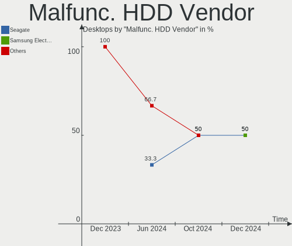
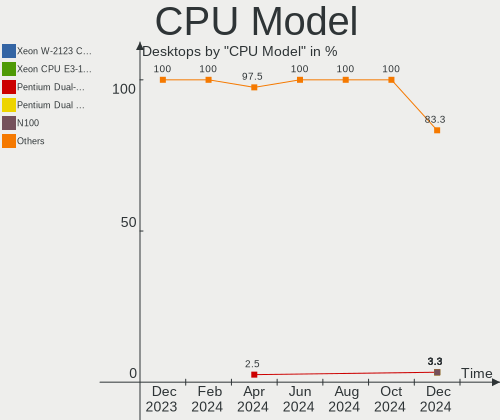
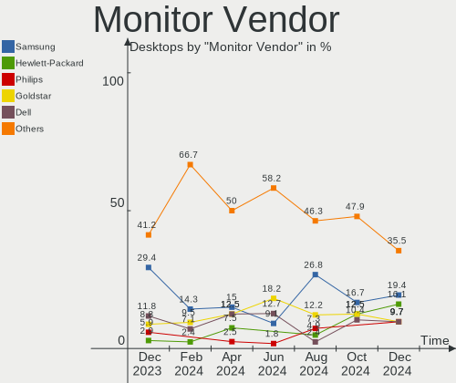
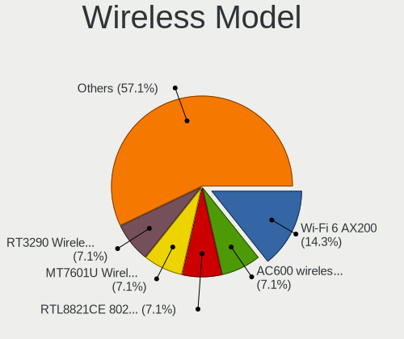
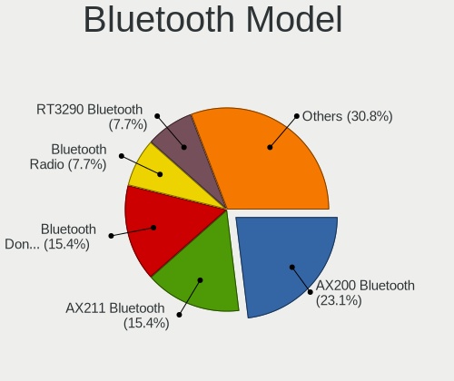
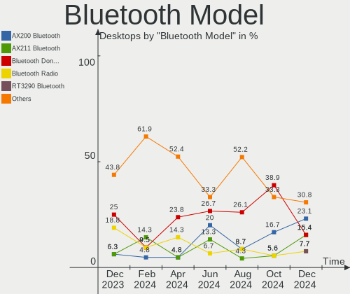
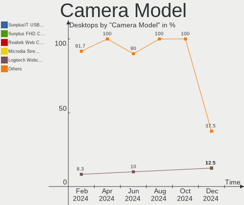

openSUSE - Hardware Trends (Desktops)
-------------------------------------

A project to identify most popular hardware characteristics and track their change
over time based on data collected by Linux users at https://Linux-Hardware.org.

Anyone can contribute to this report by the [hw-probe](https://github.com/linuxhw/hw-probe) tool:

    sudo -E hw-probe -all -upload

This report is for one last month. Overall report since the beginning of time: [TestCoverage](https://github.com/linuxhw/TestCoverage)

Period: Jul, 2022.

Contents
--------

* [ System ](#system)
  - [ OS                       ](#os)
  - [ OS Family                ](#os-family)
  - [ Kernel                   ](#kernel)
  - [ Kernel Family            ](#kernel-family)
  - [ Kernel Major Ver.        ](#kernel-major-ver)
  - [ Arch                     ](#arch)
  - [ DE                       ](#de)
  - [ Display Server           ](#display-server)
  - [ Display Manager          ](#display-manager)
  - [ OS Lang                  ](#os-lang)
  - [ Boot Mode                ](#boot-mode)
  - [ Filesystem               ](#filesystem)
  - [ Part. scheme             ](#part-scheme)
  - [ Dual Boot with Linux/BSD ](#dual-boot-with-linuxbsd)
  - [ Dual Boot (Win)          ](#dual-boot-win)

* [ Board ](#board)
  - [ Vendor                   ](#vendor)
  - [ Model                    ](#model)
  - [ Model Family             ](#model-family)
  - [ MFG Year                 ](#mfg-year)
  - [ Form Factor              ](#form-factor)
  - [ Secure Boot              ](#secure-boot)
  - [ Coreboot                 ](#coreboot)
  - [ RAM Size                 ](#ram-size)
  - [ RAM Used                 ](#ram-used)
  - [ Total Drives             ](#total-drives)
  - [ Has CD-ROM               ](#has-cd-rom)
  - [ Has Ethernet             ](#has-ethernet)
  - [ Has WiFi                 ](#has-wifi)
  - [ Has Bluetooth            ](#has-bluetooth)

* [ Location ](#location)
  - [ Country                  ](#country)
  - [ City                     ](#city)

* [ Drives ](#drives)
  - [ Drive Vendor             ](#drive-vendor)
  - [ Drive Model              ](#drive-model)
  - [ HDD Vendor               ](#hdd-vendor)
  - [ SSD Vendor               ](#ssd-vendor)
  - [ Drive Kind               ](#drive-kind)
  - [ Drive Connector          ](#drive-connector)
  - [ Drive Size               ](#drive-size)
  - [ Space Total              ](#space-total)
  - [ Space Used               ](#space-used)
  - [ Malfunc. Drives          ](#malfunc-drives)
  - [ Malfunc. Drive Vendor    ](#malfunc-drive-vendor)
  - [ Malfunc. HDD Vendor      ](#malfunc-hdd-vendor)
  - [ Malfunc. Drive Kind      ](#malfunc-drive-kind)
  - [ Failed Drives            ](#failed-drives)
  - [ Failed Drive Vendor      ](#failed-drive-vendor)
  - [ Drive Status             ](#drive-status)

* [ Storage controller ](#storage-controller)
  - [ Storage Vendor           ](#storage-vendor)
  - [ Storage Model            ](#storage-model)
  - [ Storage Kind             ](#storage-kind)

* [ Processor ](#processor)
  - [ CPU Vendor               ](#cpu-vendor)
  - [ CPU Model                ](#cpu-model)
  - [ CPU Model Family         ](#cpu-model-family)
  - [ CPU Cores                ](#cpu-cores)
  - [ CPU Sockets              ](#cpu-sockets)
  - [ CPU Threads              ](#cpu-threads)
  - [ CPU Op-Modes             ](#cpu-op-modes)
  - [ CPU Microcode            ](#cpu-microcode)
  - [ CPU Microarch            ](#cpu-microarch)

* [ Graphics ](#graphics)
  - [ GPU Vendor               ](#gpu-vendor)
  - [ GPU Model                ](#gpu-model)
  - [ GPU Combo                ](#gpu-combo)
  - [ GPU Driver               ](#gpu-driver)
  - [ GPU Memory               ](#gpu-memory)

* [ Monitor ](#monitor)
  - [ Monitor Vendor           ](#monitor-vendor)
  - [ Monitor Model            ](#monitor-model)
  - [ Monitor Resolution       ](#monitor-resolution)
  - [ Monitor Diagonal         ](#monitor-diagonal)
  - [ Monitor Width            ](#monitor-width)
  - [ Aspect Ratio             ](#aspect-ratio)
  - [ Monitor Area             ](#monitor-area)
  - [ Pixel Density            ](#pixel-density)
  - [ Multiple Monitors        ](#multiple-monitors)

* [ Network ](#network)
  - [ Net Controller Vendor    ](#net-controller-vendor)
  - [ Net Controller Model     ](#net-controller-model)
  - [ Wireless Vendor          ](#wireless-vendor)
  - [ Wireless Model           ](#wireless-model)
  - [ Ethernet Vendor          ](#ethernet-vendor)
  - [ Ethernet Model           ](#ethernet-model)
  - [ Net Controller Kind      ](#net-controller-kind)
  - [ Used Controller          ](#used-controller)
  - [ NICs                     ](#nics)
  - [ IPv6                     ](#ipv6)

* [ Bluetooth ](#bluetooth)
  - [ Bluetooth Vendor         ](#bluetooth-vendor)
  - [ Bluetooth Model          ](#bluetooth-model)

* [ Sound ](#sound)
  - [ Sound Vendor             ](#sound-vendor)
  - [ Sound Model              ](#sound-model)

* [ Memory ](#memory)
  - [ Memory Vendor            ](#memory-vendor)
  - [ Memory Model             ](#memory-model)
  - [ Memory Kind              ](#memory-kind)
  - [ Memory Form Factor       ](#memory-form-factor)
  - [ Memory Size              ](#memory-size)
  - [ Memory Speed             ](#memory-speed)

* [ Printers & scanners ](#printers--scanners)
  - [ Printer Vendor           ](#printer-vendor)
  - [ Printer Model            ](#printer-model)
  - [ Scanner Vendor           ](#scanner-vendor)
  - [ Scanner Model            ](#scanner-model)

* [ Camera ](#camera)
  - [ Camera Vendor            ](#camera-vendor)
  - [ Camera Model             ](#camera-model)

* [ Security ](#security)
  - [ Fingerprint Vendor       ](#fingerprint-vendor)
  - [ Fingerprint Model        ](#fingerprint-model)
  - [ Chipcard Vendor          ](#chipcard-vendor)
  - [ Chipcard Model           ](#chipcard-model)

* [ Unsupported ](#unsupported)
  - [ Unsupported Devices      ](#unsupported-devices)
  - [ Unsupported Device Types ](#unsupported-device-types)

System
------

OS
--

Installed operating systems

| Name                         | Desktops | Percent |
|------------------------------|----------|---------|
| openSUSE Tumbleweed-XXXXXXXX | 14       | 70%     |
| openSUSE Leap-15.4           | 6        | 30%     |

OS Family
---------

OS without a version

| Name     | Desktops | Percent |
|----------|----------|---------|
| openSUSE | 20       | 100%    |

Kernel
------

Version of the Linux kernel

| Version                   | Desktops | Percent |
|---------------------------|----------|---------|
| 5.14.21-150400.22-default | 6        | 30%     |
| 5.18.9-1-default          | 4        | 20%     |
| 5.18.6-1-default          | 4        | 20%     |
| 5.18.11-1-default         | 4        | 20%     |
| 5.18.9-2-default          | 1        | 5%      |
| 5.17.9-1-default          | 1        | 5%      |

Kernel Family
-------------

Linux kernel without a distro release

| Version | Desktops | Percent |
|---------|----------|---------|
| 5.14.21 | 6        | 30%     |
| 5.18.9  | 5        | 25%     |
| 5.18.6  | 4        | 20%     |
| 5.18.11 | 4        | 20%     |
| 5.17.9  | 1        | 5%      |

Kernel Major Ver.
-----------------

Linux kernel major version

| Version | Desktops | Percent |
|---------|----------|---------|
| 5.18    | 13       | 65%     |
| 5.14    | 6        | 30%     |
| 5.17    | 1        | 5%      |

Arch
----

OS architecture (x86_64, i586, etc.)

| Name   | Desktops | Percent |
|--------|----------|---------|
| x86_64 | 20       | 100%    |

DE
--

Desktop Environment

| Name       | Desktops | Percent |
|------------|----------|---------|
| KDE5       | 12       | 60%     |
| GNOME      | 6        | 30%     |
| X-Cinnamon | 1        | 5%      |
| KDE        | 1        | 5%      |

Display Server
--------------

X11 or Wayland

| Name    | Desktops | Percent |
|---------|----------|---------|
| X11     | 15       | 75%     |
| Wayland | 5        | 25%     |

Display Manager
---------------

SDDM, LightDM, etc.

| Name    | Desktops | Percent |
|---------|----------|---------|
| Unknown | 8        | 40%     |
| SDDM    | 6        | 30%     |
| LightDM | 4        | 20%     |
| XDM     | 2        | 10%     |

OS Lang
-------

Language

| Lang  | Desktops | Percent |
|-------|----------|---------|
| en_US | 7        | 35%     |
| pt_BR | 3        | 15%     |
| POSIX | 3        | 15%     |
| es_ES | 2        | 10%     |
| nl_NL | 1        | 5%      |
| en_GB | 1        | 5%      |
| el_GR | 1        | 5%      |
| de_DE | 1        | 5%      |
| cs_CZ | 1        | 5%      |

Boot Mode
---------

EFI or BIOS

| Mode | Desktops | Percent |
|------|----------|---------|
| EFI  | 13       | 65%     |
| BIOS | 7        | 35%     |

Filesystem
----------

Type of filesystem

| Type  | Desktops | Percent |
|-------|----------|---------|
| Btrfs | 16       | 80%     |
| Ext4  | 3        | 15%     |
| Xfs   | 1        | 5%      |

Part. scheme
------------

Scheme of partitioning

| Type    | Desktops | Percent |
|---------|----------|---------|
| GPT     | 11       | 55%     |
| Unknown | 8        | 40%     |
| MBR     | 1        | 5%      |

Dual Boot with Linux/BSD
------------------------

Hosting more than one Linux/BSD

| Dual boot | Desktops | Percent |
|-----------|----------|---------|
| No        | 15       | 75%     |
| Yes       | 5        | 25%     |

Dual Boot (Win)
---------------

Hosting Linux and Windows

| Dual boot | Desktops | Percent |
|-----------|----------|---------|
| No        | 12       | 60%     |
| Yes       | 8        | 40%     |

Board
-----

Vendor
------

Motherboard manufacturer

| Name                | Desktops | Percent |
|---------------------|----------|---------|
| ASUSTek Computer    | 8        | 40%     |
| MSI                 | 4        | 20%     |
| Gigabyte Technology | 4        | 20%     |
| Hewlett-Packard     | 1        | 5%      |
| Dell                | 1        | 5%      |
| Biostar             | 1        | 5%      |
| Acidanthera         | 1        | 5%      |

Model
-----

Motherboard model

| Name                           | Desktops | Percent |
|--------------------------------|----------|---------|
| MSI MS-7C91                    | 1        | 5%      |
| MSI MS-7B89                    | 1        | 5%      |
| MSI MS-7B85                    | 1        | 5%      |
| MSI MS-7B09                    | 1        | 5%      |
| HP Z820 Workstation            | 1        | 5%      |
| Gigabyte X570 I AORUS PRO WIFI | 1        | 5%      |
| Gigabyte X570 GAMING X         | 1        | 5%      |
| Gigabyte X570 AORUS ULTRA      | 1        | 5%      |
| Gigabyte W480 VISION D         | 1        | 5%      |
| Dell Vostro 3268               | 1        | 5%      |
| Biostar B450MH                 | 1        | 5%      |
| ASUS TUF Gaming X570-PRO       | 1        | 5%      |
| ASUS ROG CROSSHAIR VIII HERO   | 1        | 5%      |
| ASUS ROG CROSSHAIR VII HERO    | 1        | 5%      |
| ASUS PRIME X370-PRO            | 1        | 5%      |
| ASUS PRIME B550M-K             | 1        | 5%      |
| ASUS PRIME B550-PLUS           | 1        | 5%      |
| ASUS P5Q3                      | 1        | 5%      |
| ASUS M5A78L-M/USB3             | 1        | 5%      |
| Acidanthera MacPro7,1          | 1        | 5%      |

Model Family
------------

Motherboard model prefix

| Name                | Desktops | Percent |
|---------------------|----------|---------|
| Gigabyte X570       | 3        | 15%     |
| ASUS PRIME          | 3        | 15%     |
| ASUS ROG            | 2        | 10%     |
| MSI MS-7C91         | 1        | 5%      |
| MSI MS-7B89         | 1        | 5%      |
| MSI MS-7B85         | 1        | 5%      |
| MSI MS-7B09         | 1        | 5%      |
| HP Z820             | 1        | 5%      |
| Gigabyte W480       | 1        | 5%      |
| Dell Vostro         | 1        | 5%      |
| Biostar B450MH      | 1        | 5%      |
| ASUS TUF            | 1        | 5%      |
| ASUS P5Q3           | 1        | 5%      |
| ASUS M5A78L-M       | 1        | 5%      |
| Acidanthera MacPro7 | 1        | 5%      |

MFG Year
--------

Motherboard manufacture year

| Year | Desktops | Percent |
|------|----------|---------|
| 2020 | 5        | 25%     |
| 2019 | 4        | 20%     |
| 2018 | 3        | 15%     |
| 2017 | 3        | 15%     |
| 2021 | 2        | 10%     |
| 2012 | 1        | 5%      |
| 2011 | 1        | 5%      |
| 2009 | 1        | 5%      |

Form Factor
-----------

Physical design of the computer

| Name    | Desktops | Percent |
|---------|----------|---------|
| Desktop | 20       | 100%    |

Secure Boot
-----------

Enabled or disabled

| State    | Desktops | Percent |
|----------|----------|---------|
| Disabled | 18       | 90%     |
| Enabled  | 2        | 10%     |

Coreboot
--------

Have coreboot on board

| Used | Desktops | Percent |
|------|----------|---------|
| No   | 20       | 100%    |

RAM Size
--------

Total RAM memory

| Size in GB  | Desktops | Percent |
|-------------|----------|---------|
| 32.01-64.0  | 7        | 35%     |
| 16.01-24.0  | 6        | 30%     |
| 8.01-16.0   | 4        | 20%     |
| 64.01-256.0 | 2        | 10%     |
| 24.01-32.0  | 1        | 5%      |

RAM Used
--------

Used RAM memory

| Used GB   | Desktops | Percent |
|-----------|----------|---------|
| 4.01-8.0  | 9        | 45%     |
| 3.01-4.0  | 5        | 25%     |
| 1.01-2.0  | 3        | 15%     |
| 2.01-3.0  | 2        | 10%     |
| 8.01-16.0 | 1        | 5%      |

Total Drives
------------

Number of drives on board

| Drives | Desktops | Percent |
|--------|----------|---------|
| 2      | 6        | 30%     |
| 5      | 5        | 25%     |
| 3      | 4        | 20%     |
| 1      | 2        | 10%     |
| 16     | 1        | 5%      |
| 6      | 1        | 5%      |
| 4      | 1        | 5%      |

Has CD-ROM
----------

Has CD-ROM on board

| Presented | Desktops | Percent |
|-----------|----------|---------|
| No        | 14       | 70%     |
| Yes       | 6        | 30%     |

Has Ethernet
------------

Has Ethernet on board

| Presented | Desktops | Percent |
|-----------|----------|---------|
| Yes       | 19       | 95%     |
| No        | 1        | 5%      |

Has WiFi
--------

Has WiFi module

| Presented | Desktops | Percent |
|-----------|----------|---------|
| Yes       | 10       | 50%     |
| No        | 10       | 50%     |

Has Bluetooth
-------------

Has Bluetooth module

| Presented | Desktops | Percent |
|-----------|----------|---------|
| No        | 11       | 55%     |
| Yes       | 9        | 45%     |

Location
--------

Country
-------

Geographic location (country)

| Country     | Desktops | Percent |
|-------------|----------|---------|
| USA         | 4        | 20%     |
| Brazil      | 3        | 15%     |
| Spain       | 2        | 10%     |
| Germany     | 2        | 10%     |
| Canada      | 2        | 10%     |
| UK          | 1        | 5%      |
| Netherlands | 1        | 5%      |
| India       | 1        | 5%      |
| Greece      | 1        | 5%      |
| France      | 1        | 5%      |
| Czechia     | 1        | 5%      |
| Belgium     | 1        | 5%      |

City
----

Geographic location (city)

| City           | Desktops | Percent |
|----------------|----------|---------|
| Rio de Janeiro | 2        | 10%     |
| Thessaloniki   | 1        | 5%      |
| Southampton    | 1        | 5%      |
| Paris          | 1        | 5%      |
| Paranaiba      | 1        | 5%      |
| Miami          | 1        | 5%      |
| Málaga        | 1        | 5%      |
| Louisville     | 1        | 5%      |
| Los Angeles    | 1        | 5%      |
| Kingston       | 1        | 5%      |
| Hyderabad      | 1        | 5%      |
| Girona         | 1        | 5%      |
| Ghent          | 1        | 5%      |
| Gatineau       | 1        | 5%      |
| Ettlingen      | 1        | 5%      |
| Dundee         | 1        | 5%      |
| Brno           | 1        | 5%      |
| Böblingen     | 1        | 5%      |
| Almere Stad    | 1        | 5%      |

Drives
------

Drive Vendor
------------

Hard drive vendors

| Vendor                    | Desktops | Drives | Percent |
|---------------------------|----------|--------|---------|
| Seagate                   | 11       | 20     | 20%     |
| Samsung Electronics       | 10       | 14     | 18.18%  |
| WDC                       | 9        | 15     | 16.36%  |
| SanDisk                   | 4        | 5      | 7.27%   |
| Crucial                   | 4        | 5      | 7.27%   |
| Kingston                  | 3        | 3      | 5.45%   |
| UD0401                    | 1        | 1      | 1.82%   |
| Toshiba                   | 1        | 1      | 1.82%   |
| T-CREATE                  | 1        | 1      | 1.82%   |
| SK hynix                  | 1        | 1      | 1.82%   |
| SABRENT                   | 1        | 2      | 1.82%   |
| PNY                       | 1        | 1      | 1.82%   |
| Micron/Crucial Technology | 1        | 1      | 1.82%   |
| Intenso                   | 1        | 1      | 1.82%   |
| Intel                     | 1        | 1      | 1.82%   |
| HGST                      | 1        | 1      | 1.82%   |
| Fujitsu                   | 1        | 1      | 1.82%   |
| Corsair                   | 1        | 1      | 1.82%   |
| ASMT                      | 1        | 1      | 1.82%   |
| ASMedia                   | 1        | 1      | 1.82%   |

Drive Model
-----------

Hard drive models

| Model                                      | Desktops | Percent |
|--------------------------------------------|----------|---------|
| Seagate ST500DM002-1BD142 500GB            | 2        | 2.86%   |
| Seagate ST3000NM0053 3TB                   | 2        | 2.86%   |
| Seagate ST2000DM001-1ER164 2TB             | 2        | 2.86%   |
| SanDisk NVMe SSD Drive 240GB               | 2        | 2.86%   |
| Samsung SSD 860 EVO 500GB                  | 2        | 2.86%   |
| Samsung SSD 860 EVO 1TB                    | 2        | 2.86%   |
| WDC WDS500G2B0A-00SM50 500GB SSD           | 1        | 1.43%   |
| WDC WDS500G1B0B-00AS40 500GB SSD           | 1        | 1.43%   |
| WDC WDS200T2B0B-00YS70 2TB SSD             | 1        | 1.43%   |
| WDC WDS200T2B0A-00SM50 2TB SSD             | 1        | 1.43%   |
| WDC WDS100T1X0E-00AFY0 1TB                 | 1        | 1.43%   |
| WDC WD30EFRX-68EUZN0 3TB                   | 1        | 1.43%   |
| WDC WD20EARX-00PASB0 2TB                   | 1        | 1.43%   |
| WDC WD10EZRX-00A8LB0 1TB                   | 1        | 1.43%   |
| WDC WD10EZEX-75WN4A0 1TB                   | 1        | 1.43%   |
| WDC WD10EZEX-08M2NA0 1TB                   | 1        | 1.43%   |
| WDC WD10EZEX-07WN4A0 1TB                   | 1        | 1.43%   |
| WDC WD10EZEX-00BBHA0 1TB                   | 1        | 1.43%   |
| WDC WD1002FBYS-05A6B0 1TB                  | 1        | 1.43%   |
| WDC WD1002FAEX-00Z3A0 1TB                  | 1        | 1.43%   |
| UD0401 Disk 512GB                          | 1        | 1.43%   |
| Toshiba HDWE140 4TB                        | 1        | 1.43%   |
| T-CREATE TM8FPF002T 2TB                    | 1        | 1.43%   |
| SK hynix PC711 NVMe 256GB                  | 1        | 1.43%   |
| Seagate ST6000NM021A-2R7101 6TB            | 1        | 1.43%   |
| Seagate ST5000LM000-2U8170 5TB             | 1        | 1.43%   |
| Seagate ST4000LM024-2U817V 4TB             | 1        | 1.43%   |
| Seagate ST4000DM004-2CV104 4TB             | 1        | 1.43%   |
| Seagate ST3320620AS 320GB                  | 1        | 1.43%   |
| Seagate ST2000LM015-2E8174 2TB             | 1        | 1.43%   |
| Seagate ST2000DM008-2FR102 2TB             | 1        | 1.43%   |
| Seagate ST16000NM001G-2KK103 16TB          | 1        | 1.43%   |
| Seagate ST1000DX002-2DV162 1TB             | 1        | 1.43%   |
| Seagate FireCuda 520 SSD ZP2000GM30002 2TB | 1        | 1.43%   |
| SanDisk SSD PLUS 480GB                     | 1        | 1.43%   |
| SanDisk SDSSDH3 500G                       | 1        | 1.43%   |
| SanDisk NVMe SSD Drive 1TB                 | 1        | 1.43%   |
| Samsung SSD 970 EVO Plus 1TB               | 1        | 1.43%   |
| Samsung SSD 970 EVO 250GB                  | 1        | 1.43%   |
| Samsung SSD 870 QVO 2TB                    | 1        | 1.43%   |
| Samsung SSD 860 QVO 1TB                    | 1        | 1.43%   |
| Samsung SSD 850 EVO M.2 250GB              | 1        | 1.43%   |
| Samsung SSD 850 EVO 250GB                  | 1        | 1.43%   |
| Samsung SSD 840 PRO Series 128GB           | 1        | 1.43%   |
| Samsung NVMe SSD Drive 500GB               | 1        | 1.43%   |
| Samsung MZ7TD256HAFV-000L9 256GB SSD       | 1        | 1.43%   |
| SABRENT Disk 1TB                           | 1        | 1.43%   |
| PNY CS900 480GB SSD                        | 1        | 1.43%   |
| Micron/Crucial NVMe SSD Drive 1TB          | 1        | 1.43%   |
| Kingston SV300S37A120G 120GB SSD           | 1        | 1.43%   |
| Kingston SNVS500GB                         | 1        | 1.43%   |
| Kingston SKC2500M81000G 1TB                | 1        | 1.43%   |
| Intenso External USB 3.0 1TB               | 1        | 1.43%   |
| Intel SSDPEKKW256G7 256GB                  | 1        | 1.43%   |
| HGST HTS721010A9E630 1TB                   | 1        | 1.43%   |
| Fujitsu MHW2120BH 120GB                    | 1        | 1.43%   |
| Crucial CT500MX500SSD4 500GB               | 1        | 1.43%   |
| Crucial CT500MX500SSD1 500GB               | 1        | 1.43%   |
| Crucial CT2000P2SSD8 2TB                   | 1        | 1.43%   |
| Crucial CT1000MX500SSD1 1TB                | 1        | 1.43%   |

HDD Vendor
----------

Hard disk drive vendors

| Vendor  | Desktops | Drives | Percent |
|---------|----------|--------|---------|
| Seagate | 11       | 19     | 40.74%  |
| WDC     | 8        | 10     | 29.63%  |
| UD0401  | 1        | 1      | 3.7%    |
| Toshiba | 1        | 1      | 3.7%    |
| SABRENT | 1        | 2      | 3.7%    |
| Intenso | 1        | 1      | 3.7%    |
| HGST    | 1        | 1      | 3.7%    |
| Fujitsu | 1        | 1      | 3.7%    |
| ASMT    | 1        | 1      | 3.7%    |
| ASMedia | 1        | 1      | 3.7%    |

SSD Vendor
----------

Solid state drive vendors

| Vendor              | Desktops | Drives | Percent |
|---------------------|----------|--------|---------|
| Samsung Electronics | 9        | 10     | 47.37%  |
| WDC                 | 3        | 4      | 15.79%  |
| Crucial             | 3        | 4      | 15.79%  |
| SanDisk             | 2        | 2      | 10.53%  |
| PNY                 | 1        | 1      | 5.26%   |
| Kingston            | 1        | 1      | 5.26%   |

Drive Kind
----------

HDD or SSD

| Kind | Desktops | Drives | Percent |
|------|----------|--------|---------|
| HDD  | 17       | 38     | 37.78%  |
| SSD  | 15       | 22     | 33.33%  |
| NVMe | 13       | 17     | 28.89%  |

Drive Connector
---------------

SATA, SAS, NVMe, etc.

| Type | Desktops | Drives | Percent |
|------|----------|--------|---------|
| SATA | 20       | 54     | 57.14%  |
| NVMe | 13       | 17     | 37.14%  |
| SAS  | 2        | 6      | 5.71%   |

Drive Size
----------

Size of hard drive

| Size in TB | Desktops | Drives | Percent |
|------------|----------|--------|---------|
| 0.01-0.5   | 12       | 19     | 31.58%  |
| 0.51-1.0   | 11       | 20     | 28.95%  |
| 1.01-2.0   | 6        | 9      | 15.79%  |
| 3.01-4.0   | 3        | 3      | 7.89%   |
| 2.01-3.0   | 3        | 3      | 7.89%   |
| 4.01-10.0  | 2        | 4      | 5.26%   |
| 10.01-20.0 | 1        | 2      | 2.63%   |

Space Total
-----------

Amount of disk space available on the file system

| Size in GB     | Desktops | Percent |
|----------------|----------|---------|
| More than 3000 | 14       | 70%     |
| 2001-3000      | 2        | 10%     |
| 1001-2000      | 2        | 10%     |
| 251-500        | 1        | 5%      |
| 101-250        | 1        | 5%      |

Space Used
----------

Amount of used disk space

| Used GB        | Desktops | Percent |
|----------------|----------|---------|
| 501-1000       | 5        | 25%     |
| More than 3000 | 4        | 20%     |
| 251-500        | 3        | 15%     |
| 2001-3000      | 2        | 10%     |
| 101-250        | 2        | 10%     |
| 51-100         | 2        | 10%     |
| 21-50          | 1        | 5%      |
| 1001-2000      | 1        | 5%      |

Malfunc. Drives
---------------

Drive models with a malfunction

| Model                            | Desktops | Drives | Percent |
|----------------------------------|----------|--------|---------|
| Seagate ST500DM002-1BD142 500GB  | 2        | 3      | 40%     |
| Seagate ST2000DM008-2FR102 2TB   | 1        | 1      | 20%     |
| Seagate ST2000DM001-1ER164 2TB   | 1        | 1      | 20%     |
| Kingston SV300S37A120G 120GB SSD | 1        | 1      | 20%     |

Malfunc. Drive Vendor
---------------------

Vendors of faulty drives

| Vendor   | Desktops | Drives | Percent |
|----------|----------|--------|---------|
| Seagate  | 3        | 5      | 75%     |
| Kingston | 1        | 1      | 25%     |

Malfunc. HDD Vendor
-------------------

Vendors of faulty HDD drives

| Vendor  | Desktops | Drives | Percent |
|---------|----------|--------|---------|
| Seagate | 3        | 5      | 100%    |

Malfunc. Drive Kind
-------------------

Kinds of faulty drives

| Kind | Desktops | Drives | Percent |
|------|----------|--------|---------|
| HDD  | 3        | 5      | 75%     |
| SSD  | 1        | 1      | 25%     |

Failed Drives
-------------

Failed drive models

Zero info for selected period =(

Failed Drive Vendor
-------------------

Failed drive vendors

Zero info for selected period =(

Drive Status
------------

Number of failed and malfunc. drives

| Status   | Desktops | Drives | Percent |
|----------|----------|--------|---------|
| Works    | 12       | 49     | 48%     |
| Detected | 9        | 22     | 36%     |
| Malfunc  | 4        | 6      | 16%     |

Storage controller
------------------

Storage Vendor
--------------

Storage controller vendors

| Vendor                      | Desktops | Percent |
|-----------------------------|----------|---------|
| AMD                         | 16       | 43.24%  |
| SanDisk                     | 4        | 10.81%  |
| Intel                       | 4        | 10.81%  |
| Samsung Electronics         | 3        | 8.11%   |
| Micron/Crucial Technology   | 2        | 5.41%   |
| Kingston Technology Company | 2        | 5.41%   |
| SK hynix                    | 1        | 2.7%    |
| Silicon Motion              | 1        | 2.7%    |
| Seagate Technology          | 1        | 2.7%    |
| Phison Electronics          | 1        | 2.7%    |
| JMicron Technology          | 1        | 2.7%    |
| Broadcom / LSI              | 1        | 2.7%    |

Storage Model
-------------

Storage controller models

| Model                                                                         | Desktops | Percent |
|-------------------------------------------------------------------------------|----------|---------|
| AMD FCH SATA Controller [AHCI mode]                                           | 11       | 23.4%   |
| AMD 400 Series Chipset SATA Controller                                        | 4        | 8.51%   |
| SanDisk Non-Volatile memory controller                                        | 3        | 6.38%   |
| Samsung NVMe SSD Controller SM981/PM981/PM983                                 | 3        | 6.38%   |
| AMD 500 Series Chipset SATA Controller                                        | 3        | 6.38%   |
| SK hynix Gold P31 SSD                                                         | 1        | 2.13%   |
| Silicon Motion SM2262/SM2262EN SSD Controller                                 | 1        | 2.13%   |
| Seagate FireCuda 520 SSD                                                      | 1        | 2.13%   |
| SanDisk WD PC SN810 / Black SN850 NVMe SSD                                    | 1        | 2.13%   |
| Phison E16 PCIe4 NVMe Controller                                              | 1        | 2.13%   |
| Micron/Crucial P2 NVMe PCIe SSD                                               | 1        | 2.13%   |
| Micron/Crucial P1 NVMe PCIe SSD                                               | 1        | 2.13%   |
| Kingston Company Company Non-Volatile memory controller                       | 1        | 2.13%   |
| Kingston Company KC2000 NVMe SSD                                              | 1        | 2.13%   |
| JMicron JMB363 SATA/IDE Controller                                            | 1        | 2.13%   |
| Intel SSD 600P Series                                                         | 1        | 2.13%   |
| Intel Q170/Q150/B150/H170/H110/Z170/CM236 Chipset SATA Controller [AHCI Mode] | 1        | 2.13%   |
| Intel Comet Lake SATA AHCI Controller                                         | 1        | 2.13%   |
| Intel C602 chipset 4-Port SATA Storage Control Unit                           | 1        | 2.13%   |
| Intel C600/X79 series chipset SATA RAID Controller                            | 1        | 2.13%   |
| Intel C600/X79 series chipset IDE-r Controller                                | 1        | 2.13%   |
| Intel 82801JI (ICH10 Family) SATA AHCI Controller                             | 1        | 2.13%   |
| Broadcom / LSI SAS2308 PCI-Express Fusion-MPT SAS-2                           | 1        | 2.13%   |
| AMD X399 Series Chipset SATA Controller                                       | 1        | 2.13%   |
| AMD X370 Series Chipset SATA Controller                                       | 1        | 2.13%   |
| AMD SB7x0/SB8x0/SB9x0 SATA Controller [IDE mode]                              | 1        | 2.13%   |
| AMD SB7x0/SB8x0/SB9x0 IDE Controller                                          | 1        | 2.13%   |
| AMD 300 Series Chipset SATA Controller                                        | 1        | 2.13%   |

Storage Kind
------------

Kind of storage controller (IDE, SATA, NVMe, SAS, ...)

| Kind | Desktops | Percent |
|------|----------|---------|
| SATA | 19       | 51.35%  |
| NVMe | 13       | 35.14%  |
| IDE  | 3        | 8.11%   |
| RAID | 1        | 2.7%    |
| SAS  | 1        | 2.7%    |

Processor
---------

CPU Vendor
----------

Processor vendors

| Vendor | Desktops | Percent |
|--------|----------|---------|
| AMD    | 16       | 80%     |
| Intel  | 4        | 20%     |

CPU Model
---------

Processor models

| Model                                          | Desktops | Percent |
|------------------------------------------------|----------|---------|
| AMD Ryzen 7 5700G with Radeon Graphics         | 2        | 10%     |
| AMD Ryzen 7 3700X 8-Core Processor             | 2        | 10%     |
| AMD Ryzen 7 2700X Eight-Core Processor         | 2        | 10%     |
| AMD Ryzen 5 3600 6-Core Processor              | 2        | 10%     |
| Intel Xeon W-1250 CPU @ 3.30GHz                | 1        | 5%      |
| Intel Xeon CPU E5-2670 v2 @ 2.50GHz            | 1        | 5%      |
| Intel Core i5-7600K CPU @ 3.80GHz              | 1        | 5%      |
| Intel Core 2 Quad CPU Q9550 @ 2.83GHz          | 1        | 5%      |
| AMD Ryzen Threadripper 1950X 16-Core Processor | 1        | 5%      |
| AMD Ryzen 9 5950X 16-Core Processor            | 1        | 5%      |
| AMD Ryzen 9 3900X 12-Core Processor            | 1        | 5%      |
| AMD Ryzen 7 5700X 8-Core Processor             | 1        | 5%      |
| AMD Ryzen 5 5600X 6-Core Processor             | 1        | 5%      |
| AMD Ryzen 5 5600G with Radeon Graphics         | 1        | 5%      |
| AMD Ryzen 5 2600 Six-Core Processor            | 1        | 5%      |
| AMD FX-8350 Eight-Core Processor               | 1        | 5%      |

CPU Model Family
----------------

Processor model prefix

| Model                  | Desktops | Percent |
|------------------------|----------|---------|
| AMD Ryzen 7            | 7        | 35%     |
| AMD Ryzen 5            | 5        | 25%     |
| Intel Xeon             | 2        | 10%     |
| AMD Ryzen 9            | 2        | 10%     |
| Intel Core i5          | 1        | 5%      |
| Intel Core 2 Quad      | 1        | 5%      |
| AMD Ryzen Threadripper | 1        | 5%      |
| AMD FX                 | 1        | 5%      |

CPU Cores
---------

Number of processor cores

| Number | Desktops | Percent |
|--------|----------|---------|
| 8      | 7        | 35%     |
| 6      | 6        | 30%     |
| 4      | 3        | 15%     |
| 16     | 2        | 10%     |
| 20     | 1        | 5%      |
| 12     | 1        | 5%      |

CPU Sockets
-----------

Number of sockets

| Number | Desktops | Percent |
|--------|----------|---------|
| 1      | 19       | 95%     |
| 2      | 1        | 5%      |

CPU Threads
-----------

Threads per core (Hyper-Threading)

| Number | Desktops | Percent |
|--------|----------|---------|
| 2      | 18       | 90%     |
| 1      | 2        | 10%     |

CPU Op-Modes
------------

CPU Operation Modes (32-bit, 64-bit)

| Op mode        | Desktops | Percent |
|----------------|----------|---------|
| 32-bit, 64-bit | 20       | 100%    |

CPU Microcode
-------------

Microcode number

| Number     | Desktops | Percent |
|------------|----------|---------|
| Unknown    | 4        | 20%     |
| 0x0a50000c | 2        | 10%     |
| 0x08701013 | 2        | 10%     |
| 0x0800820d | 2        | 10%     |
| 0xa0653    | 1        | 5%      |
| 0x906e9    | 1        | 5%      |
| 0x306e4    | 1        | 5%      |
| 0x1067a    | 1        | 5%      |
| 0x0a50000d | 1        | 5%      |
| 0x0a20120a | 1        | 5%      |
| 0x0a201016 | 1        | 5%      |
| 0x08701021 | 1        | 5%      |
| 0x06000852 | 1        | 5%      |
| 0x00000000 | 1        | 5%      |

CPU Microarch
-------------

Microarchitecture

| Name       | Desktops | Percent |
|------------|----------|---------|
| Zen 3      | 6        | 30%     |
| Zen 2      | 5        | 25%     |
| Zen+       | 3        | 15%     |
| Zen        | 1        | 5%      |
| Piledriver | 1        | 5%      |
| Penryn     | 1        | 5%      |
| KabyLake   | 1        | 5%      |
| IvyBridge  | 1        | 5%      |
| CometLake  | 1        | 5%      |

Graphics
--------

GPU Vendor
----------

Vendors of graphics cards

| Vendor | Desktops | Percent |
|--------|----------|---------|
| AMD    | 14       | 70%     |
| Nvidia | 5        | 25%     |
| Intel  | 1        | 5%      |

GPU Model
---------

Graphics card models

| Model                                                      | Desktops | Percent |
|------------------------------------------------------------|----------|---------|
| AMD Ellesmere [Radeon RX 470/480/570/570X/580/580X/590]    | 4        | 20%     |
| AMD Cezanne                                                | 3        | 15%     |
| AMD Navi 23 [Radeon RX 6600/6600 XT/6600M]                 | 2        | 10%     |
| Nvidia TU102 [GeForce RTX 2080 Ti Rev. A]                  | 1        | 5%      |
| Nvidia GP107 [GeForce GTX 1050 Ti]                         | 1        | 5%      |
| Nvidia GK106GL [Quadro K4000]                              | 1        | 5%      |
| Nvidia GA102 [GeForce RTX 3080 Ti]                         | 1        | 5%      |
| Nvidia G94 [GeForce 9600 GT]                               | 1        | 5%      |
| Intel HD Graphics 630                                      | 1        | 5%      |
| AMD RS780L [Radeon 3000]                                   | 1        | 5%      |
| AMD Navi 24 [Radeon RX 6400 / 6500 XT]                     | 1        | 5%      |
| AMD Lexa XT [Radeon PRO WX 3200]                           | 1        | 5%      |
| AMD Lexa PRO [Radeon 540/540X/550/550X / RX 540X/550/550X] | 1        | 5%      |
| AMD Caicos [Radeon HD 6450/7450/8450 / R5 230 OEM]         | 1        | 5%      |

GPU Combo
---------

Combinations of graphics cards

| Name       | Desktops | Percent |
|------------|----------|---------|
| 1 x AMD    | 14       | 70%     |
| 1 x Nvidia | 5        | 25%     |
| 1 x Intel  | 1        | 5%      |

GPU Driver
----------

Free vs proprietary

| Driver      | Desktops | Percent |
|-------------|----------|---------|
| Free        | 17       | 85%     |
| Proprietary | 3        | 15%     |

GPU Memory
----------

Total video memory

| Size in GB | Desktops | Percent |
|------------|----------|---------|
| Unknown    | 5        | 25%     |
| 3.01-4.0   | 4        | 20%     |
| 7.01-8.0   | 3        | 15%     |
| 0.01-0.5   | 3        | 15%     |
| 8.01-16.0  | 2        | 10%     |
| 2.01-3.0   | 1        | 5%      |
| 1.01-2.0   | 1        | 5%      |
| 0.51-1.0   | 1        | 5%      |

Monitor
-------

Monitor Vendor
--------------

Monitor vendors

| Vendor              | Desktops | Percent |
|---------------------|----------|---------|
| Samsung Electronics | 3        | 13.04%  |
| Dell                | 3        | 13.04%  |
| Acer                | 3        | 13.04%  |
| BenQ                | 2        | 8.7%    |
| Vizio               | 1        | 4.35%   |
| ViewSonic           | 1        | 4.35%   |
| MSI                 | 1        | 4.35%   |
| Iiyama              | 1        | 4.35%   |
| Hewlett-Packard     | 1        | 4.35%   |
| GDH                 | 1        | 4.35%   |
| Element             | 1        | 4.35%   |
| Eizo                | 1        | 4.35%   |
| ASUSTek Computer    | 1        | 4.35%   |
| Arnos Instruments   | 1        | 4.35%   |
| AOpen               | 1        | 4.35%   |
| AOC                 | 1        | 4.35%   |

Monitor Model
-------------

Monitor models

| Model                                                                | Desktops | Percent |
|----------------------------------------------------------------------|----------|---------|
| Vizio D32x-D1 VIZ1005 1920x1080 700x390mm 31.5-inch                  | 1        | 4%      |
| ViewSonic EP3220T VSC33F3 1920x1080 700x390mm 31.5-inch              | 1        | 4%      |
| Samsung Electronics U28E590 SAM0C4D 3840x2160 607x345mm 27.5-inch    | 1        | 4%      |
| Samsung Electronics SyncMaster SAM0657 1920x1080                     | 1        | 4%      |
| Samsung Electronics SyncMaster SAM010F 1280x1024 376x301mm 19.0-inch | 1        | 4%      |
| Samsung Electronics C24F390 SAM0D2C 1920x1080 521x293mm 23.5-inch    | 1        | 4%      |
| MSI MD271QP MSI30A4 2560x1440 600x330mm 27.0-inch                    | 1        | 4%      |
| Iiyama PL2483H IVM6138 1920x1080 531x299mm 24.0-inch                 | 1        | 4%      |
| Hewlett-Packard w2207 HWP26A9 1680x1050 473x296mm 22.0-inch          | 1        | 4%      |
| Hewlett-Packard V22v HPN376A 1920x1080 479x260mm 21.5-inch           | 1        | 4%      |
| GDH PHILCO GDH0030 1920x540 708x398mm 32.0-inch                      | 1        | 4%      |
| Element ELEFW328B ELE1366 1366x768 700x400mm 31.7-inch               | 1        | 4%      |
| Eizo M1700 ENC1788 1280x1024 338x271mm 17.1-inch                     | 1        | 4%      |
| Dell U2713HM DEL4080 2560x1440 597x336mm 27.0-inch                   | 1        | 4%      |
| Dell P2418D DELD0C2 2560x1440 526x296mm 23.8-inch                    | 1        | 4%      |
| Dell E1916HV DELF06C 1366x768 410x230mm 18.5-inch                    | 1        | 4%      |
| BenQ VZ2770H BNQ7B3C 1920x1080 598x336mm 27.0-inch                   | 1        | 4%      |
| BenQ GW2765 BNQ78D6 2560x1440 597x336mm 27.0-inch                    | 1        | 4%      |
| ASUSTek Computer VP28U AUS28B1 3840x2160 621x341mm 27.9-inch         | 1        | 4%      |
| Arnos Instruments QF-28 AIC1012 3840x2160 621x341mm 27.9-inch        | 1        | 4%      |
| AOpen 32HC1QUR P AOP069E 2560x1440 697x392mm 31.5-inch               | 1        | 4%      |
| AOC 1619w AOC1619 1366x768 340x190mm 15.3-inch                       | 1        | 4%      |
| Acer VG270U ACR06C9 2560x1440 597x336mm 27.0-inch                    | 1        | 4%      |
| Acer KG241Q ACR0604 1920x1080 521x293mm 23.5-inch                    | 1        | 4%      |
| Acer K242HYL ACR0475 1920x1080 527x296mm 23.8-inch                   | 1        | 4%      |

Monitor Resolution
------------------

Monitor screen resolution

| Resolution         | Desktops | Percent |
|--------------------|----------|---------|
| 1920x1080 (FHD)    | 9        | 40.91%  |
| 2560x1440 (QHD)    | 5        | 22.73%  |
| 3840x2160 (4K)     | 3        | 13.64%  |
| 1366x768 (WXGA)    | 2        | 9.09%   |
| 1280x1024 (SXGA)   | 2        | 9.09%   |
| 1680x1050 (WSXGA+) | 1        | 4.55%   |

Monitor Diagonal
----------------

Diagonal size in inches

| Inches  | Desktops | Percent |
|---------|----------|---------|
| 27      | 7        | 29.17%  |
| 31      | 3        | 12.5%   |
| 24      | 3        | 12.5%   |
| 23      | 2        | 8.33%   |
| 72      | 1        | 4.17%   |
| 52      | 1        | 4.17%   |
| 22      | 1        | 4.17%   |
| 21      | 1        | 4.17%   |
| 19      | 1        | 4.17%   |
| 18      | 1        | 4.17%   |
| 17      | 1        | 4.17%   |
| 15      | 1        | 4.17%   |
| Unknown | 1        | 4.17%   |

Monitor Width
-------------

Physical width

| Width in mm | Desktops | Percent |
|-------------|----------|---------|
| 501-600     | 10       | 43.48%  |
| 601-700     | 5        | 21.74%  |
| 401-500     | 2        | 8.7%    |
| 301-350     | 2        | 8.7%    |
| 351-400     | 1        | 4.35%   |
| 1501-2000   | 1        | 4.35%   |
| 1001-1500   | 1        | 4.35%   |
| Unknown     | 1        | 4.35%   |

Aspect Ratio
------------

Proportional relationship between the width and the height

| Ratio | Desktops | Percent |
|-------|----------|---------|
| 16/9  | 18       | 85.71%  |
| 6/5   | 1        | 4.76%   |
| 5/4   | 1        | 4.76%   |
| 16/10 | 1        | 4.76%   |

Monitor Area
------------

Area in inch²

| Area in inch² | Desktops | Percent |
|----------------|----------|---------|
| 301-350        | 7        | 29.17%  |
| 201-250        | 6        | 25%     |
| 351-500        | 3        | 12.5%   |
| More than 1000 | 2        | 8.33%   |
| 151-200        | 2        | 8.33%   |
| 141-150        | 2        | 8.33%   |
| 101-110        | 1        | 4.17%   |
| Unknown        | 1        | 4.17%   |

Pixel Density
-------------

Pixels per inch

| Density | Desktops | Percent |
|---------|----------|---------|
| 51-100  | 11       | 47.83%  |
| 101-120 | 6        | 26.09%  |
| 121-160 | 3        | 13.04%  |
| 1-50    | 2        | 8.7%    |
| Unknown | 1        | 4.35%   |

Multiple Monitors
-----------------

Total monitors connected

| Total | Desktops | Percent |
|-------|----------|---------|
| 1     | 15       | 75%     |
| 2     | 4        | 20%     |
| 4     | 1        | 5%      |

Network
-------

Net Controller Vendor
---------------------

Controller vendors

| Vendor                | Desktops | Percent |
|-----------------------|----------|---------|
| Realtek Semiconductor | 11       | 42.31%  |
| Intel                 | 10       | 38.46%  |
| TP-Link               | 1        | 3.85%   |
| Ralink Technology     | 1        | 3.85%   |
| Qualcomm Atheros      | 1        | 3.85%   |
| Microchip Technology  | 1        | 3.85%   |
| Atmel                 | 1        | 3.85%   |

Net Controller Model
--------------------

Controller models

| Model                                                             | Desktops | Percent |
|-------------------------------------------------------------------|----------|---------|
| Realtek RTL8111/8168/8411 PCI Express Gigabit Ethernet Controller | 9        | 25.71%  |
| Intel I211 Gigabit Network Connection                             | 7        | 20%     |
| Intel Wi-Fi 6 AX200                                               | 4        | 11.43%  |
| Realtek RTL8125 2.5GbE Controller                                 | 2        | 5.71%   |
| TP-Link TL-WN822N Version 4 RTL8192EU                             | 1        | 2.86%   |
| Realtek RTL8822BE 802.11a/b/g/n/ac WiFi adapter                   | 1        | 2.86%   |
| Ralink RT5370 Wireless Adapter                                    | 1        | 2.86%   |
| Qualcomm Atheros QCA9565 / AR9565 Wireless Network Adapter        | 1        | 2.86%   |
| Microchip SPROG 3 DCC Programmer                                  | 1        | 2.86%   |
| Intel Wireless-AC 9260                                            | 1        | 2.86%   |
| Intel Ethernet Controller I225-V                                  | 1        | 2.86%   |
| Intel Ethernet Controller I225-LM                                 | 1        | 2.86%   |
| Intel Ethernet Connection (11) I219-LM                            | 1        | 2.86%   |
| Intel Comet Lake PCH CNVi WiFi                                    | 1        | 2.86%   |
| Intel 82579LM Gigabit Network Connection (Lewisville)             | 1        | 2.86%   |
| Intel 82574L Gigabit Network Connection                           | 1        | 2.86%   |
| Atmel DR5000 MultiBus Command Station                             | 1        | 2.86%   |

Wireless Vendor
---------------

Wireless vendors

| Vendor                | Desktops | Percent |
|-----------------------|----------|---------|
| Intel                 | 6        | 60%     |
| TP-Link               | 1        | 10%     |
| Realtek Semiconductor | 1        | 10%     |
| Ralink Technology     | 1        | 10%     |
| Qualcomm Atheros      | 1        | 10%     |

Wireless Model
--------------

Wireless models

| Model                                                      | Desktops | Percent |
|------------------------------------------------------------|----------|---------|
| Intel Wi-Fi 6 AX200                                        | 4        | 40%     |
| TP-Link TL-WN822N Version 4 RTL8192EU                      | 1        | 10%     |
| Realtek RTL8822BE 802.11a/b/g/n/ac WiFi adapter            | 1        | 10%     |
| Ralink RT5370 Wireless Adapter                             | 1        | 10%     |
| Qualcomm Atheros QCA9565 / AR9565 Wireless Network Adapter | 1        | 10%     |
| Intel Wireless-AC 9260                                     | 1        | 10%     |
| Intel Comet Lake PCH CNVi WiFi                             | 1        | 10%     |

Ethernet Vendor
---------------

Ethernet vendors

| Vendor                | Desktops | Percent |
|-----------------------|----------|---------|
| Realtek Semiconductor | 10       | 50%     |
| Intel                 | 10       | 50%     |

Ethernet Model
--------------

Ethernet models

| Model                                                             | Desktops | Percent |
|-------------------------------------------------------------------|----------|---------|
| Realtek RTL8111/8168/8411 PCI Express Gigabit Ethernet Controller | 9        | 39.13%  |
| Intel I211 Gigabit Network Connection                             | 7        | 30.43%  |
| Realtek RTL8125 2.5GbE Controller                                 | 2        | 8.7%    |
| Intel Ethernet Controller I225-V                                  | 1        | 4.35%   |
| Intel Ethernet Controller I225-LM                                 | 1        | 4.35%   |
| Intel Ethernet Connection (11) I219-LM                            | 1        | 4.35%   |
| Intel 82579LM Gigabit Network Connection (Lewisville)             | 1        | 4.35%   |
| Intel 82574L Gigabit Network Connection                           | 1        | 4.35%   |

Net Controller Kind
-------------------

Ethernet, WiFi or modem

| Kind     | Desktops | Percent |
|----------|----------|---------|
| Ethernet | 19       | 63.33%  |
| WiFi     | 10       | 33.33%  |
| Modem    | 1        | 3.33%   |

Used Controller
---------------

Currently used network controller

| Kind     | Desktops | Percent |
|----------|----------|---------|
| Ethernet | 14       | 66.67%  |
| WiFi     | 7        | 33.33%  |

NICs
----

Total network controllers on board

| Total | Desktops | Percent |
|-------|----------|---------|
| 1     | 9        | 45%     |
| 2     | 8        | 40%     |
| 3     | 2        | 10%     |
| 0     | 1        | 5%      |

IPv6
----

IPv6 vs IPv4

| Used | Desktops | Percent |
|------|----------|---------|
| No   | 11       | 55%     |
| Yes  | 9        | 45%     |

Bluetooth
---------

Bluetooth Vendor
----------------

Controller vendors

| Vendor                          | Desktops | Percent |
|---------------------------------|----------|---------|
| Intel                           | 6        | 60%     |
| Qualcomm Atheros Communications | 1        | 10%     |
| Cambridge Silicon Radio         | 1        | 10%     |
| Belkin Components               | 1        | 10%     |
| ASUSTek Computer                | 1        | 10%     |

Bluetooth Model
---------------

Controller models

| Model                                                 | Desktops | Percent |
|-------------------------------------------------------|----------|---------|
| Intel AX200 Bluetooth                                 | 4        | 40%     |
| Qualcomm Atheros  Bluetooth Device                    | 1        | 10%     |
| Intel Bluetooth Device                                | 1        | 10%     |
| Intel AX201 Bluetooth                                 | 1        | 10%     |
| Cambridge Silicon Radio Bluetooth Dongle (HCI mode)   | 1        | 10%     |
| Belkin Components F8T065BF Mini Bluetooth 4.0 Adapter | 1        | 10%     |
| ASUS Bluetooth Radio                                  | 1        | 10%     |

Sound
-----

Sound Vendor
------------

Sound card vendors

| Vendor              | Desktops | Percent |
|---------------------|----------|---------|
| AMD                 | 17       | 58.62%  |
| Nvidia              | 4        | 13.79%  |
| Intel               | 3        | 10.34%  |
| C-Media Electronics | 2        | 6.9%    |
| Razer USA           | 1        | 3.45%   |
| Logitech            | 1        | 3.45%   |
| Creative Labs       | 1        | 3.45%   |

Sound Model
-----------

Sound card models

| Model                                                                             | Desktops | Percent |
|-----------------------------------------------------------------------------------|----------|---------|
| AMD Starship/Matisse HD Audio Controller                                          | 8        | 19.05%  |
| AMD Family 17h (Models 00h-0fh) HD Audio Controller                               | 4        | 9.52%   |
| AMD Ellesmere HDMI Audio [Radeon RX 470/480 / 570/580/590]                        | 4        | 9.52%   |
| AMD Renoir Radeon High Definition Audio Controller                                | 3        | 7.14%   |
| AMD Navi 21/23 HDMI/DP Audio Controller                                           | 3        | 7.14%   |
| AMD Family 17h/19h HD Audio Controller                                            | 3        | 7.14%   |
| AMD Baffin HDMI/DP Audio [Radeon RX 550 640SP / RX 560/560X]                      | 2        | 4.76%   |
| Razer USA Megalodon                                                               | 1        | 2.38%   |
| Nvidia TU102 High Definition Audio Controller                                     | 1        | 2.38%   |
| Nvidia GP107GL High Definition Audio Controller                                   | 1        | 2.38%   |
| Nvidia GK106 HDMI Audio Controller                                                | 1        | 2.38%   |
| Nvidia GA102 High Definition Audio Controller                                     | 1        | 2.38%   |
| Logitech Blue Microphones                                                         | 1        | 2.38%   |
| Intel Comet Lake PCH cAVS                                                         | 1        | 2.38%   |
| Intel C600/X79 series chipset High Definition Audio Controller                    | 1        | 2.38%   |
| Intel 100 Series/C230 Series Chipset Family HD Audio Controller                   | 1        | 2.38%   |
| Creative Labs CA0108/CA10300 [Sound Blaster Audigy Series]                        | 1        | 2.38%   |
| C-Media Electronics USB PnP Sound Device                                          | 1        | 2.38%   |
| C-Media Electronics CM8888 [Oxygen Express]                                       | 1        | 2.38%   |
| AMD SBx00 Azalia (Intel HDA)                                                      | 1        | 2.38%   |
| AMD RS780 HDMI Audio [Radeon 3000/3100 / HD 3200/3300]                            | 1        | 2.38%   |
| AMD Caicos HDMI Audio [Radeon HD 6450 / 7450/8450/8490 OEM / R5 230/235/235X OEM] | 1        | 2.38%   |

Memory
------

Memory Vendor
-------------

Memory module vendors

| Vendor              | Desktops | Percent |
|---------------------|----------|---------|
| Corsair             | 4        | 33.33%  |
| Unknown             | 2        | 16.67%  |
| G.Skill             | 2        | 16.67%  |
| SK hynix            | 1        | 8.33%   |
| Samsung Electronics | 1        | 8.33%   |
| PNY                 | 1        | 8.33%   |
| Crucial             | 1        | 8.33%   |

Memory Model
------------

Memory module models

| Model                                                     | Desktops | Percent |
|-----------------------------------------------------------|----------|---------|
| Unknown RAM Module 4GB DIMM DDR 1333MT/s                  | 1        | 8.33%   |
| Unknown RAM 3600 C20 Series 32GB DIMM DDR4 3666MT/s       | 1        | 8.33%   |
| SK hynix RAM HMA81GU7DJR8N-VK 8GB DIMM DDR4 2666MT/s      | 1        | 8.33%   |
| Samsung RAM M391B5173QH0-CMA 4GB DIMM DDR3 1866MT/s       | 1        | 8.33%   |
| PNY RAM 8GBF1X08QFHH38-135-K 8GB DIMM DDR4 3200MT/s       | 1        | 8.33%   |
| G.Skill RAM F4-3200C16-16GVK 16GB DIMM DDR4 3600MT/s      | 1        | 8.33%   |
| G.Skill RAM F4-3200C15-16GTZKY 16384MB DIMM DDR4 3200MT/s | 1        | 8.33%   |
| Crucial RAM BL16G32C16U4W.16FE 16GB DIMM DDR4 3200MT/s    | 1        | 8.33%   |
| Corsair RAM CMT128GX4M4C3200C16 32GB DIMM DDR4 3200MT/s   | 1        | 8.33%   |
| Corsair RAM CMK8GX4M1A2400C14 8GB DIMM DDR4 2800MT/s      | 1        | 8.33%   |
| Corsair RAM CMK16GX4M2B3000C15 8GB DIMM DDR4 3000MT/s     | 1        | 8.33%   |
| Corsair RAM CMK16GX4M1E3200C16 16GB DIMM DDR4 3200MT/s    | 1        | 8.33%   |

Memory Kind
-----------

Memory module kinds

| Kind | Desktops | Percent |
|------|----------|---------|
| DDR4 | 10       | 83.33%  |
| DDR3 | 1        | 8.33%   |
| DDR  | 1        | 8.33%   |

Memory Form Factor
------------------

Physical design of the memory module

| Name | Desktops | Percent |
|------|----------|---------|
| DIMM | 12       | 100%    |

Memory Size
-----------

Memory module size

| Size  | Desktops | Percent |
|-------|----------|---------|
| 16384 | 4        | 33.33%  |
| 8192  | 4        | 33.33%  |
| 32768 | 2        | 16.67%  |
| 4096  | 2        | 16.67%  |

Memory Speed
------------

Memory module speed

| Speed | Desktops | Percent |
|-------|----------|---------|
| 3200  | 5        | 41.67%  |
| 3666  | 1        | 8.33%   |
| 3600  | 1        | 8.33%   |
| 3466  | 1        | 8.33%   |
| 2800  | 1        | 8.33%   |
| 2666  | 1        | 8.33%   |
| 1866  | 1        | 8.33%   |
| 1333  | 1        | 8.33%   |

Printers & scanners
-------------------

Printer Vendor
--------------

Printer device vendors

| Vendor             | Desktops | Percent |
|--------------------|----------|---------|
| Brother Industries | 1        | 100%    |

Printer Model
-------------

Printer device models

| Model              | Desktops | Percent |
|--------------------|----------|---------|
| Brother MFC-J485DW | 1        | 100%    |

Scanner Vendor
--------------

Scanner device vendors

Zero info for selected period =(

Scanner Model
-------------

Scanner device models

Zero info for selected period =(

Camera
------

Camera Vendor
-------------

Camera device vendors

| Vendor                 | Desktops | Percent |
|------------------------|----------|---------|
| Logitech               | 2        | 50%     |
| AVerMedia Technologies | 1        | 25%     |
| 2M UVC CAMERA          | 1        | 25%     |

Camera Model
------------

Camera device models

| Model                                | Desktops | Percent |
|--------------------------------------|----------|---------|
| Logitech Webcam C270                 | 1        | 25%     |
| Logitech Logi 4K Stream Edition      | 1        | 25%     |
| AVerMedia Live Streamer CAM 315      | 1        | 25%     |
| 2M UVC CAMERA NexiGo N660 FHD Webcam | 1        | 25%     |

Security
--------

Fingerprint Vendor
------------------

Fingerprint sensor vendors

Zero info for selected period =(

Fingerprint Model
-----------------

Fingerprint sensor models

Zero info for selected period =(

Chipcard Vendor
---------------

Chipcard module vendors

| Vendor     | Desktops | Percent |
|------------|----------|---------|
| Yubico.com | 1        | 100%    |

Chipcard Model
--------------

Chipcard module models

| Model                           | Desktops | Percent |
|---------------------------------|----------|---------|
| Yubico.com Yubikey 4/5 U2F+CCID | 1        | 100%    |

Unsupported
-----------

Unsupported Devices
-------------------

Total unsupported devices on board

| Total | Desktops | Percent |
|-------|----------|---------|
| 0     | 20       | 100%    |

Unsupported Device Types
------------------------

Types of unsupported devices

Zero info for selected period =(

