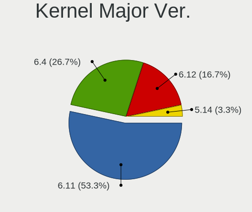
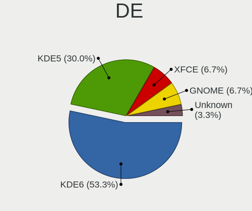
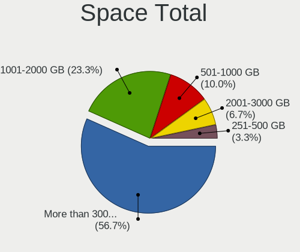
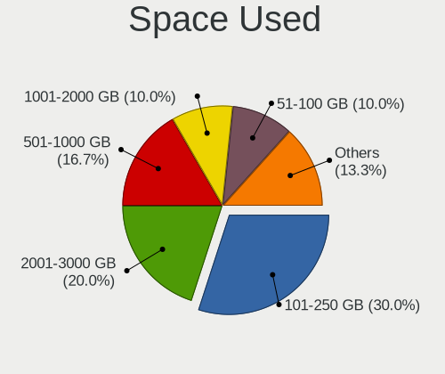
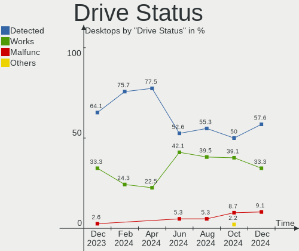
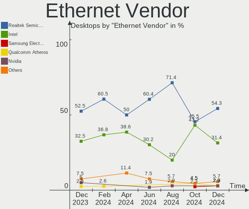

openSUSE Hardware Trends (Desktops)
-----------------------------------

A project to identify most popular hardware characteristics and track their change
over time based on data collected by openSUSE users at https://Linux-Hardware.org.

Anyone can contribute to this report by the [hw-probe](https://github.com/linuxhw/hw-probe) tool:

    sudo -E hw-probe -all -upload

Full-feature report is available here: https://linux-hardware.org/?view=trends

Period: Mar, 2022.

Contents
--------

* [ System ](#system)
  - [ OS                       ](#os)
  - [ OS Family                ](#os-family)
  - [ Kernel                   ](#kernel)
  - [ Kernel Family            ](#kernel-family)
  - [ Kernel Major Ver.        ](#kernel-major-ver)
  - [ Arch                     ](#arch)
  - [ DE                       ](#de)
  - [ Display Server           ](#display-server)
  - [ Display Manager          ](#display-manager)
  - [ OS Lang                  ](#os-lang)
  - [ Boot Mode                ](#boot-mode)
  - [ Filesystem               ](#filesystem)
  - [ Part. scheme             ](#part-scheme)
  - [ Dual Boot with Linux/BSD ](#dual-boot-with-linuxbsd)
  - [ Dual Boot (Win)          ](#dual-boot-win)

* [ Board ](#board)
  - [ Vendor                   ](#vendor)
  - [ Model                    ](#model)
  - [ Model Family             ](#model-family)
  - [ MFG Year                 ](#mfg-year)
  - [ Form Factor              ](#form-factor)
  - [ Secure Boot              ](#secure-boot)
  - [ Coreboot                 ](#coreboot)
  - [ RAM Size                 ](#ram-size)
  - [ RAM Used                 ](#ram-used)
  - [ Total Drives             ](#total-drives)
  - [ Has CD-ROM               ](#has-cd-rom)
  - [ Has Ethernet             ](#has-ethernet)
  - [ Has WiFi                 ](#has-wifi)
  - [ Has Bluetooth            ](#has-bluetooth)

* [ Location ](#location)
  - [ Country                  ](#country)
  - [ City                     ](#city)

* [ Drives ](#drives)
  - [ Drive Vendor             ](#drive-vendor)
  - [ Drive Model              ](#drive-model)
  - [ HDD Vendor               ](#hdd-vendor)
  - [ SSD Vendor               ](#ssd-vendor)
  - [ Drive Kind               ](#drive-kind)
  - [ Drive Connector          ](#drive-connector)
  - [ Drive Size               ](#drive-size)
  - [ Space Total              ](#space-total)
  - [ Space Used               ](#space-used)
  - [ Malfunc. Drives          ](#malfunc-drives)
  - [ Malfunc. Drive Vendor    ](#malfunc-drive-vendor)
  - [ Malfunc. HDD Vendor      ](#malfunc-hdd-vendor)
  - [ Malfunc. Drive Kind      ](#malfunc-drive-kind)
  - [ Failed Drives            ](#failed-drives)
  - [ Failed Drive Vendor      ](#failed-drive-vendor)
  - [ Drive Status             ](#drive-status)

* [ Storage controller ](#storage-controller)
  - [ Storage Vendor           ](#storage-vendor)
  - [ Storage Model            ](#storage-model)
  - [ Storage Kind             ](#storage-kind)

* [ Processor ](#processor)
  - [ CPU Vendor               ](#cpu-vendor)
  - [ CPU Model                ](#cpu-model)
  - [ CPU Model Family         ](#cpu-model-family)
  - [ CPU Cores                ](#cpu-cores)
  - [ CPU Sockets              ](#cpu-sockets)
  - [ CPU Threads              ](#cpu-threads)
  - [ CPU Op-Modes             ](#cpu-op-modes)
  - [ CPU Microcode            ](#cpu-microcode)
  - [ CPU Microarch            ](#cpu-microarch)

* [ Graphics ](#graphics)
  - [ GPU Vendor               ](#gpu-vendor)
  - [ GPU Model                ](#gpu-model)
  - [ GPU Combo                ](#gpu-combo)
  - [ GPU Driver               ](#gpu-driver)
  - [ GPU Memory               ](#gpu-memory)

* [ Monitor ](#monitor)
  - [ Monitor Vendor           ](#monitor-vendor)
  - [ Monitor Model            ](#monitor-model)
  - [ Monitor Resolution       ](#monitor-resolution)
  - [ Monitor Diagonal         ](#monitor-diagonal)
  - [ Monitor Width            ](#monitor-width)
  - [ Aspect Ratio             ](#aspect-ratio)
  - [ Monitor Area             ](#monitor-area)
  - [ Pixel Density            ](#pixel-density)
  - [ Multiple Monitors        ](#multiple-monitors)

* [ Network ](#network)
  - [ Net Controller Vendor    ](#net-controller-vendor)
  - [ Net Controller Model     ](#net-controller-model)
  - [ Wireless Vendor          ](#wireless-vendor)
  - [ Wireless Model           ](#wireless-model)
  - [ Ethernet Vendor          ](#ethernet-vendor)
  - [ Ethernet Model           ](#ethernet-model)
  - [ Net Controller Kind      ](#net-controller-kind)
  - [ Used Controller          ](#used-controller)
  - [ NICs                     ](#nics)
  - [ IPv6                     ](#ipv6)

* [ Bluetooth ](#bluetooth)
  - [ Bluetooth Vendor         ](#bluetooth-vendor)
  - [ Bluetooth Model          ](#bluetooth-model)

* [ Sound ](#sound)
  - [ Sound Vendor             ](#sound-vendor)
  - [ Sound Model              ](#sound-model)

* [ Memory ](#memory)
  - [ Memory Vendor            ](#memory-vendor)
  - [ Memory Model             ](#memory-model)
  - [ Memory Kind              ](#memory-kind)
  - [ Memory Form Factor       ](#memory-form-factor)
  - [ Memory Size              ](#memory-size)
  - [ Memory Speed             ](#memory-speed)

* [ Printers & scanners ](#printers--scanners)
  - [ Printer Vendor           ](#printer-vendor)
  - [ Printer Model            ](#printer-model)
  - [ Scanner Vendor           ](#scanner-vendor)
  - [ Scanner Model            ](#scanner-model)

* [ Camera ](#camera)
  - [ Camera Vendor            ](#camera-vendor)
  - [ Camera Model             ](#camera-model)

* [ Security ](#security)
  - [ Fingerprint Vendor       ](#fingerprint-vendor)
  - [ Fingerprint Model        ](#fingerprint-model)
  - [ Chipcard Vendor          ](#chipcard-vendor)
  - [ Chipcard Model           ](#chipcard-model)

* [ Unsupported ](#unsupported)
  - [ Unsupported Devices      ](#unsupported-devices)
  - [ Unsupported Device Types ](#unsupported-device-types)

System
------

OS
--

Installed operating systems

| Name                         | Desktops | Percent |
|------------------------------|----------|---------|
| openSUSE Leap-15.3           | 6        | 26.09%  |
| openSUSE 20220310            | 3        | 13.04%  |
| openSUSE 20220320            | 2        | 8.7%    |
| openSUSE 20220311            | 2        | 8.7%    |
| openSUSE Tumbleweed-20220324 | 1        | 4.35%   |
| openSUSE Tumbleweed-20220322 | 1        | 4.35%   |
| openSUSE Tumbleweed-20220314 | 1        | 4.35%   |
| openSUSE Tumbleweed-20220311 | 1        | 4.35%   |
| openSUSE Tumbleweed-20220306 | 1        | 4.35%   |
| openSUSE Tumbleweed-20220304 | 1        | 4.35%   |
| openSUSE Tumbleweed-20220228 | 1        | 4.35%   |
| openSUSE Leap-15.2           | 1        | 4.35%   |
| openSUSE Leap-15.1           | 1        | 4.35%   |
| openSUSE 20220227            | 1        | 4.35%   |

OS Family
---------

OS without a version

| Name     | Desktops | Percent |
|----------|----------|---------|
| openSUSE | 23       | 100%    |

Kernel
------

Version of the Linux kernel

| Version                     | Desktops | Percent |
|-----------------------------|----------|---------|
| 5.16.11-1-default           | 10       | 43.48%  |
| 5.3.18-150300.59.54-default | 3        | 13.04%  |
| 5.3.18-150300.59.49-default | 3        | 13.04%  |
| 5.16.15-1-default           | 3        | 13.04%  |
| 5.16.14-1-default           | 1        | 4.35%   |
| 5.13.4-1-default            | 1        | 4.35%   |
| 5.12.0-2.g5d43652-default   | 1        | 4.35%   |
| 4.12.14-lp151.28.25-default | 1        | 4.35%   |

Kernel Family
-------------

Linux kernel without a distro release

| Version | Desktops | Percent |
|---------|----------|---------|
| 5.16.11 | 10       | 43.48%  |
| 5.3.18  | 6        | 26.09%  |
| 5.16.15 | 3        | 13.04%  |
| 5.16.14 | 1        | 4.35%   |
| 5.13.4  | 1        | 4.35%   |
| 5.12.0  | 1        | 4.35%   |
| 4.12.14 | 1        | 4.35%   |

Kernel Major Ver.
-----------------

Linux kernel major version

| Version | Desktops | Percent |
|---------|----------|---------|
| 5.16    | 14       | 60.87%  |
| 5.3     | 6        | 26.09%  |
| 5.13    | 1        | 4.35%   |
| 5.12    | 1        | 4.35%   |
| 4.12    | 1        | 4.35%   |

Arch
----

OS architecture (x86_64, i586, etc.)

| Name   | Desktops | Percent |
|--------|----------|---------|
| x86_64 | 23       | 100%    |

DE
--

Desktop Environment

| Name  | Desktops | Percent |
|-------|----------|---------|
| KDE5  | 20       | 86.96%  |
| GNOME | 2        | 8.7%    |
| KDE   | 1        | 4.35%   |

Display Server
--------------

X11 or Wayland

| Name    | Desktops | Percent |
|---------|----------|---------|
| X11     | 21       | 91.3%   |
| Wayland | 1        | 4.35%   |
| Tty     | 1        | 4.35%   |

Display Manager
---------------

SDDM, LightDM, etc.

| Name    | Desktops | Percent |
|---------|----------|---------|
| Unknown | 10       | 43.48%  |
| LightDM | 7        | 30.43%  |
| SDDM    | 6        | 26.09%  |

OS Lang
-------

Language

| Lang  | Desktops | Percent |
|-------|----------|---------|
| en_US | 8        | 34.78%  |
| POSIX | 4        | 17.39%  |
| de_DE | 4        | 17.39%  |
| ru_RU | 2        | 8.7%    |
| sk_SK | 1        | 4.35%   |
| ro_RO | 1        | 4.35%   |
| pt_BR | 1        | 4.35%   |
| nl_NL | 1        | 4.35%   |
| es_ES | 1        | 4.35%   |

Boot Mode
---------

EFI or BIOS

| Mode | Desktops | Percent |
|------|----------|---------|
| EFI  | 16       | 69.57%  |
| BIOS | 7        | 30.43%  |

Filesystem
----------

Type of filesystem

| Type  | Desktops | Percent |
|-------|----------|---------|
| Btrfs | 15       | 65.22%  |
| Ext4  | 7        | 30.43%  |
| Xfs   | 1        | 4.35%   |

Part. scheme
------------

Scheme of partitioning

| Type    | Desktops | Percent |
|---------|----------|---------|
| GPT     | 10       | 43.48%  |
| Unknown | 10       | 43.48%  |
| MBR     | 3        | 13.04%  |

Dual Boot with Linux/BSD
------------------------

Hosting more than one Linux/BSD

| Dual boot | Desktops | Percent |
|-----------|----------|---------|
| No        | 18       | 78.26%  |
| Yes       | 5        | 21.74%  |

Dual Boot (Win)
---------------

Hosting Linux and Windows

| Dual boot | Desktops | Percent |
|-----------|----------|---------|
| No        | 16       | 69.57%  |
| Yes       | 7        | 30.43%  |

Board
-----

Vendor
------

Motherboard manufacturer

| Name                | Desktops | Percent |
|---------------------|----------|---------|
| Gigabyte Technology | 8        | 34.78%  |
| ASUSTek Computer    | 4        | 17.39%  |
| MSI                 | 2        | 8.7%    |
| ASRock              | 2        | 8.7%    |
| Pegatron            | 1        | 4.35%   |
| Lenovo              | 1        | 4.35%   |
| Hewlett-Packard     | 1        | 4.35%   |
| Foxconn             | 1        | 4.35%   |
| Dell                | 1        | 4.35%   |
| Colorful Technology | 1        | 4.35%   |
| BESSTAR Tech        | 1        | 4.35%   |

Model
-----

Motherboard model

| Name                                | Desktops | Percent |
|-------------------------------------|----------|---------|
| Pegatron 2AB6                       | 1        | 4.35%   |
| MSI MS-7C35                         | 1        | 4.35%   |
| MSI MS-7C02                         | 1        | 4.35%   |
| Lenovo ThinkStation P500 30A6S4JU00 | 1        | 4.35%   |
| HP Z840 Workstation                 | 1        | 4.35%   |
| Gigabyte X570 GAMING X              | 1        | 4.35%   |
| Gigabyte W480 VISION D              | 1        | 4.35%   |
| Gigabyte GA-770T-USB3               | 1        | 4.35%   |
| Gigabyte F2A68HM-DS2                | 1        | 4.35%   |
| Gigabyte B75M-D3H                   | 1        | 4.35%   |
| Gigabyte B550M AORUS ELITE          | 1        | 4.35%   |
| Gigabyte B550 AORUS PRO             | 1        | 4.35%   |
| Gigabyte B460MDS3HAC                | 1        | 4.35%   |
| Foxconn p6-2277eg                   | 1        | 4.35%   |
| Dell OptiPlex 760                   | 1        | 4.35%   |
| Colorful A320M-K PRO YV14           | 1        | 4.35%   |
| BESSTAR Tech HM90                   | 1        | 4.35%   |
| ASUS TUF X299 MARK 2                | 1        | 4.35%   |
| ASUS TUF Gaming B550M-ZAKU          | 1        | 4.35%   |
| ASUS M5A78L-M/USB3                  | 1        | 4.35%   |
| ASUS All Series                     | 1        | 4.35%   |
| ASRock Z370 Gaming K6               | 1        | 4.35%   |
| ASRock H61M-S1 PLUS                 | 1        | 4.35%   |

Model Family
------------

Motherboard model prefix

| Name                  | Desktops | Percent |
|-----------------------|----------|---------|
| ASUS TUF              | 2        | 8.7%    |
| Pegatron 2AB6         | 1        | 4.35%   |
| MSI MS-7C35           | 1        | 4.35%   |
| MSI MS-7C02           | 1        | 4.35%   |
| Lenovo ThinkStation   | 1        | 4.35%   |
| HP Z840               | 1        | 4.35%   |
| Gigabyte X570         | 1        | 4.35%   |
| Gigabyte W480         | 1        | 4.35%   |
| Gigabyte GA-770T-USB3 | 1        | 4.35%   |
| Gigabyte F2A68HM-DS2  | 1        | 4.35%   |
| Gigabyte B75M-D3H     | 1        | 4.35%   |
| Gigabyte B550M        | 1        | 4.35%   |
| Gigabyte B550         | 1        | 4.35%   |
| Gigabyte B460MDS3HAC  | 1        | 4.35%   |
| Foxconn p6-2277eg     | 1        | 4.35%   |
| Dell OptiPlex         | 1        | 4.35%   |
| Colorful A320M-K      | 1        | 4.35%   |
| BESSTAR Tech HM90     | 1        | 4.35%   |
| ASUS M5A78L-M         | 1        | 4.35%   |
| ASUS All              | 1        | 4.35%   |
| ASRock Z370           | 1        | 4.35%   |
| ASRock H61M-S1        | 1        | 4.35%   |

MFG Year
--------

Motherboard manufacture year

| Year | Desktops | Percent |
|------|----------|---------|
| 2021 | 4        | 17.39%  |
| 2020 | 3        | 13.04%  |
| 2019 | 3        | 13.04%  |
| 2014 | 3        | 13.04%  |
| 2018 | 2        | 8.7%    |
| 2012 | 2        | 8.7%    |
| 2011 | 2        | 8.7%    |
| 2017 | 1        | 4.35%   |
| 2015 | 1        | 4.35%   |
| 2010 | 1        | 4.35%   |
| 2009 | 1        | 4.35%   |

Form Factor
-----------

Physical design of the computer

| Name    | Desktops | Percent |
|---------|----------|---------|
| Desktop | 23       | 100%    |

Secure Boot
-----------

Enabled or disabled

| State    | Desktops | Percent |
|----------|----------|---------|
| Disabled | 22       | 95.65%  |
| Enabled  | 1        | 4.35%   |

Coreboot
--------

Have coreboot on board

| Used | Desktops | Percent |
|------|----------|---------|
| No   | 23       | 100%    |

RAM Size
--------

Total RAM memory

| Size in GB  | Desktops | Percent |
|-------------|----------|---------|
| 16.01-24.0  | 11       | 47.83%  |
| 8.01-16.0   | 4        | 17.39%  |
| 4.01-8.0    | 2        | 8.7%    |
| 32.01-64.0  | 2        | 8.7%    |
| 3.01-4.0    | 2        | 8.7%    |
| 64.01-256.0 | 2        | 8.7%    |

RAM Used
--------

Used RAM memory

| Used GB    | Desktops | Percent |
|------------|----------|---------|
| 3.01-4.0   | 6        | 26.09%  |
| 4.01-8.0   | 5        | 21.74%  |
| 2.01-3.0   | 4        | 17.39%  |
| 1.01-2.0   | 4        | 17.39%  |
| 8.01-16.0  | 2        | 8.7%    |
| 32.01-64.0 | 1        | 4.35%   |
| 0.51-1.0   | 1        | 4.35%   |

Total Drives
------------

Number of drives on board

| Drives | Desktops | Percent |
|--------|----------|---------|
| 2      | 7        | 30.43%  |
| 1      | 7        | 30.43%  |
| 5      | 3        | 13.04%  |
| 4      | 3        | 13.04%  |
| 13     | 1        | 4.35%   |
| 6      | 1        | 4.35%   |
| 3      | 1        | 4.35%   |

Has CD-ROM
----------

Has CD-ROM on board

| Presented | Desktops | Percent |
|-----------|----------|---------|
| Yes       | 12       | 52.17%  |
| No        | 11       | 47.83%  |

Has Ethernet
------------

Has Ethernet on board

| Presented | Desktops | Percent |
|-----------|----------|---------|
| Yes       | 23       | 100%    |

Has WiFi
--------

Has WiFi module

| Presented | Desktops | Percent |
|-----------|----------|---------|
| No        | 13       | 56.52%  |
| Yes       | 10       | 43.48%  |

Has Bluetooth
-------------

Has Bluetooth module

| Presented | Desktops | Percent |
|-----------|----------|---------|
| Yes       | 12       | 52.17%  |
| No        | 11       | 47.83%  |

Location
--------

Country
-------

Geographic location (country)

| Country     | Desktops | Percent |
|-------------|----------|---------|
| USA         | 7        | 30.43%  |
| Germany     | 5        | 21.74%  |
| UK          | 1        | 4.35%   |
| Slovakia    | 1        | 4.35%   |
| Russia      | 1        | 4.35%   |
| Romania     | 1        | 4.35%   |
| Peru        | 1        | 4.35%   |
| New Zealand | 1        | 4.35%   |
| Netherlands | 1        | 4.35%   |
| India       | 1        | 4.35%   |
| Czechia     | 1        | 4.35%   |
| Canada      | 1        | 4.35%   |
| Brazil      | 1        | 4.35%   |

City
----

Geographic location (city)

| City              | Desktops | Percent |
|-------------------|----------|---------|
| Ufa               | 1        | 4.35%   |
| Tacna             | 1        | 4.35%   |
| Reading           | 1        | 4.35%   |
| Prosper           | 1        | 4.35%   |
| Prague            | 1        | 4.35%   |
| Montreal          | 1        | 4.35%   |
| Miami             | 1        | 4.35%   |
| Ingolstadt        | 1        | 4.35%   |
| Hackney           | 1        | 4.35%   |
| Guaíba           | 1        | 4.35%   |
| Gaildorf          | 1        | 4.35%   |
| Frankfurt am Main | 1        | 4.35%   |
| Dunedin           | 1        | 4.35%   |
| Chicago           | 1        | 4.35%   |
| Chennai           | 1        | 4.35%   |
| Čadca            | 1        | 4.35%   |
| Burbank           | 1        | 4.35%   |
| Brasov            | 1        | 4.35%   |
| Berlin            | 1        | 4.35%   |
| Bad Lauchstaedt   | 1        | 4.35%   |
| Arlington         | 1        | 4.35%   |
| Arab              | 1        | 4.35%   |
| Almere Stad       | 1        | 4.35%   |

Drives
------

Drive Vendor
------------

Hard drive vendors

| Vendor                    | Desktops | Drives | Percent |
|---------------------------|----------|--------|---------|
| Samsung Electronics       | 11       | 15     | 25%     |
| WDC                       | 9        | 12     | 20.45%  |
| Seagate                   | 9        | 25     | 20.45%  |
| Toshiba                   | 2        | 2      | 4.55%   |
| Kingston                  | 2        | 4      | 4.55%   |
| Crucial                   | 2        | 2      | 4.55%   |
| T-CREATE                  | 1        | 1      | 2.27%   |
| SK Hynix                  | 1        | 1      | 2.27%   |
| Sandisk                   | 1        | 1      | 2.27%   |
| Phison                    | 1        | 1      | 2.27%   |
| Mushkin                   | 1        | 1      | 2.27%   |
| Micron/Crucial Technology | 1        | 1      | 2.27%   |
| Micron Technology         | 1        | 2      | 2.27%   |
| Apacer                    | 1        | 1      | 2.27%   |
| A-DATA Technology         | 1        | 1      | 2.27%   |

Drive Model
-----------

Hard drive models

| Model                                    | Desktops | Percent |
|------------------------------------------|----------|---------|
| Samsung SSD 970 EVO Plus 500GB           | 2        | 3.64%   |
| WDC WDS480G2G0A-00JH30 480GB SSD         | 1        | 1.82%   |
| WDC WD5000AVDS-63U7B1 500GB              | 1        | 1.82%   |
| WDC WD5000AAKX-08U6AA0 500GB             | 1        | 1.82%   |
| WDC WD40EZAZ-00SF3B0 4TB                 | 1        | 1.82%   |
| WDC WD40EFRX-68N32N0 4TB                 | 1        | 1.82%   |
| WDC WD3200AAJS-56M0A0 320GB              | 1        | 1.82%   |
| WDC WD20EFRX-68AX9N0 2TB                 | 1        | 1.82%   |
| WDC WD1600AAJS-75M0A0 160GB              | 1        | 1.82%   |
| WDC WD10EZEX-22MFCA0 1TB                 | 1        | 1.82%   |
| WDC WD10EZEX-08WN4A0 1TB                 | 1        | 1.82%   |
| WDC WD10EZEX-00RKKA0 1TB                 | 1        | 1.82%   |
| WDC WD102KRYZ-01A5AB0 10TB               | 1        | 1.82%   |
| Toshiba DT01ACA200 2TB                   | 1        | 1.82%   |
| Toshiba DT01ACA050 500GB                 | 1        | 1.82%   |
| T-CREATE TM8FPF002T 2TB                  | 1        | 1.82%   |
| SK Hynix PC711 NVMe 256GB                | 1        | 1.82%   |
| Seagate ST8000VN0022-2EL112 8TB          | 1        | 1.82%   |
| Seagate ST8000AS0002-1NA17Z 8TB          | 1        | 1.82%   |
| Seagate ST5000LM000-2U8170 5TB           | 1        | 1.82%   |
| Seagate ST3500413AS 500GB                | 1        | 1.82%   |
| Seagate ST3250310AS 250GB                | 1        | 1.82%   |
| Seagate ST2000DX002-2DV164 2TB           | 1        | 1.82%   |
| Seagate ST2000DM008-2FR102 2TB           | 1        | 1.82%   |
| Seagate ST2000DM001-9YN164 2TB           | 1        | 1.82%   |
| Seagate ST2000DM001-1ER164 2TB           | 1        | 1.82%   |
| Seagate ST2000DM001-1CH164 2TB           | 1        | 1.82%   |
| Seagate ST16000VN001-2RV103 16TB         | 1        | 1.82%   |
| Seagate ST1000DM003-1ER162 1TB           | 1        | 1.82%   |
| Seagate ST1000DM003-1CH162 1TB           | 1        | 1.82%   |
| Seagate ST10000VN0004-1ZD101 10TB        | 1        | 1.82%   |
| Seagate NVMe SSD Drive 500GB             | 1        | 1.82%   |
| Seagate BUP Portable 4TB                 | 1        | 1.82%   |
| Sandisk NVMe SSD Drive 1TB               | 1        | 1.82%   |
| Samsung SSD 870 QVO 2TB                  | 1        | 1.82%   |
| Samsung SSD 870 QVO 1TB                  | 1        | 1.82%   |
| Samsung SSD 870 EVO 2TB                  | 1        | 1.82%   |
| Samsung SSD 860 PRO 256GB                | 1        | 1.82%   |
| Samsung SSD 860 EVO 250GB                | 1        | 1.82%   |
| Samsung SSD 850 EVO M.2 500GB            | 1        | 1.82%   |
| Samsung NVMe SSD Drive 250GB             | 1        | 1.82%   |
| Samsung MZHPV512HDGL-000H1 512GB SSD     | 1        | 1.82%   |
| Samsung HD502HJ 500GB                    | 1        | 1.82%   |
| Samsung HD103SI 1TB                      | 1        | 1.82%   |
| Phison NVMe SSD Drive 1024GB             | 1        | 1.82%   |
| Mushkin MKNSSDRE1TB                      | 1        | 1.82%   |
| Micron/Crucial NVMe SSD Drive 1TB        | 1        | 1.82%   |
| Micron MTFDDAK512MBF-1AN1ZABHA 512GB SSD | 1        | 1.82%   |
| Kingston SV300S37A120G 120GB SSD         | 1        | 1.82%   |
| Kingston SA400S37120G 120GB SSD          | 1        | 1.82%   |
| Crucial CT500MX500SSD1 500GB             | 1        | 1.82%   |
| Crucial CT1000MX500SSD1 1TB              | 1        | 1.82%   |
| Apacer AS350 256GB SSD                   | 1        | 1.82%   |
| A-DATA SP900 64GB SSD                    | 1        | 1.82%   |

HDD Vendor
----------

Hard disk drive vendors

| Vendor              | Desktops | Drives | Percent |
|---------------------|----------|--------|---------|
| WDC                 | 9        | 11     | 40.91%  |
| Seagate             | 9        | 24     | 40.91%  |
| Toshiba             | 2        | 2      | 9.09%   |
| Samsung Electronics | 2        | 4      | 9.09%   |

SSD Vendor
----------

Solid state drive vendors

| Vendor              | Desktops | Drives | Percent |
|---------------------|----------|--------|---------|
| Samsung Electronics | 6        | 8      | 40%     |
| Kingston            | 2        | 4      | 13.33%  |
| Crucial             | 2        | 2      | 13.33%  |
| WDC                 | 1        | 1      | 6.67%   |
| Mushkin             | 1        | 1      | 6.67%   |
| Micron Technology   | 1        | 2      | 6.67%   |
| Apacer              | 1        | 1      | 6.67%   |
| A-DATA Technology   | 1        | 1      | 6.67%   |

Drive Kind
----------

HDD or SSD

| Kind | Desktops | Drives | Percent |
|------|----------|--------|---------|
| HDD  | 18       | 41     | 48.65%  |
| SSD  | 12       | 20     | 32.43%  |
| NVMe | 7        | 9      | 18.92%  |

Drive Connector
---------------

SATA, SAS, NVMe, etc.

| Type | Desktops | Drives | Percent |
|------|----------|--------|---------|
| SATA | 22       | 57     | 73.33%  |
| NVMe | 7        | 9      | 23.33%  |
| SAS  | 1        | 4      | 3.33%   |

Drive Size
----------

Size of hard drive

| Size in TB | Desktops | Drives | Percent |
|------------|----------|--------|---------|
| 0.01-0.5   | 12       | 22     | 31.58%  |
| 0.51-1.0   | 10       | 12     | 26.32%  |
| 1.01-2.0   | 8        | 9      | 21.05%  |
| 4.01-10.0  | 4        | 9      | 10.53%  |
| 3.01-4.0   | 3        | 6      | 7.89%   |
| 10.01-20.0 | 1        | 3      | 2.63%   |

Space Total
-----------

Amount of disk space available on the file system

| Size in GB     | Desktops | Percent |
|----------------|----------|---------|
| More than 3000 | 12       | 52.17%  |
| 1001-2000      | 5        | 21.74%  |
| 251-500        | 2        | 8.7%    |
| 501-1000       | 2        | 8.7%    |
| 101-250        | 1        | 4.35%   |
| 51-100         | 1        | 4.35%   |

Space Used
----------

Amount of used disk space

| Used GB        | Desktops | Percent |
|----------------|----------|---------|
| More than 3000 | 5        | 21.74%  |
| 1001-2000      | 5        | 21.74%  |
| 501-1000       | 4        | 17.39%  |
| 251-500        | 3        | 13.04%  |
| 101-250        | 2        | 8.7%    |
| 21-50          | 1        | 4.35%   |
| 2001-3000      | 1        | 4.35%   |
| 1-20           | 1        | 4.35%   |
| 51-100         | 1        | 4.35%   |

Malfunc. Drives
---------------

Drive models with a malfunction

| Model                           | Desktops | Drives | Percent |
|---------------------------------|----------|--------|---------|
| WDC WD5000AVDS-63U7B1 500GB     | 1        | 1      | 12.5%   |
| WDC WD3200AAJS-56M0A0 320GB     | 1        | 1      | 12.5%   |
| Seagate ST8000AS0002-1NA17Z 8TB | 1        | 1      | 12.5%   |
| Seagate ST2000DM001-1CH164 2TB  | 1        | 1      | 12.5%   |
| Seagate ST1000DM003-1ER162 1TB  | 1        | 1      | 12.5%   |
| Seagate ST1000DM003-1CH162 1TB  | 1        | 1      | 12.5%   |
| Samsung Electronics HD103SI 1TB | 1        | 1      | 12.5%   |
| Kingston SA400S37120G 120GB SSD | 1        | 3      | 12.5%   |

Malfunc. Drive Vendor
---------------------

Vendors of faulty drives

| Vendor              | Desktops | Drives | Percent |
|---------------------|----------|--------|---------|
| Seagate             | 4        | 4      | 50%     |
| WDC                 | 2        | 2      | 25%     |
| Samsung Electronics | 1        | 1      | 12.5%   |
| Kingston            | 1        | 3      | 12.5%   |

Malfunc. HDD Vendor
-------------------

Vendors of faulty HDD drives

| Vendor              | Desktops | Drives | Percent |
|---------------------|----------|--------|---------|
| Seagate             | 4        | 4      | 57.14%  |
| WDC                 | 2        | 2      | 28.57%  |
| Samsung Electronics | 1        | 1      | 14.29%  |

Malfunc. Drive Kind
-------------------

Kinds of faulty drives

| Kind | Desktops | Drives | Percent |
|------|----------|--------|---------|
| HDD  | 5        | 7      | 83.33%  |
| SSD  | 1        | 3      | 16.67%  |

Failed Drives
-------------

Failed drive models

| Model                             | Desktops | Drives | Percent |
|-----------------------------------|----------|--------|---------|
| Samsung Electronics HD502HJ 500GB | 1        | 3      | 100%    |

Failed Drive Vendor
-------------------

Failed drive vendors

| Vendor              | Desktops | Drives | Percent |
|---------------------|----------|--------|---------|
| Samsung Electronics | 1        | 3      | 100%    |

Drive Status
------------

Number of failed and malfunc. drives

| Status   | Desktops | Drives | Percent |
|----------|----------|--------|---------|
| Works    | 11       | 28     | 39.29%  |
| Detected | 10       | 29     | 35.71%  |
| Malfunc  | 6        | 10     | 21.43%  |
| Failed   | 1        | 3      | 3.57%   |

Storage controller
------------------

Storage Vendor
--------------

Storage controller vendors

| Vendor                    | Desktops | Percent |
|---------------------------|----------|---------|
| Intel                     | 12       | 31.58%  |
| AMD                       | 11       | 28.95%  |
| Samsung Electronics       | 4        | 10.53%  |
| ASMedia Technology        | 2        | 5.26%   |
| SK Hynix                  | 1        | 2.63%   |
| Silicon Motion            | 1        | 2.63%   |
| Seagate Technology        | 1        | 2.63%   |
| Sandisk                   | 1        | 2.63%   |
| Phison Electronics        | 1        | 2.63%   |
| Micron/Crucial Technology | 1        | 2.63%   |
| Marvell Technology Group  | 1        | 2.63%   |
| Broadcom / LSI            | 1        | 2.63%   |
| Adaptec                   | 1        | 2.63%   |

Storage Model
-------------

Storage controller models

| Model                                                                          | Desktops | Percent |
|--------------------------------------------------------------------------------|----------|---------|
| AMD FCH SATA Controller [AHCI mode]                                            | 5        | 10.87%  |
| Intel 6 Series/C200 Series Chipset Family 6 port Desktop SATA AHCI Controller  | 3        | 6.52%   |
| AMD 500 Series Chipset SATA Controller                                         | 3        | 6.52%   |
| Samsung NVMe SSD Controller SM981/PM981/PM983                                  | 2        | 4.35%   |
| Intel 200 Series PCH SATA controller [AHCI mode]                               | 2        | 4.35%   |
| ASMedia ASM1062 Serial ATA Controller                                          | 2        | 4.35%   |
| AMD SB7x0/SB8x0/SB9x0 IDE Controller                                           | 2        | 4.35%   |
| SK Hynix Gold P31 SSD                                                          | 1        | 2.17%   |
| Silicon Motion SM2262/SM2262EN SSD Controller                                  | 1        | 2.17%   |
| Seagate FireCuda 510 SSD                                                       | 1        | 2.17%   |
| Sandisk WD Black 2018/SN750 / PC SN720 NVMe SSD                                | 1        | 2.17%   |
| Samsung NVMe SSD Controller SM961/PM961/SM963                                  | 1        | 2.17%   |
| Samsung Electronics SATA controller                                            | 1        | 2.17%   |
| Phison E12 NVMe Controller                                                     | 1        | 2.17%   |
| Micron/Crucial NVMe Controller                                                 | 1        | 2.17%   |
| Marvell Group 88SE9215 PCIe 2.0 x1 4-port SATA 6 Gb/s Controller               | 1        | 2.17%   |
| Intel Comet Lake SATA AHCI Controller                                          | 1        | 2.17%   |
| Intel C610/X99 series chipset sSATA Controller [RAID mode]                     | 1        | 2.17%   |
| Intel C610/X99 series chipset sSATA Controller [AHCI mode]                     | 1        | 2.17%   |
| Intel C610/X99 series chipset IDE-r Controller                                 | 1        | 2.17%   |
| Intel C610/X99 series chipset 6-Port SATA Controller [AHCI mode]               | 1        | 2.17%   |
| Intel C600/X79 series chipset SATA RAID Controller                             | 1        | 2.17%   |
| Intel 82801JD/DO (ICH10 Family) SATA AHCI Controller                           | 1        | 2.17%   |
| Intel 8 Series/C220 Series Chipset Family 6-port SATA Controller 1 [AHCI mode] | 1        | 2.17%   |
| Intel 7 Series/C210 Series Chipset Family 6-port SATA Controller [AHCI mode]   | 1        | 2.17%   |
| Intel 400 Series Chipset Family SATA AHCI Controller                           | 1        | 2.17%   |
| Intel 4 Series Chipset PT IDER Controller                                      | 1        | 2.17%   |
| Broadcom / LSI SAS2308 PCI-Express Fusion-MPT SAS-2                            | 1        | 2.17%   |
| AMD SB7x0/SB8x0/SB9x0 SATA Controller [IDE mode]                               | 1        | 2.17%   |
| AMD SB7x0/SB8x0/SB9x0 SATA Controller [AHCI mode]                              | 1        | 2.17%   |
| AMD FCH SATA Controller [RAID mode]                                            | 1        | 2.17%   |
| AMD FCH SATA Controller D                                                      | 1        | 2.17%   |
| AMD 400 Series Chipset SATA Controller                                         | 1        | 2.17%   |
| Adaptec AHA-2930CU                                                             | 1        | 2.17%   |

Storage Kind
------------

Kind of storage controller (IDE, SATA, NVMe, SAS, ...)

| Kind | Desktops | Percent |
|------|----------|---------|
| SATA | 22       | 59.46%  |
| NVMe | 7        | 18.92%  |
| IDE  | 4        | 10.81%  |
| RAID | 2        | 5.41%   |
| SAS  | 1        | 2.7%    |
| SCSI | 1        | 2.7%    |

Processor
---------

CPU Vendor
----------

Processor vendors

| Vendor | Desktops | Percent |
|--------|----------|---------|
| Intel  | 12       | 52.17%  |
| AMD    | 11       | 47.83%  |

CPU Model
---------

Processor models

| Model                                          | Desktops | Percent |
|------------------------------------------------|----------|---------|
| AMD Ryzen 5 3600 6-Core Processor              | 2        | 8.7%    |
| Intel Xeon W-1250 CPU @ 3.30GHz                | 1        | 4.35%   |
| Intel Xeon CPU E5-2667 v3 @ 3.20GHz            | 1        | 4.35%   |
| Intel Xeon CPU E5-1620 v3 @ 3.50GHz            | 1        | 4.35%   |
| Intel Core i7-8700K CPU @ 3.70GHz              | 1        | 4.35%   |
| Intel Core i7-7800X CPU @ 3.50GHz              | 1        | 4.35%   |
| Intel Core i7-2600 CPU @ 3.40GHz               | 1        | 4.35%   |
| Intel Core i5-4440 CPU @ 3.10GHz               | 1        | 4.35%   |
| Intel Core i5-3470 CPU @ 3.20GHz               | 1        | 4.35%   |
| Intel Core i5-3450 CPU @ 3.10GHz               | 1        | 4.35%   |
| Intel Core i5-10400F CPU @ 2.90GHz             | 1        | 4.35%   |
| Intel Core i3-2120 CPU @ 3.30GHz               | 1        | 4.35%   |
| Intel Core 2 Duo CPU E8500 @ 3.16GHz           | 1        | 4.35%   |
| AMD Ryzen 9 5950X 16-Core Processor            | 1        | 4.35%   |
| AMD Ryzen 9 4900H with Radeon Graphics         | 1        | 4.35%   |
| AMD Ryzen 9 3950X 16-Core Processor            | 1        | 4.35%   |
| AMD Ryzen 5 5600X 6-Core Processor             | 1        | 4.35%   |
| AMD Ryzen 5 2600 Six-Core Processor            | 1        | 4.35%   |
| AMD Ryzen 3 1200 Quad-Core Processor           | 1        | 4.35%   |
| AMD Phenom II X6 1055T Processor               | 1        | 4.35%   |
| AMD FX-8350 Eight-Core Processor               | 1        | 4.35%   |
| AMD A10-7800 Radeon R7, 12 Compute Cores 4C+8G | 1        | 4.35%   |

CPU Model Family
----------------

Processor model prefix

| Model            | Desktops | Percent |
|------------------|----------|---------|
| Intel Core i5    | 4        | 17.39%  |
| AMD Ryzen 5      | 4        | 17.39%  |
| Intel Xeon       | 3        | 13.04%  |
| Intel Core i7    | 3        | 13.04%  |
| AMD Ryzen 9      | 3        | 13.04%  |
| Intel Core i3    | 1        | 4.35%   |
| Intel Core 2 Duo | 1        | 4.35%   |
| AMD Ryzen 3      | 1        | 4.35%   |
| AMD Phenom II X6 | 1        | 4.35%   |
| AMD FX           | 1        | 4.35%   |
| AMD A10          | 1        | 4.35%   |

CPU Cores
---------

Number of processor cores

| Number | Desktops | Percent |
|--------|----------|---------|
| 6      | 9        | 39.13%  |
| 4      | 7        | 30.43%  |
| 16     | 3        | 13.04%  |
| 2      | 3        | 13.04%  |
| 8      | 1        | 4.35%   |

CPU Sockets
-----------

Number of sockets

| Number | Desktops | Percent |
|--------|----------|---------|
| 1      | 22       | 95.65%  |
| 2      | 1        | 4.35%   |

CPU Threads
-----------

Threads per core (Hyper-Threading)

| Number | Desktops | Percent |
|--------|----------|---------|
| 2      | 17       | 73.91%  |
| 1      | 6        | 26.09%  |

CPU Op-Modes
------------

CPU Operation Modes (32-bit, 64-bit)

| Op mode        | Desktops | Percent |
|----------------|----------|---------|
| 32-bit, 64-bit | 23       | 100%    |

CPU Microcode
-------------

Microcode number

| Number     | Desktops | Percent |
|------------|----------|---------|
| Unknown    | 3        | 13.04%  |
| 0x306a9    | 2        | 8.7%    |
| 0x206a7    | 2        | 8.7%    |
| 0x08701021 | 2        | 8.7%    |
| 0xa0655    | 1        | 4.35%   |
| 0xa0653    | 1        | 4.35%   |
| 0x906ea    | 1        | 4.35%   |
| 0x50654    | 1        | 4.35%   |
| 0x306f2    | 1        | 4.35%   |
| 0x306c3    | 1        | 4.35%   |
| 0x1067a    | 1        | 4.35%   |
| 0x0a201016 | 1        | 4.35%   |
| 0x0a201009 | 1        | 4.35%   |
| 0x08701013 | 1        | 4.35%   |
| 0x08600106 | 1        | 4.35%   |
| 0x08001138 | 1        | 4.35%   |
| 0x06000852 | 1        | 4.35%   |
| 0x010000dc | 1        | 4.35%   |

CPU Microarch
-------------

Microarchitecture

| Name        | Desktops | Percent |
|-------------|----------|---------|
| Zen 2       | 4        | 17.39%  |
| Haswell     | 3        | 13.04%  |
| Zen 3       | 2        | 8.7%    |
| SandyBridge | 2        | 8.7%    |
| IvyBridge   | 2        | 8.7%    |
| CometLake   | 2        | 8.7%    |
| Zen+        | 1        | 4.35%   |
| Zen         | 1        | 4.35%   |
| Steamroller | 1        | 4.35%   |
| Skylake     | 1        | 4.35%   |
| Piledriver  | 1        | 4.35%   |
| Penryn      | 1        | 4.35%   |
| KabyLake    | 1        | 4.35%   |
| K10         | 1        | 4.35%   |

Graphics
--------

GPU Vendor
----------

Vendors of graphics cards

| Vendor | Desktops | Percent |
|--------|----------|---------|
| Nvidia | 11       | 45.83%  |
| AMD    | 9        | 37.5%   |
| Intel  | 4        | 16.67%  |

GPU Model
---------

Graphics card models

| Model                                                                     | Desktops | Percent |
|---------------------------------------------------------------------------|----------|---------|
| Nvidia GP104 [GeForce GTX 1070]                                           | 2        | 8%      |
| AMD Ellesmere [Radeon RX 470/480/570/570X/580/580X/590]                   | 2        | 8%      |
| Nvidia GT218 [GeForce 210]                                                | 1        | 4%      |
| Nvidia GP108 [GeForce GT 1030]                                            | 1        | 4%      |
| Nvidia GP106 [GeForce GTX 1060 6GB]                                       | 1        | 4%      |
| Nvidia GM206 [GeForce GTX 950]                                            | 1        | 4%      |
| Nvidia GM204 [GeForce GTX 970]                                            | 1        | 4%      |
| Nvidia GM107GL [Quadro K2200]                                             | 1        | 4%      |
| Nvidia GK110GL [Quadro K5200]                                             | 1        | 4%      |
| Nvidia GF116 [GeForce GT 640 OEM]                                         | 1        | 4%      |
| Nvidia GF108 [GeForce GT 430]                                             | 1        | 4%      |
| Intel Xeon E3-1200 v2/3rd Gen Core processor Graphics Controller          | 1        | 4%      |
| Intel CoffeeLake-S GT2 [UHD Graphics 630]                                 | 1        | 4%      |
| Intel 4 Series Chipset Integrated Graphics Controller                     | 1        | 4%      |
| Intel 2nd Generation Core Processor Family Integrated Graphics Controller | 1        | 4%      |
| AMD Vega 10 XL/XT [Radeon RX Vega 56/64]                                  | 1        | 4%      |
| AMD Renoir                                                                | 1        | 4%      |
| AMD Oland [Radeon HD 8570 / R5 430 OEM / R7 240/340 / Radeon 520 OEM]     | 1        | 4%      |
| AMD Navi 21 [Radeon RX 6800/6800 XT / 6900 XT]                            | 1        | 4%      |
| AMD Navi 14 [Radeon RX 5500/5500M / Pro 5500M]                            | 1        | 4%      |
| AMD Navi 10 [Radeon RX 5600 OEM/5600 XT / 5700/5700 XT]                   | 1        | 4%      |
| AMD Lexa XT [Radeon PRO WX 3200]                                          | 1        | 4%      |
| AMD Kaveri [Radeon R7 Graphics]                                           | 1        | 4%      |

GPU Combo
---------

Combinations of graphics cards

| Name           | Desktops | Percent |
|----------------|----------|---------|
| 1 x Nvidia     | 10       | 43.48%  |
| 1 x AMD        | 8        | 34.78%  |
| 1 x Intel      | 3        | 13.04%  |
| 2 x AMD        | 1        | 4.35%   |
| Intel + Nvidia | 1        | 4.35%   |

GPU Driver
----------

Free vs proprietary

| Driver      | Desktops | Percent |
|-------------|----------|---------|
| Free        | 16       | 69.57%  |
| Proprietary | 6        | 26.09%  |
| Unknown     | 1        | 4.35%   |

GPU Memory
----------

Total video memory

| Size in GB | Desktops | Percent |
|------------|----------|---------|
| Unknown    | 10       | 43.48%  |
| 7.01-8.0   | 5        | 21.74%  |
| 3.01-4.0   | 3        | 13.04%  |
| 0.51-1.0   | 2        | 8.7%    |
| 5.01-6.0   | 1        | 4.35%   |
| 8.01-16.0  | 1        | 4.35%   |
| 0.01-0.5   | 1        | 4.35%   |

Monitor
-------

Monitor Vendor
--------------

Monitor vendors

| Vendor               | Desktops | Percent |
|----------------------|----------|---------|
| Dell                 | 6        | 24%     |
| Samsung Electronics  | 5        | 20%     |
| AOC                  | 3        | 12%     |
| Acer                 | 3        | 12%     |
| Iiyama               | 1        | 4%      |
| Hitachi              | 1        | 4%      |
| Hewlett-Packard      | 1        | 4%      |
| Goldstar             | 1        | 4%      |
| Fujitsu Siemens      | 1        | 4%      |
| Element              | 1        | 4%      |
| BenQ                 | 1        | 4%      |
| Ancor Communications | 1        | 4%      |

Monitor Model
-------------

Monitor models

| Model                                                                 | Desktops | Percent |
|-----------------------------------------------------------------------|----------|---------|
| Samsung Electronics S32D850 SAM0BCC 2560x1440 708x398mm 32.0-inch     | 1        | 4%      |
| Samsung Electronics S22F350 SAM0D1B 1920x1080 477x268mm 21.5-inch     | 1        | 4%      |
| Samsung Electronics LCD Monitor SAM7106 1920x1080 600x340mm 27.2-inch | 1        | 4%      |
| Samsung Electronics LCD Monitor SAM0C39 1920x1080 885x498mm 40.0-inch | 1        | 4%      |
| Samsung Electronics LCD Monitor SAM0902 1920x1080 890x500mm 40.2-inch | 1        | 4%      |
| Iiyama PL2592H IVM6135 1920x1080 544x303mm 24.5-inch                  | 1        | 4%      |
| Hitachi X90W D-sub HIT6008 1440x900 410x257mm 19.1-inch               | 1        | 4%      |
| Hewlett-Packard w2007 HWP26A7 1680x1050 433x271mm 20.1-inch           | 1        | 4%      |
| Goldstar E2242 GSM58BF 1920x1080 477x268mm 21.5-inch                  | 1        | 4%      |
| Fujitsu Siemens B19-5 ECO FUS07C0 1280x1024 376x301mm 19.0-inch       | 1        | 4%      |
| Element ELEFW504A ELE1366 1920x1080                                   | 1        | 4%      |
| Dell U2717D DEL40EA 2560x1440 597x336mm 27.0-inch                     | 1        | 4%      |
| Dell U2410 DELF014 1920x1200 518x324mm 24.1-inch                      | 1        | 4%      |
| Dell S3422DWG DELD12D 3440x1440 797x334mm 34.0-inch                   | 1        | 4%      |
| Dell INSPIRON ONE DELB123 1920x1080 510x287mm 23.0-inch               | 1        | 4%      |
| Dell E2313H DELF044 1920x1080 509x286mm 23.0-inch                     | 1        | 4%      |
| Dell D2421H DEL2011 1920x1080 527x296mm 23.8-inch                     | 1        | 4%      |
| BenQ GW2270 BNQ78DB 1920x1080 476x268mm 21.5-inch                     | 1        | 4%      |
| AOC AG271QG AOC2713 2560x1440 598x336mm 27.0-inch                     | 1        | 4%      |
| AOC 2778G5 AOC2778 1920x1080 598x336mm 27.0-inch                      | 1        | 4%      |
| AOC 2460G5 AOC246A 1920x1080 531x299mm 24.0-inch                      | 1        | 4%      |
| Ancor Communications ASUS PB278 ACI27A3 2560x1440 600x340mm 27.2-inch | 1        | 4%      |
| Acer XFA240 ACR062C 1920x1080 531x299mm 24.0-inch                     | 1        | 4%      |
| Acer K243Y ACR0826 1920x1080 527x296mm 23.8-inch                      | 1        | 4%      |
| Acer H276HL ACR03AA 1920x1080 598x336mm 27.0-inch                     | 1        | 4%      |

Monitor Resolution
------------------

Monitor screen resolution

| Resolution         | Desktops | Percent |
|--------------------|----------|---------|
| 1920x1080 (FHD)    | 14       | 58.33%  |
| 2560x1440 (QHD)    | 5        | 20.83%  |
| 3440x1440          | 1        | 4.17%   |
| 1920x1200 (WUXGA)  | 1        | 4.17%   |
| 1680x1050 (WSXGA+) | 1        | 4.17%   |
| 1440x900 (WXGA+)   | 1        | 4.17%   |
| 1280x1024 (SXGA)   | 1        | 4.17%   |

Monitor Diagonal
----------------

Diagonal size in inches

| Inches | Desktops | Percent |
|--------|----------|---------|
| 24     | 5        | 21.74%  |
| 27     | 4        | 17.39%  |
| 23     | 3        | 13.04%  |
| 21     | 3        | 13.04%  |
| 54     | 2        | 8.7%    |
| 72     | 1        | 4.35%   |
| 47     | 1        | 4.35%   |
| 34     | 1        | 4.35%   |
| 32     | 1        | 4.35%   |
| 20     | 1        | 4.35%   |
| 19     | 1        | 4.35%   |

Monitor Width
-------------

Physical width

| Width in mm | Desktops | Percent |
|-------------|----------|---------|
| 501-600     | 12       | 50%     |
| 401-500     | 5        | 20.83%  |
| 1001-1500   | 3        | 12.5%   |
| 701-800     | 2        | 8.33%   |
| 351-400     | 1        | 4.17%   |
| 1501-2000   | 1        | 4.17%   |

Aspect Ratio
------------

Proportional relationship between the width and the height

| Ratio | Desktops | Percent |
|-------|----------|---------|
| 16/9  | 16       | 72.73%  |
| 16/10 | 4        | 18.18%  |
| 5/4   | 1        | 4.55%   |
| 21/9  | 1        | 4.55%   |

Monitor Area
------------

Area in inch²

| Area in inch² | Desktops | Percent |
|----------------|----------|---------|
| 201-250        | 8        | 34.78%  |
| 301-350        | 4        | 17.39%  |
| More than 1000 | 3        | 13.04%  |
| 251-300        | 3        | 13.04%  |
| 351-500        | 2        | 8.7%    |
| 151-200        | 2        | 8.7%    |
| 501-1000       | 1        | 4.35%   |

Pixel Density
-------------

Pixels per inch

| Density | Desktops | Percent |
|---------|----------|---------|
| 51-100  | 11       | 50%     |
| 101-120 | 7        | 31.82%  |
| 1-50    | 4        | 18.18%  |

Multiple Monitors
-----------------

Total monitors connected

| Total | Desktops | Percent |
|-------|----------|---------|
| 1     | 16       | 69.57%  |
| 2     | 4        | 17.39%  |
| 0     | 2        | 8.7%    |
| 3     | 1        | 4.35%   |

Network
-------

Net Controller Vendor
---------------------

Controller vendors

| Vendor                | Desktops | Percent |
|-----------------------|----------|---------|
| Realtek Semiconductor | 18       | 60%     |
| Intel                 | 10       | 33.33%  |
| Qualcomm Atheros      | 1        | 3.33%   |
| MEDIATEK              | 1        | 3.33%   |

Net Controller Model
--------------------

Controller models

| Model                                                             | Desktops | Percent |
|-------------------------------------------------------------------|----------|---------|
| Realtek RTL8111/8168/8411 PCI Express Gigabit Ethernet Controller | 15       | 38.46%  |
| Realtek RTL8125 2.5GbE Controller                                 | 3        | 7.69%   |
| Intel Wi-Fi 6 AX200                                               | 3        | 7.69%   |
| Intel Wireless-AC 9260                                            | 2        | 5.13%   |
| Intel Ethernet Connection (2) I219-V                              | 2        | 5.13%   |
| Intel Ethernet Connection (2) I218-LM                             | 2        | 5.13%   |
| Realtek RTL8192CU 802.11n WLAN Adapter                            | 1        | 2.56%   |
| Realtek RTL8188EUS 802.11n Wireless Network Adapter               | 1        | 2.56%   |
| Realtek RTL8169 PCI Gigabit Ethernet Controller                   | 1        | 2.56%   |
| Qualcomm Atheros AR9285 Wireless Network Adapter (PCI-Express)    | 1        | 2.56%   |
| MEDIATEK RZ608 Wi-Fi 6E 80MHz                                     | 1        | 2.56%   |
| Intel I211 Gigabit Network Connection                             | 1        | 2.56%   |
| Intel I210 Gigabit Network Connection                             | 1        | 2.56%   |
| Intel Ethernet Controller I225-V                                  | 1        | 2.56%   |
| Intel Ethernet Controller I225-LM                                 | 1        | 2.56%   |
| Intel Ethernet Connection (11) I219-LM                            | 1        | 2.56%   |
| Intel Comet Lake PCH CNVi WiFi                                    | 1        | 2.56%   |
| Intel 82567LM-3 Gigabit Network Connection                        | 1        | 2.56%   |

Wireless Vendor
---------------

Wireless vendors

| Vendor                | Desktops | Percent |
|-----------------------|----------|---------|
| Intel                 | 6        | 60%     |
| Realtek Semiconductor | 2        | 20%     |
| Qualcomm Atheros      | 1        | 10%     |
| MEDIATEK              | 1        | 10%     |

Wireless Model
--------------

Wireless models

| Model                                                          | Desktops | Percent |
|----------------------------------------------------------------|----------|---------|
| Intel Wi-Fi 6 AX200                                            | 3        | 30%     |
| Intel Wireless-AC 9260                                         | 2        | 20%     |
| Realtek RTL8192CU 802.11n WLAN Adapter                         | 1        | 10%     |
| Realtek RTL8188EUS 802.11n Wireless Network Adapter            | 1        | 10%     |
| Qualcomm Atheros AR9285 Wireless Network Adapter (PCI-Express) | 1        | 10%     |
| MEDIATEK RZ608 Wi-Fi 6E 80MHz                                  | 1        | 10%     |
| Intel Comet Lake PCH CNVi WiFi                                 | 1        | 10%     |

Ethernet Vendor
---------------

Ethernet vendors

| Vendor                | Desktops | Percent |
|-----------------------|----------|---------|
| Realtek Semiconductor | 18       | 72%     |
| Intel                 | 7        | 28%     |

Ethernet Model
--------------

Ethernet models

| Model                                                             | Desktops | Percent |
|-------------------------------------------------------------------|----------|---------|
| Realtek RTL8111/8168/8411 PCI Express Gigabit Ethernet Controller | 15       | 51.72%  |
| Realtek RTL8125 2.5GbE Controller                                 | 3        | 10.34%  |
| Intel Ethernet Connection (2) I219-V                              | 2        | 6.9%    |
| Intel Ethernet Connection (2) I218-LM                             | 2        | 6.9%    |
| Realtek RTL8169 PCI Gigabit Ethernet Controller                   | 1        | 3.45%   |
| Intel I211 Gigabit Network Connection                             | 1        | 3.45%   |
| Intel I210 Gigabit Network Connection                             | 1        | 3.45%   |
| Intel Ethernet Controller I225-V                                  | 1        | 3.45%   |
| Intel Ethernet Controller I225-LM                                 | 1        | 3.45%   |
| Intel Ethernet Connection (11) I219-LM                            | 1        | 3.45%   |
| Intel 82567LM-3 Gigabit Network Connection                        | 1        | 3.45%   |

Net Controller Kind
-------------------

Ethernet, WiFi or modem

| Kind     | Desktops | Percent |
|----------|----------|---------|
| Ethernet | 23       | 69.7%   |
| WiFi     | 10       | 30.3%   |

Used Controller
---------------

Currently used network controller

| Kind     | Desktops | Percent |
|----------|----------|---------|
| Ethernet | 18       | 75%     |
| WiFi     | 6        | 25%     |

NICs
----

Total network controllers on board

| Total | Desktops | Percent |
|-------|----------|---------|
| 1     | 12       | 52.17%  |
| 2     | 8        | 34.78%  |
| 3     | 3        | 13.04%  |

IPv6
----

IPv6 vs IPv4

| Used | Desktops | Percent |
|------|----------|---------|
| No   | 12       | 52.17%  |
| Yes  | 11       | 47.83%  |

Bluetooth
---------

Bluetooth Vendor
----------------

Controller vendors

| Vendor                  | Desktops | Percent |
|-------------------------|----------|---------|
| Intel                   | 6        | 50%     |
| Cambridge Silicon Radio | 4        | 33.33%  |
| MediaTek                | 1        | 8.33%   |
| Broadcom                | 1        | 8.33%   |

Bluetooth Model
---------------

Controller models

| Model                                               | Desktops | Percent |
|-----------------------------------------------------|----------|---------|
| Cambridge Silicon Radio Bluetooth Dongle (HCI mode) | 4        | 33.33%  |
| Intel AX200 Bluetooth                               | 3        | 25%     |
| Intel Bluetooth Device                              | 2        | 16.67%  |
| MediaTek Wireless_Device                            | 1        | 8.33%   |
| Intel AX201 Bluetooth                               | 1        | 8.33%   |
| Broadcom BCM20702A0 Bluetooth 4.0                   | 1        | 8.33%   |

Sound
-----

Sound Vendor
------------

Sound card vendors

| Vendor              | Desktops | Percent |
|---------------------|----------|---------|
| AMD                 | 13       | 32.5%   |
| Nvidia              | 11       | 27.5%   |
| Intel               | 10       | 25%     |
| TerraTec Electronic | 1        | 2.5%    |
| Samson Technologies | 1        | 2.5%    |
| Kingston Technology | 1        | 2.5%    |
| Cooler Master       | 1        | 2.5%    |
| C-Media Electronics | 1        | 2.5%    |
| ASUSTek Computer    | 1        | 2.5%    |

Sound Model
-----------

Sound card models

| Model                                                                      | Desktops | Percent |
|----------------------------------------------------------------------------|----------|---------|
| AMD Starship/Matisse HD Audio Controller                                   | 5        | 10.42%  |
| Nvidia GP104 High Definition Audio Controller                              | 2        | 4.17%   |
| Intel C610/X99 series chipset HD Audio Controller                          | 2        | 4.17%   |
| Intel 6 Series/C200 Series Chipset Family High Definition Audio Controller | 2        | 4.17%   |
| Intel 200 Series PCH HD Audio                                              | 2        | 4.17%   |
| AMD SBx00 Azalia (Intel HDA)                                               | 2        | 4.17%   |
| AMD Navi 10 HDMI Audio                                                     | 2        | 4.17%   |
| AMD Family 17h (Models 00h-0fh) HD Audio Controller                        | 2        | 4.17%   |
| AMD Ellesmere HDMI Audio [Radeon RX 470/480 / 570/580/590]                 | 2        | 4.17%   |
| TerraTec Electronic Aureon 5.1 MkII                                        | 1        | 2.08%   |
| Samson Technologies Q2U handheld mic with XLR                              | 1        | 2.08%   |
| Nvidia High Definition Audio Controller                                    | 1        | 2.08%   |
| Nvidia GP108 High Definition Audio Controller                              | 1        | 2.08%   |
| Nvidia GP106 High Definition Audio Controller                              | 1        | 2.08%   |
| Nvidia GM206 High Definition Audio Controller                              | 1        | 2.08%   |
| Nvidia GM204 High Definition Audio Controller                              | 1        | 2.08%   |
| Nvidia GM107 High Definition Audio Controller [GeForce 940MX]              | 1        | 2.08%   |
| Nvidia GK110 High Definition Audio Controller                              | 1        | 2.08%   |
| Nvidia GF116 High Definition Audio Controller                              | 1        | 2.08%   |
| Nvidia GF108 High Definition Audio Controller                              | 1        | 2.08%   |
| Kingston Technology HyperX SoloCast                                        | 1        | 2.08%   |
| Intel Comet Lake PCH-V cAVS                                                | 1        | 2.08%   |
| Intel Comet Lake PCH cAVS                                                  | 1        | 2.08%   |
| Intel 82801JD/DO (ICH10 Family) HD Audio Controller                        | 1        | 2.08%   |
| Intel 7 Series/C216 Chipset Family High Definition Audio Controller        | 1        | 2.08%   |
| Cooler Master MH650                                                        | 1        | 2.08%   |
| C-Media Electronics Audio Adapter (Unitek Y-247A)                          | 1        | 2.08%   |
| ASUSTek Computer Xonar U7 MKII                                             | 1        | 2.08%   |
| AMD Vega 10 HDMI Audio [Radeon Vega 56/64]                                 | 1        | 2.08%   |
| AMD Renoir Radeon High Definition Audio Controller                         | 1        | 2.08%   |
| AMD Oland/Hainan/Cape Verde/Pitcairn HDMI Audio [Radeon HD 7000 Series]    | 1        | 2.08%   |
| AMD Navi 21/23 HDMI/DP Audio Controller                                    | 1        | 2.08%   |
| AMD Kaveri HDMI/DP Audio Controller                                        | 1        | 2.08%   |
| AMD FCH Azalia Controller                                                  | 1        | 2.08%   |
| AMD Family 17h/19h HD Audio Controller                                     | 1        | 2.08%   |
| AMD Baffin HDMI/DP Audio [Radeon RX 550 640SP / RX 560/560X]               | 1        | 2.08%   |

Memory
------

Memory Vendor
-------------

Memory module vendors

| Vendor              | Desktops | Percent |
|---------------------|----------|---------|
| SK Hynix            | 3        | 23.08%  |
| Unknown             | 2        | 15.38%  |
| Kingston            | 2        | 15.38%  |
| Transcend           | 1        | 7.69%   |
| Samsung Electronics | 1        | 7.69%   |
| Micron Technology   | 1        | 7.69%   |
| G.Skill             | 1        | 7.69%   |
| Crucial             | 1        | 7.69%   |
| AMD                 | 1        | 7.69%   |

Memory Model
------------

Memory module models

| Model                                                   | Desktops | Percent |
|---------------------------------------------------------|----------|---------|
| Unknown RAM Module 4GB DIMM 1600MT/s                    | 1        | 5.88%   |
| Unknown RAM Module 4096MB DIMM 1333MT/s                 | 1        | 5.88%   |
| Unknown RAM Module 2048MB DIMM 1333MT/s                 | 1        | 5.88%   |
| Transcend RAM TS512MLK64V3H 4GB DIMM DDR3 1333MT/s      | 1        | 5.88%   |
| SK Hynix RAM HMT125U6TFR8C-H9 2GB DIMM DDR3 1333MT/s    | 1        | 5.88%   |
| SK Hynix RAM HMP125U6EFR8C-S6 2GB DIMM DDR2 800MT/s     | 1        | 5.88%   |
| SK Hynix RAM HMA81GU7DJR8N-VK 8GB DIMM DDR4 2666MT/s    | 1        | 5.88%   |
| Samsung RAM M393A2G40DB0-CPB 16384MB DIMM DDR4 2133MT/s | 1        | 5.88%   |
| Samsung RAM M393A1G40DB0-CPB 8192MB DIMM DDR4 2133MT/s  | 1        | 5.88%   |
| Micron RAM 8ATF1G64HZ-2G3B2 8192MB DIMM DDR4 2667MT/s   | 1        | 5.88%   |
| Kingston RAM KHX1866C10D3/8G 8192MB DIMM DDR3 1867MT/s  | 1        | 5.88%   |
| Kingston RAM KHX1600C9D3/4GX 4GB DIMM DDR3 2400MT/s     | 1        | 5.88%   |
| Kingston RAM KF3200C20S4/16G 16GB SODIMM DDR4 3200MT/s  | 1        | 5.88%   |
| G.Skill RAM F4-3600C17-16GTZ 16GB DIMM DDR4 2133MT/s    | 1        | 5.88%   |
| Crucial RAM CT8G4DFD8213.C16FHP 8GB DIMM DDR4 2133MT/s  | 1        | 5.88%   |
| AMD RAM R538G1601U2S-U 8192MB DIMM DDR3 1600MT/s        | 1        | 5.88%   |
| AMD RAM R538G1601U2S 8GB DIMM DDR3 1600MT/s             | 1        | 5.88%   |

Memory Kind
-----------

Memory module kinds

| Kind    | Desktops | Percent |
|---------|----------|---------|
| DDR4    | 6        | 46.15%  |
| DDR3    | 4        | 30.77%  |
| Unknown | 2        | 15.38%  |
| DDR2    | 1        | 7.69%   |

Memory Form Factor
------------------

Physical design of the memory module

| Name   | Desktops | Percent |
|--------|----------|---------|
| DIMM   | 12       | 92.31%  |
| SODIMM | 1        | 7.69%   |

Memory Size
-----------

Memory module size

| Size  | Desktops | Percent |
|-------|----------|---------|
| 8192  | 6        | 37.5%   |
| 4096  | 4        | 25%     |
| 16384 | 3        | 18.75%  |
| 2048  | 3        | 18.75%  |

Memory Speed
------------

Memory module speed

| Speed | Desktops | Percent |
|-------|----------|---------|
| 2133  | 4        | 28.57%  |
| 1333  | 3        | 21.43%  |
| 1600  | 2        | 14.29%  |
| 3200  | 1        | 7.14%   |
| 2667  | 1        | 7.14%   |
| 2666  | 1        | 7.14%   |
| 2400  | 1        | 7.14%   |
| 800   | 1        | 7.14%   |

Printers & scanners
-------------------

Printer Vendor
--------------

Printer device vendors

Zero info for selected period =(

Printer Model
-------------

Printer device models

Zero info for selected period =(

Scanner Vendor
--------------

Scanner device vendors

Zero info for selected period =(

Scanner Model
-------------

Scanner device models

Zero info for selected period =(

Camera
------

Camera Vendor
-------------

Camera device vendors

| Vendor                 | Desktops | Percent |
|------------------------|----------|---------|
| Logitech               | 2        | 50%     |
| Microsoft              | 1        | 25%     |
| AVerMedia Technologies | 1        | 25%     |

Camera Model
------------

Camera device models

| Model                           | Desktops | Percent |
|---------------------------------|----------|---------|
| Microsoft LifeCam VX-2000       | 1        | 25%     |
| Logitech Webcam C270            | 1        | 25%     |
| Logitech HD Pro Webcam C920     | 1        | 25%     |
| AVerMedia Live Streamer CAM 315 | 1        | 25%     |

Security
--------

Fingerprint Vendor
------------------

Fingerprint sensor vendors

Zero info for selected period =(

Fingerprint Model
-----------------

Fingerprint sensor models

Zero info for selected period =(

Chipcard Vendor
---------------

Chipcard module vendors

| Vendor     | Desktops | Percent |
|------------|----------|---------|
| Yubico.com | 1        | 100%    |

Chipcard Model
--------------

Chipcard module models

| Model                           | Desktops | Percent |
|---------------------------------|----------|---------|
| Yubico.com Yubikey 4/5 U2F+CCID | 1        | 100%    |

Unsupported
-----------

Unsupported Devices
-------------------

Total unsupported devices on board

| Total | Desktops | Percent |
|-------|----------|---------|
| 0     | 18       | 78.26%  |
| 1     | 5        | 21.74%  |

Unsupported Device Types
------------------------

Types of unsupported devices

| Type             | Desktops | Percent |
|------------------|----------|---------|
| Unassigned class | 2        | 40%     |
| Graphics card    | 2        | 40%     |
| Net/wireless     | 1        | 20%     |

