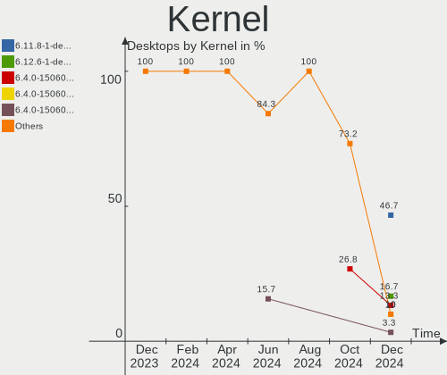
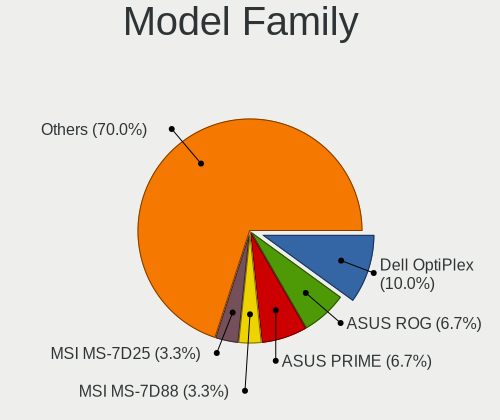
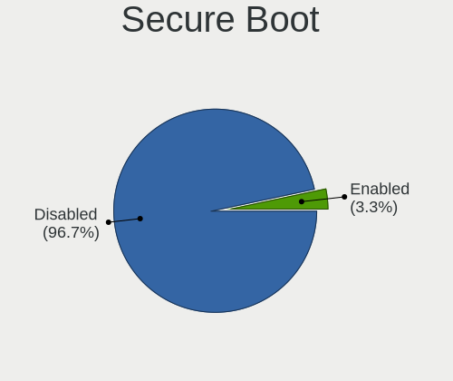
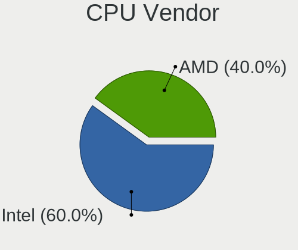
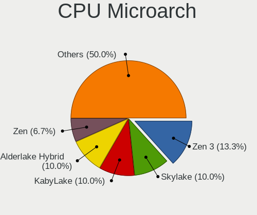
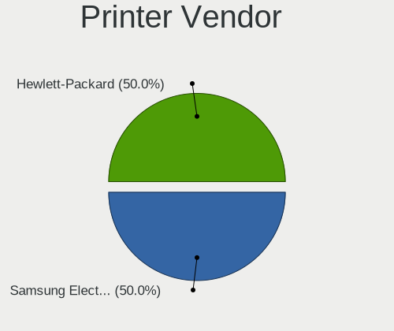
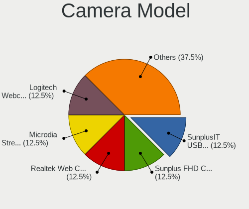
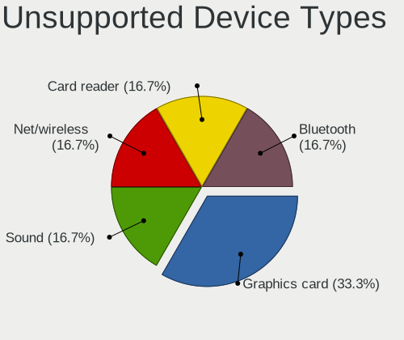

openSUSE - Hardware Trends (Desktops)
-------------------------------------

A project to identify most popular hardware characteristics and track their change
over time based on data collected by Linux users at https://Linux-Hardware.org.

Anyone can contribute to this report by the [hw-probe](https://github.com/linuxhw/hw-probe) tool:

    sudo -E hw-probe -all -upload

This report is for one last month. Overall report since the beginning of time: [TestCoverage](https://github.com/linuxhw/TestCoverage)

Period: Dec, 2022.

Contents
--------

* [ System ](#system)
  - [ OS                       ](#os)
  - [ OS Family                ](#os-family)
  - [ Kernel                   ](#kernel)
  - [ Kernel Family            ](#kernel-family)
  - [ Kernel Major Ver.        ](#kernel-major-ver)
  - [ Arch                     ](#arch)
  - [ DE                       ](#de)
  - [ Display Server           ](#display-server)
  - [ Display Manager          ](#display-manager)
  - [ OS Lang                  ](#os-lang)
  - [ Boot Mode                ](#boot-mode)
  - [ Filesystem               ](#filesystem)
  - [ Part. scheme             ](#part-scheme)
  - [ Dual Boot with Linux/BSD ](#dual-boot-with-linuxbsd)
  - [ Dual Boot (Win)          ](#dual-boot-win)

* [ Board ](#board)
  - [ Vendor                   ](#vendor)
  - [ Model                    ](#model)
  - [ Model Family             ](#model-family)
  - [ MFG Year                 ](#mfg-year)
  - [ Form Factor              ](#form-factor)
  - [ Secure Boot              ](#secure-boot)
  - [ Coreboot                 ](#coreboot)
  - [ RAM Size                 ](#ram-size)
  - [ RAM Used                 ](#ram-used)
  - [ Total Drives             ](#total-drives)
  - [ Has CD-ROM               ](#has-cd-rom)
  - [ Has Ethernet             ](#has-ethernet)
  - [ Has WiFi                 ](#has-wifi)
  - [ Has Bluetooth            ](#has-bluetooth)

* [ Location ](#location)
  - [ Country                  ](#country)
  - [ City                     ](#city)

* [ Drives ](#drives)
  - [ Drive Vendor             ](#drive-vendor)
  - [ Drive Model              ](#drive-model)
  - [ HDD Vendor               ](#hdd-vendor)
  - [ SSD Vendor               ](#ssd-vendor)
  - [ Drive Kind               ](#drive-kind)
  - [ Drive Connector          ](#drive-connector)
  - [ Drive Size               ](#drive-size)
  - [ Space Total              ](#space-total)
  - [ Space Used               ](#space-used)
  - [ Malfunc. Drives          ](#malfunc-drives)
  - [ Malfunc. Drive Vendor    ](#malfunc-drive-vendor)
  - [ Malfunc. HDD Vendor      ](#malfunc-hdd-vendor)
  - [ Malfunc. Drive Kind      ](#malfunc-drive-kind)
  - [ Failed Drives            ](#failed-drives)
  - [ Failed Drive Vendor      ](#failed-drive-vendor)
  - [ Drive Status             ](#drive-status)

* [ Storage controller ](#storage-controller)
  - [ Storage Vendor           ](#storage-vendor)
  - [ Storage Model            ](#storage-model)
  - [ Storage Kind             ](#storage-kind)

* [ Processor ](#processor)
  - [ CPU Vendor               ](#cpu-vendor)
  - [ CPU Model                ](#cpu-model)
  - [ CPU Model Family         ](#cpu-model-family)
  - [ CPU Cores                ](#cpu-cores)
  - [ CPU Sockets              ](#cpu-sockets)
  - [ CPU Threads              ](#cpu-threads)
  - [ CPU Op-Modes             ](#cpu-op-modes)
  - [ CPU Microcode            ](#cpu-microcode)
  - [ CPU Microarch            ](#cpu-microarch)

* [ Graphics ](#graphics)
  - [ GPU Vendor               ](#gpu-vendor)
  - [ GPU Model                ](#gpu-model)
  - [ GPU Combo                ](#gpu-combo)
  - [ GPU Driver               ](#gpu-driver)
  - [ GPU Memory               ](#gpu-memory)

* [ Monitor ](#monitor)
  - [ Monitor Vendor           ](#monitor-vendor)
  - [ Monitor Model            ](#monitor-model)
  - [ Monitor Resolution       ](#monitor-resolution)
  - [ Monitor Diagonal         ](#monitor-diagonal)
  - [ Monitor Width            ](#monitor-width)
  - [ Aspect Ratio             ](#aspect-ratio)
  - [ Monitor Area             ](#monitor-area)
  - [ Pixel Density            ](#pixel-density)
  - [ Multiple Monitors        ](#multiple-monitors)

* [ Network ](#network)
  - [ Net Controller Vendor    ](#net-controller-vendor)
  - [ Net Controller Model     ](#net-controller-model)
  - [ Wireless Vendor          ](#wireless-vendor)
  - [ Wireless Model           ](#wireless-model)
  - [ Ethernet Vendor          ](#ethernet-vendor)
  - [ Ethernet Model           ](#ethernet-model)
  - [ Net Controller Kind      ](#net-controller-kind)
  - [ Used Controller          ](#used-controller)
  - [ NICs                     ](#nics)
  - [ IPv6                     ](#ipv6)

* [ Bluetooth ](#bluetooth)
  - [ Bluetooth Vendor         ](#bluetooth-vendor)
  - [ Bluetooth Model          ](#bluetooth-model)

* [ Sound ](#sound)
  - [ Sound Vendor             ](#sound-vendor)
  - [ Sound Model              ](#sound-model)

* [ Memory ](#memory)
  - [ Memory Vendor            ](#memory-vendor)
  - [ Memory Model             ](#memory-model)
  - [ Memory Kind              ](#memory-kind)
  - [ Memory Form Factor       ](#memory-form-factor)
  - [ Memory Size              ](#memory-size)
  - [ Memory Speed             ](#memory-speed)

* [ Printers & scanners ](#printers--scanners)
  - [ Printer Vendor           ](#printer-vendor)
  - [ Printer Model            ](#printer-model)
  - [ Scanner Vendor           ](#scanner-vendor)
  - [ Scanner Model            ](#scanner-model)

* [ Camera ](#camera)
  - [ Camera Vendor            ](#camera-vendor)
  - [ Camera Model             ](#camera-model)

* [ Security ](#security)
  - [ Fingerprint Vendor       ](#fingerprint-vendor)
  - [ Fingerprint Model        ](#fingerprint-model)
  - [ Chipcard Vendor          ](#chipcard-vendor)
  - [ Chipcard Model           ](#chipcard-model)

* [ Unsupported ](#unsupported)
  - [ Unsupported Devices      ](#unsupported-devices)
  - [ Unsupported Device Types ](#unsupported-device-types)

System
------

OS
--

Installed operating systems

| Name                         | Desktops | Percent |
|------------------------------|----------|---------|
| openSUSE Tumbleweed-XXXXXXXX | 34       | 82.93%  |
| openSUSE Leap-15.4           | 3        | 7.32%   |
| openSUSE Microos-XXXXXXXX    | 2        | 4.88%   |
| openSUSE Leap-15.3           | 2        | 4.88%   |

OS Family
---------

OS without a version

| Name     | Desktops | Percent |
|----------|----------|---------|
| openSUSE | 41       | 100%    |

Kernel
------

Version of the Linux kernel

| Version                      | Desktops | Percent |
|------------------------------|----------|---------|
| 6.0.10-1-default             | 11       | 26.83%  |
| 6.0.12-1-default             | 10       | 24.39%  |
| 6.1.0-1-default              | 5        | 12.2%   |
| 6.0.8-1-default              | 5        | 12.2%   |
| 5.14.21-150400.24.33-default | 3        | 7.32%   |
| 6.1.1-1-default              | 2        | 4.88%   |
| 6.0.7-1-default              | 1        | 2.44%   |
| 6.0.12-1-pae                 | 1        | 2.44%   |
| 5.3.18-59.10-preempt         | 1        | 2.44%   |
| 5.3.18-150300.59.101-preempt | 1        | 2.44%   |
| 5.19.13-1-default            | 1        | 2.44%   |

Kernel Family
-------------

Linux kernel without a distro release

| Version | Desktops | Percent |
|---------|----------|---------|
| 6.0.12  | 11       | 26.83%  |
| 6.0.10  | 11       | 26.83%  |
| 6.1.0   | 5        | 12.2%   |
| 6.0.8   | 5        | 12.2%   |
| 5.14.21 | 3        | 7.32%   |
| 6.1.1   | 2        | 4.88%   |
| 5.3.18  | 2        | 4.88%   |
| 6.0.7   | 1        | 2.44%   |
| 5.19.13 | 1        | 2.44%   |

Kernel Major Ver.
-----------------

Linux kernel major version

| Version | Desktops | Percent |
|---------|----------|---------|
| 6.0     | 28       | 68.29%  |
| 6.1     | 7        | 17.07%  |
| 5.14    | 3        | 7.32%   |
| 5.3     | 2        | 4.88%   |
| 5.19    | 1        | 2.44%   |

Arch
----

OS architecture (x86_64, i586, etc.)

| Name   | Desktops | Percent |
|--------|----------|---------|
| x86_64 | 40       | 97.56%  |
| i686   | 1        | 2.44%   |

DE
--

Desktop Environment

| Name       | Desktops | Percent |
|------------|----------|---------|
| KDE5       | 26       | 63.41%  |
| GNOME      | 7        | 17.07%  |
| XFCE       | 2        | 4.88%   |
| X-Cinnamon | 1        | 2.44%   |
| Trinity    | 1        | 2.44%   |
| MATE       | 1        | 2.44%   |
| Deepin     | 1        | 2.44%   |
| awesome    | 1        | 2.44%   |
| Unknown    | 1        | 2.44%   |

Display Server
--------------

X11 or Wayland

| Name    | Desktops | Percent |
|---------|----------|---------|
| X11     | 31       | 75.61%  |
| Wayland | 10       | 24.39%  |

Display Manager
---------------

SDDM, LightDM, etc.

| Name    | Desktops | Percent |
|---------|----------|---------|
| Unknown | 22       | 53.66%  |
| SDDM    | 9        | 21.95%  |
| LightDM | 7        | 17.07%  |
| XDM     | 3        | 7.32%   |

OS Lang
-------

Language

| Lang  | Desktops | Percent |
|-------|----------|---------|
| en_US | 16       | 39.02%  |
| POSIX | 5        | 12.2%   |
| pt_BR | 4        | 9.76%   |
| de_DE | 4        | 9.76%   |
| it_IT | 3        | 7.32%   |
| en_GB | 3        | 7.32%   |
| ru_RU | 2        | 4.88%   |
| nn_NO | 1        | 2.44%   |
| fr_FR | 1        | 2.44%   |
| el_GR | 1        | 2.44%   |
| da_DK | 1        | 2.44%   |

Boot Mode
---------

EFI or BIOS

| Mode | Desktops | Percent |
|------|----------|---------|
| EFI  | 25       | 60.98%  |
| BIOS | 16       | 39.02%  |

Filesystem
----------

Type of filesystem

| Type  | Desktops | Percent |
|-------|----------|---------|
| Btrfs | 31       | 75.61%  |
| Ext4  | 10       | 24.39%  |

Part. scheme
------------

Scheme of partitioning

| Type    | Desktops | Percent |
|---------|----------|---------|
| Unknown | 22       | 53.66%  |
| GPT     | 16       | 39.02%  |
| MBR     | 3        | 7.32%   |

Dual Boot with Linux/BSD
------------------------

Hosting more than one Linux/BSD

| Dual boot | Desktops | Percent |
|-----------|----------|---------|
| No        | 36       | 87.8%   |
| Yes       | 5        | 12.2%   |

Dual Boot (Win)
---------------

Hosting Linux and Windows

| Dual boot | Desktops | Percent |
|-----------|----------|---------|
| No        | 32       | 78.05%  |
| Yes       | 9        | 21.95%  |

Board
-----

Vendor
------

Motherboard manufacturer

| Name                | Desktops | Percent |
|---------------------|----------|---------|
| Gigabyte Technology | 11       | 26.83%  |
| ASUSTek Computer    | 11       | 26.83%  |
| ASRock              | 7        | 17.07%  |
| MSI                 | 6        | 14.63%  |
| Dell                | 3        | 7.32%   |
| Medion              | 1        | 2.44%   |
| Hewlett-Packard     | 1        | 2.44%   |
| Acer                | 1        | 2.44%   |

Model
-----

Motherboard model

| Name                              | Desktops | Percent |
|-----------------------------------|----------|---------|
| Gigabyte B660M AORUS PRO AX DDR4  | 2        | 4.88%   |
| ASUS All Series                   | 2        | 4.88%   |
| MSI MS-7C91                       | 1        | 2.44%   |
| MSI MS-7C09                       | 1        | 2.44%   |
| MSI MS-7B78                       | 1        | 2.44%   |
| MSI MS-7A38                       | 1        | 2.44%   |
| MSI MS-7850                       | 1        | 2.44%   |
| MSI MS-7673                       | 1        | 2.44%   |
| Medion Akoya P4228 D/C223         | 1        | 2.44%   |
| HP 550-100nl                      | 1        | 2.44%   |
| Gigabyte Z270P-D3                 | 1        | 2.44%   |
| Gigabyte X470 AORUS GAMING 7 WIFI | 1        | 2.44%   |
| Gigabyte W480 VISION D            | 1        | 2.44%   |
| Gigabyte F2A68HM-H                | 1        | 2.44%   |
| Gigabyte B75M-D2V                 | 1        | 2.44%   |
| Gigabyte B550 AORUS PRO AC        | 1        | 2.44%   |
| Gigabyte B550 AORUS ELITE V2      | 1        | 2.44%   |
| Gigabyte B550 AORUS ELITE AX V2   | 1        | 2.44%   |
| Gigabyte B450 AORUS M             | 1        | 2.44%   |
| Dell OptiPlex 9020                | 1        | 2.44%   |
| Dell OptiPlex 390                 | 1        | 2.44%   |
| Dell Inspiron 519                 | 1        | 2.44%   |
| ASUS Z170 PRO GAMING              | 1        | 2.44%   |
| ASUS ROG STRIX B450-F GAMING      | 1        | 2.44%   |
| ASUS PRIME Z270-A                 | 1        | 2.44%   |
| ASUS PRIME B550-PLUS              | 1        | 2.44%   |
| ASUS PRIME B350M-A                | 1        | 2.44%   |
| ASUS Maximus IX HERO              | 1        | 2.44%   |
| ASUS M5A78L-M/USB3                | 1        | 2.44%   |
| ASUS M5A78L-M LX                  | 1        | 2.44%   |
| ASUS A8N-E                        | 1        | 2.44%   |
| ASRock X570 Steel Legend          | 1        | 2.44%   |
| ASRock H410M-HVS                  | 1        | 2.44%   |
| ASRock G41C-GS R2.0               | 1        | 2.44%   |
| ASRock B75M R2.0                  | 1        | 2.44%   |
| ASRock A320M-HD                   | 1        | 2.44%   |
| ASRock 970M Pro3                  | 1        | 2.44%   |
| ASRock 4X4-R1000                  | 1        | 2.44%   |
| Acer Veriton N4680GT              | 1        | 2.44%   |

Model Family
------------

Motherboard model prefix

| Name               | Desktops | Percent |
|--------------------|----------|---------|
| Gigabyte B550      | 3        | 7.32%   |
| ASUS PRIME         | 3        | 7.32%   |
| Gigabyte B660M     | 2        | 4.88%   |
| Dell OptiPlex      | 2        | 4.88%   |
| ASUS M5A78L-M      | 2        | 4.88%   |
| ASUS All           | 2        | 4.88%   |
| MSI MS-7C91        | 1        | 2.44%   |
| MSI MS-7C09        | 1        | 2.44%   |
| MSI MS-7B78        | 1        | 2.44%   |
| MSI MS-7A38        | 1        | 2.44%   |
| MSI MS-7850        | 1        | 2.44%   |
| MSI MS-7673        | 1        | 2.44%   |
| Medion Akoya       | 1        | 2.44%   |
| HP 550-100nl       | 1        | 2.44%   |
| Gigabyte Z270P-D3  | 1        | 2.44%   |
| Gigabyte X470      | 1        | 2.44%   |
| Gigabyte W480      | 1        | 2.44%   |
| Gigabyte F2A68HM-H | 1        | 2.44%   |
| Gigabyte B75M-D2V  | 1        | 2.44%   |
| Gigabyte B450      | 1        | 2.44%   |
| Dell Inspiron      | 1        | 2.44%   |
| ASUS Z170          | 1        | 2.44%   |
| ASUS ROG           | 1        | 2.44%   |
| ASUS Maximus       | 1        | 2.44%   |
| ASUS A8N-E         | 1        | 2.44%   |
| ASRock X570        | 1        | 2.44%   |
| ASRock H410M-HVS   | 1        | 2.44%   |
| ASRock G41C-GS     | 1        | 2.44%   |
| ASRock B75M        | 1        | 2.44%   |
| ASRock A320M-HD    | 1        | 2.44%   |
| ASRock 970M        | 1        | 2.44%   |
| ASRock 4X4-R1000   | 1        | 2.44%   |
| Acer Veriton       | 1        | 2.44%   |

MFG Year
--------

Motherboard manufacture year

| Year | Desktops | Percent |
|------|----------|---------|
| 2018 | 7        | 17.07%  |
| 2020 | 6        | 14.63%  |
| 2021 | 4        | 9.76%   |
| 2011 | 4        | 9.76%   |
| 2019 | 3        | 7.32%   |
| 2017 | 3        | 7.32%   |
| 2015 | 3        | 7.32%   |
| 2013 | 3        | 7.32%   |
| 2016 | 2        | 4.88%   |
| 2014 | 2        | 4.88%   |
| 2012 | 2        | 4.88%   |
| 2009 | 1        | 2.44%   |
| 2005 | 1        | 2.44%   |

Form Factor
-----------

Physical design of the computer

| Name    | Desktops | Percent |
|---------|----------|---------|
| Desktop | 41       | 100%    |

Secure Boot
-----------

Enabled or disabled

| State    | Desktops | Percent |
|----------|----------|---------|
| Disabled | 38       | 92.68%  |
| Enabled  | 3        | 7.32%   |

Coreboot
--------

Have coreboot on board

| Used | Desktops | Percent |
|------|----------|---------|
| No   | 41       | 100%    |

RAM Size
--------

Total RAM memory

| Size in GB  | Desktops | Percent |
|-------------|----------|---------|
| 32.01-64.0  | 13       | 31.71%  |
| 8.01-16.0   | 10       | 24.39%  |
| 16.01-24.0  | 9        | 21.95%  |
| 4.01-8.0    | 3        | 7.32%   |
| 64.01-256.0 | 3        | 7.32%   |
| 3.01-4.0    | 2        | 4.88%   |
| 24.01-32.0  | 1        | 2.44%   |

RAM Used
--------

Used RAM memory

| Used GB   | Desktops | Percent |
|-----------|----------|---------|
| 3.01-4.0  | 12       | 29.27%  |
| 4.01-8.0  | 11       | 26.83%  |
| 2.01-3.0  | 10       | 24.39%  |
| 1.01-2.0  | 5        | 12.2%   |
| 8.01-16.0 | 2        | 4.88%   |
| 0.51-1.0  | 1        | 2.44%   |

Total Drives
------------

Number of drives on board

| Drives | Desktops | Percent |
|--------|----------|---------|
| 2      | 11       | 26.83%  |
| 1      | 11       | 26.83%  |
| 3      | 9        | 21.95%  |
| 7      | 3        | 7.32%   |
| 4      | 3        | 7.32%   |
| 6      | 2        | 4.88%   |
| 5      | 2        | 4.88%   |

Has CD-ROM
----------

Has CD-ROM on board

| Presented | Desktops | Percent |
|-----------|----------|---------|
| No        | 24       | 58.54%  |
| Yes       | 17       | 41.46%  |

Has Ethernet
------------

Has Ethernet on board

| Presented | Desktops | Percent |
|-----------|----------|---------|
| Yes       | 40       | 97.56%  |
| No        | 1        | 2.44%   |

Has WiFi
--------

Has WiFi module

| Presented | Desktops | Percent |
|-----------|----------|---------|
| Yes       | 26       | 63.41%  |
| No        | 15       | 36.59%  |

Has Bluetooth
-------------

Has Bluetooth module

| Presented | Desktops | Percent |
|-----------|----------|---------|
| No        | 24       | 58.54%  |
| Yes       | 17       | 41.46%  |

Location
--------

Country
-------

Geographic location (country)

| Country     | Desktops | Percent |
|-------------|----------|---------|
| USA         | 10       | 24.39%  |
| Germany     | 6        | 14.63%  |
| Italy       | 4        | 9.76%   |
| Brazil      | 4        | 9.76%   |
| UK          | 3        | 7.32%   |
| Russia      | 2        | 4.88%   |
| Greece      | 2        | 4.88%   |
| Canada      | 2        | 4.88%   |
| Switzerland | 1        | 2.44%   |
| Spain       | 1        | 2.44%   |
| Slovakia    | 1        | 2.44%   |
| Singapore   | 1        | 2.44%   |
| Norway      | 1        | 2.44%   |
| France      | 1        | 2.44%   |
| Denmark     | 1        | 2.44%   |
| Czechia     | 1        | 2.44%   |

City
----

Geographic location (city)

| City              | Desktops | Percent |
|-------------------|----------|---------|
| Sao Paulo         | 2        | 4.88%   |
| Ocala             | 2        | 4.88%   |
| Alfonsine         | 2        | 4.88%   |
| Uslar             | 1        | 2.44%   |
| Ulm               | 1        | 2.44%   |
| Summerside        | 1        | 2.44%   |
| Stuttgart         | 1        | 2.44%   |
| St Petersburg     | 1        | 2.44%   |
| Singapore         | 1        | 2.44%   |
| Rivarolo Canavese | 1        | 2.44%   |
| Ratingen          | 1        | 2.44%   |
| Prague            | 1        | 2.44%   |
| Paranaiba         | 1        | 2.44%   |
| Old Faliron       | 1        | 2.44%   |
| Novosibirsk       | 1        | 2.44%   |
| Nova Friburgo     | 1        | 2.44%   |
| Mold              | 1        | 2.44%   |
| Milan             | 1        | 2.44%   |
| Miami             | 1        | 2.44%   |
| Mattoon           | 1        | 2.44%   |
| Lorqui            | 1        | 2.44%   |
| London            | 1        | 2.44%   |
| Littleton         | 1        | 2.44%   |
| Lausanne          | 1        | 2.44%   |
| Konstanz          | 1        | 2.44%   |
| Ishøj            | 1        | 2.44%   |
| Frisco            | 1        | 2.44%   |
| Dresden           | 1        | 2.44%   |
| Denton            | 1        | 2.44%   |
| Dartmouth         | 1        | 2.44%   |
| Carrollton        | 1        | 2.44%   |
| Caerleon          | 1        | 2.44%   |
| Bratislava        | 1        | 2.44%   |
| Bergen            | 1        | 2.44%   |
| Austin            | 1        | 2.44%   |
| Athens            | 1        | 2.44%   |
| Anglet            | 1        | 2.44%   |
| Albuquerque       | 1        | 2.44%   |

Drives
------

Drive Vendor
------------

Hard drive vendors

| Vendor                      | Desktops | Drives | Percent |
|-----------------------------|----------|--------|---------|
| Seagate                     | 18       | 24     | 19.35%  |
| WDC                         | 16       | 25     | 17.2%   |
| Samsung Electronics         | 13       | 18     | 13.98%  |
| Crucial                     | 7        | 8      | 7.53%   |
| Kingston                    | 6        | 6      | 6.45%   |
| Toshiba                     | 5        | 5      | 5.38%   |
| SanDisk                     | 5        | 8      | 5.38%   |
| Phison Electronics          | 4        | 4      | 4.3%    |
| Unknown                     | 2        | 2      | 2.15%   |
| SK hynix                    | 2        | 2      | 2.15%   |
| Patriot                     | 2        | 2      | 2.15%   |
| Kingston Technology Company | 2        | 2      | 2.15%   |
| Intel                       | 2        | 2      | 2.15%   |
| Team                        | 1        | 1      | 1.08%   |
| sobetter                    | 1        | 2      | 1.08%   |
| Silicon Motion              | 1        | 1      | 1.08%   |
| Realtek Semiconductor       | 1        | 1      | 1.08%   |
| Maxtor                      | 1        | 1      | 1.08%   |
| JMicron Technology          | 1        | 1      | 1.08%   |
| Fanxiang                    | 1        | 1      | 1.08%   |
| China                       | 1        | 1      | 1.08%   |
| Apacer                      | 1        | 2      | 1.08%   |

Drive Model
-----------

Hard drive models

| Model                                               | Desktops | Percent |
|-----------------------------------------------------|----------|---------|
| Phison E12 NVMe Controller 1TB                      | 3        | 2.73%   |
| Seagate ST2000DM008-2FR102 2TB                      | 2        | 1.82%   |
| Seagate ST2000DM001-1ER164 2TB                      | 2        | 1.82%   |
| Seagate ST1000DM003-1CH162 1TB                      | 2        | 1.82%   |
| Seagate Expansion 4TB                               | 2        | 1.82%   |
| Samsung NVMe SSD Controller SM981/PM981/PM983 500GB | 2        | 1.82%   |
| Samsung NVMe SSD Controller SM961/PM961/SM963 256GB | 2        | 1.82%   |
| Kingston Company A2000 NVMe SSD 1TB                 | 2        | 1.82%   |
| Kingston SA400S37480G 480GB SSD                     | 2        | 1.82%   |
| Crucial CT500MX500SSD1 500GB                        | 2        | 1.82%   |
| WDC WDS500G2B0A-00SM50 500GB SSD                    | 1        | 0.91%   |
| WDC WD7500BPKT-80PK4T0 752GB                        | 1        | 0.91%   |
| WDC WD6400AAKS-75A7B2 640GB                         | 1        | 0.91%   |
| WDC WD6400AAKS-22A7B2 640GB                         | 1        | 0.91%   |
| WDC WD5000AAKX-75U6AA0 500GB                        | 1        | 0.91%   |
| WDC WD40EFAX-68JH4N1 4TB                            | 1        | 0.91%   |
| WDC WD2500AAKX-001CA0 250GB                         | 1        | 0.91%   |
| WDC WD2500AAJS-75M0A0 249GB                         | 1        | 0.91%   |
| WDC WD20PURX-64P6ZY0 2TB                            | 1        | 0.91%   |
| WDC WD20EZRZ-00Z5HB0 2TB                            | 1        | 0.91%   |
| WDC WD20EZAZ-00GGJB0 2TB                            | 1        | 0.91%   |
| WDC WD2003FZEX-00Z4SA0 2TB                          | 1        | 0.91%   |
| WDC WD10EZEX-60WN4A0 1TB                            | 1        | 0.91%   |
| WDC WD10EZEX-60W 1TB                                | 1        | 0.91%   |
| WDC WD10EZEX-21WN4A0 1TB                            | 1        | 0.91%   |
| WDC WD10EZEX-08WN4A0 1TB                            | 1        | 0.91%   |
| WDC WD10EZEX-00UD2A0 1TB                            | 1        | 0.91%   |
| WDC WD10EFRX-68FYTN0 1TB                            | 1        | 0.91%   |
| WDC WD10EADS-00M2B0 1TB                             | 1        | 0.91%   |
| WDC WD10EADS-00L5B1 1TB                             | 1        | 0.91%   |
| Unknown SD/MMC/MS PRO 64GB                          | 1        | 0.91%   |
| Unknown 256GB PCS 2.5" S SSD                        | 1        | 0.91%   |
| Toshiba TL100 240GB SSD                             | 1        | 0.91%   |
| Toshiba MQ01ABF032 320GB                            | 1        | 0.91%   |
| Toshiba MG08ADA800E 8TB                             | 1        | 0.91%   |
| Toshiba HDWE150 5TB                                 | 1        | 0.91%   |
| Toshiba HDWD105 500GB                               | 1        | 0.91%   |
| Team T253X2256G 256GB SSD                           | 1        | 0.91%   |
| sobetter EXT 640GB                                  | 1        | 0.91%   |
| SK hynix SH920 2.5 7MM 256GB SSD                    | 1        | 0.91%   |

HDD Vendor
----------

Hard disk drive vendors

| Vendor              | Desktops | Drives | Percent |
|---------------------|----------|--------|---------|
| Seagate             | 18       | 24     | 42.86%  |
| WDC                 | 15       | 24     | 35.71%  |
| Toshiba             | 4        | 4      | 9.52%   |
| Samsung Electronics | 3        | 4      | 7.14%   |
| Unknown             | 1        | 1      | 2.38%   |
| Maxtor              | 1        | 1      | 2.38%   |

SSD Vendor
----------

Solid state drive vendors

| Vendor              | Desktops | Drives | Percent |
|---------------------|----------|--------|---------|
| Samsung Electronics | 8        | 10     | 25%     |
| Crucial             | 7        | 8      | 21.88%  |
| Kingston            | 5        | 5      | 15.63%  |
| Patriot             | 2        | 2      | 6.25%   |
| WDC                 | 1        | 1      | 3.13%   |
| Unknown             | 1        | 1      | 3.13%   |
| Toshiba             | 1        | 1      | 3.13%   |
| Team                | 1        | 1      | 3.13%   |
| SK hynix            | 1        | 1      | 3.13%   |
| SanDisk             | 1        | 1      | 3.13%   |
| JMicron Technology  | 1        | 1      | 3.13%   |
| Intel               | 1        | 1      | 3.13%   |
| China               | 1        | 1      | 3.13%   |
| Apacer              | 1        | 2      | 3.13%   |

Drive Kind
----------

HDD or SSD

| Kind    | Desktops | Drives | Percent |
|---------|----------|--------|---------|
| HDD     | 30       | 58     | 40.54%  |
| SSD     | 26       | 36     | 35.14%  |
| NVMe    | 16       | 22     | 21.62%  |
| Unknown | 2        | 3      | 2.7%    |

Drive Connector
---------------

SATA, SAS, NVMe, etc.

| Type | Desktops | Drives | Percent |
|------|----------|--------|---------|
| SATA | 37       | 90     | 63.79%  |
| NVMe | 16       | 22     | 27.59%  |
| SAS  | 5        | 7      | 8.62%   |

Drive Size
----------

Size of hard drive

| Size in TB | Desktops | Drives | Percent |
|------------|----------|--------|---------|
| 0.01-0.5   | 25       | 42     | 41.67%  |
| 0.51-1.0   | 19       | 31     | 31.67%  |
| 1.01-2.0   | 8        | 10     | 13.33%  |
| 3.01-4.0   | 4        | 5      | 6.67%   |
| 4.01-10.0  | 3        | 5      | 5%      |
| 10.01-20.0 | 1        | 1      | 1.67%   |

Space Total
-----------

Amount of disk space available on the file system

| Size in GB     | Desktops | Percent |
|----------------|----------|---------|
| More than 3000 | 15       | 36.59%  |
| 1001-2000      | 10       | 24.39%  |
| 251-500        | 6        | 14.63%  |
| 2001-3000      | 4        | 9.76%   |
| 501-1000       | 4        | 9.76%   |
| 21-50          | 1        | 2.44%   |
| 101-250        | 1        | 2.44%   |

Space Used
----------

Amount of used disk space

| Used GB        | Desktops | Percent |
|----------------|----------|---------|
| 101-250        | 9        | 21.95%  |
| 1001-2000      | 8        | 19.51%  |
| 51-100         | 7        | 17.07%  |
| 501-1000       | 6        | 14.63%  |
| 251-500        | 5        | 12.2%   |
| More than 3000 | 3        | 7.32%   |
| 21-50          | 2        | 4.88%   |
| 1-20           | 1        | 2.44%   |

Malfunc. Drives
---------------

Drive models with a malfunction

| Model                                       | Desktops | Drives | Percent |
|---------------------------------------------|----------|--------|---------|
| WDC WD6400AAKS-22A7B2 640GB                 | 1        | 1      | 12.5%   |
| WDC WD2500AAKX-001CA0 250GB                 | 1        | 1      | 12.5%   |
| WDC WD2500AAJS-75M0A0 249GB                 | 1        | 1      | 12.5%   |
| Toshiba HDWD105 500GB                       | 1        | 1      | 12.5%   |
| Seagate ST3500418AS 500GB                   | 1        | 1      | 12.5%   |
| Seagate ST3250823AS 250GB                   | 1        | 1      | 12.5%   |
| Seagate ST1000NM0011 99Y1164 59Y1812XIV 1TB | 1        | 1      | 12.5%   |
| Samsung Electronics HM251JI 250GB           | 1        | 1      | 12.5%   |

Malfunc. Drive Vendor
---------------------

Vendors of faulty drives

| Vendor              | Desktops | Drives | Percent |
|---------------------|----------|--------|---------|
| Seagate             | 3        | 3      | 42.86%  |
| WDC                 | 2        | 3      | 28.57%  |
| Toshiba             | 1        | 1      | 14.29%  |
| Samsung Electronics | 1        | 1      | 14.29%  |

Malfunc. HDD Vendor
-------------------

Vendors of faulty HDD drives

| Vendor              | Desktops | Drives | Percent |
|---------------------|----------|--------|---------|
| Seagate             | 3        | 3      | 42.86%  |
| WDC                 | 2        | 3      | 28.57%  |
| Toshiba             | 1        | 1      | 14.29%  |
| Samsung Electronics | 1        | 1      | 14.29%  |

Malfunc. Drive Kind
-------------------

Kinds of faulty drives

| Kind | Desktops | Drives | Percent |
|------|----------|--------|---------|
| HDD  | 6        | 8      | 100%    |

Failed Drives
-------------

Failed drive models

Zero info for selected period =(

Failed Drive Vendor
-------------------

Failed drive vendors

Zero info for selected period =(

Drive Status
------------

Number of failed and malfunc. drives

| Status   | Desktops | Drives | Percent |
|----------|----------|--------|---------|
| Detected | 25       | 77     | 52.08%  |
| Works    | 17       | 34     | 35.42%  |
| Malfunc  | 6        | 8      | 12.5%   |

Storage controller
------------------

Storage Vendor
--------------

Storage controller vendors

| Vendor                      | Desktops | Percent |
|-----------------------------|----------|---------|
| AMD                         | 21       | 35.59%  |
| Intel                       | 19       | 32.2%   |
| SanDisk                     | 4        | 6.78%   |
| Samsung Electronics         | 4        | 6.78%   |
| Phison Electronics          | 3        | 5.08%   |
| Kingston Technology Company | 3        | 5.08%   |
| SK hynix                    | 1        | 1.69%   |
| Silicon Motion              | 1        | 1.69%   |
| Realtek Semiconductor       | 1        | 1.69%   |
| Nvidia                      | 1        | 1.69%   |
| ASMedia Technology          | 1        | 1.69%   |

Storage Model
-------------

Storage controller models

| Model                                                                                   | Desktops | Percent |
|-----------------------------------------------------------------------------------------|----------|---------|
| AMD FCH SATA Controller [AHCI mode]                                                     | 10       | 13.51%  |
| AMD 500 Series Chipset SATA Controller                                                  | 5        | 6.76%   |
| AMD 400 Series Chipset SATA Controller                                                  | 5        | 6.76%   |
| AMD SB7x0/SB8x0/SB9x0 IDE Controller                                                    | 4        | 5.41%   |
| SanDisk Non-Volatile memory controller                                                  | 3        | 4.05%   |
| Intel SATA Controller [RAID mode]                                                       | 3        | 4.05%   |
| Intel 8 Series/C220 Series Chipset Family 6-port SATA Controller 1 [AHCI mode]          | 3        | 4.05%   |
| AMD SB7x0/SB8x0/SB9x0 SATA Controller [IDE mode]                                        | 3        | 4.05%   |
| Samsung NVMe SSD Controller SM981/PM981/PM983                                           | 2        | 2.7%    |
| Samsung NVMe SSD Controller SM961/PM961/SM963                                           | 2        | 2.7%    |
| Phison E12 NVMe Controller                                                              | 2        | 2.7%    |
| Kingston Company A2000 NVMe SSD                                                         | 2        | 2.7%    |
| Intel 7 Series/C210 Series Chipset Family 6-port SATA Controller [AHCI mode]            | 2        | 2.7%    |
| Intel 200 Series PCH SATA controller [AHCI mode]                                        | 2        | 2.7%    |
| SK hynix Gold P31/PC711 NVMe Solid State Drive                                          | 1        | 1.35%   |
| Silicon Motion SM2262/SM2262EN SSD Controller                                           | 1        | 1.35%   |
| SanDisk WD Blue SN570 NVMe SSD                                                          | 1        | 1.35%   |
| SanDisk WD Blue SN550 NVMe SSD                                                          | 1        | 1.35%   |
| SanDisk WD Black 2018/SN750 / PC SN720 NVMe SSD                                         | 1        | 1.35%   |
| Realtek Realtek Non-Volatile memory controller                                          | 1        | 1.35%   |
| Phison E18 PCIe4 NVMe Controller                                                        | 1        | 1.35%   |
| Nvidia CK804 Serial ATA Controller                                                      | 1        | 1.35%   |
| Nvidia CK804 IDE                                                                        | 1        | 1.35%   |
| Kingston Company SNVS2000G [NV1 NVMe PCIe SSD 2TB]                                      | 1        | 1.35%   |
| Intel SSD 660P Series                                                                   | 1        | 1.35%   |
| Intel NM10/ICH7 Family SATA Controller [IDE mode]                                       | 1        | 1.35%   |
| Intel Comet Lake SATA AHCI Controller                                                   | 1        | 1.35%   |
| Intel Alder Lake-S PCH SATA Controller [AHCI Mode]                                      | 1        | 1.35%   |
| Intel 9 Series Chipset Family SATA Controller [AHCI Mode]                               | 1        | 1.35%   |
| Intel 82801G (ICH7 Family) IDE Controller                                               | 1        | 1.35%   |
| Intel 6 Series/C200 Series Chipset Family Desktop SATA Controller (IDE mode, ports 4-5) | 1        | 1.35%   |
| Intel 6 Series/C200 Series Chipset Family Desktop SATA Controller (IDE mode, ports 0-3) | 1        | 1.35%   |
| Intel 6 Series/C200 Series Chipset Family 6 port Desktop SATA AHCI Controller           | 1        | 1.35%   |
| Intel 500 Series Chipset Family SATA AHCI Controller                                    | 1        | 1.35%   |
| Intel 400 Series Chipset Family SATA AHCI Controller                                    | 1        | 1.35%   |
| ASMedia ASM1062 Serial ATA Controller                                                   | 1        | 1.35%   |
| AMD SB7x0/SB8x0/SB9x0 SATA Controller [AHCI mode]                                       | 1        | 1.35%   |
| AMD FCH SATA Controller [IDE mode]                                                      | 1        | 1.35%   |
| AMD FCH SATA Controller D                                                               | 1        | 1.35%   |
| AMD 300 Series Chipset SATA Controller                                                  | 1        | 1.35%   |

Storage Kind
------------

Kind of storage controller (IDE, SATA, NVMe, SAS, ...)

| Kind | Desktops | Percent |
|------|----------|---------|
| SATA | 34       | 57.63%  |
| NVMe | 15       | 25.42%  |
| IDE  | 7        | 11.86%  |
| RAID | 3        | 5.08%   |

Processor
---------

CPU Vendor
----------

Processor vendors

| Vendor | Desktops | Percent |
|--------|----------|---------|
| AMD    | 22       | 53.66%  |
| Intel  | 19       | 46.34%  |

CPU Model
---------

Processor models

| Model                                          | Desktops | Percent |
|------------------------------------------------|----------|---------|
| AMD Ryzen 5 2600 Six-Core Processor            | 2        | 4.88%   |
| AMD Ryzen 5 1600 Six-Core Processor            | 2        | 4.88%   |
| Intel Xeon W-1250 CPU @ 3.30GHz                | 1        | 2.44%   |
| Intel Pentium CPU G3220 @ 3.00GHz              | 1        | 2.44%   |
| Intel Core i7-7700K CPU @ 4.20GHz              | 1        | 2.44%   |
| Intel Core i7-7700 CPU @ 3.60GHz               | 1        | 2.44%   |
| Intel Core i7-6700K CPU @ 4.00GHz              | 1        | 2.44%   |
| Intel Core i7-4790K CPU @ 4.00GHz              | 1        | 2.44%   |
| Intel Core i7-4790 CPU @ 3.60GHz               | 1        | 2.44%   |
| Intel Core i7-10700 CPU @ 2.90GHz              | 1        | 2.44%   |
| Intel Core i5-9400 CPU @ 2.90GHz               | 1        | 2.44%   |
| Intel Core i5-7500 CPU @ 3.40GHz               | 1        | 2.44%   |
| Intel Core i5-3570K CPU @ 3.40GHz              | 1        | 2.44%   |
| Intel Core i5-3450 CPU @ 3.10GHz               | 1        | 2.44%   |
| Intel Core i5-2500 CPU @ 3.30GHz               | 1        | 2.44%   |
| Intel Core i3-4150T CPU @ 3.00GHz              | 1        | 2.44%   |
| Intel Core i3-2100 CPU @ 3.10GHz               | 1        | 2.44%   |
| Intel Core 2 Quad CPU Q6600 @ 2.40GHz          | 1        | 2.44%   |
| Intel 12th Gen Core i7-12700F                  | 1        | 2.44%   |
| Intel 12th Gen Core i5-12400                   | 1        | 2.44%   |
| Intel 11th Gen Core i5-11500T @ 1.50GHz        | 1        | 2.44%   |
| AMD Ryzen Embedded R1505G with Radeon Vega Gfx | 1        | 2.44%   |
| AMD Ryzen 9 5900X 12-Core Processor            | 1        | 2.44%   |
| AMD Ryzen 9 3900X 12-Core Processor            | 1        | 2.44%   |
| AMD Ryzen 7 5800X 8-Core Processor             | 1        | 2.44%   |
| AMD Ryzen 7 5700X 8-Core Processor             | 1        | 2.44%   |
| AMD Ryzen 7 2700 Eight-Core Processor          | 1        | 2.44%   |
| AMD Ryzen 5 5600X 6-Core Processor             | 1        | 2.44%   |
| AMD Ryzen 5 5600G with Radeon Graphics         | 1        | 2.44%   |
| AMD Ryzen 5 3500X 6-Core Processor             | 1        | 2.44%   |
| AMD Ryzen 5 3400G with Radeon Vega Graphics    | 1        | 2.44%   |
| AMD FX-8350 Eight-Core Processor               | 1        | 2.44%   |
| AMD FX-6300 Six-Core Processor                 | 1        | 2.44%   |
| AMD Athlon II X3 455 Processor                 | 1        | 2.44%   |
| AMD Athlon Dual Core Processor 4450e           | 1        | 2.44%   |
| AMD Athlon 64 X2 Dual Core Processor 3800+     | 1        | 2.44%   |
| AMD A8-7600 Radeon R7, 10 Compute Cores 4C+6G  | 1        | 2.44%   |
| AMD A4-7300 APU with Radeon HD Graphics        | 1        | 2.44%   |
| AMD A10-7800 Radeon R7, 12 Compute Cores 4C+8G | 1        | 2.44%   |

CPU Model Family
----------------

Processor model prefix

| Model                | Desktops | Percent |
|----------------------|----------|---------|
| AMD Ryzen 5          | 8        | 19.51%  |
| Intel Core i7        | 6        | 14.63%  |
| Intel Core i5        | 5        | 12.2%   |
| Other                | 3        | 7.32%   |
| AMD Ryzen 7          | 3        | 7.32%   |
| Intel Core i3        | 2        | 4.88%   |
| AMD Ryzen 9          | 2        | 4.88%   |
| AMD FX               | 2        | 4.88%   |
| Intel Xeon           | 1        | 2.44%   |
| Intel Pentium        | 1        | 2.44%   |
| Intel Core 2 Quad    | 1        | 2.44%   |
| AMD Ryzen Embedded   | 1        | 2.44%   |
| AMD Athlon II X3     | 1        | 2.44%   |
| AMD Athlon Dual Core | 1        | 2.44%   |
| AMD Athlon 64 X2     | 1        | 2.44%   |
| AMD A8               | 1        | 2.44%   |
| AMD A4               | 1        | 2.44%   |
| AMD A10              | 1        | 2.44%   |

CPU Cores
---------

Number of processor cores

| Number | Desktops | Percent |
|--------|----------|---------|
| 4      | 12       | 29.27%  |
| 6      | 11       | 26.83%  |
| 2      | 8        | 19.51%  |
| 8      | 4        | 9.76%   |
| 12     | 3        | 7.32%   |
| 3      | 2        | 4.88%   |
| 1      | 1        | 2.44%   |

CPU Sockets
-----------

Number of sockets

| Number | Desktops | Percent |
|--------|----------|---------|
| 1      | 41       | 100%    |

CPU Threads
-----------

Threads per core (Hyper-Threading)

| Number | Desktops | Percent |
|--------|----------|---------|
| 2      | 30       | 73.17%  |
| 1      | 11       | 26.83%  |

CPU Op-Modes
------------

CPU Operation Modes (32-bit, 64-bit)

| Op mode        | Desktops | Percent |
|----------------|----------|---------|
| 32-bit, 64-bit | 41       | 100%    |

CPU Microcode
-------------

Microcode number

| Number     | Desktops | Percent |
|------------|----------|---------|
| Unknown    | 6        | 14.63%  |
| 0x306c3    | 4        | 9.76%   |
| 0x906e9    | 3        | 7.32%   |
| 0x306a9    | 2        | 4.88%   |
| 0x206a7    | 2        | 4.88%   |
| 0x0a201016 | 2        | 4.88%   |
| 0x08108109 | 2        | 4.88%   |
| 0x08001138 | 2        | 4.88%   |
| 0x06000852 | 2        | 4.88%   |
| 0xa0671    | 1        | 2.44%   |
| 0xa0655    | 1        | 2.44%   |
| 0x906ea    | 1        | 2.44%   |
| 0x90675    | 1        | 2.44%   |
| 0x90672    | 1        | 2.44%   |
| 0x6fb      | 1        | 2.44%   |
| 0x506e3    | 1        | 2.44%   |
| 0x0a50000d | 1        | 2.44%   |
| 0x0a20120a | 1        | 2.44%   |
| 0x0a201005 | 1        | 2.44%   |
| 0x08701021 | 1        | 2.44%   |
| 0x0800820d | 1        | 2.44%   |
| 0x06003106 | 1        | 2.44%   |
| 0x06003104 | 1        | 2.44%   |
| 0x06001119 | 1        | 2.44%   |
| 0x010000c8 | 1        | 2.44%   |

CPU Microarch
-------------

Microarchitecture

| Name             | Desktops | Percent |
|------------------|----------|---------|
| Zen+             | 5        | 12.2%   |
| Zen 3            | 5        | 12.2%   |
| KabyLake         | 4        | 9.76%   |
| Haswell          | 4        | 9.76%   |
| Piledriver       | 3        | 7.32%   |
| Zen 2            | 2        | 4.88%   |
| Zen              | 2        | 4.88%   |
| Steamroller      | 2        | 4.88%   |
| SandyBridge      | 2        | 4.88%   |
| K8 Hammer        | 2        | 4.88%   |
| IvyBridge        | 2        | 4.88%   |
| CometLake        | 2        | 4.88%   |
| Alderlake Hybrid | 2        | 4.88%   |
| Skylake          | 1        | 2.44%   |
| K10              | 1        | 2.44%   |
| Icelake          | 1        | 2.44%   |
| Core             | 1        | 2.44%   |

Graphics
--------

GPU Vendor
----------

Vendors of graphics cards

| Vendor | Desktops | Percent |
|--------|----------|---------|
| Nvidia | 19       | 42.22%  |
| AMD    | 15       | 33.33%  |
| Intel  | 11       | 24.44%  |

GPU Model
---------

Graphics card models

| Model                                                                       | Desktops | Percent |
|-----------------------------------------------------------------------------|----------|---------|
| Intel Xeon E3-1200 v3/4th Gen Core Processor Integrated Graphics Controller | 3        | 6.38%   |
| Nvidia GP106 [GeForce GTX 1060 3GB]                                         | 2        | 4.26%   |
| Nvidia GP104 [GeForce GTX 1070]                                             | 2        | 4.26%   |
| Nvidia GM107 [GeForce GTX 750 Ti]                                           | 2        | 4.26%   |
| AMD Picasso/Raven 2 [Radeon Vega Series / Radeon Vega Mobile Series]        | 2        | 4.26%   |
| AMD Navi 22 [Radeon RX 6700/6700 XT/6750 XT / 6800M]                        | 2        | 4.26%   |
| Nvidia TU117 [GeForce GTX 1650]                                             | 1        | 2.13%   |
| Nvidia TU106 [GeForce RTX 2070 Rev. A]                                      | 1        | 2.13%   |
| Nvidia TU104 [GeForce RTX 2060]                                             | 1        | 2.13%   |
| Nvidia GP108 [GeForce GT 1030]                                              | 1        | 2.13%   |
| Nvidia GP106 [GeForce GTX 1060 6GB]                                         | 1        | 2.13%   |
| Nvidia GP104 [GeForce GTX 1080]                                             | 1        | 2.13%   |
| Nvidia GM107GL [Quadro K620]                                                | 1        | 2.13%   |
| Nvidia GM107 [GeForce GTX 750]                                              | 1        | 2.13%   |
| Nvidia GK208B [GeForce GT 730]                                              | 1        | 2.13%   |
| Nvidia GK208B [GeForce GT 710]                                              | 1        | 2.13%   |
| Nvidia GF119 [GeForce GT 520]                                               | 1        | 2.13%   |
| Nvidia GF108 [GeForce GT 430]                                               | 1        | 2.13%   |
| Nvidia G98 [GeForce 8400 GS Rev. 2]                                         | 1        | 2.13%   |
| Intel Xeon E3-1200 v2/3rd Gen Core processor Graphics Controller            | 1        | 2.13%   |
| Intel RocketLake-S GT1 [UHD Graphics 750]                                   | 1        | 2.13%   |
| Intel HD Graphics 530                                                       | 1        | 2.13%   |
| Intel CometLake-S GT2 [UHD Graphics 630]                                    | 1        | 2.13%   |
| Intel CoffeeLake-S GT2 [UHD Graphics 630]                                   | 1        | 2.13%   |
| Intel Alder Lake-S GT1 [UHD Graphics 730]                                   | 1        | 2.13%   |
| Intel 4th Generation Core Processor Family Integrated Graphics Controller   | 1        | 2.13%   |
| Intel 2nd Generation Core Processor Family Integrated Graphics Controller   | 1        | 2.13%   |
| AMD RS780L [Radeon 3000]                                                    | 1        | 2.13%   |
| AMD RS780 [Radeon HD 3200]                                                  | 1        | 2.13%   |
| AMD Navi 23 [Radeon RX 6650 XT]                                             | 1        | 2.13%   |
| AMD Navi 23 [Radeon RX 6600/6600 XT/6600M]                                  | 1        | 2.13%   |
| AMD Navi 14 [Radeon RX 5500/5500M / Pro 5500M]                              | 1        | 2.13%   |
| AMD Lexa XT [Radeon PRO WX 3200]                                            | 1        | 2.13%   |
| AMD Lexa PRO [Radeon 540/540X/550/550X / RX 540X/550/550X]                  | 1        | 2.13%   |
| AMD Kaveri [Radeon R7 Graphics]                                             | 1        | 2.13%   |
| AMD Jet PRO [Radeon R5 M230 / R7 M260DX / Radeon 520 Mobile]                | 1        | 2.13%   |
| AMD Fiji [Radeon R9 FURY / NANO Series]                                     | 1        | 2.13%   |
| AMD Ellesmere [Radeon RX 470/480/570/570X/580/580X/590]                     | 1        | 2.13%   |
| AMD Cezanne [Radeon Vega Series / Radeon Vega Mobile Series]                | 1        | 2.13%   |
| AMD Cedar [Radeon HD 5000/6000/7350/8350 Series]                            | 1        | 2.13%   |

GPU Combo
---------

Combinations of graphics cards

| Name           | Desktops | Percent |
|----------------|----------|---------|
| 1 x Nvidia     | 17       | 41.46%  |
| 1 x AMD        | 11       | 26.83%  |
| 1 x Intel      | 9        | 21.95%  |
| 2 x AMD        | 2        | 4.88%   |
| Intel + Nvidia | 1        | 2.44%   |
| AMD + Nvidia   | 1        | 2.44%   |

GPU Driver
----------

Free vs proprietary

| Driver      | Desktops | Percent |
|-------------|----------|---------|
| Free        | 30       | 73.17%  |
| Proprietary | 11       | 26.83%  |

GPU Memory
----------

Total video memory

| Size in GB | Desktops | Percent |
|------------|----------|---------|
| Unknown    | 12       | 29.27%  |
| 7.01-8.0   | 7        | 17.07%  |
| 1.01-2.0   | 7        | 17.07%  |
| 0.51-1.0   | 4        | 9.76%   |
| 0.01-0.5   | 4        | 9.76%   |
| 3.01-4.0   | 2        | 4.88%   |
| 2.01-3.0   | 2        | 4.88%   |
| 8.01-16.0  | 2        | 4.88%   |
| 5.01-6.0   | 1        | 2.44%   |

Monitor
-------

Monitor Vendor
--------------

Monitor vendors

| Vendor               | Desktops | Percent |
|----------------------|----------|---------|
| Samsung Electronics  | 9        | 19.57%  |
| Dell                 | 6        | 13.04%  |
| Acer                 | 5        | 10.87%  |
| Philips              | 4        | 8.7%    |
| Goldstar             | 4        | 8.7%    |
| AOC                  | 3        | 6.52%   |
| MSI                  | 2        | 4.35%   |
| BenQ                 | 2        | 4.35%   |
| ViewSonic            | 1        | 2.17%   |
| RTK                  | 1        | 2.17%   |
| Pioneer              | 1        | 2.17%   |
| NEC Computers        | 1        | 2.17%   |
| IBM                  | 1        | 2.17%   |
| Hewlett-Packard      | 1        | 2.17%   |
| HB@                  | 1        | 2.17%   |
| Gigabyte Technology  | 1        | 2.17%   |
| GDH                  | 1        | 2.17%   |
| Element              | 1        | 2.17%   |
| Ancor Communications | 1        | 2.17%   |

Monitor Model
-------------

Monitor models

| Model                                                                | Desktops | Percent |
|----------------------------------------------------------------------|----------|---------|
| AOC 2470W AOC2470 1920x1080 521x293mm 23.5-inch                      | 2        | 4.17%   |
| ViewSonic VA2702w VSCE727 1920x1080 598x336mm 27.0-inch              | 1        | 2.08%   |
| Samsung Electronics U28E590 SAM0C4E 3840x2160 608x345mm 27.5-inch    | 1        | 2.08%   |
| Samsung Electronics T27B350 SAM0945 1920x1080 598x336mm 27.0-inch    | 1        | 2.08%   |
| Samsung Electronics SyncMaster SAM027F 1680x1050 474x296mm 22.0-inch | 1        | 2.08%   |
| Samsung Electronics SMS24A850 SAM0825 1920x1200 518x324mm 24.1-inch  | 1        | 2.08%   |
| Samsung Electronics S27A950D SAM079F 1920x1080 598x336mm 27.0-inch   | 1        | 2.08%   |
| Samsung Electronics S24E450 SAM0CA3 1920x1080 531x299mm 24.0-inch    | 1        | 2.08%   |
| Samsung Electronics S24C450 SAM09CF 1920x1200 518x324mm 24.1-inch    | 1        | 2.08%   |
| Samsung Electronics LCD Monitor SAM07D0 1360x768 700x390mm 31.5-inch | 1        | 2.08%   |
| Samsung Electronics C32JG5x SAM0F55 2560x1440 697x392mm 31.5-inch    | 1        | 2.08%   |
| Samsung Electronics C32H71x SAM0DD0 2560x1440 697x392mm 31.5-inch    | 1        | 2.08%   |
| RTK 32V3H-H6A RTK4C54 1440x900 697x392mm 31.5-inch                   | 1        | 2.08%   |
| Pioneer AV Receiver PIO1157 3840x2160 1872x1053mm 84.6-inch          | 1        | 2.08%   |
| Philips PHL 276B9 PHL095D 2560x1440 597x336mm 27.0-inch              | 1        | 2.08%   |
| Philips PHL 273V7 PHLC156 1920x1080 598x336mm 27.0-inch              | 1        | 2.08%   |
| Philips PHL 246V5 PHLC0C5 1920x1080 531x299mm 24.0-inch              | 1        | 2.08%   |
| Philips 247EL PHLC084 1920x1080 521x293mm 23.5-inch                  | 1        | 2.08%   |
| NEC Computers EA243WM NEC6864 1920x1200 519x324mm 24.1-inch          | 1        | 2.08%   |
| MSI G27C4 MSI3CA9 1920x1080 598x336mm 27.0-inch                      | 1        | 2.08%   |
| MSI AG321CQR MSI3DB4 2560x1440 700x390mm 31.5-inch                   | 1        | 2.08%   |
| IBM L180p IBM23DC 1280x1024 359x287mm 18.1-inch                      | 1        | 2.08%   |
| Hewlett-Packard Pavilion32 HWP3338 2560x1440 708x399mm 32.0-inch     | 1        | 2.08%   |
| HB@ HBTV-3203HD HB@0B01 1920x540 708x398mm 32.0-inch                 | 1        | 2.08%   |
| Goldstar M208WA GSM4E62 1680x1050 434x270mm 20.1-inch                | 1        | 2.08%   |
| Goldstar IPS FULLHD GSM5AB8 1920x1080 480x270mm 21.7-inch            | 1        | 2.08%   |
| Goldstar HDR 4K GSM7707 3840x2160 600x340mm 27.2-inch                | 1        | 2.08%   |
| Goldstar 27GL650F GSM5B71 1920x1080 597x336mm 27.0-inch              | 1        | 2.08%   |
| Gigabyte Technology G27Q GBT2709 2560x1440 598x336mm 27.0-inch       | 1        | 2.08%   |
| GDH PHILCO GDH0030 1920x540 708x398mm 32.0-inch                      | 1        | 2.08%   |
| Element ELEFW328B ELE1366 1366x768 700x400mm 31.7-inch               | 1        | 2.08%   |
| Dell U2713HM DEL407E 2560x1440 600x340mm 27.2-inch                   | 1        | 2.08%   |
| Dell S3220DGF DELD0F4 2560x1440 697x392mm 31.5-inch                  | 1        | 2.08%   |
| Dell P2213 DELF042 1680x1050 473x296mm 22.0-inch                     | 1        | 2.08%   |
| Dell E228WFP DELD015 1680x1050 470x300mm 22.0-inch                   | 1        | 2.08%   |
| Dell E2211H DELA072 1920x1080 477x268mm 21.5-inch                    | 1        | 2.08%   |
| Dell E1911 DELF037 1440x900 408x255mm 18.9-inch                      | 1        | 2.08%   |
| Dell E1911 DELF036 1440x900 408x255mm 18.9-inch                      | 1        | 2.08%   |
| BenQ GL2450H BNQ78A7 1920x1080 531x298mm 24.0-inch                   | 1        | 2.08%   |
| BenQ BenQG2222HDL BNQ785A 1920x1080 478x269mm 21.6-inch              | 1        | 2.08%   |

Monitor Resolution
------------------

Monitor screen resolution

| Resolution         | Desktops | Percent |
|--------------------|----------|---------|
| 1920x1080 (FHD)    | 19       | 41.3%   |
| 2560x1440 (QHD)    | 10       | 21.74%  |
| 1680x1050 (WSXGA+) | 5        | 10.87%  |
| 3840x2160 (4K)     | 4        | 8.7%    |
| 1920x1200 (WUXGA)  | 3        | 6.52%   |
| 1280x1024 (SXGA)   | 2        | 4.35%   |
| 1920x540           | 1        | 2.17%   |
| 1440x900 (WXGA+)   | 1        | 2.17%   |
| 1360x768           | 1        | 2.17%   |

Monitor Diagonal
----------------

Diagonal size in inches

| Inches | Desktops | Percent |
|--------|----------|---------|
| 27     | 13       | 27.66%  |
| 24     | 8        | 17.02%  |
| 31     | 6        | 12.77%  |
| 21     | 4        | 8.51%   |
| 32     | 3        | 6.38%   |
| 23     | 3        | 6.38%   |
| 22     | 3        | 6.38%   |
| 18     | 2        | 4.26%   |
| 84     | 1        | 2.13%   |
| 72     | 1        | 2.13%   |
| 52     | 1        | 2.13%   |
| 20     | 1        | 2.13%   |
| 19     | 1        | 2.13%   |

Monitor Width
-------------

Physical width

| Width in mm | Desktops | Percent |
|-------------|----------|---------|
| 501-600     | 21       | 47.73%  |
| 401-500     | 9        | 20.45%  |
| 601-700     | 7        | 15.91%  |
| 701-800     | 3        | 6.82%   |
| 1501-2000   | 2        | 4.55%   |
| 351-400     | 1        | 2.27%   |
| 1001-1500   | 1        | 2.27%   |

Aspect Ratio
------------

Proportional relationship between the width and the height

| Ratio | Desktops | Percent |
|-------|----------|---------|
| 16/9  | 35       | 81.4%   |
| 16/10 | 7        | 16.28%  |
| 5/4   | 1        | 2.33%   |

Monitor Area
------------

Area in inch²

| Area in inch² | Desktops | Percent |
|----------------|----------|---------|
| 201-250        | 14       | 30.43%  |
| 301-350        | 13       | 28.26%  |
| 351-500        | 9        | 19.57%  |
| 151-200        | 4        | 8.7%    |
| More than 1000 | 3        | 6.52%   |
| 251-300        | 3        | 6.52%   |

Pixel Density
-------------

Pixels per inch

| Density | Desktops | Percent |
|---------|----------|---------|
| 51-100  | 29       | 67.44%  |
| 101-120 | 9        | 20.93%  |
| 1-50    | 3        | 6.98%   |
| 161-240 | 1        | 2.33%   |
| 121-160 | 1        | 2.33%   |

Multiple Monitors
-----------------

Total monitors connected

| Total | Desktops | Percent |
|-------|----------|---------|
| 1     | 35       | 85.37%  |
| 2     | 5        | 12.2%   |
| 3     | 1        | 2.44%   |

Network
-------

Net Controller Vendor
---------------------

Controller vendors

| Vendor                | Desktops | Percent |
|-----------------------|----------|---------|
| Realtek Semiconductor | 30       | 46.15%  |
| Intel                 | 15       | 23.08%  |
| Ralink Technology     | 3        | 4.62%   |
| NetGear               | 3        | 4.62%   |
| Broadcom              | 3        | 4.62%   |
| Qualcomm Atheros      | 2        | 3.08%   |
| TP-Link               | 1        | 1.54%   |
| Samsung Electronics   | 1        | 1.54%   |
| Nvidia                | 1        | 1.54%   |
| MediaTek              | 1        | 1.54%   |
| Intersil              | 1        | 1.54%   |
| Foxconn / Hon Hai     | 1        | 1.54%   |
| D-Link System         | 1        | 1.54%   |
| Belkin Components     | 1        | 1.54%   |
| ASUSTek Computer      | 1        | 1.54%   |

Net Controller Model
--------------------

Controller models

| Model                                                                                         | Desktops | Percent |
|-----------------------------------------------------------------------------------------------|----------|---------|
| Realtek RTL8111/8168/8411 PCI Express Gigabit Ethernet Controller                             | 24       | 31.58%  |
| Realtek RTL8125 2.5GbE Controller                                                             | 4        | 5.26%   |
| Intel I211 Gigabit Network Connection                                                         | 3        | 3.95%   |
| Intel Ethernet Connection (2) I219-V                                                          | 3        | 3.95%   |
| Ralink RT5370 Wireless Adapter                                                                | 2        | 2.63%   |
| NetGear WNDA3100v2 802.11abgn [Broadcom BCM4323]                                              | 2        | 2.63%   |
| Intel Wi-Fi 6 AX200                                                                           | 2        | 2.63%   |
| Intel Ethernet Controller I225-V                                                              | 2        | 2.63%   |
| Intel Dual Band Wireless-AC 3168NGW [Stone Peak]                                              | 2        | 2.63%   |
| Intel Alder Lake-S PCH CNVi WiFi                                                              | 2        | 2.63%   |
| TP-Link Archer T3U [Realtek RTL8812BU]                                                        | 1        | 1.32%   |
| Samsung Galaxy series, misc. (tethering mode)                                                 | 1        | 1.32%   |
| Realtek RTL88x2bu [AC1200 Techkey]                                                            | 1        | 1.32%   |
| Realtek RTL8812AE 802.11ac PCIe Wireless Network Adapter                                      | 1        | 1.32%   |
| Realtek RTL8811AU 802.11a/b/g/n/ac WLAN Adapter                                               | 1        | 1.32%   |
| Realtek RTL8188EUS 802.11n Wireless Network Adapter                                           | 1        | 1.32%   |
| Realtek RTL8188EE Wireless Network Adapter                                                    | 1        | 1.32%   |
| Realtek RTL8153 Gigabit Ethernet Adapter                                                      | 1        | 1.32%   |
| Realtek Realtek 8812AU/8821AU 802.11ac WLAN Adapter [USB Wireless Dual-Band Adapter 2.4/5Ghz] | 1        | 1.32%   |
| Realtek 802.11ac NIC                                                                          | 1        | 1.32%   |
| Ralink RT2870/RT3070 Wireless Adapter                                                         | 1        | 1.32%   |
| Qualcomm Atheros AR922x Wireless Network Adapter                                              | 1        | 1.32%   |
| Qualcomm Atheros AR2413/AR2414 Wireless Network Adapter [AR5005G(S) 802.11bg]                 | 1        | 1.32%   |
| Nvidia CK804 Ethernet Controller                                                              | 1        | 1.32%   |
| NetGear A6100 AC600 DB Wireless Adapter [Realtek RTL8811AU]                                   | 1        | 1.32%   |
| MediaTek MT7921K (RZ608) Wi-Fi 6E 80MHz                                                       | 1        | 1.32%   |
| Intersil ISL3886 [Prism Javelin/Prism Xbow]                                                   | 1        | 1.32%   |
| Intel Wireless-AC 9260                                                                        | 1        | 1.32%   |
| Intel Tiger Lake PCH CNVi WiFi                                                                | 1        | 1.32%   |
| Intel Ethernet Controller I225-LM                                                             | 1        | 1.32%   |
| Intel Ethernet Connection (2) I218-V                                                          | 1        | 1.32%   |
| Intel Comet Lake PCH CNVi WiFi                                                                | 1        | 1.32%   |
| Intel 82571EB/82571GB Gigabit Ethernet Controller D0/D1 (copper applications)                 | 1        | 1.32%   |
| Foxconn / Hon Hai SDM429-MTP _SN:0F7057F1                                                     | 1        | 1.32%   |
| D-Link System DGE-528T Gigabit Ethernet Adapter                                               | 1        | 1.32%   |
| Broadcom Network controller                                                                   | 1        | 1.32%   |
| Broadcom BCM4352 802.11ac Wireless Network Adapter                                            | 1        | 1.32%   |
| Broadcom BCM43224 802.11a/b/g/n                                                               | 1        | 1.32%   |
| Belkin Components F5D8053 N Wireless USB Adapter v3000 [Ralink RT2870]                        | 1        | 1.32%   |
| ASUS 802.11ac WLAN Adapter                                                                    | 1        | 1.32%   |

Wireless Vendor
---------------

Wireless vendors

| Vendor                | Desktops | Percent |
|-----------------------|----------|---------|
| Intel                 | 9        | 30%     |
| Realtek Semiconductor | 6        | 20%     |
| Ralink Technology     | 3        | 10%     |
| NetGear               | 3        | 10%     |
| Broadcom              | 3        | 10%     |
| Qualcomm Atheros      | 2        | 6.67%   |
| TP-Link               | 1        | 3.33%   |
| MediaTek              | 1        | 3.33%   |
| Belkin Components     | 1        | 3.33%   |
| ASUSTek Computer      | 1        | 3.33%   |

Wireless Model
--------------

Wireless models

| Model                                                                                         | Desktops | Percent |
|-----------------------------------------------------------------------------------------------|----------|---------|
| Ralink RT5370 Wireless Adapter                                                                | 2        | 6.45%   |
| NetGear WNDA3100v2 802.11abgn [Broadcom BCM4323]                                              | 2        | 6.45%   |
| Intel Wi-Fi 6 AX200                                                                           | 2        | 6.45%   |
| Intel Dual Band Wireless-AC 3168NGW [Stone Peak]                                              | 2        | 6.45%   |
| Intel Alder Lake-S PCH CNVi WiFi                                                              | 2        | 6.45%   |
| TP-Link Archer T3U [Realtek RTL8812BU]                                                        | 1        | 3.23%   |
| Realtek RTL88x2bu [AC1200 Techkey]                                                            | 1        | 3.23%   |
| Realtek RTL8812AE 802.11ac PCIe Wireless Network Adapter                                      | 1        | 3.23%   |
| Realtek RTL8811AU 802.11a/b/g/n/ac WLAN Adapter                                               | 1        | 3.23%   |
| Realtek RTL8188EUS 802.11n Wireless Network Adapter                                           | 1        | 3.23%   |
| Realtek RTL8188EE Wireless Network Adapter                                                    | 1        | 3.23%   |
| Realtek Realtek 8812AU/8821AU 802.11ac WLAN Adapter [USB Wireless Dual-Band Adapter 2.4/5Ghz] | 1        | 3.23%   |
| Realtek 802.11ac NIC                                                                          | 1        | 3.23%   |
| Ralink RT2870/RT3070 Wireless Adapter                                                         | 1        | 3.23%   |
| Qualcomm Atheros AR922x Wireless Network Adapter                                              | 1        | 3.23%   |
| Qualcomm Atheros AR2413/AR2414 Wireless Network Adapter [AR5005G(S) 802.11bg]                 | 1        | 3.23%   |
| NetGear A6100 AC600 DB Wireless Adapter [Realtek RTL8811AU]                                   | 1        | 3.23%   |
| MediaTek MT7921K (RZ608) Wi-Fi 6E 80MHz                                                       | 1        | 3.23%   |
| Intel Wireless-AC 9260                                                                        | 1        | 3.23%   |
| Intel Tiger Lake PCH CNVi WiFi                                                                | 1        | 3.23%   |
| Intel Comet Lake PCH CNVi WiFi                                                                | 1        | 3.23%   |
| Broadcom Network controller                                                                   | 1        | 3.23%   |
| Broadcom BCM4352 802.11ac Wireless Network Adapter                                            | 1        | 3.23%   |
| Broadcom BCM43224 802.11a/b/g/n                                                               | 1        | 3.23%   |
| Belkin Components F5D8053 N Wireless USB Adapter v3000 [Ralink RT2870]                        | 1        | 3.23%   |
| ASUS 802.11ac WLAN Adapter                                                                    | 1        | 3.23%   |

Ethernet Vendor
---------------

Ethernet vendors

| Vendor                | Desktops | Percent |
|-----------------------|----------|---------|
| Realtek Semiconductor | 28       | 65.12%  |
| Intel                 | 11       | 25.58%  |
| Samsung Electronics   | 1        | 2.33%   |
| Nvidia                | 1        | 2.33%   |
| Foxconn / Hon Hai     | 1        | 2.33%   |
| D-Link System         | 1        | 2.33%   |

Ethernet Model
--------------

Ethernet models

| Model                                                                         | Desktops | Percent |
|-------------------------------------------------------------------------------|----------|---------|
| Realtek RTL8111/8168/8411 PCI Express Gigabit Ethernet Controller             | 24       | 54.55%  |
| Realtek RTL8125 2.5GbE Controller                                             | 4        | 9.09%   |
| Intel I211 Gigabit Network Connection                                         | 3        | 6.82%   |
| Intel Ethernet Connection (2) I219-V                                          | 3        | 6.82%   |
| Intel Ethernet Controller I225-V                                              | 2        | 4.55%   |
| Samsung Galaxy series, misc. (tethering mode)                                 | 1        | 2.27%   |
| Realtek RTL8153 Gigabit Ethernet Adapter                                      | 1        | 2.27%   |
| Nvidia CK804 Ethernet Controller                                              | 1        | 2.27%   |
| Intel Ethernet Controller I225-LM                                             | 1        | 2.27%   |
| Intel Ethernet Connection (2) I218-V                                          | 1        | 2.27%   |
| Intel 82571EB/82571GB Gigabit Ethernet Controller D0/D1 (copper applications) | 1        | 2.27%   |
| Foxconn / Hon Hai SDM429-MTP _SN:0F7057F1                                     | 1        | 2.27%   |
| D-Link System DGE-528T Gigabit Ethernet Adapter                               | 1        | 2.27%   |

Net Controller Kind
-------------------

Ethernet, WiFi or modem

| Kind     | Desktops | Percent |
|----------|----------|---------|
| Ethernet | 40       | 59.7%   |
| WiFi     | 26       | 38.81%  |
| Unknown  | 1        | 1.49%   |

Used Controller
---------------

Currently used network controller

| Kind     | Desktops | Percent |
|----------|----------|---------|
| Ethernet | 32       | 71.11%  |
| WiFi     | 13       | 28.89%  |

NICs
----

Total network controllers on board

| Total | Desktops | Percent |
|-------|----------|---------|
| 1     | 20       | 48.78%  |
| 2     | 19       | 46.34%  |
| 3     | 1        | 2.44%   |
| 0     | 1        | 2.44%   |

IPv6
----

IPv6 vs IPv4

| Used | Desktops | Percent |
|------|----------|---------|
| No   | 27       | 65.85%  |
| Yes  | 14       | 34.15%  |

Bluetooth
---------

Bluetooth Vendor
----------------

Controller vendors

| Vendor                  | Desktops | Percent |
|-------------------------|----------|---------|
| Intel                   | 9        | 52.94%  |
| Cambridge Silicon Radio | 3        | 17.65%  |
| TP-Link                 | 1        | 5.88%   |
| Realtek Semiconductor   | 1        | 5.88%   |
| MediaTek                | 1        | 5.88%   |
| Belkin Components       | 1        | 5.88%   |
| ASUSTek Computer        | 1        | 5.88%   |

Bluetooth Model
---------------

Controller models

| Model                                               | Desktops | Percent |
|-----------------------------------------------------|----------|---------|
| Intel AX201 Bluetooth                               | 4        | 23.53%  |
| Cambridge Silicon Radio Bluetooth Dongle (HCI mode) | 3        | 17.65%  |
| Intel Wireless-AC 3168 Bluetooth                    | 2        | 11.76%  |
| Intel AX200 Bluetooth                               | 2        | 11.76%  |
| TP-Link UB500 Adapter                               | 1        | 5.88%   |
| Realtek Bluetooth Radio                             | 1        | 5.88%   |
| MediaTek Wireless_Device                            | 1        | 5.88%   |
| Intel Wireless-AC 9260 Bluetooth Adapter            | 1        | 5.88%   |
| Belkin Components Bluetooth Mini Dongle             | 1        | 5.88%   |
| ASUS Bluetooth Device                               | 1        | 5.88%   |

Sound
-----

Sound Vendor
------------

Sound card vendors

| Vendor                      | Desktops | Percent |
|-----------------------------|----------|---------|
| AMD                         | 26       | 37.68%  |
| Nvidia                      | 18       | 26.09%  |
| Intel                       | 18       | 26.09%  |
| SteelSeries ApS             | 1        | 1.45%   |
| Razer USA                   | 1        | 1.45%   |
| Plantronics                 | 1        | 1.45%   |
| Logitech                    | 1        | 1.45%   |
| FiiO Electronics Technology | 1        | 1.45%   |
| Creative Labs               | 1        | 1.45%   |
| Corsair                     | 1        | 1.45%   |

Sound Model
-----------

Sound card models

| Model                                                                      | Desktops | Percent |
|----------------------------------------------------------------------------|----------|---------|
| AMD Starship/Matisse HD Audio Controller                                   | 6        | 7.23%   |
| AMD Family 17h (Models 00h-0fh) HD Audio Controller                        | 5        | 6.02%   |
| Nvidia GM107 High Definition Audio Controller [GeForce 940MX]              | 4        | 4.82%   |
| Intel Xeon E3-1200 v3/4th Gen Core Processor HD Audio Controller           | 4        | 4.82%   |
| Intel 200 Series PCH HD Audio                                              | 4        | 4.82%   |
| AMD SBx00 Azalia (Intel HDA)                                               | 4        | 4.82%   |
| AMD Navi 21/23 HDMI/DP Audio Controller                                    | 4        | 4.82%   |
| Nvidia GP106 High Definition Audio Controller                              | 3        | 3.61%   |
| Intel 8 Series/C220 Series Chipset High Definition Audio Controller        | 3        | 3.61%   |
| AMD FCH Azalia Controller                                                  | 3        | 3.61%   |
| AMD Family 17h/19h HD Audio Controller                                     | 3        | 3.61%   |
| Nvidia GP104 High Definition Audio Controller                              | 2        | 2.41%   |
| Nvidia GK208 HDMI/DP Audio Controller                                      | 2        | 2.41%   |
| Intel Alder Lake-S HD Audio Controller                                     | 2        | 2.41%   |
| Intel 7 Series/C216 Chipset Family High Definition Audio Controller        | 2        | 2.41%   |
| AMD Raven/Raven2/Fenghuang HDMI/DP Audio Controller                        | 2        | 2.41%   |
| AMD Baffin HDMI/DP Audio [Radeon RX 550 640SP / RX 560/560X]               | 2        | 2.41%   |
| SteelSeries ApS SteelSeries Arctis 5                                       | 1        | 1.2%    |
| Razer USA Nari Ultimate                                                    | 1        | 1.2%    |
| Plantronics RIG 800HX                                                      | 1        | 1.2%    |
| Nvidia TU107 GeForce GTX 1650 High Definition Audio Controller             | 1        | 1.2%    |
| Nvidia TU106 High Definition Audio Controller                              | 1        | 1.2%    |
| Nvidia TU104 HD Audio Controller                                           | 1        | 1.2%    |
| Nvidia GP108 High Definition Audio Controller                              | 1        | 1.2%    |
| Nvidia GF119 HDMI Audio Controller                                         | 1        | 1.2%    |
| Nvidia GF108 High Definition Audio Controller                              | 1        | 1.2%    |
| Nvidia CK804 AC'97 Audio Controller                                        | 1        | 1.2%    |
| Logitech G432 Gaming Headset                                               | 1        | 1.2%    |
| Intel Tiger Lake-H HD Audio Controller                                     | 1        | 1.2%    |
| Intel NM10/ICH7 Family High Definition Audio Controller                    | 1        | 1.2%    |
| Intel Comet Lake PCH-V cAVS                                                | 1        | 1.2%    |
| Intel Comet Lake PCH cAVS                                                  | 1        | 1.2%    |
| Intel 9 Series Chipset Family HD Audio Controller                          | 1        | 1.2%    |
| Intel 6 Series/C200 Series Chipset Family High Definition Audio Controller | 1        | 1.2%    |
| Intel 100 Series/C230 Series Chipset Family HD Audio Controller            | 1        | 1.2%    |
| FiiO Electronics Technology FiiO K5 Pro                                    | 1        | 1.2%    |
| Creative Labs EMU10k1 [Sound Blaster Live! Series]                         | 1        | 1.2%    |
| Corsair Corsair VOID RGB USB Gaming Headset                                | 1        | 1.2%    |
| AMD RS780 HDMI Audio [Radeon 3000/3100 / HD 3200/3300]                     | 1        | 1.2%    |
| AMD Renoir Radeon High Definition Audio Controller                         | 1        | 1.2%    |

Memory
------

Memory Vendor
-------------

Memory module vendors

| Vendor              | Desktops | Percent |
|---------------------|----------|---------|
| G.Skill             | 6        | 31.58%  |
| Corsair             | 4        | 21.05%  |
| Unknown             | 2        | 10.53%  |
| Kingston            | 2        | 10.53%  |
| Samsung Electronics | 1        | 5.26%   |
| Patriot             | 1        | 5.26%   |
| Micron Technology   | 1        | 5.26%   |
| Crucial             | 1        | 5.26%   |
| A-DATA Technology   | 1        | 5.26%   |

Memory Model
------------

Memory module models

| Model                                                   | Desktops | Percent |
|---------------------------------------------------------|----------|---------|
| Unknown RAM Module 4GB DIMM SDRAM                       | 1        | 5%      |
| Unknown RAM Module 4GB DIMM 1600MT/s                    | 1        | 5%      |
| Samsung RAM M378B1G73EB0-YK0 8GB DIMM DDR3 1600MT/s     | 1        | 5%      |
| Patriot RAM PSD34G160081 4GB DIMM DDR3 1600MT/s         | 1        | 5%      |
| Micron RAM 9ASF2G72AZ-3G2B1 16GB DIMM DDR4 3200MT/s     | 1        | 5%      |
| Kingston RAM 99U5458-005.A00LF 4GB DIMM DDR3 1333MT/s   | 1        | 5%      |
| Kingston RAM 9965684-009.A00G 8GB DIMM DDR4 2133MT/s    | 1        | 5%      |
| Kingston RAM 9965669-023.A00G 8GB DIMM DDR4 2133MT/s    | 1        | 5%      |
| G.Skill RAM F4-3800C14-16GTZN 16GB DIMM DDR4 3800MT/s   | 1        | 5%      |
| G.Skill RAM F4-3200C16-8GTZR 8GB DIMM DDR4 3200MT/s     | 1        | 5%      |
| G.Skill RAM F4-3000C16-8GVRB 8GB DIMM DDR4 3200MT/s     | 1        | 5%      |
| G.Skill RAM F3-1600C9-8GXM 8GB DIMM DDR3 1867MT/s       | 1        | 5%      |
| G.Skill RAM F3-1600C11-4GNS 4096MB DIMM DDR3 1600MT/s   | 1        | 5%      |
| G.Skill RAM F3-14900CL10-8GBXL 8GB DIMM DDR3 1867MT/s   | 1        | 5%      |
| Crucial RAM CT102464BA1339.C16 8GB DIMM DDR3 1333MT/s   | 1        | 5%      |
| Corsair RAM CMX8GX3M2A1333C9 4GB DIMM DDR3 1333MT/s     | 1        | 5%      |
| Corsair RAM CML16GX3M2A1600C9 8192MB DIMM DDR3 2133MT/s | 1        | 5%      |
| Corsair RAM CMK16GX4M2B3000C15 8GB DIMM DDR4 3200MT/s   | 1        | 5%      |
| Corsair RAM CM4X8GF2400Z16K4 8GB DIMM DDR4 2400MT/s     | 1        | 5%      |
| A-DATA RAM Module 8192MB DIMM DDR4 2667MT/s             | 1        | 5%      |

Memory Kind
-----------

Memory module kinds

| Kind    | Desktops | Percent |
|---------|----------|---------|
| DDR4    | 8        | 44.44%  |
| DDR3    | 8        | 44.44%  |
| SDRAM   | 1        | 5.56%   |
| Unknown | 1        | 5.56%   |

Memory Form Factor
------------------

Physical design of the memory module

| Name | Desktops | Percent |
|------|----------|---------|
| DIMM | 18       | 100%    |

Memory Size
-----------

Memory module size

| Size  | Desktops | Percent |
|-------|----------|---------|
| 8192  | 11       | 57.89%  |
| 4096  | 6        | 31.58%  |
| 16384 | 2        | 10.53%  |

Memory Speed
------------

Memory module speed

| Speed   | Desktops | Percent |
|---------|----------|---------|
| 1600    | 4        | 22.22%  |
| 3200    | 2        | 11.11%  |
| 2133    | 2        | 11.11%  |
| 1867    | 2        | 11.11%  |
| 1333    | 2        | 11.11%  |
| 3800    | 1        | 5.56%   |
| 3600    | 1        | 5.56%   |
| 3466    | 1        | 5.56%   |
| 2667    | 1        | 5.56%   |
| 2400    | 1        | 5.56%   |
| Unknown | 1        | 5.56%   |

Printers & scanners
-------------------

Printer Vendor
--------------

Printer device vendors

| Vendor          | Desktops | Percent |
|-----------------|----------|---------|
| Hewlett-Packard | 2        | 66.67%  |
| Canon           | 1        | 33.33%  |

Printer Model
-------------

Printer device models

| Model                    | Desktops | Percent |
|--------------------------|----------|---------|
| HP DeskJet 3830 series   | 1        | 33.33%  |
| HP Color LaserJet CP1215 | 1        | 33.33%  |
| Canon LiDE 400           | 1        | 33.33%  |

Scanner Vendor
--------------

Scanner device vendors

| Vendor          | Desktops | Percent |
|-----------------|----------|---------|
| Hewlett-Packard | 1        | 100%    |

Scanner Model
-------------

Scanner device models

| Model            | Desktops | Percent |
|------------------|----------|---------|
| HP ScanJet 3970c | 1        | 100%    |

Camera
------

Camera Vendor
-------------

Camera device vendors

| Vendor        | Desktops | Percent |
|---------------|----------|---------|
| Logitech      | 4        | 50%     |
| Microdia      | 2        | 25%     |
| Microsoft     | 1        | 12.5%   |
| Genesys Logic | 1        | 12.5%   |

Camera Model
------------

Camera device models

| Model                           | Desktops | Percent |
|---------------------------------|----------|---------|
| Microsoft LifeCam Studio        | 1        | 12.5%   |
| Microdia USB 2.0 Camera         | 1        | 12.5%   |
| Microdia Camera                 | 1        | 12.5%   |
| Logitech Webcam C270            | 1        | 12.5%   |
| Logitech Logi 4K Stream Edition | 1        | 12.5%   |
| Logitech HD Webcam C910         | 1        | 12.5%   |
| Logitech HD Pro Webcam C920     | 1        | 12.5%   |
| Genesys Logic HD camera         | 1        | 12.5%   |

Security
--------

Fingerprint Vendor
------------------

Fingerprint sensor vendors

Zero info for selected period =(

Fingerprint Model
-----------------

Fingerprint sensor models

Zero info for selected period =(

Chipcard Vendor
---------------

Chipcard module vendors

| Vendor     | Desktops | Percent |
|------------|----------|---------|
| Yubico.com | 1        | 100%    |

Chipcard Model
--------------

Chipcard module models

| Model                           | Desktops | Percent |
|---------------------------------|----------|---------|
| Yubico.com Yubikey 4/5 U2F+CCID | 1        | 100%    |

Unsupported
-----------

Unsupported Devices
-------------------

Total unsupported devices on board

| Total | Desktops | Percent |
|-------|----------|---------|
| 0     | 32       | 78.05%  |
| 1     | 7        | 17.07%  |
| 3     | 1        | 2.44%   |
| 2     | 1        | 2.44%   |

Unsupported Device Types
------------------------

Types of unsupported devices

| Type                     | Desktops | Percent |
|--------------------------|----------|---------|
| Net/wireless             | 6        | 60%     |
| Graphics card            | 2        | 20%     |
| Sound                    | 1        | 10%     |
| Communication controller | 1        | 10%     |

