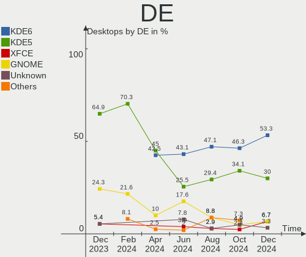
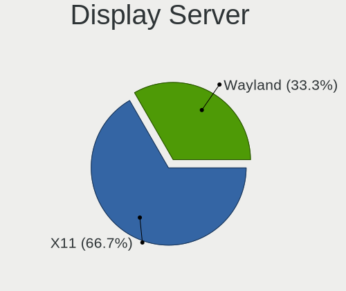
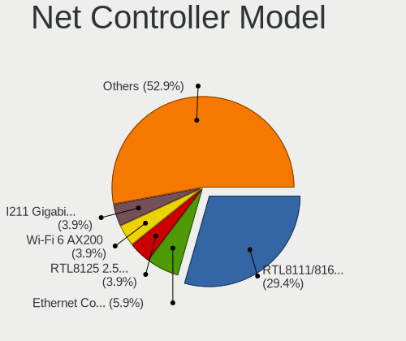
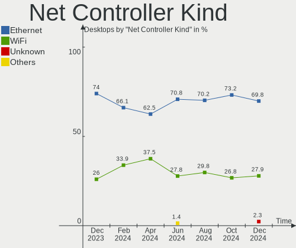
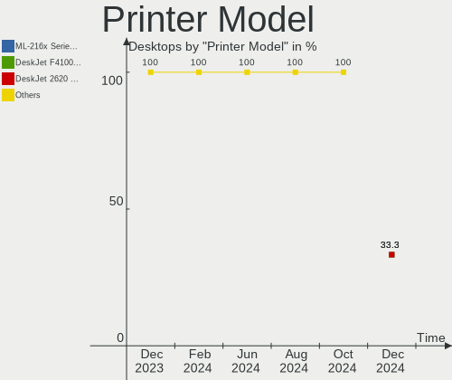

openSUSE - Hardware Trends (Desktops)
-------------------------------------

A project to identify most popular hardware characteristics and track their change
over time based on data collected by Linux users at https://Linux-Hardware.org.

Anyone can contribute to this report by the [hw-probe](https://github.com/linuxhw/hw-probe) tool:

    sudo -E hw-probe -all -upload

This report is for one last month. Overall report since the beginning of time: [TestDays](https://github.com/linuxhw/TestDays)

Period: Nov, 2023.

Contents
--------

* [ System ](#system)
  - [ OS                       ](#os)
  - [ OS Family                ](#os-family)
  - [ Kernel                   ](#kernel)
  - [ Kernel Family            ](#kernel-family)
  - [ Kernel Major Ver.        ](#kernel-major-ver)
  - [ Arch                     ](#arch)
  - [ DE                       ](#de)
  - [ Display Server           ](#display-server)
  - [ Display Manager          ](#display-manager)
  - [ OS Lang                  ](#os-lang)
  - [ Boot Mode                ](#boot-mode)
  - [ Filesystem               ](#filesystem)
  - [ Part. scheme             ](#part-scheme)
  - [ Dual Boot with Linux/BSD ](#dual-boot-with-linuxbsd)
  - [ Dual Boot (Win)          ](#dual-boot-win)

* [ Board ](#board)
  - [ Vendor                   ](#vendor)
  - [ Model                    ](#model)
  - [ Model Family             ](#model-family)
  - [ MFG Year                 ](#mfg-year)
  - [ Form Factor              ](#form-factor)
  - [ Secure Boot              ](#secure-boot)
  - [ Coreboot                 ](#coreboot)
  - [ RAM Size                 ](#ram-size)
  - [ RAM Used                 ](#ram-used)
  - [ Total Drives             ](#total-drives)
  - [ Has CD-ROM               ](#has-cd-rom)
  - [ Has Ethernet             ](#has-ethernet)
  - [ Has WiFi                 ](#has-wifi)
  - [ Has Bluetooth            ](#has-bluetooth)

* [ Location ](#location)
  - [ Country                  ](#country)
  - [ City                     ](#city)

* [ Drives ](#drives)
  - [ Drive Vendor             ](#drive-vendor)
  - [ Drive Model              ](#drive-model)
  - [ HDD Vendor               ](#hdd-vendor)
  - [ SSD Vendor               ](#ssd-vendor)
  - [ Drive Kind               ](#drive-kind)
  - [ Drive Connector          ](#drive-connector)
  - [ Drive Size               ](#drive-size)
  - [ Space Total              ](#space-total)
  - [ Space Used               ](#space-used)
  - [ Malfunc. Drives          ](#malfunc-drives)
  - [ Malfunc. Drive Vendor    ](#malfunc-drive-vendor)
  - [ Malfunc. HDD Vendor      ](#malfunc-hdd-vendor)
  - [ Malfunc. Drive Kind      ](#malfunc-drive-kind)
  - [ Failed Drives            ](#failed-drives)
  - [ Failed Drive Vendor      ](#failed-drive-vendor)
  - [ Drive Status             ](#drive-status)

* [ Storage controller ](#storage-controller)
  - [ Storage Vendor           ](#storage-vendor)
  - [ Storage Model            ](#storage-model)
  - [ Storage Kind             ](#storage-kind)

* [ Processor ](#processor)
  - [ CPU Vendor               ](#cpu-vendor)
  - [ CPU Model                ](#cpu-model)
  - [ CPU Model Family         ](#cpu-model-family)
  - [ CPU Cores                ](#cpu-cores)
  - [ CPU Sockets              ](#cpu-sockets)
  - [ CPU Threads              ](#cpu-threads)
  - [ CPU Op-Modes             ](#cpu-op-modes)
  - [ CPU Microcode            ](#cpu-microcode)
  - [ CPU Microarch            ](#cpu-microarch)

* [ Graphics ](#graphics)
  - [ GPU Vendor               ](#gpu-vendor)
  - [ GPU Model                ](#gpu-model)
  - [ GPU Combo                ](#gpu-combo)
  - [ GPU Driver               ](#gpu-driver)
  - [ GPU Memory               ](#gpu-memory)

* [ Monitor ](#monitor)
  - [ Monitor Vendor           ](#monitor-vendor)
  - [ Monitor Model            ](#monitor-model)
  - [ Monitor Resolution       ](#monitor-resolution)
  - [ Monitor Diagonal         ](#monitor-diagonal)
  - [ Monitor Width            ](#monitor-width)
  - [ Aspect Ratio             ](#aspect-ratio)
  - [ Monitor Area             ](#monitor-area)
  - [ Pixel Density            ](#pixel-density)
  - [ Multiple Monitors        ](#multiple-monitors)

* [ Network ](#network)
  - [ Net Controller Vendor    ](#net-controller-vendor)
  - [ Net Controller Model     ](#net-controller-model)
  - [ Wireless Vendor          ](#wireless-vendor)
  - [ Wireless Model           ](#wireless-model)
  - [ Ethernet Vendor          ](#ethernet-vendor)
  - [ Ethernet Model           ](#ethernet-model)
  - [ Net Controller Kind      ](#net-controller-kind)
  - [ Used Controller          ](#used-controller)
  - [ NICs                     ](#nics)
  - [ IPv6                     ](#ipv6)

* [ Bluetooth ](#bluetooth)
  - [ Bluetooth Vendor         ](#bluetooth-vendor)
  - [ Bluetooth Model          ](#bluetooth-model)

* [ Sound ](#sound)
  - [ Sound Vendor             ](#sound-vendor)
  - [ Sound Model              ](#sound-model)

* [ Memory ](#memory)
  - [ Memory Vendor            ](#memory-vendor)
  - [ Memory Model             ](#memory-model)
  - [ Memory Kind              ](#memory-kind)
  - [ Memory Form Factor       ](#memory-form-factor)
  - [ Memory Size              ](#memory-size)
  - [ Memory Speed             ](#memory-speed)

* [ Printers & scanners ](#printers--scanners)
  - [ Printer Vendor           ](#printer-vendor)
  - [ Printer Model            ](#printer-model)
  - [ Scanner Vendor           ](#scanner-vendor)
  - [ Scanner Model            ](#scanner-model)

* [ Camera ](#camera)
  - [ Camera Vendor            ](#camera-vendor)
  - [ Camera Model             ](#camera-model)

* [ Security ](#security)
  - [ Fingerprint Vendor       ](#fingerprint-vendor)
  - [ Fingerprint Model        ](#fingerprint-model)
  - [ Chipcard Vendor          ](#chipcard-vendor)
  - [ Chipcard Model           ](#chipcard-model)

* [ Unsupported ](#unsupported)
  - [ Unsupported Devices      ](#unsupported-devices)
  - [ Unsupported Device Types ](#unsupported-device-types)

System
------

OS
--

Installed operating systems

| Name                         | Desktops | Percent |
|------------------------------|----------|---------|
| openSUSE Tumbleweed-XXXXXXXX | 33       | 62.26%  |
| openSUSE Leap-15.5           | 16       | 30.19%  |
| openSUSE Microos-XXXXXXXX    | 3        | 5.66%   |
| openSUSE Leap-15.4           | 1        | 1.89%   |

OS Family
---------

OS without a version

| Name     | Desktops | Percent |
|----------|----------|---------|
| openSUSE | 53       | 100%    |

Kernel
------

Version of the Linux kernel

| Version                      | Desktops | Percent |
|------------------------------|----------|---------|
| 6.5.9-1-default              | 16       | 30.19%  |
| 6.6.2-1-default              | 11       | 20.75%  |
| 5.14.21-150500.55.36-default | 11       | 20.75%  |
| 6.6.1-1-default              | 7        | 13.21%  |
| 5.14.21-150500.55.31-default | 4        | 7.55%   |
| 6.5.8-1-default              | 1        | 1.89%   |
| 6.5.2-1-default              | 1        | 1.89%   |
| 5.14.21-150500.53-default    | 1        | 1.89%   |
| 5.14.21-150400.24.97-default | 1        | 1.89%   |

Kernel Family
-------------

Linux kernel without a distro release

| Version | Desktops | Percent |
|---------|----------|---------|
| 5.14.21 | 17       | 32.08%  |
| 6.5.9   | 16       | 30.19%  |
| 6.6.2   | 11       | 20.75%  |
| 6.6.1   | 7        | 13.21%  |
| 6.5.8   | 1        | 1.89%   |
| 6.5.2   | 1        | 1.89%   |

Kernel Major Ver.
-----------------

Linux kernel major version

| Version | Desktops | Percent |
|---------|----------|---------|
| 6.6     | 18       | 33.96%  |
| 6.5     | 18       | 33.96%  |
| 5.14    | 17       | 32.08%  |

Arch
----

OS architecture (x86_64, i586, etc.)

| Name   | Desktops | Percent |
|--------|----------|---------|
| x86_64 | 53       | 100%    |

DE
--

Desktop Environment

| Name       | Desktops | Percent |
|------------|----------|---------|
| KDE5       | 37       | 69.81%  |
| GNOME      | 12       | 22.64%  |
| XFCE       | 2        | 3.77%   |
| X-Cinnamon | 1        | 1.89%   |
| Budgie     | 1        | 1.89%   |

Display Server
--------------

X11 or Wayland

| Name    | Desktops | Percent |
|---------|----------|---------|
| X11     | 40       | 75.47%  |
| Wayland | 13       | 24.53%  |

Display Manager
---------------

SDDM, LightDM, etc.

| Name    | Desktops | Percent |
|---------|----------|---------|
| Unknown | 34       | 64.15%  |
| SDDM    | 16       | 30.19%  |
| LightDM | 2        | 3.77%   |
| GDM     | 1        | 1.89%   |

OS Lang
-------

Language

| Lang  | Desktops | Percent |
|-------|----------|---------|
| en_US | 31       | 58.49%  |
| de_DE | 10       | 18.87%  |
| ru_RU | 4        | 7.55%   |
| es_ES | 3        | 5.66%   |
| zh_CN | 1        | 1.89%   |
| pt_BR | 1        | 1.89%   |
| POSIX | 1        | 1.89%   |
| fi_FI | 1        | 1.89%   |
| en_CA | 1        | 1.89%   |

Boot Mode
---------

EFI or BIOS

| Mode | Desktops | Percent |
|------|----------|---------|
| EFI  | 30       | 56.6%   |
| BIOS | 23       | 43.4%   |

Filesystem
----------

Type of filesystem

| Type    | Desktops | Percent |
|---------|----------|---------|
| Btrfs   | 46       | 86.79%  |
| Ext4    | 5        | 9.43%   |
| Xfs     | 1        | 1.89%   |
| Overlay | 1        | 1.89%   |

Part. scheme
------------

Scheme of partitioning

| Type    | Desktops | Percent |
|---------|----------|---------|
| Unknown | 34       | 64.15%  |
| GPT     | 18       | 33.96%  |
| MBR     | 1        | 1.89%   |

Dual Boot with Linux/BSD
------------------------

Hosting more than one Linux/BSD

| Dual boot | Desktops | Percent |
|-----------|----------|---------|
| No        | 46       | 86.79%  |
| Yes       | 7        | 13.21%  |

Dual Boot (Win)
---------------

Hosting Linux and Windows

| Dual boot | Desktops | Percent |
|-----------|----------|---------|
| No        | 44       | 83.02%  |
| Yes       | 9        | 16.98%  |

Board
-----

Vendor
------

Motherboard manufacturer

| Name                | Desktops | Percent |
|---------------------|----------|---------|
| ASUSTek Computer    | 15       | 28.3%   |
| Gigabyte Technology | 11       | 20.75%  |
| ASRock              | 7        | 13.21%  |
| MSI                 | 6        | 11.32%  |
| Hewlett-Packard     | 6        | 11.32%  |
| Dell                | 3        | 5.66%   |
| Lenovo              | 2        | 3.77%   |
| PIONEERPOS          | 1        | 1.89%   |
| HC Technology.      | 1        | 1.89%   |
| Biostar             | 1        | 1.89%   |

Model
-----

Motherboard model

| Name                               | Desktops | Percent |
|------------------------------------|----------|---------|
| PIONEERPOS STEALTH-ASTERIX         | 1        | 1.89%   |
| MSI MS-7D93                        | 1        | 1.89%   |
| MSI MS-7D54                        | 1        | 1.89%   |
| MSI MS-7D25                        | 1        | 1.89%   |
| MSI MS-7C52                        | 1        | 1.89%   |
| MSI MS-7C35                        | 1        | 1.89%   |
| MSI MS-7A33                        | 1        | 1.89%   |
| Lenovo ThinkCentre M900 10FH000KUS | 1        | 1.89%   |
| Lenovo ThinkCentre E73 10DR0037IX  | 1        | 1.89%   |
| HP Z440 Workstation                | 1        | 1.89%   |
| HP Z400 Workstation                | 1        | 1.89%   |
| HP ProDesk 400 G4 SFF              | 1        | 1.89%   |
| HP OMEN 25L Desktop GT12-0xxx      | 1        | 1.89%   |
| HP EliteDesk 800 G4 DM 65W (TAA)   | 1        | 1.89%   |
| HP EliteDesk 800 G2 DM 35W         | 1        | 1.89%   |
| HC Technology. HCAR5000-MI         | 1        | 1.89%   |
| Gigabyte Z97-HD3                   | 1        | 1.89%   |
| Gigabyte Z370 HD3P                 | 1        | 1.89%   |
| Gigabyte X570 AORUS PRO            | 1        | 1.89%   |
| Gigabyte X570 AORUS MASTER         | 1        | 1.89%   |
| Gigabyte X570 AORUS ELITE          | 1        | 1.89%   |
| Gigabyte X470 AORUS ULTRA GAMING   | 1        | 1.89%   |
| Gigabyte H410M H V3                | 1        | 1.89%   |
| Gigabyte GA-78LMT-USB3 6.0         | 1        | 1.89%   |
| Gigabyte B85M-DS3H-A               | 1        | 1.89%   |
| Gigabyte B85M-D3V Plus-SI          | 1        | 1.89%   |
| Gigabyte B550 AORUS PRO AC         | 1        | 1.89%   |
| Dell Precision T5610               | 1        | 1.89%   |
| Dell OptiPlex 7040                 | 1        | 1.89%   |
| Dell OptiPlex 3060                 | 1        | 1.89%   |
| Biostar TF570 SLI A2+              | 1        | 1.89%   |
| ASUS TUF Gaming X570-PLUS          | 1        | 1.89%   |
| ASUS TUF Gaming B550M-PLUS         | 1        | 1.89%   |
| ASUS TUF Gaming A620M-PLUS WIFI    | 1        | 1.89%   |
| ASUS ROG STRIX X670E-E GAMING WIFI | 1        | 1.89%   |
| ASUS ROG Strix GA35DX_G35DX        | 1        | 1.89%   |
| ASUS Pro WS X570-ACE               | 1        | 1.89%   |
| ASUS PRIME Z490-P                  | 1        | 1.89%   |
| ASUS PRIME X670-P                  | 1        | 1.89%   |
| ASUS PRIME B550M-K                 | 1        | 1.89%   |

Model Family
------------

Motherboard model prefix

| Name                       | Desktops | Percent |
|----------------------------|----------|---------|
| Gigabyte X570              | 3        | 5.66%   |
| ASUS TUF                   | 3        | 5.66%   |
| ASUS PRIME                 | 3        | 5.66%   |
| Lenovo ThinkCentre         | 2        | 3.77%   |
| HP EliteDesk               | 2        | 3.77%   |
| Dell OptiPlex              | 2        | 3.77%   |
| ASUS ROG                   | 2        | 3.77%   |
| PIONEERPOS STEALTH-ASTERIX | 1        | 1.89%   |
| MSI MS-7D93                | 1        | 1.89%   |
| MSI MS-7D54                | 1        | 1.89%   |
| MSI MS-7D25                | 1        | 1.89%   |
| MSI MS-7C52                | 1        | 1.89%   |
| MSI MS-7C35                | 1        | 1.89%   |
| MSI MS-7A33                | 1        | 1.89%   |
| HP Z440                    | 1        | 1.89%   |
| HP Z400                    | 1        | 1.89%   |
| HP ProDesk                 | 1        | 1.89%   |
| HP OMEN                    | 1        | 1.89%   |
| HC Technology. HCAR5000-MI | 1        | 1.89%   |
| Gigabyte Z97-HD3           | 1        | 1.89%   |
| Gigabyte Z370              | 1        | 1.89%   |
| Gigabyte X470              | 1        | 1.89%   |
| Gigabyte H410M             | 1        | 1.89%   |
| Gigabyte GA-78LMT-USB3     | 1        | 1.89%   |
| Gigabyte B85M-DS3H-A       | 1        | 1.89%   |
| Gigabyte B85M-D3V          | 1        | 1.89%   |
| Gigabyte B550              | 1        | 1.89%   |
| Dell Precision             | 1        | 1.89%   |
| Biostar TF570              | 1        | 1.89%   |
| ASUS Pro                   | 1        | 1.89%   |
| ASUS P8P67                 | 1        | 1.89%   |
| ASUS P8H61-M               | 1        | 1.89%   |
| ASUS M5A87                 | 1        | 1.89%   |
| ASUS M5A78L-M              | 1        | 1.89%   |
| ASUS M4A88T-M              | 1        | 1.89%   |
| ASUS M3A78                 | 1        | 1.89%   |
| ASRock Z270                | 1        | 1.89%   |
| ASRock X570                | 1        | 1.89%   |
| ASRock J3710M              | 1        | 1.89%   |
| ASRock B450                | 1        | 1.89%   |

MFG Year
--------

Motherboard manufacture year

| Year | Desktops | Percent |
|------|----------|---------|
| 2019 | 9        | 16.98%  |
| 2021 | 5        | 9.43%   |
| 2020 | 5        | 9.43%   |
| 2017 | 5        | 9.43%   |
| 2022 | 4        | 7.55%   |
| 2015 | 4        | 7.55%   |
| 2012 | 4        | 7.55%   |
| 2018 | 3        | 5.66%   |
| 2016 | 3        | 5.66%   |
| 2014 | 3        | 5.66%   |
| 2023 | 2        | 3.77%   |
| 2010 | 2        | 3.77%   |
| 2013 | 1        | 1.89%   |
| 2011 | 1        | 1.89%   |
| 2008 | 1        | 1.89%   |
| 2007 | 1        | 1.89%   |

Form Factor
-----------

Physical design of the computer

| Name    | Desktops | Percent |
|---------|----------|---------|
| Desktop | 53       | 100%    |

Secure Boot
-----------

Enabled or disabled

| State    | Desktops | Percent |
|----------|----------|---------|
| Disabled | 49       | 92.45%  |
| Enabled  | 4        | 7.55%   |

Coreboot
--------

Have coreboot on board

| Used | Desktops | Percent |
|------|----------|---------|
| No   | 53       | 100%    |

RAM Size
--------

Total RAM memory

| Size in GB  | Desktops | Percent |
|-------------|----------|---------|
| 16.01-24.0  | 15       | 28.3%   |
| 32.01-64.0  | 14       | 26.42%  |
| 4.01-8.0    | 10       | 18.87%  |
| 64.01-256.0 | 8        | 15.09%  |
| 8.01-16.0   | 3        | 5.66%   |
| 3.01-4.0    | 2        | 3.77%   |
| 1.01-2.0    | 1        | 1.89%   |

RAM Used
--------

Used RAM memory

| Used GB    | Desktops | Percent |
|------------|----------|---------|
| 4.01-8.0   | 20       | 37.74%  |
| 2.01-3.0   | 14       | 26.42%  |
| 3.01-4.0   | 8        | 15.09%  |
| 1.01-2.0   | 6        | 11.32%  |
| 8.01-16.0  | 4        | 7.55%   |
| 16.01-24.0 | 1        | 1.89%   |

Total Drives
------------

Number of drives on board

| Drives | Desktops | Percent |
|--------|----------|---------|
| 2      | 19       | 35.85%  |
| 1      | 12       | 22.64%  |
| 3      | 9        | 16.98%  |
| 5      | 5        | 9.43%   |
| 6      | 3        | 5.66%   |
| 9      | 2        | 3.77%   |
| 4      | 2        | 3.77%   |
| 7      | 1        | 1.89%   |

Has CD-ROM
----------

Has CD-ROM on board

| Presented | Desktops | Percent |
|-----------|----------|---------|
| No        | 37       | 69.81%  |
| Yes       | 16       | 30.19%  |

Has Ethernet
------------

Has Ethernet on board

| Presented | Desktops | Percent |
|-----------|----------|---------|
| Yes       | 52       | 98.11%  |
| No        | 1        | 1.89%   |

Has WiFi
--------

Has WiFi module

| Presented | Desktops | Percent |
|-----------|----------|---------|
| No        | 30       | 56.6%   |
| Yes       | 23       | 43.4%   |

Has Bluetooth
-------------

Has Bluetooth module

| Presented | Desktops | Percent |
|-----------|----------|---------|
| Yes       | 29       | 54.72%  |
| No        | 24       | 45.28%  |

Location
--------

Country
-------

Geographic location (country)

| Country      | Desktops | Percent |
|--------------|----------|---------|
| USA          | 15       | 28.3%   |
| Germany      | 11       | 20.75%  |
| Russia       | 4        | 7.55%   |
| Spain        | 2        | 3.77%   |
| Italy        | 2        | 3.77%   |
| Canada       | 2        | 3.77%   |
| Belgium      | 2        | 3.77%   |
| Vietnam      | 1        | 1.89%   |
| Ukraine      | 1        | 1.89%   |
| Switzerland  | 1        | 1.89%   |
| South Africa | 1        | 1.89%   |
| Slovenia     | 1        | 1.89%   |
| Romania      | 1        | 1.89%   |
| Poland       | 1        | 1.89%   |
| Netherlands  | 1        | 1.89%   |
| Ireland      | 1        | 1.89%   |
| Greece       | 1        | 1.89%   |
| Finland      | 1        | 1.89%   |
| China        | 1        | 1.89%   |
| Brazil       | 1        | 1.89%   |
| Argentina    | 1        | 1.89%   |
| Albania      | 1        | 1.89%   |

City
----

Geographic location (city)

| City           | Desktops | Percent |
|----------------|----------|---------|
| St Petersburg  | 2        | 3.77%   |
| Winnipeg       | 1        | 1.89%   |
| West Bend      | 1        | 1.89%   |
| Werdau         | 1        | 1.89%   |
| Waynesboro     | 1        | 1.89%   |
| Valencia       | 1        | 1.89%   |
| Union City     | 1        | 1.89%   |
| Tirana         | 1        | 1.89%   |
| Staraya Russa  | 1        | 1.89%   |
| Shanghai       | 1        | 1.89%   |
| Seville        | 1        | 1.89%   |
| Seinäjoki     | 1        | 1.89%   |
| Saint Paul     | 1        | 1.89%   |
| Saarbrücken   | 1        | 1.89%   |
| Rottenstuben   | 1        | 1.89%   |
| Rio de Janeiro | 1        | 1.89%   |
| Portland       | 1        | 1.89%   |
| Oklahoma City  | 1        | 1.89%   |
| Norman         | 1        | 1.89%   |
| Nizhnekamsk    | 1        | 1.89%   |
| Nea Smirni     | 1        | 1.89%   |
| Mülheim       | 1        | 1.89%   |
| Merlo          | 1        | 1.89%   |
| McKinney       | 1        | 1.89%   |
| Mainhausen     | 1        | 1.89%   |
| Lyss           | 1        | 1.89%   |
| Lviv           | 1        | 1.89%   |
| Louisville     | 1        | 1.89%   |
| Ljubljana      | 1        | 1.89%   |
| Lawrenceburg   | 1        | 1.89%   |
| Knoxville      | 1        | 1.89%   |
| Kansas City    | 1        | 1.89%   |
| Johannesburg   | 1        | 1.89%   |
| Haarlem        | 1        | 1.89%   |
| Florence       | 1        | 1.89%   |
| Essen          | 1        | 1.89%   |
| Edmundston     | 1        | 1.89%   |
| Edegem         | 1        | 1.89%   |
| Dublin         | 1        | 1.89%   |
| Darmstadt      | 1        | 1.89%   |

Drives
------

Drive Vendor
------------

Hard drive vendors

| Vendor                      | Desktops | Drives | Percent |
|-----------------------------|----------|--------|---------|
| Samsung Electronics         | 21       | 39     | 19.44%  |
| WDC                         | 17       | 27     | 15.74%  |
| Seagate                     | 15       | 21     | 13.89%  |
| Toshiba                     | 9        | 14     | 8.33%   |
| Sandisk                     | 6        | 8      | 5.56%   |
| Kingston                    | 6        | 7      | 5.56%   |
| Phison Electronics          | 3        | 4      | 2.78%   |
| Intenso                     | 3        | 4      | 2.78%   |
| ADATA Technology            | 3        | 3      | 2.78%   |
| Silicon Motion              | 2        | 2      | 1.85%   |
| Micron Technology           | 2        | 2      | 1.85%   |
| Hitachi                     | 2        | 2      | 1.85%   |
| Crucial                     | 2        | 3      | 1.85%   |
| XSTAR                       | 1        | 1      | 0.93%   |
| Transcend                   | 1        | 1      | 0.93%   |
| Timetec                     | 1        | 1      | 0.93%   |
| SABRENT                     | 1        | 1      | 0.93%   |
| Realtek Semiconductor       | 1        | 1      | 0.93%   |
| PNY                         | 1        | 1      | 0.93%   |
| Patriot                     | 1        | 1      | 0.93%   |
| Micron/Crucial Technology   | 1        | 1      | 0.93%   |
| MAXIO Technology (Hangzhou) | 1        | 1      | 0.93%   |
| Leven                       | 1        | 1      | 0.93%   |
| KingFast                    | 1        | 1      | 0.93%   |
| JMicron Technology          | 1        | 1      | 0.93%   |
| Intel                       | 1        | 1      | 0.93%   |
| China                       | 1        | 1      | 0.93%   |
| AMD                         | 1        | 1      | 0.93%   |
| A-DATA Technology           | 1        | 1      | 0.93%   |
| Unknown                     | 1        | 1      | 0.93%   |

Drive Model
-----------

Hard drive models

| Model                                                           | Desktops | Percent |
|-----------------------------------------------------------------|----------|---------|
| Samsung NVMe SSD Controller SM981/PM981/PM983 250GB             | 7        | 5.15%   |
| Samsung SSD 870 EVO 1TB                                         | 4        | 2.94%   |
| Samsung NVMe SSD Controller PM9A1/PM9A3/980PRO 2TB              | 4        | 2.94%   |
| Seagate ST500DM002-1BD142 500GB                                 | 3        | 2.21%   |
| WDC WD10EZEX-08M2NA0 1TB                                        | 2        | 1.47%   |
| Toshiba DT01ACA200 2TB                                          | 2        | 1.47%   |
| Toshiba DT01ACA100 1TB                                          | 2        | 1.47%   |
| Silicon Motion SM2263EN/SM2263XT SSD Controller 256GB           | 2        | 1.47%   |
| Seagate ST2000DM008-2FR102 2TB                                  | 2        | 1.47%   |
| Seagate ST1000DM010-2EP102 1TB                                  | 2        | 1.47%   |
| Samsung SSD 850 EVO 250GB                                       | 2        | 1.47%   |
| Samsung SSD 840 EVO 120GB                                       | 2        | 1.47%   |
| Kingston SA400S37480G 480GB SSD                                 | 2        | 1.47%   |
| Kingston SA400S37240G 240GB SSD                                 | 2        | 1.47%   |
| ADATA XPG SX8200 Pro PCIe Gen3x4 M.2 2280 Solid State Drive 1TB | 2        | 1.47%   |
| XSTAR SSD 128GB                                                 | 1        | 0.74%   |
| WDC WDS480G2G0A-00JH30 480GB SSD                                | 1        | 0.74%   |
| WDC WDS240G2G0A-00JH30 240GB SSD                                | 1        | 0.74%   |
| WDC WDS100T1B0A-00H9H0 1TB SSD                                  | 1        | 0.74%   |
| WDC WD5000LPCX-60VHAT0 500GB                                    | 1        | 0.74%   |
| WDC WD5000AZRX-00A8LB0 500GB                                    | 1        | 0.74%   |
| WDC WD40EZRX-00SPEB0 4TB                                        | 1        | 0.74%   |
| WDC WD40EZAZ-00SF3B0 4TB                                        | 1        | 0.74%   |
| WDC WD4005FZBX-00K5WB0 4TB                                      | 1        | 0.74%   |
| WDC WD3200BPVT-00JJ5T0 320GB                                    | 1        | 0.74%   |
| WDC WD3200AAKX-00ERMA0 320GB                                    | 1        | 0.74%   |
| WDC WD30EFRX-68EUZN0 3TB                                        | 1        | 0.74%   |
| WDC WD20EZRZ-00Z5HB0 2TB                                        | 1        | 0.74%   |
| WDC WD20EZBX-00AYRA0 2TB                                        | 1        | 0.74%   |
| WDC WD20EFRX-68EUZN0 2TB                                        | 1        | 0.74%   |
| WDC WD10PURX-64E5EY0 1TB                                        | 1        | 0.74%   |
| WDC WD10EZRX-00A8LB0 1TB                                        | 1        | 0.74%   |
| WDC WD10EZEX-60WN4A0 1TB                                        | 1        | 0.74%   |
| WDC WD10EZEX-08WN4A0 1TB                                        | 1        | 0.74%   |
| WDC WD10EZEX-07WN4A0 1TB                                        | 1        | 0.74%   |
| WDC WD1003FZEX-00K3CA0 1TB                                      | 1        | 0.74%   |
| WDC WD1002FAEX-00Z3A0 1TB                                       | 1        | 0.74%   |
| WDC WD Blue SA510 2.5 500GB                                     | 1        | 0.74%   |
| WDC WD Blue SA510 2.5 1000GB                                    | 1        | 0.74%   |
| Transcend TS250GMTS425S 250GB SSD                               | 1        | 0.74%   |

HDD Vendor
----------

Hard disk drive vendors

| Vendor              | Desktops | Drives | Percent |
|---------------------|----------|--------|---------|
| WDC                 | 15       | 22     | 35.71%  |
| Seagate             | 15       | 21     | 35.71%  |
| Toshiba             | 9        | 14     | 21.43%  |
| Hitachi             | 2        | 2      | 4.76%   |
| Samsung Electronics | 1        | 1      | 2.38%   |

SSD Vendor
----------

Solid state drive vendors

| Vendor              | Desktops | Drives | Percent |
|---------------------|----------|--------|---------|
| Samsung Electronics | 14       | 20     | 31.82%  |
| Kingston            | 6        | 7      | 13.64%  |
| WDC                 | 5        | 5      | 11.36%  |
| SanDisk             | 3        | 4      | 6.82%   |
| Intenso             | 3        | 4      | 6.82%   |
| Crucial             | 2        | 3      | 4.55%   |
| XSTAR               | 1        | 1      | 2.27%   |
| Transcend           | 1        | 1      | 2.27%   |
| Timetec             | 1        | 1      | 2.27%   |
| PNY                 | 1        | 1      | 2.27%   |
| Patriot             | 1        | 1      | 2.27%   |
| Leven               | 1        | 1      | 2.27%   |
| JMicron Technology  | 1        | 1      | 2.27%   |
| China               | 1        | 1      | 2.27%   |
| AMD                 | 1        | 1      | 2.27%   |
| A-DATA Technology   | 1        | 1      | 2.27%   |
| Unknown             | 1        | 1      | 2.27%   |

Drive Kind
----------

HDD or SSD

| Kind    | Desktops | Drives | Percent |
|---------|----------|--------|---------|
| HDD     | 33       | 60     | 37.08%  |
| SSD     | 32       | 54     | 35.96%  |
| NVMe    | 23       | 38     | 25.84%  |
| Unknown | 1        | 1      | 1.12%   |

Drive Connector
---------------

SATA, SAS, NVMe, etc.

| Type | Desktops | Drives | Percent |
|------|----------|--------|---------|
| SATA | 46       | 112    | 64.79%  |
| NVMe | 22       | 37     | 30.99%  |
| SAS  | 3        | 4      | 4.23%   |

Drive Size
----------

Size of hard drive

| Size in TB | Desktops | Drives | Percent |
|------------|----------|--------|---------|
| 0.01-0.5   | 31       | 47     | 37.8%   |
| 0.51-1.0   | 29       | 35     | 35.37%  |
| 1.01-2.0   | 9        | 19     | 10.98%  |
| 3.01-4.0   | 5        | 5      | 6.1%    |
| 2.01-3.0   | 4        | 4      | 4.88%   |
| 4.01-10.0  | 4        | 4      | 4.88%   |

Space Total
-----------

Amount of disk space available on the file system

| Size in GB     | Desktops | Percent |
|----------------|----------|---------|
| More than 3000 | 30       | 56.6%   |
| 1001-2000      | 7        | 13.21%  |
| 2001-3000      | 6        | 11.32%  |
| 101-250        | 4        | 7.55%   |
| 251-500        | 3        | 5.66%   |
| 501-1000       | 2        | 3.77%   |
| 21-50          | 1        | 1.89%   |

Space Used
----------

Amount of used disk space

| Used GB        | Desktops | Percent |
|----------------|----------|---------|
| More than 3000 | 12       | 22.64%  |
| 101-250        | 10       | 18.87%  |
| 1001-2000      | 8        | 15.09%  |
| 501-1000       | 8        | 15.09%  |
| 51-100         | 6        | 11.32%  |
| 251-500        | 3        | 5.66%   |
| 2001-3000      | 3        | 5.66%   |
| 1-20           | 2        | 3.77%   |
| 21-50          | 1        | 1.89%   |

Malfunc. Drives
---------------

Drive models with a malfunction

| Model                                            | Desktops | Drives | Percent |
|--------------------------------------------------|----------|--------|---------|
| WDC WD Blue SA510 2.5 500GB                      | 1        | 1      | 14.29%  |
| Transcend TS250GMTS425S 250GB SSD                | 1        | 1      | 14.29%  |
| Seagate ST500DM002-1BD142 500GB                  | 1        | 1      | 14.29%  |
| Seagate ST3000NM0033-9ZM178 3TB                  | 1        | 1      | 14.29%  |
| Samsung Electronics SSD 870 EVO 1TB              | 1        | 1      | 14.29%  |
| Samsung Electronics SSD 840 EVO 120GB            | 1        | 1      | 14.29%  |
| Samsung Electronics MZ7TE256HMHP-000L7 256GB SSD | 1        | 1      | 14.29%  |

Malfunc. Drive Vendor
---------------------

Vendors of faulty drives

| Vendor              | Desktops | Drives | Percent |
|---------------------|----------|--------|---------|
| Seagate             | 2        | 2      | 33.33%  |
| Samsung Electronics | 2        | 3      | 33.33%  |
| WDC                 | 1        | 1      | 16.67%  |
| Transcend           | 1        | 1      | 16.67%  |

Malfunc. HDD Vendor
-------------------

Vendors of faulty HDD drives

| Vendor  | Desktops | Drives | Percent |
|---------|----------|--------|---------|
| Seagate | 2        | 2      | 100%    |

Malfunc. Drive Kind
-------------------

Kinds of faulty drives

| Kind | Desktops | Drives | Percent |
|------|----------|--------|---------|
| SSD  | 3        | 5      | 60%     |
| HDD  | 2        | 2      | 40%     |

Failed Drives
-------------

Failed drive models

Zero info for selected period =(

Failed Drive Vendor
-------------------

Failed drive vendors

Zero info for selected period =(

Drive Status
------------

Number of failed and malfunc. drives

| Status   | Desktops | Drives | Percent |
|----------|----------|--------|---------|
| Detected | 35       | 85     | 59.32%  |
| Works    | 19       | 61     | 32.2%   |
| Malfunc  | 5        | 7      | 8.47%   |

Storage controller
------------------

Storage Vendor
--------------

Storage controller vendors

| Vendor                      | Desktops | Percent |
|-----------------------------|----------|---------|
| AMD                         | 27       | 31.03%  |
| Intel                       | 24       | 27.59%  |
| Samsung Electronics         | 11       | 12.64%  |
| SanDisk                     | 4        | 4.6%    |
| Phison Electronics          | 3        | 3.45%   |
| Marvell Technology Group    | 3        | 3.45%   |
| ASMedia Technology          | 3        | 3.45%   |
| ADATA Technology            | 3        | 3.45%   |
| Silicon Motion              | 2        | 2.3%    |
| Micron Technology           | 2        | 2.3%    |
| Realtek Semiconductor       | 1        | 1.15%   |
| Nvidia                      | 1        | 1.15%   |
| Micron/Crucial Technology   | 1        | 1.15%   |
| MAXIO Technology (Hangzhou) | 1        | 1.15%   |
| JMicron Technology          | 1        | 1.15%   |

Storage Model
-------------

Storage controller models

| Model                                                                          | Desktops | Percent |
|--------------------------------------------------------------------------------|----------|---------|
| AMD FCH SATA Controller [AHCI mode]                                            | 16       | 15.24%  |
| Samsung NVMe SSD Controller SM981/PM981/PM983                                  | 7        | 6.67%   |
| AMD SB7x0/SB8x0/SB9x0 SATA Controller [IDE mode]                               | 6        | 5.71%   |
| AMD SB7x0/SB8x0/SB9x0 IDE Controller                                           | 6        | 5.71%   |
| Samsung NVMe SSD Controller PM9A1/PM9A3/980PRO                                 | 4        | 3.81%   |
| Intel 200 Series PCH SATA controller [AHCI mode]                               | 4        | 3.81%   |
| AMD 400 Series Chipset SATA Controller                                         | 4        | 3.81%   |
| Intel 8 Series/C220 Series Chipset Family 6-port SATA Controller 1 [AHCI mode] | 3        | 2.86%   |
| AMD 500 Series Chipset SATA Controller                                         | 3        | 2.86%   |
| Silicon Motion SM2263EN/SM2263XT (DRAM-less) NVMe SSD Controllers              | 2        | 1.9%    |
| Intel SATA Controller [RAID mode]                                              | 2        | 1.9%    |
| Intel Q170/Q150/B150/H170/H110/Z170/CM236 Chipset SATA Controller [AHCI Mode]  | 2        | 1.9%    |
| ADATA XPG SX8200 Pro PCIe Gen3x4 M.2 2280 Solid State Drive                    | 2        | 1.9%    |
| SanDisk WD Green SN350 240GB (DRAM-less) / SN560E NVMe SSD                     | 1        | 0.95%   |
| SanDisk WD Blue SN500 / PC SN520 x2 M.2 2280 NVMe SSD                          | 1        | 0.95%   |
| Sandisk WD Black SN850X NVMe SSD                                               | 1        | 0.95%   |
| SanDisk WD Black SN770 / PC SN740 256GB / PC SN560 (DRAM-less) NVMe SSD        | 1        | 0.95%   |
| Samsung NVMe SSD Controller S4LV008[Pascal]                                    | 1        | 0.95%   |
| Samsung NVMe SSD Controller 980 (DRAM-less)                                    | 1        | 0.95%   |
| Realtek RTS5762 NVMe SSD Controller                                            | 1        | 0.95%   |
| Phison E8 PCIe3 NVMe Controller                                                | 1        | 0.95%   |
| Phison E18 PCIe4 NVMe Controller                                               | 1        | 0.95%   |
| Phison E16 PCIe4 NVMe Controller                                               | 1        | 0.95%   |
| Nvidia MCP65 IDE                                                               | 1        | 0.95%   |
| Nvidia MCP65 AHCI Controller                                                   | 1        | 0.95%   |
| Micron/Crucial P2 [Nick P2] / P3 / P3 Plus NVMe PCIe SSD (DRAM-less)           | 1        | 0.95%   |
| Micron 2400 NVMe SSD (DRAM-less)                                               | 1        | 0.95%   |
| Micron 2210 NVMe SSD [Cobain]                                                  | 1        | 0.95%   |
| MAXIO (Hangzhou) NVMe SSD Controller MAP1602                                   | 1        | 0.95%   |
| Marvell Group 88SE9215 PCIe 2.0 x1 4-port SATA 6 Gb/s Controller               | 1        | 0.95%   |
| Marvell Group 88SE9172 SATA 6Gb/s Controller                                   | 1        | 0.95%   |
| Marvell Group 88SE9128 PCIe SATA 6 Gb/s RAID controller                        | 1        | 0.95%   |
| JMicron JMB362 SATA Controller                                                 | 1        | 0.95%   |
| Intel SSD 670p Series [Keystone Harbor]                                        | 1        | 0.95%   |
| Intel NM10/ICH7 Family SATA Controller [IDE mode]                              | 1        | 0.95%   |
| Intel Comet Lake SATA AHCI Controller                                          | 1        | 0.95%   |
| Intel Cannon Lake PCH SATA AHCI Controller                                     | 1        | 0.95%   |
| Intel C610/X99 series chipset sSATA Controller [AHCI mode]                     | 1        | 0.95%   |
| Intel C610/X99 series chipset 6-Port SATA Controller [AHCI mode]               | 1        | 0.95%   |
| Intel C600/X79 series chipset 4-Port SATA IDE Controller                       | 1        | 0.95%   |

Storage Kind
------------

Kind of storage controller (IDE, SATA, NVMe, SAS, ...)

| Kind | Desktops | Percent |
|------|----------|---------|
| SATA | 46       | 56.79%  |
| NVMe | 22       | 27.16%  |
| IDE  | 11       | 13.58%  |
| RAID | 2        | 2.47%   |

Processor
---------

CPU Vendor
----------

Processor vendors

| Vendor | Desktops | Percent |
|--------|----------|---------|
| AMD    | 29       | 54.72%  |
| Intel  | 24       | 45.28%  |

CPU Model
---------

Processor models

| Model                                  | Desktops | Percent |
|----------------------------------------|----------|---------|
| AMD Ryzen 9 5900X 12-Core Processor    | 3        | 5.66%   |
| AMD Ryzen 7 5800X 8-Core Processor     | 3        | 5.66%   |
| AMD Ryzen 7 3700X 8-Core Processor     | 3        | 5.66%   |
| AMD Ryzen 5 3600 6-Core Processor      | 3        | 5.66%   |
| Intel Core i5-7500 CPU @ 3.40GHz       | 2        | 3.77%   |
| AMD FX-4300 Quad-Core Processor        | 2        | 3.77%   |
| Intel Xeon CPU W3530 @ 2.80GHz         | 1        | 1.89%   |
| Intel Xeon CPU E5-2667 v4 @ 3.20GHz    | 1        | 1.89%   |
| Intel Xeon CPU E5-2650 v2 @ 2.60GHz    | 1        | 1.89%   |
| Intel Xeon CPU E3-1245 v3 @ 3.40GHz    | 1        | 1.89%   |
| Intel Pentium CPU J3710 @ 1.60GHz      | 1        | 1.89%   |
| Intel Core i9-9900K CPU @ 3.60GHz      | 1        | 1.89%   |
| Intel Core i7-6700 CPU @ 3.40GHz       | 1        | 1.89%   |
| Intel Core i7-4790K CPU @ 4.00GHz      | 1        | 1.89%   |
| Intel Core i7-2600K CPU @ 3.40GHz      | 1        | 1.89%   |
| Intel Core i7-10700F CPU @ 2.90GHz     | 1        | 1.89%   |
| Intel Core i5-8500 CPU @ 3.00GHz       | 1        | 1.89%   |
| Intel Core i5-6500T CPU @ 2.50GHz      | 1        | 1.89%   |
| Intel Core i5-6500 CPU @ 3.20GHz       | 1        | 1.89%   |
| Intel Core i5-4460S CPU @ 2.90GHz      | 1        | 1.89%   |
| Intel Core i5-4440 CPU @ 3.10GHz       | 1        | 1.89%   |
| Intel Core i3-8100T CPU @ 3.10GHz      | 1        | 1.89%   |
| Intel Core i3-7300 CPU @ 4.00GHz       | 1        | 1.89%   |
| Intel Core i3-10105F CPU @ 3.70GHz     | 1        | 1.89%   |
| Intel Celeron CPU G1610 @ 2.60GHz      | 1        | 1.89%   |
| Intel Atom CPU D2701 @ 2.13GHz         | 1        | 1.89%   |
| Intel 13th Gen Core i7-13700K          | 1        | 1.89%   |
| Intel 13th Gen Core i5-13600KF         | 1        | 1.89%   |
| AMD Ryzen 9 7900X3D 12-Core Processor  | 1        | 1.89%   |
| AMD Ryzen 9 7900X 12-Core Processor    | 1        | 1.89%   |
| AMD Ryzen 9 3900X 12-Core Processor    | 1        | 1.89%   |
| AMD Ryzen 7 7800X3D 8-Core Processor   | 1        | 1.89%   |
| AMD Ryzen 7 5800X3D 8-Core Processor   | 1        | 1.89%   |
| AMD Ryzen 7 5700U with Radeon Graphics | 1        | 1.89%   |
| AMD Ryzen 7 5700G with Radeon Graphics | 1        | 1.89%   |
| AMD Ryzen 7 1800X Eight-Core Processor | 1        | 1.89%   |
| AMD Ryzen 5 5500                       | 1        | 1.89%   |
| AMD Phenom 9550 Quad-Core Processor    | 1        | 1.89%   |
| AMD FX-8370 Eight-Core Processor       | 1        | 1.89%   |
| AMD FX-6300 Six-Core Processor         | 1        | 1.89%   |

CPU Model Family
----------------

Processor model prefix

| Model            | Desktops | Percent |
|------------------|----------|---------|
| AMD Ryzen 7      | 11       | 20.75%  |
| Intel Core i5    | 7        | 13.21%  |
| AMD Ryzen 9      | 6        | 11.32%  |
| Intel Xeon       | 4        | 7.55%   |
| Intel Core i7    | 4        | 7.55%   |
| AMD Ryzen 5      | 4        | 7.55%   |
| AMD FX           | 4        | 7.55%   |
| Intel Core i3    | 3        | 5.66%   |
| Other            | 2        | 3.77%   |
| Intel Pentium    | 1        | 1.89%   |
| Intel Core i9    | 1        | 1.89%   |
| Intel Celeron    | 1        | 1.89%   |
| Intel Atom       | 1        | 1.89%   |
| AMD Phenom       | 1        | 1.89%   |
| AMD Athlon II X4 | 1        | 1.89%   |
| AMD Athlon 64 X2 | 1        | 1.89%   |
| AMD A8           | 1        | 1.89%   |

CPU Cores
---------

Number of processor cores

| Number | Desktops | Percent |
|--------|----------|---------|
| 4      | 17       | 32.08%  |
| 8      | 14       | 26.42%  |
| 2      | 7        | 13.21%  |
| 12     | 6        | 11.32%  |
| 6      | 5        | 9.43%   |
| 16     | 2        | 3.77%   |
| 14     | 1        | 1.89%   |
| 3      | 1        | 1.89%   |

CPU Sockets
-----------

Number of sockets

| Number | Desktops | Percent |
|--------|----------|---------|
| 1      | 52       | 98.11%  |
| 2      | 1        | 1.89%   |

CPU Threads
-----------

Threads per core (Hyper-Threading)

| Number | Desktops | Percent |
|--------|----------|---------|
| 2      | 40       | 75.47%  |
| 1      | 13       | 24.53%  |

CPU Op-Modes
------------

CPU Operation Modes (32-bit, 64-bit)

| Op mode        | Desktops | Percent |
|----------------|----------|---------|
| 32-bit, 64-bit | 53       | 100%    |

CPU Microcode
-------------

Microcode number

| Number     | Desktops | Percent |
|------------|----------|---------|
| Unknown    | 31       | 58.49%  |
| 0x08701030 | 4        | 7.55%   |
| 0x06000852 | 3        | 5.66%   |
| 0x0a601203 | 2        | 3.77%   |
| 0x0a20120a | 2        | 3.77%   |
| 0x306c3    | 1        | 1.89%   |
| 0x0a601206 | 1        | 1.89%   |
| 0x0a50000d | 1        | 1.89%   |
| 0x0a20102b | 1        | 1.89%   |
| 0x0a201025 | 1        | 1.89%   |
| 0x0a201016 | 1        | 1.89%   |
| 0x08701021 | 1        | 1.89%   |
| 0x08701013 | 1        | 1.89%   |
| 0x08608103 | 1        | 1.89%   |
| 0x08001137 | 1        | 1.89%   |
| 0x01000095 | 1        | 1.89%   |

CPU Microarch
-------------

Microarchitecture

| Name             | Desktops | Percent |
|------------------|----------|---------|
| Zen 3            | 9        | 16.98%  |
| Zen 2            | 7        | 13.21%  |
| KabyLake         | 6        | 11.32%  |
| Piledriver       | 4        | 7.55%   |
| Haswell          | 4        | 7.55%   |
| Unknown          | 4        | 7.55%   |
| Skylake          | 3        | 5.66%   |
| K10              | 2        | 3.77%   |
| IvyBridge        | 2        | 3.77%   |
| CometLake        | 2        | 3.77%   |
| Alderlake Hybrid | 2        | 3.77%   |
| Zen              | 1        | 1.89%   |
| Silvermont       | 1        | 1.89%   |
| SandyBridge      | 1        | 1.89%   |
| Nehalem          | 1        | 1.89%   |
| K8 Hammer        | 1        | 1.89%   |
| Excavator        | 1        | 1.89%   |
| Broadwell        | 1        | 1.89%   |
| Bonnell          | 1        | 1.89%   |

Graphics
--------

GPU Vendor
----------

Vendors of graphics cards

| Vendor | Desktops | Percent |
|--------|----------|---------|
| AMD    | 24       | 41.38%  |
| Nvidia | 20       | 34.48%  |
| Intel  | 14       | 24.14%  |

GPU Model
---------

Graphics card models

| Model                                                                                    | Desktops | Percent |
|------------------------------------------------------------------------------------------|----------|---------|
| Nvidia GP106 [GeForce GTX 1060 6GB]                                                      | 3        | 4.92%   |
| Nvidia GM204 [GeForce GTX 970]                                                           | 3        | 4.92%   |
| Intel HD Graphics 530                                                                    | 3        | 4.92%   |
| AMD Raphael                                                                              | 3        | 4.92%   |
| AMD Navi 31 [Radeon RX 7900 XT/7900 XTX]                                                 | 3        | 4.92%   |
| AMD Navi 23 [Radeon RX 6600/6600 XT/6600M]                                               | 3        | 4.92%   |
| AMD Ellesmere [Radeon RX 470/480/570/570X/580/580X/590]                                  | 3        | 4.92%   |
| Nvidia GP108 [GeForce GT 1030]                                                           | 2        | 3.28%   |
| Intel Xeon E3-1200 v3/4th Gen Core Processor Integrated Graphics Controller              | 2        | 3.28%   |
| Intel HD Graphics 630                                                                    | 2        | 3.28%   |
| Intel CoffeeLake-S GT2 [UHD Graphics 630]                                                | 2        | 3.28%   |
| Nvidia TU117 [GeForce GTX 1650]                                                          | 1        | 1.64%   |
| Nvidia TU116 [GeForce GTX 1660 SUPER]                                                    | 1        | 1.64%   |
| Nvidia TU106 [GeForce RTX 2060 SUPER]                                                    | 1        | 1.64%   |
| Nvidia GP104 [GeForce GTX 1070]                                                          | 1        | 1.64%   |
| Nvidia GM204 [GeForce GTX 980]                                                           | 1        | 1.64%   |
| Nvidia GK208B [GeForce GT 710]                                                           | 1        | 1.64%   |
| Nvidia GF108 [GeForce GT 430]                                                            | 1        | 1.64%   |
| Nvidia GA106 [GeForce RTX 3060 Lite Hash Rate]                                           | 1        | 1.64%   |
| Nvidia GA102 [GeForce RTX 3090]                                                          | 1        | 1.64%   |
| Nvidia GA102 [GeForce RTX 3080 Lite Hash Rate]                                           | 1        | 1.64%   |
| Nvidia G96C [GeForce 9500 GT]                                                            | 1        | 1.64%   |
| Nvidia AD104 [GeForce RTX 4070 Ti]                                                       | 1        | 1.64%   |
| Nvidia AD102 [GeForce RTX 4090]                                                          | 1        | 1.64%   |
| Intel Xeon E3-1200 v2/3rd Gen Core processor Graphics Controller                         | 1        | 1.64%   |
| Intel Raptor Lake-S GT1 [UHD Graphics 770]                                               | 1        | 1.64%   |
| Intel DG2 [Arc A770]                                                                     | 1        | 1.64%   |
| Intel Atom/Celeron/Pentium Processor x5-E8000/J3xxx/N3xxx Integrated Graphics Controller | 1        | 1.64%   |
| Intel Atom Processor D2xxx/N2xxx Integrated Graphics Controller                          | 1        | 1.64%   |
| AMD RS780L [Radeon 3000]                                                                 | 1        | 1.64%   |
| AMD Redwood PRO [Radeon HD 5550/5570/5630/6510/6610/7570]                                | 1        | 1.64%   |
| AMD Oland PRO [Radeon R7 240/340 / Radeon 520]                                           | 1        | 1.64%   |
| AMD Navi 24 [Radeon RX 6400/6500 XT/6500M]                                               | 1        | 1.64%   |
| AMD Navi 22 [Radeon RX 6700/6700 XT/6750 XT / 6800M/6850M XT]                            | 1        | 1.64%   |
| AMD Navi 21 [Radeon RX 6950 XT]                                                          | 1        | 1.64%   |
| AMD Navi 21 [Radeon RX 6800/6800 XT / 6900 XT]                                           | 1        | 1.64%   |
| AMD Lucienne                                                                             | 1        | 1.64%   |
| AMD Lexa XT [Radeon PRO WX 3100]                                                         | 1        | 1.64%   |
| AMD Juniper XT [FirePro V5800]                                                           | 1        | 1.64%   |
| AMD Cezanne [Radeon Vega Series / Radeon Vega Mobile Series]                             | 1        | 1.64%   |

GPU Combo
---------

Combinations of graphics cards

| Name           | Desktops | Percent |
|----------------|----------|---------|
| 1 x AMD        | 19       | 35.85%  |
| 1 x Nvidia     | 16       | 30.19%  |
| 1 x Intel      | 11       | 20.75%  |
| 2 x AMD        | 2        | 3.77%   |
| AMD + Nvidia   | 2        | 3.77%   |
| 2 x Nvidia     | 1        | 1.89%   |
| Intel + Nvidia | 1        | 1.89%   |
| Intel + AMD    | 1        | 1.89%   |

GPU Driver
----------

Free vs proprietary

| Driver      | Desktops | Percent |
|-------------|----------|---------|
| Free        | 39       | 73.58%  |
| Proprietary | 11       | 20.75%  |
| Unknown     | 3        | 5.66%   |

GPU Memory
----------

Total video memory

| Size in GB | Desktops | Percent |
|------------|----------|---------|
| Unknown    | 23       | 43.4%   |
| 3.01-4.0   | 7        | 13.21%  |
| 8.01-16.0  | 5        | 9.43%   |
| 7.01-8.0   | 4        | 7.55%   |
| 1.01-2.0   | 4        | 7.55%   |
| 16.01-24.0 | 3        | 5.66%   |
| 0.01-0.5   | 3        | 5.66%   |
| 5.01-6.0   | 2        | 3.77%   |
| 0.51-1.0   | 2        | 3.77%   |

Monitor
-------

Monitor Vendor
--------------

Monitor vendors

| Vendor               | Desktops | Percent |
|----------------------|----------|---------|
| Samsung Electronics  | 16       | 26.67%  |
| Dell                 | 8        | 13.33%  |
| Goldstar             | 6        | 10%     |
| Acer                 | 5        | 8.33%   |
| MSI                  | 3        | 5%      |
| Ancor Communications | 3        | 5%      |
| ViewSonic            | 2        | 3.33%   |
| Unknown              | 2        | 3.33%   |
| Philips              | 2        | 3.33%   |
| Hewlett-Packard      | 2        | 3.33%   |
| BenQ                 | 2        | 3.33%   |
| AOC                  | 2        | 3.33%   |
| Sony                 | 1        | 1.67%   |
| Sceptre Tech         | 1        | 1.67%   |
| RIS                  | 1        | 1.67%   |
| PXO                  | 1        | 1.67%   |
| Pixio                | 1        | 1.67%   |
| Hitachi              | 1        | 1.67%   |
| CHR                  | 1        | 1.67%   |

Monitor Model
-------------

Monitor models

| Model                                                                 | Desktops | Percent |
|-----------------------------------------------------------------------|----------|---------|
| ViewSonic VX2758-P-MHD VSC5538 1920x1080 598x336mm 27.0-inch          | 1        | 1.61%   |
| ViewSonic VA2055 Series VSC3C31 1920x1080 435x239mm 19.5-inch         | 1        | 1.61%   |
| Unknown LCD Monitor KON TV_MONITOR 1920x1080                          | 1        | 1.61%   |
| Unknown LCD Monitor FFFF 2288x1287 2550x2550mm 142.0-inch             | 1        | 1.61%   |
| Sony TV SNY2E00 1920x540                                              | 1        | 1.61%   |
| Sceptre Tech Sceptre F24 SPT09AB 1920x1080 520x320mm 24.0-inch        | 1        | 1.61%   |
| Samsung Electronics U28E590 SAM0C4D 3840x2160 610x350mm 27.7-inch     | 1        | 1.61%   |
| Samsung Electronics U28D590 SAM0B80 3840x2160 607x345mm 27.5-inch     | 1        | 1.61%   |
| Samsung Electronics T24B350 SAM093E 1920x1080 531x299mm 24.0-inch     | 1        | 1.61%   |
| Samsung Electronics SyncMaster SAM0472 1440x900 367x229mm 17.0-inch   | 1        | 1.61%   |
| Samsung Electronics SyncMaster SAM027E 1680x1050 474x296mm 22.0-inch  | 1        | 1.61%   |
| Samsung Electronics S27E450 SAM0C83 1920x1080 598x336mm 27.0-inch     | 1        | 1.61%   |
| Samsung Electronics S24D330 SAM0D92 1920x1080 531x299mm 24.0-inch     | 1        | 1.61%   |
| Samsung Electronics S24D300 SAM0B42 1920x1080 531x299mm 24.0-inch     | 1        | 1.61%   |
| Samsung Electronics S22A33x SAM7122 1920x1080 479x260mm 21.5-inch     | 1        | 1.61%   |
| Samsung Electronics LS28AG700N SAM7177 3840x2160 632x360mm 28.6-inch  | 1        | 1.61%   |
| Samsung Electronics LCD Monitor SAM7103 3840x2160 700x390mm 31.5-inch | 1        | 1.61%   |
| Samsung Electronics LCD Monitor SAM07C3 1920x1080 700x390mm 31.5-inch | 1        | 1.61%   |
| Samsung Electronics LCD Monitor SAM0659 1920x1080                     | 1        | 1.61%   |
| Samsung Electronics LC27G7xT SAM105C 2560x1440 597x336mm 27.0-inch    | 1        | 1.61%   |
| Samsung Electronics LC27G5xT SAM7079 2560x1440 597x336mm 27.0-inch    | 1        | 1.61%   |
| Samsung Electronics C49HG9x SAM0E5E 1280x1080 1196x336mm 48.9-inch    | 1        | 1.61%   |
| Samsung Electronics C27FG70 SAM0DC9 1920x1080 598x337mm 27.0-inch     | 1        | 1.61%   |
| RIS LED236W3R RIS0902 1920x1080 521x293mm 23.5-inch                   | 1        | 1.61%   |
| PXO Pixio PX248PA PXO0243 1920x1080 530x300mm 24.0-inch               | 1        | 1.61%   |
| Pixio PX248P PNS0279 1920x1080 698x393mm 31.5-inch                    | 1        | 1.61%   |
| Philips PHL 243V7 PHLC155 1920x1080 527x296mm 23.8-inch               | 1        | 1.61%   |
| Philips 236V4 PHLC0B3 1920x1080 510x287mm 23.0-inch                   | 1        | 1.61%   |
| MSI MAG342CQPV MSI4DB6 3440x1440 797x333mm 34.0-inch                  | 1        | 1.61%   |
| MSI G271 MSI3CB5 1920x1080 600x340mm 27.2-inch                        | 1        | 1.61%   |
| MSI G271 MSI3CB5 1920x1080 598x336mm 27.0-inch                        | 1        | 1.61%   |
| Hitachi HISENSE HEC4288 1360x765 708x398mm 32.0-inch                  | 1        | 1.61%   |
| Hewlett-Packard LE1711 HWP2856 1280x1024 340x270mm 17.1-inch          | 1        | 1.61%   |
| Hewlett-Packard 22xi HWP302F 1920x1080 480x270mm 21.7-inch            | 1        | 1.61%   |
| Goldstar ULTRAWIDE GSM59F1 2560x1080 798x334mm 34.1-inch              | 1        | 1.61%   |
| Goldstar TV SSCR2 GSM8080 3840x2160                                   | 1        | 1.61%   |
| Goldstar L192WS GSM4B32 1440x900 410x256mm 19.0-inch                  | 1        | 1.61%   |
| Goldstar L1732P GSM441E 1280x1024 338x270mm 17.0-inch                 | 1        | 1.61%   |
| Goldstar HDR WFHD GSM7757 2560x1080 798x334mm 34.1-inch               | 1        | 1.61%   |
| Goldstar HDR 4K GSM7707 3840x2160 600x340mm 27.2-inch                 | 1        | 1.61%   |

Monitor Resolution
------------------

Monitor screen resolution

| Resolution         | Desktops | Percent |
|--------------------|----------|---------|
| 1920x1080 (FHD)    | 30       | 51.72%  |
| 3840x2160 (4K)     | 7        | 12.07%  |
| 2560x1440 (QHD)    | 5        | 8.62%   |
| 3440x1440          | 2        | 3.45%   |
| 2560x1080          | 2        | 3.45%   |
| 1920x540           | 2        | 3.45%   |
| 1440x900 (WXGA+)   | 2        | 3.45%   |
| 1280x1024 (SXGA)   | 2        | 3.45%   |
| 3840x1080          | 1        | 1.72%   |
| 2288x1287          | 1        | 1.72%   |
| 1680x1050 (WSXGA+) | 1        | 1.72%   |
| 1600x900 (HD+)     | 1        | 1.72%   |
| 1366x768 (WXGA)    | 1        | 1.72%   |
| 1280x960           | 1        | 1.72%   |

Monitor Diagonal
----------------

Diagonal size in inches

| Inches  | Desktops | Percent |
|---------|----------|---------|
| 27      | 13       | 21.67%  |
| 24      | 11       | 18.33%  |
| 21      | 5        | 8.33%   |
| 34      | 4        | 6.67%   |
| 23      | 4        | 6.67%   |
| 17      | 4        | 6.67%   |
| 31      | 3        | 5%      |
| 19      | 3        | 5%      |
| Unknown | 3        | 5%      |
| 32      | 2        | 3.33%   |
| 142     | 1        | 1.67%   |
| 72      | 1        | 1.67%   |
| 54      | 1        | 1.67%   |
| 49      | 1        | 1.67%   |
| 43      | 1        | 1.67%   |
| 28      | 1        | 1.67%   |
| 22      | 1        | 1.67%   |
| 18      | 1        | 1.67%   |

Monitor Width
-------------

Physical width

| Width in mm    | Desktops | Percent |
|----------------|----------|---------|
| 501-600        | 25       | 43.1%   |
| 401-500        | 9        | 15.52%  |
| 701-800        | 6        | 10.34%  |
| 601-700        | 6        | 10.34%  |
| 301-350        | 3        | 5.17%   |
| Unknown        | 3        | 5.17%   |
| 1001-1500      | 2        | 3.45%   |
| More than 2000 | 1        | 1.72%   |
| 351-400        | 1        | 1.72%   |
| 1501-2000      | 1        | 1.72%   |
| 901-1000       | 1        | 1.72%   |

Aspect Ratio
------------

Proportional relationship between the width and the height

| Ratio   | Desktops | Percent |
|---------|----------|---------|
| 16/9    | 39       | 72.22%  |
| 21/9    | 4        | 7.41%   |
| 16/10   | 4        | 7.41%   |
| 5/4     | 3        | 5.56%   |
| 32/9    | 2        | 3.7%    |
| 1.00    | 1        | 1.85%   |
| Unknown | 1        | 1.85%   |

Monitor Area
------------

Area in inch²

| Area in inch² | Desktops | Percent |
|----------------|----------|---------|
| 201-250        | 16       | 27.12%  |
| 301-350        | 13       | 22.03%  |
| 351-500        | 10       | 16.95%  |
| 151-200        | 5        | 8.47%   |
| 141-150        | 4        | 6.78%   |
| More than 1000 | 3        | 5.08%   |
| Unknown        | 3        | 5.08%   |
| 251-300        | 2        | 3.39%   |
| 501-1000       | 2        | 3.39%   |
| 131-140        | 1        | 1.69%   |

Pixel Density
-------------

Pixels per inch

| Density | Desktops | Percent |
|---------|----------|---------|
| 51-100  | 36       | 62.07%  |
| 101-120 | 12       | 20.69%  |
| 1-50    | 3        | 5.17%   |
| 121-160 | 3        | 5.17%   |
| Unknown | 3        | 5.17%   |
| 161-240 | 1        | 1.72%   |

Multiple Monitors
-----------------

Total monitors connected

| Total | Desktops | Percent |
|-------|----------|---------|
| 1     | 35       | 66.04%  |
| 2     | 13       | 24.53%  |
| 0     | 4        | 7.55%   |
| 3     | 1        | 1.89%   |

Network
-------

Net Controller Vendor
---------------------

Controller vendors

| Vendor                | Desktops | Percent |
|-----------------------|----------|---------|
| Realtek Semiconductor | 35       | 46.67%  |
| Intel                 | 26       | 34.67%  |
| Qualcomm Atheros      | 4        | 5.33%   |
| MediaTek              | 2        | 2.67%   |
| ASUSTek Computer      | 2        | 2.67%   |
| Ralink Technology     | 1        | 1.33%   |
| Microsoft             | 1        | 1.33%   |
| Linksys               | 1        | 1.33%   |
| D-Link System         | 1        | 1.33%   |
| Broadcom              | 1        | 1.33%   |
| Aquantia              | 1        | 1.33%   |

Net Controller Model
--------------------

Controller models

| Model                                                                  | Desktops | Percent |
|------------------------------------------------------------------------|----------|---------|
| Realtek RTL8111/8168/8411 PCI Express Gigabit Ethernet Controller      | 24       | 27.91%  |
| Realtek RTL8125 2.5GbE Controller                                      | 8        | 9.3%    |
| Intel I211 Gigabit Network Connection                                  | 7        | 8.14%   |
| Intel Wi-Fi 6 AX210/AX211/AX411 160MHz                                 | 4        | 4.65%   |
| Intel Ethernet Connection (2) I219-V                                   | 3        | 3.49%   |
| Intel Wi-Fi 6 AX200                                                    | 2        | 2.33%   |
| Intel Ethernet Controller I225-V                                       | 2        | 2.33%   |
| Intel Ethernet Connection (2) I219-LM                                  | 2        | 2.33%   |
| Realtek RTL88x2bu [AC1200 Techkey]                                     | 1        | 1.16%   |
| Realtek RTL8852BE PCIe 802.11ax Wireless Network Controller            | 1        | 1.16%   |
| Realtek RTL8822CE 802.11ac PCIe Wireless Network Adapter               | 1        | 1.16%   |
| Realtek RTL8811AU 802.11a/b/g/n/ac WLAN Adapter                        | 1        | 1.16%   |
| Realtek RTL8169 PCI Gigabit Ethernet Controller                        | 1        | 1.16%   |
| Realtek RTL-8185 IEEE 802.11a/b/g Wireless LAN Controller              | 1        | 1.16%   |
| Realtek RTL-8100/8101L/8139 PCI Fast Ethernet Adapter                  | 1        | 1.16%   |
| Realtek 802.11ac NIC                                                   | 1        | 1.16%   |
| Ralink RT2870/RT3070 Wireless Adapter                                  | 1        | 1.16%   |
| Qualcomm Atheros QCA9377 802.11ac Wireless Network Adapter             | 1        | 1.16%   |
| Qualcomm Atheros QCA8171 Gigabit Ethernet                              | 1        | 1.16%   |
| Qualcomm Atheros AR9485 Wireless Network Adapter                       | 1        | 1.16%   |
| Qualcomm Atheros AR93xx Wireless Network Adapter                       | 1        | 1.16%   |
| Microsoft XBOX ACC                                                     | 1        | 1.16%   |
| MediaTek Wi-Fi 6E MT7902 Wireless Network Adapter                      | 1        | 1.16%   |
| MediaTek MT7921 802.11ax PCI Express Wireless Network Adapter          | 1        | 1.16%   |
| Linksys WUSB6300 802.11a/b/g/n/ac Wireless Adapter [Realtek RTL8812AU] | 1        | 1.16%   |
| Intel Wireless-AC 9260                                                 | 1        | 1.16%   |
| Intel Ethernet Controller I226-V                                       | 1        | 1.16%   |
| Intel Ethernet Connection (7) I219-LM                                  | 1        | 1.16%   |
| Intel Ethernet Connection (2) I218-LM                                  | 1        | 1.16%   |
| Intel Ethernet Connection (14) I219-V                                  | 1        | 1.16%   |
| Intel Dual Band Wireless-AC 3168NGW [Stone Peak]                       | 1        | 1.16%   |
| Intel Dual Band Wireless-AC 3165 Plus Bluetooth                        | 1        | 1.16%   |
| Intel 82599ES 10-Gigabit SFI/SFP+ Network Connection                   | 1        | 1.16%   |
| Intel 82579V Gigabit Network Connection                                | 1        | 1.16%   |
| Intel 82579LM Gigabit Network Connection (Lewisville)                  | 1        | 1.16%   |
| Intel 82574L Gigabit Network Connection                                | 1        | 1.16%   |
| Intel 700 Series Chipset Family Wi-Fi                                  | 1        | 1.16%   |
| D-Link System DGE-528T Gigabit Ethernet Adapter                        | 1        | 1.16%   |
| Broadcom NetXtreme BCM5764M Gigabit Ethernet PCIe                      | 1        | 1.16%   |
| ASUS USB-N10 802.11n Network Adapter [Realtek RTL8188SU]               | 1        | 1.16%   |

Wireless Vendor
---------------

Wireless vendors

| Vendor                | Desktops | Percent |
|-----------------------|----------|---------|
| Intel                 | 10       | 38.46%  |
| Realtek Semiconductor | 6        | 23.08%  |
| Qualcomm Atheros      | 3        | 11.54%  |
| MediaTek              | 2        | 7.69%   |
| ASUSTek Computer      | 2        | 7.69%   |
| Ralink Technology     | 1        | 3.85%   |
| Microsoft             | 1        | 3.85%   |
| Linksys               | 1        | 3.85%   |

Wireless Model
--------------

Wireless models

| Model                                                                  | Desktops | Percent |
|------------------------------------------------------------------------|----------|---------|
| Intel Wi-Fi 6 AX210/AX211/AX411 160MHz                                 | 4        | 15.38%  |
| Intel Wi-Fi 6 AX200                                                    | 2        | 7.69%   |
| Realtek RTL88x2bu [AC1200 Techkey]                                     | 1        | 3.85%   |
| Realtek RTL8852BE PCIe 802.11ax Wireless Network Controller            | 1        | 3.85%   |
| Realtek RTL8822CE 802.11ac PCIe Wireless Network Adapter               | 1        | 3.85%   |
| Realtek RTL8811AU 802.11a/b/g/n/ac WLAN Adapter                        | 1        | 3.85%   |
| Realtek RTL-8185 IEEE 802.11a/b/g Wireless LAN Controller              | 1        | 3.85%   |
| Realtek 802.11ac NIC                                                   | 1        | 3.85%   |
| Ralink RT2870/RT3070 Wireless Adapter                                  | 1        | 3.85%   |
| Qualcomm Atheros QCA9377 802.11ac Wireless Network Adapter             | 1        | 3.85%   |
| Qualcomm Atheros AR9485 Wireless Network Adapter                       | 1        | 3.85%   |
| Qualcomm Atheros AR93xx Wireless Network Adapter                       | 1        | 3.85%   |
| Microsoft XBOX ACC                                                     | 1        | 3.85%   |
| MediaTek Wi-Fi 6E MT7902 Wireless Network Adapter                      | 1        | 3.85%   |
| MediaTek MT7921 802.11ax PCI Express Wireless Network Adapter          | 1        | 3.85%   |
| Linksys WUSB6300 802.11a/b/g/n/ac Wireless Adapter [Realtek RTL8812AU] | 1        | 3.85%   |
| Intel Wireless-AC 9260                                                 | 1        | 3.85%   |
| Intel Dual Band Wireless-AC 3168NGW [Stone Peak]                       | 1        | 3.85%   |
| Intel Dual Band Wireless-AC 3165 Plus Bluetooth                        | 1        | 3.85%   |
| Intel 700 Series Chipset Family Wi-Fi                                  | 1        | 3.85%   |
| ASUS USB-N10 802.11n Network Adapter [Realtek RTL8188SU]               | 1        | 3.85%   |
| ASUS 802.11n WLAN Adapter                                              | 1        | 3.85%   |

Ethernet Vendor
---------------

Ethernet vendors

| Vendor                | Desktops | Percent |
|-----------------------|----------|---------|
| Realtek Semiconductor | 33       | 56.9%   |
| Intel                 | 21       | 36.21%  |
| Qualcomm Atheros      | 1        | 1.72%   |
| D-Link System         | 1        | 1.72%   |
| Broadcom              | 1        | 1.72%   |
| Aquantia              | 1        | 1.72%   |

Ethernet Model
--------------

Ethernet models

| Model                                                             | Desktops | Percent |
|-------------------------------------------------------------------|----------|---------|
| Realtek RTL8111/8168/8411 PCI Express Gigabit Ethernet Controller | 24       | 40%     |
| Realtek RTL8125 2.5GbE Controller                                 | 8        | 13.33%  |
| Intel I211 Gigabit Network Connection                             | 7        | 11.67%  |
| Intel Ethernet Connection (2) I219-V                              | 3        | 5%      |
| Intel Ethernet Controller I225-V                                  | 2        | 3.33%   |
| Intel Ethernet Connection (2) I219-LM                             | 2        | 3.33%   |
| Realtek RTL8169 PCI Gigabit Ethernet Controller                   | 1        | 1.67%   |
| Realtek RTL-8100/8101L/8139 PCI Fast Ethernet Adapter             | 1        | 1.67%   |
| Qualcomm Atheros QCA8171 Gigabit Ethernet                         | 1        | 1.67%   |
| Intel Ethernet Controller I226-V                                  | 1        | 1.67%   |
| Intel Ethernet Connection (7) I219-LM                             | 1        | 1.67%   |
| Intel Ethernet Connection (2) I218-LM                             | 1        | 1.67%   |
| Intel Ethernet Connection (14) I219-V                             | 1        | 1.67%   |
| Intel 82599ES 10-Gigabit SFI/SFP+ Network Connection              | 1        | 1.67%   |
| Intel 82579V Gigabit Network Connection                           | 1        | 1.67%   |
| Intel 82579LM Gigabit Network Connection (Lewisville)             | 1        | 1.67%   |
| Intel 82574L Gigabit Network Connection                           | 1        | 1.67%   |
| D-Link System DGE-528T Gigabit Ethernet Adapter                   | 1        | 1.67%   |
| Broadcom NetXtreme BCM5764M Gigabit Ethernet PCIe                 | 1        | 1.67%   |
| Aquantia AQC107 NBase-T/IEEE 802.3bz Ethernet Controller [AQtion] | 1        | 1.67%   |

Net Controller Kind
-------------------

Ethernet, WiFi or modem

| Kind     | Desktops | Percent |
|----------|----------|---------|
| Ethernet | 52       | 69.33%  |
| WiFi     | 23       | 30.67%  |

Used Controller
---------------

Currently used network controller

| Kind     | Desktops | Percent |
|----------|----------|---------|
| Ethernet | 44       | 84.62%  |
| WiFi     | 8        | 15.38%  |

NICs
----

Total network controllers on board

| Total | Desktops | Percent |
|-------|----------|---------|
| 1     | 31       | 58.49%  |
| 2     | 15       | 28.3%   |
| 3     | 6        | 11.32%  |
| 0     | 1        | 1.89%   |

IPv6
----

IPv6 vs IPv4

| Used | Desktops | Percent |
|------|----------|---------|
| No   | 30       | 56.6%   |
| Yes  | 23       | 43.4%   |

Bluetooth
---------

Bluetooth Vendor
----------------

Controller vendors

| Vendor                          | Desktops | Percent |
|---------------------------------|----------|---------|
| Intel                           | 10       | 34.48%  |
| Cambridge Silicon Radio         | 7        | 24.14%  |
| Realtek Semiconductor           | 5        | 17.24%  |
| IMC Networks                    | 2        | 6.9%    |
| ASUSTek Computer                | 2        | 6.9%    |
| Realtek                         | 1        | 3.45%   |
| Qualcomm Atheros Communications | 1        | 3.45%   |
| Broadcom                        | 1        | 3.45%   |

Bluetooth Model
---------------

Controller models

| Model                                               | Desktops | Percent |
|-----------------------------------------------------|----------|---------|
| Cambridge Silicon Radio Bluetooth Dongle (HCI mode) | 7        | 24.14%  |
| Realtek Bluetooth Radio                             | 4        | 13.79%  |
| Intel AX210 Bluetooth                               | 4        | 13.79%  |
| Intel AX200 Bluetooth                               | 2        | 6.9%    |
| IMC Networks Wireless_Device                        | 2        | 6.9%    |
| Realtek 802.11ac WLAN Adapter                       | 1        | 3.45%   |
| Realtek Bluetooth Radio                             | 1        | 3.45%   |
| Qualcomm Atheros  Bluetooth Device                  | 1        | 3.45%   |
| Intel Wireless-AC 9260 Bluetooth Adapter            | 1        | 3.45%   |
| Intel Wireless-AC 3168 Bluetooth                    | 1        | 3.45%   |
| Intel Bluetooth wireless interface                  | 1        | 3.45%   |
| Intel Bluetooth Device                              | 1        | 3.45%   |
| Broadcom BCM20702A0 Bluetooth 4.0                   | 1        | 3.45%   |
| ASUS Broadcom BCM20702A0 Bluetooth                  | 1        | 3.45%   |
| ASUS Bluetooth Adapter                              | 1        | 3.45%   |

Sound
-----

Sound Vendor
------------

Sound card vendors

| Vendor                               | Desktops | Percent |
|--------------------------------------|----------|---------|
| AMD                                  | 35       | 38.04%  |
| Intel                                | 23       | 25%     |
| Nvidia                               | 20       | 21.74%  |
| C-Media Electronics                  | 3        | 3.26%   |
| SteelSeries ApS                      | 2        | 2.17%   |
| Thesycon Systemsoftware & Consulting | 1        | 1.09%   |
| Stadium USB microphone               | 1        | 1.09%   |
| Logitech                             | 1        | 1.09%   |
| JMTek                                | 1        | 1.09%   |
| Hewlett-Packard                      | 1        | 1.09%   |
| FiiO Electronics Technology          | 1        | 1.09%   |
| Creative Labs                        | 1        | 1.09%   |
| Blue Microphones                     | 1        | 1.09%   |
| ASUSTek Computer                     | 1        | 1.09%   |

Sound Model
-----------

Sound card models

| Model                                                                   | Desktops | Percent |
|-------------------------------------------------------------------------|----------|---------|
| AMD Starship/Matisse HD Audio Controller                                | 12       | 10.62%  |
| AMD Navi 21/23 HDMI/DP Audio Controller                                 | 7        | 6.19%   |
| AMD SBx00 Azalia (Intel HDA)                                            | 6        | 5.31%   |
| AMD Family 17h/19h HD Audio Controller                                  | 5        | 4.42%   |
| Nvidia GM204 High Definition Audio Controller                           | 4        | 3.54%   |
| Intel 200 Series PCH HD Audio                                           | 4        | 3.54%   |
| Nvidia GP106 High Definition Audio Controller                           | 3        | 2.65%   |
| Intel 8 Series/C220 Series Chipset High Definition Audio Controller     | 3        | 2.65%   |
| Intel 100 Series/C230 Series Chipset Family HD Audio Controller         | 3        | 2.65%   |
| AMD Renoir Radeon High Definition Audio Controller                      | 3        | 2.65%   |
| AMD Rembrandt Radeon High Definition Audio Controller                   | 3        | 2.65%   |
| AMD Navi 31 HDMI/DP Audio                                               | 3        | 2.65%   |
| AMD Ellesmere HDMI Audio [Radeon RX 470/480 / 570/580/590]              | 3        | 2.65%   |
| Nvidia GP108 High Definition Audio Controller                           | 2        | 1.77%   |
| Nvidia GA102 High Definition Audio Controller                           | 2        | 1.77%   |
| Intel Xeon E3-1200 v3/4th Gen Core Processor HD Audio Controller        | 2        | 1.77%   |
| Intel Cannon Lake PCH cAVS                                              | 2        | 1.77%   |
| AMD Oland/Hainan/Cape Verde/Pitcairn HDMI Audio [Radeon HD 7000 Series] | 2        | 1.77%   |
| AMD Baffin HDMI/DP Audio [Radeon RX 550 640SP / RX 560/560X]            | 2        | 1.77%   |
| Thesycon Systemsoftware & Consulting DX3 Pro                            | 1        | 0.88%   |
| SteelSeries ApS Arctis Nova 7                                           | 1        | 0.88%   |
| SteelSeries ApS Arctis Nova 3                                           | 1        | 0.88%   |
| Stadium USB microphone Stadium USB microphone                           | 1        | 0.88%   |
| Nvidia TU116 High Definition Audio Controller                           | 1        | 0.88%   |
| Nvidia TU107 GeForce GTX 1650 High Definition Audio Controller          | 1        | 0.88%   |
| Nvidia TU106 High Definition Audio Controller                           | 1        | 0.88%   |
| Nvidia MCP65 High Definition Audio                                      | 1        | 0.88%   |
| Nvidia GP104 High Definition Audio Controller                           | 1        | 0.88%   |
| Nvidia GK208 HDMI/DP Audio Controller                                   | 1        | 0.88%   |
| Nvidia GF108 High Definition Audio Controller                           | 1        | 0.88%   |
| Nvidia GA106 High Definition Audio Controller                           | 1        | 0.88%   |
| Nvidia Audio device                                                     | 1        | 0.88%   |
| Nvidia AD102 High Definition Audio Controller                           | 1        | 0.88%   |
| Logitech G432 Gaming Headset                                            | 1        | 0.88%   |
| JMTek Speedlink PnP Sound Device                                        | 1        | 0.88%   |
| JMTek Sharkoon SB1                                                      | 1        | 0.88%   |
| Intel Smart Sound Technology (SST) Audio Controller                     | 1        | 0.88%   |
| Intel NM10/ICH7 Family High Definition Audio Controller                 | 1        | 0.88%   |
| Intel DG2 Audio Controller                                              | 1        | 0.88%   |
| Intel Comet Lake PCH cAVS                                               | 1        | 0.88%   |

Memory
------

Memory Vendor
-------------

Memory module vendors

| Vendor              | Desktops | Percent |
|---------------------|----------|---------|
| Corsair             | 6        | 31.58%  |
| G.Skill             | 4        | 21.05%  |
| Unknown             | 2        | 10.53%  |
| Kingston            | 2        | 10.53%  |
| Crucial             | 2        | 10.53%  |
| Samsung Electronics | 1        | 5.26%   |
| Lexar               | 1        | 5.26%   |
| d386                | 1        | 5.26%   |

Memory Model
------------

Memory module models

| Model                                                    | Desktops | Percent |
|----------------------------------------------------------|----------|---------|
| Unknown RAM Module 2GB DIMM DDR2 800MT/s                 | 1        | 5.26%   |
| Unknown RAM Module 2GB DIMM                              | 1        | 5.26%   |
| Samsung RAM Module 8GB SODIMM DDR4 2667MT/s              | 1        | 5.26%   |
| Lexar RAM LD4AS016G-3200ST 16GB SODIMM DDR4 3200MT/s     | 1        | 5.26%   |
| Kingston RAM KHX3600C17D4/8GX 8GB DIMM DDR4 3600MT/s     | 1        | 5.26%   |
| Kingston RAM KHX1600C9D3/8GX 8192MB DIMM DDR3 2133MT/s   | 1        | 5.26%   |
| G.Skill RAM F4-3800C14-16GTZN 16GB DIMM DDR4 3800MT/s    | 1        | 5.26%   |
| G.Skill RAM F4-3200C16-8GIS 8192MB DIMM DDR4 3200MT/s    | 1        | 5.26%   |
| G.Skill RAM F4-3200C16-16GIS 16GB DIMM DDR4 3600MT/s     | 1        | 5.26%   |
| G.Skill RAM F4-3000C16-8GISB 8192MB DIMM DDR4 3200MT/s   | 1        | 5.26%   |
| d386 RAM Module 16GB DIMM DDR4 2667MT/s                  | 1        | 5.26%   |
| Crucial RAM CT8G4SFS8266.M8FD 8GB SODIMM DDR4 2667MT/s   | 1        | 5.26%   |
| Crucial RAM BL16G36C16U4BL.M16FE 16GB DIMM DDR4 3600MT/s | 1        | 5.26%   |
| Corsair RAM CMZ8GX3M2A1600C9 4GB DIMM DDR3 1800MT/s      | 1        | 5.26%   |
| Corsair RAM CML16GX3M2C1600C9 8GB DIMM DDR3 1333MT/s     | 1        | 5.26%   |
| Corsair RAM CMK64GX5M2B5600C40 32GB DIMM DDR5 5600MT/s   | 1        | 5.26%   |
| Corsair RAM CMK32GX4M4A2400C14 8GB DIMM DDR4 2666MT/s    | 1        | 5.26%   |
| Corsair RAM CMK16GX4M2B3200C16 8GB DIMM DDR4 3600MT/s    | 1        | 5.26%   |
| Corsair RAM CMH32GX5M2D6000C36 16GB DIMM DDR5 4800MT/s   | 1        | 5.26%   |

Memory Kind
-----------

Memory module kinds

| Kind    | Desktops | Percent |
|---------|----------|---------|
| DDR4    | 12       | 63.16%  |
| DDR3    | 3        | 15.79%  |
| DDR5    | 2        | 10.53%  |
| DDR2    | 1        | 5.26%   |
| Unknown | 1        | 5.26%   |

Memory Form Factor
------------------

Physical design of the memory module

| Name   | Desktops | Percent |
|--------|----------|---------|
| DIMM   | 16       | 84.21%  |
| SODIMM | 3        | 15.79%  |

Memory Size
-----------

Memory module size

| Size  | Desktops | Percent |
|-------|----------|---------|
| 8192  | 9        | 47.37%  |
| 16384 | 6        | 31.58%  |
| 2048  | 2        | 10.53%  |
| 32768 | 1        | 5.26%   |
| 4096  | 1        | 5.26%   |

Memory Speed
------------

Memory module speed

| Speed   | Desktops | Percent |
|---------|----------|---------|
| 3600    | 4        | 21.05%  |
| 3200    | 3        | 15.79%  |
| 2667    | 3        | 15.79%  |
| 5600    | 1        | 5.26%   |
| 4800    | 1        | 5.26%   |
| 3800    | 1        | 5.26%   |
| 2666    | 1        | 5.26%   |
| 2133    | 1        | 5.26%   |
| 1800    | 1        | 5.26%   |
| 1333    | 1        | 5.26%   |
| 800     | 1        | 5.26%   |
| Unknown | 1        | 5.26%   |

Printers & scanners
-------------------

Printer Vendor
--------------

Printer device vendors

| Vendor             | Desktops | Percent |
|--------------------|----------|---------|
| Hewlett-Packard    | 3        | 75%     |
| Brother Industries | 1        | 25%     |

Printer Model
-------------

Printer device models

| Model                       | Desktops | Percent |
|-----------------------------|----------|---------|
| HP LaserJet 1018            | 1        | 25%     |
| HP ENVY Pro 6400 series     | 1        | 25%     |
| HP DeskJet Plus 4100 series | 1        | 25%     |
| Brother DCP-L2520DW         | 1        | 25%     |

Scanner Vendor
--------------

Scanner device vendors

Zero info for selected period =(

Scanner Model
-------------

Scanner device models

Zero info for selected period =(

Camera
------

Camera Vendor
-------------

Camera device vendors

| Vendor                 | Desktops | Percent |
|------------------------|----------|---------|
| Logitech               | 4        | 26.67%  |
| Microdia               | 3        | 20%     |
| Trust                  | 2        | 13.33%  |
| Creative Technology    | 2        | 13.33%  |
| Realtek Semiconductor  | 1        | 6.67%   |
| Razer USA              | 1        | 6.67%   |
| Generalplus Technology | 1        | 6.67%   |
| Apple                  | 1        | 6.67%   |

Camera Model
------------

Camera device models

| Model                              | Desktops | Percent |
|------------------------------------|----------|---------|
| Logitech HD Pro Webcam C920        | 2        | 13.33%  |
| Trust QHD Webcam                   | 1        | 6.67%   |
| Trust Full HD Webcam               | 1        | 6.67%   |
| Realtek USB Camera                 | 1        | 6.67%   |
| Razer USA Gaming Webcam [Kiyo]     | 1        | 6.67%   |
| Microdia USB Live camera           | 1        | 6.67%   |
| Microdia USB 2.0 Camera            | 1        | 6.67%   |
| Microdia Camera                    | 1        | 6.67%   |
| Logitech C922 Pro Stream Webcam    | 1        | 6.67%   |
| Logitech BRIO 4K Stream Edition    | 1        | 6.67%   |
| Generalplus GENERAL WEBCAM         | 1        | 6.67%   |
| Creative VF0530 Live! Cam Chat IM  | 1        | 6.67%   |
| Creative Live! Cam Sync 1080p V2   | 1        | 6.67%   |
| Apple iPhone 5/5C/5S/6/SE/7/8/X/XR | 1        | 6.67%   |

Security
--------

Fingerprint Vendor
------------------

Fingerprint sensor vendors

Zero info for selected period =(

Fingerprint Model
-----------------

Fingerprint sensor models

Zero info for selected period =(

Chipcard Vendor
---------------

Chipcard module vendors

| Vendor           | Desktops | Percent |
|------------------|----------|---------|
| SCM Microsystems | 1        | 100%    |

Chipcard Model
--------------

Chipcard module models

| Model                                                  | Desktops | Percent |
|--------------------------------------------------------|----------|---------|
| SCM Microsystems SCR331-LC1 / SCR3310 SmartCard Reader | 1        | 100%    |

Unsupported
-----------

Unsupported Devices
-------------------

Total unsupported devices on board

| Total | Desktops | Percent |
|-------|----------|---------|
| 0     | 40       | 75.47%  |
| 1     | 10       | 18.87%  |
| 2     | 2        | 3.77%   |
| 3     | 1        | 1.89%   |

Unsupported Device Types
------------------------

Types of unsupported devices

| Type                  | Desktops | Percent |
|-----------------------|----------|---------|
| Net/wireless          | 5        | 35.71%  |
| Graphics card         | 5        | 35.71%  |
| Unassigned class      | 2        | 14.29%  |
| Multimedia controller | 1        | 7.14%   |
| Chipcard              | 1        | 7.14%   |

