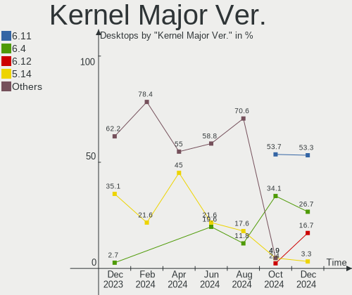
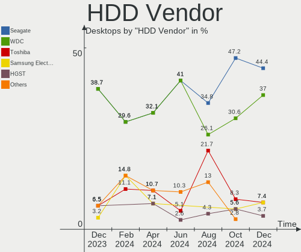
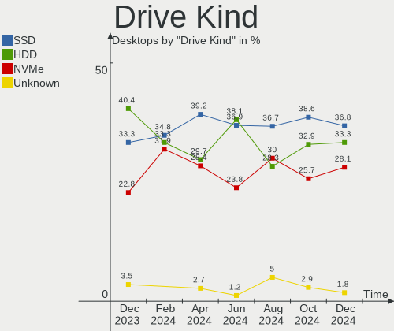
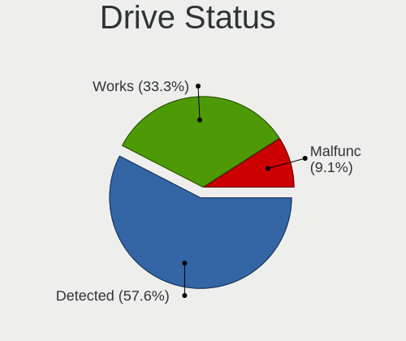
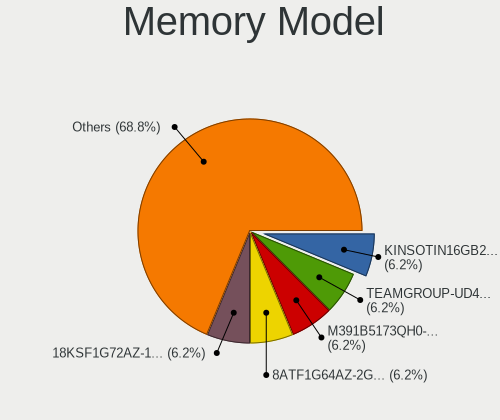
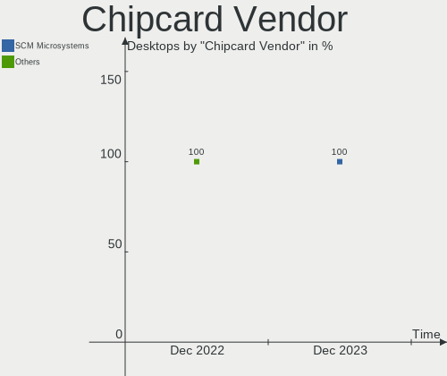

openSUSE - Hardware Trends (Desktops)
-------------------------------------

A project to identify most popular hardware characteristics and track their change
over time based on data collected by Linux users at https://Linux-Hardware.org.

Anyone can contribute to this report by the [hw-probe](https://github.com/linuxhw/hw-probe) tool:

    sudo -E hw-probe -all -upload

This report is for one last month. Overall report since the beginning of time: [TestCoverage](https://github.com/linuxhw/TestCoverage)

Period: Jun, 2022.

Contents
--------

* [ System ](#system)
  - [ OS                       ](#os)
  - [ OS Family                ](#os-family)
  - [ Kernel                   ](#kernel)
  - [ Kernel Family            ](#kernel-family)
  - [ Kernel Major Ver.        ](#kernel-major-ver)
  - [ Arch                     ](#arch)
  - [ DE                       ](#de)
  - [ Display Server           ](#display-server)
  - [ Display Manager          ](#display-manager)
  - [ OS Lang                  ](#os-lang)
  - [ Boot Mode                ](#boot-mode)
  - [ Filesystem               ](#filesystem)
  - [ Part. scheme             ](#part-scheme)
  - [ Dual Boot with Linux/BSD ](#dual-boot-with-linuxbsd)
  - [ Dual Boot (Win)          ](#dual-boot-win)

* [ Board ](#board)
  - [ Vendor                   ](#vendor)
  - [ Model                    ](#model)
  - [ Model Family             ](#model-family)
  - [ MFG Year                 ](#mfg-year)
  - [ Form Factor              ](#form-factor)
  - [ Secure Boot              ](#secure-boot)
  - [ Coreboot                 ](#coreboot)
  - [ RAM Size                 ](#ram-size)
  - [ RAM Used                 ](#ram-used)
  - [ Total Drives             ](#total-drives)
  - [ Has CD-ROM               ](#has-cd-rom)
  - [ Has Ethernet             ](#has-ethernet)
  - [ Has WiFi                 ](#has-wifi)
  - [ Has Bluetooth            ](#has-bluetooth)

* [ Location ](#location)
  - [ Country                  ](#country)
  - [ City                     ](#city)

* [ Drives ](#drives)
  - [ Drive Vendor             ](#drive-vendor)
  - [ Drive Model              ](#drive-model)
  - [ HDD Vendor               ](#hdd-vendor)
  - [ SSD Vendor               ](#ssd-vendor)
  - [ Drive Kind               ](#drive-kind)
  - [ Drive Connector          ](#drive-connector)
  - [ Drive Size               ](#drive-size)
  - [ Space Total              ](#space-total)
  - [ Space Used               ](#space-used)
  - [ Malfunc. Drives          ](#malfunc-drives)
  - [ Malfunc. Drive Vendor    ](#malfunc-drive-vendor)
  - [ Malfunc. HDD Vendor      ](#malfunc-hdd-vendor)
  - [ Malfunc. Drive Kind      ](#malfunc-drive-kind)
  - [ Failed Drives            ](#failed-drives)
  - [ Failed Drive Vendor      ](#failed-drive-vendor)
  - [ Drive Status             ](#drive-status)

* [ Storage controller ](#storage-controller)
  - [ Storage Vendor           ](#storage-vendor)
  - [ Storage Model            ](#storage-model)
  - [ Storage Kind             ](#storage-kind)

* [ Processor ](#processor)
  - [ CPU Vendor               ](#cpu-vendor)
  - [ CPU Model                ](#cpu-model)
  - [ CPU Model Family         ](#cpu-model-family)
  - [ CPU Cores                ](#cpu-cores)
  - [ CPU Sockets              ](#cpu-sockets)
  - [ CPU Threads              ](#cpu-threads)
  - [ CPU Op-Modes             ](#cpu-op-modes)
  - [ CPU Microcode            ](#cpu-microcode)
  - [ CPU Microarch            ](#cpu-microarch)

* [ Graphics ](#graphics)
  - [ GPU Vendor               ](#gpu-vendor)
  - [ GPU Model                ](#gpu-model)
  - [ GPU Combo                ](#gpu-combo)
  - [ GPU Driver               ](#gpu-driver)
  - [ GPU Memory               ](#gpu-memory)

* [ Monitor ](#monitor)
  - [ Monitor Vendor           ](#monitor-vendor)
  - [ Monitor Model            ](#monitor-model)
  - [ Monitor Resolution       ](#monitor-resolution)
  - [ Monitor Diagonal         ](#monitor-diagonal)
  - [ Monitor Width            ](#monitor-width)
  - [ Aspect Ratio             ](#aspect-ratio)
  - [ Monitor Area             ](#monitor-area)
  - [ Pixel Density            ](#pixel-density)
  - [ Multiple Monitors        ](#multiple-monitors)

* [ Network ](#network)
  - [ Net Controller Vendor    ](#net-controller-vendor)
  - [ Net Controller Model     ](#net-controller-model)
  - [ Wireless Vendor          ](#wireless-vendor)
  - [ Wireless Model           ](#wireless-model)
  - [ Ethernet Vendor          ](#ethernet-vendor)
  - [ Ethernet Model           ](#ethernet-model)
  - [ Net Controller Kind      ](#net-controller-kind)
  - [ Used Controller          ](#used-controller)
  - [ NICs                     ](#nics)
  - [ IPv6                     ](#ipv6)

* [ Bluetooth ](#bluetooth)
  - [ Bluetooth Vendor         ](#bluetooth-vendor)
  - [ Bluetooth Model          ](#bluetooth-model)

* [ Sound ](#sound)
  - [ Sound Vendor             ](#sound-vendor)
  - [ Sound Model              ](#sound-model)

* [ Memory ](#memory)
  - [ Memory Vendor            ](#memory-vendor)
  - [ Memory Model             ](#memory-model)
  - [ Memory Kind              ](#memory-kind)
  - [ Memory Form Factor       ](#memory-form-factor)
  - [ Memory Size              ](#memory-size)
  - [ Memory Speed             ](#memory-speed)

* [ Printers & scanners ](#printers--scanners)
  - [ Printer Vendor           ](#printer-vendor)
  - [ Printer Model            ](#printer-model)
  - [ Scanner Vendor           ](#scanner-vendor)
  - [ Scanner Model            ](#scanner-model)

* [ Camera ](#camera)
  - [ Camera Vendor            ](#camera-vendor)
  - [ Camera Model             ](#camera-model)

* [ Security ](#security)
  - [ Fingerprint Vendor       ](#fingerprint-vendor)
  - [ Fingerprint Model        ](#fingerprint-model)
  - [ Chipcard Vendor          ](#chipcard-vendor)
  - [ Chipcard Model           ](#chipcard-model)

* [ Unsupported ](#unsupported)
  - [ Unsupported Devices      ](#unsupported-devices)
  - [ Unsupported Device Types ](#unsupported-device-types)

System
------

OS
--

Installed operating systems

| Name                         | Desktops | Percent |
|------------------------------|----------|---------|
| openSUSE Tumbleweed-XXXXXXXX | 14       | 70%     |
| openSUSE Leap-15.4           | 5        | 25%     |
| openSUSE Leap-15.3           | 1        | 5%      |

OS Family
---------

OS without a version

| Name     | Desktops | Percent |
|----------|----------|---------|
| openSUSE | 20       | 100%    |

Kernel
------

Version of the Linux kernel

| Version                         | Desktops | Percent |
|---------------------------------|----------|---------|
| 5.17.9-1-default                | 4        | 20%     |
| 5.14.21-150400.22-default       | 4        | 20%     |
| 5.18.2-1-default                | 3        | 15%     |
| 5.18.6-1-default                | 2        | 10%     |
| 5.18.4-1-default                | 2        | 10%     |
| 5.17.7-1-default                | 2        | 10%     |
| 5.3.18-150300.59.68-default     | 1        | 5%      |
| 5.18.2-lp153.4.g6d13af9-default | 1        | 5%      |
| 5.16.0-1-default                | 1        | 5%      |

Kernel Family
-------------

Linux kernel without a distro release

| Version | Desktops | Percent |
|---------|----------|---------|
| 5.18.2  | 4        | 20%     |
| 5.17.9  | 4        | 20%     |
| 5.14.21 | 4        | 20%     |
| 5.18.6  | 2        | 10%     |
| 5.18.4  | 2        | 10%     |
| 5.17.7  | 2        | 10%     |
| 5.3.18  | 1        | 5%      |
| 5.16.0  | 1        | 5%      |

Kernel Major Ver.
-----------------

Linux kernel major version

| Version | Desktops | Percent |
|---------|----------|---------|
| 5.18    | 8        | 40%     |
| 5.17    | 6        | 30%     |
| 5.14    | 4        | 20%     |
| 5.3     | 1        | 5%      |
| 5.16    | 1        | 5%      |

Arch
----

OS architecture (x86_64, i586, etc.)

| Name   | Desktops | Percent |
|--------|----------|---------|
| x86_64 | 20       | 100%    |

DE
--

Desktop Environment

| Name     | Desktops | Percent |
|----------|----------|---------|
| KDE5     | 14       | 70%     |
| GNOME    | 3        | 15%     |
| KDE      | 1        | 5%      |
| Cinnamon | 1        | 5%      |
| Unknown  | 1        | 5%      |

Display Server
--------------

X11 or Wayland

| Name        | Desktops | Percent |
|-------------|----------|---------|
| X11         | 18       | 90%     |
| Unspecified | 1        | 5%      |
| Unknown     | 1        | 5%      |

Display Manager
---------------

SDDM, LightDM, etc.

| Name    | Desktops | Percent |
|---------|----------|---------|
| Unknown | 10       | 50%     |
| SDDM    | 5        | 25%     |
| LightDM | 4        | 20%     |
| XDM     | 1        | 5%      |

OS Lang
-------

Language

| Lang    | Desktops | Percent |
|---------|----------|---------|
| en_US   | 7        | 35%     |
| pt_BR   | 3        | 15%     |
| POSIX   | 2        | 10%     |
| de_DE   | 2        | 10%     |
| pl_PL   | 1        | 5%      |
| nn_NO   | 1        | 5%      |
| hr_HR   | 1        | 5%      |
| fr_FR   | 1        | 5%      |
| en_GB   | 1        | 5%      |
| Unknown | 1        | 5%      |

Boot Mode
---------

EFI or BIOS

| Mode | Desktops | Percent |
|------|----------|---------|
| EFI  | 12       | 60%     |
| BIOS | 8        | 40%     |

Filesystem
----------

Type of filesystem

| Type    | Desktops | Percent |
|---------|----------|---------|
| Btrfs   | 17       | 85%     |
| Ext4    | 2        | 10%     |
| Overlay | 1        | 5%      |

Part. scheme
------------

Scheme of partitioning

| Type    | Desktops | Percent |
|---------|----------|---------|
| GPT     | 9        | 45%     |
| Unknown | 9        | 45%     |
| MBR     | 2        | 10%     |

Dual Boot with Linux/BSD
------------------------

Hosting more than one Linux/BSD

| Dual boot | Desktops | Percent |
|-----------|----------|---------|
| No        | 17       | 85%     |
| Yes       | 3        | 15%     |

Dual Boot (Win)
---------------

Hosting Linux and Windows

| Dual boot | Desktops | Percent |
|-----------|----------|---------|
| No        | 16       | 80%     |
| Yes       | 4        | 20%     |

Board
-----

Vendor
------

Motherboard manufacturer

| Name                | Desktops | Percent |
|---------------------|----------|---------|
| ASUSTek Computer    | 5        | 25%     |
| MSI                 | 4        | 20%     |
| Gigabyte Technology | 4        | 20%     |
| Hewlett-Packard     | 2        | 10%     |
| Dell                | 2        | 10%     |
| Lenovo              | 1        | 5%      |
| EVGA                | 1        | 5%      |
| ASRock              | 1        | 5%      |

Model
-----

Motherboard model

| Name                                | Desktops | Percent |
|-------------------------------------|----------|---------|
| MSI MS-7D43                         | 1        | 5%      |
| MSI MS-7850                         | 1        | 5%      |
| MSI MS-7821                         | 1        | 5%      |
| MSI MS-7673                         | 1        | 5%      |
| Lenovo ThinkStation P520 30BE008VGE | 1        | 5%      |
| HP Z840 Workstation                 | 1        | 5%      |
| HP OMEN 30L Desktop GT13-0xxx       | 1        | 5%      |
| Gigabyte B85-HD3-A                  | 1        | 5%      |
| Gigabyte B550 AORUS ELITE AX V2     | 1        | 5%      |
| Gigabyte B450 AORUS PRO WIFI        | 1        | 5%      |
| Gigabyte B450 AORUS ELITE           | 1        | 5%      |
| EVGA X299 FTW K                     | 1        | 5%      |
| Dell OptiPlex 790                   | 1        | 5%      |
| Dell OptiPlex 7070                  | 1        | 5%      |
| ASUS TUF Gaming Z590-PLUS           | 1        | 5%      |
| ASUS TUF Gaming B550M-E             | 1        | 5%      |
| ASUS ROG CROSSHAIR VII HERO         | 1        | 5%      |
| ASUS M5A78L-M/USB3                  | 1        | 5%      |
| ASUS 970 PRO GAMING/AURA            | 1        | 5%      |
| ASRock J3355B-ITX                   | 1        | 5%      |

Model Family
------------

Motherboard model prefix

| Name                | Desktops | Percent |
|---------------------|----------|---------|
| Gigabyte B450       | 2        | 10%     |
| Dell OptiPlex       | 2        | 10%     |
| ASUS TUF            | 2        | 10%     |
| MSI MS-7D43         | 1        | 5%      |
| MSI MS-7850         | 1        | 5%      |
| MSI MS-7821         | 1        | 5%      |
| MSI MS-7673         | 1        | 5%      |
| Lenovo ThinkStation | 1        | 5%      |
| HP Z840             | 1        | 5%      |
| HP OMEN             | 1        | 5%      |
| Gigabyte B85-HD3-A  | 1        | 5%      |
| Gigabyte B550       | 1        | 5%      |
| EVGA X299           | 1        | 5%      |
| ASUS ROG            | 1        | 5%      |
| ASUS M5A78L-M       | 1        | 5%      |
| ASUS 970            | 1        | 5%      |
| ASRock J3355B-ITX   | 1        | 5%      |

MFG Year
--------

Motherboard manufacture year

| Year | Desktops | Percent |
|------|----------|---------|
| 2020 | 4        | 20%     |
| 2021 | 3        | 15%     |
| 2019 | 2        | 10%     |
| 2018 | 2        | 10%     |
| 2016 | 2        | 10%     |
| 2015 | 2        | 10%     |
| 2013 | 2        | 10%     |
| 2011 | 2        | 10%     |
| 2017 | 1        | 5%      |

Form Factor
-----------

Physical design of the computer

| Name    | Desktops | Percent |
|---------|----------|---------|
| Desktop | 20       | 100%    |

Secure Boot
-----------

Enabled or disabled

| State    | Desktops | Percent |
|----------|----------|---------|
| Disabled | 20       | 100%    |

Coreboot
--------

Have coreboot on board

| Used | Desktops | Percent |
|------|----------|---------|
| No   | 20       | 100%    |

RAM Size
--------

Total RAM memory

| Size in GB  | Desktops | Percent |
|-------------|----------|---------|
| 32.01-64.0  | 7        | 35%     |
| 16.01-24.0  | 6        | 30%     |
| 64.01-256.0 | 5        | 25%     |
| 4.01-8.0    | 1        | 5%      |
| 24.01-32.0  | 1        | 5%      |

RAM Used
--------

Used RAM memory

| Used GB   | Desktops | Percent |
|-----------|----------|---------|
| 4.01-8.0  | 6        | 30%     |
| 2.01-3.0  | 6        | 30%     |
| 8.01-16.0 | 4        | 20%     |
| 3.01-4.0  | 3        | 15%     |
| 0.51-1.0  | 1        | 5%      |

Total Drives
------------

Number of drives on board

| Drives | Desktops | Percent |
|--------|----------|---------|
| 1      | 7        | 35%     |
| 3      | 5        | 25%     |
| 2      | 4        | 20%     |
| 5      | 2        | 10%     |
| 8      | 1        | 5%      |
| 4      | 1        | 5%      |

Has CD-ROM
----------

Has CD-ROM on board

| Presented | Desktops | Percent |
|-----------|----------|---------|
| Yes       | 12       | 60%     |
| No        | 8        | 40%     |

Has Ethernet
------------

Has Ethernet on board

| Presented | Desktops | Percent |
|-----------|----------|---------|
| Yes       | 20       | 100%    |

Has WiFi
--------

Has WiFi module

| Presented | Desktops | Percent |
|-----------|----------|---------|
| Yes       | 11       | 55%     |
| No        | 9        | 45%     |

Has Bluetooth
-------------

Has Bluetooth module

| Presented | Desktops | Percent |
|-----------|----------|---------|
| Yes       | 10       | 50%     |
| No        | 10       | 50%     |

Location
--------

Country
-------

Geographic location (country)

| Country    | Desktops | Percent |
|------------|----------|---------|
| USA        | 5        | 25%     |
| Germany    | 4        | 20%     |
| Brazil     | 3        | 15%     |
| Poland     | 2        | 10%     |
| Singapore  | 1        | 5%      |
| Russia     | 1        | 5%      |
| Norway     | 1        | 5%      |
| Martinique | 1        | 5%      |
| Croatia    | 1        | 5%      |
| Canada     | 1        | 5%      |

City
----

Geographic location (city)

| City              | Desktops | Percent |
|-------------------|----------|---------|
| West Kelowna      | 1        | 5%      |
| Stari Perkovci    | 1        | 5%      |
| Skeie             | 1        | 5%      |
| Singapore         | 1        | 5%      |
| Santa Rosa        | 1        | 5%      |
| San Ysidro        | 1        | 5%      |
| Riviere Salee     | 1        | 5%      |
| Pueblo            | 1        | 5%      |
| Poznan            | 1        | 5%      |
| Phoenix           | 1        | 5%      |
| Pennsville        | 1        | 5%      |
| Paranaiba         | 1        | 5%      |
| Moscow            | 1        | 5%      |
| Meldorf           | 1        | 5%      |
| Kulmbach          | 1        | 5%      |
| Huettenberg       | 1        | 5%      |
| Converse          | 1        | 5%      |
| Bialystok         | 1        | 5%      |
| Bergisch Gladbach | 1        | 5%      |
| Belo Horizonte    | 1        | 5%      |

Drives
------

Drive Vendor
------------

Hard drive vendors

| Vendor              | Desktops | Drives | Percent |
|---------------------|----------|--------|---------|
| Samsung Electronics | 12       | 14     | 28.57%  |
| WDC                 | 8        | 14     | 19.05%  |
| Seagate             | 6        | 8      | 14.29%  |
| Kingston            | 6        | 7      | 14.29%  |
| Intel               | 2        | 2      | 4.76%   |
| A-DATA Technology   | 2        | 2      | 4.76%   |
| Zheino              | 1        | 1      | 2.38%   |
| SPCC                | 1        | 1      | 2.38%   |
| SanDisk             | 1        | 1      | 2.38%   |
| Phison              | 1        | 1      | 2.38%   |
| Micron Technology   | 1        | 1      | 2.38%   |
| AMD                 | 1        | 1      | 2.38%   |

Drive Model
-----------

Hard drive models

| Model                                  | Desktops | Percent |
|----------------------------------------|----------|---------|
| Samsung NVMe SSD Drive 1TB             | 4        | 8.33%   |
| Zheino CHN-mSATAM3-256 256GB           | 1        | 2.08%   |
| WDC WDS500G2B0A-00SM50 500GB SSD       | 1        | 2.08%   |
| WDC WDS100T2B0A-00SM50 1TB SSD         | 1        | 2.08%   |
| WDC WD60EZRZ-00GZ5B1 6TB               | 1        | 2.08%   |
| WDC WD6003FZBX-00K5WB0 6TB             | 1        | 2.08%   |
| WDC WD40EZRZ-19GXCB0 4TB               | 1        | 2.08%   |
| WDC WD30EZRX-00MMMB0 3TB               | 1        | 2.08%   |
| WDC WD20EZAZ-00L9GB0 2TB               | 1        | 2.08%   |
| WDC WD10EZEX-60ZF5A0 1TB               | 1        | 2.08%   |
| WDC WD10EZEX-22MFCA0 1TB               | 1        | 2.08%   |
| WDC WD10EZEX-08WN4A0 1TB               | 1        | 2.08%   |
| WDC WD10EZEX-08M2NA0 1TB               | 1        | 2.08%   |
| WDC WD1003FZEX-00MK2A0 1TB             | 1        | 2.08%   |
| SPCC M.2 PCIe SSD 512GB                | 1        | 2.08%   |
| Seagate ST6000VN0033-2EE110 6TB        | 1        | 2.08%   |
| Seagate ST4000VN008-2DR166 4TB         | 1        | 2.08%   |
| Seagate ST4000DM004-2CV104 4TB         | 1        | 2.08%   |
| Seagate ST3320418AS 320GB              | 1        | 2.08%   |
| Seagate ST2000DM001-1ER164 2TB         | 1        | 2.08%   |
| Seagate ST2000DL004 HD204UI 2TB        | 1        | 2.08%   |
| Seagate ST1000DX002-2DV162 1TB         | 1        | 2.08%   |
| SanDisk NVMe SSD Drive 1TB             | 1        | 2.08%   |
| Samsung SSD 970 EVO Plus 1TB           | 1        | 2.08%   |
| Samsung SSD 870 QVO 2TB                | 1        | 2.08%   |
| Samsung SSD 870 EVO 500GB              | 1        | 2.08%   |
| Samsung SSD 860 QVO 1TB                | 1        | 2.08%   |
| Samsung SSD 860 EVO 1TB                | 1        | 2.08%   |
| Samsung SSD 850 EVO 500GB              | 1        | 2.08%   |
| Samsung SSD 840 EVO 500GB              | 1        | 2.08%   |
| Samsung SSD 840 EVO 120GB              | 1        | 2.08%   |
| Samsung SM963 2.5" NVMe PCIe SSD 500GB | 1        | 2.08%   |
| Phison NVMe SSD Drive 1024GB           | 1        | 2.08%   |
| Micron NVMe SSD Drive 1024GB           | 1        | 2.08%   |
| Kingston SUV500MS480G 480GB SSD        | 1        | 2.08%   |
| Kingston SHFS37A120G 120GB SSD         | 1        | 2.08%   |
| Kingston SA400S37960G 960GB SSD        | 1        | 2.08%   |
| Kingston SA400S37480G 480GB SSD        | 1        | 2.08%   |
| Kingston SA2000M8500G 500GB            | 1        | 2.08%   |
| Kingston OM8PCP3512F-AB 512GB          | 1        | 2.08%   |
| Intel SSDSA2CW080G3 80GB               | 1        | 2.08%   |
| Intel NVMe SSD Drive 1024GB            | 1        | 2.08%   |
| AMD R5SL480G 480GB SSD                 | 1        | 2.08%   |
| A-DATA SX8200PNP 1TB                   | 1        | 2.08%   |
| A-DATA SU800 1024GB SSD                | 1        | 2.08%   |

HDD Vendor
----------

Hard disk drive vendors

| Vendor  | Desktops | Drives | Percent |
|---------|----------|--------|---------|
| WDC     | 7        | 12     | 53.85%  |
| Seagate | 6        | 8      | 46.15%  |

SSD Vendor
----------

Solid state drive vendors

| Vendor              | Desktops | Drives | Percent |
|---------------------|----------|--------|---------|
| Samsung Electronics | 7        | 7      | 43.75%  |
| Kingston            | 4        | 5      | 25%     |
| WDC                 | 2        | 2      | 12.5%   |
| Intel               | 1        | 1      | 6.25%   |
| AMD                 | 1        | 1      | 6.25%   |
| A-DATA Technology   | 1        | 1      | 6.25%   |

Drive Kind
----------

HDD or SSD

| Kind    | Desktops | Drives | Percent |
|---------|----------|--------|---------|
| HDD     | 13       | 20     | 37.14%  |
| SSD     | 12       | 17     | 34.29%  |
| NVMe    | 9        | 15     | 25.71%  |
| Unknown | 1        | 1      | 2.86%   |

Drive Connector
---------------

SATA, SAS, NVMe, etc.

| Type | Desktops | Drives | Percent |
|------|----------|--------|---------|
| SATA | 17       | 38     | 65.38%  |
| NVMe | 9        | 15     | 34.62%  |

Drive Size
----------

Size of hard drive

| Size in TB | Desktops | Drives | Percent |
|------------|----------|--------|---------|
| 0.01-0.5   | 10       | 12     | 38.46%  |
| 0.51-1.0   | 7        | 10     | 26.92%  |
| 3.01-4.0   | 3        | 4      | 11.54%  |
| 1.01-2.0   | 3        | 5      | 11.54%  |
| 4.01-10.0  | 2        | 5      | 7.69%   |
| 2.01-3.0   | 1        | 1      | 3.85%   |

Space Total
-----------

Amount of disk space available on the file system

| Size in GB     | Desktops | Percent |
|----------------|----------|---------|
| More than 3000 | 11       | 55%     |
| 1001-2000      | 6        | 30%     |
| 2001-3000      | 1        | 5%      |
| 501-1000       | 1        | 5%      |
| 51-100         | 1        | 5%      |

Space Used
----------

Amount of used disk space

| Used GB        | Desktops | Percent |
|----------------|----------|---------|
| 1001-2000      | 5        | 25%     |
| 101-250        | 4        | 20%     |
| 501-1000       | 4        | 20%     |
| 251-500        | 2        | 10%     |
| 2001-3000      | 2        | 10%     |
| More than 3000 | 1        | 5%      |
| 1-20           | 1        | 5%      |
| 51-100         | 1        | 5%      |

Malfunc. Drives
---------------

Drive models with a malfunction

| Model                                 | Desktops | Drives | Percent |
|---------------------------------------|----------|--------|---------|
| SPCC M.2 PCIe SSD 512GB               | 1        | 1      | 33.33%  |
| Samsung Electronics SSD 840 EVO 120GB | 1        | 1      | 33.33%  |
| Kingston SHFS37A120G 120GB SSD        | 1        | 1      | 33.33%  |

Malfunc. Drive Vendor
---------------------

Vendors of faulty drives

| Vendor              | Desktops | Drives | Percent |
|---------------------|----------|--------|---------|
| SPCC                | 1        | 1      | 33.33%  |
| Samsung Electronics | 1        | 1      | 33.33%  |
| Kingston            | 1        | 1      | 33.33%  |

Malfunc. HDD Vendor
-------------------

Vendors of faulty HDD drives

Zero info for selected period =(

Malfunc. Drive Kind
-------------------

Kinds of faulty drives

| Kind | Desktops | Drives | Percent |
|------|----------|--------|---------|
| SSD  | 2        | 2      | 66.67%  |
| NVMe | 1        | 1      | 33.33%  |

Failed Drives
-------------

Failed drive models

Zero info for selected period =(

Failed Drive Vendor
-------------------

Failed drive vendors

Zero info for selected period =(

Drive Status
------------

Number of failed and malfunc. drives

| Status   | Desktops | Drives | Percent |
|----------|----------|--------|---------|
| Detected | 9        | 26     | 42.86%  |
| Works    | 9        | 24     | 42.86%  |
| Malfunc  | 3        | 3      | 14.29%  |

Storage controller
------------------

Storage Vendor
--------------

Storage controller vendors

| Vendor                      | Desktops | Percent |
|-----------------------------|----------|---------|
| Intel                       | 13       | 37.14%  |
| AMD                         | 8        | 22.86%  |
| Samsung Electronics         | 5        | 14.29%  |
| Kingston Technology Company | 2        | 5.71%   |
| SanDisk                     | 1        | 2.86%   |
| Phison Electronics          | 1        | 2.86%   |
| Micron Technology           | 1        | 2.86%   |
| MAXIO Technology (Hangzhou) | 1        | 2.86%   |
| Broadcom / LSI              | 1        | 2.86%   |
| ASMedia Technology          | 1        | 2.86%   |
| ADATA Technology            | 1        | 2.86%   |

Storage Model
-------------

Storage controller models

| Model                                                                          | Desktops | Percent |
|--------------------------------------------------------------------------------|----------|---------|
| Samsung NVMe SSD Controller SM981/PM981/PM983                                  | 4        | 9.76%   |
| AMD FCH SATA Controller [AHCI mode]                                            | 4        | 9.76%   |
| AMD 400 Series Chipset SATA Controller                                         | 4        | 9.76%   |
| Intel 8 Series/C220 Series Chipset Family 6-port SATA Controller 1 [AHCI mode] | 3        | 7.32%   |
| Intel 6 Series/C200 Series Chipset Family 6 port Desktop SATA AHCI Controller  | 2        | 4.88%   |
| Intel 200 Series PCH SATA controller [AHCI mode]                               | 2        | 4.88%   |
| AMD 500 Series Chipset SATA Controller                                         | 2        | 4.88%   |
| SanDisk Non-Volatile memory controller                                         | 1        | 2.44%   |
| Samsung NVMe SSD Controller 980                                                | 1        | 2.44%   |
| Phison E12 NVMe Controller                                                     | 1        | 2.44%   |
| Micron Non-Volatile memory controller                                          | 1        | 2.44%   |
| MAXIO (Hangzhou) NVMe SSD Controller MAP1202                                   | 1        | 2.44%   |
| Kingston Company Company Non-Volatile memory controller                        | 1        | 2.44%   |
| Kingston Company A2000 NVMe SSD                                                | 1        | 2.44%   |
| Intel SSD 660P Series                                                          | 1        | 2.44%   |
| Intel Celeron N3350/Pentium N4200/Atom E3900 Series SATA AHCI Controller       | 1        | 2.44%   |
| Intel Cannon Lake PCH SATA AHCI Controller                                     | 1        | 2.44%   |
| Intel C610/X99 series chipset sSATA Controller [AHCI mode]                     | 1        | 2.44%   |
| Intel C610/X99 series chipset 6-Port SATA Controller [AHCI mode]               | 1        | 2.44%   |
| Intel Alder Lake-S PCH SATA Controller [AHCI Mode]                             | 1        | 2.44%   |
| Intel 500 Series Chipset Family SATA AHCI Controller                           | 1        | 2.44%   |
| Broadcom / LSI SAS2308 PCI-Express Fusion-MPT SAS-2                            | 1        | 2.44%   |
| ASMedia ASM1166 Serial ATA Controller                                          | 1        | 2.44%   |
| AMD SB7x0/SB8x0/SB9x0 SATA Controller [IDE mode]                               | 1        | 2.44%   |
| AMD SB7x0/SB8x0/SB9x0 SATA Controller [AHCI mode]                              | 1        | 2.44%   |
| AMD SB7x0/SB8x0/SB9x0 IDE Controller                                           | 1        | 2.44%   |
| ADATA XPG SX8200 Pro PCIe Gen3x4 M.2 2280 Solid State Drive                    | 1        | 2.44%   |

Storage Kind
------------

Kind of storage controller (IDE, SATA, NVMe, SAS, ...)

| Kind | Desktops | Percent |
|------|----------|---------|
| SATA | 20       | 64.52%  |
| NVMe | 9        | 29.03%  |
| SAS  | 1        | 3.23%   |
| IDE  | 1        | 3.23%   |

Processor
---------

CPU Vendor
----------

Processor vendors

| Vendor | Desktops | Percent |
|--------|----------|---------|
| Intel  | 12       | 60%     |
| AMD    | 8        | 40%     |

CPU Model
---------

Processor models

| Model                                   | Desktops | Percent |
|-----------------------------------------|----------|---------|
| Intel Core i5-4670K CPU @ 3.40GHz       | 2        | 10%     |
| AMD Ryzen 7 3700X 8-Core Processor      | 2        | 10%     |
| AMD FX-8350 Eight-Core Processor        | 2        | 10%     |
| Intel Xeon W-2135 CPU @ 3.70GHz         | 1        | 5%      |
| Intel Xeon CPU E5-2667 v3 @ 3.20GHz     | 1        | 5%      |
| Intel Core i9-9940X CPU @ 3.30GHz       | 1        | 5%      |
| Intel Core i9-9900K CPU @ 3.60GHz       | 1        | 5%      |
| Intel Core i7-4790 CPU @ 3.60GHz        | 1        | 5%      |
| Intel Core i7-2600 CPU @ 3.40GHz        | 1        | 5%      |
| Intel Core i5-2500 CPU @ 3.30GHz        | 1        | 5%      |
| Intel Celeron CPU J3355 @ 2.00GHz       | 1        | 5%      |
| Intel 12th Gen Core i7-12700K           | 1        | 5%      |
| Intel 11th Gen Core i7-11700F @ 2.50GHz | 1        | 5%      |
| AMD Ryzen 9 5900X 12-Core Processor     | 1        | 5%      |
| AMD Ryzen 7 5700G with Radeon Graphics  | 1        | 5%      |
| AMD Ryzen 7 2700X Eight-Core Processor  | 1        | 5%      |
| AMD Ryzen 5 2600X Six-Core Processor    | 1        | 5%      |

CPU Model Family
----------------

Processor model prefix

| Model         | Desktops | Percent |
|---------------|----------|---------|
| AMD Ryzen 7   | 4        | 20%     |
| Intel Core i5 | 3        | 15%     |
| Other         | 2        | 10%     |
| Intel Xeon    | 2        | 10%     |
| Intel Core i9 | 2        | 10%     |
| Intel Core i7 | 2        | 10%     |
| AMD FX        | 2        | 10%     |
| Intel Celeron | 1        | 5%      |
| AMD Ryzen 9   | 1        | 5%      |
| AMD Ryzen 5   | 1        | 5%      |

CPU Cores
---------

Number of processor cores

| Number | Desktops | Percent |
|--------|----------|---------|
| 4      | 7        | 35%     |
| 8      | 6        | 30%     |
| 12     | 2        | 10%     |
| 6      | 2        | 10%     |
| 16     | 1        | 5%      |
| 14     | 1        | 5%      |
| 2      | 1        | 5%      |

CPU Sockets
-----------

Number of sockets

| Number | Desktops | Percent |
|--------|----------|---------|
| 1      | 19       | 95%     |
| 2      | 1        | 5%      |

CPU Threads
-----------

Threads per core (Hyper-Threading)

| Number | Desktops | Percent |
|--------|----------|---------|
| 2      | 16       | 80%     |
| 1      | 4        | 20%     |

CPU Op-Modes
------------

CPU Operation Modes (32-bit, 64-bit)

| Op mode        | Desktops | Percent |
|----------------|----------|---------|
| 32-bit, 64-bit | 20       | 100%    |

CPU Microcode
-------------

Microcode number

| Number     | Desktops | Percent |
|------------|----------|---------|
| 0x306c3    | 3        | 15%     |
| Unknown    | 3        | 15%     |
| 0x0800820d | 2        | 10%     |
| 0x06000852 | 2        | 10%     |
| 0xa0671    | 1        | 5%      |
| 0x906ec    | 1        | 5%      |
| 0x90672    | 1        | 5%      |
| 0x50654    | 1        | 5%      |
| 0x306f2    | 1        | 5%      |
| 0x206a7    | 1        | 5%      |
| 0x0a50000d | 1        | 5%      |
| 0x0a20120a | 1        | 5%      |
| 0x08701021 | 1        | 5%      |
| 0x08701013 | 1        | 5%      |

CPU Microarch
-------------

Microarchitecture

| Name             | Desktops | Percent |
|------------------|----------|---------|
| Haswell          | 4        | 20%     |
| Zen+             | 2        | 10%     |
| Zen 3            | 2        | 10%     |
| Zen 2            | 2        | 10%     |
| Skylake          | 2        | 10%     |
| SandyBridge      | 2        | 10%     |
| Piledriver       | 2        | 10%     |
| KabyLake         | 1        | 5%      |
| Icelake          | 1        | 5%      |
| Goldmont         | 1        | 5%      |
| Alderlake Hybrid | 1        | 5%      |

Graphics
--------

GPU Vendor
----------

Vendors of graphics cards

| Vendor | Desktops | Percent |
|--------|----------|---------|
| Nvidia | 11       | 55%     |
| AMD    | 6        | 30%     |
| Intel  | 3        | 15%     |

GPU Model
---------

Graphics card models

| Model                                                | Desktops | Percent |
|------------------------------------------------------|----------|---------|
| Nvidia GK208B [GeForce GT 730]                       | 2        | 9.52%   |
| Nvidia TU104 [GeForce RTX 2080 SUPER]                | 1        | 4.76%   |
| Nvidia TU102 [GeForce RTX 2080 Ti Rev. A]            | 1        | 4.76%   |
| Nvidia GP107 [GeForce GTX 1050 Ti]                   | 1        | 4.76%   |
| Nvidia GP106 [GeForce GTX 1060 6GB]                  | 1        | 4.76%   |
| Nvidia GP106 [GeForce GTX 1060 3GB]                  | 1        | 4.76%   |
| Nvidia GP104 [GeForce GTX 1080]                      | 1        | 4.76%   |
| Nvidia GK104GL [Quadro K4200]                        | 1        | 4.76%   |
| Nvidia GA106 [GeForce RTX 3060 Lite Hash Rate]       | 1        | 4.76%   |
| Nvidia GA106 [Geforce RTX 3050]                      | 1        | 4.76%   |
| Nvidia GA102 [GeForce RTX 3080 Lite Hash Rate]       | 1        | 4.76%   |
| Intel HD Graphics 500                                | 1        | 4.76%   |
| Intel CoffeeLake-S GT2 [UHD Graphics 630]            | 1        | 4.76%   |
| Intel AlderLake-S GT1                                | 1        | 4.76%   |
| AMD RS780L [Radeon 3000]                             | 1        | 4.76%   |
| AMD Navi 22 [Radeon RX 6700/6700 XT/6750 XT / 6800M] | 1        | 4.76%   |
| AMD Juniper XT [Radeon HD 5770]                      | 1        | 4.76%   |
| AMD Hawaii XT / Grenada XT [Radeon R9 290X/390X]     | 1        | 4.76%   |
| AMD Cezanne                                          | 1        | 4.76%   |
| AMD Cedar [Radeon HD 5000/6000/7350/8350 Series]     | 1        | 4.76%   |

GPU Combo
---------

Combinations of graphics cards

| Name       | Desktops | Percent |
|------------|----------|---------|
| 1 x Nvidia | 10       | 50%     |
| 1 x AMD    | 6        | 30%     |
| 1 x Intel  | 3        | 15%     |
| 2 x Nvidia | 1        | 5%      |

GPU Driver
----------

Free vs proprietary

| Driver      | Desktops | Percent |
|-------------|----------|---------|
| Free        | 12       | 60%     |
| Proprietary | 8        | 40%     |

GPU Memory
----------

Total video memory

| Size in GB | Desktops | Percent |
|------------|----------|---------|
| 3.01-4.0   | 5        | 25%     |
| 8.01-16.0  | 4        | 20%     |
| Unknown    | 4        | 20%     |
| 7.01-8.0   | 2        | 10%     |
| 0.51-1.0   | 2        | 10%     |
| 0.01-0.5   | 2        | 10%     |
| 2.01-3.0   | 1        | 5%      |

Monitor
-------

Monitor Vendor
--------------

Monitor vendors

| Vendor              | Desktops | Percent |
|---------------------|----------|---------|
| Goldstar            | 6        | 26.09%  |
| Dell                | 3        | 13.04%  |
| Samsung Electronics | 2        | 8.7%    |
| ASUSTek Computer    | 2        | 8.7%    |
| Vizio               | 1        | 4.35%   |
| Unknown             | 1        | 4.35%   |
| Philips             | 1        | 4.35%   |
| MacroSilicon        | 1        | 4.35%   |
| Iiyama              | 1        | 4.35%   |
| Hewlett-Packard     | 1        | 4.35%   |
| GDH                 | 1        | 4.35%   |
| Fujitsu Siemens     | 1        | 4.35%   |
| BenQ                | 1        | 4.35%   |
| Acer                | 1        | 4.35%   |

Monitor Model
-------------

Monitor models

| Model                                                             | Desktops | Percent |
|-------------------------------------------------------------------|----------|---------|
| Vizio E60-E3 VIZ1018 3840x2160 1330x748mm 60.1-inch               | 1        | 3.85%   |
| Unknown SMART TV 0563 1920x1080 1209x680mm 54.6-inch              | 1        | 3.85%   |
| Samsung Electronics LU28R55 SAM1015 3840x2160 632x360mm 28.6-inch | 1        | 3.85%   |
| Samsung Electronics LCD Monitor SyncMaster 1920x1080              | 1        | 3.85%   |
| Philips PHL 328P6A PHL0913 2560x1440 698x393mm 31.5-inch          | 1        | 3.85%   |
| Philips PHL 223V7 PHLC154 1920x1080 476x268mm 21.5-inch           | 1        | 3.85%   |
| MacroSilicon MACROSILICON MAC0101 1920x1080 708x398mm 32.0-inch   | 1        | 3.85%   |
| Iiyama PL2530H IVM6132 1920x1080 540x300mm 24.3-inch              | 1        | 3.85%   |
| Hewlett-Packard 27q HPN3564 2560x1440 597x336mm 27.0-inch         | 1        | 3.85%   |
| Goldstar W2234 GSM56B8 1680x1050 474x296mm 22.0-inch              | 1        | 3.85%   |
| Goldstar ULTRAWIDE GSM5AFB 2560x1080 798x334mm 34.1-inch          | 1        | 3.85%   |
| Goldstar ULTRAGEAR GSM7766 2560x1440 697x392mm 31.5-inch          | 1        | 3.85%   |
| Goldstar ULTRAGEAR GSM5BD3 2560x1440 697x392mm 31.5-inch          | 1        | 3.85%   |
| Goldstar Ultra HD GSM5B09 3840x2160 600x340mm 27.2-inch           | 1        | 3.85%   |
| Goldstar M2380D GSM57BC 1920x1080 598x336mm 27.0-inch             | 1        | 3.85%   |
| Goldstar FULL HD GSM5ABB 1920x1080 480x270mm 21.7-inch            | 1        | 3.85%   |
| Goldstar 34GL750 GSM773B 2560x1080 798x334mm 34.1-inch            | 1        | 3.85%   |
| GDH PHILCO GDH0030 1920x540 708x398mm 32.0-inch                   | 1        | 3.85%   |
| Fujitsu Siemens P19-2 FUS0552 1280x1024 376x301mm 19.0-inch       | 1        | 3.85%   |
| Dell U3417W DELA0DD 3440x1440 800x335mm 34.1-inch                 | 1        | 3.85%   |
| Dell U2414H DELA0A3 1920x1080 527x296mm 23.8-inch                 | 1        | 3.85%   |
| Dell E1916H DELF064 1366x768 410x230mm 18.5-inch                  | 1        | 3.85%   |
| BenQ BenQG2222HDL BNQ785A 1920x1080 478x269mm 21.6-inch           | 1        | 3.85%   |
| ASUSTek Computer VP28U AUS28B1 3840x2160 621x341mm 27.9-inch      | 1        | 3.85%   |
| ASUSTek Computer VL279 AUS2781 1920x1080 598x336mm 27.0-inch      | 1        | 3.85%   |
| Acer GF246 ACR055F 1920x1080 531x299mm 24.0-inch                  | 1        | 3.85%   |

Monitor Resolution
------------------

Monitor screen resolution

| Resolution         | Desktops | Percent |
|--------------------|----------|---------|
| 1920x1080 (FHD)    | 9        | 40.91%  |
| 3840x2160 (4K)     | 4        | 18.18%  |
| 2560x1440 (QHD)    | 4        | 18.18%  |
| 3440x1440          | 1        | 4.55%   |
| 2560x1080          | 1        | 4.55%   |
| 1680x1050 (WSXGA+) | 1        | 4.55%   |
| 1366x768 (WXGA)    | 1        | 4.55%   |
| 1280x1024 (SXGA)   | 1        | 4.55%   |

Monitor Diagonal
----------------

Diagonal size in inches

| Inches  | Desktops | Percent |
|---------|----------|---------|
| 27      | 5        | 20%     |
| 31      | 3        | 12%     |
| 24      | 3        | 12%     |
| 21      | 3        | 12%     |
| 34      | 2        | 8%      |
| 74      | 1        | 4%      |
| 54      | 1        | 4%      |
| 52      | 1        | 4%      |
| 32      | 1        | 4%      |
| 28      | 1        | 4%      |
| 22      | 1        | 4%      |
| 19      | 1        | 4%      |
| 18      | 1        | 4%      |
| Unknown | 1        | 4%      |

Monitor Width
-------------

Physical width

| Width in mm | Desktops | Percent |
|-------------|----------|---------|
| 501-600     | 7        | 28%     |
| 601-700     | 5        | 20%     |
| 401-500     | 5        | 20%     |
| 701-800     | 3        | 12%     |
| 1001-1500   | 2        | 8%      |
| 351-400     | 1        | 4%      |
| 1501-2000   | 1        | 4%      |
| Unknown     | 1        | 4%      |

Aspect Ratio
------------

Proportional relationship between the width and the height

| Ratio   | Desktops | Percent |
|---------|----------|---------|
| 16/9    | 17       | 73.91%  |
| 21/9    | 2        | 8.7%    |
| 16/10   | 2        | 8.7%    |
| 5/4     | 1        | 4.35%   |
| Unknown | 1        | 4.35%   |

Monitor Area
------------

Area in inch²

| Area in inch² | Desktops | Percent |
|----------------|----------|---------|
| 351-500        | 7        | 29.17%  |
| 301-350        | 5        | 20.83%  |
| 201-250        | 5        | 20.83%  |
| More than 1000 | 3        | 12.5%   |
| 251-300        | 1        | 4.17%   |
| 151-200        | 1        | 4.17%   |
| 141-150        | 1        | 4.17%   |
| Unknown        | 1        | 4.17%   |

Pixel Density
-------------

Pixels per inch

| Density | Desktops | Percent |
|---------|----------|---------|
| 51-100  | 14       | 58.33%  |
| 101-120 | 5        | 20.83%  |
| 1-50    | 2        | 8.33%   |
| 121-160 | 2        | 8.33%   |
| Unknown | 1        | 4.17%   |

Multiple Monitors
-----------------

Total monitors connected

| Total | Desktops | Percent |
|-------|----------|---------|
| 1     | 14       | 70%     |
| 2     | 6        | 30%     |

Network
-------

Net Controller Vendor
---------------------

Controller vendors

| Vendor                | Desktops | Percent |
|-----------------------|----------|---------|
| Realtek Semiconductor | 12       | 40%     |
| Intel                 | 9        | 30%     |
| Qualcomm Atheros      | 2        | 6.67%   |
| TP-Link               | 1        | 3.33%   |
| Ralink Technology     | 1        | 3.33%   |
| NetGear               | 1        | 3.33%   |
| MediaTek              | 1        | 3.33%   |
| Linksys               | 1        | 3.33%   |
| DisplayLink           | 1        | 3.33%   |
| Broadcom              | 1        | 3.33%   |

Net Controller Model
--------------------

Controller models

| Model                                                               | Desktops | Percent |
|---------------------------------------------------------------------|----------|---------|
| Realtek RTL8111/8168/8411 PCI Express Gigabit Ethernet Controller   | 8        | 21.62%  |
| Intel I211 Gigabit Network Connection                               | 3        | 8.11%   |
| Realtek RTL8125 2.5GbE Controller                                   | 2        | 5.41%   |
| TP-Link TL-WN821N v5/v6 [RTL8192EU]                                 | 1        | 2.7%    |
| Realtek RTL88x2bu [AC1200 Techkey]                                  | 1        | 2.7%    |
| Realtek RTL8822CE 802.11ac PCIe Wireless Network Adapter            | 1        | 2.7%    |
| Realtek RTL8822BE 802.11a/b/g/n/ac WiFi adapter                     | 1        | 2.7%    |
| Realtek RTL8812AE 802.11ac PCIe Wireless Network Adapter            | 1        | 2.7%    |
| Realtek RTL8191SEvB Wireless LAN Controller                         | 1        | 2.7%    |
| Ralink RT5370 Wireless Adapter                                      | 1        | 2.7%    |
| Qualcomm Atheros Killer E2500 Gigabit Ethernet Controller           | 1        | 2.7%    |
| Qualcomm Atheros Killer E220x Gigabit Ethernet Controller           | 1        | 2.7%    |
| NetGear A6150                                                       | 1        | 2.7%    |
| MediaTek MT7921K (RZ608) Wi-Fi 6E 80MHz                             | 1        | 2.7%    |
| Linksys AE6000 802.11a/b/g/n/ac Wireless Adapter [MediaTek MT7610U] | 1        | 2.7%    |
| Intel Wi-Fi 6 AX210/AX211/AX411 160MHz                              | 1        | 2.7%    |
| Intel Wi-Fi 6 AX200                                                 | 1        | 2.7%    |
| Intel I350 Gigabit Network Connection                               | 1        | 2.7%    |
| Intel I210 Gigabit Network Connection                               | 1        | 2.7%    |
| Intel Ethernet Controller I225-V                                    | 1        | 2.7%    |
| Intel Ethernet Connection (7) I219-LM                               | 1        | 2.7%    |
| Intel Ethernet Connection (2) I219-V                                | 1        | 2.7%    |
| Intel Ethernet Connection (2) I218-LM                               | 1        | 2.7%    |
| Intel Dual Band Wireless-AC 3168NGW [Stone Peak]                    | 1        | 2.7%    |
| Intel 82579LM Gigabit Network Connection (Lewisville)               | 1        | 2.7%    |
| DisplayLink USB3.0 Dual Video Dock                                  | 1        | 2.7%    |
| Broadcom BCM4360 802.11ac Wireless Network Adapter                  | 1        | 2.7%    |

Wireless Vendor
---------------

Wireless vendors

| Vendor                | Desktops | Percent |
|-----------------------|----------|---------|
| Realtek Semiconductor | 5        | 35.71%  |
| Intel                 | 3        | 21.43%  |
| TP-Link               | 1        | 7.14%   |
| Ralink Technology     | 1        | 7.14%   |
| NetGear               | 1        | 7.14%   |
| MediaTek              | 1        | 7.14%   |
| Linksys               | 1        | 7.14%   |
| Broadcom              | 1        | 7.14%   |

Wireless Model
--------------

Wireless models

| Model                                                               | Desktops | Percent |
|---------------------------------------------------------------------|----------|---------|
| TP-Link TL-WN821N v5/v6 [RTL8192EU]                                 | 1        | 7.14%   |
| Realtek RTL88x2bu [AC1200 Techkey]                                  | 1        | 7.14%   |
| Realtek RTL8822CE 802.11ac PCIe Wireless Network Adapter            | 1        | 7.14%   |
| Realtek RTL8822BE 802.11a/b/g/n/ac WiFi adapter                     | 1        | 7.14%   |
| Realtek RTL8812AE 802.11ac PCIe Wireless Network Adapter            | 1        | 7.14%   |
| Realtek RTL8191SEvB Wireless LAN Controller                         | 1        | 7.14%   |
| Ralink RT5370 Wireless Adapter                                      | 1        | 7.14%   |
| NetGear A6150                                                       | 1        | 7.14%   |
| MediaTek MT7921K (RZ608) Wi-Fi 6E 80MHz                             | 1        | 7.14%   |
| Linksys AE6000 802.11a/b/g/n/ac Wireless Adapter [MediaTek MT7610U] | 1        | 7.14%   |
| Intel Wi-Fi 6 AX210/AX211/AX411 160MHz                              | 1        | 7.14%   |
| Intel Wi-Fi 6 AX200                                                 | 1        | 7.14%   |
| Intel Dual Band Wireless-AC 3168NGW [Stone Peak]                    | 1        | 7.14%   |
| Broadcom BCM4360 802.11ac Wireless Network Adapter                  | 1        | 7.14%   |

Ethernet Vendor
---------------

Ethernet vendors

| Vendor                | Desktops | Percent |
|-----------------------|----------|---------|
| Realtek Semiconductor | 10       | 45.45%  |
| Intel                 | 9        | 40.91%  |
| Qualcomm Atheros      | 2        | 9.09%   |
| DisplayLink           | 1        | 4.55%   |

Ethernet Model
--------------

Ethernet models

| Model                                                             | Desktops | Percent |
|-------------------------------------------------------------------|----------|---------|
| Realtek RTL8111/8168/8411 PCI Express Gigabit Ethernet Controller | 8        | 34.78%  |
| Intel I211 Gigabit Network Connection                             | 3        | 13.04%  |
| Realtek RTL8125 2.5GbE Controller                                 | 2        | 8.7%    |
| Qualcomm Atheros Killer E2500 Gigabit Ethernet Controller         | 1        | 4.35%   |
| Qualcomm Atheros Killer E220x Gigabit Ethernet Controller         | 1        | 4.35%   |
| Intel I350 Gigabit Network Connection                             | 1        | 4.35%   |
| Intel I210 Gigabit Network Connection                             | 1        | 4.35%   |
| Intel Ethernet Controller I225-V                                  | 1        | 4.35%   |
| Intel Ethernet Connection (7) I219-LM                             | 1        | 4.35%   |
| Intel Ethernet Connection (2) I219-V                              | 1        | 4.35%   |
| Intel Ethernet Connection (2) I218-LM                             | 1        | 4.35%   |
| Intel 82579LM Gigabit Network Connection (Lewisville)             | 1        | 4.35%   |
| DisplayLink USB3.0 Dual Video Dock                                | 1        | 4.35%   |

Net Controller Kind
-------------------

Ethernet, WiFi or modem

| Kind     | Desktops | Percent |
|----------|----------|---------|
| Ethernet | 20       | 64.52%  |
| WiFi     | 11       | 35.48%  |

Used Controller
---------------

Currently used network controller

| Kind     | Desktops | Percent |
|----------|----------|---------|
| Ethernet | 18       | 75%     |
| WiFi     | 6        | 25%     |

NICs
----

Total network controllers on board

| Total | Desktops | Percent |
|-------|----------|---------|
| 2     | 9        | 45%     |
| 1     | 9        | 45%     |
| 4     | 1        | 5%      |
| 3     | 1        | 5%      |

IPv6
----

IPv6 vs IPv4

| Used | Desktops | Percent |
|------|----------|---------|
| No   | 15       | 75%     |
| Yes  | 5        | 25%     |

Bluetooth
---------

Bluetooth Vendor
----------------

Controller vendors

| Vendor                  | Desktops | Percent |
|-------------------------|----------|---------|
| Realtek Semiconductor   | 2        | 20%     |
| Intel                   | 2        | 20%     |
| ASUSTek Computer        | 2        | 20%     |
| MediaTek                | 1        | 10%     |
| Cambridge Silicon Radio | 1        | 10%     |
| Broadcom                | 1        | 10%     |
| Belkin Components       | 1        | 10%     |

Bluetooth Model
---------------

Controller models

| Model                                               | Desktops | Percent |
|-----------------------------------------------------|----------|---------|
| Realtek Bluetooth Radio                             | 2        | 20%     |
| MediaTek Wireless_Device                            | 1        | 10%     |
| Intel Wireless-AC 3168 Bluetooth                    | 1        | 10%     |
| Intel AX200 Bluetooth                               | 1        | 10%     |
| Cambridge Silicon Radio Bluetooth Dongle (HCI mode) | 1        | 10%     |
| Broadcom BCM2045 Bluetooth                          | 1        | 10%     |
| Belkin Components Bluetooth Mini Dongle             | 1        | 10%     |
| ASUS Broadcom BCM20702A0 Bluetooth                  | 1        | 10%     |
| ASUS Bluetooth Radio                                | 1        | 10%     |

Sound
-----

Sound Vendor
------------

Sound card vendors

| Vendor                    | Desktops | Percent |
|---------------------------|----------|---------|
| Nvidia                    | 11       | 25%     |
| AMD                       | 11       | 25%     |
| Intel                     | 10       | 22.73%  |
| C-Media Electronics       | 3        | 6.82%   |
| ShareWave                 | 1        | 2.27%   |
| Sennheiser Communications | 1        | 2.27%   |
| Samson Technologies       | 1        | 2.27%   |
| Razer USA                 | 1        | 2.27%   |
| Logitech                  | 1        | 2.27%   |
| GN Netcom                 | 1        | 2.27%   |
| Creative Labs             | 1        | 2.27%   |
| BEHRINGER International   | 1        | 2.27%   |
| ASUSTek Computer          | 1        | 2.27%   |

Sound Model
-----------

Sound card models

| Model                                                                      | Desktops | Percent |
|----------------------------------------------------------------------------|----------|---------|
| Intel 8 Series/C220 Series Chipset High Definition Audio Controller        | 3        | 6.25%   |
| AMD Starship/Matisse HD Audio Controller                                   | 3        | 6.25%   |
| Nvidia GP106 High Definition Audio Controller                              | 2        | 4.17%   |
| Nvidia GK208 HDMI/DP Audio Controller                                      | 2        | 4.17%   |
| Nvidia Audio device                                                        | 2        | 4.17%   |
| Intel 200 Series PCH HD Audio                                              | 2        | 4.17%   |
| C-Media Electronics Audio Adapter (Unitek Y-247A)                          | 2        | 4.17%   |
| AMD SBx00 Azalia (Intel HDA)                                               | 2        | 4.17%   |
| AMD Family 17h (Models 00h-0fh) HD Audio Controller                        | 2        | 4.17%   |
| ShareWave Usb Audio Device                                                 | 1        | 2.08%   |
| Sennheiser Communications GSP 370                                          | 1        | 2.08%   |
| Samson Technologies Meteor condenser microphone                            | 1        | 2.08%   |
| Razer USA Razer Leviathan V2                                               | 1        | 2.08%   |
| Nvidia TU104 HD Audio Controller                                           | 1        | 2.08%   |
| Nvidia TU102 High Definition Audio Controller                              | 1        | 2.08%   |
| Nvidia GP107GL High Definition Audio Controller                            | 1        | 2.08%   |
| Nvidia GP104 High Definition Audio Controller                              | 1        | 2.08%   |
| Nvidia GK104 HDMI Audio Controller                                         | 1        | 2.08%   |
| Nvidia GA102 High Definition Audio Controller                              | 1        | 2.08%   |
| Logitech G433 Gaming Headset                                               | 1        | 2.08%   |
| Intel Tiger Lake-H HD Audio Controller                                     | 1        | 2.08%   |
| Intel Celeron N3350/Pentium N4200/Atom E3900 Series Audio Cluster          | 1        | 2.08%   |
| Intel Cannon Lake PCH cAVS                                                 | 1        | 2.08%   |
| Intel Alder Lake-S HD Audio Controller                                     | 1        | 2.08%   |
| Intel 6 Series/C200 Series Chipset Family High Definition Audio Controller | 1        | 2.08%   |
| GN Netcom Jabra SPEAK 410 USB                                              | 1        | 2.08%   |
| Creative Labs EMU10k1 [Sound Blaster Live! Series]                         | 1        | 2.08%   |
| C-Media Electronics CM8888 [Oxygen Express]                                | 1        | 2.08%   |
| BEHRINGER International UMC204HD 192k                                      | 1        | 2.08%   |
| ASUSTek Computer Xonar U5 sound card                                       | 1        | 2.08%   |
| AMD RS780 HDMI Audio [Radeon 3000/3100 / HD 3200/3300]                     | 1        | 2.08%   |
| AMD Renoir Radeon High Definition Audio Controller                         | 1        | 2.08%   |
| AMD Navi 21/23 HDMI/DP Audio Controller                                    | 1        | 2.08%   |
| AMD Juniper HDMI Audio [Radeon HD 5700 Series]                             | 1        | 2.08%   |
| AMD Hawaii HDMI Audio [Radeon R9 290/290X / 390/390X]                      | 1        | 2.08%   |
| AMD Family 17h/19h HD Audio Controller                                     | 1        | 2.08%   |
| AMD Cedar HDMI Audio [Radeon HD 5400/6300/7300 Series]                     | 1        | 2.08%   |

Memory
------

Memory Vendor
-------------

Memory module vendors

| Vendor                                  | Desktops | Percent |
|-----------------------------------------|----------|---------|
| Kingston                                | 5        | 41.67%  |
| G.Skill                                 | 2        | 16.67%  |
| Corsair                                 | 2        | 16.67%  |
| Silicon Power Computer & Communications | 1        | 8.33%   |
| Micron Technology                       | 1        | 8.33%   |
| Crucial                                 | 1        | 8.33%   |

Memory Model
------------

Memory module models

| Model                                                  | Desktops | Percent |
|--------------------------------------------------------|----------|---------|
| Silicon Power & RAM Module 16GB DIMM DDR4 3200MT/s     | 1        | 7.69%   |
| Micron RAM 18ASF1G72PZ-2G1A2 8GB DIMM DDR4 2400MT/s    | 1        | 7.69%   |
| Kingston RAM KHX3200C16D4/16GX 16GB DIMM DDR4 3600MT/s | 1        | 7.69%   |
| Kingston RAM KHX2666C13/16GX 16GB DIMM DDR4 3200MT/s   | 1        | 7.69%   |
| Kingston RAM KHX1866C10D3/8G 8GB DIMM DDR3 1867MT/s    | 1        | 7.69%   |
| Kingston RAM KHX1600C10D3/8G 8GB DIMM DDR3 1600MT/s    | 1        | 7.69%   |
| Kingston RAM KF3200C16D4/32GX 32GB DIMM DDR4 3200MT/s  | 1        | 7.69%   |
| Kingston RAM 99U5458-005.A00LF 4GB DIMM DDR3 1333MT/s  | 1        | 7.69%   |
| G.Skill RAM F4-3000C16-8GISB 8GB DIMM DDR4 3200MT/s    | 1        | 7.69%   |
| G.Skill RAM F3-1600C7-8GTX 8GB DIMM DDR3 1600MT/s      | 1        | 7.69%   |
| Crucial RAM CT102464BA1339.C16 8GB DIMM DDR3 1333MT/s  | 1        | 7.69%   |
| Corsair RAM CMZ16GX3M2A1600C10 8GB DIMM DDR3 1600MT/s  | 1        | 7.69%   |
| Corsair RAM CMK64GX4M2E3200C16 32GB DIMM DDR4 3200MT/s | 1        | 7.69%   |

Memory Kind
-----------

Memory module kinds

| Kind | Desktops | Percent |
|------|----------|---------|
| DDR4 | 7        | 63.64%  |
| DDR3 | 4        | 36.36%  |

Memory Form Factor
------------------

Physical design of the memory module

| Name | Desktops | Percent |
|------|----------|---------|
| DIMM | 11       | 100%    |

Memory Size
-----------

Memory module size

| Size  | Desktops | Percent |
|-------|----------|---------|
| 8192  | 6        | 50%     |
| 16384 | 3        | 25%     |
| 32768 | 2        | 16.67%  |
| 4096  | 1        | 8.33%   |

Memory Speed
------------

Memory module speed

| Speed | Desktops | Percent |
|-------|----------|---------|
| 3200  | 5        | 41.67%  |
| 1600  | 2        | 16.67%  |
| 3600  | 1        | 8.33%   |
| 2400  | 1        | 8.33%   |
| 2133  | 1        | 8.33%   |
| 1867  | 1        | 8.33%   |
| 1333  | 1        | 8.33%   |

Printers & scanners
-------------------

Printer Vendor
--------------

Printer device vendors

| Vendor              | Desktops | Percent |
|---------------------|----------|---------|
| Samsung Electronics | 1        | 50%     |
| Canon               | 1        | 50%     |

Printer Model
-------------

Printer device models

| Model                                 | Desktops | Percent |
|---------------------------------------|----------|---------|
| Samsung ML-191x/ML-252x Laser Printer | 1        | 50%     |
| Canon TR7500 series                   | 1        | 50%     |

Scanner Vendor
--------------

Scanner device vendors

Zero info for selected period =(

Scanner Model
-------------

Scanner device models

Zero info for selected period =(

Camera
------

Camera Vendor
-------------

Camera device vendors

| Vendor                        | Desktops | Percent |
|-------------------------------|----------|---------|
| Logitech                      | 6        | 75%     |
| Sunplus Innovation Technology | 1        | 12.5%   |
| MacroSilicon                  | 1        | 12.5%   |

Camera Model
------------

Camera device models

| Model                         | Desktops | Percent |
|-------------------------------|----------|---------|
| Logitech Webcam C270          | 2        | 25%     |
| Sunplus FHD Camera Microphone | 1        | 12.5%   |
| MacroSilicon MiraBox Capture  | 1        | 12.5%   |
| Logitech HD Webcam C525       | 1        | 12.5%   |
| Logitech HD Pro Webcam C920   | 1        | 12.5%   |
| Logitech C505 HD Webcam       | 1        | 12.5%   |
| Logitech BRIO Ultra HD Webcam | 1        | 12.5%   |

Security
--------

Fingerprint Vendor
------------------

Fingerprint sensor vendors

Zero info for selected period =(

Fingerprint Model
-----------------

Fingerprint sensor models

Zero info for selected period =(

Chipcard Vendor
---------------

Chipcard module vendors

| Vendor                | Desktops | Percent |
|-----------------------|----------|---------|
| Gemalto (was Gemplus) | 2        | 100%    |

Chipcard Model
--------------

Chipcard module models

| Model                                             | Desktops | Percent |
|---------------------------------------------------|----------|---------|
| Gemalto (was Gemplus) GemPC Twin SmartCard Reader | 2        | 100%    |

Unsupported
-----------

Unsupported Devices
-------------------

Total unsupported devices on board

| Total | Desktops | Percent |
|-------|----------|---------|
| 0     | 11       | 55%     |
| 1     | 8        | 40%     |
| 2     | 1        | 5%      |

Unsupported Device Types
------------------------

Types of unsupported devices

| Type             | Desktops | Percent |
|------------------|----------|---------|
| Sound            | 3        | 33.33%  |
| Net/wireless     | 3        | 33.33%  |
| Chipcard         | 2        | 22.22%  |
| Unassigned class | 1        | 11.11%  |

