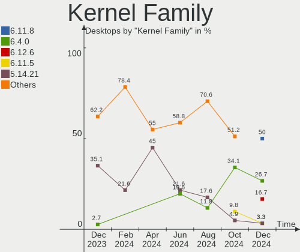
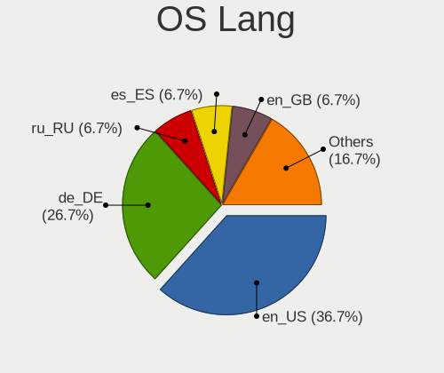
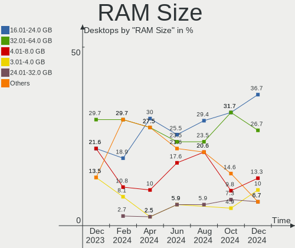
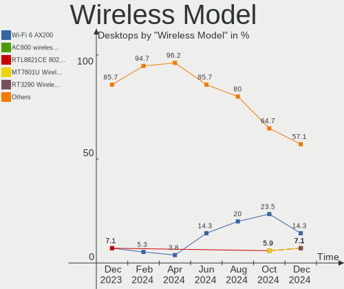
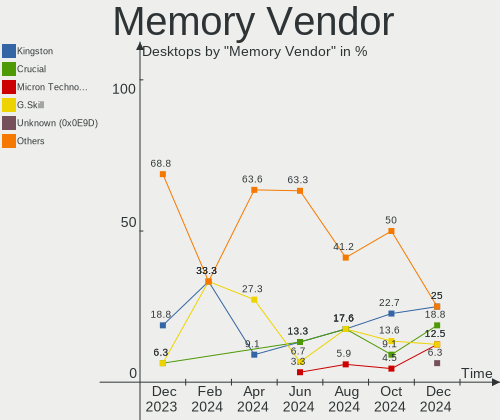

openSUSE - Hardware Trends (Desktops)
-------------------------------------

A project to identify most popular hardware characteristics and track their change
over time based on data collected by Linux users at https://Linux-Hardware.org.

Anyone can contribute to this report by the [hw-probe](https://github.com/linuxhw/hw-probe) tool:

    sudo -E hw-probe -all -upload

This report is for one last month. Overall report since the beginning of time: [TestCoverage](https://github.com/linuxhw/TestCoverage)

Period: Aug, 2022.

Contents
--------

* [ System ](#system)
  - [ OS                       ](#os)
  - [ OS Family                ](#os-family)
  - [ Kernel                   ](#kernel)
  - [ Kernel Family            ](#kernel-family)
  - [ Kernel Major Ver.        ](#kernel-major-ver)
  - [ Arch                     ](#arch)
  - [ DE                       ](#de)
  - [ Display Server           ](#display-server)
  - [ Display Manager          ](#display-manager)
  - [ OS Lang                  ](#os-lang)
  - [ Boot Mode                ](#boot-mode)
  - [ Filesystem               ](#filesystem)
  - [ Part. scheme             ](#part-scheme)
  - [ Dual Boot with Linux/BSD ](#dual-boot-with-linuxbsd)
  - [ Dual Boot (Win)          ](#dual-boot-win)

* [ Board ](#board)
  - [ Vendor                   ](#vendor)
  - [ Model                    ](#model)
  - [ Model Family             ](#model-family)
  - [ MFG Year                 ](#mfg-year)
  - [ Form Factor              ](#form-factor)
  - [ Secure Boot              ](#secure-boot)
  - [ Coreboot                 ](#coreboot)
  - [ RAM Size                 ](#ram-size)
  - [ RAM Used                 ](#ram-used)
  - [ Total Drives             ](#total-drives)
  - [ Has CD-ROM               ](#has-cd-rom)
  - [ Has Ethernet             ](#has-ethernet)
  - [ Has WiFi                 ](#has-wifi)
  - [ Has Bluetooth            ](#has-bluetooth)

* [ Location ](#location)
  - [ Country                  ](#country)
  - [ City                     ](#city)

* [ Drives ](#drives)
  - [ Drive Vendor             ](#drive-vendor)
  - [ Drive Model              ](#drive-model)
  - [ HDD Vendor               ](#hdd-vendor)
  - [ SSD Vendor               ](#ssd-vendor)
  - [ Drive Kind               ](#drive-kind)
  - [ Drive Connector          ](#drive-connector)
  - [ Drive Size               ](#drive-size)
  - [ Space Total              ](#space-total)
  - [ Space Used               ](#space-used)
  - [ Malfunc. Drives          ](#malfunc-drives)
  - [ Malfunc. Drive Vendor    ](#malfunc-drive-vendor)
  - [ Malfunc. HDD Vendor      ](#malfunc-hdd-vendor)
  - [ Malfunc. Drive Kind      ](#malfunc-drive-kind)
  - [ Failed Drives            ](#failed-drives)
  - [ Failed Drive Vendor      ](#failed-drive-vendor)
  - [ Drive Status             ](#drive-status)

* [ Storage controller ](#storage-controller)
  - [ Storage Vendor           ](#storage-vendor)
  - [ Storage Model            ](#storage-model)
  - [ Storage Kind             ](#storage-kind)

* [ Processor ](#processor)
  - [ CPU Vendor               ](#cpu-vendor)
  - [ CPU Model                ](#cpu-model)
  - [ CPU Model Family         ](#cpu-model-family)
  - [ CPU Cores                ](#cpu-cores)
  - [ CPU Sockets              ](#cpu-sockets)
  - [ CPU Threads              ](#cpu-threads)
  - [ CPU Op-Modes             ](#cpu-op-modes)
  - [ CPU Microcode            ](#cpu-microcode)
  - [ CPU Microarch            ](#cpu-microarch)

* [ Graphics ](#graphics)
  - [ GPU Vendor               ](#gpu-vendor)
  - [ GPU Model                ](#gpu-model)
  - [ GPU Combo                ](#gpu-combo)
  - [ GPU Driver               ](#gpu-driver)
  - [ GPU Memory               ](#gpu-memory)

* [ Monitor ](#monitor)
  - [ Monitor Vendor           ](#monitor-vendor)
  - [ Monitor Model            ](#monitor-model)
  - [ Monitor Resolution       ](#monitor-resolution)
  - [ Monitor Diagonal         ](#monitor-diagonal)
  - [ Monitor Width            ](#monitor-width)
  - [ Aspect Ratio             ](#aspect-ratio)
  - [ Monitor Area             ](#monitor-area)
  - [ Pixel Density            ](#pixel-density)
  - [ Multiple Monitors        ](#multiple-monitors)

* [ Network ](#network)
  - [ Net Controller Vendor    ](#net-controller-vendor)
  - [ Net Controller Model     ](#net-controller-model)
  - [ Wireless Vendor          ](#wireless-vendor)
  - [ Wireless Model           ](#wireless-model)
  - [ Ethernet Vendor          ](#ethernet-vendor)
  - [ Ethernet Model           ](#ethernet-model)
  - [ Net Controller Kind      ](#net-controller-kind)
  - [ Used Controller          ](#used-controller)
  - [ NICs                     ](#nics)
  - [ IPv6                     ](#ipv6)

* [ Bluetooth ](#bluetooth)
  - [ Bluetooth Vendor         ](#bluetooth-vendor)
  - [ Bluetooth Model          ](#bluetooth-model)

* [ Sound ](#sound)
  - [ Sound Vendor             ](#sound-vendor)
  - [ Sound Model              ](#sound-model)

* [ Memory ](#memory)
  - [ Memory Vendor            ](#memory-vendor)
  - [ Memory Model             ](#memory-model)
  - [ Memory Kind              ](#memory-kind)
  - [ Memory Form Factor       ](#memory-form-factor)
  - [ Memory Size              ](#memory-size)
  - [ Memory Speed             ](#memory-speed)

* [ Printers & scanners ](#printers--scanners)
  - [ Printer Vendor           ](#printer-vendor)
  - [ Printer Model            ](#printer-model)
  - [ Scanner Vendor           ](#scanner-vendor)
  - [ Scanner Model            ](#scanner-model)

* [ Camera ](#camera)
  - [ Camera Vendor            ](#camera-vendor)
  - [ Camera Model             ](#camera-model)

* [ Security ](#security)
  - [ Fingerprint Vendor       ](#fingerprint-vendor)
  - [ Fingerprint Model        ](#fingerprint-model)
  - [ Chipcard Vendor          ](#chipcard-vendor)
  - [ Chipcard Model           ](#chipcard-model)

* [ Unsupported ](#unsupported)
  - [ Unsupported Devices      ](#unsupported-devices)
  - [ Unsupported Device Types ](#unsupported-device-types)

System
------

OS
--

Installed operating systems

| Name                         | Desktops | Percent |
|------------------------------|----------|---------|
| openSUSE Tumbleweed-XXXXXXXX | 13       | 68.42%  |
| openSUSE Leap-15.4           | 4        | 21.05%  |
| openSUSE Leap-15.3           | 2        | 10.53%  |

OS Family
---------

OS without a version

| Name     | Desktops | Percent |
|----------|----------|---------|
| openSUSE | 19       | 100%    |

Kernel
------

Version of the Linux kernel

| Version                      | Desktops | Percent |
|------------------------------|----------|---------|
| 5.18.15-1-default            | 4        | 21.05%  |
| 5.19.1-1-default             | 3        | 15.79%  |
| 5.18.12-1-default            | 3        | 15.79%  |
| 5.14.21-150400.24.18-default | 3        | 15.79%  |
| 5.3.18-150300.59.87-default  | 2        | 10.53%  |
| 5.19.2-1-default             | 2        | 10.53%  |
| 5.18.11-1-default            | 1        | 5.26%   |
| 5.14.21-150400.24.11-default | 1        | 5.26%   |

Kernel Family
-------------

Linux kernel without a distro release

| Version | Desktops | Percent |
|---------|----------|---------|
| 5.18.15 | 4        | 21.05%  |
| 5.14.21 | 4        | 21.05%  |
| 5.19.1  | 3        | 15.79%  |
| 5.18.12 | 3        | 15.79%  |
| 5.3.18  | 2        | 10.53%  |
| 5.19.2  | 2        | 10.53%  |
| 5.18.11 | 1        | 5.26%   |

Kernel Major Ver.
-----------------

Linux kernel major version

| Version | Desktops | Percent |
|---------|----------|---------|
| 5.18    | 8        | 42.11%  |
| 5.19    | 5        | 26.32%  |
| 5.14    | 4        | 21.05%  |
| 5.3     | 2        | 10.53%  |

Arch
----

OS architecture (x86_64, i586, etc.)

| Name   | Desktops | Percent |
|--------|----------|---------|
| x86_64 | 19       | 100%    |

DE
--

Desktop Environment

| Name    | Desktops | Percent |
|---------|----------|---------|
| KDE5    | 11       | 57.89%  |
| GNOME   | 5        | 26.32%  |
| KDE     | 1        | 5.26%   |
| Deepin  | 1        | 5.26%   |
| Unknown | 1        | 5.26%   |

Display Server
--------------

X11 or Wayland

| Name    | Desktops | Percent |
|---------|----------|---------|
| X11     | 15       | 78.95%  |
| Wayland | 3        | 15.79%  |
| Tty     | 1        | 5.26%   |

Display Manager
---------------

SDDM, LightDM, etc.

| Name    | Desktops | Percent |
|---------|----------|---------|
| Unknown | 8        | 42.11%  |
| LightDM | 5        | 26.32%  |
| SDDM    | 4        | 21.05%  |
| XDM     | 2        | 10.53%  |

OS Lang
-------

Language

| Lang    | Desktops | Percent |
|---------|----------|---------|
| en_US   | 7        | 36.84%  |
| en_GB   | 3        | 15.79%  |
| pt_BR   | 2        | 10.53%  |
| POSIX   | 2        | 10.53%  |
| pl_PL   | 1        | 5.26%   |
| nn_NO   | 1        | 5.26%   |
| fr_FR   | 1        | 5.26%   |
| de_DE   | 1        | 5.26%   |
| Unknown | 1        | 5.26%   |

Boot Mode
---------

EFI or BIOS

| Mode | Desktops | Percent |
|------|----------|---------|
| BIOS | 11       | 57.89%  |
| EFI  | 8        | 42.11%  |

Filesystem
----------

Type of filesystem

| Type  | Desktops | Percent |
|-------|----------|---------|
| Btrfs | 15       | 78.95%  |
| Ext4  | 3        | 15.79%  |
| Xfs   | 1        | 5.26%   |

Part. scheme
------------

Scheme of partitioning

| Type    | Desktops | Percent |
|---------|----------|---------|
| GPT     | 11       | 57.89%  |
| Unknown | 7        | 36.84%  |
| MBR     | 1        | 5.26%   |

Dual Boot with Linux/BSD
------------------------

Hosting more than one Linux/BSD

| Dual boot | Desktops | Percent |
|-----------|----------|---------|
| No        | 16       | 84.21%  |
| Yes       | 3        | 15.79%  |

Dual Boot (Win)
---------------

Hosting Linux and Windows

| Dual boot | Desktops | Percent |
|-----------|----------|---------|
| No        | 15       | 78.95%  |
| Yes       | 4        | 21.05%  |

Board
-----

Vendor
------

Motherboard manufacturer

| Name                | Desktops | Percent |
|---------------------|----------|---------|
| Gigabyte Technology | 6        | 31.58%  |
| ASRock              | 6        | 31.58%  |
| ASUSTek Computer    | 3        | 15.79%  |
| Supermicro          | 1        | 5.26%   |
| MSI                 | 1        | 5.26%   |
| Hewlett-Packard     | 1        | 5.26%   |
| Dell                | 1        | 5.26%   |

Model
-----

Motherboard model

| Name                             | Desktops | Percent |
|----------------------------------|----------|---------|
| Supermicro SSG-6047R-E1CR36N     | 1        | 5.26%   |
| MSI MS-7673                      | 1        | 5.26%   |
| HP Z240 Tower Workstation        | 1        | 5.26%   |
| Gigabyte H81M-S2H                | 1        | 5.26%   |
| Gigabyte B85-HD3                 | 1        | 5.26%   |
| Gigabyte B550M DS3H              | 1        | 5.26%   |
| Gigabyte B550 VISION D-P         | 1        | 5.26%   |
| Gigabyte B450 AORUS M            | 1        | 5.26%   |
| Gigabyte 965P-DS3                | 1        | 5.26%   |
| Dell OptiPlex 390                | 1        | 5.26%   |
| ASUS M5A78L-M/USB3               | 1        | 5.26%   |
| ASUS M3A78-EM                    | 1        | 5.26%   |
| ASUS All Series                  | 1        | 5.26%   |
| ASRock Z97 Pro3                  | 1        | 5.26%   |
| ASRock Z490 Phantom Gaming 4     | 1        | 5.26%   |
| ASRock X570 Steel Legend WiFi ax | 1        | 5.26%   |
| ASRock X570 Steel Legend         | 1        | 5.26%   |
| ASRock J3355B-ITX                | 1        | 5.26%   |
| ASRock B85 Pro4                  | 1        | 5.26%   |

Model Family
------------

Motherboard model prefix

| Name                         | Desktops | Percent |
|------------------------------|----------|---------|
| ASRock X570                  | 2        | 10.53%  |
| Supermicro SSG-6047R-E1CR36N | 1        | 5.26%   |
| MSI MS-7673                  | 1        | 5.26%   |
| HP Z240                      | 1        | 5.26%   |
| Gigabyte H81M-S2H            | 1        | 5.26%   |
| Gigabyte B85-HD3             | 1        | 5.26%   |
| Gigabyte B550M               | 1        | 5.26%   |
| Gigabyte B550                | 1        | 5.26%   |
| Gigabyte B450                | 1        | 5.26%   |
| Gigabyte 965P-DS3            | 1        | 5.26%   |
| Dell OptiPlex                | 1        | 5.26%   |
| ASUS M5A78L-M                | 1        | 5.26%   |
| ASUS M3A78-EM                | 1        | 5.26%   |
| ASUS All                     | 1        | 5.26%   |
| ASRock Z97                   | 1        | 5.26%   |
| ASRock Z490                  | 1        | 5.26%   |
| ASRock J3355B-ITX            | 1        | 5.26%   |
| ASRock B85                   | 1        | 5.26%   |

MFG Year
--------

Motherboard manufacture year

| Year | Desktops | Percent |
|------|----------|---------|
| 2020 | 3        | 15.79%  |
| 2014 | 3        | 15.79%  |
| 2011 | 3        | 15.79%  |
| 2019 | 2        | 10.53%  |
| 2016 | 2        | 10.53%  |
| 2022 | 1        | 5.26%   |
| 2018 | 1        | 5.26%   |
| 2015 | 1        | 5.26%   |
| 2013 | 1        | 5.26%   |
| 2008 | 1        | 5.26%   |
| 2006 | 1        | 5.26%   |

Form Factor
-----------

Physical design of the computer

| Name    | Desktops | Percent |
|---------|----------|---------|
| Desktop | 19       | 100%    |

Secure Boot
-----------

Enabled or disabled

| State    | Desktops | Percent |
|----------|----------|---------|
| Disabled | 19       | 100%    |

Coreboot
--------

Have coreboot on board

| Used | Desktops | Percent |
|------|----------|---------|
| No   | 19       | 100%    |

RAM Size
--------

Total RAM memory

| Size in GB  | Desktops | Percent |
|-------------|----------|---------|
| 16.01-24.0  | 7        | 36.84%  |
| 8.01-16.0   | 6        | 31.58%  |
| 32.01-64.0  | 2        | 10.53%  |
| 64.01-256.0 | 2        | 10.53%  |
| 4.01-8.0    | 1        | 5.26%   |
| 24.01-32.0  | 1        | 5.26%   |

RAM Used
--------

Used RAM memory

| Used GB  | Desktops | Percent |
|----------|----------|---------|
| 4.01-8.0 | 9        | 47.37%  |
| 2.01-3.0 | 4        | 21.05%  |
| 3.01-4.0 | 3        | 15.79%  |
| 1.01-2.0 | 3        | 15.79%  |

Total Drives
------------

Number of drives on board

| Drives | Desktops | Percent |
|--------|----------|---------|
| 2      | 8        | 42.11%  |
| 1      | 5        | 26.32%  |
| 3      | 3        | 15.79%  |
| 6      | 1        | 5.26%   |
| 5      | 1        | 5.26%   |
| 4      | 1        | 5.26%   |

Has CD-ROM
----------

Has CD-ROM on board

| Presented | Desktops | Percent |
|-----------|----------|---------|
| No        | 10       | 52.63%  |
| Yes       | 9        | 47.37%  |

Has Ethernet
------------

Has Ethernet on board

| Presented | Desktops | Percent |
|-----------|----------|---------|
| Yes       | 19       | 100%    |

Has WiFi
--------

Has WiFi module

| Presented | Desktops | Percent |
|-----------|----------|---------|
| No        | 12       | 63.16%  |
| Yes       | 7        | 36.84%  |

Has Bluetooth
-------------

Has Bluetooth module

| Presented | Desktops | Percent |
|-----------|----------|---------|
| No        | 14       | 73.68%  |
| Yes       | 5        | 26.32%  |

Location
--------

Country
-------

Geographic location (country)

| Country      | Desktops | Percent |
|--------------|----------|---------|
| USA          | 6        | 31.58%  |
| Brazil       | 3        | 15.79%  |
| UK           | 2        | 10.53%  |
| Germany      | 2        | 10.53%  |
| South Africa | 1        | 5.26%   |
| Serbia       | 1        | 5.26%   |
| Poland       | 1        | 5.26%   |
| Norway       | 1        | 5.26%   |
| Martinique   | 1        | 5.26%   |
| Greece       | 1        | 5.26%   |

City
----

Geographic location (city)

| City        | Desktops | Percent |
|-------------|----------|---------|
| Steszew     | 1        | 5.26%   |
| Skeie       | 1        | 5.26%   |
| Roslindale  | 1        | 5.26%   |
| Puyallup    | 1        | 5.26%   |
| Monroeville | 1        | 5.26%   |
| Maringá    | 1        | 5.26%   |
| Manchester  | 1        | 5.26%   |
| Le Lamentin | 1        | 5.26%   |
| Iturama     | 1        | 5.26%   |
| Hanau       | 1        | 5.26%   |
| Dunfermline | 1        | 5.26%   |
| Dover       | 1        | 5.26%   |
| Denver      | 1        | 5.26%   |
| Davenport   | 1        | 5.26%   |
| Brasília   | 1        | 5.26%   |
| Brakpan     | 1        | 5.26%   |
| Bestwig     | 1        | 5.26%   |
| Belgrade    | 1        | 5.26%   |
| Athens      | 1        | 5.26%   |

Drives
------

Drive Vendor
------------

Hard drive vendors

| Vendor              | Desktops | Drives | Percent |
|---------------------|----------|--------|---------|
| WDC                 | 8        | 12     | 21.05%  |
| Seagate             | 8        | 9      | 21.05%  |
| Samsung Electronics | 7        | 7      | 18.42%  |
| Toshiba             | 2        | 2      | 5.26%   |
| SanDisk             | 2        | 3      | 5.26%   |
| Team                | 1        | 1      | 2.63%   |
| Synology            | 1        | 1      | 2.63%   |
| SK hynix            | 1        | 2      | 2.63%   |
| Maxtor              | 1        | 1      | 2.63%   |
| Kingston            | 1        | 1      | 2.63%   |
| Intel               | 1        | 1      | 2.63%   |
| Hitachi             | 1        | 1      | 2.63%   |
| Hewlett-Packard     | 1        | 1      | 2.63%   |
| GOODRAM             | 1        | 1      | 2.63%   |
| Crucial             | 1        | 1      | 2.63%   |
| ADATA Technology    | 1        | 1      | 2.63%   |

Drive Model
-----------

Hard drive models

| Model                                                           | Desktops | Percent |
|-----------------------------------------------------------------|----------|---------|
| WDC WDS240G2G0A-00JH30 240GB SSD                                | 1        | 2.38%   |
| WDC WDS200T2B0B 2TB SSD                                         | 1        | 2.38%   |
| WDC WD5000AAKS-00UU3A0 500GB                                    | 1        | 2.38%   |
| WDC WD40EZRZ-00GXCB0 4TB                                        | 1        | 2.38%   |
| WDC WD3200BEVT-00ZCT0 320GB                                     | 1        | 2.38%   |
| WDC WD30EZRZ-00GXCB0 3TB                                        | 1        | 2.38%   |
| WDC WD20EZAZ-00L9GB0 2TB                                        | 1        | 2.38%   |
| WDC WD10EZEX-08M2NA0 1TB                                        | 1        | 2.38%   |
| WDC WD10EFRX-68FYTN0 1TB                                        | 1        | 2.38%   |
| WDC WD10EAVS-00D7B1 1TB                                         | 1        | 2.38%   |
| Toshiba HDWE140 4TB                                             | 1        | 2.38%   |
| Toshiba DT01ACA200 2TB                                          | 1        | 2.38%   |
| Team T253X1480G 480GB SSD                                       | 1        | 2.38%   |
| Synology iSCSI Storage                                          | 1        | 2.38%   |
| SK hynix NVMe SSD Drive 512GB                                   | 1        | 2.38%   |
| SK hynix NVMe SSD Drive 2TB                                     | 1        | 2.38%   |
| Seagate ST500DM002-1BD142 500GB                                 | 1        | 2.38%   |
| Seagate ST3000DM007-1WY10G 3TB                                  | 1        | 2.38%   |
| Seagate ST2000VN004-2E4164 2TB                                  | 1        | 2.38%   |
| Seagate ST2000LM007-1R8174 2TB                                  | 1        | 2.38%   |
| Seagate ST2000DM006-2DM164 2TB                                  | 1        | 2.38%   |
| Seagate ST2000DM001-1ER164 2TB                                  | 1        | 2.38%   |
| Seagate ST1000LM024 HN-M101MBB 1TB                              | 1        | 2.38%   |
| Seagate ST1000DX002-2DV162 1TB                                  | 1        | 2.38%   |
| Seagate ST1000DM003-1SB102 1TB                                  | 1        | 2.38%   |
| Sandisk WD Blue SN550 NVMe SSD 256GB                            | 1        | 2.38%   |
| SanDisk SDSSDA120G 120GB                                        | 1        | 2.38%   |
| Samsung SSD 980 PRO 500GB                                       | 1        | 2.38%   |
| Samsung SSD 860 EVO 500GB                                       | 1        | 2.38%   |
| Samsung SSD 860 EVO 250GB                                       | 1        | 2.38%   |
| Samsung SSD 860 EVO 1TB                                         | 1        | 2.38%   |
| Samsung SSD 850 EVO 500GB                                       | 1        | 2.38%   |
| Samsung HD103UJ 1TB                                             | 1        | 2.38%   |
| Samsung HD103SJ 1TB                                             | 1        | 2.38%   |
| Maxtor STM3250820AS 250GB                                       | 1        | 2.38%   |
| Kingston SA400S37480G 480GB SSD                                 | 1        | 2.38%   |
| Intel SSDSA2CW080G3 80GB                                        | 1        | 2.38%   |
| Hitachi HTS542525K9SA00 250GB                                   | 1        | 2.38%   |
| HP SSD EX920 1TB                                                | 1        | 2.38%   |
| GOODRAM SSDPR-PX500-512-80 512GB                                | 1        | 2.38%   |
| Crucial CT1050MX300SSD1 1050GB                                  | 1        | 2.38%   |
| ADATA XPG SX8200 Pro PCIe Gen3x4 M.2 2280 Solid State Drive 1TB | 1        | 2.38%   |

HDD Vendor
----------

Hard disk drive vendors

| Vendor              | Desktops | Drives | Percent |
|---------------------|----------|--------|---------|
| Seagate             | 8        | 9      | 36.36%  |
| WDC                 | 7        | 10     | 31.82%  |
| Toshiba             | 2        | 2      | 9.09%   |
| Samsung Electronics | 2        | 2      | 9.09%   |
| Synology            | 1        | 1      | 4.55%   |
| Maxtor              | 1        | 1      | 4.55%   |
| Hitachi             | 1        | 1      | 4.55%   |

SSD Vendor
----------

Solid state drive vendors

| Vendor              | Desktops | Drives | Percent |
|---------------------|----------|--------|---------|
| Samsung Electronics | 4        | 4      | 36.36%  |
| WDC                 | 2        | 2      | 18.18%  |
| Team                | 1        | 1      | 9.09%   |
| SanDisk             | 1        | 1      | 9.09%   |
| Kingston            | 1        | 1      | 9.09%   |
| Intel               | 1        | 1      | 9.09%   |
| Crucial             | 1        | 1      | 9.09%   |

Drive Kind
----------

HDD or SSD

| Kind | Desktops | Drives | Percent |
|------|----------|--------|---------|
| HDD  | 18       | 26     | 56.25%  |
| SSD  | 9        | 11     | 28.13%  |
| NVMe | 5        | 8      | 15.63%  |

Drive Connector
---------------

SATA, SAS, NVMe, etc.

| Type | Desktops | Drives | Percent |
|------|----------|--------|---------|
| SATA | 19       | 37     | 79.17%  |
| NVMe | 5        | 8      | 20.83%  |

Drive Size
----------

Size of hard drive

| Size in TB | Desktops | Drives | Percent |
|------------|----------|--------|---------|
| 0.01-0.5   | 12       | 14     | 41.38%  |
| 0.51-1.0   | 7        | 10     | 24.14%  |
| 1.01-2.0   | 6        | 9      | 20.69%  |
| 3.01-4.0   | 2        | 2      | 6.9%    |
| 2.01-3.0   | 2        | 2      | 6.9%    |

Space Total
-----------

Amount of disk space available on the file system

| Size in GB     | Desktops | Percent |
|----------------|----------|---------|
| More than 3000 | 11       | 57.89%  |
| 1001-2000      | 4        | 21.05%  |
| 2001-3000      | 2        | 10.53%  |
| 1-20           | 1        | 5.26%   |
| Unknown        | 1        | 5.26%   |

Space Used
----------

Amount of used disk space

| Used GB        | Desktops | Percent |
|----------------|----------|---------|
| More than 3000 | 5        | 26.32%  |
| 251-500        | 3        | 15.79%  |
| 1001-2000      | 3        | 15.79%  |
| 501-1000       | 3        | 15.79%  |
| 2001-3000      | 2        | 10.53%  |
| 21-50          | 1        | 5.26%   |
| 1-20           | 1        | 5.26%   |
| Unknown        | 1        | 5.26%   |

Malfunc. Drives
---------------

Drive models with a malfunction

| Model                            | Desktops | Drives | Percent |
|----------------------------------|----------|--------|---------|
| WDC WD30EZRZ-00GXCB0 3TB         | 1        | 1      | 20%     |
| Toshiba DT01ACA200 2TB           | 1        | 1      | 20%     |
| Seagate ST1000DM003-1SB102 1TB   | 1        | 1      | 20%     |
| GOODRAM SSDPR-PX500-512-80 512GB | 1        | 1      | 20%     |
| Crucial CT1050MX300SSD1 1050GB   | 1        | 1      | 20%     |

Malfunc. Drive Vendor
---------------------

Vendors of faulty drives

| Vendor  | Desktops | Drives | Percent |
|---------|----------|--------|---------|
| WDC     | 1        | 1      | 20%     |
| Toshiba | 1        | 1      | 20%     |
| Seagate | 1        | 1      | 20%     |
| GOODRAM | 1        | 1      | 20%     |
| Crucial | 1        | 1      | 20%     |

Malfunc. HDD Vendor
-------------------

Vendors of faulty HDD drives

| Vendor  | Desktops | Drives | Percent |
|---------|----------|--------|---------|
| WDC     | 1        | 1      | 33.33%  |
| Toshiba | 1        | 1      | 33.33%  |
| Seagate | 1        | 1      | 33.33%  |

Malfunc. Drive Kind
-------------------

Kinds of faulty drives

| Kind | Desktops | Drives | Percent |
|------|----------|--------|---------|
| HDD  | 3        | 3      | 60%     |
| NVMe | 1        | 1      | 20%     |
| SSD  | 1        | 1      | 20%     |

Failed Drives
-------------

Failed drive models

Zero info for selected period =(

Failed Drive Vendor
-------------------

Failed drive vendors

Zero info for selected period =(

Drive Status
------------

Number of failed and malfunc. drives

| Status   | Desktops | Drives | Percent |
|----------|----------|--------|---------|
| Works    | 11       | 22     | 47.83%  |
| Detected | 7        | 18     | 30.43%  |
| Malfunc  | 5        | 5      | 21.74%  |

Storage controller
------------------

Storage Vendor
--------------

Storage controller vendors

| Vendor                       | Desktops | Percent |
|------------------------------|----------|---------|
| Intel                        | 12       | 44.44%  |
| AMD                          | 7        | 25.93%  |
| SK hynix                     | 1        | 3.7%    |
| Silicon Motion               | 1        | 3.7%    |
| Shenzhen Longsys Electronics | 1        | 3.7%    |
| SanDisk                      | 1        | 3.7%    |
| Samsung Electronics          | 1        | 3.7%    |
| JMicron Technology           | 1        | 3.7%    |
| ASMedia Technology           | 1        | 3.7%    |
| ADATA Technology             | 1        | 3.7%    |

Storage Model
-------------

Storage controller models

| Model                                                                                   | Desktops | Percent |
|-----------------------------------------------------------------------------------------|----------|---------|
| Intel 8 Series/C220 Series Chipset Family 6-port SATA Controller 1 [AHCI mode]          | 4        | 11.76%  |
| AMD FCH SATA Controller [AHCI mode]                                                     | 4        | 11.76%  |
| AMD SB7x0/SB8x0/SB9x0 IDE Controller                                                    | 2        | 5.88%   |
| AMD 500 Series Chipset SATA Controller                                                  | 2        | 5.88%   |
| SK hynix Non-Volatile memory controller                                                 | 1        | 2.94%   |
| SK hynix Gold P31 SSD                                                                   | 1        | 2.94%   |
| Silicon Motion SM2262/SM2262EN SSD Controller                                           | 1        | 2.94%   |
| Shenzhen Longsys SM2263EN/SM2263XT-based OEM SSD                                        | 1        | 2.94%   |
| SanDisk WD Blue SN550 NVMe SSD                                                          | 1        | 2.94%   |
| Samsung NVMe SSD Controller PM9A1/PM9A3/980PRO                                          | 1        | 2.94%   |
| JMicron JMB363 SATA/IDE Controller                                                      | 1        | 2.94%   |
| Intel Q170/Q150/B150/H170/H110/Z170/CM236 Chipset SATA Controller [AHCI Mode]           | 1        | 2.94%   |
| Intel Comet Lake SATA AHCI Controller                                                   | 1        | 2.94%   |
| Intel Celeron N3350/Pentium N4200/Atom E3900 Series SATA AHCI Controller                | 1        | 2.94%   |
| Intel C602 chipset 4-Port SATA Storage Control Unit                                     | 1        | 2.94%   |
| Intel C600/X79 series chipset 6-Port SATA AHCI Controller                               | 1        | 2.94%   |
| Intel 9 Series Chipset Family SATA Controller [AHCI Mode]                               | 1        | 2.94%   |
| Intel 82801HB (ICH8) 4 port SATA Controller [AHCI mode]                                 | 1        | 2.94%   |
| Intel 6 Series/C200 Series Chipset Family Desktop SATA Controller (IDE mode, ports 4-5) | 1        | 2.94%   |
| Intel 6 Series/C200 Series Chipset Family Desktop SATA Controller (IDE mode, ports 0-3) | 1        | 2.94%   |
| Intel 6 Series/C200 Series Chipset Family 6 port Desktop SATA AHCI Controller           | 1        | 2.94%   |
| ASMedia ASM1062 Serial ATA Controller                                                   | 1        | 2.94%   |
| AMD SB7x0/SB8x0/SB9x0 SATA Controller [IDE mode]                                        | 1        | 2.94%   |
| AMD SB7x0/SB8x0/SB9x0 SATA Controller [AHCI mode]                                       | 1        | 2.94%   |
| AMD 400 Series Chipset SATA Controller                                                  | 1        | 2.94%   |
| ADATA XPG SX8200 Pro PCIe Gen3x4 M.2 2280 Solid State Drive                             | 1        | 2.94%   |

Storage Kind
------------

Kind of storage controller (IDE, SATA, NVMe, SAS, ...)

| Kind | Desktops | Percent |
|------|----------|---------|
| SATA | 19       | 65.52%  |
| NVMe | 5        | 17.24%  |
| IDE  | 4        | 13.79%  |
| SAS  | 1        | 3.45%   |

Processor
---------

CPU Vendor
----------

Processor vendors

| Vendor | Desktops | Percent |
|--------|----------|---------|
| Intel  | 12       | 63.16%  |
| AMD    | 7        | 36.84%  |

CPU Model
---------

Processor models

| Model                                           | Desktops | Percent |
|-------------------------------------------------|----------|---------|
| AMD Ryzen 5 5600X 6-Core Processor              | 2        | 10.53%  |
| Intel Xeon CPU E5-2667 v2 @ 3.30GHz             | 1        | 5.26%   |
| Intel Xeon CPU E3-1230 v5 @ 3.40GHz             | 1        | 5.26%   |
| Intel Xeon CPU E3-1230 v3 @ 3.30GHz             | 1        | 5.26%   |
| Intel Pentium Dual-Core CPU E6500 @ 2.93GHz     | 1        | 5.26%   |
| Intel Core i7-4790K CPU @ 4.00GHz               | 1        | 5.26%   |
| Intel Core i7-4790 CPU @ 3.60GHz                | 1        | 5.26%   |
| Intel Core i5-4690K CPU @ 3.50GHz               | 1        | 5.26%   |
| Intel Core i5-4590 CPU @ 3.30GHz                | 1        | 5.26%   |
| Intel Core i5-2500 CPU @ 3.30GHz                | 1        | 5.26%   |
| Intel Core i5-10500 CPU @ 3.10GHz               | 1        | 5.26%   |
| Intel Core i3-2100 CPU @ 3.10GHz                | 1        | 5.26%   |
| Intel Celeron CPU J3355 @ 2.00GHz               | 1        | 5.26%   |
| AMD Ryzen 9 5950X 16-Core Processor             | 1        | 5.26%   |
| AMD Ryzen 5 PRO 3400G with Radeon Vega Graphics | 1        | 5.26%   |
| AMD Ryzen 5 1600 Six-Core Processor             | 1        | 5.26%   |
| AMD Phenom II X6 1090T Processor                | 1        | 5.26%   |
| AMD FX-8350 Eight-Core Processor                | 1        | 5.26%   |

CPU Model Family
----------------

Processor model prefix

| Model                   | Desktops | Percent |
|-------------------------|----------|---------|
| Intel Core i5           | 4        | 21.05%  |
| Intel Xeon              | 3        | 15.79%  |
| AMD Ryzen 5             | 3        | 15.79%  |
| Intel Core i7           | 2        | 10.53%  |
| Intel Pentium Dual-Core | 1        | 5.26%   |
| Intel Core i3           | 1        | 5.26%   |
| Intel Celeron           | 1        | 5.26%   |
| AMD Ryzen 9             | 1        | 5.26%   |
| AMD Ryzen 5 PRO         | 1        | 5.26%   |
| AMD Phenom II X6        | 1        | 5.26%   |
| AMD FX                  | 1        | 5.26%   |

CPU Cores
---------

Number of processor cores

| Number | Desktops | Percent |
|--------|----------|---------|
| 4      | 9        | 47.37%  |
| 6      | 5        | 26.32%  |
| 2      | 3        | 15.79%  |
| 16     | 2        | 10.53%  |

CPU Sockets
-----------

Number of sockets

| Number | Desktops | Percent |
|--------|----------|---------|
| 1      | 18       | 94.74%  |
| 2      | 1        | 5.26%   |

CPU Threads
-----------

Threads per core (Hyper-Threading)

| Number | Desktops | Percent |
|--------|----------|---------|
| 2      | 13       | 68.42%  |
| 1      | 6        | 31.58%  |

CPU Op-Modes
------------

CPU Operation Modes (32-bit, 64-bit)

| Op mode        | Desktops | Percent |
|----------------|----------|---------|
| 32-bit, 64-bit | 19       | 100%    |

CPU Microcode
-------------

Microcode number

| Number     | Desktops | Percent |
|------------|----------|---------|
| Unknown    | 6        | 31.58%  |
| 0x306c3    | 3        | 15.79%  |
| 0x206a7    | 2        | 10.53%  |
| 0x306e4    | 1        | 5.26%   |
| 0x0a20120a | 1        | 5.26%   |
| 0x0a201016 | 1        | 5.26%   |
| 0x0a201009 | 1        | 5.26%   |
| 0x08108109 | 1        | 5.26%   |
| 0x0800820d | 1        | 5.26%   |
| 0x06000852 | 1        | 5.26%   |
| 0x010000dc | 1        | 5.26%   |

CPU Microarch
-------------

Microarchitecture

| Name        | Desktops | Percent |
|-------------|----------|---------|
| Haswell     | 5        | 26.32%  |
| Zen 3       | 3        | 15.79%  |
| Zen+        | 2        | 10.53%  |
| SandyBridge | 2        | 10.53%  |
| Skylake     | 1        | 5.26%   |
| Piledriver  | 1        | 5.26%   |
| Penryn      | 1        | 5.26%   |
| K10         | 1        | 5.26%   |
| IvyBridge   | 1        | 5.26%   |
| Goldmont    | 1        | 5.26%   |
| CometLake   | 1        | 5.26%   |

Graphics
--------

GPU Vendor
----------

Vendors of graphics cards

| Vendor | Desktops | Percent |
|--------|----------|---------|
| Nvidia | 8        | 38.1%   |
| AMD    | 8        | 38.1%   |
| Intel  | 5        | 23.81%  |

GPU Model
---------

Graphics card models

| Model                                                                             | Desktops | Percent |
|-----------------------------------------------------------------------------------|----------|---------|
| Intel Xeon E3-1200 v3/4th Gen Core Processor Integrated Graphics Controller       | 3        | 14.29%  |
| Nvidia TU117 [GeForce GTX 1650]                                                   | 1        | 4.76%   |
| Nvidia GT218 [GeForce 210]                                                        | 1        | 4.76%   |
| Nvidia GP108 [GeForce GT 1030]                                                    | 1        | 4.76%   |
| Nvidia GP106 [GeForce GTX 1060 3GB]                                               | 1        | 4.76%   |
| Nvidia GM107 [GeForce GTX 750 Ti]                                                 | 1        | 4.76%   |
| Nvidia GK107 [GeForce GT 640]                                                     | 1        | 4.76%   |
| Nvidia GA104 [GeForce RTX 3070]                                                   | 1        | 4.76%   |
| Nvidia GA102 [GeForce RTX 3090]                                                   | 1        | 4.76%   |
| Intel HD Graphics 500                                                             | 1        | 4.76%   |
| Intel 2nd Generation Core Processor Family Integrated Graphics Controller         | 1        | 4.76%   |
| AMD Turks PRO [Radeon HD 6570/7570/8550 / R5 230]                                 | 1        | 4.76%   |
| AMD Tonga PRO [Radeon R9 285/380]                                                 | 1        | 4.76%   |
| AMD RS780L [Radeon 3000]                                                          | 1        | 4.76%   |
| AMD Picasso/Raven 2 [Radeon Vega Series / Radeon Vega Mobile Series]              | 1        | 4.76%   |
| AMD Navi 22 [Radeon RX 6700/6700 XT/6750 XT / 6800M]                              | 1        | 4.76%   |
| AMD Navi 21 [Radeon RX 6800/6800 XT / 6900 XT]                                    | 1        | 4.76%   |
| AMD Ellesmere [Radeon RX 470/480/570/570X/580/580X/590]                           | 1        | 4.76%   |
| AMD Cape Verde PRO / Venus LE / Tropo PRO-L [Radeon HD 8830M / R7 250 / R7 M465X] | 1        | 4.76%   |

GPU Combo
---------

Combinations of graphics cards

| Name           | Desktops | Percent |
|----------------|----------|---------|
| 1 x Nvidia     | 7        | 36.84%  |
| 1 x AMD        | 7        | 36.84%  |
| 1 x Intel      | 3        | 15.79%  |
| Intel + Nvidia | 1        | 5.26%   |
| Intel + AMD    | 1        | 5.26%   |

GPU Driver
----------

Free vs proprietary

| Driver      | Desktops | Percent |
|-------------|----------|---------|
| Free        | 12       | 63.16%  |
| Proprietary | 7        | 36.84%  |

GPU Memory
----------

Total video memory

| Size in GB | Desktops | Percent |
|------------|----------|---------|
| Unknown    | 6        | 31.58%  |
| 1.01-2.0   | 4        | 21.05%  |
| 8.01-16.0  | 2        | 10.53%  |
| 0.51-1.0   | 2        | 10.53%  |
| 7.01-8.0   | 1        | 5.26%   |
| 3.01-4.0   | 1        | 5.26%   |
| 2.01-3.0   | 1        | 5.26%   |
| 16.01-24.0 | 1        | 5.26%   |
| 0.01-0.5   | 1        | 5.26%   |

Monitor
-------

Monitor Vendor
--------------

Monitor vendors

| Vendor               | Desktops | Percent |
|----------------------|----------|---------|
| Dell                 | 6        | 24%     |
| Samsung Electronics  | 5        | 20%     |
| Goldstar             | 3        | 12%     |
| AOC                  | 3        | 12%     |
| Unknown              | 1        | 4%      |
| Pixio                | 1        | 4%      |
| Iiyama               | 1        | 4%      |
| Hewlett-Packard      | 1        | 4%      |
| HannStar             | 1        | 4%      |
| GDH                  | 1        | 4%      |
| BenQ                 | 1        | 4%      |
| Ancor Communications | 1        | 4%      |

Monitor Model
-------------

Monitor models

| Model                                                                  | Desktops | Percent |
|------------------------------------------------------------------------|----------|---------|
| Unknown SMART TV 0563 1920x1080 1209x680mm 54.6-inch                   | 1        | 3.57%   |
| Samsung Electronics U28D590 SAM0B80 3840x2160 610x350mm 27.7-inch      | 1        | 3.57%   |
| Samsung Electronics SyncMaster SAM060D 1920x1080                       | 1        | 3.57%   |
| Samsung Electronics SyncMaster SAM0598 1360x768 410x230mm 18.5-inch    | 1        | 3.57%   |
| Samsung Electronics SyncMaster SAM0304 1680x1050 494x320mm 23.2-inch   | 1        | 3.57%   |
| Samsung Electronics S23B370 SAM089B 1920x1080 510x287mm 23.0-inch      | 1        | 3.57%   |
| Samsung Electronics C24F390 SAM0D2C 1920x1080 520x290mm 23.4-inch      | 1        | 3.57%   |
| Pixio DP ICB3500 3440x1440 708x399mm 32.0-inch                         | 1        | 3.57%   |
| Iiyama PLE2207WS IVM5609 1680x1050 465x291mm 21.6-inch                 | 1        | 3.57%   |
| Hewlett-Packard 27f HPN354A 1920x1080 598x336mm 27.0-inch              | 1        | 3.57%   |
| HannStar HH251 HSD2211 1920x1080 543x305mm 24.5-inch                   | 1        | 3.57%   |
| Goldstar ULTRAWIDE GSM76FE 2560x1080 798x334mm 34.1-inch               | 1        | 3.57%   |
| Goldstar TV GSM2412 1920x1080 940x530mm 42.5-inch                      | 1        | 3.57%   |
| Goldstar 2D FHD TV GSM59C6 1920x1080 509x286mm 23.0-inch               | 1        | 3.57%   |
| GDH PHILCO GDH0030 1920x540 708x398mm 32.0-inch                        | 1        | 3.57%   |
| Dell U2717D DEL40EB 2560x1440 597x336mm 27.0-inch                      | 1        | 3.57%   |
| Dell U2312HM DEL4072 1920x1080 510x287mm 23.0-inch                     | 1        | 3.57%   |
| Dell S3422DWG DELD12C 3440x1440 797x334mm 34.0-inch                    | 1        | 3.57%   |
| Dell S3422DWG DELD128 3440x1440 797x334mm 34.0-inch                    | 1        | 3.57%   |
| Dell S2721NX DEL41FF 1920x1080 598x336mm 27.0-inch                     | 1        | 3.57%   |
| Dell S2240L DELD054 1920x1080 476x267mm 21.5-inch                      | 1        | 3.57%   |
| Dell IN1920 DELF021 1366x768 410x230mm 18.5-inch                       | 1        | 3.57%   |
| Dell AW2518HF DELA103 1920x1080 544x303mm 24.5-inch                    | 1        | 3.57%   |
| BenQ BenQG2222HDL BNQ785A 1920x1080 478x269mm 21.6-inch                | 1        | 3.57%   |
| AOC Monitor AOC0236 2560x1440 341x192mm 15.4-inch                      | 1        | 3.57%   |
| AOC D2367 AOC2367 1920x1080 509x286mm 23.0-inch                        | 1        | 3.57%   |
| AOC 2369 AOC2369 1920x1080 509x286mm 23.0-inch                         | 1        | 3.57%   |
| Ancor Communications ASUS PB287Q ACI28A3 3840x2160 621x341mm 27.9-inch | 1        | 3.57%   |

Monitor Resolution
------------------

Monitor screen resolution

| Resolution         | Desktops | Percent |
|--------------------|----------|---------|
| 1920x1080 (FHD)    | 12       | 50%     |
| 3840x2160 (4K)     | 3        | 12.5%   |
| 3440x1440          | 2        | 8.33%   |
| 2560x1440 (QHD)    | 2        | 8.33%   |
| 1680x1050 (WSXGA+) | 2        | 8.33%   |
| 2560x1080          | 1        | 4.17%   |
| 1366x768 (WXGA)    | 1        | 4.17%   |
| 1360x768           | 1        | 4.17%   |

Monitor Diagonal
----------------

Diagonal size in inches

| Inches | Desktops | Percent |
|--------|----------|---------|
| 23     | 6        | 24%     |
| 27     | 4        | 16%     |
| 24     | 3        | 12%     |
| 34     | 2        | 8%      |
| 21     | 2        | 8%      |
| 18     | 2        | 8%      |
| 54     | 1        | 4%      |
| 52     | 1        | 4%      |
| 42     | 1        | 4%      |
| 32     | 1        | 4%      |
| 22     | 1        | 4%      |
| 15     | 1        | 4%      |

Monitor Width
-------------

Physical width

| Width in mm | Desktops | Percent |
|-------------|----------|---------|
| 501-600     | 8        | 36.36%  |
| 401-500     | 5        | 22.73%  |
| 701-800     | 3        | 13.64%  |
| 601-700     | 2        | 9.09%   |
| 1001-1500   | 2        | 9.09%   |
| 301-350     | 1        | 4.55%   |
| 901-1000    | 1        | 4.55%   |

Aspect Ratio
------------

Proportional relationship between the width and the height

| Ratio | Desktops | Percent |
|-------|----------|---------|
| 16/9  | 17       | 80.95%  |
| 21/9  | 2        | 9.52%   |
| 3/2   | 1        | 4.76%   |
| 16/10 | 1        | 4.76%   |

Monitor Area
------------

Area in inch²

| Area in inch² | Desktops | Percent |
|----------------|----------|---------|
| 201-250        | 10       | 40%     |
| 301-350        | 4        | 16%     |
| 351-500        | 3        | 12%     |
| More than 1000 | 2        | 8%      |
| 251-300        | 2        | 8%      |
| 141-150        | 2        | 8%      |
| 101-110        | 1        | 4%      |
| 501-1000       | 1        | 4%      |

Pixel Density
-------------

Pixels per inch

| Density | Desktops | Percent |
|---------|----------|---------|
| 51-100  | 13       | 56.52%  |
| 101-120 | 5        | 21.74%  |
| 1-50    | 2        | 8.7%    |
| 121-160 | 2        | 8.7%    |
| 161-240 | 1        | 4.35%   |

Multiple Monitors
-----------------

Total monitors connected

| Total | Desktops | Percent |
|-------|----------|---------|
| 2     | 10       | 52.63%  |
| 1     | 9        | 47.37%  |

Network
-------

Net Controller Vendor
---------------------

Controller vendors

| Vendor                          | Desktops | Percent |
|---------------------------------|----------|---------|
| Realtek Semiconductor           | 13       | 52%     |
| Intel                           | 8        | 32%     |
| Ralink Technology               | 1        | 4%      |
| Ralink                          | 1        | 4%      |
| Qualcomm Atheros Communications | 1        | 4%      |
| Marvell Technology Group        | 1        | 4%      |

Net Controller Model
--------------------

Controller models

| Model                                                             | Desktops | Percent |
|-------------------------------------------------------------------|----------|---------|
| Realtek RTL8111/8168/8411 PCI Express Gigabit Ethernet Controller | 10       | 35.71%  |
| Intel Wi-Fi 6 AX200                                               | 2        | 7.14%   |
| Intel I211 Gigabit Network Connection                             | 2        | 7.14%   |
| Realtek RTL8192EE PCIe Wireless Network Adapter                   | 1        | 3.57%   |
| Realtek RTL8169 PCI Gigabit Ethernet Controller                   | 1        | 3.57%   |
| Realtek RTL8125 2.5GbE Controller                                 | 1        | 3.57%   |
| Ralink RT5370 Wireless Adapter                                    | 1        | 3.57%   |
| Ralink RT5392 PCIe Wireless Network Adapter                       | 1        | 3.57%   |
| Qualcomm Atheros AR9271 802.11n                                   | 1        | 3.57%   |
| Marvell Group 88E8056 PCI-E Gigabit Ethernet Controller           | 1        | 3.57%   |
| Intel Wireless 7265                                               | 1        | 3.57%   |
| Intel I350 Gigabit Network Connection                             | 1        | 3.57%   |
| Intel Ethernet Controller I225-V                                  | 1        | 3.57%   |
| Intel Ethernet Connection I217-V                                  | 1        | 3.57%   |
| Intel Ethernet Connection (2) I219-LM                             | 1        | 3.57%   |
| Intel Ethernet Connection (2) I218-V                              | 1        | 3.57%   |
| Intel Ethernet Connection (11) I219-V                             | 1        | 3.57%   |

Wireless Vendor
---------------

Wireless vendors

| Vendor                          | Desktops | Percent |
|---------------------------------|----------|---------|
| Intel                           | 3        | 42.86%  |
| Realtek Semiconductor           | 1        | 14.29%  |
| Ralink Technology               | 1        | 14.29%  |
| Ralink                          | 1        | 14.29%  |
| Qualcomm Atheros Communications | 1        | 14.29%  |

Wireless Model
--------------

Wireless models

| Model                                           | Desktops | Percent |
|-------------------------------------------------|----------|---------|
| Intel Wi-Fi 6 AX200                             | 2        | 28.57%  |
| Realtek RTL8192EE PCIe Wireless Network Adapter | 1        | 14.29%  |
| Ralink RT5370 Wireless Adapter                  | 1        | 14.29%  |
| Ralink RT5392 PCIe Wireless Network Adapter     | 1        | 14.29%  |
| Qualcomm Atheros AR9271 802.11n                 | 1        | 14.29%  |
| Intel Wireless 7265                             | 1        | 14.29%  |

Ethernet Vendor
---------------

Ethernet vendors

| Vendor                   | Desktops | Percent |
|--------------------------|----------|---------|
| Realtek Semiconductor    | 12       | 57.14%  |
| Intel                    | 8        | 38.1%   |
| Marvell Technology Group | 1        | 4.76%   |

Ethernet Model
--------------

Ethernet models

| Model                                                             | Desktops | Percent |
|-------------------------------------------------------------------|----------|---------|
| Realtek RTL8111/8168/8411 PCI Express Gigabit Ethernet Controller | 10       | 47.62%  |
| Intel I211 Gigabit Network Connection                             | 2        | 9.52%   |
| Realtek RTL8169 PCI Gigabit Ethernet Controller                   | 1        | 4.76%   |
| Realtek RTL8125 2.5GbE Controller                                 | 1        | 4.76%   |
| Marvell Group 88E8056 PCI-E Gigabit Ethernet Controller           | 1        | 4.76%   |
| Intel I350 Gigabit Network Connection                             | 1        | 4.76%   |
| Intel Ethernet Controller I225-V                                  | 1        | 4.76%   |
| Intel Ethernet Connection I217-V                                  | 1        | 4.76%   |
| Intel Ethernet Connection (2) I219-LM                             | 1        | 4.76%   |
| Intel Ethernet Connection (2) I218-V                              | 1        | 4.76%   |
| Intel Ethernet Connection (11) I219-V                             | 1        | 4.76%   |

Net Controller Kind
-------------------

Ethernet, WiFi or modem

| Kind     | Desktops | Percent |
|----------|----------|---------|
| Ethernet | 19       | 73.08%  |
| WiFi     | 7        | 26.92%  |

Used Controller
---------------

Currently used network controller

| Kind     | Desktops | Percent |
|----------|----------|---------|
| Ethernet | 16       | 84.21%  |
| WiFi     | 3        | 15.79%  |

NICs
----

Total network controllers on board

| Total | Desktops | Percent |
|-------|----------|---------|
| 1     | 12       | 63.16%  |
| 2     | 5        | 26.32%  |
| 4     | 1        | 5.26%   |
| 3     | 1        | 5.26%   |

IPv6
----

IPv6 vs IPv4

| Used | Desktops | Percent |
|------|----------|---------|
| No   | 13       | 68.42%  |
| Yes  | 6        | 31.58%  |

Bluetooth
---------

Bluetooth Vendor
----------------

Controller vendors

| Vendor                  | Desktops | Percent |
|-------------------------|----------|---------|
| Intel                   | 3        | 60%     |
| Cambridge Silicon Radio | 1        | 20%     |
| Belkin Components       | 1        | 20%     |

Bluetooth Model
---------------

Controller models

| Model                                               | Desktops | Percent |
|-----------------------------------------------------|----------|---------|
| Intel AX200 Bluetooth                               | 2        | 40%     |
| Intel Bluetooth wireless interface                  | 1        | 20%     |
| Cambridge Silicon Radio Bluetooth Dongle (HCI mode) | 1        | 20%     |
| Belkin Components Bluetooth Mini Dongle             | 1        | 20%     |

Sound
-----

Sound Vendor
------------

Sound card vendors

| Vendor                  | Desktops | Percent |
|-------------------------|----------|---------|
| Intel                   | 10       | 29.41%  |
| AMD                     | 10       | 29.41%  |
| Nvidia                  | 7        | 20.59%  |
| Creative Labs           | 3        | 8.82%   |
| Hangzhou Worlde         | 1        | 2.94%   |
| Generalplus Technology  | 1        | 2.94%   |
| BEHRINGER International | 1        | 2.94%   |
| AudioQuest              | 1        | 2.94%   |

Sound Model
-----------

Sound card models

| Model                                                                      | Desktops | Percent |
|----------------------------------------------------------------------------|----------|---------|
| Intel 8 Series/C220 Series Chipset High Definition Audio Controller        | 4        | 9.76%   |
| Intel Xeon E3-1200 v3/4th Gen Core Processor HD Audio Controller           | 3        | 7.32%   |
| AMD Starship/Matisse HD Audio Controller                                   | 2        | 4.88%   |
| AMD SBx00 Azalia (Intel HDA)                                               | 2        | 4.88%   |
| AMD Navi 21/23 HDMI/DP Audio Controller                                    | 2        | 4.88%   |
| Nvidia TU107 GeForce GTX 1650 High Definition Audio Controller             | 1        | 2.44%   |
| Nvidia High Definition Audio Controller                                    | 1        | 2.44%   |
| Nvidia GP108 High Definition Audio Controller                              | 1        | 2.44%   |
| Nvidia GP106 High Definition Audio Controller                              | 1        | 2.44%   |
| Nvidia GK107 HDMI Audio Controller                                         | 1        | 2.44%   |
| Nvidia GA104 High Definition Audio Controller                              | 1        | 2.44%   |
| Nvidia GA102 High Definition Audio Controller                              | 1        | 2.44%   |
| Intel Comet Lake PCH cAVS                                                  | 1        | 2.44%   |
| Intel Celeron N3350/Pentium N4200/Atom E3900 Series Audio Cluster          | 1        | 2.44%   |
| Intel 9 Series Chipset Family HD Audio Controller                          | 1        | 2.44%   |
| Intel 82801H (ICH8 Family) HD Audio Controller                             | 1        | 2.44%   |
| Intel 6 Series/C200 Series Chipset Family High Definition Audio Controller | 1        | 2.44%   |
| Intel 100 Series/C230 Series Chipset Family HD Audio Controller            | 1        | 2.44%   |
| Hangzhou Worlde WORLDE easy CTRL                                           | 1        | 2.44%   |
| Generalplus Technology USB Audio Device                                    | 1        | 2.44%   |
| Creative Labs EMU10k1 [Sound Blaster Live! Series]                         | 1        | 2.44%   |
| Creative Labs Creative Audio device                                        | 1        | 2.44%   |
| Creative Labs CA0110 [Sound Blaster X-Fi Xtreme Audio]                     | 1        | 2.44%   |
| BEHRINGER International UMC404HD 192k                                      | 1        | 2.44%   |
| AudioQuest DragonFly Black v1.5                                            | 1        | 2.44%   |
| AMD Turks HDMI Audio [Radeon HD 6500/6600 / 6700M Series]                  | 1        | 2.44%   |
| AMD Tonga HDMI Audio [Radeon R9 285/380]                                   | 1        | 2.44%   |
| AMD RS780 HDMI Audio [Radeon 3000/3100 / HD 3200/3300]                     | 1        | 2.44%   |
| AMD Raven/Raven2/Fenghuang HDMI/DP Audio Controller                        | 1        | 2.44%   |
| AMD Oland/Hainan/Cape Verde/Pitcairn HDMI Audio [Radeon HD 7000 Series]    | 1        | 2.44%   |
| AMD Family 17h/19h HD Audio Controller                                     | 1        | 2.44%   |
| AMD Family 17h (Models 00h-0fh) HD Audio Controller                        | 1        | 2.44%   |
| AMD Ellesmere HDMI Audio [Radeon RX 470/480 / 570/580/590]                 | 1        | 2.44%   |

Memory
------

Memory Vendor
-------------

Memory module vendors

| Vendor   | Desktops | Percent |
|----------|----------|---------|
| Kingston | 6        | 42.86%  |
| G.Skill  | 4        | 28.57%  |
| Crucial  | 2        | 14.29%  |
| Unknown  | 1        | 7.14%   |
| Corsair  | 1        | 7.14%   |

Memory Model
------------

Memory module models

| Model                                                   | Desktops | Percent |
|---------------------------------------------------------|----------|---------|
| Unknown RAM Module 2048MB DIMM DDR2 800MT/s             | 1        | 7.14%   |
| Kingston RAM KHX3200C16D4/4GX 4GB DIMM DDR4 3600MT/s    | 1        | 7.14%   |
| Kingston RAM KHX1600C10D3/8GX 8192MB DIMM DDR3 1600MT/s | 1        | 7.14%   |
| Kingston RAM 99U5471-058.A00LF 8GB DIMM DDR3 1600MT/s   | 1        | 7.14%   |
| Kingston RAM 99U5471-054.A00LF 8GB DIMM DDR3 1600MT/s   | 1        | 7.14%   |
| Kingston RAM 99U5458-005.A00LF 4GB DIMM DDR3 1333MT/s   | 1        | 7.14%   |
| Kingston RAM 9905471-084.A00LF 8GB DIMM DDR3 1600MT/s   | 1        | 7.14%   |
| G.Skill RAM F4-3600C18-32GVK 32GB DIMM DDR4 3600MT/s    | 1        | 7.14%   |
| G.Skill RAM F4-3600C16-8GVKC 8GB DIMM DDR4 3600MT/s     | 1        | 7.14%   |
| G.Skill RAM F4-3600C16-16GTZNC 16GB DIMM DDR4 3600MT/s  | 1        | 7.14%   |
| G.Skill RAM F3-1600C11-8GNT 8GB DIMM DDR3 1600MT/s      | 1        | 7.14%   |
| Crucial RAM CT102464BA1339.C16 8GB DIMM DDR3 1333MT/s   | 1        | 7.14%   |
| Crucial RAM BLS4G3D169DS3.16FE 4GB DIMM DDR3 1600MT/s   | 1        | 7.14%   |
| Corsair RAM CMK16GX4M2Z3600C20 8GB DIMM DDR4 3600MT/s   | 1        | 7.14%   |

Memory Kind
-----------

Memory module kinds

| Kind | Desktops | Percent |
|------|----------|---------|
| DDR3 | 6        | 50%     |
| DDR4 | 5        | 41.67%  |
| DDR2 | 1        | 8.33%   |

Memory Form Factor
------------------

Physical design of the memory module

| Name | Desktops | Percent |
|------|----------|---------|
| DIMM | 12       | 100%    |

Memory Size
-----------

Memory module size

| Size  | Desktops | Percent |
|-------|----------|---------|
| 8192  | 8        | 57.14%  |
| 4096  | 3        | 21.43%  |
| 32768 | 1        | 7.14%   |
| 16384 | 1        | 7.14%   |
| 2048  | 1        | 7.14%   |

Memory Speed
------------

Memory module speed

| Speed | Desktops | Percent |
|-------|----------|---------|
| 3600  | 5        | 41.67%  |
| 1600  | 5        | 41.67%  |
| 1333  | 1        | 8.33%   |
| 800   | 1        | 8.33%   |

Printers & scanners
-------------------

Printer Vendor
--------------

Printer device vendors

| Vendor          | Desktops | Percent |
|-----------------|----------|---------|
| Pantum          | 1        | 50%     |
| Hewlett-Packard | 1        | 50%     |

Printer Model
-------------

Printer device models

| Model                    | Desktops | Percent |
|--------------------------|----------|---------|
| Pantum P2500W-series     | 1        | 50%     |
| HP Color LaserJet CP1215 | 1        | 50%     |

Scanner Vendor
--------------

Scanner device vendors

Zero info for selected period =(

Scanner Model
-------------

Scanner device models

Zero info for selected period =(

Camera
------

Camera Vendor
-------------

Camera device vendors

| Vendor            | Desktops | Percent |
|-------------------|----------|---------|
| Logitech          | 3        | 60%     |
| Microsoft         | 1        | 20%     |
| ARC International | 1        | 20%     |

Camera Model
------------

Camera device models

| Model                      | Desktops | Percent |
|----------------------------|----------|---------|
| Microsoft LifeCam VX-700   | 1        | 20%     |
| Logitech Webcam C925e      | 1        | 20%     |
| Logitech Webcam C270       | 1        | 20%     |
| Logitech QuickCam Pro 4000 | 1        | 20%     |
| ARC International Camera   | 1        | 20%     |

Security
--------

Fingerprint Vendor
------------------

Fingerprint sensor vendors

Zero info for selected period =(

Fingerprint Model
-----------------

Fingerprint sensor models

Zero info for selected period =(

Chipcard Vendor
---------------

Chipcard module vendors

Zero info for selected period =(

Chipcard Model
--------------

Chipcard module models

Zero info for selected period =(

Unsupported
-----------

Unsupported Devices
-------------------

Total unsupported devices on board

| Total | Desktops | Percent |
|-------|----------|---------|
| 0     | 15       | 78.95%  |
| 2     | 3        | 15.79%  |
| 1     | 1        | 5.26%   |

Unsupported Device Types
------------------------

Types of unsupported devices

| Type                     | Desktops | Percent |
|--------------------------|----------|---------|
| Sound                    | 3        | 75%     |
| Communication controller | 1        | 25%     |

