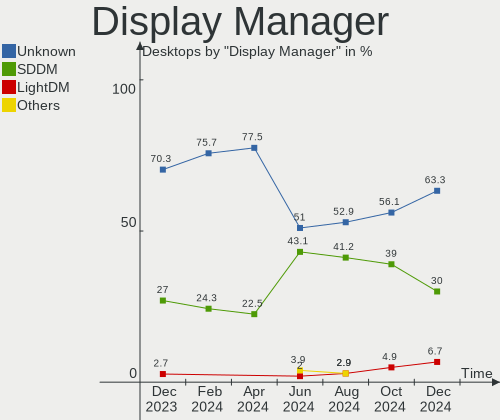
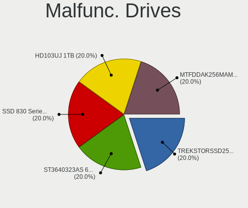
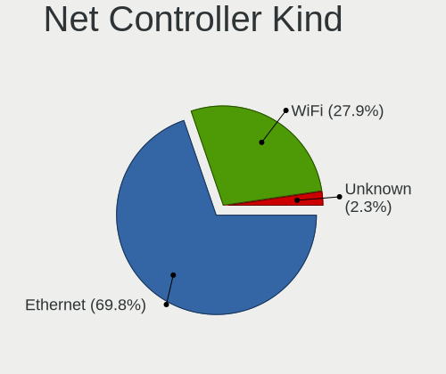
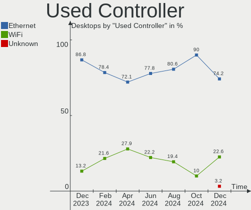

openSUSE Hardware Trends (Desktops)
-----------------------------------

A project to identify most popular hardware characteristics and track their change
over time based on data collected by openSUSE users at https://Linux-Hardware.org.

Anyone can contribute to this report by the [hw-probe](https://github.com/linuxhw/hw-probe) tool:

    sudo -E hw-probe -all -upload

Full-feature report is available here: https://linux-hardware.org/?view=trends&formfactor=desktop

Period: Oct, 2021.

Contents
--------

* [ System ](#system)
  - [ OS                       ](#os)
  - [ OS Family                ](#os-family)
  - [ Kernel                   ](#kernel)
  - [ Kernel Family            ](#kernel-family)
  - [ Kernel Major Ver.        ](#kernel-major-ver)
  - [ Arch                     ](#arch)
  - [ DE                       ](#de)
  - [ Display Server           ](#display-server)
  - [ Display Manager          ](#display-manager)
  - [ OS Lang                  ](#os-lang)
  - [ Boot Mode                ](#boot-mode)
  - [ Filesystem               ](#filesystem)
  - [ Part. scheme             ](#part-scheme)
  - [ Dual Boot with Linux/BSD ](#dual-boot-with-linuxbsd)
  - [ Dual Boot (Win)          ](#dual-boot-win)

* [ Board ](#board)
  - [ Vendor                   ](#vendor)
  - [ Model                    ](#model)
  - [ Model Family             ](#model-family)
  - [ MFG Year                 ](#mfg-year)
  - [ Form Factor              ](#form-factor)
  - [ Secure Boot              ](#secure-boot)
  - [ Coreboot                 ](#coreboot)
  - [ RAM Size                 ](#ram-size)
  - [ RAM Used                 ](#ram-used)
  - [ Total Drives             ](#total-drives)
  - [ Has CD-ROM               ](#has-cd-rom)
  - [ Has Ethernet             ](#has-ethernet)
  - [ Has WiFi                 ](#has-wifi)
  - [ Has Bluetooth            ](#has-bluetooth)

* [ Location ](#location)
  - [ Country                  ](#country)
  - [ City                     ](#city)

* [ Drives ](#drives)
  - [ Drive Vendor             ](#drive-vendor)
  - [ Drive Model              ](#drive-model)
  - [ HDD Vendor               ](#hdd-vendor)
  - [ SSD Vendor               ](#ssd-vendor)
  - [ Drive Kind               ](#drive-kind)
  - [ Drive Connector          ](#drive-connector)
  - [ Drive Size               ](#drive-size)
  - [ Space Total              ](#space-total)
  - [ Space Used               ](#space-used)
  - [ Malfunc. Drives          ](#malfunc-drives)
  - [ Malfunc. Drive Vendor    ](#malfunc-drive-vendor)
  - [ Malfunc. HDD Vendor      ](#malfunc-hdd-vendor)
  - [ Malfunc. Drive Kind      ](#malfunc-drive-kind)
  - [ Failed Drives            ](#failed-drives)
  - [ Failed Drive Vendor      ](#failed-drive-vendor)
  - [ Drive Status             ](#drive-status)

* [ Storage controller ](#storage-controller)
  - [ Storage Vendor           ](#storage-vendor)
  - [ Storage Model            ](#storage-model)
  - [ Storage Kind             ](#storage-kind)

* [ Processor ](#processor)
  - [ CPU Vendor               ](#cpu-vendor)
  - [ CPU Model                ](#cpu-model)
  - [ CPU Model Family         ](#cpu-model-family)
  - [ CPU Cores                ](#cpu-cores)
  - [ CPU Sockets              ](#cpu-sockets)
  - [ CPU Threads              ](#cpu-threads)
  - [ CPU Op-Modes             ](#cpu-op-modes)
  - [ CPU Microcode            ](#cpu-microcode)
  - [ CPU Microarch            ](#cpu-microarch)

* [ Graphics ](#graphics)
  - [ GPU Vendor               ](#gpu-vendor)
  - [ GPU Model                ](#gpu-model)
  - [ GPU Combo                ](#gpu-combo)
  - [ GPU Driver               ](#gpu-driver)
  - [ GPU Memory               ](#gpu-memory)

* [ Monitor ](#monitor)
  - [ Monitor Vendor           ](#monitor-vendor)
  - [ Monitor Model            ](#monitor-model)
  - [ Monitor Resolution       ](#monitor-resolution)
  - [ Monitor Diagonal         ](#monitor-diagonal)
  - [ Monitor Width            ](#monitor-width)
  - [ Aspect Ratio             ](#aspect-ratio)
  - [ Monitor Area             ](#monitor-area)
  - [ Pixel Density            ](#pixel-density)
  - [ Multiple Monitors        ](#multiple-monitors)

* [ Network ](#network)
  - [ Net Controller Vendor    ](#net-controller-vendor)
  - [ Net Controller Model     ](#net-controller-model)
  - [ Wireless Vendor          ](#wireless-vendor)
  - [ Wireless Model           ](#wireless-model)
  - [ Ethernet Vendor          ](#ethernet-vendor)
  - [ Ethernet Model           ](#ethernet-model)
  - [ Net Controller Kind      ](#net-controller-kind)
  - [ Used Controller          ](#used-controller)
  - [ NICs                     ](#nics)
  - [ IPv6                     ](#ipv6)

* [ Bluetooth ](#bluetooth)
  - [ Bluetooth Vendor         ](#bluetooth-vendor)
  - [ Bluetooth Model          ](#bluetooth-model)

* [ Sound ](#sound)
  - [ Sound Vendor             ](#sound-vendor)
  - [ Sound Model              ](#sound-model)

* [ Memory ](#memory)
  - [ Memory Vendor            ](#memory-vendor)
  - [ Memory Model             ](#memory-model)
  - [ Memory Kind              ](#memory-kind)
  - [ Memory Form Factor       ](#memory-form-factor)
  - [ Memory Size              ](#memory-size)
  - [ Memory Speed             ](#memory-speed)

* [ Printers & scanners ](#printers--scanners)
  - [ Printer Vendor           ](#printer-vendor)
  - [ Printer Model            ](#printer-model)
  - [ Scanner Vendor           ](#scanner-vendor)
  - [ Scanner Model            ](#scanner-model)

* [ Camera ](#camera)
  - [ Camera Vendor            ](#camera-vendor)
  - [ Camera Model             ](#camera-model)

* [ Security ](#security)
  - [ Fingerprint Vendor       ](#fingerprint-vendor)
  - [ Fingerprint Model        ](#fingerprint-model)
  - [ Chipcard Vendor          ](#chipcard-vendor)
  - [ Chipcard Model           ](#chipcard-model)

* [ Unsupported ](#unsupported)
  - [ Unsupported Devices      ](#unsupported-devices)
  - [ Unsupported Device Types ](#unsupported-device-types)

System
------

OS
--

Installed operating systems

| Name                         | Desktops | Percent |
|------------------------------|----------|---------|
| openSUSE Leap-15.3           | 5        | 21.74%  |
| openSUSE Leap-15.2           | 3        | 13.04%  |
| openSUSE Tumbleweed-20210929 | 2        | 8.7%    |
| openSUSE Tumbleweed-20211028 | 1        | 4.35%   |
| openSUSE Tumbleweed-20211025 | 1        | 4.35%   |
| openSUSE Tumbleweed-20211012 | 1        | 4.35%   |
| openSUSE Tumbleweed-20211005 | 1        | 4.35%   |
| openSUSE Tumbleweed-20211001 | 1        | 4.35%   |
| openSUSE Tumbleweed-20210910 | 1        | 4.35%   |
| openSUSE Leap-15.0           | 1        | 4.35%   |
| openSUSE 20211027            | 1        | 4.35%   |
| openSUSE 20211021            | 1        | 4.35%   |
| openSUSE 20211019            | 1        | 4.35%   |
| openSUSE 20211016            | 1        | 4.35%   |
| openSUSE 20210929            | 1        | 4.35%   |
| openSUSE 20210928            | 1        | 4.35%   |

OS Family
---------

OS without a version

| Name     | Desktops | Percent |
|----------|----------|---------|
| openSUSE | 23       | 100%    |

Kernel
------

Version of the Linux kernel

| Version                     | Desktops | Percent |
|-----------------------------|----------|---------|
| 5.3.18-59.24-default        | 4        | 17.39%  |
| 5.14.6-1-default            | 4        | 17.39%  |
| 5.14.14-1-default           | 3        | 13.04%  |
| 5.3.18-lp152.95-default     | 2        | 8.7%    |
| 5.14.9-1-default            | 2        | 8.7%    |
| 5.14.6-2-default            | 2        | 8.7%    |
| 5.14.11-2-default           | 2        | 8.7%    |
| 5.3.18-lp152.92-default     | 1        | 4.35%   |
| 5.3.18-59.27-default        | 1        | 4.35%   |
| 5.14.1-1-default            | 1        | 4.35%   |
| 4.12.14-lp150.12.82-default | 1        | 4.35%   |

Kernel Family
-------------

Linux kernel without a distro release

| Version | Desktops | Percent |
|---------|----------|---------|
| 5.3.18  | 8        | 34.78%  |
| 5.14.6  | 6        | 26.09%  |
| 5.14.14 | 3        | 13.04%  |
| 5.14.9  | 2        | 8.7%    |
| 5.14.11 | 2        | 8.7%    |
| 5.14.1  | 1        | 4.35%   |
| 4.12.14 | 1        | 4.35%   |

Kernel Major Ver.
-----------------

Linux kernel major version

| Version | Desktops | Percent |
|---------|----------|---------|
| 5.14    | 14       | 60.87%  |
| 5.3     | 8        | 34.78%  |
| 4.12    | 1        | 4.35%   |

Arch
----

OS architecture (x86_64, i586, etc.)

| Name   | Desktops | Percent |
|--------|----------|---------|
| x86_64 | 23       | 100%    |

DE
--

Desktop Environment

| Name    | Desktops | Percent |
|---------|----------|---------|
| KDE5    | 12       | 52.17%  |
| GNOME   | 7        | 30.43%  |
| Unknown | 2        | 8.7%    |
| KDE     | 1        | 4.35%   |
| ICEWM   | 1        | 4.35%   |

Display Server
--------------

X11 or Wayland

| Name    | Desktops | Percent |
|---------|----------|---------|
| X11     | 16       | 69.57%  |
| Wayland | 6        | 26.09%  |
| Tty     | 1        | 4.35%   |

Display Manager
---------------

SDDM, LightDM, etc.

| Name    | Desktops | Percent |
|---------|----------|---------|
| Unknown | 10       | 43.48%  |
| SDDM    | 5        | 21.74%  |
| LightDM | 5        | 21.74%  |
| XDM     | 2        | 8.7%    |
| GDM     | 1        | 4.35%   |

OS Lang
-------

Language

| Lang  | Desktops | Percent |
|-------|----------|---------|
| en_US | 5        | 21.74%  |
| de_DE | 4        | 17.39%  |
| fr_FR | 3        | 13.04%  |
| pl_PL | 2        | 8.7%    |
| it_IT | 2        | 8.7%    |
| es_ES | 2        | 8.7%    |
| en_GB | 2        | 8.7%    |
| ru_RU | 1        | 4.35%   |
| POSIX | 1        | 4.35%   |
| nl_BE | 1        | 4.35%   |

Boot Mode
---------

EFI or BIOS

| Mode | Desktops | Percent |
|------|----------|---------|
| EFI  | 12       | 52.17%  |
| BIOS | 11       | 47.83%  |

Filesystem
----------

Type of filesystem

| Type  | Desktops | Percent |
|-------|----------|---------|
| Btrfs | 17       | 73.91%  |
| Ext4  | 4        | 17.39%  |
| Xfs   | 2        | 8.7%    |

Part. scheme
------------

Scheme of partitioning

| Type    | Desktops | Percent |
|---------|----------|---------|
| GPT     | 13       | 56.52%  |
| Unknown | 10       | 43.48%  |

Dual Boot with Linux/BSD
------------------------

Hosting more than one Linux/BSD

| Dual boot | Desktops | Percent |
|-----------|----------|---------|
| No        | 20       | 86.96%  |
| Yes       | 3        | 13.04%  |

Dual Boot (Win)
---------------

Hosting Linux and Windows

| Dual boot | Desktops | Percent |
|-----------|----------|---------|
| No        | 16       | 69.57%  |
| Yes       | 7        | 30.43%  |

Board
-----

Vendor
------

Motherboard manufacturer

| Name                | Desktops | Percent |
|---------------------|----------|---------|
| ASUSTek Computer    | 5        | 21.74%  |
| MSI                 | 4        | 17.39%  |
| Dell                | 4        | 17.39%  |
| ASRock              | 4        | 17.39%  |
| Lenovo              | 2        | 8.7%    |
| Hewlett-Packard     | 2        | 8.7%    |
| Gigabyte Technology | 1        | 4.35%   |
| Apple               | 1        | 4.35%   |

Model
-----

Motherboard model

| Name                                         | Desktops | Percent |
|----------------------------------------------|----------|---------|
| Dell OptiPlex 9020                           | 2        | 8.7%    |
| MSI MS-7D09                                  | 1        | 4.35%   |
| MSI MS-7B89                                  | 1        | 4.35%   |
| MSI MS-7A38                                  | 1        | 4.35%   |
| MSI MS-7522                                  | 1        | 4.35%   |
| Lenovo ThinkCentre M720s 10ST0014MB          | 1        | 4.35%   |
| Lenovo IdeaCentre Y710 Cube-15ISH 90FL004WGE | 1        | 4.35%   |
| HP Z1 Entry Tower G5                         | 1        | 4.35%   |
| HP Pavilion tp01-1337c Desktop Rfrbd PC      | 1        | 4.35%   |
| Gigabyte AB350M-DS3H                         | 1        | 4.35%   |
| Dell Vostro 3268                             | 1        | 4.35%   |
| Dell OptiPlex 330                            | 1        | 4.35%   |
| ASUS SABERTOOTH X79                          | 1        | 4.35%   |
| ASUS PRIME Z390-A                            | 1        | 4.35%   |
| ASUS PRIME B460M-K                           | 1        | 4.35%   |
| ASUS P8Z77-M PRO                             | 1        | 4.35%   |
| ASUS Maximus VIII HERO                       | 1        | 4.35%   |
| ASRock Z68 Extreme4 Gen3                     | 1        | 4.35%   |
| ASRock M3A770DE                              | 1        | 4.35%   |
| ASRock H370M Pro4                            | 1        | 4.35%   |
| ASRock H110M-G/M.2                           | 1        | 4.35%   |
| Apple MacPro3,1                              | 1        | 4.35%   |

Model Family
------------

Motherboard model prefix

| Name                 | Desktops | Percent |
|----------------------|----------|---------|
| Dell OptiPlex        | 3        | 13.04%  |
| ASUS PRIME           | 2        | 8.7%    |
| MSI MS-7D09          | 1        | 4.35%   |
| MSI MS-7B89          | 1        | 4.35%   |
| MSI MS-7A38          | 1        | 4.35%   |
| MSI MS-7522          | 1        | 4.35%   |
| Lenovo ThinkCentre   | 1        | 4.35%   |
| Lenovo IdeaCentre    | 1        | 4.35%   |
| HP Z1                | 1        | 4.35%   |
| HP Pavilion          | 1        | 4.35%   |
| Gigabyte AB350M-DS3H | 1        | 4.35%   |
| Dell Vostro          | 1        | 4.35%   |
| ASUS SABERTOOTH      | 1        | 4.35%   |
| ASUS P8Z77-M         | 1        | 4.35%   |
| ASUS Maximus         | 1        | 4.35%   |
| ASRock Z68           | 1        | 4.35%   |
| ASRock M3A770DE      | 1        | 4.35%   |
| ASRock H370M         | 1        | 4.35%   |
| ASRock H110M-G       | 1        | 4.35%   |
| Apple MacPro3        | 1        | 4.35%   |

MFG Year
--------

Motherboard manufacture year

| Year | Desktops | Percent |
|------|----------|---------|
| 2019 | 5        | 21.74%  |
| 2021 | 3        | 13.04%  |
| 2020 | 3        | 13.04%  |
| 2018 | 2        | 8.7%    |
| 2015 | 2        | 8.7%    |
| 2012 | 2        | 8.7%    |
| 2016 | 1        | 4.35%   |
| 2013 | 1        | 4.35%   |
| 2011 | 1        | 4.35%   |
| 2010 | 1        | 4.35%   |
| 2009 | 1        | 4.35%   |
| 2008 | 1        | 4.35%   |

Form Factor
-----------

Physical design of the computer

| Name    | Desktops | Percent |
|---------|----------|---------|
| Desktop | 23       | 100%    |

Secure Boot
-----------

Enabled or disabled

| State    | Desktops | Percent |
|----------|----------|---------|
| Disabled | 22       | 95.65%  |
| Enabled  | 1        | 4.35%   |

Coreboot
--------

Have coreboot on board

| Used | Desktops | Percent |
|------|----------|---------|
| No   | 23       | 100%    |

RAM Size
--------

Total RAM memory

| Size in GB  | Desktops | Percent |
|-------------|----------|---------|
| 16.01-24.0  | 8        | 34.78%  |
| 8.01-16.0   | 7        | 30.43%  |
| 32.01-64.0  | 5        | 21.74%  |
| 3.01-4.0    | 1        | 4.35%   |
| 24.01-32.0  | 1        | 4.35%   |
| 64.01-256.0 | 1        | 4.35%   |

RAM Used
--------

Used RAM memory

| Used GB   | Desktops | Percent |
|-----------|----------|---------|
| 4.01-8.0  | 6        | 26.09%  |
| 1.01-2.0  | 6        | 26.09%  |
| 3.01-4.0  | 4        | 17.39%  |
| 2.01-3.0  | 3        | 13.04%  |
| 8.01-16.0 | 3        | 13.04%  |
| 0.51-1.0  | 1        | 4.35%   |

Total Drives
------------

Number of drives on board

| Drives | Desktops | Percent |
|--------|----------|---------|
| 2      | 8        | 34.78%  |
| 4      | 6        | 26.09%  |
| 3      | 5        | 21.74%  |
| 1      | 3        | 13.04%  |
| 5      | 1        | 4.35%   |

Has CD-ROM
----------

Has CD-ROM on board

| Presented | Desktops | Percent |
|-----------|----------|---------|
| No        | 13       | 56.52%  |
| Yes       | 10       | 43.48%  |

Has Ethernet
------------

Has Ethernet on board

| Presented | Desktops | Percent |
|-----------|----------|---------|
| Yes       | 23       | 100%    |

Has WiFi
--------

Has WiFi module

| Presented | Desktops | Percent |
|-----------|----------|---------|
| No        | 15       | 65.22%  |
| Yes       | 8        | 34.78%  |

Has Bluetooth
-------------

Has Bluetooth module

| Presented | Desktops | Percent |
|-----------|----------|---------|
| No        | 14       | 60.87%  |
| Yes       | 9        | 39.13%  |

Location
--------

Country
-------

Geographic location (country)

| Country     | Desktops | Percent |
|-------------|----------|---------|
| Germany     | 5        | 21.74%  |
| France      | 3        | 13.04%  |
| USA         | 2        | 8.7%    |
| Spain       | 2        | 8.7%    |
| Poland      | 2        | 8.7%    |
| Italy       | 2        | 8.7%    |
| UK          | 1        | 4.35%   |
| Thailand    | 1        | 4.35%   |
| South Korea | 1        | 4.35%   |
| Russia      | 1        | 4.35%   |
| Israel      | 1        | 4.35%   |
| India       | 1        | 4.35%   |
| Belgium     | 1        | 4.35%   |

City
----

Geographic location (city)

| City              | Desktops | Percent |
|-------------------|----------|---------|
| Nice              | 2        | 8.7%    |
| Wroclaw           | 1        | 4.35%   |
| Vijayawada        | 1        | 4.35%   |
| Verona            | 1        | 4.35%   |
| Tel Aviv          | 1        | 4.35%   |
| Rasskazovo        | 1        | 4.35%   |
| Nordenham         | 1        | 4.35%   |
| Milan             | 1        | 4.35%   |
| M?©rida           | 1        | 4.35%   |
| Koleczkowo        | 1        | 4.35%   |
| Kapellen          | 1        | 4.35%   |
| Hemel Hempstead   | 1        | 4.35%   |
| Hamm              | 1        | 4.35%   |
| Halle             | 1        | 4.35%   |
| Gelnhausen        | 1        | 4.35%   |
| Fuenlabrada       | 1        | 4.35%   |
| Durmersheim       | 1        | 4.35%   |
| Dover             | 1        | 4.35%   |
| Chaumont-en-Vexin | 1        | 4.35%   |
| Chandler          | 1        | 4.35%   |
| Busan             | 1        | 4.35%   |
| Bangkok           | 1        | 4.35%   |

Drives
------

Drive Vendor
------------

Hard drive vendors

| Vendor              | Desktops | Drives | Percent |
|---------------------|----------|--------|---------|
| WDC                 | 10       | 11     | 20%     |
| Samsung Electronics | 9        | 12     | 18%     |
| Seagate             | 8        | 15     | 16%     |
| Toshiba             | 4        | 4      | 8%      |
| Crucial             | 4        | 5      | 8%      |
| SK Hynix            | 2        | 2      | 4%      |
| SanDisk             | 2        | 2      | 4%      |
| JMicron             | 2        | 2      | 4%      |
| Hitachi             | 2        | 2      | 4%      |
| OCZ                 | 1        | 1      | 2%      |
| Micron Technology   | 1        | 1      | 2%      |
| Lite-On             | 1        | 1      | 2%      |
| Intenso             | 1        | 1      | 2%      |
| Intel               | 1        | 1      | 2%      |
| Inateck             | 1        | 1      | 2%      |
| China               | 1        | 1      | 2%      |

Drive Model
-----------

Hard drive models

| Model                                   | Desktops | Percent |
|-----------------------------------------|----------|---------|
| Seagate ST1000DM003-1CH162 1TB          | 3        | 5.08%   |
| Samsung SSD 860 EVO 500GB               | 3        | 5.08%   |
| WDC WDS100T3X0C-00SJG0 1TB              | 2        | 3.39%   |
| Samsung SSD 860 EVO 250GB               | 2        | 3.39%   |
| WDC WD20EFRX-68EUZN0 2TB                | 1        | 1.69%   |
| WDC WD10JFCX-68N6GN0 1TB                | 1        | 1.69%   |
| WDC WD10EZEX-75WN4A0 1TB                | 1        | 1.69%   |
| WDC WD10EZEX-60WN4A0 1TB                | 1        | 1.69%   |
| WDC WD10EZEX-08WN4A0 1TB                | 1        | 1.69%   |
| WDC WD10EAVS-22D7B0 1TB                 | 1        | 1.69%   |
| WDC WD1002FBYS-01A6B0 1TB               | 1        | 1.69%   |
| WDC WD1002FAEX-00Z3A0 1TB               | 1        | 1.69%   |
| Toshiba MQ01ABD100 1TB                  | 1        | 1.69%   |
| Toshiba KXG5AZNV256G 256GB              | 1        | 1.69%   |
| Toshiba HDWD260 6TB                     | 1        | 1.69%   |
| Toshiba DT01ACA100 1TB                  | 1        | 1.69%   |
| SK Hynix NVMe SSD Drive 256GB           | 1        | 1.69%   |
| SK Hynix BC511 HFM256GDJTNI-82A0A 256GB | 1        | 1.69%   |
| Seagate ST3500418AS 500GB               | 1        | 1.69%   |
| Seagate ST3500413AS 500GB               | 1        | 1.69%   |
| Seagate ST3320418AS 320GB               | 1        | 1.69%   |
| Seagate ST31000528AS 1TB                | 1        | 1.69%   |
| Seagate ST3000DM007-1WY10G 3TB          | 1        | 1.69%   |
| Seagate ST2000VX008-2E3164 2TB          | 1        | 1.69%   |
| Seagate ST2000DM006-2DM164 2TB          | 1        | 1.69%   |
| Seagate ST2000DM001-1ER164 2TB          | 1        | 1.69%   |
| Seagate ST2000DM001-1CH164 2TB          | 1        | 1.69%   |
| Seagate Expansion 1TB                   | 1        | 1.69%   |
| SanDisk SDSSDA240G 240GB                | 1        | 1.69%   |
| SanDisk SD7SB6S256G1001 256GB SSD       | 1        | 1.69%   |
| Samsung SSD 970 EVO Plus 250GB          | 1        | 1.69%   |
| Samsung SSD 970 EVO 250GB               | 1        | 1.69%   |
| Samsung SSD 860 EVO 1TB                 | 1        | 1.69%   |
| Samsung MZNLN256HAJQ-000H7 256GB SSD    | 1        | 1.69%   |
| Samsung HD105SI 1TB                     | 1        | 1.69%   |
| Samsung HD103SJ 1TB                     | 1        | 1.69%   |
| Samsung HD103SI 1TB                     | 1        | 1.69%   |
| OCZ VECTOR 128GB SSD                    | 1        | 1.69%   |
| Micron M550_MTFDDAV128MAY 128GB SSD     | 1        | 1.69%   |
| Lite-On NVMe SSD Drive 256GB            | 1        | 1.69%   |
| JMicron H/W RAID 1TB                    | 1        | 1.69%   |
| JMicron Generic 240GB                   | 1        | 1.69%   |
| Intenso External USB 3.0 4TB            | 1        | 1.69%   |
| Intel SSDPEKKF256G7L 256GB              | 1        | 1.69%   |
| Inateck ASM1153E 128GB                  | 1        | 1.69%   |
| Hitachi HDT721010SLA360 1TB             | 1        | 1.69%   |
| Hitachi HDS5C3020ALA632 2TB             | 1        | 1.69%   |
| Crucial CT500MX500SSD1 500GB            | 1        | 1.69%   |
| Crucial CT256MX100SSD1 256GB            | 1        | 1.69%   |
| Crucial CT1000P5SSD8 1TB                | 1        | 1.69%   |
| Crucial CT1000MX500SSD1 1TB             | 1        | 1.69%   |
| Crucial CT1000BX500SSD1 1TB             | 1        | 1.69%   |
| China SATA3 1TB SSD                     | 1        | 1.69%   |

HDD Vendor
----------

Hard disk drive vendors

| Vendor              | Desktops | Drives | Percent |
|---------------------|----------|--------|---------|
| WDC                 | 8        | 9      | 29.63%  |
| Seagate             | 8        | 15     | 29.63%  |
| Toshiba             | 3        | 3      | 11.11%  |
| Samsung Electronics | 2        | 3      | 7.41%   |
| JMicron             | 2        | 2      | 7.41%   |
| Hitachi             | 2        | 2      | 7.41%   |
| Intenso             | 1        | 1      | 3.7%    |
| Inateck             | 1        | 1      | 3.7%    |

SSD Vendor
----------

Solid state drive vendors

| Vendor              | Desktops | Drives | Percent |
|---------------------|----------|--------|---------|
| Samsung Electronics | 6        | 7      | 42.86%  |
| Crucial             | 3        | 4      | 21.43%  |
| SanDisk             | 2        | 2      | 14.29%  |
| OCZ                 | 1        | 1      | 7.14%   |
| Micron Technology   | 1        | 1      | 7.14%   |
| China               | 1        | 1      | 7.14%   |

Drive Kind
----------

HDD or SSD

| Kind | Desktops | Drives | Percent |
|------|----------|--------|---------|
| HDD  | 20       | 36     | 47.62%  |
| SSD  | 12       | 16     | 28.57%  |
| NVMe | 10       | 10     | 23.81%  |

Drive Connector
---------------

SATA, SAS, NVMe, etc.

| Type | Desktops | Drives | Percent |
|------|----------|--------|---------|
| SATA | 22       | 48     | 62.86%  |
| NVMe | 10       | 10     | 28.57%  |
| SAS  | 3        | 4      | 8.57%   |

Drive Size
----------

Size of hard drive

| Size in TB | Desktops | Drives | Percent |
|------------|----------|--------|---------|
| 0.51-1.0   | 16       | 25     | 43.24%  |
| 0.01-0.5   | 14       | 17     | 37.84%  |
| 1.01-2.0   | 4        | 7      | 10.81%  |
| 3.01-4.0   | 1        | 1      | 2.7%    |
| 2.01-3.0   | 1        | 1      | 2.7%    |
| 4.01-10.0  | 1        | 1      | 2.7%    |

Space Total
-----------

Amount of disk space available on the file system

| Size in GB     | Desktops | Percent |
|----------------|----------|---------|
| More than 3000 | 10       | 43.48%  |
| 2001-3000      | 4        | 17.39%  |
| 1001-2000      | 4        | 17.39%  |
| 501-1000       | 3        | 13.04%  |
| 251-500        | 1        | 4.35%   |
| 101-250        | 1        | 4.35%   |

Space Used
----------

Amount of used disk space

| Used GB        | Desktops | Percent |
|----------------|----------|---------|
| 1001-2000      | 5        | 21.74%  |
| More than 3000 | 3        | 13.04%  |
| 101-250        | 3        | 13.04%  |
| 1-20           | 3        | 13.04%  |
| 501-1000       | 3        | 13.04%  |
| 51-100         | 3        | 13.04%  |
| 2001-3000      | 2        | 8.7%    |
| 251-500        | 1        | 4.35%   |

Malfunc. Drives
---------------

Drive models with a malfunction

| Model                           | Desktops | Drives | Percent |
|---------------------------------|----------|--------|---------|
| WDC WD10JFCX-68N6GN0 1TB        | 1        | 1      | 25%     |
| Seagate ST3500418AS 500GB       | 1        | 1      | 25%     |
| Seagate ST2000DM006-2DM164 2TB  | 1        | 1      | 25%     |
| Samsung Electronics HD103SJ 1TB | 1        | 1      | 25%     |

Malfunc. Drive Vendor
---------------------

Vendors of faulty drives

| Vendor              | Desktops | Drives | Percent |
|---------------------|----------|--------|---------|
| Seagate             | 2        | 2      | 50%     |
| WDC                 | 1        | 1      | 25%     |
| Samsung Electronics | 1        | 1      | 25%     |

Malfunc. HDD Vendor
-------------------

Vendors of faulty HDD drives

| Vendor              | Desktops | Drives | Percent |
|---------------------|----------|--------|---------|
| Seagate             | 2        | 2      | 50%     |
| WDC                 | 1        | 1      | 25%     |
| Samsung Electronics | 1        | 1      | 25%     |

Malfunc. Drive Kind
-------------------

Kinds of faulty drives

| Kind | Desktops | Drives | Percent |
|------|----------|--------|---------|
| HDD  | 4        | 4      | 100%    |

Failed Drives
-------------

Failed drive models

Zero info for selected period =(

Failed Drive Vendor
-------------------

Failed drive vendors

Zero info for selected period =(

Drive Status
------------

Number of failed and malfunc. drives

| Status   | Desktops | Drives | Percent |
|----------|----------|--------|---------|
| Works    | 13       | 31     | 48.15%  |
| Detected | 10       | 27     | 37.04%  |
| Malfunc  | 4        | 4      | 14.81%  |

Storage controller
------------------

Storage Vendor
--------------

Storage controller vendors

| Vendor                       | Desktops | Percent |
|------------------------------|----------|---------|
| Intel                        | 18       | 47.37%  |
| AMD                          | 5        | 13.16%  |
| ASMedia Technology           | 3        | 7.89%   |
| SK Hynix                     | 2        | 5.26%   |
| Sandisk                      | 2        | 5.26%   |
| Samsung Electronics          | 2        | 5.26%   |
| Marvell Technology Group     | 2        | 5.26%   |
| Toshiba America Info Systems | 1        | 2.63%   |
| Promise Technology           | 1        | 2.63%   |
| Micron/Crucial Technology    | 1        | 2.63%   |
| Lite-On Technology           | 1        | 2.63%   |

Storage Model
-------------

Storage controller models

| Model                                                                            | Desktops | Percent |
|----------------------------------------------------------------------------------|----------|---------|
| Intel Q170/Q150/B150/H170/H110/Z170/CM236 Chipset SATA Controller [AHCI Mode]    | 4        | 8.89%   |
| Intel Cannon Lake PCH SATA AHCI Controller                                       | 4        | 8.89%   |
| ASMedia ASM1062 Serial ATA Controller                                            | 3        | 6.67%   |
| AMD FCH SATA Controller [AHCI mode]                                              | 3        | 6.67%   |
| AMD 400 Series Chipset SATA Controller                                           | 3        | 6.67%   |
| SK Hynix BC511                                                                   | 2        | 4.44%   |
| Sandisk WD Black SN750 / PC SN730 NVMe SSD                                       | 2        | 4.44%   |
| Samsung NVMe SSD Controller SM981/PM981/PM983                                    | 2        | 4.44%   |
| Toshiba America Info Systems Toshiba America Info Non-Volatile memory controller | 1        | 2.22%   |
| Promise PDC40719 [FastTrak TX4300/TX4310]                                        | 1        | 2.22%   |
| Micron/Crucial Non-Volatile memory controller                                    | 1        | 2.22%   |
| Marvell Group 88SE912x SATA 6Gb/s Controller [IDE mode]                          | 1        | 2.22%   |
| Marvell Group 88SE9128 PCIe SATA 6 Gb/s RAID controller with HyperDuo            | 1        | 2.22%   |
| Lite-On Non-Volatile memory controller                                           | 1        | 2.22%   |
| Intel SSD 600P Series                                                            | 1        | 2.22%   |
| Intel SATA Controller [RAID mode]                                                | 1        | 2.22%   |
| Intel NM10/ICH7 Family SATA Controller [AHCI mode]                               | 1        | 2.22%   |
| Intel C600/X79 series chipset 6-Port SATA AHCI Controller                        | 1        | 2.22%   |
| Intel 82801JI (ICH10 Family) SATA AHCI Controller                                | 1        | 2.22%   |
| Intel 82801G (ICH7 Family) IDE Controller                                        | 1        | 2.22%   |
| Intel 8 Series/C220 Series Chipset Family 6-port SATA Controller 1 [AHCI mode]   | 1        | 2.22%   |
| Intel 7 Series/C210 Series Chipset Family 6-port SATA Controller [AHCI mode]     | 1        | 2.22%   |
| Intel 631xESB/632xESB SATA AHCI Controller                                       | 1        | 2.22%   |
| Intel 631xESB/632xESB IDE Controller                                             | 1        | 2.22%   |
| Intel 6 Series/C200 Series Chipset Family 6 port Desktop SATA AHCI Controller    | 1        | 2.22%   |
| Intel 500 Series Chipset Family SATA AHCI Controller                             | 1        | 2.22%   |
| Intel 400 Series Chipset Family SATA AHCI Controller                             | 1        | 2.22%   |
| AMD X370 Series Chipset SATA Controller                                          | 1        | 2.22%   |
| AMD SB7x0/SB8x0/SB9x0 SATA Controller [IDE mode]                                 | 1        | 2.22%   |
| AMD SB7x0/SB8x0/SB9x0 IDE Controller                                             | 1        | 2.22%   |

Storage Kind
------------

Kind of storage controller (IDE, SATA, NVMe, SAS, ...)

| Kind | Desktops | Percent |
|------|----------|---------|
| SATA | 22       | 57.89%  |
| NVMe | 10       | 26.32%  |
| IDE  | 4        | 10.53%  |
| RAID | 2        | 5.26%   |

Processor
---------

CPU Vendor
----------

Processor vendors

| Vendor | Desktops | Percent |
|--------|----------|---------|
| Intel  | 18       | 78.26%  |
| AMD    | 5        | 21.74%  |

CPU Model
---------

Processor models

| Model                                       | Desktops | Percent |
|---------------------------------------------|----------|---------|
| Intel Core i7-8700 CPU @ 3.20GHz            | 2        | 8.7%    |
| Intel Core i7-4770 CPU @ 3.40GHz            | 2        | 8.7%    |
| Intel Xeon CPU E5462 @ 2.80GHz              | 1        | 4.35%   |
| Intel Pentium Dual-Core CPU E5700 @ 3.00GHz | 1        | 4.35%   |
| Intel Core i7-9700K CPU @ 3.60GHz           | 1        | 4.35%   |
| Intel Core i7-7700K CPU @ 4.20GHz           | 1        | 4.35%   |
| Intel Core i7-7700 CPU @ 3.60GHz            | 1        | 4.35%   |
| Intel Core i7-3930K CPU @ 3.20GHz           | 1        | 4.35%   |
| Intel Core i7 CPU 920 @ 2.67GHz             | 1        | 4.35%   |
| Intel Core i5-8600K CPU @ 3.60GHz           | 1        | 4.35%   |
| Intel Core i5-7600K CPU @ 3.80GHz           | 1        | 4.35%   |
| Intel Core i5-6400 CPU @ 2.70GHz            | 1        | 4.35%   |
| Intel Core i5-3570K CPU @ 3.40GHz           | 1        | 4.35%   |
| Intel Core i5-10400F CPU @ 2.90GHz          | 1        | 4.35%   |
| Intel Core i3-2100 CPU @ 3.10GHz            | 1        | 4.35%   |
| Intel 11th Gen Core i5-11600K @ 3.90GHz     | 1        | 4.35%   |
| AMD Ryzen 7 3800X 8-Core Processor          | 1        | 4.35%   |
| AMD Ryzen 5 4600G with Radeon Graphics      | 1        | 4.35%   |
| AMD Ryzen 5 3400G with Radeon Vega Graphics | 1        | 4.35%   |
| AMD Ryzen 3 2200G with Radeon Vega Graphics | 1        | 4.35%   |
| AMD Athlon II X2 250 Processor              | 1        | 4.35%   |

CPU Model Family
----------------

Processor model prefix

| Model                   | Desktops | Percent |
|-------------------------|----------|---------|
| Intel Core i7           | 9        | 39.13%  |
| Intel Core i5           | 5        | 21.74%  |
| AMD Ryzen 5             | 2        | 8.7%    |
| Other                   | 1        | 4.35%   |
| Intel Xeon              | 1        | 4.35%   |
| Intel Pentium Dual-Core | 1        | 4.35%   |
| Intel Core i3           | 1        | 4.35%   |
| AMD Ryzen 7             | 1        | 4.35%   |
| AMD Ryzen 3             | 1        | 4.35%   |
| AMD Athlon II X2        | 1        | 4.35%   |

CPU Cores
---------

Number of processor cores

| Number | Desktops | Percent |
|--------|----------|---------|
| 4      | 10       | 43.48%  |
| 6      | 7        | 30.43%  |
| 8      | 3        | 13.04%  |
| 2      | 3        | 13.04%  |

CPU Sockets
-----------

Number of sockets

| Number | Desktops | Percent |
|--------|----------|---------|
| 1      | 22       | 95.65%  |
| 2      | 1        | 4.35%   |

CPU Threads
-----------

Threads per core (Hyper-Threading)

| Number | Desktops | Percent |
|--------|----------|---------|
| 2      | 14       | 60.87%  |
| 1      | 9        | 39.13%  |

CPU Op-Modes
------------

CPU Operation Modes (32-bit, 64-bit)

| Op mode        | Desktops | Percent |
|----------------|----------|---------|
| 32-bit, 64-bit | 23       | 100%    |

CPU Microcode
-------------

Microcode number

| Number     | Desktops | Percent |
|------------|----------|---------|
| 0x906ea    | 3        | 13.04%  |
| Unknown    | 3        | 13.04%  |
| 0x906e9    | 2        | 8.7%    |
| 0x306c3    | 2        | 8.7%    |
| 0xa0671    | 1        | 4.35%   |
| 0xa0653    | 1        | 4.35%   |
| 0x906ed    | 1        | 4.35%   |
| 0x306a9    | 1        | 4.35%   |
| 0x206d7    | 1        | 4.35%   |
| 0x206a7    | 1        | 4.35%   |
| 0x106a4    | 1        | 4.35%   |
| 0x1067a    | 1        | 4.35%   |
| 0x10676    | 1        | 4.35%   |
| 0x08600106 | 1        | 4.35%   |
| 0x08108109 | 1        | 4.35%   |
| 0x0810100b | 1        | 4.35%   |
| 0x010000c8 | 1        | 4.35%   |

CPU Microarch
-------------

Microarchitecture

| Name        | Desktops | Percent |
|-------------|----------|---------|
| KabyLake    | 7        | 30.43%  |
| Zen 2       | 2        | 8.7%    |
| SandyBridge | 2        | 8.7%    |
| Penryn      | 2        | 8.7%    |
| Haswell     | 2        | 8.7%    |
| Zen+        | 1        | 4.35%   |
| Zen         | 1        | 4.35%   |
| Skylake     | 1        | 4.35%   |
| Nehalem     | 1        | 4.35%   |
| K10         | 1        | 4.35%   |
| IvyBridge   | 1        | 4.35%   |
| Icelake     | 1        | 4.35%   |
| CometLake   | 1        | 4.35%   |

Graphics
--------

GPU Vendor
----------

Vendors of graphics cards

| Vendor | Desktops | Percent |
|--------|----------|---------|
| Intel  | 11       | 39.29%  |
| AMD    | 11       | 39.29%  |
| Nvidia | 6        | 21.43%  |

GPU Model
---------

Graphics card models

| Model                                                                       | Desktops | Percent |
|-----------------------------------------------------------------------------|----------|---------|
| Intel HD Graphics 630                                                       | 3        | 10.34%  |
| Intel CometLake-S GT2 [UHD Graphics 630]                                    | 3        | 10.34%  |
| Intel Xeon E3-1200 v3/4th Gen Core Processor Integrated Graphics Controller | 2        | 6.9%    |
| AMD Ellesmere [Radeon RX 470/480/570/570X/580/580X/590]                     | 2        | 6.9%    |
| AMD Caicos XTX [Radeon HD 8490 / R5 235X OEM]                               | 2        | 6.9%    |
| Nvidia TU116 [GeForce GTX 1660 SUPER]                                       | 1        | 3.45%   |
| Nvidia TU106 [GeForce RTX 2060 Rev. A]                                      | 1        | 3.45%   |
| Nvidia NV43 [GeForce 6600]                                                  | 1        | 3.45%   |
| Nvidia GP104 [GeForce GTX 1070]                                             | 1        | 3.45%   |
| Nvidia GM206 [GeForce GTX 960]                                              | 1        | 3.45%   |
| Nvidia GK107 [GeForce GTX 650]                                              | 1        | 3.45%   |
| Intel RocketLake-S GT1 [UHD Graphics 750]                                   | 1        | 3.45%   |
| Intel CoffeeLake-S GT2 [UHD Graphics 630]                                   | 1        | 3.45%   |
| Intel 2nd Generation Core Processor Family Integrated Graphics Controller   | 1        | 3.45%   |
| AMD RV710 [Radeon HD 4350/4550]                                             | 1        | 3.45%   |
| AMD Renoir                                                                  | 1        | 3.45%   |
| AMD Raven Ridge [Radeon Vega Series / Radeon Vega Mobile Series]            | 1        | 3.45%   |
| AMD Picasso                                                                 | 1        | 3.45%   |
| AMD Juniper XT [Radeon HD 5770]                                             | 1        | 3.45%   |
| AMD Ellesmere [Radeon Pro WX 5100]                                          | 1        | 3.45%   |
| AMD Curacao PRO [Radeon R7 370 / R9 270/370 OEM]                            | 1        | 3.45%   |
| AMD Baffin [Radeon RX 460/560D / Pro 450/455/460/555/555X/560/560X]         | 1        | 3.45%   |

GPU Combo
---------

Combinations of graphics cards

| Name           | Desktops | Percent |
|----------------|----------|---------|
| 1 x AMD        | 9        | 39.13%  |
| 1 x Intel      | 6        | 26.09%  |
| 1 x Nvidia     | 4        | 17.39%  |
| Intel + Nvidia | 2        | 8.7%    |
| 2 x AMD        | 1        | 4.35%   |
| Intel + AMD    | 1        | 4.35%   |

GPU Driver
----------

Free vs proprietary

| Driver      | Desktops | Percent |
|-------------|----------|---------|
| Free        | 21       | 91.3%   |
| Proprietary | 2        | 8.7%    |

GPU Memory
----------

Total video memory

| Size in GB | Desktops | Percent |
|------------|----------|---------|
| Unknown    | 8        | 34.78%  |
| 0.51-1.0   | 4        | 17.39%  |
| 7.01-8.0   | 3        | 13.04%  |
| 0.01-0.5   | 3        | 13.04%  |
| 3.01-4.0   | 2        | 8.7%    |
| 1.01-2.0   | 2        | 8.7%    |
| 5.01-6.0   | 1        | 4.35%   |

Monitor
-------

Monitor Vendor
--------------

Monitor vendors

| Vendor              | Desktops | Percent |
|---------------------|----------|---------|
| Dell                | 5        | 17.24%  |
| Hewlett-Packard     | 3        | 10.34%  |
| Samsung Electronics | 2        | 6.9%    |
| Philips             | 2        | 6.9%    |
| Goldstar            | 2        | 6.9%    |
| BenQ                | 2        | 6.9%    |
| Acer                | 2        | 6.9%    |
| ViewSonic           | 1        | 3.45%   |
| TCL                 | 1        | 3.45%   |
| NECCI               | 1        | 3.45%   |
| Lite-On             | 1        | 3.45%   |
| Lenovo              | 1        | 3.45%   |
| HVT                 | 1        | 3.45%   |
| Eizo                | 1        | 3.45%   |
| DEX                 | 1        | 3.45%   |
| Denver              | 1        | 3.45%   |
| Apple               | 1        | 3.45%   |
| AOC                 | 1        | 3.45%   |

Monitor Model
-------------

Monitor models

| Model                                                               | Desktops | Percent |
|---------------------------------------------------------------------|----------|---------|
| Dell E2214H DELA09E 1920x1080 477x268mm 21.5-inch                   | 2        | 6.25%   |
| ViewSonic VX3211-2K VSCF634 2560x1440 698x392mm 31.5-inch           | 1        | 3.13%   |
| TCL LCD TV TCL0030 1920x1080 708x398mm 32.0-inch                    | 1        | 3.13%   |
| Samsung Electronics SyncMaster SAM036F 1440x900 428x255mm 19.6-inch | 1        | 3.13%   |
| Samsung Electronics S24R65x SAM1027 1920x1080 527x296mm 23.8-inch   | 1        | 3.13%   |
| Samsung Electronics S24R65x SAM1022 1920x1080 527x296mm 23.8-inch   | 1        | 3.13%   |
| Samsung Electronics S24E450 SAM0C82 1920x1080 530x300mm 24.0-inch   | 1        | 3.13%   |
| Philips PHL 258B6QU PHL08F5 2560x1440 553x311mm 25.0-inch           | 1        | 3.13%   |
| Philips 150S PHL0812 1024x768 307x230mm 15.1-inch                   | 1        | 3.13%   |
| NECCI NEC LV17m NCI4017 1280x1024 337x270mm 17.0-inch               | 1        | 3.13%   |
| Lite-On DC/EC150ATA LTN0208 1024x768 304x228mm 15.0-inch            | 1        | 3.13%   |
| Lenovo LEN L1900pA LEN114F 1280x1024 376x301mm 19.0-inch            | 1        | 3.13%   |
| HVT DVI HVT1901 1440x900 410x256mm 19.0-inch                        | 1        | 3.13%   |
| Hewlett-Packard vs19 HWP264C 1280x1024 376x301mm 19.0-inch          | 1        | 3.13%   |
| Hewlett-Packard E273m HPN346E 1920x1080 598x336mm 27.0-inch         | 1        | 3.13%   |
| Hewlett-Packard 27xi HWP3038 1920x1080 600x340mm 27.2-inch          | 1        | 3.13%   |
| Goldstar HDR 4K GSM7707 3840x2160 600x340mm 27.2-inch               | 1        | 3.13%   |
| Goldstar FULL HD GSM5B55 1920x1080 480x270mm 21.7-inch              | 1        | 3.13%   |
| Eizo EV2333W ENC2069 1920x1080 510x287mm 23.0-inch                  | 1        | 3.13%   |
| DEX DEXA GRABBER DEX0001 1920x1080 477x268mm 21.5-inch              | 1        | 3.13%   |
| Denver UWQHD-100-V2 LHC3500 3440x1440 798x342mm 34.2-inch           | 1        | 3.13%   |
| Dell U2415 DELA0BA 1920x1080 518x324mm 24.1-inch                    | 1        | 3.13%   |
| Dell S2216H DELD07A 1920x1080 476x268mm 21.5-inch                   | 1        | 3.13%   |
| Dell P2418D DELD0C2 2560x1440 526x296mm 23.8-inch                   | 1        | 3.13%   |
| Dell P2418D DELD0C1 2560x1440 526x296mm 23.8-inch                   | 1        | 3.13%   |
| BenQ VZ2770H BNQ7B3C 1920x1080 598x336mm 27.0-inch                  | 1        | 3.13%   |
| BenQ PD2500Q BNQ802A 2560x1440 553x311mm 25.0-inch                  | 1        | 3.13%   |
| Apple Cinema HD APP9221 2560x1600 641x401mm 29.8-inch               | 1        | 3.13%   |
| AOC 2770 AOC2770 1920x1080 598x336mm 27.0-inch                      | 1        | 3.13%   |
| Acer T232HL ACR041F 1920x1080 509x286mm 23.0-inch                   | 1        | 3.13%   |
| Acer KA272 ACR0744 1920x1080 598x336mm 27.0-inch                    | 1        | 3.13%   |

Monitor Resolution
------------------

Monitor screen resolution

| Resolution       | Desktops | Percent |
|------------------|----------|---------|
| 1920x1080 (FHD)  | 13       | 46.43%  |
| 2560x1440 (QHD)  | 4        | 14.29%  |
| 1280x1024 (SXGA) | 3        | 10.71%  |
| 3840x2160 (4K)   | 2        | 7.14%   |
| 1440x900 (WXGA+) | 2        | 7.14%   |
| 1024x768 (XGA)   | 2        | 7.14%   |
| 3440x1440        | 1        | 3.57%   |
| 2560x1600        | 1        | 3.57%   |

Monitor Diagonal
----------------

Diagonal size in inches

| Inches | Desktops | Percent |
|--------|----------|---------|
| 27     | 6        | 20.69%  |
| 21     | 5        | 17.24%  |
| 24     | 3        | 10.34%  |
| 23     | 3        | 10.34%  |
| 19     | 3        | 10.34%  |
| 15     | 2        | 6.9%    |
| 34     | 1        | 3.45%   |
| 32     | 1        | 3.45%   |
| 31     | 1        | 3.45%   |
| 29     | 1        | 3.45%   |
| 25     | 1        | 3.45%   |
| 20     | 1        | 3.45%   |
| 17     | 1        | 3.45%   |

Monitor Width
-------------

Physical width

| Width in mm | Desktops | Percent |
|-------------|----------|---------|
| 501-600     | 13       | 44.83%  |
| 401-500     | 7        | 24.14%  |
| 301-350     | 3        | 10.34%  |
| 701-800     | 2        | 6.9%    |
| 601-700     | 2        | 6.9%    |
| 351-400     | 2        | 6.9%    |

Aspect Ratio
------------

Proportional relationship between the width and the height

| Ratio | Desktops | Percent |
|-------|----------|---------|
| 16/9  | 17       | 65.38%  |
| 5/4   | 3        | 11.54%  |
| 16/10 | 3        | 11.54%  |
| 4/3   | 2        | 7.69%   |
| 21/9  | 1        | 3.85%   |

Monitor Area
------------

Area in inch²

| Area in inch² | Desktops | Percent |
|----------------|----------|---------|
| 201-250        | 9        | 31.03%  |
| 301-350        | 6        | 20.69%  |
| 151-200        | 5        | 17.24%  |
| 351-500        | 4        | 13.79%  |
| 251-300        | 2        | 6.9%    |
| 101-110        | 2        | 6.9%    |
| 141-150        | 1        | 3.45%   |

Pixel Density
-------------

Pixels per inch

| Density | Desktops | Percent |
|---------|----------|---------|
| 51-100  | 16       | 61.54%  |
| 101-120 | 8        | 30.77%  |
| 161-240 | 1        | 3.85%   |
| 121-160 | 1        | 3.85%   |

Multiple Monitors
-----------------

Total monitors connected

| Total | Desktops | Percent |
|-------|----------|---------|
| 1     | 17       | 73.91%  |
| 2     | 4        | 17.39%  |
| 3     | 2        | 8.7%    |

Network
-------

Net Controller Vendor
---------------------

Controller vendors

| Vendor                | Desktops | Percent |
|-----------------------|----------|---------|
| Realtek Semiconductor | 10       | 32.26%  |
| Intel                 | 10       | 32.26%  |
| ASIX Electronics      | 3        | 9.68%   |
| Qualcomm Atheros      | 2        | 6.45%   |
| Broadcom              | 2        | 6.45%   |
| NetXen Incorporated   | 1        | 3.23%   |
| D-Link System         | 1        | 3.23%   |
| BUFFALO               | 1        | 3.23%   |
| Broadcom Limited      | 1        | 3.23%   |

Net Controller Model
--------------------

Controller models

| Model                                                                      | Desktops | Percent |
|----------------------------------------------------------------------------|----------|---------|
| Realtek RTL8111/8168/8411 PCI Express Gigabit Ethernet Controller          | 9        | 25.71%  |
| Intel Ethernet Connection (7) I219-V                                       | 3        | 8.57%   |
| ASIX AX88179 Gigabit Ethernet                                              | 3        | 8.57%   |
| Realtek RTL88x2bu [AC1200 Techkey]                                         | 2        | 5.71%   |
| Intel Ethernet Connection (2) I219-V                                       | 2        | 5.71%   |
| Realtek RTL8822CE 802.11ac PCIe Wireless Network Adapter                   | 1        | 2.86%   |
| Realtek RTL8153 Gigabit Ethernet Adapter                                   | 1        | 2.86%   |
| Qualcomm Atheros QCA9565 / AR9565 Wireless Network Adapter                 | 1        | 2.86%   |
| Qualcomm Atheros QCA6174 802.11ac Wireless Network Adapter                 | 1        | 2.86%   |
| Qualcomm Atheros Killer E2400 Gigabit Ethernet Controller                  | 1        | 2.86%   |
| NetXen Incorporated NX3031 Multifunction 1/10-Gigabit Server Adapter       | 1        | 2.86%   |
| Intel Ethernet Controller I225-V                                           | 1        | 2.86%   |
| Intel Ethernet Connection I217-LM                                          | 1        | 2.86%   |
| Intel Ethernet Connection (7) I219-LM                                      | 1        | 2.86%   |
| Intel 82579V Gigabit Network Connection                                    | 1        | 2.86%   |
| Intel 80003ES2LAN Gigabit Ethernet Controller (Copper)                     | 1        | 2.86%   |
| D-Link System AirPlus G DWL-G122 Wireless Adapter(rev.C1) [Ralink RT2571W] | 1        | 2.86%   |
| BUFFALO Sony UWA-BR100 802.11abgn Wireless Adapter [Atheros AR7010+AR9280] | 1        | 2.86%   |
| Broadcom NetLink BCM57781 Gigabit Ethernet PCIe                            | 1        | 2.86%   |
| Broadcom Limited NetLink BCM5787 Gigabit Ethernet PCI Express              | 1        | 2.86%   |
| Broadcom BCM4360 802.11ac Wireless Network Adapter                         | 1        | 2.86%   |

Wireless Vendor
---------------

Wireless vendors

| Vendor                | Desktops | Percent |
|-----------------------|----------|---------|
| Realtek Semiconductor | 3        | 37.5%   |
| Qualcomm Atheros      | 2        | 25%     |
| D-Link System         | 1        | 12.5%   |
| BUFFALO               | 1        | 12.5%   |
| Broadcom              | 1        | 12.5%   |

Wireless Model
--------------

Wireless models

| Model                                                                      | Desktops | Percent |
|----------------------------------------------------------------------------|----------|---------|
| Realtek RTL88x2bu [AC1200 Techkey]                                         | 2        | 25%     |
| Realtek RTL8822CE 802.11ac PCIe Wireless Network Adapter                   | 1        | 12.5%   |
| Qualcomm Atheros QCA9565 / AR9565 Wireless Network Adapter                 | 1        | 12.5%   |
| Qualcomm Atheros QCA6174 802.11ac Wireless Network Adapter                 | 1        | 12.5%   |
| D-Link System AirPlus G DWL-G122 Wireless Adapter(rev.C1) [Ralink RT2571W] | 1        | 12.5%   |
| BUFFALO Sony UWA-BR100 802.11abgn Wireless Adapter [Atheros AR7010+AR9280] | 1        | 12.5%   |
| Broadcom BCM4360 802.11ac Wireless Network Adapter                         | 1        | 12.5%   |

Ethernet Vendor
---------------

Ethernet vendors

| Vendor                | Desktops | Percent |
|-----------------------|----------|---------|
| Intel                 | 10       | 38.46%  |
| Realtek Semiconductor | 9        | 34.62%  |
| ASIX Electronics      | 3        | 11.54%  |
| Qualcomm Atheros      | 1        | 3.85%   |
| NetXen Incorporated   | 1        | 3.85%   |
| Broadcom Limited      | 1        | 3.85%   |
| Broadcom              | 1        | 3.85%   |

Ethernet Model
--------------

Ethernet models

| Model                                                                | Desktops | Percent |
|----------------------------------------------------------------------|----------|---------|
| Realtek RTL8111/8168/8411 PCI Express Gigabit Ethernet Controller    | 9        | 33.33%  |
| Intel Ethernet Connection (7) I219-V                                 | 3        | 11.11%  |
| ASIX AX88179 Gigabit Ethernet                                        | 3        | 11.11%  |
| Intel Ethernet Connection (2) I219-V                                 | 2        | 7.41%   |
| Realtek RTL8153 Gigabit Ethernet Adapter                             | 1        | 3.7%    |
| Qualcomm Atheros Killer E2400 Gigabit Ethernet Controller            | 1        | 3.7%    |
| NetXen Incorporated NX3031 Multifunction 1/10-Gigabit Server Adapter | 1        | 3.7%    |
| Intel Ethernet Controller I225-V                                     | 1        | 3.7%    |
| Intel Ethernet Connection I217-LM                                    | 1        | 3.7%    |
| Intel Ethernet Connection (7) I219-LM                                | 1        | 3.7%    |
| Intel 82579V Gigabit Network Connection                              | 1        | 3.7%    |
| Intel 80003ES2LAN Gigabit Ethernet Controller (Copper)               | 1        | 3.7%    |
| Broadcom NetLink BCM57781 Gigabit Ethernet PCIe                      | 1        | 3.7%    |
| Broadcom Limited NetLink BCM5787 Gigabit Ethernet PCI Express        | 1        | 3.7%    |

Net Controller Kind
-------------------

Ethernet, WiFi or modem

| Kind     | Desktops | Percent |
|----------|----------|---------|
| Ethernet | 23       | 74.19%  |
| WiFi     | 8        | 25.81%  |

Used Controller
---------------

Currently used network controller

| Kind     | Desktops | Percent |
|----------|----------|---------|
| Ethernet | 22       | 75.86%  |
| WiFi     | 7        | 24.14%  |

NICs
----

Total network controllers on board

| Total | Desktops | Percent |
|-------|----------|---------|
| 1     | 16       | 69.57%  |
| 2     | 5        | 21.74%  |
| 5     | 1        | 4.35%   |
| 0     | 1        | 4.35%   |

IPv6
----

IPv6 vs IPv4

| Used | Desktops | Percent |
|------|----------|---------|
| No   | 19       | 82.61%  |
| Yes  | 4        | 17.39%  |

Bluetooth
---------

Bluetooth Vendor
----------------

Controller vendors

| Vendor                          | Desktops | Percent |
|---------------------------------|----------|---------|
| Cambridge Silicon Radio         | 4        | 44.44%  |
| Qualcomm Atheros Communications | 2        | 22.22%  |
| Apple                           | 2        | 22.22%  |
| Realtek Semiconductor           | 1        | 11.11%  |

Bluetooth Model
---------------

Controller models

| Model                                               | Desktops | Percent |
|-----------------------------------------------------|----------|---------|
| Cambridge Silicon Radio Bluetooth Dongle (HCI mode) | 4        | 44.44%  |
| Realtek Bluetooth Radio                             | 1        | 11.11%  |
| Qualcomm Atheros  Bluetooth Device                  | 1        | 11.11%  |
| Qualcomm Atheros QCA61x4 Bluetooth 4.0              | 1        | 11.11%  |
| Apple Bluetooth USB Host Controller                 | 1        | 11.11%  |
| Apple Bluetooth HCI                                 | 1        | 11.11%  |

Sound
-----

Sound Vendor
------------

Sound card vendors

| Vendor                  | Desktops | Percent |
|-------------------------|----------|---------|
| Intel                   | 17       | 40.48%  |
| AMD                     | 13       | 30.95%  |
| Nvidia                  | 4        | 9.52%   |
| C-Media Electronics     | 2        | 4.76%   |
| Texas Instruments       | 1        | 2.38%   |
| JMTek                   | 1        | 2.38%   |
| Hewlett-Packard         | 1        | 2.38%   |
| Generalplus Technology  | 1        | 2.38%   |
| Creative Labs           | 1        | 2.38%   |
| BEHRINGER International | 1        | 2.38%   |

Sound Model
-----------

Sound card models

| Model                                                                             | Desktops | Percent |
|-----------------------------------------------------------------------------------|----------|---------|
| Intel Cannon Lake PCH cAVS                                                        | 4        | 8.33%   |
| Intel 100 Series/C230 Series Chipset Family HD Audio Controller                   | 4        | 8.33%   |
| AMD Family 17h (Models 10h-1fh) HD Audio Controller                               | 3        | 6.25%   |
| AMD Ellesmere HDMI Audio [Radeon RX 470/480 / 570/580/590]                        | 3        | 6.25%   |
| Intel Xeon E3-1200 v3/4th Gen Core Processor HD Audio Controller                  | 2        | 4.17%   |
| Intel 8 Series/C220 Series Chipset High Definition Audio Controller               | 2        | 4.17%   |
| AMD Raven/Raven2/Fenghuang HDMI/DP Audio Controller                               | 2        | 4.17%   |
| AMD Caicos HDMI Audio [Radeon HD 6450 / 7450/8450/8490 OEM / R5 230/235/235X OEM] | 2        | 4.17%   |
| Texas Instruments PCM2904 Audio Codec                                             | 1        | 2.08%   |
| Nvidia TU116 High Definition Audio Controller                                     | 1        | 2.08%   |
| Nvidia GP104 High Definition Audio Controller                                     | 1        | 2.08%   |
| Nvidia GM206 High Definition Audio Controller                                     | 1        | 2.08%   |
| Nvidia GK107 HDMI Audio Controller                                                | 1        | 2.08%   |
| JMTek TKGOU PnP USB Microphone                                                    | 1        | 2.08%   |
| Intel Tiger Lake-H HD Audio Controller                                            | 1        | 2.08%   |
| Intel NM10/ICH7 Family High Definition Audio Controller                           | 1        | 2.08%   |
| Intel Comet Lake PCH-V Smart Sound Technology Audio Controller                    | 1        | 2.08%   |
| Intel 82801JI (ICH10 Family) HD Audio Controller                                  | 1        | 2.08%   |
| Intel 7 Series/C216 Chipset Family High Definition Audio Controller               | 1        | 2.08%   |
| Intel 631xESB/632xESB High Definition Audio Controller                            | 1        | 2.08%   |
| Intel 6 Series/C200 Series Chipset Family High Definition Audio Controller        | 1        | 2.08%   |
| Hewlett-Packard E273m                                                             | 1        | 2.08%   |
| Generalplus Technology Usb Audio Device                                           | 1        | 2.08%   |
| Creative Labs EMU10k2/CA0100/CA0102/CA10200 [Sound Blaster Audigy Series]         | 1        | 2.08%   |
| C-Media Electronics CMI8788 [Oxygen HD Audio]                                     | 1        | 2.08%   |
| C-Media Electronics 1MORE Spearhead Gaming Headphones                             | 1        | 2.08%   |
| BEHRINGER International UMC202HD 192k                                             | 1        | 2.08%   |
| AMD Starship/Matisse HD Audio Controller                                          | 1        | 2.08%   |
| AMD SBx00 Azalia (Intel HDA)                                                      | 1        | 2.08%   |
| AMD RV710/730 HDMI Audio [Radeon HD 4000 series]                                  | 1        | 2.08%   |
| AMD Renoir Radeon High Definition Audio Controller                                | 1        | 2.08%   |
| AMD Oland/Hainan/Cape Verde/Pitcairn HDMI Audio [Radeon HD 7000 Series]           | 1        | 2.08%   |
| AMD Juniper HDMI Audio [Radeon HD 5700 Series]                                    | 1        | 2.08%   |
| AMD Baffin HDMI/DP Audio [Radeon RX 550 640SP / RX 560/560X]                      | 1        | 2.08%   |

Memory
------

Memory Vendor
-------------

Memory module vendors

| Vendor              | Desktops | Percent |
|---------------------|----------|---------|
| Kingston            | 4        | 22.22%  |
| Corsair             | 3        | 16.67%  |
| Samsung Electronics | 2        | 11.11%  |
| Micron Technology   | 2        | 11.11%  |
| Crucial             | 2        | 11.11%  |
| Unknown (0x02BA)    | 1        | 5.56%   |
| Unknown             | 1        | 5.56%   |
| SK Hynix            | 1        | 5.56%   |
| Patriot             | 1        | 5.56%   |
| Nanya Technology    | 1        | 5.56%   |

Memory Model
------------

Memory module models

| Model                                                     | Desktops | Percent |
|-----------------------------------------------------------|----------|---------|
| Unknown RAM 992124 (997124) 8GB DIMM DDR3 1600MT/s        | 1        | 5.56%   |
| Unknown (0x02BA) RAM Module 2048MB FB-DIMM DDR2 800MT/s   | 1        | 5.56%   |
| SK Hynix RAM Module 1024MB FB-DIMM DDR2 800MT/s           | 1        | 5.56%   |
| Samsung RAM Module 16GB DIMM DDR4 2667MT/s                | 1        | 5.56%   |
| Samsung RAM M378B5173DB0-CK0 4096MB DIMM DDR3 1600MT/s    | 1        | 5.56%   |
| Patriot RAM 2133 CL11 Series 4GB DIMM DDR3 2400MT/s       | 1        | 5.56%   |
| Nanya RAM NT2GC64B88G0NF-CG 2048MB DIMM DDR3 1333MT/s     | 1        | 5.56%   |
| Micron RAM 4JTF25664AZ-1G6E1 2048MB DIMM DDR3 1600MT/s    | 1        | 5.56%   |
| Micron RAM 16ATF2G64HZ-2G3A1 16384MB DIMM DDR4 2400MT/s   | 1        | 5.56%   |
| Kingston RAM Module 2048MB DIMM DDR2 800MT/s              | 1        | 5.56%   |
| Kingston RAM KHX3333C16D4/8GX 8GB DIMM DDR4 3800MT/s      | 1        | 5.56%   |
| Kingston RAM KHX2400C15/8G 8192MB DIMM DDR4 2933MT/s      | 1        | 5.56%   |
| Kingston RAM 9905713-030.A00G 8GB DIMM DDR4 2667MT/s      | 1        | 5.56%   |
| Crucial RAM CT51264BD160B.C16F 4096MB DIMM DDR3 1600MT/s  | 1        | 5.56%   |
| Crucial RAM BLS16G4D32AESB.M16FE 16GB DIMM DDR4 3400MT/s  | 1        | 5.56%   |
| Corsair RAM CMK32GX4M2B3200C16 16GB DIMM DDR4 3400MT/s    | 1        | 5.56%   |
| Corsair RAM CMK16GX4M2B3200C16 8GB DIMM DDR4 3600MT/s     | 1        | 5.56%   |
| Corsair RAM CMK16GX4M1E3200C16 16384MB DIMM DDR4 3000MT/s | 1        | 5.56%   |

Memory Kind
-----------

Memory module kinds

| Kind | Desktops | Percent |
|------|----------|---------|
| DDR4 | 9        | 64.29%  |
| DDR3 | 3        | 21.43%  |
| DDR2 | 2        | 14.29%  |

Memory Form Factor
------------------

Physical design of the memory module

| Name    | Desktops | Percent |
|---------|----------|---------|
| DIMM    | 13       | 92.86%  |
| FB-DIMM | 1        | 7.14%   |

Memory Size
-----------

Memory module size

| Size  | Desktops | Percent |
|-------|----------|---------|
| 8192  | 6        | 37.5%   |
| 16384 | 5        | 31.25%  |
| 2048  | 3        | 18.75%  |
| 4096  | 1        | 6.25%   |
| 1024  | 1        | 6.25%   |

Memory Speed
------------

Memory module speed

| Speed | Desktops | Percent |
|-------|----------|---------|
| 3400  | 2        | 13.33%  |
| 2667  | 2        | 13.33%  |
| 2400  | 2        | 13.33%  |
| 1600  | 2        | 13.33%  |
| 800   | 2        | 13.33%  |
| 3800  | 1        | 6.67%   |
| 3600  | 1        | 6.67%   |
| 3000  | 1        | 6.67%   |
| 2933  | 1        | 6.67%   |
| 1333  | 1        | 6.67%   |

Printers & scanners
-------------------

Printer Vendor
--------------

Printer device vendors

Zero info for selected period =(

Printer Model
-------------

Printer device models

Zero info for selected period =(

Scanner Vendor
--------------

Scanner device vendors

Zero info for selected period =(

Scanner Model
-------------

Scanner device models

Zero info for selected period =(

Camera
------

Camera Vendor
-------------

Camera device vendors

| Vendor              | Desktops | Percent |
|---------------------|----------|---------|
| Logitech            | 2        | 40%     |
| Microsoft           | 1        | 20%     |
| Microdia            | 1        | 20%     |
| Creative Technology | 1        | 20%     |

Camera Model
------------

Camera device models

| Model                                | Desktops | Percent |
|--------------------------------------|----------|---------|
| Microsoft Microsoft?‚ LifeCam Cinema | 1        | 20%     |
| Microdia USB 2.0 Camera              | 1        | 20%     |
| Logitech Webcam C270                 | 1        | 20%     |
| Logitech HD Webcam C510              | 1        | 20%     |
| Creative Live! Cam Sync 1080p        | 1        | 20%     |

Security
--------

Fingerprint Vendor
------------------

Fingerprint sensor vendors

Zero info for selected period =(

Fingerprint Model
-----------------

Fingerprint sensor models

Zero info for selected period =(

Chipcard Vendor
---------------

Chipcard module vendors

| Vendor          | Desktops | Percent |
|-----------------|----------|---------|
| Hewlett-Packard | 1        | 100%    |

Chipcard Model
--------------

Chipcard module models

| Model                                         | Desktops | Percent |
|-----------------------------------------------|----------|---------|
| Hewlett-Packard SC Keyboard - Apollo (Liteon) | 1        | 100%    |

Unsupported
-----------

Unsupported Devices
-------------------

Total unsupported devices on board

| Total | Desktops | Percent |
|-------|----------|---------|
| 0     | 19       | 82.61%  |
| 1     | 4        | 17.39%  |

Unsupported Device Types
------------------------

Types of unsupported devices

| Type                | Desktops | Percent |
|---------------------|----------|---------|
| Graphics card       | 2        | 50%     |
| Net/wireless        | 1        | 25%     |
| Firewire controller | 1        | 25%     |

