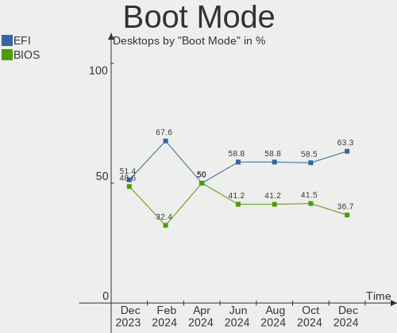
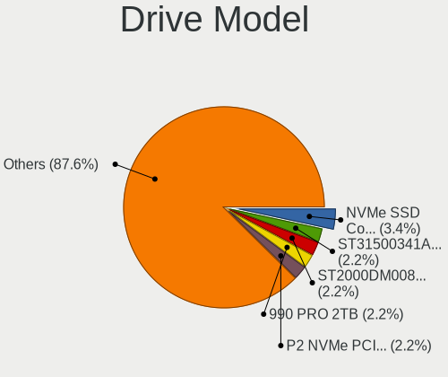
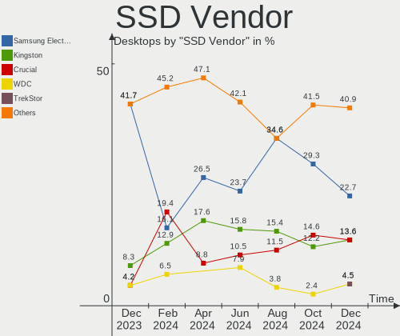
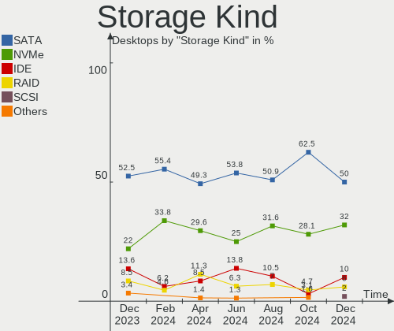
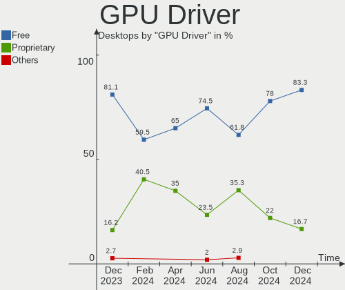
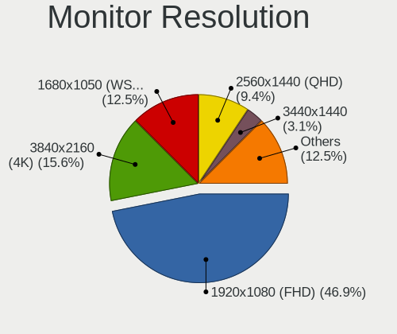

openSUSE Hardware Trends (Desktops)
-----------------------------------

A project to identify most popular hardware characteristics and track their change
over time based on data collected by openSUSE users at https://Linux-Hardware.org.

Anyone can contribute to this report by the [hw-probe](https://github.com/linuxhw/hw-probe) tool:

    sudo -E hw-probe -all -upload

Full-feature report is available here: https://linux-hardware.org/?view=trends

Period: Nov, 2021.

Contents
--------

* [ System ](#system)
  - [ OS                       ](#os)
  - [ OS Family                ](#os-family)
  - [ Kernel                   ](#kernel)
  - [ Kernel Family            ](#kernel-family)
  - [ Kernel Major Ver.        ](#kernel-major-ver)
  - [ Arch                     ](#arch)
  - [ DE                       ](#de)
  - [ Display Server           ](#display-server)
  - [ Display Manager          ](#display-manager)
  - [ OS Lang                  ](#os-lang)
  - [ Boot Mode                ](#boot-mode)
  - [ Filesystem               ](#filesystem)
  - [ Part. scheme             ](#part-scheme)
  - [ Dual Boot with Linux/BSD ](#dual-boot-with-linuxbsd)
  - [ Dual Boot (Win)          ](#dual-boot-win)

* [ Board ](#board)
  - [ Vendor                   ](#vendor)
  - [ Model                    ](#model)
  - [ Model Family             ](#model-family)
  - [ MFG Year                 ](#mfg-year)
  - [ Form Factor              ](#form-factor)
  - [ Secure Boot              ](#secure-boot)
  - [ Coreboot                 ](#coreboot)
  - [ RAM Size                 ](#ram-size)
  - [ RAM Used                 ](#ram-used)
  - [ Total Drives             ](#total-drives)
  - [ Has CD-ROM               ](#has-cd-rom)
  - [ Has Ethernet             ](#has-ethernet)
  - [ Has WiFi                 ](#has-wifi)
  - [ Has Bluetooth            ](#has-bluetooth)

* [ Location ](#location)
  - [ Country                  ](#country)
  - [ City                     ](#city)

* [ Drives ](#drives)
  - [ Drive Vendor             ](#drive-vendor)
  - [ Drive Model              ](#drive-model)
  - [ HDD Vendor               ](#hdd-vendor)
  - [ SSD Vendor               ](#ssd-vendor)
  - [ Drive Kind               ](#drive-kind)
  - [ Drive Connector          ](#drive-connector)
  - [ Drive Size               ](#drive-size)
  - [ Space Total              ](#space-total)
  - [ Space Used               ](#space-used)
  - [ Malfunc. Drives          ](#malfunc-drives)
  - [ Malfunc. Drive Vendor    ](#malfunc-drive-vendor)
  - [ Malfunc. HDD Vendor      ](#malfunc-hdd-vendor)
  - [ Malfunc. Drive Kind      ](#malfunc-drive-kind)
  - [ Failed Drives            ](#failed-drives)
  - [ Failed Drive Vendor      ](#failed-drive-vendor)
  - [ Drive Status             ](#drive-status)

* [ Storage controller ](#storage-controller)
  - [ Storage Vendor           ](#storage-vendor)
  - [ Storage Model            ](#storage-model)
  - [ Storage Kind             ](#storage-kind)

* [ Processor ](#processor)
  - [ CPU Vendor               ](#cpu-vendor)
  - [ CPU Model                ](#cpu-model)
  - [ CPU Model Family         ](#cpu-model-family)
  - [ CPU Cores                ](#cpu-cores)
  - [ CPU Sockets              ](#cpu-sockets)
  - [ CPU Threads              ](#cpu-threads)
  - [ CPU Op-Modes             ](#cpu-op-modes)
  - [ CPU Microcode            ](#cpu-microcode)
  - [ CPU Microarch            ](#cpu-microarch)

* [ Graphics ](#graphics)
  - [ GPU Vendor               ](#gpu-vendor)
  - [ GPU Model                ](#gpu-model)
  - [ GPU Combo                ](#gpu-combo)
  - [ GPU Driver               ](#gpu-driver)
  - [ GPU Memory               ](#gpu-memory)

* [ Monitor ](#monitor)
  - [ Monitor Vendor           ](#monitor-vendor)
  - [ Monitor Model            ](#monitor-model)
  - [ Monitor Resolution       ](#monitor-resolution)
  - [ Monitor Diagonal         ](#monitor-diagonal)
  - [ Monitor Width            ](#monitor-width)
  - [ Aspect Ratio             ](#aspect-ratio)
  - [ Monitor Area             ](#monitor-area)
  - [ Pixel Density            ](#pixel-density)
  - [ Multiple Monitors        ](#multiple-monitors)

* [ Network ](#network)
  - [ Net Controller Vendor    ](#net-controller-vendor)
  - [ Net Controller Model     ](#net-controller-model)
  - [ Wireless Vendor          ](#wireless-vendor)
  - [ Wireless Model           ](#wireless-model)
  - [ Ethernet Vendor          ](#ethernet-vendor)
  - [ Ethernet Model           ](#ethernet-model)
  - [ Net Controller Kind      ](#net-controller-kind)
  - [ Used Controller          ](#used-controller)
  - [ NICs                     ](#nics)
  - [ IPv6                     ](#ipv6)

* [ Bluetooth ](#bluetooth)
  - [ Bluetooth Vendor         ](#bluetooth-vendor)
  - [ Bluetooth Model          ](#bluetooth-model)

* [ Sound ](#sound)
  - [ Sound Vendor             ](#sound-vendor)
  - [ Sound Model              ](#sound-model)

* [ Memory ](#memory)
  - [ Memory Vendor            ](#memory-vendor)
  - [ Memory Model             ](#memory-model)
  - [ Memory Kind              ](#memory-kind)
  - [ Memory Form Factor       ](#memory-form-factor)
  - [ Memory Size              ](#memory-size)
  - [ Memory Speed             ](#memory-speed)

* [ Printers & scanners ](#printers--scanners)
  - [ Printer Vendor           ](#printer-vendor)
  - [ Printer Model            ](#printer-model)
  - [ Scanner Vendor           ](#scanner-vendor)
  - [ Scanner Model            ](#scanner-model)

* [ Camera ](#camera)
  - [ Camera Vendor            ](#camera-vendor)
  - [ Camera Model             ](#camera-model)

* [ Security ](#security)
  - [ Fingerprint Vendor       ](#fingerprint-vendor)
  - [ Fingerprint Model        ](#fingerprint-model)
  - [ Chipcard Vendor          ](#chipcard-vendor)
  - [ Chipcard Model           ](#chipcard-model)

* [ Unsupported ](#unsupported)
  - [ Unsupported Devices      ](#unsupported-devices)
  - [ Unsupported Device Types ](#unsupported-device-types)

System
------

OS
--

Installed operating systems

| Name                         | Desktops | Percent |
|------------------------------|----------|---------|
| openSUSE Leap-15.3           | 6        | 20%     |
| openSUSE Leap-15.2           | 5        | 16.67%  |
| openSUSE Tumbleweed-20211111 | 3        | 10%     |
| openSUSE 20211124            | 2        | 6.67%   |
| openSUSE 20211120            | 2        | 6.67%   |
| openSUSE 20211102            | 2        | 6.67%   |
| openSUSE Tumbleweed-20211125 | 1        | 3.33%   |
| openSUSE Tumbleweed-20211102 | 1        | 3.33%   |
| openSUSE Tumbleweed-20211031 | 1        | 3.33%   |
| openSUSE Tumbleweed-20211030 | 1        | 3.33%   |
| openSUSE Tumbleweed-20211029 | 1        | 3.33%   |
| openSUSE 20211117            | 1        | 3.33%   |
| openSUSE 20211111            | 1        | 3.33%   |
| openSUSE 20211107            | 1        | 3.33%   |
| openSUSE 20210916            | 1        | 3.33%   |
| openSUSE 20210912            | 1        | 3.33%   |

OS Family
---------

OS without a version

| Name     | Desktops | Percent |
|----------|----------|---------|
| openSUSE | 30       | 100%    |

Kernel
------

Version of the Linux kernel

| Version                  | Desktops | Percent |
|--------------------------|----------|---------|
| 5.14.14-1-default        | 7        | 23.33%  |
| 5.3.18-lp152.95-default  | 4        | 13.33%  |
| 5.3.18-59.27-default     | 4        | 13.33%  |
| 5.14.14-2-default        | 4        | 13.33%  |
| 5.15.3-1-default         | 2        | 6.67%   |
| 5.15.2-1-default         | 2        | 6.67%   |
| 5.3.18-lp152.102-default | 1        | 3.33%   |
| 5.3.18-59.34-default     | 1        | 3.33%   |
| 5.3.18-59.27-preempt     | 1        | 3.33%   |
| 5.15.3-1-vanilla         | 1        | 3.33%   |
| 5.14.2-1-default         | 1        | 3.33%   |
| 5.14.14-3-default        | 1        | 3.33%   |
| 5.14.1-1-default         | 1        | 3.33%   |

Kernel Family
-------------

Linux kernel without a distro release

| Version | Desktops | Percent |
|---------|----------|---------|
| 5.14.14 | 12       | 40%     |
| 5.3.18  | 11       | 36.67%  |
| 5.15.3  | 3        | 10%     |
| 5.15.2  | 2        | 6.67%   |
| 5.14.2  | 1        | 3.33%   |
| 5.14.1  | 1        | 3.33%   |

Kernel Major Ver.
-----------------

Linux kernel major version

| Version | Desktops | Percent |
|---------|----------|---------|
| 5.14    | 14       | 46.67%  |
| 5.3     | 11       | 36.67%  |
| 5.15    | 5        | 16.67%  |

Arch
----

OS architecture (x86_64, i586, etc.)

| Name   | Desktops | Percent |
|--------|----------|---------|
| x86_64 | 30       | 100%    |

DE
--

Desktop Environment

| Name    | Desktops | Percent |
|---------|----------|---------|
| KDE5    | 22       | 73.33%  |
| GNOME   | 5        | 16.67%  |
| Unknown | 2        | 6.67%   |
| MATE    | 1        | 3.33%   |

Display Server
--------------

X11 or Wayland

| Name    | Desktops | Percent |
|---------|----------|---------|
| X11     | 21       | 70%     |
| Wayland | 6        | 20%     |
| Tty     | 3        | 10%     |

Display Manager
---------------

SDDM, LightDM, etc.

| Name    | Desktops | Percent |
|---------|----------|---------|
| Unknown | 13       | 43.33%  |
| LightDM | 10       | 33.33%  |
| SDDM    | 5        | 16.67%  |
| XDM     | 2        | 6.67%   |

OS Lang
-------

Language

| Lang  | Desktops | Percent |
|-------|----------|---------|
| en_US | 7        | 23.33%  |
| POSIX | 5        | 16.67%  |
| de_DE | 5        | 16.67%  |
| fr_FR | 3        | 10%     |
| nl_BE | 2        | 6.67%   |
| en_GB | 2        | 6.67%   |
| zh_CN | 1        | 3.33%   |
| pl_PL | 1        | 3.33%   |
| it_IT | 1        | 3.33%   |
| hr_HR | 1        | 3.33%   |
| es_ES | 1        | 3.33%   |
| cv_RU | 1        | 3.33%   |

Boot Mode
---------

EFI or BIOS

| Mode | Desktops | Percent |
|------|----------|---------|
| EFI  | 19       | 63.33%  |
| BIOS | 11       | 36.67%  |

Filesystem
----------

Type of filesystem

| Type    | Desktops | Percent |
|---------|----------|---------|
| Btrfs   | 20       | 66.67%  |
| Ext4    | 7        | 23.33%  |
| Xfs     | 2        | 6.67%   |
| Overlay | 1        | 3.33%   |

Part. scheme
------------

Scheme of partitioning

| Type    | Desktops | Percent |
|---------|----------|---------|
| GPT     | 16       | 53.33%  |
| Unknown | 12       | 40%     |
| MBR     | 2        | 6.67%   |

Dual Boot with Linux/BSD
------------------------

Hosting more than one Linux/BSD

| Dual boot | Desktops | Percent |
|-----------|----------|---------|
| No        | 25       | 83.33%  |
| Yes       | 5        | 16.67%  |

Dual Boot (Win)
---------------

Hosting Linux and Windows

| Dual boot | Desktops | Percent |
|-----------|----------|---------|
| No        | 25       | 83.33%  |
| Yes       | 5        | 16.67%  |

Board
-----

Vendor
------

Motherboard manufacturer

| Name                | Desktops | Percent |
|---------------------|----------|---------|
| ASUSTek Computer    | 9        | 30%     |
| MSI                 | 6        | 20%     |
| Dell                | 4        | 13.33%  |
| ASRock              | 4        | 13.33%  |
| Gigabyte Technology | 2        | 6.67%   |
| Fujitsu             | 2        | 6.67%   |
| Lenovo              | 1        | 3.33%   |
| Hewlett-Packard     | 1        | 3.33%   |
| Biostar             | 1        | 3.33%   |

Model
-----

Motherboard model

| Name                                | Desktops | Percent |
|-------------------------------------|----------|---------|
| Dell OptiPlex 9020                  | 2        | 6.67%   |
| MSI MS-7D16                         | 1        | 3.33%   |
| MSI MS-7C37                         | 1        | 3.33%   |
| MSI MS-7C35                         | 1        | 3.33%   |
| MSI MS-7B89                         | 1        | 3.33%   |
| MSI MS-7972                         | 1        | 3.33%   |
| MSI MS-7522                         | 1        | 3.33%   |
| Lenovo ThinkCentre M720s 10ST0014MB | 1        | 3.33%   |
| HP Pavilion Gaming Desktop 790-00xx | 1        | 3.33%   |
| Gigabyte B85M-HD3                   | 1        | 3.33%   |
| Gigabyte AB350M-DS3H                | 1        | 3.33%   |
| Fujitsu ESPRIMO P520                | 1        | 3.33%   |
| Fujitsu ESPRIMO P410                | 1        | 3.33%   |
| Dell Precision WorkStation T7400    | 1        | 3.33%   |
| Dell OptiPlex 330                   | 1        | 3.33%   |
| Biostar H77MU3                      | 1        | 3.33%   |
| ASUS TUF X299 MARK 2                | 1        | 3.33%   |
| ASUS TUF GAMING B550-PLUS           | 1        | 3.33%   |
| ASUS PRO B460M-C                    | 1        | 3.33%   |
| ASUS PRIME X570-PRO                 | 1        | 3.33%   |
| ASUS PRIME B450M-K                  | 1        | 3.33%   |
| ASUS M4A78T-E                       | 1        | 3.33%   |
| ASUS K30BF_M32BF_A_F_K31BF_6        | 1        | 3.33%   |
| ASUS CROSSHAIR VI HERO              | 1        | 3.33%   |
| ASUS All Series                     | 1        | 3.33%   |
| ASRock X570 Steel Legend            | 1        | 3.33%   |
| ASRock N68C-GS4 FX                  | 1        | 3.33%   |
| ASRock J5040-ITX                    | 1        | 3.33%   |
| ASRock H370M Pro4                   | 1        | 3.33%   |

Model Family
------------

Motherboard model prefix

| Name                 | Desktops | Percent |
|----------------------|----------|---------|
| Dell OptiPlex        | 3        | 10%     |
| Fujitsu ESPRIMO      | 2        | 6.67%   |
| ASUS TUF             | 2        | 6.67%   |
| ASUS PRIME           | 2        | 6.67%   |
| MSI MS-7D16          | 1        | 3.33%   |
| MSI MS-7C37          | 1        | 3.33%   |
| MSI MS-7C35          | 1        | 3.33%   |
| MSI MS-7B89          | 1        | 3.33%   |
| MSI MS-7972          | 1        | 3.33%   |
| MSI MS-7522          | 1        | 3.33%   |
| Lenovo ThinkCentre   | 1        | 3.33%   |
| HP Pavilion          | 1        | 3.33%   |
| Gigabyte B85M-HD3    | 1        | 3.33%   |
| Gigabyte AB350M-DS3H | 1        | 3.33%   |
| Dell Precision       | 1        | 3.33%   |
| Biostar H77MU3       | 1        | 3.33%   |
| ASUS PRO             | 1        | 3.33%   |
| ASUS M4A78T-E        | 1        | 3.33%   |
| ASUS K30BF           | 1        | 3.33%   |
| ASUS CROSSHAIR       | 1        | 3.33%   |
| ASUS All             | 1        | 3.33%   |
| ASRock X570          | 1        | 3.33%   |
| ASRock N68C-GS4      | 1        | 3.33%   |
| ASRock J5040-ITX     | 1        | 3.33%   |
| ASRock H370M         | 1        | 3.33%   |

MFG Year
--------

Motherboard manufacture year

| Year | Desktops | Percent |
|------|----------|---------|
| 2021 | 6        | 20%     |
| 2020 | 5        | 16.67%  |
| 2019 | 5        | 16.67%  |
| 2015 | 4        | 13.33%  |
| 2012 | 2        | 6.67%   |
| 2018 | 1        | 3.33%   |
| 2017 | 1        | 3.33%   |
| 2016 | 1        | 3.33%   |
| 2014 | 1        | 3.33%   |
| 2013 | 1        | 3.33%   |
| 2010 | 1        | 3.33%   |
| 2009 | 1        | 3.33%   |
| 2008 | 1        | 3.33%   |

Form Factor
-----------

Physical design of the computer

| Name    | Desktops | Percent |
|---------|----------|---------|
| Desktop | 30       | 100%    |

Secure Boot
-----------

Enabled or disabled

| State    | Desktops | Percent |
|----------|----------|---------|
| Disabled | 29       | 96.67%  |
| Enabled  | 1        | 3.33%   |

Coreboot
--------

Have coreboot on board

| Used | Desktops | Percent |
|------|----------|---------|
| No   | 30       | 100%    |

RAM Size
--------

Total RAM memory

| Size in GB  | Desktops | Percent |
|-------------|----------|---------|
| 16.01-24.0  | 9        | 30%     |
| 8.01-16.0   | 9        | 30%     |
| 32.01-64.0  | 4        | 13.33%  |
| 3.01-4.0    | 3        | 10%     |
| 4.01-8.0    | 2        | 6.67%   |
| 64.01-256.0 | 2        | 6.67%   |
| 24.01-32.0  | 1        | 3.33%   |

RAM Used
--------

Used RAM memory

| Used GB    | Desktops | Percent |
|------------|----------|---------|
| 2.01-3.0   | 8        | 26.67%  |
| 1.01-2.0   | 7        | 23.33%  |
| 4.01-8.0   | 5        | 16.67%  |
| 8.01-16.0  | 5        | 16.67%  |
| 3.01-4.0   | 4        | 13.33%  |
| 16.01-24.0 | 1        | 3.33%   |

Total Drives
------------

Number of drives on board

| Drives | Desktops | Percent |
|--------|----------|---------|
| 2      | 10       | 33.33%  |
| 4      | 7        | 23.33%  |
| 3      | 6        | 20%     |
| 1      | 5        | 16.67%  |
| 6      | 2        | 6.67%   |

Has CD-ROM
----------

Has CD-ROM on board

| Presented | Desktops | Percent |
|-----------|----------|---------|
| Yes       | 17       | 56.67%  |
| No        | 13       | 43.33%  |

Has Ethernet
------------

Has Ethernet on board

| Presented | Desktops | Percent |
|-----------|----------|---------|
| Yes       | 30       | 100%    |

Has WiFi
--------

Has WiFi module

| Presented | Desktops | Percent |
|-----------|----------|---------|
| No        | 22       | 73.33%  |
| Yes       | 8        | 26.67%  |

Has Bluetooth
-------------

Has Bluetooth module

| Presented | Desktops | Percent |
|-----------|----------|---------|
| No        | 16       | 53.33%  |
| Yes       | 14       | 46.67%  |

Location
--------

Country
-------

Geographic location (country)

| Country     | Desktops | Percent |
|-------------|----------|---------|
| Germany     | 6        | 20%     |
| USA         | 4        | 13.33%  |
| Netherlands | 3        | 10%     |
| France      | 3        | 10%     |
| Belgium     | 2        | 6.67%   |
| Spain       | 1        | 3.33%   |
| Russia      | 1        | 3.33%   |
| Portugal    | 1        | 3.33%   |
| Poland      | 1        | 3.33%   |
| Italy       | 1        | 3.33%   |
| Israel      | 1        | 3.33%   |
| Hungary     | 1        | 3.33%   |
| Greece      | 1        | 3.33%   |
| Cyprus      | 1        | 3.33%   |
| Croatia     | 1        | 3.33%   |
| China       | 1        | 3.33%   |
| Austria     | 1        | 3.33%   |

City
----

Geographic location (city)

| City              | Desktops | Percent |
|-------------------|----------|---------|
| Paris             | 2        | 6.67%   |
| Durmersheim       | 2        | 6.67%   |
| Zagreb            | 1        | 3.33%   |
| Yreka             | 1        | 3.33%   |
| Xi'an             | 1        | 3.33%   |
| Warsaw            | 1        | 3.33%   |
| Verona            | 1        | 3.33%   |
| Tel Aviv          | 1        | 3.33%   |
| Saint Albans      | 1        | 3.33%   |
| New Braunfels     | 1        | 3.33%   |
| Mansfield         | 1        | 3.33%   |
| Madrid            | 1        | 3.33%   |
| Limassol          | 1        | 3.33%   |
| Leeuwarden        | 1        | 3.33%   |
| Kazan?ˆ™          | 1        | 3.33%   |
| Kapellen          | 1        | 3.33%   |
| Ingolstadt        | 1        | 3.33%   |
| Hamelin           | 1        | 3.33%   |
| Hamburg           | 1        | 3.33%   |
| Haarlem           | 1        | 3.33%   |
| G?¶d?¶ll?‘        | 1        | 3.33%   |
| Enns              | 1        | 3.33%   |
| Cologne           | 1        | 3.33%   |
| Chaumont-en-Vexin | 1        | 3.33%   |
| Cerva             | 1        | 3.33%   |
| Athens            | 1        | 3.33%   |
| Antwerp           | 1        | 3.33%   |
| Amsterdam         | 1        | 3.33%   |

Drives
------

Drive Vendor
------------

Hard drive vendors

| Vendor                    | Desktops | Drives | Percent |
|---------------------------|----------|--------|---------|
| Seagate                   | 12       | 19     | 18.75%  |
| Samsung Electronics       | 12       | 15     | 18.75%  |
| WDC                       | 11       | 20     | 17.19%  |
| Kingston                  | 6        | 6      | 9.38%   |
| Toshiba                   | 4        | 4      | 6.25%   |
| Intenso                   | 3        | 3      | 4.69%   |
| A-DATA Technology         | 3        | 3      | 4.69%   |
| Micron/Crucial Technology | 2        | 2      | 3.13%   |
| Crucial                   | 2        | 2      | 3.13%   |
| PNY                       | 1        | 2      | 1.56%   |
| Phison                    | 1        | 1      | 1.56%   |
| OCZ                       | 1        | 1      | 1.56%   |
| Hitachi                   | 1        | 1      | 1.56%   |
| HGST                      | 1        | 1      | 1.56%   |
| GOODRAM                   | 1        | 1      | 1.56%   |
| Gigabyte Technology       | 1        | 1      | 1.56%   |
| Fujitsu                   | 1        | 1      | 1.56%   |
| Corsair                   | 1        | 1      | 1.56%   |

Drive Model
-----------

Hard drive models

| Model                                  | Desktops | Percent |
|----------------------------------------|----------|---------|
| Seagate ST1000DM003-1CH162 1TB         | 3        | 3.8%    |
| Samsung SSD 860 EVO 500GB              | 3        | 3.8%    |
| WDC WD1002FAEX-00Z3A0 1TB              | 2        | 2.53%   |
| Seagate ST2000DM001-1ER164 2TB         | 2        | 2.53%   |
| Seagate Expansion 1TB                  | 2        | 2.53%   |
| Samsung SSD 870 EVO 500GB              | 2        | 2.53%   |
| Micron/Crucial NVMe SSD Drive 1TB      | 2        | 2.53%   |
| Intenso External USB 3.0 2TB           | 2        | 2.53%   |
| WDC WDS500G1B0B-00AS40 500GB SSD       | 1        | 1.27%   |
| WDC WDS250G1B0A-00H9H0 250GB SSD       | 1        | 1.27%   |
| WDC WDS100T3X0C-00SJG0 1TB             | 1        | 1.27%   |
| WDC WDS100T1X0E-00AFY0 1TB             | 1        | 1.27%   |
| WDC WD80EFAX-68KNBN0 8TB               | 1        | 1.27%   |
| WDC WD5000AAKX-07U6AA0 500GB           | 1        | 1.27%   |
| WDC WD3200AACS-00M6B0 320GB            | 1        | 1.27%   |
| WDC WD20EZRZ-00Z5HB0 2TB               | 1        | 1.27%   |
| WDC WD20EURS-63S48Y0 2TB               | 1        | 1.27%   |
| WDC WD20EARX-00PASB0 2TB               | 1        | 1.27%   |
| WDC WD2005FBYZ-01YCBB2 2TB             | 1        | 1.27%   |
| WDC WD10SPZX-08Z10 1TB                 | 1        | 1.27%   |
| WDC WD10EZEX-08WN4A0 1TB               | 1        | 1.27%   |
| WDC WD10EZEX-00KUWA0 1TB               | 1        | 1.27%   |
| WDC WD10EZEX-00BN5A0 1TB               | 1        | 1.27%   |
| WDC WD10EARS-00Y5B1 1TB                | 1        | 1.27%   |
| Toshiba NVMe SSD Drive 256GB           | 1        | 1.27%   |
| Toshiba KXG5AZNV256G 256GB             | 1        | 1.27%   |
| Toshiba HDWD260 6TB                    | 1        | 1.27%   |
| Toshiba DT01ACA100 1TB                 | 1        | 1.27%   |
| Seagate ST500DM002-1BD142 500GB        | 1        | 1.27%   |
| Seagate ST4000DM005-2DP166 4TB         | 1        | 1.27%   |
| Seagate ST3500418AS 500GB              | 1        | 1.27%   |
| Seagate ST3500413AS 500GB              | 1        | 1.27%   |
| Seagate ST31000528AS 1TB               | 1        | 1.27%   |
| Seagate ST3000DM008-2DM166 3TB         | 1        | 1.27%   |
| Seagate ST2000DM001-1CH164 2TB         | 1        | 1.27%   |
| Seagate ST1000LM035-1RK172 1TB         | 1        | 1.27%   |
| Seagate ST1000DM003-1SB10C 1TB         | 1        | 1.27%   |
| Seagate ST1000DM003-1SB102 1TB         | 1        | 1.27%   |
| Samsung SSD 980 1TB                    | 1        | 1.27%   |
| Samsung SSD 970 EVO Plus 2TB           | 1        | 1.27%   |
| Samsung SSD 860 QVO 2TB                | 1        | 1.27%   |
| Samsung SSD 860 EVO 250GB              | 1        | 1.27%   |
| Samsung SSD 850 EVO 500GB              | 1        | 1.27%   |
| Samsung SSD 850 EVO 250GB              | 1        | 1.27%   |
| Samsung SM963 2.5" NVMe PCIe SSD 250GB | 1        | 1.27%   |
| Samsung MZNLN256HAJQ-000H7 256GB SSD   | 1        | 1.27%   |
| Samsung HD642JJ 640GB                  | 1        | 1.27%   |
| Samsung HD501LJ 500GB                  | 1        | 1.27%   |
| PNY CS900 240GB SSD                    | 1        | 1.27%   |
| Phison NVMe SSD Drive 512GB            | 1        | 1.27%   |
| OCZ TRION100 240GB SSD                 | 1        | 1.27%   |
| Kingston SV300S37A240G 240GB SSD       | 1        | 1.27%   |
| Kingston SV300S37A120G 120GB SSD       | 1        | 1.27%   |
| Kingston SHFS37A240G 240GB SSD         | 1        | 1.27%   |
| Kingston SA400S37480G 480GB SSD        | 1        | 1.27%   |
| Kingston SA400S37120G 120GB SSD        | 1        | 1.27%   |
| Kingston SA2000M8500G 500GB            | 1        | 1.27%   |
| Intenso SSD Sata III 120GB             | 1        | 1.27%   |
| Hitachi HDP725050GLA360 500GB          | 1        | 1.27%   |
| HGST HUH721212ALE600 12TB              | 1        | 1.27%   |

HDD Vendor
----------

Hard disk drive vendors

| Vendor              | Desktops | Drives | Percent |
|---------------------|----------|--------|---------|
| Seagate             | 12       | 19     | 38.71%  |
| WDC                 | 10       | 16     | 32.26%  |
| Toshiba             | 2        | 2      | 6.45%   |
| Samsung Electronics | 2        | 2      | 6.45%   |
| Intenso             | 2        | 2      | 6.45%   |
| Hitachi             | 1        | 1      | 3.23%   |
| HGST                | 1        | 1      | 3.23%   |
| Fujitsu             | 1        | 1      | 3.23%   |

SSD Vendor
----------

Solid state drive vendors

| Vendor              | Desktops | Drives | Percent |
|---------------------|----------|--------|---------|
| Samsung Electronics | 7        | 10     | 28%     |
| Kingston            | 5        | 5      | 20%     |
| A-DATA Technology   | 3        | 3      | 12%     |
| WDC                 | 2        | 2      | 8%      |
| Crucial             | 2        | 2      | 8%      |
| PNY                 | 1        | 2      | 4%      |
| OCZ                 | 1        | 1      | 4%      |
| Intenso             | 1        | 1      | 4%      |
| GOODRAM             | 1        | 1      | 4%      |
| Gigabyte Technology | 1        | 1      | 4%      |
| Corsair             | 1        | 1      | 4%      |

Drive Kind
----------

HDD or SSD

| Kind | Desktops | Drives | Percent |
|------|----------|--------|---------|
| HDD  | 25       | 44     | 45.45%  |
| SSD  | 20       | 29     | 36.36%  |
| NVMe | 10       | 11     | 18.18%  |

Drive Connector
---------------

SATA, SAS, NVMe, etc.

| Type | Desktops | Drives | Percent |
|------|----------|--------|---------|
| SATA | 29       | 69     | 67.44%  |
| NVMe | 10       | 11     | 23.26%  |
| SAS  | 4        | 4      | 9.3%    |

Drive Size
----------

Size of hard drive

| Size in TB | Desktops | Drives | Percent |
|------------|----------|--------|---------|
| 0.01-0.5   | 22       | 35     | 42.31%  |
| 0.51-1.0   | 16       | 21     | 30.77%  |
| 1.01-2.0   | 9        | 11     | 17.31%  |
| 4.01-10.0  | 2        | 3      | 3.85%   |
| 3.01-4.0   | 1        | 1      | 1.92%   |
| 2.01-3.0   | 1        | 1      | 1.92%   |
| 10.01-20.0 | 1        | 1      | 1.92%   |

Space Total
-----------

Amount of disk space available on the file system

| Size in GB     | Desktops | Percent |
|----------------|----------|---------|
| More than 3000 | 16       | 53.33%  |
| 1001-2000      | 6        | 20%     |
| 501-1000       | 5        | 16.67%  |
| 2001-3000      | 2        | 6.67%   |
| 1-20           | 1        | 3.33%   |

Space Used
----------

Amount of used disk space

| Used GB        | Desktops | Percent |
|----------------|----------|---------|
| 501-1000       | 7        | 23.33%  |
| More than 3000 | 6        | 20%     |
| 251-500        | 5        | 16.67%  |
| 2001-3000      | 3        | 10%     |
| 51-100         | 3        | 10%     |
| 21-50          | 2        | 6.67%   |
| 1001-2000      | 2        | 6.67%   |
| 101-250        | 1        | 3.33%   |
| 1-20           | 1        | 3.33%   |

Malfunc. Drives
---------------

Drive models with a malfunction

| Model                             | Desktops | Drives | Percent |
|-----------------------------------|----------|--------|---------|
| WDC WD10EARS-00Y5B1 1TB           | 1        | 1      | 16.67%  |
| WDC WD1002FAEX-00Z3A0 1TB         | 1        | 1      | 16.67%  |
| Seagate ST500DM002-1BD142 500GB   | 1        | 1      | 16.67%  |
| Seagate ST3500418AS 500GB         | 1        | 1      | 16.67%  |
| Samsung Electronics HD501LJ 500GB | 1        | 1      | 16.67%  |
| Kingston SV300S37A120G 120GB SSD  | 1        | 1      | 16.67%  |

Malfunc. Drive Vendor
---------------------

Vendors of faulty drives

| Vendor              | Desktops | Drives | Percent |
|---------------------|----------|--------|---------|
| WDC                 | 2        | 2      | 33.33%  |
| Seagate             | 2        | 2      | 33.33%  |
| Samsung Electronics | 1        | 1      | 16.67%  |
| Kingston            | 1        | 1      | 16.67%  |

Malfunc. HDD Vendor
-------------------

Vendors of faulty HDD drives

| Vendor              | Desktops | Drives | Percent |
|---------------------|----------|--------|---------|
| WDC                 | 2        | 2      | 40%     |
| Seagate             | 2        | 2      | 40%     |
| Samsung Electronics | 1        | 1      | 20%     |

Malfunc. Drive Kind
-------------------

Kinds of faulty drives

| Kind | Desktops | Drives | Percent |
|------|----------|--------|---------|
| HDD  | 4        | 5      | 80%     |
| SSD  | 1        | 1      | 20%     |

Failed Drives
-------------

Failed drive models

Zero info for selected period =(

Failed Drive Vendor
-------------------

Failed drive vendors

Zero info for selected period =(

Drive Status
------------

Number of failed and malfunc. drives

| Status   | Desktops | Drives | Percent |
|----------|----------|--------|---------|
| Works    | 18       | 48     | 51.43%  |
| Detected | 12       | 30     | 34.29%  |
| Malfunc  | 5        | 6      | 14.29%  |

Storage controller
------------------

Storage Vendor
--------------

Storage controller vendors

| Vendor                       | Desktops | Percent |
|------------------------------|----------|---------|
| Intel                        | 18       | 40.91%  |
| AMD                          | 11       | 25%     |
| Samsung Electronics          | 3        | 6.82%   |
| Toshiba America Info Systems | 2        | 4.55%   |
| Sandisk                      | 2        | 4.55%   |
| Micron/Crucial Technology    | 2        | 4.55%   |
| ASMedia Technology           | 2        | 4.55%   |
| Phison Electronics           | 1        | 2.27%   |
| Nvidia                       | 1        | 2.27%   |
| LSI Logic / Symbios Logic    | 1        | 2.27%   |
| Kingston Technology Company  | 1        | 2.27%   |

Storage Model
-------------

Storage controller models

| Model                                                                            | Desktops | Percent |
|----------------------------------------------------------------------------------|----------|---------|
| AMD FCH SATA Controller [AHCI mode]                                              | 6        | 11.76%  |
| Intel 8 Series/C220 Series Chipset Family 6-port SATA Controller 1 [AHCI mode]   | 5        | 9.8%    |
| Intel Cannon Lake PCH SATA AHCI Controller                                       | 3        | 5.88%   |
| ASMedia ASM1062 Serial ATA Controller                                            | 2        | 3.92%   |
| AMD X370 Series Chipset SATA Controller                                          | 2        | 3.92%   |
| AMD 400 Series Chipset SATA Controller                                           | 2        | 3.92%   |
| Toshiba America Info Systems Toshiba America Info Non-Volatile memory controller | 1        | 1.96%   |
| Toshiba America Info Systems BG3 NVMe SSD Controller                             | 1        | 1.96%   |
| Sandisk WD PC SN810 / Black SN850 NVMe SSD                                       | 1        | 1.96%   |
| Sandisk WD Black SN750 / PC SN730 NVMe SSD                                       | 1        | 1.96%   |
| Samsung NVMe SSD Controller SM981/PM981/PM983                                    | 1        | 1.96%   |
| Samsung NVMe SSD Controller SM961/PM961/SM963                                    | 1        | 1.96%   |
| Samsung NVMe SSD Controller 980                                                  | 1        | 1.96%   |
| Phison PS5013 E13 NVMe Controller                                                | 1        | 1.96%   |
| Nvidia MCP61 SATA Controller                                                     | 1        | 1.96%   |
| Nvidia MCP61 IDE                                                                 | 1        | 1.96%   |
| Micron/Crucial P1 NVMe PCIe SSD                                                  | 1        | 1.96%   |
| Micron/Crucial NVMe Controller                                                   | 1        | 1.96%   |
| LSI Logic / Symbios Logic SAS1068E PCI-Express Fusion-MPT SAS                    | 1        | 1.96%   |
| Kingston Company A2000 NVMe SSD                                                  | 1        | 1.96%   |
| Intel Q170/Q150/B150/H170/H110/Z170/CM236 Chipset SATA Controller [AHCI Mode]    | 1        | 1.96%   |
| Intel NM10/ICH7 Family SATA Controller [AHCI mode]                               | 1        | 1.96%   |
| Intel Celeron/Pentium Silver Processor SATA Controller                           | 1        | 1.96%   |
| Intel 82801JI (ICH10 Family) SATA AHCI Controller                                | 1        | 1.96%   |
| Intel 82801G (ICH7 Family) IDE Controller                                        | 1        | 1.96%   |
| Intel 7 Series/C210 Series Chipset Family 4-port SATA Controller [IDE mode]      | 1        | 1.96%   |
| Intel 7 Series/C210 Series Chipset Family 2-port SATA Controller [IDE mode]      | 1        | 1.96%   |
| Intel 631xESB/632xESB SATA AHCI Controller                                       | 1        | 1.96%   |
| Intel 631xESB/632xESB IDE Controller                                             | 1        | 1.96%   |
| Intel 6 Series/C200 Series Chipset Family 6 port Desktop SATA AHCI Controller    | 1        | 1.96%   |
| Intel 500 Series Chipset Family SATA AHCI Controller                             | 1        | 1.96%   |
| Intel 400 Series Chipset Family SATA AHCI Controller                             | 1        | 1.96%   |
| Intel 200 Series PCH SATA controller [AHCI mode]                                 | 1        | 1.96%   |
| AMD Starship/Matisse Chipset SATA Controller [AHCI mode]                         | 1        | 1.96%   |
| AMD SB7x0/SB8x0/SB9x0 SATA Controller [AHCI mode]                                | 1        | 1.96%   |
| AMD SB7x0/SB8x0/SB9x0 IDE Controller                                             | 1        | 1.96%   |
| AMD RS690 PCI to PCI Bridge (PCI Express Port 2)                                 | 1        | 1.96%   |

Storage Kind
------------

Kind of storage controller (IDE, SATA, NVMe, SAS, ...)

| Kind | Desktops | Percent |
|------|----------|---------|
| SATA | 27       | 61.36%  |
| NVMe | 10       | 22.73%  |
| IDE  | 5        | 11.36%  |
| RAID | 1        | 2.27%   |
| SCSI | 1        | 2.27%   |

Processor
---------

CPU Vendor
----------

Processor vendors

| Vendor | Desktops | Percent |
|--------|----------|---------|
| Intel  | 18       | 60%     |
| AMD    | 12       | 40%     |

CPU Model
---------

Processor models

| Model                                          | Desktops | Percent |
|------------------------------------------------|----------|---------|
| Intel Core i7-8700 CPU @ 3.20GHz               | 3        | 10%     |
| Intel Core i7-4770 CPU @ 3.40GHz               | 2        | 6.67%   |
| AMD Ryzen 3 2200G with Radeon Vega Graphics    | 2        | 6.67%   |
| Intel Xeon CPU X5472 @ 3.00GHz                 | 1        | 3.33%   |
| Intel Pentium Silver J5040 CPU @ 2.00GHz       | 1        | 3.33%   |
| Intel Pentium Dual-Core CPU E5700 @ 3.00GHz    | 1        | 3.33%   |
| Intel Core i7-7800X CPU @ 3.50GHz              | 1        | 3.33%   |
| Intel Core i7-4770K CPU @ 3.50GHz              | 1        | 3.33%   |
| Intel Core i7 CPU 920 @ 2.67GHz                | 1        | 3.33%   |
| Intel Core i5-6500 CPU @ 3.20GHz               | 1        | 3.33%   |
| Intel Core i5-4570 CPU @ 3.20GHz               | 1        | 3.33%   |
| Intel Core i5-4430 CPU @ 3.00GHz               | 1        | 3.33%   |
| Intel Core i5-3330 CPU @ 3.00GHz               | 1        | 3.33%   |
| Intel Core i5-2320 CPU @ 3.00GHz               | 1        | 3.33%   |
| Intel Core i5-10600K CPU @ 4.10GHz             | 1        | 3.33%   |
| Intel Core i5-10400 CPU @ 2.90GHz              | 1        | 3.33%   |
| AMD Ryzen 9 5900X 12-Core Processor            | 1        | 3.33%   |
| AMD Ryzen 9 3900X 12-Core Processor            | 1        | 3.33%   |
| AMD Ryzen 7 2700X Eight-Core Processor         | 1        | 3.33%   |
| AMD Ryzen 5 5600G with Radeon Graphics         | 1        | 3.33%   |
| AMD Ryzen 5 3600X 6-Core Processor             | 1        | 3.33%   |
| AMD Ryzen 5 3400G with Radeon Vega Graphics    | 1        | 3.33%   |
| AMD Ryzen 3 PRO 3200GE w/ Radeon Vega Graphics | 1        | 3.33%   |
| AMD Phenom II X4 B50 Processor                 | 1        | 3.33%   |
| AMD FX-8350 Eight-Core Processor               | 1        | 3.33%   |
| AMD A10-7800 Radeon R7, 12 Compute Cores 4C+8G | 1        | 3.33%   |

CPU Model Family
----------------

Processor model prefix

| Model                   | Desktops | Percent |
|-------------------------|----------|---------|
| Intel Core i7           | 8        | 26.67%  |
| Intel Core i5           | 7        | 23.33%  |
| AMD Ryzen 5             | 3        | 10%     |
| AMD Ryzen 9             | 2        | 6.67%   |
| AMD Ryzen 3             | 2        | 6.67%   |
| Intel Xeon              | 1        | 3.33%   |
| Intel Pentium Silver    | 1        | 3.33%   |
| Intel Pentium Dual-Core | 1        | 3.33%   |
| AMD Ryzen 7             | 1        | 3.33%   |
| AMD Ryzen 3 PRO         | 1        | 3.33%   |
| AMD Phenom II X4        | 1        | 3.33%   |
| AMD FX                  | 1        | 3.33%   |
| AMD A10                 | 1        | 3.33%   |

CPU Cores
---------

Number of processor cores

| Number | Desktops | Percent |
|--------|----------|---------|
| 4      | 17       | 56.67%  |
| 6      | 8        | 26.67%  |
| 12     | 2        | 6.67%   |
| 2      | 2        | 6.67%   |
| 8      | 1        | 3.33%   |

CPU Sockets
-----------

Number of sockets

| Number | Desktops | Percent |
|--------|----------|---------|
| 1      | 30       | 100%    |

CPU Threads
-----------

Threads per core (Hyper-Threading)

| Number | Desktops | Percent |
|--------|----------|---------|
| 2      | 18       | 60%     |
| 1      | 12       | 40%     |

CPU Op-Modes
------------

CPU Operation Modes (32-bit, 64-bit)

| Op mode        | Desktops | Percent |
|----------------|----------|---------|
| 32-bit, 64-bit | 30       | 100%    |

CPU Microcode
-------------

Microcode number

| Number     | Desktops | Percent |
|------------|----------|---------|
| 0x306c3    | 5        | 16.67%  |
| 0x906ea    | 2        | 6.67%   |
| 0x1067a    | 2        | 6.67%   |
| 0x08701021 | 2        | 6.67%   |
| 0x08108109 | 2        | 6.67%   |
| Unknown    | 2        | 6.67%   |
| 0xa0655    | 1        | 3.33%   |
| 0xa0653    | 1        | 3.33%   |
| 0x706a8    | 1        | 3.33%   |
| 0x506e3    | 1        | 3.33%   |
| 0x50654    | 1        | 3.33%   |
| 0x306a9    | 1        | 3.33%   |
| 0x206a7    | 1        | 3.33%   |
| 0x106a4    | 1        | 3.33%   |
| 0x0a50000c | 1        | 3.33%   |
| 0x0a201009 | 1        | 3.33%   |
| 0x08101016 | 1        | 3.33%   |
| 0x0810100b | 1        | 3.33%   |
| 0x0800820d | 1        | 3.33%   |
| 0x06003106 | 1        | 3.33%   |
| 0x010000db | 1        | 3.33%   |

CPU Microarch
-------------

Microarchitecture

| Name          | Desktops | Percent |
|---------------|----------|---------|
| Haswell       | 5        | 16.67%  |
| Zen+          | 3        | 10%     |
| KabyLake      | 3        | 10%     |
| Zen 3         | 2        | 6.67%   |
| Zen 2         | 2        | 6.67%   |
| Zen           | 2        | 6.67%   |
| Skylake       | 2        | 6.67%   |
| Penryn        | 2        | 6.67%   |
| CometLake     | 2        | 6.67%   |
| Steamroller   | 1        | 3.33%   |
| SandyBridge   | 1        | 3.33%   |
| Piledriver    | 1        | 3.33%   |
| Nehalem       | 1        | 3.33%   |
| K10           | 1        | 3.33%   |
| IvyBridge     | 1        | 3.33%   |
| Goldmont plus | 1        | 3.33%   |

Graphics
--------

GPU Vendor
----------

Vendors of graphics cards

| Vendor | Desktops | Percent |
|--------|----------|---------|
| AMD    | 16       | 50%     |
| Intel  | 10       | 31.25%  |
| Nvidia | 6        | 18.75%  |

GPU Model
---------

Graphics card models

| Model                                                                       | Desktops | Percent |
|-----------------------------------------------------------------------------|----------|---------|
| Intel Xeon E3-1200 v3/4th Gen Core Processor Integrated Graphics Controller | 3        | 9.09%   |
| AMD Tonga PRO [Radeon R9 285/380]                                           | 3        | 9.09%   |
| Intel CometLake-S GT2 [UHD Graphics 630]                                    | 2        | 6.06%   |
| Intel CoffeeLake-S GT2 [UHD Graphics 630]                                   | 2        | 6.06%   |
| AMD Raven Ridge [Radeon Vega Series / Radeon Vega Mobile Series]            | 2        | 6.06%   |
| AMD Picasso/Raven 2 [Radeon Vega Series / Radeon Vega Mobile Series]        | 2        | 6.06%   |
| AMD Caicos XTX [Radeon HD 8490 / R5 235X OEM]                               | 2        | 6.06%   |
| Nvidia TU117 [GeForce GTX 1650]                                             | 1        | 3.03%   |
| Nvidia TU116 [GeForce GTX 1660 Ti]                                          | 1        | 3.03%   |
| Nvidia TU106 [GeForce RTX 2070]                                             | 1        | 3.03%   |
| Nvidia GP104 [GeForce GTX 1070]                                             | 1        | 3.03%   |
| Nvidia GK106 [GeForce GTX 650 Ti Boost]                                     | 1        | 3.03%   |
| Nvidia G84GL [Quadro FX 1700]                                               | 1        | 3.03%   |
| Intel Xeon E3-1200 v2/3rd Gen Core processor Graphics Controller            | 1        | 3.03%   |
| Intel GeminiLake [UHD Graphics 605]                                         | 1        | 3.03%   |
| Intel DG1 [Iris Xe Graphics]                                                | 1        | 3.03%   |
| Intel 2nd Generation Core Processor Family Integrated Graphics Controller   | 1        | 3.03%   |
| AMD RV710 [Radeon HD 4350/4550]                                             | 1        | 3.03%   |
| AMD Navi 10 [Radeon RX 5600 OEM/5600 XT / 5700/5700 XT]                     | 1        | 3.03%   |
| AMD Kaveri [Radeon R7 Graphics]                                             | 1        | 3.03%   |
| AMD Ellesmere [Radeon RX 470/480/570/570X/580/580X/590]                     | 1        | 3.03%   |
| AMD Cezanne                                                                 | 1        | 3.03%   |
| AMD Cape Verde XT [Radeon HD 7770/8760 / R7 250X]                           | 1        | 3.03%   |
| AMD Baffin [Radeon RX 550 640SP / RX 560/560X]                              | 1        | 3.03%   |

GPU Combo
---------

Combinations of graphics cards

| Name           | Desktops | Percent |
|----------------|----------|---------|
| 1 x AMD        | 16       | 53.33%  |
| 1 x Intel      | 7        | 23.33%  |
| 1 x Nvidia     | 5        | 16.67%  |
| 2 x Intel      | 1        | 3.33%   |
| Intel + Nvidia | 1        | 3.33%   |

GPU Driver
----------

Free vs proprietary

| Driver      | Desktops | Percent |
|-------------|----------|---------|
| Free        | 26       | 86.67%  |
| Proprietary | 3        | 10%     |
| Unknown     | 1        | 3.33%   |

GPU Memory
----------

Total video memory

| Size in GB | Desktops | Percent |
|------------|----------|---------|
| Unknown    | 11       | 36.67%  |
| 1.01-2.0   | 5        | 16.67%  |
| 0.51-1.0   | 4        | 13.33%  |
| 7.01-8.0   | 3        | 10%     |
| 3.01-4.0   | 3        | 10%     |
| 0.01-0.5   | 3        | 10%     |
| 5.01-6.0   | 1        | 3.33%   |

Monitor
-------

Monitor Vendor
--------------

Monitor vendors

| Vendor               | Desktops | Percent |
|----------------------|----------|---------|
| Samsung Electronics  | 8        | 25%     |
| Dell                 | 8        | 25%     |
| BenQ                 | 3        | 9.38%   |
| Goldstar             | 2        | 6.25%   |
| Ancor Communications | 2        | 6.25%   |
| Acer                 | 2        | 6.25%   |
| Philips              | 1        | 3.13%   |
| Lite-On              | 1        | 3.13%   |
| Lenovo               | 1        | 3.13%   |
| HKC                  | 1        | 3.13%   |
| Hewlett-Packard      | 1        | 3.13%   |
| ASUSTek Computer     | 1        | 3.13%   |
| AOC                  | 1        | 3.13%   |

Monitor Model
-------------

Monitor models

| Model                                                                | Desktops | Percent |
|----------------------------------------------------------------------|----------|---------|
| Dell P2418D DELD0C1 2560x1440 526x296mm 23.8-inch                    | 2        | 5.71%   |
| Dell E2214H DELA09E 1920x1080 477x268mm 21.5-inch                    | 2        | 5.71%   |
| Samsung Electronics U28E590 SAM0C4D 3840x2160 607x345mm 27.5-inch    | 1        | 2.86%   |
| Samsung Electronics SyncMaster SAM036F 1440x900 428x255mm 19.6-inch  | 1        | 2.86%   |
| Samsung Electronics SyncMaster SAM011F 1280x1024 376x301mm 19.0-inch | 1        | 2.86%   |
| Samsung Electronics SMEX2220 SAM0685 1920x1080 477x268mm 21.5-inch   | 1        | 2.86%   |
| Samsung Electronics S34J55x SAM0F72 3440x1440 797x333mm 34.0-inch    | 1        | 2.86%   |
| Samsung Electronics S34J55x SAM0F70 3440x1440 797x333mm 34.0-inch    | 1        | 2.86%   |
| Samsung Electronics S24R65x SAM1027 1920x1080 527x296mm 23.8-inch    | 1        | 2.86%   |
| Samsung Electronics S24R65x SAM1022 1920x1080 527x296mm 23.8-inch    | 1        | 2.86%   |
| Samsung Electronics S24E450 SAM0C82 1920x1080 530x300mm 24.0-inch    | 1        | 2.86%   |
| Samsung Electronics S23B550 SAM0919 1920x1080 510x287mm 23.0-inch    | 1        | 2.86%   |
| Philips PHL 243V5 PHLC0D1 1920x1080 521x293mm 23.5-inch              | 1        | 2.86%   |
| Lite-On DC/EC150ATA LTN0208 1024x768 304x228mm 15.0-inch             | 1        | 2.86%   |
| Lenovo LEN LT2423wC LEN60A8 1920x1080 531x299mm 24.0-inch            | 1        | 2.86%   |
| HKC CH70 HKC27A9 1920x1080 597x336mm 27.0-inch                       | 1        | 2.86%   |
| Hewlett-Packard vs19 HWP264C 1280x1024 376x301mm 19.0-inch           | 1        | 2.86%   |
| Goldstar MP59G GSM5B35 1920x1080 480x270mm 21.7-inch                 | 1        | 2.86%   |
| Goldstar L226W GSM566B 1680x1050 474x296mm 22.0-inch                 | 1        | 2.86%   |
| Dell U2715H DELD065 2560x1440 597x336mm 27.0-inch                    | 1        | 2.86%   |
| Dell U2415 DELA0B8 1920x1080 520x320mm 24.0-inch                     | 1        | 2.86%   |
| Dell P2418D DELD0C2 2560x1440 526x296mm 23.8-inch                    | 1        | 2.86%   |
| Dell AW2521HF DELA161 1920x1080 540x300mm 24.3-inch                  | 1        | 2.86%   |
| Dell 1703FP DEL3011 1280x1024 338x270mm 17.0-inch                    | 1        | 2.86%   |
| BenQ GW2760 BNQ78C6 1920x1080 598x336mm 27.0-inch                    | 1        | 2.86%   |
| BenQ GL2250H BNQ78A1 1920x1080 477x268mm 21.5-inch                   | 1        | 2.86%   |
| BenQ BL3200 BNQ8017 2560x1440 708x398mm 32.0-inch                    | 1        | 2.86%   |
| ASUSTek Computer VP278 AUS27AE 1920x1080 598x336mm 27.0-inch         | 1        | 2.86%   |
| AOC AG271QG AOC2713 2560x1440 598x336mm 27.0-inch                    | 1        | 2.86%   |
| Ancor Communications VX238 ACI23C1 1920x1080 510x290mm 23.1-inch     | 1        | 2.86%   |
| Ancor Communications ASUS VW199 ACI19ED 1440x900 408x255mm 18.9-inch | 1        | 2.86%   |
| Acer V243W ACR0028 1920x1200 582x375mm 27.3-inch                     | 1        | 2.86%   |
| Acer H233H ACR00E3 1920x1080 510x287mm 23.0-inch                     | 1        | 2.86%   |

Monitor Resolution
------------------

Monitor screen resolution

| Resolution         | Desktops | Percent |
|--------------------|----------|---------|
| 1920x1080 (FHD)    | 15       | 48.39%  |
| 2560x1440 (QHD)    | 5        | 16.13%  |
| 1280x1024 (SXGA)   | 3        | 9.68%   |
| 1920x1200 (WUXGA)  | 2        | 6.45%   |
| 1440x900 (WXGA+)   | 2        | 6.45%   |
| 3840x2160 (4K)     | 1        | 3.23%   |
| 3440x1440          | 1        | 3.23%   |
| 1680x1050 (WSXGA+) | 1        | 3.23%   |
| 1024x768 (XGA)     | 1        | 3.23%   |

Monitor Diagonal
----------------

Diagonal size in inches

| Inches | Desktops | Percent |
|--------|----------|---------|
| 27     | 7        | 22.58%  |
| 24     | 6        | 19.35%  |
| 23     | 6        | 19.35%  |
| 21     | 4        | 12.9%   |
| 19     | 4        | 12.9%   |
| 34     | 1        | 3.23%   |
| 32     | 1        | 3.23%   |
| 17     | 1        | 3.23%   |
| 15     | 1        | 3.23%   |

Monitor Width
-------------

Physical width

| Width in mm | Desktops | Percent |
|-------------|----------|---------|
| 501-600     | 16       | 53.33%  |
| 401-500     | 7        | 23.33%  |
| 701-800     | 2        | 6.67%   |
| 351-400     | 2        | 6.67%   |
| 301-350     | 2        | 6.67%   |
| 601-700     | 1        | 3.33%   |

Aspect Ratio
------------

Proportional relationship between the width and the height

| Ratio | Desktops | Percent |
|-------|----------|---------|
| 16/9  | 22       | 70.97%  |
| 5/4   | 3        | 9.68%   |
| 16/10 | 3        | 9.68%   |
| 4/3   | 1        | 3.23%   |
| 3/2   | 1        | 3.23%   |
| 21/9  | 1        | 3.23%   |

Monitor Area
------------

Area in inch²

| Area in inch² | Desktops | Percent |
|----------------|----------|---------|
| 201-250        | 13       | 43.33%  |
| 301-350        | 7        | 23.33%  |
| 151-200        | 4        | 13.33%  |
| 351-500        | 2        | 6.67%   |
| 251-300        | 2        | 6.67%   |
| 141-150        | 1        | 3.33%   |
| 101-110        | 1        | 3.33%   |

Pixel Density
-------------

Pixels per inch

| Density | Desktops | Percent |
|---------|----------|---------|
| 51-100  | 21       | 67.74%  |
| 101-120 | 7        | 22.58%  |
| 121-160 | 3        | 9.68%   |

Multiple Monitors
-----------------

Total monitors connected

| Total | Desktops | Percent |
|-------|----------|---------|
| 1     | 25       | 83.33%  |
| 2     | 4        | 13.33%  |
| 3     | 1        | 3.33%   |

Network
-------

Net Controller Vendor
---------------------

Controller vendors

| Vendor                | Desktops | Percent |
|-----------------------|----------|---------|
| Realtek Semiconductor | 18       | 51.43%  |
| Intel                 | 11       | 31.43%  |
| Qualcomm Atheros      | 2        | 5.71%   |
| ASIX Electronics      | 2        | 5.71%   |
| Broadcom Limited      | 1        | 2.86%   |
| Broadcom              | 1        | 2.86%   |

Net Controller Model
--------------------

Controller models

| Model                                                             | Desktops | Percent |
|-------------------------------------------------------------------|----------|---------|
| Realtek RTL8111/8168/8411 PCI Express Gigabit Ethernet Controller | 13       | 33.33%  |
| Realtek RTL8125 2.5GbE Controller                                 | 3        | 7.69%   |
| Intel I211 Gigabit Network Connection                             | 3        | 7.69%   |
| Intel Wi-Fi 6 AX200                                               | 2        | 5.13%   |
| Intel Ethernet Connection (7) I219-V                              | 2        | 5.13%   |
| ASIX AX88179 Gigabit Ethernet                                     | 2        | 5.13%   |
| Realtek RTL8822CE 802.11ac PCIe Wireless Network Adapter          | 1        | 2.56%   |
| Realtek RTL8821CE 802.11ac PCIe Wireless Network Adapter          | 1        | 2.56%   |
| Realtek RTL8821AE 802.11ac PCIe Wireless Network Adapter          | 1        | 2.56%   |
| Realtek RTL8187B Wireless 802.11g 54Mbps Network Adapter          | 1        | 2.56%   |
| Realtek RTL8153 Gigabit Ethernet Adapter                          | 1        | 2.56%   |
| Qualcomm Atheros QCA8171 Gigabit Ethernet                         | 1        | 2.56%   |
| Qualcomm Atheros AR8121/AR8113/AR8114 Gigabit or Fast Ethernet    | 1        | 2.56%   |
| Intel Wireless-AC 9260                                            | 1        | 2.56%   |
| Intel Tiger Lake PCH CNVi WiFi                                    | 1        | 2.56%   |
| Intel Ethernet Connection (2) I219-V                              | 1        | 2.56%   |
| Intel Ethernet Connection (12) I219-V                             | 1        | 2.56%   |
| Intel 82574L Gigabit Network Connection                           | 1        | 2.56%   |
| Broadcom NetXtreme BCM5754 Gigabit Ethernet PCI Express           | 1        | 2.56%   |
| Broadcom Limited NetLink BCM5787 Gigabit Ethernet PCI Express     | 1        | 2.56%   |

Wireless Vendor
---------------

Wireless vendors

| Vendor                | Desktops | Percent |
|-----------------------|----------|---------|
| Realtek Semiconductor | 4        | 50%     |
| Intel                 | 4        | 50%     |

Wireless Model
--------------

Wireless models

| Model                                                    | Desktops | Percent |
|----------------------------------------------------------|----------|---------|
| Intel Wi-Fi 6 AX200                                      | 2        | 25%     |
| Realtek RTL8822CE 802.11ac PCIe Wireless Network Adapter | 1        | 12.5%   |
| Realtek RTL8821CE 802.11ac PCIe Wireless Network Adapter | 1        | 12.5%   |
| Realtek RTL8821AE 802.11ac PCIe Wireless Network Adapter | 1        | 12.5%   |
| Realtek RTL8187B Wireless 802.11g 54Mbps Network Adapter | 1        | 12.5%   |
| Intel Wireless-AC 9260                                   | 1        | 12.5%   |
| Intel Tiger Lake PCH CNVi WiFi                           | 1        | 12.5%   |

Ethernet Vendor
---------------

Ethernet vendors

| Vendor                | Desktops | Percent |
|-----------------------|----------|---------|
| Realtek Semiconductor | 16       | 53.33%  |
| Intel                 | 8        | 26.67%  |
| Qualcomm Atheros      | 2        | 6.67%   |
| ASIX Electronics      | 2        | 6.67%   |
| Broadcom Limited      | 1        | 3.33%   |
| Broadcom              | 1        | 3.33%   |

Ethernet Model
--------------

Ethernet models

| Model                                                             | Desktops | Percent |
|-------------------------------------------------------------------|----------|---------|
| Realtek RTL8111/8168/8411 PCI Express Gigabit Ethernet Controller | 13       | 41.94%  |
| Realtek RTL8125 2.5GbE Controller                                 | 3        | 9.68%   |
| Intel I211 Gigabit Network Connection                             | 3        | 9.68%   |
| Intel Ethernet Connection (7) I219-V                              | 2        | 6.45%   |
| ASIX AX88179 Gigabit Ethernet                                     | 2        | 6.45%   |
| Realtek RTL8153 Gigabit Ethernet Adapter                          | 1        | 3.23%   |
| Qualcomm Atheros QCA8171 Gigabit Ethernet                         | 1        | 3.23%   |
| Qualcomm Atheros AR8121/AR8113/AR8114 Gigabit or Fast Ethernet    | 1        | 3.23%   |
| Intel Ethernet Connection (2) I219-V                              | 1        | 3.23%   |
| Intel Ethernet Connection (12) I219-V                             | 1        | 3.23%   |
| Intel 82574L Gigabit Network Connection                           | 1        | 3.23%   |
| Broadcom NetXtreme BCM5754 Gigabit Ethernet PCI Express           | 1        | 3.23%   |
| Broadcom Limited NetLink BCM5787 Gigabit Ethernet PCI Express     | 1        | 3.23%   |

Net Controller Kind
-------------------

Ethernet, WiFi or modem

| Kind     | Desktops | Percent |
|----------|----------|---------|
| Ethernet | 30       | 78.95%  |
| WiFi     | 8        | 21.05%  |

Used Controller
---------------

Currently used network controller

| Kind     | Desktops | Percent |
|----------|----------|---------|
| Ethernet | 30       | 81.08%  |
| WiFi     | 7        | 18.92%  |

NICs
----

Total network controllers on board

| Total | Desktops | Percent |
|-------|----------|---------|
| 1     | 20       | 66.67%  |
| 2     | 8        | 26.67%  |
| 0     | 2        | 6.67%   |

IPv6
----

IPv6 vs IPv4

| Used | Desktops | Percent |
|------|----------|---------|
| No   | 23       | 76.67%  |
| Yes  | 7        | 23.33%  |

Bluetooth
---------

Bluetooth Vendor
----------------

Controller vendors

| Vendor                  | Desktops | Percent |
|-------------------------|----------|---------|
| Cambridge Silicon Radio | 5        | 33.33%  |
| Intel                   | 4        | 26.67%  |
| Realtek Semiconductor   | 3        | 20%     |
| IMC Networks            | 1        | 6.67%   |
| Broadcom                | 1        | 6.67%   |
| Belkin Components       | 1        | 6.67%   |

Bluetooth Model
---------------

Controller models

| Model                                                 | Desktops | Percent |
|-------------------------------------------------------|----------|---------|
| Cambridge Silicon Radio Bluetooth Dongle (HCI mode)   | 5        | 33.33%  |
| Realtek Bluetooth Radio                               | 2        | 13.33%  |
| Intel AX200 Bluetooth                                 | 2        | 13.33%  |
| Realtek  Bluetooth 4.2 Adapter                        | 1        | 6.67%   |
| Intel Wireless-AC 9260 Bluetooth Adapter              | 1        | 6.67%   |
| Intel Bluetooth Device                                | 1        | 6.67%   |
| IMC Networks Bluetooth Radio                          | 1        | 6.67%   |
| Broadcom BCM2045 Bluetooth                            | 1        | 6.67%   |
| Belkin Components F8T065BF Mini Bluetooth 4.0 Adapter | 1        | 6.67%   |

Sound
-----

Sound Vendor
------------

Sound card vendors

| Vendor              | Desktops | Percent |
|---------------------|----------|---------|
| AMD                 | 17       | 37.78%  |
| Intel               | 16       | 35.56%  |
| Nvidia              | 5        | 11.11%  |
| Creative Labs       | 3        | 6.67%   |
| Logitech            | 1        | 2.22%   |
| Creative Technology | 1        | 2.22%   |
| Corsair             | 1        | 2.22%   |
| C-Media Electronics | 1        | 2.22%   |

Sound Model
-----------

Sound card models

| Model                                                                             | Desktops | Percent |
|-----------------------------------------------------------------------------------|----------|---------|
| AMD Family 17h (Models 10h-1fh) HD Audio Controller                               | 5        | 8.62%   |
| Intel 8 Series/C220 Series Chipset High Definition Audio Controller               | 4        | 6.9%    |
| Intel Xeon E3-1200 v3/4th Gen Core Processor HD Audio Controller                  | 3        | 5.17%   |
| Intel Cannon Lake PCH cAVS                                                        | 3        | 5.17%   |
| AMD Tonga HDMI Audio [Radeon R9 285/380]                                          | 3        | 5.17%   |
| AMD Starship/Matisse HD Audio Controller                                          | 3        | 5.17%   |
| AMD Raven/Raven2/Fenghuang HDMI/DP Audio Controller                               | 3        | 5.17%   |
| AMD Caicos HDMI Audio [Radeon HD 6450 / 7450/8450/8490 OEM / R5 230/235/235X OEM] | 2        | 3.45%   |
| Nvidia TU116 High Definition Audio Controller                                     | 1        | 1.72%   |
| Nvidia TU107 GeForce GTX 1650 High Definition Audio Controller                    | 1        | 1.72%   |
| Nvidia TU106 High Definition Audio Controller                                     | 1        | 1.72%   |
| Nvidia MCP61 High Definition Audio                                                | 1        | 1.72%   |
| Nvidia GP104 High Definition Audio Controller                                     | 1        | 1.72%   |
| Logitech Headset H340                                                             | 1        | 1.72%   |
| Intel NM10/ICH7 Family High Definition Audio Controller                           | 1        | 1.72%   |
| Intel HD Graphics D3COLD                                                          | 1        | 1.72%   |
| Intel Comet Lake PCH-V cAVS                                                       | 1        | 1.72%   |
| Intel Celeron/Pentium Silver Processor High Definition Audio                      | 1        | 1.72%   |
| Intel Audio device                                                                | 1        | 1.72%   |
| Intel 82801JI (ICH10 Family) HD Audio Controller                                  | 1        | 1.72%   |
| Intel 7 Series/C216 Chipset Family High Definition Audio Controller               | 1        | 1.72%   |
| Intel 6 Series/C200 Series Chipset Family High Definition Audio Controller        | 1        | 1.72%   |
| Intel 200 Series PCH HD Audio                                                     | 1        | 1.72%   |
| Intel 100 Series/C230 Series Chipset Family HD Audio Controller                   | 1        | 1.72%   |
| Creative Technology Pebble V3                                                     | 1        | 1.72%   |
| Creative Labs Sound Core3D [Sound Blaster Recon3D / Z-Series]                     | 1        | 1.72%   |
| Creative Labs EMU20k1 [Sound Blaster X-Fi Series]                                 | 1        | 1.72%   |
| Creative Labs EMU10k2/CA0100/CA0102/CA10200 [Sound Blaster Audigy Series]         | 1        | 1.72%   |
| Corsair VOID Wireless Gaming Dongle                                               | 1        | 1.72%   |
| C-Media Electronics CM108 Audio Controller                                        | 1        | 1.72%   |
| AMD SBx00 Azalia (Intel HDA)                                                      | 1        | 1.72%   |
| AMD RV710/730 HDMI Audio [Radeon HD 4000 series]                                  | 1        | 1.72%   |
| AMD Renoir Radeon High Definition Audio Controller                                | 1        | 1.72%   |
| AMD Oland/Hainan/Cape Verde/Pitcairn HDMI Audio [Radeon HD 7000 Series]           | 1        | 1.72%   |
| AMD Navi 10 HDMI Audio                                                            | 1        | 1.72%   |
| AMD Kaveri HDMI/DP Audio Controller                                               | 1        | 1.72%   |
| AMD FCH Azalia Controller                                                         | 1        | 1.72%   |
| AMD Family 17h (Models 00h-0fh) HD Audio Controller                               | 1        | 1.72%   |
| AMD Ellesmere HDMI Audio [Radeon RX 470/480 / 570/580/590]                        | 1        | 1.72%   |
| AMD Baffin HDMI/DP Audio [Radeon RX 550 640SP / RX 560/560X]                      | 1        | 1.72%   |

Memory
------

Memory Vendor
-------------

Memory module vendors

| Vendor              | Desktops | Percent |
|---------------------|----------|---------|
| Kingston            | 5        | 20.83%  |
| Crucial             | 5        | 20.83%  |
| SK Hynix            | 3        | 12.5%   |
| Corsair             | 3        | 12.5%   |
| Nanya Technology    | 2        | 8.33%   |
| Micron Technology   | 2        | 8.33%   |
| G.Skill             | 2        | 8.33%   |
| Samsung Electronics | 1        | 4.17%   |
| Unknown             | 1        | 4.17%   |

Memory Model
------------

Memory module models

| Model                                                      | Desktops | Percent |
|------------------------------------------------------------|----------|---------|
| Nanya RAM NT2GC64B88G0NF-CG 2048MB DIMM DDR3 1333MT/s      | 2        | 7.41%   |
| Crucial RAM CT51264BD160B.C16F 4096MB DIMM DDR3 1600MT/s   | 2        | 7.41%   |
| SK Hynix RAM HYMP112U64CP8-Y5 1024MB DIMM DDR2 1639MT/s    | 1        | 3.7%    |
| SK Hynix RAM HYMP112F72CP8D3-S5 1GB FB-DIMM DDR2 800MT/s   | 1        | 3.7%    |
| SK Hynix RAM HMT451U6AFR8C-PB 4GB DIMM DDR3 1600MT/s       | 1        | 3.7%    |
| Samsung RAM M378B5173DB0-CK0 4GB DIMM DDR3 1600MT/s        | 1        | 3.7%    |
| Micron RAM 4JTF25664AZ-1G6E1 2048MB DIMM DDR3 1600MT/s     | 1        | 3.7%    |
| Micron RAM 16JTF1G64AZ-1G6D1 8GB DIMM DDR3 1600MT/s        | 1        | 3.7%    |
| Kingston RAM Module 2048MB DIMM DDR2 800MT/s               | 1        | 3.7%    |
| Kingston RAM KHX2400C15/8G 8GB DIMM DDR4 2933MT/s          | 1        | 3.7%    |
| Kingston RAM KHX2133C14D4/8G 8192MB DIMM DDR4 2667MT/s     | 1        | 3.7%    |
| Kingston RAM 99U5704-001.A00G 4GB SODIMM DDR4 2400MT/s     | 1        | 3.7%    |
| Kingston RAM 99U5471-040.A00LF 8192MB DIMM DDR3 1333MT/s   | 1        | 3.7%    |
| Kingston RAM 99U5471-037.A00LF 8192MB DIMM DDR3 1600MT/s   | 1        | 3.7%    |
| Kingston RAM 99U5471-036.A00LF 4GB DIMM DDR3 1600MT/s      | 1        | 3.7%    |
| Kingston RAM 9905471-084.A00LF 8GB DIMM DDR3 1600MT/s      | 1        | 3.7%    |
| G.Skill RAM F4-3200C16-16GVK 16GB DIMM DDR4 3600MT/s       | 1        | 3.7%    |
| G.Skill RAM F4-3200C15-16GTZKY 16384MB DIMM DDR4 3200MT/s  | 1        | 3.7%    |
| Crucial RAM CT8G4DFRA32A.C4FE 8GB DIMM DDR4 3200MT/s       | 1        | 3.7%    |
| Crucial RAM CT16G4DFRA266.C16FE 16384MB DIMM DDR4 2667MT/s | 1        | 3.7%    |
| Crucial RAM BLS8G4D32AESBK.M8FE1 8GB DIMM DDR4 3600MT/s    | 1        | 3.7%    |
| Corsair RAM CMX16GX3M2A1600C11 8GB DIMM DDR3 1600MT/s      | 1        | 3.7%    |
| Corsair RAM CMK32GX4M2Z3600C18 16GB DIMM DDR4 3800MT/s     | 1        | 3.7%    |
| Corsair RAM CMK16GX4M2B3200C16 8GB DIMM DDR4 3600MT/s      | 1        | 3.7%    |
| Unknown                                                    | 1        | 3.7%    |

Memory Kind
-----------

Memory module kinds

| Kind | Desktops | Percent |
|------|----------|---------|
| DDR4 | 10       | 52.63%  |
| DDR3 | 7        | 36.84%  |
| DDR2 | 2        | 10.53%  |

Memory Form Factor
------------------

Physical design of the memory module

| Name    | Desktops | Percent |
|---------|----------|---------|
| DIMM    | 17       | 89.47%  |
| SODIMM  | 1        | 5.26%   |
| FB-DIMM | 1        | 5.26%   |

Memory Size
-----------

Memory module size

| Size  | Desktops | Percent |
|-------|----------|---------|
| 8192  | 8        | 36.36%  |
| 16384 | 5        | 22.73%  |
| 4096  | 4        | 18.18%  |
| 2048  | 3        | 13.64%  |
| 1024  | 2        | 9.09%   |

Memory Speed
------------

Memory module speed

| Speed | Desktops | Percent |
|-------|----------|---------|
| 1600  | 6        | 26.09%  |
| 3600  | 3        | 13.04%  |
| 1333  | 3        | 13.04%  |
| 3200  | 2        | 8.7%    |
| 2667  | 2        | 8.7%    |
| 800   | 2        | 8.7%    |
| 3800  | 1        | 4.35%   |
| 3000  | 1        | 4.35%   |
| 2933  | 1        | 4.35%   |
| 2400  | 1        | 4.35%   |
| 1639  | 1        | 4.35%   |

Printers & scanners
-------------------

Printer Vendor
--------------

Printer device vendors

| Vendor          | Desktops | Percent |
|-----------------|----------|---------|
| Hewlett-Packard | 1        | 100%    |

Printer Model
-------------

Printer device models

| Model                  | Desktops | Percent |
|------------------------|----------|---------|
| HP DeskJet 6940 series | 1        | 100%    |

Scanner Vendor
--------------

Scanner device vendors

| Vendor      | Desktops | Percent |
|-------------|----------|---------|
| Seiko Epson | 1        | 50%     |
| Canon       | 1        | 50%     |

Scanner Model
-------------

Scanner device models

| Model                                 | Desktops | Percent |
|---------------------------------------|----------|---------|
| Seiko Epson GT-X770 [Perfection V500] | 1        | 50%     |
| Canon CanoScan N1240U/LiDE 30         | 1        | 50%     |

Camera
------

Camera Vendor
-------------

Camera device vendors

| Vendor                        | Desktops | Percent |
|-------------------------------|----------|---------|
| Logitech                      | 3        | 50%     |
| Z-Star Microelectronics       | 1        | 16.67%  |
| Sunplus Innovation Technology | 1        | 16.67%  |
| Samsung Electronics           | 1        | 16.67%  |

Camera Model
------------

Camera device models

| Model                           | Desktops | Percent |
|---------------------------------|----------|---------|
| Logitech Webcam C270            | 2        | 33.33%  |
| Z-Star Venus USB2.0 Camera      | 1        | 16.67%  |
| Sunplus CA FLINT                | 1        | 16.67%  |
| Samsung Galaxy A5 (MTP)         | 1        | 16.67%  |
| Logitech C922 Pro Stream Webcam | 1        | 16.67%  |

Security
--------

Fingerprint Vendor
------------------

Fingerprint sensor vendors

Zero info for selected period =(

Fingerprint Model
-----------------

Fingerprint sensor models

Zero info for selected period =(

Chipcard Vendor
---------------

Chipcard module vendors

| Vendor          | Desktops | Percent |
|-----------------|----------|---------|
| Hewlett-Packard | 1        | 100%    |

Chipcard Model
--------------

Chipcard module models

| Model                                         | Desktops | Percent |
|-----------------------------------------------|----------|---------|
| Hewlett-Packard SC Keyboard - Apollo (Liteon) | 1        | 100%    |

Unsupported
-----------

Unsupported Devices
-------------------

Total unsupported devices on board

| Total | Desktops | Percent |
|-------|----------|---------|
| 0     | 22       | 73.33%  |
| 1     | 8        | 26.67%  |

Unsupported Device Types
------------------------

Types of unsupported devices

| Type                | Desktops | Percent |
|---------------------|----------|---------|
| Graphics card       | 4        | 50%     |
| Net/wireless        | 1        | 12.5%   |
| Firewire controller | 1        | 12.5%   |
| Camera              | 1        | 12.5%   |
| Bluetooth           | 1        | 12.5%   |

