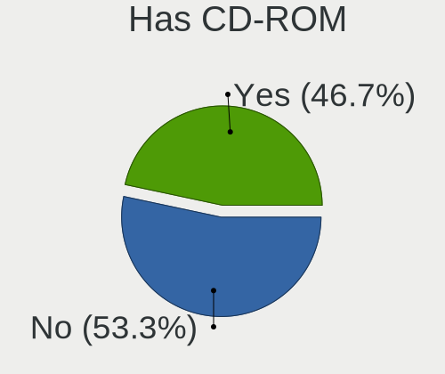
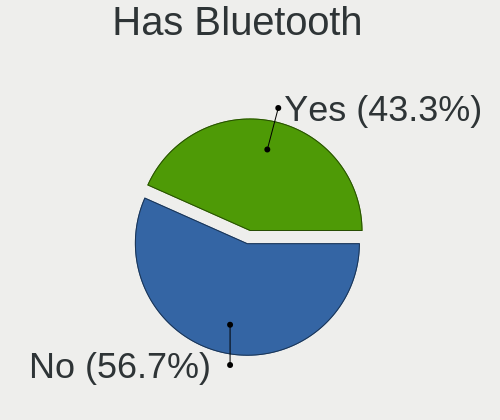
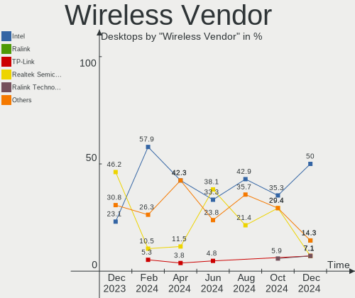
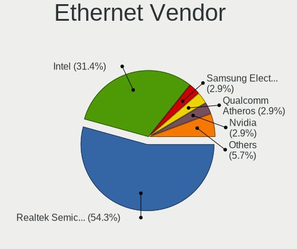
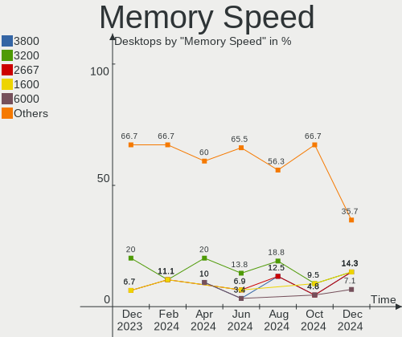
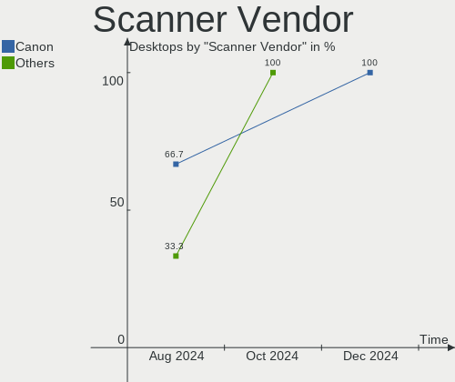

openSUSE Hardware Trends (Desktops)
-----------------------------------

A project to identify most popular hardware characteristics and track their change
over time based on data collected by openSUSE users at https://Linux-Hardware.org.

Anyone can contribute to this report by the [hw-probe](https://github.com/linuxhw/hw-probe) tool:

    sudo -E hw-probe -all -upload

Full-feature report is available here: https://linux-hardware.org/?view=trends&formfactor=desktop

Period: Sep, 2021.

Contents
--------

* [ System ](#system)
  - [ OS                       ](#os)
  - [ OS Family                ](#os-family)
  - [ Kernel                   ](#kernel)
  - [ Kernel Family            ](#kernel-family)
  - [ Kernel Major Ver.        ](#kernel-major-ver)
  - [ Arch                     ](#arch)
  - [ DE                       ](#de)
  - [ Display Server           ](#display-server)
  - [ Display Manager          ](#display-manager)
  - [ OS Lang                  ](#os-lang)
  - [ Boot Mode                ](#boot-mode)
  - [ Filesystem               ](#filesystem)
  - [ Part. scheme             ](#part-scheme)
  - [ Dual Boot with Linux/BSD ](#dual-boot-with-linuxbsd)
  - [ Dual Boot (Win)          ](#dual-boot-win)

* [ Board ](#board)
  - [ Vendor                   ](#vendor)
  - [ Model                    ](#model)
  - [ Model Family             ](#model-family)
  - [ MFG Year                 ](#mfg-year)
  - [ Form Factor              ](#form-factor)
  - [ Secure Boot              ](#secure-boot)
  - [ Coreboot                 ](#coreboot)
  - [ RAM Size                 ](#ram-size)
  - [ RAM Used                 ](#ram-used)
  - [ Total Drives             ](#total-drives)
  - [ Has CD-ROM               ](#has-cd-rom)
  - [ Has Ethernet             ](#has-ethernet)
  - [ Has WiFi                 ](#has-wifi)
  - [ Has Bluetooth            ](#has-bluetooth)

* [ Location ](#location)
  - [ Country                  ](#country)
  - [ City                     ](#city)

* [ Drives ](#drives)
  - [ Drive Vendor             ](#drive-vendor)
  - [ Drive Model              ](#drive-model)
  - [ HDD Vendor               ](#hdd-vendor)
  - [ SSD Vendor               ](#ssd-vendor)
  - [ Drive Kind               ](#drive-kind)
  - [ Drive Connector          ](#drive-connector)
  - [ Drive Size               ](#drive-size)
  - [ Space Total              ](#space-total)
  - [ Space Used               ](#space-used)
  - [ Malfunc. Drives          ](#malfunc-drives)
  - [ Malfunc. Drive Vendor    ](#malfunc-drive-vendor)
  - [ Malfunc. HDD Vendor      ](#malfunc-hdd-vendor)
  - [ Malfunc. Drive Kind      ](#malfunc-drive-kind)
  - [ Failed Drives            ](#failed-drives)
  - [ Failed Drive Vendor      ](#failed-drive-vendor)
  - [ Drive Status             ](#drive-status)

* [ Storage controller ](#storage-controller)
  - [ Storage Vendor           ](#storage-vendor)
  - [ Storage Model            ](#storage-model)
  - [ Storage Kind             ](#storage-kind)

* [ Processor ](#processor)
  - [ CPU Vendor               ](#cpu-vendor)
  - [ CPU Model                ](#cpu-model)
  - [ CPU Model Family         ](#cpu-model-family)
  - [ CPU Cores                ](#cpu-cores)
  - [ CPU Sockets              ](#cpu-sockets)
  - [ CPU Threads              ](#cpu-threads)
  - [ CPU Op-Modes             ](#cpu-op-modes)
  - [ CPU Microcode            ](#cpu-microcode)
  - [ CPU Microarch            ](#cpu-microarch)

* [ Graphics ](#graphics)
  - [ GPU Vendor               ](#gpu-vendor)
  - [ GPU Model                ](#gpu-model)
  - [ GPU Combo                ](#gpu-combo)
  - [ GPU Driver               ](#gpu-driver)
  - [ GPU Memory               ](#gpu-memory)

* [ Monitor ](#monitor)
  - [ Monitor Vendor           ](#monitor-vendor)
  - [ Monitor Model            ](#monitor-model)
  - [ Monitor Resolution       ](#monitor-resolution)
  - [ Monitor Diagonal         ](#monitor-diagonal)
  - [ Monitor Width            ](#monitor-width)
  - [ Aspect Ratio             ](#aspect-ratio)
  - [ Monitor Area             ](#monitor-area)
  - [ Pixel Density            ](#pixel-density)
  - [ Multiple Monitors        ](#multiple-monitors)

* [ Network ](#network)
  - [ Net Controller Vendor    ](#net-controller-vendor)
  - [ Net Controller Model     ](#net-controller-model)
  - [ Wireless Vendor          ](#wireless-vendor)
  - [ Wireless Model           ](#wireless-model)
  - [ Ethernet Vendor          ](#ethernet-vendor)
  - [ Ethernet Model           ](#ethernet-model)
  - [ Net Controller Kind      ](#net-controller-kind)
  - [ Used Controller          ](#used-controller)
  - [ NICs                     ](#nics)
  - [ IPv6                     ](#ipv6)

* [ Bluetooth ](#bluetooth)
  - [ Bluetooth Vendor         ](#bluetooth-vendor)
  - [ Bluetooth Model          ](#bluetooth-model)

* [ Sound ](#sound)
  - [ Sound Vendor             ](#sound-vendor)
  - [ Sound Model              ](#sound-model)

* [ Memory ](#memory)
  - [ Memory Vendor            ](#memory-vendor)
  - [ Memory Model             ](#memory-model)
  - [ Memory Kind              ](#memory-kind)
  - [ Memory Form Factor       ](#memory-form-factor)
  - [ Memory Size              ](#memory-size)
  - [ Memory Speed             ](#memory-speed)

* [ Printers & scanners ](#printers--scanners)
  - [ Printer Vendor           ](#printer-vendor)
  - [ Printer Model            ](#printer-model)
  - [ Scanner Vendor           ](#scanner-vendor)
  - [ Scanner Model            ](#scanner-model)

* [ Camera ](#camera)
  - [ Camera Vendor            ](#camera-vendor)
  - [ Camera Model             ](#camera-model)

* [ Security ](#security)
  - [ Fingerprint Vendor       ](#fingerprint-vendor)
  - [ Fingerprint Model        ](#fingerprint-model)
  - [ Chipcard Vendor          ](#chipcard-vendor)
  - [ Chipcard Model           ](#chipcard-model)

* [ Unsupported ](#unsupported)
  - [ Unsupported Devices      ](#unsupported-devices)
  - [ Unsupported Device Types ](#unsupported-device-types)

System
------

OS
--

Installed operating systems

| Name                         | Desktops | Percent |
|------------------------------|----------|---------|
| openSUSE Leap-15.3           | 8        | 42.11%  |
| openSUSE Tumbleweed-20210830 | 2        | 10.53%  |
| openSUSE 20210916            | 2        | 10.53%  |
| openSUSE 20210910            | 2        | 10.53%  |
| openSUSE Tumbleweed-20210910 | 1        | 5.26%   |
| openSUSE Tumbleweed-20210907 | 1        | 5.26%   |
| openSUSE Leap-15.2           | 1        | 5.26%   |
| openSUSE 20210902            | 1        | 5.26%   |
| openSUSE 20210524            | 1        | 5.26%   |

OS Family
---------

OS without a version

| Name     | Desktops | Percent |
|----------|----------|---------|
| openSUSE | 19       | 100%    |

Kernel
------

Version of the Linux kernel

| Version                 | Desktops | Percent |
|-------------------------|----------|---------|
| 5.3.18-59.19-default    | 6        | 31.58%  |
| 5.14.1-1-default        | 3        | 15.79%  |
| 5.14.2-1-default        | 2        | 10.53%  |
| 5.13.13-1-default       | 2        | 10.53%  |
| 5.13.12-2-default       | 2        | 10.53%  |
| 5.3.18-lp152.87-default | 1        | 5.26%   |
| 5.3.18-59.24-preempt    | 1        | 5.26%   |
| 5.3.18-59.19-preempt    | 1        | 5.26%   |
| 5.14.0-1-default        | 1        | 5.26%   |

Kernel Family
-------------

Linux kernel without a distro release

| Version | Desktops | Percent |
|---------|----------|---------|
| 5.3.18  | 9        | 47.37%  |
| 5.14.1  | 3        | 15.79%  |
| 5.14.2  | 2        | 10.53%  |
| 5.13.13 | 2        | 10.53%  |
| 5.13.12 | 2        | 10.53%  |
| 5.14.0  | 1        | 5.26%   |

Kernel Major Ver.
-----------------

Linux kernel major version

| Version | Desktops | Percent |
|---------|----------|---------|
| 5.3     | 9        | 47.37%  |
| 5.14    | 6        | 31.58%  |
| 5.13    | 4        | 21.05%  |

Arch
----

OS architecture (x86_64, i586, etc.)

| Name   | Desktops | Percent |
|--------|----------|---------|
| x86_64 | 19       | 100%    |

DE
--

Desktop Environment

| Name    | Desktops | Percent |
|---------|----------|---------|
| KDE5    | 8        | 42.11%  |
| KDE     | 6        | 31.58%  |
| GNOME   | 2        | 10.53%  |
| XFCE    | 1        | 5.26%   |
| MATE    | 1        | 5.26%   |
| Unknown | 1        | 5.26%   |

Display Server
--------------

X11 or Wayland

| Name        | Desktops | Percent |
|-------------|----------|---------|
| X11         | 16       | 84.21%  |
| Tty         | 2        | 10.53%  |
| Unspecified | 1        | 5.26%   |

Display Manager
---------------

SDDM, LightDM, etc.

| Name    | Desktops | Percent |
|---------|----------|---------|
| Unknown | 11       | 57.89%  |
| SDDM    | 5        | 26.32%  |
| LightDM | 2        | 10.53%  |
| XDM     | 1        | 5.26%   |

OS Lang
-------

Language

| Lang    | Desktops | Percent |
|---------|----------|---------|
| en_US   | 6        | 31.58%  |
| de_DE   | 6        | 31.58%  |
| pt_BR   | 2        | 10.53%  |
| POSIX   | 1        | 5.26%   |
| hr_HR   | 1        | 5.26%   |
| es_MX   | 1        | 5.26%   |
| es_ES   | 1        | 5.26%   |
| Unknown | 1        | 5.26%   |

Boot Mode
---------

EFI or BIOS

| Mode | Desktops | Percent |
|------|----------|---------|
| BIOS | 12       | 63.16%  |
| EFI  | 7        | 36.84%  |

Filesystem
----------

Type of filesystem

| Type  | Desktops | Percent |
|-------|----------|---------|
| Btrfs | 13       | 68.42%  |
| Ext4  | 5        | 26.32%  |
| Xfs   | 1        | 5.26%   |

Part. scheme
------------

Scheme of partitioning

| Type    | Desktops | Percent |
|---------|----------|---------|
| Unknown | 11       | 57.89%  |
| GPT     | 7        | 36.84%  |
| MBR     | 1        | 5.26%   |

Dual Boot with Linux/BSD
------------------------

Hosting more than one Linux/BSD

| Dual boot | Desktops | Percent |
|-----------|----------|---------|
| No        | 15       | 78.95%  |
| Yes       | 4        | 21.05%  |

Dual Boot (Win)
---------------

Hosting Linux and Windows

| Dual boot | Desktops | Percent |
|-----------|----------|---------|
| No        | 18       | 94.74%  |
| Yes       | 1        | 5.26%   |

Board
-----

Vendor
------

Motherboard manufacturer

| Name                | Desktops | Percent |
|---------------------|----------|---------|
| ASUSTek Computer    | 6        | 31.58%  |
| MSI                 | 4        | 21.05%  |
| Hewlett-Packard     | 2        | 10.53%  |
| Gigabyte Technology | 2        | 10.53%  |
| VS Company          | 1        | 5.26%   |
| Samsung Electronics | 1        | 5.26%   |
| Lenovo              | 1        | 5.26%   |
| Intel               | 1        | 5.26%   |
| Alienware           | 1        | 5.26%   |

Model
-----

Motherboard model

| Name                                         | Desktops | Percent |
|----------------------------------------------|----------|---------|
| MSI MS-7A33                                  | 2        | 10.53%  |
| VS Company VS-G31T-M                         | 1        | 5.26%   |
| Samsung 500T8A/500S8A/500T9A/500S9A          | 1        | 5.26%   |
| MSI MS-7D09                                  | 1        | 5.26%   |
| MSI MS-7B89                                  | 1        | 5.26%   |
| Lenovo IdeaCentre Y710 Cube-15ISH 90FL004WGE | 1        | 5.26%   |
| Intel DG41WV AAE90316-104                    | 1        | 5.26%   |
| HP Z1 Entry Tower G5                         | 1        | 5.26%   |
| HP EliteDesk 800 G2 DM 65W                   | 1        | 5.26%   |
| Gigabyte B85-HD3-A                           | 1        | 5.26%   |
| Gigabyte B450M GAMING                        | 1        | 5.26%   |
| ASUS PRIME A320M-K                           | 1        | 5.26%   |
| ASUS P8Z68 DELUXE/GEN3                       | 1        | 5.26%   |
| ASUS M4A89GTD-PRO/USB3                       | 1        | 5.26%   |
| ASUS M4A78T-E                                | 1        | 5.26%   |
| ASUS All Series                              | 1        | 5.26%   |
| ASUS 970 PRO GAMING/AURA                     | 1        | 5.26%   |
| Alienware X51 R2                             | 1        | 5.26%   |

Model Family
------------

Motherboard model prefix

| Name                 | Desktops | Percent |
|----------------------|----------|---------|
| MSI MS-7A33          | 2        | 10.53%  |
| VS Company VS-G31T-M | 1        | 5.26%   |
| Samsung 500T8A       | 1        | 5.26%   |
| MSI MS-7D09          | 1        | 5.26%   |
| MSI MS-7B89          | 1        | 5.26%   |
| Lenovo IdeaCentre    | 1        | 5.26%   |
| Intel DG41WV         | 1        | 5.26%   |
| HP Z1                | 1        | 5.26%   |
| HP EliteDesk         | 1        | 5.26%   |
| Gigabyte B85-HD3-A   | 1        | 5.26%   |
| Gigabyte B450M       | 1        | 5.26%   |
| ASUS PRIME           | 1        | 5.26%   |
| ASUS P8Z68           | 1        | 5.26%   |
| ASUS M4A89GTD-PRO    | 1        | 5.26%   |
| ASUS M4A78T-E        | 1        | 5.26%   |
| ASUS All             | 1        | 5.26%   |
| ASUS 970             | 1        | 5.26%   |
| Alienware X51        | 1        | 5.26%   |

MFG Year
--------

Motherboard manufacture year

| Year | Desktops | Percent |
|------|----------|---------|
| 2020 | 4        | 21.05%  |
| 2019 | 3        | 15.79%  |
| 2016 | 3        | 15.79%  |
| 2012 | 2        | 10.53%  |
| 2010 | 2        | 10.53%  |
| 2021 | 1        | 5.26%   |
| 2018 | 1        | 5.26%   |
| 2017 | 1        | 5.26%   |
| 2015 | 1        | 5.26%   |
| 2009 | 1        | 5.26%   |

Form Factor
-----------

Physical design of the computer

| Name    | Desktops | Percent |
|---------|----------|---------|
| Desktop | 19       | 100%    |

Secure Boot
-----------

Enabled or disabled

| State    | Desktops | Percent |
|----------|----------|---------|
| Disabled | 19       | 100%    |

Coreboot
--------

Have coreboot on board

| Used | Desktops | Percent |
|------|----------|---------|
| No   | 19       | 100%    |

RAM Size
--------

Total RAM memory

| Size in GB | Desktops | Percent |
|------------|----------|---------|
| 16.01-24.0 | 9        | 47.37%  |
| 8.01-16.0  | 4        | 21.05%  |
| 4.01-8.0   | 2        | 10.53%  |
| 32.01-64.0 | 2        | 10.53%  |
| 3.01-4.0   | 2        | 10.53%  |

RAM Used
--------

Used RAM memory

| Used GB   | Desktops | Percent |
|-----------|----------|---------|
| 4.01-8.0  | 5        | 26.32%  |
| 1.01-2.0  | 5        | 26.32%  |
| 3.01-4.0  | 3        | 15.79%  |
| 2.01-3.0  | 3        | 15.79%  |
| 8.01-16.0 | 1        | 5.26%   |
| 0.51-1.0  | 1        | 5.26%   |
| 0.01-0.5  | 1        | 5.26%   |

Total Drives
------------

Number of drives on board

| Drives | Desktops | Percent |
|--------|----------|---------|
| 2      | 5        | 26.32%  |
| 1      | 5        | 26.32%  |
| 3      | 4        | 21.05%  |
| 4      | 2        | 10.53%  |
| 7      | 1        | 5.26%   |
| 6      | 1        | 5.26%   |
| 5      | 1        | 5.26%   |

Has CD-ROM
----------

Has CD-ROM on board

| Presented | Desktops | Percent |
|-----------|----------|---------|
| No        | 11       | 57.89%  |
| Yes       | 8        | 42.11%  |

Has Ethernet
------------

Has Ethernet on board

| Presented | Desktops | Percent |
|-----------|----------|---------|
| Yes       | 19       | 100%    |

Has WiFi
--------

Has WiFi module

| Presented | Desktops | Percent |
|-----------|----------|---------|
| No        | 10       | 52.63%  |
| Yes       | 9        | 47.37%  |

Has Bluetooth
-------------

Has Bluetooth module

| Presented | Desktops | Percent |
|-----------|----------|---------|
| No        | 12       | 63.16%  |
| Yes       | 7        | 36.84%  |

Location
--------

Country
-------

Geographic location (country)

| Country     | Desktops | Percent |
|-------------|----------|---------|
| Germany     | 8        | 42.11%  |
| Brazil      | 3        | 15.79%  |
| Mexico      | 2        | 10.53%  |
| USA         | 1        | 5.26%   |
| Spain       | 1        | 5.26%   |
| South Korea | 1        | 5.26%   |
| Luxembourg  | 1        | 5.26%   |
| El Salvador | 1        | 5.26%   |
| Croatia     | 1        | 5.26%   |

City
----

Geographic location (city)

| City                  | Desktops | Percent |
|-----------------------|----------|---------|
| Schlangenbad          | 2        | 10.53%  |
| San Salvador          | 1        | 5.26%   |
| San Luis Potos?­ City | 1        | 5.26%   |
| Recife                | 1        | 5.26%   |
| Pueblo                | 1        | 5.26%   |
| Paderborn             | 1        | 5.26%   |
| Nordenham             | 1        | 5.26%   |
| M?©rida               | 1        | 5.26%   |
| Mahlow                | 1        | 5.26%   |
| Luxembourg            | 1        | 5.26%   |
| Durmersheim           | 1        | 5.26%   |
| Duisburg              | 1        | 5.26%   |
| Chapec??              | 1        | 5.26%   |
| Canc??n               | 1        | 5.26%   |
| Busevec               | 1        | 5.26%   |
| Braunschweig          | 1        | 5.26%   |
| Bebedouro             | 1        | 5.26%   |
| Anyang-si             | 1        | 5.26%   |

Drives
------

Drive Vendor
------------

Hard drive vendors

| Vendor                    | Desktops | Drives | Percent |
|---------------------------|----------|--------|---------|
| WDC                       | 14       | 23     | 35.9%   |
| Seagate                   | 6        | 8      | 15.38%  |
| Samsung Electronics       | 6        | 9      | 15.38%  |
| Unknown                   | 2        | 2      | 5.13%   |
| SanDisk                   | 2        | 2      | 5.13%   |
| SK Hynix                  | 1        | 1      | 2.56%   |
| SABRENT                   | 1        | 1      | 2.56%   |
| Micron/Crucial Technology | 1        | 1      | 2.56%   |
| Kingston                  | 1        | 1      | 2.56%   |
| Intenso                   | 1        | 1      | 2.56%   |
| imation                   | 1        | 1      | 2.56%   |
| HGST HTS                  | 1        | 1      | 2.56%   |
| Crucial                   | 1        | 1      | 2.56%   |
| A-DATA Technology         | 1        | 1      | 2.56%   |

Drive Model
-----------

Hard drive models

| Model                                   | Desktops | Percent |
|-----------------------------------------|----------|---------|
| WDC WD10EZEX-08WN4A0 1TB                | 2        | 3.77%   |
| WDC WDS250G1B0C-00S6U0 250GB            | 1        | 1.89%   |
| WDC WDS100T1B0A-00H9H0 1TB SSD          | 1        | 1.89%   |
| WDC WD7502AAEX-00Y9A0 752GB             | 1        | 1.89%   |
| WDC WD5002AALX-00J37A0 500GB            | 1        | 1.89%   |
| WDC WD5000AAVS-00ZTB0 500GB             | 1        | 1.89%   |
| WDC WD50 00LPCX-00VHAT0 500GB           | 1        | 1.89%   |
| WDC WD40EZAZ-00SF3B0 4TB                | 1        | 1.89%   |
| WDC WD30EFRX-68AX9N0 3TB                | 1        | 1.89%   |
| WDC WD20EZRZ-00Z5HB0 2TB                | 1        | 1.89%   |
| WDC WD20EADS-00R6B0 2TB                 | 1        | 1.89%   |
| WDC WD2005FBYZ-01YCBB2 2TB              | 1        | 1.89%   |
| WDC WD10SPZX-22Z10T1 1TB                | 1        | 1.89%   |
| WDC WD10EZEX-75M2NA0 1TB                | 1        | 1.89%   |
| WDC WD10EZEX-60ZF5A0 1TB                | 1        | 1.89%   |
| WDC WD10EZEX-60WN4A0 1TB                | 1        | 1.89%   |
| WDC WD10EZEX-35WN4A0 1TB                | 1        | 1.89%   |
| WDC WD10EZEX-22MFCA0 1TB                | 1        | 1.89%   |
| WDC WD10EZEX-08RKKA0 1TB                | 1        | 1.89%   |
| WDC WD10EZEX-00KUWA0 1TB                | 1        | 1.89%   |
| WDC WD10EACS-00D6B1 1TB                 | 1        | 1.89%   |
| WDC WD1002FAEX-00Z3A0 1TB               | 1        | 1.89%   |
| Unknown SD/MMC/MS PRO 128GB             | 1        | 1.89%   |
| Unknown 128GB SATA FLASH DRIVE          | 1        | 1.89%   |
| SK Hynix BC511 HFM256GDJTNI-82A0A 256GB | 1        | 1.89%   |
| Seagate ST500LM0 12 HN-M500MBB 500GB    | 1        | 1.89%   |
| Seagate ST3750630AS 752GB               | 1        | 1.89%   |
| Seagate ST3750528AS 752GB               | 1        | 1.89%   |
| Seagate ST2000DX001-1CM164 2TB          | 1        | 1.89%   |
| Seagate ST2000DM006-2DM164 2TB          | 1        | 1.89%   |
| Seagate ST2000DM001-1ER164 2TB          | 1        | 1.89%   |
| Seagate ST1000LM024 HN-M101MBB 1TB      | 1        | 1.89%   |
| Seagate ST1000DM010-2EP102 1TB          | 1        | 1.89%   |
| SanDisk SD7SB6S256G1001 256GB SSD       | 1        | 1.89%   |
| SanDisk SD7SB3Q-256G-1006 256GB SSD     | 1        | 1.89%   |
| Samsung SSD 970 PRO 512GB               | 1        | 1.89%   |
| Samsung SSD 970 EVO Plus 1TB            | 1        | 1.89%   |
| Samsung SSD 970 EVO 1TB                 | 1        | 1.89%   |
| Samsung SSD 860 PRO 1TB                 | 1        | 1.89%   |
| Samsung SSD 860 EVO 500GB               | 1        | 1.89%   |
| Samsung SSD 860 EVO 1TB                 | 1        | 1.89%   |
| Samsung SSD 850 PRO 256GB               | 1        | 1.89%   |
| Samsung SSD 850 EVO 500GB               | 1        | 1.89%   |
| Samsung SSD 850 EVO 250GB               | 1        | 1.89%   |
| SABRENT Disk 1TB                        | 1        | 1.89%   |
| Micron/Crucial NVMe SSD Drive 1TB       | 1        | 1.89%   |
| Kingston SA400S37120G 120GB SSD         | 1        | 1.89%   |
| Intenso External USB 3.0 2TB            | 1        | 1.89%   |
| imation M.2 SATA3 256GB SSD V531        | 1        | 1.89%   |
| HGST HTS 545050A7E380 500GB             | 1        | 1.89%   |
| Crucial CT1000P2SSD8 1TB                | 1        | 1.89%   |
| A-DATA SSD 32GB                         | 1        | 1.89%   |

HDD Vendor
----------

Hard disk drive vendors

| Vendor  | Desktops | Drives | Percent |
|---------|----------|--------|---------|
| WDC     | 13       | 21     | 61.9%   |
| Seagate | 6        | 8      | 28.57%  |
| Unknown | 1        | 1      | 4.76%   |
| Intenso | 1        | 1      | 4.76%   |

SSD Vendor
----------

Solid state drive vendors

| Vendor              | Desktops | Drives | Percent |
|---------------------|----------|--------|---------|
| Samsung Electronics | 4        | 6      | 36.36%  |
| SanDisk             | 2        | 2      | 18.18%  |
| WDC                 | 1        | 1      | 9.09%   |
| SABRENT             | 1        | 1      | 9.09%   |
| Kingston            | 1        | 1      | 9.09%   |
| imation             | 1        | 1      | 9.09%   |
| A-DATA Technology   | 1        | 1      | 9.09%   |

Drive Kind
----------

HDD or SSD

| Kind    | Desktops | Drives | Percent |
|---------|----------|--------|---------|
| HDD     | 16       | 31     | 48.48%  |
| SSD     | 10       | 13     | 30.3%   |
| NVMe    | 6        | 7      | 18.18%  |
| Unknown | 1        | 2      | 3.03%   |

Drive Connector
---------------

SATA, SAS, NVMe, etc.

| Type | Desktops | Drives | Percent |
|------|----------|--------|---------|
| SATA | 18       | 40     | 64.29%  |
| NVMe | 6        | 7      | 21.43%  |
| SAS  | 4        | 6      | 14.29%  |

Drive Size
----------

Size of hard drive

| Size in TB | Desktops | Drives | Percent |
|------------|----------|--------|---------|
| 0.51-1.0   | 16       | 21     | 48.48%  |
| 0.01-0.5   | 9        | 14     | 27.27%  |
| 1.01-2.0   | 6        | 7      | 18.18%  |
| 3.01-4.0   | 1        | 1      | 3.03%   |
| 2.01-3.0   | 1        | 1      | 3.03%   |

Space Total
-----------

Amount of disk space available on the file system

| Size in GB     | Desktops | Percent |
|----------------|----------|---------|
| 1001-2000      | 6        | 31.58%  |
| 2001-3000      | 5        | 26.32%  |
| More than 3000 | 4        | 21.05%  |
| 251-500        | 2        | 10.53%  |
| 501-1000       | 2        | 10.53%  |

Space Used
----------

Amount of used disk space

| Used GB        | Desktops | Percent |
|----------------|----------|---------|
| 1001-2000      | 5        | 26.32%  |
| 101-250        | 4        | 21.05%  |
| 501-1000       | 4        | 21.05%  |
| 251-500        | 3        | 15.79%  |
| More than 3000 | 1        | 5.26%   |
| 2001-3000      | 1        | 5.26%   |
| 51-100         | 1        | 5.26%   |

Malfunc. Drives
---------------

Drive models with a malfunction

| Model                          | Desktops | Drives | Percent |
|--------------------------------|----------|--------|---------|
| Seagate ST2000DM001-1ER164 2TB | 1        | 1      | 100%    |

Malfunc. Drive Vendor
---------------------

Vendors of faulty drives

| Vendor  | Desktops | Drives | Percent |
|---------|----------|--------|---------|
| Seagate | 1        | 1      | 100%    |

Malfunc. HDD Vendor
-------------------

Vendors of faulty HDD drives

| Vendor  | Desktops | Drives | Percent |
|---------|----------|--------|---------|
| Seagate | 1        | 1      | 100%    |

Malfunc. Drive Kind
-------------------

Kinds of faulty drives

| Kind | Desktops | Drives | Percent |
|------|----------|--------|---------|
| HDD  | 1        | 1      | 100%    |

Failed Drives
-------------

Failed drive models

Zero info for selected period =(

Failed Drive Vendor
-------------------

Failed drive vendors

Zero info for selected period =(

Drive Status
------------

Number of failed and malfunc. drives

| Status   | Desktops | Drives | Percent |
|----------|----------|--------|---------|
| Detected | 12       | 33     | 60%     |
| Works    | 7        | 19     | 35%     |
| Malfunc  | 1        | 1      | 5%      |

Storage controller
------------------

Storage Vendor
--------------

Storage controller vendors

| Vendor                    | Desktops | Percent |
|---------------------------|----------|---------|
| Intel                     | 10       | 33.33%  |
| AMD                       | 9        | 30%     |
| Samsung Electronics       | 3        | 10%     |
| Micron/Crucial Technology | 2        | 6.67%   |
| SK Hynix                  | 1        | 3.33%   |
| Silicon Image             | 1        | 3.33%   |
| Sandisk                   | 1        | 3.33%   |
| Marvell Technology Group  | 1        | 3.33%   |
| JMicron Technology        | 1        | 3.33%   |
| ASMedia Technology        | 1        | 3.33%   |

Storage Model
-------------

Storage controller models

| Model                                                                          | Desktops | Percent |
|--------------------------------------------------------------------------------|----------|---------|
| AMD FCH SATA Controller [AHCI mode]                                            | 5        | 13.89%  |
| Samsung NVMe SSD Controller SM981/PM981/PM983                                  | 3        | 8.33%   |
| Intel Q170/Q150/B150/H170/H110/Z170/CM236 Chipset SATA Controller [AHCI Mode]  | 2        | 5.56%   |
| Intel NM10/ICH7 Family SATA Controller [IDE mode]                              | 2        | 5.56%   |
| Intel Cannon Lake PCH SATA AHCI Controller                                     | 2        | 5.56%   |
| AMD X370 Series Chipset SATA Controller                                        | 2        | 5.56%   |
| AMD SB7x0/SB8x0/SB9x0 SATA Controller [AHCI mode]                              | 2        | 5.56%   |
| AMD SB7x0/SB8x0/SB9x0 IDE Controller                                           | 2        | 5.56%   |
| AMD 400 Series Chipset SATA Controller                                         | 2        | 5.56%   |
| SK Hynix BC511                                                                 | 1        | 2.78%   |
| Silicon Image SiI 3132 Serial ATA Raid II Controller                           | 1        | 2.78%   |
| Sandisk WD Blue SN500 / PC SN520 NVMe SSD                                      | 1        | 2.78%   |
| Micron/Crucial P2 NVMe PCIe SSD                                                | 1        | 2.78%   |
| Micron/Crucial P1 NVMe PCIe SSD                                                | 1        | 2.78%   |
| Marvell Group 88SE9128 PCIe SATA 6 Gb/s RAID controller with HyperDuo          | 1        | 2.78%   |
| JMicron JMB362 SATA Controller                                                 | 1        | 2.78%   |
| Intel SATA Controller [RAID mode]                                              | 1        | 2.78%   |
| Intel 82801G (ICH7 Family) IDE Controller                                      | 1        | 2.78%   |
| Intel 8 Series/C220 Series Chipset Family 6-port SATA Controller 1 [AHCI mode] | 1        | 2.78%   |
| Intel 6 Series/C200 Series Chipset Family 6 port Desktop SATA AHCI Controller  | 1        | 2.78%   |
| Intel 500 Series Chipset Family SATA AHCI Controller                           | 1        | 2.78%   |
| ASMedia 106x SATA/RAID Controller                                              | 1        | 2.78%   |
| AMD FCH SATA Controller D                                                      | 1        | 2.78%   |

Storage Kind
------------

Kind of storage controller (IDE, SATA, NVMe, SAS, ...)

| Kind | Desktops | Percent |
|------|----------|---------|
| SATA | 15       | 55.56%  |
| NVMe | 6        | 22.22%  |
| IDE  | 4        | 14.81%  |
| RAID | 2        | 7.41%   |

Processor
---------

CPU Vendor
----------

Processor vendors

| Vendor | Desktops | Percent |
|--------|----------|---------|
| Intel  | 10       | 52.63%  |
| AMD    | 9        | 47.37%  |

CPU Model
---------

Processor models

| Model                                       | Desktops | Percent |
|---------------------------------------------|----------|---------|
| Intel Core i7-4790 CPU @ 3.60GHz            | 2        | 10.53%  |
| Intel Pentium Gold G5400 CPU @ 3.70GHz      | 1        | 5.26%   |
| Intel Core i7-9700K CPU @ 3.60GHz           | 1        | 5.26%   |
| Intel Core i7-6700 CPU @ 3.40GHz            | 1        | 5.26%   |
| Intel Core i7-2700K CPU @ 3.50GHz           | 1        | 5.26%   |
| Intel Core i5-6400 CPU @ 2.70GHz            | 1        | 5.26%   |
| Intel Core 2 Quad CPU Q9300 @ 2.50GHz       | 1        | 5.26%   |
| Intel Core 2 Duo CPU E7400 @ 2.80GHz        | 1        | 5.26%   |
| Intel 11th Gen Core i9-11900KF @ 3.50GHz    | 1        | 5.26%   |
| AMD Sempron 2650 APU with Radeon R3         | 1        | 5.26%   |
| AMD Ryzen 7 1800X Eight-Core Processor      | 1        | 5.26%   |
| AMD Ryzen 7 1700 Eight-Core Processor       | 1        | 5.26%   |
| AMD Ryzen 5 3600 6-Core Processor           | 1        | 5.26%   |
| AMD Ryzen 5 1600 Six-Core Processor         | 1        | 5.26%   |
| AMD Ryzen 3 2200G with Radeon Vega Graphics | 1        | 5.26%   |
| AMD Phenom II X4 B50 Processor              | 1        | 5.26%   |
| AMD Phenom II X4 965 Processor              | 1        | 5.26%   |
| AMD FX-8350 Eight-Core Processor            | 1        | 5.26%   |

CPU Model Family
----------------

Processor model prefix

| Model              | Desktops | Percent |
|--------------------|----------|---------|
| Intel Core i7      | 5        | 26.32%  |
| AMD Ryzen 7        | 2        | 10.53%  |
| AMD Ryzen 5        | 2        | 10.53%  |
| AMD Phenom II X4   | 2        | 10.53%  |
| Other              | 1        | 5.26%   |
| Intel Pentium Gold | 1        | 5.26%   |
| Intel Core i5      | 1        | 5.26%   |
| Intel Core 2 Quad  | 1        | 5.26%   |
| Intel Core 2 Duo   | 1        | 5.26%   |
| AMD Sempron        | 1        | 5.26%   |
| AMD Ryzen 3        | 1        | 5.26%   |
| AMD FX             | 1        | 5.26%   |

CPU Cores
---------

Number of processor cores

| Number | Desktops | Percent |
|--------|----------|---------|
| 4      | 10       | 52.63%  |
| 8      | 4        | 21.05%  |
| 2      | 3        | 15.79%  |
| 6      | 2        | 10.53%  |

CPU Sockets
-----------

Number of sockets

| Number | Desktops | Percent |
|--------|----------|---------|
| 1      | 19       | 100%    |

CPU Threads
-----------

Threads per core (Hyper-Threading)

| Number | Desktops | Percent |
|--------|----------|---------|
| 2      | 11       | 57.89%  |
| 1      | 8        | 42.11%  |

CPU Op-Modes
------------

CPU Operation Modes (32-bit, 64-bit)

| Op mode        | Desktops | Percent |
|----------------|----------|---------|
| 32-bit, 64-bit | 19       | 100%    |

CPU Microcode
-------------

Microcode number

| Number     | Desktops | Percent |
|------------|----------|---------|
| Unknown    | 6        | 31.58%  |
| 0x08001137 | 2        | 10.53%  |
| 0xa0671    | 1        | 5.26%   |
| 0x906ed    | 1        | 5.26%   |
| 0x906ea    | 1        | 5.26%   |
| 0x306c3    | 1        | 5.26%   |
| 0x206a7    | 1        | 5.26%   |
| 0x10677    | 1        | 5.26%   |
| 0x08701021 | 1        | 5.26%   |
| 0x08101016 | 1        | 5.26%   |
| 0x08001138 | 1        | 5.26%   |
| 0x06000852 | 1        | 5.26%   |
| 0x010000c8 | 1        | 5.26%   |

CPU Microarch
-------------

Microarchitecture

| Name        | Desktops | Percent |
|-------------|----------|---------|
| Zen         | 4        | 21.05%  |
| Skylake     | 2        | 10.53%  |
| Penryn      | 2        | 10.53%  |
| KabyLake    | 2        | 10.53%  |
| K10         | 2        | 10.53%  |
| Haswell     | 2        | 10.53%  |
| Zen 2       | 1        | 5.26%   |
| SandyBridge | 1        | 5.26%   |
| Piledriver  | 1        | 5.26%   |
| Jaguar      | 1        | 5.26%   |
| Icelake     | 1        | 5.26%   |

Graphics
--------

GPU Vendor
----------

Vendors of graphics cards

| Vendor | Desktops | Percent |
|--------|----------|---------|
| AMD    | 8        | 38.1%   |
| Nvidia | 7        | 33.33%  |
| Intel  | 6        | 28.57%  |

GPU Model
---------

Graphics card models

| Model                                                                       | Desktops | Percent |
|-----------------------------------------------------------------------------|----------|---------|
| Nvidia TU106 [GeForce RTX 2060 Rev. A]                                      | 1        | 4.55%   |
| Nvidia GP107 [GeForce GTX 1050 Ti]                                          | 1        | 4.55%   |
| Nvidia GP106 [GeForce GTX 1060 6GB]                                         | 1        | 4.55%   |
| Nvidia GP104 [GeForce GTX 1080]                                             | 1        | 4.55%   |
| Nvidia GP104 [GeForce GTX 1070]                                             | 1        | 4.55%   |
| Nvidia GM204 [GeForce GTX 980]                                              | 1        | 4.55%   |
| Nvidia GM204 [GeForce GTX 970]                                              | 1        | 4.55%   |
| Nvidia GA102 [GeForce RTX 3080 Ti]                                          | 1        | 4.55%   |
| Intel Xeon E3-1200 v3/4th Gen Core Processor Integrated Graphics Controller | 1        | 4.55%   |
| Intel HD Graphics 530                                                       | 1        | 4.55%   |
| Intel CoffeeLake-S GT2 [UHD Graphics 630]                                   | 1        | 4.55%   |
| Intel CoffeeLake-S GT1 [UHD Graphics 610]                                   | 1        | 4.55%   |
| Intel 4 Series Chipset Integrated Graphics Controller                       | 1        | 4.55%   |
| Intel 2nd Generation Core Processor Family Integrated Graphics Controller   | 1        | 4.55%   |
| AMD Tonga PRO [Radeon R9 285/380]                                           | 1        | 4.55%   |
| AMD RV610 [Radeon HD 2400 PRO]                                              | 1        | 4.55%   |
| AMD Raven Ridge [Radeon Vega Series / Radeon Vega Mobile Series]            | 1        | 4.55%   |
| AMD Navi 23 [Radeon RX 6600/6600 XT/6600M]                                  | 1        | 4.55%   |
| AMD Kabini [Radeon HD 8240 / R3 Series]                                     | 1        | 4.55%   |
| AMD Juniper XT [Radeon HD 5770]                                             | 1        | 4.55%   |
| AMD Ellesmere [Radeon RX 470/480/570/570X/580/580X/590]                     | 1        | 4.55%   |
| AMD Curacao PRO [Radeon R7 370 / R9 270/370 OEM]                            | 1        | 4.55%   |

GPU Combo
---------

Combinations of graphics cards

| Name           | Desktops | Percent |
|----------------|----------|---------|
| 1 x AMD        | 8        | 42.11%  |
| 1 x Nvidia     | 5        | 26.32%  |
| 1 x Intel      | 3        | 15.79%  |
| Other          | 1        | 5.26%   |
| 2 x Nvidia     | 1        | 5.26%   |
| Intel + Nvidia | 1        | 5.26%   |

GPU Driver
----------

Free vs proprietary

| Driver      | Desktops | Percent |
|-------------|----------|---------|
| Free        | 12       | 63.16%  |
| Proprietary | 5        | 26.32%  |
| Unknown     | 2        | 10.53%  |

GPU Memory
----------

Total video memory

| Size in GB | Desktops | Percent |
|------------|----------|---------|
| Unknown    | 10       | 52.63%  |
| 3.01-4.0   | 4        | 21.05%  |
| 7.01-8.0   | 2        | 10.53%  |
| 5.01-6.0   | 1        | 5.26%   |
| 1.01-2.0   | 1        | 5.26%   |
| 8.01-16.0  | 1        | 5.26%   |

Monitor
-------

Monitor Vendor
--------------

Monitor vendors

| Vendor              | Desktops | Percent |
|---------------------|----------|---------|
| Samsung Electronics | 6        | 26.09%  |
| Dell                | 3        | 13.04%  |
| Goldstar            | 2        | 8.7%    |
| BenQ                | 2        | 8.7%    |
| ASUSTek Computer    | 2        | 8.7%    |
| Acer                | 2        | 8.7%    |
| Unknown             | 1        | 4.35%   |
| Philips             | 1        | 4.35%   |
| Lenovo              | 1        | 4.35%   |
| Hewlett-Packard     | 1        | 4.35%   |
| Fujitsu Siemens     | 1        | 4.35%   |
| Denver              | 1        | 4.35%   |

Monitor Model
-------------

Monitor models

| Model                                                                | Desktops | Percent |
|----------------------------------------------------------------------|----------|---------|
| Unknown LCD Monitor SAMSUNG                                          | 1        | 4.35%   |
| Samsung Electronics SA300/SA350 SAM0788 1366x768 410x230mm 18.5-inch | 1        | 4.35%   |
| Samsung Electronics S24D330 SAM0D92 1920x1080 531x299mm 24.0-inch    | 1        | 4.35%   |
| Samsung Electronics S23B550 SAM0919 1920x1080 510x287mm 23.0-inch    | 1        | 4.35%   |
| Samsung Electronics LCD Monitor SyncMaster 1920x1080                 | 1        | 4.35%   |
| Samsung Electronics LCD Monitor S27A950D 5760x2160                   | 1        | 4.35%   |
| Samsung Electronics C27F390 SAM0D32 1920x1080 600x340mm 27.2-inch    | 1        | 4.35%   |
| Philips PHL 223V5LH PHLC114 1920x1080 477x268mm 21.5-inch            | 1        | 4.35%   |
| Lenovo LEN L1900pA LEN114F 1280x1024 376x301mm 19.0-inch             | 1        | 4.35%   |
| Hewlett-Packard E273m HPN346E 1920x1080 598x336mm 27.0-inch          | 1        | 4.35%   |
| Goldstar L1718S GSM443C 1280x1024 338x270mm 17.0-inch                | 1        | 4.35%   |
| Goldstar E2441 GSM581F 1920x1080 531x299mm 24.0-inch                 | 1        | 4.35%   |
| Fujitsu Siemens E22W-5 FUS07D0 1680x1050 470x300mm 22.0-inch         | 1        | 4.35%   |
| Denver UWQHD-100-V2 LHC3500 3440x1440 798x342mm 34.2-inch            | 1        | 4.35%   |
| Dell UZ2315H DELF055 1920x1080 509x286mm 23.0-inch                   | 1        | 4.35%   |
| Dell P2418D DELD0C1 2560x1440 526x296mm 23.8-inch                    | 1        | 4.35%   |
| Dell P2219H DELA114 1920x1080 476x267mm 21.5-inch                    | 1        | 4.35%   |
| BenQ T52W BNQ771F 1280x720 332x187mm 15.0-inch                       | 1        | 4.35%   |
| BenQ BL2405 BNQ8016 1920x1080 531x298mm 24.0-inch                    | 1        | 4.35%   |
| ASUSTek Computer VL279 AUS2781 1920x1080 598x336mm 27.0-inch         | 1        | 4.35%   |
| ASUSTek Computer VG278 AUS27AF 1920x1080 598x336mm 27.0-inch         | 1        | 4.35%   |
| Acer X163W ACR0015 1366x768 344x193mm 15.5-inch                      | 1        | 4.35%   |
| Acer GD245HQ ACR0125 1920x1080 520x290mm 23.4-inch                   | 1        | 4.35%   |

Monitor Resolution
------------------

Monitor screen resolution

| Resolution         | Desktops | Percent |
|--------------------|----------|---------|
| 1920x1080 (FHD)    | 11       | 55%     |
| 1280x1024 (SXGA)   | 2        | 10%     |
| 5760x2160          | 1        | 5%      |
| 3440x1440          | 1        | 5%      |
| 2560x1440 (QHD)    | 1        | 5%      |
| 1680x1050 (WSXGA+) | 1        | 5%      |
| 1366x768 (WXGA)    | 1        | 5%      |
| 1280x720 (HD)      | 1        | 5%      |
| Unknown            | 1        | 5%      |

Monitor Diagonal
----------------

Diagonal size in inches

| Inches  | Desktops | Percent |
|---------|----------|---------|
| 27      | 4        | 20%     |
| 24      | 3        | 15%     |
| 23      | 2        | 10%     |
| 21      | 2        | 10%     |
| 15      | 2        | 10%     |
| Unknown | 2        | 10%     |
| 34      | 1        | 5%      |
| 22      | 1        | 5%      |
| 20      | 1        | 5%      |
| 18      | 1        | 5%      |
| 17      | 1        | 5%      |

Monitor Width
-------------

Physical width

| Width in mm | Desktops | Percent |
|-------------|----------|---------|
| 501-600     | 9        | 45%     |
| 401-500     | 4        | 20%     |
| 301-350     | 3        | 15%     |
| Unknown     | 2        | 10%     |
| 701-800     | 1        | 5%      |
| 351-400     | 1        | 5%      |

Aspect Ratio
------------

Proportional relationship between the width and the height

| Ratio   | Desktops | Percent |
|---------|----------|---------|
| 16/9    | 13       | 68.42%  |
| 5/4     | 2        | 10.53%  |
| Unknown | 2        | 10.53%  |
| 21/9    | 1        | 5.26%   |
| 16/10   | 1        | 5.26%   |

Monitor Area
------------

Area in inch²

| Area in inch² | Desktops | Percent |
|----------------|----------|---------|
| 201-250        | 8        | 40%     |
| 301-350        | 4        | 20%     |
| 141-150        | 2        | 10%     |
| Unknown        | 2        | 10%     |
| 351-500        | 1        | 5%      |
| 151-200        | 1        | 5%      |
| 101-110        | 1        | 5%      |
| 91-100         | 1        | 5%      |

Pixel Density
-------------

Pixels per inch

| Density | Desktops | Percent |
|---------|----------|---------|
| 51-100  | 12       | 63.16%  |
| 101-120 | 4        | 21.05%  |
| Unknown | 2        | 10.53%  |
| 121-160 | 1        | 5.26%   |

Multiple Monitors
-----------------

Total monitors connected

| Total | Desktops | Percent |
|-------|----------|---------|
| 1     | 13       | 68.42%  |
| 2     | 5        | 26.32%  |
| 0     | 1        | 5.26%   |

Network
-------

Net Controller Vendor
---------------------

Controller vendors

| Vendor                | Desktops | Percent |
|-----------------------|----------|---------|
| Realtek Semiconductor | 13       | 46.43%  |
| Intel                 | 7        | 25%     |
| Qualcomm Atheros      | 2        | 7.14%   |
| Samsung Electronics   | 1        | 3.57%   |
| Ralink                | 1        | 3.57%   |
| Holtek Semiconductor  | 1        | 3.57%   |
| Broadcom Limited      | 1        | 3.57%   |
| AVM                   | 1        | 3.57%   |
| Aquantia              | 1        | 3.57%   |

Net Controller Model
--------------------

Controller models

| Model                                                             | Desktops | Percent |
|-------------------------------------------------------------------|----------|---------|
| Realtek RTL8111/8168/8411 PCI Express Gigabit Ethernet Controller | 12       | 37.5%   |
| Samsung Galaxy series, misc. (tethering mode)                     | 1        | 3.13%   |
| Realtek RTL8191SEvB Wireless LAN Controller                       | 1        | 3.13%   |
| Realtek RTL8188CE 802.11b/g/n WiFi Adapter                        | 1        | 3.13%   |
| Realtek RTL810xE PCI Express Fast Ethernet controller             | 1        | 3.13%   |
| Ralink RT2561/RT61 802.11g PCI                                    | 1        | 3.13%   |
| Qualcomm Atheros QCA6174 802.11ac Wireless Network Adapter        | 1        | 3.13%   |
| Qualcomm Atheros Killer E2400 Gigabit Ethernet Controller         | 1        | 3.13%   |
| Qualcomm Atheros AR8121/AR8113/AR8114 Gigabit or Fast Ethernet    | 1        | 3.13%   |
| Intel Wireless 8260                                               | 1        | 3.13%   |
| Intel Wi-Fi 6 AX200                                               | 1        | 3.13%   |
| Intel I211 Gigabit Network Connection                             | 1        | 3.13%   |
| Intel Ethernet Controller I225-V                                  | 1        | 3.13%   |
| Intel Ethernet Connection (7) I219-LM                             | 1        | 3.13%   |
| Intel Ethernet Connection (2) I219-LM                             | 1        | 3.13%   |
| Intel Cannon Lake PCH CNVi WiFi                                   | 1        | 3.13%   |
| Intel 82579V Gigabit Network Connection                           | 1        | 3.13%   |
| Holtek SKILLER SGM1                                               | 1        | 3.13%   |
| Broadcom Limited BCM4352 802.11ac Wireless Network Adapter        | 1        | 3.13%   |
| AVM Fritz!WLAN N v2 [Atheros AR9271]                              | 1        | 3.13%   |
| Aquantia AQC107 NBase-T/IEEE 802.3bz Ethernet Controller [AQtion] | 1        | 3.13%   |

Wireless Vendor
---------------

Wireless vendors

| Vendor                | Desktops | Percent |
|-----------------------|----------|---------|
| Intel                 | 3        | 33.33%  |
| Realtek Semiconductor | 2        | 22.22%  |
| Ralink                | 1        | 11.11%  |
| Qualcomm Atheros      | 1        | 11.11%  |
| Broadcom Limited      | 1        | 11.11%  |
| AVM                   | 1        | 11.11%  |

Wireless Model
--------------

Wireless models

| Model                                                      | Desktops | Percent |
|------------------------------------------------------------|----------|---------|
| Realtek RTL8191SEvB Wireless LAN Controller                | 1        | 11.11%  |
| Realtek RTL8188CE 802.11b/g/n WiFi Adapter                 | 1        | 11.11%  |
| Ralink RT2561/RT61 802.11g PCI                             | 1        | 11.11%  |
| Qualcomm Atheros QCA6174 802.11ac Wireless Network Adapter | 1        | 11.11%  |
| Intel Wireless 8260                                        | 1        | 11.11%  |
| Intel Wi-Fi 6 AX200                                        | 1        | 11.11%  |
| Intel Cannon Lake PCH CNVi WiFi                            | 1        | 11.11%  |
| Broadcom Limited BCM4352 802.11ac Wireless Network Adapter | 1        | 11.11%  |
| AVM Fritz!WLAN N v2 [Atheros AR9271]                       | 1        | 11.11%  |

Ethernet Vendor
---------------

Ethernet vendors

| Vendor                | Desktops | Percent |
|-----------------------|----------|---------|
| Realtek Semiconductor | 13       | 59.09%  |
| Intel                 | 5        | 22.73%  |
| Qualcomm Atheros      | 2        | 9.09%   |
| Samsung Electronics   | 1        | 4.55%   |
| Aquantia              | 1        | 4.55%   |

Ethernet Model
--------------

Ethernet models

| Model                                                             | Desktops | Percent |
|-------------------------------------------------------------------|----------|---------|
| Realtek RTL8111/8168/8411 PCI Express Gigabit Ethernet Controller | 12       | 54.55%  |
| Samsung Galaxy series, misc. (tethering mode)                     | 1        | 4.55%   |
| Realtek RTL810xE PCI Express Fast Ethernet controller             | 1        | 4.55%   |
| Qualcomm Atheros Killer E2400 Gigabit Ethernet Controller         | 1        | 4.55%   |
| Qualcomm Atheros AR8121/AR8113/AR8114 Gigabit or Fast Ethernet    | 1        | 4.55%   |
| Intel I211 Gigabit Network Connection                             | 1        | 4.55%   |
| Intel Ethernet Controller I225-V                                  | 1        | 4.55%   |
| Intel Ethernet Connection (7) I219-LM                             | 1        | 4.55%   |
| Intel Ethernet Connection (2) I219-LM                             | 1        | 4.55%   |
| Intel 82579V Gigabit Network Connection                           | 1        | 4.55%   |
| Aquantia AQC107 NBase-T/IEEE 802.3bz Ethernet Controller [AQtion] | 1        | 4.55%   |

Net Controller Kind
-------------------

Ethernet, WiFi or modem

| Kind     | Desktops | Percent |
|----------|----------|---------|
| Ethernet | 19       | 65.52%  |
| WiFi     | 9        | 31.03%  |
| Unknown  | 1        | 3.45%   |

Used Controller
---------------

Currently used network controller

| Kind     | Desktops | Percent |
|----------|----------|---------|
| Ethernet | 18       | 72%     |
| WiFi     | 7        | 28%     |

NICs
----

Total network controllers on board

| Total | Desktops | Percent |
|-------|----------|---------|
| 2     | 10       | 52.63%  |
| 1     | 9        | 47.37%  |

IPv6
----

IPv6 vs IPv4

| Used | Desktops | Percent |
|------|----------|---------|
| No   | 17       | 89.47%  |
| Yes  | 2        | 10.53%  |

Bluetooth
---------

Bluetooth Vendor
----------------

Controller vendors

| Vendor                          | Desktops | Percent |
|---------------------------------|----------|---------|
| Intel                           | 2        | 28.57%  |
| Cambridge Silicon Radio         | 2        | 28.57%  |
| Qualcomm Atheros Communications | 1        | 14.29%  |
| Dell                            | 1        | 14.29%  |
| ASUSTek Computer                | 1        | 14.29%  |

Bluetooth Model
---------------

Controller models

| Model                                               | Desktops | Percent |
|-----------------------------------------------------|----------|---------|
| Cambridge Silicon Radio Bluetooth Dongle (HCI mode) | 2        | 28.57%  |
| Qualcomm Atheros QCA61x4 Bluetooth 4.0              | 1        | 14.29%  |
| Intel Bluetooth wireless interface                  | 1        | 14.29%  |
| Intel Bluetooth 9460/9560 Jefferson Peak (JfP)      | 1        | 14.29%  |
| Dell Broadcom BCM20702A0 Bluetooth                  | 1        | 14.29%  |
| ASUS Bluetooth Device                               | 1        | 14.29%  |

Sound
-----

Sound Vendor
------------

Sound card vendors

| Vendor                    | Desktops | Percent |
|---------------------------|----------|---------|
| AMD                       | 11       | 35.48%  |
| Intel                     | 10       | 32.26%  |
| Nvidia                    | 5        | 16.13%  |
| Sennheiser Communications | 1        | 3.23%   |
| Samson Technologies       | 1        | 3.23%   |
| JMTek                     | 1        | 3.23%   |
| Generalplus Technology    | 1        | 3.23%   |
| C-Media Electronics       | 1        | 3.23%   |

Sound Model
-----------

Sound card models

| Model                                                                      | Desktops | Percent |
|----------------------------------------------------------------------------|----------|---------|
| AMD Family 17h (Models 00h-0fh) HD Audio Controller                        | 3        | 7.89%   |
| Nvidia GP104 High Definition Audio Controller                              | 2        | 5.26%   |
| Intel NM10/ICH7 Family High Definition Audio Controller                    | 2        | 5.26%   |
| Intel Cannon Lake PCH cAVS                                                 | 2        | 5.26%   |
| Intel 8 Series/C220 Series Chipset High Definition Audio Controller        | 2        | 5.26%   |
| Intel 100 Series/C230 Series Chipset Family HD Audio Controller            | 2        | 5.26%   |
| AMD SBx00 Azalia (Intel HDA)                                               | 2        | 5.26%   |
| Sennheiser Communications Sennheiser 3D G4ME1                              | 1        | 2.63%   |
| Samson Technologies Q1U dynamic microphone                                 | 1        | 2.63%   |
| Nvidia GP107GL High Definition Audio Controller                            | 1        | 2.63%   |
| Nvidia GP106 High Definition Audio Controller                              | 1        | 2.63%   |
| Nvidia GM204 High Definition Audio Controller                              | 1        | 2.63%   |
| Nvidia GA102 High Definition Audio Controller                              | 1        | 2.63%   |
| JMTek Sharkoon SB1                                                         | 1        | 2.63%   |
| Intel Xeon E3-1200 v3/4th Gen Core Processor HD Audio Controller           | 1        | 2.63%   |
| Intel Tiger Lake-H HD Audio Controller                                     | 1        | 2.63%   |
| Intel 6 Series/C200 Series Chipset Family High Definition Audio Controller | 1        | 2.63%   |
| Generalplus Technology Usb Audio Device                                    | 1        | 2.63%   |
| C-Media Electronics Audio Adapter (Unitek Y-247A)                          | 1        | 2.63%   |
| AMD Tonga HDMI Audio [Radeon R9 285/380]                                   | 1        | 2.63%   |
| AMD Starship/Matisse HD Audio Controller                                   | 1        | 2.63%   |
| AMD RV610 HDMI Audio [Radeon HD 2350 PRO / 2400 PRO/XT / HD 3410]          | 1        | 2.63%   |
| AMD Raven/Raven2/Fenghuang HDMI/DP Audio Controller                        | 1        | 2.63%   |
| AMD Oland/Hainan/Cape Verde/Pitcairn HDMI Audio [Radeon HD 7000 Series]    | 1        | 2.63%   |
| AMD Navi 21 HDMI Audio [Radeon RX 6800/6800 XT / 6900 XT]                  | 1        | 2.63%   |
| AMD Kabini HDMI/DP Audio                                                   | 1        | 2.63%   |
| AMD Juniper HDMI Audio [Radeon HD 5700 Series]                             | 1        | 2.63%   |
| AMD FCH Azalia Controller                                                  | 1        | 2.63%   |
| AMD Family 17h (Models 10h-1fh) HD Audio Controller                        | 1        | 2.63%   |
| AMD Ellesmere HDMI Audio [Radeon RX 470/480 / 570/580/590]                 | 1        | 2.63%   |

Memory
------

Memory Vendor
-------------

Memory module vendors

| Vendor              | Desktops | Percent |
|---------------------|----------|---------|
| Samsung Electronics | 2        | 25%     |
| G.Skill             | 2        | 25%     |
| Kingston            | 1        | 12.5%   |
| Crucial             | 1        | 12.5%   |
| Corsair             | 1        | 12.5%   |
| A-DATA Technology   | 1        | 12.5%   |

Memory Model
------------

Memory module models

| Model                                                    | Desktops | Percent |
|----------------------------------------------------------|----------|---------|
| Samsung RAM Module 16GB DIMM DDR4 2667MT/s               | 1        | 11.11%  |
| Samsung RAM Module 16384MB DIMM DDR4 2667MT/s            | 1        | 11.11%  |
| Samsung RAM M378A1K43CB2-CRC 8192MB DIMM DDR4 3500MT/s   | 1        | 11.11%  |
| Kingston RAM KHX2400C15/8G 8GB DIMM DDR4 2933MT/s        | 1        | 11.11%  |
| G.Skill RAM F3-1600C7-8GTX 8192MB DIMM DDR3 1600MT/s     | 1        | 11.11%  |
| G.Skill RAM F3-12800CL7-4GBXM 4GB DIMM DDR3 1333MT/s     | 1        | 11.11%  |
| Crucial RAM BL8G26C16U4W.8FE 8GB DIMM DDR4 2667MT/s      | 1        | 11.11%  |
| Corsair RAM CMK16GX4M2A2400C14 8192MB DIMM DDR4 2800MT/s | 1        | 11.11%  |
| A-DATA RAM Module 4GB DIMM DDR4 2400MT/s                 | 1        | 11.11%  |

Memory Kind
-----------

Memory module kinds

| Kind | Desktops | Percent |
|------|----------|---------|
| DDR4 | 6        | 75%     |
| DDR3 | 2        | 25%     |

Memory Form Factor
------------------

Physical design of the memory module

| Name | Desktops | Percent |
|------|----------|---------|
| DIMM | 8        | 100%    |

Memory Size
-----------

Memory module size

| Size  | Desktops | Percent |
|-------|----------|---------|
| 8192  | 5        | 62.5%   |
| 4096  | 2        | 25%     |
| 16384 | 1        | 12.5%   |

Memory Speed
------------

Memory module speed

| Speed | Desktops | Percent |
|-------|----------|---------|
| 2667  | 2        | 25%     |
| 3500  | 1        | 12.5%   |
| 2933  | 1        | 12.5%   |
| 2800  | 1        | 12.5%   |
| 2400  | 1        | 12.5%   |
| 1600  | 1        | 12.5%   |
| 1333  | 1        | 12.5%   |

Printers & scanners
-------------------

Printer Vendor
--------------

Printer device vendors

| Vendor              | Desktops | Percent |
|---------------------|----------|---------|
| Samsung Electronics | 1        | 50%     |
| Kyocera             | 1        | 50%     |

Printer Model
-------------

Printer device models

| Model                    | Desktops | Percent |
|--------------------------|----------|---------|
| Samsung SCX-4200 series  | 1        | 50%     |
| Kyocera FS-1030D printer | 1        | 50%     |

Scanner Vendor
--------------

Scanner device vendors

| Vendor | Desktops | Percent |
|--------|----------|---------|
| Canon  | 1        | 100%    |

Scanner Model
-------------

Scanner device models

| Model                         | Desktops | Percent |
|-------------------------------|----------|---------|
| Canon CanoScan N1240U/LiDE 30 | 1        | 100%    |

Camera
------

Camera Vendor
-------------

Camera device vendors

| Vendor    | Desktops | Percent |
|-----------|----------|---------|
| Logitech  | 3        | 60%     |
| lihappe8  | 1        | 20%     |
| Guillemot | 1        | 20%     |

Camera Model
------------

Camera device models

| Model                           | Desktops | Percent |
|---------------------------------|----------|---------|
| Logitech QuickCam Pro 5000      | 1        | 20%     |
| Logitech C922 Pro Stream Webcam | 1        | 20%     |
| Logitech B525 HD Webcam         | 1        | 20%     |
| lihappe8 USB 2.0 Camera         | 1        | 20%     |
| Guillemot USB Camera            | 1        | 20%     |

Security
--------

Fingerprint Vendor
------------------

Fingerprint sensor vendors

Zero info for selected period =(

Fingerprint Model
-----------------

Fingerprint sensor models

Zero info for selected period =(

Chipcard Vendor
---------------

Chipcard module vendors

Zero info for selected period =(

Chipcard Model
--------------

Chipcard module models

Zero info for selected period =(

Unsupported
-----------

Unsupported Devices
-------------------

Total unsupported devices on board

| Total | Desktops | Percent |
|-------|----------|---------|
| 0     | 16       | 84.21%  |
| 1     | 3        | 15.79%  |

Unsupported Device Types
------------------------

Types of unsupported devices

| Type                  | Desktops | Percent |
|-----------------------|----------|---------|
| Graphics card         | 2        | 66.67%  |
| Multimedia controller | 1        | 33.33%  |

