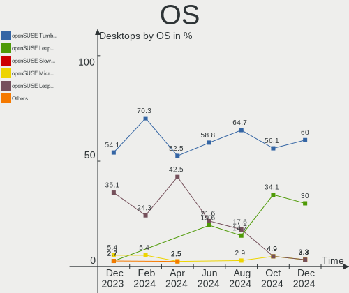
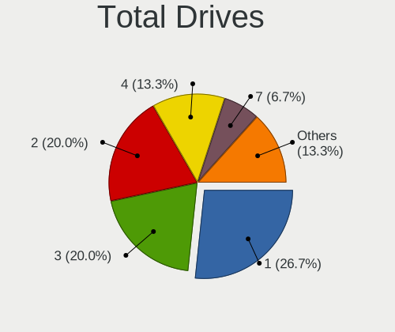
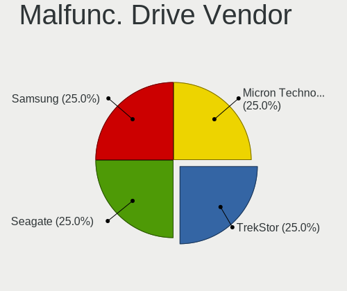
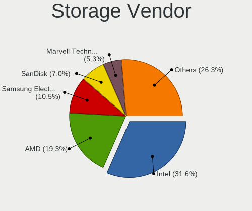
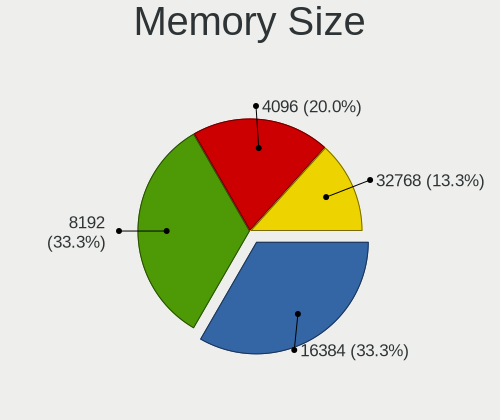

openSUSE - Hardware Trends (Desktops)
-------------------------------------

A project to identify most popular hardware characteristics and track their change
over time based on data collected by Linux users at https://Linux-Hardware.org.

Anyone can contribute to this report by the [hw-probe](https://github.com/linuxhw/hw-probe) tool:

    sudo -E hw-probe -all -upload

This report is for one last month. Overall report since the beginning of time: [TestDays](https://github.com/linuxhw/TestDays)

Period: Feb, 2023.

Contents
--------

* [ System ](#system)
  - [ OS                       ](#os)
  - [ OS Family                ](#os-family)
  - [ Kernel                   ](#kernel)
  - [ Kernel Family            ](#kernel-family)
  - [ Kernel Major Ver.        ](#kernel-major-ver)
  - [ Arch                     ](#arch)
  - [ DE                       ](#de)
  - [ Display Server           ](#display-server)
  - [ Display Manager          ](#display-manager)
  - [ OS Lang                  ](#os-lang)
  - [ Boot Mode                ](#boot-mode)
  - [ Filesystem               ](#filesystem)
  - [ Part. scheme             ](#part-scheme)
  - [ Dual Boot with Linux/BSD ](#dual-boot-with-linuxbsd)
  - [ Dual Boot (Win)          ](#dual-boot-win)

* [ Board ](#board)
  - [ Vendor                   ](#vendor)
  - [ Model                    ](#model)
  - [ Model Family             ](#model-family)
  - [ MFG Year                 ](#mfg-year)
  - [ Form Factor              ](#form-factor)
  - [ Secure Boot              ](#secure-boot)
  - [ Coreboot                 ](#coreboot)
  - [ RAM Size                 ](#ram-size)
  - [ RAM Used                 ](#ram-used)
  - [ Total Drives             ](#total-drives)
  - [ Has CD-ROM               ](#has-cd-rom)
  - [ Has Ethernet             ](#has-ethernet)
  - [ Has WiFi                 ](#has-wifi)
  - [ Has Bluetooth            ](#has-bluetooth)

* [ Location ](#location)
  - [ Country                  ](#country)
  - [ City                     ](#city)

* [ Drives ](#drives)
  - [ Drive Vendor             ](#drive-vendor)
  - [ Drive Model              ](#drive-model)
  - [ HDD Vendor               ](#hdd-vendor)
  - [ SSD Vendor               ](#ssd-vendor)
  - [ Drive Kind               ](#drive-kind)
  - [ Drive Connector          ](#drive-connector)
  - [ Drive Size               ](#drive-size)
  - [ Space Total              ](#space-total)
  - [ Space Used               ](#space-used)
  - [ Malfunc. Drives          ](#malfunc-drives)
  - [ Malfunc. Drive Vendor    ](#malfunc-drive-vendor)
  - [ Malfunc. HDD Vendor      ](#malfunc-hdd-vendor)
  - [ Malfunc. Drive Kind      ](#malfunc-drive-kind)
  - [ Failed Drives            ](#failed-drives)
  - [ Failed Drive Vendor      ](#failed-drive-vendor)
  - [ Drive Status             ](#drive-status)

* [ Storage controller ](#storage-controller)
  - [ Storage Vendor           ](#storage-vendor)
  - [ Storage Model            ](#storage-model)
  - [ Storage Kind             ](#storage-kind)

* [ Processor ](#processor)
  - [ CPU Vendor               ](#cpu-vendor)
  - [ CPU Model                ](#cpu-model)
  - [ CPU Model Family         ](#cpu-model-family)
  - [ CPU Cores                ](#cpu-cores)
  - [ CPU Sockets              ](#cpu-sockets)
  - [ CPU Threads              ](#cpu-threads)
  - [ CPU Op-Modes             ](#cpu-op-modes)
  - [ CPU Microcode            ](#cpu-microcode)
  - [ CPU Microarch            ](#cpu-microarch)

* [ Graphics ](#graphics)
  - [ GPU Vendor               ](#gpu-vendor)
  - [ GPU Model                ](#gpu-model)
  - [ GPU Combo                ](#gpu-combo)
  - [ GPU Driver               ](#gpu-driver)
  - [ GPU Memory               ](#gpu-memory)

* [ Monitor ](#monitor)
  - [ Monitor Vendor           ](#monitor-vendor)
  - [ Monitor Model            ](#monitor-model)
  - [ Monitor Resolution       ](#monitor-resolution)
  - [ Monitor Diagonal         ](#monitor-diagonal)
  - [ Monitor Width            ](#monitor-width)
  - [ Aspect Ratio             ](#aspect-ratio)
  - [ Monitor Area             ](#monitor-area)
  - [ Pixel Density            ](#pixel-density)
  - [ Multiple Monitors        ](#multiple-monitors)

* [ Network ](#network)
  - [ Net Controller Vendor    ](#net-controller-vendor)
  - [ Net Controller Model     ](#net-controller-model)
  - [ Wireless Vendor          ](#wireless-vendor)
  - [ Wireless Model           ](#wireless-model)
  - [ Ethernet Vendor          ](#ethernet-vendor)
  - [ Ethernet Model           ](#ethernet-model)
  - [ Net Controller Kind      ](#net-controller-kind)
  - [ Used Controller          ](#used-controller)
  - [ NICs                     ](#nics)
  - [ IPv6                     ](#ipv6)

* [ Bluetooth ](#bluetooth)
  - [ Bluetooth Vendor         ](#bluetooth-vendor)
  - [ Bluetooth Model          ](#bluetooth-model)

* [ Sound ](#sound)
  - [ Sound Vendor             ](#sound-vendor)
  - [ Sound Model              ](#sound-model)

* [ Memory ](#memory)
  - [ Memory Vendor            ](#memory-vendor)
  - [ Memory Model             ](#memory-model)
  - [ Memory Kind              ](#memory-kind)
  - [ Memory Form Factor       ](#memory-form-factor)
  - [ Memory Size              ](#memory-size)
  - [ Memory Speed             ](#memory-speed)

* [ Printers & scanners ](#printers--scanners)
  - [ Printer Vendor           ](#printer-vendor)
  - [ Printer Model            ](#printer-model)
  - [ Scanner Vendor           ](#scanner-vendor)
  - [ Scanner Model            ](#scanner-model)

* [ Camera ](#camera)
  - [ Camera Vendor            ](#camera-vendor)
  - [ Camera Model             ](#camera-model)

* [ Security ](#security)
  - [ Fingerprint Vendor       ](#fingerprint-vendor)
  - [ Fingerprint Model        ](#fingerprint-model)
  - [ Chipcard Vendor          ](#chipcard-vendor)
  - [ Chipcard Model           ](#chipcard-model)

* [ Unsupported ](#unsupported)
  - [ Unsupported Devices      ](#unsupported-devices)
  - [ Unsupported Device Types ](#unsupported-device-types)

System
------

OS
--

Installed operating systems

| Name                         | Desktops | Percent |
|------------------------------|----------|---------|
| openSUSE Tumbleweed-XXXXXXXX | 21       | 77.78%  |
| openSUSE Leap-15.4           | 4        | 14.81%  |
| openSUSE Microos-XXXXXXXX    | 1        | 3.7%    |
| openSUSE Leap-15.5           | 1        | 3.7%    |

OS Family
---------

OS without a version

| Name     | Desktops | Percent |
|----------|----------|---------|
| openSUSE | 27       | 100%    |

Kernel
------

Version of the Linux kernel

| Version                      | Desktops | Percent |
|------------------------------|----------|---------|
| 6.1.10-1-default             | 10       | 37.04%  |
| 6.1.8-1-default              | 6        | 22.22%  |
| 6.1.12-1-default             | 6        | 22.22%  |
| 5.14.21-150400.24.41-default | 3        | 11.11%  |
| 5.14.21-150500.37-default    | 1        | 3.7%    |
| 5.14.21-150400.24.46-default | 1        | 3.7%    |

Kernel Family
-------------

Linux kernel without a distro release

| Version | Desktops | Percent |
|---------|----------|---------|
| 6.1.10  | 10       | 37.04%  |
| 6.1.8   | 6        | 22.22%  |
| 6.1.12  | 6        | 22.22%  |
| 5.14.21 | 5        | 18.52%  |

Kernel Major Ver.
-----------------

Linux kernel major version

| Version | Desktops | Percent |
|---------|----------|---------|
| 6.1     | 22       | 81.48%  |
| 5.14    | 5        | 18.52%  |

Arch
----

OS architecture (x86_64, i586, etc.)

| Name   | Desktops | Percent |
|--------|----------|---------|
| x86_64 | 27       | 100%    |

DE
--

Desktop Environment

| Name  | Desktops | Percent |
|-------|----------|---------|
| KDE5  | 17       | 62.96%  |
| XFCE  | 5        | 18.52%  |
| GNOME | 3        | 11.11%  |
| sway  | 1        | 3.7%    |
| LXQt  | 1        | 3.7%    |

Display Server
--------------

X11 or Wayland

| Name    | Desktops | Percent |
|---------|----------|---------|
| X11     | 24       | 88.89%  |
| Wayland | 3        | 11.11%  |

Display Manager
---------------

SDDM, LightDM, etc.

| Name    | Desktops | Percent |
|---------|----------|---------|
| Unknown | 17       | 62.96%  |
| LightDM | 6        | 22.22%  |
| SDDM    | 4        | 14.81%  |

OS Lang
-------

Language

| Lang  | Desktops | Percent |
|-------|----------|---------|
| en_US | 13       | 48.15%  |
| de_DE | 5        | 18.52%  |
| en_GB | 3        | 11.11%  |
| ro_RO | 1        | 3.7%    |
| pt_BR | 1        | 3.7%    |
| POSIX | 1        | 3.7%    |
| nl_NL | 1        | 3.7%    |
| it_IT | 1        | 3.7%    |
| es_ES | 1        | 3.7%    |

Boot Mode
---------

EFI or BIOS

| Mode | Desktops | Percent |
|------|----------|---------|
| EFI  | 15       | 55.56%  |
| BIOS | 12       | 44.44%  |

Filesystem
----------

Type of filesystem

| Type  | Desktops | Percent |
|-------|----------|---------|
| Btrfs | 21       | 77.78%  |
| Ext4  | 4        | 14.81%  |
| Xfs   | 1        | 3.7%    |
| Ext3  | 1        | 3.7%    |

Part. scheme
------------

Scheme of partitioning

| Type    | Desktops | Percent |
|---------|----------|---------|
| Unknown | 16       | 59.26%  |
| GPT     | 10       | 37.04%  |
| MBR     | 1        | 3.7%    |

Dual Boot with Linux/BSD
------------------------

Hosting more than one Linux/BSD

| Dual boot | Desktops | Percent |
|-----------|----------|---------|
| No        | 22       | 81.48%  |
| Yes       | 5        | 18.52%  |

Dual Boot (Win)
---------------

Hosting Linux and Windows

| Dual boot | Desktops | Percent |
|-----------|----------|---------|
| No        | 23       | 85.19%  |
| Yes       | 4        | 14.81%  |

Board
-----

Vendor
------

Motherboard manufacturer

| Name                | Desktops | Percent |
|---------------------|----------|---------|
| ASUSTek Computer    | 9        | 33.33%  |
| Hewlett-Packard     | 5        | 18.52%  |
| ASRock              | 3        | 11.11%  |
| MSI                 | 2        | 7.41%   |
| Dell                | 2        | 7.41%   |
| Acer                | 2        | 7.41%   |
| Sun Microsystems    | 1        | 3.7%    |
| Inventec            | 1        | 3.7%    |
| Gigabyte Technology | 1        | 3.7%    |
| Unknown             | 1        | 3.7%    |

Model
-----

Motherboard model

| Name                          | Desktops | Percent |
|-------------------------------|----------|---------|
| Sun Microsystems Ultra 24     | 1        | 3.7%    |
| MSI MS-7B61                   | 1        | 3.7%    |
| MSI MS-7522                   | 1        | 3.7%    |
| Inventec Z CLASS              | 1        | 3.7%    |
| HP Z600 Workstation           | 1        | 3.7%    |
| HP Pavilion Desktop TP01-2xxx | 1        | 3.7%    |
| HP EliteDesk 800 G4 DM 65W    | 1        | 3.7%    |
| HP Compaq 8200 Elite CMT PC   | 1        | 3.7%    |
| HP 870-115ng                  | 1        | 3.7%    |
| Gigabyte Z390 AORUS ULTRA     | 1        | 3.7%    |
| Dell XPS 8940                 | 1        | 3.7%    |
| Dell Precision T3610          | 1        | 3.7%    |
| ASUS TUF Gaming B550M-PLUS    | 1        | 3.7%    |
| ASUS ROG STRIX X570-E GAMING  | 1        | 3.7%    |
| ASUS Pro WS X570-ACE          | 1        | 3.7%    |
| ASUS PRIME H310M-A R2.0       | 1        | 3.7%    |
| ASUS PRIME B550-PLUS          | 1        | 3.7%    |
| ASUS PRIME B350M-E            | 1        | 3.7%    |
| ASUS M4A89GTD-PRO/USB3        | 1        | 3.7%    |
| ASUS M2N-SLI DELUXE           | 1        | 3.7%    |
| ASUS All Series               | 1        | 3.7%    |
| ASRock X399M Taichi           | 1        | 3.7%    |
| ASRock B550M-ITX/ac           | 1        | 3.7%    |
| ASRock 970 Pro3 R2.0          | 1        | 3.7%    |
| Acer Veriton N4680GT          | 1        | 3.7%    |
| Acer Aspire X3950             | 1        | 3.7%    |
| Unknown                       | 1        | 3.7%    |

Model Family
------------

Motherboard model prefix

| Name                   | Desktops | Percent |
|------------------------|----------|---------|
| ASUS PRIME             | 3        | 11.11%  |
| Sun Microsystems Ultra | 1        | 3.7%    |
| MSI MS-7B61            | 1        | 3.7%    |
| MSI MS-7522            | 1        | 3.7%    |
| Inventec Z             | 1        | 3.7%    |
| HP Z600                | 1        | 3.7%    |
| HP Pavilion            | 1        | 3.7%    |
| HP EliteDesk           | 1        | 3.7%    |
| HP Compaq              | 1        | 3.7%    |
| HP 870-115ng           | 1        | 3.7%    |
| Gigabyte Z390          | 1        | 3.7%    |
| Dell XPS               | 1        | 3.7%    |
| Dell Precision         | 1        | 3.7%    |
| ASUS TUF               | 1        | 3.7%    |
| ASUS ROG               | 1        | 3.7%    |
| ASUS Pro               | 1        | 3.7%    |
| ASUS M4A89GTD-PRO      | 1        | 3.7%    |
| ASUS M2N-SLI           | 1        | 3.7%    |
| ASUS All               | 1        | 3.7%    |
| ASRock X399M           | 1        | 3.7%    |
| ASRock B550M-ITX       | 1        | 3.7%    |
| ASRock 970             | 1        | 3.7%    |
| Acer Veriton           | 1        | 3.7%    |
| Acer Aspire            | 1        | 3.7%    |
| Unknown                | 1        | 3.7%    |

MFG Year
--------

Motherboard manufacture year

| Year | Desktops | Percent |
|------|----------|---------|
| 2020 | 4        | 14.81%  |
| 2021 | 3        | 11.11%  |
| 2018 | 3        | 11.11%  |
| 2010 | 3        | 11.11%  |
| 2022 | 2        | 7.41%   |
| 2017 | 2        | 7.41%   |
| 2012 | 2        | 7.41%   |
| 2019 | 1        | 3.7%    |
| 2016 | 1        | 3.7%    |
| 2014 | 1        | 3.7%    |
| 2013 | 1        | 3.7%    |
| 2011 | 1        | 3.7%    |
| 2009 | 1        | 3.7%    |
| 2008 | 1        | 3.7%    |
| 2006 | 1        | 3.7%    |

Form Factor
-----------

Physical design of the computer

| Name    | Desktops | Percent |
|---------|----------|---------|
| Desktop | 27       | 100%    |

Secure Boot
-----------

Enabled or disabled

| State    | Desktops | Percent |
|----------|----------|---------|
| Disabled | 23       | 85.19%  |
| Enabled  | 4        | 14.81%  |

Coreboot
--------

Have coreboot on board

| Used | Desktops | Percent |
|------|----------|---------|
| No   | 27       | 100%    |

RAM Size
--------

Total RAM memory

| Size in GB  | Desktops | Percent |
|-------------|----------|---------|
| 16.01-24.0  | 8        | 29.63%  |
| 8.01-16.0   | 8        | 29.63%  |
| 32.01-64.0  | 7        | 25.93%  |
| 3.01-4.0    | 2        | 7.41%   |
| 4.01-8.0    | 1        | 3.7%    |
| 64.01-256.0 | 1        | 3.7%    |

RAM Used
--------

Used RAM memory

| Used GB   | Desktops | Percent |
|-----------|----------|---------|
| 4.01-8.0  | 7        | 25.93%  |
| 1.01-2.0  | 7        | 25.93%  |
| 3.01-4.0  | 6        | 22.22%  |
| 2.01-3.0  | 6        | 22.22%  |
| 8.01-16.0 | 1        | 3.7%    |

Total Drives
------------

Number of drives on board

| Drives | Desktops | Percent |
|--------|----------|---------|
| 1      | 8        | 29.63%  |
| 4      | 7        | 25.93%  |
| 2      | 5        | 18.52%  |
| 3      | 4        | 14.81%  |
| 5      | 3        | 11.11%  |

Has CD-ROM
----------

Has CD-ROM on board

| Presented | Desktops | Percent |
|-----------|----------|---------|
| No        | 15       | 55.56%  |
| Yes       | 12       | 44.44%  |

Has Ethernet
------------

Has Ethernet on board

| Presented | Desktops | Percent |
|-----------|----------|---------|
| Yes       | 27       | 100%    |

Has WiFi
--------

Has WiFi module

| Presented | Desktops | Percent |
|-----------|----------|---------|
| No        | 16       | 59.26%  |
| Yes       | 11       | 40.74%  |

Has Bluetooth
-------------

Has Bluetooth module

| Presented | Desktops | Percent |
|-----------|----------|---------|
| Yes       | 15       | 55.56%  |
| No        | 12       | 44.44%  |

Location
--------

Country
-------

Geographic location (country)

| Country     | Desktops | Percent |
|-------------|----------|---------|
| Germany     | 6        | 22.22%  |
| USA         | 5        | 18.52%  |
| UK          | 2        | 7.41%   |
| Netherlands | 2        | 7.41%   |
| Italy       | 2        | 7.41%   |
| Brazil      | 2        | 7.41%   |
| Australia   | 2        | 7.41%   |
| Spain       | 1        | 3.7%    |
| Romania     | 1        | 3.7%    |
| Finland     | 1        | 3.7%    |
| Cyprus      | 1        | 3.7%    |
| Canada      | 1        | 3.7%    |
| Belgium     | 1        | 3.7%    |

City
----

Geographic location (city)

| City           | Desktops | Percent |
|----------------|----------|---------|
| Melbourne      | 2        | 7.41%   |
| Uccle          | 1        | 3.7%    |
| Saskatoon      | 1        | 3.7%    |
| Sao Fidelis    | 1        | 3.7%    |
| Rio de Janeiro | 1        | 3.7%    |
| Painesville    | 1        | 3.7%    |
| Obertraubling  | 1        | 3.7%    |
| Noia           | 1        | 3.7%    |
| Naples         | 1        | 3.7%    |
| Munich         | 1        | 3.7%    |
| Market Weston  | 1        | 3.7%    |
| Kyrenia        | 1        | 3.7%    |
| Hoogvliet      | 1        | 3.7%    |
| Hollola        | 1        | 3.7%    |
| Hattersheim    | 1        | 3.7%    |
| Giessen        | 1        | 3.7%    |
| Falkensee      | 1        | 3.7%    |
| Denton         | 1        | 3.7%    |
| Dallas         | 1        | 3.7%    |
| Cherry Hill    | 1        | 3.7%    |
| Bremen         | 1        | 3.7%    |
| Bolzano        | 1        | 3.7%    |
| Birmingham     | 1        | 3.7%    |
| Baton Rouge    | 1        | 3.7%    |
| Arad           | 1        | 3.7%    |
| Amsterdam      | 1        | 3.7%    |

Drives
------

Drive Vendor
------------

Hard drive vendors

| Vendor                      | Desktops | Drives | Percent |
|-----------------------------|----------|--------|---------|
| WDC                         | 9        | 15     | 16.07%  |
| Seagate                     | 9        | 13     | 16.07%  |
| SanDisk                     | 7        | 8      | 12.5%   |
| Samsung Electronics         | 7        | 11     | 12.5%   |
| Toshiba                     | 4        | 4      | 7.14%   |
| Kingston                    | 4        | 6      | 7.14%   |
| Silicon Motion              | 2        | 2      | 3.57%   |
| Phison Electronics          | 2        | 2      | 3.57%   |
| Hitachi                     | 2        | 2      | 3.57%   |
| Crucial                     | 2        | 2      | 3.57%   |
| Transcend                   | 1        | 1      | 1.79%   |
| Plextor                     | 1        | 1      | 1.79%   |
| Netac                       | 1        | 1      | 1.79%   |
| Maxtor                      | 1        | 1      | 1.79%   |
| MAXIO Technology (Hangzhou) | 1        | 1      | 1.79%   |
| LDLC                        | 1        | 1      | 1.79%   |
| Intel                       | 1        | 1      | 1.79%   |
| Fanxiang                    | 1        | 1      | 1.79%   |

Drive Model
-----------

Hard drive models

| Model                                             | Desktops | Percent |
|---------------------------------------------------|----------|---------|
| Seagate ST1000DM010-2EP102 1TB                    | 3        | 4.29%   |
| WDC WD2500HHTZ-04N21V0 250GB                      | 2        | 2.86%   |
| Toshiba DT01ACA050 500GB                          | 2        | 2.86%   |
| Silicon Motion SM2262/SM2262EN SSD Controller 1TB | 2        | 2.86%   |
| Seagate Expansion 1TB                             | 2        | 2.86%   |
| Sandisk WD Blue SN550 NVMe SSD 1TB                | 2        | 2.86%   |
| Samsung SSD 840 EVO 250GB                         | 2        | 2.86%   |
| Kingston SA400S37480G 480GB SSD                   | 2        | 2.86%   |
| WDC WDS500G2B0A-00SM50 500GB SSD                  | 1        | 1.43%   |
| WDC WDS480G2G0A-00JH30 480GB SSD                  | 1        | 1.43%   |
| WDC WDS240G1G0A-00SS50 240GB SSD                  | 1        | 1.43%   |
| WDC WD5000LPVT-22G33T0 500GB                      | 1        | 1.43%   |
| WDC WD5000HHTZ-04N21V0 500GB                      | 1        | 1.43%   |
| WDC WD40EFRX-68N32N0 4TB                          | 1        | 1.43%   |
| WDC WD3200BEKT-22KA9T0 320GB                      | 1        | 1.43%   |
| WDC WD20PURX-64P6ZY0 2TB                          | 1        | 1.43%   |
| WDC WD20EZRX-00D8PB0 2TB                          | 1        | 1.43%   |
| WDC WD10EURX-63C57Y0 1TB                          | 1        | 1.43%   |
| WDC WD101FZBX-00ATAA0 10TB                        | 1        | 1.43%   |
| Transcend TS2TSSD220Q 2TB                         | 1        | 1.43%   |
| Toshiba MQ01ABD100 1TB                            | 1        | 1.43%   |
| Toshiba DT01ACA100 1TB                            | 1        | 1.43%   |
| Seagate ST500DM002-1BD142 500GB                   | 1        | 1.43%   |
| Seagate ST3500514NS 500GB                         | 1        | 1.43%   |
| Seagate ST31000528AS 1TB                          | 1        | 1.43%   |
| Seagate ST3000DM008-2DM166 3TB                    | 1        | 1.43%   |
| Seagate ST2000DM006-2DM164 2TB                    | 1        | 1.43%   |
| Seagate ST2000DM001-1ER164 2TB                    | 1        | 1.43%   |
| Seagate ST2000DM001-1CH164 2TB                    | 1        | 1.43%   |
| Seagate Backup+ Hub BK 8TB                        | 1        | 1.43%   |
| Sandisk WD Black SN750 / PC SN730 NVMe SSD 512GB  | 1        | 1.43%   |
| SanDisk Ultra II 1TB SSD                          | 1        | 1.43%   |
| SanDisk SSD PLUS 240GB                            | 1        | 1.43%   |
| SanDisk SSD PLUS 120GB                            | 1        | 1.43%   |
| SanDisk SDSSDH31024G 1TB                          | 1        | 1.43%   |
| SanDisk SDSSDA240G 240GB                          | 1        | 1.43%   |
| Samsung SSD 860 EVO 4TB                           | 1        | 1.43%   |
| Samsung SSD 860 EVO 250GB                         | 1        | 1.43%   |
| Samsung SSD 850 EVO 250GB                         | 1        | 1.43%   |
| Samsung SSD 830 Series 256GB                      | 1        | 1.43%   |

HDD Vendor
----------

Hard disk drive vendors

| Vendor              | Desktops | Drives | Percent |
|---------------------|----------|--------|---------|
| Seagate             | 9        | 13     | 36%     |
| WDC                 | 7        | 12     | 28%     |
| Toshiba             | 4        | 4      | 16%     |
| Samsung Electronics | 2        | 3      | 8%      |
| Hitachi             | 2        | 2      | 8%      |
| Maxtor              | 1        | 1      | 4%      |

SSD Vendor
----------

Solid state drive vendors

| Vendor              | Desktops | Drives | Percent |
|---------------------|----------|--------|---------|
| SanDisk             | 5        | 5      | 23.81%  |
| Samsung Electronics | 5        | 6      | 23.81%  |
| WDC                 | 3        | 3      | 14.29%  |
| Kingston            | 3        | 5      | 14.29%  |
| Crucial             | 2        | 2      | 9.52%   |
| Transcend           | 1        | 1      | 4.76%   |
| Plextor             | 1        | 1      | 4.76%   |
| Fanxiang            | 1        | 1      | 4.76%   |

Drive Kind
----------

HDD or SSD

| Kind    | Desktops | Drives | Percent |
|---------|----------|--------|---------|
| HDD     | 19       | 35     | 41.3%   |
| SSD     | 17       | 24     | 36.96%  |
| NVMe    | 9        | 13     | 19.57%  |
| Unknown | 1        | 1      | 2.17%   |

Drive Connector
---------------

SATA, SAS, NVMe, etc.

| Type | Desktops | Drives | Percent |
|------|----------|--------|---------|
| SATA | 24       | 57     | 66.67%  |
| NVMe | 9        | 13     | 25%     |
| SAS  | 3        | 3      | 8.33%   |

Drive Size
----------

Size of hard drive

| Size in TB | Desktops | Drives | Percent |
|------------|----------|--------|---------|
| 0.01-0.5   | 14       | 29     | 40%     |
| 0.51-1.0   | 10       | 17     | 28.57%  |
| 1.01-2.0   | 6        | 7      | 17.14%  |
| 3.01-4.0   | 2        | 3      | 5.71%   |
| 4.01-10.0  | 2        | 2      | 5.71%   |
| 2.01-3.0   | 1        | 1      | 2.86%   |

Space Total
-----------

Amount of disk space available on the file system

| Size in GB     | Desktops | Percent |
|----------------|----------|---------|
| More than 3000 | 12       | 44.44%  |
| 1001-2000      | 7        | 25.93%  |
| 501-1000       | 5        | 18.52%  |
| 251-500        | 1        | 3.7%    |
| 2001-3000      | 1        | 3.7%    |
| 101-250        | 1        | 3.7%    |

Space Used
----------

Amount of used disk space

| Used GB   | Desktops | Percent |
|-----------|----------|---------|
| 1001-2000 | 6        | 22.22%  |
| 101-250   | 5        | 18.52%  |
| 251-500   | 4        | 14.81%  |
| 51-100    | 4        | 14.81%  |
| 21-50     | 3        | 11.11%  |
| 2001-3000 | 2        | 7.41%   |
| 501-1000  | 2        | 7.41%   |
| 1-20      | 1        | 3.7%    |

Malfunc. Drives
---------------

Drive models with a malfunction

| Model                        | Desktops | Drives | Percent |
|------------------------------|----------|--------|---------|
| WDC WD5000HHTZ-04N21V0 500GB | 1        | 1      | 50%     |
| WDC WD20EZRX-00D8PB0 2TB     | 1        | 1      | 50%     |

Malfunc. Drive Vendor
---------------------

Vendors of faulty drives

| Vendor | Desktops | Drives | Percent |
|--------|----------|--------|---------|
| WDC    | 2        | 2      | 100%    |

Malfunc. HDD Vendor
-------------------

Vendors of faulty HDD drives

| Vendor | Desktops | Drives | Percent |
|--------|----------|--------|---------|
| WDC    | 2        | 2      | 100%    |

Malfunc. Drive Kind
-------------------

Kinds of faulty drives

| Kind | Desktops | Drives | Percent |
|------|----------|--------|---------|
| HDD  | 2        | 2      | 100%    |

Failed Drives
-------------

Failed drive models

Zero info for selected period =(

Failed Drive Vendor
-------------------

Failed drive vendors

Zero info for selected period =(

Drive Status
------------

Number of failed and malfunc. drives

| Status   | Desktops | Drives | Percent |
|----------|----------|--------|---------|
| Detected | 16       | 49     | 55.17%  |
| Works    | 11       | 22     | 37.93%  |
| Malfunc  | 2        | 2      | 6.9%    |

Storage controller
------------------

Storage Vendor
--------------

Storage controller vendors

| Vendor                      | Desktops | Percent |
|-----------------------------|----------|---------|
| Intel                       | 15       | 33.33%  |
| AMD                         | 12       | 26.67%  |
| SanDisk                     | 3        | 6.67%   |
| JMicron Technology          | 3        | 6.67%   |
| Silicon Motion              | 2        | 4.44%   |
| Phison Electronics          | 2        | 4.44%   |
| Samsung Electronics         | 1        | 2.22%   |
| Nvidia                      | 1        | 2.22%   |
| Netac Technology            | 1        | 2.22%   |
| MAXIO Technology (Hangzhou) | 1        | 2.22%   |
| Marvell Technology Group    | 1        | 2.22%   |
| LSI Logic / Symbios Logic   | 1        | 2.22%   |
| Kingston Technology Company | 1        | 2.22%   |
| ASMedia Technology          | 1        | 2.22%   |

Storage Model
-------------

Storage controller models

| Model                                                                                   | Desktops | Percent |
|-----------------------------------------------------------------------------------------|----------|---------|
| AMD FCH SATA Controller [AHCI mode]                                                     | 6        | 10.91%  |
| AMD 500 Series Chipset SATA Controller                                                  | 3        | 5.45%   |
| Silicon Motion SM2262/SM2262EN SSD Controller                                           | 2        | 3.64%   |
| SanDisk WD Blue SN550 NVMe SSD                                                          | 2        | 3.64%   |
| JMicron JMB363 SATA/IDE Controller                                                      | 2        | 3.64%   |
| Intel Cannon Lake PCH SATA AHCI Controller                                              | 2        | 3.64%   |
| Intel 200 Series PCH SATA controller [AHCI mode]                                        | 2        | 3.64%   |
| AMD SB7x0/SB8x0/SB9x0 SATA Controller [AHCI mode]                                       | 2        | 3.64%   |
| AMD SB7x0/SB8x0/SB9x0 IDE Controller                                                    | 2        | 3.64%   |
| SanDisk WD Black SN750 / PC SN730 NVMe SSD                                              | 1        | 1.82%   |
| Samsung NVMe SSD Controller SM961/PM961/SM963                                           | 1        | 1.82%   |
| Samsung NVMe SSD Controller SM951/PM951                                                 | 1        | 1.82%   |
| Phison PS5013 E13 NVMe Controller                                                       | 1        | 1.82%   |
| Phison E16 PCIe4 NVMe Controller                                                        | 1        | 1.82%   |
| Nvidia MCP55 SATA Controller                                                            | 1        | 1.82%   |
| Nvidia MCP55 IDE                                                                        | 1        | 1.82%   |
| Netac Non-Volatile memory controller                                                    | 1        | 1.82%   |
| MAXIO (Hangzhou) NVMe SSD Controller MAP1202                                            | 1        | 1.82%   |
| Marvell Group 88SE9215 PCIe 2.0 x1 4-port SATA 6 Gb/s Controller                        | 1        | 1.82%   |
| LSI Logic / Symbios Logic 53c1030 PCI-X Fusion-MPT Dual Ultra320 SCSI                   | 1        | 1.82%   |
| Kingston Company Company Non-Volatile memory controller                                 | 1        | 1.82%   |
| JMicron JMB368 IDE controller                                                           | 1        | 1.82%   |
| JMicron JMB361 AHCI/IDE                                                                 | 1        | 1.82%   |
| Intel Q170/Q150/B150/H170/H110/Z170/CM236 Chipset SATA Controller [AHCI Mode]           | 1        | 1.82%   |
| Intel PCIe Data Center SSD                                                              | 1        | 1.82%   |
| Intel Comet Lake PCH-H RAID                                                             | 1        | 1.82%   |
| Intel C600/X79 series chipset 6-Port SATA AHCI Controller                               | 1        | 1.82%   |
| Intel 82801JI (ICH10 Family) SATA AHCI Controller                                       | 1        | 1.82%   |
| Intel 82801JI (ICH10 Family) 4 port SATA IDE Controller #1                              | 1        | 1.82%   |
| Intel 82801JI (ICH10 Family) 2 port SATA IDE Controller #2                              | 1        | 1.82%   |
| Intel 82801IR/IO/IH (ICH9R/DO/DH) 6 port SATA Controller [AHCI mode]                    | 1        | 1.82%   |
| Intel 6 Series/C200 Series Chipset Family Desktop SATA Controller (IDE mode, ports 4-5) | 1        | 1.82%   |
| Intel 6 Series/C200 Series Chipset Family Desktop SATA Controller (IDE mode, ports 0-3) | 1        | 1.82%   |
| Intel 6 Series/C200 Series Chipset Family 6 port Desktop SATA AHCI Controller           | 1        | 1.82%   |
| Intel 500 Series Chipset Family SATA AHCI Controller                                    | 1        | 1.82%   |
| Intel 5 Series/3400 Series Chipset 6 port SATA AHCI Controller                          | 1        | 1.82%   |
| ASMedia SATA controller                                                                 | 1        | 1.82%   |
| AMD X399 Series Chipset SATA Controller                                                 | 1        | 1.82%   |
| AMD SB7x0/SB8x0/SB9x0 SATA Controller [IDE mode]                                        | 1        | 1.82%   |
| AMD 400 Series Chipset SATA Controller                                                  | 1        | 1.82%   |

Storage Kind
------------

Kind of storage controller (IDE, SATA, NVMe, SAS, ...)

| Kind | Desktops | Percent |
|------|----------|---------|
| SATA | 24       | 58.54%  |
| NVMe | 9        | 21.95%  |
| IDE  | 6        | 14.63%  |
| RAID | 1        | 2.44%   |
| SCSI | 1        | 2.44%   |

Processor
---------

CPU Vendor
----------

Processor vendors

| Vendor | Desktops | Percent |
|--------|----------|---------|
| Intel  | 14       | 51.85%  |
| AMD    | 13       | 48.15%  |

CPU Model
---------

Processor models

| Model                                           | Desktops | Percent |
|-------------------------------------------------|----------|---------|
| AMD Ryzen 9 3900X 12-Core Processor             | 2        | 7.41%   |
| AMD Ryzen 7 5700G with Radeon Graphics          | 2        | 7.41%   |
| AMD Phenom II X4 965 Processor                  | 2        | 7.41%   |
| Intel Xeon CPU X5675 @ 3.07GHz                  | 1        | 3.7%    |
| Intel Xeon CPU E5-1607 v2 @ 3.00GHz             | 1        | 3.7%    |
| Intel Xeon CPU E31270 @ 3.40GHz                 | 1        | 3.7%    |
| Intel Core i7-6700 CPU @ 3.40GHz                | 1        | 3.7%    |
| Intel Core i7 CPU 920 @ 2.67GHz                 | 1        | 3.7%    |
| Intel Core i7 CPU 870 @ 2.93GHz                 | 1        | 3.7%    |
| Intel Core i5-9600K CPU @ 3.70GHz               | 1        | 3.7%    |
| Intel Core i5-8500 CPU @ 3.00GHz                | 1        | 3.7%    |
| Intel Core i5-8400 CPU @ 2.80GHz                | 1        | 3.7%    |
| Intel Core i5-2400S CPU @ 2.50GHz               | 1        | 3.7%    |
| Intel Core i3-9100F CPU @ 3.60GHz               | 1        | 3.7%    |
| Intel Core 2 Quad CPU Q9650 @ 3.00GHz           | 1        | 3.7%    |
| Intel 11th Gen Core i9-11900 @ 2.50GHz          | 1        | 3.7%    |
| Intel 11th Gen Core i5-11500T @ 1.50GHz         | 1        | 3.7%    |
| AMD Ryzen Threadripper 2970WX 24-Core Processor | 1        | 3.7%    |
| AMD Ryzen 7 5800X 8-Core Processor              | 1        | 3.7%    |
| AMD Ryzen 5 5600G with Radeon Graphics          | 1        | 3.7%    |
| AMD Ryzen 5 1600 Six-Core Processor             | 1        | 3.7%    |
| AMD Processor model unknown                     | 1        | 3.7%    |
| AMD G-T56N Processor                            | 1        | 3.7%    |
| AMD Athlon 5370 APU with Radeon R3              | 1        | 3.7%    |

CPU Model Family
----------------

Processor model prefix

| Model                  | Desktops | Percent |
|------------------------|----------|---------|
| Intel Core i5          | 4        | 14.81%  |
| Other                  | 3        | 11.11%  |
| Intel Xeon             | 3        | 11.11%  |
| Intel Core i7          | 3        | 11.11%  |
| AMD Ryzen 7            | 3        | 11.11%  |
| AMD Ryzen 9            | 2        | 7.41%   |
| AMD Ryzen 5            | 2        | 7.41%   |
| AMD Phenom II X4       | 2        | 7.41%   |
| Intel Core i3          | 1        | 3.7%    |
| Intel Core 2 Quad      | 1        | 3.7%    |
| AMD Ryzen Threadripper | 1        | 3.7%    |
| AMD G                  | 1        | 3.7%    |
| AMD Athlon             | 1        | 3.7%    |

CPU Cores
---------

Number of processor cores

| Number | Desktops | Percent |
|--------|----------|---------|
| 4      | 12       | 44.44%  |
| 6      | 6        | 22.22%  |
| 8      | 4        | 14.81%  |
| 12     | 3        | 11.11%  |
| 24     | 1        | 3.7%    |
| 2      | 1        | 3.7%    |

CPU Sockets
-----------

Number of sockets

| Number | Desktops | Percent |
|--------|----------|---------|
| 1      | 26       | 96.3%   |
| 2      | 1        | 3.7%    |

CPU Threads
-----------

Threads per core (Hyper-Threading)

| Number | Desktops | Percent |
|--------|----------|---------|
| 2      | 15       | 55.56%  |
| 1      | 12       | 44.44%  |

CPU Op-Modes
------------

CPU Operation Modes (32-bit, 64-bit)

| Op mode        | Desktops | Percent |
|----------------|----------|---------|
| 32-bit, 64-bit | 27       | 100%    |

CPU Microcode
-------------

Microcode number

| Number     | Desktops | Percent |
|------------|----------|---------|
| 0x0a50000d | 3        | 11.11%  |
| 0x010000c8 | 3        | 11.11%  |
| Unknown    | 3        | 11.11%  |
| 0x906ea    | 2        | 7.41%   |
| 0xa0671    | 1        | 3.7%    |
| 0x906ed    | 1        | 3.7%    |
| 0x906eb    | 1        | 3.7%    |
| 0x506e3    | 1        | 3.7%    |
| 0x306e4    | 1        | 3.7%    |
| 0x206a7    | 1        | 3.7%    |
| 0x106e5    | 1        | 3.7%    |
| 0x106a4    | 1        | 3.7%    |
| 0x1067a    | 1        | 3.7%    |
| 0x0a20120a | 1        | 3.7%    |
| 0x08701030 | 1        | 3.7%    |
| 0x08701021 | 1        | 3.7%    |
| 0x0800820d | 1        | 3.7%    |
| 0x0800111c | 1        | 3.7%    |
| 0x0700010f | 1        | 3.7%    |
| 0x05000119 | 1        | 3.7%    |

CPU Microarch
-------------

Microarchitecture

| Name        | Desktops | Percent |
|-------------|----------|---------|
| Zen 3       | 4        | 14.81%  |
| KabyLake    | 4        | 14.81%  |
| K10         | 3        | 11.11%  |
| Zen 2       | 2        | 7.41%   |
| SandyBridge | 2        | 7.41%   |
| Nehalem     | 2        | 7.41%   |
| Zen+        | 1        | 3.7%    |
| Zen         | 1        | 3.7%    |
| Westmere    | 1        | 3.7%    |
| Skylake     | 1        | 3.7%    |
| Penryn      | 1        | 3.7%    |
| Jaguar      | 1        | 3.7%    |
| IvyBridge   | 1        | 3.7%    |
| Icelake     | 1        | 3.7%    |
| Bobcat      | 1        | 3.7%    |
| Unknown     | 1        | 3.7%    |

Graphics
--------

GPU Vendor
----------

Vendors of graphics cards

| Vendor | Desktops | Percent |
|--------|----------|---------|
| AMD    | 15       | 51.72%  |
| Nvidia | 11       | 37.93%  |
| Intel  | 3        | 10.34%  |

GPU Model
---------

Graphics card models

| Model                                                               | Desktops | Percent |
|---------------------------------------------------------------------|----------|---------|
| AMD Cezanne [Radeon Vega Series / Radeon Vega Mobile Series]        | 3        | 10%     |
| Nvidia TU116 [GeForce GTX 1650 SUPER]                               | 2        | 6.67%   |
| Nvidia GA104 [GeForce RTX 3060]                                     | 2        | 6.67%   |
| Intel RocketLake-S GT1 [UHD Graphics 750]                           | 2        | 6.67%   |
| AMD Navi 10 [Radeon RX 5600 OEM/5600 XT / 5700/5700 XT]             | 2        | 6.67%   |
| Nvidia GT215 [GeForce GT 320]                                       | 1        | 3.33%   |
| Nvidia GT215 [GeForce GT 240]                                       | 1        | 3.33%   |
| Nvidia GP106 [GeForce GTX 1060 3GB]                                 | 1        | 3.33%   |
| Nvidia GP104 [GeForce GTX 1080]                                     | 1        | 3.33%   |
| Nvidia GM206 [GeForce GTX 950]                                      | 1        | 3.33%   |
| Nvidia GM204 [GeForce GTX 970]                                      | 1        | 3.33%   |
| Nvidia GK106GL [Quadro K4000]                                       | 1        | 3.33%   |
| Intel CoffeeLake-S GT2 [UHD Graphics 630]                           | 1        | 3.33%   |
| AMD Wrestler [Radeon HD 6320]                                       | 1        | 3.33%   |
| AMD Turks PRO [Radeon HD 6570/7570/8550 / R5 230]                   | 1        | 3.33%   |
| AMD RV710 [Radeon HD 4350/4550]                                     | 1        | 3.33%   |
| AMD Oland PRO [Radeon R7 240/340 / Radeon 520]                      | 1        | 3.33%   |
| AMD Navi 31 [Radeon RX 7900 XT/7900 XTX]                            | 1        | 3.33%   |
| AMD Navi 21 GL-XL [Radeon PRO W6800]                                | 1        | 3.33%   |
| AMD Kabini [Radeon HD 8400 / R3 Series]                             | 1        | 3.33%   |
| AMD Ellesmere [Radeon RX 470/480/570/570X/580/580X/590]             | 1        | 3.33%   |
| AMD Caicos XTX [Radeon HD 8490 / R5 235X OEM]                       | 1        | 3.33%   |
| AMD Caicos PRO [Radeon HD 7450]                                     | 1        | 3.33%   |
| AMD Baffin [Radeon RX 460/560D / Pro 450/455/460/555/555X/560/560X] | 1        | 3.33%   |

GPU Combo
---------

Combinations of graphics cards

| Name         | Desktops | Percent |
|--------------|----------|---------|
| 1 x AMD      | 12       | 44.44%  |
| 1 x Nvidia   | 10       | 37.04%  |
| 1 x Intel    | 2        | 7.41%   |
| 2 x AMD      | 1        | 3.7%    |
| Intel + AMD  | 1        | 3.7%    |
| AMD + Nvidia | 1        | 3.7%    |

GPU Driver
----------

Free vs proprietary

| Driver      | Desktops | Percent |
|-------------|----------|---------|
| Free        | 22       | 81.48%  |
| Proprietary | 5        | 18.52%  |

GPU Memory
----------

Total video memory

| Size in GB | Desktops | Percent |
|------------|----------|---------|
| 3.01-4.0   | 5        | 18.52%  |
| 0.01-0.5   | 5        | 18.52%  |
| Unknown    | 5        | 18.52%  |
| 1.01-2.0   | 4        | 14.81%  |
| 7.01-8.0   | 3        | 11.11%  |
| 8.01-16.0  | 2        | 7.41%   |
| 24.01-32.0 | 1        | 3.7%    |
| 2.01-3.0   | 1        | 3.7%    |
| 0.51-1.0   | 1        | 3.7%    |

Monitor
-------

Monitor Vendor
--------------

Monitor vendors

| Vendor               | Desktops | Percent |
|----------------------|----------|---------|
| Goldstar             | 4        | 14.29%  |
| Samsung Electronics  | 3        | 10.71%  |
| Hewlett-Packard      | 3        | 10.71%  |
| Lenovo               | 2        | 7.14%   |
| Dell                 | 2        | 7.14%   |
| Ancor Communications | 2        | 7.14%   |
| Acer                 | 2        | 7.14%   |
| Unknown              | 1        | 3.57%   |
| Sharp                | 1        | 3.57%   |
| Pixio                | 1        | 3.57%   |
| Philips              | 1        | 3.57%   |
| Panasonic            | 1        | 3.57%   |
| Onkyo                | 1        | 3.57%   |
| Medion               | 1        | 3.57%   |
| Eizo                 | 1        | 3.57%   |
| BenQ                 | 1        | 3.57%   |
| AOC                  | 1        | 3.57%   |

Monitor Model
-------------

Monitor models

| Model                                                                  | Desktops | Percent |
|------------------------------------------------------------------------|----------|---------|
| Unknown LCD Monitor FFFF 2288x1287 2550x2550mm 142.0-inch              | 1        | 3.33%   |
| Sharp LC55LBU591C SHP4353 3840x2160 800x450mm 36.1-inch                | 1        | 3.33%   |
| Samsung Electronics T27B350 SAM0945 1920x1080 598x336mm 27.0-inch      | 1        | 3.33%   |
| Samsung Electronics SyncMaster SAM0226 1440x900 410x257mm 19.1-inch    | 1        | 3.33%   |
| Samsung Electronics LCD Monitor SAM0B60 1920x1080 887x500mm 40.1-inch  | 1        | 3.33%   |
| Pixio OZDSP27IPS WAM2700 2560x1440 597x336mm 27.0-inch                 | 1        | 3.33%   |
| Philips PHL 273V7 PHLC156 1920x1080 598x336mm 27.0-inch                | 1        | 3.33%   |
| Panasonic TV MEIC328 1920x1080 698x392mm 31.5-inch                     | 1        | 3.33%   |
| Onkyo TX-NR515 ONK0C51 3840x2160 800x450mm 36.1-inch                   | 1        | 3.33%   |
| Medion MD20435 MED36D6 1920x1080 521x293mm 23.5-inch                   | 1        | 3.33%   |
| Lenovo LEN LT2452pwC LEN1144 1920x1080 518x324mm 24.1-inch             | 1        | 3.33%   |
| Lenovo L27e-30 LEN66BE 1920x1080 597x336mm 27.0-inch                   | 1        | 3.33%   |
| Hewlett-Packard LE2002x HWP2963 1600x900 443x249mm 20.0-inch           | 1        | 3.33%   |
| Hewlett-Packard E22 G4 HPN3683 1920x1080 476x267mm 21.5-inch           | 1        | 3.33%   |
| Hewlett-Packard 2210 HWP288A 1920x1080 476x268mm 21.5-inch             | 1        | 3.33%   |
| Goldstar W1943 GSM4BAD 1360x768 406x229mm 18.4-inch                    | 1        | 3.33%   |
| Goldstar ULTRAGEAR GSM5BB2 1920x1080 527x296mm 23.8-inch               | 1        | 3.33%   |
| Goldstar Ultra HD GSM5B09 3840x2160 600x340mm 27.2-inch                | 1        | 3.33%   |
| Goldstar FULL HD GSM5B55 1920x1080 480x270mm 21.7-inch                 | 1        | 3.33%   |
| Goldstar FULL HD GSM5B54 1920x1080 480x270mm 21.7-inch                 | 1        | 3.33%   |
| Eizo S1921 ENC1831 1280x1024 376x301mm 19.0-inch                       | 1        | 3.33%   |
| Dell P2419H DELD0D9 1920x1080 527x296mm 23.8-inch                      | 1        | 3.33%   |
| Dell DELL3007WFPHC DEL4016 2560x1600 646x406mm 30.0-inch               | 1        | 3.33%   |
| BenQ GW2280 BNQ78E8 1920x1080 476x268mm 21.5-inch                      | 1        | 3.33%   |
| AOC AG323QWG4R3+ AOC3230 2560x1440 697x392mm 31.5-inch                 | 1        | 3.33%   |
| AOC 2436 AOC2436 1920x1080 521x293mm 23.5-inch                         | 1        | 3.33%   |
| Ancor Communications ASUS VS247 ACI249A 1920x1080 521x293mm 23.5-inch  | 1        | 3.33%   |
| Ancor Communications ASUS PB287Q ACI28A3 3840x2160 621x341mm 27.9-inch | 1        | 3.33%   |
| Acer XG270HU ACR0414 2560x1440 598x336mm 27.0-inch                     | 1        | 3.33%   |
| Acer CB242Y ACR0708 1920x1080 527x296mm 23.8-inch                      | 1        | 3.33%   |

Monitor Resolution
------------------

Monitor screen resolution

| Resolution       | Desktops | Percent |
|------------------|----------|---------|
| 1920x1080 (FHD)  | 16       | 55.17%  |
| 3840x2160 (4K)   | 5        | 17.24%  |
| 2560x1440 (QHD)  | 2        | 6.9%    |
| 2560x1600        | 1        | 3.45%   |
| 2288x1287        | 1        | 3.45%   |
| 1600x900 (HD+)   | 1        | 3.45%   |
| 1440x900 (WXGA+) | 1        | 3.45%   |
| 1360x768         | 1        | 3.45%   |
| 1280x1024 (SXGA) | 1        | 3.45%   |

Monitor Diagonal
----------------

Diagonal size in inches

| Inches | Desktops | Percent |
|--------|----------|---------|
| 27     | 6        | 21.43%  |
| 23     | 4        | 14.29%  |
| 21     | 4        | 14.29%  |
| 24     | 3        | 10.71%  |
| 54     | 2        | 7.14%   |
| 31     | 2        | 7.14%   |
| 19     | 2        | 7.14%   |
| 142    | 1        | 3.57%   |
| 43     | 1        | 3.57%   |
| 30     | 1        | 3.57%   |
| 20     | 1        | 3.57%   |
| 18     | 1        | 3.57%   |

Monitor Width
-------------

Physical width

| Width in mm    | Desktops | Percent |
|----------------|----------|---------|
| 501-600        | 12       | 42.86%  |
| 401-500        | 7        | 25%     |
| 601-700        | 4        | 14.29%  |
| 1001-1500      | 2        | 7.14%   |
| More than 2000 | 1        | 3.57%   |
| 351-400        | 1        | 3.57%   |
| 901-1000       | 1        | 3.57%   |

Aspect Ratio
------------

Proportional relationship between the width and the height

| Ratio | Desktops | Percent |
|-------|----------|---------|
| 16/9  | 21       | 77.78%  |
| 16/10 | 4        | 14.81%  |
| 5/4   | 1        | 3.7%    |
| 1.00  | 1        | 3.7%    |

Monitor Area
------------

Area in inch

| Area in inch | Desktops | Percent |
|----------------|----------|---------|
| 201-250        | 8        | 28.57%  |
| 301-350        | 6        | 21.43%  |
| 151-200        | 5        | 17.86%  |
| More than 1000 | 3        | 10.71%  |
| 351-500        | 3        | 10.71%  |
| 251-300        | 1        | 3.57%   |
| 141-150        | 1        | 3.57%   |
| 501-1000       | 1        | 3.57%   |

Pixel Density
-------------

Pixels per inch

| Density | Desktops | Percent |
|---------|----------|---------|
| 51-100  | 16       | 57.14%  |
| 101-120 | 8        | 28.57%  |
| 1-50    | 3        | 10.71%  |
| 121-160 | 1        | 3.57%   |

Multiple Monitors
-----------------

Total monitors connected

| Total | Desktops | Percent |
|-------|----------|---------|
| 1     | 23       | 85.19%  |
| 2     | 4        | 14.81%  |

Network
-------

Net Controller Vendor
---------------------

Controller vendors

| Vendor                                | Desktops | Percent |
|---------------------------------------|----------|---------|
| Realtek Semiconductor                 | 17       | 51.52%  |
| Intel                                 | 13       | 39.39%  |
| Nvidia                                | 1        | 3.03%   |
| Broadcom                              | 1        | 3.03%   |
| 802.11g Adapter [Linksys WUSB54GC v3] | 1        | 3.03%   |

Net Controller Model
--------------------

Controller models

| Model                                                                                                  | Desktops | Percent |
|--------------------------------------------------------------------------------------------------------|----------|---------|
| Realtek RTL8111/8168/8411 PCI Express Gigabit Ethernet Controller                                      | 14       | 35.9%   |
| Intel Dual Band Wireless-AC 3168NGW [Stone Peak]                                                       | 3        | 7.69%   |
| Realtek RTL8125 2.5GbE Controller                                                                      | 2        | 5.13%   |
| Intel Wi-Fi 6 AX200                                                                                    | 2        | 5.13%   |
| Intel I211 Gigabit Network Connection                                                                  | 2        | 5.13%   |
| Intel 82579LM Gigabit Network Connection (Lewisville)                                                  | 2        | 5.13%   |
| Realtek RTL8821CE 802.11ac PCIe Wireless Network Adapter                                               | 1        | 2.56%   |
| Realtek RTL8192CE PCIe Wireless Network Adapter                                                        | 1        | 2.56%   |
| Realtek Killer E2600 Gigabit Ethernet Controller                                                       | 1        | 2.56%   |
| Nvidia MCP55 Ethernet                                                                                  | 1        | 2.56%   |
| Intel Wireless Gigabit 17265                                                                           | 1        | 2.56%   |
| Intel Tiger Lake PCH CNVi WiFi                                                                         | 1        | 2.56%   |
| Intel Ethernet Connection (7) I219-V                                                                   | 1        | 2.56%   |
| Intel Ethernet Connection (7) I219-LM                                                                  | 1        | 2.56%   |
| Intel Ethernet Connection (2) I219-V                                                                   | 1        | 2.56%   |
| Intel Comet Lake PCH CNVi WiFi                                                                         | 1        | 2.56%   |
| Intel Cannon Lake PCH CNVi WiFi                                                                        | 1        | 2.56%   |
| Intel 82566DM-2 Gigabit Network Connection                                                             | 1        | 2.56%   |
| Broadcom NetXtreme BCM5764M Gigabit Ethernet PCIe                                                      | 1        | 2.56%   |
| 802.11g Adapter [Linksys WUSB54GC v3] WUSB600N v2 Dual-Band Wireless-N Network Adapter [Ralink RT3572] | 1        | 2.56%   |

Wireless Vendor
---------------

Wireless vendors

| Vendor                                | Desktops | Percent |
|---------------------------------------|----------|---------|
| Intel                                 | 8        | 72.73%  |
| Realtek Semiconductor                 | 2        | 18.18%  |
| 802.11g Adapter [Linksys WUSB54GC v3] | 1        | 9.09%   |

Wireless Model
--------------

Wireless models

| Model                                                                                                  | Desktops | Percent |
|--------------------------------------------------------------------------------------------------------|----------|---------|
| Intel Dual Band Wireless-AC 3168NGW [Stone Peak]                                                       | 3        | 25%     |
| Intel Wi-Fi 6 AX200                                                                                    | 2        | 16.67%  |
| Realtek RTL8821CE 802.11ac PCIe Wireless Network Adapter                                               | 1        | 8.33%   |
| Realtek RTL8192CE PCIe Wireless Network Adapter                                                        | 1        | 8.33%   |
| Intel Wireless Gigabit 17265                                                                           | 1        | 8.33%   |
| Intel Tiger Lake PCH CNVi WiFi                                                                         | 1        | 8.33%   |
| Intel Comet Lake PCH CNVi WiFi                                                                         | 1        | 8.33%   |
| Intel Cannon Lake PCH CNVi WiFi                                                                        | 1        | 8.33%   |
| 802.11g Adapter [Linksys WUSB54GC v3] WUSB600N v2 Dual-Band Wireless-N Network Adapter [Ralink RT3572] | 1        | 8.33%   |

Ethernet Vendor
---------------

Ethernet vendors

| Vendor                | Desktops | Percent |
|-----------------------|----------|---------|
| Realtek Semiconductor | 17       | 62.96%  |
| Intel                 | 8        | 29.63%  |
| Nvidia                | 1        | 3.7%    |
| Broadcom              | 1        | 3.7%    |

Ethernet Model
--------------

Ethernet models

| Model                                                             | Desktops | Percent |
|-------------------------------------------------------------------|----------|---------|
| Realtek RTL8111/8168/8411 PCI Express Gigabit Ethernet Controller | 14       | 51.85%  |
| Realtek RTL8125 2.5GbE Controller                                 | 2        | 7.41%   |
| Intel I211 Gigabit Network Connection                             | 2        | 7.41%   |
| Intel 82579LM Gigabit Network Connection (Lewisville)             | 2        | 7.41%   |
| Realtek Killer E2600 Gigabit Ethernet Controller                  | 1        | 3.7%    |
| Nvidia MCP55 Ethernet                                             | 1        | 3.7%    |
| Intel Ethernet Connection (7) I219-V                              | 1        | 3.7%    |
| Intel Ethernet Connection (7) I219-LM                             | 1        | 3.7%    |
| Intel Ethernet Connection (2) I219-V                              | 1        | 3.7%    |
| Intel 82566DM-2 Gigabit Network Connection                        | 1        | 3.7%    |
| Broadcom NetXtreme BCM5764M Gigabit Ethernet PCIe                 | 1        | 3.7%    |

Net Controller Kind
-------------------

Ethernet, WiFi or modem

| Kind     | Desktops | Percent |
|----------|----------|---------|
| Ethernet | 27       | 71.05%  |
| WiFi     | 11       | 28.95%  |

Used Controller
---------------

Currently used network controller

| Kind     | Desktops | Percent |
|----------|----------|---------|
| Ethernet | 20       | 74.07%  |
| WiFi     | 7        | 25.93%  |

NICs
----

Total network controllers on board

| Total | Desktops | Percent |
|-------|----------|---------|
| 1     | 16       | 59.26%  |
| 2     | 9        | 33.33%  |
| 3     | 2        | 7.41%   |

IPv6
----

IPv6 vs IPv4

| Used | Desktops | Percent |
|------|----------|---------|
| No   | 19       | 70.37%  |
| Yes  | 8        | 29.63%  |

Bluetooth
---------

Bluetooth Vendor
----------------

Controller vendors

| Vendor                  | Desktops | Percent |
|-------------------------|----------|---------|
| Intel                   | 8        | 53.33%  |
| Realtek Semiconductor   | 2        | 13.33%  |
| Cambridge Silicon Radio | 2        | 13.33%  |
| Broadcom                | 2        | 13.33%  |
| ASUSTek Computer        | 1        | 6.67%   |

Bluetooth Model
---------------

Controller models

| Model                                               | Desktops | Percent |
|-----------------------------------------------------|----------|---------|
| Intel Wireless-AC 3168 Bluetooth                    | 3        | 20%     |
| Realtek Bluetooth Radio                             | 2        | 13.33%  |
| Intel AX201 Bluetooth                               | 2        | 13.33%  |
| Intel AX200 Bluetooth                               | 2        | 13.33%  |
| Cambridge Silicon Radio Bluetooth Dongle (HCI mode) | 2        | 13.33%  |
| Intel Bluetooth 9460/9560 Jefferson Peak (JfP)      | 1        | 6.67%   |
| Broadcom Bluetooth Controller                       | 1        | 6.67%   |
| Broadcom BCM20702A0 Bluetooth 4.0                   | 1        | 6.67%   |
| ASUS ASUS USB-BT500                                 | 1        | 6.67%   |

Sound
-----

Sound Vendor
------------

Sound card vendors

| Vendor              | Desktops | Percent |
|---------------------|----------|---------|
| AMD                 | 18       | 38.3%   |
| Intel               | 14       | 29.79%  |
| Nvidia              | 12       | 25.53%  |
| GN Netcom           | 1        | 2.13%   |
| C-Media Electronics | 1        | 2.13%   |
| Unknown             | 1        | 2.13%   |

Sound Model
-----------

Sound card models

| Model                                                                             | Desktops | Percent |
|-----------------------------------------------------------------------------------|----------|---------|
| AMD Starship/Matisse HD Audio Controller                                          | 3        | 5.26%   |
| AMD SBx00 Azalia (Intel HDA)                                                      | 3        | 5.26%   |
| AMD Renoir Radeon High Definition Audio Controller                                | 3        | 5.26%   |
| AMD Family 17h/19h HD Audio Controller                                            | 3        | 5.26%   |
| Nvidia TU116 High Definition Audio Controller                                     | 2        | 3.51%   |
| Nvidia High Definition Audio Controller                                           | 2        | 3.51%   |
| Nvidia GA104 High Definition Audio Controller                                     | 2        | 3.51%   |
| Intel Cannon Lake PCH cAVS                                                        | 2        | 3.51%   |
| Intel 82801JI (ICH10 Family) HD Audio Controller                                  | 2        | 3.51%   |
| Intel 6 Series/C200 Series Chipset Family High Definition Audio Controller        | 2        | 3.51%   |
| Intel 200 Series PCH HD Audio                                                     | 2        | 3.51%   |
| AMD Navi 10 HDMI Audio                                                            | 2        | 3.51%   |
| AMD Family 17h (Models 00h-0fh) HD Audio Controller                               | 2        | 3.51%   |
| AMD Caicos HDMI Audio [Radeon HD 6450 / 7450/8450/8490 OEM / R5 230/235/235X OEM] | 2        | 3.51%   |
| Nvidia MCP55 High Definition Audio                                                | 1        | 1.75%   |
| Nvidia GP106 High Definition Audio Controller                                     | 1        | 1.75%   |
| Nvidia GP104 High Definition Audio Controller                                     | 1        | 1.75%   |
| Nvidia GM206 High Definition Audio Controller                                     | 1        | 1.75%   |
| Nvidia GM204 High Definition Audio Controller                                     | 1        | 1.75%   |
| Nvidia GK106 HDMI Audio Controller                                                | 1        | 1.75%   |
| Intel Tiger Lake-H HD Audio Controller                                            | 1        | 1.75%   |
| Intel C600/X79 series chipset High Definition Audio Controller                    | 1        | 1.75%   |
| Intel Audio device                                                                | 1        | 1.75%   |
| Intel 82801I (ICH9 Family) HD Audio Controller                                    | 1        | 1.75%   |
| Intel 5 Series/3400 Series Chipset High Definition Audio                          | 1        | 1.75%   |
| Intel 100 Series/C230 Series Chipset Family HD Audio Controller                   | 1        | 1.75%   |
| GN Netcom Jabra SPEAK 510 USB                                                     | 1        | 1.75%   |
| C-Media Electronics CM106 Like Sound Device                                       | 1        | 1.75%   |
| AMD Wrestler HDMI Audio                                                           | 1        | 1.75%   |
| AMD Turks HDMI Audio [Radeon HD 6500/6600 / 6700M Series]                         | 1        | 1.75%   |
| AMD RV710/730 HDMI Audio [Radeon HD 4000 series]                                  | 1        | 1.75%   |
| AMD Oland/Hainan/Cape Verde/Pitcairn HDMI Audio [Radeon HD 7000 Series]           | 1        | 1.75%   |
| AMD Navi 21/23 HDMI/DP Audio Controller                                           | 1        | 1.75%   |
| AMD Kabini HDMI/DP Audio                                                          | 1        | 1.75%   |
| AMD FCH Azalia Controller                                                         | 1        | 1.75%   |
| AMD Ellesmere HDMI Audio [Radeon RX 470/480 / 570/580/590]                        | 1        | 1.75%   |
| AMD Baffin HDMI/DP Audio [Radeon RX 550 640SP / RX 560/560X]                      | 1        | 1.75%   |
| AMD Audio device                                                                  | 1        | 1.75%   |
| Unknown                                                                           | 1        | 1.75%   |

Memory
------

Memory Vendor
-------------

Memory module vendors

| Vendor            | Desktops | Percent |
|-------------------|----------|---------|
| G.Skill           | 4        | 33.33%  |
| SK hynix          | 2        | 16.67%  |
| Crucial           | 2        | 16.67%  |
| Unknown           | 1        | 8.33%   |
| Team              | 1        | 8.33%   |
| Micron Technology | 1        | 8.33%   |
| Corsair           | 1        | 8.33%   |

Memory Model
------------

Memory module models

| Model                                                    | Desktops | Percent |
|----------------------------------------------------------|----------|---------|
| Unknown RAM Module 1GB DIMM DDR 667MT/s                  | 1        | 8.33%   |
| Team RAM Module 16GB SODIMM DDR4 2667MT/s                | 1        | 8.33%   |
| SK hynix RAM HMT451R7AFR8C-RD 4GB DIMM DDR3 1866MT/s     | 1        | 8.33%   |
| SK hynix RAM HMAA2GU6CJR8N-XN 16GB DIMM DDR4 3200MT/s    | 1        | 8.33%   |
| Micron RAM 9JSF51272PZ-1G9E2 4GB DIMM DDR3 1866MT/s      | 1        | 8.33%   |
| G.Skill RAM F4-3200C16-16GIS 16384MB DIMM DDR4 3600MT/s  | 1        | 8.33%   |
| G.Skill RAM F4-3200C14-8GFX 8GB DIMM DDR4 3733MT/s       | 1        | 8.33%   |
| G.Skill RAM F4-2666C19-8GNT 8GB DIMM DDR4 2667MT/s       | 1        | 8.33%   |
| G.Skill RAM F4-2666C19-16GIS 16GB DIMM DDR4              | 1        | 8.33%   |
| Crucial RAM CT51264BD160BJ.M8F 4GB DIMM DDR3 1600MT/s    | 1        | 8.33%   |
| Crucial RAM CT16G4DFD8266.C16FD1 16GB DIMM DDR4 2667MT/s | 1        | 8.33%   |
| Corsair RAM CMK16GX4M2A2666C16 8GB DIMM DDR4 3400MT/s    | 1        | 8.33%   |

Memory Kind
-----------

Memory module kinds

| Kind | Desktops | Percent |
|------|----------|---------|
| DDR4 | 8        | 72.73%  |
| DDR3 | 2        | 18.18%  |
| DDR  | 1        | 9.09%   |

Memory Form Factor
------------------

Physical design of the memory module

| Name   | Desktops | Percent |
|--------|----------|---------|
| DIMM   | 10       | 90.91%  |
| SODIMM | 1        | 9.09%   |

Memory Size
-----------

Memory module size

| Size  | Desktops | Percent |
|-------|----------|---------|
| 16384 | 5        | 45.45%  |
| 8192  | 3        | 27.27%  |
| 4096  | 2        | 18.18%  |
| 1024  | 1        | 9.09%   |

Memory Speed
------------

Memory module speed

| Speed | Desktops | Percent |
|-------|----------|---------|
| 2667  | 4        | 36.36%  |
| 3733  | 1        | 9.09%   |
| 3600  | 1        | 9.09%   |
| 3400  | 1        | 9.09%   |
| 3200  | 1        | 9.09%   |
| 1866  | 1        | 9.09%   |
| 1600  | 1        | 9.09%   |
| 667   | 1        | 9.09%   |

Printers & scanners
-------------------

Printer Vendor
--------------

Printer device vendors

| Vendor          | Desktops | Percent |
|-----------------|----------|---------|
| Hewlett-Packard | 1        | 100%    |

Printer Model
-------------

Printer device models

| Model                    | Desktops | Percent |
|--------------------------|----------|---------|
| HP Color LaserJet CP1215 | 1        | 100%    |

Scanner Vendor
--------------

Scanner device vendors

| Vendor | Desktops | Percent |
|--------|----------|---------|
| Canon  | 1        | 100%    |

Scanner Model
-------------

Scanner device models

| Model                   | Desktops | Percent |
|-------------------------|----------|---------|
| Canon CanoScan LiDE 110 | 1        | 100%    |

Camera
------

Camera Vendor
-------------

Camera device vendors

| Vendor                 | Desktops | Percent |
|------------------------|----------|---------|
| Microdia               | 2        | 28.57%  |
| Logitech               | 2        | 28.57%  |
| Generalplus Technology | 1        | 14.29%  |
| ARC International      | 1        | 14.29%  |
| Apple                  | 1        | 14.29%  |

Camera Model
------------

Camera device models

| Model                      | Desktops | Percent |
|----------------------------|----------|---------|
| Microdia USB 2.0 Camera    | 1        | 14.29%  |
| Microdia CameraA           | 1        | 14.29%  |
| Logitech Webcam C270       | 1        | 14.29%  |
| Logitech HD Webcam C525    | 1        | 14.29%  |
| Generalplus GENERAL WEBCAM | 1        | 14.29%  |
| ARC International Camera   | 1        | 14.29%  |
| Apple iPhone 5/5C/5S/6/SE  | 1        | 14.29%  |

Security
--------

Fingerprint Vendor
------------------

Fingerprint sensor vendors

| Vendor                | Desktops | Percent |
|-----------------------|----------|---------|
| Elan Microelectronics | 1        | 100%    |

Fingerprint Model
-----------------

Fingerprint sensor models

| Model                                       | Desktops | Percent |
|---------------------------------------------|----------|---------|
| Elan fingerprint sensor [FeinTech FPS00200] | 1        | 100%    |

Chipcard Vendor
---------------

Chipcard module vendors

Zero info for selected period =(

Chipcard Model
--------------

Chipcard module models

Zero info for selected period =(

Unsupported
-----------

Unsupported Devices
-------------------

Total unsupported devices on board

| Total | Desktops | Percent |
|-------|----------|---------|
| 0     | 22       | 81.48%  |
| 1     | 4        | 14.81%  |
| 2     | 1        | 3.7%    |

Unsupported Device Types
------------------------

Types of unsupported devices

| Type                  | Desktops | Percent |
|-----------------------|----------|---------|
| Net/wireless          | 1        | 25%     |
| Multimedia controller | 1        | 25%     |
| Firewire controller   | 1        | 25%     |
| Fingerprint reader    | 1        | 25%     |

