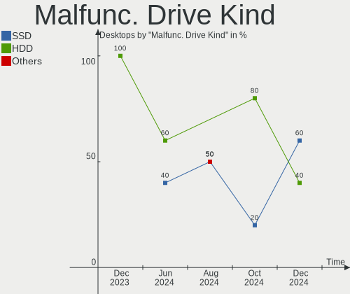
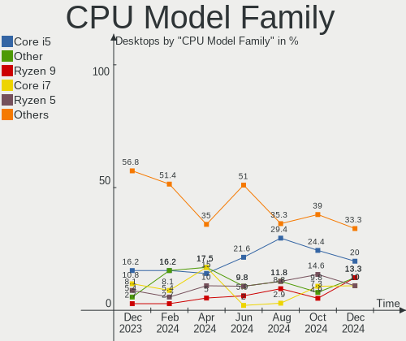
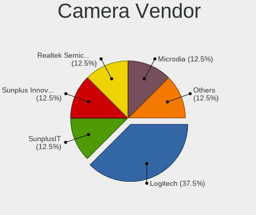

openSUSE - Hardware Trends (Desktops)
-------------------------------------

A project to identify most popular hardware characteristics and track their change
over time based on data collected by Linux users at https://Linux-Hardware.org.

Anyone can contribute to this report by the [hw-probe](https://github.com/linuxhw/hw-probe) tool:

    sudo -E hw-probe -all -upload

This report is for one last month. Overall report since the beginning of time: [TestDays](https://github.com/linuxhw/TestDays)

Period: Sep, 2023.

Contents
--------

* [ System ](#system)
  - [ OS                       ](#os)
  - [ OS Family                ](#os-family)
  - [ Kernel                   ](#kernel)
  - [ Kernel Family            ](#kernel-family)
  - [ Kernel Major Ver.        ](#kernel-major-ver)
  - [ Arch                     ](#arch)
  - [ DE                       ](#de)
  - [ Display Server           ](#display-server)
  - [ Display Manager          ](#display-manager)
  - [ OS Lang                  ](#os-lang)
  - [ Boot Mode                ](#boot-mode)
  - [ Filesystem               ](#filesystem)
  - [ Part. scheme             ](#part-scheme)
  - [ Dual Boot with Linux/BSD ](#dual-boot-with-linuxbsd)
  - [ Dual Boot (Win)          ](#dual-boot-win)

* [ Board ](#board)
  - [ Vendor                   ](#vendor)
  - [ Model                    ](#model)
  - [ Model Family             ](#model-family)
  - [ MFG Year                 ](#mfg-year)
  - [ Form Factor              ](#form-factor)
  - [ Secure Boot              ](#secure-boot)
  - [ Coreboot                 ](#coreboot)
  - [ RAM Size                 ](#ram-size)
  - [ RAM Used                 ](#ram-used)
  - [ Total Drives             ](#total-drives)
  - [ Has CD-ROM               ](#has-cd-rom)
  - [ Has Ethernet             ](#has-ethernet)
  - [ Has WiFi                 ](#has-wifi)
  - [ Has Bluetooth            ](#has-bluetooth)

* [ Location ](#location)
  - [ Country                  ](#country)
  - [ City                     ](#city)

* [ Drives ](#drives)
  - [ Drive Vendor             ](#drive-vendor)
  - [ Drive Model              ](#drive-model)
  - [ HDD Vendor               ](#hdd-vendor)
  - [ SSD Vendor               ](#ssd-vendor)
  - [ Drive Kind               ](#drive-kind)
  - [ Drive Connector          ](#drive-connector)
  - [ Drive Size               ](#drive-size)
  - [ Space Total              ](#space-total)
  - [ Space Used               ](#space-used)
  - [ Malfunc. Drives          ](#malfunc-drives)
  - [ Malfunc. Drive Vendor    ](#malfunc-drive-vendor)
  - [ Malfunc. HDD Vendor      ](#malfunc-hdd-vendor)
  - [ Malfunc. Drive Kind      ](#malfunc-drive-kind)
  - [ Failed Drives            ](#failed-drives)
  - [ Failed Drive Vendor      ](#failed-drive-vendor)
  - [ Drive Status             ](#drive-status)

* [ Storage controller ](#storage-controller)
  - [ Storage Vendor           ](#storage-vendor)
  - [ Storage Model            ](#storage-model)
  - [ Storage Kind             ](#storage-kind)

* [ Processor ](#processor)
  - [ CPU Vendor               ](#cpu-vendor)
  - [ CPU Model                ](#cpu-model)
  - [ CPU Model Family         ](#cpu-model-family)
  - [ CPU Cores                ](#cpu-cores)
  - [ CPU Sockets              ](#cpu-sockets)
  - [ CPU Threads              ](#cpu-threads)
  - [ CPU Op-Modes             ](#cpu-op-modes)
  - [ CPU Microcode            ](#cpu-microcode)
  - [ CPU Microarch            ](#cpu-microarch)

* [ Graphics ](#graphics)
  - [ GPU Vendor               ](#gpu-vendor)
  - [ GPU Model                ](#gpu-model)
  - [ GPU Combo                ](#gpu-combo)
  - [ GPU Driver               ](#gpu-driver)
  - [ GPU Memory               ](#gpu-memory)

* [ Monitor ](#monitor)
  - [ Monitor Vendor           ](#monitor-vendor)
  - [ Monitor Model            ](#monitor-model)
  - [ Monitor Resolution       ](#monitor-resolution)
  - [ Monitor Diagonal         ](#monitor-diagonal)
  - [ Monitor Width            ](#monitor-width)
  - [ Aspect Ratio             ](#aspect-ratio)
  - [ Monitor Area             ](#monitor-area)
  - [ Pixel Density            ](#pixel-density)
  - [ Multiple Monitors        ](#multiple-monitors)

* [ Network ](#network)
  - [ Net Controller Vendor    ](#net-controller-vendor)
  - [ Net Controller Model     ](#net-controller-model)
  - [ Wireless Vendor          ](#wireless-vendor)
  - [ Wireless Model           ](#wireless-model)
  - [ Ethernet Vendor          ](#ethernet-vendor)
  - [ Ethernet Model           ](#ethernet-model)
  - [ Net Controller Kind      ](#net-controller-kind)
  - [ Used Controller          ](#used-controller)
  - [ NICs                     ](#nics)
  - [ IPv6                     ](#ipv6)

* [ Bluetooth ](#bluetooth)
  - [ Bluetooth Vendor         ](#bluetooth-vendor)
  - [ Bluetooth Model          ](#bluetooth-model)

* [ Sound ](#sound)
  - [ Sound Vendor             ](#sound-vendor)
  - [ Sound Model              ](#sound-model)

* [ Memory ](#memory)
  - [ Memory Vendor            ](#memory-vendor)
  - [ Memory Model             ](#memory-model)
  - [ Memory Kind              ](#memory-kind)
  - [ Memory Form Factor       ](#memory-form-factor)
  - [ Memory Size              ](#memory-size)
  - [ Memory Speed             ](#memory-speed)

* [ Printers & scanners ](#printers--scanners)
  - [ Printer Vendor           ](#printer-vendor)
  - [ Printer Model            ](#printer-model)
  - [ Scanner Vendor           ](#scanner-vendor)
  - [ Scanner Model            ](#scanner-model)

* [ Camera ](#camera)
  - [ Camera Vendor            ](#camera-vendor)
  - [ Camera Model             ](#camera-model)

* [ Security ](#security)
  - [ Fingerprint Vendor       ](#fingerprint-vendor)
  - [ Fingerprint Model        ](#fingerprint-model)
  - [ Chipcard Vendor          ](#chipcard-vendor)
  - [ Chipcard Model           ](#chipcard-model)

* [ Unsupported ](#unsupported)
  - [ Unsupported Devices      ](#unsupported-devices)
  - [ Unsupported Device Types ](#unsupported-device-types)

System
------

OS
--

Installed operating systems

| Name                         | Desktops | Percent |
|------------------------------|----------|---------|
| openSUSE Tumbleweed-XXXXXXXX | 20       | 54.05%  |
| openSUSE Leap-15.5           | 14       | 37.84%  |
| openSUSE Microos-XXXXXXXX    | 2        | 5.41%   |
| openSUSE Leap-15.4           | 1        | 2.7%    |

OS Family
---------

OS without a version

| Name     | Desktops | Percent |
|----------|----------|---------|
| openSUSE | 37       | 100%    |

Kernel
------

Version of the Linux kernel

| Version                      | Desktops | Percent |
|------------------------------|----------|---------|
| 5.14.21-150500.55.19-default | 12       | 32.43%  |
| 6.5.4-1-default              | 7        | 18.92%  |
| 6.4.12-1-default             | 5        | 13.51%  |
| 6.5.3-1-default              | 4        | 10.81%  |
| 6.4.11-1-default             | 2        | 5.41%   |
| 6.5.5-lqx1-1-liquorix        | 1        | 2.7%    |
| 6.4.6-1-default              | 1        | 2.7%    |
| 6.4.4-1-default              | 1        | 2.7%    |
| 6.1.8-1-default              | 1        | 2.7%    |
| 5.14.21-150500.55.12-default | 1        | 2.7%    |
| 5.14.21-150500.53-default    | 1        | 2.7%    |
| 5.14.21-150400.24.84-default | 1        | 2.7%    |

Kernel Family
-------------

Linux kernel without a distro release

| Version | Desktops | Percent |
|---------|----------|---------|
| 5.14.21 | 15       | 40.54%  |
| 6.5.4   | 7        | 18.92%  |
| 6.4.12  | 5        | 13.51%  |
| 6.5.3   | 4        | 10.81%  |
| 6.4.11  | 2        | 5.41%   |
| 6.5.5   | 1        | 2.7%    |
| 6.4.6   | 1        | 2.7%    |
| 6.4.4   | 1        | 2.7%    |
| 6.1.8   | 1        | 2.7%    |

Kernel Major Ver.
-----------------

Linux kernel major version

| Version | Desktops | Percent |
|---------|----------|---------|
| 5.14    | 15       | 40.54%  |
| 6.5     | 12       | 32.43%  |
| 6.4     | 9        | 24.32%  |
| 6.1     | 1        | 2.7%    |

Arch
----

OS architecture (x86_64, i586, etc.)

| Name   | Desktops | Percent |
|--------|----------|---------|
| x86_64 | 37       | 100%    |

DE
--

Desktop Environment

| Name  | Desktops | Percent |
|-------|----------|---------|
| KDE5  | 28       | 75.68%  |
| GNOME | 8        | 21.62%  |
| XFCE  | 1        | 2.7%    |

Display Server
--------------

X11 or Wayland

| Name    | Desktops | Percent |
|---------|----------|---------|
| X11     | 27       | 72.97%  |
| Wayland | 9        | 24.32%  |
| Tty     | 1        | 2.7%    |

Display Manager
---------------

SDDM, LightDM, etc.

| Name    | Desktops | Percent |
|---------|----------|---------|
| Unknown | 25       | 67.57%  |
| SDDM    | 11       | 29.73%  |
| LightDM | 1        | 2.7%    |

OS Lang
-------

Language

| Lang  | Desktops | Percent |
|-------|----------|---------|
| en_US | 11       | 29.73%  |
| de_DE | 11       | 29.73%  |
| pt_BR | 4        | 10.81%  |
| POSIX | 4        | 10.81%  |
| ru_RU | 2        | 5.41%   |
| es_ES | 2        | 5.41%   |
| pl_PL | 1        | 2.7%    |
| ko_KR | 1        | 2.7%    |
| en_GB | 1        | 2.7%    |

Boot Mode
---------

EFI or BIOS

| Mode | Desktops | Percent |
|------|----------|---------|
| EFI  | 21       | 56.76%  |
| BIOS | 16       | 43.24%  |

Filesystem
----------

Type of filesystem

| Type  | Desktops | Percent |
|-------|----------|---------|
| Btrfs | 32       | 86.49%  |
| Ext4  | 3        | 8.11%   |
| Xfs   | 1        | 2.7%    |
| Tmpfs | 1        | 2.7%    |

Part. scheme
------------

Scheme of partitioning

| Type    | Desktops | Percent |
|---------|----------|---------|
| Unknown | 23       | 62.16%  |
| GPT     | 13       | 35.14%  |
| MBR     | 1        | 2.7%    |

Dual Boot with Linux/BSD
------------------------

Hosting more than one Linux/BSD

| Dual boot | Desktops | Percent |
|-----------|----------|---------|
| No        | 34       | 91.89%  |
| Yes       | 3        | 8.11%   |

Dual Boot (Win)
---------------

Hosting Linux and Windows

| Dual boot | Desktops | Percent |
|-----------|----------|---------|
| No        | 30       | 81.08%  |
| Yes       | 7        | 18.92%  |

Board
-----

Vendor
------

Motherboard manufacturer

| Name                | Desktops | Percent |
|---------------------|----------|---------|
| ASRock              | 7        | 18.92%  |
| ASUSTek Computer    | 6        | 16.22%  |
| MSI                 | 4        | 10.81%  |
| Gigabyte Technology | 4        | 10.81%  |
| Hewlett-Packard     | 3        | 8.11%   |
| Fujitsu             | 3        | 8.11%   |
| Acer                | 2        | 5.41%   |
| SLIMBOOK            | 1        | 2.7%    |
| OEM                 | 1        | 2.7%    |
| Lenovo              | 1        | 2.7%    |
| Dell                | 1        | 2.7%    |
| Biostar             | 1        | 2.7%    |
| ANGXUN              | 1        | 2.7%    |
| Alienware           | 1        | 2.7%    |
| Unknown             | 1        | 2.7%    |

Model
-----

Motherboard model

| Name                                  | Desktops | Percent |
|---------------------------------------|----------|---------|
| SLIMBOOK ONE-AM5                      | 1        | 2.7%    |
| OEM B75                               | 1        | 2.7%    |
| MSI MS-7E12                           | 1        | 2.7%    |
| MSI MS-7E07                           | 1        | 2.7%    |
| MSI MS-7C94                           | 1        | 2.7%    |
| MSI MS-7B86                           | 1        | 2.7%    |
| Lenovo V520S-08IKL Desktop 10NN000CBP | 1        | 2.7%    |
| HP Z840 Workstation                   | 1        | 2.7%    |
| HP Z400 Workstation                   | 1        | 2.7%    |
| HP ProDesk 400 G2 MT                  | 1        | 2.7%    |
| Gigabyte X570 AORUS ELITE             | 1        | 2.7%    |
| Gigabyte H610M H DDR4                 | 1        | 2.7%    |
| Gigabyte B660M AORUS PRO AX DDR4      | 1        | 2.7%    |
| Gigabyte A320M-S2H                    | 1        | 2.7%    |
| Fujitsu TERRA_PC                      | 1        | 2.7%    |
| Fujitsu ESPRIMO_P756                  | 1        | 2.7%    |
| Fujitsu ESPRIMO E3521                 | 1        | 2.7%    |
| Dell XPS 8940                         | 1        | 2.7%    |
| Biostar TF570 SLI A2+                 | 1        | 2.7%    |
| ASUS PRIME X370-PRO                   | 1        | 2.7%    |
| ASUS PRIME B560M-K                    | 1        | 2.7%    |
| ASUS M5A78L-M/USB3                    | 1        | 2.7%    |
| ASUS H110M-D                          | 1        | 2.7%    |
| ASUS B75M-PLUS                        | 1        | 2.7%    |
| ASUS Amd Am4 Gen3                     | 1        | 2.7%    |
| ASRock Z77 Extreme4                   | 1        | 2.7%    |
| ASRock Z590M Pro4                     | 1        | 2.7%    |
| ASRock H410M-HVS                      | 1        | 2.7%    |
| ASRock G435                           | 1        | 2.7%    |
| ASRock B550M Phantom Gaming 4         | 1        | 2.7%    |
| ASRock A320M-HDV R3.0                 | 1        | 2.7%    |
| ASRock 960GM/U3S3 FX                  | 1        | 2.7%    |
| ANGXUN X99 V1.0                       | 1        | 2.7%    |
| Alienware Aurora-R4                   | 1        | 2.7%    |
| Acer Predator G3-710                  | 1        | 2.7%    |
| Acer Aspire TC-885                    | 1        | 2.7%    |
| Unknown                               | 1        | 2.7%    |

Model Family
------------

Motherboard model prefix

| Name                | Desktops | Percent |
|---------------------|----------|---------|
| Fujitsu ESPRIMO     | 2        | 5.41%   |
| ASUS PRIME          | 2        | 5.41%   |
| SLIMBOOK ONE-AM5    | 1        | 2.7%    |
| OEM B75             | 1        | 2.7%    |
| MSI MS-7E12         | 1        | 2.7%    |
| MSI MS-7E07         | 1        | 2.7%    |
| MSI MS-7C94         | 1        | 2.7%    |
| MSI MS-7B86         | 1        | 2.7%    |
| Lenovo V520S-08IKL  | 1        | 2.7%    |
| HP Z840             | 1        | 2.7%    |
| HP Z400             | 1        | 2.7%    |
| HP ProDesk          | 1        | 2.7%    |
| Gigabyte X570       | 1        | 2.7%    |
| Gigabyte H610M      | 1        | 2.7%    |
| Gigabyte B660M      | 1        | 2.7%    |
| Gigabyte A320M-S2H  | 1        | 2.7%    |
| Fujitsu TERRA       | 1        | 2.7%    |
| Dell XPS            | 1        | 2.7%    |
| Biostar TF570       | 1        | 2.7%    |
| ASUS M5A78L-M       | 1        | 2.7%    |
| ASUS H110M-D        | 1        | 2.7%    |
| ASUS B75M-PLUS      | 1        | 2.7%    |
| ASUS Amd            | 1        | 2.7%    |
| ASRock Z77          | 1        | 2.7%    |
| ASRock Z590M        | 1        | 2.7%    |
| ASRock H410M-HVS    | 1        | 2.7%    |
| ASRock G435         | 1        | 2.7%    |
| ASRock B550M        | 1        | 2.7%    |
| ASRock A320M-HDV    | 1        | 2.7%    |
| ASRock 960GM        | 1        | 2.7%    |
| ANGXUN X99          | 1        | 2.7%    |
| Alienware Aurora-R4 | 1        | 2.7%    |
| Acer Predator       | 1        | 2.7%    |
| Acer Aspire         | 1        | 2.7%    |
| Unknown             | 1        | 2.7%    |

MFG Year
--------

Motherboard manufacture year

| Year | Desktops | Percent |
|------|----------|---------|
| 2021 | 6        | 16.22%  |
| 2015 | 5        | 13.51%  |
| 2023 | 4        | 10.81%  |
| 2020 | 4        | 10.81%  |
| 2018 | 3        | 8.11%   |
| 2022 | 2        | 5.41%   |
| 2019 | 2        | 5.41%   |
| 2017 | 2        | 5.41%   |
| 2013 | 2        | 5.41%   |
| 2012 | 2        | 5.41%   |
| 2010 | 2        | 5.41%   |
| 2014 | 1        | 2.7%    |
| 2011 | 1        | 2.7%    |
| 2007 | 1        | 2.7%    |

Form Factor
-----------

Physical design of the computer

| Name    | Desktops | Percent |
|---------|----------|---------|
| Desktop | 37       | 100%    |

Secure Boot
-----------

Enabled or disabled

| State    | Desktops | Percent |
|----------|----------|---------|
| Disabled | 34       | 91.89%  |
| Enabled  | 3        | 8.11%   |

Coreboot
--------

Have coreboot on board

| Used | Desktops | Percent |
|------|----------|---------|
| No   | 37       | 100%    |

RAM Size
--------

Total RAM memory

| Size in GB  | Desktops | Percent |
|-------------|----------|---------|
| 16.01-24.0  | 10       | 27.03%  |
| 32.01-64.0  | 9        | 24.32%  |
| 8.01-16.0   | 7        | 18.92%  |
| 4.01-8.0    | 4        | 10.81%  |
| 64.01-256.0 | 3        | 8.11%   |
| 3.01-4.0    | 2        | 5.41%   |
| 24.01-32.0  | 2        | 5.41%   |

RAM Used
--------

Used RAM memory

| Used GB   | Desktops | Percent |
|-----------|----------|---------|
| 2.01-3.0  | 14       | 37.84%  |
| 8.01-16.0 | 7        | 18.92%  |
| 4.01-8.0  | 6        | 16.22%  |
| 3.01-4.0  | 5        | 13.51%  |
| 1.01-2.0  | 5        | 13.51%  |

Total Drives
------------

Number of drives on board

| Drives | Desktops | Percent |
|--------|----------|---------|
| 2      | 12       | 32.43%  |
| 1      | 10       | 27.03%  |
| 3      | 7        | 18.92%  |
| 5      | 3        | 8.11%   |
| 4      | 3        | 8.11%   |
| 6      | 2        | 5.41%   |

Has CD-ROM
----------

Has CD-ROM on board

| Presented | Desktops | Percent |
|-----------|----------|---------|
| No        | 23       | 62.16%  |
| Yes       | 14       | 37.84%  |

Has Ethernet
------------

Has Ethernet on board

| Presented | Desktops | Percent |
|-----------|----------|---------|
| Yes       | 37       | 100%    |

Has WiFi
--------

Has WiFi module

| Presented | Desktops | Percent |
|-----------|----------|---------|
| No        | 21       | 56.76%  |
| Yes       | 16       | 43.24%  |

Has Bluetooth
-------------

Has Bluetooth module

| Presented | Desktops | Percent |
|-----------|----------|---------|
| No        | 21       | 56.76%  |
| Yes       | 16       | 43.24%  |

Location
--------

Country
-------

Geographic location (country)

| Country     | Desktops | Percent |
|-------------|----------|---------|
| Germany     | 13       | 35.14%  |
| USA         | 5        | 13.51%  |
| Brazil      | 4        | 10.81%  |
| UK          | 2        | 5.41%   |
| Russia      | 2        | 5.41%   |
| Poland      | 2        | 5.41%   |
| Canada      | 2        | 5.41%   |
| Sweden      | 1        | 2.7%    |
| Spain       | 1        | 2.7%    |
| South Korea | 1        | 2.7%    |
| Malaysia    | 1        | 2.7%    |
| Italy       | 1        | 2.7%    |
| Guatemala   | 1        | 2.7%    |
| Croatia     | 1        | 2.7%    |

City
----

Geographic location (city)

| City                          | Desktops | Percent |
|-------------------------------|----------|---------|
| Warsaw                        | 2        | 5.41%   |
| Berlin                        | 2        | 5.41%   |
| Zagreb                        | 1        | 2.7%    |
| Winnipeg                      | 1        | 2.7%    |
| Wiesbaden                     | 1        | 2.7%    |
| West Bend                     | 1        | 2.7%    |
| Warrenton                     | 1        | 2.7%    |
| Valencia                      | 1        | 2.7%    |
| Uijeongbu-si                  | 1        | 2.7%    |
| Sumaré                       | 1        | 2.7%    |
| Stuttgart                     | 1        | 2.7%    |
| Staraya Russa                 | 1        | 2.7%    |
| Sao Vicente                   | 1        | 2.7%    |
| Sao Paulo                     | 1        | 2.7%    |
| Rostock                       | 1        | 2.7%    |
| Rheda-Wiedenbrueck            | 1        | 2.7%    |
| Preston                       | 1        | 2.7%    |
| Phoenix                       | 1        | 2.7%    |
| Pavia                         | 1        | 2.7%    |
| Magnitogorsk                  | 1        | 2.7%    |
| Leipzig                       | 1        | 2.7%    |
| Kuala Lumpur                  | 1        | 2.7%    |
| Ituiutaba                     | 1        | 2.7%    |
| Hirschberg an der Bergstrasse | 1        | 2.7%    |
| Heide                         | 1        | 2.7%    |
| Guatemala City                | 1        | 2.7%    |
| Göttingen                    | 1        | 2.7%    |
| Gothenburg                    | 1        | 2.7%    |
| Gelsenkirchen                 | 1        | 2.7%    |
| Dartmouth                     | 1        | 2.7%    |
| Craftsbury                    | 1        | 2.7%    |
| Buckingham                    | 1        | 2.7%    |
| Brookline                     | 1        | 2.7%    |
| Bad Hersfeld                  | 1        | 2.7%    |
| Arnsberg                      | 1        | 2.7%    |

Drives
------

Drive Vendor
------------

Hard drive vendors

| Vendor                       | Desktops | Drives | Percent |
|------------------------------|----------|--------|---------|
| Seagate                      | 15       | 20     | 19.48%  |
| WDC                          | 12       | 15     | 15.58%  |
| Samsung Electronics          | 8        | 10     | 10.39%  |
| Toshiba                      | 4        | 4      | 5.19%   |
| Crucial                      | 4        | 5      | 5.19%   |
| Unknown                      | 3        | 3      | 3.9%    |
| Silicon Motion               | 3        | 3      | 3.9%    |
| Kingston                     | 3        | 3      | 3.9%    |
| Hitachi                      | 3        | 2      | 3.9%    |
| SPCC                         | 2        | 2      | 2.6%    |
| SK hynix                     | 2        | 2      | 2.6%    |
| Sandisk                      | 2        | 3      | 2.6%    |
| A-DATA Technology            | 2        | 2      | 2.6%    |
| Synology                     | 1        | 1      | 1.3%    |
| Shenzhen Longsys Electronics | 1        | 1      | 1.3%    |
| Patriot                      | 1        | 1      | 1.3%    |
| Micron/Crucial Technology    | 1        | 1      | 1.3%    |
| Kingston Technology Company  | 1        | 1      | 1.3%    |
| Intel                        | 1        | 1      | 1.3%    |
| HS-SSD-E100                  | 1        | 1      | 1.3%    |
| EXRAM                        | 1        | 1      | 1.3%    |
| CT1000MX                     | 1        | 1      | 1.3%    |
| China                        | 1        | 1      | 1.3%    |
| Biostar                      | 1        | 1      | 1.3%    |
| ASMT                         | 1        | 2      | 1.3%    |
| ASMedia                      | 1        | 1      | 1.3%    |
| Apacer                       | 1        | 1      | 1.3%    |

Drive Model
-----------

Hard drive models

| Model                                                 | Desktops | Percent |
|-------------------------------------------------------|----------|---------|
| WDC WD10EZEX-22MFCA0 1TB                              | 2        | 2.35%   |
| Unknown SD/MMC/MS PRO 128GB                           | 2        | 2.35%   |
| SPCC Solid State Disk 512GB                           | 2        | 2.35%   |
| Silicon Motion SM2263EN/SM2263XT SSD Controller 512GB | 2        | 2.35%   |
| Seagate ST2000DM008-2FR102 2TB                        | 2        | 2.35%   |
| Samsung SSD 850 EVO 250GB                             | 2        | 2.35%   |
| Kingston SA400S37480G 480GB SSD                       | 2        | 2.35%   |
| WDC WD60EZRZ-00GZ5B1 6TB                              | 1        | 1.18%   |
| WDC WD5000AZRX-00A8LB0 500GB                          | 1        | 1.18%   |
| WDC WD5000AZLX-00K2TA0 500GB                          | 1        | 1.18%   |
| WDC WD40EFZX-68AWUN0 4TB                              | 1        | 1.18%   |
| WDC WD40EFAX-68JH4N1 4TB                              | 1        | 1.18%   |
| WDC WD3200AAKX-00ERMA0 320GB                          | 1        | 1.18%   |
| WDC WD20EZRX-00D8PB0 2TB                              | 1        | 1.18%   |
| WDC WD20EZAZ-00GGJB0 2TB                              | 1        | 1.18%   |
| WDC WD20EARS-00MVWB0 2TB                              | 1        | 1.18%   |
| WDC WD10EZRX-00L4HB0 1TB                              | 1        | 1.18%   |
| WDC WD10EZEX-08WN4A0 1TB                              | 1        | 1.18%   |
| WDC WD1002FAEX-00Z3A0 1TB                             | 1        | 1.18%   |
| Unknown NVMe SSD Drive 1TB                            | 1        | 1.18%   |
| Toshiba MQ02ABF050H 500GB                             | 1        | 1.18%   |
| Toshiba HDWD130 3TB                                   | 1        | 1.18%   |
| Toshiba DT01ACA300 3TB                                | 1        | 1.18%   |
| Toshiba DT01ACA100 1TB                                | 1        | 1.18%   |
| Synology iSCSI Storage                                | 1        | 1.18%   |
| SK hynix SC401 SATA 512GB SSD                         | 1        | 1.18%   |
| SK hynix BC511 NVMe 512GB                             | 1        | 1.18%   |
| Silicon Motion SM2262/SM2262EN SSD Controller 500GB   | 1        | 1.18%   |
| Shenzhen Longsys Lexar SSD NM710 1TB                  | 1        | 1.18%   |
| Seagate ST9160827AS 160GB                             | 1        | 1.18%   |
| Seagate ST6000NM0115-1YZ110 6TB                       | 1        | 1.18%   |
| Seagate ST500DM002-1SB10A 500GB                       | 1        | 1.18%   |
| Seagate ST500DM002-1BD142 500GB                       | 1        | 1.18%   |
| Seagate ST4000DM004-2CV104 4TB                        | 1        | 1.18%   |
| Seagate ST3500630AS 500GB                             | 1        | 1.18%   |
| Seagate ST3360320AS 360GB                             | 1        | 1.18%   |
| Seagate ST2000LM 015-2E8174 2TB                       | 1        | 1.18%   |
| Seagate ST2000DX001-1NS164 2TB                        | 1        | 1.18%   |
| Seagate ST2000DM008-2UB102 2TB                        | 1        | 1.18%   |
| Seagate ST2000DL003-9VT1                              | 1        | 1.18%   |

HDD Vendor
----------

Hard disk drive vendors

| Vendor              | Desktops | Drives | Percent |
|---------------------|----------|--------|---------|
| Seagate             | 15       | 19     | 38.46%  |
| WDC                 | 12       | 15     | 30.77%  |
| Toshiba             | 4        | 4      | 10.26%  |
| Hitachi             | 3        | 2      | 7.69%   |
| Unknown             | 2        | 2      | 5.13%   |
| Synology            | 1        | 1      | 2.56%   |
| Samsung Electronics | 1        | 1      | 2.56%   |
| ASMT                | 1        | 2      | 2.56%   |

SSD Vendor
----------

Solid state drive vendors

| Vendor              | Desktops | Drives | Percent |
|---------------------|----------|--------|---------|
| Samsung Electronics | 4        | 4      | 16.67%  |
| Crucial             | 4        | 5      | 16.67%  |
| Kingston            | 3        | 3      | 12.5%   |
| SPCC                | 2        | 2      | 8.33%   |
| A-DATA Technology   | 2        | 2      | 8.33%   |
| SK hynix            | 1        | 1      | 4.17%   |
| Patriot             | 1        | 1      | 4.17%   |
| Intel               | 1        | 1      | 4.17%   |
| EXRAM               | 1        | 1      | 4.17%   |
| CT1000MX            | 1        | 1      | 4.17%   |
| China               | 1        | 1      | 4.17%   |
| Biostar             | 1        | 1      | 4.17%   |
| ASMedia             | 1        | 1      | 4.17%   |
| Apacer              | 1        | 1      | 4.17%   |

Drive Kind
----------

HDD or SSD

| Kind    | Desktops | Drives | Percent |
|---------|----------|--------|---------|
| HDD     | 26       | 46     | 42.62%  |
| SSD     | 20       | 25     | 32.79%  |
| NVMe    | 14       | 17     | 22.95%  |
| Unknown | 1        | 1      | 1.64%   |

Drive Connector
---------------

SATA, SAS, NVMe, etc.

| Type | Desktops | Drives | Percent |
|------|----------|--------|---------|
| SATA | 34       | 63     | 61.82%  |
| NVMe | 14       | 17     | 25.45%  |
| SAS  | 7        | 9      | 12.73%  |

Drive Size
----------

Size of hard drive

| Size in TB | Desktops | Drives | Percent |
|------------|----------|--------|---------|
| 0.01-0.5   | 21       | 25     | 38.18%  |
| 0.51-1.0   | 17       | 23     | 30.91%  |
| 1.01-2.0   | 7        | 11     | 12.73%  |
| 3.01-4.0   | 4        | 6      | 7.27%   |
| 4.01-10.0  | 4        | 4      | 7.27%   |
| 2.01-3.0   | 2        | 2      | 3.64%   |

Space Total
-----------

Amount of disk space available on the file system

| Size in GB     | Desktops | Percent |
|----------------|----------|---------|
| More than 3000 | 18       | 48.65%  |
| 1001-2000      | 8        | 21.62%  |
| 2001-3000      | 4        | 10.81%  |
| 251-500        | 3        | 8.11%   |
| 501-1000       | 3        | 8.11%   |
| Unknown        | 1        | 2.7%    |

Space Used
----------

Amount of used disk space

| Used GB        | Desktops | Percent |
|----------------|----------|---------|
| 1001-2000      | 7        | 18.92%  |
| More than 3000 | 6        | 16.22%  |
| 101-250        | 6        | 16.22%  |
| 51-100         | 5        | 13.51%  |
| 251-500        | 4        | 10.81%  |
| 21-50          | 3        | 8.11%   |
| 501-1000       | 3        | 8.11%   |
| 1-20           | 2        | 5.41%   |
| Unknown        | 1        | 2.7%    |

Malfunc. Drives
---------------

Drive models with a malfunction

| Model                          | Desktops | Drives | Percent |
|--------------------------------|----------|--------|---------|
| WDC WD5000AZLX-00K2TA0 500GB   | 1        | 1      | 16.67%  |
| WDC WD40EFZX-68AWUN0 4TB       | 1        | 1      | 16.67%  |
| Toshiba DT01ACA300 3TB         | 1        | 1      | 16.67%  |
| Seagate ST9160827AS 160GB      | 1        | 1      | 16.67%  |
| Seagate ST1000LX015-1U7172 1TB | 1        | 2      | 16.67%  |
| EXRAM SSD 512GB                | 1        | 1      | 16.67%  |

Malfunc. Drive Vendor
---------------------

Vendors of faulty drives

| Vendor  | Desktops | Drives | Percent |
|---------|----------|--------|---------|
| WDC     | 2        | 2      | 33.33%  |
| Seagate | 2        | 3      | 33.33%  |
| Toshiba | 1        | 1      | 16.67%  |
| EXRAM   | 1        | 1      | 16.67%  |

Malfunc. HDD Vendor
-------------------

Vendors of faulty HDD drives

| Vendor  | Desktops | Drives | Percent |
|---------|----------|--------|---------|
| WDC     | 2        | 2      | 40%     |
| Seagate | 2        | 3      | 40%     |
| Toshiba | 1        | 1      | 20%     |

Malfunc. Drive Kind
-------------------

Kinds of faulty drives

| Kind | Desktops | Drives | Percent |
|------|----------|--------|---------|
| HDD  | 4        | 6      | 80%     |
| SSD  | 1        | 1      | 20%     |

Failed Drives
-------------

Failed drive models

Zero info for selected period =(

Failed Drive Vendor
-------------------

Failed drive vendors

Zero info for selected period =(

Drive Status
------------

Number of failed and malfunc. drives

| Status   | Desktops | Drives | Percent |
|----------|----------|--------|---------|
| Detected | 26       | 47     | 60.47%  |
| Works    | 13       | 35     | 30.23%  |
| Malfunc  | 4        | 7      | 9.3%    |

Storage controller
------------------

Storage Vendor
--------------

Storage controller vendors

| Vendor                       | Desktops | Percent |
|------------------------------|----------|---------|
| Intel                        | 24       | 42.11%  |
| AMD                          | 12       | 21.05%  |
| Samsung Electronics          | 4        | 7.02%   |
| Silicon Motion               | 3        | 5.26%   |
| SanDisk                      | 2        | 3.51%   |
| ASMedia Technology           | 2        | 3.51%   |
| Solidigm                     | 1        | 1.75%   |
| SK hynix                     | 1        | 1.75%   |
| Shenzhen Longsys Electronics | 1        | 1.75%   |
| Seagate Technology           | 1        | 1.75%   |
| Nvidia                       | 1        | 1.75%   |
| Micron/Crucial Technology    | 1        | 1.75%   |
| Marvell Technology Group     | 1        | 1.75%   |
| Kingston Technology Company  | 1        | 1.75%   |
| Broadcom / LSI               | 1        | 1.75%   |
| Adaptec                      | 1        | 1.75%   |

Storage Model
-------------

Storage controller models

| Model                                                                          | Desktops | Percent |
|--------------------------------------------------------------------------------|----------|---------|
| AMD FCH SATA Controller [AHCI mode]                                            | 5        | 7.69%   |
| Intel Q170/Q150/B150/H170/H110/Z170/CM236 Chipset SATA Controller [AHCI Mode]  | 3        | 4.62%   |
| Intel 8 Series/C220 Series Chipset Family 6-port SATA Controller 1 [AHCI mode] | 3        | 4.62%   |
| AMD 500 Series Chipset SATA Controller                                         | 3        | 4.62%   |
| Silicon Motion SM2263EN/SM2263XT (DRAM-less) NVMe SSD Controllers              | 2        | 3.08%   |
| Intel Comet Lake SATA AHCI Controller                                          | 2        | 3.08%   |
| Intel Alder Lake-S PCH SATA Controller [AHCI Mode]                             | 2        | 3.08%   |
| Intel 7 Series/C210 Series Chipset Family 6-port SATA Controller [AHCI mode]   | 2        | 3.08%   |
| Intel 500 Series Chipset Family SATA AHCI Controller                           | 2        | 3.08%   |
| ASMedia ASM1062 Serial ATA Controller                                          | 2        | 3.08%   |
| AMD SB7x0/SB8x0/SB9x0 IDE Controller                                           | 2        | 3.08%   |
| AMD FCH SATA Controller D                                                      | 2        | 3.08%   |
| Solidigm P44 Pro NVMe SSD                                                      | 1        | 1.54%   |
| SK hynix BC511 NVMe SSD                                                        | 1        | 1.54%   |
| Silicon Motion SM2262/SM2262EN SSD Controller                                  | 1        | 1.54%   |
| Shenzhen Longsys Non-Volatile memory controller                                | 1        | 1.54%   |
| Seagate FireCuda 530 SSD                                                       | 1        | 1.54%   |
| Sandisk Western Digital WD Black SN850X NVMe SSD                               | 1        | 1.54%   |
| SanDisk WD Green SN350 NVMe SSD 240GB (DRAM-less)                              | 1        | 1.54%   |
| Samsung NVMe SSD Controller SM981/PM981/PM983                                  | 1        | 1.54%   |
| Samsung NVMe SSD Controller SM951/PM951                                        | 1        | 1.54%   |
| Samsung NVMe SSD Controller S4LV008[Pascal]                                    | 1        | 1.54%   |
| Samsung NVMe SSD Controller 980                                                | 1        | 1.54%   |
| Nvidia MCP65 IDE                                                               | 1        | 1.54%   |
| Nvidia MCP65 AHCI Controller                                                   | 1        | 1.54%   |
| Micron/Crucial P2 [Nick P2] / P3 / P3 Plus NVMe PCIe SSD (DRAM-less)           | 1        | 1.54%   |
| Marvell Group 88SX7042 PCI-e 4-port SATA-II                                    | 1        | 1.54%   |
| Kingston Company A2000 NVMe SSD                                                | 1        | 1.54%   |
| Intel SATA Controller [RAID mode]                                              | 1        | 1.54%   |
| Intel SATA controller                                                          | 1        | 1.54%   |
| Intel NM10/ICH7 Family SATA Controller [IDE mode]                              | 1        | 1.54%   |
| Intel C610/X99 series chipset sSATA Controller [RAID mode]                     | 1        | 1.54%   |
| Intel C600/X79 series chipset SATA RAID Controller                             | 1        | 1.54%   |
| Intel C600/X79 series chipset 6-Port SATA AHCI Controller                      | 1        | 1.54%   |
| Intel 82801JI (ICH10 Family) 4 port SATA IDE Controller #1                     | 1        | 1.54%   |
| Intel 82801JI (ICH10 Family) 2 port SATA IDE Controller #2                     | 1        | 1.54%   |
| Intel 700 Series Chipset Family SATA AHCI Controller                           | 1        | 1.54%   |
| Intel 7 Series/C210 Series Chipset Family 4-port SATA Controller [IDE mode]    | 1        | 1.54%   |
| Intel 7 Series/C210 Series Chipset Family 2-port SATA Controller [IDE mode]    | 1        | 1.54%   |
| Intel 400 Series Chipset Family SATA AHCI Controller                           | 1        | 1.54%   |

Storage Kind
------------

Kind of storage controller (IDE, SATA, NVMe, SAS, ...)

| Kind | Desktops | Percent |
|------|----------|---------|
| SATA | 32       | 56.14%  |
| NVMe | 14       | 24.56%  |
| IDE  | 6        | 10.53%  |
| RAID | 3        | 5.26%   |
| SAS  | 1        | 1.75%   |
| SCSI | 1        | 1.75%   |

Processor
---------

CPU Vendor
----------

Processor vendors

| Vendor | Desktops | Percent |
|--------|----------|---------|
| Intel  | 24       | 64.86%  |
| AMD    | 13       | 35.14%  |

CPU Model
---------

Processor models

| Model                                       | Desktops | Percent |
|---------------------------------------------|----------|---------|
| Intel Core i5-7400 CPU @ 3.00GHz            | 2        | 5.41%   |
| Intel Core i5-3470 CPU @ 3.20GHz            | 2        | 5.41%   |
| AMD FX-8350 Eight-Core Processor            | 2        | 5.41%   |
| Intel Xeon CPU W3530 @ 2.80GHz              | 1        | 2.7%    |
| Intel Xeon CPU E5-2690 v4 @ 2.60GHz         | 1        | 2.7%    |
| Intel Xeon CPU E5-2667 v3 @ 3.20GHz         | 1        | 2.7%    |
| Intel Pentium Dual-Core CPU E5400 @ 2.70GHz | 1        | 2.7%    |
| Intel N95                                   | 1        | 2.7%    |
| Intel Core i7-6700 CPU @ 3.40GHz            | 1        | 2.7%    |
| Intel Core i7-3820 CPU @ 3.60GHz            | 1        | 2.7%    |
| Intel Core i7-10700K CPU @ 3.80GHz          | 1        | 2.7%    |
| Intel Core i7-10700 CPU @ 2.90GHz           | 1        | 2.7%    |
| Intel Core i5-8400 CPU @ 2.80GHz            | 1        | 2.7%    |
| Intel Core i5-6500 CPU @ 3.20GHz            | 1        | 2.7%    |
| Intel Core i5-4590S CPU @ 3.00GHz           | 1        | 2.7%    |
| Intel Core i5-3330 CPU @ 3.00GHz            | 1        | 2.7%    |
| Intel Core i3-4170 CPU @ 3.70GHz            | 1        | 2.7%    |
| Intel 13th Gen Core i7-13700K               | 1        | 2.7%    |
| Intel 12th Gen Core i7-12700                | 1        | 2.7%    |
| Intel 12th Gen Core i5-12400                | 1        | 2.7%    |
| Intel 11th Gen Core i7-11700 @ 2.50GHz      | 1        | 2.7%    |
| Intel 11th Gen Core i5-11500 @ 2.70GHz      | 1        | 2.7%    |
| Intel 11th Gen Core i5-11400F @ 2.60GHz     | 1        | 2.7%    |
| AMD Ryzen 9 7900X 12-Core Processor         | 1        | 2.7%    |
| AMD Ryzen 9 5900X 12-Core Processor         | 1        | 2.7%    |
| AMD Ryzen 9 5900HX with Radeon Graphics     | 1        | 2.7%    |
| AMD Ryzen 7 5700G with Radeon Graphics      | 1        | 2.7%    |
| AMD Ryzen 7 3800XT 8-Core Processor         | 1        | 2.7%    |
| AMD Ryzen 5 3600 6-Core Processor           | 1        | 2.7%    |
| AMD Ryzen 5 2400G with Radeon Vega Graphics | 1        | 2.7%    |
| AMD Ryzen 5 1600 Six-Core Processor         | 1        | 2.7%    |
| AMD Ryzen 3 2200G with Radeon Vega Graphics | 1        | 2.7%    |
| AMD Athlon 64 X2 Dual Core Processor 4200+  | 1        | 2.7%    |
| AMD Athlon 200GE with Radeon Vega Graphics  | 1        | 2.7%    |

CPU Model Family
----------------

Processor model prefix

| Model                   | Desktops | Percent |
|-------------------------|----------|---------|
| Intel Core i5           | 8        | 21.62%  |
| Other                   | 7        | 18.92%  |
| Intel Core i7           | 4        | 10.81%  |
| Intel Xeon              | 3        | 8.11%   |
| AMD Ryzen 9             | 3        | 8.11%   |
| AMD Ryzen 5             | 3        | 8.11%   |
| AMD Ryzen 7             | 2        | 5.41%   |
| AMD FX                  | 2        | 5.41%   |
| Intel Pentium Dual-Core | 1        | 2.7%    |
| Intel Core i3           | 1        | 2.7%    |
| AMD Ryzen 3             | 1        | 2.7%    |
| AMD Athlon 64 X2        | 1        | 2.7%    |
| AMD Athlon              | 1        | 2.7%    |

CPU Cores
---------

Number of processor cores

| Number | Desktops | Percent |
|--------|----------|---------|
| 4      | 15       | 40.54%  |
| 8      | 6        | 16.22%  |
| 6      | 6        | 16.22%  |
| 2      | 4        | 10.81%  |
| 12     | 3        | 8.11%   |
| 16     | 2        | 5.41%   |
| 14     | 1        | 2.7%    |

CPU Sockets
-----------

Number of sockets

| Number | Desktops | Percent |
|--------|----------|---------|
| 1      | 36       | 97.3%   |
| 2      | 1        | 2.7%    |

CPU Threads
-----------

Threads per core (Hyper-Threading)

| Number | Desktops | Percent |
|--------|----------|---------|
| 2      | 25       | 67.57%  |
| 1      | 12       | 32.43%  |

CPU Op-Modes
------------

CPU Operation Modes (32-bit, 64-bit)

| Op mode        | Desktops | Percent |
|----------------|----------|---------|
| 32-bit, 64-bit | 37       | 100%    |

CPU Microcode
-------------

Microcode number

| Number     | Desktops | Percent |
|------------|----------|---------|
| Unknown    | 20       | 54.05%  |
| 0xa0671    | 2        | 5.41%   |
| 0x08701021 | 2        | 5.41%   |
| 0x08101016 | 2        | 5.41%   |
| 0x06000852 | 2        | 5.41%   |
| 0x906e9    | 1        | 2.7%    |
| 0x506e3    | 1        | 2.7%    |
| 0x206d7    | 1        | 2.7%    |
| 0x0a601203 | 1        | 2.7%    |
| 0x0a50000d | 1        | 2.7%    |
| 0x0a50000c | 1        | 2.7%    |
| 0x0a20120a | 1        | 2.7%    |
| 0x0810100b | 1        | 2.7%    |
| 0x08001138 | 1        | 2.7%    |

CPU Microarch
-------------

Microarchitecture

| Name             | Desktops | Percent |
|------------------|----------|---------|
| Zen              | 4        | 10.81%  |
| Zen 3            | 3        | 8.11%   |
| KabyLake         | 3        | 8.11%   |
| IvyBridge        | 3        | 8.11%   |
| Icelake          | 3        | 8.11%   |
| Haswell          | 3        | 8.11%   |
| Zen 2            | 2        | 5.41%   |
| Skylake          | 2        | 5.41%   |
| Piledriver       | 2        | 5.41%   |
| CometLake        | 2        | 5.41%   |
| Alderlake Hybrid | 2        | 5.41%   |
| Unknown          | 2        | 5.41%   |
| SandyBridge      | 1        | 2.7%    |
| Penryn           | 1        | 2.7%    |
| Nehalem          | 1        | 2.7%    |
| K8 Hammer        | 1        | 2.7%    |
| Gracemont        | 1        | 2.7%    |
| Broadwell        | 1        | 2.7%    |

Graphics
--------

GPU Vendor
----------

Vendors of graphics cards

| Vendor | Desktops | Percent |
|--------|----------|---------|
| AMD    | 16       | 40%     |
| Intel  | 13       | 32.5%   |
| Nvidia | 11       | 27.5%   |

GPU Model
---------

Graphics card models

| Model                                                                       | Desktops | Percent |
|-----------------------------------------------------------------------------|----------|---------|
| AMD Raven Ridge [Radeon Vega Series / Radeon Vega Mobile Series]            | 3        | 7.32%   |
| Intel RocketLake-S GT1 [UHD Graphics 750]                                   | 2        | 4.88%   |
| AMD Polaris 20 XL [Radeon RX 580 2048SP]                                    | 2        | 4.88%   |
| AMD Cezanne [Radeon Vega Series / Radeon Vega Mobile Series]                | 2        | 4.88%   |
| Nvidia TU117 [GeForce GTX 1650]                                             | 1        | 2.44%   |
| Nvidia TU116 [GeForce GTX 1660 SUPER]                                       | 1        | 2.44%   |
| Nvidia TU104 [GeForce RTX 2070 SUPER]                                       | 1        | 2.44%   |
| Nvidia GP107 [GeForce GTX 1050 Ti]                                          | 1        | 2.44%   |
| Nvidia GP106 [GeForce GTX 1060 3GB]                                         | 1        | 2.44%   |
| Nvidia GM206 [GeForce GTX 960]                                              | 1        | 2.44%   |
| Nvidia GK208B [GeForce GT 710]                                              | 1        | 2.44%   |
| Nvidia GK104GL [Quadro K4200]                                               | 1        | 2.44%   |
| Nvidia GA104 [GeForce RTX 3070]                                             | 1        | 2.44%   |
| Nvidia GA104 [GeForce RTX 3070 Lite Hash Rate]                              | 1        | 2.44%   |
| Nvidia GA104 [GeForce RTX 3060 Ti Lite Hash Rate]                           | 1        | 2.44%   |
| Intel Xeon E3-1200 v3/4th Gen Core Processor Integrated Graphics Controller | 1        | 2.44%   |
| Intel Xeon E3-1200 v2/3rd Gen Core processor Graphics Controller            | 1        | 2.44%   |
| Intel Raptor Lake-S GT1 [UHD Graphics 770]                                  | 1        | 2.44%   |
| Intel HD Graphics 630                                                       | 1        | 2.44%   |
| Intel HD Graphics 530                                                       | 1        | 2.44%   |
| Intel CometLake-S GT2 [UHD Graphics 630]                                    | 1        | 2.44%   |
| Intel AlderLake-S GT1                                                       | 1        | 2.44%   |
| Intel Alder Lake-S GT1 [UHD Graphics 730]                                   | 1        | 2.44%   |
| Intel Alder Lake-N [UHD Graphics]                                           | 1        | 2.44%   |
| Intel 4th Generation Core Processor Family Integrated Graphics Controller   | 1        | 2.44%   |
| Intel 4 Series Chipset Integrated Graphics Controller                       | 1        | 2.44%   |
| AMD VGA compatible controller                                               | 1        | 2.44%   |
| AMD RS780L [Radeon 3000]                                                    | 1        | 2.44%   |
| AMD Raphael                                                                 | 1        | 2.44%   |
| AMD Oland PRO [Radeon R7 240/340 / Radeon 520]                              | 1        | 2.44%   |
| AMD Oland LE [Radeon R7 240]                                                | 1        | 2.44%   |
| AMD Navi 33 [Radeon RX 7700S/7600/7600S/7600M XT/PRO W7600]                 | 1        | 2.44%   |
| AMD Juniper XT [FirePro V5800]                                              | 1        | 2.44%   |
| AMD Juniper PRO [Radeon HD 5750]                                            | 1        | 2.44%   |
| AMD Ellesmere [Radeon RX 470/480/570/570X/580/580X/590]                     | 1        | 2.44%   |
| AMD Baffin [Radeon Pro WX 4100]                                             | 1        | 2.44%   |

GPU Combo
---------

Combinations of graphics cards

| Name           | Desktops | Percent |
|----------------|----------|---------|
| 1 x AMD        | 13       | 35.14%  |
| 1 x Intel      | 11       | 29.73%  |
| 1 x Nvidia     | 9        | 24.32%  |
| 2 x AMD        | 1        | 2.7%    |
| Intel + Nvidia | 1        | 2.7%    |
| Intel + AMD    | 1        | 2.7%    |
| AMD + Nvidia   | 1        | 2.7%    |

GPU Driver
----------

Free vs proprietary

| Driver      | Desktops | Percent |
|-------------|----------|---------|
| Free        | 31       | 83.78%  |
| Proprietary | 5        | 13.51%  |
| Unknown     | 1        | 2.7%    |

GPU Memory
----------

Total video memory

| Size in GB | Desktops | Percent |
|------------|----------|---------|
| Unknown    | 14       | 37.84%  |
| 7.01-8.0   | 7        | 18.92%  |
| 3.01-4.0   | 6        | 16.22%  |
| 1.01-2.0   | 4        | 10.81%  |
| 0.01-0.5   | 2        | 5.41%   |
| 5.01-6.0   | 1        | 2.7%    |
| 2.01-3.0   | 1        | 2.7%    |
| 8.01-16.0  | 1        | 2.7%    |
| 0.51-1.0   | 1        | 2.7%    |

Monitor
-------

Monitor Vendor
--------------

Monitor vendors

| Vendor                  | Desktops | Percent |
|-------------------------|----------|---------|
| Goldstar                | 8        | 19.51%  |
| Samsung Electronics     | 6        | 14.63%  |
| Dell                    | 4        | 9.76%   |
| Acer                    | 4        | 9.76%   |
| Sony                    | 2        | 4.88%   |
| Philips                 | 2        | 4.88%   |
| Hewlett-Packard         | 2        | 4.88%   |
| BenQ                    | 2        | 4.88%   |
| ASUSTek Computer        | 2        | 4.88%   |
| AOC                     | 2        | 4.88%   |
| Unknown                 | 1        | 2.44%   |
| MSI                     | 1        | 2.44%   |
| Lanix                   | 1        | 2.44%   |
| Gigabyte Technology     | 1        | 2.44%   |
| GDH                     | 1        | 2.44%   |
| Fujitsu Siemens         | 1        | 2.44%   |
| Chi Mei Optoelectronics | 1        | 2.44%   |

Monitor Model
-------------

Monitor models

| Model                                                                  | Desktops | Percent |
|------------------------------------------------------------------------|----------|---------|
| Unknown LCD Monitor FFFF 2288x1287 2550x2550mm 142.0-inch              | 1        | 2.27%   |
| Sony TV SNY2203 1920x1080 560x420mm 27.6-inch                          | 1        | 2.27%   |
| Sony TV SNY1A02 1920x1080                                              | 1        | 2.27%   |
| Samsung Electronics U32J59x SAM0F34 3840x2160 697x392mm 31.5-inch      | 1        | 2.27%   |
| Samsung Electronics S24F350 SAM0D21 1920x1080 520x290mm 23.4-inch      | 1        | 2.27%   |
| Samsung Electronics S24F350 SAM0D20 1920x1080 521x293mm 23.5-inch      | 1        | 2.27%   |
| Samsung Electronics LCD Monitor SAM0C3C 1360x768 700x390mm 31.5-inch   | 1        | 2.27%   |
| Samsung Electronics LCD Monitor SAM07C5 1920x1080 700x390mm 31.5-inch  | 1        | 2.27%   |
| Samsung Electronics LCD Monitor SAM07C3 1920x1080 700x390mm 31.5-inch  | 1        | 2.27%   |
| Samsung Electronics LCD Monitor SAM0659 1920x1080                      | 1        | 2.27%   |
| Philips PHL 243V7 PHLC155 1920x1080 527x296mm 23.8-inch                | 1        | 2.27%   |
| Philips FTV PHL01EA 1920x1080 1440x810mm 65.0-inch                     | 1        | 2.27%   |
| MSI G251F MSI3BB2 1920x1080 543x302mm 24.5-inch                        | 1        | 2.27%   |
| Lanix PiKVM LNX8888 1280x720 531x398mm 26.1-inch                       | 1        | 2.27%   |
| Hewlett-Packard w2216 HWP2819 1680x1050 465x291mm 21.6-inch            | 1        | 2.27%   |
| Hewlett-Packard LP1965 HWP2693 1280x1024 380x300mm 19.1-inch           | 1        | 2.27%   |
| Goldstar ULTRAWIDE GSM59F1 2560x1080 673x284mm 28.8-inch               | 1        | 2.27%   |
| Goldstar L1953T GSM4B46 1280x1024 338x270mm 17.0-inch                  | 1        | 2.27%   |
| Goldstar L1732P GSM441E 1280x1024 338x270mm 17.0-inch                  | 1        | 2.27%   |
| Goldstar HDR 4K GSM7707 3840x2160 600x340mm 27.2-inch                  | 1        | 2.27%   |
| Goldstar HDR 4K GSM7706 3840x2160 600x340mm 27.2-inch                  | 1        | 2.27%   |
| Goldstar 2D HD TV GSM59CA 1366x768 509x286mm 23.0-inch                 | 1        | 2.27%   |
| Goldstar 24MB56 GSM5A98 1920x1080 510x290mm 23.1-inch                  | 1        | 2.27%   |
| Goldstar 22BK55WV GSM5B4A 1680x1050 480x300mm 22.3-inch                | 1        | 2.27%   |
| Gigabyte Technology M27Q GBT270D 2560x1440 700x390mm 31.5-inch         | 1        | 2.27%   |
| GDH PHILCO GDH0030 1440x900 708x398mm 32.0-inch                        | 1        | 2.27%   |
| Fujitsu Siemens B19-5 ECO FUS07C0 1280x1024 376x301mm 19.0-inch        | 1        | 2.27%   |
| Dell U2518D DEL413A 2560x1440 553x311mm 25.0-inch                      | 1        | 2.27%   |
| Dell S2721D DELA19A 2560x1440 597x336mm 27.0-inch                      | 1        | 2.27%   |
| Dell P2418D DELD0C2 2560x1440 526x296mm 23.8-inch                      | 1        | 2.27%   |
| Dell 1707FP DEL4013 1280x1024 338x270mm 17.0-inch                      | 1        | 2.27%   |
| Chi Mei Optoelectronics CMC 22 W CMO2228 1680x1050 473x296mm 22.0-inch | 1        | 2.27%   |
| BenQ V2400W BNQ7B04 1920x1200 519x324mm 24.1-inch                      | 1        | 2.27%   |
| BenQ GL2450H BNQ78A7 1920x1080 531x298mm 24.0-inch                     | 1        | 2.27%   |
| ASUSTek Computer VP28U AUS28B1 3840x2160 621x341mm 27.9-inch           | 1        | 2.27%   |
| ASUSTek Computer VG289Q1A AUS28CA 3840x2160 621x341mm 27.9-inch        | 1        | 2.27%   |
| ASUSTek Computer VA27A AUS270C 2560x1440 597x336mm 27.0-inch           | 1        | 2.27%   |
| AOC 2590G4 AOC2590 1920x1080 544x303mm 24.5-inch                       | 1        | 2.27%   |
| AOC 1970W AOC1970 1366x768 410x230mm 18.5-inch                         | 1        | 2.27%   |
| Acer X223W ACR0009 1680x1050 473x296mm 22.0-inch                       | 1        | 2.27%   |

Monitor Resolution
------------------

Monitor screen resolution

| Resolution         | Desktops | Percent |
|--------------------|----------|---------|
| 1920x1080 (FHD)    | 14       | 36.84%  |
| 3840x2160 (4K)     | 5        | 13.16%  |
| 1280x1024 (SXGA)   | 5        | 13.16%  |
| 2560x1440 (QHD)    | 4        | 10.53%  |
| 1680x1050 (WSXGA+) | 4        | 10.53%  |
| 1366x768 (WXGA)    | 2        | 5.26%   |
| 2560x1080          | 1        | 2.63%   |
| 2288x1287          | 1        | 2.63%   |
| 1920x540           | 1        | 2.63%   |
| 1920x1200 (WUXGA)  | 1        | 2.63%   |

Monitor Diagonal
----------------

Diagonal size in inches

| Inches  | Desktops | Percent |
|---------|----------|---------|
| 24      | 8        | 19.51%  |
| 27      | 6        | 14.63%  |
| 23      | 5        | 12.2%   |
| 31      | 3        | 7.32%   |
| 22      | 3        | 7.32%   |
| 54      | 2        | 4.88%   |
| 19      | 2        | 4.88%   |
| 17      | 2        | 4.88%   |
| 142     | 1        | 2.44%   |
| 72      | 1        | 2.44%   |
| 65      | 1        | 2.44%   |
| 52      | 1        | 2.44%   |
| 34      | 1        | 2.44%   |
| 32      | 1        | 2.44%   |
| 25      | 1        | 2.44%   |
| 21      | 1        | 2.44%   |
| 18      | 1        | 2.44%   |
| Unknown | 1        | 2.44%   |

Monitor Width
-------------

Physical width

| Width in mm    | Desktops | Percent |
|----------------|----------|---------|
| 501-600        | 18       | 45%     |
| 401-500        | 5        | 12.5%   |
| 601-700        | 4        | 10%     |
| 1001-1500      | 4        | 10%     |
| 701-800        | 2        | 5%      |
| 351-400        | 2        | 5%      |
| 301-350        | 2        | 5%      |
| More than 2000 | 1        | 2.5%    |
| 1501-2000      | 1        | 2.5%    |
| Unknown        | 1        | 2.5%    |

Aspect Ratio
------------

Proportional relationship between the width and the height

| Ratio | Desktops | Percent |
|-------|----------|---------|
| 16/9  | 25       | 67.57%  |
| 16/10 | 5        | 13.51%  |
| 5/4   | 4        | 10.81%  |
| 4/3   | 1        | 2.7%    |
| 21/9  | 1        | 2.7%    |
| 1.00  | 1        | 2.7%    |

Monitor Area
------------

Area in inch²

| Area in inch² | Desktops | Percent |
|----------------|----------|---------|
| 201-250        | 13       | 32.5%   |
| More than 1000 | 6        | 15%     |
| 351-500        | 6        | 15%     |
| 301-350        | 5        | 12.5%   |
| 251-300        | 4        | 10%     |
| 141-150        | 3        | 7.5%    |
| 151-200        | 2        | 5%      |
| Unknown        | 1        | 2.5%    |

Pixel Density
-------------

Pixels per inch

| Density | Desktops | Percent |
|---------|----------|---------|
| 51-100  | 23       | 58.97%  |
| 1-50    | 7        | 17.95%  |
| 121-160 | 3        | 7.69%   |
| 101-120 | 3        | 7.69%   |
| 161-240 | 2        | 5.13%   |
| Unknown | 1        | 2.56%   |

Multiple Monitors
-----------------

Total monitors connected

| Total | Desktops | Percent |
|-------|----------|---------|
| 1     | 26       | 70.27%  |
| 2     | 10       | 27.03%  |
| 0     | 1        | 2.7%    |

Network
-------

Net Controller Vendor
---------------------

Controller vendors

| Vendor                | Desktops | Percent |
|-----------------------|----------|---------|
| Realtek Semiconductor | 24       | 50%     |
| Intel                 | 15       | 31.25%  |
| Broadcom              | 2        | 4.17%   |
| TP-Link               | 1        | 2.08%   |
| Ralink Technology     | 1        | 2.08%   |
| Qualcomm Atheros      | 1        | 2.08%   |
| MediaTek              | 1        | 2.08%   |
| Linksys               | 1        | 2.08%   |
| ASUSTek Computer      | 1        | 2.08%   |
| ASIX Electronics      | 1        | 2.08%   |

Net Controller Model
--------------------

Controller models

| Model                                                                  | Desktops | Percent |
|------------------------------------------------------------------------|----------|---------|
| Realtek RTL8111/8168/8411 PCI Express Gigabit Ethernet Controller      | 19       | 33.33%  |
| Realtek RTL8125 2.5GbE Controller                                      | 2        | 3.51%   |
| Intel Wi-Fi 6 AX200                                                    | 2        | 3.51%   |
| Intel I211 Gigabit Network Connection                                  | 2        | 3.51%   |
| Intel I210 Gigabit Network Connection                                  | 2        | 3.51%   |
| Intel Ethernet Controller I225-V                                       | 2        | 3.51%   |
| Intel Ethernet Connection (14) I219-V                                  | 2        | 3.51%   |
| TP-Link TL-WN823N v2/v3 [Realtek RTL8192EU]                            | 1        | 1.75%   |
| Realtek RTL8821CE 802.11ac PCIe Wireless Network Adapter               | 1        | 1.75%   |
| Realtek RTL8812AE 802.11ac PCIe Wireless Network Adapter               | 1        | 1.75%   |
| Realtek RTL8169 PCI Gigabit Ethernet Controller                        | 1        | 1.75%   |
| Realtek RTL-8100/8101L/8139 PCI Fast Ethernet Adapter                  | 1        | 1.75%   |
| Realtek Killer E2600 Gigabit Ethernet Controller                       | 1        | 1.75%   |
| Ralink RT5370 Wireless Adapter                                         | 1        | 1.75%   |
| Qualcomm Atheros QCA6174 802.11ac Wireless Network Adapter             | 1        | 1.75%   |
| MediaTek MT7922 802.11ax PCI Express Wireless Network Adapter          | 1        | 1.75%   |
| Linksys WUSB6300 802.11a/b/g/n/ac Wireless Adapter [Realtek RTL8812AU] | 1        | 1.75%   |
| Intel Wi-Fi 6 AX210/AX211/AX411 160MHz                                 | 1        | 1.75%   |
| Intel Tiger Lake PCH CNVi WiFi                                         | 1        | 1.75%   |
| Intel Ethernet Connection I217-LM                                      | 1        | 1.75%   |
| Intel Ethernet Connection (2) I219-V                                   | 1        | 1.75%   |
| Intel Ethernet Connection (2) I218-LM                                  | 1        | 1.75%   |
| Intel Ethernet Connection (17) I219-V                                  | 1        | 1.75%   |
| Intel Ethernet Connection (11) I219-V                                  | 1        | 1.75%   |
| Intel Dual Band Wireless-AC 3168NGW [Stone Peak]                       | 1        | 1.75%   |
| Intel Comet Lake PCH CNVi WiFi                                         | 1        | 1.75%   |
| Intel Cannon Lake PCH CNVi WiFi                                        | 1        | 1.75%   |
| Intel Alder Lake-S PCH CNVi WiFi                                       | 1        | 1.75%   |
| Intel 700 Series Chipset Family Wi-Fi                                  | 1        | 1.75%   |
| Broadcom NetXtreme BCM5764M Gigabit Ethernet PCIe                      | 1        | 1.75%   |
| Broadcom NetLink BCM57781 Gigabit Ethernet PCIe                        | 1        | 1.75%   |
| ASUS 802.11n WLAN Adapter                                              | 1        | 1.75%   |
| ASIX AX88179 Gigabit Ethernet                                          | 1        | 1.75%   |

Wireless Vendor
---------------

Wireless vendors

| Vendor                | Desktops | Percent |
|-----------------------|----------|---------|
| Intel                 | 9        | 52.94%  |
| Realtek Semiconductor | 2        | 11.76%  |
| TP-Link               | 1        | 5.88%   |
| Ralink Technology     | 1        | 5.88%   |
| Qualcomm Atheros      | 1        | 5.88%   |
| MediaTek              | 1        | 5.88%   |
| Linksys               | 1        | 5.88%   |
| ASUSTek Computer      | 1        | 5.88%   |

Wireless Model
--------------

Wireless models

| Model                                                                  | Desktops | Percent |
|------------------------------------------------------------------------|----------|---------|
| Intel Wi-Fi 6 AX200                                                    | 2        | 11.76%  |
| TP-Link TL-WN823N v2/v3 [Realtek RTL8192EU]                            | 1        | 5.88%   |
| Realtek RTL8821CE 802.11ac PCIe Wireless Network Adapter               | 1        | 5.88%   |
| Realtek RTL8812AE 802.11ac PCIe Wireless Network Adapter               | 1        | 5.88%   |
| Ralink RT5370 Wireless Adapter                                         | 1        | 5.88%   |
| Qualcomm Atheros QCA6174 802.11ac Wireless Network Adapter             | 1        | 5.88%   |
| MediaTek MT7922 802.11ax PCI Express Wireless Network Adapter          | 1        | 5.88%   |
| Linksys WUSB6300 802.11a/b/g/n/ac Wireless Adapter [Realtek RTL8812AU] | 1        | 5.88%   |
| Intel Wi-Fi 6 AX210/AX211/AX411 160MHz                                 | 1        | 5.88%   |
| Intel Tiger Lake PCH CNVi WiFi                                         | 1        | 5.88%   |
| Intel Dual Band Wireless-AC 3168NGW [Stone Peak]                       | 1        | 5.88%   |
| Intel Comet Lake PCH CNVi WiFi                                         | 1        | 5.88%   |
| Intel Cannon Lake PCH CNVi WiFi                                        | 1        | 5.88%   |
| Intel Alder Lake-S PCH CNVi WiFi                                       | 1        | 5.88%   |
| Intel 700 Series Chipset Family Wi-Fi                                  | 1        | 5.88%   |
| ASUS 802.11n WLAN Adapter                                              | 1        | 5.88%   |

Ethernet Vendor
---------------

Ethernet vendors

| Vendor                | Desktops | Percent |
|-----------------------|----------|---------|
| Realtek Semiconductor | 24       | 63.16%  |
| Intel                 | 11       | 28.95%  |
| Broadcom              | 2        | 5.26%   |
| ASIX Electronics      | 1        | 2.63%   |

Ethernet Model
--------------

Ethernet models

| Model                                                             | Desktops | Percent |
|-------------------------------------------------------------------|----------|---------|
| Realtek RTL8111/8168/8411 PCI Express Gigabit Ethernet Controller | 19       | 47.5%   |
| Realtek RTL8125 2.5GbE Controller                                 | 2        | 5%      |
| Intel I211 Gigabit Network Connection                             | 2        | 5%      |
| Intel I210 Gigabit Network Connection                             | 2        | 5%      |
| Intel Ethernet Controller I225-V                                  | 2        | 5%      |
| Intel Ethernet Connection (14) I219-V                             | 2        | 5%      |
| Realtek RTL8169 PCI Gigabit Ethernet Controller                   | 1        | 2.5%    |
| Realtek RTL-8100/8101L/8139 PCI Fast Ethernet Adapter             | 1        | 2.5%    |
| Realtek Killer E2600 Gigabit Ethernet Controller                  | 1        | 2.5%    |
| Intel Ethernet Connection I217-LM                                 | 1        | 2.5%    |
| Intel Ethernet Connection (2) I219-V                              | 1        | 2.5%    |
| Intel Ethernet Connection (2) I218-LM                             | 1        | 2.5%    |
| Intel Ethernet Connection (17) I219-V                             | 1        | 2.5%    |
| Intel Ethernet Connection (11) I219-V                             | 1        | 2.5%    |
| Broadcom NetXtreme BCM5764M Gigabit Ethernet PCIe                 | 1        | 2.5%    |
| Broadcom NetLink BCM57781 Gigabit Ethernet PCIe                   | 1        | 2.5%    |
| ASIX AX88179 Gigabit Ethernet                                     | 1        | 2.5%    |

Net Controller Kind
-------------------

Ethernet, WiFi or modem

| Kind     | Desktops | Percent |
|----------|----------|---------|
| Ethernet | 37       | 69.81%  |
| WiFi     | 16       | 30.19%  |

Used Controller
---------------

Currently used network controller

| Kind     | Desktops | Percent |
|----------|----------|---------|
| Ethernet | 30       | 78.95%  |
| WiFi     | 8        | 21.05%  |

NICs
----

Total network controllers on board

| Total | Desktops | Percent |
|-------|----------|---------|
| 1     | 20       | 54.05%  |
| 2     | 16       | 43.24%  |
| 0     | 1        | 2.7%    |

IPv6
----

IPv6 vs IPv4

| Used | Desktops | Percent |
|------|----------|---------|
| No   | 24       | 64.86%  |
| Yes  | 13       | 35.14%  |

Bluetooth
---------

Bluetooth Vendor
----------------

Controller vendors

| Vendor                  | Desktops | Percent |
|-------------------------|----------|---------|
| Intel                   | 8        | 50%     |
| Realtek Semiconductor   | 3        | 18.75%  |
| Cambridge Silicon Radio | 2        | 12.5%   |
| MediaTek                | 1        | 6.25%   |
| Lite-On Technology      | 1        | 6.25%   |
| ASUSTek Computer        | 1        | 6.25%   |

Bluetooth Model
---------------

Controller models

| Model                                               | Desktops | Percent |
|-----------------------------------------------------|----------|---------|
| Realtek Bluetooth Radio                             | 3        | 18.75%  |
| Intel Bluetooth 9460/9560 Jefferson Peak (JfP)      | 2        | 12.5%   |
| Intel AX201 Bluetooth                               | 2        | 12.5%   |
| Intel AX200 Bluetooth                               | 2        | 12.5%   |
| Cambridge Silicon Radio Bluetooth Dongle (HCI mode) | 2        | 12.5%   |
| MediaTek Wireless_Device                            | 1        | 6.25%   |
| Lite-On Bluetooth Device                            | 1        | 6.25%   |
| Intel Bluetooth Device                              | 1        | 6.25%   |
| Intel AX210 Bluetooth                               | 1        | 6.25%   |
| ASUS ASUS USB-BT500                                 | 1        | 6.25%   |

Sound
-----

Sound Vendor
------------

Sound card vendors

| Vendor                                       | Desktops | Percent |
|----------------------------------------------|----------|---------|
| Intel                                        | 23       | 37.1%   |
| AMD                                          | 19       | 30.65%  |
| Nvidia                                       | 12       | 19.35%  |
| Razer USA                                    | 2        | 3.23%   |
| C-Media Electronics                          | 2        | 3.23%   |
| Zoran Co. Personal Media Division (Nogatech) | 1        | 1.61%   |
| Texas Instruments                            | 1        | 1.61%   |
| Micro Star International                     | 1        | 1.61%   |
| DSEA A/S                                     | 1        | 1.61%   |

Sound Model
-----------

Sound card models

| Model                                                                   | Desktops | Percent |
|-------------------------------------------------------------------------|----------|---------|
| AMD Family 17h/19h HD Audio Controller                                  | 6        | 8.22%   |
| Nvidia GA104 High Definition Audio Controller                           | 3        | 4.11%   |
| Intel 8 Series/C220 Series Chipset High Definition Audio Controller     | 3        | 4.11%   |
| Intel 7 Series/C216 Chipset Family High Definition Audio Controller     | 3        | 4.11%   |
| Intel 100 Series/C230 Series Chipset Family HD Audio Controller         | 3        | 4.11%   |
| AMD Starship/Matisse HD Audio Controller                                | 3        | 4.11%   |
| AMD Raven/Raven2/Fenghuang HDMI/DP Audio Controller                     | 3        | 4.11%   |
| AMD Ellesmere HDMI Audio [Radeon RX 470/480 / 570/580/590]              | 3        | 4.11%   |
| Razer USA Kraken Tournament Edition                                     | 2        | 2.74%   |
| Intel Tiger Lake-H HD Audio Controller                                  | 2        | 2.74%   |
| Intel Alder Lake-S HD Audio Controller                                  | 2        | 2.74%   |
| AMD SBx00 Azalia (Intel HDA)                                            | 2        | 2.74%   |
| AMD Renoir Radeon High Definition Audio Controller                      | 2        | 2.74%   |
| AMD Oland/Hainan/Cape Verde/Pitcairn HDMI Audio [Radeon HD 7000 Series] | 2        | 2.74%   |
| AMD Navi 31 HDMI/DP Audio                                               | 2        | 2.74%   |
| AMD Juniper HDMI Audio [Radeon HD 5700 Series]                          | 2        | 2.74%   |
| Zoran Co. Personal Media Division (Nogatech) USB Audio and HID          | 1        | 1.37%   |
| Texas Instruments PCM2902 Audio Codec                                   | 1        | 1.37%   |
| Nvidia TU116 High Definition Audio Controller                           | 1        | 1.37%   |
| Nvidia TU107 GeForce GTX 1650 High Definition Audio Controller          | 1        | 1.37%   |
| Nvidia TU104 HD Audio Controller                                        | 1        | 1.37%   |
| Nvidia MCP65 High Definition Audio                                      | 1        | 1.37%   |
| Nvidia GP107GL High Definition Audio Controller                         | 1        | 1.37%   |
| Nvidia GP106 High Definition Audio Controller                           | 1        | 1.37%   |
| Nvidia GM206 High Definition Audio Controller                           | 1        | 1.37%   |
| Nvidia GK208 HDMI/DP Audio Controller                                   | 1        | 1.37%   |
| Nvidia GK104 HDMI Audio Controller                                      | 1        | 1.37%   |
| Micro Star International USB Audio                                      | 1        | 1.37%   |
| Intel Xeon E3-1200 v3/4th Gen Core Processor HD Audio Controller        | 1        | 1.37%   |
| Intel NM10/ICH7 Family High Definition Audio Controller                 | 1        | 1.37%   |
| Intel HD Graphics SGPC                                                  | 1        | 1.37%   |
| Intel Comet Lake PCH-V cAVS                                             | 1        | 1.37%   |
| Intel Comet Lake PCH cAVS                                               | 1        | 1.37%   |
| Intel Cannon Lake PCH cAVS                                              | 1        | 1.37%   |
| Intel C600/X79 series chipset High Definition Audio Controller          | 1        | 1.37%   |
| Intel Alder Lake-N HD Graphics SGPC                                     | 1        | 1.37%   |
| Intel 82801JI (ICH10 Family) HD Audio Controller                        | 1        | 1.37%   |
| Intel 700 Series Chipset Family Precise Touch and Stylus Port #1        | 1        | 1.37%   |
| Intel 200 Series PCH HD Audio                                           | 1        | 1.37%   |
| DSEA A/S GSX 1000 Main Audio                                            | 1        | 1.37%   |

Memory
------

Memory Vendor
-------------

Memory module vendors

| Vendor            | Desktops | Percent |
|-------------------|----------|---------|
| Corsair           | 3        | 18.75%  |
| Unknown           | 2        | 12.5%   |
| Kingston          | 2        | 12.5%   |
| GOODRAM           | 2        | 12.5%   |
| G.Skill           | 2        | 12.5%   |
| SK hynix          | 1        | 6.25%   |
| PNY               | 1        | 6.25%   |
| Patriot           | 1        | 6.25%   |
| Crucial           | 1        | 6.25%   |
| A-DATA Technology | 1        | 6.25%   |

Memory Model
------------

Memory module models

| Model                                                    | Desktops | Percent |
|----------------------------------------------------------|----------|---------|
| Unknown RAM Module 8GB DIMM DDR4 3200MT/s                | 1        | 5.26%   |
| Unknown RAM CL19-19-19 D4-2666 8192MB DIMM DDR4 2400MT/s | 1        | 5.26%   |
| SK hynix RAM HMAA1GU6CJR6N-XN 8GB DIMM DDR4 3200MT/s     | 1        | 5.26%   |
| PNY RAM 8GBF1X08QFHH38-135-K 8GB DIMM DDR4 3600MT/s      | 1        | 5.26%   |
| Patriot RAM 1600 CL10 Series 8GB DIMM DDR3 1600MT/s      | 1        | 5.26%   |
| Kingston RAM KHX1600C10D3/8G 8GB DIMM DDR3 1648MT/s      | 1        | 5.26%   |
| Kingston RAM KF3200C16D4/32GX 32GB DIMM DDR4 3933MT/s    | 1        | 5.26%   |
| GOODRAM RAM GR3200S464L22S/8G 8GB SODIMM DDR4 3200MT/s   | 1        | 5.26%   |
| GOODRAM RAM GR2400D464L17S/4G 4GB DIMM DDR4 2866MT/s     | 1        | 5.26%   |
| G.Skill RAM F4-3200C16-8GTZR 8GB DIMM DDR4 3200MT/s      | 1        | 5.26%   |
| G.Skill RAM F4-2133C15-8GNT 8GB DIMM DDR4 2133MT/s       | 1        | 5.26%   |
| Crucial RAM BLS8G4D240FSC.16FARG 8GB DIMM DDR4 2400MT/s  | 1        | 5.26%   |
| Crucial RAM BLS8G4D240FSBK.8FBD 8GB DIMM DDR4 2400MT/s   | 1        | 5.26%   |
| Crucial RAM BLS8G4D240FSB.16FBD2 8GB DIMM DDR4 2400MT/s  | 1        | 5.26%   |
| Corsair RAM CMK32GX4M2E3200C16 16GB DIMM DDR4 3534MT/s   | 1        | 5.26%   |
| Corsair RAM CMK32GX4M2A2133C13 16GB DIMM DDR4 2133MT/s   | 1        | 5.26%   |
| Corsair RAM CMK16GX4M2B3200C16 8GB DIMM DDR4 3600MT/s    | 1        | 5.26%   |
| Corsair RAM CMK16GX4M1B3000C15 16GB DIMM DDR4 3400MT/s   | 1        | 5.26%   |
| A-DATA RAM Module 32GB DIMM DDR4 3200MT/s                | 1        | 5.26%   |

Memory Kind
-----------

Memory module kinds

| Kind | Desktops | Percent |
|------|----------|---------|
| DDR4 | 13       | 86.67%  |
| DDR3 | 2        | 13.33%  |

Memory Form Factor
------------------

Physical design of the memory module

| Name   | Desktops | Percent |
|--------|----------|---------|
| DIMM   | 14       | 93.33%  |
| SODIMM | 1        | 6.67%   |

Memory Size
-----------

Memory module size

| Size  | Desktops | Percent |
|-------|----------|---------|
| 8192  | 10       | 62.5%   |
| 16384 | 3        | 18.75%  |
| 32768 | 2        | 12.5%   |
| 4096  | 1        | 6.25%   |

Memory Speed
------------

Memory module speed

| Speed | Desktops | Percent |
|-------|----------|---------|
| 3200  | 4        | 23.53%  |
| 3600  | 3        | 17.65%  |
| 2133  | 2        | 11.76%  |
| 3933  | 1        | 5.88%   |
| 3534  | 1        | 5.88%   |
| 3400  | 1        | 5.88%   |
| 2866  | 1        | 5.88%   |
| 2667  | 1        | 5.88%   |
| 2400  | 1        | 5.88%   |
| 1867  | 1        | 5.88%   |
| 1600  | 1        | 5.88%   |

Printers & scanners
-------------------

Printer Vendor
--------------

Printer device vendors

| Vendor | Desktops | Percent |
|--------|----------|---------|
| Xerox  | 1        | 50%     |
| Canon  | 1        | 50%     |

Printer Model
-------------

Printer device models

| Model                 | Desktops | Percent |
|-----------------------|----------|---------|
| Xerox WorkCentre 3220 | 1        | 50%     |
| Canon LiDE 400        | 1        | 50%     |

Scanner Vendor
--------------

Scanner device vendors

Zero info for selected period =(

Scanner Model
-------------

Scanner device models

Zero info for selected period =(

Camera
------

Camera Vendor
-------------

Camera device vendors

| Vendor                        | Desktops | Percent |
|-------------------------------|----------|---------|
| Logitech                      | 2        | 33.33%  |
| Trust                         | 1        | 16.67%  |
| Sunplus Innovation Technology | 1        | 16.67%  |
| Microdia                      | 1        | 16.67%  |
| Creative Technology           | 1        | 16.67%  |

Camera Model
------------

Camera device models

| Model                             | Desktops | Percent |
|-----------------------------------|----------|---------|
| Trust WB-6250X Webcam             | 1        | 16.67%  |
| Sunplus Integrated_Webcam_HD      | 1        | 16.67%  |
| Microdia USB Live camera          | 1        | 16.67%  |
| Logitech Webcam Pro 9000          | 1        | 16.67%  |
| Logitech QuickCam Vision Pro      | 1        | 16.67%  |
| Creative VF0530 Live! Cam Chat IM | 1        | 16.67%  |

Security
--------

Fingerprint Vendor
------------------

Fingerprint sensor vendors

| Vendor    | Desktops | Percent |
|-----------|----------|---------|
| AuthenTec | 1        | 100%    |

Fingerprint Model
-----------------

Fingerprint sensor models

| Model                                | Desktops | Percent |
|--------------------------------------|----------|---------|
| AuthenTec AES2501 Fingerprint Sensor | 1        | 100%    |

Chipcard Vendor
---------------

Chipcard module vendors

Zero info for selected period =(

Chipcard Model
--------------

Chipcard module models

Zero info for selected period =(

Unsupported
-----------

Unsupported Devices
-------------------

Total unsupported devices on board

| Total | Desktops | Percent |
|-------|----------|---------|
| 0     | 32       | 86.49%  |
| 1     | 4        | 10.81%  |
| 2     | 1        | 2.7%    |

Unsupported Device Types
------------------------

Types of unsupported devices

| Type               | Desktops | Percent |
|--------------------|----------|---------|
| Graphics card      | 3        | 50%     |
| Unassigned class   | 1        | 16.67%  |
| Net/wireless       | 1        | 16.67%  |
| Fingerprint reader | 1        | 16.67%  |

