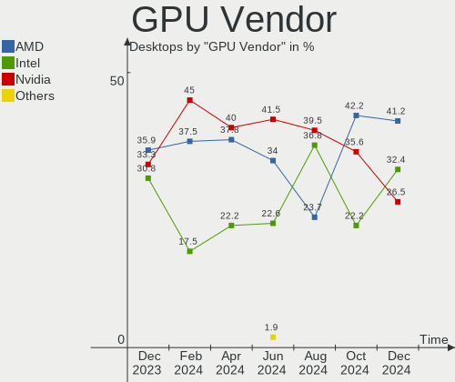
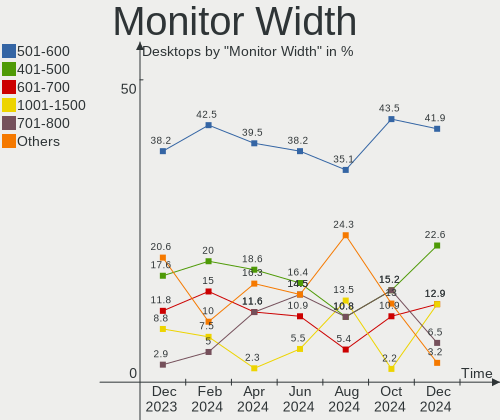
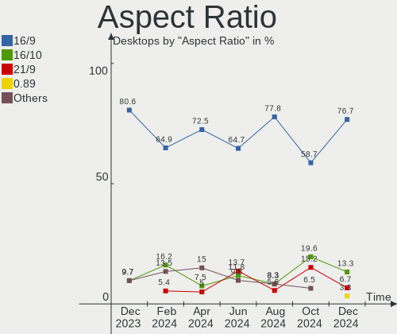
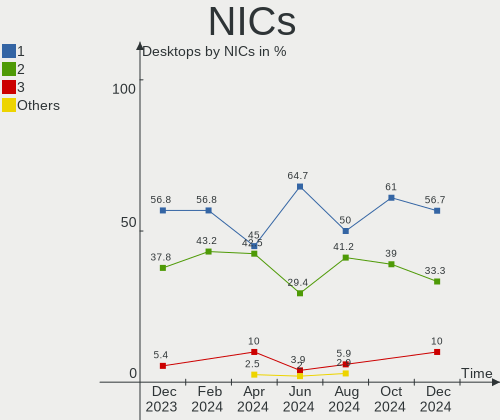
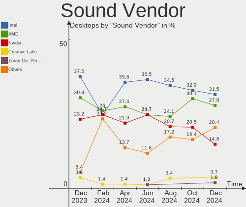
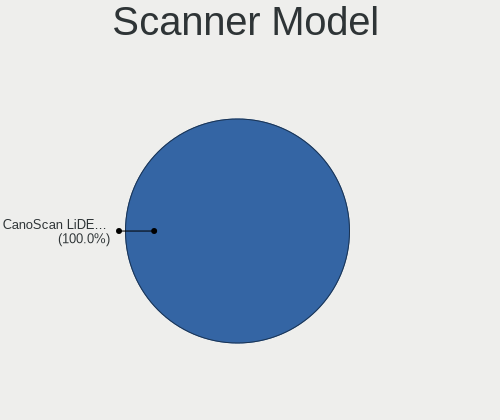

openSUSE Hardware Trends (Desktop)
----------------------------------

A project to identify most popular hardware characteristics and track their change
over time based on data collected by openSUSE users at https://Linux-Hardware.org.

Anyone can contribute to the study by uploading probes of their computers by
the [hw-probe](https://github.com/linuxhw/hw-probe) tool:

    sudo -E hw-probe -all -upload

Full-feature report is available here: https://linux-hardware.org/?view=trends&formfactor=desktop

Period: May, 2021.

Contents
--------

- [ OS                       ](#os)
- [ OS Family                ](#os-family)
- [ Kernel                   ](#kernel)
- [ Kernel Family            ](#kernel-family)
- [ Kernel Major Ver.        ](#kernel-major-ver)
- [ Arch                     ](#arch)
- [ DE                       ](#de)
- [ Display Server           ](#display-server)
- [ Display Manager          ](#display-manager)
- [ OS Lang                  ](#os-lang)
- [ Boot Mode                ](#boot-mode)
- [ Filesystem               ](#filesystem)
- [ Part. scheme             ](#part-scheme)
- [ Dual Boot with Linux/BSD ](#dual-boot-with-linux/bsd)
- [ Dual Boot (Win)          ](#dual-boot-win)
- [ Country                  ](#country)
- [ City                     ](#city)
- [ Vendor                   ](#vendor)
- [ Model                    ](#model)
- [ Model Family             ](#model-family)
- [ MFG Year                 ](#mfg-year)
- [ Form Factor              ](#form-factor)
- [ Secure Boot              ](#secure-boot)
- [ Coreboot                 ](#coreboot)
- [ RAM Size                 ](#ram-size)
- [ RAM Used                 ](#ram-used)
- [ Has CD-ROM               ](#has-cd-rom)
- [ Total Drives             ](#total-drives)
- [ Has Ethernet             ](#has-ethernet)
- [ Has WiFi                 ](#has-wifi)
- [ Has Bluetooth            ](#has-bluetooth)
- [ Drive Vendor             ](#drive-vendor)
- [ Drive Model              ](#drive-model)
- [ HDD Vendor               ](#hdd-vendor)
- [ SSD Vendor               ](#ssd-vendor)
- [ Drive Kind               ](#drive-kind)
- [ Drive Connector          ](#drive-connector)
- [ Drive Size               ](#drive-size)
- [ Space Total              ](#space-total)
- [ Space Used               ](#space-used)
- [ Malfunc. Drives          ](#malfunc-drives)
- [ Malfunc. Drive Vendor    ](#malfunc-drive-vendor)
- [ Malfunc. HDD Vendor      ](#malfunc-hdd-vendor)
- [ Malfunc. Drive Kind      ](#malfunc-drive-kind)
- [ Failed Drives            ](#failed-drives)
- [ Failed Drive Vendor      ](#failed-drive-vendor)
- [ Drive Status             ](#drive-status)
- [ Storage Vendor           ](#storage-vendor)
- [ Storage Model            ](#storage-model)
- [ Storage Kind             ](#storage-kind)
- [ CPU Vendor               ](#cpu-vendor)
- [ CPU Model                ](#cpu-model)
- [ CPU Model Family         ](#cpu-model-family)
- [ CPU Cores                ](#cpu-cores)
- [ CPU Sockets              ](#cpu-sockets)
- [ CPU Threads              ](#cpu-threads)
- [ CPU Op-Modes             ](#cpu-op-modes)
- [ CPU Microcode            ](#cpu-microcode)
- [ CPU Microarch            ](#cpu-microarch)
- [ GPU Vendor               ](#gpu-vendor)
- [ GPU Model                ](#gpu-model)
- [ GPU Combo                ](#gpu-combo)
- [ GPU Driver               ](#gpu-driver)
- [ GPU Memory               ](#gpu-memory)
- [ Monitor Vendor           ](#monitor-vendor)
- [ Monitor Model            ](#monitor-model)
- [ Monitor Resolution       ](#monitor-resolution)
- [ Monitor Diagonal         ](#monitor-diagonal)
- [ Monitor Width            ](#monitor-width)
- [ Aspect Ratio             ](#aspect-ratio)
- [ Monitor Area             ](#monitor-area)
- [ Pixel Density            ](#pixel-density)
- [ Multiple Monitors        ](#multiple-monitors)
- [ Net Controller Vendor    ](#net-controller-vendor)
- [ Net Controller Model     ](#net-controller-model)
- [ Wireless Vendor          ](#wireless-vendor)
- [ Wireless Model           ](#wireless-model)
- [ Ethernet Vendor          ](#ethernet-vendor)
- [ Ethernet Model           ](#ethernet-model)
- [ Net Controller Kind      ](#net-controller-kind)
- [ Used Controller          ](#used-controller)
- [ NICs                     ](#nics)
- [ IPv6                     ](#ipv6)
- [ Memory Vendor            ](#memory-vendor)
- [ Memory Model             ](#memory-model)
- [ Memory Kind              ](#memory-kind)
- [ Memory Form Factor       ](#memory-form-factor)
- [ Memory Size              ](#memory-size)
- [ Memory Speed             ](#memory-speed)
- [ Sound Vendor             ](#sound-vendor)
- [ Sound Model              ](#sound-model)
- [ Camera Vendor            ](#camera-vendor)
- [ Camera Model             ](#camera-model)
- [ Fingerprint Vendor       ](#fingerprint-vendor)
- [ Fingerprint Model        ](#fingerprint-model)
- [ Chipcard Vendor          ](#chipcard-vendor)
- [ Chipcard Model           ](#chipcard-model)
- [ Printer Vendor           ](#printer-vendor)
- [ Printer Model            ](#printer-model)
- [ Scanner Vendor           ](#scanner-vendor)
- [ Scanner Model            ](#scanner-model)
- [ Bluetooth Vendor         ](#bluetooth-vendor)
- [ Bluetooth Model          ](#bluetooth-model)
- [ Unsupported Devices      ](#unsupported-devices)
- [ Unsupported Device Types ](#unsupported-device-types)

OS
--

Installed operating systems

| Name                         | Desktops | Percent |
|------------------------------|----------|---------|
| openSUSE Leap-15.2           | 9        | 33.33%  |
| openSUSE Tumbleweed-20210504 | 2        | 7.41%   |
| openSUSE 20210521            | 2        | 7.41%   |
| openSUSE 20210427            | 2        | 7.41%   |
| openSUSE Tumbleweed-20210524 | 1        | 3.7%    |
| openSUSE Tumbleweed-20210521 | 1        | 3.7%    |
| openSUSE Tumbleweed-20210515 | 1        | 3.7%    |
| openSUSE Tumbleweed-20210512 | 1        | 3.7%    |
| openSUSE Tumbleweed-20210505 | 1        | 3.7%    |
| openSUSE Leap-15.1           | 1        | 3.7%    |
| openSUSE 20210522            | 1        | 3.7%    |
| openSUSE 20210520            | 1        | 3.7%    |
| openSUSE 20210511            | 1        | 3.7%    |
| openSUSE 20210502            | 1        | 3.7%    |
| openSUSE 20210428            | 1        | 3.7%    |
| openSUSE 20210426            | 1        | 3.7%    |

OS Family
---------

OS without a version

| Name     | Desktops | Percent |
|----------|----------|---------|
| openSUSE | 27       | 100%    |

Kernel
------

Version of the Linux kernel

| Version                     | Desktops | Percent |
|-----------------------------|----------|---------|
| 5.12.4-1-default            | 4        | 14.81%  |
| 5.11.16-1-default           | 4        | 14.81%  |
| 5.3.18-lp152.75-default     | 3        | 11.11%  |
| 5.12.0-2-default            | 3        | 11.11%  |
| 5.3.18-lp152.75-preempt     | 2        | 7.41%   |
| 5.12.3-1-default            | 2        | 7.41%   |
| 5.3.18-lp152.77-preempt     | 1        | 3.7%    |
| 5.3.18-lp152.72-preempt     | 1        | 3.7%    |
| 5.3.18-lp152.72-default     | 1        | 3.7%    |
| 5.3.18-lp152.33-default     | 1        | 3.7%    |
| 5.12.4-3-default            | 1        | 3.7%    |
| 5.12.2-1-pae                | 1        | 3.7%    |
| 5.12.2-1-default            | 1        | 3.7%    |
| 5.12.0-1-default            | 1        | 3.7%    |
| 4.12.14-lp151.28.91-default | 1        | 3.7%    |

Kernel Family
-------------

Linux kernel without a distro release

| Version | Desktops | Percent |
|---------|----------|---------|
| 5.3.18  | 9        | 33.33%  |
| 5.12.4  | 5        | 18.52%  |
| 5.12.0  | 4        | 14.81%  |
| 5.11.16 | 4        | 14.81%  |
| 5.12.3  | 2        | 7.41%   |
| 5.12.2  | 2        | 7.41%   |
| 4.12.14 | 1        | 3.7%    |

Kernel Major Ver.
-----------------

Linux kernel major version

| Version | Desktops | Percent |
|---------|----------|---------|
| 5.12    | 13       | 48.15%  |
| 5.3     | 9        | 33.33%  |
| 5.11    | 4        | 14.81%  |
| 4.12    | 1        | 3.7%    |

Arch
----

OS architecture (x86_64, i586, etc.)

| Name   | Desktops | Percent |
|--------|----------|---------|
| x86_64 | 26       | 96.3%   |
| i686   | 1        | 3.7%    |

DE
--

Desktop Environment

| Name  | Desktops | Percent |
|-------|----------|---------|
| KDE5  | 12       | 44.44%  |
| KDE   | 10       | 37.04%  |
| GNOME | 3        | 11.11%  |
| MATE  | 2        | 7.41%   |

Display Server
--------------

X11 or Wayland

| Name        | Desktops | Percent |
|-------------|----------|---------|
| X11         | 23       | 85.19%  |
| Wayland     | 3        | 11.11%  |
| Unspecified | 1        | 3.7%    |

Display Manager
---------------

SDDM, LightDM, etc.

| Name    | Desktops | Percent |
|---------|----------|---------|
| Unknown | 12       | 44.44%  |
| LightDM | 8        | 29.63%  |
| SDDM    | 6        | 22.22%  |
| XDM     | 1        | 3.7%    |

OS Lang
-------

Language

| Lang    | Desktops | Percent |
|---------|----------|---------|
| en_US   | 5        | 18.52%  |
| de_DE   | 5        | 18.52%  |
| POSIX   | 4        | 14.81%  |
| pt_BR   | 3        | 11.11%  |
| pl_PL   | 2        | 7.41%   |
| fr_FR   | 2        | 7.41%   |
| Unknown | 2        | 7.41%   |
| nl_NL   | 1        | 3.7%    |
| es_ES   | 1        | 3.7%    |
| en_GB   | 1        | 3.7%    |
| en_CH   | 1        | 3.7%    |

Boot Mode
---------

EFI or BIOS

| Mode | Desktops | Percent |
|------|----------|---------|
| EFI  | 14       | 51.85%  |
| BIOS | 13       | 48.15%  |

Filesystem
----------

Type of filesystem

| Type  | Desktops | Percent |
|-------|----------|---------|
| Btrfs | 17       | 62.96%  |
| Ext4  | 10       | 37.04%  |

Part. scheme
------------

Scheme of partitioning

| Type    | Desktops | Percent |
|---------|----------|---------|
| Unknown | 11       | 40.74%  |
| GPT     | 10       | 37.04%  |
| MBR     | 6        | 22.22%  |

Dual Boot with Linux/BSD
------------------------

Hosting more than one Linux/BSD

| Dual boot | Desktops | Percent |
|-----------|----------|---------|
| No        | 25       | 92.59%  |
| Yes       | 2        | 7.41%   |

Dual Boot (Win)
---------------

Hosting Linux and Windows

| Dual boot | Desktops | Percent |
|-----------|----------|---------|
| No        | 20       | 74.07%  |
| Yes       | 7        | 25.93%  |

Country
-------

Geographic location (country)

| Country     | Desktops | Percent |
|-------------|----------|---------|
| Germany     | 8        | 29.63%  |
| USA         | 3        | 11.11%  |
| Brazil      | 3        | 11.11%  |
| France      | 2        | 7.41%   |
| Switzerland | 1        | 3.7%    |
| Spain       | 1        | 3.7%    |
| Portugal    | 1        | 3.7%    |
| Poland      | 1        | 3.7%    |
| Netherlands | 1        | 3.7%    |
| Mexico      | 1        | 3.7%    |
| Lebanon     | 1        | 3.7%    |
| Israel      | 1        | 3.7%    |
| Iceland     | 1        | 3.7%    |
| Croatia     | 1        | 3.7%    |
| Austria     | 1        | 3.7%    |

City
----

Geographic location (city)

| City                      | Desktops | Percent |
|---------------------------|----------|---------|
| Wels                      | 1        | 3.7%    |
| Vreden                    | 1        | 3.7%    |
| Toulouse                  | 1        | 3.7%    |
| Tel Aviv                  | 1        | 3.7%    |
| San Antonio               | 1        | 3.7%    |
| Reykjavik                 | 1        | 3.7%    |
| Pouso Alegre              | 1        | 3.7%    |
| Osijek                    | 1        | 3.7%    |
| Osasco                    | 1        | 3.7%    |
| Offenbach                 | 1        | 3.7%    |
| Oberursel                 | 1        | 3.7%    |
| Miami                     | 1        | 3.7%    |
| Madrid                    | 1        | 3.7%    |
| Lázaro Cárdenas         | 1        | 3.7%    |
| Lisbon                    | 1        | 3.7%    |
| Kiel                      | 1        | 3.7%    |
| Gdansk                    | 1        | 3.7%    |
| Frankfurt am Main         | 1        | 3.7%    |
| Fortaleza                 | 1        | 3.7%    |
| Erie                      | 1        | 3.7%    |
| Dietikon                  | 1        | 3.7%    |
| Buchholz in der Nordheide | 1        | 3.7%    |
| Beirut                    | 1        | 3.7%    |
| Bayreuth                  | 1        | 3.7%    |
| Annequin                  | 1        | 3.7%    |
| Alphen aan den Rijn       | 1        | 3.7%    |
| Ahrensburg                | 1        | 3.7%    |

Vendor
------

Motherboard manufacturer

| Name                | Desktops | Percent |
|---------------------|----------|---------|
| MSI                 | 6        | 22.22%  |
| ASUSTek Computer    | 6        | 22.22%  |
| Dell                | 3        | 11.11%  |
| Hewlett-Packard     | 2        | 7.41%   |
| ASRock              | 2        | 7.41%   |
| PCWare              | 1        | 3.7%    |
| Medion              | 1        | 3.7%    |
| Lenovo              | 1        | 3.7%    |
| Intel               | 1        | 3.7%    |
| Gigabyte Technology | 1        | 3.7%    |
| Fujitsu             | 1        | 3.7%    |
| Foxconn             | 1        | 3.7%    |
| Biostar             | 1        | 3.7%    |

Model
-----

Motherboard model

| Name                              | Desktops | Percent |
|-----------------------------------|----------|---------|
| MSI MS-7B86                       | 2        | 7.41%   |
| PCWare IPX4105G Pro               | 1        | 3.7%    |
| MSI MS-7C02                       | 1        | 3.7%    |
| MSI MS-7B10                       | 1        | 3.7%    |
| MSI MS-7A72                       | 1        | 3.7%    |
| MSI MS-7048                       | 1        | 3.7%    |
| Medion MS-7728                    | 1        | 3.7%    |
| Lenovo K450e 10181                | 1        | 3.7%    |
| Intel H61                         | 1        | 3.7%    |
| HP Z840 Workstation               | 1        | 3.7%    |
| HP Pavilion Desktop TP01-2xxx     | 1        | 3.7%    |
| Gigabyte B450 AORUS M             | 1        | 3.7%    |
| Fujitsu ESPRIMO P558              | 1        | 3.7%    |
| Foxconn p6-2452efm                | 1        | 3.7%    |
| Dell PowerEdge T30                | 1        | 3.7%    |
| Dell OptiPlex 980                 | 1        | 3.7%    |
| Dell Inspiron 3880                | 1        | 3.7%    |
| Biostar H77MU3                    | 1        | 3.7%    |
| ASUS ROG CROSSHAIR VIII DARK HERO | 1        | 3.7%    |
| ASUS ProB                         | 1        | 3.7%    |
| ASUS PRIME A320M-K                | 1        | 3.7%    |
| ASUS F2A55                        | 1        | 3.7%    |
| ASUS A0000001                     | 1        | 3.7%    |
| ASUS 970 PRO GAMING/AURA          | 1        | 3.7%    |
| ASRock H370M Pro4                 | 1        | 3.7%    |
| ASRock 890GM Pro3                 | 1        | 3.7%    |

Model Family
------------

Motherboard model prefix

| Name               | Desktops | Percent |
|--------------------|----------|---------|
| MSI MS-7B86        | 2        | 7.41%   |
| PCWare IPX4105G    | 1        | 3.7%    |
| MSI MS-7C02        | 1        | 3.7%    |
| MSI MS-7B10        | 1        | 3.7%    |
| MSI MS-7A72        | 1        | 3.7%    |
| MSI MS-7048        | 1        | 3.7%    |
| Medion MS-7728     | 1        | 3.7%    |
| Lenovo K450e       | 1        | 3.7%    |
| Intel H61          | 1        | 3.7%    |
| HP Z840            | 1        | 3.7%    |
| HP Pavilion        | 1        | 3.7%    |
| Gigabyte B450      | 1        | 3.7%    |
| Fujitsu ESPRIMO    | 1        | 3.7%    |
| Foxconn p6-2452efm | 1        | 3.7%    |
| Dell PowerEdge     | 1        | 3.7%    |
| Dell OptiPlex      | 1        | 3.7%    |
| Dell Inspiron      | 1        | 3.7%    |
| Biostar H77MU3     | 1        | 3.7%    |
| ASUS ROG           | 1        | 3.7%    |
| ASUS ProB          | 1        | 3.7%    |
| ASUS PRIME         | 1        | 3.7%    |
| ASUS F2A55         | 1        | 3.7%    |
| ASUS A0000001      | 1        | 3.7%    |
| ASUS 970           | 1        | 3.7%    |
| ASRock H370M       | 1        | 3.7%    |
| ASRock 890GM       | 1        | 3.7%    |

MFG Year
--------

Motherboard manufacture year

| Year | Desktops | Percent |
|------|----------|---------|
| 2019 | 8        | 29.63%  |
| 2020 | 6        | 22.22%  |
| 2021 | 2        | 7.41%   |
| 2017 | 2        | 7.41%   |
| 2014 | 2        | 7.41%   |
| 2012 | 2        | 7.41%   |
| 2018 | 1        | 3.7%    |
| 2016 | 1        | 3.7%    |
| 2015 | 1        | 3.7%    |
| 2010 | 1        | 3.7%    |
| 2004 | 1        | 3.7%    |

Form Factor
-----------

Physical design of the computer

| Name    | Desktops | Percent |
|---------|----------|---------|
| Desktop | 27       | 100%    |

Secure Boot
-----------

Enabled or disabled

| State    | Desktops | Percent |
|----------|----------|---------|
| Disabled | 24       | 88.89%  |
| Enabled  | 3        | 11.11%  |

Coreboot
--------

Have coreboot on board

| Used | Desktops | Percent |
|------|----------|---------|
| No   | 27       | 100%    |

RAM Size
--------

Total RAM memory

| Size in GB  | Desktops | Percent |
|-------------|----------|---------|
| 16.01-24.0  | 8        | 29.63%  |
| 4.01-8.0    | 4        | 14.81%  |
| 64.01-256.0 | 4        | 14.81%  |
| 8.01-16.0   | 4        | 14.81%  |
| 32.01-64.0  | 3        | 11.11%  |
| 3.01-4.0    | 2        | 7.41%   |
| 24.01-32.0  | 2        | 7.41%   |

RAM Used
--------

Used RAM memory

| Used GB    | Desktops | Percent |
|------------|----------|---------|
| 3.01-4.0   | 8        | 29.63%  |
| 2.01-3.0   | 7        | 25.93%  |
| 4.01-8.0   | 6        | 22.22%  |
| 1.01-2.0   | 2        | 7.41%   |
| 0.51-1.0   | 2        | 7.41%   |
| 16.01-24.0 | 1        | 3.7%    |
| 8.01-16.0  | 1        | 3.7%    |

Has CD-ROM
----------

Has CD-ROM on board

| Presented | Desktops | Percent |
|-----------|----------|---------|
| No        | 14       | 51.85%  |
| Yes       | 13       | 48.15%  |

Total Drives
------------

Number of drives on board

| Drives | Desktops | Percent |
|--------|----------|---------|
| 2      | 9        | 33.33%  |
| 1      | 7        | 25.93%  |
| 3      | 5        | 18.52%  |
| 4      | 4        | 14.81%  |
| 6      | 1        | 3.7%    |
| 5      | 1        | 3.7%    |

Has Ethernet
------------

Has Ethernet on board

| Presented | Desktops | Percent |
|-----------|----------|---------|
| Yes       | 26       | 96.3%   |
| No        | 1        | 3.7%    |

Has WiFi
--------

Has WiFi module

| Presented | Desktops | Percent |
|-----------|----------|---------|
| No        | 19       | 70.37%  |
| Yes       | 8        | 29.63%  |

Has Bluetooth
-------------

Has Bluetooth module

| Presented | Desktops | Percent |
|-----------|----------|---------|
| No        | 19       | 70.37%  |
| Yes       | 8        | 29.63%  |

Drive Vendor
------------

Hard drive vendors

| Vendor              | Desktops | Drives | Percent |
|---------------------|----------|--------|---------|
| WDC                 | 11       | 16     | 22%     |
| Seagate             | 11       | 14     | 22%     |
| Samsung Electronics | 9        | 16     | 18%     |
| Toshiba             | 4        | 4      | 8%      |
| Crucial             | 4        | 5      | 8%      |
| SanDisk             | 2        | 2      | 4%      |
| Kingston            | 2        | 4      | 4%      |
| XPG                 | 1        | 1      | 2%      |
| Silicon Motion      | 1        | 1      | 2%      |
| Phison              | 1        | 1      | 2%      |
| Micron Technology   | 1        | 1      | 2%      |
| KIOXIA              | 1        | 1      | 2%      |
| Intel               | 1        | 1      | 2%      |
| Hitachi             | 1        | 1      | 2%      |

Drive Model
-----------

Hard drive models

| Model                                    | Desktops | Percent |
|------------------------------------------|----------|---------|
| Samsung SSD 860 EVO 500GB                | 3        | 4.76%   |
| WDC WD10EZEX-08WN4A0 1TB                 | 2        | 3.17%   |
| SanDisk SSD PLUS 1000GB                  | 2        | 3.17%   |
| Samsung SSD 860 EVO 1TB                  | 2        | 3.17%   |
| Crucial CT500MX500SSD1 500GB             | 2        | 3.17%   |
| XPG GAMMIX S11 Pro 512GB                 | 1        | 1.59%   |
| WDC WDS250G1B0A-00H9H0 250GB SSD         | 1        | 1.59%   |
| WDC WDS240G2G0A-00JH30 240GB SSD         | 1        | 1.59%   |
| WDC WDS120G2G0A-00JH30 120GB SSD         | 1        | 1.59%   |
| WDC WDS100T3XHC-00SJG0 1TB               | 1        | 1.59%   |
| WDC WD80EZZX-11CSGA0 8TB                 | 1        | 1.59%   |
| WDC WD80EFZX-68UW8N0 8TB                 | 1        | 1.59%   |
| WDC WD5000AZLX-00K2TA0 500GB             | 1        | 1.59%   |
| WDC WD5000AAKS-00UU3A0 500GB             | 1        | 1.59%   |
| WDC WD20EZRX-00DC0B0 2TB                 | 1        | 1.59%   |
| WDC WD1600AABS-56PRA0 160GB              | 1        | 1.59%   |
| WDC WD10EZEX-22MFCA0 1TB                 | 1        | 1.59%   |
| WDC WD10EURX-63UY4Y0 1TB                 | 1        | 1.59%   |
| WDC WD10EURS-730AB1 1TB                  | 1        | 1.59%   |
| WDC WD1003FZEX-00K3CA0 1TB               | 1        | 1.59%   |
| Toshiba HDWD260 6TB                      | 1        | 1.59%   |
| Toshiba HDWD110 1TB                      | 1        | 1.59%   |
| Toshiba HDWD105 500GB                    | 1        | 1.59%   |
| Toshiba DT01ACA100 1TB                   | 1        | 1.59%   |
| Silicon Motion NE-128 128GB              | 1        | 1.59%   |
| Seagate ST8000DM004-2CX188 8TB           | 1        | 1.59%   |
| Seagate ST4000DX001-1CE168 4TB           | 1        | 1.59%   |
| Seagate ST3200021A 200GB                 | 1        | 1.59%   |
| Seagate ST3160318AS 160GB                | 1        | 1.59%   |
| Seagate ST31000525SV 1TB                 | 1        | 1.59%   |
| Seagate ST2000DM008-2FR102 2TB           | 1        | 1.59%   |
| Seagate ST2000DM001-1ER164 2TB           | 1        | 1.59%   |
| Seagate ST1000VM002-1SD102 1TB           | 1        | 1.59%   |
| Seagate ST1000DX001-1CM162 1TB           | 1        | 1.59%   |
| Seagate ST1000DM010-2EP102 1TB           | 1        | 1.59%   |
| Seagate ST10000NM0086-2AA101 10TB        | 1        | 1.59%   |
| Seagate M3 Portable 2TB                  | 1        | 1.59%   |
| Seagate Expansion 2TB                    | 1        | 1.59%   |
| Samsung SSD 980 PRO 2TB                  | 1        | 1.59%   |
| Samsung SSD 860 EVO 250GB                | 1        | 1.59%   |
| Samsung Portable SSD T5 1TB              | 1        | 1.59%   |
| Samsung NVMe SSD Drive 500GB             | 1        | 1.59%   |
| Samsung NVMe SSD Drive 1TB               | 1        | 1.59%   |
| Samsung MZNLN256HAJQ-000H7 256GB SSD     | 1        | 1.59%   |
| Samsung HD642JJ 640GB                    | 1        | 1.59%   |
| Samsung HD502IJ 500GB                    | 1        | 1.59%   |
| Samsung HD161HJ 160GB                    | 1        | 1.59%   |
| Phison NVMe SSD Drive 240GB              | 1        | 1.59%   |
| Micron MTFDDAK256TDL-1AW1ZABFA 256GB SSD | 1        | 1.59%   |
| KIOXIA NVMe SSD Drive 256GB              | 1        | 1.59%   |
| Kingston SV300S37A240G 240GB SSD         | 1        | 1.59%   |
| Kingston SV300S37A120G 120GB SSD         | 1        | 1.59%   |
| Kingston SA400S37120G 120GB SSD          | 1        | 1.59%   |
| Intel SSDPEKNW512G8 512GB                | 1        | 1.59%   |
| Hitachi HDS721010DLE630 1TB              | 1        | 1.59%   |
| Crucial CT500P1SSD8 500GB                | 1        | 1.59%   |
| Crucial CT120BX500SSD1 120GB             | 1        | 1.59%   |

HDD Vendor
----------

Hard disk drive vendors

| Vendor              | Desktops | Drives | Percent |
|---------------------|----------|--------|---------|
| Seagate             | 10       | 13     | 37.04%  |
| WDC                 | 9        | 12     | 33.33%  |
| Toshiba             | 4        | 4      | 14.81%  |
| Samsung Electronics | 3        | 3      | 11.11%  |
| Hitachi             | 1        | 1      | 3.7%    |

SSD Vendor
----------

Solid state drive vendors

| Vendor              | Desktops | Drives | Percent |
|---------------------|----------|--------|---------|
| Samsung Electronics | 5        | 10     | 31.25%  |
| WDC                 | 3        | 3      | 18.75%  |
| Crucial             | 3        | 4      | 18.75%  |
| SanDisk             | 2        | 2      | 12.5%   |
| Kingston            | 2        | 4      | 12.5%   |
| Micron Technology   | 1        | 1      | 6.25%   |

Drive Kind
----------

HDD or SSD

| Kind    | Desktops | Drives | Percent |
|---------|----------|--------|---------|
| HDD     | 22       | 33     | 47.83%  |
| SSD     | 14       | 24     | 30.43%  |
| NVMe    | 9        | 10     | 19.57%  |
| Unknown | 1        | 1      | 2.17%   |

Drive Connector
---------------

SATA, SAS, NVMe, etc.

| Type | Desktops | Drives | Percent |
|------|----------|--------|---------|
| SATA | 25       | 55     | 67.57%  |
| NVMe | 9        | 10     | 24.32%  |
| SAS  | 3        | 3      | 8.11%   |

Drive Size
----------

Size of hard drive

| Size in TB | Desktops | Drives | Percent |
|------------|----------|--------|---------|
| 0.51-1.0   | 15       | 19     | 37.5%   |
| 0.01-0.5   | 15       | 27     | 37.5%   |
| 4.01-10.0  | 5        | 5      | 12.5%   |
| 1.01-2.0   | 4        | 5      | 10%     |
| 3.01-4.0   | 1        | 1      | 2.5%    |

Space Total
-----------

Amount of disk space available on the file system

| Size in GB     | Desktops | Percent |
|----------------|----------|---------|
| More than 3000 | 15       | 55.56%  |
| 1001-2000      | 4        | 14.81%  |
| 2001-3000      | 3        | 11.11%  |
| 251-500        | 2        | 7.41%   |
| 101-250        | 2        | 7.41%   |
| 501-1000       | 1        | 3.7%    |

Space Used
----------

Amount of used disk space

| Used GB        | Desktops | Percent |
|----------------|----------|---------|
| 1001-2000      | 7        | 25.93%  |
| 501-1000       | 5        | 18.52%  |
| More than 3000 | 3        | 11.11%  |
| 251-500        | 3        | 11.11%  |
| 51-100         | 3        | 11.11%  |
| 2001-3000      | 2        | 7.41%   |
| 101-250        | 2        | 7.41%   |
| 21-50          | 1        | 3.7%    |
| 1-20           | 1        | 3.7%    |

Malfunc. Drives
---------------

Drive models with a malfunction

| Model                    | Desktops | Drives | Percent |
|--------------------------|----------|--------|---------|
| WDC WD20EZRX-00DC0B0 2TB | 1        | 1      | 50%     |
| WDC WD10EZEX-08WN4A0 1TB | 1        | 1      | 50%     |

Malfunc. Drive Vendor
---------------------

Vendors of faulty drives

| Vendor | Desktops | Drives | Percent |
|--------|----------|--------|---------|
| WDC    | 2        | 2      | 100%    |

Malfunc. HDD Vendor
-------------------

Vendors of faulty HDD drives

| Vendor | Desktops | Drives | Percent |
|--------|----------|--------|---------|
| WDC    | 2        | 2      | 100%    |

Malfunc. Drive Kind
-------------------

Kinds of faulty drives

| Kind | Desktops | Drives | Percent |
|------|----------|--------|---------|
| HDD  | 2        | 2      | 100%    |

Failed Drives
-------------

Failed drive models

Zero info for selected period =(

Failed Drive Vendor
-------------------

Failed drive vendors

Zero info for selected period =(

Drive Status
------------

Number of failed and malfunc. drives

| Status   | Desktops | Drives | Percent |
|----------|----------|--------|---------|
| Works    | 16       | 35     | 53.33%  |
| Detected | 12       | 31     | 40%     |
| Malfunc  | 2        | 2      | 6.67%   |

Storage Vendor
--------------

Storage controller vendors

| Vendor                    | Desktops | Percent |
|---------------------------|----------|---------|
| Intel                     | 17       | 44.74%  |
| AMD                       | 11       | 28.95%  |
| Samsung Electronics       | 3        | 7.89%   |
| Silicon Motion            | 1        | 2.63%   |
| Sandisk                   | 1        | 2.63%   |
| Phison Electronics        | 1        | 2.63%   |
| Micron/Crucial Technology | 1        | 2.63%   |
| KIOXIA                    | 1        | 2.63%   |
| Broadcom / LSI            | 1        | 2.63%   |
| ADATA Technology          | 1        | 2.63%   |

Storage Model
-------------

Storage controller models

| Model                                                                          | Desktops | Percent |
|--------------------------------------------------------------------------------|----------|---------|
| AMD FCH SATA Controller [AHCI mode]                                            | 7        | 14.58%  |
| AMD 400 Series Chipset SATA Controller                                         | 6        | 12.5%   |
| Intel Cannon Lake PCH SATA AHCI Controller                                     | 3        | 6.25%   |
| Intel 6 Series/C200 Series Chipset Family 6 port Desktop SATA AHCI Controller  | 3        | 6.25%   |
| AMD SB7x0/SB8x0/SB9x0 SATA Controller [AHCI mode]                              | 2        | 4.17%   |
| Silicon Motion SM2263EN/SM2263XT SSD Controller                                | 1        | 2.08%   |
| Sandisk WD Black 2018/SN750 / PC SN720 NVMe SSD                                | 1        | 2.08%   |
| Samsung NVMe SSD Controller SM981/PM981/PM983                                  | 1        | 2.08%   |
| Samsung NVMe SSD Controller PM9A1/PM9A3/980PRO                                 | 1        | 2.08%   |
| Samsung NVMe Controller                                                        | 1        | 2.08%   |
| Phison E12 NVMe Controller                                                     | 1        | 2.08%   |
| Micron/Crucial P1 NVMe PCIe SSD                                                | 1        | 2.08%   |
| KIOXIA Non-Volatile memory controller                                          | 1        | 2.08%   |
| Intel SSD 660P Series                                                          | 1        | 2.08%   |
| Intel SATA Controller [RAID mode]                                              | 1        | 2.08%   |
| Intel Q170/Q150/B150/H170/H110/Z170/CM236 Chipset SATA Controller [AHCI Mode]  | 1        | 2.08%   |
| Intel Celeron/Pentium Silver Processor SATA Controller                         | 1        | 2.08%   |
| Intel C610/X99 series chipset sSATA Controller [RAID mode]                     | 1        | 2.08%   |
| Intel C600/X79 series chipset SATA RAID Controller                             | 1        | 2.08%   |
| Intel 82801EB/ER (ICH5/ICH5R) IDE Controller                                   | 1        | 2.08%   |
| Intel 8 Series/C220 Series Chipset Family 6-port SATA Controller 1 [AHCI mode] | 1        | 2.08%   |
| Intel 7 Series/C210 Series Chipset Family 4-port SATA Controller [IDE mode]    | 1        | 2.08%   |
| Intel 7 Series/C210 Series Chipset Family 2-port SATA Controller [IDE mode]    | 1        | 2.08%   |
| Intel 5 Series/3400 Series Chipset PT IDER Controller                          | 1        | 2.08%   |
| Intel 5 Series/3400 Series Chipset 6 port SATA AHCI Controller                 | 1        | 2.08%   |
| Intel 300 Series Chipset Family SATA RAID Controller                           | 1        | 2.08%   |
| Intel 200 Series PCH SATA controller [AHCI mode]                               | 1        | 2.08%   |
| Broadcom / LSI SAS2308 PCI-Express Fusion-MPT SAS-2                            | 1        | 2.08%   |
| AMD SB7x0/SB8x0/SB9x0 IDE Controller                                           | 1        | 2.08%   |
| AMD FCH SATA Controller D                                                      | 1        | 2.08%   |
| AMD FCH IDE Controller                                                         | 1        | 2.08%   |
| ADATA XPG SX8200 Pro PCIe Gen3x4 M.2 2280 Solid State Drive                    | 1        | 2.08%   |

Storage Kind
------------

Kind of storage controller (IDE, SATA, NVMe, SAS, ...)

| Kind | Desktops | Percent |
|------|----------|---------|
| SATA | 22       | 55%     |
| NVMe | 9        | 22.5%   |
| IDE  | 5        | 12.5%   |
| RAID | 3        | 7.5%    |
| SAS  | 1        | 2.5%    |

CPU Vendor
----------

Processor vendors

| Vendor | Desktops | Percent |
|--------|----------|---------|
| Intel  | 16       | 59.26%  |
| AMD    | 11       | 40.74%  |

CPU Model
---------

Processor models

| Model                                    | Desktops | Percent |
|------------------------------------------|----------|---------|
| AMD Ryzen 5 3600 6-Core Processor        | 2        | 7.41%   |
| Intel Xeon CPU E5-2667 v3 @ 3.20GHz      | 1        | 3.7%    |
| Intel Xeon CPU E3-1225 v5 @ 3.30GHz      | 1        | 3.7%    |
| Intel Pentium CPU G4400 @ 3.30GHz        | 1        | 3.7%    |
| Intel Pentium 4 CPU 3.00GHz              | 1        | 3.7%    |
| Intel Core i9-9900K CPU @ 3.60GHz        | 1        | 3.7%    |
| Intel Core i7-8700 CPU @ 3.20GHz         | 1        | 3.7%    |
| Intel Core i5-4460 CPU @ 3.20GHz         | 1        | 3.7%    |
| Intel Core i5-3470 CPU @ 3.20GHz         | 1        | 3.7%    |
| Intel Core i5-3450 CPU @ 3.10GHz         | 1        | 3.7%    |
| Intel Core i5-2320 CPU @ 3.00GHz         | 1        | 3.7%    |
| Intel Core i5 CPU 750 @ 2.67GHz          | 1        | 3.7%    |
| Intel Core i3-9100 CPU @ 3.60GHz         | 1        | 3.7%    |
| Intel Core i3-6100 CPU @ 3.70GHz         | 1        | 3.7%    |
| Intel Core i3-3220 CPU @ 3.30GHz         | 1        | 3.7%    |
| Intel Core i3-10100 CPU @ 3.60GHz        | 1        | 3.7%    |
| Intel Celeron J4105 CPU @ 1.50GHz        | 1        | 3.7%    |
| AMD Ryzen 9 5900X 12-Core Processor      | 1        | 3.7%    |
| AMD Ryzen 7 5700G with Radeon Graphics   | 1        | 3.7%    |
| AMD Ryzen 7 3700X 8-Core Processor       | 1        | 3.7%    |
| AMD Ryzen 5 3600X 6-Core Processor       | 1        | 3.7%    |
| AMD Ryzen 5 2600 Six-Core Processor      | 1        | 3.7%    |
| AMD Ryzen 5 1600X Six-Core Processor     | 1        | 3.7%    |
| AMD Phenom II X6 1100T Processor         | 1        | 3.7%    |
| AMD FX-8350 Eight-Core Processor         | 1        | 3.7%    |
| AMD A8-5600K APU with Radeon HD Graphics | 1        | 3.7%    |

CPU Model Family
----------------

Processor model prefix

| Model            | Desktops | Percent |
|------------------|----------|---------|
| Intel Core i5    | 5        | 18.52%  |
| AMD Ryzen 5      | 5        | 18.52%  |
| Intel Core i3    | 4        | 14.81%  |
| Intel Xeon       | 2        | 7.41%   |
| AMD Ryzen 7      | 2        | 7.41%   |
| Intel Pentium 4  | 1        | 3.7%    |
| Intel Pentium    | 1        | 3.7%    |
| Intel Core i9    | 1        | 3.7%    |
| Intel Core i7    | 1        | 3.7%    |
| Intel Celeron    | 1        | 3.7%    |
| AMD Ryzen 9      | 1        | 3.7%    |
| AMD Phenom II X6 | 1        | 3.7%    |
| AMD FX           | 1        | 3.7%    |
| AMD A8           | 1        | 3.7%    |

CPU Cores
---------

Number of processor cores

| Number | Desktops | Percent |
|--------|----------|---------|
| 4      | 10       | 37.04%  |
| 6      | 7        | 25.93%  |
| 2      | 4        | 14.81%  |
| 8      | 3        | 11.11%  |
| 16     | 1        | 3.7%    |
| 12     | 1        | 3.7%    |
| 1      | 1        | 3.7%    |

CPU Sockets
-----------

Number of sockets

| Number | Desktops | Percent |
|--------|----------|---------|
| 1      | 26       | 96.3%   |
| 2      | 1        | 3.7%    |

CPU Threads
-----------

Threads per core (Hyper-Threading)

| Number | Desktops | Percent |
|--------|----------|---------|
| 2      | 17       | 62.96%  |
| 1      | 10       | 37.04%  |

CPU Op-Modes
------------

CPU Operation Modes (32-bit, 64-bit)

| Op mode        | Desktops | Percent |
|----------------|----------|---------|
| 32-bit, 64-bit | 26       | 96.3%   |
| 32-bit         | 1        | 3.7%    |

CPU Microcode
-------------

Microcode number

| Number     | Desktops | Percent |
|------------|----------|---------|
| 0x506e3    | 3        | 11.11%  |
| 0x306a9    | 3        | 11.11%  |
| 0x08701021 | 2        | 7.41%   |
| 0x08701013 | 2        | 7.41%   |
| 0xf29      | 1        | 3.7%    |
| 0xa0653    | 1        | 3.7%    |
| 0x906ec    | 1        | 3.7%    |
| 0x906eb    | 1        | 3.7%    |
| 0x906ea    | 1        | 3.7%    |
| 0x706a1    | 1        | 3.7%    |
| 0x306f2    | 1        | 3.7%    |
| 0x306c3    | 1        | 3.7%    |
| 0x206a7    | 1        | 3.7%    |
| 0x106e5    | 1        | 3.7%    |
| 0x0a50000b | 1        | 3.7%    |
| 0x0a201009 | 1        | 3.7%    |
| 0x0800820d | 1        | 3.7%    |
| 0x08001138 | 1        | 3.7%    |
| 0x06001119 | 1        | 3.7%    |
| 0x06000852 | 1        | 3.7%    |
| 0x010000dc | 1        | 3.7%    |

CPU Microarch
-------------

Microarchitecture

| Name          | Desktops | Percent |
|---------------|----------|---------|
| Zen 2         | 4        | 14.81%  |
| Skylake       | 3        | 11.11%  |
| KabyLake      | 3        | 11.11%  |
| IvyBridge     | 3        | 11.11%  |
| Zen 3         | 2        | 7.41%   |
| Piledriver    | 2        | 7.41%   |
| Haswell       | 2        | 7.41%   |
| Zen+          | 1        | 3.7%    |
| Zen           | 1        | 3.7%    |
| SandyBridge   | 1        | 3.7%    |
| NetBurst      | 1        | 3.7%    |
| Nehalem       | 1        | 3.7%    |
| K10           | 1        | 3.7%    |
| Goldmont plus | 1        | 3.7%    |
| CometLake     | 1        | 3.7%    |

GPU Vendor
----------

Vendors of graphics cards

| Vendor | Desktops | Percent |
|--------|----------|---------|
| AMD    | 11       | 39.29%  |
| Intel  | 10       | 35.71%  |
| Nvidia | 7        | 25%     |

GPU Model
---------

Graphics card models

| Model                                                                       | Desktops | Percent |
|-----------------------------------------------------------------------------|----------|---------|
| AMD Ellesmere [Radeon RX 470/480/570/570X/580/580X/590]                     | 4        | 13.33%  |
| Nvidia GK208B [GeForce GT 710]                                              | 2        | 6.67%   |
| Intel Xeon E3-1200 v2/3rd Gen Core processor Graphics Controller            | 2        | 6.67%   |
| Intel CometLake-S GT2 [UHD Graphics 630]                                    | 2        | 6.67%   |
| AMD Navi 10 [Radeon RX 5600 OEM/5600 XT / 5700/5700 XT]                     | 2        | 6.67%   |
| Nvidia TU106 [GeForce RTX 2070]                                             | 1        | 3.33%   |
| Nvidia TU106 [GeForce RTX 2060 Rev. A]                                      | 1        | 3.33%   |
| Nvidia GP106 [GeForce GTX 1060 6GB]                                         | 1        | 3.33%   |
| Nvidia GP104 [GeForce GTX 1070]                                             | 1        | 3.33%   |
| Nvidia GM204 [GeForce GTX 970]                                              | 1        | 3.33%   |
| Nvidia GK110GL [Quadro K6000]                                               | 1        | 3.33%   |
| Nvidia GF116 [GeForce GTX 550 Ti]                                           | 1        | 3.33%   |
| Intel Xeon E3-1200 v3/4th Gen Core Processor Integrated Graphics Controller | 1        | 3.33%   |
| Intel HD Graphics P530                                                      | 1        | 3.33%   |
| Intel HD Graphics 510                                                       | 1        | 3.33%   |
| Intel GeminiLake [UHD Graphics 600]                                         | 1        | 3.33%   |
| Intel CoffeeLake-S GT2 [UHD Graphics 630]                                   | 1        | 3.33%   |
| Intel 2nd Generation Core Processor Family Integrated Graphics Controller   | 1        | 3.33%   |
| AMD Trinity [Radeon HD 7560D]                                               | 1        | 3.33%   |
| AMD Tahiti XT [Radeon HD 7970/8970 OEM / R9 280X]                           | 1        | 3.33%   |
| AMD RV670 [Radeon HD 3690/3850]                                             | 1        | 3.33%   |
| AMD RV620 LE [Radeon HD 3450]                                               | 1        | 3.33%   |
| AMD Cezanne                                                                 | 1        | 3.33%   |

GPU Combo
---------

Combinations of graphics cards

| Name         | Desktops | Percent |
|--------------|----------|---------|
| 1 x Intel    | 10       | 37.04%  |
| 1 x AMD      | 10       | 37.04%  |
| 1 x Nvidia   | 4        | 14.81%  |
| 2 x Nvidia   | 2        | 7.41%   |
| AMD + Nvidia | 1        | 3.7%    |

GPU Driver
----------

Free vs proprietary

| Driver      | Desktops | Percent |
|-------------|----------|---------|
| Free        | 19       | 70.37%  |
| Proprietary | 6        | 22.22%  |
| Unknown     | 2        | 7.41%   |

GPU Memory
----------

Total video memory

| Size in GB | Desktops | Percent |
|------------|----------|---------|
| Unknown    | 11       | 40.74%  |
| 7.01-8.0   | 7        | 25.93%  |
| 3.01-4.0   | 2        | 7.41%   |
| 1.01-2.0   | 2        | 7.41%   |
| 0.01-0.5   | 2        | 7.41%   |
| 2.01-3.0   | 1        | 3.7%    |
| 8.01-16.0  | 1        | 3.7%    |
| 0.51-1.0   | 1        | 3.7%    |

Monitor Vendor
--------------

Monitor vendors

| Vendor               | Desktops | Percent |
|----------------------|----------|---------|
| Samsung Electronics  | 4        | 16%     |
| Dell                 | 4        | 16%     |
| Lenovo               | 3        | 12%     |
| Hewlett-Packard      | 3        | 12%     |
| Ancor Communications | 3        | 12%     |
| Vizio                | 1        | 4%      |
| Sceptre Tech         | 1        | 4%      |
| Philips              | 1        | 4%      |
| MSI                  | 1        | 4%      |
| LG Electronics       | 1        | 4%      |
| Fujitsu Siemens      | 1        | 4%      |
| BenQ                 | 1        | 4%      |
| Acer                 | 1        | 4%      |

Monitor Model
-------------

Monitor models

| Model                                                                 | Desktops | Percent |
|-----------------------------------------------------------------------|----------|---------|
| Vizio V405-H9 VIZ1039 3840x2160 870x480mm 39.1-inch                   | 1        | 3.7%    |
| Sceptre Tech N43 SPT110C 3840x2160 575x323mm 26.0-inch                | 1        | 3.7%    |
| Samsung Electronics SyncMaster SAM021C 1400x1050 408x300mm 19.9-inch  | 1        | 3.7%    |
| Samsung Electronics SA300/SA350 SAM0788 1366x768 410x230mm 18.5-inch  | 1        | 3.7%    |
| Samsung Electronics S24E650 SAM0C86 1920x1200 518x324mm 24.1-inch     | 1        | 3.7%    |
| Samsung Electronics S24E450 SAM0C82 1920x1080 530x300mm 24.0-inch     | 1        | 3.7%    |
| Samsung Electronics LCD Monitor SyncMaster 1920x1080                  | 1        | 3.7%    |
| Philips PHL 243V5 PHLC0D1 1920x1080 521x293mm 23.5-inch               | 1        | 3.7%    |
| MSI MAG342CQRV MSI3DB6 3440x1440 797x333mm 34.0-inch                  | 1        | 3.7%    |
| LG Electronics LCD Monitor IPS277 1920x1080                           | 1        | 3.7%    |
| Lenovo T2224pD LEN60CA 1920x1080 476x267mm 21.5-inch                  | 1        | 3.7%    |
| Lenovo LEN L27q-10 LEN65CE 2560x1440 597x336mm 27.0-inch              | 1        | 3.7%    |
| Lenovo LEN D27-20B LEN65F5 1920x1080 598x336mm 27.0-inch              | 1        | 3.7%    |
| Lenovo L24q-10 LEN65CF 2560x1440 527x296mm 23.8-inch                  | 1        | 3.7%    |
| Hewlett-Packard P221 HWP3057 1920x1080 480x270mm 21.7-inch            | 1        | 3.7%    |
| Hewlett-Packard 24f HPN3545 1920x1080 527x296mm 23.8-inch             | 1        | 3.7%    |
| Hewlett-Packard 23xi HWP3031 1920x1080 509x286mm 23.0-inch            | 1        | 3.7%    |
| Fujitsu Siemens P19-1 FUS0502 1280x1024 376x301mm 19.0-inch           | 1        | 3.7%    |
| Dell U2719D DEL415A 2560x1440 597x336mm 27.0-inch                     | 1        | 3.7%    |
| Dell U2414H DELA0A4 1920x1080 530x300mm 24.0-inch                     | 1        | 3.7%    |
| Dell S2719DC DEL418B 2560x1440 597x336mm 27.0-inch                    | 1        | 3.7%    |
| Dell LCD Monitor DELA103 1920x1080 540x300mm 24.3-inch                | 1        | 3.7%    |
| BenQ GW2480 BNQ78E7 1920x1080 527x296mm 23.8-inch                     | 1        | 3.7%    |
| Ancor Communications ASUS VS229 ACI22C2 1920x1080 477x268mm 21.5-inch | 1        | 3.7%    |
| Ancor Communications ASUS MG279 ACI27A7 2560x1440 597x336mm 27.0-inch | 1        | 3.7%    |
| Ancor Communications ASUS MG278 ACI27A8 2560x1440 597x336mm 27.0-inch | 1        | 3.7%    |
| Acer K242HL ACR03E3 1920x1080 531x299mm 24.0-inch                     | 1        | 3.7%    |

Monitor Resolution
------------------

Monitor screen resolution

| Resolution        | Desktops | Percent |
|-------------------|----------|---------|
| 1920x1080 (FHD)   | 13       | 54.17%  |
| 2560x1440 (QHD)   | 4        | 16.67%  |
| 3840x2160 (4K)    | 2        | 8.33%   |
| 3440x1440         | 1        | 4.17%   |
| 1920x1200 (WUXGA) | 1        | 4.17%   |
| 1400x1050         | 1        | 4.17%   |
| 1366x768 (WXGA)   | 1        | 4.17%   |
| 1280x1024 (SXGA)  | 1        | 4.17%   |

Monitor Diagonal
----------------

Diagonal size in inches

| Inches  | Desktops | Percent |
|---------|----------|---------|
| 24      | 8        | 32%     |
| 27      | 4        | 16%     |
| 23      | 2        | 8%      |
| 21      | 2        | 8%      |
| Unknown | 2        | 8%      |
| 42      | 1        | 4%      |
| 40      | 1        | 4%      |
| 34      | 1        | 4%      |
| 26      | 1        | 4%      |
| 20      | 1        | 4%      |
| 19      | 1        | 4%      |
| 18      | 1        | 4%      |

Monitor Width
-------------

Physical width

| Width in mm | Desktops | Percent |
|-------------|----------|---------|
| 501-600     | 14       | 58.33%  |
| 401-500     | 4        | 16.67%  |
| Unknown     | 2        | 8.33%   |
| 801-900     | 1        | 4.17%   |
| 701-800     | 1        | 4.17%   |
| 351-400     | 1        | 4.17%   |
| 901-1000    | 1        | 4.17%   |

Aspect Ratio
------------

Proportional relationship between the width and the height

| Ratio   | Desktops | Percent |
|---------|----------|---------|
| 16/9    | 18       | 75%     |
| Unknown | 2        | 8.33%   |
| 5/4     | 1        | 4.17%   |
| 4/3     | 1        | 4.17%   |
| 21/9    | 1        | 4.17%   |
| 16/10   | 1        | 4.17%   |

Monitor Area
------------

Area in inch²

| Area in inch² | Desktops | Percent |
|----------------|----------|---------|
| 201-250        | 10       | 40%     |
| 301-350        | 4        | 16%     |
| 251-300        | 3        | 12%     |
| 151-200        | 2        | 8%      |
| 501-1000       | 2        | 8%      |
| Unknown        | 2        | 8%      |
| 351-500        | 1        | 4%      |
| 141-150        | 1        | 4%      |

Pixel Density
-------------

Pixels per inch

| Density | Desktops | Percent |
|---------|----------|---------|
| 51-100  | 11       | 47.83%  |
| 101-120 | 8        | 34.78%  |
| Unknown | 2        | 8.7%    |
| 161-240 | 1        | 4.35%   |
| 121-160 | 1        | 4.35%   |

Multiple Monitors
-----------------

Total monitors connected

| Total | Desktops | Percent |
|-------|----------|---------|
| 1     | 19       | 70.37%  |
| 2     | 5        | 18.52%  |
| 0     | 3        | 11.11%  |

Net Controller Vendor
---------------------

Controller vendors

| Vendor                | Desktops | Percent |
|-----------------------|----------|---------|
| Realtek Semiconductor | 18       | 54.55%  |
| Intel                 | 9        | 27.27%  |
| VIA Technologies      | 1        | 3.03%   |
| Qualcomm Atheros      | 1        | 3.03%   |
| Mellanox Technologies | 1        | 3.03%   |
| Intersil              | 1        | 3.03%   |
| IMC Networks          | 1        | 3.03%   |
| AVM                   | 1        | 3.03%   |

Net Controller Model
--------------------

Controller models

| Model                                                                                                                  | Desktops | Percent |
|------------------------------------------------------------------------------------------------------------------------|----------|---------|
| Realtek RTL8111/8168/8411 PCI Express Gigabit Ethernet Controller                                                      | 16       | 43.24%  |
| Intel I211 Gigabit Network Connection                                                                                  | 2        | 5.41%   |
| VIA VT6105/VT6106S [Rhine-III]                                                                                         | 1        | 2.7%    |
| Realtek RTL8821CE 802.11ac PCIe Wireless Network Adapter                                                               | 1        | 2.7%    |
| Realtek RTL8821AE 802.11ac PCIe Wireless Network Adapter                                                               | 1        | 2.7%    |
| Realtek RTL8125 2.5GbE Controller                                                                                      | 1        | 2.7%    |
| Realtek RTL810xE PCI Express Fast Ethernet controller                                                                  | 1        | 2.7%    |
| Qualcomm Atheros Killer E2500 Gigabit Ethernet Controller                                                              | 1        | 2.7%    |
| Mellanox MT25408A0-FCC-QI ConnectX, Dual Port 40Gb/s InfiniBand / 10GigE Adapter IC with PCIe 2.0 x8 5.0GT/s Interface | 1        | 2.7%    |
| Intersil ISL3886 [Prism Javelin/Prism Xbow]                                                                            | 1        | 2.7%    |
| Intel Wireless-AC 9260                                                                                                 | 1        | 2.7%    |
| Intel Wireless 3165                                                                                                    | 1        | 2.7%    |
| Intel Wi-Fi 6 AX200                                                                                                    | 1        | 2.7%    |
| Intel I210 Gigabit Network Connection                                                                                  | 1        | 2.7%    |
| Intel Ethernet Connection (7) I219-V                                                                                   | 1        | 2.7%    |
| Intel Ethernet Connection (2) I219-V                                                                                   | 1        | 2.7%    |
| Intel Ethernet Connection (2) I219-LM                                                                                  | 1        | 2.7%    |
| Intel Ethernet Connection (2) I218-LM                                                                                  | 1        | 2.7%    |
| Intel 82578DM Gigabit Network Connection                                                                               | 1        | 2.7%    |
| IMC Networks Mediao 802.11n WLAN [Realtek RTL8191SU]                                                                   | 1        | 2.7%    |
| AVM FRITZ!WLAN AC 860                                                                                                  | 1        | 2.7%    |

Wireless Vendor
---------------

Wireless vendors

| Vendor                | Desktops | Percent |
|-----------------------|----------|---------|
| Intel                 | 3        | 37.5%   |
| Realtek Semiconductor | 2        | 25%     |
| Intersil              | 1        | 12.5%   |
| IMC Networks          | 1        | 12.5%   |
| AVM                   | 1        | 12.5%   |

Wireless Model
--------------

Wireless models

| Model                                                    | Desktops | Percent |
|----------------------------------------------------------|----------|---------|
| Realtek RTL8821CE 802.11ac PCIe Wireless Network Adapter | 1        | 12.5%   |
| Realtek RTL8821AE 802.11ac PCIe Wireless Network Adapter | 1        | 12.5%   |
| Intersil ISL3886 [Prism Javelin/Prism Xbow]              | 1        | 12.5%   |
| Intel Wireless-AC 9260                                   | 1        | 12.5%   |
| Intel Wireless 3165                                      | 1        | 12.5%   |
| Intel Wi-Fi 6 AX200                                      | 1        | 12.5%   |
| IMC Networks Mediao 802.11n WLAN [Realtek RTL8191SU]     | 1        | 12.5%   |
| AVM FRITZ!WLAN AC 860                                    | 1        | 12.5%   |

Ethernet Vendor
---------------

Ethernet vendors

| Vendor                | Desktops | Percent |
|-----------------------|----------|---------|
| Realtek Semiconductor | 18       | 66.67%  |
| Intel                 | 7        | 25.93%  |
| VIA Technologies      | 1        | 3.7%    |
| Qualcomm Atheros      | 1        | 3.7%    |

Ethernet Model
--------------

Ethernet models

| Model                                                             | Desktops | Percent |
|-------------------------------------------------------------------|----------|---------|
| Realtek RTL8111/8168/8411 PCI Express Gigabit Ethernet Controller | 16       | 57.14%  |
| Intel I211 Gigabit Network Connection                             | 2        | 7.14%   |
| VIA VT6105/VT6106S [Rhine-III]                                    | 1        | 3.57%   |
| Realtek RTL8125 2.5GbE Controller                                 | 1        | 3.57%   |
| Realtek RTL810xE PCI Express Fast Ethernet controller             | 1        | 3.57%   |
| Qualcomm Atheros Killer E2500 Gigabit Ethernet Controller         | 1        | 3.57%   |
| Intel I210 Gigabit Network Connection                             | 1        | 3.57%   |
| Intel Ethernet Connection (7) I219-V                              | 1        | 3.57%   |
| Intel Ethernet Connection (2) I219-V                              | 1        | 3.57%   |
| Intel Ethernet Connection (2) I219-LM                             | 1        | 3.57%   |
| Intel Ethernet Connection (2) I218-LM                             | 1        | 3.57%   |
| Intel 82578DM Gigabit Network Connection                          | 1        | 3.57%   |

Net Controller Kind
-------------------

Ethernet, WiFi or modem

| Kind     | Desktops | Percent |
|----------|----------|---------|
| Ethernet | 26       | 74.29%  |
| WiFi     | 8        | 22.86%  |
| Unknown  | 1        | 2.86%   |

Used Controller
---------------

Currently used network controller

| Kind     | Desktops | Percent |
|----------|----------|---------|
| Ethernet | 25       | 80.65%  |
| WiFi     | 6        | 19.35%  |

NICs
----

Total network controllers on board

| Total | Desktops | Percent |
|-------|----------|---------|
| 1     | 19       | 70.37%  |
| 2     | 4        | 14.81%  |
| 3     | 2        | 7.41%   |
| 4     | 1        | 3.7%    |
| 0     | 1        | 3.7%    |

IPv6
----

IPv6 vs IPv4

| Used | Desktops | Percent |
|------|----------|---------|
| No   | 17       | 62.96%  |
| Yes  | 10       | 37.04%  |

Memory Vendor
-------------

Memory module vendors

| Vendor              | Desktops | Percent |
|---------------------|----------|---------|
| Kingston            | 5        | 26.32%  |
| G.Skill             | 4        | 21.05%  |
| Unknown             | 2        | 10.53%  |
| Corsair             | 2        | 10.53%  |
| SK Hynix            | 1        | 5.26%   |
| Silicon Power       | 1        | 5.26%   |
| SanDisk             | 1        | 5.26%   |
| Samsung Electronics | 1        | 5.26%   |
| Nanya Technology    | 1        | 5.26%   |
| A-DATA Technology   | 1        | 5.26%   |

Memory Model
------------

Memory module models

| Model                                                     | Desktops | Percent |
|-----------------------------------------------------------|----------|---------|
| G.Skill RAM F4-3000C16-8GISB 8GB DIMM DDR4 3200MT/s       | 2        | 10%     |
| Unknown RAM Module 8192MB DIMM DDR3 1333MT/s              | 1        | 5%      |
| Unknown RAM Module 1GB DIMM SDRAM                         | 1        | 5%      |
| SK Hynix RAM HMA42GR7MFR4N-TF 16384MB DIMM DDR4 2133MT/s  | 1        | 5%      |
| Silicon Power RAM SP008GBLFU240B02 8GB DIMM DDR4 2400MT/s | 1        | 5%      |
| SanDisk RAM MS401GNSE-CB3M2 0 8GB SODIMM DDR4 2400MT/s    | 1        | 5%      |
| Samsung RAM M393A2G40DB0-CPB 16384MB DIMM DDR4 2133MT/s   | 1        | 5%      |
| Nanya RAM M2F4G64CB8HG5N-CG 4GB DIMM DDR3 1600MT/s        | 1        | 5%      |
| Kingston RAM KP223C-ELD 2048MB DIMM DDR3 1333MT/s         | 1        | 5%      |
| Kingston RAM KHX3200C16D4/8GX 8GB DIMM DDR4 3533MT/s      | 1        | 5%      |
| Kingston RAM KHX2400C15/8G 8192MB DIMM DDR4 2933MT/s      | 1        | 5%      |
| Kingston RAM 99U5471-051.A00LF 8192MB DIMM DDR3 1333MT/s  | 1        | 5%      |
| Kingston RAM 99U5471-040.A00LF 8192MB DIMM DDR3 1333MT/s  | 1        | 5%      |
| G.Skill RAM F4-3600C16-32GTZR 32GB DIMM DDR4 3600MT/s     | 1        | 5%      |
| G.Skill RAM F3-1600C7-8GTX 8GB DIMM DDR3 1600MT/s         | 1        | 5%      |
| Corsair RAM CMW32GX4M2D3600C18 16GB DIMM DDR4 3600MT/s    | 1        | 5%      |
| Corsair RAM CMK16GX4M2B3200C16 8GB DIMM DDR4 3600MT/s     | 1        | 5%      |
| Corsair RAM CM4X8GD3200C16K4 8GB DIMM DDR4 2133MT/s       | 1        | 5%      |
| A-DATA RAM DDR4 3000 16GB DIMM DDR4 3200MT/s              | 1        | 5%      |

Memory Kind
-----------

Memory module kinds

| Kind  | Desktops | Percent |
|-------|----------|---------|
| DDR4  | 11       | 64.71%  |
| DDR3  | 5        | 29.41%  |
| SDRAM | 1        | 5.88%   |

Memory Form Factor
------------------

Physical design of the memory module

| Name   | Desktops | Percent |
|--------|----------|---------|
| DIMM   | 16       | 94.12%  |
| SODIMM | 1        | 5.88%   |

Memory Size
-----------

Memory module size

| Size  | Desktops | Percent |
|-------|----------|---------|
| 8192  | 11       | 64.71%  |
| 16384 | 3        | 17.65%  |
| 32768 | 1        | 5.88%   |
| 2048  | 1        | 5.88%   |
| 1024  | 1        | 5.88%   |

Memory Speed
------------

Memory module speed

| Speed   | Desktops | Percent |
|---------|----------|---------|
| 3600    | 3        | 16.67%  |
| 3200    | 3        | 16.67%  |
| 1333    | 3        | 16.67%  |
| 2400    | 2        | 11.11%  |
| 2133    | 2        | 11.11%  |
| 1600    | 2        | 11.11%  |
| 3533    | 1        | 5.56%   |
| 2933    | 1        | 5.56%   |
| Unknown | 1        | 5.56%   |

Sound Vendor
------------

Sound card vendors

| Vendor              | Desktops | Percent |
|---------------------|----------|---------|
| Intel               | 15       | 37.5%   |
| AMD                 | 11       | 27.5%   |
| Nvidia              | 7        | 17.5%   |
| Logitech            | 2        | 5%      |
| XMOS                | 1        | 2.5%    |
| Syntek              | 1        | 2.5%    |
| Plantronics         | 1        | 2.5%    |
| Creative Labs       | 1        | 2.5%    |
| C-Media Electronics | 1        | 2.5%    |

Sound Model
-----------

Sound card models

| Model                                                                      | Desktops | Percent |
|----------------------------------------------------------------------------|----------|---------|
| AMD Starship/Matisse HD Audio Controller                                   | 5        | 10.2%   |
| AMD Ellesmere HDMI Audio [Radeon RX 470/480 / 570/580/590]                 | 4        | 8.16%   |
| Intel Cannon Lake PCH cAVS                                                 | 3        | 6.12%   |
| Intel 6 Series/C200 Series Chipset Family High Definition Audio Controller | 3        | 6.12%   |
| Nvidia GK208 HDMI/DP Audio Controller                                      | 2        | 4.08%   |
| Logitech G935 Gaming Headset                                               | 2        | 4.08%   |
| AMD SBx00 Azalia (Intel HDA)                                               | 2        | 4.08%   |
| AMD Navi 10 HDMI Audio                                                     | 2        | 4.08%   |
| XMOS X1S USB DAC                                                           | 1        | 2.04%   |
| Syntek USB Ear-Microphone                                                  | 1        | 2.04%   |
| Plantronics C320-M                                                         | 1        | 2.04%   |
| Nvidia TU106 High Definition Audio Controller                              | 1        | 2.04%   |
| Nvidia GP106 High Definition Audio Controller                              | 1        | 2.04%   |
| Nvidia GP104 High Definition Audio Controller                              | 1        | 2.04%   |
| Nvidia GM204 High Definition Audio Controller                              | 1        | 2.04%   |
| Nvidia GK110 High Definition Audio Controller                              | 1        | 2.04%   |
| Nvidia GF116 High Definition Audio Controller                              | 1        | 2.04%   |
| Intel Xeon E3-1200 v3/4th Gen Core Processor HD Audio Controller           | 1        | 2.04%   |
| Intel Comet Lake PCH-V Smart Sound Technology Audio Controller             | 1        | 2.04%   |
| Intel Celeron/Pentium Silver Processor High Definition Audio               | 1        | 2.04%   |
| Intel C610/X99 series chipset HD Audio Controller                          | 1        | 2.04%   |
| Intel 82801EB/ER (ICH5/ICH5R) AC'97 Audio Controller                       | 1        | 2.04%   |
| Intel 8 Series/C220 Series Chipset High Definition Audio Controller        | 1        | 2.04%   |
| Intel 7 Series/C216 Chipset Family High Definition Audio Controller        | 1        | 2.04%   |
| Intel 5 Series/3400 Series Chipset High Definition Audio                   | 1        | 2.04%   |
| Intel 200 Series PCH HD Audio                                              | 1        | 2.04%   |
| Intel 100 Series/C230 Series Chipset Family HD Audio Controller            | 1        | 2.04%   |
| Creative Labs Sound Core3D [Sound Blaster Recon3D / Z-Series]              | 1        | 2.04%   |
| C-Media Electronics USB PnP Audio Device                                   | 1        | 2.04%   |
| AMD Tahiti HDMI Audio [Radeon HD 7870 XT / 7950/7970]                      | 1        | 2.04%   |
| AMD Renoir Radeon High Definition Audio Controller                         | 1        | 2.04%   |
| AMD FCH Azalia Controller                                                  | 1        | 2.04%   |
| AMD Family 17h (Models 10h-1fh) HD Audio Controller                        | 1        | 2.04%   |
| AMD Family 17h (Models 00h-0fh) HD Audio Controller                        | 1        | 2.04%   |

Camera Vendor
-------------

Camera device vendors

| Vendor              | Desktops | Percent |
|---------------------|----------|---------|
| Microdia            | 2        | 50%     |
| Microsoft           | 1        | 25%     |
| Chicony Electronics | 1        | 25%     |

Camera Model
------------

Camera device models

| Model                                | Desktops | Percent |
|--------------------------------------|----------|---------|
| Microdia Sonix USB 2.0 Camera        | 2        | 50%     |
| Microsoft Microsoft LifeCam Cinema | 1        | 25%     |
| Chicony HP Deluxe Webcam KQ246AA     | 1        | 25%     |

Fingerprint Vendor
------------------

Fingerprint sensor vendors

Zero info for selected period =(

Fingerprint Model
-----------------

Fingerprint sensor models

Zero info for selected period =(

Chipcard Vendor
---------------

Chipcard module vendors

Zero info for selected period =(

Chipcard Model
--------------

Chipcard module models

Zero info for selected period =(

Printer Vendor
--------------

Printer device vendors

| Vendor          | Desktops | Percent |
|-----------------|----------|---------|
| Seiko Epson     | 2        | 66.67%  |
| Hewlett-Packard | 1        | 33.33%  |

Printer Model
-------------

Printer device models

| Model                             | Desktops | Percent |
|-----------------------------------|----------|---------|
| Seiko Epson XP-243 245 247 Series | 1        | 25%     |
| Seiko Epson XP-230 Series         | 1        | 25%     |
| Seiko Epson L1300 Series          | 1        | 25%     |
| HP DeskJet 6940 series            | 1        | 25%     |

Scanner Vendor
--------------

Scanner device vendors

| Vendor      | Desktops | Percent |
|-------------|----------|---------|
| Seiko Epson | 1        | 100%    |

Scanner Model
-------------

Scanner device models

| Model                                 | Desktops | Percent |
|---------------------------------------|----------|---------|
| Seiko Epson GT-X770 [Perfection V500] | 1        | 100%    |

Bluetooth Vendor
----------------

Controller vendors

| Vendor                  | Desktops | Percent |
|-------------------------|----------|---------|
| Intel                   | 3        | 37.5%   |
| Cambridge Silicon Radio | 3        | 37.5%   |
| Realtek Semiconductor   | 2        | 25%     |

Bluetooth Model
---------------

Controller models

| Model                                               | Desktops | Percent |
|-----------------------------------------------------|----------|---------|
| Cambridge Silicon Radio Bluetooth Dongle (HCI mode) | 3        | 37.5%   |
| Realtek RTL8821A Bluetooth                          | 1        | 12.5%   |
| Realtek Bluetooth Radio                             | 1        | 12.5%   |
| Intel Wireless-AC 9260 Bluetooth Adapter            | 1        | 12.5%   |
| Intel Bluetooth Device                              | 1        | 12.5%   |
| Intel AX200 Bluetooth                               | 1        | 12.5%   |

Unsupported Devices
-------------------

Total unsupported devices on board

| Total | Desktops | Percent |
|-------|----------|---------|
| 0     | 24       | 88.89%  |
| 3     | 1        | 3.7%    |
| 2     | 1        | 3.7%    |
| 1     | 1        | 3.7%    |

Unsupported Device Types
------------------------

Types of unsupported devices

| Type             | Desktops | Percent |
|------------------|----------|---------|
| Graphics card    | 2        | 40%     |
| Unassigned class | 1        | 20%     |
| Sound            | 1        | 20%     |
| Net/wireless     | 1        | 20%     |

