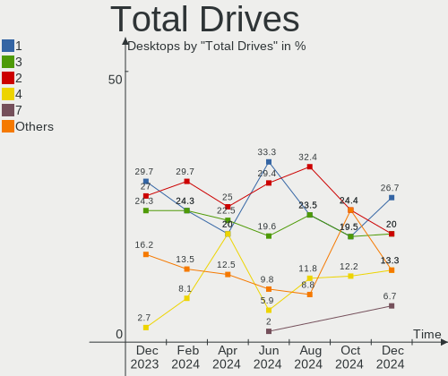
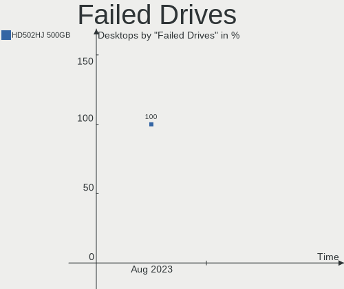
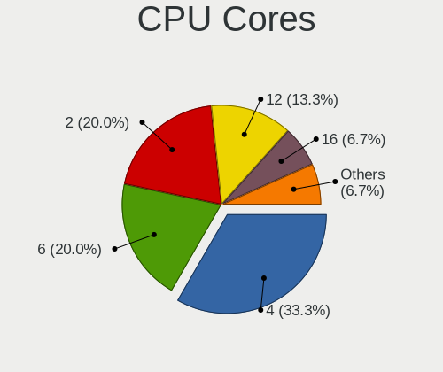
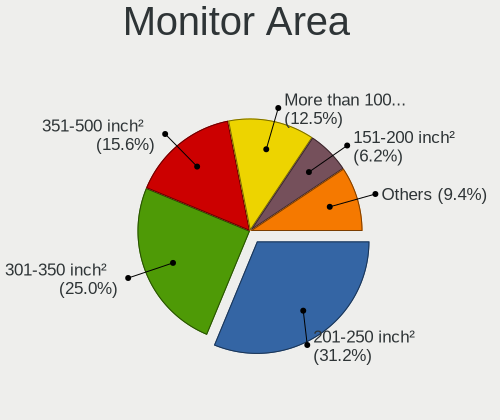
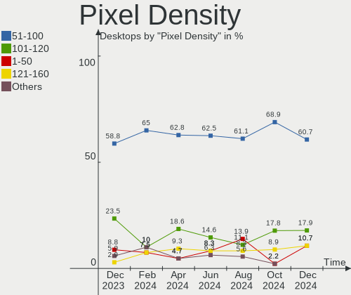
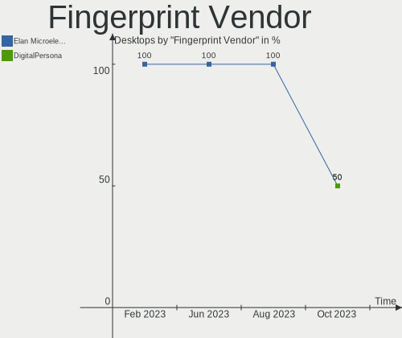
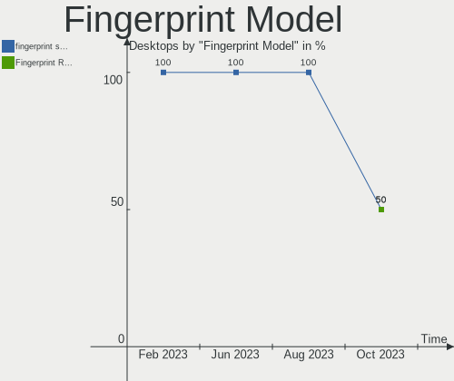
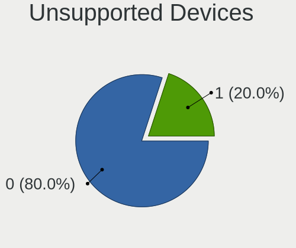

openSUSE - Hardware Trends (Desktops)
-------------------------------------

A project to identify most popular hardware characteristics and track their change
over time based on data collected by Linux users at https://Linux-Hardware.org.

Anyone can contribute to this report by the [hw-probe](https://github.com/linuxhw/hw-probe) tool:

    sudo -E hw-probe -all -upload

This report is for one last month. Overall report since the beginning of time: [TestDays](https://github.com/linuxhw/TestDays)

Period: Aug, 2023.

Contents
--------

* [ System ](#system)
  - [ OS                       ](#os)
  - [ OS Family                ](#os-family)
  - [ Kernel                   ](#kernel)
  - [ Kernel Family            ](#kernel-family)
  - [ Kernel Major Ver.        ](#kernel-major-ver)
  - [ Arch                     ](#arch)
  - [ DE                       ](#de)
  - [ Display Server           ](#display-server)
  - [ Display Manager          ](#display-manager)
  - [ OS Lang                  ](#os-lang)
  - [ Boot Mode                ](#boot-mode)
  - [ Filesystem               ](#filesystem)
  - [ Part. scheme             ](#part-scheme)
  - [ Dual Boot with Linux/BSD ](#dual-boot-with-linuxbsd)
  - [ Dual Boot (Win)          ](#dual-boot-win)

* [ Board ](#board)
  - [ Vendor                   ](#vendor)
  - [ Model                    ](#model)
  - [ Model Family             ](#model-family)
  - [ MFG Year                 ](#mfg-year)
  - [ Form Factor              ](#form-factor)
  - [ Secure Boot              ](#secure-boot)
  - [ Coreboot                 ](#coreboot)
  - [ RAM Size                 ](#ram-size)
  - [ RAM Used                 ](#ram-used)
  - [ Total Drives             ](#total-drives)
  - [ Has CD-ROM               ](#has-cd-rom)
  - [ Has Ethernet             ](#has-ethernet)
  - [ Has WiFi                 ](#has-wifi)
  - [ Has Bluetooth            ](#has-bluetooth)

* [ Location ](#location)
  - [ Country                  ](#country)
  - [ City                     ](#city)

* [ Drives ](#drives)
  - [ Drive Vendor             ](#drive-vendor)
  - [ Drive Model              ](#drive-model)
  - [ HDD Vendor               ](#hdd-vendor)
  - [ SSD Vendor               ](#ssd-vendor)
  - [ Drive Kind               ](#drive-kind)
  - [ Drive Connector          ](#drive-connector)
  - [ Drive Size               ](#drive-size)
  - [ Space Total              ](#space-total)
  - [ Space Used               ](#space-used)
  - [ Malfunc. Drives          ](#malfunc-drives)
  - [ Malfunc. Drive Vendor    ](#malfunc-drive-vendor)
  - [ Malfunc. HDD Vendor      ](#malfunc-hdd-vendor)
  - [ Malfunc. Drive Kind      ](#malfunc-drive-kind)
  - [ Failed Drives            ](#failed-drives)
  - [ Failed Drive Vendor      ](#failed-drive-vendor)
  - [ Drive Status             ](#drive-status)

* [ Storage controller ](#storage-controller)
  - [ Storage Vendor           ](#storage-vendor)
  - [ Storage Model            ](#storage-model)
  - [ Storage Kind             ](#storage-kind)

* [ Processor ](#processor)
  - [ CPU Vendor               ](#cpu-vendor)
  - [ CPU Model                ](#cpu-model)
  - [ CPU Model Family         ](#cpu-model-family)
  - [ CPU Cores                ](#cpu-cores)
  - [ CPU Sockets              ](#cpu-sockets)
  - [ CPU Threads              ](#cpu-threads)
  - [ CPU Op-Modes             ](#cpu-op-modes)
  - [ CPU Microcode            ](#cpu-microcode)
  - [ CPU Microarch            ](#cpu-microarch)

* [ Graphics ](#graphics)
  - [ GPU Vendor               ](#gpu-vendor)
  - [ GPU Model                ](#gpu-model)
  - [ GPU Combo                ](#gpu-combo)
  - [ GPU Driver               ](#gpu-driver)
  - [ GPU Memory               ](#gpu-memory)

* [ Monitor ](#monitor)
  - [ Monitor Vendor           ](#monitor-vendor)
  - [ Monitor Model            ](#monitor-model)
  - [ Monitor Resolution       ](#monitor-resolution)
  - [ Monitor Diagonal         ](#monitor-diagonal)
  - [ Monitor Width            ](#monitor-width)
  - [ Aspect Ratio             ](#aspect-ratio)
  - [ Monitor Area             ](#monitor-area)
  - [ Pixel Density            ](#pixel-density)
  - [ Multiple Monitors        ](#multiple-monitors)

* [ Network ](#network)
  - [ Net Controller Vendor    ](#net-controller-vendor)
  - [ Net Controller Model     ](#net-controller-model)
  - [ Wireless Vendor          ](#wireless-vendor)
  - [ Wireless Model           ](#wireless-model)
  - [ Ethernet Vendor          ](#ethernet-vendor)
  - [ Ethernet Model           ](#ethernet-model)
  - [ Net Controller Kind      ](#net-controller-kind)
  - [ Used Controller          ](#used-controller)
  - [ NICs                     ](#nics)
  - [ IPv6                     ](#ipv6)

* [ Bluetooth ](#bluetooth)
  - [ Bluetooth Vendor         ](#bluetooth-vendor)
  - [ Bluetooth Model          ](#bluetooth-model)

* [ Sound ](#sound)
  - [ Sound Vendor             ](#sound-vendor)
  - [ Sound Model              ](#sound-model)

* [ Memory ](#memory)
  - [ Memory Vendor            ](#memory-vendor)
  - [ Memory Model             ](#memory-model)
  - [ Memory Kind              ](#memory-kind)
  - [ Memory Form Factor       ](#memory-form-factor)
  - [ Memory Size              ](#memory-size)
  - [ Memory Speed             ](#memory-speed)

* [ Printers & scanners ](#printers--scanners)
  - [ Printer Vendor           ](#printer-vendor)
  - [ Printer Model            ](#printer-model)
  - [ Scanner Vendor           ](#scanner-vendor)
  - [ Scanner Model            ](#scanner-model)

* [ Camera ](#camera)
  - [ Camera Vendor            ](#camera-vendor)
  - [ Camera Model             ](#camera-model)

* [ Security ](#security)
  - [ Fingerprint Vendor       ](#fingerprint-vendor)
  - [ Fingerprint Model        ](#fingerprint-model)
  - [ Chipcard Vendor          ](#chipcard-vendor)
  - [ Chipcard Model           ](#chipcard-model)

* [ Unsupported ](#unsupported)
  - [ Unsupported Devices      ](#unsupported-devices)
  - [ Unsupported Device Types ](#unsupported-device-types)

System
------

OS
--

Installed operating systems

| Name                         | Desktops | Percent |
|------------------------------|----------|---------|
| openSUSE Tumbleweed-XXXXXXXX | 30       | 55.56%  |
| openSUSE Leap-15.5           | 18       | 33.33%  |
| openSUSE Leap-15.4           | 5        | 9.26%   |
| openSUSE Microos-XXXXXXXX    | 1        | 1.85%   |

OS Family
---------

OS without a version

| Name     | Desktops | Percent |
|----------|----------|---------|
| openSUSE | 54       | 100%    |

Kernel
------

Version of the Linux kernel

| Version                      | Desktops | Percent |
|------------------------------|----------|---------|
| 6.4.6-1-default              | 9        | 16.67%  |
| 6.4.9-1-default              | 8        | 14.81%  |
| 6.4.8-1-default              | 8        | 14.81%  |
| 6.4.11-1-default             | 5        | 9.26%   |
| 5.14.21-150500.55.19-default | 5        | 9.26%   |
| 5.14.21-150500.53-default    | 5        | 9.26%   |
| 5.14.21-150500.55.7-default  | 4        | 7.41%   |
| 5.14.21-150500.55.12-default | 4        | 7.41%   |
| 5.14.21-150400.24.69-default | 3        | 5.56%   |
| 6.4.6-1-pae                  | 1        | 1.85%   |
| 5.14.21-150400.24.81-default | 1        | 1.85%   |
| 5.14.21-150400.24.38-default | 1        | 1.85%   |

Kernel Family
-------------

Linux kernel without a distro release

| Version | Desktops | Percent |
|---------|----------|---------|
| 5.14.21 | 23       | 42.59%  |
| 6.4.6   | 10       | 18.52%  |
| 6.4.9   | 8        | 14.81%  |
| 6.4.8   | 8        | 14.81%  |
| 6.4.11  | 5        | 9.26%   |

Kernel Major Ver.
-----------------

Linux kernel major version

| Version | Desktops | Percent |
|---------|----------|---------|
| 6.4     | 31       | 57.41%  |
| 5.14    | 23       | 42.59%  |

Arch
----

OS architecture (x86_64, i586, etc.)

| Name   | Desktops | Percent |
|--------|----------|---------|
| x86_64 | 53       | 98.15%  |
| i686   | 1        | 1.85%   |

DE
--

Desktop Environment

| Name    | Desktops | Percent |
|---------|----------|---------|
| KDE5    | 39       | 72.22%  |
| GNOME   | 11       | 20.37%  |
| XFCE    | 3        | 5.56%   |
| Unknown | 1        | 1.85%   |

Display Server
--------------

X11 or Wayland

| Name    | Desktops | Percent |
|---------|----------|---------|
| X11     | 44       | 81.48%  |
| Wayland | 9        | 16.67%  |
| Tty     | 1        | 1.85%   |

Display Manager
---------------

SDDM, LightDM, etc.

| Name    | Desktops | Percent |
|---------|----------|---------|
| Unknown | 37       | 68.52%  |
| SDDM    | 10       | 18.52%  |
| LightDM | 4        | 7.41%   |
| GDM     | 2        | 3.7%    |
| XDM     | 1        | 1.85%   |

OS Lang
-------

Language

| Lang  | Desktops | Percent |
|-------|----------|---------|
| en_US | 23       | 42.59%  |
| de_DE | 10       | 18.52%  |
| en_GB | 6        | 11.11%  |
| pt_BR | 4        | 7.41%   |
| POSIX | 3        | 5.56%   |
| ru_RU | 2        | 3.7%    |
| nb_NO | 1        | 1.85%   |
| es_ES | 1        | 1.85%   |
| es_DO | 1        | 1.85%   |
| en_DK | 1        | 1.85%   |
| el_GR | 1        | 1.85%   |
| C     | 1        | 1.85%   |

Boot Mode
---------

EFI or BIOS

| Mode | Desktops | Percent |
|------|----------|---------|
| BIOS | 32       | 59.26%  |
| EFI  | 22       | 40.74%  |

Filesystem
----------

Type of filesystem

| Type    | Desktops | Percent |
|---------|----------|---------|
| Btrfs   | 42       | 77.78%  |
| Ext4    | 10       | 18.52%  |
| Tmpfs   | 1        | 1.85%   |
| Overlay | 1        | 1.85%   |

Part. scheme
------------

Scheme of partitioning

| Type    | Desktops | Percent |
|---------|----------|---------|
| Unknown | 36       | 66.67%  |
| GPT     | 13       | 24.07%  |
| MBR     | 5        | 9.26%   |

Dual Boot with Linux/BSD
------------------------

Hosting more than one Linux/BSD

| Dual boot | Desktops | Percent |
|-----------|----------|---------|
| No        | 48       | 88.89%  |
| Yes       | 6        | 11.11%  |

Dual Boot (Win)
---------------

Hosting Linux and Windows

| Dual boot | Desktops | Percent |
|-----------|----------|---------|
| No        | 49       | 90.74%  |
| Yes       | 5        | 9.26%   |

Board
-----

Vendor
------

Motherboard manufacturer

| Name                | Desktops | Percent |
|---------------------|----------|---------|
| Gigabyte Technology | 9        | 16.67%  |
| ASUSTek Computer    | 9        | 16.67%  |
| Hewlett-Packard     | 6        | 11.11%  |
| ASRock              | 6        | 11.11%  |
| MSI                 | 5        | 9.26%   |
| Intel               | 3        | 5.56%   |
| Dell                | 3        | 5.56%   |
| Lenovo              | 2        | 3.7%    |
| Biostar             | 2        | 3.7%    |
| Supermicro          | 1        | 1.85%   |
| Sun Microsystems    | 1        | 1.85%   |
| Huanan              | 1        | 1.85%   |
| Colorful Technology | 1        | 1.85%   |
| AZW                 | 1        | 1.85%   |
| Apple               | 1        | 1.85%   |
| Alienware           | 1        | 1.85%   |
| Acer                | 1        | 1.85%   |
| Unknown             | 1        | 1.85%   |

Model
-----

Motherboard model

| Name                              | Desktops | Percent |
|-----------------------------------|----------|---------|
| Lenovo ThinkCentre E73 10AS00DDUS | 2        | 3.7%    |
| ASUS ROG STRIX B550-F GAMING      | 2        | 3.7%    |
| Supermicro SSG-6047R-E1CR36N      | 1        | 1.85%   |
| Sun Microsystems Ultra 24         | 1        | 1.85%   |
| MSI MS-7B85                       | 1        | 1.85%   |
| MSI MS-7B78                       | 1        | 1.85%   |
| MSI MS-7A34                       | 1        | 1.85%   |
| MSI MS-7A33                       | 1        | 1.85%   |
| MSI MS-7817                       | 1        | 1.85%   |
| Intel Nobilis                     | 1        | 1.85%   |
| Intel MAHOBAY                     | 1        | 1.85%   |
| Intel DZ77SL-50K AAG55115-300     | 1        | 1.85%   |
| Huanan X99-ZD4 V2.1               | 1        | 1.85%   |
| HP Z840 Workstation               | 1        | 1.85%   |
| HP Z420 Workstation               | 1        | 1.85%   |
| HP Z400 Workstation               | 1        | 1.85%   |
| HP ProLiant MicroServer Gen8      | 1        | 1.85%   |
| HP 870-115ng                      | 1        | 1.85%   |
| HP 595-P0569NG                    | 1        | 1.85%   |
| Gigabyte Z590 VISION G            | 1        | 1.85%   |
| Gigabyte X670E AORUS MASTER       | 1        | 1.85%   |
| Gigabyte GA-MA770-UD3             | 1        | 1.85%   |
| Gigabyte GA-880GMA-UD2H           | 1        | 1.85%   |
| Gigabyte B75M-D3P                 | 1        | 1.85%   |
| Gigabyte B550M AORUS PRO-P        | 1        | 1.85%   |
| Gigabyte B450M DS3H               | 1        | 1.85%   |
| Gigabyte AB350-Gaming 3           | 1        | 1.85%   |
| Gigabyte 990FXA-UD3               | 1        | 1.85%   |
| Dell XPS 8940                     | 1        | 1.85%   |
| Dell Precision T7600              | 1        | 1.85%   |
| Dell Precision T3610              | 1        | 1.85%   |
| Colorful A320M-K PRO YV14         | 1        | 1.85%   |
| Biostar TF570 SLI A2+             | 1        | 1.85%   |
| Biostar B550GTA                   | 1        | 1.85%   |
| AZW MINI S                        | 1        | 1.85%   |
| ASUS PRIME A520M-K                | 1        | 1.85%   |
| ASUS P7H55-M PRO                  | 1        | 1.85%   |
| ASUS P5Q-PRO                      | 1        | 1.85%   |
| ASUS Maximus V FORMULA            | 1        | 1.85%   |
| ASUS M5A78L-M/USB3                | 1        | 1.85%   |

Model Family
------------

Motherboard model prefix

| Name                         | Desktops | Percent |
|------------------------------|----------|---------|
| Lenovo ThinkCentre           | 2        | 3.7%    |
| Dell Precision               | 2        | 3.7%    |
| ASUS ROG                     | 2        | 3.7%    |
| Supermicro SSG-6047R-E1CR36N | 1        | 1.85%   |
| Sun Microsystems Ultra       | 1        | 1.85%   |
| MSI MS-7B85                  | 1        | 1.85%   |
| MSI MS-7B78                  | 1        | 1.85%   |
| MSI MS-7A34                  | 1        | 1.85%   |
| MSI MS-7A33                  | 1        | 1.85%   |
| MSI MS-7817                  | 1        | 1.85%   |
| Intel Nobilis                | 1        | 1.85%   |
| Intel MAHOBAY                | 1        | 1.85%   |
| Intel DZ77SL-50K             | 1        | 1.85%   |
| Huanan X99-ZD4               | 1        | 1.85%   |
| HP Z840                      | 1        | 1.85%   |
| HP Z420                      | 1        | 1.85%   |
| HP Z400                      | 1        | 1.85%   |
| HP ProLiant                  | 1        | 1.85%   |
| HP 870-115ng                 | 1        | 1.85%   |
| HP 595-P0569NG               | 1        | 1.85%   |
| Gigabyte Z590                | 1        | 1.85%   |
| Gigabyte X670E               | 1        | 1.85%   |
| Gigabyte GA-MA770-UD3        | 1        | 1.85%   |
| Gigabyte GA-880GMA-UD2H      | 1        | 1.85%   |
| Gigabyte B75M-D3P            | 1        | 1.85%   |
| Gigabyte B550M               | 1        | 1.85%   |
| Gigabyte B450M               | 1        | 1.85%   |
| Gigabyte AB350-Gaming        | 1        | 1.85%   |
| Gigabyte 990FXA-UD3          | 1        | 1.85%   |
| Dell XPS                     | 1        | 1.85%   |
| Colorful A320M-K             | 1        | 1.85%   |
| Biostar TF570                | 1        | 1.85%   |
| Biostar B550GTA              | 1        | 1.85%   |
| AZW MINI                     | 1        | 1.85%   |
| ASUS PRIME                   | 1        | 1.85%   |
| ASUS P7H55-M                 | 1        | 1.85%   |
| ASUS P5Q-PRO                 | 1        | 1.85%   |
| ASUS Maximus                 | 1        | 1.85%   |
| ASUS M5A78L-M                | 1        | 1.85%   |
| ASUS M4A77TD                 | 1        | 1.85%   |

MFG Year
--------

Motherboard manufacture year

| Year | Desktops | Percent |
|------|----------|---------|
| 2018 | 7        | 12.96%  |
| 2013 | 6        | 11.11%  |
| 2020 | 5        | 9.26%   |
| 2015 | 4        | 7.41%   |
| 2010 | 4        | 7.41%   |
| 2022 | 3        | 5.56%   |
| 2021 | 3        | 5.56%   |
| 2019 | 3        | 5.56%   |
| 2017 | 3        | 5.56%   |
| 2014 | 3        | 5.56%   |
| 2008 | 3        | 5.56%   |
| 2023 | 2        | 3.7%    |
| 2016 | 2        | 3.7%    |
| 2012 | 2        | 3.7%    |
| 2009 | 2        | 3.7%    |
| 2011 | 1        | 1.85%   |
| 2007 | 1        | 1.85%   |

Form Factor
-----------

Physical design of the computer

| Name    | Desktops | Percent |
|---------|----------|---------|
| Desktop | 54       | 100%    |

Secure Boot
-----------

Enabled or disabled

| State    | Desktops | Percent |
|----------|----------|---------|
| Disabled | 52       | 96.3%   |
| Enabled  | 2        | 3.7%    |

Coreboot
--------

Have coreboot on board

| Used | Desktops | Percent |
|------|----------|---------|
| No   | 54       | 100%    |

RAM Size
--------

Total RAM memory

| Size in GB      | Desktops | Percent |
|-----------------|----------|---------|
| 16.01-24.0      | 22       | 40.74%  |
| 32.01-64.0      | 11       | 20.37%  |
| 8.01-16.0       | 6        | 11.11%  |
| 4.01-8.0        | 5        | 9.26%   |
| 64.01-256.0     | 5        | 9.26%   |
| 3.01-4.0        | 4        | 7.41%   |
| More than 256.0 | 1        | 1.85%   |

RAM Used
--------

Used RAM memory

| Used GB    | Desktops | Percent |
|------------|----------|---------|
| 2.01-3.0   | 16       | 29.63%  |
| 4.01-8.0   | 15       | 27.78%  |
| 1.01-2.0   | 9        | 16.67%  |
| 3.01-4.0   | 6        | 11.11%  |
| 8.01-16.0  | 6        | 11.11%  |
| 16.01-24.0 | 1        | 1.85%   |
| 0.51-1.0   | 1        | 1.85%   |

Total Drives
------------

Number of drives on board

| Drives | Desktops | Percent |
|--------|----------|---------|
| 2      | 15       | 27.78%  |
| 4      | 9        | 16.67%  |
| 3      | 9        | 16.67%  |
| 1      | 8        | 14.81%  |
| 6      | 5        | 9.26%   |
| 0      | 4        | 7.41%   |
| 5      | 3        | 5.56%   |
| 8      | 1        | 1.85%   |

Has CD-ROM
----------

Has CD-ROM on board

| Presented | Desktops | Percent |
|-----------|----------|---------|
| Yes       | 27       | 50%     |
| No        | 27       | 50%     |

Has Ethernet
------------

Has Ethernet on board

| Presented | Desktops | Percent |
|-----------|----------|---------|
| Yes       | 53       | 98.15%  |
| No        | 1        | 1.85%   |

Has WiFi
--------

Has WiFi module

| Presented | Desktops | Percent |
|-----------|----------|---------|
| No        | 30       | 55.56%  |
| Yes       | 24       | 44.44%  |

Has Bluetooth
-------------

Has Bluetooth module

| Presented | Desktops | Percent |
|-----------|----------|---------|
| Yes       | 27       | 50%     |
| No        | 27       | 50%     |

Location
--------

Country
-------

Geographic location (country)

| Country      | Desktops | Percent |
|--------------|----------|---------|
| USA          | 13       | 24.07%  |
| Germany      | 10       | 18.52%  |
| Brazil       | 5        | 9.26%   |
| Russia       | 4        | 7.41%   |
| Australia    | 4        | 7.41%   |
| UK           | 2        | 3.7%    |
| Spain        | 2        | 3.7%    |
| Canada       | 2        | 3.7%    |
| Switzerland  | 1        | 1.85%   |
| Sweden       | 1        | 1.85%   |
| South Africa | 1        | 1.85%   |
| Romania      | 1        | 1.85%   |
| Poland       | 1        | 1.85%   |
| Norway       | 1        | 1.85%   |
| Netherlands  | 1        | 1.85%   |
| Ireland      | 1        | 1.85%   |
| Indonesia    | 1        | 1.85%   |
| Greece       | 1        | 1.85%   |
| Finland      | 1        | 1.85%   |
| Colombia     | 1        | 1.85%   |

City
----

Geographic location (city)

| City                  | Desktops | Percent |
|-----------------------|----------|---------|
| Cleveland             | 3        | 5.56%   |
| Sydney                | 2        | 3.7%    |
| Stuttgart             | 2        | 3.7%    |
| Melbourne             | 2        | 3.7%    |
| West Bend             | 1        | 1.85%   |
| Warsaw                | 1        | 1.85%   |
| Vantaa                | 1        | 1.85%   |
| Tinjomoyo             | 1        | 1.85%   |
| Timmins               | 1        | 1.85%   |
| The Villages          | 1        | 1.85%   |
| Suceava               | 1        | 1.85%   |
| Stockholm             | 1        | 1.85%   |
| Staraya Russa         | 1        | 1.85%   |
| St Petersburg         | 1        | 1.85%   |
| Soest                 | 1        | 1.85%   |
| Sao Luís             | 1        | 1.85%   |
| Sacramento            | 1        | 1.85%   |
| Rotterdam             | 1        | 1.85%   |
| Rogers                | 1        | 1.85%   |
| Rio de Janeiro        | 1        | 1.85%   |
| Puettlingen           | 1        | 1.85%   |
| Paisley               | 1        | 1.85%   |
| Omsk                  | 1        | 1.85%   |
| Motril                | 1        | 1.85%   |
| Middleton             | 1        | 1.85%   |
| Medellín             | 1        | 1.85%   |
| Maringá              | 1        | 1.85%   |
| Los Llanos de Aridane | 1        | 1.85%   |
| Leesburg              | 1        | 1.85%   |
| Kursk                 | 1        | 1.85%   |
| Killarney             | 1        | 1.85%   |
| Johannesburg          | 1        | 1.85%   |
| Ilford                | 1        | 1.85%   |
| Helpsen               | 1        | 1.85%   |
| Heide                 | 1        | 1.85%   |
| Hamilton              | 1        | 1.85%   |
| Glendale              | 1        | 1.85%   |
| Giessen               | 1        | 1.85%   |
| Geesthacht            | 1        | 1.85%   |
| Frutal                | 1        | 1.85%   |

Drives
------

Drive Vendor
------------

Hard drive vendors

| Vendor                      | Desktops | Drives | Percent |
|-----------------------------|----------|--------|---------|
| Seagate                     | 19       | 23     | 17.12%  |
| Samsung Electronics         | 19       | 31     | 17.12%  |
| WDC                         | 18       | 30     | 16.22%  |
| Kingston                    | 8        | 10     | 7.21%   |
| Crucial                     | 7        | 10     | 6.31%   |
| Sandisk                     | 4        | 5      | 3.6%    |
| Hitachi                     | 4        | 4      | 3.6%    |
| SK hynix                    | 3        | 8      | 2.7%    |
| Toshiba                     | 2        | 2      | 1.8%    |
| SPCC                        | 2        | 2      | 1.8%    |
| Silicon Motion              | 2        | 2      | 1.8%    |
| Phison Electronics          | 2        | 2      | 1.8%    |
| Kingston Technology Company | 2        | 2      | 1.8%    |
| Fanxiang                    | 2        | 2      | 1.8%    |
| China                       | 2        | 2      | 1.8%    |
| Unknown                     | 1        | 1      | 0.9%    |
| Team                        | 1        | 4      | 0.9%    |
| Realtek                     | 1        | 1      | 0.9%    |
| Radeon                      | 1        | 1      | 0.9%    |
| Plextor                     | 1        | 1      | 0.9%    |
| Phison                      | 1        | 1      | 0.9%    |
| OCZ                         | 1        | 1      | 0.9%    |
| Micron/Crucial Technology   | 1        | 1      | 0.9%    |
| MAXIO Technology (Hangzhou) | 1        | 1      | 0.9%    |
| KingSpec                    | 1        | 1      | 0.9%    |
| Intenso                     | 1        | 1      | 0.9%    |
| Intel                       | 1        | 1      | 0.9%    |
| HS-SSD-C100                 | 1        | 1      | 0.9%    |
| HGST                        | 1        | 1      | 0.9%    |
| FIKWOT                      | 1        | 1      | 0.9%    |

Drive Model
-----------

Hard drive models

| Model                                                 | Desktops | Percent |
|-------------------------------------------------------|----------|---------|
| Seagate ST1000DM010-2EP102 1TB                        | 3        | 2.24%   |
| Samsung NVMe SSD Controller SM981/PM981/PM983 500GB   | 3        | 2.24%   |
| Kingston SA400S37240G 240GB SSD                       | 3        | 2.24%   |
| WDC WD10EADS-00M2B0 1TB                               | 2        | 1.49%   |
| Silicon Motion SM2262/SM2262EN SSD Controller 1024GB  | 2        | 1.49%   |
| Seagate ST500DM002-1BD142 500GB                       | 2        | 1.49%   |
| Seagate ST2000DM006-2DM164 2TB                        | 2        | 1.49%   |
| Samsung SSD 870 QVO 2TB                               | 2        | 1.49%   |
| Samsung SSD 870 EVO 500GB                             | 2        | 1.49%   |
| Samsung SSD 860 EVO 1TB                               | 2        | 1.49%   |
| Samsung SSD 850 EVO 500GB                             | 2        | 1.49%   |
| Samsung NVMe SSD Controller SM961/PM961/SM963 1024GB  | 2        | 1.49%   |
| Samsung NVMe SSD Controller PM9A1/PM9A3/980PRO 1024GB | 2        | 1.49%   |
| Phison E12 NVMe Controller 256GB                      | 2        | 1.49%   |
| Kingston SA400S37480G 480GB SSD                       | 2        | 1.49%   |
| Crucial CT500MX500SSD1 500GB                          | 2        | 1.49%   |
| Crucial CT480BX500SSD1 480GB                          | 2        | 1.49%   |
| Crucial CT250MX500SSD1 250GB                          | 2        | 1.49%   |
| China SSD 240GB                                       | 2        | 1.49%   |
| WDC WDS500G2B0A-00SM50 500GB SSD                      | 1        | 0.75%   |
| WDC WDS200T2B0B 2TB SSD                               | 1        | 0.75%   |
| WDC WD7500LPCX-60HWST0 752GB                          | 1        | 0.75%   |
| WDC WD740HLFS-01G6U4 74GB                             | 1        | 0.75%   |
| WDC WD60EZRZ-00GZ5B1 6TB                              | 1        | 0.75%   |
| WDC WD60EFZX-68B3FN0 6TB                              | 1        | 0.75%   |
| WDC WD60EFRX-68MYMN1 6TB                              | 1        | 0.75%   |
| WDC WD60EFRX-68L0BN1 6TB                              | 1        | 0.75%   |
| WDC WD60EFPX-68C5ZN0 6TB                              | 1        | 0.75%   |
| WDC WD50EZRX-00MVLB1 5TB                              | 1        | 0.75%   |
| WDC WD5000AZRX-00A8LB0 500GB                          | 1        | 0.75%   |
| WDC WD40EZRZ-00GXCB0 4TB                              | 1        | 0.75%   |
| WDC WD40EFRX-68N32N0 4TB                              | 1        | 0.75%   |
| WDC WD3200AAKX-00ERMA0 320GB                          | 1        | 0.75%   |
| WDC WD30EFZX-68AWUN0 3TB                              | 1        | 0.75%   |
| WDC WD2500HHTZ-04N21V0 250GB                          | 1        | 0.75%   |
| WDC WD2500AAKX-001CA0 250GB                           | 1        | 0.75%   |
| WDC WD20PURX-64P6ZY0 2TB                              | 1        | 0.75%   |
| WDC WD20EZRX-00D8PB0 2TB                              | 1        | 0.75%   |
| WDC WD120EDBZ-11B1HA0 12TB                            | 1        | 0.75%   |
| WDC WD10EZEX-75ZF5A0 1TB                              | 1        | 0.75%   |

HDD Vendor
----------

Hard disk drive vendors

| Vendor              | Desktops | Drives | Percent |
|---------------------|----------|--------|---------|
| Seagate             | 19       | 23     | 41.3%   |
| WDC                 | 17       | 28     | 36.96%  |
| Hitachi             | 4        | 4      | 8.7%    |
| Samsung Electronics | 3        | 6      | 6.52%   |
| Unknown             | 1        | 1      | 2.17%   |
| Toshiba             | 1        | 1      | 2.17%   |
| HGST                | 1        | 1      | 2.17%   |

SSD Vendor
----------

Solid state drive vendors

| Vendor              | Desktops | Drives | Percent |
|---------------------|----------|--------|---------|
| Samsung Electronics | 14       | 16     | 31.11%  |
| Kingston            | 7        | 9      | 15.56%  |
| Crucial             | 7        | 10     | 15.56%  |
| WDC                 | 2        | 2      | 4.44%   |
| SPCC                | 2        | 2      | 4.44%   |
| SanDisk             | 2        | 2      | 4.44%   |
| China               | 2        | 2      | 4.44%   |
| Toshiba             | 1        | 1      | 2.22%   |
| Team                | 1        | 4      | 2.22%   |
| Radeon              | 1        | 1      | 2.22%   |
| Plextor             | 1        | 1      | 2.22%   |
| OCZ                 | 1        | 1      | 2.22%   |
| KingSpec            | 1        | 1      | 2.22%   |
| Intenso             | 1        | 1      | 2.22%   |
| Intel               | 1        | 1      | 2.22%   |
| Fanxiang            | 1        | 1      | 2.22%   |

Drive Kind
----------

HDD or SSD

| Kind    | Desktops | Drives | Percent |
|---------|----------|--------|---------|
| SSD     | 34       | 55     | 38.64%  |
| HDD     | 33       | 64     | 37.5%   |
| NVMe    | 19       | 32     | 21.59%  |
| Unknown | 2        | 2      | 2.27%   |

Drive Connector
---------------

SATA, SAS, NVMe, etc.

| Type | Desktops | Drives | Percent |
|------|----------|--------|---------|
| SATA | 47       | 119    | 68.12%  |
| NVMe | 19       | 31     | 27.54%  |
| SAS  | 3        | 3      | 4.35%   |

Drive Size
----------

Size of hard drive

| Size in TB | Desktops | Drives | Percent |
|------------|----------|--------|---------|
| 0.01-0.5   | 34       | 63     | 49.28%  |
| 0.51-1.0   | 17       | 25     | 24.64%  |
| 1.01-2.0   | 9        | 17     | 13.04%  |
| 4.01-10.0  | 4        | 7      | 5.8%    |
| 3.01-4.0   | 3        | 5      | 4.35%   |
| 2.01-3.0   | 1        | 1      | 1.45%   |
| 10.01-20.0 | 1        | 1      | 1.45%   |

Space Total
-----------

Amount of disk space available on the file system

| Size in GB     | Desktops | Percent |
|----------------|----------|---------|
| More than 3000 | 26       | 48.15%  |
| 1001-2000      | 8        | 14.81%  |
| 101-250        | 6        | 11.11%  |
| 501-1000       | 5        | 9.26%   |
| 2001-3000      | 4        | 7.41%   |
| 251-500        | 2        | 3.7%    |
| Unknown        | 2        | 3.7%    |
| 21-50          | 1        | 1.85%   |

Space Used
----------

Amount of used disk space

| Used GB        | Desktops | Percent |
|----------------|----------|---------|
| 251-500        | 10       | 18.52%  |
| 1001-2000      | 9        | 16.67%  |
| 101-250        | 7        | 12.96%  |
| 51-100         | 7        | 12.96%  |
| 501-1000       | 6        | 11.11%  |
| More than 3000 | 5        | 9.26%   |
| 1-20           | 4        | 7.41%   |
| 21-50          | 3        | 5.56%   |
| Unknown        | 2        | 3.7%    |
| 2001-3000      | 1        | 1.85%   |

Malfunc. Drives
---------------

Drive models with a malfunction

| Model                               | Desktops | Drives | Percent |
|-------------------------------------|----------|--------|---------|
| WDC WD60EFRX-68MYMN1 6TB            | 1        | 1      | 20%     |
| WDC WD20EZRX-00D8PB0 2TB            | 1        | 1      | 20%     |
| WDC WD10EVDS-63N5B1 1TB             | 1        | 2      | 20%     |
| Seagate ST500LM012 HN-M500MBB 500GB | 1        | 1      | 20%     |
| Kingston SA400S37120G 120GB SSD     | 1        | 3      | 20%     |

Malfunc. Drive Vendor
---------------------

Vendors of faulty drives

| Vendor   | Desktops | Drives | Percent |
|----------|----------|--------|---------|
| WDC      | 3        | 4      | 60%     |
| Seagate  | 1        | 1      | 20%     |
| Kingston | 1        | 3      | 20%     |

Malfunc. HDD Vendor
-------------------

Vendors of faulty HDD drives

| Vendor  | Desktops | Drives | Percent |
|---------|----------|--------|---------|
| WDC     | 3        | 4      | 75%     |
| Seagate | 1        | 1      | 25%     |

Malfunc. Drive Kind
-------------------

Kinds of faulty drives

| Kind | Desktops | Drives | Percent |
|------|----------|--------|---------|
| HDD  | 4        | 5      | 80%     |
| SSD  | 1        | 3      | 20%     |

Failed Drives
-------------

Failed drive models

| Model                             | Desktops | Drives | Percent |
|-----------------------------------|----------|--------|---------|
| Samsung Electronics HD502HJ 500GB | 1        | 2      | 100%    |

Failed Drive Vendor
-------------------

Failed drive vendors

| Vendor              | Desktops | Drives | Percent |
|---------------------|----------|--------|---------|
| Samsung Electronics | 1        | 2      | 100%    |

Drive Status
------------

Number of failed and malfunc. drives

| Status   | Desktops | Drives | Percent |
|----------|----------|--------|---------|
| Detected | 35       | 103    | 64.81%  |
| Works    | 14       | 40     | 25.93%  |
| Malfunc  | 4        | 8      | 7.41%   |
| Failed   | 1        | 2      | 1.85%   |

Storage controller
------------------

Storage Vendor
--------------

Storage controller vendors

| Vendor                      | Desktops | Percent |
|-----------------------------|----------|---------|
| Intel                       | 29       | 32.22%  |
| AMD                         | 23       | 25.56%  |
| Samsung Electronics         | 8        | 8.89%   |
| Marvell Technology Group    | 5        | 5.56%   |
| ASMedia Technology          | 4        | 4.44%   |
| SK hynix                    | 3        | 3.33%   |
| Kingston Technology Company | 3        | 3.33%   |
| Silicon Motion              | 2        | 2.22%   |
| SanDisk                     | 2        | 2.22%   |
| Phison Electronics          | 2        | 2.22%   |
| JMicron Technology          | 2        | 2.22%   |
| Silicon Image               | 1        | 1.11%   |
| Nvidia                      | 1        | 1.11%   |
| Micron/Crucial Technology   | 1        | 1.11%   |
| MAXIO Technology (Hangzhou) | 1        | 1.11%   |
| INNOGRIT                    | 1        | 1.11%   |
| Broadcom / LSI              | 1        | 1.11%   |
| Adaptec                     | 1        | 1.11%   |

Storage Model
-------------

Storage controller models

| Model                                                                          | Desktops | Percent |
|--------------------------------------------------------------------------------|----------|---------|
| AMD FCH SATA Controller [AHCI mode]                                            | 8        | 7.08%   |
| AMD 500 Series Chipset SATA Controller                                         | 7        | 6.19%   |
| Intel 8 Series/C220 Series Chipset Family 6-port SATA Controller 1 [AHCI mode] | 5        | 4.42%   |
| AMD SB7x0/SB8x0/SB9x0 IDE Controller                                           | 5        | 4.42%   |
| Intel C600/X79 series chipset 6-Port SATA AHCI Controller                      | 4        | 3.54%   |
| AMD 400 Series Chipset SATA Controller                                         | 4        | 3.54%   |
| Samsung NVMe SSD Controller SM981/PM981/PM983                                  | 3        | 2.65%   |
| Intel C602 chipset 4-Port SATA Storage Control Unit                            | 3        | 2.65%   |
| Intel 82801JI (ICH10 Family) SATA AHCI Controller                              | 3        | 2.65%   |
| ASMedia ASM1062 Serial ATA Controller                                          | 3        | 2.65%   |
| AMD SB7x0/SB8x0/SB9x0 SATA Controller [IDE mode]                               | 3        | 2.65%   |
| AMD 300 Series Chipset SATA Controller                                         | 3        | 2.65%   |
| Silicon Motion SM2262/SM2262EN SSD Controller                                  | 2        | 1.77%   |
| Samsung NVMe SSD Controller SM961/PM961/SM963                                  | 2        | 1.77%   |
| Samsung NVMe SSD Controller PM9A1/PM9A3/980PRO                                 | 2        | 1.77%   |
| Samsung NVMe SSD Controller 980                                                | 2        | 1.77%   |
| Phison E12 NVMe Controller                                                     | 2        | 1.77%   |
| Marvell Group 88SE9215 PCIe 2.0 x1 4-port SATA 6 Gb/s Controller               | 2        | 1.77%   |
| Marvell Group 88SE9172 SATA 6Gb/s Controller                                   | 2        | 1.77%   |
| Kingston Company Company Non-Volatile memory controller                        | 2        | 1.77%   |
| JMicron JMB368 IDE controller                                                  | 2        | 1.77%   |
| Intel C600/X79 series chipset SATA RAID Controller                             | 2        | 1.77%   |
| Intel 9 Series Chipset Family SATA Controller [AHCI Mode]                      | 2        | 1.77%   |
| AMD SB7x0/SB8x0/SB9x0 SATA Controller [AHCI mode]                              | 2        | 1.77%   |
| SK hynix Platinum P41/PC801 NVMe Solid State Drive                             | 1        | 0.88%   |
| SK hynix PC611 NVMe Solid State Drive                                          | 1        | 0.88%   |
| SK hynix Gold P31/BC711/PC711 NVMe Solid State Drive                           | 1        | 0.88%   |
| SK hynix BC501 NVMe Solid State Drive                                          | 1        | 0.88%   |
| Silicon Image SiI 3132 Serial ATA Raid II Controller                           | 1        | 0.88%   |
| SanDisk WD Blue SN570 NVMe SSD 1TB                                             | 1        | 0.88%   |
| SanDisk WD Black SN770 / PC SN740 256GB / PC SN560 (DRAM-less) NVMe SSD        | 1        | 0.88%   |
| Phison E18 PCIe4 NVMe Controller                                               | 1        | 0.88%   |
| Nvidia MCP65 IDE                                                               | 1        | 0.88%   |
| Nvidia MCP65 AHCI Controller                                                   | 1        | 0.88%   |
| Micron/Crucial P2 [Nick P2] / P3 / P3 Plus NVMe PCIe SSD (DRAM-less)           | 1        | 0.88%   |
| MAXIO (Hangzhou) NVMe SSD Controller MAP1202                                   | 1        | 0.88%   |
| Marvell Group 88SE912x IDE Controller                                          | 1        | 0.88%   |
| Marvell Group 88SE9123 PCIe SATA 6.0 Gb/s controller                           | 1        | 0.88%   |
| Kingston Company A2000 NVMe SSD                                                | 1        | 0.88%   |
| Intel SATA Controller [RAID mode]                                              | 1        | 0.88%   |

Storage Kind
------------

Kind of storage controller (IDE, SATA, NVMe, SAS, ...)

| Kind | Desktops | Percent |
|------|----------|---------|
| SATA | 49       | 55.68%  |
| NVMe | 19       | 21.59%  |
| IDE  | 11       | 12.5%   |
| RAID | 4        | 4.55%   |
| SAS  | 4        | 4.55%   |
| SCSI | 1        | 1.14%   |

Processor
---------

CPU Vendor
----------

Processor vendors

| Vendor | Desktops | Percent |
|--------|----------|---------|
| Intel  | 30       | 55.56%  |
| AMD    | 24       | 44.44%  |

CPU Model
---------

Processor models

| Model                                  | Desktops | Percent |
|----------------------------------------|----------|---------|
| AMD Ryzen 5 5600X 6-Core Processor     | 3        | 5.56%   |
| AMD Ryzen 5 2600 Six-Core Processor    | 3        | 5.56%   |
| Intel Core i3-4150 CPU @ 3.50GHz       | 2        | 3.7%    |
| AMD Ryzen 7 3700X 8-Core Processor     | 2        | 3.7%    |
| AMD Ryzen 7 1700 Eight-Core Processor  | 2        | 3.7%    |
| Intel Xeon CPU W3690 @ 3.47GHz         | 1        | 1.85%   |
| Intel Xeon CPU W3530 @ 2.80GHz         | 1        | 1.85%   |
| Intel Xeon CPU E5-2690 0 @ 2.90GHz     | 1        | 1.85%   |
| Intel Xeon CPU E5-2680 v4 @ 2.40GHz    | 1        | 1.85%   |
| Intel Xeon CPU E5-2667 v3 @ 3.20GHz    | 1        | 1.85%   |
| Intel Xeon CPU E5-2667 v2 @ 3.30GHz    | 1        | 1.85%   |
| Intel Xeon CPU E5-1607 v2 @ 3.00GHz    | 1        | 1.85%   |
| Intel Xeon CPU E5-1603 0 @ 2.80GHz     | 1        | 1.85%   |
| Intel Pentium CPU G3240 @ 3.10GHz      | 1        | 1.85%   |
| Intel N100                             | 1        | 1.85%   |
| Intel Core i7-6700 CPU @ 3.40GHz       | 1        | 1.85%   |
| Intel Core i7-4790K CPU @ 4.00GHz      | 1        | 1.85%   |
| Intel Core i7-4790 CPU @ 3.60GHz       | 1        | 1.85%   |
| Intel Core i7-3820 CPU @ 3.60GHz       | 1        | 1.85%   |
| Intel Core i7-3770K CPU @ 3.50GHz      | 1        | 1.85%   |
| Intel Core i7-1060NG7 CPU @ 1.20GHz    | 1        | 1.85%   |
| Intel Core i7 CPU 960 @ 3.20GHz        | 1        | 1.85%   |
| Intel Core i5-7600K CPU @ 3.80GHz      | 1        | 1.85%   |
| Intel Core i5-3570 CPU @ 3.40GHz       | 1        | 1.85%   |
| Intel Core i5-3470 CPU @ 3.20GHz       | 1        | 1.85%   |
| Intel Core i5-2430M CPU @ 2.40GHz      | 1        | 1.85%   |
| Intel Core i5 CPU 650 @ 3.20GHz        | 1        | 1.85%   |
| Intel Core i3-4170 CPU @ 3.70GHz       | 1        | 1.85%   |
| Intel Core 2 Quad CPU Q9650 @ 3.00GHz  | 1        | 1.85%   |
| Intel Core 2 Quad CPU Q9550 @ 2.83GHz  | 1        | 1.85%   |
| Intel Celeron CPU G1610T @ 2.30GHz     | 1        | 1.85%   |
| Intel 11th Gen Core i9-11900 @ 2.50GHz | 1        | 1.85%   |
| Intel 11th Gen Core i7-11700 @ 2.50GHz | 1        | 1.85%   |
| AMD Ryzen 9 7950X 16-Core Processor    | 1        | 1.85%   |
| AMD Ryzen 9 5950X 16-Core Processor    | 1        | 1.85%   |
| AMD Ryzen 9 3900X 12-Core Processor    | 1        | 1.85%   |
| AMD Ryzen 7 5700G with Radeon Graphics | 1        | 1.85%   |
| AMD Ryzen 5 5600G with Radeon Graphics | 1        | 1.85%   |
| AMD Ryzen 5 3600XT 6-Core Processor    | 1        | 1.85%   |
| AMD Ryzen 5 3600 6-Core Processor      | 1        | 1.85%   |

CPU Model Family
----------------

Processor model prefix

| Model             | Desktops | Percent |
|-------------------|----------|---------|
| AMD Ryzen 5       | 9        | 16.67%  |
| Intel Xeon        | 8        | 14.81%  |
| Intel Core i7     | 7        | 12.96%  |
| Intel Core i5     | 5        | 9.26%   |
| AMD Ryzen 7       | 5        | 9.26%   |
| Other             | 3        | 5.56%   |
| Intel Core i3     | 3        | 5.56%   |
| AMD Ryzen 9       | 3        | 5.56%   |
| Intel Core 2 Quad | 2        | 3.7%    |
| AMD Phenom II X4  | 2        | 3.7%    |
| AMD FX            | 2        | 3.7%    |
| Intel Pentium     | 1        | 1.85%   |
| Intel Celeron     | 1        | 1.85%   |
| AMD Ryzen 3       | 1        | 1.85%   |
| AMD Athlon II X3  | 1        | 1.85%   |
| AMD Athlon 64 X2  | 1        | 1.85%   |

CPU Cores
---------

Number of processor cores

| Number | Desktops | Percent |
|--------|----------|---------|
| 4      | 20       | 37.04%  |
| 6      | 10       | 18.52%  |
| 2      | 8        | 14.81%  |
| 8      | 7        | 12.96%  |
| 16     | 5        | 9.26%   |
| 3      | 2        | 3.7%    |
| 14     | 1        | 1.85%   |
| 12     | 1        | 1.85%   |

CPU Sockets
-----------

Number of sockets

| Number | Desktops | Percent |
|--------|----------|---------|
| 1      | 51       | 94.44%  |
| 2      | 3        | 5.56%   |

CPU Threads
-----------

Threads per core (Hyper-Threading)

| Number | Desktops | Percent |
|--------|----------|---------|
| 2      | 39       | 72.22%  |
| 1      | 15       | 27.78%  |

CPU Op-Modes
------------

CPU Operation Modes (32-bit, 64-bit)

| Op mode        | Desktops | Percent |
|----------------|----------|---------|
| 32-bit, 64-bit | 54       | 100%    |

CPU Microcode
-------------

Microcode number

| Number     | Desktops | Percent |
|------------|----------|---------|
| Unknown    | 34       | 62.96%  |
| 0x206d7    | 2        | 3.7%    |
| 0x08701030 | 2        | 3.7%    |
| 0x08701021 | 2        | 3.7%    |
| 0x0800820d | 2        | 3.7%    |
| 0x08001138 | 2        | 3.7%    |
| 0x906e9    | 1        | 1.85%   |
| 0x306e4    | 1        | 1.85%   |
| 0x306a9    | 1        | 1.85%   |
| 0x0a601203 | 1        | 1.85%   |
| 0x0a50000d | 1        | 1.85%   |
| 0x0a20120a | 1        | 1.85%   |
| 0x0a201025 | 1        | 1.85%   |
| 0x0a201016 | 1        | 1.85%   |
| 0x0a201009 | 1        | 1.85%   |
| 0x06000852 | 1        | 1.85%   |

CPU Microarch
-------------

Microarchitecture

| Name        | Desktops | Percent |
|-------------|----------|---------|
| Haswell     | 7        | 12.96%  |
| Zen 3       | 6        | 11.11%  |
| IvyBridge   | 6        | 11.11%  |
| Zen 2       | 5        | 9.26%   |
| SandyBridge | 4        | 7.41%   |
| Zen+        | 3        | 5.56%   |
| Zen         | 3        | 5.56%   |
| K10         | 3        | 5.56%   |
| Westmere    | 2        | 3.7%    |
| Piledriver  | 2        | 3.7%    |
| Penryn      | 2        | 3.7%    |
| Nehalem     | 2        | 3.7%    |
| IceLake     | 2        | 3.7%    |
| Unknown     | 2        | 3.7%    |
| Skylake     | 1        | 1.85%   |
| KabyLake    | 1        | 1.85%   |
| K8 Hammer   | 1        | 1.85%   |
| Gracemont   | 1        | 1.85%   |
| Broadwell   | 1        | 1.85%   |

Graphics
--------

GPU Vendor
----------

Vendors of graphics cards

| Vendor                     | Desktops | Percent |
|----------------------------|----------|---------|
| Nvidia                     | 22       | 38.6%   |
| AMD                        | 22       | 38.6%   |
| Intel                      | 12       | 21.05%  |
| Matrox Electronics Systems | 1        | 1.75%   |

GPU Model
---------

Graphics card models

| Model                                                                       | Desktops | Percent |
|-----------------------------------------------------------------------------|----------|---------|
| AMD Navi 31 [Radeon RX 7900 XT/7900 XTX]                                    | 3        | 5.17%   |
| AMD Ellesmere [Radeon RX 470/480/570/570X/580/580X/590]                     | 3        | 5.17%   |
| Nvidia GP108 [GeForce GT 1030]                                              | 2        | 3.45%   |
| Nvidia GP104 [GeForce GTX 1080]                                             | 2        | 3.45%   |
| Nvidia GK106GL [Quadro K4000]                                               | 2        | 3.45%   |
| Intel Xeon E3-1200 v3/4th Gen Core Processor Integrated Graphics Controller | 2        | 3.45%   |
| Intel DG2 [Arc A750]                                                        | 2        | 3.45%   |
| Intel 4th Generation Core Processor Family Integrated Graphics Controller   | 2        | 3.45%   |
| AMD Navi 23 [Radeon RX 6600/6600 XT/6600M]                                  | 2        | 3.45%   |
| AMD Navi 21 [Radeon RX 6800/6800 XT / 6900 XT]                              | 2        | 3.45%   |
| Nvidia TU117 [GeForce GTX 1650]                                             | 1        | 1.72%   |
| Nvidia TU116 [GeForce GTX 1650]                                             | 1        | 1.72%   |
| Nvidia TU104 [GeForce RTX 2060]                                             | 1        | 1.72%   |
| Nvidia GT215 [GeForce GT 240]                                               | 1        | 1.72%   |
| Nvidia GP107 [GeForce GTX 1050]                                             | 1        | 1.72%   |
| Nvidia GP107 [GeForce GTX 1050 Ti]                                          | 1        | 1.72%   |
| Nvidia GP106 [GeForce GTX 1060 3GB]                                         | 1        | 1.72%   |
| Nvidia GP102 [GeForce GTX 1080 Ti]                                          | 1        | 1.72%   |
| Nvidia GK208B [GeForce GT 730]                                              | 1        | 1.72%   |
| Nvidia GK107 [GeForce GT 740]                                               | 1        | 1.72%   |
| Nvidia GK104GL [Quadro K4200]                                               | 1        | 1.72%   |
| Nvidia GF108 [GeForce GT 630]                                               | 1        | 1.72%   |
| Nvidia GF108 [GeForce GT 620]                                               | 1        | 1.72%   |
| Nvidia GA106 [GeForce RTX 3060]                                             | 1        | 1.72%   |
| Nvidia GA104 [GeForce RTX 3060 Ti Lite Hash Rate]                           | 1        | 1.72%   |
| Nvidia GA102 [GeForce RTX 3080]                                             | 1        | 1.72%   |
| Matrox Electronics Systems MGA G200EH                                       | 1        | 1.72%   |
| Intel Xeon E3-1200 v2/3rd Gen Core processor Graphics Controller            | 1        | 1.72%   |
| Intel RocketLake-S GT1 [UHD Graphics 750]                                   | 1        | 1.72%   |
| Intel Iris Plus Graphics G7 (Ice Lake)                                      | 1        | 1.72%   |
| Intel Core Processor Integrated Graphics Controller                         | 1        | 1.72%   |
| Intel Alder Lake-N [UHD Graphics]                                           | 1        | 1.72%   |
| Intel 2nd Generation Core Processor Family Integrated Graphics Controller   | 1        | 1.72%   |
| AMD Turks XT [Radeon HD 6670/7670]                                          | 1        | 1.72%   |
| AMD RS780L [Radeon 3000]                                                    | 1        | 1.72%   |
| AMD Raphael                                                                 | 1        | 1.72%   |
| AMD Oland PRO [Radeon R7 240/340 / Radeon 520]                              | 1        | 1.72%   |
| AMD Navi 22 [Radeon RX 6700/6700 XT/6750 XT / 6800M/6850M XT]               | 1        | 1.72%   |
| AMD Navi 10 [Radeon RX 5600 OEM/5600 XT / 5700/5700 XT]                     | 1        | 1.72%   |
| AMD Juniper XT [FirePro V5800]                                              | 1        | 1.72%   |

GPU Combo
---------

Combinations of graphics cards

| Name        | Desktops | Percent |
|-------------|----------|---------|
| 1 x Nvidia  | 22       | 40.74%  |
| 1 x AMD     | 18       | 33.33%  |
| 1 x Intel   | 9        | 16.67%  |
| Intel + AMD | 3        | 5.56%   |
| 2 x AMD     | 1        | 1.85%   |
| 1 x Matrox  | 1        | 1.85%   |

GPU Driver
----------

Free vs proprietary

| Driver      | Desktops | Percent |
|-------------|----------|---------|
| Free        | 38       | 70.37%  |
| Proprietary | 13       | 24.07%  |
| Unknown     | 3        | 5.56%   |

GPU Memory
----------

Total video memory

| Size in GB | Desktops | Percent |
|------------|----------|---------|
| Unknown    | 23       | 42.59%  |
| 7.01-8.0   | 6        | 11.11%  |
| 8.01-16.0  | 6        | 11.11%  |
| 3.01-4.0   | 5        | 9.26%   |
| 1.01-2.0   | 5        | 9.26%   |
| 16.01-24.0 | 3        | 5.56%   |
| 0.01-0.5   | 3        | 5.56%   |
| 0.51-1.0   | 2        | 3.7%    |
| 2.01-3.0   | 1        | 1.85%   |

Monitor
-------

Monitor Vendor
--------------

Monitor vendors

| Vendor               | Desktops | Percent |
|----------------------|----------|---------|
| Samsung Electronics  | 13       | 22.81%  |
| Goldstar             | 11       | 19.3%   |
| Ancor Communications | 5        | 8.77%   |
| Hewlett-Packard      | 4        | 7.02%   |
| Dell                 | 4        | 7.02%   |
| AOC                  | 4        | 7.02%   |
| BenQ                 | 3        | 5.26%   |
| MStar                | 2        | 3.51%   |
| HUAWEI               | 2        | 3.51%   |
| Panasonic            | 1        | 1.75%   |
| MSI                  | 1        | 1.75%   |
| LG Electronics       | 1        | 1.75%   |
| Lenovo               | 1        | 1.75%   |
| JRY                  | 1        | 1.75%   |
| Insignia             | 1        | 1.75%   |
| GDH                  | 1        | 1.75%   |
| ASUSTek Computer     | 1        | 1.75%   |
| Acer                 | 1        | 1.75%   |

Monitor Model
-------------

Monitor models

| Model                                                                  | Desktops | Percent |
|------------------------------------------------------------------------|----------|---------|
| Ancor Communications VE228 ACI22FA 1920x1080 477x268mm 21.5-inch       | 3        | 5%      |
| MStar ANALOG MST2150 1920x1080 340x255mm 16.7-inch                     | 2        | 3.33%   |
| Samsung Electronics U32J59x SAM0F35 3840x2160 697x392mm 31.5-inch      | 1        | 1.67%   |
| Samsung Electronics U28E590 SAM0C4D 3840x2160 607x345mm 27.5-inch      | 1        | 1.67%   |
| Samsung Electronics U28D590 SAM0B80 3840x2160 607x345mm 27.5-inch      | 1        | 1.67%   |
| Samsung Electronics T24D390 SAM0B6E 1920x1080 521x293mm 23.5-inch      | 1        | 1.67%   |
| Samsung Electronics SyncMaster SAM03E8 1920x1080                       | 1        | 1.67%   |
| Samsung Electronics SyncMaster SAM01B7 1280x1024 338x270mm 17.0-inch   | 1        | 1.67%   |
| Samsung Electronics SA300/SA350 SAM0788 1366x768 410x230mm 18.5-inch   | 1        | 1.67%   |
| Samsung Electronics S27D390 SAM0B67 1920x1080 598x336mm 27.0-inch      | 1        | 1.67%   |
| Samsung Electronics S22C150 SAM0AE5 1920x1080 477x268mm 21.5-inch      | 1        | 1.67%   |
| Samsung Electronics LCD Monitor SMS27A350H 1920x1080                   | 1        | 1.67%   |
| Samsung Electronics LCD Monitor SAM07C3 1920x1080 1020x570mm 46.0-inch | 1        | 1.67%   |
| Samsung Electronics LCD Monitor SAM0659 1920x1080                      | 1        | 1.67%   |
| Samsung Electronics C32JG5x SAM0F55 2560x1440 697x392mm 31.5-inch      | 1        | 1.67%   |
| Panasonic TV MEIC328 1920x1080 698x392mm 31.5-inch                     | 1        | 1.67%   |
| MSI G27CQ4 MSI3CB0 2560x1440 597x336mm 27.0-inch                       | 1        | 1.67%   |
| LG Electronics LCD Monitor LG ULTRAGEAR 1920x1080                      | 1        | 1.67%   |
| Lenovo LEN LT2452pwC LEN1144 1920x1080 518x324mm 24.1-inch             | 1        | 1.67%   |
| JRY DX238A1 JRY2380 1920x1080 527x296mm 23.8-inch                      | 1        | 1.67%   |
| Insignia BBY LCD BBY0032 1920x540                                      | 1        | 1.67%   |
| HUAWEI ZQE-CBA HWV6A25 3440x1440 797x334mm 34.0-inch                   | 1        | 1.67%   |
| HUAWEI XWU-CBA HWV62F5 2560x1440 597x336mm 27.0-inch                   | 1        | 1.67%   |
| Hewlett-Packard Z24i HWP309E 1920x1200 518x324mm 24.1-inch             | 1        | 1.67%   |
| Hewlett-Packard VH240a HPN3499 1920x1080 527x296mm 23.8-inch           | 1        | 1.67%   |
| Hewlett-Packard 2210 HWP288A 1920x1080 476x268mm 21.5-inch             | 1        | 1.67%   |
| Hewlett-Packard 2011 HWP2935 1600x900 443x249mm 20.0-inch              | 1        | 1.67%   |
| Goldstar WX942 GSM4B80 1440x900 408x255mm 18.9-inch                    | 1        | 1.67%   |
| Goldstar WX942 GSM4B7F 1440x900 408x255mm 18.9-inch                    | 1        | 1.67%   |
| Goldstar W2246 GSM5784 1920x1080 477x268mm 21.5-inch                   | 1        | 1.67%   |
| Goldstar ULTRAWIDE GSM77BF 3440x1440 800x334mm 34.1-inch               | 1        | 1.67%   |
| Goldstar ULTRAWIDE GSM76FE 2560x1080 798x334mm 34.1-inch               | 1        | 1.67%   |
| Goldstar ULTRAWIDE GSM76FC 3840x1600 874x366mm 37.3-inch               | 1        | 1.67%   |
| Goldstar L1732P GSM441E 1280x1024 338x270mm 17.0-inch                  | 1        | 1.67%   |
| Goldstar HDR 4K GSM7707 3840x2160 600x340mm 27.2-inch                  | 1        | 1.67%   |
| Goldstar HD GSM5ACB 1366x768 410x230mm 18.5-inch                       | 1        | 1.67%   |
| Goldstar FULL HD GSM5B55 1920x1080 480x270mm 21.7-inch                 | 1        | 1.67%   |
| Goldstar E2441 GSM581F 1920x1080 531x299mm 24.0-inch                   | 1        | 1.67%   |
| Goldstar 27GN950 GSM5B9A 3840x2160 600x340mm 27.2-inch                 | 1        | 1.67%   |
| GDH Smart TV GDH0030 3840x2160 708x398mm 32.0-inch                     | 1        | 1.67%   |

Monitor Resolution
------------------

Monitor screen resolution

| Resolution        | Desktops | Percent |
|-------------------|----------|---------|
| 1920x1080 (FHD)   | 24       | 45.28%  |
| 3840x2160 (4K)    | 10       | 18.87%  |
| 2560x1440 (QHD)   | 6        | 11.32%  |
| 3440x1440         | 2        | 3.77%   |
| 1920x1200 (WUXGA) | 2        | 3.77%   |
| 1280x1024 (SXGA)  | 2        | 3.77%   |
| 3840x1600         | 1        | 1.89%   |
| 2560x1600         | 1        | 1.89%   |
| 2560x1080         | 1        | 1.89%   |
| 1920x540          | 1        | 1.89%   |
| 1600x900 (HD+)    | 1        | 1.89%   |
| 1440x900 (WXGA+)  | 1        | 1.89%   |
| 1366x768 (WXGA)   | 1        | 1.89%   |

Monitor Diagonal
----------------

Diagonal size in inches

| Inches  | Desktops | Percent |
|---------|----------|---------|
| 27      | 10       | 18.18%  |
| 24      | 9        | 16.36%  |
| 31      | 7        | 12.73%  |
| 23      | 4        | 7.27%   |
| 21      | 4        | 7.27%   |
| Unknown | 4        | 7.27%   |
| 34      | 3        | 5.45%   |
| 19      | 2        | 3.64%   |
| 18      | 2        | 3.64%   |
| 17      | 2        | 3.64%   |
| 54      | 1        | 1.82%   |
| 52      | 1        | 1.82%   |
| 48      | 1        | 1.82%   |
| 37      | 1        | 1.82%   |
| 33      | 1        | 1.82%   |
| 30      | 1        | 1.82%   |
| 25      | 1        | 1.82%   |
| 20      | 1        | 1.82%   |

Monitor Width
-------------

Physical width

| Width in mm | Desktops | Percent |
|-------------|----------|---------|
| 501-600     | 18       | 34.62%  |
| 601-700     | 11       | 21.15%  |
| 401-500     | 9        | 17.31%  |
| 701-800     | 4        | 7.69%   |
| Unknown     | 4        | 7.69%   |
| 1001-1500   | 3        | 5.77%   |
| 301-350     | 2        | 3.85%   |
| 801-900     | 1        | 1.92%   |

Aspect Ratio
------------

Proportional relationship between the width and the height

| Ratio   | Desktops | Percent |
|---------|----------|---------|
| 16/9    | 37       | 71.15%  |
| 16/10   | 6        | 11.54%  |
| 21/9    | 4        | 7.69%   |
| 5/4     | 2        | 3.85%   |
| Unknown | 2        | 3.85%   |
| 1.96    | 1        | 1.92%   |

Monitor Area
------------

Area in inch²

| Area in inch² | Desktops | Percent |
|----------------|----------|---------|
| 351-500        | 13       | 24.07%  |
| 201-250        | 12       | 22.22%  |
| 301-350        | 10       | 18.52%  |
| 151-200        | 5        | 9.26%   |
| 251-300        | 4        | 7.41%   |
| Unknown        | 4        | 7.41%   |
| 141-150        | 3        | 5.56%   |
| More than 1000 | 2        | 3.7%    |
| 501-1000       | 1        | 1.85%   |

Pixel Density
-------------

Pixels per inch

| Density | Desktops | Percent |
|---------|----------|---------|
| 51-100  | 26       | 48.15%  |
| 101-120 | 13       | 24.07%  |
| 121-160 | 6        | 11.11%  |
| Unknown | 4        | 7.41%   |
| 1-50    | 3        | 5.56%   |
| 161-240 | 2        | 3.7%    |

Multiple Monitors
-----------------

Total monitors connected

| Total | Desktops | Percent |
|-------|----------|---------|
| 1     | 38       | 70.37%  |
| 2     | 13       | 24.07%  |
| 0     | 3        | 5.56%   |

Network
-------

Net Controller Vendor
---------------------

Controller vendors

| Vendor                | Desktops | Percent |
|-----------------------|----------|---------|
| Realtek Semiconductor | 36       | 47.37%  |
| Intel                 | 26       | 34.21%  |
| Broadcom              | 6        | 7.89%   |
| Ralink Technology     | 2        | 2.63%   |
| TP-Link               | 1        | 1.32%   |
| Qualcomm Atheros      | 1        | 1.32%   |
| OPPO Electronics      | 1        | 1.32%   |
| Microsoft             | 1        | 1.32%   |
| Linksys               | 1        | 1.32%   |
| D-Link System         | 1        | 1.32%   |

Net Controller Model
--------------------

Controller models

| Model                                                                  | Desktops | Percent |
|------------------------------------------------------------------------|----------|---------|
| Realtek RTL8111/8168/8411 PCI Express Gigabit Ethernet Controller      | 26       | 30.95%  |
| Intel Ethernet Controller I225-V                                       | 4        | 4.76%   |
| Intel Wi-Fi 6 AX200                                                    | 3        | 3.57%   |
| Intel I211 Gigabit Network Connection                                  | 3        | 3.57%   |
| Intel 82579LM Gigabit Network Connection (Lewisville)                  | 3        | 3.57%   |
| Realtek RTL88x2bu [AC1200 Techkey]                                     | 2        | 2.38%   |
| Realtek RTL8169 PCI Gigabit Ethernet Controller                        | 2        | 2.38%   |
| Realtek RTL-8100/8101L/8139 PCI Fast Ethernet Adapter                  | 2        | 2.38%   |
| Intel Wireless-AC 9260                                                 | 2        | 2.38%   |
| Intel Ethernet Connection (2) I218-V                                   | 2        | 2.38%   |
| Intel Dual Band Wireless-AC 3168NGW [Stone Peak]                       | 2        | 2.38%   |
| Intel 82579V Gigabit Network Connection                                | 2        | 2.38%   |
| Intel 82574L Gigabit Network Connection                                | 2        | 2.38%   |
| Broadcom BCM4322 802.11a/b/g/n Wireless LAN Controller                 | 2        | 2.38%   |
| TP-Link RTL8812AU Archer T4U 802.11ac                                  | 1        | 1.19%   |
| Realtek RTL8822CE 802.11ac PCIe Wireless Network Adapter               | 1        | 1.19%   |
| Realtek RTL8822BE 802.11a/b/g/n/ac WiFi adapter                        | 1        | 1.19%   |
| Realtek RTL8821CE 802.11ac PCIe Wireless Network Adapter               | 1        | 1.19%   |
| Realtek RTL8812AE 802.11ac PCIe Wireless Network Adapter               | 1        | 1.19%   |
| Realtek RTL8125 2.5GbE Controller                                      | 1        | 1.19%   |
| Realtek Killer E2600 Gigabit Ethernet Controller                       | 1        | 1.19%   |
| Ralink RT5370 Wireless Adapter                                         | 1        | 1.19%   |
| Ralink RT2870/RT3070 Wireless Adapter                                  | 1        | 1.19%   |
| Qualcomm Atheros AR8121/AR8113/AR8114 Gigabit or Fast Ethernet         | 1        | 1.19%   |
| OPPO OnePlus Nord                                                      | 1        | 1.19%   |
| Microsoft Xbox Wireless Adapter for Windows                            | 1        | 1.19%   |
| Linksys WUSB6300 802.11a/b/g/n/ac Wireless Adapter [Realtek RTL8812AU] | 1        | 1.19%   |
| Intel Wi-Fi 6 AX210/AX211/AX411 160MHz                                 | 1        | 1.19%   |
| Intel I350 Gigabit Network Connection                                  | 1        | 1.19%   |
| Intel I210 Gigabit Network Connection                                  | 1        | 1.19%   |
| Intel Ethernet Connection (2) I219-V                                   | 1        | 1.19%   |
| Intel Ethernet Connection (2) I218-LM                                  | 1        | 1.19%   |
| Intel Comet Lake PCH CNVi WiFi                                         | 1        | 1.19%   |
| Intel CNVi: Wi-Fi                                                      | 1        | 1.19%   |
| Intel 82567LF-2 Gigabit Network Connection                             | 1        | 1.19%   |
| Intel 82566DM-2 Gigabit Network Connection                             | 1        | 1.19%   |
| D-Link System DWA-140 RangeBooster N Adapter(rev.B1) [Ralink RT2870]   | 1        | 1.19%   |
| Broadcom NetXtreme BCM5764M Gigabit Ethernet PCIe                      | 1        | 1.19%   |
| Broadcom NetXtreme BCM5720 Gigabit Ethernet PCIe                       | 1        | 1.19%   |
| Broadcom BCM4352 802.11ac Wireless Network Adapter                     | 1        | 1.19%   |

Wireless Vendor
---------------

Wireless vendors

| Vendor                | Desktops | Percent |
|-----------------------|----------|---------|
| Intel                 | 10       | 38.46%  |
| Realtek Semiconductor | 6        | 23.08%  |
| Broadcom              | 4        | 15.38%  |
| Ralink Technology     | 2        | 7.69%   |
| TP-Link               | 1        | 3.85%   |
| Microsoft             | 1        | 3.85%   |
| Linksys               | 1        | 3.85%   |
| D-Link System         | 1        | 3.85%   |

Wireless Model
--------------

Wireless models

| Model                                                                  | Desktops | Percent |
|------------------------------------------------------------------------|----------|---------|
| Intel Wi-Fi 6 AX200                                                    | 3        | 11.54%  |
| Realtek RTL88x2bu [AC1200 Techkey]                                     | 2        | 7.69%   |
| Intel Wireless-AC 9260                                                 | 2        | 7.69%   |
| Intel Dual Band Wireless-AC 3168NGW [Stone Peak]                       | 2        | 7.69%   |
| Broadcom BCM4322 802.11a/b/g/n Wireless LAN Controller                 | 2        | 7.69%   |
| TP-Link RTL8812AU Archer T4U 802.11ac                                  | 1        | 3.85%   |
| Realtek RTL8822CE 802.11ac PCIe Wireless Network Adapter               | 1        | 3.85%   |
| Realtek RTL8822BE 802.11a/b/g/n/ac WiFi adapter                        | 1        | 3.85%   |
| Realtek RTL8821CE 802.11ac PCIe Wireless Network Adapter               | 1        | 3.85%   |
| Realtek RTL8812AE 802.11ac PCIe Wireless Network Adapter               | 1        | 3.85%   |
| Ralink RT5370 Wireless Adapter                                         | 1        | 3.85%   |
| Ralink RT2870/RT3070 Wireless Adapter                                  | 1        | 3.85%   |
| Microsoft Xbox Wireless Adapter for Windows                            | 1        | 3.85%   |
| Linksys WUSB6300 802.11a/b/g/n/ac Wireless Adapter [Realtek RTL8812AU] | 1        | 3.85%   |
| Intel Wi-Fi 6 AX210/AX211/AX411 160MHz                                 | 1        | 3.85%   |
| Intel Comet Lake PCH CNVi WiFi                                         | 1        | 3.85%   |
| Intel CNVi: Wi-Fi                                                      | 1        | 3.85%   |
| D-Link System DWA-140 RangeBooster N Adapter(rev.B1) [Ralink RT2870]   | 1        | 3.85%   |
| Broadcom BCM4352 802.11ac Wireless Network Adapter                     | 1        | 3.85%   |
| Broadcom BCM43228 802.11a/b/g/n                                        | 1        | 3.85%   |

Ethernet Vendor
---------------

Ethernet vendors

| Vendor                | Desktops | Percent |
|-----------------------|----------|---------|
| Realtek Semiconductor | 32       | 57.14%  |
| Intel                 | 20       | 35.71%  |
| Broadcom              | 2        | 3.57%   |
| Qualcomm Atheros      | 1        | 1.79%   |
| OPPO Electronics      | 1        | 1.79%   |

Ethernet Model
--------------

Ethernet models

| Model                                                             | Desktops | Percent |
|-------------------------------------------------------------------|----------|---------|
| Realtek RTL8111/8168/8411 PCI Express Gigabit Ethernet Controller | 26       | 44.83%  |
| Intel Ethernet Controller I225-V                                  | 4        | 6.9%    |
| Intel I211 Gigabit Network Connection                             | 3        | 5.17%   |
| Intel 82579LM Gigabit Network Connection (Lewisville)             | 3        | 5.17%   |
| Realtek RTL8169 PCI Gigabit Ethernet Controller                   | 2        | 3.45%   |
| Realtek RTL-8100/8101L/8139 PCI Fast Ethernet Adapter             | 2        | 3.45%   |
| Intel Ethernet Connection (2) I218-V                              | 2        | 3.45%   |
| Intel 82579V Gigabit Network Connection                           | 2        | 3.45%   |
| Intel 82574L Gigabit Network Connection                           | 2        | 3.45%   |
| Realtek RTL8125 2.5GbE Controller                                 | 1        | 1.72%   |
| Realtek Killer E2600 Gigabit Ethernet Controller                  | 1        | 1.72%   |
| Qualcomm Atheros AR8121/AR8113/AR8114 Gigabit or Fast Ethernet    | 1        | 1.72%   |
| OPPO OnePlus Nord                                                 | 1        | 1.72%   |
| Intel I350 Gigabit Network Connection                             | 1        | 1.72%   |
| Intel I210 Gigabit Network Connection                             | 1        | 1.72%   |
| Intel Ethernet Connection (2) I219-V                              | 1        | 1.72%   |
| Intel Ethernet Connection (2) I218-LM                             | 1        | 1.72%   |
| Intel 82567LF-2 Gigabit Network Connection                        | 1        | 1.72%   |
| Intel 82566DM-2 Gigabit Network Connection                        | 1        | 1.72%   |
| Broadcom NetXtreme BCM5764M Gigabit Ethernet PCIe                 | 1        | 1.72%   |
| Broadcom NetXtreme BCM5720 Gigabit Ethernet PCIe                  | 1        | 1.72%   |

Net Controller Kind
-------------------

Ethernet, WiFi or modem

| Kind     | Desktops | Percent |
|----------|----------|---------|
| Ethernet | 53       | 68.83%  |
| WiFi     | 24       | 31.17%  |

Used Controller
---------------

Currently used network controller

| Kind     | Desktops | Percent |
|----------|----------|---------|
| Ethernet | 45       | 78.95%  |
| WiFi     | 12       | 21.05%  |

NICs
----

Total network controllers on board

| Total | Desktops | Percent |
|-------|----------|---------|
| 1     | 31       | 57.41%  |
| 2     | 21       | 38.89%  |
| 4     | 1        | 1.85%   |
| 3     | 1        | 1.85%   |

IPv6
----

IPv6 vs IPv4

| Used | Desktops | Percent |
|------|----------|---------|
| No   | 35       | 64.81%  |
| Yes  | 19       | 35.19%  |

Bluetooth
---------

Bluetooth Vendor
----------------

Controller vendors

| Vendor                  | Desktops | Percent |
|-------------------------|----------|---------|
| Intel                   | 10       | 37.04%  |
| Cambridge Silicon Radio | 7        | 25.93%  |
| Realtek Semiconductor   | 6        | 22.22%  |
| ASUSTek Computer        | 2        | 7.41%   |
| Broadcom                | 1        | 3.7%    |
| Apple                   | 1        | 3.7%    |

Bluetooth Model
---------------

Controller models

| Model                                               | Desktops | Percent |
|-----------------------------------------------------|----------|---------|
| Cambridge Silicon Radio Bluetooth Dongle (HCI mode) | 7        | 25.93%  |
| Realtek Bluetooth Radio                             | 5        | 18.52%  |
| Intel AX200 Bluetooth                               | 3        | 11.11%  |
| Intel Wireless-AC 9260 Bluetooth Adapter            | 2        | 7.41%   |
| Intel Bluetooth Device                              | 2        | 7.41%   |
| Intel AX201 Bluetooth                               | 2        | 7.41%   |
| ASUS BCM20702A0                                     | 2        | 7.41%   |
| Realtek  Bluetooth 4.2 Adapter                      | 1        | 3.7%    |
| Intel AX210 Bluetooth                               | 1        | 3.7%    |
| Broadcom BCM20702A0 Bluetooth 4.0                   | 1        | 3.7%    |
| Apple Built-in Bluetooth 2.0+EDR HCI                | 1        | 3.7%    |

Sound
-----

Sound Vendor
------------

Sound card vendors

| Vendor                                       | Desktops | Percent |
|----------------------------------------------|----------|---------|
| AMD                                          | 33       | 31.73%  |
| Intel                                        | 27       | 25.96%  |
| Nvidia                                       | 23       | 22.12%  |
| GN Netcom                                    | 2        | 1.92%   |
| C-Media Electronics                          | 2        | 1.92%   |
| BEHRINGER International                      | 2        | 1.92%   |
| Zoran Co. Personal Media Division (Nogatech) | 1        | 0.96%   |
| TerraTec Electronic                          | 1        | 0.96%   |
| Tenx Technology                              | 1        | 0.96%   |
| TEAC                                         | 1        | 0.96%   |
| RODE Microphones                             | 1        | 0.96%   |
| Plantronics                                  | 1        | 0.96%   |
| Logitech                                     | 1        | 0.96%   |
| Kingston Technology                          | 1        | 0.96%   |
| JVC Kenwood                                  | 1        | 0.96%   |
| HiBy                                         | 1        | 0.96%   |
| Generalplus Technology                       | 1        | 0.96%   |
| FiiO Electronics Technology                  | 1        | 0.96%   |
| Creative Labs                                | 1        | 0.96%   |
| Corsair                                      | 1        | 0.96%   |
| Cambridge Silicon Radio                      | 1        | 0.96%   |

Sound Model
-----------

Sound card models

| Model                                                                   | Desktops | Percent |
|-------------------------------------------------------------------------|----------|---------|
| AMD Starship/Matisse HD Audio Controller                                | 9        | 7.38%   |
| Intel 8 Series/C220 Series Chipset High Definition Audio Controller     | 5        | 4.1%    |
| AMD SBx00 Azalia (Intel HDA)                                            | 5        | 4.1%    |
| AMD Navi 21/23 HDMI/DP Audio Controller                                 | 5        | 4.1%    |
| AMD Family 17h (Models 00h-0fh) HD Audio Controller                     | 5        | 4.1%    |
| Intel Xeon E3-1200 v3/4th Gen Core Processor HD Audio Controller        | 4        | 3.28%   |
| Intel 82801JI (ICH10 Family) HD Audio Controller                        | 4        | 3.28%   |
| Intel C600/X79 series chipset High Definition Audio Controller          | 3        | 2.46%   |
| Intel 7 Series/C216 Chipset Family High Definition Audio Controller     | 3        | 2.46%   |
| AMD Oland/Hainan/Cape Verde/Pitcairn HDMI Audio [Radeon HD 7000 Series] | 3        | 2.46%   |
| AMD Navi 31 HDMI/DP Audio                                               | 3        | 2.46%   |
| AMD Family 17h/19h HD Audio Controller                                  | 3        | 2.46%   |
| AMD Ellesmere HDMI Audio [Radeon RX 470/480 / 570/580/590]              | 3        | 2.46%   |
| Nvidia GP108 High Definition Audio Controller                           | 2        | 1.64%   |
| Nvidia GP107GL High Definition Audio Controller                         | 2        | 1.64%   |
| Nvidia GP104 High Definition Audio Controller                           | 2        | 1.64%   |
| Nvidia GK106 HDMI Audio Controller                                      | 2        | 1.64%   |
| Nvidia GF108 High Definition Audio Controller                           | 2        | 1.64%   |
| Intel DG2 Audio Controller                                              | 2        | 1.64%   |
| Intel 9 Series Chipset Family HD Audio Controller                       | 2        | 1.64%   |
| AMD Renoir Radeon High Definition Audio Controller                      | 2        | 1.64%   |
| AMD Hawaii HDMI Audio [Radeon R9 290/290X / 390/390X]                   | 2        | 1.64%   |
| Zoran Co. Personal Media Division (Nogatech) USB Audio and HID          | 1        | 0.82%   |
| TerraTec Electronic Aureon 7.1 USB                                      | 1        | 0.82%   |
| Tenx Technology USB AUDIO                                               | 1        | 0.82%   |
| TEAC US-2x2HR                                                           | 1        | 0.82%   |
| RODE Microphones RODE NT-USB Mini                                       | 1        | 0.82%   |
| Plantronics Blackwire 5220 Series                                       | 1        | 0.82%   |
| Nvidia TU116 High Definition Audio Controller                           | 1        | 0.82%   |
| Nvidia TU107 GeForce GTX 1650 High Definition Audio Controller          | 1        | 0.82%   |
| Nvidia TU104 HD Audio Controller                                        | 1        | 0.82%   |
| Nvidia MCP65 High Definition Audio                                      | 1        | 0.82%   |
| Nvidia High Definition Audio Controller                                 | 1        | 0.82%   |
| Nvidia GP106 High Definition Audio Controller                           | 1        | 0.82%   |
| Nvidia GP102 HDMI Audio Controller                                      | 1        | 0.82%   |
| Nvidia GK208 HDMI/DP Audio Controller                                   | 1        | 0.82%   |
| Nvidia GK107 HDMI Audio Controller                                      | 1        | 0.82%   |
| Nvidia GK104 HDMI Audio Controller                                      | 1        | 0.82%   |
| Nvidia GA106 High Definition Audio Controller                           | 1        | 0.82%   |
| Nvidia GA104 High Definition Audio Controller                           | 1        | 0.82%   |

Memory
------

Memory Vendor
-------------

Memory module vendors

| Vendor                       | Desktops | Percent |
|------------------------------|----------|---------|
| Corsair                      | 4        | 20%     |
| Micron Technology            | 3        | 15%     |
| Kingston                     | 3        | 15%     |
| Ramaxel Technology           | 2        | 10%     |
| G.Skill                      | 2        | 10%     |
| SK hynix                     | 1        | 5%      |
| Patriot Memory (PDP Systems) | 1        | 5%      |
| Patriot                      | 1        | 5%      |
| Hewlett-Packard              | 1        | 5%      |
| Crucial                      | 1        | 5%      |
| Unknown                      | 1        | 5%      |

Memory Model
------------

Memory module models

| Model                                                                    | Desktops | Percent |
|--------------------------------------------------------------------------|----------|---------|
| Ramaxel RAM RMR5030KQ68F9F1600 4GB DIMM DDR3 1600MT/s                    | 2        | 9.52%   |
| SK hynix RAM HMT451R7AFR8C-RD 4GB DIMM DDR3 1866MT/s                     | 1        | 4.76%   |
| Ramaxel RAM RMR5040ED58E9W1600 4GB DIMM DDR3 1600MT/s                    | 1        | 4.76%   |
| Patriot RAM PSD32G13332 2GB DIMM DDR3 1333MT/s                           | 1        | 4.76%   |
| Patriot Memory (PDP Systems) RAM 3600 C18 Series 32GB DIMM DDR4 3600MT/s | 1        | 4.76%   |
| Micron RAM 9JSF51272PZ-1G9E2 4GB DIMM DDR3 1866MT/s                      | 1        | 4.76%   |
| Micron RAM 8ATF1G64HZ-2G3B2 8GB DIMM DDR4 2667MT/s                       | 1        | 4.76%   |
| Micron RAM 36JSZF1G72PZ-1G4D1 8GB DIMM DDR3 1333MT/s                     | 1        | 4.76%   |
| Kingston RAM KP223C-ELF 2GB DIMM DDR3 1333MT/s                           | 1        | 4.76%   |
| Kingston RAM KHX1600C10D3/8G 4GB DIMM DDR3 1600MT/s                      | 1        | 4.76%   |
| Kingston RAM 99U5584-005.A00LF 4GB DIMM DDR3 1600MT/s                    | 1        | 4.76%   |
| HP RAM 669237-071 2GB DIMM DDR3 1600MT/s                                 | 1        | 4.76%   |
| G.Skill RAM F4-3200C16-16GIS 16384MB DIMM DDR4 3600MT/s                  | 1        | 4.76%   |
| G.Skill RAM F4-2400C15-16GVR 16GB DIMM DDR4 2400MT/s                     | 1        | 4.76%   |
| Crucial RAM BLS16G4D240FSE.16FBD 16GB DIMM DDR4 2473MT/s                 | 1        | 4.76%   |
| Corsair RAM CMW32GX4M2D3600C18 16GB DIMM DDR4 3600MT/s                   | 1        | 4.76%   |
| Corsair RAM CMK16GX4M2D3600C18 8GB DIMM DDR4 3600MT/s                    | 1        | 4.76%   |
| Corsair RAM CMK16GX4M2B3200C16 8GB DIMM DDR4 3600MT/s                    | 1        | 4.76%   |
| Corsair RAM CMD16GX3M2A1866C9 8GB DIMM DDR3 1867MT/s                     | 1        | 4.76%   |
| Unknown                                                                  | 1        | 4.76%   |

Memory Kind
-----------

Memory module kinds

| Kind | Desktops | Percent |
|------|----------|---------|
| DDR4 | 9        | 52.94%  |
| DDR3 | 8        | 47.06%  |

Memory Form Factor
------------------

Physical design of the memory module

| Name   | Desktops | Percent |
|--------|----------|---------|
| DIMM   | 16       | 94.12%  |
| SODIMM | 1        | 5.88%   |

Memory Size
-----------

Memory module size

| Size  | Desktops | Percent |
|-------|----------|---------|
| 8192  | 6        | 33.33%  |
| 16384 | 5        | 27.78%  |
| 4096  | 4        | 22.22%  |
| 2048  | 2        | 11.11%  |
| 32768 | 1        | 5.56%   |

Memory Speed
------------

Memory module speed

| Speed | Desktops | Percent |
|-------|----------|---------|
| 3600  | 4        | 23.53%  |
| 1600  | 3        | 17.65%  |
| 1867  | 2        | 11.76%  |
| 1333  | 2        | 11.76%  |
| 3666  | 1        | 5.88%   |
| 3200  | 1        | 5.88%   |
| 2667  | 1        | 5.88%   |
| 2473  | 1        | 5.88%   |
| 2400  | 1        | 5.88%   |
| 1866  | 1        | 5.88%   |

Printers & scanners
-------------------

Printer Vendor
--------------

Printer device vendors

Zero info for selected period =(

Printer Model
-------------

Printer device models

Zero info for selected period =(

Scanner Vendor
--------------

Scanner device vendors

Zero info for selected period =(

Scanner Model
-------------

Scanner device models

Zero info for selected period =(

Camera
------

Camera Vendor
-------------

Camera device vendors

| Vendor                        | Desktops | Percent |
|-------------------------------|----------|---------|
| Logitech                      | 5        | 45.45%  |
| Sunplus Innovation Technology | 1        | 9.09%   |
| Realtek Semiconductor         | 1        | 9.09%   |
| Microdia                      | 1        | 9.09%   |
| eMeet                         | 1        | 9.09%   |
| Creative Technology           | 1        | 9.09%   |
| Apple                         | 1        | 9.09%   |

Camera Model
------------

Camera device models

| Model                             | Desktops | Percent |
|-----------------------------------|----------|---------|
| Logitech HD Pro Webcam C920       | 2        | 18.18%  |
| Sunplus FHD Camera Microphone     | 1        | 9.09%   |
| Realtek USB 2.0 Camera            | 1        | 9.09%   |
| Microdia Webcam Vitade AF         | 1        | 9.09%   |
| Logitech Webcam C930e             | 1        | 9.09%   |
| Logitech Webcam C925e             | 1        | 9.09%   |
| Logitech C922 Pro Stream Webcam   | 1        | 9.09%   |
| eMeet HD Webcam C950              | 1        | 9.09%   |
| Creative VF0530 Live! Cam Chat IM | 1        | 9.09%   |
| Apple iPod Touch 5.Gen [A1421]    | 1        | 9.09%   |

Security
--------

Fingerprint Vendor
------------------

Fingerprint sensor vendors

| Vendor                | Desktops | Percent |
|-----------------------|----------|---------|
| Elan Microelectronics | 1        | 100%    |

Fingerprint Model
-----------------

Fingerprint sensor models

| Model                                       | Desktops | Percent |
|---------------------------------------------|----------|---------|
| Elan fingerprint sensor [FeinTech FPS00200] | 1        | 100%    |

Chipcard Vendor
---------------

Chipcard module vendors

Zero info for selected period =(

Chipcard Model
--------------

Chipcard module models

Zero info for selected period =(

Unsupported
-----------

Unsupported Devices
-------------------

Total unsupported devices on board

| Total | Desktops | Percent |
|-------|----------|---------|
| 0     | 45       | 83.33%  |
| 1     | 7        | 12.96%  |
| 3     | 1        | 1.85%   |
| 2     | 1        | 1.85%   |

Unsupported Device Types
------------------------

Types of unsupported devices

| Type                     | Desktops | Percent |
|--------------------------|----------|---------|
| Graphics card            | 4        | 36.36%  |
| Net/wireless             | 2        | 18.18%  |
| Unassigned class         | 1        | 9.09%   |
| Sound                    | 1        | 9.09%   |
| Fingerprint reader       | 1        | 9.09%   |
| Communication controller | 1        | 9.09%   |
| Bluetooth                | 1        | 9.09%   |

