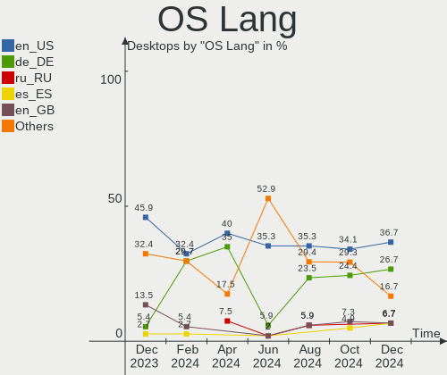
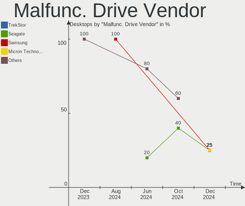
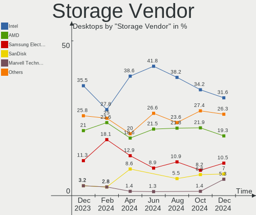
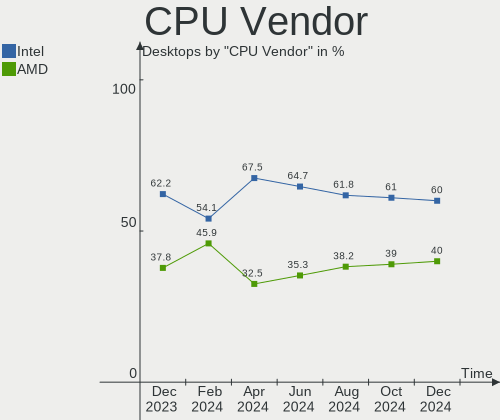
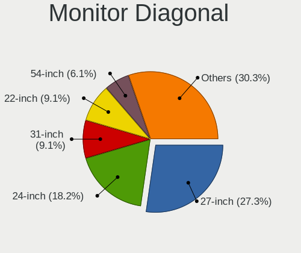
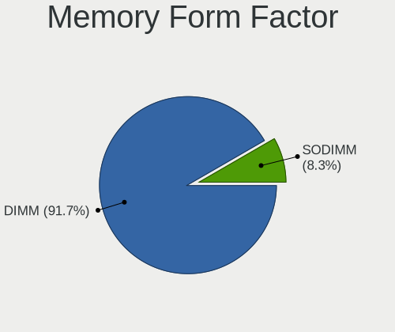
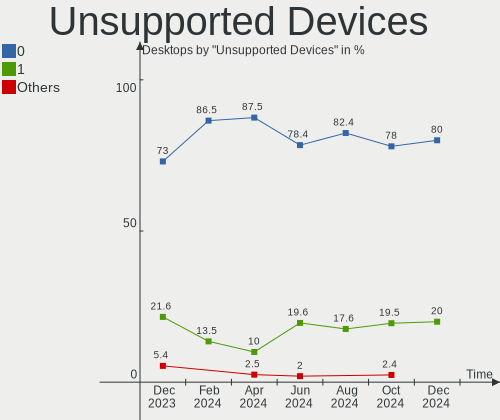

openSUSE - Hardware Trends (Desktops)
-------------------------------------

A project to identify most popular hardware characteristics and track their change
over time based on data collected by Linux users at https://Linux-Hardware.org.

Anyone can contribute to this report by the [hw-probe](https://github.com/linuxhw/hw-probe) tool:

    sudo -E hw-probe -all -upload

This report is for one last month. Overall report since the beginning of time: [TestDays](https://github.com/linuxhw/TestDays)

Period: Jun, 2023.

Contents
--------

* [ System ](#system)
  - [ OS                       ](#os)
  - [ OS Family                ](#os-family)
  - [ Kernel                   ](#kernel)
  - [ Kernel Family            ](#kernel-family)
  - [ Kernel Major Ver.        ](#kernel-major-ver)
  - [ Arch                     ](#arch)
  - [ DE                       ](#de)
  - [ Display Server           ](#display-server)
  - [ Display Manager          ](#display-manager)
  - [ OS Lang                  ](#os-lang)
  - [ Boot Mode                ](#boot-mode)
  - [ Filesystem               ](#filesystem)
  - [ Part. scheme             ](#part-scheme)
  - [ Dual Boot with Linux/BSD ](#dual-boot-with-linuxbsd)
  - [ Dual Boot (Win)          ](#dual-boot-win)

* [ Board ](#board)
  - [ Vendor                   ](#vendor)
  - [ Model                    ](#model)
  - [ Model Family             ](#model-family)
  - [ MFG Year                 ](#mfg-year)
  - [ Form Factor              ](#form-factor)
  - [ Secure Boot              ](#secure-boot)
  - [ Coreboot                 ](#coreboot)
  - [ RAM Size                 ](#ram-size)
  - [ RAM Used                 ](#ram-used)
  - [ Total Drives             ](#total-drives)
  - [ Has CD-ROM               ](#has-cd-rom)
  - [ Has Ethernet             ](#has-ethernet)
  - [ Has WiFi                 ](#has-wifi)
  - [ Has Bluetooth            ](#has-bluetooth)

* [ Location ](#location)
  - [ Country                  ](#country)
  - [ City                     ](#city)

* [ Drives ](#drives)
  - [ Drive Vendor             ](#drive-vendor)
  - [ Drive Model              ](#drive-model)
  - [ HDD Vendor               ](#hdd-vendor)
  - [ SSD Vendor               ](#ssd-vendor)
  - [ Drive Kind               ](#drive-kind)
  - [ Drive Connector          ](#drive-connector)
  - [ Drive Size               ](#drive-size)
  - [ Space Total              ](#space-total)
  - [ Space Used               ](#space-used)
  - [ Malfunc. Drives          ](#malfunc-drives)
  - [ Malfunc. Drive Vendor    ](#malfunc-drive-vendor)
  - [ Malfunc. HDD Vendor      ](#malfunc-hdd-vendor)
  - [ Malfunc. Drive Kind      ](#malfunc-drive-kind)
  - [ Failed Drives            ](#failed-drives)
  - [ Failed Drive Vendor      ](#failed-drive-vendor)
  - [ Drive Status             ](#drive-status)

* [ Storage controller ](#storage-controller)
  - [ Storage Vendor           ](#storage-vendor)
  - [ Storage Model            ](#storage-model)
  - [ Storage Kind             ](#storage-kind)

* [ Processor ](#processor)
  - [ CPU Vendor               ](#cpu-vendor)
  - [ CPU Model                ](#cpu-model)
  - [ CPU Model Family         ](#cpu-model-family)
  - [ CPU Cores                ](#cpu-cores)
  - [ CPU Sockets              ](#cpu-sockets)
  - [ CPU Threads              ](#cpu-threads)
  - [ CPU Op-Modes             ](#cpu-op-modes)
  - [ CPU Microcode            ](#cpu-microcode)
  - [ CPU Microarch            ](#cpu-microarch)

* [ Graphics ](#graphics)
  - [ GPU Vendor               ](#gpu-vendor)
  - [ GPU Model                ](#gpu-model)
  - [ GPU Combo                ](#gpu-combo)
  - [ GPU Driver               ](#gpu-driver)
  - [ GPU Memory               ](#gpu-memory)

* [ Monitor ](#monitor)
  - [ Monitor Vendor           ](#monitor-vendor)
  - [ Monitor Model            ](#monitor-model)
  - [ Monitor Resolution       ](#monitor-resolution)
  - [ Monitor Diagonal         ](#monitor-diagonal)
  - [ Monitor Width            ](#monitor-width)
  - [ Aspect Ratio             ](#aspect-ratio)
  - [ Monitor Area             ](#monitor-area)
  - [ Pixel Density            ](#pixel-density)
  - [ Multiple Monitors        ](#multiple-monitors)

* [ Network ](#network)
  - [ Net Controller Vendor    ](#net-controller-vendor)
  - [ Net Controller Model     ](#net-controller-model)
  - [ Wireless Vendor          ](#wireless-vendor)
  - [ Wireless Model           ](#wireless-model)
  - [ Ethernet Vendor          ](#ethernet-vendor)
  - [ Ethernet Model           ](#ethernet-model)
  - [ Net Controller Kind      ](#net-controller-kind)
  - [ Used Controller          ](#used-controller)
  - [ NICs                     ](#nics)
  - [ IPv6                     ](#ipv6)

* [ Bluetooth ](#bluetooth)
  - [ Bluetooth Vendor         ](#bluetooth-vendor)
  - [ Bluetooth Model          ](#bluetooth-model)

* [ Sound ](#sound)
  - [ Sound Vendor             ](#sound-vendor)
  - [ Sound Model              ](#sound-model)

* [ Memory ](#memory)
  - [ Memory Vendor            ](#memory-vendor)
  - [ Memory Model             ](#memory-model)
  - [ Memory Kind              ](#memory-kind)
  - [ Memory Form Factor       ](#memory-form-factor)
  - [ Memory Size              ](#memory-size)
  - [ Memory Speed             ](#memory-speed)

* [ Printers & scanners ](#printers--scanners)
  - [ Printer Vendor           ](#printer-vendor)
  - [ Printer Model            ](#printer-model)
  - [ Scanner Vendor           ](#scanner-vendor)
  - [ Scanner Model            ](#scanner-model)

* [ Camera ](#camera)
  - [ Camera Vendor            ](#camera-vendor)
  - [ Camera Model             ](#camera-model)

* [ Security ](#security)
  - [ Fingerprint Vendor       ](#fingerprint-vendor)
  - [ Fingerprint Model        ](#fingerprint-model)
  - [ Chipcard Vendor          ](#chipcard-vendor)
  - [ Chipcard Model           ](#chipcard-model)

* [ Unsupported ](#unsupported)
  - [ Unsupported Devices      ](#unsupported-devices)
  - [ Unsupported Device Types ](#unsupported-device-types)

System
------

OS
--

Installed operating systems

| Name                         | Desktops | Percent |
|------------------------------|----------|---------|
| openSUSE Tumbleweed-XXXXXXXX | 24       | 55.81%  |
| openSUSE Leap-15.5           | 11       | 25.58%  |
| openSUSE Microos-XXXXXXXX    | 4        | 9.3%    |
| openSUSE Leap-15.4           | 4        | 9.3%    |

OS Family
---------

OS without a version

| Name     | Desktops | Percent |
|----------|----------|---------|
| openSUSE | 43       | 100%    |

Kernel
------

Version of the Linux kernel

| Version                      | Desktops | Percent |
|------------------------------|----------|---------|
| 5.14.21-150500.53-default    | 10       | 23.26%  |
| 6.3.4-1-default              | 9        | 20.93%  |
| 6.3.7-1-default              | 7        | 16.28%  |
| 6.3.6-1-default              | 5        | 11.63%  |
| 5.14.21-150400.24.63-default | 4        | 9.3%    |
| 6.3.9-1-default              | 2        | 4.65%   |
| 6.3.2-1-default              | 2        | 4.65%   |
| 6.4.0-rc5-vanilla            | 1        | 2.33%   |
| 6.2.12-1-default             | 1        | 2.33%   |
| 5.17.9-1-default             | 1        | 2.33%   |
| 5.14.21-150400.24.46-default | 1        | 2.33%   |

Kernel Family
-------------

Linux kernel without a distro release

| Version | Desktops | Percent |
|---------|----------|---------|
| 5.14.21 | 15       | 34.88%  |
| 6.3.4   | 9        | 20.93%  |
| 6.3.7   | 7        | 16.28%  |
| 6.3.6   | 5        | 11.63%  |
| 6.3.9   | 2        | 4.65%   |
| 6.3.2   | 2        | 4.65%   |
| 6.4.0   | 1        | 2.33%   |
| 6.2.12  | 1        | 2.33%   |
| 5.17.9  | 1        | 2.33%   |

Kernel Major Ver.
-----------------

Linux kernel major version

| Version | Desktops | Percent |
|---------|----------|---------|
| 6.3     | 25       | 58.14%  |
| 5.14    | 15       | 34.88%  |
| 6.4     | 1        | 2.33%   |
| 6.2     | 1        | 2.33%   |
| 5.17    | 1        | 2.33%   |

Arch
----

OS architecture (x86_64, i586, etc.)

| Name   | Desktops | Percent |
|--------|----------|---------|
| x86_64 | 43       | 100%    |

DE
--

Desktop Environment

| Name  | Desktops | Percent |
|-------|----------|---------|
| KDE5  | 34       | 79.07%  |
| GNOME | 6        | 13.95%  |
| XFCE  | 2        | 4.65%   |
| ICEWM | 1        | 2.33%   |

Display Server
--------------

X11 or Wayland

| Name    | Desktops | Percent |
|---------|----------|---------|
| X11     | 37       | 86.05%  |
| Wayland | 6        | 13.95%  |

Display Manager
---------------

SDDM, LightDM, etc.

| Name    | Desktops | Percent |
|---------|----------|---------|
| Unknown | 28       | 65.12%  |
| SDDM    | 12       | 27.91%  |
| LightDM | 2        | 4.65%   |
| GDM     | 1        | 2.33%   |

OS Lang
-------

Language

| Lang  | Desktops | Percent |
|-------|----------|---------|
| en_US | 18       | 41.86%  |
| de_DE | 5        | 11.63%  |
| POSIX | 4        | 9.3%    |
| es_ES | 3        | 6.98%   |
| pt_BR | 2        | 4.65%   |
| nl_NL | 2        | 4.65%   |
| it_IT | 2        | 4.65%   |
| ru_RU | 1        | 2.33%   |
| nn_NO | 1        | 2.33%   |
| fr_FR | 1        | 2.33%   |
| es_DO | 1        | 2.33%   |
| en_GB | 1        | 2.33%   |
| de_CH | 1        | 2.33%   |
| da_DK | 1        | 2.33%   |

Boot Mode
---------

EFI or BIOS

| Mode | Desktops | Percent |
|------|----------|---------|
| EFI  | 23       | 53.49%  |
| BIOS | 20       | 46.51%  |

Filesystem
----------

Type of filesystem

| Type  | Desktops | Percent |
|-------|----------|---------|
| Btrfs | 36       | 83.72%  |
| Ext4  | 7        | 16.28%  |

Part. scheme
------------

Scheme of partitioning

| Type    | Desktops | Percent |
|---------|----------|---------|
| Unknown | 27       | 62.79%  |
| GPT     | 14       | 32.56%  |
| MBR     | 2        | 4.65%   |

Dual Boot with Linux/BSD
------------------------

Hosting more than one Linux/BSD

| Dual boot | Desktops | Percent |
|-----------|----------|---------|
| No        | 40       | 93.02%  |
| Yes       | 3        | 6.98%   |

Dual Boot (Win)
---------------

Hosting Linux and Windows

| Dual boot | Desktops | Percent |
|-----------|----------|---------|
| No        | 39       | 90.7%   |
| Yes       | 4        | 9.3%    |

Board
-----

Vendor
------

Motherboard manufacturer

| Name                | Desktops | Percent |
|---------------------|----------|---------|
| ASUSTek Computer    | 13       | 30.23%  |
| Hewlett-Packard     | 7        | 16.28%  |
| Gigabyte Technology | 7        | 16.28%  |
| MSI                 | 6        | 13.95%  |
| ASRock              | 3        | 6.98%   |
| Lenovo              | 2        | 4.65%   |
| Pegatron            | 1        | 2.33%   |
| Intel               | 1        | 2.33%   |
| Fujitsu             | 1        | 2.33%   |
| Dell                | 1        | 2.33%   |
| Acer                | 1        | 2.33%   |

Model
-----

Motherboard model

| Name                                   | Desktops | Percent |
|----------------------------------------|----------|---------|
| ASUS M5A99X EVO R2.0                   | 2        | 4.65%   |
| ASUS M5A97 R2.0                        | 2        | 4.65%   |
| Pegatron NY603AA-ABA 300-1007          | 1        | 2.33%   |
| MSI MS-7C96                            | 1        | 2.33%   |
| MSI MS-7C91                            | 1        | 2.33%   |
| MSI MS-7C02                            | 1        | 2.33%   |
| MSI MS-7B53                            | 1        | 2.33%   |
| MSI MS-7B17                            | 1        | 2.33%   |
| MSI MS-7673                            | 1        | 2.33%   |
| Lenovo ThinkStation P520 30BE008VGE    | 1        | 2.33%   |
| Lenovo IdeaCentre 5 14IMB05 90NA001RIX | 1        | 2.33%   |
| Intel DG965SS AAD41678-304             | 1        | 2.33%   |
| HP Z620 Workstation                    | 1        | 2.33%   |
| HP Z420 Workstation                    | 1        | 2.33%   |
| HP EliteDesk 800 G2 DM 35W             | 1        | 2.33%   |
| HP EliteDesk 800 G1 TWR                | 1        | 2.33%   |
| HP Compaq Elite 8300 SFF               | 1        | 2.33%   |
| HP 870-115ng                           | 1        | 2.33%   |
| HP 23-s010                             | 1        | 2.33%   |
| Gigabyte Z97-HD3                       | 1        | 2.33%   |
| Gigabyte X99-UD4-CF                    | 1        | 2.33%   |
| Gigabyte X670E AORUS MASTER            | 1        | 2.33%   |
| Gigabyte X570 I AORUS PRO WIFI         | 1        | 2.33%   |
| Gigabyte P67A-UD5-B3                   | 1        | 2.33%   |
| Gigabyte EG45M-DS2H                    | 1        | 2.33%   |
| Gigabyte 970A-DS3P                     | 1        | 2.33%   |
| Fujitsu D2942-B1                       | 1        | 2.33%   |
| Dell Precision 3650 Tower              | 1        | 2.33%   |
| ASUS TUF Gaming B550M-PLUS WIFI II     | 1        | 2.33%   |
| ASUS SABERTOOTH Z77                    | 1        | 2.33%   |
| ASUS ROG STRIX X399-E GAMING           | 1        | 2.33%   |
| ASUS PRIME X370-PRO                    | 1        | 2.33%   |
| ASUS PRIME B650M-A WIFI II             | 1        | 2.33%   |
| ASUS PRIME B550M-K                     | 1        | 2.33%   |
| ASUS PRIME B450M-A II                  | 1        | 2.33%   |
| ASUS PRIME B350-PLUS                   | 1        | 2.33%   |
| ASUS P5Q-PRO                           | 1        | 2.33%   |
| ASRock B450M Pro4 R2.0                 | 1        | 2.33%   |
| ASRock A320M-HD                        | 1        | 2.33%   |
| ASRock 970 Pro3 R2.0                   | 1        | 2.33%   |

Model Family
------------

Motherboard model prefix

| Name                 | Desktops | Percent |
|----------------------|----------|---------|
| ASUS PRIME           | 5        | 11.63%  |
| HP EliteDesk         | 2        | 4.65%   |
| ASUS M5A99X          | 2        | 4.65%   |
| ASUS M5A97           | 2        | 4.65%   |
| Pegatron NY603AA-ABA | 1        | 2.33%   |
| MSI MS-7C96          | 1        | 2.33%   |
| MSI MS-7C91          | 1        | 2.33%   |
| MSI MS-7C02          | 1        | 2.33%   |
| MSI MS-7B53          | 1        | 2.33%   |
| MSI MS-7B17          | 1        | 2.33%   |
| MSI MS-7673          | 1        | 2.33%   |
| Lenovo ThinkStation  | 1        | 2.33%   |
| Lenovo IdeaCentre    | 1        | 2.33%   |
| Intel DG965SS        | 1        | 2.33%   |
| HP Z620              | 1        | 2.33%   |
| HP Z420              | 1        | 2.33%   |
| HP Compaq            | 1        | 2.33%   |
| HP 870-115ng         | 1        | 2.33%   |
| HP 23-s010           | 1        | 2.33%   |
| Gigabyte Z97-HD3     | 1        | 2.33%   |
| Gigabyte X99-UD4-CF  | 1        | 2.33%   |
| Gigabyte X670E       | 1        | 2.33%   |
| Gigabyte X570        | 1        | 2.33%   |
| Gigabyte P67A-UD5-B3 | 1        | 2.33%   |
| Gigabyte EG45M-DS2H  | 1        | 2.33%   |
| Gigabyte 970A-DS3P   | 1        | 2.33%   |
| Fujitsu D2942-B1     | 1        | 2.33%   |
| Dell Precision       | 1        | 2.33%   |
| ASUS TUF             | 1        | 2.33%   |
| ASUS SABERTOOTH      | 1        | 2.33%   |
| ASUS ROG             | 1        | 2.33%   |
| ASUS P5Q-PRO         | 1        | 2.33%   |
| ASRock B450M         | 1        | 2.33%   |
| ASRock A320M-HD      | 1        | 2.33%   |
| ASRock 970           | 1        | 2.33%   |
| Acer Aspire          | 1        | 2.33%   |

MFG Year
--------

Motherboard manufacture year

| Year | Desktops | Percent |
|------|----------|---------|
| 2012 | 9        | 20.93%  |
| 2020 | 6        | 13.95%  |
| 2018 | 4        | 9.3%    |
| 2021 | 3        | 6.98%   |
| 2017 | 3        | 6.98%   |
| 2023 | 2        | 4.65%   |
| 2016 | 2        | 4.65%   |
| 2015 | 2        | 4.65%   |
| 2014 | 2        | 4.65%   |
| 2013 | 2        | 4.65%   |
| 2011 | 2        | 4.65%   |
| 2008 | 2        | 4.65%   |
| 2019 | 1        | 2.33%   |
| 2010 | 1        | 2.33%   |
| 2009 | 1        | 2.33%   |
| 2006 | 1        | 2.33%   |

Form Factor
-----------

Physical design of the computer

| Name    | Desktops | Percent |
|---------|----------|---------|
| Desktop | 43       | 100%    |

Secure Boot
-----------

Enabled or disabled

| State    | Desktops | Percent |
|----------|----------|---------|
| Disabled | 42       | 97.67%  |
| Enabled  | 1        | 2.33%   |

Coreboot
--------

Have coreboot on board

| Used | Desktops | Percent |
|------|----------|---------|
| No   | 43       | 100%    |

RAM Size
--------

Total RAM memory

| Size in GB      | Desktops | Percent |
|-----------------|----------|---------|
| 16.01-24.0      | 18       | 41.86%  |
| 32.01-64.0      | 6        | 13.95%  |
| 8.01-16.0       | 6        | 13.95%  |
| 4.01-8.0        | 5        | 11.63%  |
| 64.01-256.0     | 4        | 9.3%    |
| 3.01-4.0        | 2        | 4.65%   |
| More than 256.0 | 1        | 2.33%   |
| 24.01-32.0      | 1        | 2.33%   |

RAM Used
--------

Used RAM memory

| Used GB    | Desktops | Percent |
|------------|----------|---------|
| 2.01-3.0   | 14       | 32.56%  |
| 4.01-8.0   | 9        | 20.93%  |
| 1.01-2.0   | 9        | 20.93%  |
| 3.01-4.0   | 7        | 16.28%  |
| 8.01-16.0  | 3        | 6.98%   |
| 16.01-24.0 | 1        | 2.33%   |

Total Drives
------------

Number of drives on board

| Drives | Desktops | Percent |
|--------|----------|---------|
| 2      | 11       | 25.58%  |
| 4      | 10       | 23.26%  |
| 3      | 10       | 23.26%  |
| 1      | 8        | 18.6%   |
| 5      | 2        | 4.65%   |
| 8      | 1        | 2.33%   |
| 6      | 1        | 2.33%   |

Has CD-ROM
----------

Has CD-ROM on board

| Presented | Desktops | Percent |
|-----------|----------|---------|
| Yes       | 24       | 55.81%  |
| No        | 19       | 44.19%  |

Has Ethernet
------------

Has Ethernet on board

| Presented | Desktops | Percent |
|-----------|----------|---------|
| Yes       | 42       | 97.67%  |
| No        | 1        | 2.33%   |

Has WiFi
--------

Has WiFi module

| Presented | Desktops | Percent |
|-----------|----------|---------|
| Yes       | 24       | 55.81%  |
| No        | 19       | 44.19%  |

Has Bluetooth
-------------

Has Bluetooth module

| Presented | Desktops | Percent |
|-----------|----------|---------|
| No        | 25       | 58.14%  |
| Yes       | 18       | 41.86%  |

Location
--------

Country
-------

Geographic location (country)

| Country     | Desktops | Percent |
|-------------|----------|---------|
| USA         | 11       | 25.58%  |
| Germany     | 6        | 13.95%  |
| Spain       | 4        | 9.3%    |
| Italy       | 3        | 6.98%   |
| Canada      | 3        | 6.98%   |
| UK          | 2        | 4.65%   |
| Switzerland | 2        | 4.65%   |
| Netherlands | 2        | 4.65%   |
| Brazil      | 2        | 4.65%   |
| Russia      | 1        | 2.33%   |
| Portugal    | 1        | 2.33%   |
| Norway      | 1        | 2.33%   |
| Greenland   | 1        | 2.33%   |
| France      | 1        | 2.33%   |
| Czechia     | 1        | 2.33%   |
| Australia   | 1        | 2.33%   |
| Argentina   | 1        | 2.33%   |

City
----

Geographic location (city)

| City                       | Desktops | Percent |
|----------------------------|----------|---------|
| London                     | 2        | 4.65%   |
| Giessen                    | 2        | 4.65%   |
| Enschede                   | 2        | 4.65%   |
| Bergisch Gladbach          | 2        | 4.65%   |
| Zurich                     | 1        | 2.33%   |
| Wuppertal                  | 1        | 2.33%   |
| Wallington                 | 1        | 2.33%   |
| Virginia Beach             | 1        | 2.33%   |
| Victoria                   | 1        | 2.33%   |
| Valencia                   | 1        | 2.33%   |
| Tremestieri Etneo          | 1        | 2.33%   |
| Tondela                    | 1        | 2.33%   |
| Teresina                   | 1        | 2.33%   |
| Stourbridge                | 1        | 2.33%   |
| Statesville                | 1        | 2.33%   |
| Staraya Russa              | 1        | 2.33%   |
| Stadthagen                 | 1        | 2.33%   |
| Seattle                    | 1        | 2.33%   |
| Salt Lake City             | 1        | 2.33%   |
| Roanoke                    | 1        | 2.33%   |
| Prague                     | 1        | 2.33%   |
| Melbourne                  | 1        | 2.33%   |
| Málaga                    | 1        | 2.33%   |
| Madrid                     | 1        | 2.33%   |
| Lyss                       | 1        | 2.33%   |
| Lawton                     | 1        | 2.33%   |
| Las Palmas de Gran Canaria | 1        | 2.33%   |
| Lanham                     | 1        | 2.33%   |
| Jacksonville               | 1        | 2.33%   |
| Ilulissat                  | 1        | 2.33%   |
| Guidel                     | 1        | 2.33%   |
| Grottaglie                 | 1        | 2.33%   |
| Funes                      | 1        | 2.33%   |
| Cherry Hill                | 1        | 2.33%   |
| Chattanooga                | 1        | 2.33%   |
| Butte                      | 1        | 2.33%   |
| Brasília                  | 1        | 2.33%   |
| Bergen                     | 1        | 2.33%   |
| Bedizzole                  | 1        | 2.33%   |

Drives
------

Drive Vendor
------------

Hard drive vendors

| Vendor              | Desktops | Drives | Percent |
|---------------------|----------|--------|---------|
| WDC                 | 24       | 35     | 23.08%  |
| Seagate             | 23       | 30     | 22.12%  |
| Samsung Electronics | 17       | 23     | 16.35%  |
| Toshiba             | 7        | 9      | 6.73%   |
| Unknown             | 4        | 4      | 3.85%   |
| Hitachi             | 3        | 3      | 2.88%   |
| Crucial             | 3        | 4      | 2.88%   |
| SanDisk             | 2        | 2      | 1.92%   |
| Phison Electronics  | 2        | 2      | 1.92%   |
| Micron Technology   | 2        | 2      | 1.92%   |
| Intel               | 2        | 2      | 1.92%   |
| WD MediaMax         | 1        | 1      | 0.96%   |
| USB3.0              | 1        | 2      | 0.96%   |
| Transcend           | 1        | 1      | 0.96%   |
| StoreJet            | 1        | 1      | 0.96%   |
| SK hynix            | 1        | 1      | 0.96%   |
| Patriot             | 1        | 1      | 0.96%   |
| Lexar               | 1        | 1      | 0.96%   |
| Leven               | 1        | 1      | 0.96%   |
| Kingston            | 1        | 1      | 0.96%   |
| KingFast            | 1        | 1      | 0.96%   |
| Intenso             | 1        | 2      | 0.96%   |
| HGST                | 1        | 1      | 0.96%   |
| Hewlett-Packard     | 1        | 5      | 0.96%   |
| AMD                 | 1        | 1      | 0.96%   |
| A-DATA Technology   | 1        | 1      | 0.96%   |

Drive Model
-----------

Hard drive models

| Model                                               | Desktops | Percent |
|-----------------------------------------------------|----------|---------|
| Seagate ST500DM002-1BD142 500GB                     | 3        | 2.44%   |
| Seagate ST2000DM008-2FR102 2TB                      | 3        | 2.44%   |
| Samsung NVMe SSD Controller SM981/PM981/PM983 250GB | 3        | 2.44%   |
| WDC WDS500G2B0A-00SM50 500GB SSD                    | 2        | 1.63%   |
| WDC WD5000AZRX-00A8LB0 500GB                        | 2        | 1.63%   |
| WDC WD10EZEX-21WN4A0 1TB                            | 2        | 1.63%   |
| Unknown SD/MMC/MS PRO 250GB                         | 2        | 1.63%   |
| Toshiba MQ04ABF100 1TB                              | 2        | 1.63%   |
| Toshiba MQ01ABD100 1TB                              | 2        | 1.63%   |
| Seagate ST2000DM001-1ER164 2TB                      | 2        | 1.63%   |
| Seagate ST1000DM010-2EP102 1TB                      | 2        | 1.63%   |
| Seagate ST1000DM003-1SB102 1TB                      | 2        | 1.63%   |
| Seagate ST1000DM003-1ER162 1TB                      | 2        | 1.63%   |
| Samsung SSD 870 EVO 1TB                             | 2        | 1.63%   |
| Crucial CT480BX500SSD1 480GB                        | 2        | 1.63%   |
| WDC WDS250G1B0A-00H9H0 250GB SSD                    | 1        | 0.81%   |
| WDC WDS240G2G0A-00JH30 240GB SSD                    | 1        | 0.81%   |
| WDC WDS120G1G0A-00SS50 120GB SSD                    | 1        | 0.81%   |
| WDC WDS100T3X0C-00SJG0 1TB                          | 1        | 0.81%   |
| WDC WDS100T2B0B-00YS70 1TB SSD                      | 1        | 0.81%   |
| WDC WDS100T2B0A-00SM50 1TB SSD                      | 1        | 0.81%   |
| WDC WD5000HHTZ-04N21V0 500GB                        | 1        | 0.81%   |
| WDC WD5000BEKT-60KA9T0 500GB                        | 1        | 0.81%   |
| WDC WD5000AZLX-00CL5A0 500GB                        | 1        | 0.81%   |
| WDC WD5000AAKS-00A7B2 500GB                         | 1        | 0.81%   |
| WDC WD5000AAJS-00TKA0 500GB                         | 1        | 0.81%   |
| WDC WD5000AAJS-00A8B0 500GB                         | 1        | 0.81%   |
| WDC WD40EFRX-68N32N0 4TB                            | 1        | 0.81%   |
| WDC WD20EZRX-00DC0B0 2TB                            | 1        | 0.81%   |
| WDC WD2003FZEX-00SRLA0 2TB                          | 1        | 0.81%   |
| WDC WD10PURZ-85U8XY0 1TB                            | 1        | 0.81%   |
| WDC WD10JPVX-60JC3T0 1TB                            | 1        | 0.81%   |
| WDC WD10EZEX-75M2NA0 1TB                            | 1        | 0.81%   |
| WDC WD10EZEX-08WN4A0 1TB                            | 1        | 0.81%   |
| WDC WD10EZEX-08M2NA0 1TB                            | 1        | 0.81%   |
| WDC WD10EZEX-00BN5A0 1TB                            | 1        | 0.81%   |
| WDC WD1003FZEX-00MK2A0 1TB                          | 1        | 0.81%   |
| WDC WD1003FBYX-01Y7B1 1TB                           | 1        | 0.81%   |
| WDC WD1001FALS-00J7B0 1TB                           | 1        | 0.81%   |
| WDC WD Blue SA510 2.5 2TB SSD                       | 1        | 0.81%   |

HDD Vendor
----------

Hard disk drive vendors

| Vendor              | Desktops | Drives | Percent |
|---------------------|----------|--------|---------|
| Seagate             | 22       | 28     | 38.6%   |
| WDC                 | 19       | 25     | 33.33%  |
| Toshiba             | 5        | 7      | 8.77%   |
| Hitachi             | 3        | 3      | 5.26%   |
| Unknown             | 2        | 2      | 3.51%   |
| Samsung Electronics | 2        | 2      | 3.51%   |
| WD MediaMax         | 1        | 1      | 1.75%   |
| USB3.0              | 1        | 2      | 1.75%   |
| HGST                | 1        | 1      | 1.75%   |
| Hewlett-Packard     | 1        | 5      | 1.75%   |

SSD Vendor
----------

Solid state drive vendors

| Vendor              | Desktops | Drives | Percent |
|---------------------|----------|--------|---------|
| Samsung Electronics | 13       | 14     | 37.14%  |
| WDC                 | 7        | 9      | 20%     |
| Crucial             | 3        | 4      | 8.57%   |
| Toshiba             | 2        | 2      | 5.71%   |
| Intel               | 2        | 2      | 5.71%   |
| Transcend           | 1        | 1      | 2.86%   |
| StoreJet            | 1        | 1      | 2.86%   |
| SanDisk             | 1        | 1      | 2.86%   |
| Patriot             | 1        | 1      | 2.86%   |
| Leven               | 1        | 1      | 2.86%   |
| Kingston            | 1        | 1      | 2.86%   |
| Intenso             | 1        | 1      | 2.86%   |
| A-DATA Technology   | 1        | 1      | 2.86%   |

Drive Kind
----------

HDD or SSD

| Kind    | Desktops | Drives | Percent |
|---------|----------|--------|---------|
| HDD     | 33       | 76     | 42.31%  |
| SSD     | 26       | 39     | 33.33%  |
| NVMe    | 14       | 16     | 17.95%  |
| Unknown | 4        | 5      | 5.13%   |
| MMC     | 1        | 1      | 1.28%   |

Drive Connector
---------------

SATA, SAS, NVMe, etc.

| Type | Desktops | Drives | Percent |
|------|----------|--------|---------|
| SATA | 42       | 101    | 63.64%  |
| NVMe | 14       | 16     | 21.21%  |
| SAS  | 9        | 19     | 13.64%  |
| MMC  | 1        | 1      | 1.52%   |

Drive Size
----------

Size of hard drive

| Size in TB | Desktops | Drives | Percent |
|------------|----------|--------|---------|
| 0.01-0.5   | 29       | 46     | 40.28%  |
| 0.51-1.0   | 24       | 37     | 33.33%  |
| 1.01-2.0   | 12       | 16     | 16.67%  |
| 4.01-10.0  | 3        | 4      | 4.17%   |
| 3.01-4.0   | 2        | 3      | 2.78%   |
| 2.01-3.0   | 2        | 9      | 2.78%   |

Space Total
-----------

Amount of disk space available on the file system

| Size in GB     | Desktops | Percent |
|----------------|----------|---------|
| More than 3000 | 26       | 60.47%  |
| 2001-3000      | 7        | 16.28%  |
| 1001-2000      | 6        | 13.95%  |
| 251-500        | 2        | 4.65%   |
| 501-1000       | 1        | 2.33%   |
| 51-100         | 1        | 2.33%   |

Space Used
----------

Amount of used disk space

| Used GB        | Desktops | Percent |
|----------------|----------|---------|
| 101-250        | 9        | 20.93%  |
| 1001-2000      | 9        | 20.93%  |
| 251-500        | 7        | 16.28%  |
| 51-100         | 6        | 13.95%  |
| More than 3000 | 5        | 11.63%  |
| 2001-3000      | 3        | 6.98%   |
| 501-1000       | 3        | 6.98%   |
| 1-20           | 1        | 2.33%   |

Malfunc. Drives
---------------

Drive models with a malfunction

| Model                            | Desktops | Drives | Percent |
|----------------------------------|----------|--------|---------|
| WDC WDS240G2G0A-00JH30 240GB SSD | 1        | 1      | 12.5%   |
| WDC WD5000AZRX-00A8LB0 500GB     | 1        | 1      | 12.5%   |
| WDC WD1001FALS-00J7B0 1TB        | 1        | 1      | 12.5%   |
| WD MediaMax WL5000GSA12872B 5TB  | 1        | 1      | 12.5%   |
| Transcend TS120GSSD220S 120GB    | 1        | 1      | 12.5%   |
| Seagate ST500DM002-1BD142 500GB  | 1        | 1      | 12.5%   |
| Seagate ST2000DM001-1CH164 2TB   | 1        | 1      | 12.5%   |
| Crucial CT512MX100SSD1 512GB     | 1        | 1      | 12.5%   |

Malfunc. Drive Vendor
---------------------

Vendors of faulty drives

| Vendor      | Desktops | Drives | Percent |
|-------------|----------|--------|---------|
| WDC         | 3        | 3      | 37.5%   |
| Seagate     | 2        | 2      | 25%     |
| WD MediaMax | 1        | 1      | 12.5%   |
| Transcend   | 1        | 1      | 12.5%   |
| Crucial     | 1        | 1      | 12.5%   |

Malfunc. HDD Vendor
-------------------

Vendors of faulty HDD drives

| Vendor      | Desktops | Drives | Percent |
|-------------|----------|--------|---------|
| WDC         | 2        | 2      | 40%     |
| Seagate     | 2        | 2      | 40%     |
| WD MediaMax | 1        | 1      | 20%     |

Malfunc. Drive Kind
-------------------

Kinds of faulty drives

| Kind | Desktops | Drives | Percent |
|------|----------|--------|---------|
| SSD  | 3        | 3      | 50%     |
| HDD  | 3        | 5      | 50%     |

Failed Drives
-------------

Failed drive models

Zero info for selected period =(

Failed Drive Vendor
-------------------

Failed drive vendors

Zero info for selected period =(

Drive Status
------------

Number of failed and malfunc. drives

| Status   | Desktops | Drives | Percent |
|----------|----------|--------|---------|
| Detected | 31       | 91     | 59.62%  |
| Works    | 15       | 38     | 28.85%  |
| Malfunc  | 6        | 8      | 11.54%  |

Storage controller
------------------

Storage Vendor
--------------

Storage controller vendors

| Vendor                        | Desktops | Percent |
|-------------------------------|----------|---------|
| Intel                         | 22       | 33.85%  |
| AMD                           | 21       | 32.31%  |
| Samsung Electronics           | 5        | 7.69%   |
| Marvell Technology Group      | 3        | 4.62%   |
| ASMedia Technology            | 3        | 4.62%   |
| SanDisk                       | 2        | 3.08%   |
| Phison Electronics            | 2        | 3.08%   |
| Micron Technology             | 2        | 3.08%   |
| Solidigm                      | 1        | 1.54%   |
| SK hynix                      | 1        | 1.54%   |
| LSI Logic / Symbios Logic     | 1        | 1.54%   |
| Integrated Technology Express | 1        | 1.54%   |
| Broadcom / LSI                | 1        | 1.54%   |

Storage Model
-------------

Storage controller models

| Model                                                                         | Desktops | Percent |
|-------------------------------------------------------------------------------|----------|---------|
| AMD FCH SATA Controller [AHCI mode]                                           | 9        | 11.11%  |
| AMD SB7x0/SB8x0/SB9x0 SATA Controller [AHCI mode]                             | 7        | 8.64%   |
| AMD 500 Series Chipset SATA Controller                                        | 4        | 4.94%   |
| Samsung NVMe SSD Controller SM981/PM981/PM983                                 | 3        | 3.7%    |
| Intel Q170/Q150/B150/H170/H110/Z170/CM236 Chipset SATA Controller [AHCI Mode] | 3        | 3.7%    |
| ASMedia ASM1062 Serial ATA Controller                                         | 3        | 3.7%    |
| AMD 400 Series Chipset SATA Controller                                        | 3        | 3.7%    |
| Micron NVMe Storage Controller                                                | 2        | 2.47%   |
| Intel Cannon Lake PCH SATA AHCI Controller                                    | 2        | 2.47%   |
| Intel C602 chipset 4-Port SATA Storage Control Unit                           | 2        | 2.47%   |
| Intel 9 Series Chipset Family SATA Controller [AHCI Mode]                     | 2        | 2.47%   |
| Intel 82801JI (ICH10 Family) SATA AHCI Controller                             | 2        | 2.47%   |
| Intel 7 Series/C210 Series Chipset Family 6-port SATA Controller [AHCI mode]  | 2        | 2.47%   |
| Intel 6 Series/C200 Series Chipset Family 6 port Desktop SATA AHCI Controller | 2        | 2.47%   |
| Solidigm Non-Volatile memory controller                                       | 1        | 1.23%   |
| SK hynix PC611 NVMe Solid State Drive                                         | 1        | 1.23%   |
| SanDisk WD Blue SN570 NVMe SSD 1TB                                            | 1        | 1.23%   |
| SanDisk WD Black 2018/SN750 / PC SN720 NVMe SSD                               | 1        | 1.23%   |
| Samsung NVMe SSD Controller SM961/PM961/SM963                                 | 1        | 1.23%   |
| Samsung NVMe SSD Controller PM9A1/PM9A3/980PRO                                | 1        | 1.23%   |
| Samsung NVMe SSD Controller 980                                               | 1        | 1.23%   |
| Phison PS5021-E21 PCIe4 NVMe Controller (DRAM-less)                           | 1        | 1.23%   |
| Phison PS5013 E13 NVMe Controller                                             | 1        | 1.23%   |
| Marvell Group 88SE9128 PCIe SATA 6 Gb/s RAID controller                       | 1        | 1.23%   |
| Marvell Group 88SE9123 PCIe SATA 6.0 Gb/s controller                          | 1        | 1.23%   |
| Marvell Group 88SE6101/6102 single-port PATA133 interface                     | 1        | 1.23%   |
| LSI Logic / Symbios Logic MegaRAID SAS 2108 [Liberator]                       | 1        | 1.23%   |
| Intel C610/X99 series chipset sSATA Controller [AHCI mode]                    | 1        | 1.23%   |
| Intel C610/X99 series chipset 6-Port SATA Controller [AHCI mode]              | 1        | 1.23%   |
| Intel C600/X79 series chipset SATA RAID Controller                            | 1        | 1.23%   |
| Intel C600/X79 series chipset IDE-r Controller                                | 1        | 1.23%   |
| Intel C600/X79 series chipset 4-Port SATA IDE Controller                      | 1        | 1.23%   |
| Intel C600/X79 series chipset 2-Port SATA IDE Controller                      | 1        | 1.23%   |
| Intel 82801HB (ICH8) 4 port SATA Controller [AHCI mode]                       | 1        | 1.23%   |
| Intel 8 Series/C220 Series Chipset Family 4-port SATA Controller 1 [IDE mode] | 1        | 1.23%   |
| Intel 8 Series/C220 Series Chipset Family 2-port SATA Controller 2 [IDE mode] | 1        | 1.23%   |
| Intel 500 Series Chipset Family SATA AHCI Controller                          | 1        | 1.23%   |
| Intel 5 Series/3400 Series Chipset 4 port SATA IDE Controller                 | 1        | 1.23%   |
| Intel 5 Series/3400 Series Chipset 2 port SATA IDE Controller                 | 1        | 1.23%   |
| Intel 400 Series Chipset Family SATA AHCI Controller                          | 1        | 1.23%   |

Storage Kind
------------

Kind of storage controller (IDE, SATA, NVMe, SAS, ...)

| Kind | Desktops | Percent |
|------|----------|---------|
| SATA | 39       | 60%     |
| NVMe | 14       | 21.54%  |
| IDE  | 7        | 10.77%  |
| RAID | 3        | 4.62%   |
| SAS  | 2        | 3.08%   |

Processor
---------

CPU Vendor
----------

Processor vendors

| Vendor | Desktops | Percent |
|--------|----------|---------|
| Intel  | 22       | 51.16%  |
| AMD    | 21       | 48.84%  |

CPU Model
---------

Processor models

| Model                                          | Desktops | Percent |
|------------------------------------------------|----------|---------|
| Intel Core 2 Quad CPU Q9550 @ 2.83GHz          | 2        | 4.65%   |
| AMD Ryzen 9 3900X 12-Core Processor            | 2        | 4.65%   |
| AMD Ryzen 7 1700X Eight-Core Processor         | 2        | 4.65%   |
| AMD FX-8370 Eight-Core Processor               | 2        | 4.65%   |
| AMD FX-8350 Eight-Core Processor               | 2        | 4.65%   |
| Intel Xeon W-2135 CPU @ 3.70GHz                | 1        | 2.33%   |
| Intel Xeon CPU E5-2620 v2 @ 2.10GHz            | 1        | 2.33%   |
| Intel Xeon CPU E5-1603 0 @ 2.80GHz             | 1        | 2.33%   |
| Intel Core i7-9700K CPU @ 3.60GHz              | 1        | 2.33%   |
| Intel Core i7-7700 CPU @ 3.60GHz               | 1        | 2.33%   |
| Intel Core i7-6700 CPU @ 3.40GHz               | 1        | 2.33%   |
| Intel Core i7-5820K CPU @ 3.30GHz              | 1        | 2.33%   |
| Intel Core i7-4790S CPU @ 3.20GHz              | 1        | 2.33%   |
| Intel Core i7-3770 CPU @ 3.40GHz               | 1        | 2.33%   |
| Intel Core i7-2600 CPU @ 3.40GHz               | 1        | 2.33%   |
| Intel Core i5-8600K CPU @ 3.60GHz              | 1        | 2.33%   |
| Intel Core i5-6500T CPU @ 2.50GHz              | 1        | 2.33%   |
| Intel Core i5-4670 CPU @ 3.40GHz               | 1        | 2.33%   |
| Intel Core i5-4440 CPU @ 3.10GHz               | 1        | 2.33%   |
| Intel Core i5-3570K CPU @ 3.40GHz              | 1        | 2.33%   |
| Intel Core i5-2500 CPU @ 3.30GHz               | 1        | 2.33%   |
| Intel Core i5-10400 CPU @ 2.90GHz              | 1        | 2.33%   |
| Intel Core i5 CPU 650 @ 3.20GHz                | 1        | 2.33%   |
| Intel Core 2 CPU 4300 @ 1.80GHz                | 1        | 2.33%   |
| Intel 11th Gen Core i7-11700K @ 3.60GHz        | 1        | 2.33%   |
| AMD Ryzen Threadripper 2950X 16-Core Processor | 1        | 2.33%   |
| AMD Ryzen 9 7950X 16-Core Processor            | 1        | 2.33%   |
| AMD Ryzen 9 7900X 12-Core Processor            | 1        | 2.33%   |
| AMD Ryzen 9 5900X 12-Core Processor            | 1        | 2.33%   |
| AMD Ryzen 7 5700G with Radeon Graphics         | 1        | 2.33%   |
| AMD Ryzen 7 3700X 8-Core Processor             | 1        | 2.33%   |
| AMD Ryzen 5 5500                               | 1        | 2.33%   |
| AMD Ryzen 5 4600G with Radeon Graphics         | 1        | 2.33%   |
| AMD Ryzen 5 2600 Six-Core Processor            | 1        | 2.33%   |
| AMD FX-8300 Eight-Core Processor               | 1        | 2.33%   |
| AMD FX-6300 Six-Core Processor                 | 1        | 2.33%   |
| AMD Athlon II X2 235e Processor                | 1        | 2.33%   |
| AMD A6-9500 RADEON R5, 8 COMPUTE CORES 2C+6G   | 1        | 2.33%   |

CPU Model Family
----------------

Processor model prefix

| Model                  | Desktops | Percent |
|------------------------|----------|---------|
| Intel Core i5          | 8        | 18.6%   |
| Intel Core i7          | 7        | 16.28%  |
| AMD FX                 | 6        | 13.95%  |
| AMD Ryzen 9            | 5        | 11.63%  |
| AMD Ryzen 7            | 4        | 9.3%    |
| Intel Xeon             | 3        | 6.98%   |
| AMD Ryzen 5            | 3        | 6.98%   |
| Intel Core 2 Quad      | 2        | 4.65%   |
| Other                  | 1        | 2.33%   |
| Intel Core 2           | 1        | 2.33%   |
| AMD Ryzen Threadripper | 1        | 2.33%   |
| AMD Athlon II X2       | 1        | 2.33%   |
| AMD A6                 | 1        | 2.33%   |

CPU Cores
---------

Number of processor cores

| Number | Desktops | Percent |
|--------|----------|---------|
| 4      | 18       | 41.86%  |
| 6      | 8        | 18.6%   |
| 8      | 6        | 13.95%  |
| 12     | 4        | 9.3%    |
| 2      | 3        | 6.98%   |
| 16     | 2        | 4.65%   |
| 3      | 1        | 2.33%   |
| 1      | 1        | 2.33%   |

CPU Sockets
-----------

Number of sockets

| Number | Desktops | Percent |
|--------|----------|---------|
| 1      | 43       | 100%    |

CPU Threads
-----------

Threads per core (Hyper-Threading)

| Number | Desktops | Percent |
|--------|----------|---------|
| 2      | 31       | 72.09%  |
| 1      | 12       | 27.91%  |

CPU Op-Modes
------------

CPU Operation Modes (32-bit, 64-bit)

| Op mode        | Desktops | Percent |
|----------------|----------|---------|
| 32-bit, 64-bit | 43       | 100%    |

CPU Microcode
-------------

Microcode number

| Number     | Desktops | Percent |
|------------|----------|---------|
| Unknown    | 24       | 55.81%  |
| 0x06000852 | 5        | 11.63%  |
| 0x08701021 | 3        | 6.98%   |
| 0x0a601203 | 2        | 4.65%   |
| 0x0a50000d | 2        | 4.65%   |
| 0x906e9    | 1        | 2.33%   |
| 0x10677    | 1        | 2.33%   |
| 0x0a20120a | 1        | 2.33%   |
| 0x08600106 | 1        | 2.33%   |
| 0x0800820d | 1        | 2.33%   |
| 0x08001138 | 1        | 2.33%   |
| 0x08001129 | 1        | 2.33%   |

CPU Microarch
-------------

Microarchitecture

| Name        | Desktops | Percent |
|-------------|----------|---------|
| Piledriver  | 6        | 13.95%  |
| Zen 2       | 4        | 9.3%    |
| Haswell     | 4        | 9.3%    |
| Zen 3       | 3        | 6.98%   |
| Skylake     | 3        | 6.98%   |
| SandyBridge | 3        | 6.98%   |
| KabyLake    | 3        | 6.98%   |
| IvyBridge   | 3        | 6.98%   |
| Zen+        | 2        | 4.65%   |
| Zen         | 2        | 4.65%   |
| Penryn      | 2        | 4.65%   |
| Unknown     | 2        | 4.65%   |
| Westmere    | 1        | 2.33%   |
| K10         | 1        | 2.33%   |
| Icelake     | 1        | 2.33%   |
| Excavator   | 1        | 2.33%   |
| Core        | 1        | 2.33%   |
| CometLake   | 1        | 2.33%   |

Graphics
--------

GPU Vendor
----------

Vendors of graphics cards

| Vendor | Desktops | Percent |
|--------|----------|---------|
| Nvidia | 28       | 54.9%   |
| AMD    | 14       | 27.45%  |
| Intel  | 9        | 17.65%  |

GPU Model
---------

Graphics card models

| Model                                                                       | Desktops | Percent |
|-----------------------------------------------------------------------------|----------|---------|
| Nvidia GK208B [GeForce GT 730]                                              | 3        | 5.56%   |
| Intel Xeon E3-1200 v3/4th Gen Core Processor Integrated Graphics Controller | 3        | 5.56%   |
| Nvidia TU117 [GeForce GTX 1650]                                             | 2        | 3.7%    |
| Nvidia TU104 [GeForce RTX 2070 SUPER]                                       | 2        | 3.7%    |
| Nvidia GP108 [GeForce GT 1030]                                              | 2        | 3.7%    |
| Nvidia GP107 [GeForce GTX 1050 Ti]                                          | 2        | 3.7%    |
| Nvidia GP106 [GeForce GTX 1060 3GB]                                         | 2        | 3.7%    |
| Nvidia GK208B [GeForce GT 710]                                              | 2        | 3.7%    |
| AMD Ellesmere [Radeon RX 470/480/570/570X/580/580X/590]                     | 2        | 3.7%    |
| Nvidia TU116 [GeForce GTX 1660 Ti]                                          | 1        | 1.85%   |
| Nvidia TU116 [GeForce GTX 1660 SUPER]                                       | 1        | 1.85%   |
| Nvidia GT216 [GeForce GT 220]                                               | 1        | 1.85%   |
| Nvidia GP106 [GeForce GTX 1060 6GB]                                         | 1        | 1.85%   |
| Nvidia GP104 [GeForce GTX 1080]                                             | 1        | 1.85%   |
| Nvidia GP104 [GeForce GTX 1070]                                             | 1        | 1.85%   |
| Nvidia GM107 [GeForce GTX 750]                                              | 1        | 1.85%   |
| Nvidia GK107M [GeForce GT 745M]                                             | 1        | 1.85%   |
| Nvidia GK107GL [Quadro K600]                                                | 1        | 1.85%   |
| Nvidia GK107GL [Quadro K2000]                                               | 1        | 1.85%   |
| Nvidia GF119 [GeForce GT 610]                                               | 1        | 1.85%   |
| Nvidia GF108 [GeForce GT 630]                                               | 1        | 1.85%   |
| Nvidia GF108 [GeForce GT 430]                                               | 1        | 1.85%   |
| Nvidia GA106 [Geforce RTX 3050]                                             | 1        | 1.85%   |
| Nvidia GA100 [A100 SXM4 40GB]                                               | 1        | 1.85%   |
| Nvidia AD102 [GeForce RTX 4090]                                             | 1        | 1.85%   |
| Intel RocketLake-S GT1 [UHD Graphics 750]                                   | 1        | 1.85%   |
| Intel IvyBridge GT2 [HD Graphics 4000]                                      | 1        | 1.85%   |
| Intel HD Graphics 530                                                       | 1        | 1.85%   |
| Intel Core Processor Integrated Graphics Controller                         | 1        | 1.85%   |
| Intel CometLake-S GT2 [UHD Graphics 630]                                    | 1        | 1.85%   |
| Intel 82G965 Integrated Graphics Controller                                 | 1        | 1.85%   |
| AMD Wani [Radeon R5/R6/R7 Graphics]                                         | 1        | 1.85%   |
| AMD Tonga PRO [Radeon R9 285/380]                                           | 1        | 1.85%   |
| AMD RS780M [Mobility Radeon HD 3200]                                        | 1        | 1.85%   |
| AMD Renoir                                                                  | 1        | 1.85%   |
| AMD Raphael                                                                 | 1        | 1.85%   |
| AMD Oland PRO [Radeon R7 240/340 / Radeon 520]                              | 1        | 1.85%   |
| AMD Navi 24 [Radeon RX 6400/6500 XT/6500M]                                  | 1        | 1.85%   |
| AMD Navi 22 [Radeon RX 6700/6700 XT/6750 XT / 6800M/6850M XT]               | 1        | 1.85%   |
| AMD Navi 14 [Radeon Pro W5500]                                              | 1        | 1.85%   |

GPU Combo
---------

Combinations of graphics cards

| Name             | Desktops | Percent |
|------------------|----------|---------|
| 1 x Nvidia       | 21       | 48.84%  |
| 1 x AMD          | 10       | 23.26%  |
| 1 x Intel        | 4        | 9.3%    |
| Intel + Nvidia   | 3        | 6.98%   |
| AMD + Nvidia     | 2        | 4.65%   |
| 2 x Nvidia       | 1        | 2.33%   |
| Intel + AMD      | 1        | 2.33%   |
| AMD + 2 x Nvidia | 1        | 2.33%   |

GPU Driver
----------

Free vs proprietary

| Driver      | Desktops | Percent |
|-------------|----------|---------|
| Free        | 28       | 65.12%  |
| Proprietary | 15       | 34.88%  |

GPU Memory
----------

Total video memory

| Size in GB | Desktops | Percent |
|------------|----------|---------|
| 3.01-4.0   | 10       | 23.26%  |
| Unknown    | 10       | 23.26%  |
| 1.01-2.0   | 7        | 16.28%  |
| 7.01-8.0   | 6        | 13.95%  |
| 5.01-6.0   | 3        | 6.98%   |
| 0.51-1.0   | 3        | 6.98%   |
| 0.01-0.5   | 2        | 4.65%   |
| 2.01-3.0   | 1        | 2.33%   |
| 8.01-16.0  | 1        | 2.33%   |

Monitor
-------

Monitor Vendor
--------------

Monitor vendors

| Vendor               | Desktops | Percent |
|----------------------|----------|---------|
| Goldstar             | 10       | 17.86%  |
| Samsung Electronics  | 6        | 10.71%  |
| Hewlett-Packard      | 5        | 8.93%   |
| Acer                 | 4        | 7.14%   |
| ViewSonic            | 3        | 5.36%   |
| Unknown              | 2        | 3.57%   |
| Sony                 | 2        | 3.57%   |
| Philips              | 2        | 3.57%   |
| Iiyama               | 2        | 3.57%   |
| Dell                 | 2        | 3.57%   |
| BenQ                 | 2        | 3.57%   |
| AOC                  | 2        | 3.57%   |
| Vestel Elektronik    | 1        | 1.79%   |
| Unknown (XXX)        | 1        | 1.79%   |
| UGD                  | 1        | 1.79%   |
| SKY                  | 1        | 1.79%   |
| Panasonic            | 1        | 1.79%   |
| LG Electronics       | 1        | 1.79%   |
| Insignia             | 1        | 1.79%   |
| InnoView             | 1        | 1.79%   |
| Huion                | 1        | 1.79%   |
| Gigabyte Technology  | 1        | 1.79%   |
| Fujitsu Siemens      | 1        | 1.79%   |
| Eizo                 | 1        | 1.79%   |
| ASUSTek Computer     | 1        | 1.79%   |
| Ancor Communications | 1        | 1.79%   |

Monitor Model
-------------

Monitor models

| Model                                                                 | Desktops | Percent |
|-----------------------------------------------------------------------|----------|---------|
| Goldstar ULTRAWIDE GSM59F1 2560x1080 673x284mm 28.8-inch              | 3        | 4.84%   |
| Unknown LCD Monitor FFFF 2288x1287 2550x2550mm 142.0-inch             | 2        | 3.23%   |
| Iiyama PL2592H IVM6135 1920x1080 544x303mm 24.5-inch                  | 2        | 3.23%   |
| Goldstar 27GL650F GSM5B71 1920x1080 531x298mm 24.0-inch               | 2        | 3.23%   |
| ViewSonic VX3276-QHD VSCE635 2560x1440 698x393mm 31.5-inch            | 1        | 1.61%   |
| ViewSonic VG2755-2K VSC4E37 2560x1440 597x336mm 27.0-inch             | 1        | 1.61%   |
| ViewSonic VA2446 SERIES VSC732E 1920x1080 521x293mm 23.5-inch         | 1        | 1.61%   |
| Vestel Elektronik 32FHD_LCD_TV VES3700 1920x1080 700x400mm 31.7-inch  | 1        | 1.61%   |
| Unknown (XXX) Union TV XXX2841 1920x1080 1209x680mm 54.6-inch         | 1        | 1.61%   |
| UGD Artist 12 UGD1106 1920x1080 256x144mm 11.6-inch                   | 1        | 1.61%   |
| Sony TV *00 SNY6B03 1920x1080 1218x685mm 55.0-inch                    | 1        | 1.61%   |
| Sony onn. TV SNY050A 1920x1080 698x392mm 31.5-inch                    | 1        | 1.61%   |
| SKY TV-monitor SKY0001 1360x768 890x500mm 40.2-inch                   | 1        | 1.61%   |
| Samsung Electronics S27E450 SAM0C83 1920x1080 598x336mm 27.0-inch     | 1        | 1.61%   |
| Samsung Electronics S24D330 SAM0D92 1920x1080 531x299mm 24.0-inch     | 1        | 1.61%   |
| Samsung Electronics LCD Monitor SAM0678 1360x768                      | 1        | 1.61%   |
| Samsung Electronics LCD Monitor SAM0659 1920x1080                     | 1        | 1.61%   |
| Samsung Electronics LCD Monitor SAM0658 1920x1080 886x498mm 40.0-inch | 1        | 1.61%   |
| Samsung Electronics C24F390 SAM0D2C 1920x1080 521x293mm 23.5-inch     | 1        | 1.61%   |
| Philips PHL 273V7 PHLC156 1920x1080 598x336mm 27.0-inch               | 1        | 1.61%   |
| Philips LCD Monitor PHL 241E1 3840x1080                               | 1        | 1.61%   |
| Philips LCD Monitor FTV                                               | 1        | 1.61%   |
| Panasonic TV MEIC328 1920x1080 698x392mm 31.5-inch                    | 1        | 1.61%   |
| LG Electronics LCD Monitor LG ULTRAGEAR 1920x1080                     | 1        | 1.61%   |
| Insignia NS-40D420NA16 BBY4000 1920x1080 1210x680mm 54.6-inch         | 1        | 1.61%   |
| InnoView M158XD YCTC274 1920x1080 348x201mm 15.8-inch                 | 1        | 1.61%   |
| Huion Kamvas Pro 22 HAT2150 1920x1080 480x260mm 21.5-inch             | 1        | 1.61%   |
| Hewlett-Packard TouchSmart HWP400B 1600x900 443x249mm 20.0-inch       | 1        | 1.61%   |
| Hewlett-Packard LP3065 HWP2690 2560x1600 641x400mm 29.7-inch          | 1        | 1.61%   |
| Hewlett-Packard L1710 HWP26EB 1280x1024 340x270mm 17.1-inch           | 1        | 1.61%   |
| Hewlett-Packard Horizontal HWP424C 1024x768 708x398mm 32.0-inch       | 1        | 1.61%   |
| Hewlett-Packard All-in-One HWP4249 1920x1080 509x286mm 23.0-inch      | 1        | 1.61%   |
| Hewlett-Packard 27bw HWP3051 1920x1080 600x340mm 27.2-inch            | 1        | 1.61%   |
| Goldstar M2380D GSM57BC 1920x1080 598x336mm 27.0-inch                 | 1        | 1.61%   |
| Goldstar M227WD GSM56D4 1920x1080 480x270mm 21.7-inch                 | 1        | 1.61%   |
| Goldstar L2320A GSM55F7 1280x1024 496x310mm 23.0-inch                 | 1        | 1.61%   |
| Goldstar L1732P GSM441E 1280x1024 338x270mm 17.0-inch                 | 1        | 1.61%   |
| Goldstar FULL HD GSM5B55 1920x1080 480x270mm 21.7-inch                | 1        | 1.61%   |
| Goldstar FULL HD GSM5ABB 1920x1080 480x270mm 21.7-inch                | 1        | 1.61%   |
| Goldstar 27EA33 GSM59BD 1920x1080 598x337mm 27.0-inch                 | 1        | 1.61%   |

Monitor Resolution
------------------

Monitor screen resolution

| Resolution        | Desktops | Percent |
|-------------------|----------|---------|
| 1920x1080 (FHD)   | 29       | 50.88%  |
| 2560x1440 (QHD)   | 4        | 7.02%   |
| 1280x1024 (SXGA)  | 4        | 7.02%   |
| 3840x2160 (4K)    | 3        | 5.26%   |
| 2560x1080         | 3        | 5.26%   |
| 2288x1287         | 2        | 3.51%   |
| 1920x1200 (WUXGA) | 2        | 3.51%   |
| 1360x768          | 2        | 3.51%   |
| 3840x1080         | 1        | 1.75%   |
| 3440x1440         | 1        | 1.75%   |
| 2560x1600         | 1        | 1.75%   |
| 1920x540          | 1        | 1.75%   |
| 1600x900 (HD+)    | 1        | 1.75%   |
| 1600x1200         | 1        | 1.75%   |
| 1024x768 (XGA)    | 1        | 1.75%   |
| Unknown           | 1        | 1.75%   |

Monitor Diagonal
----------------

Diagonal size in inches

| Inches  | Desktops | Percent |
|---------|----------|---------|
| 27      | 12       | 20%     |
| 24      | 7        | 11.67%  |
| 21      | 7        | 11.67%  |
| Unknown | 5        | 8.33%   |
| 23      | 4        | 6.67%   |
| 34      | 3        | 5%      |
| 31      | 3        | 5%      |
| 142     | 2        | 3.33%   |
| 84      | 2        | 3.33%   |
| 54      | 2        | 3.33%   |
| 40      | 2        | 3.33%   |
| 17      | 2        | 3.33%   |
| 36      | 1        | 1.67%   |
| 35      | 1        | 1.67%   |
| 33      | 1        | 1.67%   |
| 32      | 1        | 1.67%   |
| 29      | 1        | 1.67%   |
| 20      | 1        | 1.67%   |
| 19      | 1        | 1.67%   |
| 15      | 1        | 1.67%   |
| 11      | 1        | 1.67%   |

Monitor Width
-------------

Physical width

| Width in mm    | Desktops | Percent |
|----------------|----------|---------|
| 501-600        | 22       | 36.67%  |
| 401-500        | 9        | 15%     |
| 701-800        | 6        | 10%     |
| Unknown        | 5        | 8.33%   |
| 601-700        | 4        | 6.67%   |
| 801-900        | 3        | 5%      |
| 301-350        | 3        | 5%      |
| More than 2000 | 2        | 3.33%   |
| 1501-2000      | 2        | 3.33%   |
| 1001-1500      | 2        | 3.33%   |
| 351-400        | 1        | 1.67%   |
| 201-300        | 1        | 1.67%   |

Aspect Ratio
------------

Proportional relationship between the width and the height

| Ratio   | Desktops | Percent |
|---------|----------|---------|
| 16/9    | 35       | 67.31%  |
| 21/9    | 4        | 7.69%   |
| 16/10   | 4        | 7.69%   |
| 5/4     | 3        | 5.77%   |
| Unknown | 3        | 5.77%   |
| 1.00    | 2        | 3.85%   |
| 4/3     | 1        | 1.92%   |

Monitor Area
------------

Area in inch²

| Area in inch² | Desktops | Percent |
|----------------|----------|---------|
| 301-350        | 12       | 21.05%  |
| 201-250        | 12       | 21.05%  |
| 351-500        | 9        | 15.79%  |
| More than 1000 | 5        | 8.77%   |
| Unknown        | 5        | 8.77%   |
| 251-300        | 4        | 7.02%   |
| 151-200        | 3        | 5.26%   |
| 501-1000       | 3        | 5.26%   |
| 141-150        | 2        | 3.51%   |
| 51-60          | 1        | 1.75%   |
| 101-110        | 1        | 1.75%   |

Pixel Density
-------------

Pixels per inch

| Density | Desktops | Percent |
|---------|----------|---------|
| 51-100  | 28       | 54.9%   |
| 101-120 | 10       | 19.61%  |
| 1-50    | 6        | 11.76%  |
| Unknown | 5        | 9.8%    |
| 161-240 | 1        | 1.96%   |
| 121-160 | 1        | 1.96%   |

Multiple Monitors
-----------------

Total monitors connected

| Total | Desktops | Percent |
|-------|----------|---------|
| 1     | 27       | 62.79%  |
| 2     | 14       | 32.56%  |
| 4     | 1        | 2.33%   |
| 3     | 1        | 2.33%   |

Network
-------

Net Controller Vendor
---------------------

Controller vendors

| Vendor                | Desktops | Percent |
|-----------------------|----------|---------|
| Realtek Semiconductor | 30       | 46.88%  |
| Intel                 | 17       | 26.56%  |
| TP-Link               | 4        | 6.25%   |
| Qualcomm Atheros      | 4        | 6.25%   |
| Broadcom              | 3        | 4.69%   |
| MediaTek              | 2        | 3.13%   |
| Razer USA             | 1        | 1.56%   |
| Ralink Technology     | 1        | 1.56%   |
| Ralink                | 1        | 1.56%   |
| Linksys               | 1        | 1.56%   |

Net Controller Model
--------------------

Controller models

| Model                                                                                         | Desktops | Percent |
|-----------------------------------------------------------------------------------------------|----------|---------|
| Realtek RTL8111/8168/8411 PCI Express Gigabit Ethernet Controller                             | 23       | 30.67%  |
| Realtek RTL8125 2.5GbE Controller                                                             | 3        | 4%      |
| Intel I211 Gigabit Network Connection                                                         | 3        | 4%      |
| Intel 82579LM Gigabit Network Connection (Lewisville)                                         | 3        | 4%      |
| TP-Link Archer T4U ver.3                                                                      | 2        | 2.67%   |
| MediaTek MT7921 802.11ax PCI Express Wireless Network Adapter                                 | 2        | 2.67%   |
| Intel Wi-Fi 6 AX210/AX211/AX411 160MHz                                                        | 2        | 2.67%   |
| Intel Wi-Fi 6 AX200                                                                           | 2        | 2.67%   |
| TP-Link Archer T9UH v1 [Realtek RTL8814AU]                                                    | 1        | 1.33%   |
| TP-Link AC600 wireless Realtek RTL8811AU [Archer T2U Nano]                                    | 1        | 1.33%   |
| Realtek RTL8852BE PCIe 802.11ax Wireless Network Controller                                   | 1        | 1.33%   |
| Realtek RTL8822BE 802.11a/b/g/n/ac WiFi adapter                                               | 1        | 1.33%   |
| Realtek RTL8192EE PCIe Wireless Network Adapter                                               | 1        | 1.33%   |
| Realtek RTL8192CU 802.11n WLAN Adapter                                                        | 1        | 1.33%   |
| Realtek RTL8188FTV 802.11b/g/n 1T1R 2.4G WLAN Adapter                                         | 1        | 1.33%   |
| Realtek RTL8187 Wireless Adapter                                                              | 1        | 1.33%   |
| Realtek RTL8153 Gigabit Ethernet Adapter                                                      | 1        | 1.33%   |
| Realtek RTL-8100/8101L/8139 PCI Fast Ethernet Adapter                                         | 1        | 1.33%   |
| Realtek Realtek 8812AU/8821AU 802.11ac WLAN Adapter [USB Wireless Dual-Band Adapter 2.4/5Ghz] | 1        | 1.33%   |
| Realtek 802.11ac NIC                                                                          | 1        | 1.33%   |
| Razer USA USB COMPOSITE VCOM                                                                  | 1        | 1.33%   |
| Ralink RT5370 Wireless Adapter                                                                | 1        | 1.33%   |
| Ralink RT3092 Wireless 802.11n 2T/2R PCIe                                                     | 1        | 1.33%   |
| Qualcomm Atheros QCA986x/988x 802.11ac Wireless Network Adapter                               | 1        | 1.33%   |
| Qualcomm Atheros AR9485 Wireless Network Adapter                                              | 1        | 1.33%   |
| Qualcomm Atheros AR93xx Wireless Network Adapter                                              | 1        | 1.33%   |
| Qualcomm Atheros AR8121/AR8113/AR8114 Gigabit or Fast Ethernet                                | 1        | 1.33%   |
| Linksys AE1200 802.11bgn Wireless Adapter [Broadcom BCM43235]                                 | 1        | 1.33%   |
| Intel I350 Gigabit Network Connection                                                         | 1        | 1.33%   |
| Intel Ethernet Controller I225-V                                                              | 1        | 1.33%   |
| Intel Ethernet Connection I217-LM                                                             | 1        | 1.33%   |
| Intel Ethernet Connection (7) I219-V                                                          | 1        | 1.33%   |
| Intel Ethernet Connection (2) I219-LM                                                         | 1        | 1.33%   |
| Intel Ethernet Connection (2) I218-V                                                          | 1        | 1.33%   |
| Intel Ethernet Connection (14) I219-LM                                                        | 1        | 1.33%   |
| Intel Dual Band Wireless-AC 3168NGW [Stone Peak]                                              | 1        | 1.33%   |
| Intel Cannon Lake PCH CNVi WiFi                                                               | 1        | 1.33%   |
| Intel 82579V Gigabit Network Connection                                                       | 1        | 1.33%   |
| Intel 82574L Gigabit Network Connection                                                       | 1        | 1.33%   |
| Intel 82566DC Gigabit Network Connection                                                      | 1        | 1.33%   |

Wireless Vendor
---------------

Wireless vendors

| Vendor                | Desktops | Percent |
|-----------------------|----------|---------|
| Realtek Semiconductor | 7        | 25.93%  |
| Intel                 | 6        | 22.22%  |
| TP-Link               | 4        | 14.81%  |
| Qualcomm Atheros      | 3        | 11.11%  |
| MediaTek              | 2        | 7.41%   |
| Broadcom              | 2        | 7.41%   |
| Ralink Technology     | 1        | 3.7%    |
| Ralink                | 1        | 3.7%    |
| Linksys               | 1        | 3.7%    |

Wireless Model
--------------

Wireless models

| Model                                                                                         | Desktops | Percent |
|-----------------------------------------------------------------------------------------------|----------|---------|
| TP-Link Archer T4U ver.3                                                                      | 2        | 7.14%   |
| MediaTek MT7921 802.11ax PCI Express Wireless Network Adapter                                 | 2        | 7.14%   |
| Intel Wi-Fi 6 AX210/AX211/AX411 160MHz                                                        | 2        | 7.14%   |
| Intel Wi-Fi 6 AX200                                                                           | 2        | 7.14%   |
| TP-Link Archer T9UH v1 [Realtek RTL8814AU]                                                    | 1        | 3.57%   |
| TP-Link AC600 wireless Realtek RTL8811AU [Archer T2U Nano]                                    | 1        | 3.57%   |
| Realtek RTL8852BE PCIe 802.11ax Wireless Network Controller                                   | 1        | 3.57%   |
| Realtek RTL8822BE 802.11a/b/g/n/ac WiFi adapter                                               | 1        | 3.57%   |
| Realtek RTL8192EE PCIe Wireless Network Adapter                                               | 1        | 3.57%   |
| Realtek RTL8192CU 802.11n WLAN Adapter                                                        | 1        | 3.57%   |
| Realtek RTL8188FTV 802.11b/g/n 1T1R 2.4G WLAN Adapter                                         | 1        | 3.57%   |
| Realtek RTL8187 Wireless Adapter                                                              | 1        | 3.57%   |
| Realtek Realtek 8812AU/8821AU 802.11ac WLAN Adapter [USB Wireless Dual-Band Adapter 2.4/5Ghz] | 1        | 3.57%   |
| Realtek 802.11ac NIC                                                                          | 1        | 3.57%   |
| Ralink RT5370 Wireless Adapter                                                                | 1        | 3.57%   |
| Ralink RT3092 Wireless 802.11n 2T/2R PCIe                                                     | 1        | 3.57%   |
| Qualcomm Atheros QCA986x/988x 802.11ac Wireless Network Adapter                               | 1        | 3.57%   |
| Qualcomm Atheros AR9485 Wireless Network Adapter                                              | 1        | 3.57%   |
| Qualcomm Atheros AR93xx Wireless Network Adapter                                              | 1        | 3.57%   |
| Linksys AE1200 802.11bgn Wireless Adapter [Broadcom BCM43235]                                 | 1        | 3.57%   |
| Intel Dual Band Wireless-AC 3168NGW [Stone Peak]                                              | 1        | 3.57%   |
| Intel Cannon Lake PCH CNVi WiFi                                                               | 1        | 3.57%   |
| Broadcom BCM4360 802.11ac Wireless Network Adapter                                            | 1        | 3.57%   |
| Broadcom BCM43228 802.11a/b/g/n                                                               | 1        | 3.57%   |

Ethernet Vendor
---------------

Ethernet vendors

| Vendor                | Desktops | Percent |
|-----------------------|----------|---------|
| Realtek Semiconductor | 26       | 60.47%  |
| Intel                 | 15       | 34.88%  |
| Qualcomm Atheros      | 1        | 2.33%   |
| Broadcom              | 1        | 2.33%   |

Ethernet Model
--------------

Ethernet models

| Model                                                             | Desktops | Percent |
|-------------------------------------------------------------------|----------|---------|
| Realtek RTL8111/8168/8411 PCI Express Gigabit Ethernet Controller | 23       | 50%     |
| Realtek RTL8125 2.5GbE Controller                                 | 3        | 6.52%   |
| Intel I211 Gigabit Network Connection                             | 3        | 6.52%   |
| Intel 82579LM Gigabit Network Connection (Lewisville)             | 3        | 6.52%   |
| Realtek RTL8153 Gigabit Ethernet Adapter                          | 1        | 2.17%   |
| Realtek RTL-8100/8101L/8139 PCI Fast Ethernet Adapter             | 1        | 2.17%   |
| Qualcomm Atheros AR8121/AR8113/AR8114 Gigabit or Fast Ethernet    | 1        | 2.17%   |
| Intel I350 Gigabit Network Connection                             | 1        | 2.17%   |
| Intel Ethernet Controller I225-V                                  | 1        | 2.17%   |
| Intel Ethernet Connection I217-LM                                 | 1        | 2.17%   |
| Intel Ethernet Connection (7) I219-V                              | 1        | 2.17%   |
| Intel Ethernet Connection (2) I219-LM                             | 1        | 2.17%   |
| Intel Ethernet Connection (2) I218-V                              | 1        | 2.17%   |
| Intel Ethernet Connection (14) I219-LM                            | 1        | 2.17%   |
| Intel 82579V Gigabit Network Connection                           | 1        | 2.17%   |
| Intel 82574L Gigabit Network Connection                           | 1        | 2.17%   |
| Intel 82566DC Gigabit Network Connection                          | 1        | 2.17%   |
| Broadcom NetLink BCM57780 Gigabit Ethernet PCIe                   | 1        | 2.17%   |

Net Controller Kind
-------------------

Ethernet, WiFi or modem

| Kind     | Desktops | Percent |
|----------|----------|---------|
| Ethernet | 42       | 62.69%  |
| WiFi     | 24       | 35.82%  |
| Modem    | 1        | 1.49%   |

Used Controller
---------------

Currently used network controller

| Kind     | Desktops | Percent |
|----------|----------|---------|
| Ethernet | 33       | 75%     |
| WiFi     | 11       | 25%     |

NICs
----

Total network controllers on board

| Total | Desktops | Percent |
|-------|----------|---------|
| 1     | 24       | 55.81%  |
| 2     | 16       | 37.21%  |
| 4     | 1        | 2.33%   |
| 3     | 1        | 2.33%   |
| 0     | 1        | 2.33%   |

IPv6
----

IPv6 vs IPv4

| Used | Desktops | Percent |
|------|----------|---------|
| No   | 23       | 53.49%  |
| Yes  | 20       | 46.51%  |

Bluetooth
---------

Bluetooth Vendor
----------------

Controller vendors

| Vendor                     | Desktops | Percent |
|----------------------------|----------|---------|
| Intel                      | 6        | 31.58%  |
| Cambridge Silicon Radio    | 3        | 15.79%  |
| ASUSTek Computer           | 3        | 15.79%  |
| IMC Networks               | 2        | 10.53%  |
| Realtek Semiconductor      | 1        | 5.26%   |
| Integrated System Solution | 1        | 5.26%   |
| Foxconn / Hon Hai          | 1        | 5.26%   |
| Broadcom                   | 1        | 5.26%   |
| Belkin Components          | 1        | 5.26%   |

Bluetooth Model
---------------

Controller models

| Model                                                 | Desktops | Percent |
|-------------------------------------------------------|----------|---------|
| Cambridge Silicon Radio Bluetooth Dongle (HCI mode)   | 3        | 15.79%  |
| Intel AX210 Bluetooth                                 | 2        | 10.53%  |
| Intel AX200 Bluetooth                                 | 2        | 10.53%  |
| Realtek Bluetooth Radio                               | 1        | 5.26%   |
| Intel Wireless-AC 3168 Bluetooth                      | 1        | 5.26%   |
| Intel Bluetooth 9460/9560 Jefferson Peak (JfP)        | 1        | 5.26%   |
| Integrated System Solution KY-BT100 Bluetooth Adapter | 1        | 5.26%   |
| IMC Networks Wireless_Device                          | 1        | 5.26%   |
| IMC Networks Bluetooth Radio                          | 1        | 5.26%   |
| Foxconn / Hon Hai MediaTek Bluetooth Adapter          | 1        | 5.26%   |
| Broadcom HP Portable Bumble Bee                       | 1        | 5.26%   |
| Belkin Components Bluetooth Mini Dongle               | 1        | 5.26%   |
| ASUS Broadcom BCM20702A0 Bluetooth                    | 1        | 5.26%   |
| ASUS Bluetooth Radio                                  | 1        | 5.26%   |
| ASUS ASUS USB-BT500                                   | 1        | 5.26%   |

Sound
-----

Sound Vendor
------------

Sound card vendors

| Vendor                      | Desktops | Percent |
|-----------------------------|----------|---------|
| Nvidia                      | 25       | 29.07%  |
| AMD                         | 23       | 26.74%  |
| Intel                       | 21       | 24.42%  |
| Creative Labs               | 4        | 4.65%   |
| C-Media Electronics         | 2        | 2.33%   |
| VIA Technologies            | 1        | 1.16%   |
| Sony                        | 1        | 1.16%   |
| Solid State Logic           | 1        | 1.16%   |
| Razer USA                   | 1        | 1.16%   |
| Logitech                    | 1        | 1.16%   |
| Kingston Technology         | 1        | 1.16%   |
| JMTek                       | 1        | 1.16%   |
| Generalplus Technology      | 1        | 1.16%   |
| Ensoniq                     | 1        | 1.16%   |
| Elite Silicon               | 1        | 1.16%   |
| Earth Computer Technologies | 1        | 1.16%   |

Sound Model
-----------

Sound card models

| Model                                                               | Desktops | Percent |
|---------------------------------------------------------------------|----------|---------|
| AMD SBx00 Azalia (Intel HDA)                                        | 6        | 5.94%   |
| Nvidia GK208 HDMI/DP Audio Controller                               | 5        | 4.95%   |
| AMD Family 17h/19h HD Audio Controller                              | 5        | 4.95%   |
| AMD Starship/Matisse HD Audio Controller                            | 4        | 3.96%   |
| Nvidia GP106 High Definition Audio Controller                       | 3        | 2.97%   |
| Intel Xeon E3-1200 v3/4th Gen Core Processor HD Audio Controller    | 3        | 2.97%   |
| Intel 100 Series/C230 Series Chipset Family HD Audio Controller     | 3        | 2.97%   |
| AMD Renoir Radeon High Definition Audio Controller                  | 3        | 2.97%   |
| AMD Family 17h (Models 00h-0fh) HD Audio Controller                 | 3        | 2.97%   |
| Nvidia TU116 High Definition Audio Controller                       | 2        | 1.98%   |
| Nvidia TU107 GeForce GTX 1650 High Definition Audio Controller      | 2        | 1.98%   |
| Nvidia TU104 HD Audio Controller                                    | 2        | 1.98%   |
| Nvidia GP108 High Definition Audio Controller                       | 2        | 1.98%   |
| Nvidia GP104 High Definition Audio Controller                       | 2        | 1.98%   |
| Nvidia GF108 High Definition Audio Controller                       | 2        | 1.98%   |
| Intel Cannon Lake PCH cAVS                                          | 2        | 1.98%   |
| Intel C600/X79 series chipset High Definition Audio Controller      | 2        | 1.98%   |
| Intel 9 Series Chipset Family HD Audio Controller                   | 2        | 1.98%   |
| Intel 82801JI (ICH10 Family) HD Audio Controller                    | 2        | 1.98%   |
| Intel 7 Series/C216 Chipset Family High Definition Audio Controller | 2        | 1.98%   |
| Creative Labs EMU20k2 [Sound Blaster X-Fi Titanium Series]          | 2        | 1.98%   |
| AMD Navi 21/23 HDMI/DP Audio Controller                             | 2        | 1.98%   |
| AMD Ellesmere HDMI Audio [Radeon RX 470/480 / 570/580/590]          | 2        | 1.98%   |
| VIA Technologies SMSL iDol DAC                                      | 1        | 0.99%   |
| Sony DualShock 4 [CUH-ZCT2x]                                        | 1        | 0.99%   |
| Solid State Logic SSL 2+                                            | 1        | 0.99%   |
| Razer USA Razer Kraken V3 Pro                                       | 1        | 0.99%   |
| Nvidia GT216 HDMI Audio Controller                                  | 1        | 0.99%   |
| Nvidia GP107GL High Definition Audio Controller                     | 1        | 0.99%   |
| Nvidia GM107 High Definition Audio Controller [GeForce 940MX]       | 1        | 0.99%   |
| Nvidia GK107 HDMI Audio Controller                                  | 1        | 0.99%   |
| Nvidia GF119 HDMI Audio Controller                                  | 1        | 0.99%   |
| Nvidia GA106 High Definition Audio Controller                       | 1        | 0.99%   |
| Nvidia AD102 High Definition Audio Controller                       | 1        | 0.99%   |
| Logitech Blue Microphones                                           | 1        | 0.99%   |
| Kingston Technology HyperX Cloud Alpha S                            | 1        | 0.99%   |
| JMTek Sharkoon 7.1 Sound Extension                                  | 1        | 0.99%   |
| Intel USB PnP Sound Device                                          | 1        | 0.99%   |
| Intel Tiger Lake-H HD Audio Controller                              | 1        | 0.99%   |
| Intel Comet Lake PCH-V cAVS                                         | 1        | 0.99%   |

Memory
------

Memory Vendor
-------------

Memory module vendors

| Vendor              | Desktops | Percent |
|---------------------|----------|---------|
| Kingston            | 5        | 27.78%  |
| Corsair             | 5        | 27.78%  |
| G.Skill             | 3        | 16.67%  |
| Crucial             | 3        | 16.67%  |
| Samsung Electronics | 2        | 11.11%  |

Memory Model
------------

Memory module models

| Model                                                    | Desktops | Percent |
|----------------------------------------------------------|----------|---------|
| Samsung RAM M378B5173DB0-CK0 4GB DIMM DDR3 1600MT/s      | 1        | 5.56%   |
| Samsung RAM M378A1K43EB2-CWE 8GB DIMM DDR4 3200MT/s      | 1        | 5.56%   |
| Kingston RAM KHX3200C16D4/16GX 16GB DIMM DDR4 3600MT/s   | 1        | 5.56%   |
| Kingston RAM KHX2666C13D4/4GX 4GB DIMM 2133MT/s          | 1        | 5.56%   |
| Kingston RAM KF3200C16D4/8GX 8GB DIMM DDR4 3600MT/s      | 1        | 5.56%   |
| Kingston RAM KF1600C10D3/8G 8GB DIMM DDR3 1600MT/s       | 1        | 5.56%   |
| Kingston RAM 99U5458-005.A00LF 4GB DIMM DDR3 1333MT/s    | 1        | 5.56%   |
| G.Skill RAM F5-6000J3636F16G 16GB DIMM DDR5 6400MT/s     | 1        | 5.56%   |
| G.Skill RAM F4-2400C15-8GFX 8GB DIMM DDR4 3000MT/s       | 1        | 5.56%   |
| G.Skill RAM F3-1866C10-8GAB 8GB DIMM DDR3 1867MT/s       | 1        | 5.56%   |
| Crucial RAM CT102464BF160B.C16 8GB SODIMM DDR3 1600MT/s  | 1        | 5.56%   |
| Crucial RAM CT102464BA1339.C16 8GB DIMM DDR3 1333MT/s    | 1        | 5.56%   |
| Crucial RAM BLS16G4D240FSE.16FBD 16GB DIMM DDR4 2473MT/s | 1        | 5.56%   |
| Corsair RAM CMK64GX5M2B5600Z40 32GB DIMM DDR5 5600MT/s   | 1        | 5.56%   |
| Corsair RAM CMK32GX4M2Z2400C16 16GB DIMM DDR4 2400MT/s   | 1        | 5.56%   |
| Corsair RAM CMK16GX4M2E3200C16 8GB DIMM DDR4 3200MT/s    | 1        | 5.56%   |
| Corsair RAM CMK16GX4M2A2666C16 8GB DIMM DDR4 3400MT/s    | 1        | 5.56%   |
| Corsair RAM CMK16GX4M2A2400C14 8GB DIMM DDR4 2800MT/s    | 1        | 5.56%   |

Memory Kind
-----------

Memory module kinds

| Kind    | Desktops | Percent |
|---------|----------|---------|
| DDR4    | 9        | 52.94%  |
| DDR3    | 5        | 29.41%  |
| DDR5    | 2        | 11.76%  |
| Unknown | 1        | 5.88%   |

Memory Form Factor
------------------

Physical design of the memory module

| Name   | Desktops | Percent |
|--------|----------|---------|
| DIMM   | 16       | 94.12%  |
| SODIMM | 1        | 5.88%   |

Memory Size
-----------

Memory module size

| Size  | Desktops | Percent |
|-------|----------|---------|
| 8192  | 10       | 55.56%  |
| 16384 | 4        | 22.22%  |
| 4096  | 3        | 16.67%  |
| 32768 | 1        | 5.56%   |

Memory Speed
------------

Memory module speed

| Speed | Desktops | Percent |
|-------|----------|---------|
| 1600  | 3        | 17.65%  |
| 3600  | 2        | 11.76%  |
| 3200  | 2        | 11.76%  |
| 6400  | 1        | 5.88%   |
| 5600  | 1        | 5.88%   |
| 3400  | 1        | 5.88%   |
| 3000  | 1        | 5.88%   |
| 2800  | 1        | 5.88%   |
| 2473  | 1        | 5.88%   |
| 2400  | 1        | 5.88%   |
| 2133  | 1        | 5.88%   |
| 1867  | 1        | 5.88%   |
| 1333  | 1        | 5.88%   |

Printers & scanners
-------------------

Printer Vendor
--------------

Printer device vendors

| Vendor             | Desktops | Percent |
|--------------------|----------|---------|
| Seiko Epson        | 2        | 40%     |
| Brother Industries | 2        | 40%     |
| Hewlett-Packard    | 1        | 20%     |

Printer Model
-------------

Printer device models

| Model                       | Desktops | Percent |
|-----------------------------|----------|---------|
| Seiko Epson XP-4200 Series  | 1        | 20%     |
| Seiko Epson ET-2820 Series  | 1        | 20%     |
| HP DeskJet F2492 All-in-One | 1        | 20%     |
| Brother Printer             | 1        | 20%     |
| Brother HL-L2390DW          | 1        | 20%     |

Scanner Vendor
--------------

Scanner device vendors

| Vendor      | Desktops | Percent |
|-------------|----------|---------|
| Seiko Epson | 2        | 66.67%  |
| Canon       | 1        | 33.33%  |

Scanner Model
-------------

Scanner device models

| Model                                                         | Desktops | Percent |
|---------------------------------------------------------------|----------|---------|
| Seiko Epson GT-8700/GT-8700F [Perfection 1640SU/1640SU PHOTO] | 1        | 33.33%  |
| Seiko Epson GT-8300UF [Perfection 1660 PHOTO]                 | 1        | 33.33%  |
| Canon CanoScan LiDE 220                                       | 1        | 33.33%  |

Camera
------

Camera Vendor
-------------

Camera device vendors

| Vendor                  | Desktops | Percent |
|-------------------------|----------|---------|
| Logitech                | 5        | 35.71%  |
| Microdia                | 2        | 14.29%  |
| Suyin                   | 1        | 7.14%   |
| Owon                    | 1        | 7.14%   |
| OmniVision Technologies | 1        | 7.14%   |
| Intel                   | 1        | 7.14%   |
| Generalplus Technology  | 1        | 7.14%   |
| Creative Technology     | 1        | 7.14%   |
| Chicony Electronics     | 1        | 7.14%   |

Camera Model
------------

Camera device models

| Model                                  | Desktops | Percent |
|----------------------------------------|----------|---------|
| Suyin HP High Definition 1MP Webcam    | 1        | 7.14%   |
| Owon USB CAMERA                        | 1        | 7.14%   |
| OmniVision USB Camera-OV580            | 1        | 7.14%   |
| Microdia Webcam Vitade AF              | 1        | 7.14%   |
| Microdia REDRAGON Live Camera Audio    | 1        | 7.14%   |
| Logitech Webcam C270                   | 1        | 7.14%   |
| Logitech QuickCam Communicate Deluxe   | 1        | 7.14%   |
| Logitech HD Webcam C615                | 1        | 7.14%   |
| Logitech CrystalCam                    | 1        | 7.14%   |
| Logitech C505 HD Webcam                | 1        | 7.14%   |
| Intel RealSense 3D Camera (Front F200) | 1        | 7.14%   |
| Generalplus GENERAL WEBCAM             | 1        | 7.14%   |
| Creative VF0530 Live! Cam Chat IM      | 1        | 7.14%   |
| Chicony CNF8050 Webcam                 | 1        | 7.14%   |

Security
--------

Fingerprint Vendor
------------------

Fingerprint sensor vendors

| Vendor                | Desktops | Percent |
|-----------------------|----------|---------|
| Elan Microelectronics | 1        | 100%    |

Fingerprint Model
-----------------

Fingerprint sensor models

| Model                                       | Desktops | Percent |
|---------------------------------------------|----------|---------|
| Elan fingerprint sensor [FeinTech FPS00200] | 1        | 100%    |

Chipcard Vendor
---------------

Chipcard module vendors

Zero info for selected period =(

Chipcard Model
--------------

Chipcard module models

Zero info for selected period =(

Unsupported
-----------

Unsupported Devices
-------------------

Total unsupported devices on board

| Total | Desktops | Percent |
|-------|----------|---------|
| 0     | 34       | 79.07%  |
| 1     | 8        | 18.6%   |
| 2     | 1        | 2.33%   |

Unsupported Device Types
------------------------

Types of unsupported devices

| Type               | Desktops | Percent |
|--------------------|----------|---------|
| Net/wireless       | 4        | 40%     |
| Card reader        | 2        | 20%     |
| Unassigned class   | 1        | 10%     |
| Sound              | 1        | 10%     |
| Graphics card      | 1        | 10%     |
| Fingerprint reader | 1        | 10%     |

