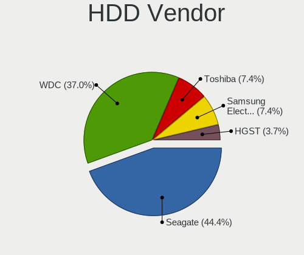
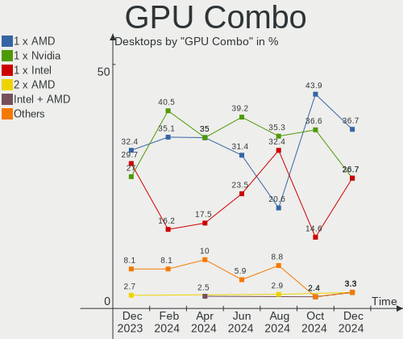
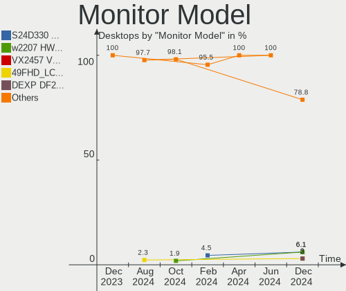

openSUSE - Hardware Trends (Desktops)
-------------------------------------

A project to identify most popular hardware characteristics and track their change
over time based on data collected by Linux users at https://Linux-Hardware.org.

Anyone can contribute to this report by the [hw-probe](https://github.com/linuxhw/hw-probe) tool:

    sudo -E hw-probe -all -upload

This report is for one last month. Overall report since the beginning of time: [TestDays](https://github.com/linuxhw/TestDays)

Period: Dec, 2023.

Contents
--------

* [ System ](#system)
  - [ OS                       ](#os)
  - [ OS Family                ](#os-family)
  - [ Kernel                   ](#kernel)
  - [ Kernel Family            ](#kernel-family)
  - [ Kernel Major Ver.        ](#kernel-major-ver)
  - [ Arch                     ](#arch)
  - [ DE                       ](#de)
  - [ Display Server           ](#display-server)
  - [ Display Manager          ](#display-manager)
  - [ OS Lang                  ](#os-lang)
  - [ Boot Mode                ](#boot-mode)
  - [ Filesystem               ](#filesystem)
  - [ Part. scheme             ](#part-scheme)
  - [ Dual Boot with Linux/BSD ](#dual-boot-with-linuxbsd)
  - [ Dual Boot (Win)          ](#dual-boot-win)

* [ Board ](#board)
  - [ Vendor                   ](#vendor)
  - [ Model                    ](#model)
  - [ Model Family             ](#model-family)
  - [ MFG Year                 ](#mfg-year)
  - [ Form Factor              ](#form-factor)
  - [ Secure Boot              ](#secure-boot)
  - [ Coreboot                 ](#coreboot)
  - [ RAM Size                 ](#ram-size)
  - [ RAM Used                 ](#ram-used)
  - [ Total Drives             ](#total-drives)
  - [ Has CD-ROM               ](#has-cd-rom)
  - [ Has Ethernet             ](#has-ethernet)
  - [ Has WiFi                 ](#has-wifi)
  - [ Has Bluetooth            ](#has-bluetooth)

* [ Location ](#location)
  - [ Country                  ](#country)
  - [ City                     ](#city)

* [ Drives ](#drives)
  - [ Drive Vendor             ](#drive-vendor)
  - [ Drive Model              ](#drive-model)
  - [ HDD Vendor               ](#hdd-vendor)
  - [ SSD Vendor               ](#ssd-vendor)
  - [ Drive Kind               ](#drive-kind)
  - [ Drive Connector          ](#drive-connector)
  - [ Drive Size               ](#drive-size)
  - [ Space Total              ](#space-total)
  - [ Space Used               ](#space-used)
  - [ Malfunc. Drives          ](#malfunc-drives)
  - [ Malfunc. Drive Vendor    ](#malfunc-drive-vendor)
  - [ Malfunc. HDD Vendor      ](#malfunc-hdd-vendor)
  - [ Malfunc. Drive Kind      ](#malfunc-drive-kind)
  - [ Failed Drives            ](#failed-drives)
  - [ Failed Drive Vendor      ](#failed-drive-vendor)
  - [ Drive Status             ](#drive-status)

* [ Storage controller ](#storage-controller)
  - [ Storage Vendor           ](#storage-vendor)
  - [ Storage Model            ](#storage-model)
  - [ Storage Kind             ](#storage-kind)

* [ Processor ](#processor)
  - [ CPU Vendor               ](#cpu-vendor)
  - [ CPU Model                ](#cpu-model)
  - [ CPU Model Family         ](#cpu-model-family)
  - [ CPU Cores                ](#cpu-cores)
  - [ CPU Sockets              ](#cpu-sockets)
  - [ CPU Threads              ](#cpu-threads)
  - [ CPU Op-Modes             ](#cpu-op-modes)
  - [ CPU Microcode            ](#cpu-microcode)
  - [ CPU Microarch            ](#cpu-microarch)

* [ Graphics ](#graphics)
  - [ GPU Vendor               ](#gpu-vendor)
  - [ GPU Model                ](#gpu-model)
  - [ GPU Combo                ](#gpu-combo)
  - [ GPU Driver               ](#gpu-driver)
  - [ GPU Memory               ](#gpu-memory)

* [ Monitor ](#monitor)
  - [ Monitor Vendor           ](#monitor-vendor)
  - [ Monitor Model            ](#monitor-model)
  - [ Monitor Resolution       ](#monitor-resolution)
  - [ Monitor Diagonal         ](#monitor-diagonal)
  - [ Monitor Width            ](#monitor-width)
  - [ Aspect Ratio             ](#aspect-ratio)
  - [ Monitor Area             ](#monitor-area)
  - [ Pixel Density            ](#pixel-density)
  - [ Multiple Monitors        ](#multiple-monitors)

* [ Network ](#network)
  - [ Net Controller Vendor    ](#net-controller-vendor)
  - [ Net Controller Model     ](#net-controller-model)
  - [ Wireless Vendor          ](#wireless-vendor)
  - [ Wireless Model           ](#wireless-model)
  - [ Ethernet Vendor          ](#ethernet-vendor)
  - [ Ethernet Model           ](#ethernet-model)
  - [ Net Controller Kind      ](#net-controller-kind)
  - [ Used Controller          ](#used-controller)
  - [ NICs                     ](#nics)
  - [ IPv6                     ](#ipv6)

* [ Bluetooth ](#bluetooth)
  - [ Bluetooth Vendor         ](#bluetooth-vendor)
  - [ Bluetooth Model          ](#bluetooth-model)

* [ Sound ](#sound)
  - [ Sound Vendor             ](#sound-vendor)
  - [ Sound Model              ](#sound-model)

* [ Memory ](#memory)
  - [ Memory Vendor            ](#memory-vendor)
  - [ Memory Model             ](#memory-model)
  - [ Memory Kind              ](#memory-kind)
  - [ Memory Form Factor       ](#memory-form-factor)
  - [ Memory Size              ](#memory-size)
  - [ Memory Speed             ](#memory-speed)

* [ Printers & scanners ](#printers--scanners)
  - [ Printer Vendor           ](#printer-vendor)
  - [ Printer Model            ](#printer-model)
  - [ Scanner Vendor           ](#scanner-vendor)
  - [ Scanner Model            ](#scanner-model)

* [ Camera ](#camera)
  - [ Camera Vendor            ](#camera-vendor)
  - [ Camera Model             ](#camera-model)

* [ Security ](#security)
  - [ Fingerprint Vendor       ](#fingerprint-vendor)
  - [ Fingerprint Model        ](#fingerprint-model)
  - [ Chipcard Vendor          ](#chipcard-vendor)
  - [ Chipcard Model           ](#chipcard-model)

* [ Unsupported ](#unsupported)
  - [ Unsupported Devices      ](#unsupported-devices)
  - [ Unsupported Device Types ](#unsupported-device-types)

System
------

OS
--

Installed operating systems

| Name                         | Desktops | Percent |
|------------------------------|----------|---------|
| openSUSE Tumbleweed-XXXXXXXX | 20       | 54.05%  |
| openSUSE Leap-15.5           | 13       | 35.14%  |
| openSUSE Microos-XXXXXXXX    | 2        | 5.41%   |
| openSUSE Leap-15.6           | 1        | 2.7%    |
| openSUSE Leap-15.4           | 1        | 2.7%    |

OS Family
---------

OS without a version

| Name     | Desktops | Percent |
|----------|----------|---------|
| openSUSE | 37       | 100%    |

Kernel
------

Version of the Linux kernel

| Version                      | Desktops | Percent |
|------------------------------|----------|---------|
| 6.6.3-1-default              | 12       | 32.43%  |
| 5.14.21-150500.55.39-default | 7        | 18.92%  |
| 6.6.6-1-default              | 6        | 16.22%  |
| 5.14.21-150500.55.36-default | 4        | 10.81%  |
| 6.6.7-1-default              | 3        | 8.11%   |
| 6.6.2-1-default              | 1        | 2.7%    |
| 6.6.1-1-default              | 1        | 2.7%    |
| 6.4.0-150600.4-default       | 1        | 2.7%    |
| 5.14.21-150400.24.97-default | 1        | 2.7%    |
| 5.14.21-150400.24.55-default | 1        | 2.7%    |

Kernel Family
-------------

Linux kernel without a distro release

| Version | Desktops | Percent |
|---------|----------|---------|
| 5.14.21 | 13       | 35.14%  |
| 6.6.3   | 12       | 32.43%  |
| 6.6.6   | 6        | 16.22%  |
| 6.6.7   | 3        | 8.11%   |
| 6.6.2   | 1        | 2.7%    |
| 6.6.1   | 1        | 2.7%    |
| 6.4.0   | 1        | 2.7%    |

Kernel Major Ver.
-----------------

Linux kernel major version

| Version | Desktops | Percent |
|---------|----------|---------|
| 6.6     | 23       | 62.16%  |
| 5.14    | 13       | 35.14%  |
| 6.4     | 1        | 2.7%    |

Arch
----

OS architecture (x86_64, i586, etc.)

| Name   | Desktops | Percent |
|--------|----------|---------|
| x86_64 | 37       | 100%    |

DE
--

Desktop Environment

| Name    | Desktops | Percent |
|---------|----------|---------|
| KDE5    | 24       | 64.86%  |
| GNOME   | 9        | 24.32%  |
| XFCE    | 2        | 5.41%   |
| Unknown | 2        | 5.41%   |

Display Server
--------------

X11 or Wayland

| Name    | Desktops | Percent |
|---------|----------|---------|
| X11     | 21       | 56.76%  |
| Wayland | 12       | 32.43%  |
| Tty     | 3        | 8.11%   |
| Unknown | 1        | 2.7%    |

Display Manager
---------------

SDDM, LightDM, etc.

| Name    | Desktops | Percent |
|---------|----------|---------|
| Unknown | 26       | 70.27%  |
| SDDM    | 10       | 27.03%  |
| LightDM | 1        | 2.7%    |

OS Lang
-------

Language

| Lang  | Desktops | Percent |
|-------|----------|---------|
| en_US | 17       | 45.95%  |
| en_GB | 5        | 13.51%  |
| POSIX | 3        | 8.11%   |
| fr_FR | 3        | 8.11%   |
| de_DE | 2        | 5.41%   |
| zh_CN | 1        | 2.7%    |
| pt_BR | 1        | 2.7%    |
| nn_NO | 1        | 2.7%    |
| it_IT | 1        | 2.7%    |
| es_ES | 1        | 2.7%    |
| cs_CZ | 1        | 2.7%    |
| ar_AE | 1        | 2.7%    |

Boot Mode
---------

EFI or BIOS

| Mode | Desktops | Percent |
|------|----------|---------|
| EFI  | 19       | 51.35%  |
| BIOS | 18       | 48.65%  |

Filesystem
----------

Type of filesystem

| Type  | Desktops | Percent |
|-------|----------|---------|
| Btrfs | 32       | 86.49%  |
| Ext4  | 5        | 13.51%  |

Part. scheme
------------

Scheme of partitioning

| Type    | Desktops | Percent |
|---------|----------|---------|
| Unknown | 24       | 64.86%  |
| GPT     | 13       | 35.14%  |

Dual Boot with Linux/BSD
------------------------

Hosting more than one Linux/BSD

| Dual boot | Desktops | Percent |
|-----------|----------|---------|
| No        | 34       | 91.89%  |
| Yes       | 3        | 8.11%   |

Dual Boot (Win)
---------------

Hosting Linux and Windows

| Dual boot | Desktops | Percent |
|-----------|----------|---------|
| No        | 32       | 86.49%  |
| Yes       | 5        | 13.51%  |

Board
-----

Vendor
------

Motherboard manufacturer

| Name                | Desktops | Percent |
|---------------------|----------|---------|
| Gigabyte Technology | 8        | 21.62%  |
| ASUSTek Computer    | 8        | 21.62%  |
| MSI                 | 6        | 16.22%  |
| Hewlett-Packard     | 4        | 10.81%  |
| Dell                | 3        | 8.11%   |
| Intel               | 2        | 5.41%   |
| Lenovo              | 1        | 2.7%    |
| Huanan              | 1        | 2.7%    |
| Foxconn             | 1        | 2.7%    |
| ASRock              | 1        | 2.7%    |
| AMI                 | 1        | 2.7%    |
| Acer                | 1        | 2.7%    |

Model
-----

Motherboard model

| Name                               | Desktops | Percent |
|------------------------------------|----------|---------|
| MSI MS-7D74                        | 1        | 2.7%    |
| MSI MS-7C91                        | 1        | 2.7%    |
| MSI MS-7C56                        | 1        | 2.7%    |
| MSI MS-7A34                        | 1        | 2.7%    |
| MSI MS-7978                        | 1        | 2.7%    |
| MSI MS-7673                        | 1        | 2.7%    |
| Lenovo ThinkCentre M92p 3227GQ8    | 1        | 2.7%    |
| Intel KBL-R MRD                    | 1        | 2.7%    |
| Intel B85                          | 1        | 2.7%    |
| Huanan X99-QD4 V1.0                | 1        | 2.7%    |
| HP Z440 Workstation                | 1        | 2.7%    |
| HP Z400 Workstation                | 1        | 2.7%    |
| HP Compaq Elite 8300 USDT          | 1        | 2.7%    |
| HP Compaq Elite 8300 SFF           | 1        | 2.7%    |
| Gigabyte Z97-HD3                   | 1        | 2.7%    |
| Gigabyte Z790 AORUS MASTER X       | 1        | 2.7%    |
| Gigabyte X99-UD4-CF                | 1        | 2.7%    |
| Gigabyte X570 AORUS PRO WIFI       | 1        | 2.7%    |
| Gigabyte GA-990XA-UD3              | 1        | 2.7%    |
| Gigabyte GA-78LMT-USB3 6.0         | 1        | 2.7%    |
| Gigabyte B650 AORUS ELITE AX       | 1        | 2.7%    |
| Gigabyte AB350M-DS3H               | 1        | 2.7%    |
| Foxconn Pro 3400 Series MT         | 1        | 2.7%    |
| Dell Precision T3610               | 1        | 2.7%    |
| Dell OptiPlex 9020                 | 1        | 2.7%    |
| Dell OptiPlex 755                  | 1        | 2.7%    |
| ASUS ROG STRIX X670E-E GAMING WIFI | 1        | 2.7%    |
| ASUS PRIME Z790-A WIFI             | 1        | 2.7%    |
| ASUS PRIME A320M-K                 | 1        | 2.7%    |
| ASUS P8Z68-V PRO GEN3              | 1        | 2.7%    |
| ASUS P8H61                         | 1        | 2.7%    |
| ASUS Nobilis                       | 1        | 2.7%    |
| ASUS M4A88T-M LE                   | 1        | 2.7%    |
| ASUS M3A78                         | 1        | 2.7%    |
| ASRock B760M PG Riptide            | 1        | 2.7%    |
| AMI Intel                          | 1        | 2.7%    |
| Acer Aspire R3600                  | 1        | 2.7%    |

Model Family
------------

Motherboard model prefix

| Name                   | Desktops | Percent |
|------------------------|----------|---------|
| HP Compaq              | 2        | 5.41%   |
| Dell OptiPlex          | 2        | 5.41%   |
| ASUS PRIME             | 2        | 5.41%   |
| MSI MS-7D74            | 1        | 2.7%    |
| MSI MS-7C91            | 1        | 2.7%    |
| MSI MS-7C56            | 1        | 2.7%    |
| MSI MS-7A34            | 1        | 2.7%    |
| MSI MS-7978            | 1        | 2.7%    |
| MSI MS-7673            | 1        | 2.7%    |
| Lenovo ThinkCentre     | 1        | 2.7%    |
| Intel KBL-R            | 1        | 2.7%    |
| Intel B85              | 1        | 2.7%    |
| Huanan X99-QD4         | 1        | 2.7%    |
| HP Z440                | 1        | 2.7%    |
| HP Z400                | 1        | 2.7%    |
| Gigabyte Z97-HD3       | 1        | 2.7%    |
| Gigabyte Z790          | 1        | 2.7%    |
| Gigabyte X99-UD4-CF    | 1        | 2.7%    |
| Gigabyte X570          | 1        | 2.7%    |
| Gigabyte GA-990XA-UD3  | 1        | 2.7%    |
| Gigabyte GA-78LMT-USB3 | 1        | 2.7%    |
| Gigabyte B650          | 1        | 2.7%    |
| Gigabyte AB350M-DS3H   | 1        | 2.7%    |
| Foxconn Pro            | 1        | 2.7%    |
| Dell Precision         | 1        | 2.7%    |
| ASUS ROG               | 1        | 2.7%    |
| ASUS P8Z68-V           | 1        | 2.7%    |
| ASUS P8H61             | 1        | 2.7%    |
| ASUS Nobilis           | 1        | 2.7%    |
| ASUS M4A88T-M          | 1        | 2.7%    |
| ASUS M3A78             | 1        | 2.7%    |
| ASRock B760M           | 1        | 2.7%    |
| AMI Intel              | 1        | 2.7%    |
| Acer Aspire            | 1        | 2.7%    |

MFG Year
--------

Motherboard manufacture year

| Year | Desktops | Percent |
|------|----------|---------|
| 2022 | 5        | 13.51%  |
| 2011 | 5        | 13.51%  |
| 2023 | 3        | 8.11%   |
| 2017 | 3        | 8.11%   |
| 2015 | 3        | 8.11%   |
| 2014 | 3        | 8.11%   |
| 2012 | 3        | 8.11%   |
| 2020 | 2        | 5.41%   |
| 2018 | 2        | 5.41%   |
| 2013 | 2        | 5.41%   |
| 2008 | 2        | 5.41%   |
| 2019 | 1        | 2.7%    |
| 2010 | 1        | 2.7%    |
| 2009 | 1        | 2.7%    |
| 2007 | 1        | 2.7%    |

Form Factor
-----------

Physical design of the computer

| Name    | Desktops | Percent |
|---------|----------|---------|
| Desktop | 37       | 100%    |

Secure Boot
-----------

Enabled or disabled

| State    | Desktops | Percent |
|----------|----------|---------|
| Disabled | 32       | 86.49%  |
| Enabled  | 5        | 13.51%  |

Coreboot
--------

Have coreboot on board

| Used | Desktops | Percent |
|------|----------|---------|
| No   | 37       | 100%    |

RAM Size
--------

Total RAM memory

| Size in GB  | Desktops | Percent |
|-------------|----------|---------|
| 32.01-64.0  | 10       | 27.03%  |
| 4.01-8.0    | 8        | 21.62%  |
| 16.01-24.0  | 8        | 21.62%  |
| 3.01-4.0    | 5        | 13.51%  |
| 64.01-256.0 | 3        | 8.11%   |
| 24.01-32.0  | 1        | 2.7%    |
| 1.01-2.0    | 1        | 2.7%    |
| 8.01-16.0   | 1        | 2.7%    |

RAM Used
--------

Used RAM memory

| Used GB    | Desktops | Percent |
|------------|----------|---------|
| 4.01-8.0   | 11       | 29.73%  |
| 2.01-3.0   | 11       | 29.73%  |
| 1.01-2.0   | 7        | 18.92%  |
| 3.01-4.0   | 3        | 8.11%   |
| 0.51-1.0   | 2        | 5.41%   |
| 16.01-24.0 | 1        | 2.7%    |
| 8.01-16.0  | 1        | 2.7%    |
| 0.01-0.5   | 1        | 2.7%    |

Total Drives
------------

Number of drives on board

| Drives | Desktops | Percent |
|--------|----------|---------|
| 1      | 11       | 29.73%  |
| 2      | 10       | 27.03%  |
| 3      | 9        | 24.32%  |
| 5      | 5        | 13.51%  |
| 10     | 1        | 2.7%    |
| 4      | 1        | 2.7%    |

Has CD-ROM
----------

Has CD-ROM on board

| Presented | Desktops | Percent |
|-----------|----------|---------|
| Yes       | 20       | 54.05%  |
| No        | 17       | 45.95%  |

Has Ethernet
------------

Has Ethernet on board

| Presented | Desktops | Percent |
|-----------|----------|---------|
| Yes       | 37       | 100%    |

Has WiFi
--------

Has WiFi module

| Presented | Desktops | Percent |
|-----------|----------|---------|
| No        | 25       | 67.57%  |
| Yes       | 12       | 32.43%  |

Has Bluetooth
-------------

Has Bluetooth module

| Presented | Desktops | Percent |
|-----------|----------|---------|
| No        | 21       | 56.76%  |
| Yes       | 16       | 43.24%  |

Location
--------

Country
-------

Geographic location (country)

| Country     | Desktops | Percent |
|-------------|----------|---------|
| USA         | 8        | 21.62%  |
| UK          | 3        | 8.11%   |
| Germany     | 3        | 8.11%   |
| France      | 3        | 8.11%   |
| Spain       | 2        | 5.41%   |
| Switzerland | 1        | 2.7%    |
| South Korea | 1        | 2.7%    |
| Portugal    | 1        | 2.7%    |
| Norway      | 1        | 2.7%    |
| Lithuania   | 1        | 2.7%    |
| Kazakhstan  | 1        | 2.7%    |
| Italy       | 1        | 2.7%    |
| Finland     | 1        | 2.7%    |
| Denmark     | 1        | 2.7%    |
| Czechia     | 1        | 2.7%    |
| Colombia    | 1        | 2.7%    |
| China       | 1        | 2.7%    |
| Canada      | 1        | 2.7%    |
| Bulgaria    | 1        | 2.7%    |
| Brazil      | 1        | 2.7%    |
| Belgium     | 1        | 2.7%    |
| Australia   | 1        | 2.7%    |
| Algeria     | 1        | 2.7%    |

City
----

Geographic location (city)

| City           | Desktops | Percent |
|----------------|----------|---------|
| Avon           | 2        | 5.41%   |
| West Bend      | 1        | 2.7%    |
| Vancouver      | 1        | 2.7%    |
| Valencia       | 1        | 2.7%    |
| Valby          | 1        | 2.7%    |
| Stone Mountain | 1        | 2.7%    |
| Springdale     | 1        | 2.7%    |
| Sofia          | 1        | 2.7%    |
| Shanghai       | 1        | 2.7%    |
| Seattle        | 1        | 2.7%    |
| Seaford        | 1        | 2.7%    |
| Saint-Etienne  | 1        | 2.7%    |
| Porto          | 1        | 2.7%    |
| Milwaukee      | 1        | 2.7%    |
| Milan          | 1        | 2.7%    |
| Melbourne      | 1        | 2.7%    |
| Lyss           | 1        | 2.7%    |
| Liberec        | 1        | 2.7%    |
| Leuven         | 1        | 2.7%    |
| Kaunas         | 1        | 2.7%    |
| Ikkala         | 1        | 2.7%    |
| Grafenau       | 1        | 2.7%    |
| Fresno         | 1        | 2.7%    |
| Esbly          | 1        | 2.7%    |
| Düsseldorf    | 1        | 2.7%    |
| Doncaster      | 1        | 2.7%    |
| Cremieu        | 1        | 2.7%    |
| Cheongju-si    | 1        | 2.7%    |
| Breckerfeld    | 1        | 2.7%    |
| Bogotá        | 1        | 2.7%    |
| Bergen         | 1        | 2.7%    |
| Belfast        | 1        | 2.7%    |
| Belém         | 1        | 2.7%    |
| Batna City     | 1        | 2.7%    |
| Avilés        | 1        | 2.7%    |
| Astana         | 1        | 2.7%    |

Drives
------

Drive Vendor
------------

Hard drive vendors

| Vendor                      | Desktops | Drives | Percent |
|-----------------------------|----------|--------|---------|
| Samsung Electronics         | 16       | 22     | 21.92%  |
| Seagate                     | 14       | 20     | 19.18%  |
| WDC                         | 13       | 25     | 17.81%  |
| Sandisk                     | 4        | 4      | 5.48%   |
| Kingston                    | 3        | 3      | 4.11%   |
| Intel                       | 3        | 3      | 4.11%   |
| Toshiba                     | 2        | 2      | 2.74%   |
| SK hynix                    | 2        | 2      | 2.74%   |
| Hitachi                     | 2        | 3      | 2.74%   |
| HGST                        | 2        | 2      | 2.74%   |
| China                       | 2        | 2      | 2.74%   |
| XrayDisk                    | 1        | 1      | 1.37%   |
| Team                        | 1        | 1      | 1.37%   |
| Phison Electronics          | 1        | 1      | 1.37%   |
| Micron/Crucial Technology   | 1        | 1      | 1.37%   |
| MAXIO Technology (Hangzhou) | 1        | 1      | 1.37%   |
| Kingston Technology Company | 1        | 1      | 1.37%   |
| Intenso                     | 1        | 1      | 1.37%   |
| IBM-ESXS                    | 1        | 6      | 1.37%   |
| GOODRAM                     | 1        | 1      | 1.37%   |
| Crucial                     | 1        | 1      | 1.37%   |

Drive Model
-----------

Hard drive models

| Model                                               | Desktops | Percent |
|-----------------------------------------------------|----------|---------|
| Samsung NVMe SSD Controller SM981/PM981/PM983 512GB | 5        | 5.75%   |
| Seagate ST4000DM004-2CV104 4TB                      | 3        | 3.45%   |
| WDC WD20EZRZ-00Z5HB0 2TB                            | 2        | 2.3%    |
| Samsung SSD 870 EVO 2TB                             | 2        | 2.3%    |
| Samsung SSD 860 EVO 1TB                             | 2        | 2.3%    |
| Samsung SSD 850 EVO 500GB                           | 2        | 2.3%    |
| Samsung SSD 850 EVO 250GB                           | 2        | 2.3%    |
| XrayDisk 480GB SSD                                  | 1        | 1.15%   |
| WDC WDS500G1B0A-00H9H0 500GB SSD                    | 1        | 1.15%   |
| WDC WD80EFAX-68KNBN0 8TB                            | 1        | 1.15%   |
| WDC WD5000AAKX-08ERMA0 500GB                        | 1        | 1.15%   |
| WDC WD40EZRZ-22GXCB0 4TB                            | 1        | 1.15%   |
| WDC WD3200AAKX-00ERMA0 320GB                        | 1        | 1.15%   |
| WDC WD30EZRZ-00Z5HB0 3TB                            | 1        | 1.15%   |
| WDC WD30EZRZ-00WN9B0 3TB                            | 1        | 1.15%   |
| WDC WD20EZBX-00AYRA0 2TB                            | 1        | 1.15%   |
| WDC WD20EARX-008FB0 2TB                             | 1        | 1.15%   |
| WDC WD2005FBYZ-01YCBB3 2TB                          | 1        | 1.15%   |
| WDC WD1600BB-22FTA0 160GB                           | 1        | 1.15%   |
| WDC WD10JPVX-00JC3T0 1TB                            | 1        | 1.15%   |
| WDC WD10EZEX-75M2NA0 1TB                            | 1        | 1.15%   |
| WDC WD10EZEX-08WN4A0 1TB                            | 1        | 1.15%   |
| WDC WD10EZEX-08M2NA0 1TB                            | 1        | 1.15%   |
| WDC WD10EZEX-00WN4A0 1TB                            | 1        | 1.15%   |
| WDC WD1002FAEX-00Z3A0 1TB                           | 1        | 1.15%   |
| Toshiba HDWD220 2TB                                 | 1        | 1.15%   |
| Toshiba HDWD110 1TB                                 | 1        | 1.15%   |
| Team T2532TB SSD                                    | 1        | 1.15%   |
| SK hynix SHPP41-2000GM 2TB                          | 1        | 1.15%   |
| SK hynix SHGP31-1000GM-2 1TB                        | 1        | 1.15%   |
| Seagate ST8000DM004-2CX188 8TB                      | 1        | 1.15%   |
| Seagate ST500DM002-1BD142 500GB                     | 1        | 1.15%   |
| Seagate ST4000VN006-3CW104 4TB                      | 1        | 1.15%   |
| Seagate ST4000VN006 4TB                             | 1        | 1.15%   |
| Seagate ST31000333AS 1TB                            | 1        | 1.15%   |
| Seagate ST2000NM0001 2TB                            | 1        | 1.15%   |
| Seagate ST2000DM001-1ER164 2TB                      | 1        | 1.15%   |
| Seagate ST2000DL003-9VT166 2TB                      | 1        | 1.15%   |
| Seagate ST1000LM024 HN-M101MBB 1TB                  | 1        | 1.15%   |
| Seagate ST1000DM003-1ER162 1TB                      | 1        | 1.15%   |

HDD Vendor
----------

Hard disk drive vendors

| Vendor              | Desktops | Drives | Percent |
|---------------------|----------|--------|---------|
| WDC                 | 12       | 24     | 38.71%  |
| Seagate             | 12       | 17     | 38.71%  |
| Toshiba             | 2        | 2      | 6.45%   |
| Hitachi             | 2        | 3      | 6.45%   |
| HGST                | 2        | 2      | 6.45%   |
| Samsung Electronics | 1        | 1      | 3.23%   |

SSD Vendor
----------

Solid state drive vendors

| Vendor              | Desktops | Drives | Percent |
|---------------------|----------|--------|---------|
| Samsung Electronics | 10       | 12     | 41.67%  |
| SanDisk             | 2        | 2      | 8.33%   |
| Kingston            | 2        | 2      | 8.33%   |
| Intel               | 2        | 2      | 8.33%   |
| China               | 2        | 2      | 8.33%   |
| XrayDisk            | 1        | 1      | 4.17%   |
| WDC                 | 1        | 1      | 4.17%   |
| Team                | 1        | 1      | 4.17%   |
| Intenso             | 1        | 1      | 4.17%   |
| GOODRAM             | 1        | 1      | 4.17%   |
| Crucial             | 1        | 1      | 4.17%   |

Drive Kind
----------

HDD or SSD

| Kind    | Desktops | Drives | Percent |
|---------|----------|--------|---------|
| HDD     | 23       | 49     | 40.35%  |
| SSD     | 19       | 26     | 33.33%  |
| NVMe    | 13       | 20     | 22.81%  |
| Unknown | 2        | 8      | 3.51%   |

Drive Connector
---------------

SATA, SAS, NVMe, etc.

| Type | Desktops | Drives | Percent |
|------|----------|--------|---------|
| SATA | 32       | 72     | 68.09%  |
| NVMe | 13       | 20     | 27.66%  |
| SAS  | 2        | 11     | 4.26%   |

Drive Size
----------

Size of hard drive

| Size in TB | Desktops | Drives | Percent |
|------------|----------|--------|---------|
| 0.01-0.5   | 19       | 24     | 36.54%  |
| 0.51-1.0   | 14       | 16     | 26.92%  |
| 1.01-2.0   | 9        | 18     | 17.31%  |
| 3.01-4.0   | 6        | 9      | 11.54%  |
| 4.01-10.0  | 3        | 3      | 5.77%   |
| 2.01-3.0   | 1        | 5      | 1.92%   |

Space Total
-----------

Amount of disk space available on the file system

| Size in GB     | Desktops | Percent |
|----------------|----------|---------|
| More than 3000 | 21       | 56.76%  |
| 1001-2000      | 7        | 18.92%  |
| 2001-3000      | 3        | 8.11%   |
| 251-500        | 2        | 5.41%   |
| 501-1000       | 2        | 5.41%   |
| 1-20           | 1        | 2.7%    |
| 51-100         | 1        | 2.7%    |

Space Used
----------

Amount of used disk space

| Used GB        | Desktops | Percent |
|----------------|----------|---------|
| 101-250        | 9        | 24.32%  |
| 51-100         | 9        | 24.32%  |
| More than 3000 | 6        | 16.22%  |
| 251-500        | 6        | 16.22%  |
| 2001-3000      | 2        | 5.41%   |
| 1-20           | 2        | 5.41%   |
| 501-1000       | 2        | 5.41%   |
| 21-50          | 1        | 2.7%    |

Malfunc. Drives
---------------

Drive models with a malfunction

| Model                       | Desktops | Drives | Percent |
|-----------------------------|----------|--------|---------|
| WDC WD30EZRZ-00Z5HB0 3TB    | 1        | 2      | 33.33%  |
| Hitachi HUS724030ALE641 3TB | 1        | 1      | 33.33%  |
| Hitachi HDS5C3030BLE630 3TB | 1        | 1      | 33.33%  |

Malfunc. Drive Vendor
---------------------

Vendors of faulty drives

| Vendor  | Desktops | Drives | Percent |
|---------|----------|--------|---------|
| WDC     | 1        | 2      | 50%     |
| Hitachi | 1        | 2      | 50%     |

Malfunc. HDD Vendor
-------------------

Vendors of faulty HDD drives

| Vendor  | Desktops | Drives | Percent |
|---------|----------|--------|---------|
| WDC     | 1        | 2      | 50%     |
| Hitachi | 1        | 2      | 50%     |

Malfunc. Drive Kind
-------------------

Kinds of faulty drives

| Kind | Desktops | Drives | Percent |
|------|----------|--------|---------|
| HDD  | 1        | 4      | 100%    |

Failed Drives
-------------

Failed drive models

Zero info for selected period =(

Failed Drive Vendor
-------------------

Failed drive vendors

Zero info for selected period =(

Drive Status
------------

Number of failed and malfunc. drives

| Status   | Desktops | Drives | Percent |
|----------|----------|--------|---------|
| Detected | 25       | 64     | 64.1%   |
| Works    | 13       | 35     | 33.33%  |
| Malfunc  | 1        | 4      | 2.56%   |

Storage controller
------------------

Storage Vendor
--------------

Storage controller vendors

| Vendor                      | Desktops | Percent |
|-----------------------------|----------|---------|
| Intel                       | 22       | 35.48%  |
| AMD                         | 13       | 20.97%  |
| Samsung Electronics         | 7        | 11.29%  |
| SK hynix                    | 2        | 3.23%   |
| SanDisk                     | 2        | 3.23%   |
| Nvidia                      | 2        | 3.23%   |
| Marvell Technology Group    | 2        | 3.23%   |
| LSI Logic / Symbios Logic   | 2        | 3.23%   |
| Kingston Technology Company | 2        | 3.23%   |
| Silicon Image               | 1        | 1.61%   |
| Seagate Technology          | 1        | 1.61%   |
| Phison Electronics          | 1        | 1.61%   |
| Micron/Crucial Technology   | 1        | 1.61%   |
| MAXIO Technology (Hangzhou) | 1        | 1.61%   |
| JMicron Technology          | 1        | 1.61%   |
| Broadcom / LSI              | 1        | 1.61%   |
| ASMedia Technology          | 1        | 1.61%   |

Storage Model
-------------

Storage controller models

| Model                                                                          | Desktops | Percent |
|--------------------------------------------------------------------------------|----------|---------|
| AMD FCH SATA Controller [AHCI mode]                                            | 7        | 9.21%   |
| Samsung NVMe SSD Controller SM981/PM981/PM983                                  | 5        | 6.58%   |
| AMD SB7x0/SB8x0/SB9x0 IDE Controller                                           | 4        | 5.26%   |
| Intel 8 Series/C220 Series Chipset Family 6-port SATA Controller 1 [AHCI mode] | 3        | 3.95%   |
| Intel 700 Series Chipset Family SATA AHCI Controller                           | 3        | 3.95%   |
| Intel 7 Series/C210 Series Chipset Family 6-port SATA Controller [AHCI mode]   | 3        | 3.95%   |
| Intel 6 Series/C200 Series Chipset Family 6 port Desktop SATA AHCI Controller  | 3        | 3.95%   |
| AMD SB7x0/SB8x0/SB9x0 SATA Controller [IDE mode]                               | 2        | 2.63%   |
| AMD SB7x0/SB8x0/SB9x0 SATA Controller [AHCI mode]                              | 2        | 2.63%   |
| SK hynix Platinum P41/PC801 NVMe Solid State Drive                             | 1        | 1.32%   |
| SK hynix Gold P31/BC711/PC711 NVMe Solid State Drive                           | 1        | 1.32%   |
| Silicon Image SiI 3132 Serial ATA Raid II Controller                           | 1        | 1.32%   |
| Seagate FireCuda 530 SSD                                                       | 1        | 1.32%   |
| SanDisk WD Blue SN570 NVMe SSD 2TB                                             | 1        | 1.32%   |
| SanDisk Extreme Pro / WD Black SN750 / PC SN730 / Red SN700 NVMe SSD           | 1        | 1.32%   |
| Samsung NVMe SSD Controller SM961/PM961/SM963                                  | 1        | 1.32%   |
| Samsung NVMe SSD Controller PM9A1/PM9A3/980PRO                                 | 1        | 1.32%   |
| Phison PS5021-E21 PCIe4 NVMe Controller (DRAM-less)                            | 1        | 1.32%   |
| Nvidia MCP79 AHCI Controller                                                   | 1        | 1.32%   |
| Nvidia CK804 Serial ATA Controller                                             | 1        | 1.32%   |
| Nvidia CK804 IDE                                                               | 1        | 1.32%   |
| Micron/Crucial P2 [Nick P2] / P3 / P3 Plus NVMe PCIe SSD (DRAM-less)           | 1        | 1.32%   |
| MAXIO (Hangzhou) NVMe SSD Controller MAP1202                                   | 1        | 1.32%   |
| Marvell Group 88SE9215 PCIe 2.0 x1 4-port SATA 6 Gb/s Controller               | 1        | 1.32%   |
| Marvell Group 88SE9172 SATA 6Gb/s Controller                                   | 1        | 1.32%   |
| LSI Logic / Symbios Logic SAS2008 PCI-Express Fusion-MPT SAS-2 [Falcon]        | 1        | 1.32%   |
| LSI Logic / Symbios Logic MegaRAID SAS 1078                                    | 1        | 1.32%   |
| Kingston Company NV2 NVMe SSD E21T                                             | 1        | 1.32%   |
| Kingston Company NV1 NVMe SSD SM2263XT                                         | 1        | 1.32%   |
| JMicron JMB362 SATA Controller                                                 | 1        | 1.32%   |
| Intel Volume Management Device NVMe RAID Controller Intel Corporation          | 1        | 1.32%   |
| Intel Sunrise Point-LP SATA Controller [AHCI mode]                             | 1        | 1.32%   |
| Intel SSD 660P Series                                                          | 1        | 1.32%   |
| Intel SATA Controller [RAID mode]                                              | 1        | 1.32%   |
| Intel Q170/Q150/B150/H170/H110/Z170/CM236 Chipset SATA Controller [AHCI Mode]  | 1        | 1.32%   |
| Intel Celeron/Pentium Silver Processor SATA Controller                         | 1        | 1.32%   |
| Intel C610/X99 series chipset sSATA Controller [AHCI mode]                     | 1        | 1.32%   |
| Intel C610/X99 series chipset 6-Port SATA Controller [AHCI mode]               | 1        | 1.32%   |
| Intel C600/X79 series chipset SATA RAID Controller                             | 1        | 1.32%   |
| Intel 9 Series Chipset Family SATA Controller [AHCI Mode]                      | 1        | 1.32%   |

Storage Kind
------------

Kind of storage controller (IDE, SATA, NVMe, SAS, ...)

| Kind | Desktops | Percent |
|------|----------|---------|
| SATA | 31       | 52.54%  |
| NVMe | 13       | 22.03%  |
| IDE  | 8        | 13.56%  |
| RAID | 5        | 8.47%   |
| SAS  | 2        | 3.39%   |

Processor
---------

CPU Vendor
----------

Processor vendors

| Vendor | Desktops | Percent |
|--------|----------|---------|
| Intel  | 23       | 62.16%  |
| AMD    | 14       | 37.84%  |

CPU Model
---------

Processor models

| Model                                 | Desktops | Percent |
|---------------------------------------|----------|---------|
| Intel Core i5-4440 CPU @ 3.10GHz      | 2        | 5.41%   |
| Intel Core i5-3470 CPU @ 3.20GHz      | 2        | 5.41%   |
| AMD Ryzen 7 7800X3D 8-Core Processor  | 2        | 5.41%   |
| Intel Xeon CPU W3530 @ 2.80GHz        | 1        | 2.7%    |
| Intel Xeon CPU E5-2690 v4 @ 2.60GHz   | 1        | 2.7%    |
| Intel Xeon CPU E5-1650 v4 @ 3.60GHz   | 1        | 2.7%    |
| Intel Xeon CPU E5-1620 v3 @ 3.50GHz   | 1        | 2.7%    |
| Intel Xeon CPU E5-1603 0 @ 2.80GHz    | 1        | 2.7%    |
| Intel Pentium CPU G850 @ 2.90GHz      | 1        | 2.7%    |
| Intel Core i9-14900K                  | 1        | 2.7%    |
| Intel Core i7-8550U CPU @ 1.80GHz     | 1        | 2.7%    |
| Intel Core i7-6700K CPU @ 4.00GHz     | 1        | 2.7%    |
| Intel Core i7-4790 CPU @ 3.60GHz      | 1        | 2.7%    |
| Intel Core i7-3770 CPU @ 3.40GHz      | 1        | 2.7%    |
| Intel Core i5-3570K CPU @ 3.40GHz     | 1        | 2.7%    |
| Intel Core i5-2500 CPU @ 3.30GHz      | 1        | 2.7%    |
| Intel Core 2 Quad CPU Q6600 @ 2.40GHz | 1        | 2.7%    |
| Intel Celeron N4100 CPU @ 1.10GHz     | 1        | 2.7%    |
| Intel Celeron CPU G530 @ 2.40GHz      | 1        | 2.7%    |
| Intel Atom CPU 230 @ 1.60GHz          | 1        | 2.7%    |
| Intel 13th Gen Core i7-13700KF        | 1        | 2.7%    |
| Intel 13th Gen Core i5-13600KF        | 1        | 2.7%    |
| AMD Ryzen 9 3950X 16-Core Processor   | 1        | 2.7%    |
| AMD Ryzen 7 3700X 8-Core Processor    | 1        | 2.7%    |
| AMD Ryzen 7 2700 Eight-Core Processor | 1        | 2.7%    |
| AMD Ryzen 7 1700 Eight-Core Processor | 1        | 2.7%    |
| AMD Ryzen 5 7600 6-Core Processor     | 1        | 2.7%    |
| AMD Ryzen 5 5600 6-Core Processor     | 1        | 2.7%    |
| AMD Ryzen 5 3600 6-Core Processor     | 1        | 2.7%    |
| AMD Phenom II X6 1100T Processor      | 1        | 2.7%    |
| AMD Phenom 9550 Quad-Core Processor   | 1        | 2.7%    |
| AMD FX-8350 Eight-Core Processor      | 1        | 2.7%    |
| AMD Athlon II X4 640 Processor        | 1        | 2.7%    |
| AMD Athlon 64 Processor 3200+         | 1        | 2.7%    |

CPU Model Family
----------------

Processor model prefix

| Model             | Desktops | Percent |
|-------------------|----------|---------|
| Intel Core i5     | 6        | 16.22%  |
| Intel Xeon        | 5        | 13.51%  |
| AMD Ryzen 7       | 5        | 13.51%  |
| Intel Core i7     | 4        | 10.81%  |
| AMD Ryzen 5       | 3        | 8.11%   |
| Other             | 2        | 5.41%   |
| Intel Celeron     | 2        | 5.41%   |
| Intel Pentium     | 1        | 2.7%    |
| Intel Core i9     | 1        | 2.7%    |
| Intel Core 2 Quad | 1        | 2.7%    |
| Intel Atom        | 1        | 2.7%    |
| AMD Ryzen 9       | 1        | 2.7%    |
| AMD Phenom II X6  | 1        | 2.7%    |
| AMD Phenom        | 1        | 2.7%    |
| AMD FX            | 1        | 2.7%    |
| AMD Athlon II X4  | 1        | 2.7%    |
| AMD Athlon 64     | 1        | 2.7%    |

CPU Cores
---------

Number of processor cores

| Number | Desktops | Percent |
|--------|----------|---------|
| 4      | 18       | 48.65%  |
| 8      | 5        | 13.51%  |
| 6      | 5        | 13.51%  |
| 16     | 2        | 5.41%   |
| 14     | 2        | 5.41%   |
| 2      | 2        | 5.41%   |
| 1      | 2        | 5.41%   |
| 24     | 1        | 2.7%    |

CPU Sockets
-----------

Number of sockets

| Number | Desktops | Percent |
|--------|----------|---------|
| 1      | 37       | 100%    |

CPU Threads
-----------

Threads per core (Hyper-Threading)

| Number | Desktops | Percent |
|--------|----------|---------|
| 2      | 22       | 59.46%  |
| 1      | 15       | 40.54%  |

CPU Op-Modes
------------

CPU Operation Modes (32-bit, 64-bit)

| Op mode        | Desktops | Percent |
|----------------|----------|---------|
| 32-bit, 64-bit | 37       | 100%    |

CPU Microcode
-------------

Microcode number

| Number     | Desktops | Percent |
|------------|----------|---------|
| Unknown    | 24       | 64.86%  |
| 0x806ea    | 1        | 2.7%    |
| 0x706a1    | 1        | 2.7%    |
| 0x506e3    | 1        | 2.7%    |
| 0x206a7    | 1        | 2.7%    |
| 0x0a601206 | 1        | 2.7%    |
| 0x0a601203 | 1        | 2.7%    |
| 0x0a201016 | 1        | 2.7%    |
| 0x08701030 | 1        | 2.7%    |
| 0x08701021 | 1        | 2.7%    |
| 0x08701013 | 1        | 2.7%    |
| 0x0800820d | 1        | 2.7%    |
| 0x08001138 | 1        | 2.7%    |
| 0x06000852 | 1        | 2.7%    |

CPU Microarch
-------------

Microarchitecture

| Name             | Desktops | Percent |
|------------------|----------|---------|
| SandyBridge      | 4        | 10.81%  |
| IvyBridge        | 4        | 10.81%  |
| Haswell          | 4        | 10.81%  |
| Zen 2            | 3        | 8.11%   |
| K10              | 3        | 8.11%   |
| Alderlake Hybrid | 3        | 8.11%   |
| Unknown          | 3        | 8.11%   |
| Broadwell        | 2        | 5.41%   |
| Zen+             | 1        | 2.7%    |
| Zen 3            | 1        | 2.7%    |
| Zen              | 1        | 2.7%    |
| Skylake          | 1        | 2.7%    |
| Piledriver       | 1        | 2.7%    |
| Nehalem          | 1        | 2.7%    |
| KabyLake         | 1        | 2.7%    |
| K8 Hammer        | 1        | 2.7%    |
| Goldmont plus    | 1        | 2.7%    |
| Core             | 1        | 2.7%    |
| Bonnell          | 1        | 2.7%    |

Graphics
--------

GPU Vendor
----------

Vendors of graphics cards

| Vendor | Desktops | Percent |
|--------|----------|---------|
| AMD    | 14       | 35.9%   |
| Nvidia | 13       | 33.33%  |
| Intel  | 12       | 30.77%  |

GPU Model
---------

Graphics card models

| Model                                                                       | Desktops | Percent |
|-----------------------------------------------------------------------------|----------|---------|
| Intel Xeon E3-1200 v3/4th Gen Core Processor Integrated Graphics Controller | 3        | 7.32%   |
| Intel Xeon E3-1200 v2/3rd Gen Core processor Graphics Controller            | 2        | 4.88%   |
| Intel IvyBridge GT2 [HD Graphics 4000]                                      | 2        | 4.88%   |
| AMD Navi 10 [Radeon RX 5600 OEM/5600 XT / 5700/5700 XT]                     | 2        | 4.88%   |
| Nvidia GP108 [GeForce GT 1030]                                              | 1        | 2.44%   |
| Nvidia GP106 [GeForce GTX 1060 3GB]                                         | 1        | 2.44%   |
| Nvidia GP104 [GeForce GTX 1080]                                             | 1        | 2.44%   |
| Nvidia GM206 [GeForce GTX 950]                                              | 1        | 2.44%   |
| Nvidia GM200 [GeForce GTX TITAN X]                                          | 1        | 2.44%   |
| Nvidia GM107GL [Quadro K620]                                                | 1        | 2.44%   |
| Nvidia GK208B [GeForce GT 730]                                              | 1        | 2.44%   |
| Nvidia GK107GL [Quadro K2000]                                               | 1        | 2.44%   |
| Nvidia GF108 [GeForce GT 430]                                               | 1        | 2.44%   |
| Nvidia GA104 [GeForce RTX 3070]                                             | 1        | 2.44%   |
| Nvidia GA102 [GeForce RTX 3080 Lite Hash Rate]                              | 1        | 2.44%   |
| Nvidia G96C [GeForce 9500 GT]                                               | 1        | 2.44%   |
| Nvidia C79 [ION]                                                            | 1        | 2.44%   |
| Nvidia AD106 [GeForce RTX 4060 Ti 16GB]                                     | 1        | 2.44%   |
| Intel UHD Graphics 620                                                      | 1        | 2.44%   |
| Intel HD Graphics 530                                                       | 1        | 2.44%   |
| Intel GeminiLake [UHD Graphics 600]                                         | 1        | 2.44%   |
| Intel DG2 [Arc A770]                                                        | 1        | 2.44%   |
| Intel 2nd Generation Core Processor Family Integrated Graphics Controller   | 1        | 2.44%   |
| AMD Turks PRO [Radeon HD 6570/7570/8550 / R5 230]                           | 1        | 2.44%   |
| AMD RV610 [Radeon HD 2400 PRO/XT]                                           | 1        | 2.44%   |
| AMD RV370 [Radeon X300]                                                     | 1        | 2.44%   |
| AMD RV370 [Radeon X300 SE]                                                  | 1        | 2.44%   |
| AMD RS780L [Radeon 3000]                                                    | 1        | 2.44%   |
| AMD Raphael                                                                 | 1        | 2.44%   |
| AMD Rage 3 [Rage XL PCI]                                                    | 1        | 2.44%   |
| AMD Polaris 20 XL [Radeon RX 580 2048SP]                                    | 1        | 2.44%   |
| AMD Navi 22 [Radeon RX 6700/6700 XT/6750 XT / 6800M/6850M XT]               | 1        | 2.44%   |
| AMD Navi 21 [Radeon RX 6800/6800 XT / 6900 XT]                              | 1        | 2.44%   |
| AMD Lexa XT [Radeon PRO WX 3100]                                            | 1        | 2.44%   |
| AMD Juniper XT [FirePro V5800]                                              | 1        | 2.44%   |
| AMD Ellesmere [Radeon RX 470/480/570/570X/580/580X/590]                     | 1        | 2.44%   |

GPU Combo
---------

Combinations of graphics cards

| Name           | Desktops | Percent |
|----------------|----------|---------|
| 1 x AMD        | 12       | 32.43%  |
| 1 x Intel      | 11       | 29.73%  |
| 1 x Nvidia     | 10       | 27.03%  |
| 2 x Nvidia     | 1        | 2.7%    |
| 2 x AMD        | 1        | 2.7%    |
| Intel + Nvidia | 1        | 2.7%    |
| AMD + Nvidia   | 1        | 2.7%    |

GPU Driver
----------

Free vs proprietary

| Driver      | Desktops | Percent |
|-------------|----------|---------|
| Free        | 30       | 81.08%  |
| Proprietary | 6        | 16.22%  |
| Unknown     | 1        | 2.7%    |

GPU Memory
----------

Total video memory

| Size in GB | Desktops | Percent |
|------------|----------|---------|
| Unknown    | 21       | 56.76%  |
| 7.01-8.0   | 5        | 13.51%  |
| 8.01-16.0  | 4        | 10.81%  |
| 0.01-0.5   | 4        | 10.81%  |
| 1.01-2.0   | 3        | 8.11%   |

Monitor
-------

Monitor Vendor
--------------

Monitor vendors

| Vendor               | Desktops | Percent |
|----------------------|----------|---------|
| Samsung Electronics  | 10       | 29.41%  |
| Dell                 | 4        | 11.76%  |
| ViewSonic            | 3        | 8.82%   |
| Goldstar             | 3        | 8.82%   |
| Acer                 | 3        | 8.82%   |
| Philips              | 2        | 5.88%   |
| RTK                  | 1        | 2.94%   |
| Plain Tree Systems   | 1        | 2.94%   |
| Hitachi              | 1        | 2.94%   |
| Hewlett-Packard      | 1        | 2.94%   |
| Fujitsu Siemens      | 1        | 2.94%   |
| BenQ                 | 1        | 2.94%   |
| ASUSTek Computer     | 1        | 2.94%   |
| AOC                  | 1        | 2.94%   |
| Ancor Communications | 1        | 2.94%   |

Monitor Model
-------------

Monitor models

| Model                                                                  | Desktops | Percent |
|------------------------------------------------------------------------|----------|---------|
| ViewSonic VX3276-QHD VSCE635 2560x1440 698x393mm 31.5-inch             | 1        | 2.56%   |
| ViewSonic VX2409 SERIES VSC6C2E 1920x1080 521x293mm 23.5-inch          | 1        | 2.56%   |
| ViewSonic VA2265 SERIES VSCB330 1920x1080 476x268mm 21.5-inch          | 1        | 2.56%   |
| Samsung Electronics U28E590 SAM0C4E 3840x2160 608x345mm 27.5-inch      | 1        | 2.56%   |
| Samsung Electronics SyncMaster SAM0427 1920x1200                       | 1        | 2.56%   |
| Samsung Electronics S27E450 SAM0C83 1920x1080 598x336mm 27.0-inch      | 1        | 2.56%   |
| Samsung Electronics S24C31x SAM7311 1920x1080 521x293mm 23.5-inch      | 1        | 2.56%   |
| Samsung Electronics LCD Monitor SAM7103 3840x2160 950x540mm 43.0-inch  | 1        | 2.56%   |
| Samsung Electronics LCD Monitor SAM07C3 1920x1080 700x390mm 31.5-inch  | 1        | 2.56%   |
| Samsung Electronics LCD Monitor SAM0509 1920x1080                      | 1        | 2.56%   |
| Samsung Electronics LC32G7xT SAM7058 2560x1440 700x400mm 31.7-inch     | 1        | 2.56%   |
| Samsung Electronics LC32G5xT SAM7080 2560x1440 698x393mm 31.5-inch     | 1        | 2.56%   |
| Samsung Electronics C49HG9x SAM0E5E 1280x1080 1196x336mm 48.9-inch     | 1        | 2.56%   |
| Samsung Electronics C27R50x SAM0F9D 1920x1080 598x336mm 27.0-inch      | 1        | 2.56%   |
| RTK HDMI RTK0001 1920x1080 518x324mm 24.1-inch                         | 1        | 2.56%   |
| Plain Tree Systems Monitor PTS05DD 1024x768 304x228mm 15.0-inch        | 1        | 2.56%   |
| Philips FTV PHL0583 3840x2160 1440x810mm 65.0-inch                     | 1        | 2.56%   |
| Philips 227EQPH PHLC08E 1920x1080 480x268mm 21.6-inch                  | 1        | 2.56%   |
| Hitachi HISENSE HEC4288 1360x765 708x398mm 32.0-inch                   | 1        | 2.56%   |
| Hewlett-Packard L1950 HWP26E8 1280x1024 380x300mm 19.1-inch            | 1        | 2.56%   |
| Goldstar TV SSCR2 GSMC0C8 3840x2160                                    | 1        | 2.56%   |
| Goldstar QHD GSM772A 2560x1440 697x392mm 31.5-inch                     | 1        | 2.56%   |
| Goldstar L192WS GSM4B32 1440x900 410x256mm 19.0-inch                   | 1        | 2.56%   |
| Fujitsu Siemens P24W-6 IPS FUS07EB 1920x1200 518x324mm 24.1-inch       | 1        | 2.56%   |
| Dell U2419H DEL415D 1920x1080 527x296mm 23.8-inch                      | 1        | 2.56%   |
| Dell U2417H DEL40E7 1920x1080 527x296mm 23.8-inch                      | 1        | 2.56%   |
| Dell U2414H DELA0A4 1920x1080 527x296mm 23.8-inch                      | 1        | 2.56%   |
| Dell S2719DGF DELD0E5 2560x1440 597x336mm 27.0-inch                    | 1        | 2.56%   |
| Dell P2720DC DELD0FD 2560x1440 597x336mm 27.0-inch                     | 1        | 2.56%   |
| Dell E1914H DELD03A 1366x768 410x230mm 18.5-inch                       | 1        | 2.56%   |
| BenQ G2220HD BNQ7821 1920x1080 477x268mm 21.5-inch                     | 1        | 2.56%   |
| ASUSTek Computer VG27A AUS2722 2560x1440 597x336mm 27.0-inch           | 1        | 2.56%   |
| AOC 27G2G4 AOC2702 1920x1080 598x336mm 27.0-inch                       | 1        | 2.56%   |
| AOC 2369M AOC2369 1920x1080 509x286mm 23.0-inch                        | 1        | 2.56%   |
| Ancor Communications VE228 ACI22FA 1920x1080 480x270mm 21.7-inch       | 1        | 2.56%   |
| Ancor Communications ASUS VH222H ACI22F3 1920x1080 477x268mm 21.5-inch | 1        | 2.56%   |
| Acer VG271U ACR06D7 2560x1440 597x336mm 27.0-inch                      | 1        | 2.56%   |
| Acer K242HL ACR040E 1920x1080 531x299mm 24.0-inch                      | 1        | 2.56%   |
| Acer G226HQL ACR0346 1920x1080 477x268mm 21.5-inch                     | 1        | 2.56%   |

Monitor Resolution
------------------

Monitor screen resolution

| Resolution        | Desktops | Percent |
|-------------------|----------|---------|
| 1920x1080 (FHD)   | 14       | 42.42%  |
| 2560x1440 (QHD)   | 6        | 18.18%  |
| 3840x2160 (4K)    | 5        | 15.15%  |
| 1920x1200 (WUXGA) | 2        | 6.06%   |
| 3840x1080         | 1        | 3.03%   |
| 1920x540          | 1        | 3.03%   |
| 1440x900 (WXGA+)  | 1        | 3.03%   |
| 1366x768 (WXGA)   | 1        | 3.03%   |
| 1280x1024 (SXGA)  | 1        | 3.03%   |
| 1024x768 (XGA)    | 1        | 3.03%   |

Monitor Diagonal
----------------

Diagonal size in inches

| Inches  | Desktops | Percent |
|---------|----------|---------|
| 27      | 7        | 20%     |
| 24      | 6        | 17.14%  |
| 21      | 4        | 11.43%  |
| 31      | 3        | 8.57%   |
| 72      | 2        | 5.71%   |
| 23      | 2        | 5.71%   |
| 19      | 2        | 5.71%   |
| Unknown | 2        | 5.71%   |
| 65      | 1        | 2.86%   |
| 54      | 1        | 2.86%   |
| 49      | 1        | 2.86%   |
| 43      | 1        | 2.86%   |
| 32      | 1        | 2.86%   |
| 18      | 1        | 2.86%   |
| 15      | 1        | 2.86%   |

Monitor Width
-------------

Physical width

| Width in mm | Desktops | Percent |
|-------------|----------|---------|
| 501-600     | 13       | 38.24%  |
| 401-500     | 6        | 17.65%  |
| 601-700     | 4        | 11.76%  |
| 1001-1500   | 3        | 8.82%   |
| 1501-2000   | 2        | 5.88%   |
| Unknown     | 2        | 5.88%   |
| 701-800     | 1        | 2.94%   |
| 351-400     | 1        | 2.94%   |
| 301-350     | 1        | 2.94%   |
| 901-1000    | 1        | 2.94%   |

Aspect Ratio
------------

Proportional relationship between the width and the height

| Ratio | Desktops | Percent |
|-------|----------|---------|
| 16/9  | 25       | 80.65%  |
| 16/10 | 3        | 9.68%   |
| 5/4   | 1        | 3.23%   |
| 4/3   | 1        | 3.23%   |
| 32/9  | 1        | 3.23%   |

Monitor Area
------------

Area in inch²

| Area in inch² | Desktops | Percent |
|----------------|----------|---------|
| 201-250        | 9        | 25.71%  |
| 301-350        | 7        | 20%     |
| More than 1000 | 4        | 11.43%  |
| 351-500        | 4        | 11.43%  |
| 151-200        | 4        | 11.43%  |
| 501-1000       | 2        | 5.71%   |
| Unknown        | 2        | 5.71%   |
| 251-300        | 1        | 2.86%   |
| 141-150        | 1        | 2.86%   |
| 101-110        | 1        | 2.86%   |

Pixel Density
-------------

Pixels per inch

| Density | Desktops | Percent |
|---------|----------|---------|
| 51-100  | 20       | 58.82%  |
| 101-120 | 8        | 23.53%  |
| 1-50    | 3        | 8.82%   |
| Unknown | 2        | 5.88%   |
| 121-160 | 1        | 2.94%   |

Multiple Monitors
-----------------

Total monitors connected

| Total | Desktops | Percent |
|-------|----------|---------|
| 1     | 27       | 72.97%  |
| 2     | 6        | 16.22%  |
| 3     | 2        | 5.41%   |
| 0     | 2        | 5.41%   |

Network
-------

Net Controller Vendor
---------------------

Controller vendors

| Vendor                   | Desktops | Percent |
|--------------------------|----------|---------|
| Realtek Semiconductor    | 22       | 47.83%  |
| Intel                    | 14       | 30.43%  |
| Qualcomm Atheros         | 2        | 4.35%   |
| Nvidia                   | 2        | 4.35%   |
| Qualcomm Technologies    | 1        | 2.17%   |
| MediaTek                 | 1        | 2.17%   |
| Marvell Technology Group | 1        | 2.17%   |
| Broadcom                 | 1        | 2.17%   |
| ASUSTek Computer         | 1        | 2.17%   |
| Aquantia                 | 1        | 2.17%   |

Net Controller Model
--------------------

Controller models

| Model                                                                   | Desktops | Percent |
|-------------------------------------------------------------------------|----------|---------|
| Realtek RTL8111/8168/8411 PCI Express Gigabit Ethernet Controller       | 17       | 29.82%  |
| Realtek RTL8125 2.5GbE Controller                                       | 4        | 7.02%   |
| Intel 82579LM Gigabit Network Connection (Lewisville)                   | 4        | 7.02%   |
| Realtek Realtek WLAN controller                                         | 2        | 3.51%   |
| Realtek RTL8821CE 802.11ac PCIe Wireless Network Adapter                | 1        | 1.75%   |
| Realtek RTL8192EE PCIe Wireless Network Adapter                         | 1        | 1.75%   |
| Realtek RTL8192CE PCIe Wireless Network Adapter                         | 1        | 1.75%   |
| Realtek RTL8169 PCI Gigabit Ethernet Controller                         | 1        | 1.75%   |
| Realtek RTL8152 Fast Ethernet Adapter                                   | 1        | 1.75%   |
| Realtek RTL-8185 IEEE 802.11a/b/g Wireless LAN Controller               | 1        | 1.75%   |
| Qualcomm Network controller                                             | 1        | 1.75%   |
| Qualcomm Atheros Killer E2400 Gigabit Ethernet Controller               | 1        | 1.75%   |
| Qualcomm Atheros AR242x / AR542x Wireless Network Adapter (PCI-Express) | 1        | 1.75%   |
| Nvidia MCP79 Ethernet                                                   | 1        | 1.75%   |
| Nvidia CK804 Ethernet Controller                                        | 1        | 1.75%   |
| MediaTek MT7922 802.11ax PCI Express Wireless Network Adapter           | 1        | 1.75%   |
| Marvell Group 88E8053 PCI-E Gigabit Ethernet Controller                 | 1        | 1.75%   |
| Intel Wireless Gigabit 17265                                            | 1        | 1.75%   |
| Intel Wireless 3165                                                     | 1        | 1.75%   |
| Intel Wi-Fi 6 AX200                                                     | 1        | 1.75%   |
| Intel I211 Gigabit Network Connection                                   | 1        | 1.75%   |
| Intel Ethernet Controller I226-V                                        | 1        | 1.75%   |
| Intel Ethernet Controller I225-V                                        | 1        | 1.75%   |
| Intel Ethernet Connection I217-LM                                       | 1        | 1.75%   |
| Intel Ethernet Connection (2) I218-V                                    | 1        | 1.75%   |
| Intel Ethernet Connection (2) I218-LM                                   | 1        | 1.75%   |
| Intel 82579V Gigabit Network Connection                                 | 1        | 1.75%   |
| Intel 82574L Gigabit Network Connection                                 | 1        | 1.75%   |
| Intel 82566DM-2 Gigabit Network Connection                              | 1        | 1.75%   |
| Intel 82541PI Gigabit Ethernet Controller                               | 1        | 1.75%   |
| Intel 700 Series Chipset Family Wi-Fi                                   | 1        | 1.75%   |
| Broadcom NetXtreme BCM5764M Gigabit Ethernet PCIe                       | 1        | 1.75%   |
| ASUS USB-AC56 802.11a/b/g/n/ac Wireless Adapter [Realtek RTL8812AU]     | 1        | 1.75%   |
| Aquantia AQC113C NBase-T/IEEE 802.3bz Ethernet Controller [AQtion]      | 1        | 1.75%   |

Wireless Vendor
---------------

Wireless vendors

| Vendor                | Desktops | Percent |
|-----------------------|----------|---------|
| Realtek Semiconductor | 6        | 50%     |
| Intel                 | 3        | 25%     |
| Qualcomm Atheros      | 1        | 8.33%   |
| MediaTek              | 1        | 8.33%   |
| ASUSTek Computer      | 1        | 8.33%   |

Wireless Model
--------------

Wireless models

| Model                                                                   | Desktops | Percent |
|-------------------------------------------------------------------------|----------|---------|
| Realtek Realtek WLAN controller                                         | 2        | 15.38%  |
| Realtek RTL8821CE 802.11ac PCIe Wireless Network Adapter                | 1        | 7.69%   |
| Realtek RTL8192EE PCIe Wireless Network Adapter                         | 1        | 7.69%   |
| Realtek RTL8192CE PCIe Wireless Network Adapter                         | 1        | 7.69%   |
| Realtek RTL-8185 IEEE 802.11a/b/g Wireless LAN Controller               | 1        | 7.69%   |
| Qualcomm Atheros AR242x / AR542x Wireless Network Adapter (PCI-Express) | 1        | 7.69%   |
| MediaTek MT7922 802.11ax PCI Express Wireless Network Adapter           | 1        | 7.69%   |
| Intel Wireless Gigabit 17265                                            | 1        | 7.69%   |
| Intel Wireless 3165                                                     | 1        | 7.69%   |
| Intel Wi-Fi 6 AX200                                                     | 1        | 7.69%   |
| Intel 700 Series Chipset Family Wi-Fi                                   | 1        | 7.69%   |
| ASUS USB-AC56 802.11a/b/g/n/ac Wireless Adapter [Realtek RTL8812AU]     | 1        | 7.69%   |

Ethernet Vendor
---------------

Ethernet vendors

| Vendor                   | Desktops | Percent |
|--------------------------|----------|---------|
| Realtek Semiconductor    | 21       | 52.5%   |
| Intel                    | 13       | 32.5%   |
| Nvidia                   | 2        | 5%      |
| Qualcomm Atheros         | 1        | 2.5%    |
| Marvell Technology Group | 1        | 2.5%    |
| Broadcom                 | 1        | 2.5%    |
| Aquantia                 | 1        | 2.5%    |

Ethernet Model
--------------

Ethernet models

| Model                                                              | Desktops | Percent |
|--------------------------------------------------------------------|----------|---------|
| Realtek RTL8111/8168/8411 PCI Express Gigabit Ethernet Controller  | 17       | 39.53%  |
| Realtek RTL8125 2.5GbE Controller                                  | 4        | 9.3%    |
| Intel 82579LM Gigabit Network Connection (Lewisville)              | 4        | 9.3%    |
| Realtek RTL8169 PCI Gigabit Ethernet Controller                    | 1        | 2.33%   |
| Realtek RTL8152 Fast Ethernet Adapter                              | 1        | 2.33%   |
| Qualcomm Atheros Killer E2400 Gigabit Ethernet Controller          | 1        | 2.33%   |
| Nvidia MCP79 Ethernet                                              | 1        | 2.33%   |
| Nvidia CK804 Ethernet Controller                                   | 1        | 2.33%   |
| Marvell Group 88E8053 PCI-E Gigabit Ethernet Controller            | 1        | 2.33%   |
| Intel I211 Gigabit Network Connection                              | 1        | 2.33%   |
| Intel Ethernet Controller I226-V                                   | 1        | 2.33%   |
| Intel Ethernet Controller I225-V                                   | 1        | 2.33%   |
| Intel Ethernet Connection I217-LM                                  | 1        | 2.33%   |
| Intel Ethernet Connection (2) I218-V                               | 1        | 2.33%   |
| Intel Ethernet Connection (2) I218-LM                              | 1        | 2.33%   |
| Intel 82579V Gigabit Network Connection                            | 1        | 2.33%   |
| Intel 82574L Gigabit Network Connection                            | 1        | 2.33%   |
| Intel 82566DM-2 Gigabit Network Connection                         | 1        | 2.33%   |
| Intel 82541PI Gigabit Ethernet Controller                          | 1        | 2.33%   |
| Broadcom NetXtreme BCM5764M Gigabit Ethernet PCIe                  | 1        | 2.33%   |
| Aquantia AQC113C NBase-T/IEEE 802.3bz Ethernet Controller [AQtion] | 1        | 2.33%   |

Net Controller Kind
-------------------

Ethernet, WiFi or modem

| Kind     | Desktops | Percent |
|----------|----------|---------|
| Ethernet | 37       | 74%     |
| WiFi     | 12       | 24%     |
| Unknown  | 1        | 2%      |

Used Controller
---------------

Currently used network controller

| Kind     | Desktops | Percent |
|----------|----------|---------|
| Ethernet | 33       | 86.84%  |
| WiFi     | 5        | 13.16%  |

NICs
----

Total network controllers on board

| Total | Desktops | Percent |
|-------|----------|---------|
| 1     | 21       | 56.76%  |
| 2     | 14       | 37.84%  |
| 3     | 2        | 5.41%   |

IPv6
----

IPv6 vs IPv4

| Used | Desktops | Percent |
|------|----------|---------|
| No   | 21       | 56.76%  |
| Yes  | 16       | 43.24%  |

Bluetooth
---------

Bluetooth Vendor
----------------

Controller vendors

| Vendor                  | Desktops | Percent |
|-------------------------|----------|---------|
| Intel                   | 4        | 25%     |
| Cambridge Silicon Radio | 4        | 25%     |
| Realtek Semiconductor   | 3        | 18.75%  |
| TP-Link                 | 1        | 6.25%   |
| MediaTek                | 1        | 6.25%   |
| Foxconn / Hon Hai       | 1        | 6.25%   |
| Belkin Components       | 1        | 6.25%   |
| ASUSTek Computer        | 1        | 6.25%   |

Bluetooth Model
---------------

Controller models

| Model                                               | Desktops | Percent |
|-----------------------------------------------------|----------|---------|
| Cambridge Silicon Radio Bluetooth Dongle (HCI mode) | 4        | 25%     |
| Realtek Bluetooth Radio                             | 3        | 18.75%  |
| TP-Link UB500 Adapter                               | 1        | 6.25%   |
| MediaTek Wireless_Device                            | 1        | 6.25%   |
| Intel Bluetooth wireless interface                  | 1        | 6.25%   |
| Intel Bluetooth Device                              | 1        | 6.25%   |
| Intel AX210 Bluetooth                               | 1        | 6.25%   |
| Intel AX200 Bluetooth                               | 1        | 6.25%   |
| Foxconn / Hon Hai Bluetooth Device                  | 1        | 6.25%   |
| Belkin Components Bluetooth Mini Dongle             | 1        | 6.25%   |
| ASUS Bluetooth Adapter                              | 1        | 6.25%   |

Sound
-----

Sound Vendor
------------

Sound card vendors

| Vendor                   | Desktops | Percent |
|--------------------------|----------|---------|
| Intel                    | 21       | 37.5%   |
| AMD                      | 17       | 30.36%  |
| Nvidia                   | 13       | 23.21%  |
| Creative Labs            | 2        | 3.57%   |
| SteelSeries ApS          | 1        | 1.79%   |
| Razer USA                | 1        | 1.79%   |
| Micro Star International | 1        | 1.79%   |

Sound Model
-----------

Sound card models

| Model                                                                                           | Desktops | Percent |
|-------------------------------------------------------------------------------------------------|----------|---------|
| AMD Starship/Matisse HD Audio Controller                                                        | 4        | 6.06%   |
| AMD SBx00 Azalia (Intel HDA)                                                                    | 4        | 6.06%   |
| Intel Xeon E3-1200 v3/4th Gen Core Processor HD Audio Controller                                | 3        | 4.55%   |
| Intel 8 Series/C220 Series Chipset High Definition Audio Controller                             | 3        | 4.55%   |
| Intel 7 Series/C216 Chipset Family High Definition Audio Controller                             | 3        | 4.55%   |
| Intel 6 Series/C200 Series Chipset Family High Definition Audio Controller                      | 3        | 4.55%   |
| Intel C610/X99 series chipset HD Audio Controller                                               | 2        | 3.03%   |
| Intel 700 Series Chipset Family Precise Touch and Stylus Port #1                                | 2        | 3.03%   |
| AMD Navi 21/23 HDMI/DP Audio Controller                                                         | 2        | 3.03%   |
| AMD Navi 10 HDMI Audio                                                                          | 2        | 3.03%   |
| AMD Family 17h/19h HD Audio Controller                                                          | 2        | 3.03%   |
| AMD Family 17h (Models 00h-0fh) HD Audio Controller                                             | 2        | 3.03%   |
| AMD Ellesmere HDMI Audio [Radeon RX 470/480 / 570/580/590]                                      | 2        | 3.03%   |
| SteelSeries ApS Arctis 7+                                                                       | 1        | 1.52%   |
| Razer USA RC30-026902, Gaming Headset [Nari Essential, Wireless, Receiver]                      | 1        | 1.52%   |
| Nvidia MCP79 High Definition Audio                                                              | 1        | 1.52%   |
| Nvidia GP108 High Definition Audio Controller                                                   | 1        | 1.52%   |
| Nvidia GP106 High Definition Audio Controller                                                   | 1        | 1.52%   |
| Nvidia GP104 High Definition Audio Controller                                                   | 1        | 1.52%   |
| Nvidia GM206 High Definition Audio Controller                                                   | 1        | 1.52%   |
| Nvidia GM200 High Definition Audio                                                              | 1        | 1.52%   |
| Nvidia GM107 High Definition Audio Controller [GeForce 940MX]                                   | 1        | 1.52%   |
| Nvidia GK208 HDMI/DP Audio Controller                                                           | 1        | 1.52%   |
| Nvidia GK107 HDMI Audio Controller                                                              | 1        | 1.52%   |
| Nvidia GF108 High Definition Audio Controller                                                   | 1        | 1.52%   |
| Nvidia GA104 High Definition Audio Controller                                                   | 1        | 1.52%   |
| Nvidia GA102 High Definition Audio Controller                                                   | 1        | 1.52%   |
| Nvidia CK804 AC'97 Audio Controller                                                             | 1        | 1.52%   |
| Nvidia Audio device                                                                             | 1        | 1.52%   |
| Micro Star International USB Audio                                                              | 1        | 1.52%   |
| Intel Sunrise Point-LP HD Audio                                                                 | 1        | 1.52%   |
| Intel DG2 Audio Controller                                                                      | 1        | 1.52%   |
| Intel Celeron/Pentium Silver Processor High Definition Audio                                    | 1        | 1.52%   |
| Intel C600/X79 series chipset High Definition Audio Controller                                  | 1        | 1.52%   |
| Intel 9 Series Chipset Family HD Audio Controller                                               | 1        | 1.52%   |
| Intel 82801JI (ICH10 Family) HD Audio Controller                                                | 1        | 1.52%   |
| Intel 82801I (ICH9 Family) HD Audio Controller                                                  | 1        | 1.52%   |
| Intel 100 Series/C230 Series Chipset Family HD Audio Controller                                 | 1        | 1.52%   |
| Creative Labs EMU10k1 [Sound Blaster Live! Series]                                              | 1        | 1.52%   |
| Creative Labs CA0132 Sound Core3D [Sound Blaster Recon3D / Z-Series / Sound BlasterX AE-5 Plus] | 1        | 1.52%   |

Memory
------

Memory Vendor
-------------

Memory module vendors

| Vendor            | Desktops | Percent |
|-------------------|----------|---------|
| Kingston          | 3        | 18.75%  |
| Corsair           | 3        | 18.75%  |
| Unknown           | 2        | 12.5%   |
| SK hynix          | 2        | 12.5%   |
| Unknown (ABCD)    | 1        | 6.25%   |
| Nanya Technology  | 1        | 6.25%   |
| KingFast          | 1        | 6.25%   |
| G.Skill           | 1        | 6.25%   |
| Crucial           | 1        | 6.25%   |
| A-DATA Technology | 1        | 6.25%   |

Memory Model
------------

Memory module models

| Model                                                          | Desktops | Percent |
|----------------------------------------------------------------|----------|---------|
| Unknown RAM Module 8GB DIMM 1333MT/s                           | 1        | 6.25%   |
| Unknown RAM Module 1GB DIMM DDR 400MT/s                        | 1        | 6.25%   |
| Unknown (ABCD) RAM 123456789012345678 2GB DIMM LPDDR4 2400MT/s | 1        | 6.25%   |
| SK hynix RAM HMT325U6CFR8C-H9 2GB DIMM DDR3 1333MT/s           | 1        | 6.25%   |
| SK hynix RAM HMA82GR7MFR4N-UH 16GB DIMM DDR4 2400MT/s          | 1        | 6.25%   |
| Nanya RAM NT1GT64UH8D0FN-AD 1GB DIMM DDR2 2048MT/s             | 1        | 6.25%   |
| Kingston RAM KHX2666C15D4/8G 8GB DIMM DDR4 3200MT/s            | 1        | 6.25%   |
| Kingston RAM KHX2666C15D4/4G 4GB DIMM DDR4 3200MT/s            | 1        | 6.25%   |
| Kingston RAM 99U5458-005.A00LF 4GB DIMM DDR3 1333MT/s          | 1        | 6.25%   |
| KingFast RAM KF2666C16D4/4G 4GB DIMM DDR4 2133MT/s             | 1        | 6.25%   |
| G.Skill RAM F4-2400C16-16GFT 16GB DIMM DDR4 2400MT/s           | 1        | 6.25%   |
| Crucial RAM CT102464BA1339.C16 8GB DIMM DDR3 1333MT/s          | 1        | 6.25%   |
| Corsair RAM CMV4GX3M1A1333C9 4GB DIMM DDR3 1600MT/s            | 1        | 6.25%   |
| Corsair RAM CMK64GX5M2B5600C40 32GB DIMM DDR5 5600MT/s         | 1        | 6.25%   |
| Corsair RAM CMK16GX4M2Z3200C16 8GB DIMM DDR4 3200MT/s          | 1        | 6.25%   |
| A-DATA RAM Module 16GB SODIMM DDR4 2667MT/s                    | 1        | 6.25%   |

Memory Kind
-----------

Memory module kinds

| Kind    | Desktops | Percent |
|---------|----------|---------|
| DDR4    | 6        | 42.86%  |
| DDR3    | 2        | 14.29%  |
| SDRAM   | 1        | 7.14%   |
| LPDDR4  | 1        | 7.14%   |
| DDR5    | 1        | 7.14%   |
| DDR2    | 1        | 7.14%   |
| DDR     | 1        | 7.14%   |
| Unknown | 1        | 7.14%   |

Memory Form Factor
------------------

Physical design of the memory module

| Name   | Desktops | Percent |
|--------|----------|---------|
| DIMM   | 12       | 92.31%  |
| SODIMM | 1        | 7.69%   |

Memory Size
-----------

Memory module size

| Size  | Desktops | Percent |
|-------|----------|---------|
| 8192  | 5        | 33.33%  |
| 16384 | 4        | 26.67%  |
| 4096  | 2        | 13.33%  |
| 1024  | 2        | 13.33%  |
| 32768 | 1        | 6.67%   |
| 2048  | 1        | 6.67%   |

Memory Speed
------------

Memory module speed

| Speed | Desktops | Percent |
|-------|----------|---------|
| 3200  | 3        | 20%     |
| 2400  | 3        | 20%     |
| 1333  | 3        | 20%     |
| 5600  | 1        | 6.67%   |
| 2667  | 1        | 6.67%   |
| 2133  | 1        | 6.67%   |
| 2048  | 1        | 6.67%   |
| 1600  | 1        | 6.67%   |
| 400   | 1        | 6.67%   |

Printers & scanners
-------------------

Printer Vendor
--------------

Printer device vendors

| Vendor          | Desktops | Percent |
|-----------------|----------|---------|
| Seiko Epson     | 1        | 33.33%  |
| Hewlett-Packard | 1        | 33.33%  |
| Canon           | 1        | 33.33%  |

Printer Model
-------------

Printer device models

| Model                      | Desktops | Percent |
|----------------------------|----------|---------|
| Seiko Epson XP-4100 Series | 1        | 33.33%  |
| HP Ink Tank 310 series     | 1        | 33.33%  |
| Canon TS7400 series        | 1        | 33.33%  |

Scanner Vendor
--------------

Scanner device vendors

Zero info for selected period =(

Scanner Model
-------------

Scanner device models

Zero info for selected period =(

Camera
------

Camera Vendor
-------------

Camera device vendors

Zero info for selected period =(

Camera Model
------------

Camera device models

Zero info for selected period =(

Security
--------

Fingerprint Vendor
------------------

Fingerprint sensor vendors

Zero info for selected period =(

Fingerprint Model
-----------------

Fingerprint sensor models

Zero info for selected period =(

Chipcard Vendor
---------------

Chipcard module vendors

| Vendor           | Desktops | Percent |
|------------------|----------|---------|
| SCM Microsystems | 1        | 100%    |

Chipcard Model
--------------

Chipcard module models

| Model                                                  | Desktops | Percent |
|--------------------------------------------------------|----------|---------|
| SCM Microsystems SCR331-LC1 / SCR3310 SmartCard Reader | 1        | 100%    |

Unsupported
-----------

Unsupported Devices
-------------------

Total unsupported devices on board

| Total | Desktops | Percent |
|-------|----------|---------|
| 0     | 27       | 72.97%  |
| 1     | 8        | 21.62%  |
| 3     | 1        | 2.7%    |
| 2     | 1        | 2.7%    |

Unsupported Device Types
------------------------

Types of unsupported devices

| Type                  | Desktops | Percent |
|-----------------------|----------|---------|
| Graphics card         | 4        | 30.77%  |
| Unassigned class      | 2        | 15.38%  |
| Sound                 | 2        | 15.38%  |
| Net/wireless          | 2        | 15.38%  |
| Storage/raid          | 1        | 7.69%   |
| Multimedia controller | 1        | 7.69%   |
| Chipcard              | 1        | 7.69%   |

