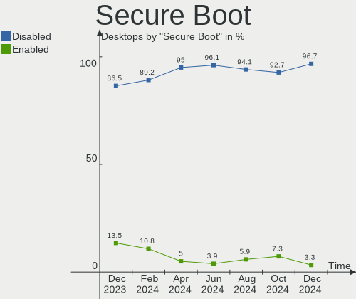
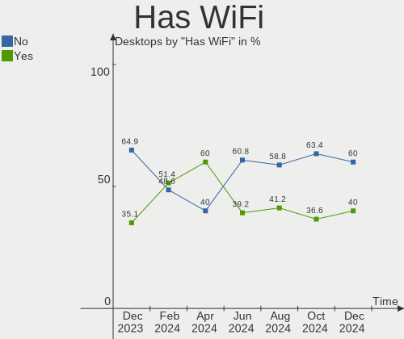
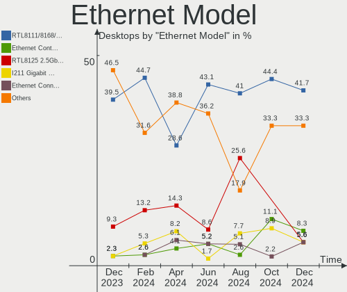

openSUSE - Hardware Trends (Desktops)
-------------------------------------

A project to identify most popular hardware characteristics and track their change
over time based on data collected by Linux users at https://Linux-Hardware.org.

Anyone can contribute to this report by the [hw-probe](https://github.com/linuxhw/hw-probe) tool:

    sudo -E hw-probe -all -upload

This report is for one last month. Overall report since the beginning of time: [TestDays](https://github.com/linuxhw/TestDays)

Period: May, 2023.

Contents
--------

* [ System ](#system)
  - [ OS                       ](#os)
  - [ OS Family                ](#os-family)
  - [ Kernel                   ](#kernel)
  - [ Kernel Family            ](#kernel-family)
  - [ Kernel Major Ver.        ](#kernel-major-ver)
  - [ Arch                     ](#arch)
  - [ DE                       ](#de)
  - [ Display Server           ](#display-server)
  - [ Display Manager          ](#display-manager)
  - [ OS Lang                  ](#os-lang)
  - [ Boot Mode                ](#boot-mode)
  - [ Filesystem               ](#filesystem)
  - [ Part. scheme             ](#part-scheme)
  - [ Dual Boot with Linux/BSD ](#dual-boot-with-linuxbsd)
  - [ Dual Boot (Win)          ](#dual-boot-win)

* [ Board ](#board)
  - [ Vendor                   ](#vendor)
  - [ Model                    ](#model)
  - [ Model Family             ](#model-family)
  - [ MFG Year                 ](#mfg-year)
  - [ Form Factor              ](#form-factor)
  - [ Secure Boot              ](#secure-boot)
  - [ Coreboot                 ](#coreboot)
  - [ RAM Size                 ](#ram-size)
  - [ RAM Used                 ](#ram-used)
  - [ Total Drives             ](#total-drives)
  - [ Has CD-ROM               ](#has-cd-rom)
  - [ Has Ethernet             ](#has-ethernet)
  - [ Has WiFi                 ](#has-wifi)
  - [ Has Bluetooth            ](#has-bluetooth)

* [ Location ](#location)
  - [ Country                  ](#country)
  - [ City                     ](#city)

* [ Drives ](#drives)
  - [ Drive Vendor             ](#drive-vendor)
  - [ Drive Model              ](#drive-model)
  - [ HDD Vendor               ](#hdd-vendor)
  - [ SSD Vendor               ](#ssd-vendor)
  - [ Drive Kind               ](#drive-kind)
  - [ Drive Connector          ](#drive-connector)
  - [ Drive Size               ](#drive-size)
  - [ Space Total              ](#space-total)
  - [ Space Used               ](#space-used)
  - [ Malfunc. Drives          ](#malfunc-drives)
  - [ Malfunc. Drive Vendor    ](#malfunc-drive-vendor)
  - [ Malfunc. HDD Vendor      ](#malfunc-hdd-vendor)
  - [ Malfunc. Drive Kind      ](#malfunc-drive-kind)
  - [ Failed Drives            ](#failed-drives)
  - [ Failed Drive Vendor      ](#failed-drive-vendor)
  - [ Drive Status             ](#drive-status)

* [ Storage controller ](#storage-controller)
  - [ Storage Vendor           ](#storage-vendor)
  - [ Storage Model            ](#storage-model)
  - [ Storage Kind             ](#storage-kind)

* [ Processor ](#processor)
  - [ CPU Vendor               ](#cpu-vendor)
  - [ CPU Model                ](#cpu-model)
  - [ CPU Model Family         ](#cpu-model-family)
  - [ CPU Cores                ](#cpu-cores)
  - [ CPU Sockets              ](#cpu-sockets)
  - [ CPU Threads              ](#cpu-threads)
  - [ CPU Op-Modes             ](#cpu-op-modes)
  - [ CPU Microcode            ](#cpu-microcode)
  - [ CPU Microarch            ](#cpu-microarch)

* [ Graphics ](#graphics)
  - [ GPU Vendor               ](#gpu-vendor)
  - [ GPU Model                ](#gpu-model)
  - [ GPU Combo                ](#gpu-combo)
  - [ GPU Driver               ](#gpu-driver)
  - [ GPU Memory               ](#gpu-memory)

* [ Monitor ](#monitor)
  - [ Monitor Vendor           ](#monitor-vendor)
  - [ Monitor Model            ](#monitor-model)
  - [ Monitor Resolution       ](#monitor-resolution)
  - [ Monitor Diagonal         ](#monitor-diagonal)
  - [ Monitor Width            ](#monitor-width)
  - [ Aspect Ratio             ](#aspect-ratio)
  - [ Monitor Area             ](#monitor-area)
  - [ Pixel Density            ](#pixel-density)
  - [ Multiple Monitors        ](#multiple-monitors)

* [ Network ](#network)
  - [ Net Controller Vendor    ](#net-controller-vendor)
  - [ Net Controller Model     ](#net-controller-model)
  - [ Wireless Vendor          ](#wireless-vendor)
  - [ Wireless Model           ](#wireless-model)
  - [ Ethernet Vendor          ](#ethernet-vendor)
  - [ Ethernet Model           ](#ethernet-model)
  - [ Net Controller Kind      ](#net-controller-kind)
  - [ Used Controller          ](#used-controller)
  - [ NICs                     ](#nics)
  - [ IPv6                     ](#ipv6)

* [ Bluetooth ](#bluetooth)
  - [ Bluetooth Vendor         ](#bluetooth-vendor)
  - [ Bluetooth Model          ](#bluetooth-model)

* [ Sound ](#sound)
  - [ Sound Vendor             ](#sound-vendor)
  - [ Sound Model              ](#sound-model)

* [ Memory ](#memory)
  - [ Memory Vendor            ](#memory-vendor)
  - [ Memory Model             ](#memory-model)
  - [ Memory Kind              ](#memory-kind)
  - [ Memory Form Factor       ](#memory-form-factor)
  - [ Memory Size              ](#memory-size)
  - [ Memory Speed             ](#memory-speed)

* [ Printers & scanners ](#printers--scanners)
  - [ Printer Vendor           ](#printer-vendor)
  - [ Printer Model            ](#printer-model)
  - [ Scanner Vendor           ](#scanner-vendor)
  - [ Scanner Model            ](#scanner-model)

* [ Camera ](#camera)
  - [ Camera Vendor            ](#camera-vendor)
  - [ Camera Model             ](#camera-model)

* [ Security ](#security)
  - [ Fingerprint Vendor       ](#fingerprint-vendor)
  - [ Fingerprint Model        ](#fingerprint-model)
  - [ Chipcard Vendor          ](#chipcard-vendor)
  - [ Chipcard Model           ](#chipcard-model)

* [ Unsupported ](#unsupported)
  - [ Unsupported Devices      ](#unsupported-devices)
  - [ Unsupported Device Types ](#unsupported-device-types)

System
------

OS
--

Installed operating systems

| Name                         | Desktops | Percent |
|------------------------------|----------|---------|
| openSUSE Tumbleweed-XXXXXXXX | 24       | 68.57%  |
| openSUSE Leap-15.5           | 4        | 11.43%  |
| openSUSE Leap-15.4           | 4        | 11.43%  |
| openSUSE Microos-XXXXXXXX    | 2        | 5.71%   |
| openSUSE Leap-15.3           | 1        | 2.86%   |

OS Family
---------

OS without a version

| Name     | Desktops | Percent |
|----------|----------|---------|
| openSUSE | 35       | 100%    |

Kernel
------

Version of the Linux kernel

| Version                      | Desktops | Percent |
|------------------------------|----------|---------|
| 6.3.2-1-default              | 10       | 28.57%  |
| 6.3.1-1-default              | 8        | 22.86%  |
| 6.2.12-1-default             | 4        | 11.43%  |
| 5.14.21-150500.52-default    | 4        | 11.43%  |
| 6.3.1-2-default              | 2        | 5.71%   |
| 5.14.21-150400.24.60-default | 2        | 5.71%   |
| 6.3.4-1-default              | 1        | 2.86%   |
| 6.3.1-1-vanilla              | 1        | 2.86%   |
| 5.3.18-150300.59.49-default  | 1        | 2.86%   |
| 5.14.21-150500.43-default    | 1        | 2.86%   |
| 5.14.21-150400.24.46-default | 1        | 2.86%   |

Kernel Family
-------------

Linux kernel without a distro release

| Version | Desktops | Percent |
|---------|----------|---------|
| 6.3.1   | 11       | 31.43%  |
| 6.3.2   | 10       | 28.57%  |
| 5.14.21 | 8        | 22.86%  |
| 6.2.12  | 4        | 11.43%  |
| 6.3.4   | 1        | 2.86%   |
| 5.3.18  | 1        | 2.86%   |

Kernel Major Ver.
-----------------

Linux kernel major version

| Version | Desktops | Percent |
|---------|----------|---------|
| 6.3     | 22       | 62.86%  |
| 5.14    | 8        | 22.86%  |
| 6.2     | 4        | 11.43%  |
| 5.3     | 1        | 2.86%   |

Arch
----

OS architecture (x86_64, i586, etc.)

| Name   | Desktops | Percent |
|--------|----------|---------|
| x86_64 | 35       | 100%    |

DE
--

Desktop Environment

| Name    | Desktops | Percent |
|---------|----------|---------|
| KDE5    | 24       | 68.57%  |
| GNOME   | 6        | 17.14%  |
| Unknown | 2        | 5.71%   |
| XFCE    | 1        | 2.86%   |
| MATE    | 1        | 2.86%   |
| LXQt    | 1        | 2.86%   |

Display Server
--------------

X11 or Wayland

| Name    | Desktops | Percent |
|---------|----------|---------|
| X11     | 25       | 71.43%  |
| Wayland | 10       | 28.57%  |

Display Manager
---------------

SDDM, LightDM, etc.

| Name    | Desktops | Percent |
|---------|----------|---------|
| Unknown | 28       | 80%     |
| SDDM    | 6        | 17.14%  |
| LightDM | 1        | 2.86%   |

OS Lang
-------

Language

| Lang  | Desktops | Percent |
|-------|----------|---------|
| en_US | 11       | 31.43%  |
| de_DE | 5        | 14.29%  |
| pt_BR | 3        | 8.57%   |
| POSIX | 3        | 8.57%   |
| ru_RU | 2        | 5.71%   |
| fr_FR | 2        | 5.71%   |
| en_GB | 2        | 5.71%   |
| pt_PT | 1        | 2.86%   |
| fi_FI | 1        | 2.86%   |
| es_ES | 1        | 2.86%   |
| es_DO | 1        | 2.86%   |
| en_DK | 1        | 2.86%   |
| da_DK | 1        | 2.86%   |
| bg_BG | 1        | 2.86%   |

Boot Mode
---------

EFI or BIOS

| Mode | Desktops | Percent |
|------|----------|---------|
| EFI  | 21       | 60%     |
| BIOS | 14       | 40%     |

Filesystem
----------

Type of filesystem

| Type  | Desktops | Percent |
|-------|----------|---------|
| Btrfs | 28       | 80%     |
| Ext4  | 5        | 14.29%  |
| Xfs   | 2        | 5.71%   |

Part. scheme
------------

Scheme of partitioning

| Type    | Desktops | Percent |
|---------|----------|---------|
| Unknown | 26       | 74.29%  |
| GPT     | 9        | 25.71%  |

Dual Boot with Linux/BSD
------------------------

Hosting more than one Linux/BSD

| Dual boot | Desktops | Percent |
|-----------|----------|---------|
| No        | 34       | 97.14%  |
| Yes       | 1        | 2.86%   |

Dual Boot (Win)
---------------

Hosting Linux and Windows

| Dual boot | Desktops | Percent |
|-----------|----------|---------|
| No        | 31       | 88.57%  |
| Yes       | 4        | 11.43%  |

Board
-----

Vendor
------

Motherboard manufacturer

| Name                | Desktops | Percent |
|---------------------|----------|---------|
| ASUSTek Computer    | 10       | 28.57%  |
| Gigabyte Technology | 8        | 22.86%  |
| ASRock              | 5        | 14.29%  |
| Dell                | 4        | 11.43%  |
| Hewlett-Packard     | 3        | 8.57%   |
| MSI                 | 2        | 5.71%   |
| Lenovo              | 1        | 2.86%   |
| Huanan              | 1        | 2.86%   |
| Fujitsu             | 1        | 2.86%   |

Model
-----

Motherboard model

| Name                                | Desktops | Percent |
|-------------------------------------|----------|---------|
| Dell OptiPlex 9020                  | 2        | 5.71%   |
| MSI MS-7C79                         | 1        | 2.86%   |
| MSI MS-7C39                         | 1        | 2.86%   |
| Lenovo ThinkStation P520 30BE008VGE | 1        | 2.86%   |
| Huanan B75 V10.1 376                | 1        | 2.86%   |
| HP Z400 Workstation                 | 1        | 2.86%   |
| HP Compaq Pro 6300 SFF              | 1        | 2.86%   |
| HP Compaq 8100 Elite SFF PC         | 1        | 2.86%   |
| Gigabyte X570S AORUS PRO AX         | 1        | 2.86%   |
| Gigabyte X570 I AORUS PRO WIFI      | 1        | 2.86%   |
| Gigabyte X570 GAMING X              | 1        | 2.86%   |
| Gigabyte P55-UD3                    | 1        | 2.86%   |
| Gigabyte GA-970A-UD3                | 1        | 2.86%   |
| Gigabyte B85M-DS3H-A                | 1        | 2.86%   |
| Gigabyte B660M AORUS PRO AX DDR4    | 1        | 2.86%   |
| Gigabyte A520M S2H                  | 1        | 2.86%   |
| Fujitsu PRIMERGY TX100 S3P          | 1        | 2.86%   |
| Dell OptiPlex 9010                  | 1        | 2.86%   |
| Dell OptiPlex 7010                  | 1        | 2.86%   |
| ASUS Z77-A                          | 1        | 2.86%   |
| ASUS TUF Gaming X570-PLUS           | 1        | 2.86%   |
| ASUS TUF Gaming B550M-ZAKU          | 1        | 2.86%   |
| ASUS TUF Gaming B550M-PLUS WIFI II  | 1        | 2.86%   |
| ASUS PRIME B550M-K                  | 1        | 2.86%   |
| ASUS PRIME A320M-R                  | 1        | 2.86%   |
| ASUS P8H77-M LE                     | 1        | 2.86%   |
| ASUS P5QD TURBO                     | 1        | 2.86%   |
| ASUS H110M-C/BR                     | 1        | 2.86%   |
| ASUS All Series                     | 1        | 2.86%   |
| ASRock Z790M-ITX WiFi               | 1        | 2.86%   |
| ASRock J3355B-ITX                   | 1        | 2.86%   |
| ASRock B450M Pro4 R2.0              | 1        | 2.86%   |
| ASRock 970 Pro3 R2.0                | 1        | 2.86%   |
| ASRock 890GX Extreme3               | 1        | 2.86%   |

Model Family
------------

Motherboard model prefix

| Name                 | Desktops | Percent |
|----------------------|----------|---------|
| Dell OptiPlex        | 4        | 11.43%  |
| ASUS TUF             | 3        | 8.57%   |
| HP Compaq            | 2        | 5.71%   |
| Gigabyte X570        | 2        | 5.71%   |
| ASUS PRIME           | 2        | 5.71%   |
| MSI MS-7C79          | 1        | 2.86%   |
| MSI MS-7C39          | 1        | 2.86%   |
| Lenovo ThinkStation  | 1        | 2.86%   |
| Huanan B75           | 1        | 2.86%   |
| HP Z400              | 1        | 2.86%   |
| Gigabyte X570S       | 1        | 2.86%   |
| Gigabyte P55-UD3     | 1        | 2.86%   |
| Gigabyte GA-970A-UD3 | 1        | 2.86%   |
| Gigabyte B85M-DS3H-A | 1        | 2.86%   |
| Gigabyte B660M       | 1        | 2.86%   |
| Gigabyte A520M       | 1        | 2.86%   |
| Fujitsu PRIMERGY     | 1        | 2.86%   |
| ASUS Z77-A           | 1        | 2.86%   |
| ASUS P8H77-M         | 1        | 2.86%   |
| ASUS P5QD            | 1        | 2.86%   |
| ASUS H110M-C         | 1        | 2.86%   |
| ASUS All             | 1        | 2.86%   |
| ASRock Z790M-ITX     | 1        | 2.86%   |
| ASRock J3355B-ITX    | 1        | 2.86%   |
| ASRock B450M         | 1        | 2.86%   |
| ASRock 970           | 1        | 2.86%   |
| ASRock 890GX         | 1        | 2.86%   |

MFG Year
--------

Motherboard manufacture year

| Year | Desktops | Percent |
|------|----------|---------|
| 2020 | 5        | 14.29%  |
| 2021 | 4        | 11.43%  |
| 2019 | 4        | 11.43%  |
| 2013 | 4        | 11.43%  |
| 2012 | 4        | 11.43%  |
| 2009 | 3        | 8.57%   |
| 2022 | 2        | 5.71%   |
| 2015 | 2        | 5.71%   |
| 2010 | 2        | 5.71%   |
| 2018 | 1        | 2.86%   |
| 2017 | 1        | 2.86%   |
| 2016 | 1        | 2.86%   |
| 2014 | 1        | 2.86%   |
| 2011 | 1        | 2.86%   |

Form Factor
-----------

Physical design of the computer

| Name    | Desktops | Percent |
|---------|----------|---------|
| Desktop | 35       | 100%    |

Secure Boot
-----------

Enabled or disabled

| State    | Desktops | Percent |
|----------|----------|---------|
| Disabled | 33       | 94.29%  |
| Enabled  | 2        | 5.71%   |

Coreboot
--------

Have coreboot on board

| Used | Desktops | Percent |
|------|----------|---------|
| No   | 35       | 100%    |

RAM Size
--------

Total RAM memory

| Size in GB      | Desktops | Percent |
|-----------------|----------|---------|
| 8.01-16.0       | 8        | 22.86%  |
| 32.01-64.0      | 7        | 20%     |
| 16.01-24.0      | 7        | 20%     |
| 4.01-8.0        | 6        | 17.14%  |
| 64.01-256.0     | 3        | 8.57%   |
| 24.01-32.0      | 2        | 5.71%   |
| More than 256.0 | 1        | 2.86%   |
| 1.01-2.0        | 1        | 2.86%   |

RAM Used
--------

Used RAM memory

| Used GB    | Desktops | Percent |
|------------|----------|---------|
| 4.01-8.0   | 13       | 37.14%  |
| 3.01-4.0   | 7        | 20%     |
| 2.01-3.0   | 7        | 20%     |
| 1.01-2.0   | 4        | 11.43%  |
| 8.01-16.0  | 3        | 8.57%   |
| 16.01-24.0 | 1        | 2.86%   |

Total Drives
------------

Number of drives on board

| Drives | Desktops | Percent |
|--------|----------|---------|
| 2      | 14       | 40%     |
| 1      | 8        | 22.86%  |
| 3      | 5        | 14.29%  |
| 4      | 4        | 11.43%  |
| 6      | 2        | 5.71%   |
| 5      | 2        | 5.71%   |

Has CD-ROM
----------

Has CD-ROM on board

| Presented | Desktops | Percent |
|-----------|----------|---------|
| No        | 21       | 60%     |
| Yes       | 14       | 40%     |

Has Ethernet
------------

Has Ethernet on board

| Presented | Desktops | Percent |
|-----------|----------|---------|
| Yes       | 34       | 97.14%  |
| No        | 1        | 2.86%   |

Has WiFi
--------

Has WiFi module

| Presented | Desktops | Percent |
|-----------|----------|---------|
| No        | 18       | 51.43%  |
| Yes       | 17       | 48.57%  |

Has Bluetooth
-------------

Has Bluetooth module

| Presented | Desktops | Percent |
|-----------|----------|---------|
| No        | 23       | 65.71%  |
| Yes       | 12       | 34.29%  |

Location
--------

Country
-------

Geographic location (country)

| Country     | Desktops | Percent |
|-------------|----------|---------|
| USA         | 9        | 25.71%  |
| Germany     | 4        | 11.43%  |
| UK          | 3        | 8.57%   |
| Brazil      | 3        | 8.57%   |
| France      | 2        | 5.71%   |
| Argentina   | 2        | 5.71%   |
| Ukraine     | 1        | 2.86%   |
| Thailand    | 1        | 2.86%   |
| Switzerland | 1        | 2.86%   |
| Spain       | 1        | 2.86%   |
| Russia      | 1        | 2.86%   |
| Portugal    | 1        | 2.86%   |
| Poland      | 1        | 2.86%   |
| Martinique  | 1        | 2.86%   |
| Greenland   | 1        | 2.86%   |
| Finland     | 1        | 2.86%   |
| Canada      | 1        | 2.86%   |
| Bulgaria    | 1        | 2.86%   |

City
----

Geographic location (city)

| City                       | Desktops | Percent |
|----------------------------|----------|---------|
| Saint Paul                 | 2        | 5.71%   |
| West Bend                  | 1        | 2.86%   |
| Warsaw                     | 1        | 2.86%   |
| Warrington                 | 1        | 2.86%   |
| Wallington                 | 1        | 2.86%   |
| Wakefield                  | 1        | 2.86%   |
| Vaasa                      | 1        | 2.86%   |
| Springdale                 | 1        | 2.86%   |
| Sofia                      | 1        | 2.86%   |
| Sisimiut                   | 1        | 2.86%   |
| Reinach                    | 1        | 2.86%   |
| Porto Alegre               | 1        | 2.86%   |
| Nice                       | 1        | 2.86%   |
| Moscow                     | 1        | 2.86%   |
| Montpellier                | 1        | 2.86%   |
| Meschede                   | 1        | 2.86%   |
| Maracanau                  | 1        | 2.86%   |
| Los Angeles                | 1        | 2.86%   |
| Lochearnhead               | 1        | 2.86%   |
| Las Palmas de Gran Canaria | 1        | 2.86%   |
| Lake Villa                 | 1        | 2.86%   |
| Kyiv                       | 1        | 2.86%   |
| Ithaca                     | 1        | 2.86%   |
| Houston                    | 1        | 2.86%   |
| Hildesheim                 | 1        | 2.86%   |
| Gondomar                   | 1        | 2.86%   |
| Funes                      | 1        | 2.86%   |
| Fort-de-France             | 1        | 2.86%   |
| Dortmund                   | 1        | 2.86%   |
| Dartmouth                  | 1        | 2.86%   |
| Buenos Aires               | 1        | 2.86%   |
| Bergisch Gladbach          | 1        | 2.86%   |
| Belo Horizonte             | 1        | 2.86%   |
| Ban Phan Don               | 1        | 2.86%   |

Drives
------

Drive Vendor
------------

Hard drive vendors

| Vendor                      | Desktops | Drives | Percent |
|-----------------------------|----------|--------|---------|
| WDC                         | 19       | 28     | 27.94%  |
| Seagate                     | 13       | 17     | 19.12%  |
| Samsung Electronics         | 9        | 14     | 13.24%  |
| Sandisk                     | 4        | 5      | 5.88%   |
| Toshiba                     | 3        | 3      | 4.41%   |
| Phison Electronics          | 2        | 2      | 2.94%   |
| MAXIO Technology (Hangzhou) | 2        | 2      | 2.94%   |
| Kingston                    | 2        | 2      | 2.94%   |
| Hitachi                     | 2        | 2      | 2.94%   |
| SSK                         | 1        | 1      | 1.47%   |
| S3+                         | 1        | 1      | 1.47%   |
| Phison                      | 1        | 1      | 1.47%   |
| Patriot                     | 1        | 1      | 1.47%   |
| Mushkin                     | 1        | 1      | 1.47%   |
| Micron/Crucial Technology   | 1        | 1      | 1.47%   |
| Leven                       | 1        | 1      | 1.47%   |
| Intenso                     | 1        | 2      | 1.47%   |
| Intel                       | 1        | 1      | 1.47%   |
| Crucial                     | 1        | 1      | 1.47%   |
| China                       | 1        | 1      | 1.47%   |
| AMD                         | 1        | 1      | 1.47%   |

Drive Model
-----------

Hard drive models

| Model                                            | Desktops | Percent |
|--------------------------------------------------|----------|---------|
| WDC WD20EARX-00PASB0 2TB                         | 2        | 2.5%    |
| WDC WD10EZEX-75M2NA0 1TB                         | 2        | 2.5%    |
| WDC WD1002FAEX-00Z3A0 1TB                        | 2        | 2.5%    |
| MAXIO (Hangzhou) NVMe SSD Controller MAP1202 2TB | 2        | 2.5%    |
| WDC WDS500G2B0B-00YS70 500GB SSD                 | 1        | 1.25%   |
| WDC WDS500G2B0A-00SM50 500GB SSD                 | 1        | 1.25%   |
| WDC WDS100T2B0B-00YS70 1TB SSD                   | 1        | 1.25%   |
| WDC WDS100T2B0A-00SM50 1TB SSD                   | 1        | 1.25%   |
| WDC WD5000LPCX-21VHAT0 500GB                     | 1        | 1.25%   |
| WDC WD5000AAKX-75U6AA0 500GB                     | 1        | 1.25%   |
| WDC WD40EFRX-68N32N0 4TB                         | 1        | 1.25%   |
| WDC WD40EFAX-68JH4N1 4TB                         | 1        | 1.25%   |
| WDC WD4002FFWX-68TZ4N0 4TB                       | 1        | 1.25%   |
| WDC WD3200AAKX-00ERMA0 320GB                     | 1        | 1.25%   |
| WDC WD20EFRX-68AX9N0 2TB                         | 1        | 1.25%   |
| WDC WD1200BEVS-75UST0 120GB                      | 1        | 1.25%   |
| WDC WD10PURZ-85U8XY0 1TB                         | 1        | 1.25%   |
| WDC WD10EZEX-21M2NA0 1TB                         | 1        | 1.25%   |
| WDC WD10EZEX-08WN4A0 1TB                         | 1        | 1.25%   |
| WDC WD10EZEX-08M2NA0 1TB                         | 1        | 1.25%   |
| WDC WD10EZEX-00RKKA0 1TB                         | 1        | 1.25%   |
| WDC WD10EZEX-00BN5A0 1TB                         | 1        | 1.25%   |
| WDC WD10EARS-22Y5B1 1TB                          | 1        | 1.25%   |
| WDC WD10EADS-00L5B1 1TB                          | 1        | 1.25%   |
| Toshiba MQ04ABF100 1TB                           | 1        | 1.25%   |
| Toshiba DT01ACA100 1TB                           | 1        | 1.25%   |
| Toshiba DT01ACA050 500GB                         | 1        | 1.25%   |
| SSK Disk 256GB                                   | 1        | 1.25%   |
| Seagate ST9500325AS 500GB                        | 1        | 1.25%   |
| Seagate ST6000VN0033-2EE110 6TB                  | 1        | 1.25%   |
| Seagate ST500LM030-2E717D 500GB                  | 1        | 1.25%   |
| Seagate ST4000VN008-2DR166 4TB                   | 1        | 1.25%   |
| Seagate ST4000NM0033-9ZM170 4TB                  | 1        | 1.25%   |
| Seagate ST4000DM004-2CV104 4TB                   | 1        | 1.25%   |
| Seagate ST3500414CS 500GB                        | 1        | 1.25%   |
| Seagate ST3500312CS 500GB                        | 1        | 1.25%   |
| Seagate ST3250318AS 250GB                        | 1        | 1.25%   |
| Seagate ST3160318AS 160GB                        | 1        | 1.25%   |
| Seagate ST2000VX008-2E3164 2TB                   | 1        | 1.25%   |
| Seagate ST2000DM008-2FR102 2TB                   | 1        | 1.25%   |

HDD Vendor
----------

Hard disk drive vendors

| Vendor              | Desktops | Drives | Percent |
|---------------------|----------|--------|---------|
| WDC                 | 17       | 23     | 47.22%  |
| Seagate             | 12       | 16     | 33.33%  |
| Toshiba             | 3        | 3      | 8.33%   |
| Hitachi             | 2        | 2      | 5.56%   |
| SSK                 | 1        | 1      | 2.78%   |
| Samsung Electronics | 1        | 1      | 2.78%   |

SSD Vendor
----------

Solid state drive vendors

| Vendor              | Desktops | Drives | Percent |
|---------------------|----------|--------|---------|
| Samsung Electronics | 6        | 9      | 30%     |
| WDC                 | 3        | 5      | 15%     |
| Kingston            | 2        | 2      | 10%     |
| SanDisk             | 1        | 1      | 5%      |
| S3+                 | 1        | 1      | 5%      |
| Patriot             | 1        | 1      | 5%      |
| Mushkin             | 1        | 1      | 5%      |
| Leven               | 1        | 1      | 5%      |
| Intenso             | 1        | 2      | 5%      |
| Intel               | 1        | 1      | 5%      |
| Crucial             | 1        | 1      | 5%      |
| China               | 1        | 1      | 5%      |

Drive Kind
----------

HDD or SSD

| Kind | Desktops | Drives | Percent |
|------|----------|--------|---------|
| HDD  | 27       | 46     | 47.37%  |
| SSD  | 18       | 26     | 31.58%  |
| NVMe | 12       | 16     | 21.05%  |

Drive Connector
---------------

SATA, SAS, NVMe, etc.

| Type | Desktops | Drives | Percent |
|------|----------|--------|---------|
| SATA | 34       | 71     | 72.34%  |
| NVMe | 12       | 16     | 25.53%  |
| SAS  | 1        | 1      | 2.13%   |

Drive Size
----------

Size of hard drive

| Size in TB | Desktops | Drives | Percent |
|------------|----------|--------|---------|
| 0.51-1.0   | 20       | 26     | 37.04%  |
| 0.01-0.5   | 20       | 30     | 37.04%  |
| 1.01-2.0   | 7        | 7      | 12.96%  |
| 3.01-4.0   | 6        | 8      | 11.11%  |
| 4.01-10.0  | 1        | 1      | 1.85%   |

Space Total
-----------

Amount of disk space available on the file system

| Size in GB     | Desktops | Percent |
|----------------|----------|---------|
| More than 3000 | 18       | 51.43%  |
| 2001-3000      | 5        | 14.29%  |
| 1001-2000      | 5        | 14.29%  |
| 501-1000       | 4        | 11.43%  |
| 251-500        | 2        | 5.71%   |
| Unknown        | 1        | 2.86%   |

Space Used
----------

Amount of used disk space

| Used GB        | Desktops | Percent |
|----------------|----------|---------|
| 101-250        | 8        | 22.86%  |
| 51-100         | 7        | 20%     |
| 1001-2000      | 5        | 14.29%  |
| 251-500        | 4        | 11.43%  |
| 501-1000       | 4        | 11.43%  |
| 2001-3000      | 3        | 8.57%   |
| More than 3000 | 2        | 5.71%   |
| 1-20           | 1        | 2.86%   |
| Unknown        | 1        | 2.86%   |

Malfunc. Drives
---------------

Drive models with a malfunction

| Model                                            | Desktops | Drives | Percent |
|--------------------------------------------------|----------|--------|---------|
| WDC WD10EZEX-75M2NA0 1TB                         | 1        | 1      | 25%     |
| Samsung Electronics SSD 840 EVO 120GB            | 1        | 1      | 25%     |
| Samsung Electronics MZ7TE256HMHP-000L7 256GB SSD | 1        | 1      | 25%     |
| Hitachi HDS721010CLA332 1TB                      | 1        | 1      | 25%     |

Malfunc. Drive Vendor
---------------------

Vendors of faulty drives

| Vendor              | Desktops | Drives | Percent |
|---------------------|----------|--------|---------|
| WDC                 | 1        | 1      | 33.33%  |
| Samsung Electronics | 1        | 2      | 33.33%  |
| Hitachi             | 1        | 1      | 33.33%  |

Malfunc. HDD Vendor
-------------------

Vendors of faulty HDD drives

| Vendor  | Desktops | Drives | Percent |
|---------|----------|--------|---------|
| WDC     | 1        | 1      | 50%     |
| Hitachi | 1        | 1      | 50%     |

Malfunc. Drive Kind
-------------------

Kinds of faulty drives

| Kind | Desktops | Drives | Percent |
|------|----------|--------|---------|
| HDD  | 2        | 2      | 66.67%  |
| SSD  | 1        | 2      | 33.33%  |

Failed Drives
-------------

Failed drive models

Zero info for selected period =(

Failed Drive Vendor
-------------------

Failed drive vendors

Zero info for selected period =(

Drive Status
------------

Number of failed and malfunc. drives

| Status   | Desktops | Drives | Percent |
|----------|----------|--------|---------|
| Detected | 26       | 64     | 72.22%  |
| Works    | 8        | 20     | 22.22%  |
| Malfunc  | 2        | 4      | 5.56%   |

Storage controller
------------------

Storage Vendor
--------------

Storage controller vendors

| Vendor                      | Desktops | Percent |
|-----------------------------|----------|---------|
| Intel                       | 22       | 44%     |
| AMD                         | 13       | 26%     |
| SanDisk                     | 3        | 6%      |
| Phison Electronics          | 3        | 6%      |
| Samsung Electronics         | 2        | 4%      |
| MAXIO Technology (Hangzhou) | 2        | 4%      |
| Seagate Technology          | 1        | 2%      |
| Micron/Crucial Technology   | 1        | 2%      |
| LSI Logic / Symbios Logic   | 1        | 2%      |
| JMicron Technology          | 1        | 2%      |
| Broadcom / LSI              | 1        | 2%      |

Storage Model
-------------

Storage controller models

| Model                                                                          | Desktops | Percent |
|--------------------------------------------------------------------------------|----------|---------|
| AMD FCH SATA Controller [AHCI mode]                                            | 6        | 10%     |
| Intel 7 Series/C210 Series Chipset Family 6-port SATA Controller [AHCI mode]   | 4        | 6.67%   |
| AMD 500 Series Chipset SATA Controller                                         | 4        | 6.67%   |
| Intel 8 Series/C220 Series Chipset Family 6-port SATA Controller 1 [AHCI mode] | 3        | 5%      |
| AMD SB7x0/SB8x0/SB9x0 IDE Controller                                           | 3        | 5%      |
| SanDisk WD Black 2018/SN750 / PC SN720 NVMe SSD                                | 2        | 3.33%   |
| Phison E12 NVMe Controller                                                     | 2        | 3.33%   |
| MAXIO (Hangzhou) NVMe SSD Controller MAP1202                                   | 2        | 3.33%   |
| Intel SATA Controller [RAID mode]                                              | 2        | 3.33%   |
| Intel 7 Series/C210 Series Chipset Family 4-port SATA Controller [IDE mode]    | 2        | 3.33%   |
| Intel 7 Series/C210 Series Chipset Family 2-port SATA Controller [IDE mode]    | 2        | 3.33%   |
| Intel 200 Series PCH SATA controller [AHCI mode]                               | 2        | 3.33%   |
| AMD SB7x0/SB8x0/SB9x0 SATA Controller [IDE mode]                               | 2        | 3.33%   |
| Seagate FireCuda 530 SSD                                                       | 1        | 1.67%   |
| SanDisk Non-Volatile memory controller                                         | 1        | 1.67%   |
| Samsung NVMe SSD Controller SM981/PM981/PM983                                  | 1        | 1.67%   |
| Samsung Electronics Non-Volatile memory controller                             | 1        | 1.67%   |
| Phison Electronics Non-Volatile memory controller                              | 1        | 1.67%   |
| Micron/Crucial P5 Plus NVMe PCIe SSD                                           | 1        | 1.67%   |
| LSI Logic / Symbios Logic MegaRAID SAS 2108 [Liberator]                        | 1        | 1.67%   |
| JMicron JMB363 SATA/IDE Controller                                             | 1        | 1.67%   |
| Intel Q170/Q150/B150/H170/H110/Z170/CM236 Chipset SATA Controller [AHCI Mode]  | 1        | 1.67%   |
| Intel Comet Lake SATA AHCI Controller                                          | 1        | 1.67%   |
| Intel Celeron N3350/Pentium N4200/Atom E3900 Series SATA AHCI Controller       | 1        | 1.67%   |
| Intel Alder Lake-S PCH SATA Controller [AHCI Mode]                             | 1        | 1.67%   |
| Intel 82801JI (ICH10 Family) 4 port SATA IDE Controller #1                     | 1        | 1.67%   |
| Intel 82801JI (ICH10 Family) 2 port SATA IDE Controller #2                     | 1        | 1.67%   |
| Intel 700 Series Chipset Family SATA AHCI Controller                           | 1        | 1.67%   |
| Intel 6 Series/C200 Series Chipset Family 6 port Desktop SATA AHCI Controller  | 1        | 1.67%   |
| Intel 5 Series/3400 Series Chipset 6 port SATA AHCI Controller                 | 1        | 1.67%   |
| Intel 5 Series/3400 Series Chipset 4 port SATA IDE Controller                  | 1        | 1.67%   |
| Intel 5 Series/3400 Series Chipset 2 port SATA IDE Controller                  | 1        | 1.67%   |
| Broadcom / LSI MegaRAID SAS 1068                                               | 1        | 1.67%   |
| AMD SB7x0/SB8x0/SB9x0 SATA Controller [AHCI mode]                              | 1        | 1.67%   |
| AMD FCH SATA Controller [RAID Bottom]                                          | 1        | 1.67%   |
| AMD FCH SATA Controller D                                                      | 1        | 1.67%   |
| AMD 400 Series Chipset SATA Controller                                         | 1        | 1.67%   |

Storage Kind
------------

Kind of storage controller (IDE, SATA, NVMe, SAS, ...)

| Kind | Desktops | Percent |
|------|----------|---------|
| SATA | 29       | 55.77%  |
| NVMe | 12       | 23.08%  |
| IDE  | 7        | 13.46%  |
| RAID | 4        | 7.69%   |

Processor
---------

CPU Vendor
----------

Processor vendors

| Vendor | Desktops | Percent |
|--------|----------|---------|
| Intel  | 22       | 62.86%  |
| AMD    | 13       | 37.14%  |

CPU Model
---------

Processor models

| Model                                       | Desktops | Percent |
|---------------------------------------------|----------|---------|
| Intel Core i5-3470 CPU @ 3.20GHz            | 3        | 8.57%   |
| Intel Core i7-4770 CPU @ 3.40GHz            | 2        | 5.71%   |
| AMD Ryzen 9 5950X 16-Core Processor         | 2        | 5.71%   |
| AMD Ryzen 9 3900X 12-Core Processor         | 2        | 5.71%   |
| AMD Phenom II X6 1090T Processor            | 2        | 5.71%   |
| Intel Xeon W-2135 CPU @ 3.70GHz             | 1        | 2.86%   |
| Intel Xeon CPU W3530 @ 2.80GHz              | 1        | 2.86%   |
| Intel Xeon CPU E5472 @ 3.00GHz              | 1        | 2.86%   |
| Intel Xeon CPU E3-1270 V2 @ 3.50GHz         | 1        | 2.86%   |
| Intel Xeon CPU E3-1240 V2 @ 3.40GHz         | 1        | 2.86%   |
| Intel Core i7-6700 CPU @ 3.40GHz            | 1        | 2.86%   |
| Intel Core i7-4790K CPU @ 4.00GHz           | 1        | 2.86%   |
| Intel Core i7-4790 CPU @ 3.60GHz            | 1        | 2.86%   |
| Intel Core i7-2600 CPU @ 3.40GHz            | 1        | 2.86%   |
| Intel Core i7-10700K CPU @ 3.80GHz          | 1        | 2.86%   |
| Intel Core i5-3350P CPU @ 3.10GHz           | 1        | 2.86%   |
| Intel Core i5 CPU 750 @ 2.67GHz             | 1        | 2.86%   |
| Intel Core i5 CPU 650 @ 3.20GHz             | 1        | 2.86%   |
| Intel Core i3-9100F CPU @ 3.60GHz           | 1        | 2.86%   |
| Intel Celeron CPU J3355 @ 2.00GHz           | 1        | 2.86%   |
| Intel 13th Gen Core i9-13900T               | 1        | 2.86%   |
| Intel 12th Gen Core i5-12400                | 1        | 2.86%   |
| AMD Ryzen 9 5900X 12-Core Processor         | 1        | 2.86%   |
| AMD Ryzen 7 5800X 8-Core Processor          | 1        | 2.86%   |
| AMD Ryzen 7 5700G with Radeon Graphics      | 1        | 2.86%   |
| AMD Ryzen 5 5500                            | 1        | 2.86%   |
| AMD Ryzen 5 3600 6-Core Processor           | 1        | 2.86%   |
| AMD Ryzen 3 2200G with Radeon Vega Graphics | 1        | 2.86%   |
| AMD FX-4300 Quad-Core Processor             | 1        | 2.86%   |

CPU Model Family
----------------

Processor model prefix

| Model            | Desktops | Percent |
|------------------|----------|---------|
| Intel Core i7    | 7        | 20%     |
| Intel Core i5    | 6        | 17.14%  |
| Intel Xeon       | 5        | 14.29%  |
| AMD Ryzen 9      | 5        | 14.29%  |
| Other            | 2        | 5.71%   |
| AMD Ryzen 7      | 2        | 5.71%   |
| AMD Ryzen 5      | 2        | 5.71%   |
| AMD Phenom II X6 | 2        | 5.71%   |
| Intel Core i3    | 1        | 2.86%   |
| Intel Celeron    | 1        | 2.86%   |
| AMD Ryzen 3      | 1        | 2.86%   |
| AMD FX           | 1        | 2.86%   |

CPU Cores
---------

Number of processor cores

| Number | Desktops | Percent |
|--------|----------|---------|
| 4      | 17       | 48.57%  |
| 6      | 5        | 14.29%  |
| 2      | 4        | 11.43%  |
| 12     | 3        | 8.57%   |
| 8      | 3        | 8.57%   |
| 16     | 2        | 5.71%   |
| 24     | 1        | 2.86%   |

CPU Sockets
-----------

Number of sockets

| Number | Desktops | Percent |
|--------|----------|---------|
| 1      | 35       | 100%    |

CPU Threads
-----------

Threads per core (Hyper-Threading)

| Number | Desktops | Percent |
|--------|----------|---------|
| 2      | 24       | 68.57%  |
| 1      | 11       | 31.43%  |

CPU Op-Modes
------------

CPU Operation Modes (32-bit, 64-bit)

| Op mode        | Desktops | Percent |
|----------------|----------|---------|
| 32-bit, 64-bit | 35       | 100%    |

CPU Microcode
-------------

Microcode number

| Number     | Desktops | Percent |
|------------|----------|---------|
| Unknown    | 20       | 57.14%  |
| 0x08701021 | 3        | 8.57%   |
| 0x0a20120a | 2        | 5.71%   |
| 0x0a201016 | 2        | 5.71%   |
| 0x010000dc | 2        | 5.71%   |
| 0x50654    | 1        | 2.86%   |
| 0x306c3    | 1        | 2.86%   |
| 0x106e5    | 1        | 2.86%   |
| 0x0a50000d | 1        | 2.86%   |
| 0x0a50000c | 1        | 2.86%   |
| 0x06000852 | 1        | 2.86%   |

CPU Microarch
-------------

Microarchitecture

| Name             | Desktops | Percent |
|------------------|----------|---------|
| Zen 3            | 6        | 17.14%  |
| IvyBridge        | 6        | 17.14%  |
| Haswell          | 4        | 11.43%  |
| Zen 2            | 3        | 8.57%   |
| Skylake          | 2        | 5.71%   |
| Nehalem          | 2        | 5.71%   |
| K10              | 2        | 5.71%   |
| Alderlake Hybrid | 2        | 5.71%   |
| Zen              | 1        | 2.86%   |
| Westmere         | 1        | 2.86%   |
| SandyBridge      | 1        | 2.86%   |
| Piledriver       | 1        | 2.86%   |
| Penryn           | 1        | 2.86%   |
| KabyLake         | 1        | 2.86%   |
| Goldmont         | 1        | 2.86%   |
| CometLake        | 1        | 2.86%   |

Graphics
--------

GPU Vendor
----------

Vendors of graphics cards

| Vendor | Desktops | Percent |
|--------|----------|---------|
| Nvidia | 19       | 48.72%  |
| Intel  | 10       | 25.64%  |
| AMD    | 10       | 25.64%  |

GPU Model
---------

Graphics card models

| Model                                                                       | Desktops | Percent |
|-----------------------------------------------------------------------------|----------|---------|
| Intel Xeon E3-1200 v3/4th Gen Core Processor Integrated Graphics Controller | 3        | 7.5%    |
| Intel Xeon E3-1200 v2/3rd Gen Core processor Graphics Controller            | 3        | 7.5%    |
| Nvidia GP107 [GeForce GTX 1050 Ti]                                          | 2        | 5%      |
| AMD Navi 24 [Radeon RX 6400/6500 XT/6500M]                                  | 2        | 5%      |
| AMD Ellesmere [Radeon RX 470/480/570/570X/580/580X/590]                     | 2        | 5%      |
| Nvidia TU116 [GeForce GTX 1660 SUPER]                                       | 1        | 2.5%    |
| Nvidia TU104 [GeForce RTX 2070 SUPER]                                       | 1        | 2.5%    |
| Nvidia GP108 [GeForce GT 1030]                                              | 1        | 2.5%    |
| Nvidia GP104 [GeForce GTX 1070]                                             | 1        | 2.5%    |
| Nvidia GP104 [GeForce GTX 1070 Ti]                                          | 1        | 2.5%    |
| Nvidia GP102 [GeForce GTX 1080 Ti]                                          | 1        | 2.5%    |
| Nvidia GM206 [GeForce GTX 960]                                              | 1        | 2.5%    |
| Nvidia GM204 [GeForce GTX 970]                                              | 1        | 2.5%    |
| Nvidia GK208B [GeForce GT 730]                                              | 1        | 2.5%    |
| Nvidia GK106 [GeForce GTX 660]                                              | 1        | 2.5%    |
| Nvidia GK104 [GeForce GTX 660 Ti]                                           | 1        | 2.5%    |
| Nvidia GF119 [NVS 315]                                                      | 1        | 2.5%    |
| Nvidia GF114 [GeForce GTX 560]                                              | 1        | 2.5%    |
| Nvidia GF114 [GeForce GTX 560 Ti]                                           | 1        | 2.5%    |
| Nvidia GF108 [GeForce GT 620]                                               | 1        | 2.5%    |
| Nvidia GF108 [GeForce GT 430]                                               | 1        | 2.5%    |
| Nvidia GA106 [Geforce RTX 3050]                                             | 1        | 2.5%    |
| Nvidia G94 [GeForce 9600 GT]                                                | 1        | 2.5%    |
| Intel Raptor Lake-S GT1 [UHD Graphics 770]                                  | 1        | 2.5%    |
| Intel HD Graphics 500                                                       | 1        | 2.5%    |
| Intel Core Processor Integrated Graphics Controller                         | 1        | 2.5%    |
| Intel Alder Lake-S GT1 [UHD Graphics 730]                                   | 1        | 2.5%    |
| AMD Tahiti XT [Radeon HD 7970/8970 OEM / R9 280X]                           | 1        | 2.5%    |
| AMD Raven Ridge [Radeon Vega Series / Radeon Vega Mobile Series]            | 1        | 2.5%    |
| AMD Navi 22 [Radeon RX 6700/6700 XT/6750 XT / 6800M/6850M XT]               | 1        | 2.5%    |
| AMD Lexa PRO [Radeon 540/540X/550/550X / RX 540X/550/550X]                  | 1        | 2.5%    |
| AMD Juniper XT [FirePro V5800]                                              | 1        | 2.5%    |
| AMD Cezanne [Radeon Vega Series / Radeon Vega Mobile Series]                | 1        | 2.5%    |

GPU Combo
---------

Combinations of graphics cards

| Name           | Desktops | Percent |
|----------------|----------|---------|
| 1 x Nvidia     | 15       | 42.86%  |
| 1 x Intel      | 9        | 25.71%  |
| 1 x AMD        | 7        | 20%     |
| AMD + Nvidia   | 3        | 8.57%   |
| Intel + Nvidia | 1        | 2.86%   |

GPU Driver
----------

Free vs proprietary

| Driver      | Desktops | Percent |
|-------------|----------|---------|
| Free        | 28       | 80%     |
| Proprietary | 7        | 20%     |

GPU Memory
----------

Total video memory

| Size in GB | Desktops | Percent |
|------------|----------|---------|
| Unknown    | 14       | 40%     |
| 3.01-4.0   | 6        | 17.14%  |
| 7.01-8.0   | 4        | 11.43%  |
| 1.01-2.0   | 4        | 11.43%  |
| 0.51-1.0   | 3        | 8.57%   |
| 8.01-16.0  | 2        | 5.71%   |
| 2.01-3.0   | 1        | 2.86%   |
| 0.01-0.5   | 1        | 2.86%   |

Monitor
-------

Monitor Vendor
--------------

Monitor vendors

| Vendor               | Desktops | Percent |
|----------------------|----------|---------|
| Samsung Electronics  | 8        | 20.51%  |
| Dell                 | 5        | 12.82%  |
| Goldstar             | 4        | 10.26%  |
| BenQ                 | 4        | 10.26%  |
| SKY                  | 2        | 5.13%   |
| Iiyama               | 2        | 5.13%   |
| Hewlett-Packard      | 2        | 5.13%   |
| AOC                  | 2        | 5.13%   |
| Ancor Communications | 2        | 5.13%   |
| ViewSonic            | 1        | 2.56%   |
| Unknown (XXX)        | 1        | 2.56%   |
| Unknown              | 1        | 2.56%   |
| Philips              | 1        | 2.56%   |
| NEC Computers        | 1        | 2.56%   |
| Medion               | 1        | 2.56%   |
| BBY                  | 1        | 2.56%   |
| Acer                 | 1        | 2.56%   |

Monitor Model
-------------

Monitor models

| Model                                                                   | Desktops | Percent |
|-------------------------------------------------------------------------|----------|---------|
| Ancor Communications VE247 ACI2493 1920x1080 531x299mm 24.0-inch        | 2        | 4.65%   |
| ViewSonic VA903 SERIES VSC111E 1280x1024 376x301mm 19.0-inch            | 1        | 2.33%   |
| Unknown SMART TV 0563 1920x1080 1209x680mm 54.6-inch                    | 1        | 2.33%   |
| Unknown (XXX) Union TV XXX2841 1920x1080 1209x680mm 54.6-inch           | 1        | 2.33%   |
| SKY TV-monitor SKY1801 3840x2160 708x398mm 32.0-inch                    | 1        | 2.33%   |
| SKY TV-monitor SKY0001 1360x768 890x500mm 40.2-inch                     | 1        | 2.33%   |
| Samsung Electronics U28D590 SAM0B80 3840x2160 607x345mm 27.5-inch       | 1        | 2.33%   |
| Samsung Electronics SyncMaster SAM044F 1440x900 408x255mm 18.9-inch     | 1        | 2.33%   |
| Samsung Electronics SyncMaster SAM03F6 1920x1200                        | 1        | 2.33%   |
| Samsung Electronics SMB2030N SAM0634 1600x900 440x250mm 19.9-inch       | 1        | 2.33%   |
| Samsung Electronics S32D850 SAM0BCC 2560x1440 708x398mm 32.0-inch       | 1        | 2.33%   |
| Samsung Electronics LCD Monitor SAM723F 3840x2160 700x390mm 31.5-inch   | 1        | 2.33%   |
| Samsung Electronics LCD Monitor SAM0F14 3840x2160 1872x1053mm 84.6-inch | 1        | 2.33%   |
| Samsung Electronics LCD Monitor SAM07C3 1920x1080 700x390mm 31.5-inch   | 1        | 2.33%   |
| Philips LCD Monitor PHL 241E1 1920x1080                                 | 1        | 2.33%   |
| NEC Computers LCD1960NX NEC661F 1280x1024 376x301mm 19.0-inch           | 1        | 2.33%   |
| Medion MD20831 MEA5107 1920x1080 527x296mm 23.8-inch                    | 1        | 2.33%   |
| Iiyama PL2730H IVM663B 1920x1080 598x336mm 27.0-inch                    | 1        | 2.33%   |
| Iiyama PL2530H IVM6133 1920x1080 544x303mm 24.5-inch                    | 1        | 2.33%   |
| Iiyama PL1902 IVM4832 1280x1024 376x301mm 19.0-inch                     | 1        | 2.33%   |
| Hewlett-Packard V27i HPN36AF 1920x1080 598x336mm 27.0-inch              | 1        | 2.33%   |
| Hewlett-Packard 27w HPN3494 1920x1080 598x336mm 27.0-inch               | 1        | 2.33%   |
| Goldstar ULTRAWIDE GSM59F1 2560x1080 673x284mm 28.8-inch                | 1        | 2.33%   |
| Goldstar M2380D GSM57BC 1920x1080 598x336mm 27.0-inch                   | 1        | 2.33%   |
| Goldstar HDR 4K GSM7707 3840x2160 600x340mm 27.2-inch                   | 1        | 2.33%   |
| Goldstar FULL HD GSM5B55 1920x1080 480x270mm 21.7-inch                  | 1        | 2.33%   |
| Goldstar FULL HD GSM5ABB 1920x1080 480x270mm 21.7-inch                  | 1        | 2.33%   |
| Dell U2413 DELF047 1920x1200 518x324mm 24.1-inch                        | 1        | 2.33%   |
| Dell U2412M DELA07A 1920x1200 518x324mm 24.1-inch                       | 1        | 2.33%   |
| Dell U2410 DELF017 1920x1200 518x324mm 24.1-inch                        | 1        | 2.33%   |
| Dell U2211H DEL405E 1920x1080 475x267mm 21.5-inch                       | 1        | 2.33%   |
| Dell P2414H DELA09C 1920x1080 527x297mm 23.8-inch                       | 1        | 2.33%   |
| Dell P2414H DELA09A 1920x1080 527x297mm 23.8-inch                       | 1        | 2.33%   |
| Dell LCD Monitor U2211H 3840x1080                                       | 1        | 2.33%   |
| BenQ LCD BNQ8024 2560x1440 597x336mm 27.0-inch                          | 1        | 2.33%   |
| BenQ GL2450H BNQ78A7 1920x1080 531x298mm 24.0-inch                      | 1        | 2.33%   |
| BenQ GL2440H BNQ7889 1920x1080 531x298mm 24.0-inch                      | 1        | 2.33%   |
| BenQ G2411HD BNQ7825 1920x1080 531x299mm 24.0-inch                      | 1        | 2.33%   |
| BBY LCD Monitor NS39DR510NA17                                           | 1        | 2.33%   |
| AOC 27P2DG5 AOC2702 1920x1080 598x336mm 27.0-inch                       | 1        | 2.33%   |

Monitor Resolution
------------------

Monitor screen resolution

| Resolution        | Desktops | Percent |
|-------------------|----------|---------|
| 1920x1080 (FHD)   | 17       | 44.74%  |
| 3840x2160 (4K)    | 7        | 18.42%  |
| 1920x1200 (WUXGA) | 3        | 7.89%   |
| 1280x1024 (SXGA)  | 3        | 7.89%   |
| 2560x1440 (QHD)   | 2        | 5.26%   |
| 1600x900 (HD+)    | 2        | 5.26%   |
| 3840x1080         | 1        | 2.63%   |
| 2560x1080         | 1        | 2.63%   |
| 1440x900 (WXGA+)  | 1        | 2.63%   |
| Unknown           | 1        | 2.63%   |

Monitor Diagonal
----------------

Diagonal size in inches

| Inches  | Desktops | Percent |
|---------|----------|---------|
| 24      | 10       | 24.39%  |
| 27      | 8        | 19.51%  |
| 54      | 3        | 7.32%   |
| 21      | 3        | 7.32%   |
| 19      | 3        | 7.32%   |
| Unknown | 3        | 7.32%   |
| 32      | 2        | 4.88%   |
| 20      | 2        | 4.88%   |
| 84      | 1        | 2.44%   |
| 43      | 1        | 2.44%   |
| 40      | 1        | 2.44%   |
| 34      | 1        | 2.44%   |
| 26      | 1        | 2.44%   |
| 23      | 1        | 2.44%   |
| 18      | 1        | 2.44%   |

Monitor Width
-------------

Physical width

| Width in mm | Desktops | Percent |
|-------------|----------|---------|
| 501-600     | 17       | 43.59%  |
| 401-500     | 6        | 15.38%  |
| 701-800     | 3        | 7.69%   |
| 351-400     | 3        | 7.69%   |
| 1001-1500   | 3        | 7.69%   |
| Unknown     | 3        | 7.69%   |
| 801-900     | 1        | 2.56%   |
| 601-700     | 1        | 2.56%   |
| 1501-2000   | 1        | 2.56%   |
| 901-1000    | 1        | 2.56%   |

Aspect Ratio
------------

Proportional relationship between the width and the height

| Ratio   | Desktops | Percent |
|---------|----------|---------|
| 16/9    | 26       | 72.22%  |
| 16/10   | 4        | 11.11%  |
| 5/4     | 3        | 8.33%   |
| Unknown | 2        | 5.56%   |
| 21/9    | 1        | 2.78%   |

Monitor Area
------------

Area in inch

| Area in inch | Desktops | Percent |
|----------------|----------|---------|
| 201-250        | 12       | 29.27%  |
| 301-350        | 9        | 21.95%  |
| 151-200        | 6        | 14.63%  |
| More than 1000 | 4        | 9.76%   |
| 351-500        | 3        | 7.32%   |
| Unknown        | 3        | 7.32%   |
| 251-300        | 2        | 4.88%   |
| 501-1000       | 2        | 4.88%   |

Pixel Density
-------------

Pixels per inch

| Density | Desktops | Percent |
|---------|----------|---------|
| 51-100  | 23       | 62.16%  |
| 101-120 | 5        | 13.51%  |
| 1-50    | 3        | 8.11%   |
| Unknown | 3        | 8.11%   |
| 121-160 | 2        | 5.41%   |
| 161-240 | 1        | 2.7%    |

Multiple Monitors
-----------------

Total monitors connected

| Total | Desktops | Percent |
|-------|----------|---------|
| 1     | 26       | 74.29%  |
| 2     | 9        | 25.71%  |

Network
-------

Net Controller Vendor
---------------------

Controller vendors

| Vendor                 | Desktops | Percent |
|------------------------|----------|---------|
| Realtek Semiconductor  | 22       | 44%     |
| Intel                  | 16       | 32%     |
| Qualcomm Atheros       | 2        | 4%      |
| MediaTek               | 2        | 4%      |
| Broadcom               | 2        | 4%      |
| Xiaomi                 | 1        | 2%      |
| TP-Link                | 1        | 2%      |
| Samsung Electronics    | 1        | 2%      |
| National Semiconductor | 1        | 2%      |
| Belkin Components      | 1        | 2%      |
| ASUSTek Computer       | 1        | 2%      |

Net Controller Model
--------------------

Controller models

| Model                                                                   | Desktops | Percent |
|-------------------------------------------------------------------------|----------|---------|
| Realtek RTL8111/8168/8411 PCI Express Gigabit Ethernet Controller       | 18       | 30%     |
| Intel 82579LM Gigabit Network Connection (Lewisville)                   | 4        | 6.67%   |
| Realtek RTL8169 PCI Gigabit Ethernet Controller                         | 2        | 3.33%   |
| Realtek RTL8125 2.5GbE Controller                                       | 2        | 3.33%   |
| Realtek 802.11ac WLAN Adapter                                           | 2        | 3.33%   |
| Qualcomm Atheros AR93xx Wireless Network Adapter                        | 2        | 3.33%   |
| Intel Wi-Fi 6 AX200                                                     | 2        | 3.33%   |
| Intel Ethernet Controller I225-V                                        | 2        | 3.33%   |
| Xiaomi Mi/Redmi series (RNDIS)                                          | 1        | 1.67%   |
| TP-Link Archer T9UH v1 [Realtek RTL8814AU]                              | 1        | 1.67%   |
| Samsung WIS09ABGN LinkStick Wireless LAN Adapter                        | 1        | 1.67%   |
| Realtek RTL88x2bu [AC1200 Techkey]                                      | 1        | 1.67%   |
| Realtek RTL8153 Gigabit Ethernet Adapter                                | 1        | 1.67%   |
| Realtek RTL-8185 IEEE 802.11a/b/g Wireless LAN Controller               | 1        | 1.67%   |
| National DP83815 (MacPhyter) Ethernet Controller                        | 1        | 1.67%   |
| MediaTek MT7921K (RZ608) Wi-Fi 6E 80MHz                                 | 1        | 1.67%   |
| MediaTek MT7921 802.11ax PCI Express Wireless Network Adapter           | 1        | 1.67%   |
| Intel Wireless-AC 9260                                                  | 1        | 1.67%   |
| Intel Wi-Fi 6 AX210/AX211/AX411 160MHz                                  | 1        | 1.67%   |
| Intel I350 Gigabit Network Connection                                   | 1        | 1.67%   |
| Intel I211 Gigabit Network Connection                                   | 1        | 1.67%   |
| Intel Ethernet Controller I226-V                                        | 1        | 1.67%   |
| Intel Ethernet Controller I219-V                                        | 1        | 1.67%   |
| Intel Ethernet Connection I217-V                                        | 1        | 1.67%   |
| Intel Ethernet Connection I217-LM                                       | 1        | 1.67%   |
| Intel Comet Lake PCH CNVi WiFi                                          | 1        | 1.67%   |
| Intel Alder Lake-S PCH CNVi WiFi                                        | 1        | 1.67%   |
| Intel 82578DM Gigabit Network Connection                                | 1        | 1.67%   |
| Intel 82574L Gigabit Network Connection                                 | 1        | 1.67%   |
| Intel 700 Series Chipset Family Wi-Fi                                   | 1        | 1.67%   |
| Broadcom NetXtreme BCM5764M Gigabit Ethernet PCIe                       | 1        | 1.67%   |
| Broadcom BCM4352 802.11ac Wireless Network Adapter                      | 1        | 1.67%   |
| Belkin Components F7D1101 v1 Basic Wireless Adapter [Realtek RTL8188SU] | 1        | 1.67%   |
| ASUS USB-N10 802.11n Network Adapter [Realtek RTL8188SU]                | 1        | 1.67%   |

Wireless Vendor
---------------

Wireless vendors

| Vendor                | Desktops | Percent |
|-----------------------|----------|---------|
| Intel                 | 7        | 36.84%  |
| Realtek Semiconductor | 3        | 15.79%  |
| Qualcomm Atheros      | 2        | 10.53%  |
| MediaTek              | 2        | 10.53%  |
| TP-Link               | 1        | 5.26%   |
| Samsung Electronics   | 1        | 5.26%   |
| Broadcom              | 1        | 5.26%   |
| Belkin Components     | 1        | 5.26%   |
| ASUSTek Computer      | 1        | 5.26%   |

Wireless Model
--------------

Wireless models

| Model                                                                   | Desktops | Percent |
|-------------------------------------------------------------------------|----------|---------|
| Realtek 802.11ac WLAN Adapter                                           | 2        | 10%     |
| Qualcomm Atheros AR93xx Wireless Network Adapter                        | 2        | 10%     |
| Intel Wi-Fi 6 AX200                                                     | 2        | 10%     |
| TP-Link Archer T9UH v1 [Realtek RTL8814AU]                              | 1        | 5%      |
| Samsung WIS09ABGN LinkStick Wireless LAN Adapter                        | 1        | 5%      |
| Realtek RTL88x2bu [AC1200 Techkey]                                      | 1        | 5%      |
| Realtek RTL-8185 IEEE 802.11a/b/g Wireless LAN Controller               | 1        | 5%      |
| MediaTek MT7921K (RZ608) Wi-Fi 6E 80MHz                                 | 1        | 5%      |
| MediaTek MT7921 802.11ax PCI Express Wireless Network Adapter           | 1        | 5%      |
| Intel Wireless-AC 9260                                                  | 1        | 5%      |
| Intel Wi-Fi 6 AX210/AX211/AX411 160MHz                                  | 1        | 5%      |
| Intel Comet Lake PCH CNVi WiFi                                          | 1        | 5%      |
| Intel Alder Lake-S PCH CNVi WiFi                                        | 1        | 5%      |
| Intel 700 Series Chipset Family Wi-Fi                                   | 1        | 5%      |
| Broadcom BCM4352 802.11ac Wireless Network Adapter                      | 1        | 5%      |
| Belkin Components F7D1101 v1 Basic Wireless Adapter [Realtek RTL8188SU] | 1        | 5%      |
| ASUS USB-N10 802.11n Network Adapter [Realtek RTL8188SU]                | 1        | 5%      |

Ethernet Vendor
---------------

Ethernet vendors

| Vendor                 | Desktops | Percent |
|------------------------|----------|---------|
| Realtek Semiconductor  | 22       | 59.46%  |
| Intel                  | 12       | 32.43%  |
| Xiaomi                 | 1        | 2.7%    |
| National Semiconductor | 1        | 2.7%    |
| Broadcom               | 1        | 2.7%    |

Ethernet Model
--------------

Ethernet models

| Model                                                             | Desktops | Percent |
|-------------------------------------------------------------------|----------|---------|
| Realtek RTL8111/8168/8411 PCI Express Gigabit Ethernet Controller | 18       | 45%     |
| Intel 82579LM Gigabit Network Connection (Lewisville)             | 4        | 10%     |
| Realtek RTL8169 PCI Gigabit Ethernet Controller                   | 2        | 5%      |
| Realtek RTL8125 2.5GbE Controller                                 | 2        | 5%      |
| Intel Ethernet Controller I225-V                                  | 2        | 5%      |
| Xiaomi Mi/Redmi series (RNDIS)                                    | 1        | 2.5%    |
| Realtek RTL8153 Gigabit Ethernet Adapter                          | 1        | 2.5%    |
| National DP83815 (MacPhyter) Ethernet Controller                  | 1        | 2.5%    |
| Intel I350 Gigabit Network Connection                             | 1        | 2.5%    |
| Intel I211 Gigabit Network Connection                             | 1        | 2.5%    |
| Intel Ethernet Controller I226-V                                  | 1        | 2.5%    |
| Intel Ethernet Controller I219-V                                  | 1        | 2.5%    |
| Intel Ethernet Connection I217-V                                  | 1        | 2.5%    |
| Intel Ethernet Connection I217-LM                                 | 1        | 2.5%    |
| Intel 82578DM Gigabit Network Connection                          | 1        | 2.5%    |
| Intel 82574L Gigabit Network Connection                           | 1        | 2.5%    |
| Broadcom NetXtreme BCM5764M Gigabit Ethernet PCIe                 | 1        | 2.5%    |

Net Controller Kind
-------------------

Ethernet, WiFi or modem

| Kind     | Desktops | Percent |
|----------|----------|---------|
| Ethernet | 34       | 66.67%  |
| WiFi     | 17       | 33.33%  |

Used Controller
---------------

Currently used network controller

| Kind     | Desktops | Percent |
|----------|----------|---------|
| Ethernet | 29       | 76.32%  |
| WiFi     | 9        | 23.68%  |

NICs
----

Total network controllers on board

| Total | Desktops | Percent |
|-------|----------|---------|
| 1     | 19       | 54.29%  |
| 2     | 14       | 40%     |
| 4     | 1        | 2.86%   |
| 3     | 1        | 2.86%   |

IPv6
----

IPv6 vs IPv4

| Used | Desktops | Percent |
|------|----------|---------|
| No   | 20       | 57.14%  |
| Yes  | 15       | 42.86%  |

Bluetooth
---------

Bluetooth Vendor
----------------

Controller vendors

| Vendor                  | Desktops | Percent |
|-------------------------|----------|---------|
| Intel                   | 6        | 42.86%  |
| Cambridge Silicon Radio | 2        | 14.29%  |
| ASUSTek Computer        | 2        | 14.29%  |
| Realtek Semiconductor   | 1        | 7.14%   |
| MediaTek                | 1        | 7.14%   |
| Kensington              | 1        | 7.14%   |
| IMC Networks            | 1        | 7.14%   |

Bluetooth Model
---------------

Controller models

| Model                                               | Desktops | Percent |
|-----------------------------------------------------|----------|---------|
| Intel AX201 Bluetooth                               | 2        | 14.29%  |
| Intel AX200 Bluetooth                               | 2        | 14.29%  |
| Cambridge Silicon Radio Bluetooth Dongle (HCI mode) | 2        | 14.29%  |
| Realtek Bluetooth Radio                             | 1        | 7.14%   |
| MediaTek Wireless_Device                            | 1        | 7.14%   |
| Kensington Bluetooth EDR Dongle                     | 1        | 7.14%   |
| Intel Wireless-AC 9260 Bluetooth Adapter            | 1        | 7.14%   |
| Intel Bluetooth Device                              | 1        | 7.14%   |
| IMC Networks Wireless_Device                        | 1        | 7.14%   |
| ASUS Broadcom BCM20702A0 Bluetooth                  | 1        | 7.14%   |
| ASUS BCM20702A0                                     | 1        | 7.14%   |

Sound
-----

Sound Vendor
------------

Sound card vendors

| Vendor              | Desktops | Percent |
|---------------------|----------|---------|
| Intel               | 19       | 30.65%  |
| Nvidia              | 17       | 27.42%  |
| AMD                 | 15       | 24.19%  |
| C-Media Electronics | 2        | 3.23%   |
| VIA Technologies    | 1        | 1.61%   |
| Texas Instruments   | 1        | 1.61%   |
| Razer USA           | 1        | 1.61%   |
| Logitech            | 1        | 1.61%   |
| eMPIA Technology    | 1        | 1.61%   |
| Elite Silicon       | 1        | 1.61%   |
| DSEA A/S            | 1        | 1.61%   |
| Creative Labs       | 1        | 1.61%   |
| Cooler Master       | 1        | 1.61%   |

Sound Model
-----------

Sound card models

| Model                                                                                           | Desktops | Percent |
|-------------------------------------------------------------------------------------------------|----------|---------|
| AMD Starship/Matisse HD Audio Controller                                                        | 7        | 9.46%   |
| Intel 7 Series/C216 Chipset Family High Definition Audio Controller                             | 5        | 6.76%   |
| Intel 8 Series/C220 Series Chipset High Definition Audio Controller                             | 4        | 5.41%   |
| Intel Xeon E3-1200 v3/4th Gen Core Processor HD Audio Controller                                | 3        | 4.05%   |
| AMD SBx00 Azalia (Intel HDA)                                                                    | 3        | 4.05%   |
| AMD Navi 21/23 HDMI/DP Audio Controller                                                         | 3        | 4.05%   |
| AMD Family 17h/19h HD Audio Controller                                                          | 3        | 4.05%   |
| Nvidia GP104 High Definition Audio Controller                                                   | 2        | 2.7%    |
| Nvidia GF114 HDMI Audio Controller                                                              | 2        | 2.7%    |
| Intel 82801JI (ICH10 Family) HD Audio Controller                                                | 2        | 2.7%    |
| Intel 5 Series/3400 Series Chipset High Definition Audio                                        | 2        | 2.7%    |
| AMD Renoir Radeon High Definition Audio Controller                                              | 2        | 2.7%    |
| AMD Ellesmere HDMI Audio [Radeon RX 470/480 / 570/580/590]                                      | 2        | 2.7%    |
| VIA Technologies VT1720/24 [Envy24PT/HT] PCI Multi-Channel Audio Controller                     | 1        | 1.35%   |
| Texas Instruments PCM2706C stereo audio DAC                                                     | 1        | 1.35%   |
| Razer USA Kraken Tournament Edition                                                             | 1        | 1.35%   |
| Nvidia TU116 High Definition Audio Controller                                                   | 1        | 1.35%   |
| Nvidia TU104 HD Audio Controller                                                                | 1        | 1.35%   |
| Nvidia GP108 High Definition Audio Controller                                                   | 1        | 1.35%   |
| Nvidia GP107GL High Definition Audio Controller                                                 | 1        | 1.35%   |
| Nvidia GP102 HDMI Audio Controller                                                              | 1        | 1.35%   |
| Nvidia GM206 High Definition Audio Controller                                                   | 1        | 1.35%   |
| Nvidia GM204 High Definition Audio Controller                                                   | 1        | 1.35%   |
| Nvidia GK208 HDMI/DP Audio Controller                                                           | 1        | 1.35%   |
| Nvidia GK106 HDMI Audio Controller                                                              | 1        | 1.35%   |
| Nvidia GK104 HDMI Audio Controller                                                              | 1        | 1.35%   |
| Nvidia GF119 HDMI Audio Controller                                                              | 1        | 1.35%   |
| Nvidia GF108 High Definition Audio Controller                                                   | 1        | 1.35%   |
| Nvidia GA106 High Definition Audio Controller                                                   | 1        | 1.35%   |
| Logitech G430 Surround Sound Gaming Headset                                                     | 1        | 1.35%   |
| Intel Comet Lake PCH cAVS                                                                       | 1        | 1.35%   |
| Intel Celeron N3350/Pentium N4200/Atom E3900 Series Audio Cluster                               | 1        | 1.35%   |
| Intel Alder Lake-S HD Audio Controller                                                          | 1        | 1.35%   |
| Intel 700 Series Chipset Family Precise Touch and Stylus Port #1                                | 1        | 1.35%   |
| Intel 200 Series PCH HD Audio                                                                   | 1        | 1.35%   |
| Intel 100 Series/C230 Series Chipset Family HD Audio Controller                                 | 1        | 1.35%   |
| eMPIA Technology Masster AVCap                                                                  | 1        | 1.35%   |
| Elite Silicon USB Audio Device                                                                  | 1        | 1.35%   |
| DSEA A/S Headset [PC 8]                                                                         | 1        | 1.35%   |
| Creative Labs CA0132 Sound Core3D [Sound Blaster Recon3D / Z-Series / Sound BlasterX AE-5 Plus] | 1        | 1.35%   |

Memory
------

Memory Vendor
-------------

Memory module vendors

| Vendor              | Desktops | Percent |
|---------------------|----------|---------|
| Samsung Electronics | 3        | 33.33%  |
| Micron Technology   | 2        | 22.22%  |
| Unknown             | 1        | 11.11%  |
| Team                | 1        | 11.11%  |
| SK hynix            | 1        | 11.11%  |
| Corsair             | 1        | 11.11%  |

Memory Model
------------

Memory module models

| Model                                                  | Desktops | Percent |
|--------------------------------------------------------|----------|---------|
| Samsung RAM M378B5173DB0-CK0 4GB DIMM DDR3 1600MT/s    | 2        | 22.22%  |
| Unknown RAM Module 2GB DIMM 1333MT/s                   | 1        | 11.11%  |
| Team RAM TEAMGROUP-UD4-4000 8GB DIMM DDR4 2400MT/s     | 1        | 11.11%  |
| SK hynix RAM Module 32GB DIMM DDR4 2400MT/s            | 1        | 11.11%  |
| Samsung RAM Module 32GB DIMM DDR4 2400MT/s             | 1        | 11.11%  |
| Micron RAM 4JTF25664AZ-1G6E1 2GB DIMM DDR3 1600MT/s    | 1        | 11.11%  |
| Micron RAM 16JTF1G64AZ-1G6E1 8GB DIMM DDR3 1600MT/s    | 1        | 11.11%  |
| Corsair RAM CMK32GX4M2Z3600C18 16GB DIMM DDR4 3800MT/s | 1        | 11.11%  |

Memory Kind
-----------

Memory module kinds

| Kind    | Desktops | Percent |
|---------|----------|---------|
| DDR4    | 3        | 42.86%  |
| DDR3    | 2        | 28.57%  |
| SDRAM   | 1        | 14.29%  |
| Unknown | 1        | 14.29%  |

Memory Form Factor
------------------

Physical design of the memory module

| Name | Desktops | Percent |
|------|----------|---------|
| DIMM | 7        | 100%    |

Memory Size
-----------

Memory module size

| Size  | Desktops | Percent |
|-------|----------|---------|
| 8192  | 2        | 25%     |
| 4096  | 2        | 25%     |
| 2048  | 2        | 25%     |
| 32768 | 1        | 12.5%   |
| 16384 | 1        | 12.5%   |

Memory Speed
------------

Memory module speed

| Speed | Desktops | Percent |
|-------|----------|---------|
| 1600  | 3        | 42.86%  |
| 2400  | 2        | 28.57%  |
| 3800  | 1        | 14.29%  |
| 1333  | 1        | 14.29%  |

Printers & scanners
-------------------

Printer Vendor
--------------

Printer device vendors

| Vendor              | Desktops | Percent |
|---------------------|----------|---------|
| Star Micronics      | 1        | 33.33%  |
| Samsung Electronics | 1        | 33.33%  |
| Brother Industries  | 1        | 33.33%  |

Printer Model
-------------

Printer device models

| Model                             | Desktops | Percent |
|-----------------------------------|----------|---------|
| Star Micronics TSP100ECO/TSP100II | 1        | 33.33%  |
| Samsung Phaser 3121               | 1        | 33.33%  |
| Brother QL-500 label printer      | 1        | 33.33%  |

Scanner Vendor
--------------

Scanner device vendors

| Vendor          | Desktops | Percent |
|-----------------|----------|---------|
| Seiko Epson     | 1        | 50%     |
| Hewlett-Packard | 1        | 50%     |

Scanner Model
-------------

Scanner device models

| Model                                                   | Desktops | Percent |
|---------------------------------------------------------|----------|---------|
| Seiko Epson GT-F730 [GT-S630/Perfection V33/V330 Photo] | 1        | 50%     |
| HP Scanjet G2710                                        | 1        | 50%     |

Camera
------

Camera Vendor
-------------

Camera device vendors

| Vendor                 | Desktops | Percent |
|------------------------|----------|---------|
| Microsoft              | 1        | 25%     |
| Logitech               | 1        | 25%     |
| Generalplus Technology | 1        | 25%     |
| Canon                  | 1        | 25%     |

Camera Model
------------

Camera device models

| Model                           | Desktops | Percent |
|---------------------------------|----------|---------|
| Microsoft LifeCam VX-5000       | 1        | 25%     |
| Logitech BRIO 4K Stream Edition | 1        | 25%     |
| Generalplus GENERAL WEBCAM      | 1        | 25%     |
| Canon EOS Rebel T6              | 1        | 25%     |

Security
--------

Fingerprint Vendor
------------------

Fingerprint sensor vendors

Zero info for selected period =(

Fingerprint Model
-----------------

Fingerprint sensor models

Zero info for selected period =(

Chipcard Vendor
---------------

Chipcard module vendors

| Vendor             | Desktops | Percent |
|--------------------|----------|---------|
| Castles Technology | 1        | 100%    |

Chipcard Model
--------------

Chipcard module models

| Model                                       | Desktops | Percent |
|---------------------------------------------|----------|---------|
| Castles Technology EZCCID Smart Card Reader | 1        | 100%    |

Unsupported
-----------

Unsupported Devices
-------------------

Total unsupported devices on board

| Total | Desktops | Percent |
|-------|----------|---------|
| 0     | 28       | 80%     |
| 1     | 5        | 14.29%  |
| 2     | 2        | 5.71%   |

Unsupported Device Types
------------------------

Types of unsupported devices

| Type                  | Desktops | Percent |
|-----------------------|----------|---------|
| Net/wireless          | 3        | 33.33%  |
| Graphics card         | 2        | 22.22%  |
| Multimedia controller | 1        | 11.11%  |
| Firewire controller   | 1        | 11.11%  |
| Chipcard              | 1        | 11.11%  |
| Camera                | 1        | 11.11%  |

