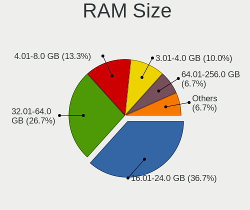
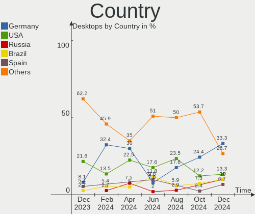
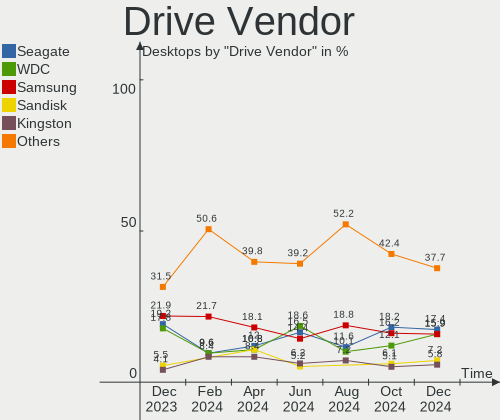
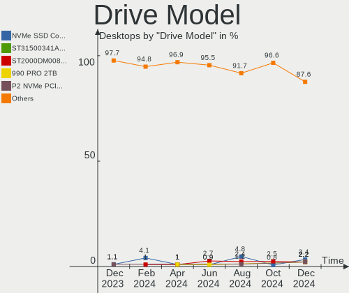
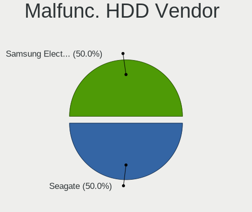
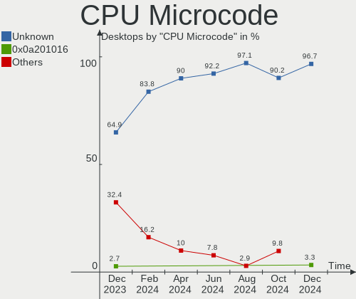
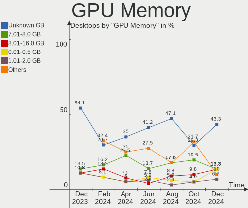
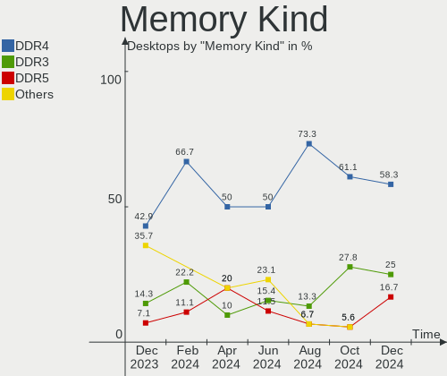

openSUSE - Hardware Trends (Desktops)
-------------------------------------

A project to identify most popular hardware characteristics and track their change
over time based on data collected by Linux users at https://Linux-Hardware.org.

Anyone can contribute to this report by the [hw-probe](https://github.com/linuxhw/hw-probe) tool:

    sudo -E hw-probe -all -upload

This report is for one last month. Overall report since the beginning of time: [TestDays](https://github.com/linuxhw/TestDays)

Period: Jul, 2023.

Contents
--------

* [ System ](#system)
  - [ OS                       ](#os)
  - [ OS Family                ](#os-family)
  - [ Kernel                   ](#kernel)
  - [ Kernel Family            ](#kernel-family)
  - [ Kernel Major Ver.        ](#kernel-major-ver)
  - [ Arch                     ](#arch)
  - [ DE                       ](#de)
  - [ Display Server           ](#display-server)
  - [ Display Manager          ](#display-manager)
  - [ OS Lang                  ](#os-lang)
  - [ Boot Mode                ](#boot-mode)
  - [ Filesystem               ](#filesystem)
  - [ Part. scheme             ](#part-scheme)
  - [ Dual Boot with Linux/BSD ](#dual-boot-with-linuxbsd)
  - [ Dual Boot (Win)          ](#dual-boot-win)

* [ Board ](#board)
  - [ Vendor                   ](#vendor)
  - [ Model                    ](#model)
  - [ Model Family             ](#model-family)
  - [ MFG Year                 ](#mfg-year)
  - [ Form Factor              ](#form-factor)
  - [ Secure Boot              ](#secure-boot)
  - [ Coreboot                 ](#coreboot)
  - [ RAM Size                 ](#ram-size)
  - [ RAM Used                 ](#ram-used)
  - [ Total Drives             ](#total-drives)
  - [ Has CD-ROM               ](#has-cd-rom)
  - [ Has Ethernet             ](#has-ethernet)
  - [ Has WiFi                 ](#has-wifi)
  - [ Has Bluetooth            ](#has-bluetooth)

* [ Location ](#location)
  - [ Country                  ](#country)
  - [ City                     ](#city)

* [ Drives ](#drives)
  - [ Drive Vendor             ](#drive-vendor)
  - [ Drive Model              ](#drive-model)
  - [ HDD Vendor               ](#hdd-vendor)
  - [ SSD Vendor               ](#ssd-vendor)
  - [ Drive Kind               ](#drive-kind)
  - [ Drive Connector          ](#drive-connector)
  - [ Drive Size               ](#drive-size)
  - [ Space Total              ](#space-total)
  - [ Space Used               ](#space-used)
  - [ Malfunc. Drives          ](#malfunc-drives)
  - [ Malfunc. Drive Vendor    ](#malfunc-drive-vendor)
  - [ Malfunc. HDD Vendor      ](#malfunc-hdd-vendor)
  - [ Malfunc. Drive Kind      ](#malfunc-drive-kind)
  - [ Failed Drives            ](#failed-drives)
  - [ Failed Drive Vendor      ](#failed-drive-vendor)
  - [ Drive Status             ](#drive-status)

* [ Storage controller ](#storage-controller)
  - [ Storage Vendor           ](#storage-vendor)
  - [ Storage Model            ](#storage-model)
  - [ Storage Kind             ](#storage-kind)

* [ Processor ](#processor)
  - [ CPU Vendor               ](#cpu-vendor)
  - [ CPU Model                ](#cpu-model)
  - [ CPU Model Family         ](#cpu-model-family)
  - [ CPU Cores                ](#cpu-cores)
  - [ CPU Sockets              ](#cpu-sockets)
  - [ CPU Threads              ](#cpu-threads)
  - [ CPU Op-Modes             ](#cpu-op-modes)
  - [ CPU Microcode            ](#cpu-microcode)
  - [ CPU Microarch            ](#cpu-microarch)

* [ Graphics ](#graphics)
  - [ GPU Vendor               ](#gpu-vendor)
  - [ GPU Model                ](#gpu-model)
  - [ GPU Combo                ](#gpu-combo)
  - [ GPU Driver               ](#gpu-driver)
  - [ GPU Memory               ](#gpu-memory)

* [ Monitor ](#monitor)
  - [ Monitor Vendor           ](#monitor-vendor)
  - [ Monitor Model            ](#monitor-model)
  - [ Monitor Resolution       ](#monitor-resolution)
  - [ Monitor Diagonal         ](#monitor-diagonal)
  - [ Monitor Width            ](#monitor-width)
  - [ Aspect Ratio             ](#aspect-ratio)
  - [ Monitor Area             ](#monitor-area)
  - [ Pixel Density            ](#pixel-density)
  - [ Multiple Monitors        ](#multiple-monitors)

* [ Network ](#network)
  - [ Net Controller Vendor    ](#net-controller-vendor)
  - [ Net Controller Model     ](#net-controller-model)
  - [ Wireless Vendor          ](#wireless-vendor)
  - [ Wireless Model           ](#wireless-model)
  - [ Ethernet Vendor          ](#ethernet-vendor)
  - [ Ethernet Model           ](#ethernet-model)
  - [ Net Controller Kind      ](#net-controller-kind)
  - [ Used Controller          ](#used-controller)
  - [ NICs                     ](#nics)
  - [ IPv6                     ](#ipv6)

* [ Bluetooth ](#bluetooth)
  - [ Bluetooth Vendor         ](#bluetooth-vendor)
  - [ Bluetooth Model          ](#bluetooth-model)

* [ Sound ](#sound)
  - [ Sound Vendor             ](#sound-vendor)
  - [ Sound Model              ](#sound-model)

* [ Memory ](#memory)
  - [ Memory Vendor            ](#memory-vendor)
  - [ Memory Model             ](#memory-model)
  - [ Memory Kind              ](#memory-kind)
  - [ Memory Form Factor       ](#memory-form-factor)
  - [ Memory Size              ](#memory-size)
  - [ Memory Speed             ](#memory-speed)

* [ Printers & scanners ](#printers--scanners)
  - [ Printer Vendor           ](#printer-vendor)
  - [ Printer Model            ](#printer-model)
  - [ Scanner Vendor           ](#scanner-vendor)
  - [ Scanner Model            ](#scanner-model)

* [ Camera ](#camera)
  - [ Camera Vendor            ](#camera-vendor)
  - [ Camera Model             ](#camera-model)

* [ Security ](#security)
  - [ Fingerprint Vendor       ](#fingerprint-vendor)
  - [ Fingerprint Model        ](#fingerprint-model)
  - [ Chipcard Vendor          ](#chipcard-vendor)
  - [ Chipcard Model           ](#chipcard-model)

* [ Unsupported ](#unsupported)
  - [ Unsupported Devices      ](#unsupported-devices)
  - [ Unsupported Device Types ](#unsupported-device-types)

System
------

OS
--

Installed operating systems

| Name                         | Desktops | Percent |
|------------------------------|----------|---------|
| openSUSE Tumbleweed-XXXXXXXX | 20       | 46.51%  |
| openSUSE Leap-15.5           | 17       | 39.53%  |
| openSUSE Microos-XXXXXXXX    | 4        | 9.3%    |
| openSUSE Leap-15.4           | 2        | 4.65%   |

OS Family
---------

OS without a version

| Name     | Desktops | Percent |
|----------|----------|---------|
| openSUSE | 43       | 100%    |

Kernel
------

Version of the Linux kernel

| Version                        | Desktops | Percent |
|--------------------------------|----------|---------|
| 5.14.21-150500.53-default      | 10       | 23.26%  |
| 6.3.9-1-default                | 9        | 20.93%  |
| 5.14.21-150500.55.7-default    | 6        | 13.95%  |
| 6.4.3-1-default                | 5        | 11.63%  |
| 6.4.2-1-default                | 5        | 11.63%  |
| 6.4.4-1-default                | 4        | 9.3%    |
| 5.14.21-150400.24.63-default   | 2        | 4.65%   |
| 6.4.4-lp154.2.g919c802-default | 1        | 2.33%   |
| 6.3.6-1-default                | 1        | 2.33%   |

Kernel Family
-------------

Linux kernel without a distro release

| Version | Desktops | Percent |
|---------|----------|---------|
| 5.14.21 | 18       | 41.86%  |
| 6.3.9   | 9        | 20.93%  |
| 6.4.4   | 5        | 11.63%  |
| 6.4.3   | 5        | 11.63%  |
| 6.4.2   | 5        | 11.63%  |
| 6.3.6   | 1        | 2.33%   |

Kernel Major Ver.
-----------------

Linux kernel major version

| Version | Desktops | Percent |
|---------|----------|---------|
| 5.14    | 18       | 41.86%  |
| 6.4     | 15       | 34.88%  |
| 6.3     | 10       | 23.26%  |

Arch
----

OS architecture (x86_64, i586, etc.)

| Name   | Desktops | Percent |
|--------|----------|---------|
| x86_64 | 43       | 100%    |

DE
--

Desktop Environment

| Name    | Desktops | Percent |
|---------|----------|---------|
| KDE5    | 27       | 62.79%  |
| GNOME   | 14       | 32.56%  |
| XFCE    | 1        | 2.33%   |
| Unknown | 1        | 2.33%   |

Display Server
--------------

X11 or Wayland

| Name    | Desktops | Percent |
|---------|----------|---------|
| X11     | 28       | 65.12%  |
| Wayland | 15       | 34.88%  |

Display Manager
---------------

SDDM, LightDM, etc.

| Name    | Desktops | Percent |
|---------|----------|---------|
| Unknown | 28       | 65.12%  |
| SDDM    | 12       | 27.91%  |
| XDM     | 1        | 2.33%   |
| LightDM | 1        | 2.33%   |
| GDM     | 1        | 2.33%   |

OS Lang
-------

Language

| Lang  | Desktops | Percent |
|-------|----------|---------|
| en_US | 12       | 27.91%  |
| de_DE | 8        | 18.6%   |
| pt_BR | 5        | 11.63%  |
| es_ES | 4        | 9.3%    |
| C     | 3        | 6.98%   |
| it_IT | 2        | 4.65%   |
| es_DO | 2        | 4.65%   |
| zh_TW | 1        | 2.33%   |
| POSIX | 1        | 2.33%   |
| nl_NL | 1        | 2.33%   |
| nl_BE | 1        | 2.33%   |
| fr_FR | 1        | 2.33%   |
| en_GB | 1        | 2.33%   |
| en_AU | 1        | 2.33%   |

Boot Mode
---------

EFI or BIOS

| Mode | Desktops | Percent |
|------|----------|---------|
| BIOS | 24       | 55.81%  |
| EFI  | 19       | 44.19%  |

Filesystem
----------

Type of filesystem

| Type  | Desktops | Percent |
|-------|----------|---------|
| Btrfs | 37       | 86.05%  |
| Ext4  | 4        | 9.3%    |
| Zfs   | 1        | 2.33%   |
| Tmpfs | 1        | 2.33%   |

Part. scheme
------------

Scheme of partitioning

| Type    | Desktops | Percent |
|---------|----------|---------|
| Unknown | 28       | 65.12%  |
| GPT     | 14       | 32.56%  |
| MBR     | 1        | 2.33%   |

Dual Boot with Linux/BSD
------------------------

Hosting more than one Linux/BSD

| Dual boot | Desktops | Percent |
|-----------|----------|---------|
| No        | 35       | 81.4%   |
| Yes       | 8        | 18.6%   |

Dual Boot (Win)
---------------

Hosting Linux and Windows

| Dual boot | Desktops | Percent |
|-----------|----------|---------|
| No        | 38       | 88.37%  |
| Yes       | 5        | 11.63%  |

Board
-----

Vendor
------

Motherboard manufacturer

| Name                | Desktops | Percent |
|---------------------|----------|---------|
| ASUSTek Computer    | 12       | 27.91%  |
| Gigabyte Technology | 11       | 25.58%  |
| MSI                 | 6        | 13.95%  |
| ASRock              | 5        | 11.63%  |
| Hewlett-Packard     | 4        | 9.3%    |
| Dell                | 2        | 4.65%   |
| Lenovo              | 1        | 2.33%   |
| Biostar             | 1        | 2.33%   |
| Acer                | 1        | 2.33%   |

Model
-----

Motherboard model

| Name                                | Desktops | Percent |
|-------------------------------------|----------|---------|
| MSI MS-7C95                         | 1        | 2.33%   |
| MSI MS-7C52                         | 1        | 2.33%   |
| MSI MS-7C51                         | 1        | 2.33%   |
| MSI MS-7C02                         | 1        | 2.33%   |
| MSI MS-7816                         | 1        | 2.33%   |
| MSI MS-7522                         | 1        | 2.33%   |
| Lenovo ThinkCentre M720t 10SQ0070GE | 1        | 2.33%   |
| HP Z420 Workstation                 | 1        | 2.33%   |
| HP Z400 Workstation                 | 1        | 2.33%   |
| HP Pavilion Desktop TP01-4xxx       | 1        | 2.33%   |
| HP Compaq 6000 Pro MT PC            | 1        | 2.33%   |
| Gigabyte Z690 AERO D                | 1        | 2.33%   |
| Gigabyte Z68AP-D3                   | 1        | 2.33%   |
| Gigabyte X670E AORUS MASTER         | 1        | 2.33%   |
| Gigabyte H55M-UD2H                  | 1        | 2.33%   |
| Gigabyte GA-880GMA-UD2H             | 1        | 2.33%   |
| Gigabyte G41MT-S2P                  | 1        | 2.33%   |
| Gigabyte G1.Sniper H6               | 1        | 2.33%   |
| Gigabyte B550M DS3H                 | 1        | 2.33%   |
| Gigabyte B550M AORUS PRO-P          | 1        | 2.33%   |
| Gigabyte B550I AORUS PRO AX         | 1        | 2.33%   |
| Gigabyte B450M DS3H                 | 1        | 2.33%   |
| Dell Precision T3600                | 1        | 2.33%   |
| Dell OptiPlex 9020                  | 1        | 2.33%   |
| Biostar A320MH                      | 1        | 2.33%   |
| ASUS Z77-A                          | 1        | 2.33%   |
| ASUS TUF Gaming X570-PLUS           | 1        | 2.33%   |
| ASUS ROG STRIX B550-F GAMING        | 1        | 2.33%   |
| ASUS PRIME X370-PRO                 | 1        | 2.33%   |
| ASUS PRIME B660M-K D4               | 1        | 2.33%   |
| ASUS PRIME B450M-GAMING/BR          | 1        | 2.33%   |
| ASUS PRIME B360-PLUS                | 1        | 2.33%   |
| ASUS PRIME A320M-K/BR               | 1        | 2.33%   |
| ASUS PRIME A320M-K                  | 1        | 2.33%   |
| ASUS P5E Deluxe                     | 1        | 2.33%   |
| ASUS P5B-Deluxe                     | 1        | 2.33%   |
| ASUS H110M-R                        | 1        | 2.33%   |
| ASRock Z390 Phantom Gaming 9        | 1        | 2.33%   |
| ASRock X570 Steel Legend            | 1        | 2.33%   |
| ASRock B450M Pro4 R2.0              | 1        | 2.33%   |

Model Family
------------

Motherboard model prefix

| Name                    | Desktops | Percent |
|-------------------------|----------|---------|
| ASUS PRIME              | 6        | 13.95%  |
| Gigabyte B550M          | 2        | 4.65%   |
| ASRock B450M            | 2        | 4.65%   |
| MSI MS-7C95             | 1        | 2.33%   |
| MSI MS-7C52             | 1        | 2.33%   |
| MSI MS-7C51             | 1        | 2.33%   |
| MSI MS-7C02             | 1        | 2.33%   |
| MSI MS-7816             | 1        | 2.33%   |
| MSI MS-7522             | 1        | 2.33%   |
| Lenovo ThinkCentre      | 1        | 2.33%   |
| HP Z420                 | 1        | 2.33%   |
| HP Z400                 | 1        | 2.33%   |
| HP Pavilion             | 1        | 2.33%   |
| HP Compaq               | 1        | 2.33%   |
| Gigabyte Z690           | 1        | 2.33%   |
| Gigabyte Z68AP-D3       | 1        | 2.33%   |
| Gigabyte X670E          | 1        | 2.33%   |
| Gigabyte H55M-UD2H      | 1        | 2.33%   |
| Gigabyte GA-880GMA-UD2H | 1        | 2.33%   |
| Gigabyte G41MT-S2P      | 1        | 2.33%   |
| Gigabyte G1.Sniper      | 1        | 2.33%   |
| Gigabyte B550I          | 1        | 2.33%   |
| Gigabyte B450M          | 1        | 2.33%   |
| Dell Precision          | 1        | 2.33%   |
| Dell OptiPlex           | 1        | 2.33%   |
| Biostar A320MH          | 1        | 2.33%   |
| ASUS Z77-A              | 1        | 2.33%   |
| ASUS TUF                | 1        | 2.33%   |
| ASUS ROG                | 1        | 2.33%   |
| ASUS P5E                | 1        | 2.33%   |
| ASUS P5B-Deluxe         | 1        | 2.33%   |
| ASUS H110M-R            | 1        | 2.33%   |
| ASRock Z390             | 1        | 2.33%   |
| ASRock X570             | 1        | 2.33%   |
| ASRock A520M-ITX        | 1        | 2.33%   |
| Acer Aspire             | 1        | 2.33%   |

MFG Year
--------

Motherboard manufacture year

| Year | Desktops | Percent |
|------|----------|---------|
| 2018 | 7        | 16.28%  |
| 2020 | 5        | 11.63%  |
| 2019 | 4        | 9.3%    |
| 2010 | 4        | 9.3%    |
| 2023 | 3        | 6.98%   |
| 2017 | 3        | 6.98%   |
| 2009 | 3        | 6.98%   |
| 2022 | 2        | 4.65%   |
| 2021 | 2        | 4.65%   |
| 2014 | 2        | 4.65%   |
| 2013 | 2        | 4.65%   |
| 2012 | 2        | 4.65%   |
| 2016 | 1        | 2.33%   |
| 2011 | 1        | 2.33%   |
| 2008 | 1        | 2.33%   |
| 2006 | 1        | 2.33%   |

Form Factor
-----------

Physical design of the computer

| Name    | Desktops | Percent |
|---------|----------|---------|
| Desktop | 43       | 100%    |

Secure Boot
-----------

Enabled or disabled

| State    | Desktops | Percent |
|----------|----------|---------|
| Disabled | 40       | 93.02%  |
| Enabled  | 3        | 6.98%   |

Coreboot
--------

Have coreboot on board

| Used | Desktops | Percent |
|------|----------|---------|
| No   | 43       | 100%    |

RAM Size
--------

Total RAM memory

| Size in GB  | Desktops | Percent |
|-------------|----------|---------|
| 16.01-24.0  | 16       | 37.21%  |
| 8.01-16.0   | 8        | 18.6%   |
| 4.01-8.0    | 6        | 13.95%  |
| 32.01-64.0  | 6        | 13.95%  |
| 3.01-4.0    | 2        | 4.65%   |
| 24.01-32.0  | 2        | 4.65%   |
| 64.01-256.0 | 2        | 4.65%   |
| 1.01-2.0    | 1        | 2.33%   |

RAM Used
--------

Used RAM memory

| Used GB    | Desktops | Percent |
|------------|----------|---------|
| 2.01-3.0   | 15       | 34.88%  |
| 4.01-8.0   | 11       | 25.58%  |
| 3.01-4.0   | 10       | 23.26%  |
| 1.01-2.0   | 5        | 11.63%  |
| 24.01-32.0 | 1        | 2.33%   |
| 8.01-16.0  | 1        | 2.33%   |

Total Drives
------------

Number of drives on board

| Drives | Desktops | Percent |
|--------|----------|---------|
| 2      | 17       | 39.53%  |
| 1      | 16       | 37.21%  |
| 4      | 5        | 11.63%  |
| 5      | 2        | 4.65%   |
| 3      | 2        | 4.65%   |
| 13     | 1        | 2.33%   |

Has CD-ROM
----------

Has CD-ROM on board

| Presented | Desktops | Percent |
|-----------|----------|---------|
| Yes       | 25       | 58.14%  |
| No        | 18       | 41.86%  |

Has Ethernet
------------

Has Ethernet on board

| Presented | Desktops | Percent |
|-----------|----------|---------|
| Yes       | 43       | 100%    |

Has WiFi
--------

Has WiFi module

| Presented | Desktops | Percent |
|-----------|----------|---------|
| No        | 22       | 51.16%  |
| Yes       | 21       | 48.84%  |

Has Bluetooth
-------------

Has Bluetooth module

| Presented | Desktops | Percent |
|-----------|----------|---------|
| No        | 26       | 60.47%  |
| Yes       | 17       | 39.53%  |

Location
--------

Country
-------

Geographic location (country)

| Country     | Desktops | Percent |
|-------------|----------|---------|
| Germany     | 10       | 23.26%  |
| USA         | 7        | 16.28%  |
| Brazil      | 5        | 11.63%  |
| Italy       | 3        | 6.98%   |
| France      | 2        | 4.65%   |
| Chile       | 2        | 4.65%   |
| Belgium     | 2        | 4.65%   |
| UK          | 1        | 2.33%   |
| Taiwan      | 1        | 2.33%   |
| Spain       | 1        | 2.33%   |
| Singapore   | 1        | 2.33%   |
| Russia      | 1        | 2.33%   |
| Netherlands | 1        | 2.33%   |
| Mexico      | 1        | 2.33%   |
| Hungary     | 1        | 2.33%   |
| Guatemala   | 1        | 2.33%   |
| Colombia    | 1        | 2.33%   |
| Australia   | 1        | 2.33%   |
| Algeria     | 1        | 2.33%   |

City
----

Geographic location (city)

| City                    | Desktops | Percent |
|-------------------------|----------|---------|
| Stuttgart               | 2        | 4.65%   |
| Port Montt              | 2        | 4.65%   |
| Zetel                   | 1        | 2.33%   |
| West Bend               | 1        | 2.33%   |
| Tessenderlo             | 1        | 2.33%   |
| Tainan City             | 1        | 2.33%   |
| Singapore               | 1        | 2.33%   |
| Santa Maria             | 1        | 2.33%   |
| Saint-Andre-le-Puy      | 1        | 2.33%   |
| Sacramento              | 1        | 2.33%   |
| Rostov-on-Don           | 1        | 2.33%   |
| Paisley                 | 1        | 2.33%   |
| Paderno Dugnano         | 1        | 2.33%   |
| Natal                   | 1        | 2.33%   |
| Munich                  | 1        | 2.33%   |
| Milan                   | 1        | 2.33%   |
| Mexico City             | 1        | 2.33%   |
| Medellín               | 1        | 2.33%   |
| Mechelen                | 1        | 2.33%   |
| Mainburg                | 1        | 2.33%   |
| Madrid                  | 1        | 2.33%   |
| Los Angeles             | 1        | 2.33%   |
| Lohne                   | 1        | 2.33%   |
| Lake Zurich             | 1        | 2.33%   |
| Guidel                  | 1        | 2.33%   |
| Guatemala City          | 1        | 2.33%   |
| Frankfurt am Main       | 1        | 2.33%   |
| Frankenberg             | 1        | 2.33%   |
| Enschede                | 1        | 2.33%   |
| Curitiba                | 1        | 2.33%   |
| Constantine             | 1        | 2.33%   |
| Cherry Hill             | 1        | 2.33%   |
| Cariacica               | 1        | 2.33%   |
| Cabo de Santo Agostinho | 1        | 2.33%   |
| Budapest                | 1        | 2.33%   |
| Brisbane                | 1        | 2.33%   |
| Bixby                   | 1        | 2.33%   |
| Berlin                  | 1        | 2.33%   |
| Bentonville             | 1        | 2.33%   |
| Augsburg                | 1        | 2.33%   |

Drives
------

Drive Vendor
------------

Hard drive vendors

| Vendor                      | Desktops | Drives  | Percent |
|-----------------------------|----------|---------|---------|
| Seagate                     | 18       | 24      | 22.22%  |
| WDC                         | 8        | 11      | 9.88%   |
| Samsung Electronics         | 7        | 11      | 8.64%   |
| Kingston                    | 7        | 7       | 8.64%   |
| Toshiba                     | 5        | 7       | 6.17%   |
| SanDisk                     | 5        | 5       | 6.17%   |
| Crucial                     | 5        | 5       | 6.17%   |
| SPCC                        | 3        | 4       | 3.7%    |
| Phison Electronics          | 3        | 3       | 3.7%    |
| XrayDisk                    | 2        | 2       | 2.47%   |
| Hitachi                     | 2        | 2       | 2.47%   |
| Fanxiang                    | 2        | 2       | 2.47%   |
| Transcend                   | 1        | 1       | 1.23%   |
| Team                        | 1        | 1       | 1.23%   |
| Silicon Motion              | 1        | 1       | 1.23%   |
| OCZ                         | 1        | 1       | 1.23%   |
| Micron/Crucial Technology   | 1        | 1       | 1.23%   |
| Micron Technology           | 1        | 1       | 1.23%   |
| Leven                       | 1        | 1       | 1.23%   |
| Kingston Technology Company | 1        | 1       | 1.23%   |
| Intel                       | 1        | 1       | 1.23%   |
| HL-DT-ST                    | 1        | Unknown | 1.23%   |
| Hewlett-Packard             | 1        | 5       | 1.23%   |
| Corsair                     | 1        | 1       | 1.23%   |
| China                       | 1        | 1       | 1.23%   |
| A-DATA Technology           | 1        | 1       | 1.23%   |

Drive Model
-----------

Hard drive models

| Model                                               | Desktops | Percent |
|-----------------------------------------------------|----------|---------|
| Seagate ST1000DM003-1ER162 1TB                      | 3        | 3.19%   |
| WDC WD40EZRZ-00GXCB0 4TB                            | 2        | 2.13%   |
| WDC WD20EZRX-00DC0B0 2TB                            | 2        | 2.13%   |
| Seagate ST8000DM004-2U9188 8TB                      | 2        | 2.13%   |
| Seagate ST2000DM008-2FR102 2TB                      | 2        | 2.13%   |
| Seagate ST1000DM010-2EP102 1TB                      | 2        | 2.13%   |
| SanDisk SSD PLUS 240GB                              | 2        | 2.13%   |
| Samsung NVMe SSD Controller SM981/PM981/PM983 500GB | 2        | 2.13%   |
| Phison E16 PCIe4 NVMe Controller 1TB                | 2        | 2.13%   |
| Kingston SA400S37480G 480GB SSD                     | 2        | 2.13%   |
| Kingston SA400S37240G 240GB SSD                     | 2        | 2.13%   |
| Crucial CT480BX500SSD1 480GB                        | 2        | 2.13%   |
| XrayDisk 256GB                                      | 1        | 1.06%   |
| XrayDisk 128GB                                      | 1        | 1.06%   |
| WDC WDS250G1B0A-00H9H0 250GB SSD                    | 1        | 1.06%   |
| WDC WD3200AAKX-00ERMA0 320GB                        | 1        | 1.06%   |
| WDC WD3200AAJS-60Z0A0 320GB                         | 1        | 1.06%   |
| WDC WD2002FAEX-007BA0 2TB                           | 1        | 1.06%   |
| WDC WD10EZEX-08WN4A0 1TB                            | 1        | 1.06%   |
| WDC WD1002FAEX-00Z3A0 1TB                           | 1        | 1.06%   |
| WDC WD Blue SA510 2.5 2TB SSD                       | 1        | 1.06%   |
| Transcend TS120GSSD220S 120GB                       | 1        | 1.06%   |
| Toshiba TR200 240GB SSD                             | 1        | 1.06%   |
| Toshiba MG07ACA14TE 14TB                            | 1        | 1.06%   |
| Toshiba MD04ACA400 4TB                              | 1        | 1.06%   |
| Toshiba HDWE160 6TB                                 | 1        | 1.06%   |
| Toshiba HDWE150 5TB                                 | 1        | 1.06%   |
| Toshiba HDWD120 2TB                                 | 1        | 1.06%   |
| Toshiba HDWD110 1TB                                 | 1        | 1.06%   |
| Team TM8PS7256G 256GB SSD                           | 1        | 1.06%   |
| SPCC Solid State Disk 256GB                         | 1        | 1.06%   |
| SPCC Solid State Disk 1TB                           | 1        | 1.06%   |
| SPCC NVMe SSD Drive 4TB                             | 1        | 1.06%   |
| Silicon Motion SM2262/SM2262EN SSD Controller 512GB | 1        | 1.06%   |
| Seagate ST8000AS0002-1NA17Z 8TB                     | 1        | 1.06%   |
| Seagate ST4000NM0035-1V4107 4TB                     | 1        | 1.06%   |
| Seagate ST33000650SS 3TB                            | 1        | 1.06%   |
| Seagate ST3250410AS 250GB                           | 1        | 1.06%   |
| Seagate ST3200827AS 200GB                           | 1        | 1.06%   |
| Seagate ST31000424CS 1TB                            | 1        | 1.06%   |

HDD Vendor
----------

Hard disk drive vendors

| Vendor              | Desktops | Drives | Percent |
|---------------------|----------|--------|---------|
| Seagate             | 18       | 24     | 54.55%  |
| WDC                 | 7        | 9      | 21.21%  |
| Toshiba             | 4        | 6      | 12.12%  |
| Hitachi             | 2        | 2      | 6.06%   |
| Samsung Electronics | 1        | 1      | 3.03%   |
| Hewlett-Packard     | 1        | 5      | 3.03%   |

SSD Vendor
----------

Solid state drive vendors

| Vendor              | Desktops | Drives | Percent |
|---------------------|----------|--------|---------|
| Kingston            | 7        | 7      | 21.21%  |
| Crucial             | 5        | 5      | 15.15%  |
| Samsung Electronics | 4        | 6      | 12.12%  |
| WDC                 | 2        | 2      | 6.06%   |
| SPCC                | 2        | 3      | 6.06%   |
| SanDisk             | 2        | 2      | 6.06%   |
| Transcend           | 1        | 1      | 3.03%   |
| Toshiba             | 1        | 1      | 3.03%   |
| Team                | 1        | 1      | 3.03%   |
| OCZ                 | 1        | 1      | 3.03%   |
| Micron Technology   | 1        | 1      | 3.03%   |
| Leven               | 1        | 1      | 3.03%   |
| Intel               | 1        | 1      | 3.03%   |
| Fanxiang            | 1        | 1      | 3.03%   |
| Corsair             | 1        | 1      | 3.03%   |
| China               | 1        | 1      | 3.03%   |
| A-DATA Technology   | 1        | 1      | 3.03%   |

Drive Kind
----------

HDD or SSD

| Kind    | Desktops | Drives | Percent |
|---------|----------|--------|---------|
| SSD     | 26       | 36     | 38.81%  |
| HDD     | 26       | 47     | 38.81%  |
| NVMe    | 12       | 15     | 17.91%  |
| Unknown | 3        | 2      | 4.48%   |

Drive Connector
---------------

SATA, SAS, NVMe, etc.

| Type | Desktops | Drives | Percent |
|------|----------|--------|---------|
| SATA | 37       | 75     | 69.81%  |
| NVMe | 12       | 15     | 22.64%  |
| SAS  | 4        | 10     | 7.55%   |

Drive Size
----------

Size of hard drive

| Size in TB | Desktops | Drives | Percent |
|------------|----------|--------|---------|
| 0.01-0.5   | 23       | 29     | 35.38%  |
| 0.51-1.0   | 18       | 20     | 27.69%  |
| 1.01-2.0   | 11       | 12     | 16.92%  |
| 3.01-4.0   | 5        | 6      | 7.69%   |
| 4.01-10.0  | 4        | 5      | 6.15%   |
| 2.01-3.0   | 2        | 9      | 3.08%   |
| 10.01-20.0 | 2        | 2      | 3.08%   |

Space Total
-----------

Amount of disk space available on the file system

| Size in GB     | Desktops | Percent |
|----------------|----------|---------|
| More than 3000 | 20       | 46.51%  |
| 1001-2000      | 10       | 23.26%  |
| 2001-3000      | 5        | 11.63%  |
| 501-1000       | 3        | 6.98%   |
| 251-500        | 2        | 4.65%   |
| 101-250        | 2        | 4.65%   |
| Unknown        | 1        | 2.33%   |

Space Used
----------

Amount of used disk space

| Used GB        | Desktops | Percent |
|----------------|----------|---------|
| 101-250        | 9        | 20.93%  |
| 1001-2000      | 8        | 18.6%   |
| 51-100         | 7        | 16.28%  |
| 251-500        | 6        | 13.95%  |
| More than 3000 | 4        | 9.3%    |
| 501-1000       | 4        | 9.3%    |
| 21-50          | 2        | 4.65%   |
| 2001-3000      | 2        | 4.65%   |
| Unknown        | 1        | 2.33%   |

Malfunc. Drives
---------------

Drive models with a malfunction

| Model                           | Desktops | Drives | Percent |
|---------------------------------|----------|--------|---------|
| Transcend TS120GSSD220S 120GB   | 1        | 1      | 25%     |
| Toshiba MD04ACA400 4TB          | 1        | 1      | 25%     |
| Seagate ST4000NM0035-1V4107 4TB | 1        | 1      | 25%     |
| Seagate ST2000DM001-1ER164 2TB  | 1        | 1      | 25%     |

Malfunc. Drive Vendor
---------------------

Vendors of faulty drives

| Vendor    | Desktops | Drives | Percent |
|-----------|----------|--------|---------|
| Seagate   | 2        | 2      | 50%     |
| Transcend | 1        | 1      | 25%     |
| Toshiba   | 1        | 1      | 25%     |

Malfunc. HDD Vendor
-------------------

Vendors of faulty HDD drives

| Vendor  | Desktops | Drives | Percent |
|---------|----------|--------|---------|
| Seagate | 2        | 2      | 66.67%  |
| Toshiba | 1        | 1      | 33.33%  |

Malfunc. Drive Kind
-------------------

Kinds of faulty drives

| Kind | Desktops | Drives | Percent |
|------|----------|--------|---------|
| HDD  | 3        | 3      | 75%     |
| SSD  | 1        | 1      | 25%     |

Failed Drives
-------------

Failed drive models

Zero info for selected period =(

Failed Drive Vendor
-------------------

Failed drive vendors

Zero info for selected period =(

Drive Status
------------

Number of failed and malfunc. drives

| Status   | Desktops | Drives | Percent |
|----------|----------|--------|---------|
| Detected | 30       | 68     | 63.83%  |
| Works    | 14       | 28     | 29.79%  |
| Malfunc  | 3        | 4      | 6.38%   |

Storage controller
------------------

Storage Vendor
--------------

Storage controller vendors

| Vendor                      | Desktops | Percent |
|-----------------------------|----------|---------|
| AMD                         | 21       | 32.81%  |
| Intel                       | 20       | 31.25%  |
| Samsung Electronics         | 4        | 6.25%   |
| JMicron Technology          | 4        | 6.25%   |
| SanDisk                     | 3        | 4.69%   |
| Phison Electronics          | 3        | 4.69%   |
| INNOGRIT                    | 2        | 3.13%   |
| VIA Technologies            | 1        | 1.56%   |
| Silicon Motion              | 1        | 1.56%   |
| Nvidia                      | 1        | 1.56%   |
| Micron/Crucial Technology   | 1        | 1.56%   |
| Kingston Technology Company | 1        | 1.56%   |
| Broadcom / LSI              | 1        | 1.56%   |
| ASMedia Technology          | 1        | 1.56%   |

Storage Model
-------------

Storage controller models

| Model                                                                                   | Desktops | Percent |
|-----------------------------------------------------------------------------------------|----------|---------|
| AMD FCH SATA Controller [AHCI mode]                                                     | 12       | 14.81%  |
| AMD 500 Series Chipset SATA Controller                                                  | 6        | 7.41%   |
| AMD FCH SATA Controller D                                                               | 5        | 6.17%   |
| AMD 400 Series Chipset SATA Controller                                                  | 5        | 6.17%   |
| Samsung NVMe SSD Controller SM981/PM981/PM983                                           | 2        | 2.47%   |
| Phison E16 PCIe4 NVMe Controller                                                        | 2        | 2.47%   |
| JMicron JMB368 IDE controller                                                           | 2        | 2.47%   |
| JMicron JMB363 SATA/IDE Controller                                                      | 2        | 2.47%   |
| Intel Cannon Lake PCH SATA AHCI Controller                                              | 2        | 2.47%   |
| Intel C602 chipset 4-Port SATA Storage Control Unit                                     | 2        | 2.47%   |
| Intel Alder Lake-S PCH SATA Controller [AHCI Mode]                                      | 2        | 2.47%   |
| Intel 82801JI (ICH10 Family) 4 port SATA IDE Controller #1                              | 2        | 2.47%   |
| Intel 82801JI (ICH10 Family) 2 port SATA IDE Controller #2                              | 2        | 2.47%   |
| Intel 8 Series/C220 Series Chipset Family 6-port SATA Controller 1 [AHCI mode]          | 2        | 2.47%   |
| INNOGRIT NVMe SSD Controller IG5236                                                     | 2        | 2.47%   |
| VIA VT6421 IDE/SATA Controller                                                          | 1        | 1.23%   |
| Silicon Motion SM2262/SM2262EN SSD Controller                                           | 1        | 1.23%   |
| Sandisk Western Digital WD Black SN850X NVMe SSD                                        | 1        | 1.23%   |
| SanDisk WD Blue SN570 NVMe SSD 1TB                                                      | 1        | 1.23%   |
| SanDisk WD Blue SN550 NVMe SSD                                                          | 1        | 1.23%   |
| Samsung NVMe SSD Controller SM961/PM961/SM963                                           | 1        | 1.23%   |
| Samsung NVMe SSD Controller 980                                                         | 1        | 1.23%   |
| Phison E18 PCIe4 NVMe Controller                                                        | 1        | 1.23%   |
| Nvidia MCP79 AHCI Controller                                                            | 1        | 1.23%   |
| Micron/Crucial P2 [Nick P2] / P3 / P3 Plus NVMe PCIe SSD (DRAM-less)                    | 1        | 1.23%   |
| Kingston Company Company Non-Volatile memory controller                                 | 1        | 1.23%   |
| Intel Volume Management Device NVMe RAID Controller                                     | 1        | 1.23%   |
| Intel SATA Controller [RAID mode]                                                       | 1        | 1.23%   |
| Intel Q170/Q150/B150/H170/H110/Z170/CM236 Chipset SATA Controller [AHCI Mode]           | 1        | 1.23%   |
| Intel NM10/ICH7 Family SATA Controller [IDE mode]                                       | 1        | 1.23%   |
| Intel C600/X79 series chipset SATA RAID Controller                                      | 1        | 1.23%   |
| Intel C600/X79 series chipset IDE-r Controller                                          | 1        | 1.23%   |
| Intel C600/X79 series chipset 6-Port SATA AHCI Controller                               | 1        | 1.23%   |
| Intel 9 Series Chipset Family SATA Controller [AHCI Mode]                               | 1        | 1.23%   |
| Intel 82801JD/DO (ICH10 Family) SATA AHCI Controller                                    | 1        | 1.23%   |
| Intel 82801IR/IO/IH (ICH9R/DO/DH) 6 port SATA Controller [AHCI mode]                    | 1        | 1.23%   |
| Intel 82801HR/HO/HH (ICH8R/DO/DH) 6 port SATA Controller [AHCI mode]                    | 1        | 1.23%   |
| Intel 7 Series/C210 Series Chipset Family 6-port SATA Controller [AHCI mode]            | 1        | 1.23%   |
| Intel 6 Series/C200 Series Chipset Family Desktop SATA Controller (IDE mode, ports 4-5) | 1        | 1.23%   |
| Intel 6 Series/C200 Series Chipset Family Desktop SATA Controller (IDE mode, ports 0-3) | 1        | 1.23%   |

Storage Kind
------------

Kind of storage controller (IDE, SATA, NVMe, SAS, ...)

| Kind | Desktops | Percent |
|------|----------|---------|
| SATA | 36       | 57.14%  |
| NVMe | 12       | 19.05%  |
| IDE  | 8        | 12.7%   |
| RAID | 5        | 7.94%   |
| SAS  | 2        | 3.17%   |

Processor
---------

CPU Vendor
----------

Processor vendors

| Vendor | Desktops | Percent |
|--------|----------|---------|
| Intel  | 22       | 51.16%  |
| AMD    | 21       | 48.84%  |

CPU Model
---------

Processor models

| Model                                           | Desktops | Percent |
|-------------------------------------------------|----------|---------|
| AMD Ryzen 5 5600X 6-Core Processor              | 2        | 4.65%   |
| AMD Ryzen 5 5600G with Radeon Graphics          | 2        | 4.65%   |
| AMD Ryzen 5 3600 6-Core Processor               | 2        | 4.65%   |
| AMD Ryzen 5 2600 Six-Core Processor             | 2        | 4.65%   |
| AMD Athlon 3000G with Radeon Vega Graphics      | 2        | 4.65%   |
| Intel Xeon CPU W3530 @ 2.80GHz                  | 1        | 2.33%   |
| Intel Xeon CPU E5450 @ 3.00GHz                  | 1        | 2.33%   |
| Intel Xeon CPU E5-2670 0 @ 2.60GHz              | 1        | 2.33%   |
| Intel Xeon CPU E5-1603 0 @ 2.80GHz              | 1        | 2.33%   |
| Intel Pentium Dual-Core CPU E6500 @ 2.93GHz     | 1        | 2.33%   |
| Intel Pentium CPU G3250 @ 3.20GHz               | 1        | 2.33%   |
| Intel Core i7-9700 CPU @ 3.00GHz                | 1        | 2.33%   |
| Intel Core i7-8700 CPU @ 3.20GHz                | 1        | 2.33%   |
| Intel Core i7-2600K CPU @ 3.40GHz               | 1        | 2.33%   |
| Intel Core i7 CPU K 875 @ 2.93GHz               | 1        | 2.33%   |
| Intel Core i7 CPU 950 @ 3.07GHz                 | 1        | 2.33%   |
| Intel Core i5-9400 CPU @ 2.90GHz                | 1        | 2.33%   |
| Intel Core i5-4590 CPU @ 3.30GHz                | 1        | 2.33%   |
| Intel Core i5-4460 CPU @ 3.20GHz                | 1        | 2.33%   |
| Intel Core i5-3570K CPU @ 3.40GHz               | 1        | 2.33%   |
| Intel Core i3-6100 CPU @ 3.70GHz                | 1        | 2.33%   |
| Intel Core 2 Quad CPU Q8400 @ 2.66GHz           | 1        | 2.33%   |
| Intel Core 2 Duo CPU E8400 @ 3.00GHz            | 1        | 2.33%   |
| Intel Atom CPU 230 @ 1.60GHz                    | 1        | 2.33%   |
| Intel 13th Gen Core i7-13700K                   | 1        | 2.33%   |
| Intel 13th Gen Core i7-13700F                   | 1        | 2.33%   |
| Intel 12th Gen Core i5-12400                    | 1        | 2.33%   |
| AMD Ryzen 9 7900X 12-Core Processor             | 1        | 2.33%   |
| AMD Ryzen 7 5800X 8-Core Processor              | 1        | 2.33%   |
| AMD Ryzen 7 5700G with Radeon Graphics          | 1        | 2.33%   |
| AMD Ryzen 7 3700X 8-Core Processor              | 1        | 2.33%   |
| AMD Ryzen 7 1700X Eight-Core Processor          | 1        | 2.33%   |
| AMD Ryzen 5 4600G with Radeon Graphics          | 1        | 2.33%   |
| AMD Ryzen 5 3600XT 6-Core Processor             | 1        | 2.33%   |
| AMD Ryzen 5 3400G with Radeon Vega Graphics     | 1        | 2.33%   |
| AMD Ryzen 3 PRO 2200G with Radeon Vega Graphics | 1        | 2.33%   |
| AMD Ryzen 3 3200G with Radeon Vega Graphics     | 1        | 2.33%   |
| AMD Phenom II X4 955 Processor                  | 1        | 2.33%   |

CPU Model Family
----------------

Processor model prefix

| Model                   | Desktops | Percent |
|-------------------------|----------|---------|
| AMD Ryzen 5             | 11       | 25.58%  |
| Intel Core i7           | 5        | 11.63%  |
| Intel Xeon              | 4        | 9.3%    |
| Intel Core i5           | 4        | 9.3%    |
| AMD Ryzen 7             | 4        | 9.3%    |
| Other                   | 3        | 6.98%   |
| AMD Athlon              | 2        | 4.65%   |
| Intel Pentium Dual-Core | 1        | 2.33%   |
| Intel Pentium           | 1        | 2.33%   |
| Intel Core i3           | 1        | 2.33%   |
| Intel Core 2 Quad       | 1        | 2.33%   |
| Intel Core 2 Duo        | 1        | 2.33%   |
| Intel Atom              | 1        | 2.33%   |
| AMD Ryzen 9             | 1        | 2.33%   |
| AMD Ryzen 3 PRO         | 1        | 2.33%   |
| AMD Ryzen 3             | 1        | 2.33%   |
| AMD Phenom II X4        | 1        | 2.33%   |

CPU Cores
---------

Number of processor cores

| Number | Desktops | Percent |
|--------|----------|---------|
| 4      | 14       | 32.56%  |
| 6      | 13       | 30.23%  |
| 8      | 6        | 13.95%  |
| 2      | 6        | 13.95%  |
| 16     | 2        | 4.65%   |
| 12     | 1        | 2.33%   |
| 1      | 1        | 2.33%   |

CPU Sockets
-----------

Number of sockets

| Number | Desktops | Percent |
|--------|----------|---------|
| 1      | 43       | 100%    |

CPU Threads
-----------

Threads per core (Hyper-Threading)

| Number | Desktops | Percent |
|--------|----------|---------|
| 2      | 28       | 65.12%  |
| 1      | 15       | 34.88%  |

CPU Op-Modes
------------

CPU Operation Modes (32-bit, 64-bit)

| Op mode        | Desktops | Percent |
|----------------|----------|---------|
| 32-bit, 64-bit | 43       | 100%    |

CPU Microcode
-------------

Microcode number

| Number     | Desktops | Percent |
|------------|----------|---------|
| Unknown    | 20       | 46.51%  |
| 0x08108109 | 4        | 9.3%    |
| 0x1067a    | 3        | 6.98%   |
| 0x0a20120a | 3        | 6.98%   |
| 0x0a50000d | 2        | 4.65%   |
| 0x08701021 | 2        | 4.65%   |
| 0xb0671    | 1        | 2.33%   |
| 0x906ed    | 1        | 2.33%   |
| 0x906ea    | 1        | 2.33%   |
| 0x0a601203 | 1        | 2.33%   |
| 0x0a50000c | 1        | 2.33%   |
| 0x08701030 | 1        | 2.33%   |
| 0x08600106 | 1        | 2.33%   |
| 0x0800820d | 1        | 2.33%   |
| 0x08001138 | 1        | 2.33%   |

CPU Microarch
-------------

Microarchitecture

| Name             | Desktops | Percent |
|------------------|----------|---------|
| Zen+             | 6        | 13.95%  |
| Zen 3            | 6        | 13.95%  |
| Zen 2            | 5        | 11.63%  |
| Penryn           | 4        | 9.3%    |
| SandyBridge      | 3        | 6.98%   |
| Nehalem          | 3        | 6.98%   |
| KabyLake         | 3        | 6.98%   |
| Haswell          | 3        | 6.98%   |
| Alderlake Hybrid | 3        | 6.98%   |
| Zen              | 2        | 4.65%   |
| Skylake          | 1        | 2.33%   |
| K10              | 1        | 2.33%   |
| IvyBridge        | 1        | 2.33%   |
| Bonnell          | 1        | 2.33%   |
| Unknown          | 1        | 2.33%   |

Graphics
--------

GPU Vendor
----------

Vendors of graphics cards

| Vendor | Desktops | Percent |
|--------|----------|---------|
| Nvidia | 21       | 44.68%  |
| AMD    | 15       | 31.91%  |
| Intel  | 11       | 23.4%   |

GPU Model
---------

Graphics card models

| Model                                                                       | Desktops | Percent |
|-----------------------------------------------------------------------------|----------|---------|
| Nvidia GP106 [GeForce GTX 1060 3GB]                                         | 4        | 8.33%   |
| Nvidia GP108 [GeForce GT 1030]                                              | 3        | 6.25%   |
| Intel Xeon E3-1200 v3/4th Gen Core Processor Integrated Graphics Controller | 3        | 6.25%   |
| AMD Picasso/Raven 2 [Radeon Vega Series / Radeon Vega Mobile Series]        | 3        | 6.25%   |
| AMD Cezanne [Radeon Vega Series / Radeon Vega Mobile Series]                | 3        | 6.25%   |
| Nvidia TU116 [GeForce GTX 1660 SUPER]                                       | 2        | 4.17%   |
| Nvidia AD104 [GeForce RTX 4070 Ti]                                          | 2        | 4.17%   |
| Nvidia GP107 [GeForce GTX 1050 Ti]                                          | 1        | 2.08%   |
| Nvidia GP106 [GeForce GTX 1060 6GB]                                         | 1        | 2.08%   |
| Nvidia GM107 [GeForce GTX 750]                                              | 1        | 2.08%   |
| Nvidia GK208B [GeForce GT 730]                                              | 1        | 2.08%   |
| Nvidia GF100GL [Quadro 5000]                                                | 1        | 2.08%   |
| Nvidia GA102 [GeForce RTX 3080 Lite Hash Rate]                              | 1        | 2.08%   |
| Nvidia GA100 [A100 SXM4 40GB]                                               | 1        | 2.08%   |
| Nvidia G98 [GeForce 8400 GS Rev. 2]                                         | 1        | 2.08%   |
| Nvidia G96C [GeForce 9500 GT]                                               | 1        | 2.08%   |
| Nvidia C79 [ION]                                                            | 1        | 2.08%   |
| Nvidia AD102 [GeForce RTX 4090]                                             | 1        | 2.08%   |
| Intel Raptor Lake-S GT1 [UHD Graphics 770]                                  | 1        | 2.08%   |
| Intel HD Graphics 530                                                       | 1        | 2.08%   |
| Intel DG2 [Arc A770]                                                        | 1        | 2.08%   |
| Intel DG2 [Arc A750]                                                        | 1        | 2.08%   |
| Intel CoffeeLake-S GT2 [UHD Graphics 630]                                   | 1        | 2.08%   |
| Intel Alder Lake-S GT1 [UHD Graphics 730]                                   | 1        | 2.08%   |
| Intel 4 Series Chipset Integrated Graphics Controller                       | 1        | 2.08%   |
| Intel 2nd Generation Core Processor Family Integrated Graphics Controller   | 1        | 2.08%   |
| AMD RV710/M92 [Mobility Radeon HD 4330/4350/4550]                           | 1        | 2.08%   |
| AMD Renoir                                                                  | 1        | 2.08%   |
| AMD Raphael                                                                 | 1        | 2.08%   |
| AMD Oland XT [Radeon HD 8670 / R5 340X OEM / R7 250/350/350X OEM]           | 1        | 2.08%   |
| AMD Navi 24 [Radeon RX 6400/6500 XT/6500M]                                  | 1        | 2.08%   |
| AMD Navi 23 [Radeon RX 6650 XT / 6700S / 6800S]                             | 1        | 2.08%   |
| AMD Navi 10 [Radeon RX 5600 OEM/5600 XT / 5700/5700 XT]                     | 1        | 2.08%   |
| AMD Juniper XT [FirePro V5800]                                              | 1        | 2.08%   |
| AMD Ellesmere [Radeon RX 470/480/570/570X/580/580X/590]                     | 1        | 2.08%   |

GPU Combo
---------

Combinations of graphics cards

| Name             | Desktops | Percent |
|------------------|----------|---------|
| 1 x Nvidia       | 19       | 44.19%  |
| 1 x AMD          | 14       | 32.56%  |
| 1 x Intel        | 8        | 18.6%   |
| Intel + Nvidia   | 1        | 2.33%   |
| AMD + 2 x Nvidia | 1        | 2.33%   |

GPU Driver
----------

Free vs proprietary

| Driver      | Desktops | Percent |
|-------------|----------|---------|
| Free        | 30       | 69.77%  |
| Proprietary | 12       | 27.91%  |
| Unknown     | 1        | 2.33%   |

GPU Memory
----------

Total video memory

| Size in GB | Desktops | Percent |
|------------|----------|---------|
| Unknown    | 17       | 39.53%  |
| 0.01-0.5   | 7        | 16.28%  |
| 1.01-2.0   | 6        | 13.95%  |
| 2.01-3.0   | 3        | 6.98%   |
| 7.01-8.0   | 2        | 4.65%   |
| 5.01-6.0   | 2        | 4.65%   |
| 3.01-4.0   | 2        | 4.65%   |
| 8.01-16.0  | 2        | 4.65%   |
| 0.51-1.0   | 2        | 4.65%   |

Monitor
-------

Monitor Vendor
--------------

Monitor vendors

| Vendor              | Desktops | Percent |
|---------------------|----------|---------|
| Samsung Electronics | 9        | 21.43%  |
| Goldstar            | 8        | 19.05%  |
| Dell                | 5        | 11.9%   |
| AOC                 | 3        | 7.14%   |
| Acer                | 3        | 7.14%   |
| Westinghouse        | 1        | 2.38%   |
| Unknown             | 1        | 2.38%   |
| Sun                 | 1        | 2.38%   |
| Philips             | 1        | 2.38%   |
| Panasonic           | 1        | 2.38%   |
| Medion              | 1        | 2.38%   |
| JRY                 | 1        | 2.38%   |
| ITE                 | 1        | 2.38%   |
| Iiyama              | 1        | 2.38%   |
| Hewlett-Packard     | 1        | 2.38%   |
| Gigabyte Technology | 1        | 2.38%   |
| Eizo                | 1        | 2.38%   |
| EDI                 | 1        | 2.38%   |
| ASUSTek Computer    | 1        | 2.38%   |

Monitor Model
-------------

Monitor models

| Model                                                                 | Desktops | Percent |
|-----------------------------------------------------------------------|----------|---------|
| Westinghouse LED-TV WET3663 1680x1050 640x384mm 29.4-inch             | 1        | 2.22%   |
| Unknown LCD Monitor FFFF 2288x1287 2550x2550mm 142.0-inch             | 1        | 2.22%   |
| Sun X7149A SUN058A 1600x1200 400x300mm 19.7-inch                      | 1        | 2.22%   |
| Samsung Electronics SyncMaster SAM03E4 1680x1050 474x296mm 22.0-inch  | 1        | 2.22%   |
| Samsung Electronics SyncMaster SAM01B7 1280x1024 338x270mm 17.0-inch  | 1        | 2.22%   |
| Samsung Electronics SMB2030N SAM0634 1600x900 443x249mm 20.0-inch     | 1        | 2.22%   |
| Samsung Electronics S27D590 SAM0B49 1920x1080 598x336mm 27.0-inch     | 1        | 2.22%   |
| Samsung Electronics S24F350 SAM0D20 1920x1080 521x293mm 23.5-inch     | 1        | 2.22%   |
| Samsung Electronics S22E450 SAM0C7C 1680x1050 470x290mm 21.7-inch     | 1        | 2.22%   |
| Samsung Electronics LCD Monitor SMS27A350H 1920x1080                  | 1        | 2.22%   |
| Samsung Electronics LCD Monitor SAM0B32 1366x768 607x345mm 27.5-inch  | 1        | 2.22%   |
| Samsung Electronics LCD Monitor SAM07C3 1920x1080 700x390mm 31.5-inch | 1        | 2.22%   |
| Philips PHL 326P1 PHL0957 2560x1440 698x393mm 31.5-inch               | 1        | 2.22%   |
| Panasonic TV MEIA0C9 1920x1080 698x392mm 31.5-inch                    | 1        | 2.22%   |
| Medion MD 5043 OD MED5736 1280x1024 340x270mm 17.1-inch               | 1        | 2.22%   |
| JRY HDMI JRY2380 1920x1080 530x290mm 23.8-inch                        | 1        | 2.22%   |
| ITE DP2VGA V269 ITE6517 1920x1080 600x340mm 27.2-inch                 | 1        | 2.22%   |
| Iiyama PL2592H IVM6135 1920x1080 544x303mm 24.5-inch                  | 1        | 2.22%   |
| Hewlett-Packard L200b HWP289B 1600x900 443x249mm 20.0-inch            | 1        | 2.22%   |
| Goldstar W2243 GSM56FF 1920x1080 477x269mm 21.6-inch                  | 1        | 2.22%   |
| Goldstar ULTRAGEAR GSM5BD3 2560x1440 697x392mm 31.5-inch              | 1        | 2.22%   |
| Goldstar M227WD GSM56D5 1920x1080 480x270mm 21.7-inch                 | 1        | 2.22%   |
| Goldstar M227WD GSM56D4 1920x1080 476x268mm 21.5-inch                 | 1        | 2.22%   |
| Goldstar LG HDR WFHD GSM7714 2560x1080 800x340mm 34.2-inch            | 1        | 2.22%   |
| Goldstar L1950SQ GSM4AD3 1280x1024 376x301mm 19.0-inch                | 1        | 2.22%   |
| Goldstar IPS235 GSM587D 1920x1080 510x290mm 23.1-inch                 | 1        | 2.22%   |
| Goldstar FULL HD GSM5B55 1920x1080 480x270mm 21.7-inch                | 1        | 2.22%   |
| Goldstar 32inch FHD GSM76F5 1920x1080 698x392mm 31.5-inch             | 1        | 2.22%   |
| Goldstar 32inch FHD GSM76F3 1920x1080 698x392mm 31.5-inch             | 1        | 2.22%   |
| Gigabyte Technology G27Q GBT2709 2560x1440 598x336mm 27.0-inch        | 1        | 2.22%   |
| Eizo S1921 ENC1831 1280x1024 376x301mm 19.0-inch                      | 1        | 2.22%   |
| EDI VGA TO HDMI EDI1209 1920x1080 521x293mm 23.5-inch                 | 1        | 2.22%   |
| Dell U2715H DELD066 2560x1440 597x336mm 27.0-inch                     | 1        | 2.22%   |
| Dell ST2210 DELA05A 1920x1080 477x268mm 21.5-inch                     | 1        | 2.22%   |
| Dell S2721QS DELA196 3840x2160 597x336mm 27.0-inch                    | 1        | 2.22%   |
| Dell E176FP DELA014 1280x1024 338x270mm 17.0-inch                     | 1        | 2.22%   |
| Dell AW2721D DELA179 2560x1440 603x347mm 27.4-inch                    | 1        | 2.22%   |
| ASUSTek Computer PG43U AUS43A1 3840x2160 941x529mm 42.5-inch          | 1        | 2.22%   |
| AOC 22B2WG5 AOC2202 1920x1080 477x268mm 21.5-inch                     | 1        | 2.22%   |
| AOC 22B1WG5 AOC2201 1920x1080 479x260mm 21.5-inch                     | 1        | 2.22%   |

Monitor Resolution
------------------

Monitor screen resolution

| Resolution         | Desktops | Percent |
|--------------------|----------|---------|
| 1920x1080 (FHD)    | 18       | 42.86%  |
| 2560x1440 (QHD)    | 5        | 11.9%   |
| 1280x1024 (SXGA)   | 5        | 11.9%   |
| 3840x2160 (4K)     | 3        | 7.14%   |
| 1366x768 (WXGA)    | 3        | 7.14%   |
| 1680x1050 (WSXGA+) | 2        | 4.76%   |
| 1600x900 (HD+)     | 2        | 4.76%   |
| 2560x1080          | 1        | 2.38%   |
| 2288x1287          | 1        | 2.38%   |
| 1600x1200          | 1        | 2.38%   |
| 1440x900 (WXGA+)   | 1        | 2.38%   |

Monitor Diagonal
----------------

Diagonal size in inches

| Inches  | Desktops | Percent |
|---------|----------|---------|
| 21      | 7        | 16.67%  |
| 27      | 6        | 14.29%  |
| 23      | 6        | 14.29%  |
| 19      | 4        | 9.52%   |
| 31      | 3        | 7.14%   |
| 17      | 3        | 7.14%   |
| 24      | 2        | 4.76%   |
| 20      | 2        | 4.76%   |
| 142     | 1        | 2.38%   |
| 54      | 1        | 2.38%   |
| 42      | 1        | 2.38%   |
| 40      | 1        | 2.38%   |
| 34      | 1        | 2.38%   |
| 29      | 1        | 2.38%   |
| 22      | 1        | 2.38%   |
| 18      | 1        | 2.38%   |
| Unknown | 1        | 2.38%   |

Monitor Width
-------------

Physical width

| Width in mm    | Desktops | Percent |
|----------------|----------|---------|
| 501-600        | 12       | 29.27%  |
| 401-500        | 12       | 29.27%  |
| 601-700        | 5        | 12.2%   |
| 351-400        | 3        | 7.32%   |
| 301-350        | 3        | 7.32%   |
| More than 2000 | 1        | 2.44%   |
| 801-900        | 1        | 2.44%   |
| 701-800        | 1        | 2.44%   |
| 1001-1500      | 1        | 2.44%   |
| 901-1000       | 1        | 2.44%   |
| Unknown        | 1        | 2.44%   |

Aspect Ratio
------------

Proportional relationship between the width and the height

| Ratio   | Desktops | Percent |
|---------|----------|---------|
| 16/9    | 27       | 69.23%  |
| 5/4     | 5        | 12.82%  |
| 16/10   | 3        | 7.69%   |
| 4/3     | 1        | 2.56%   |
| 21/9    | 1        | 2.56%   |
| 1.00    | 1        | 2.56%   |
| Unknown | 1        | 2.56%   |

Monitor Area
------------

Area in inch²

| Area in inch² | Desktops | Percent |
|----------------|----------|---------|
| 201-250        | 12       | 29.27%  |
| 151-200        | 8        | 19.51%  |
| 301-350        | 6        | 14.63%  |
| 351-500        | 5        | 12.2%   |
| 141-150        | 4        | 9.76%   |
| More than 1000 | 2        | 4.88%   |
| 501-1000       | 2        | 4.88%   |
| 251-300        | 1        | 2.44%   |
| Unknown        | 1        | 2.44%   |

Pixel Density
-------------

Pixels per inch

| Density | Desktops | Percent |
|---------|----------|---------|
| 51-100  | 25       | 64.1%   |
| 101-120 | 10       | 25.64%  |
| 1-50    | 3        | 7.69%   |
| Unknown | 1        | 2.56%   |

Multiple Monitors
-----------------

Total monitors connected

| Total | Desktops | Percent |
|-------|----------|---------|
| 1     | 35       | 81.4%   |
| 2     | 6        | 13.95%  |
| 3     | 1        | 2.33%   |
| 0     | 1        | 2.33%   |

Network
-------

Net Controller Vendor
---------------------

Controller vendors

| Vendor                   | Desktops | Percent |
|--------------------------|----------|---------|
| Realtek Semiconductor    | 32       | 52.46%  |
| Intel                    | 16       | 26.23%  |
| Qualcomm Atheros         | 4        | 6.56%   |
| Marvell Technology Group | 2        | 3.28%   |
| Xiaomi                   | 1        | 1.64%   |
| Samsung Electronics      | 1        | 1.64%   |
| Ralink Technology        | 1        | 1.64%   |
| Nvidia                   | 1        | 1.64%   |
| D-Link System            | 1        | 1.64%   |
| Broadcom                 | 1        | 1.64%   |
| Aquantia                 | 1        | 1.64%   |

Net Controller Model
--------------------

Controller models

| Model                                                                         | Desktops | Percent |
|-------------------------------------------------------------------------------|----------|---------|
| Realtek RTL8111/8168/8411 PCI Express Gigabit Ethernet Controller             | 24       | 34.29%  |
| Realtek RTL88x2bu [AC1200 Techkey]                                            | 3        | 4.29%   |
| Intel Wi-Fi 6 AX210/AX211/AX411 160MHz                                        | 3        | 4.29%   |
| Intel I211 Gigabit Network Connection                                         | 3        | 4.29%   |
| Realtek RTL8192EU 802.11b/g/n WLAN Adapter                                    | 2        | 2.86%   |
| Realtek RTL8125 2.5GbE Controller                                             | 2        | 2.86%   |
| Qualcomm Atheros Killer E220x Gigabit Ethernet Controller                     | 2        | 2.86%   |
| Intel Wireless-AC 9260                                                        | 2        | 2.86%   |
| Intel Ethernet Controller I225-V                                              | 2        | 2.86%   |
| Intel Ethernet Connection (7) I219-V                                          | 2        | 2.86%   |
| Intel Dual Band Wireless-AC 3168NGW [Stone Peak]                              | 2        | 2.86%   |
| Intel 82579LM Gigabit Network Connection (Lewisville)                         | 2        | 2.86%   |
| Xiaomi Mi/Redmi series (RNDIS)                                                | 1        | 1.43%   |
| Samsung WIS09ABGN LinkStick Wireless LAN Adapter                              | 1        | 1.43%   |
| Realtek RTL8852BE PCIe 802.11ax Wireless Network Controller                   | 1        | 1.43%   |
| Realtek RTL8822BE 802.11a/b/g/n/ac WiFi adapter                               | 1        | 1.43%   |
| Realtek RTL8169 PCI Gigabit Ethernet Controller                               | 1        | 1.43%   |
| Realtek 802.11ac NIC                                                          | 1        | 1.43%   |
| Ralink RT5370 Wireless Adapter                                                | 1        | 1.43%   |
| Qualcomm Atheros AR8151 v2.0 Gigabit Ethernet                                 | 1        | 1.43%   |
| Qualcomm Atheros AR242x / AR542x Wireless Network Adapter (PCI-Express)       | 1        | 1.43%   |
| Qualcomm Atheros AR2413/AR2414 Wireless Network Adapter [AR5005G(S) 802.11bg] | 1        | 1.43%   |
| Nvidia MCP79 Ethernet                                                         | 1        | 1.43%   |
| Marvell Group 88E8056 PCI-E Gigabit Ethernet Controller                       | 1        | 1.43%   |
| Marvell Group 88E8055 PCI-E Gigabit Ethernet Controller                       | 1        | 1.43%   |
| Marvell Group 88E8001 Gigabit Ethernet Controller                             | 1        | 1.43%   |
| Intel Wi-Fi 6 AX200                                                           | 1        | 1.43%   |
| Intel Ethernet Connection I217-LM                                             | 1        | 1.43%   |
| Intel Alder Lake-S PCH CNVi WiFi                                              | 1        | 1.43%   |
| Intel 82567LM-3 Gigabit Network Connection                                    | 1        | 1.43%   |
| D-Link System DWA-140 RangeBooster N Adapter(rev.B1) [Ralink RT2870]          | 1        | 1.43%   |
| Broadcom NetXtreme BCM5764M Gigabit Ethernet PCIe                             | 1        | 1.43%   |
| Aquantia AQC113C NBase-T/IEEE 802.3bz Ethernet Controller [AQtion]            | 1        | 1.43%   |

Wireless Vendor
---------------

Wireless vendors

| Vendor                | Desktops | Percent |
|-----------------------|----------|---------|
| Intel                 | 9        | 40.91%  |
| Realtek Semiconductor | 8        | 36.36%  |
| Qualcomm Atheros      | 2        | 9.09%   |
| Samsung Electronics   | 1        | 4.55%   |
| Ralink Technology     | 1        | 4.55%   |
| D-Link System         | 1        | 4.55%   |

Wireless Model
--------------

Wireless models

| Model                                                                         | Desktops | Percent |
|-------------------------------------------------------------------------------|----------|---------|
| Realtek RTL88x2bu [AC1200 Techkey]                                            | 3        | 13.64%  |
| Intel Wi-Fi 6 AX210/AX211/AX411 160MHz                                        | 3        | 13.64%  |
| Realtek RTL8192EU 802.11b/g/n WLAN Adapter                                    | 2        | 9.09%   |
| Intel Wireless-AC 9260                                                        | 2        | 9.09%   |
| Intel Dual Band Wireless-AC 3168NGW [Stone Peak]                              | 2        | 9.09%   |
| Samsung WIS09ABGN LinkStick Wireless LAN Adapter                              | 1        | 4.55%   |
| Realtek RTL8852BE PCIe 802.11ax Wireless Network Controller                   | 1        | 4.55%   |
| Realtek RTL8822BE 802.11a/b/g/n/ac WiFi adapter                               | 1        | 4.55%   |
| Realtek 802.11ac NIC                                                          | 1        | 4.55%   |
| Ralink RT5370 Wireless Adapter                                                | 1        | 4.55%   |
| Qualcomm Atheros AR242x / AR542x Wireless Network Adapter (PCI-Express)       | 1        | 4.55%   |
| Qualcomm Atheros AR2413/AR2414 Wireless Network Adapter [AR5005G(S) 802.11bg] | 1        | 4.55%   |
| Intel Wi-Fi 6 AX200                                                           | 1        | 4.55%   |
| Intel Alder Lake-S PCH CNVi WiFi                                              | 1        | 4.55%   |
| D-Link System DWA-140 RangeBooster N Adapter(rev.B1) [Ralink RT2870]          | 1        | 4.55%   |

Ethernet Vendor
---------------

Ethernet vendors

| Vendor                   | Desktops | Percent |
|--------------------------|----------|---------|
| Realtek Semiconductor    | 27       | 58.7%   |
| Intel                    | 10       | 21.74%  |
| Qualcomm Atheros         | 3        | 6.52%   |
| Marvell Technology Group | 2        | 4.35%   |
| Xiaomi                   | 1        | 2.17%   |
| Nvidia                   | 1        | 2.17%   |
| Broadcom                 | 1        | 2.17%   |
| Aquantia                 | 1        | 2.17%   |

Ethernet Model
--------------

Ethernet models

| Model                                                              | Desktops | Percent |
|--------------------------------------------------------------------|----------|---------|
| Realtek RTL8111/8168/8411 PCI Express Gigabit Ethernet Controller  | 24       | 50%     |
| Intel I211 Gigabit Network Connection                              | 3        | 6.25%   |
| Realtek RTL8125 2.5GbE Controller                                  | 2        | 4.17%   |
| Qualcomm Atheros Killer E220x Gigabit Ethernet Controller          | 2        | 4.17%   |
| Intel Ethernet Controller I225-V                                   | 2        | 4.17%   |
| Intel Ethernet Connection (7) I219-V                               | 2        | 4.17%   |
| Intel 82579LM Gigabit Network Connection (Lewisville)              | 2        | 4.17%   |
| Xiaomi Mi/Redmi series (RNDIS)                                     | 1        | 2.08%   |
| Realtek RTL8169 PCI Gigabit Ethernet Controller                    | 1        | 2.08%   |
| Qualcomm Atheros AR8151 v2.0 Gigabit Ethernet                      | 1        | 2.08%   |
| Nvidia MCP79 Ethernet                                              | 1        | 2.08%   |
| Marvell Group 88E8056 PCI-E Gigabit Ethernet Controller            | 1        | 2.08%   |
| Marvell Group 88E8055 PCI-E Gigabit Ethernet Controller            | 1        | 2.08%   |
| Marvell Group 88E8001 Gigabit Ethernet Controller                  | 1        | 2.08%   |
| Intel Ethernet Connection I217-LM                                  | 1        | 2.08%   |
| Intel 82567LM-3 Gigabit Network Connection                         | 1        | 2.08%   |
| Broadcom NetXtreme BCM5764M Gigabit Ethernet PCIe                  | 1        | 2.08%   |
| Aquantia AQC113C NBase-T/IEEE 802.3bz Ethernet Controller [AQtion] | 1        | 2.08%   |

Net Controller Kind
-------------------

Ethernet, WiFi or modem

| Kind     | Desktops | Percent |
|----------|----------|---------|
| Ethernet | 43       | 67.19%  |
| WiFi     | 21       | 32.81%  |

Used Controller
---------------

Currently used network controller

| Kind     | Desktops | Percent |
|----------|----------|---------|
| Ethernet | 33       | 71.74%  |
| WiFi     | 13       | 28.26%  |

NICs
----

Total network controllers on board

| Total | Desktops | Percent |
|-------|----------|---------|
| 1     | 26       | 60.47%  |
| 2     | 15       | 34.88%  |
| 4     | 1        | 2.33%   |
| 0     | 1        | 2.33%   |

IPv6
----

IPv6 vs IPv4

| Used | Desktops | Percent |
|------|----------|---------|
| No   | 27       | 62.79%  |
| Yes  | 16       | 37.21%  |

Bluetooth
---------

Bluetooth Vendor
----------------

Controller vendors

| Vendor                  | Desktops | Percent |
|-------------------------|----------|---------|
| Intel                   | 9        | 50%     |
| Cambridge Silicon Radio | 4        | 22.22%  |
| Realtek Semiconductor   | 3        | 16.67%  |
| TP-Link                 | 1        | 5.56%   |
| Broadcom                | 1        | 5.56%   |

Bluetooth Model
---------------

Controller models

| Model                                               | Desktops | Percent |
|-----------------------------------------------------|----------|---------|
| Cambridge Silicon Radio Bluetooth Dongle (HCI mode) | 4        | 22.22%  |
| Realtek Bluetooth Radio                             | 3        | 16.67%  |
| Intel AX210 Bluetooth                               | 3        | 16.67%  |
| Intel Wireless-AC 9260 Bluetooth Adapter            | 2        | 11.11%  |
| Intel Wireless-AC 3168 Bluetooth                    | 2        | 11.11%  |
| TP-Link UB500 Adapter                               | 1        | 5.56%   |
| Intel Bluetooth Device                              | 1        | 5.56%   |
| Intel AX200 Bluetooth                               | 1        | 5.56%   |
| Broadcom Bluetooth Controller                       | 1        | 5.56%   |

Sound
-----

Sound Vendor
------------

Sound card vendors

| Vendor                               | Desktops | Percent |
|--------------------------------------|----------|---------|
| AMD                                  | 24       | 30.77%  |
| Intel                                | 22       | 28.21%  |
| Nvidia                               | 18       | 23.08%  |
| JMTek                                | 2        | 2.56%   |
| VIA Technologies                     | 1        | 1.28%   |
| Thesycon Systemsoftware & Consulting | 1        | 1.28%   |
| TerraTec Electronic                  | 1        | 1.28%   |
| RODE Microphones                     | 1        | 1.28%   |
| Logitech                             | 1        | 1.28%   |
| HiBy                                 | 1        | 1.28%   |
| Google                               | 1        | 1.28%   |
| Giga-Byte Technology                 | 1        | 1.28%   |
| Earth Computer Technologies          | 1        | 1.28%   |
| Cisco Systems                        | 1        | 1.28%   |
| Cambridge Silicon Radio              | 1        | 1.28%   |
| BEHRINGER International              | 1        | 1.28%   |

Sound Model
-----------

Sound card models

| Model                                                                      | Desktops | Percent |
|----------------------------------------------------------------------------|----------|---------|
| AMD Family 17h/19h HD Audio Controller                                     | 10       | 10.87%  |
| AMD Starship/Matisse HD Audio Controller                                   | 7        | 7.61%   |
| Nvidia GP106 High Definition Audio Controller                              | 5        | 5.43%   |
| AMD Renoir Radeon High Definition Audio Controller                         | 4        | 4.35%   |
| Intel Xeon E3-1200 v3/4th Gen Core Processor HD Audio Controller           | 3        | 3.26%   |
| Intel Cannon Lake PCH cAVS                                                 | 3        | 3.26%   |
| Intel Alder Lake-S HD Audio Controller                                     | 3        | 3.26%   |
| AMD Raven/Raven2/Fenghuang HDMI/DP Audio Controller                        | 3        | 3.26%   |
| Nvidia TU116 High Definition Audio Controller                              | 2        | 2.17%   |
| Nvidia GP108 High Definition Audio Controller                              | 2        | 2.17%   |
| Nvidia Audio device                                                        | 2        | 2.17%   |
| Intel DG2 Audio Controller                                                 | 2        | 2.17%   |
| Intel C600/X79 series chipset High Definition Audio Controller             | 2        | 2.17%   |
| Intel 8 Series/C220 Series Chipset High Definition Audio Controller        | 2        | 2.17%   |
| AMD Navi 21/23 HDMI/DP Audio Controller                                    | 2        | 2.17%   |
| AMD Family 17h (Models 00h-0fh) HD Audio Controller                        | 2        | 2.17%   |
| VIA Technologies SMSL iDol DAC                                             | 1        | 1.09%   |
| Thesycon Systemsoftware & Consulting D10                                   | 1        | 1.09%   |
| TerraTec Electronic Aureon 7.1 USB                                         | 1        | 1.09%   |
| RODE Microphones RODE NT-USB Mini                                          | 1        | 1.09%   |
| Nvidia MCP79 High Definition Audio                                         | 1        | 1.09%   |
| Nvidia GP107GL High Definition Audio Controller                            | 1        | 1.09%   |
| Nvidia GM107 High Definition Audio Controller [GeForce 940MX]              | 1        | 1.09%   |
| Nvidia GK208 HDMI/DP Audio Controller                                      | 1        | 1.09%   |
| Nvidia GK107 HDMI Audio Controller                                         | 1        | 1.09%   |
| Nvidia GF100 High Definition Audio Controller                              | 1        | 1.09%   |
| Nvidia AD102 High Definition Audio Controller                              | 1        | 1.09%   |
| Logitech BCC950 ConferenceCam                                              | 1        | 1.09%   |
| JMTek USB PnP Audio Device                                                 | 1        | 1.09%   |
| JMTek USB Audio Device                                                     | 1        | 1.09%   |
| Intel NM10/ICH7 Family High Definition Audio Controller                    | 1        | 1.09%   |
| Intel 9 Series Chipset Family HD Audio Controller                          | 1        | 1.09%   |
| Intel 82801JI (ICH10 Family) HD Audio Controller                           | 1        | 1.09%   |
| Intel 82801JD/DO (ICH10 Family) HD Audio Controller                        | 1        | 1.09%   |
| Intel 82801I (ICH9 Family) HD Audio Controller                             | 1        | 1.09%   |
| Intel 82801H (ICH8 Family) HD Audio Controller                             | 1        | 1.09%   |
| Intel 7 Series/C216 Chipset Family High Definition Audio Controller        | 1        | 1.09%   |
| Intel 6 Series/C200 Series Chipset Family High Definition Audio Controller | 1        | 1.09%   |
| Intel 5 Series/3400 Series Chipset High Definition Audio                   | 1        | 1.09%   |
| Intel 100 Series/C230 Series Chipset Family HD Audio Controller            | 1        | 1.09%   |

Memory
------

Memory Vendor
-------------

Memory module vendors

| Vendor              | Desktops | Percent |
|---------------------|----------|---------|
| Kingston            | 3        | 17.65%  |
| Corsair             | 3        | 17.65%  |
| Unknown             | 2        | 11.76%  |
| SK hynix            | 2        | 11.76%  |
| Samsung Electronics | 2        | 11.76%  |
| G.Skill             | 2        | 11.76%  |
| Nanya Technology    | 1        | 5.88%   |
| Micron Technology   | 1        | 5.88%   |
| Crucial             | 1        | 5.88%   |

Memory Model
------------

Memory module models

| Model                                                   | Desktops | Percent |
|---------------------------------------------------------|----------|---------|
| Unknown RAM Module 2GB DIMM SDRAM 533MT/s               | 1        | 5.88%   |
| Unknown RAM Module 2GB DIMM DDR2 800MT/s                | 1        | 5.88%   |
| SK hynix RAM HMT451U6BFR8A-PB 4GB DIMM DDR3 1648MT/s    | 1        | 5.88%   |
| SK hynix RAM HMA82GU7CJR8N-VK 16GB DIMM DDR4 2667MT/s   | 1        | 5.88%   |
| Samsung RAM Module 16GB DIMM DDR4 3200MT/s              | 1        | 5.88%   |
| Samsung RAM M378B2873EH1-CH9 1GB DIMM DDR3 1334MT/s     | 1        | 5.88%   |
| Nanya RAM NT1GT64UH8D0FN-AD 1GB DIMM DDR2 2048MT/s      | 1        | 5.88%   |
| Micron RAM 8JTF51264AZ-1G6E1 4GB DIMM DDR3 1600MT/s     | 1        | 5.88%   |
| Kingston RAM KHX2933C17D4/16G 16GB DIMM DDR4 2933MT/s   | 1        | 5.88%   |
| Kingston RAM KF3200C16D4/8GX 8GB DIMM DDR4 3600MT/s     | 1        | 5.88%   |
| Kingston RAM HP698650-154-HYAG 4GB DIMM DDR3 1600MT/s   | 1        | 5.88%   |
| G.Skill RAM F5-6400J3239G16G 16GB DIMM DDR5 6400MT/s    | 1        | 5.88%   |
| G.Skill RAM F4-3200C16-8GVKB 8GB DIMM DDR4 3866MT/s     | 1        | 5.88%   |
| Crucial RAM CT16G4DFRA32A.M16FR 16GB DIMM DDR4 3200MT/s | 1        | 5.88%   |
| Corsair RAM CMK96GX5M2B5600C40 48GB DIMM DDR5 4800MT/s  | 1        | 5.88%   |
| Corsair RAM CMK8GX4M2A2400C16 4GB DIMM DDR4 3020MT/s    | 1        | 5.88%   |
| Corsair RAM CMK16GX4M2A2400C16 8GB DIMM DDR4 2933MT/s   | 1        | 5.88%   |

Memory Kind
-----------

Memory module kinds

| Kind  | Desktops | Percent |
|-------|----------|---------|
| DDR4  | 8        | 53.33%  |
| DDR5  | 2        | 13.33%  |
| DDR3  | 2        | 13.33%  |
| DDR2  | 2        | 13.33%  |
| SDRAM | 1        | 6.67%   |

Memory Form Factor
------------------

Physical design of the memory module

| Name | Desktops | Percent |
|------|----------|---------|
| DIMM | 15       | 100%    |

Memory Size
-----------

Memory module size

| Size  | Desktops | Percent |
|-------|----------|---------|
| 16384 | 5        | 33.33%  |
| 8192  | 3        | 20%     |
| 4096  | 3        | 20%     |
| 2048  | 2        | 13.33%  |
| 49152 | 1        | 6.67%   |
| 1024  | 1        | 6.67%   |

Memory Speed
------------

Memory module speed

| Speed | Desktops | Percent |
|-------|----------|---------|
| 3200  | 2        | 12.5%   |
| 2933  | 2        | 12.5%   |
| 6400  | 1        | 6.25%   |
| 4800  | 1        | 6.25%   |
| 3866  | 1        | 6.25%   |
| 3600  | 1        | 6.25%   |
| 3020  | 1        | 6.25%   |
| 2667  | 1        | 6.25%   |
| 2048  | 1        | 6.25%   |
| 1648  | 1        | 6.25%   |
| 1600  | 1        | 6.25%   |
| 1334  | 1        | 6.25%   |
| 800   | 1        | 6.25%   |
| 533   | 1        | 6.25%   |

Printers & scanners
-------------------

Printer Vendor
--------------

Printer device vendors

| Vendor          | Desktops | Percent |
|-----------------|----------|---------|
| Seiko Epson     | 3        | 60%     |
| Hewlett-Packard | 1        | 20%     |
| Canon           | 1        | 20%     |

Printer Model
-------------

Printer device models

| Model                      | Desktops | Percent |
|----------------------------|----------|---------|
| Seiko Epson XP-4200 Series | 1        | 20%     |
| Seiko Epson WF-4830 Series | 1        | 20%     |
| Seiko Epson ET-2820 Series | 1        | 20%     |
| HP LaserJet 1200           | 1        | 20%     |
| Canon LBP6000              | 1        | 20%     |

Scanner Vendor
--------------

Scanner device vendors

Zero info for selected period =(

Scanner Model
-------------

Scanner device models

Zero info for selected period =(

Camera
------

Camera Vendor
-------------

Camera device vendors

| Vendor                 | Desktops | Percent |
|------------------------|----------|---------|
| Microdia               | 2        | 25%     |
| Logitech               | 2        | 25%     |
| Microsoft              | 1        | 12.5%   |
| Generalplus Technology | 1        | 12.5%   |
| Cisco Systems          | 1        | 12.5%   |
| ARC International      | 1        | 12.5%   |

Camera Model
------------

Camera device models

| Model                              | Desktops | Percent |
|------------------------------------|----------|---------|
| Microsoft LifeCam HD-3000          | 1        | 12.5%   |
| Microdia Webcam Vitade AF          | 1        | 12.5%   |
| Microdia USB 2.0 Camera            | 1        | 12.5%   |
| Logitech Webcam C925e              | 1        | 12.5%   |
| Logitech BCC950 ConferenceCam      | 1        | 12.5%   |
| Generalplus WEB CAM                | 1        | 12.5%   |
| Cisco Systems Cisco Desk Camera 4K | 1        | 12.5%   |
| ARC International Camera           | 1        | 12.5%   |

Security
--------

Fingerprint Vendor
------------------

Fingerprint sensor vendors

Zero info for selected period =(

Fingerprint Model
-----------------

Fingerprint sensor models

Zero info for selected period =(

Chipcard Vendor
---------------

Chipcard module vendors

Zero info for selected period =(

Chipcard Model
--------------

Chipcard module models

Zero info for selected period =(

Unsupported
-----------

Unsupported Devices
-------------------

Total unsupported devices on board

| Total | Desktops | Percent |
|-------|----------|---------|
| 0     | 36       | 83.72%  |
| 1     | 6        | 13.95%  |
| 2     | 1        | 2.33%   |

Unsupported Device Types
------------------------

Types of unsupported devices

| Type          | Desktops | Percent |
|---------------|----------|---------|
| Graphics card | 3        | 37.5%   |
| Sound         | 2        | 25%     |
| Net/wireless  | 2        | 25%     |
| Chipcard      | 1        | 12.5%   |

