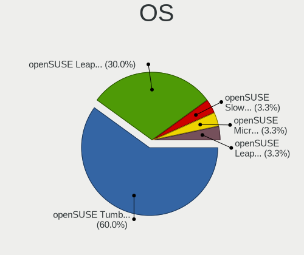
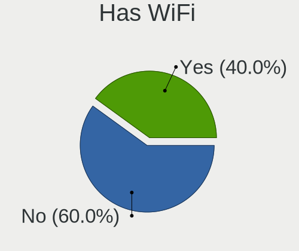
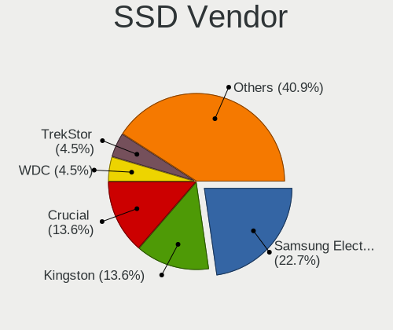
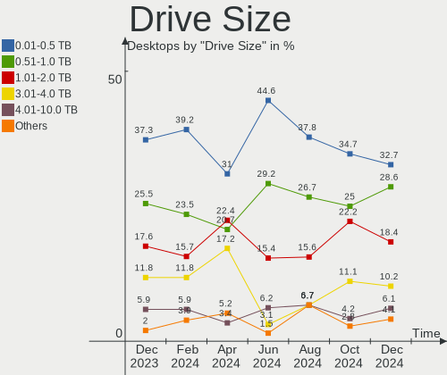
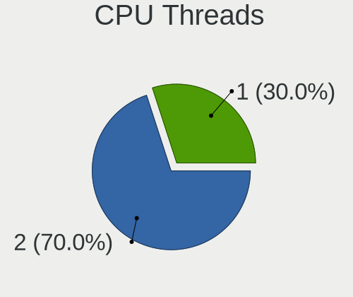
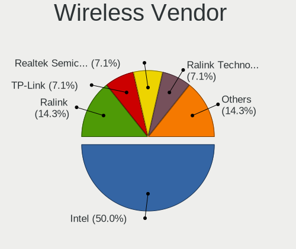

openSUSE Hardware Trends (Desktops)
-----------------------------------

A project to identify most popular hardware characteristics and track their change
over time based on data collected by openSUSE users at https://Linux-Hardware.org.

Anyone can contribute to this report by the [hw-probe](https://github.com/linuxhw/hw-probe) tool:

    sudo -E hw-probe -all -upload

Full-feature report is available here: https://linux-hardware.org/?view=trends

Period: Jan, 2022.

Contents
--------

* [ System ](#system)
  - [ OS                       ](#os)
  - [ OS Family                ](#os-family)
  - [ Kernel                   ](#kernel)
  - [ Kernel Family            ](#kernel-family)
  - [ Kernel Major Ver.        ](#kernel-major-ver)
  - [ Arch                     ](#arch)
  - [ DE                       ](#de)
  - [ Display Server           ](#display-server)
  - [ Display Manager          ](#display-manager)
  - [ OS Lang                  ](#os-lang)
  - [ Boot Mode                ](#boot-mode)
  - [ Filesystem               ](#filesystem)
  - [ Part. scheme             ](#part-scheme)
  - [ Dual Boot with Linux/BSD ](#dual-boot-with-linuxbsd)
  - [ Dual Boot (Win)          ](#dual-boot-win)

* [ Board ](#board)
  - [ Vendor                   ](#vendor)
  - [ Model                    ](#model)
  - [ Model Family             ](#model-family)
  - [ MFG Year                 ](#mfg-year)
  - [ Form Factor              ](#form-factor)
  - [ Secure Boot              ](#secure-boot)
  - [ Coreboot                 ](#coreboot)
  - [ RAM Size                 ](#ram-size)
  - [ RAM Used                 ](#ram-used)
  - [ Total Drives             ](#total-drives)
  - [ Has CD-ROM               ](#has-cd-rom)
  - [ Has Ethernet             ](#has-ethernet)
  - [ Has WiFi                 ](#has-wifi)
  - [ Has Bluetooth            ](#has-bluetooth)

* [ Location ](#location)
  - [ Country                  ](#country)
  - [ City                     ](#city)

* [ Drives ](#drives)
  - [ Drive Vendor             ](#drive-vendor)
  - [ Drive Model              ](#drive-model)
  - [ HDD Vendor               ](#hdd-vendor)
  - [ SSD Vendor               ](#ssd-vendor)
  - [ Drive Kind               ](#drive-kind)
  - [ Drive Connector          ](#drive-connector)
  - [ Drive Size               ](#drive-size)
  - [ Space Total              ](#space-total)
  - [ Space Used               ](#space-used)
  - [ Malfunc. Drives          ](#malfunc-drives)
  - [ Malfunc. Drive Vendor    ](#malfunc-drive-vendor)
  - [ Malfunc. HDD Vendor      ](#malfunc-hdd-vendor)
  - [ Malfunc. Drive Kind      ](#malfunc-drive-kind)
  - [ Failed Drives            ](#failed-drives)
  - [ Failed Drive Vendor      ](#failed-drive-vendor)
  - [ Drive Status             ](#drive-status)

* [ Storage controller ](#storage-controller)
  - [ Storage Vendor           ](#storage-vendor)
  - [ Storage Model            ](#storage-model)
  - [ Storage Kind             ](#storage-kind)

* [ Processor ](#processor)
  - [ CPU Vendor               ](#cpu-vendor)
  - [ CPU Model                ](#cpu-model)
  - [ CPU Model Family         ](#cpu-model-family)
  - [ CPU Cores                ](#cpu-cores)
  - [ CPU Sockets              ](#cpu-sockets)
  - [ CPU Threads              ](#cpu-threads)
  - [ CPU Op-Modes             ](#cpu-op-modes)
  - [ CPU Microcode            ](#cpu-microcode)
  - [ CPU Microarch            ](#cpu-microarch)

* [ Graphics ](#graphics)
  - [ GPU Vendor               ](#gpu-vendor)
  - [ GPU Model                ](#gpu-model)
  - [ GPU Combo                ](#gpu-combo)
  - [ GPU Driver               ](#gpu-driver)
  - [ GPU Memory               ](#gpu-memory)

* [ Monitor ](#monitor)
  - [ Monitor Vendor           ](#monitor-vendor)
  - [ Monitor Model            ](#monitor-model)
  - [ Monitor Resolution       ](#monitor-resolution)
  - [ Monitor Diagonal         ](#monitor-diagonal)
  - [ Monitor Width            ](#monitor-width)
  - [ Aspect Ratio             ](#aspect-ratio)
  - [ Monitor Area             ](#monitor-area)
  - [ Pixel Density            ](#pixel-density)
  - [ Multiple Monitors        ](#multiple-monitors)

* [ Network ](#network)
  - [ Net Controller Vendor    ](#net-controller-vendor)
  - [ Net Controller Model     ](#net-controller-model)
  - [ Wireless Vendor          ](#wireless-vendor)
  - [ Wireless Model           ](#wireless-model)
  - [ Ethernet Vendor          ](#ethernet-vendor)
  - [ Ethernet Model           ](#ethernet-model)
  - [ Net Controller Kind      ](#net-controller-kind)
  - [ Used Controller          ](#used-controller)
  - [ NICs                     ](#nics)
  - [ IPv6                     ](#ipv6)

* [ Bluetooth ](#bluetooth)
  - [ Bluetooth Vendor         ](#bluetooth-vendor)
  - [ Bluetooth Model          ](#bluetooth-model)

* [ Sound ](#sound)
  - [ Sound Vendor             ](#sound-vendor)
  - [ Sound Model              ](#sound-model)

* [ Memory ](#memory)
  - [ Memory Vendor            ](#memory-vendor)
  - [ Memory Model             ](#memory-model)
  - [ Memory Kind              ](#memory-kind)
  - [ Memory Form Factor       ](#memory-form-factor)
  - [ Memory Size              ](#memory-size)
  - [ Memory Speed             ](#memory-speed)

* [ Printers & scanners ](#printers--scanners)
  - [ Printer Vendor           ](#printer-vendor)
  - [ Printer Model            ](#printer-model)
  - [ Scanner Vendor           ](#scanner-vendor)
  - [ Scanner Model            ](#scanner-model)

* [ Camera ](#camera)
  - [ Camera Vendor            ](#camera-vendor)
  - [ Camera Model             ](#camera-model)

* [ Security ](#security)
  - [ Fingerprint Vendor       ](#fingerprint-vendor)
  - [ Fingerprint Model        ](#fingerprint-model)
  - [ Chipcard Vendor          ](#chipcard-vendor)
  - [ Chipcard Model           ](#chipcard-model)

* [ Unsupported ](#unsupported)
  - [ Unsupported Devices      ](#unsupported-devices)
  - [ Unsupported Device Types ](#unsupported-device-types)

System
------

OS
--

Installed operating systems

| Name                         | Desktops | Percent |
|------------------------------|----------|---------|
| openSUSE Leap-15.3           | 9        | 42.86%  |
| openSUSE Tumbleweed-20220118 | 1        | 4.76%   |
| openSUSE Tumbleweed-20220117 | 1        | 4.76%   |
| openSUSE Tumbleweed-20220114 | 1        | 4.76%   |
| openSUSE Tumbleweed-20220110 | 1        | 4.76%   |
| openSUSE Microos-20211024    | 1        | 4.76%   |
| openSUSE Leap-15.2           | 1        | 4.76%   |
| openSUSE 20220126            | 1        | 4.76%   |
| openSUSE 20220115            | 1        | 4.76%   |
| openSUSE 20220113            | 1        | 4.76%   |
| openSUSE 20220110            | 1        | 4.76%   |
| openSUSE 20220106            | 1        | 4.76%   |
| openSUSE 20211228            | 1        | 4.76%   |

OS Family
---------

OS without a version

| Name     | Desktops | Percent |
|----------|----------|---------|
| openSUSE | 21       | 100%    |

Kernel
------

Version of the Linux kernel

| Version                     | Desktops | Percent |
|-----------------------------|----------|---------|
| 5.3.18-59.37-default        | 7        | 33.33%  |
| 5.16.0-1-default            | 5        | 23.81%  |
| 5.15.12-1-default           | 3        | 14.29%  |
| 5.3.18-lp152.106-default    | 1        | 4.76%   |
| 5.3.18-59.37-preempt        | 1        | 4.76%   |
| 5.3.18-150300.59.43-default | 1        | 4.76%   |
| 5.16.1-1-default            | 1        | 4.76%   |
| 5.15.8-1-default            | 1        | 4.76%   |
| 5.14.11-2-default           | 1        | 4.76%   |

Kernel Family
-------------

Linux kernel without a distro release

| Version | Desktops | Percent |
|---------|----------|---------|
| 5.3.18  | 10       | 47.62%  |
| 5.16.0  | 5        | 23.81%  |
| 5.15.12 | 3        | 14.29%  |
| 5.16.1  | 1        | 4.76%   |
| 5.15.8  | 1        | 4.76%   |
| 5.14.11 | 1        | 4.76%   |

Kernel Major Ver.
-----------------

Linux kernel major version

| Version | Desktops | Percent |
|---------|----------|---------|
| 5.3     | 10       | 47.62%  |
| 5.16    | 6        | 28.57%  |
| 5.15    | 4        | 19.05%  |
| 5.14    | 1        | 4.76%   |

Arch
----

OS architecture (x86_64, i586, etc.)

| Name   | Desktops | Percent |
|--------|----------|---------|
| x86_64 | 21       | 100%    |

DE
--

Desktop Environment

| Name    | Desktops | Percent |
|---------|----------|---------|
| KDE5    | 14       | 66.67%  |
| GNOME   | 4        | 19.05%  |
| Unknown | 3        | 14.29%  |

Display Server
--------------

X11 or Wayland

| Name        | Desktops | Percent |
|-------------|----------|---------|
| X11         | 17       | 80.95%  |
| Wayland     | 2        | 9.52%   |
| Unspecified | 1        | 4.76%   |
| Tty         | 1        | 4.76%   |

Display Manager
---------------

SDDM, LightDM, etc.

| Name    | Desktops | Percent |
|---------|----------|---------|
| Unknown | 10       | 47.62%  |
| SDDM    | 6        | 28.57%  |
| LightDM | 4        | 19.05%  |
| XDM     | 1        | 4.76%   |

OS Lang
-------

Language

| Lang    | Desktops | Percent |
|---------|----------|---------|
| de_DE   | 4        | 19.05%  |
| ru_RU   | 3        | 14.29%  |
| fi_FI   | 2        | 9.52%   |
| Unknown | 2        | 9.52%   |
| zh_CN   | 1        | 4.76%   |
| sv_SE   | 1        | 4.76%   |
| pt_BR   | 1        | 4.76%   |
| POSIX   | 1        | 4.76%   |
| nn_NO   | 1        | 4.76%   |
| nl_BE   | 1        | 4.76%   |
| it_IT   | 1        | 4.76%   |
| fr_FR   | 1        | 4.76%   |
| en_US   | 1        | 4.76%   |
| en_GB   | 1        | 4.76%   |

Boot Mode
---------

EFI or BIOS

| Mode | Desktops | Percent |
|------|----------|---------|
| EFI  | 12       | 57.14%  |
| BIOS | 9        | 42.86%  |

Filesystem
----------

Type of filesystem

| Type  | Desktops | Percent |
|-------|----------|---------|
| Btrfs | 14       | 66.67%  |
| Ext4  | 7        | 33.33%  |

Part. scheme
------------

Scheme of partitioning

| Type    | Desktops | Percent |
|---------|----------|---------|
| GPT     | 9        | 42.86%  |
| Unknown | 7        | 33.33%  |
| MBR     | 5        | 23.81%  |

Dual Boot with Linux/BSD
------------------------

Hosting more than one Linux/BSD

| Dual boot | Desktops | Percent |
|-----------|----------|---------|
| No        | 19       | 90.48%  |
| Yes       | 2        | 9.52%   |

Dual Boot (Win)
---------------

Hosting Linux and Windows

| Dual boot | Desktops | Percent |
|-----------|----------|---------|
| No        | 17       | 80.95%  |
| Yes       | 4        | 19.05%  |

Board
-----

Vendor
------

Motherboard manufacturer

| Name                | Desktops | Percent |
|---------------------|----------|---------|
| ASUSTek Computer    | 8        | 38.1%   |
| Gigabyte Technology | 4        | 19.05%  |
| MSI                 | 3        | 14.29%  |
| Hewlett-Packard     | 2        | 9.52%   |
| Lenovo              | 1        | 4.76%   |
| Fujitsu             | 1        | 4.76%   |
| Biostar             | 1        | 4.76%   |
| ASRock              | 1        | 4.76%   |

Model
-----

Motherboard model

| Name                                   | Desktops | Percent |
|----------------------------------------|----------|---------|
| ASUS All Series                        | 2        | 9.52%   |
| MSI MS-7C02                            | 1        | 4.76%   |
| MSI MS-7836                            | 1        | 4.76%   |
| MSI MS-7673                            | 1        | 4.76%   |
| Lenovo IdeaCentre 720-18APR 90HY000FIX | 1        | 4.76%   |
| HP EliteDesk 800 G1 USDT               | 1        | 4.76%   |
| HP 550-a114                            | 1        | 4.76%   |
| Gigabyte Z87X-UD3H                     | 1        | 4.76%   |
| Gigabyte GA-770TA-UD3                  | 1        | 4.76%   |
| Gigabyte G31M-ES2C                     | 1        | 4.76%   |
| Gigabyte B450 AORUS M                  | 1        | 4.76%   |
| Fujitsu ESPRIMO P410                   | 1        | 4.76%   |
| Biostar H77MU3                         | 1        | 4.76%   |
| ASUS TUF GAMING X570-PLUS              | 1        | 4.76%   |
| ASUS SABERTOOTH 55i                    | 1        | 4.76%   |
| ASUS ROG STRIX X570-E GAMING           | 1        | 4.76%   |
| ASUS PRO B460M-C                       | 1        | 4.76%   |
| ASUS M5A99X EVO R2.0                   | 1        | 4.76%   |
| ASUS 970 PRO GAMING/AURA               | 1        | 4.76%   |
| ASRock B450M Pro4-F                    | 1        | 4.76%   |

Model Family
------------

Motherboard model prefix

| Name                  | Desktops | Percent |
|-----------------------|----------|---------|
| ASUS All              | 2        | 9.52%   |
| MSI MS-7C02           | 1        | 4.76%   |
| MSI MS-7836           | 1        | 4.76%   |
| MSI MS-7673           | 1        | 4.76%   |
| Lenovo IdeaCentre     | 1        | 4.76%   |
| HP EliteDesk          | 1        | 4.76%   |
| HP 550-a114           | 1        | 4.76%   |
| Gigabyte Z87X-UD3H    | 1        | 4.76%   |
| Gigabyte GA-770TA-UD3 | 1        | 4.76%   |
| Gigabyte G31M-ES2C    | 1        | 4.76%   |
| Gigabyte B450         | 1        | 4.76%   |
| Fujitsu ESPRIMO       | 1        | 4.76%   |
| Biostar H77MU3        | 1        | 4.76%   |
| ASUS TUF              | 1        | 4.76%   |
| ASUS SABERTOOTH       | 1        | 4.76%   |
| ASUS ROG              | 1        | 4.76%   |
| ASUS PRO              | 1        | 4.76%   |
| ASUS M5A99X           | 1        | 4.76%   |
| ASUS 970              | 1        | 4.76%   |
| ASRock B450M          | 1        | 4.76%   |

MFG Year
--------

Motherboard manufacture year

| Year | Desktops | Percent |
|------|----------|---------|
| 2013 | 4        | 19.05%  |
| 2019 | 3        | 14.29%  |
| 2020 | 2        | 9.52%   |
| 2018 | 2        | 9.52%   |
| 2014 | 2        | 9.52%   |
| 2012 | 2        | 9.52%   |
| 2016 | 1        | 4.76%   |
| 2015 | 1        | 4.76%   |
| 2011 | 1        | 4.76%   |
| 2010 | 1        | 4.76%   |
| 2009 | 1        | 4.76%   |
| 2008 | 1        | 4.76%   |

Form Factor
-----------

Physical design of the computer

| Name    | Desktops | Percent |
|---------|----------|---------|
| Desktop | 21       | 100%    |

Secure Boot
-----------

Enabled or disabled

| State    | Desktops | Percent |
|----------|----------|---------|
| Disabled | 20       | 95.24%  |
| Enabled  | 1        | 4.76%   |

Coreboot
--------

Have coreboot on board

| Used | Desktops | Percent |
|------|----------|---------|
| No   | 21       | 100%    |

RAM Size
--------

Total RAM memory

| Size in GB | Desktops | Percent |
|------------|----------|---------|
| 16.01-24.0 | 9        | 42.86%  |
| 4.01-8.0   | 4        | 19.05%  |
| 32.01-64.0 | 4        | 19.05%  |
| 8.01-16.0  | 2        | 9.52%   |
| 3.01-4.0   | 1        | 4.76%   |
| 24.01-32.0 | 1        | 4.76%   |

RAM Used
--------

Used RAM memory

| Used GB    | Desktops | Percent |
|------------|----------|---------|
| 4.01-8.0   | 5        | 23.81%  |
| 2.01-3.0   | 5        | 23.81%  |
| 1.01-2.0   | 5        | 23.81%  |
| 3.01-4.0   | 2        | 9.52%   |
| 8.01-16.0  | 2        | 9.52%   |
| 24.01-32.0 | 1        | 4.76%   |
| 0.51-1.0   | 1        | 4.76%   |

Total Drives
------------

Number of drives on board

| Drives | Desktops | Percent |
|--------|----------|---------|
| 2      | 9        | 42.86%  |
| 1      | 6        | 28.57%  |
| 4      | 2        | 9.52%   |
| 3      | 2        | 9.52%   |
| 6      | 1        | 4.76%   |
| 5      | 1        | 4.76%   |

Has CD-ROM
----------

Has CD-ROM on board

| Presented | Desktops | Percent |
|-----------|----------|---------|
| Yes       | 14       | 66.67%  |
| No        | 7        | 33.33%  |

Has Ethernet
------------

Has Ethernet on board

| Presented | Desktops | Percent |
|-----------|----------|---------|
| Yes       | 21       | 100%    |

Has WiFi
--------

Has WiFi module

| Presented | Desktops | Percent |
|-----------|----------|---------|
| No        | 13       | 61.9%   |
| Yes       | 8        | 38.1%   |

Has Bluetooth
-------------

Has Bluetooth module

| Presented | Desktops | Percent |
|-----------|----------|---------|
| No        | 14       | 66.67%  |
| Yes       | 7        | 33.33%  |

Location
--------

Country
-------

Geographic location (country)

| Country     | Desktops | Percent |
|-------------|----------|---------|
| Germany     | 5        | 23.81%  |
| Russia      | 3        | 14.29%  |
| Finland     | 2        | 9.52%   |
| USA         | 1        | 4.76%   |
| Sweden      | 1        | 4.76%   |
| Spain       | 1        | 4.76%   |
| Romania     | 1        | 4.76%   |
| Norway      | 1        | 4.76%   |
| Netherlands | 1        | 4.76%   |
| Malaysia    | 1        | 4.76%   |
| Italy       | 1        | 4.76%   |
| China       | 1        | 4.76%   |
| Brazil      | 1        | 4.76%   |
| Belgium     | 1        | 4.76%   |

City
----

Geographic location (city)

| City                  | Desktops | Percent |
|-----------------------|----------|---------|
| Kiel                  | 2        | 9.52%   |
| Voerde                | 1        | 4.76%   |
| Texarkana             | 1        | 4.76%   |
| Rostov-on-Don         | 1        | 4.76%   |
| Rio de Janeiro        | 1        | 4.76%   |
| Oulu                  | 1        | 4.76%   |
| Odintsovo             | 1        | 4.76%   |
| Kuala Lumpur          | 1        | 4.76%   |
| Kazan?ˆ™              | 1        | 4.76%   |
| Karlsruhe             | 1        | 4.76%   |
| Iasi                  | 1        | 4.76%   |
| Helsinki              | 1        | 4.76%   |
| Giugliano in Campania | 1        | 4.76%   |
| Elche                 | 1        | 4.76%   |
| Bergen                | 1        | 4.76%   |
| Beijing               | 1        | 4.76%   |
| Arboga                | 1        | 4.76%   |
| Antwerp               | 1        | 4.76%   |
| Amsterdam             | 1        | 4.76%   |
| Algermissen           | 1        | 4.76%   |

Drives
------

Drive Vendor
------------

Hard drive vendors

| Vendor              | Desktops | Drives | Percent |
|---------------------|----------|--------|---------|
| WDC                 | 9        | 14     | 24.32%  |
| Seagate             | 7        | 9      | 18.92%  |
| Samsung Electronics | 5        | 7      | 13.51%  |
| Kingston            | 5        | 6      | 13.51%  |
| Sandisk             | 2        | 2      | 5.41%   |
| Crucial             | 2        | 3      | 5.41%   |
| Unknown             | 1        | 1      | 2.7%    |
| Toshiba             | 1        | 1      | 2.7%    |
| PLEXTOR             | 1        | 1      | 2.7%    |
| Phison              | 1        | 1      | 2.7%    |
| Intel               | 1        | 1      | 2.7%    |
| HGST                | 1        | 1      | 2.7%    |
| Apacer              | 1        | 1      | 2.7%    |

Drive Model
-----------

Hard drive models

| Model                               | Desktops | Percent |
|-------------------------------------|----------|---------|
| Seagate ST3500418AS 500GB           | 2        | 4.55%   |
| Sandisk NVMe SSD Drive 1TB          | 2        | 4.55%   |
| WDC WDS500G2B0A 500GB SSD           | 1        | 2.27%   |
| WDC WDS500G1X0E-00AFY0 500GB        | 1        | 2.27%   |
| WDC WDS250G1B0A-00H9H0 250GB SSD    | 1        | 2.27%   |
| WDC WD6400AAKS-22A7B0 640GB         | 1        | 2.27%   |
| WDC WD5000AAKX-07U6AA0 500GB        | 1        | 2.27%   |
| WDC WD30EZRX-00DC0B0 3TB            | 1        | 2.27%   |
| WDC WD20EARX-00PASB0 2TB            | 1        | 2.27%   |
| WDC WD2003FYYS-05T9B0 2TB           | 1        | 2.27%   |
| WDC WD2003FYYS-01T8B0 2TB           | 1        | 2.27%   |
| WDC WD1600BEVT-08A23T1 160GB        | 1        | 2.27%   |
| WDC WD10EZEX-22MFCA0 1TB            | 1        | 2.27%   |
| WDC WD10EZEX-08WN4A0 1TB            | 1        | 2.27%   |
| Unknown SD/MMC/MS PRO 128GB         | 1        | 2.27%   |
| Toshiba HDWD110 1TB                 | 1        | 2.27%   |
| Seagate ST500DM002-1BD142 500GB     | 1        | 2.27%   |
| Seagate ST3500413AS 500GB           | 1        | 2.27%   |
| Seagate ST2000DM006-2DM164 2TB      | 1        | 2.27%   |
| Seagate ST2000DM001-9YN164 2TB      | 1        | 2.27%   |
| Seagate ST2000DM001-1ER164 2TB      | 1        | 2.27%   |
| Seagate ST1000DM003-1SB102 1TB      | 1        | 2.27%   |
| Samsung SSD 980 PRO 1TB             | 1        | 2.27%   |
| Samsung SSD 970 EVO 1TB             | 1        | 2.27%   |
| Samsung SSD 860 EVO 1TB             | 1        | 2.27%   |
| Samsung HM160HI 160GB               | 1        | 2.27%   |
| Samsung HD642JJ 640GB               | 1        | 2.27%   |
| Samsung HD501LJ 500GB               | 1        | 2.27%   |
| PLEXTOR PX-128M5S 128GB SSD         | 1        | 2.27%   |
| Phison NVMe SSD Drive 512GB         | 1        | 2.27%   |
| Kingston SV300S37A120G 120GB SSD    | 1        | 2.27%   |
| Kingston SUV500240G 240GB SSD       | 1        | 2.27%   |
| Kingston SUV400S37240G 240GB SSD    | 1        | 2.27%   |
| Kingston SNVS500G 500GB             | 1        | 2.27%   |
| Kingston SA400S37480G 480GB SSD     | 1        | 2.27%   |
| Kingston SA400S37120G 120GB SSD     | 1        | 2.27%   |
| Intel SSDSA2CW080G3 80GB            | 1        | 2.27%   |
| HGST HTS725050A7E630 500GB          | 1        | 2.27%   |
| Crucial M4-CT128M4SSD2 128GB        | 1        | 2.27%   |
| Crucial CT1000MX500SSD1 1TB         | 1        | 2.27%   |
| Crucial C300-CTFDDAC064MAG 64GB SSD | 1        | 2.27%   |
| Apacer AS350 256GB SSD              | 1        | 2.27%   |

HDD Vendor
----------

Hard disk drive vendors

| Vendor              | Desktops | Drives | Percent |
|---------------------|----------|--------|---------|
| WDC                 | 7        | 11     | 35%     |
| Seagate             | 7        | 9      | 35%     |
| Samsung Electronics | 3        | 3      | 15%     |
| Unknown             | 1        | 1      | 5%      |
| Toshiba             | 1        | 1      | 5%      |
| HGST                | 1        | 1      | 5%      |

SSD Vendor
----------

Solid state drive vendors

| Vendor              | Desktops | Drives | Percent |
|---------------------|----------|--------|---------|
| Kingston            | 5        | 5      | 38.46%  |
| WDC                 | 2        | 2      | 15.38%  |
| Crucial             | 2        | 3      | 15.38%  |
| Samsung Electronics | 1        | 1      | 7.69%   |
| PLEXTOR             | 1        | 1      | 7.69%   |
| Intel               | 1        | 1      | 7.69%   |
| Apacer              | 1        | 1      | 7.69%   |

Drive Kind
----------

HDD or SSD

| Kind | Desktops | Drives | Percent |
|------|----------|--------|---------|
| HDD  | 17       | 26     | 51.52%  |
| SSD  | 10       | 14     | 30.3%   |
| NVMe | 6        | 8      | 18.18%  |

Drive Connector
---------------

SATA, SAS, NVMe, etc.

| Type | Desktops | Drives | Percent |
|------|----------|--------|---------|
| SATA | 18       | 39     | 72%     |
| NVMe | 6        | 8      | 24%     |
| SAS  | 1        | 1      | 4%      |

Drive Size
----------

Size of hard drive

| Size in TB | Desktops | Drives | Percent |
|------------|----------|--------|---------|
| 0.01-0.5   | 15       | 23     | 53.57%  |
| 0.51-1.0   | 7        | 8      | 25%     |
| 1.01-2.0   | 5        | 7      | 17.86%  |
| 2.01-3.0   | 1        | 2      | 3.57%   |

Space Total
-----------

Amount of disk space available on the file system

| Size in GB     | Desktops | Percent |
|----------------|----------|---------|
| More than 3000 | 7        | 33.33%  |
| 1001-2000      | 4        | 19.05%  |
| 501-1000       | 4        | 19.05%  |
| 2001-3000      | 2        | 9.52%   |
| Unknown        | 2        | 9.52%   |
| 251-500        | 1        | 4.76%   |
| 101-250        | 1        | 4.76%   |

Space Used
----------

Amount of used disk space

| Used GB        | Desktops | Percent |
|----------------|----------|---------|
| 251-500        | 4        | 19.05%  |
| 1001-2000      | 4        | 19.05%  |
| 501-1000       | 3        | 14.29%  |
| More than 3000 | 2        | 9.52%   |
| 101-250        | 2        | 9.52%   |
| 51-100         | 2        | 9.52%   |
| Unknown        | 2        | 9.52%   |
| 2001-3000      | 1        | 4.76%   |
| 1-20           | 1        | 4.76%   |

Malfunc. Drives
---------------

Drive models with a malfunction

| Model                           | Desktops | Drives | Percent |
|---------------------------------|----------|--------|---------|
| WDC WD6400AAKS-22A7B0 640GB     | 1        | 1      | 25%     |
| Seagate ST500DM002-1BD142 500GB | 1        | 1      | 25%     |
| Seagate ST1000DM003-1SB102 1TB  | 1        | 1      | 25%     |
| HGST HTS725050A7E630 500GB      | 1        | 1      | 25%     |

Malfunc. Drive Vendor
---------------------

Vendors of faulty drives

| Vendor  | Desktops | Drives | Percent |
|---------|----------|--------|---------|
| Seagate | 2        | 2      | 50%     |
| WDC     | 1        | 1      | 25%     |
| HGST    | 1        | 1      | 25%     |

Malfunc. HDD Vendor
-------------------

Vendors of faulty HDD drives

| Vendor  | Desktops | Drives | Percent |
|---------|----------|--------|---------|
| Seagate | 2        | 2      | 50%     |
| WDC     | 1        | 1      | 25%     |
| HGST    | 1        | 1      | 25%     |

Malfunc. Drive Kind
-------------------

Kinds of faulty drives

| Kind | Desktops | Drives | Percent |
|------|----------|--------|---------|
| HDD  | 4        | 4      | 100%    |

Failed Drives
-------------

Failed drive models

Zero info for selected period =(

Failed Drive Vendor
-------------------

Failed drive vendors

Zero info for selected period =(

Drive Status
------------

Number of failed and malfunc. drives

| Status   | Desktops | Drives | Percent |
|----------|----------|--------|---------|
| Works    | 11       | 29     | 47.83%  |
| Detected | 8        | 15     | 34.78%  |
| Malfunc  | 4        | 4      | 17.39%  |

Storage controller
------------------

Storage Vendor
--------------

Storage controller vendors

| Vendor                      | Desktops | Percent |
|-----------------------------|----------|---------|
| Intel                       | 11       | 33.33%  |
| AMD                         | 10       | 30.3%   |
| Sandisk                     | 3        | 9.09%   |
| Samsung Electronics         | 2        | 6.06%   |
| Marvell Technology Group    | 2        | 6.06%   |
| JMicron Technology          | 2        | 6.06%   |
| Phison Electronics          | 1        | 3.03%   |
| Kingston Technology Company | 1        | 3.03%   |
| ASMedia Technology          | 1        | 3.03%   |

Storage Model
-------------

Storage controller models

| Model                                                                          | Desktops | Percent |
|--------------------------------------------------------------------------------|----------|---------|
| AMD FCH SATA Controller [AHCI mode]                                            | 6        | 15.38%  |
| AMD 400 Series Chipset SATA Controller                                         | 4        | 10.26%  |
| Intel 8 Series/C220 Series Chipset Family 6-port SATA Controller 1 [AHCI mode] | 3        | 7.69%   |
| AMD SB7x0/SB8x0/SB9x0 SATA Controller [AHCI mode]                              | 3        | 7.69%   |
| JMicron JMB363 SATA/IDE Controller                                             | 2        | 5.13%   |
| Intel 6 Series/C200 Series Chipset Family 6 port Desktop SATA AHCI Controller  | 2        | 5.13%   |
| Sandisk WD PC SN810 / Black SN850 NVMe SSD                                     | 1        | 2.56%   |
| Sandisk WD Black 2018/SN750 / PC SN720 NVMe SSD                                | 1        | 2.56%   |
| Sandisk Non-Volatile memory controller                                         | 1        | 2.56%   |
| Samsung NVMe SSD Controller SM981/PM981/PM983                                  | 1        | 2.56%   |
| Samsung NVMe SSD Controller PM9A1/PM9A3/980PRO                                 | 1        | 2.56%   |
| Phison PS5013 E13 NVMe Controller                                              | 1        | 2.56%   |
| Marvell Group 88SE9172 SATA 6Gb/s Controller                                   | 1        | 2.56%   |
| Marvell Group 88SE9128 PCIe SATA 6 Gb/s RAID controller                        | 1        | 2.56%   |
| Kingston Company SNVS2000G [NV1 NVMe PCIe SSD 2TB]                             | 1        | 2.56%   |
| Intel NM10/ICH7 Family SATA Controller [IDE mode]                              | 1        | 2.56%   |
| Intel 9 Series Chipset Family SATA Controller [AHCI Mode]                      | 1        | 2.56%   |
| Intel 7 Series/C210 Series Chipset Family 4-port SATA Controller [IDE mode]    | 1        | 2.56%   |
| Intel 7 Series/C210 Series Chipset Family 2-port SATA Controller [IDE mode]    | 1        | 2.56%   |
| Intel 7 Series Chipset Family 6-port SATA Controller [AHCI mode]               | 1        | 2.56%   |
| Intel 5 Series/3400 Series Chipset 4 port SATA IDE Controller                  | 1        | 2.56%   |
| Intel 5 Series/3400 Series Chipset 2 port SATA IDE Controller                  | 1        | 2.56%   |
| Intel 400 Series Chipset Family SATA AHCI Controller                           | 1        | 2.56%   |
| ASMedia ASM1062 Serial ATA Controller                                          | 1        | 2.56%   |
| AMD SB7x0/SB8x0/SB9x0 IDE Controller                                           | 1        | 2.56%   |

Storage Kind
------------

Kind of storage controller (IDE, SATA, NVMe, SAS, ...)

| Kind | Desktops | Percent |
|------|----------|---------|
| SATA | 18       | 64.29%  |
| NVMe | 6        | 21.43%  |
| IDE  | 4        | 14.29%  |

Processor
---------

CPU Vendor
----------

Processor vendors

| Vendor | Desktops | Percent |
|--------|----------|---------|
| Intel  | 11       | 52.38%  |
| AMD    | 10       | 47.62%  |

CPU Model
---------

Processor models

| Model                                           | Desktops | Percent |
|-------------------------------------------------|----------|---------|
| Intel Core i7-4771 CPU @ 3.50GHz                | 1        | 4.76%   |
| Intel Core i7 CPU 860 @ 2.80GHz                 | 1        | 4.76%   |
| Intel Core i5-4590 CPU @ 3.30GHz                | 1        | 4.76%   |
| Intel Core i5-4570S CPU @ 2.90GHz               | 1        | 4.76%   |
| Intel Core i5-4440 CPU @ 3.10GHz                | 1        | 4.76%   |
| Intel Core i5-3330 CPU @ 3.00GHz                | 1        | 4.76%   |
| Intel Core i5-2500 CPU @ 3.30GHz                | 1        | 4.76%   |
| Intel Core i5-2320 CPU @ 3.00GHz                | 1        | 4.76%   |
| Intel Core i5-10600K CPU @ 4.10GHz              | 1        | 4.76%   |
| Intel Core 2 Duo CPU E4500 @ 2.20GHz            | 1        | 4.76%   |
| Intel Celeron CPU 847 @ 1.10GHz                 | 1        | 4.76%   |
| AMD Ryzen 9 5900X 12-Core Processor             | 1        | 4.76%   |
| AMD Ryzen 7 3700X 8-Core Processor              | 1        | 4.76%   |
| AMD Ryzen 5 PRO 3400G with Radeon Vega Graphics | 1        | 4.76%   |
| AMD Ryzen 5 3600 6-Core Processor               | 1        | 4.76%   |
| AMD Ryzen 3 3200G with Radeon Vega Graphics     | 1        | 4.76%   |
| AMD Ryzen 3 2200G with Radeon Vega Graphics     | 1        | 4.76%   |
| AMD Phenom II X4 955 Processor                  | 1        | 4.76%   |
| AMD FX-8350 Eight-Core Processor                | 1        | 4.76%   |
| AMD FX-6300 Six-Core Processor                  | 1        | 4.76%   |
| AMD A8-6410 APU with AMD Radeon R5 Graphics     | 1        | 4.76%   |

CPU Model Family
----------------

Processor model prefix

| Model            | Desktops | Percent |
|------------------|----------|---------|
| Intel Core i5    | 7        | 33.33%  |
| Intel Core i7    | 2        | 9.52%   |
| AMD Ryzen 3      | 2        | 9.52%   |
| AMD FX           | 2        | 9.52%   |
| Intel Core 2 Duo | 1        | 4.76%   |
| Intel Celeron    | 1        | 4.76%   |
| AMD Ryzen 9      | 1        | 4.76%   |
| AMD Ryzen 7      | 1        | 4.76%   |
| AMD Ryzen 5 PRO  | 1        | 4.76%   |
| AMD Ryzen 5      | 1        | 4.76%   |
| AMD Phenom II X4 | 1        | 4.76%   |
| AMD A8           | 1        | 4.76%   |

CPU Cores
---------

Number of processor cores

| Number | Desktops | Percent |
|--------|----------|---------|
| 4      | 14       | 66.67%  |
| 6      | 2        | 9.52%   |
| 2      | 2        | 9.52%   |
| 12     | 1        | 4.76%   |
| 8      | 1        | 4.76%   |
| 3      | 1        | 4.76%   |

CPU Sockets
-----------

Number of sockets

| Number | Desktops | Percent |
|--------|----------|---------|
| 1      | 21       | 100%    |

CPU Threads
-----------

Threads per core (Hyper-Threading)

| Number | Desktops | Percent |
|--------|----------|---------|
| 1      | 12       | 57.14%  |
| 2      | 9        | 42.86%  |

CPU Op-Modes
------------

CPU Operation Modes (32-bit, 64-bit)

| Op mode        | Desktops | Percent |
|----------------|----------|---------|
| 32-bit, 64-bit | 21       | 100%    |

CPU Microcode
-------------

Microcode number

| Number     | Desktops | Percent |
|------------|----------|---------|
| 0x306c3    | 3        | 14.29%  |
| 0x206a7    | 3        | 14.29%  |
| 0x08701021 | 2        | 9.52%   |
| 0x08108109 | 2        | 9.52%   |
| 0x06000852 | 2        | 9.52%   |
| Unknown    | 2        | 9.52%   |
| 0xa0655    | 1        | 4.76%   |
| 0x306a9    | 1        | 4.76%   |
| 0x106e5    | 1        | 4.76%   |
| 0x0a201204 | 1        | 4.76%   |
| 0x08101016 | 1        | 4.76%   |
| 0x07030105 | 1        | 4.76%   |
| 0x010000c8 | 1        | 4.76%   |

CPU Microarch
-------------

Microarchitecture

| Name        | Desktops | Percent |
|-------------|----------|---------|
| Haswell     | 4        | 19.05%  |
| SandyBridge | 3        | 14.29%  |
| Zen+        | 2        | 9.52%   |
| Zen 2       | 2        | 9.52%   |
| Piledriver  | 2        | 9.52%   |
| Zen 3       | 1        | 4.76%   |
| Zen         | 1        | 4.76%   |
| Puma        | 1        | 4.76%   |
| Nehalem     | 1        | 4.76%   |
| K10         | 1        | 4.76%   |
| IvyBridge   | 1        | 4.76%   |
| Core        | 1        | 4.76%   |
| CometLake   | 1        | 4.76%   |

Graphics
--------

GPU Vendor
----------

Vendors of graphics cards

| Vendor      | Desktops | Percent |
|-------------|----------|---------|
| Nvidia      | 9        | 40.91%  |
| Intel       | 7        | 31.82%  |
| AMD         | 5        | 22.73%  |
| S3 Graphics | 1        | 4.55%   |

GPU Model
---------

Graphics card models

| Model                                                                       | Desktops | Percent |
|-----------------------------------------------------------------------------|----------|---------|
| Nvidia GP106 [GeForce GTX 1060 6GB]                                         | 2        | 8.7%    |
| Nvidia GK106 [GeForce GTX 660]                                              | 2        | 8.7%    |
| Intel Xeon E3-1200 v3/4th Gen Core Processor Integrated Graphics Controller | 2        | 8.7%    |
| Intel 2nd Generation Core Processor Family Integrated Graphics Controller   | 2        | 8.7%    |
| S3 Graphics 86c764/765 [Trio32/64/64V+]                                     | 1        | 4.35%   |
| Nvidia GP106 [GeForce GTX 1060 3GB]                                         | 1        | 4.35%   |
| Nvidia GP104 [GeForce GTX 1080]                                             | 1        | 4.35%   |
| Nvidia GP104 [GeForce GTX 1070 Ti]                                          | 1        | 4.35%   |
| Nvidia GF108 [GeForce GT 630]                                               | 1        | 4.35%   |
| Nvidia GA106 [GeForce RTX 3060]                                             | 1        | 4.35%   |
| Nvidia G92 [GeForce GTS 250]                                                | 1        | 4.35%   |
| Intel Xeon E3-1200 v2/3rd Gen Core processor Graphics Controller            | 1        | 4.35%   |
| Intel CometLake-S GT2 [UHD Graphics 630]                                    | 1        | 4.35%   |
| Intel 82G33/G31 Express Integrated Graphics Controller                      | 1        | 4.35%   |
| AMD RV620 GL [FirePro 2260]                                                 | 1        | 4.35%   |
| AMD Raven Ridge [Radeon Vega Series / Radeon Vega Mobile Series]            | 1        | 4.35%   |
| AMD Picasso/Raven 2 [Radeon Vega Series / Radeon Vega Mobile Series]        | 1        | 4.35%   |
| AMD Mullins [Radeon R4/R5 Graphics]                                         | 1        | 4.35%   |
| AMD Lexa PRO [Radeon 540/540X/550/550X / RX 540X/550/550X]                  | 1        | 4.35%   |

GPU Combo
---------

Combinations of graphics cards

| Name            | Desktops | Percent |
|-----------------|----------|---------|
| 1 x Nvidia      | 8        | 38.1%   |
| 1 x Intel       | 6        | 28.57%  |
| 1 x AMD         | 4        | 19.05%  |
| 2 x Nvidia      | 1        | 4.76%   |
| 1 x S3 Graphics | 1        | 4.76%   |
| Intel + AMD     | 1        | 4.76%   |

GPU Driver
----------

Free vs proprietary

| Driver      | Desktops | Percent |
|-------------|----------|---------|
| Free        | 12       | 57.14%  |
| Proprietary | 7        | 33.33%  |
| Unknown     | 2        | 9.52%   |

GPU Memory
----------

Total video memory

| Size in GB | Desktops | Percent |
|------------|----------|---------|
| Unknown    | 7        | 33.33%  |
| 1.01-2.0   | 3        | 14.29%  |
| 7.01-8.0   | 2        | 9.52%   |
| 3.01-4.0   | 2        | 9.52%   |
| 0.51-1.0   | 2        | 9.52%   |
| 0.01-0.5   | 2        | 9.52%   |
| 5.01-6.0   | 1        | 4.76%   |
| 2.01-3.0   | 1        | 4.76%   |
| 8.01-16.0  | 1        | 4.76%   |

Monitor
-------

Monitor Vendor
--------------

Monitor vendors

| Vendor               | Desktops | Percent |
|----------------------|----------|---------|
| Samsung Electronics  | 4        | 16%     |
| ViewSonic            | 2        | 8%      |
| Hewlett-Packard      | 2        | 8%      |
| Goldstar             | 2        | 8%      |
| Dell                 | 2        | 8%      |
| BenQ                 | 2        | 8%      |
| Ancor Communications | 2        | 8%      |
| Acer                 | 2        | 8%      |
| Vizio                | 1        | 4%      |
| Philips              | 1        | 4%      |
| NEC Computers        | 1        | 4%      |
| Lenovo               | 1        | 4%      |
| Iiyama               | 1        | 4%      |
| Eizo                 | 1        | 4%      |
| ASUSTek Computer     | 1        | 4%      |

Monitor Model
-------------

Monitor models

| Model                                                                | Desktops | Percent |
|----------------------------------------------------------------------|----------|---------|
| Vizio E60-E3 VIZ1018 3840x2160 1330x748mm 60.1-inch                  | 1        | 4%      |
| ViewSonic XG2401 SERIES VSCBB31 1920x1080 531x299mm 24.0-inch        | 1        | 4%      |
| ViewSonic VA2730 Series VSCA539 1920x1080 598x336mm 27.0-inch        | 1        | 4%      |
| Samsung Electronics SyncMaster SAM036F 1440x900 428x255mm 19.6-inch  | 1        | 4%      |
| Samsung Electronics SyncMaster SAM022B 1280x1024 338x270mm 17.0-inch | 1        | 4%      |
| Samsung Electronics SyncMaster SAM00A2 1024x768 304x228mm 15.0-inch  | 1        | 4%      |
| Samsung Electronics SMS27A850T SAM0887 2560x1440 518x324mm 24.1-inch | 1        | 4%      |
| Philips PHL 243V5 PHLC0D1 1920x1080 521x293mm 23.5-inch              | 1        | 4%      |
| NEC Computers LCD72VM NEC6659 1280x1024 338x270mm 17.0-inch          | 1        | 4%      |
| Lenovo LEN T27i-10 LEN61C6 1920x1080 598x336mm 27.0-inch             | 1        | 4%      |
| Iiyama PL2530H IVM6132 1920x1080 540x300mm 24.3-inch                 | 1        | 4%      |
| Hewlett-Packard E242 HWP326E 1920x1200 518x324mm 24.1-inch           | 1        | 4%      |
| Hewlett-Packard 22y HPN3502 1920x1080 477x268mm 21.5-inch            | 1        | 4%      |
| Goldstar W2261 GSM56CF 1920x1080 477x268mm 21.5-inch                 | 1        | 4%      |
| Goldstar BN550Y GSM5BAB 1920x1080 600x340mm 27.2-inch                | 1        | 4%      |
| Eizo S2433W ENC2111 1920x1200 519x324mm 24.1-inch                    | 1        | 4%      |
| Dell U2312HM DEL4073 1920x1080 510x290mm 23.1-inch                   | 1        | 4%      |
| Dell S3422DWG DELD128 3440x1440 797x334mm 34.0-inch                  | 1        | 4%      |
| BenQ GW2765 BNQ78D6 2560x1440 597x336mm 27.0-inch                    | 1        | 4%      |
| BenQ BenQG2222HDL BNQ785A 1920x1080 478x269mm 21.6-inch              | 1        | 4%      |
| ASUSTek Computer VG245 AUS24A1 1920x1080 531x299mm 24.0-inch         | 1        | 4%      |
| Ancor Communications PA248 ACI24B1 1920x1200 546x352mm 25.6-inch     | 1        | 4%      |
| Ancor Communications ASUS VW197 ACI19EE 1366x768 410x230mm 18.5-inch | 1        | 4%      |
| Acer EK240Y ACR0758 1920x1080 531x299mm 24.0-inch                    | 1        | 4%      |
| Acer AL1717 ACR1717 1280x1024 338x270mm 17.0-inch                    | 1        | 4%      |

Monitor Resolution
------------------

Monitor screen resolution

| Resolution        | Desktops | Percent |
|-------------------|----------|---------|
| 1920x1080 (FHD)   | 12       | 50%     |
| 1280x1024 (SXGA)  | 3        | 12.5%   |
| 2560x1440 (QHD)   | 2        | 8.33%   |
| 1920x1200 (WUXGA) | 2        | 8.33%   |
| 3840x2160 (4K)    | 1        | 4.17%   |
| 3440x1440         | 1        | 4.17%   |
| 1440x900 (WXGA+)  | 1        | 4.17%   |
| 1366x768 (WXGA)   | 1        | 4.17%   |
| 1024x768 (XGA)    | 1        | 4.17%   |

Monitor Diagonal
----------------

Diagonal size in inches

| Inches | Desktops | Percent |
|--------|----------|---------|
| 24     | 8        | 32%     |
| 27     | 4        | 16%     |
| 17     | 3        | 12%     |
| 23     | 2        | 8%      |
| 21     | 2        | 8%      |
| 74     | 1        | 4%      |
| 34     | 1        | 4%      |
| 25     | 1        | 4%      |
| 19     | 1        | 4%      |
| 18     | 1        | 4%      |
| 15     | 1        | 4%      |

Monitor Width
-------------

Physical width

| Width in mm | Desktops | Percent |
|-------------|----------|---------|
| 501-600     | 13       | 59.09%  |
| 301-350     | 4        | 18.18%  |
| 401-500     | 3        | 13.64%  |
| 701-800     | 1        | 4.55%   |
| 1501-2000   | 1        | 4.55%   |

Aspect Ratio
------------

Proportional relationship between the width and the height

| Ratio | Desktops | Percent |
|-------|----------|---------|
| 16/9  | 15       | 62.5%   |
| 16/10 | 4        | 16.67%  |
| 5/4   | 3        | 12.5%   |
| 4/3   | 1        | 4.17%   |
| 21/9  | 1        | 4.17%   |

Monitor Area
------------

Area in inch²

| Area in inch² | Desktops | Percent |
|----------------|----------|---------|
| 201-250        | 7        | 28%     |
| 251-300        | 5        | 20%     |
| 301-350        | 4        | 16%     |
| 141-150        | 4        | 16%     |
| 151-200        | 2        | 8%      |
| More than 1000 | 1        | 4%      |
| 351-500        | 1        | 4%      |
| 101-110        | 1        | 4%      |

Pixel Density
-------------

Pixels per inch

| Density | Desktops | Percent |
|---------|----------|---------|
| 51-100  | 17       | 77.27%  |
| 101-120 | 4        | 18.18%  |
| 121-160 | 1        | 4.55%   |

Multiple Monitors
-----------------

Total monitors connected

| Total | Desktops | Percent |
|-------|----------|---------|
| 1     | 15       | 71.43%  |
| 2     | 5        | 23.81%  |
| 0     | 1        | 4.76%   |

Network
-------

Net Controller Vendor
---------------------

Controller vendors

| Vendor                          | Desktops | Percent |
|---------------------------------|----------|---------|
| Realtek Semiconductor           | 18       | 62.07%  |
| Intel                           | 7        | 24.14%  |
| Qualcomm Atheros Communications | 1        | 3.45%   |
| Qualcomm Atheros                | 1        | 3.45%   |
| Broadcom                        | 1        | 3.45%   |
| ASIX Electronics                | 1        | 3.45%   |

Net Controller Model
--------------------

Controller models

| Model                                                             | Desktops | Percent |
|-------------------------------------------------------------------|----------|---------|
| Realtek RTL8111/8168/8411 PCI Express Gigabit Ethernet Controller | 14       | 45.16%  |
| Realtek RTL810xE PCI Express Fast Ethernet controller             | 2        | 6.45%   |
| Intel I211 Gigabit Network Connection                             | 2        | 6.45%   |
| Realtek RTL8822CE 802.11ac PCIe Wireless Network Adapter          | 1        | 3.23%   |
| Realtek RTL8188FTV 802.11b/g/n 1T1R 2.4G WLAN Adapter             | 1        | 3.23%   |
| Realtek RTL8125 2.5GbE Controller                                 | 1        | 3.23%   |
| Qualcomm Atheros AR9271 802.11n                                   | 1        | 3.23%   |
| Qualcomm Atheros AR9227 Wireless Network Adapter                  | 1        | 3.23%   |
| Intel Wireless-AC 9260                                            | 1        | 3.23%   |
| Intel Wi-Fi 6 AX200                                               | 1        | 3.23%   |
| Intel Ethernet Connection I217-V                                  | 1        | 3.23%   |
| Intel Ethernet Connection I217-LM                                 | 1        | 3.23%   |
| Intel Ethernet Connection (12) I219-V                             | 1        | 3.23%   |
| Intel 82541PI Gigabit Ethernet Controller                         | 1        | 3.23%   |
| Broadcom BCM43142 802.11b/g/n                                     | 1        | 3.23%   |
| ASIX AX88179 Gigabit Ethernet                                     | 1        | 3.23%   |

Wireless Vendor
---------------

Wireless vendors

| Vendor                          | Desktops | Percent |
|---------------------------------|----------|---------|
| Realtek Semiconductor           | 2        | 28.57%  |
| Intel                           | 2        | 28.57%  |
| Qualcomm Atheros Communications | 1        | 14.29%  |
| Qualcomm Atheros                | 1        | 14.29%  |
| Broadcom                        | 1        | 14.29%  |

Wireless Model
--------------

Wireless models

| Model                                                    | Desktops | Percent |
|----------------------------------------------------------|----------|---------|
| Realtek RTL8822CE 802.11ac PCIe Wireless Network Adapter | 1        | 14.29%  |
| Realtek RTL8188FTV 802.11b/g/n 1T1R 2.4G WLAN Adapter    | 1        | 14.29%  |
| Qualcomm Atheros AR9271 802.11n                          | 1        | 14.29%  |
| Qualcomm Atheros AR9227 Wireless Network Adapter         | 1        | 14.29%  |
| Intel Wireless-AC 9260                                   | 1        | 14.29%  |
| Intel Wi-Fi 6 AX200                                      | 1        | 14.29%  |
| Broadcom BCM43142 802.11b/g/n                            | 1        | 14.29%  |

Ethernet Vendor
---------------

Ethernet vendors

| Vendor                | Desktops | Percent |
|-----------------------|----------|---------|
| Realtek Semiconductor | 17       | 70.83%  |
| Intel                 | 6        | 25%     |
| ASIX Electronics      | 1        | 4.17%   |

Ethernet Model
--------------

Ethernet models

| Model                                                             | Desktops | Percent |
|-------------------------------------------------------------------|----------|---------|
| Realtek RTL8111/8168/8411 PCI Express Gigabit Ethernet Controller | 14       | 58.33%  |
| Realtek RTL810xE PCI Express Fast Ethernet controller             | 2        | 8.33%   |
| Intel I211 Gigabit Network Connection                             | 2        | 8.33%   |
| Realtek RTL8125 2.5GbE Controller                                 | 1        | 4.17%   |
| Intel Ethernet Connection I217-V                                  | 1        | 4.17%   |
| Intel Ethernet Connection I217-LM                                 | 1        | 4.17%   |
| Intel Ethernet Connection (12) I219-V                             | 1        | 4.17%   |
| Intel 82541PI Gigabit Ethernet Controller                         | 1        | 4.17%   |
| ASIX AX88179 Gigabit Ethernet                                     | 1        | 4.17%   |

Net Controller Kind
-------------------

Ethernet, WiFi or modem

| Kind     | Desktops | Percent |
|----------|----------|---------|
| Ethernet | 21       | 75%     |
| WiFi     | 7        | 25%     |

Used Controller
---------------

Currently used network controller

| Kind     | Desktops | Percent |
|----------|----------|---------|
| Ethernet | 20       | 86.96%  |
| WiFi     | 3        | 13.04%  |

NICs
----

Total network controllers on board

| Total | Desktops | Percent |
|-------|----------|---------|
| 1     | 15       | 71.43%  |
| 2     | 5        | 23.81%  |
| 3     | 1        | 4.76%   |

IPv6
----

IPv6 vs IPv4

| Used | Desktops | Percent |
|------|----------|---------|
| No   | 15       | 71.43%  |
| Yes  | 6        | 28.57%  |

Bluetooth
---------

Bluetooth Vendor
----------------

Controller vendors

| Vendor                  | Desktops | Percent |
|-------------------------|----------|---------|
| Intel                   | 2        | 33.33%  |
| Realtek Semiconductor   | 1        | 16.67%  |
| Cambridge Silicon Radio | 1        | 16.67%  |
| Broadcom                | 1        | 16.67%  |
| Belkin Components       | 1        | 16.67%  |

Bluetooth Model
---------------

Controller models

| Model                                               | Desktops | Percent |
|-----------------------------------------------------|----------|---------|
| Realtek Bluetooth Radio                             | 1        | 16.67%  |
| Intel Wireless-AC 9260 Bluetooth Adapter            | 1        | 16.67%  |
| Intel Bluetooth Device                              | 1        | 16.67%  |
| Cambridge Silicon Radio Bluetooth Dongle (HCI mode) | 1        | 16.67%  |
| Broadcom BCM43142A0 Bluetooth Device                | 1        | 16.67%  |
| Belkin Components Bluetooth Mini Dongle             | 1        | 16.67%  |

Sound
-----

Sound Vendor
------------

Sound card vendors

| Vendor                 | Desktops | Percent |
|------------------------|----------|---------|
| AMD                    | 11       | 33.33%  |
| Intel                  | 9        | 27.27%  |
| Nvidia                 | 7        | 21.21%  |
| Focusrite-Novation     | 1        | 3.03%   |
| Creative Labs          | 1        | 3.03%   |
| C-Media Electronics    | 1        | 3.03%   |
| Blue Microphones       | 1        | 3.03%   |
| ASUSTek Computer       | 1        | 3.03%   |
| AKAI Professional M.I. | 1        | 3.03%   |

Sound Model
-----------

Sound card models

| Model                                                                      | Desktops | Percent |
|----------------------------------------------------------------------------|----------|---------|
| AMD Starship/Matisse HD Audio Controller                                   | 3        | 7.5%    |
| AMD SBx00 Azalia (Intel HDA)                                               | 3        | 7.5%    |
| AMD Family 17h (Models 10h-1fh) HD Audio Controller                        | 3        | 7.5%    |
| Nvidia GP106 High Definition Audio Controller                              | 2        | 5%      |
| Nvidia GP104 High Definition Audio Controller                              | 2        | 5%      |
| Nvidia GK106 HDMI Audio Controller                                         | 2        | 5%      |
| Intel Xeon E3-1200 v3/4th Gen Core Processor HD Audio Controller           | 2        | 5%      |
| Intel 8 Series/C220 Series Chipset High Definition Audio Controller        | 2        | 5%      |
| Intel 7 Series/C216 Chipset Family High Definition Audio Controller        | 2        | 5%      |
| AMD Raven/Raven2/Fenghuang HDMI/DP Audio Controller                        | 2        | 5%      |
| Nvidia GF108 High Definition Audio Controller                              | 1        | 2.5%    |
| Nvidia Audio device                                                        | 1        | 2.5%    |
| Intel NM10/ICH7 Family High Definition Audio Controller                    | 1        | 2.5%    |
| Intel Comet Lake PCH-V cAVS                                                | 1        | 2.5%    |
| Intel 9 Series Chipset Family HD Audio Controller                          | 1        | 2.5%    |
| Intel 6 Series/C200 Series Chipset Family High Definition Audio Controller | 1        | 2.5%    |
| Intel 5 Series/3400 Series Chipset High Definition Audio                   | 1        | 2.5%    |
| Focusrite-Novation Scarlett Solo (3rd Gen.)                                | 1        | 2.5%    |
| Creative Labs EMU10k1 [Sound Blaster Live! Series]                         | 1        | 2.5%    |
| C-Media Electronics Audio Adapter                                          | 1        | 2.5%    |
| Blue Microphones Yeti Stereo Microphone                                    | 1        | 2.5%    |
| ASUSTek Computer Xonar U7 MKII                                             | 1        | 2.5%    |
| AMD RV620 HDMI Audio [Radeon HD 3450/3470/3550/3570]                       | 1        | 2.5%    |
| AMD Kabini HDMI/DP Audio                                                   | 1        | 2.5%    |
| AMD FCH Azalia Controller                                                  | 1        | 2.5%    |
| AMD Baffin HDMI/DP Audio [Radeon RX 550 640SP / RX 560/560X]               | 1        | 2.5%    |
| AKAI Professional M.I. MPK mini 3                                          | 1        | 2.5%    |

Memory
------

Memory Vendor
-------------

Memory module vendors

| Vendor              | Desktops | Percent |
|---------------------|----------|---------|
| Kingston            | 5        | 27.78%  |
| Corsair             | 3        | 16.67%  |
| Unknown             | 2        | 11.11%  |
| SK Hynix            | 2        | 11.11%  |
| Samsung Electronics | 2        | 11.11%  |
| Crucial             | 2        | 11.11%  |
| Ramaxel Technology  | 1        | 5.56%   |
| G.Skill             | 1        | 5.56%   |

Memory Model
------------

Memory module models

| Model                                                     | Desktops | Percent |
|-----------------------------------------------------------|----------|---------|
| Unknown RAM Module 8GB DIMM DDR3 1600MT/s                 | 1        | 5.56%   |
| Unknown RAM Module 2048MB DIMM 1333MT/s                   | 1        | 5.56%   |
| SK Hynix RAM HMT451U6AFR8C-PB 4096MB DIMM DDR3 1600MT/s   | 1        | 5.56%   |
| SK Hynix RAM HMT351S6EFR8C-PB 4GB SODIMM DDR3 1600MT/s    | 1        | 5.56%   |
| Samsung RAM M471B5173DB0-YK0 4GB SODIMM DDR3 1600MT/s     | 1        | 5.56%   |
| Samsung RAM M378B1G73EB0-YK0 8GB DIMM DDR3 1600MT/s       | 1        | 5.56%   |
| Ramaxel RAM RMUA5120ME86H9F-2666 4GB DIMM DDR4 2667MT/s   | 1        | 5.56%   |
| Kingston RAM KHX3200C16D4/16GX 16GB DIMM DDR4 3600MT/s    | 1        | 5.56%   |
| Kingston RAM KHX1600C10D3/8GX 8192MB DIMM DDR3 1600MT/s   | 1        | 5.56%   |
| Kingston RAM 99U5471-040.A00LF 8GB DIMM DDR3 1333MT/s     | 1        | 5.56%   |
| Kingston RAM 99U5458-005.A00LF 4GB DIMM DDR3 1333MT/s     | 1        | 5.56%   |
| Kingston RAM 9905471-028.A00LF 4096MB DIMM DDR3 1333MT/s  | 1        | 5.56%   |
| G.Skill RAM F3-1600C7-8GTX 8GB DIMM DDR3 1600MT/s         | 1        | 5.56%   |
| Crucial RAM CT102464BA1339.C16 8GB DIMM DDR3 1333MT/s     | 1        | 5.56%   |
| Crucial RAM BL8G32C16U4B.M8FE1 8GB DIMM DDR4 3200MT/s     | 1        | 5.56%   |
| Corsair RAM CMZ8GX3M2A1866C9 4096MB DIMM DDR3 1867MT/s    | 1        | 5.56%   |
| Corsair RAM CML8GX3M2A1600C9 4GB DIMM DDR3 1867MT/s       | 1        | 5.56%   |
| Corsair RAM CMK32GX4M2Z3600C18 16384MB DIMM DDR4 3800MT/s | 1        | 5.56%   |

Memory Kind
-----------

Memory module kinds

| Kind    | Desktops | Percent |
|---------|----------|---------|
| DDR3    | 9        | 64.29%  |
| DDR4    | 4        | 28.57%  |
| Unknown | 1        | 7.14%   |

Memory Form Factor
------------------

Physical design of the memory module

| Name   | Desktops | Percent |
|--------|----------|---------|
| DIMM   | 13       | 92.86%  |
| SODIMM | 1        | 7.14%   |

Memory Size
-----------

Memory module size

| Size  | Desktops | Percent |
|-------|----------|---------|
| 8192  | 6        | 40%     |
| 4096  | 6        | 40%     |
| 16384 | 2        | 13.33%  |
| 2048  | 1        | 6.67%   |

Memory Speed
------------

Memory module speed

| Speed | Desktops | Percent |
|-------|----------|---------|
| 1600  | 5        | 33.33%  |
| 1333  | 4        | 26.67%  |
| 1867  | 2        | 13.33%  |
| 3800  | 1        | 6.67%   |
| 3600  | 1        | 6.67%   |
| 3200  | 1        | 6.67%   |
| 2667  | 1        | 6.67%   |

Printers & scanners
-------------------

Printer Vendor
--------------

Printer device vendors

| Vendor          | Desktops | Percent |
|-----------------|----------|---------|
| Hewlett-Packard | 1        | 100%    |

Printer Model
-------------

Printer device models

| Model                  | Desktops | Percent |
|------------------------|----------|---------|
| HP DeskJet 6940 series | 1        | 100%    |

Scanner Vendor
--------------

Scanner device vendors

| Vendor      | Desktops | Percent |
|-------------|----------|---------|
| Seiko Epson | 1        | 50%     |
| Canon       | 1        | 50%     |

Scanner Model
-------------

Scanner device models

| Model                                 | Desktops | Percent |
|---------------------------------------|----------|---------|
| Seiko Epson GT-X770 [Perfection V500] | 1        | 50%     |
| Canon CanoScan LiDE 110               | 1        | 50%     |

Camera
------

Camera Vendor
-------------

Camera device vendors

| Vendor                | Desktops | Percent |
|-----------------------|----------|---------|
| Trust                 | 1        | 25%     |
| Realtek Semiconductor | 1        | 25%     |
| Microsoft             | 1        | 25%     |
| Logitech              | 1        | 25%     |

Camera Model
------------

Camera device models

| Model                           | Desktops | Percent |
|---------------------------------|----------|---------|
| Trust USB Camera                | 1        | 25%     |
| Realtek NexiGo N660P FHD Webcam | 1        | 25%     |
| Microsoft LifeCam VX-700        | 1        | 25%     |
| Logitech Webcam C270            | 1        | 25%     |

Security
--------

Fingerprint Vendor
------------------

Fingerprint sensor vendors

Zero info for selected period =(

Fingerprint Model
-----------------

Fingerprint sensor models

Zero info for selected period =(

Chipcard Vendor
---------------

Chipcard module vendors

Zero info for selected period =(

Chipcard Model
--------------

Chipcard module models

Zero info for selected period =(

Unsupported
-----------

Unsupported Devices
-------------------

Total unsupported devices on board

| Total | Desktops | Percent |
|-------|----------|---------|
| 0     | 17       | 80.95%  |
| 1     | 4        | 19.05%  |

Unsupported Device Types
------------------------

Types of unsupported devices

| Type          | Desktops | Percent |
|---------------|----------|---------|
| Graphics card | 2        | 50%     |
| Sound         | 1        | 25%     |
| Net/wireless  | 1        | 25%     |

