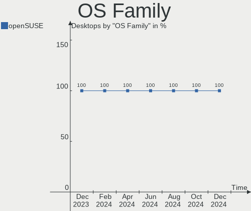
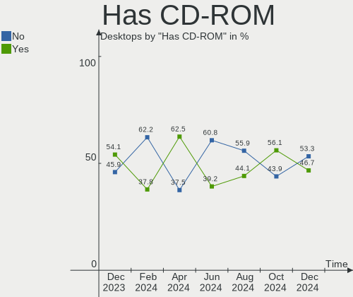
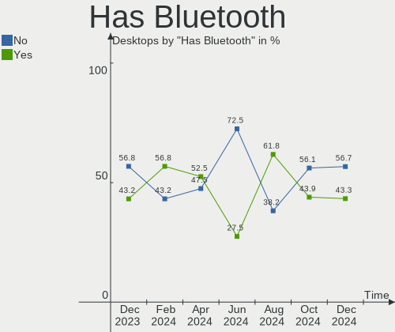
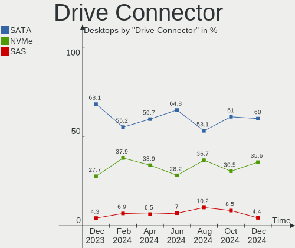
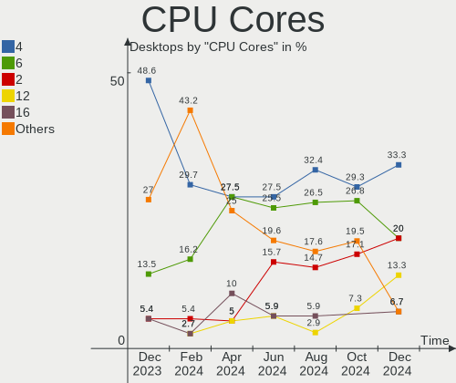
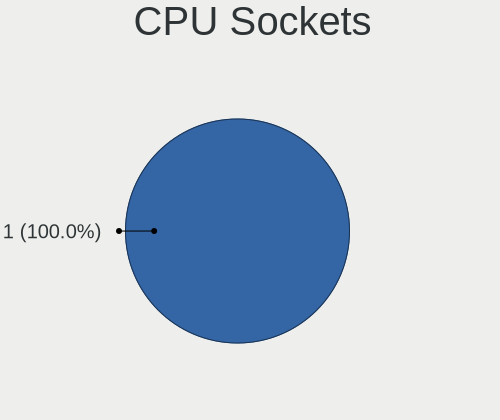
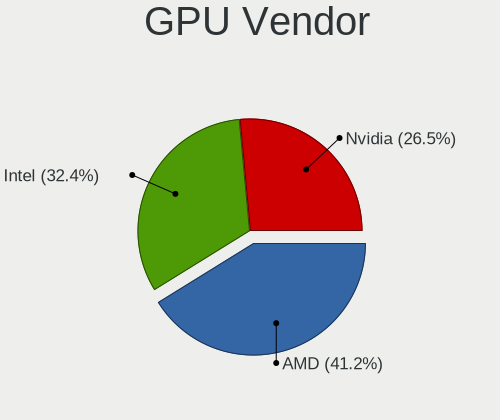
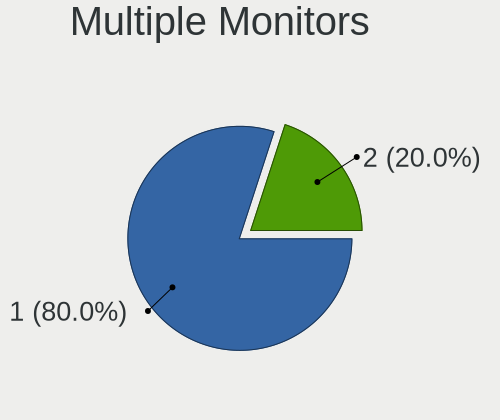
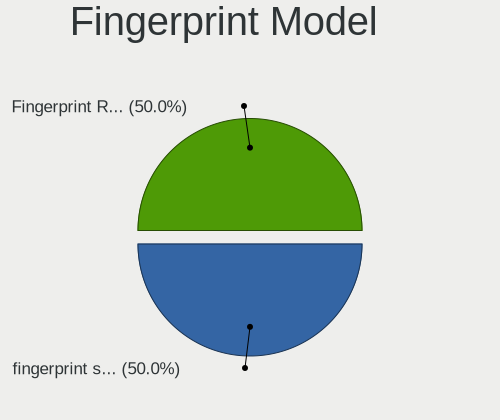

openSUSE Hardware Trends (Desktops)
-----------------------------------

A project to identify most popular hardware characteristics and track their change
over time based on data collected by openSUSE users at https://Linux-Hardware.org.

Anyone can contribute to this report by the [hw-probe](https://github.com/linuxhw/hw-probe) tool:

    sudo -E hw-probe -all -upload

Full-feature report is available here: https://linux-hardware.org/?view=trends

Period: Dec, 2021.

Contents
--------

* [ System ](#system)
  - [ OS                       ](#os)
  - [ OS Family                ](#os-family)
  - [ Kernel                   ](#kernel)
  - [ Kernel Family            ](#kernel-family)
  - [ Kernel Major Ver.        ](#kernel-major-ver)
  - [ Arch                     ](#arch)
  - [ DE                       ](#de)
  - [ Display Server           ](#display-server)
  - [ Display Manager          ](#display-manager)
  - [ OS Lang                  ](#os-lang)
  - [ Boot Mode                ](#boot-mode)
  - [ Filesystem               ](#filesystem)
  - [ Part. scheme             ](#part-scheme)
  - [ Dual Boot with Linux/BSD ](#dual-boot-with-linuxbsd)
  - [ Dual Boot (Win)          ](#dual-boot-win)

* [ Board ](#board)
  - [ Vendor                   ](#vendor)
  - [ Model                    ](#model)
  - [ Model Family             ](#model-family)
  - [ MFG Year                 ](#mfg-year)
  - [ Form Factor              ](#form-factor)
  - [ Secure Boot              ](#secure-boot)
  - [ Coreboot                 ](#coreboot)
  - [ RAM Size                 ](#ram-size)
  - [ RAM Used                 ](#ram-used)
  - [ Total Drives             ](#total-drives)
  - [ Has CD-ROM               ](#has-cd-rom)
  - [ Has Ethernet             ](#has-ethernet)
  - [ Has WiFi                 ](#has-wifi)
  - [ Has Bluetooth            ](#has-bluetooth)

* [ Location ](#location)
  - [ Country                  ](#country)
  - [ City                     ](#city)

* [ Drives ](#drives)
  - [ Drive Vendor             ](#drive-vendor)
  - [ Drive Model              ](#drive-model)
  - [ HDD Vendor               ](#hdd-vendor)
  - [ SSD Vendor               ](#ssd-vendor)
  - [ Drive Kind               ](#drive-kind)
  - [ Drive Connector          ](#drive-connector)
  - [ Drive Size               ](#drive-size)
  - [ Space Total              ](#space-total)
  - [ Space Used               ](#space-used)
  - [ Malfunc. Drives          ](#malfunc-drives)
  - [ Malfunc. Drive Vendor    ](#malfunc-drive-vendor)
  - [ Malfunc. HDD Vendor      ](#malfunc-hdd-vendor)
  - [ Malfunc. Drive Kind      ](#malfunc-drive-kind)
  - [ Failed Drives            ](#failed-drives)
  - [ Failed Drive Vendor      ](#failed-drive-vendor)
  - [ Drive Status             ](#drive-status)

* [ Storage controller ](#storage-controller)
  - [ Storage Vendor           ](#storage-vendor)
  - [ Storage Model            ](#storage-model)
  - [ Storage Kind             ](#storage-kind)

* [ Processor ](#processor)
  - [ CPU Vendor               ](#cpu-vendor)
  - [ CPU Model                ](#cpu-model)
  - [ CPU Model Family         ](#cpu-model-family)
  - [ CPU Cores                ](#cpu-cores)
  - [ CPU Sockets              ](#cpu-sockets)
  - [ CPU Threads              ](#cpu-threads)
  - [ CPU Op-Modes             ](#cpu-op-modes)
  - [ CPU Microcode            ](#cpu-microcode)
  - [ CPU Microarch            ](#cpu-microarch)

* [ Graphics ](#graphics)
  - [ GPU Vendor               ](#gpu-vendor)
  - [ GPU Model                ](#gpu-model)
  - [ GPU Combo                ](#gpu-combo)
  - [ GPU Driver               ](#gpu-driver)
  - [ GPU Memory               ](#gpu-memory)

* [ Monitor ](#monitor)
  - [ Monitor Vendor           ](#monitor-vendor)
  - [ Monitor Model            ](#monitor-model)
  - [ Monitor Resolution       ](#monitor-resolution)
  - [ Monitor Diagonal         ](#monitor-diagonal)
  - [ Monitor Width            ](#monitor-width)
  - [ Aspect Ratio             ](#aspect-ratio)
  - [ Monitor Area             ](#monitor-area)
  - [ Pixel Density            ](#pixel-density)
  - [ Multiple Monitors        ](#multiple-monitors)

* [ Network ](#network)
  - [ Net Controller Vendor    ](#net-controller-vendor)
  - [ Net Controller Model     ](#net-controller-model)
  - [ Wireless Vendor          ](#wireless-vendor)
  - [ Wireless Model           ](#wireless-model)
  - [ Ethernet Vendor          ](#ethernet-vendor)
  - [ Ethernet Model           ](#ethernet-model)
  - [ Net Controller Kind      ](#net-controller-kind)
  - [ Used Controller          ](#used-controller)
  - [ NICs                     ](#nics)
  - [ IPv6                     ](#ipv6)

* [ Bluetooth ](#bluetooth)
  - [ Bluetooth Vendor         ](#bluetooth-vendor)
  - [ Bluetooth Model          ](#bluetooth-model)

* [ Sound ](#sound)
  - [ Sound Vendor             ](#sound-vendor)
  - [ Sound Model              ](#sound-model)

* [ Memory ](#memory)
  - [ Memory Vendor            ](#memory-vendor)
  - [ Memory Model             ](#memory-model)
  - [ Memory Kind              ](#memory-kind)
  - [ Memory Form Factor       ](#memory-form-factor)
  - [ Memory Size              ](#memory-size)
  - [ Memory Speed             ](#memory-speed)

* [ Printers & scanners ](#printers--scanners)
  - [ Printer Vendor           ](#printer-vendor)
  - [ Printer Model            ](#printer-model)
  - [ Scanner Vendor           ](#scanner-vendor)
  - [ Scanner Model            ](#scanner-model)

* [ Camera ](#camera)
  - [ Camera Vendor            ](#camera-vendor)
  - [ Camera Model             ](#camera-model)

* [ Security ](#security)
  - [ Fingerprint Vendor       ](#fingerprint-vendor)
  - [ Fingerprint Model        ](#fingerprint-model)
  - [ Chipcard Vendor          ](#chipcard-vendor)
  - [ Chipcard Model           ](#chipcard-model)

* [ Unsupported ](#unsupported)
  - [ Unsupported Devices      ](#unsupported-devices)
  - [ Unsupported Device Types ](#unsupported-device-types)

System
------

OS
--

Installed operating systems

| Name                         | Desktops | Percent |
|------------------------------|----------|---------|
| openSUSE Leap-15.3           | 6        | 26.09%  |
| openSUSE Leap-15.2           | 4        | 17.39%  |
| openSUSE Tumbleweed-20211203 | 2        | 8.7%    |
| openSUSE 20211222            | 2        | 8.7%    |
| openSUSE Tumbleweed-20211219 | 1        | 4.35%   |
| openSUSE Tumbleweed-20211202 | 1        | 4.35%   |
| openSUSE Tumbleweed-20211130 | 1        | 4.35%   |
| openSUSE Leap-15.4           | 1        | 4.35%   |
| openSUSE 20211228            | 1        | 4.35%   |
| openSUSE 20211225            | 1        | 4.35%   |
| openSUSE 20211221            | 1        | 4.35%   |
| openSUSE 20211209            | 1        | 4.35%   |
| openSUSE 20211126            | 1        | 4.35%   |

OS Family
---------

OS without a version

| Name     | Desktops | Percent |
|----------|----------|---------|
| openSUSE | 23       | 100%    |

Kernel
------

Version of the Linux kernel

| Version                  | Desktops | Percent |
|--------------------------|----------|---------|
| 5.3.18-59.37-default     | 5        | 21.74%  |
| 5.15.8-1-default         | 5        | 21.74%  |
| 5.15.5-1-default         | 4        | 17.39%  |
| 5.3.18-lp152.106-preempt | 3        | 13.04%  |
| 5.3.18-59.34-default     | 1        | 4.35%   |
| 5.3.18-59.24-default     | 1        | 4.35%   |
| 5.15.7-1-default         | 1        | 4.35%   |
| 5.15.6-1-default         | 1        | 4.35%   |
| 5.15.3-1-default         | 1        | 4.35%   |
| 5.14.19-150400.1-default | 1        | 4.35%   |

Kernel Family
-------------

Linux kernel without a distro release

| Version | Desktops | Percent |
|---------|----------|---------|
| 5.3.18  | 10       | 43.48%  |
| 5.15.8  | 5        | 21.74%  |
| 5.15.5  | 4        | 17.39%  |
| 5.15.7  | 1        | 4.35%   |
| 5.15.6  | 1        | 4.35%   |
| 5.15.3  | 1        | 4.35%   |
| 5.14.19 | 1        | 4.35%   |

Kernel Major Ver.
-----------------

Linux kernel major version

| Version | Desktops | Percent |
|---------|----------|---------|
| 5.15    | 12       | 52.17%  |
| 5.3     | 10       | 43.48%  |
| 5.14    | 1        | 4.35%   |

Arch
----

OS architecture (x86_64, i586, etc.)

| Name   | Desktops | Percent |
|--------|----------|---------|
| x86_64 | 23       | 100%    |

DE
--

Desktop Environment

| Name    | Desktops | Percent |
|---------|----------|---------|
| KDE5    | 15       | 65.22%  |
| GNOME   | 3        | 13.04%  |
| Unknown | 2        | 8.7%    |
| XFCE    | 1        | 4.35%   |
| KDE     | 1        | 4.35%   |
| awesome | 1        | 4.35%   |

Display Server
--------------

X11 or Wayland

| Name        | Desktops | Percent |
|-------------|----------|---------|
| X11         | 18       | 78.26%  |
| Wayland     | 3        | 13.04%  |
| Unspecified | 1        | 4.35%   |
| Tty         | 1        | 4.35%   |

Display Manager
---------------

SDDM, LightDM, etc.

| Name    | Desktops | Percent |
|---------|----------|---------|
| Unknown | 8        | 34.78%  |
| SDDM    | 6        | 26.09%  |
| LightDM | 6        | 26.09%  |
| XDM     | 3        | 13.04%  |

OS Lang
-------

Language

| Lang    | Desktops | Percent |
|---------|----------|---------|
| en_US   | 8        | 34.78%  |
| de_DE   | 5        | 21.74%  |
| POSIX   | 2        | 8.7%    |
| nl_BE   | 2        | 8.7%    |
| zh_CN   | 1        | 4.35%   |
| wbp_AU  | 1        | 4.35%   |
| tr_TR   | 1        | 4.35%   |
| nl_NL   | 1        | 4.35%   |
| ca_AD   | 1        | 4.35%   |
| Unknown | 1        | 4.35%   |

Boot Mode
---------

EFI or BIOS

| Mode | Desktops | Percent |
|------|----------|---------|
| EFI  | 16       | 69.57%  |
| BIOS | 7        | 30.43%  |

Filesystem
----------

Type of filesystem

| Type  | Desktops | Percent |
|-------|----------|---------|
| Btrfs | 20       | 86.96%  |
| Ext4  | 3        | 13.04%  |

Part. scheme
------------

Scheme of partitioning

| Type    | Desktops | Percent |
|---------|----------|---------|
| GPT     | 13       | 56.52%  |
| Unknown | 9        | 39.13%  |
| MBR     | 1        | 4.35%   |

Dual Boot with Linux/BSD
------------------------

Hosting more than one Linux/BSD

| Dual boot | Desktops | Percent |
|-----------|----------|---------|
| No        | 19       | 82.61%  |
| Yes       | 4        | 17.39%  |

Dual Boot (Win)
---------------

Hosting Linux and Windows

| Dual boot | Desktops | Percent |
|-----------|----------|---------|
| No        | 16       | 69.57%  |
| Yes       | 7        | 30.43%  |

Board
-----

Vendor
------

Motherboard manufacturer

| Name                | Desktops | Percent |
|---------------------|----------|---------|
| ASUSTek Computer    | 10       | 43.48%  |
| MSI                 | 3        | 13.04%  |
| Hewlett-Packard     | 2        | 8.7%    |
| Pegatron            | 1        | 4.35%   |
| Lenovo              | 1        | 4.35%   |
| Intel               | 1        | 4.35%   |
| Gigabyte Technology | 1        | 4.35%   |
| Fujitsu             | 1        | 4.35%   |
| Dell                | 1        | 4.35%   |
| Biostar             | 1        | 4.35%   |
| ASRock              | 1        | 4.35%   |

Model
-----

Motherboard model

| Name                                | Desktops | Percent |
|-------------------------------------|----------|---------|
| Pegatron p2-1343w                   | 1        | 4.35%   |
| MSI MS-7B86                         | 1        | 4.35%   |
| MSI MS-7786                         | 1        | 4.35%   |
| MSI MS-7721                         | 1        | 4.35%   |
| Lenovo ThinkCentre M720s 10ST0014MB | 1        | 4.35%   |
| Intel DG965RY AAD41691-301          | 1        | 4.35%   |
| HP xw6600 Workstation               | 1        | 4.35%   |
| HP 870-115ng                        | 1        | 4.35%   |
| Gigabyte B460MDS3HAC                | 1        | 4.35%   |
| Fujitsu ESPRIMO P410                | 1        | 4.35%   |
| Dell Inspiron 530                   | 1        | 4.35%   |
| Biostar X370GT5                     | 1        | 4.35%   |
| ASUS TUF GAMING B550M-ZAKU          | 1        | 4.35%   |
| ASUS SABERTOOTH X79                 | 1        | 4.35%   |
| ASUS ROG CROSSHAIR VIII HERO        | 1        | 4.35%   |
| ASUS PRO B460M-C                    | 1        | 4.35%   |
| ASUS PRIME A320M-E                  | 1        | 4.35%   |
| ASUS P9X79 PRO                      | 1        | 4.35%   |
| ASUS P8Z77-V LX                     | 1        | 4.35%   |
| ASUS P8Z68-V                        | 1        | 4.35%   |
| ASUS 970 PRO GAMING/AURA            | 1        | 4.35%   |
| ASUS 5957                           | 1        | 4.35%   |
| ASRock Z68 Extreme4 Gen3            | 1        | 4.35%   |

Model Family
------------

Motherboard model prefix

| Name                 | Desktops | Percent |
|----------------------|----------|---------|
| Pegatron p2-1343w    | 1        | 4.35%   |
| MSI MS-7B86          | 1        | 4.35%   |
| MSI MS-7786          | 1        | 4.35%   |
| MSI MS-7721          | 1        | 4.35%   |
| Lenovo ThinkCentre   | 1        | 4.35%   |
| Intel DG965RY        | 1        | 4.35%   |
| HP xw6600            | 1        | 4.35%   |
| HP 870-115ng         | 1        | 4.35%   |
| Gigabyte B460MDS3HAC | 1        | 4.35%   |
| Fujitsu ESPRIMO      | 1        | 4.35%   |
| Dell Inspiron        | 1        | 4.35%   |
| Biostar X370GT5      | 1        | 4.35%   |
| ASUS TUF             | 1        | 4.35%   |
| ASUS SABERTOOTH      | 1        | 4.35%   |
| ASUS ROG             | 1        | 4.35%   |
| ASUS PRO             | 1        | 4.35%   |
| ASUS PRIME           | 1        | 4.35%   |
| ASUS P9X79           | 1        | 4.35%   |
| ASUS P8Z77-V         | 1        | 4.35%   |
| ASUS P8Z68-V         | 1        | 4.35%   |
| ASUS 970             | 1        | 4.35%   |
| ASUS 5957            | 1        | 4.35%   |
| ASRock Z68           | 1        | 4.35%   |

MFG Year
--------

Motherboard manufacture year

| Year | Desktops | Percent |
|------|----------|---------|
| 2021 | 4        | 17.39%  |
| 2019 | 3        | 13.04%  |
| 2014 | 3        | 13.04%  |
| 2020 | 2        | 8.7%    |
| 2016 | 2        | 8.7%    |
| 2013 | 2        | 8.7%    |
| 2012 | 2        | 8.7%    |
| 2011 | 2        | 8.7%    |
| 2015 | 1        | 4.35%   |
| 2009 | 1        | 4.35%   |
| 2007 | 1        | 4.35%   |

Form Factor
-----------

Physical design of the computer

| Name    | Desktops | Percent |
|---------|----------|---------|
| Desktop | 23       | 100%    |

Secure Boot
-----------

Enabled or disabled

| State    | Desktops | Percent |
|----------|----------|---------|
| Disabled | 22       | 95.65%  |
| Enabled  | 1        | 4.35%   |

Coreboot
--------

Have coreboot on board

| Used | Desktops | Percent |
|------|----------|---------|
| No   | 23       | 100%    |

RAM Size
--------

Total RAM memory

| Size in GB  | Desktops | Percent |
|-------------|----------|---------|
| 16.01-24.0  | 8        | 34.78%  |
| 8.01-16.0   | 7        | 30.43%  |
| 32.01-64.0  | 3        | 13.04%  |
| 3.01-4.0    | 2        | 8.7%    |
| 64.01-256.0 | 2        | 8.7%    |
| 4.01-8.0    | 1        | 4.35%   |

RAM Used
--------

Used RAM memory

| Used GB   | Desktops | Percent |
|-----------|----------|---------|
| 4.01-8.0  | 9        | 39.13%  |
| 1.01-2.0  | 5        | 21.74%  |
| 2.01-3.0  | 4        | 17.39%  |
| 0.51-1.0  | 3        | 13.04%  |
| 3.01-4.0  | 1        | 4.35%   |
| 8.01-16.0 | 1        | 4.35%   |

Total Drives
------------

Number of drives on board

| Drives | Desktops | Percent |
|--------|----------|---------|
| 3      | 6        | 26.09%  |
| 2      | 6        | 26.09%  |
| 1      | 5        | 21.74%  |
| 4      | 4        | 17.39%  |
| 7      | 1        | 4.35%   |
| 5      | 1        | 4.35%   |

Has CD-ROM
----------

Has CD-ROM on board

| Presented | Desktops | Percent |
|-----------|----------|---------|
| No        | 12       | 52.17%  |
| Yes       | 11       | 47.83%  |

Has Ethernet
------------

Has Ethernet on board

| Presented | Desktops | Percent |
|-----------|----------|---------|
| Yes       | 23       | 100%    |

Has WiFi
--------

Has WiFi module

| Presented | Desktops | Percent |
|-----------|----------|---------|
| No        | 14       | 60.87%  |
| Yes       | 9        | 39.13%  |

Has Bluetooth
-------------

Has Bluetooth module

| Presented | Desktops | Percent |
|-----------|----------|---------|
| No        | 13       | 56.52%  |
| Yes       | 10       | 43.48%  |

Location
--------

Country
-------

Geographic location (country)

| Country     | Desktops | Percent |
|-------------|----------|---------|
| Germany     | 7        | 30.43%  |
| USA         | 3        | 13.04%  |
| Serbia      | 2        | 8.7%    |
| Belgium     | 2        | 8.7%    |
| Australia   | 2        | 8.7%    |
| UK          | 1        | 4.35%   |
| Turkey      | 1        | 4.35%   |
| Spain       | 1        | 4.35%   |
| New Zealand | 1        | 4.35%   |
| Netherlands | 1        | 4.35%   |
| China       | 1        | 4.35%   |
| Andorra     | 1        | 4.35%   |

City
----

Geographic location (city)

| City             | Desktops | Percent |
|------------------|----------|---------|
| Sydney           | 2        | 8.7%    |
| Belgrade         | 2        | 8.7%    |
| Zierikzee        | 1        | 4.35%   |
| Xi'an            | 1        | 4.35%   |
| Seymour          | 1        | 4.35%   |
| Kapellen         | 1        | 4.35%   |
| Hamburg          | 1        | 4.35%   |
| Halle            | 1        | 4.35%   |
| Gifhorn          | 1        | 4.35%   |
| Giessen          | 1        | 4.35%   |
| Gernsbach        | 1        | 4.35%   |
| East Longmeadow  | 1        | 4.35%   |
| Christchurch     | 1        | 4.35%   |
| Brush            | 1        | 4.35%   |
| Bonnybridge      | 1        | 4.35%   |
| Berlin           | 1        | 4.35%   |
| Barcelona        | 1        | 4.35%   |
| Antwerp          | 1        | 4.35%   |
| Antalya          | 1        | 4.35%   |
| Andorra la Vella | 1        | 4.35%   |
| Algermissen      | 1        | 4.35%   |

Drives
------

Drive Vendor
------------

Hard drive vendors

| Vendor              | Desktops | Drives | Percent |
|---------------------|----------|--------|---------|
| Seagate             | 12       | 18     | 23.08%  |
| WDC                 | 9        | 13     | 17.31%  |
| Toshiba             | 6        | 6      | 11.54%  |
| Samsung Electronics | 5        | 7      | 9.62%   |
| Hitachi             | 4        | 4      | 7.69%   |
| Crucial             | 3        | 3      | 5.77%   |
| SanDisk             | 2        | 2      | 3.85%   |
| Biostar             | 2        | 2      | 3.85%   |
| Unknown             | 1        | 1      | 1.92%   |
| SPCC                | 1        | 1      | 1.92%   |
| Phison              | 1        | 1      | 1.92%   |
| Patriot             | 1        | 1      | 1.92%   |
| Mushkin             | 1        | 1      | 1.92%   |
| Kingston            | 1        | 1      | 1.92%   |
| Corsair             | 1        | 1      | 1.92%   |
| CHIPFANC            | 1        | 1      | 1.92%   |
| A-DATA Technology   | 1        | 1      | 1.92%   |

Drive Model
-----------

Hard drive models

| Model                                      | Desktops | Percent |
|--------------------------------------------|----------|---------|
| Seagate ST2000DM008-2FR102 2TB             | 4        | 6.56%   |
| Seagate ST500DM002-1BD142 500GB            | 3        | 4.92%   |
| Toshiba HDWD110 1TB                        | 2        | 3.28%   |
| Hitachi HDS721050CLA360 500GB              | 2        | 3.28%   |
| Biostar S100-240GB PLUS SSD                | 2        | 3.28%   |
| WDC WDS240G2G0B-00EPW0 240GB SSD           | 1        | 1.64%   |
| WDC WDS200T3XHC-00SJG0 2TB                 | 1        | 1.64%   |
| WDC WDS200T2B0A-00SM50 2TB SSD             | 1        | 1.64%   |
| WDC WD80EFAX-68KNBN0 8TB                   | 1        | 1.64%   |
| WDC WD60EZRZ-00RWYB1 6TB                   | 1        | 1.64%   |
| WDC WD5000AAKS-00A7B0 500GB                | 1        | 1.64%   |
| WDC WD40EFRX-68N32N0 4TB                   | 1        | 1.64%   |
| WDC WD2500BEVT-60ZCT1 250GB                | 1        | 1.64%   |
| WDC WD10EZEX-22MFCA0 1TB                   | 1        | 1.64%   |
| WDC WD10EZEX-08WN4A0 1TB                   | 1        | 1.64%   |
| WDC WD10EZEX-00BN5A0 1TB                   | 1        | 1.64%   |
| WDC WD10EAVS-22D7B0 1TB                    | 1        | 1.64%   |
| Unknown SD/MMC/MS PRO 7GB                  | 1        | 1.64%   |
| Toshiba TR200 240GB SSD                    | 1        | 1.64%   |
| Toshiba TL100 240GB SSD                    | 1        | 1.64%   |
| Toshiba Q300. 480GB SSD                    | 1        | 1.64%   |
| Toshiba KXG5AZNV256G 256GB                 | 1        | 1.64%   |
| SPCC Solid State Disk 120GB                | 1        | 1.64%   |
| Seagate ST4000DM004-2CV104 4TB             | 1        | 1.64%   |
| Seagate ST3500418AS 500GB                  | 1        | 1.64%   |
| Seagate ST3320620AS 320GB                  | 1        | 1.64%   |
| Seagate ST16000NM001G-2KK103 16TB          | 1        | 1.64%   |
| Seagate ST1000VX000-1CU162 1TB             | 1        | 1.64%   |
| Seagate ST1000DX001-1CM162 1TB             | 1        | 1.64%   |
| Seagate NVMe SSD Drive 500GB               | 1        | 1.64%   |
| Seagate FireCuda 520 SSD ZP2000GM30002 2TB | 1        | 1.64%   |
| Seagate Expansion 1TB                      | 1        | 1.64%   |
| SanDisk Ultra II 1TB SSD                   | 1        | 1.64%   |
| SanDisk SSD PLUS 240GB                     | 1        | 1.64%   |
| Samsung SSD 970 EVO Plus 500GB             | 1        | 1.64%   |
| Samsung SSD 870 QVO 1TB                    | 1        | 1.64%   |
| Samsung SSD 860 EVO 1TB                    | 1        | 1.64%   |
| Samsung SSD 840 EVO 500GB                  | 1        | 1.64%   |
| Samsung SSD 840 EVO 250GB                  | 1        | 1.64%   |
| Samsung HD105SI 1TB                        | 1        | 1.64%   |
| Samsung HD103SI 1TB                        | 1        | 1.64%   |
| Phison NVMe SSD Drive 512GB                | 1        | 1.64%   |
| Patriot Torqx 2 128GB SSD                  | 1        | 1.64%   |
| Mushkin MKNSSDRE1TB                        | 1        | 1.64%   |
| Kingston SA400M8240G 240GB SSD             | 1        | 1.64%   |
| Hitachi HDS721010CLA632 1TB                | 1        | 1.64%   |
| Hitachi HDS5C3020ALA632 2TB                | 1        | 1.64%   |
| Crucial CT500MX500SSD1 500GB               | 1        | 1.64%   |
| Crucial CT2000P2SSD8 2TB                   | 1        | 1.64%   |
| Crucial CT1000MX500SSD1 1TB                | 1        | 1.64%   |
| Corsair MP600 CORE 2TB                     | 1        | 1.64%   |
| CHIPFANC IER SE 506GB                      | 1        | 1.64%   |
| A-DATA SU630 240GB SSD                     | 1        | 1.64%   |

HDD Vendor
----------

Hard disk drive vendors

| Vendor              | Desktops | Drives | Percent |
|---------------------|----------|--------|---------|
| Seagate             | 12       | 16     | 44.44%  |
| WDC                 | 7        | 10     | 25.93%  |
| Hitachi             | 4        | 4      | 14.81%  |
| Toshiba             | 2        | 2      | 7.41%   |
| Unknown             | 1        | 1      | 3.7%    |
| Samsung Electronics | 1        | 2      | 3.7%    |

SSD Vendor
----------

Solid state drive vendors

| Vendor              | Desktops | Drives | Percent |
|---------------------|----------|--------|---------|
| Samsung Electronics | 4        | 4      | 20%     |
| Toshiba             | 3        | 3      | 15%     |
| WDC                 | 2        | 2      | 10%     |
| SanDisk             | 2        | 2      | 10%     |
| Crucial             | 2        | 2      | 10%     |
| Biostar             | 2        | 2      | 10%     |
| SPCC                | 1        | 1      | 5%      |
| Patriot             | 1        | 1      | 5%      |
| Mushkin             | 1        | 1      | 5%      |
| Kingston            | 1        | 1      | 5%      |
| A-DATA Technology   | 1        | 1      | 5%      |

Drive Kind
----------

HDD or SSD

| Kind    | Desktops | Drives | Percent |
|---------|----------|--------|---------|
| HDD     | 19       | 35     | 47.5%   |
| SSD     | 14       | 20     | 35%     |
| NVMe    | 6        | 8      | 15%     |
| Unknown | 1        | 1      | 2.5%    |

Drive Connector
---------------

SATA, SAS, NVMe, etc.

| Type | Desktops | Drives | Percent |
|------|----------|--------|---------|
| SATA | 22       | 53     | 70.97%  |
| NVMe | 6        | 8      | 19.35%  |
| SAS  | 3        | 3      | 9.68%   |

Drive Size
----------

Size of hard drive

| Size in TB | Desktops | Drives | Percent |
|------------|----------|--------|---------|
| 0.01-0.5   | 16       | 24     | 41.03%  |
| 0.51-1.0   | 13       | 17     | 33.33%  |
| 1.01-2.0   | 6        | 7      | 15.38%  |
| 3.01-4.0   | 2        | 3      | 5.13%   |
| 10.01-20.0 | 1        | 2      | 2.56%   |
| 4.01-10.0  | 1        | 2      | 2.56%   |

Space Total
-----------

Amount of disk space available on the file system

| Size in GB     | Desktops | Percent |
|----------------|----------|---------|
| More than 3000 | 15       | 65.22%  |
| 1001-2000      | 5        | 21.74%  |
| 2001-3000      | 2        | 8.7%    |
| 501-1000       | 1        | 4.35%   |

Space Used
----------

Amount of used disk space

| Used GB        | Desktops | Percent |
|----------------|----------|---------|
| 1001-2000      | 9        | 39.13%  |
| 251-500        | 4        | 17.39%  |
| 501-1000       | 4        | 17.39%  |
| More than 3000 | 3        | 13.04%  |
| 2001-3000      | 2        | 8.7%    |
| 51-100         | 1        | 4.35%   |

Malfunc. Drives
---------------

Drive models with a malfunction

| Model                           | Desktops | Drives | Percent |
|---------------------------------|----------|--------|---------|
| WDC WD2500BEVT-60ZCT1 250GB     | 1        | 1      | 25%     |
| Seagate ST500DM002-1BD142 500GB | 1        | 1      | 25%     |
| Seagate ST3500418AS 500GB       | 1        | 1      | 25%     |
| Seagate ST3320620AS 320GB       | 1        | 1      | 25%     |

Malfunc. Drive Vendor
---------------------

Vendors of faulty drives

| Vendor  | Desktops | Drives | Percent |
|---------|----------|--------|---------|
| Seagate | 3        | 3      | 75%     |
| WDC     | 1        | 1      | 25%     |

Malfunc. HDD Vendor
-------------------

Vendors of faulty HDD drives

| Vendor  | Desktops | Drives | Percent |
|---------|----------|--------|---------|
| Seagate | 3        | 3      | 75%     |
| WDC     | 1        | 1      | 25%     |

Malfunc. Drive Kind
-------------------

Kinds of faulty drives

| Kind | Desktops | Drives | Percent |
|------|----------|--------|---------|
| HDD  | 4        | 4      | 100%    |

Failed Drives
-------------

Failed drive models

Zero info for selected period =(

Failed Drive Vendor
-------------------

Failed drive vendors

Zero info for selected period =(

Drive Status
------------

Number of failed and malfunc. drives

| Status   | Desktops | Drives | Percent |
|----------|----------|--------|---------|
| Works    | 13       | 39     | 50%     |
| Detected | 9        | 21     | 34.62%  |
| Malfunc  | 4        | 4      | 15.38%  |

Storage controller
------------------

Storage Vendor
--------------

Storage controller vendors

| Vendor                       | Desktops | Percent |
|------------------------------|----------|---------|
| Intel                        | 13       | 33.33%  |
| AMD                          | 10       | 25.64%  |
| Marvell Technology Group     | 3        | 7.69%   |
| Seagate Technology           | 2        | 5.13%   |
| Phison Electronics           | 2        | 5.13%   |
| ASMedia Technology           | 2        | 5.13%   |
| Toshiba America Info Systems | 1        | 2.56%   |
| Sandisk                      | 1        | 2.56%   |
| Samsung Electronics          | 1        | 2.56%   |
| Promise Technology           | 1        | 2.56%   |
| Micron/Crucial Technology    | 1        | 2.56%   |
| JMicron Technology           | 1        | 2.56%   |
| Adaptec                      | 1        | 2.56%   |

Storage Model
-------------

Storage controller models

| Model                                                                            | Desktops | Percent |
|----------------------------------------------------------------------------------|----------|---------|
| AMD FCH SATA Controller [AHCI mode]                                              | 6        | 13.64%  |
| Intel 6 Series/C200 Series Chipset Family 6 port Desktop SATA AHCI Controller    | 3        | 6.82%   |
| Intel C600/X79 series chipset 6-Port SATA AHCI Controller                        | 2        | 4.55%   |
| Intel 400 Series Chipset Family SATA AHCI Controller                             | 2        | 4.55%   |
| ASMedia ASM1062 Serial ATA Controller                                            | 2        | 4.55%   |
| AMD Starship/Matisse Chipset SATA Controller [AHCI mode]                         | 2        | 4.55%   |
| Toshiba America Info Systems Toshiba America Info Non-Volatile memory controller | 1        | 2.27%   |
| Seagate FireCuda 520 SSD                                                         | 1        | 2.27%   |
| Seagate FireCuda 510 SSD                                                         | 1        | 2.27%   |
| Sandisk WD Black 2018/SN750 / PC SN720 NVMe SSD                                  | 1        | 2.27%   |
| Samsung NVMe SSD Controller SM981/PM981/PM983                                    | 1        | 2.27%   |
| Promise PDC40719 [FastTrak TX4300/TX4310]                                        | 1        | 2.27%   |
| Phison PS5013 E13 NVMe Controller                                                | 1        | 2.27%   |
| Phison E16 PCIe4 NVMe Controller                                                 | 1        | 2.27%   |
| Micron/Crucial P2 NVMe PCIe SSD                                                  | 1        | 2.27%   |
| Marvell Group 88SE912x SATA 6Gb/s Controller [IDE mode]                          | 1        | 2.27%   |
| Marvell Group 88SE9128 PCIe SATA 6 Gb/s RAID controller with HyperDuo            | 1        | 2.27%   |
| Marvell Group 88SE6101/6102 single-port PATA133 interface                        | 1        | 2.27%   |
| JMicron JMB362 SATA Controller                                                   | 1        | 2.27%   |
| Intel Q170/Q150/B150/H170/H110/Z170/CM236 Chipset SATA Controller [AHCI Mode]    | 1        | 2.27%   |
| Intel Cannon Lake PCH SATA AHCI Controller                                       | 1        | 2.27%   |
| Intel 82801IR/IO/IH (ICH9R/DO/DH) 4 port SATA Controller [IDE mode]              | 1        | 2.27%   |
| Intel 82801I (ICH9 Family) 2 port SATA Controller [IDE mode]                     | 1        | 2.27%   |
| Intel 82801HB (ICH8) 4 port SATA Controller [AHCI mode]                          | 1        | 2.27%   |
| Intel 7 Series/C210 Series Chipset Family 6-port SATA Controller [AHCI mode]     | 1        | 2.27%   |
| Intel 631xESB/632xESB SATA RAID Controller                                       | 1        | 2.27%   |
| Intel 631xESB/632xESB IDE Controller                                             | 1        | 2.27%   |
| AMD X370 Series Chipset SATA Controller                                          | 1        | 2.27%   |
| AMD SB7x0/SB8x0/SB9x0 SATA Controller [IDE mode]                                 | 1        | 2.27%   |
| AMD SB7x0/SB8x0/SB9x0 SATA Controller [AHCI mode]                                | 1        | 2.27%   |
| AMD FCH SATA Controller D                                                        | 1        | 2.27%   |
| AMD 400 Series Chipset SATA Controller                                           | 1        | 2.27%   |
| Adaptec AIC-7892A U160/m                                                         | 1        | 2.27%   |

Storage Kind
------------

Kind of storage controller (IDE, SATA, NVMe, SAS, ...)

| Kind | Desktops | Percent |
|------|----------|---------|
| SATA | 21       | 61.76%  |
| NVMe | 6        | 17.65%  |
| IDE  | 4        | 11.76%  |
| RAID | 2        | 5.88%   |
| SCSI | 1        | 2.94%   |

Processor
---------

CPU Vendor
----------

Processor vendors

| Vendor | Desktops | Percent |
|--------|----------|---------|
| Intel  | 13       | 56.52%  |
| AMD    | 10       | 43.48%  |

CPU Model
---------

Processor models

| Model                                      | Desktops | Percent |
|--------------------------------------------|----------|---------|
| AMD Ryzen 9 5950X 16-Core Processor        | 2        | 8.7%    |
| Intel Xeon CPU E5450 @ 3.00GHz             | 1        | 4.35%   |
| Intel Xeon CPU E5-2687W v2 @ 3.40GHz       | 1        | 4.35%   |
| Intel Pentium Dual CPU E2160 @ 1.80GHz     | 1        | 4.35%   |
| Intel Core i7-8700 CPU @ 3.20GHz           | 1        | 4.35%   |
| Intel Core i7-6700 CPU @ 3.40GHz           | 1        | 4.35%   |
| Intel Core i7-4930K CPU @ 3.40GHz          | 1        | 4.35%   |
| Intel Core i5-3470 CPU @ 3.20GHz           | 1        | 4.35%   |
| Intel Core i5-3330 CPU @ 3.00GHz           | 1        | 4.35%   |
| Intel Core i5-2500 CPU @ 3.30GHz           | 1        | 4.35%   |
| Intel Core i5-10600K CPU @ 4.10GHz         | 1        | 4.35%   |
| Intel Core i5-10400F CPU @ 2.90GHz         | 1        | 4.35%   |
| Intel Core i3-2100 CPU @ 3.10GHz           | 1        | 4.35%   |
| Intel Core 2 CPU 6700 @ 2.66GHz            | 1        | 4.35%   |
| AMD Ryzen 7 PRO 4750G with Radeon Graphics | 1        | 4.35%   |
| AMD Ryzen 7 3700X 8-Core Processor         | 1        | 4.35%   |
| AMD Ryzen 5 2600 Six-Core Processor        | 1        | 4.35%   |
| AMD FX-8350 Eight-Core Processor           | 1        | 4.35%   |
| AMD E2-1800 APU with Radeon HD Graphics    | 1        | 4.35%   |
| AMD Athlon II X4 641 Quad-Core Processor   | 1        | 4.35%   |
| AMD Athlon 3000G with Radeon Vega Graphics | 1        | 4.35%   |
| AMD A6-5400K APU with Radeon HD Graphics   | 1        | 4.35%   |

CPU Model Family
----------------

Processor model prefix

| Model              | Desktops | Percent |
|--------------------|----------|---------|
| Intel Core i5      | 5        | 21.74%  |
| Intel Core i7      | 3        | 13.04%  |
| Intel Xeon         | 2        | 8.7%    |
| AMD Ryzen 9        | 2        | 8.7%    |
| Intel Pentium Dual | 1        | 4.35%   |
| Intel Core i3      | 1        | 4.35%   |
| Intel Core 2       | 1        | 4.35%   |
| AMD Ryzen 7 PRO    | 1        | 4.35%   |
| AMD Ryzen 7        | 1        | 4.35%   |
| AMD Ryzen 5        | 1        | 4.35%   |
| AMD FX             | 1        | 4.35%   |
| AMD E2             | 1        | 4.35%   |
| AMD Athlon II X4   | 1        | 4.35%   |
| AMD Athlon         | 1        | 4.35%   |
| AMD A6             | 1        | 4.35%   |

CPU Cores
---------

Number of processor cores

| Number | Desktops | Percent |
|--------|----------|---------|
| 4      | 6        | 26.09%  |
| 6      | 5        | 21.74%  |
| 2      | 5        | 21.74%  |
| 8      | 4        | 17.39%  |
| 16     | 2        | 8.7%    |
| 1      | 1        | 4.35%   |

CPU Sockets
-----------

Number of sockets

| Number | Desktops | Percent |
|--------|----------|---------|
| 1      | 22       | 95.65%  |
| 2      | 1        | 4.35%   |

CPU Threads
-----------

Threads per core (Hyper-Threading)

| Number | Desktops | Percent |
|--------|----------|---------|
| 2      | 15       | 65.22%  |
| 1      | 8        | 34.78%  |

CPU Op-Modes
------------

CPU Operation Modes (32-bit, 64-bit)

| Op mode        | Desktops | Percent |
|----------------|----------|---------|
| 32-bit, 64-bit | 23       | 100%    |

CPU Microcode
-------------

Microcode number

| Number     | Desktops | Percent |
|------------|----------|---------|
| Unknown    | 3        | 13.04%  |
| 0xa0655    | 2        | 8.7%    |
| 0x306a9    | 2        | 8.7%    |
| 0x0a201016 | 2        | 8.7%    |
| 0x906ea    | 1        | 4.35%   |
| 0x6fd      | 1        | 4.35%   |
| 0x6f6      | 1        | 4.35%   |
| 0x506e3    | 1        | 4.35%   |
| 0x306e4    | 1        | 4.35%   |
| 0x206a7    | 1        | 4.35%   |
| 0x10676    | 1        | 4.35%   |
| 0x08701021 | 1        | 4.35%   |
| 0x08600106 | 1        | 4.35%   |
| 0x08108102 | 1        | 4.35%   |
| 0x06001119 | 1        | 4.35%   |
| 0x06000852 | 1        | 4.35%   |
| 0x05000119 | 1        | 4.35%   |
| 0x03000027 | 1        | 4.35%   |

CPU Microarch
-------------

Microarchitecture

| Name        | Desktops | Percent |
|-------------|----------|---------|
| IvyBridge   | 4        | 17.39%  |
| Zen+        | 2        | 8.7%    |
| Zen 3       | 2        | 8.7%    |
| Zen 2       | 2        | 8.7%    |
| SandyBridge | 2        | 8.7%    |
| Piledriver  | 2        | 8.7%    |
| Core        | 2        | 8.7%    |
| CometLake   | 2        | 8.7%    |
| Skylake     | 1        | 4.35%   |
| Penryn      | 1        | 4.35%   |
| KabyLake    | 1        | 4.35%   |
| K10 Llano   | 1        | 4.35%   |
| Bobcat      | 1        | 4.35%   |

Graphics
--------

GPU Vendor
----------

Vendors of graphics cards

| Vendor | Desktops | Percent |
|--------|----------|---------|
| AMD    | 13       | 54.17%  |
| Nvidia | 7        | 29.17%  |
| Intel  | 4        | 16.67%  |

GPU Model
---------

Graphics card models

| Model                                                                     | Desktops | Percent |
|---------------------------------------------------------------------------|----------|---------|
| AMD Ellesmere [Radeon RX 470/480/570/570X/580/580X/590]                   | 3        | 11.54%  |
| Nvidia GP104 [GeForce GTX 1080]                                           | 2        | 7.69%   |
| AMD Turks PRO [Radeon HD 6570/7570/8550 / R5 230]                         | 2        | 7.69%   |
| AMD Navi 14 [Radeon RX 5500/5500M / Pro 5500M]                            | 2        | 7.69%   |
| Nvidia TU116 [GeForce GTX 1660]                                           | 1        | 3.85%   |
| Nvidia GP106 [GeForce GTX 1060 6GB]                                       | 1        | 3.85%   |
| Nvidia GK208B [GeForce GT 710]                                            | 1        | 3.85%   |
| Nvidia GF119 [GeForce GT 610]                                             | 1        | 3.85%   |
| Nvidia GA104 [GeForce RTX 3070]                                           | 1        | 3.85%   |
| Nvidia G84 [GeForce 8600 GT]                                              | 1        | 3.85%   |
| Intel Xeon E3-1200 v2/3rd Gen Core processor Graphics Controller          | 1        | 3.85%   |
| Intel DG1 [Iris Xe Graphics]                                              | 1        | 3.85%   |
| Intel CometLake-S GT2 [UHD Graphics 630]                                  | 1        | 3.85%   |
| Intel CoffeeLake-S GT2 [UHD Graphics 630]                                 | 1        | 3.85%   |
| Intel 2nd Generation Core Processor Family Integrated Graphics Controller | 1        | 3.85%   |
| AMD Wrestler [Radeon HD 7340]                                             | 1        | 3.85%   |
| AMD Tobago PRO [Radeon R7 360 / R9 360 OEM]                               | 1        | 3.85%   |
| AMD Renoir                                                                | 1        | 3.85%   |
| AMD Picasso/Raven 2 [Radeon Vega Series / Radeon Vega Mobile Series]      | 1        | 3.85%   |
| AMD Oland PRO [Radeon R7 240/340]                                         | 1        | 3.85%   |
| AMD Juniper XT [Radeon HD 5770]                                           | 1        | 3.85%   |

GPU Combo
---------

Combinations of graphics cards

| Name       | Desktops | Percent |
|------------|----------|---------|
| 1 x AMD    | 13       | 56.52%  |
| 1 x Nvidia | 6        | 26.09%  |
| 1 x Intel  | 2        | 8.7%    |
| 2 x Nvidia | 1        | 4.35%   |
| 2 x Intel  | 1        | 4.35%   |

GPU Driver
----------

Free vs proprietary

| Driver      | Desktops | Percent |
|-------------|----------|---------|
| Free        | 20       | 86.96%  |
| Proprietary | 3        | 13.04%  |

GPU Memory
----------

Total video memory

| Size in GB | Desktops | Percent |
|------------|----------|---------|
| Unknown    | 6        | 26.09%  |
| 3.01-4.0   | 4        | 17.39%  |
| 1.01-2.0   | 4        | 17.39%  |
| 7.01-8.0   | 3        | 13.04%  |
| 0.01-0.5   | 3        | 13.04%  |
| 0.51-1.0   | 2        | 8.7%    |
| 5.01-6.0   | 1        | 4.35%   |

Monitor
-------

Monitor Vendor
--------------

Monitor vendors

| Vendor               | Desktops | Percent |
|----------------------|----------|---------|
| Samsung Electronics  | 4        | 14.29%  |
| Goldstar             | 4        | 14.29%  |
| Ancor Communications | 3        | 10.71%  |
| Iiyama               | 2        | 7.14%   |
| Hewlett-Packard      | 2        | 7.14%   |
| ViewSonic            | 1        | 3.57%   |
| UGD                  | 1        | 3.57%   |
| Sony                 | 1        | 3.57%   |
| Sceptre Tech         | 1        | 3.57%   |
| RS                   | 1        | 3.57%   |
| Philips              | 1        | 3.57%   |
| Panasonic            | 1        | 3.57%   |
| Lenovo               | 1        | 3.57%   |
| HKC                  | 1        | 3.57%   |
| Compal               | 1        | 3.57%   |
| BenQ                 | 1        | 3.57%   |
| AOC                  | 1        | 3.57%   |
| Acer                 | 1        | 3.57%   |

Monitor Model
-------------

Monitor models

| Model                                                                 | Desktops | Percent |
|-----------------------------------------------------------------------|----------|---------|
| Samsung Electronics S22B300 SAM08AA 1920x1080 477x268mm 21.5-inch     | 2        | 6.67%   |
| ViewSonic VX3211-2K VSCF634 2560x1440 698x392mm 31.5-inch             | 1        | 3.33%   |
| UGD Artist15.6Pro UGD1503 1920x1080 344x193mm 15.5-inch               | 1        | 3.33%   |
| Sony SDM-S205F/K SNY4C00 1600x1200 410x310mm 20.2-inch                | 1        | 3.33%   |
| Sceptre Tech E246BV-FMQC SPT09B4 1920x1080                            | 1        | 3.33%   |
| Samsung Electronics S24R65x SAM1027 1920x1080 527x296mm 23.8-inch     | 1        | 3.33%   |
| Samsung Electronics S24R65x SAM1022 1920x1080 527x296mm 23.8-inch     | 1        | 3.33%   |
| Samsung Electronics LCD Monitor SAM7106 1920x1080 600x340mm 27.2-inch | 1        | 3.33%   |
| RS LE2262 BTC2262 1680x1050 473x296mm 22.0-inch                       | 1        | 3.33%   |
| Philips 150S PHL0812 1024x768 307x230mm 15.1-inch                     | 1        | 3.33%   |
| Panasonic TV MEIC328 1920x1080 698x392mm 31.5-inch                    | 1        | 3.33%   |
| Lenovo L2251p Wide LEN0A0C 1680x1050 474x296mm 22.0-inch              | 1        | 3.33%   |
| Iiyama PLX2783H IVM6648 1920x1080 598x336mm 27.0-inch                 | 1        | 3.33%   |
| Iiyama PL2530H IVM6132 1920x1080 544x303mm 24.5-inch                  | 1        | 3.33%   |
| HKC CH70 HKC27A9 1920x1080 597x336mm 27.0-inch                        | 1        | 3.33%   |
| Hewlett-Packard w1907 HWP26A3 1440x900 410x260mm 19.1-inch            | 1        | 3.33%   |
| Hewlett-Packard L1740 HWP2649 1280x1024 330x270mm 16.8-inch           | 1        | 3.33%   |
| Goldstar Ultra HD GSM5B09 3840x2160 600x340mm 27.2-inch               | 1        | 3.33%   |
| Goldstar LG FULL HD GSM5ABB 1920x1080 480x270mm 21.7-inch             | 1        | 3.33%   |
| Goldstar FULL HD GSM5B55 1920x1080 480x270mm 21.7-inch                | 1        | 3.33%   |
| Goldstar 24MP56 GSM5A56 1920x1080 510x290mm 23.1-inch                 | 1        | 3.33%   |
| Goldstar 24M45 GSM5A53 1920x1080 521x293mm 23.5-inch                  | 1        | 3.33%   |
| Compal TERRA 2456WPV WOR2456 1920x1080 527x296mm 23.8-inch            | 1        | 3.33%   |
| BenQ BenQT221W BNQ7719 1680x1050 470x290mm 21.7-inch                  | 1        | 3.33%   |
| AOC 2436 AOC2436 1920x1080 521x293mm 23.5-inch                        | 1        | 3.33%   |
| Ancor Communications ASUS VS247 ACI249A 1920x1080 521x293mm 23.5-inch | 1        | 3.33%   |
| Ancor Communications ASUS VS228 ACI22FD 1920x1080 476x268mm 21.5-inch | 1        | 3.33%   |
| Ancor Communications ASUS VN247 ACI24C3 1920x1080 520x290mm 23.4-inch | 1        | 3.33%   |
| Acer K243Y ACR0826 1920x1080 527x296mm 23.8-inch                      | 1        | 3.33%   |

Monitor Resolution
------------------

Monitor screen resolution

| Resolution         | Desktops | Percent |
|--------------------|----------|---------|
| 1920x1080 (FHD)    | 17       | 62.96%  |
| 1680x1050 (WSXGA+) | 3        | 11.11%  |
| 3840x2160 (4K)     | 2        | 7.41%   |
| 2560x1440 (QHD)    | 1        | 3.7%    |
| 1600x1200          | 1        | 3.7%    |
| 1440x900 (WXGA+)   | 1        | 3.7%    |
| 1280x1024 (SXGA)   | 1        | 3.7%    |
| 1024x768 (XGA)     | 1        | 3.7%    |

Monitor Diagonal
----------------

Diagonal size in inches

| Inches | Desktops | Percent |
|--------|----------|---------|
| 23     | 7        | 25%     |
| 21     | 5        | 17.86%  |
| 27     | 3        | 10.71%  |
| 22     | 3        | 10.71%  |
| 31     | 2        | 7.14%   |
| 15     | 2        | 7.14%   |
| 54     | 1        | 3.57%   |
| 26     | 1        | 3.57%   |
| 24     | 1        | 3.57%   |
| 20     | 1        | 3.57%   |
| 19     | 1        | 3.57%   |
| 17     | 1        | 3.57%   |

Monitor Width
-------------

Physical width

| Width in mm | Desktops | Percent |
|-------------|----------|---------|
| 501-600     | 12       | 42.86%  |
| 401-500     | 10       | 35.71%  |
| 301-350     | 3        | 10.71%  |
| 601-700     | 2        | 7.14%   |
| 1001-1500   | 1        | 3.57%   |

Aspect Ratio
------------

Proportional relationship between the width and the height

| Ratio | Desktops | Percent |
|-------|----------|---------|
| 16/9  | 19       | 73.08%  |
| 16/10 | 4        | 15.38%  |
| 4/3   | 2        | 7.69%   |
| 5/4   | 1        | 3.85%   |

Monitor Area
------------

Area in inch

| Area in inch | Desktops | Percent |
|----------------|----------|---------|
| 201-250        | 13       | 50%     |
| 301-350        | 3        | 11.54%  |
| 351-500        | 2        | 7.69%   |
| 251-300        | 2        | 7.69%   |
| 151-200        | 2        | 7.69%   |
| 101-110        | 2        | 7.69%   |
| More than 1000 | 1        | 3.85%   |
| 141-150        | 1        | 3.85%   |

Pixel Density
-------------

Pixels per inch

| Density | Desktops | Percent |
|---------|----------|---------|
| 51-100  | 16       | 66.67%  |
| 101-120 | 5        | 20.83%  |
| 1-50    | 1        | 4.17%   |
| 161-240 | 1        | 4.17%   |
| 121-160 | 1        | 4.17%   |

Multiple Monitors
-----------------

Total monitors connected

| Total | Desktops | Percent |
|-------|----------|---------|
| 1     | 16       | 69.57%  |
| 2     | 5        | 21.74%  |
| 3     | 1        | 4.35%   |
| 0     | 1        | 4.35%   |

Network
-------

Net Controller Vendor
---------------------

Controller vendors

| Vendor                | Desktops | Percent |
|-----------------------|----------|---------|
| Realtek Semiconductor | 13       | 36.11%  |
| Intel                 | 13       | 36.11%  |
| Broadcom              | 2        | 5.56%   |
| ZyXEL Communications  | 1        | 2.78%   |
| TP-Link               | 1        | 2.78%   |
| TOMTOM                | 1        | 2.78%   |
| Ralink Technology     | 1        | 2.78%   |
| Qualcomm Atheros      | 1        | 2.78%   |
| NetXen Incorporated   | 1        | 2.78%   |
| DisplayLink           | 1        | 2.78%   |
| D-Link System         | 1        | 2.78%   |

Net Controller Model
--------------------

Controller models

| Model                                                                      | Desktops | Percent |
|----------------------------------------------------------------------------|----------|---------|
| Realtek RTL8111/8168/8411 PCI Express Gigabit Ethernet Controller          | 10       | 27.03%  |
| Intel 82579V Gigabit Network Connection                                    | 3        | 8.11%   |
| Realtek RTL8125 2.5GbE Controller                                          | 2        | 5.41%   |
| Intel Wi-Fi 6 AX200                                                        | 2        | 5.41%   |
| Intel I211 Gigabit Network Connection                                      | 2        | 5.41%   |
| ZyXEL NWD2205 802.11n Wireless N Adapter [Realtek RTL8192CU]               | 1        | 2.7%    |
| TP-Link TL-WN821N v5/v6 [RTL8192EU]                                        | 1        | 2.7%    |
| TOMTOM GO 60                                                               | 1        | 2.7%    |
| Realtek RTL8822CE 802.11ac PCIe Wireless Network Adapter                   | 1        | 2.7%    |
| Ralink RT3072 Wireless Adapter                                             | 1        | 2.7%    |
| Qualcomm Atheros AR8152 v2.0 Fast Ethernet                                 | 1        | 2.7%    |
| NetXen Incorporated NX3031 Multifunction 1/10-Gigabit Server Adapter       | 1        | 2.7%    |
| Intel Wireless-AC 9260                                                     | 1        | 2.7%    |
| Intel Wireless 7260                                                        | 1        | 2.7%    |
| Intel Ethernet Connection (7) I219-V                                       | 1        | 2.7%    |
| Intel Ethernet Connection (12) I219-V                                      | 1        | 2.7%    |
| Intel Dual Band Wireless-AC 3168NGW [Stone Peak]                           | 1        | 2.7%    |
| Intel 82566DC Gigabit Network Connection                                   | 1        | 2.7%    |
| Intel 82562V-2 10/100 Network Connection                                   | 1        | 2.7%    |
| DisplayLink LAPDOCK                                                        | 1        | 2.7%    |
| D-Link System AirPlus G DWL-G122 Wireless Adapter(rev.C1) [Ralink RT2571W] | 1        | 2.7%    |
| Broadcom NetXtreme BCM5755 Gigabit Ethernet PCI Express                    | 1        | 2.7%    |
| Broadcom NetLink BCM57781 Gigabit Ethernet PCIe                            | 1        | 2.7%    |

Wireless Vendor
---------------

Wireless vendors

| Vendor                | Desktops | Percent |
|-----------------------|----------|---------|
| Intel                 | 5        | 50%     |
| ZyXEL Communications  | 1        | 10%     |
| TP-Link               | 1        | 10%     |
| Realtek Semiconductor | 1        | 10%     |
| Ralink Technology     | 1        | 10%     |
| D-Link System         | 1        | 10%     |

Wireless Model
--------------

Wireless models

| Model                                                                      | Desktops | Percent |
|----------------------------------------------------------------------------|----------|---------|
| Intel Wi-Fi 6 AX200                                                        | 2        | 20%     |
| ZyXEL NWD2205 802.11n Wireless N Adapter [Realtek RTL8192CU]               | 1        | 10%     |
| TP-Link TL-WN821N v5/v6 [RTL8192EU]                                        | 1        | 10%     |
| Realtek RTL8822CE 802.11ac PCIe Wireless Network Adapter                   | 1        | 10%     |
| Ralink RT3072 Wireless Adapter                                             | 1        | 10%     |
| Intel Wireless-AC 9260                                                     | 1        | 10%     |
| Intel Wireless 7260                                                        | 1        | 10%     |
| Intel Dual Band Wireless-AC 3168NGW [Stone Peak]                           | 1        | 10%     |
| D-Link System AirPlus G DWL-G122 Wireless Adapter(rev.C1) [Ralink RT2571W] | 1        | 10%     |

Ethernet Vendor
---------------

Ethernet vendors

| Vendor                | Desktops | Percent |
|-----------------------|----------|---------|
| Realtek Semiconductor | 12       | 46.15%  |
| Intel                 | 9        | 34.62%  |
| Broadcom              | 2        | 7.69%   |
| Qualcomm Atheros      | 1        | 3.85%   |
| NetXen Incorporated   | 1        | 3.85%   |
| DisplayLink           | 1        | 3.85%   |

Ethernet Model
--------------

Ethernet models

| Model                                                                | Desktops | Percent |
|----------------------------------------------------------------------|----------|---------|
| Realtek RTL8111/8168/8411 PCI Express Gigabit Ethernet Controller    | 10       | 38.46%  |
| Intel 82579V Gigabit Network Connection                              | 3        | 11.54%  |
| Realtek RTL8125 2.5GbE Controller                                    | 2        | 7.69%   |
| Intel I211 Gigabit Network Connection                                | 2        | 7.69%   |
| Qualcomm Atheros AR8152 v2.0 Fast Ethernet                           | 1        | 3.85%   |
| NetXen Incorporated NX3031 Multifunction 1/10-Gigabit Server Adapter | 1        | 3.85%   |
| Intel Ethernet Connection (7) I219-V                                 | 1        | 3.85%   |
| Intel Ethernet Connection (12) I219-V                                | 1        | 3.85%   |
| Intel 82566DC Gigabit Network Connection                             | 1        | 3.85%   |
| Intel 82562V-2 10/100 Network Connection                             | 1        | 3.85%   |
| DisplayLink LAPDOCK                                                  | 1        | 3.85%   |
| Broadcom NetXtreme BCM5755 Gigabit Ethernet PCI Express              | 1        | 3.85%   |
| Broadcom NetLink BCM57781 Gigabit Ethernet PCIe                      | 1        | 3.85%   |

Net Controller Kind
-------------------

Ethernet, WiFi or modem

| Kind     | Desktops | Percent |
|----------|----------|---------|
| Ethernet | 23       | 69.7%   |
| WiFi     | 9        | 27.27%  |
| Unknown  | 1        | 3.03%   |

Used Controller
---------------

Currently used network controller

| Kind     | Desktops | Percent |
|----------|----------|---------|
| Ethernet | 21       | 67.74%  |
| WiFi     | 9        | 29.03%  |
| Unknown  | 1        | 3.23%   |

NICs
----

Total network controllers on board

| Total | Desktops | Percent |
|-------|----------|---------|
| 1     | 16       | 69.57%  |
| 2     | 5        | 21.74%  |
| 5     | 1        | 4.35%   |
| 3     | 1        | 4.35%   |

IPv6
----

IPv6 vs IPv4

| Used | Desktops | Percent |
|------|----------|---------|
| No   | 19       | 82.61%  |
| Yes  | 4        | 17.39%  |

Bluetooth
---------

Bluetooth Vendor
----------------

Controller vendors

| Vendor                  | Desktops | Percent |
|-------------------------|----------|---------|
| Intel                   | 5        | 50%     |
| ASUSTek Computer        | 3        | 30%     |
| Realtek Semiconductor   | 1        | 10%     |
| Cambridge Silicon Radio | 1        | 10%     |

Bluetooth Model
---------------

Controller models

| Model                                               | Desktops | Percent |
|-----------------------------------------------------|----------|---------|
| Intel AX200 Bluetooth                               | 2        | 20%     |
| ASUS Bluetooth Adapter                              | 2        | 20%     |
| Realtek Bluetooth Radio                             | 1        | 10%     |
| Intel Wireless-AC 9260 Bluetooth Adapter            | 1        | 10%     |
| Intel Wireless-AC 3168 Bluetooth                    | 1        | 10%     |
| Intel Bluetooth wireless interface                  | 1        | 10%     |
| Cambridge Silicon Radio Bluetooth Dongle (HCI mode) | 1        | 10%     |
| ASUS ASUS USB-BT500                                 | 1        | 10%     |

Sound
-----

Sound Vendor
------------

Sound card vendors

| Vendor                 | Desktops | Percent |
|------------------------|----------|---------|
| AMD                    | 15       | 37.5%   |
| Intel                  | 13       | 32.5%   |
| Nvidia                 | 6        | 15%     |
| Generalplus Technology | 2        | 5%      |
| Creative Labs          | 2        | 5%      |
| C-Media Electronics    | 2        | 5%      |

Sound Model
-----------

Sound card models

| Model                                                                      | Desktops | Percent |
|----------------------------------------------------------------------------|----------|---------|
| Intel 6 Series/C200 Series Chipset Family High Definition Audio Controller | 3        | 6.25%   |
| AMD Starship/Matisse HD Audio Controller                                   | 3        | 6.25%   |
| AMD Ellesmere HDMI Audio [Radeon RX 470/480 / 570/580/590]                 | 3        | 6.25%   |
| Nvidia GP104 High Definition Audio Controller                              | 2        | 4.17%   |
| Intel Comet Lake PCH-V cAVS                                                | 2        | 4.17%   |
| Intel C600/X79 series chipset High Definition Audio Controller             | 2        | 4.17%   |
| Generalplus Technology USB Audio Device                                    | 2        | 4.17%   |
| AMD Turks HDMI Audio [Radeon HD 6500/6600 / 6700M Series]                  | 2        | 4.17%   |
| AMD SBx00 Azalia (Intel HDA)                                               | 2        | 4.17%   |
| AMD Navi 10 HDMI Audio                                                     | 2        | 4.17%   |
| AMD Family 17h (Models 10h-1fh) HD Audio Controller                        | 2        | 4.17%   |
| Nvidia TU116 High Definition Audio Controller                              | 1        | 2.08%   |
| Nvidia GP106 High Definition Audio Controller                              | 1        | 2.08%   |
| Nvidia GK208 HDMI/DP Audio Controller                                      | 1        | 2.08%   |
| Nvidia GF119 HDMI Audio Controller                                         | 1        | 2.08%   |
| Nvidia GA104 High Definition Audio Controller                              | 1        | 2.08%   |
| Intel HD Graphics D3COLD                                                   | 1        | 2.08%   |
| Intel Cannon Lake PCH cAVS                                                 | 1        | 2.08%   |
| Intel 82801I (ICH9 Family) HD Audio Controller                             | 1        | 2.08%   |
| Intel 82801H (ICH8 Family) HD Audio Controller                             | 1        | 2.08%   |
| Intel 7 Series/C216 Chipset Family High Definition Audio Controller        | 1        | 2.08%   |
| Intel 631xESB/632xESB High Definition Audio Controller                     | 1        | 2.08%   |
| Intel 100 Series/C230 Series Chipset Family HD Audio Controller            | 1        | 2.08%   |
| Creative Labs CA0108/CA10300 [Sound Blaster Audigy Series]                 | 1        | 2.08%   |
| Creative Labs CA0106/CA0111 [SB Live!/Audigy/X-Fi Series]                  | 1        | 2.08%   |
| C-Media Electronics Audio Device                                           | 1        | 2.08%   |
| C-Media Electronics Audio Adapter (Unitek Y-247A)                          | 1        | 2.08%   |
| AMD Tobago HDMI Audio [Radeon R7 360 / R9 360 OEM]                         | 1        | 2.08%   |
| AMD Renoir Radeon High Definition Audio Controller                         | 1        | 2.08%   |
| AMD Raven/Raven2/Fenghuang HDMI/DP Audio Controller                        | 1        | 2.08%   |
| AMD Oland/Hainan/Cape Verde/Pitcairn HDMI Audio [Radeon HD 7000 Series]    | 1        | 2.08%   |
| AMD Juniper HDMI Audio [Radeon HD 5700 Series]                             | 1        | 2.08%   |
| AMD FCH Azalia Controller                                                  | 1        | 2.08%   |
| AMD Family 17h (Models 00h-0fh) HD Audio Controller                        | 1        | 2.08%   |

Memory
------

Memory Vendor
-------------

Memory module vendors

| Vendor    | Desktops | Percent |
|-----------|----------|---------|
| Kingston  | 5        | 25%     |
| Patriot   | 3        | 15%     |
| Crucial   | 2        | 10%     |
| Corsair   | 2        | 10%     |
| Unknown   | 1        | 5%      |
| Team      | 1        | 5%      |
| TakeMS    | 1        | 5%      |
| SK Hynix  | 1        | 5%      |
| Neo Forza | 1        | 5%      |
| G.Skill   | 1        | 5%      |
| Elpida    | 1        | 5%      |
| Unknown   | 1        | 5%      |

Memory Model
------------

Memory module models

| Model                                                    | Desktops | Percent |
|----------------------------------------------------------|----------|---------|
| Patriot RAM PSD34G133381 4096MB DIMM DDR3 1333MT/s       | 2        | 9.09%   |
| Kingston RAM 9905458-026.A00LF 4096MB DIMM DDR3 1333MT/s | 2        | 9.09%   |
| Unknown RAM 992124 (997124) 8GB DIMM DDR3 1600MT/s       | 1        | 4.55%   |
| Team RAM TEAMGROUP-UD4-2400 8192MB DIMM DDR4 3007MT/s    | 1        | 4.55%   |
| TakeMS RAM Module 2048MB DIMM DDR2 800MT/s               | 1        | 4.55%   |
| SK Hynix RAM HMT451U6AFR8C-PB 4GB DIMM DDR3 1600MT/s     | 1        | 4.55%   |
| Patriot RAM PSD48G266681 8192MB DIMM DDR4 2934MT/s       | 1        | 4.55%   |
| Neo Forza RAM NMUD380D81-1333C 8GB DIMM DDR3 1333MT/s    | 1        | 4.55%   |
| Kingston RAM Module 2048MB DIMM DDR2 800MT/s             | 1        | 4.55%   |
| Kingston RAM KHX3200C16D4/8GX 8192MB DIMM DDR4 3533MT/s  | 1        | 4.55%   |
| Kingston RAM 99U5474-016.A00LF 4096MB DIMM DDR3 1333MT/s | 1        | 4.55%   |
| Kingston RAM 9905474-012.A00LF 2048MB DIMM DDR3 1333MT/s | 1        | 4.55%   |
| G.Skill RAM F3-1600C7-8GTX 8GB DIMM DDR3 1600MT/s        | 1        | 4.55%   |
| Elpida RAM EBE11UD8AJWA-6E-E 1024MB DIMM DDR2 667MT/s    | 1        | 4.55%   |
| Crucial RAM CT16G4DFD832A.M16FJ 16GB DIMM DDR4 3200MT/s  | 1        | 4.55%   |
| Crucial RAM CT16G4DFD8266.C16FJ 16GB DIMM DDR4 2667MT/s  | 1        | 4.55%   |
| Crucial RAM BLS8G3D18ADS3.16F 8GB DIMM DDR3 1066MT/s     | 1        | 4.55%   |
| Corsair RAM CMT64GX4M4E3200C16 16GB DIMM DDR4 3200MT/s   | 1        | 4.55%   |
| Corsair RAM CMK16GX4M2B3200C16 8GB DIMM DDR4 3600MT/s    | 1        | 4.55%   |
| Unknown                                                  | 1        | 4.55%   |

Memory Kind
-----------

Memory module kinds

| Kind | Desktops | Percent |
|------|----------|---------|
| DDR3 | 8        | 53.33%  |
| DDR4 | 5        | 33.33%  |
| DDR2 | 2        | 13.33%  |

Memory Form Factor
------------------

Physical design of the memory module

| Name | Desktops | Percent |
|------|----------|---------|
| DIMM | 15       | 100%    |

Memory Size
-----------

Memory module size

| Size  | Desktops | Percent |
|-------|----------|---------|
| 8192  | 7        | 41.18%  |
| 4096  | 4        | 23.53%  |
| 16384 | 3        | 17.65%  |
| 2048  | 2        | 11.76%  |
| 1024  | 1        | 5.88%   |

Memory Speed
------------

Memory module speed

| Speed | Desktops | Percent |
|-------|----------|---------|
| 1333  | 4        | 22.22%  |
| 1600  | 3        | 16.67%  |
| 3200  | 2        | 11.11%  |
| 3600  | 1        | 5.56%   |
| 3533  | 1        | 5.56%   |
| 3007  | 1        | 5.56%   |
| 2934  | 1        | 5.56%   |
| 2667  | 1        | 5.56%   |
| 2400  | 1        | 5.56%   |
| 1066  | 1        | 5.56%   |
| 800   | 1        | 5.56%   |
| 667   | 1        | 5.56%   |

Printers & scanners
-------------------

Printer Vendor
--------------

Printer device vendors

Zero info for selected period =(

Printer Model
-------------

Printer device models

Zero info for selected period =(

Scanner Vendor
--------------

Scanner device vendors

Zero info for selected period =(

Scanner Model
-------------

Scanner device models

Zero info for selected period =(

Camera
------

Camera Vendor
-------------

Camera device vendors

| Vendor   | Desktops | Percent |
|----------|----------|---------|
| Logitech | 3        | 100%    |

Camera Model
------------

Camera device models

| Model                           | Desktops | Percent |
|---------------------------------|----------|---------|
| Logitech HD Pro Webcam C920     | 2        | 66.67%  |
| Logitech C922 Pro Stream Webcam | 1        | 33.33%  |

Security
--------

Fingerprint Vendor
------------------

Fingerprint sensor vendors

| Vendor                | Desktops | Percent |
|-----------------------|----------|---------|
| Elan Microelectronics | 1        | 100%    |

Fingerprint Model
-----------------

Fingerprint sensor models

| Model                                       | Desktops | Percent |
|---------------------------------------------|----------|---------|
| Elan fingerprint sensor [FeinTech FPS00200] | 1        | 100%    |

Chipcard Vendor
---------------

Chipcard module vendors

Zero info for selected period =(

Chipcard Model
--------------

Chipcard module models

Zero info for selected period =(

Unsupported
-----------

Unsupported Devices
-------------------

Total unsupported devices on board

| Total | Desktops | Percent |
|-------|----------|---------|
| 0     | 20       | 86.96%  |
| 1     | 2        | 8.7%    |
| 2     | 1        | 4.35%   |

Unsupported Device Types
------------------------

Types of unsupported devices

| Type               | Desktops | Percent |
|--------------------|----------|---------|
| Graphics card      | 2        | 50%     |
| Fingerprint reader | 1        | 25%     |
| Card reader        | 1        | 25%     |

