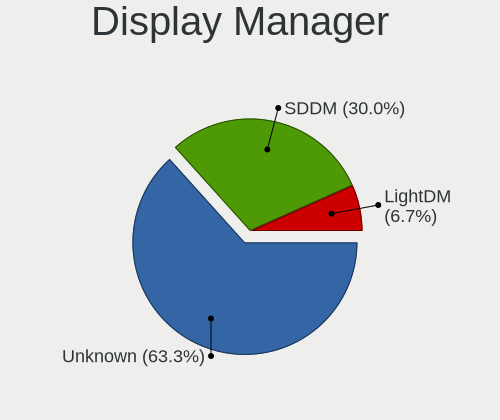
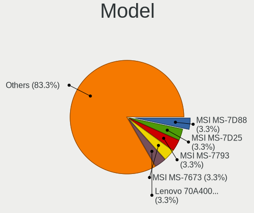
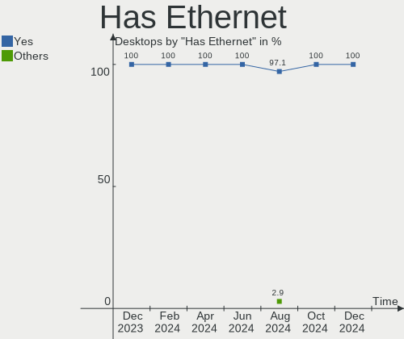
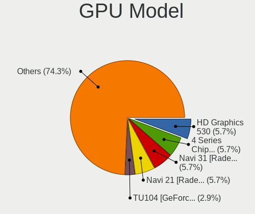
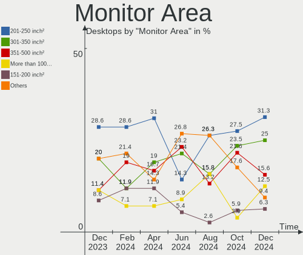
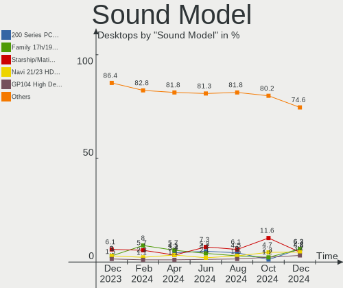

openSUSE - Hardware Trends (Desktops)
-------------------------------------

A project to identify most popular hardware characteristics and track their change
over time based on data collected by Linux users at https://Linux-Hardware.org.

Anyone can contribute to this report by the [hw-probe](https://github.com/linuxhw/hw-probe) tool:

    sudo -E hw-probe -all -upload

This report is for one last month. Overall report since the beginning of time: [TestCoverage](https://github.com/linuxhw/TestCoverage)

Period: May, 2022.

Contents
--------

* [ System ](#system)
  - [ OS                       ](#os)
  - [ OS Family                ](#os-family)
  - [ Kernel                   ](#kernel)
  - [ Kernel Family            ](#kernel-family)
  - [ Kernel Major Ver.        ](#kernel-major-ver)
  - [ Arch                     ](#arch)
  - [ DE                       ](#de)
  - [ Display Server           ](#display-server)
  - [ Display Manager          ](#display-manager)
  - [ OS Lang                  ](#os-lang)
  - [ Boot Mode                ](#boot-mode)
  - [ Filesystem               ](#filesystem)
  - [ Part. scheme             ](#part-scheme)
  - [ Dual Boot with Linux/BSD ](#dual-boot-with-linuxbsd)
  - [ Dual Boot (Win)          ](#dual-boot-win)

* [ Board ](#board)
  - [ Vendor                   ](#vendor)
  - [ Model                    ](#model)
  - [ Model Family             ](#model-family)
  - [ MFG Year                 ](#mfg-year)
  - [ Form Factor              ](#form-factor)
  - [ Secure Boot              ](#secure-boot)
  - [ Coreboot                 ](#coreboot)
  - [ RAM Size                 ](#ram-size)
  - [ RAM Used                 ](#ram-used)
  - [ Total Drives             ](#total-drives)
  - [ Has CD-ROM               ](#has-cd-rom)
  - [ Has Ethernet             ](#has-ethernet)
  - [ Has WiFi                 ](#has-wifi)
  - [ Has Bluetooth            ](#has-bluetooth)

* [ Location ](#location)
  - [ Country                  ](#country)
  - [ City                     ](#city)

* [ Drives ](#drives)
  - [ Drive Vendor             ](#drive-vendor)
  - [ Drive Model              ](#drive-model)
  - [ HDD Vendor               ](#hdd-vendor)
  - [ SSD Vendor               ](#ssd-vendor)
  - [ Drive Kind               ](#drive-kind)
  - [ Drive Connector          ](#drive-connector)
  - [ Drive Size               ](#drive-size)
  - [ Space Total              ](#space-total)
  - [ Space Used               ](#space-used)
  - [ Malfunc. Drives          ](#malfunc-drives)
  - [ Malfunc. Drive Vendor    ](#malfunc-drive-vendor)
  - [ Malfunc. HDD Vendor      ](#malfunc-hdd-vendor)
  - [ Malfunc. Drive Kind      ](#malfunc-drive-kind)
  - [ Failed Drives            ](#failed-drives)
  - [ Failed Drive Vendor      ](#failed-drive-vendor)
  - [ Drive Status             ](#drive-status)

* [ Storage controller ](#storage-controller)
  - [ Storage Vendor           ](#storage-vendor)
  - [ Storage Model            ](#storage-model)
  - [ Storage Kind             ](#storage-kind)

* [ Processor ](#processor)
  - [ CPU Vendor               ](#cpu-vendor)
  - [ CPU Model                ](#cpu-model)
  - [ CPU Model Family         ](#cpu-model-family)
  - [ CPU Cores                ](#cpu-cores)
  - [ CPU Sockets              ](#cpu-sockets)
  - [ CPU Threads              ](#cpu-threads)
  - [ CPU Op-Modes             ](#cpu-op-modes)
  - [ CPU Microcode            ](#cpu-microcode)
  - [ CPU Microarch            ](#cpu-microarch)

* [ Graphics ](#graphics)
  - [ GPU Vendor               ](#gpu-vendor)
  - [ GPU Model                ](#gpu-model)
  - [ GPU Combo                ](#gpu-combo)
  - [ GPU Driver               ](#gpu-driver)
  - [ GPU Memory               ](#gpu-memory)

* [ Monitor ](#monitor)
  - [ Monitor Vendor           ](#monitor-vendor)
  - [ Monitor Model            ](#monitor-model)
  - [ Monitor Resolution       ](#monitor-resolution)
  - [ Monitor Diagonal         ](#monitor-diagonal)
  - [ Monitor Width            ](#monitor-width)
  - [ Aspect Ratio             ](#aspect-ratio)
  - [ Monitor Area             ](#monitor-area)
  - [ Pixel Density            ](#pixel-density)
  - [ Multiple Monitors        ](#multiple-monitors)

* [ Network ](#network)
  - [ Net Controller Vendor    ](#net-controller-vendor)
  - [ Net Controller Model     ](#net-controller-model)
  - [ Wireless Vendor          ](#wireless-vendor)
  - [ Wireless Model           ](#wireless-model)
  - [ Ethernet Vendor          ](#ethernet-vendor)
  - [ Ethernet Model           ](#ethernet-model)
  - [ Net Controller Kind      ](#net-controller-kind)
  - [ Used Controller          ](#used-controller)
  - [ NICs                     ](#nics)
  - [ IPv6                     ](#ipv6)

* [ Bluetooth ](#bluetooth)
  - [ Bluetooth Vendor         ](#bluetooth-vendor)
  - [ Bluetooth Model          ](#bluetooth-model)

* [ Sound ](#sound)
  - [ Sound Vendor             ](#sound-vendor)
  - [ Sound Model              ](#sound-model)

* [ Memory ](#memory)
  - [ Memory Vendor            ](#memory-vendor)
  - [ Memory Model             ](#memory-model)
  - [ Memory Kind              ](#memory-kind)
  - [ Memory Form Factor       ](#memory-form-factor)
  - [ Memory Size              ](#memory-size)
  - [ Memory Speed             ](#memory-speed)

* [ Printers & scanners ](#printers--scanners)
  - [ Printer Vendor           ](#printer-vendor)
  - [ Printer Model            ](#printer-model)
  - [ Scanner Vendor           ](#scanner-vendor)
  - [ Scanner Model            ](#scanner-model)

* [ Camera ](#camera)
  - [ Camera Vendor            ](#camera-vendor)
  - [ Camera Model             ](#camera-model)

* [ Security ](#security)
  - [ Fingerprint Vendor       ](#fingerprint-vendor)
  - [ Fingerprint Model        ](#fingerprint-model)
  - [ Chipcard Vendor          ](#chipcard-vendor)
  - [ Chipcard Model           ](#chipcard-model)

* [ Unsupported ](#unsupported)
  - [ Unsupported Devices      ](#unsupported-devices)
  - [ Unsupported Device Types ](#unsupported-device-types)

System
------

OS
--

Installed operating systems

| Name                         | Desktops | Percent |
|------------------------------|----------|---------|
| openSUSE Tumbleweed-XXXXXXXX | 32       | 69.57%  |
| openSUSE Leap-15.4           | 9        | 19.57%  |
| openSUSE Leap-15.3           | 4        | 8.7%    |
| openSUSE Leap-15.2           | 1        | 2.17%   |

OS Family
---------

OS without a version

| Name     | Desktops | Percent |
|----------|----------|---------|
| openSUSE | 46       | 100%    |

Kernel
------

Version of the Linux kernel

| Version                             | Desktops | Percent |
|-------------------------------------|----------|---------|
| 5.17.4-1-default                    | 20       | 43.48%  |
| 5.17.9-1-default                    | 6        | 13.04%  |
| 5.14.21-150400.19-default           | 6        | 13.04%  |
| 5.3.18-150300.59.63-default         | 2        | 4.35%   |
| 5.18.0-rc6-lp153.2.ged50f8f-default | 2        | 4.35%   |
| 5.17.7-1-default                    | 2        | 4.35%   |
| 5.17.5-1-default                    | 2        | 4.35%   |
| 5.3.18-lp152.87-default             | 1        | 2.17%   |
| 5.3.18-150300.59.63-preempt         | 1        | 2.17%   |
| 5.3.18-150300.59.60-default         | 1        | 2.17%   |
| 5.17.6-xanmod1                      | 1        | 2.17%   |
| 5.16.4-1-default                    | 1        | 2.17%   |
| 5.14.21-150400.22-default           | 1        | 2.17%   |

Kernel Family
-------------

Linux kernel without a distro release

| Version | Desktops | Percent |
|---------|----------|---------|
| 5.17.4  | 20       | 43.48%  |
| 5.14.21 | 7        | 15.22%  |
| 5.17.9  | 6        | 13.04%  |
| 5.3.18  | 5        | 10.87%  |
| 5.18.0  | 2        | 4.35%   |
| 5.17.7  | 2        | 4.35%   |
| 5.17.5  | 2        | 4.35%   |
| 5.17.6  | 1        | 2.17%   |
| 5.16.4  | 1        | 2.17%   |

Kernel Major Ver.
-----------------

Linux kernel major version

| Version | Desktops | Percent |
|---------|----------|---------|
| 5.17    | 31       | 67.39%  |
| 5.14    | 7        | 15.22%  |
| 5.3     | 5        | 10.87%  |
| 5.18    | 2        | 4.35%   |
| 5.16    | 1        | 2.17%   |

Arch
----

OS architecture (x86_64, i586, etc.)

| Name   | Desktops | Percent |
|--------|----------|---------|
| x86_64 | 46       | 100%    |

DE
--

Desktop Environment

| Name        | Desktops | Percent |
|-------------|----------|---------|
| KDE5        | 32       | 69.57%  |
| GNOME       | 10       | 21.74%  |
| WindowMaker | 2        | 4.35%   |
| XFCE        | 1        | 2.17%   |
| Unknown     | 1        | 2.17%   |

Display Server
--------------

X11 or Wayland

| Name        | Desktops | Percent |
|-------------|----------|---------|
| X11         | 37       | 80.43%  |
| Wayland     | 7        | 15.22%  |
| Unspecified | 1        | 2.17%   |
| Tty         | 1        | 2.17%   |

Display Manager
---------------

SDDM, LightDM, etc.

| Name    | Desktops | Percent |
|---------|----------|---------|
| SDDM    | 24       | 52.17%  |
| LightDM | 8        | 17.39%  |
| Unknown | 8        | 17.39%  |
| XDM     | 5        | 10.87%  |
| GDM     | 1        | 2.17%   |

OS Lang
-------

Language

| Lang    | Desktops | Percent |
|---------|----------|---------|
| en_US   | 24       | 52.17%  |
| de_DE   | 7        | 15.22%  |
| en_GB   | 5        | 10.87%  |
| es_ES   | 2        | 4.35%   |
| Unknown | 2        | 4.35%   |
| ru_RU   | 1        | 2.17%   |
| pt_BR   | 1        | 2.17%   |
| POSIX   | 1        | 2.17%   |
| nl_NL   | 1        | 2.17%   |
| en_IE   | 1        | 2.17%   |
| en_FI   | 1        | 2.17%   |

Boot Mode
---------

EFI or BIOS

| Mode | Desktops | Percent |
|------|----------|---------|
| EFI  | 27       | 58.7%   |
| BIOS | 19       | 41.3%   |

Filesystem
----------

Type of filesystem

| Type  | Desktops | Percent |
|-------|----------|---------|
| Btrfs | 36       | 78.26%  |
| Ext4  | 8        | 17.39%  |
| Xfs   | 2        | 4.35%   |

Part. scheme
------------

Scheme of partitioning

| Type    | Desktops | Percent |
|---------|----------|---------|
| GPT     | 33       | 71.74%  |
| Unknown | 8        | 17.39%  |
| MBR     | 5        | 10.87%  |

Dual Boot with Linux/BSD
------------------------

Hosting more than one Linux/BSD

| Dual boot | Desktops | Percent |
|-----------|----------|---------|
| No        | 34       | 73.91%  |
| Yes       | 12       | 26.09%  |

Dual Boot (Win)
---------------

Hosting Linux and Windows

| Dual boot | Desktops | Percent |
|-----------|----------|---------|
| No        | 31       | 67.39%  |
| Yes       | 15       | 32.61%  |

Board
-----

Vendor
------

Motherboard manufacturer

| Name                | Desktops | Percent |
|---------------------|----------|---------|
| ASUSTek Computer    | 15       | 32.61%  |
| Gigabyte Technology | 10       | 21.74%  |
| MSI                 | 9        | 19.57%  |
| ASRock              | 4        | 8.7%    |
| Hewlett-Packard     | 3        | 6.52%   |
| Dell                | 2        | 4.35%   |
| Supermicro          | 1        | 2.17%   |
| Positivo            | 1        | 2.17%   |
| EVGA                | 1        | 2.17%   |

Model
-----

Motherboard model

| Name                                 | Desktops | Percent |
|--------------------------------------|----------|---------|
| MSI MS-7C02                          | 3        | 6.52%   |
| ASUS TUF Gaming B550M-E              | 2        | 4.35%   |
| ASUS M5A78L-M/USB3                   | 2        | 4.35%   |
| ASUS M4A785TD-V EVO                  | 2        | 4.35%   |
| Supermicro SSG-6047R-E1CR36N         | 1        | 2.17%   |
| Positivo DA18HV1                     | 1        | 2.17%   |
| MSI MS-7D25                          | 1        | 2.17%   |
| MSI MS-7C91                          | 1        | 2.17%   |
| MSI MS-7B89                          | 1        | 2.17%   |
| MSI MS-7B86                          | 1        | 2.17%   |
| MSI MS-7B79                          | 1        | 2.17%   |
| MSI MS-7A38                          | 1        | 2.17%   |
| HP Z440 Workstation                  | 1        | 2.17%   |
| HP Z1 Entry Tower G5                 | 1        | 2.17%   |
| HP Compaq dc5800 Small Form Factor   | 1        | 2.17%   |
| Gigabyte Z87X-D3H                    | 1        | 2.17%   |
| Gigabyte Z390 AORUS MASTER           | 1        | 2.17%   |
| Gigabyte X58A-UD3R                   | 1        | 2.17%   |
| Gigabyte X570 AORUS MASTER           | 1        | 2.17%   |
| Gigabyte Leopard WS                  | 1        | 2.17%   |
| Gigabyte B560 HD3                    | 1        | 2.17%   |
| Gigabyte B550 AORUS PRO V2           | 1        | 2.17%   |
| Gigabyte B550 AORUS ELITE AX V2      | 1        | 2.17%   |
| Gigabyte B450M DS3H V2               | 1        | 2.17%   |
| Gigabyte B450M DS3H                  | 1        | 2.17%   |
| EVGA 132-YW-E178-FTW                 | 1        | 2.17%   |
| Dell Precision 5820 Tower X-Series   | 1        | 2.17%   |
| Dell OptiPlex 5000                   | 1        | 2.17%   |
| ASUS Z170-A                          | 1        | 2.17%   |
| ASUS TUF Gaming B560M-PLUS           | 1        | 2.17%   |
| ASUS TUF Gaming B550M-E WIFI         | 1        | 2.17%   |
| ASUS ROG STRIX Z690-A GAMING WIFI D4 | 1        | 2.17%   |
| ASUS ROG STRIX B550-F GAMING         | 1        | 2.17%   |
| ASUS PRIME B550M-A WIFI II           | 1        | 2.17%   |
| ASUS P8B75-V                         | 1        | 2.17%   |
| ASUS CROSSHAIR V FORMULA-Z           | 1        | 2.17%   |
| ASUS 970 PRO GAMING/AURA             | 1        | 2.17%   |
| ASRock Z390 Extreme4                 | 1        | 2.17%   |
| ASRock H97 Pro4                      | 1        | 2.17%   |
| ASRock AB350 Pro4                    | 1        | 2.17%   |
| ASRock A88M-G                        | 1        | 2.17%   |

Model Family
------------

Motherboard model prefix

| Name                         | Desktops | Percent |
|------------------------------|----------|---------|
| ASUS TUF                     | 4        | 8.7%    |
| MSI MS-7C02                  | 3        | 6.52%   |
| Gigabyte B550                | 2        | 4.35%   |
| Gigabyte B450M               | 2        | 4.35%   |
| ASUS ROG                     | 2        | 4.35%   |
| ASUS M5A78L-M                | 2        | 4.35%   |
| ASUS M4A785TD-V              | 2        | 4.35%   |
| Supermicro SSG-6047R-E1CR36N | 1        | 2.17%   |
| Positivo DA18HV1             | 1        | 2.17%   |
| MSI MS-7D25                  | 1        | 2.17%   |
| MSI MS-7C91                  | 1        | 2.17%   |
| MSI MS-7B89                  | 1        | 2.17%   |
| MSI MS-7B86                  | 1        | 2.17%   |
| MSI MS-7B79                  | 1        | 2.17%   |
| MSI MS-7A38                  | 1        | 2.17%   |
| HP Z440                      | 1        | 2.17%   |
| HP Z1                        | 1        | 2.17%   |
| HP Compaq                    | 1        | 2.17%   |
| Gigabyte Z87X-D3H            | 1        | 2.17%   |
| Gigabyte Z390                | 1        | 2.17%   |
| Gigabyte X58A-UD3R           | 1        | 2.17%   |
| Gigabyte X570                | 1        | 2.17%   |
| Gigabyte Leopard             | 1        | 2.17%   |
| Gigabyte B560                | 1        | 2.17%   |
| EVGA 132-YW-E178-FTW         | 1        | 2.17%   |
| Dell Precision               | 1        | 2.17%   |
| Dell OptiPlex                | 1        | 2.17%   |
| ASUS Z170-A                  | 1        | 2.17%   |
| ASUS PRIME                   | 1        | 2.17%   |
| ASUS P8B75-V                 | 1        | 2.17%   |
| ASUS CROSSHAIR               | 1        | 2.17%   |
| ASUS 970                     | 1        | 2.17%   |
| ASRock Z390                  | 1        | 2.17%   |
| ASRock H97                   | 1        | 2.17%   |
| ASRock AB350                 | 1        | 2.17%   |
| ASRock A88M-G                | 1        | 2.17%   |

MFG Year
--------

Motherboard manufacture year

| Year | Desktops | Percent |
|------|----------|---------|
| 2021 | 7        | 15.22%  |
| 2019 | 7        | 15.22%  |
| 2018 | 6        | 13.04%  |
| 2020 | 5        | 10.87%  |
| 2022 | 3        | 6.52%   |
| 2016 | 3        | 6.52%   |
| 2015 | 3        | 6.52%   |
| 2009 | 3        | 6.52%   |
| 2012 | 2        | 4.35%   |
| 2011 | 2        | 4.35%   |
| 2008 | 2        | 4.35%   |
| 2017 | 1        | 2.17%   |
| 2014 | 1        | 2.17%   |
| 2013 | 1        | 2.17%   |

Form Factor
-----------

Physical design of the computer

| Name    | Desktops | Percent |
|---------|----------|---------|
| Desktop | 46       | 100%    |

Secure Boot
-----------

Enabled or disabled

| State    | Desktops | Percent |
|----------|----------|---------|
| Disabled | 42       | 91.3%   |
| Enabled  | 4        | 8.7%    |

Coreboot
--------

Have coreboot on board

| Used | Desktops | Percent |
|------|----------|---------|
| No   | 46       | 100%    |

RAM Size
--------

Total RAM memory

| Size in GB  | Desktops | Percent |
|-------------|----------|---------|
| 16.01-24.0  | 17       | 36.96%  |
| 32.01-64.0  | 14       | 30.43%  |
| 8.01-16.0   | 6        | 13.04%  |
| 24.01-32.0  | 3        | 6.52%   |
| 4.01-8.0    | 2        | 4.35%   |
| 3.01-4.0    | 2        | 4.35%   |
| 64.01-256.0 | 2        | 4.35%   |

RAM Used
--------

Used RAM memory

| Used GB   | Desktops | Percent |
|-----------|----------|---------|
| 2.01-3.0  | 12       | 26.09%  |
| 4.01-8.0  | 11       | 23.91%  |
| 3.01-4.0  | 8        | 17.39%  |
| 1.01-2.0  | 7        | 15.22%  |
| 8.01-16.0 | 5        | 10.87%  |
| 0.51-1.0  | 3        | 6.52%   |

Total Drives
------------

Number of drives on board

| Drives | Desktops | Percent |
|--------|----------|---------|
| 2      | 14       | 30.43%  |
| 3      | 12       | 26.09%  |
| 1      | 9        | 19.57%  |
| 4      | 7        | 15.22%  |
| 6      | 2        | 4.35%   |
| 5      | 2        | 4.35%   |

Has CD-ROM
----------

Has CD-ROM on board

| Presented | Desktops | Percent |
|-----------|----------|---------|
| No        | 30       | 65.22%  |
| Yes       | 16       | 34.78%  |

Has Ethernet
------------

Has Ethernet on board

| Presented | Desktops | Percent |
|-----------|----------|---------|
| Yes       | 46       | 100%    |

Has WiFi
--------

Has WiFi module

| Presented | Desktops | Percent |
|-----------|----------|---------|
| No        | 30       | 65.22%  |
| Yes       | 16       | 34.78%  |

Has Bluetooth
-------------

Has Bluetooth module

| Presented | Desktops | Percent |
|-----------|----------|---------|
| No        | 31       | 67.39%  |
| Yes       | 15       | 32.61%  |

Location
--------

Country
-------

Geographic location (country)

| Country            | Desktops | Percent |
|--------------------|----------|---------|
| Germany            | 15       | 32.61%  |
| USA                | 9        | 19.57%  |
| Brazil             | 3        | 6.52%   |
| UK                 | 2        | 4.35%   |
| Sweden             | 2        | 4.35%   |
| Greece             | 2        | 4.35%   |
| Switzerland        | 1        | 2.17%   |
| Spain              | 1        | 2.17%   |
| Russia             | 1        | 2.17%   |
| Poland             | 1        | 2.17%   |
| Netherlands        | 1        | 2.17%   |
| Italy              | 1        | 2.17%   |
| Hungary            | 1        | 2.17%   |
| France             | 1        | 2.17%   |
| Finland            | 1        | 2.17%   |
| Estonia            | 1        | 2.17%   |
| Ecuador            | 1        | 2.17%   |
| Dominican Republic | 1        | 2.17%   |
| Croatia            | 1        | 2.17%   |

City
----

Geographic location (city)

| City                  | Desktops | Percent |
|-----------------------|----------|---------|
| Haßfurt              | 5        | 10.87%  |
| Sao Paulo             | 2        | 4.35%   |
| Zagreb                | 1        | 2.17%   |
| Wil                   | 1        | 2.17%   |
| Weselberg             | 1        | 2.17%   |
| Waterloo              | 1        | 2.17%   |
| Veszprém             | 1        | 2.17%   |
| Thessaloniki          | 1        | 2.17%   |
| Tallinn               | 1        | 2.17%   |
| Stockholm             | 1        | 2.17%   |
| Schrobenhausen        | 1        | 2.17%   |
| Santo Domingo Este    | 1        | 2.17%   |
| Rattelsdorf           | 1        | 2.17%   |
| Puebla de Alcocer     | 1        | 2.17%   |
| Plano                 | 1        | 2.17%   |
| Orlando               | 1        | 2.17%   |
| Nuvolera              | 1        | 2.17%   |
| Northport             | 1        | 2.17%   |
| Moscow                | 1        | 2.17%   |
| Minneapolis           | 1        | 2.17%   |
| Maringá              | 1        | 2.17%   |
| London                | 1        | 2.17%   |
| Langenhagen           | 1        | 2.17%   |
| Lafayette             | 1        | 2.17%   |
| La Vergne             | 1        | 2.17%   |
| Jyväskylä           | 1        | 2.17%   |
| Huettenberg           | 1        | 2.17%   |
| Hildesheim            | 1        | 2.17%   |
| Halle                 | 1        | 2.17%   |
| Haßfurt            | 1        | 2.17%   |
| Gothenburg            | 1        | 2.17%   |
| Gloucester            | 1        | 2.17%   |
| Cuenca                | 1        | 2.17%   |
| Cormeilles-en-Parisis | 1        | 2.17%   |
| Cherry Hill           | 1        | 2.17%   |
| Bremen                | 1        | 2.17%   |
| Bialystok             | 1        | 2.17%   |
| Beilngries            | 1        | 2.17%   |
| Atlanta               | 1        | 2.17%   |
| Almere Stad           | 1        | 2.17%   |
| Aigaleo               | 1        | 2.17%   |

Drives
------

Drive Vendor
------------

Hard drive vendors

| Vendor              | Desktops | Drives | Percent |
|---------------------|----------|--------|---------|
| Samsung Electronics | 28       | 39     | 30.11%  |
| WDC                 | 20       | 31     | 21.51%  |
| Seagate             | 15       | 21     | 16.13%  |
| Intel               | 5        | 6      | 5.38%   |
| Crucial             | 5        | 5      | 5.38%   |
| Toshiba             | 3        | 3      | 3.23%   |
| SK Hynix            | 3        | 4      | 3.23%   |
| Kingston            | 3        | 3      | 3.23%   |
| SanDisk             | 2        | 3      | 2.15%   |
| Hitachi             | 2        | 3      | 2.15%   |
| XPG                 | 1        | 1      | 1.08%   |
| WDC WDS2            | 1        | 1      | 1.08%   |
| PNY                 | 1        | 1      | 1.08%   |
| Phison              | 1        | 1      | 1.08%   |
| Micro Center        | 1        | 1      | 1.08%   |
| Intenso             | 1        | 1      | 1.08%   |
| HGST                | 1        | 1      | 1.08%   |

Drive Model
-----------

Hard drive models

| Model                                   | Desktops | Percent |
|-----------------------------------------|----------|---------|
| Samsung SSD 860 EVO 500GB               | 6        | 5.08%   |
| Samsung SSD 840 EVO 120GB               | 4        | 3.39%   |
| Samsung SSD 970 EVO Plus 1TB            | 3        | 2.54%   |
| WDC WD10EZEX-22MFCA0 1TB                | 2        | 1.69%   |
| WDC WD10EZEX-08WN4A0 1TB                | 2        | 1.69%   |
| SK Hynix NVMe SSD Drive 512GB           | 2        | 1.69%   |
| SanDisk SSD PLUS 240GB                  | 2        | 1.69%   |
| Samsung SSD 970 EVO Plus 250GB          | 2        | 1.69%   |
| Samsung SSD 860 EVO 1TB                 | 2        | 1.69%   |
| Samsung SSD 850 EVO 500GB               | 2        | 1.69%   |
| Samsung SSD 850 EVO 250GB               | 2        | 1.69%   |
| Samsung NVMe SSD Drive 1TB              | 2        | 1.69%   |
| Crucial CT250MX500SSD1 250GB            | 2        | 1.69%   |
| Crucial CT240BX500SSD1 240GB            | 2        | 1.69%   |
| XPG GAMMIX S41 512GB                    | 1        | 0.85%   |
| WDC WDS512G1X0C-00ENX0 512GB            | 1        | 0.85%   |
| WDC WDS500G2B0C-00PXH0 500GB            | 1        | 0.85%   |
| WDC WDS250G1B0A-00H9H0 250GB SSD        | 1        | 0.85%   |
| WDC WDS200T2B0B 2TB SSD                 | 1        | 0.85%   |
| WDC WDS2 40G2G0B-00EPW0 240GB SSD       | 1        | 0.85%   |
| WDC WDS100T3XHC-00SJG0 1TB              | 1        | 0.85%   |
| WDC WD8001FZBX-00ASYA0 8TB              | 1        | 0.85%   |
| WDC WD6400AACS-00G8B1 640GB             | 1        | 0.85%   |
| WDC WD5000AAKX-08ERMA0 500GB            | 1        | 0.85%   |
| WDC WD40EZRZ-00GXCB0 4TB                | 1        | 0.85%   |
| WDC WD40EZAZ-00SF3B0 4TB                | 1        | 0.85%   |
| WDC WD40EFAX-68JH4N1 4TB                | 1        | 0.85%   |
| WDC WD4005FZBX-00K5WB0 4TB              | 1        | 0.85%   |
| WDC WD4003FRYZ-01F0DB0 4TB              | 1        | 0.85%   |
| WDC WD4003FFBX-68MU3N0 4TB              | 1        | 0.85%   |
| WDC WD4000KS-00MNB0 400GB               | 1        | 0.85%   |
| WDC WD3200BEVT-75ZCT2 320GB             | 1        | 0.85%   |
| WDC WD30EZRS-00J99B0 3TB                | 1        | 0.85%   |
| WDC WD20EZRX-00DC0B0 2TB                | 1        | 0.85%   |
| WDC WD20EZRX-00D8PB0 2TB                | 1        | 0.85%   |
| WDC WD10PURX-64E5EY0 1TB                | 1        | 0.85%   |
| WDC WD10EZEX-60WN4A0 1TB                | 1        | 0.85%   |
| WDC WD10EZEX-22BN5A0 1TB                | 1        | 0.85%   |
| WDC WD10EAVS-22D7B0 1TB                 | 1        | 0.85%   |
| WDC WD1003FZEX-00MK2A0 1TB              | 1        | 0.85%   |
| WDC WD1003FZEX-00K3CA0 1TB              | 1        | 0.85%   |
| Toshiba MK5055GSX 500GB                 | 1        | 0.85%   |
| Toshiba MD04ACA50D 5TB                  | 1        | 0.85%   |
| Toshiba HDWD120 2TB                     | 1        | 0.85%   |
| SK Hynix NVMe SSD Drive 2TB             | 1        | 0.85%   |
| SK Hynix BC511 HFM256GDJTNI-82A0A 256GB | 1        | 0.85%   |
| Seagate ST8000NM0055-1RM112 8TB         | 1        | 0.85%   |
| Seagate ST500LM000-1EJ162 500GB         | 1        | 0.85%   |
| Seagate ST500DM002-1SB10A 500GB         | 1        | 0.85%   |
| Seagate ST3500312CS 500GB               | 1        | 0.85%   |
| Seagate ST3400620AS 400GB               | 1        | 0.85%   |
| Seagate ST3320418AS 320GB               | 1        | 0.85%   |
| Seagate ST3250823AS 250GB               | 1        | 0.85%   |
| Seagate ST31000528AS 1TB                | 1        | 0.85%   |
| Seagate ST3000DM001-1ER166 3TB          | 1        | 0.85%   |
| Seagate ST2000VN004-2E4164 2TB          | 1        | 0.85%   |
| Seagate ST2000DM008-2FR102 2TB          | 1        | 0.85%   |
| Seagate ST2000DM006-2DM164 2TB          | 1        | 0.85%   |
| Seagate ST2000DM001-1ER164 2TB          | 1        | 0.85%   |
| Seagate ST2000DM001-1CH164 2TB          | 1        | 0.85%   |

HDD Vendor
----------

Hard disk drive vendors

| Vendor              | Desktops | Drives | Percent |
|---------------------|----------|--------|---------|
| WDC                 | 18       | 26     | 42.86%  |
| Seagate             | 15       | 21     | 35.71%  |
| Toshiba             | 3        | 3      | 7.14%   |
| Samsung Electronics | 3        | 4      | 7.14%   |
| Hitachi             | 2        | 3      | 4.76%   |
| HGST                | 1        | 1      | 2.38%   |

SSD Vendor
----------

Solid state drive vendors

| Vendor              | Desktops | Drives | Percent |
|---------------------|----------|--------|---------|
| Samsung Electronics | 20       | 24     | 57.14%  |
| Crucial             | 5        | 5      | 14.29%  |
| WDC                 | 2        | 2      | 5.71%   |
| SanDisk             | 2        | 3      | 5.71%   |
| Kingston            | 2        | 2      | 5.71%   |
| WDC WDS2            | 1        | 1      | 2.86%   |
| PNY                 | 1        | 1      | 2.86%   |
| Micro Center        | 1        | 1      | 2.86%   |
| Intenso             | 1        | 1      | 2.86%   |

Drive Kind
----------

HDD or SSD

| Kind | Desktops | Drives | Percent |
|------|----------|--------|---------|
| HDD  | 31       | 58     | 37.8%   |
| SSD  | 29       | 40     | 35.37%  |
| NVMe | 22       | 27     | 26.83%  |

Drive Connector
---------------

SATA, SAS, NVMe, etc.

| Type | Desktops | Drives | Percent |
|------|----------|--------|---------|
| SATA | 42       | 97     | 64.62%  |
| NVMe | 22       | 27     | 33.85%  |
| SAS  | 1        | 1      | 1.54%   |

Drive Size
----------

Size of hard drive

| Size in TB | Desktops | Drives | Percent |
|------------|----------|--------|---------|
| 0.01-0.5   | 32       | 44     | 43.84%  |
| 0.51-1.0   | 19       | 28     | 26.03%  |
| 1.01-2.0   | 10       | 12     | 13.7%   |
| 3.01-4.0   | 6        | 8      | 8.22%   |
| 2.01-3.0   | 3        | 3      | 4.11%   |
| 4.01-10.0  | 3        | 3      | 4.11%   |

Space Total
-----------

Amount of disk space available on the file system

| Size in GB     | Desktops | Percent |
|----------------|----------|---------|
| More than 3000 | 23       | 50%     |
| 1001-2000      | 13       | 28.26%  |
| 251-500        | 3        | 6.52%   |
| 2001-3000      | 2        | 4.35%   |
| 501-1000       | 2        | 4.35%   |
| 21-50          | 1        | 2.17%   |
| 1-20           | 1        | 2.17%   |
| Unknown        | 1        | 2.17%   |

Space Used
----------

Amount of used disk space

| Used GB        | Desktops | Percent |
|----------------|----------|---------|
| 1001-2000      | 10       | 21.74%  |
| More than 3000 | 8        | 17.39%  |
| 501-1000       | 7        | 15.22%  |
| 251-500        | 5        | 10.87%  |
| 51-100         | 5        | 10.87%  |
| 2001-3000      | 4        | 8.7%    |
| 101-250        | 3        | 6.52%   |
| 1-20           | 2        | 4.35%   |
| 21-50          | 1        | 2.17%   |
| Unknown        | 1        | 2.17%   |

Malfunc. Drives
---------------

Drive models with a malfunction

| Model                                 | Desktops | Drives | Percent |
|---------------------------------------|----------|--------|---------|
| Samsung Electronics SSD 840 EVO 120GB | 4        | 4      | 23.53%  |
| XPG GAMMIX S41 512GB                  | 1        | 1      | 5.88%   |
| WDC WD6400AACS-00G8B1 640GB           | 1        | 1      | 5.88%   |
| WDC WD10PURX-64E5EY0 1TB              | 1        | 1      | 5.88%   |
| Toshiba MK5055GSX 500GB               | 1        | 1      | 5.88%   |
| Seagate ST500LM000-1EJ162 500GB       | 1        | 1      | 5.88%   |
| Seagate ST31000528AS 1TB              | 1        | 4      | 5.88%   |
| Seagate ST3000DM001-1ER166 3TB        | 1        | 1      | 5.88%   |
| Seagate ST2000DM001-1CH164 2TB        | 1        | 1      | 5.88%   |
| Seagate ST1000LM035-1RK172 1TB        | 1        | 1      | 5.88%   |
| Samsung Electronics SSD 980 1TB       | 1        | 1      | 5.88%   |
| Samsung Electronics SSD 850 EVO 250GB | 1        | 1      | 5.88%   |
| Hitachi HTS545050A7E380 500GB         | 1        | 1      | 5.88%   |
| Crucial CT240BX500SSD1 240GB          | 1        | 1      | 5.88%   |

Malfunc. Drive Vendor
---------------------

Vendors of faulty drives

| Vendor              | Desktops | Drives | Percent |
|---------------------|----------|--------|---------|
| Samsung Electronics | 6        | 6      | 35.29%  |
| Seagate             | 5        | 8      | 29.41%  |
| WDC                 | 2        | 2      | 11.76%  |
| XPG                 | 1        | 1      | 5.88%   |
| Toshiba             | 1        | 1      | 5.88%   |
| Hitachi             | 1        | 1      | 5.88%   |
| Crucial             | 1        | 1      | 5.88%   |

Malfunc. HDD Vendor
-------------------

Vendors of faulty HDD drives

| Vendor  | Desktops | Drives | Percent |
|---------|----------|--------|---------|
| Seagate | 5        | 8      | 55.56%  |
| WDC     | 2        | 2      | 22.22%  |
| Toshiba | 1        | 1      | 11.11%  |
| Hitachi | 1        | 1      | 11.11%  |

Malfunc. Drive Kind
-------------------

Kinds of faulty drives

| Kind | Desktops | Drives | Percent |
|------|----------|--------|---------|
| HDD  | 8        | 12     | 50%     |
| SSD  | 6        | 6      | 37.5%   |
| NVMe | 2        | 2      | 12.5%   |

Failed Drives
-------------

Failed drive models

Zero info for selected period =(

Failed Drive Vendor
-------------------

Failed drive vendors

Zero info for selected period =(

Drive Status
------------

Number of failed and malfunc. drives

| Status   | Desktops | Drives | Percent |
|----------|----------|--------|---------|
| Works    | 33       | 76     | 60%     |
| Malfunc  | 14       | 20     | 25.45%  |
| Detected | 8        | 29     | 14.55%  |

Storage controller
------------------

Storage Vendor
--------------

Storage controller vendors

| Vendor                      | Desktops | Percent |
|-----------------------------|----------|---------|
| AMD                         | 26       | 33.77%  |
| Intel                       | 23       | 29.87%  |
| Samsung Electronics         | 12       | 15.58%  |
| ASMedia Technology          | 4        | 5.19%   |
| SK Hynix                    | 3        | 3.9%    |
| Sandisk                     | 3        | 3.9%    |
| Realtek Semiconductor       | 1        | 1.3%    |
| Phison Electronics          | 1        | 1.3%    |
| Nvidia                      | 1        | 1.3%    |
| Marvell Technology Group    | 1        | 1.3%    |
| Kingston Technology Company | 1        | 1.3%    |
| JMicron Technology          | 1        | 1.3%    |

Storage Model
-------------

Storage controller models

| Model                                                                          | Desktops | Percent |
|--------------------------------------------------------------------------------|----------|---------|
| AMD FCH SATA Controller [AHCI mode]                                            | 10       | 10.31%  |
| AMD 400 Series Chipset SATA Controller                                         | 9        | 9.28%   |
| AMD 500 Series Chipset SATA Controller                                         | 8        | 8.25%   |
| Samsung NVMe SSD Controller SM981/PM981/PM983                                  | 6        | 6.19%   |
| AMD SB7x0/SB8x0/SB9x0 SATA Controller [AHCI mode]                              | 5        | 5.15%   |
| Intel SSD 660P Series                                                          | 4        | 4.12%   |
| ASMedia ASM1062 Serial ATA Controller                                          | 4        | 4.12%   |
| AMD SB7x0/SB8x0/SB9x0 IDE Controller                                           | 4        | 4.12%   |
| Samsung NVMe SSD Controller PM9A1/PM9A3/980PRO                                 | 3        | 3.09%   |
| Intel Cannon Lake PCH SATA AHCI Controller                                     | 3        | 3.09%   |
| Intel Alder Lake-S PCH SATA Controller [AHCI Mode]                             | 3        | 3.09%   |
| Samsung NVMe SSD Controller 980                                                | 2        | 2.06%   |
| Intel 500 Series Chipset Family SATA AHCI Controller                           | 2        | 2.06%   |
| SK Hynix PC401 NVMe Solid State Drive 256GB                                    | 1        | 1.03%   |
| SK Hynix Non-Volatile memory controller                                        | 1        | 1.03%   |
| SK Hynix Gold P31 SSD                                                          | 1        | 1.03%   |
| SK Hynix BC511                                                                 | 1        | 1.03%   |
| Sandisk WD Blue SN550 NVMe SSD                                                 | 1        | 1.03%   |
| Sandisk WD Black NVMe SSD                                                      | 1        | 1.03%   |
| Sandisk WD Black 2018/SN750 / PC SN720 NVMe SSD                                | 1        | 1.03%   |
| Samsung XP941 PCIe SSD                                                         | 1        | 1.03%   |
| Realtek RTS5763DL NVMe SSD Controller                                          | 1        | 1.03%   |
| Phison E16 PCIe4 NVMe Controller                                               | 1        | 1.03%   |
| Nvidia MCP55 SATA Controller                                                   | 1        | 1.03%   |
| Nvidia MCP55 IDE                                                               | 1        | 1.03%   |
| Marvell Group 88SE91A3 SATA-600 Controller                                     | 1        | 1.03%   |
| Kingston Company SNVS2000G [NV1 NVMe PCIe SSD 2TB]                             | 1        | 1.03%   |
| JMicron JMB363 SATA/IDE Controller                                             | 1        | 1.03%   |
| Intel Volume Management Device NVMe RAID Controller                            | 1        | 1.03%   |
| Intel Q170/Q150/B150/H170/H110/Z170/CM236 Chipset SATA Controller [AHCI Mode]  | 1        | 1.03%   |
| Intel Optane SSD 900P Series                                                   | 1        | 1.03%   |
| Intel C610/X99 series chipset sSATA Controller [RAID mode]                     | 1        | 1.03%   |
| Intel C610/X99 series chipset 6-Port SATA Controller [AHCI mode]               | 1        | 1.03%   |
| Intel C602 chipset 4-Port SATA Storage Control Unit                            | 1        | 1.03%   |
| Intel C600/X79 series chipset SATA RAID Controller                             | 1        | 1.03%   |
| Intel C600/X79 series chipset 6-Port SATA AHCI Controller                      | 1        | 1.03%   |
| Intel 9 Series Chipset Family SATA Controller [AHCI Mode]                      | 1        | 1.03%   |
| Intel 82801JI (ICH10 Family) 4 port SATA IDE Controller #1                     | 1        | 1.03%   |
| Intel 82801JI (ICH10 Family) 2 port SATA IDE Controller #2                     | 1        | 1.03%   |
| Intel 82801IB (ICH9) 2 port SATA Controller [IDE mode]                         | 1        | 1.03%   |
| Intel 82801I (ICH9 Family) 2 port SATA Controller [IDE mode]                   | 1        | 1.03%   |
| Intel 8 Series/C220 Series Chipset Family 6-port SATA Controller 1 [AHCI mode] | 1        | 1.03%   |
| Intel 7 Series/C210 Series Chipset Family 6-port SATA Controller [AHCI mode]   | 1        | 1.03%   |
| Intel 6 Series/C200 Series Chipset Family 6 port Mobile SATA AHCI Controller   | 1        | 1.03%   |
| Intel 200 Series PCH SATA controller [AHCI mode]                               | 1        | 1.03%   |
| AMD SB7x0/SB8x0/SB9x0 SATA Controller [IDE mode]                               | 1        | 1.03%   |
| AMD 300 Series Chipset SATA Controller                                         | 1        | 1.03%   |

Storage Kind
------------

Kind of storage controller (IDE, SATA, NVMe, SAS, ...)

| Kind | Desktops | Percent |
|------|----------|---------|
| SATA | 43       | 57.33%  |
| NVMe | 22       | 29.33%  |
| IDE  | 7        | 9.33%   |
| RAID | 2        | 2.67%   |
| SAS  | 1        | 1.33%   |

Processor
---------

CPU Vendor
----------

Processor vendors

| Vendor | Desktops | Percent |
|--------|----------|---------|
| AMD    | 26       | 56.52%  |
| Intel  | 20       | 43.48%  |

CPU Model
---------

Processor models

| Model                                           | Desktops | Percent |
|-------------------------------------------------|----------|---------|
| AMD Ryzen 7 5700G with Radeon Graphics          | 5        | 10.87%  |
| AMD Ryzen 5 2600 Six-Core Processor             | 4        | 8.7%    |
| Intel Core i9-9900K CPU @ 3.60GHz               | 2        | 4.35%   |
| Intel 12th Gen Core i5-12600K                   | 2        | 4.35%   |
| AMD Ryzen 5 3600 6-Core Processor               | 2        | 4.35%   |
| AMD Phenom II X6 1100T Processor                | 2        | 4.35%   |
| AMD FX-8350 Eight-Core Processor                | 2        | 4.35%   |
| Intel Xeon CPU E5-2667 v2 @ 3.30GHz             | 1        | 2.17%   |
| Intel Xeon CPU E5-1650 v3 @ 3.50GHz             | 1        | 2.17%   |
| Intel Core i9-10980XE CPU @ 3.00GHz             | 1        | 2.17%   |
| Intel Core i7-9700K CPU @ 3.60GHz               | 1        | 2.17%   |
| Intel Core i7-6800K CPU @ 3.40GHz               | 1        | 2.17%   |
| Intel Core i7-3770 CPU @ 3.40GHz                | 1        | 2.17%   |
| Intel Core i7 CPU 960 @ 3.20GHz                 | 1        | 2.17%   |
| Intel Core i5-6600K CPU @ 3.50GHz               | 1        | 2.17%   |
| Intel Core i5-4690 CPU @ 3.50GHz                | 1        | 2.17%   |
| Intel Core i5-4670K CPU @ 3.40GHz               | 1        | 2.17%   |
| Intel Core i3-2310M CPU @ 2.10GHz               | 1        | 2.17%   |
| Intel Core i3-10100F CPU @ 3.60GHz              | 1        | 2.17%   |
| Intel Core 2 Quad CPU Q8200 @ 2.33GHz           | 1        | 2.17%   |
| Intel Core 2 Quad CPU Q6600 @ 2.40GHz           | 1        | 2.17%   |
| Intel 12th Gen Core i5-12500T                   | 1        | 2.17%   |
| Intel 11th Gen Core i5-11400F @ 2.60GHz         | 1        | 2.17%   |
| AMD Ryzen 9 5900X 12-Core Processor             | 1        | 2.17%   |
| AMD Ryzen 9 3900X 12-Core Processor             | 1        | 2.17%   |
| AMD Ryzen 7 5800X 8-Core Processor              | 1        | 2.17%   |
| AMD Ryzen 7 3800XT 8-Core Processor             | 1        | 2.17%   |
| AMD Ryzen 5 5600X 6-Core Processor              | 1        | 2.17%   |
| AMD Ryzen 5 3400G with Radeon Vega Graphics     | 1        | 2.17%   |
| AMD Ryzen 5 1600 Six-Core Processor             | 1        | 2.17%   |
| AMD Ryzen 3 2200G with Radeon Vega Graphics     | 1        | 2.17%   |
| AMD Phenom II X4 965 Processor                  | 1        | 2.17%   |
| AMD Athlon II X2 245 Processor                  | 1        | 2.17%   |
| AMD A10-7850K Radeon R7, 12 Compute Cores 4C+8G | 1        | 2.17%   |

CPU Model Family
----------------

Processor model prefix

| Model             | Desktops | Percent |
|-------------------|----------|---------|
| AMD Ryzen 5       | 9        | 19.57%  |
| AMD Ryzen 7       | 7        | 15.22%  |
| Other             | 4        | 8.7%    |
| Intel Core i7     | 4        | 8.7%    |
| Intel Core i9     | 3        | 6.52%   |
| Intel Core i5     | 3        | 6.52%   |
| Intel Xeon        | 2        | 4.35%   |
| Intel Core i3     | 2        | 4.35%   |
| Intel Core 2 Quad | 2        | 4.35%   |
| AMD Ryzen 9       | 2        | 4.35%   |
| AMD Phenom II X6  | 2        | 4.35%   |
| AMD FX            | 2        | 4.35%   |
| AMD Ryzen 3       | 1        | 2.17%   |
| AMD Phenom II X4  | 1        | 2.17%   |
| AMD Athlon II X2  | 1        | 2.17%   |
| AMD A10           | 1        | 2.17%   |

CPU Cores
---------

Number of processor cores

| Number | Desktops | Percent |
|--------|----------|---------|
| 6      | 13       | 28.26%  |
| 4      | 13       | 28.26%  |
| 8      | 10       | 21.74%  |
| 2      | 3        | 6.52%   |
| 12     | 2        | 4.35%   |
| 10     | 2        | 4.35%   |
| 18     | 1        | 2.17%   |
| 16     | 1        | 2.17%   |
| 1      | 1        | 2.17%   |

CPU Sockets
-----------

Number of sockets

| Number | Desktops | Percent |
|--------|----------|---------|
| 1      | 45       | 97.83%  |
| 2      | 1        | 2.17%   |

CPU Threads
-----------

Threads per core (Hyper-Threading)

| Number | Desktops | Percent |
|--------|----------|---------|
| 2      | 35       | 76.09%  |
| 1      | 11       | 23.91%  |

CPU Op-Modes
------------

CPU Operation Modes (32-bit, 64-bit)

| Op mode        | Desktops | Percent |
|----------------|----------|---------|
| 32-bit, 64-bit | 46       | 100%    |

CPU Microcode
-------------

Microcode number

| Number     | Desktops | Percent |
|------------|----------|---------|
| 0x0a50000c | 5        | 10.87%  |
| 0x08701021 | 4        | 8.7%    |
| 0x0800820d | 4        | 8.7%    |
| 0x906ec    | 2        | 4.35%   |
| 0x90672    | 2        | 4.35%   |
| 0x306c3    | 2        | 4.35%   |
| 0x06000852 | 2        | 4.35%   |
| 0x010000dc | 2        | 4.35%   |
| Unknown    | 2        | 4.35%   |
| 0xa0671    | 1        | 2.17%   |
| 0xa0653    | 1        | 2.17%   |
| 0x906ed    | 1        | 2.17%   |
| 0x90675    | 1        | 2.17%   |
| 0x6fb      | 1        | 2.17%   |
| 0x506e3    | 1        | 2.17%   |
| 0x50657    | 1        | 2.17%   |
| 0x406f1    | 1        | 2.17%   |
| 0x306f2    | 1        | 2.17%   |
| 0x306e4    | 1        | 2.17%   |
| 0x306a9    | 1        | 2.17%   |
| 0x206a7    | 1        | 2.17%   |
| 0x106a5    | 1        | 2.17%   |
| 0x1067a    | 1        | 2.17%   |
| 0x0a201205 | 1        | 2.17%   |
| 0x0a201009 | 1        | 2.17%   |
| 0x08108109 | 1        | 2.17%   |
| 0x08101016 | 1        | 2.17%   |
| 0x06003106 | 1        | 2.17%   |
| 0x010000c8 | 1        | 2.17%   |
| 0x010000c7 | 1        | 2.17%   |

CPU Microarch
-------------

Microarchitecture

| Name             | Desktops | Percent |
|------------------|----------|---------|
| Zen 3            | 8        | 17.39%  |
| Zen+             | 6        | 13.04%  |
| Zen 2            | 4        | 8.7%    |
| K10              | 4        | 8.7%    |
| KabyLake         | 3        | 6.52%   |
| Haswell          | 3        | 6.52%   |
| Alderlake Hybrid | 3        | 6.52%   |
| Skylake          | 2        | 4.35%   |
| Piledriver       | 2        | 4.35%   |
| IvyBridge        | 2        | 4.35%   |
| Zen              | 1        | 2.17%   |
| Steamroller      | 1        | 2.17%   |
| SandyBridge      | 1        | 2.17%   |
| Penryn           | 1        | 2.17%   |
| Nehalem          | 1        | 2.17%   |
| Icelake          | 1        | 2.17%   |
| Core             | 1        | 2.17%   |
| CometLake        | 1        | 2.17%   |
| Broadwell        | 1        | 2.17%   |

Graphics
--------

GPU Vendor
----------

Vendors of graphics cards

| Vendor | Desktops | Percent |
|--------|----------|---------|
| AMD    | 24       | 50%     |
| Nvidia | 21       | 43.75%  |
| Intel  | 3        | 6.25%   |

GPU Model
---------

Graphics card models

| Model                                                                     | Desktops | Percent |
|---------------------------------------------------------------------------|----------|---------|
| AMD Cezanne                                                               | 5        | 9.8%    |
| AMD Ellesmere [Radeon RX 470/480/570/570X/580/580X/590]                   | 4        | 7.84%   |
| AMD Baffin [Radeon RX 550 640SP / RX 560/560X]                            | 3        | 5.88%   |
| Nvidia GP108 [GeForce GT 1030]                                            | 2        | 3.92%   |
| Nvidia GP107 [GeForce GTX 1050 Ti]                                        | 2        | 3.92%   |
| AMD RS880 [Radeon HD 4200]                                                | 2        | 3.92%   |
| AMD Navi 10 [Radeon RX 5600 OEM/5600 XT / 5700/5700 XT]                   | 2        | 3.92%   |
| Nvidia TU106 [GeForce RTX 2060 Rev. A]                                    | 1        | 1.96%   |
| Nvidia TU106 [GeForce GTX 1650]                                           | 1        | 1.96%   |
| Nvidia TU104 [GeForce RTX 2070 SUPER]                                     | 1        | 1.96%   |
| Nvidia TU104 [GeForce RTX 2060]                                           | 1        | 1.96%   |
| Nvidia GP107GL [Quadro P620]                                              | 1        | 1.96%   |
| Nvidia GP106 [GeForce GTX 1060 6GB]                                       | 1        | 1.96%   |
| Nvidia GP104 [GeForce GTX 1080]                                           | 1        | 1.96%   |
| Nvidia GP104 [GeForce GTX 1070]                                           | 1        | 1.96%   |
| Nvidia GP102 [TITAN Xp]                                                   | 1        | 1.96%   |
| Nvidia GM204 [GeForce GTX 980]                                            | 1        | 1.96%   |
| Nvidia GM204 [GeForce GTX 970]                                            | 1        | 1.96%   |
| Nvidia GM107 [GeForce GTX 750]                                            | 1        | 1.96%   |
| Nvidia GK208B [GeForce GT 710]                                            | 1        | 1.96%   |
| Nvidia GK104GL [Quadro K4200]                                             | 1        | 1.96%   |
| Nvidia GF104 [GeForce GTX 460]                                            | 1        | 1.96%   |
| Nvidia GA102GL [RTX A5000]                                                | 1        | 1.96%   |
| Nvidia GA102 [GeForce RTX 3090]                                           | 1        | 1.96%   |
| Nvidia GA102 [GeForce RTX 3080 Lite Hash Rate]                            | 1        | 1.96%   |
| Nvidia G80 [GeForce 8800 GTX]                                             | 1        | 1.96%   |
| Intel VGA compatible controller                                           | 1        | 1.96%   |
| Intel CoffeeLake-S GT2 [UHD Graphics 630]                                 | 1        | 1.96%   |
| Intel 2nd Generation Core Processor Family Integrated Graphics Controller | 1        | 1.96%   |
| AMD Tahiti PRO [Radeon HD 7950/8950 OEM / R9 280]                         | 1        | 1.96%   |
| AMD Raven Ridge [Radeon Vega Series / Radeon Vega Mobile Series]          | 1        | 1.96%   |
| AMD Park [Mobility Radeon HD 5430]                                        | 1        | 1.96%   |
| AMD Navi 23 [Radeon RX 6600/6600 XT/6600M]                                | 1        | 1.96%   |
| AMD Navi 22 [Radeon RX 6700/6700 XT/6750 XT / 6800M]                      | 1        | 1.96%   |
| AMD Navi 14 [Radeon RX 5500/5500M / Pro 5500M]                            | 1        | 1.96%   |
| AMD Kaveri [Radeon R7 Graphics]                                           | 1        | 1.96%   |
| AMD Curacao XT / Trinidad XT [Radeon R7 370 / R9 270X/370X]               | 1        | 1.96%   |
| AMD Cedar [Radeon HD 5000/6000/7350/8350 Series]                          | 1        | 1.96%   |

GPU Combo
---------

Combinations of graphics cards

| Name           | Desktops | Percent |
|----------------|----------|---------|
| 1 x AMD        | 22       | 47.83%  |
| 1 x Nvidia     | 17       | 36.96%  |
| 2 x Nvidia     | 2        | 4.35%   |
| 1 x Intel      | 2        | 4.35%   |
| 2 x AMD        | 1        | 2.17%   |
| Intel + Nvidia | 1        | 2.17%   |
| AMD + Nvidia   | 1        | 2.17%   |

GPU Driver
----------

Free vs proprietary

| Driver      | Desktops | Percent |
|-------------|----------|---------|
| Free        | 32       | 69.57%  |
| Proprietary | 14       | 30.43%  |

GPU Memory
----------

Total video memory

| Size in GB | Desktops | Percent |
|------------|----------|---------|
| 3.01-4.0   | 9        | 19.57%  |
| 7.01-8.0   | 8        | 17.39%  |
| 1.01-2.0   | 6        | 13.04%  |
| 0.01-0.5   | 6        | 13.04%  |
| Unknown    | 6        | 13.04%  |
| 8.01-16.0  | 4        | 8.7%    |
| 0.51-1.0   | 3        | 6.52%   |
| 5.01-6.0   | 2        | 4.35%   |
| 2.01-3.0   | 1        | 2.17%   |
| 16.01-24.0 | 1        | 2.17%   |

Monitor
-------

Monitor Vendor
--------------

Monitor vendors

| Vendor               | Desktops | Percent |
|----------------------|----------|---------|
| Goldstar             | 9        | 16.07%  |
| Hewlett-Packard      | 7        | 12.5%   |
| Dell                 | 7        | 12.5%   |
| Samsung Electronics  | 6        | 10.71%  |
| Fujitsu Siemens      | 6        | 10.71%  |
| AOC                  | 4        | 7.14%   |
| Ancor Communications | 4        | 7.14%   |
| ViewSonic            | 2        | 3.57%   |
| Iiyama               | 2        | 3.57%   |
| BenQ                 | 2        | 3.57%   |
| Vestel Elektronik    | 1        | 1.79%   |
| Lenovo               | 1        | 1.79%   |
| HKC                  | 1        | 1.79%   |
| HannStar             | 1        | 1.79%   |
| Gigabyte Technology  | 1        | 1.79%   |
| AGO                  | 1        | 1.79%   |
| Acer                 | 1        | 1.79%   |

Monitor Model
-------------

Monitor models

| Model                                                                 | Desktops | Percent |
|-----------------------------------------------------------------------|----------|---------|
| Fujitsu Siemens P19-2 FUS0552 1280x1024 376x301mm 19.0-inch           | 6        | 10%     |
| Goldstar LG HDR 4K GSM7707 3840x2160 600x340mm 27.2-inch              | 2        | 3.33%   |
| AOC U34G2G1 AOC3402 3440x1440 797x334mm 34.0-inch                     | 2        | 3.33%   |
| ViewSonic VX3211-2K VSCF634 2560x1440 698x392mm 31.5-inch             | 1        | 1.67%   |
| ViewSonic VG2755-2K VSC4E37 2560x1440 597x336mm 27.0-inch             | 1        | 1.67%   |
| Vestel Elektronik 22W_LCD_TV VES3700 1920x540                         | 1        | 1.67%   |
| Samsung Electronics U28D590 SAM0B80 3840x2160 607x345mm 27.5-inch     | 1        | 1.67%   |
| Samsung Electronics T24B350 SAM093E 1920x1080 531x299mm 24.0-inch     | 1        | 1.67%   |
| Samsung Electronics SyncMaster SAM03E5 1680x1050 474x296mm 22.0-inch  | 1        | 1.67%   |
| Samsung Electronics S27C230 SAM0A87 1920x1080 598x336mm 27.0-inch     | 1        | 1.67%   |
| Samsung Electronics S24D590 SAM0B47 1920x1080 521x293mm 23.5-inch     | 1        | 1.67%   |
| Samsung Electronics LCD Monitor SyncMaster 1920x1080                  | 1        | 1.67%   |
| Lenovo LEN L1900pA LEN114F 1280x1024 376x301mm 19.0-inch              | 1        | 1.67%   |
| Iiyama PL2592H IVM6135 1920x1080 544x303mm 24.5-inch                  | 1        | 1.67%   |
| Iiyama PL2274HD IVM5619 1920x1080 477x268mm 21.5-inch                 | 1        | 1.67%   |
| HKC '' HKC2160 1920x1080 360x270mm 17.7-inch                          | 1        | 1.67%   |
| Hewlett-Packard S2031 HWP2903 1600x900 443x249mm 20.0-inch            | 1        | 1.67%   |
| Hewlett-Packard E273m HPN346E 1920x1080 598x336mm 27.0-inch           | 1        | 1.67%   |
| Hewlett-Packard E273m HPN346C 1920x1080 598x336mm 27.0-inch           | 1        | 1.67%   |
| Hewlett-Packard 27xq HPN3582 2560x1440 597x336mm 27.0-inch            | 1        | 1.67%   |
| Hewlett-Packard 27fw HPN354A 1920x1080 598x336mm 27.0-inch            | 1        | 1.67%   |
| Hewlett-Packard 2509 HWP283B 1920x1080 553x311mm 25.0-inch            | 1        | 1.67%   |
| Hewlett-Packard 24es HWP3320 1920x1080 527x296mm 23.8-inch            | 1        | 1.67%   |
| Hewlett-Packard 22m HPN3576 1920x1080 476x268mm 21.5-inch             | 1        | 1.67%   |
| HannStar HT231 HSD5173 1920x1080 509x286mm 23.0-inch                  | 1        | 1.67%   |
| Goldstar ULTRAWIDE GSM76FE 2560x1080 798x334mm 34.1-inch              | 1        | 1.67%   |
| Goldstar ULTRAWIDE GSM5AFB 2560x1080 798x334mm 34.1-inch              | 1        | 1.67%   |
| Goldstar ULTRAGEAR GSM5BD3 2560x1440 697x392mm 31.5-inch              | 1        | 1.67%   |
| Goldstar L227W GSM566E 1680x1050 474x296mm 22.0-inch                  | 1        | 1.67%   |
| Goldstar HDR WFHD GSM7714 2560x1080 798x334mm 34.1-inch               | 1        | 1.67%   |
| Goldstar FULL HD GSM5B55 1920x1080 480x270mm 21.7-inch                | 1        | 1.67%   |
| Goldstar BK550Y GSM5B40 1920x1080 480x270mm 21.7-inch                 | 1        | 1.67%   |
| Gigabyte Technology G34WQC GBT3400 3440x1440 797x334mm 34.0-inch      | 1        | 1.67%   |
| Dell U4919DW DELA107 3840x1080 1198x337mm 49.0-inch                   | 1        | 1.67%   |
| Dell U2413 DELF046 1920x1200 518x324mm 24.1-inch                      | 1        | 1.67%   |
| Dell U2412M DELA07A 1920x1200 518x324mm 24.1-inch                     | 1        | 1.67%   |
| Dell U2412M DELA079 1920x1200 518x324mm 24.1-inch                     | 1        | 1.67%   |
| Dell SE2417HGX DELD0F7 1920x1080 521x293mm 23.5-inch                  | 1        | 1.67%   |
| Dell P2715Q DEL40BD 3840x2160 597x336mm 27.0-inch                     | 1        | 1.67%   |
| Dell P2414H DELA09B 1920x1080 527x297mm 23.8-inch                     | 1        | 1.67%   |
| Dell AW3821DW DELA17F 3840x1600 880x367mm 37.5-inch                   | 1        | 1.67%   |
| Dell 1908FP DEL4026 1280x1024 376x301mm 19.0-inch                     | 1        | 1.67%   |
| BenQ GW2270 BNQ78DB 1920x1080 476x268mm 21.5-inch                     | 1        | 1.67%   |
| BenQ BL3200 BNQ8017 2560x1440 708x398mm 32.0-inch                     | 1        | 1.67%   |
| AOC G2460 AOC2460 1920x1080 531x299mm 24.0-inch                       | 1        | 1.67%   |
| AOC AG273QS3R4 AOC2730 2560x1440 597x336mm 27.0-inch                  | 1        | 1.67%   |
| AOC 2269WM AOC2269 1920x1080 477x268mm 21.5-inch                      | 1        | 1.67%   |
| Ancor Communications VE247 ACI2493 1920x1080 530x300mm 24.0-inch      | 1        | 1.67%   |
| Ancor Communications ASUS VS239 ACI23D2 1920x1080 509x286mm 23.0-inch | 1        | 1.67%   |
| Ancor Communications ASUS MX299 ACI2931 2560x1080 673x284mm 28.8-inch | 1        | 1.67%   |
| Ancor Communications ASUS MG278 ACI27A8 2560x1440 597x336mm 27.0-inch | 1        | 1.67%   |
| AGO LCD Monitor AGO0001 1920x1080 256x192mm 12.6-inch                 | 1        | 1.67%   |
| Acer S242HL ACR0216 1920x1080 531x299mm 24.0-inch                     | 1        | 1.67%   |

Monitor Resolution
------------------

Monitor screen resolution

| Resolution         | Desktops | Percent |
|--------------------|----------|---------|
| 1920x1080 (FHD)    | 22       | 39.29%  |
| 1280x1024 (SXGA)   | 8        | 14.29%  |
| 2560x1440 (QHD)    | 7        | 12.5%   |
| 3840x2160 (4K)     | 5        | 8.93%   |
| 2560x1080          | 4        | 7.14%   |
| 3440x1440          | 3        | 5.36%   |
| 1920x1200 (WUXGA)  | 2        | 3.57%   |
| 1680x1050 (WSXGA+) | 2        | 3.57%   |
| 3840x1600          | 1        | 1.79%   |
| 3840x1080          | 1        | 1.79%   |
| 1600x900 (HD+)     | 1        | 1.79%   |

Monitor Diagonal
----------------

Diagonal size in inches

| Inches  | Desktops | Percent |
|---------|----------|---------|
| 27      | 11       | 19.3%   |
| 24      | 8        | 14.04%  |
| 19      | 7        | 12.28%  |
| 34      | 6        | 10.53%  |
| 21      | 6        | 10.53%  |
| 23      | 4        | 7.02%   |
| 31      | 2        | 3.51%   |
| 22      | 2        | 3.51%   |
| 20      | 2        | 3.51%   |
| 84      | 1        | 1.75%   |
| 49      | 1        | 1.75%   |
| 37      | 1        | 1.75%   |
| 32      | 1        | 1.75%   |
| 28      | 1        | 1.75%   |
| 25      | 1        | 1.75%   |
| 17      | 1        | 1.75%   |
| 12      | 1        | 1.75%   |
| Unknown | 1        | 1.75%   |

Monitor Width
-------------

Physical width

| Width in mm | Desktops | Percent |
|-------------|----------|---------|
| 501-600     | 22       | 39.29%  |
| 401-500     | 9        | 16.07%  |
| 351-400     | 9        | 16.07%  |
| 701-800     | 7        | 12.5%   |
| 601-700     | 4        | 7.14%   |
| 801-900     | 1        | 1.79%   |
| 201-300     | 1        | 1.79%   |
| 1501-2000   | 1        | 1.79%   |
| 1001-1500   | 1        | 1.79%   |
| Unknown     | 1        | 1.79%   |

Aspect Ratio
------------

Proportional relationship between the width and the height

| Ratio   | Desktops | Percent |
|---------|----------|---------|
| 16/9    | 29       | 54.72%  |
| 5/4     | 8        | 15.09%  |
| 21/9    | 7        | 13.21%  |
| 16/10   | 5        | 9.43%   |
| 4/3     | 2        | 3.77%   |
| 32/9    | 1        | 1.89%   |
| Unknown | 1        | 1.89%   |

Monitor Area
------------

Area in inch²

| Area in inch² | Desktops | Percent |
|----------------|----------|---------|
| 201-250        | 13       | 22.81%  |
| 151-200        | 13       | 22.81%  |
| 301-350        | 11       | 19.3%   |
| 351-500        | 9        | 15.79%  |
| 251-300        | 6        | 10.53%  |
| 501-1000       | 2        | 3.51%   |
| More than 1000 | 1        | 1.75%   |
| 71-80          | 1        | 1.75%   |
| Unknown        | 1        | 1.75%   |

Pixel Density
-------------

Pixels per inch

| Density | Desktops | Percent |
|---------|----------|---------|
| 51-100  | 34       | 65.38%  |
| 101-120 | 11       | 21.15%  |
| 161-240 | 4        | 7.69%   |
| 121-160 | 2        | 3.85%   |
| Unknown | 1        | 1.92%   |

Multiple Monitors
-----------------

Total monitors connected

| Total | Desktops | Percent |
|-------|----------|---------|
| 1     | 34       | 73.91%  |
| 2     | 10       | 21.74%  |
| 3     | 2        | 4.35%   |

Network
-------

Net Controller Vendor
---------------------

Controller vendors

| Vendor                    | Desktops | Percent |
|---------------------------|----------|---------|
| Realtek Semiconductor     | 30       | 47.62%  |
| Intel                     | 21       | 33.33%  |
| Qualcomm Atheros          | 2        | 3.17%   |
| MEDIATEK                  | 2        | 3.17%   |
| Solarflare Communications | 1        | 1.59%   |
| Ralink Technology         | 1        | 1.59%   |
| Nvidia                    | 1        | 1.59%   |
| JMicron Technology        | 1        | 1.59%   |
| Edimax Technology         | 1        | 1.59%   |
| Broadcom                  | 1        | 1.59%   |
| AVM                       | 1        | 1.59%   |
| ASIX Electronics          | 1        | 1.59%   |

Net Controller Model
--------------------

Controller models

| Model                                                                         | Desktops | Percent |
|-------------------------------------------------------------------------------|----------|---------|
| Realtek RTL8111/8168/8411 PCI Express Gigabit Ethernet Controller             | 25       | 34.72%  |
| Realtek RTL8125 2.5GbE Controller                                             | 5        | 6.94%   |
| Intel Wi-Fi 6 AX200                                                           | 3        | 4.17%   |
| Intel Ethernet Controller I225-V                                              | 3        | 4.17%   |
| Realtek RTL88x2bu [AC1200 Techkey]                                            | 2        | 2.78%   |
| Intel I211 Gigabit Network Connection                                         | 2        | 2.78%   |
| Intel Ethernet Connection (7) I219-V                                          | 2        | 2.78%   |
| Intel Ethernet Connection (2) I218-V                                          | 2        | 2.78%   |
| Solarflare SFC9020 10G Ethernet Controller                                    | 1        | 1.39%   |
| Realtek RTL8811AU 802.11a/b/g/n/ac WLAN Adapter                               | 1        | 1.39%   |
| Realtek RTL8192CU 802.11n WLAN Adapter                                        | 1        | 1.39%   |
| Realtek RTL8188CE 802.11b/g/n WiFi Adapter                                    | 1        | 1.39%   |
| Ralink MT7601U Wireless Adapter                                               | 1        | 1.39%   |
| Qualcomm Atheros AR928X Wireless Network Adapter (PCI-Express)                | 1        | 1.39%   |
| Qualcomm Atheros AR9285 Wireless Network Adapter (PCI-Express)                | 1        | 1.39%   |
| Nvidia MCP55 Ethernet                                                         | 1        | 1.39%   |
| MEDIATEK MT7921K (RZ608) Wi-Fi 6E 80MHz                                       | 1        | 1.39%   |
| MEDIATEK MT7921 802.11ax PCI Express Wireless Network Adapter                 | 1        | 1.39%   |
| JMicron JMC250 PCI Express Gigabit Ethernet Controller                        | 1        | 1.39%   |
| Intel Wireless 7260                                                           | 1        | 1.39%   |
| Intel I350 Gigabit Network Connection                                         | 1        | 1.39%   |
| Intel Ethernet Connection I217-V                                              | 1        | 1.39%   |
| Intel Ethernet Connection (7) I219-LM                                         | 1        | 1.39%   |
| Intel Ethernet Connection (5) I219-LM                                         | 1        | 1.39%   |
| Intel Ethernet Connection (2) I219-V                                          | 1        | 1.39%   |
| Intel Ethernet Connection (2) I218-LM                                         | 1        | 1.39%   |
| Intel Ethernet Connection (17) I219-LM                                        | 1        | 1.39%   |
| Intel Cannon Lake PCH CNVi WiFi                                               | 1        | 1.39%   |
| Intel 82583V Gigabit Network Connection                                       | 1        | 1.39%   |
| Intel 82571EB/82571GB Gigabit Ethernet Controller D0/D1 (copper applications) | 1        | 1.39%   |
| Intel 82566DM-2 Gigabit Network Connection                                    | 1        | 1.39%   |
| Intel 82557/8/9/0/1 Ethernet Pro 100                                          | 1        | 1.39%   |
| Edimax EW-7822ULC 802.11ac Wireless Adapter [Realtek RTL8812AU]               | 1        | 1.39%   |
| Broadcom NetXtreme BCM5720 Gigabit Ethernet PCIe                              | 1        | 1.39%   |
| AVM FRITZ!WLAN AC 860                                                         | 1        | 1.39%   |
| ASIX AX88179 Gigabit Ethernet                                                 | 1        | 1.39%   |

Wireless Vendor
---------------

Wireless vendors

| Vendor                | Desktops | Percent |
|-----------------------|----------|---------|
| Realtek Semiconductor | 5        | 29.41%  |
| Intel                 | 5        | 29.41%  |
| Qualcomm Atheros      | 2        | 11.76%  |
| MEDIATEK              | 2        | 11.76%  |
| Ralink Technology     | 1        | 5.88%   |
| Edimax Technology     | 1        | 5.88%   |
| AVM                   | 1        | 5.88%   |

Wireless Model
--------------

Wireless models

| Model                                                           | Desktops | Percent |
|-----------------------------------------------------------------|----------|---------|
| Intel Wi-Fi 6 AX200                                             | 3        | 17.65%  |
| Realtek RTL88x2bu [AC1200 Techkey]                              | 2        | 11.76%  |
| Realtek RTL8811AU 802.11a/b/g/n/ac WLAN Adapter                 | 1        | 5.88%   |
| Realtek RTL8192CU 802.11n WLAN Adapter                          | 1        | 5.88%   |
| Realtek RTL8188CE 802.11b/g/n WiFi Adapter                      | 1        | 5.88%   |
| Ralink MT7601U Wireless Adapter                                 | 1        | 5.88%   |
| Qualcomm Atheros AR928X Wireless Network Adapter (PCI-Express)  | 1        | 5.88%   |
| Qualcomm Atheros AR9285 Wireless Network Adapter (PCI-Express)  | 1        | 5.88%   |
| MEDIATEK MT7921K (RZ608) Wi-Fi 6E 80MHz                         | 1        | 5.88%   |
| MEDIATEK MT7921 802.11ax PCI Express Wireless Network Adapter   | 1        | 5.88%   |
| Intel Wireless 7260                                             | 1        | 5.88%   |
| Intel Cannon Lake PCH CNVi WiFi                                 | 1        | 5.88%   |
| Edimax EW-7822ULC 802.11ac Wireless Adapter [Realtek RTL8812AU] | 1        | 5.88%   |
| AVM FRITZ!WLAN AC 860                                           | 1        | 5.88%   |

Ethernet Vendor
---------------

Ethernet vendors

| Vendor                    | Desktops | Percent |
|---------------------------|----------|---------|
| Realtek Semiconductor     | 29       | 53.7%   |
| Intel                     | 20       | 37.04%  |
| Solarflare Communications | 1        | 1.85%   |
| Nvidia                    | 1        | 1.85%   |
| JMicron Technology        | 1        | 1.85%   |
| Broadcom                  | 1        | 1.85%   |
| ASIX Electronics          | 1        | 1.85%   |

Ethernet Model
--------------

Ethernet models

| Model                                                                         | Desktops | Percent |
|-------------------------------------------------------------------------------|----------|---------|
| Realtek RTL8111/8168/8411 PCI Express Gigabit Ethernet Controller             | 25       | 45.45%  |
| Realtek RTL8125 2.5GbE Controller                                             | 5        | 9.09%   |
| Intel Ethernet Controller I225-V                                              | 3        | 5.45%   |
| Intel I211 Gigabit Network Connection                                         | 2        | 3.64%   |
| Intel Ethernet Connection (7) I219-V                                          | 2        | 3.64%   |
| Intel Ethernet Connection (2) I218-V                                          | 2        | 3.64%   |
| Solarflare SFC9020 10G Ethernet Controller                                    | 1        | 1.82%   |
| Nvidia MCP55 Ethernet                                                         | 1        | 1.82%   |
| JMicron JMC250 PCI Express Gigabit Ethernet Controller                        | 1        | 1.82%   |
| Intel I350 Gigabit Network Connection                                         | 1        | 1.82%   |
| Intel Ethernet Connection I217-V                                              | 1        | 1.82%   |
| Intel Ethernet Connection (7) I219-LM                                         | 1        | 1.82%   |
| Intel Ethernet Connection (5) I219-LM                                         | 1        | 1.82%   |
| Intel Ethernet Connection (2) I219-V                                          | 1        | 1.82%   |
| Intel Ethernet Connection (2) I218-LM                                         | 1        | 1.82%   |
| Intel Ethernet Connection (17) I219-LM                                        | 1        | 1.82%   |
| Intel 82583V Gigabit Network Connection                                       | 1        | 1.82%   |
| Intel 82571EB/82571GB Gigabit Ethernet Controller D0/D1 (copper applications) | 1        | 1.82%   |
| Intel 82566DM-2 Gigabit Network Connection                                    | 1        | 1.82%   |
| Intel 82557/8/9/0/1 Ethernet Pro 100                                          | 1        | 1.82%   |
| Broadcom NetXtreme BCM5720 Gigabit Ethernet PCIe                              | 1        | 1.82%   |
| ASIX AX88179 Gigabit Ethernet                                                 | 1        | 1.82%   |

Net Controller Kind
-------------------

Ethernet, WiFi or modem

| Kind     | Desktops | Percent |
|----------|----------|---------|
| Ethernet | 46       | 74.19%  |
| WiFi     | 16       | 25.81%  |

Used Controller
---------------

Currently used network controller

| Kind     | Desktops | Percent |
|----------|----------|---------|
| Ethernet | 42       | 85.71%  |
| WiFi     | 7        | 14.29%  |

NICs
----

Total network controllers on board

| Total | Desktops | Percent |
|-------|----------|---------|
| 1     | 29       | 63.04%  |
| 2     | 11       | 23.91%  |
| 3     | 4        | 8.7%    |
| 5     | 1        | 2.17%   |
| 4     | 1        | 2.17%   |

IPv6
----

IPv6 vs IPv4

| Used | Desktops | Percent |
|------|----------|---------|
| No   | 25       | 54.35%  |
| Yes  | 21       | 45.65%  |

Bluetooth
---------

Bluetooth Vendor
----------------

Controller vendors

| Vendor                  | Desktops | Percent |
|-------------------------|----------|---------|
| Cambridge Silicon Radio | 8        | 53.33%  |
| Intel                   | 5        | 33.33%  |
| MediaTek                | 1        | 6.67%   |
| IMC Networks            | 1        | 6.67%   |

Bluetooth Model
---------------

Controller models

| Model                                               | Desktops | Percent |
|-----------------------------------------------------|----------|---------|
| Cambridge Silicon Radio Bluetooth Dongle (HCI mode) | 8        | 53.33%  |
| Intel AX200 Bluetooth                               | 3        | 20%     |
| MediaTek Wireless_Device                            | 1        | 6.67%   |
| Intel Bluetooth wireless interface                  | 1        | 6.67%   |
| Intel Bluetooth 9460/9560 Jefferson Peak (JfP)      | 1        | 6.67%   |
| IMC Networks Wireless_Device                        | 1        | 6.67%   |

Sound
-----

Sound Vendor
------------

Sound card vendors

| Vendor                      | Desktops | Percent |
|-----------------------------|----------|---------|
| AMD                         | 30       | 36.14%  |
| Nvidia                      | 20       | 24.1%   |
| Intel                       | 17       | 20.48%  |
| Creative Labs               | 3        | 3.61%   |
| Logitech                    | 2        | 2.41%   |
| C-Media Electronics         | 2        | 2.41%   |
| Yamaha                      | 1        | 1.2%    |
| Tdlasunnic                  | 1        | 1.2%    |
| PreSonus Audio Electronics  | 1        | 1.2%    |
| Kingston Technology         | 1        | 1.2%    |
| Generalplus Technology      | 1        | 1.2%    |
| FiiO Electronics Technology | 1        | 1.2%    |
| Edifier Technology          | 1        | 1.2%    |
| BigBen Interactive          | 1        | 1.2%    |
| ASUSTek Computer            | 1        | 1.2%    |

Sound Model
-----------

Sound card models

| Model                                                                      | Desktops | Percent |
|----------------------------------------------------------------------------|----------|---------|
| AMD Family 17h/19h HD Audio Controller                                     | 7        | 6.73%   |
| AMD Starship/Matisse HD Audio Controller                                   | 6        | 5.77%   |
| AMD SBx00 Azalia (Intel HDA)                                               | 6        | 5.77%   |
| AMD Renoir Radeon High Definition Audio Controller                         | 5        | 4.81%   |
| AMD Family 17h (Models 00h-0fh) HD Audio Controller                        | 4        | 3.85%   |
| AMD Ellesmere HDMI Audio [Radeon RX 470/480 / 570/580/590]                 | 4        | 3.85%   |
| Nvidia GP107GL High Definition Audio Controller                            | 3        | 2.88%   |
| Nvidia GA102 High Definition Audio Controller                              | 3        | 2.88%   |
| Intel Cannon Lake PCH cAVS                                                 | 3        | 2.88%   |
| Intel Alder Lake-S HD Audio Controller                                     | 3        | 2.88%   |
| AMD Navi 10 HDMI Audio                                                     | 3        | 2.88%   |
| AMD Baffin HDMI/DP Audio [Radeon RX 550 640SP / RX 560/560X]               | 3        | 2.88%   |
| Nvidia TU104 HD Audio Controller                                           | 2        | 1.92%   |
| Nvidia GP108 High Definition Audio Controller                              | 2        | 1.92%   |
| Nvidia GP104 High Definition Audio Controller                              | 2        | 1.92%   |
| Nvidia GM204 High Definition Audio Controller                              | 2        | 1.92%   |
| Intel C610/X99 series chipset HD Audio Controller                          | 2        | 1.92%   |
| AMD RS880 HDMI Audio [Radeon HD 4200 Series]                               | 2        | 1.92%   |
| AMD Navi 21/23 HDMI/DP Audio Controller                                    | 2        | 1.92%   |
| AMD Cedar HDMI Audio [Radeon HD 5400/6300/7300 Series]                     | 2        | 1.92%   |
| Yamaha MG-XU                                                               | 1        | 0.96%   |
| Tdlasunnic Sharkoon Gaming DAC Pro S                                       | 1        | 0.96%   |
| PreSonus Audio Electronics AudioBox USB 96                                 | 1        | 0.96%   |
| Nvidia TU106 High Definition Audio Controller                              | 1        | 0.96%   |
| Nvidia MCP55 High Definition Audio                                         | 1        | 0.96%   |
| Nvidia GP106 High Definition Audio Controller                              | 1        | 0.96%   |
| Nvidia GP102 HDMI Audio Controller                                         | 1        | 0.96%   |
| Nvidia GM107 High Definition Audio Controller [GeForce 940MX]              | 1        | 0.96%   |
| Nvidia GK208 HDMI/DP Audio Controller                                      | 1        | 0.96%   |
| Nvidia GK104 HDMI Audio Controller                                         | 1        | 0.96%   |
| Nvidia GF104 High Definition Audio Controller                              | 1        | 0.96%   |
| Logitech G935 Gaming Headset                                               | 1        | 0.96%   |
| Logitech G433 Gaming Headset                                               | 1        | 0.96%   |
| Kingston Technology HyperX Cloud Stinger Core + 7.1                        | 1        | 0.96%   |
| Intel Tiger Lake-H HD Audio Controller                                     | 1        | 0.96%   |
| Intel Audio device                                                         | 1        | 0.96%   |
| Intel 9 Series Chipset Family HD Audio Controller                          | 1        | 0.96%   |
| Intel 82801JI (ICH10 Family) HD Audio Controller                           | 1        | 0.96%   |
| Intel 8 Series/C220 Series Chipset High Definition Audio Controller        | 1        | 0.96%   |
| Intel 7 Series/C216 Chipset Family High Definition Audio Controller        | 1        | 0.96%   |
| Intel 6 Series/C200 Series Chipset Family High Definition Audio Controller | 1        | 0.96%   |
| Intel 200 Series PCH HD Audio                                              | 1        | 0.96%   |
| Intel 100 Series/C230 Series Chipset Family HD Audio Controller            | 1        | 0.96%   |
| Generalplus Technology Usb Audio Device                                    | 1        | 0.96%   |
| FiiO Electronics Technology FiiO K3                                        | 1        | 0.96%   |
| Edifier Technology HECATE GS02 GAMING SOUND CARD                           | 1        | 0.96%   |
| Creative Labs Sound Core3D [Sound Blaster Recon3D / Z-Series]              | 1        | 0.96%   |
| Creative Labs CA0110 [Sound Blaster X-Fi Xtreme Audio]                     | 1        | 0.96%   |
| Creative Labs CA0106/CA0111 [SB Live!/Audigy/X-Fi Series]                  | 1        | 0.96%   |
| C-Media Electronics TONOR TC30 Audio Device                                | 1        | 0.96%   |
| C-Media Electronics Antlion USB adapter                                    | 1        | 0.96%   |
| BigBen Interactive Revolution Pro Controller                               | 1        | 0.96%   |
| ASUSTek Computer USB Audio                                                 | 1        | 0.96%   |
| AMD Tahiti HDMI Audio [Radeon HD 7870 XT / 7950/7970]                      | 1        | 0.96%   |
| AMD Raven/Raven2/Fenghuang HDMI/DP Audio Controller                        | 1        | 0.96%   |
| AMD Oland/Hainan/Cape Verde/Pitcairn HDMI Audio [Radeon HD 7000 Series]    | 1        | 0.96%   |
| AMD Kaveri HDMI/DP Audio Controller                                        | 1        | 0.96%   |
| AMD FCH Azalia Controller                                                  | 1        | 0.96%   |

Memory
------

Memory Vendor
-------------

Memory module vendors

| Vendor              | Desktops | Percent |
|---------------------|----------|---------|
| Kingston            | 9        | 21.95%  |
| Crucial             | 7        | 17.07%  |
| Unknown             | 6        | 14.63%  |
| G.Skill             | 6        | 14.63%  |
| Corsair             | 5        | 12.2%   |
| Samsung Electronics | 3        | 7.32%   |
| Team                | 2        | 4.88%   |
| Patriot             | 1        | 2.44%   |
| Micron Technology   | 1        | 2.44%   |
| Avant               | 1        | 2.44%   |

Memory Model
------------

Memory module models

| Model                                                      | Desktops | Percent |
|------------------------------------------------------------|----------|---------|
| Kingston RAM KF3200C16D4/32GX 32GB DIMM DDR4 3200MT/s      | 3        | 6.98%   |
| Unknown RAM Module 4096MB DIMM 1600MT/s                    | 2        | 4.65%   |
| Team RAM TEAMGROUP-UD4-3200 8GB DIMM DDR4 3200MT/s         | 2        | 4.65%   |
| Kingston RAM KHX3200C16D4/8GX 8192MB DIMM DDR4 3533MT/s    | 2        | 4.65%   |
| Crucial RAM BL8G32C16U4B.8FE 8GB DIMM DDR4 3466MT/s        | 2        | 4.65%   |
| Unknown RAM Module 8GB DIMM 1333MT/s                       | 1        | 2.33%   |
| Unknown RAM Module 4GB DIMM 1333MT/s                       | 1        | 2.33%   |
| Unknown RAM Module 4096MB DIMM 1333MT/s                    | 1        | 2.33%   |
| Unknown RAM Module 2GB DIMM DRAM 800MT/s                   | 1        | 2.33%   |
| Unknown RAM Module 16GB DIMM DDR4 2667MT/s                 | 1        | 2.33%   |
| Samsung RAM Module 16GB DIMM DDR4 2667MT/s                 | 1        | 2.33%   |
| Samsung RAM M471A2K43EB1-CWE 16GB SODIMM DDR4 3200MT/s     | 1        | 2.33%   |
| Samsung RAM M3 78T2863EHS-CF7 1024MB DIMM DDR2 800MT/s     | 1        | 2.33%   |
| Patriot RAM PSD22G80026 2048MB DIMM DDR2 800MT/s           | 1        | 2.33%   |
| Micron RAM 18ASF1G72PZ-2G1A2 8GB DIMM DDR4 2400MT/s        | 1        | 2.33%   |
| Kingston RAM KHX2666C16/16G 16GB DIMM DDR4 3200MT/s        | 1        | 2.33%   |
| Kingston RAM KHX2400C11D3/4GX 4GB DIMM DDR3 2400MT/s       | 1        | 2.33%   |
| Kingston RAM KF3200C16D4/16GX 16GB DIMM DDR4 3200MT/s      | 1        | 2.33%   |
| Kingston RAM KC5N22-MIE 16GB DIMM DDR4 3200MT/s            | 1        | 2.33%   |
| G.Skill RAM F4-3200C14-8GTZR 8GB DIMM DDR4 3200MT/s        | 1        | 2.33%   |
| G.Skill RAM F4-3000C16-8GISB 8GB DIMM DDR4 3200MT/s        | 1        | 2.33%   |
| G.Skill RAM F4-2400C15-8GNT 8192MB DIMM DDR4 2666MT/s      | 1        | 2.33%   |
| G.Skill RAM F3-2400C11-4GXM 4GB DIMM DDR3 1600MT/s         | 1        | 2.33%   |
| G.Skill RAM F3-1600C7-8GTX 8GB DIMM DDR3 1600MT/s          | 1        | 2.33%   |
| G.Skill RAM F3-12800CL9-4GBXL 4GB DIMM DDR3 1867MT/s       | 1        | 2.33%   |
| Crucial RAM CT8G4DFS8266.M8FE 8GB DIMM DDR4 2667MT/s       | 1        | 2.33%   |
| Crucial RAM CT16G4SFD832A.M16FRS 16GB SODIMM DDR4 3200MT/s | 1        | 2.33%   |
| Crucial RAM BLS8G4D240FSC.16FBR2 8GB DIMM DDR4 2400MT/s    | 1        | 2.33%   |
| Crucial RAM BLS8G3D1609DS1S00. 8192MB DIMM DDR3 1600MT/s   | 1        | 2.33%   |
| Crucial RAM BLS4G3D1609DS1S00. 4GB DIMM DDR3 1600MT/s      | 1        | 2.33%   |
| Crucial RAM BLS16G4D240FSB.16FA 16GB DIMM DDR4 2400MT/s    | 1        | 2.33%   |
| Corsair RAM CMY16GX3M2A2400C11 8GB DIMM DDR3 2400MT/s      | 1        | 2.33%   |
| Corsair RAM CMK8GX4M1D3000C16 8GB DIMM DDR4 3200MT/s       | 1        | 2.33%   |
| Corsair RAM CMK32GX4M2B3200C16 16GB DIMM DDR4 3400MT/s     | 1        | 2.33%   |
| Corsair RAM CMK16GX4M2A2666C16 8GB DIMM DDR4 3200MT/s      | 1        | 2.33%   |
| Corsair RAM CMK16GX4M2A2400C16 8GB DIMM DDR4 2933MT/s      | 1        | 2.33%   |
| Avant RAM F641GU67F9333G 8192MB DIMM DDR3 1333MT/s         | 1        | 2.33%   |

Memory Kind
-----------

Memory module kinds

| Kind    | Desktops | Percent |
|---------|----------|---------|
| DDR4    | 26       | 68.42%  |
| DDR3    | 6        | 15.79%  |
| Unknown | 4        | 10.53%  |
| DRAM    | 1        | 2.63%   |
| DDR2    | 1        | 2.63%   |

Memory Form Factor
------------------

Physical design of the memory module

| Name   | Desktops | Percent |
|--------|----------|---------|
| DIMM   | 37       | 97.37%  |
| SODIMM | 1        | 2.63%   |

Memory Size
-----------

Memory module size

| Size  | Desktops | Percent |
|-------|----------|---------|
| 8192  | 18       | 43.9%   |
| 16384 | 8        | 19.51%  |
| 4096  | 7        | 17.07%  |
| 32768 | 5        | 12.2%   |
| 2048  | 2        | 4.88%   |
| 1024  | 1        | 2.44%   |

Memory Speed
------------

Memory module speed

| Speed | Desktops | Percent |
|-------|----------|---------|
| 3200  | 13       | 33.33%  |
| 2400  | 5        | 12.82%  |
| 1600  | 5        | 12.82%  |
| 2667  | 3        | 7.69%   |
| 1333  | 3        | 7.69%   |
| 3533  | 2        | 5.13%   |
| 3466  | 2        | 5.13%   |
| 800   | 2        | 5.13%   |
| 3400  | 1        | 2.56%   |
| 2933  | 1        | 2.56%   |
| 2666  | 1        | 2.56%   |
| 1867  | 1        | 2.56%   |

Printers & scanners
-------------------

Printer Vendor
--------------

Printer device vendors

Zero info for selected period =(

Printer Model
-------------

Printer device models

Zero info for selected period =(

Scanner Vendor
--------------

Scanner device vendors

Zero info for selected period =(

Scanner Model
-------------

Scanner device models

Zero info for selected period =(

Camera
------

Camera Vendor
-------------

Camera device vendors

| Vendor              | Desktops | Percent |
|---------------------|----------|---------|
| Logitech            | 6        | 60%     |
| Microdia            | 2        | 20%     |
| Hewlett-Packard     | 1        | 10%     |
| Chicony Electronics | 1        | 10%     |

Camera Model
------------

Camera device models

| Model                         | Desktops | Percent |
|-------------------------------|----------|---------|
| Microdia USB 2.0 Camera       | 2        | 20%     |
| Logitech HD Webcam C615       | 2        | 20%     |
| Logitech Webcam Pro 9000      | 1        | 10%     |
| Logitech Webcam C925e         | 1        | 10%     |
| Logitech C505 HD Webcam       | 1        | 10%     |
| Logitech BRIO Ultra HD Webcam | 1        | 10%     |
| HP Webcam 3100                | 1        | 10%     |
| Chicony CNFA035               | 1        | 10%     |

Security
--------

Fingerprint Vendor
------------------

Fingerprint sensor vendors

Zero info for selected period =(

Fingerprint Model
-----------------

Fingerprint sensor models

Zero info for selected period =(

Chipcard Vendor
---------------

Chipcard module vendors

Zero info for selected period =(

Chipcard Model
--------------

Chipcard module models

Zero info for selected period =(

Unsupported
-----------

Unsupported Devices
-------------------

Total unsupported devices on board

| Total | Desktops | Percent |
|-------|----------|---------|
| 0     | 38       | 82.61%  |
| 1     | 6        | 13.04%  |
| 2     | 2        | 4.35%   |

Unsupported Device Types
------------------------

Types of unsupported devices

| Type                     | Desktops | Percent |
|--------------------------|----------|---------|
| Net/wireless             | 3        | 33.33%  |
| Unassigned class         | 2        | 22.22%  |
| Sound                    | 2        | 22.22%  |
| Graphics card            | 1        | 11.11%  |
| Communication controller | 1        | 11.11%  |

