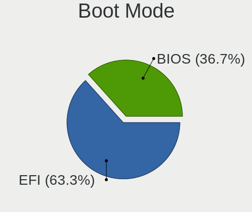
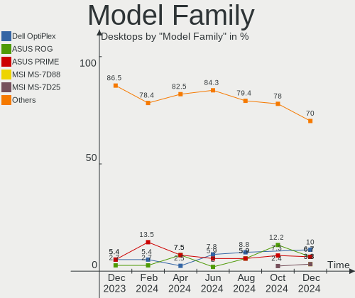
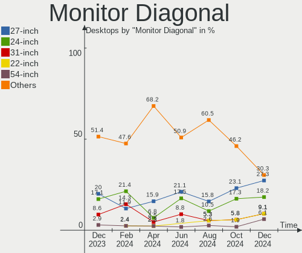

openSUSE - Hardware Trends (Desktops)
-------------------------------------

A project to identify most popular hardware characteristics and track their change
over time based on data collected by Linux users at https://Linux-Hardware.org.

Anyone can contribute to this report by the [hw-probe](https://github.com/linuxhw/hw-probe) tool:

    sudo -E hw-probe -all -upload

This report is for one last month. Overall report since the beginning of time: [TestCoverage](https://github.com/linuxhw/TestCoverage)

Period: Nov, 2022.

Contents
--------

* [ System ](#system)
  - [ OS                       ](#os)
  - [ OS Family                ](#os-family)
  - [ Kernel                   ](#kernel)
  - [ Kernel Family            ](#kernel-family)
  - [ Kernel Major Ver.        ](#kernel-major-ver)
  - [ Arch                     ](#arch)
  - [ DE                       ](#de)
  - [ Display Server           ](#display-server)
  - [ Display Manager          ](#display-manager)
  - [ OS Lang                  ](#os-lang)
  - [ Boot Mode                ](#boot-mode)
  - [ Filesystem               ](#filesystem)
  - [ Part. scheme             ](#part-scheme)
  - [ Dual Boot with Linux/BSD ](#dual-boot-with-linuxbsd)
  - [ Dual Boot (Win)          ](#dual-boot-win)

* [ Board ](#board)
  - [ Vendor                   ](#vendor)
  - [ Model                    ](#model)
  - [ Model Family             ](#model-family)
  - [ MFG Year                 ](#mfg-year)
  - [ Form Factor              ](#form-factor)
  - [ Secure Boot              ](#secure-boot)
  - [ Coreboot                 ](#coreboot)
  - [ RAM Size                 ](#ram-size)
  - [ RAM Used                 ](#ram-used)
  - [ Total Drives             ](#total-drives)
  - [ Has CD-ROM               ](#has-cd-rom)
  - [ Has Ethernet             ](#has-ethernet)
  - [ Has WiFi                 ](#has-wifi)
  - [ Has Bluetooth            ](#has-bluetooth)

* [ Location ](#location)
  - [ Country                  ](#country)
  - [ City                     ](#city)

* [ Drives ](#drives)
  - [ Drive Vendor             ](#drive-vendor)
  - [ Drive Model              ](#drive-model)
  - [ HDD Vendor               ](#hdd-vendor)
  - [ SSD Vendor               ](#ssd-vendor)
  - [ Drive Kind               ](#drive-kind)
  - [ Drive Connector          ](#drive-connector)
  - [ Drive Size               ](#drive-size)
  - [ Space Total              ](#space-total)
  - [ Space Used               ](#space-used)
  - [ Malfunc. Drives          ](#malfunc-drives)
  - [ Malfunc. Drive Vendor    ](#malfunc-drive-vendor)
  - [ Malfunc. HDD Vendor      ](#malfunc-hdd-vendor)
  - [ Malfunc. Drive Kind      ](#malfunc-drive-kind)
  - [ Failed Drives            ](#failed-drives)
  - [ Failed Drive Vendor      ](#failed-drive-vendor)
  - [ Drive Status             ](#drive-status)

* [ Storage controller ](#storage-controller)
  - [ Storage Vendor           ](#storage-vendor)
  - [ Storage Model            ](#storage-model)
  - [ Storage Kind             ](#storage-kind)

* [ Processor ](#processor)
  - [ CPU Vendor               ](#cpu-vendor)
  - [ CPU Model                ](#cpu-model)
  - [ CPU Model Family         ](#cpu-model-family)
  - [ CPU Cores                ](#cpu-cores)
  - [ CPU Sockets              ](#cpu-sockets)
  - [ CPU Threads              ](#cpu-threads)
  - [ CPU Op-Modes             ](#cpu-op-modes)
  - [ CPU Microcode            ](#cpu-microcode)
  - [ CPU Microarch            ](#cpu-microarch)

* [ Graphics ](#graphics)
  - [ GPU Vendor               ](#gpu-vendor)
  - [ GPU Model                ](#gpu-model)
  - [ GPU Combo                ](#gpu-combo)
  - [ GPU Driver               ](#gpu-driver)
  - [ GPU Memory               ](#gpu-memory)

* [ Monitor ](#monitor)
  - [ Monitor Vendor           ](#monitor-vendor)
  - [ Monitor Model            ](#monitor-model)
  - [ Monitor Resolution       ](#monitor-resolution)
  - [ Monitor Diagonal         ](#monitor-diagonal)
  - [ Monitor Width            ](#monitor-width)
  - [ Aspect Ratio             ](#aspect-ratio)
  - [ Monitor Area             ](#monitor-area)
  - [ Pixel Density            ](#pixel-density)
  - [ Multiple Monitors        ](#multiple-monitors)

* [ Network ](#network)
  - [ Net Controller Vendor    ](#net-controller-vendor)
  - [ Net Controller Model     ](#net-controller-model)
  - [ Wireless Vendor          ](#wireless-vendor)
  - [ Wireless Model           ](#wireless-model)
  - [ Ethernet Vendor          ](#ethernet-vendor)
  - [ Ethernet Model           ](#ethernet-model)
  - [ Net Controller Kind      ](#net-controller-kind)
  - [ Used Controller          ](#used-controller)
  - [ NICs                     ](#nics)
  - [ IPv6                     ](#ipv6)

* [ Bluetooth ](#bluetooth)
  - [ Bluetooth Vendor         ](#bluetooth-vendor)
  - [ Bluetooth Model          ](#bluetooth-model)

* [ Sound ](#sound)
  - [ Sound Vendor             ](#sound-vendor)
  - [ Sound Model              ](#sound-model)

* [ Memory ](#memory)
  - [ Memory Vendor            ](#memory-vendor)
  - [ Memory Model             ](#memory-model)
  - [ Memory Kind              ](#memory-kind)
  - [ Memory Form Factor       ](#memory-form-factor)
  - [ Memory Size              ](#memory-size)
  - [ Memory Speed             ](#memory-speed)

* [ Printers & scanners ](#printers--scanners)
  - [ Printer Vendor           ](#printer-vendor)
  - [ Printer Model            ](#printer-model)
  - [ Scanner Vendor           ](#scanner-vendor)
  - [ Scanner Model            ](#scanner-model)

* [ Camera ](#camera)
  - [ Camera Vendor            ](#camera-vendor)
  - [ Camera Model             ](#camera-model)

* [ Security ](#security)
  - [ Fingerprint Vendor       ](#fingerprint-vendor)
  - [ Fingerprint Model        ](#fingerprint-model)
  - [ Chipcard Vendor          ](#chipcard-vendor)
  - [ Chipcard Model           ](#chipcard-model)

* [ Unsupported ](#unsupported)
  - [ Unsupported Devices      ](#unsupported-devices)
  - [ Unsupported Device Types ](#unsupported-device-types)

System
------

OS
--

Installed operating systems

| Name                         | Desktops | Percent |
|------------------------------|----------|---------|
| openSUSE Tumbleweed-XXXXXXXX | 21       | 84%     |
| openSUSE Leap-15.3           | 2        | 8%      |
| openSUSE Leap-15.4           | 1        | 4%      |
| openSUSE Leap-15.0           | 1        | 4%      |

OS Family
---------

OS without a version

| Name     | Desktops | Percent |
|----------|----------|---------|
| openSUSE | 25       | 100%    |

Kernel
------

Version of the Linux kernel

| Version                      | Desktops | Percent |
|------------------------------|----------|---------|
| 6.0.8-1-default              | 8        | 32%     |
| 6.0.7-1-default              | 5        | 20%     |
| 6.0.6-1-default              | 3        | 12%     |
| 6.0.5-1-default              | 2        | 8%      |
| 6.1.0-rc3-vanilla            | 1        | 4%      |
| 6.0.3-1-vanilla              | 1        | 4%      |
| 5.3.18-150300.59.98-default  | 1        | 4%      |
| 5.3.18-150300.59.90-default  | 1        | 4%      |
| 5.19.8-1-default             | 1        | 4%      |
| 5.14.21-150400.24.21-default | 1        | 4%      |
| 4.12.14-lp150.12.82-default  | 1        | 4%      |

Kernel Family
-------------

Linux kernel without a distro release

| Version | Desktops | Percent |
|---------|----------|---------|
| 6.0.8   | 8        | 32%     |
| 6.0.7   | 5        | 20%     |
| 6.0.6   | 3        | 12%     |
| 6.0.5   | 2        | 8%      |
| 5.3.18  | 2        | 8%      |
| 6.1.0   | 1        | 4%      |
| 6.0.3   | 1        | 4%      |
| 5.19.8  | 1        | 4%      |
| 5.14.21 | 1        | 4%      |
| 4.12.14 | 1        | 4%      |

Kernel Major Ver.
-----------------

Linux kernel major version

| Version | Desktops | Percent |
|---------|----------|---------|
| 6.0     | 19       | 76%     |
| 5.3     | 2        | 8%      |
| 6.1     | 1        | 4%      |
| 5.19    | 1        | 4%      |
| 5.14    | 1        | 4%      |
| 4.12    | 1        | 4%      |

Arch
----

OS architecture (x86_64, i586, etc.)

| Name   | Desktops | Percent |
|--------|----------|---------|
| x86_64 | 25       | 100%    |

DE
--

Desktop Environment

| Name     | Desktops | Percent |
|----------|----------|---------|
| KDE5     | 17       | 68%     |
| GNOME    | 5        | 20%     |
| XFCE     | 1        | 4%      |
| KDE      | 1        | 4%      |
| Cinnamon | 1        | 4%      |

Display Server
--------------

X11 or Wayland

| Name    | Desktops | Percent |
|---------|----------|---------|
| X11     | 15       | 60%     |
| Wayland | 9        | 36%     |
| Tty     | 1        | 4%      |

Display Manager
---------------

SDDM, LightDM, etc.

| Name    | Desktops | Percent |
|---------|----------|---------|
| Unknown | 10       | 40%     |
| LightDM | 7        | 28%     |
| SDDM    | 6        | 24%     |
| XDM     | 2        | 8%      |

OS Lang
-------

Language

| Lang  | Desktops | Percent |
|-------|----------|---------|
| en_US | 12       | 48%     |
| de_DE | 6        | 24%     |
| POSIX | 4        | 16%     |
| pt_BR | 1        | 4%      |
| pl_PL | 1        | 4%      |
| lv_LV | 1        | 4%      |

Boot Mode
---------

EFI or BIOS

| Mode | Desktops | Percent |
|------|----------|---------|
| EFI  | 15       | 60%     |
| BIOS | 10       | 40%     |

Filesystem
----------

Type of filesystem

| Type  | Desktops | Percent |
|-------|----------|---------|
| Btrfs | 22       | 88%     |
| Ext4  | 3        | 12%     |

Part. scheme
------------

Scheme of partitioning

| Type    | Desktops | Percent |
|---------|----------|---------|
| GPT     | 13       | 52%     |
| Unknown | 10       | 40%     |
| MBR     | 2        | 8%      |

Dual Boot with Linux/BSD
------------------------

Hosting more than one Linux/BSD

| Dual boot | Desktops | Percent |
|-----------|----------|---------|
| No        | 20       | 80%     |
| Yes       | 5        | 20%     |

Dual Boot (Win)
---------------

Hosting Linux and Windows

| Dual boot | Desktops | Percent |
|-----------|----------|---------|
| No        | 17       | 68%     |
| Yes       | 8        | 32%     |

Board
-----

Vendor
------

Motherboard manufacturer

| Name                | Desktops | Percent |
|---------------------|----------|---------|
| ASUSTek Computer    | 8        | 32%     |
| MSI                 | 5        | 20%     |
| Gigabyte Technology | 5        | 20%     |
| Hewlett-Packard     | 2        | 8%      |
| ASRock              | 2        | 8%      |
| Dell                | 1        | 4%      |
| Acidanthera         | 1        | 4%      |
| Acer                | 1        | 4%      |

Model
-----

Motherboard model

| Name                               | Desktops | Percent |
|------------------------------------|----------|---------|
| MSI MS-7D46                        | 1        | 4%      |
| MSI MS-7B90                        | 1        | 4%      |
| MSI MS-7B89                        | 1        | 4%      |
| MSI MS-7B78                        | 1        | 4%      |
| MSI MS-7696                        | 1        | 4%      |
| HP Z440 Workstation                | 1        | 4%      |
| HP EliteDesk 800 G2 DM 35W         | 1        | 4%      |
| Gigabyte Z390 AORUS PRO WIFI       | 1        | 4%      |
| Gigabyte Z370XP SLI                | 1        | 4%      |
| Gigabyte X570S AORUS PRO AX        | 1        | 4%      |
| Gigabyte X570 GAMING X             | 1        | 4%      |
| Gigabyte B85-HD3-A                 | 1        | 4%      |
| Dell OptiPlex 980                  | 1        | 4%      |
| ASUS TUF Gaming X570-PLUS          | 1        | 4%      |
| ASUS ROG STRIX X670E-E GAMING WIFI | 1        | 4%      |
| ASUS ROG STRIX H470-I GAMING       | 1        | 4%      |
| ASUS PRIME X470-PRO                | 1        | 4%      |
| ASUS PRIME B550-PLUS               | 1        | 4%      |
| ASUS PRIME B450M-K                 | 1        | 4%      |
| ASUS F2A55-M LK                    | 1        | 4%      |
| ASUS A55BM-PLUS                    | 1        | 4%      |
| ASRock B450 Steel Legend           | 1        | 4%      |
| ASRock 970 Extreme3                | 1        | 4%      |
| Acidanthera MacPro7,1              | 1        | 4%      |
| Acer Veriton N4680GT               | 1        | 4%      |

Model Family
------------

Motherboard model prefix

| Name                | Desktops | Percent |
|---------------------|----------|---------|
| ASUS PRIME          | 3        | 12%     |
| ASUS ROG            | 2        | 8%      |
| MSI MS-7D46         | 1        | 4%      |
| MSI MS-7B90         | 1        | 4%      |
| MSI MS-7B89         | 1        | 4%      |
| MSI MS-7B78         | 1        | 4%      |
| MSI MS-7696         | 1        | 4%      |
| HP Z440             | 1        | 4%      |
| HP EliteDesk        | 1        | 4%      |
| Gigabyte Z390       | 1        | 4%      |
| Gigabyte Z370XP     | 1        | 4%      |
| Gigabyte X570S      | 1        | 4%      |
| Gigabyte X570       | 1        | 4%      |
| Gigabyte B85-HD3-A  | 1        | 4%      |
| Dell OptiPlex       | 1        | 4%      |
| ASUS TUF            | 1        | 4%      |
| ASUS F2A55-M        | 1        | 4%      |
| ASUS A55BM-PLUS     | 1        | 4%      |
| ASRock B450         | 1        | 4%      |
| ASRock 970          | 1        | 4%      |
| Acidanthera MacPro7 | 1        | 4%      |
| Acer Veriton        | 1        | 4%      |

MFG Year
--------

Motherboard manufacture year

| Year | Desktops | Percent |
|------|----------|---------|
| 2019 | 5        | 20%     |
| 2018 | 5        | 20%     |
| 2020 | 3        | 12%     |
| 2015 | 3        | 12%     |
| 2022 | 2        | 8%      |
| 2021 | 2        | 8%      |
| 2012 | 2        | 8%      |
| 2013 | 1        | 4%      |
| 2011 | 1        | 4%      |
| 2010 | 1        | 4%      |

Form Factor
-----------

Physical design of the computer

| Name    | Desktops | Percent |
|---------|----------|---------|
| Desktop | 25       | 100%    |

Secure Boot
-----------

Enabled or disabled

| State    | Desktops | Percent |
|----------|----------|---------|
| Disabled | 22       | 88%     |
| Enabled  | 3        | 12%     |

Coreboot
--------

Have coreboot on board

| Used | Desktops | Percent |
|------|----------|---------|
| No   | 25       | 100%    |

RAM Size
--------

Total RAM memory

| Size in GB  | Desktops | Percent |
|-------------|----------|---------|
| 32.01-64.0  | 9        | 36%     |
| 16.01-24.0  | 5        | 20%     |
| 8.01-16.0   | 4        | 16%     |
| 4.01-8.0    | 3        | 12%     |
| 64.01-256.0 | 3        | 12%     |
| 3.01-4.0    | 1        | 4%      |

RAM Used
--------

Used RAM memory

| Used GB   | Desktops | Percent |
|-----------|----------|---------|
| 2.01-3.0  | 9        | 36%     |
| 4.01-8.0  | 7        | 28%     |
| 3.01-4.0  | 5        | 20%     |
| 8.01-16.0 | 3        | 12%     |
| 1.01-2.0  | 1        | 4%      |

Total Drives
------------

Number of drives on board

| Drives | Desktops | Percent |
|--------|----------|---------|
| 2      | 7        | 28%     |
| 4      | 5        | 20%     |
| 3      | 4        | 16%     |
| 1      | 4        | 16%     |
| 5      | 3        | 12%     |
| 7      | 1        | 4%      |
| 6      | 1        | 4%      |

Has CD-ROM
----------

Has CD-ROM on board

| Presented | Desktops | Percent |
|-----------|----------|---------|
| No        | 16       | 64%     |
| Yes       | 9        | 36%     |

Has Ethernet
------------

Has Ethernet on board

| Presented | Desktops | Percent |
|-----------|----------|---------|
| Yes       | 25       | 100%    |

Has WiFi
--------

Has WiFi module

| Presented | Desktops | Percent |
|-----------|----------|---------|
| No        | 13       | 52%     |
| Yes       | 12       | 48%     |

Has Bluetooth
-------------

Has Bluetooth module

| Presented | Desktops | Percent |
|-----------|----------|---------|
| Yes       | 15       | 60%     |
| No        | 10       | 40%     |

Location
--------

Country
-------

Geographic location (country)

| Country     | Desktops | Percent |
|-------------|----------|---------|
| Germany     | 7        | 28%     |
| USA         | 6        | 24%     |
| UK          | 2        | 8%      |
| Poland      | 2        | 8%      |
| Canada      | 2        | 8%      |
| Spain       | 1        | 4%      |
| Serbia      | 1        | 4%      |
| Philippines | 1        | 4%      |
| Latvia      | 1        | 4%      |
| Bulgaria    | 1        | 4%      |
| Brazil      | 1        | 4%      |

City
----

Geographic location (city)

| City       | Desktops | Percent |
|------------|----------|---------|
| Schotten   | 1        | 4%      |
| Sao Carlos | 1        | 4%      |
| Riga       | 1        | 4%      |
| Pueblo     | 1        | 4%      |
| Plovdiv    | 1        | 4%      |
| Pasig      | 1        | 4%      |
| Ottawa     | 1        | 4%      |
| Ortenburg  | 1        | 4%      |
| Novi Sad   | 1        | 4%      |
| Lubin      | 1        | 4%      |
| Lewisville | 1        | 4%      |
| Kingston   | 1        | 4%      |
| Heusweiler | 1        | 4%      |
| Grimma     | 1        | 4%      |
| Denton     | 1        | 4%      |
| Cleveland  | 1        | 4%      |
| Cheltenham | 1        | 4%      |
| Charlotte  | 1        | 4%      |
| Budenheim  | 1        | 4%      |
| Bosau      | 1        | 4%      |
| Bilston    | 1        | 4%      |
| Bialystok  | 1        | 4%      |
| Berlin     | 1        | 4%      |
| Belmont    | 1        | 4%      |
| Barcelona  | 1        | 4%      |

Drives
------

Drive Vendor
------------

Hard drive vendors

| Vendor                    | Desktops | Drives | Percent |
|---------------------------|----------|--------|---------|
| WDC                       | 11       | 15     | 16.92%  |
| Seagate                   | 9        | 10     | 13.85%  |
| Samsung Electronics       | 8        | 11     | 12.31%  |
| SanDisk                   | 6        | 6      | 9.23%   |
| Kingston                  | 3        | 3      | 4.62%   |
| Intenso                   | 3        | 3      | 4.62%   |
| Crucial                   | 3        | 7      | 4.62%   |
| Toshiba                   | 2        | 3      | 3.08%   |
| Micron/Crucial Technology | 2        | 2      | 3.08%   |
| Intel                     | 2        | 2      | 3.08%   |
| Fanxiang                  | 2        | 2      | 3.08%   |
| WD MediaMax               | 1        | 1      | 1.54%   |
| Unknown                   | 1        | 1      | 1.54%   |
| Transcend                 | 1        | 1      | 1.54%   |
| SSK                       | 1        | 1      | 1.54%   |
| PNY                       | 1        | 1      | 1.54%   |
| Phison Electronics        | 1        | 1      | 1.54%   |
| Phison                    | 1        | 1      | 1.54%   |
| Leven                     | 1        | 1      | 1.54%   |
| KIOXIA-EXCERIA            | 1        | 1      | 1.54%   |
| HGST                      | 1        | 1      | 1.54%   |
| Hewlett-Packard           | 1        | 1      | 1.54%   |
| Apacer                    | 1        | 1      | 1.54%   |
| AMicro                    | 1        | 1      | 1.54%   |
| ADATA Technology          | 1        | 2      | 1.54%   |

Drive Model
-----------

Hard drive models

| Model                                             | Desktops | Percent |
|---------------------------------------------------|----------|---------|
| Samsung NVMe SSD Controller SM981/PM981/PM983 1TB | 4        | 5.19%   |
| WDC WD10EZEX-00WN4A0 1TB                          | 2        | 2.6%    |
| Seagate ST2000DM008-2FR102 2TB                    | 2        | 2.6%    |
| Seagate ST2000DM001-1CH164 2TB                    | 2        | 2.6%    |
| Crucial CT500MX500SSD1 500GB                      | 2        | 2.6%    |
| WDC WDS500G2B0A-00SM50 500GB SSD                  | 1        | 1.3%    |
| WDC WDS100T2B0A-00SM50 1TB SSD                    | 1        | 1.3%    |
| WDC WD5000AZLX-75K2TA0 500GB                      | 1        | 1.3%    |
| WDC WD40EFRX-68N32N0 4TB                          | 1        | 1.3%    |
| WDC WD30EFRX-68EUZN0 3TB                          | 1        | 1.3%    |
| WDC WD20EZRX-00D8PB0 2TB                          | 1        | 1.3%    |
| WDC WD20EFRX-68AX9N0 2TB                          | 1        | 1.3%    |
| WDC WD20EARS-00MVWB0 2TB                          | 1        | 1.3%    |
| WDC WD10JFCX-68N6GN0 1TB                          | 1        | 1.3%    |
| WDC WD10EZEX-60ZF5A0 1TB                          | 1        | 1.3%    |
| WDC WD10EZEX-07WN4A0 1TB                          | 1        | 1.3%    |
| WDC WD1003FZEX-00K3CA0 1TB                        | 1        | 1.3%    |
| WDC WD1002FAEX-00Z3A0 1TB                         | 1        | 1.3%    |
| WD MediaMax WL5000GSA12872B 5TB                   | 1        | 1.3%    |
| Unknown 256GB PCS 2.5" S SSD                      | 1        | 1.3%    |
| Transcend TS240GSSD220S 240GB                     | 1        | 1.3%    |
| Toshiba MG08ADA600E 6TB                           | 1        | 1.3%    |
| Toshiba MG03ACA200 2TB                            | 1        | 1.3%    |
| Toshiba DT01ACA050 500GB                          | 1        | 1.3%    |
| SSK Disk 500GB                                    | 1        | 1.3%    |
| Seagate ST3160318AS 160GB                         | 1        | 1.3%    |
| Seagate ST3000DM008-2DM166 3TB                    | 1        | 1.3%    |
| Seagate ST2000LX001-1RG174 2TB                    | 1        | 1.3%    |
| Seagate ST2000DM006-2DM164 2TB                    | 1        | 1.3%    |
| Seagate Expansion 1TB                             | 1        | 1.3%    |
| Seagate BarraCuda SSD ZA2000CM10002 2TB           | 1        | 1.3%    |
| Sandisk WD Blue SN550 NVMe SSD 1TB                | 1        | 1.3%    |
| SanDisk SSD PLUS 120GB                            | 1        | 1.3%    |
| SanDisk SSD PLUS 120 GB                           | 1        | 1.3%    |
| SanDisk SDSSDX240GG25 240GB                       | 1        | 1.3%    |
| SanDisk NVMe SSD Drive 1TB                        | 1        | 1.3%    |
| SanDisk Extreme 55AE 500GB SSD                    | 1        | 1.3%    |
| Samsung SSD 870 EVO 250GB                         | 1        | 1.3%    |
| Samsung SSD 860 EVO M.2 250GB                     | 1        | 1.3%    |
| Samsung SSD 860 EVO 500GB                         | 1        | 1.3%    |

HDD Vendor
----------

Hard disk drive vendors

| Vendor      | Desktops | Drives | Percent |
|-------------|----------|--------|---------|
| WDC         | 10       | 13     | 43.48%  |
| Seagate     | 8        | 9      | 34.78%  |
| Toshiba     | 2        | 3      | 8.7%    |
| WD MediaMax | 1        | 1      | 4.35%   |
| Intenso     | 1        | 1      | 4.35%   |
| HGST        | 1        | 1      | 4.35%   |

SSD Vendor
----------

Solid state drive vendors

| Vendor              | Desktops | Drives | Percent |
|---------------------|----------|--------|---------|
| Samsung Electronics | 6        | 7      | 23.08%  |
| SanDisk             | 4        | 4      | 15.38%  |
| Crucial             | 3        | 5      | 11.54%  |
| WDC                 | 2        | 2      | 7.69%   |
| Kingston            | 2        | 2      | 7.69%   |
| Unknown             | 1        | 1      | 3.85%   |
| Transcend           | 1        | 1      | 3.85%   |
| Seagate             | 1        | 1      | 3.85%   |
| PNY                 | 1        | 1      | 3.85%   |
| Leven               | 1        | 1      | 3.85%   |
| Intenso             | 1        | 1      | 3.85%   |
| Hewlett-Packard     | 1        | 1      | 3.85%   |
| Fanxiang            | 1        | 1      | 3.85%   |
| Apacer              | 1        | 1      | 3.85%   |

Drive Kind
----------

HDD or SSD

| Kind    | Desktops | Drives | Percent |
|---------|----------|--------|---------|
| SSD     | 19       | 29     | 34.55%  |
| HDD     | 18       | 28     | 32.73%  |
| NVMe    | 14       | 18     | 25.45%  |
| Unknown | 4        | 4      | 7.27%   |

Drive Connector
---------------

SATA, SAS, NVMe, etc.

| Type | Desktops | Drives | Percent |
|------|----------|--------|---------|
| SATA | 25       | 56     | 56.82%  |
| NVMe | 14       | 18     | 31.82%  |
| SAS  | 5        | 5      | 11.36%  |

Drive Size
----------

Size of hard drive

| Size in TB | Desktops | Drives | Percent |
|------------|----------|--------|---------|
| 0.01-0.5   | 18       | 26     | 41.86%  |
| 0.51-1.0   | 11       | 14     | 25.58%  |
| 1.01-2.0   | 9        | 11     | 20.93%  |
| 2.01-3.0   | 3        | 3      | 6.98%   |
| 3.01-4.0   | 1        | 1      | 2.33%   |
| 4.01-10.0  | 1        | 2      | 2.33%   |

Space Total
-----------

Amount of disk space available on the file system

| Size in GB     | Desktops | Percent |
|----------------|----------|---------|
| More than 3000 | 17       | 68%     |
| 2001-3000      | 5        | 20%     |
| 101-250        | 2        | 8%      |
| 501-1000       | 1        | 4%      |

Space Used
----------

Amount of used disk space

| Used GB        | Desktops | Percent |
|----------------|----------|---------|
| More than 3000 | 7        | 28%     |
| 1001-2000      | 4        | 16%     |
| 501-1000       | 4        | 16%     |
| 251-500        | 3        | 12%     |
| 21-50          | 2        | 8%      |
| 2001-3000      | 2        | 8%      |
| 101-250        | 2        | 8%      |
| 1-20           | 1        | 4%      |

Malfunc. Drives
---------------

Drive models with a malfunction

| Model                           | Desktops | Drives | Percent |
|---------------------------------|----------|--------|---------|
| WDC WD10JFCX-68N6GN0 1TB        | 1        | 1      | 14.29%  |
| WD MediaMax WL5000GSA12872B 5TB | 1        | 1      | 14.29%  |
| Seagate ST2000LX001-1RG174 2TB  | 1        | 1      | 14.29%  |
| Seagate ST2000DM008-2FR102 2TB  | 1        | 1      | 14.29%  |
| Seagate ST2000DM001-1CH164 2TB  | 1        | 1      | 14.29%  |
| SanDisk SSD PLUS 120 GB         | 1        | 1      | 14.29%  |
| Intenso SSD Sata III 120GB      | 1        | 1      | 14.29%  |

Malfunc. Drive Vendor
---------------------

Vendors of faulty drives

| Vendor      | Desktops | Drives | Percent |
|-------------|----------|--------|---------|
| Seagate     | 3        | 3      | 42.86%  |
| WDC         | 1        | 1      | 14.29%  |
| WD MediaMax | 1        | 1      | 14.29%  |
| SanDisk     | 1        | 1      | 14.29%  |
| Intenso     | 1        | 1      | 14.29%  |

Malfunc. HDD Vendor
-------------------

Vendors of faulty HDD drives

| Vendor      | Desktops | Drives | Percent |
|-------------|----------|--------|---------|
| Seagate     | 3        | 3      | 60%     |
| WDC         | 1        | 1      | 20%     |
| WD MediaMax | 1        | 1      | 20%     |

Malfunc. Drive Kind
-------------------

Kinds of faulty drives

| Kind | Desktops | Drives | Percent |
|------|----------|--------|---------|
| HDD  | 4        | 5      | 80%     |
| SSD  | 1        | 2      | 20%     |

Failed Drives
-------------

Failed drive models

Zero info for selected period =(

Failed Drive Vendor
-------------------

Failed drive vendors

Zero info for selected period =(

Drive Status
------------

Number of failed and malfunc. drives

| Status   | Desktops | Drives | Percent |
|----------|----------|--------|---------|
| Works    | 15       | 43     | 50%     |
| Detected | 10       | 29     | 33.33%  |
| Malfunc  | 5        | 7      | 16.67%  |

Storage controller
------------------

Storage Vendor
--------------

Storage controller vendors

| Vendor                      | Desktops | Percent |
|-----------------------------|----------|---------|
| AMD                         | 16       | 40%     |
| Intel                       | 9        | 22.5%   |
| Samsung Electronics         | 4        | 10%     |
| Micron/Crucial Technology   | 3        | 7.5%    |
| SanDisk                     | 2        | 5%      |
| Phison Electronics          | 2        | 5%      |
| KIOXIA                      | 1        | 2.5%    |
| Kingston Technology Company | 1        | 2.5%    |
| ASMedia Technology          | 1        | 2.5%    |
| ADATA Technology            | 1        | 2.5%    |

Storage Model
-------------

Storage controller models

| Model                                                                          | Desktops | Percent |
|--------------------------------------------------------------------------------|----------|---------|
| AMD FCH SATA Controller [AHCI mode]                                            | 12       | 23.53%  |
| AMD 400 Series Chipset SATA Controller                                         | 6        | 11.76%  |
| Samsung NVMe SSD Controller SM981/PM981/PM983                                  | 4        | 7.84%   |
| Phison E12 NVMe Controller                                                     | 2        | 3.92%   |
| SanDisk WD Blue SN550 NVMe SSD                                                 | 1        | 1.96%   |
| SanDisk WD Black 2018/SN750 / PC SN720 NVMe SSD                                | 1        | 1.96%   |
| Micron/Crucial P5 Plus NVMe PCIe SSD                                           | 1        | 1.96%   |
| Micron/Crucial P2 NVMe PCIe SSD                                                | 1        | 1.96%   |
| Micron/Crucial P1 NVMe PCIe SSD                                                | 1        | 1.96%   |
| Micron/Crucial Non-Volatile memory controller                                  | 1        | 1.96%   |
| KIOXIA Non-Volatile memory controller                                          | 1        | 1.96%   |
| Kingston Company Company Non-Volatile memory controller                        | 1        | 1.96%   |
| Intel SSD 600P Series                                                          | 1        | 1.96%   |
| Intel Q170/Q150/B150/H170/H110/Z170/CM236 Chipset SATA Controller [AHCI Mode]  | 1        | 1.96%   |
| Intel NVMe Optane Memory Series                                                | 1        | 1.96%   |
| Intel Comet Lake SATA AHCI Controller                                          | 1        | 1.96%   |
| Intel Cannon Lake PCH SATA AHCI Controller                                     | 1        | 1.96%   |
| Intel C610/X99 series chipset 6-Port SATA Controller [AHCI mode]               | 1        | 1.96%   |
| Intel Alder Lake-S PCH SATA Controller [AHCI Mode]                             | 1        | 1.96%   |
| Intel 8 Series/C220 Series Chipset Family 6-port SATA Controller 1 [AHCI mode] | 1        | 1.96%   |
| Intel 500 Series Chipset Family SATA AHCI Controller                           | 1        | 1.96%   |
| Intel 5 Series/3400 Series Chipset PT IDER Controller                          | 1        | 1.96%   |
| Intel 5 Series/3400 Series Chipset 6 port SATA AHCI Controller                 | 1        | 1.96%   |
| Intel 200 Series PCH SATA controller [AHCI mode]                               | 1        | 1.96%   |
| ASMedia ASM1062 Serial ATA Controller                                          | 1        | 1.96%   |
| AMD SB7x0/SB8x0/SB9x0 SATA Controller [IDE mode]                               | 1        | 1.96%   |
| AMD SB7x0/SB8x0/SB9x0 IDE Controller                                           | 1        | 1.96%   |
| AMD SATA controller                                                            | 1        | 1.96%   |
| AMD 500 Series Chipset SATA Controller                                         | 1        | 1.96%   |
| AMD 300 Series Chipset SATA Controller                                         | 1        | 1.96%   |
| ADATA XPG SX8200 Pro PCIe Gen3x4 M.2 2280 Solid State Drive                    | 1        | 1.96%   |

Storage Kind
------------

Kind of storage controller (IDE, SATA, NVMe, SAS, ...)

| Kind | Desktops | Percent |
|------|----------|---------|
| SATA | 25       | 60.98%  |
| NVMe | 14       | 34.15%  |
| IDE  | 2        | 4.88%   |

Processor
---------

CPU Vendor
----------

Processor vendors

| Vendor | Desktops | Percent |
|--------|----------|---------|
| AMD    | 16       | 64%     |
| Intel  | 9        | 36%     |

CPU Model
---------

Processor models

| Model                                    | Desktops | Percent |
|------------------------------------------|----------|---------|
| Intel Xeon CPU E5-2690 v3 @ 2.60GHz      | 1        | 4%      |
| Intel Core i9-9900KS CPU @ 4.00GHz       | 1        | 4%      |
| Intel Core i9-10900T CPU @ 1.90GHz       | 1        | 4%      |
| Intel Core i7-8700K CPU @ 3.70GHz        | 1        | 4%      |
| Intel Core i7-4790 CPU @ 3.60GHz         | 1        | 4%      |
| Intel Core i5-6500T CPU @ 2.50GHz        | 1        | 4%      |
| Intel Core i5 CPU 750 @ 2.67GHz          | 1        | 4%      |
| Intel 12th Gen Core i7-12700K            | 1        | 4%      |
| Intel 11th Gen Core i5-11500T @ 1.50GHz  | 1        | 4%      |
| AMD Ryzen 9 7950X 16-Core Processor      | 1        | 4%      |
| AMD Ryzen 9 5950X 16-Core Processor      | 1        | 4%      |
| AMD Ryzen 7 5700G with Radeon Graphics   | 1        | 4%      |
| AMD Ryzen 7 3800X 8-Core Processor       | 1        | 4%      |
| AMD Ryzen 7 3700X 8-Core Processor       | 1        | 4%      |
| AMD Ryzen 7 2700X Eight-Core Processor   | 1        | 4%      |
| AMD Ryzen 5 5600X 6-Core Processor       | 1        | 4%      |
| AMD Ryzen 5 3600 6-Core Processor        | 1        | 4%      |
| AMD Ryzen 5 3500X 6-Core Processor       | 1        | 4%      |
| AMD Ryzen 5 2600X Six-Core Processor     | 1        | 4%      |
| AMD Ryzen 5 2600 Six-Core Processor      | 1        | 4%      |
| AMD Ryzen 5 1600 Six-Core Processor      | 1        | 4%      |
| AMD FX-4100 Quad-Core Processor          | 1        | 4%      |
| AMD A8-3850 APU with Radeon HD Graphics  | 1        | 4%      |
| AMD A6-6400K APU with Radeon HD Graphics | 1        | 4%      |
| AMD A4-6300 APU with Radeon HD Graphics  | 1        | 4%      |

CPU Model Family
----------------

Processor model prefix

| Model         | Desktops | Percent |
|---------------|----------|---------|
| AMD Ryzen 5   | 6        | 24%     |
| AMD Ryzen 7   | 4        | 16%     |
| Other         | 2        | 8%      |
| Intel Core i9 | 2        | 8%      |
| Intel Core i7 | 2        | 8%      |
| Intel Core i5 | 2        | 8%      |
| AMD Ryzen 9   | 2        | 8%      |
| Intel Xeon    | 1        | 4%      |
| AMD FX        | 1        | 4%      |
| AMD A8        | 1        | 4%      |
| AMD A6        | 1        | 4%      |
| AMD A4        | 1        | 4%      |

CPU Cores
---------

Number of processor cores

| Number | Desktops | Percent |
|--------|----------|---------|
| 6      | 8        | 32%     |
| 8      | 5        | 20%     |
| 4      | 4        | 16%     |
| 16     | 2        | 8%      |
| 12     | 2        | 8%      |
| 1      | 2        | 8%      |
| 10     | 1        | 4%      |
| 2      | 1        | 4%      |

CPU Sockets
-----------

Number of sockets

| Number | Desktops | Percent |
|--------|----------|---------|
| 1      | 25       | 100%    |

CPU Threads
-----------

Threads per core (Hyper-Threading)

| Number | Desktops | Percent |
|--------|----------|---------|
| 2      | 21       | 84%     |
| 1      | 4        | 16%     |

CPU Op-Modes
------------

CPU Operation Modes (32-bit, 64-bit)

| Op mode        | Desktops | Percent |
|----------------|----------|---------|
| 32-bit, 64-bit | 25       | 100%    |

CPU Microcode
-------------

Microcode number

| Number     | Desktops | Percent |
|------------|----------|---------|
| 0x0800820d | 4        | 16%     |
| 0x08701021 | 3        | 12%     |
| 0x0a20120a | 2        | 8%      |
| 0xa0671    | 1        | 4%      |
| 0xa0655    | 1        | 4%      |
| 0x906ed    | 1        | 4%      |
| 0x906ea    | 1        | 4%      |
| 0x90672    | 1        | 4%      |
| 0x506e3    | 1        | 4%      |
| 0x306f2    | 1        | 4%      |
| 0x306c3    | 1        | 4%      |
| 0x106e5    | 1        | 4%      |
| 0x0a601203 | 1        | 4%      |
| 0x0a50000c | 1        | 4%      |
| 0x08701013 | 1        | 4%      |
| 0x06001119 | 1        | 4%      |
| 0x0600063e | 1        | 4%      |
| 0x03000027 | 1        | 4%      |
| Unknown    | 1        | 4%      |

CPU Microarch
-------------

Microarchitecture

| Name             | Desktops | Percent |
|------------------|----------|---------|
| Zen+             | 4        | 16%     |
| Zen 2            | 4        | 16%     |
| Zen 3            | 3        | 12%     |
| Piledriver       | 2        | 8%      |
| KabyLake         | 2        | 8%      |
| Haswell          | 2        | 8%      |
| Skylake          | 1        | 4%      |
| Nehalem          | 1        | 4%      |
| K10 Llano        | 1        | 4%      |
| Icelake          | 1        | 4%      |
| CometLake        | 1        | 4%      |
| Bulldozer        | 1        | 4%      |
| Alderlake Hybrid | 1        | 4%      |
| Unknown          | 1        | 4%      |

Graphics
--------

GPU Vendor
----------

Vendors of graphics cards

| Vendor | Desktops | Percent |
|--------|----------|---------|
| Nvidia | 11       | 42.31%  |
| AMD    | 11       | 42.31%  |
| Intel  | 4        | 15.38%  |

GPU Model
---------

Graphics card models

| Model                                                        | Desktops | Percent |
|--------------------------------------------------------------|----------|---------|
| AMD Ellesmere [Radeon RX 470/480/570/570X/580/580X/590]      | 3        | 10.71%  |
| Nvidia TU116 [GeForce GTX 1660 SUPER]                        | 2        | 7.14%   |
| AMD Juniper XT [Radeon HD 5770]                              | 2        | 7.14%   |
| Nvidia TU117GLM [Quadro T400 Mobile]                         | 1        | 3.57%   |
| Nvidia TU117 [GeForce GTX 1650]                              | 1        | 3.57%   |
| Nvidia TU104 [GeForce RTX 2080 SUPER]                        | 1        | 3.57%   |
| Nvidia TU102 [GeForce RTX 2080 Ti Rev. A]                    | 1        | 3.57%   |
| Nvidia GP104GL [Tesla P4]                                    | 1        | 3.57%   |
| Nvidia GP104 [GeForce GTX 1070]                              | 1        | 3.57%   |
| Nvidia GP104 [GeForce GTX 1070 Ti]                           | 1        | 3.57%   |
| Nvidia GK208B [GeForce GT 730]                               | 1        | 3.57%   |
| Nvidia GA104 [GeForce RTX 3070]                              | 1        | 3.57%   |
| Nvidia GA102 [GeForce RTX 3080]                              | 1        | 3.57%   |
| Intel RocketLake-S GT1 [UHD Graphics 750]                    | 1        | 3.57%   |
| Intel HD Graphics 530                                        | 1        | 3.57%   |
| Intel CometLake-S GT2 [UHD Graphics 630]                     | 1        | 3.57%   |
| Intel AlderLake-S GT1                                        | 1        | 3.57%   |
| AMD Turks XT [Radeon HD 6670/7670]                           | 1        | 3.57%   |
| AMD Sumo [Radeon HD 6550D]                                   | 1        | 3.57%   |
| AMD RV620 LE [Radeon HD 3450]                                | 1        | 3.57%   |
| AMD Richland [Radeon HD 8470D]                               | 1        | 3.57%   |
| AMD Richland [Radeon HD 8370D]                               | 1        | 3.57%   |
| AMD Navi 21 [Radeon RX 6800/6800 XT / 6900 XT]               | 1        | 3.57%   |
| AMD Cezanne [Radeon Vega Series / Radeon Vega Mobile Series] | 1        | 3.57%   |

GPU Combo
---------

Combinations of graphics cards

| Name           | Desktops | Percent |
|----------------|----------|---------|
| 1 x AMD        | 10       | 40%     |
| 1 x Nvidia     | 9        | 36%     |
| 1 x Intel      | 3        | 12%     |
| 2 x Nvidia     | 1        | 4%      |
| 2 x AMD        | 1        | 4%      |
| Intel + Nvidia | 1        | 4%      |

GPU Driver
----------

Free vs proprietary

| Driver      | Desktops | Percent |
|-------------|----------|---------|
| Free        | 18       | 72%     |
| Proprietary | 7        | 28%     |

GPU Memory
----------

Total video memory

| Size in GB | Desktops | Percent |
|------------|----------|---------|
| 7.01-8.0   | 6        | 24%     |
| Unknown    | 5        | 20%     |
| 1.01-2.0   | 3        | 12%     |
| 8.01-16.0  | 3        | 12%     |
| 5.01-6.0   | 2        | 8%      |
| 3.01-4.0   | 2        | 8%      |
| 0.51-1.0   | 2        | 8%      |
| 0.01-0.5   | 2        | 8%      |

Monitor
-------

Monitor Vendor
--------------

Monitor vendors

| Vendor              | Desktops | Percent |
|---------------------|----------|---------|
| Samsung Electronics | 8        | 25.81%  |
| Goldstar            | 4        | 12.9%   |
| Dell                | 4        | 12.9%   |
| Hewlett-Packard     | 3        | 9.68%   |
| ASUSTek Computer    | 2        | 6.45%   |
| AOC                 | 2        | 6.45%   |
| Acer                | 2        | 6.45%   |
| Sceptre Tech        | 1        | 3.23%   |
| IPS                 | 1        | 3.23%   |
| Hyundai ImageQuest  | 1        | 3.23%   |
| Eizo                | 1        | 3.23%   |
| DEX                 | 1        | 3.23%   |
| BenQ                | 1        | 3.23%   |

Monitor Model
-------------

Monitor models

| Model                                                                | Desktops | Percent |
|----------------------------------------------------------------------|----------|---------|
| Sceptre Tech Sceptre E24 SPT099D 1920x1080 521x293mm 23.5-inch       | 1        | 2.94%   |
| Samsung Electronics T27B350 SAM0945 1920x1080 598x336mm 27.0-inch    | 1        | 2.94%   |
| Samsung Electronics T27B300 SAM0933 1920x1080 598x336mm 27.0-inch    | 1        | 2.94%   |
| Samsung Electronics SyncMaster SAM0657 1920x1080                     | 1        | 2.94%   |
| Samsung Electronics SyncMaster SAM05C5 1920x1080                     | 1        | 2.94%   |
| Samsung Electronics SyncMaster SAM010F 1280x1024 376x301mm 19.0-inch | 1        | 2.94%   |
| Samsung Electronics S32D850 SAM0BCC 2560x1440 708x398mm 32.0-inch    | 1        | 2.94%   |
| Samsung Electronics LS49AG95 SAM71AC 2560x1440 1193x336mm 48.8-inch  | 1        | 2.94%   |
| Samsung Electronics C32F391 SAM0D34 1920x1080 698x393mm 31.5-inch    | 1        | 2.94%   |
| Samsung Electronics C24FG70 SAM0D58 1920x1080 532x304mm 24.1-inch    | 1        | 2.94%   |
| IPS IP22V1 IPS2200 1920x1080 409x330mm 20.7-inch                     | 1        | 2.94%   |
| Hyundai ImageQuest Q17 Digital IQT217D 1280x1024 330x270mm 16.8-inch | 1        | 2.94%   |
| Hewlett-Packard LA2206 HWP2947 1920x1080 477x268mm 21.5-inch         | 1        | 2.94%   |
| Hewlett-Packard 27f HPN354B 1920x1080 598x336mm 27.0-inch            | 1        | 2.94%   |
| Hewlett-Packard 2229h HWP2854 1680x1050 473x296mm 22.0-inch          | 1        | 2.94%   |
| Goldstar W2443 GSM571C 1920x1080 510x290mm 23.1-inch                 | 1        | 2.94%   |
| Goldstar ULTRAWIDE GSM76FC 3840x1600 874x366mm 37.3-inch             | 1        | 2.94%   |
| Goldstar ULTRAWIDE GSM76FA 2560x1080 531x298mm 24.0-inch             | 1        | 2.94%   |
| Goldstar LG ULTRAGEAR GSM5B7F 2560x1440 600x340mm 27.2-inch          | 1        | 2.94%   |
| Goldstar HDR 4K GSM7706 3840x2160 600x340mm 27.2-inch                | 1        | 2.94%   |
| Eizo EV2333W ENC2069 1920x1080 510x287mm 23.0-inch                   | 1        | 2.94%   |
| Eizo EV2333W ENC2068 1920x1080 510x287mm 23.0-inch                   | 1        | 2.94%   |
| DEX DEXA GRABBER DEX0001 1920x1080 477x268mm 21.5-inch               | 1        | 2.94%   |
| Dell U2717D DEL40EA 2560x1440 597x336mm 27.0-inch                    | 1        | 2.94%   |
| Dell U2414H DELA0A4 1920x1080 527x296mm 23.8-inch                    | 1        | 2.94%   |
| Dell S2721HGF DEL41E7 1920x1080 597x336mm 27.0-inch                  | 1        | 2.94%   |
| Dell P2418D DELD0C2 2560x1440 526x296mm 23.8-inch                    | 1        | 2.94%   |
| BenQ GW2765 BNQ78D6 2560x1440 597x336mm 27.0-inch                    | 1        | 2.94%   |
| ASUSTek Computer VP249 AUS24AF 1920x1080 527x296mm 23.8-inch         | 1        | 2.94%   |
| ASUSTek Computer VL279 AUS2781 1920x1080 598x336mm 27.0-inch         | 1        | 2.94%   |
| AOC 24P1X AOC2401 1920x1200 518x324mm 24.1-inch                      | 1        | 2.94%   |
| AOC 2470W AOC2470 1920x1080 521x293mm 23.5-inch                      | 1        | 2.94%   |
| Acer KA270H ACR0522 1920x1080 598x336mm 27.0-inch                    | 1        | 2.94%   |
| Acer K272HL ACR0523 1920x1080 598x336mm 27.0-inch                    | 1        | 2.94%   |

Monitor Resolution
------------------

Monitor screen resolution

| Resolution         | Desktops | Percent |
|--------------------|----------|---------|
| 1920x1080 (FHD)    | 17       | 58.62%  |
| 2560x1440 (QHD)    | 5        | 17.24%  |
| 1280x1024 (SXGA)   | 2        | 6.9%    |
| 3840x2160 (4K)     | 1        | 3.45%   |
| 3840x1600          | 1        | 3.45%   |
| 3840x1080          | 1        | 3.45%   |
| 2560x1080          | 1        | 3.45%   |
| 1680x1050 (WSXGA+) | 1        | 3.45%   |

Monitor Diagonal
----------------

Diagonal size in inches

| Inches  | Desktops | Percent |
|---------|----------|---------|
| 27      | 10       | 31.25%  |
| 24      | 6        | 18.75%  |
| 23      | 3        | 9.38%   |
| 21      | 2        | 6.25%   |
| Unknown | 2        | 6.25%   |
| 48      | 1        | 3.13%   |
| 37      | 1        | 3.13%   |
| 34      | 1        | 3.13%   |
| 32      | 1        | 3.13%   |
| 31      | 1        | 3.13%   |
| 22      | 1        | 3.13%   |
| 20      | 1        | 3.13%   |
| 19      | 1        | 3.13%   |
| 16      | 1        | 3.13%   |

Monitor Width
-------------

Physical width

| Width in mm | Desktops | Percent |
|-------------|----------|---------|
| 501-600     | 18       | 58.06%  |
| 401-500     | 4        | 12.9%   |
| 701-800     | 2        | 6.45%   |
| Unknown     | 2        | 6.45%   |
| 801-900     | 1        | 3.23%   |
| 601-700     | 1        | 3.23%   |
| 351-400     | 1        | 3.23%   |
| 301-350     | 1        | 3.23%   |
| 1001-1500   | 1        | 3.23%   |

Aspect Ratio
------------

Proportional relationship between the width and the height

| Ratio | Desktops | Percent |
|-------|----------|---------|
| 16/9  | 21       | 72.41%  |
| 6/5   | 2        | 6.9%    |
| 21/9  | 2        | 6.9%    |
| 16/10 | 2        | 6.9%    |
| 5/4   | 1        | 3.45%   |
| 32/9  | 1        | 3.45%   |

Monitor Area
------------

Area in inch

| Area in inch | Desktops | Percent |
|----------------|----------|---------|
| 301-350        | 10       | 32.26%  |
| 201-250        | 9        | 29.03%  |
| 351-500        | 4        | 12.9%   |
| 251-300        | 2        | 6.45%   |
| 151-200        | 2        | 6.45%   |
| Unknown        | 2        | 6.45%   |
| 131-140        | 1        | 3.23%   |
| 501-1000       | 1        | 3.23%   |

Pixel Density
-------------

Pixels per inch

| Density | Desktops | Percent |
|---------|----------|---------|
| 51-100  | 21       | 67.74%  |
| 101-120 | 6        | 19.35%  |
| Unknown | 2        | 6.45%   |
| 161-240 | 1        | 3.23%   |
| 121-160 | 1        | 3.23%   |

Multiple Monitors
-----------------

Total monitors connected

| Total | Desktops | Percent |
|-------|----------|---------|
| 1     | 17       | 68%     |
| 2     | 7        | 28%     |
| 4     | 1        | 4%      |

Network
-------

Net Controller Vendor
---------------------

Controller vendors

| Vendor                | Desktops | Percent |
|-----------------------|----------|---------|
| Realtek Semiconductor | 17       | 48.57%  |
| Intel                 | 14       | 40%     |
| MediaTek              | 1        | 2.86%   |
| D-Link                | 1        | 2.86%   |
| Broadcom              | 1        | 2.86%   |
| ASIX Electronics      | 1        | 2.86%   |

Net Controller Model
--------------------

Controller models

| Model                                                             | Desktops | Percent |
|-------------------------------------------------------------------|----------|---------|
| Realtek RTL8111/8168/8411 PCI Express Gigabit Ethernet Controller | 16       | 39.02%  |
| Intel Wi-Fi 6 AX210/AX211/AX411 160MHz                            | 2        | 4.88%   |
| Intel Wi-Fi 6 AX200                                               | 2        | 4.88%   |
| Intel I211 Gigabit Network Connection                             | 2        | 4.88%   |
| Intel Ethernet Controller I225-V                                  | 2        | 4.88%   |
| Realtek RTL8191SEvB Wireless LAN Controller                       | 1        | 2.44%   |
| Realtek 802.11ac NIC                                              | 1        | 2.44%   |
| MediaTek MT7921K (RZ608) Wi-Fi 6E 80MHz                           | 1        | 2.44%   |
| Intel Wireless-AC 9260                                            | 1        | 2.44%   |
| Intel Tiger Lake PCH CNVi WiFi                                    | 1        | 2.44%   |
| Intel Ethernet Connection (7) I219-V                              | 1        | 2.44%   |
| Intel Ethernet Connection (2) I219-V                              | 1        | 2.44%   |
| Intel Ethernet Connection (2) I219-LM                             | 1        | 2.44%   |
| Intel Ethernet Connection (2) I218-LM                             | 1        | 2.44%   |
| Intel Ethernet Connection (17) I219-V                             | 1        | 2.44%   |
| Intel Ethernet Connection (11) I219-V                             | 1        | 2.44%   |
| Intel Comet Lake PCH CNVi WiFi                                    | 1        | 2.44%   |
| Intel Cannon Lake PCH CNVi WiFi                                   | 1        | 2.44%   |
| Intel 82578DM Gigabit Network Connection                          | 1        | 2.44%   |
| D-Link 11ac adapter                                               | 1        | 2.44%   |
| Broadcom Network controller                                       | 1        | 2.44%   |
| ASIX AX88179 Gigabit Ethernet                                     | 1        | 2.44%   |

Wireless Vendor
---------------

Wireless vendors

| Vendor                | Desktops | Percent |
|-----------------------|----------|---------|
| Intel                 | 8        | 66.67%  |
| Realtek Semiconductor | 2        | 16.67%  |
| MediaTek              | 1        | 8.33%   |
| Broadcom              | 1        | 8.33%   |

Wireless Model
--------------

Wireless models

| Model                                       | Desktops | Percent |
|---------------------------------------------|----------|---------|
| Intel Wi-Fi 6 AX210/AX211/AX411 160MHz      | 2        | 16.67%  |
| Intel Wi-Fi 6 AX200                         | 2        | 16.67%  |
| Realtek RTL8191SEvB Wireless LAN Controller | 1        | 8.33%   |
| Realtek 802.11ac NIC                        | 1        | 8.33%   |
| MediaTek MT7921K (RZ608) Wi-Fi 6E 80MHz     | 1        | 8.33%   |
| Intel Wireless-AC 9260                      | 1        | 8.33%   |
| Intel Tiger Lake PCH CNVi WiFi              | 1        | 8.33%   |
| Intel Comet Lake PCH CNVi WiFi              | 1        | 8.33%   |
| Intel Cannon Lake PCH CNVi WiFi             | 1        | 8.33%   |
| Broadcom Network controller                 | 1        | 8.33%   |

Ethernet Vendor
---------------

Ethernet vendors

| Vendor                | Desktops | Percent |
|-----------------------|----------|---------|
| Realtek Semiconductor | 16       | 55.17%  |
| Intel                 | 11       | 37.93%  |
| D-Link                | 1        | 3.45%   |
| ASIX Electronics      | 1        | 3.45%   |

Ethernet Model
--------------

Ethernet models

| Model                                                             | Desktops | Percent |
|-------------------------------------------------------------------|----------|---------|
| Realtek RTL8111/8168/8411 PCI Express Gigabit Ethernet Controller | 16       | 55.17%  |
| Intel I211 Gigabit Network Connection                             | 2        | 6.9%    |
| Intel Ethernet Controller I225-V                                  | 2        | 6.9%    |
| Intel Ethernet Connection (7) I219-V                              | 1        | 3.45%   |
| Intel Ethernet Connection (2) I219-V                              | 1        | 3.45%   |
| Intel Ethernet Connection (2) I219-LM                             | 1        | 3.45%   |
| Intel Ethernet Connection (2) I218-LM                             | 1        | 3.45%   |
| Intel Ethernet Connection (17) I219-V                             | 1        | 3.45%   |
| Intel Ethernet Connection (11) I219-V                             | 1        | 3.45%   |
| Intel 82578DM Gigabit Network Connection                          | 1        | 3.45%   |
| D-Link 11ac adapter                                               | 1        | 3.45%   |
| ASIX AX88179 Gigabit Ethernet                                     | 1        | 3.45%   |

Net Controller Kind
-------------------

Ethernet, WiFi or modem

| Kind     | Desktops | Percent |
|----------|----------|---------|
| Ethernet | 25       | 67.57%  |
| WiFi     | 12       | 32.43%  |

Used Controller
---------------

Currently used network controller

| Kind     | Desktops | Percent |
|----------|----------|---------|
| Ethernet | 22       | 84.62%  |
| WiFi     | 4        | 15.38%  |

NICs
----

Total network controllers on board

| Total | Desktops | Percent |
|-------|----------|---------|
| 1     | 13       | 52%     |
| 2     | 10       | 40%     |
| 3     | 2        | 8%      |

IPv6
----

IPv6 vs IPv4

| Used | Desktops | Percent |
|------|----------|---------|
| No   | 17       | 68%     |
| Yes  | 8        | 32%     |

Bluetooth
---------

Bluetooth Vendor
----------------

Controller vendors

| Vendor                  | Desktops | Percent |
|-------------------------|----------|---------|
| Intel                   | 8        | 53.33%  |
| Cambridge Silicon Radio | 4        | 26.67%  |
| Realtek Semiconductor   | 1        | 6.67%   |
| MediaTek                | 1        | 6.67%   |
| ASUSTek Computer        | 1        | 6.67%   |

Bluetooth Model
---------------

Controller models

| Model                                               | Desktops | Percent |
|-----------------------------------------------------|----------|---------|
| Cambridge Silicon Radio Bluetooth Dongle (HCI mode) | 4        | 26.67%  |
| Intel AX210 Bluetooth                               | 2        | 13.33%  |
| Intel AX201 Bluetooth                               | 2        | 13.33%  |
| Intel AX200 Bluetooth                               | 2        | 13.33%  |
| Realtek Bluetooth Radio                             | 1        | 6.67%   |
| MediaTek Wireless_Device                            | 1        | 6.67%   |
| Intel Wireless-AC 9260 Bluetooth Adapter            | 1        | 6.67%   |
| Intel Bluetooth 9460/9560 Jefferson Peak (JfP)      | 1        | 6.67%   |
| ASUS Broadcom BCM20702A0 Bluetooth                  | 1        | 6.67%   |

Sound
-----

Sound Vendor
------------

Sound card vendors

| Vendor               | Desktops | Percent |
|----------------------|----------|---------|
| AMD                  | 15       | 32.61%  |
| Nvidia               | 10       | 21.74%  |
| Intel                | 9        | 19.57%  |
| Kingston Technology  | 2        | 4.35%   |
| C-Media Electronics  | 2        | 4.35%   |
| Tenx Technology      | 1        | 2.17%   |
| Samson Technologies  | 1        | 2.17%   |
| Razer USA            | 1        | 2.17%   |
| Mark of the Unicorn  | 1        | 2.17%   |
| Logitech             | 1        | 2.17%   |
| Harman International | 1        | 2.17%   |
| Creative Labs        | 1        | 2.17%   |
| ASUSTek Computer     | 1        | 2.17%   |

Sound Model
-----------

Sound card models

| Model                                                                                           | Desktops | Percent |
|-------------------------------------------------------------------------------------------------|----------|---------|
| AMD Starship/Matisse HD Audio Controller                                                        | 6        | 11.11%  |
| AMD Family 17h (Models 00h-0fh) HD Audio Controller                                             | 3        | 5.56%   |
| AMD Ellesmere HDMI Audio [Radeon RX 470/480 / 570/580/590]                                      | 3        | 5.56%   |
| Nvidia TU116 High Definition Audio Controller                                                   | 2        | 3.7%    |
| Nvidia TU107 GeForce GTX 1650 High Definition Audio Controller                                  | 2        | 3.7%    |
| Nvidia GP104 High Definition Audio Controller                                                   | 2        | 3.7%    |
| AMD Juniper HDMI Audio [Radeon HD 5700 Series]                                                  | 2        | 3.7%    |
| AMD FCH Azalia Controller                                                                       | 2        | 3.7%    |
| Tenx Technology USB AUDIO                                                                       | 1        | 1.85%   |
| Samson Technologies Q2U handheld mic with XLR                                                   | 1        | 1.85%   |
| Razer USA RZ19-0229 Gaming Microphone                                                           | 1        | 1.85%   |
| Nvidia TU104 HD Audio Controller                                                                | 1        | 1.85%   |
| Nvidia TU102 High Definition Audio Controller                                                   | 1        | 1.85%   |
| Nvidia GK208 HDMI/DP Audio Controller                                                           | 1        | 1.85%   |
| Nvidia GA102 High Definition Audio Controller                                                   | 1        | 1.85%   |
| Mark of the Unicorn M Series                                                                    | 1        | 1.85%   |
| Logitech Blue Microphones                                                                       | 1        | 1.85%   |
| Kingston Technology HyperX Cloud Stinger Core (Wireless)  PS                              | 1        | 1.85%   |
| Kingston Technology HyperX Cloud Revolver S                                                     | 1        | 1.85%   |
| Intel Tiger Lake-H HD Audio Controller                                                          | 1        | 1.85%   |
| Intel Comet Lake PCH cAVS                                                                       | 1        | 1.85%   |
| Intel Cannon Lake PCH cAVS                                                                      | 1        | 1.85%   |
| Intel C610/X99 series chipset HD Audio Controller                                               | 1        | 1.85%   |
| Intel Alder Lake-S HD Audio Controller                                                          | 1        | 1.85%   |
| Intel 8 Series/C220 Series Chipset High Definition Audio Controller                             | 1        | 1.85%   |
| Intel 5 Series/3400 Series Chipset High Definition Audio                                        | 1        | 1.85%   |
| Intel 200 Series PCH HD Audio                                                                   | 1        | 1.85%   |
| Intel 100 Series/C230 Series Chipset Family HD Audio Controller                                 | 1        | 1.85%   |
| Harman International JBL Quantum Duo                                                            | 1        | 1.85%   |
| Creative Labs CA0132 Sound Core3D [Sound Blaster Recon3D / Z-Series / Sound BlasterX AE-5 Plus] | 1        | 1.85%   |
| C-Media Electronics CM108 Audio Controller                                                      | 1        | 1.85%   |
| C-Media Electronics Audio Adapter (Unitek Y-247A)                                               | 1        | 1.85%   |
| ASUSTek Computer USB Audio                                                                      | 1        | 1.85%   |
| AMD Turks HDMI Audio [Radeon HD 6500/6600 / 6700M Series]                                       | 1        | 1.85%   |
| AMD Trinity HDMI Audio Controller                                                               | 1        | 1.85%   |
| AMD SBx00 Azalia (Intel HDA)                                                                    | 1        | 1.85%   |
| AMD Renoir Radeon High Definition Audio Controller                                              | 1        | 1.85%   |
| AMD Navi 21/23 HDMI/DP Audio Controller                                                         | 1        | 1.85%   |
| AMD Family 17h/19h HD Audio Controller                                                          | 1        | 1.85%   |
| AMD BeaverCreek HDMI Audio [Radeon HD 6500D and 6400G-6600G series]                             | 1        | 1.85%   |

Memory
------

Memory Vendor
-------------

Memory module vendors

| Vendor              | Desktops | Percent |
|---------------------|----------|---------|
| Corsair             | 6        | 33.33%  |
| Unknown             | 3        | 16.67%  |
| Samsung Electronics | 3        | 16.67%  |
| Team                | 2        | 11.11%  |
| Kingston            | 2        | 11.11%  |
| SK hynix            | 1        | 5.56%   |
| Ramaxel Technology  | 1        | 5.56%   |

Memory Model
------------

Memory module models

| Model                                                  | Desktops | Percent |
|--------------------------------------------------------|----------|---------|
| Unknown RAM Module 8GB DIMM DDR4 2133MT/s              | 1        | 5.26%   |
| Unknown RAM Module 8192MB DIMM DDR3 1600MT/s           | 1        | 5.26%   |
| Unknown RAM Module 4GB DIMM DDR3 1333MT/s              | 1        | 5.26%   |
| Unknown RAM Module 4096MB DIMM DDR3 1333MT/s           | 1        | 5.26%   |
| Team RAM TEAMGROUP-UD4-3200 16GB DIMM DDR4 3800MT/s    | 1        | 5.26%   |
| Team RAM Dark-1600 4GB DIMM DDR3 1600MT/s              | 1        | 5.26%   |
| SK hynix RAM HMA41GR7AFR4N-TF 8GB DIMM DDR4 2133MT/s   | 1        | 5.26%   |
| Samsung RAM M393A1G40EB1-CPB 8GB DIMM DDR4 2133MT/s    | 1        | 5.26%   |
| Samsung RAM M378B5273CH0-CH9 4GB DIMM DDR3 1867MT/s    | 1        | 5.26%   |
| Samsung RAM M378A4G43MB1-CTD 32GB DIMM DDR4 3466MT/s   | 1        | 5.26%   |
| Ramaxel RAM RMUA5090KB78HAF2133 8GB DIMM DDR4 2133MT/s | 1        | 5.26%   |
| Kingston RAM KP223C-ELD 2GB DIMM DDR3 1600MT/s         | 1        | 5.26%   |
| Kingston RAM KHX2400C15/8G 8GB DIMM DDR4 3400MT/s      | 1        | 5.26%   |
| Corsair RAM CMK8GX4M1A2400C14 8GB DIMM DDR4 2800MT/s   | 1        | 5.26%   |
| Corsair RAM CMK32GX4M2B3000C15 16GB DIMM DDR4 3000MT/s | 1        | 5.26%   |
| Corsair RAM CMK16GX4M2B3200C16 8GB DIMM DDR4 3600MT/s  | 1        | 5.26%   |
| Corsair RAM CMK16GX4M2B3000C15 8GB DIMM DDR4 3200MT/s  | 1        | 5.26%   |
| Corsair RAM CM4X8GF2400Z16K4 8GB DIMM DDR4 2400MT/s    | 1        | 5.26%   |
| Corsair RAM CM4X32GC3200C16K2E 32GB DIMM DDR4 2133MT/s | 1        | 5.26%   |

Memory Kind
-----------

Memory module kinds

| Kind | Desktops | Percent |
|------|----------|---------|
| DDR4 | 11       | 73.33%  |
| DDR3 | 4        | 26.67%  |

Memory Form Factor
------------------

Physical design of the memory module

| Name | Desktops | Percent |
|------|----------|---------|
| DIMM | 15       | 100%    |

Memory Size
-----------

Memory module size

| Size  | Desktops | Percent |
|-------|----------|---------|
| 8192  | 9        | 52.94%  |
| 32768 | 3        | 17.65%  |
| 4096  | 3        | 17.65%  |
| 16384 | 1        | 5.88%   |
| 2048  | 1        | 5.88%   |

Memory Speed
------------

Memory module speed

| Speed | Desktops | Percent |
|-------|----------|---------|
| 2133  | 3        | 17.65%  |
| 1600  | 3        | 17.65%  |
| 3466  | 2        | 11.76%  |
| 1333  | 2        | 11.76%  |
| 3800  | 1        | 5.88%   |
| 3600  | 1        | 5.88%   |
| 3400  | 1        | 5.88%   |
| 3000  | 1        | 5.88%   |
| 2800  | 1        | 5.88%   |
| 2400  | 1        | 5.88%   |
| 1867  | 1        | 5.88%   |

Printers & scanners
-------------------

Printer Vendor
--------------

Printer device vendors

| Vendor          | Desktops | Percent |
|-----------------|----------|---------|
| Hewlett-Packard | 1        | 100%    |

Printer Model
-------------

Printer device models

| Model                    | Desktops | Percent |
|--------------------------|----------|---------|
| HP Color LaserJet CP1215 | 1        | 100%    |

Scanner Vendor
--------------

Scanner device vendors

Zero info for selected period =(

Scanner Model
-------------

Scanner device models

Zero info for selected period =(

Camera
------

Camera Vendor
-------------

Camera device vendors

| Vendor              | Desktops | Percent |
|---------------------|----------|---------|
| Microdia            | 3        | 33.33%  |
| Logitech            | 3        | 33.33%  |
| Tobii Technology AB | 1        | 11.11%  |
| Oculus VR           | 1        | 11.11%  |
| Guillemot           | 1        | 11.11%  |

Camera Model
------------

Camera device models

| Model                       | Desktops | Percent |
|-----------------------------|----------|---------|
| Tobii AB EyeChip            | 1        | 10%     |
| Oculus VR Quest 2           | 1        | 10%     |
| Microdia Webcam Vitade AF   | 1        | 10%     |
| Microdia Integrated Camera  | 1        | 10%     |
| Microdia Hy-HD-Camera       | 1        | 10%     |
| Logitech HD Webcam C910     | 1        | 10%     |
| Logitech HD Pro Webcam C920 | 1        | 10%     |
| Logitech C920 PRO HD Webcam | 1        | 10%     |
| Logitech BRIO               | 1        | 10%     |
| Guillemot USB Camera        | 1        | 10%     |

Security
--------

Fingerprint Vendor
------------------

Fingerprint sensor vendors

| Vendor             | Desktops | Percent |
|--------------------|----------|---------|
| STMicroelectronics | 1        | 100%    |

Fingerprint Model
-----------------

Fingerprint sensor models

| Model                                 | Desktops | Percent |
|---------------------------------------|----------|---------|
| STMicroelectronics Fingerprint Reader | 1        | 100%    |

Chipcard Vendor
---------------

Chipcard module vendors

Zero info for selected period =(

Chipcard Model
--------------

Chipcard module models

Zero info for selected period =(

Unsupported
-----------

Unsupported Devices
-------------------

Total unsupported devices on board

| Total | Desktops | Percent |
|-------|----------|---------|
| 0     | 20       | 80%     |
| 1     | 4        | 16%     |
| 2     | 1        | 4%      |

Unsupported Device Types
------------------------

Types of unsupported devices

| Type               | Desktops | Percent |
|--------------------|----------|---------|
| Sound              | 2        | 33.33%  |
| Net/wireless       | 2        | 33.33%  |
| Unassigned class   | 1        | 16.67%  |
| Fingerprint reader | 1        | 16.67%  |

