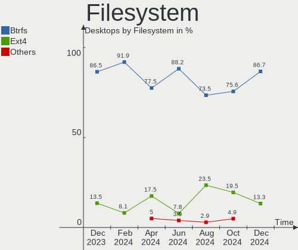
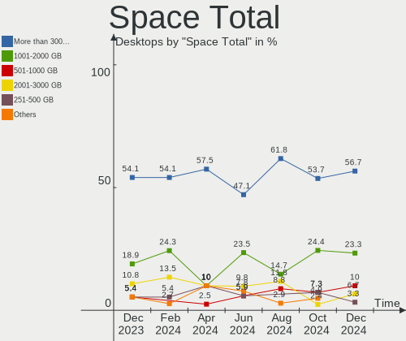
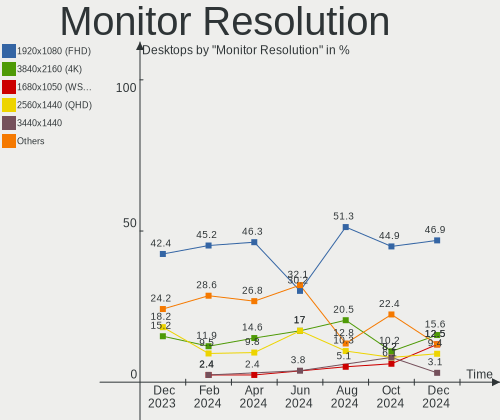
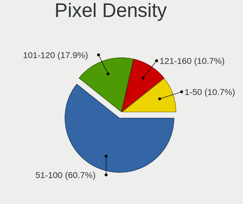
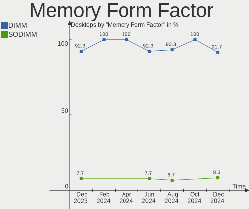
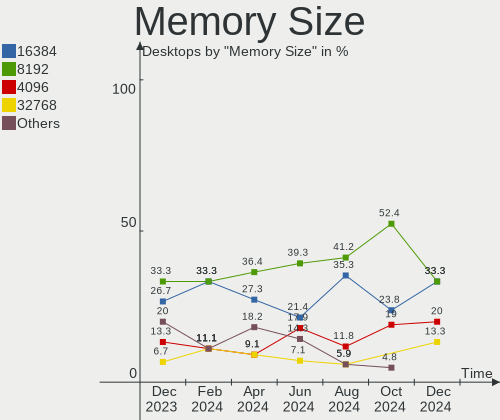
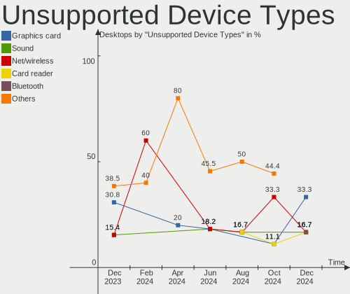

openSUSE - Hardware Trends (Desktops)
-------------------------------------

A project to identify most popular hardware characteristics and track their change
over time based on data collected by Linux users at https://Linux-Hardware.org.

Anyone can contribute to this report by the [hw-probe](https://github.com/linuxhw/hw-probe) tool:

    sudo -E hw-probe -all -upload

This report is for one last month. Overall report since the beginning of time: [TestCoverage](https://github.com/linuxhw/TestCoverage)

Period: Oct, 2022.

Contents
--------

* [ System ](#system)
  - [ OS                       ](#os)
  - [ OS Family                ](#os-family)
  - [ Kernel                   ](#kernel)
  - [ Kernel Family            ](#kernel-family)
  - [ Kernel Major Ver.        ](#kernel-major-ver)
  - [ Arch                     ](#arch)
  - [ DE                       ](#de)
  - [ Display Server           ](#display-server)
  - [ Display Manager          ](#display-manager)
  - [ OS Lang                  ](#os-lang)
  - [ Boot Mode                ](#boot-mode)
  - [ Filesystem               ](#filesystem)
  - [ Part. scheme             ](#part-scheme)
  - [ Dual Boot with Linux/BSD ](#dual-boot-with-linuxbsd)
  - [ Dual Boot (Win)          ](#dual-boot-win)

* [ Board ](#board)
  - [ Vendor                   ](#vendor)
  - [ Model                    ](#model)
  - [ Model Family             ](#model-family)
  - [ MFG Year                 ](#mfg-year)
  - [ Form Factor              ](#form-factor)
  - [ Secure Boot              ](#secure-boot)
  - [ Coreboot                 ](#coreboot)
  - [ RAM Size                 ](#ram-size)
  - [ RAM Used                 ](#ram-used)
  - [ Total Drives             ](#total-drives)
  - [ Has CD-ROM               ](#has-cd-rom)
  - [ Has Ethernet             ](#has-ethernet)
  - [ Has WiFi                 ](#has-wifi)
  - [ Has Bluetooth            ](#has-bluetooth)

* [ Location ](#location)
  - [ Country                  ](#country)
  - [ City                     ](#city)

* [ Drives ](#drives)
  - [ Drive Vendor             ](#drive-vendor)
  - [ Drive Model              ](#drive-model)
  - [ HDD Vendor               ](#hdd-vendor)
  - [ SSD Vendor               ](#ssd-vendor)
  - [ Drive Kind               ](#drive-kind)
  - [ Drive Connector          ](#drive-connector)
  - [ Drive Size               ](#drive-size)
  - [ Space Total              ](#space-total)
  - [ Space Used               ](#space-used)
  - [ Malfunc. Drives          ](#malfunc-drives)
  - [ Malfunc. Drive Vendor    ](#malfunc-drive-vendor)
  - [ Malfunc. HDD Vendor      ](#malfunc-hdd-vendor)
  - [ Malfunc. Drive Kind      ](#malfunc-drive-kind)
  - [ Failed Drives            ](#failed-drives)
  - [ Failed Drive Vendor      ](#failed-drive-vendor)
  - [ Drive Status             ](#drive-status)

* [ Storage controller ](#storage-controller)
  - [ Storage Vendor           ](#storage-vendor)
  - [ Storage Model            ](#storage-model)
  - [ Storage Kind             ](#storage-kind)

* [ Processor ](#processor)
  - [ CPU Vendor               ](#cpu-vendor)
  - [ CPU Model                ](#cpu-model)
  - [ CPU Model Family         ](#cpu-model-family)
  - [ CPU Cores                ](#cpu-cores)
  - [ CPU Sockets              ](#cpu-sockets)
  - [ CPU Threads              ](#cpu-threads)
  - [ CPU Op-Modes             ](#cpu-op-modes)
  - [ CPU Microcode            ](#cpu-microcode)
  - [ CPU Microarch            ](#cpu-microarch)

* [ Graphics ](#graphics)
  - [ GPU Vendor               ](#gpu-vendor)
  - [ GPU Model                ](#gpu-model)
  - [ GPU Combo                ](#gpu-combo)
  - [ GPU Driver               ](#gpu-driver)
  - [ GPU Memory               ](#gpu-memory)

* [ Monitor ](#monitor)
  - [ Monitor Vendor           ](#monitor-vendor)
  - [ Monitor Model            ](#monitor-model)
  - [ Monitor Resolution       ](#monitor-resolution)
  - [ Monitor Diagonal         ](#monitor-diagonal)
  - [ Monitor Width            ](#monitor-width)
  - [ Aspect Ratio             ](#aspect-ratio)
  - [ Monitor Area             ](#monitor-area)
  - [ Pixel Density            ](#pixel-density)
  - [ Multiple Monitors        ](#multiple-monitors)

* [ Network ](#network)
  - [ Net Controller Vendor    ](#net-controller-vendor)
  - [ Net Controller Model     ](#net-controller-model)
  - [ Wireless Vendor          ](#wireless-vendor)
  - [ Wireless Model           ](#wireless-model)
  - [ Ethernet Vendor          ](#ethernet-vendor)
  - [ Ethernet Model           ](#ethernet-model)
  - [ Net Controller Kind      ](#net-controller-kind)
  - [ Used Controller          ](#used-controller)
  - [ NICs                     ](#nics)
  - [ IPv6                     ](#ipv6)

* [ Bluetooth ](#bluetooth)
  - [ Bluetooth Vendor         ](#bluetooth-vendor)
  - [ Bluetooth Model          ](#bluetooth-model)

* [ Sound ](#sound)
  - [ Sound Vendor             ](#sound-vendor)
  - [ Sound Model              ](#sound-model)

* [ Memory ](#memory)
  - [ Memory Vendor            ](#memory-vendor)
  - [ Memory Model             ](#memory-model)
  - [ Memory Kind              ](#memory-kind)
  - [ Memory Form Factor       ](#memory-form-factor)
  - [ Memory Size              ](#memory-size)
  - [ Memory Speed             ](#memory-speed)

* [ Printers & scanners ](#printers--scanners)
  - [ Printer Vendor           ](#printer-vendor)
  - [ Printer Model            ](#printer-model)
  - [ Scanner Vendor           ](#scanner-vendor)
  - [ Scanner Model            ](#scanner-model)

* [ Camera ](#camera)
  - [ Camera Vendor            ](#camera-vendor)
  - [ Camera Model             ](#camera-model)

* [ Security ](#security)
  - [ Fingerprint Vendor       ](#fingerprint-vendor)
  - [ Fingerprint Model        ](#fingerprint-model)
  - [ Chipcard Vendor          ](#chipcard-vendor)
  - [ Chipcard Model           ](#chipcard-model)

* [ Unsupported ](#unsupported)
  - [ Unsupported Devices      ](#unsupported-devices)
  - [ Unsupported Device Types ](#unsupported-device-types)

System
------

OS
--

Installed operating systems

| Name                         | Desktops | Percent |
|------------------------------|----------|---------|
| openSUSE Tumbleweed-XXXXXXXX | 13       | 68.42%  |
| openSUSE Leap-15.4           | 5        | 26.32%  |
| openSUSE Leap-15.5           | 1        | 5.26%   |

OS Family
---------

OS without a version

| Name     | Desktops | Percent |
|----------|----------|---------|
| openSUSE | 19       | 100%    |

Kernel
------

Version of the Linux kernel

| Version                      | Desktops | Percent |
|------------------------------|----------|---------|
| 5.14.21-150400.24.21-default | 5        | 26.32%  |
| 6.0.0-1-default              | 3        | 15.79%  |
| 6.0.3-1-default              | 2        | 10.53%  |
| 5.19.8-1-default             | 2        | 10.53%  |
| 5.19.10-1-default            | 2        | 10.53%  |
| 6.0.2-1-default              | 1        | 5.26%   |
| 6.0.1-1-default              | 1        | 5.26%   |
| 5.19.12-1-default            | 1        | 5.26%   |
| 5.18.15-1-default            | 1        | 5.26%   |
| 5.14.21-150400.24.18-default | 1        | 5.26%   |

Kernel Family
-------------

Linux kernel without a distro release

| Version | Desktops | Percent |
|---------|----------|---------|
| 5.14.21 | 6        | 31.58%  |
| 6.0.0   | 3        | 15.79%  |
| 6.0.3   | 2        | 10.53%  |
| 5.19.8  | 2        | 10.53%  |
| 5.19.10 | 2        | 10.53%  |
| 6.0.2   | 1        | 5.26%   |
| 6.0.1   | 1        | 5.26%   |
| 5.19.12 | 1        | 5.26%   |
| 5.18.15 | 1        | 5.26%   |

Kernel Major Ver.
-----------------

Linux kernel major version

| Version | Desktops | Percent |
|---------|----------|---------|
| 6.0     | 7        | 36.84%  |
| 5.14    | 6        | 31.58%  |
| 5.19    | 5        | 26.32%  |
| 5.18    | 1        | 5.26%   |

Arch
----

OS architecture (x86_64, i586, etc.)

| Name   | Desktops | Percent |
|--------|----------|---------|
| x86_64 | 19       | 100%    |

DE
--

Desktop Environment

| Name       | Desktops | Percent |
|------------|----------|---------|
| KDE5       | 9        | 47.37%  |
| GNOME      | 4        | 21.05%  |
| XFCE       | 2        | 10.53%  |
| Unknown    | 2        | 10.53%  |
| X-Cinnamon | 1        | 5.26%   |
| MATE       | 1        | 5.26%   |

Display Server
--------------

X11 or Wayland

| Name    | Desktops | Percent |
|---------|----------|---------|
| X11     | 14       | 73.68%  |
| Wayland | 4        | 21.05%  |
| Unknown | 1        | 5.26%   |

Display Manager
---------------

SDDM, LightDM, etc.

| Name    | Desktops | Percent |
|---------|----------|---------|
| Unknown | 12       | 63.16%  |
| LightDM | 4        | 21.05%  |
| SDDM    | 3        | 15.79%  |

OS Lang
-------

Language

| Lang  | Desktops | Percent |
|-------|----------|---------|
| en_US | 7        | 36.84%  |
| de_DE | 4        | 21.05%  |
| pt_BR | 2        | 10.53%  |
| POSIX | 2        | 10.53%  |
| it_IT | 2        | 10.53%  |
| pl_PL | 1        | 5.26%   |
| es_AR | 1        | 5.26%   |

Boot Mode
---------

EFI or BIOS

| Mode | Desktops | Percent |
|------|----------|---------|
| BIOS | 10       | 52.63%  |
| EFI  | 9        | 47.37%  |

Filesystem
----------

Type of filesystem

| Type  | Desktops | Percent |
|-------|----------|---------|
| Btrfs | 14       | 73.68%  |
| Ext4  | 5        | 26.32%  |

Part. scheme
------------

Scheme of partitioning

| Type    | Desktops | Percent |
|---------|----------|---------|
| Unknown | 11       | 57.89%  |
| GPT     | 7        | 36.84%  |
| MBR     | 1        | 5.26%   |

Dual Boot with Linux/BSD
------------------------

Hosting more than one Linux/BSD

| Dual boot | Desktops | Percent |
|-----------|----------|---------|
| No        | 16       | 84.21%  |
| Yes       | 3        | 15.79%  |

Dual Boot (Win)
---------------

Hosting Linux and Windows

| Dual boot | Desktops | Percent |
|-----------|----------|---------|
| No        | 15       | 78.95%  |
| Yes       | 4        | 21.05%  |

Board
-----

Vendor
------

Motherboard manufacturer

| Name                | Desktops | Percent |
|---------------------|----------|---------|
| MSI                 | 8        | 42.11%  |
| ASUSTek Computer    | 5        | 26.32%  |
| Lenovo              | 2        | 10.53%  |
| Gigabyte Technology | 2        | 10.53%  |
| Fujitsu Siemens     | 1        | 5.26%   |
| Dell                | 1        | 5.26%   |

Model
-----

Motherboard model

| Name                                | Desktops | Percent |
|-------------------------------------|----------|---------|
| MSI MS-7522                         | 2        | 10.53%  |
| MSI MS-7B89                         | 1        | 5.26%   |
| MSI MS-7B86                         | 1        | 5.26%   |
| MSI MS-7A31                         | 1        | 5.26%   |
| MSI MS-7995                         | 1        | 5.26%   |
| MSI MS-7971                         | 1        | 5.26%   |
| MSI MS-7696                         | 1        | 5.26%   |
| Lenovo ThinkStation P520 30BE008VGE | 1        | 5.26%   |
| Lenovo ThinkCentre M710q 10MQS31W00 | 1        | 5.26%   |
| Gigabyte X79-UP4                    | 1        | 5.26%   |
| Gigabyte GA-770TA-UD3               | 1        | 5.26%   |
| Fujitsu Siemens PRIMERGY TX150 S5   | 1        | 5.26%   |
| Dell OptiPlex 9020                  | 1        | 5.26%   |
| ASUS TUF Gaming B560M-PLUS WIFI     | 1        | 5.26%   |
| ASUS PRIME H610M-A D4               | 1        | 5.26%   |
| ASUS P5P43TD PRO                    | 1        | 5.26%   |
| ASUS M5A78L-M/USB3                  | 1        | 5.26%   |
| ASUS All Series                     | 1        | 5.26%   |

Model Family
------------

Motherboard model prefix

| Name                     | Desktops | Percent |
|--------------------------|----------|---------|
| MSI MS-7522              | 2        | 10.53%  |
| MSI MS-7B89              | 1        | 5.26%   |
| MSI MS-7B86              | 1        | 5.26%   |
| MSI MS-7A31              | 1        | 5.26%   |
| MSI MS-7995              | 1        | 5.26%   |
| MSI MS-7971              | 1        | 5.26%   |
| MSI MS-7696              | 1        | 5.26%   |
| Lenovo ThinkStation      | 1        | 5.26%   |
| Lenovo ThinkCentre       | 1        | 5.26%   |
| Gigabyte X79-UP4         | 1        | 5.26%   |
| Gigabyte GA-770TA-UD3    | 1        | 5.26%   |
| Fujitsu Siemens PRIMERGY | 1        | 5.26%   |
| Dell OptiPlex            | 1        | 5.26%   |
| ASUS TUF                 | 1        | 5.26%   |
| ASUS PRIME               | 1        | 5.26%   |
| ASUS P5P43TD             | 1        | 5.26%   |
| ASUS M5A78L-M            | 1        | 5.26%   |
| ASUS All                 | 1        | 5.26%   |

MFG Year
--------

Motherboard manufacture year

| Year | Desktops | Percent |
|------|----------|---------|
| 2009 | 4        | 21.05%  |
| 2021 | 2        | 10.53%  |
| 2019 | 2        | 10.53%  |
| 2017 | 2        | 10.53%  |
| 2015 | 2        | 10.53%  |
| 2011 | 2        | 10.53%  |
| 2020 | 1        | 5.26%   |
| 2016 | 1        | 5.26%   |
| 2013 | 1        | 5.26%   |
| 2012 | 1        | 5.26%   |
| 2007 | 1        | 5.26%   |

Form Factor
-----------

Physical design of the computer

| Name    | Desktops | Percent |
|---------|----------|---------|
| Desktop | 19       | 100%    |

Secure Boot
-----------

Enabled or disabled

| State    | Desktops | Percent |
|----------|----------|---------|
| Disabled | 19       | 100%    |

Coreboot
--------

Have coreboot on board

| Used | Desktops | Percent |
|------|----------|---------|
| No   | 19       | 100%    |

RAM Size
--------

Total RAM memory

| Size in GB  | Desktops | Percent |
|-------------|----------|---------|
| 16.01-24.0  | 7        | 36.84%  |
| 8.01-16.0   | 5        | 26.32%  |
| 4.01-8.0    | 4        | 21.05%  |
| 64.01-256.0 | 2        | 10.53%  |
| 32.01-64.0  | 1        | 5.26%   |

RAM Used
--------

Used RAM memory

| Used GB   | Desktops | Percent |
|-----------|----------|---------|
| 4.01-8.0  | 7        | 36.84%  |
| 1.01-2.0  | 5        | 26.32%  |
| 2.01-3.0  | 3        | 15.79%  |
| 3.01-4.0  | 2        | 10.53%  |
| 8.01-16.0 | 2        | 10.53%  |

Total Drives
------------

Number of drives on board

| Drives | Desktops | Percent |
|--------|----------|---------|
| 2      | 8        | 42.11%  |
| 3      | 4        | 21.05%  |
| 5      | 2        | 10.53%  |
| 4      | 2        | 10.53%  |
| 1      | 2        | 10.53%  |
| 6      | 1        | 5.26%   |

Has CD-ROM
----------

Has CD-ROM on board

| Presented | Desktops | Percent |
|-----------|----------|---------|
| No        | 11       | 57.89%  |
| Yes       | 8        | 42.11%  |

Has Ethernet
------------

Has Ethernet on board

| Presented | Desktops | Percent |
|-----------|----------|---------|
| Yes       | 19       | 100%    |

Has WiFi
--------

Has WiFi module

| Presented | Desktops | Percent |
|-----------|----------|---------|
| No        | 11       | 57.89%  |
| Yes       | 8        | 42.11%  |

Has Bluetooth
-------------

Has Bluetooth module

| Presented | Desktops | Percent |
|-----------|----------|---------|
| No        | 13       | 68.42%  |
| Yes       | 6        | 31.58%  |

Location
--------

Country
-------

Geographic location (country)

| Country     | Desktops | Percent |
|-------------|----------|---------|
| Germany     | 5        | 26.32%  |
| USA         | 2        | 10.53%  |
| Italy       | 2        | 10.53%  |
| Brazil      | 2        | 10.53%  |
| Switzerland | 1        | 5.26%   |
| Sweden      | 1        | 5.26%   |
| Russia      | 1        | 5.26%   |
| Puerto Rico | 1        | 5.26%   |
| Poland      | 1        | 5.26%   |
| Norway      | 1        | 5.26%   |
| Israel      | 1        | 5.26%   |
| Argentina   | 1        | 5.26%   |

City
----

Geographic location (city)

| City              | Desktops | Percent |
|-------------------|----------|---------|
| Zurich            | 1        | 5.26%   |
| Verona            | 1        | 5.26%   |
| Västerås        | 1        | 5.26%   |
| Ulyanovsk         | 1        | 5.26%   |
| Tann              | 1        | 5.26%   |
| Puerto Eldorado   | 1        | 5.26%   |
| Portland          | 1        | 5.26%   |
| Petal             | 1        | 5.26%   |
| Natal             | 1        | 5.26%   |
| Mo i Rana         | 1        | 5.26%   |
| Kluszkowce        | 1        | 5.26%   |
| Kiel              | 1        | 5.26%   |
| Frutal            | 1        | 5.26%   |
| Ettlingen         | 1        | 5.26%   |
| Budenheim         | 1        | 5.26%   |
| Bolzano           | 1        | 5.26%   |
| Bergisch Gladbach | 1        | 5.26%   |
| Bayamón          | 1        | 5.26%   |
| Allonim           | 1        | 5.26%   |

Drives
------

Drive Vendor
------------

Hard drive vendors

| Vendor                    | Desktops | Drives | Percent |
|---------------------------|----------|--------|---------|
| Seagate                   | 9        | 18     | 25%     |
| WDC                       | 5        | 9      | 13.89%  |
| Samsung Electronics       | 4        | 5      | 11.11%  |
| Crucial                   | 3        | 4      | 8.33%   |
| Silicon Motion            | 2        | 2      | 5.56%   |
| Intenso                   | 2        | 2      | 5.56%   |
| Toshiba                   | 1        | 1      | 2.78%   |
| SPCC                      | 1        | 1      | 2.78%   |
| Smartbuy                  | 1        | 1      | 2.78%   |
| SanDisk                   | 1        | 1      | 2.78%   |
| Patriot                   | 1        | 1      | 2.78%   |
| Micron/Crucial Technology | 1        | 1      | 2.78%   |
| MaxDigital                | 1        | 1      | 2.78%   |
| Kingston                  | 1        | 2      | 2.78%   |
| Intel                     | 1        | 1      | 2.78%   |
| Fujitsu                   | 1        | 2      | 2.78%   |
| ADATA Technology          | 1        | 1      | 2.78%   |

Drive Model
-----------

Hard drive models

| Model                                                           | Desktops | Percent |
|-----------------------------------------------------------------|----------|---------|
| Seagate Expansion 2TB                                           | 3        | 6.38%   |
| Silicon Motion SM2263EN/SM2263XT SSD Controller 256GB           | 2        | 4.26%   |
| Seagate ST3500418AS 500GB                                       | 2        | 4.26%   |
| Seagate ST31000528AS 1TB                                        | 2        | 4.26%   |
| Seagate ST2000DM001-1ER164 2TB                                  | 2        | 4.26%   |
| Seagate ST2000DM001-1CH164 2TB                                  | 2        | 4.26%   |
| WDC WDS240G2G0A-00JH30 240GB SSD                                | 1        | 2.13%   |
| WDC WD5000BPVT-22HXZT3 500GB                                    | 1        | 2.13%   |
| WDC WD5000AAKX-7 500GB                                          | 1        | 2.13%   |
| WDC WD5000AAKX-221CA1 500GB                                     | 1        | 2.13%   |
| WDC WD2003FZEX-00Z4SA0 2TB                                      | 1        | 2.13%   |
| WDC WD2002FYPS-12 2TB                                           | 1        | 2.13%   |
| WDC WD1600AAJS-6 160GB                                          | 1        | 2.13%   |
| WDC WD10EZEX-00RKKA0 1TB                                        | 1        | 2.13%   |
| Toshiba HDWU130 3TB                                             | 1        | 2.13%   |
| SPCC M.2 PCIe SSD 512GB                                         | 1        | 2.13%   |
| Smartbuy SSD 240GB                                              | 1        | 2.13%   |
| Seagate ST750LM022 HN-M7 752GB                                  | 1        | 2.13%   |
| Seagate ST6000VN0033-2EE110 6TB                                 | 1        | 2.13%   |
| Seagate ST31000524AS 1TB                                        | 1        | 2.13%   |
| Seagate ST1000LM035-1RK172 1TB                                  | 1        | 2.13%   |
| Seagate ST1000DX002-2DV162 1TB                                  | 1        | 2.13%   |
| SanDisk SDSSDX240GG25 240GB                                     | 1        | 2.13%   |
| Samsung SSD 860 EVO 500GB                                       | 1        | 2.13%   |
| Samsung NVMe SSD Controller SM981/PM981/PM983 500GB             | 1        | 2.13%   |
| Samsung NVMe SSD Controller SM961/PM961/SM963 250GB             | 1        | 2.13%   |
| Samsung NVMe SSD Controller SM951/PM951 512GB                   | 1        | 2.13%   |
| Patriot Flare 64GB SSD                                          | 1        | 2.13%   |
| Micron/Crucial P1 NVMe PCIe SSD 1TB                             | 1        | 2.13%   |
| MaxDigital MD4000GSA6472DVR 1 4TB                               | 1        | 2.13%   |
| Kingston SV300S37A120G 120GB SSD                                | 1        | 2.13%   |
| Kingston SUV400S37480G 480GB SSD                                | 1        | 2.13%   |
| Intenso External USB-3.0 2TB                                    | 1        | 2.13%   |
| Intenso 256GB                                                   | 1        | 2.13%   |
| Intel SSDSA2CW160G3 160GB                                       | 1        | 2.13%   |
| Fujitsu MAX3073RC 73GB                                          | 1        | 2.13%   |
| Crucial CT1050MX300SSD1 1050GB                                  | 1        | 2.13%   |
| Crucial CT1000MX500SSD1 1TB                                     | 1        | 2.13%   |
| Crucial CT1000BX500SSD1 1TB                                     | 1        | 2.13%   |
| ADATA XPG SX8200 Pro PCIe Gen3x4 M.2 2280 Solid State Drive 1TB | 1        | 2.13%   |

HDD Vendor
----------

Hard disk drive vendors

| Vendor     | Desktops | Drives | Percent |
|------------|----------|--------|---------|
| Seagate    | 9        | 18     | 50%     |
| WDC        | 5        | 8      | 27.78%  |
| Toshiba    | 1        | 1      | 5.56%   |
| MaxDigital | 1        | 1      | 5.56%   |
| Intenso    | 1        | 1      | 5.56%   |
| Fujitsu    | 1        | 2      | 5.56%   |

SSD Vendor
----------

Solid state drive vendors

| Vendor              | Desktops | Drives | Percent |
|---------------------|----------|--------|---------|
| Crucial             | 3        | 4      | 30%     |
| WDC                 | 1        | 1      | 10%     |
| Smartbuy            | 1        | 1      | 10%     |
| SanDisk             | 1        | 1      | 10%     |
| Samsung Electronics | 1        | 1      | 10%     |
| Patriot             | 1        | 1      | 10%     |
| Kingston            | 1        | 2      | 10%     |
| Intel               | 1        | 1      | 10%     |

Drive Kind
----------

HDD or SSD

| Kind    | Desktops | Drives | Percent |
|---------|----------|--------|---------|
| HDD     | 15       | 31     | 45.45%  |
| SSD     | 9        | 12     | 27.27%  |
| NVMe    | 8        | 9      | 24.24%  |
| Unknown | 1        | 1      | 3.03%   |

Drive Connector
---------------

SATA, SAS, NVMe, etc.

| Type | Desktops | Drives | Percent |
|------|----------|--------|---------|
| SATA | 19       | 38     | 59.38%  |
| NVMe | 8        | 9      | 25%     |
| SAS  | 5        | 6      | 15.63%  |

Drive Size
----------

Size of hard drive

| Size in TB | Desktops | Drives | Percent |
|------------|----------|--------|---------|
| 0.01-0.5   | 10       | 18     | 34.48%  |
| 0.51-1.0   | 9        | 10     | 31.03%  |
| 1.01-2.0   | 7        | 12     | 24.14%  |
| 3.01-4.0   | 1        | 1      | 3.45%   |
| 2.01-3.0   | 1        | 1      | 3.45%   |
| 4.01-10.0  | 1        | 1      | 3.45%   |

Space Total
-----------

Amount of disk space available on the file system

| Size in GB     | Desktops | Percent |
|----------------|----------|---------|
| More than 3000 | 10       | 52.63%  |
| 2001-3000      | 4        | 21.05%  |
| 501-1000       | 3        | 15.79%  |
| 251-500        | 1        | 5.26%   |
| 1001-2000      | 1        | 5.26%   |

Space Used
----------

Amount of used disk space

| Used GB   | Desktops | Percent |
|-----------|----------|---------|
| 251-500   | 5        | 26.32%  |
| 1001-2000 | 5        | 26.32%  |
| 501-1000  | 5        | 26.32%  |
| 2001-3000 | 3        | 15.79%  |
| 51-100    | 1        | 5.26%   |

Malfunc. Drives
---------------

Drive models with a malfunction

| Model                        | Desktops | Drives | Percent |
|------------------------------|----------|--------|---------|
| WDC WD5000BPVT-22HXZT3 500GB | 1        | 1      | 50%     |
| Seagate ST31000524AS 1TB     | 1        | 1      | 50%     |

Malfunc. Drive Vendor
---------------------

Vendors of faulty drives

| Vendor  | Desktops | Drives | Percent |
|---------|----------|--------|---------|
| WDC     | 1        | 1      | 50%     |
| Seagate | 1        | 1      | 50%     |

Malfunc. HDD Vendor
-------------------

Vendors of faulty HDD drives

| Vendor  | Desktops | Drives | Percent |
|---------|----------|--------|---------|
| WDC     | 1        | 1      | 50%     |
| Seagate | 1        | 1      | 50%     |

Malfunc. Drive Kind
-------------------

Kinds of faulty drives

| Kind | Desktops | Drives | Percent |
|------|----------|--------|---------|
| HDD  | 2        | 2      | 100%    |

Failed Drives
-------------

Failed drive models

Zero info for selected period =(

Failed Drive Vendor
-------------------

Failed drive vendors

Zero info for selected period =(

Drive Status
------------

Number of failed and malfunc. drives

| Status   | Desktops | Drives | Percent |
|----------|----------|--------|---------|
| Detected | 12       | 32     | 54.55%  |
| Works    | 8        | 19     | 36.36%  |
| Malfunc  | 2        | 2      | 9.09%   |

Storage controller
------------------

Storage Vendor
--------------

Storage controller vendors

| Vendor                    | Desktops | Percent |
|---------------------------|----------|---------|
| Intel                     | 13       | 37.14%  |
| AMD                       | 6        | 17.14%  |
| JMicron Technology        | 4        | 11.43%  |
| Samsung Electronics       | 3        | 8.57%   |
| Silicon Motion            | 2        | 5.71%   |
| Marvell Technology Group  | 2        | 5.71%   |
| Phison Electronics        | 1        | 2.86%   |
| Micron/Crucial Technology | 1        | 2.86%   |
| LSI Logic / Symbios Logic | 1        | 2.86%   |
| Broadcom / LSI            | 1        | 2.86%   |
| ADATA Technology          | 1        | 2.86%   |

Storage Model
-------------

Storage controller models

| Model                                                                          | Desktops | Percent |
|--------------------------------------------------------------------------------|----------|---------|
| AMD FCH SATA Controller [AHCI mode]                                            | 4        | 9.3%    |
| JMicron JMB363 SATA/IDE Controller                                             | 3        | 6.98%   |
| Intel 82801JI (ICH10 Family) SATA AHCI Controller                              | 3        | 6.98%   |
| Silicon Motion SM2263EN/SM2263XT SSD Controller                                | 2        | 4.65%   |
| Intel Q170/Q150/B150/H170/H110/Z170/CM236 Chipset SATA Controller [AHCI Mode]  | 2        | 4.65%   |
| Intel 200 Series PCH SATA controller [AHCI mode]                               | 2        | 4.65%   |
| AMD SB7x0/SB8x0/SB9x0 IDE Controller                                           | 2        | 4.65%   |
| AMD 400 Series Chipset SATA Controller                                         | 2        | 4.65%   |
| Samsung NVMe SSD Controller SM981/PM981/PM983                                  | 1        | 2.33%   |
| Samsung NVMe SSD Controller SM961/PM961/SM963                                  | 1        | 2.33%   |
| Samsung NVMe SSD Controller SM951/PM951                                        | 1        | 2.33%   |
| Phison E12 NVMe Controller                                                     | 1        | 2.33%   |
| Micron/Crucial P1 NVMe PCIe SSD                                                | 1        | 2.33%   |
| Marvell Group 88SE9172 SATA 6Gb/s Controller                                   | 1        | 2.33%   |
| Marvell Group 88SE9128 PCIe SATA 6 Gb/s RAID controller                        | 1        | 2.33%   |
| LSI Logic / Symbios Logic MegaRAID SAS 2108 [Liberator]                        | 1        | 2.33%   |
| JMicron JMB361 AHCI/IDE                                                        | 1        | 2.33%   |
| Intel Volume Management Device NVMe RAID Controller                            | 1        | 2.33%   |
| Intel SATA Controller [RAID mode]                                              | 1        | 2.33%   |
| Intel NM10/ICH7 Family SATA Controller [AHCI mode]                             | 1        | 2.33%   |
| Intel C600/X79 series chipset 6-Port SATA AHCI Controller                      | 1        | 2.33%   |
| Intel Alder Lake-S PCH SATA Controller [AHCI Mode]                             | 1        | 2.33%   |
| Intel 82801G (ICH7 Family) IDE Controller                                      | 1        | 2.33%   |
| Intel 8 Series/C220 Series Chipset Family 6-port SATA Controller 1 [AHCI mode] | 1        | 2.33%   |
| Intel 500 Series Chipset Family SATA AHCI Controller                           | 1        | 2.33%   |
| Broadcom / LSI SAS1068 PCI-X Fusion-MPT SAS                                    | 1        | 2.33%   |
| Broadcom / LSI 53c1030 PCI-X Fusion-MPT Dual Ultra320 SCSI                     | 1        | 2.33%   |
| AMD X370 Series Chipset SATA Controller                                        | 1        | 2.33%   |
| AMD SB7x0/SB8x0/SB9x0 SATA Controller [IDE mode]                               | 1        | 2.33%   |
| AMD SB7x0/SB8x0/SB9x0 SATA Controller [AHCI mode]                              | 1        | 2.33%   |
| ADATA XPG SX8200 Pro PCIe Gen3x4 M.2 2280 Solid State Drive                    | 1        | 2.33%   |

Storage Kind
------------

Kind of storage controller (IDE, SATA, NVMe, SAS, ...)

| Kind | Desktops | Percent |
|------|----------|---------|
| SATA | 18       | 50%     |
| NVMe | 8        | 22.22%  |
| IDE  | 6        | 16.67%  |
| RAID | 3        | 8.33%   |
| SCSI | 1        | 2.78%   |

Processor
---------

CPU Vendor
----------

Processor vendors

| Vendor | Desktops | Percent |
|--------|----------|---------|
| Intel  | 13       | 68.42%  |
| AMD    | 6        | 31.58%  |

CPU Model
---------

Processor models

| Model                                       | Desktops | Percent |
|---------------------------------------------|----------|---------|
| Intel Core i7 CPU 920 @ 2.67GHz             | 2        | 10.53%  |
| Intel Xeon W-2135 CPU @ 3.70GHz             | 1        | 5.26%   |
| Intel Xeon CPU E5450 @ 3.00GHz              | 1        | 5.26%   |
| Intel Xeon CPU 3050 @ 2.13GHz               | 1        | 5.26%   |
| Intel Pentium CPU G4560T @ 2.90GHz          | 1        | 5.26%   |
| Intel Core i7-6700K CPU @ 4.00GHz           | 1        | 5.26%   |
| Intel Core i7-4930K CPU @ 3.40GHz           | 1        | 5.26%   |
| Intel Core i7-4790 CPU @ 3.60GHz            | 1        | 5.26%   |
| Intel Core i5-6600 CPU @ 3.30GHz            | 1        | 5.26%   |
| Intel Core i5-4460 CPU @ 3.20GHz            | 1        | 5.26%   |
| Intel 12th Gen Core i3-12100F               | 1        | 5.26%   |
| Intel 11th Gen Core i5-11400 @ 2.60GHz      | 1        | 5.26%   |
| AMD Ryzen 7 5700G with Radeon Graphics      | 1        | 5.26%   |
| AMD Ryzen 5 1600 Six-Core Processor         | 1        | 5.26%   |
| AMD Ryzen 3 2200G with Radeon Vega Graphics | 1        | 5.26%   |
| AMD Phenom II X4 955 Processor              | 1        | 5.26%   |
| AMD FX-8350 Eight-Core Processor            | 1        | 5.26%   |
| AMD A8-3850 APU with Radeon HD Graphics     | 1        | 5.26%   |

CPU Model Family
----------------

Processor model prefix

| Model            | Desktops | Percent |
|------------------|----------|---------|
| Intel Core i7    | 5        | 26.32%  |
| Intel Xeon       | 3        | 15.79%  |
| Other            | 2        | 10.53%  |
| Intel Core i5    | 2        | 10.53%  |
| Intel Pentium    | 1        | 5.26%   |
| AMD Ryzen 7      | 1        | 5.26%   |
| AMD Ryzen 5      | 1        | 5.26%   |
| AMD Ryzen 3      | 1        | 5.26%   |
| AMD Phenom II X4 | 1        | 5.26%   |
| AMD FX           | 1        | 5.26%   |
| AMD A8           | 1        | 5.26%   |

CPU Cores
---------

Number of processor cores

| Number | Desktops | Percent |
|--------|----------|---------|
| 4      | 12       | 63.16%  |
| 6      | 4        | 21.05%  |
| 2      | 2        | 10.53%  |
| 8      | 1        | 5.26%   |

CPU Sockets
-----------

Number of sockets

| Number | Desktops | Percent |
|--------|----------|---------|
| 1      | 19       | 100%    |

CPU Threads
-----------

Threads per core (Hyper-Threading)

| Number | Desktops | Percent |
|--------|----------|---------|
| 2      | 12       | 63.16%  |
| 1      | 7        | 36.84%  |

CPU Op-Modes
------------

CPU Operation Modes (32-bit, 64-bit)

| Op mode        | Desktops | Percent |
|----------------|----------|---------|
| 32-bit, 64-bit | 19       | 100%    |

CPU Microcode
-------------

Microcode number

| Number     | Desktops | Percent |
|------------|----------|---------|
| Unknown    | 4        | 21.05%  |
| 0x506e3    | 2        | 10.53%  |
| 0x306c3    | 2        | 10.53%  |
| 0x106a4    | 2        | 10.53%  |
| 0xa0671    | 1        | 5.26%   |
| 0x906e9    | 1        | 5.26%   |
| 0x90675    | 1        | 5.26%   |
| 0x306e4    | 1        | 5.26%   |
| 0x0a50000c | 1        | 5.26%   |
| 0x08101016 | 1        | 5.26%   |
| 0x06000852 | 1        | 5.26%   |
| 0x03000027 | 1        | 5.26%   |
| 0x010000c8 | 1        | 5.26%   |

CPU Microarch
-------------

Microarchitecture

| Name             | Desktops | Percent |
|------------------|----------|---------|
| Skylake          | 3        | 15.79%  |
| Nehalem          | 2        | 10.53%  |
| Haswell          | 2        | 10.53%  |
| Zen+             | 1        | 5.26%   |
| Zen 3            | 1        | 5.26%   |
| Zen              | 1        | 5.26%   |
| Piledriver       | 1        | 5.26%   |
| Penryn           | 1        | 5.26%   |
| KabyLake         | 1        | 5.26%   |
| K10 Llano        | 1        | 5.26%   |
| K10              | 1        | 5.26%   |
| IvyBridge        | 1        | 5.26%   |
| Icelake          | 1        | 5.26%   |
| Core             | 1        | 5.26%   |
| Alderlake Hybrid | 1        | 5.26%   |

Graphics
--------

GPU Vendor
----------

Vendors of graphics cards

| Vendor      | Desktops | Percent |
|-------------|----------|---------|
| AMD         | 10       | 52.63%  |
| Nvidia      | 5        | 26.32%  |
| Intel       | 3        | 15.79%  |
| S3 Graphics | 1        | 5.26%   |

GPU Model
---------

Graphics card models

| Model                                                                       | Desktops | Percent |
|-----------------------------------------------------------------------------|----------|---------|
| Intel Xeon E3-1200 v3/4th Gen Core Processor Integrated Graphics Controller | 2        | 10%     |
| AMD RV710 [Radeon HD 4350/4550]                                             | 2        | 10%     |
| AMD Ellesmere [Radeon RX 470/480/570/570X/580/580X/590]                     | 2        | 10%     |
| S3 Graphics 86c764/765 [Trio32/64/64V+]                                     | 1        | 5%      |
| Nvidia NV34GL [Quadro NVS 280 PCI]                                          | 1        | 5%      |
| Nvidia GP107 [GeForce GTX 1050 Ti]                                          | 1        | 5%      |
| Nvidia GP104 [GeForce GTX 1070 Ti]                                          | 1        | 5%      |
| Nvidia GK208B [GeForce GT 730]                                              | 1        | 5%      |
| Nvidia GK107 [GeForce GT 640]                                               | 1        | 5%      |
| Intel HD Graphics 610                                                       | 1        | 5%      |
| AMD Turks XT [Radeon HD 6670/7670]                                          | 1        | 5%      |
| AMD Sumo [Radeon HD 6550D]                                                  | 1        | 5%      |
| AMD RS780L [Radeon 3000]                                                    | 1        | 5%      |
| AMD Raven Ridge [Radeon Vega Series / Radeon Vega Mobile Series]            | 1        | 5%      |
| AMD Cezanne                                                                 | 1        | 5%      |
| AMD Cedar GL [FirePro 2270]                                                 | 1        | 5%      |
| AMD Baffin [Radeon RX 460/560D / Pro 450/455/460/555/555X/560/560X]         | 1        | 5%      |

GPU Combo
---------

Combinations of graphics cards

| Name            | Desktops | Percent |
|-----------------|----------|---------|
| 1 x AMD         | 9        | 47.37%  |
| 1 x Nvidia      | 5        | 26.32%  |
| 1 x Intel       | 3        | 15.79%  |
| 2 x AMD         | 1        | 5.26%   |
| 1 x S3 Graphics | 1        | 5.26%   |

GPU Driver
----------

Free vs proprietary

| Driver      | Desktops | Percent |
|-------------|----------|---------|
| Free        | 15       | 78.95%  |
| Proprietary | 3        | 15.79%  |
| Unknown     | 1        | 5.26%   |

GPU Memory
----------

Total video memory

| Size in GB | Desktops | Percent |
|------------|----------|---------|
| Unknown    | 6        | 31.58%  |
| 0.01-0.5   | 5        | 26.32%  |
| 1.01-2.0   | 4        | 21.05%  |
| 7.01-8.0   | 2        | 10.53%  |
| 3.01-4.0   | 2        | 10.53%  |

Monitor
-------

Monitor Vendor
--------------

Monitor vendors

| Vendor               | Desktops | Percent |
|----------------------|----------|---------|
| Goldstar             | 5        | 22.73%  |
| Samsung Electronics  | 4        | 18.18%  |
| Dell                 | 3        | 13.64%  |
| Philips              | 1        | 4.55%   |
| MTK                  | 1        | 4.55%   |
| LG Electronics       | 1        | 4.55%   |
| Iiyama               | 1        | 4.55%   |
| Hyundai ImageQuest   | 1        | 4.55%   |
| HUAWEI               | 1        | 4.55%   |
| Hewlett-Packard      | 1        | 4.55%   |
| GDH                  | 1        | 4.55%   |
| Ancor Communications | 1        | 4.55%   |
| Acer                 | 1        | 4.55%   |

Monitor Model
-------------

Monitor models

| Model                                                                 | Desktops | Percent |
|-----------------------------------------------------------------------|----------|---------|
| Goldstar FULL HD GSM5B54 1920x1080 480x270mm 21.7-inch                | 2        | 8%      |
| Samsung Electronics SyncMaster SAM05C5 1920x1080                      | 1        | 4%      |
| Samsung Electronics S22E450 SAM0C7C 1680x1050 473x291mm 21.9-inch     | 1        | 4%      |
| Samsung Electronics S19C300 SAM0A12 1366x768 410x230mm 18.5-inch      | 1        | 4%      |
| Samsung Electronics LF27T450F SAM7097 1920x1080 597x336mm 27.0-inch   | 1        | 4%      |
| Samsung Electronics C27F390 SAM0D32 1920x1080 598x336mm 27.0-inch     | 1        | 4%      |
| Philips 190X PHL084C 1280x1024 376x301mm 19.0-inch                    | 1        | 4%      |
| MTK Microtek 815C MTK1021 1280x1024 359x287mm 18.1-inch               | 1        | 4%      |
| LG Electronics LCD Monitor E2260 1920x1080                            | 1        | 4%      |
| Iiyama PL2288H IVM5634 1920x1080 477x268mm 21.5-inch                  | 1        | 4%      |
| Hyundai ImageQuest Q17 Digital IQT217D 1280x1024 330x270mm 16.8-inch  | 1        | 4%      |
| HUAWEI AD80HW HWV2402 1920x1080 527x296mm 23.8-inch                   | 1        | 4%      |
| Hewlett-Packard LE1901w HWP2842 1440x900 410x256mm 19.0-inch          | 1        | 4%      |
| Goldstar M2380D GSM57BC 1920x1080 598x336mm 27.0-inch                 | 1        | 4%      |
| Goldstar HDR WFHD GSM5BA0 2560x1080 798x334mm 34.1-inch               | 1        | 4%      |
| Goldstar FULL HD GSM5ABB 1920x1080 480x270mm 21.7-inch                | 1        | 4%      |
| Goldstar 42LC46 GSM9CA6 1920x1080 700x390mm 31.5-inch                 | 1        | 4%      |
| Goldstar 42LC46 GSM9CA5 1920x1080 700x390mm 31.5-inch                 | 1        | 4%      |
| GDH PHILCO GDH0030 1920x540 708x398mm 32.0-inch                       | 1        | 4%      |
| Dell P2418D DELD0C2 2560x1440 526x296mm 23.8-inch                     | 1        | 4%      |
| Dell P2219H DELA114 1920x1080 476x267mm 21.5-inch                     | 1        | 4%      |
| Dell E197FP DELA024 1280x1024 380x305mm 19.2-inch                     | 1        | 4%      |
| Ancor Communications ASUS PB278 ACI27A3 2560x1440 597x336mm 27.0-inch | 1        | 4%      |
| Acer P224W ACR005D 1680x1050 474x296mm 22.0-inch                      | 1        | 4%      |

Monitor Resolution
------------------

Monitor screen resolution

| Resolution         | Desktops | Percent |
|--------------------|----------|---------|
| 1920x1080 (FHD)    | 11       | 50%     |
| 1280x1024 (SXGA)   | 3        | 13.64%  |
| 2560x1440 (QHD)    | 2        | 9.09%   |
| 1680x1050 (WSXGA+) | 2        | 9.09%   |
| 3840x2160 (4K)     | 1        | 4.55%   |
| 2560x1080          | 1        | 4.55%   |
| 1440x900 (WXGA+)   | 1        | 4.55%   |
| 1366x768 (WXGA)    | 1        | 4.55%   |

Monitor Diagonal
----------------

Diagonal size in inches

| Inches  | Desktops | Percent |
|---------|----------|---------|
| 21      | 6        | 25%     |
| 27      | 4        | 16.67%  |
| 19      | 3        | 12.5%   |
| 24      | 2        | 8.33%   |
| 18      | 2        | 8.33%   |
| Unknown | 2        | 8.33%   |
| 52      | 1        | 4.17%   |
| 34      | 1        | 4.17%   |
| 31      | 1        | 4.17%   |
| 22      | 1        | 4.17%   |
| 16      | 1        | 4.17%   |

Monitor Width
-------------

Physical width

| Width in mm | Desktops | Percent |
|-------------|----------|---------|
| 401-500     | 9        | 39.13%  |
| 501-600     | 6        | 26.09%  |
| 351-400     | 2        | 8.7%    |
| Unknown     | 2        | 8.7%    |
| 701-800     | 1        | 4.35%   |
| 601-700     | 1        | 4.35%   |
| 301-350     | 1        | 4.35%   |
| 1001-1500   | 1        | 4.35%   |

Aspect Ratio
------------

Proportional relationship between the width and the height

| Ratio   | Desktops | Percent |
|---------|----------|---------|
| 16/9    | 14       | 63.64%  |
| 16/10   | 3        | 13.64%  |
| 5/4     | 2        | 9.09%   |
| 6/5     | 1        | 4.55%   |
| 21/9    | 1        | 4.55%   |
| Unknown | 1        | 4.55%   |

Monitor Area
------------

Area in inch²

| Area in inch² | Desktops | Percent |
|----------------|----------|---------|
| 201-250        | 9        | 39.13%  |
| 301-350        | 4        | 17.39%  |
| 151-200        | 3        | 13.04%  |
| 351-500        | 2        | 8.7%    |
| Unknown        | 2        | 8.7%    |
| More than 1000 | 1        | 4.35%   |
| 141-150        | 1        | 4.35%   |
| 131-140        | 1        | 4.35%   |

Pixel Density
-------------

Pixels per inch

| Density | Desktops | Percent |
|---------|----------|---------|
| 51-100  | 11       | 52.38%  |
| 101-120 | 6        | 28.57%  |
| Unknown | 2        | 9.52%   |
| 1-50    | 1        | 4.76%   |
| 121-160 | 1        | 4.76%   |

Multiple Monitors
-----------------

Total monitors connected

| Total | Desktops | Percent |
|-------|----------|---------|
| 1     | 12       | 63.16%  |
| 2     | 6        | 31.58%  |
| 0     | 1        | 5.26%   |

Network
-------

Net Controller Vendor
---------------------

Controller vendors

| Vendor                | Desktops | Percent |
|-----------------------|----------|---------|
| Realtek Semiconductor | 12       | 42.86%  |
| Intel                 | 10       | 35.71%  |
| Qualcomm Atheros      | 2        | 7.14%   |
| TP-Link               | 1        | 3.57%   |
| Ralink Technology     | 1        | 3.57%   |
| Broadcom Limited      | 1        | 3.57%   |
| Broadcom              | 1        | 3.57%   |

Net Controller Model
--------------------

Controller models

| Model                                                             | Desktops | Percent |
|-------------------------------------------------------------------|----------|---------|
| Realtek RTL8111/8168/8411 PCI Express Gigabit Ethernet Controller | 10       | 34.48%  |
| TP-Link AC600 wireless Realtek RTL8811AU [Archer T2U Nano]        | 1        | 3.45%   |
| Realtek RTL8188FTV 802.11b/g/n 1T1R 2.4G WLAN Adapter             | 1        | 3.45%   |
| Realtek RTL8188EUS 802.11n Wireless Network Adapter               | 1        | 3.45%   |
| Realtek RTL8125 2.5GbE Controller                                 | 1        | 3.45%   |
| Ralink RT5370 Wireless Adapter                                    | 1        | 3.45%   |
| Qualcomm Atheros AR93xx Wireless Network Adapter                  | 1        | 3.45%   |
| Qualcomm Atheros AR8121/AR8113/AR8114 Gigabit or Fast Ethernet    | 1        | 3.45%   |
| Intel Wireless 8260                                               | 1        | 3.45%   |
| Intel Wi-Fi 6 AX200                                               | 1        | 3.45%   |
| Intel Tiger Lake PCH CNVi WiFi                                    | 1        | 3.45%   |
| Intel I350 Gigabit Network Connection                             | 1        | 3.45%   |
| Intel I211 Gigabit Network Connection                             | 1        | 3.45%   |
| Intel Ethernet Connection I217-LM                                 | 1        | 3.45%   |
| Intel Ethernet Connection (2) I219-V                              | 1        | 3.45%   |
| Intel Ethernet Connection (17) I219-V                             | 1        | 3.45%   |
| Intel 82579LM Gigabit Network Connection (Lewisville)             | 1        | 3.45%   |
| Intel 82541PI Gigabit Ethernet Controller                         | 1        | 3.45%   |
| Broadcom NetXtreme BCM5721 Gigabit Ethernet PCI Express           | 1        | 3.45%   |
| Broadcom Limited BCM4360 802.11ac Wireless Network Adapter        | 1        | 3.45%   |

Wireless Vendor
---------------

Wireless vendors

| Vendor                | Desktops | Percent |
|-----------------------|----------|---------|
| Intel                 | 3        | 33.33%  |
| Realtek Semiconductor | 2        | 22.22%  |
| TP-Link               | 1        | 11.11%  |
| Ralink Technology     | 1        | 11.11%  |
| Qualcomm Atheros      | 1        | 11.11%  |
| Broadcom Limited      | 1        | 11.11%  |

Wireless Model
--------------

Wireless models

| Model                                                      | Desktops | Percent |
|------------------------------------------------------------|----------|---------|
| TP-Link AC600 wireless Realtek RTL8811AU [Archer T2U Nano] | 1        | 11.11%  |
| Realtek RTL8188FTV 802.11b/g/n 1T1R 2.4G WLAN Adapter      | 1        | 11.11%  |
| Realtek RTL8188EUS 802.11n Wireless Network Adapter        | 1        | 11.11%  |
| Ralink RT5370 Wireless Adapter                             | 1        | 11.11%  |
| Qualcomm Atheros AR93xx Wireless Network Adapter           | 1        | 11.11%  |
| Intel Wireless 8260                                        | 1        | 11.11%  |
| Intel Wi-Fi 6 AX200                                        | 1        | 11.11%  |
| Intel Tiger Lake PCH CNVi WiFi                             | 1        | 11.11%  |
| Broadcom Limited BCM4360 802.11ac Wireless Network Adapter | 1        | 11.11%  |

Ethernet Vendor
---------------

Ethernet vendors

| Vendor                | Desktops | Percent |
|-----------------------|----------|---------|
| Realtek Semiconductor | 11       | 55%     |
| Intel                 | 7        | 35%     |
| Qualcomm Atheros      | 1        | 5%      |
| Broadcom              | 1        | 5%      |

Ethernet Model
--------------

Ethernet models

| Model                                                             | Desktops | Percent |
|-------------------------------------------------------------------|----------|---------|
| Realtek RTL8111/8168/8411 PCI Express Gigabit Ethernet Controller | 10       | 50%     |
| Realtek RTL8125 2.5GbE Controller                                 | 1        | 5%      |
| Qualcomm Atheros AR8121/AR8113/AR8114 Gigabit or Fast Ethernet    | 1        | 5%      |
| Intel I350 Gigabit Network Connection                             | 1        | 5%      |
| Intel I211 Gigabit Network Connection                             | 1        | 5%      |
| Intel Ethernet Connection I217-LM                                 | 1        | 5%      |
| Intel Ethernet Connection (2) I219-V                              | 1        | 5%      |
| Intel Ethernet Connection (17) I219-V                             | 1        | 5%      |
| Intel 82579LM Gigabit Network Connection (Lewisville)             | 1        | 5%      |
| Intel 82541PI Gigabit Ethernet Controller                         | 1        | 5%      |
| Broadcom NetXtreme BCM5721 Gigabit Ethernet PCI Express           | 1        | 5%      |

Net Controller Kind
-------------------

Ethernet, WiFi or modem

| Kind     | Desktops | Percent |
|----------|----------|---------|
| Ethernet | 19       | 70.37%  |
| WiFi     | 8        | 29.63%  |

Used Controller
---------------

Currently used network controller

| Kind     | Desktops | Percent |
|----------|----------|---------|
| Ethernet | 16       | 84.21%  |
| WiFi     | 3        | 15.79%  |

NICs
----

Total network controllers on board

| Total | Desktops | Percent |
|-------|----------|---------|
| 1     | 12       | 63.16%  |
| 2     | 6        | 31.58%  |
| 4     | 1        | 5.26%   |

IPv6
----

IPv6 vs IPv4

| Used | Desktops | Percent |
|------|----------|---------|
| No   | 15       | 78.95%  |
| Yes  | 4        | 21.05%  |

Bluetooth
---------

Bluetooth Vendor
----------------

Controller vendors

| Vendor                  | Desktops | Percent |
|-------------------------|----------|---------|
| Intel                   | 3        | 37.5%   |
| Cambridge Silicon Radio | 2        | 25%     |
| SINO WEALTH             | 1        | 12.5%   |
| Realtek Semiconductor   | 1        | 12.5%   |
| Apple                   | 1        | 12.5%   |

Bluetooth Model
---------------

Controller models

| Model                                               | Desktops | Percent |
|-----------------------------------------------------|----------|---------|
| Cambridge Silicon Radio Bluetooth Dongle (HCI mode) | 2        | 25%     |
| SINO WEALTH RK Bluetooth Keyboar                    | 1        | 12.5%   |
| Realtek Bluetooth Radio                             | 1        | 12.5%   |
| Intel Bluetooth wireless interface                  | 1        | 12.5%   |
| Intel AX201 Bluetooth                               | 1        | 12.5%   |
| Intel AX200 Bluetooth                               | 1        | 12.5%   |
| Apple Bluetooth USB Host Controller                 | 1        | 12.5%   |

Sound
-----

Sound Vendor
------------

Sound card vendors

| Vendor              | Desktops | Percent |
|---------------------|----------|---------|
| Intel               | 11       | 35.48%  |
| AMD                 | 11       | 35.48%  |
| Nvidia              | 4        | 12.9%   |
| Creative Technology | 2        | 6.45%   |
| Ensoniq             | 1        | 3.23%   |
| Creative Labs       | 1        | 3.23%   |
| Audient             | 1        | 3.23%   |

Sound Model
-----------

Sound card models

| Model                                                               | Desktops | Percent |
|---------------------------------------------------------------------|----------|---------|
| Intel 82801JI (ICH10 Family) HD Audio Controller                    | 3        | 7.89%   |
| Intel 8 Series/C220 Series Chipset High Definition Audio Controller | 2        | 5.26%   |
| Intel 100 Series/C230 Series Chipset Family HD Audio Controller     | 2        | 5.26%   |
| AMD SBx00 Azalia (Intel HDA)                                        | 2        | 5.26%   |
| AMD RV710/730 HDMI Audio [Radeon HD 4000 series]                    | 2        | 5.26%   |
| AMD Family 17h/19h HD Audio Controller                              | 2        | 5.26%   |
| AMD Ellesmere HDMI Audio [Radeon RX 470/480 / 570/580/590]          | 2        | 5.26%   |
| Nvidia GP107GL High Definition Audio Controller                     | 1        | 2.63%   |
| Nvidia GP104 High Definition Audio Controller                       | 1        | 2.63%   |
| Nvidia GK208 HDMI/DP Audio Controller                               | 1        | 2.63%   |
| Nvidia GK107 HDMI Audio Controller                                  | 1        | 2.63%   |
| Intel Xeon E3-1200 v3/4th Gen Core Processor HD Audio Controller    | 1        | 2.63%   |
| Intel Tiger Lake-H HD Audio Controller                              | 1        | 2.63%   |
| Intel C600/X79 series chipset High Definition Audio Controller      | 1        | 2.63%   |
| Intel Alder Lake-S HD Audio Controller                              | 1        | 2.63%   |
| Intel 200 Series PCH HD Audio                                       | 1        | 2.63%   |
| Ensoniq 5880B / Creative Labs CT5880                                | 1        | 2.63%   |
| Creative Technology Sound Blaster Recon3D                           | 1        | 2.63%   |
| Creative Technology Sound Blaster Play! 3                           | 1        | 2.63%   |
| Creative Labs Sound Core3D [Sound Blaster Recon3D / Z-Series]       | 1        | 2.63%   |
| Audient EVO4                                                        | 1        | 2.63%   |
| AMD Turks HDMI Audio [Radeon HD 6500/6600 / 6700M Series]           | 1        | 2.63%   |
| AMD RS780 HDMI Audio [Radeon 3000/3100 / HD 3200/3300]              | 1        | 2.63%   |
| AMD Renoir Radeon High Definition Audio Controller                  | 1        | 2.63%   |
| AMD Raven/Raven2/Fenghuang HDMI/DP Audio Controller                 | 1        | 2.63%   |
| AMD FCH Azalia Controller                                           | 1        | 2.63%   |
| AMD Family 17h (Models 00h-0fh) HD Audio Controller                 | 1        | 2.63%   |
| AMD Cedar HDMI Audio [Radeon HD 5400/6300/7300 Series]              | 1        | 2.63%   |
| AMD BeaverCreek HDMI Audio [Radeon HD 6500D and 6400G-6600G series] | 1        | 2.63%   |
| AMD Baffin HDMI/DP Audio [Radeon RX 550 640SP / RX 560/560X]        | 1        | 2.63%   |

Memory
------

Memory Vendor
-------------

Memory module vendors

| Vendor              | Desktops | Percent |
|---------------------|----------|---------|
| Crucial             | 4        | 44.44%  |
| Unknown             | 1        | 11.11%  |
| SK hynix            | 1        | 11.11%  |
| Samsung Electronics | 1        | 11.11%  |
| Micron Technology   | 1        | 11.11%  |
| Kingston            | 1        | 11.11%  |

Memory Model
------------

Memory module models

| Model                                                  | Desktops | Percent |
|--------------------------------------------------------|----------|---------|
| Unknown RAM Module 2GB DIMM 1333MT/s                   | 1        | 10%     |
| SK hynix RAM HMA82GU6AFR8N-UH 16GB DIMM DDR4 2400MT/s  | 1        | 10%     |
| Samsung RAM M471A5244CB0-CRC 4GB SODIMM DDR4 2667MT/s  | 1        | 10%     |
| Micron RAM 16ATF2G64AZ-2G1A1 16GB DIMM DDR4 2133MT/s   | 1        | 10%     |
| Kingston RAM 99U5403-166.A 8GB DIMM DDR3 1600MT/s      | 1        | 10%     |
| Crucial RAM CT8G4DFD8213.M16FB 8GB DIMM DDR4 2133MT/s  | 1        | 10%     |
| Crucial RAM CT51264BA160BJ.C8F 4GB DIMM DDR3 1600MT/s  | 1        | 10%     |
| Crucial RAM CT51264BA160BJ.C8 4GB DIMM DDR3 1600MT/s   | 1        | 10%     |
| Crucial RAM BLS8G4D240FSB.16FBD 8GB DIMM DDR4 3000MT/s | 1        | 10%     |
| Crucial RAM BL16G26C16U4W.16FD 16GB DIMM DDR4 2667MT/s | 1        | 10%     |

Memory Kind
-----------

Memory module kinds

| Kind    | Desktops | Percent |
|---------|----------|---------|
| DDR4    | 5        | 62.5%   |
| DDR3    | 2        | 25%     |
| Unknown | 1        | 12.5%   |

Memory Form Factor
------------------

Physical design of the memory module

| Name   | Desktops | Percent |
|--------|----------|---------|
| DIMM   | 7        | 87.5%   |
| SODIMM | 1        | 12.5%   |

Memory Size
-----------

Memory module size

| Size  | Desktops | Percent |
|-------|----------|---------|
| 8192  | 4        | 44.44%  |
| 16384 | 2        | 22.22%  |
| 4096  | 2        | 22.22%  |
| 2048  | 1        | 11.11%  |

Memory Speed
------------

Memory module speed

| Speed | Desktops | Percent |
|-------|----------|---------|
| 2667  | 2        | 22.22%  |
| 2133  | 2        | 22.22%  |
| 1600  | 2        | 22.22%  |
| 3000  | 1        | 11.11%  |
| 2400  | 1        | 11.11%  |
| 1333  | 1        | 11.11%  |

Printers & scanners
-------------------

Printer Vendor
--------------

Printer device vendors

Zero info for selected period =(

Printer Model
-------------

Printer device models

Zero info for selected period =(

Scanner Vendor
--------------

Scanner device vendors

Zero info for selected period =(

Scanner Model
-------------

Scanner device models

Zero info for selected period =(

Camera
------

Camera Vendor
-------------

Camera device vendors

| Vendor   | Desktops | Percent |
|----------|----------|---------|
| Microdia | 1        | 100%    |

Camera Model
------------

Camera device models

| Model           | Desktops | Percent |
|-----------------|----------|---------|
| Microdia Camera | 1        | 100%    |

Security
--------

Fingerprint Vendor
------------------

Fingerprint sensor vendors

Zero info for selected period =(

Fingerprint Model
-----------------

Fingerprint sensor models

Zero info for selected period =(

Chipcard Vendor
---------------

Chipcard module vendors

Zero info for selected period =(

Chipcard Model
--------------

Chipcard module models

Zero info for selected period =(

Unsupported
-----------

Unsupported Devices
-------------------

Total unsupported devices on board

| Total | Desktops | Percent |
|-------|----------|---------|
| 0     | 14       | 73.68%  |
| 1     | 5        | 26.32%  |

Unsupported Device Types
------------------------

Types of unsupported devices

| Type                | Desktops | Percent |
|---------------------|----------|---------|
| Net/wireless        | 2        | 40%     |
| Firewire controller | 2        | 40%     |
| Graphics card       | 1        | 20%     |

