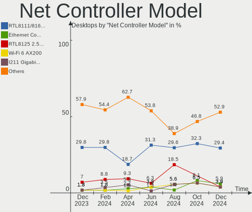
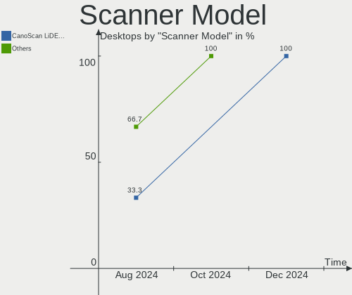

openSUSE Hardware Trends (Desktops)
-----------------------------------

A project to identify most popular hardware characteristics and track their change
over time based on data collected by openSUSE users at https://Linux-Hardware.org.

Anyone can contribute to this report by the [hw-probe](https://github.com/linuxhw/hw-probe) tool:

    sudo -E hw-probe -all -upload

Full-feature report is available here: https://linux-hardware.org/?view=trends&formfactor=desktop

Period: Aug, 2021.

Contents
--------

* [ System ](#system)
  - [ OS                       ](#os)
  - [ OS Family                ](#os-family)
  - [ Kernel                   ](#kernel)
  - [ Kernel Family            ](#kernel-family)
  - [ Kernel Major Ver.        ](#kernel-major-ver)
  - [ Arch                     ](#arch)
  - [ DE                       ](#de)
  - [ Display Server           ](#display-server)
  - [ Display Manager          ](#display-manager)
  - [ OS Lang                  ](#os-lang)
  - [ Boot Mode                ](#boot-mode)
  - [ Filesystem               ](#filesystem)
  - [ Part. scheme             ](#part-scheme)
  - [ Dual Boot with Linux/BSD ](#dual-boot-with-linuxbsd)
  - [ Dual Boot (Win)          ](#dual-boot-win)

* [ Board ](#board)
  - [ Vendor                   ](#vendor)
  - [ Model                    ](#model)
  - [ Model Family             ](#model-family)
  - [ MFG Year                 ](#mfg-year)
  - [ Form Factor              ](#form-factor)
  - [ Secure Boot              ](#secure-boot)
  - [ Coreboot                 ](#coreboot)
  - [ RAM Size                 ](#ram-size)
  - [ RAM Used                 ](#ram-used)
  - [ Total Drives             ](#total-drives)
  - [ Has CD-ROM               ](#has-cd-rom)
  - [ Has Ethernet             ](#has-ethernet)
  - [ Has WiFi                 ](#has-wifi)
  - [ Has Bluetooth            ](#has-bluetooth)

* [ Location ](#location)
  - [ Country                  ](#country)
  - [ City                     ](#city)

* [ Drives ](#drives)
  - [ Drive Vendor             ](#drive-vendor)
  - [ Drive Model              ](#drive-model)
  - [ HDD Vendor               ](#hdd-vendor)
  - [ SSD Vendor               ](#ssd-vendor)
  - [ Drive Kind               ](#drive-kind)
  - [ Drive Connector          ](#drive-connector)
  - [ Drive Size               ](#drive-size)
  - [ Space Total              ](#space-total)
  - [ Space Used               ](#space-used)
  - [ Malfunc. Drives          ](#malfunc-drives)
  - [ Malfunc. Drive Vendor    ](#malfunc-drive-vendor)
  - [ Malfunc. HDD Vendor      ](#malfunc-hdd-vendor)
  - [ Malfunc. Drive Kind      ](#malfunc-drive-kind)
  - [ Failed Drives            ](#failed-drives)
  - [ Failed Drive Vendor      ](#failed-drive-vendor)
  - [ Drive Status             ](#drive-status)

* [ Storage controller ](#storage-controller)
  - [ Storage Vendor           ](#storage-vendor)
  - [ Storage Model            ](#storage-model)
  - [ Storage Kind             ](#storage-kind)

* [ Processor ](#processor)
  - [ CPU Vendor               ](#cpu-vendor)
  - [ CPU Model                ](#cpu-model)
  - [ CPU Model Family         ](#cpu-model-family)
  - [ CPU Cores                ](#cpu-cores)
  - [ CPU Sockets              ](#cpu-sockets)
  - [ CPU Threads              ](#cpu-threads)
  - [ CPU Op-Modes             ](#cpu-op-modes)
  - [ CPU Microcode            ](#cpu-microcode)
  - [ CPU Microarch            ](#cpu-microarch)

* [ Graphics ](#graphics)
  - [ GPU Vendor               ](#gpu-vendor)
  - [ GPU Model                ](#gpu-model)
  - [ GPU Combo                ](#gpu-combo)
  - [ GPU Driver               ](#gpu-driver)
  - [ GPU Memory               ](#gpu-memory)

* [ Monitor ](#monitor)
  - [ Monitor Vendor           ](#monitor-vendor)
  - [ Monitor Model            ](#monitor-model)
  - [ Monitor Resolution       ](#monitor-resolution)
  - [ Monitor Diagonal         ](#monitor-diagonal)
  - [ Monitor Width            ](#monitor-width)
  - [ Aspect Ratio             ](#aspect-ratio)
  - [ Monitor Area             ](#monitor-area)
  - [ Pixel Density            ](#pixel-density)
  - [ Multiple Monitors        ](#multiple-monitors)

* [ Network ](#network)
  - [ Net Controller Vendor    ](#net-controller-vendor)
  - [ Net Controller Model     ](#net-controller-model)
  - [ Wireless Vendor          ](#wireless-vendor)
  - [ Wireless Model           ](#wireless-model)
  - [ Ethernet Vendor          ](#ethernet-vendor)
  - [ Ethernet Model           ](#ethernet-model)
  - [ Net Controller Kind      ](#net-controller-kind)
  - [ Used Controller          ](#used-controller)
  - [ NICs                     ](#nics)
  - [ IPv6                     ](#ipv6)

* [ Bluetooth ](#bluetooth)
  - [ Bluetooth Vendor         ](#bluetooth-vendor)
  - [ Bluetooth Model          ](#bluetooth-model)

* [ Sound ](#sound)
  - [ Sound Vendor             ](#sound-vendor)
  - [ Sound Model              ](#sound-model)

* [ Memory ](#memory)
  - [ Memory Vendor            ](#memory-vendor)
  - [ Memory Model             ](#memory-model)
  - [ Memory Kind              ](#memory-kind)
  - [ Memory Form Factor       ](#memory-form-factor)
  - [ Memory Size              ](#memory-size)
  - [ Memory Speed             ](#memory-speed)

* [ Printers & scanners ](#printers--scanners)
  - [ Printer Vendor           ](#printer-vendor)
  - [ Printer Model            ](#printer-model)
  - [ Scanner Vendor           ](#scanner-vendor)
  - [ Scanner Model            ](#scanner-model)

* [ Camera ](#camera)
  - [ Camera Vendor            ](#camera-vendor)
  - [ Camera Model             ](#camera-model)

* [ Security ](#security)
  - [ Fingerprint Vendor       ](#fingerprint-vendor)
  - [ Fingerprint Model        ](#fingerprint-model)
  - [ Chipcard Vendor          ](#chipcard-vendor)
  - [ Chipcard Model           ](#chipcard-model)

* [ Unsupported ](#unsupported)
  - [ Unsupported Devices      ](#unsupported-devices)
  - [ Unsupported Device Types ](#unsupported-device-types)

System
------

OS
--

Installed operating systems

| Name                         | Desktops | Percent |
|------------------------------|----------|---------|
| openSUSE Tumbleweed-20210810 | 3        | 15%     |
| openSUSE Leap-15.3           | 3        | 15%     |
| openSUSE Leap-15.2           | 3        | 15%     |
| openSUSE Tumbleweed-20210820 | 1        | 5%      |
| openSUSE Tumbleweed-20210807 | 1        | 5%      |
| openSUSE Tumbleweed-20210731 | 1        | 5%      |
| openSUSE Microos-20210810    | 1        | 5%      |
| openSUSE 20210829            | 1        | 5%      |
| openSUSE 20210817            | 1        | 5%      |
| openSUSE 20210807            | 1        | 5%      |
| openSUSE 20210804            | 1        | 5%      |
| openSUSE 20210801            | 1        | 5%      |
| openSUSE 20210727            | 1        | 5%      |
| openSUSE 20210704            | 1        | 5%      |

OS Family
---------

OS without a version

| Name     | Desktops | Percent |
|----------|----------|---------|
| openSUSE | 20       | 100%    |

Kernel
------

Version of the Linux kernel

| Version                 | Desktops | Percent |
|-------------------------|----------|---------|
| 5.13.8-1-default        | 5        | 25%     |
| 5.13.4-1-default        | 3        | 15%     |
| 5.3.18-lp152.81-default | 2        | 10%     |
| 5.3.18-59.19-default    | 2        | 10%     |
| 5.3.18-lp152.78-default | 1        | 5%      |
| 5.3.18-59.5-default     | 1        | 5%      |
| 5.13.6-1-default        | 1        | 5%      |
| 5.13.12-2-default       | 1        | 5%      |
| 5.13.12-1-default       | 1        | 5%      |
| 5.12.9-1-default        | 1        | 5%      |
| 5.12.13-1-default       | 1        | 5%      |
| 5.12.12-1-default       | 1        | 5%      |

Kernel Family
-------------

Linux kernel without a distro release

| Version | Desktops | Percent |
|---------|----------|---------|
| 5.3.18  | 6        | 30%     |
| 5.13.8  | 5        | 25%     |
| 5.13.4  | 3        | 15%     |
| 5.13.12 | 2        | 10%     |
| 5.13.6  | 1        | 5%      |
| 5.12.9  | 1        | 5%      |
| 5.12.13 | 1        | 5%      |
| 5.12.12 | 1        | 5%      |

Kernel Major Ver.
-----------------

Linux kernel major version

| Version | Desktops | Percent |
|---------|----------|---------|
| 5.13    | 11       | 55%     |
| 5.3     | 6        | 30%     |
| 5.12    | 3        | 15%     |

Arch
----

OS architecture (x86_64, i586, etc.)

| Name   | Desktops | Percent |
|--------|----------|---------|
| x86_64 | 20       | 100%    |

DE
--

Desktop Environment

| Name    | Desktops | Percent |
|---------|----------|---------|
| GNOME   | 8        | 40%     |
| KDE     | 6        | 30%     |
| KDE5    | 3        | 15%     |
| Unknown | 2        | 10%     |
| Budgie  | 1        | 5%      |

Display Server
--------------

X11 or Wayland

| Name        | Desktops | Percent |
|-------------|----------|---------|
| X11         | 15       | 75%     |
| Wayland     | 4        | 20%     |
| Unspecified | 1        | 5%      |

Display Manager
---------------

SDDM, LightDM, etc.

| Name    | Desktops | Percent |
|---------|----------|---------|
| Unknown | 12       | 60%     |
| XDM     | 4        | 20%     |
| SDDM    | 2        | 10%     |
| LightDM | 2        | 10%     |

OS Lang
-------

Language

| Lang    | Desktops | Percent |
|---------|----------|---------|
| en_US   | 6        | 30%     |
| de_DE   | 5        | 25%     |
| es_ES   | 2        | 10%     |
| Unknown | 2        | 10%     |
| POSIX   | 1        | 5%      |
| nn_NO   | 1        | 5%      |
| nl_BE   | 1        | 5%      |
| nb_NO   | 1        | 5%      |
| cs_CZ   | 1        | 5%      |

Boot Mode
---------

EFI or BIOS

| Mode | Desktops | Percent |
|------|----------|---------|
| EFI  | 13       | 65%     |
| BIOS | 7        | 35%     |

Filesystem
----------

Type of filesystem

| Type  | Desktops | Percent |
|-------|----------|---------|
| Btrfs | 15       | 75%     |
| Ext4  | 4        | 20%     |
| Xfs   | 1        | 5%      |

Part. scheme
------------

Scheme of partitioning

| Type    | Desktops | Percent |
|---------|----------|---------|
| Unknown | 10       | 50%     |
| GPT     | 8        | 40%     |
| MBR     | 2        | 10%     |

Dual Boot with Linux/BSD
------------------------

Hosting more than one Linux/BSD

| Dual boot | Desktops | Percent |
|-----------|----------|---------|
| No        | 17       | 85%     |
| Yes       | 3        | 15%     |

Dual Boot (Win)
---------------

Hosting Linux and Windows

| Dual boot | Desktops | Percent |
|-----------|----------|---------|
| No        | 15       | 75%     |
| Yes       | 5        | 25%     |

Board
-----

Vendor
------

Motherboard manufacturer

| Name                | Desktops | Percent |
|---------------------|----------|---------|
| Gigabyte Technology | 5        | 25%     |
| ASUSTek Computer    | 5        | 25%     |
| MSI                 | 2        | 10%     |
| Hewlett-Packard     | 2        | 10%     |
| ASRock              | 2        | 10%     |
| Supermicro          | 1        | 5%      |
| Lenovo              | 1        | 5%      |
| HARDKERNEL          | 1        | 5%      |
| Foxconn             | 1        | 5%      |

Model
-----

Motherboard model

| Name                               | Desktops | Percent |
|------------------------------------|----------|---------|
| Supermicro SYS-7038A-I             | 1        | 5%      |
| MSI MS-7C81                        | 1        | 5%      |
| MSI MS-7C37                        | 1        | 5%      |
| Lenovo ThinkCentre M700 10HY002NMX | 1        | 5%      |
| HP Z440 Workstation                | 1        | 5%      |
| HP Z1 Entry Tower G5               | 1        | 5%      |
| HARDKERNEL ODROID-H2               | 1        | 5%      |
| Gigabyte Z370M D3H                 | 1        | 5%      |
| Gigabyte X570 I AORUS PRO WIFI     | 1        | 5%      |
| Gigabyte H81M-S2H                  | 1        | 5%      |
| Gigabyte B85-HD3-A                 | 1        | 5%      |
| Gigabyte B550 AORUS PRO AC         | 1        | 5%      |
| Foxconn p6-2346eg                  | 1        | 5%      |
| ASUS ROG STRIX Z390-H GAMING       | 1        | 5%      |
| ASUS PRIME H310M-A                 | 1        | 5%      |
| ASUS CROSSHAIR VI HERO             | 1        | 5%      |
| ASUS A88X-PLUS                     | 1        | 5%      |
| ASUS 970 PRO GAMING/AURA           | 1        | 5%      |
| ASRock Z68 Extreme4 Gen3           | 1        | 5%      |
| ASRock B450M Pro4                  | 1        | 5%      |

Model Family
------------

Motherboard model prefix

| Name                   | Desktops | Percent |
|------------------------|----------|---------|
| Supermicro SYS-7038A-I | 1        | 5%      |
| MSI MS-7C81            | 1        | 5%      |
| MSI MS-7C37            | 1        | 5%      |
| Lenovo ThinkCentre     | 1        | 5%      |
| HP Z440                | 1        | 5%      |
| HP Z1                  | 1        | 5%      |
| HARDKERNEL ODROID-H2   | 1        | 5%      |
| Gigabyte Z370M         | 1        | 5%      |
| Gigabyte X570          | 1        | 5%      |
| Gigabyte H81M-S2H      | 1        | 5%      |
| Gigabyte B85-HD3-A     | 1        | 5%      |
| Gigabyte B550          | 1        | 5%      |
| Foxconn p6-2346eg      | 1        | 5%      |
| ASUS ROG               | 1        | 5%      |
| ASUS PRIME             | 1        | 5%      |
| ASUS CROSSHAIR         | 1        | 5%      |
| ASUS A88X-PLUS         | 1        | 5%      |
| ASUS 970               | 1        | 5%      |
| ASRock Z68             | 1        | 5%      |
| ASRock B450M           | 1        | 5%      |

MFG Year
--------

Motherboard manufacture year

| Year | Desktops | Percent |
|------|----------|---------|
| 2021 | 5        | 25%     |
| 2020 | 5        | 25%     |
| 2019 | 2        | 10%     |
| 2016 | 2        | 10%     |
| 2015 | 2        | 10%     |
| 2018 | 1        | 5%      |
| 2014 | 1        | 5%      |
| 2012 | 1        | 5%      |
| 2011 | 1        | 5%      |

Form Factor
-----------

Physical design of the computer

| Name    | Desktops | Percent |
|---------|----------|---------|
| Desktop | 20       | 100%    |

Secure Boot
-----------

Enabled or disabled

| State    | Desktops | Percent |
|----------|----------|---------|
| Disabled | 19       | 95%     |
| Enabled  | 1        | 5%      |

Coreboot
--------

Have coreboot on board

| Used | Desktops | Percent |
|------|----------|---------|
| No   | 20       | 100%    |

RAM Size
--------

Total RAM memory

| Size in GB  | Desktops | Percent |
|-------------|----------|---------|
| 16.01-24.0  | 8        | 40%     |
| 32.01-64.0  | 6        | 30%     |
| 3.01-4.0    | 2        | 10%     |
| 64.01-256.0 | 2        | 10%     |
| 8.01-16.0   | 2        | 10%     |

RAM Used
--------

Used RAM memory

| Used GB   | Desktops | Percent |
|-----------|----------|---------|
| 4.01-8.0  | 5        | 25%     |
| 3.01-4.0  | 5        | 25%     |
| 2.01-3.0  | 3        | 15%     |
| 1.01-2.0  | 3        | 15%     |
| 8.01-16.0 | 3        | 15%     |
| 0.51-1.0  | 1        | 5%      |

Total Drives
------------

Number of drives on board

| Drives | Desktops | Percent |
|--------|----------|---------|
| 2      | 6        | 30%     |
| 1      | 4        | 20%     |
| 6      | 3        | 15%     |
| 3      | 3        | 15%     |
| 4      | 2        | 10%     |
| 7      | 1        | 5%      |
| 5      | 1        | 5%      |

Has CD-ROM
----------

Has CD-ROM on board

| Presented | Desktops | Percent |
|-----------|----------|---------|
| Yes       | 10       | 50%     |
| No        | 10       | 50%     |

Has Ethernet
------------

Has Ethernet on board

| Presented | Desktops | Percent |
|-----------|----------|---------|
| Yes       | 20       | 100%    |

Has WiFi
--------

Has WiFi module

| Presented | Desktops | Percent |
|-----------|----------|---------|
| No        | 11       | 55%     |
| Yes       | 9        | 45%     |

Has Bluetooth
-------------

Has Bluetooth module

| Presented | Desktops | Percent |
|-----------|----------|---------|
| No        | 11       | 55%     |
| Yes       | 9        | 45%     |

Location
--------

Country
-------

Geographic location (country)

| Country   | Desktops | Percent |
|-----------|----------|---------|
| Germany   | 6        | 30%     |
| USA       | 4        | 20%     |
| Spain     | 4        | 20%     |
| Norway    | 2        | 10%     |
| Russia    | 1        | 5%      |
| Czechia   | 1        | 5%      |
| Belgium   | 1        | 5%      |
| Australia | 1        | 5%      |

City
----

Geographic location (city)

| City                       | Desktops | Percent |
|----------------------------|----------|---------|
| Zaragoza                   | 1        | 5%      |
| Vecindario                 | 1        | 5%      |
| Trondheim                  | 1        | 5%      |
| Stabroek                   | 1        | 5%      |
| Pueblo                     | 1        | 5%      |
| Neuwied                    | 1        | 5%      |
| Monroeville                | 1        | 5%      |
| M?©rida                    | 1        | 5%      |
| Lomonosov                  | 1        | 5%      |
| Las Palmas de Gran Canaria | 1        | 5%      |
| Kopervik                   | 1        | 5%      |
| Heinsberg                  | 1        | 5%      |
| Halle                      | 1        | 5%      |
| Frankfurt am Main          | 1        | 5%      |
| Drisy                      | 1        | 5%      |
| Dresden                    | 1        | 5%      |
| Denison                    | 1        | 5%      |
| Brisbane                   | 1        | 5%      |
| Berlin                     | 1        | 5%      |
| Amelia                     | 1        | 5%      |

Drives
------

Drive Vendor
------------

Hard drive vendors

| Vendor              | Desktops | Drives | Percent |
|---------------------|----------|--------|---------|
| WDC                 | 10       | 17     | 20.41%  |
| Samsung Electronics | 10       | 14     | 20.41%  |
| Seagate             | 4        | 4      | 8.16%   |
| Toshiba             | 3        | 3      | 6.12%   |
| Sandisk             | 3        | 3      | 6.12%   |
| Crucial             | 3        | 3      | 6.12%   |
| SPCC                | 2        | 3      | 4.08%   |
| Kingston            | 2        | 3      | 4.08%   |
| Intel               | 2        | 2      | 4.08%   |
| Hitachi             | 2        | 2      | 4.08%   |
| A-DATA Technology   | 2        | 3      | 4.08%   |
| Unknown             | 1        | 1      | 2.04%   |
| SK Hynix            | 1        | 1      | 2.04%   |
| Phison Electronics  | 1        | 1      | 2.04%   |
| OCZ                 | 1        | 1      | 2.04%   |
| Maxtor              | 1        | 1      | 2.04%   |
| Fujitsu             | 1        | 1      | 2.04%   |

Drive Model
-----------

Hard drive models

| Model                                   | Desktops | Percent |
|-----------------------------------------|----------|---------|
| Samsung SSD 850 EVO 500GB               | 3        | 5%      |
| Samsung HD103SI 1TB                     | 2        | 3.33%   |
| WDC WDS500G1X0E-00AFY0 500GB            | 1        | 1.67%   |
| WDC WDS500G1B0B-00AS40 500GB SSD        | 1        | 1.67%   |
| WDC WDS100T2B0A-00SM50 1TB SSD          | 1        | 1.67%   |
| WDC WDS100T1X0E-00AFY0 1TB              | 1        | 1.67%   |
| WDC WD20EFRX-68EUZN0 2TB                | 1        | 1.67%   |
| WDC WD20EARX-00PASB0 2TB                | 1        | 1.67%   |
| WDC WD2001FASS-00W2B0 2TB               | 1        | 1.67%   |
| WDC WD10SPZX-00Z10T0 1TB                | 1        | 1.67%   |
| WDC WD10EZEX-60ZF5A0 1TB                | 1        | 1.67%   |
| WDC WD10EZEX-60WN4A0 1TB                | 1        | 1.67%   |
| WDC WD10EZEX-22MFCA0 1TB                | 1        | 1.67%   |
| WDC WD10EZEX-08WN4A0 1TB                | 1        | 1.67%   |
| WDC WD10EZEX-08RKKA0 1TB                | 1        | 1.67%   |
| WDC WD10EZEX-08M2NA0 1TB                | 1        | 1.67%   |
| WDC WD10EZEX-07WN4A0 1TB                | 1        | 1.67%   |
| WDC WD10EAVS-22D7B0 1TB                 | 1        | 1.67%   |
| Unknown AJTD4R  16GB                    | 1        | 1.67%   |
| Toshiba NVMe SSD Drive 512GB            | 1        | 1.67%   |
| Toshiba HDWD130 3TB                     | 1        | 1.67%   |
| Toshiba DT01ACA200 2TB                  | 1        | 1.67%   |
| SPCC Solid State Disk 256GB             | 1        | 1.67%   |
| SPCC M.2 PCIe SSD 512GB                 | 1        | 1.67%   |
| SK Hynix BC511 HFM256GDJTNI-82A0A 256GB | 1        | 1.67%   |
| Seagate ST4000DM005-2DP166 4TB          | 1        | 1.67%   |
| Seagate ST3750640NS 752GB               | 1        | 1.67%   |
| Seagate ST1000DM003-1ER162 1TB          | 1        | 1.67%   |
| Seagate Expansion 2TB                   | 1        | 1.67%   |
| SanDisk SDSSDXPS240G 240GB              | 1        | 1.67%   |
| Sandisk NVMe SSD Drive 500GB            | 1        | 1.67%   |
| Sandisk NVMe SSD Drive 1TB              | 1        | 1.67%   |
| Samsung SSD 980 PRO 1TB                 | 1        | 1.67%   |
| Samsung SSD 860 EVO 1TB                 | 1        | 1.67%   |
| Samsung SSD 850 EVO 250GB               | 1        | 1.67%   |
| Samsung SSD 840 EVO 250GB               | 1        | 1.67%   |
| Samsung MZ7LF192HCGS-000L1 192GB SSD    | 1        | 1.67%   |
| Samsung MZ7KM240HAGR-00005 240GB SSD    | 1        | 1.67%   |
| Samsung HD501LJ 500GB                   | 1        | 1.67%   |
| Samsung HD105SI 1TB                     | 1        | 1.67%   |
| Samsung HD103UI 1TB                     | 1        | 1.67%   |
| Phison PCIe SSD 1TB                     | 1        | 1.67%   |
| OCZ ARC100 240GB SSD                    | 1        | 1.67%   |
| Maxtor 7H500F0 500GB                    | 1        | 1.67%   |
| Kingston SV300S37A120G 120GB SSD        | 1        | 1.67%   |
| Kingston SA400S37480G 480GB SSD         | 1        | 1.67%   |
| Kingston SA400S37240G 240GB SSD         | 1        | 1.67%   |
| Intel SSDPEKNW512G8 512GB               | 1        | 1.67%   |
| Intel NVMe SSD Drive 512GB              | 1        | 1.67%   |
| Hitachi HDS721010CLA630 1TB             | 1        | 1.67%   |
| Hitachi HDS5C3020ALA632 2TB             | 1        | 1.67%   |
| Fujitsu MHW2120BH 120GB                 | 1        | 1.67%   |
| Crucial CT525MX300SSD1 528GB            | 1        | 1.67%   |
| Crucial CT256MX100SSD1 256GB            | 1        | 1.67%   |
| Crucial CT1000BX500SSD1 1TB             | 1        | 1.67%   |
| A-DATA SX8200PNP 512GB                  | 1        | 1.67%   |
| A-DATA SU650 2TB SSD                    | 1        | 1.67%   |

HDD Vendor
----------

Hard disk drive vendors

| Vendor              | Desktops | Drives | Percent |
|---------------------|----------|--------|---------|
| WDC                 | 9        | 13     | 39.13%  |
| Seagate             | 4        | 4      | 17.39%  |
| Samsung Electronics | 4        | 5      | 17.39%  |
| Toshiba             | 2        | 2      | 8.7%    |
| Hitachi             | 2        | 2      | 8.7%    |
| Maxtor              | 1        | 1      | 4.35%   |
| Fujitsu             | 1        | 1      | 4.35%   |

SSD Vendor
----------

Solid state drive vendors

| Vendor              | Desktops | Drives | Percent |
|---------------------|----------|--------|---------|
| Samsung Electronics | 6        | 8      | 35.29%  |
| Crucial             | 3        | 3      | 17.65%  |
| WDC                 | 2        | 2      | 11.76%  |
| Kingston            | 2        | 3      | 11.76%  |
| SPCC                | 1        | 2      | 5.88%   |
| SanDisk             | 1        | 1      | 5.88%   |
| OCZ                 | 1        | 1      | 5.88%   |
| A-DATA Technology   | 1        | 1      | 5.88%   |

Drive Kind
----------

HDD or SSD

| Kind | Desktops | Drives | Percent |
|------|----------|--------|---------|
| HDD  | 15       | 28     | 38.46%  |
| SSD  | 13       | 21     | 33.33%  |
| NVMe | 10       | 13     | 25.64%  |
| MMC  | 1        | 1      | 2.56%   |

Drive Connector
---------------

SATA, SAS, NVMe, etc.

| Type | Desktops | Drives | Percent |
|------|----------|--------|---------|
| SATA | 19       | 48     | 61.29%  |
| NVMe | 10       | 13     | 32.26%  |
| SAS  | 1        | 1      | 3.23%   |
| MMC  | 1        | 1      | 3.23%   |

Drive Size
----------

Size of hard drive

| Size in TB | Desktops | Drives | Percent |
|------------|----------|--------|---------|
| 0.51-1.0   | 12       | 20     | 37.5%   |
| 0.01-0.5   | 11       | 19     | 34.38%  |
| 1.01-2.0   | 7        | 8      | 21.88%  |
| 3.01-4.0   | 1        | 1      | 3.13%   |
| 2.01-3.0   | 1        | 1      | 3.13%   |

Space Total
-----------

Amount of disk space available on the file system

| Size in GB     | Desktops | Percent |
|----------------|----------|---------|
| 1001-2000      | 8        | 40%     |
| More than 3000 | 6        | 30%     |
| 251-500        | 2        | 10%     |
| 2001-3000      | 1        | 5%      |
| 1-20           | 1        | 5%      |
| 501-1000       | 1        | 5%      |
| Unknown        | 1        | 5%      |

Space Used
----------

Amount of used disk space

| Used GB        | Desktops | Percent |
|----------------|----------|---------|
| 501-1000       | 5        | 25%     |
| 251-500        | 3        | 15%     |
| 101-250        | 3        | 15%     |
| More than 3000 | 2        | 10%     |
| 2001-3000      | 2        | 10%     |
| 1001-2000      | 2        | 10%     |
| 1-20           | 1        | 5%      |
| 51-100         | 1        | 5%      |
| Unknown        | 1        | 5%      |

Malfunc. Drives
---------------

Drive models with a malfunction

| Model                            | Desktops | Drives | Percent |
|----------------------------------|----------|--------|---------|
| Toshiba DT01ACA200 2TB           | 1        | 1      | 33.33%  |
| Maxtor 7H500F0 500GB             | 1        | 1      | 33.33%  |
| Kingston SV300S37A120G 120GB SSD | 1        | 1      | 33.33%  |

Malfunc. Drive Vendor
---------------------

Vendors of faulty drives

| Vendor   | Desktops | Drives | Percent |
|----------|----------|--------|---------|
| Toshiba  | 1        | 1      | 33.33%  |
| Maxtor   | 1        | 1      | 33.33%  |
| Kingston | 1        | 1      | 33.33%  |

Malfunc. HDD Vendor
-------------------

Vendors of faulty HDD drives

| Vendor  | Desktops | Drives | Percent |
|---------|----------|--------|---------|
| Toshiba | 1        | 1      | 50%     |
| Maxtor  | 1        | 1      | 50%     |

Malfunc. Drive Kind
-------------------

Kinds of faulty drives

| Kind | Desktops | Drives | Percent |
|------|----------|--------|---------|
| HDD  | 2        | 2      | 66.67%  |
| SSD  | 1        | 1      | 33.33%  |

Failed Drives
-------------

Failed drive models

Zero info for selected period =(

Failed Drive Vendor
-------------------

Failed drive vendors

Zero info for selected period =(

Drive Status
------------

Number of failed and malfunc. drives

| Status   | Desktops | Drives | Percent |
|----------|----------|--------|---------|
| Detected | 11       | 31     | 50%     |
| Works    | 8        | 29     | 36.36%  |
| Malfunc  | 3        | 3      | 13.64%  |

Storage controller
------------------

Storage Vendor
--------------

Storage controller vendors

| Vendor                       | Desktops | Percent |
|------------------------------|----------|---------|
| Intel                        | 15       | 42.86%  |
| AMD                          | 7        | 20%     |
| Sandisk                      | 4        | 11.43%  |
| Phison Electronics           | 2        | 5.71%   |
| Toshiba America Info Systems | 1        | 2.86%   |
| SK Hynix                     | 1        | 2.86%   |
| Samsung Electronics          | 1        | 2.86%   |
| Marvell Technology Group     | 1        | 2.86%   |
| LSI Logic / Symbios Logic    | 1        | 2.86%   |
| ASMedia Technology           | 1        | 2.86%   |
| ADATA Technology             | 1        | 2.86%   |

Storage Model
-------------

Storage controller models

| Model                                                                            | Desktops | Percent |
|----------------------------------------------------------------------------------|----------|---------|
| AMD FCH SATA Controller [AHCI mode]                                              | 5        | 13.16%  |
| Intel Cannon Lake PCH SATA AHCI Controller                                       | 3        | 7.89%   |
| Sandisk WD Black SN850                                                           | 2        | 5.26%   |
| Intel SSD 660P Series                                                            | 2        | 5.26%   |
| Intel C610/X99 series chipset 6-Port SATA Controller [AHCI mode]                 | 2        | 5.26%   |
| Intel 8 Series/C220 Series Chipset Family 6-port SATA Controller 1 [AHCI mode]   | 2        | 5.26%   |
| Intel 6 Series/C200 Series Chipset Family 6 port Desktop SATA AHCI Controller    | 2        | 5.26%   |
| Toshiba America Info Systems Toshiba America Info Non-Volatile memory controller | 1        | 2.63%   |
| SK Hynix BC511                                                                   | 1        | 2.63%   |
| Sandisk WD Black SN750 / PC SN730 NVMe SSD                                       | 1        | 2.63%   |
| Sandisk WD Black 2018/SN750 / PC SN720 NVMe SSD                                  | 1        | 2.63%   |
| Samsung NVMe SSD Controller PM9A1/PM9A3/980PRO                                   | 1        | 2.63%   |
| Phison E16 PCIe4 NVMe Controller                                                 | 1        | 2.63%   |
| Phison E12 NVMe Controller                                                       | 1        | 2.63%   |
| Marvell Group 88SE912x SATA 6Gb/s Controller [IDE mode]                          | 1        | 2.63%   |
| LSI Logic / Symbios Logic SAS1068E PCI-Express Fusion-MPT SAS                    | 1        | 2.63%   |
| Intel Q170/Q150/B150/H170/H110/Z170/CM236 Chipset SATA Controller [AHCI Mode]    | 1        | 2.63%   |
| Intel Celeron/Pentium Silver Processor SATA Controller                           | 1        | 2.63%   |
| Intel C610/X99 series chipset sSATA Controller [AHCI mode]                       | 1        | 2.63%   |
| Intel 400 Series Chipset Family SATA AHCI Controller                             | 1        | 2.63%   |
| Intel 200 Series PCH SATA controller [AHCI mode]                                 | 1        | 2.63%   |
| ASMedia ASM1062 Serial ATA Controller                                            | 1        | 2.63%   |
| AMD X370 Series Chipset SATA Controller                                          | 1        | 2.63%   |
| AMD Starship/Matisse Chipset SATA Controller [AHCI mode]                         | 1        | 2.63%   |
| AMD SB7x0/SB8x0/SB9x0 SATA Controller [AHCI mode]                                | 1        | 2.63%   |
| AMD 400 Series Chipset SATA Controller                                           | 1        | 2.63%   |
| ADATA XPG SX8200 Pro PCIe Gen3x4 M.2 2280 Solid State Drive                      | 1        | 2.63%   |

Storage Kind
------------

Kind of storage controller (IDE, SATA, NVMe, SAS, ...)

| Kind | Desktops | Percent |
|------|----------|---------|
| SATA | 20       | 62.5%   |
| NVMe | 10       | 31.25%  |
| SCSI | 1        | 3.13%   |
| IDE  | 1        | 3.13%   |

Processor
---------

CPU Vendor
----------

Processor vendors

| Vendor | Desktops | Percent |
|--------|----------|---------|
| Intel  | 13       | 65%     |
| AMD    | 7        | 35%     |

CPU Model
---------

Processor models

| Model                                           | Desktops | Percent |
|-------------------------------------------------|----------|---------|
| Intel Core i7-8700 CPU @ 3.20GHz                | 2        | 10%     |
| Intel Core i7-4790 CPU @ 3.60GHz                | 2        | 10%     |
| Intel Xeon CPU E5-2690 v3 @ 2.60GHz             | 1        | 5%      |
| Intel Xeon CPU E5-2620 v4 @ 2.10GHz             | 1        | 5%      |
| Intel Core i7-9700K CPU @ 3.60GHz               | 1        | 5%      |
| Intel Core i5-3350P CPU @ 3.10GHz               | 1        | 5%      |
| Intel Core i5-10600K CPU @ 4.10GHz              | 1        | 5%      |
| Intel Core i3-8100 CPU @ 3.60GHz                | 1        | 5%      |
| Intel Core i3-6100T CPU @ 3.20GHz               | 1        | 5%      |
| Intel Core i3-2100 CPU @ 3.10GHz                | 1        | 5%      |
| Intel Celeron J4115 CPU @ 1.80GHz               | 1        | 5%      |
| AMD Ryzen 9 5950X 16-Core Processor             | 1        | 5%      |
| AMD Ryzen 9 3900X 12-Core Processor             | 1        | 5%      |
| AMD Ryzen 7 3700X 8-Core Processor              | 1        | 5%      |
| AMD Ryzen 7 2700X Eight-Core Processor          | 1        | 5%      |
| AMD Ryzen 5 5600X 6-Core Processor              | 1        | 5%      |
| AMD FX-8350 Eight-Core Processor                | 1        | 5%      |
| AMD A10-7850K Radeon R7, 12 Compute Cores 4C+8G | 1        | 5%      |

CPU Model Family
----------------

Processor model prefix

| Model         | Desktops | Percent |
|---------------|----------|---------|
| Intel Core i7 | 5        | 25%     |
| Intel Core i3 | 3        | 15%     |
| Intel Xeon    | 2        | 10%     |
| Intel Core i5 | 2        | 10%     |
| AMD Ryzen 9   | 2        | 10%     |
| AMD Ryzen 7   | 2        | 10%     |
| Intel Celeron | 1        | 5%      |
| AMD Ryzen 5   | 1        | 5%      |
| AMD FX        | 1        | 5%      |
| AMD A10       | 1        | 5%      |

CPU Cores
---------

Number of processor cores

| Number | Desktops | Percent |
|--------|----------|---------|
| 4      | 6        | 30%     |
| 6      | 4        | 20%     |
| 8      | 3        | 15%     |
| 2      | 3        | 15%     |
| 16     | 2        | 10%     |
| 12     | 2        | 10%     |

CPU Sockets
-----------

Number of sockets

| Number | Desktops | Percent |
|--------|----------|---------|
| 1      | 19       | 95%     |
| 2      | 1        | 5%      |

CPU Threads
-----------

Threads per core (Hyper-Threading)

| Number | Desktops | Percent |
|--------|----------|---------|
| 2      | 16       | 80%     |
| 1      | 4        | 20%     |

CPU Op-Modes
------------

CPU Operation Modes (32-bit, 64-bit)

| Op mode        | Desktops | Percent |
|----------------|----------|---------|
| 32-bit, 64-bit | 20       | 100%    |

CPU Microcode
-------------

Microcode number

| Number     | Desktops | Percent |
|------------|----------|---------|
| Unknown    | 3        | 15%     |
| 0x906ea    | 2        | 10%     |
| 0x0a201016 | 2        | 10%     |
| 0xa0655    | 1        | 5%      |
| 0x906ed    | 1        | 5%      |
| 0x706a1    | 1        | 5%      |
| 0x506e3    | 1        | 5%      |
| 0x406f1    | 1        | 5%      |
| 0x306f2    | 1        | 5%      |
| 0x306c3    | 1        | 5%      |
| 0x306a9    | 1        | 5%      |
| 0x206a7    | 1        | 5%      |
| 0x08701021 | 1        | 5%      |
| 0x0800820d | 1        | 5%      |
| 0x06003106 | 1        | 5%      |
| 0x06000852 | 1        | 5%      |

CPU Microarch
-------------

Microarchitecture

| Name          | Desktops | Percent |
|---------------|----------|---------|
| KabyLake      | 4        | 20%     |
| Haswell       | 3        | 15%     |
| Zen 3         | 2        | 10%     |
| Zen 2         | 2        | 10%     |
| Zen+          | 1        | 5%      |
| Steamroller   | 1        | 5%      |
| Skylake       | 1        | 5%      |
| SandyBridge   | 1        | 5%      |
| Piledriver    | 1        | 5%      |
| IvyBridge     | 1        | 5%      |
| Goldmont plus | 1        | 5%      |
| CometLake     | 1        | 5%      |
| Broadwell     | 1        | 5%      |

Graphics
--------

GPU Vendor
----------

Vendors of graphics cards

| Vendor | Desktops | Percent |
|--------|----------|---------|
| AMD    | 10       | 41.67%  |
| Nvidia | 8        | 33.33%  |
| Intel  | 6        | 25%     |

GPU Model
---------

Graphics card models

| Model                                                                       | Desktops | Percent |
|-----------------------------------------------------------------------------|----------|---------|
| Intel CoffeeLake-S GT2 [UHD Graphics 630]                                   | 2        | 8%      |
| AMD Ellesmere [Radeon RX 470/480/570/570X/580/580X/590]                     | 2        | 8%      |
| Nvidia TU117 [GeForce GTX 1650]                                             | 1        | 4%      |
| Nvidia TU106 [GeForce RTX 2060 Rev. A]                                      | 1        | 4%      |
| Nvidia TU104 [GeForce RTX 2070 SUPER]                                       | 1        | 4%      |
| Nvidia GP108 [GeForce GT 1030]                                              | 1        | 4%      |
| Nvidia GP107 [GeForce GTX 1050]                                             | 1        | 4%      |
| Nvidia GP106 [GeForce GTX 1060 6GB]                                         | 1        | 4%      |
| Nvidia GP104 [GeForce GTX 1070]                                             | 1        | 4%      |
| Nvidia GM204 [GeForce GTX 970]                                              | 1        | 4%      |
| Nvidia GA102 [GeForce RTX 3080 Ti]                                          | 1        | 4%      |
| Intel Xeon E3-1200 v3/4th Gen Core Processor Integrated Graphics Controller | 1        | 4%      |
| Intel HD Graphics 530                                                       | 1        | 4%      |
| Intel GeminiLake [UHD Graphics 600]                                         | 1        | 4%      |
| Intel 2nd Generation Core Processor Family Integrated Graphics Controller   | 1        | 4%      |
| AMD Turks PRO [Radeon HD 7570]                                              | 1        | 4%      |
| AMD Tonga PRO [Radeon R9 285/380]                                           | 1        | 4%      |
| AMD Navi 22 [Radeon RX 6700/6700 XT / 6800M]                                | 1        | 4%      |
| AMD Navi 10 [Radeon RX 5600 OEM/5600 XT / 5700/5700 XT]                     | 1        | 4%      |
| AMD Lexa PRO [Radeon 540/540X/550/550X / RX 540X/550/550X]                  | 1        | 4%      |
| AMD Kaveri [Radeon R7 Graphics]                                             | 1        | 4%      |
| AMD Juniper XT [Radeon HD 5770]                                             | 1        | 4%      |
| AMD Hawaii PRO [Radeon R9 290/390]                                          | 1        | 4%      |

GPU Combo
---------

Combinations of graphics cards

| Name           | Desktops | Percent |
|----------------|----------|---------|
| 1 x AMD        | 8        | 40%     |
| 1 x Nvidia     | 5        | 25%     |
| 1 x Intel      | 3        | 15%     |
| 2 x Nvidia     | 1        | 5%      |
| Intel + Nvidia | 1        | 5%      |
| Intel + AMD    | 1        | 5%      |
| AMD + Nvidia   | 1        | 5%      |

GPU Driver
----------

Free vs proprietary

| Driver      | Desktops | Percent |
|-------------|----------|---------|
| Free        | 14       | 70%     |
| Proprietary | 5        | 25%     |
| Unknown     | 1        | 5%      |

GPU Memory
----------

Total video memory

| Size in GB | Desktops | Percent |
|------------|----------|---------|
| Unknown    | 6        | 30%     |
| 1.01-2.0   | 4        | 20%     |
| 7.01-8.0   | 3        | 15%     |
| 5.01-6.0   | 2        | 10%     |
| 3.01-4.0   | 2        | 10%     |
| 8.01-16.0  | 2        | 10%     |
| 0.01-0.5   | 1        | 5%      |

Monitor
-------

Monitor Vendor
--------------

Monitor vendors

| Vendor               | Desktops | Percent |
|----------------------|----------|---------|
| Samsung Electronics  | 5        | 20.83%  |
| Hewlett-Packard      | 4        | 16.67%  |
| BenQ                 | 4        | 16.67%  |
| Dell                 | 3        | 12.5%   |
| Goldstar             | 2        | 8.33%   |
| Ancor Communications | 2        | 8.33%   |
| Sceptre Tech         | 1        | 4.17%   |
| Lenovo               | 1        | 4.17%   |
| Elgato               | 1        | 4.17%   |
| ASUSTek Computer     | 1        | 4.17%   |

Monitor Model
-------------

Monitor models

| Model                                                                 | Desktops | Percent |
|-----------------------------------------------------------------------|----------|---------|
| Sceptre Tech E248W-1920 SPT099D 1920x1080 443x249mm 20.0-inch         | 1        | 4%      |
| Samsung Electronics U28E590 SAM0C4D 3840x2160 607x345mm 27.5-inch     | 1        | 4%      |
| Samsung Electronics SMBX2440 SAM068B 1920x1080 530x300mm 24.0-inch    | 1        | 4%      |
| Samsung Electronics LCD Monitor SyncMaster 1920x1080                  | 1        | 4%      |
| Samsung Electronics LCD Monitor SAM0509 1920x1080                     | 1        | 4%      |
| Samsung Electronics C32F391 SAM0D35 1920x1080 698x393mm 31.5-inch     | 1        | 4%      |
| Lenovo LEN L1900pA LEN114F 1280x1024 376x301mm 19.0-inch              | 1        | 4%      |
| Hewlett-Packard x2301 HWP2973 1920x1080 509x286mm 23.0-inch           | 1        | 4%      |
| Hewlett-Packard E273m HPN346E 1920x1080 598x336mm 27.0-inch           | 1        | 4%      |
| Hewlett-Packard 27fw HPN354A 1920x1080 598x336mm 27.0-inch            | 1        | 4%      |
| Hewlett-Packard 27es HWP3326 1920x1080 598x336mm 27.0-inch            | 1        | 4%      |
| Goldstar HDR 4K GSM7707 3840x2160 600x340mm 27.2-inch                 | 1        | 4%      |
| Goldstar E2350 GSM5791 1920x1080 510x290mm 23.1-inch                  | 1        | 4%      |
| Elgato HD60 S+ EGA006A 3840x2160 698x392mm 31.5-inch                  | 1        | 4%      |
| Dell U3011 DEL4064 1920x1200 641x401mm 29.8-inch                      | 1        | 4%      |
| Dell U2711 DELA057 2560x1440 597x336mm 27.0-inch                      | 1        | 4%      |
| Dell U2711 DELA055 2560x1440 597x336mm 27.0-inch                      | 1        | 4%      |
| Dell S2721NX DEL41FF 1920x1080 598x336mm 27.0-inch                    | 1        | 4%      |
| BenQ SW2700 BNQ7F47 2560x1440 596x335mm 26.9-inch                     | 1        | 4%      |
| BenQ LCD BNQ8024 2560x1440 597x336mm 27.0-inch                        | 1        | 4%      |
| BenQ GW2450H BNQ78C1 1920x1080 530x300mm 24.0-inch                    | 1        | 4%      |
| BenQ BL2700 BNQ8018 1920x1080 600x340mm 27.2-inch                     | 1        | 4%      |
| ASUSTek Computer VL279 AUS2781 1920x1080 598x336mm 27.0-inch          | 1        | 4%      |
| Ancor Communications ASUS VX279 ACI27E4 1920x1080 598x336mm 27.0-inch | 1        | 4%      |
| Ancor Communications ASUS VN248 ACI24C4 1920x1080 530x300mm 24.0-inch | 1        | 4%      |

Monitor Resolution
------------------

Monitor screen resolution

| Resolution        | Desktops | Percent |
|-------------------|----------|---------|
| 1920x1080 (FHD)   | 13       | 59.09%  |
| 2560x1440 (QHD)   | 4        | 18.18%  |
| 3840x2160 (4K)    | 3        | 13.64%  |
| 1920x1200 (WUXGA) | 1        | 4.55%   |
| 1280x1024 (SXGA)  | 1        | 4.55%   |

Monitor Diagonal
----------------

Diagonal size in inches

| Inches  | Desktops | Percent |
|---------|----------|---------|
| 27      | 10       | 43.48%  |
| 24      | 4        | 17.39%  |
| 31      | 2        | 8.7%    |
| 23      | 2        | 8.7%    |
| Unknown | 2        | 8.7%    |
| 32      | 1        | 4.35%   |
| 29      | 1        | 4.35%   |
| 20      | 1        | 4.35%   |

Monitor Width
-------------

Physical width

| Width in mm | Desktops | Percent |
|-------------|----------|---------|
| 501-600     | 14       | 60.87%  |
| 601-700     | 5        | 21.74%  |
| Unknown     | 2        | 8.7%    |
| 701-800     | 1        | 4.35%   |
| 351-400     | 1        | 4.35%   |

Aspect Ratio
------------

Proportional relationship between the width and the height

| Ratio   | Desktops | Percent |
|---------|----------|---------|
| 16/9    | 18       | 85.71%  |
| 5/4     | 1        | 4.76%   |
| 16/10   | 1        | 4.76%   |
| Unknown | 1        | 4.76%   |

Monitor Area
------------

Area in inch²

| Area in inch² | Desktops | Percent |
|----------------|----------|---------|
| 301-350        | 10       | 43.48%  |
| 201-250        | 6        | 26.09%  |
| 351-500        | 4        | 17.39%  |
| Unknown        | 2        | 8.7%    |
| 151-200        | 1        | 4.35%   |

Pixel Density
-------------

Pixels per inch

| Density | Desktops | Percent |
|---------|----------|---------|
| 51-100  | 12       | 54.55%  |
| 101-120 | 4        | 18.18%  |
| 121-160 | 3        | 13.64%  |
| Unknown | 2        | 9.09%   |
| 161-240 | 1        | 4.55%   |

Multiple Monitors
-----------------

Total monitors connected

| Total | Desktops | Percent |
|-------|----------|---------|
| 1     | 13       | 65%     |
| 2     | 6        | 30%     |
| 0     | 1        | 5%      |

Network
-------

Net Controller Vendor
---------------------

Controller vendors

| Vendor                | Desktops | Percent |
|-----------------------|----------|---------|
| Intel                 | 12       | 41.38%  |
| Realtek Semiconductor | 10       | 34.48%  |
| ASIX Electronics      | 2        | 6.9%    |
| TP-Link               | 1        | 3.45%   |
| NetXen Incorporated   | 1        | 3.45%   |
| Microsoft             | 1        | 3.45%   |
| Edimax Technology     | 1        | 3.45%   |
| Broadcom              | 1        | 3.45%   |

Net Controller Model
--------------------

Controller models

| Model                                                                | Desktops | Percent |
|----------------------------------------------------------------------|----------|---------|
| Realtek RTL8111/8168/8411 PCI Express Gigabit Ethernet Controller    | 7        | 21.88%  |
| Realtek RTL8125 2.5GbE Controller                                    | 3        | 9.38%   |
| Intel I211 Gigabit Network Connection                                | 3        | 9.38%   |
| Intel Ethernet Connection (2) I219-V                                 | 2        | 6.25%   |
| Intel Dual Band Wireless-AC 3168NGW [Stone Peak]                     | 2        | 6.25%   |
| ASIX AX88179 Gigabit Ethernet                                        | 2        | 6.25%   |
| TP-Link Archer T4U ver.3                                             | 1        | 3.13%   |
| Realtek RTL8191SEvB Wireless LAN Controller                          | 1        | 3.13%   |
| NetXen Incorporated NX3031 Multifunction 1/10-Gigabit Server Adapter | 1        | 3.13%   |
| Microsoft Xbox 360 Wireless Adapter                                  | 1        | 3.13%   |
| Intel Wireless 8260                                                  | 1        | 3.13%   |
| Intel Wireless 7260                                                  | 1        | 3.13%   |
| Intel Wi-Fi 6 AX200                                                  | 1        | 3.13%   |
| Intel I210 Gigabit Network Connection                                | 1        | 3.13%   |
| Intel Ethernet Connection (7) I219-V                                 | 1        | 3.13%   |
| Intel Ethernet Connection (7) I219-LM                                | 1        | 3.13%   |
| Intel Ethernet Connection (2) I218-LM                                | 1        | 3.13%   |
| Edimax EW-7612UAn V2 802.11n Wireless Adapter [Realtek RTL8192CU]    | 1        | 3.13%   |
| Broadcom NetLink BCM57781 Gigabit Ethernet PCIe                      | 1        | 3.13%   |

Wireless Vendor
---------------

Wireless vendors

| Vendor                | Desktops | Percent |
|-----------------------|----------|---------|
| Intel                 | 5        | 55.56%  |
| TP-Link               | 1        | 11.11%  |
| Realtek Semiconductor | 1        | 11.11%  |
| Microsoft             | 1        | 11.11%  |
| Edimax Technology     | 1        | 11.11%  |

Wireless Model
--------------

Wireless models

| Model                                                             | Desktops | Percent |
|-------------------------------------------------------------------|----------|---------|
| Intel Dual Band Wireless-AC 3168NGW [Stone Peak]                  | 2        | 22.22%  |
| TP-Link Archer T4U ver.3                                          | 1        | 11.11%  |
| Realtek RTL8191SEvB Wireless LAN Controller                       | 1        | 11.11%  |
| Microsoft Xbox 360 Wireless Adapter                               | 1        | 11.11%  |
| Intel Wireless 8260                                               | 1        | 11.11%  |
| Intel Wireless 7260                                               | 1        | 11.11%  |
| Intel Wi-Fi 6 AX200                                               | 1        | 11.11%  |
| Edimax EW-7612UAn V2 802.11n Wireless Adapter [Realtek RTL8192CU] | 1        | 11.11%  |

Ethernet Vendor
---------------

Ethernet vendors

| Vendor                | Desktops | Percent |
|-----------------------|----------|---------|
| Realtek Semiconductor | 10       | 43.48%  |
| Intel                 | 9        | 39.13%  |
| ASIX Electronics      | 2        | 8.7%    |
| NetXen Incorporated   | 1        | 4.35%   |
| Broadcom              | 1        | 4.35%   |

Ethernet Model
--------------

Ethernet models

| Model                                                                | Desktops | Percent |
|----------------------------------------------------------------------|----------|---------|
| Realtek RTL8111/8168/8411 PCI Express Gigabit Ethernet Controller    | 7        | 30.43%  |
| Realtek RTL8125 2.5GbE Controller                                    | 3        | 13.04%  |
| Intel I211 Gigabit Network Connection                                | 3        | 13.04%  |
| Intel Ethernet Connection (2) I219-V                                 | 2        | 8.7%    |
| ASIX AX88179 Gigabit Ethernet                                        | 2        | 8.7%    |
| NetXen Incorporated NX3031 Multifunction 1/10-Gigabit Server Adapter | 1        | 4.35%   |
| Intel I210 Gigabit Network Connection                                | 1        | 4.35%   |
| Intel Ethernet Connection (7) I219-V                                 | 1        | 4.35%   |
| Intel Ethernet Connection (7) I219-LM                                | 1        | 4.35%   |
| Intel Ethernet Connection (2) I218-LM                                | 1        | 4.35%   |
| Broadcom NetLink BCM57781 Gigabit Ethernet PCIe                      | 1        | 4.35%   |

Net Controller Kind
-------------------

Ethernet, WiFi or modem

| Kind     | Desktops | Percent |
|----------|----------|---------|
| Ethernet | 20       | 68.97%  |
| WiFi     | 9        | 31.03%  |

Used Controller
---------------

Currently used network controller

| Kind     | Desktops | Percent |
|----------|----------|---------|
| Ethernet | 19       | 73.08%  |
| WiFi     | 7        | 26.92%  |

NICs
----

Total network controllers on board

| Total | Desktops | Percent |
|-------|----------|---------|
| 1     | 11       | 55%     |
| 2     | 8        | 40%     |
| 5     | 1        | 5%      |

IPv6
----

IPv6 vs IPv4

| Used | Desktops | Percent |
|------|----------|---------|
| No   | 16       | 80%     |
| Yes  | 4        | 20%     |

Bluetooth
---------

Bluetooth Vendor
----------------

Controller vendors

| Vendor                   | Desktops | Percent |
|--------------------------|----------|---------|
| Intel                    | 3        | 33.33%  |
| Cambridge Silicon Radio  | 3        | 33.33%  |
| Mobile Action Technology | 1        | 11.11%  |
| Belkin Components        | 1        | 11.11%  |
| ASUSTek Computer         | 1        | 11.11%  |

Bluetooth Model
---------------

Controller models

| Model                                                 | Desktops | Percent |
|-------------------------------------------------------|----------|---------|
| Cambridge Silicon Radio Bluetooth Dongle (HCI mode)   | 3        | 33.33%  |
| Mobile Action MA-730/MA-730G Bluetooth Adapter        | 1        | 11.11%  |
| Intel Wireless-AC 3168 Bluetooth                      | 1        | 11.11%  |
| Intel Bluetooth wireless interface                    | 1        | 11.11%  |
| Intel AX200 Bluetooth                                 | 1        | 11.11%  |
| Belkin Components F8T065BF Mini Bluetooth 4.0 Adapter | 1        | 11.11%  |
| ASUS ASUS USB-BT500                                   | 1        | 11.11%  |

Sound
-----

Sound Vendor
------------

Sound card vendors

| Vendor              | Desktops | Percent |
|---------------------|----------|---------|
| AMD                 | 14       | 38.89%  |
| Intel               | 12       | 33.33%  |
| Nvidia              | 7        | 19.44%  |
| C-Media Electronics | 2        | 5.56%   |
| BlackWeb            | 1        | 2.78%   |

Sound Model
-----------

Sound card models

| Model                                                                      | Desktops | Percent |
|----------------------------------------------------------------------------|----------|---------|
| Intel Cannon Lake PCH cAVS                                                 | 3        | 7.5%    |
| AMD Starship/Matisse HD Audio Controller                                   | 3        | 7.5%    |
| Intel C610/X99 series chipset HD Audio Controller                          | 2        | 5%      |
| Intel 8 Series/C220 Series Chipset High Definition Audio Controller        | 2        | 5%      |
| Intel 6 Series/C200 Series Chipset Family High Definition Audio Controller | 2        | 5%      |
| AMD Ellesmere HDMI Audio [Radeon RX 470/480 / 570/580/590]                 | 2        | 5%      |
| Nvidia TU107 GeForce GTX 1650 High Definition Audio Controller             | 1        | 2.5%    |
| Nvidia TU104 HD Audio Controller                                           | 1        | 2.5%    |
| Nvidia GP108 High Definition Audio Controller                              | 1        | 2.5%    |
| Nvidia GP107GL High Definition Audio Controller                            | 1        | 2.5%    |
| Nvidia GP106 High Definition Audio Controller                              | 1        | 2.5%    |
| Nvidia GP104 High Definition Audio Controller                              | 1        | 2.5%    |
| Nvidia GM204 High Definition Audio Controller                              | 1        | 2.5%    |
| Nvidia GA102 High Definition Audio Controller                              | 1        | 2.5%    |
| Intel Xeon E3-1200 v3/4th Gen Core Processor HD Audio Controller           | 1        | 2.5%    |
| Intel Comet Lake PCH-V Smart Sound Technology Audio Controller             | 1        | 2.5%    |
| Intel Celeron/Pentium Silver Processor High Definition Audio               | 1        | 2.5%    |
| Intel 100 Series/C230 Series Chipset Family HD Audio Controller            | 1        | 2.5%    |
| C-Media Electronics TONOR TC-777 Audio Device                              | 1        | 2.5%    |
| C-Media Electronics Audio Adapter (Unitek Y-247A)                          | 1        | 2.5%    |
| BlackWeb BWA19HO011                                                        | 1        | 2.5%    |
| AMD Turks HDMI Audio [Radeon HD 6500/6600 / 6700M Series]                  | 1        | 2.5%    |
| AMD Tonga HDMI Audio [Radeon R9 285/380]                                   | 1        | 2.5%    |
| AMD SBx00 Azalia (Intel HDA)                                               | 1        | 2.5%    |
| AMD Navi 21 HDMI Audio [Radeon RX 6800/6800 XT / 6900 XT]                  | 1        | 2.5%    |
| AMD Navi 10 HDMI Audio                                                     | 1        | 2.5%    |
| AMD Kaveri HDMI/DP Audio Controller                                        | 1        | 2.5%    |
| AMD Juniper HDMI Audio [Radeon HD 5700 Series]                             | 1        | 2.5%    |
| AMD Hawaii HDMI Audio [Radeon R9 290/290X / 390/390X]                      | 1        | 2.5%    |
| AMD FCH Azalia Controller                                                  | 1        | 2.5%    |
| AMD Family 17h (Models 00h-0fh) HD Audio Controller                        | 1        | 2.5%    |
| AMD Baffin HDMI/DP Audio [Radeon RX 550 640SP / RX 560/560X]               | 1        | 2.5%    |

Memory
------

Memory Vendor
-------------

Memory module vendors

| Vendor              | Desktops | Percent |
|---------------------|----------|---------|
| Kingston            | 3        | 27.27%  |
| Unknown             | 2        | 18.18%  |
| Samsung Electronics | 2        | 18.18%  |
| G.Skill             | 2        | 18.18%  |
| Unknown (ABCD)      | 1        | 9.09%   |
| Corsair             | 1        | 9.09%   |

Memory Model
------------

Memory module models

| Model                                                        | Desktops | Percent |
|--------------------------------------------------------------|----------|---------|
| Unknown RAM Module 8GB DIMM DDR4 2133MT/s                    | 1        | 9.09%   |
| Unknown RAM 992124 (997124) 8GB DIMM DDR3 1600MT/s           | 1        | 9.09%   |
| Unknown (ABCD) RAM 123456789012345678 4GB DIMM DDR4 2400MT/s | 1        | 9.09%   |
| Samsung RAM Module 16384MB DIMM DDR4 2667MT/s                | 1        | 9.09%   |
| Samsung RAM M393A1G40EB1-CPB 8GB DIMM DDR4 2133MT/s          | 1        | 9.09%   |
| Kingston RAM KHX3200C16D4/8GX 8GB DIMM DDR4 3533MT/s         | 1        | 9.09%   |
| Kingston RAM KHX3200C16D4/16GX 16GB DIMM DDR4 3600MT/s       | 1        | 9.09%   |
| Kingston RAM 99U5471-054.A00LF 8GB DIMM DDR3 1600MT/s        | 1        | 9.09%   |
| G.Skill RAM F4-3200C15-16GTZKY 16GB DIMM DDR4 3200MT/s       | 1        | 9.09%   |
| G.Skill RAM F3-1600C7-8GTX 8GB DIMM DDR3 1600MT/s            | 1        | 9.09%   |
| Corsair RAM CMW16GX4M2Z4000C18 8GB DIMM DDR4 2667MT/s        | 1        | 9.09%   |

Memory Kind
-----------

Memory module kinds

| Kind   | Desktops | Percent |
|--------|----------|---------|
| DDR4   | 6        | 60%     |
| DDR3   | 3        | 30%     |
| LPDDR4 | 1        | 10%     |

Memory Form Factor
------------------

Physical design of the memory module

| Name | Desktops | Percent |
|------|----------|---------|
| DIMM | 10       | 100%    |

Memory Size
-----------

Memory module size

| Size  | Desktops | Percent |
|-------|----------|---------|
| 8192  | 6        | 60%     |
| 16384 | 4        | 40%     |

Memory Speed
------------

Memory module speed

| Speed | Desktops | Percent |
|-------|----------|---------|
| 1600  | 3        | 30%     |
| 2667  | 2        | 20%     |
| 3600  | 1        | 10%     |
| 3533  | 1        | 10%     |
| 3200  | 1        | 10%     |
| 2400  | 1        | 10%     |
| 2133  | 1        | 10%     |

Printers & scanners
-------------------

Printer Vendor
--------------

Printer device vendors

| Vendor          | Desktops | Percent |
|-----------------|----------|---------|
| Hewlett-Packard | 2        | 100%    |

Printer Model
-------------

Printer device models

| Model                  | Desktops | Percent |
|------------------------|----------|---------|
| HP ENVY 4500 series    | 1        | 50%     |
| HP DeskJet 3630 series | 1        | 50%     |

Scanner Vendor
--------------

Scanner device vendors

| Vendor | Desktops | Percent |
|--------|----------|---------|
| Canon  | 1        | 100%    |

Scanner Model
-------------

Scanner device models

| Model                   | Desktops | Percent |
|-------------------------|----------|---------|
| Canon CanoScan LiDE 210 | 1        | 100%    |

Camera
------

Camera Vendor
-------------

Camera device vendors

| Vendor    | Desktops | Percent |
|-----------|----------|---------|
| Logitech  | 3        | 50%     |
| Unknown   | 1        | 16.67%  |
| Microdia  | 1        | 16.67%  |
| Guillemot | 1        | 16.67%  |

Camera Model
------------

Camera device models

| Model                     | Desktops | Percent |
|---------------------------|----------|---------|
| Unknown ET13R             | 1        | 16.67%  |
| Microdia Webcam Vitade AF | 1        | 16.67%  |
| Logitech Webcam C310      | 1        | 16.67%  |
| Logitech Webcam C270      | 1        | 16.67%  |
| Logitech B525 HD Webcam   | 1        | 16.67%  |
| Guillemot USB Camera      | 1        | 16.67%  |

Security
--------

Fingerprint Vendor
------------------

Fingerprint sensor vendors

Zero info for selected period =(

Fingerprint Model
-----------------

Fingerprint sensor models

Zero info for selected period =(

Chipcard Vendor
---------------

Chipcard module vendors

Zero info for selected period =(

Chipcard Model
--------------

Chipcard module models

Zero info for selected period =(

Unsupported
-----------

Unsupported Devices
-------------------

Total unsupported devices on board

| Total | Desktops | Percent |
|-------|----------|---------|
| 0     | 16       | 80%     |
| 1     | 2        | 10%     |
| 3     | 1        | 5%      |
| 2     | 1        | 5%      |

Unsupported Device Types
------------------------

Types of unsupported devices

| Type                  | Desktops | Percent |
|-----------------------|----------|---------|
| Unassigned class      | 2        | 40%     |
| Net/wireless          | 1        | 20%     |
| Multimedia controller | 1        | 20%     |
| Graphics card         | 1        | 20%     |

