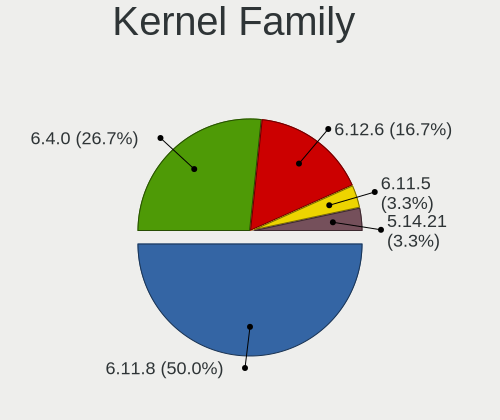
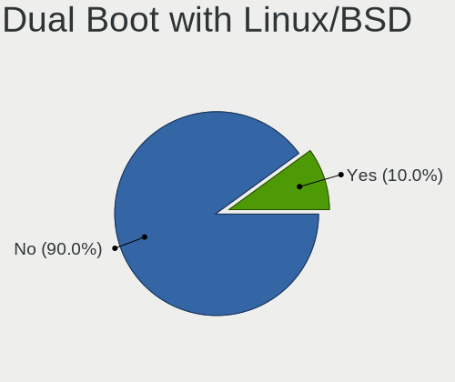
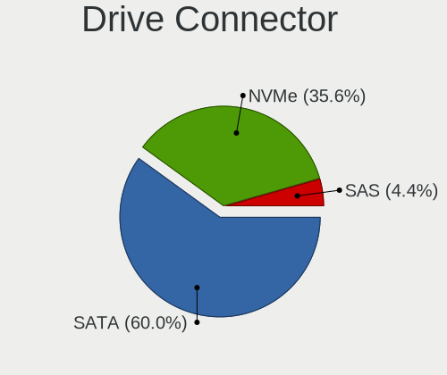
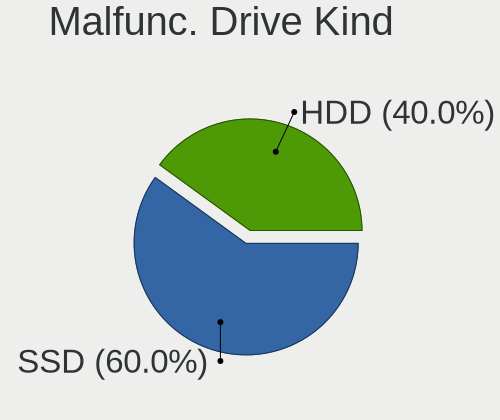
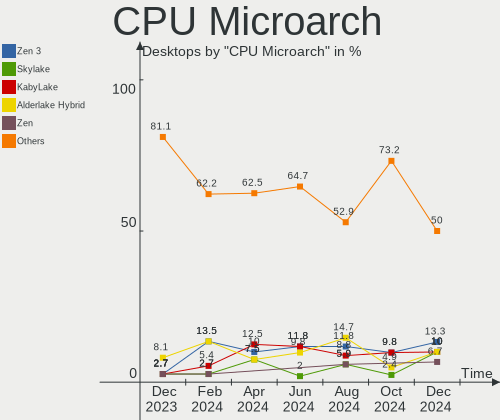
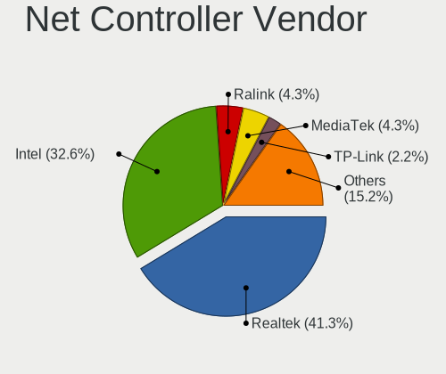
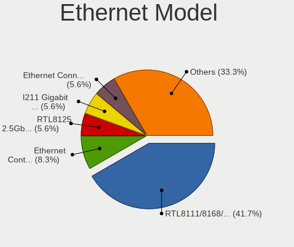
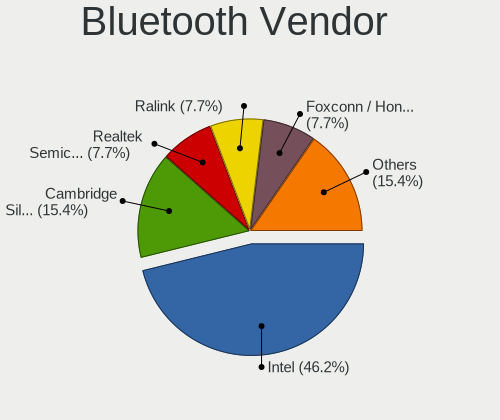

openSUSE - Hardware Trends (Desktops)
-------------------------------------

A project to identify most popular hardware characteristics and track their change
over time based on data collected by Linux users at https://Linux-Hardware.org.

Anyone can contribute to this report by the [hw-probe](https://github.com/linuxhw/hw-probe) tool:

    sudo -E hw-probe -all -upload

This report is for one last month. Overall report since the beginning of time: [TestDays](https://github.com/linuxhw/TestDays)

Period: Apr, 2023.

Contents
--------

* [ System ](#system)
  - [ OS                       ](#os)
  - [ OS Family                ](#os-family)
  - [ Kernel                   ](#kernel)
  - [ Kernel Family            ](#kernel-family)
  - [ Kernel Major Ver.        ](#kernel-major-ver)
  - [ Arch                     ](#arch)
  - [ DE                       ](#de)
  - [ Display Server           ](#display-server)
  - [ Display Manager          ](#display-manager)
  - [ OS Lang                  ](#os-lang)
  - [ Boot Mode                ](#boot-mode)
  - [ Filesystem               ](#filesystem)
  - [ Part. scheme             ](#part-scheme)
  - [ Dual Boot with Linux/BSD ](#dual-boot-with-linuxbsd)
  - [ Dual Boot (Win)          ](#dual-boot-win)

* [ Board ](#board)
  - [ Vendor                   ](#vendor)
  - [ Model                    ](#model)
  - [ Model Family             ](#model-family)
  - [ MFG Year                 ](#mfg-year)
  - [ Form Factor              ](#form-factor)
  - [ Secure Boot              ](#secure-boot)
  - [ Coreboot                 ](#coreboot)
  - [ RAM Size                 ](#ram-size)
  - [ RAM Used                 ](#ram-used)
  - [ Total Drives             ](#total-drives)
  - [ Has CD-ROM               ](#has-cd-rom)
  - [ Has Ethernet             ](#has-ethernet)
  - [ Has WiFi                 ](#has-wifi)
  - [ Has Bluetooth            ](#has-bluetooth)

* [ Location ](#location)
  - [ Country                  ](#country)
  - [ City                     ](#city)

* [ Drives ](#drives)
  - [ Drive Vendor             ](#drive-vendor)
  - [ Drive Model              ](#drive-model)
  - [ HDD Vendor               ](#hdd-vendor)
  - [ SSD Vendor               ](#ssd-vendor)
  - [ Drive Kind               ](#drive-kind)
  - [ Drive Connector          ](#drive-connector)
  - [ Drive Size               ](#drive-size)
  - [ Space Total              ](#space-total)
  - [ Space Used               ](#space-used)
  - [ Malfunc. Drives          ](#malfunc-drives)
  - [ Malfunc. Drive Vendor    ](#malfunc-drive-vendor)
  - [ Malfunc. HDD Vendor      ](#malfunc-hdd-vendor)
  - [ Malfunc. Drive Kind      ](#malfunc-drive-kind)
  - [ Failed Drives            ](#failed-drives)
  - [ Failed Drive Vendor      ](#failed-drive-vendor)
  - [ Drive Status             ](#drive-status)

* [ Storage controller ](#storage-controller)
  - [ Storage Vendor           ](#storage-vendor)
  - [ Storage Model            ](#storage-model)
  - [ Storage Kind             ](#storage-kind)

* [ Processor ](#processor)
  - [ CPU Vendor               ](#cpu-vendor)
  - [ CPU Model                ](#cpu-model)
  - [ CPU Model Family         ](#cpu-model-family)
  - [ CPU Cores                ](#cpu-cores)
  - [ CPU Sockets              ](#cpu-sockets)
  - [ CPU Threads              ](#cpu-threads)
  - [ CPU Op-Modes             ](#cpu-op-modes)
  - [ CPU Microcode            ](#cpu-microcode)
  - [ CPU Microarch            ](#cpu-microarch)

* [ Graphics ](#graphics)
  - [ GPU Vendor               ](#gpu-vendor)
  - [ GPU Model                ](#gpu-model)
  - [ GPU Combo                ](#gpu-combo)
  - [ GPU Driver               ](#gpu-driver)
  - [ GPU Memory               ](#gpu-memory)

* [ Monitor ](#monitor)
  - [ Monitor Vendor           ](#monitor-vendor)
  - [ Monitor Model            ](#monitor-model)
  - [ Monitor Resolution       ](#monitor-resolution)
  - [ Monitor Diagonal         ](#monitor-diagonal)
  - [ Monitor Width            ](#monitor-width)
  - [ Aspect Ratio             ](#aspect-ratio)
  - [ Monitor Area             ](#monitor-area)
  - [ Pixel Density            ](#pixel-density)
  - [ Multiple Monitors        ](#multiple-monitors)

* [ Network ](#network)
  - [ Net Controller Vendor    ](#net-controller-vendor)
  - [ Net Controller Model     ](#net-controller-model)
  - [ Wireless Vendor          ](#wireless-vendor)
  - [ Wireless Model           ](#wireless-model)
  - [ Ethernet Vendor          ](#ethernet-vendor)
  - [ Ethernet Model           ](#ethernet-model)
  - [ Net Controller Kind      ](#net-controller-kind)
  - [ Used Controller          ](#used-controller)
  - [ NICs                     ](#nics)
  - [ IPv6                     ](#ipv6)

* [ Bluetooth ](#bluetooth)
  - [ Bluetooth Vendor         ](#bluetooth-vendor)
  - [ Bluetooth Model          ](#bluetooth-model)

* [ Sound ](#sound)
  - [ Sound Vendor             ](#sound-vendor)
  - [ Sound Model              ](#sound-model)

* [ Memory ](#memory)
  - [ Memory Vendor            ](#memory-vendor)
  - [ Memory Model             ](#memory-model)
  - [ Memory Kind              ](#memory-kind)
  - [ Memory Form Factor       ](#memory-form-factor)
  - [ Memory Size              ](#memory-size)
  - [ Memory Speed             ](#memory-speed)

* [ Printers & scanners ](#printers--scanners)
  - [ Printer Vendor           ](#printer-vendor)
  - [ Printer Model            ](#printer-model)
  - [ Scanner Vendor           ](#scanner-vendor)
  - [ Scanner Model            ](#scanner-model)

* [ Camera ](#camera)
  - [ Camera Vendor            ](#camera-vendor)
  - [ Camera Model             ](#camera-model)

* [ Security ](#security)
  - [ Fingerprint Vendor       ](#fingerprint-vendor)
  - [ Fingerprint Model        ](#fingerprint-model)
  - [ Chipcard Vendor          ](#chipcard-vendor)
  - [ Chipcard Model           ](#chipcard-model)

* [ Unsupported ](#unsupported)
  - [ Unsupported Devices      ](#unsupported-devices)
  - [ Unsupported Device Types ](#unsupported-device-types)

System
------

OS
--

Installed operating systems

| Name                         | Desktops | Percent |
|------------------------------|----------|---------|
| openSUSE Tumbleweed-XXXXXXXX | 17       | 68%     |
| openSUSE Leap-15.4           | 6        | 24%     |
| openSUSE Microos-XXXXXXXX    | 1        | 4%      |
| openSUSE Leap-15.5           | 1        | 4%      |

OS Family
---------

OS without a version

| Name     | Desktops | Percent |
|----------|----------|---------|
| openSUSE | 25       | 100%    |

Kernel
------

Version of the Linux kernel

| Version                      | Desktops | Percent |
|------------------------------|----------|---------|
| 6.2.9-1-default              | 6        | 24%     |
| 5.14.21-150400.24.55-default | 5        | 20%     |
| 6.2.8-1-default              | 3        | 12%     |
| 6.2.12-1-default             | 3        | 12%     |
| 6.2.10-1-default             | 3        | 12%     |
| 6.2.6-1-default              | 2        | 8%      |
| 6.2.9-1-vanilla              | 1        | 4%      |
| 5.14.21-150400.24.60-default | 1        | 4%      |
| 5.14.21-150400.24.46-default | 1        | 4%      |

Kernel Family
-------------

Linux kernel without a distro release

| Version | Desktops | Percent |
|---------|----------|---------|
| 6.2.9   | 7        | 28%     |
| 5.14.21 | 7        | 28%     |
| 6.2.8   | 3        | 12%     |
| 6.2.12  | 3        | 12%     |
| 6.2.10  | 3        | 12%     |
| 6.2.6   | 2        | 8%      |

Kernel Major Ver.
-----------------

Linux kernel major version

| Version | Desktops | Percent |
|---------|----------|---------|
| 6.2     | 18       | 72%     |
| 5.14    | 7        | 28%     |

Arch
----

OS architecture (x86_64, i586, etc.)

| Name   | Desktops | Percent |
|--------|----------|---------|
| x86_64 | 25       | 100%    |

DE
--

Desktop Environment

| Name  | Desktops | Percent |
|-------|----------|---------|
| KDE5  | 19       | 76%     |
| GNOME | 4        | 16%     |
| XFCE  | 1        | 4%      |
| LXDE  | 1        | 4%      |

Display Server
--------------

X11 or Wayland

| Name    | Desktops | Percent |
|---------|----------|---------|
| X11     | 22       | 88%     |
| Wayland | 3        | 12%     |

Display Manager
---------------

SDDM, LightDM, etc.

| Name    | Desktops | Percent |
|---------|----------|---------|
| Unknown | 15       | 60%     |
| SDDM    | 5        | 20%     |
| LightDM | 4        | 16%     |
| XDM     | 1        | 4%      |

OS Lang
-------

Language

| Lang  | Desktops | Percent |
|-------|----------|---------|
| en_US | 9        | 36%     |
| POSIX | 3        | 12%     |
| de_DE | 3        | 12%     |
| pt_BR | 2        | 8%      |
| es_ES | 2        | 8%      |
| en_GB | 2        | 8%      |
| nn_NO | 1        | 4%      |
| es_DO | 1        | 4%      |
| en_BW | 1        | 4%      |
| de_CH | 1        | 4%      |

Boot Mode
---------

EFI or BIOS

| Mode | Desktops | Percent |
|------|----------|---------|
| EFI  | 16       | 64%     |
| BIOS | 9        | 36%     |

Filesystem
----------

Type of filesystem

| Type  | Desktops | Percent |
|-------|----------|---------|
| Btrfs | 18       | 72%     |
| Ext4  | 6        | 24%     |
| Ext2  | 1        | 4%      |

Part. scheme
------------

Scheme of partitioning

| Type    | Desktops | Percent |
|---------|----------|---------|
| Unknown | 15       | 60%     |
| GPT     | 7        | 28%     |
| MBR     | 3        | 12%     |

Dual Boot with Linux/BSD
------------------------

Hosting more than one Linux/BSD

| Dual boot | Desktops | Percent |
|-----------|----------|---------|
| No        | 21       | 84%     |
| Yes       | 4        | 16%     |

Dual Boot (Win)
---------------

Hosting Linux and Windows

| Dual boot | Desktops | Percent |
|-----------|----------|---------|
| No        | 21       | 84%     |
| Yes       | 4        | 16%     |

Board
-----

Vendor
------

Motherboard manufacturer

| Name                | Desktops | Percent |
|---------------------|----------|---------|
| ASUSTek Computer    | 7        | 28%     |
| MSI                 | 5        | 20%     |
| Gigabyte Technology | 5        | 20%     |
| ASRock              | 4        | 16%     |
| Hewlett-Packard     | 2        | 8%      |
| Lenovo              | 1        | 4%      |
| Apple               | 1        | 4%      |

Model
-----

Motherboard model

| Name                                   | Desktops | Percent |
|----------------------------------------|----------|---------|
| MSI MS-7673                            | 2        | 8%      |
| MSI MS-7D91                            | 1        | 4%      |
| MSI MS-7C37                            | 1        | 4%      |
| MSI MS-7B10                            | 1        | 4%      |
| Lenovo IdeaCentre 720-18APR 90HY000FIX | 1        | 4%      |
| HP EliteDesk 800 G1 SFF                | 1        | 4%      |
| HP 595-P0569NG                         | 1        | 4%      |
| Gigabyte Z97-HD3                       | 1        | 4%      |
| Gigabyte Z390 UD                       | 1        | 4%      |
| Gigabyte X99-UD3-CF                    | 1        | 4%      |
| Gigabyte X570 GAMING X                 | 1        | 4%      |
| Gigabyte H55M-S2H                      | 1        | 4%      |
| ASUS PRIME Z270-P                      | 1        | 4%      |
| ASUS PRIME B550M-K                     | 1        | 4%      |
| ASUS PRIME B450M-A II                  | 1        | 4%      |
| ASUS P8Z77-V LX                        | 1        | 4%      |
| ASUS M5A99X EVO R2.0                   | 1        | 4%      |
| ASUS All Series                        | 1        | 4%      |
| ASUS A55BM-PLUS                        | 1        | 4%      |
| ASRock X670E Pro RS                    | 1        | 4%      |
| ASRock H410M-HVS                       | 1        | 4%      |
| ASRock B550M-ITX/ac                    | 1        | 4%      |
| ASRock B450 Gaming K4                  | 1        | 4%      |
| Apple MacPro5,1                        | 1        | 4%      |

Model Family
------------

Motherboard model prefix

| Name                | Desktops | Percent |
|---------------------|----------|---------|
| ASUS PRIME          | 3        | 12%     |
| MSI MS-7673         | 2        | 8%      |
| MSI MS-7D91         | 1        | 4%      |
| MSI MS-7C37         | 1        | 4%      |
| MSI MS-7B10         | 1        | 4%      |
| Lenovo IdeaCentre   | 1        | 4%      |
| HP EliteDesk        | 1        | 4%      |
| HP 595-P0569NG      | 1        | 4%      |
| Gigabyte Z97-HD3    | 1        | 4%      |
| Gigabyte Z390       | 1        | 4%      |
| Gigabyte X99-UD3-CF | 1        | 4%      |
| Gigabyte X570       | 1        | 4%      |
| Gigabyte H55M-S2H   | 1        | 4%      |
| ASUS P8Z77-V        | 1        | 4%      |
| ASUS M5A99X         | 1        | 4%      |
| ASUS All            | 1        | 4%      |
| ASUS A55BM-PLUS     | 1        | 4%      |
| ASRock X670E        | 1        | 4%      |
| ASRock H410M-HVS    | 1        | 4%      |
| ASRock B550M-ITX    | 1        | 4%      |
| ASRock B450         | 1        | 4%      |
| Apple MacPro5       | 1        | 4%      |

MFG Year
--------

Motherboard manufacture year

| Year | Desktops | Percent |
|------|----------|---------|
| 2020 | 5        | 20%     |
| 2022 | 3        | 12%     |
| 2018 | 3        | 12%     |
| 2019 | 2        | 8%      |
| 2014 | 2        | 8%      |
| 2013 | 2        | 8%      |
| 2012 | 2        | 8%      |
| 2011 | 2        | 8%      |
| 2010 | 2        | 8%      |
| 2016 | 1        | 4%      |
| 2015 | 1        | 4%      |

Form Factor
-----------

Physical design of the computer

| Name    | Desktops | Percent |
|---------|----------|---------|
| Desktop | 25       | 100%    |

Secure Boot
-----------

Enabled or disabled

| State    | Desktops | Percent |
|----------|----------|---------|
| Disabled | 25       | 100%    |

Coreboot
--------

Have coreboot on board

| Used | Desktops | Percent |
|------|----------|---------|
| No   | 25       | 100%    |

RAM Size
--------

Total RAM memory

| Size in GB  | Desktops | Percent |
|-------------|----------|---------|
| 16.01-24.0  | 7        | 28%     |
| 8.01-16.0   | 7        | 28%     |
| 32.01-64.0  | 5        | 20%     |
| 24.01-32.0  | 2        | 8%      |
| 64.01-256.0 | 2        | 8%      |
| 4.01-8.0    | 1        | 4%      |
| 3.01-4.0    | 1        | 4%      |

RAM Used
--------

Used RAM memory

| Used GB    | Desktops | Percent |
|------------|----------|---------|
| 2.01-3.0   | 8        | 32%     |
| 4.01-8.0   | 6        | 24%     |
| 3.01-4.0   | 4        | 16%     |
| 1.01-2.0   | 4        | 16%     |
| 8.01-16.0  | 2        | 8%      |
| 16.01-24.0 | 1        | 4%      |

Total Drives
------------

Number of drives on board

| Drives | Desktops | Percent |
|--------|----------|---------|
| 4      | 6        | 24%     |
| 2      | 5        | 20%     |
| 1      | 5        | 20%     |
| 5      | 3        | 12%     |
| 3      | 3        | 12%     |
| 9      | 1        | 4%      |
| 7      | 1        | 4%      |
| 6      | 1        | 4%      |

Has CD-ROM
----------

Has CD-ROM on board

| Presented | Desktops | Percent |
|-----------|----------|---------|
| Yes       | 15       | 60%     |
| No        | 10       | 40%     |

Has Ethernet
------------

Has Ethernet on board

| Presented | Desktops | Percent |
|-----------|----------|---------|
| Yes       | 24       | 96%     |
| No        | 1        | 4%      |

Has WiFi
--------

Has WiFi module

| Presented | Desktops | Percent |
|-----------|----------|---------|
| Yes       | 13       | 52%     |
| No        | 12       | 48%     |

Has Bluetooth
-------------

Has Bluetooth module

| Presented | Desktops | Percent |
|-----------|----------|---------|
| No        | 14       | 56%     |
| Yes       | 11       | 44%     |

Location
--------

Country
-------

Geographic location (country)

| Country      | Desktops | Percent |
|--------------|----------|---------|
| Switzerland  | 4        | 16%     |
| USA          | 3        | 12%     |
| Germany      | 3        | 12%     |
| Italy        | 2        | 8%      |
| Brazil       | 2        | 8%      |
| Australia    | 2        | 8%      |
| Argentina    | 2        | 8%      |
| UK           | 1        | 4%      |
| Spain        | 1        | 4%      |
| South Africa | 1        | 4%      |
| Romania      | 1        | 4%      |
| Norway       | 1        | 4%      |
| Finland      | 1        | 4%      |
| Canada       | 1        | 4%      |

City
----

Geographic location (city)

| City           | Desktops | Percent |
|----------------|----------|---------|
| Zurich         | 1        | 4%      |
| Wakefield      | 1        | 4%      |
| Unterentfelden | 1        | 4%      |
| Sydney         | 1        | 4%      |
| Sarnia         | 1        | 4%      |
| Pouso Alegre   | 1        | 4%      |
| Perth          | 1        | 4%      |
| Pascani        | 1        | 4%      |
| Palatine       | 1        | 4%      |
| Ourinhos       | 1        | 4%      |
| Milan          | 1        | 4%      |
| Marbella       | 1        | 4%      |
| Landau         | 1        | 4%      |
| Johannesburg   | 1        | 4%      |
| Jegenstorf     | 1        | 4%      |
| Helsinki       | 1        | 4%      |
| Heilbronn      | 1        | 4%      |
| Funes          | 1        | 4%      |
| Exmouth        | 1        | 4%      |
| Condove        | 1        | 4%      |
| Buenos Aires   | 1        | 4%      |
| Bueckeburg     | 1        | 4%      |
| Bern           | 1        | 4%      |
| Bergen         | 1        | 4%      |
| Ashland        | 1        | 4%      |

Drives
------

Drive Vendor
------------

Hard drive vendors

| Vendor                      | Desktops | Drives | Percent |
|-----------------------------|----------|--------|---------|
| WDC                         | 9        | 18     | 15.79%  |
| Seagate                     | 9        | 14     | 15.79%  |
| Samsung Electronics         | 9        | 17     | 15.79%  |
| Crucial                     | 6        | 9      | 10.53%  |
| Kingston                    | 5        | 5      | 8.77%   |
| Sandisk                     | 3        | 6      | 5.26%   |
| Toshiba                     | 2        | 2      | 3.51%   |
| Intel                       | 2        | 2      | 3.51%   |
| XrayDisk                    | 1        | 1      | 1.75%   |
| SPCC                        | 1        | 1      | 1.75%   |
| SK hynix                    | 1        | 1      | 1.75%   |
| Silicon Motion              | 1        | 1      | 1.75%   |
| PNY                         | 1        | 1      | 1.75%   |
| Phison Electronics          | 1        | 1      | 1.75%   |
| Phison                      | 1        | 1      | 1.75%   |
| MAXIO Technology (Hangzhou) | 1        | 1      | 1.75%   |
| MATSHITA                    | 1        | 1      | 1.75%   |
| Hitachi                     | 1        | 1      | 1.75%   |
| AZAMOV                      | 1        | 1      | 1.75%   |
| AMD                         | 1        | 1      | 1.75%   |

Drive Model
-----------

Hard drive models

| Model                                                  | Desktops | Percent |
|--------------------------------------------------------|----------|---------|
| Samsung SSD 860 EVO 1TB                                | 3        | 3.95%   |
| WDC WD40EFRX-68WT0N0 4TB                               | 2        | 2.63%   |
| Seagate ST2000DM008-2FR102 2TB                         | 2        | 2.63%   |
| Samsung SSD 860 EVO 500GB                              | 2        | 2.63%   |
| Samsung SSD 840 EVO 250GB                              | 2        | 2.63%   |
| Samsung NVMe SSD Controller SM981/PM981/PM983 1TB      | 2        | 2.63%   |
| Samsung HD204UI 2TB                                    | 2        | 2.63%   |
| XrayDisk 1TB SSD                                       | 1        | 1.32%   |
| WDC WDS250G1B0A-00H9H0 250GB SSD                       | 1        | 1.32%   |
| WDC WD40EFRX-68N32N0 4TB                               | 1        | 1.32%   |
| WDC WD30EZRX-00SPEB0 3TB                               | 1        | 1.32%   |
| WDC WD20SPZX-22UA7T0 2TB                               | 1        | 1.32%   |
| WDC WD20EZAZ-00GGJB0 2TB                               | 1        | 1.32%   |
| WDC WD20EFRX-68AX9N0 2TB                               | 1        | 1.32%   |
| WDC WD20EARS-00MVWB0 2TB                               | 1        | 1.32%   |
| WDC WD120EDAZ-11F3RA0 12TB                             | 1        | 1.32%   |
| WDC WD10PURZ-85U8XY0 1TB                               | 1        | 1.32%   |
| WDC WD10EZEX-75M2NA0 1TB                               | 1        | 1.32%   |
| WDC WD10EZEX-08M2NA0 1TB                               | 1        | 1.32%   |
| WDC WD10EZEX-00BN5A0 1TB                               | 1        | 1.32%   |
| WDC WD10EARX-00N0YB0 1TB                               | 1        | 1.32%   |
| WDC WD1003FBYX-01Y7B1 1TB                              | 1        | 1.32%   |
| Toshiba MQ04ABF100 1TB                                 | 1        | 1.32%   |
| Toshiba DT01ACA200 2TB                                 | 1        | 1.32%   |
| SPCC Solid State Disk 1024GB                           | 1        | 1.32%   |
| SK hynix BC501 NVMe Solid State Drive 512GB            | 1        | 1.32%   |
| Silicon Motion SM2263EN/SM2263XT SSD Controller 1024GB | 1        | 1.32%   |
| Seagate ST9500325AS 500GB                              | 1        | 1.32%   |
| Seagate ST4000DM000-1F2168 4TB                         | 1        | 1.32%   |
| Seagate ST31000528AS 1TB                               | 1        | 1.32%   |
| Seagate ST2000DM005-2CW102 2TB                         | 1        | 1.32%   |
| Seagate ST2000DM001-1ER164 2TB                         | 1        | 1.32%   |
| Seagate ST1000NM0033-9ZM173 1TB                        | 1        | 1.32%   |
| Seagate ST1000DM010-2EP102 1TB                         | 1        | 1.32%   |
| Seagate ST1000DM003-1SB102 1TB                         | 1        | 1.32%   |
| Seagate FireCuda 530 ZP500GM30013 500GB                | 1        | 1.32%   |
| Seagate FireCuda 530 ZP2000GM30013 2TB                 | 1        | 1.32%   |
| Seagate Expansion 4TB                                  | 1        | 1.32%   |
| Sandisk WD_BLACK SN750 SE 1TB                          | 1        | 1.32%   |
| Sandisk WD Black 2018/SN750 / PC SN720 NVMe SSD 500GB  | 1        | 1.32%   |

HDD Vendor
----------

Hard disk drive vendors

| Vendor              | Desktops | Drives | Percent |
|---------------------|----------|--------|---------|
| WDC                 | 8        | 17     | 38.1%   |
| Seagate             | 8        | 11     | 38.1%   |
| Toshiba             | 2        | 2      | 9.52%   |
| Samsung Electronics | 2        | 2      | 9.52%   |
| Hitachi             | 1        | 1      | 4.76%   |

SSD Vendor
----------

Solid state drive vendors

| Vendor              | Desktops | Drives | Percent |
|---------------------|----------|--------|---------|
| Samsung Electronics | 6        | 11     | 28.57%  |
| Crucial             | 6        | 9      | 28.57%  |
| Kingston            | 3        | 3      | 14.29%  |
| XrayDisk            | 1        | 1      | 4.76%   |
| WDC                 | 1        | 1      | 4.76%   |
| SPCC                | 1        | 1      | 4.76%   |
| SanDisk             | 1        | 3      | 4.76%   |
| PNY                 | 1        | 1      | 4.76%   |
| Intel               | 1        | 1      | 4.76%   |

Drive Kind
----------

HDD or SSD

| Kind    | Desktops | Drives | Percent |
|---------|----------|--------|---------|
| SSD     | 16       | 31     | 36.36%  |
| HDD     | 15       | 33     | 34.09%  |
| NVMe    | 11       | 19     | 25%     |
| Unknown | 2        | 2      | 4.55%   |

Drive Connector
---------------

SATA, SAS, NVMe, etc.

| Type | Desktops | Drives | Percent |
|------|----------|--------|---------|
| SATA | 23       | 64     | 63.89%  |
| NVMe | 11       | 19     | 30.56%  |
| SAS  | 2        | 2      | 5.56%   |

Drive Size
----------

Size of hard drive

| Size in TB | Desktops | Drives | Percent |
|------------|----------|--------|---------|
| 0.01-0.5   | 15       | 21     | 34.09%  |
| 0.51-1.0   | 13       | 22     | 29.55%  |
| 1.01-2.0   | 10       | 14     | 22.73%  |
| 3.01-4.0   | 4        | 5      | 9.09%   |
| 2.01-3.0   | 1        | 1      | 2.27%   |
| 10.01-20.0 | 1        | 1      | 2.27%   |

Space Total
-----------

Amount of disk space available on the file system

| Size in GB     | Desktops | Percent |
|----------------|----------|---------|
| More than 3000 | 11       | 44%     |
| 1001-2000      | 5        | 20%     |
| 501-1000       | 4        | 16%     |
| 2001-3000      | 3        | 12%     |
| 251-500        | 2        | 8%      |

Space Used
----------

Amount of used disk space

| Used GB        | Desktops | Percent |
|----------------|----------|---------|
| More than 3000 | 5        | 20%     |
| 51-100         | 5        | 20%     |
| 101-250        | 4        | 16%     |
| 501-1000       | 4        | 16%     |
| 2001-3000      | 2        | 8%      |
| 1001-2000      | 2        | 8%      |
| 251-500        | 1        | 4%      |
| 21-50          | 1        | 4%      |
| 1-20           | 1        | 4%      |

Malfunc. Drives
---------------

Drive models with a malfunction

| Model                                 | Desktops | Drives | Percent |
|---------------------------------------|----------|--------|---------|
| Seagate ST1000DM003-1SB102 1TB        | 1        | 1      | 33.33%  |
| Samsung Electronics SSD 850 PRO 256GB | 1        | 1      | 33.33%  |
| Intel SSD 600P Series 256GB           | 1        | 1      | 33.33%  |

Malfunc. Drive Vendor
---------------------

Vendors of faulty drives

| Vendor              | Desktops | Drives | Percent |
|---------------------|----------|--------|---------|
| Seagate             | 1        | 1      | 33.33%  |
| Samsung Electronics | 1        | 1      | 33.33%  |
| Intel               | 1        | 1      | 33.33%  |

Malfunc. HDD Vendor
-------------------

Vendors of faulty HDD drives

| Vendor  | Desktops | Drives | Percent |
|---------|----------|--------|---------|
| Seagate | 1        | 1      | 100%    |

Malfunc. Drive Kind
-------------------

Kinds of faulty drives

| Kind | Desktops | Drives | Percent |
|------|----------|--------|---------|
| NVMe | 1        | 1      | 33.33%  |
| SSD  | 1        | 1      | 33.33%  |
| HDD  | 1        | 1      | 33.33%  |

Failed Drives
-------------

Failed drive models

Zero info for selected period =(

Failed Drive Vendor
-------------------

Failed drive vendors

Zero info for selected period =(

Drive Status
------------

Number of failed and malfunc. drives

| Status   | Desktops | Drives | Percent |
|----------|----------|--------|---------|
| Detected | 17       | 51     | 56.67%  |
| Works    | 10       | 31     | 33.33%  |
| Malfunc  | 3        | 3      | 10%     |

Storage controller
------------------

Storage Vendor
--------------

Storage controller vendors

| Vendor                      | Desktops | Percent |
|-----------------------------|----------|---------|
| Intel                       | 15       | 30.61%  |
| AMD                         | 11       | 22.45%  |
| Samsung Electronics         | 4        | 8.16%   |
| ASMedia Technology          | 4        | 8.16%   |
| SanDisk                     | 2        | 4.08%   |
| Phison Electronics          | 2        | 4.08%   |
| Marvell Technology Group    | 2        | 4.08%   |
| Kingston Technology Company | 2        | 4.08%   |
| JMicron Technology          | 2        | 4.08%   |
| SK hynix                    | 1        | 2.04%   |
| Silicon Motion              | 1        | 2.04%   |
| Silicon Image               | 1        | 2.04%   |
| Seagate Technology          | 1        | 2.04%   |
| MAXIO Technology (Hangzhou) | 1        | 2.04%   |

Storage Model
-------------

Storage controller models

| Model                                                                                   | Desktops | Percent |
|-----------------------------------------------------------------------------------------|----------|---------|
| AMD FCH SATA Controller [AHCI mode]                                                     | 7        | 12.28%  |
| ASMedia ASM1062 Serial ATA Controller                                                   | 4        | 7.02%   |
| AMD 400 Series Chipset SATA Controller                                                  | 3        | 5.26%   |
| SanDisk WD Black 2018/SN750 / PC SN720 NVMe SSD                                         | 2        | 3.51%   |
| Samsung NVMe SSD Controller SM981/PM981/PM983                                           | 2        | 3.51%   |
| Phison E12 NVMe Controller                                                              | 2        | 3.51%   |
| Kingston Company Company Non-Volatile memory controller                                 | 2        | 3.51%   |
| Intel Cannon Lake PCH SATA AHCI Controller                                              | 2        | 3.51%   |
| Intel 8 Series/C220 Series Chipset Family 6-port SATA Controller 1 [AHCI mode]          | 2        | 3.51%   |
| AMD 500 Series Chipset SATA Controller                                                  | 2        | 3.51%   |
| SK hynix BC501 NVMe Solid State Drive                                                   | 1        | 1.75%   |
| Silicon Motion SM2263EN/SM2263XT SSD Controller                                         | 1        | 1.75%   |
| Silicon Image SiI 3132 Serial ATA Raid II Controller                                    | 1        | 1.75%   |
| Seagate FireCuda 530 SSD                                                                | 1        | 1.75%   |
| SanDisk Non-Volatile memory controller                                                  | 1        | 1.75%   |
| Samsung NVMe SSD Controller SM961/PM961/SM963                                           | 1        | 1.75%   |
| Samsung NVMe SSD Controller PM9A1/PM9A3/980PRO                                          | 1        | 1.75%   |
| MAXIO (Hangzhou) NVMe SSD Controller MAP1202                                            | 1        | 1.75%   |
| Marvell Group 88SE9125 PCIe SATA 6.0 Gb/s controller                                    | 1        | 1.75%   |
| Marvell Group 88SE9123 PCIe SATA 6.0 Gb/s controller                                    | 1        | 1.75%   |
| JMicron JMB58x AHCI SATA controller                                                     | 1        | 1.75%   |
| JMicron JMB368 IDE controller                                                           | 1        | 1.75%   |
| Intel SSD 600P Series                                                                   | 1        | 1.75%   |
| Intel SATA Controller [RAID mode]                                                       | 1        | 1.75%   |
| Intel C610/X99 series chipset sSATA Controller [AHCI mode]                              | 1        | 1.75%   |
| Intel C610/X99 series chipset 6-Port SATA Controller [AHCI mode]                        | 1        | 1.75%   |
| Intel 9 Series Chipset Family SATA Controller [AHCI Mode]                               | 1        | 1.75%   |
| Intel 82801JI (ICH10 Family) SATA AHCI Controller                                       | 1        | 1.75%   |
| Intel 700 Series Chipset Family SATA AHCI Controller                                    | 1        | 1.75%   |
| Intel 7 Series/C210 Series Chipset Family 6-port SATA Controller [AHCI mode]            | 1        | 1.75%   |
| Intel 6 Series/C200 Series Chipset Family Desktop SATA Controller (IDE mode, ports 4-5) | 1        | 1.75%   |
| Intel 6 Series/C200 Series Chipset Family Desktop SATA Controller (IDE mode, ports 0-3) | 1        | 1.75%   |
| Intel 6 Series/C200 Series Chipset Family 6 port Desktop SATA AHCI Controller           | 1        | 1.75%   |
| Intel 5 Series/3400 Series Chipset 4 port SATA IDE Controller                           | 1        | 1.75%   |
| Intel 5 Series/3400 Series Chipset 2 port SATA IDE Controller                           | 1        | 1.75%   |
| Intel 400 Series Chipset Family SATA AHCI Controller                                    | 1        | 1.75%   |
| AMD SB7x0/SB8x0/SB9x0 SATA Controller [AHCI mode]                                       | 1        | 1.75%   |
| AMD FCH SATA Controller [RAID Bottom]                                                   | 1        | 1.75%   |
| AMD 300 Series Chipset SATA Controller                                                  | 1        | 1.75%   |

Storage Kind
------------

Kind of storage controller (IDE, SATA, NVMe, SAS, ...)

| Kind | Desktops | Percent |
|------|----------|---------|
| SATA | 23       | 60.53%  |
| NVMe | 11       | 28.95%  |
| RAID | 2        | 5.26%   |
| IDE  | 2        | 5.26%   |

Processor
---------

CPU Vendor
----------

Processor vendors

| Vendor | Desktops | Percent |
|--------|----------|---------|
| Intel  | 14       | 56%     |
| AMD    | 11       | 44%     |

CPU Model
---------

Processor models

| Model                                           | Desktops | Percent |
|-------------------------------------------------|----------|---------|
| Intel Core i5-2500 CPU @ 3.30GHz                | 2        | 8%      |
| AMD Ryzen 5 2600 Six-Core Processor             | 2        | 8%      |
| AMD Ryzen 3 2200G with Radeon Vega Graphics     | 2        | 8%      |
| Intel Xeon CPU W3530 @ 2.80GHz                  | 1        | 4%      |
| Intel Pentium CPU G3250 @ 3.20GHz               | 1        | 4%      |
| Intel Core i9-9900K CPU @ 3.60GHz               | 1        | 4%      |
| Intel Core i7-9700K CPU @ 3.60GHz               | 1        | 4%      |
| Intel Core i7-7700K CPU @ 4.20GHz               | 1        | 4%      |
| Intel Core i7-5820K CPU @ 3.30GHz               | 1        | 4%      |
| Intel Core i7-3770K CPU @ 3.50GHz               | 1        | 4%      |
| Intel Core i7-10700 CPU @ 2.90GHz               | 1        | 4%      |
| Intel Core i5-4570 CPU @ 3.20GHz                | 1        | 4%      |
| Intel Core i5-4440 CPU @ 3.10GHz                | 1        | 4%      |
| Intel Core i3 CPU 540 @ 3.07GHz                 | 1        | 4%      |
| Intel 13th Gen Core i9-13900KS                  | 1        | 4%      |
| AMD Ryzen 7 7700 8-Core Processor               | 1        | 4%      |
| AMD Ryzen 7 5800X3D 8-Core Processor            | 1        | 4%      |
| AMD Ryzen 7 5700G with Radeon Graphics          | 1        | 4%      |
| AMD Ryzen 5 5600G with Radeon Graphics          | 1        | 4%      |
| AMD Ryzen 5 3600 6-Core Processor               | 1        | 4%      |
| AMD FX-8370 Eight-Core Processor                | 1        | 4%      |
| AMD A10-7860K Radeon R7, 12 Compute Cores 4C+8G | 1        | 4%      |

CPU Model Family
----------------

Processor model prefix

| Model         | Desktops | Percent |
|---------------|----------|---------|
| Intel Core i7 | 5        | 20%     |
| Intel Core i5 | 4        | 16%     |
| AMD Ryzen 5   | 4        | 16%     |
| AMD Ryzen 7   | 3        | 12%     |
| AMD Ryzen 3   | 2        | 8%      |
| Other         | 1        | 4%      |
| Intel Xeon    | 1        | 4%      |
| Intel Pentium | 1        | 4%      |
| Intel Core i9 | 1        | 4%      |
| Intel Core i3 | 1        | 4%      |
| AMD FX        | 1        | 4%      |
| AMD A10       | 1        | 4%      |

CPU Cores
---------

Number of processor cores

| Number | Desktops | Percent |
|--------|----------|---------|
| 4      | 10       | 40%     |
| 8      | 6        | 24%     |
| 6      | 5        | 20%     |
| 2      | 3        | 12%     |
| 24     | 1        | 4%      |

CPU Sockets
-----------

Number of sockets

| Number | Desktops | Percent |
|--------|----------|---------|
| 1      | 25       | 100%    |

CPU Threads
-----------

Threads per core (Hyper-Threading)

| Number | Desktops | Percent |
|--------|----------|---------|
| 2      | 17       | 68%     |
| 1      | 8        | 32%     |

CPU Op-Modes
------------

CPU Operation Modes (32-bit, 64-bit)

| Op mode        | Desktops | Percent |
|----------------|----------|---------|
| 32-bit, 64-bit | 25       | 100%    |

CPU Microcode
-------------

Microcode number

| Number     | Desktops | Percent |
|------------|----------|---------|
| Unknown    | 14       | 56%     |
| 0x0a50000d | 2        | 8%      |
| 0x08101016 | 2        | 8%      |
| 0x0800820d | 2        | 8%      |
| 0x206a7    | 1        | 4%      |
| 0x0a601201 | 1        | 4%      |
| 0x0a20120a | 1        | 4%      |
| 0x08701021 | 1        | 4%      |
| 0x06003106 | 1        | 4%      |

CPU Microarch
-------------

Microarchitecture

| Name             | Desktops | Percent |
|------------------|----------|---------|
| Haswell          | 4        | 16%     |
| Zen 3            | 3        | 12%     |
| KabyLake         | 3        | 12%     |
| Zen+             | 2        | 8%      |
| Zen              | 2        | 8%      |
| SandyBridge      | 2        | 8%      |
| Zen 2            | 1        | 4%      |
| Westmere         | 1        | 4%      |
| Steamroller      | 1        | 4%      |
| Piledriver       | 1        | 4%      |
| Nehalem          | 1        | 4%      |
| IvyBridge        | 1        | 4%      |
| CometLake        | 1        | 4%      |
| Alderlake Hybrid | 1        | 4%      |
| Unknown          | 1        | 4%      |

Graphics
--------

GPU Vendor
----------

Vendors of graphics cards

| Vendor | Desktops | Percent |
|--------|----------|---------|
| Nvidia | 16       | 50%     |
| AMD    | 10       | 31.25%  |
| Intel  | 6        | 18.75%  |

GPU Model
---------

Graphics card models

| Model                                                                       | Desktops | Percent |
|-----------------------------------------------------------------------------|----------|---------|
| Intel Xeon E3-1200 v3/4th Gen Core Processor Integrated Graphics Controller | 3        | 9.09%   |
| AMD Ellesmere [Radeon RX 470/480/570/570X/580/580X/590]                     | 3        | 9.09%   |
| Nvidia TU106 [GeForce RTX 2070]                                             | 2        | 6.06%   |
| AMD Cezanne [Radeon Vega Series / Radeon Vega Mobile Series]                | 2        | 6.06%   |
| Nvidia TU106 [GeForce RTX 2060 Rev. A]                                      | 1        | 3.03%   |
| Nvidia GT216 [GeForce GT 220]                                               | 1        | 3.03%   |
| Nvidia GP108 [GeForce GT 1030]                                              | 1        | 3.03%   |
| Nvidia GP107 [GeForce GTX 1050 Ti]                                          | 1        | 3.03%   |
| Nvidia GP106 [GeForce GTX 1060 6GB]                                         | 1        | 3.03%   |
| Nvidia GP106 [GeForce GTX 1060 3GB]                                         | 1        | 3.03%   |
| Nvidia GP104 [GeForce GTX 1080]                                             | 1        | 3.03%   |
| Nvidia GP104 [GeForce GTX 1070]                                             | 1        | 3.03%   |
| Nvidia GM206 [GeForce GTX 960]                                              | 1        | 3.03%   |
| Nvidia GM204 [GeForce GTX 970]                                              | 1        | 3.03%   |
| Nvidia GK208B [GeForce GT 730]                                              | 1        | 3.03%   |
| Nvidia GK104GL [Quadro K5000]                                               | 1        | 3.03%   |
| Nvidia GF108 [GeForce GT 430]                                               | 1        | 3.03%   |
| Nvidia G98 [GeForce 8400 GS Rev. 2]                                         | 1        | 3.03%   |
| Nvidia AD102 [GeForce RTX 4090]                                             | 1        | 3.03%   |
| Intel Raptor Lake-S GT1 [UHD Graphics 770]                                  | 1        | 3.03%   |
| Intel IvyBridge GT2 [HD Graphics 4000]                                      | 1        | 3.03%   |
| Intel CometLake-S GT2 [UHD Graphics 630]                                    | 1        | 3.03%   |
| AMD Raven Ridge [Radeon Vega Series / Radeon Vega Mobile Series]            | 1        | 3.03%   |
| AMD Raphael                                                                 | 1        | 3.03%   |
| AMD Navi 21 [Radeon RX 6800/6800 XT / 6900 XT]                              | 1        | 3.03%   |
| AMD Lexa PRO [Radeon 540/540X/550/550X / RX 540X/550/550X]                  | 1        | 3.03%   |
| AMD Kaveri [Radeon R7 Graphics]                                             | 1        | 3.03%   |

GPU Combo
---------

Combinations of graphics cards

| Name           | Desktops | Percent |
|----------------|----------|---------|
| 1 x Nvidia     | 8        | 32%     |
| 1 x AMD        | 6        | 24%     |
| AMD + Nvidia   | 4        | 16%     |
| Intel + Nvidia | 3        | 12%     |
| 1 x Intel      | 3        | 12%     |
| 2 x Nvidia     | 1        | 4%      |

GPU Driver
----------

Free vs proprietary

| Driver      | Desktops | Percent |
|-------------|----------|---------|
| Free        | 16       | 64%     |
| Proprietary | 8        | 32%     |
| Unknown     | 1        | 4%      |

GPU Memory
----------

Total video memory

| Size in GB | Desktops | Percent |
|------------|----------|---------|
| Unknown    | 7        | 28%     |
| 7.01-8.0   | 5        | 20%     |
| 3.01-4.0   | 3        | 12%     |
| 1.01-2.0   | 3        | 12%     |
| 0.01-0.5   | 2        | 8%      |
| 5.01-6.0   | 1        | 4%      |
| 2.01-3.0   | 1        | 4%      |
| 16.01-24.0 | 1        | 4%      |
| 8.01-16.0  | 1        | 4%      |
| 0.51-1.0   | 1        | 4%      |

Monitor
-------

Monitor Vendor
--------------

Monitor vendors

| Vendor               | Desktops | Percent |
|----------------------|----------|---------|
| Samsung Electronics  | 5        | 18.52%  |
| Philips              | 3        | 11.11%  |
| Goldstar             | 3        | 11.11%  |
| Dell                 | 2        | 7.41%   |
| BenQ                 | 2        | 7.41%   |
| Ancor Communications | 2        | 7.41%   |
| ViewSonic            | 1        | 3.7%    |
| Unknown (XXX)        | 1        | 3.7%    |
| SKY                  | 1        | 3.7%    |
| OLT                  | 1        | 3.7%    |
| Lenovo               | 1        | 3.7%    |
| Hitachi              | 1        | 3.7%    |
| Hewlett-Packard      | 1        | 3.7%    |
| Gigabyte Technology  | 1        | 3.7%    |
| ASUSTek Computer     | 1        | 3.7%    |
| Acer                 | 1        | 3.7%    |

Monitor Model
-------------

Monitor models

| Model                                                                 | Desktops | Percent |
|-----------------------------------------------------------------------|----------|---------|
| ViewSonic LCD Monitor VA1912wSERIES 5280x2160                         | 1        | 3.57%   |
| Unknown (XXX) Union TV XXX2841 1920x1080 1209x680mm 54.6-inch         | 1        | 3.57%   |
| SKY TV-monitor SKY0001 1360x768 890x500mm 40.2-inch                   | 1        | 3.57%   |
| Samsung Electronics SyncMaster SAM058F 1920x1080 477x268mm 21.5-inch  | 1        | 3.57%   |
| Samsung Electronics S32D850 SAM0BCC 2560x1440 708x398mm 32.0-inch     | 1        | 3.57%   |
| Samsung Electronics S27E450 SAM0C83 1920x1080 598x336mm 27.0-inch     | 1        | 3.57%   |
| Samsung Electronics S24D330 SAM0D92 1920x1080 531x299mm 24.0-inch     | 1        | 3.57%   |
| Samsung Electronics C24F390 SAM0D2C 1920x1080 521x293mm 23.5-inch     | 1        | 3.57%   |
| Philips PHL 438P1 PHL095B 3840x2160 941x529mm 42.5-inch               | 1        | 3.57%   |
| Philips LCD Monitor 288P6                                             | 1        | 3.57%   |
| Philips FTV PHL04C3 1920x1080 1440x810mm 65.0-inch                    | 1        | 3.57%   |
| OLT MR19F05N OLT2CC6 1280x1024 376x301mm 19.0-inch                    | 1        | 3.57%   |
| Lenovo LCD Monitor LEN1144 1920x1080 518x324mm 24.1-inch              | 1        | 3.57%   |
| Hitachi HISENSE HEC0030 3840x2160 1872x1053mm 84.6-inch               | 1        | 3.57%   |
| Hewlett-Packard 27xq HPN3582 2560x1440 597x336mm 27.0-inch            | 1        | 3.57%   |
| Goldstar ULTRAWIDE GSM59F1 2560x1080 673x284mm 28.8-inch              | 1        | 3.57%   |
| Goldstar HDR 4K GSM7707 3840x2160 600x340mm 27.2-inch                 | 1        | 3.57%   |
| Goldstar 27MB85R GSM5A8B 2560x1440 597x336mm 27.0-inch                | 1        | 3.57%   |
| Goldstar 27EA33 GSM59BD 1920x1080 598x337mm 27.0-inch                 | 1        | 3.57%   |
| Gigabyte Technology AORUS CV27Q GBT2705 2560x1440 596x335mm 26.9-inch | 1        | 3.57%   |
| Dell DELL3007WFPHC DEL4016 2560x1600 646x406mm 30.0-inch              | 1        | 3.57%   |
| Dell AW2518HF DELA103 1920x1080 544x303mm 24.5-inch                   | 1        | 3.57%   |
| BenQ G2420HDBL BNQ785F 1920x1080 477x268mm 21.5-inch                  | 1        | 3.57%   |
| BenQ BenQG2222HDL BNQ785A 1920x1080 478x269mm 21.6-inch               | 1        | 3.57%   |
| ASUSTek Computer XG35V AUS3551 3440x1440 819x346mm 35.0-inch          | 1        | 3.57%   |
| Ancor Communications VG248 ACI24A5 1920x1080 531x299mm 24.0-inch      | 1        | 3.57%   |
| Ancor Communications ASUS VP228 ACI22C3 1920x1080 476x268mm 21.5-inch | 1        | 3.57%   |
| Acer K242HL ACR03E3 1920x1080 531x299mm 24.0-inch                     | 1        | 3.57%   |

Monitor Resolution
------------------

Monitor screen resolution

| Resolution       | Desktops | Percent |
|------------------|----------|---------|
| 1920x1080 (FHD)  | 13       | 48.15%  |
| 3840x2160 (4K)   | 4        | 14.81%  |
| 2560x1440 (QHD)  | 4        | 14.81%  |
| 5280x2160        | 1        | 3.7%    |
| 3440x1440        | 1        | 3.7%    |
| 2560x1600        | 1        | 3.7%    |
| 2560x1080        | 1        | 3.7%    |
| 1280x1024 (SXGA) | 1        | 3.7%    |
| Unknown          | 1        | 3.7%    |

Monitor Diagonal
----------------

Diagonal size in inches

| Inches  | Desktops | Percent |
|---------|----------|---------|
| 27      | 5        | 18.52%  |
| 24      | 5        | 18.52%  |
| 21      | 3        | 11.11%  |
| 23      | 2        | 7.41%   |
| 84      | 1        | 3.7%    |
| 65      | 1        | 3.7%    |
| 54      | 1        | 3.7%    |
| 42      | 1        | 3.7%    |
| 40      | 1        | 3.7%    |
| 35      | 1        | 3.7%    |
| 34      | 1        | 3.7%    |
| 32      | 1        | 3.7%    |
| 30      | 1        | 3.7%    |
| 26      | 1        | 3.7%    |
| 19      | 1        | 3.7%    |
| Unknown | 1        | 3.7%    |

Monitor Width
-------------

Physical width

| Width in mm | Desktops | Percent |
|-------------|----------|---------|
| 501-600     | 12       | 46.15%  |
| 401-500     | 3        | 11.54%  |
| 801-900     | 2        | 7.69%   |
| 701-800     | 2        | 7.69%   |
| 1001-1500   | 2        | 7.69%   |
| 601-700     | 1        | 3.85%   |
| 351-400     | 1        | 3.85%   |
| 1501-2000   | 1        | 3.85%   |
| 901-1000    | 1        | 3.85%   |
| Unknown     | 1        | 3.85%   |

Aspect Ratio
------------

Proportional relationship between the width and the height

| Ratio   | Desktops | Percent |
|---------|----------|---------|
| 16/9    | 19       | 76%     |
| 21/9    | 2        | 8%      |
| 16/10   | 2        | 8%      |
| 5/4     | 1        | 4%      |
| Unknown | 1        | 4%      |

Monitor Area
------------

Area in inch

| Area in inch | Desktops | Percent |
|----------------|----------|---------|
| 201-250        | 8        | 29.63%  |
| 301-350        | 6        | 22.22%  |
| 351-500        | 4        | 14.81%  |
| More than 1000 | 3        | 11.11%  |
| 251-300        | 2        | 7.41%   |
| 501-1000       | 2        | 7.41%   |
| 151-200        | 1        | 3.7%    |
| Unknown        | 1        | 3.7%    |

Pixel Density
-------------

Pixels per inch

| Density | Desktops | Percent |
|---------|----------|---------|
| 51-100  | 12       | 48%     |
| 101-120 | 9        | 36%     |
| 1-50    | 2        | 8%      |
| 161-240 | 1        | 4%      |
| Unknown | 1        | 4%      |

Multiple Monitors
-----------------

Total monitors connected

| Total | Desktops | Percent |
|-------|----------|---------|
| 1     | 18       | 72%     |
| 2     | 6        | 24%     |
| 0     | 1        | 4%      |

Network
-------

Net Controller Vendor
---------------------

Controller vendors

| Vendor                | Desktops | Percent |
|-----------------------|----------|---------|
| Realtek Semiconductor | 20       | 55.56%  |
| Intel                 | 7        | 19.44%  |
| Ralink Technology     | 2        | 5.56%   |
| D-Link                | 2        | 5.56%   |
| TP-Link               | 1        | 2.78%   |
| Samsung Electronics   | 1        | 2.78%   |
| Qualcomm Atheros      | 1        | 2.78%   |
| MediaTek              | 1        | 2.78%   |
| Broadcom              | 1        | 2.78%   |

Net Controller Model
--------------------

Controller models

| Model                                                                   | Desktops | Percent |
|-------------------------------------------------------------------------|----------|---------|
| Realtek RTL8111/8168/8411 PCI Express Gigabit Ethernet Controller       | 18       | 45%     |
| TP-Link Archer T9UH v1 [Realtek RTL8814AU]                              | 1        | 2.5%    |
| Samsung Galaxy series, misc. (tethering mode)                           | 1        | 2.5%    |
| Realtek RTL8821CE 802.11ac PCIe Wireless Network Adapter                | 1        | 2.5%    |
| Realtek RTL8812AE 802.11ac PCIe Wireless Network Adapter                | 1        | 2.5%    |
| Realtek RTL8153 Gigabit Ethernet Adapter                                | 1        | 2.5%    |
| Realtek RTL8125 2.5GbE Controller                                       | 1        | 2.5%    |
| Realtek 802.11ac NIC                                                    | 1        | 2.5%    |
| Ralink RT2070 Wireless Adapter                                          | 1        | 2.5%    |
| Ralink MT7601U Wireless Adapter                                         | 1        | 2.5%    |
| Qualcomm Atheros Killer E2500 Gigabit Ethernet Controller               | 1        | 2.5%    |
| MediaTek MT7922 802.11ax PCI Express Wireless Network Adapter           | 1        | 2.5%    |
| Intel Wireless-AC 9260                                                  | 1        | 2.5%    |
| Intel Wireless 7265                                                     | 1        | 2.5%    |
| Intel Wi-Fi 6 AX210/AX211/AX411 160MHz                                  | 1        | 2.5%    |
| Intel Ethernet Controller I226-V                                        | 1        | 2.5%    |
| Intel Ethernet Connection I217-LM                                       | 1        | 2.5%    |
| Intel Ethernet Connection (2) I218-V                                    | 1        | 2.5%    |
| Intel Dual Band Wireless-AC 3168NGW [Stone Peak]                        | 1        | 2.5%    |
| Intel 82574L Gigabit Network Connection                                 | 1        | 2.5%    |
| D-Link DWA-131 Wireless N Nano Adapter (Rev. E1) [Realtek RTL8192EU]    | 1        | 2.5%    |
| D-Link DWA-121 802.11n Wireless N 150 Pico Adapter [Realtek RTL8188CUS] | 1        | 2.5%    |
| Broadcom BCM4322 802.11a/b/g/n Wireless LAN Controller                  | 1        | 2.5%    |

Wireless Vendor
---------------

Wireless vendors

| Vendor                | Desktops | Percent |
|-----------------------|----------|---------|
| Intel                 | 4        | 28.57%  |
| Realtek Semiconductor | 3        | 21.43%  |
| Ralink Technology     | 2        | 14.29%  |
| D-Link                | 2        | 14.29%  |
| TP-Link               | 1        | 7.14%   |
| MediaTek              | 1        | 7.14%   |
| Broadcom              | 1        | 7.14%   |

Wireless Model
--------------

Wireless models

| Model                                                                   | Desktops | Percent |
|-------------------------------------------------------------------------|----------|---------|
| TP-Link Archer T9UH v1 [Realtek RTL8814AU]                              | 1        | 7.14%   |
| Realtek RTL8821CE 802.11ac PCIe Wireless Network Adapter                | 1        | 7.14%   |
| Realtek RTL8812AE 802.11ac PCIe Wireless Network Adapter                | 1        | 7.14%   |
| Realtek 802.11ac NIC                                                    | 1        | 7.14%   |
| Ralink RT2070 Wireless Adapter                                          | 1        | 7.14%   |
| Ralink MT7601U Wireless Adapter                                         | 1        | 7.14%   |
| MediaTek MT7922 802.11ax PCI Express Wireless Network Adapter           | 1        | 7.14%   |
| Intel Wireless-AC 9260                                                  | 1        | 7.14%   |
| Intel Wireless 7265                                                     | 1        | 7.14%   |
| Intel Wi-Fi 6 AX210/AX211/AX411 160MHz                                  | 1        | 7.14%   |
| Intel Dual Band Wireless-AC 3168NGW [Stone Peak]                        | 1        | 7.14%   |
| D-Link DWA-131 Wireless N Nano Adapter (Rev. E1) [Realtek RTL8192EU]    | 1        | 7.14%   |
| D-Link DWA-121 802.11n Wireless N 150 Pico Adapter [Realtek RTL8188CUS] | 1        | 7.14%   |
| Broadcom BCM4322 802.11a/b/g/n Wireless LAN Controller                  | 1        | 7.14%   |

Ethernet Vendor
---------------

Ethernet vendors

| Vendor                | Desktops | Percent |
|-----------------------|----------|---------|
| Realtek Semiconductor | 20       | 76.92%  |
| Intel                 | 4        | 15.38%  |
| Samsung Electronics   | 1        | 3.85%   |
| Qualcomm Atheros      | 1        | 3.85%   |

Ethernet Model
--------------

Ethernet models

| Model                                                             | Desktops | Percent |
|-------------------------------------------------------------------|----------|---------|
| Realtek RTL8111/8168/8411 PCI Express Gigabit Ethernet Controller | 18       | 69.23%  |
| Samsung Galaxy series, misc. (tethering mode)                     | 1        | 3.85%   |
| Realtek RTL8153 Gigabit Ethernet Adapter                          | 1        | 3.85%   |
| Realtek RTL8125 2.5GbE Controller                                 | 1        | 3.85%   |
| Qualcomm Atheros Killer E2500 Gigabit Ethernet Controller         | 1        | 3.85%   |
| Intel Ethernet Controller I226-V                                  | 1        | 3.85%   |
| Intel Ethernet Connection I217-LM                                 | 1        | 3.85%   |
| Intel Ethernet Connection (2) I218-V                              | 1        | 3.85%   |
| Intel 82574L Gigabit Network Connection                           | 1        | 3.85%   |

Net Controller Kind
-------------------

Ethernet, WiFi or modem

| Kind     | Desktops | Percent |
|----------|----------|---------|
| Ethernet | 24       | 64.86%  |
| WiFi     | 13       | 35.14%  |

Used Controller
---------------

Currently used network controller

| Kind     | Desktops | Percent |
|----------|----------|---------|
| Ethernet | 19       | 70.37%  |
| WiFi     | 8        | 29.63%  |

NICs
----

Total network controllers on board

| Total | Desktops | Percent |
|-------|----------|---------|
| 1     | 16       | 64%     |
| 2     | 6        | 24%     |
| 3     | 2        | 8%      |
| 0     | 1        | 4%      |

IPv6
----

IPv6 vs IPv4

| Used | Desktops | Percent |
|------|----------|---------|
| No   | 17       | 68%     |
| Yes  | 8        | 32%     |

Bluetooth
---------

Bluetooth Vendor
----------------

Controller vendors

| Vendor                  | Desktops | Percent |
|-------------------------|----------|---------|
| Intel                   | 4        | 36.36%  |
| Cambridge Silicon Radio | 2        | 18.18%  |
| Realtek Semiconductor   | 1        | 9.09%   |
| MediaTek                | 1        | 9.09%   |
| Belkin Components       | 1        | 9.09%   |
| ASUSTek Computer        | 1        | 9.09%   |
| Apple                   | 1        | 9.09%   |

Bluetooth Model
---------------

Controller models

| Model                                               | Desktops | Percent |
|-----------------------------------------------------|----------|---------|
| Cambridge Silicon Radio Bluetooth Dongle (HCI mode) | 2        | 18.18%  |
| Realtek  Bluetooth 4.2 Adapter                      | 1        | 9.09%   |
| MediaTek Wireless_Device                            | 1        | 9.09%   |
| Intel Wireless-AC 9260 Bluetooth Adapter            | 1        | 9.09%   |
| Intel Wireless-AC 3168 Bluetooth                    | 1        | 9.09%   |
| Intel Bluetooth wireless interface                  | 1        | 9.09%   |
| Intel AX210 Bluetooth                               | 1        | 9.09%   |
| Belkin Components Bluetooth Mini Dongle             | 1        | 9.09%   |
| ASUS ASUS USB-BT500                                 | 1        | 9.09%   |
| Apple Built-in Bluetooth 2.0+EDR HCI                | 1        | 9.09%   |

Sound
-----

Sound Vendor
------------

Sound card vendors

| Vendor                      | Desktops | Percent |
|-----------------------------|----------|---------|
| Nvidia                      | 14       | 28%     |
| Intel                       | 12       | 24%     |
| AMD                         | 11       | 22%     |
| Creative Labs               | 4        | 8%      |
| Texas Instruments           | 1        | 2%      |
| Tenx Technology             | 1        | 2%      |
| RODE Microphones            | 1        | 2%      |
| Razer USA                   | 1        | 2%      |
| Micro Star International    | 1        | 2%      |
| iCreate Technologies        | 1        | 2%      |
| FiiO Electronics Technology | 1        | 2%      |
| Elite Silicon               | 1        | 2%      |
| C-Media Electronics         | 1        | 2%      |

Sound Model
-----------

Sound card models

| Model                                                                      | Desktops | Percent |
|----------------------------------------------------------------------------|----------|---------|
| AMD Family 17h/19h HD Audio Controller                                     | 5        | 8.06%   |
| AMD Ellesmere HDMI Audio [Radeon RX 470/480 / 570/580/590]                 | 3        | 4.84%   |
| Nvidia TU106 High Definition Audio Controller                              | 2        | 3.23%   |
| Nvidia GP106 High Definition Audio Controller                              | 2        | 3.23%   |
| Nvidia GP104 High Definition Audio Controller                              | 2        | 3.23%   |
| Intel Xeon E3-1200 v3/4th Gen Core Processor HD Audio Controller           | 2        | 3.23%   |
| Intel 8 Series/C220 Series Chipset High Definition Audio Controller        | 2        | 3.23%   |
| AMD Starship/Matisse HD Audio Controller                                   | 2        | 3.23%   |
| AMD Renoir Radeon High Definition Audio Controller                         | 2        | 3.23%   |
| AMD Family 17h (Models 00h-0fh) HD Audio Controller                        | 2        | 3.23%   |
| Texas Instruments PCM2902 Audio Codec                                      | 1        | 1.61%   |
| Tenx Technology USB AUDIO                                                  | 1        | 1.61%   |
| RODE Microphones RODE NT-USB                                               | 1        | 1.61%   |
| Razer USA Megalodon                                                        | 1        | 1.61%   |
| Nvidia GT216 HDMI Audio Controller                                         | 1        | 1.61%   |
| Nvidia GP108 High Definition Audio Controller                              | 1        | 1.61%   |
| Nvidia GP107GL High Definition Audio Controller                            | 1        | 1.61%   |
| Nvidia GM206 High Definition Audio Controller                              | 1        | 1.61%   |
| Nvidia GM204 High Definition Audio Controller                              | 1        | 1.61%   |
| Nvidia GK208 HDMI/DP Audio Controller                                      | 1        | 1.61%   |
| Nvidia GK104 HDMI Audio Controller                                         | 1        | 1.61%   |
| Nvidia GF108 High Definition Audio Controller                              | 1        | 1.61%   |
| Micro Star International USB Audio                                         | 1        | 1.61%   |
| Intel USB PnP Sound Device                                                 | 1        | 1.61%   |
| Intel Comet Lake PCH-V cAVS                                                | 1        | 1.61%   |
| Intel Cannon Lake PCH cAVS                                                 | 1        | 1.61%   |
| Intel C610/X99 series chipset HD Audio Controller                          | 1        | 1.61%   |
| Intel 9 Series Chipset Family HD Audio Controller                          | 1        | 1.61%   |
| Intel 82801JI (ICH10 Family) HD Audio Controller                           | 1        | 1.61%   |
| Intel 700 Series Chipset Family Precise Touch and Stylus Port #1           | 1        | 1.61%   |
| Intel 7 Series/C216 Chipset Family High Definition Audio Controller        | 1        | 1.61%   |
| Intel 6 Series/C200 Series Chipset Family High Definition Audio Controller | 1        | 1.61%   |
| Intel 5 Series/3400 Series Chipset High Definition Audio                   | 1        | 1.61%   |
| iCreate Technologies Xonar U7                                              | 1        | 1.61%   |
| FiiO Electronics Technology USB DAC-E10                                    | 1        | 1.61%   |
| Elite Silicon USB Audio Device                                             | 1        | 1.61%   |
| Creative Labs EMU20k2 [Sound Blaster X-Fi Titanium Series]                 | 1        | 1.61%   |
| Creative Labs EMU10k1 [Sound Blaster Live! Series]                         | 1        | 1.61%   |
| Creative Labs CA0108/CA10300 [Sound Blaster Audigy Series]                 | 1        | 1.61%   |
| Creative Labs CA0106/CA0111 [SB Live!/Audigy/X-Fi Series]                  | 1        | 1.61%   |

Memory
------

Memory Vendor
-------------

Memory module vendors

| Vendor            | Desktops | Percent |
|-------------------|----------|---------|
| Corsair           | 4        | 26.67%  |
| Kingston          | 2        | 13.33%  |
| G.Skill           | 2        | 13.33%  |
| Crucial           | 2        | 13.33%  |
| Unknown           | 1        | 6.67%   |
| SK hynix          | 1        | 6.67%   |
| Micron Technology | 1        | 6.67%   |
| Kingmax           | 1        | 6.67%   |
| Apacer            | 1        | 6.67%   |

Memory Model
------------

Memory module models

| Model                                                  | Desktops | Percent |
|--------------------------------------------------------|----------|---------|
| Unknown RAM Module 8GB DIMM DDR3 1333MT/s              | 1        | 6.67%   |
| SK hynix RAM HMT451U6AFR8A-PB 4GB DIMM DDR3 1600MT/s   | 1        | 6.67%   |
| Micron RAM 8JTF51264AZ-1G6E1 4GB DIMM DDR3 1600MT/s    | 1        | 6.67%   |
| Kingston RAM 99U5458-005.A00LF 4GB DIMM DDR3 1333MT/s  | 1        | 6.67%   |
| Kingston RAM 9905471-061.A00LF 8GB DIMM DDR3 1333MT/s  | 1        | 6.67%   |
| Kingmax RAM FLFF65F-D8KM9 4GB DIMM DDR3 1333MT/s       | 1        | 6.67%   |
| G.Skill RAM F4-3200C16-16GIS 16GB DIMM DDR4 3600MT/s   | 1        | 6.67%   |
| G.Skill RAM F3-2133C10-8GAB 8GB DIMM DDR3 1600MT/s     | 1        | 6.67%   |
| Crucial RAM CT8G4DFRA32A.M4FF 8GB DIMM DDR4 3200MT/s   | 1        | 6.67%   |
| Crucial RAM CT102464BA1339.C16 8GB DIMM DDR3 1333MT/s  | 1        | 6.67%   |
| Corsair RAM CMZ16GX3M2A1600C10 8GB DIMM DDR3 1600MT/s  | 1        | 6.67%   |
| Corsair RAM CMW32GX4M4A2666C16 8GB DIMM DDR4 2667MT/s  | 1        | 6.67%   |
| Corsair RAM CMK64GX4M2E3200C16 32GB DIMM DDR4 3200MT/s | 1        | 6.67%   |
| Corsair RAM CMK32GX5M2B6400C32 16GB DIMM DDR5 4800MT/s | 1        | 6.67%   |
| Apacer RAM 78.B1GEP.CP00C 4GB DIMM DDR3 1333MT/s       | 1        | 6.67%   |

Memory Kind
-----------

Memory module kinds

| Kind | Desktops | Percent |
|------|----------|---------|
| DDR3 | 5        | 50%     |
| DDR4 | 4        | 40%     |
| DDR5 | 1        | 10%     |

Memory Form Factor
------------------

Physical design of the memory module

| Name | Desktops | Percent |
|------|----------|---------|
| DIMM | 10       | 100%    |

Memory Size
-----------

Memory module size

| Size  | Desktops | Percent |
|-------|----------|---------|
| 8192  | 6        | 54.55%  |
| 16384 | 2        | 18.18%  |
| 4096  | 2        | 18.18%  |
| 32768 | 1        | 9.09%   |

Memory Speed
------------

Memory module speed

| Speed | Desktops | Percent |
|-------|----------|---------|
| 1333  | 4        | 33.33%  |
| 3200  | 2        | 16.67%  |
| 1600  | 2        | 16.67%  |
| 4800  | 1        | 8.33%   |
| 3600  | 1        | 8.33%   |
| 2667  | 1        | 8.33%   |
| 2133  | 1        | 8.33%   |

Printers & scanners
-------------------

Printer Vendor
--------------

Printer device vendors

| Vendor             | Desktops | Percent |
|--------------------|----------|---------|
| Brother Industries | 2        | 100%    |

Printer Model
-------------

Printer device models

| Model                     | Desktops | Percent |
|---------------------------|----------|---------|
| Brother Printer           | 1        | 50%     |
| Brother HL-4150CDN series | 1        | 50%     |

Scanner Vendor
--------------

Scanner device vendors

| Vendor         | Desktops | Percent |
|----------------|----------|---------|
| Seiko Epson    | 1        | 50%     |
| Mustek Systems | 1        | 50%     |

Scanner Model
-------------

Scanner device models

| Model                                                         | Desktops | Percent |
|---------------------------------------------------------------|----------|---------|
| Seiko Epson GT-8700/GT-8700F [Perfection 1640SU/1640SU PHOTO] | 1        | 50%     |
| Mustek Systems ScanExpress A3 USB                             | 1        | 50%     |

Camera
------

Camera Vendor
-------------

Camera device vendors

| Vendor                 | Desktops | Percent |
|------------------------|----------|---------|
| Logitech               | 1        | 50%     |
| Generalplus Technology | 1        | 50%     |

Camera Model
------------

Camera device models

| Model                      | Desktops | Percent |
|----------------------------|----------|---------|
| Logitech Webcam C170       | 1        | 50%     |
| Generalplus GENERAL WEBCAM | 1        | 50%     |

Security
--------

Fingerprint Vendor
------------------

Fingerprint sensor vendors

Zero info for selected period =(

Fingerprint Model
-----------------

Fingerprint sensor models

Zero info for selected period =(

Chipcard Vendor
---------------

Chipcard module vendors

Zero info for selected period =(

Chipcard Model
--------------

Chipcard module models

Zero info for selected period =(

Unsupported
-----------

Unsupported Devices
-------------------

Total unsupported devices on board

| Total | Desktops | Percent |
|-------|----------|---------|
| 0     | 18       | 72%     |
| 1     | 6        | 24%     |
| 3     | 1        | 4%      |

Unsupported Device Types
------------------------

Types of unsupported devices

| Type             | Desktops | Percent |
|------------------|----------|---------|
| Graphics card    | 4        | 44.44%  |
| Net/wireless     | 2        | 22.22%  |
| Unassigned class | 1        | 11.11%  |
| Sound            | 1        | 11.11%  |
| Card reader      | 1        | 11.11%  |

