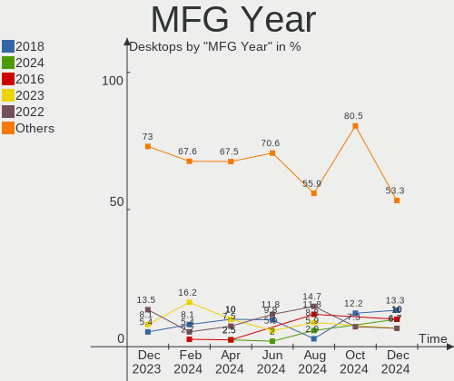
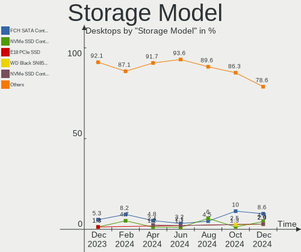
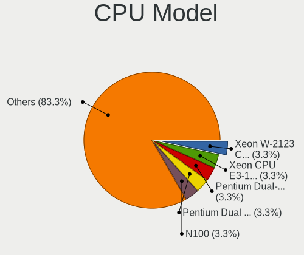
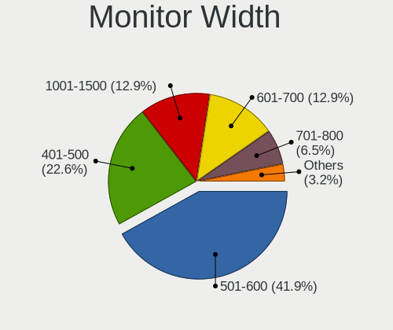
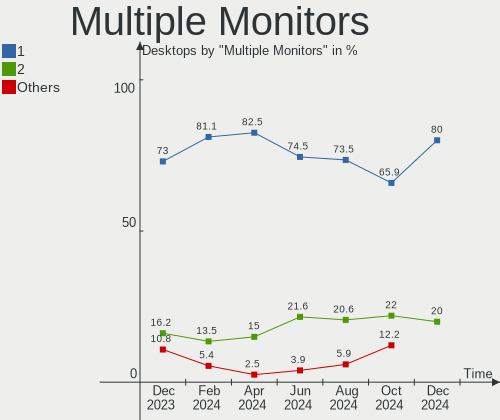
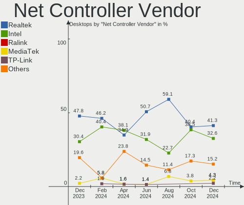

openSUSE Hardware Trends (Desktop)
----------------------------------

A project to identify most popular hardware characteristics and track their change
over time based on data collected by openSUSE users at https://Linux-Hardware.org.

Anyone can contribute to the study by uploading probes of their computers by
the [hw-probe](https://github.com/linuxhw/hw-probe) tool:

    sudo hw-probe -all -upload

Full-feature report is available here: https://linux-hardware.org/?view=trends&formfactor=desktop

Period: Apr, 2020.

Contents
--------

- [ OS                       ](#os)
- [ OS Family                ](#os-family)
- [ Kernel                   ](#kernel)
- [ Kernel Family            ](#kernel-family)
- [ Kernel Major Ver.        ](#kernel-major-ver)
- [ Arch                     ](#arch)
- [ DE                       ](#de)
- [ Display Server           ](#display-server)
- [ Display Manager          ](#display-manager)
- [ OS Lang                  ](#os-lang)
- [ Boot Mode                ](#boot-mode)
- [ Filesystem               ](#filesystem)
- [ Dual Boot with Linux/BSD ](#dual-boot-with-linux/bsd)
- [ Dual Boot (Win)          ](#dual-boot-win)
- [ Country                  ](#country)
- [ City                     ](#city)
- [ Vendor                   ](#vendor)
- [ Model                    ](#model)
- [ Model Family             ](#model-family)
- [ MFG Year                 ](#mfg-year)
- [ Form Factor              ](#form-factor)
- [ Secure Boot              ](#secure-boot)
- [ Coreboot                 ](#coreboot)
- [ RAM Size                 ](#ram-size)
- [ RAM Used                 ](#ram-used)
- [ Drive Vendor             ](#drive-vendor)
- [ Drive Model              ](#drive-model)
- [ Drive Kind               ](#drive-kind)
- [ Drive Connector          ](#drive-connector)
- [ Drive Size               ](#drive-size)
- [ Space Total              ](#space-total)
- [ Space Used               ](#space-used)
- [ Malfunc. Drives          ](#malfunc-drives)
- [ Malfunc. Drive Vendor    ](#malfunc-drive-vendor)
- [ Malfunc. Drive Kind      ](#malfunc-drive-kind)
- [ Failed Drives            ](#failed-drives)
- [ Failed Drive Vendor      ](#failed-drive-vendor)
- [ Drive Status             ](#drive-status)
- [ Storage Vendor           ](#storage-vendor)
- [ Storage Model            ](#storage-model)
- [ Storage Kind             ](#storage-kind)
- [ CPU Vendor               ](#cpu-vendor)
- [ CPU Model                ](#cpu-model)
- [ CPU Model Family         ](#cpu-model-family)
- [ CPU Cores                ](#cpu-cores)
- [ CPU Sockets              ](#cpu-sockets)
- [ CPU Threads              ](#cpu-threads)
- [ CPU Op-Modes             ](#cpu-op-modes)
- [ CPU Microarch            ](#cpu-microarch)
- [ CPU Microcode            ](#cpu-microcode)
- [ GPU Vendor               ](#gpu-vendor)
- [ GPU Model                ](#gpu-model)
- [ GPU Combo                ](#gpu-combo)
- [ GPU Driver               ](#gpu-driver)
- [ GPU Memory               ](#gpu-memory)
- [ Monitor Vendor           ](#monitor-vendor)
- [ Monitor Model            ](#monitor-model)
- [ Monitor Resolution       ](#monitor-resolution)
- [ Monitor Diagonal         ](#monitor-diagonal)
- [ Monitor Width            ](#monitor-width)
- [ Aspect Ratio             ](#aspect-ratio)
- [ Monitor Area             ](#monitor-area)
- [ Pixel Density            ](#pixel-density)
- [ Multiple Monitors        ](#multiple-monitors)
- [ Net Controller Vendor    ](#net-controller-vendor)
- [ Net Controller Model     ](#net-controller-model)
- [ Net Controller Kind      ](#net-controller-kind)
- [ Used Controller          ](#used-controller)
- [ NICs                     ](#nics)
- [ Unsupported Devices      ](#unsupported-devices)
- [ Unsupported Device Types ](#unsupported-device-types)

OS
--

Installed operating systems

| Name                         | Computers | Percent |
|------------------------------|-----------|---------|
| openSUSE 15.1                | 19        | 31.67%  |
| openSUSE 20200405            | 11        | 18.33%  |
| openSUSE 20200407            | 8         | 13.33%  |
| openSUSE 20200410            | 3         | 5%      |
| openSUSE 20200422            | 2         | 3.33%   |
| openSUSE 20200402            | 2         | 3.33%   |
| openSUSE 15.2                | 2         | 3.33%   |
| openSUSE Tumbleweed-20200422 | 1         | 1.67%   |
| openSUSE Tumbleweed-20200421 | 1         | 1.67%   |
| openSUSE Tumbleweed-20200419 | 1         | 1.67%   |
| openSUSE Tumbleweed-20200414 | 1         | 1.67%   |
| openSUSE Tumbleweed-20200409 | 1         | 1.67%   |
| openSUSE Tumbleweed-20200408 | 1         | 1.67%   |
| openSUSE Tumbleweed-20200405 | 1         | 1.67%   |
| openSUSE Tumbleweed-20200402 | 1         | 1.67%   |
| openSUSE Leap-15.1           | 1         | 1.67%   |
| openSUSE 20200413            | 1         | 1.67%   |
| openSUSE 20200409            | 1         | 1.67%   |
| openSUSE 20200322            | 1         | 1.67%   |
| openSUSE 15.0                | 1         | 1.67%   |

OS Family
---------

OS without a version

| Name     | Computers | Percent |
|----------|-----------|---------|
| openSUSE | 60        | 100%    |

Kernel
------

Version of the Linux kernel

| Version                     | Computers | Percent |
|-----------------------------|-----------|---------|
| 4.12.14-lp151.28.44-default | 16        | 26.67%  |
| 5.6.2-1-default             | 14        | 23.33%  |
| 5.6.0-1-default             | 13        | 21.67%  |
| 5.6.4-1-default             | 5         | 8.33%   |
| 5.3.18-lp152.10-default     | 2         | 3.33%   |
| 4.12.14-lp151.28.48-default | 2         | 3.33%   |
| 4.12.14-lp151.28.40-default | 2         | 3.33%   |
| 5.6.2-3.gb22bc26-default    | 1         | 1.67%   |
| 5.6.2-3.g7d8cfa8-default    | 1         | 1.67%   |
| 5.6.0-default               | 1         | 1.67%   |
| 5.5.9-1-default             | 1         | 1.67%   |
| 5.5.11-1-default            | 1         | 1.67%   |
| 4.12.14-lp150.12.82-default | 1         | 1.67%   |

Kernel Family
-------------

Linux kernel without a distro release

| Version | Computers | Percent |
|---------|-----------|---------|
| 4.12.14 | 21        | 35%     |
| 5.6.2   | 16        | 26.67%  |
| 5.6.0   | 14        | 23.33%  |
| 5.6.4   | 5         | 8.33%   |
| 5.3.18  | 2         | 3.33%   |
| 5.5.9   | 1         | 1.67%   |
| 5.5.11  | 1         | 1.67%   |

Kernel Major Ver.
-----------------

Linux kernel major version

| Version | Computers | Percent |
|---------|-----------|---------|
| 5.6     | 35        | 58.33%  |
| 4.12    | 21        | 35%     |
| 5.5     | 2         | 3.33%   |
| 5.3     | 2         | 3.33%   |

Arch
----

OS architecture (x86_64, i586, etc.)

| Name   | Computers | Percent |
|--------|-----------|---------|
| x86_64 | 60        | 100%    |

DE
--

Desktop Environment

| Name     | Computers | Percent |
|----------|-----------|---------|
| KDE5     | 39        | 65%     |
| GNOME    | 7         | 11.67%  |
| KDE      | 6         | 10%     |
| XFCE     | 3         | 5%      |
| MATE     | 3         | 5%      |
| Cinnamon | 1         | 1.67%   |
| Unknown  | 1         | 1.67%   |

Display Server
--------------

X11 or Wayland

| Name        | Computers | Percent |
|-------------|-----------|---------|
| X11         | 51        | 85%     |
| Wayland     | 5         | 8.33%   |
| Unspecified | 2         | 3.33%   |
| Tty         | 1         | 1.67%   |
| Unknown     | 1         | 1.67%   |

Display Manager
---------------

SDDM, LightDM, etc.

| Name    | Computers | Percent |
|---------|-----------|---------|
| LightDM | 48        | 80%     |
| Unknown | 9         | 15%     |
| SDDM    | 2         | 3.33%   |
| XDM     | 1         | 1.67%   |

OS Lang
-------

Language

| Lang       | Computers | Percent |
|------------|-----------|---------|
| en_US      | 14        | 23.33%  |
| de_DE      | 12        | 20%     |
| POSIX      | 10        | 16.67%  |
| en_GB      | 4         | 6.67%   |
| ru_RU      | 3         | 5%      |
| pt_BR      | 3         | 5%      |
| en_US.utf8 | 3         | 5%      |
| pt_PT      | 2         | 3.33%   |
| sl_SI      | 1         | 1.67%   |
| nl_NL      | 1         | 1.67%   |
| fr_CA      | 1         | 1.67%   |
| es_MX      | 1         | 1.67%   |
| es_ES      | 1         | 1.67%   |
| es_AR      | 1         | 1.67%   |
| en_CA      | 1         | 1.67%   |
| en_AU      | 1         | 1.67%   |
| Unknown    | 1         | 1.67%   |

Boot Mode
---------

EFI or BIOS

| Mode | Computers | Percent |
|------|-----------|---------|
| BIOS | 35        | 58.33%  |
| EFI  | 25        | 41.67%  |

Filesystem
----------

Type of filesystem

| Type  | Computers | Percent |
|-------|-----------|---------|
| Btrfs | 34        | 56.67%  |
| Ext4  | 23        | 38.33%  |
| Xfs   | 2         | 3.33%   |
| Tmpfs | 1         | 1.67%   |

Dual Boot with Linux/BSD
------------------------

Hosting more than one Linux/BSD

| Dual boot | Computers | Percent |
|-----------|-----------|---------|
| No        | 52        | 86.67%  |
| Yes       | 8         | 13.33%  |

Dual Boot (Win)
---------------

Hosting Linux and Windows

| Dual boot | Computers | Percent |
|-----------|-----------|---------|
| No        | 42        | 70%     |
| Yes       | 18        | 30%     |

Country
-------

Geographic location (country)

| Country     | Computers | Percent |
|-------------|-----------|---------|
| Germany     | 16        | 26.67%  |
| USA         | 14        | 23.33%  |
| Switzerland | 3         | 5%      |
| Russia      | 3         | 5%      |
| Canada      | 3         | 5%      |
| Brazil      | 3         | 5%      |
| UK          | 2         | 3.33%   |
| Serbia      | 2         | 3.33%   |
| Mexico      | 2         | 3.33%   |
| Vietnam     | 1         | 1.67%   |
| Turkey      | 1         | 1.67%   |
| Sweden      | 1         | 1.67%   |
| Slovenia    | 1         | 1.67%   |
| Portugal    | 1         | 1.67%   |
| Peru        | 1         | 1.67%   |
| Netherlands | 1         | 1.67%   |
| Italy       | 1         | 1.67%   |
| Israel      | 1         | 1.67%   |
| Austria     | 1         | 1.67%   |
| Australia   | 1         | 1.67%   |
| Argentina   | 1         | 1.67%   |

City
----

Geographic location (city)

| City               | Computers | Percent |
|--------------------|-----------|---------|
| Joplin             | 3         | 5%      |
| Munich             | 2         | 3.33%   |
| Kiel               | 2         | 3.33%   |
| Augsburg           | 2         | 3.33%   |
| Yehud              | 1         | 1.67%   |
| Waco               | 1         | 1.67%   |
| Vienna             | 1         | 1.67%   |
| Vechta             | 1         | 1.67%   |
| Sydney             | 1         | 1.67%   |
| St Petersburg      | 1         | 1.67%   |
| Slavyanka          | 1         | 1.67%   |
| Seattle            | 1         | 1.67%   |
| Schrobenhausen     | 1         | 1.67%   |
| San Jose           | 1         | 1.67%   |
| Salvador           | 1         | 1.67%   |
| Rochester          | 1         | 1.67%   |
| Rio de Janeiro     | 1         | 1.67%   |
| Porto              | 1         | 1.67%   |
| Peiting            | 1         | 1.67%   |
| Nottingham         | 1         | 1.67%   |
| North College Hill | 1         | 1.67%   |
| Nordenham          | 1         | 1.67%   |
| Neuchatel          | 1         | 1.67%   |
| Neggio             | 1         | 1.67%   |
| Montreal           | 1         | 1.67%   |
| Mexico City        | 1         | 1.67%   |
| Lula               | 1         | 1.67%   |
| Ludwigsburg        | 1         | 1.67%   |
| Livingston         | 1         | 1.67%   |
| Lima               | 1         | 1.67%   |
| Istanbul           | 1         | 1.67%   |
| Houston            | 1         | 1.67%   |
| Ho Chi Minh City   | 1         | 1.67%   |
| Hessisch Oldendorf | 1         | 1.67%   |
| Heilbronn          | 1         | 1.67%   |
| Gateshead          | 1         | 1.67%   |
| Gajdobra           | 1         | 1.67%   |
| Fulda              | 1         | 1.67%   |
| Fredericton        | 1         | 1.67%   |
| Frankfurt am Main  | 1         | 1.67%   |
| Fort Erie          | 1         | 1.67%   |
| Dobova             | 1         | 1.67%   |
| Dimitrovgrad       | 1         | 1.67%   |
| Corrientes         | 1         | 1.67%   |
| Comonfort          | 1         | 1.67%   |
| Cleveland          | 1         | 1.67%   |
| Charlottesville    | 1         | 1.67%   |
| Cantello           | 1         | 1.67%   |
| Cadillac           | 1         | 1.67%   |
| Brugg              | 1         | 1.67%   |
| Bromma             | 1         | 1.67%   |
| Brasília          | 1         | 1.67%   |
| Belgrade           | 1         | 1.67%   |
| Bad Marienberg     | 1         | 1.67%   |
| Amsterdam          | 1         | 1.67%   |

Vendor
------

Motherboard manufacturer

| Name                | Computers | Percent |
|---------------------|-----------|---------|
| Gigabyte Technology | 17        | 28.33%  |
| ASUSTek Computer    | 15        | 25%     |
| MSI                 | 8         | 13.33%  |
| ASRock              | 7         | 11.67%  |
| Lenovo              | 3         | 5%      |
| Hewlett-Packard     | 2         | 3.33%   |
| Dell                | 2         | 3.33%   |
| Biostar             | 2         | 3.33%   |
| Pegatron            | 1         | 1.67%   |
| Fujitsu Siemens     | 1         | 1.67%   |
| DIEBOLD             | 1         | 1.67%   |
| Unknown             | 1         | 1.67%   |

Model
-----

Motherboard model

| Name                                 | Computers | Percent |
|--------------------------------------|-----------|---------|
| ASUS All Series                      | 3         | 5%      |
| MSI MS-7A33                          | 2         | 3.33%   |
| Gigabyte 970A-D3P                    | 2         | 3.33%   |
| ASRock B450M Pro4                    | 2         | 3.33%   |
| Pegatron Compaq dx2450 Microtower    | 1         | 1.67%   |
| MSI MS-7B86                          | 1         | 1.67%   |
| MSI MS-7B36                          | 1         | 1.67%   |
| MSI MS-7A34                          | 1         | 1.67%   |
| MSI MS-7721                          | 1         | 1.67%   |
| MSI MS-7676                          | 1         | 1.67%   |
| MSI MS-7673                          | 1         | 1.67%   |
| Lenovo ThinkCentre M93p 10A8S0CE11   | 1         | 1.67%   |
| Lenovo ThinkCentre M78 10BR0005US    | 1         | 1.67%   |
| Lenovo Legion Y720T-34ASU 90H90015UK | 1         | 1.67%   |
| HP Pavilion Desktop 590-p0xxx        | 1         | 1.67%   |
| HP OMEN by HP Desktop PC 880-p1xx    | 1         | 1.67%   |
| Gigabyte Z390 AORUS MASTER           | 1         | 1.67%   |
| Gigabyte Z170X-Gaming 7              | 1         | 1.67%   |
| Gigabyte Z170-HD3 DDR3-CF            | 1         | 1.67%   |
| Gigabyte X570 AORUS PRO              | 1         | 1.67%   |
| Gigabyte X399 AORUS XTREME           | 1         | 1.67%   |
| Gigabyte M68MT-S2                    | 1         | 1.67%   |
| Gigabyte H97-D3H                     | 1         | 1.67%   |
| Gigabyte GA-MA790XT-UD4P             | 1         | 1.67%   |
| Gigabyte GA-880GA-UD3H               | 1         | 1.67%   |
| Gigabyte GA-770TA-UD3                | 1         | 1.67%   |
| Gigabyte F2A85XM-D3H                 | 1         | 1.67%   |
| Gigabyte B450M DS3H                  | 1         | 1.67%   |
| Gigabyte B250M-D2V                   | 1         | 1.67%   |
| Gigabyte AX370-Gaming K7             | 1         | 1.67%   |
| Gigabyte 970A-DS3P                   | 1         | 1.67%   |
| Fujitsu Siemens D1607                | 1         | 1.67%   |
| DIEBOLD Canyon                       | 1         | 1.67%   |
| Dell OptiPlex 990                    | 1         | 1.67%   |
| Dell OptiPlex 7071                   | 1         | 1.67%   |
| Biostar TB250-BTC                    | 1         | 1.67%   |
| Biostar A880G+                       | 1         | 1.67%   |
| ASUS TUF GAMING X570-PLUS            | 1         | 1.67%   |
| ASUS ROG STRIX X370-F GAMING         | 1         | 1.67%   |
| ASUS PRIME B350M-A                   | 1         | 1.67%   |
| ASUS P8Z68-M PRO                     | 1         | 1.67%   |
| ASUS M5A97 LE R2.0                   | 1         | 1.67%   |
| ASUS M5A78L-M/USB3                   | 1         | 1.67%   |
| ASUS M5A78L-M LX                     | 1         | 1.67%   |
| ASUS M51BC                           | 1         | 1.67%   |
| ASUS M3A78                           | 1         | 1.67%   |
| ASUS H170 PRO GAMING                 | 1         | 1.67%   |
| ASUS CROSSHAIR VI HERO               | 1         | 1.67%   |
| ASUS 970 PRO GAMING/AURA             | 1         | 1.67%   |
| ASRock Z77 Extreme6                  | 1         | 1.67%   |
| ASRock X570 Phantom Gaming 4         | 1         | 1.67%   |
| ASRock H97M Pro4                     | 1         | 1.67%   |
| ASRock B450 Pro4                     | 1         | 1.67%   |
| ASRock A320M-HDV R4.0                | 1         | 1.67%   |
| Unknown                              | 1         | 1.67%   |

Model Family
------------

Motherboard model prefix

| Name                     | Computers | Percent |
|--------------------------|-----------|---------|
| ASUS All                 | 3         | 5%      |
| MSI MS-7A33              | 2         | 3.33%   |
| Lenovo ThinkCentre       | 2         | 3.33%   |
| Gigabyte 970A-D3P        | 2         | 3.33%   |
| Dell OptiPlex            | 2         | 3.33%   |
| ASUS M5A78L-M            | 2         | 3.33%   |
| ASRock B450M             | 2         | 3.33%   |
| Pegatron Compaq          | 1         | 1.67%   |
| MSI MS-7B86              | 1         | 1.67%   |
| MSI MS-7B36              | 1         | 1.67%   |
| MSI MS-7A34              | 1         | 1.67%   |
| MSI MS-7721              | 1         | 1.67%   |
| MSI MS-7676              | 1         | 1.67%   |
| MSI MS-7673              | 1         | 1.67%   |
| Lenovo Legion            | 1         | 1.67%   |
| HP Pavilion              | 1         | 1.67%   |
| HP OMEN                  | 1         | 1.67%   |
| Gigabyte Z390            | 1         | 1.67%   |
| Gigabyte Z170X-Gaming    | 1         | 1.67%   |
| Gigabyte Z170-HD3        | 1         | 1.67%   |
| Gigabyte X570            | 1         | 1.67%   |
| Gigabyte X399            | 1         | 1.67%   |
| Gigabyte M68MT-S2        | 1         | 1.67%   |
| Gigabyte H97-D3H         | 1         | 1.67%   |
| Gigabyte GA-MA790XT-UD4P | 1         | 1.67%   |
| Gigabyte GA-880GA-UD3H   | 1         | 1.67%   |
| Gigabyte GA-770TA-UD3    | 1         | 1.67%   |
| Gigabyte F2A85XM-D3H     | 1         | 1.67%   |
| Gigabyte B450M           | 1         | 1.67%   |
| Gigabyte B250M-D2V       | 1         | 1.67%   |
| Gigabyte AX370-Gaming    | 1         | 1.67%   |
| Gigabyte 970A-DS3P       | 1         | 1.67%   |
| Fujitsu Siemens D1607    | 1         | 1.67%   |
| DIEBOLD Canyon           | 1         | 1.67%   |
| Biostar TB250-BTC        | 1         | 1.67%   |
| Biostar A880G+           | 1         | 1.67%   |
| ASUS TUF                 | 1         | 1.67%   |
| ASUS ROG                 | 1         | 1.67%   |
| ASUS PRIME               | 1         | 1.67%   |
| ASUS P8Z68-M             | 1         | 1.67%   |
| ASUS M5A97               | 1         | 1.67%   |
| ASUS M51BC               | 1         | 1.67%   |
| ASUS M3A78               | 1         | 1.67%   |
| ASUS H170                | 1         | 1.67%   |
| ASUS CROSSHAIR           | 1         | 1.67%   |
| ASUS 970                 | 1         | 1.67%   |
| ASRock Z77               | 1         | 1.67%   |
| ASRock X570              | 1         | 1.67%   |
| ASRock H97M              | 1         | 1.67%   |
| ASRock B450              | 1         | 1.67%   |
| ASRock A320M-HDV         | 1         | 1.67%   |
| Unknown                  | 1         | 1.67%   |

MFG Year
--------

Motherboard manufacture year

| Year | Computers | Percent |
|------|-----------|---------|
| 2019 | 21        | 35%     |
| 2018 | 8         | 13.33%  |
| 2015 | 5         | 8.33%   |
| 2014 | 5         | 8.33%   |
| 2013 | 5         | 8.33%   |
| 2012 | 5         | 8.33%   |
| 2011 | 3         | 5%      |
| 2017 | 2         | 3.33%   |
| 2016 | 2         | 3.33%   |
| 2010 | 2         | 3.33%   |
| 2009 | 1         | 1.67%   |
| 2005 | 1         | 1.67%   |

Form Factor
-----------

Physical design of the computer

| Name    | Computers | Percent |
|---------|-----------|---------|
| Desktop | 60        | 100%    |

Secure Boot
-----------

Enabled or disabled

| State    | Computers | Percent |
|----------|-----------|---------|
| Disabled | 57        | 95%     |
| Enabled  | 3         | 5%      |

Coreboot
--------

Have coreboot on board

| Used | Computers | Percent |
|------|-----------|---------|
| No   | 60        | 100%    |

RAM Size
--------

Total RAM memory

| Size in GB  | Computers | Percent |
|-------------|-----------|---------|
| 16.01-24.0  | 20        | 33.33%  |
| 8.01-16.0   | 17        | 28.33%  |
| 32.01-64.0  | 10        | 16.67%  |
| 4.01-8.0    | 8         | 13.33%  |
| 64.01-256.0 | 3         | 5%      |
| 24.01-32.0  | 1         | 1.67%   |
| 1.01-2.0    | 1         | 1.67%   |

RAM Used
--------

Used RAM memory

| Used GB    | Computers | Percent |
|------------|-----------|---------|
| 4.01-8.0   | 17        | 28.33%  |
| 1.01-2.0   | 13        | 21.67%  |
| 2.01-3.0   | 11        | 18.33%  |
| 3.01-4.0   | 8         | 13.33%  |
| 0.01-1.0   | 5         | 8.33%   |
| 16.01-24.0 | 2         | 3.33%   |
| 8.01-16.0  | 2         | 3.33%   |
| 32.01-64.0 | 1         | 1.67%   |
| 24.01-32.0 | 1         | 1.67%   |

Drive Vendor
------------

Hard drive vendors

| Vendor              | Computers | Drives | Percent |
|---------------------|-----------|--------|---------|
| Seagate             | 33        | 50     | 25.58%  |
| Samsung Electronics | 27        | 36     | 20.93%  |
| WDC                 | 16        | 29     | 12.4%   |
| Crucial             | 9         | 10     | 6.98%   |
| Toshiba             | 8         | 8      | 6.2%    |
| SanDisk             | 6         | 6      | 4.65%   |
| Kingston            | 6         | 6      | 4.65%   |
| PNY                 | 4         | 5      | 3.1%    |
| Hitachi             | 3         | 3      | 2.33%   |
| SPCC                | 2         | 2      | 1.55%   |
| OCZ                 | 2         | 2      | 1.55%   |
| Corsair             | 2         | 2      | 1.55%   |
| Biostar             | 2         | 2      | 1.55%   |
| A-DATA Technology   | 2         | 2      | 1.55%   |
| SuperTalent         | 1         | 1      | 0.78%   |
| Patriot             | 1         | 1      | 0.78%   |
| Mushkin             | 1         | 1      | 0.78%   |
| Micron Technology   | 1         | 1      | 0.78%   |
| JMicron             | 1         | 1      | 0.78%   |
| Intel               | 1         | 1      | 0.78%   |
| Generic             | 1         | 1      | 0.78%   |

Drive Model
-----------

Hard drive models

| Model                           | Computers | Percent |
|---------------------------------|-----------|---------|
| Expansion Desk 5TB              | 5         | 2.99%   |
| ST3500418AS 500GB               | 4         | 2.4%    |
| WD10EZEX-22MFCA0 1TB            | 3         | 1.8%    |
| WD10EZEX-08WN4A0 1TB            | 3         | 1.8%    |
| SSD 860 EVO 500GB               | 3         | 1.8%    |
| SSD 850 EVO 250GB               | 3         | 1.8%    |
| WD20EZRZ-00Z5HB0 2TB            | 2         | 1.2%    |
| WD20EARS-00MVWB0 2TB            | 2         | 1.2%    |
| ST500DM002-1BD142 500GB         | 2         | 1.2%    |
| ST32000641AS 2TB                | 2         | 1.2%    |
| ST3000DM008-2DM166 3TB          | 2         | 1.2%    |
| ST2000DM006-2DM164 2TB          | 2         | 1.2%    |
| ST1000DX002-2DV162 1TB          | 2         | 1.2%    |
| ST1000DM010-2EP102 1TB          | 2         | 1.2%    |
| SSD2SC480G1CS2754D117-514 480GB | 2         | 1.2%    |
| SSD 860 QVO 1TB                 | 2         | 1.2%    |
| SSD 850 PRO 256GB               | 2         | 1.2%    |
| SSD 850 EVO 500GB               | 2         | 1.2%    |
| SSD 850 EVO 120GB               | 2         | 1.2%    |
| SSD 840 EVO 250GB               | 2         | 1.2%    |
| SDSSDA240G 240GB                | 2         | 1.2%    |
| SD8SB8U256G1122 256GB SSD       | 2         | 1.2%    |
| HDWD110 1TB                     | 2         | 1.2%    |
| HD502HI 500GB                   | 2         | 1.2%    |
| HD204UI 2TB                     | 2         | 1.2%    |
| CT240BX500SSD1 240GB            | 2         | 1.2%    |
| Backup+ Hub BK 8TB              | 2         | 1.2%    |
| Wildfire 120GB SSD              | 1         | 0.6%    |
| WDS500G1B0C-00S6U0 500GB        | 1         | 0.6%    |
| WDS250G2B0B-00YS70 250GB SSD    | 1         | 0.6%    |
| WDS250G1B0C-00S6U0 250GB        | 1         | 0.6%    |
| WDS100T1B0A-00H9H0 1TB SSD      | 1         | 0.6%    |
| WD60EFRX-68MYMN1 6TB            | 1         | 0.6%    |
| WD60EFRX-68L0BN1 6TB            | 1         | 0.6%    |
| WD50EZRX-00MVLB1 5TB            | 1         | 0.6%    |
| WD40EZRX-00SPEB0 4TB            | 1         | 0.6%    |
| WD40EFRX-68WT0N0 4TB            | 1         | 0.6%    |
| WD4004FZWX-00GBGB0 4TB          | 1         | 0.6%    |
| WD30EZRX-00SPEB0 3TB            | 1         | 0.6%    |
| WD20SPZX-22UA7T0 2TB            | 1         | 0.6%    |
| WD20EZRX-00DC0B0 2TB            | 1         | 0.6%    |
| WD20EZRX-00D8PB0 2TB            | 1         | 0.6%    |
| WD2003FYYS-02W0B1 2TB           | 1         | 0.6%    |
| WD10JPVX-60JC3T0 1TB            | 1         | 0.6%    |
| WD10EZEX-60M2NA0 1TB            | 1         | 0.6%    |
| WD1003FZEX-00K3CA0 1TB          | 1         | 0.6%    |
| VERTEX4 128GB SSD               | 1         | 0.6%    |
| VERTEX2 64GB SSD                | 1         | 0.6%    |
| SVP100S296G 96GB SSD            | 1         | 0.6%    |
| SV300S37A60G 64GB SSD           | 1         | 0.6%    |
| SU650 120GB SSD                 | 1         | 0.6%    |
| ST500LM000-1EJ162 500GB         | 1         | 0.6%    |
| ST500DM005 HD502HJ 500GB        | 1         | 0.6%    |
| ST4000DM005-2DP166 4TB          | 1         | 0.6%    |
| ST4000DM000-1F2168 4TB          | 1         | 0.6%    |
| ST3320820AS 320GB               | 1         | 0.6%    |
| ST3200822AS 200GB               | 1         | 0.6%    |
| ST31000528AS 1TB                | 1         | 0.6%    |
| ST3000DM007-1WY10G 3TB          | 1         | 0.6%    |
| ST3000DM001-9YN166 3TB          | 1         | 0.6%    |

Drive Kind
----------

HDD or SSD

| Kind    | Computers | Drives | Percent |
|---------|-----------|--------|---------|
| HDD     | 51        | 90     | 46.79%  |
| SSD     | 41        | 62     | 37.61%  |
| NVMe    | 13        | 14     | 11.93%  |
| Unknown | 4         | 4      | 3.67%   |

Drive Connector
---------------

SATA, SAS, NVMe, etc.

| Type | Computers | Drives | Percent |
|------|-----------|--------|---------|
| SATA | 59        | 145    | 74.68%  |
| NVMe | 13        | 14     | 16.46%  |
| SAS  | 7         | 11     | 8.86%   |

Drive Size
----------

Size of hard drive

| Size in TB | Computers | Drives | Percent |
|------------|-----------|--------|---------|
| 0.01-0.5   | 46        | 79     | 40.35%  |
| 0.51-1.0   | 27        | 37     | 23.68%  |
| 1.01-2.0   | 18        | 27     | 15.79%  |
| 4.01-10.0  | 9         | 13     | 7.89%   |
| 2.01-3.0   | 8         | 8      | 7.02%   |
| 3.01-4.0   | 6         | 6      | 5.26%   |

Space Total
-----------

Amount of disk space available on the file system

| Size in GB     | Computers | Percent |
|----------------|-----------|---------|
| More than 3000 | 20        | 33.33%  |
| 1001-2000      | 16        | 26.67%  |
| 501-1000       | 8         | 13.33%  |
| 251-500        | 6         | 10%     |
| 2001-3000      | 6         | 10%     |
| 101-250        | 3         | 5%      |
| 1-20           | 1         | 1.67%   |

Space Used
----------

Amount of used disk space

| Used GB        | Computers | Percent |
|----------------|-----------|---------|
| 251-500        | 13        | 21.67%  |
| 1001-2000      | 9         | 15%     |
| 501-1000       | 9         | 15%     |
| More than 3000 | 8         | 13.33%  |
| 101-250        | 7         | 11.67%  |
| 51-100         | 6         | 10%     |
| 2001-3000      | 4         | 6.67%   |
| 21-50          | 2         | 3.33%   |
| 1-20           | 2         | 3.33%   |

Malfunc. Drives
---------------

Drive models with a malfunction

| Model                    | Computers | Drives | Percent |
|--------------------------|-----------|--------|---------|
| ST3500418AS 500GB        | 2         | 2      | 11.76%  |
| Wildfire 120GB SSD       | 1         | 1      | 5.88%   |
| ST500DM002-1BD142 500GB  | 1         | 1      | 5.88%   |
| ST250DM000-1BD141 250GB  | 1         | 1      | 5.88%   |
| ST2000DM001-1CH164 2TB   | 1         | 1      | 5.88%   |
| SSD FTM32GX25H 32GB      | 1         | 1      | 5.88%   |
| SSD 850 PRO 256GB        | 1         | 1      | 5.88%   |
| MZVLW256HEHP-000L7 256GB | 1         | 1      | 5.88%   |
| M4-CT256M4SSD2 256GB     | 1         | 1      | 5.88%   |
| HTS545050A7E380 500GB    | 1         | 1      | 5.88%   |
| HDS724040ALE640 4TB      | 1         | 1      | 5.88%   |
| HD502HI 500GB            | 1         | 1      | 5.88%   |
| HD501LJ 500GB            | 1         | 1      | 5.88%   |
| HD322HJ 320GB            | 1         | 1      | 5.88%   |
| CT960M500SSD1 960GB      | 1         | 1      | 5.88%   |
| CT250MX500SSD1 250GB     | 1         | 1      | 5.88%   |

Malfunc. Drive Vendor
---------------------

Vendors of faulty drives

| Vendor              | Computers | Drives | Percent |
|---------------------|-----------|--------|---------|
| Seagate             | 5         | 5      | 31.25%  |
| Samsung Electronics | 4         | 5      | 25%     |
| Crucial             | 3         | 3      | 18.75%  |
| Hitachi             | 2         | 2      | 12.5%   |
| SuperTalent         | 1         | 1      | 6.25%   |
| Patriot             | 1         | 1      | 6.25%   |

Malfunc. Drive Kind
-------------------

Kinds of faulty drives

| Kind | Computers | Drives | Percent |
|------|-----------|--------|---------|
| HDD  | 8         | 10     | 57.14%  |
| SSD  | 5         | 6      | 35.71%  |
| NVMe | 1         | 1      | 7.14%   |

Failed Drives
-------------

Failed drive models

Zero info for selected period =(

Failed Drive Vendor
-------------------

Failed drive vendors

Zero info for selected period =(

Drive Status
------------

Number of failed and malfunc. drives

| Status   | Computers | Drives | Percent |
|----------|-----------|--------|---------|
| Works    | 52        | 123    | 66.67%  |
| Malfunc  | 14        | 17     | 17.95%  |
| Detected | 12        | 30     | 15.38%  |

Storage Vendor
--------------

Storage controller vendors

| Vendor                       | Computers | Percent |
|------------------------------|-----------|---------|
| AMD                          | 37        | 39.36%  |
| Intel                        | 20        | 21.28%  |
| Phison Electronics           | 8         | 8.51%   |
| Samsung Electronics          | 6         | 6.38%   |
| Marvell Technology Group     | 5         | 5.32%   |
| ASMedia Technology           | 5         | 5.32%   |
| Sandisk                      | 3         | 3.19%   |
| JMicron Technology           | 3         | 3.19%   |
| Silicon Image                | 2         | 2.13%   |
| Nvidia                       | 2         | 2.13%   |
| VIA Technologies             | 1         | 1.06%   |
| Toshiba America Info Systems | 1         | 1.06%   |
| Silicon Motion               | 1         | 1.06%   |

Storage Model
-------------

Storage controller models

| Model                                                                             | Computers | Percent |
|-----------------------------------------------------------------------------------|-----------|---------|
| FCH SATA Controller [AHCI mode]                                                   | 24        | 19.51%  |
| SB7x0/SB8x0/SB9x0 IDE Controller                                                  | 8         | 6.5%    |
| SB7x0/SB8x0/SB9x0 SATA Controller [AHCI mode]                                     | 7         | 5.69%   |
| SB7x0/SB8x0/SB9x0 SATA Controller [IDE mode]                                      | 6         | 4.88%   |
| E12 NVMe Controller                                                               | 6         | 4.88%   |
| X370 Series Chipset SATA Controller                                               | 5         | 4.07%   |
| ASM1062 Serial ATA Controller                                                     | 5         | 4.07%   |
| 400 Series Chipset SATA Controller                                                | 5         | 4.07%   |
| 300 Series Chipset SATA Controller                                                | 5         | 4.07%   |
| WD Black 2018/PC SN520 NVMe SSD                                                   | 3         | 2.44%   |
| Q170/Q150/B150/H170/H110/Z170/CM236 Chipset SATA Controller [AHCI Mode]           | 3         | 2.44%   |
| NVMe SSD Controller SM981/PM981/PM983                                             | 3         | 2.44%   |
| JMB363 SATA/IDE Controller                                                        | 3         | 2.44%   |
| 92xx SATA 6G Controller                                                           | 3         | 2.44%   |
| 9 Series Chipset Family SATA Controller [AHCI Mode]                               | 3         | 2.44%   |
| 8 Series/C220 Series Chipset Family 6-port SATA Controller 1 [AHCI mode]          | 3         | 2.44%   |
| 200 Series PCH SATA controller [AHCI mode]                                        | 3         | 2.44%   |
| NVMe SSD Controller SM961/PM961                                                   | 2         | 1.63%   |
| MCP61 SATA Controller                                                             | 2         | 1.63%   |
| FCH SATA Controller D                                                             | 2         | 1.63%   |
| Cannon Lake PCH SATA AHCI Controller                                              | 2         | 1.63%   |
| 7 Series/C210 Series Chipset Family 6-port SATA Controller [AHCI mode]            | 2         | 1.63%   |
| 6 Series/C200 Series Chipset Family Desktop SATA Controller (IDE mode, ports 4-5) | 2         | 1.63%   |
| 6 Series/C200 Series Chipset Family Desktop SATA Controller (IDE mode, ports 0-3) | 2         | 1.63%   |
| X399 Series Chipset SATA Controller                                               | 1         | 0.81%   |
| VT82C586A/B/VT82C686/A/B/VT823x/A/C PIPC Bus Master IDE                           | 1         | 0.81%   |
| VIA VT6420 SATA RAID Controller                                                   | 1         | 0.81%   |
| Toshiba America Info Non-Volatile memory controller                               | 1         | 0.81%   |
| SiI 3132 Serial ATA Raid II Controller                                            | 1         | 0.81%   |
| SiI 3114 [SATALink/SATARaid] Serial ATA Controller                                | 1         | 0.81%   |
| SATA Controller [RAID mode]                                                       | 1         | 0.81%   |
| NVMe SSD Controller SM951/PM951                                                   | 1         | 0.81%   |
| Non-Volatile memory controller                                                    | 1         | 0.81%   |
| E7 NVMe Controller                                                                | 1         | 0.81%   |
| E16 PCIe4 NVMe Controller                                                         | 1         | 0.81%   |
| 88SE91A3 SATA-600 Controller                                                      | 1         | 0.81%   |
| 88SE9125 PCIe SATA 6.0 Gb/s controller                                            | 1         | 0.81%   |
| 6 Series/C200 Series Chipset Family 6 port Desktop SATA AHCI Controller           | 1         | 0.81%   |

Storage Kind
------------

Kind of storage controller (IDE, SATA, NVMe, SAS, ...)

| Kind | Computers | Percent |
|------|-----------|---------|
| SATA | 55        | 62.5%   |
| NVMe | 18        | 20.45%  |
| IDE  | 13        | 14.77%  |
| RAID | 2         | 2.27%   |

CPU Vendor
----------

Processor vendors

| Vendor | Computers | Percent |
|--------|-----------|---------|
| AMD    | 40        | 66.67%  |
| Intel  | 20        | 33.33%  |

CPU Model
---------

Processor models

| Model                                           | Computers | Percent |
|-------------------------------------------------|-----------|---------|
| AMD Ryzen 7 1800X Eight-Core Processor          | 4         | 6.67%   |
| AMD Ryzen 5 2600 Six-Core Processor             | 4         | 6.67%   |
| AMD FX-8320 Eight-Core Processor                | 3         | 5%      |
| Intel Core i7-6700K CPU @ 4.00GHz               | 2         | 3.33%   |
| Intel Core i5-2500 CPU @ 3.30GHz                | 2         | 3.33%   |
| AMD Ryzen 7 1700X Eight-Core Processor          | 2         | 3.33%   |
| AMD Ryzen 7 1700 Eight-Core Processor           | 2         | 3.33%   |
| AMD Ryzen 5 2400G with Radeon Vega Graphics     | 2         | 3.33%   |
| Intel Xeon CPU E3-1245 V2 @ 3.40GHz             | 1         | 1.67%   |
| Intel Core i9-9900KF CPU @ 3.60GHz              | 1         | 1.67%   |
| Intel Core i7-9700 CPU @ 3.00GHz                | 1         | 1.67%   |
| Intel Core i7-8700K CPU @ 3.70GHz               | 1         | 1.67%   |
| Intel Core i7-4790 CPU @ 3.60GHz                | 1         | 1.67%   |
| Intel Core i7-4770K CPU @ 3.50GHz               | 1         | 1.67%   |
| Intel Core i7-3770 CPU @ 3.40GHz                | 1         | 1.67%   |
| Intel Core i5-7400 CPU @ 3.00GHz                | 1         | 1.67%   |
| Intel Core i5-6600 CPU @ 3.30GHz                | 1         | 1.67%   |
| Intel Core i5-4690 CPU @ 3.50GHz                | 1         | 1.67%   |
| Intel Core i5-4670 CPU @ 3.40GHz                | 1         | 1.67%   |
| Intel Core i5-4570 CPU @ 3.20GHz                | 1         | 1.67%   |
| Intel Core i5-4430 CPU @ 3.00GHz                | 1         | 1.67%   |
| Intel Core i5-2500K CPU @ 3.30GHz               | 1         | 1.67%   |
| Intel Core i3-6100 CPU @ 3.70GHz                | 1         | 1.67%   |
| Intel Core i3-2120 CPU @ 3.30GHz                | 1         | 1.67%   |
| AMD Ryzen Threadripper 2990WX 32-Core Processor | 1         | 1.67%   |
| AMD Ryzen 9 3900X 12-Core Processor             | 1         | 1.67%   |
| AMD Ryzen 7 3800X 8-Core Processor              | 1         | 1.67%   |
| AMD Ryzen 7 3700X 8-Core Processor              | 1         | 1.67%   |
| AMD Ryzen 5 3600 6-Core Processor               | 1         | 1.67%   |
| AMD Ryzen 5 1600 Six-Core Processor             | 1         | 1.67%   |
| AMD Ryzen 3 2200G with Radeon Vega Graphics     | 1         | 1.67%   |
| AMD Phenom II X4 965 Processor                  | 1         | 1.67%   |
| AMD Phenom II X4 955 Processor                  | 1         | 1.67%   |
| AMD Phenom II X4 840 Processor                  | 1         | 1.67%   |
| AMD Phenom II X4 810 Processor                  | 1         | 1.67%   |
| AMD Phenom 8450 Triple-Core Processor           | 1         | 1.67%   |
| AMD FX-8350 Eight-Core Processor                | 1         | 1.67%   |
| AMD FX-8300 Eight-Core Processor                | 1         | 1.67%   |
| AMD FX-8120 Eight-Core Processor                | 1         | 1.67%   |
| AMD FX-4300 Quad-Core Processor                 | 1         | 1.67%   |
| AMD FX-4100 Quad-Core Processor                 | 1         | 1.67%   |
| AMD Athlon Processor 1640B                      | 1         | 1.67%   |
| AMD Athlon II X2 255 Processor                  | 1         | 1.67%   |
| AMD Athlon 64 Processor 3200+                   | 1         | 1.67%   |
| AMD A8-6500B APU with Radeon HD Graphics        | 1         | 1.67%   |
| AMD A8-5600K APU with Radeon HD Graphics        | 1         | 1.67%   |
| AMD A6-5400K APU with Radeon HD Graphics        | 1         | 1.67%   |

CPU Model Family
----------------

Processor model prefix

| Model                  | Computers | Percent |
|------------------------|-----------|---------|
| AMD Ryzen 7            | 10        | 16.67%  |
| Intel Core i5          | 9         | 15%     |
| AMD Ryzen 5            | 8         | 13.33%  |
| AMD FX                 | 8         | 13.33%  |
| Intel Core i7          | 7         | 11.67%  |
| AMD Phenom II X4       | 4         | 6.67%   |
| Intel Core i3          | 2         | 3.33%   |
| AMD A8                 | 2         | 3.33%   |
| Intel Xeon             | 1         | 1.67%   |
| Intel Core i9          | 1         | 1.67%   |
| AMD Ryzen Threadripper | 1         | 1.67%   |
| AMD Ryzen 9            | 1         | 1.67%   |
| AMD Ryzen 3            | 1         | 1.67%   |
| AMD Phenom             | 1         | 1.67%   |
| AMD Athlon II X2       | 1         | 1.67%   |
| AMD Athlon 64          | 1         | 1.67%   |
| AMD Athlon             | 1         | 1.67%   |
| AMD A6                 | 1         | 1.67%   |

CPU Cores
---------

Number of processor cores

| Number | Computers | Percent |
|--------|-----------|---------|
| 4      | 28        | 46.67%  |
| 8      | 12        | 20%     |
| 6      | 7         | 11.67%  |
| 2      | 7         | 11.67%  |
| 1      | 3         | 5%      |
| 32     | 1         | 1.67%   |
| 12     | 1         | 1.67%   |
| 3      | 1         | 1.67%   |

CPU Sockets
-----------

Number of sockets

| Number | Computers | Percent |
|--------|-----------|---------|
| 1      | 60        | 100%    |

CPU Threads
-----------

Threads per core (Hyper-Threading)

| Number | Computers | Percent |
|--------|-----------|---------|
| 2      | 41        | 68.33%  |
| 1      | 19        | 31.67%  |

CPU Op-Modes
------------

CPU Operation Modes (32-bit, 64-bit)

| Op mode        | Computers | Percent |
|----------------|-----------|---------|
| 32-bit, 64-bit | 60        | 100%    |

CPU Microarch
-------------

Microarchitecture

| Name        | Computers | Percent |
|-------------|-----------|---------|
| Zen         | 12        | 20%     |
| Piledriver  | 9         | 15%     |
| Skylake     | 8         | 13.33%  |
| K10         | 6         | 10%     |
| Haswell     | 6         | 10%     |
| Zen+        | 5         | 8.33%   |
| Zen 2       | 4         | 6.67%   |
| SandyBridge | 4         | 6.67%   |
| K8 Hammer   | 2         | 3.33%   |
| IvyBridge   | 2         | 3.33%   |
| Bulldozer   | 2         | 3.33%   |

CPU Microcode
-------------

Microcode number

| Number     | Computers | Percent |
|------------|-----------|---------|
| 0x306c3    | 6         | 10%     |
| 0x08001137 | 6         | 10%     |
| 0x06000852 | 6         | 10%     |
| 0x506e3    | 4         | 6.67%   |
| 0x206a7    | 4         | 6.67%   |
| 0x0800820d | 4         | 6.67%   |
| 0x010000c8 | 4         | 6.67%   |
| Unknown    | 4         | 6.67%   |
| 0x08701013 | 3         | 5%      |
| 0x08001138 | 3         | 5%      |
| 0x06001119 | 3         | 5%      |
| 0x906ed    | 2         | 3.33%   |
| 0x306a9    | 2         | 3.33%   |
| 0x0810100b | 2         | 3.33%   |
| 0x0600063e | 2         | 3.33%   |
| 0x906ea    | 1         | 1.67%   |
| 0x906e9    | 1         | 1.67%   |
| 0x08101013 | 1         | 1.67%   |
| 0x010000db | 1         | 1.67%   |
| 0x01000095 | 1         | 1.67%   |

GPU Vendor
----------

Vendors of graphics cards

| Vendor      | Computers | Percent |
|-------------|-----------|---------|
| AMD         | 28        | 45.9%   |
| Nvidia      | 26        | 42.62%  |
| Intel       | 6         | 9.84%   |
| S3 Graphics | 1         | 1.64%   |

GPU Model
---------

Graphics card models

| Model                                                                 | Computers | Percent |
|-----------------------------------------------------------------------|-----------|---------|
| Ellesmere [Radeon RX 470/480/570/570X/580/580X/590]                   | 9         | 13.85%  |
| GM204 [GeForce GTX 970]                                               | 4         | 6.15%   |
| Turks PRO [Radeon HD 6570/7570/8550]                                  | 3         | 4.62%   |
| Raven Ridge [Radeon Vega Series / Radeon Vega Mobile Series]          | 3         | 4.62%   |
| Navi 10 [Radeon RX 5600 OEM/5600 XT / 5700/5700 XT]                   | 3         | 4.62%   |
| Baffin [Radeon RX 460/560D / Pro 450/455/460/555/555X/560/560X]       | 3         | 4.62%   |
| Xeon E3-1200 v2/3rd Gen Core processor Graphics Controller            | 2         | 3.08%   |
| GP108 [GeForce GT 1030]                                               | 2         | 3.08%   |
| GP106 [GeForce GTX 1060 6GB]                                          | 2         | 3.08%   |
| GP104 [GeForce GTX 1080]                                              | 2         | 3.08%   |
| 2nd Generation Core Processor Family Integrated Graphics Controller   | 2         | 3.08%   |
| Xeon E3-1200 v3/4th Gen Core Processor Integrated Graphics Controller | 1         | 1.54%   |
| Vega 20 [Radeon VII]                                                  | 1         | 1.54%   |
| Vega 10 XL/XT [Radeon RX Vega 56/64]                                  | 1         | 1.54%   |
| UHD Graphics 630 (Desktop 9 Series)                                   | 1         | 1.54%   |
| TU116 [GeForce GTX 1660 SUPER]                                        | 1         | 1.54%   |
| TU104 [GeForce RTX 2080]                                              | 1         | 1.54%   |
| Trinity [Radeon HD 7560D]                                             | 1         | 1.54%   |
| RV730 XT [Radeon HD 4670]                                             | 1         | 1.54%   |
| RS880 [Radeon HD 4250]                                                | 1         | 1.54%   |
| Richland [Radeon HD 8570D]                                            | 1         | 1.54%   |
| Oland PRO [Radeon R7 240/340]                                         | 1         | 1.54%   |
| Lexa PRO [Radeon 540/540X/550/550X / RX 540X/550/550X]                | 1         | 1.54%   |
| GT218 [GeForce 210]                                                   | 1         | 1.54%   |
| GP107 [GeForce GTX 1050]                                              | 1         | 1.54%   |
| GP107 [GeForce GTX 1050 Ti]                                           | 1         | 1.54%   |
| GP106 [GeForce GTX 1060 3GB]                                          | 1         | 1.54%   |
| GP104 [GeForce GTX 1070]                                              | 1         | 1.54%   |
| GM206 [GeForce GTX 960]                                               | 1         | 1.54%   |
| GM206 [GeForce GTX 950]                                               | 1         | 1.54%   |
| GM107 [GeForce GTX 750 Ti]                                            | 1         | 1.54%   |
| GK208B [GeForce GT 730]                                               | 1         | 1.54%   |
| GK208B [GeForce GT 710]                                               | 1         | 1.54%   |
| GK104 [GeForce GTX 760]                                               | 1         | 1.54%   |
| GF119 [GeForce GT 610]                                                | 1         | 1.54%   |
| GF106 [GeForce GTS 450]                                               | 1         | 1.54%   |
| G94 [GeForce 9600 GT]                                                 | 1         | 1.54%   |
| G92GL [Quadro FX 3700]                                                | 1         | 1.54%   |
| G84 [GeForce 8600 GT]                                                 | 1         | 1.54%   |
| Curacao PRO [Radeon R7 370 / R9 270/370 OEM]                          | 1         | 1.54%   |
| 86c764/765 [Trio32/64/64V+]                                           | 1         | 1.54%   |

GPU Combo
---------

Combinations of graphics cards

| Name               | Computers | Percent |
|--------------------|-----------|---------|
| 1 x AMD            | 26        | 43.33%  |
| 1 x Nvidia         | 23        | 38.33%  |
| 1 x Intel          | 5         | 8.33%   |
| 2 x Nvidia         | 2         | 3.33%   |
| 2 x AMD            | 2         | 3.33%   |
| 1 x S3 Graphics    | 1         | 1.67%   |
| Intel + 2 x Nvidia | 1         | 1.67%   |

GPU Driver
----------

Free vs proprietary

| Driver      | Computers | Percent |
|-------------|-----------|---------|
| Free        | 36        | 60%     |
| Proprietary | 22        | 36.67%  |
| Unknown     | 2         | 3.33%   |

GPU Memory
----------

Total video memory

| Size in GB | Computers | Percent |
|------------|-----------|---------|
| 7.01-8.0   | 11        | 18.33%  |
| 3.01-4.0   | 11        | 18.33%  |
| Unknown    | 11        | 18.33%  |
| 1.01-2.0   | 10        | 16.67%  |
| 0.51-1.0   | 9         | 15%     |
| 0.01-0.5   | 4         | 6.67%   |
| 5.01-6.0   | 2         | 3.33%   |
| 2.01-3.0   | 1         | 1.67%   |
| 8.01-16.0  | 1         | 1.67%   |

Monitor Vendor
--------------

Monitor vendors

| Vendor               | Computers | Percent |
|----------------------|-----------|---------|
| Samsung Electronics  | 15        | 22.06%  |
| Goldstar             | 10        | 14.71%  |
| Ancor Communications | 7         | 10.29%  |
| Hewlett-Packard      | 5         | 7.35%   |
| Acer                 | 5         | 7.35%   |
| Philips              | 4         | 5.88%   |
| Iiyama               | 2         | 2.94%   |
| Fujitsu Siemens      | 2         | 2.94%   |
| Dell                 | 2         | 2.94%   |
| AOC                  | 2         | 2.94%   |
| ___                  | 1         | 1.47%   |
| ViewSonic            | 1         | 1.47%   |
| Vestel Elektronik    | 1         | 1.47%   |
| Unknown              | 1         | 1.47%   |
| Sharp                | 1         | 1.47%   |
| Sceptre Tech         | 1         | 1.47%   |
| PRI                  | 1         | 1.47%   |
| LG Electronics       | 1         | 1.47%   |
| Lenovo               | 1         | 1.47%   |
| Hitachi              | 1         | 1.47%   |
| HannStar             | 1         | 1.47%   |
| Eizo                 | 1         | 1.47%   |
| BenQ                 | 1         | 1.47%   |
| ASUSTek Computer     | 1         | 1.47%   |

Monitor Model
-------------

Monitor models

| Model                                               | Computers | Percent |
|-----------------------------------------------------|-----------|---------|
| Ultra HD GSM5B09 3840x2160 600x340mm 27.2-inch      | 2         | 2.74%   |
| LG ULTRAWIDE GSM59F1 1920x1080 580x240mm 24.7-inch  | 2         | 2.74%   |
| LCD Monitor SAM0F14 3840x2160 1872x1053mm 84.6-inch | 2         | 2.74%   |
| w1907 HWP26A2 1440x900 408x255mm 18.9-inch          | 1         | 1.37%   |
| VX228 ACI22C1 1920x1080 476x268mm 21.5-inch         | 1         | 1.37%   |
| VX2263 Series VSC692F 1920x1080 476x268mm 21.5-inch | 1         | 1.37%   |
| VA326 AUS32DA 1920x1080 698x393mm 31.5-inch         | 1         | 1.37%   |
| ULTRAWIDE GSM5A29 2560x1080 677x290mm 29.0-inch     | 1         | 1.37%   |
| U32J59x SAM0F34 3840x2160 697x392mm 31.5-inch       | 1         | 1.37%   |
| U28E590 SAM0C4D 3840x2160 607x345mm 27.5-inch       | 1         | 1.37%   |
| U2415 DELA0B9 1920x1080 518x324mm 24.1-inch         | 1         | 1.37%   |
| U2414H DELA0B2 1920x1080 530x300mm 24.0-inch        | 1         | 1.37%   |
| SyncMaster SAM0524 1920x1080 477x268mm 21.5-inch    | 1         | 1.37%   |
| SyncMaster SAM02B6 1920x1200 518x324mm 24.1-inch    | 1         | 1.37%   |
| SyncMaster SAM02B5 1920x1200 518x324mm 24.1-inch    | 1         | 1.37%   |
| SyncMaster SAM0214 1680x1050 408x306mm 20.1-inch    | 1         | 1.37%   |
| SA300/SA350 SAM0789 1366x768 410x230mm 18.5-inch    | 1         | 1.37%   |
| S24E310 SAM0C2F 1920x1080 521x293mm 23.5-inch       | 1         | 1.37%   |
| S24D330 SAM0D92 1920x1080 531x299mm 24.0-inch       | 1         | 1.37%   |
| S24B150 SAM0983 1680x1050 520x290mm 23.4-inch       | 1         | 1.37%   |
| S22D390 SAM0B62 1920x1080 477x268mm 21.5-inch       | 1         | 1.37%   |
| S22B300 SAM08AA 1920x1080 477x268mm 21.5-inch       | 1         | 1.37%   |
| PL2783Q IVM661F 2560x1440 597x336mm 27.0-inch       | 1         | 1.37%   |
| PL2783Q IVM661D 2560x1440 597x336mm 27.0-inch       | 1         | 1.37%   |
| PHL 223V5 PHLC0CF 1920x1080 480x270mm 21.7-inch     | 1         | 1.37%   |
| LE55G508 HTC010B 1920x1080                          | 1         | 1.37%   |
| LCDTV16 ___0101 1600x1200 1600x900mm 72.3-inch      | 1         | 1.37%   |
| LCDTV16 0101 1920x1080 1600x900mm 72.3-inch         | 1         | 1.37%   |
| LCD SHP0FEA 1360x768                                | 1         | 1.37%   |
| LCD Monitor TV 3840x1200                            | 1         | 1.37%   |
| LCD Monitor TV                                      | 1         | 1.37%   |
| LCD Monitor SyncMaster 1920x1080                    | 1         | 1.37%   |
| LCD Monitor S24D330 3840x1080                       | 1         | 1.37%   |
| LCD Monitor S24D330                                 | 1         | 1.37%   |
| LCD Monitor S2402W 1920x1200                        | 1         | 1.37%   |
| LCD Monitor LG ULTRAWIDE 2560x1080                  | 1         | 1.37%   |
| LCD Monitor AL2416W 3840x1200                       | 1         | 1.37%   |
| LCD Monitor 2710 1920x1080                          | 1         | 1.37%   |
| LA2205 HWP2848 1680x1050 473x296mm 22.0-inch        | 1         | 1.37%   |
| L24i-10 LEN65D6 1920x1080 527x296mm 23.8-inch       | 1         | 1.37%   |
| L22W-2 FUS070F 1680x1050 474x296mm 22.0-inch        | 1         | 1.37%   |
| L177WSB GSM448D 1440x900 370x232mm 17.2-inch        | 1         | 1.37%   |
| KG251Q ACR0591 1920x1080 544x303mm 24.5-inch        | 1         | 1.37%   |
| K272HL ACR0523 1920x1080 600x340mm 27.2-inch        | 1         | 1.37%   |
| IPS FULLHD GSM5AB6 1920x1080 480x270mm 21.7-inch    | 1         | 1.37%   |
| HL227D HSD6313 1920x1080 476x268mm 21.5-inch        | 1         | 1.37%   |
| HDR WFHD GSM7714 2560x1080 798x334mm 34.1-inch      | 1         | 1.37%   |
| H19-1 FUS0642 1280x1024 376x301mm 19.0-inch         | 1         | 1.37%   |
| FULL HD GSM5B55 1920x1080 480x270mm 21.7-inch       | 1         | 1.37%   |
| FP951 BNQ7666 1280x1024 338x270mm 17.0-inch         | 1         | 1.37%   |
| ET322QU ACR0687 2560x1440 698x393mm 31.5-inch       | 1         | 1.37%   |
| ET322QK ACR0631 3840x2160 698x393mm 31.5-inch       | 1         | 1.37%   |
| E248W-1920 SPT099D 1920x1080 443x249mm 20.0-inch    | 1         | 1.37%   |
| E243i HPN3462 1920x1200 518x324mm 24.1-inch         | 1         | 1.37%   |
| E1916HV DELF06C 1366x768 409x230mm 18.5-inch        | 1         | 1.37%   |
| C27JG5x SAM0FDB 2560x1440 597x336mm 27.0-inch       | 1         | 1.37%   |
| ASUS VH242H ACI24F3 1920x1080 521x293mm 23.5-inch   | 1         | 1.37%   |
| ASUS VH197 ACI19EB 1366x768 410x230mm 18.5-inch     | 1         | 1.37%   |
| ASUS VC239 ACI23C4 1920x1080 510x290mm 23.1-inch    | 1         | 1.37%   |
| ASUS MS238 ACI23F5 1920x1080 509x286mm 23.0-inch    | 1         | 1.37%   |

Monitor Resolution
------------------

Monitor screen resolution

| Resolution         | Computers | Percent |
|--------------------|-----------|---------|
| 1920x1080 (FHD)    | 27        | 40.91%  |
| 3840x2160 (4K)     | 6         | 9.09%   |
| 2560x1440 (QHD)    | 6         | 9.09%   |
| 2560x1080          | 5         | 7.58%   |
| 1920x1200 (WUXGA)  | 4         | 6.06%   |
| 1366x768 (WXGA)    | 4         | 6.06%   |
| 1680x1050 (WSXGA+) | 3         | 4.55%   |
| 1440x900 (WXGA+)   | 2         | 3.03%   |
| 1360x768           | 2         | 3.03%   |
| 1280x1024 (SXGA)   | 2         | 3.03%   |
| Unknown            | 2         | 3.03%   |
| 3840x1200          | 1         | 1.52%   |
| 3840x1080          | 1         | 1.52%   |
| 1024x768 (XGA)     | 1         | 1.52%   |

Monitor Diagonal
----------------

Diagonal size in inches

| Inches  | Computers | Percent |
|---------|-----------|---------|
| 27      | 11        | 16.42%  |
| 21      | 9         | 13.43%  |
| 23      | 8         | 11.94%  |
| 24      | 7         | 10.45%  |
| Unknown | 7         | 10.45%  |
| 18      | 5         | 7.46%   |
| 31      | 3         | 4.48%   |
| 40      | 2         | 2.99%   |
| 32      | 2         | 2.99%   |
| 28      | 2         | 2.99%   |
| 22      | 2         | 2.99%   |
| 17      | 2         | 2.99%   |
| 15      | 2         | 2.99%   |
| 72      | 1         | 1.49%   |
| 34      | 1         | 1.49%   |
| 29      | 1         | 1.49%   |
| 20      | 1         | 1.49%   |
| 19      | 1         | 1.49%   |

Monitor Width
-------------

Physical width

| Width in mm | Computers | Percent |
|-------------|-----------|---------|
| 501-600     | 25        | 37.88%  |
| 401-500     | 17        | 25.76%  |
| 601-700     | 7         | 10.61%  |
| Unknown     | 7         | 10.61%  |
| 301-350     | 3         | 4.55%   |
| 801-900     | 2         | 3.03%   |
| 701-800     | 2         | 3.03%   |
| 351-400     | 2         | 3.03%   |
| 1501-2000   | 1         | 1.52%   |

Aspect Ratio
------------

Proportional relationship between the width and the height

| Ratio   | Computers | Percent |
|---------|-----------|---------|
| 16/9    | 42        | 66.67%  |
| 16/10   | 7         | 11.11%  |
| Unknown | 6         | 9.52%   |
| 21/9    | 4         | 6.35%   |
| 5/4     | 2         | 3.17%   |
| 4/3     | 2         | 3.17%   |

Monitor Area
------------

Area in inch²

| Area in inch² | Computers | Percent |
|----------------|-----------|---------|
| 201-250        | 17        | 25.76%  |
| 301-350        | 12        | 18.18%  |
| 251-300        | 7         | 10.61%  |
| 151-200        | 7         | 10.61%  |
| Unknown        | 7         | 10.61%  |
| 351-500        | 5         | 7.58%   |
| 141-150        | 5         | 7.58%   |
| 501-1000       | 2         | 3.03%   |
| More than 1000 | 1         | 1.52%   |
| 131-140        | 1         | 1.52%   |
| 101-110        | 1         | 1.52%   |
| 91-100         | 1         | 1.52%   |

Pixel Density
-------------

Pixels per inch

| Density | Computers | Percent |
|---------|-----------|---------|
| 51-100  | 31        | 50.82%  |
| 101-120 | 17        | 27.87%  |
| Unknown | 7         | 11.48%  |
| 161-240 | 3         | 4.92%   |
| 1-50    | 2         | 3.28%   |
| 121-160 | 1         | 1.64%   |

Multiple Monitors
-----------------

Total monitors connected

| Total | Computers | Percent |
|-------|-----------|---------|
| 1     | 43        | 71.67%  |
| 2     | 14        | 23.33%  |
| 0     | 3         | 5%      |

Net Controller Vendor
---------------------

Controller vendors

| Vendor                         | Computers | Percent |
|--------------------------------|-----------|---------|
| Intel                          | 9         | 60%     |
| Nvidia                         | 2         | 13.33%  |
| Realtek Semiconductor          | 1         | 6.67%   |
| Holtek Semiconductor           | 1         | 6.67%   |
| D-Link                         | 1         | 6.67%   |
| Broadcom Inc. and subsidiaries | 1         | 6.67%   |

Net Controller Model
--------------------

Controller models

| Model                                                  | Computers | Percent |
|--------------------------------------------------------|-----------|---------|
| I211 Gigabit Network Connection                        | 6         | 35.29%  |
| MCP61 Ethernet                                         | 2         | 11.76%  |
| 82579LM Gigabit Network Connection (Lewisville)        | 2         | 11.76%  |
| Wireless 8265 / 8275                                   | 1         | 5.88%   |
| RTL8187 Wireless LAN Adapter                           | 1         | 5.88%   |
| OSA Express Network card                               | 1         | 5.88%   |
| Network controller                                     | 1         | 5.88%   |
| I210 Gigabit Network Connection                        | 1         | 5.88%   |
| DWA-140 RangeBooster N Adapter(rev.B3) [Ralink RT5372] | 1         | 5.88%   |
| 82574L Gigabit Network Connection                      | 1         | 5.88%   |

Net Controller Kind
-------------------

Ethernet, WiFi or modem

| Kind     | Computers | Percent |
|----------|-----------|---------|
| Ethernet | 11        | 68.75%  |
| WiFi     | 4         | 25%     |
| Unknown  | 1         | 6.25%   |

Used Controller
---------------

Currently used network controller

| Kind     | Computers | Percent |
|----------|-----------|---------|
| Ethernet | 10        | 83.33%  |
| WiFi     | 2         | 16.67%  |

NICs
----

Total network controllers on board

| Total | Computers | Percent |
|-------|-----------|---------|
| 1     | 42        | 70%     |
| 2     | 16        | 26.67%  |
| 4     | 1         | 1.67%   |
| 3     | 1         | 1.67%   |

Unsupported Devices
-------------------

Total unsupported devices on board

| Total | Computers | Percent |
|-------|-----------|---------|
| 0     | 55        | 91.67%  |
| 1     | 4         | 6.67%   |
| 3     | 1         | 1.67%   |

Unsupported Device Types
------------------------

Types of unsupported devices

| Type          | Computers | Percent |
|---------------|-----------|---------|
| Graphics card | 3         | 50%     |
| Sound         | 1         | 16.67%  |
| Net/wireless  | 1         | 16.67%  |
| Card reader   | 1         | 16.67%  |

