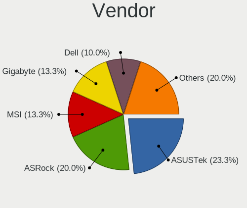
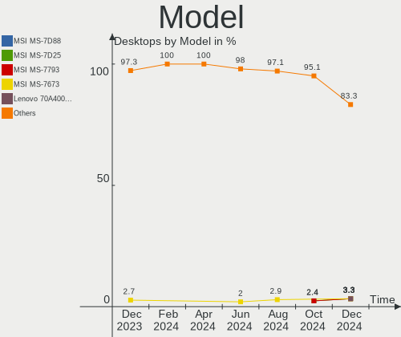
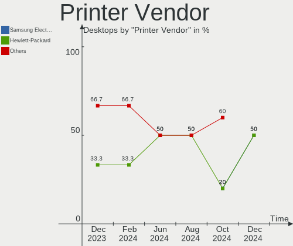
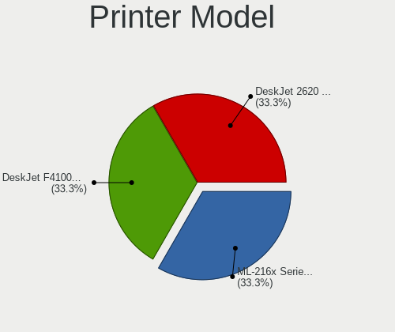

openSUSE - Hardware Trends (Desktops)
-------------------------------------

A project to identify most popular hardware characteristics and track their change
over time based on data collected by Linux users at https://Linux-Hardware.org.

Anyone can contribute to this report by the [hw-probe](https://github.com/linuxhw/hw-probe) tool:

    sudo -E hw-probe -all -upload

This report is for one last month. Overall report since the beginning of time: [TestCoverage](https://github.com/linuxhw/TestCoverage)

Period: Sep, 2022.

Contents
--------

* [ System ](#system)
  - [ OS                       ](#os)
  - [ OS Family                ](#os-family)
  - [ Kernel                   ](#kernel)
  - [ Kernel Family            ](#kernel-family)
  - [ Kernel Major Ver.        ](#kernel-major-ver)
  - [ Arch                     ](#arch)
  - [ DE                       ](#de)
  - [ Display Server           ](#display-server)
  - [ Display Manager          ](#display-manager)
  - [ OS Lang                  ](#os-lang)
  - [ Boot Mode                ](#boot-mode)
  - [ Filesystem               ](#filesystem)
  - [ Part. scheme             ](#part-scheme)
  - [ Dual Boot with Linux/BSD ](#dual-boot-with-linuxbsd)
  - [ Dual Boot (Win)          ](#dual-boot-win)

* [ Board ](#board)
  - [ Vendor                   ](#vendor)
  - [ Model                    ](#model)
  - [ Model Family             ](#model-family)
  - [ MFG Year                 ](#mfg-year)
  - [ Form Factor              ](#form-factor)
  - [ Secure Boot              ](#secure-boot)
  - [ Coreboot                 ](#coreboot)
  - [ RAM Size                 ](#ram-size)
  - [ RAM Used                 ](#ram-used)
  - [ Total Drives             ](#total-drives)
  - [ Has CD-ROM               ](#has-cd-rom)
  - [ Has Ethernet             ](#has-ethernet)
  - [ Has WiFi                 ](#has-wifi)
  - [ Has Bluetooth            ](#has-bluetooth)

* [ Location ](#location)
  - [ Country                  ](#country)
  - [ City                     ](#city)

* [ Drives ](#drives)
  - [ Drive Vendor             ](#drive-vendor)
  - [ Drive Model              ](#drive-model)
  - [ HDD Vendor               ](#hdd-vendor)
  - [ SSD Vendor               ](#ssd-vendor)
  - [ Drive Kind               ](#drive-kind)
  - [ Drive Connector          ](#drive-connector)
  - [ Drive Size               ](#drive-size)
  - [ Space Total              ](#space-total)
  - [ Space Used               ](#space-used)
  - [ Malfunc. Drives          ](#malfunc-drives)
  - [ Malfunc. Drive Vendor    ](#malfunc-drive-vendor)
  - [ Malfunc. HDD Vendor      ](#malfunc-hdd-vendor)
  - [ Malfunc. Drive Kind      ](#malfunc-drive-kind)
  - [ Failed Drives            ](#failed-drives)
  - [ Failed Drive Vendor      ](#failed-drive-vendor)
  - [ Drive Status             ](#drive-status)

* [ Storage controller ](#storage-controller)
  - [ Storage Vendor           ](#storage-vendor)
  - [ Storage Model            ](#storage-model)
  - [ Storage Kind             ](#storage-kind)

* [ Processor ](#processor)
  - [ CPU Vendor               ](#cpu-vendor)
  - [ CPU Model                ](#cpu-model)
  - [ CPU Model Family         ](#cpu-model-family)
  - [ CPU Cores                ](#cpu-cores)
  - [ CPU Sockets              ](#cpu-sockets)
  - [ CPU Threads              ](#cpu-threads)
  - [ CPU Op-Modes             ](#cpu-op-modes)
  - [ CPU Microcode            ](#cpu-microcode)
  - [ CPU Microarch            ](#cpu-microarch)

* [ Graphics ](#graphics)
  - [ GPU Vendor               ](#gpu-vendor)
  - [ GPU Model                ](#gpu-model)
  - [ GPU Combo                ](#gpu-combo)
  - [ GPU Driver               ](#gpu-driver)
  - [ GPU Memory               ](#gpu-memory)

* [ Monitor ](#monitor)
  - [ Monitor Vendor           ](#monitor-vendor)
  - [ Monitor Model            ](#monitor-model)
  - [ Monitor Resolution       ](#monitor-resolution)
  - [ Monitor Diagonal         ](#monitor-diagonal)
  - [ Monitor Width            ](#monitor-width)
  - [ Aspect Ratio             ](#aspect-ratio)
  - [ Monitor Area             ](#monitor-area)
  - [ Pixel Density            ](#pixel-density)
  - [ Multiple Monitors        ](#multiple-monitors)

* [ Network ](#network)
  - [ Net Controller Vendor    ](#net-controller-vendor)
  - [ Net Controller Model     ](#net-controller-model)
  - [ Wireless Vendor          ](#wireless-vendor)
  - [ Wireless Model           ](#wireless-model)
  - [ Ethernet Vendor          ](#ethernet-vendor)
  - [ Ethernet Model           ](#ethernet-model)
  - [ Net Controller Kind      ](#net-controller-kind)
  - [ Used Controller          ](#used-controller)
  - [ NICs                     ](#nics)
  - [ IPv6                     ](#ipv6)

* [ Bluetooth ](#bluetooth)
  - [ Bluetooth Vendor         ](#bluetooth-vendor)
  - [ Bluetooth Model          ](#bluetooth-model)

* [ Sound ](#sound)
  - [ Sound Vendor             ](#sound-vendor)
  - [ Sound Model              ](#sound-model)

* [ Memory ](#memory)
  - [ Memory Vendor            ](#memory-vendor)
  - [ Memory Model             ](#memory-model)
  - [ Memory Kind              ](#memory-kind)
  - [ Memory Form Factor       ](#memory-form-factor)
  - [ Memory Size              ](#memory-size)
  - [ Memory Speed             ](#memory-speed)

* [ Printers & scanners ](#printers--scanners)
  - [ Printer Vendor           ](#printer-vendor)
  - [ Printer Model            ](#printer-model)
  - [ Scanner Vendor           ](#scanner-vendor)
  - [ Scanner Model            ](#scanner-model)

* [ Camera ](#camera)
  - [ Camera Vendor            ](#camera-vendor)
  - [ Camera Model             ](#camera-model)

* [ Security ](#security)
  - [ Fingerprint Vendor       ](#fingerprint-vendor)
  - [ Fingerprint Model        ](#fingerprint-model)
  - [ Chipcard Vendor          ](#chipcard-vendor)
  - [ Chipcard Model           ](#chipcard-model)

* [ Unsupported ](#unsupported)
  - [ Unsupported Devices      ](#unsupported-devices)
  - [ Unsupported Device Types ](#unsupported-device-types)

System
------

OS
--

Installed operating systems

| Name                         | Desktops | Percent |
|------------------------------|----------|---------|
| openSUSE Tumbleweed-XXXXXXXX | 15       | 68.18%  |
| openSUSE Leap-15.4           | 3        | 13.64%  |
| openSUSE Leap-15.3           | 3        | 13.64%  |
| openSUSE Leap-15.5           | 1        | 4.55%   |

OS Family
---------

OS without a version

| Name     | Desktops | Percent |
|----------|----------|---------|
| openSUSE | 22       | 100%    |

Kernel
------

Version of the Linux kernel

| Version                      | Desktops | Percent |
|------------------------------|----------|---------|
| 5.19.8-1-default             | 9        | 40.91%  |
| 5.19.2-1-default             | 5        | 22.73%  |
| 5.14.21-150400.24.18-default | 4        | 18.18%  |
| 5.3.18-150300.59.93-default  | 1        | 4.55%   |
| 5.3.18-150300.59.90-default  | 1        | 4.55%   |
| 5.3.18-150300.59.87-default  | 1        | 4.55%   |
| 5.19.7-1-default             | 1        | 4.55%   |

Kernel Family
-------------

Linux kernel without a distro release

| Version | Desktops | Percent |
|---------|----------|---------|
| 5.19.8  | 9        | 40.91%  |
| 5.19.2  | 5        | 22.73%  |
| 5.14.21 | 4        | 18.18%  |
| 5.3.18  | 3        | 13.64%  |
| 5.19.7  | 1        | 4.55%   |

Kernel Major Ver.
-----------------

Linux kernel major version

| Version | Desktops | Percent |
|---------|----------|---------|
| 5.19    | 15       | 68.18%  |
| 5.14    | 4        | 18.18%  |
| 5.3     | 3        | 13.64%  |

Arch
----

OS architecture (x86_64, i586, etc.)

| Name   | Desktops | Percent |
|--------|----------|---------|
| x86_64 | 22       | 100%    |

DE
--

Desktop Environment

| Name    | Desktops | Percent |
|---------|----------|---------|
| KDE5    | 13       | 59.09%  |
| GNOME   | 3        | 13.64%  |
| Budgie  | 3        | 13.64%  |
| XFCE    | 2        | 9.09%   |
| Unknown | 1        | 4.55%   |

Display Server
--------------

X11 or Wayland

| Name    | Desktops | Percent |
|---------|----------|---------|
| X11     | 21       | 95.45%  |
| Wayland | 1        | 4.55%   |

Display Manager
---------------

SDDM, LightDM, etc.

| Name    | Desktops | Percent |
|---------|----------|---------|
| Unknown | 8        | 36.36%  |
| LightDM | 7        | 31.82%  |
| SDDM    | 5        | 22.73%  |
| GDM     | 2        | 9.09%   |

OS Lang
-------

Language

| Lang    | Desktops | Percent |
|---------|----------|---------|
| en_US   | 8        | 36.36%  |
| de_DE   | 6        | 27.27%  |
| ru_RU   | 1        | 4.55%   |
| pt_BR   | 1        | 4.55%   |
| nn_NO   | 1        | 4.55%   |
| nl_NL   | 1        | 4.55%   |
| it_IT   | 1        | 4.55%   |
| es_ES   | 1        | 4.55%   |
| en_CA   | 1        | 4.55%   |
| Unknown | 1        | 4.55%   |

Boot Mode
---------

EFI or BIOS

| Mode | Desktops | Percent |
|------|----------|---------|
| EFI  | 14       | 63.64%  |
| BIOS | 8        | 36.36%  |

Filesystem
----------

Type of filesystem

| Type  | Desktops | Percent |
|-------|----------|---------|
| Btrfs | 18       | 81.82%  |
| Ext4  | 4        | 18.18%  |

Part. scheme
------------

Scheme of partitioning

| Type    | Desktops | Percent |
|---------|----------|---------|
| GPT     | 11       | 50%     |
| Unknown | 8        | 36.36%  |
| MBR     | 3        | 13.64%  |

Dual Boot with Linux/BSD
------------------------

Hosting more than one Linux/BSD

| Dual boot | Desktops | Percent |
|-----------|----------|---------|
| No        | 17       | 77.27%  |
| Yes       | 5        | 22.73%  |

Dual Boot (Win)
---------------

Hosting Linux and Windows

| Dual boot | Desktops | Percent |
|-----------|----------|---------|
| No        | 18       | 81.82%  |
| Yes       | 4        | 18.18%  |

Board
-----

Vendor
------

Motherboard manufacturer

| Name                | Desktops | Percent |
|---------------------|----------|---------|
| ASUSTek Computer    | 11       | 50%     |
| MSI                 | 4        | 18.18%  |
| Lenovo              | 2        | 9.09%   |
| ASRock              | 2        | 9.09%   |
| Gigabyte Technology | 1        | 4.55%   |
| Biostar             | 1        | 4.55%   |
| BESSTAR Tech        | 1        | 4.55%   |

Model
-----

Motherboard model

| Name                                | Desktops | Percent |
|-------------------------------------|----------|---------|
| MSI MS-7D08                         | 1        | 4.55%   |
| MSI MS-7B79                         | 1        | 4.55%   |
| MSI MS-7673                         | 1        | 4.55%   |
| MSI MS-7522                         | 1        | 4.55%   |
| Lenovo ThinkStation P520 30BE008VGE | 1        | 4.55%   |
| Lenovo ThinkCentre M93p 10ABS00N00  | 1        | 4.55%   |
| Gigabyte Z77-DS3H                   | 1        | 4.55%   |
| Biostar H77MU3                      | 1        | 4.55%   |
| BESSTAR Tech UM560                  | 1        | 4.55%   |
| ASUS WS C422 PRO_SE                 | 1        | 4.55%   |
| ASUS TUF Gaming X570-PLUS           | 1        | 4.55%   |
| ASUS ROG STRIX X570-E GAMING        | 1        | 4.55%   |
| ASUS ROG CROSSHAIR VIII EXTREME     | 1        | 4.55%   |
| ASUS ROG CROSSHAIR VII HERO         | 1        | 4.55%   |
| ASUS PRIME B550-PLUS                | 1        | 4.55%   |
| ASUS P5P43TD PRO                    | 1        | 4.55%   |
| ASUS Maximus VIII RANGER            | 1        | 4.55%   |
| ASUS M5A97 R2.0                     | 1        | 4.55%   |
| ASUS M5A78L-M/USB3                  | 1        | 4.55%   |
| ASUS All Series                     | 1        | 4.55%   |
| ASRock Z170 Extreme4                | 1        | 4.55%   |
| ASRock B450 Steel Legend            | 1        | 4.55%   |

Model Family
------------

Motherboard model prefix

| Name                | Desktops | Percent |
|---------------------|----------|---------|
| ASUS ROG            | 3        | 13.64%  |
| MSI MS-7D08         | 1        | 4.55%   |
| MSI MS-7B79         | 1        | 4.55%   |
| MSI MS-7673         | 1        | 4.55%   |
| MSI MS-7522         | 1        | 4.55%   |
| Lenovo ThinkStation | 1        | 4.55%   |
| Lenovo ThinkCentre  | 1        | 4.55%   |
| Gigabyte Z77-DS3H   | 1        | 4.55%   |
| Biostar H77MU3      | 1        | 4.55%   |
| BESSTAR Tech UM560  | 1        | 4.55%   |
| ASUS WS             | 1        | 4.55%   |
| ASUS TUF            | 1        | 4.55%   |
| ASUS PRIME          | 1        | 4.55%   |
| ASUS P5P43TD        | 1        | 4.55%   |
| ASUS Maximus        | 1        | 4.55%   |
| ASUS M5A97          | 1        | 4.55%   |
| ASUS M5A78L-M       | 1        | 4.55%   |
| ASUS All            | 1        | 4.55%   |
| ASRock Z170         | 1        | 4.55%   |
| ASRock B450         | 1        | 4.55%   |

MFG Year
--------

Motherboard manufacture year

| Year | Desktops | Percent |
|------|----------|---------|
| 2020 | 4        | 18.18%  |
| 2022 | 3        | 13.64%  |
| 2019 | 3        | 13.64%  |
| 2012 | 3        | 13.64%  |
| 2018 | 2        | 9.09%   |
| 2014 | 2        | 9.09%   |
| 2011 | 2        | 9.09%   |
| 2009 | 2        | 9.09%   |
| 2016 | 1        | 4.55%   |

Form Factor
-----------

Physical design of the computer

| Name    | Desktops | Percent |
|---------|----------|---------|
| Desktop | 22       | 100%    |

Secure Boot
-----------

Enabled or disabled

| State    | Desktops | Percent |
|----------|----------|---------|
| Disabled | 19       | 86.36%  |
| Enabled  | 3        | 13.64%  |

Coreboot
--------

Have coreboot on board

| Used | Desktops | Percent |
|------|----------|---------|
| No   | 22       | 100%    |

RAM Size
--------

Total RAM memory

| Size in GB  | Desktops | Percent |
|-------------|----------|---------|
| 32.01-64.0  | 7        | 31.82%  |
| 16.01-24.0  | 7        | 31.82%  |
| 64.01-256.0 | 4        | 18.18%  |
| 24.01-32.0  | 2        | 9.09%   |
| 4.01-8.0    | 1        | 4.55%   |
| 8.01-16.0   | 1        | 4.55%   |

RAM Used
--------

Used RAM memory

| Used GB    | Desktops | Percent |
|------------|----------|---------|
| 2.01-3.0   | 6        | 27.27%  |
| 4.01-8.0   | 5        | 22.73%  |
| 3.01-4.0   | 4        | 18.18%  |
| 8.01-16.0  | 3        | 13.64%  |
| 1.01-2.0   | 2        | 9.09%   |
| 24.01-32.0 | 1        | 4.55%   |
| 16.01-24.0 | 1        | 4.55%   |

Total Drives
------------

Number of drives on board

| Drives | Desktops | Percent |
|--------|----------|---------|
| 2      | 11       | 50%     |
| 1      | 4        | 18.18%  |
| 4      | 3        | 13.64%  |
| 3      | 2        | 9.09%   |
| 6      | 1        | 4.55%   |
| 5      | 1        | 4.55%   |

Has CD-ROM
----------

Has CD-ROM on board

| Presented | Desktops | Percent |
|-----------|----------|---------|
| No        | 13       | 59.09%  |
| Yes       | 9        | 40.91%  |

Has Ethernet
------------

Has Ethernet on board

| Presented | Desktops | Percent |
|-----------|----------|---------|
| Yes       | 22       | 100%    |

Has WiFi
--------

Has WiFi module

| Presented | Desktops | Percent |
|-----------|----------|---------|
| No        | 15       | 68.18%  |
| Yes       | 7        | 31.82%  |

Has Bluetooth
-------------

Has Bluetooth module

| Presented | Desktops | Percent |
|-----------|----------|---------|
| Yes       | 11       | 50%     |
| No        | 11       | 50%     |

Location
--------

Country
-------

Geographic location (country)

| Country     | Desktops | Percent |
|-------------|----------|---------|
| Germany     | 5        | 22.73%  |
| Russia      | 4        | 18.18%  |
| Austria     | 2        | 9.09%   |
| USA         | 1        | 4.55%   |
| Switzerland | 1        | 4.55%   |
| Sweden      | 1        | 4.55%   |
| Spain       | 1        | 4.55%   |
| Norway      | 1        | 4.55%   |
| Netherlands | 1        | 4.55%   |
| Italy       | 1        | 4.55%   |
| Croatia     | 1        | 4.55%   |
| Canada      | 1        | 4.55%   |
| Bulgaria    | 1        | 4.55%   |
| Brazil      | 1        | 4.55%   |

City
----

Geographic location (city)

| City               | Desktops | Percent |
|--------------------|----------|---------|
| Zagreb             | 1        | 4.55%   |
| Woellersdorf       | 1        | 4.55%   |
| Verona             | 1        | 4.55%   |
| Ulyanovsk          | 1        | 4.55%   |
| Uberlândia        | 1        | 4.55%   |
| Teltow             | 1        | 4.55%   |
| Solna              | 1        | 4.55%   |
| Skeie              | 1        | 4.55%   |
| Rubí              | 1        | 4.55%   |
| Plovdiv            | 1        | 4.55%   |
| New Maryland       | 1        | 4.55%   |
| Munich             | 1        | 4.55%   |
| Moscow             | 1        | 4.55%   |
| Lindlar            | 1        | 4.55%   |
| Kurten             | 1        | 4.55%   |
| Kotel'niki         | 1        | 4.55%   |
| Glattfelden        | 1        | 4.55%   |
| Gerasdorf bei Wien | 1        | 4.55%   |
| Emden              | 1        | 4.55%   |
| Cherry Hill        | 1        | 4.55%   |
| Armavir            | 1        | 4.55%   |
| Amsterdam          | 1        | 4.55%   |

Drives
------

Drive Vendor
------------

Hard drive vendors

| Vendor                    | Desktops | Drives | Percent |
|---------------------------|----------|--------|---------|
| Seagate                   | 10       | 17     | 23.81%  |
| Samsung Electronics       | 9        | 11     | 21.43%  |
| WDC                       | 5        | 8      | 11.9%   |
| SanDisk                   | 3        | 3      | 7.14%   |
| Toshiba                   | 2        | 3      | 4.76%   |
| Micron/Crucial Technology | 2        | 3      | 4.76%   |
| Intel                     | 2        | 2      | 4.76%   |
| Smartbuy                  | 1        | 1      | 2.38%   |
| Phison Electronics        | 1        | 1      | 2.38%   |
| Micron Technology         | 1        | 1      | 2.38%   |
| Kingston                  | 1        | 1      | 2.38%   |
| Intenso                   | 1        | 1      | 2.38%   |
| HGST                      | 1        | 1      | 2.38%   |
| Crucial                   | 1        | 1      | 2.38%   |
| AMD                       | 1        | 1      | 2.38%   |
| A-DATA Technology         | 1        | 1      | 2.38%   |

Drive Model
-----------

Hard drive models

| Model                                                 | Desktops | Percent |
|-------------------------------------------------------|----------|---------|
| Seagate ST2000DM001-1ER164 2TB                        | 2        | 3.85%   |
| WDC WDS500G2B0A-00SM50 500GB SSD                      | 1        | 1.92%   |
| WDC WDS250G1B0A-00H9H0 250GB SSD                      | 1        | 1.92%   |
| WDC WD4004FZWX-00GBGB0 4TB                            | 1        | 1.92%   |
| WDC WD30EZRX-00AZ6B0 3TB                              | 1        | 1.92%   |
| WDC WD20EZRZ-00Z5HB0 2TB                              | 1        | 1.92%   |
| WDC WD10EZEX-08WN4A0 1TB                              | 1        | 1.92%   |
| WDC WD10EARS-00MVWB0 1TB                              | 1        | 1.92%   |
| Toshiba HDWU130 3TB                                   | 1        | 1.92%   |
| Toshiba HDWD120 2TB                                   | 1        | 1.92%   |
| Toshiba DT01ACA050 500GB                              | 1        | 1.92%   |
| Smartbuy SSD 240GB                                    | 1        | 1.92%   |
| Seagate ST9500420AS 500GB                             | 1        | 1.92%   |
| Seagate ST8000NE001-2M7101 8TB                        | 1        | 1.92%   |
| Seagate ST6000VN0033-2EE110 6TB                       | 1        | 1.92%   |
| Seagate ST500DM002-1BD142 500GB                       | 1        | 1.92%   |
| Seagate ST4000VN008-2DR166 4TB                        | 1        | 1.92%   |
| Seagate ST4000DM004-2CV104 4TB                        | 1        | 1.92%   |
| Seagate ST31000528AS 1TB                              | 1        | 1.92%   |
| Seagate ST2000DM008-2FR102 2TB                        | 1        | 1.92%   |
| Seagate ST2000DM001-1CH164 2TB                        | 1        | 1.92%   |
| Seagate ST1000DX002-2DV162 1TB                        | 1        | 1.92%   |
| Seagate FireCuda 530 ZP4000GM30013 4TB                | 1        | 1.92%   |
| Seagate Expansion 1TB                                 | 1        | 1.92%   |
| Seagate BarraCuda SSD ZA2000CM10002 2TB               | 1        | 1.92%   |
| Sandisk WD Blue SN550 NVMe SSD 1024GB                 | 1        | 1.92%   |
| Sandisk WD Black 2018/SN750 / PC SN720 NVMe SSD 512GB | 1        | 1.92%   |
| SanDisk SDSSDH3 1T00 1TB                              | 1        | 1.92%   |
| Samsung SSD PM871a 2.5 7mm 256GB                      | 1        | 1.92%   |
| Samsung SSD 970 EVO Plus 1TB                          | 1        | 1.92%   |
| Samsung SSD 970 EVO 500GB                             | 1        | 1.92%   |
| Samsung SSD 860 QVO 1TB                               | 1        | 1.92%   |
| Samsung SSD 860 EVO 4TB                               | 1        | 1.92%   |
| Samsung SSD 840 EVO 250GB                             | 1        | 1.92%   |
| Samsung SSD 750 EVO 500GB                             | 1        | 1.92%   |
| Samsung Portable SSD T5 500GB                         | 1        | 1.92%   |
| Samsung NVMe SSD Drive 1TB                            | 1        | 1.92%   |
| Samsung HD642JJ 640GB                                 | 1        | 1.92%   |
| Phison E16 PCIe4 NVMe Controller 1TB                  | 1        | 1.92%   |
| Micron/Crucial P2 NVMe PCIe SSD 500GB                 | 1        | 1.92%   |

HDD Vendor
----------

Hard disk drive vendors

| Vendor              | Desktops | Drives | Percent |
|---------------------|----------|--------|---------|
| Seagate             | 9        | 15     | 56.25%  |
| WDC                 | 3        | 6      | 18.75%  |
| Toshiba             | 2        | 3      | 12.5%   |
| Samsung Electronics | 1        | 1      | 6.25%   |
| HGST                | 1        | 1      | 6.25%   |

SSD Vendor
----------

Solid state drive vendors

| Vendor              | Desktops | Drives | Percent |
|---------------------|----------|--------|---------|
| Samsung Electronics | 5        | 6      | 33.33%  |
| WDC                 | 2        | 2      | 13.33%  |
| Smartbuy            | 1        | 1      | 6.67%   |
| Seagate             | 1        | 1      | 6.67%   |
| SanDisk             | 1        | 1      | 6.67%   |
| Kingston            | 1        | 1      | 6.67%   |
| Intenso             | 1        | 1      | 6.67%   |
| Intel               | 1        | 1      | 6.67%   |
| Crucial             | 1        | 1      | 6.67%   |
| AMD                 | 1        | 1      | 6.67%   |

Drive Kind
----------

HDD or SSD

| Kind | Desktops | Drives | Percent |
|------|----------|--------|---------|
| HDD  | 16       | 26     | 40%     |
| SSD  | 14       | 16     | 35%     |
| NVMe | 10       | 14     | 25%     |

Drive Connector
---------------

SATA, SAS, NVMe, etc.

| Type | Desktops | Drives | Percent |
|------|----------|--------|---------|
| SATA | 20       | 40     | 62.5%   |
| NVMe | 10       | 14     | 31.25%  |
| SAS  | 2        | 2      | 6.25%   |

Drive Size
----------

Size of hard drive

| Size in TB | Desktops | Drives | Percent |
|------------|----------|--------|---------|
| 0.01-0.5   | 12       | 13     | 33.33%  |
| 0.51-1.0   | 10       | 11     | 27.78%  |
| 1.01-2.0   | 6        | 7      | 16.67%  |
| 3.01-4.0   | 4        | 5      | 11.11%  |
| 2.01-3.0   | 2        | 3      | 5.56%   |
| 4.01-10.0  | 2        | 3      | 5.56%   |

Space Total
-----------

Amount of disk space available on the file system

| Size in GB     | Desktops | Percent |
|----------------|----------|---------|
| More than 3000 | 11       | 50%     |
| 2001-3000      | 4        | 18.18%  |
| 1001-2000      | 3        | 13.64%  |
| 501-1000       | 3        | 13.64%  |
| Unknown        | 1        | 4.55%   |

Space Used
----------

Amount of used disk space

| Used GB        | Desktops | Percent |
|----------------|----------|---------|
| 1001-2000      | 7        | 31.82%  |
| More than 3000 | 4        | 18.18%  |
| 101-250        | 3        | 13.64%  |
| 501-1000       | 3        | 13.64%  |
| 51-100         | 2        | 9.09%   |
| 251-500        | 1        | 4.55%   |
| 2001-3000      | 1        | 4.55%   |
| Unknown        | 1        | 4.55%   |

Malfunc. Drives
---------------

Drive models with a malfunction

| Model                       | Desktops | Drives | Percent |
|-----------------------------|----------|--------|---------|
| Seagate ST9500420AS 500GB   | 1        | 1      | 50%     |
| Crucial CT960M500SSD1 960GB | 1        | 1      | 50%     |

Malfunc. Drive Vendor
---------------------

Vendors of faulty drives

| Vendor  | Desktops | Drives | Percent |
|---------|----------|--------|---------|
| Seagate | 1        | 1      | 50%     |
| Crucial | 1        | 1      | 50%     |

Malfunc. HDD Vendor
-------------------

Vendors of faulty HDD drives

| Vendor  | Desktops | Drives | Percent |
|---------|----------|--------|---------|
| Seagate | 1        | 1      | 100%    |

Malfunc. Drive Kind
-------------------

Kinds of faulty drives

| Kind | Desktops | Drives | Percent |
|------|----------|--------|---------|
| SSD  | 1        | 1      | 50%     |
| HDD  | 1        | 1      | 50%     |

Failed Drives
-------------

Failed drive models

Zero info for selected period =(

Failed Drive Vendor
-------------------

Failed drive vendors

Zero info for selected period =(

Drive Status
------------

Number of failed and malfunc. drives

| Status   | Desktops | Drives | Percent |
|----------|----------|--------|---------|
| Works    | 14       | 28     | 58.33%  |
| Detected | 8        | 26     | 33.33%  |
| Malfunc  | 2        | 2      | 8.33%   |

Storage controller
------------------

Storage Vendor
--------------

Storage controller vendors

| Vendor                    | Desktops | Percent |
|---------------------------|----------|---------|
| Intel                     | 12       | 31.58%  |
| AMD                       | 10       | 26.32%  |
| Samsung Electronics       | 3        | 7.89%   |
| ASMedia Technology        | 3        | 7.89%   |
| SanDisk                   | 2        | 5.26%   |
| Micron/Crucial Technology | 2        | 5.26%   |
| JMicron Technology        | 2        | 5.26%   |
| Seagate Technology        | 1        | 2.63%   |
| Phison Electronics        | 1        | 2.63%   |
| Micron Technology         | 1        | 2.63%   |
| ADATA Technology          | 1        | 2.63%   |

Storage Model
-------------

Storage controller models

| Model                                                                          | Desktops | Percent |
|--------------------------------------------------------------------------------|----------|---------|
| AMD FCH SATA Controller [AHCI mode]                                            | 7        | 15.56%  |
| Samsung NVMe SSD Controller SM981/PM981/PM983                                  | 3        | 6.67%   |
| ASMedia ASM1062 Serial ATA Controller                                          | 3        | 6.67%   |
| AMD 400 Series Chipset SATA Controller                                         | 3        | 6.67%   |
| Intel Q170/Q150/B150/H170/H110/Z170/CM236 Chipset SATA Controller [AHCI Mode]  | 2        | 4.44%   |
| Intel 200 Series PCH SATA controller [AHCI mode]                               | 2        | 4.44%   |
| Seagate FireCuda 530 SSD                                                       | 1        | 2.22%   |
| SanDisk WD Blue SN550 NVMe SSD                                                 | 1        | 2.22%   |
| SanDisk WD Black 2018/SN750 / PC SN720 NVMe SSD                                | 1        | 2.22%   |
| Phison E16 PCIe4 NVMe Controller                                               | 1        | 2.22%   |
| Micron/Crucial P2 NVMe PCIe SSD                                                | 1        | 2.22%   |
| Micron/Crucial NVMe Controller                                                 | 1        | 2.22%   |
| Micron Non-Volatile memory controller                                          | 1        | 2.22%   |
| JMicron JMB363 SATA/IDE Controller                                             | 1        | 2.22%   |
| JMicron JMB361 AHCI/IDE                                                        | 1        | 2.22%   |
| Intel Optane SSD 900P Series                                                   | 1        | 2.22%   |
| Intel 9 Series Chipset Family SATA Controller [AHCI Mode]                      | 1        | 2.22%   |
| Intel 82801JI (ICH10 Family) SATA AHCI Controller                              | 1        | 2.22%   |
| Intel 82801JI (ICH10 Family) 4 port SATA IDE Controller #1                     | 1        | 2.22%   |
| Intel 82801JI (ICH10 Family) 2 port SATA IDE Controller #2                     | 1        | 2.22%   |
| Intel 8 Series/C220 Series Chipset Family 6-port SATA Controller 1 [AHCI mode] | 1        | 2.22%   |
| Intel 7 Series/C210 Series Chipset Family 6-port SATA Controller [AHCI mode]   | 1        | 2.22%   |
| Intel 7 Series/C210 Series Chipset Family 4-port SATA Controller [IDE mode]    | 1        | 2.22%   |
| Intel 7 Series/C210 Series Chipset Family 2-port SATA Controller [IDE mode]    | 1        | 2.22%   |
| Intel 6 Series/C200 Series Chipset Family 6 port Desktop SATA AHCI Controller  | 1        | 2.22%   |
| Intel 500 Series Chipset Family SATA AHCI Controller                           | 1        | 2.22%   |
| AMD SB7x0/SB8x0/SB9x0 SATA Controller [IDE mode]                               | 1        | 2.22%   |
| AMD SB7x0/SB8x0/SB9x0 SATA Controller [AHCI mode]                              | 1        | 2.22%   |
| AMD SB7x0/SB8x0/SB9x0 IDE Controller                                           | 1        | 2.22%   |
| AMD 500 Series Chipset SATA Controller                                         | 1        | 2.22%   |
| ADATA XPG SX8200 Pro PCIe Gen3x4 M.2 2280 Solid State Drive                    | 1        | 2.22%   |

Storage Kind
------------

Kind of storage controller (IDE, SATA, NVMe, SAS, ...)

| Kind | Desktops | Percent |
|------|----------|---------|
| SATA | 20       | 58.82%  |
| NVMe | 10       | 29.41%  |
| IDE  | 4        | 11.76%  |

Processor
---------

CPU Vendor
----------

Processor vendors

| Vendor | Desktops | Percent |
|--------|----------|---------|
| Intel  | 12       | 54.55%  |
| AMD    | 10       | 45.45%  |

CPU Model
---------

Processor models

| Model                                    | Desktops | Percent |
|------------------------------------------|----------|---------|
| Intel Xeon W-2145 CPU @ 3.70GHz          | 1        | 4.55%   |
| Intel Xeon W-2135 CPU @ 3.70GHz          | 1        | 4.55%   |
| Intel Xeon CPU E5450 @ 3.00GHz           | 1        | 4.55%   |
| Intel Core i7-6700K CPU @ 4.00GHz        | 1        | 4.55%   |
| Intel Core i7-4790 CPU @ 3.60GHz         | 1        | 4.55%   |
| Intel Core i7 CPU 920 @ 2.67GHz          | 1        | 4.55%   |
| Intel Core i5-6600K CPU @ 3.50GHz        | 1        | 4.55%   |
| Intel Core i5-4570T CPU @ 2.90GHz        | 1        | 4.55%   |
| Intel Core i5-3570 CPU @ 3.40GHz         | 1        | 4.55%   |
| Intel Core i5-2500 CPU @ 3.30GHz         | 1        | 4.55%   |
| Intel Core i5-2320 CPU @ 3.00GHz         | 1        | 4.55%   |
| Intel 11th Gen Core i7-11700KF @ 3.60GHz | 1        | 4.55%   |
| AMD Ryzen 9 5950X 16-Core Processor      | 1        | 4.55%   |
| AMD Ryzen 9 3900X 12-Core Processor      | 1        | 4.55%   |
| AMD Ryzen 7 3800X 8-Core Processor       | 1        | 4.55%   |
| AMD Ryzen 7 2700X Eight-Core Processor   | 1        | 4.55%   |
| AMD Ryzen 5 5625U with Radeon Graphics   | 1        | 4.55%   |
| AMD Ryzen 5 3600X 6-Core Processor       | 1        | 4.55%   |
| AMD Ryzen 5 3600 6-Core Processor        | 1        | 4.55%   |
| AMD Ryzen 5 1600 Six-Core Processor      | 1        | 4.55%   |
| AMD FX-8350 Eight-Core Processor         | 1        | 4.55%   |
| AMD FX-8320 Eight-Core Processor         | 1        | 4.55%   |

CPU Model Family
----------------

Processor model prefix

| Model         | Desktops | Percent |
|---------------|----------|---------|
| Intel Core i5 | 5        | 22.73%  |
| AMD Ryzen 5   | 4        | 18.18%  |
| Intel Xeon    | 3        | 13.64%  |
| Intel Core i7 | 3        | 13.64%  |
| AMD Ryzen 9   | 2        | 9.09%   |
| AMD Ryzen 7   | 2        | 9.09%   |
| AMD FX        | 2        | 9.09%   |
| Other         | 1        | 4.55%   |

CPU Cores
---------

Number of processor cores

| Number | Desktops | Percent |
|--------|----------|---------|
| 4      | 10       | 45.45%  |
| 6      | 5        | 22.73%  |
| 8      | 4        | 18.18%  |
| 16     | 1        | 4.55%   |
| 12     | 1        | 4.55%   |
| 2      | 1        | 4.55%   |

CPU Sockets
-----------

Number of sockets

| Number | Desktops | Percent |
|--------|----------|---------|
| 1      | 22       | 100%    |

CPU Threads
-----------

Threads per core (Hyper-Threading)

| Number | Desktops | Percent |
|--------|----------|---------|
| 2      | 17       | 77.27%  |
| 1      | 5        | 22.73%  |

CPU Op-Modes
------------

CPU Operation Modes (32-bit, 64-bit)

| Op mode        | Desktops | Percent |
|----------------|----------|---------|
| 32-bit, 64-bit | 22       | 100%    |

CPU Microcode
-------------

Microcode number

| Number     | Desktops | Percent |
|------------|----------|---------|
| 0x08701021 | 4        | 18.18%  |
| 0x506e3    | 2        | 9.09%   |
| 0x306c3    | 2        | 9.09%   |
| 0x206a7    | 2        | 9.09%   |
| 0x0800820d | 2        | 9.09%   |
| 0x06000852 | 2        | 9.09%   |
| Unknown    | 2        | 9.09%   |
| 0xa0671    | 1        | 4.55%   |
| 0x50654    | 1        | 4.55%   |
| 0x306a9    | 1        | 4.55%   |
| 0x106a4    | 1        | 4.55%   |
| 0x0a50000c | 1        | 4.55%   |
| 0x0a201016 | 1        | 4.55%   |

CPU Microarch
-------------

Microarchitecture

| Name        | Desktops | Percent |
|-------------|----------|---------|
| Zen 2       | 4        | 18.18%  |
| Skylake     | 4        | 18.18%  |
| Zen+        | 2        | 9.09%   |
| Zen 3       | 2        | 9.09%   |
| SandyBridge | 2        | 9.09%   |
| Piledriver  | 2        | 9.09%   |
| Haswell     | 2        | 9.09%   |
| Penryn      | 1        | 4.55%   |
| Nehalem     | 1        | 4.55%   |
| IvyBridge   | 1        | 4.55%   |
| Icelake     | 1        | 4.55%   |

Graphics
--------

GPU Vendor
----------

Vendors of graphics cards

| Vendor            | Desktops | Percent |
|-------------------|----------|---------|
| Nvidia            | 12       | 50%     |
| AMD               | 8        | 33.33%  |
| Intel             | 3        | 12.5%   |
| ASPEED Technology | 1        | 4.17%   |

GPU Model
---------

Graphics card models

| Model                                                                       | Desktops | Percent |
|-----------------------------------------------------------------------------|----------|---------|
| Nvidia GP107 [GeForce GTX 1050 Ti]                                          | 3        | 12.5%   |
| Nvidia GP106 [GeForce GTX 1060 3GB]                                         | 2        | 8.33%   |
| Nvidia TU116 [GeForce GTX 1660 SUPER]                                       | 1        | 4.17%   |
| Nvidia TU104 [GeForce RTX 2080 SUPER]                                       | 1        | 4.17%   |
| Nvidia GP104 [GeForce GTX 1070]                                             | 1        | 4.17%   |
| Nvidia GM107 [GeForce GTX 750 Ti]                                           | 1        | 4.17%   |
| Nvidia GK208B [GeForce GT 710]                                              | 1        | 4.17%   |
| Nvidia GK107 [GeForce GT 640]                                               | 1        | 4.17%   |
| Nvidia GK106 [GeForce GTX 660]                                              | 1        | 4.17%   |
| Intel Xeon E3-1200 v3/4th Gen Core Processor Integrated Graphics Controller | 1        | 4.17%   |
| Intel HD Graphics 530                                                       | 1        | 4.17%   |
| Intel 2nd Generation Core Processor Family Integrated Graphics Controller   | 1        | 4.17%   |
| ASPEED Technology ASPEED Graphics Family                                    | 1        | 4.17%   |
| AMD RV710 [Radeon HD 4350/4550]                                             | 1        | 4.17%   |
| AMD RS780L [Radeon 3000]                                                    | 1        | 4.17%   |
| AMD Navi 21 [Radeon RX 6800/6800 XT / 6900 XT]                              | 1        | 4.17%   |
| AMD Navi 14 [Radeon RX 5500/5500M / Pro 5500M]                              | 1        | 4.17%   |
| AMD Navi 10 [Radeon RX 5600 OEM/5600 XT / 5700/5700 XT]                     | 1        | 4.17%   |
| AMD Lexa PRO [Radeon 540/540X/550/550X / RX 540X/550/550X]                  | 1        | 4.17%   |
| AMD Ellesmere [Radeon RX 470/480/570/570X/580/580X/590]                     | 1        | 4.17%   |
| AMD Barcelo                                                                 | 1        | 4.17%   |

GPU Combo
---------

Combinations of graphics cards

| Name            | Desktops | Percent |
|-----------------|----------|---------|
| 1 x Nvidia      | 10       | 45.45%  |
| 1 x AMD         | 8        | 36.36%  |
| 1 x Intel       | 2        | 9.09%   |
| Nvidia + ASPEED | 1        | 4.55%   |
| Intel + Nvidia  | 1        | 4.55%   |

GPU Driver
----------

Free vs proprietary

| Driver      | Desktops | Percent |
|-------------|----------|---------|
| Proprietary | 12       | 54.55%  |
| Free        | 9        | 40.91%  |
| Unknown     | 1        | 4.55%   |

GPU Memory
----------

Total video memory

| Size in GB | Desktops | Percent |
|------------|----------|---------|
| 7.01-8.0   | 5        | 22.73%  |
| 1.01-2.0   | 4        | 18.18%  |
| 3.01-4.0   | 3        | 13.64%  |
| Unknown    | 3        | 13.64%  |
| 2.01-3.0   | 2        | 9.09%   |
| 0.01-0.5   | 2        | 9.09%   |
| 5.01-6.0   | 1        | 4.55%   |
| 8.01-16.0  | 1        | 4.55%   |
| 0.51-1.0   | 1        | 4.55%   |

Monitor
-------

Monitor Vendor
--------------

Monitor vendors

| Vendor               | Desktops | Percent |
|----------------------|----------|---------|
| Samsung Electronics  | 4        | 16%     |
| Goldstar             | 4        | 16%     |
| AOC                  | 3        | 12%     |
| Ancor Communications | 3        | 12%     |
| Dell                 | 2        | 8%      |
| BenQ                 | 2        | 8%      |
| Philips              | 1        | 4%      |
| Medion               | 1        | 4%      |
| LG Electronics       | 1        | 4%      |
| Hewlett-Packard      | 1        | 4%      |
| GDH                  | 1        | 4%      |
| ASUSTek Computer     | 1        | 4%      |
| Acer                 | 1        | 4%      |

Monitor Model
-------------

Monitor models

| Model                                                                 | Desktops | Percent |
|-----------------------------------------------------------------------|----------|---------|
| Samsung Electronics SyncMaster SAM02B6 1920x1200 518x324mm 24.1-inch  | 1        | 3.7%    |
| Samsung Electronics S27F358 SAM0D72 1920x1080 598x336mm 27.0-inch     | 1        | 3.7%    |
| Samsung Electronics S27D590 SAM0B49 1920x1080 598x336mm 27.0-inch     | 1        | 3.7%    |
| Samsung Electronics S24F350 SAM0D20 1920x1080 521x293mm 23.5-inch     | 1        | 3.7%    |
| Samsung Electronics LU28R55 SAM1016 3840x2160 632x360mm 28.6-inch     | 1        | 3.7%    |
| Philips PHL 223V5 PHLC0CF 1920x1080 477x268mm 21.5-inch               | 1        | 3.7%    |
| Medion MD20581 MED369A 1920x1080 597x336mm 27.0-inch                  | 1        | 3.7%    |
| LG Electronics LCD Monitor E2260 1920x1080                            | 1        | 3.7%    |
| Hewlett-Packard vs19b HWP264C 1280x1024 376x301mm 19.0-inch           | 1        | 3.7%    |
| Goldstar Ultra HD GSM5B09 3840x2160 600x340mm 27.2-inch               | 1        | 3.7%    |
| Goldstar M2380D GSM57BC 1920x1080 598x336mm 27.0-inch                 | 1        | 3.7%    |
| Goldstar HDR 4K GSM7707 3840x2160 600x340mm 27.2-inch                 | 1        | 3.7%    |
| Goldstar FULL HD GSM5ABB 1920x1080 480x270mm 21.7-inch                | 1        | 3.7%    |
| Goldstar 2D FHD TV GSM59C6 1920x1080 509x286mm 23.0-inch              | 1        | 3.7%    |
| GDH PHILCO GDH0030 1920x540 708x398mm 32.0-inch                       | 1        | 3.7%    |
| Dell P4317Q DELD084 3840x2160 941x529mm 42.5-inch                     | 1        | 3.7%    |
| Dell P2212H DELA07F 1920x1080 531x299mm 24.0-inch                     | 1        | 3.7%    |
| BenQ GW2480 BNQ78E7 1920x1080 527x296mm 23.8-inch                     | 1        | 3.7%    |
| BenQ FP951 BNQ7666 1280x1024 338x270mm 17.0-inch                      | 1        | 3.7%    |
| ASUSTek Computer PA329C AUS3264 3840x2160 708x399mm 32.0-inch         | 1        | 3.7%    |
| AOC 27G2G3 AOC2702 1920x1080 598x336mm 27.0-inch                      | 1        | 3.7%    |
| AOC 27B1 AOC2701 1920x1080 598x336mm 27.0-inch                        | 1        | 3.7%    |
| AOC 24P1X AOC2401 1920x1200 518x324mm 24.1-inch                       | 1        | 3.7%    |
| Ancor Communications PB328 ACI32A5 2560x1440 708x399mm 32.0-inch      | 1        | 3.7%    |
| Ancor Communications PA246 ACIFF24 1920x1200 546x352mm 25.6-inch      | 1        | 3.7%    |
| Ancor Communications ASUS VX239 ACI23E1 1920x1080 509x286mm 23.0-inch | 1        | 3.7%    |
| Acer S242HL ACR0216 1920x1080 531x299mm 24.0-inch                     | 1        | 3.7%    |

Monitor Resolution
------------------

Monitor screen resolution

| Resolution        | Desktops | Percent |
|-------------------|----------|---------|
| 1920x1080 (FHD)   | 9        | 40.91%  |
| 3840x2160 (4K)    | 7        | 31.82%  |
| 2560x1440 (QHD)   | 2        | 9.09%   |
| 1920x1200 (WUXGA) | 2        | 9.09%   |
| 1280x1024 (SXGA)  | 2        | 9.09%   |

Monitor Diagonal
----------------

Diagonal size in inches

| Inches  | Desktops | Percent |
|---------|----------|---------|
| 27      | 7        | 28%     |
| 24      | 4        | 16%     |
| 23      | 3        | 12%     |
| 32      | 2        | 8%      |
| 21      | 2        | 8%      |
| 52      | 1        | 4%      |
| 42      | 1        | 4%      |
| 28      | 1        | 4%      |
| 25      | 1        | 4%      |
| 19      | 1        | 4%      |
| 17      | 1        | 4%      |
| Unknown | 1        | 4%      |

Monitor Width
-------------

Physical width

| Width in mm | Desktops | Percent |
|-------------|----------|---------|
| 501-600     | 14       | 58.33%  |
| 701-800     | 2        | 8.33%   |
| 401-500     | 2        | 8.33%   |
| 601-700     | 1        | 4.17%   |
| 351-400     | 1        | 4.17%   |
| 301-350     | 1        | 4.17%   |
| 1001-1500   | 1        | 4.17%   |
| 901-1000    | 1        | 4.17%   |
| Unknown     | 1        | 4.17%   |

Aspect Ratio
------------

Proportional relationship between the width and the height

| Ratio   | Desktops | Percent |
|---------|----------|---------|
| 16/9    | 16       | 69.57%  |
| 16/10   | 4        | 17.39%  |
| 5/4     | 2        | 8.7%    |
| Unknown | 1        | 4.35%   |

Monitor Area
------------

Area in inch²

| Area in inch² | Desktops | Percent |
|----------------|----------|---------|
| 301-350        | 7        | 28%     |
| 201-250        | 7        | 28%     |
| 351-500        | 3        | 12%     |
| 251-300        | 3        | 12%     |
| More than 1000 | 1        | 4%      |
| 151-200        | 1        | 4%      |
| 141-150        | 1        | 4%      |
| 501-1000       | 1        | 4%      |
| Unknown        | 1        | 4%      |

Pixel Density
-------------

Pixels per inch

| Density | Desktops | Percent |
|---------|----------|---------|
| 51-100  | 15       | 65.22%  |
| 101-120 | 3        | 13.04%  |
| 121-160 | 2        | 8.7%    |
| 1-50    | 1        | 4.35%   |
| 161-240 | 1        | 4.35%   |
| Unknown | 1        | 4.35%   |

Multiple Monitors
-----------------

Total monitors connected

| Total | Desktops | Percent |
|-------|----------|---------|
| 1     | 16       | 72.73%  |
| 2     | 5        | 22.73%  |
| 3     | 1        | 4.55%   |

Network
-------

Net Controller Vendor
---------------------

Controller vendors

| Vendor                | Desktops | Percent |
|-----------------------|----------|---------|
| Realtek Semiconductor | 12       | 38.71%  |
| Intel                 | 11       | 35.48%  |
| Qualcomm Atheros      | 2        | 6.45%   |
| Samsung Electronics   | 1        | 3.23%   |
| Ralink Technology     | 1        | 3.23%   |
| Microsoft             | 1        | 3.23%   |
| MediaTek              | 1        | 3.23%   |
| D-Link                | 1        | 3.23%   |
| Aquantia              | 1        | 3.23%   |

Net Controller Model
--------------------

Controller models

| Model                                                               | Desktops | Percent |
|---------------------------------------------------------------------|----------|---------|
| Realtek RTL8111/8168/8411 PCI Express Gigabit Ethernet Controller   | 10       | 30.3%   |
| Intel Wi-Fi 6 AX210/AX211/AX411 160MHz                              | 2        | 6.06%   |
| Intel Ethernet Controller I225-V                                    | 2        | 6.06%   |
| Intel Ethernet Connection (2) I219-V                                | 2        | 6.06%   |
| Samsung GT-I9070 (network tethering, USB debugging enabled)         | 1        | 3.03%   |
| Realtek RTL8822BE 802.11a/b/g/n/ac WiFi adapter                     | 1        | 3.03%   |
| Realtek RTL8125 2.5GbE Controller                                   | 1        | 3.03%   |
| Ralink RT5370 Wireless Adapter                                      | 1        | 3.03%   |
| Qualcomm Atheros AR8161 Gigabit Ethernet                            | 1        | 3.03%   |
| Qualcomm Atheros AR8121/AR8113/AR8114 Gigabit or Fast Ethernet      | 1        | 3.03%   |
| Microsoft Xbox 360 Wireless Adapter                                 | 1        | 3.03%   |
| MediaTek MT7921K (RZ608) Wi-Fi 6E 80MHz                             | 1        | 3.03%   |
| Intel Wi-Fi 6 AX200                                                 | 1        | 3.03%   |
| Intel I350 Gigabit Network Connection                               | 1        | 3.03%   |
| Intel I211 Gigabit Network Connection                               | 1        | 3.03%   |
| Intel I210 Gigabit Network Connection                               | 1        | 3.03%   |
| Intel Ethernet Connection I217-LM                                   | 1        | 3.03%   |
| Intel Ethernet Connection (2) I218-V                                | 1        | 3.03%   |
| Intel Ethernet Connection (10) I219-V                               | 1        | 3.03%   |
| D-Link 11ac adapter                                                 | 1        | 3.03%   |
| Aquantia AQC113CS NBase-T/IEEE 802.3bz Ethernet Controller [AQtion] | 1        | 3.03%   |

Wireless Vendor
---------------

Wireless vendors

| Vendor                | Desktops | Percent |
|-----------------------|----------|---------|
| Intel                 | 3        | 37.5%   |
| Realtek Semiconductor | 1        | 12.5%   |
| Ralink Technology     | 1        | 12.5%   |
| Microsoft             | 1        | 12.5%   |
| MediaTek              | 1        | 12.5%   |
| D-Link                | 1        | 12.5%   |

Wireless Model
--------------

Wireless models

| Model                                           | Desktops | Percent |
|-------------------------------------------------|----------|---------|
| Intel Wi-Fi 6 AX210/AX211/AX411 160MHz          | 2        | 25%     |
| Realtek RTL8822BE 802.11a/b/g/n/ac WiFi adapter | 1        | 12.5%   |
| Ralink RT5370 Wireless Adapter                  | 1        | 12.5%   |
| Microsoft Xbox 360 Wireless Adapter             | 1        | 12.5%   |
| MediaTek MT7921K (RZ608) Wi-Fi 6E 80MHz         | 1        | 12.5%   |
| Intel Wi-Fi 6 AX200                             | 1        | 12.5%   |
| D-Link 11ac adapter                             | 1        | 12.5%   |

Ethernet Vendor
---------------

Ethernet vendors

| Vendor                | Desktops | Percent |
|-----------------------|----------|---------|
| Realtek Semiconductor | 11       | 44%     |
| Intel                 | 10       | 40%     |
| Qualcomm Atheros      | 2        | 8%      |
| Samsung Electronics   | 1        | 4%      |
| Aquantia              | 1        | 4%      |

Ethernet Model
--------------

Ethernet models

| Model                                                               | Desktops | Percent |
|---------------------------------------------------------------------|----------|---------|
| Realtek RTL8111/8168/8411 PCI Express Gigabit Ethernet Controller   | 10       | 40%     |
| Intel Ethernet Controller I225-V                                    | 2        | 8%      |
| Intel Ethernet Connection (2) I219-V                                | 2        | 8%      |
| Samsung GT-I9070 (network tethering, USB debugging enabled)         | 1        | 4%      |
| Realtek RTL8125 2.5GbE Controller                                   | 1        | 4%      |
| Qualcomm Atheros AR8161 Gigabit Ethernet                            | 1        | 4%      |
| Qualcomm Atheros AR8121/AR8113/AR8114 Gigabit or Fast Ethernet      | 1        | 4%      |
| Intel I350 Gigabit Network Connection                               | 1        | 4%      |
| Intel I211 Gigabit Network Connection                               | 1        | 4%      |
| Intel I210 Gigabit Network Connection                               | 1        | 4%      |
| Intel Ethernet Connection I217-LM                                   | 1        | 4%      |
| Intel Ethernet Connection (2) I218-V                                | 1        | 4%      |
| Intel Ethernet Connection (10) I219-V                               | 1        | 4%      |
| Aquantia AQC113CS NBase-T/IEEE 802.3bz Ethernet Controller [AQtion] | 1        | 4%      |

Net Controller Kind
-------------------

Ethernet, WiFi or modem

| Kind     | Desktops | Percent |
|----------|----------|---------|
| Ethernet | 22       | 75.86%  |
| WiFi     | 7        | 24.14%  |

Used Controller
---------------

Currently used network controller

| Kind     | Desktops | Percent |
|----------|----------|---------|
| Ethernet | 20       | 86.96%  |
| WiFi     | 3        | 13.04%  |

NICs
----

Total network controllers on board

| Total | Desktops | Percent |
|-------|----------|---------|
| 1     | 15       | 68.18%  |
| 2     | 5        | 22.73%  |
| 4     | 1        | 4.55%   |
| 3     | 1        | 4.55%   |

IPv6
----

IPv6 vs IPv4

| Used | Desktops | Percent |
|------|----------|---------|
| No   | 17       | 77.27%  |
| Yes  | 5        | 22.73%  |

Bluetooth
---------

Bluetooth Vendor
----------------

Controller vendors

| Vendor                  | Desktops | Percent |
|-------------------------|----------|---------|
| Intel                   | 4        | 33.33%  |
| ASUSTek Computer        | 4        | 33.33%  |
| Realtek Semiconductor   | 1        | 8.33%   |
| MediaTek                | 1        | 8.33%   |
| Cambridge Silicon Radio | 1        | 8.33%   |
| Belkin Components       | 1        | 8.33%   |

Bluetooth Model
---------------

Controller models

| Model                                               | Desktops | Percent |
|-----------------------------------------------------|----------|---------|
| ASUS Broadcom BCM20702A0 Bluetooth                  | 3        | 25%     |
| Intel AX210 Bluetooth                               | 2        | 16.67%  |
| Realtek Bluetooth Radio                             | 1        | 8.33%   |
| MediaTek Wireless_Device                            | 1        | 8.33%   |
| Intel Wireless-AC 9260 Bluetooth Adapter            | 1        | 8.33%   |
| Intel AX200 Bluetooth                               | 1        | 8.33%   |
| Cambridge Silicon Radio Bluetooth Dongle (HCI mode) | 1        | 8.33%   |
| Belkin Components Bluetooth Mini Dongle             | 1        | 8.33%   |
| ASUS Bluetooth Radio                                | 1        | 8.33%   |

Sound
-----

Sound Vendor
------------

Sound card vendors

| Vendor              | Desktops | Percent |
|---------------------|----------|---------|
| AMD                 | 12       | 25%     |
| Nvidia              | 11       | 22.92%  |
| Intel               | 10       | 20.83%  |
| Creative Labs       | 3        | 6.25%   |
| Kingston Technology | 2        | 4.17%   |
| C-Media Electronics | 2        | 4.17%   |
| Sony                | 1        | 2.08%   |
| Solid State Logic   | 1        | 2.08%   |
| ShareWave           | 1        | 2.08%   |
| RODE Microphones    | 1        | 2.08%   |
| JMTek               | 1        | 2.08%   |
| Ensoniq             | 1        | 2.08%   |
| DSEA A/S            | 1        | 2.08%   |
| Creative Technology | 1        | 2.08%   |

Sound Model
-----------

Sound card models

| Model                                                               | Desktops | Percent |
|---------------------------------------------------------------------|----------|---------|
| AMD Starship/Matisse HD Audio Controller                            | 5        | 9.09%   |
| Nvidia GP107GL High Definition Audio Controller                     | 3        | 5.45%   |
| Nvidia GP106 High Definition Audio Controller                       | 2        | 3.64%   |
| Intel 82801JI (ICH10 Family) HD Audio Controller                    | 2        | 3.64%   |
| Intel 7 Series/C216 Chipset Family High Definition Audio Controller | 2        | 3.64%   |
| Intel 100 Series/C230 Series Chipset Family HD Audio Controller     | 2        | 3.64%   |
| Creative Labs Sound Core3D [Sound Blaster Recon3D / Z-Series]       | 2        | 3.64%   |
| AMD SBx00 Azalia (Intel HDA)                                        | 2        | 3.64%   |
| AMD Navi 10 HDMI Audio                                              | 2        | 3.64%   |
| AMD Family 17h (Models 00h-0fh) HD Audio Controller                 | 2        | 3.64%   |
| Sony DualSense wireless controller (PS5)                            | 1        | 1.82%   |
| Solid State Logic SSL 2+                                            | 1        | 1.82%   |
| ShareWave Usb Audio Device                                          | 1        | 1.82%   |
| RODE Microphones RODE NT-USB                                        | 1        | 1.82%   |
| Nvidia TU116 High Definition Audio Controller                       | 1        | 1.82%   |
| Nvidia TU104 HD Audio Controller                                    | 1        | 1.82%   |
| Nvidia GM107 High Definition Audio Controller [GeForce 940MX]       | 1        | 1.82%   |
| Nvidia GK208 HDMI/DP Audio Controller                               | 1        | 1.82%   |
| Nvidia GK107 HDMI Audio Controller                                  | 1        | 1.82%   |
| Nvidia GK106 HDMI Audio Controller                                  | 1        | 1.82%   |
| Kingston Technology HyperX Cloud Stinger Core Wireless + 7.1        | 1        | 1.82%   |
| Kingston Technology HyperX Cloud Flight Wireless Headset            | 1        | 1.82%   |
| JMTek USB PnP Audio Device                                          | 1        | 1.82%   |
| Intel Xeon E3-1200 v3/4th Gen Core Processor HD Audio Controller    | 1        | 1.82%   |
| Intel Tiger Lake-H HD Audio Controller                              | 1        | 1.82%   |
| Intel 9 Series Chipset Family HD Audio Controller                   | 1        | 1.82%   |
| Intel 8 Series/C220 Series Chipset High Definition Audio Controller | 1        | 1.82%   |
| Intel 200 Series PCH HD Audio                                       | 1        | 1.82%   |
| Ensoniq 5880B / Creative Labs CT5880                                | 1        | 1.82%   |
| DSEA A/S GSP 370                                                    | 1        | 1.82%   |
| Creative Technology SB Omni Surround 5.1                            | 1        | 1.82%   |
| Creative Labs EMU10k1 [Sound Blaster Live! Series]                  | 1        | 1.82%   |
| C-Media Electronics CMI8738/CMI8768 PCI Audio                       | 1        | 1.82%   |
| C-Media Electronics Audio Adapter (Unitek Y-247A)                   | 1        | 1.82%   |
| AMD RV710/730 HDMI Audio [Radeon HD 4000 series]                    | 1        | 1.82%   |
| AMD RS780 HDMI Audio [Radeon 3000/3100 / HD 3200/3300]              | 1        | 1.82%   |
| AMD Renoir Radeon High Definition Audio Controller                  | 1        | 1.82%   |
| AMD Navi 21/23 HDMI/DP Audio Controller                             | 1        | 1.82%   |
| AMD Family 17h/19h HD Audio Controller                              | 1        | 1.82%   |
| AMD Ellesmere HDMI Audio [Radeon RX 470/480 / 570/580/590]          | 1        | 1.82%   |

Memory
------

Memory Vendor
-------------

Memory module vendors

| Vendor              | Desktops | Percent |
|---------------------|----------|---------|
| Kingston            | 5        | 31.25%  |
| G.Skill             | 4        | 25%     |
| Corsair             | 3        | 18.75%  |
| Crucial             | 2        | 12.5%   |
| Samsung Electronics | 1        | 6.25%   |
| A-DATA Technology   | 1        | 6.25%   |

Memory Model
------------

Memory module models

| Model                                                     | Desktops | Percent |
|-----------------------------------------------------------|----------|---------|
| Samsung RAM M471B5173QH0-YK0 4GB SODIMM DDR3 1600MT/s     | 1        | 5.88%   |
| Kingston RAM KHX2666C15D4/8G 8GB DIMM DDR4 3200MT/s       | 1        | 5.88%   |
| Kingston RAM KHX2400C15/16G 16GB DIMM DDR4 3334MT/s       | 1        | 5.88%   |
| Kingston RAM KHX1866C9D3/8GX 8GB DIMM DDR3 1866MT/s       | 1        | 5.88%   |
| Kingston RAM 99U5471-040.A00LF 8GB DIMM DDR3 1333MT/s     | 1        | 5.88%   |
| Kingston RAM 99U5458-005.A00LF 4GB DIMM DDR3 1333MT/s     | 1        | 5.88%   |
| Kingston RAM 9965698-001.A00G 16GB DIMM DDR4 2667MT/s     | 1        | 5.88%   |
| G.Skill RAM F4-3600C16-16GVKC 16GB DIMM DDR4 3866MT/s     | 1        | 5.88%   |
| G.Skill RAM F4-3600C14-16GTZNA 16384MB DIMM DDR4 2133MT/s | 1        | 5.88%   |
| G.Skill RAM F4-3000C16-8GISB 8GB DIMM DDR4 3200MT/s       | 1        | 5.88%   |
| G.Skill RAM F3-10666CL9-4GBNT 4GB DIMM DDR3 1400MT/s      | 1        | 5.88%   |
| Crucial RAM CT16G4DFD8266.C16FD1 16GB DIMM DDR4 2667MT/s  | 1        | 5.88%   |
| Crucial RAM CT102464BA1339.C16 8GB DIMM DDR3 1333MT/s     | 1        | 5.88%   |
| Corsair RAM CMK64GX4M2E3200C16 32GB DIMM DDR4 3200MT/s    | 1        | 5.88%   |
| Corsair RAM CMK32GX4M2B3200C16 16GB DIMM DDR4 3400MT/s    | 1        | 5.88%   |
| Corsair RAM CMK16GX4M2B3000C15 8GB DIMM DDR4 3200MT/s     | 1        | 5.88%   |
| A-DATA RAM Module 8192MB DIMM DDR3 1333MT/s               | 1        | 5.88%   |

Memory Kind
-----------

Memory module kinds

| Kind | Desktops | Percent |
|------|----------|---------|
| DDR4 | 9        | 64.29%  |
| DDR3 | 5        | 35.71%  |

Memory Form Factor
------------------

Physical design of the memory module

| Name   | Desktops | Percent |
|--------|----------|---------|
| DIMM   | 13       | 92.86%  |
| SODIMM | 1        | 7.14%   |

Memory Size
-----------

Memory module size

| Size  | Desktops | Percent |
|-------|----------|---------|
| 8192  | 7        | 41.18%  |
| 16384 | 6        | 35.29%  |
| 4096  | 3        | 17.65%  |
| 32768 | 1        | 5.88%   |

Memory Speed
------------

Memory module speed

| Speed | Desktops | Percent |
|-------|----------|---------|
| 3200  | 3        | 18.75%  |
| 1333  | 3        | 18.75%  |
| 2667  | 2        | 12.5%   |
| 3866  | 1        | 6.25%   |
| 3466  | 1        | 6.25%   |
| 3400  | 1        | 6.25%   |
| 3334  | 1        | 6.25%   |
| 2133  | 1        | 6.25%   |
| 1866  | 1        | 6.25%   |
| 1600  | 1        | 6.25%   |
| 1400  | 1        | 6.25%   |

Printers & scanners
-------------------

Printer Vendor
--------------

Printer device vendors

| Vendor | Desktops | Percent |
|--------|----------|---------|
| Canon  | 1        | 100%    |

Printer Model
-------------

Printer device models

| Model              | Desktops | Percent |
|--------------------|----------|---------|
| Canon G3020 series | 1        | 100%    |

Scanner Vendor
--------------

Scanner device vendors

Zero info for selected period =(

Scanner Model
-------------

Scanner device models

Zero info for selected period =(

Camera
------

Camera Vendor
-------------

Camera device vendors

| Vendor     | Desktops | Percent |
|------------|----------|---------|
| Logitech   | 4        | 80%     |
| Cubeternet | 1        | 20%     |

Camera Model
------------

Camera device models

| Model                       | Desktops | Percent |
|-----------------------------|----------|---------|
| Logitech Webcam C300        | 1        | 20%     |
| Logitech Webcam C270        | 1        | 20%     |
| Logitech HD Pro Webcam C920 | 1        | 20%     |
| Logitech CrystalCam         | 1        | 20%     |
| Cubeternet USB2.0 Camera    | 1        | 20%     |

Security
--------

Fingerprint Vendor
------------------

Fingerprint sensor vendors

Zero info for selected period =(

Fingerprint Model
-----------------

Fingerprint sensor models

Zero info for selected period =(

Chipcard Vendor
---------------

Chipcard module vendors

| Vendor                     | Desktops | Percent |
|----------------------------|----------|---------|
| Athena Smartcard Solutions | 1        | 100%    |

Chipcard Model
--------------

Chipcard module models

| Model                                    | Desktops | Percent |
|------------------------------------------|----------|---------|
| Athena Smartcard Solutions ASEDrive CCID | 1        | 100%    |

Unsupported
-----------

Unsupported Devices
-------------------

Total unsupported devices on board

| Total | Desktops | Percent |
|-------|----------|---------|
| 0     | 14       | 63.64%  |
| 1     | 8        | 36.36%  |

Unsupported Device Types
------------------------

Types of unsupported devices

| Type                | Desktops | Percent |
|---------------------|----------|---------|
| Graphics card       | 3        | 37.5%   |
| Net/wireless        | 2        | 25%     |
| Sound               | 1        | 12.5%   |
| Firewire controller | 1        | 12.5%   |
| Chipcard            | 1        | 12.5%   |

