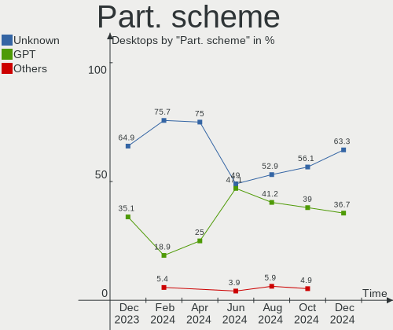
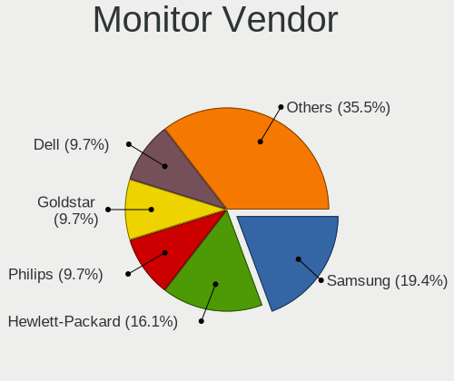
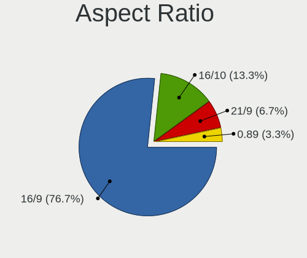

openSUSE - Hardware Trends (Desktops)
-------------------------------------

A project to identify most popular hardware characteristics and track their change
over time based on data collected by Linux users at https://Linux-Hardware.org.

Anyone can contribute to this report by the [hw-probe](https://github.com/linuxhw/hw-probe) tool:

    sudo -E hw-probe -all -upload

This report is for one last month. Overall report since the beginning of time: [TestDays](https://github.com/linuxhw/TestDays)

Period: Apr, 2024.

Contents
--------

* [ System ](#system)
  - [ OS                       ](#os)
  - [ OS Family                ](#os-family)
  - [ Kernel                   ](#kernel)
  - [ Kernel Family            ](#kernel-family)
  - [ Kernel Major Ver.        ](#kernel-major-ver)
  - [ Arch                     ](#arch)
  - [ DE                       ](#de)
  - [ Display Server           ](#display-server)
  - [ Display Manager          ](#display-manager)
  - [ OS Lang                  ](#os-lang)
  - [ Boot Mode                ](#boot-mode)
  - [ Filesystem               ](#filesystem)
  - [ Part. scheme             ](#part-scheme)
  - [ Dual Boot with Linux/BSD ](#dual-boot-with-linuxbsd)
  - [ Dual Boot (Win)          ](#dual-boot-win)

* [ Board ](#board)
  - [ Vendor                   ](#vendor)
  - [ Model                    ](#model)
  - [ Model Family             ](#model-family)
  - [ MFG Year                 ](#mfg-year)
  - [ Form Factor              ](#form-factor)
  - [ Secure Boot              ](#secure-boot)
  - [ Coreboot                 ](#coreboot)
  - [ RAM Size                 ](#ram-size)
  - [ RAM Used                 ](#ram-used)
  - [ Total Drives             ](#total-drives)
  - [ Has CD-ROM               ](#has-cd-rom)
  - [ Has Ethernet             ](#has-ethernet)
  - [ Has WiFi                 ](#has-wifi)
  - [ Has Bluetooth            ](#has-bluetooth)

* [ Location ](#location)
  - [ Country                  ](#country)
  - [ City                     ](#city)

* [ Drives ](#drives)
  - [ Drive Vendor             ](#drive-vendor)
  - [ Drive Model              ](#drive-model)
  - [ HDD Vendor               ](#hdd-vendor)
  - [ SSD Vendor               ](#ssd-vendor)
  - [ Drive Kind               ](#drive-kind)
  - [ Drive Connector          ](#drive-connector)
  - [ Drive Size               ](#drive-size)
  - [ Space Total              ](#space-total)
  - [ Space Used               ](#space-used)
  - [ Malfunc. Drives          ](#malfunc-drives)
  - [ Malfunc. Drive Vendor    ](#malfunc-drive-vendor)
  - [ Malfunc. HDD Vendor      ](#malfunc-hdd-vendor)
  - [ Malfunc. Drive Kind      ](#malfunc-drive-kind)
  - [ Failed Drives            ](#failed-drives)
  - [ Failed Drive Vendor      ](#failed-drive-vendor)
  - [ Drive Status             ](#drive-status)

* [ Storage controller ](#storage-controller)
  - [ Storage Vendor           ](#storage-vendor)
  - [ Storage Model            ](#storage-model)
  - [ Storage Kind             ](#storage-kind)

* [ Processor ](#processor)
  - [ CPU Vendor               ](#cpu-vendor)
  - [ CPU Model                ](#cpu-model)
  - [ CPU Model Family         ](#cpu-model-family)
  - [ CPU Cores                ](#cpu-cores)
  - [ CPU Sockets              ](#cpu-sockets)
  - [ CPU Threads              ](#cpu-threads)
  - [ CPU Op-Modes             ](#cpu-op-modes)
  - [ CPU Microcode            ](#cpu-microcode)
  - [ CPU Microarch            ](#cpu-microarch)

* [ Graphics ](#graphics)
  - [ GPU Vendor               ](#gpu-vendor)
  - [ GPU Model                ](#gpu-model)
  - [ GPU Combo                ](#gpu-combo)
  - [ GPU Driver               ](#gpu-driver)
  - [ GPU Memory               ](#gpu-memory)

* [ Monitor ](#monitor)
  - [ Monitor Vendor           ](#monitor-vendor)
  - [ Monitor Model            ](#monitor-model)
  - [ Monitor Resolution       ](#monitor-resolution)
  - [ Monitor Diagonal         ](#monitor-diagonal)
  - [ Monitor Width            ](#monitor-width)
  - [ Aspect Ratio             ](#aspect-ratio)
  - [ Monitor Area             ](#monitor-area)
  - [ Pixel Density            ](#pixel-density)
  - [ Multiple Monitors        ](#multiple-monitors)

* [ Network ](#network)
  - [ Net Controller Vendor    ](#net-controller-vendor)
  - [ Net Controller Model     ](#net-controller-model)
  - [ Wireless Vendor          ](#wireless-vendor)
  - [ Wireless Model           ](#wireless-model)
  - [ Ethernet Vendor          ](#ethernet-vendor)
  - [ Ethernet Model           ](#ethernet-model)
  - [ Net Controller Kind      ](#net-controller-kind)
  - [ Used Controller          ](#used-controller)
  - [ NICs                     ](#nics)
  - [ IPv6                     ](#ipv6)

* [ Bluetooth ](#bluetooth)
  - [ Bluetooth Vendor         ](#bluetooth-vendor)
  - [ Bluetooth Model          ](#bluetooth-model)

* [ Sound ](#sound)
  - [ Sound Vendor             ](#sound-vendor)
  - [ Sound Model              ](#sound-model)

* [ Memory ](#memory)
  - [ Memory Vendor            ](#memory-vendor)
  - [ Memory Model             ](#memory-model)
  - [ Memory Kind              ](#memory-kind)
  - [ Memory Form Factor       ](#memory-form-factor)
  - [ Memory Size              ](#memory-size)
  - [ Memory Speed             ](#memory-speed)

* [ Printers & scanners ](#printers--scanners)
  - [ Printer Vendor           ](#printer-vendor)
  - [ Printer Model            ](#printer-model)
  - [ Scanner Vendor           ](#scanner-vendor)
  - [ Scanner Model            ](#scanner-model)

* [ Camera ](#camera)
  - [ Camera Vendor            ](#camera-vendor)
  - [ Camera Model             ](#camera-model)

* [ Security ](#security)
  - [ Fingerprint Vendor       ](#fingerprint-vendor)
  - [ Fingerprint Model        ](#fingerprint-model)
  - [ Chipcard Vendor          ](#chipcard-vendor)
  - [ Chipcard Model           ](#chipcard-model)

* [ Unsupported ](#unsupported)
  - [ Unsupported Devices      ](#unsupported-devices)
  - [ Unsupported Device Types ](#unsupported-device-types)

System
------

OS
--

Installed operating systems

| Name                         | Desktops | Percent |
|------------------------------|----------|---------|
| openSUSE Tumbleweed-XXXXXXXX | 21       | 52.5%   |
| openSUSE Leap-15.5           | 17       | 42.5%   |
| openSUSE Microos-XXXXXXXX    | 1        | 2.5%    |
| openSUSE Leap-15.4           | 1        | 2.5%    |

OS Family
---------

OS without a version

| Name     | Desktops | Percent |
|----------|----------|---------|
| openSUSE | 40       | 100%    |

Kernel
------

Version of the Linux kernel

| Version                      | Desktops | Percent |
|------------------------------|----------|---------|
| 5.14.21-150500.55.52-default | 16       | 40%     |
| 6.8.5-1-default              | 6        | 15%     |
| 6.8.1-1-default              | 5        | 12.5%   |
| 6.8.4-rc1-1-default          | 4        | 10%     |
| 6.8.7-1-default              | 3        | 7.5%    |
| 6.8.6-1-default              | 2        | 5%      |
| 6.8.2-1-default              | 2        | 5%      |
| 5.14.21-150500.55.49-default | 1        | 2.5%    |
| 5.14.21-150400.24.33-default | 1        | 2.5%    |

Kernel Family
-------------

Linux kernel without a distro release

| Version | Desktops | Percent |
|---------|----------|---------|
| 5.14.21 | 18       | 45%     |
| 6.8.5   | 6        | 15%     |
| 6.8.1   | 5        | 12.5%   |
| 6.8.4   | 4        | 10%     |
| 6.8.7   | 3        | 7.5%    |
| 6.8.6   | 2        | 5%      |
| 6.8.2   | 2        | 5%      |

Kernel Major Ver.
-----------------

Linux kernel major version

| Version | Desktops | Percent |
|---------|----------|---------|
| 6.8     | 22       | 55%     |
| 5.14    | 18       | 45%     |

Arch
----

OS architecture (x86_64, i586, etc.)

| Name   | Desktops | Percent |
|--------|----------|---------|
| x86_64 | 40       | 100%    |

DE
--

Desktop Environment

| Name  | Desktops | Percent |
|-------|----------|---------|
| KDE5  | 18       | 45%     |
| KDE6  | 17       | 42.5%   |
| GNOME | 4        | 10%     |
| MATE  | 1        | 2.5%    |

Display Server
--------------

X11 or Wayland

| Name    | Desktops | Percent |
|---------|----------|---------|
| X11     | 29       | 72.5%   |
| Wayland | 8        | 20%     |
| Tty     | 3        | 7.5%    |

Display Manager
---------------

SDDM, LightDM, etc.

| Name    | Desktops | Percent |
|---------|----------|---------|
| Unknown | 31       | 77.5%   |
| SDDM    | 9        | 22.5%   |

OS Lang
-------

Language

| Lang  | Desktops | Percent |
|-------|----------|---------|
| en_US | 16       | 40%     |
| de_DE | 14       | 35%     |
| ru_RU | 3        | 7.5%    |
| POSIX | 2        | 5%      |
| nl_NL | 2        | 5%      |
| it_IT | 2        | 5%      |
| pt_BR | 1        | 2.5%    |

Boot Mode
---------

EFI or BIOS

| Mode | Desktops | Percent |
|------|----------|---------|
| BIOS | 20       | 50%     |
| EFI  | 20       | 50%     |

Filesystem
----------

Type of filesystem

| Type  | Desktops | Percent |
|-------|----------|---------|
| Btrfs | 31       | 77.5%   |
| Ext4  | 7        | 17.5%   |
| Xfs   | 2        | 5%      |

Part. scheme
------------

Scheme of partitioning

| Type    | Desktops | Percent |
|---------|----------|---------|
| Unknown | 30       | 75%     |
| GPT     | 10       | 25%     |

Dual Boot with Linux/BSD
------------------------

Hosting more than one Linux/BSD

| Dual boot | Desktops | Percent |
|-----------|----------|---------|
| No        | 36       | 90%     |
| Yes       | 4        | 10%     |

Dual Boot (Win)
---------------

Hosting Linux and Windows

| Dual boot | Desktops | Percent |
|-----------|----------|---------|
| No        | 37       | 92.5%   |
| Yes       | 3        | 7.5%    |

Board
-----

Vendor
------

Motherboard manufacturer

| Name                | Desktops | Percent |
|---------------------|----------|---------|
| ASUSTek Computer    | 12       | 30%     |
| Hewlett-Packard     | 6        | 15%     |
| MSI                 | 4        | 10%     |
| Lenovo              | 4        | 10%     |
| ASRock              | 4        | 10%     |
| Gigabyte Technology | 3        | 7.5%    |
| Intel               | 1        | 2.5%    |
| Huanan              | 1        | 2.5%    |
| Fujitsu             | 1        | 2.5%    |
| DUEX                | 1        | 2.5%    |
| Dell                | 1        | 2.5%    |
| Biostar             | 1        | 2.5%    |
| Acer                | 1        | 2.5%    |

Model
-----

Motherboard model

| Name                                        | Desktops | Percent |
|---------------------------------------------|----------|---------|
| MSI MS-7D08                                 | 1        | 2.5%    |
| MSI MS-7C94                                 | 1        | 2.5%    |
| MSI MS-7C91                                 | 1        | 2.5%    |
| MSI MS-7B17                                 | 1        | 2.5%    |
| Lenovo ThinkStation S20 4105E2G             | 1        | 2.5%    |
| Lenovo ThinkCentre M700 10KN003LBP          | 1        | 2.5%    |
| Lenovo IdeaCentre Gaming5 17IAB7 90T100BHMZ | 1        | 2.5%    |
| Lenovo IdeaCentre 5 14IAB7 90T2000SUS       | 1        | 2.5%    |
| Intel DG965RY AAD41691-301                  | 1        | 2.5%    |
| Huanan X99-F8D PLUS V1.3                    | 1        | 2.5%    |
| HP Z820 Workstation                         | 1        | 2.5%    |
| HP ProLiant ML350 G6                        | 1        | 2.5%    |
| HP OMEN by 40L Gaming Desktop GT21-1xxx     | 1        | 2.5%    |
| HP Compaq 6200 Pro MT PC                    | 1        | 2.5%    |
| HP Compaq 6000 Pro MT PC                    | 1        | 2.5%    |
| HP 870-173nf                                | 1        | 2.5%    |
| Gigabyte Z97-HD3                            | 1        | 2.5%    |
| Gigabyte Z370M D3H                          | 1        | 2.5%    |
| Gigabyte P55-UD5                            | 1        | 2.5%    |
| Fujitsu ESPRIMO P920                        | 1        | 2.5%    |
| DUEX H510                                   | 1        | 2.5%    |
| Dell OptiPlex 7050                          | 1        | 2.5%    |
| Biostar A960D+V2                            | 1        | 2.5%    |
| ASUS TUF Z370-PLUS GAMING                   | 1        | 2.5%    |
| ASUS TUF Gaming Z690-PLUS WIFI D4           | 1        | 2.5%    |
| ASUS TUF Gaming X670E-PLUS WIFI             | 1        | 2.5%    |
| ASUS ROG STRIX X470-F GAMING                | 1        | 2.5%    |
| ASUS ROG Rampage VI EXTREME                 | 1        | 2.5%    |
| ASUS ROG CROSSHAIR VII HERO                 | 1        | 2.5%    |
| ASUS PRIME X570-P                           | 1        | 2.5%    |
| ASUS PRIME B660-PLUS D4                     | 1        | 2.5%    |
| ASUS PRIME B550M-A                          | 1        | 2.5%    |
| ASUS M5A97 R2.0                             | 1        | 2.5%    |
| ASUS M4A77TD                                | 1        | 2.5%    |
| ASUS All Series                             | 1        | 2.5%    |
| ASRock Z790 PG SONIC                        | 1        | 2.5%    |
| ASRock Z390 Taichi Ultimate                 | 1        | 2.5%    |
| ASRock B550 Phantom Gaming 4/ac             | 1        | 2.5%    |
| ASRock B450M Pro4                           | 1        | 2.5%    |
| Acer Predator PO3-630                       | 1        | 2.5%    |

Model Family
------------

Motherboard model prefix

| Name                | Desktops | Percent |
|---------------------|----------|---------|
| ASUS TUF            | 3        | 7.5%    |
| ASUS ROG            | 3        | 7.5%    |
| ASUS PRIME          | 3        | 7.5%    |
| Lenovo IdeaCentre   | 2        | 5%      |
| HP Compaq           | 2        | 5%      |
| MSI MS-7D08         | 1        | 2.5%    |
| MSI MS-7C94         | 1        | 2.5%    |
| MSI MS-7C91         | 1        | 2.5%    |
| MSI MS-7B17         | 1        | 2.5%    |
| Lenovo ThinkStation | 1        | 2.5%    |
| Lenovo ThinkCentre  | 1        | 2.5%    |
| Intel DG965RY       | 1        | 2.5%    |
| Huanan X99-F8D      | 1        | 2.5%    |
| HP Z820             | 1        | 2.5%    |
| HP ProLiant         | 1        | 2.5%    |
| HP OMEN             | 1        | 2.5%    |
| HP 870-173nf        | 1        | 2.5%    |
| Gigabyte Z97-HD3    | 1        | 2.5%    |
| Gigabyte Z370M      | 1        | 2.5%    |
| Gigabyte P55-UD5    | 1        | 2.5%    |
| Fujitsu ESPRIMO     | 1        | 2.5%    |
| DUEX H510           | 1        | 2.5%    |
| Dell OptiPlex       | 1        | 2.5%    |
| Biostar A960D+V2    | 1        | 2.5%    |
| ASUS M5A97          | 1        | 2.5%    |
| ASUS M4A77TD        | 1        | 2.5%    |
| ASUS All            | 1        | 2.5%    |
| ASRock Z790         | 1        | 2.5%    |
| ASRock Z390         | 1        | 2.5%    |
| ASRock B550         | 1        | 2.5%    |
| ASRock B450M        | 1        | 2.5%    |
| Acer Predator       | 1        | 2.5%    |

MFG Year
--------

Motherboard manufacture year

| Year | Desktops | Percent |
|------|----------|---------|
| 2023 | 4        | 10%     |
| 2021 | 4        | 10%     |
| 2020 | 4        | 10%     |
| 2018 | 4        | 10%     |
| 2009 | 4        | 10%     |
| 2022 | 3        | 7.5%    |
| 2019 | 3        | 7.5%    |
| 2017 | 3        | 7.5%    |
| 2014 | 2        | 5%      |
| 2012 | 2        | 5%      |
| 2024 | 1        | 2.5%    |
| 2016 | 1        | 2.5%    |
| 2015 | 1        | 2.5%    |
| 2013 | 1        | 2.5%    |
| 2011 | 1        | 2.5%    |
| 2010 | 1        | 2.5%    |
| 2007 | 1        | 2.5%    |

Form Factor
-----------

Physical design of the computer

| Name    | Desktops | Percent |
|---------|----------|---------|
| Desktop | 40       | 100%    |

Secure Boot
-----------

Enabled or disabled

| State    | Desktops | Percent |
|----------|----------|---------|
| Disabled | 38       | 95%     |
| Enabled  | 2        | 5%      |

Coreboot
--------

Have coreboot on board

| Used | Desktops | Percent |
|------|----------|---------|
| No   | 40       | 100%    |

RAM Size
--------

Total RAM memory

| Size in GB  | Desktops | Percent |
|-------------|----------|---------|
| 16.01-24.0  | 12       | 30%     |
| 32.01-64.0  | 11       | 27.5%   |
| 64.01-256.0 | 8        | 20%     |
| 4.01-8.0    | 4        | 10%     |
| 8.01-16.0   | 3        | 7.5%    |
| 3.01-4.0    | 1        | 2.5%    |
| 24.01-32.0  | 1        | 2.5%    |

RAM Used
--------

Used RAM memory

| Used GB    | Desktops | Percent |
|------------|----------|---------|
| 2.01-3.0   | 12       | 30%     |
| 4.01-8.0   | 11       | 27.5%   |
| 3.01-4.0   | 8        | 20%     |
| 1.01-2.0   | 5        | 12.5%   |
| 8.01-16.0  | 3        | 7.5%    |
| 24.01-32.0 | 1        | 2.5%    |

Total Drives
------------

Number of drives on board

| Drives | Desktops | Percent |
|--------|----------|---------|
| 2      | 10       | 25%     |
| 3      | 9        | 22.5%   |
| 4      | 8        | 20%     |
| 1      | 8        | 20%     |
| 5      | 3        | 7.5%    |
| 8      | 1        | 2.5%    |
| 6      | 1        | 2.5%    |

Has CD-ROM
----------

Has CD-ROM on board

| Presented | Desktops | Percent |
|-----------|----------|---------|
| Yes       | 25       | 62.5%   |
| No        | 15       | 37.5%   |

Has Ethernet
------------

Has Ethernet on board

| Presented | Desktops | Percent |
|-----------|----------|---------|
| Yes       | 40       | 100%    |

Has WiFi
--------

Has WiFi module

| Presented | Desktops | Percent |
|-----------|----------|---------|
| Yes       | 24       | 60%     |
| No        | 16       | 40%     |

Has Bluetooth
-------------

Has Bluetooth module

| Presented | Desktops | Percent |
|-----------|----------|---------|
| Yes       | 21       | 52.5%   |
| No        | 19       | 47.5%   |

Location
--------

Country
-------

Geographic location (country)

| Country                | Desktops | Percent |
|------------------------|----------|---------|
| Germany                | 12       | 30%     |
| USA                    | 9        | 22.5%   |
| Russia                 | 3        | 7.5%    |
| Italy                  | 3        | 7.5%    |
| Switzerland            | 2        | 5%      |
| Brazil                 | 2        | 5%      |
| Austria                | 2        | 5%      |
| Romania                | 1        | 2.5%    |
| Puerto Rico            | 1        | 2.5%    |
| Netherlands            | 1        | 2.5%    |
| India                  | 1        | 2.5%    |
| Hong Kong              | 1        | 2.5%    |
| Bosnia and Herzegovina | 1        | 2.5%    |
| Belgium                | 1        | 2.5%    |

City
----

Geographic location (city)

| City                        | Desktops | Percent |
|-----------------------------|----------|---------|
| Zuchwil                     | 1        | 2.5%    |
| Zierikzee                   | 1        | 2.5%    |
| Vilshofen                   | 1        | 2.5%    |
| Vienna                      | 1        | 2.5%    |
| Ulm                         | 1        | 2.5%    |
| Tulsa                       | 1        | 2.5%    |
| Sterling                    | 1        | 2.5%    |
| Southampton                 | 1        | 2.5%    |
| Sesto San Giovanni          | 1        | 2.5%    |
| Seckau                      | 1        | 2.5%    |
| Santos                      | 1        | 2.5%    |
| San Juan                    | 1        | 2.5%    |
| Sacramento                  | 1        | 2.5%    |
| Rüsselsheim am Main        | 1        | 2.5%    |
| Ravensburg                  | 1        | 2.5%    |
| Ramenskoye                  | 1        | 2.5%    |
| Piteşti                    | 1        | 2.5%    |
| Paliano                     | 1        | 2.5%    |
| Oberhausen                  | 1        | 2.5%    |
| Niesky                      | 1        | 2.5%    |
| New Castle                  | 1        | 2.5%    |
| Munich                      | 1        | 2.5%    |
| Mostar                      | 1        | 2.5%    |
| Lyss                        | 1        | 2.5%    |
| Kursk                       | 1        | 2.5%    |
| Koenigswinter               | 1        | 2.5%    |
| Kiel                        | 1        | 2.5%    |
| Jesolo                      | 1        | 2.5%    |
| Imperatriz                  | 1        | 2.5%    |
| Hyderabad                   | 1        | 2.5%    |
| Hamburg                     | 1        | 2.5%    |
| Dubuque                     | 1        | 2.5%    |
| Drieslinter                 | 1        | 2.5%    |
| Denver                      | 1        | 2.5%    |
| Davis                       | 1        | 2.5%    |
| Cologne                     | 1        | 2.5%    |
| Central                     | 1        | 2.5%    |
| Bad Konigshofen im Grabfeld | 1        | 2.5%    |
| Azov                        | 1        | 2.5%    |
| Atlanta                     | 1        | 2.5%    |

Drives
------

Drive Vendor
------------

Hard drive vendors

| Vendor                      | Desktops | Drives | Percent |
|-----------------------------|----------|--------|---------|
| Samsung Electronics         | 15       | 33     | 18.07%  |
| Seagate                     | 10       | 15     | 12.05%  |
| WDC                         | 9        | 13     | 10.84%  |
| Sandisk                     | 9        | 9      | 10.84%  |
| Kingston                    | 7        | 10     | 8.43%   |
| Toshiba                     | 3        | 4      | 3.61%   |
| SPCC                        | 3        | 3      | 3.61%   |
| Crucial                     | 3        | 3      | 3.61%   |
| Unknown                     | 2        | 2      | 2.41%   |
| Silicon Motion              | 2        | 2      | 2.41%   |
| Micron Technology           | 2        | 2      | 2.41%   |
| Kingston Technology Company | 2        | 2      | 2.41%   |
| HGST                        | 2        | 7      | 2.41%   |
| T-FORCE                     | 1        | 1      | 1.2%    |
| SXMicro                     | 1        | 1      | 1.2%    |
| SK hynix                    | 1        | 1      | 1.2%    |
| SABRENT                     | 1        | 1      | 1.2%    |
| Realtek Semiconductor       | 1        | 1      | 1.2%    |
| Neo                         | 1        | 1      | 1.2%    |
| LITEON                      | 1        | 1      | 1.2%    |
| Intenso                     | 1        | 1      | 1.2%    |
| Intel                       | 1        | 1      | 1.2%    |
| Hitachi                     | 1        | 1      | 1.2%    |
| China                       | 1        | 2      | 1.2%    |
| Apple                       | 1        | 1      | 1.2%    |
| ADATA Technology            | 1        | 1      | 1.2%    |
| Unknown                     | 1        | 1      | 1.2%    |

Drive Model
-----------

Hard drive models

| Model                                                 | Desktops | Percent |
|-------------------------------------------------------|----------|---------|
| Samsung NVMe SSD Controller SM981/PM981/PM983 1TB     | 6        | 6.19%   |
| Kingston SA400S37480G 480GB SSD                       | 4        | 4.12%   |
| Seagate ST4000DM004-2CV104 4TB                        | 3        | 3.09%   |
| SPCC Solid State Disk 1024GB                          | 2        | 2.06%   |
| Silicon Motion SM2263EN/SM2263XT SSD Controller 256GB | 2        | 2.06%   |
| Sandisk WD Black SN750 / PC SN730 NVMe SSD 512GB      | 2        | 2.06%   |
| Kingston Company A2000 NVMe SSD 500GB                 | 2        | 2.06%   |
| WDC WD40EFZX-68AWUN0 4TB                              | 1        | 1.03%   |
| WDC WD4005FZBX-00K5WB0 4TB                            | 1        | 1.03%   |
| WDC WD2500AAKX-083CA1 250GB                           | 1        | 1.03%   |
| WDC WD20EZRX-22D8PB0 2TB                              | 1        | 1.03%   |
| WDC WD20EZBX-00AYRA0 2TB                              | 1        | 1.03%   |
| WDC WD20EARX-00PASB0 2TB                              | 1        | 1.03%   |
| WDC WD2000FYYZ-01UL1B3 2TB                            | 1        | 1.03%   |
| WDC WD15NPVX-00EA4T0 1TB                              | 1        | 1.03%   |
| WDC WD10EZEX-08WN4A1 1TB                              | 1        | 1.03%   |
| WDC WD10EZEX-08M2NA0 1TB                              | 1        | 1.03%   |
| WDC WD1003FBYX-01Y7B1 1TB                             | 1        | 1.03%   |
| Unknown SD/MMC/MS PRO 128GB                           | 1        | 1.03%   |
| Unknown NVMe SSD Drive 1TB                            | 1        | 1.03%   |
| Toshiba MG08ACA16TE 16TB                              | 1        | 1.03%   |
| Toshiba MG05ACA800E 8TB                               | 1        | 1.03%   |
| Toshiba DT01ACA100 1TB                                | 1        | 1.03%   |
| T-FORCE T253TY004T 4TB                                | 1        | 1.03%   |
| SXMicro NF830 256GB                                   | 1        | 1.03%   |
| SPCC Solid State Disk 1TB                             | 1        | 1.03%   |
| SK hynix SC300 HFS512G32MND-3210A 512GB               | 1        | 1.03%   |
| Seagate ST500DM002-1BD142 500GB                       | 1        | 1.03%   |
| Seagate ST5000AS0011-1L5178 5TB                       | 1        | 1.03%   |
| Seagate ST4000VX007-2DT166 4TB                        | 1        | 1.03%   |
| Seagate ST4000VN006-3CW104 4TB                        | 1        | 1.03%   |
| Seagate ST2000DM008-2FR102 2TB                        | 1        | 1.03%   |
| Seagate ST2000DM005-2U9102 2TB                        | 1        | 1.03%   |
| Seagate ST1000DM003-1SB102 1TB                        | 1        | 1.03%   |
| Seagate Portable 5TB                                  | 1        | 1.03%   |
| SanDisk X400 2.5 7MM 128GB SSD                        | 1        | 1.03%   |
| Sandisk WD_BLACK SN770 2TB                            | 1        | 1.03%   |
| Sandisk WD PC SN740 SDDQNQD-1T00-1001 1024GB          | 1        | 1.03%   |
| Sandisk WD PC SN560 SDDPNQE-1T00-1006 1024GB          | 1        | 1.03%   |
| Sandisk WD Blue SN570 1TB SSD                         | 1        | 1.03%   |

HDD Vendor
----------

Hard disk drive vendors

| Vendor              | Desktops | Drives | Percent |
|---------------------|----------|--------|---------|
| WDC                 | 9        | 13     | 32.14%  |
| Seagate             | 9        | 14     | 32.14%  |
| Toshiba             | 3        | 4      | 10.71%  |
| Samsung Electronics | 2        | 2      | 7.14%   |
| HGST                | 2        | 7      | 7.14%   |
| Unknown             | 1        | 1      | 3.57%   |
| SABRENT             | 1        | 1      | 3.57%   |
| Hitachi             | 1        | 1      | 3.57%   |

SSD Vendor
----------

Solid state drive vendors

| Vendor              | Desktops | Drives | Percent |
|---------------------|----------|--------|---------|
| Samsung Electronics | 9        | 15     | 27.27%  |
| Kingston            | 6        | 6      | 18.18%  |
| SPCC                | 3        | 3      | 9.09%   |
| SanDisk             | 3        | 3      | 9.09%   |
| Crucial             | 3        | 3      | 9.09%   |
| SXMicro             | 1        | 1      | 3.03%   |
| SK hynix            | 1        | 1      | 3.03%   |
| Neo                 | 1        | 1      | 3.03%   |
| Micron Technology   | 1        | 1      | 3.03%   |
| LITEON              | 1        | 1      | 3.03%   |
| Intenso             | 1        | 1      | 3.03%   |
| Intel               | 1        | 1      | 3.03%   |
| China               | 1        | 2      | 3.03%   |
| Apple               | 1        | 1      | 3.03%   |

Drive Kind
----------

HDD or SSD

| Kind    | Desktops | Drives | Percent |
|---------|----------|--------|---------|
| SSD     | 28       | 40     | 37.84%  |
| HDD     | 22       | 43     | 29.73%  |
| NVMe    | 21       | 34     | 28.38%  |
| Unknown | 3        | 3      | 4.05%   |

Drive Connector
---------------

SATA, SAS, NVMe, etc.

| Type | Desktops | Drives | Percent |
|------|----------|--------|---------|
| SATA | 37       | 81     | 59.68%  |
| NVMe | 21       | 34     | 33.87%  |
| SAS  | 4        | 5      | 6.45%   |

Drive Size
----------

Size of hard drive

| Size in TB | Desktops | Drives | Percent |
|------------|----------|--------|---------|
| 0.01-0.5   | 18       | 24     | 31.58%  |
| 1.01-2.0   | 12       | 16     | 21.05%  |
| 0.51-1.0   | 12       | 17     | 21.05%  |
| 3.01-4.0   | 9        | 12     | 15.79%  |
| 4.01-10.0  | 3        | 7      | 5.26%   |
| 2.01-3.0   | 2        | 5      | 3.51%   |
| 10.01-20.0 | 1        | 2      | 1.75%   |

Space Total
-----------

Amount of disk space available on the file system

| Size in GB     | Desktops | Percent |
|----------------|----------|---------|
| More than 3000 | 23       | 57.5%   |
| 251-500        | 4        | 10%     |
| 2001-3000      | 4        | 10%     |
| 1001-2000      | 4        | 10%     |
| Unknown        | 2        | 5%      |
| 101-250        | 1        | 2.5%    |
| 501-1000       | 1        | 2.5%    |
| 51-100         | 1        | 2.5%    |

Space Used
----------

Amount of used disk space

| Used GB        | Desktops | Percent |
|----------------|----------|---------|
| 101-250        | 9        | 22.5%   |
| 501-1000       | 9        | 22.5%   |
| More than 3000 | 8        | 20%     |
| 251-500        | 4        | 10%     |
| 21-50          | 3        | 7.5%    |
| 1001-2000      | 3        | 7.5%    |
| Unknown        | 2        | 5%      |
| 2001-3000      | 1        | 2.5%    |
| 51-100         | 1        | 2.5%    |

Malfunc. Drives
---------------

Drive models with a malfunction

Zero info for selected period =(

Malfunc. Drive Vendor
---------------------

Vendors of faulty drives

Zero info for selected period =(

Malfunc. HDD Vendor
-------------------

Vendors of faulty HDD drives

Zero info for selected period =(

Malfunc. Drive Kind
-------------------

Kinds of faulty drives

Zero info for selected period =(

Failed Drives
-------------

Failed drive models

Zero info for selected period =(

Failed Drive Vendor
-------------------

Failed drive vendors

Zero info for selected period =(

Drive Status
------------

Number of failed and malfunc. drives

| Status   | Desktops | Drives | Percent |
|----------|----------|--------|---------|
| Detected | 31       | 92     | 77.5%   |
| Works    | 9        | 28     | 22.5%   |

Storage controller
------------------

Storage Vendor
--------------

Storage controller vendors

| Vendor                      | Desktops | Percent |
|-----------------------------|----------|---------|
| Intel                       | 27       | 38.57%  |
| AMD                         | 13       | 18.57%  |
| Samsung Electronics         | 9        | 12.86%  |
| SanDisk                     | 6        | 8.57%   |
| Kingston Technology Company | 3        | 4.29%   |
| Silicon Motion              | 2        | 2.86%   |
| ASMedia Technology          | 2        | 2.86%   |
| Realtek Semiconductor       | 1        | 1.43%   |
| Promise Technology          | 1        | 1.43%   |
| Micron Technology           | 1        | 1.43%   |
| Marvell Technology Group    | 1        | 1.43%   |
| JMicron Technology          | 1        | 1.43%   |
| INNOGRIT                    | 1        | 1.43%   |
| Broadcom / LSI              | 1        | 1.43%   |
| ADATA Technology            | 1        | 1.43%   |

Storage Model
-------------

Storage controller models

| Model                                                                         | Desktops | Percent |
|-------------------------------------------------------------------------------|----------|---------|
| Samsung NVMe SSD Controller SM981/PM981/PM983                                 | 6        | 7.14%   |
| Intel Alder Lake-S PCH SATA Controller [AHCI Mode]                            | 4        | 4.76%   |
| Intel 200 Series PCH SATA controller [AHCI mode]                              | 4        | 4.76%   |
| AMD FCH SATA Controller [AHCI mode]                                           | 4        | 4.76%   |
| AMD 500 Series Chipset SATA Controller                                        | 4        | 4.76%   |
| SanDisk WD Black SN770 / PC SN740 256GB / PC SN560 (DRAM-less) NVMe SSD       | 3        | 3.57%   |
| Intel SATA Controller [RAID Mode]                                             | 3        | 3.57%   |
| AMD 400 Series Chipset SATA Controller                                        | 3        | 3.57%   |
| Silicon Motion SM2263EN/SM2263XT (DRAM-less) NVMe SSD Controllers             | 2        | 2.38%   |
| SanDisk Extreme Pro / WD Black SN750 / PC SN730 / Red SN700 NVMe SSD          | 2        | 2.38%   |
| Samsung NVMe SSD Controller S4LV008[Pascal]                                   | 2        | 2.38%   |
| Kingston Company A2000 NVMe SSD SM2263EN                                      | 2        | 2.38%   |
| Intel Volume Management Device NVMe RAID Controller                           | 2        | 2.38%   |
| Intel Q170/Q150/B150/H170/H110/Z170/CM236 Chipset SATA Controller [AHCI Mode] | 2        | 2.38%   |
| Intel Cannon Lake PCH SATA AHCI Controller                                    | 2        | 2.38%   |
| Intel 9 Series Chipset Family SATA Controller [AHCI Mode]                     | 2        | 2.38%   |
| Intel 500 Series Chipset Family SATA RAID Controller                          | 2        | 2.38%   |
| ASMedia ASM1061/ASM1062 Serial ATA Controller                                 | 2        | 2.38%   |
| AMD SB7x0/SB8x0/SB9x0 SATA Controller [AHCI mode]                             | 2        | 2.38%   |
| AMD SB7x0/SB8x0/SB9x0 IDE Controller                                          | 2        | 2.38%   |
| AMD 600 Series Chipset SATA Controller                                        | 2        | 2.38%   |
| SanDisk Ultra 3D / WD Blue SN570 NVMe SSD (DRAM-less)                         | 1        | 1.19%   |
| Samsung S4LN053X01 AHCI SSD Controller(Apple slot)                            | 1        | 1.19%   |
| Samsung NVMe SSD Controller PM9B1 (DRAM-less)                                 | 1        | 1.19%   |
| Samsung NVMe SSD Controller PM9A1/PM9A3/980PRO                                | 1        | 1.19%   |
| Realtek RTS5765DL NVMe SSD Controller (DRAM-less)                             | 1        | 1.19%   |
| Promise PDC40719 [FastTrak TX4300/TX4310]                                     | 1        | 1.19%   |
| Micron 2210 NVMe SSD [Cobain]                                                 | 1        | 1.19%   |
| Marvell Group 88SE6101/6102 single-port PATA133 interface                     | 1        | 1.19%   |
| Kingston Company NV2 NVMe SSD E21T (DRAM-less)                                | 1        | 1.19%   |
| Kingston Company NV1 NVMe SSD SM2263XT (DRAM-less)                            | 1        | 1.19%   |
| Kingston Company KC3000/FURY Renegade NVMe SSD E18                            | 1        | 1.19%   |
| JMicron JMB363 SATA/IDE Controller                                            | 1        | 1.19%   |
| Intel Raptor Lake SATA AHCI Controller                                        | 1        | 1.19%   |
| Intel C610/X99 series chipset sSATA Controller [AHCI mode]                    | 1        | 1.19%   |
| Intel C602 chipset 4-Port SATA Storage Control Unit                           | 1        | 1.19%   |
| Intel C600/X79 series chipset IDE-r Controller                                | 1        | 1.19%   |
| Intel 82801JI (ICH10 Family) SATA AHCI Controller                             | 1        | 1.19%   |
| Intel 82801JI (ICH10 Family) 2 port SATA IDE Controller #2                    | 1        | 1.19%   |
| Intel 82801JD/DO (ICH10 Family) SATA AHCI Controller                          | 1        | 1.19%   |

Storage Kind
------------

Kind of storage controller (IDE, SATA, NVMe, SAS, ...)

| Kind | Desktops | Percent |
|------|----------|---------|
| SATA | 35       | 49.3%   |
| NVMe | 21       | 29.58%  |
| RAID | 8        | 11.27%  |
| IDE  | 6        | 8.45%   |
| SAS  | 1        | 1.41%   |

Processor
---------

CPU Vendor
----------

Processor vendors

| Vendor | Desktops | Percent |
|--------|----------|---------|
| Intel  | 27       | 67.5%   |
| AMD    | 13       | 32.5%   |

CPU Model
---------

Processor models

| Model                                       | Desktops | Percent |
|---------------------------------------------|----------|---------|
| Intel Core i7-8700 CPU @ 3.20GHz            | 3        | 7.5%    |
| Intel Xeon CPU X5650 @ 2.67GHz              | 1        | 2.5%    |
| Intel Xeon CPU W3530 @ 2.80GHz              | 1        | 2.5%    |
| Intel Xeon CPU E5-2680 v4 @ 2.40GHz         | 1        | 2.5%    |
| Intel Xeon CPU E5-2680 0 @ 2.70GHz          | 1        | 2.5%    |
| Intel Pentium Dual-Core CPU E6500 @ 2.93GHz | 1        | 2.5%    |
| Intel Core i9-9900X CPU @ 3.50GHz           | 1        | 2.5%    |
| Intel Core i7-8086K CPU @ 4.00GHz           | 1        | 2.5%    |
| Intel Core i7-6700 CPU @ 3.40GHz            | 1        | 2.5%    |
| Intel Core i7-4790K CPU @ 4.00GHz           | 1        | 2.5%    |
| Intel Core i7 CPU 880 @ 3.07GHz             | 1        | 2.5%    |
| Intel Core i5-7500 CPU @ 3.40GHz            | 1        | 2.5%    |
| Intel Core i5-6400 CPU @ 2.70GHz            | 1        | 2.5%    |
| Intel Core i5-4590 CPU @ 3.30GHz            | 1        | 2.5%    |
| Intel Core i5-4440 CPU @ 3.10GHz            | 1        | 2.5%    |
| Intel Core i5-2500 CPU @ 3.30GHz            | 1        | 2.5%    |
| Intel Core i5-10400 CPU @ 2.90GHz           | 1        | 2.5%    |
| Intel Core 2 CPU 6700 @ 2.66GHz             | 1        | 2.5%    |
| Intel 13th Gen Core i7-13700K               | 1        | 2.5%    |
| Intel 12th Gen Core i7-12700KF              | 1        | 2.5%    |
| Intel 12th Gen Core i5-12600K               | 1        | 2.5%    |
| Intel 12th Gen Core i5-12400F               | 1        | 2.5%    |
| Intel 12th Gen Core i5-12400                | 1        | 2.5%    |
| Intel 11th Gen Core i9-11900KF @ 3.50GHz    | 1        | 2.5%    |
| Intel 11th Gen Core i7-11700F @ 2.50GHz     | 1        | 2.5%    |
| AMD Ryzen 9 7950X 16-Core Processor         | 1        | 2.5%    |
| AMD Ryzen 9 3950X 16-Core Processor         | 1        | 2.5%    |
| AMD Ryzen 7 7700 8-Core Processor           | 1        | 2.5%    |
| AMD Ryzen 7 5800X 8-Core Processor          | 1        | 2.5%    |
| AMD Ryzen 7 5700G with Radeon Graphics      | 1        | 2.5%    |
| AMD Ryzen 7 2700 Eight-Core Processor       | 1        | 2.5%    |
| AMD Ryzen 5 5600X 6-Core Processor          | 1        | 2.5%    |
| AMD Ryzen 5 5600G with Radeon Graphics      | 1        | 2.5%    |
| AMD Ryzen 5 4500 6-Core Processor           | 1        | 2.5%    |
| AMD Ryzen 5 2600 Six-Core Processor         | 1        | 2.5%    |
| AMD FX-8350 Eight-Core Processor            | 1        | 2.5%    |
| AMD FX-8320E Eight-Core Processor           | 1        | 2.5%    |
| AMD Athlon II X3 440 Processor              | 1        | 2.5%    |

CPU Model Family
----------------

Processor model prefix

| Model                   | Desktops | Percent |
|-------------------------|----------|---------|
| Other                   | 7        | 17.5%   |
| Intel Core i7           | 7        | 17.5%   |
| Intel Core i5           | 6        | 15%     |
| Intel Xeon              | 4        | 10%     |
| AMD Ryzen 7             | 4        | 10%     |
| AMD Ryzen 5             | 4        | 10%     |
| AMD Ryzen 9             | 2        | 5%      |
| AMD FX                  | 2        | 5%      |
| Intel Pentium Dual-Core | 1        | 2.5%    |
| Intel Core i9           | 1        | 2.5%    |
| Intel Core 2            | 1        | 2.5%    |
| AMD Athlon II X3        | 1        | 2.5%    |

CPU Cores
---------

Number of processor cores

| Number | Desktops | Percent |
|--------|----------|---------|
| 6      | 11       | 27.5%   |
| 4      | 11       | 27.5%   |
| 8      | 6        | 15%     |
| 16     | 4        | 10%     |
| 12     | 2        | 5%      |
| 10     | 2        | 5%      |
| 2      | 2        | 5%      |
| 28     | 1        | 2.5%    |
| 3      | 1        | 2.5%    |

CPU Sockets
-----------

Number of sockets

| Number | Desktops | Percent |
|--------|----------|---------|
| 1      | 37       | 92.5%   |
| 2      | 3        | 7.5%    |

CPU Threads
-----------

Threads per core (Hyper-Threading)

| Number | Desktops | Percent |
|--------|----------|---------|
| 2      | 32       | 80%     |
| 1      | 8        | 20%     |

CPU Op-Modes
------------

CPU Operation Modes (32-bit, 64-bit)

| Op mode        | Desktops | Percent |
|----------------|----------|---------|
| 32-bit, 64-bit | 40       | 100%    |

CPU Microcode
-------------

Microcode number

| Number  | Desktops | Percent |
|---------|----------|---------|
| Unknown | 36       | 90%     |
| 0xb0671 | 1        | 2.5%    |
| 0x906ea | 1        | 2.5%    |
| 0x50654 | 1        | 2.5%    |
| 0x1067a | 1        | 2.5%    |

CPU Microarch
-------------

Microarchitecture

| Name             | Desktops | Percent |
|------------------|----------|---------|
| KabyLake         | 5        | 12.5%   |
| Zen 3            | 4        | 10%     |
| Unknown          | 4        | 10%     |
| Skylake          | 3        | 7.5%    |
| Haswell          | 3        | 7.5%    |
| Alderlake Hybrid | 3        | 7.5%    |
| Zen+             | 2        | 5%      |
| Zen 2            | 2        | 5%      |
| SandyBridge      | 2        | 5%      |
| Piledriver       | 2        | 5%      |
| Nehalem          | 2        | 5%      |
| Icelake          | 2        | 5%      |
| Westmere         | 1        | 2.5%    |
| Penryn           | 1        | 2.5%    |
| K10              | 1        | 2.5%    |
| Core             | 1        | 2.5%    |
| CometLake        | 1        | 2.5%    |
| Broadwell        | 1        | 2.5%    |

Graphics
--------

GPU Vendor
----------

Vendors of graphics cards

| Vendor | Desktops | Percent |
|--------|----------|---------|
| Nvidia | 18       | 40%     |
| AMD    | 17       | 37.78%  |
| Intel  | 10       | 22.22%  |

GPU Model
---------

Graphics card models

| Model                                                                       | Desktops | Percent |
|-----------------------------------------------------------------------------|----------|---------|
| Intel Xeon E3-1200 v3/4th Gen Core Processor Integrated Graphics Controller | 3        | 6.52%   |
| Intel CoffeeLake-S GT2 [UHD Graphics 630]                                   | 2        | 4.35%   |
| AMD Raphael                                                                 | 2        | 4.35%   |
| AMD Cezanne [Radeon Vega Series / Radeon Vega Mobile Series]                | 2        | 4.35%   |
| Nvidia TU116 [GeForce GTX 1660 SUPER]                                       | 1        | 2.17%   |
| Nvidia TU116 [GeForce GTX 1650 SUPER]                                       | 1        | 2.17%   |
| Nvidia TU106 [GeForce RTX 2070]                                             | 1        | 2.17%   |
| Nvidia TU104 [GeForce RTX 2070 SUPER]                                       | 1        | 2.17%   |
| Nvidia GP108 [GeForce GT 1030]                                              | 1        | 2.17%   |
| Nvidia GP107 [GeForce GTX 1050 Ti]                                          | 1        | 2.17%   |
| Nvidia GP104 [GeForce GTX 1070]                                             | 1        | 2.17%   |
| Nvidia GP102 [GeForce GTX 1080 Ti]                                          | 1        | 2.17%   |
| Nvidia GM206 [GeForce GTX 960]                                              | 1        | 2.17%   |
| Nvidia GM204 [GeForce GTX 980]                                              | 1        | 2.17%   |
| Nvidia GK110 [GeForce GTX TITAN]                                            | 1        | 2.17%   |
| Nvidia GF119 [GeForce GT 620 OEM]                                           | 1        | 2.17%   |
| Nvidia GF108 [GeForce GT 430]                                               | 1        | 2.17%   |
| Nvidia GF100GL [Quadro 4000]                                                | 1        | 2.17%   |
| Nvidia GA106 [GeForce RTX 3060]                                             | 1        | 2.17%   |
| Nvidia GA104 [GeForce RTX 3070 Lite Hash Rate]                              | 1        | 2.17%   |
| Nvidia GA102 [GeForce RTX 3080]                                             | 1        | 2.17%   |
| Nvidia AD106 [GeForce RTX 4060 Ti]                                          | 1        | 2.17%   |
| Nvidia AD106 [GeForce RTX 4060 Ti 16GB]                                     | 1        | 2.17%   |
| Intel HD Graphics 630                                                       | 1        | 2.17%   |
| Intel HD Graphics 530                                                       | 1        | 2.17%   |
| Intel DG2 [Arc A770]                                                        | 1        | 2.17%   |
| Intel CometLake-S GT2 [UHD Graphics 630]                                    | 1        | 2.17%   |
| Intel Alder Lake-S GT1 [UHD Graphics 730]                                   | 1        | 2.17%   |
| AMD Vega 20 [Radeon VII]                                                    | 1        | 2.17%   |
| AMD Vega 10 [Radeon PRO WX 8100/8200]                                       | 1        | 2.17%   |
| AMD Turks XT [Radeon HD 6670/7670]                                          | 1        | 2.17%   |
| AMD RS880 [Radeon HD 4290]                                                  | 1        | 2.17%   |
| AMD Polaris 20 XL [Radeon RX 580 2048SP]                                    | 1        | 2.17%   |
| AMD Oland PRO [Radeon R7 240/340 / Radeon 520]                              | 1        | 2.17%   |
| AMD Navi 31 [Radeon RX 7900 XT/7900 XTX/7900M]                              | 1        | 2.17%   |
| AMD Navi 24 [Radeon RX 6400/6500 XT/6500M]                                  | 1        | 2.17%   |
| AMD Navi 23 [Radeon RX 6650 XT / 6700S / 6800S]                             | 1        | 2.17%   |
| AMD Navi 21 [Radeon RX 6800/6800 XT / 6900 XT]                              | 1        | 2.17%   |
| AMD Lexa PRO [Radeon 540/540X/550/550X / RX 540X/550/550X]                  | 1        | 2.17%   |
| AMD Ellesmere [Radeon RX 470/480/570/570X/580/580X/590]                     | 1        | 2.17%   |

GPU Combo
---------

Combinations of graphics cards

| Name           | Desktops | Percent |
|----------------|----------|---------|
| 1 x Nvidia     | 14       | 35%     |
| 1 x AMD        | 14       | 35%     |
| 1 x Intel      | 7        | 17.5%   |
| AMD + Nvidia   | 2        | 5%      |
| 2 x Nvidia     | 1        | 2.5%    |
| Intel + Nvidia | 1        | 2.5%    |
| Intel + AMD    | 1        | 2.5%    |

GPU Driver
----------

Free vs proprietary

| Driver      | Desktops | Percent |
|-------------|----------|---------|
| Free        | 26       | 65%     |
| Proprietary | 14       | 35%     |

GPU Memory
----------

Total video memory

| Size in GB | Desktops | Percent |
|------------|----------|---------|
| Unknown    | 14       | 35%     |
| 7.01-8.0   | 9        | 22.5%   |
| 3.01-4.0   | 6        | 15%     |
| 8.01-16.0  | 3        | 7.5%    |
| 1.01-2.0   | 2        | 5%      |
| 0.51-1.0   | 2        | 5%      |
| 0.01-0.5   | 2        | 5%      |
| 5.01-6.0   | 1        | 2.5%    |
| 16.01-24.0 | 1        | 2.5%    |

Monitor
-------

Monitor Vendor
--------------

Monitor vendors

| Vendor               | Desktops | Percent |
|----------------------|----------|---------|
| Samsung Electronics  | 6        | 15%     |
| Goldstar             | 5        | 12.5%   |
| Dell                 | 5        | 12.5%   |
| AOC                  | 4        | 10%     |
| Hewlett-Packard      | 3        | 7.5%    |
| Ancor Communications | 3        | 7.5%    |
| Acer                 | 3        | 7.5%    |
| Fujitsu Siemens      | 2        | 5%      |
| Unknown              | 1        | 2.5%    |
| Sceptre Tech         | 1        | 2.5%    |
| PXO                  | 1        | 2.5%    |
| Philips              | 1        | 2.5%    |
| Medion               | 1        | 2.5%    |
| LG Electronics       | 1        | 2.5%    |
| Iiyama               | 1        | 2.5%    |
| BenQ                 | 1        | 2.5%    |
| ASUSTek Computer     | 1        | 2.5%    |

Monitor Model
-------------

Monitor models

| Model                                                                  | Desktops | Percent |
|------------------------------------------------------------------------|----------|---------|
| Ancor Communications ASUS VS247 ACI249A 1920x1080 521x293mm 23.5-inch  | 2        | 4.55%   |
| Unknown LCD Monitor FFFF 2288x1287 2550x2550mm 142.0-inch              | 1        | 2.27%   |
| Sceptre Tech Sceptre F24 SPT09AB 1920x1080 530x290mm 23.8-inch         | 1        | 2.27%   |
| Samsung Electronics S27E450 SAM0C83 1920x1080 598x336mm 27.0-inch      | 1        | 2.27%   |
| Samsung Electronics S27E330 SAM0D91 1920x1080 598x336mm 27.0-inch      | 1        | 2.27%   |
| Samsung Electronics S22E200 SAM0C6E 1920x1080 477x268mm 21.5-inch      | 1        | 2.27%   |
| Samsung Electronics S22C150 SAM0AE5 1920x1080 480x270mm 21.7-inch      | 1        | 2.27%   |
| Samsung Electronics LCD Monitor SAM0D42 3840x2160 1210x680mm 54.6-inch | 1        | 2.27%   |
| Samsung Electronics B2430L SAM0644 1920x1080 521x293mm 23.5-inch       | 1        | 2.27%   |
| PXO Pixio PXC277A PXO2712 2560x1440 530x280mm 23.6-inch                | 1        | 2.27%   |
| Philips PHL 203V5 PHLC0CE 1600x900 434x236mm 19.4-inch                 | 1        | 2.27%   |
| Medion MD20432 MED36A9 1920x1080 521x293mm 23.5-inch                   | 1        | 2.27%   |
| LG Electronics LCD Monitor LG ULTRAGEAR 2560x1440                      | 1        | 2.27%   |
| Iiyama PL3270Q IVM7606 2560x1440 700x390mm 31.5-inch                   | 1        | 2.27%   |
| Hewlett-Packard LCD Monitor L1940T 1280x1024                           | 1        | 2.27%   |
| Hewlett-Packard L1940T HWP2683 1280x1024 338x270mm 17.0-inch           | 1        | 2.27%   |
| Hewlett-Packard L1740 HWP2649 1280x1024 337x270mm 17.0-inch            | 1        | 2.27%   |
| Hewlett-Packard 23xi HWP3032 1920x1080 509x286mm 23.0-inch             | 1        | 2.27%   |
| Goldstar ULTRAWIDE GSM59F1 2560x1080 673x284mm 28.8-inch               | 1        | 2.27%   |
| Goldstar HDR WFHD GSM7714 2560x1080 798x334mm 34.1-inch                | 1        | 2.27%   |
| Goldstar HDR 4K GSM774F 3840x2160 697x392mm 31.5-inch                  | 1        | 2.27%   |
| Goldstar E2240 GSM57A4 1920x1080 477x268mm 21.5-inch                   | 1        | 2.27%   |
| Goldstar 31MU97 GSM76E7 3840x2160 621x341mm 27.9-inch                  | 1        | 2.27%   |
| Fujitsu Siemens SL22W-1 LED FUS07E1 1680x1050 474x296mm 22.0-inch      | 1        | 2.27%   |
| Fujitsu Siemens Q26W-1 FUS0765 1920x1080 550x344mm 25.5-inch           | 1        | 2.27%   |
| Dell U3014 DEL4081 2560x1600 641x401mm 29.8-inch                       | 1        | 2.27%   |
| Dell U2410 DELF017 1920x1200 518x324mm 24.1-inch                       | 1        | 2.27%   |
| Dell ST2210 DELA058 1920x1080 477x268mm 21.5-inch                      | 1        | 2.27%   |
| Dell S2422HG DELA1BF 1920x1080 521x293mm 23.5-inch                     | 1        | 2.27%   |
| Dell P2417H DELA0DC 1920x1080 527x296mm 23.8-inch                      | 1        | 2.27%   |
| Dell E5515H DELD06C 1920x1080 1210x680mm 54.6-inch                     | 1        | 2.27%   |
| Dell 1908FP DEL4026 1280x1024 376x301mm 19.0-inch                      | 1        | 2.27%   |
| BenQ EL2870U BNQ7949 3840x2160 621x341mm 27.9-inch                     | 1        | 2.27%   |
| ASUSTek Computer VG27AQL1A AUS2705 2560x1440 597x336mm 27.0-inch       | 1        | 2.27%   |
| AOC 27G2G3 AOC2702 1920x1080 598x336mm 27.0-inch                       | 1        | 2.27%   |
| AOC 2470W AOC2470 1920x1080 521x293mm 23.5-inch                        | 1        | 2.27%   |
| AOC 2270W AOC2270 1920x1080 477x268mm 21.5-inch                        | 1        | 2.27%   |
| AOC 2050W AOC2050 1600x900 432x240mm 19.5-inch                         | 1        | 2.27%   |
| AOC 1970W AOC1970 1366x768 410x230mm 18.5-inch                         | 1        | 2.27%   |
| Ancor Communications VG248 ACI24A5 1920x1080 530x300mm 24.0-inch       | 1        | 2.27%   |

Monitor Resolution
------------------

Monitor screen resolution

| Resolution         | Desktops | Percent |
|--------------------|----------|---------|
| 1920x1080 (FHD)    | 19       | 46.34%  |
| 3840x2160 (4K)     | 6        | 14.63%  |
| 2560x1440 (QHD)    | 4        | 9.76%   |
| 1280x1024 (SXGA)   | 3        | 7.32%   |
| 2560x1080          | 2        | 4.88%   |
| 1600x900 (HD+)     | 2        | 4.88%   |
| 2560x1600          | 1        | 2.44%   |
| 2288x1287          | 1        | 2.44%   |
| 1920x1200 (WUXGA)  | 1        | 2.44%   |
| 1680x1050 (WSXGA+) | 1        | 2.44%   |
| 1366x768 (WXGA)    | 1        | 2.44%   |

Monitor Diagonal
----------------

Diagonal size in inches

| Inches  | Desktops | Percent |
|---------|----------|---------|
| 27      | 7        | 15.91%  |
| 23      | 7        | 15.91%  |
| 21      | 5        | 11.36%  |
| 24      | 3        | 6.82%   |
| 19      | 3        | 6.82%   |
| 34      | 2        | 4.55%   |
| 32      | 2        | 4.55%   |
| 31      | 2        | 4.55%   |
| Unknown | 2        | 4.55%   |
| 142     | 1        | 2.27%   |
| 84      | 1        | 2.27%   |
| 54      | 1        | 2.27%   |
| 36      | 1        | 2.27%   |
| 29      | 1        | 2.27%   |
| 26      | 1        | 2.27%   |
| 25      | 1        | 2.27%   |
| 22      | 1        | 2.27%   |
| 20      | 1        | 2.27%   |
| 18      | 1        | 2.27%   |
| 17      | 1        | 2.27%   |

Monitor Width
-------------

Physical width

| Width in mm    | Desktops | Percent |
|----------------|----------|---------|
| 501-600        | 17       | 39.53%  |
| 401-500        | 8        | 18.6%   |
| 701-800        | 5        | 11.63%  |
| 601-700        | 5        | 11.63%  |
| 351-400        | 2        | 4.65%   |
| Unknown        | 2        | 4.65%   |
| More than 2000 | 1        | 2.33%   |
| 301-350        | 1        | 2.33%   |
| 1501-2000      | 1        | 2.33%   |
| 1001-1500      | 1        | 2.33%   |

Aspect Ratio
------------

Proportional relationship between the width and the height

| Ratio   | Desktops | Percent |
|---------|----------|---------|
| 16/9    | 29       | 72.5%   |
| 5/4     | 3        | 7.5%    |
| 16/10   | 3        | 7.5%    |
| 21/9    | 2        | 5%      |
| Unknown | 2        | 5%      |
| 1.00    | 1        | 2.5%    |

Monitor Area
------------

Area in inch²

| Area in inch² | Desktops | Percent |
|----------------|----------|---------|
| 201-250        | 13       | 30.95%  |
| 301-350        | 8        | 19.05%  |
| 351-500        | 7        | 16.67%  |
| 151-200        | 5        | 11.9%   |
| More than 1000 | 3        | 7.14%   |
| 141-150        | 2        | 4.76%   |
| Unknown        | 2        | 4.76%   |
| 251-300        | 1        | 2.38%   |
| 501-1000       | 1        | 2.38%   |

Pixel Density
-------------

Pixels per inch

| Density | Desktops | Percent |
|---------|----------|---------|
| 51-100  | 27       | 62.79%  |
| 101-120 | 8        | 18.6%   |
| 121-160 | 4        | 9.3%    |
| 1-50    | 2        | 4.65%   |
| Unknown | 2        | 4.65%   |

Multiple Monitors
-----------------

Total monitors connected

| Total | Desktops | Percent |
|-------|----------|---------|
| 1     | 33       | 82.5%   |
| 2     | 6        | 15%     |
| 3     | 1        | 2.5%    |

Network
-------

Net Controller Vendor
---------------------

Controller vendors

| Vendor                          | Desktops | Percent |
|---------------------------------|----------|---------|
| Intel                           | 24       | 38.1%   |
| Realtek Semiconductor           | 22       | 34.92%  |
| Qualcomm Atheros                | 3        | 4.76%   |
| Broadcom                        | 3        | 4.76%   |
| AVM                             | 2        | 3.17%   |
| Aquantia                        | 2        | 3.17%   |
| Wilocity                        | 1        | 1.59%   |
| TP-Link                         | 1        | 1.59%   |
| Qualcomm Atheros Communications | 1        | 1.59%   |
| MediaTek                        | 1        | 1.59%   |
| D-Link System                   | 1        | 1.59%   |
| ASUSTek Computer                | 1        | 1.59%   |
| ASIX Electronics                | 1        | 1.59%   |

Net Controller Model
--------------------

Controller models

| Model                                                                          | Desktops | Percent |
|--------------------------------------------------------------------------------|----------|---------|
| Realtek RTL8111/8168/8211/8411 PCI Express Gigabit Ethernet Controller         | 14       | 18.67%  |
| Realtek RTL8125 2.5GbE Controller                                              | 7        | 9.33%   |
| Intel I211 Gigabit Network Connection                                          | 4        | 5.33%   |
| Intel Ethernet Connection (2) I219-V                                           | 3        | 4%      |
| Realtek RTL8852BE PCIe 802.11ax Wireless Network Controller                    | 2        | 2.67%   |
| Qualcomm Atheros QCA6174 802.11ac Wireless Network Adapter                     | 2        | 2.67%   |
| Intel Wi-Fi 6E(802.11ax) AX210/AX1675* 2x2 [Typhoon Peak]                      | 2        | 2.67%   |
| Intel Ethernet Controller I225-V                                               | 2        | 2.67%   |
| Intel Ethernet Connection (7) I219-V                                           | 2        | 2.67%   |
| Intel Dual Band Wireless-AC 3168NGW [Stone Peak]                               | 2        | 2.67%   |
| Intel Alder Lake-S PCH CNVi WiFi                                               | 2        | 2.67%   |
| Intel 82579LM Gigabit Network Connection (Lewisville)                          | 2        | 2.67%   |
| Intel 82574L Gigabit Network Connection                                        | 2        | 2.67%   |
| Aquantia AQtion AQC107 NBase-T/IEEE 802.3an Ethernet Controller [Atlantic 10G] | 2        | 2.67%   |
| Wilocity Wil6200 802.11ad Wireless Network Adapter                             | 1        | 1.33%   |
| TP-Link TL-WN823N v2/v3 [Realtek RTL8192EU]                                    | 1        | 1.33%   |
| Realtek RTL8723BU 802.11b/g/n WLAN Adapter                                     | 1        | 1.33%   |
| Realtek Killer E3000 2.5GbE Controller                                         | 1        | 1.33%   |
| Realtek Killer E2600 GbE Controller                                            | 1        | 1.33%   |
| Qualcomm Atheros AR9271 802.11n                                                | 1        | 1.33%   |
| Qualcomm Atheros AR93xx Wireless Network Adapter                               | 1        | 1.33%   |
| MediaTek MT7921K (RZ608) Wi-Fi 6E 80MHz                                        | 1        | 1.33%   |
| Intel Wireless 8260                                                            | 1        | 1.33%   |
| Intel Wireless 3165                                                            | 1        | 1.33%   |
| Intel Wi-Fi 6 AX200                                                            | 1        | 1.33%   |
| Intel Tiger Lake PCH CNVi WiFi                                                 | 1        | 1.33%   |
| Intel I210 Gigabit Network Connection                                          | 1        | 1.33%   |
| Intel Ethernet Connection I217-LM                                              | 1        | 1.33%   |
| Intel Ethernet Connection (5) I219-LM                                          | 1        | 1.33%   |
| Intel Ethernet Connection (2) I218-V                                           | 1        | 1.33%   |
| Intel Cannon Lake PCH CNVi WiFi                                                | 1        | 1.33%   |
| Intel 82567LM-3 Gigabit Network Connection                                     | 1        | 1.33%   |
| Intel 82566DC Gigabit Network Connection                                       | 1        | 1.33%   |
| D-Link System DWA-125 Wireless N 150 Adapter(rev.A2) [Ralink RT3070]           | 1        | 1.33%   |
| Broadcom NetXtreme BCM5755 Gigabit Ethernet PCI Express                        | 1        | 1.33%   |
| Broadcom NetXtreme BCM5715 Gigabit Ethernet                                    | 1        | 1.33%   |
| Broadcom BCM4352 802.11ac Dual Band Wireless Network Adapter                   | 1        | 1.33%   |
| AVM FRITZ!WLAN AC 860                                                          | 1        | 1.33%   |
| AVM FRITZ WLAN N v2 [RT5572/rt2870.bin]                                        | 1        | 1.33%   |
| ASUS USB-N13 802.11n Network Adapter (rev. A1) [Ralink RT3072]                 | 1        | 1.33%   |

Wireless Vendor
---------------

Wireless vendors

| Vendor                          | Desktops | Percent |
|---------------------------------|----------|---------|
| Intel                           | 11       | 42.31%  |
| Realtek Semiconductor           | 3        | 11.54%  |
| Qualcomm Atheros                | 3        | 11.54%  |
| AVM                             | 2        | 7.69%   |
| Wilocity                        | 1        | 3.85%   |
| TP-Link                         | 1        | 3.85%   |
| Qualcomm Atheros Communications | 1        | 3.85%   |
| MediaTek                        | 1        | 3.85%   |
| D-Link System                   | 1        | 3.85%   |
| Broadcom                        | 1        | 3.85%   |
| ASUSTek Computer                | 1        | 3.85%   |

Wireless Model
--------------

Wireless models

| Model                                                                | Desktops | Percent |
|----------------------------------------------------------------------|----------|---------|
| Realtek RTL8852BE PCIe 802.11ax Wireless Network Controller          | 2        | 7.69%   |
| Qualcomm Atheros QCA6174 802.11ac Wireless Network Adapter           | 2        | 7.69%   |
| Intel Wi-Fi 6E(802.11ax) AX210/AX1675* 2x2 [Typhoon Peak]            | 2        | 7.69%   |
| Intel Dual Band Wireless-AC 3168NGW [Stone Peak]                     | 2        | 7.69%   |
| Intel Alder Lake-S PCH CNVi WiFi                                     | 2        | 7.69%   |
| Wilocity Wil6200 802.11ad Wireless Network Adapter                   | 1        | 3.85%   |
| TP-Link TL-WN823N v2/v3 [Realtek RTL8192EU]                          | 1        | 3.85%   |
| Realtek RTL8723BU 802.11b/g/n WLAN Adapter                           | 1        | 3.85%   |
| Qualcomm Atheros AR9271 802.11n                                      | 1        | 3.85%   |
| Qualcomm Atheros AR93xx Wireless Network Adapter                     | 1        | 3.85%   |
| MediaTek MT7921K (RZ608) Wi-Fi 6E 80MHz                              | 1        | 3.85%   |
| Intel Wireless 8260                                                  | 1        | 3.85%   |
| Intel Wireless 3165                                                  | 1        | 3.85%   |
| Intel Wi-Fi 6 AX200                                                  | 1        | 3.85%   |
| Intel Tiger Lake PCH CNVi WiFi                                       | 1        | 3.85%   |
| Intel Cannon Lake PCH CNVi WiFi                                      | 1        | 3.85%   |
| D-Link System DWA-125 Wireless N 150 Adapter(rev.A2) [Ralink RT3070] | 1        | 3.85%   |
| Broadcom BCM4352 802.11ac Dual Band Wireless Network Adapter         | 1        | 3.85%   |
| AVM FRITZ!WLAN AC 860                                                | 1        | 3.85%   |
| AVM FRITZ WLAN N v2 [RT5572/rt2870.bin]                              | 1        | 3.85%   |
| ASUS USB-N13 802.11n Network Adapter (rev. A1) [Ralink RT3072]       | 1        | 3.85%   |

Ethernet Vendor
---------------

Ethernet vendors

| Vendor                | Desktops | Percent |
|-----------------------|----------|---------|
| Realtek Semiconductor | 22       | 50%     |
| Intel                 | 17       | 38.64%  |
| Broadcom              | 2        | 4.55%   |
| Aquantia              | 2        | 4.55%   |
| ASIX Electronics      | 1        | 2.27%   |

Ethernet Model
--------------

Ethernet models

| Model                                                                          | Desktops | Percent |
|--------------------------------------------------------------------------------|----------|---------|
| Realtek RTL8111/8168/8211/8411 PCI Express Gigabit Ethernet Controller         | 14       | 28.57%  |
| Realtek RTL8125 2.5GbE Controller                                              | 7        | 14.29%  |
| Intel I211 Gigabit Network Connection                                          | 4        | 8.16%   |
| Intel Ethernet Connection (2) I219-V                                           | 3        | 6.12%   |
| Intel Ethernet Controller I225-V                                               | 2        | 4.08%   |
| Intel Ethernet Connection (7) I219-V                                           | 2        | 4.08%   |
| Intel 82579LM Gigabit Network Connection (Lewisville)                          | 2        | 4.08%   |
| Intel 82574L Gigabit Network Connection                                        | 2        | 4.08%   |
| Aquantia AQtion AQC107 NBase-T/IEEE 802.3an Ethernet Controller [Atlantic 10G] | 2        | 4.08%   |
| Realtek Killer E3000 2.5GbE Controller                                         | 1        | 2.04%   |
| Realtek Killer E2600 GbE Controller                                            | 1        | 2.04%   |
| Intel I210 Gigabit Network Connection                                          | 1        | 2.04%   |
| Intel Ethernet Connection I217-LM                                              | 1        | 2.04%   |
| Intel Ethernet Connection (5) I219-LM                                          | 1        | 2.04%   |
| Intel Ethernet Connection (2) I218-V                                           | 1        | 2.04%   |
| Intel 82567LM-3 Gigabit Network Connection                                     | 1        | 2.04%   |
| Intel 82566DC Gigabit Network Connection                                       | 1        | 2.04%   |
| Broadcom NetXtreme BCM5755 Gigabit Ethernet PCI Express                        | 1        | 2.04%   |
| Broadcom NetXtreme BCM5715 Gigabit Ethernet                                    | 1        | 2.04%   |
| ASIX AX88179 Gigabit Ethernet                                                  | 1        | 2.04%   |

Net Controller Kind
-------------------

Ethernet, WiFi or modem

| Kind     | Desktops | Percent |
|----------|----------|---------|
| Ethernet | 40       | 62.5%   |
| WiFi     | 24       | 37.5%   |

Used Controller
---------------

Currently used network controller

| Kind     | Desktops | Percent |
|----------|----------|---------|
| Ethernet | 31       | 72.09%  |
| WiFi     | 12       | 27.91%  |

NICs
----

Total network controllers on board

| Total | Desktops | Percent |
|-------|----------|---------|
| 1     | 18       | 45%     |
| 2     | 17       | 42.5%   |
| 3     | 4        | 10%     |
| 5     | 1        | 2.5%    |

IPv6
----

IPv6 vs IPv4

| Used | Desktops | Percent |
|------|----------|---------|
| No   | 24       | 60%     |
| Yes  | 16       | 40%     |

Bluetooth
---------

Bluetooth Vendor
----------------

Controller vendors

| Vendor                  | Desktops | Percent |
|-------------------------|----------|---------|
| Intel                   | 10       | 47.62%  |
| Cambridge Silicon Radio | 5        | 23.81%  |
| Realtek Semiconductor   | 3        | 14.29%  |
| ASUSTek Computer        | 2        | 9.52%   |
| MediaTek                | 1        | 4.76%   |

Bluetooth Model
---------------

Controller models

| Model                                               | Desktops | Percent |
|-----------------------------------------------------|----------|---------|
| Cambridge Silicon Radio Bluetooth Dongle (HCI mode) | 5        | 23.81%  |
| Realtek Bluetooth Radio                             | 3        | 14.29%  |
| Intel Wireless-AC 3168 Bluetooth                    | 2        | 9.52%   |
| Intel AX210 Bluetooth                               | 2        | 9.52%   |
| Intel AX201 Bluetooth                               | 2        | 9.52%   |
| MediaTek Wireless_Device                            | 1        | 4.76%   |
| Intel Bluetooth Device                              | 1        | 4.76%   |
| Intel Bluetooth 9460/9560 Jefferson Peak (JfP)      | 1        | 4.76%   |
| Intel AX211 Bluetooth                               | 1        | 4.76%   |
| Intel AX200 Bluetooth                               | 1        | 4.76%   |
| ASUS Bluetooth Device                               | 1        | 4.76%   |
| ASUS BCM20702A0                                     | 1        | 4.76%   |

Sound
-----

Sound Vendor
------------

Sound card vendors

| Vendor                   | Desktops | Percent |
|--------------------------|----------|---------|
| Intel                    | 26       | 35.62%  |
| AMD                      | 20       | 27.4%   |
| Nvidia                   | 16       | 21.92%  |
| VIA Technologies         | 1        | 1.37%   |
| Texas Instruments        | 1        | 1.37%   |
| RODE Microphones         | 1        | 1.37%   |
| Plantronics              | 1        | 1.37%   |
| Micro Star International | 1        | 1.37%   |
| Generalplus Technology   | 1        | 1.37%   |
| Elgato Systems           | 1        | 1.37%   |
| DSEA A/S                 | 1        | 1.37%   |
| Creative Labs            | 1        | 1.37%   |
| C-Media Electronics      | 1        | 1.37%   |
| ASUSTek Computer         | 1        | 1.37%   |

Sound Model
-----------

Sound card models

| Model                                                                   | Desktops | Percent |
|-------------------------------------------------------------------------|----------|---------|
| AMD Family 17h/19h HD Audio Controller                                  | 5        | 5.68%   |
| Intel Alder Lake-S HD Audio Controller                                  | 4        | 4.55%   |
| Intel 200 Series PCH HD Audio                                           | 4        | 4.55%   |
| Intel Xeon E3-1200 v3/4th Gen Core Processor HD Audio Controller        | 3        | 3.41%   |
| AMD Starship/Matisse HD Audio Controller                                | 3        | 3.41%   |
| AMD SBx00 Azalia (Intel HDA)                                            | 3        | 3.41%   |
| AMD Renoir Radeon High Definition Audio Controller                      | 3        | 3.41%   |
| AMD Navi 21/23 HDMI/DP Audio Controller                                 | 3        | 3.41%   |
| Nvidia TU116 High Definition Audio Controller                           | 2        | 2.27%   |
| Nvidia Audio device                                                     | 2        | 2.27%   |
| Intel Tiger Lake-H HD Audio Controller                                  | 2        | 2.27%   |
| Intel Cannon Lake PCH cAVS                                              | 2        | 2.27%   |
| Intel 9 Series Chipset Family HD Audio Controller                       | 2        | 2.27%   |
| Intel 100 Series/C230 Series Chipset Family HD Audio Controller         | 2        | 2.27%   |
| AMD Rembrandt Radeon High Definition Audio Controller                   | 2        | 2.27%   |
| AMD Oland/Hainan/Cape Verde/Pitcairn HDMI Audio [Radeon HD 7000 Series] | 2        | 2.27%   |
| AMD Family 17h (Models 00h-0fh) HD Audio Controller                     | 2        | 2.27%   |
| AMD Ellesmere HDMI Audio [Radeon RX 470/480 / 570/580/590]              | 2        | 2.27%   |
| VIA Technologies ICE1712 [Envy24] PCI Multi-Channel I/O Controller      | 1        | 1.14%   |
| Texas Instruments PCM2906C Audio CODEC                                  | 1        | 1.14%   |
| RODE Microphones RODE NT-USB Mini                                       | 1        | 1.14%   |
| Plantronics Poly BT700                                                  | 1        | 1.14%   |
| Nvidia TU106 High Definition Audio Controller                           | 1        | 1.14%   |
| Nvidia GP104 High Definition Audio Controller                           | 1        | 1.14%   |
| Nvidia GP102 HDMI Audio Controller                                      | 1        | 1.14%   |
| Nvidia GM206 High Definition Audio Controller                           | 1        | 1.14%   |
| Nvidia GM204 High Definition Audio Controller                           | 1        | 1.14%   |
| Nvidia GK110 High Definition Audio Controller                           | 1        | 1.14%   |
| Nvidia GK107 HDMI Audio Controller                                      | 1        | 1.14%   |
| Nvidia GF119 HDMI Audio Controller                                      | 1        | 1.14%   |
| Nvidia GF106 High Definition Audio Controller                           | 1        | 1.14%   |
| Nvidia GF100 High Definition Audio Controller                           | 1        | 1.14%   |
| Nvidia GA106 High Definition Audio Controller                           | 1        | 1.14%   |
| Nvidia GA104 High Definition Audio Controller                           | 1        | 1.14%   |
| Nvidia GA102 High Definition Audio Controller                           | 1        | 1.14%   |
| Micro Star International USB Audio                                      | 1        | 1.14%   |
| Intel Smart Sound Technology (SST) Audio Controller                     | 1        | 1.14%   |
| Intel Raptor Lake High Definition Audio Controller                      | 1        | 1.14%   |
| Intel DG2 Audio Controller                                              | 1        | 1.14%   |
| Intel C610/X99 series chipset HD Audio Controller                       | 1        | 1.14%   |

Memory
------

Memory Vendor
-------------

Memory module vendors

| Vendor              | Desktops | Percent |
|---------------------|----------|---------|
| Corsair             | 4        | 36.36%  |
| G.Skill             | 3        | 27.27%  |
| Unknown             | 1        | 9.09%   |
| TakeMS              | 1        | 9.09%   |
| Samsung Electronics | 1        | 9.09%   |
| Kingston            | 1        | 9.09%   |

Memory Model
------------

Memory module models

| Model                                                  | Desktops | Percent |
|--------------------------------------------------------|----------|---------|
| Unknown RAM Module 8GB DIMM 1333MT/s                   | 1        | 8.33%   |
| Unknown RAM Module 2GB DIMM 1333MT/s                   | 1        | 8.33%   |
| TakeMS RAM Module 2GB DIMM DDR2 800MT/s                | 1        | 8.33%   |
| Samsung RAM M378B2873EH1-CH9 1GB DIMM DDR3 1334MT/s    | 1        | 8.33%   |
| Kingston RAM Module 2GB DIMM DDR2 800MT/s              | 1        | 8.33%   |
| G.Skill RAM F4-3200C16-8GIS 8GB DIMM DDR4 3200MT/s     | 1        | 8.33%   |
| G.Skill RAM F4-3200C16-16GVK 16GB DIMM DDR4 3600MT/s   | 1        | 8.33%   |
| G.Skill RAM F4-3200C14-8GFX 8GB DIMM DDR4 3733MT/s     | 1        | 8.33%   |
| Corsair RAM Module 8GB DIMM DDR4 3200MT/s              | 1        | 8.33%   |
| Corsair RAM CMK32GX5M1B5200C40 32GB DIMM DDR5 4800MT/s | 1        | 8.33%   |
| Corsair RAM CMK16GX4M1D3000C16 16GB DIMM DDR4 3000MT/s | 1        | 8.33%   |
| Corsair RAM CMH32GX5M2D6000C36 16GB DIMM DDR5 4800MT/s | 1        | 8.33%   |

Memory Kind
-----------

Memory module kinds

| Kind    | Desktops | Percent |
|---------|----------|---------|
| DDR4    | 5        | 50%     |
| DDR5    | 2        | 20%     |
| DDR3    | 1        | 10%     |
| DDR2    | 1        | 10%     |
| Unknown | 1        | 10%     |

Memory Form Factor
------------------

Physical design of the memory module

| Name | Desktops | Percent |
|------|----------|---------|
| DIMM | 10       | 100%    |

Memory Size
-----------

Memory module size

| Size  | Desktops | Percent |
|-------|----------|---------|
| 8192  | 4        | 36.36%  |
| 16384 | 3        | 27.27%  |
| 2048  | 2        | 18.18%  |
| 32768 | 1        | 9.09%   |
| 4096  | 1        | 9.09%   |

Memory Speed
------------

Memory module speed

| Speed | Desktops | Percent |
|-------|----------|---------|
| 4800  | 2        | 20%     |
| 3200  | 2        | 20%     |
| 3733  | 1        | 10%     |
| 3600  | 1        | 10%     |
| 3000  | 1        | 10%     |
| 1334  | 1        | 10%     |
| 1333  | 1        | 10%     |
| 800   | 1        | 10%     |

Printers & scanners
-------------------

Printer Vendor
--------------

Printer device vendors

Zero info for selected period =(

Printer Model
-------------

Printer device models

Zero info for selected period =(

Scanner Vendor
--------------

Scanner device vendors

Zero info for selected period =(

Scanner Model
-------------

Scanner device models

Zero info for selected period =(

Camera
------

Camera Vendor
-------------

Camera device vendors

| Vendor                 | Desktops | Percent |
|------------------------|----------|---------|
| Logitech               | 5        | 71.43%  |
| Microdia               | 1        | 14.29%  |
| Generalplus Technology | 1        | 14.29%  |

Camera Model
------------

Camera device models

| Model                             | Desktops | Percent |
|-----------------------------------|----------|---------|
| Microdia USB 2.0 Camera           | 1        | 14.29%  |
| Logitech QuickCam Orbit/Sphere AF | 1        | 14.29%  |
| Logitech HD Webcam C525           | 1        | 14.29%  |
| Logitech CrystalCam               | 1        | 14.29%  |
| Logitech C922 Pro Stream Webcam   | 1        | 14.29%  |
| Logitech C920 PRO HD Webcam       | 1        | 14.29%  |
| Generalplus CAMERA - UVC          | 1        | 14.29%  |

Security
--------

Fingerprint Vendor
------------------

Fingerprint sensor vendors

Zero info for selected period =(

Fingerprint Model
-----------------

Fingerprint sensor models

Zero info for selected period =(

Chipcard Vendor
---------------

Chipcard module vendors

Zero info for selected period =(

Chipcard Model
--------------

Chipcard module models

Zero info for selected period =(

Unsupported
-----------

Unsupported Devices
-------------------

Total unsupported devices on board

| Total | Desktops | Percent |
|-------|----------|---------|
| 0     | 35       | 87.5%   |
| 1     | 4        | 10%     |
| 3     | 1        | 2.5%    |

Unsupported Device Types
------------------------

Types of unsupported devices

| Type                     | Desktops | Percent |
|--------------------------|----------|---------|
| Unassigned class         | 1        | 20%     |
| Storage/raid             | 1        | 20%     |
| Multimedia controller    | 1        | 20%     |
| Graphics card            | 1        | 20%     |
| Communication controller | 1        | 20%     |

