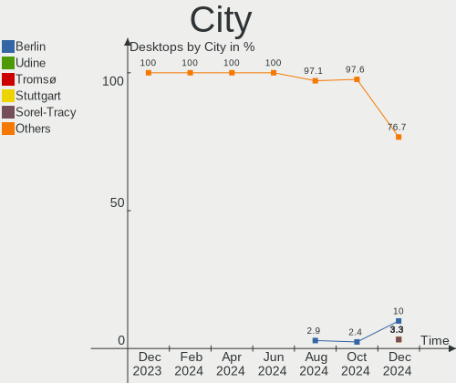
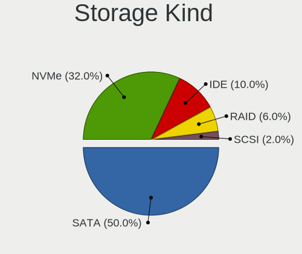
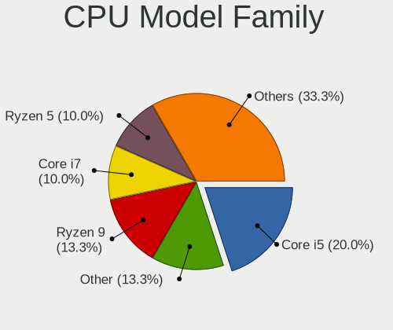
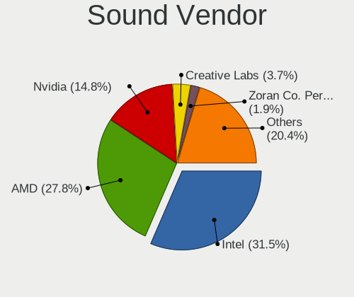
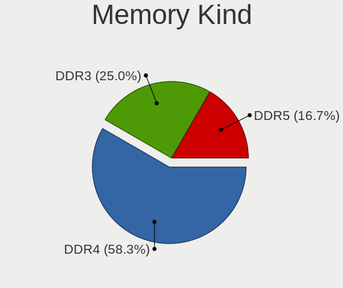

openSUSE - Hardware Trends (Desktops)
-------------------------------------

A project to identify most popular hardware characteristics and track their change
over time based on data collected by Linux users at https://Linux-Hardware.org.

Anyone can contribute to this report by the [hw-probe](https://github.com/linuxhw/hw-probe) tool:

    sudo -E hw-probe -all -upload

This report is for one last month. Overall report since the beginning of time: [TestDays](https://github.com/linuxhw/TestDays)

Period: Jan, 2024.

Contents
--------

* [ System ](#system)
  - [ OS                       ](#os)
  - [ OS Family                ](#os-family)
  - [ Kernel                   ](#kernel)
  - [ Kernel Family            ](#kernel-family)
  - [ Kernel Major Ver.        ](#kernel-major-ver)
  - [ Arch                     ](#arch)
  - [ DE                       ](#de)
  - [ Display Server           ](#display-server)
  - [ Display Manager          ](#display-manager)
  - [ OS Lang                  ](#os-lang)
  - [ Boot Mode                ](#boot-mode)
  - [ Filesystem               ](#filesystem)
  - [ Part. scheme             ](#part-scheme)
  - [ Dual Boot with Linux/BSD ](#dual-boot-with-linuxbsd)
  - [ Dual Boot (Win)          ](#dual-boot-win)

* [ Board ](#board)
  - [ Vendor                   ](#vendor)
  - [ Model                    ](#model)
  - [ Model Family             ](#model-family)
  - [ MFG Year                 ](#mfg-year)
  - [ Form Factor              ](#form-factor)
  - [ Secure Boot              ](#secure-boot)
  - [ Coreboot                 ](#coreboot)
  - [ RAM Size                 ](#ram-size)
  - [ RAM Used                 ](#ram-used)
  - [ Total Drives             ](#total-drives)
  - [ Has CD-ROM               ](#has-cd-rom)
  - [ Has Ethernet             ](#has-ethernet)
  - [ Has WiFi                 ](#has-wifi)
  - [ Has Bluetooth            ](#has-bluetooth)

* [ Location ](#location)
  - [ Country                  ](#country)
  - [ City                     ](#city)

* [ Drives ](#drives)
  - [ Drive Vendor             ](#drive-vendor)
  - [ Drive Model              ](#drive-model)
  - [ HDD Vendor               ](#hdd-vendor)
  - [ SSD Vendor               ](#ssd-vendor)
  - [ Drive Kind               ](#drive-kind)
  - [ Drive Connector          ](#drive-connector)
  - [ Drive Size               ](#drive-size)
  - [ Space Total              ](#space-total)
  - [ Space Used               ](#space-used)
  - [ Malfunc. Drives          ](#malfunc-drives)
  - [ Malfunc. Drive Vendor    ](#malfunc-drive-vendor)
  - [ Malfunc. HDD Vendor      ](#malfunc-hdd-vendor)
  - [ Malfunc. Drive Kind      ](#malfunc-drive-kind)
  - [ Failed Drives            ](#failed-drives)
  - [ Failed Drive Vendor      ](#failed-drive-vendor)
  - [ Drive Status             ](#drive-status)

* [ Storage controller ](#storage-controller)
  - [ Storage Vendor           ](#storage-vendor)
  - [ Storage Model            ](#storage-model)
  - [ Storage Kind             ](#storage-kind)

* [ Processor ](#processor)
  - [ CPU Vendor               ](#cpu-vendor)
  - [ CPU Model                ](#cpu-model)
  - [ CPU Model Family         ](#cpu-model-family)
  - [ CPU Cores                ](#cpu-cores)
  - [ CPU Sockets              ](#cpu-sockets)
  - [ CPU Threads              ](#cpu-threads)
  - [ CPU Op-Modes             ](#cpu-op-modes)
  - [ CPU Microcode            ](#cpu-microcode)
  - [ CPU Microarch            ](#cpu-microarch)

* [ Graphics ](#graphics)
  - [ GPU Vendor               ](#gpu-vendor)
  - [ GPU Model                ](#gpu-model)
  - [ GPU Combo                ](#gpu-combo)
  - [ GPU Driver               ](#gpu-driver)
  - [ GPU Memory               ](#gpu-memory)

* [ Monitor ](#monitor)
  - [ Monitor Vendor           ](#monitor-vendor)
  - [ Monitor Model            ](#monitor-model)
  - [ Monitor Resolution       ](#monitor-resolution)
  - [ Monitor Diagonal         ](#monitor-diagonal)
  - [ Monitor Width            ](#monitor-width)
  - [ Aspect Ratio             ](#aspect-ratio)
  - [ Monitor Area             ](#monitor-area)
  - [ Pixel Density            ](#pixel-density)
  - [ Multiple Monitors        ](#multiple-monitors)

* [ Network ](#network)
  - [ Net Controller Vendor    ](#net-controller-vendor)
  - [ Net Controller Model     ](#net-controller-model)
  - [ Wireless Vendor          ](#wireless-vendor)
  - [ Wireless Model           ](#wireless-model)
  - [ Ethernet Vendor          ](#ethernet-vendor)
  - [ Ethernet Model           ](#ethernet-model)
  - [ Net Controller Kind      ](#net-controller-kind)
  - [ Used Controller          ](#used-controller)
  - [ NICs                     ](#nics)
  - [ IPv6                     ](#ipv6)

* [ Bluetooth ](#bluetooth)
  - [ Bluetooth Vendor         ](#bluetooth-vendor)
  - [ Bluetooth Model          ](#bluetooth-model)

* [ Sound ](#sound)
  - [ Sound Vendor             ](#sound-vendor)
  - [ Sound Model              ](#sound-model)

* [ Memory ](#memory)
  - [ Memory Vendor            ](#memory-vendor)
  - [ Memory Model             ](#memory-model)
  - [ Memory Kind              ](#memory-kind)
  - [ Memory Form Factor       ](#memory-form-factor)
  - [ Memory Size              ](#memory-size)
  - [ Memory Speed             ](#memory-speed)

* [ Printers & scanners ](#printers--scanners)
  - [ Printer Vendor           ](#printer-vendor)
  - [ Printer Model            ](#printer-model)
  - [ Scanner Vendor           ](#scanner-vendor)
  - [ Scanner Model            ](#scanner-model)

* [ Camera ](#camera)
  - [ Camera Vendor            ](#camera-vendor)
  - [ Camera Model             ](#camera-model)

* [ Security ](#security)
  - [ Fingerprint Vendor       ](#fingerprint-vendor)
  - [ Fingerprint Model        ](#fingerprint-model)
  - [ Chipcard Vendor          ](#chipcard-vendor)
  - [ Chipcard Model           ](#chipcard-model)

* [ Unsupported ](#unsupported)
  - [ Unsupported Devices      ](#unsupported-devices)
  - [ Unsupported Device Types ](#unsupported-device-types)

System
------

OS
--

Installed operating systems

| Name                         | Desktops | Percent |
|------------------------------|----------|---------|
| openSUSE Tumbleweed-XXXXXXXX | 26       | 66.67%  |
| openSUSE Leap-15.5           | 8        | 20.51%  |
| openSUSE Microos-XXXXXXXX    | 4        | 10.26%  |
| openSUSE Leap-15.6           | 1        | 2.56%   |

OS Family
---------

OS without a version

| Name     | Desktops | Percent |
|----------|----------|---------|
| openSUSE | 39       | 100%    |

Kernel
------

Version of the Linux kernel

| Version                      | Desktops | Percent |
|------------------------------|----------|---------|
| 6.6.7-1-default              | 7        | 17.95%  |
| 5.14.21-150500.55.39-default | 7        | 17.95%  |
| 6.6.11-1-default             | 6        | 15.38%  |
| 6.7.1-2-default              | 4        | 10.26%  |
| 6.6.9-1-default              | 4        | 10.26%  |
| 6.6.10-1-default             | 4        | 10.26%  |
| 6.7.1-1-default              | 3        | 7.69%   |
| 6.7.0-9.gaedda80-default     | 1        | 2.56%   |
| 6.4.0-150600.4-default       | 1        | 2.56%   |
| 6.1.8-1-default              | 1        | 2.56%   |
| 5.14.21-150500.55.36-default | 1        | 2.56%   |

Kernel Family
-------------

Linux kernel without a distro release

| Version | Desktops | Percent |
|---------|----------|---------|
| 5.14.21 | 8        | 20.51%  |
| 6.7.1   | 7        | 17.95%  |
| 6.6.7   | 7        | 17.95%  |
| 6.6.11  | 6        | 15.38%  |
| 6.6.9   | 4        | 10.26%  |
| 6.6.10  | 4        | 10.26%  |
| 6.7.0   | 1        | 2.56%   |
| 6.4.0   | 1        | 2.56%   |
| 6.1.8   | 1        | 2.56%   |

Kernel Major Ver.
-----------------

Linux kernel major version

| Version | Desktops | Percent |
|---------|----------|---------|
| 6.6     | 21       | 53.85%  |
| 6.7     | 8        | 20.51%  |
| 5.14    | 8        | 20.51%  |
| 6.4     | 1        | 2.56%   |
| 6.1     | 1        | 2.56%   |

Arch
----

OS architecture (x86_64, i586, etc.)

| Name   | Desktops | Percent |
|--------|----------|---------|
| x86_64 | 39       | 100%    |

DE
--

Desktop Environment

| Name    | Desktops | Percent |
|---------|----------|---------|
| KDE5    | 27       | 69.23%  |
| GNOME   | 9        | 23.08%  |
| Unknown | 2        | 5.13%   |
| LXDE    | 1        | 2.56%   |

Display Server
--------------

X11 or Wayland

| Name    | Desktops | Percent |
|---------|----------|---------|
| X11     | 24       | 61.54%  |
| Wayland | 13       | 33.33%  |
| Tty     | 1        | 2.56%   |
| Unknown | 1        | 2.56%   |

Display Manager
---------------

SDDM, LightDM, etc.

| Name    | Desktops | Percent |
|---------|----------|---------|
| Unknown | 28       | 71.79%  |
| SDDM    | 11       | 28.21%  |

OS Lang
-------

Language

| Lang  | Desktops | Percent |
|-------|----------|---------|
| en_US | 17       | 43.59%  |
| de_DE | 6        | 15.38%  |
| en_GB | 4        | 10.26%  |
| ru_RU | 2        | 5.13%   |
| POSIX | 2        | 5.13%   |
| nl_NL | 2        | 5.13%   |
| es_ES | 2        | 5.13%   |
| pt_BR | 1        | 2.56%   |
| fr_FR | 1        | 2.56%   |
| en_DK | 1        | 2.56%   |
| de_AT | 1        | 2.56%   |

Boot Mode
---------

EFI or BIOS

| Mode | Desktops | Percent |
|------|----------|---------|
| EFI  | 26       | 66.67%  |
| BIOS | 13       | 33.33%  |

Filesystem
----------

Type of filesystem

| Type  | Desktops | Percent |
|-------|----------|---------|
| Btrfs | 32       | 82.05%  |
| Ext4  | 4        | 10.26%  |
| Ext2  | 2        | 5.13%   |
| Xfs   | 1        | 2.56%   |

Part. scheme
------------

Scheme of partitioning

| Type    | Desktops | Percent |
|---------|----------|---------|
| Unknown | 26       | 66.67%  |
| GPT     | 13       | 33.33%  |

Dual Boot with Linux/BSD
------------------------

Hosting more than one Linux/BSD

| Dual boot | Desktops | Percent |
|-----------|----------|---------|
| No        | 35       | 89.74%  |
| Yes       | 4        | 10.26%  |

Dual Boot (Win)
---------------

Hosting Linux and Windows

| Dual boot | Desktops | Percent |
|-----------|----------|---------|
| No        | 34       | 87.18%  |
| Yes       | 5        | 12.82%  |

Board
-----

Vendor
------

Motherboard manufacturer

| Name                | Desktops | Percent |
|---------------------|----------|---------|
| MSI                 | 9        | 23.08%  |
| ASUSTek Computer    | 7        | 17.95%  |
| Hewlett-Packard     | 5        | 12.82%  |
| Gigabyte Technology | 4        | 10.26%  |
| ASRock              | 4        | 10.26%  |
| Lenovo              | 3        | 7.69%   |
| Intel               | 2        | 5.13%   |
| AZW                 | 2        | 5.13%   |
| Pegatron            | 1        | 2.56%   |
| Dell                | 1        | 2.56%   |
| Acer                | 1        | 2.56%   |

Model
-----

Motherboard model

| Name                                        | Desktops | Percent |
|---------------------------------------------|----------|---------|
| MSI MS-7B89                                 | 2        | 5.13%   |
| Pegatron VS161AA-ABU s5206uk                | 1        | 2.56%   |
| MSI MS-7D30                                 | 1        | 2.56%   |
| MSI MS-7D25                                 | 1        | 2.56%   |
| MSI MS-7D09                                 | 1        | 2.56%   |
| MSI MS-7C02                                 | 1        | 2.56%   |
| MSI MS-7B85                                 | 1        | 2.56%   |
| MSI MS-7A33                                 | 1        | 2.56%   |
| MSI MS-7A11                                 | 1        | 2.56%   |
| Lenovo ThinkCentre M710q 10MQS0KL00         | 1        | 2.56%   |
| Lenovo Legion T5 26IOB6 90RT00TVKS          | 1        | 2.56%   |
| Lenovo IdeaCentre Gaming5 17IAB7 90T100BHMZ | 1        | 2.56%   |
| Intel DX58SO2 AAG10925-205                  | 1        | 2.56%   |
| Intel B75                                   | 1        | 2.56%   |
| HP Z400 Workstation                         | 1        | 2.56%   |
| HP ProLiant ML10 v2                         | 1        | 2.56%   |
| HP EliteDesk 800 G1 SFF                     | 1        | 2.56%   |
| HP Desktop M01-F3xxx                        | 1        | 2.56%   |
| HP 280 G1 MT                                | 1        | 2.56%   |
| Gigabyte X670 GAMING X AX                   | 1        | 2.56%   |
| Gigabyte P41T-D3P                           | 1        | 2.56%   |
| Gigabyte B550 AORUS PRO                     | 1        | 2.56%   |
| Gigabyte B550 AORUS ELITE                   | 1        | 2.56%   |
| Dell Precision 3650 Tower                   | 1        | 2.56%   |
| AZW SER                                     | 1        | 2.56%   |
| AZW MINI S                                  | 1        | 2.56%   |
| ASUS TUF Gaming Z490-PLUS                   | 1        | 2.56%   |
| ASUS TUF Gaming X570-PRO                    | 1        | 2.56%   |
| ASUS ROG CROSSHAIR VIII HERO                | 1        | 2.56%   |
| ASUS PRIME Z690-P WIFI D4                   | 1        | 2.56%   |
| ASUS PRIME X570-P                           | 1        | 2.56%   |
| ASUS PRIME B550M-A                          | 1        | 2.56%   |
| ASUS Crosshair IV Formula                   | 1        | 2.56%   |
| ASRock Z270 Gaming K4                       | 1        | 2.56%   |
| ASRock B660-ITX                             | 1        | 2.56%   |
| ASRock B450 Pro4                            | 1        | 2.56%   |
| ASRock A320M-HDV R3.0                       | 1        | 2.56%   |
| Acer Aspire R3610                           | 1        | 2.56%   |

Model Family
------------

Motherboard model prefix

| Name                 | Desktops | Percent |
|----------------------|----------|---------|
| ASUS PRIME           | 3        | 7.69%   |
| MSI MS-7B89          | 2        | 5.13%   |
| Gigabyte B550        | 2        | 5.13%   |
| ASUS TUF             | 2        | 5.13%   |
| Pegatron VS161AA-ABU | 1        | 2.56%   |
| MSI MS-7D30          | 1        | 2.56%   |
| MSI MS-7D25          | 1        | 2.56%   |
| MSI MS-7D09          | 1        | 2.56%   |
| MSI MS-7C02          | 1        | 2.56%   |
| MSI MS-7B85          | 1        | 2.56%   |
| MSI MS-7A33          | 1        | 2.56%   |
| MSI MS-7A11          | 1        | 2.56%   |
| Lenovo ThinkCentre   | 1        | 2.56%   |
| Lenovo Legion        | 1        | 2.56%   |
| Lenovo IdeaCentre    | 1        | 2.56%   |
| Intel DX58SO2        | 1        | 2.56%   |
| Intel B75            | 1        | 2.56%   |
| HP Z400              | 1        | 2.56%   |
| HP ProLiant          | 1        | 2.56%   |
| HP EliteDesk         | 1        | 2.56%   |
| HP Desktop           | 1        | 2.56%   |
| HP 280               | 1        | 2.56%   |
| Gigabyte X670        | 1        | 2.56%   |
| Gigabyte P41T-D3P    | 1        | 2.56%   |
| Dell Precision       | 1        | 2.56%   |
| AZW SER              | 1        | 2.56%   |
| AZW MINI             | 1        | 2.56%   |
| ASUS ROG             | 1        | 2.56%   |
| ASUS Crosshair       | 1        | 2.56%   |
| ASRock Z270          | 1        | 2.56%   |
| ASRock B660-ITX      | 1        | 2.56%   |
| ASRock B450          | 1        | 2.56%   |
| ASRock A320M-HDV     | 1        | 2.56%   |
| Acer Aspire          | 1        | 2.56%   |

MFG Year
--------

Motherboard manufacture year

| Year | Desktops | Percent |
|------|----------|---------|
| 2018 | 6        | 15.38%  |
| 2023 | 5        | 12.82%  |
| 2021 | 5        | 12.82%  |
| 2020 | 5        | 12.82%  |
| 2022 | 3        | 7.69%   |
| 2010 | 3        | 7.69%   |
| 2017 | 2        | 5.13%   |
| 2016 | 2        | 5.13%   |
| 2014 | 2        | 5.13%   |
| 2009 | 2        | 5.13%   |
| 2019 | 1        | 2.56%   |
| 2015 | 1        | 2.56%   |
| 2013 | 1        | 2.56%   |
| 2012 | 1        | 2.56%   |

Form Factor
-----------

Physical design of the computer

| Name    | Desktops | Percent |
|---------|----------|---------|
| Desktop | 39       | 100%    |

Secure Boot
-----------

Enabled or disabled

| State    | Desktops | Percent |
|----------|----------|---------|
| Disabled | 35       | 89.74%  |
| Enabled  | 4        | 10.26%  |

Coreboot
--------

Have coreboot on board

| Used | Desktops | Percent |
|------|----------|---------|
| No   | 39       | 100%    |

RAM Size
--------

Total RAM memory

| Size in GB  | Desktops | Percent |
|-------------|----------|---------|
| 16.01-24.0  | 13       | 33.33%  |
| 32.01-64.0  | 12       | 30.77%  |
| 8.01-16.0   | 5        | 12.82%  |
| 64.01-256.0 | 4        | 10.26%  |
| 4.01-8.0    | 2        | 5.13%   |
| 3.01-4.0    | 1        | 2.56%   |
| 24.01-32.0  | 1        | 2.56%   |
| 2.01-3.0    | 1        | 2.56%   |

RAM Used
--------

Used RAM memory

| Used GB    | Desktops | Percent |
|------------|----------|---------|
| 2.01-3.0   | 10       | 25.64%  |
| 4.01-8.0   | 8        | 20.51%  |
| 3.01-4.0   | 8        | 20.51%  |
| 1.01-2.0   | 5        | 12.82%  |
| 8.01-16.0  | 5        | 12.82%  |
| 16.01-24.0 | 1        | 2.56%   |
| 0.51-1.0   | 1        | 2.56%   |
| 0.01-0.5   | 1        | 2.56%   |

Total Drives
------------

Number of drives on board

| Drives | Desktops | Percent |
|--------|----------|---------|
| 2      | 12       | 30.77%  |
| 1      | 8        | 20.51%  |
| 5      | 7        | 17.95%  |
| 3      | 7        | 17.95%  |
| 4      | 4        | 10.26%  |
| 6      | 1        | 2.56%   |

Has CD-ROM
----------

Has CD-ROM on board

| Presented | Desktops | Percent |
|-----------|----------|---------|
| No        | 25       | 64.1%   |
| Yes       | 14       | 35.9%   |

Has Ethernet
------------

Has Ethernet on board

| Presented | Desktops | Percent |
|-----------|----------|---------|
| Yes       | 39       | 100%    |

Has WiFi
--------

Has WiFi module

| Presented | Desktops | Percent |
|-----------|----------|---------|
| Yes       | 20       | 51.28%  |
| No        | 19       | 48.72%  |

Has Bluetooth
-------------

Has Bluetooth module

| Presented | Desktops | Percent |
|-----------|----------|---------|
| Yes       | 22       | 56.41%  |
| No        | 17       | 43.59%  |

Location
--------

Country
-------

Geographic location (country)

| Country      | Desktops | Percent |
|--------------|----------|---------|
| USA          | 9        | 23.08%  |
| Germany      | 7        | 17.95%  |
| UK           | 4        | 10.26%  |
| Austria      | 3        | 7.69%   |
| Spain        | 2        | 5.13%   |
| Russia       | 2        | 5.13%   |
| Netherlands  | 2        | 5.13%   |
| France       | 2        | 5.13%   |
| Switzerland  | 1        | 2.56%   |
| Saudi Arabia | 1        | 2.56%   |
| New Zealand  | 1        | 2.56%   |
| Greece       | 1        | 2.56%   |
| Canada       | 1        | 2.56%   |
| Brazil       | 1        | 2.56%   |
| Belgium      | 1        | 2.56%   |
| Australia    | 1        | 2.56%   |

City
----

Geographic location (city)

| City                      | Desktops | Percent |
|---------------------------|----------|---------|
| Leeds                     | 2        | 5.13%   |
| Enschede                  | 2        | 5.13%   |
| Zuchwil                   | 1        | 2.56%   |
| Whangarei                 | 1        | 2.56%   |
| West Bend                 | 1        | 2.56%   |
| Volgograd                 | 1        | 2.56%   |
| Villafranca de los Barros | 1        | 2.56%   |
| Vienna                    | 1        | 2.56%   |
| Tikhvin                   | 1        | 2.56%   |
| Ste-Anne-Des-Monts        | 1        | 2.56%   |
| Southampton               | 1        | 2.56%   |
| Sheffield                 | 1        | 2.56%   |
| Sardina                   | 1        | 2.56%   |
| Sandhurst                 | 1        | 2.56%   |
| Rio de Janeiro            | 1        | 2.56%   |
| Ried im Innkreis          | 1        | 2.56%   |
| Plainfield                | 1        | 2.56%   |
| Petersburg                | 1        | 2.56%   |
| Perth                     | 1        | 2.56%   |
| Makkah                    | 1        | 2.56%   |
| Mainhausen                | 1        | 2.56%   |
| Lawton                    | 1        | 2.56%   |
| Lake Villa                | 1        | 2.56%   |
| Innsbruck                 | 1        | 2.56%   |
| Haw River                 | 1        | 2.56%   |
| Hamilton                  | 1        | 2.56%   |
| Hamburg                   | 1        | 2.56%   |
| Hagen                     | 1        | 2.56%   |
| Edegem                    | 1        | 2.56%   |
| Dresden                   | 1        | 2.56%   |
| Chemnitz                  | 1        | 2.56%   |
| Chabris                   | 1        | 2.56%   |
| Brest                     | 1        | 2.56%   |
| Bremen                    | 1        | 2.56%   |
| Bellevue                  | 1        | 2.56%   |
| Bad Krozingen             | 1        | 2.56%   |
| Athens                    | 1        | 2.56%   |

Drives
------

Drive Vendor
------------

Hard drive vendors

| Vendor                      | Desktops | Drives | Percent |
|-----------------------------|----------|--------|---------|
| WDC                         | 19       | 27     | 21.11%  |
| Samsung Electronics         | 16       | 20     | 17.78%  |
| Seagate                     | 7        | 10     | 7.78%   |
| Sandisk                     | 7        | 8      | 7.78%   |
| Crucial                     | 4        | 6      | 4.44%   |
| Phison Electronics          | 3        | 3      | 3.33%   |
| Micron Technology           | 3        | 3      | 3.33%   |
| Kingston                    | 3        | 3      | 3.33%   |
| Realtek Semiconductor       | 2        | 2      | 2.22%   |
| PNY                         | 2        | 2      | 2.22%   |
| Patriot                     | 2        | 2      | 2.22%   |
| Intel                       | 2        | 2      | 2.22%   |
| Hitachi                     | 2        | 2      | 2.22%   |
| XrayDisk                    | 1        | 1      | 1.11%   |
| Toshiba                     | 1        | 1      | 1.11%   |
| Silicon Motion              | 1        | 1      | 1.11%   |
| Micron/Crucial Technology   | 1        | 2      | 1.11%   |
| MAXIO Technology (Hangzhou) | 1        | 1      | 1.11%   |
| LITEONIT                    | 1        | 1      | 1.11%   |
| LaCie                       | 1        | 1      | 1.11%   |
| KIOXIA                      | 1        | 1      | 1.11%   |
| Kingston Technology Company | 1        | 1      | 1.11%   |
| KingSpec                    | 1        | 1      | 1.11%   |
| Intenso                     | 1        | 1      | 1.11%   |
| HGST                        | 1        | 1      | 1.11%   |
| G-DRIVE                     | 1        | 1      | 1.11%   |
| Fujitsu                     | 1        | 1      | 1.11%   |
| CT1000MX                    | 1        | 1      | 1.11%   |
| China                       | 1        | 4      | 1.11%   |
| Apacer                      | 1        | 1      | 1.11%   |
| ACASIS                      | 1        | 1      | 1.11%   |

Drive Model
-----------

Hard drive models

| Model                                                 | Desktops | Percent |
|-------------------------------------------------------|----------|---------|
| Samsung NVMe SSD Controller SM981/PM981/PM983 1TB     | 5        | 4.72%   |
| Samsung SSD 860 EVO 1TB                               | 4        | 3.77%   |
| WDC WD20EZBX-00AYRA0 2TB                              | 3        | 2.83%   |
| Samsung NVMe SSD Controller PM9A1/PM9A3/980PRO 2TB    | 3        | 2.83%   |
| WDC WD20EZRZ-00Z5HB0 2TB                              | 2        | 1.89%   |
| Seagate ST1000DM003-1SB102 1TB                        | 2        | 1.89%   |
| Sandisk WD Black SN850 1024GB                         | 2        | 1.89%   |
| Samsung SSD 870 QVO 1TB                               | 2        | 1.89%   |
| Realtek RTS5763DL NVMe SSD Controller 2TB             | 2        | 1.89%   |
| Micron CT1000P3PSSD8 1TB                              | 2        | 1.89%   |
| Crucial CT500MX500SSD1 500GB                          | 2        | 1.89%   |
| XrayDisk SSD 512GB                                    | 1        | 0.94%   |
| WDC WDS500G2B0A-00SM50 500GB SSD                      | 1        | 0.94%   |
| WDC WDS500G1B0B-00AS40 500GB SSD                      | 1        | 0.94%   |
| WDC WDS480G2G0A-00JH30 480GB SSD                      | 1        | 0.94%   |
| WDC WDS100T1B0A-00H9H0 1TB SSD                        | 1        | 0.94%   |
| WDC WD40EZAZ-00SF3B0 4TB                              | 1        | 0.94%   |
| WDC WD3200AAKX-00ERMA0 320GB                          | 1        | 0.94%   |
| WDC WD3200AAJS-56B4A0 320GB                           | 1        | 0.94%   |
| WDC WD30EZRZ-00GXCB0 3TB                              | 1        | 0.94%   |
| WDC WD20EZRX-00DC0B0 2TB                              | 1        | 0.94%   |
| WDC WD2002FAEX-007BA0 2TB                             | 1        | 0.94%   |
| WDC WD10JPCX-24UE4T0 1TB                              | 1        | 0.94%   |
| WDC WD10EZRX-00L4HB0 1TB                              | 1        | 0.94%   |
| WDC WD10EZRX-00A8LB0 1TB                              | 1        | 0.94%   |
| WDC WD10EZEX-08WN4A0 1TB                              | 1        | 0.94%   |
| WDC WD10EZEX-00WN4A0 1TB                              | 1        | 0.94%   |
| WDC WD10EZEX-00BN5A0 1TB                              | 1        | 0.94%   |
| WDC WD10EARS-00Y5B1 1TB                               | 1        | 0.94%   |
| WDC WD10EADS-00P8B0 1TB                               | 1        | 0.94%   |
| WDC WD1003FZEX-00K3CA0 1TB                            | 1        | 0.94%   |
| WDC WD1002FAEX-00Z3A0 1TB                             | 1        | 0.94%   |
| WDC WD Blue SA510 2.5 1000GB SSD                      | 1        | 0.94%   |
| Toshiba HDWD110 1TB                                   | 1        | 0.94%   |
| Silicon Motion SM2263EN/SM2263XT SSD Controller 128GB | 1        | 0.94%   |
| Seagate ST3500413AS 500GB                             | 1        | 0.94%   |
| Seagate ST3320418AS 320GB                             | 1        | 0.94%   |
| Seagate ST2000LM007-1R8174 2TB                        | 1        | 0.94%   |
| Seagate ST2000DM006-2DM164 2TB                        | 1        | 0.94%   |
| Seagate ST2000DM001-1CH164 2TB                        | 1        | 0.94%   |

HDD Vendor
----------

Hard disk drive vendors

| Vendor  | Desktops | Drives | Percent |
|---------|----------|--------|---------|
| WDC     | 16       | 22     | 57.14%  |
| Seagate | 7        | 10     | 25%     |
| Hitachi | 2        | 2      | 7.14%   |
| Toshiba | 1        | 1      | 3.57%   |
| HGST    | 1        | 1      | 3.57%   |
| Fujitsu | 1        | 1      | 3.57%   |

SSD Vendor
----------

Solid state drive vendors

| Vendor              | Desktops | Drives | Percent |
|---------------------|----------|--------|---------|
| Samsung Electronics | 9        | 11     | 25.71%  |
| WDC                 | 5        | 5      | 14.29%  |
| Crucial             | 4        | 6      | 11.43%  |
| SanDisk             | 2        | 2      | 5.71%   |
| PNY                 | 2        | 2      | 5.71%   |
| Patriot             | 2        | 2      | 5.71%   |
| Kingston            | 2        | 2      | 5.71%   |
| Intel               | 2        | 2      | 5.71%   |
| XrayDisk            | 1        | 1      | 2.86%   |
| LITEONIT            | 1        | 1      | 2.86%   |
| KingSpec            | 1        | 1      | 2.86%   |
| Intenso             | 1        | 1      | 2.86%   |
| CT1000MX            | 1        | 1      | 2.86%   |
| China               | 1        | 4      | 2.86%   |
| Apacer              | 1        | 1      | 2.86%   |

Drive Kind
----------

HDD or SSD

| Kind    | Desktops | Drives | Percent |
|---------|----------|--------|---------|
| NVMe    | 25       | 30     | 34.25%  |
| SSD     | 25       | 42     | 34.25%  |
| HDD     | 21       | 37     | 28.77%  |
| Unknown | 2        | 3      | 2.74%   |

Drive Connector
---------------

SATA, SAS, NVMe, etc.

| Type | Desktops | Drives | Percent |
|------|----------|--------|---------|
| SATA | 32       | 75     | 52.46%  |
| NVMe | 25       | 30     | 40.98%  |
| SAS  | 4        | 7      | 6.56%   |

Drive Size
----------

Size of hard drive

| Size in TB | Desktops | Drives | Percent |
|------------|----------|--------|---------|
| 0.51-1.0   | 21       | 32     | 37.5%   |
| 0.01-0.5   | 19       | 25     | 33.93%  |
| 1.01-2.0   | 11       | 16     | 19.64%  |
| 3.01-4.0   | 2        | 2      | 3.57%   |
| 2.01-3.0   | 2        | 2      | 3.57%   |
| 4.01-10.0  | 1        | 2      | 1.79%   |

Space Total
-----------

Amount of disk space available on the file system

| Size in GB     | Desktops | Percent |
|----------------|----------|---------|
| More than 3000 | 22       | 56.41%  |
| 1001-2000      | 8        | 20.51%  |
| 2001-3000      | 7        | 17.95%  |
| 251-500        | 1        | 2.56%   |
| 501-1000       | 1        | 2.56%   |

Space Used
----------

Amount of used disk space

| Used GB        | Desktops | Percent |
|----------------|----------|---------|
| 251-500        | 11       | 28.21%  |
| 101-250        | 7        | 17.95%  |
| 501-1000       | 7        | 17.95%  |
| 51-100         | 5        | 12.82%  |
| More than 3000 | 4        | 10.26%  |
| 1001-2000      | 4        | 10.26%  |
| 21-50          | 1        | 2.56%   |

Malfunc. Drives
---------------

Drive models with a malfunction

| Model                            | Desktops | Drives | Percent |
|----------------------------------|----------|--------|---------|
| XrayDisk SSD 512GB               | 1        | 1      | 33.33%  |
| WDC WD2002FAEX-007BA0 2TB        | 1        | 1      | 33.33%  |
| WDC WD Blue SA510 2.5 1000GB SSD | 1        | 1      | 33.33%  |

Malfunc. Drive Vendor
---------------------

Vendors of faulty drives

| Vendor   | Desktops | Drives | Percent |
|----------|----------|--------|---------|
| WDC      | 2        | 2      | 66.67%  |
| XrayDisk | 1        | 1      | 33.33%  |

Malfunc. HDD Vendor
-------------------

Vendors of faulty HDD drives

| Vendor | Desktops | Drives | Percent |
|--------|----------|--------|---------|
| WDC    | 1        | 1      | 100%    |

Malfunc. Drive Kind
-------------------

Kinds of faulty drives

| Kind | Desktops | Drives | Percent |
|------|----------|--------|---------|
| SSD  | 2        | 2      | 66.67%  |
| HDD  | 1        | 1      | 33.33%  |

Failed Drives
-------------

Failed drive models

Zero info for selected period =(

Failed Drive Vendor
-------------------

Failed drive vendors

Zero info for selected period =(

Drive Status
------------

Number of failed and malfunc. drives

| Status   | Desktops | Drives | Percent |
|----------|----------|--------|---------|
| Detected | 29       | 75     | 64.44%  |
| Works    | 13       | 34     | 28.89%  |
| Malfunc  | 3        | 3      | 6.67%   |

Storage controller
------------------

Storage Vendor
--------------

Storage controller vendors

| Vendor                      | Desktops | Percent |
|-----------------------------|----------|---------|
| Intel                       | 21       | 29.58%  |
| AMD                         | 16       | 22.54%  |
| Samsung Electronics         | 9        | 12.68%  |
| SanDisk                     | 5        | 7.04%   |
| Phison Electronics          | 3        | 4.23%   |
| Micron Technology           | 3        | 4.23%   |
| Realtek Semiconductor       | 2        | 2.82%   |
| Kingston Technology Company | 2        | 2.82%   |
| JMicron Technology          | 2        | 2.82%   |
| ASMedia Technology          | 2        | 2.82%   |
| Silicon Motion              | 1        | 1.41%   |
| Nvidia                      | 1        | 1.41%   |
| Micron/Crucial Technology   | 1        | 1.41%   |
| MAXIO Technology (Hangzhou) | 1        | 1.41%   |
| Marvell Technology Group    | 1        | 1.41%   |
| KIOXIA                      | 1        | 1.41%   |

Storage Model
-------------

Storage controller models

| Model                                                                          | Desktops | Percent |
|--------------------------------------------------------------------------------|----------|---------|
| AMD FCH SATA Controller [AHCI mode]                                            | 10       | 11.9%   |
| AMD 400 Series Chipset SATA Controller                                         | 6        | 7.14%   |
| Samsung NVMe SSD Controller SM981/PM981/PM983                                  | 5        | 5.95%   |
| Intel Alder Lake-S PCH SATA Controller [AHCI Mode]                             | 5        | 5.95%   |
| Samsung NVMe SSD Controller PM9A1/PM9A3/980PRO                                 | 3        | 3.57%   |
| AMD 500 Series Chipset SATA Controller                                         | 3        | 3.57%   |
| SanDisk WD PC SN810 / Black SN850 NVMe SSD                                     | 2        | 2.38%   |
| Realtek RTS5762 NVMe SSD Controller                                            | 2        | 2.38%   |
| Micron 2550 NVMe SSD (DRAM-less)                                               | 2        | 2.38%   |
| Intel NM10/ICH7 Family SATA Controller [IDE mode]                              | 2        | 2.38%   |
| Intel 8 Series/C220 Series Chipset Family 6-port SATA Controller 1 [AHCI mode] | 2        | 2.38%   |
| Intel 500 Series Chipset Family SATA AHCI Controller                           | 2        | 2.38%   |
| Intel 200 Series PCH SATA controller [AHCI mode]                               | 2        | 2.38%   |
| ASMedia ASM1061/ASM1062 Serial ATA Controller                                  | 2        | 2.38%   |
| Silicon Motion SM2263EN/SM2263XT (DRAM-less) NVMe SSD Controllers              | 1        | 1.19%   |
| SanDisk WD PC SN540 / Green SN350 NVMe SSD 1 TB (DRAM-less)                    | 1        | 1.19%   |
| SanDisk WD Green SN350 240GB (DRAM-less) / SN560E NVMe SSD                     | 1        | 1.19%   |
| SanDisk WD Black SN770 / PC SN740 256GB / PC SN560 (DRAM-less) NVMe SSD        | 1        | 1.19%   |
| SanDisk Extreme Pro / WD Black SN750 / PC SN730 / Red SN700 NVMe SSD           | 1        | 1.19%   |
| Samsung NVMe SSD Controller SM961/PM961/SM963                                  | 1        | 1.19%   |
| Phison PS5013-E13 PCIe3 NVMe Controller (DRAM-less)                            | 1        | 1.19%   |
| Phison E16 PCIe4 NVMe Controller                                               | 1        | 1.19%   |
| Phison E12 NVMe Controller                                                     | 1        | 1.19%   |
| Nvidia MCP79 AHCI Controller                                                   | 1        | 1.19%   |
| Micron/Crucial P2 [Nick P2] / P3 / P3 Plus NVMe PCIe SSD (DRAM-less)           | 1        | 1.19%   |
| Micron 3400 NVMe SSD [Hendrix]                                                 | 1        | 1.19%   |
| MAXIO (Hangzhou) NVMe SSD Controller MAP1202 (DRAM-less)                       | 1        | 1.19%   |
| Marvell Group 88SE912x IDE Controller                                          | 1        | 1.19%   |
| Marvell Group 88SE9123 PCIe SATA 6.0 Gb/s controller                           | 1        | 1.19%   |
| Marvell Group 88SE6111/6121 SATA II / PATA Controller                          | 1        | 1.19%   |
| KIOXIA NVMe SSD Controller BG5 (DRAM-less)                                     | 1        | 1.19%   |
| Kingston Company NV2 NVMe SSD E21T (DRAM-less)                                 | 1        | 1.19%   |
| Kingston Company A2000 NVMe SSD SM2263EN                                       | 1        | 1.19%   |
| JMicron JMB58x AHCI SATA controller                                            | 1        | 1.19%   |
| JMicron JMB363 SATA/IDE Controller                                             | 1        | 1.19%   |
| Intel Volume Management Device NVMe RAID Controller                            | 1        | 1.19%   |
| Intel SATA controller                                                          | 1        | 1.19%   |
| Intel Q170/Q150/B150/H170/H110/Z170/CM236 Chipset SATA Controller [AHCI Mode]  | 1        | 1.19%   |
| Intel Comet Lake SATA AHCI Controller                                          | 1        | 1.19%   |
| Intel 82801JI (ICH10 Family) SATA AHCI Controller                              | 1        | 1.19%   |

Storage Kind
------------

Kind of storage controller (IDE, SATA, NVMe, SAS, ...)

| Kind | Desktops | Percent |
|------|----------|---------|
| SATA | 33       | 50%     |
| NVMe | 25       | 37.88%  |
| IDE  | 5        | 7.58%   |
| RAID | 3        | 4.55%   |

Processor
---------

CPU Vendor
----------

Processor vendors

| Vendor | Desktops | Percent |
|--------|----------|---------|
| Intel  | 22       | 56.41%  |
| AMD    | 17       | 43.59%  |

CPU Model
---------

Processor models

| Model                                       | Desktops | Percent |
|---------------------------------------------|----------|---------|
| AMD Ryzen 5 2600 Six-Core Processor         | 2        | 5.13%   |
| Intel Xeon CPU W3530 @ 2.80GHz              | 1        | 2.56%   |
| Intel Pentium Dual-Core CPU E5300 @ 2.60GHz | 1        | 2.56%   |
| Intel Pentium CPU G3250 @ 3.20GHz           | 1        | 2.56%   |
| Intel Pentium CPU G3240 @ 3.10GHz           | 1        | 2.56%   |
| Intel N100                                  | 1        | 2.56%   |
| Intel Core i9-10850K CPU @ 3.60GHz          | 1        | 2.56%   |
| Intel Core i7-6700 CPU @ 3.40GHz            | 1        | 2.56%   |
| Intel Core i7 CPU 970 @ 3.20GHz             | 1        | 2.56%   |
| Intel Core i5-7500T CPU @ 2.70GHz           | 1        | 2.56%   |
| Intel Core i5-7500 CPU @ 3.40GHz            | 1        | 2.56%   |
| Intel Core i5-4570 CPU @ 3.20GHz            | 1        | 2.56%   |
| Intel Core i5-2400 CPU @ 3.10GHz            | 1        | 2.56%   |
| Intel Core 2 Quad CPU Q6600 @ 2.40GHz       | 1        | 2.56%   |
| Intel Atom CPU 330 @ 1.60GHz                | 1        | 2.56%   |
| Intel 13th Gen Core i9-13900K               | 1        | 2.56%   |
| Intel 12th Gen Core i9-12900KF              | 1        | 2.56%   |
| Intel 12th Gen Core i5-12600K               | 1        | 2.56%   |
| Intel 12th Gen Core i5-12400F               | 1        | 2.56%   |
| Intel 12th Gen Core i5-12400                | 1        | 2.56%   |
| Intel 11th Gen Core i7-11700K @ 3.60GHz     | 1        | 2.56%   |
| Intel 11th Gen Core i7-11700 @ 2.50GHz      | 1        | 2.56%   |
| Intel 11th Gen Core i5-11600K @ 3.90GHz     | 1        | 2.56%   |
| AMD Ryzen 9 7950X 16-Core Processor         | 1        | 2.56%   |
| AMD Ryzen 9 5900X 12-Core Processor         | 1        | 2.56%   |
| AMD Ryzen 9 3950X 16-Core Processor         | 1        | 2.56%   |
| AMD Ryzen 7 7840HS w/ Radeon 780M Graphics  | 1        | 2.56%   |
| AMD Ryzen 7 5800X 8-Core Processor          | 1        | 2.56%   |
| AMD Ryzen 7 5700G with Radeon Graphics      | 1        | 2.56%   |
| AMD Ryzen 7 2700X Eight-Core Processor      | 1        | 2.56%   |
| AMD Ryzen 7 1800X Eight-Core Processor      | 1        | 2.56%   |
| AMD Ryzen 5 5600G with Radeon Graphics      | 1        | 2.56%   |
| AMD Ryzen 5 3600 6-Core Processor           | 1        | 2.56%   |
| AMD Ryzen 5 2600X Six-Core Processor        | 1        | 2.56%   |
| AMD Ryzen 5 2400G with Radeon Vega Graphics | 1        | 2.56%   |
| AMD Ryzen 5 1500X Quad-Core Processor       | 1        | 2.56%   |
| AMD FX-8150 Eight-Core Processor            | 1        | 2.56%   |
| AMD Athlon 200GE with Radeon Vega Graphics  | 1        | 2.56%   |

CPU Model Family
----------------

Processor model prefix

| Model                   | Desktops | Percent |
|-------------------------|----------|---------|
| Other                   | 9        | 23.08%  |
| AMD Ryzen 5             | 7        | 17.95%  |
| AMD Ryzen 7             | 5        | 12.82%  |
| Intel Core i5           | 4        | 10.26%  |
| AMD Ryzen 9             | 3        | 7.69%   |
| Intel Pentium           | 2        | 5.13%   |
| Intel Core i7           | 2        | 5.13%   |
| Intel Xeon              | 1        | 2.56%   |
| Intel Pentium Dual-Core | 1        | 2.56%   |
| Intel Core i9           | 1        | 2.56%   |
| Intel Core 2 Quad       | 1        | 2.56%   |
| Intel Atom              | 1        | 2.56%   |
| AMD FX                  | 1        | 2.56%   |
| AMD Athlon              | 1        | 2.56%   |

CPU Cores
---------

Number of processor cores

| Number | Desktops | Percent |
|--------|----------|---------|
| 4      | 11       | 28.21%  |
| 6      | 9        | 23.08%  |
| 8      | 7        | 17.95%  |
| 2      | 5        | 12.82%  |
| 16     | 3        | 7.69%   |
| 10     | 2        | 5.13%   |
| 24     | 1        | 2.56%   |
| 12     | 1        | 2.56%   |

CPU Sockets
-----------

Number of sockets

| Number | Desktops | Percent |
|--------|----------|---------|
| 1      | 39       | 100%    |

CPU Threads
-----------

Threads per core (Hyper-Threading)

| Number | Desktops | Percent |
|--------|----------|---------|
| 2      | 30       | 76.92%  |
| 1      | 9        | 23.08%  |

CPU Op-Modes
------------

CPU Operation Modes (32-bit, 64-bit)

| Op mode        | Desktops | Percent |
|----------------|----------|---------|
| 32-bit, 64-bit | 39       | 100%    |

CPU Microcode
-------------

Microcode number

| Number     | Desktops | Percent |
|------------|----------|---------|
| Unknown    | 25       | 64.1%   |
| 0x0800820d | 3        | 7.69%   |
| 0x306c3    | 1        | 2.56%   |
| 0x0a601203 | 1        | 2.56%   |
| 0x0a50000d | 1        | 2.56%   |
| 0x0a201025 | 1        | 2.56%   |
| 0x08701030 | 1        | 2.56%   |
| 0x08701021 | 1        | 2.56%   |
| 0x08101016 | 1        | 2.56%   |
| 0x0810100b | 1        | 2.56%   |
| 0x08001138 | 1        | 2.56%   |
| 0x08001137 | 1        | 2.56%   |
| 0x0600063e | 1        | 2.56%   |

CPU Microarch
-------------

Microarchitecture

| Name             | Desktops | Percent |
|------------------|----------|---------|
| Zen+             | 4        | 10.26%  |
| Zen 3            | 4        | 10.26%  |
| Zen              | 4        | 10.26%  |
| Alderlake Hybrid | 4        | 10.26%  |
| Icelake          | 3        | 7.69%   |
| Haswell          | 3        | 7.69%   |
| Unknown          | 3        | 7.69%   |
| Zen 2            | 2        | 5.13%   |
| KabyLake         | 2        | 5.13%   |
| Westmere         | 1        | 2.56%   |
| Skylake          | 1        | 2.56%   |
| SandyBridge      | 1        | 2.56%   |
| Penryn           | 1        | 2.56%   |
| Nehalem          | 1        | 2.56%   |
| Gracemont        | 1        | 2.56%   |
| Core             | 1        | 2.56%   |
| CometLake        | 1        | 2.56%   |
| Bulldozer        | 1        | 2.56%   |
| Bonnell          | 1        | 2.56%   |

Graphics
--------

GPU Vendor
----------

Vendors of graphics cards

| Vendor                     | Desktops | Percent |
|----------------------------|----------|---------|
| Nvidia                     | 19       | 43.18%  |
| AMD                        | 16       | 36.36%  |
| Intel                      | 8        | 18.18%  |
| Matrox Electronics Systems | 1        | 2.27%   |

GPU Model
---------

Graphics card models

| Model                                                                       | Desktops | Percent |
|-----------------------------------------------------------------------------|----------|---------|
| AMD Ellesmere [Radeon RX 470/480/570/570X/580/580X/590]                     | 3        | 6.52%   |
| Nvidia TU116 [GeForce GTX 1660 SUPER]                                       | 2        | 4.35%   |
| Intel Xeon E3-1200 v3/4th Gen Core Processor Integrated Graphics Controller | 2        | 4.35%   |
| Intel RocketLake-S GT1 [UHD Graphics 750]                                   | 2        | 4.35%   |
| AMD Cezanne [Radeon Vega Series / Radeon Vega Mobile Series]                | 2        | 4.35%   |
| Nvidia TU104 [GeForce RTX 2080 SUPER]                                       | 1        | 2.17%   |
| Nvidia GP108 [GeForce GT 1030]                                              | 1        | 2.17%   |
| Nvidia GP106 [GeForce GTX 1060 6GB]                                         | 1        | 2.17%   |
| Nvidia GP104 [GeForce GTX 1080]                                             | 1        | 2.17%   |
| Nvidia GP102 [GeForce GTX 1080 Ti]                                          | 1        | 2.17%   |
| Nvidia GK208B [GeForce GT 710]                                              | 1        | 2.17%   |
| Nvidia GK107 [GeForce GT 640]                                               | 1        | 2.17%   |
| Nvidia GF108 [GeForce GT 730]                                               | 1        | 2.17%   |
| Nvidia GF106 [GeForce GTS 450]                                              | 1        | 2.17%   |
| Nvidia GA106 [GeForce RTX 3060 Lite Hash Rate]                              | 1        | 2.17%   |
| Nvidia GA106 [Geforce RTX 3050]                                             | 1        | 2.17%   |
| Nvidia GA104 [GeForce RTX 3070 Ti]                                          | 1        | 2.17%   |
| Nvidia GA104 [GeForce RTX 3060]                                             | 1        | 2.17%   |
| Nvidia GA102 [GeForce RTX 3090]                                             | 1        | 2.17%   |
| Nvidia GA102 [GeForce RTX 3080 Lite Hash Rate]                              | 1        | 2.17%   |
| Nvidia C79 [ION]                                                            | 1        | 2.17%   |
| Nvidia AD107 [GeForce RTX 4060]                                             | 1        | 2.17%   |
| Matrox Electronics Systems MGA G200EH                                       | 1        | 2.17%   |
| Intel Raptor Lake-S GT1 [UHD Graphics 770]                                  | 1        | 2.17%   |
| Intel HD Graphics 630                                                       | 1        | 2.17%   |
| Intel DG2 [Arc A750]                                                        | 1        | 2.17%   |
| Intel Alder Lake-N [UHD Graphics]                                           | 1        | 2.17%   |
| Intel 4 Series Chipset Integrated Graphics Controller                       | 1        | 2.17%   |
| AMD Raven Ridge [Radeon Vega Series / Radeon Vega Mobile Series]            | 1        | 2.17%   |
| AMD Raphael                                                                 | 1        | 2.17%   |
| AMD Polaris 20 XL [Radeon RX 580 2048SP]                                    | 1        | 2.17%   |
| AMD Phoenix1                                                                | 1        | 2.17%   |
| AMD Navi 33 [Radeon RX 7700S/7600/7600S/7600M XT/PRO W7600]                 | 1        | 2.17%   |
| AMD Navi 31 [Radeon RX 7900 XT/7900 XTX/7900M]                              | 1        | 2.17%   |
| AMD Navi 21 [Radeon RX 6950 XT]                                             | 1        | 2.17%   |
| AMD Navi 21 [Radeon RX 6800/6800 XT / 6900 XT]                              | 1        | 2.17%   |
| AMD Navi 14 [Radeon RX 5500/5500M / Pro 5500M]                              | 1        | 2.17%   |
| AMD Navi 14 [Radeon Pro W5500]                                              | 1        | 2.17%   |
| AMD Lexa PRO [Radeon 540/540X/550/550X / RX 540X/550/550X]                  | 1        | 2.17%   |
| AMD Juniper XT [FirePro V5800]                                              | 1        | 2.17%   |

GPU Combo
---------

Combinations of graphics cards

| Name         | Desktops | Percent |
|--------------|----------|---------|
| 1 x Nvidia   | 17       | 43.59%  |
| 1 x AMD      | 11       | 28.21%  |
| 1 x Intel    | 6        | 15.38%  |
| AMD + Nvidia | 2        | 5.13%   |
| 2 x AMD      | 1        | 2.56%   |
| 1 x Matrox   | 1        | 2.56%   |
| Intel + AMD  | 1        | 2.56%   |

GPU Driver
----------

Free vs proprietary

| Driver      | Desktops | Percent |
|-------------|----------|---------|
| Free        | 25       | 64.1%   |
| Proprietary | 13       | 33.33%  |
| Unknown     | 1        | 2.56%   |

GPU Memory
----------

Total video memory

| Size in GB | Desktops | Percent |
|------------|----------|---------|
| Unknown    | 12       | 30.77%  |
| 7.01-8.0   | 8        | 20.51%  |
| 8.01-16.0  | 5        | 12.82%  |
| 1.01-2.0   | 4        | 10.26%  |
| 5.01-6.0   | 3        | 7.69%   |
| 0.01-0.5   | 3        | 7.69%   |
| 3.01-4.0   | 2        | 5.13%   |
| 16.01-24.0 | 1        | 2.56%   |
| 0.51-1.0   | 1        | 2.56%   |

Monitor
-------

Monitor Vendor
--------------

Monitor vendors

| Vendor               | Desktops | Percent |
|----------------------|----------|---------|
| Samsung Electronics  | 10       | 22.22%  |
| Iiyama               | 7        | 15.56%  |
| Ancor Communications | 5        | 11.11%  |
| Acer                 | 4        | 8.89%   |
| Goldstar             | 3        | 6.67%   |
| Gigabyte Technology  | 3        | 6.67%   |
| AOC                  | 3        | 6.67%   |
| ViewSonic            | 1        | 2.22%   |
| Unknown (XXX)        | 1        | 2.22%   |
| Unknown              | 1        | 2.22%   |
| Sony                 | 1        | 2.22%   |
| Philips              | 1        | 2.22%   |
| Hewlett-Packard      | 1        | 2.22%   |
| Hannspree            | 1        | 2.22%   |
| Dell                 | 1        | 2.22%   |
| BenQ                 | 1        | 2.22%   |
| ASUSTek Computer     | 1        | 2.22%   |

Monitor Model
-------------

Monitor models

| Model                                                                 | Desktops | Percent |
|-----------------------------------------------------------------------|----------|---------|
| Ancor Communications ASUS VP228 ACI22C3 1920x1080 476x268mm 21.5-inch | 2        | 4.17%   |
| ViewSonic VG2755-2K VSC4E37 2560x1440 597x336mm 27.0-inch             | 1        | 2.08%   |
| Unknown LCD Monitor SAMSUNG                                           | 1        | 2.08%   |
| Unknown (XXX) Beyond TV XXX9615 3840x2160 1210x680mm 54.6-inch        | 1        | 2.08%   |
| Sony TV *30 SNY7A05 3840x2160 1218x685mm 55.0-inch                    | 1        | 2.08%   |
| Samsung Electronics U32J59x SAM0F35 3840x2160 697x392mm 31.5-inch     | 1        | 2.08%   |
| Samsung Electronics U28E590 SAM0C4D 3840x2160 607x345mm 27.5-inch     | 1        | 2.08%   |
| Samsung Electronics SyncMaster SAM0522 1600x900 443x249mm 20.0-inch   | 1        | 2.08%   |
| Samsung Electronics SyncMaster SAM0425 1920x1200 518x324mm 24.1-inch  | 1        | 2.08%   |
| Samsung Electronics S34J55x SAM0F71 3440x1440 800x330mm 34.1-inch     | 1        | 2.08%   |
| Samsung Electronics S27C500 SAM0AF3 1920x1080 600x340mm 27.2-inch     | 1        | 2.08%   |
| Samsung Electronics S24D330 SAM0D92 1920x1080 531x299mm 24.0-inch     | 1        | 2.08%   |
| Samsung Electronics LF27T450F SAM7097 1920x1080 597x336mm 27.0-inch   | 1        | 2.08%   |
| Samsung Electronics LF24T40 SAM703D 1920x1080 521x293mm 23.5-inch     | 1        | 2.08%   |
| Samsung Electronics LCD Monitor SAM7106 1920x1080 600x340mm 27.2-inch | 1        | 2.08%   |
| Samsung Electronics LCD Monitor SAM07C3 1920x1080 700x390mm 31.5-inch | 1        | 2.08%   |
| Samsung Electronics LCD Monitor S34J55x                               | 1        | 2.08%   |
| Samsung Electronics LCD Monitor S27C500 4480x1080                     | 1        | 2.08%   |
| Philips 190S PHL082F 1280x1024 338x270mm 17.0-inch                    | 1        | 2.08%   |
| Iiyama PL4373UH IVM000F 3840x2160 941x529mm 42.5-inch                 | 1        | 2.08%   |
| Iiyama PL2792UH IVM664E 3840x2160 596x335mm 26.9-inch                 | 1        | 2.08%   |
| Iiyama PL2760Q IVM663D 2560x1440 597x336mm 27.0-inch                  | 1        | 2.08%   |
| Iiyama PL2592H IVM6135 1920x1080 544x303mm 24.5-inch                  | 1        | 2.08%   |
| Iiyama PL2483H IVM6138 1920x1080 531x299mm 24.0-inch                  | 1        | 2.08%   |
| Iiyama PL2294H IVM563B 1920x1080 476x268mm 21.5-inch                  | 1        | 2.08%   |
| Iiyama PL2083H IVM53A1 1600x900 434x236mm 19.4-inch                   | 1        | 2.08%   |
| Hewlett-Packard LA2405x HWP301E 1920x1200 518x324mm 24.1-inch         | 1        | 2.08%   |
| Hannspree HF207 HSG18C5 1600x900 443x249mm 20.0-inch                  | 1        | 2.08%   |
| Goldstar TV SSCR2 GSMC0C8 3840x2160                                   | 1        | 2.08%   |
| Goldstar HDR WFHD GSM7714 2560x1080 798x334mm 34.1-inch               | 1        | 2.08%   |
| Goldstar 34GL750 GSM773B 2560x1080 798x334mm 34.1-inch                | 1        | 2.08%   |
| Gigabyte Technology M34WQ GBT3402 3440x1440 800x335mm 34.1-inch       | 1        | 2.08%   |
| Gigabyte Technology M32U GBT3204 3840x2160 697x392mm 31.5-inch        | 1        | 2.08%   |
| Gigabyte Technology M27Q GBT270D 2560x1440 596x335mm 26.9-inch        | 1        | 2.08%   |
| Dell U2723QE DEL4277 3840x2160 597x336mm 27.0-inch                    | 1        | 2.08%   |
| BenQ GW2480 BNQ78E7 1920x1080 527x296mm 23.8-inch                     | 1        | 2.08%   |
| ASUSTek Computer VG24V AUS2420 1920x1080 521x293mm 23.5-inch          | 1        | 2.08%   |
| AOC 27B1 AOC2701 1920x1080 598x336mm 27.0-inch                        | 1        | 2.08%   |
| AOC 25G3ZM AOCB322 1920x1080 544x303mm 24.5-inch                      | 1        | 2.08%   |
| AOC 2590G4 AOC2590 1920x1080 544x303mm 24.5-inch                      | 1        | 2.08%   |

Monitor Resolution
------------------

Monitor screen resolution

| Resolution        | Desktops | Percent |
|-------------------|----------|---------|
| 1920x1080 (FHD)   | 16       | 35.56%  |
| 3840x2160 (4K)    | 10       | 22.22%  |
| 2560x1440 (QHD)   | 4        | 8.89%   |
| 1920x1200 (WUXGA) | 3        | 6.67%   |
| 1600x900 (HD+)    | 3        | 6.67%   |
| 3440x1440         | 2        | 4.44%   |
| 2560x1080         | 2        | 4.44%   |
| Unknown           | 2        | 4.44%   |
| 4480x1080         | 1        | 2.22%   |
| 3286x1080         | 1        | 2.22%   |
| 1280x1024 (SXGA)  | 1        | 2.22%   |

Monitor Diagonal
----------------

Diagonal size in inches

| Inches  | Desktops | Percent |
|---------|----------|---------|
| 27      | 10       | 21.74%  |
| 24      | 9        | 19.57%  |
| 21      | 5        | 10.87%  |
| 34      | 4        | 8.7%    |
| 54      | 3        | 6.52%   |
| 31      | 3        | 6.52%   |
| 23      | 3        | 6.52%   |
| 20      | 2        | 4.35%   |
| 19      | 2        | 4.35%   |
| Unknown | 2        | 4.35%   |
| 72      | 1        | 2.17%   |
| 55      | 1        | 2.17%   |
| 42      | 1        | 2.17%   |

Monitor Width
-------------

Physical width

| Width in mm | Desktops | Percent |
|-------------|----------|---------|
| 501-600     | 18       | 40.91%  |
| 401-500     | 8        | 18.18%  |
| 601-700     | 5        | 11.36%  |
| 701-800     | 4        | 9.09%   |
| 1001-1500   | 4        | 9.09%   |
| Unknown     | 2        | 4.55%   |
| 351-400     | 1        | 2.27%   |
| 1501-2000   | 1        | 2.27%   |
| 901-1000    | 1        | 2.27%   |

Aspect Ratio
------------

Proportional relationship between the width and the height

| Ratio   | Desktops | Percent |
|---------|----------|---------|
| 16/9    | 31       | 75.61%  |
| 21/9    | 4        | 9.76%   |
| 16/10   | 3        | 7.32%   |
| Unknown | 2        | 4.88%   |
| 5/4     | 1        | 2.44%   |

Monitor Area
------------

Area in inch

| Area in inch | Desktops | Percent |
|----------------|----------|---------|
| 301-350        | 10       | 22.22%  |
| 201-250        | 8        | 17.78%  |
| 351-500        | 7        | 15.56%  |
| 251-300        | 6        | 13.33%  |
| 151-200        | 6        | 13.33%  |
| More than 1000 | 5        | 11.11%  |
| Unknown        | 2        | 4.44%   |
| 501-1000       | 1        | 2.22%   |

Pixel Density
-------------

Pixels per inch

| Density | Desktops | Percent |
|---------|----------|---------|
| 51-100  | 21       | 50%     |
| 101-120 | 10       | 23.81%  |
| 121-160 | 4        | 9.52%   |
| 161-240 | 3        | 7.14%   |
| 1-50    | 2        | 4.76%   |
| Unknown | 2        | 4.76%   |

Multiple Monitors
-----------------

Total monitors connected

| Total | Desktops | Percent |
|-------|----------|---------|
| 1     | 31       | 79.49%  |
| 2     | 6        | 15.38%  |
| 4     | 1        | 2.56%   |
| 0     | 1        | 2.56%   |

Network
-------

Net Controller Vendor
---------------------

Controller vendors

| Vendor                   | Desktops | Percent |
|--------------------------|----------|---------|
| Realtek Semiconductor    | 24       | 39.34%  |
| Intel                    | 18       | 29.51%  |
| Ralink Technology        | 3        | 4.92%   |
| Ralink                   | 2        | 3.28%   |
| Linksys                  | 2        | 3.28%   |
| Broadcom                 | 2        | 3.28%   |
| Qualcomm Atheros         | 1        | 1.64%   |
| QLogic                   | 1        | 1.64%   |
| Nvidia                   | 1        | 1.64%   |
| Microsoft                | 1        | 1.64%   |
| MediaTek                 | 1        | 1.64%   |
| Marvell Technology Group | 1        | 1.64%   |
| Gemtek                   | 1        | 1.64%   |
| Atmel                    | 1        | 1.64%   |
| ASUSTek Computer         | 1        | 1.64%   |
| ADMtek                   | 1        | 1.64%   |

Net Controller Model
--------------------

Controller models

| Model                                                                          | Desktops | Percent |
|--------------------------------------------------------------------------------|----------|---------|
| Realtek RTL8111/8168/8211/8411 PCI Express Gigabit Ethernet Controller         | 14       | 19.44%  |
| Realtek RTL8125 2.5GbE Controller                                              | 7        | 9.72%   |
| Intel Ethernet Controller I225-V                                               | 4        | 5.56%   |
| Intel Wi-Fi 6 AX200                                                            | 3        | 4.17%   |
| Intel Ethernet Connection (2) I219-V                                           | 3        | 4.17%   |
| Ralink RT2870/RT3070 Wireless Adapter                                          | 2        | 2.78%   |
| Intel I211 Gigabit Network Connection                                          | 2        | 2.78%   |
| Intel Alder Lake-S PCH CNVi WiFi                                               | 2        | 2.78%   |
| Realtek RTL8852BE PCIe 802.11ax Wireless Network Controller                    | 1        | 1.39%   |
| Realtek RTL8822CE 802.11ac PCIe Wireless Network Adapter                       | 1        | 1.39%   |
| Realtek RTL8169 PCI Gigabit Ethernet Controller                                | 1        | 1.39%   |
| Realtek RTL8153 Gigabit Ethernet Adapter                                       | 1        | 1.39%   |
| Realtek RTL810xE PCI Express Fast Ethernet controller                          | 1        | 1.39%   |
| Ralink RT5370 Wireless Adapter                                                 | 1        | 1.39%   |
| Ralink RT3090 Wireless 802.11n 1T/1R PCIe                                      | 1        | 1.39%   |
| Ralink RT2561/RT61 rev B 802.11g                                               | 1        | 1.39%   |
| Qualcomm Atheros AR242x / AR542x Wireless Network Adapter (PCI-Express)        | 1        | 1.39%   |
| QLogic ISP8324 1/10GbE Converged Network Controller                            | 1        | 1.39%   |
| QLogic 8300 Series 10GbE Converged Network Adapter (iSCSI)                     | 1        | 1.39%   |
| Nvidia MCP79 Ethernet                                                          | 1        | 1.39%   |
| Microsoft Xbox Wireless Adapter for Windows                                    | 1        | 1.39%   |
| MediaTek MT7922 802.11ax PCI Express Wireless Network Adapter                  | 1        | 1.39%   |
| Marvell Group Yukon Optima 88E8059 [PCIe Gigabit Ethernet Controller with AVB] | 1        | 1.39%   |
| Linksys WUSB6300 802.11a/b/g/n/ac Wireless Adapter [Realtek RTL8812AU]         | 1        | 1.39%   |
| Linksys AE6000 802.11a/b/g/n/ac Wireless Adapter [MediaTek MT7610U]            | 1        | 1.39%   |
| Intel Wireless Gigabit 17265                                                   | 1        | 1.39%   |
| Intel Wi-Fi 6E(802.11ax) AX210/AX1675* 2x2 [Typhoon Peak]                      | 1        | 1.39%   |
| Intel Wi-Fi 5(802.11ac) Wireless-AC 9x6x [Thunder Peak]                        | 1        | 1.39%   |
| Intel Tiger Lake PCH CNVi WiFi                                                 | 1        | 1.39%   |
| Intel Ethernet Connection I217-LM                                              | 1        | 1.39%   |
| Intel Ethernet Connection (17) I219-V                                          | 1        | 1.39%   |
| Intel Ethernet Connection (14) I219-LM                                         | 1        | 1.39%   |
| Intel Ethernet Connection (11) I219-V                                          | 1        | 1.39%   |
| Intel Comet Lake PCH CNVi WiFi                                                 | 1        | 1.39%   |
| Intel CNVi: Wi-Fi                                                              | 1        | 1.39%   |
| Intel 82574L Gigabit Network Connection                                        | 1        | 1.39%   |
| Intel 82567LF-2 Gigabit Network Connection                                     | 1        | 1.39%   |
| Gemtek WUBR-177G [Ralink RT2571W]                                              | 1        | 1.39%   |
| Broadcom NetXtreme BCM5764M Gigabit Ethernet PCIe                              | 1        | 1.39%   |
| Broadcom NetXtreme BCM5720 Gigabit Ethernet PCIe                               | 1        | 1.39%   |

Wireless Vendor
---------------

Wireless vendors

| Vendor                | Desktops | Percent |
|-----------------------|----------|---------|
| Intel                 | 11       | 44%     |
| Ralink Technology     | 3        | 12%     |
| Realtek Semiconductor | 2        | 8%      |
| Ralink                | 2        | 8%      |
| Linksys               | 2        | 8%      |
| Qualcomm Atheros      | 1        | 4%      |
| Microsoft             | 1        | 4%      |
| MediaTek              | 1        | 4%      |
| Gemtek                | 1        | 4%      |
| ASUSTek Computer      | 1        | 4%      |

Wireless Model
--------------

Wireless models

| Model                                                                   | Desktops | Percent |
|-------------------------------------------------------------------------|----------|---------|
| Intel Wi-Fi 6 AX200                                                     | 3        | 12%     |
| Ralink RT2870/RT3070 Wireless Adapter                                   | 2        | 8%      |
| Intel Alder Lake-S PCH CNVi WiFi                                        | 2        | 8%      |
| Realtek RTL8852BE PCIe 802.11ax Wireless Network Controller             | 1        | 4%      |
| Realtek RTL8822CE 802.11ac PCIe Wireless Network Adapter                | 1        | 4%      |
| Ralink RT5370 Wireless Adapter                                          | 1        | 4%      |
| Ralink RT3090 Wireless 802.11n 1T/1R PCIe                               | 1        | 4%      |
| Ralink RT2561/RT61 rev B 802.11g                                        | 1        | 4%      |
| Qualcomm Atheros AR242x / AR542x Wireless Network Adapter (PCI-Express) | 1        | 4%      |
| Microsoft Xbox Wireless Adapter for Windows                             | 1        | 4%      |
| MediaTek MT7922 802.11ax PCI Express Wireless Network Adapter           | 1        | 4%      |
| Linksys WUSB6300 802.11a/b/g/n/ac Wireless Adapter [Realtek RTL8812AU]  | 1        | 4%      |
| Linksys AE6000 802.11a/b/g/n/ac Wireless Adapter [MediaTek MT7610U]     | 1        | 4%      |
| Intel Wireless Gigabit 17265                                            | 1        | 4%      |
| Intel Wi-Fi 6E(802.11ax) AX210/AX1675* 2x2 [Typhoon Peak]               | 1        | 4%      |
| Intel Wi-Fi 5(802.11ac) Wireless-AC 9x6x [Thunder Peak]                 | 1        | 4%      |
| Intel Tiger Lake PCH CNVi WiFi                                          | 1        | 4%      |
| Intel Comet Lake PCH CNVi WiFi                                          | 1        | 4%      |
| Intel CNVi: Wi-Fi                                                       | 1        | 4%      |
| Gemtek WUBR-177G [Ralink RT2571W]                                       | 1        | 4%      |
| ASUS 802.11n WLAN Adapter                                               | 1        | 4%      |

Ethernet Vendor
---------------

Ethernet vendors

| Vendor                   | Desktops | Percent |
|--------------------------|----------|---------|
| Realtek Semiconductor    | 24       | 54.55%  |
| Intel                    | 14       | 31.82%  |
| Broadcom                 | 2        | 4.55%   |
| QLogic                   | 1        | 2.27%   |
| Nvidia                   | 1        | 2.27%   |
| Marvell Technology Group | 1        | 2.27%   |
| ADMtek                   | 1        | 2.27%   |

Ethernet Model
--------------

Ethernet models

| Model                                                                          | Desktops | Percent |
|--------------------------------------------------------------------------------|----------|---------|
| Realtek RTL8111/8168/8211/8411 PCI Express Gigabit Ethernet Controller         | 14       | 31.11%  |
| Realtek RTL8125 2.5GbE Controller                                              | 7        | 15.56%  |
| Intel Ethernet Controller I225-V                                               | 4        | 8.89%   |
| Intel Ethernet Connection (2) I219-V                                           | 3        | 6.67%   |
| Intel I211 Gigabit Network Connection                                          | 2        | 4.44%   |
| Realtek RTL8169 PCI Gigabit Ethernet Controller                                | 1        | 2.22%   |
| Realtek RTL8153 Gigabit Ethernet Adapter                                       | 1        | 2.22%   |
| Realtek RTL810xE PCI Express Fast Ethernet controller                          | 1        | 2.22%   |
| QLogic ISP8324 1/10GbE Converged Network Controller                            | 1        | 2.22%   |
| Nvidia MCP79 Ethernet                                                          | 1        | 2.22%   |
| Marvell Group Yukon Optima 88E8059 [PCIe Gigabit Ethernet Controller with AVB] | 1        | 2.22%   |
| Intel Ethernet Connection I217-LM                                              | 1        | 2.22%   |
| Intel Ethernet Connection (17) I219-V                                          | 1        | 2.22%   |
| Intel Ethernet Connection (14) I219-LM                                         | 1        | 2.22%   |
| Intel Ethernet Connection (11) I219-V                                          | 1        | 2.22%   |
| Intel 82574L Gigabit Network Connection                                        | 1        | 2.22%   |
| Intel 82567LF-2 Gigabit Network Connection                                     | 1        | 2.22%   |
| Broadcom NetXtreme BCM5764M Gigabit Ethernet PCIe                              | 1        | 2.22%   |
| Broadcom NetXtreme BCM5720 Gigabit Ethernet PCIe                               | 1        | 2.22%   |
| ADMtek NC100 Network Everywhere Fast Ethernet 10/100                           | 1        | 2.22%   |

Net Controller Kind
-------------------

Ethernet, WiFi or modem

| Kind     | Desktops | Percent |
|----------|----------|---------|
| Ethernet | 39       | 63.93%  |
| WiFi     | 20       | 32.79%  |
| Modem    | 1        | 1.64%   |
| Unknown  | 1        | 1.64%   |

Used Controller
---------------

Currently used network controller

| Kind     | Desktops | Percent |
|----------|----------|---------|
| Ethernet | 32       | 74.42%  |
| WiFi     | 11       | 25.58%  |

NICs
----

Total network controllers on board

| Total | Desktops | Percent |
|-------|----------|---------|
| 1     | 19       | 48.72%  |
| 2     | 17       | 43.59%  |
| 3     | 2        | 5.13%   |
| 8     | 1        | 2.56%   |

IPv6
----

IPv6 vs IPv4

| Used | Desktops | Percent |
|------|----------|---------|
| No   | 23       | 58.97%  |
| Yes  | 16       | 41.03%  |

Bluetooth
---------

Bluetooth Vendor
----------------

Controller vendors

| Vendor                  | Desktops | Percent |
|-------------------------|----------|---------|
| Intel                   | 10       | 45.45%  |
| Cambridge Silicon Radio | 7        | 31.82%  |
| Realtek Semiconductor   | 2        | 9.09%   |
| Realtek                 | 1        | 4.55%   |
| MediaTek                | 1        | 4.55%   |
| Broadcom                | 1        | 4.55%   |

Bluetooth Model
---------------

Controller models

| Model                                               | Desktops | Percent |
|-----------------------------------------------------|----------|---------|
| Cambridge Silicon Radio Bluetooth Dongle (HCI mode) | 7        | 31.82%  |
| Intel AX201 Bluetooth                               | 4        | 18.18%  |
| Intel AX200 Bluetooth                               | 3        | 13.64%  |
| Realtek Bluetooth Radio                             | 2        | 9.09%   |
| Realtek Bluetooth Radio                             | 1        | 4.55%   |
| MediaTek Wireless_Device                            | 1        | 4.55%   |
| Intel Wireless-AC 9260 Bluetooth Adapter            | 1        | 4.55%   |
| Intel Bluetooth Device                              | 1        | 4.55%   |
| Intel AX210 Bluetooth                               | 1        | 4.55%   |
| Broadcom BCM92046DG-CL1ROM Bluetooth 2.1 Adapter    | 1        | 4.55%   |

Sound
-----

Sound Vendor
------------

Sound card vendors

| Vendor                    | Desktops | Percent |
|---------------------------|----------|---------|
| AMD                       | 21       | 29.17%  |
| Intel                     | 19       | 26.39%  |
| Nvidia                    | 18       | 25%     |
| JMTek                     | 2        | 2.78%   |
| Focusrite-Novation        | 2        | 2.78%   |
| C-Media Electronics       | 2        | 2.78%   |
| SteelSeries ApS           | 1        | 1.39%   |
| Stadium USB microphone    | 1        | 1.39%   |
| Sennheiser Communications | 1        | 1.39%   |
| Razer USA                 | 1        | 1.39%   |
| Micro Star International  | 1        | 1.39%   |
| Huawei Technologies       | 1        | 1.39%   |
| Beyerdynamic              | 1        | 1.39%   |
| ASUSTek Computer          | 1        | 1.39%   |

Sound Model
-----------

Sound card models

| Model                                                               | Desktops | Percent |
|---------------------------------------------------------------------|----------|---------|
| AMD Family 17h/19h HD Audio Controller                              | 6        | 6.98%   |
| AMD Family 17h (Models 00h-0fh) HD Audio Controller                 | 6        | 6.98%   |
| Intel Alder Lake-S HD Audio Controller                              | 5        | 5.81%   |
| AMD Starship/Matisse HD Audio Controller                            | 4        | 4.65%   |
| AMD Ellesmere HDMI Audio [Radeon RX 470/480 / 570/580/590]          | 4        | 4.65%   |
| Intel Tiger Lake-H HD Audio Controller                              | 3        | 3.49%   |
| Nvidia TU116 High Definition Audio Controller                       | 2        | 2.33%   |
| Nvidia GA106 High Definition Audio Controller                       | 2        | 2.33%   |
| Nvidia GA104 High Definition Audio Controller                       | 2        | 2.33%   |
| Nvidia GA102 High Definition Audio Controller                       | 2        | 2.33%   |
| JMTek USB PnP Audio Device                                          | 2        | 2.33%   |
| Intel NM10/ICH7 Family High Definition Audio Controller             | 2        | 2.33%   |
| Intel 82801JI (ICH10 Family) HD Audio Controller                    | 2        | 2.33%   |
| Intel 8 Series/C220 Series Chipset High Definition Audio Controller | 2        | 2.33%   |
| Intel 200 Series PCH HD Audio                                       | 2        | 2.33%   |
| Focusrite-Novation Focusrite Scarlett 2i2 2nd Gen                   | 2        | 2.33%   |
| AMD Renoir Radeon High Definition Audio Controller                  | 2        | 2.33%   |
| AMD Rembrandt Radeon High Definition Audio Controller               | 2        | 2.33%   |
| AMD Navi 31 HDMI/DP Audio                                           | 2        | 2.33%   |
| AMD Navi 21/23 HDMI/DP Audio Controller                             | 2        | 2.33%   |
| AMD Navi 10 HDMI Audio                                              | 2        | 2.33%   |
| SteelSeries ApS Arctis Nova 3                                       | 1        | 1.16%   |
| Stadium USB microphone Stadium USB microphone                       | 1        | 1.16%   |
| Sennheiser Communications Headset [PC 8]                            | 1        | 1.16%   |
| Razer USA Razer USB Sound Card                                      | 1        | 1.16%   |
| Nvidia TU104 HD Audio Controller                                    | 1        | 1.16%   |
| Nvidia MCP79 High Definition Audio                                  | 1        | 1.16%   |
| Nvidia GP108 High Definition Audio Controller                       | 1        | 1.16%   |
| Nvidia GP106 High Definition Audio Controller                       | 1        | 1.16%   |
| Nvidia GP102 HDMI Audio Controller                                  | 1        | 1.16%   |
| Nvidia GK208 HDMI/DP Audio Controller                               | 1        | 1.16%   |
| Nvidia GK107 HDMI Audio Controller                                  | 1        | 1.16%   |
| Nvidia GF108 High Definition Audio Controller                       | 1        | 1.16%   |
| Nvidia GF106 High Definition Audio Controller                       | 1        | 1.16%   |
| Nvidia Audio device                                                 | 1        | 1.16%   |
| Micro Star International USB Audio                                  | 1        | 1.16%   |
| Intel Xeon E3-1200 v3/4th Gen Core Processor HD Audio Controller    | 1        | 1.16%   |
| Intel DG2 Audio Controller                                          | 1        | 1.16%   |
| Intel Comet Lake PCH cAVS                                           | 1        | 1.16%   |
| Intel Alder Lake-N PCH High Definition Audio Controller             | 1        | 1.16%   |

Memory
------

Memory Vendor
-------------

Memory module vendors

| Vendor              | Desktops | Percent |
|---------------------|----------|---------|
| Samsung Electronics | 3        | 20%     |
| G.Skill             | 3        | 20%     |
| Crucial             | 3        | 20%     |
| Corsair             | 2        | 13.33%  |
| Unknown (0x8634)    | 1        | 6.67%   |
| Unknown             | 1        | 6.67%   |
| SGS/Thomson         | 1        | 6.67%   |
| Hewlett-Packard     | 1        | 6.67%   |

Memory Model
------------

Memory module models

| Model                                                     | Desktops | Percent |
|-----------------------------------------------------------|----------|---------|
| Unknown RAM Module 4GB DIMM DDR3 1333MT/s                 | 1        | 5.88%   |
| Unknown RAM Module 2GB DIMM DDR3 1333MT/s                 | 1        | 5.88%   |
| Unknown (0x8634) RAM Module 4GB DIMM DDR3 1419MT/s        | 1        | 5.88%   |
| SGS/Thomson RAM M4 70T5663EH3-CF7 2GB SODIMM DDR2 800MT/s | 1        | 5.88%   |
| Samsung RAM XRD3PC16-8G 8GB DIMM DDR3 1600MT/s            | 1        | 5.88%   |
| Samsung RAM M378A5244CB0-CRC 4GB DIMM DDR4 3066MT/s       | 1        | 5.88%   |
| Samsung RAM M378A2G43CB3-CWE 16GB DIMM DDR4 3200MT/s      | 1        | 5.88%   |
| HP RAM 669238-071 4GB DIMM DDR3 1600MT/s                  | 1        | 5.88%   |
| G.Skill RAM F4-3600C18-32GTZN 32GB DIMM DDR4 3800MT/s     | 1        | 5.88%   |
| G.Skill RAM F4-3200C15-16GTZKY 16GB DIMM DDR4 3200MT/s    | 1        | 5.88%   |
| G.Skill RAM F4-2666C19-16GIS 16GB DIMM DDR4 2667MT/s      | 1        | 5.88%   |
| Crucial RAM Module 8GB DIMM DDR3 1419MT/s                 | 1        | 5.88%   |
| Crucial RAM CT8G4SFS824A.M8FR 8GB SODIMM DDR4 2400MT/s    | 1        | 5.88%   |
| Crucial RAM CT8G4SFS824A.M8FD 8GB SODIMM DDR4 2400MT/s    | 1        | 5.88%   |
| Crucial RAM CT16G4DFRA32A.C8FE 16GB DIMM DDR4 3200MT/s    | 1        | 5.88%   |
| Corsair RAM CMZ16GX3M4A1600C9 4GB DIMM DDR3 1600MT/s      | 1        | 5.88%   |
| Corsair RAM CMK16GX4M2D3600C18 8GB DIMM DDR4 3600MT/s     | 1        | 5.88%   |

Memory Kind
-----------

Memory module kinds

| Kind | Desktops | Percent |
|------|----------|---------|
| DDR4 | 8        | 61.54%  |
| DDR3 | 4        | 30.77%  |
| DDR2 | 1        | 7.69%   |

Memory Form Factor
------------------

Physical design of the memory module

| Name   | Desktops | Percent |
|--------|----------|---------|
| DIMM   | 11       | 84.62%  |
| SODIMM | 2        | 15.38%  |

Memory Size
-----------

Memory module size

| Size  | Desktops | Percent |
|-------|----------|---------|
| 16384 | 4        | 26.67%  |
| 8192  | 4        | 26.67%  |
| 4096  | 4        | 26.67%  |
| 2048  | 2        | 13.33%  |
| 32768 | 1        | 6.67%   |

Memory Speed
------------

Memory module speed

| Speed | Desktops | Percent |
|-------|----------|---------|
| 3200  | 3        | 21.43%  |
| 1600  | 3        | 21.43%  |
| 3800  | 1        | 7.14%   |
| 3666  | 1        | 7.14%   |
| 3066  | 1        | 7.14%   |
| 2667  | 1        | 7.14%   |
| 2400  | 1        | 7.14%   |
| 1419  | 1        | 7.14%   |
| 1333  | 1        | 7.14%   |
| 800   | 1        | 7.14%   |

Printers & scanners
-------------------

Printer Vendor
--------------

Printer device vendors

| Vendor             | Desktops | Percent |
|--------------------|----------|---------|
| Brother Industries | 2        | 100%    |

Printer Model
-------------

Printer device models

| Model                      | Desktops | Percent |
|----------------------------|----------|---------|
| Brother HL-L3230CDW series | 1        | 50%     |
| Brother HL-L2390DW         | 1        | 50%     |

Scanner Vendor
--------------

Scanner device vendors

Zero info for selected period =(

Scanner Model
-------------

Scanner device models

Zero info for selected period =(

Camera
------

Camera Vendor
-------------

Camera device vendors

| Vendor                        | Desktops | Percent |
|-------------------------------|----------|---------|
| Logitech                      | 3        | 30%     |
| webcamvendor                  | 2        | 20%     |
| Microsoft                     | 2        | 20%     |
| Sunplus Innovation Technology | 1        | 10%     |
| Microdia                      | 1        | 10%     |
| MacroSilicon                  | 1        | 10%     |

Camera Model
------------

Camera device models

| Model                                | Desktops | Percent |
|--------------------------------------|----------|---------|
| webcamvendor webcamproduct           | 2        | 20%     |
| Sunplus Full HD webcam               | 1        | 10%     |
| Microsoft Microsoft LifeCam Studio | 1        | 10%     |
| Microsoft LifeCam HD-3000            | 1        | 10%     |
| Microdia USB 2.0 Camera              | 1        | 10%     |
| MacroSilicon USB3. 0 capture         | 1        | 10%     |
| Logitech Webcam C270                 | 1        | 10%     |
| Logitech CrystalCam                  | 1        | 10%     |
| Logitech C922 Pro Stream Webcam      | 1        | 10%     |

Security
--------

Fingerprint Vendor
------------------

Fingerprint sensor vendors

Zero info for selected period =(

Fingerprint Model
-----------------

Fingerprint sensor models

Zero info for selected period =(

Chipcard Vendor
---------------

Chipcard module vendors

Zero info for selected period =(

Chipcard Model
--------------

Chipcard module models

Zero info for selected period =(

Unsupported
-----------

Unsupported Devices
-------------------

Total unsupported devices on board

| Total | Desktops | Percent |
|-------|----------|---------|
| 0     | 33       | 84.62%  |
| 1     | 4        | 10.26%  |
| 2     | 2        | 5.13%   |

Unsupported Device Types
------------------------

Types of unsupported devices

| Type          | Desktops | Percent |
|---------------|----------|---------|
| Net/wireless  | 3        | 50%     |
| Graphics card | 2        | 33.33%  |
| Net/ethernet  | 1        | 16.67%  |

