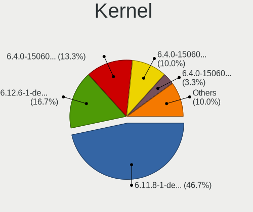
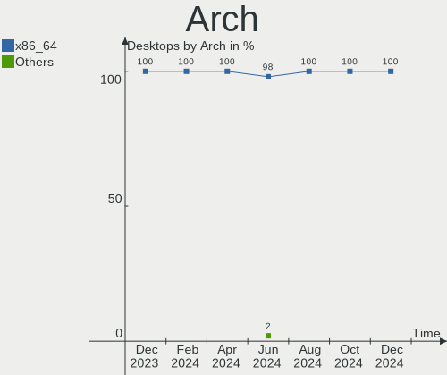
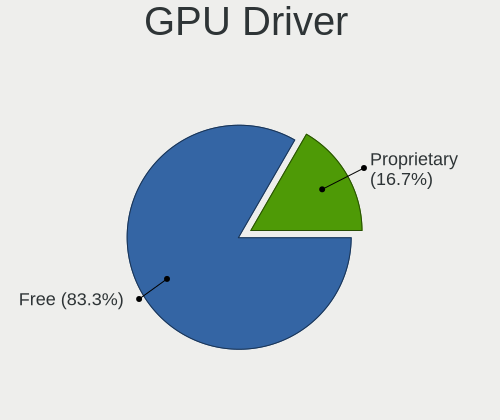
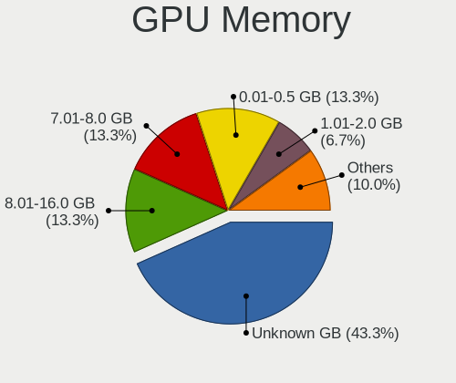
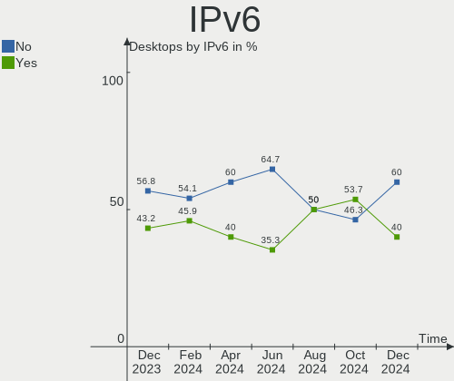
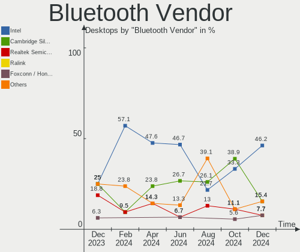

openSUSE - Hardware Trends (Desktops)
-------------------------------------

A project to identify most popular hardware characteristics and track their change
over time based on data collected by Linux users at https://Linux-Hardware.org.

Anyone can contribute to this report by the [hw-probe](https://github.com/linuxhw/hw-probe) tool:

    sudo -E hw-probe -all -upload

This report is for one last month. Overall report since the beginning of time: [TestCoverage](https://github.com/linuxhw/TestCoverage)

Period: Jan, 2023.

Contents
--------

* [ System ](#system)
  - [ OS                       ](#os)
  - [ OS Family                ](#os-family)
  - [ Kernel                   ](#kernel)
  - [ Kernel Family            ](#kernel-family)
  - [ Kernel Major Ver.        ](#kernel-major-ver)
  - [ Arch                     ](#arch)
  - [ DE                       ](#de)
  - [ Display Server           ](#display-server)
  - [ Display Manager          ](#display-manager)
  - [ OS Lang                  ](#os-lang)
  - [ Boot Mode                ](#boot-mode)
  - [ Filesystem               ](#filesystem)
  - [ Part. scheme             ](#part-scheme)
  - [ Dual Boot with Linux/BSD ](#dual-boot-with-linuxbsd)
  - [ Dual Boot (Win)          ](#dual-boot-win)

* [ Board ](#board)
  - [ Vendor                   ](#vendor)
  - [ Model                    ](#model)
  - [ Model Family             ](#model-family)
  - [ MFG Year                 ](#mfg-year)
  - [ Form Factor              ](#form-factor)
  - [ Secure Boot              ](#secure-boot)
  - [ Coreboot                 ](#coreboot)
  - [ RAM Size                 ](#ram-size)
  - [ RAM Used                 ](#ram-used)
  - [ Total Drives             ](#total-drives)
  - [ Has CD-ROM               ](#has-cd-rom)
  - [ Has Ethernet             ](#has-ethernet)
  - [ Has WiFi                 ](#has-wifi)
  - [ Has Bluetooth            ](#has-bluetooth)

* [ Location ](#location)
  - [ Country                  ](#country)
  - [ City                     ](#city)

* [ Drives ](#drives)
  - [ Drive Vendor             ](#drive-vendor)
  - [ Drive Model              ](#drive-model)
  - [ HDD Vendor               ](#hdd-vendor)
  - [ SSD Vendor               ](#ssd-vendor)
  - [ Drive Kind               ](#drive-kind)
  - [ Drive Connector          ](#drive-connector)
  - [ Drive Size               ](#drive-size)
  - [ Space Total              ](#space-total)
  - [ Space Used               ](#space-used)
  - [ Malfunc. Drives          ](#malfunc-drives)
  - [ Malfunc. Drive Vendor    ](#malfunc-drive-vendor)
  - [ Malfunc. HDD Vendor      ](#malfunc-hdd-vendor)
  - [ Malfunc. Drive Kind      ](#malfunc-drive-kind)
  - [ Failed Drives            ](#failed-drives)
  - [ Failed Drive Vendor      ](#failed-drive-vendor)
  - [ Drive Status             ](#drive-status)

* [ Storage controller ](#storage-controller)
  - [ Storage Vendor           ](#storage-vendor)
  - [ Storage Model            ](#storage-model)
  - [ Storage Kind             ](#storage-kind)

* [ Processor ](#processor)
  - [ CPU Vendor               ](#cpu-vendor)
  - [ CPU Model                ](#cpu-model)
  - [ CPU Model Family         ](#cpu-model-family)
  - [ CPU Cores                ](#cpu-cores)
  - [ CPU Sockets              ](#cpu-sockets)
  - [ CPU Threads              ](#cpu-threads)
  - [ CPU Op-Modes             ](#cpu-op-modes)
  - [ CPU Microcode            ](#cpu-microcode)
  - [ CPU Microarch            ](#cpu-microarch)

* [ Graphics ](#graphics)
  - [ GPU Vendor               ](#gpu-vendor)
  - [ GPU Model                ](#gpu-model)
  - [ GPU Combo                ](#gpu-combo)
  - [ GPU Driver               ](#gpu-driver)
  - [ GPU Memory               ](#gpu-memory)

* [ Monitor ](#monitor)
  - [ Monitor Vendor           ](#monitor-vendor)
  - [ Monitor Model            ](#monitor-model)
  - [ Monitor Resolution       ](#monitor-resolution)
  - [ Monitor Diagonal         ](#monitor-diagonal)
  - [ Monitor Width            ](#monitor-width)
  - [ Aspect Ratio             ](#aspect-ratio)
  - [ Monitor Area             ](#monitor-area)
  - [ Pixel Density            ](#pixel-density)
  - [ Multiple Monitors        ](#multiple-monitors)

* [ Network ](#network)
  - [ Net Controller Vendor    ](#net-controller-vendor)
  - [ Net Controller Model     ](#net-controller-model)
  - [ Wireless Vendor          ](#wireless-vendor)
  - [ Wireless Model           ](#wireless-model)
  - [ Ethernet Vendor          ](#ethernet-vendor)
  - [ Ethernet Model           ](#ethernet-model)
  - [ Net Controller Kind      ](#net-controller-kind)
  - [ Used Controller          ](#used-controller)
  - [ NICs                     ](#nics)
  - [ IPv6                     ](#ipv6)

* [ Bluetooth ](#bluetooth)
  - [ Bluetooth Vendor         ](#bluetooth-vendor)
  - [ Bluetooth Model          ](#bluetooth-model)

* [ Sound ](#sound)
  - [ Sound Vendor             ](#sound-vendor)
  - [ Sound Model              ](#sound-model)

* [ Memory ](#memory)
  - [ Memory Vendor            ](#memory-vendor)
  - [ Memory Model             ](#memory-model)
  - [ Memory Kind              ](#memory-kind)
  - [ Memory Form Factor       ](#memory-form-factor)
  - [ Memory Size              ](#memory-size)
  - [ Memory Speed             ](#memory-speed)

* [ Printers & scanners ](#printers--scanners)
  - [ Printer Vendor           ](#printer-vendor)
  - [ Printer Model            ](#printer-model)
  - [ Scanner Vendor           ](#scanner-vendor)
  - [ Scanner Model            ](#scanner-model)

* [ Camera ](#camera)
  - [ Camera Vendor            ](#camera-vendor)
  - [ Camera Model             ](#camera-model)

* [ Security ](#security)
  - [ Fingerprint Vendor       ](#fingerprint-vendor)
  - [ Fingerprint Model        ](#fingerprint-model)
  - [ Chipcard Vendor          ](#chipcard-vendor)
  - [ Chipcard Model           ](#chipcard-model)

* [ Unsupported ](#unsupported)
  - [ Unsupported Devices      ](#unsupported-devices)
  - [ Unsupported Device Types ](#unsupported-device-types)

System
------

OS
--

Installed operating systems

| Name                         | Desktops | Percent |
|------------------------------|----------|---------|
| openSUSE Tumbleweed-XXXXXXXX | 23       | 79.31%  |
| openSUSE Leap-15.4           | 4        | 13.79%  |
| openSUSE Microos-XXXXXXXX    | 1        | 3.45%   |
| openSUSE Leap-15.3           | 1        | 3.45%   |

OS Family
---------

OS without a version

| Name     | Desktops | Percent |
|----------|----------|---------|
| openSUSE | 29       | 100%    |

Kernel
------

Version of the Linux kernel

| Version                      | Desktops | Percent |
|------------------------------|----------|---------|
| 6.1.3-1-default              | 7        | 24.14%  |
| 6.1.7-1-default              | 4        | 13.79%  |
| 6.1.8-1-default              | 3        | 10.34%  |
| 6.1.6-1-default              | 3        | 10.34%  |
| 6.1.1-1-default              | 3        | 10.34%  |
| 6.1.4-1-default              | 2        | 6.9%    |
| 5.14.21-150400.24.41-default | 2        | 6.9%    |
| 5.14.21-150400.24.38-default | 2        | 6.9%    |
| 6.2.0-rc5-1.g39a491d-default | 1        | 3.45%   |
| 6.0.2-1-default              | 1        | 3.45%   |
| 5.3.18-150300.59.106-preempt | 1        | 3.45%   |

Kernel Family
-------------

Linux kernel without a distro release

| Version | Desktops | Percent |
|---------|----------|---------|
| 6.1.3   | 7        | 24.14%  |
| 6.1.7   | 4        | 13.79%  |
| 5.14.21 | 4        | 13.79%  |
| 6.1.8   | 3        | 10.34%  |
| 6.1.6   | 3        | 10.34%  |
| 6.1.1   | 3        | 10.34%  |
| 6.1.4   | 2        | 6.9%    |
| 6.2.0   | 1        | 3.45%   |
| 6.0.2   | 1        | 3.45%   |
| 5.3.18  | 1        | 3.45%   |

Kernel Major Ver.
-----------------

Linux kernel major version

| Version | Desktops | Percent |
|---------|----------|---------|
| 6.1     | 22       | 75.86%  |
| 5.14    | 4        | 13.79%  |
| 6.2     | 1        | 3.45%   |
| 6.0     | 1        | 3.45%   |
| 5.3     | 1        | 3.45%   |

Arch
----

OS architecture (x86_64, i586, etc.)

| Name   | Desktops | Percent |
|--------|----------|---------|
| x86_64 | 29       | 100%    |

DE
--

Desktop Environment

| Name    | Desktops | Percent |
|---------|----------|---------|
| KDE5    | 22       | 75.86%  |
| GNOME   | 4        | 13.79%  |
| Unknown | 2        | 6.9%    |
| XFCE    | 1        | 3.45%   |

Display Server
--------------

X11 or Wayland

| Name    | Desktops | Percent |
|---------|----------|---------|
| X11     | 25       | 86.21%  |
| Wayland | 4        | 13.79%  |

Display Manager
---------------

SDDM, LightDM, etc.

| Name    | Desktops | Percent |
|---------|----------|---------|
| Unknown | 19       | 65.52%  |
| SDDM    | 6        | 20.69%  |
| LightDM | 4        | 13.79%  |

OS Lang
-------

Language

| Lang    | Desktops | Percent |
|---------|----------|---------|
| en_US   | 11       | 37.93%  |
| POSIX   | 4        | 13.79%  |
| de_DE   | 4        | 13.79%  |
| ru_RU   | 2        | 6.9%    |
| fr_FR   | 2        | 6.9%    |
| pt_BR   | 1        | 3.45%   |
| nn_NO   | 1        | 3.45%   |
| ko_KR   | 1        | 3.45%   |
| es_ES   | 1        | 3.45%   |
| en_GB   | 1        | 3.45%   |
| Unknown | 1        | 3.45%   |

Boot Mode
---------

EFI or BIOS

| Mode | Desktops | Percent |
|------|----------|---------|
| EFI  | 15       | 51.72%  |
| BIOS | 14       | 48.28%  |

Filesystem
----------

Type of filesystem

| Type  | Desktops | Percent |
|-------|----------|---------|
| Btrfs | 25       | 86.21%  |
| Ext4  | 4        | 13.79%  |

Part. scheme
------------

Scheme of partitioning

| Type    | Desktops | Percent |
|---------|----------|---------|
| Unknown | 17       | 58.62%  |
| GPT     | 10       | 34.48%  |
| MBR     | 2        | 6.9%    |

Dual Boot with Linux/BSD
------------------------

Hosting more than one Linux/BSD

| Dual boot | Desktops | Percent |
|-----------|----------|---------|
| No        | 25       | 86.21%  |
| Yes       | 4        | 13.79%  |

Dual Boot (Win)
---------------

Hosting Linux and Windows

| Dual boot | Desktops | Percent |
|-----------|----------|---------|
| No        | 22       | 75.86%  |
| Yes       | 7        | 24.14%  |

Board
-----

Vendor
------

Motherboard manufacturer

| Name                | Desktops | Percent |
|---------------------|----------|---------|
| ASUSTek Computer    | 9        | 31.03%  |
| Gigabyte Technology | 6        | 20.69%  |
| ASRock              | 4        | 13.79%  |
| MSI                 | 2        | 6.9%    |
| Hewlett-Packard     | 2        | 6.9%    |
| Dell                | 2        | 6.9%    |
| Lenovo              | 1        | 3.45%   |
| Intel               | 1        | 3.45%   |
| Biostar             | 1        | 3.45%   |
| Apple               | 1        | 3.45%   |

Model
-----

Motherboard model

| Name                                | Desktops | Percent |
|-------------------------------------|----------|---------|
| MSI MS-7A38                         | 1        | 3.45%   |
| MSI MS-7673                         | 1        | 3.45%   |
| Lenovo Legion T5 28IMB05 90NC007NUS | 1        | 3.45%   |
| Intel X99                           | 1        | 3.45%   |
| HP Pavilion Power Desktop 580-1xx   | 1        | 3.45%   |
| HP 280 G1 MT                        | 1        | 3.45%   |
| Gigabyte Z87X-D3H                   | 1        | 3.45%   |
| Gigabyte Z690 GAMING X DDR4         | 1        | 3.45%   |
| Gigabyte GA-78LMT-USB3 R2           | 1        | 3.45%   |
| Gigabyte G31M-S2L                   | 1        | 3.45%   |
| Gigabyte B75M-D3H                   | 1        | 3.45%   |
| Gigabyte B650M DS3H                 | 1        | 3.45%   |
| Dell OptiPlex 3060                  | 1        | 3.45%   |
| Dell DM051                          | 1        | 3.45%   |
| Biostar Hi-Fi A85W                  | 1        | 3.45%   |
| ASUS TUF Gaming B550-PLUS WIFI II   | 1        | 3.45%   |
| ASUS PRIME B550M-A                  | 1        | 3.45%   |
| ASUS PRIME A320M-K                  | 1        | 3.45%   |
| ASUS P5K SE                         | 1        | 3.45%   |
| ASUS P5B                            | 1        | 3.45%   |
| ASUS M5A97 R2.0                     | 1        | 3.45%   |
| ASUS M5A78L-M LX V2                 | 1        | 3.45%   |
| ASUS CROSSHAIR V FORMULA-Z          | 1        | 3.45%   |
| ASUS All Series                     | 1        | 3.45%   |
| ASRock X470 Master SLI              | 1        | 3.45%   |
| ASRock H410M-HVS                    | 1        | 3.45%   |
| ASRock B75 Pro3-M                   | 1        | 3.45%   |
| ASRock B560M Pro4                   | 1        | 3.45%   |
| Apple MacPro5,1                     | 1        | 3.45%   |

Model Family
------------

Motherboard model prefix

| Name                   | Desktops | Percent |
|------------------------|----------|---------|
| ASUS PRIME             | 2        | 6.9%    |
| MSI MS-7A38            | 1        | 3.45%   |
| MSI MS-7673            | 1        | 3.45%   |
| Lenovo Legion          | 1        | 3.45%   |
| Intel X99              | 1        | 3.45%   |
| HP Pavilion            | 1        | 3.45%   |
| HP 280                 | 1        | 3.45%   |
| Gigabyte Z87X-D3H      | 1        | 3.45%   |
| Gigabyte Z690          | 1        | 3.45%   |
| Gigabyte GA-78LMT-USB3 | 1        | 3.45%   |
| Gigabyte G31M-S2L      | 1        | 3.45%   |
| Gigabyte B75M-D3H      | 1        | 3.45%   |
| Gigabyte B650M         | 1        | 3.45%   |
| Dell OptiPlex          | 1        | 3.45%   |
| Dell DM051             | 1        | 3.45%   |
| Biostar Hi-Fi          | 1        | 3.45%   |
| ASUS TUF               | 1        | 3.45%   |
| ASUS P5K               | 1        | 3.45%   |
| ASUS P5B               | 1        | 3.45%   |
| ASUS M5A97             | 1        | 3.45%   |
| ASUS M5A78L-M          | 1        | 3.45%   |
| ASUS CROSSHAIR         | 1        | 3.45%   |
| ASUS All               | 1        | 3.45%   |
| ASRock X470            | 1        | 3.45%   |
| ASRock H410M-HVS       | 1        | 3.45%   |
| ASRock B75             | 1        | 3.45%   |
| ASRock B560M           | 1        | 3.45%   |
| Apple MacPro5          | 1        | 3.45%   |

MFG Year
--------

Motherboard manufacture year

| Year | Desktops | Percent |
|------|----------|---------|
| 2012 | 4        | 13.79%  |
| 2020 | 3        | 10.34%  |
| 2017 | 3        | 10.34%  |
| 2021 | 2        | 6.9%    |
| 2019 | 2        | 6.9%    |
| 2018 | 2        | 6.9%    |
| 2015 | 2        | 6.9%    |
| 2013 | 2        | 6.9%    |
| 2011 | 2        | 6.9%    |
| 2007 | 2        | 6.9%    |
| 2022 | 1        | 3.45%   |
| 2014 | 1        | 3.45%   |
| 2010 | 1        | 3.45%   |
| 2006 | 1        | 3.45%   |
| 2005 | 1        | 3.45%   |

Form Factor
-----------

Physical design of the computer

| Name    | Desktops | Percent |
|---------|----------|---------|
| Desktop | 29       | 100%    |

Secure Boot
-----------

Enabled or disabled

| State    | Desktops | Percent |
|----------|----------|---------|
| Disabled | 26       | 89.66%  |
| Enabled  | 3        | 10.34%  |

Coreboot
--------

Have coreboot on board

| Used | Desktops | Percent |
|------|----------|---------|
| No   | 29       | 100%    |

RAM Size
--------

Total RAM memory

| Size in GB  | Desktops | Percent |
|-------------|----------|---------|
| 16.01-24.0  | 9        | 31.03%  |
| 32.01-64.0  | 7        | 24.14%  |
| 3.01-4.0    | 5        | 17.24%  |
| 4.01-8.0    | 3        | 10.34%  |
| 8.01-16.0   | 3        | 10.34%  |
| 24.01-32.0  | 1        | 3.45%   |
| 64.01-256.0 | 1        | 3.45%   |

RAM Used
--------

Used RAM memory

| Used GB   | Desktops | Percent |
|-----------|----------|---------|
| 2.01-3.0  | 8        | 27.59%  |
| 4.01-8.0  | 7        | 24.14%  |
| 3.01-4.0  | 7        | 24.14%  |
| 1.01-2.0  | 5        | 17.24%  |
| 8.01-16.0 | 1        | 3.45%   |
| 0.51-1.0  | 1        | 3.45%   |

Total Drives
------------

Number of drives on board

| Drives | Desktops | Percent |
|--------|----------|---------|
| 2      | 8        | 27.59%  |
| 3      | 7        | 24.14%  |
| 1      | 6        | 20.69%  |
| 4      | 5        | 17.24%  |
| 5      | 2        | 6.9%    |
| 6      | 1        | 3.45%   |

Has CD-ROM
----------

Has CD-ROM on board

| Presented | Desktops | Percent |
|-----------|----------|---------|
| No        | 15       | 51.72%  |
| Yes       | 14       | 48.28%  |

Has Ethernet
------------

Has Ethernet on board

| Presented | Desktops | Percent |
|-----------|----------|---------|
| Yes       | 29       | 100%    |

Has WiFi
--------

Has WiFi module

| Presented | Desktops | Percent |
|-----------|----------|---------|
| No        | 16       | 55.17%  |
| Yes       | 13       | 44.83%  |

Has Bluetooth
-------------

Has Bluetooth module

| Presented | Desktops | Percent |
|-----------|----------|---------|
| No        | 21       | 72.41%  |
| Yes       | 8        | 27.59%  |

Location
--------

Country
-------

Geographic location (country)

| Country     | Desktops | Percent |
|-------------|----------|---------|
| USA         | 6        | 20.69%  |
| Germany     | 6        | 20.69%  |
| Russia      | 2        | 6.9%    |
| Italy       | 2        | 6.9%    |
| France      | 2        | 6.9%    |
| Ukraine     | 1        | 3.45%   |
| UK          | 1        | 3.45%   |
| Thailand    | 1        | 3.45%   |
| Spain       | 1        | 3.45%   |
| South Korea | 1        | 3.45%   |
| Norway      | 1        | 3.45%   |
| New Zealand | 1        | 3.45%   |
| Netherlands | 1        | 3.45%   |
| Kazakhstan  | 1        | 3.45%   |
| Greece      | 1        | 3.45%   |
| Brazil      | 1        | 3.45%   |

City
----

Geographic location (city)

| City                      | Desktops | Percent |
|---------------------------|----------|---------|
| Yongin-si                 | 1        | 3.45%   |
| Wabasha                   | 1        | 3.45%   |
| Villafranca de los Barros | 1        | 3.45%   |
| Uslar                     | 1        | 3.45%   |
| Thornton Heath            | 1        | 3.45%   |
| Tambov                    | 1        | 3.45%   |
| Schenectady               | 1        | 3.45%   |
| Sainte-Tulle              | 1        | 3.45%   |
| Rostock                   | 1        | 3.45%   |
| Putilkovo                 | 1        | 3.45%   |
| Orlando                   | 1        | 3.45%   |
| Old Faliron               | 1        | 3.45%   |
| Moline                    | 1        | 3.45%   |
| Milan                     | 1        | 3.45%   |
| Hoogvliet                 | 1        | 3.45%   |
| Henichesk                 | 1        | 3.45%   |
| Englewood                 | 1        | 3.45%   |
| Dortmund                  | 1        | 3.45%   |
| Cuorgnè                  | 1        | 3.45%   |
| Cologne                   | 1        | 3.45%   |
| Clery                     | 1        | 3.45%   |
| Christchurch              | 1        | 3.45%   |
| Caxias do Sul             | 1        | 3.45%   |
| Berlin                    | 1        | 3.45%   |
| Bergen                    | 1        | 3.45%   |
| Beaverton                 | 1        | 3.45%   |
| Bangkok                   | 1        | 3.45%   |
| Bad Nauheim               | 1        | 3.45%   |
| Almaty                    | 1        | 3.45%   |

Drives
------

Drive Vendor
------------

Hard drive vendors

| Vendor                | Desktops | Drives | Percent |
|-----------------------|----------|--------|---------|
| WDC                   | 14       | 20     | 22.58%  |
| Samsung Electronics   | 10       | 13     | 16.13%  |
| Seagate               | 9        | 14     | 14.52%  |
| Kingston              | 6        | 7      | 9.68%   |
| Intel                 | 5        | 5      | 8.06%   |
| Hitachi               | 3        | 3      | 4.84%   |
| Toshiba               | 2        | 2      | 3.23%   |
| SanDisk               | 2        | 2      | 3.23%   |
| Phison Electronics    | 2        | 4      | 3.23%   |
| Unknown               | 1        | 1      | 1.61%   |
| Smartbuy              | 1        | 1      | 1.61%   |
| Realtek Semiconductor | 1        | 1      | 1.61%   |
| Micron Technology     | 1        | 1      | 1.61%   |
| Maxtor                | 1        | 1      | 1.61%   |
| LITEON                | 1        | 1      | 1.61%   |
| Intenso               | 1        | 1      | 1.61%   |
| HGST                  | 1        | 1      | 1.61%   |
| Crucial               | 1        | 1      | 1.61%   |

Drive Model
-----------

Hard drive models

| Model                                          | Desktops | Percent |
|------------------------------------------------|----------|---------|
| Seagate ST2000DM001-1ER164 2TB                 | 3        | 4.17%   |
| WDC WDS100T2B0A-00SM50 1TB SSD                 | 2        | 2.78%   |
| Seagate ST2000DM008-2FR102 2TB                 | 2        | 2.78%   |
| Kingston SV300S37A120G 120GB SSD               | 2        | 2.78%   |
| Kingston SA400S37480G 480GB SSD                | 2        | 2.78%   |
| WDC WDS500G2B0A-00SM50 500GB SSD               | 1        | 1.39%   |
| WDC WD5000AVDS-63U7B1 500GB                    | 1        | 1.39%   |
| WDC WD40EZRZ-00GXCB0 4TB                       | 1        | 1.39%   |
| WDC WD40EZAZ-00SF3B0 4TB                       | 1        | 1.39%   |
| WDC WD4003FZEX-00Z4SA0 4TB                     | 1        | 1.39%   |
| WDC WD30EZRX-00DC0B0 3TB                       | 1        | 1.39%   |
| WDC WD20PURX-64P6ZY0 2TB                       | 1        | 1.39%   |
| WDC WD20EZAZ-00GGJB0 2TB                       | 1        | 1.39%   |
| WDC WD20EFRX-68EUZN0 2TB                       | 1        | 1.39%   |
| WDC WD20EARS-00MVWB0 2TB                       | 1        | 1.39%   |
| WDC WD10EZEX-75WN4A0 1TB                       | 1        | 1.39%   |
| WDC WD10EZEX-00WN4A0 1TB                       | 1        | 1.39%   |
| WDC WD10EZEX-00KUWA0 1TB                       | 1        | 1.39%   |
| WDC WD10EZEX-00BBHA0 1TB                       | 1        | 1.39%   |
| WDC WD10EARX-00N0YB0 1TB                       | 1        | 1.39%   |
| WDC WD10EADS-00L5B1 1TB                        | 1        | 1.39%   |
| Unknown SD/MMC/MS PRO 2GB                      | 1        | 1.39%   |
| Toshiba MQ01ABD032 320GB                       | 1        | 1.39%   |
| Toshiba DT01ACA100 1TB                         | 1        | 1.39%   |
| Smartbuy SSD 120GB                             | 1        | 1.39%   |
| Seagate ST500DM002-1BD142 500GB                | 1        | 1.39%   |
| Seagate ST3160812AS 160GB                      | 1        | 1.39%   |
| Seagate ST31000528AS 1TB                       | 1        | 1.39%   |
| Seagate ST31000524AS 1TB                       | 1        | 1.39%   |
| Seagate ST2000DL003-9VT166 2TB                 | 1        | 1.39%   |
| Seagate ST1000LM024 HN-M101MBB 1TB             | 1        | 1.39%   |
| Seagate ST1000DM003-1CH162 1TB                 | 1        | 1.39%   |
| Seagate Expansion 240GB                        | 1        | 1.39%   |
| Sandisk WD Black SN750 / PC SN730 NVMe SSD 1TB | 1        | 1.39%   |
| SanDisk SDSSDH31000G 1TB                       | 1        | 1.39%   |
| Samsung SSD 870 QVO 2TB                        | 1        | 1.39%   |
| Samsung SSD 870 EVO 500GB                      | 1        | 1.39%   |
| Samsung SSD 870 EVO 1TB                        | 1        | 1.39%   |
| Samsung SSD 860 EVO 500GB                      | 1        | 1.39%   |
| Samsung SSD 850 EVO 250GB                      | 1        | 1.39%   |

HDD Vendor
----------

Hard disk drive vendors

| Vendor              | Desktops | Drives | Percent |
|---------------------|----------|--------|---------|
| WDC                 | 13       | 17     | 39.39%  |
| Seagate             | 9        | 14     | 27.27%  |
| Samsung Electronics | 3        | 5      | 9.09%   |
| Hitachi             | 3        | 3      | 9.09%   |
| Toshiba             | 2        | 2      | 6.06%   |
| Unknown             | 1        | 1      | 3.03%   |
| Maxtor              | 1        | 1      | 3.03%   |
| HGST                | 1        | 1      | 3.03%   |

SSD Vendor
----------

Solid state drive vendors

| Vendor              | Desktops | Drives | Percent |
|---------------------|----------|--------|---------|
| Samsung Electronics | 5        | 6      | 25%     |
| Kingston            | 5        | 5      | 25%     |
| Intel               | 3        | 3      | 15%     |
| WDC                 | 2        | 3      | 10%     |
| Smartbuy            | 1        | 1      | 5%      |
| SanDisk             | 1        | 1      | 5%      |
| LITEON              | 1        | 1      | 5%      |
| Intenso             | 1        | 1      | 5%      |
| Crucial             | 1        | 1      | 5%      |

Drive Kind
----------

HDD or SSD

| Kind | Desktops | Drives | Percent |
|------|----------|--------|---------|
| HDD  | 24       | 44     | 44.44%  |
| SSD  | 20       | 22     | 37.04%  |
| NVMe | 10       | 13     | 18.52%  |

Drive Connector
---------------

SATA, SAS, NVMe, etc.

| Type | Desktops | Drives | Percent |
|------|----------|--------|---------|
| SATA | 28       | 64     | 70%     |
| NVMe | 10       | 13     | 25%     |
| SAS  | 2        | 2      | 5%      |

Drive Size
----------

Size of hard drive

| Size in TB | Desktops | Drives | Percent |
|------------|----------|--------|---------|
| 0.01-0.5   | 23       | 29     | 47.92%  |
| 0.51-1.0   | 12       | 19     | 25%     |
| 1.01-2.0   | 9        | 13     | 18.75%  |
| 3.01-4.0   | 3        | 4      | 6.25%   |
| 2.01-3.0   | 1        | 1      | 2.08%   |

Space Total
-----------

Amount of disk space available on the file system

| Size in GB     | Desktops | Percent |
|----------------|----------|---------|
| More than 3000 | 11       | 37.93%  |
| 1001-2000      | 10       | 34.48%  |
| 501-1000       | 5        | 17.24%  |
| 2001-3000      | 2        | 6.9%    |
| Unknown        | 1        | 3.45%   |

Space Used
----------

Amount of used disk space

| Used GB        | Desktops | Percent |
|----------------|----------|---------|
| 51-100         | 8        | 27.59%  |
| 501-1000       | 7        | 24.14%  |
| 251-500        | 4        | 13.79%  |
| 101-250        | 4        | 13.79%  |
| More than 3000 | 2        | 6.9%    |
| 21-50          | 1        | 3.45%   |
| 2001-3000      | 1        | 3.45%   |
| 1001-2000      | 1        | 3.45%   |
| Unknown        | 1        | 3.45%   |

Malfunc. Drives
---------------

Drive models with a malfunction

| Model                           | Desktops | Drives | Percent |
|---------------------------------|----------|--------|---------|
| WDC WD20EFRX-68EUZN0 2TB        | 1        | 1      | 12.5%   |
| WDC WD20EARS-00MVWB0 2TB        | 1        | 1      | 12.5%   |
| WDC WD10EZEX-75WN4A0 1TB        | 1        | 1      | 12.5%   |
| Seagate ST500DM002-1BD142 500GB | 1        | 1      | 12.5%   |
| Seagate ST2000DL003-9VT166 2TB  | 1        | 1      | 12.5%   |
| Seagate ST1000DM003-1CH162 1TB  | 1        | 1      | 12.5%   |
| Maxtor 6L250S0 256GB            | 1        | 1      | 12.5%   |
| Hitachi HDT721010SLA360 1TB     | 1        | 1      | 12.5%   |

Malfunc. Drive Vendor
---------------------

Vendors of faulty drives

| Vendor  | Desktops | Drives | Percent |
|---------|----------|--------|---------|
| WDC     | 3        | 3      | 42.86%  |
| Seagate | 2        | 3      | 28.57%  |
| Maxtor  | 1        | 1      | 14.29%  |
| Hitachi | 1        | 1      | 14.29%  |

Malfunc. HDD Vendor
-------------------

Vendors of faulty HDD drives

| Vendor  | Desktops | Drives | Percent |
|---------|----------|--------|---------|
| WDC     | 3        | 3      | 42.86%  |
| Seagate | 2        | 3      | 28.57%  |
| Maxtor  | 1        | 1      | 14.29%  |
| Hitachi | 1        | 1      | 14.29%  |

Malfunc. Drive Kind
-------------------

Kinds of faulty drives

| Kind | Desktops | Drives | Percent |
|------|----------|--------|---------|
| HDD  | 6        | 8      | 100%    |

Failed Drives
-------------

Failed drive models

Zero info for selected period =(

Failed Drive Vendor
-------------------

Failed drive vendors

Zero info for selected period =(

Drive Status
------------

Number of failed and malfunc. drives

| Status   | Desktops | Drives | Percent |
|----------|----------|--------|---------|
| Detected | 18       | 38     | 50%     |
| Works    | 12       | 33     | 33.33%  |
| Malfunc  | 6        | 8      | 16.67%  |

Storage controller
------------------

Storage Vendor
--------------

Storage controller vendors

| Vendor                      | Desktops | Percent |
|-----------------------------|----------|---------|
| Intel                       | 18       | 41.86%  |
| AMD                         | 12       | 27.91%  |
| Samsung Electronics         | 2        | 4.65%   |
| Phison Electronics          | 2        | 4.65%   |
| Marvell Technology Group    | 2        | 4.65%   |
| Kingston Technology Company | 2        | 4.65%   |
| SanDisk                     | 1        | 2.33%   |
| Realtek Semiconductor       | 1        | 2.33%   |
| Micron Technology           | 1        | 2.33%   |
| JMicron Technology          | 1        | 2.33%   |
| ASMedia Technology          | 1        | 2.33%   |

Storage Model
-------------

Storage controller models

| Model                                                                          | Desktops | Percent |
|--------------------------------------------------------------------------------|----------|---------|
| AMD FCH SATA Controller [AHCI mode]                                            | 4        | 7.55%   |
| Kingston Company Company Non-Volatile memory controller                        | 2        | 3.77%   |
| Intel NM10/ICH7 Family SATA Controller [IDE mode]                              | 2        | 3.77%   |
| Intel 8 Series/C220 Series Chipset Family 6-port SATA Controller 1 [AHCI mode] | 2        | 3.77%   |
| Intel 7 Series/C210 Series Chipset Family 6-port SATA Controller [AHCI mode]   | 2        | 3.77%   |
| Intel 400 Series Chipset Family SATA AHCI Controller                           | 2        | 3.77%   |
| AMD SB7x0/SB8x0/SB9x0 SATA Controller [IDE mode]                               | 2        | 3.77%   |
| AMD SB7x0/SB8x0/SB9x0 SATA Controller [AHCI mode]                              | 2        | 3.77%   |
| AMD SB7x0/SB8x0/SB9x0 IDE Controller                                           | 2        | 3.77%   |
| AMD 500 Series Chipset SATA Controller                                         | 2        | 3.77%   |
| AMD 400 Series Chipset SATA Controller                                         | 2        | 3.77%   |
| SanDisk WD Black SN750 / PC SN730 NVMe SSD                                     | 1        | 1.89%   |
| Samsung NVMe SSD Controller SM981/PM981/PM983                                  | 1        | 1.89%   |
| Samsung NVMe SSD Controller SM961/PM961/SM963                                  | 1        | 1.89%   |
| Realtek Realtek Non-Volatile memory controller                                 | 1        | 1.89%   |
| Phison PS5013 E13 NVMe Controller                                              | 1        | 1.89%   |
| Phison E12 NVMe Controller                                                     | 1        | 1.89%   |
| Micron Non-Volatile memory controller                                          | 1        | 1.89%   |
| Marvell Group 88SE9128 PCIe SATA 6 Gb/s RAID controller                        | 1        | 1.89%   |
| Marvell Group 88SE6111/6121 SATA II / PATA Controller                          | 1        | 1.89%   |
| JMicron JMB363 SATA/IDE Controller                                             | 1        | 1.89%   |
| Intel SSD Pro 7600p/760p/E 6100p Series                                        | 1        | 1.89%   |
| Intel SSD 660P Series                                                          | 1        | 1.89%   |
| Intel Cannon Lake PCH SATA AHCI Controller                                     | 1        | 1.89%   |
| Intel C610/X99 series chipset sSATA Controller [AHCI mode]                     | 1        | 1.89%   |
| Intel Alder Lake-S PCH SATA Controller [AHCI Mode]                             | 1        | 1.89%   |
| Intel 9 Series Chipset Family SATA Controller [AHCI Mode]                      | 1        | 1.89%   |
| Intel 82801JI (ICH10 Family) SATA AHCI Controller                              | 1        | 1.89%   |
| Intel 82801IB (ICH9) 2 port SATA Controller [IDE mode]                         | 1        | 1.89%   |
| Intel 82801I (ICH9 Family) 2 port SATA Controller [IDE mode]                   | 1        | 1.89%   |
| Intel 82801HR/HO/HH (ICH8R/DO/DH) 2 port SATA Controller [IDE mode]            | 1        | 1.89%   |
| Intel 82801H (ICH8 Family) 4 port SATA Controller [IDE mode]                   | 1        | 1.89%   |
| Intel 82801G (ICH7 Family) IDE Controller                                      | 1        | 1.89%   |
| Intel 6 Series/C200 Series Chipset Family 6 port Desktop SATA AHCI Controller  | 1        | 1.89%   |
| Intel 500 Series Chipset Family SATA AHCI Controller                           | 1        | 1.89%   |
| ASMedia ASM1062 Serial ATA Controller                                          | 1        | 1.89%   |
| AMD SATA controller                                                            | 1        | 1.89%   |
| AMD FCH SATA Controller D                                                      | 1        | 1.89%   |
| AMD FCH IDE Controller                                                         | 1        | 1.89%   |
| AMD 300 Series Chipset SATA Controller                                         | 1        | 1.89%   |

Storage Kind
------------

Kind of storage controller (IDE, SATA, NVMe, SAS, ...)

| Kind | Desktops | Percent |
|------|----------|---------|
| SATA | 25       | 59.52%  |
| NVMe | 10       | 23.81%  |
| IDE  | 7        | 16.67%  |

Processor
---------

CPU Vendor
----------

Processor vendors

| Vendor | Desktops | Percent |
|--------|----------|---------|
| Intel  | 17       | 58.62%  |
| AMD    | 12       | 41.38%  |

CPU Model
---------

Processor models

| Model                                       | Desktops | Percent |
|---------------------------------------------|----------|---------|
| Intel Core i7-10700 CPU @ 2.90GHz           | 2        | 6.9%    |
| AMD FX-8350 Eight-Core Processor            | 2        | 6.9%    |
| Intel Xeon CPU W3530 @ 2.80GHz              | 1        | 3.45%   |
| Intel Xeon CPU E5-2680 v3 @ 2.50GHz         | 1        | 3.45%   |
| Intel Xeon CPU E3110 @ 3.00GHz              | 1        | 3.45%   |
| Intel Pentium CPU G3250 @ 3.20GHz           | 1        | 3.45%   |
| Intel Pentium 4 CPU 3.20GHz                 | 1        | 3.45%   |
| Intel Core i7-4790K CPU @ 4.00GHz           | 1        | 3.45%   |
| Intel Core i7-4770 CPU @ 3.40GHz            | 1        | 3.45%   |
| Intel Core i7-3770 CPU @ 3.40GHz            | 1        | 3.45%   |
| Intel Core i5-3470 CPU @ 3.20GHz            | 1        | 3.45%   |
| Intel Core i5-2500 CPU @ 3.30GHz            | 1        | 3.45%   |
| Intel Core i3-8100T CPU @ 3.10GHz           | 1        | 3.45%   |
| Intel Core 2 Quad CPU Q9300 @ 2.50GHz       | 1        | 3.45%   |
| Intel Core 2 Duo CPU E6850 @ 3.00GHz        | 1        | 3.45%   |
| Intel 12th Gen Core i7-12700KF              | 1        | 3.45%   |
| Intel 11th Gen Core i5-11500 @ 2.70GHz      | 1        | 3.45%   |
| AMD Ryzen 7 7700X 8-Core Processor          | 1        | 3.45%   |
| AMD Ryzen 7 3700X 8-Core Processor          | 1        | 3.45%   |
| AMD Ryzen 5 5600G with Radeon Graphics      | 1        | 3.45%   |
| AMD Ryzen 5 2600X Six-Core Processor        | 1        | 3.45%   |
| AMD Ryzen 5 2600 Six-Core Processor         | 1        | 3.45%   |
| AMD Ryzen 5 1400 Quad-Core Processor        | 1        | 3.45%   |
| AMD Ryzen 3 3200G with Radeon Vega Graphics | 1        | 3.45%   |
| AMD FX-6300 Six-Core Processor              | 1        | 3.45%   |
| AMD FX-4100 Quad-Core Processor             | 1        | 3.45%   |
| AMD A10-5700 APU with Radeon HD Graphics    | 1        | 3.45%   |

CPU Model Family
----------------

Processor model prefix

| Model             | Desktops | Percent |
|-------------------|----------|---------|
| Intel Core i7     | 5        | 17.24%  |
| AMD Ryzen 5       | 4        | 13.79%  |
| AMD FX            | 4        | 13.79%  |
| Intel Xeon        | 3        | 10.34%  |
| Other             | 2        | 6.9%    |
| Intel Core i5     | 2        | 6.9%    |
| AMD Ryzen 7       | 2        | 6.9%    |
| Intel Pentium 4   | 1        | 3.45%   |
| Intel Pentium     | 1        | 3.45%   |
| Intel Core i3     | 1        | 3.45%   |
| Intel Core 2 Quad | 1        | 3.45%   |
| Intel Core 2 Duo  | 1        | 3.45%   |
| AMD Ryzen 3       | 1        | 3.45%   |
| AMD A10           | 1        | 3.45%   |

CPU Cores
---------

Number of processor cores

| Number | Desktops | Percent |
|--------|----------|---------|
| 4      | 12       | 41.38%  |
| 2      | 5        | 17.24%  |
| 8      | 4        | 13.79%  |
| 6      | 4        | 13.79%  |
| 24     | 1        | 3.45%   |
| 12     | 1        | 3.45%   |
| 3      | 1        | 3.45%   |
| 1      | 1        | 3.45%   |

CPU Sockets
-----------

Number of sockets

| Number | Desktops | Percent |
|--------|----------|---------|
| 1      | 28       | 96.55%  |
| 2      | 1        | 3.45%   |

CPU Threads
-----------

Threads per core (Hyper-Threading)

| Number | Desktops | Percent |
|--------|----------|---------|
| 2      | 21       | 72.41%  |
| 1      | 8        | 27.59%  |

CPU Op-Modes
------------

CPU Operation Modes (32-bit, 64-bit)

| Op mode        | Desktops | Percent |
|----------------|----------|---------|
| 32-bit, 64-bit | 29       | 100%    |

CPU Microcode
-------------

Microcode number

| Number     | Desktops | Percent |
|------------|----------|---------|
| Unknown    | 4        | 13.79%  |
| 0x06000852 | 3        | 10.34%  |
| 0xa0655    | 2        | 6.9%    |
| 0x306c3    | 2        | 6.9%    |
| 0x306a9    | 2        | 6.9%    |
| 0x0800820d | 2        | 6.9%    |
| 0xf4a      | 1        | 3.45%   |
| 0xa0671    | 1        | 3.45%   |
| 0x90672    | 1        | 3.45%   |
| 0x6fb      | 1        | 3.45%   |
| 0x306f2    | 1        | 3.45%   |
| 0x206a7    | 1        | 3.45%   |
| 0x10677    | 1        | 3.45%   |
| 0x10676    | 1        | 3.45%   |
| 0x0a601201 | 1        | 3.45%   |
| 0x0a50000d | 1        | 3.45%   |
| 0x08701021 | 1        | 3.45%   |
| 0x08001126 | 1        | 3.45%   |
| 0x06001119 | 1        | 3.45%   |
| 0x0600063e | 1        | 3.45%   |

CPU Microarch
-------------

Microarchitecture

| Name             | Desktops | Percent |
|------------------|----------|---------|
| Piledriver       | 4        | 13.79%  |
| Haswell          | 4        | 13.79%  |
| Zen+             | 3        | 10.34%  |
| Penryn           | 2        | 6.9%    |
| IvyBridge        | 2        | 6.9%    |
| CometLake        | 2        | 6.9%    |
| Zen 3            | 1        | 3.45%   |
| Zen 2            | 1        | 3.45%   |
| Zen              | 1        | 3.45%   |
| SandyBridge      | 1        | 3.45%   |
| NetBurst         | 1        | 3.45%   |
| Nehalem          | 1        | 3.45%   |
| KabyLake         | 1        | 3.45%   |
| Icelake          | 1        | 3.45%   |
| Core             | 1        | 3.45%   |
| Bulldozer        | 1        | 3.45%   |
| Alderlake Hybrid | 1        | 3.45%   |
| Unknown          | 1        | 3.45%   |

Graphics
--------

GPU Vendor
----------

Vendors of graphics cards

| Vendor | Desktops | Percent |
|--------|----------|---------|
| Nvidia | 12       | 41.38%  |
| AMD    | 10       | 34.48%  |
| Intel  | 7        | 24.14%  |

GPU Model
---------

Graphics card models

| Model                                                                       | Desktops | Percent |
|-----------------------------------------------------------------------------|----------|---------|
| Nvidia GP106 [GeForce GTX 1060 3GB]                                         | 2        | 6.45%   |
| Intel Xeon E3-1200 v3/4th Gen Core Processor Integrated Graphics Controller | 2        | 6.45%   |
| Nvidia TU117 [GeForce GTX 1650]                                             | 1        | 3.23%   |
| Nvidia TU106 [GeForce RTX 2060 Rev. A]                                      | 1        | 3.23%   |
| Nvidia NV41 [GeForce 6800 XT]                                               | 1        | 3.23%   |
| Nvidia GP104 [GeForce GTX 1080]                                             | 1        | 3.23%   |
| Nvidia GK208B [GeForce GT 730]                                              | 1        | 3.23%   |
| Nvidia GK106 [GeForce GTX 660]                                              | 1        | 3.23%   |
| Nvidia GK104GL [Quadro K5000]                                               | 1        | 3.23%   |
| Nvidia GF110 [GeForce GTX 560 Ti 448 Cores]                                 | 1        | 3.23%   |
| Nvidia GA106 [Geforce RTX 3050]                                             | 1        | 3.23%   |
| Nvidia G94 [GeForce GT 140]                                                 | 1        | 3.23%   |
| Intel Xeon E3-1200 v2/3rd Gen Core processor Graphics Controller            | 1        | 3.23%   |
| Intel RocketLake-S GT1 [UHD Graphics 750]                                   | 1        | 3.23%   |
| Intel CometLake-S GT2 [UHD Graphics 630]                                    | 1        | 3.23%   |
| Intel CoffeeLake-S GT2 [UHD Graphics 630]                                   | 1        | 3.23%   |
| Intel 82G33/G31 Express Integrated Graphics Controller                      | 1        | 3.23%   |
| AMD Trinity [Radeon HD 7660D]                                               | 1        | 3.23%   |
| AMD Tonga PRO [Radeon R9 285/380]                                           | 1        | 3.23%   |
| AMD RV770 [Radeon HD 4850]                                                  | 1        | 3.23%   |
| AMD RV370 [Radeon X300]                                                     | 1        | 3.23%   |
| AMD RV370 [Radeon X300 SE]                                                  | 1        | 3.23%   |
| AMD RS780L [Radeon 3000]                                                    | 1        | 3.23%   |
| AMD Raphael                                                                 | 1        | 3.23%   |
| AMD Picasso/Raven 2 [Radeon Vega Series / Radeon Vega Mobile Series]        | 1        | 3.23%   |
| AMD Oland PRO [Radeon R7 240/340 / Radeon 520]                              | 1        | 3.23%   |
| AMD Navi 23 [Radeon RX 6600/6600 XT/6600M]                                  | 1        | 3.23%   |
| AMD Navi 22 [Radeon RX 6700/6700 XT/6750 XT / 6800M]                        | 1        | 3.23%   |
| AMD Cezanne [Radeon Vega Series / Radeon Vega Mobile Series]                | 1        | 3.23%   |

GPU Combo
---------

Combinations of graphics cards

| Name       | Desktops | Percent |
|------------|----------|---------|
| 1 x Nvidia | 12       | 41.38%  |
| 1 x AMD    | 8        | 27.59%  |
| 1 x Intel  | 7        | 24.14%  |
| 2 x AMD    | 2        | 6.9%    |

GPU Driver
----------

Free vs proprietary

| Driver      | Desktops | Percent |
|-------------|----------|---------|
| Free        | 23       | 79.31%  |
| Proprietary | 6        | 20.69%  |

GPU Memory
----------

Total video memory

| Size in GB | Desktops | Percent |
|------------|----------|---------|
| Unknown    | 10       | 34.48%  |
| 0.01-0.5   | 6        | 20.69%  |
| 7.01-8.0   | 3        | 10.34%  |
| 3.01-4.0   | 3        | 10.34%  |
| 2.01-3.0   | 2        | 6.9%    |
| 1.01-2.0   | 2        | 6.9%    |
| 5.01-6.0   | 1        | 3.45%   |
| 8.01-16.0  | 1        | 3.45%   |
| 0.51-1.0   | 1        | 3.45%   |

Monitor
-------

Monitor Vendor
--------------

Monitor vendors

| Vendor               | Desktops | Percent |
|----------------------|----------|---------|
| Goldstar             | 8        | 27.59%  |
| Samsung Electronics  | 3        | 10.34%  |
| Hewlett-Packard      | 3        | 10.34%  |
| Dell                 | 3        | 10.34%  |
| BenQ                 | 2        | 6.9%    |
| Ancor Communications | 2        | 6.9%    |
| Acer                 | 2        | 6.9%    |
| Yamaha               | 1        | 3.45%   |
| ViewSonic            | 1        | 3.45%   |
| Eizo                 | 1        | 3.45%   |
| Denver               | 1        | 3.45%   |
| ASUSTek Computer     | 1        | 3.45%   |
| AOC                  | 1        | 3.45%   |

Monitor Model
-------------

Monitor models

| Model                                                                  | Desktops | Percent |
|------------------------------------------------------------------------|----------|---------|
| Yamaha YSP-1600 YMH331A 1920x540                                       | 1        | 3.33%   |
| ViewSonic VA2261 VSC0F30 1920x1080 477x268mm 21.5-inch                 | 1        | 3.33%   |
| Samsung Electronics SMB2330H SAM064B 1920x1080                         | 1        | 3.33%   |
| Samsung Electronics S24R35A SAM729F 1920x1080 527x296mm 23.8-inch      | 1        | 3.33%   |
| Samsung Electronics F27G3xTF SAM710D 1920x1080 600x330mm 27.0-inch     | 1        | 3.33%   |
| Hewlett-Packard X34 HPN3728 3440x1440 800x335mm 34.1-inch              | 1        | 3.33%   |
| Hewlett-Packard E223 HPN345C 1920x1080 476x268mm 21.5-inch             | 1        | 3.33%   |
| Hewlett-Packard 2210 HWP288A 1920x1080 476x268mm 21.5-inch             | 1        | 3.33%   |
| Goldstar W2242 GSM5677 1680x1050 474x296mm 22.0-inch                   | 1        | 3.33%   |
| Goldstar ULTRAWIDE GSM5AE2 3440x1440 800x335mm 34.1-inch               | 1        | 3.33%   |
| Goldstar M2780D GSM57BF 1920x1080 598x336mm 27.0-inch                  | 1        | 3.33%   |
| Goldstar M208WA GSM4E62 1680x1050 430x270mm 20.0-inch                  | 1        | 3.33%   |
| Goldstar LG ULTRAWIDE GSM59F1 2560x1080 670x280mm 28.6-inch            | 1        | 3.33%   |
| Goldstar IPS FULLHD GSM5AB8 1920x1080 480x270mm 21.7-inch              | 1        | 3.33%   |
| Goldstar HDR QHD GSM5B95 2560x1440 698x392mm 31.5-inch                 | 1        | 3.33%   |
| Goldstar E2360 GSM57E4 1920x1080 510x290mm 23.1-inch                   | 1        | 3.33%   |
| Goldstar 27EA33 GSM59BD 1920x1080 598x337mm 27.0-inch                  | 1        | 3.33%   |
| Eizo L565 ENC1650 1280x1024 338x271mm 17.1-inch                        | 1        | 3.33%   |
| Denver 27-FHD-144-C LHC0027 1920x1080 598x336mm 27.0-inch              | 1        | 3.33%   |
| Dell U2412M DELA07A 1920x1200 518x324mm 24.1-inch                      | 1        | 3.33%   |
| Dell P2214H DELA098 1920x1080 477x268mm 21.5-inch                      | 1        | 3.33%   |
| Dell E207WFP DELD010 1680x1050 430x270mm 20.0-inch                     | 1        | 3.33%   |
| BenQ LCD BNQ801B 2560x1440 530x300mm 24.0-inch                         | 1        | 3.33%   |
| BenQ BenQG2222HDL BNQ785A 1920x1080 478x269mm 21.6-inch                | 1        | 3.33%   |
| ASUSTek Computer VG245 AUS24A1 1920x1080 531x299mm 24.0-inch           | 1        | 3.33%   |
| AOC 2270W AOC2270 1920x1080 477x268mm 21.5-inch                        | 1        | 3.33%   |
| Ancor Communications ASUS VW221 ACI22A8 1680x1050 473x296mm 22.0-inch  | 1        | 3.33%   |
| Ancor Communications ASUS VH222H ACI22F3 1920x1080 470x260mm 21.1-inch | 1        | 3.33%   |
| Acer V193 ACR00F7 1280x1024 380x310mm 19.3-inch                        | 1        | 3.33%   |
| Acer K242HL ACR03E3 1920x1080 531x299mm 24.0-inch                      | 1        | 3.33%   |

Monitor Resolution
------------------

Monitor screen resolution

| Resolution         | Desktops | Percent |
|--------------------|----------|---------|
| 1920x1080 (FHD)    | 16       | 55.17%  |
| 1680x1050 (WSXGA+) | 4        | 13.79%  |
| 3440x1440          | 2        | 6.9%    |
| 2560x1440 (QHD)    | 2        | 6.9%    |
| 1280x1024 (SXGA)   | 2        | 6.9%    |
| 2560x1080          | 1        | 3.45%   |
| 1920x540           | 1        | 3.45%   |
| 1920x1200 (WUXGA)  | 1        | 3.45%   |

Monitor Diagonal
----------------

Diagonal size in inches

| Inches  | Desktops | Percent |
|---------|----------|---------|
| 21      | 8        | 26.67%  |
| 27      | 4        | 13.33%  |
| 24      | 4        | 13.33%  |
| 34      | 3        | 10%     |
| 23      | 3        | 10%     |
| 20      | 2        | 6.67%   |
| Unknown | 2        | 6.67%   |
| 31      | 1        | 3.33%   |
| 22      | 1        | 3.33%   |
| 19      | 1        | 3.33%   |
| 17      | 1        | 3.33%   |

Monitor Width
-------------

Physical width

| Width in mm | Desktops | Percent |
|-------------|----------|---------|
| 401-500     | 12       | 41.38%  |
| 501-600     | 9        | 31.03%  |
| 701-800     | 3        | 10.34%  |
| Unknown     | 2        | 6.9%    |
| 601-700     | 1        | 3.45%   |
| 351-400     | 1        | 3.45%   |
| 301-350     | 1        | 3.45%   |

Aspect Ratio
------------

Proportional relationship between the width and the height

| Ratio | Desktops | Percent |
|-------|----------|---------|
| 16/9  | 18       | 62.07%  |
| 16/10 | 4        | 13.79%  |
| 21/9  | 3        | 10.34%  |
| 6/5   | 1        | 3.45%   |
| 5/4   | 1        | 3.45%   |
| 32/9  | 1        | 3.45%   |
| 3/2   | 1        | 3.45%   |

Monitor Area
------------

Area in inch²

| Area in inch² | Desktops | Percent |
|----------------|----------|---------|
| 201-250        | 10       | 33.33%  |
| 151-200        | 8        | 26.67%  |
| 351-500        | 4        | 13.33%  |
| 301-350        | 4        | 13.33%  |
| Unknown        | 2        | 6.67%   |
| 251-300        | 1        | 3.33%   |
| 141-150        | 1        | 3.33%   |

Pixel Density
-------------

Pixels per inch

| Density | Desktops | Percent |
|---------|----------|---------|
| 51-100  | 15       | 53.57%  |
| 101-120 | 10       | 35.71%  |
| Unknown | 2        | 7.14%   |
| 121-160 | 1        | 3.57%   |

Multiple Monitors
-----------------

Total monitors connected

| Total | Desktops | Percent |
|-------|----------|---------|
| 1     | 22       | 75.86%  |
| 2     | 6        | 20.69%  |
| 0     | 1        | 3.45%   |

Network
-------

Net Controller Vendor
---------------------

Controller vendors

| Vendor                | Desktops | Percent |
|-----------------------|----------|---------|
| Realtek Semiconductor | 22       | 56.41%  |
| Intel                 | 8        | 20.51%  |
| Ralink Technology     | 2        | 5.13%   |
| Qualcomm Atheros      | 2        | 5.13%   |
| Padix (Rockfire)      | 1        | 2.56%   |
| NetGear               | 1        | 2.56%   |
| MediaTek              | 1        | 2.56%   |
| Broadcom              | 1        | 2.56%   |
| Arduino SA            | 1        | 2.56%   |

Net Controller Model
--------------------

Controller models

| Model                                                                                         | Desktops | Percent |
|-----------------------------------------------------------------------------------------------|----------|---------|
| Realtek RTL8111/8168/8411 PCI Express Gigabit Ethernet Controller                             | 18       | 40%     |
| Realtek RTL8125 2.5GbE Controller                                                             | 3        | 6.67%   |
| Realtek RTL8822BE 802.11a/b/g/n/ac WiFi adapter                                               | 1        | 2.22%   |
| Realtek RTL8812AE 802.11ac PCIe Wireless Network Adapter                                      | 1        | 2.22%   |
| Realtek RTL8188CUS 802.11n WLAN Adapter                                                       | 1        | 2.22%   |
| Realtek RTL8153 Gigabit Ethernet Adapter                                                      | 1        | 2.22%   |
| Realtek RTL-8185 IEEE 802.11a/b/g Wireless LAN Controller                                     | 1        | 2.22%   |
| Realtek Realtek 8812AU/8821AU 802.11ac WLAN Adapter [USB Wireless Dual-Band Adapter 2.4/5Ghz] | 1        | 2.22%   |
| Ralink RT2870/RT3070 Wireless Adapter                                                         | 1        | 2.22%   |
| Ralink MT7601U Wireless Adapter                                                               | 1        | 2.22%   |
| Qualcomm Atheros Attansic L1 Gigabit Ethernet                                                 | 1        | 2.22%   |
| Qualcomm Atheros AR9462 Wireless Network Adapter                                              | 1        | 2.22%   |
| Padix (Rockfire) 2-axis 8-button gamepad                                                      | 1        | 2.22%   |
| NetGear A6150                                                                                 | 1        | 2.22%   |
| MediaTek MT7921 802.11ax PCI Express Wireless Network Adapter                                 | 1        | 2.22%   |
| Intel Wireless 8265 / 8275                                                                    | 1        | 2.22%   |
| Intel Wi-Fi 6 AX200                                                                           | 1        | 2.22%   |
| Intel NM10/ICH7 Family LAN Controller                                                         | 1        | 2.22%   |
| Intel I211 Gigabit Network Connection                                                         | 1        | 2.22%   |
| Intel Ethernet Connection I217-V                                                              | 1        | 2.22%   |
| Intel Ethernet Connection (2) I218-V                                                          | 1        | 2.22%   |
| Intel Ethernet Connection (11) I219-V                                                         | 1        | 2.22%   |
| Intel 82583V Gigabit Network Connection                                                       | 1        | 2.22%   |
| Intel 82574L Gigabit Network Connection                                                       | 1        | 2.22%   |
| Broadcom BCM4322 802.11a/b/g/n Wireless LAN Controller                                        | 1        | 2.22%   |
| Arduino SA Envie M7                                                                           | 1        | 2.22%   |

Wireless Vendor
---------------

Wireless vendors

| Vendor                | Desktops | Percent |
|-----------------------|----------|---------|
| Realtek Semiconductor | 5        | 38.46%  |
| Ralink Technology     | 2        | 15.38%  |
| Intel                 | 2        | 15.38%  |
| Qualcomm Atheros      | 1        | 7.69%   |
| NetGear               | 1        | 7.69%   |
| MediaTek              | 1        | 7.69%   |
| Broadcom              | 1        | 7.69%   |

Wireless Model
--------------

Wireless models

| Model                                                                                         | Desktops | Percent |
|-----------------------------------------------------------------------------------------------|----------|---------|
| Realtek RTL8822BE 802.11a/b/g/n/ac WiFi adapter                                               | 1        | 7.69%   |
| Realtek RTL8812AE 802.11ac PCIe Wireless Network Adapter                                      | 1        | 7.69%   |
| Realtek RTL8188CUS 802.11n WLAN Adapter                                                       | 1        | 7.69%   |
| Realtek RTL-8185 IEEE 802.11a/b/g Wireless LAN Controller                                     | 1        | 7.69%   |
| Realtek Realtek 8812AU/8821AU 802.11ac WLAN Adapter [USB Wireless Dual-Band Adapter 2.4/5Ghz] | 1        | 7.69%   |
| Ralink RT2870/RT3070 Wireless Adapter                                                         | 1        | 7.69%   |
| Ralink MT7601U Wireless Adapter                                                               | 1        | 7.69%   |
| Qualcomm Atheros AR9462 Wireless Network Adapter                                              | 1        | 7.69%   |
| NetGear A6150                                                                                 | 1        | 7.69%   |
| MediaTek MT7921 802.11ax PCI Express Wireless Network Adapter                                 | 1        | 7.69%   |
| Intel Wireless 8265 / 8275                                                                    | 1        | 7.69%   |
| Intel Wi-Fi 6 AX200                                                                           | 1        | 7.69%   |
| Broadcom BCM4322 802.11a/b/g/n Wireless LAN Controller                                        | 1        | 7.69%   |

Ethernet Vendor
---------------

Ethernet vendors

| Vendor                | Desktops | Percent |
|-----------------------|----------|---------|
| Realtek Semiconductor | 21       | 72.41%  |
| Intel                 | 7        | 24.14%  |
| Qualcomm Atheros      | 1        | 3.45%   |

Ethernet Model
--------------

Ethernet models

| Model                                                             | Desktops | Percent |
|-------------------------------------------------------------------|----------|---------|
| Realtek RTL8111/8168/8411 PCI Express Gigabit Ethernet Controller | 18       | 60%     |
| Realtek RTL8125 2.5GbE Controller                                 | 3        | 10%     |
| Realtek RTL8153 Gigabit Ethernet Adapter                          | 1        | 3.33%   |
| Qualcomm Atheros Attansic L1 Gigabit Ethernet                     | 1        | 3.33%   |
| Intel NM10/ICH7 Family LAN Controller                             | 1        | 3.33%   |
| Intel I211 Gigabit Network Connection                             | 1        | 3.33%   |
| Intel Ethernet Connection I217-V                                  | 1        | 3.33%   |
| Intel Ethernet Connection (2) I218-V                              | 1        | 3.33%   |
| Intel Ethernet Connection (11) I219-V                             | 1        | 3.33%   |
| Intel 82583V Gigabit Network Connection                           | 1        | 3.33%   |
| Intel 82574L Gigabit Network Connection                           | 1        | 3.33%   |

Net Controller Kind
-------------------

Ethernet, WiFi or modem

| Kind     | Desktops | Percent |
|----------|----------|---------|
| Ethernet | 29       | 65.91%  |
| WiFi     | 13       | 29.55%  |
| Modem    | 1        | 2.27%   |
| Unknown  | 1        | 2.27%   |

Used Controller
---------------

Currently used network controller

| Kind     | Desktops | Percent |
|----------|----------|---------|
| Ethernet | 22       | 75.86%  |
| WiFi     | 7        | 24.14%  |

NICs
----

Total network controllers on board

| Total | Desktops | Percent |
|-------|----------|---------|
| 1     | 20       | 68.97%  |
| 2     | 8        | 27.59%  |
| 3     | 1        | 3.45%   |

IPv6
----

IPv6 vs IPv4

| Used | Desktops | Percent |
|------|----------|---------|
| No   | 18       | 62.07%  |
| Yes  | 11       | 37.93%  |

Bluetooth
---------

Bluetooth Vendor
----------------

Controller vendors

| Vendor                | Desktops | Percent |
|-----------------------|----------|---------|
| Intel                 | 2        | 25%     |
| Realtek Semiconductor | 1        | 12.5%   |
| Lite-On Technology    | 1        | 12.5%   |
| IMC Networks          | 1        | 12.5%   |
| Broadcom              | 1        | 12.5%   |
| Belkin Components     | 1        | 12.5%   |
| Apple                 | 1        | 12.5%   |

Bluetooth Model
---------------

Controller models

| Model                                   | Desktops | Percent |
|-----------------------------------------|----------|---------|
| Realtek  Bluetooth 4.2 Adapter          | 1        | 12.5%   |
| Lite-On Bluetooth Device                | 1        | 12.5%   |
| Intel Bluetooth wireless interface      | 1        | 12.5%   |
| Intel AX200 Bluetooth                   | 1        | 12.5%   |
| IMC Networks Wireless_Device            | 1        | 12.5%   |
| Broadcom BCM20702A0 Bluetooth 4.0       | 1        | 12.5%   |
| Belkin Components Bluetooth Mini Dongle | 1        | 12.5%   |
| Apple Built-in Bluetooth 2.0+EDR HCI    | 1        | 12.5%   |

Sound
-----

Sound Vendor
------------

Sound card vendors

| Vendor                               | Desktops | Percent |
|--------------------------------------|----------|---------|
| Intel                                | 16       | 32%     |
| AMD                                  | 13       | 26%     |
| Nvidia                               | 10       | 20%     |
| Logitech                             | 2        | 4%      |
| Thesycon Systemsoftware & Consulting | 1        | 2%      |
| Microsoft                            | 1        | 2%      |
| M2Tech                               | 1        | 2%      |
| M-Audio                              | 1        | 2%      |
| Jieli Technology                     | 1        | 2%      |
| Focusrite-Novation                   | 1        | 2%      |
| Creative Labs                        | 1        | 2%      |
| Cambridge Audio                      | 1        | 2%      |
| BlackWeb                             | 1        | 2%      |

Sound Model
-----------

Sound card models

| Model                                                               | Desktops | Percent |
|---------------------------------------------------------------------|----------|---------|
| AMD SBx00 Azalia (Intel HDA)                                        | 4        | 6.67%   |
| AMD Family 17h/19h HD Audio Controller                              | 3        | 5%      |
| Nvidia GP106 High Definition Audio Controller                       | 2        | 3.33%   |
| Intel Xeon E3-1200 v3/4th Gen Core Processor HD Audio Controller    | 2        | 3.33%   |
| Intel NM10/ICH7 Family High Definition Audio Controller             | 2        | 3.33%   |
| Intel Comet Lake PCH-V cAVS                                         | 2        | 3.33%   |
| Intel 8 Series/C220 Series Chipset High Definition Audio Controller | 2        | 3.33%   |
| Intel 7 Series/C216 Chipset Family High Definition Audio Controller | 2        | 3.33%   |
| AMD Navi 21/23 HDMI/DP Audio Controller                             | 2        | 3.33%   |
| AMD Family 17h (Models 00h-0fh) HD Audio Controller                 | 2        | 3.33%   |
| Thesycon Systemsoftware & Consulting D30 Pro                        | 1        | 1.67%   |
| Nvidia TU107 GeForce GTX 1650 High Definition Audio Controller      | 1        | 1.67%   |
| Nvidia TU106 High Definition Audio Controller                       | 1        | 1.67%   |
| Nvidia GP104 High Definition Audio Controller                       | 1        | 1.67%   |
| Nvidia GK208 HDMI/DP Audio Controller                               | 1        | 1.67%   |
| Nvidia GK106 HDMI Audio Controller                                  | 1        | 1.67%   |
| Nvidia GK104 HDMI Audio Controller                                  | 1        | 1.67%   |
| Nvidia GF110 High Definition Audio Controller                       | 1        | 1.67%   |
| Nvidia GA106 High Definition Audio Controller                       | 1        | 1.67%   |
| Microsoft USB Link                                                  | 1        | 1.67%   |
| M2Tech hiFaceDAC UAC2                                               | 1        | 1.67%   |
| M-Audio Oxygen Pro Mini                                             | 1        | 1.67%   |
| Logitech Z305                                                       | 1        | 1.67%   |
| Logitech Logi USB Headset                                           | 1        | 1.67%   |
| Jieli Technology CA-2890 BT Speaker Bar                             | 1        | 1.67%   |
| Intel Tiger Lake-H HD Audio Controller                              | 1        | 1.67%   |
| Intel Cannon Lake PCH cAVS                                          | 1        | 1.67%   |
| Intel C610/X99 series chipset HD Audio Controller                   | 1        | 1.67%   |
| Intel Alder Lake-S HD Audio Controller                              | 1        | 1.67%   |
| Intel 9 Series Chipset Family HD Audio Controller                   | 1        | 1.67%   |
| Intel 82801JI (ICH10 Family) HD Audio Controller                    | 1        | 1.67%   |
| Intel 82801I (ICH9 Family) HD Audio Controller                      | 1        | 1.67%   |
| Intel 82801H (ICH8 Family) HD Audio Controller                      | 1        | 1.67%   |
| Focusrite-Novation Scarlett 2i2 Camera                              | 1        | 1.67%   |
| Creative Labs EMU10k1 [Sound Blaster Live! Series]                  | 1        | 1.67%   |
| Cambridge Audio USB Audio Device                                    | 1        | 1.67%   |
| BlackWeb BWA19HO011                                                 | 1        | 1.67%   |
| AMD Trinity HDMI Audio Controller                                   | 1        | 1.67%   |
| AMD Tonga HDMI Audio [Radeon R9 285/380]                            | 1        | 1.67%   |
| AMD Starship/Matisse HD Audio Controller                            | 1        | 1.67%   |

Memory
------

Memory Vendor
-------------

Memory module vendors

| Vendor              | Desktops | Percent |
|---------------------|----------|---------|
| Kingston            | 5        | 29.41%  |
| Corsair             | 3        | 17.65%  |
| Unknown             | 2        | 11.76%  |
| Team                | 1        | 5.88%   |
| Samsung Electronics | 1        | 5.88%   |
| G.Skill             | 1        | 5.88%   |
| Exceleram           | 1        | 5.88%   |
| CSX                 | 1        | 5.88%   |
| Crucial             | 1        | 5.88%   |
| Unknown             | 1        | 5.88%   |

Memory Model
------------

Memory module models

| Model                                                  | Desktops | Percent |
|--------------------------------------------------------|----------|---------|
| Unknown RAM Module 8GB DIMM 1333MT/s                   | 1        | 5.88%   |
| Unknown RAM Module 4GB DIMM DDR3 1333MT/s              | 1        | 5.88%   |
| Team RAM Elite-1333 4GB DIMM DDR3 1333MT/s             | 1        | 5.88%   |
| Samsung RAM Module 8GB DIMM DDR3 1066MT/s              | 1        | 5.88%   |
| Kingston RAM KHX1866C10D3/8G 8192MB DIMM DDR3 2133MT/s | 1        | 5.88%   |
| Kingston RAM KF556C40-16 16GB DIMM DDR5 5600MT/s       | 1        | 5.88%   |
| Kingston RAM KF3200C16D4/16GX 16GB DIMM DDR4 3200MT/s  | 1        | 5.88%   |
| Kingston RAM 99U5458-005.A00LF 4GB DIMM DDR3 1333MT/s  | 1        | 5.88%   |
| Kingston RAM 99P5458-008.A00LF 4GB DIMM DDR3 1333MT/s  | 1        | 5.88%   |
| G.Skill RAM F4-3200C16-8GVKB 8GB DIMM DDR4 3866MT/s    | 1        | 5.88%   |
| Exceleram RAM E30228A 8GB DIMM DDR3 1600MT/s           | 1        | 5.88%   |
| CSX RAM V01D2LF1GB18864867 1GB DIMM DDR 533MT/s        | 1        | 5.88%   |
| Crucial RAM CT102464BA1339.C16 8GB DIMM DDR3 1333MT/s  | 1        | 5.88%   |
| Corsair RAM CMV8GX3M1A1600C11 8GB DIMM DDR3 1600MT/s   | 1        | 5.88%   |
| Corsair RAM CMK16GX4M2Z3600C18 8GB DIMM DDR4 3600MT/s  | 1        | 5.88%   |
| Corsair RAM CMK16GX4M2B3200C16 8GB DIMM DDR4 3600MT/s  | 1        | 5.88%   |
| Unknown                                                | 1        | 5.88%   |

Memory Kind
-----------

Memory module kinds

| Kind    | Desktops | Percent |
|---------|----------|---------|
| DDR3    | 5        | 41.67%  |
| DDR4    | 4        | 33.33%  |
| DDR5    | 1        | 8.33%   |
| DDR     | 1        | 8.33%   |
| Unknown | 1        | 8.33%   |

Memory Form Factor
------------------

Physical design of the memory module

| Name | Desktops | Percent |
|------|----------|---------|
| DIMM | 12       | 100%    |

Memory Size
-----------

Memory module size

| Size  | Desktops | Percent |
|-------|----------|---------|
| 8192  | 8        | 57.14%  |
| 4096  | 3        | 21.43%  |
| 16384 | 2        | 14.29%  |
| 1024  | 1        | 7.14%   |

Memory Speed
------------

Memory module speed

| Speed | Desktops | Percent |
|-------|----------|---------|
| 1333  | 4        | 30.77%  |
| 3600  | 2        | 15.38%  |
| 5600  | 1        | 7.69%   |
| 3866  | 1        | 7.69%   |
| 3200  | 1        | 7.69%   |
| 2133  | 1        | 7.69%   |
| 1600  | 1        | 7.69%   |
| 1066  | 1        | 7.69%   |
| 533   | 1        | 7.69%   |

Printers & scanners
-------------------

Printer Vendor
--------------

Printer device vendors

| Vendor          | Desktops | Percent |
|-----------------|----------|---------|
| Seiko Epson     | 1        | 33.33%  |
| Hewlett-Packard | 1        | 33.33%  |
| Canon           | 1        | 33.33%  |

Printer Model
-------------

Printer device models

| Model                      | Desktops | Percent |
|----------------------------|----------|---------|
| Seiko Epson ET-3840 Series | 1        | 33.33%  |
| HP DeskJet 3830 series     | 1        | 33.33%  |
| Canon TR8500 series        | 1        | 33.33%  |

Scanner Vendor
--------------

Scanner device vendors

Zero info for selected period =(

Scanner Model
-------------

Scanner device models

Zero info for selected period =(

Camera
------

Camera Vendor
-------------

Camera device vendors

| Vendor                        | Desktops | Percent |
|-------------------------------|----------|---------|
| Sunplus Innovation Technology | 1        | 25%     |
| Microdia                      | 1        | 25%     |
| Generalplus Technology        | 1        | 25%     |
| Aveo Technology               | 1        | 25%     |

Camera Model
------------

Camera device models

| Model                                | Desktops | Percent |
|--------------------------------------|----------|---------|
| Sunplus FHD Camera Microphone        | 1        | 25%     |
| Microdia USB 2.0 Camera              | 1        | 25%     |
| Generalplus GENERAL - UVC            | 1        | 25%     |
| Aveo UVC camera (Bresser microscope) | 1        | 25%     |

Security
--------

Fingerprint Vendor
------------------

Fingerprint sensor vendors

Zero info for selected period =(

Fingerprint Model
-----------------

Fingerprint sensor models

Zero info for selected period =(

Chipcard Vendor
---------------

Chipcard module vendors

Zero info for selected period =(

Chipcard Model
--------------

Chipcard module models

Zero info for selected period =(

Unsupported
-----------

Unsupported Devices
-------------------

Total unsupported devices on board

| Total | Desktops | Percent |
|-------|----------|---------|
| 0     | 25       | 86.21%  |
| 2     | 2        | 6.9%    |
| 1     | 2        | 6.9%    |

Unsupported Device Types
------------------------

Types of unsupported devices

| Type                     | Desktops | Percent |
|--------------------------|----------|---------|
| Unassigned class         | 1        | 16.67%  |
| Sound                    | 1        | 16.67%  |
| Net/wireless             | 1        | 16.67%  |
| Multimedia controller    | 1        | 16.67%  |
| Graphics card            | 1        | 16.67%  |
| Communication controller | 1        | 16.67%  |

