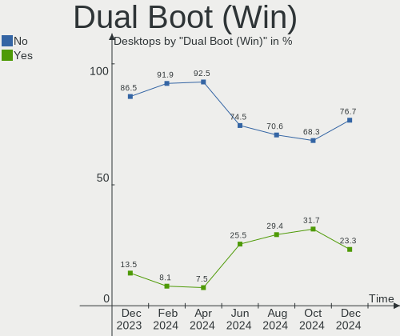
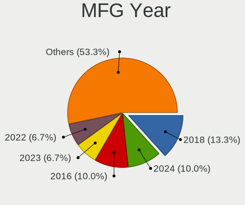
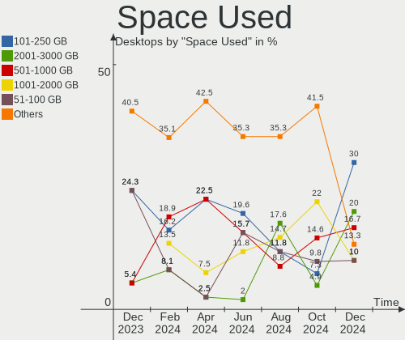
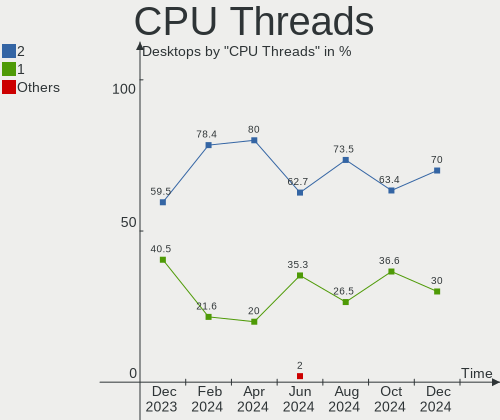
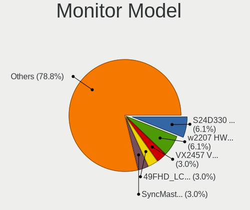
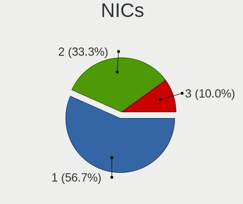

openSUSE - Hardware Trends (Desktops)
-------------------------------------

A project to identify most popular hardware characteristics and track their change
over time based on data collected by Linux users at https://Linux-Hardware.org.

Anyone can contribute to this report by the [hw-probe](https://github.com/linuxhw/hw-probe) tool:

    sudo -E hw-probe -all -upload

This report is for one last month. Overall report since the beginning of time: [TestDays](https://github.com/linuxhw/TestDays)

Period: Mar, 2023.

Contents
--------

* [ System ](#system)
  - [ OS                       ](#os)
  - [ OS Family                ](#os-family)
  - [ Kernel                   ](#kernel)
  - [ Kernel Family            ](#kernel-family)
  - [ Kernel Major Ver.        ](#kernel-major-ver)
  - [ Arch                     ](#arch)
  - [ DE                       ](#de)
  - [ Display Server           ](#display-server)
  - [ Display Manager          ](#display-manager)
  - [ OS Lang                  ](#os-lang)
  - [ Boot Mode                ](#boot-mode)
  - [ Filesystem               ](#filesystem)
  - [ Part. scheme             ](#part-scheme)
  - [ Dual Boot with Linux/BSD ](#dual-boot-with-linuxbsd)
  - [ Dual Boot (Win)          ](#dual-boot-win)

* [ Board ](#board)
  - [ Vendor                   ](#vendor)
  - [ Model                    ](#model)
  - [ Model Family             ](#model-family)
  - [ MFG Year                 ](#mfg-year)
  - [ Form Factor              ](#form-factor)
  - [ Secure Boot              ](#secure-boot)
  - [ Coreboot                 ](#coreboot)
  - [ RAM Size                 ](#ram-size)
  - [ RAM Used                 ](#ram-used)
  - [ Total Drives             ](#total-drives)
  - [ Has CD-ROM               ](#has-cd-rom)
  - [ Has Ethernet             ](#has-ethernet)
  - [ Has WiFi                 ](#has-wifi)
  - [ Has Bluetooth            ](#has-bluetooth)

* [ Location ](#location)
  - [ Country                  ](#country)
  - [ City                     ](#city)

* [ Drives ](#drives)
  - [ Drive Vendor             ](#drive-vendor)
  - [ Drive Model              ](#drive-model)
  - [ HDD Vendor               ](#hdd-vendor)
  - [ SSD Vendor               ](#ssd-vendor)
  - [ Drive Kind               ](#drive-kind)
  - [ Drive Connector          ](#drive-connector)
  - [ Drive Size               ](#drive-size)
  - [ Space Total              ](#space-total)
  - [ Space Used               ](#space-used)
  - [ Malfunc. Drives          ](#malfunc-drives)
  - [ Malfunc. Drive Vendor    ](#malfunc-drive-vendor)
  - [ Malfunc. HDD Vendor      ](#malfunc-hdd-vendor)
  - [ Malfunc. Drive Kind      ](#malfunc-drive-kind)
  - [ Failed Drives            ](#failed-drives)
  - [ Failed Drive Vendor      ](#failed-drive-vendor)
  - [ Drive Status             ](#drive-status)

* [ Storage controller ](#storage-controller)
  - [ Storage Vendor           ](#storage-vendor)
  - [ Storage Model            ](#storage-model)
  - [ Storage Kind             ](#storage-kind)

* [ Processor ](#processor)
  - [ CPU Vendor               ](#cpu-vendor)
  - [ CPU Model                ](#cpu-model)
  - [ CPU Model Family         ](#cpu-model-family)
  - [ CPU Cores                ](#cpu-cores)
  - [ CPU Sockets              ](#cpu-sockets)
  - [ CPU Threads              ](#cpu-threads)
  - [ CPU Op-Modes             ](#cpu-op-modes)
  - [ CPU Microcode            ](#cpu-microcode)
  - [ CPU Microarch            ](#cpu-microarch)

* [ Graphics ](#graphics)
  - [ GPU Vendor               ](#gpu-vendor)
  - [ GPU Model                ](#gpu-model)
  - [ GPU Combo                ](#gpu-combo)
  - [ GPU Driver               ](#gpu-driver)
  - [ GPU Memory               ](#gpu-memory)

* [ Monitor ](#monitor)
  - [ Monitor Vendor           ](#monitor-vendor)
  - [ Monitor Model            ](#monitor-model)
  - [ Monitor Resolution       ](#monitor-resolution)
  - [ Monitor Diagonal         ](#monitor-diagonal)
  - [ Monitor Width            ](#monitor-width)
  - [ Aspect Ratio             ](#aspect-ratio)
  - [ Monitor Area             ](#monitor-area)
  - [ Pixel Density            ](#pixel-density)
  - [ Multiple Monitors        ](#multiple-monitors)

* [ Network ](#network)
  - [ Net Controller Vendor    ](#net-controller-vendor)
  - [ Net Controller Model     ](#net-controller-model)
  - [ Wireless Vendor          ](#wireless-vendor)
  - [ Wireless Model           ](#wireless-model)
  - [ Ethernet Vendor          ](#ethernet-vendor)
  - [ Ethernet Model           ](#ethernet-model)
  - [ Net Controller Kind      ](#net-controller-kind)
  - [ Used Controller          ](#used-controller)
  - [ NICs                     ](#nics)
  - [ IPv6                     ](#ipv6)

* [ Bluetooth ](#bluetooth)
  - [ Bluetooth Vendor         ](#bluetooth-vendor)
  - [ Bluetooth Model          ](#bluetooth-model)

* [ Sound ](#sound)
  - [ Sound Vendor             ](#sound-vendor)
  - [ Sound Model              ](#sound-model)

* [ Memory ](#memory)
  - [ Memory Vendor            ](#memory-vendor)
  - [ Memory Model             ](#memory-model)
  - [ Memory Kind              ](#memory-kind)
  - [ Memory Form Factor       ](#memory-form-factor)
  - [ Memory Size              ](#memory-size)
  - [ Memory Speed             ](#memory-speed)

* [ Printers & scanners ](#printers--scanners)
  - [ Printer Vendor           ](#printer-vendor)
  - [ Printer Model            ](#printer-model)
  - [ Scanner Vendor           ](#scanner-vendor)
  - [ Scanner Model            ](#scanner-model)

* [ Camera ](#camera)
  - [ Camera Vendor            ](#camera-vendor)
  - [ Camera Model             ](#camera-model)

* [ Security ](#security)
  - [ Fingerprint Vendor       ](#fingerprint-vendor)
  - [ Fingerprint Model        ](#fingerprint-model)
  - [ Chipcard Vendor          ](#chipcard-vendor)
  - [ Chipcard Model           ](#chipcard-model)

* [ Unsupported ](#unsupported)
  - [ Unsupported Devices      ](#unsupported-devices)
  - [ Unsupported Device Types ](#unsupported-device-types)

System
------

OS
--

Installed operating systems

| Name                         | Desktops | Percent |
|------------------------------|----------|---------|
| openSUSE Tumbleweed-XXXXXXXX | 24       | 66.67%  |
| openSUSE Leap-15.4           | 6        | 16.67%  |
| openSUSE Microos-XXXXXXXX    | 5        | 13.89%  |
| openSUSE Leap-15.5           | 1        | 2.78%   |

OS Family
---------

OS without a version

| Name     | Desktops | Percent |
|----------|----------|---------|
| openSUSE | 36       | 100%    |

Kernel
------

Version of the Linux kernel

| Version                      | Desktops | Percent |
|------------------------------|----------|---------|
| 6.2.1-1-default              | 9        | 25%     |
| 6.2.6-1-default              | 7        | 19.44%  |
| 5.14.21-150400.24.46-default | 6        | 16.67%  |
| 6.2.0-1-default              | 3        | 8.33%   |
| 6.1.12-1-default             | 3        | 8.33%   |
| 6.2.8-1-default              | 2        | 5.56%   |
| 6.2.4-1-default              | 2        | 5.56%   |
| 6.2.2-1-default              | 1        | 2.78%   |
| 6.1.3-1-default              | 1        | 2.78%   |
| 6.0.12-1-default             | 1        | 2.78%   |
| 5.14.21-150500.43-default    | 1        | 2.78%   |

Kernel Family
-------------

Linux kernel without a distro release

| Version | Desktops | Percent |
|---------|----------|---------|
| 6.2.1   | 9        | 25%     |
| 6.2.6   | 7        | 19.44%  |
| 5.14.21 | 7        | 19.44%  |
| 6.2.0   | 3        | 8.33%   |
| 6.1.12  | 3        | 8.33%   |
| 6.2.8   | 2        | 5.56%   |
| 6.2.4   | 2        | 5.56%   |
| 6.2.2   | 1        | 2.78%   |
| 6.1.3   | 1        | 2.78%   |
| 6.0.12  | 1        | 2.78%   |

Kernel Major Ver.
-----------------

Linux kernel major version

| Version | Desktops | Percent |
|---------|----------|---------|
| 6.2     | 24       | 66.67%  |
| 5.14    | 7        | 19.44%  |
| 6.1     | 4        | 11.11%  |
| 6.0     | 1        | 2.78%   |

Arch
----

OS architecture (x86_64, i586, etc.)

| Name   | Desktops | Percent |
|--------|----------|---------|
| x86_64 | 36       | 100%    |

DE
--

Desktop Environment

| Name    | Desktops | Percent |
|---------|----------|---------|
| KDE5    | 20       | 55.56%  |
| GNOME   | 11       | 30.56%  |
| Unknown | 2        | 5.56%   |
| XFCE    | 1        | 2.78%   |
| KDE     | 1        | 2.78%   |
| ICEWM   | 1        | 2.78%   |

Display Server
--------------

X11 or Wayland

| Name    | Desktops | Percent |
|---------|----------|---------|
| X11     | 26       | 72.22%  |
| Wayland | 8        | 22.22%  |
| Tty     | 2        | 5.56%   |

Display Manager
---------------

SDDM, LightDM, etc.

| Name    | Desktops | Percent |
|---------|----------|---------|
| Unknown | 26       | 72.22%  |
| SDDM    | 5        | 13.89%  |
| LightDM | 4        | 11.11%  |
| XDM     | 1        | 2.78%   |

OS Lang
-------

Language

| Lang  | Desktops | Percent |
|-------|----------|---------|
| en_US | 14       | 38.89%  |
| de_DE | 9        | 25%     |
| pt_BR | 4        | 11.11%  |
| en_GB | 2        | 5.56%   |
| ru_RU | 1        | 2.78%   |
| POSIX | 1        | 2.78%   |
| nn_NO | 1        | 2.78%   |
| it_IT | 1        | 2.78%   |
| en_IE | 1        | 2.78%   |
| de_CH | 1        | 2.78%   |
| ca_ES | 1        | 2.78%   |

Boot Mode
---------

EFI or BIOS

| Mode | Desktops | Percent |
|------|----------|---------|
| EFI  | 21       | 58.33%  |
| BIOS | 15       | 41.67%  |

Filesystem
----------

Type of filesystem

| Type  | Desktops | Percent |
|-------|----------|---------|
| Btrfs | 29       | 80.56%  |
| Ext4  | 6        | 16.67%  |
| Xfs   | 1        | 2.78%   |

Part. scheme
------------

Scheme of partitioning

| Type    | Desktops | Percent |
|---------|----------|---------|
| Unknown | 25       | 69.44%  |
| GPT     | 6        | 16.67%  |
| MBR     | 5        | 13.89%  |

Dual Boot with Linux/BSD
------------------------

Hosting more than one Linux/BSD

| Dual boot | Desktops | Percent |
|-----------|----------|---------|
| No        | 33       | 91.67%  |
| Yes       | 3        | 8.33%   |

Dual Boot (Win)
---------------

Hosting Linux and Windows

| Dual boot | Desktops | Percent |
|-----------|----------|---------|
| No        | 34       | 94.44%  |
| Yes       | 2        | 5.56%   |

Board
-----

Vendor
------

Motherboard manufacturer

| Name                | Desktops | Percent |
|---------------------|----------|---------|
| MSI                 | 9        | 25%     |
| Gigabyte Technology | 7        | 19.44%  |
| Hewlett-Packard     | 4        | 11.11%  |
| ASRock              | 4        | 11.11%  |
| Lenovo              | 3        | 8.33%   |
| ASUSTek Computer    | 3        | 8.33%   |
| Dell                | 2        | 5.56%   |
| Wortmann AG         | 1        | 2.78%   |
| MACHINIST           | 1        | 2.78%   |
| Intel               | 1        | 2.78%   |
| Acer                | 1        | 2.78%   |

Model
-----

Motherboard model

| Name                                | Desktops | Percent |
|-------------------------------------|----------|---------|
| Wortmann AG Terra 3100              | 1        | 2.78%   |
| MSI MS-7D75                         | 1        | 2.78%   |
| MSI MS-7D54                         | 1        | 2.78%   |
| MSI MS-7C96                         | 1        | 2.78%   |
| MSI MS-7C02                         | 1        | 2.78%   |
| MSI MS-7B86                         | 1        | 2.78%   |
| MSI MS-7B45                         | 1        | 2.78%   |
| MSI MS-7A33                         | 1        | 2.78%   |
| MSI MS-7673                         | 1        | 2.78%   |
| MSI 700-216                         | 1        | 2.78%   |
| MACHINIST X99-RS9 V2.0              | 1        | 2.78%   |
| Lenovo ThinkStation P500 30A6S4JU00 | 1        | 2.78%   |
| Lenovo ThinkCentre Edge 91Z 7075K7G | 1        | 2.78%   |
| Lenovo H50-55 90BF001SUK            | 1        | 2.78%   |
| Intel D34010WYK H14771-303          | 1        | 2.78%   |
| HP Z230 Tower Workstation           | 1        | 2.78%   |
| HP Compaq 8100 Elite SFF PC         | 1        | 2.78%   |
| HP 870-115ng                        | 1        | 2.78%   |
| HP 595-P0569NG                      | 1        | 2.78%   |
| Gigabyte Z97-HD3                    | 1        | 2.78%   |
| Gigabyte Z68XP-UD4                  | 1        | 2.78%   |
| Gigabyte Z68XP-UD3P                 | 1        | 2.78%   |
| Gigabyte H610M H DDR4               | 1        | 2.78%   |
| Gigabyte GA-970A-UD3                | 1        | 2.78%   |
| Gigabyte B550 AORUS ELITE AX V2     | 1        | 2.78%   |
| Gigabyte A520M DS3H                 | 1        | 2.78%   |
| Dell XPS 8940                       | 1        | 2.78%   |
| Dell OptiPlex 990                   | 1        | 2.78%   |
| ASUS ROG CROSSHAIR X670E HERO       | 1        | 2.78%   |
| ASUS M5A78L-M/USB3                  | 1        | 2.78%   |
| ASUS A78M-A                         | 1        | 2.78%   |
| ASRock Z87 Extreme11/ac             | 1        | 2.78%   |
| ASRock H410M-HVS                    | 1        | 2.78%   |
| ASRock B550M Pro4                   | 1        | 2.78%   |
| ASRock AB350M-HDV                   | 1        | 2.78%   |
| Acer Veriton X4610G                 | 1        | 2.78%   |

Model Family
------------

Motherboard model prefix

| Name                 | Desktops | Percent |
|----------------------|----------|---------|
| Wortmann AG Terra    | 1        | 2.78%   |
| MSI MS-7D75          | 1        | 2.78%   |
| MSI MS-7D54          | 1        | 2.78%   |
| MSI MS-7C96          | 1        | 2.78%   |
| MSI MS-7C02          | 1        | 2.78%   |
| MSI MS-7B86          | 1        | 2.78%   |
| MSI MS-7B45          | 1        | 2.78%   |
| MSI MS-7A33          | 1        | 2.78%   |
| MSI MS-7673          | 1        | 2.78%   |
| MSI 700-216          | 1        | 2.78%   |
| MACHINIST X99-RS9    | 1        | 2.78%   |
| Lenovo ThinkStation  | 1        | 2.78%   |
| Lenovo ThinkCentre   | 1        | 2.78%   |
| Lenovo H50-55        | 1        | 2.78%   |
| Intel D34010WYK      | 1        | 2.78%   |
| HP Z230              | 1        | 2.78%   |
| HP Compaq            | 1        | 2.78%   |
| HP 870-115ng         | 1        | 2.78%   |
| HP 595-P0569NG       | 1        | 2.78%   |
| Gigabyte Z97-HD3     | 1        | 2.78%   |
| Gigabyte Z68XP-UD4   | 1        | 2.78%   |
| Gigabyte Z68XP-UD3P  | 1        | 2.78%   |
| Gigabyte H610M       | 1        | 2.78%   |
| Gigabyte GA-970A-UD3 | 1        | 2.78%   |
| Gigabyte B550        | 1        | 2.78%   |
| Gigabyte A520M       | 1        | 2.78%   |
| Dell XPS             | 1        | 2.78%   |
| Dell OptiPlex        | 1        | 2.78%   |
| ASUS ROG             | 1        | 2.78%   |
| ASUS M5A78L-M        | 1        | 2.78%   |
| ASUS A78M-A          | 1        | 2.78%   |
| ASRock Z87           | 1        | 2.78%   |
| ASRock H410M-HVS     | 1        | 2.78%   |
| ASRock B550M         | 1        | 2.78%   |
| ASRock AB350M-HDV    | 1        | 2.78%   |
| Acer Veriton         | 1        | 2.78%   |

MFG Year
--------

Motherboard manufacture year

| Year | Desktops | Percent |
|------|----------|---------|
| 2011 | 8        | 22.22%  |
| 2020 | 7        | 19.44%  |
| 2022 | 4        | 11.11%  |
| 2021 | 4        | 11.11%  |
| 2014 | 4        | 11.11%  |
| 2017 | 3        | 8.33%   |
| 2013 | 3        | 8.33%   |
| 2016 | 1        | 2.78%   |
| 2012 | 1        | 2.78%   |
| 2009 | 1        | 2.78%   |

Form Factor
-----------

Physical design of the computer

| Name    | Desktops | Percent |
|---------|----------|---------|
| Desktop | 36       | 100%    |

Secure Boot
-----------

Enabled or disabled

| State    | Desktops | Percent |
|----------|----------|---------|
| Disabled | 32       | 88.89%  |
| Enabled  | 4        | 11.11%  |

Coreboot
--------

Have coreboot on board

| Used | Desktops | Percent |
|------|----------|---------|
| No   | 36       | 100%    |

RAM Size
--------

Total RAM memory

| Size in GB | Desktops | Percent |
|------------|----------|---------|
| 32.01-64.0 | 11       | 30.56%  |
| 16.01-24.0 | 10       | 27.78%  |
| 8.01-16.0  | 6        | 16.67%  |
| 4.01-8.0   | 4        | 11.11%  |
| 3.01-4.0   | 3        | 8.33%   |
| 24.01-32.0 | 2        | 5.56%   |

RAM Used
--------

Used RAM memory

| Used GB   | Desktops | Percent |
|-----------|----------|---------|
| 4.01-8.0  | 13       | 36.11%  |
| 2.01-3.0  | 9        | 25%     |
| 3.01-4.0  | 7        | 19.44%  |
| 8.01-16.0 | 4        | 11.11%  |
| 0.51-1.0  | 2        | 5.56%   |
| 1.01-2.0  | 1        | 2.78%   |

Total Drives
------------

Number of drives on board

| Drives | Desktops | Percent |
|--------|----------|---------|
| 1      | 12       | 33.33%  |
| 2      | 10       | 27.78%  |
| 3      | 6        | 16.67%  |
| 5      | 4        | 11.11%  |
| 4      | 3        | 8.33%   |
| 6      | 1        | 2.78%   |

Has CD-ROM
----------

Has CD-ROM on board

| Presented | Desktops | Percent |
|-----------|----------|---------|
| No        | 19       | 52.78%  |
| Yes       | 17       | 47.22%  |

Has Ethernet
------------

Has Ethernet on board

| Presented | Desktops | Percent |
|-----------|----------|---------|
| Yes       | 36       | 100%    |

Has WiFi
--------

Has WiFi module

| Presented | Desktops | Percent |
|-----------|----------|---------|
| Yes       | 21       | 58.33%  |
| No        | 15       | 41.67%  |

Has Bluetooth
-------------

Has Bluetooth module

| Presented | Desktops | Percent |
|-----------|----------|---------|
| Yes       | 20       | 55.56%  |
| No        | 16       | 44.44%  |

Location
--------

Country
-------

Geographic location (country)

| Country     | Desktops | Percent |
|-------------|----------|---------|
| Germany     | 9        | 25%     |
| USA         | 5        | 13.89%  |
| Brazil      | 4        | 11.11%  |
| Italy       | 3        | 8.33%   |
| UK          | 2        | 5.56%   |
| Switzerland | 2        | 5.56%   |
| Sweden      | 2        | 5.56%   |
| Norway      | 2        | 5.56%   |
| Spain       | 1        | 2.78%   |
| Russia      | 1        | 2.78%   |
| Poland      | 1        | 2.78%   |
| Netherlands | 1        | 2.78%   |
| Estonia     | 1        | 2.78%   |
| Bulgaria    | 1        | 2.78%   |
| Australia   | 1        | 2.78%   |

City
----

Geographic location (city)

| City                 | Desktops | Percent |
|----------------------|----------|---------|
| Unterentfelden       | 1        | 2.78%   |
| Uddevalla            | 1        | 2.78%   |
| Tallinn              | 1        | 2.78%   |
| Sydney               | 1        | 2.78%   |
| Schonbuhl            | 1        | 2.78%   |
| Sao Francisco do Sul | 1        | 2.78%   |
| Raesfeld             | 1        | 2.78%   |
| Porto Alegre         | 1        | 2.78%   |
| Paese                | 1        | 2.78%   |
| Oslo                 | 1        | 2.78%   |
| Nesebar              | 1        | 2.78%   |
| Middletown           | 1        | 2.78%   |
| Mainhausen           | 1        | 2.78%   |
| Macanet de la Selva  | 1        | 2.78%   |
| Los Angeles          | 1        | 2.78%   |
| Limeira do Oeste     | 1        | 2.78%   |
| Kronberg             | 1        | 2.78%   |
| Kazan’             | 1        | 2.78%   |
| Jena                 | 1        | 2.78%   |
| Hoeganaes            | 1        | 2.78%   |
| Greenock             | 1        | 2.78%   |
| Gilze                | 1        | 2.78%   |
| Giessen              | 1        | 2.78%   |
| Gaildorf             | 1        | 2.78%   |
| Fürth               | 1        | 2.78%   |
| Dettenschwang        | 1        | 2.78%   |
| Darmstadt            | 1        | 2.78%   |
| Cologne              | 1        | 2.78%   |
| Collegno             | 1        | 2.78%   |
| Capao da Canoa       | 1        | 2.78%   |
| Bixby                | 1        | 2.78%   |
| Bialystok            | 1        | 2.78%   |
| Bergen               | 1        | 2.78%   |
| Ashton-under-Lyne    | 1        | 2.78%   |
| Arlington            | 1        | 2.78%   |
| Aci Catena           | 1        | 2.78%   |

Drives
------

Drive Vendor
------------

Hard drive vendors

| Vendor                      | Desktops | Drives  | Percent |
|-----------------------------|----------|---------|---------|
| Seagate                     | 17       | 21      | 24.64%  |
| Samsung Electronics         | 13       | 22      | 18.84%  |
| WDC                         | 11       | 18      | 15.94%  |
| SanDisk                     | 4        | 4       | 5.8%    |
| Kingston                    | 4        | 4       | 5.8%    |
| Intel                       | 3        | 3       | 4.35%   |
| XrayDisk                    | 2        | 2       | 2.9%    |
| Realtek Semiconductor       | 2        | 2       | 2.9%    |
| Crucial                     | 2        | 2       | 2.9%    |
| Toshiba                     | 1        | 1       | 1.45%   |
| StoreJet                    | 1        | 1       | 1.45%   |
| SPCC                        | 1        | 1       | 1.45%   |
| SK hynix                    | 1        | 1       | 1.45%   |
| Plextor                     | 1        | 1       | 1.45%   |
| OCZ                         | 1        | 1       | 1.45%   |
| Kingston Technology Company | 1        | 1       | 1.45%   |
| HL-DT-ST                    | 1        | Unknown | 1.45%   |
| Hitachi                     | 1        | 1       | 1.45%   |
| Hewlett-Packard             | 1        | 1       | 1.45%   |
| A-DATA Technology           | 1        | 1       | 1.45%   |

Drive Model
-----------

Hard drive models

| Model                                               | Desktops | Percent |
|-----------------------------------------------------|----------|---------|
| Samsung NVMe SSD Controller SM981/PM981/PM983 250GB | 5        | 5.95%   |
| Seagate ST2000DM001-1ER164 2TB                      | 3        | 3.57%   |
| WDC WD40EFRX-68N32N0 4TB                            | 2        | 2.38%   |
| WDC WD20EZRZ-00Z5HB0 2TB                            | 2        | 2.38%   |
| Seagate ST31000524AS 1TB                            | 2        | 2.38%   |
| Seagate ST2000DM008-2FR102 2TB                      | 2        | 2.38%   |
| Seagate ST1000DM010-2EP102 1TB                      | 2        | 2.38%   |
| Samsung SSD 870 QVO 2TB                             | 2        | 2.38%   |
| Samsung SSD 860 EVO 1TB                             | 2        | 2.38%   |
| XrayDisk 480GB SSD                                  | 1        | 1.19%   |
| XrayDisk 1TB SSD                                    | 1        | 1.19%   |
| WDC WDS240G2G0A-00JH30 240GB SSD                    | 1        | 1.19%   |
| WDC WDS100T1B0A-00H9H0 1TB SSD                      | 1        | 1.19%   |
| WDC WD5000AZRX-00L4HB0 500GB                        | 1        | 1.19%   |
| WDC WD40EZAZ-00SF3B0 4TB                            | 1        | 1.19%   |
| WDC WD20EZAZ-00GGJB0 2TB                            | 1        | 1.19%   |
| WDC WD20EARS-00MVWB0 2TB                            | 1        | 1.19%   |
| WDC WD20EADS-00S2B0 2TB                             | 1        | 1.19%   |
| WDC WD1200BEVS-75UST0 120GB                         | 1        | 1.19%   |
| WDC WD10JFCX-68N6GN0 1TB                            | 1        | 1.19%   |
| WDC WD10EZEX-08M2NA0 1TB                            | 1        | 1.19%   |
| WDC WD10EACS-32ZJB0 1TB                             | 1        | 1.19%   |
| WDC WD1003FBYX-01Y7B1 1TB                           | 1        | 1.19%   |
| Toshiba DT01ACA200 2TB                              | 1        | 1.19%   |
| StoreJet Transcend 256GB SSD                        | 1        | 1.19%   |
| SPCC Solid State Disk 480GB                         | 1        | 1.19%   |
| SK hynix BC501 NVMe Solid State Drive 512GB         | 1        | 1.19%   |
| Seagate ST9500325AS 500GB                           | 1        | 1.19%   |
| Seagate ST500LX025-1U717D 500GB                     | 1        | 1.19%   |
| Seagate ST4000VN008-2DR166 4TB                      | 1        | 1.19%   |
| Seagate ST3300831ACE 304GB                          | 1        | 1.19%   |
| Seagate ST2000DM001-1CH164 2TB                      | 1        | 1.19%   |
| Seagate ST2000DM 008-2UB102 2TB                     | 1        | 1.19%   |
| Seagate ST1000LM024 HN-M101MBB 1TB                  | 1        | 1.19%   |
| Seagate ST1000DX002-2DV162 1TB                      | 1        | 1.19%   |
| Seagate ST1000DM003-1CH162 1TB                      | 1        | 1.19%   |
| Seagate ST10000VN0004-1ZD101 10TB                   | 1        | 1.19%   |
| Seagate Expansion+ 2TB                              | 1        | 1.19%   |
| Sandisk WD_BLACK SN850X 1000GB                      | 1        | 1.19%   |
| Sandisk WD Blue SN570 1TB                           | 1        | 1.19%   |

HDD Vendor
----------

Hard disk drive vendors

| Vendor              | Desktops | Drives | Percent |
|---------------------|----------|--------|---------|
| Seagate             | 17       | 21     | 51.52%  |
| WDC                 | 11       | 16     | 33.33%  |
| Samsung Electronics | 3        | 3      | 9.09%   |
| Toshiba             | 1        | 1      | 3.03%   |
| Hitachi             | 1        | 1      | 3.03%   |

SSD Vendor
----------

Solid state drive vendors

| Vendor              | Desktops | Drives | Percent |
|---------------------|----------|--------|---------|
| Samsung Electronics | 8        | 11     | 29.63%  |
| Kingston            | 3        | 3      | 11.11%  |
| XrayDisk            | 2        | 2      | 7.41%   |
| WDC                 | 2        | 2      | 7.41%   |
| SanDisk             | 2        | 2      | 7.41%   |
| Intel               | 2        | 2      | 7.41%   |
| Crucial             | 2        | 2      | 7.41%   |
| StoreJet            | 1        | 1      | 3.7%    |
| SPCC                | 1        | 1      | 3.7%    |
| Plextor             | 1        | 1      | 3.7%    |
| OCZ                 | 1        | 1      | 3.7%    |
| Hewlett-Packard     | 1        | 1      | 3.7%    |
| A-DATA Technology   | 1        | 1      | 3.7%    |

Drive Kind
----------

HDD or SSD

| Kind    | Desktops | Drives  | Percent |
|---------|----------|---------|---------|
| HDD     | 26       | 42      | 43.33%  |
| SSD     | 21       | 30      | 35%     |
| NVMe    | 12       | 16      | 20%     |
| Unknown | 1        | Unknown | 1.67%   |

Drive Connector
---------------

SATA, SAS, NVMe, etc.

| Type | Desktops | Drives | Percent |
|------|----------|--------|---------|
| SATA | 33       | 68     | 67.35%  |
| NVMe | 12       | 16     | 24.49%  |
| SAS  | 4        | 4      | 8.16%   |

Drive Size
----------

Size of hard drive

| Size in TB | Desktops | Drives | Percent |
|------------|----------|--------|---------|
| 0.01-0.5   | 17       | 27     | 33.33%  |
| 0.51-1.0   | 15       | 20     | 29.41%  |
| 1.01-2.0   | 14       | 18     | 27.45%  |
| 3.01-4.0   | 3        | 5      | 5.88%   |
| 2.01-3.0   | 1        | 1      | 1.96%   |
| 4.01-10.0  | 1        | 1      | 1.96%   |

Space Total
-----------

Amount of disk space available on the file system

| Size in GB     | Desktops | Percent |
|----------------|----------|---------|
| More than 3000 | 20       | 55.56%  |
| 1001-2000      | 6        | 16.67%  |
| 251-500        | 4        | 11.11%  |
| 2001-3000      | 4        | 11.11%  |
| 501-1000       | 2        | 5.56%   |

Space Used
----------

Amount of used disk space

| Used GB        | Desktops | Percent |
|----------------|----------|---------|
| 1001-2000      | 8        | 22.22%  |
| 501-1000       | 6        | 16.67%  |
| 51-100         | 6        | 16.67%  |
| 101-250        | 5        | 13.89%  |
| More than 3000 | 4        | 11.11%  |
| 251-500        | 3        | 8.33%   |
| 21-50          | 3        | 8.33%   |
| 2001-3000      | 1        | 2.78%   |

Malfunc. Drives
---------------

Drive models with a malfunction

| Model                             | Desktops | Drives | Percent |
|-----------------------------------|----------|--------|---------|
| WDC WD10JFCX-68N6GN0 1TB          | 1        | 1      | 50%     |
| Seagate ST10000VN0004-1ZD101 10TB | 1        | 1      | 50%     |

Malfunc. Drive Vendor
---------------------

Vendors of faulty drives

| Vendor  | Desktops | Drives | Percent |
|---------|----------|--------|---------|
| WDC     | 1        | 1      | 50%     |
| Seagate | 1        | 1      | 50%     |

Malfunc. HDD Vendor
-------------------

Vendors of faulty HDD drives

| Vendor  | Desktops | Drives | Percent |
|---------|----------|--------|---------|
| WDC     | 1        | 1      | 50%     |
| Seagate | 1        | 1      | 50%     |

Malfunc. Drive Kind
-------------------

Kinds of faulty drives

| Kind | Desktops | Drives | Percent |
|------|----------|--------|---------|
| HDD  | 2        | 2      | 100%    |

Failed Drives
-------------

Failed drive models

Zero info for selected period =(

Failed Drive Vendor
-------------------

Failed drive vendors

Zero info for selected period =(

Drive Status
------------

Number of failed and malfunc. drives

| Status   | Desktops | Drives | Percent |
|----------|----------|--------|---------|
| Detected | 25       | 62     | 64.1%   |
| Works    | 12       | 24     | 30.77%  |
| Malfunc  | 2        | 2      | 5.13%   |

Storage controller
------------------

Storage Vendor
--------------

Storage controller vendors

| Vendor                      | Desktops | Percent |
|-----------------------------|----------|---------|
| Intel                       | 20       | 36.36%  |
| AMD                         | 17       | 30.91%  |
| Samsung Electronics         | 6        | 10.91%  |
| SanDisk                     | 2        | 3.64%   |
| Realtek Semiconductor       | 2        | 3.64%   |
| Marvell Technology Group    | 2        | 3.64%   |
| Kingston Technology Company | 2        | 3.64%   |
| ASMedia Technology          | 2        | 3.64%   |
| SK hynix                    | 1        | 1.82%   |
| Broadcom / LSI              | 1        | 1.82%   |

Storage Model
-------------

Storage controller models

| Model                                                                                   | Desktops | Percent |
|-----------------------------------------------------------------------------------------|----------|---------|
| AMD FCH SATA Controller [AHCI mode]                                                     | 9        | 13.64%  |
| Samsung NVMe SSD Controller SM981/PM981/PM983                                           | 5        | 7.58%   |
| Intel 6 Series/C200 Series Chipset Family 6 port Desktop SATA AHCI Controller           | 5        | 7.58%   |
| AMD 500 Series Chipset SATA Controller                                                  | 5        | 7.58%   |
| Kingston Company Company Non-Volatile memory controller                                 | 2        | 3.03%   |
| Intel 8 Series/C220 Series Chipset Family 6-port SATA Controller 1 [AHCI mode]          | 2        | 3.03%   |
| ASMedia ASM1062 Serial ATA Controller                                                   | 2        | 3.03%   |
| AMD SB7x0/SB8x0/SB9x0 SATA Controller [IDE mode]                                        | 2        | 3.03%   |
| AMD SB7x0/SB8x0/SB9x0 IDE Controller                                                    | 2        | 3.03%   |
| AMD 300 Series Chipset SATA Controller                                                  | 2        | 3.03%   |
| SK hynix BC501 NVMe Solid State Drive                                                   | 1        | 1.52%   |
| Sandisk Western Digital WD Black SN850X NVMe SSD                                        | 1        | 1.52%   |
| SanDisk WD Blue SN570 NVMe SSD 1TB                                                      | 1        | 1.52%   |
| Samsung NVMe SSD Controller SM961/PM961/SM963                                           | 1        | 1.52%   |
| Samsung NVMe SSD Controller 980                                                         | 1        | 1.52%   |
| Realtek RTS5763DL NVMe SSD Controller                                                   | 1        | 1.52%   |
| Realtek NVMe Controller                                                                 | 1        | 1.52%   |
| Marvell Group 88SE9172 SATA III 6Gb/s RAID Controller                                   | 1        | 1.52%   |
| Marvell Group 88SE9172 SATA 6Gb/s Controller                                            | 1        | 1.52%   |
| Intel Volume Management Device NVMe RAID Controller                                     | 1        | 1.52%   |
| Intel SSD 660P Series                                                                   | 1        | 1.52%   |
| Intel SATA Controller [RAID mode]                                                       | 1        | 1.52%   |
| Intel Q170/Q150/B150/H170/H110/Z170/CM236 Chipset SATA Controller [AHCI Mode]           | 1        | 1.52%   |
| Intel NM10/ICH7 Family SATA Controller [AHCI mode]                                      | 1        | 1.52%   |
| Intel Comet Lake PCH-H RAID                                                             | 1        | 1.52%   |
| Intel C610/X99 series chipset sSATA Controller [AHCI mode]                              | 1        | 1.52%   |
| Intel C610/X99 series chipset IDE-r Controller                                          | 1        | 1.52%   |
| Intel C610/X99 series chipset 6-Port SATA Controller [AHCI mode]                        | 1        | 1.52%   |
| Intel Alder Lake-S PCH SATA Controller [AHCI Mode]                                      | 1        | 1.52%   |
| Intel 9 Series Chipset Family SATA Controller [AHCI Mode]                               | 1        | 1.52%   |
| Intel 8 Series SATA Controller 1 [AHCI mode]                                            | 1        | 1.52%   |
| Intel 6 Series/C200 Series Chipset Family IDE-r Controller                              | 1        | 1.52%   |
| Intel 6 Series/C200 Series Chipset Family Desktop SATA Controller (IDE mode, ports 4-5) | 1        | 1.52%   |
| Intel 6 Series/C200 Series Chipset Family Desktop SATA Controller (IDE mode, ports 0-3) | 1        | 1.52%   |
| Intel 5 Series/3400 Series Chipset 6 port SATA AHCI Controller                          | 1        | 1.52%   |
| Intel 400 Series Chipset Family SATA AHCI Controller                                    | 1        | 1.52%   |
| Intel 200 Series PCH SATA controller [AHCI mode]                                        | 1        | 1.52%   |
| Broadcom / LSI SAS3008 PCI-Express Fusion-MPT SAS-3                                     | 1        | 1.52%   |
| AMD X370 Series Chipset SATA Controller                                                 | 1        | 1.52%   |
| AMD 400 Series Chipset SATA Controller                                                  | 1        | 1.52%   |

Storage Kind
------------

Kind of storage controller (IDE, SATA, NVMe, SAS, ...)

| Kind | Desktops | Percent |
|------|----------|---------|
| SATA | 33       | 61.11%  |
| NVMe | 12       | 22.22%  |
| IDE  | 5        | 9.26%   |
| RAID | 3        | 5.56%   |
| SAS  | 1        | 1.85%   |

Processor
---------

CPU Vendor
----------

Processor vendors

| Vendor | Desktops | Percent |
|--------|----------|---------|
| Intel  | 19       | 52.78%  |
| AMD    | 17       | 47.22%  |

CPU Model
---------

Processor models

| Model                                           | Desktops | Percent |
|-------------------------------------------------|----------|---------|
| AMD Ryzen 5 5600G with Radeon Graphics          | 3        | 8.33%   |
| AMD Ryzen 9 5900X 12-Core Processor             | 2        | 5.56%   |
| Intel Xeon CPU E5-2620 v3 @ 2.40GHz             | 1        | 2.78%   |
| Intel Xeon CPU E5-1620 v3 @ 3.50GHz             | 1        | 2.78%   |
| Intel Xeon CPU E3-1271 v3 @ 3.60GHz             | 1        | 2.78%   |
| Intel Core i7-8700K CPU @ 3.70GHz               | 1        | 2.78%   |
| Intel Core i7-6700 CPU @ 3.40GHz                | 1        | 2.78%   |
| Intel Core i7-4771 CPU @ 3.50GHz                | 1        | 2.78%   |
| Intel Core i7-3770 CPU @ 3.40GHz                | 1        | 2.78%   |
| Intel Core i7-10700 CPU @ 2.90GHz               | 1        | 2.78%   |
| Intel Core i5-4440 CPU @ 3.10GHz                | 1        | 2.78%   |
| Intel Core i5-2500K CPU @ 3.30GHz               | 1        | 2.78%   |
| Intel Core i5-2500 CPU @ 3.30GHz                | 1        | 2.78%   |
| Intel Core i5-2400S CPU @ 2.50GHz               | 1        | 2.78%   |
| Intel Core i5-2400 CPU @ 3.10GHz                | 1        | 2.78%   |
| Intel Core i5 CPU 650 @ 3.20GHz                 | 1        | 2.78%   |
| Intel Core i3-4010U CPU @ 1.70GHz               | 1        | 2.78%   |
| Intel Core i3-2130 CPU @ 3.40GHz                | 1        | 2.78%   |
| Intel Atom CPU D525 @ 1.80GHz                   | 1        | 2.78%   |
| Intel 12th Gen Core i7-12700                    | 1        | 2.78%   |
| Intel 11th Gen Core i9-11900 @ 2.50GHz          | 1        | 2.78%   |
| AMD Ryzen 9 7950X 16-Core Processor             | 1        | 2.78%   |
| AMD Ryzen 9 7900X 12-Core Processor             | 1        | 2.78%   |
| AMD Ryzen 7 1800X Eight-Core Processor          | 1        | 2.78%   |
| AMD Ryzen 5 5600X 6-Core Processor              | 1        | 2.78%   |
| AMD Ryzen 5 3600 6-Core Processor               | 1        | 2.78%   |
| AMD Ryzen 5 2600 Six-Core Processor             | 1        | 2.78%   |
| AMD Ryzen 5 1500X Quad-Core Processor           | 1        | 2.78%   |
| AMD Phenom II X6 1090T Processor                | 1        | 2.78%   |
| AMD FX-8350 Eight-Core Processor                | 1        | 2.78%   |
| AMD A10-7800 Radeon R7, 12 Compute Cores 4C+8G  | 1        | 2.78%   |
| AMD A10-7700K Radeon R7, 10 Compute Cores 4C+6G | 1        | 2.78%   |
| AMD A10-6700 APU with Radeon HD Graphics        | 1        | 2.78%   |

CPU Model Family
----------------

Processor model prefix

| Model            | Desktops | Percent |
|------------------|----------|---------|
| AMD Ryzen 5      | 7        | 19.44%  |
| Intel Core i5    | 6        | 16.67%  |
| Intel Core i7    | 5        | 13.89%  |
| AMD Ryzen 9      | 4        | 11.11%  |
| Intel Xeon       | 3        | 8.33%   |
| AMD A10          | 3        | 8.33%   |
| Other            | 2        | 5.56%   |
| Intel Core i3    | 2        | 5.56%   |
| Intel Atom       | 1        | 2.78%   |
| AMD Ryzen 7      | 1        | 2.78%   |
| AMD Phenom II X6 | 1        | 2.78%   |
| AMD FX           | 1        | 2.78%   |

CPU Cores
---------

Number of processor cores

| Number | Desktops | Percent |
|--------|----------|---------|
| 4      | 12       | 33.33%  |
| 6      | 8        | 22.22%  |
| 2      | 8        | 22.22%  |
| 8      | 4        | 11.11%  |
| 12     | 3        | 8.33%   |
| 16     | 1        | 2.78%   |

CPU Sockets
-----------

Number of sockets

| Number | Desktops | Percent |
|--------|----------|---------|
| 1      | 36       | 100%    |

CPU Threads
-----------

Threads per core (Hyper-Threading)

| Number | Desktops | Percent |
|--------|----------|---------|
| 2      | 30       | 83.33%  |
| 1      | 6        | 16.67%  |

CPU Op-Modes
------------

CPU Operation Modes (32-bit, 64-bit)

| Op mode        | Desktops | Percent |
|----------------|----------|---------|
| 32-bit, 64-bit | 36       | 100%    |

CPU Microcode
-------------

Microcode number

| Number     | Desktops | Percent |
|------------|----------|---------|
| Unknown    | 15       | 41.67%  |
| 0x0a50000d | 2        | 5.56%   |
| 0x0a20120a | 2        | 5.56%   |
| 0x06003106 | 2        | 5.56%   |
| 0x906ea    | 1        | 2.78%   |
| 0x40651    | 1        | 2.78%   |
| 0x306a9    | 1        | 2.78%   |
| 0x206a7    | 1        | 2.78%   |
| 0x106ca    | 1        | 2.78%   |
| 0x0a601203 | 1        | 2.78%   |
| 0x0a50000c | 1        | 2.78%   |
| 0x0a201016 | 1        | 2.78%   |
| 0x08701021 | 1        | 2.78%   |
| 0x0800820d | 1        | 2.78%   |
| 0x08001137 | 1        | 2.78%   |
| 0x08001126 | 1        | 2.78%   |
| 0x06001119 | 1        | 2.78%   |
| 0x06000852 | 1        | 2.78%   |
| 0x010000dc | 1        | 2.78%   |

CPU Microarch
-------------

Microarchitecture

| Name             | Desktops | Percent |
|------------------|----------|---------|
| Zen 3            | 6        | 16.67%  |
| Haswell          | 6        | 16.67%  |
| SandyBridge      | 5        | 13.89%  |
| Unknown          | 3        | 8.33%   |
| Zen              | 2        | 5.56%   |
| Steamroller      | 2        | 5.56%   |
| Piledriver       | 2        | 5.56%   |
| Zen+             | 1        | 2.78%   |
| Zen 2            | 1        | 2.78%   |
| Westmere         | 1        | 2.78%   |
| Skylake          | 1        | 2.78%   |
| KabyLake         | 1        | 2.78%   |
| K10              | 1        | 2.78%   |
| IvyBridge        | 1        | 2.78%   |
| CometLake        | 1        | 2.78%   |
| Bonnell          | 1        | 2.78%   |
| Alderlake Hybrid | 1        | 2.78%   |

Graphics
--------

GPU Vendor
----------

Vendors of graphics cards

| Vendor | Desktops | Percent |
|--------|----------|---------|
| Nvidia | 21       | 50%     |
| AMD    | 12       | 28.57%  |
| Intel  | 9        | 21.43%  |

GPU Model
---------

Graphics card models

| Model                                                                       | Desktops | Percent |
|-----------------------------------------------------------------------------|----------|---------|
| AMD Cezanne [Radeon Vega Series / Radeon Vega Mobile Series]                | 3        | 6.67%   |
| Nvidia GM107 [GeForce GTX 750 Ti]                                           | 2        | 4.44%   |
| Nvidia GA102 [GeForce RTX 3080 Lite Hash Rate]                              | 2        | 4.44%   |
| Intel Xeon E3-1200 v3/4th Gen Core Processor Integrated Graphics Controller | 2        | 4.44%   |
| Intel 2nd Generation Core Processor Family Integrated Graphics Controller   | 2        | 4.44%   |
| AMD Raphael                                                                 | 2        | 4.44%   |
| AMD Navi 10 [Radeon RX 5600 OEM/5600 XT / 5700/5700 XT]                     | 2        | 4.44%   |
| Nvidia TU106 [GeForce RTX 2070]                                             | 1        | 2.22%   |
| Nvidia TU102 [GeForce RTX 2080 Ti Rev. A]                                   | 1        | 2.22%   |
| Nvidia GT218M [ION]                                                         | 1        | 2.22%   |
| Nvidia GP108 [GeForce GT 1030]                                              | 1        | 2.22%   |
| Nvidia GP106 [GeForce GTX 1060 3GB]                                         | 1        | 2.22%   |
| Nvidia GP104 [GeForce GTX 1080]                                             | 1        | 2.22%   |
| Nvidia GM204 [GeForce GTX 970]                                              | 1        | 2.22%   |
| Nvidia GM107GL [Quadro K620]                                                | 1        | 2.22%   |
| Nvidia GM107GL [Quadro K2200]                                               | 1        | 2.22%   |
| Nvidia GF119 [GeForce GT 610]                                               | 1        | 2.22%   |
| Nvidia GF119 [GeForce GT 520]                                               | 1        | 2.22%   |
| Nvidia GF110 [GeForce GTX 570 Rev. 2]                                       | 1        | 2.22%   |
| Nvidia GF108 [GeForce GT 430]                                               | 1        | 2.22%   |
| Nvidia GA106 [GeForce RTX 3060 Lite Hash Rate]                              | 1        | 2.22%   |
| Nvidia GA104 [GeForce RTX 3070]                                             | 1        | 2.22%   |
| Nvidia G72 [GeForce 7200 GS / 7300 SE]                                      | 1        | 2.22%   |
| Nvidia AD104 [GeForce RTX 4070 Ti]                                          | 1        | 2.22%   |
| Intel RocketLake-S GT1 [UHD Graphics 750]                                   | 1        | 2.22%   |
| Intel IvyBridge GT2 [HD Graphics 4000]                                      | 1        | 2.22%   |
| Intel Haswell-ULT Integrated Graphics Controller                            | 1        | 2.22%   |
| Intel Core Processor Integrated Graphics Controller                         | 1        | 2.22%   |
| Intel CometLake-S GT2 [UHD Graphics 630]                                    | 1        | 2.22%   |
| AMD Tahiti PRO [Radeon HD 7950/8950 OEM / R9 280]                           | 1        | 2.22%   |
| AMD RS780L [Radeon 3000]                                                    | 1        | 2.22%   |
| AMD Polaris 20 XL [Radeon RX 580 2048SP]                                    | 1        | 2.22%   |
| AMD Oland [Radeon HD 8570 / R5 430 OEM / R7 240/340 / Radeon 520 OEM]       | 1        | 2.22%   |
| AMD Navi 24 [Radeon RX 6400/6500 XT/6500M]                                  | 1        | 2.22%   |
| AMD Navi 14 [Radeon RX 5500/5500M / Pro 5500M]                              | 1        | 2.22%   |
| AMD Kaveri [Radeon R7 Graphics]                                             | 1        | 2.22%   |
| AMD Ellesmere [Radeon RX 470/480/570/570X/580/580X/590]                     | 1        | 2.22%   |

GPU Combo
---------

Combinations of graphics cards

| Name           | Desktops | Percent |
|----------------|----------|---------|
| 1 x Nvidia     | 18       | 50%     |
| 1 x AMD        | 6        | 16.67%  |
| 1 x Intel      | 5        | 13.89%  |
| 2 x AMD        | 3        | 8.33%   |
| AMD + Nvidia   | 2        | 5.56%   |
| Intel + Nvidia | 1        | 2.78%   |
| Intel + AMD    | 1        | 2.78%   |

GPU Driver
----------

Free vs proprietary

| Driver      | Desktops | Percent |
|-------------|----------|---------|
| Free        | 24       | 66.67%  |
| Proprietary | 12       | 33.33%  |

GPU Memory
----------

Total video memory

| Size in GB | Desktops | Percent |
|------------|----------|---------|
| Unknown    | 12       | 33.33%  |
| 7.01-8.0   | 6        | 16.67%  |
| 0.01-0.5   | 5        | 13.89%  |
| 1.01-2.0   | 4        | 11.11%  |
| 8.01-16.0  | 4        | 11.11%  |
| 3.01-4.0   | 2        | 5.56%   |
| 0.51-1.0   | 2        | 5.56%   |
| 2.01-3.0   | 1        | 2.78%   |

Monitor
-------

Monitor Vendor
--------------

Monitor vendors

| Vendor               | Desktops | Percent |
|----------------------|----------|---------|
| Samsung Electronics  | 7        | 17.5%   |
| Hewlett-Packard      | 3        | 7.5%    |
| Goldstar             | 3        | 7.5%    |
| Dell                 | 3        | 7.5%    |
| Acer                 | 3        | 7.5%    |
| Panasonic            | 2        | 5%      |
| Lenovo               | 2        | 5%      |
| Iiyama               | 2        | 5%      |
| BenQ                 | 2        | 5%      |
| ASUSTek Computer     | 2        | 5%      |
| UGD                  | 1        | 2.5%    |
| Sony                 | 1        | 2.5%    |
| Pixio                | 1        | 2.5%    |
| Philips              | 1        | 2.5%    |
| ONN                  | 1        | 2.5%    |
| Insignia             | 1        | 2.5%    |
| Hitachi              | 1        | 2.5%    |
| GDH                  | 1        | 2.5%    |
| Fujitsu Siemens      | 1        | 2.5%    |
| AOC                  | 1        | 2.5%    |
| Ancor Communications | 1        | 2.5%    |

Monitor Model
-------------

Monitor models

| Model                                                                 | Desktops | Percent |
|-----------------------------------------------------------------------|----------|---------|
| UGD Artist22R Pro UGD2202 1920x1080 476x268mm 21.5-inch               | 1        | 2.38%   |
| Sony TV SNYEE01 1920x1080                                             | 1        | 2.38%   |
| Samsung Electronics SyncMaster SAM041F 2048x1152 510x287mm 23.0-inch  | 1        | 2.38%   |
| Samsung Electronics SyncMaster SAM0364 1360x768 344x194mm 15.5-inch   | 1        | 2.38%   |
| Samsung Electronics SMB2030N SAM0634 1600x900 443x249mm 20.0-inch     | 1        | 2.38%   |
| Samsung Electronics S34J55x SAM0F70 3440x1440 797x333mm 34.0-inch     | 1        | 2.38%   |
| Samsung Electronics S27E450 SAM0C83 1920x1080 598x336mm 27.0-inch     | 1        | 2.38%   |
| Samsung Electronics S24D330 SAM0D92 1920x1080 531x299mm 24.0-inch     | 1        | 2.38%   |
| Samsung Electronics S24C230 SAM0A85 1920x1080 521x293mm 23.5-inch     | 1        | 2.38%   |
| Pixio OZDSP24FHD240 WAM2500 1920x1080 560x300mm 25.0-inch             | 1        | 2.38%   |
| Philips PHL 224E5 PHLC0C6 1920x1080 476x268mm 21.5-inch               | 1        | 2.38%   |
| Panasonic TV MEIC328 1920x1080 698x392mm 31.5-inch                    | 1        | 2.38%   |
| Panasonic TV MEIA296 3840x2160 698x392mm 31.5-inch                    | 1        | 2.38%   |
| ONN 100002487 ONN0101 1920x1080 517x323mm 24.0-inch                   | 1        | 2.38%   |
| Lenovo LEN-E91-B LEN0005 1920x1080 476x268mm 21.5-inch                | 1        | 2.38%   |
| Lenovo LEN S24q-10 LEN61E7 2560x1440 527x296mm 23.8-inch              | 1        | 2.38%   |
| Insignia NS-43D420NA20 BBY0050 1920x1080 708x398mm 32.0-inch          | 1        | 2.38%   |
| Iiyama PL2796QS IVM666B 2560x1440 597x336mm 27.0-inch                 | 1        | 2.38%   |
| Iiyama PL2779Q IVM6613 2560x1440 597x336mm 27.0-inch                  | 1        | 2.38%   |
| Hitachi X90W D-sub HIT6008 1440x900 410x257mm 19.1-inch               | 1        | 2.38%   |
| Hewlett-Packard LA2405 HWP284A 1920x1200 518x324mm 24.1-inch          | 1        | 2.38%   |
| Hewlett-Packard E231 HWP3065 1920x1080 509x286mm 23.0-inch            | 1        | 2.38%   |
| Hewlett-Packard 27f HPN354B 1920x1080 598x336mm 27.0-inch             | 1        | 2.38%   |
| Goldstar ULTRAGEAR GSM5BD3 2560x1440 697x392mm 31.5-inch              | 1        | 2.38%   |
| Goldstar HDR 4K GSM7707 3840x2160 600x340mm 27.2-inch                 | 1        | 2.38%   |
| Goldstar 38GN950 GSM7753 3840x1600 879x366mm 37.5-inch                | 1        | 2.38%   |
| GDH TV PHILCO GDH0030 1920x540                                        | 1        | 2.38%   |
| Fujitsu Siemens B19-5 ECO FUS07C0 1280x1024 376x301mm 19.0-inch       | 1        | 2.38%   |
| Dell P2214H DELA099 1920x1080 477x268mm 21.5-inch                     | 1        | 2.38%   |
| Dell P2214H DELA098 1920x1080 477x268mm 21.5-inch                     | 1        | 2.38%   |
| Dell 2209WA DELF011 1680x1050 474x296mm 22.0-inch                     | 1        | 2.38%   |
| Dell 2209WA DELF010 1680x1050 474x296mm 22.0-inch                     | 1        | 2.38%   |
| BenQ GW2460 BNQ78C5 1920x1080 531x299mm 24.0-inch                     | 1        | 2.38%   |
| BenQ BenQG2222HDL BNQ785A 1920x1080 478x269mm 21.6-inch               | 1        | 2.38%   |
| ASUSTek Computer VA24D AUS2403 1920x1080 527x296mm 23.8-inch          | 1        | 2.38%   |
| ASUSTek Computer ROG PG278QR AUS27B1 2560x1440 598x336mm 27.0-inch    | 1        | 2.38%   |
| AOC AG323FWG3R3 AOC3230 1920x1080 698x393mm 31.5-inch                 | 1        | 2.38%   |
| AOC 2436 AOC2436 1920x1080 521x293mm 23.5-inch                        | 1        | 2.38%   |
| Ancor Communications ROG PG279Q ACI27EC 2560x1440 598x336mm 27.0-inch | 1        | 2.38%   |
| Acer XF243Y P ACR0852 1920x1080 527x296mm 23.8-inch                   | 1        | 2.38%   |

Monitor Resolution
------------------

Monitor screen resolution

| Resolution         | Desktops | Percent |
|--------------------|----------|---------|
| 1920x1080 (FHD)    | 19       | 50%     |
| 2560x1440 (QHD)    | 6        | 15.79%  |
| 3840x2160 (4K)     | 4        | 10.53%  |
| 3840x1600          | 1        | 2.63%   |
| 3440x1440          | 1        | 2.63%   |
| 2048x1152          | 1        | 2.63%   |
| 1920x1200 (WUXGA)  | 1        | 2.63%   |
| 1680x1050 (WSXGA+) | 1        | 2.63%   |
| 1600x900 (HD+)     | 1        | 2.63%   |
| 1440x900 (WXGA+)   | 1        | 2.63%   |
| 1360x768           | 1        | 2.63%   |
| 1280x1024 (SXGA)   | 1        | 2.63%   |

Monitor Diagonal
----------------

Diagonal size in inches

| Inches | Desktops | Percent |
|--------|----------|---------|
| 27     | 8        | 20%     |
| 23     | 6        | 15%     |
| 21     | 6        | 15%     |
| 31     | 5        | 12.5%   |
| 24     | 4        | 10%     |
| 34     | 2        | 5%      |
| 84     | 1        | 2.5%    |
| 72     | 1        | 2.5%    |
| 52     | 1        | 2.5%    |
| 37     | 1        | 2.5%    |
| 22     | 1        | 2.5%    |
| 20     | 1        | 2.5%    |
| 19     | 1        | 2.5%    |
| 17     | 1        | 2.5%    |
| 15     | 1        | 2.5%    |

Monitor Width
-------------

Physical width

| Width in mm | Desktops | Percent |
|-------------|----------|---------|
| 501-600     | 17       | 41.46%  |
| 401-500     | 9        | 21.95%  |
| 601-700     | 6        | 14.63%  |
| 701-800     | 2        | 4.88%   |
| 301-350     | 2        | 4.88%   |
| 1501-2000   | 2        | 4.88%   |
| 801-900     | 1        | 2.44%   |
| 351-400     | 1        | 2.44%   |
| 1001-1500   | 1        | 2.44%   |

Aspect Ratio
------------

Proportional relationship between the width and the height

| Ratio | Desktops | Percent |
|-------|----------|---------|
| 16/9  | 29       | 82.86%  |
| 16/10 | 3        | 8.57%   |
| 21/9  | 2        | 5.71%   |
| 5/4   | 1        | 2.86%   |

Monitor Area
------------

Area in inch²

| Area in inch² | Desktops | Percent |
|----------------|----------|---------|
| 201-250        | 13       | 33.33%  |
| 301-350        | 8        | 20.51%  |
| 351-500        | 7        | 17.95%  |
| 151-200        | 4        | 10.26%  |
| More than 1000 | 3        | 7.69%   |
| 251-300        | 1        | 2.56%   |
| 141-150        | 1        | 2.56%   |
| 101-110        | 1        | 2.56%   |
| 501-1000       | 1        | 2.56%   |

Pixel Density
-------------

Pixels per inch

| Density | Desktops | Percent |
|---------|----------|---------|
| 51-100  | 18       | 48.65%  |
| 101-120 | 14       | 37.84%  |
| 1-50    | 3        | 8.11%   |
| 161-240 | 1        | 2.7%    |
| 121-160 | 1        | 2.7%    |

Multiple Monitors
-----------------

Total monitors connected

| Total | Desktops | Percent |
|-------|----------|---------|
| 1     | 27       | 75%     |
| 2     | 7        | 19.44%  |
| 3     | 1        | 2.78%   |
| 0     | 1        | 2.78%   |

Network
-------

Net Controller Vendor
---------------------

Controller vendors

| Vendor                | Desktops | Percent |
|-----------------------|----------|---------|
| Realtek Semiconductor | 25       | 47.17%  |
| Intel                 | 15       | 28.3%   |
| MediaTek              | 2        | 3.77%   |
| Broadcom              | 2        | 3.77%   |
| Wacom                 | 1        | 1.89%   |
| U-Blox                | 1        | 1.89%   |
| Ralink Technology     | 1        | 1.89%   |
| Ralink                | 1        | 1.89%   |
| Qualcomm Atheros      | 1        | 1.89%   |
| JMicron Technology    | 1        | 1.89%   |
| Huawei Technologies   | 1        | 1.89%   |
| D-Link System         | 1        | 1.89%   |
| D-Link                | 1        | 1.89%   |

Net Controller Model
--------------------

Controller models

| Model                                                                     | Desktops | Percent |
|---------------------------------------------------------------------------|----------|---------|
| Realtek RTL8111/8168/8411 PCI Express Gigabit Ethernet Controller         | 21       | 33.87%  |
| Realtek RTL8125 2.5GbE Controller                                         | 3        | 4.84%   |
| Intel 82579LM Gigabit Network Connection (Lewisville)                     | 3        | 4.84%   |
| Realtek RTL8812AE 802.11ac PCIe Wireless Network Adapter                  | 2        | 3.23%   |
| Intel Wi-Fi 6 AX200                                                       | 2        | 3.23%   |
| Wacom ACK-40401 [Wireless Accessory Kit]                                  | 1        | 1.61%   |
| U-Blox [u-blox 7]                                                         | 1        | 1.61%   |
| Realtek RTL8821CE 802.11ac PCIe Wireless Network Adapter                  | 1        | 1.61%   |
| Realtek RTL8821AE 802.11ac PCIe Wireless Network Adapter                  | 1        | 1.61%   |
| Realtek RTL8188CE 802.11b/g/n WiFi Adapter                                | 1        | 1.61%   |
| Realtek Killer E2600 Gigabit Ethernet Controller                          | 1        | 1.61%   |
| Ralink RT5370 Wireless Adapter                                            | 1        | 1.61%   |
| Ralink RT5362 PCI 802.11n Wireless Network Adapter                        | 1        | 1.61%   |
| Qualcomm Atheros AR8161 Gigabit Ethernet                                  | 1        | 1.61%   |
| MediaTek MT7922 802.11ax PCI Express Wireless Network Adapter             | 1        | 1.61%   |
| MediaTek MT7921K (RZ608) Wi-Fi 6E 80MHz                                   | 1        | 1.61%   |
| JMicron JMC250 PCI Express Gigabit Ethernet Controller                    | 1        | 1.61%   |
| Intel Wireless 7265                                                       | 1        | 1.61%   |
| Intel Wireless 7260                                                       | 1        | 1.61%   |
| Intel Wi-Fi 6 AX210/AX211/AX411 160MHz                                    | 1        | 1.61%   |
| Intel I211 Gigabit Network Connection                                     | 1        | 1.61%   |
| Intel Ethernet Controller I225-V                                          | 1        | 1.61%   |
| Intel Ethernet Connection I218-V                                          | 1        | 1.61%   |
| Intel Ethernet Connection I217-V                                          | 1        | 1.61%   |
| Intel Ethernet Connection I217-LM                                         | 1        | 1.61%   |
| Intel Ethernet Connection (2) I219-V                                      | 1        | 1.61%   |
| Intel Ethernet Connection (2) I218-LM                                     | 1        | 1.61%   |
| Intel Dual Band Wireless-AC 3168NGW [Stone Peak]                          | 1        | 1.61%   |
| Intel Comet Lake PCH CNVi WiFi                                            | 1        | 1.61%   |
| Intel Centrino Wireless-N 1000 [Condor Peak]                              | 1        | 1.61%   |
| Intel 82578DM Gigabit Network Connection                                  | 1        | 1.61%   |
| Huawei ANA-NX9                                                            | 1        | 1.61%   |
| D-Link System AirPlus G DWL-G122 Wireless Adapter(rev.E1) [Ralink RT2070] | 1        | 1.61%   |
| D-Link DWA-123 Wireless N 150 Adapter (rev.D1)                            | 1        | 1.61%   |
| Broadcom BCM4360 802.11ac Wireless Network Adapter                        | 1        | 1.61%   |
| Broadcom BCM4352 802.11ac Wireless Network Adapter                        | 1        | 1.61%   |

Wireless Vendor
---------------

Wireless vendors

| Vendor                | Desktops | Percent |
|-----------------------|----------|---------|
| Intel                 | 8        | 36.36%  |
| Realtek Semiconductor | 5        | 22.73%  |
| MediaTek              | 2        | 9.09%   |
| Broadcom              | 2        | 9.09%   |
| Wacom                 | 1        | 4.55%   |
| Ralink Technology     | 1        | 4.55%   |
| Ralink                | 1        | 4.55%   |
| D-Link System         | 1        | 4.55%   |
| D-Link                | 1        | 4.55%   |

Wireless Model
--------------

Wireless models

| Model                                                                     | Desktops | Percent |
|---------------------------------------------------------------------------|----------|---------|
| Realtek RTL8812AE 802.11ac PCIe Wireless Network Adapter                  | 2        | 9.09%   |
| Intel Wi-Fi 6 AX200                                                       | 2        | 9.09%   |
| Wacom ACK-40401 [Wireless Accessory Kit]                                  | 1        | 4.55%   |
| Realtek RTL8821CE 802.11ac PCIe Wireless Network Adapter                  | 1        | 4.55%   |
| Realtek RTL8821AE 802.11ac PCIe Wireless Network Adapter                  | 1        | 4.55%   |
| Realtek RTL8188CE 802.11b/g/n WiFi Adapter                                | 1        | 4.55%   |
| Ralink RT5370 Wireless Adapter                                            | 1        | 4.55%   |
| Ralink RT5362 PCI 802.11n Wireless Network Adapter                        | 1        | 4.55%   |
| MediaTek MT7922 802.11ax PCI Express Wireless Network Adapter             | 1        | 4.55%   |
| MediaTek MT7921K (RZ608) Wi-Fi 6E 80MHz                                   | 1        | 4.55%   |
| Intel Wireless 7265                                                       | 1        | 4.55%   |
| Intel Wireless 7260                                                       | 1        | 4.55%   |
| Intel Wi-Fi 6 AX210/AX211/AX411 160MHz                                    | 1        | 4.55%   |
| Intel Dual Band Wireless-AC 3168NGW [Stone Peak]                          | 1        | 4.55%   |
| Intel Comet Lake PCH CNVi WiFi                                            | 1        | 4.55%   |
| Intel Centrino Wireless-N 1000 [Condor Peak]                              | 1        | 4.55%   |
| D-Link System AirPlus G DWL-G122 Wireless Adapter(rev.E1) [Ralink RT2070] | 1        | 4.55%   |
| D-Link DWA-123 Wireless N 150 Adapter (rev.D1)                            | 1        | 4.55%   |
| Broadcom BCM4360 802.11ac Wireless Network Adapter                        | 1        | 4.55%   |
| Broadcom BCM4352 802.11ac Wireless Network Adapter                        | 1        | 4.55%   |

Ethernet Vendor
---------------

Ethernet vendors

| Vendor                | Desktops | Percent |
|-----------------------|----------|---------|
| Realtek Semiconductor | 24       | 64.86%  |
| Intel                 | 10       | 27.03%  |
| Qualcomm Atheros      | 1        | 2.7%    |
| JMicron Technology    | 1        | 2.7%    |
| Huawei Technologies   | 1        | 2.7%    |

Ethernet Model
--------------

Ethernet models

| Model                                                             | Desktops | Percent |
|-------------------------------------------------------------------|----------|---------|
| Realtek RTL8111/8168/8411 PCI Express Gigabit Ethernet Controller | 21       | 53.85%  |
| Realtek RTL8125 2.5GbE Controller                                 | 3        | 7.69%   |
| Intel 82579LM Gigabit Network Connection (Lewisville)             | 3        | 7.69%   |
| Realtek Killer E2600 Gigabit Ethernet Controller                  | 1        | 2.56%   |
| Qualcomm Atheros AR8161 Gigabit Ethernet                          | 1        | 2.56%   |
| JMicron JMC250 PCI Express Gigabit Ethernet Controller            | 1        | 2.56%   |
| Intel I211 Gigabit Network Connection                             | 1        | 2.56%   |
| Intel Ethernet Controller I225-V                                  | 1        | 2.56%   |
| Intel Ethernet Connection I218-V                                  | 1        | 2.56%   |
| Intel Ethernet Connection I217-V                                  | 1        | 2.56%   |
| Intel Ethernet Connection I217-LM                                 | 1        | 2.56%   |
| Intel Ethernet Connection (2) I219-V                              | 1        | 2.56%   |
| Intel Ethernet Connection (2) I218-LM                             | 1        | 2.56%   |
| Intel 82578DM Gigabit Network Connection                          | 1        | 2.56%   |
| Huawei ANA-NX9                                                    | 1        | 2.56%   |

Net Controller Kind
-------------------

Ethernet, WiFi or modem

| Kind     | Desktops | Percent |
|----------|----------|---------|
| Ethernet | 36       | 62.07%  |
| WiFi     | 21       | 36.21%  |
| Modem    | 1        | 1.72%   |

Used Controller
---------------

Currently used network controller

| Kind     | Desktops | Percent |
|----------|----------|---------|
| Ethernet | 28       | 80%     |
| WiFi     | 7        | 20%     |

NICs
----

Total network controllers on board

| Total | Desktops | Percent |
|-------|----------|---------|
| 1     | 18       | 50%     |
| 2     | 16       | 44.44%  |
| 3     | 2        | 5.56%   |

IPv6
----

IPv6 vs IPv4

| Used | Desktops | Percent |
|------|----------|---------|
| No   | 25       | 69.44%  |
| Yes  | 11       | 30.56%  |

Bluetooth
---------

Bluetooth Vendor
----------------

Controller vendors

| Vendor                  | Desktops | Percent |
|-------------------------|----------|---------|
| Cambridge Silicon Radio | 9        | 45%     |
| Intel                   | 6        | 30%     |
| Realtek Semiconductor   | 2        | 10%     |
| MediaTek                | 1        | 5%      |
| IMC Networks            | 1        | 5%      |
| Belkin Components       | 1        | 5%      |

Bluetooth Model
---------------

Controller models

| Model                                               | Desktops | Percent |
|-----------------------------------------------------|----------|---------|
| Cambridge Silicon Radio Bluetooth Dongle (HCI mode) | 9        | 45%     |
| Intel Bluetooth wireless interface                  | 2        | 10%     |
| Realtek RTL8821A Bluetooth                          | 1        | 5%      |
| Realtek  Bluetooth 4.2 Adapter                      | 1        | 5%      |
| MediaTek Wireless_Device                            | 1        | 5%      |
| Intel Wireless-AC 3168 Bluetooth                    | 1        | 5%      |
| Intel AX210 Bluetooth                               | 1        | 5%      |
| Intel AX201 Bluetooth                               | 1        | 5%      |
| Intel AX200 Bluetooth                               | 1        | 5%      |
| IMC Networks BCM20702A0                             | 1        | 5%      |
| Belkin Components Bluetooth Mini Dongle             | 1        | 5%      |

Sound
-----

Sound Vendor
------------

Sound card vendors

| Vendor                    | Desktops | Percent |
|---------------------------|----------|---------|
| AMD                       | 19       | 25.68%  |
| Nvidia                    | 18       | 24.32%  |
| Intel                     | 18       | 24.32%  |
| Logitech                  | 3        | 4.05%   |
| Micro Star International  | 2        | 2.7%    |
| Creative Labs             | 2        | 2.7%    |
| USB MICROPHONE            | 1        | 1.35%   |
| Texas Instruments         | 1        | 1.35%   |
| Tenx Technology           | 1        | 1.35%   |
| Sennheiser Communications | 1        | 1.35%   |
| Razer USA                 | 1        | 1.35%   |
| JMTek                     | 1        | 1.35%   |
| Generalplus Technology    | 1        | 1.35%   |
| Elgato Systems            | 1        | 1.35%   |
| Casio Computer            | 1        | 1.35%   |
| C-Media Electronics       | 1        | 1.35%   |
| BR36                      | 1        | 1.35%   |
| ASUSTek Computer          | 1        | 1.35%   |

Sound Model
-----------

Sound card models

| Model                                                                      | Desktops | Percent |
|----------------------------------------------------------------------------|----------|---------|
| Intel 6 Series/C200 Series Chipset Family High Definition Audio Controller | 5        | 5.62%   |
| Nvidia GM107 High Definition Audio Controller [GeForce 940MX]              | 4        | 4.49%   |
| AMD Starship/Matisse HD Audio Controller                                   | 4        | 4.49%   |
| AMD Family 17h/19h HD Audio Controller                                     | 4        | 4.49%   |
| Intel 8 Series/C220 Series Chipset High Definition Audio Controller        | 3        | 3.37%   |
| AMD Renoir Radeon High Definition Audio Controller                         | 3        | 3.37%   |
| AMD Navi 10 HDMI Audio                                                     | 3        | 3.37%   |
| AMD FCH Azalia Controller                                                  | 3        | 3.37%   |
| AMD Family 17h (Models 00h-0fh) HD Audio Controller                        | 3        | 3.37%   |
| Nvidia GF119 HDMI Audio Controller                                         | 2        | 2.25%   |
| Nvidia GA102 High Definition Audio Controller                              | 2        | 2.25%   |
| Micro Star International USB Audio                                         | 2        | 2.25%   |
| Intel Xeon E3-1200 v3/4th Gen Core Processor HD Audio Controller           | 2        | 2.25%   |
| AMD SBx00 Azalia (Intel HDA)                                               | 2        | 2.25%   |
| AMD Rembrandt Radeon High Definition Audio Controller                      | 2        | 2.25%   |
| AMD Ellesmere HDMI Audio [Radeon RX 470/480 / 570/580/590]                 | 2        | 2.25%   |
| USB MICROPHONE USB MICROPHONE                                              | 1        | 1.12%   |
| Texas Instruments PCM2900 Audio Codec                                      | 1        | 1.12%   |
| Tenx Technology USB AUDIO                                                  | 1        | 1.12%   |
| Sennheiser Communications Sennheiser BTD 500 USB                           | 1        | 1.12%   |
| Razer USA Razer Leviathan V2                                               | 1        | 1.12%   |
| Nvidia TU106 High Definition Audio Controller                              | 1        | 1.12%   |
| Nvidia High Definition Audio Controller                                    | 1        | 1.12%   |
| Nvidia GP108 High Definition Audio Controller                              | 1        | 1.12%   |
| Nvidia GP106 High Definition Audio Controller                              | 1        | 1.12%   |
| Nvidia GP104 High Definition Audio Controller                              | 1        | 1.12%   |
| Nvidia GM204 High Definition Audio Controller                              | 1        | 1.12%   |
| Nvidia GF108 High Definition Audio Controller                              | 1        | 1.12%   |
| Nvidia GA106 High Definition Audio Controller                              | 1        | 1.12%   |
| Nvidia GA104 High Definition Audio Controller                              | 1        | 1.12%   |
| Nvidia Audio device                                                        | 1        | 1.12%   |
| Logitech G433 Gaming Headset                                               | 1        | 1.12%   |
| Logitech Blue Snowball                                                     | 1        | 1.12%   |
| Logitech Blue Microphones                                                  | 1        | 1.12%   |
| JMTek USB PnP Audio Device                                                 | 1        | 1.12%   |
| Intel NM10/ICH7 Family High Definition Audio Controller                    | 1        | 1.12%   |
| Intel HD Graphics SGPC                                                     | 1        | 1.12%   |
| Intel Haswell-ULT HD Audio Controller                                      | 1        | 1.12%   |
| Intel Comet Lake PCH-V cAVS                                                | 1        | 1.12%   |
| Intel C610/X99 series chipset HD Audio Controller                          | 1        | 1.12%   |

Memory
------

Memory Vendor
-------------

Memory module vendors

| Vendor              | Desktops | Percent |
|---------------------|----------|---------|
| Unknown             | 3        | 23.08%  |
| Corsair             | 3        | 23.08%  |
| Crucial             | 2        | 15.38%  |
| SK hynix            | 1        | 7.69%   |
| Samsung Electronics | 1        | 7.69%   |
| Micron Technology   | 1        | 7.69%   |
| Kingston            | 1        | 7.69%   |
| G.Skill             | 1        | 7.69%   |

Memory Model
------------

Memory module models

| Model                                                   | Desktops | Percent |
|---------------------------------------------------------|----------|---------|
| Unknown RAM Module 8GB DIMM 1333MT/s                    | 1        | 6.25%   |
| Unknown RAM Module 4GB SODIMM DDR2 800MT/s              | 1        | 6.25%   |
| Unknown RAM Module 2GB DIMM DDR3 1333MT/s               | 1        | 6.25%   |
| SK hynix RAM HMT451U6BFR8C-PB 4GB DIMM DDR3 1600MT/s    | 1        | 6.25%   |
| SK hynix RAM HMT41GU6BFR8C-PB 8GB DIMM DDR3 1600MT/s    | 1        | 6.25%   |
| Samsung RAM M471B5273DH0-CH9 4GB DIMM DDR3 1333MT/s     | 1        | 6.25%   |
| Micron RAM 8JTF25664AZ-1G4D1 2GB DIMM DDR3 1333MT/s     | 1        | 6.25%   |
| Kingston RAM 99U5458-005.A00LF 4GB DIMM DDR3 1333MT/s   | 1        | 6.25%   |
| G.Skill RAM F4-3200C16-8GIS 8GB DIMM DDR4 3200MT/s      | 1        | 6.25%   |
| G.Skill RAM F4-3000C16-8GISB 8GB DIMM DDR4 3200MT/s     | 1        | 6.25%   |
| Crucial RAM CT102464BA1339.C16 8GB DIMM DDR3 1333MT/s   | 1        | 6.25%   |
| Crucial RAM BLS8G3N169ES4.16FE 8GB SODIMM DDR3 1600MT/s | 1        | 6.25%   |
| Corsair RAM VS2GB1333D4 2GB DIMM DDR3 1600MT/s          | 1        | 6.25%   |
| Corsair RAM CMX8GX3M1A1333C9 8GB DIMM DDR3 1333MT/s     | 1        | 6.25%   |
| Corsair RAM CMK32GX4M2B3000C15 16GB DIMM DDR4 3000MT/s  | 1        | 6.25%   |
| Corsair RAM CMK16GX4M2A2666C16 8GB DIMM DDR4 3400MT/s   | 1        | 6.25%   |

Memory Kind
-----------

Memory module kinds

| Kind    | Desktops | Percent |
|---------|----------|---------|
| DDR3    | 6        | 54.55%  |
| DDR4    | 3        | 27.27%  |
| DDR2    | 1        | 9.09%   |
| Unknown | 1        | 9.09%   |

Memory Form Factor
------------------

Physical design of the memory module

| Name   | Desktops | Percent |
|--------|----------|---------|
| DIMM   | 9        | 81.82%  |
| SODIMM | 2        | 18.18%  |

Memory Size
-----------

Memory module size

| Size  | Desktops | Percent |
|-------|----------|---------|
| 8192  | 7        | 46.67%  |
| 4096  | 5        | 33.33%  |
| 2048  | 2        | 13.33%  |
| 16384 | 1        | 6.67%   |

Memory Speed
------------

Memory module speed

| Speed | Desktops | Percent |
|-------|----------|---------|
| 1333  | 5        | 41.67%  |
| 1600  | 3        | 25%     |
| 3400  | 1        | 8.33%   |
| 3200  | 1        | 8.33%   |
| 3000  | 1        | 8.33%   |
| 800   | 1        | 8.33%   |

Printers & scanners
-------------------

Printer Vendor
--------------

Printer device vendors

| Vendor             | Desktops | Percent |
|--------------------|----------|---------|
| Brother Industries | 1        | 100%    |

Printer Model
-------------

Printer device models

| Model           | Desktops | Percent |
|-----------------|----------|---------|
| Brother Printer | 1        | 100%    |

Scanner Vendor
--------------

Scanner device vendors

| Vendor      | Desktops | Percent |
|-------------|----------|---------|
| Seiko Epson | 1        | 50%     |
| Canon       | 1        | 50%     |

Scanner Model
-------------

Scanner device models

| Model                                                         | Desktops | Percent |
|---------------------------------------------------------------|----------|---------|
| Seiko Epson GT-8700/GT-8700F [Perfection 1640SU/1640SU PHOTO] | 1        | 50%     |
| Canon CanoScan LiDE 210                                       | 1        | 50%     |

Camera
------

Camera Vendor
-------------

Camera device vendors

| Vendor                  | Desktops | Percent |
|-------------------------|----------|---------|
| Logitech                | 5        | 50%     |
| Z-Star Microelectronics | 1        | 10%     |
| Microsoft               | 1        | 10%     |
| Microdia                | 1        | 10%     |
| Huawei Technologies     | 1        | 10%     |
| ARC International       | 1        | 10%     |

Camera Model
------------

Camera device models

| Model                           | Desktops | Percent |
|---------------------------------|----------|---------|
| Logitech Webcam C270            | 2        | 20%     |
| Z-Star Integrated Camera        | 1        | 10%     |
| Microsoft LifeCam HD-3000       | 1        | 10%     |
| Microdia USB 2.0 Camera         | 1        | 10%     |
| Logitech C922 Pro Stream Webcam | 1        | 10%     |
| Logitech C920 PRO HD Webcam     | 1        | 10%     |
| Logitech C505 HD Webcam         | 1        | 10%     |
| Huawei UVC Camera               | 1        | 10%     |
| ARC International Camera        | 1        | 10%     |

Security
--------

Fingerprint Vendor
------------------

Fingerprint sensor vendors

| Vendor                | Desktops | Percent |
|-----------------------|----------|---------|
| Elan Microelectronics | 1        | 100%    |

Fingerprint Model
-----------------

Fingerprint sensor models

| Model                                       | Desktops | Percent |
|---------------------------------------------|----------|---------|
| Elan fingerprint sensor [FeinTech FPS00200] | 1        | 100%    |

Chipcard Vendor
---------------

Chipcard module vendors

Zero info for selected period =(

Chipcard Model
--------------

Chipcard module models

Zero info for selected period =(

Unsupported
-----------

Unsupported Devices
-------------------

Total unsupported devices on board

| Total | Desktops | Percent |
|-------|----------|---------|
| 0     | 32       | 88.89%  |
| 1     | 4        | 11.11%  |

Unsupported Device Types
------------------------

Types of unsupported devices

| Type               | Desktops | Percent |
|--------------------|----------|---------|
| Unassigned class   | 1        | 25%     |
| Sound              | 1        | 25%     |
| Graphics card      | 1        | 25%     |
| Fingerprint reader | 1        | 25%     |

