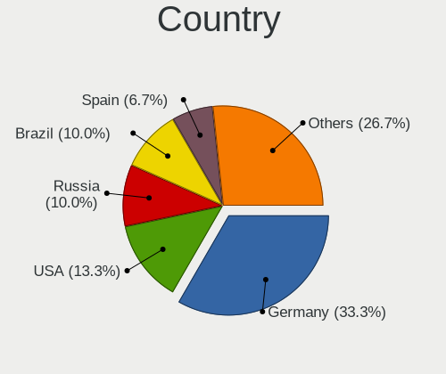
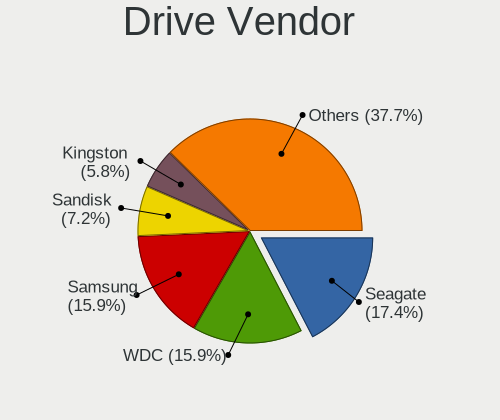
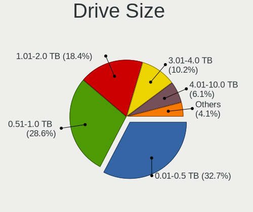
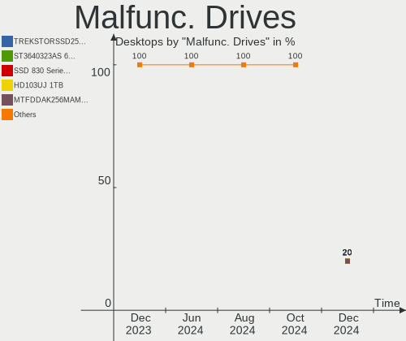
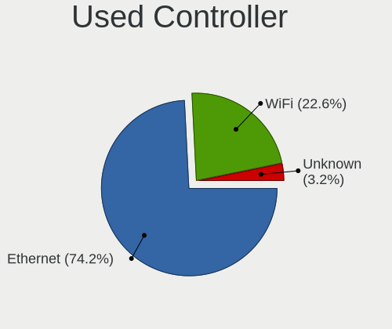
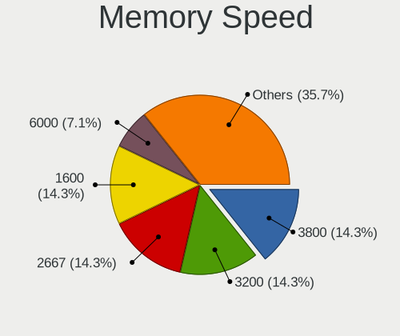

openSUSE - Hardware Trends (Desktops)
-------------------------------------

A project to identify most popular hardware characteristics and track their change
over time based on data collected by Linux users at https://Linux-Hardware.org.

Anyone can contribute to this report by the [hw-probe](https://github.com/linuxhw/hw-probe) tool:

    sudo -E hw-probe -all -upload

This report is for one last month. Overall report since the beginning of time: [TestDays](https://github.com/linuxhw/TestDays)

Period: Oct, 2023.

Contents
--------

* [ System ](#system)
  - [ OS                       ](#os)
  - [ OS Family                ](#os-family)
  - [ Kernel                   ](#kernel)
  - [ Kernel Family            ](#kernel-family)
  - [ Kernel Major Ver.        ](#kernel-major-ver)
  - [ Arch                     ](#arch)
  - [ DE                       ](#de)
  - [ Display Server           ](#display-server)
  - [ Display Manager          ](#display-manager)
  - [ OS Lang                  ](#os-lang)
  - [ Boot Mode                ](#boot-mode)
  - [ Filesystem               ](#filesystem)
  - [ Part. scheme             ](#part-scheme)
  - [ Dual Boot with Linux/BSD ](#dual-boot-with-linuxbsd)
  - [ Dual Boot (Win)          ](#dual-boot-win)

* [ Board ](#board)
  - [ Vendor                   ](#vendor)
  - [ Model                    ](#model)
  - [ Model Family             ](#model-family)
  - [ MFG Year                 ](#mfg-year)
  - [ Form Factor              ](#form-factor)
  - [ Secure Boot              ](#secure-boot)
  - [ Coreboot                 ](#coreboot)
  - [ RAM Size                 ](#ram-size)
  - [ RAM Used                 ](#ram-used)
  - [ Total Drives             ](#total-drives)
  - [ Has CD-ROM               ](#has-cd-rom)
  - [ Has Ethernet             ](#has-ethernet)
  - [ Has WiFi                 ](#has-wifi)
  - [ Has Bluetooth            ](#has-bluetooth)

* [ Location ](#location)
  - [ Country                  ](#country)
  - [ City                     ](#city)

* [ Drives ](#drives)
  - [ Drive Vendor             ](#drive-vendor)
  - [ Drive Model              ](#drive-model)
  - [ HDD Vendor               ](#hdd-vendor)
  - [ SSD Vendor               ](#ssd-vendor)
  - [ Drive Kind               ](#drive-kind)
  - [ Drive Connector          ](#drive-connector)
  - [ Drive Size               ](#drive-size)
  - [ Space Total              ](#space-total)
  - [ Space Used               ](#space-used)
  - [ Malfunc. Drives          ](#malfunc-drives)
  - [ Malfunc. Drive Vendor    ](#malfunc-drive-vendor)
  - [ Malfunc. HDD Vendor      ](#malfunc-hdd-vendor)
  - [ Malfunc. Drive Kind      ](#malfunc-drive-kind)
  - [ Failed Drives            ](#failed-drives)
  - [ Failed Drive Vendor      ](#failed-drive-vendor)
  - [ Drive Status             ](#drive-status)

* [ Storage controller ](#storage-controller)
  - [ Storage Vendor           ](#storage-vendor)
  - [ Storage Model            ](#storage-model)
  - [ Storage Kind             ](#storage-kind)

* [ Processor ](#processor)
  - [ CPU Vendor               ](#cpu-vendor)
  - [ CPU Model                ](#cpu-model)
  - [ CPU Model Family         ](#cpu-model-family)
  - [ CPU Cores                ](#cpu-cores)
  - [ CPU Sockets              ](#cpu-sockets)
  - [ CPU Threads              ](#cpu-threads)
  - [ CPU Op-Modes             ](#cpu-op-modes)
  - [ CPU Microcode            ](#cpu-microcode)
  - [ CPU Microarch            ](#cpu-microarch)

* [ Graphics ](#graphics)
  - [ GPU Vendor               ](#gpu-vendor)
  - [ GPU Model                ](#gpu-model)
  - [ GPU Combo                ](#gpu-combo)
  - [ GPU Driver               ](#gpu-driver)
  - [ GPU Memory               ](#gpu-memory)

* [ Monitor ](#monitor)
  - [ Monitor Vendor           ](#monitor-vendor)
  - [ Monitor Model            ](#monitor-model)
  - [ Monitor Resolution       ](#monitor-resolution)
  - [ Monitor Diagonal         ](#monitor-diagonal)
  - [ Monitor Width            ](#monitor-width)
  - [ Aspect Ratio             ](#aspect-ratio)
  - [ Monitor Area             ](#monitor-area)
  - [ Pixel Density            ](#pixel-density)
  - [ Multiple Monitors        ](#multiple-monitors)

* [ Network ](#network)
  - [ Net Controller Vendor    ](#net-controller-vendor)
  - [ Net Controller Model     ](#net-controller-model)
  - [ Wireless Vendor          ](#wireless-vendor)
  - [ Wireless Model           ](#wireless-model)
  - [ Ethernet Vendor          ](#ethernet-vendor)
  - [ Ethernet Model           ](#ethernet-model)
  - [ Net Controller Kind      ](#net-controller-kind)
  - [ Used Controller          ](#used-controller)
  - [ NICs                     ](#nics)
  - [ IPv6                     ](#ipv6)

* [ Bluetooth ](#bluetooth)
  - [ Bluetooth Vendor         ](#bluetooth-vendor)
  - [ Bluetooth Model          ](#bluetooth-model)

* [ Sound ](#sound)
  - [ Sound Vendor             ](#sound-vendor)
  - [ Sound Model              ](#sound-model)

* [ Memory ](#memory)
  - [ Memory Vendor            ](#memory-vendor)
  - [ Memory Model             ](#memory-model)
  - [ Memory Kind              ](#memory-kind)
  - [ Memory Form Factor       ](#memory-form-factor)
  - [ Memory Size              ](#memory-size)
  - [ Memory Speed             ](#memory-speed)

* [ Printers & scanners ](#printers--scanners)
  - [ Printer Vendor           ](#printer-vendor)
  - [ Printer Model            ](#printer-model)
  - [ Scanner Vendor           ](#scanner-vendor)
  - [ Scanner Model            ](#scanner-model)

* [ Camera ](#camera)
  - [ Camera Vendor            ](#camera-vendor)
  - [ Camera Model             ](#camera-model)

* [ Security ](#security)
  - [ Fingerprint Vendor       ](#fingerprint-vendor)
  - [ Fingerprint Model        ](#fingerprint-model)
  - [ Chipcard Vendor          ](#chipcard-vendor)
  - [ Chipcard Model           ](#chipcard-model)

* [ Unsupported ](#unsupported)
  - [ Unsupported Devices      ](#unsupported-devices)
  - [ Unsupported Device Types ](#unsupported-device-types)

System
------

OS
--

Installed operating systems

| Name                         | Desktops | Percent |
|------------------------------|----------|---------|
| openSUSE Tumbleweed-XXXXXXXX | 23       | 52.27%  |
| openSUSE Leap-15.5           | 16       | 36.36%  |
| openSUSE Microos-XXXXXXXX    | 3        | 6.82%   |
| openSUSE Leap-15.4           | 2        | 4.55%   |

OS Family
---------

OS without a version

| Name     | Desktops | Percent |
|----------|----------|---------|
| openSUSE | 44       | 100%    |

Kernel
------

Version of the Linux kernel

| Version                      | Desktops | Percent |
|------------------------------|----------|---------|
| 6.5.4-1-default              | 12       | 27.27%  |
| 6.5.6-1-default              | 7        | 15.91%  |
| 5.14.21-150500.55.28-default | 7        | 15.91%  |
| 6.5.8-1-default              | 5        | 11.36%  |
| 5.14.21-150500.55.31-default | 5        | 11.36%  |
| 6.5.9-1-default              | 2        | 4.55%   |
| 6.5.6-lqx1-1-liquorix        | 1        | 2.27%   |
| 5.14.21-150500.55.7-default  | 1        | 2.27%   |
| 5.14.21-150500.55.19-default | 1        | 2.27%   |
| 5.14.21-150500.53-default    | 1        | 2.27%   |
| 5.14.21-150400.24.88-default | 1        | 2.27%   |
| 5.14.21-150400.24.84-default | 1        | 2.27%   |

Kernel Family
-------------

Linux kernel without a distro release

| Version | Desktops | Percent |
|---------|----------|---------|
| 5.14.21 | 17       | 38.64%  |
| 6.5.4   | 12       | 27.27%  |
| 6.5.6   | 8        | 18.18%  |
| 6.5.8   | 5        | 11.36%  |
| 6.5.9   | 2        | 4.55%   |

Kernel Major Ver.
-----------------

Linux kernel major version

| Version | Desktops | Percent |
|---------|----------|---------|
| 6.5     | 27       | 61.36%  |
| 5.14    | 17       | 38.64%  |

Arch
----

OS architecture (x86_64, i586, etc.)

| Name   | Desktops | Percent |
|--------|----------|---------|
| x86_64 | 44       | 100%    |

DE
--

Desktop Environment

| Name       | Desktops | Percent |
|------------|----------|---------|
| KDE5       | 32       | 72.73%  |
| GNOME      | 8        | 18.18%  |
| XFCE       | 1        | 2.27%   |
| X-Cinnamon | 1        | 2.27%   |
| KDE        | 1        | 2.27%   |
| ICEWM      | 1        | 2.27%   |

Display Server
--------------

X11 or Wayland

| Name    | Desktops | Percent |
|---------|----------|---------|
| X11     | 34       | 77.27%  |
| Wayland | 10       | 22.73%  |

Display Manager
---------------

SDDM, LightDM, etc.

| Name    | Desktops | Percent |
|---------|----------|---------|
| Unknown | 32       | 72.73%  |
| SDDM    | 10       | 22.73%  |
| XDM     | 1        | 2.27%   |
| GDM     | 1        | 2.27%   |

OS Lang
-------

Language

| Lang    | Desktops | Percent |
|---------|----------|---------|
| en_US   | 17       | 38.64%  |
| de_DE   | 13       | 29.55%  |
| nl_NL   | 3        | 6.82%   |
| it_IT   | 3        | 6.82%   |
| sk_SK   | 1        | 2.27%   |
| ru_RU   | 1        | 2.27%   |
| POSIX   | 1        | 2.27%   |
| fr_FR   | 1        | 2.27%   |
| es_ES   | 1        | 2.27%   |
| en_GB   | 1        | 2.27%   |
| el_GR   | 1        | 2.27%   |
| Unknown | 1        | 2.27%   |

Boot Mode
---------

EFI or BIOS

| Mode | Desktops | Percent |
|------|----------|---------|
| EFI  | 24       | 54.55%  |
| BIOS | 20       | 45.45%  |

Filesystem
----------

Type of filesystem

| Type  | Desktops | Percent |
|-------|----------|---------|
| Btrfs | 35       | 79.55%  |
| Ext4  | 8        | 18.18%  |
| Xfs   | 1        | 2.27%   |

Part. scheme
------------

Scheme of partitioning

| Type    | Desktops | Percent |
|---------|----------|---------|
| Unknown | 32       | 72.73%  |
| GPT     | 11       | 25%     |
| MBR     | 1        | 2.27%   |

Dual Boot with Linux/BSD
------------------------

Hosting more than one Linux/BSD

| Dual boot | Desktops | Percent |
|-----------|----------|---------|
| No        | 41       | 93.18%  |
| Yes       | 3        | 6.82%   |

Dual Boot (Win)
---------------

Hosting Linux and Windows

| Dual boot | Desktops | Percent |
|-----------|----------|---------|
| No        | 41       | 93.18%  |
| Yes       | 3        | 6.82%   |

Board
-----

Vendor
------

Motherboard manufacturer

| Name                                 | Desktops | Percent |
|--------------------------------------|----------|---------|
| ASUSTek Computer                     | 14       | 31.82%  |
| Gigabyte Technology                  | 12       | 27.27%  |
| MSI                                  | 7        | 15.91%  |
| Hewlett-Packard                      | 3        | 6.82%   |
| ASRock                               | 3        | 6.82%   |
| Lenovo                               | 2        | 4.55%   |
| Shenzhen Meigao Electronic Equipment | 1        | 2.27%   |
| Medion                               | 1        | 2.27%   |
| Dell                                 | 1        | 2.27%   |

Model
-----

Motherboard model

| Name                                        | Desktops | Percent |
|---------------------------------------------|----------|---------|
| MSI MS-7A33                                 | 2        | 4.55%   |
| Shenzhen Meigao Electronic Equipment UM690  | 1        | 2.27%   |
| MSI MS-7D75                                 | 1        | 2.27%   |
| MSI MS-7D52                                 | 1        | 2.27%   |
| MSI MS-7C80                                 | 1        | 2.27%   |
| MSI MS-7C02                                 | 1        | 2.27%   |
| MSI MS-7A39                                 | 1        | 2.27%   |
| Medion MS-7848                              | 1        | 2.27%   |
| Lenovo ThinkCentre M78 10BR0005US           | 1        | 2.27%   |
| Lenovo IdeaCentre Gaming5 17IAB7 90T100BHMZ | 1        | 2.27%   |
| HP ProLiant ML310e Gen8                     | 1        | 2.27%   |
| HP Compaq 6000 Pro MT PC                    | 1        | 2.27%   |
| HP 870-115ng                                | 1        | 2.27%   |
| Gigabyte Z68XP-UD4                          | 1        | 2.27%   |
| Gigabyte Z390 UD                            | 1        | 2.27%   |
| Gigabyte X470 AORUS ULTRA GAMING            | 1        | 2.27%   |
| Gigabyte TRX40 AORUS XTREME                 | 1        | 2.27%   |
| Gigabyte GA-A75M-D2H                        | 1        | 2.27%   |
| Gigabyte GA-990XA-UD3                       | 1        | 2.27%   |
| Gigabyte GA-880GM-USB3                      | 1        | 2.27%   |
| Gigabyte F2A78M-HD2                         | 1        | 2.27%   |
| Gigabyte B85M-D2V                           | 1        | 2.27%   |
| Gigabyte B650 GAMING X AX                   | 1        | 2.27%   |
| Gigabyte B550M DS3H                         | 1        | 2.27%   |
| Gigabyte B450M DS3H V2                      | 1        | 2.27%   |
| Dell XPS 8700                               | 1        | 2.27%   |
| ASUS VM40B                                  | 1        | 2.27%   |
| ASUS TUF Gaming X570-PLUS                   | 1        | 2.27%   |
| ASUS TUF Gaming B550M-PLUS WIFI II          | 1        | 2.27%   |
| ASUS TUF Gaming B550-PLUS                   | 1        | 2.27%   |
| ASUS ROG STRIX X670E-E GAMING WIFI          | 1        | 2.27%   |
| ASUS ROG STRIX X470-F GAMING                | 1        | 2.27%   |
| ASUS ROG Strix GA35DX_G35DX                 | 1        | 2.27%   |
| ASUS ProArt X570-CREATOR WIFI               | 1        | 2.27%   |
| ASUS PRIME H510M-A                          | 1        | 2.27%   |
| ASUS PRIME B560M-K                          | 1        | 2.27%   |
| ASUS PC                                     | 1        | 2.27%   |
| ASUS P8H61-MX USB3                          | 1        | 2.27%   |
| ASUS P5Q3                                   | 1        | 2.27%   |
| ASUS M5A97 R2.0                             | 1        | 2.27%   |

Model Family
------------

Motherboard model prefix

| Name                                       | Desktops | Percent |
|--------------------------------------------|----------|---------|
| ASUS TUF                                   | 3        | 6.82%   |
| ASUS ROG                                   | 3        | 6.82%   |
| MSI MS-7A33                                | 2        | 4.55%   |
| ASUS PRIME                                 | 2        | 4.55%   |
| Shenzhen Meigao Electronic Equipment UM690 | 1        | 2.27%   |
| MSI MS-7D75                                | 1        | 2.27%   |
| MSI MS-7D52                                | 1        | 2.27%   |
| MSI MS-7C80                                | 1        | 2.27%   |
| MSI MS-7C02                                | 1        | 2.27%   |
| MSI MS-7A39                                | 1        | 2.27%   |
| Medion MS-7848                             | 1        | 2.27%   |
| Lenovo ThinkCentre                         | 1        | 2.27%   |
| Lenovo IdeaCentre                          | 1        | 2.27%   |
| HP ProLiant                                | 1        | 2.27%   |
| HP Compaq                                  | 1        | 2.27%   |
| HP 870-115ng                               | 1        | 2.27%   |
| Gigabyte Z68XP-UD4                         | 1        | 2.27%   |
| Gigabyte Z390                              | 1        | 2.27%   |
| Gigabyte X470                              | 1        | 2.27%   |
| Gigabyte TRX40                             | 1        | 2.27%   |
| Gigabyte GA-A75M-D2H                       | 1        | 2.27%   |
| Gigabyte GA-990XA-UD3                      | 1        | 2.27%   |
| Gigabyte GA-880GM-USB3                     | 1        | 2.27%   |
| Gigabyte F2A78M-HD2                        | 1        | 2.27%   |
| Gigabyte B85M-D2V                          | 1        | 2.27%   |
| Gigabyte B650                              | 1        | 2.27%   |
| Gigabyte B550M                             | 1        | 2.27%   |
| Gigabyte B450M                             | 1        | 2.27%   |
| Dell XPS                                   | 1        | 2.27%   |
| ASUS VM40B                                 | 1        | 2.27%   |
| ASUS ProArt                                | 1        | 2.27%   |
| ASUS PC                                    | 1        | 2.27%   |
| ASUS P8H61-MX                              | 1        | 2.27%   |
| ASUS P5Q3                                  | 1        | 2.27%   |
| ASUS M5A97                                 | 1        | 2.27%   |
| ASRock Z270                                | 1        | 2.27%   |
| ASRock FM2A68M-DG3+                        | 1        | 2.27%   |
| ASRock B460M                               | 1        | 2.27%   |

MFG Year
--------

Motherboard manufacture year

| Year | Desktops | Percent |
|------|----------|---------|
| 2020 | 7        | 15.91%  |
| 2021 | 6        | 13.64%  |
| 2022 | 5        | 11.36%  |
| 2018 | 5        | 11.36%  |
| 2013 | 4        | 9.09%   |
| 2012 | 3        | 6.82%   |
| 2011 | 3        | 6.82%   |
| 2017 | 2        | 4.55%   |
| 2016 | 2        | 4.55%   |
| 2014 | 2        | 4.55%   |
| 2009 | 2        | 4.55%   |
| 2019 | 1        | 2.27%   |
| 2015 | 1        | 2.27%   |
| 2010 | 1        | 2.27%   |

Form Factor
-----------

Physical design of the computer

| Name    | Desktops | Percent |
|---------|----------|---------|
| Desktop | 44       | 100%    |

Secure Boot
-----------

Enabled or disabled

| State    | Desktops | Percent |
|----------|----------|---------|
| Disabled | 41       | 93.18%  |
| Enabled  | 3        | 6.82%   |

Coreboot
--------

Have coreboot on board

| Used | Desktops | Percent |
|------|----------|---------|
| No   | 44       | 100%    |

RAM Size
--------

Total RAM memory

| Size in GB      | Desktops | Percent |
|-----------------|----------|---------|
| 16.01-24.0      | 14       | 31.82%  |
| 8.01-16.0       | 9        | 20.45%  |
| 64.01-256.0     | 7        | 15.91%  |
| 32.01-64.0      | 5        | 11.36%  |
| 4.01-8.0        | 3        | 6.82%   |
| 3.01-4.0        | 3        | 6.82%   |
| 24.01-32.0      | 2        | 4.55%   |
| More than 256.0 | 1        | 2.27%   |

RAM Used
--------

Used RAM memory

| Used GB    | Desktops | Percent |
|------------|----------|---------|
| 2.01-3.0   | 15       | 34.09%  |
| 4.01-8.0   | 10       | 22.73%  |
| 3.01-4.0   | 10       | 22.73%  |
| 1.01-2.0   | 5        | 11.36%  |
| 8.01-16.0  | 3        | 6.82%   |
| 24.01-32.0 | 1        | 2.27%   |

Total Drives
------------

Number of drives on board

| Drives | Desktops | Percent |
|--------|----------|---------|
| 1      | 14       | 31.82%  |
| 3      | 8        | 18.18%  |
| 4      | 7        | 15.91%  |
| 2      | 7        | 15.91%  |
| 7      | 3        | 6.82%   |
| 5      | 3        | 6.82%   |
| 6      | 2        | 4.55%   |

Has CD-ROM
----------

Has CD-ROM on board

| Presented | Desktops | Percent |
|-----------|----------|---------|
| No        | 25       | 56.82%  |
| Yes       | 19       | 43.18%  |

Has Ethernet
------------

Has Ethernet on board

| Presented | Desktops | Percent |
|-----------|----------|---------|
| Yes       | 43       | 97.73%  |
| No        | 1        | 2.27%   |

Has WiFi
--------

Has WiFi module

| Presented | Desktops | Percent |
|-----------|----------|---------|
| Yes       | 24       | 54.55%  |
| No        | 20       | 45.45%  |

Has Bluetooth
-------------

Has Bluetooth module

| Presented | Desktops | Percent |
|-----------|----------|---------|
| Yes       | 22       | 50%     |
| No        | 22       | 50%     |

Location
--------

Country
-------

Geographic location (country)

| Country     | Desktops | Percent |
|-------------|----------|---------|
| Germany     | 12       | 27.27%  |
| USA         | 7        | 15.91%  |
| Italy       | 4        | 9.09%   |
| Netherlands | 3        | 6.82%   |
| Switzerland | 2        | 4.55%   |
| Russia      | 2        | 4.55%   |
| UK          | 1        | 2.27%   |
| Sweden      | 1        | 2.27%   |
| Spain       | 1        | 2.27%   |
| Slovakia    | 1        | 2.27%   |
| Singapore   | 1        | 2.27%   |
| Romania     | 1        | 2.27%   |
| Norway      | 1        | 2.27%   |
| Malaysia    | 1        | 2.27%   |
| Indonesia   | 1        | 2.27%   |
| Greece      | 1        | 2.27%   |
| France      | 1        | 2.27%   |
| Canada      | 1        | 2.27%   |
| Bulgaria    | 1        | 2.27%   |
| Belgium     | 1        | 2.27%   |

City
----

Geographic location (city)

| City           | Desktops | Percent |
|----------------|----------|---------|
| Zurich         | 1        | 2.27%   |
| Zuchwil        | 1        | 2.27%   |
| Yakutsk        | 1        | 2.27%   |
| Waterbury      | 1        | 2.27%   |
| Waren          | 1        | 2.27%   |
| Voorschoten    | 1        | 2.27%   |
| Vlkanova       | 1        | 2.27%   |
| Västerås     | 1        | 2.27%   |
| Thessaloniki   | 1        | 2.27%   |
| Tacoma         | 1        | 2.27%   |
| Suhlendorf     | 1        | 2.27%   |
| Sofia          | 1        | 2.27%   |
| Singapore      | 1        | 2.27%   |
| Richmond       | 1        | 2.27%   |
| New York       | 1        | 2.27%   |
| Naples         | 1        | 2.27%   |
| Monza          | 1        | 2.27%   |
| Mainhausen     | 1        | 2.27%   |
| Magelang       | 1        | 2.27%   |
| Louisville     | 1        | 2.27%   |
| Kuala Lumpur   | 1        | 2.27%   |
| Kirov          | 1        | 2.27%   |
| Kelkheim       | 1        | 2.27%   |
| Kansas City    | 1        | 2.27%   |
| Haugesund      | 1        | 2.27%   |
| Hartenstein    | 1        | 2.27%   |
| Grafenau       | 1        | 2.27%   |
| Graben-Neudorf | 1        | 2.27%   |
| Giessen        | 1        | 2.27%   |
| Enschede       | 1        | 2.27%   |
| Elburg         | 1        | 2.27%   |
| Edegem         | 1        | 2.27%   |
| Drensteinfurt  | 1        | 2.27%   |
| D'Iberville    | 1        | 2.27%   |
| Cologne        | 1        | 2.27%   |
| Calw           | 1        | 2.27%   |
| Cadillac       | 1        | 2.27%   |
| Bucharest      | 1        | 2.27%   |
| Braunschweig   | 1        | 2.27%   |
| Ariccia        | 1        | 2.27%   |

Drives
------

Drive Vendor
------------

Hard drive vendors

| Vendor                      | Desktops | Drives | Percent |
|-----------------------------|----------|--------|---------|
| Seagate                     | 17       | 24     | 18.28%  |
| Samsung Electronics         | 17       | 33     | 18.28%  |
| WDC                         | 16       | 23     | 17.2%   |
| Sandisk                     | 10       | 12     | 10.75%  |
| Kingston                    | 6        | 6      | 6.45%   |
| Toshiba                     | 4        | 4      | 4.3%    |
| Unknown                     | 3        | 4      | 3.23%   |
| Phison Electronics          | 2        | 2      | 2.15%   |
| Patriot                     | 2        | 2      | 2.15%   |
| Kingston Technology Company | 2        | 2      | 2.15%   |
| Seagate Technology          | 1        | 1      | 1.08%   |
| RESCUE                      | 1        | 1      | 1.08%   |
| Realtek Semiconductor       | 1        | 1      | 1.08%   |
| Realtek                     | 1        | 1      | 1.08%   |
| PNY                         | 1        | 1      | 1.08%   |
| OCZ                         | 1        | 1      | 1.08%   |
| Mushkin                     | 1        | 1      | 1.08%   |
| Micron/Crucial Technology   | 1        | 1      | 1.08%   |
| Micron Technology           | 1        | 1      | 1.08%   |
| Intenso                     | 1        | 1      | 1.08%   |
| HGST                        | 1        | 1      | 1.08%   |
| Hewlett-Packard             | 1        | 1      | 1.08%   |
| Crucial                     | 1        | 1      | 1.08%   |
| A-DATA Technology           | 1        | 1      | 1.08%   |

Drive Model
-----------

Hard drive models

| Model                                              | Desktops | Percent |
|----------------------------------------------------|----------|---------|
| Samsung NVMe SSD Controller SM981/PM981/PM983 1TB  | 7        | 5.93%   |
| WDC WD10EZEX-08WN4A0 1TB                           | 3        | 2.54%   |
| Seagate ST2000DM008-2FR102 2TB                     | 3        | 2.54%   |
| Seagate ST1000DM010-2EP102 1TB                     | 3        | 2.54%   |
| Seagate ST1000DM003-1CH162 1TB                     | 3        | 2.54%   |
| Samsung NVMe SSD Controller PM9A1/PM9A3/980PRO 1TB | 3        | 2.54%   |
| Seagate ST500DM002-1BD142 500GB                    | 2        | 1.69%   |
| Sandisk WD_BLACK SN850X 2000GB                     | 2        | 1.69%   |
| Samsung SSD 980 1TB                                | 2        | 1.69%   |
| Samsung SSD 870 EVO 1TB                            | 2        | 1.69%   |
| Samsung SSD 860 EVO 1TB                            | 2        | 1.69%   |
| Kingston SA400S37480G 480GB SSD                    | 2        | 1.69%   |
| WDC WDS480G2G0A-00JH30 480GB SSD                   | 1        | 0.85%   |
| WDC WDS250G1B0A-00H9H0 250GB SSD                   | 1        | 0.85%   |
| WDC WDS100T1B0A-00H9H0 1TB SSD                     | 1        | 0.85%   |
| WDC WD5000AVCS-632DY1 500GB                        | 1        | 0.85%   |
| WDC WD5000AAKX-22ERMA0 500GB                       | 1        | 0.85%   |
| WDC WD40EZAZ-00SF3B0 4TB                           | 1        | 0.85%   |
| WDC WD40EFRX-68N32N0 4TB                           | 1        | 0.85%   |
| WDC WD4005FZBX-00K5WB0 4TB                         | 1        | 0.85%   |
| WDC WD30EURS-63SPKY0 3TB                           | 1        | 0.85%   |
| WDC WD30EFRX-68N32N0 3TB                           | 1        | 0.85%   |
| WDC WD20EZRZ-00Z5HB0 2TB                           | 1        | 0.85%   |
| WDC WD20EZRX-00DC0B0 2TB                           | 1        | 0.85%   |
| WDC WD20EARS-00MVWB0 2TB                           | 1        | 0.85%   |
| WDC WD10EZEX-60WN4A0 1TB                           | 1        | 0.85%   |
| WDC WD10EZEX-22MFCA0 1TB                           | 1        | 0.85%   |
| WDC WD10EZEX-00RKKA0 1TB                           | 1        | 0.85%   |
| WDC WD10EZEX-00BBHA0 1TB                           | 1        | 0.85%   |
| WDC WD1003FZEX-00K3CA0 1TB                         | 1        | 0.85%   |
| Unknown USB DISK 3.2 1TB                           | 1        | 0.85%   |
| Unknown SD/MMC/MS PRO 16GB                         | 1        | 0.85%   |
| Unknown SD/MMC 2GB                                 | 1        | 0.85%   |
| Unknown M.S./M.S.Pro/HG 16GB                       | 1        | 0.85%   |
| Toshiba TR200 240GB SSD                            | 1        | 0.85%   |
| Toshiba HDWD130 3TB                                | 1        | 0.85%   |
| Toshiba DT01ACA300 3TB                             | 1        | 0.85%   |
| Toshiba DT01ACA100 1TB                             | 1        | 0.85%   |
| Seagate FireCuda 510 SSD 250GB                     | 1        | 0.85%   |
| Seagate ST9320325AS 320GB                          | 1        | 0.85%   |

HDD Vendor
----------

Hard disk drive vendors

| Vendor              | Desktops | Drives | Percent |
|---------------------|----------|--------|---------|
| Seagate             | 17       | 23     | 41.46%  |
| WDC                 | 16       | 20     | 39.02%  |
| Toshiba             | 3        | 3      | 7.32%   |
| Samsung Electronics | 2        | 2      | 4.88%   |
| Unknown             | 1        | 1      | 2.44%   |
| HGST                | 1        | 1      | 2.44%   |
| Hewlett-Packard     | 1        | 1      | 2.44%   |

SSD Vendor
----------

Solid state drive vendors

| Vendor              | Desktops | Drives | Percent |
|---------------------|----------|--------|---------|
| Samsung Electronics | 10       | 13     | 31.25%  |
| SanDisk             | 6        | 6      | 18.75%  |
| Kingston            | 5        | 5      | 15.63%  |
| WDC                 | 3        | 3      | 9.38%   |
| Patriot             | 2        | 2      | 6.25%   |
| Toshiba             | 1        | 1      | 3.13%   |
| PNY                 | 1        | 1      | 3.13%   |
| OCZ                 | 1        | 1      | 3.13%   |
| Mushkin             | 1        | 1      | 3.13%   |
| Crucial             | 1        | 1      | 3.13%   |
| A-DATA Technology   | 1        | 1      | 3.13%   |

Drive Kind
----------

HDD or SSD

| Kind    | Desktops | Drives | Percent |
|---------|----------|--------|---------|
| HDD     | 30       | 51     | 37.5%   |
| SSD     | 26       | 35     | 32.5%   |
| NVMe    | 20       | 35     | 25%     |
| Unknown | 4        | 5      | 5%      |

Drive Connector
---------------

SATA, SAS, NVMe, etc.

| Type | Desktops | Drives | Percent |
|------|----------|--------|---------|
| SATA | 40       | 86     | 61.54%  |
| NVMe | 20       | 34     | 30.77%  |
| SAS  | 5        | 6      | 7.69%   |

Drive Size
----------

Size of hard drive

| Size in TB | Desktops | Drives | Percent |
|------------|----------|--------|---------|
| 0.51-1.0   | 24       | 30     | 35.82%  |
| 0.01-0.5   | 23       | 32     | 34.33%  |
| 1.01-2.0   | 10       | 12     | 14.93%  |
| 3.01-4.0   | 5        | 6      | 7.46%   |
| 2.01-3.0   | 5        | 6      | 7.46%   |

Space Total
-----------

Amount of disk space available on the file system

| Size in GB     | Desktops | Percent |
|----------------|----------|---------|
| More than 3000 | 24       | 54.55%  |
| 1001-2000      | 7        | 15.91%  |
| 501-1000       | 5        | 11.36%  |
| 251-500        | 3        | 6.82%   |
| 2001-3000      | 2        | 4.55%   |
| 101-250        | 2        | 4.55%   |
| 1-20           | 1        | 2.27%   |

Space Used
----------

Amount of used disk space

| Used GB        | Desktops | Percent |
|----------------|----------|---------|
| 101-250        | 11       | 25%     |
| 251-500        | 8        | 18.18%  |
| 51-100         | 7        | 15.91%  |
| 1001-2000      | 6        | 13.64%  |
| More than 3000 | 3        | 6.82%   |
| 2001-3000      | 3        | 6.82%   |
| 501-1000       | 3        | 6.82%   |
| 21-50          | 2        | 4.55%   |
| 1-20           | 1        | 2.27%   |

Malfunc. Drives
---------------

Drive models with a malfunction

| Model                               | Desktops | Drives | Percent |
|-------------------------------------|----------|--------|---------|
| Seagate ST500DM002-1BD142 500GB     | 1        | 1      | 33.33%  |
| Seagate ST1000DM003-1ER162 1TB      | 1        | 1      | 33.33%  |
| Samsung Electronics SSD 870 EVO 1TB | 1        | 1      | 33.33%  |

Malfunc. Drive Vendor
---------------------

Vendors of faulty drives

| Vendor              | Desktops | Drives | Percent |
|---------------------|----------|--------|---------|
| Seagate             | 2        | 2      | 66.67%  |
| Samsung Electronics | 1        | 1      | 33.33%  |

Malfunc. HDD Vendor
-------------------

Vendors of faulty HDD drives

| Vendor  | Desktops | Drives | Percent |
|---------|----------|--------|---------|
| Seagate | 2        | 2      | 100%    |

Malfunc. Drive Kind
-------------------

Kinds of faulty drives

| Kind | Desktops | Drives | Percent |
|------|----------|--------|---------|
| HDD  | 2        | 2      | 66.67%  |
| SSD  | 1        | 1      | 33.33%  |

Failed Drives
-------------

Failed drive models

Zero info for selected period =(

Failed Drive Vendor
-------------------

Failed drive vendors

Zero info for selected period =(

Drive Status
------------

Number of failed and malfunc. drives

| Status   | Desktops | Drives | Percent |
|----------|----------|--------|---------|
| Detected | 33       | 90     | 68.75%  |
| Works    | 12       | 33     | 25%     |
| Malfunc  | 3        | 3      | 6.25%   |

Storage controller
------------------

Storage Vendor
--------------

Storage controller vendors

| Vendor                      | Desktops | Percent |
|-----------------------------|----------|---------|
| AMD                         | 25       | 34.25%  |
| Intel                       | 18       | 24.66%  |
| Samsung Electronics         | 10       | 13.7%   |
| Sandisk                     | 6        | 8.22%   |
| Kingston Technology Company | 3        | 4.11%   |
| Seagate Technology          | 2        | 2.74%   |
| Phison Electronics          | 2        | 2.74%   |
| ASMedia Technology          | 2        | 2.74%   |
| Realtek Semiconductor       | 1        | 1.37%   |
| Micron/Crucial Technology   | 1        | 1.37%   |
| Micron Technology           | 1        | 1.37%   |
| Marvell Technology Group    | 1        | 1.37%   |
| JMicron Technology          | 1        | 1.37%   |

Storage Model
-------------

Storage controller models

| Model                                                                          | Desktops | Percent |
|--------------------------------------------------------------------------------|----------|---------|
| AMD FCH SATA Controller [AHCI mode]                                            | 17       | 19.77%  |
| Samsung NVMe SSD Controller SM981/PM981/PM983                                  | 7        | 8.14%   |
| AMD 400 Series Chipset SATA Controller                                         | 4        | 4.65%   |
| Sandisk WD Black SN850X NVMe SSD                                               | 3        | 3.49%   |
| Samsung NVMe SSD Controller PM9A1/PM9A3/980PRO                                 | 3        | 3.49%   |
| Intel 8 Series/C220 Series Chipset Family 6-port SATA Controller 1 [AHCI mode] | 3        | 3.49%   |
| Intel 6 Series/C200 Series Chipset Family 6 port Desktop SATA AHCI Controller  | 3        | 3.49%   |
| AMD 500 Series Chipset SATA Controller                                         | 3        | 3.49%   |
| Samsung NVMe SSD Controller 980 (DRAM-less)                                    | 2        | 2.33%   |
| Intel Comet Lake SATA AHCI Controller                                          | 2        | 2.33%   |
| Intel 500 Series Chipset Family SATA AHCI Controller                           | 2        | 2.33%   |
| ASMedia ASM1062 Serial ATA Controller                                          | 2        | 2.33%   |
| AMD X370 Series Chipset SATA Controller                                        | 2        | 2.33%   |
| AMD SB7x0/SB8x0/SB9x0 SATA Controller [IDE mode]                               | 2        | 2.33%   |
| AMD SB7x0/SB8x0/SB9x0 IDE Controller                                           | 2        | 2.33%   |
| AMD FCH IDE Controller                                                         | 2        | 2.33%   |
| Seagate FireCuda/IronWolf 510 SSD                                              | 1        | 1.16%   |
| Seagate FireCuda 530 SSD                                                       | 1        | 1.16%   |
| SanDisk WD Black SN770 / PC SN740 256GB / PC SN560 (DRAM-less) NVMe SSD        | 1        | 1.16%   |
| SanDisk Ultra 3D / WD Blue SN570 NVMe SSD (DRAM-less)                          | 1        | 1.16%   |
| SanDisk PC SN735 NVMe SSD (DRAM-less)                                          | 1        | 1.16%   |
| Samsung NVMe SSD Controller SM961/PM961/SM963                                  | 1        | 1.16%   |
| Realtek RTS5762 NVMe SSD Controller                                            | 1        | 1.16%   |
| Phison PS5021-E21 PCIe4 NVMe Controller (DRAM-less)                            | 1        | 1.16%   |
| Phison E16 PCIe4 NVMe Controller                                               | 1        | 1.16%   |
| Micron/Crucial P2 [Nick P2] / P3 / P3 Plus NVMe PCIe SSD (DRAM-less)           | 1        | 1.16%   |
| Micron 2210 NVMe SSD [Cobain]                                                  | 1        | 1.16%   |
| Marvell Group 88SE9172 SATA 6Gb/s Controller                                   | 1        | 1.16%   |
| Kingston Company OM8PGP4 NVMe PCIe SSD (DRAM-less)                             | 1        | 1.16%   |
| Kingston Company NV2 NVMe SSD SM2267XT                                         | 1        | 1.16%   |
| Kingston Company KC3000/FURY Renegade NVMe SSD E18                             | 1        | 1.16%   |
| JMicron JMB363 SATA/IDE Controller                                             | 1        | 1.16%   |
| Intel Q170/Q150/B150/H170/H110/Z170/CM236 Chipset SATA Controller [AHCI Mode]  | 1        | 1.16%   |
| Intel Cannon Lake PCH SATA AHCI Controller                                     | 1        | 1.16%   |
| Intel Alder Lake-S PCH SATA Controller [AHCI Mode]                             | 1        | 1.16%   |
| Intel 82801JI (ICH10 Family) SATA AHCI Controller                              | 1        | 1.16%   |
| Intel 82801JD/DO (ICH10 Family) SATA AHCI Controller                           | 1        | 1.16%   |
| Intel 7 Series Chipset Family 6-port SATA Controller [AHCI mode]               | 1        | 1.16%   |
| Intel 400 Series Chipset Family SATA AHCI Controller                           | 1        | 1.16%   |
| Intel 200 Series PCH SATA controller [AHCI mode]                               | 1        | 1.16%   |

Storage Kind
------------

Kind of storage controller (IDE, SATA, NVMe, SAS, ...)

| Kind | Desktops | Percent |
|------|----------|---------|
| SATA | 43       | 63.24%  |
| NVMe | 20       | 29.41%  |
| IDE  | 5        | 7.35%   |

Processor
---------

CPU Vendor
----------

Processor vendors

| Vendor | Desktops | Percent |
|--------|----------|---------|
| AMD    | 26       | 59.09%  |
| Intel  | 18       | 40.91%  |

CPU Model
---------

Processor models

| Model                                          | Desktops | Percent |
|------------------------------------------------|----------|---------|
| Intel 11th Gen Core i5-11400F @ 2.60GHz        | 2        | 4.55%   |
| AMD Ryzen 9 5900X 12-Core Processor            | 2        | 4.55%   |
| AMD Ryzen 7 5800X3D 8-Core Processor           | 2        | 4.55%   |
| Intel Xeon CPU E3-1220 V2 @ 3.10GHz            | 1        | 2.27%   |
| Intel Pentium Dual-Core CPU E6500 @ 2.93GHz    | 1        | 2.27%   |
| Intel Core i9-10850K CPU @ 3.60GHz             | 1        | 2.27%   |
| Intel Core i7-9700K CPU @ 3.60GHz              | 1        | 2.27%   |
| Intel Core i7-6700 CPU @ 3.40GHz               | 1        | 2.27%   |
| Intel Core i7-4790 CPU @ 3.60GHz               | 1        | 2.27%   |
| Intel Core i5-7500 CPU @ 3.40GHz               | 1        | 2.27%   |
| Intel Core i5-4590 CPU @ 3.30GHz               | 1        | 2.27%   |
| Intel Core i5-4430 CPU @ 3.00GHz               | 1        | 2.27%   |
| Intel Core i5-2500K CPU @ 3.30GHz              | 1        | 2.27%   |
| Intel Core i5-10600K CPU @ 4.10GHz             | 1        | 2.27%   |
| Intel Core i5-10400 CPU @ 2.90GHz              | 1        | 2.27%   |
| Intel Core i3-2120 CPU @ 3.30GHz               | 1        | 2.27%   |
| Intel Core 2 Quad CPU Q9550 @ 2.83GHz          | 1        | 2.27%   |
| Intel Celeron CPU 1007U @ 1.50GHz              | 1        | 2.27%   |
| Intel 12th Gen Core i5-12400F                  | 1        | 2.27%   |
| AMD Ryzen Threadripper 3970X 32-Core Processor | 1        | 2.27%   |
| AMD Ryzen 9 7950X 16-Core Processor            | 1        | 2.27%   |
| AMD Ryzen 9 7900X3D 12-Core Processor          | 1        | 2.27%   |
| AMD Ryzen 9 6900HX with Radeon Graphics        | 1        | 2.27%   |
| AMD Ryzen 9 5950X 16-Core Processor            | 1        | 2.27%   |
| AMD Ryzen 7 5700X 8-Core Processor             | 1        | 2.27%   |
| AMD Ryzen 7 3700X 8-Core Processor             | 1        | 2.27%   |
| AMD Ryzen 7 2700X Eight-Core Processor         | 1        | 2.27%   |
| AMD Ryzen 7 1800X Eight-Core Processor         | 1        | 2.27%   |
| AMD Ryzen 7 1700 Eight-Core Processor          | 1        | 2.27%   |
| AMD Ryzen 5 7600 6-Core Processor              | 1        | 2.27%   |
| AMD Ryzen 5 5600X 6-Core Processor             | 1        | 2.27%   |
| AMD Ryzen 5 5600G with Radeon Graphics         | 1        | 2.27%   |
| AMD Ryzen 5 2600 Six-Core Processor            | 1        | 2.27%   |
| AMD Ryzen 5 1600 Six-Core Processor            | 1        | 2.27%   |
| AMD Phenom II X6 1100T Processor               | 1        | 2.27%   |
| AMD FX-6100 Six-Core Processor                 | 1        | 2.27%   |
| AMD Athlon X4 840 Quad Core Processor          | 1        | 2.27%   |
| AMD Athlon II X2 260 Processor                 | 1        | 2.27%   |
| AMD A8-6500B APU with Radeon HD Graphics       | 1        | 2.27%   |
| AMD A6-6400K APU with Radeon HD Graphics       | 1        | 2.27%   |

CPU Model Family
----------------

Processor model prefix

| Model                   | Desktops | Percent |
|-------------------------|----------|---------|
| AMD Ryzen 7             | 7        | 15.91%  |
| Intel Core i5           | 6        | 13.64%  |
| AMD Ryzen 9             | 6        | 13.64%  |
| AMD Ryzen 5             | 5        | 11.36%  |
| Other                   | 3        | 6.82%   |
| Intel Core i7           | 3        | 6.82%   |
| Intel Xeon              | 1        | 2.27%   |
| Intel Pentium Dual-Core | 1        | 2.27%   |
| Intel Core i9           | 1        | 2.27%   |
| Intel Core i3           | 1        | 2.27%   |
| Intel Core 2 Quad       | 1        | 2.27%   |
| Intel Celeron           | 1        | 2.27%   |
| AMD Ryzen Threadripper  | 1        | 2.27%   |
| AMD Phenom II X6        | 1        | 2.27%   |
| AMD FX                  | 1        | 2.27%   |
| AMD Athlon X4           | 1        | 2.27%   |
| AMD Athlon II X2        | 1        | 2.27%   |
| AMD A8                  | 1        | 2.27%   |
| AMD A6                  | 1        | 2.27%   |
| AMD A4                  | 1        | 2.27%   |

CPU Cores
---------

Number of processor cores

| Number | Desktops | Percent |
|--------|----------|---------|
| 6      | 11       | 25%     |
| 8      | 9        | 20.45%  |
| 4      | 8        | 18.18%  |
| 2      | 7        | 15.91%  |
| 12     | 3        | 6.82%   |
| 16     | 2        | 4.55%   |
| 32     | 1        | 2.27%   |
| 10     | 1        | 2.27%   |
| 3      | 1        | 2.27%   |
| 1      | 1        | 2.27%   |

CPU Sockets
-----------

Number of sockets

| Number | Desktops | Percent |
|--------|----------|---------|
| 1      | 44       | 100%    |

CPU Threads
-----------

Threads per core (Hyper-Threading)

| Number | Desktops | Percent |
|--------|----------|---------|
| 2      | 32       | 72.73%  |
| 1      | 12       | 27.27%  |

CPU Op-Modes
------------

CPU Operation Modes (32-bit, 64-bit)

| Op mode        | Desktops | Percent |
|----------------|----------|---------|
| 32-bit, 64-bit | 44       | 100%    |

CPU Microcode
-------------

Microcode number

| Number     | Desktops | Percent |
|------------|----------|---------|
| Unknown    | 21       | 47.73%  |
| 0x0a20120a | 4        | 9.09%   |
| 0x1067a    | 2        | 4.55%   |
| 0x0a601203 | 2        | 4.55%   |
| 0x0800820d | 2        | 4.55%   |
| 0x08001137 | 2        | 4.55%   |
| 0x06001119 | 2        | 4.55%   |
| 0xa0655    | 1        | 2.27%   |
| 0x306c3    | 1        | 2.27%   |
| 0x0a601201 | 1        | 2.27%   |
| 0x0a404102 | 1        | 2.27%   |
| 0x0a201025 | 1        | 2.27%   |
| 0x08701030 | 1        | 2.27%   |
| 0x0830107a | 1        | 2.27%   |
| 0x06003106 | 1        | 2.27%   |
| 0x010000c8 | 1        | 2.27%   |

CPU Microarch
-------------

Microarchitecture

| Name        | Desktops | Percent |
|-------------|----------|---------|
| Zen 3       | 8        | 18.18%  |
| Unknown     | 5        | 11.36%  |
| Zen         | 3        | 6.82%   |
| Haswell     | 3        | 6.82%   |
| CometLake   | 3        | 6.82%   |
| Zen+        | 2        | 4.55%   |
| Zen 2       | 2        | 4.55%   |
| SandyBridge | 2        | 4.55%   |
| Piledriver  | 2        | 4.55%   |
| Penryn      | 2        | 4.55%   |
| KabyLake    | 2        | 4.55%   |
| K10         | 2        | 4.55%   |
| IvyBridge   | 2        | 4.55%   |
| Icelake     | 2        | 4.55%   |
| Steamroller | 1        | 2.27%   |
| Skylake     | 1        | 2.27%   |
| K10 Llano   | 1        | 2.27%   |
| Bulldozer   | 1        | 2.27%   |

Graphics
--------

GPU Vendor
----------

Vendors of graphics cards

| Vendor                     | Desktops | Percent |
|----------------------------|----------|---------|
| Nvidia                     | 24       | 52.17%  |
| AMD                        | 17       | 36.96%  |
| Intel                      | 4        | 8.7%    |
| Matrox Electronics Systems | 1        | 2.17%   |

GPU Model
---------

Graphics card models

| Model                                                                       | Desktops | Percent |
|-----------------------------------------------------------------------------|----------|---------|
| AMD Ellesmere [Radeon RX 470/480/570/570X/580/580X/590]                     | 4        | 8%      |
| Nvidia GP108 [GeForce GT 1030]                                              | 2        | 4%      |
| Nvidia GP106 [GeForce GTX 1060 6GB]                                         | 2        | 4%      |
| Nvidia GP104 [GeForce GTX 1080]                                             | 2        | 4%      |
| Nvidia GM107 [GeForce GTX 750 Ti]                                           | 2        | 4%      |
| Intel CometLake-S GT2 [UHD Graphics 630]                                    | 2        | 4%      |
| AMD Raphael                                                                 | 2        | 4%      |
| AMD Navi 31 [Radeon RX 7900 XT/7900 XTX]                                    | 2        | 4%      |
| Nvidia TU116 [GeForce GTX 1660 SUPER]                                       | 1        | 2%      |
| Nvidia TU106 [GeForce RTX 2060 SUPER]                                       | 1        | 2%      |
| Nvidia TU106 [GeForce RTX 2060 12GB]                                        | 1        | 2%      |
| Nvidia GT218 [GeForce 405]                                                  | 1        | 2%      |
| Nvidia GT218 [GeForce 310]                                                  | 1        | 2%      |
| Nvidia GT200GL [Quadro FX 3800]                                             | 1        | 2%      |
| Nvidia GP107 [GeForce GTX 1050 Ti]                                          | 1        | 2%      |
| Nvidia GM107 [GeForce GTX 745]                                              | 1        | 2%      |
| Nvidia GK208B [GeForce GT 710]                                              | 1        | 2%      |
| Nvidia GK107 [GeForce GT 640 OEM]                                           | 1        | 2%      |
| Nvidia GA104 [GeForce RTX 3060]                                             | 1        | 2%      |
| Nvidia GA102 [GeForce RTX 3090]                                             | 1        | 2%      |
| Nvidia GA102 [GeForce RTX 3080 Ti]                                          | 1        | 2%      |
| Nvidia GA102 [GeForce RTX 3080 Lite Hash Rate]                              | 1        | 2%      |
| Nvidia GA102 [GeForce RTX 3070 Ti]                                          | 1        | 2%      |
| Nvidia G94 [GeForce 9600 GT]                                                | 1        | 2%      |
| Nvidia AD107 [GeForce RTX 4060]                                             | 1        | 2%      |
| Nvidia AD102 [GeForce RTX 4090]                                             | 1        | 2%      |
| Matrox Electronics Systems MGA G200EH                                       | 1        | 2%      |
| Intel Xeon E3-1200 v3/4th Gen Core Processor Integrated Graphics Controller | 1        | 2%      |
| Intel 3rd Gen Core processor Graphics Controller                            | 1        | 2%      |
| AMD Turks PRO [Radeon HD 6570/7570/8550 / R5 230]                           | 1        | 2%      |
| AMD RV710 [Radeon HD 4350/4550]                                             | 1        | 2%      |
| AMD Richland [Radeon HD 8570D]                                              | 1        | 2%      |
| AMD Rembrandt [Radeon 680M]                                                 | 1        | 2%      |
| AMD Polaris 20 XL [Radeon RX 580 2048SP]                                    | 1        | 2%      |
| AMD Pitcairn PRO [Radeon HD 7850 / R7 265 / R9 270 1024SP]                  | 1        | 2%      |
| AMD Navi 32 [Radeon RX 7700 XT / 7800 XT]                                   | 1        | 2%      |
| AMD Navi 24 [Radeon RX 6400/6500 XT/6500M]                                  | 1        | 2%      |
| AMD Lexa PRO [Radeon 540/540X/550/550X / RX 540X/550/550X]                  | 1        | 2%      |
| AMD Cezanne [Radeon Vega Series / Radeon Vega Mobile Series]                | 1        | 2%      |
| AMD Cedar [Radeon HD 5000/6000/7350/8350 Series]                            | 1        | 2%      |

GPU Combo
---------

Combinations of graphics cards

| Name            | Desktops | Percent |
|-----------------|----------|---------|
| 1 x Nvidia      | 22       | 50%     |
| 1 x AMD         | 14       | 31.82%  |
| 1 x Intel       | 3        | 6.82%   |
| 2 x AMD         | 2        | 4.55%   |
| 2 x Nvidia      | 1        | 2.27%   |
| Nvidia + Matrox | 1        | 2.27%   |
| Intel + AMD     | 1        | 2.27%   |

GPU Driver
----------

Free vs proprietary

| Driver      | Desktops | Percent |
|-------------|----------|---------|
| Free        | 27       | 61.36%  |
| Proprietary | 15       | 34.09%  |
| Unknown     | 2        | 4.55%   |

GPU Memory
----------

Total video memory

| Size in GB | Desktops | Percent |
|------------|----------|---------|
| Unknown    | 12       | 27.27%  |
| 7.01-8.0   | 8        | 18.18%  |
| 1.01-2.0   | 6        | 13.64%  |
| 8.01-16.0  | 4        | 9.09%   |
| 0.51-1.0   | 4        | 9.09%   |
| 3.01-4.0   | 3        | 6.82%   |
| 16.01-24.0 | 3        | 6.82%   |
| 5.01-6.0   | 2        | 4.55%   |
| 0.01-0.5   | 2        | 4.55%   |

Monitor
-------

Monitor Vendor
--------------

Monitor vendors

| Vendor               | Desktops | Percent |
|----------------------|----------|---------|
| Samsung Electronics  | 8        | 15.38%  |
| Goldstar             | 6        | 11.54%  |
| Acer                 | 6        | 11.54%  |
| Dell                 | 4        | 7.69%   |
| Philips              | 3        | 5.77%   |
| Fujitsu Siemens      | 3        | 5.77%   |
| AOC                  | 3        | 5.77%   |
| Unknown              | 2        | 3.85%   |
| Panasonic            | 2        | 3.85%   |
| Iiyama               | 2        | 3.85%   |
| Hewlett-Packard      | 2        | 3.85%   |
| BenQ                 | 2        | 3.85%   |
| ___                  | 1        | 1.92%   |
| NEC Computers        | 1        | 1.92%   |
| MSI                  | 1        | 1.92%   |
| Hitachi              | 1        | 1.92%   |
| Eizo                 | 1        | 1.92%   |
| Cbox                 | 1        | 1.92%   |
| ASUSTek Computer     | 1        | 1.92%   |
| Ancor Communications | 1        | 1.92%   |
| AGO                  | 1        | 1.92%   |

Monitor Model
-------------

Monitor models

| Model                                                                | Desktops | Percent |
|----------------------------------------------------------------------|----------|---------|
| Samsung Electronics S24D330 SAM0D92 1920x1080 530x300mm 24.0-inch    | 2        | 3.51%   |
| ___ LCD TV ___9000 1360x768                                          | 1        | 1.75%   |
| Unknown LCD TV 9000 1360x768 1600x900mm 72.3-inch                    | 1        | 1.75%   |
| Unknown LCD Monitor FFFF 2288x1287 2550x2550mm 142.0-inch            | 1        | 1.75%   |
| Samsung Electronics SyncMaster SAM027F 1680x1050 474x296mm 22.0-inch | 1        | 1.75%   |
| Samsung Electronics SMS24A450 SAM0839 1920x1200 520x320mm 24.0-inch  | 1        | 1.75%   |
| Samsung Electronics SMB1630N SAM0630 1366x768 344x194mm 15.5-inch    | 1        | 1.75%   |
| Samsung Electronics S24F350 SAM0D21 1920x1080 521x293mm 23.5-inch    | 1        | 1.75%   |
| Samsung Electronics S24F350 SAM0D20 1920x1080 521x293mm 23.5-inch    | 1        | 1.75%   |
| Samsung Electronics S24E650 SAM0C85 1920x1200 518x324mm 24.1-inch    | 1        | 1.75%   |
| Samsung Electronics LF24T35 SAM707D 1920x1080 528x297mm 23.9-inch    | 1        | 1.75%   |
| Samsung Electronics C49HG9x SAM0E5E 3840x1080 1196x336mm 48.9-inch   | 1        | 1.75%   |
| Samsung Electronics C27FG70 SAM0DC9 1920x1080 598x337mm 27.0-inch    | 1        | 1.75%   |
| Philips PHL 275E1 PHLC20C 2560x1440 597x336mm 27.0-inch              | 1        | 1.75%   |
| Philips PHL 273V5 PHLC0D2 1920x1080 598x336mm 27.0-inch              | 1        | 1.75%   |
| Philips PHL 272B8Q PHL0918 2560x1440 597x336mm 27.0-inch             | 1        | 1.75%   |
| Philips 271P4 PHL08C3 1920x1080 597x336mm 27.0-inch                  | 1        | 1.75%   |
| Panasonic TV MEIC328 1920x1080 698x392mm 31.5-inch                   | 1        | 1.75%   |
| Panasonic TV MEIA296 1920x1080 698x392mm 31.5-inch                   | 1        | 1.75%   |
| NEC Computers LCD1970NXp NEC668E 1280x1024 376x301mm 19.0-inch       | 1        | 1.75%   |
| MSI G271 MSI3CB5 1920x1080 600x340mm 27.2-inch                       | 1        | 1.75%   |
| Iiyama PL2779Q IVM6613 2560x1440 597x336mm 27.0-inch                 | 1        | 1.75%   |
| Iiyama PL2592H IVM6135 1920x1080 544x303mm 24.5-inch                 | 1        | 1.75%   |
| Hitachi HISENSE HEC002F 3840x2160 1872x1053mm 84.6-inch              | 1        | 1.75%   |
| Hewlett-Packard N246v HPN3509 1920x1080 528x297mm 23.9-inch          | 1        | 1.75%   |
| Hewlett-Packard 24f HPN3545 1920x1080 527x296mm 23.8-inch            | 1        | 1.75%   |
| Goldstar ULTRAGEAR GSM5B7F 2560x1440 597x336mm 27.0-inch             | 1        | 1.75%   |
| Goldstar TV SSCR2 GSM8080 3840x2160                                  | 1        | 1.75%   |
| Goldstar LG ULTRAWIDE GSM59F1 2560x1080 800x340mm 34.2-inch          | 1        | 1.75%   |
| Goldstar LG TV SSCR2 GSMC0C8 3840x2160                               | 1        | 1.75%   |
| Goldstar HDR WFHD GSM7714 2560x1080 798x334mm 34.1-inch              | 1        | 1.75%   |
| Goldstar HDR 4K GSM7707 3840x2160 600x340mm 27.2-inch                | 1        | 1.75%   |
| Goldstar 27EA33 GSM59BD 1920x1080 598x337mm 27.0-inch                | 1        | 1.75%   |
| Fujitsu Siemens P24W-6 IPS FUS07EB 1920x1200 518x324mm 24.1-inch     | 1        | 1.75%   |
| Fujitsu Siemens B22W-6 LED FUS07F3 1680x1050 474x296mm 22.0-inch     | 1        | 1.75%   |
| Fujitsu Siemens B17-2 FUS0546 1280x1024 340x270mm 17.1-inch          | 1        | 1.75%   |
| Eizo M1700 ENC1788 1280x1024 340x280mm 17.3-inch                     | 1        | 1.75%   |
| Dell U2312HM DEL4072 1920x1080 510x287mm 23.0-inch                   | 1        | 1.75%   |
| Dell G2724D DELD177 2560x1440 596x335mm 26.9-inch                    | 1        | 1.75%   |
| Dell E2414H DEL4091 1920x1080 531x299mm 24.0-inch                    | 1        | 1.75%   |

Monitor Resolution
------------------

Monitor screen resolution

| Resolution         | Desktops | Percent |
|--------------------|----------|---------|
| 1920x1080 (FHD)    | 22       | 42.31%  |
| 3840x2160 (4K)     | 6        | 11.54%  |
| 2560x1440 (QHD)    | 6        | 11.54%  |
| 1280x1024 (SXGA)   | 4        | 7.69%   |
| 1680x1050 (WSXGA+) | 3        | 5.77%   |
| 2560x1080          | 2        | 3.85%   |
| 1920x1200 (WUXGA)  | 2        | 3.85%   |
| 1440x900 (WXGA+)   | 2        | 3.85%   |
| 1366x768 (WXGA)    | 2        | 3.85%   |
| 3840x1080          | 1        | 1.92%   |
| 2288x1287          | 1        | 1.92%   |
| 1360x768           | 1        | 1.92%   |

Monitor Diagonal
----------------

Diagonal size in inches

| Inches  | Desktops | Percent |
|---------|----------|---------|
| 24      | 12       | 22.64%  |
| 27      | 11       | 20.75%  |
| 21      | 4        | 7.55%   |
| 72      | 3        | 5.66%   |
| 22      | 3        | 5.66%   |
| 17      | 3        | 5.66%   |
| 84      | 2        | 3.77%   |
| 34      | 2        | 3.77%   |
| 31      | 2        | 3.77%   |
| 23      | 2        | 3.77%   |
| 18      | 2        | 3.77%   |
| 142     | 1        | 1.89%   |
| 49      | 1        | 1.89%   |
| 26      | 1        | 1.89%   |
| 19      | 1        | 1.89%   |
| 15      | 1        | 1.89%   |
| 12      | 1        | 1.89%   |
| Unknown | 1        | 1.89%   |

Monitor Width
-------------

Physical width

| Width in mm    | Desktops | Percent |
|----------------|----------|---------|
| 501-600        | 24       | 48%     |
| 401-500        | 8        | 16%     |
| 1501-2000      | 5        | 10%     |
| 301-350        | 4        | 8%      |
| 701-800        | 2        | 4%      |
| 601-700        | 2        | 4%      |
| More than 2000 | 1        | 2%      |
| 351-400        | 1        | 2%      |
| 201-300        | 1        | 2%      |
| 1001-1500      | 1        | 2%      |
| Unknown        | 1        | 2%      |

Aspect Ratio
------------

Proportional relationship between the width and the height

| Ratio | Desktops | Percent |
|-------|----------|---------|
| 16/9  | 33       | 68.75%  |
| 16/10 | 6        | 12.5%   |
| 5/4   | 3        | 6.25%   |
| 21/9  | 2        | 4.17%   |
| 6/5   | 1        | 2.08%   |
| 4/3   | 1        | 2.08%   |
| 32/9  | 1        | 2.08%   |
| 1.00  | 1        | 2.08%   |

Monitor Area
------------

Area in inch²

| Area in inch² | Desktops | Percent |
|----------------|----------|---------|
| 201-250        | 14       | 27.45%  |
| 301-350        | 12       | 23.53%  |
| More than 1000 | 6        | 11.76%  |
| 351-500        | 4        | 7.84%   |
| 151-200        | 4        | 7.84%   |
| 141-150        | 4        | 7.84%   |
| 251-300        | 3        | 5.88%   |
| 71-80          | 1        | 1.96%   |
| 101-110        | 1        | 1.96%   |
| 501-1000       | 1        | 1.96%   |
| Unknown        | 1        | 1.96%   |

Pixel Density
-------------

Pixels per inch

| Density | Desktops | Percent |
|---------|----------|---------|
| 51-100  | 30       | 63.83%  |
| 101-120 | 11       | 23.4%   |
| 1-50    | 3        | 6.38%   |
| 161-240 | 2        | 4.26%   |
| Unknown | 1        | 2.13%   |

Multiple Monitors
-----------------

Total monitors connected

| Total | Desktops | Percent |
|-------|----------|---------|
| 1     | 28       | 63.64%  |
| 2     | 12       | 27.27%  |
| 3     | 3        | 6.82%   |
| 0     | 1        | 2.27%   |

Network
-------

Net Controller Vendor
---------------------

Controller vendors

| Vendor                | Desktops | Percent |
|-----------------------|----------|---------|
| Realtek Semiconductor | 32       | 46.38%  |
| Intel                 | 19       | 27.54%  |
| MediaTek              | 5        | 7.25%   |
| TP-Link               | 3        | 4.35%   |
| Qualcomm Atheros      | 2        | 2.9%    |
| Samsung Electronics   | 1        | 1.45%   |
| Ralink Technology     | 1        | 1.45%   |
| QinHeng Electronics   | 1        | 1.45%   |
| Microsoft             | 1        | 1.45%   |
| DisplayLink           | 1        | 1.45%   |
| Broadcom              | 1        | 1.45%   |
| AVM                   | 1        | 1.45%   |
| Aquantia              | 1        | 1.45%   |

Net Controller Model
--------------------

Controller models

| Model                                                             | Desktops | Percent |
|-------------------------------------------------------------------|----------|---------|
| Realtek RTL8111/8168/8411 PCI Express Gigabit Ethernet Controller | 23       | 31.08%  |
| Realtek RTL8125 2.5GbE Controller                                 | 7        | 9.46%   |
| Intel I211 Gigabit Network Connection                             | 3        | 4.05%   |
| Intel Ethernet Controller I225-V                                  | 3        | 4.05%   |
| MediaTek MT7922 802.11ax PCI Express Wireless Network Adapter     | 2        | 2.7%    |
| MediaTek MT7921 802.11ax PCI Express Wireless Network Adapter     | 2        | 2.7%    |
| Intel Wireless-AC 9260                                            | 2        | 2.7%    |
| Intel Wi-Fi 6 AX210/AX211/AX411 160MHz                            | 2        | 2.7%    |
| Intel Wi-Fi 6 AX200                                               | 2        | 2.7%    |
| Intel Ethernet Connection (14) I219-V                             | 2        | 2.7%    |
| TP-Link TL-WN823N v2/v3 [Realtek RTL8192EU]                       | 1        | 1.35%   |
| TP-Link TL-WN822N Version 4 RTL8192EU                             | 1        | 1.35%   |
| TP-Link Archer T3U [Realtek RTL8812BU]                            | 1        | 1.35%   |
| Samsung GT-I9070 (network tethering, USB debugging enabled)       | 1        | 1.35%   |
| Realtek USB 10/100/1G/2.5G LAN                                    | 1        | 1.35%   |
| Realtek RTL8852BE PCIe 802.11ax Wireless Network Controller       | 1        | 1.35%   |
| Realtek RTL8821AE 802.11ac PCIe Wireless Network Adapter          | 1        | 1.35%   |
| Realtek RTL8812AE 802.11ac PCIe Wireless Network Adapter          | 1        | 1.35%   |
| Realtek RTL8192EU 802.11b/g/n WLAN Adapter                        | 1        | 1.35%   |
| Realtek RTL8187 Wireless Adapter                                  | 1        | 1.35%   |
| Ralink RT5372 Wireless Adapter                                    | 1        | 1.35%   |
| Qualcomm Atheros AR9485 Wireless Network Adapter                  | 1        | 1.35%   |
| Qualcomm Atheros AR922X Wireless Network Adapter                  | 1        | 1.35%   |
| QinHeng USB Single Serial                                         | 1        | 1.35%   |
| Microsoft Xbox Wireless Adapter for Windows                       | 1        | 1.35%   |
| MediaTek MT7921K (RZ608) Wi-Fi 6E 80MHz                           | 1        | 1.35%   |
| Intel Ethernet Controller I225-LM                                 | 1        | 1.35%   |
| Intel Ethernet Connection (7) I219-V                              | 1        | 1.35%   |
| Intel Ethernet Connection (2) I219-V                              | 1        | 1.35%   |
| Intel Ethernet Connection (12) I219-V                             | 1        | 1.35%   |
| Intel Dual Band Wireless-AC 3168NGW [Stone Peak]                  | 1        | 1.35%   |
| Intel 82567LM-3 Gigabit Network Connection                        | 1        | 1.35%   |
| DisplayLink USB3.0 Dual Video Dock                                | 1        | 1.35%   |
| Broadcom NetXtreme BCM5717 Gigabit Ethernet PCIe                  | 1        | 1.35%   |
| AVM Fritz!WLAN N v2 [Atheros AR9271]                              | 1        | 1.35%   |
| Aquantia AQC100 10G Ethernet MAC controller [AQtion]              | 1        | 1.35%   |

Wireless Vendor
---------------

Wireless vendors

| Vendor                | Desktops | Percent |
|-----------------------|----------|---------|
| Intel                 | 7        | 28%     |
| Realtek Semiconductor | 5        | 20%     |
| MediaTek              | 5        | 20%     |
| TP-Link               | 3        | 12%     |
| Qualcomm Atheros      | 2        | 8%      |
| Ralink Technology     | 1        | 4%      |
| Microsoft             | 1        | 4%      |
| AVM                   | 1        | 4%      |

Wireless Model
--------------

Wireless models

| Model                                                         | Desktops | Percent |
|---------------------------------------------------------------|----------|---------|
| MediaTek MT7922 802.11ax PCI Express Wireless Network Adapter | 2        | 8%      |
| MediaTek MT7921 802.11ax PCI Express Wireless Network Adapter | 2        | 8%      |
| Intel Wireless-AC 9260                                        | 2        | 8%      |
| Intel Wi-Fi 6 AX210/AX211/AX411 160MHz                        | 2        | 8%      |
| Intel Wi-Fi 6 AX200                                           | 2        | 8%      |
| TP-Link TL-WN823N v2/v3 [Realtek RTL8192EU]                   | 1        | 4%      |
| TP-Link TL-WN822N Version 4 RTL8192EU                         | 1        | 4%      |
| TP-Link Archer T3U [Realtek RTL8812BU]                        | 1        | 4%      |
| Realtek RTL8852BE PCIe 802.11ax Wireless Network Controller   | 1        | 4%      |
| Realtek RTL8821AE 802.11ac PCIe Wireless Network Adapter      | 1        | 4%      |
| Realtek RTL8812AE 802.11ac PCIe Wireless Network Adapter      | 1        | 4%      |
| Realtek RTL8192EU 802.11b/g/n WLAN Adapter                    | 1        | 4%      |
| Realtek RTL8187 Wireless Adapter                              | 1        | 4%      |
| Ralink RT5372 Wireless Adapter                                | 1        | 4%      |
| Qualcomm Atheros AR9485 Wireless Network Adapter              | 1        | 4%      |
| Qualcomm Atheros AR922X Wireless Network Adapter              | 1        | 4%      |
| Microsoft Xbox Wireless Adapter for Windows                   | 1        | 4%      |
| MediaTek MT7921K (RZ608) Wi-Fi 6E 80MHz                       | 1        | 4%      |
| Intel Dual Band Wireless-AC 3168NGW [Stone Peak]              | 1        | 4%      |
| AVM Fritz!WLAN N v2 [Atheros AR9271]                          | 1        | 4%      |

Ethernet Vendor
---------------

Ethernet vendors

| Vendor                | Desktops | Percent |
|-----------------------|----------|---------|
| Realtek Semiconductor | 31       | 64.58%  |
| Intel                 | 13       | 27.08%  |
| Samsung Electronics   | 1        | 2.08%   |
| DisplayLink           | 1        | 2.08%   |
| Broadcom              | 1        | 2.08%   |
| Aquantia              | 1        | 2.08%   |

Ethernet Model
--------------

Ethernet models

| Model                                                             | Desktops | Percent |
|-------------------------------------------------------------------|----------|---------|
| Realtek RTL8111/8168/8411 PCI Express Gigabit Ethernet Controller | 23       | 47.92%  |
| Realtek RTL8125 2.5GbE Controller                                 | 7        | 14.58%  |
| Intel I211 Gigabit Network Connection                             | 3        | 6.25%   |
| Intel Ethernet Controller I225-V                                  | 3        | 6.25%   |
| Intel Ethernet Connection (14) I219-V                             | 2        | 4.17%   |
| Samsung GT-I9070 (network tethering, USB debugging enabled)       | 1        | 2.08%   |
| Realtek USB 10/100/1G/2.5G LAN                                    | 1        | 2.08%   |
| Intel Ethernet Controller I225-LM                                 | 1        | 2.08%   |
| Intel Ethernet Connection (7) I219-V                              | 1        | 2.08%   |
| Intel Ethernet Connection (2) I219-V                              | 1        | 2.08%   |
| Intel Ethernet Connection (12) I219-V                             | 1        | 2.08%   |
| Intel 82567LM-3 Gigabit Network Connection                        | 1        | 2.08%   |
| DisplayLink USB3.0 Dual Video Dock                                | 1        | 2.08%   |
| Broadcom NetXtreme BCM5717 Gigabit Ethernet PCIe                  | 1        | 2.08%   |
| Aquantia AQC100 10G Ethernet MAC controller [AQtion]              | 1        | 2.08%   |

Net Controller Kind
-------------------

Ethernet, WiFi or modem

| Kind     | Desktops | Percent |
|----------|----------|---------|
| Ethernet | 43       | 63.24%  |
| WiFi     | 24       | 35.29%  |
| Modem    | 1        | 1.47%   |

Used Controller
---------------

Currently used network controller

| Kind     | Desktops | Percent |
|----------|----------|---------|
| Ethernet | 37       | 84.09%  |
| WiFi     | 7        | 15.91%  |

NICs
----

Total network controllers on board

| Total | Desktops | Percent |
|-------|----------|---------|
| 1     | 25       | 56.82%  |
| 2     | 16       | 36.36%  |
| 3     | 2        | 4.55%   |
| 0     | 1        | 2.27%   |

IPv6
----

IPv6 vs IPv4

| Used | Desktops | Percent |
|------|----------|---------|
| No   | 25       | 56.82%  |
| Yes  | 19       | 43.18%  |

Bluetooth
---------

Bluetooth Vendor
----------------

Controller vendors

| Vendor                          | Desktops | Percent |
|---------------------------------|----------|---------|
| Intel                           | 8        | 34.78%  |
| Cambridge Silicon Radio         | 5        | 21.74%  |
| MediaTek                        | 3        | 13.04%  |
| ASUSTek Computer                | 3        | 13.04%  |
| IMC Networks                    | 2        | 8.7%    |
| Realtek Semiconductor           | 1        | 4.35%   |
| Qualcomm Atheros Communications | 1        | 4.35%   |

Bluetooth Model
---------------

Controller models

| Model                                               | Desktops | Percent |
|-----------------------------------------------------|----------|---------|
| Cambridge Silicon Radio Bluetooth Dongle (HCI mode) | 5        | 21.74%  |
| MediaTek Wireless_Device                            | 3        | 13.04%  |
| Intel AX210 Bluetooth                               | 3        | 13.04%  |
| Intel Wireless-AC 9260 Bluetooth Adapter            | 2        | 8.7%    |
| Intel AX200 Bluetooth                               | 2        | 8.7%    |
| IMC Networks Wireless_Device                        | 2        | 8.7%    |
| ASUS Broadcom BCM20702A0 Bluetooth                  | 2        | 8.7%    |
| Realtek Bluetooth Radio                             | 1        | 4.35%   |
| Qualcomm Atheros Bluetooth USB Host Controller      | 1        | 4.35%   |
| Intel Wireless-AC 3168 Bluetooth                    | 1        | 4.35%   |
| ASUS Bluetooth Radio                                | 1        | 4.35%   |

Sound
-----

Sound Vendor
------------

Sound card vendors

| Vendor                    | Desktops | Percent |
|---------------------------|----------|---------|
| AMD                       | 29       | 32.95%  |
| Nvidia                    | 21       | 23.86%  |
| Intel                     | 15       | 17.05%  |
| C-Media Electronics       | 4        | 4.55%   |
| Sennheiser Communications | 2        | 2.27%   |
| Micro Star International  | 2        | 2.27%   |
| GN Netcom                 | 2        | 2.27%   |
| ASUSTek Computer          | 2        | 2.27%   |
| Texas Instruments         | 1        | 1.14%   |
| SteelSeries ApS           | 1        | 1.14%   |
| ROCCAT                    | 1        | 1.14%   |
| Razer USA                 | 1        | 1.14%   |
| OS AS700 USB              | 1        | 1.14%   |
| ONN                       | 1        | 1.14%   |
| JMTek                     | 1        | 1.14%   |
| Giga-Byte Technology      | 1        | 1.14%   |
| Creative Technology       | 1        | 1.14%   |
| Creative Labs             | 1        | 1.14%   |
| Blue Microphones          | 1        | 1.14%   |

Sound Model
-----------

Sound card models

| Model                                                                      | Desktops | Percent |
|----------------------------------------------------------------------------|----------|---------|
| AMD Starship/Matisse HD Audio Controller                                   | 8        | 7.69%   |
| AMD Family 17h (Models 00h-0fh) HD Audio Controller                        | 5        | 4.81%   |
| AMD Ellesmere HDMI Audio [Radeon RX 470/480 / 570/580/590]                 | 5        | 4.81%   |
| Nvidia GA102 High Definition Audio Controller                              | 4        | 3.85%   |
| AMD FCH Azalia Controller                                                  | 4        | 3.85%   |
| AMD Family 17h/19h HD Audio Controller                                     | 4        | 3.85%   |
| Nvidia GM107 High Definition Audio Controller [GeForce 940MX]              | 3        | 2.88%   |
| Intel 8 Series/C220 Series Chipset High Definition Audio Controller        | 3        | 2.88%   |
| AMD SBx00 Azalia (Intel HDA)                                               | 3        | 2.88%   |
| AMD Rembrandt Radeon High Definition Audio Controller                      | 3        | 2.88%   |
| AMD Navi 31 HDMI/DP Audio                                                  | 3        | 2.88%   |
| Nvidia High Definition Audio Controller                                    | 2        | 1.92%   |
| Nvidia GP106 High Definition Audio Controller                              | 2        | 1.92%   |
| Nvidia GP104 High Definition Audio Controller                              | 2        | 1.92%   |
| Nvidia GK107 HDMI Audio Controller                                         | 2        | 1.92%   |
| Micro Star International USB Audio                                         | 2        | 1.92%   |
| Intel Tiger Lake-H HD Audio Controller                                     | 2        | 1.92%   |
| Intel Comet Lake PCH cAVS                                                  | 2        | 1.92%   |
| Intel 6 Series/C200 Series Chipset Family High Definition Audio Controller | 2        | 1.92%   |
| Texas Instruments PCM2900 Audio Codec                                      | 1        | 0.96%   |
| SteelSeries ApS Arctis Nova 3                                              | 1        | 0.96%   |
| Sennheiser Communications Sennheiser BTD 500 USB                           | 1        | 0.96%   |
| Sennheiser Communications Headset [PC 8]                                   | 1        | 0.96%   |
| ROCCAT Elo 7.1 USB                                                         | 1        | 0.96%   |
| Razer USA RC30-026902, Gaming Headset [Nari Essential, Wireless, Receiver] | 1        | 0.96%   |
| OS AS700 USB OS AS700 USB                                                  | 1        | 0.96%   |
| ONN 100009002                                                              | 1        | 0.96%   |
| Nvidia TU116 High Definition Audio Controller                              | 1        | 0.96%   |
| Nvidia TU106 High Definition Audio Controller                              | 1        | 0.96%   |
| Nvidia GP108 High Definition Audio Controller                              | 1        | 0.96%   |
| Nvidia GP107GL High Definition Audio Controller                            | 1        | 0.96%   |
| Nvidia GK208 HDMI/DP Audio Controller                                      | 1        | 0.96%   |
| Nvidia GA104 High Definition Audio Controller                              | 1        | 0.96%   |
| Nvidia Audio device                                                        | 1        | 0.96%   |
| Nvidia AD102 High Definition Audio Controller                              | 1        | 0.96%   |
| JMTek USB PnP Audio Device                                                 | 1        | 0.96%   |
| Intel Comet Lake PCH-V cAVS                                                | 1        | 0.96%   |
| Intel Alder Lake-S HD Audio Controller                                     | 1        | 0.96%   |
| Intel 82801JD/DO (ICH10 Family) HD Audio Controller                        | 1        | 0.96%   |
| Intel 7 Series/C216 Chipset Family High Definition Audio Controller        | 1        | 0.96%   |

Memory
------

Memory Vendor
-------------

Memory module vendors

| Vendor              | Desktops | Percent |
|---------------------|----------|---------|
| Corsair             | 3        | 23.08%  |
| Team                | 2        | 15.38%  |
| SK hynix            | 2        | 15.38%  |
| G.Skill             | 2        | 15.38%  |
| Unknown             | 1        | 7.69%   |
| Samsung Electronics | 1        | 7.69%   |
| PNY                 | 1        | 7.69%   |
| Kingston            | 1        | 7.69%   |

Memory Model
------------

Memory module models

| Model                                                  | Desktops | Percent |
|--------------------------------------------------------|----------|---------|
| SK hynix RAM HMT451U6AFR8C-PB 4GB DIMM DDR3 1600MT/s   | 2        | 14.29%  |
| Unknown RAM Module 4GB DIMM DDR 1333MT/s               | 1        | 7.14%   |
| Team RAM TEAMGROUP-UD4-2666 16GB DIMM DDR4 2933MT/s    | 1        | 7.14%   |
| Team RAM TEAMGROUP-UD4-2400 16GB DIMM DDR4 2400MT/s    | 1        | 7.14%   |
| SK hynix RAM HMT425U6AFR6C-PB 2GB DIMM DDR3 1600MT/s   | 1        | 7.14%   |
| Samsung RAM M378B2873EH1-CH9 1GB DIMM DDR3 1334MT/s    | 1        | 7.14%   |
| PNY RAM 8GBF1X08QFHH38-135-K 8GB DIMM DDR4 3600MT/s    | 1        | 7.14%   |
| Kingston RAM 9905584-015.A00LF 4GB DIMM DDR3 1600MT/s  | 1        | 7.14%   |
| G.Skill RAM F4-3200C16-16GTZN 16GB DIMM DDR4 3200MT/s  | 1        | 7.14%   |
| G.Skill RAM F3-1600C11-4G 4GB DIMM DDR3 1600MT/s       | 1        | 7.14%   |
| Corsair RAM CMT32GX4M2C3200C16 16GB DIMM DDR4 3200MT/s | 1        | 7.14%   |
| Corsair RAM CMK32GX4M4A2400C14 8GB DIMM DDR4 2666MT/s  | 1        | 7.14%   |
| Corsair RAM CMH32GX5M2D6000C36 16GB DIMM DDR5 4800MT/s | 1        | 7.14%   |

Memory Kind
-----------

Memory module kinds

| Kind | Desktops | Percent |
|------|----------|---------|
| DDR4 | 6        | 50%     |
| DDR3 | 4        | 33.33%  |
| DDR5 | 1        | 8.33%   |
| DDR  | 1        | 8.33%   |

Memory Form Factor
------------------

Physical design of the memory module

| Name | Desktops | Percent |
|------|----------|---------|
| DIMM | 12       | 100%    |

Memory Size
-----------

Memory module size

| Size  | Desktops | Percent |
|-------|----------|---------|
| 4096  | 5        | 38.46%  |
| 16384 | 4        | 30.77%  |
| 8192  | 2        | 15.38%  |
| 32768 | 1        | 7.69%   |
| 2048  | 1        | 7.69%   |

Memory Speed
------------

Memory module speed

| Speed | Desktops | Percent |
|-------|----------|---------|
| 1600  | 3        | 25%     |
| 3200  | 2        | 16.67%  |
| 4800  | 1        | 8.33%   |
| 3600  | 1        | 8.33%   |
| 2933  | 1        | 8.33%   |
| 2666  | 1        | 8.33%   |
| 2400  | 1        | 8.33%   |
| 1334  | 1        | 8.33%   |
| 1333  | 1        | 8.33%   |

Printers & scanners
-------------------

Printer Vendor
--------------

Printer device vendors

| Vendor             | Desktops | Percent |
|--------------------|----------|---------|
| Seiko Epson        | 3        | 42.86%  |
| Hewlett-Packard    | 2        | 28.57%  |
| Pantum             | 1        | 14.29%  |
| Brother Industries | 1        | 14.29%  |

Printer Model
-------------

Printer device models

| Model                      | Desktops | Percent |
|----------------------------|----------|---------|
| Seiko Epson XP-4100 Series | 1        | 14.29%  |
| Seiko Epson L300 Series    | 1        | 14.29%  |
| Seiko Epson ET-2820 Series | 1        | 14.29%  |
| Pantum P2200-series        | 1        | 14.29%  |
| HP Officejet J4680         | 1        | 14.29%  |
| HP ENVY Pro 6400 series    | 1        | 14.29%  |
| Brother MFC-7360N          | 1        | 14.29%  |

Scanner Vendor
--------------

Scanner device vendors

| Vendor | Desktops | Percent |
|--------|----------|---------|
| Canon  | 1        | 100%    |

Scanner Model
-------------

Scanner device models

| Model                   | Desktops | Percent |
|-------------------------|----------|---------|
| Canon CanoScan LiDE 210 | 1        | 100%    |

Camera
------

Camera Vendor
-------------

Camera device vendors

| Vendor                | Desktops | Percent |
|-----------------------|----------|---------|
| Logitech              | 2        | 33.33%  |
| Trust                 | 1        | 16.67%  |
| Realtek Semiconductor | 1        | 16.67%  |
| Microdia              | 1        | 16.67%  |
| HD 2MP WEBCAM         | 1        | 16.67%  |

Camera Model
------------

Camera device models

| Model                           | Desktops | Percent |
|---------------------------------|----------|---------|
| Trust QHD Webcam                | 1        | 16.67%  |
| Realtek Integrated_Webcam_HD    | 1        | 16.67%  |
| Microdia USB 2.0 Camera         | 1        | 16.67%  |
| Logitech QuickCam Pro 9000      | 1        | 16.67%  |
| Logitech C922 Pro Stream Webcam | 1        | 16.67%  |
| HD 2MP WEBCAM HD 2MP WEBCAM     | 1        | 16.67%  |

Security
--------

Fingerprint Vendor
------------------

Fingerprint sensor vendors

| Vendor                | Desktops | Percent |
|-----------------------|----------|---------|
| Elan Microelectronics | 1        | 50%     |
| DigitalPersona        | 1        | 50%     |

Fingerprint Model
-----------------

Fingerprint sensor models

| Model                                       | Desktops | Percent |
|---------------------------------------------|----------|---------|
| Elan fingerprint sensor [FeinTech FPS00200] | 1        | 50%     |
| DigitalPersona Fingerprint Reader           | 1        | 50%     |

Chipcard Vendor
---------------

Chipcard module vendors

Zero info for selected period =(

Chipcard Model
--------------

Chipcard module models

Zero info for selected period =(

Unsupported
-----------

Unsupported Devices
-------------------

Total unsupported devices on board

| Total | Desktops | Percent |
|-------|----------|---------|
| 0     | 39       | 88.64%  |
| 1     | 5        | 11.36%  |

Unsupported Device Types
------------------------

Types of unsupported devices

| Type               | Desktops | Percent |
|--------------------|----------|---------|
| Graphics card      | 2        | 40%     |
| Fingerprint reader | 2        | 40%     |
| Unassigned class   | 1        | 20%     |

