openSUSE - Hardware Trends (Notebooks)
--------------------------------------

A project to identify most popular hardware characteristics and track their change
over time based on data collected by Linux users at https://Linux-Hardware.org.

Anyone can contribute to this report by the [hw-probe](https://github.com/linuxhw/hw-probe) tool:

    sudo -E hw-probe -all -upload

This report is for one last month. Overall report since the beginning of time: [TestDays](https://github.com/linuxhw/TestDays)

Period: Dec, 2025.

Contents
--------

* [ System ](#system)
  - [ OS                       ](#os)
  - [ OS Family                ](#os-family)
  - [ Kernel                   ](#kernel)
  - [ Kernel Family            ](#kernel-family)
  - [ Kernel Major Ver.        ](#kernel-major-ver)
  - [ Arch                     ](#arch)
  - [ DE                       ](#de)
  - [ Display Server           ](#display-server)
  - [ Display Manager          ](#display-manager)
  - [ OS Lang                  ](#os-lang)
  - [ Boot Mode                ](#boot-mode)
  - [ Filesystem               ](#filesystem)
  - [ Part. scheme             ](#part-scheme)
  - [ Dual Boot with Linux/BSD ](#dual-boot-with-linuxbsd)
  - [ Dual Boot (Win)          ](#dual-boot-win)

* [ Board ](#board)
  - [ Vendor                   ](#vendor)
  - [ Model                    ](#model)
  - [ Model Family             ](#model-family)
  - [ MFG Year                 ](#mfg-year)
  - [ Form Factor              ](#form-factor)
  - [ Secure Boot              ](#secure-boot)
  - [ Coreboot                 ](#coreboot)
  - [ RAM Size                 ](#ram-size)
  - [ RAM Used                 ](#ram-used)
  - [ Total Drives             ](#total-drives)
  - [ Has CD-ROM               ](#has-cd-rom)
  - [ Has Ethernet             ](#has-ethernet)
  - [ Has WiFi                 ](#has-wifi)
  - [ Has Bluetooth            ](#has-bluetooth)

* [ Location ](#location)
  - [ Country                  ](#country)
  - [ City                     ](#city)

* [ Drives ](#drives)
  - [ Drive Vendor             ](#drive-vendor)
  - [ Drive Model              ](#drive-model)
  - [ HDD Vendor               ](#hdd-vendor)
  - [ SSD Vendor               ](#ssd-vendor)
  - [ Drive Kind               ](#drive-kind)
  - [ Drive Connector          ](#drive-connector)
  - [ Drive Size               ](#drive-size)
  - [ Space Total              ](#space-total)
  - [ Space Used               ](#space-used)
  - [ Malfunc. Drives          ](#malfunc-drives)
  - [ Malfunc. Drive Vendor    ](#malfunc-drive-vendor)
  - [ Malfunc. HDD Vendor      ](#malfunc-hdd-vendor)
  - [ Malfunc. Drive Kind      ](#malfunc-drive-kind)
  - [ Failed Drives            ](#failed-drives)
  - [ Failed Drive Vendor      ](#failed-drive-vendor)
  - [ Drive Status             ](#drive-status)

* [ Storage controller ](#storage-controller)
  - [ Storage Vendor           ](#storage-vendor)
  - [ Storage Model            ](#storage-model)
  - [ Storage Kind             ](#storage-kind)

* [ Processor ](#processor)
  - [ CPU Vendor               ](#cpu-vendor)
  - [ CPU Model                ](#cpu-model)
  - [ CPU Model Family         ](#cpu-model-family)
  - [ CPU Cores                ](#cpu-cores)
  - [ CPU Sockets              ](#cpu-sockets)
  - [ CPU Threads              ](#cpu-threads)
  - [ CPU Op-Modes             ](#cpu-op-modes)
  - [ CPU Microcode            ](#cpu-microcode)
  - [ CPU Microarch            ](#cpu-microarch)

* [ Graphics ](#graphics)
  - [ GPU Vendor               ](#gpu-vendor)
  - [ GPU Model                ](#gpu-model)
  - [ GPU Combo                ](#gpu-combo)
  - [ GPU Driver               ](#gpu-driver)
  - [ GPU Memory               ](#gpu-memory)

* [ Monitor ](#monitor)
  - [ Monitor Vendor           ](#monitor-vendor)
  - [ Monitor Model            ](#monitor-model)
  - [ Monitor Resolution       ](#monitor-resolution)
  - [ Monitor Diagonal         ](#monitor-diagonal)
  - [ Monitor Width            ](#monitor-width)
  - [ Aspect Ratio             ](#aspect-ratio)
  - [ Monitor Area             ](#monitor-area)
  - [ Pixel Density            ](#pixel-density)
  - [ Multiple Monitors        ](#multiple-monitors)

* [ Network ](#network)
  - [ Net Controller Vendor    ](#net-controller-vendor)
  - [ Net Controller Model     ](#net-controller-model)
  - [ Wireless Vendor          ](#wireless-vendor)
  - [ Wireless Model           ](#wireless-model)
  - [ Ethernet Vendor          ](#ethernet-vendor)
  - [ Ethernet Model           ](#ethernet-model)
  - [ Net Controller Kind      ](#net-controller-kind)
  - [ Used Controller          ](#used-controller)
  - [ NICs                     ](#nics)
  - [ IPv6                     ](#ipv6)

* [ Bluetooth ](#bluetooth)
  - [ Bluetooth Vendor         ](#bluetooth-vendor)
  - [ Bluetooth Model          ](#bluetooth-model)

* [ Sound ](#sound)
  - [ Sound Vendor             ](#sound-vendor)
  - [ Sound Model              ](#sound-model)

* [ Memory ](#memory)
  - [ Memory Vendor            ](#memory-vendor)
  - [ Memory Model             ](#memory-model)
  - [ Memory Kind              ](#memory-kind)
  - [ Memory Form Factor       ](#memory-form-factor)
  - [ Memory Size              ](#memory-size)
  - [ Memory Speed             ](#memory-speed)

* [ Printers & scanners ](#printers--scanners)
  - [ Printer Vendor           ](#printer-vendor)
  - [ Printer Model            ](#printer-model)
  - [ Scanner Vendor           ](#scanner-vendor)
  - [ Scanner Model            ](#scanner-model)

* [ Camera ](#camera)
  - [ Camera Vendor            ](#camera-vendor)
  - [ Camera Model             ](#camera-model)

* [ Security ](#security)
  - [ Fingerprint Vendor       ](#fingerprint-vendor)
  - [ Fingerprint Model        ](#fingerprint-model)
  - [ Chipcard Vendor          ](#chipcard-vendor)
  - [ Chipcard Model           ](#chipcard-model)

* [ Unsupported ](#unsupported)
  - [ Unsupported Devices      ](#unsupported-devices)
  - [ Unsupported Device Types ](#unsupported-device-types)

System
------

OS
--

Installed operating systems

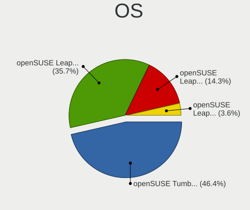

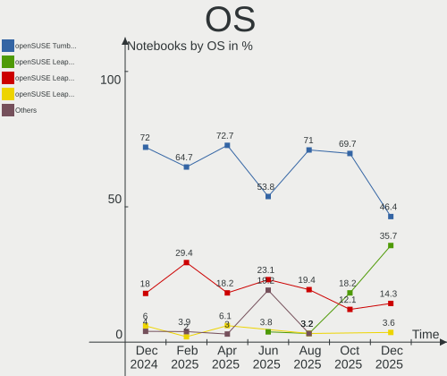

| Name                         | Notebooks | Percent |
|------------------------------|-----------|---------|
| openSUSE Tumbleweed-XXXXXXXX | 13        | 46.43%  |
| openSUSE Leap-16.0           | 10        | 35.71%  |
| openSUSE Leap-15.6           | 4         | 14.29%  |
| openSUSE Leap-15.5           | 1         | 3.57%   |

OS Family
---------

OS without a version

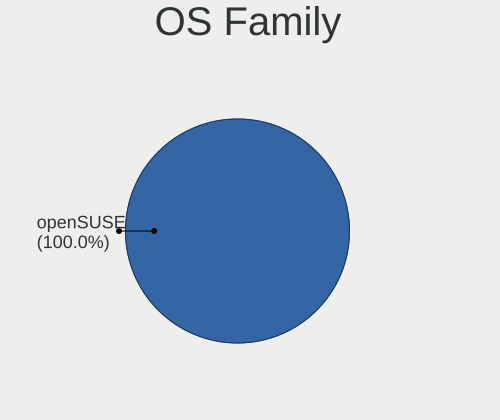

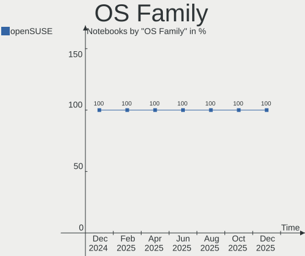

| Name     | Notebooks | Percent |
|----------|-----------|---------|
| openSUSE | 28        | 100%    |

Kernel
------

Version of the Linux kernel

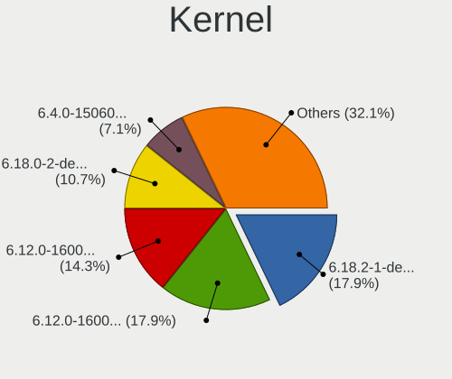

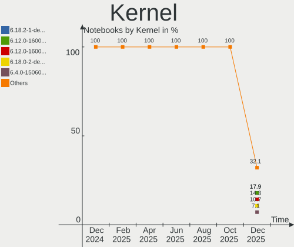

| Version                      | Notebooks | Percent |
|------------------------------|-----------|---------|
| 6.18.2-1-default             | 5         | 17.86%  |
| 6.12.0-160000.8-default      | 5         | 17.86%  |
| 6.12.0-160000.7-default      | 4         | 14.29%  |
| 6.18.0-2-default             | 3         | 10.71%  |
| 6.4.0-150600.23.78-default   | 2         | 7.14%   |
| 6.18.1-1-default             | 2         | 7.14%   |
| 6.18.0-1-default             | 2         | 7.14%   |
| 6.4.0-150600.23.81-default   | 1         | 3.57%   |
| 6.4.0-150600.23.53-default   | 1         | 3.57%   |
| 6.17.9-1-default             | 1         | 3.57%   |
| 6.12.0-160000.5-default      | 1         | 3.57%   |
| 5.14.21-150500.55.88-default | 1         | 3.57%   |

Kernel Family
-------------

Linux kernel without a distro release

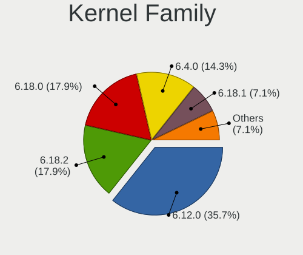

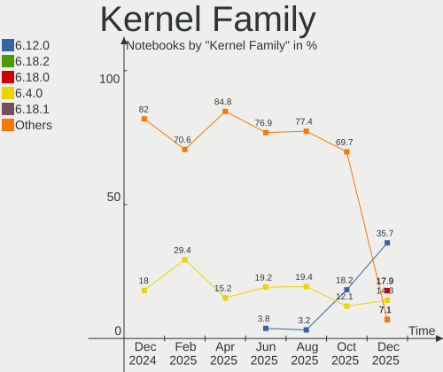

| Version | Notebooks | Percent |
|---------|-----------|---------|
| 6.12.0  | 10        | 35.71%  |
| 6.18.2  | 5         | 17.86%  |
| 6.18.0  | 5         | 17.86%  |
| 6.4.0   | 4         | 14.29%  |
| 6.18.1  | 2         | 7.14%   |
| 6.17.9  | 1         | 3.57%   |
| 5.14.21 | 1         | 3.57%   |

Kernel Major Ver.
-----------------

Linux kernel major version

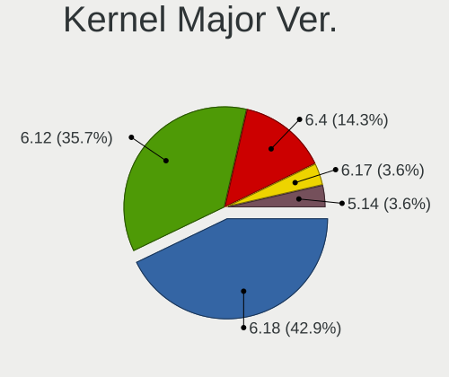

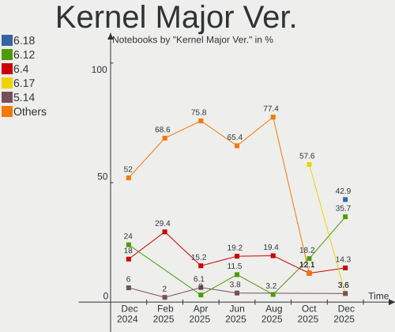

| Version | Notebooks | Percent |
|---------|-----------|---------|
| 6.18    | 12        | 42.86%  |
| 6.12    | 10        | 35.71%  |
| 6.4     | 4         | 14.29%  |
| 6.17    | 1         | 3.57%   |
| 5.14    | 1         | 3.57%   |

Arch
----

OS architecture (x86_64, i586, etc.)

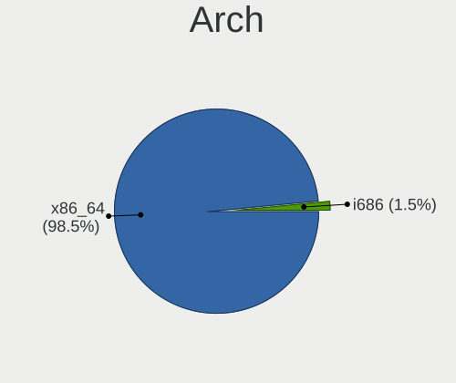

| Name   | Notebooks | Percent |
|--------|-----------|---------|
| x86_64 | 28        | 100%    |

DE
--

Desktop Environment

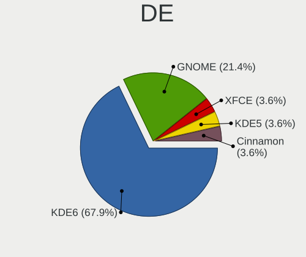

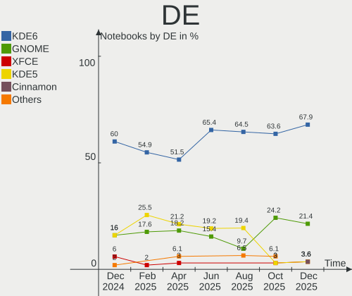

| Name     | Notebooks | Percent |
|----------|-----------|---------|
| KDE6     | 19        | 67.86%  |
| GNOME    | 6         | 21.43%  |
| XFCE     | 1         | 3.57%   |
| KDE5     | 1         | 3.57%   |
| Cinnamon | 1         | 3.57%   |

Display Server
--------------

X11 or Wayland

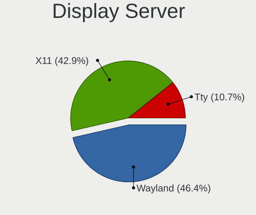

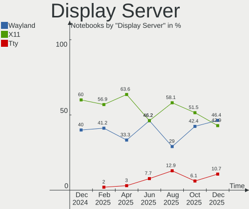

| Name    | Notebooks | Percent |
|---------|-----------|---------|
| Wayland | 13        | 46.43%  |
| X11     | 12        | 42.86%  |
| Tty     | 3         | 10.71%  |

Display Manager
---------------

SDDM, LightDM, etc.

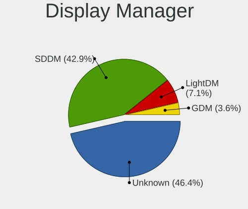

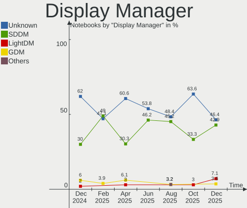

| Name    | Notebooks | Percent |
|---------|-----------|---------|
| Unknown | 13        | 46.43%  |
| SDDM    | 12        | 42.86%  |
| LightDM | 2         | 7.14%   |
| GDM     | 1         | 3.57%   |

OS Lang
-------

Language

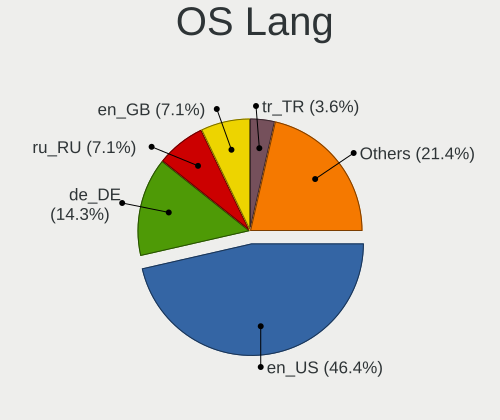

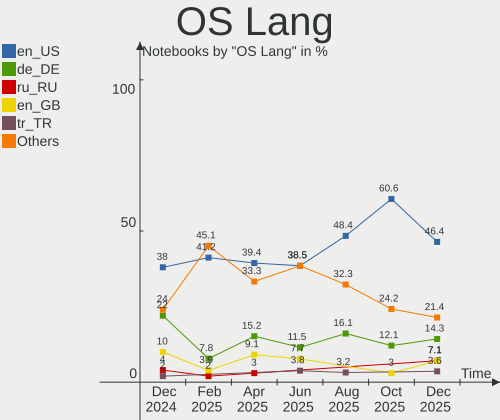

| Lang  | Notebooks | Percent |
|-------|-----------|---------|
| en_US | 13        | 46.43%  |
| de_DE | 4         | 14.29%  |
| ru_RU | 2         | 7.14%   |
| en_GB | 2         | 7.14%   |
| tr_TR | 1         | 3.57%   |
| pt_BR | 1         | 3.57%   |
| POSIX | 1         | 3.57%   |
| nl_NL | 1         | 3.57%   |
| fr_FR | 1         | 3.57%   |
| es_MX | 1         | 3.57%   |
| es_ES | 1         | 3.57%   |

Boot Mode
---------

EFI or BIOS

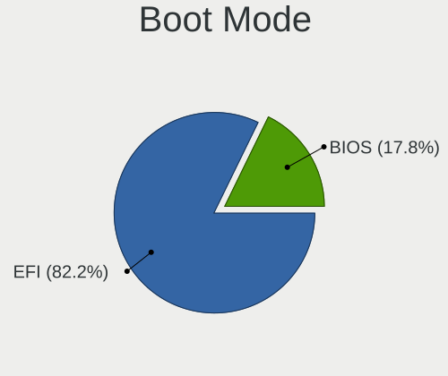

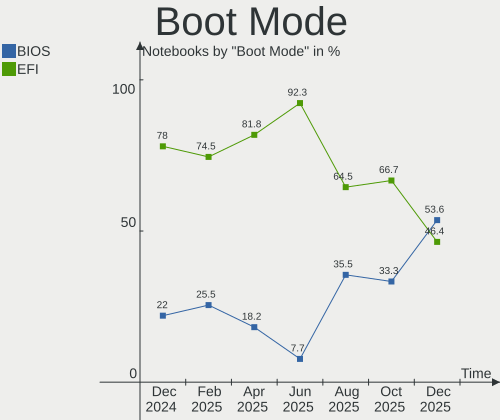

| Mode | Notebooks | Percent |
|------|-----------|---------|
| BIOS | 15        | 53.57%  |
| EFI  | 13        | 46.43%  |

Filesystem
----------

Type of filesystem

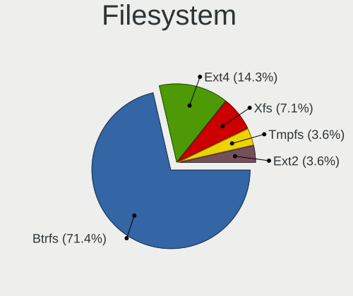

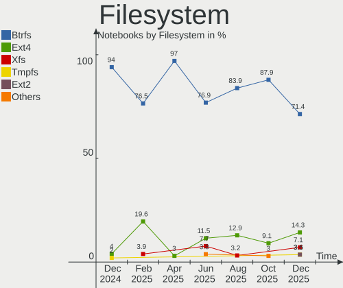

| Type  | Notebooks | Percent |
|-------|-----------|---------|
| Btrfs | 20        | 71.43%  |
| Ext4  | 4         | 14.29%  |
| Xfs   | 2         | 7.14%   |
| Tmpfs | 1         | 3.57%   |
| Ext2  | 1         | 3.57%   |

Part. scheme
------------

Scheme of partitioning

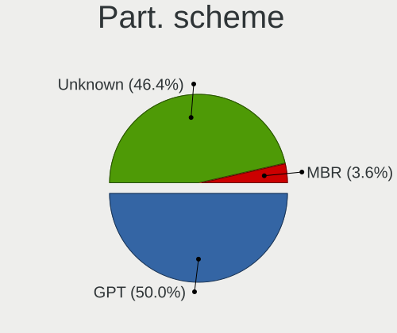

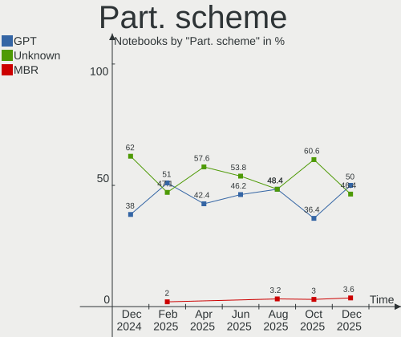

| Type    | Notebooks | Percent |
|---------|-----------|---------|
| GPT     | 14        | 50%     |
| Unknown | 13        | 46.43%  |
| MBR     | 1         | 3.57%   |

Dual Boot with Linux/BSD
------------------------

Hosting more than one Linux/BSD

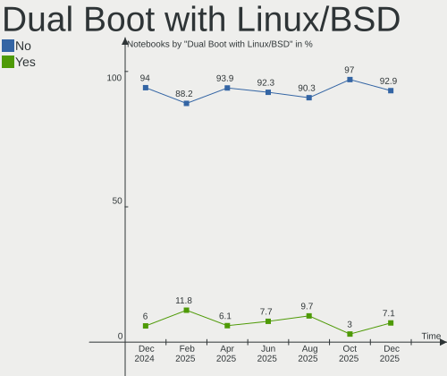

| Dual boot | Notebooks | Percent |
|-----------|-----------|---------|
| No        | 26        | 92.86%  |
| Yes       | 2         | 7.14%   |

Dual Boot (Win)
---------------

Hosting Linux and Windows

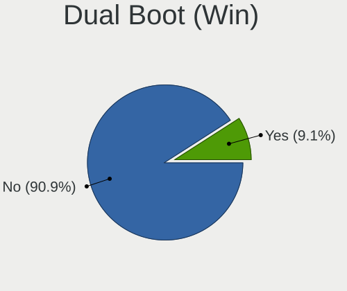

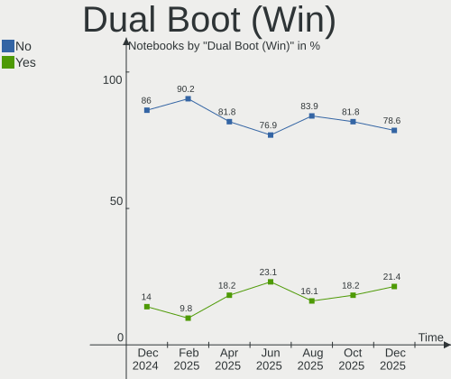

| Dual boot | Notebooks | Percent |
|-----------|-----------|---------|
| No        | 22        | 78.57%  |
| Yes       | 6         | 21.43%  |

Board
-----

Vendor
------

Motherboard manufacturer

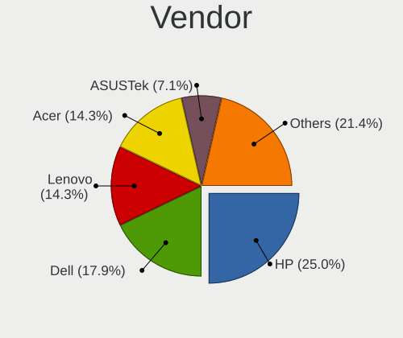

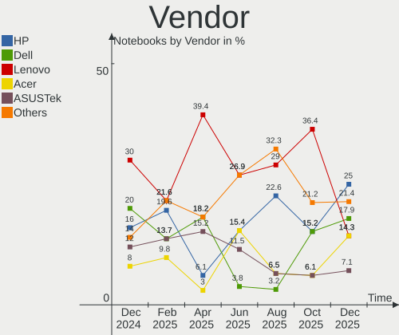

| Name             | Notebooks | Percent |
|------------------|-----------|---------|
| Hewlett-Packard  | 7         | 25%     |
| Dell             | 5         | 17.86%  |
| Lenovo           | 4         | 14.29%  |
| Acer             | 4         | 14.29%  |
| ASUSTek Computer | 2         | 7.14%   |
| Sony             | 1         | 3.57%   |
| MSI              | 1         | 3.57%   |
| HUAWEI           | 1         | 3.57%   |
| Dynabook         | 1         | 3.57%   |
| Chuwi            | 1         | 3.57%   |
| Apple            | 1         | 3.57%   |

Model
-----

Motherboard model

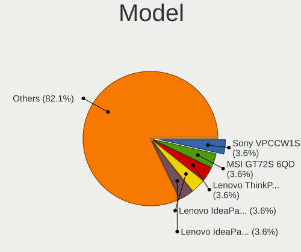

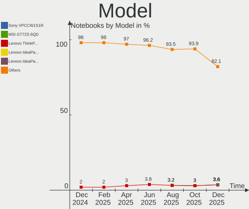

| Name                                      | Notebooks | Percent |
|-------------------------------------------|-----------|---------|
| Sony VPCCW1S1R                            | 1         | 3.57%   |
| MSI GT72S 6QD                             | 1         | 3.57%   |
| Lenovo ThinkPad SL 2746EHG                | 1         | 3.57%   |
| Lenovo IdeaPad 110-15IBR 80W2             | 1         | 3.57%   |
| Lenovo IdeaPad 1 15AMN7 82VG              | 1         | 3.57%   |
| Lenovo G50-45 80E3                        | 1         | 3.57%   |
| HUAWEI MCLG-XX                            | 1         | 3.57%   |
| HP ZBook Power G7 Mobile Workstation      | 1         | 3.57%   |
| HP Victus by Laptop 16-d1xxx              | 1         | 3.57%   |
| HP Victus by Gaming Laptop 15-fb2xxx      | 1         | 3.57%   |
| HP Victus by Gaming Laptop 15-fb0xxx      | 1         | 3.57%   |
| HP Pavilion Gaming Laptop 17-cd1xxx       | 1         | 3.57%   |
| HP OmniBook 5 Laptop 16-ag1xxx            | 1         | 3.57%   |
| HP Laptop 15s-eq0xxx                      | 1         | 3.57%   |
| Dynabook TECRA A50-EC                     | 1         | 3.57%   |
| Dell XPS 13 9370                          | 1         | 3.57%   |
| Dell Latitude 5591                        | 1         | 3.57%   |
| Dell Inspiron 5570                        | 1         | 3.57%   |
| Dell Inspiron 3179                        | 1         | 3.57%   |
| Dell Inspiron 15 3511                     | 1         | 3.57%   |
| Chuwi CoreBook X                          | 1         | 3.57%   |
| ASUS ROG Strix G713PV_G713PV              | 1         | 3.57%   |
| ASUS ASUS EXPERTBOOK B1500CEAEY_B1500CEAE | 1         | 3.57%   |
| Apple MacBookPro14,1                      | 1         | 3.57%   |
| Acer Swift SF314-41                       | 1         | 3.57%   |
| Acer Predator PHN14-51                    | 1         | 3.57%   |
| Acer Nitro AN517-51                       | 1         | 3.57%   |
| Acer Aspire A515-54                       | 1         | 3.57%   |

Model Family
------------

Motherboard model prefix

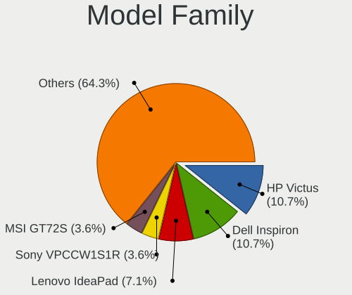

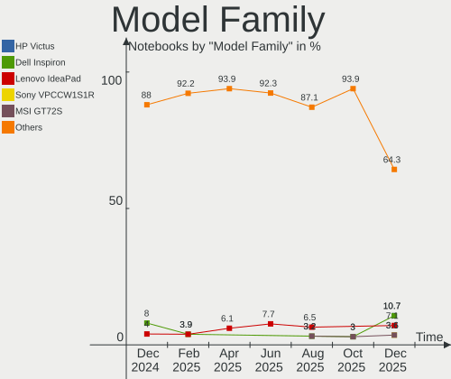

| Name               | Notebooks | Percent |
|--------------------|-----------|---------|
| HP Victus          | 3         | 10.71%  |
| Dell Inspiron      | 3         | 10.71%  |
| Lenovo IdeaPad     | 2         | 7.14%   |
| Sony VPCCW1S1R     | 1         | 3.57%   |
| MSI GT72S          | 1         | 3.57%   |
| Lenovo ThinkPad    | 1         | 3.57%   |
| Lenovo G50-45      | 1         | 3.57%   |
| HUAWEI MCLG-XX     | 1         | 3.57%   |
| HP ZBook           | 1         | 3.57%   |
| HP Pavilion        | 1         | 3.57%   |
| HP OmniBook        | 1         | 3.57%   |
| HP Laptop          | 1         | 3.57%   |
| Dynabook TECRA     | 1         | 3.57%   |
| Dell XPS           | 1         | 3.57%   |
| Dell Latitude      | 1         | 3.57%   |
| Chuwi CoreBook     | 1         | 3.57%   |
| ASUS ROG           | 1         | 3.57%   |
| ASUS ASUS          | 1         | 3.57%   |
| Apple MacBookPro14 | 1         | 3.57%   |
| Acer Swift         | 1         | 3.57%   |
| Acer Predator      | 1         | 3.57%   |
| Acer Nitro         | 1         | 3.57%   |
| Acer Aspire        | 1         | 3.57%   |

MFG Year
--------

Motherboard manufacture year

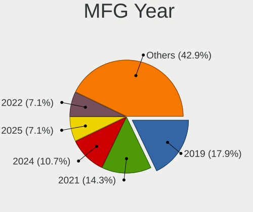

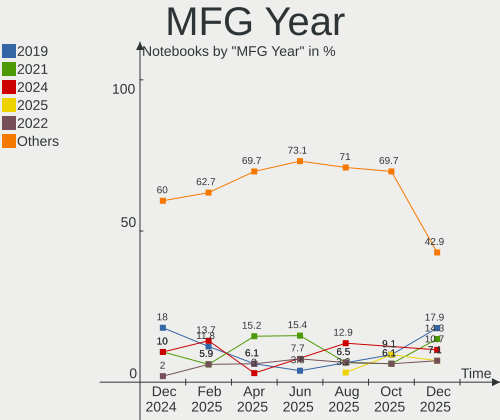

| Year | Notebooks | Percent |
|------|-----------|---------|
| 2019 | 5         | 17.86%  |
| 2021 | 4         | 14.29%  |
| 2024 | 3         | 10.71%  |
| 2025 | 2         | 7.14%   |
| 2022 | 2         | 7.14%   |
| 2020 | 2         | 7.14%   |
| 2018 | 2         | 7.14%   |
| 2017 | 2         | 7.14%   |
| 2023 | 1         | 3.57%   |
| 2016 | 1         | 3.57%   |
| 2015 | 1         | 3.57%   |
| 2014 | 1         | 3.57%   |
| 2009 | 1         | 3.57%   |
| 2008 | 1         | 3.57%   |

Form Factor
-----------

Physical design of the computer

| Name     | Notebooks | Percent |
|----------|-----------|---------|
| Notebook | 28        | 100%    |

Secure Boot
-----------

Enabled or disabled

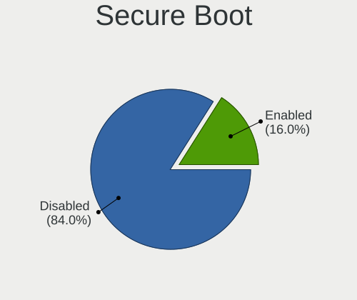

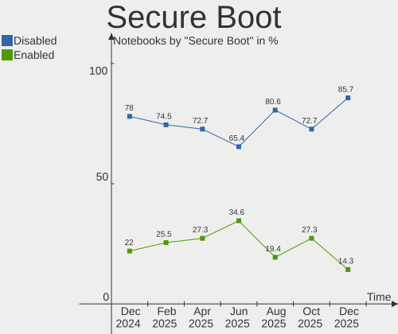

| State    | Notebooks | Percent |
|----------|-----------|---------|
| Disabled | 24        | 85.71%  |
| Enabled  | 4         | 14.29%  |

Coreboot
--------

Have coreboot on board

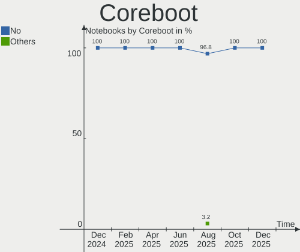

| Used | Notebooks | Percent |
|------|-----------|---------|
| No   | 28        | 100%    |

RAM Size
--------

Total RAM memory

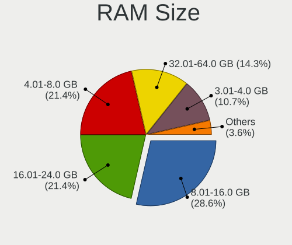

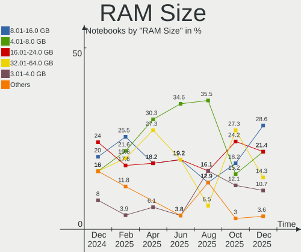

| Size in GB  | Notebooks | Percent |
|-------------|-----------|---------|
| 8.01-16.0   | 8         | 28.57%  |
| 4.01-8.0    | 6         | 21.43%  |
| 16.01-24.0  | 6         | 21.43%  |
| 32.01-64.0  | 4         | 14.29%  |
| 3.01-4.0    | 3         | 10.71%  |
| 64.01-256.0 | 1         | 3.57%   |

RAM Used
--------

Used RAM memory

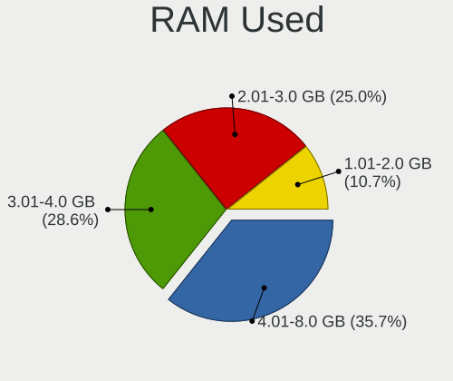

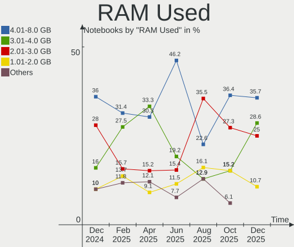

| Used GB  | Notebooks | Percent |
|----------|-----------|---------|
| 4.01-8.0 | 10        | 35.71%  |
| 3.01-4.0 | 8         | 28.57%  |
| 2.01-3.0 | 7         | 25%     |
| 1.01-2.0 | 3         | 10.71%  |

Total Drives
------------

Number of drives on board

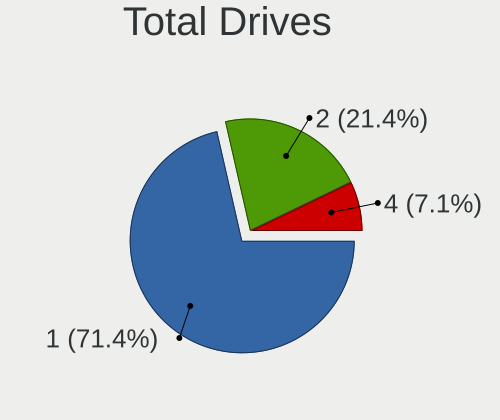

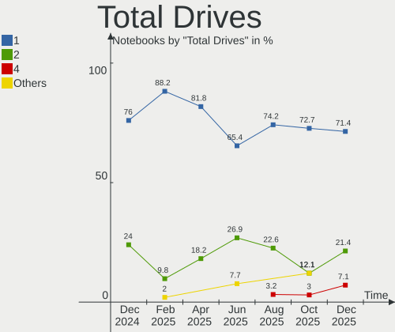

| Drives | Notebooks | Percent |
|--------|-----------|---------|
| 1      | 20        | 71.43%  |
| 2      | 6         | 21.43%  |
| 4      | 2         | 7.14%   |

Has CD-ROM
----------

Has CD-ROM on board

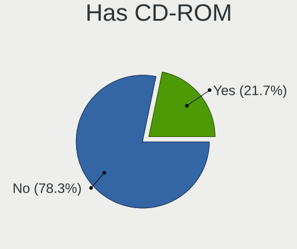

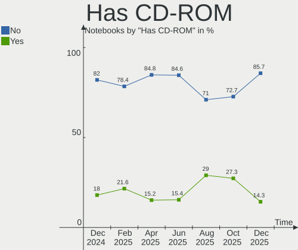

| Presented | Notebooks | Percent |
|-----------|-----------|---------|
| No        | 24        | 85.71%  |
| Yes       | 4         | 14.29%  |

Has Ethernet
------------

Has Ethernet on board

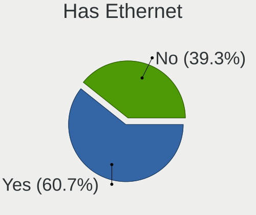

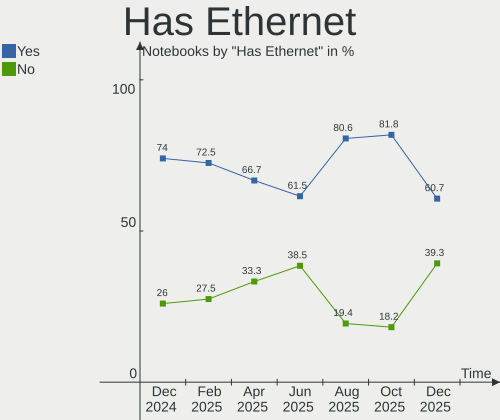

| Presented | Notebooks | Percent |
|-----------|-----------|---------|
| Yes       | 17        | 60.71%  |
| No        | 11        | 39.29%  |

Has WiFi
--------

Has WiFi module

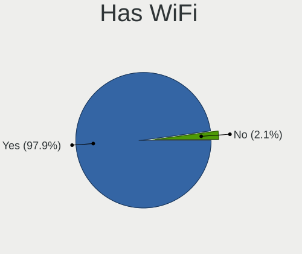

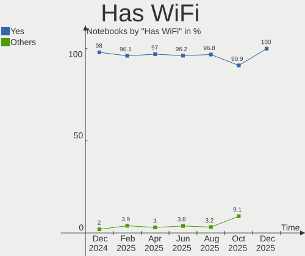

| Presented | Notebooks | Percent |
|-----------|-----------|---------|
| Yes       | 28        | 100%    |

Has Bluetooth
-------------

Has Bluetooth module

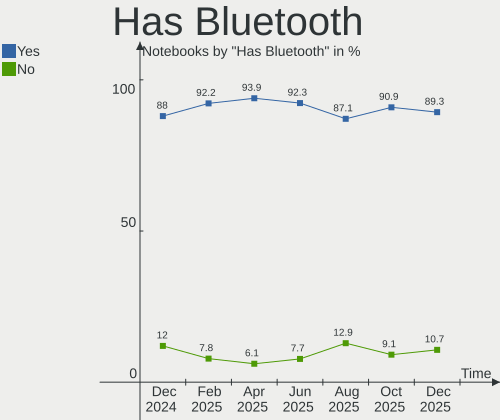

| Presented | Notebooks | Percent |
|-----------|-----------|---------|
| Yes       | 25        | 89.29%  |
| No        | 3         | 10.71%  |

Location
--------

Country
-------

Geographic location (country)

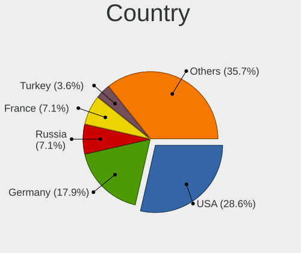

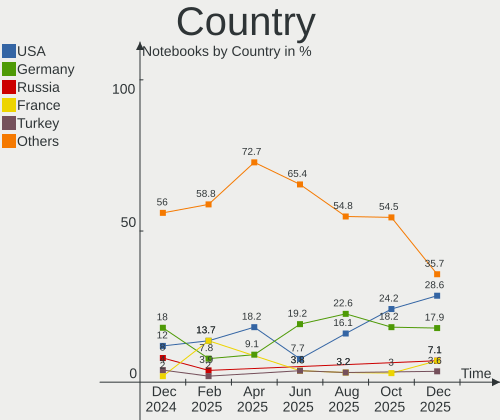

| Country     | Notebooks | Percent |
|-------------|-----------|---------|
| USA         | 8         | 28.57%  |
| Germany     | 5         | 17.86%  |
| Russia      | 2         | 7.14%   |
| France      | 2         | 7.14%   |
| Turkey      | 1         | 3.57%   |
| Switzerland | 1         | 3.57%   |
| Romania     | 1         | 3.57%   |
| Mexico      | 1         | 3.57%   |
| Malaysia    | 1         | 3.57%   |
| India       | 1         | 3.57%   |
| Guatemala   | 1         | 3.57%   |
| Denmark     | 1         | 3.57%   |
| Canada      | 1         | 3.57%   |
| Brazil      | 1         | 3.57%   |
| Australia   | 1         | 3.57%   |

City
----

Geographic location (city)

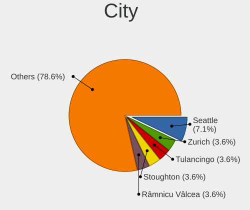

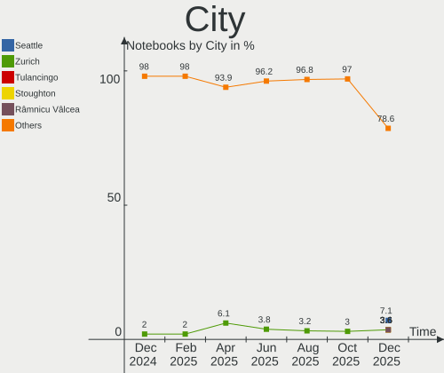

| City             | Notebooks | Percent |
|------------------|-----------|---------|
| Seattle          | 2         | 7.14%   |
| Zurich           | 1         | 3.57%   |
| Tulancingo       | 1         | 3.57%   |
| Stoughton        | 1         | 3.57%   |
| Râmnicu Vâlcea | 1         | 3.57%   |
| New Kensington   | 1         | 3.57%   |
| Moscow           | 1         | 3.57%   |
| Moosburg         | 1         | 3.57%   |
| Marseille        | 1         | 3.57%   |
| Marrero          | 1         | 3.57%   |
| Los Angeles      | 1         | 3.57%   |
| Kuala Lumpur     | 1         | 3.57%   |
| Jacareí         | 1         | 3.57%   |
| Hilpoltstein     | 1         | 3.57%   |
| Heide            | 1         | 3.57%   |
| Guatemala City   | 1         | 3.57%   |
| Grand Blanc      | 1         | 3.57%   |
| Eberswalde       | 1         | 3.57%   |
| Duras            | 1         | 3.57%   |
| Duisburg         | 1         | 3.57%   |
| Corner Brook     | 1         | 3.57%   |
| Brisbane         | 1         | 3.57%   |
| Bhubaneswar      | 1         | 3.57%   |
| Beyoğlu         | 1         | 3.57%   |
| Ballwin          | 1         | 3.57%   |
| Balashikha       | 1         | 3.57%   |
| Aarhus           | 1         | 3.57%   |

Drives
------

Drive Vendor
------------

Hard drive vendors

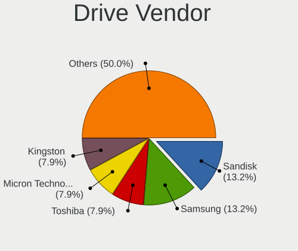

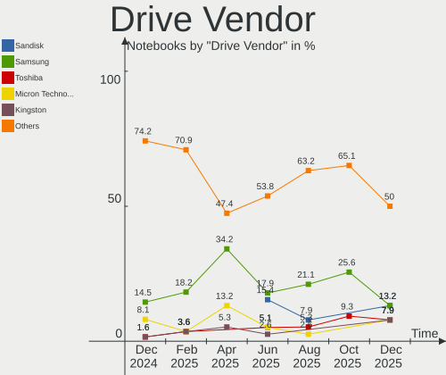

| Vendor                      | Notebooks | Drives | Percent |
|-----------------------------|-----------|--------|---------|
| Sandisk                     | 5         | 5      | 13.16%  |
| Samsung Electronics         | 5         | 5      | 13.16%  |
| Toshiba                     | 3         | 3      | 7.89%   |
| Micron Technology           | 3         | 3      | 7.89%   |
| Kingston                    | 3         | 3      | 7.89%   |
| WDC                         | 2         | 2      | 5.26%   |
| SK hynix                    | 2         | 2      | 5.26%   |
| Crucial                     | 2         | 2      | 5.26%   |
| WDC WDS2                    | 1         | 1      | 2.63%   |
| Unknown                     | 1         | 1      | 2.63%   |
| Seagate                     | 1         | 1      | 2.63%   |
| PNY                         | 1         | 1      | 2.63%   |
| Phison Electronics          | 1         | 1      | 2.63%   |
| Micron/Crucial Technology   | 1         | 2      | 2.63%   |
| MAXIO Technology (Hangzhou) | 1         | 1      | 2.63%   |
| KIOXIA                      | 1         | 1      | 2.63%   |
| Intenso                     | 1         | 1      | 2.63%   |
| Intel                       | 1         | 1      | 2.63%   |
| Hitachi                     | 1         | 1      | 2.63%   |
| China                       | 1         | 1      | 2.63%   |
| Apple                       | 1         | 2      | 2.63%   |

Drive Model
-----------

Hard drive models

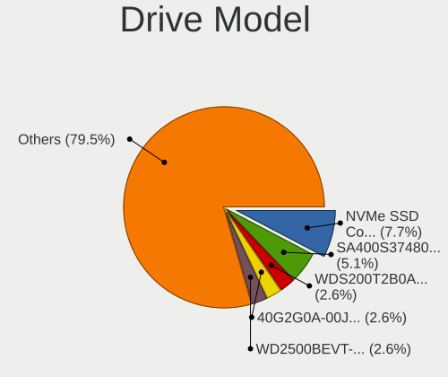

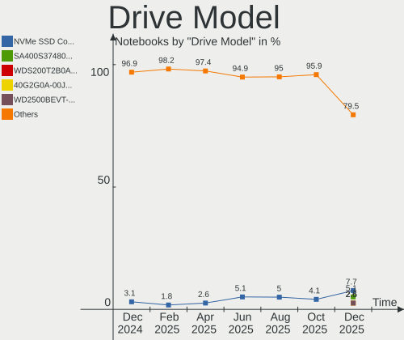

| Model                                                                      | Notebooks | Percent |
|----------------------------------------------------------------------------|-----------|---------|
| Samsung NVMe SSD Controller PM9A1/PM9A3/980PRO 1TB                         | 3         | 7.69%   |
| Kingston SA400S37480G 480GB SSD                                            | 2         | 5.13%   |
| WDC WDS200T2B0A 2TB SSD                                                    | 1         | 2.56%   |
| WDC WDS2 40G2G0A-00JH 240GB SSD                                            | 1         | 2.56%   |
| WDC WD2500BEVT-22A23T0 250GB                                               | 1         | 2.56%   |
| Unknown MMC Card  64GB                                                     | 1         | 2.56%   |
| Toshiba XG6 NVMe SSD Controller 1024GB                                     | 1         | 2.56%   |
| Toshiba MQ04ABF100 1TB                                                     | 1         | 2.56%   |
| Toshiba KSG60ZMV512G 512GB SSD                                             | 1         | 2.56%   |
| SK hynix SKHynix_HFS256GEM4X182N 256GB                                     | 1         | 2.56%   |
| SK hynix BC501 NVMe Solid State Drive 512GB                                | 1         | 2.56%   |
| Seagate ST1000LM035-1RK172 1TB                                             | 1         | 2.56%   |
| Sandisk WD Blue SN570 500GB                                                | 1         | 2.56%   |
| Sandisk WD Black SN770 / PC SN740 256GB / PC SN560 (DRAM-less) NVMe SSD    | 1         | 2.56%   |
| Sandisk WD Black SN750 / PC SN730 NVMe SSD 500GB                           | 1         | 2.56%   |
| Sandisk IX SN530 NVMe SSD (DRAM-less) 256GB                                | 1         | 2.56%   |
| Sandisk Extreme Pro / WD Black SN750 / PC SN730 / Red SN700 NVMe SSD 500GB | 1         | 2.56%   |
| Samsung SSD 870 EVO 250GB                                                  | 1         | 2.56%   |
| Samsung HM160HI 160GB                                                      | 1         | 2.56%   |
| PNY CS900 1TB SSD                                                          | 1         | 2.56%   |
| Phison PS5021-E21 PCIe4 NVMe Controller (DRAM-less) 2TB                    | 1         | 2.56%   |
| Micron/Crucial P2 NVMe PCIe SSD 2TB                                        | 1         | 2.56%   |
| Micron/Crucial P1 NVMe PCIe SSD 1TB                                        | 1         | 2.56%   |
| Micron MTFDKBA512QFM-1BD1AABHA 512GB                                       | 1         | 2.56%   |
| Micron MTFDKBA1T0QFM-1BD1AABGB 1024GB                                      | 1         | 2.56%   |
| Micron 2500 NVMe SSD (DRAM-less) 512GB                                     | 1         | 2.56%   |
| MAXIO (Hangzhou) NVMe SSD Controller MAP1202 (DRAM-less) 512GB             | 1         | 2.56%   |
| KIOXIA NVMe SSD Controller BG4 (DRAM-less) 256GB                           | 1         | 2.56%   |
| Kingston XS1000 2TB SSD                                                    | 1         | 2.56%   |
| Intenso SSD SATAIII 512GB                                                  | 1         | 2.56%   |
| Intel SSD DC P4101/Pro 7600p/760p/E 6100p Series 512GB                     | 1         | 2.56%   |
| Hitachi HTS545032B9A300 320GB                                              | 1         | 2.56%   |
| Crucial CT1050MX300SSD4 1050GB                                             | 1         | 2.56%   |
| Crucial CT1000BX500SSD1 1TB                                                | 1         | 2.56%   |
| China SSD 4TB                                                              | 1         | 2.56%   |
| Apple S3X NVMe Controller 256GB                                            | 1         | 2.56%   |

HDD Vendor
----------

Hard disk drive vendors

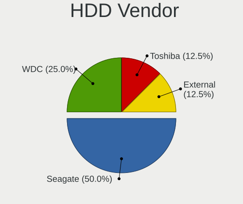

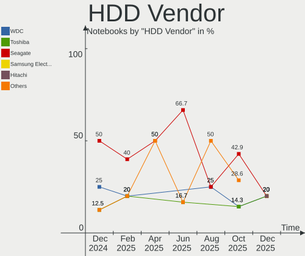

| Vendor              | Notebooks | Drives | Percent |
|---------------------|-----------|--------|---------|
| WDC                 | 1         | 1      | 20%     |
| Toshiba             | 1         | 1      | 20%     |
| Seagate             | 1         | 1      | 20%     |
| Samsung Electronics | 1         | 1      | 20%     |
| Hitachi             | 1         | 1      | 20%     |

SSD Vendor
----------

Solid state drive vendors

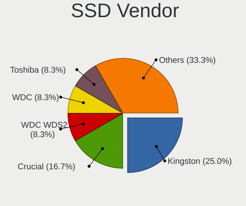

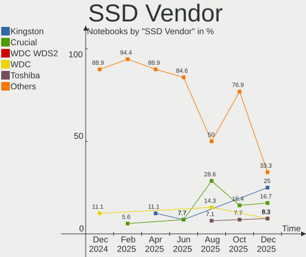

| Vendor              | Notebooks | Drives | Percent |
|---------------------|-----------|--------|---------|
| Kingston            | 3         | 3      | 25%     |
| Crucial             | 2         | 2      | 16.67%  |
| WDC WDS2            | 1         | 1      | 8.33%   |
| WDC                 | 1         | 1      | 8.33%   |
| Toshiba             | 1         | 1      | 8.33%   |
| Samsung Electronics | 1         | 1      | 8.33%   |
| PNY                 | 1         | 1      | 8.33%   |
| Intenso             | 1         | 1      | 8.33%   |
| China               | 1         | 1      | 8.33%   |

Drive Kind
----------

HDD or SSD

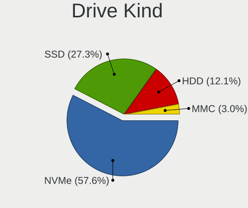

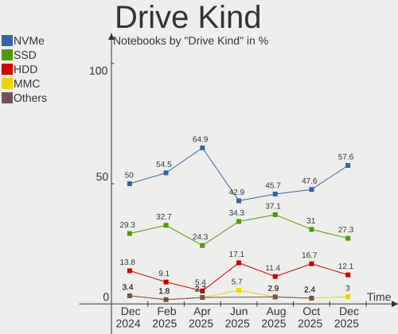

| Kind | Notebooks | Drives | Percent |
|------|-----------|--------|---------|
| NVMe | 19        | 22     | 57.58%  |
| SSD  | 9         | 12     | 27.27%  |
| HDD  | 4         | 5      | 12.12%  |
| MMC  | 1         | 1      | 3.03%   |

Drive Connector
---------------

SATA, SAS, NVMe, etc.

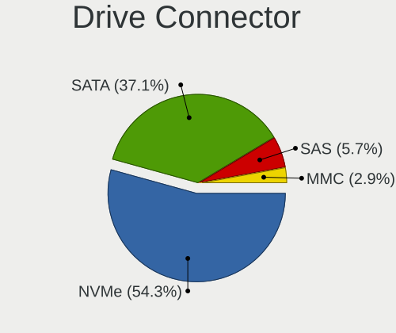

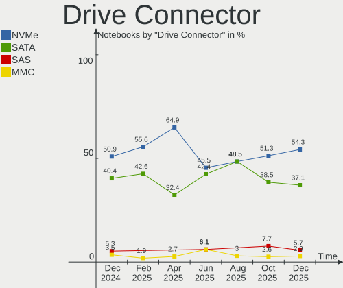

| Type | Notebooks | Drives | Percent |
|------|-----------|--------|---------|
| NVMe | 19        | 22     | 54.29%  |
| SATA | 13        | 15     | 37.14%  |
| SAS  | 2         | 2      | 5.71%   |
| MMC  | 1         | 1      | 2.86%   |

Drive Size
----------

Size of hard drive

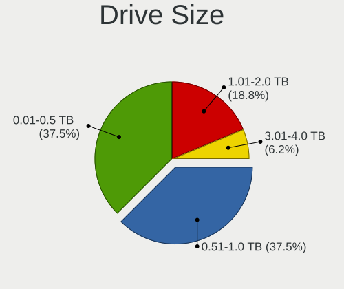

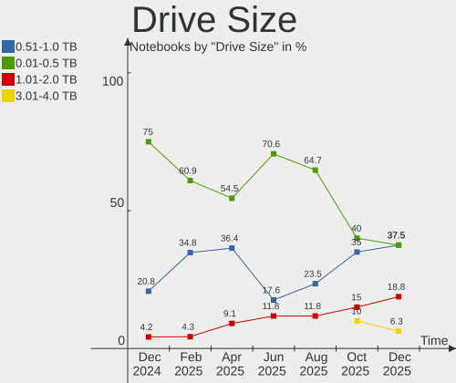

| Size in TB | Notebooks | Drives | Percent |
|------------|-----------|--------|---------|
| 0.51-1.0   | 6         | 6      | 37.5%   |
| 0.01-0.5   | 6         | 7      | 37.5%   |
| 1.01-2.0   | 3         | 3      | 18.75%  |
| 3.01-4.0   | 1         | 1      | 6.25%   |

Space Total
-----------

Amount of disk space available on the file system

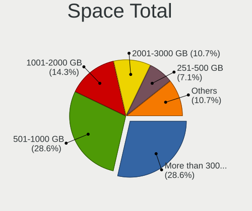

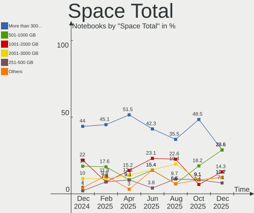

| Size in GB     | Notebooks | Percent |
|----------------|-----------|---------|
| More than 3000 | 8         | 28.57%  |
| 501-1000       | 8         | 28.57%  |
| 1001-2000      | 4         | 14.29%  |
| 2001-3000      | 3         | 10.71%  |
| 251-500        | 2         | 7.14%   |
| 21-50          | 1         | 3.57%   |
| 101-250        | 1         | 3.57%   |
| Unknown        | 1         | 3.57%   |

Space Used
----------

Amount of used disk space

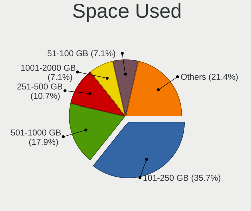

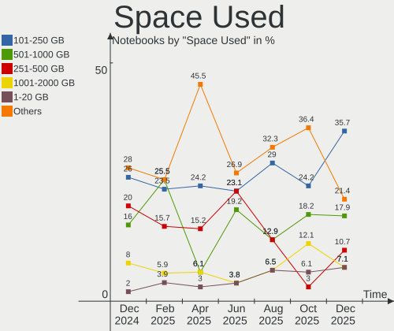

| Used GB        | Notebooks | Percent |
|----------------|-----------|---------|
| 101-250        | 10        | 35.71%  |
| 501-1000       | 5         | 17.86%  |
| 251-500        | 3         | 10.71%  |
| 1001-2000      | 2         | 7.14%   |
| 1-20           | 2         | 7.14%   |
| 51-100         | 2         | 7.14%   |
| More than 3000 | 1         | 3.57%   |
| 21-50          | 1         | 3.57%   |
| 2001-3000      | 1         | 3.57%   |
| Unknown        | 1         | 3.57%   |

Malfunc. Drives
---------------

Drive models with a malfunction

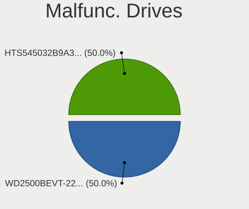

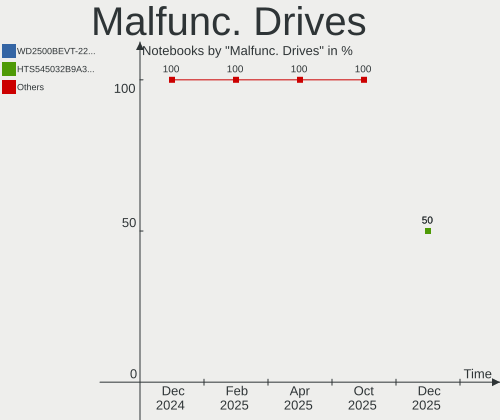

| Model                         | Notebooks | Drives | Percent |
|-------------------------------|-----------|--------|---------|
| WDC WD2500BEVT-22A23T0 250GB  | 1         | 1      | 50%     |
| Hitachi HTS545032B9A300 320GB | 1         | 1      | 50%     |

Malfunc. Drive Vendor
---------------------

Vendors of faulty drives

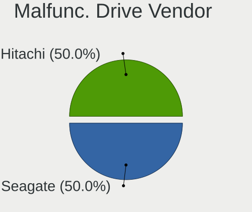

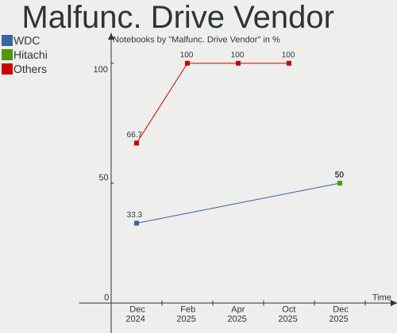

| Vendor  | Notebooks | Drives | Percent |
|---------|-----------|--------|---------|
| WDC     | 1         | 1      | 50%     |
| Hitachi | 1         | 1      | 50%     |

Malfunc. HDD Vendor
-------------------

Vendors of faulty HDD drives

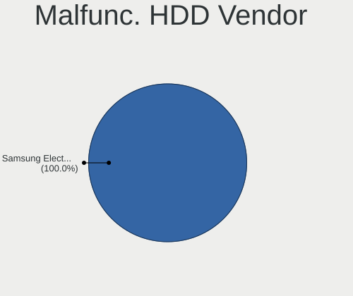

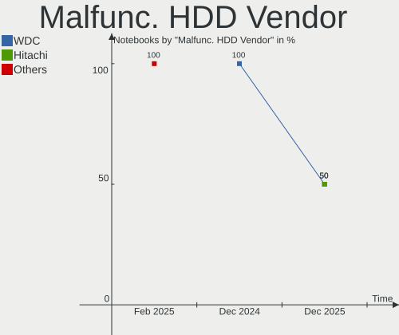

| Vendor  | Notebooks | Drives | Percent |
|---------|-----------|--------|---------|
| WDC     | 1         | 1      | 50%     |
| Hitachi | 1         | 1      | 50%     |

Malfunc. Drive Kind
-------------------

Kinds of faulty drives

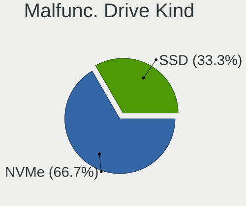

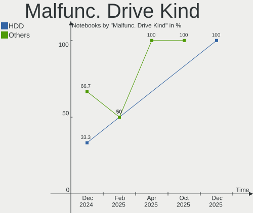

| Kind | Notebooks | Drives | Percent |
|------|-----------|--------|---------|
| HDD  | 1         | 2      | 100%    |

Failed Drives
-------------

Failed drive models

Zero info for selected period =(

Failed Drive Vendor
-------------------

Failed drive vendors

Zero info for selected period =(

Drive Status
------------

Number of failed and malfunc. drives

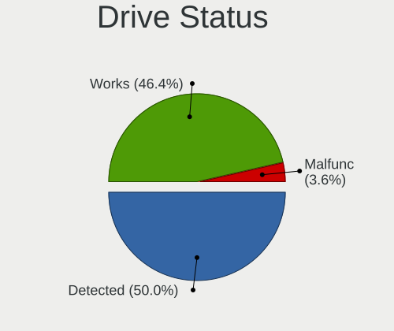

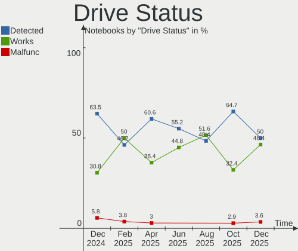

| Status   | Notebooks | Drives | Percent |
|----------|-----------|--------|---------|
| Detected | 14        | 21     | 50%     |
| Works    | 13        | 17     | 46.43%  |
| Malfunc  | 1         | 2      | 3.57%   |

Storage controller
------------------

Storage Vendor
--------------

Storage controller vendors

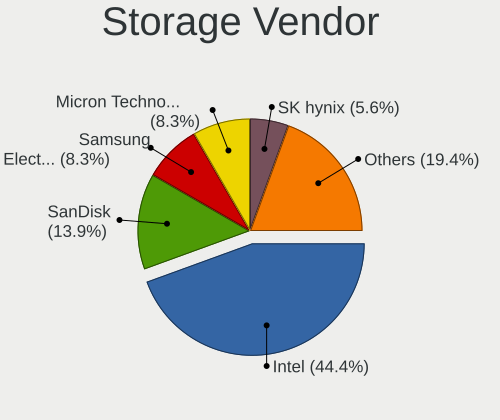

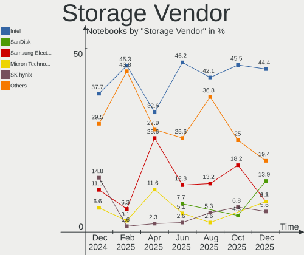

| Vendor                       | Notebooks | Percent |
|------------------------------|-----------|---------|
| Intel                        | 16        | 44.44%  |
| SanDisk                      | 5         | 13.89%  |
| Samsung Electronics          | 3         | 8.33%   |
| Micron Technology            | 3         | 8.33%   |
| SK hynix                     | 2         | 5.56%   |
| Toshiba America Info Systems | 1         | 2.78%   |
| Phison Electronics           | 1         | 2.78%   |
| Micron/Crucial Technology    | 1         | 2.78%   |
| MAXIO Technology (Hangzhou)  | 1         | 2.78%   |
| KIOXIA                       | 1         | 2.78%   |
| Apple                        | 1         | 2.78%   |
| AMD                          | 1         | 2.78%   |

Storage Model
-------------

Storage controller models

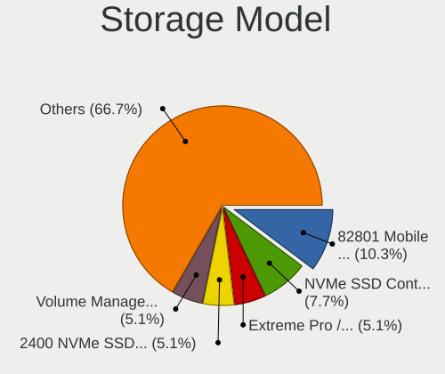

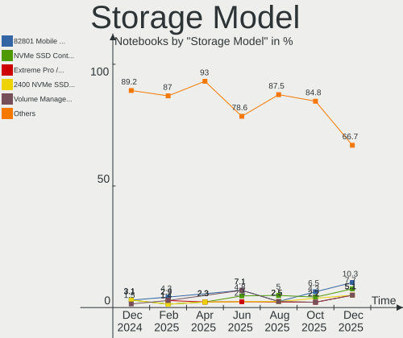

| Model                                                                            | Notebooks | Percent |
|----------------------------------------------------------------------------------|-----------|---------|
| Intel 82801 Mobile SATA Controller [RAID mode]                                   | 4         | 10.26%  |
| Samsung NVMe SSD Controller PM9A1/PM9A3/980PRO                                   | 3         | 7.69%   |
| SanDisk Extreme Pro / WD Black SN750 / PC SN730 / Red SN700 NVMe SSD             | 2         | 5.13%   |
| Micron 2400 NVMe SSD (DRAM-less)                                                 | 2         | 5.13%   |
| Intel Volume Management Device NVMe RAID Controller                              | 2         | 5.13%   |
| Intel Tiger Lake-LP SATA Controller                                              | 2         | 5.13%   |
| Intel Sunrise Point-LP SATA Controller [AHCI mode]                               | 2         | 5.13%   |
| Intel 82801IBM/IEM (ICH9M/ICH9M-E) 4 port SATA Controller [AHCI mode]            | 2         | 5.13%   |
| Toshiba America Info Systems XG6 NVMe SSD Controller                             | 1         | 2.56%   |
| SK hynix PVC10 NVMe Solid State Drive (DRAM-less)                                | 1         | 2.56%   |
| SK hynix BC501 NVMe Solid State Drive                                            | 1         | 2.56%   |
| SanDisk WD SN560/SN740/SN770/SN5000 NVMe SSD                                     | 1         | 2.56%   |
| SanDisk Ultra 3D / WD Blue SN570 NVMe SSD (DRAM-less)                            | 1         | 2.56%   |
| SanDisk IX SN530 NVMe SSD / microSD Express Card (DRAM-less)                     | 1         | 2.56%   |
| Phison PS5021-E21 PCIe4 NVMe Controller (DRAM-less)                              | 1         | 2.56%   |
| Micron/Crucial P2 [Nick P2] / P3 / P3 Plus NVMe PCIe SSD (DRAM-less)             | 1         | 2.56%   |
| Micron/Crucial P1 NVMe PCIe SSD[Frampton]                                        | 1         | 2.56%   |
| Micron 2500 NVMe SSD (DRAM-less)                                                 | 1         | 2.56%   |
| MAXIO (Hangzhou) NVMe SSD Controller MAP1202 (DRAM-less)                         | 1         | 2.56%   |
| KIOXIA NVMe SSD Controller BG4 (DRAM-less)                                       | 1         | 2.56%   |
| Intel Volume Management Device NVMe RAID Controller Intel Corporation            | 1         | 2.56%   |
| Intel SSD DC P4101/Pro 7600p/760p/E 6100p Series                                 | 1         | 2.56%   |
| Intel Q170/Q150/B150/H170/H110/Z170/CM236 Chipset SATA Controller [AHCI Mode]    | 1         | 2.56%   |
| Intel Cannon Lake Mobile PCH SATA AHCI Controller                                | 1         | 2.56%   |
| Intel Atom/Celeron/Pentium Processor x5-E8000/J3xxx/N3xxx Series SATA Controller | 1         | 2.56%   |
| Intel Alder Lake-P SATA AHCI Controller                                          | 1         | 2.56%   |
| Apple S3X NVMe Controller                                                        | 1         | 2.56%   |
| AMD FCH SATA Controller [AHCI mode]                                              | 1         | 2.56%   |

Storage Kind
------------

Kind of storage controller (IDE, SATA, NVMe, SAS, ...)

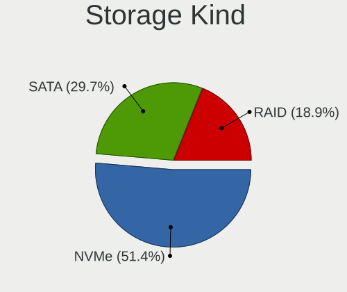

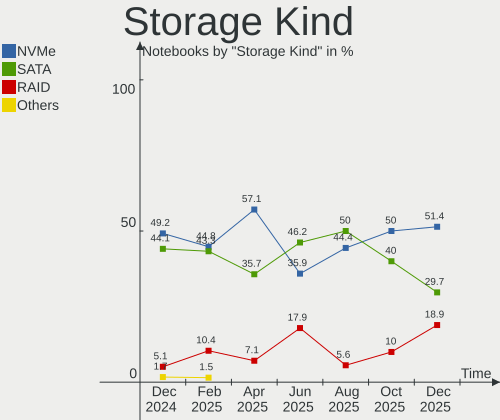

| Kind | Notebooks | Percent |
|------|-----------|---------|
| NVMe | 19        | 51.35%  |
| SATA | 11        | 29.73%  |
| RAID | 7         | 18.92%  |

Processor
---------

CPU Vendor
----------

Processor vendors

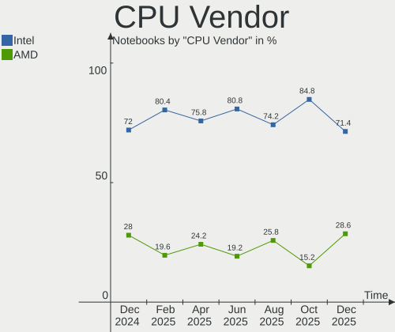

| Vendor | Notebooks | Percent |
|--------|-----------|---------|
| Intel  | 20        | 71.43%  |
| AMD    | 8         | 28.57%  |

CPU Model
---------

Processor models

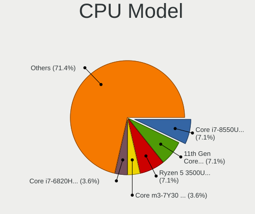

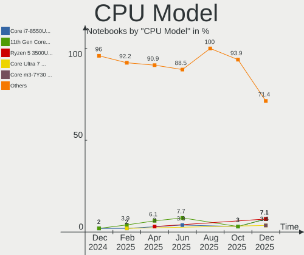

| Model                                         | Notebooks | Percent |
|-----------------------------------------------|-----------|---------|
| Intel Core i7-8550U CPU @ 1.80GHz             | 2         | 7.14%   |
| Intel 11th Gen Core i7-1165G7 @ 2.80GHz       | 2         | 7.14%   |
| AMD Ryzen 5 3500U with Radeon Vega Mobile Gfx | 2         | 7.14%   |
| Intel Core Ultra 7 155H                       | 1         | 3.57%   |
| Intel Core m3-7Y30 CPU @ 1.00GHz              | 1         | 3.57%   |
| Intel Core i7-6820HK CPU @ 2.70GHz            | 1         | 3.57%   |
| Intel Core i7-10750H CPU @ 2.60GHz            | 1         | 3.57%   |
| Intel Core i5-9300H CPU @ 2.40GHz             | 1         | 3.57%   |
| Intel Core i5-8400H CPU @ 2.50GHz             | 1         | 3.57%   |
| Intel Core i5-7360U CPU @ 2.30GHz             | 1         | 3.57%   |
| Intel Core i5-10300H CPU @ 2.50GHz            | 1         | 3.57%   |
| Intel Core i5-10210U CPU @ 1.60GHz            | 1         | 3.57%   |
| Intel Core i3-8130U CPU @ 2.20GHz             | 1         | 3.57%   |
| Intel Core 2 Duo CPU T6600 @ 2.20GHz          | 1         | 3.57%   |
| Intel Core 2 Duo CPU P7570 @ 2.26GHz          | 1         | 3.57%   |
| Intel Celeron CPU N3060 @ 1.60GHz             | 1         | 3.57%   |
| Intel 13th Gen Core i9-13900HK                | 1         | 3.57%   |
| Intel 13th Gen Core i5-13420H                 | 1         | 3.57%   |
| Intel 12th Gen Core i7-12700H                 | 1         | 3.57%   |
| AMD Ryzen AI 7 350 w/ Radeon 860M             | 1         | 3.57%   |
| AMD Ryzen 9 7940HX with Radeon Graphics       | 1         | 3.57%   |
| AMD Ryzen 7 5800H with Radeon Graphics        | 1         | 3.57%   |
| AMD Ryzen 5 7535HS with Radeon Graphics       | 1         | 3.57%   |
| AMD Ryzen 3 7320U with Radeon Graphics        | 1         | 3.57%   |
| AMD A6-6310 APU with AMD Radeon R4 Graphics   | 1         | 3.57%   |

CPU Model Family
----------------

Processor model prefix

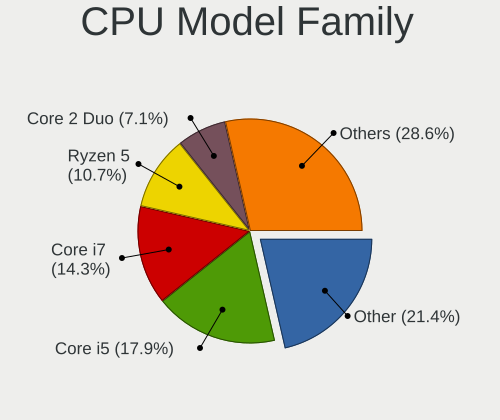

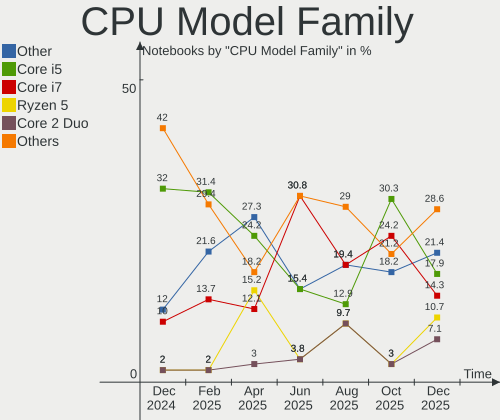

| Model            | Notebooks | Percent |
|------------------|-----------|---------|
| Other            | 6         | 21.43%  |
| Intel Core i5    | 5         | 17.86%  |
| Intel Core i7    | 4         | 14.29%  |
| AMD Ryzen 5      | 3         | 10.71%  |
| Intel Core 2 Duo | 2         | 7.14%   |
| Intel Core m3    | 1         | 3.57%   |
| Intel Core i3    | 1         | 3.57%   |
| Intel Core       | 1         | 3.57%   |
| Intel Celeron    | 1         | 3.57%   |
| AMD Ryzen 9      | 1         | 3.57%   |
| AMD Ryzen 7      | 1         | 3.57%   |
| AMD Ryzen 3      | 1         | 3.57%   |
| AMD A6           | 1         | 3.57%   |

CPU Cores
---------

Number of processor cores

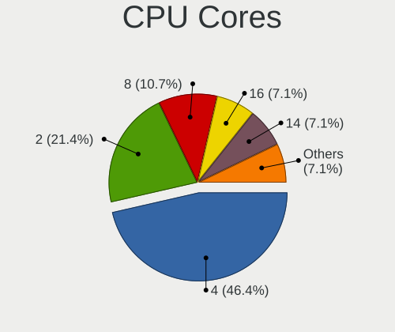

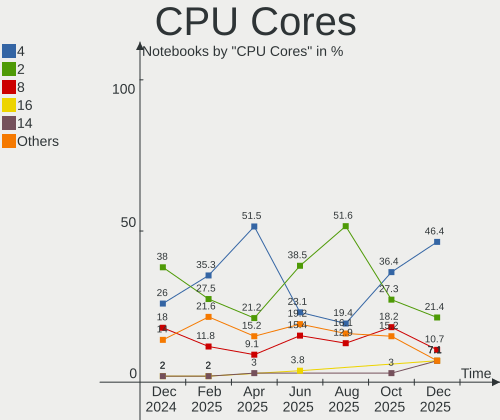

| Number | Notebooks | Percent |
|--------|-----------|---------|
| 4      | 13        | 46.43%  |
| 2      | 6         | 21.43%  |
| 8      | 3         | 10.71%  |
| 16     | 2         | 7.14%   |
| 14     | 2         | 7.14%   |
| 6      | 2         | 7.14%   |

CPU Sockets
-----------

Number of sockets

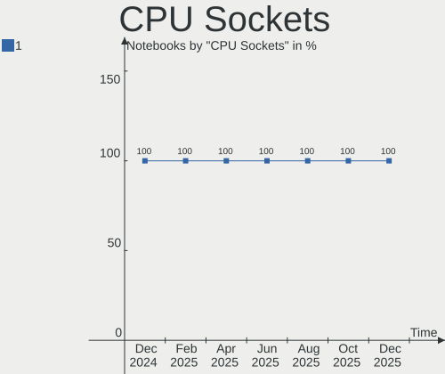

| Number | Notebooks | Percent |
|--------|-----------|---------|
| 1      | 28        | 100%    |

CPU Threads
-----------

Threads per core (Hyper-Threading)

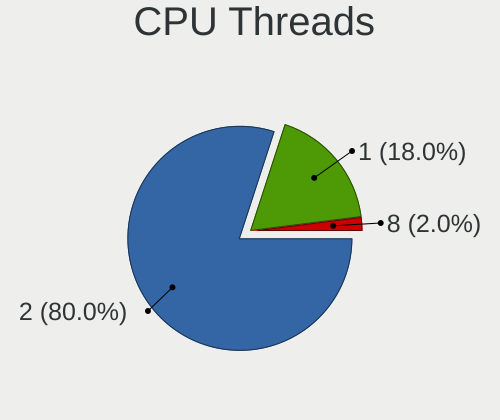

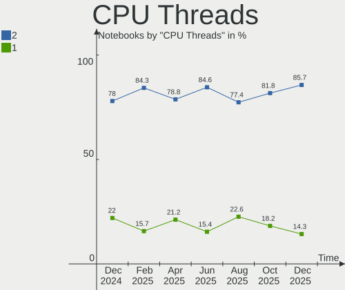

| Number | Notebooks | Percent |
|--------|-----------|---------|
| 2      | 24        | 85.71%  |
| 1      | 4         | 14.29%  |

CPU Op-Modes
------------

CPU Operation Modes (32-bit, 64-bit)

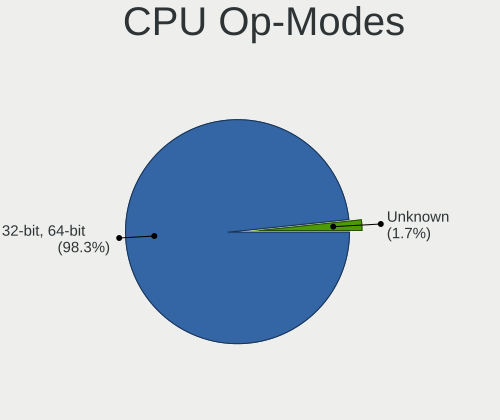

| Op mode        | Notebooks | Percent |
|----------------|-----------|---------|
| 32-bit, 64-bit | 28        | 100%    |

CPU Microcode
-------------

Microcode number

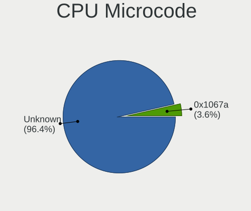

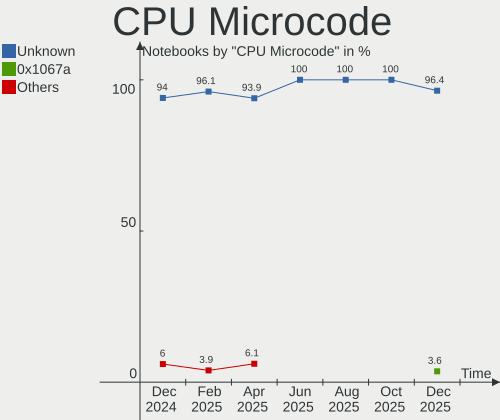

| Number  | Notebooks | Percent |
|---------|-----------|---------|
| Unknown | 27        | 96.43%  |
| 0x1067a | 1         | 3.57%   |

CPU Microarch
-------------

Microarchitecture

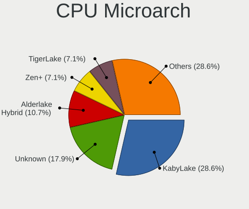

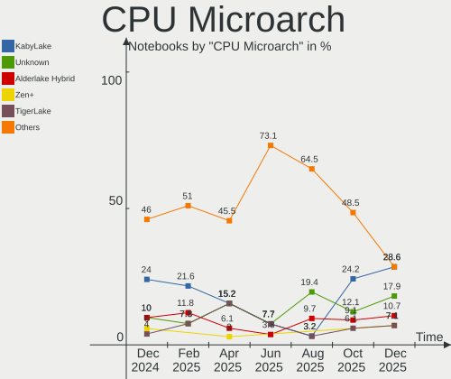

| Name             | Notebooks | Percent |
|------------------|-----------|---------|
| KabyLake         | 8         | 28.57%  |
| Unknown          | 5         | 17.86%  |
| Alderlake Hybrid | 3         | 10.71%  |
| Zen+             | 2         | 7.14%   |
| TigerLake        | 2         | 7.14%   |
| Penryn           | 2         | 7.14%   |
| CometLake        | 2         | 7.14%   |
| Zen 3            | 1         | 3.57%   |
| Skylake          | 1         | 3.57%   |
| Silvermont       | 1         | 3.57%   |
| Puma             | 1         | 3.57%   |

Graphics
--------

GPU Vendor
----------

Vendors of graphics cards

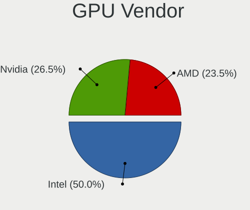

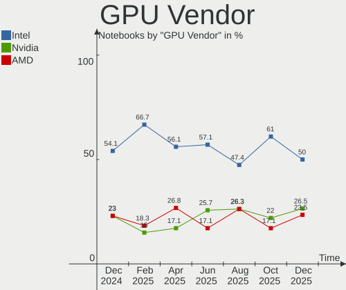

| Vendor | Notebooks | Percent |
|--------|-----------|---------|
| Intel  | 17        | 50%     |
| Nvidia | 9         | 26.47%  |
| AMD    | 8         | 23.53%  |

GPU Model
---------

Graphics card models

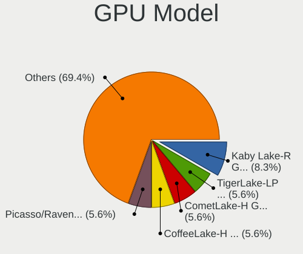

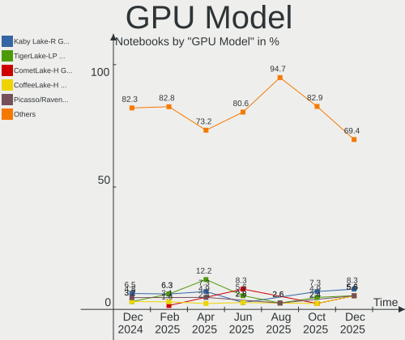

| Model                                                                                    | Notebooks | Percent |
|------------------------------------------------------------------------------------------|-----------|---------|
| Intel Kaby Lake-R GT2 [UHD Graphics 620]                                                 | 3         | 8.33%   |
| Intel TigerLake-LP GT2 [Iris Xe Graphics]                                                | 2         | 5.56%   |
| Intel CometLake-H GT2 [UHD Graphics]                                                     | 2         | 5.56%   |
| Intel CoffeeLake-H GT2 [UHD Graphics 630]                                                | 2         | 5.56%   |
| AMD Picasso/Raven 2 [Radeon Vega Series / Radeon Vega Mobile Series]                     | 2         | 5.56%   |
| AMD Navi 24 [Radeon RX 6400/6500 XT/6500M]                                               | 2         | 5.56%   |
| Nvidia TU117M [GeForce GTX 1650 Ti Mobile]                                               | 1         | 2.78%   |
| Nvidia TU116M [GeForce GTX 1660 Ti Mobile]                                               | 1         | 2.78%   |
| Nvidia GT218M [GeForce G210M]                                                            | 1         | 2.78%   |
| Nvidia GP107GLM [Quadro P620]                                                            | 1         | 2.78%   |
| Nvidia GM204M [GeForce GTX 970M]                                                         | 1         | 2.78%   |
| Nvidia GA107M [GeForce RTX 3050 Mobile]                                                  | 1         | 2.78%   |
| Nvidia G98M [GeForce G 105M]                                                             | 1         | 2.78%   |
| Nvidia AD107M [GeForce RTX 4060 Max-Q / Mobile]                                          | 1         | 2.78%   |
| Nvidia AD106M [GeForce RTX 4070 Max-Q / Mobile]                                          | 1         | 2.78%   |
| Intel Raptor Lake-P [UHD Graphics]                                                       | 1         | 2.78%   |
| Intel Raptor Lake-P [Iris Xe Graphics]                                                   | 1         | 2.78%   |
| Intel Meteor Lake-P [Intel Arc Graphics]                                                 | 1         | 2.78%   |
| Intel Kaby Lake-Y GT2 [HD Graphics 615]                                                  | 1         | 2.78%   |
| Intel Kaby Lake-U GT3 [Iris Plus Graphics 640]                                           | 1         | 2.78%   |
| Intel CometLake-U GT2 [UHD Graphics]                                                     | 1         | 2.78%   |
| Intel Atom/Celeron/Pentium Processor x5-E8000/J3xxx/N3xxx Integrated Graphics Controller | 1         | 2.78%   |
| Intel Alder Lake-P Integrated Graphics Controller                                        | 1         | 2.78%   |
| AMD Rembrandt [Radeon 680M]                                                              | 1         | 2.78%   |
| AMD Raphael                                                                              | 1         | 2.78%   |
| AMD Mullins [Radeon R4/R5 Graphics]                                                      | 1         | 2.78%   |
| AMD Mendocino [Radeon 610M]                                                              | 1         | 2.78%   |
| AMD Krackan [Radeon 840M / 860M Graphics]                                                | 1         | 2.78%   |
| AMD Cezanne [Radeon Vega Series / Radeon Vega Mobile Series]                             | 1         | 2.78%   |

GPU Combo
---------

Combinations of graphics cards

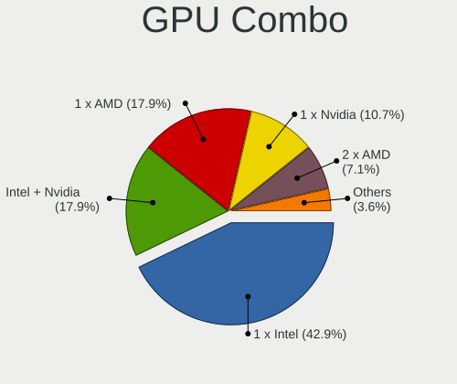

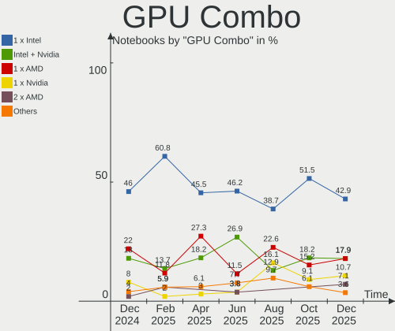

| Name           | Notebooks | Percent |
|----------------|-----------|---------|
| 1 x Intel      | 12        | 42.86%  |
| Intel + Nvidia | 5         | 17.86%  |
| 1 x AMD        | 5         | 17.86%  |
| 1 x Nvidia     | 3         | 10.71%  |
| 2 x AMD        | 2         | 7.14%   |
| AMD + Nvidia   | 1         | 3.57%   |

GPU Driver
----------

Free vs proprietary

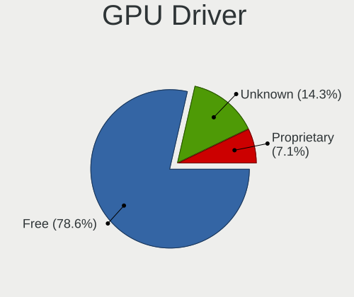

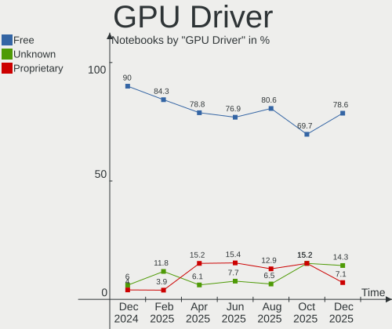

| Driver      | Notebooks | Percent |
|-------------|-----------|---------|
| Free        | 22        | 78.57%  |
| Unknown     | 4         | 14.29%  |
| Proprietary | 2         | 7.14%   |

GPU Memory
----------

Total video memory

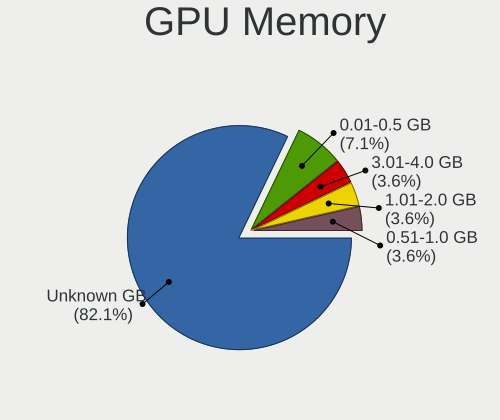

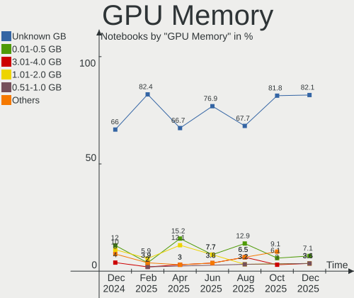

| Size in GB | Notebooks | Percent |
|------------|-----------|---------|
| Unknown    | 23        | 82.14%  |
| 0.01-0.5   | 2         | 7.14%   |
| 3.01-4.0   | 1         | 3.57%   |
| 1.01-2.0   | 1         | 3.57%   |
| 0.51-1.0   | 1         | 3.57%   |

Monitor
-------

Monitor Vendor
--------------

Monitor vendors

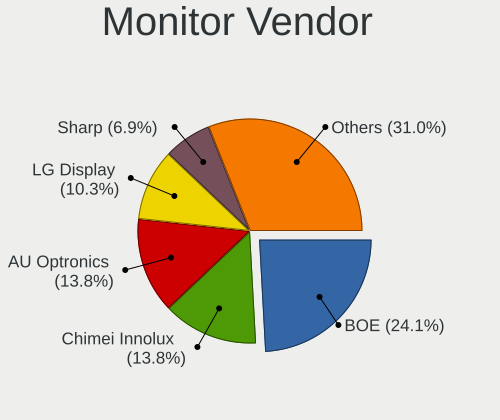

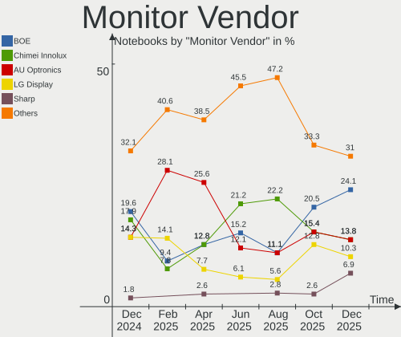

| Vendor              | Notebooks | Percent |
|---------------------|-----------|---------|
| BOE                 | 7         | 24.14%  |
| Chimei Innolux      | 4         | 13.79%  |
| AU Optronics        | 4         | 13.79%  |
| LG Display          | 3         | 10.34%  |
| Sharp               | 2         | 6.9%    |
| Lenovo              | 2         | 6.9%    |
| CSOT                | 2         | 6.9%    |
| Sony                | 1         | 3.45%   |
| Samsung Electronics | 1         | 3.45%   |
| ESP                 | 1         | 3.45%   |
| BenQ                | 1         | 3.45%   |
| Apple               | 1         | 3.45%   |

Monitor Model
-------------

Monitor models

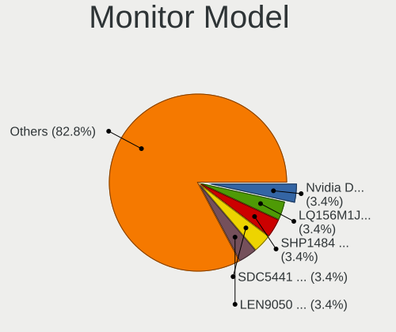

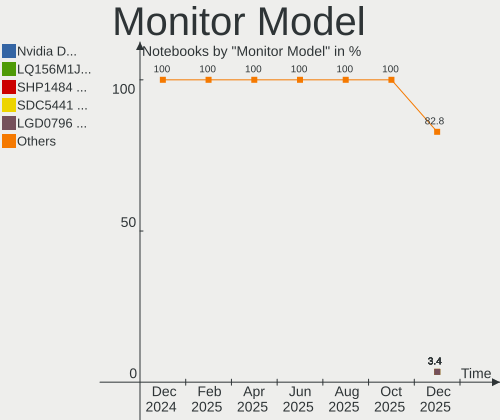

| Model                                                                | Notebooks | Percent |
|----------------------------------------------------------------------|-----------|---------|
| Sony Nvidia Defaul t Flat Panel SNY05FA 1366x768 309x174mm 14.0-inch | 1         | 3.45%   |
| Sharp LQ156M1JW81 SHP14A4 1920x1080 344x194mm 15.5-inch              | 1         | 3.45%   |
| Sharp LCD Monitor SHP1484 1920x1080 294x165mm 13.3-inch              | 1         | 3.45%   |
| Samsung Electronics LCD Monitor SDC5441 1366x768 344x193mm 15.5-inch | 1         | 3.45%   |
| LG Display LCD Monitor LGD0796 1920x1200 345x215mm 16.0-inch         | 1         | 3.45%   |
| LG Display LCD Monitor LGD0563 1920x1080 344x194mm 15.5-inch         | 1         | 3.45%   |
| LG Display LCD Monitor LGD0469 1920x1080 382x215mm 17.3-inch         | 1         | 3.45%   |
| Lenovo LCD Monitor LEN9050 1366x768 344x193mm 15.5-inch              | 1         | 3.45%   |
| Lenovo LCD Monitor LEN4053 1680x1050 331x207mm 15.4-inch             | 1         | 3.45%   |
| ESP eD15(2024) ESP0F00 1920x1080 344x193mm 15.5-inch                 | 1         | 3.45%   |
| CSOT MNH301CA3-1 CSO1702 2560x1440 381x214mm 17.2-inch               | 1         | 3.45%   |
| CSOT LCD Monitor CSO162D 1920x1200 345x215mm 16.0-inch               | 1         | 3.45%   |
| Chimei Innolux P140ZKA-BZ1 CMN8C03 2160x1440 296x197mm 14.0-inch     | 1         | 3.45%   |
| Chimei Innolux LCD Monitor CMN1619 1920x1080 355x199mm 16.0-inch     | 1         | 3.45%   |
| Chimei Innolux LCD Monitor CMN15B7 1366x768 344x193mm 15.5-inch      | 1         | 3.45%   |
| Chimei Innolux LCD Monitor CMN14D4 1920x1080 309x173mm 13.9-inch     | 1         | 3.45%   |
| BOE LCD Monitor BOE0C73 1920x1080 344x194mm 15.5-inch                | 1         | 3.45%   |
| BOE LCD Monitor BOE09E6 1920x1080 344x193mm 15.5-inch                | 1         | 3.45%   |
| BOE LCD Monitor BOE09CC 1920x1080 344x194mm 15.5-inch                | 1         | 3.45%   |
| BOE LCD Monitor BOE0991 1920x1080 344x194mm 15.5-inch                | 1         | 3.45%   |
| BOE LCD Monitor BOE0839 1920x1080 382x215mm 17.3-inch                | 1         | 3.45%   |
| BOE LCD Monitor BOE06CB 1920x1080 344x194mm 15.5-inch                | 1         | 3.45%   |
| BOE LCD Monitor BOE06AB 1366x768 256x144mm 11.6-inch                 | 1         | 3.45%   |
| BenQ GW2490 BNQ78F7 1920x1080 527x296mm 23.8-inch                    | 1         | 3.45%   |
| AU Optronics LCD Monitor AUOF3A7 2560x1600 312x195mm 14.5-inch       | 1         | 3.45%   |
| AU Optronics LCD Monitor AUO61ED 1920x1080 344x194mm 15.5-inch       | 1         | 3.45%   |
| AU Optronics LCD Monitor AUO2792 1920x1080 382x215mm 17.3-inch       | 1         | 3.45%   |
| AU Optronics LCD Monitor AUO10ED 1920x1080 344x193mm 15.5-inch       | 1         | 3.45%   |
| Apple Color LCD APPA037 2880x1800 286x179mm 13.3-inch                | 1         | 3.45%   |

Monitor Resolution
------------------

Monitor screen resolution

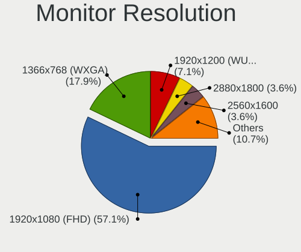

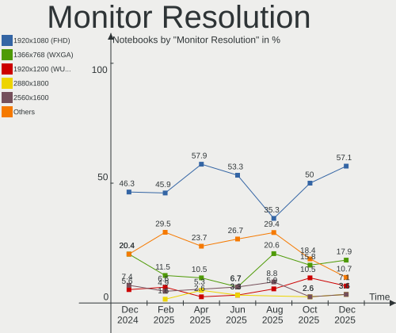

| Resolution         | Notebooks | Percent |
|--------------------|-----------|---------|
| 1920x1080 (FHD)    | 16        | 57.14%  |
| 1366x768 (WXGA)    | 5         | 17.86%  |
| 1920x1200 (WUXGA)  | 2         | 7.14%   |
| 2880x1800          | 1         | 3.57%   |
| 2560x1600          | 1         | 3.57%   |
| 2560x1440 (QHD)    | 1         | 3.57%   |
| 2160x1440          | 1         | 3.57%   |
| 1680x1050 (WSXGA+) | 1         | 3.57%   |

Monitor Diagonal
----------------

Diagonal size in inches

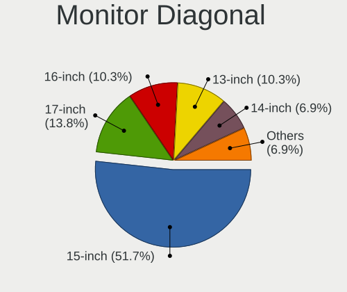

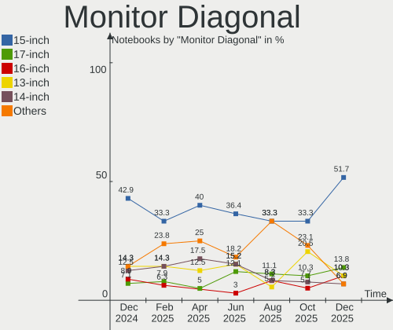

| Inches | Notebooks | Percent |
|--------|-----------|---------|
| 15     | 15        | 51.72%  |
| 17     | 4         | 13.79%  |
| 16     | 3         | 10.34%  |
| 13     | 3         | 10.34%  |
| 14     | 2         | 6.9%    |
| 24     | 1         | 3.45%   |
| 11     | 1         | 3.45%   |

Monitor Width
-------------

Physical width

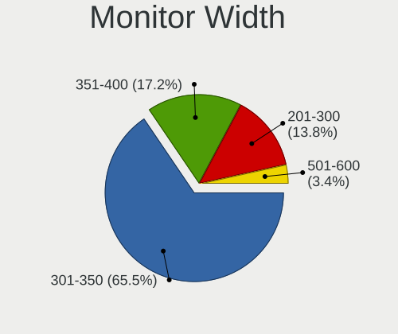

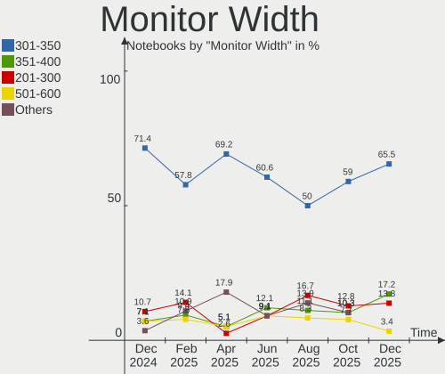

| Width in mm | Notebooks | Percent |
|-------------|-----------|---------|
| 301-350     | 19        | 65.52%  |
| 351-400     | 5         | 17.24%  |
| 201-300     | 4         | 13.79%  |
| 501-600     | 1         | 3.45%   |

Aspect Ratio
------------

Proportional relationship between the width and the height

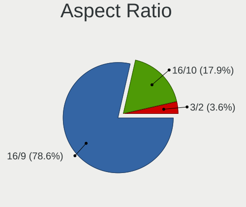

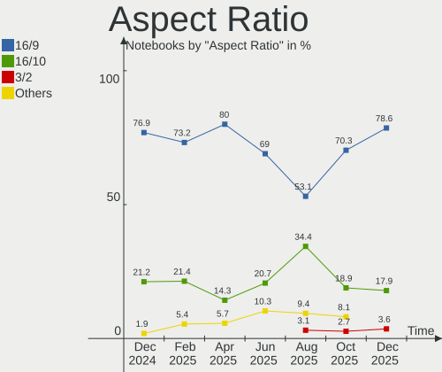

| Ratio | Notebooks | Percent |
|-------|-----------|---------|
| 16/9  | 22        | 78.57%  |
| 16/10 | 5         | 17.86%  |
| 3/2   | 1         | 3.57%   |

Monitor Area
------------

Area in inch²

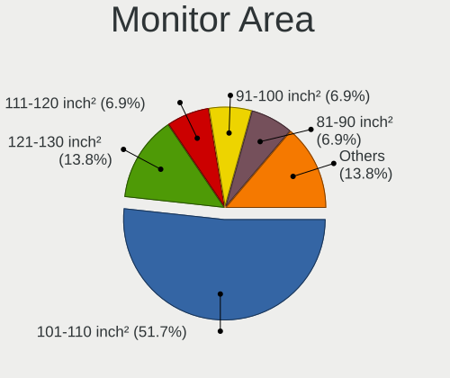

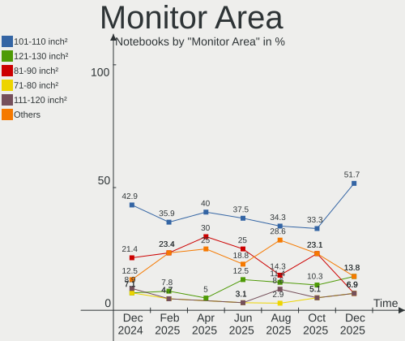

| Area in inch² | Notebooks | Percent |
|----------------|-----------|---------|
| 101-110        | 15        | 51.72%  |
| 121-130        | 4         | 13.79%  |
| 81-90          | 2         | 6.9%    |
| 71-80          | 2         | 6.9%    |
| 111-120        | 2         | 6.9%    |
| 91-100         | 2         | 6.9%    |
| 51-60          | 1         | 3.45%   |
| 201-250        | 1         | 3.45%   |

Pixel Density
-------------

Pixels per inch

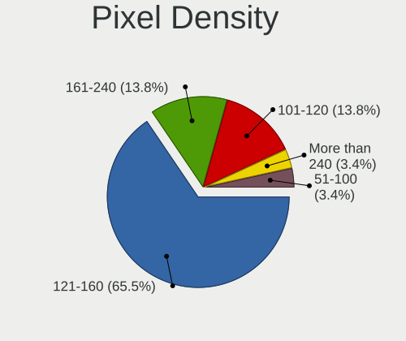

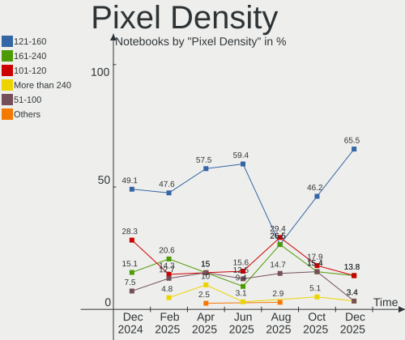

| Density       | Notebooks | Percent |
|---------------|-----------|---------|
| 121-160       | 19        | 65.52%  |
| 161-240       | 4         | 13.79%  |
| 101-120       | 4         | 13.79%  |
| More than 240 | 1         | 3.45%   |
| 51-100        | 1         | 3.45%   |

Multiple Monitors
-----------------

Total monitors connected

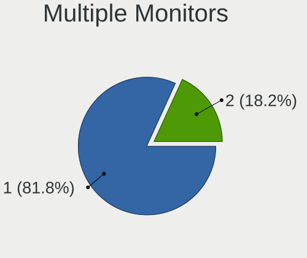

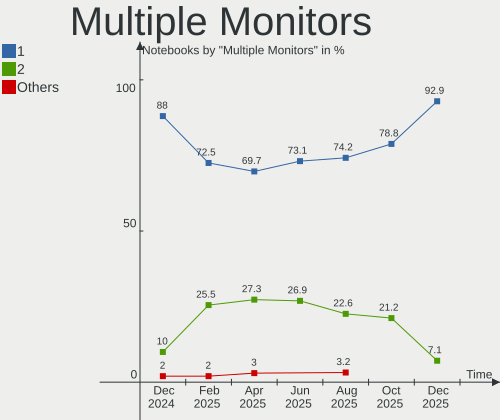

| Total | Notebooks | Percent |
|-------|-----------|---------|
| 1     | 26        | 92.86%  |
| 2     | 2         | 7.14%   |

Network
-------

Net Controller Vendor
---------------------

Controller vendors

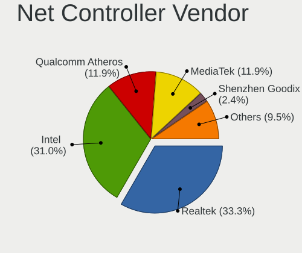

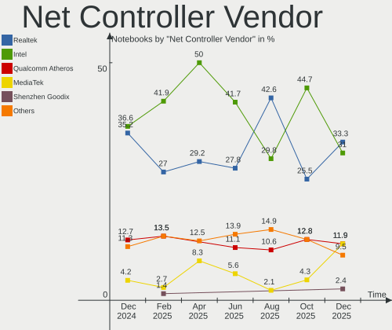

| Vendor                     | Notebooks | Percent |
|----------------------------|-----------|---------|
| Realtek Semiconductor      | 14        | 33.33%  |
| Intel                      | 13        | 30.95%  |
| Qualcomm Atheros           | 5         | 11.9%   |
| MediaTek                   | 5         | 11.9%   |
| Shenzhen Goodix Technology | 1         | 2.38%   |
| Marvell Technology Group   | 1         | 2.38%   |
| Broadcom                   | 1         | 2.38%   |
| ASUSTek Computer           | 1         | 2.38%   |
| ASIX Electronics           | 1         | 2.38%   |

Net Controller Model
--------------------

Controller models

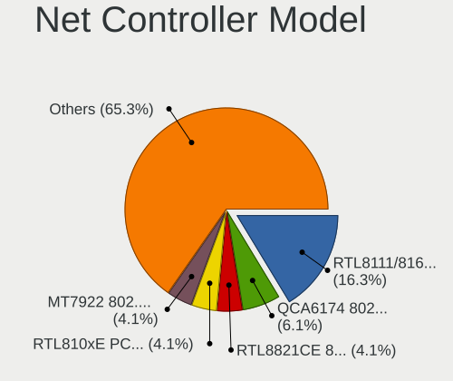

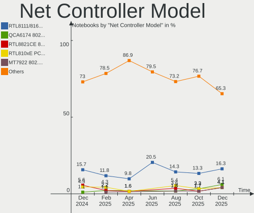

| Model                                                                  | Notebooks | Percent |
|------------------------------------------------------------------------|-----------|---------|
| Realtek RTL8111/8168/8211/8411 PCI Express Gigabit Ethernet Controller | 8         | 16.33%  |
| Qualcomm Atheros QCA6174 802.11ac Wireless Network Adapter             | 3         | 6.12%   |
| Realtek RTL8821CE 802.11ac PCIe Wireless Network Adapter               | 2         | 4.08%   |
| Realtek RTL810xE PCI Express Fast Ethernet controller                  | 2         | 4.08%   |
| MediaTek MT7922 802.11ax PCI Express Wireless Network Adapter          | 2         | 4.08%   |
| MediaTek MT7921 802.11ax PCIe Wireless Network Adapter [Filogic 330]   | 2         | 4.08%   |
| Intel Raptor Lake PCH CNVi WiFi                                        | 2         | 4.08%   |
| Intel Comet Lake PCH CNVi WiFi                                         | 2         | 4.08%   |
| Shenzhen Goodix Fingerprint Reader                                     | 1         | 2.04%   |
| Realtek RTL8852BE PCIe 802.11ax Wireless Network Controller            | 1         | 2.04%   |
| Realtek RTL8723BE PCIe Wireless Network Adapter                        | 1         | 2.04%   |
| Realtek RTL8188EUS 802.11n Wireless Network Adapter                    | 1         | 2.04%   |
| Realtek RTL8153 Gigabit Ethernet Adapter                               | 1         | 2.04%   |
| Realtek 802.11ac NIC                                                   | 1         | 2.04%   |
| Qualcomm Atheros QCA9565 / AR9565 Wireless Network Adapter             | 1         | 2.04%   |
| Qualcomm Atheros Killer E2500 Gigabit Ethernet Controller              | 1         | 2.04%   |
| Qualcomm Atheros Killer E2400 Gigabit Ethernet Controller              | 1         | 2.04%   |
| MediaTek Wi-Fi 6 MT7920 Wireless Network Adapter                       | 1         | 2.04%   |
| Marvell Group 88E8057 PCI-E Gigabit Ethernet Controller                | 1         | 2.04%   |
| Intel Wireless 8265 / 8275                                             | 1         | 2.04%   |
| Intel Wireless 3165                                                    | 1         | 2.04%   |
| Intel WiFi Link 5100                                                   | 1         | 2.04%   |
| Intel Wi-Fi 6E(802.11ax) AX210/AX1675* 2x2 [Typhoon Peak]              | 1         | 2.04%   |
| Intel Wi-Fi 6 AX201                                                    | 1         | 2.04%   |
| Intel Wi-Fi 6 AX200                                                    | 1         | 2.04%   |
| Intel PRO/Wireless 5100 AGN [Shiloh] Network Connection                | 1         | 2.04%   |
| Intel Meteor Lake PCH CNVi WiFi                                        | 1         | 2.04%   |
| Intel Ethernet Connection (4) I219-V                                   | 1         | 2.04%   |
| Intel Ethernet Connection (13) I219-V                                  | 1         | 2.04%   |
| Intel Ethernet Connection (10) I219-LM                                 | 1         | 2.04%   |
| Intel Comet Lake PCH-LP CNVi WiFi                                      | 1         | 2.04%   |
| Broadcom BCM4350 802.11ac Wireless Network Adapter                     | 1         | 2.04%   |
| ASUS 802.11ac NIC                                                      | 1         | 2.04%   |
| ASIX AX88179 Gigabit Ethernet                                          | 1         | 2.04%   |

Wireless Vendor
---------------

Wireless vendors

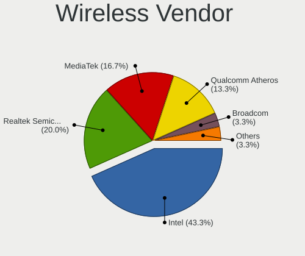

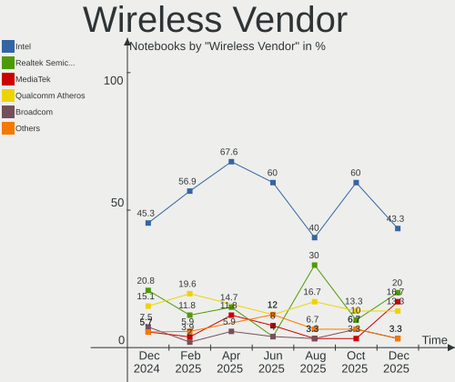

| Vendor                | Notebooks | Percent |
|-----------------------|-----------|---------|
| Intel                 | 13        | 43.33%  |
| Realtek Semiconductor | 6         | 20%     |
| MediaTek              | 5         | 16.67%  |
| Qualcomm Atheros      | 4         | 13.33%  |
| Broadcom              | 1         | 3.33%   |
| ASUSTek Computer      | 1         | 3.33%   |

Wireless Model
--------------

Wireless models

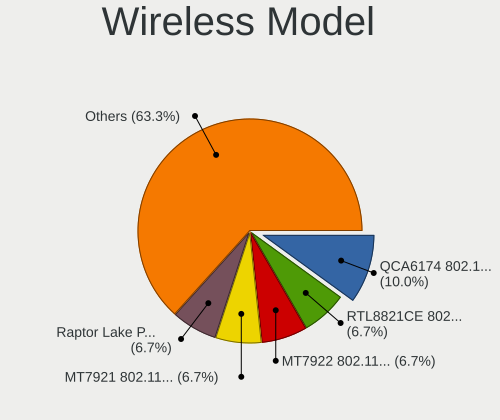

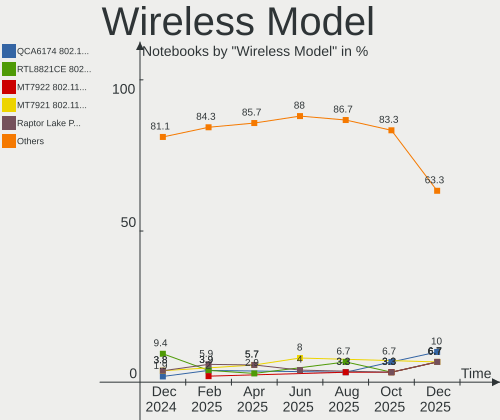

| Model                                                                | Notebooks | Percent |
|----------------------------------------------------------------------|-----------|---------|
| Qualcomm Atheros QCA6174 802.11ac Wireless Network Adapter           | 3         | 10%     |
| Realtek RTL8821CE 802.11ac PCIe Wireless Network Adapter             | 2         | 6.67%   |
| MediaTek MT7922 802.11ax PCI Express Wireless Network Adapter        | 2         | 6.67%   |
| MediaTek MT7921 802.11ax PCIe Wireless Network Adapter [Filogic 330] | 2         | 6.67%   |
| Intel Raptor Lake PCH CNVi WiFi                                      | 2         | 6.67%   |
| Intel Comet Lake PCH CNVi WiFi                                       | 2         | 6.67%   |
| Realtek RTL8852BE PCIe 802.11ax Wireless Network Controller          | 1         | 3.33%   |
| Realtek RTL8723BE PCIe Wireless Network Adapter                      | 1         | 3.33%   |
| Realtek RTL8188EUS 802.11n Wireless Network Adapter                  | 1         | 3.33%   |
| Realtek 802.11ac NIC                                                 | 1         | 3.33%   |
| Qualcomm Atheros QCA9565 / AR9565 Wireless Network Adapter           | 1         | 3.33%   |
| MediaTek Wi-Fi 6 MT7920 Wireless Network Adapter                     | 1         | 3.33%   |
| Intel Wireless 8265 / 8275                                           | 1         | 3.33%   |
| Intel Wireless 3165                                                  | 1         | 3.33%   |
| Intel WiFi Link 5100                                                 | 1         | 3.33%   |
| Intel Wi-Fi 6E(802.11ax) AX210/AX1675* 2x2 [Typhoon Peak]            | 1         | 3.33%   |
| Intel Wi-Fi 6 AX201                                                  | 1         | 3.33%   |
| Intel Wi-Fi 6 AX200                                                  | 1         | 3.33%   |
| Intel PRO/Wireless 5100 AGN [Shiloh] Network Connection              | 1         | 3.33%   |
| Intel Meteor Lake PCH CNVi WiFi                                      | 1         | 3.33%   |
| Intel Comet Lake PCH-LP CNVi WiFi                                    | 1         | 3.33%   |
| Broadcom BCM4350 802.11ac Wireless Network Adapter                   | 1         | 3.33%   |
| ASUS 802.11ac NIC                                                    | 1         | 3.33%   |

Ethernet Vendor
---------------

Ethernet vendors

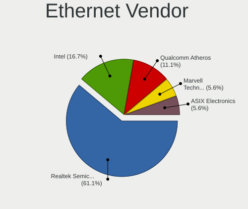

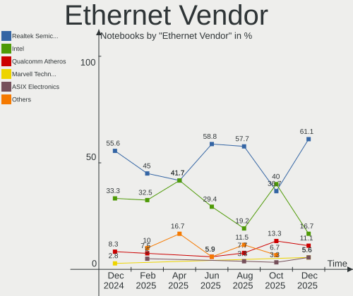

| Vendor                   | Notebooks | Percent |
|--------------------------|-----------|---------|
| Realtek Semiconductor    | 11        | 61.11%  |
| Intel                    | 3         | 16.67%  |
| Qualcomm Atheros         | 2         | 11.11%  |
| Marvell Technology Group | 1         | 5.56%   |
| ASIX Electronics         | 1         | 5.56%   |

Ethernet Model
--------------

Ethernet models

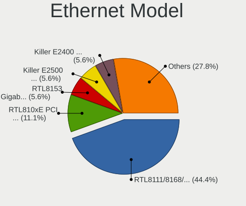

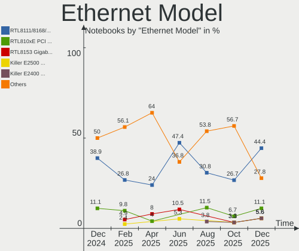

| Model                                                                  | Notebooks | Percent |
|------------------------------------------------------------------------|-----------|---------|
| Realtek RTL8111/8168/8211/8411 PCI Express Gigabit Ethernet Controller | 8         | 44.44%  |
| Realtek RTL810xE PCI Express Fast Ethernet controller                  | 2         | 11.11%  |
| Realtek RTL8153 Gigabit Ethernet Adapter                               | 1         | 5.56%   |
| Qualcomm Atheros Killer E2500 Gigabit Ethernet Controller              | 1         | 5.56%   |
| Qualcomm Atheros Killer E2400 Gigabit Ethernet Controller              | 1         | 5.56%   |
| Marvell Group 88E8057 PCI-E Gigabit Ethernet Controller                | 1         | 5.56%   |
| Intel Ethernet Connection (4) I219-V                                   | 1         | 5.56%   |
| Intel Ethernet Connection (13) I219-V                                  | 1         | 5.56%   |
| Intel Ethernet Connection (10) I219-LM                                 | 1         | 5.56%   |
| ASIX AX88179 Gigabit Ethernet                                          | 1         | 5.56%   |

Net Controller Kind
-------------------

Ethernet, WiFi or modem

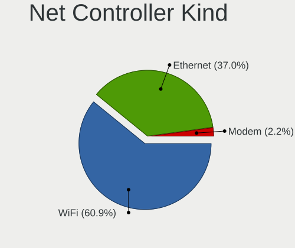

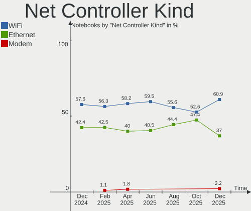

| Kind     | Notebooks | Percent |
|----------|-----------|---------|
| WiFi     | 28        | 60.87%  |
| Ethernet | 17        | 36.96%  |
| Modem    | 1         | 2.17%   |

Used Controller
---------------

Currently used network controller

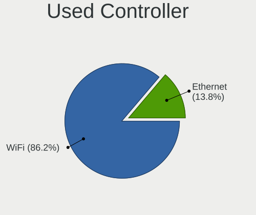

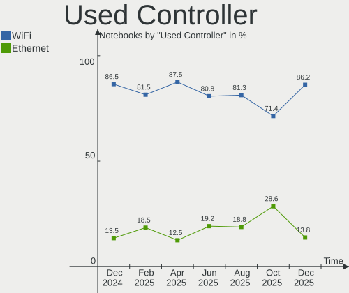

| Kind     | Notebooks | Percent |
|----------|-----------|---------|
| WiFi     | 25        | 86.21%  |
| Ethernet | 4         | 13.79%  |

NICs
----

Total network controllers on board

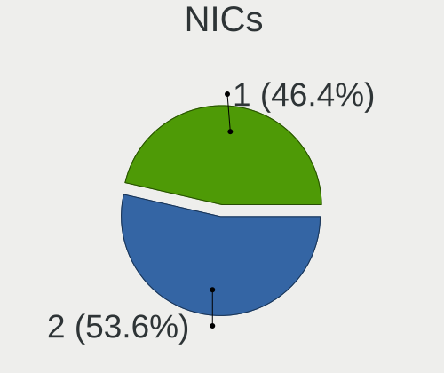

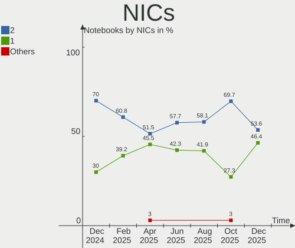

| Total | Notebooks | Percent |
|-------|-----------|---------|
| 2     | 15        | 53.57%  |
| 1     | 13        | 46.43%  |

IPv6
----

IPv6 vs IPv4

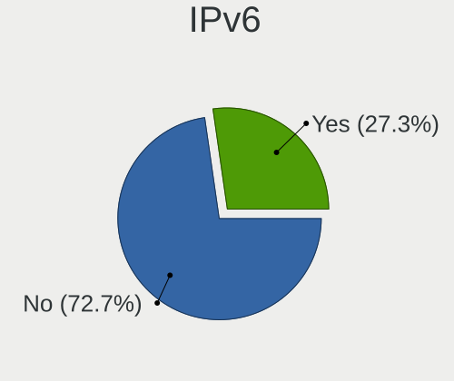

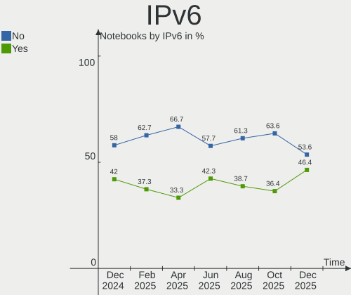

| Used | Notebooks | Percent |
|------|-----------|---------|
| No   | 15        | 53.57%  |
| Yes  | 13        | 46.43%  |

Bluetooth
---------

Bluetooth Vendor
----------------

Controller vendors

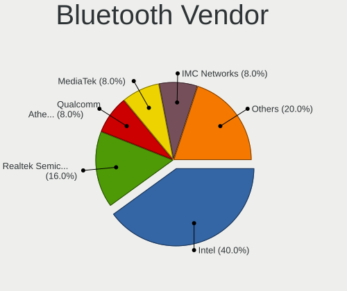

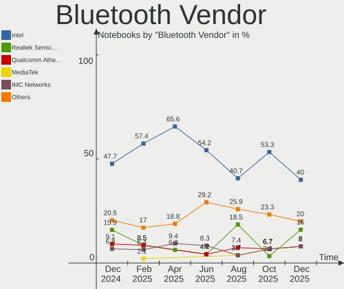

| Vendor                          | Notebooks | Percent |
|---------------------------------|-----------|---------|
| Intel                           | 10        | 40%     |
| Realtek Semiconductor           | 4         | 16%     |
| Qualcomm Atheros Communications | 2         | 8%      |
| MediaTek                        | 2         | 8%      |
| IMC Networks                    | 2         | 8%      |
| Foxconn / Hon Hai               | 2         | 8%      |
| Lite-On Technology              | 1         | 4%      |
| Broadcom                        | 1         | 4%      |
| Alps Electric                   | 1         | 4%      |

Bluetooth Model
---------------

Controller models

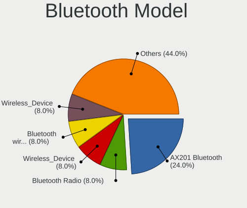

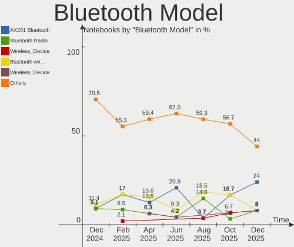

| Model                                              | Notebooks | Percent |
|----------------------------------------------------|-----------|---------|
| Intel AX201 Bluetooth                              | 6         | 24%     |
| Realtek Bluetooth Radio                            | 2         | 8%      |
| MediaTek Wireless_Device                           | 2         | 8%      |
| Intel Bluetooth wireless interface                 | 2         | 8%      |
| IMC Networks Wireless_Device                       | 2         | 8%      |
| Realtek RTL8723B Bluetooth                         | 1         | 4%      |
| Realtek  Bluetooth 4.2 Adapter                     | 1         | 4%      |
| Qualcomm Atheros  Bluetooth Device                 | 1         | 4%      |
| Qualcomm Atheros QCA61x4 Bluetooth 4.0             | 1         | 4%      |
| Lite-On Bluetooth Device                           | 1         | 4%      |
| Intel Bluetooth Device                             | 1         | 4%      |
| Intel AX200 Bluetooth                              | 1         | 4%      |
| Foxconn / Hon Hai Wireless_Device                  | 1         | 4%      |
| Foxconn / Hon Hai Bluetooth Device                 | 1         | 4%      |
| Broadcom BCM2045B (BDC-2.1) [Bluetooth Controller] | 1         | 4%      |
| Alps Electric BCM2046 Bluetooth Device             | 1         | 4%      |

Sound
-----

Sound Vendor
------------

Sound card vendors

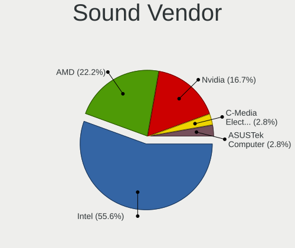

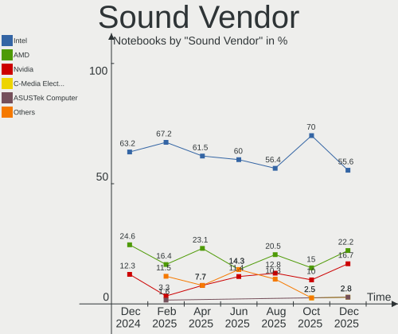

| Vendor              | Notebooks | Percent |
|---------------------|-----------|---------|
| Intel               | 20        | 55.56%  |
| AMD                 | 8         | 22.22%  |
| Nvidia              | 6         | 16.67%  |
| C-Media Electronics | 1         | 2.78%   |
| ASUSTek Computer    | 1         | 2.78%   |

Sound Model
-----------

Sound card models

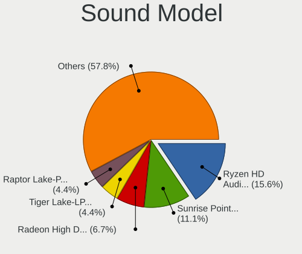

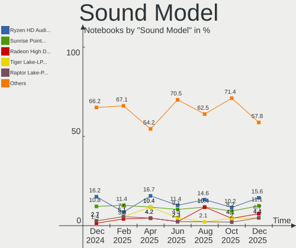

| Model                                                                                             | Notebooks | Percent |
|---------------------------------------------------------------------------------------------------|-----------|---------|
| AMD Ryzen HD Audio Controller                                                                     | 7         | 15.56%  |
| Intel Sunrise Point-LP HD Audio                                                                   | 5         | 11.11%  |
| AMD Radeon High Definition Audio Controller                                                       | 3         | 6.67%   |
| Intel Tiger Lake-LP Smart Sound Technology Audio Controller                                       | 2         | 4.44%   |
| Intel Raptor Lake-P/U/H cAVS                                                                      | 2         | 4.44%   |
| Intel Comet Lake PCH cAVS                                                                         | 2         | 4.44%   |
| Intel Cannon Lake PCH cAVS                                                                        | 2         | 4.44%   |
| Intel 82801I (ICH9 Family) HD Audio Controller                                                    | 2         | 4.44%   |
| AMD Raven/Raven2/Fenghuang HDMI/DP Audio Controller                                               | 2         | 4.44%   |
| AMD Navi 21/23 HDMI/DP Audio Controller                                                           | 2         | 4.44%   |
| Nvidia TU107 GeForce GTX 1650 High Definition Audio Controller                                    | 1         | 2.22%   |
| Nvidia High Definition Audio Controller                                                           | 1         | 2.22%   |
| Nvidia GM204 High Definition Audio Controller                                                     | 1         | 2.22%   |
| Nvidia GA107 High Definition Audio Controller                                                     | 1         | 2.22%   |
| Nvidia AD107 High Definition Audio Controller                                                     | 1         | 2.22%   |
| Nvidia AD106M High Definition Audio Controller                                                    | 1         | 2.22%   |
| Intel Meteor Lake-P HD Audio Controller                                                           | 1         | 2.22%   |
| Intel Comet Lake PCH-LP cAVS                                                                      | 1         | 2.22%   |
| Intel Atom/Celeron/Pentium Processor x5-E8000/J3xxx/N3xxx Series High Definition Audio Controller | 1         | 2.22%   |
| Intel Alder Lake PCH-P High Definition Audio Controller                                           | 1         | 2.22%   |
| Intel 100 Series/C230 Series Chipset Family HD Audio Controller                                   | 1         | 2.22%   |
| C-Media Electronics USB Audio Device                                                              | 1         | 2.22%   |
| ASUSTek Computer C-Media Audio                                                                    | 1         | 2.22%   |
| AMD Renoir/Cezanne HDMI/DP Audio Controller                                                       | 1         | 2.22%   |
| AMD Kabini HDMI/DP Audio                                                                          | 1         | 2.22%   |
| AMD FCH Azalia Controller                                                                         | 1         | 2.22%   |

Memory
------

Memory Vendor
-------------

Memory module vendors

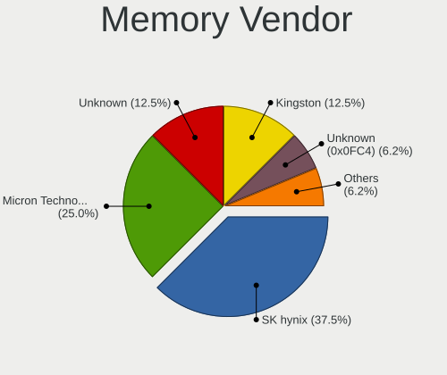

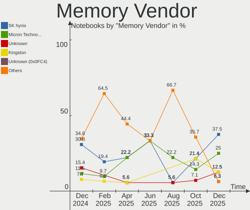

| Vendor              | Notebooks | Percent |
|---------------------|-----------|---------|
| SK hynix            | 6         | 37.5%   |
| Micron Technology   | 4         | 25%     |
| Unknown             | 2         | 12.5%   |
| Kingston            | 2         | 12.5%   |
| Unknown (0x0FC4)    | 1         | 6.25%   |
| Samsung Electronics | 1         | 6.25%   |

Memory Model
------------

Memory module models

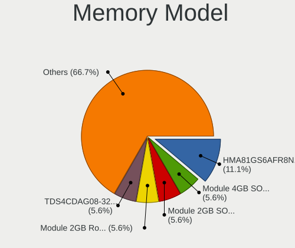

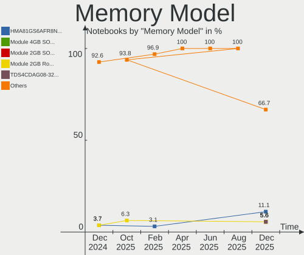

| Model                                                             | Notebooks | Percent |
|-------------------------------------------------------------------|-----------|---------|
| SK hynix RAM HMA81GS6AFR8N-UH 8GB SODIMM DDR4 2667MT/s            | 2         | 11.11%  |
| Unknown RAM Module 4GB SODIMM DDR3                                | 1         | 5.56%   |
| Unknown RAM Module 2GB SODIMM DDR3                                | 1         | 5.56%   |
| Unknown RAM Module 2GB Row Of Chips LPDDR4 4267MT/s               | 1         | 5.56%   |
| Unknown (0x0FC4) RAM TDS4CDAG08-32SC22C 16GB SODIMM DDR4 3200MT/s | 1         | 5.56%   |
| SK hynix RAM HMCG88AGBSA095N 32GB SODIMM DDR5 5600MT/s            | 1         | 5.56%   |
| SK hynix RAM HMA851S6JJR6N-VK 4GB SODIMM DDR4 2667MT/s            | 1         | 5.56%   |
| SK hynix RAM HMA81GS6CJR8N-VK 8GB SODIMM DDR4 2667MT/s            | 1         | 5.56%   |
| SK hynix RAM H9CCNNNCLGALAR-NVD 8GB Row Of Chips LPDDR3 2133MT/s  | 1         | 5.56%   |
| SK hynix RAM H58G56BK7BX068 4GB LPDDR5 7500MT/s                   | 1         | 5.56%   |
| Samsung RAM M471B1G73QHO-YKO 4GB SODIMM DDR3 1600MT/s             | 1         | 5.56%   |
| Micron RAM Module 4GB SODIMM LPDDR3 2133MT/s                      | 1         | 5.56%   |
| Micron RAM 8ATF1G64HZ-3G2R1 8GB SODIMM DDR4 3200MT/s              | 1         | 5.56%   |
| Micron RAM 4ATF51264HZ-2G3E1 4GB SODIMM DDR4 2667MT/s             | 1         | 5.56%   |
| Micron RAM 4ATF1G64HZ-3G2E2 8GB SODIMM DDR4 3200MT/s              | 1         | 5.56%   |
| Kingston RAM KF2933C17S4/16G 16GB SODIMM DDR4 2933MT/s            | 1         | 5.56%   |
| Kingston RAM 9905744-062.A00G 32GB SODIMM DDR4 3200MT/s           | 1         | 5.56%   |

Memory Kind
-----------

Memory module kinds

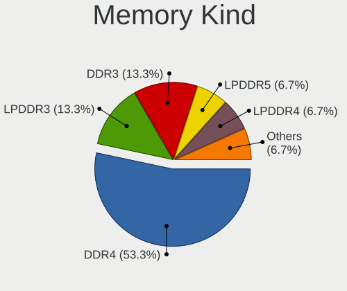

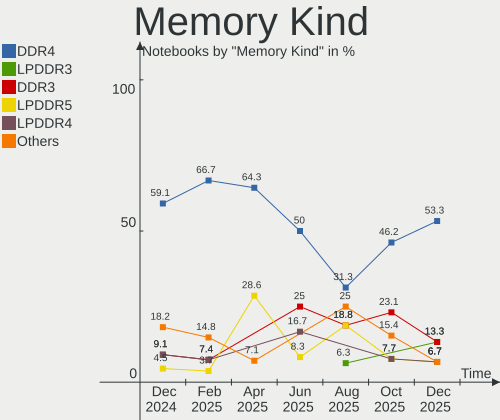

| Kind   | Notebooks | Percent |
|--------|-----------|---------|
| DDR4   | 8         | 53.33%  |
| LPDDR3 | 2         | 13.33%  |
| DDR3   | 2         | 13.33%  |
| LPDDR5 | 1         | 6.67%   |
| LPDDR4 | 1         | 6.67%   |
| DDR5   | 1         | 6.67%   |

Memory Form Factor
------------------

Physical design of the memory module

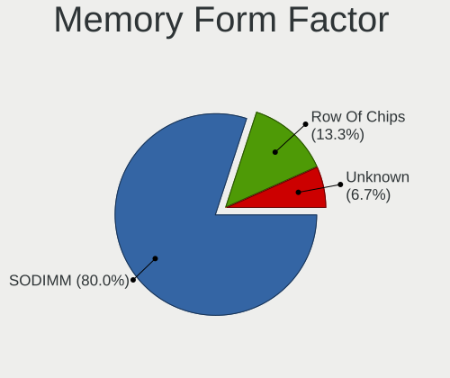

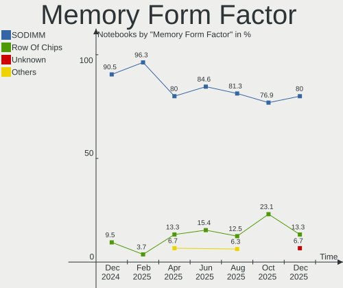

| Name         | Notebooks | Percent |
|--------------|-----------|---------|
| SODIMM       | 12        | 80%     |
| Row Of Chips | 2         | 13.33%  |
| Unknown      | 1         | 6.67%   |

Memory Size
-----------

Memory module size

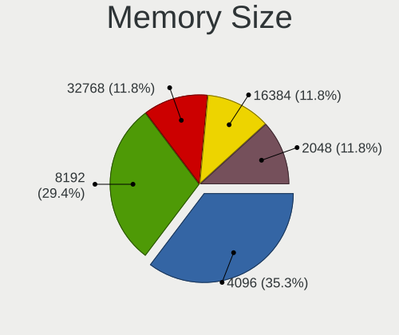

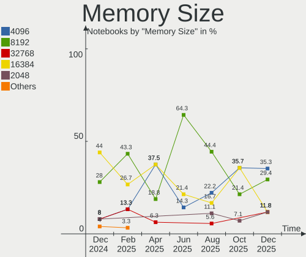

| Size  | Notebooks | Percent |
|-------|-----------|---------|
| 4096  | 6         | 35.29%  |
| 8192  | 5         | 29.41%  |
| 32768 | 2         | 11.76%  |
| 16384 | 2         | 11.76%  |
| 2048  | 2         | 11.76%  |

Memory Speed
------------

Memory module speed

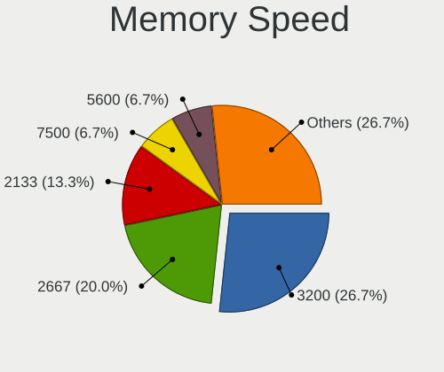

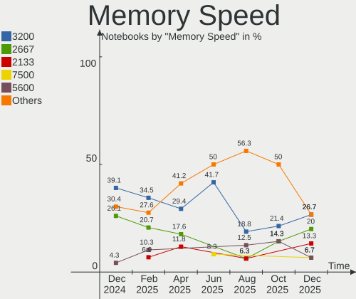

| Speed   | Notebooks | Percent |
|---------|-----------|---------|
| 3200    | 4         | 26.67%  |
| 2667    | 3         | 20%     |
| 2133    | 2         | 13.33%  |
| 7500    | 1         | 6.67%   |
| 5600    | 1         | 6.67%   |
| 4267    | 1         | 6.67%   |
| 2933    | 1         | 6.67%   |
| 1600    | 1         | 6.67%   |
| Unknown | 1         | 6.67%   |

Printers & scanners
-------------------

Printer Vendor
--------------

Printer device vendors

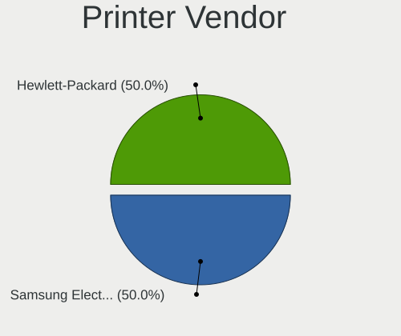

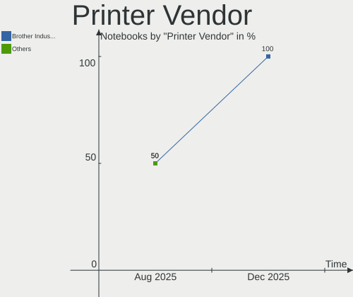

| Vendor             | Notebooks | Percent |
|--------------------|-----------|---------|
| Brother Industries | 1         | 100%    |

Printer Model
-------------

Printer device models

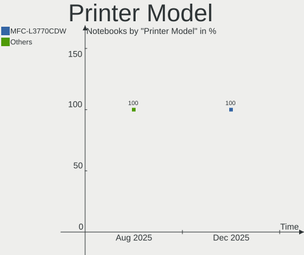

| Model                | Notebooks | Percent |
|----------------------|-----------|---------|
| Brother MFC-L3770CDW | 1         | 100%    |

Scanner Vendor
--------------

Scanner device vendors

Zero info for selected period =(

Scanner Model
-------------

Scanner device models

Zero info for selected period =(

Camera
------

Camera Vendor
-------------

Camera device vendors

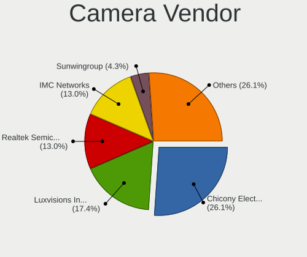

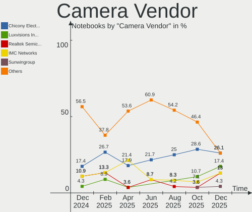

| Vendor                        | Notebooks | Percent |
|-------------------------------|-----------|---------|
| Chicony Electronics           | 6         | 26.09%  |
| Luxvisions Innotech Limited   | 4         | 17.39%  |
| Realtek Semiconductor         | 3         | 13.04%  |
| IMC Networks                  | 3         | 13.04%  |
| Sunwingroup                   | 1         | 4.35%   |
| Sunplus Innovation Technology | 1         | 4.35%   |
| Ricoh                         | 1         | 4.35%   |
| Quanta                        | 1         | 4.35%   |
| Microdia                      | 1         | 4.35%   |
| HYGD-XH--241023               | 1         | 4.35%   |
| Bison Electronics             | 1         | 4.35%   |

Camera Model
------------

Camera device models

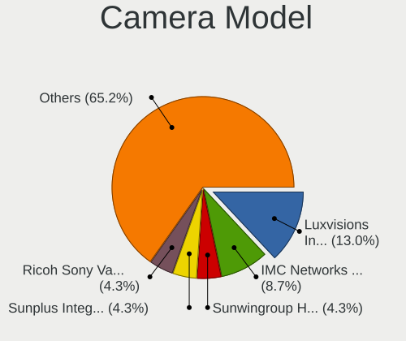

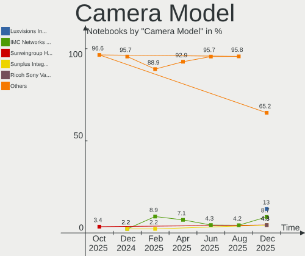

| Model                                                | Notebooks | Percent |
|------------------------------------------------------|-----------|---------|
| Luxvisions Innotech Limited HP Wide Vision HD Camera | 3         | 13.04%  |
| IMC Networks USB2.0 HD UVC WebCam                    | 2         | 8.7%    |
| Sunwingroup HD Camera                                | 1         | 4.35%   |
| Sunplus Integrated_Webcam_HD                         | 1         | 4.35%   |
| Ricoh Sony Vaio Integrated Webcam                    | 1         | 4.35%   |
| Realtek Lenovo EasyCamera                            | 1         | 4.35%   |
| Realtek Integrated_Webcam_HD                         | 1         | 4.35%   |
| Realtek Integrated Webcam                            | 1         | 4.35%   |
| Quanta HD User Facing                                | 1         | 4.35%   |
| Microdia Integrated_Webcam_HD                        | 1         | 4.35%   |
| Luxvisions Innotech Limited HP TrueVision HD Camera  | 1         | 4.35%   |
| IMC Networks Integrated Camera                       | 1         | 4.35%   |
| HYGD-XH--241023 USB Camera                           | 1         | 4.35%   |
| Chicony TOSHIBA Web Camera - HD                      | 1         | 4.35%   |
| Chicony HP Wide Vision HD Camera                     | 1         | 4.35%   |
| Chicony HP True Vision FHD Camera                    | 1         | 4.35%   |
| Chicony HD WebCam                                    | 1         | 4.35%   |
| Chicony HD User Facing                               | 1         | 4.35%   |
| Chicony ACER FHD User Facing                         | 1         | 4.35%   |
| Bison EasyCamera                                     | 1         | 4.35%   |

Security
--------

Fingerprint Vendor
------------------

Fingerprint sensor vendors

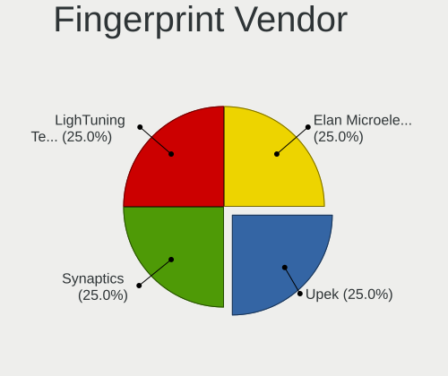

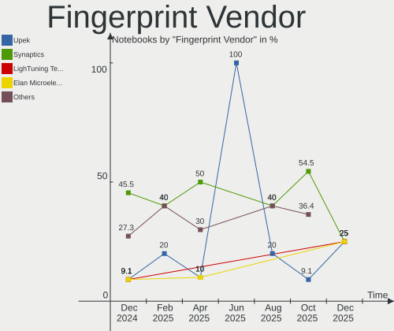

| Vendor                | Notebooks | Percent |
|-----------------------|-----------|---------|
| Upek                  | 1         | 25%     |
| Synaptics             | 1         | 25%     |
| LighTuning Technology | 1         | 25%     |
| Elan Microelectronics | 1         | 25%     |

Fingerprint Model
-----------------

Fingerprint sensor models

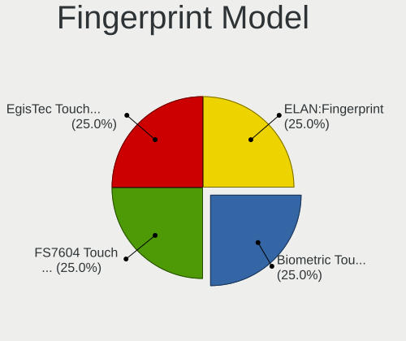

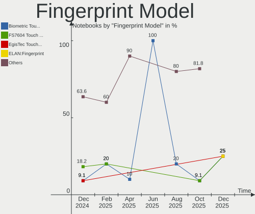

| Model                                                    | Notebooks | Percent |
|----------------------------------------------------------|-----------|---------|
| Upek Biometric Touchchip/Touchstrip Fingerprint Sensor   | 1         | 25%     |
| Synaptics FS7604 Touch Fingerprint Sensor with PurePrint | 1         | 25%     |
| LighTuning EgisTec Touch Fingerprint Sensor              | 1         | 25%     |
| Elan ELAN:Fingerprint                                    | 1         | 25%     |

Chipcard Vendor
---------------

Chipcard module vendors

Zero info for selected period =(

Chipcard Model
--------------

Chipcard module models

Zero info for selected period =(

Unsupported
-----------

Unsupported Devices
-------------------

Total unsupported devices on board

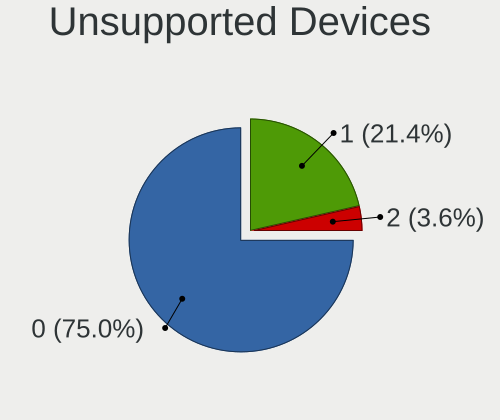

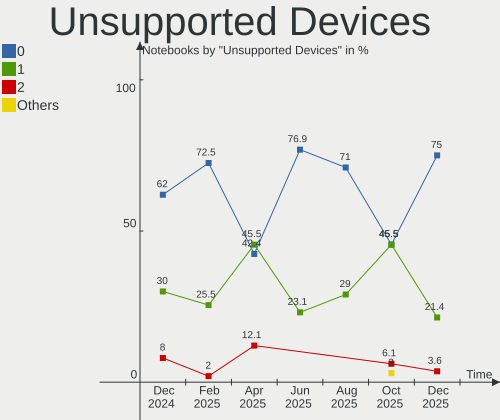

| Total | Notebooks | Percent |
|-------|-----------|---------|
| 0     | 21        | 75%     |
| 1     | 6         | 21.43%  |
| 2     | 1         | 3.57%   |

Unsupported Device Types
------------------------

Types of unsupported devices

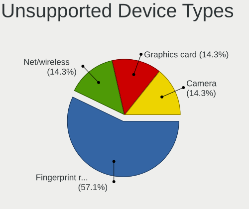

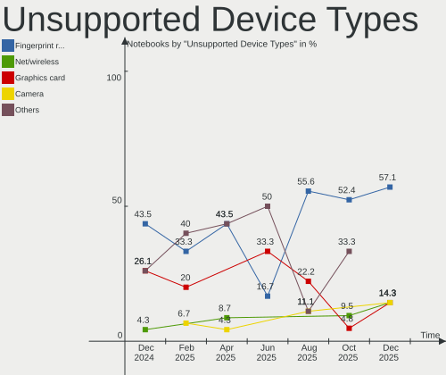

| Type               | Notebooks | Percent |
|--------------------|-----------|---------|
| Fingerprint reader | 4         | 57.14%  |
| Net/wireless       | 1         | 14.29%  |
| Graphics card      | 1         | 14.29%  |
| Camera             | 1         | 14.29%  |

