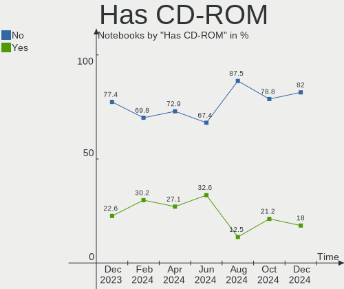
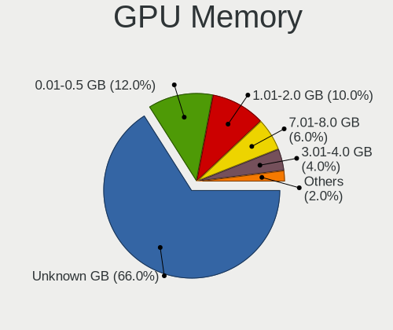
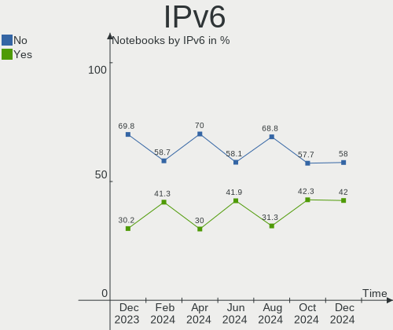
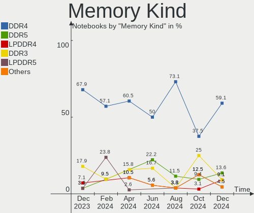
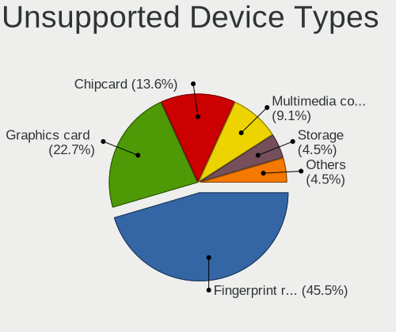

openSUSE Hardware Trends (Notebooks)
------------------------------------

A project to identify most popular hardware characteristics and track their change
over time based on data collected by openSUSE users at https://Linux-Hardware.org.

Anyone can contribute to this report by the [hw-probe](https://github.com/linuxhw/hw-probe) tool:

    sudo -E hw-probe -all -upload

Full-feature report is available here: https://linux-hardware.org/?view=trends

Period: Dec, 2021.

Contents
--------

* [ System ](#system)
  - [ OS                       ](#os)
  - [ OS Family                ](#os-family)
  - [ Kernel                   ](#kernel)
  - [ Kernel Family            ](#kernel-family)
  - [ Kernel Major Ver.        ](#kernel-major-ver)
  - [ Arch                     ](#arch)
  - [ DE                       ](#de)
  - [ Display Server           ](#display-server)
  - [ Display Manager          ](#display-manager)
  - [ OS Lang                  ](#os-lang)
  - [ Boot Mode                ](#boot-mode)
  - [ Filesystem               ](#filesystem)
  - [ Part. scheme             ](#part-scheme)
  - [ Dual Boot with Linux/BSD ](#dual-boot-with-linuxbsd)
  - [ Dual Boot (Win)          ](#dual-boot-win)

* [ Board ](#board)
  - [ Vendor                   ](#vendor)
  - [ Model                    ](#model)
  - [ Model Family             ](#model-family)
  - [ MFG Year                 ](#mfg-year)
  - [ Form Factor              ](#form-factor)
  - [ Secure Boot              ](#secure-boot)
  - [ Coreboot                 ](#coreboot)
  - [ RAM Size                 ](#ram-size)
  - [ RAM Used                 ](#ram-used)
  - [ Total Drives             ](#total-drives)
  - [ Has CD-ROM               ](#has-cd-rom)
  - [ Has Ethernet             ](#has-ethernet)
  - [ Has WiFi                 ](#has-wifi)
  - [ Has Bluetooth            ](#has-bluetooth)

* [ Location ](#location)
  - [ Country                  ](#country)
  - [ City                     ](#city)

* [ Drives ](#drives)
  - [ Drive Vendor             ](#drive-vendor)
  - [ Drive Model              ](#drive-model)
  - [ HDD Vendor               ](#hdd-vendor)
  - [ SSD Vendor               ](#ssd-vendor)
  - [ Drive Kind               ](#drive-kind)
  - [ Drive Connector          ](#drive-connector)
  - [ Drive Size               ](#drive-size)
  - [ Space Total              ](#space-total)
  - [ Space Used               ](#space-used)
  - [ Malfunc. Drives          ](#malfunc-drives)
  - [ Malfunc. Drive Vendor    ](#malfunc-drive-vendor)
  - [ Malfunc. HDD Vendor      ](#malfunc-hdd-vendor)
  - [ Malfunc. Drive Kind      ](#malfunc-drive-kind)
  - [ Failed Drives            ](#failed-drives)
  - [ Failed Drive Vendor      ](#failed-drive-vendor)
  - [ Drive Status             ](#drive-status)

* [ Storage controller ](#storage-controller)
  - [ Storage Vendor           ](#storage-vendor)
  - [ Storage Model            ](#storage-model)
  - [ Storage Kind             ](#storage-kind)

* [ Processor ](#processor)
  - [ CPU Vendor               ](#cpu-vendor)
  - [ CPU Model                ](#cpu-model)
  - [ CPU Model Family         ](#cpu-model-family)
  - [ CPU Cores                ](#cpu-cores)
  - [ CPU Sockets              ](#cpu-sockets)
  - [ CPU Threads              ](#cpu-threads)
  - [ CPU Op-Modes             ](#cpu-op-modes)
  - [ CPU Microcode            ](#cpu-microcode)
  - [ CPU Microarch            ](#cpu-microarch)

* [ Graphics ](#graphics)
  - [ GPU Vendor               ](#gpu-vendor)
  - [ GPU Model                ](#gpu-model)
  - [ GPU Combo                ](#gpu-combo)
  - [ GPU Driver               ](#gpu-driver)
  - [ GPU Memory               ](#gpu-memory)

* [ Monitor ](#monitor)
  - [ Monitor Vendor           ](#monitor-vendor)
  - [ Monitor Model            ](#monitor-model)
  - [ Monitor Resolution       ](#monitor-resolution)
  - [ Monitor Diagonal         ](#monitor-diagonal)
  - [ Monitor Width            ](#monitor-width)
  - [ Aspect Ratio             ](#aspect-ratio)
  - [ Monitor Area             ](#monitor-area)
  - [ Pixel Density            ](#pixel-density)
  - [ Multiple Monitors        ](#multiple-monitors)

* [ Network ](#network)
  - [ Net Controller Vendor    ](#net-controller-vendor)
  - [ Net Controller Model     ](#net-controller-model)
  - [ Wireless Vendor          ](#wireless-vendor)
  - [ Wireless Model           ](#wireless-model)
  - [ Ethernet Vendor          ](#ethernet-vendor)
  - [ Ethernet Model           ](#ethernet-model)
  - [ Net Controller Kind      ](#net-controller-kind)
  - [ Used Controller          ](#used-controller)
  - [ NICs                     ](#nics)
  - [ IPv6                     ](#ipv6)

* [ Bluetooth ](#bluetooth)
  - [ Bluetooth Vendor         ](#bluetooth-vendor)
  - [ Bluetooth Model          ](#bluetooth-model)

* [ Sound ](#sound)
  - [ Sound Vendor             ](#sound-vendor)
  - [ Sound Model              ](#sound-model)

* [ Memory ](#memory)
  - [ Memory Vendor            ](#memory-vendor)
  - [ Memory Model             ](#memory-model)
  - [ Memory Kind              ](#memory-kind)
  - [ Memory Form Factor       ](#memory-form-factor)
  - [ Memory Size              ](#memory-size)
  - [ Memory Speed             ](#memory-speed)

* [ Printers & scanners ](#printers--scanners)
  - [ Printer Vendor           ](#printer-vendor)
  - [ Printer Model            ](#printer-model)
  - [ Scanner Vendor           ](#scanner-vendor)
  - [ Scanner Model            ](#scanner-model)

* [ Camera ](#camera)
  - [ Camera Vendor            ](#camera-vendor)
  - [ Camera Model             ](#camera-model)

* [ Security ](#security)
  - [ Fingerprint Vendor       ](#fingerprint-vendor)
  - [ Fingerprint Model        ](#fingerprint-model)
  - [ Chipcard Vendor          ](#chipcard-vendor)
  - [ Chipcard Model           ](#chipcard-model)

* [ Unsupported ](#unsupported)
  - [ Unsupported Devices      ](#unsupported-devices)
  - [ Unsupported Device Types ](#unsupported-device-types)

System
------

OS
--

Installed operating systems

| Name                         | Notebooks | Percent |
|------------------------------|-----------|---------|
| openSUSE Leap-15.3           | 5         | 17.86%  |
| openSUSE Tumbleweed-20211201 | 2         | 7.14%   |
| openSUSE 20211215            | 2         | 7.14%   |
| openSUSE 20211207            | 2         | 7.14%   |
| openSUSE Tumbleweed-20211228 | 1         | 3.57%   |
| openSUSE Tumbleweed-20211227 | 1         | 3.57%   |
| openSUSE Tumbleweed-20211222 | 1         | 3.57%   |
| openSUSE Tumbleweed-20211202 | 1         | 3.57%   |
| openSUSE Leap-15.2           | 1         | 3.57%   |
| openSUSE 20211224            | 1         | 3.57%   |
| openSUSE 20211223            | 1         | 3.57%   |
| openSUSE 20211220            | 1         | 3.57%   |
| openSUSE 20211218            | 1         | 3.57%   |
| openSUSE 20211214            | 1         | 3.57%   |
| openSUSE 20211212            | 1         | 3.57%   |
| openSUSE 20211211            | 1         | 3.57%   |
| openSUSE 20211205            | 1         | 3.57%   |
| openSUSE 20211202            | 1         | 3.57%   |
| openSUSE 20211130            | 1         | 3.57%   |
| openSUSE 20211129            | 1         | 3.57%   |
| openSUSE 20211117            | 1         | 3.57%   |

OS Family
---------

OS without a version

| Name     | Notebooks | Percent |
|----------|-----------|---------|
| openSUSE | 28        | 100%    |

Kernel
------

Version of the Linux kernel

| Version                                     | Notebooks | Percent |
|---------------------------------------------|-----------|---------|
| 5.15.8-1-default                            | 6         | 21.43%  |
| 5.15.5-1-default                            | 6         | 21.43%  |
| 5.15.7-1-default                            | 4         | 14.29%  |
| 5.15.6-1-default                            | 4         | 14.29%  |
| 5.3.18-59.37-default                        | 3         | 10.71%  |
| 5.3.18-lp152.106-default                    | 1         | 3.57%   |
| 5.3.18-59.34-default                        | 1         | 3.57%   |
| 5.16.0-rc6-next-20211224-1.g3e9f616-vanilla | 1         | 3.57%   |
| 5.15.11-lp153.3.g730a488-default            | 1         | 3.57%   |
| 5.14.14-3-default                           | 1         | 3.57%   |

Kernel Family
-------------

Linux kernel without a distro release

| Version | Notebooks | Percent |
|---------|-----------|---------|
| 5.15.8  | 6         | 21.43%  |
| 5.15.5  | 6         | 21.43%  |
| 5.3.18  | 5         | 17.86%  |
| 5.15.7  | 4         | 14.29%  |
| 5.15.6  | 4         | 14.29%  |
| 5.16.0  | 1         | 3.57%   |
| 5.15.11 | 1         | 3.57%   |
| 5.14.14 | 1         | 3.57%   |

Kernel Major Ver.
-----------------

Linux kernel major version

| Version | Notebooks | Percent |
|---------|-----------|---------|
| 5.15    | 21        | 75%     |
| 5.3     | 5         | 17.86%  |
| 5.16    | 1         | 3.57%   |
| 5.14    | 1         | 3.57%   |

Arch
----

OS architecture (x86_64, i586, etc.)

| Name   | Notebooks | Percent |
|--------|-----------|---------|
| x86_64 | 28        | 100%    |

DE
--

Desktop Environment

| Name    | Notebooks | Percent |
|---------|-----------|---------|
| KDE5    | 18        | 64.29%  |
| GNOME   | 8         | 28.57%  |
| KDE     | 1         | 3.57%   |
| Unknown | 1         | 3.57%   |

Display Server
--------------

X11 or Wayland

| Name    | Notebooks | Percent |
|---------|-----------|---------|
| X11     | 21        | 75%     |
| Wayland | 6         | 21.43%  |
| Tty     | 1         | 3.57%   |

Display Manager
---------------

SDDM, LightDM, etc.

| Name    | Notebooks | Percent |
|---------|-----------|---------|
| SDDM    | 10        | 35.71%  |
| Unknown | 9         | 32.14%  |
| LightDM | 5         | 17.86%  |
| XDM     | 4         | 14.29%  |

OS Lang
-------

Language

| Lang    | Notebooks | Percent |
|---------|-----------|---------|
| en_US   | 9         | 32.14%  |
| de_DE   | 4         | 14.29%  |
| pt_BR   | 3         | 10.71%  |
| POSIX   | 3         | 10.71%  |
| fr_FR   | 2         | 7.14%   |
| en_GB   | 2         | 7.14%   |
| zh_CN   | 1         | 3.57%   |
| it_IT   | 1         | 3.57%   |
| hu_HU   | 1         | 3.57%   |
| es_ES   | 1         | 3.57%   |
| Unknown | 1         | 3.57%   |

Boot Mode
---------

EFI or BIOS

| Mode | Notebooks | Percent |
|------|-----------|---------|
| EFI  | 20        | 71.43%  |
| BIOS | 8         | 28.57%  |

Filesystem
----------

Type of filesystem

| Type  | Notebooks | Percent |
|-------|-----------|---------|
| Btrfs | 22        | 78.57%  |
| Ext4  | 4         | 14.29%  |
| Xfs   | 2         | 7.14%   |

Part. scheme
------------

Scheme of partitioning

| Type    | Notebooks | Percent |
|---------|-----------|---------|
| GPT     | 18        | 64.29%  |
| Unknown | 8         | 28.57%  |
| MBR     | 2         | 7.14%   |

Dual Boot with Linux/BSD
------------------------

Hosting more than one Linux/BSD

| Dual boot | Notebooks | Percent |
|-----------|-----------|---------|
| No        | 28        | 100%    |

Dual Boot (Win)
---------------

Hosting Linux and Windows

| Dual boot | Notebooks | Percent |
|-----------|-----------|---------|
| No        | 22        | 78.57%  |
| Yes       | 6         | 21.43%  |

Board
-----

Vendor
------

Motherboard manufacturer

| Name                   | Notebooks | Percent |
|------------------------|-----------|---------|
| Lenovo                 | 8         | 28.57%  |
| Hewlett-Packard        | 5         | 17.86%  |
| Dell                   | 4         | 14.29%  |
| Google                 | 2         | 7.14%   |
| ASUSTek Computer       | 2         | 7.14%   |
| Acer                   | 2         | 7.14%   |
| TUXEDO                 | 1         | 3.57%   |
| Notebook               | 1         | 3.57%   |
| MSI                    | 1         | 3.57%   |
| Fujitsu                | 1         | 3.57%   |
| Avell High Performance | 1         | 3.57%   |

Model
-----

Motherboard model

| Name                                   | Notebooks | Percent |
|----------------------------------------|-----------|---------|
| Notebook NL5xRU                        | 1         | 3.57%   |
| MSI CX61 0OC/CX61 0OD/CX61 0OL         | 1         | 3.57%   |
| Lenovo ThinkPad T14 Gen 1 20UES47F00   | 1         | 3.57%   |
| Lenovo ThinkPad S3 Yoga 14 20DM000VUS  | 1         | 3.57%   |
| Lenovo ThinkPad E495 20NE001GGE        | 1         | 3.57%   |
| Lenovo ThinkPad E15 20RD0015UK         | 1         | 3.57%   |
| Lenovo ThinkPad E14 Gen 3 20Y70038US   | 1         | 3.57%   |
| Lenovo IdeaPad 5 14ARE05 81YM          | 1         | 3.57%   |
| Lenovo G500 20236                      | 1         | 3.57%   |
| Lenovo B41-80 80LG                     | 1         | 3.57%   |
| HP ZBook Fury 15 G7 Mobile Workstation | 1         | 3.57%   |
| HP Victus by Laptop 16-e0xxx           | 1         | 3.57%   |
| HP Pavilion dv6                        | 1         | 3.57%   |
| HP EliteBook 8460p                     | 1         | 3.57%   |
| HP EliteBook 845 G8 Notebook PC        | 1         | 3.57%   |
| Google Pantheon                        | 1         | 3.57%   |
| Google Kip                             | 1         | 3.57%   |
| Fujitsu LIFEBOOK E746                  | 1         | 3.57%   |
| Dell XPS 15 9510                       | 1         | 3.57%   |
| Dell Studio 1737                       | 1         | 3.57%   |
| Dell Inspiron N4030                    | 1         | 3.57%   |
| Dell Inspiron 15 3510                  | 1         | 3.57%   |
| Avell High Performance A62 LIV         | 1         | 3.57%   |
| ASUS VivoBook_ASUSLaptop X513EA_X513EA | 1         | 3.57%   |
| ASUS TUF Gaming FX705DY_FX705DY        | 1         | 3.57%   |
| Acer Aspire E1-571                     | 1         | 3.57%   |
| Acer Aspire A315-21                    | 1         | 3.57%   |
| Unknown                                | 1         | 3.57%   |

Model Family
------------

Motherboard model prefix

| Name                       | Notebooks | Percent |
|----------------------------|-----------|---------|
| Lenovo ThinkPad            | 5         | 17.86%  |
| HP EliteBook               | 2         | 7.14%   |
| Dell Inspiron              | 2         | 7.14%   |
| Acer Aspire                | 2         | 7.14%   |
| Notebook NL5xRU            | 1         | 3.57%   |
| MSI CX61                   | 1         | 3.57%   |
| Lenovo IdeaPad             | 1         | 3.57%   |
| Lenovo G500                | 1         | 3.57%   |
| Lenovo B41-80              | 1         | 3.57%   |
| HP ZBook                   | 1         | 3.57%   |
| HP Victus                  | 1         | 3.57%   |
| HP Pavilion                | 1         | 3.57%   |
| Google Pantheon            | 1         | 3.57%   |
| Google Kip                 | 1         | 3.57%   |
| Fujitsu LIFEBOOK           | 1         | 3.57%   |
| Dell XPS                   | 1         | 3.57%   |
| Dell Studio                | 1         | 3.57%   |
| Avell High Performance A62 | 1         | 3.57%   |
| ASUS VivoBook              | 1         | 3.57%   |
| ASUS TUF                   | 1         | 3.57%   |
| Unknown                    | 1         | 3.57%   |

MFG Year
--------

Motherboard manufacture year

| Year | Notebooks | Percent |
|------|-----------|---------|
| 2021 | 12        | 42.86%  |
| 2020 | 5         | 17.86%  |
| 2013 | 3         | 10.71%  |
| 2019 | 2         | 7.14%   |
| 2011 | 2         | 7.14%   |
| 2018 | 1         | 3.57%   |
| 2016 | 1         | 3.57%   |
| 2015 | 1         | 3.57%   |
| 2010 | 1         | 3.57%   |

Form Factor
-----------

Physical design of the computer

| Name     | Notebooks | Percent |
|----------|-----------|---------|
| Notebook | 28        | 100%    |

Secure Boot
-----------

Enabled or disabled

| State    | Notebooks | Percent |
|----------|-----------|---------|
| Disabled | 24        | 85.71%  |
| Enabled  | 4         | 14.29%  |

Coreboot
--------

Have coreboot on board

| Used | Notebooks | Percent |
|------|-----------|---------|
| No   | 26        | 92.86%  |
| Yes  | 2         | 7.14%   |

RAM Size
--------

Total RAM memory

| Size in GB | Notebooks | Percent |
|------------|-----------|---------|
| 4.01-8.0   | 9         | 32.14%  |
| 32.01-64.0 | 5         | 17.86%  |
| 3.01-4.0   | 5         | 17.86%  |
| 8.01-16.0  | 5         | 17.86%  |
| 24.01-32.0 | 2         | 7.14%   |
| 16.01-24.0 | 2         | 7.14%   |

RAM Used
--------

Used RAM memory

| Used GB    | Notebooks | Percent |
|------------|-----------|---------|
| 1.01-2.0   | 9         | 32.14%  |
| 4.01-8.0   | 7         | 25%     |
| 2.01-3.0   | 6         | 21.43%  |
| 8.01-16.0  | 3         | 10.71%  |
| 3.01-4.0   | 2         | 7.14%   |
| 16.01-24.0 | 1         | 3.57%   |

Total Drives
------------

Number of drives on board

| Drives | Notebooks | Percent |
|--------|-----------|---------|
| 1      | 21        | 75%     |
| 2      | 6         | 21.43%  |
| 3      | 1         | 3.57%   |

Has CD-ROM
----------

Has CD-ROM on board

| Presented | Notebooks | Percent |
|-----------|-----------|---------|
| No        | 21        | 75%     |
| Yes       | 7         | 25%     |

Has Ethernet
------------

Has Ethernet on board

| Presented | Notebooks | Percent |
|-----------|-----------|---------|
| Yes       | 22        | 78.57%  |
| No        | 6         | 21.43%  |

Has WiFi
--------

Has WiFi module

| Presented | Notebooks | Percent |
|-----------|-----------|---------|
| Yes       | 28        | 100%    |

Has Bluetooth
-------------

Has Bluetooth module

| Presented | Notebooks | Percent |
|-----------|-----------|---------|
| Yes       | 23        | 82.14%  |
| No        | 5         | 17.86%  |

Location
--------

Country
-------

Geographic location (country)

| Country  | Notebooks | Percent |
|----------|-----------|---------|
| Germany  | 6         | 21.43%  |
| USA      | 5         | 17.86%  |
| Brazil   | 4         | 14.29%  |
| France   | 3         | 10.71%  |
| UK       | 1         | 3.57%   |
| Portugal | 1         | 3.57%   |
| Mexico   | 1         | 3.57%   |
| Italy    | 1         | 3.57%   |
| Hungary  | 1         | 3.57%   |
| Greece   | 1         | 3.57%   |
| Cyprus   | 1         | 3.57%   |
| China    | 1         | 3.57%   |
| Canada   | 1         | 3.57%   |
| Belgium  | 1         | 3.57%   |

City
----

Geographic location (city)

| City                   | Notebooks | Percent |
|------------------------|-----------|---------|
| Gerbstedt              | 2         | 7.14%   |
| Bebedouro              | 2         | 7.14%   |
| Woodstock              | 1         | 3.57%   |
| West Chester           | 1         | 3.57%   |
| Warsaw                 | 1         | 3.57%   |
| Tours                  | 1         | 3.57%   |
| Tlalnepantla           | 1         | 3.57%   |
| Somerville             | 1         | 3.57%   |
| Sartrouville           | 1         | 3.57%   |
| Riolo Terme            | 1         | 3.57%   |
| Ningbo                 | 1         | 3.57%   |
| Nicosia                | 1         | 3.57%   |
| New Haven              | 1         | 3.57%   |
| Molenstede             | 1         | 3.57%   |
| Minneapolis            | 1         | 3.57%   |
| Mannheim               | 1         | 3.57%   |
| Letchworth Garden City | 1         | 3.57%   |
| Huenfeld               | 1         | 3.57%   |
| Heraklion              | 1         | 3.57%   |
| Esztergom              | 1         | 3.57%   |
| Eppertshausen          | 1         | 3.57%   |
| Chaumont-en-Vexin      | 1         | 3.57%   |
| Chapec??               | 1         | 3.57%   |
| Canoas                 | 1         | 3.57%   |
| Bragan?§a              | 1         | 3.57%   |
| Arnstadt               | 1         | 3.57%   |

Drives
------

Drive Vendor
------------

Hard drive vendors

| Vendor              | Notebooks | Drives | Percent |
|---------------------|-----------|--------|---------|
| Samsung Electronics | 9         | 10     | 28.13%  |
| WDC                 | 4         | 4      | 12.5%   |
| Unknown             | 3         | 3      | 9.38%   |
| Seagate             | 3         | 3      | 9.38%   |
| Kingston            | 3         | 3      | 9.38%   |
| Silicon Motion      | 2         | 2      | 6.25%   |
| Micron Technology   | 2         | 2      | 6.25%   |
| A-DATA Technology   | 2         | 3      | 6.25%   |
| Toshiba             | 1         | 1      | 3.13%   |
| SSSTC               | 1         | 1      | 3.13%   |
| SanDisk             | 1         | 1      | 3.13%   |
| Hitachi             | 1         | 1      | 3.13%   |

Drive Model
-----------

Hard drive models

| Model                                 | Notebooks | Percent |
|---------------------------------------|-----------|---------|
| WDC WDBNCE5000PNC 500GB SSD           | 1         | 3.03%   |
| WDC WD5000LPVX-00V0TT0 500GB          | 1         | 3.03%   |
| WDC WD10SPZX-21Z10T0 1TB              | 1         | 3.03%   |
| WDC WD10SPSX-60A6WT0 1TB              | 1         | 3.03%   |
| Unknown MMC Card  64GB                | 1         | 3.03%   |
| Unknown DA4128  128GB                 | 1         | 3.03%   |
| Unknown AJNB4R  16GB                  | 1         | 3.03%   |
| Toshiba MQ01ABD100 1TB                | 1         | 3.03%   |
| SSSTC CL1-3D128-Q11 NVMe 128GB        | 1         | 3.03%   |
| Silicon Motion SPT256L2-2IAS7G2 256GB | 1         | 3.03%   |
| Silicon Motion NVMe SSD Drive 1024GB  | 1         | 3.03%   |
| Seagate ST500LT012-9WS142 500GB       | 1         | 3.03%   |
| Seagate ST500LT012-1DG142 500GB       | 1         | 3.03%   |
| Seagate ST1000LM024 HN-M101MBB 1TB    | 1         | 3.03%   |
| SanDisk SSD U110 16GB                 | 1         | 3.03%   |
| Samsung SSD 870 EVO 1TB               | 1         | 3.03%   |
| Samsung SSD 860 EVO M.2 500GB         | 1         | 3.03%   |
| Samsung SSD 860 EVO 500GB             | 1         | 3.03%   |
| Samsung SSD 850 PRO 256GB             | 1         | 3.03%   |
| Samsung PM9A1 NVMe 1024GB             | 1         | 3.03%   |
| Samsung MZVLB512HBJQ-000H1 512GB      | 1         | 3.03%   |
| Samsung MZVLB1T0HBLR-000H1 1TB        | 1         | 3.03%   |
| Samsung MZALQ512HALU-000L1 512GB      | 1         | 3.03%   |
| Samsung MZALQ256HBJD-00BL1 256GB      | 1         | 3.03%   |
| Samsung MZALQ256HAJD-000L1 256GB      | 1         | 3.03%   |
| Micron MTFDHBA512TDV 512GB            | 1         | 3.03%   |
| Micron MTFDHBA512QFD-1AX1AABHA 512GB  | 1         | 3.03%   |
| Kingston SNVS250G 250GB               | 1         | 3.03%   |
| Kingston SA400S37240G 240GB SSD       | 1         | 3.03%   |
| Kingston RBUSNS8154P3512GJ 512GB      | 1         | 3.03%   |
| Hitachi HTS543225L9A300 250GB         | 1         | 3.03%   |
| A-DATA SX8200PNP 512GB                | 1         | 3.03%   |
| A-DATA SU650 120GB SSD                | 1         | 3.03%   |

HDD Vendor
----------

Hard disk drive vendors

| Vendor  | Notebooks | Drives | Percent |
|---------|-----------|--------|---------|
| WDC     | 3         | 3      | 37.5%   |
| Seagate | 3         | 3      | 37.5%   |
| Toshiba | 1         | 1      | 12.5%   |
| Hitachi | 1         | 1      | 12.5%   |

SSD Vendor
----------

Solid state drive vendors

| Vendor              | Notebooks | Drives | Percent |
|---------------------|-----------|--------|---------|
| Samsung Electronics | 4         | 4      | 50%     |
| WDC                 | 1         | 1      | 12.5%   |
| SanDisk             | 1         | 1      | 12.5%   |
| Kingston            | 1         | 1      | 12.5%   |
| A-DATA Technology   | 1         | 1      | 12.5%   |

Drive Kind
----------

HDD or SSD

| Kind | Notebooks | Drives | Percent |
|------|-----------|--------|---------|
| NVMe | 14        | 15     | 43.75%  |
| HDD  | 8         | 8      | 25%     |
| SSD  | 7         | 8      | 21.88%  |
| MMC  | 3         | 3      | 9.38%   |

Drive Connector
---------------

SATA, SAS, NVMe, etc.

| Type | Notebooks | Drives | Percent |
|------|-----------|--------|---------|
| SATA | 15        | 16     | 46.88%  |
| NVMe | 14        | 15     | 43.75%  |
| MMC  | 3         | 3      | 9.38%   |

Drive Size
----------

Size of hard drive

| Size in TB | Notebooks | Drives | Percent |
|------------|-----------|--------|---------|
| 0.01-0.5   | 10        | 11     | 66.67%  |
| 0.51-1.0   | 5         | 5      | 33.33%  |

Space Total
-----------

Amount of disk space available on the file system

| Size in GB     | Notebooks | Percent |
|----------------|-----------|---------|
| 501-1000       | 7         | 25%     |
| More than 3000 | 6         | 21.43%  |
| 2001-3000      | 5         | 17.86%  |
| 1001-2000      | 5         | 17.86%  |
| 251-500        | 2         | 7.14%   |
| 101-250        | 2         | 7.14%   |
| Unknown        | 1         | 3.57%   |

Space Used
----------

Amount of used disk space

| Used GB   | Notebooks | Percent |
|-----------|-----------|---------|
| 251-500   | 8         | 28.57%  |
| 101-250   | 8         | 28.57%  |
| 501-1000  | 5         | 17.86%  |
| 21-50     | 3         | 10.71%  |
| 1001-2000 | 1         | 3.57%   |
| 1-20      | 1         | 3.57%   |
| 51-100    | 1         | 3.57%   |
| Unknown   | 1         | 3.57%   |

Malfunc. Drives
---------------

Drive models with a malfunction

| Model                        | Notebooks | Drives | Percent |
|------------------------------|-----------|--------|---------|
| WDC WD5000LPVX-00V0TT0 500GB | 1         | 1      | 100%    |

Malfunc. Drive Vendor
---------------------

Vendors of faulty drives

| Vendor | Notebooks | Drives | Percent |
|--------|-----------|--------|---------|
| WDC    | 1         | 1      | 100%    |

Malfunc. HDD Vendor
-------------------

Vendors of faulty HDD drives

| Vendor | Notebooks | Drives | Percent |
|--------|-----------|--------|---------|
| WDC    | 1         | 1      | 100%    |

Malfunc. Drive Kind
-------------------

Kinds of faulty drives

| Kind | Notebooks | Drives | Percent |
|------|-----------|--------|---------|
| HDD  | 1         | 1      | 100%    |

Failed Drives
-------------

Failed drive models

Zero info for selected period =(

Failed Drive Vendor
-------------------

Failed drive vendors

Zero info for selected period =(

Drive Status
------------

Number of failed and malfunc. drives

| Status   | Notebooks | Drives | Percent |
|----------|-----------|--------|---------|
| Works    | 17        | 22     | 60.71%  |
| Detected | 10        | 11     | 35.71%  |
| Malfunc  | 1         | 1      | 3.57%   |

Storage controller
------------------

Storage Vendor
--------------

Storage controller vendors

| Vendor                         | Notebooks | Percent |
|--------------------------------|-----------|---------|
| Intel                          | 16        | 50%     |
| Samsung Electronics            | 6         | 18.75%  |
| Silicon Motion                 | 2         | 6.25%   |
| Micron Technology              | 2         | 6.25%   |
| Kingston Technology Company    | 2         | 6.25%   |
| AMD                            | 2         | 6.25%   |
| Solid State Storage Technology | 1         | 3.13%   |
| ADATA Technology               | 1         | 3.13%   |

Storage Model
-------------

Storage controller models

| Model                                                                        | Notebooks | Percent |
|------------------------------------------------------------------------------|-----------|---------|
| Samsung NVMe SSD Controller 980                                              | 3         | 9.09%   |
| Intel 7 Series Chipset Family 6-port SATA Controller [AHCI mode]             | 3         | 9.09%   |
| Silicon Motion SM2263EN/SM2263XT SSD Controller                              | 2         | 6.06%   |
| Samsung NVMe SSD Controller SM981/PM981/PM983                                | 2         | 6.06%   |
| Micron Non-Volatile memory controller                                        | 2         | 6.06%   |
| Intel Sunrise Point-LP SATA Controller [AHCI mode]                           | 2         | 6.06%   |
| Intel 5 Series/3400 Series Chipset 6 port SATA AHCI Controller               | 2         | 6.06%   |
| Intel 400 Series Chipset Family SATA AHCI Controller                         | 2         | 6.06%   |
| AMD FCH SATA Controller [AHCI mode]                                          | 2         | 6.06%   |
| Solid State Storage Non-Volatile memory controller                           | 1         | 3.03%   |
| Samsung NVMe SSD Controller PM9A1/PM9A3/980PRO                               | 1         | 3.03%   |
| Kingston Company U-SNS8154P3 NVMe SSD                                        | 1         | 3.03%   |
| Kingston Company SNVS2000G [NV1 NVMe PCIe SSD 2TB]                           | 1         | 3.03%   |
| Intel Volume Management Device NVMe RAID Controller                          | 1         | 3.03%   |
| Intel Tiger Lake-LP SATA Controller [AHCI mode]                              | 1         | 3.03%   |
| Intel Comet Lake SATA AHCI Controller                                        | 1         | 3.03%   |
| Intel Celeron/Pentium Silver Processor SATA Controller                       | 1         | 3.03%   |
| Intel 82801IBM/IEM (ICH9M/ICH9M-E) 4 port SATA Controller [AHCI mode]        | 1         | 3.03%   |
| Intel 82801 Mobile SATA Controller [RAID mode]                               | 1         | 3.03%   |
| Intel 8 Series SATA Controller 1 [AHCI mode]                                 | 1         | 3.03%   |
| Intel 6 Series/C200 Series Chipset Family 6 port Mobile SATA AHCI Controller | 1         | 3.03%   |
| ADATA XPG SX8200 Pro PCIe Gen3x4 M.2 2280 Solid State Drive                  | 1         | 3.03%   |

Storage Kind
------------

Kind of storage controller (IDE, SATA, NVMe, SAS, ...)

| Kind | Notebooks | Percent |
|------|-----------|---------|
| SATA | 17        | 51.52%  |
| NVMe | 14        | 42.42%  |
| RAID | 2         | 6.06%   |

Processor
---------

CPU Vendor
----------

Processor vendors

| Vendor | Notebooks | Percent |
|--------|-----------|---------|
| Intel  | 19        | 67.86%  |
| AMD    | 9         | 32.14%  |

CPU Model
---------

Processor models

| Model                                         | Notebooks | Percent |
|-----------------------------------------------|-----------|---------|
| Intel Core i5-6200U CPU @ 2.30GHz             | 2         | 7.14%   |
| Intel Core i5-3230M CPU @ 2.60GHz             | 2         | 7.14%   |
| Intel Xeon W-10885M CPU @ 2.40GHz             | 1         | 3.57%   |
| Intel Core i7-8550U CPU @ 1.80GHz             | 1         | 3.57%   |
| Intel Core i7-10750H CPU @ 2.60GHz            | 1         | 3.57%   |
| Intel Core i7-10510U CPU @ 1.80GHz            | 1         | 3.57%   |
| Intel Core i5-8265U CPU @ 1.60GHz             | 1         | 3.57%   |
| Intel Core i5-4210U CPU @ 1.70GHz             | 1         | 3.57%   |
| Intel Core i5-2520M CPU @ 2.50GHz             | 1         | 3.57%   |
| Intel Core i5 CPU M 450 @ 2.40GHz             | 1         | 3.57%   |
| Intel Core i3-3110M CPU @ 2.40GHz             | 1         | 3.57%   |
| Intel Core i3 CPU M 380 @ 2.53GHz             | 1         | 3.57%   |
| Intel Core 2 Duo CPU T5800 @ 2.00GHz          | 1         | 3.57%   |
| Intel Celeron N4020 CPU @ 1.10GHz             | 1         | 3.57%   |
| Intel Celeron CPU N2840 @ 2.16GHz             | 1         | 3.57%   |
| Intel 11th Gen Core i7-11800H @ 2.30GHz       | 1         | 3.57%   |
| Intel 11th Gen Core i5-1135G7 @ 2.40GHz       | 1         | 3.57%   |
| AMD Ryzen 7 PRO 5850U with Radeon Graphics    | 1         | 3.57%   |
| AMD Ryzen 7 PRO 4750U with Radeon Graphics    | 1         | 3.57%   |
| AMD Ryzen 7 5800H with Radeon Graphics        | 1         | 3.57%   |
| AMD Ryzen 7 4700U with Radeon Graphics        | 1         | 3.57%   |
| AMD Ryzen 5 5500U with Radeon Graphics        | 1         | 3.57%   |
| AMD Ryzen 5 4500U with Radeon Graphics        | 1         | 3.57%   |
| AMD Ryzen 5 3550H with Radeon Vega Mobile Gfx | 1         | 3.57%   |
| AMD Ryzen 5 3500U with Radeon Vega Mobile Gfx | 1         | 3.57%   |
| AMD A9-9420e RADEON R5, 5 COMPUTE CORES 2C+3G | 1         | 3.57%   |

CPU Model Family
----------------

Processor model prefix

| Model            | Notebooks | Percent |
|------------------|-----------|---------|
| Intel Core i5    | 8         | 28.57%  |
| AMD Ryzen 5      | 4         | 14.29%  |
| Other            | 3         | 10.71%  |
| Intel Core i7    | 3         | 10.71%  |
| Intel Core i3    | 2         | 7.14%   |
| Intel Celeron    | 2         | 7.14%   |
| AMD Ryzen 7 PRO  | 2         | 7.14%   |
| AMD Ryzen 7      | 2         | 7.14%   |
| Intel Xeon       | 1         | 3.57%   |
| Intel Core 2 Duo | 1         | 3.57%   |

CPU Cores
---------

Number of processor cores

| Number | Notebooks | Percent |
|--------|-----------|---------|
| 2      | 13        | 46.43%  |
| 8      | 6         | 21.43%  |
| 4      | 6         | 21.43%  |
| 6      | 3         | 10.71%  |

CPU Sockets
-----------

Number of sockets

| Number | Notebooks | Percent |
|--------|-----------|---------|
| 1      | 28        | 100%    |

CPU Threads
-----------

Threads per core (Hyper-Threading)

| Number | Notebooks | Percent |
|--------|-----------|---------|
| 2      | 22        | 78.57%  |
| 1      | 6         | 21.43%  |

CPU Op-Modes
------------

CPU Operation Modes (32-bit, 64-bit)

| Op mode        | Notebooks | Percent |
|----------------|-----------|---------|
| 32-bit, 64-bit | 28        | 100%    |

CPU Microcode
-------------

Microcode number

| Number     | Notebooks | Percent |
|------------|-----------|---------|
| 0xa0652    | 2         | 7.14%   |
| 0x406e3    | 2         | 7.14%   |
| 0x20655    | 2         | 7.14%   |
| 0x0a50000c | 2         | 7.14%   |
| 0x08600106 | 2         | 7.14%   |
| 0x08108102 | 2         | 7.14%   |
| Unknown    | 2         | 7.14%   |
| 0x806ec    | 1         | 3.57%   |
| 0x806eb    | 1         | 3.57%   |
| 0x806ea    | 1         | 3.57%   |
| 0x806d1    | 1         | 3.57%   |
| 0x806c1    | 1         | 3.57%   |
| 0x706a8    | 1         | 3.57%   |
| 0x6fd      | 1         | 3.57%   |
| 0x40651    | 1         | 3.57%   |
| 0x306a9    | 1         | 3.57%   |
| 0x30678    | 1         | 3.57%   |
| 0x206a7    | 1         | 3.57%   |
| 0x08608103 | 1         | 3.57%   |
| 0x08600104 | 1         | 3.57%   |
| 0x06006705 | 1         | 3.57%   |

CPU Microarch
-------------

Microarchitecture

| Name          | Notebooks | Percent |
|---------------|-----------|---------|
| Zen 2         | 3         | 10.71%  |
| KabyLake      | 3         | 10.71%  |
| IvyBridge     | 3         | 10.71%  |
| Zen+          | 2         | 7.14%   |
| Zen 3         | 2         | 7.14%   |
| Westmere      | 2         | 7.14%   |
| Skylake       | 2         | 7.14%   |
| CometLake     | 2         | 7.14%   |
| TigerLake     | 1         | 3.57%   |
| Silvermont    | 1         | 3.57%   |
| SandyBridge   | 1         | 3.57%   |
| Icelake       | 1         | 3.57%   |
| Haswell       | 1         | 3.57%   |
| Goldmont plus | 1         | 3.57%   |
| Excavator     | 1         | 3.57%   |
| Core          | 1         | 3.57%   |
| Unknown       | 1         | 3.57%   |

Graphics
--------

GPU Vendor
----------

Vendors of graphics cards

| Vendor | Notebooks | Percent |
|--------|-----------|---------|
| Intel  | 17        | 47.22%  |
| AMD    | 12        | 33.33%  |
| Nvidia | 7         | 19.44%  |

GPU Model
---------

Graphics card models

| Model                                                                         | Notebooks | Percent |
|-------------------------------------------------------------------------------|-----------|---------|
| Intel 3rd Gen Core processor Graphics Controller                              | 3         | 8.11%   |
| AMD Renoir                                                                    | 3         | 8.11%   |
| Nvidia GA107M [GeForce RTX 3050 Ti Mobile]                                    | 2         | 5.41%   |
| Intel Skylake GT2 [HD Graphics 520]                                           | 2         | 5.41%   |
| AMD Picasso/Raven 2 [Radeon Vega Series / Radeon Vega Mobile Series]          | 2         | 5.41%   |
| AMD Cezanne                                                                   | 2         | 5.41%   |
| Nvidia TU106M [GeForce RTX 2060 Mobile]                                       | 1         | 2.7%    |
| Nvidia TU104GLM [Quadro RTX 5000 Mobile / Max-Q]                              | 1         | 2.7%    |
| Nvidia GT216M [GeForce GT 320M]                                               | 1         | 2.7%    |
| Nvidia GM108M [GeForce 840M]                                                  | 1         | 2.7%    |
| Nvidia GK208M [GeForce GT 730M]                                               | 1         | 2.7%    |
| Intel WhiskeyLake-U GT2 [UHD Graphics 620]                                    | 1         | 2.7%    |
| Intel UHD Graphics 620                                                        | 1         | 2.7%    |
| Intel TigerLake-LP GT2 [Iris Xe Graphics]                                     | 1         | 2.7%    |
| Intel TigerLake-H GT1 [UHD Graphics]                                          | 1         | 2.7%    |
| Intel Haswell-ULT Integrated Graphics Controller                              | 1         | 2.7%    |
| Intel GeminiLake [UHD Graphics 600]                                           | 1         | 2.7%    |
| Intel Core Processor Integrated Graphics Controller                           | 1         | 2.7%    |
| Intel CometLake-U GT2 [UHD Graphics]                                          | 1         | 2.7%    |
| Intel CometLake-H GT2 [UHD Graphics]                                          | 1         | 2.7%    |
| Intel Comet Lake-H WS GT2 Integrated UHD Graphics Controller                  | 1         | 2.7%    |
| Intel Atom Processor Z36xxx/Z37xxx Series Graphics & Display                  | 1         | 2.7%    |
| Intel 2nd Generation Core Processor Family Integrated Graphics Controller     | 1         | 2.7%    |
| AMD Sun XT [Radeon HD 8670A/8670M/8690M / R5 M330 / M430 / Radeon 520 Mobile] | 1         | 2.7%    |
| AMD Sun PRO [Radeon HD 8570A/8570M]                                           | 1         | 2.7%    |
| AMD Stoney [Radeon R2/R3/R4/R5 Graphics]                                      | 1         | 2.7%    |
| AMD RV635/M86 [Mobility Radeon HD 3650]                                       | 1         | 2.7%    |
| AMD Lucienne                                                                  | 1         | 2.7%    |
| AMD Baffin [Radeon RX 460/560D / Pro 450/455/460/555/555X/560/560X]           | 1         | 2.7%    |

GPU Combo
---------

Combinations of graphics cards

| Name           | Notebooks | Percent |
|----------------|-----------|---------|
| 1 x Intel      | 10        | 35.71%  |
| 1 x AMD        | 8         | 28.57%  |
| Intel + Nvidia | 5         | 17.86%  |
| Intel + AMD    | 2         | 7.14%   |
| 2 x AMD        | 1         | 3.57%   |
| 1 x Nvidia     | 1         | 3.57%   |
| AMD + Nvidia   | 1         | 3.57%   |

GPU Driver
----------

Free vs proprietary

| Driver      | Notebooks | Percent |
|-------------|-----------|---------|
| Free        | 23        | 82.14%  |
| Proprietary | 4         | 14.29%  |
| Unknown     | 1         | 3.57%   |

GPU Memory
----------

Total video memory

| Size in GB | Notebooks | Percent |
|------------|-----------|---------|
| Unknown    | 16        | 57.14%  |
| 0.01-0.5   | 6         | 21.43%  |
| 1.01-2.0   | 2         | 7.14%   |
| 0.51-1.0   | 2         | 7.14%   |
| 5.01-6.0   | 1         | 3.57%   |
| 3.01-4.0   | 1         | 3.57%   |

Monitor
-------

Monitor Vendor
--------------

Monitor vendors

| Vendor              | Notebooks | Percent |
|---------------------|-----------|---------|
| BOE                 | 7         | 21.21%  |
| AU Optronics        | 7         | 21.21%  |
| LG Display          | 4         | 12.12%  |
| Samsung Electronics | 3         | 9.09%   |
| Chimei Innolux      | 3         | 9.09%   |
| PANDA               | 2         | 6.06%   |
| Sharp               | 1         | 3.03%   |
| Lenovo              | 1         | 3.03%   |
| InfoVision          | 1         | 3.03%   |
| Goldstar            | 1         | 3.03%   |
| Eizo                | 1         | 3.03%   |
| Dell                | 1         | 3.03%   |
| ASUSTek Computer    | 1         | 3.03%   |

Monitor Model
-------------

Monitor models

| Model                                                                | Notebooks | Percent |
|----------------------------------------------------------------------|-----------|---------|
| Sharp LCD Monitor SHP14D0 3840x2400 336x210mm 15.6-inch              | 1         | 2.94%   |
| Samsung Electronics SyncMaster SAM0025 1152x864 267x200mm 13.1-inch  | 1         | 2.94%   |
| Samsung Electronics LCD Monitor SEC5442 1440x900 367x230mm 17.1-inch | 1         | 2.94%   |
| Samsung Electronics LCD Monitor SEC3651 1366x768 344x194mm 15.5-inch | 1         | 2.94%   |
| PANDA LCD Monitor NCP004B 1920x1080 344x194mm 15.5-inch              | 1         | 2.94%   |
| PANDA LCD Monitor NCP0046 1920x1080 344x194mm 15.5-inch              | 1         | 2.94%   |
| LG Display LCD Monitor LGD05FA 1920x1080 309x174mm 14.0-inch         | 1         | 2.94%   |
| LG Display LCD Monitor LGD046D 1920x1080 309x174mm 14.0-inch         | 1         | 2.94%   |
| LG Display LCD Monitor LGD038E 1366x768 340x190mm 15.3-inch          | 1         | 2.94%   |
| LG Display LCD Monitor LGD02DC 1366x768 344x194mm 15.5-inch          | 1         | 2.94%   |
| Lenovo M14t LEN62A3 1920x1080 309x174mm 14.0-inch                    | 1         | 2.94%   |
| InfoVision LCD Monitor IVO3D40 1920x1080 344x194mm 15.5-inch         | 1         | 2.94%   |
| Goldstar HDR WFHD GSM7714 2560x1080 798x334mm 34.1-inch              | 1         | 2.94%   |
| Eizo CS2730 ENC2780 2560x1440 597x336mm 27.0-inch                    | 1         | 2.94%   |
| Dell U2715H DELD067 2560x1440 597x336mm 27.0-inch                    | 1         | 2.94%   |
| Dell U2715H DELD066 1920x1080 600x340mm 27.2-inch                    | 1         | 2.94%   |
| Chimei Innolux LCD Monitor CMN15E8 1920x1080 344x193mm 15.5-inch     | 1         | 2.94%   |
| Chimei Innolux LCD Monitor CMN1490 1366x768 309x173mm 13.9-inch      | 1         | 2.94%   |
| Chimei Innolux LCD Monitor CMN141C 1920x1080 309x173mm 13.9-inch     | 1         | 2.94%   |
| BOE LCD Monitor BOE0A23 1366x768 344x194mm 15.5-inch                 | 1         | 2.94%   |
| BOE LCD Monitor BOE09AE 1920x1080 309x174mm 14.0-inch                | 1         | 2.94%   |
| BOE LCD Monitor BOE099C 1920x1080 355x200mm 16.0-inch                | 1         | 2.94%   |
| BOE LCD Monitor BOE08D7 1920x1080 309x174mm 14.0-inch                | 1         | 2.94%   |
| BOE LCD Monitor BOE085E 1920x1080 344x194mm 15.5-inch                | 1         | 2.94%   |
| BOE LCD Monitor BOE0742 1920x1080 309x173mm 13.9-inch                | 1         | 2.94%   |
| BOE LCD Monitor BOE06F4 3840x2160 345x194mm 15.6-inch                | 1         | 2.94%   |
| AU Optronics LCD Monitor AUO70EC 1366x768 340x190mm 15.3-inch        | 1         | 2.94%   |
| AU Optronics LCD Monitor AUO429D 1920x1080 382x215mm 17.3-inch       | 1         | 2.94%   |
| AU Optronics LCD Monitor AUO313C 1366x768 310x170mm 13.9-inch        | 1         | 2.94%   |
| AU Optronics LCD Monitor AUO2E3C 1366x768 309x173mm 13.9-inch        | 1         | 2.94%   |
| AU Optronics LCD Monitor AUO20EC 1366x768 344x193mm 15.5-inch        | 1         | 2.94%   |
| AU Optronics LCD Monitor AUO183C 1366x768 309x173mm 13.9-inch        | 1         | 2.94%   |
| AU Optronics LCD Monitor AUO133D 1920x1080 309x173mm 13.9-inch       | 1         | 2.94%   |
| ASUSTek Computer VG32VQ1B AUS32E0 2560x1440 697x392mm 31.5-inch      | 1         | 2.94%   |

Monitor Resolution
------------------

Monitor screen resolution

| Resolution       | Notebooks | Percent |
|------------------|-----------|---------|
| 1920x1080 (FHD)  | 14        | 43.75%  |
| 1366x768 (WXGA)  | 10        | 31.25%  |
| 2560x1440 (QHD)  | 3         | 9.38%   |
| 3840x2400        | 1         | 3.13%   |
| 3840x2160 (4K)   | 1         | 3.13%   |
| 2560x1080        | 1         | 3.13%   |
| 1440x900 (WXGA+) | 1         | 3.13%   |
| 1152x864         | 1         | 3.13%   |

Monitor Diagonal
----------------

Diagonal size in inches

| Inches | Notebooks | Percent |
|--------|-----------|---------|
| 15     | 13        | 40.63%  |
| 14     | 6         | 18.75%  |
| 13     | 6         | 18.75%  |
| 27     | 2         | 6.25%   |
| 17     | 2         | 6.25%   |
| 34     | 1         | 3.13%   |
| 31     | 1         | 3.13%   |
| 16     | 1         | 3.13%   |

Monitor Width
-------------

Physical width

| Width in mm | Notebooks | Percent |
|-------------|-----------|---------|
| 301-350     | 24        | 75%     |
| 351-400     | 3         | 9.38%   |
| 501-600     | 2         | 6.25%   |
| 701-800     | 1         | 3.13%   |
| 601-700     | 1         | 3.13%   |
| 201-300     | 1         | 3.13%   |

Aspect Ratio
------------

Proportional relationship between the width and the height

| Ratio | Notebooks | Percent |
|-------|-----------|---------|
| 16/9  | 25        | 86.21%  |
| 16/10 | 2         | 6.9%    |
| 4/3   | 1         | 3.45%   |
| 21/9  | 1         | 3.45%   |

Monitor Area
------------

Area in inch²

| Area in inch² | Notebooks | Percent |
|----------------|-----------|---------|
| 101-110        | 14        | 42.42%  |
| 81-90          | 12        | 36.36%  |
| 351-500        | 2         | 6.06%   |
| 301-350        | 2         | 6.06%   |
| 131-140        | 1         | 3.03%   |
| 121-130        | 1         | 3.03%   |
| 91-100         | 1         | 3.03%   |

Pixel Density
-------------

Pixels per inch

| Density       | Notebooks | Percent |
|---------------|-----------|---------|
| 121-160       | 14        | 45.16%  |
| 101-120       | 12        | 38.71%  |
| 51-100        | 3         | 9.68%   |
| More than 240 | 2         | 6.45%   |

Multiple Monitors
-----------------

Total monitors connected

| Total | Notebooks | Percent |
|-------|-----------|---------|
| 1     | 21        | 75%     |
| 2     | 5         | 17.86%  |
| 3     | 1         | 3.57%   |
| 0     | 1         | 3.57%   |

Network
-------

Net Controller Vendor
---------------------

Controller vendors

| Vendor                | Notebooks | Percent |
|-----------------------|-----------|---------|
| Intel                 | 17        | 41.46%  |
| Realtek Semiconductor | 14        | 34.15%  |
| Qualcomm Atheros      | 3         | 7.32%   |
| Broadcom              | 3         | 7.32%   |
| Broadcom Limited      | 2         | 4.88%   |
| TP-Link               | 1         | 2.44%   |
| Manta                 | 1         | 2.44%   |

Net Controller Model
--------------------

Controller models

| Model                                                             | Notebooks | Percent |
|-------------------------------------------------------------------|-----------|---------|
| Realtek RTL8111/8168/8411 PCI Express Gigabit Ethernet Controller | 13        | 25%     |
| Realtek RTL8852AE 802.11ax PCIe Wireless Network Adapter          | 3         | 5.77%   |
| Realtek RTL8153 Gigabit Ethernet Adapter                          | 2         | 3.85%   |
| Intel Wireless-AC 9260                                            | 2         | 3.85%   |
| Intel Wireless 7260                                               | 2         | 3.85%   |
| Intel Wi-Fi 6 AX200                                               | 2         | 3.85%   |
| Intel Comet Lake PCH CNVi WiFi                                    | 2         | 3.85%   |
| Broadcom BCM4313 802.11bgn Wireless Network Adapter               | 2         | 3.85%   |
| TP-Link USB 10/100/1000 LAN                                       | 1         | 1.92%   |
| Realtek RTL8822CE 802.11ac PCIe Wireless Network Adapter          | 1         | 1.92%   |
| Realtek RTL8821CE 802.11ac PCIe Wireless Network Adapter          | 1         | 1.92%   |
| Qualcomm Atheros QCA9377 802.11ac Wireless Network Adapter        | 1         | 1.92%   |
| Qualcomm Atheros QCA8172 Fast Ethernet                            | 1         | 1.92%   |
| Qualcomm Atheros AR9485 Wireless Network Adapter                  | 1         | 1.92%   |
| Qualcomm Atheros AR8152 v2.0 Fast Ethernet                        | 1         | 1.92%   |
| Manta MM812                                                       | 1         | 1.92%   |
| Intel Wireless 8260                                               | 1         | 1.92%   |
| Intel Wireless 7265                                               | 1         | 1.92%   |
| Intel Wi-Fi 6 AX201                                               | 1         | 1.92%   |
| Intel Tiger Lake PCH CNVi WiFi                                    | 1         | 1.92%   |
| Intel Gemini Lake PCH CNVi WiFi                                   | 1         | 1.92%   |
| Intel Ethernet Connection I219-V                                  | 1         | 1.92%   |
| Intel Ethernet Connection (10) I219-LM                            | 1         | 1.92%   |
| Intel Dual Band Wireless-AC 3165 Plus Bluetooth                   | 1         | 1.92%   |
| Intel Comet Lake PCH-LP CNVi WiFi                                 | 1         | 1.92%   |
| Intel Centrino Wireless-N 135                                     | 1         | 1.92%   |
| Intel Centrino Advanced-N 6205 [Taylor Peak]                      | 1         | 1.92%   |
| Intel 82579LM Gigabit Network Connection (Lewisville)             | 1         | 1.92%   |
| Broadcom NetLink BCM5784M Gigabit Ethernet PCIe                   | 1         | 1.92%   |
| Broadcom NetLink BCM57785 Gigabit Ethernet PCIe                   | 1         | 1.92%   |
| Broadcom Limited BCM43225 802.11b/g/n                             | 1         | 1.92%   |
| Broadcom Limited BCM4312 802.11b/g LP-PHY                         | 1         | 1.92%   |

Wireless Vendor
---------------

Wireless vendors

| Vendor                | Notebooks | Percent |
|-----------------------|-----------|---------|
| Intel                 | 17        | 60.71%  |
| Realtek Semiconductor | 5         | 17.86%  |
| Qualcomm Atheros      | 2         | 7.14%   |
| Broadcom Limited      | 2         | 7.14%   |
| Broadcom              | 2         | 7.14%   |

Wireless Model
--------------

Wireless models

| Model                                                      | Notebooks | Percent |
|------------------------------------------------------------|-----------|---------|
| Realtek RTL8852AE 802.11ax PCIe Wireless Network Adapter   | 3         | 10.71%  |
| Intel Wireless-AC 9260                                     | 2         | 7.14%   |
| Intel Wireless 7260                                        | 2         | 7.14%   |
| Intel Wi-Fi 6 AX200                                        | 2         | 7.14%   |
| Intel Comet Lake PCH CNVi WiFi                             | 2         | 7.14%   |
| Broadcom BCM4313 802.11bgn Wireless Network Adapter        | 2         | 7.14%   |
| Realtek RTL8822CE 802.11ac PCIe Wireless Network Adapter   | 1         | 3.57%   |
| Realtek RTL8821CE 802.11ac PCIe Wireless Network Adapter   | 1         | 3.57%   |
| Qualcomm Atheros QCA9377 802.11ac Wireless Network Adapter | 1         | 3.57%   |
| Qualcomm Atheros AR9485 Wireless Network Adapter           | 1         | 3.57%   |
| Intel Wireless 8260                                        | 1         | 3.57%   |
| Intel Wireless 7265                                        | 1         | 3.57%   |
| Intel Wi-Fi 6 AX201                                        | 1         | 3.57%   |
| Intel Tiger Lake PCH CNVi WiFi                             | 1         | 3.57%   |
| Intel Gemini Lake PCH CNVi WiFi                            | 1         | 3.57%   |
| Intel Dual Band Wireless-AC 3165 Plus Bluetooth            | 1         | 3.57%   |
| Intel Comet Lake PCH-LP CNVi WiFi                          | 1         | 3.57%   |
| Intel Centrino Wireless-N 135                              | 1         | 3.57%   |
| Intel Centrino Advanced-N 6205 [Taylor Peak]               | 1         | 3.57%   |
| Broadcom Limited BCM43225 802.11b/g/n                      | 1         | 3.57%   |
| Broadcom Limited BCM4312 802.11b/g LP-PHY                  | 1         | 3.57%   |

Ethernet Vendor
---------------

Ethernet vendors

| Vendor                | Notebooks | Percent |
|-----------------------|-----------|---------|
| Realtek Semiconductor | 14        | 63.64%  |
| Intel                 | 3         | 13.64%  |
| Qualcomm Atheros      | 2         | 9.09%   |
| Broadcom              | 2         | 9.09%   |
| TP-Link               | 1         | 4.55%   |

Ethernet Model
--------------

Ethernet models

| Model                                                             | Notebooks | Percent |
|-------------------------------------------------------------------|-----------|---------|
| Realtek RTL8111/8168/8411 PCI Express Gigabit Ethernet Controller | 13        | 56.52%  |
| Realtek RTL8153 Gigabit Ethernet Adapter                          | 2         | 8.7%    |
| TP-Link USB 10/100/1000 LAN                                       | 1         | 4.35%   |
| Qualcomm Atheros QCA8172 Fast Ethernet                            | 1         | 4.35%   |
| Qualcomm Atheros AR8152 v2.0 Fast Ethernet                        | 1         | 4.35%   |
| Intel Ethernet Connection I219-V                                  | 1         | 4.35%   |
| Intel Ethernet Connection (10) I219-LM                            | 1         | 4.35%   |
| Intel 82579LM Gigabit Network Connection (Lewisville)             | 1         | 4.35%   |
| Broadcom NetLink BCM5784M Gigabit Ethernet PCIe                   | 1         | 4.35%   |
| Broadcom NetLink BCM57785 Gigabit Ethernet PCIe                   | 1         | 4.35%   |

Net Controller Kind
-------------------

Ethernet, WiFi or modem

| Kind     | Notebooks | Percent |
|----------|-----------|---------|
| WiFi     | 28        | 54.9%   |
| Ethernet | 22        | 43.14%  |
| Unknown  | 1         | 1.96%   |

Used Controller
---------------

Currently used network controller

| Kind     | Notebooks | Percent |
|----------|-----------|---------|
| WiFi     | 28        | 59.57%  |
| Ethernet | 19        | 40.43%  |

NICs
----

Total network controllers on board

| Total | Notebooks | Percent |
|-------|-----------|---------|
| 2     | 19        | 67.86%  |
| 1     | 8         | 28.57%  |
| 3     | 1         | 3.57%   |

IPv6
----

IPv6 vs IPv4

| Used | Notebooks | Percent |
|------|-----------|---------|
| No   | 18        | 64.29%  |
| Yes  | 10        | 35.71%  |

Bluetooth
---------

Bluetooth Vendor
----------------

Controller vendors

| Vendor                          | Notebooks | Percent |
|---------------------------------|-----------|---------|
| Intel                           | 15        | 65.22%  |
| Realtek Semiconductor           | 4         | 17.39%  |
| Qualcomm Atheros Communications | 1         | 4.35%   |
| Lite-On Technology              | 1         | 4.35%   |
| IMC Networks                    | 1         | 4.35%   |
| Broadcom                        | 1         | 4.35%   |

Bluetooth Model
---------------

Controller models

| Model                                         | Notebooks | Percent |
|-----------------------------------------------|-----------|---------|
| Intel Bluetooth Device                        | 7         | 30.43%  |
| Realtek Bluetooth Radio                       | 4         | 17.39%  |
| Intel Bluetooth wireless interface            | 4         | 17.39%  |
| Intel AX200 Bluetooth                         | 2         | 8.7%    |
| Qualcomm Atheros AR3012 Bluetooth 4.0         | 1         | 4.35%   |
| Lite-On Qualcomm Atheros QCA9377 Bluetooth    | 1         | 4.35%   |
| Intel Wireless-AC 9260 Bluetooth Adapter      | 1         | 4.35%   |
| Intel Centrino Bluetooth Wireless Transceiver | 1         | 4.35%   |
| IMC Networks Bluetooth Radio                  | 1         | 4.35%   |
| Broadcom BCM2070 Bluetooth Device             | 1         | 4.35%   |

Sound
-----

Sound Vendor
------------

Sound card vendors

| Vendor          | Notebooks | Percent |
|-----------------|-----------|---------|
| Intel           | 19        | 57.58%  |
| AMD             | 10        | 30.3%   |
| Plantronics     | 1         | 3.03%   |
| Nvidia          | 1         | 3.03%   |
| Lenovo          | 1         | 3.03%   |
| Hewlett-Packard | 1         | 3.03%   |

Sound Model
-----------

Sound card models

| Model                                                                      | Notebooks | Percent |
|----------------------------------------------------------------------------|-----------|---------|
| AMD Family 17h (Models 10h-1fh) HD Audio Controller                        | 8         | 18.6%   |
| AMD Renoir Radeon High Definition Audio Controller                         | 6         | 13.95%  |
| Intel Sunrise Point-LP HD Audio                                            | 3         | 6.98%   |
| Intel 7 Series/C216 Chipset Family High Definition Audio Controller        | 3         | 6.98%   |
| Intel Comet Lake PCH cAVS                                                  | 2         | 4.65%   |
| Intel 5 Series/3400 Series Chipset High Definition Audio                   | 2         | 4.65%   |
| AMD Raven/Raven2/Fenghuang HDMI/DP Audio Controller                        | 2         | 4.65%   |
| Plantronics Savi 7xx-M                                                     | 1         | 2.33%   |
| Nvidia GT216 HDMI Audio Controller                                         | 1         | 2.33%   |
| Lenovo ThinkPad Thunderbolt 4 Dock USB Audio                               | 1         | 2.33%   |
| Intel Tiger Lake-LP Smart Sound Technology Audio Controller                | 1         | 2.33%   |
| Intel Tiger Lake-H HD Audio Controller                                     | 1         | 2.33%   |
| Intel Haswell-ULT HD Audio Controller                                      | 1         | 2.33%   |
| Intel Comet Lake PCH-LP cAVS                                               | 1         | 2.33%   |
| Intel Celeron/Pentium Silver Processor High Definition Audio               | 1         | 2.33%   |
| Intel Cannon Point-LP High Definition Audio Controller                     | 1         | 2.33%   |
| Intel Atom Processor Z36xxx/Z37xxx Series High Definition Audio Controller | 1         | 2.33%   |
| Intel 82801I (ICH9 Family) HD Audio Controller                             | 1         | 2.33%   |
| Intel 8 Series HD Audio Controller                                         | 1         | 2.33%   |
| Intel 6 Series/C200 Series Chipset Family High Definition Audio Controller | 1         | 2.33%   |
| Hewlett-Packard USB Audio                                                  | 1         | 2.33%   |
| AMD RV635 HDMI Audio [Radeon HD 3650/3730/3750]                            | 1         | 2.33%   |
| AMD High Definition Audio Controller                                       | 1         | 2.33%   |
| AMD Family 15h (Models 60h-6fh) Audio Controller                           | 1         | 2.33%   |

Memory
------

Memory Vendor
-------------

Memory module vendors

| Vendor              | Notebooks | Percent |
|---------------------|-----------|---------|
| Samsung Electronics | 11        | 42.31%  |
| SK Hynix            | 6         | 23.08%  |
| Crucial             | 3         | 11.54%  |
| Smart Modular       | 1         | 3.85%   |
| Smart               | 1         | 3.85%   |
| Micron Technology   | 1         | 3.85%   |
| Lexar               | 1         | 3.85%   |
| G.Skill             | 1         | 3.85%   |
| A-DATA Technology   | 1         | 3.85%   |

Memory Model
------------

Memory module models

| Model                                                         | Notebooks | Percent |
|---------------------------------------------------------------|-----------|---------|
| SK Hynix RAM HMA851S6DJR6N-XN 4096MB SODIMM DDR4 3200MT/s     | 2         | 7.69%   |
| Smart RAM SH564568FH8NWPHSFG 2GB SODIMM DDR3 1333MT/s         | 1         | 3.85%   |
| Smart Modular RAM SMS4WEC3C0K0446SCG 4GB SODIMM DDR4 3200MT/s | 1         | 3.85%   |
| SK Hynix RAM HMT325S6BFR8C-H9 2GB SODIMM DDR3 1334MT/s        | 1         | 3.85%   |
| SK Hynix RAM HMAB2GS6AMR6N-XN 16384MB SODIMM DDR4 3200MT/s    | 1         | 3.85%   |
| SK Hynix RAM HMA81GS6CJR8N-VK 8192MB SODIMM DDR4 2667MT/s     | 1         | 3.85%   |
| SK Hynix RAM H5ANAG6NCMR-VKC 8GB SODIMM DDR4 2400MT/s         | 1         | 3.85%   |
| Samsung RAM Module 16GB SODIMM DDR4 3200MT/s                  | 1         | 3.85%   |
| Samsung RAM Module 16GB SODIMM DDR4 2667MT/s                  | 1         | 3.85%   |
| Samsung RAM M471B5674QH0-YK0 2GB SODIMM DDR3 1600MT/s         | 1         | 3.85%   |
| Samsung RAM M471B5273DH0-CK0 4096MB SODIMM DDR3 1600MT/s      | 1         | 3.85%   |
| Samsung RAM M471B5273DH0-CH9 4096MB SODIMM DDR3 1334MT/s      | 1         | 3.85%   |
| Samsung RAM M471B1G73DB0-YK0 8192MB SODIMM DDR3 1600MT/s      | 1         | 3.85%   |
| Samsung RAM M471A5244CB0-CWE 4GB SODIMM DDR4 3200MT/s         | 1         | 3.85%   |
| Samsung RAM M471A2G43BB2-CWE 16384MB SODIMM DDR4 3200MT/s     | 1         | 3.85%   |
| Samsung RAM M471A1K43DB1-CTD 8GB SODIMM DDR4 2667MT/s         | 1         | 3.85%   |
| Samsung RAM M471A1G44AB0-CWE 8GB SODIMM DDR4 3200MT/s         | 1         | 3.85%   |
| Samsung RAM M4 70T5663RZ3-CF7 2048MB SODIMM DDR2 975MT/s      | 1         | 3.85%   |
| Micron RAM 4ATF1G64HZ-3G2E1 8GB SODIMM DDR4 3200MT/s          | 1         | 3.85%   |
| Lexar RAM LD4AS016G-H3200GST 16GB SODIMM DDR4 3200MT/s        | 1         | 3.85%   |
| G.Skill RAM F3-1600C9-4GSL 4GB SODIMM DDR3 1600MT/s           | 1         | 3.85%   |
| Crucial RAM CT8G4SFRA266.M8FRS 8GB SODIMM DDR4 2667MT/s       | 1         | 3.85%   |
| Crucial RAM CT16G4SFRA32A.M16FRS 16GB SODIMM DDR4 3200MT/s    | 1         | 3.85%   |
| Crucial RAM CT16G4SFD8266.M16FJ 16GB SODIMM DDR4 2667MT/s     | 1         | 3.85%   |
| A-DATA RAM AM1P26KCST2-BABS 16GB SODIMM DDR4 2667MT/s         | 1         | 3.85%   |

Memory Kind
-----------

Memory module kinds

| Kind | Notebooks | Percent |
|------|-----------|---------|
| DDR4 | 14        | 70%     |
| DDR3 | 5         | 25%     |
| DDR2 | 1         | 5%      |

Memory Form Factor
------------------

Physical design of the memory module

| Name   | Notebooks | Percent |
|--------|-----------|---------|
| SODIMM | 20        | 100%    |

Memory Size
-----------

Memory module size

| Size  | Notebooks | Percent |
|-------|-----------|---------|
| 16384 | 7         | 30.43%  |
| 8192  | 6         | 26.09%  |
| 4096  | 6         | 26.09%  |
| 2048  | 4         | 17.39%  |

Memory Speed
------------

Memory module speed

| Speed | Notebooks | Percent |
|-------|-----------|---------|
| 3200  | 8         | 36.36%  |
| 2667  | 6         | 27.27%  |
| 1600  | 4         | 18.18%  |
| 2400  | 1         | 4.55%   |
| 1334  | 1         | 4.55%   |
| 1333  | 1         | 4.55%   |
| 975   | 1         | 4.55%   |

Printers & scanners
-------------------

Printer Vendor
--------------

Printer device vendors

| Vendor          | Notebooks | Percent |
|-----------------|-----------|---------|
| Hewlett-Packard | 1         | 100%    |

Printer Model
-------------

Printer device models

| Model                  | Notebooks | Percent |
|------------------------|-----------|---------|
| HP DeskJet 2700 series | 1         | 100%    |

Scanner Vendor
--------------

Scanner device vendors

Zero info for selected period =(

Scanner Model
-------------

Scanner device models

Zero info for selected period =(

Camera
------

Camera Vendor
-------------

Camera device vendors

| Vendor                        | Notebooks | Percent |
|-------------------------------|-----------|---------|
| Quanta                        | 5         | 20%     |
| Microdia                      | 4         | 16%     |
| Chicony Electronics           | 4         | 16%     |
| Acer                          | 4         | 16%     |
| Sunplus Innovation Technology | 2         | 8%      |
| IMC Networks                  | 2         | 8%      |
| Syntek                        | 1         | 4%      |
| Primax Electronics            | 1         | 4%      |
| Lite-On Technology            | 1         | 4%      |
| DJJHNA29IE9J88                | 1         | 4%      |

Camera Model
------------

Camera device models

| Model                                   | Notebooks | Percent |
|-----------------------------------------|-----------|---------|
| Microdia Integrated_Webcam_HD           | 2         | 8%      |
| Chicony Integrated Camera               | 2         | 8%      |
| Syntek Lenovo EasyCamera                | 1         | 4%      |
| Sunplus Integrated Camera               | 1         | 4%      |
| Sunplus HD WebCam                       | 1         | 4%      |
| Quanta VGA WebCam                       | 1         | 4%      |
| Quanta USB2.0 HD UVC WebCam             | 1         | 4%      |
| Quanta HP Wide Vision HD Camera         | 1         | 4%      |
| Quanta HP Webcam                        | 1         | 4%      |
| Quanta HP TrueVision HD Webcam          | 1         | 4%      |
| Primax HP HD Webcam [Fixed]             | 1         | 4%      |
| Microdia Laptop_Integrated_Webcam_2M    | 1         | 4%      |
| Microdia Laptop_Integrated_Webcam_0.3M  | 1         | 4%      |
| Lite-On Integrated Camera               | 1         | 4%      |
| IMC Networks USB2.0 HD UVC WebCam       | 1         | 4%      |
| IMC Networks Integrated Camera          | 1         | 4%      |
| DJJHNA29IE9J88 HP HD Camera             | 1         | 4%      |
| Chicony Integrated Camera (1280x720@30) | 1         | 4%      |
| Chicony HP HD Camera                    | 1         | 4%      |
| Acer SunplusIT Integrated Camera        | 1         | 4%      |
| Acer Integrated Camera                  | 1         | 4%      |
| Acer HD Webcam                          | 1         | 4%      |
| Acer BisonCam,NB Pro                    | 1         | 4%      |

Security
--------

Fingerprint Vendor
------------------

Fingerprint sensor vendors

| Vendor                     | Notebooks | Percent |
|----------------------------|-----------|---------|
| Synaptics                  | 3         | 42.86%  |
| Validity Sensors           | 2         | 28.57%  |
| Shenzhen Goodix Technology | 2         | 28.57%  |

Fingerprint Model
-----------------

Fingerprint sensor models

| Model                                                     | Notebooks | Percent |
|-----------------------------------------------------------|-----------|---------|
| Shenzhen Goodix  FingerPrint Device                       | 2         | 28.57%  |
| Validity Sensors VFS5011 Fingerprint Reader               | 1         | 14.29%  |
| Validity Sensors VFS471 Fingerprint Reader                | 1         | 14.29%  |
| Synaptics  FS7604 Touch Fingerprint Sensor with PurePrint | 1         | 14.29%  |
| Synaptics Prometheus MIS Touch Fingerprint Reader         | 1         | 14.29%  |
| Unknown                                                   | 1         | 14.29%  |

Chipcard Vendor
---------------

Chipcard module vendors

| Vendor      | Notebooks | Percent |
|-------------|-----------|---------|
| Alcor Micro | 1         | 100%    |

Chipcard Model
--------------

Chipcard module models

| Model                               | Notebooks | Percent |
|-------------------------------------|-----------|---------|
| Alcor Micro AU9540 Smartcard Reader | 1         | 100%    |

Unsupported
-----------

Unsupported Devices
-------------------

Total unsupported devices on board

| Total | Notebooks | Percent |
|-------|-----------|---------|
| 0     | 17        | 60.71%  |
| 1     | 8         | 28.57%  |
| 2     | 3         | 10.71%  |

Unsupported Device Types
------------------------

Types of unsupported devices

| Type               | Notebooks | Percent |
|--------------------|-----------|---------|
| Fingerprint reader | 7         | 50%     |
| Graphics card      | 4         | 28.57%  |
| Net/wireless       | 1         | 7.14%   |
| Chipcard           | 1         | 7.14%   |
| Camera             | 1         | 7.14%   |

