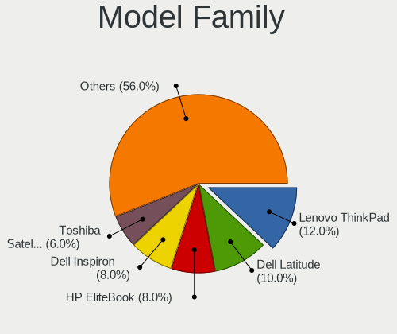
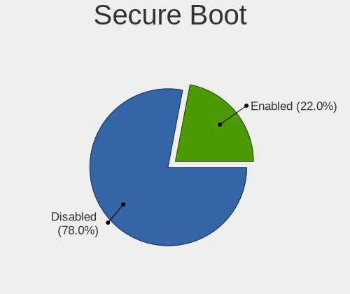
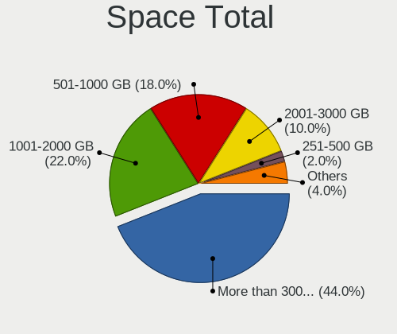
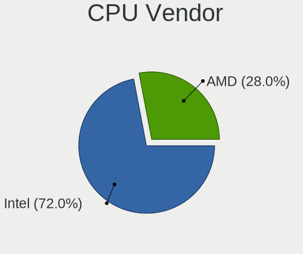
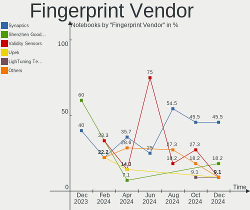

openSUSE - Hardware Trends (Notebooks)
--------------------------------------

A project to identify most popular hardware characteristics and track their change
over time based on data collected by Linux users at https://Linux-Hardware.org.

Anyone can contribute to this report by the [hw-probe](https://github.com/linuxhw/hw-probe) tool:

    sudo -E hw-probe -all -upload

This report is for one last month. Overall report since the beginning of time: [TestCoverage](https://github.com/linuxhw/TestCoverage)

Period: Sep, 2022.

Contents
--------

* [ System ](#system)
  - [ OS                       ](#os)
  - [ OS Family                ](#os-family)
  - [ Kernel                   ](#kernel)
  - [ Kernel Family            ](#kernel-family)
  - [ Kernel Major Ver.        ](#kernel-major-ver)
  - [ Arch                     ](#arch)
  - [ DE                       ](#de)
  - [ Display Server           ](#display-server)
  - [ Display Manager          ](#display-manager)
  - [ OS Lang                  ](#os-lang)
  - [ Boot Mode                ](#boot-mode)
  - [ Filesystem               ](#filesystem)
  - [ Part. scheme             ](#part-scheme)
  - [ Dual Boot with Linux/BSD ](#dual-boot-with-linuxbsd)
  - [ Dual Boot (Win)          ](#dual-boot-win)

* [ Board ](#board)
  - [ Vendor                   ](#vendor)
  - [ Model                    ](#model)
  - [ Model Family             ](#model-family)
  - [ MFG Year                 ](#mfg-year)
  - [ Form Factor              ](#form-factor)
  - [ Secure Boot              ](#secure-boot)
  - [ Coreboot                 ](#coreboot)
  - [ RAM Size                 ](#ram-size)
  - [ RAM Used                 ](#ram-used)
  - [ Total Drives             ](#total-drives)
  - [ Has CD-ROM               ](#has-cd-rom)
  - [ Has Ethernet             ](#has-ethernet)
  - [ Has WiFi                 ](#has-wifi)
  - [ Has Bluetooth            ](#has-bluetooth)

* [ Location ](#location)
  - [ Country                  ](#country)
  - [ City                     ](#city)

* [ Drives ](#drives)
  - [ Drive Vendor             ](#drive-vendor)
  - [ Drive Model              ](#drive-model)
  - [ HDD Vendor               ](#hdd-vendor)
  - [ SSD Vendor               ](#ssd-vendor)
  - [ Drive Kind               ](#drive-kind)
  - [ Drive Connector          ](#drive-connector)
  - [ Drive Size               ](#drive-size)
  - [ Space Total              ](#space-total)
  - [ Space Used               ](#space-used)
  - [ Malfunc. Drives          ](#malfunc-drives)
  - [ Malfunc. Drive Vendor    ](#malfunc-drive-vendor)
  - [ Malfunc. HDD Vendor      ](#malfunc-hdd-vendor)
  - [ Malfunc. Drive Kind      ](#malfunc-drive-kind)
  - [ Failed Drives            ](#failed-drives)
  - [ Failed Drive Vendor      ](#failed-drive-vendor)
  - [ Drive Status             ](#drive-status)

* [ Storage controller ](#storage-controller)
  - [ Storage Vendor           ](#storage-vendor)
  - [ Storage Model            ](#storage-model)
  - [ Storage Kind             ](#storage-kind)

* [ Processor ](#processor)
  - [ CPU Vendor               ](#cpu-vendor)
  - [ CPU Model                ](#cpu-model)
  - [ CPU Model Family         ](#cpu-model-family)
  - [ CPU Cores                ](#cpu-cores)
  - [ CPU Sockets              ](#cpu-sockets)
  - [ CPU Threads              ](#cpu-threads)
  - [ CPU Op-Modes             ](#cpu-op-modes)
  - [ CPU Microcode            ](#cpu-microcode)
  - [ CPU Microarch            ](#cpu-microarch)

* [ Graphics ](#graphics)
  - [ GPU Vendor               ](#gpu-vendor)
  - [ GPU Model                ](#gpu-model)
  - [ GPU Combo                ](#gpu-combo)
  - [ GPU Driver               ](#gpu-driver)
  - [ GPU Memory               ](#gpu-memory)

* [ Monitor ](#monitor)
  - [ Monitor Vendor           ](#monitor-vendor)
  - [ Monitor Model            ](#monitor-model)
  - [ Monitor Resolution       ](#monitor-resolution)
  - [ Monitor Diagonal         ](#monitor-diagonal)
  - [ Monitor Width            ](#monitor-width)
  - [ Aspect Ratio             ](#aspect-ratio)
  - [ Monitor Area             ](#monitor-area)
  - [ Pixel Density            ](#pixel-density)
  - [ Multiple Monitors        ](#multiple-monitors)

* [ Network ](#network)
  - [ Net Controller Vendor    ](#net-controller-vendor)
  - [ Net Controller Model     ](#net-controller-model)
  - [ Wireless Vendor          ](#wireless-vendor)
  - [ Wireless Model           ](#wireless-model)
  - [ Ethernet Vendor          ](#ethernet-vendor)
  - [ Ethernet Model           ](#ethernet-model)
  - [ Net Controller Kind      ](#net-controller-kind)
  - [ Used Controller          ](#used-controller)
  - [ NICs                     ](#nics)
  - [ IPv6                     ](#ipv6)

* [ Bluetooth ](#bluetooth)
  - [ Bluetooth Vendor         ](#bluetooth-vendor)
  - [ Bluetooth Model          ](#bluetooth-model)

* [ Sound ](#sound)
  - [ Sound Vendor             ](#sound-vendor)
  - [ Sound Model              ](#sound-model)

* [ Memory ](#memory)
  - [ Memory Vendor            ](#memory-vendor)
  - [ Memory Model             ](#memory-model)
  - [ Memory Kind              ](#memory-kind)
  - [ Memory Form Factor       ](#memory-form-factor)
  - [ Memory Size              ](#memory-size)
  - [ Memory Speed             ](#memory-speed)

* [ Printers & scanners ](#printers--scanners)
  - [ Printer Vendor           ](#printer-vendor)
  - [ Printer Model            ](#printer-model)
  - [ Scanner Vendor           ](#scanner-vendor)
  - [ Scanner Model            ](#scanner-model)

* [ Camera ](#camera)
  - [ Camera Vendor            ](#camera-vendor)
  - [ Camera Model             ](#camera-model)

* [ Security ](#security)
  - [ Fingerprint Vendor       ](#fingerprint-vendor)
  - [ Fingerprint Model        ](#fingerprint-model)
  - [ Chipcard Vendor          ](#chipcard-vendor)
  - [ Chipcard Model           ](#chipcard-model)

* [ Unsupported ](#unsupported)
  - [ Unsupported Devices      ](#unsupported-devices)
  - [ Unsupported Device Types ](#unsupported-device-types)

System
------

OS
--

Installed operating systems

| Name                         | Notebooks | Percent |
|------------------------------|-----------|---------|
| openSUSE Tumbleweed-XXXXXXXX | 18        | 78.26%  |
| openSUSE Leap-15.4           | 5         | 21.74%  |

OS Family
---------

OS without a version

| Name     | Notebooks | Percent |
|----------|-----------|---------|
| openSUSE | 23        | 100%    |

Kernel
------

Version of the Linux kernel

| Version                      | Notebooks | Percent |
|------------------------------|-----------|---------|
| 5.19.2-1-default             | 9         | 39.13%  |
| 5.19.8-1-default             | 5         | 21.74%  |
| 5.14.21-150400.24.21-default | 4         | 17.39%  |
| 5.19.7-1-default             | 2         | 8.7%    |
| 5.19.10-1-default            | 1         | 4.35%   |
| 5.18.1-1-default             | 1         | 4.35%   |
| 5.14.21-150400.24.18-default | 1         | 4.35%   |

Kernel Family
-------------

Linux kernel without a distro release

| Version | Notebooks | Percent |
|---------|-----------|---------|
| 5.19.2  | 9         | 39.13%  |
| 5.19.8  | 5         | 21.74%  |
| 5.14.21 | 5         | 21.74%  |
| 5.19.7  | 2         | 8.7%    |
| 5.19.10 | 1         | 4.35%   |
| 5.18.1  | 1         | 4.35%   |

Kernel Major Ver.
-----------------

Linux kernel major version

| Version | Notebooks | Percent |
|---------|-----------|---------|
| 5.19    | 17        | 73.91%  |
| 5.14    | 5         | 21.74%  |
| 5.18    | 1         | 4.35%   |

Arch
----

OS architecture (x86_64, i586, etc.)

| Name   | Notebooks | Percent |
|--------|-----------|---------|
| x86_64 | 23        | 100%    |

DE
--

Desktop Environment

| Name       | Notebooks | Percent |
|------------|-----------|---------|
| KDE5       | 14        | 60.87%  |
| GNOME      | 6         | 26.09%  |
| XFCE       | 1         | 4.35%   |
| X-Cinnamon | 1         | 4.35%   |
| LXDE       | 1         | 4.35%   |

Display Server
--------------

X11 or Wayland

| Name    | Notebooks | Percent |
|---------|-----------|---------|
| X11     | 18        | 78.26%  |
| Wayland | 5         | 21.74%  |

Display Manager
---------------

SDDM, LightDM, etc.

| Name    | Notebooks | Percent |
|---------|-----------|---------|
| Unknown | 12        | 52.17%  |
| SDDM    | 6         | 26.09%  |
| XDM     | 3         | 13.04%  |
| LightDM | 2         | 8.7%    |

OS Lang
-------

Language

| Lang  | Notebooks | Percent |
|-------|-----------|---------|
| en_US | 12        | 52.17%  |
| de_DE | 5         | 21.74%  |
| ru_RU | 2         | 8.7%    |
| en_GB | 2         | 8.7%    |
| it_IT | 1         | 4.35%   |
| fi_FI | 1         | 4.35%   |

Boot Mode
---------

EFI or BIOS

| Mode | Notebooks | Percent |
|------|-----------|---------|
| EFI  | 16        | 69.57%  |
| BIOS | 7         | 30.43%  |

Filesystem
----------

Type of filesystem

| Type  | Notebooks | Percent |
|-------|-----------|---------|
| Btrfs | 20        | 86.96%  |
| Ext4  | 2         | 8.7%    |
| Xfs   | 1         | 4.35%   |

Part. scheme
------------

Scheme of partitioning

| Type    | Notebooks | Percent |
|---------|-----------|---------|
| Unknown | 12        | 52.17%  |
| GPT     | 11        | 47.83%  |

Dual Boot with Linux/BSD
------------------------

Hosting more than one Linux/BSD

| Dual boot | Notebooks | Percent |
|-----------|-----------|---------|
| No        | 22        | 95.65%  |
| Yes       | 1         | 4.35%   |

Dual Boot (Win)
---------------

Hosting Linux and Windows

| Dual boot | Notebooks | Percent |
|-----------|-----------|---------|
| No        | 19        | 82.61%  |
| Yes       | 4         | 17.39%  |

Board
-----

Vendor
------

Motherboard manufacturer

| Name                | Notebooks | Percent |
|---------------------|-----------|---------|
| Lenovo              | 7         | 30.43%  |
| Dell                | 5         | 21.74%  |
| Hewlett-Packard     | 3         | 13.04%  |
| Timi                | 1         | 4.35%   |
| SLIMBOOK            | 1         | 4.35%   |
| Samsung Electronics | 1         | 4.35%   |
| MSI                 | 1         | 4.35%   |
| HUAWEI              | 1         | 4.35%   |
| ASUSTek Computer    | 1         | 4.35%   |
| Apple               | 1         | 4.35%   |
| Acer                | 1         | 4.35%   |

Model
-----

Motherboard model

| Name                                  | Notebooks | Percent |
|---------------------------------------|-----------|---------|
| Timi A35S                             | 1         | 4.35%   |
| SLIMBOOK PROX-AMD5                    | 1         | 4.35%   |
| Samsung 550XBE/350XBE                 | 1         | 4.35%   |
| MSI Modern 14 B5M                     | 1         | 4.35%   |
| Lenovo ThinkPad W510 4391W3V          | 1         | 4.35%   |
| Lenovo ThinkPad T14s Gen 1 20UJS00K00 | 1         | 4.35%   |
| Lenovo ThinkPad T14 Gen 1 20S1S7NP00  | 1         | 4.35%   |
| Lenovo ThinkPad T14 Gen 1 20S0004BMH  | 1         | 4.35%   |
| Lenovo ThinkPad E14 Gen 4 21EB000HAU  | 1         | 4.35%   |
| Lenovo K14 Gen 1 21CUS02600           | 1         | 4.35%   |
| Lenovo IdeaPad 5 Pro 16ACH6 82L5      | 1         | 4.35%   |
| HUAWEI KLVD-WXX9                      | 1         | 4.35%   |
| HP ZBook 17 G2                        | 1         | 4.35%   |
| HP EliteBook 8470p                    | 1         | 4.35%   |
| HP 250 G8 Notebook PC                 | 1         | 4.35%   |
| Dell Precision 5530                   | 1         | 4.35%   |
| Dell Latitude E5250                   | 1         | 4.35%   |
| Dell Latitude 7400                    | 1         | 4.35%   |
| Dell Inspiron 5515                    | 1         | 4.35%   |
| Dell Inspiron 3542                    | 1         | 4.35%   |
| ASUS X55CR                            | 1         | 4.35%   |
| Apple MacBookPro8,2                   | 1         | 4.35%   |
| Acer Predator PH315-52                | 1         | 4.35%   |

Model Family
------------

Motherboard model prefix

| Name               | Notebooks | Percent |
|--------------------|-----------|---------|
| Lenovo ThinkPad    | 5         | 21.74%  |
| Dell Latitude      | 2         | 8.7%    |
| Dell Inspiron      | 2         | 8.7%    |
| Timi A35S          | 1         | 4.35%   |
| SLIMBOOK PROX-AMD5 | 1         | 4.35%   |
| Samsung 550XBE     | 1         | 4.35%   |
| MSI Modern         | 1         | 4.35%   |
| Lenovo K14         | 1         | 4.35%   |
| Lenovo IdeaPad     | 1         | 4.35%   |
| HUAWEI KLVD-WXX9   | 1         | 4.35%   |
| HP ZBook           | 1         | 4.35%   |
| HP EliteBook       | 1         | 4.35%   |
| HP 250             | 1         | 4.35%   |
| Dell Precision     | 1         | 4.35%   |
| ASUS X55CR         | 1         | 4.35%   |
| Apple MacBookPro8  | 1         | 4.35%   |
| Acer Predator      | 1         | 4.35%   |

MFG Year
--------

Motherboard manufacture year

| Year | Notebooks | Percent |
|------|-----------|---------|
| 2021 | 6         | 26.09%  |
| 2020 | 4         | 17.39%  |
| 2019 | 3         | 13.04%  |
| 2014 | 3         | 13.04%  |
| 2022 | 2         | 8.7%    |
| 2012 | 2         | 8.7%    |
| 2018 | 1         | 4.35%   |
| 2011 | 1         | 4.35%   |
| 2010 | 1         | 4.35%   |

Form Factor
-----------

Physical design of the computer

| Name     | Notebooks | Percent |
|----------|-----------|---------|
| Notebook | 23        | 100%    |

Secure Boot
-----------

Enabled or disabled

| State    | Notebooks | Percent |
|----------|-----------|---------|
| Disabled | 16        | 69.57%  |
| Enabled  | 7         | 30.43%  |

Coreboot
--------

Have coreboot on board

| Used | Notebooks | Percent |
|------|-----------|---------|
| No   | 23        | 100%    |

RAM Size
--------

Total RAM memory

| Size in GB | Notebooks | Percent |
|------------|-----------|---------|
| 16.01-24.0 | 6         | 26.09%  |
| 4.01-8.0   | 4         | 17.39%  |
| 32.01-64.0 | 4         | 17.39%  |
| 8.01-16.0  | 4         | 17.39%  |
| 24.01-32.0 | 3         | 13.04%  |
| 3.01-4.0   | 2         | 8.7%    |

RAM Used
--------

Used RAM memory

| Used GB   | Notebooks | Percent |
|-----------|-----------|---------|
| 4.01-8.0  | 7         | 30.43%  |
| 1.01-2.0  | 5         | 21.74%  |
| 8.01-16.0 | 5         | 21.74%  |
| 3.01-4.0  | 3         | 13.04%  |
| 2.01-3.0  | 3         | 13.04%  |

Total Drives
------------

Number of drives on board

| Drives | Notebooks | Percent |
|--------|-----------|---------|
| 1      | 19        | 82.61%  |
| 2      | 3         | 13.04%  |
| 4      | 1         | 4.35%   |

Has CD-ROM
----------

Has CD-ROM on board

| Presented | Notebooks | Percent |
|-----------|-----------|---------|
| No        | 18        | 78.26%  |
| Yes       | 5         | 21.74%  |

Has Ethernet
------------

Has Ethernet on board

| Presented | Notebooks | Percent |
|-----------|-----------|---------|
| Yes       | 17        | 73.91%  |
| No        | 6         | 26.09%  |

Has WiFi
--------

Has WiFi module

| Presented | Notebooks | Percent |
|-----------|-----------|---------|
| Yes       | 22        | 95.65%  |
| No        | 1         | 4.35%   |

Has Bluetooth
-------------

Has Bluetooth module

| Presented | Notebooks | Percent |
|-----------|-----------|---------|
| Yes       | 22        | 95.65%  |
| No        | 1         | 4.35%   |

Location
--------

Country
-------

Geographic location (country)

| Country     | Notebooks | Percent |
|-------------|-----------|---------|
| Germany     | 5         | 21.74%  |
| USA         | 3         | 13.04%  |
| Sweden      | 2         | 8.7%    |
| Russia      | 2         | 8.7%    |
| Italy       | 2         | 8.7%    |
| Serbia      | 1         | 4.35%   |
| Netherlands | 1         | 4.35%   |
| France      | 1         | 4.35%   |
| Finland     | 1         | 4.35%   |
| Chile       | 1         | 4.35%   |
| Brazil      | 1         | 4.35%   |
| Belgium     | 1         | 4.35%   |
| Austria     | 1         | 4.35%   |
| Australia   | 1         | 4.35%   |

City
----

Geographic location (city)

| City         | Notebooks | Percent |
|--------------|-----------|---------|
| West Chester | 1         | 4.35%   |
| Vienna       | 1         | 4.35%   |
| Umeå        | 1         | 4.35%   |
| Tarneit      | 1         | 4.35%   |
| Stockholm    | 1         | 4.35%   |
| Santiago     | 1         | 4.35%   |
| Saki         | 1         | 4.35%   |
| Ronago       | 1         | 4.35%   |
| Rome         | 1         | 4.35%   |
| Paris        | 1         | 4.35%   |
| Moscow       | 1         | 4.35%   |
| Meulebeke    | 1         | 4.35%   |
| Mesa         | 1         | 4.35%   |
| Hoffman      | 1         | 4.35%   |
| Helsinki     | 1         | 4.35%   |
| Hamburg      | 1         | 4.35%   |
| Göttingen   | 1         | 4.35%   |
| Fürth       | 1         | 4.35%   |
| Froendenberg | 1         | 4.35%   |
| Essen        | 1         | 4.35%   |
| Ede          | 1         | 4.35%   |
| Caieiras     | 1         | 4.35%   |
| Belgrade     | 1         | 4.35%   |

Drives
------

Drive Vendor
------------

Hard drive vendors

| Vendor                      | Notebooks | Drives | Percent |
|-----------------------------|-----------|--------|---------|
| Samsung Electronics         | 8         | 11     | 29.63%  |
| SK hynix                    | 3         | 3      | 11.11%  |
| Seagate                     | 3         | 3      | 11.11%  |
| Sandisk                     | 2         | 2      | 7.41%   |
| Micron Technology           | 2         | 2      | 7.41%   |
| WDC                         | 1         | 1      | 3.7%    |
| Unknown                     | 1         | 1      | 3.7%    |
| Toshiba                     | 1         | 1      | 3.7%    |
| PNY                         | 1         | 1      | 3.7%    |
| Phison Electronics          | 1         | 1      | 3.7%    |
| LITEON                      | 1         | 1      | 3.7%    |
| KIOXIA                      | 1         | 1      | 3.7%    |
| Kingston Technology Company | 1         | 1      | 3.7%    |
| Crucial                     | 1         | 1      | 3.7%    |

Drive Model
-----------

Hard drive models

| Model                                               | Notebooks | Percent |
|-----------------------------------------------------|-----------|---------|
| Samsung NVMe SSD Controller SM981/PM981/PM983 256GB | 4         | 14.29%  |
| WDC WD2500BEVT-00ZCT0 250GB                         | 1         | 3.57%   |
| Unknown MMC Card  7GB                               | 1         | 3.57%   |
| Toshiba MQ04ABF100 1TB                              | 1         | 3.57%   |
| SK hynix NVMe SSD Drive 512GB                       | 1         | 3.57%   |
| SK hynix BC711 NVMe 1TB                             | 1         | 3.57%   |
| SK hynix BC501 NVMe Solid State Drive 512GB         | 1         | 3.57%   |
| Seagate ST2000DM 001-9YN164 2TB                     | 1         | 3.57%   |
| Seagate ST1000LX015-1U7172 1TB                      | 1         | 3.57%   |
| Seagate ST1000LM024 HN-M101MBB 1TB                  | 1         | 3.57%   |
| Sandisk WD Blue SN550 NVMe SSD 1024GB               | 1         | 3.57%   |
| Sandisk WD Black SN750 / PC SN730 NVMe SSD 1024GB   | 1         | 3.57%   |
| Samsung SSD PM851 2.5 7mm 128GB                     | 1         | 3.57%   |
| Samsung SSD 840 PRO Series 128GB                    | 1         | 3.57%   |
| Samsung NVMe SSD Drive 512GB                        | 1         | 3.57%   |
| Samsung NVMe SSD Drive 500GB                        | 1         | 3.57%   |
| Samsung MZ7PD128HAFV-000H7 128GB SSD                | 1         | 3.57%   |
| PNY CS3030 2TB SSD                                  | 1         | 3.57%   |
| Phison E12 NVMe Controller 1024GB                   | 1         | 3.57%   |
| Micron MTFDKCD512TFK 512GB                          | 1         | 3.57%   |
| Micron Crucial X8 SSD 2TB                           | 1         | 3.57%   |
| LITEON CV8-8E128 128GB SSD                          | 1         | 3.57%   |
| KIOXIA KBG40ZNS512G NVMe 512GB                      | 1         | 3.57%   |
| Kingston Company OM3PDP3 NVMe SSD 512GB             | 1         | 3.57%   |
| Crucial CT500MX500SSD1 500GB                        | 1         | 3.57%   |

HDD Vendor
----------

Hard disk drive vendors

| Vendor  | Notebooks | Drives | Percent |
|---------|-----------|--------|---------|
| Seagate | 3         | 3      | 60%     |
| WDC     | 1         | 1      | 20%     |
| Toshiba | 1         | 1      | 20%     |

SSD Vendor
----------

Solid state drive vendors

| Vendor              | Notebooks | Drives | Percent |
|---------------------|-----------|--------|---------|
| Samsung Electronics | 3         | 5      | 50%     |
| Micron Technology   | 1         | 1      | 16.67%  |
| LITEON              | 1         | 1      | 16.67%  |
| Crucial             | 1         | 1      | 16.67%  |

Drive Kind
----------

HDD or SSD

| Kind | Notebooks | Drives | Percent |
|------|-----------|--------|---------|
| NVMe | 15        | 16     | 55.56%  |
| SSD  | 6         | 8      | 22.22%  |
| HDD  | 5         | 5      | 18.52%  |
| MMC  | 1         | 1      | 3.7%    |

Drive Connector
---------------

SATA, SAS, NVMe, etc.

| Type | Notebooks | Drives | Percent |
|------|-----------|--------|---------|
| NVMe | 15        | 16     | 57.69%  |
| SATA | 8         | 11     | 30.77%  |
| SAS  | 2         | 2      | 7.69%   |
| MMC  | 1         | 1      | 3.85%   |

Drive Size
----------

Size of hard drive

| Size in TB | Notebooks | Drives | Percent |
|------------|-----------|--------|---------|
| 0.01-0.5   | 6         | 8      | 54.55%  |
| 0.51-1.0   | 3         | 3      | 27.27%  |
| 1.01-2.0   | 2         | 2      | 18.18%  |

Space Total
-----------

Amount of disk space available on the file system

| Size in GB     | Notebooks | Percent |
|----------------|-----------|---------|
| More than 3000 | 10        | 43.48%  |
| 1001-2000      | 5         | 21.74%  |
| 501-1000       | 4         | 17.39%  |
| 251-500        | 2         | 8.7%    |
| 2001-3000      | 1         | 4.35%   |
| Unknown        | 1         | 4.35%   |

Space Used
----------

Amount of used disk space

| Used GB        | Notebooks | Percent |
|----------------|-----------|---------|
| 51-100         | 6         | 26.09%  |
| 101-250        | 5         | 21.74%  |
| 501-1000       | 3         | 13.04%  |
| More than 3000 | 2         | 8.7%    |
| 251-500        | 2         | 8.7%    |
| 2001-3000      | 2         | 8.7%    |
| 1001-2000      | 2         | 8.7%    |
| Unknown        | 1         | 4.35%   |

Malfunc. Drives
---------------

Drive models with a malfunction

Zero info for selected period =(

Malfunc. Drive Vendor
---------------------

Vendors of faulty drives

Zero info for selected period =(

Malfunc. HDD Vendor
-------------------

Vendors of faulty HDD drives

Zero info for selected period =(

Malfunc. Drive Kind
-------------------

Kinds of faulty drives

Zero info for selected period =(

Failed Drives
-------------

Failed drive models

Zero info for selected period =(

Failed Drive Vendor
-------------------

Failed drive vendors

Zero info for selected period =(

Drive Status
------------

Number of failed and malfunc. drives

| Status   | Notebooks | Drives | Percent |
|----------|-----------|--------|---------|
| Detected | 13        | 17     | 52%     |
| Works    | 12        | 13     | 48%     |

Storage controller
------------------

Storage Vendor
--------------

Storage controller vendors

| Vendor                      | Notebooks | Percent |
|-----------------------------|-----------|---------|
| Intel                       | 11        | 37.93%  |
| Samsung Electronics         | 5         | 17.24%  |
| SK hynix                    | 3         | 10.34%  |
| AMD                         | 3         | 10.34%  |
| SanDisk                     | 2         | 6.9%    |
| Phison Electronics          | 2         | 6.9%    |
| Micron Technology           | 1         | 3.45%   |
| KIOXIA                      | 1         | 3.45%   |
| Kingston Technology Company | 1         | 3.45%   |

Storage Model
-------------

Storage controller models

| Model                                                                          | Notebooks | Percent |
|--------------------------------------------------------------------------------|-----------|---------|
| Samsung NVMe SSD Controller SM981/PM981/PM983                                  | 4         | 13.33%  |
| AMD FCH SATA Controller [AHCI mode]                                            | 3         | 10%     |
| Phison E12 NVMe Controller                                                     | 2         | 6.67%   |
| Intel Cannon Lake Mobile PCH SATA AHCI Controller                              | 2         | 6.67%   |
| Intel 7 Series Chipset Family 6-port SATA Controller [AHCI mode]               | 2         | 6.67%   |
| SK hynix PC401 NVMe Solid State Drive 256GB                                    | 1         | 3.33%   |
| SK hynix Gold P31 SSD                                                          | 1         | 3.33%   |
| SK hynix BC501 NVMe Solid State Drive                                          | 1         | 3.33%   |
| SanDisk WD Blue SN550 NVMe SSD                                                 | 1         | 3.33%   |
| SanDisk WD Black SN750 / PC SN730 NVMe SSD                                     | 1         | 3.33%   |
| Samsung NVMe SSD Controller 980                                                | 1         | 3.33%   |
| Micron Non-Volatile memory controller                                          | 1         | 3.33%   |
| KIOXIA NVMe SSD Controller BG4                                                 | 1         | 3.33%   |
| Kingston Company OM3PDP3 NVMe SSD                                              | 1         | 3.33%   |
| Intel Wildcat Point-LP SATA Controller [AHCI Mode]                             | 1         | 3.33%   |
| Intel Volume Management Device NVMe RAID Controller                            | 1         | 3.33%   |
| Intel Tiger Lake-LP SATA Controller                                            | 1         | 3.33%   |
| Intel Cannon Point-LP SATA Controller [AHCI Mode]                              | 1         | 3.33%   |
| Intel 8 Series/C220 Series Chipset Family 6-port SATA Controller 1 [AHCI mode] | 1         | 3.33%   |
| Intel 8 Series SATA Controller 1 [AHCI mode]                                   | 1         | 3.33%   |
| Intel 6 Series/C200 Series Chipset Family 6 port Mobile SATA AHCI Controller   | 1         | 3.33%   |
| Intel 5 Series/3400 Series Chipset 6 port SATA AHCI Controller                 | 1         | 3.33%   |

Storage Kind
------------

Kind of storage controller (IDE, SATA, NVMe, SAS, ...)

| Kind | Notebooks | Percent |
|------|-----------|---------|
| NVMe | 15        | 50%     |
| SATA | 14        | 46.67%  |
| RAID | 1         | 3.33%   |

Processor
---------

CPU Vendor
----------

Processor vendors

| Vendor | Notebooks | Percent |
|--------|-----------|---------|
| Intel  | 15        | 65.22%  |
| AMD    | 8         | 34.78%  |

CPU Model
---------

Processor models

| Model                                      | Notebooks | Percent |
|--------------------------------------------|-----------|---------|
| AMD Ryzen 5 5500U with Radeon Graphics     | 2         | 8.7%    |
| Intel Core i7-9750H CPU @ 2.60GHz          | 1         | 4.35%   |
| Intel Core i7-8850H CPU @ 2.60GHz          | 1         | 4.35%   |
| Intel Core i7-8665U CPU @ 1.90GHz          | 1         | 4.35%   |
| Intel Core i7-8565U CPU @ 1.80GHz          | 1         | 4.35%   |
| Intel Core i7-4810MQ CPU @ 2.80GHz         | 1         | 4.35%   |
| Intel Core i7-2720QM CPU @ 2.20GHz         | 1         | 4.35%   |
| Intel Core i7-10610U CPU @ 1.80GHz         | 1         | 4.35%   |
| Intel Core i7-10510U CPU @ 1.80GHz         | 1         | 4.35%   |
| Intel Core i7 CPU Q 720 @ 1.60GHz          | 1         | 4.35%   |
| Intel Core i5-5300U CPU @ 2.30GHz          | 1         | 4.35%   |
| Intel Core i5-3230M CPU @ 2.60GHz          | 1         | 4.35%   |
| Intel Core i3-4005U CPU @ 1.70GHz          | 1         | 4.35%   |
| Intel Core i3-2370M CPU @ 2.40GHz          | 1         | 4.35%   |
| Intel 11th Gen Core i7-1165G7 @ 2.80GHz    | 1         | 4.35%   |
| Intel 11th Gen Core i5-1135G7 @ 2.40GHz    | 1         | 4.35%   |
| AMD Ryzen 9 5900HX with Radeon Graphics    | 1         | 4.35%   |
| AMD Ryzen 7 PRO 4750U with Radeon Graphics | 1         | 4.35%   |
| AMD Ryzen 7 5825U with Radeon Graphics     | 1         | 4.35%   |
| AMD Ryzen 7 5800H with Radeon Graphics     | 1         | 4.35%   |
| AMD Ryzen 7 5700U with Radeon Graphics     | 1         | 4.35%   |
| AMD Ryzen 5 PRO 5650U with Radeon Graphics | 1         | 4.35%   |

CPU Model Family
----------------

Processor model prefix

| Model           | Notebooks | Percent |
|-----------------|-----------|---------|
| Intel Core i7   | 9         | 39.13%  |
| AMD Ryzen 7     | 3         | 13.04%  |
| Other           | 2         | 8.7%    |
| Intel Core i5   | 2         | 8.7%    |
| Intel Core i3   | 2         | 8.7%    |
| AMD Ryzen 5     | 2         | 8.7%    |
| AMD Ryzen 9     | 1         | 4.35%   |
| AMD Ryzen 7 PRO | 1         | 4.35%   |
| AMD Ryzen 5 PRO | 1         | 4.35%   |

CPU Cores
---------

Number of processor cores

| Number | Notebooks | Percent |
|--------|-----------|---------|
| 4      | 9         | 39.13%  |
| 8      | 5         | 21.74%  |
| 6      | 5         | 21.74%  |
| 2      | 4         | 17.39%  |

CPU Sockets
-----------

Number of sockets

| Number | Notebooks | Percent |
|--------|-----------|---------|
| 1      | 23        | 100%    |

CPU Threads
-----------

Threads per core (Hyper-Threading)

| Number | Notebooks | Percent |
|--------|-----------|---------|
| 2      | 23        | 100%    |

CPU Op-Modes
------------

CPU Operation Modes (32-bit, 64-bit)

| Op mode        | Notebooks | Percent |
|----------------|-----------|---------|
| 32-bit, 64-bit | 23        | 100%    |

CPU Microcode
-------------

Microcode number

| Number     | Notebooks | Percent |
|------------|-----------|---------|
| Unknown    | 5         | 21.74%  |
| 0x806ec    | 4         | 17.39%  |
| 0x0a50000c | 4         | 17.39%  |
| 0x08608103 | 3         | 13.04%  |
| 0x806c1    | 2         | 8.7%    |
| 0x906ea    | 1         | 4.35%   |
| 0x306a9    | 1         | 4.35%   |
| 0x206a7    | 1         | 4.35%   |
| 0x106e5    | 1         | 4.35%   |
| 0x08600106 | 1         | 4.35%   |

CPU Microarch
-------------

Microarchitecture

| Name        | Notebooks | Percent |
|-------------|-----------|---------|
| KabyLake    | 6         | 26.09%  |
| Zen 3       | 4         | 17.39%  |
| Unknown     | 3         | 13.04%  |
| TigerLake   | 2         | 8.7%    |
| SandyBridge | 2         | 8.7%    |
| Haswell     | 2         | 8.7%    |
| Zen 2       | 1         | 4.35%   |
| Nehalem     | 1         | 4.35%   |
| IvyBridge   | 1         | 4.35%   |
| Broadwell   | 1         | 4.35%   |

Graphics
--------

GPU Vendor
----------

Vendors of graphics cards

| Vendor | Notebooks | Percent |
|--------|-----------|---------|
| Intel  | 13        | 46.43%  |
| AMD    | 9         | 32.14%  |
| Nvidia | 6         | 21.43%  |

GPU Model
---------

Graphics card models

| Model                                                                     | Notebooks | Percent |
|---------------------------------------------------------------------------|-----------|---------|
| AMD Lucienne                                                              | 3         | 10.71%  |
| AMD Cezanne                                                               | 3         | 10.71%  |
| Intel WhiskeyLake-U GT2 [UHD Graphics 620]                                | 2         | 7.14%   |
| Intel TigerLake-LP GT2 [Iris Xe Graphics]                                 | 2         | 7.14%   |
| Intel CometLake-U GT2 [UHD Graphics]                                      | 2         | 7.14%   |
| Intel CoffeeLake-H GT2 [UHD Graphics 630]                                 | 2         | 7.14%   |
| Intel 2nd Generation Core Processor Family Integrated Graphics Controller | 2         | 7.14%   |
| Nvidia TU116M [GeForce GTX 1660 Ti Mobile]                                | 1         | 3.57%   |
| Nvidia GT216GLM [Quadro FX 880M]                                          | 1         | 3.57%   |
| Nvidia GP108M [GeForce MX250]                                             | 1         | 3.57%   |
| Nvidia GP107GLM [Quadro P1000 Mobile]                                     | 1         | 3.57%   |
| Nvidia GK104GLM [Quadro K3100M]                                           | 1         | 3.57%   |
| Nvidia GA107M [GeForce RTX 3050 Mobile]                                   | 1         | 3.57%   |
| Intel HD Graphics 5500                                                    | 1         | 3.57%   |
| Intel Haswell-ULT Integrated Graphics Controller                          | 1         | 3.57%   |
| Intel 3rd Gen Core processor Graphics Controller                          | 1         | 3.57%   |
| AMD Whistler [Radeon HD 6630M/6650M/6750M/7670M/7690M]                    | 1         | 3.57%   |
| AMD Renoir                                                                | 1         | 3.57%   |
| AMD Barcelo                                                               | 1         | 3.57%   |

GPU Combo
---------

Combinations of graphics cards

| Name           | Notebooks | Percent |
|----------------|-----------|---------|
| 1 x Intel      | 9         | 39.13%  |
| 1 x AMD        | 7         | 30.43%  |
| Intel + Nvidia | 3         | 13.04%  |
| 1 x Nvidia     | 2         | 8.7%    |
| Intel + AMD    | 1         | 4.35%   |
| AMD + Nvidia   | 1         | 4.35%   |

GPU Driver
----------

Free vs proprietary

| Driver      | Notebooks | Percent |
|-------------|-----------|---------|
| Free        | 22        | 95.65%  |
| Proprietary | 1         | 4.35%   |

GPU Memory
----------

Total video memory

| Size in GB | Notebooks | Percent |
|------------|-----------|---------|
| Unknown    | 11        | 47.83%  |
| 0.01-0.5   | 5         | 21.74%  |
| 0.51-1.0   | 4         | 17.39%  |
| 3.01-4.0   | 3         | 13.04%  |

Monitor
-------

Monitor Vendor
--------------

Monitor vendors

| Vendor              | Notebooks | Percent |
|---------------------|-----------|---------|
| AU Optronics        | 12        | 40%     |
| BOE                 | 4         | 13.33%  |
| Samsung Electronics | 3         | 10%     |
| Dell                | 2         | 6.67%   |
| Chimei Innolux      | 2         | 6.67%   |
| ViewSonic           | 1         | 3.33%   |
| Sharp               | 1         | 3.33%   |
| Pixio               | 1         | 3.33%   |
| Lenovo              | 1         | 3.33%   |
| Goldstar            | 1         | 3.33%   |
| CSO                 | 1         | 3.33%   |
| Apple               | 1         | 3.33%   |

Monitor Model
-------------

Monitor models

| Model                                                                 | Notebooks | Percent |
|-----------------------------------------------------------------------|-----------|---------|
| ViewSonic LCD Monitor VSC8224 1680x1050 470x300mm 22.0-inch           | 1         | 3.23%   |
| Sharp LCD Monitor SHP149A 1920x1080 344x194mm 15.5-inch               | 1         | 3.23%   |
| Samsung Electronics S27C650 SAM09E1 1920x1080 600x340mm 27.2-inch     | 1         | 3.23%   |
| Samsung Electronics S27C450 SAM09D1 1920x1080 600x340mm 27.2-inch     | 1         | 3.23%   |
| Samsung Electronics S24R35A SAM729F 1920x1080 521x293mm 23.5-inch     | 1         | 3.23%   |
| Samsung Electronics LCD Monitor SDC4150 3456x2160 336x210mm 15.6-inch | 1         | 3.23%   |
| Pixio U29I WAM2900 2560x1080 690x260mm 29.0-inch                      | 1         | 3.23%   |
| Lenovo LCD Monitor LEN40B2 1920x1080 344x193mm 15.5-inch              | 1         | 3.23%   |
| Goldstar HDR WQHD GSM7756 3440x1440 820x346mm 35.0-inch               | 1         | 3.23%   |
| Dell SE2216H DELF071 1920x1080 476x268mm 21.5-inch                    | 1         | 3.23%   |
| Dell P2210 DEL404D 1680x1050 474x296mm 22.0-inch                      | 1         | 3.23%   |
| CSO LCD Monitor CSO160A 2560x1600 345x215mm 16.0-inch                 | 1         | 3.23%   |
| Chimei Innolux LCD Monitor CMN14F2 1920x1080 309x173mm 13.9-inch      | 1         | 3.23%   |
| Chimei Innolux LCD Monitor CMN1474 1366x768 309x174mm 14.0-inch       | 1         | 3.23%   |
| BOE LCD Monitor BOE09AE 1920x1080 309x174mm 14.0-inch                 | 1         | 3.23%   |
| BOE LCD Monitor BOE08EE 1920x1080 309x174mm 14.0-inch                 | 1         | 3.23%   |
| BOE LCD Monitor BOE0893 2160x1440 296x197mm 14.0-inch                 | 1         | 3.23%   |
| BOE LCD Monitor BOE07DB 1920x1080 309x174mm 14.0-inch                 | 1         | 3.23%   |
| AU Optronics LCD Monitor AUO82ED 1920x1080 344x193mm 15.5-inch        | 1         | 3.23%   |
| AU Optronics LCD Monitor AUO633D 1920x1080 309x174mm 14.0-inch        | 1         | 3.23%   |
| AU Optronics LCD Monitor AUO573D 1920x1080 309x174mm 14.0-inch        | 1         | 3.23%   |
| AU Optronics LCD Monitor AUO40EC 1366x768 344x193mm 15.5-inch         | 1         | 3.23%   |
| AU Optronics LCD Monitor AUO408D 1920x1080 309x174mm 14.0-inch        | 1         | 3.23%   |
| AU Optronics LCD Monitor AUO403D 1920x1080 309x174mm 14.0-inch        | 1         | 3.23%   |
| AU Optronics LCD Monitor AUO38ED 1920x1080 344x193mm 15.5-inch        | 1         | 3.23%   |
| AU Optronics LCD Monitor AUO3892 1920x1080 344x194mm 15.5-inch        | 1         | 3.23%   |
| AU Optronics LCD Monitor AUO3791 1920x1080 344x194mm 15.5-inch        | 1         | 3.23%   |
| AU Optronics LCD Monitor AUO22EC 1366x768 344x193mm 15.5-inch         | 1         | 3.23%   |
| AU Optronics LCD Monitor AUO219D 1920x1080 380x210mm 17.1-inch        | 1         | 3.23%   |
| AU Optronics LCD Monitor AUO106C 1366x768 277x156mm 12.5-inch         | 1         | 3.23%   |
| Apple LCD Monitor APP9CA3 1440x900 331x207mm 15.4-inch                | 1         | 3.23%   |

Monitor Resolution
------------------

Monitor screen resolution

| Resolution         | Notebooks | Percent |
|--------------------|-----------|---------|
| 1920x1080 (FHD)    | 16        | 57.14%  |
| 1366x768 (WXGA)    | 4         | 14.29%  |
| 1680x1050 (WSXGA+) | 2         | 7.14%   |
| 3456x2160          | 1         | 3.57%   |
| 3440x1440          | 1         | 3.57%   |
| 2560x1600          | 1         | 3.57%   |
| 2560x1080          | 1         | 3.57%   |
| 2160x1440          | 1         | 3.57%   |
| 1440x900 (WXGA+)   | 1         | 3.57%   |

Monitor Diagonal
----------------

Diagonal size in inches

| Inches | Notebooks | Percent |
|--------|-----------|---------|
| 15     | 10        | 33.33%  |
| 14     | 9         | 30%     |
| 22     | 2         | 6.67%   |
| 35     | 1         | 3.33%   |
| 29     | 1         | 3.33%   |
| 27     | 1         | 3.33%   |
| 23     | 1         | 3.33%   |
| 21     | 1         | 3.33%   |
| 17     | 1         | 3.33%   |
| 16     | 1         | 3.33%   |
| 13     | 1         | 3.33%   |
| 12     | 1         | 3.33%   |

Monitor Width
-------------

Physical width

| Width in mm | Notebooks | Percent |
|-------------|-----------|---------|
| 301-350     | 20        | 66.67%  |
| 401-500     | 3         | 10%     |
| 501-600     | 2         | 6.67%   |
| 201-300     | 2         | 6.67%   |
| 801-900     | 1         | 3.33%   |
| 601-700     | 1         | 3.33%   |
| 351-400     | 1         | 3.33%   |

Aspect Ratio
------------

Proportional relationship between the width and the height

| Ratio | Notebooks | Percent |
|-------|-----------|---------|
| 16/9  | 19        | 70.37%  |
| 16/10 | 5         | 18.52%  |
| 3/2   | 1         | 3.7%    |
| 21/9  | 1         | 3.7%    |
| 2.65  | 1         | 3.7%    |

Monitor Area
------------

Area in inch²

| Area in inch² | Notebooks | Percent |
|----------------|-----------|---------|
| 81-90          | 10        | 34.48%  |
| 101-110        | 10        | 34.48%  |
| 201-250        | 3         | 10.34%  |
| 61-70          | 1         | 3.45%   |
| 351-500        | 1         | 3.45%   |
| 301-350        | 1         | 3.45%   |
| 251-300        | 1         | 3.45%   |
| 121-130        | 1         | 3.45%   |
| 111-120        | 1         | 3.45%   |

Pixel Density
-------------

Pixels per inch

| Density       | Notebooks | Percent |
|---------------|-----------|---------|
| 121-160       | 16        | 55.17%  |
| 101-120       | 6         | 20.69%  |
| 51-100        | 4         | 13.79%  |
| 161-240       | 2         | 6.9%    |
| More than 240 | 1         | 3.45%   |

Multiple Monitors
-----------------

Total monitors connected

| Total | Notebooks | Percent |
|-------|-----------|---------|
| 1     | 17        | 73.91%  |
| 2     | 4         | 17.39%  |
| 3     | 2         | 8.7%    |

Network
-------

Net Controller Vendor
---------------------

Controller vendors

| Vendor                | Notebooks | Percent |
|-----------------------|-----------|---------|
| Intel                 | 15        | 45.45%  |
| Realtek Semiconductor | 9         | 27.27%  |
| Qualcomm Atheros      | 4         | 12.12%  |
| MediaTek              | 2         | 6.06%   |
| Hewlett-Packard       | 1         | 3.03%   |
| Cypress Semiconductor | 1         | 3.03%   |
| Broadcom              | 1         | 3.03%   |

Net Controller Model
--------------------

Controller models

| Model                                                             | Notebooks | Percent |
|-------------------------------------------------------------------|-----------|---------|
| Realtek RTL8111/8168/8411 PCI Express Gigabit Ethernet Controller | 5         | 11.36%  |
| Intel Wi-Fi 6 AX200                                               | 5         | 11.36%  |
| Realtek RTL8153 Gigabit Ethernet Adapter                          | 4         | 9.09%   |
| Realtek RTL810xE PCI Express Fast Ethernet controller             | 2         | 4.55%   |
| Intel Comet Lake PCH-LP CNVi WiFi                                 | 2         | 4.55%   |
| Realtek RTL8822CE 802.11ac PCIe Wireless Network Adapter          | 1         | 2.27%   |
| Realtek Realtek Network controller                                | 1         | 2.27%   |
| Qualcomm Atheros QCA9565 / AR9565 Wireless Network Adapter        | 1         | 2.27%   |
| Qualcomm Atheros QCA9377 802.11ac Wireless Network Adapter        | 1         | 2.27%   |
| Qualcomm Atheros Killer E2500 Gigabit Ethernet Controller         | 1         | 2.27%   |
| Qualcomm Atheros AR9485 Wireless Network Adapter                  | 1         | 2.27%   |
| Qualcomm Atheros AR8161 Gigabit Ethernet                          | 1         | 2.27%   |
| MediaTek MT7921K (RZ608) Wi-Fi 6E 80MHz                           | 1         | 2.27%   |
| MediaTek MT7921 802.11ax PCI Express Wireless Network Adapter     | 1         | 2.27%   |
| Intel Wireless-AC 9260                                            | 1         | 2.27%   |
| Intel Wireless 7265                                               | 1         | 2.27%   |
| Intel Wi-Fi 6 AX201                                               | 1         | 2.27%   |
| Intel Ethernet Connection I217-LM                                 | 1         | 2.27%   |
| Intel Ethernet Connection (3) I218-LM                             | 1         | 2.27%   |
| Intel Ethernet Connection (10) I219-V                             | 1         | 2.27%   |
| Intel Ethernet Connection (10) I219-LM                            | 1         | 2.27%   |
| Intel Centrino Ultimate-N 6300                                    | 1         | 2.27%   |
| Intel Centrino Advanced-N 6205 [Taylor Peak]                      | 1         | 2.27%   |
| Intel Cannon Point-LP CNVi [Wireless-AC]                          | 1         | 2.27%   |
| Intel Cannon Lake PCH CNVi WiFi                                   | 1         | 2.27%   |
| Intel 82579LM Gigabit Network Connection (Lewisville)             | 1         | 2.27%   |
| Intel 82577LM Gigabit Network Connection                          | 1         | 2.27%   |
| HP un2430 Mobile Broadband Module                                 | 1         | 2.27%   |
| Cypress K38231_03                                                 | 1         | 2.27%   |
| Broadcom NetXtreme BCM57765 Gigabit Ethernet PCIe                 | 1         | 2.27%   |
| Broadcom BCM4331 802.11a/b/g/n                                    | 1         | 2.27%   |

Wireless Vendor
---------------

Wireless vendors

| Vendor                | Notebooks | Percent |
|-----------------------|-----------|---------|
| Intel                 | 14        | 63.64%  |
| Qualcomm Atheros      | 3         | 13.64%  |
| Realtek Semiconductor | 2         | 9.09%   |
| MediaTek              | 2         | 9.09%   |
| Broadcom              | 1         | 4.55%   |

Wireless Model
--------------

Wireless models

| Model                                                         | Notebooks | Percent |
|---------------------------------------------------------------|-----------|---------|
| Intel Wi-Fi 6 AX200                                           | 5         | 22.73%  |
| Intel Comet Lake PCH-LP CNVi WiFi                             | 2         | 9.09%   |
| Realtek RTL8822CE 802.11ac PCIe Wireless Network Adapter      | 1         | 4.55%   |
| Realtek Realtek Network controller                            | 1         | 4.55%   |
| Qualcomm Atheros QCA9565 / AR9565 Wireless Network Adapter    | 1         | 4.55%   |
| Qualcomm Atheros QCA9377 802.11ac Wireless Network Adapter    | 1         | 4.55%   |
| Qualcomm Atheros AR9485 Wireless Network Adapter              | 1         | 4.55%   |
| MediaTek MT7921K (RZ608) Wi-Fi 6E 80MHz                       | 1         | 4.55%   |
| MediaTek MT7921 802.11ax PCI Express Wireless Network Adapter | 1         | 4.55%   |
| Intel Wireless-AC 9260                                        | 1         | 4.55%   |
| Intel Wireless 7265                                           | 1         | 4.55%   |
| Intel Wi-Fi 6 AX201                                           | 1         | 4.55%   |
| Intel Centrino Ultimate-N 6300                                | 1         | 4.55%   |
| Intel Centrino Advanced-N 6205 [Taylor Peak]                  | 1         | 4.55%   |
| Intel Cannon Point-LP CNVi [Wireless-AC]                      | 1         | 4.55%   |
| Intel Cannon Lake PCH CNVi WiFi                               | 1         | 4.55%   |
| Broadcom BCM4331 802.11a/b/g/n                                | 1         | 4.55%   |

Ethernet Vendor
---------------

Ethernet vendors

| Vendor                | Notebooks | Percent |
|-----------------------|-----------|---------|
| Realtek Semiconductor | 9         | 47.37%  |
| Intel                 | 6         | 31.58%  |
| Qualcomm Atheros      | 2         | 10.53%  |
| Cypress Semiconductor | 1         | 5.26%   |
| Broadcom              | 1         | 5.26%   |

Ethernet Model
--------------

Ethernet models

| Model                                                             | Notebooks | Percent |
|-------------------------------------------------------------------|-----------|---------|
| Realtek RTL8111/8168/8411 PCI Express Gigabit Ethernet Controller | 5         | 23.81%  |
| Realtek RTL8153 Gigabit Ethernet Adapter                          | 4         | 19.05%  |
| Realtek RTL810xE PCI Express Fast Ethernet controller             | 2         | 9.52%   |
| Qualcomm Atheros Killer E2500 Gigabit Ethernet Controller         | 1         | 4.76%   |
| Qualcomm Atheros AR8161 Gigabit Ethernet                          | 1         | 4.76%   |
| Intel Ethernet Connection I217-LM                                 | 1         | 4.76%   |
| Intel Ethernet Connection (3) I218-LM                             | 1         | 4.76%   |
| Intel Ethernet Connection (10) I219-V                             | 1         | 4.76%   |
| Intel Ethernet Connection (10) I219-LM                            | 1         | 4.76%   |
| Intel 82579LM Gigabit Network Connection (Lewisville)             | 1         | 4.76%   |
| Intel 82577LM Gigabit Network Connection                          | 1         | 4.76%   |
| Cypress K38231_03                                                 | 1         | 4.76%   |
| Broadcom NetXtreme BCM57765 Gigabit Ethernet PCIe                 | 1         | 4.76%   |

Net Controller Kind
-------------------

Ethernet, WiFi or modem

| Kind     | Notebooks | Percent |
|----------|-----------|---------|
| WiFi     | 22        | 55%     |
| Ethernet | 17        | 42.5%   |
| Modem    | 1         | 2.5%    |

Used Controller
---------------

Currently used network controller

| Kind     | Notebooks | Percent |
|----------|-----------|---------|
| WiFi     | 21        | 77.78%  |
| Ethernet | 6         | 22.22%  |

NICs
----

Total network controllers on board

| Total | Notebooks | Percent |
|-------|-----------|---------|
| 2     | 15        | 65.22%  |
| 1     | 8         | 34.78%  |

IPv6
----

IPv6 vs IPv4

| Used | Notebooks | Percent |
|------|-----------|---------|
| No   | 18        | 78.26%  |
| Yes  | 5         | 21.74%  |

Bluetooth
---------

Bluetooth Vendor
----------------

Controller vendors

| Vendor                          | Notebooks | Percent |
|---------------------------------|-----------|---------|
| Intel                           | 12        | 54.55%  |
| Realtek Semiconductor           | 2         | 9.09%   |
| Qualcomm Atheros Communications | 2         | 9.09%   |
| Broadcom                        | 2         | 9.09%   |
| MediaTek                        | 1         | 4.55%   |
| Foxconn / Hon Hai               | 1         | 4.55%   |
| Cambridge Silicon Radio         | 1         | 4.55%   |
| Apple                           | 1         | 4.55%   |

Bluetooth Model
---------------

Controller models

| Model                                               | Notebooks | Percent |
|-----------------------------------------------------|-----------|---------|
| Intel AX200 Bluetooth                               | 5         | 22.73%  |
| Intel AX201 Bluetooth                               | 3         | 13.64%  |
| Realtek Bluetooth Radio                             | 2         | 9.09%   |
| Intel Bluetooth 9460/9560 Jefferson Peak (JfP)      | 2         | 9.09%   |
| Qualcomm Atheros  Bluetooth Device                  | 1         | 4.55%   |
| Qualcomm Atheros AR9462 Bluetooth                   | 1         | 4.55%   |
| MediaTek Wireless_Device                            | 1         | 4.55%   |
| Intel Wireless-AC 9260 Bluetooth Adapter            | 1         | 4.55%   |
| Intel Bluetooth wireless interface                  | 1         | 4.55%   |
| Foxconn / Hon Hai Wireless_Device                   | 1         | 4.55%   |
| Cambridge Silicon Radio Bluetooth Dongle (HCI mode) | 1         | 4.55%   |
| Broadcom HP Portable SoftSailing                    | 1         | 4.55%   |
| Broadcom BCM2045B (BDC-2.1)                         | 1         | 4.55%   |
| Apple Bluetooth Host Controller                     | 1         | 4.55%   |

Sound
-----

Sound Vendor
------------

Sound card vendors

| Vendor              | Notebooks | Percent |
|---------------------|-----------|---------|
| Intel               | 15        | 51.72%  |
| AMD                 | 9         | 31.03%  |
| Nvidia              | 2         | 6.9%    |
| Texas Instruments   | 1         | 3.45%   |
| Logitech            | 1         | 3.45%   |
| C-Media Electronics | 1         | 3.45%   |

Sound Model
-----------

Sound card models

| Model                                                                      | Notebooks | Percent |
|----------------------------------------------------------------------------|-----------|---------|
| AMD Renoir Radeon High Definition Audio Controller                         | 8         | 20.51%  |
| AMD Family 17h/19h HD Audio Controller                                     | 8         | 20.51%  |
| Intel Tiger Lake-LP Smart Sound Technology Audio Controller                | 2         | 5.13%   |
| Intel Comet Lake PCH-LP cAVS                                               | 2         | 5.13%   |
| Intel Cannon Point-LP High Definition Audio Controller                     | 2         | 5.13%   |
| Intel Cannon Lake PCH cAVS                                                 | 2         | 5.13%   |
| Intel 7 Series/C216 Chipset Family High Definition Audio Controller        | 2         | 5.13%   |
| Texas Instruments PCM2912A Audio Codec                                     | 1         | 2.56%   |
| Nvidia TU116 High Definition Audio Controller                              | 1         | 2.56%   |
| Nvidia GT216 HDMI Audio Controller                                         | 1         | 2.56%   |
| Logitech H600 [Wireless Headset]                                           | 1         | 2.56%   |
| Intel Wildcat Point-LP High Definition Audio Controller                    | 1         | 2.56%   |
| Intel Haswell-ULT HD Audio Controller                                      | 1         | 2.56%   |
| Intel Broadwell-U Audio Controller                                         | 1         | 2.56%   |
| Intel 8 Series/C220 Series Chipset High Definition Audio Controller        | 1         | 2.56%   |
| Intel 8 Series HD Audio Controller                                         | 1         | 2.56%   |
| Intel 6 Series/C200 Series Chipset Family High Definition Audio Controller | 1         | 2.56%   |
| Intel 5 Series/3400 Series Chipset High Definition Audio                   | 1         | 2.56%   |
| C-Media Electronics USB PnP Sound Device                                   | 1         | 2.56%   |
| AMD Turks HDMI Audio [Radeon HD 6500/6600 / 6700M Series]                  | 1         | 2.56%   |

Memory
------

Memory Vendor
-------------

Memory module vendors

| Vendor              | Notebooks | Percent |
|---------------------|-----------|---------|
| Samsung Electronics | 6         | 42.86%  |
| Micron Technology   | 2         | 14.29%  |
| Transcend           | 1         | 7.14%   |
| Smart               | 1         | 7.14%   |
| SK hynix            | 1         | 7.14%   |
| Nanya Technology    | 1         | 7.14%   |
| Kingston            | 1         | 7.14%   |
| GOODRAM             | 1         | 7.14%   |

Memory Model
------------

Memory module models

| Model                                                        | Notebooks | Percent |
|--------------------------------------------------------------|-----------|---------|
| Transcend RAM Module 4GB SODIMM DDR3 1600MT/s                | 1         | 7.14%   |
| Smart RAM SF4641G8CK8IEHLSBG 8GB SODIMM DDR4 2667MT/s        | 1         | 7.14%   |
| SK hynix RAM HMAA1GS6CJR6N-XN 8GB SODIMM DDR4 3200MT/s       | 1         | 7.14%   |
| Samsung RAM M471B5173BH0-YK0 4GB SODIMM DDR3 1600MT/s        | 1         | 7.14%   |
| Samsung RAM M471A2G44AM0-CWE 16GB SODIMM DDR4 3200MT/s       | 1         | 7.14%   |
| Samsung RAM M471A2G44AM0-CWE 16GB Row Of Chips DDR4 3200MT/s | 1         | 7.14%   |
| Samsung RAM M471A1K43BB1-CRC 8GB SODIMM DDR4 2667MT/s        | 1         | 7.14%   |
| Samsung RAM M471A1G44BB0-CWE 8GB SODIMM DDR4 3200MT/s        | 1         | 7.14%   |
| Samsung RAM M471A1G44AB0-CWE 8GB Row Of Chips DDR4 3200MT/s  | 1         | 7.14%   |
| Nanya RAM NT8GA64D88CX3S-JR 8GB SODIMM DDR4 3200MT/s         | 1         | 7.14%   |
| Micron RAM MT40A1G16RC-062E:B 8GB SODIMM DDR4 3200MT/s       | 1         | 7.14%   |
| Micron RAM 8ATF2G64HZ-3G2E2 16GB SODIMM DDR4 3200MT/s        | 1         | 7.14%   |
| Kingston RAM KKRVFX-MIE 8192MB SODIMM DDR4 3200MT/s          | 1         | 7.14%   |
| GOODRAM RAM GR3200S464L22S/16G 16GB SODIMM DDR4 3200MT/s     | 1         | 7.14%   |

Memory Kind
-----------

Memory module kinds

| Kind | Notebooks | Percent |
|------|-----------|---------|
| DDR4 | 10        | 83.33%  |
| DDR3 | 2         | 16.67%  |

Memory Form Factor
------------------

Physical design of the memory module

| Name         | Notebooks | Percent |
|--------------|-----------|---------|
| SODIMM       | 10        | 83.33%  |
| Row Of Chips | 2         | 16.67%  |

Memory Size
-----------

Memory module size

| Size  | Notebooks | Percent |
|-------|-----------|---------|
| 8192  | 6         | 46.15%  |
| 16384 | 5         | 38.46%  |
| 4096  | 2         | 15.38%  |

Memory Speed
------------

Memory module speed

| Speed | Notebooks | Percent |
|-------|-----------|---------|
| 3200  | 9         | 75%     |
| 1600  | 2         | 16.67%  |
| 2667  | 1         | 8.33%   |

Printers & scanners
-------------------

Printer Vendor
--------------

Printer device vendors

Zero info for selected period =(

Printer Model
-------------

Printer device models

Zero info for selected period =(

Scanner Vendor
--------------

Scanner device vendors

Zero info for selected period =(

Scanner Model
-------------

Scanner device models

Zero info for selected period =(

Camera
------

Camera Vendor
-------------

Camera device vendors

| Vendor                        | Notebooks | Percent |
|-------------------------------|-----------|---------|
| IMC Networks                  | 4         | 17.39%  |
| Chicony Electronics           | 4         | 17.39%  |
| Microdia                      | 3         | 13.04%  |
| Sunplus Innovation Technology | 2         | 8.7%    |
| Luxvisions Innotech Limited   | 2         | 8.7%    |
| Syntek                        | 1         | 4.35%   |
| Silicon Motion                | 1         | 4.35%   |
| Realtek Semiconductor         | 1         | 4.35%   |
| Quanta                        | 1         | 4.35%   |
| Primax Electronics            | 1         | 4.35%   |
| Lite-On Technology            | 1         | 4.35%   |
| Lenovo                        | 1         | 4.35%   |
| Apple                         | 1         | 4.35%   |

Camera Model
------------

Camera device models

| Model                                               | Notebooks | Percent |
|-----------------------------------------------------|-----------|---------|
| Microdia Integrated_Webcam_HD                       | 3         | 13.04%  |
| IMC Networks Integrated Camera                      | 3         | 13.04%  |
| Syntek Integrated Camera                            | 1         | 4.35%   |
| Sunplus Laptop Integrated Webcam HD                 | 1         | 4.35%   |
| Sunplus HK 1080P K20Pro                             | 1         | 4.35%   |
| Silicon Motion Web Camera                           | 1         | 4.35%   |
| Realtek Integrated_Webcam_HD                        | 1         | 4.35%   |
| Quanta HD Camera                                    | 1         | 4.35%   |
| Primax HP HD Webcam [Fixed]                         | 1         | 4.35%   |
| Luxvisions Innotech Limited Integrated RGB Camera   | 1         | 4.35%   |
| Luxvisions Innotech Limited HP TrueVision HD Camera | 1         | 4.35%   |
| Lite-On HP HD Webcam                                | 1         | 4.35%   |
| Lenovo Integrated Webcam [R5U877]                   | 1         | 4.35%   |
| IMC Networks XiaoMi Webcam                          | 1         | 4.35%   |
| Chicony UVC 1.00 device HD UVC WebCam               | 1         | 4.35%   |
| Chicony Integrated Camera                           | 1         | 4.35%   |
| Chicony HD Webcam                                   | 1         | 4.35%   |
| Chicony HD User Facing                              | 1         | 4.35%   |
| Apple FaceTime HD Camera                            | 1         | 4.35%   |

Security
--------

Fingerprint Vendor
------------------

Fingerprint sensor vendors

| Vendor                     | Notebooks | Percent |
|----------------------------|-----------|---------|
| Synaptics                  | 3         | 50%     |
| Validity Sensors           | 1         | 16.67%  |
| Upek                       | 1         | 16.67%  |
| Shenzhen Goodix Technology | 1         | 16.67%  |

Fingerprint Model
-----------------

Fingerprint sensor models

| Model                                                  | Notebooks | Percent |
|--------------------------------------------------------|-----------|---------|
| Synaptics Prometheus MIS Touch Fingerprint Reader      | 3         | 50%     |
| Validity Sensors VFS495 Fingerprint Reader             | 1         | 16.67%  |
| Upek Biometric Touchchip/Touchstrip Fingerprint Sensor | 1         | 16.67%  |
| Shenzhen Goodix  Fingerprint Device                    | 1         | 16.67%  |

Chipcard Vendor
---------------

Chipcard module vendors

| Vendor      | Notebooks | Percent |
|-------------|-----------|---------|
| Alcor Micro | 2         | 66.67%  |
| Broadcom    | 1         | 33.33%  |

Chipcard Model
--------------

Chipcard module models

| Model                                                                        | Notebooks | Percent |
|------------------------------------------------------------------------------|-----------|---------|
| Alcor Micro AU9540 Smartcard Reader                                          | 2         | 66.67%  |
| Broadcom BCM5880 Secure Applications Processor with fingerprint swipe sensor | 1         | 33.33%  |

Unsupported
-----------

Unsupported Devices
-------------------

Total unsupported devices on board

| Total | Notebooks | Percent |
|-------|-----------|---------|
| 0     | 11        | 47.83%  |
| 1     | 8         | 34.78%  |
| 2     | 4         | 17.39%  |

Unsupported Device Types
------------------------

Types of unsupported devices

| Type                  | Notebooks | Percent |
|-----------------------|-----------|---------|
| Fingerprint reader    | 6         | 37.5%   |
| Camera                | 3         | 18.75%  |
| Net/wireless          | 2         | 12.5%   |
| Graphics card         | 2         | 12.5%   |
| Chipcard              | 2         | 12.5%   |
| Multimedia controller | 1         | 6.25%   |

