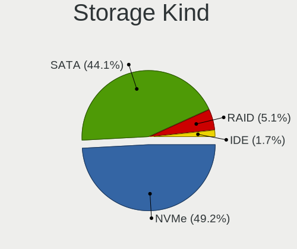
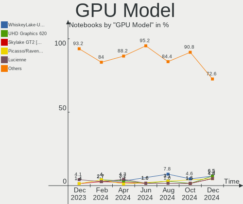
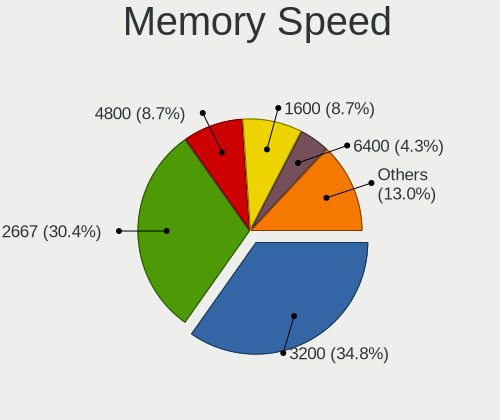

openSUSE Hardware Trends (Notebooks)
------------------------------------

A project to identify most popular hardware characteristics and track their change
over time based on data collected by openSUSE users at https://Linux-Hardware.org.

Anyone can contribute to this report by the [hw-probe](https://github.com/linuxhw/hw-probe) tool:

    sudo -E hw-probe -all -upload

Full-feature report is available here: https://linux-hardware.org/?view=trends

Period: Mar, 2022.

Contents
--------

* [ System ](#system)
  - [ OS                       ](#os)
  - [ OS Family                ](#os-family)
  - [ Kernel                   ](#kernel)
  - [ Kernel Family            ](#kernel-family)
  - [ Kernel Major Ver.        ](#kernel-major-ver)
  - [ Arch                     ](#arch)
  - [ DE                       ](#de)
  - [ Display Server           ](#display-server)
  - [ Display Manager          ](#display-manager)
  - [ OS Lang                  ](#os-lang)
  - [ Boot Mode                ](#boot-mode)
  - [ Filesystem               ](#filesystem)
  - [ Part. scheme             ](#part-scheme)
  - [ Dual Boot with Linux/BSD ](#dual-boot-with-linuxbsd)
  - [ Dual Boot (Win)          ](#dual-boot-win)

* [ Board ](#board)
  - [ Vendor                   ](#vendor)
  - [ Model                    ](#model)
  - [ Model Family             ](#model-family)
  - [ MFG Year                 ](#mfg-year)
  - [ Form Factor              ](#form-factor)
  - [ Secure Boot              ](#secure-boot)
  - [ Coreboot                 ](#coreboot)
  - [ RAM Size                 ](#ram-size)
  - [ RAM Used                 ](#ram-used)
  - [ Total Drives             ](#total-drives)
  - [ Has CD-ROM               ](#has-cd-rom)
  - [ Has Ethernet             ](#has-ethernet)
  - [ Has WiFi                 ](#has-wifi)
  - [ Has Bluetooth            ](#has-bluetooth)

* [ Location ](#location)
  - [ Country                  ](#country)
  - [ City                     ](#city)

* [ Drives ](#drives)
  - [ Drive Vendor             ](#drive-vendor)
  - [ Drive Model              ](#drive-model)
  - [ HDD Vendor               ](#hdd-vendor)
  - [ SSD Vendor               ](#ssd-vendor)
  - [ Drive Kind               ](#drive-kind)
  - [ Drive Connector          ](#drive-connector)
  - [ Drive Size               ](#drive-size)
  - [ Space Total              ](#space-total)
  - [ Space Used               ](#space-used)
  - [ Malfunc. Drives          ](#malfunc-drives)
  - [ Malfunc. Drive Vendor    ](#malfunc-drive-vendor)
  - [ Malfunc. HDD Vendor      ](#malfunc-hdd-vendor)
  - [ Malfunc. Drive Kind      ](#malfunc-drive-kind)
  - [ Failed Drives            ](#failed-drives)
  - [ Failed Drive Vendor      ](#failed-drive-vendor)
  - [ Drive Status             ](#drive-status)

* [ Storage controller ](#storage-controller)
  - [ Storage Vendor           ](#storage-vendor)
  - [ Storage Model            ](#storage-model)
  - [ Storage Kind             ](#storage-kind)

* [ Processor ](#processor)
  - [ CPU Vendor               ](#cpu-vendor)
  - [ CPU Model                ](#cpu-model)
  - [ CPU Model Family         ](#cpu-model-family)
  - [ CPU Cores                ](#cpu-cores)
  - [ CPU Sockets              ](#cpu-sockets)
  - [ CPU Threads              ](#cpu-threads)
  - [ CPU Op-Modes             ](#cpu-op-modes)
  - [ CPU Microcode            ](#cpu-microcode)
  - [ CPU Microarch            ](#cpu-microarch)

* [ Graphics ](#graphics)
  - [ GPU Vendor               ](#gpu-vendor)
  - [ GPU Model                ](#gpu-model)
  - [ GPU Combo                ](#gpu-combo)
  - [ GPU Driver               ](#gpu-driver)
  - [ GPU Memory               ](#gpu-memory)

* [ Monitor ](#monitor)
  - [ Monitor Vendor           ](#monitor-vendor)
  - [ Monitor Model            ](#monitor-model)
  - [ Monitor Resolution       ](#monitor-resolution)
  - [ Monitor Diagonal         ](#monitor-diagonal)
  - [ Monitor Width            ](#monitor-width)
  - [ Aspect Ratio             ](#aspect-ratio)
  - [ Monitor Area             ](#monitor-area)
  - [ Pixel Density            ](#pixel-density)
  - [ Multiple Monitors        ](#multiple-monitors)

* [ Network ](#network)
  - [ Net Controller Vendor    ](#net-controller-vendor)
  - [ Net Controller Model     ](#net-controller-model)
  - [ Wireless Vendor          ](#wireless-vendor)
  - [ Wireless Model           ](#wireless-model)
  - [ Ethernet Vendor          ](#ethernet-vendor)
  - [ Ethernet Model           ](#ethernet-model)
  - [ Net Controller Kind      ](#net-controller-kind)
  - [ Used Controller          ](#used-controller)
  - [ NICs                     ](#nics)
  - [ IPv6                     ](#ipv6)

* [ Bluetooth ](#bluetooth)
  - [ Bluetooth Vendor         ](#bluetooth-vendor)
  - [ Bluetooth Model          ](#bluetooth-model)

* [ Sound ](#sound)
  - [ Sound Vendor             ](#sound-vendor)
  - [ Sound Model              ](#sound-model)

* [ Memory ](#memory)
  - [ Memory Vendor            ](#memory-vendor)
  - [ Memory Model             ](#memory-model)
  - [ Memory Kind              ](#memory-kind)
  - [ Memory Form Factor       ](#memory-form-factor)
  - [ Memory Size              ](#memory-size)
  - [ Memory Speed             ](#memory-speed)

* [ Printers & scanners ](#printers--scanners)
  - [ Printer Vendor           ](#printer-vendor)
  - [ Printer Model            ](#printer-model)
  - [ Scanner Vendor           ](#scanner-vendor)
  - [ Scanner Model            ](#scanner-model)

* [ Camera ](#camera)
  - [ Camera Vendor            ](#camera-vendor)
  - [ Camera Model             ](#camera-model)

* [ Security ](#security)
  - [ Fingerprint Vendor       ](#fingerprint-vendor)
  - [ Fingerprint Model        ](#fingerprint-model)
  - [ Chipcard Vendor          ](#chipcard-vendor)
  - [ Chipcard Model           ](#chipcard-model)

* [ Unsupported ](#unsupported)
  - [ Unsupported Devices      ](#unsupported-devices)
  - [ Unsupported Device Types ](#unsupported-device-types)

System
------

OS
--

Installed operating systems

| Name                         | Notebooks | Percent |
|------------------------------|-----------|---------|
| openSUSE Leap-15.3           | 4         | 23.53%  |
| openSUSE Tumbleweed-20220324 | 2         | 11.76%  |
| openSUSE 20220311            | 2         | 11.76%  |
| openSUSE Tumbleweed-20220317 | 1         | 5.88%   |
| openSUSE Tumbleweed-20220303 | 1         | 5.88%   |
| openSUSE 20220329            | 1         | 5.88%   |
| openSUSE 20220324            | 1         | 5.88%   |
| openSUSE 20220317            | 1         | 5.88%   |
| openSUSE 20220309            | 1         | 5.88%   |
| openSUSE 20220308            | 1         | 5.88%   |
| openSUSE 20220305            | 1         | 5.88%   |
| openSUSE 20220304            | 1         | 5.88%   |

OS Family
---------

OS without a version

| Name     | Notebooks | Percent |
|----------|-----------|---------|
| openSUSE | 17        | 100%    |

Kernel
------

Version of the Linux kernel

| Version                     | Notebooks | Percent |
|-----------------------------|-----------|---------|
| 5.16.11-1-default           | 6         | 35.29%  |
| 5.16.15-1-default           | 4         | 23.53%  |
| 5.3.18-150300.59.54-default | 2         | 11.76%  |
| 5.3.18-150300.59.49-default | 2         | 11.76%  |
| 5.16.14-1-default           | 2         | 11.76%  |
| 5.16.8-1-default            | 1         | 5.88%   |

Kernel Family
-------------

Linux kernel without a distro release

| Version | Notebooks | Percent |
|---------|-----------|---------|
| 5.16.11 | 6         | 35.29%  |
| 5.3.18  | 4         | 23.53%  |
| 5.16.15 | 4         | 23.53%  |
| 5.16.14 | 2         | 11.76%  |
| 5.16.8  | 1         | 5.88%   |

Kernel Major Ver.
-----------------

Linux kernel major version

| Version | Notebooks | Percent |
|---------|-----------|---------|
| 5.16    | 13        | 76.47%  |
| 5.3     | 4         | 23.53%  |

Arch
----

OS architecture (x86_64, i586, etc.)

| Name   | Notebooks | Percent |
|--------|-----------|---------|
| x86_64 | 17        | 100%    |

DE
--

Desktop Environment

| Name     | Notebooks | Percent |
|----------|-----------|---------|
| KDE5     | 10        | 58.82%  |
| GNOME    | 4         | 23.53%  |
| XFCE     | 2         | 11.76%  |
| Cinnamon | 1         | 5.88%   |

Display Server
--------------

X11 or Wayland

| Name    | Notebooks | Percent |
|---------|-----------|---------|
| X11     | 15        | 88.24%  |
| Wayland | 2         | 11.76%  |

Display Manager
---------------

SDDM, LightDM, etc.

| Name    | Notebooks | Percent |
|---------|-----------|---------|
| SDDM    | 8         | 47.06%  |
| Unknown | 5         | 29.41%  |
| LightDM | 3         | 17.65%  |
| XDM     | 1         | 5.88%   |

OS Lang
-------

Language

| Lang  | Notebooks | Percent |
|-------|-----------|---------|
| en_US | 5         | 29.41%  |
| de_DE | 3         | 17.65%  |
| pt_BR | 2         | 11.76%  |
| ru_RU | 1         | 5.88%   |
| POSIX | 1         | 5.88%   |
| pl_PL | 1         | 5.88%   |
| en_IN | 1         | 5.88%   |
| en_GB | 1         | 5.88%   |
| en_DE | 1         | 5.88%   |
| en_CH | 1         | 5.88%   |

Boot Mode
---------

EFI or BIOS

| Mode | Notebooks | Percent |
|------|-----------|---------|
| EFI  | 14        | 82.35%  |
| BIOS | 3         | 17.65%  |

Filesystem
----------

Type of filesystem

| Type    | Notebooks | Percent |
|---------|-----------|---------|
| Btrfs   | 15        | 88.24%  |
| Overlay | 1         | 5.88%   |
| Ext4    | 1         | 5.88%   |

Part. scheme
------------

Scheme of partitioning

| Type    | Notebooks | Percent |
|---------|-----------|---------|
| GPT     | 12        | 70.59%  |
| Unknown | 5         | 29.41%  |

Dual Boot with Linux/BSD
------------------------

Hosting more than one Linux/BSD

| Dual boot | Notebooks | Percent |
|-----------|-----------|---------|
| No        | 13        | 76.47%  |
| Yes       | 4         | 23.53%  |

Dual Boot (Win)
---------------

Hosting Linux and Windows

| Dual boot | Notebooks | Percent |
|-----------|-----------|---------|
| No        | 12        | 70.59%  |
| Yes       | 5         | 29.41%  |

Board
-----

Vendor
------

Motherboard manufacturer

| Name             | Notebooks | Percent |
|------------------|-----------|---------|
| Dell             | 5         | 29.41%  |
| Acer             | 4         | 23.53%  |
| Lenovo           | 3         | 17.65%  |
| ASUSTek Computer | 3         | 17.65%  |
| HUAWEI           | 1         | 5.88%   |
| Hewlett-Packard  | 1         | 5.88%   |

Model
-----

Motherboard model

| Name                                   | Notebooks | Percent |
|----------------------------------------|-----------|---------|
| Dell Latitude E7470                    | 2         | 11.76%  |
| Lenovo Yoga Slim 7 15IIL05 82AA        | 1         | 5.88%   |
| Lenovo ThinkPad E580 20KS001RGE        | 1         | 5.88%   |
| Lenovo ThinkPad E550 20DF0030US        | 1         | 5.88%   |
| HUAWEI HVY-WXX9                        | 1         | 5.88%   |
| HP OMEN Laptop 15-en0xxx               | 1         | 5.88%   |
| Dell XPS 15 9560                       | 1         | 5.88%   |
| Dell Precision 5540                    | 1         | 5.88%   |
| Dell Latitude 7480                     | 1         | 5.88%   |
| ASUS ZenBook UX325SA_UM325SA           | 1         | 5.88%   |
| ASUS VivoBook_ASUSLaptop X513EA_X513EA | 1         | 5.88%   |
| ASUS ROG Zephyrus G15 GA503QM_GA503QM  | 1         | 5.88%   |
| Acer Swift SF314-59                    | 1         | 5.88%   |
| Acer Swift SF314-43                    | 1         | 5.88%   |
| Acer Aspire E1-571                     | 1         | 5.88%   |
| Acer Aspire A315-41                    | 1         | 5.88%   |

Model Family
------------

Motherboard model prefix

| Name            | Notebooks | Percent |
|-----------------|-----------|---------|
| Dell Latitude   | 3         | 17.65%  |
| Lenovo ThinkPad | 2         | 11.76%  |
| Acer Swift      | 2         | 11.76%  |
| Acer Aspire     | 2         | 11.76%  |
| Lenovo Yoga     | 1         | 5.88%   |
| HUAWEI HVY-WXX9 | 1         | 5.88%   |
| HP OMEN         | 1         | 5.88%   |
| Dell XPS        | 1         | 5.88%   |
| Dell Precision  | 1         | 5.88%   |
| ASUS ZenBook    | 1         | 5.88%   |
| ASUS VivoBook   | 1         | 5.88%   |
| ASUS ROG        | 1         | 5.88%   |

MFG Year
--------

Motherboard manufacture year

| Year | Notebooks | Percent |
|------|-----------|---------|
| 2021 | 4         | 23.53%  |
| 2020 | 4         | 23.53%  |
| 2018 | 2         | 11.76%  |
| 2017 | 2         | 11.76%  |
| 2015 | 2         | 11.76%  |
| 2019 | 1         | 5.88%   |
| 2014 | 1         | 5.88%   |
| 2012 | 1         | 5.88%   |

Form Factor
-----------

Physical design of the computer

| Name     | Notebooks | Percent |
|----------|-----------|---------|
| Notebook | 17        | 100%    |

Secure Boot
-----------

Enabled or disabled

| State    | Notebooks | Percent |
|----------|-----------|---------|
| Disabled | 16        | 94.12%  |
| Enabled  | 1         | 5.88%   |

Coreboot
--------

Have coreboot on board

| Used | Notebooks | Percent |
|------|-----------|---------|
| No   | 17        | 100%    |

RAM Size
--------

Total RAM memory

| Size in GB | Notebooks | Percent |
|------------|-----------|---------|
| 4.01-8.0   | 6         | 35.29%  |
| 8.01-16.0  | 5         | 29.41%  |
| 32.01-64.0 | 3         | 17.65%  |
| 16.01-24.0 | 3         | 17.65%  |

RAM Used
--------

Used RAM memory

| Used GB  | Notebooks | Percent |
|----------|-----------|---------|
| 2.01-3.0 | 8         | 47.06%  |
| 4.01-8.0 | 5         | 29.41%  |
| 3.01-4.0 | 2         | 11.76%  |
| 1.01-2.0 | 2         | 11.76%  |

Total Drives
------------

Number of drives on board

| Drives | Notebooks | Percent |
|--------|-----------|---------|
| 1      | 14        | 82.35%  |
| 2      | 3         | 17.65%  |

Has CD-ROM
----------

Has CD-ROM on board

| Presented | Notebooks | Percent |
|-----------|-----------|---------|
| No        | 15        | 88.24%  |
| Yes       | 2         | 11.76%  |

Has Ethernet
------------

Has Ethernet on board

| Presented | Notebooks | Percent |
|-----------|-----------|---------|
| Yes       | 9         | 52.94%  |
| No        | 8         | 47.06%  |

Has WiFi
--------

Has WiFi module

| Presented | Notebooks | Percent |
|-----------|-----------|---------|
| Yes       | 17        | 100%    |

Has Bluetooth
-------------

Has Bluetooth module

| Presented | Notebooks | Percent |
|-----------|-----------|---------|
| Yes       | 15        | 88.24%  |
| No        | 2         | 11.76%  |

Location
--------

Country
-------

Geographic location (country)

| Country     | Notebooks | Percent |
|-------------|-----------|---------|
| Germany     | 3         | 17.65%  |
| USA         | 2         | 11.76%  |
| Brazil      | 2         | 11.76%  |
| Switzerland | 1         | 5.88%   |
| Sweden      | 1         | 5.88%   |
| Russia      | 1         | 5.88%   |
| Poland      | 1         | 5.88%   |
| Italy       | 1         | 5.88%   |
| Israel      | 1         | 5.88%   |
| India       | 1         | 5.88%   |
| France      | 1         | 5.88%   |
| Canada      | 1         | 5.88%   |
| Austria     | 1         | 5.88%   |

City
----

Geographic location (city)

| City          | Notebooks | Percent |
|---------------|-----------|---------|
| Berlin        | 3         | 17.65%  |
| Zurich        | 1         | 5.88%   |
| Winter Park   | 1         | 5.88%   |
| Vienna        | 1         | 5.88%   |
| Vaennaes      | 1         | 5.88%   |
| Torun         | 1         | 5.88%   |
| Tel Aviv      | 1         | 5.88%   |
| St Petersburg | 1         | 5.88%   |
| Orlando       | 1         | 5.88%   |
| Montreal      | 1         | 5.88%   |
| Dharamsala    | 1         | 5.88%   |
| Chapecó      | 1         | 5.88%   |
| Canoas        | 1         | 5.88%   |
| Altamura      | 1         | 5.88%   |
| Alfortville   | 1         | 5.88%   |

Drives
------

Drive Vendor
------------

Hard drive vendors

| Vendor              | Notebooks | Drives | Percent |
|---------------------|-----------|--------|---------|
| Samsung Electronics | 5         | 5      | 25%     |
| SK Hynix            | 4         | 4      | 20%     |
| Seagate             | 2         | 2      | 10%     |
| Kingston            | 2         | 2      | 10%     |
| YMTC                | 1         | 1      | 5%      |
| Unknown             | 1         | 1      | 5%      |
| Team                | 1         | 1      | 5%      |
| Silicon Motion      | 1         | 1      | 5%      |
| Micron Technology   | 1         | 1      | 5%      |
| Intel               | 1         | 1      | 5%      |
| Crucial             | 1         | 1      | 5%      |

Drive Model
-----------

Hard drive models

| Model                                 | Notebooks | Percent |
|---------------------------------------|-----------|---------|
| YMTC PC005 512GB                      | 1         | 5%      |
| Unknown SC16G  16GB                   | 1         | 5%      |
| Team TM8FP6002T 2TB                   | 1         | 5%      |
| SK Hynix NVMe SSD Drive 512GB         | 1         | 5%      |
| SK Hynix NVMe SSD Drive 1TB           | 1         | 5%      |
| SK Hynix HFS256G39TND-N210A 256GB SSD | 1         | 5%      |
| SK Hynix HFM512GD3JX013N 512GB        | 1         | 5%      |
| Silicon Motion SPT256L2-2IAS7G2 256GB | 1         | 5%      |
| Seagate ST500LT012-9WS142 500GB       | 1         | 5%      |
| Seagate ST1000LM 024 HN-M101MBB 1TB   | 1         | 5%      |
| Samsung SSD 870 EVO 250GB             | 1         | 5%      |
| Samsung MZVLW256HEHP-000L7 256GB      | 1         | 5%      |
| Samsung MZVLB256HBHQ-000L2 256GB      | 1         | 5%      |
| Samsung MZVLB1T0HBLR-000H1 1TB        | 1         | 5%      |
| Samsung MZNLN512HMJP-000H1 512GB SSD  | 1         | 5%      |
| Micron NVMe SSD Drive 1024GB          | 1         | 5%      |
| Kingston SNVS2000G 2TB                | 1         | 5%      |
| Kingston OM8PDP3512B-AA1 512GB        | 1         | 5%      |
| Intel NVMe SSD Drive 512GB            | 1         | 5%      |
| Crucial CT1000P2SSD8 1TB              | 1         | 5%      |

HDD Vendor
----------

Hard disk drive vendors

| Vendor  | Notebooks | Drives | Percent |
|---------|-----------|--------|---------|
| Seagate | 2         | 2      | 100%    |

SSD Vendor
----------

Solid state drive vendors

| Vendor              | Notebooks | Drives | Percent |
|---------------------|-----------|--------|---------|
| Samsung Electronics | 2         | 2      | 66.67%  |
| SK Hynix            | 1         | 1      | 33.33%  |

Drive Kind
----------

HDD or SSD

| Kind | Notebooks | Drives | Percent |
|------|-----------|--------|---------|
| NVMe | 13        | 14     | 68.42%  |
| SSD  | 3         | 3      | 15.79%  |
| HDD  | 2         | 2      | 10.53%  |
| MMC  | 1         | 1      | 5.26%   |

Drive Connector
---------------

SATA, SAS, NVMe, etc.

| Type | Notebooks | Drives | Percent |
|------|-----------|--------|---------|
| NVMe | 13        | 14     | 68.42%  |
| SATA | 4         | 4      | 21.05%  |
| SAS  | 1         | 1      | 5.26%   |
| MMC  | 1         | 1      | 5.26%   |

Drive Size
----------

Size of hard drive

| Size in TB | Notebooks | Drives | Percent |
|------------|-----------|--------|---------|
| 0.01-0.5   | 3         | 3      | 60%     |
| 0.51-1.0   | 2         | 2      | 40%     |

Space Total
-----------

Amount of disk space available on the file system

| Size in GB     | Notebooks | Percent |
|----------------|-----------|---------|
| More than 3000 | 7         | 41.18%  |
| 2001-3000      | 6         | 35.29%  |
| 1001-2000      | 2         | 11.76%  |
| 251-500        | 1         | 5.88%   |
| 21-50          | 1         | 5.88%   |

Space Used
----------

Amount of used disk space

| Used GB        | Notebooks | Percent |
|----------------|-----------|---------|
| 251-500        | 6         | 35.29%  |
| 101-250        | 3         | 17.65%  |
| 1001-2000      | 3         | 17.65%  |
| 501-1000       | 3         | 17.65%  |
| More than 3000 | 1         | 5.88%   |
| 1-20           | 1         | 5.88%   |

Malfunc. Drives
---------------

Drive models with a malfunction

| Model                                 | Notebooks | Drives | Percent |
|---------------------------------------|-----------|--------|---------|
| SK Hynix HFS256G39TND-N210A 256GB SSD | 1         | 1      | 100%    |

Malfunc. Drive Vendor
---------------------

Vendors of faulty drives

| Vendor   | Notebooks | Drives | Percent |
|----------|-----------|--------|---------|
| SK Hynix | 1         | 1      | 100%    |

Malfunc. HDD Vendor
-------------------

Vendors of faulty HDD drives

Zero info for selected period =(

Malfunc. Drive Kind
-------------------

Kinds of faulty drives

| Kind | Notebooks | Drives | Percent |
|------|-----------|--------|---------|
| SSD  | 1         | 1      | 100%    |

Failed Drives
-------------

Failed drive models

Zero info for selected period =(

Failed Drive Vendor
-------------------

Failed drive vendors

Zero info for selected period =(

Drive Status
------------

Number of failed and malfunc. drives

| Status   | Notebooks | Drives | Percent |
|----------|-----------|--------|---------|
| Works    | 11        | 12     | 57.89%  |
| Detected | 7         | 7      | 36.84%  |
| Malfunc  | 1         | 1      | 5.26%   |

Storage controller
------------------

Storage Vendor
--------------

Storage controller vendors

| Vendor                      | Notebooks | Percent |
|-----------------------------|-----------|---------|
| Intel                       | 11        | 40.74%  |
| SK Hynix                    | 3         | 11.11%  |
| Samsung Electronics         | 3         | 11.11%  |
| AMD                         | 3         | 11.11%  |
| Kingston Technology Company | 2         | 7.41%   |
| Yangtze Memory Technologies | 1         | 3.7%    |
| Silicon Motion              | 1         | 3.7%    |
| Realtek Semiconductor       | 1         | 3.7%    |
| Micron/Crucial Technology   | 1         | 3.7%    |
| Micron Technology           | 1         | 3.7%    |

Storage Model
-------------

Storage controller models

| Model                                                            | Notebooks | Percent |
|------------------------------------------------------------------|-----------|---------|
| Intel Sunrise Point-LP SATA Controller [AHCI mode]               | 3         | 10.71%  |
| AMD FCH SATA Controller [AHCI mode]                              | 3         | 10.71%  |
| SK Hynix Gold P31 SSD                                            | 2         | 7.14%   |
| Samsung NVMe SSD Controller SM981/PM981/PM983                    | 2         | 7.14%   |
| Intel Volume Management Device NVMe RAID Controller              | 2         | 7.14%   |
| Yangtze Memory Non-Volatile memory controller                    | 1         | 3.57%   |
| SK Hynix Non-Volatile memory controller                          | 1         | 3.57%   |
| Silicon Motion SM2263EN/SM2263XT SSD Controller                  | 1         | 3.57%   |
| Samsung NVMe SSD Controller SM961/PM961/SM963                    | 1         | 3.57%   |
| Realtek Realtek Non-Volatile memory controller                   | 1         | 3.57%   |
| Micron/Crucial P2 NVMe PCIe SSD                                  | 1         | 3.57%   |
| Micron Non-Volatile memory controller                            | 1         | 3.57%   |
| Kingston Company Company Non-Volatile memory controller          | 1         | 3.57%   |
| Kingston Company OM3PDP3 NVMe SSD                                | 1         | 3.57%   |
| Intel Wildcat Point-LP SATA Controller [AHCI Mode]               | 1         | 3.57%   |
| Intel Tiger Lake-LP SATA Controller [AHCI mode]                  | 1         | 3.57%   |
| Intel Non-Volatile memory controller                             | 1         | 3.57%   |
| Intel HM170/QM170 Chipset SATA Controller [AHCI Mode]            | 1         | 3.57%   |
| Intel Cannon Lake Mobile PCH SATA AHCI Controller                | 1         | 3.57%   |
| Intel 82801 Mobile SATA Controller [RAID mode]                   | 1         | 3.57%   |
| Intel 7 Series Chipset Family 6-port SATA Controller [AHCI mode] | 1         | 3.57%   |

Storage Kind
------------

Kind of storage controller (IDE, SATA, NVMe, SAS, ...)

| Kind | Notebooks | Percent |
|------|-----------|---------|
| NVMe | 13        | 48.15%  |
| SATA | 11        | 40.74%  |
| RAID | 3         | 11.11%  |

Processor
---------

CPU Vendor
----------

Processor vendors

| Vendor | Notebooks | Percent |
|--------|-----------|---------|
| Intel  | 11        | 64.71%  |
| AMD    | 6         | 35.29%  |

CPU Model
---------

Processor models

| Model                                         | Notebooks | Percent |
|-----------------------------------------------|-----------|---------|
| Intel Core i7-6600U CPU @ 2.60GHz             | 2         | 11.76%  |
| Intel Core i7-9850H CPU @ 2.60GHz             | 1         | 5.88%   |
| Intel Core i7-8550U CPU @ 1.80GHz             | 1         | 5.88%   |
| Intel Core i7-7700HQ CPU @ 2.80GHz            | 1         | 5.88%   |
| Intel Core i5-6300U CPU @ 2.40GHz             | 1         | 5.88%   |
| Intel Core i5-5200U CPU @ 2.20GHz             | 1         | 5.88%   |
| Intel Core i5-3230M CPU @ 2.60GHz             | 1         | 5.88%   |
| Intel Core i5-1035G4 CPU @ 1.10GHz            | 1         | 5.88%   |
| Intel 11th Gen Core i7-1165G7 @ 2.80GHz       | 1         | 5.88%   |
| Intel 11th Gen Core i5-1135G7 @ 2.40GHz       | 1         | 5.88%   |
| AMD Ryzen 9 5900HS with Radeon Graphics       | 1         | 5.88%   |
| AMD Ryzen 7 5800U with Radeon Graphics        | 1         | 5.88%   |
| AMD Ryzen 7 4800H with Radeon Graphics        | 1         | 5.88%   |
| AMD Ryzen 5 4600H with Radeon Graphics        | 1         | 5.88%   |
| AMD Ryzen 5 2500U with Radeon Vega Mobile Gfx | 1         | 5.88%   |
| AMD Ryzen 3 5300U with Radeon Graphics        | 1         | 5.88%   |

CPU Model Family
----------------

Processor model prefix

| Model         | Notebooks | Percent |
|---------------|-----------|---------|
| Intel Core i7 | 5         | 29.41%  |
| Intel Core i5 | 4         | 23.53%  |
| Other         | 2         | 11.76%  |
| AMD Ryzen 7   | 2         | 11.76%  |
| AMD Ryzen 5   | 2         | 11.76%  |
| AMD Ryzen 9   | 1         | 5.88%   |
| AMD Ryzen 3   | 1         | 5.88%   |

CPU Cores
---------

Number of processor cores

| Number | Notebooks | Percent |
|--------|-----------|---------|
| 4      | 7         | 41.18%  |
| 2      | 5         | 29.41%  |
| 8      | 3         | 17.65%  |
| 6      | 2         | 11.76%  |

CPU Sockets
-----------

Number of sockets

| Number | Notebooks | Percent |
|--------|-----------|---------|
| 1      | 17        | 100%    |

CPU Threads
-----------

Threads per core (Hyper-Threading)

| Number | Notebooks | Percent |
|--------|-----------|---------|
| 2      | 17        | 100%    |

CPU Op-Modes
------------

CPU Operation Modes (32-bit, 64-bit)

| Op mode        | Notebooks | Percent |
|----------------|-----------|---------|
| 32-bit, 64-bit | 17        | 100%    |

CPU Microcode
-------------

Microcode number

| Number     | Notebooks | Percent |
|------------|-----------|---------|
| 0x406e3    | 3         | 17.65%  |
| 0x806c1    | 2         | 11.76%  |
| 0x0a50000c | 2         | 11.76%  |
| 0x906ed    | 1         | 5.88%   |
| 0x906e9    | 1         | 5.88%   |
| 0x806ea    | 1         | 5.88%   |
| 0x706e5    | 1         | 5.88%   |
| 0x306d4    | 1         | 5.88%   |
| 0x08608102 | 1         | 5.88%   |
| 0x08600106 | 1         | 5.88%   |
| 0x08600103 | 1         | 5.88%   |
| 0x0810100b | 1         | 5.88%   |
| Unknown    | 1         | 5.88%   |

CPU Microarch
-------------

Microarchitecture

| Name      | Notebooks | Percent |
|-----------|-----------|---------|
| Skylake   | 3         | 17.65%  |
| KabyLake  | 3         | 17.65%  |
| Zen 3     | 2         | 11.76%  |
| Zen 2     | 2         | 11.76%  |
| TigerLake | 2         | 11.76%  |
| Zen       | 1         | 5.88%   |
| IvyBridge | 1         | 5.88%   |
| IceLake   | 1         | 5.88%   |
| Broadwell | 1         | 5.88%   |
| Unknown   | 1         | 5.88%   |

Graphics
--------

GPU Vendor
----------

Vendors of graphics cards

| Vendor | Notebooks | Percent |
|--------|-----------|---------|
| Intel  | 11        | 50%     |
| AMD    | 7         | 31.82%  |
| Nvidia | 4         | 18.18%  |

GPU Model
---------

Graphics card models

| Model                                                            | Notebooks | Percent |
|------------------------------------------------------------------|-----------|---------|
| Intel Skylake GT2 [HD Graphics 520]                              | 3         | 13.64%  |
| Intel TigerLake-LP GT2 [Iris Xe Graphics]                        | 2         | 9.09%   |
| AMD Renoir                                                       | 2         | 9.09%   |
| AMD Cezanne                                                      | 2         | 9.09%   |
| Nvidia TU117GLM [Quadro T1000 Mobile]                            | 1         | 4.55%   |
| Nvidia TU116M [GeForce GTX 1660 Ti Mobile]                       | 1         | 4.55%   |
| Nvidia GP107M [GeForce GTX 1050 Mobile]                          | 1         | 4.55%   |
| Nvidia GA106M [GeForce RTX 3060 Mobile / Max-Q]                  | 1         | 4.55%   |
| Intel UHD Graphics 620                                           | 1         | 4.55%   |
| Intel Iris Plus Graphics G4 (Ice Lake)                           | 1         | 4.55%   |
| Intel HD Graphics 630                                            | 1         | 4.55%   |
| Intel HD Graphics 5500                                           | 1         | 4.55%   |
| Intel CoffeeLake-H GT2 [UHD Graphics 630]                        | 1         | 4.55%   |
| Intel 3rd Gen Core processor Graphics Controller                 | 1         | 4.55%   |
| AMD Raven Ridge [Radeon Vega Series / Radeon Vega Mobile Series] | 1         | 4.55%   |
| AMD Lucienne                                                     | 1         | 4.55%   |
| AMD Lexa PRO [Radeon 540/540X/550/550X / RX 540X/550/550X]       | 1         | 4.55%   |

GPU Combo
---------

Combinations of graphics cards

| Name           | Notebooks | Percent |
|----------------|-----------|---------|
| 1 x Intel      | 8         | 47.06%  |
| 1 x AMD        | 4         | 23.53%  |
| Intel + Nvidia | 2         | 11.76%  |
| AMD + Nvidia   | 2         | 11.76%  |
| Intel + AMD    | 1         | 5.88%   |

GPU Driver
----------

Free vs proprietary

| Driver      | Notebooks | Percent |
|-------------|-----------|---------|
| Free        | 14        | 82.35%  |
| Proprietary | 2         | 11.76%  |
| Unknown     | 1         | 5.88%   |

GPU Memory
----------

Total video memory

| Size in GB | Notebooks | Percent |
|------------|-----------|---------|
| Unknown    | 9         | 52.94%  |
| 0.01-0.5   | 3         | 17.65%  |
| 3.01-4.0   | 2         | 11.76%  |
| 5.01-6.0   | 1         | 5.88%   |
| 1.01-2.0   | 1         | 5.88%   |
| 0.51-1.0   | 1         | 5.88%   |

Monitor
-------

Monitor Vendor
--------------

Monitor vendors

| Vendor              | Notebooks | Percent |
|---------------------|-----------|---------|
| Chimei Innolux      | 4         | 19.05%  |
| BOE                 | 4         | 19.05%  |
| LG Display          | 3         | 14.29%  |
| Sharp               | 2         | 9.52%   |
| Lenovo              | 2         | 9.52%   |
| Dell                | 2         | 9.52%   |
| AU Optronics        | 2         | 9.52%   |
| Samsung Electronics | 1         | 4.76%   |
| PANDA               | 1         | 4.76%   |

Monitor Model
-------------

Monitor models

| Model                                                              | Notebooks | Percent |
|--------------------------------------------------------------------|-----------|---------|
| Chimei Innolux LCD Monitor CMN14D4 1920x1080 309x173mm 13.9-inch   | 2         | 9.52%   |
| Sharp LCD Monitor SHP14BA 1920x1080 344x194mm 15.5-inch            | 1         | 4.76%   |
| Sharp LCD Monitor SHP1476 3840x2160 346x194mm 15.6-inch            | 1         | 4.76%   |
| Samsung Electronics LC34G55T SAM7119 3440x1440 798x334mm 34.1-inch | 1         | 4.76%   |
| PANDA LCD Monitor NCP0046 1920x1080 344x194mm 15.5-inch            | 1         | 4.76%   |
| LG Display LCD Monitor LGD05FE 1920x1080 344x194mm 15.5-inch       | 1         | 4.76%   |
| LG Display LCD Monitor LGD0490 1920x1080 309x174mm 14.0-inch       | 1         | 4.76%   |
| LG Display LCD Monitor LGD02DC 1366x768 344x194mm 15.5-inch        | 1         | 4.76%   |
| Lenovo P24q-10 LEN61A5 2560x1440 527x296mm 23.8-inch               | 1         | 4.76%   |
| Lenovo L32p-30 LEN66DF 3840x2160 697x392mm 31.5-inch               | 1         | 4.76%   |
| Dell SE2216H DELF071 1920x1080 476x268mm 21.5-inch                 | 1         | 4.76%   |
| Dell E228WFP DELD015 1680x1050 473x296mm 22.0-inch                 | 1         | 4.76%   |
| Chimei Innolux LCD Monitor CMN1540 2560x1440 344x193mm 15.5-inch   | 1         | 4.76%   |
| Chimei Innolux LCD Monitor CMN14D3 1920x1080 309x173mm 13.9-inch   | 1         | 4.76%   |
| BOE LCD Monitor BOE08B9 1920x1080 344x194mm 15.5-inch              | 1         | 4.76%   |
| BOE LCD Monitor BOE0878 1920x1080 355x200mm 16.0-inch              | 1         | 4.76%   |
| BOE LCD Monitor BOE06FF 1920x1080 344x194mm 15.5-inch              | 1         | 4.76%   |
| BOE LCD Monitor BOE0675 1366x768 344x194mm 15.5-inch               | 1         | 4.76%   |
| AU Optronics LCD Monitor AUO41EC 1366x768 344x193mm 15.5-inch      | 1         | 4.76%   |
| AU Optronics LCD Monitor AUO133D 1920x1080 309x173mm 13.9-inch     | 1         | 4.76%   |

Monitor Resolution
------------------

Monitor screen resolution

| Resolution         | Notebooks | Percent |
|--------------------|-----------|---------|
| 1920x1080 (FHD)    | 11        | 55%     |
| 1366x768 (WXGA)    | 3         | 15%     |
| 3840x2160 (4K)     | 2         | 10%     |
| 2560x1440 (QHD)    | 2         | 10%     |
| 3440x1440          | 1         | 5%      |
| 1680x1050 (WSXGA+) | 1         | 5%      |

Monitor Diagonal
----------------

Diagonal size in inches

| Inches | Notebooks | Percent |
|--------|-----------|---------|
| 15     | 10        | 47.62%  |
| 13     | 4         | 19.05%  |
| 34     | 1         | 4.76%   |
| 31     | 1         | 4.76%   |
| 24     | 1         | 4.76%   |
| 22     | 1         | 4.76%   |
| 21     | 1         | 4.76%   |
| 16     | 1         | 4.76%   |
| 14     | 1         | 4.76%   |

Monitor Width
-------------

Physical width

| Width in mm | Notebooks | Percent |
|-------------|-----------|---------|
| 301-350     | 15        | 71.43%  |
| 401-500     | 2         | 9.52%   |
| 701-800     | 1         | 4.76%   |
| 601-700     | 1         | 4.76%   |
| 501-600     | 1         | 4.76%   |
| 351-400     | 1         | 4.76%   |

Aspect Ratio
------------

Proportional relationship between the width and the height

| Ratio | Notebooks | Percent |
|-------|-----------|---------|
| 16/9  | 16        | 88.89%  |
| 21/9  | 1         | 5.56%   |
| 16/10 | 1         | 5.56%   |

Monitor Area
------------

Area in inch²

| Area in inch² | Notebooks | Percent |
|----------------|-----------|---------|
| 101-110        | 11        | 52.38%  |
| 81-90          | 5         | 23.81%  |
| 201-250        | 3         | 14.29%  |
| 351-500        | 2         | 9.52%   |

Pixel Density
-------------

Pixels per inch

| Density       | Notebooks | Percent |
|---------------|-----------|---------|
| 121-160       | 12        | 60%     |
| 101-120       | 5         | 25%     |
| More than 240 | 1         | 5%      |
| 161-240       | 1         | 5%      |
| 51-100        | 1         | 5%      |

Multiple Monitors
-----------------

Total monitors connected

| Total | Notebooks | Percent |
|-------|-----------|---------|
| 1     | 12        | 70.59%  |
| 2     | 4         | 23.53%  |
| 0     | 1         | 5.88%   |

Network
-------

Net Controller Vendor
---------------------

Controller vendors

| Vendor                | Notebooks | Percent |
|-----------------------|-----------|---------|
| Intel                 | 13        | 54.17%  |
| Realtek Semiconductor | 5         | 20.83%  |
| MEDIATEK              | 2         | 8.33%   |
| Dell                  | 2         | 8.33%   |
| Qualcomm Atheros      | 1         | 4.17%   |
| Broadcom              | 1         | 4.17%   |

Net Controller Model
--------------------

Controller models

| Model                                                             | Notebooks | Percent |
|-------------------------------------------------------------------|-----------|---------|
| Realtek RTL8111/8168/8411 PCI Express Gigabit Ethernet Controller | 3         | 10.34%  |
| Intel Wi-Fi 6 AX200                                               | 3         | 10.34%  |
| MEDIATEK MT7921 802.11ax PCI Express Wireless Network Adapter     | 2         | 6.9%    |
| Intel Wireless 8265 / 8275                                        | 2         | 6.9%    |
| Intel Wireless 8260                                               | 2         | 6.9%    |
| Intel Wi-Fi 6 AX201                                               | 2         | 6.9%    |
| Intel Ethernet Connection I219-LM                                 | 2         | 6.9%    |
| Dell DW5811e Snapdragon™ X7 LTE                              | 2         | 6.9%    |
| Realtek RTL8153 Gigabit Ethernet Adapter                          | 1         | 3.45%   |
| Realtek Realtek Ethernet controller                               | 1         | 3.45%   |
| Qualcomm Atheros QCA9377 802.11ac Wireless Network Adapter        | 1         | 3.45%   |
| Intel Wireless-AC 9260                                            | 1         | 3.45%   |
| Intel Wireless 3160                                               | 1         | 3.45%   |
| Intel Ice Lake-LP PCH CNVi WiFi                                   | 1         | 3.45%   |
| Intel Ethernet Connection (4) I219-LM                             | 1         | 3.45%   |
| Intel Ethernet Connection (3) I218-V                              | 1         | 3.45%   |
| Intel Dual Band Wireless-AC 3165 Plus Bluetooth                   | 1         | 3.45%   |
| Broadcom NetLink BCM57785 Gigabit Ethernet PCIe                   | 1         | 3.45%   |
| Broadcom BCM4313 802.11bgn Wireless Network Adapter               | 1         | 3.45%   |

Wireless Vendor
---------------

Wireless vendors

| Vendor           | Notebooks | Percent |
|------------------|-----------|---------|
| Intel            | 13        | 68.42%  |
| MEDIATEK         | 2         | 10.53%  |
| Dell             | 2         | 10.53%  |
| Qualcomm Atheros | 1         | 5.26%   |
| Broadcom         | 1         | 5.26%   |

Wireless Model
--------------

Wireless models

| Model                                                         | Notebooks | Percent |
|---------------------------------------------------------------|-----------|---------|
| Intel Wi-Fi 6 AX200                                           | 3         | 15.79%  |
| MEDIATEK MT7921 802.11ax PCI Express Wireless Network Adapter | 2         | 10.53%  |
| Intel Wireless 8265 / 8275                                    | 2         | 10.53%  |
| Intel Wireless 8260                                           | 2         | 10.53%  |
| Intel Wi-Fi 6 AX201                                           | 2         | 10.53%  |
| Dell DW5811e Snapdragon™ X7 LTE                          | 2         | 10.53%  |
| Qualcomm Atheros QCA9377 802.11ac Wireless Network Adapter    | 1         | 5.26%   |
| Intel Wireless-AC 9260                                        | 1         | 5.26%   |
| Intel Wireless 3160                                           | 1         | 5.26%   |
| Intel Ice Lake-LP PCH CNVi WiFi                               | 1         | 5.26%   |
| Intel Dual Band Wireless-AC 3165 Plus Bluetooth               | 1         | 5.26%   |
| Broadcom BCM4313 802.11bgn Wireless Network Adapter           | 1         | 5.26%   |

Ethernet Vendor
---------------

Ethernet vendors

| Vendor                | Notebooks | Percent |
|-----------------------|-----------|---------|
| Realtek Semiconductor | 5         | 50%     |
| Intel                 | 4         | 40%     |
| Broadcom              | 1         | 10%     |

Ethernet Model
--------------

Ethernet models

| Model                                                             | Notebooks | Percent |
|-------------------------------------------------------------------|-----------|---------|
| Realtek RTL8111/8168/8411 PCI Express Gigabit Ethernet Controller | 3         | 30%     |
| Intel Ethernet Connection I219-LM                                 | 2         | 20%     |
| Realtek RTL8153 Gigabit Ethernet Adapter                          | 1         | 10%     |
| Realtek Realtek Ethernet controller                               | 1         | 10%     |
| Intel Ethernet Connection (4) I219-LM                             | 1         | 10%     |
| Intel Ethernet Connection (3) I218-V                              | 1         | 10%     |
| Broadcom NetLink BCM57785 Gigabit Ethernet PCIe                   | 1         | 10%     |

Net Controller Kind
-------------------

Ethernet, WiFi or modem

| Kind     | Notebooks | Percent |
|----------|-----------|---------|
| WiFi     | 17        | 65.38%  |
| Ethernet | 9         | 34.62%  |

Used Controller
---------------

Currently used network controller

| Kind     | Notebooks | Percent |
|----------|-----------|---------|
| WiFi     | 17        | 89.47%  |
| Ethernet | 2         | 10.53%  |

NICs
----

Total network controllers on board

| Total | Notebooks | Percent |
|-------|-----------|---------|
| 2     | 9         | 52.94%  |
| 1     | 8         | 47.06%  |

IPv6
----

IPv6 vs IPv4

| Used | Notebooks | Percent |
|------|-----------|---------|
| No   | 13        | 76.47%  |
| Yes  | 4         | 23.53%  |

Bluetooth
---------

Bluetooth Vendor
----------------

Controller vendors

| Vendor             | Notebooks | Percent |
|--------------------|-----------|---------|
| Intel              | 11        | 73.33%  |
| Lite-On Technology | 2         | 13.33%  |
| IMC Networks       | 1         | 6.67%   |
| Broadcom           | 1         | 6.67%   |

Bluetooth Model
---------------

Controller models

| Model                                          | Notebooks | Percent |
|------------------------------------------------|-----------|---------|
| Intel Bluetooth wireless interface             | 4         | 26.67%  |
| Intel AX200 Bluetooth                          | 3         | 20%     |
| Intel AX201 Bluetooth                          | 2         | 13.33%  |
| Lite-On Wireless_Device                        | 1         | 6.67%   |
| Lite-On Qualcomm Atheros QCA9377 Bluetooth     | 1         | 6.67%   |
| Intel Bluetooth Device                         | 1         | 6.67%   |
| Intel Bluetooth 9460/9560 Jefferson Peak (JfP) | 1         | 6.67%   |
| IMC Networks Wireless_Device                   | 1         | 6.67%   |
| Broadcom BCM2070 Bluetooth Device              | 1         | 6.67%   |

Sound
-----

Sound Vendor
------------

Sound card vendors

| Vendor              | Notebooks | Percent |
|---------------------|-----------|---------|
| Intel               | 11        | 45.83%  |
| AMD                 | 6         | 25%     |
| Nvidia              | 2         | 8.33%   |
| SAVITECH            | 1         | 4.17%   |
| RODE Microphones    | 1         | 4.17%   |
| Razer USA           | 1         | 4.17%   |
| ESS Technology      | 1         | 4.17%   |
| Creative Technology | 1         | 4.17%   |

Sound Model
-----------

Sound card models

| Model                                                               | Notebooks | Percent |
|---------------------------------------------------------------------|-----------|---------|
| AMD Family 17h/19h HD Audio Controller                              | 5         | 17.24%  |
| Intel Sunrise Point-LP HD Audio                                     | 4         | 13.79%  |
| AMD Renoir Radeon High Definition Audio Controller                  | 4         | 13.79%  |
| Intel Tiger Lake-LP Smart Sound Technology Audio Controller         | 2         | 6.9%    |
| SAVITECH ODAC-revB                                                  | 1         | 3.45%   |
| RODE Microphones RODE NT-USB                                        | 1         | 3.45%   |
| Razer USA Razer Seiren Mini                                         | 1         | 3.45%   |
| Nvidia TU116 High Definition Audio Controller                       | 1         | 3.45%   |
| Nvidia Audio device                                                 | 1         | 3.45%   |
| Intel Wildcat Point-LP High Definition Audio Controller             | 1         | 3.45%   |
| Intel Ice Lake-LP Smart Sound Technology Audio Controller           | 1         | 3.45%   |
| Intel CM238 HD Audio Controller                                     | 1         | 3.45%   |
| Intel Cannon Lake PCH cAVS                                          | 1         | 3.45%   |
| Intel Broadwell-U Audio Controller                                  | 1         | 3.45%   |
| Intel 7 Series/C216 Chipset Family High Definition Audio Controller | 1         | 3.45%   |
| ESS Technology Asus USB DAC                                         | 1         | 3.45%   |
| Creative Technology Pebble V3                                       | 1         | 3.45%   |
| AMD Raven/Raven2/Fenghuang HDMI/DP Audio Controller                 | 1         | 3.45%   |

Memory
------

Memory Vendor
-------------

Memory module vendors

| Vendor              | Notebooks | Percent |
|---------------------|-----------|---------|
| SK Hynix            | 4         | 30.77%  |
| Micron Technology   | 3         | 23.08%  |
| Samsung Electronics | 2         | 15.38%  |
| Crucial             | 2         | 15.38%  |
| Unknown             | 1         | 7.69%   |
| Smart Modular       | 1         | 7.69%   |

Memory Model
------------

Memory module models

| Model                                                         | Notebooks | Percent |
|---------------------------------------------------------------|-----------|---------|
| SK Hynix RAM HMA81GS6CJR8N-VK 8192MB SODIMM DDR4 2667MT/s     | 2         | 14.29%  |
| Unknown RAM Module 8GB SODIMM DDR3 1600MT/s                   | 1         | 7.14%   |
| Smart Modular RAM SMS4WEC3C0K0446SCG 4GB SODIMM DDR4 3200MT/s | 1         | 7.14%   |
| SK Hynix RAM HMA851S6AFR6N-UH 4GB SODIMM DDR4 2400MT/s        | 1         | 7.14%   |
| SK Hynix RAM H9HCNNNCPMMLXR-NEE 8192MB SODIMM LPDDR4 4266MT/s | 1         | 7.14%   |
| SK Hynix RAM H9HCNNNBKMMLXR-NEE 4GB SODIMM LPDDR4 4266MT/s    | 1         | 7.14%   |
| Samsung RAM M471A5244CB0-CWE 4GB SODIMM DDR4 3200MT/s         | 1         | 7.14%   |
| Samsung RAM M471A1K43DB1-CWE 8192MB SODIMM DDR4 3200MT/s      | 1         | 7.14%   |
| Micron RAM Module 4GB Row Of Chips LPDDR4 4267MT/s            | 1         | 7.14%   |
| Micron RAM 8ATF51264HZ-2G1B1 4GB SODIMM DDR4 2667MT/s         | 1         | 7.14%   |
| Micron RAM 4ATF1G64HZ-3G2E1 8GB Row Of Chips DDR4 3200MT/s    | 1         | 7.14%   |
| Crucial RAM CT16G4SFRA32A.M16FRS 16GB SODIMM DDR4 3200MT/s    | 1         | 7.14%   |
| Crucial RAM CB16GS2666.C8ET 16GB SODIMM DDR4 2667MT/s         | 1         | 7.14%   |

Memory Kind
-----------

Memory module kinds

| Kind   | Notebooks | Percent |
|--------|-----------|---------|
| DDR4   | 8         | 66.67%  |
| LPDDR4 | 3         | 25%     |
| DDR3   | 1         | 8.33%   |

Memory Form Factor
------------------

Physical design of the memory module

| Name         | Notebooks | Percent |
|--------------|-----------|---------|
| SODIMM       | 10        | 83.33%  |
| Row Of Chips | 2         | 16.67%  |

Memory Size
-----------

Memory module size

| Size  | Notebooks | Percent |
|-------|-----------|---------|
| 8192  | 7         | 53.85%  |
| 4096  | 4         | 30.77%  |
| 16384 | 2         | 15.38%  |

Memory Speed
------------

Memory module speed

| Speed | Notebooks | Percent |
|-------|-----------|---------|
| 3200  | 4         | 30.77%  |
| 2667  | 4         | 30.77%  |
| 4266  | 2         | 15.38%  |
| 4267  | 1         | 7.69%   |
| 2400  | 1         | 7.69%   |
| 1600  | 1         | 7.69%   |

Printers & scanners
-------------------

Printer Vendor
--------------

Printer device vendors

Zero info for selected period =(

Printer Model
-------------

Printer device models

Zero info for selected period =(

Scanner Vendor
--------------

Scanner device vendors

Zero info for selected period =(

Scanner Model
-------------

Scanner device models

Zero info for selected period =(

Camera
------

Camera Vendor
-------------

Camera device vendors

| Vendor                                 | Notebooks | Percent |
|----------------------------------------|-----------|---------|
| Quanta                                 | 3         | 17.65%  |
| Chicony Electronics                    | 3         | 17.65%  |
| Sunplus Innovation Technology          | 2         | 11.76%  |
| Realtek Semiconductor                  | 2         | 11.76%  |
| Microdia                               | 2         | 11.76%  |
| IMC Networks                           | 2         | 11.76%  |
| Lenovo                                 | 1         | 5.88%   |
| DJKANA1BIFZTDM                         | 1         | 5.88%   |
| Cheng Uei Precision Industry (Foxlink) | 1         | 5.88%   |

Camera Model
------------

Camera device models

| Model                                            | Notebooks | Percent |
|--------------------------------------------------|-----------|---------|
| Microdia Integrated_Webcam_HD                    | 2         | 11.76%  |
| Sunplus Integrated_Webcam_HD                     | 1         | 5.88%   |
| Sunplus HD WebCam                                | 1         | 5.88%   |
| Realtek Integrated_Webcam_HD                     | 1         | 5.88%   |
| Realtek Integrated Webcam_HD                     | 1         | 5.88%   |
| Quanta VGA WebCam                                | 1         | 5.88%   |
| Quanta USB2.0 HD UVC WebCam                      | 1         | 5.88%   |
| Quanta HD User Facing                            | 1         | 5.88%   |
| Lenovo 50 Monitor Camera                         | 1         | 5.88%   |
| IMC Networks USB2.0 HD UVC WebCam                | 1         | 5.88%   |
| IMC Networks Integrated Camera                   | 1         | 5.88%   |
| DJKANA1BIFZTDM HP Wide Vision HD Camera          | 1         | 5.88%   |
| Chicony Lenovo Integrated Webcam                 | 1         | 5.88%   |
| Chicony Integrated Camera (1280x720@30)          | 1         | 5.88%   |
| Chicony HD User Facing                           | 1         | 5.88%   |
| Cheng Uei Precision Industry (Foxlink) HD Camera | 1         | 5.88%   |

Security
--------

Fingerprint Vendor
------------------

Fingerprint sensor vendors

| Vendor                     | Notebooks | Percent |
|----------------------------|-----------|---------|
| Validity Sensors           | 2         | 40%     |
| Shenzhen Goodix Technology | 2         | 40%     |
| Synaptics                  | 1         | 20%     |

Fingerprint Model
-----------------

Fingerprint sensor models

| Model                                             | Notebooks | Percent |
|---------------------------------------------------|-----------|---------|
| Shenzhen Goodix  Fingerprint Device               | 2         | 40%     |
| Validity Sensors VFS7552 Touch Fingerprint Sensor | 1         | 20%     |
| Validity Sensors VFS5011 Fingerprint Reader       | 1         | 20%     |
| Synaptics Metallica MOH Touch Fingerprint Reader  | 1         | 20%     |

Chipcard Vendor
---------------

Chipcard module vendors

| Vendor   | Notebooks | Percent |
|----------|-----------|---------|
| Broadcom | 3         | 100%    |

Chipcard Model
--------------

Chipcard module models

| Model         | Notebooks | Percent |
|---------------|-----------|---------|
| Broadcom 5880 | 3         | 100%    |

Unsupported
-----------

Unsupported Devices
-------------------

Total unsupported devices on board

| Total | Notebooks | Percent |
|-------|-----------|---------|
| 1     | 10        | 58.82%  |
| 0     | 7         | 41.18%  |

Unsupported Device Types
------------------------

Types of unsupported devices

| Type                  | Notebooks | Percent |
|-----------------------|-----------|---------|
| Fingerprint reader    | 5         | 50%     |
| Chipcard              | 3         | 30%     |
| Multimedia controller | 1         | 10%     |
| Graphics card         | 1         | 10%     |

