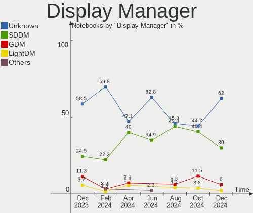
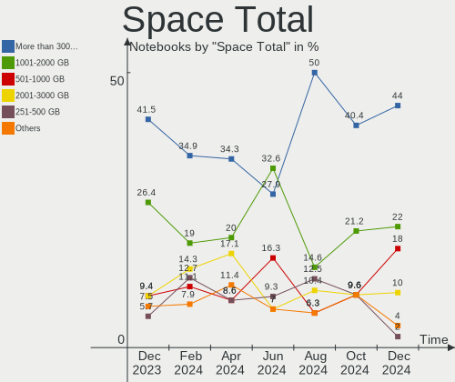
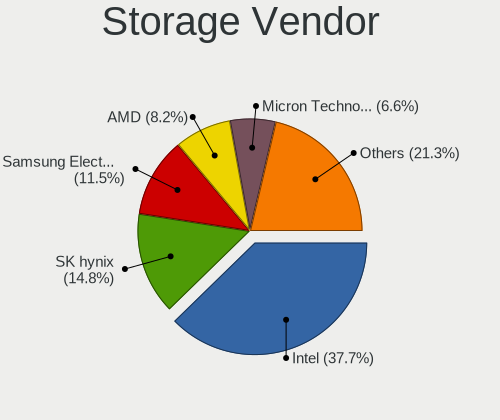
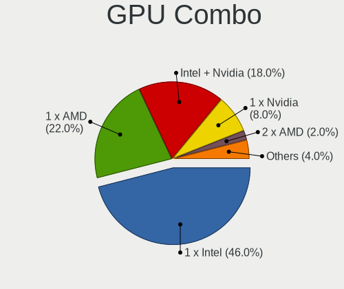
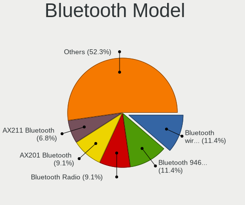

openSUSE - Hardware Trends (Notebooks)
--------------------------------------

A project to identify most popular hardware characteristics and track their change
over time based on data collected by Linux users at https://Linux-Hardware.org.

Anyone can contribute to this report by the [hw-probe](https://github.com/linuxhw/hw-probe) tool:

    sudo -E hw-probe -all -upload

This report is for one last month. Overall report since the beginning of time: [TestDays](https://github.com/linuxhw/TestDays)

Period: Dec, 2023.

Contents
--------

* [ System ](#system)
  - [ OS                       ](#os)
  - [ OS Family                ](#os-family)
  - [ Kernel                   ](#kernel)
  - [ Kernel Family            ](#kernel-family)
  - [ Kernel Major Ver.        ](#kernel-major-ver)
  - [ Arch                     ](#arch)
  - [ DE                       ](#de)
  - [ Display Server           ](#display-server)
  - [ Display Manager          ](#display-manager)
  - [ OS Lang                  ](#os-lang)
  - [ Boot Mode                ](#boot-mode)
  - [ Filesystem               ](#filesystem)
  - [ Part. scheme             ](#part-scheme)
  - [ Dual Boot with Linux/BSD ](#dual-boot-with-linuxbsd)
  - [ Dual Boot (Win)          ](#dual-boot-win)

* [ Board ](#board)
  - [ Vendor                   ](#vendor)
  - [ Model                    ](#model)
  - [ Model Family             ](#model-family)
  - [ MFG Year                 ](#mfg-year)
  - [ Form Factor              ](#form-factor)
  - [ Secure Boot              ](#secure-boot)
  - [ Coreboot                 ](#coreboot)
  - [ RAM Size                 ](#ram-size)
  - [ RAM Used                 ](#ram-used)
  - [ Total Drives             ](#total-drives)
  - [ Has CD-ROM               ](#has-cd-rom)
  - [ Has Ethernet             ](#has-ethernet)
  - [ Has WiFi                 ](#has-wifi)
  - [ Has Bluetooth            ](#has-bluetooth)

* [ Location ](#location)
  - [ Country                  ](#country)
  - [ City                     ](#city)

* [ Drives ](#drives)
  - [ Drive Vendor             ](#drive-vendor)
  - [ Drive Model              ](#drive-model)
  - [ HDD Vendor               ](#hdd-vendor)
  - [ SSD Vendor               ](#ssd-vendor)
  - [ Drive Kind               ](#drive-kind)
  - [ Drive Connector          ](#drive-connector)
  - [ Drive Size               ](#drive-size)
  - [ Space Total              ](#space-total)
  - [ Space Used               ](#space-used)
  - [ Malfunc. Drives          ](#malfunc-drives)
  - [ Malfunc. Drive Vendor    ](#malfunc-drive-vendor)
  - [ Malfunc. HDD Vendor      ](#malfunc-hdd-vendor)
  - [ Malfunc. Drive Kind      ](#malfunc-drive-kind)
  - [ Failed Drives            ](#failed-drives)
  - [ Failed Drive Vendor      ](#failed-drive-vendor)
  - [ Drive Status             ](#drive-status)

* [ Storage controller ](#storage-controller)
  - [ Storage Vendor           ](#storage-vendor)
  - [ Storage Model            ](#storage-model)
  - [ Storage Kind             ](#storage-kind)

* [ Processor ](#processor)
  - [ CPU Vendor               ](#cpu-vendor)
  - [ CPU Model                ](#cpu-model)
  - [ CPU Model Family         ](#cpu-model-family)
  - [ CPU Cores                ](#cpu-cores)
  - [ CPU Sockets              ](#cpu-sockets)
  - [ CPU Threads              ](#cpu-threads)
  - [ CPU Op-Modes             ](#cpu-op-modes)
  - [ CPU Microcode            ](#cpu-microcode)
  - [ CPU Microarch            ](#cpu-microarch)

* [ Graphics ](#graphics)
  - [ GPU Vendor               ](#gpu-vendor)
  - [ GPU Model                ](#gpu-model)
  - [ GPU Combo                ](#gpu-combo)
  - [ GPU Driver               ](#gpu-driver)
  - [ GPU Memory               ](#gpu-memory)

* [ Monitor ](#monitor)
  - [ Monitor Vendor           ](#monitor-vendor)
  - [ Monitor Model            ](#monitor-model)
  - [ Monitor Resolution       ](#monitor-resolution)
  - [ Monitor Diagonal         ](#monitor-diagonal)
  - [ Monitor Width            ](#monitor-width)
  - [ Aspect Ratio             ](#aspect-ratio)
  - [ Monitor Area             ](#monitor-area)
  - [ Pixel Density            ](#pixel-density)
  - [ Multiple Monitors        ](#multiple-monitors)

* [ Network ](#network)
  - [ Net Controller Vendor    ](#net-controller-vendor)
  - [ Net Controller Model     ](#net-controller-model)
  - [ Wireless Vendor          ](#wireless-vendor)
  - [ Wireless Model           ](#wireless-model)
  - [ Ethernet Vendor          ](#ethernet-vendor)
  - [ Ethernet Model           ](#ethernet-model)
  - [ Net Controller Kind      ](#net-controller-kind)
  - [ Used Controller          ](#used-controller)
  - [ NICs                     ](#nics)
  - [ IPv6                     ](#ipv6)

* [ Bluetooth ](#bluetooth)
  - [ Bluetooth Vendor         ](#bluetooth-vendor)
  - [ Bluetooth Model          ](#bluetooth-model)

* [ Sound ](#sound)
  - [ Sound Vendor             ](#sound-vendor)
  - [ Sound Model              ](#sound-model)

* [ Memory ](#memory)
  - [ Memory Vendor            ](#memory-vendor)
  - [ Memory Model             ](#memory-model)
  - [ Memory Kind              ](#memory-kind)
  - [ Memory Form Factor       ](#memory-form-factor)
  - [ Memory Size              ](#memory-size)
  - [ Memory Speed             ](#memory-speed)

* [ Printers & scanners ](#printers--scanners)
  - [ Printer Vendor           ](#printer-vendor)
  - [ Printer Model            ](#printer-model)
  - [ Scanner Vendor           ](#scanner-vendor)
  - [ Scanner Model            ](#scanner-model)

* [ Camera ](#camera)
  - [ Camera Vendor            ](#camera-vendor)
  - [ Camera Model             ](#camera-model)

* [ Security ](#security)
  - [ Fingerprint Vendor       ](#fingerprint-vendor)
  - [ Fingerprint Model        ](#fingerprint-model)
  - [ Chipcard Vendor          ](#chipcard-vendor)
  - [ Chipcard Model           ](#chipcard-model)

* [ Unsupported ](#unsupported)
  - [ Unsupported Devices      ](#unsupported-devices)
  - [ Unsupported Device Types ](#unsupported-device-types)

System
------

OS
--

Installed operating systems

| Name                         | Notebooks | Percent |
|------------------------------|-----------|---------|
| openSUSE Tumbleweed-XXXXXXXX | 36        | 67.92%  |
| openSUSE Leap-15.5           | 13        | 24.53%  |
| openSUSE Microos-XXXXXXXX    | 2         | 3.77%   |
| openSUSE Leap-15.6           | 2         | 3.77%   |

OS Family
---------

OS without a version

| Name     | Notebooks | Percent |
|----------|-----------|---------|
| openSUSE | 53        | 100%    |

Kernel
------

Version of the Linux kernel

| Version                      | Notebooks | Percent |
|------------------------------|-----------|---------|
| 6.6.6-1-default              | 20        | 37.74%  |
| 6.6.3-1-default              | 8         | 15.09%  |
| 5.14.21-150500.55.39-default | 6         | 11.32%  |
| 5.14.21-150500.55.36-default | 5         | 9.43%   |
| 6.6.7-1-default              | 4         | 7.55%   |
| 6.6.2-1-default              | 3         | 5.66%   |
| 6.5.9-1-default              | 2         | 3.77%   |
| 6.5.6-1-default              | 1         | 1.89%   |
| 6.4.0-150600.4-default       | 1         | 1.89%   |
| 6.4.0-150600.1-default       | 1         | 1.89%   |
| 5.14.21-150500.55.31-default | 1         | 1.89%   |
| 5.14.21-150500.53-default    | 1         | 1.89%   |

Kernel Family
-------------

Linux kernel without a distro release

| Version | Notebooks | Percent |
|---------|-----------|---------|
| 6.6.6   | 20        | 37.74%  |
| 5.14.21 | 13        | 24.53%  |
| 6.6.3   | 8         | 15.09%  |
| 6.6.7   | 4         | 7.55%   |
| 6.6.2   | 3         | 5.66%   |
| 6.5.9   | 2         | 3.77%   |
| 6.4.0   | 2         | 3.77%   |
| 6.5.6   | 1         | 1.89%   |

Kernel Major Ver.
-----------------

Linux kernel major version

| Version | Notebooks | Percent |
|---------|-----------|---------|
| 6.6     | 35        | 66.04%  |
| 5.14    | 13        | 24.53%  |
| 6.5     | 3         | 5.66%   |
| 6.4     | 2         | 3.77%   |

Arch
----

OS architecture (x86_64, i586, etc.)

| Name   | Notebooks | Percent |
|--------|-----------|---------|
| x86_64 | 53        | 100%    |

DE
--

Desktop Environment

| Name    | Notebooks | Percent |
|---------|-----------|---------|
| KDE5    | 32        | 60.38%  |
| GNOME   | 14        | 26.42%  |
| XFCE    | 3         | 5.66%   |
| Unknown | 2         | 3.77%   |
| ICEWM   | 1         | 1.89%   |
| i3      | 1         | 1.89%   |

Display Server
--------------

X11 or Wayland

| Name    | Notebooks | Percent |
|---------|-----------|---------|
| X11     | 33        | 62.26%  |
| Wayland | 17        | 32.08%  |
| Unknown | 2         | 3.77%   |
| Tty     | 1         | 1.89%   |

Display Manager
---------------

SDDM, LightDM, etc.

| Name    | Notebooks | Percent |
|---------|-----------|---------|
| Unknown | 31        | 58.49%  |
| SDDM    | 13        | 24.53%  |
| GDM     | 6         | 11.32%  |
| LightDM | 3         | 5.66%   |

OS Lang
-------

Language

| Lang    | Notebooks | Percent |
|---------|-----------|---------|
| en_US   | 20        | 37.74%  |
| POSIX   | 10        | 18.87%  |
| de_DE   | 7         | 13.21%  |
| pt_BR   | 5         | 9.43%   |
| en_GB   | 3         | 5.66%   |
| es_ES   | 2         | 3.77%   |
| Unknown | 2         | 3.77%   |
| nl_NL   | 1         | 1.89%   |
| it_IT   | 1         | 1.89%   |
| fr_FR   | 1         | 1.89%   |
| cs_CZ   | 1         | 1.89%   |

Boot Mode
---------

EFI or BIOS

| Mode | Notebooks | Percent |
|------|-----------|---------|
| EFI  | 39        | 73.58%  |
| BIOS | 14        | 26.42%  |

Filesystem
----------

Type of filesystem

| Type  | Notebooks | Percent |
|-------|-----------|---------|
| Btrfs | 44        | 83.02%  |
| Ext4  | 7         | 13.21%  |
| Xfs   | 1         | 1.89%   |
| Tmpfs | 1         | 1.89%   |

Part. scheme
------------

Scheme of partitioning

| Type    | Notebooks | Percent |
|---------|-----------|---------|
| GPT     | 26        | 49.06%  |
| Unknown | 26        | 49.06%  |
| MBR     | 1         | 1.89%   |

Dual Boot with Linux/BSD
------------------------

Hosting more than one Linux/BSD

| Dual boot | Notebooks | Percent |
|-----------|-----------|---------|
| No        | 46        | 86.79%  |
| Yes       | 7         | 13.21%  |

Dual Boot (Win)
---------------

Hosting Linux and Windows

| Dual boot | Notebooks | Percent |
|-----------|-----------|---------|
| No        | 48        | 90.57%  |
| Yes       | 5         | 9.43%   |

Board
-----

Vendor
------

Motherboard manufacturer

| Name                | Notebooks | Percent |
|---------------------|-----------|---------|
| Lenovo              | 11        | 20.75%  |
| Dell                | 11        | 20.75%  |
| Hewlett-Packard     | 9         | 16.98%  |
| ASUSTek Computer    | 8         | 15.09%  |
| System76            | 2         | 3.77%   |
| Samsung Electronics | 2         | 3.77%   |
| Medion              | 2         | 3.77%   |
| Acer                | 2         | 3.77%   |
| Wortmann AG         | 1         | 1.89%   |
| Valve               | 1         | 1.89%   |
| MSI                 | 1         | 1.89%   |
| HUAWEI              | 1         | 1.89%   |
| Apple               | 1         | 1.89%   |
| Alienware           | 1         | 1.89%   |

Model
-----

Motherboard model

| Name                                                                                     | Notebooks | Percent |
|------------------------------------------------------------------------------------------|-----------|---------|
| Wortmann AG TERRA_MOBILE_1529H                                                           | 1         | 1.89%   |
| Valve Jupiter                                                                            | 1         | 1.89%   |
| System76 Lemur Pro                                                                       | 1         | 1.89%   |
| System76 Bonobo WS                                                                       | 1         | 1.89%   |
| Samsung 550XDA                                                                           | 1         | 1.89%   |
| Samsung 355V4C/355V4X/355V5C/355V5X/356V4C/356V4X/356V5C/356V5X/3445VC/3445VX/3545VC/354 | 1         | 1.89%   |
| MSI Thin GF63 12HW                                                                       | 1         | 1.89%   |
| Medion S17403                                                                            | 1         | 1.89%   |
| Lenovo ThinkPad X13 Gen 2a 20XH001KPB                                                    | 1         | 1.89%   |
| Lenovo ThinkPad X1 Extreme 2nd 20QWS0M300                                                | 1         | 1.89%   |
| Lenovo ThinkPad T14 Gen 2i 20W1S1SN00                                                    | 1         | 1.89%   |
| Lenovo ThinkPad E14 Gen 3 20YD001DBO                                                     | 1         | 1.89%   |
| Lenovo ThinkPad E14 Gen 2 20TBS04X00                                                     | 1         | 1.89%   |
| Lenovo ThinkPad E14 20RA004YUS                                                           | 1         | 1.89%   |
| Lenovo ThinkPad A275 20KDS01T00                                                          | 1         | 1.89%   |
| Lenovo IdeaPad S340-15IML 81NA                                                           | 1         | 1.89%   |
| Lenovo IdeaPad Gaming 3 15ARH05 82EY                                                     | 1         | 1.89%   |
| Lenovo IdeaPad 5 14ALC05 82LM                                                            | 1         | 1.89%   |
| Lenovo IdeaPad 3 15ITL6 82H8                                                             | 1         | 1.89%   |
| HUAWEI KLVL-WXXW                                                                         | 1         | 1.89%   |
| HP ZBook 15 G3                                                                           | 1         | 1.89%   |
| HP Victus by Laptop 16-e0xxx                                                             | 1         | 1.89%   |
| HP Victus by Gaming Laptop 15-fa1xxx                                                     | 1         | 1.89%   |
| HP Notebook                                                                              | 1         | 1.89%   |
| HP EliteBook 8560p                                                                       | 1         | 1.89%   |
| HP Compaq 515                                                                            | 1         | 1.89%   |
| HP 255 G5                                                                                | 1         | 1.89%   |
| HP 250 G8 Notebook PC                                                                    | 1         | 1.89%   |
| HP 250 15.6 inch G9 Notebook PC                                                          | 1         | 1.89%   |
| Dell XPS 15 7590                                                                         | 1         | 1.89%   |
| Dell System XPS L322X                                                                    | 1         | 1.89%   |
| Dell Precision 5530                                                                      | 1         | 1.89%   |
| Dell Latitude E4310                                                                      | 1         | 1.89%   |
| Dell Latitude 7420                                                                       | 1         | 1.89%   |
| Dell Latitude 5591                                                                       | 1         | 1.89%   |
| Dell Latitude 3420                                                                       | 1         | 1.89%   |
| Dell Inspiron 7460                                                                       | 1         | 1.89%   |
| Dell Inspiron 7375                                                                       | 1         | 1.89%   |
| Dell Inspiron 3443                                                                       | 1         | 1.89%   |
| Dell G15 5515                                                                            | 1         | 1.89%   |

Model Family
------------

Motherboard model prefix

| Name              | Notebooks | Percent |
|-------------------|-----------|---------|
| Lenovo ThinkPad   | 7         | 13.21%  |
| Lenovo IdeaPad    | 4         | 7.55%   |
| Dell Latitude     | 4         | 7.55%   |
| Dell Inspiron     | 3         | 5.66%   |
| ASUS ROG          | 3         | 5.66%   |
| HP Victus         | 2         | 3.77%   |
| HP 250            | 2         | 3.77%   |
| ASUS Vivobook     | 2         | 3.77%   |
| Wortmann AG TERRA | 1         | 1.89%   |
| Valve Jupiter     | 1         | 1.89%   |
| System76 Lemur    | 1         | 1.89%   |
| System76 Bonobo   | 1         | 1.89%   |
| Samsung 550XDA    | 1         | 1.89%   |
| Samsung 355V4C    | 1         | 1.89%   |
| MSI Thin          | 1         | 1.89%   |
| Medion S17403     | 1         | 1.89%   |
| HUAWEI KLVL-WXXW  | 1         | 1.89%   |
| HP ZBook          | 1         | 1.89%   |
| HP Notebook       | 1         | 1.89%   |
| HP EliteBook      | 1         | 1.89%   |
| HP Compaq         | 1         | 1.89%   |
| HP 255            | 1         | 1.89%   |
| Dell XPS          | 1         | 1.89%   |
| Dell System       | 1         | 1.89%   |
| Dell Precision    | 1         | 1.89%   |
| Dell G15          | 1         | 1.89%   |
| ASUS Zenbook      | 1         | 1.89%   |
| ASUS X550CA       | 1         | 1.89%   |
| ASUS G750JS       | 1         | 1.89%   |
| Apple MacBookPro5 | 1         | 1.89%   |
| Alienware M17xR3  | 1         | 1.89%   |
| Acer TravelMate   | 1         | 1.89%   |
| Acer Nitro        | 1         | 1.89%   |
| Unknown           | 1         | 1.89%   |

MFG Year
--------

Motherboard manufacture year

| Year | Notebooks | Percent |
|------|-----------|---------|
| 2021 | 14        | 26.42%  |
| 2020 | 6         | 11.32%  |
| 2023 | 5         | 9.43%   |
| 2022 | 5         | 9.43%   |
| 2019 | 5         | 9.43%   |
| 2018 | 3         | 5.66%   |
| 2017 | 2         | 3.77%   |
| 2016 | 2         | 3.77%   |
| 2014 | 2         | 3.77%   |
| 2013 | 2         | 3.77%   |
| 2012 | 2         | 3.77%   |
| 2011 | 2         | 3.77%   |
| 2009 | 2         | 3.77%   |
| 2010 | 1         | 1.89%   |

Form Factor
-----------

Physical design of the computer

| Name     | Notebooks | Percent |
|----------|-----------|---------|
| Notebook | 53        | 100%    |

Secure Boot
-----------

Enabled or disabled

| State    | Notebooks | Percent |
|----------|-----------|---------|
| Disabled | 42        | 79.25%  |
| Enabled  | 11        | 20.75%  |

Coreboot
--------

Have coreboot on board

| Used | Notebooks | Percent |
|------|-----------|---------|
| No   | 51        | 96.23%  |
| Yes  | 2         | 3.77%   |

RAM Size
--------

Total RAM memory

| Size in GB  | Notebooks | Percent |
|-------------|-----------|---------|
| 4.01-8.0    | 17        | 32.08%  |
| 32.01-64.0  | 10        | 18.87%  |
| 8.01-16.0   | 10        | 18.87%  |
| 3.01-4.0    | 6         | 11.32%  |
| 16.01-24.0  | 6         | 11.32%  |
| 64.01-256.0 | 2         | 3.77%   |
| 24.01-32.0  | 1         | 1.89%   |
| 1.01-2.0    | 1         | 1.89%   |

RAM Used
--------

Used RAM memory

| Used GB   | Notebooks | Percent |
|-----------|-----------|---------|
| 2.01-3.0  | 20        | 37.74%  |
| 1.01-2.0  | 12        | 22.64%  |
| 3.01-4.0  | 10        | 18.87%  |
| 4.01-8.0  | 7         | 13.21%  |
| 8.01-16.0 | 3         | 5.66%   |
| 0.51-1.0  | 1         | 1.89%   |

Total Drives
------------

Number of drives on board

| Drives | Notebooks | Percent |
|--------|-----------|---------|
| 1      | 43        | 81.13%  |
| 2      | 9         | 16.98%  |
| 3      | 1         | 1.89%   |

Has CD-ROM
----------

Has CD-ROM on board

| Presented | Notebooks | Percent |
|-----------|-----------|---------|
| No        | 41        | 77.36%  |
| Yes       | 12        | 22.64%  |

Has Ethernet
------------

Has Ethernet on board

| Presented | Notebooks | Percent |
|-----------|-----------|---------|
| Yes       | 40        | 75.47%  |
| No        | 13        | 24.53%  |

Has WiFi
--------

Has WiFi module

| Presented | Notebooks | Percent |
|-----------|-----------|---------|
| Yes       | 53        | 100%    |

Has Bluetooth
-------------

Has Bluetooth module

| Presented | Notebooks | Percent |
|-----------|-----------|---------|
| Yes       | 48        | 90.57%  |
| No        | 5         | 9.43%   |

Location
--------

Country
-------

Geographic location (country)

| Country     | Notebooks | Percent |
|-------------|-----------|---------|
| Germany     | 7         | 13.21%  |
| Brazil      | 6         | 11.32%  |
| USA         | 4         | 7.55%   |
| Canada      | 4         | 7.55%   |
| Argentina   | 4         | 7.55%   |
| Italy       | 3         | 5.66%   |
| Sweden      | 2         | 3.77%   |
| Spain       | 2         | 3.77%   |
| Romania     | 2         | 3.77%   |
| Hungary     | 2         | 3.77%   |
| Czechia     | 2         | 3.77%   |
| Cuba        | 2         | 3.77%   |
| Bulgaria    | 2         | 3.77%   |
| Switzerland | 1         | 1.89%   |
| Russia      | 1         | 1.89%   |
| Peru        | 1         | 1.89%   |
| Mexico      | 1         | 1.89%   |
| Ireland     | 1         | 1.89%   |
| India       | 1         | 1.89%   |
| France      | 1         | 1.89%   |
| Finland     | 1         | 1.89%   |
| Costa Rica  | 1         | 1.89%   |
| Belgium     | 1         | 1.89%   |
| Austria     | 1         | 1.89%   |

City
----

Geographic location (city)

| City                  | Notebooks | Percent |
|-----------------------|-----------|---------|
| Buenos Aires          | 3         | 5.66%   |
| Winnipeg              | 2         | 3.77%   |
| Sanremo               | 2         | 3.77%   |
| Havana                | 2         | 3.77%   |
| Budapest              | 2         | 3.77%   |
| Waidhofen an der Ybbs | 1         | 1.89%   |
| Vitória              | 1         | 1.89%   |
| Västerås            | 1         | 1.89%   |
| Vancouver             | 1         | 1.89%   |
| Valencia              | 1         | 1.89%   |
| Uberlândia           | 1         | 1.89%   |
| Trier                 | 1         | 1.89%   |
| Timișoara            | 1         | 1.89%   |
| Stockholm             | 1         | 1.89%   |
| Sofia                 | 1         | 1.89%   |
| Siebnen               | 1         | 1.89%   |
| Sene                  | 1         | 1.89%   |
| Seattle               | 1         | 1.89%   |
| Sao Paulo             | 1         | 1.89%   |
| Rosario               | 1         | 1.89%   |
| Nizhniy Novgorod      | 1         | 1.89%   |
| Marina del Rey        | 1         | 1.89%   |
| Málaga               | 1         | 1.89%   |
| Maasmechelen          | 1         | 1.89%   |
| Lom                   | 1         | 1.89%   |
| Leverkusen            | 1         | 1.89%   |
| Kolkata               | 1         | 1.89%   |
| Hradec Králové      | 1         | 1.89%   |
| Hortolândia          | 1         | 1.89%   |
| Helsinki              | 1         | 1.89%   |
| Hamburg               | 1         | 1.89%   |
| Guelders              | 1         | 1.89%   |
| Embauba               | 1         | 1.89%   |
| Dublin                | 1         | 1.89%   |
| Colon                 | 1         | 1.89%   |
| Cluj-Napoca           | 1         | 1.89%   |
| Celakovice            | 1         | 1.89%   |
| Castelo do Piaui      | 1         | 1.89%   |
| Casalecchio di Reno   | 1         | 1.89%   |
| Buende                | 1         | 1.89%   |

Drives
------

Drive Vendor
------------

Hard drive vendors

| Vendor                         | Notebooks | Drives | Percent |
|--------------------------------|-----------|--------|---------|
| Samsung Electronics            | 12        | 14     | 19.05%  |
| Toshiba                        | 6         | 6      | 9.52%   |
| WDC                            | 5         | 5      | 7.94%   |
| Crucial                        | 5         | 5      | 7.94%   |
| Unknown                        | 4         | 4      | 6.35%   |
| SK hynix                       | 4         | 4      | 6.35%   |
| Sandisk                        | 4         | 4      | 6.35%   |
| Seagate                        | 3         | 3      | 4.76%   |
| Phison Electronics             | 2         | 2      | 3.17%   |
| Kingston                       | 2         | 2      | 3.17%   |
| KingSpec                       | 2         | 2      | 3.17%   |
| Union Memory                   | 1         | 1      | 1.59%   |
| Team                           | 1         | 1      | 1.59%   |
| SPCC                           | 1         | 1      | 1.59%   |
| Solid State Storage Technology | 1         | 1      | 1.59%   |
| Phison                         | 1         | 1      | 1.59%   |
| Micron/Crucial Technology      | 1         | 2      | 1.59%   |
| Micron Technology              | 1         | 1      | 1.59%   |
| KIOXIA                         | 1         | 1      | 1.59%   |
| Kingston Technology Company    | 1         | 1      | 1.59%   |
| Intel                          | 1         | 1      | 1.59%   |
| Hitachi                        | 1         | 1      | 1.59%   |
| China                          | 1         | 1      | 1.59%   |
| AXAGON                         | 1         | 1      | 1.59%   |
| A-DATA Technology              | 1         | 1      | 1.59%   |

Drive Model
-----------

Hard drive models

| Model                                               | Notebooks | Percent |
|-----------------------------------------------------|-----------|---------|
| Samsung NVMe SSD Controller SM981/PM981/PM983 512GB | 5         | 7.81%   |
| Samsung NVMe SSD Controller PM9A1/PM9A3/980PRO 2TB  | 4         | 6.25%   |
| Unknown MMC Card  128GB                             | 2         | 3.13%   |
| Toshiba MQ01ABD100 1TB                              | 2         | 3.13%   |
| WDC WDS250G2B0A-00SM50 250GB SSD                    | 1         | 1.56%   |
| WDC WDS240G2G0C-00AJM0 240GB                        | 1         | 1.56%   |
| WDC WD32 00BPVT-80JJ5T0 320GB                       | 1         | 1.56%   |
| WDC WD10SPZX-00Z10T0 1TB                            | 1         | 1.56%   |
| WDC PC SN530 NVMe 512GB                             | 1         | 1.56%   |
| Unknown NVMe SSD Drive 512GB                        | 1         | 1.56%   |
| Unknown MMC Card  256GB                             | 1         | 1.56%   |
| Union Memory UMIS RPJTJ512MEE1OWX 512GB             | 1         | 1.56%   |
| Toshiba THNSNH256GBST SSD                           | 1         | 1.56%   |
| Toshiba NVMe Controller 256GB                       | 1         | 1.56%   |
| Toshiba MQ01ABF050 500GB                            | 1         | 1.56%   |
| Toshiba KXG50ZNV1T02 NVMe 1024GB                    | 1         | 1.56%   |
| Team T253512GB SSD                                  | 1         | 1.56%   |
| SPCC Solid State Disk 1024GB                        | 1         | 1.56%   |
| Solid State Storage SSSTC CL4-4D256-Q79 256GB       | 1         | 1.56%   |
| SK hynix PC611 NVMe 512GB                           | 1         | 1.56%   |
| SK hynix PC601 NVMe 512GB                           | 1         | 1.56%   |
| SK hynix BC511 512GB                                | 1         | 1.56%   |
| SK hynix BC501 NVMe Solid State Drive 512GB         | 1         | 1.56%   |
| Seagate ST9320423AS 320GB                           | 1         | 1.56%   |
| Seagate ST1000LM035-1RK172 1TB                      | 1         | 1.56%   |
| Seagate ST1000LM024 HN-M101MBB 1TB                  | 1         | 1.56%   |
| Sandisk WD_BLACK SN770M 1TB                         | 1         | 1.56%   |
| Sandisk WDC PC SN530 SDBPTPZ-512G-1002 512GB        | 1         | 1.56%   |
| Sandisk WD Blue SN550 NVMe SSD 1TB                  | 1         | 1.56%   |
| SanDisk SDSSDH3 512G                                | 1         | 1.56%   |
| Samsung SSD PM830 mSATA 256GB                       | 1         | 1.56%   |
| Samsung MZVLQ256HBJD-00BH1 256GB                    | 1         | 1.56%   |
| Samsung MZVL4512HBLU-00BTW 512GB                    | 1         | 1.56%   |
| Samsung MZALQ256HBJD-00BL2 256GB                    | 1         | 1.56%   |
| Phison S11-256G-PHISON-SSD-B27 256GB                | 1         | 1.56%   |
| Phison PS5013 E13 NVMe Controller 512GB             | 1         | 1.56%   |
| Phison E15-512G-PHISON-SSD-B47R 512GB               | 1         | 1.56%   |
| Micron/Crucial P2 NVMe PCIe SSD 4TB                 | 1         | 1.56%   |
| Micron 2400_MTFDKBA512QFM 512GB                     | 1         | 1.56%   |
| KIOXIA KBG40ZNT256G TOSHIBA MEMORY 256GB            | 1         | 1.56%   |

HDD Vendor
----------

Hard disk drive vendors

| Vendor  | Notebooks | Drives | Percent |
|---------|-----------|--------|---------|
| Toshiba | 3         | 3      | 30%     |
| Seagate | 3         | 3      | 30%     |
| WDC     | 2         | 2      | 20%     |
| Hitachi | 1         | 1      | 10%     |
| AXAGON  | 1         | 1      | 10%     |

SSD Vendor
----------

Solid state drive vendors

| Vendor              | Notebooks | Drives | Percent |
|---------------------|-----------|--------|---------|
| Crucial             | 5         | 5      | 31.25%  |
| KingSpec            | 2         | 2      | 12.5%   |
| WDC                 | 1         | 1      | 6.25%   |
| Toshiba             | 1         | 1      | 6.25%   |
| Team                | 1         | 1      | 6.25%   |
| SPCC                | 1         | 1      | 6.25%   |
| SanDisk             | 1         | 1      | 6.25%   |
| Samsung Electronics | 1         | 1      | 6.25%   |
| Phison              | 1         | 1      | 6.25%   |
| Kingston            | 1         | 1      | 6.25%   |
| China               | 1         | 1      | 6.25%   |

Drive Kind
----------

HDD or SSD

| Kind | Notebooks | Drives | Percent |
|------|-----------|--------|---------|
| NVMe | 33        | 37     | 55%     |
| SSD  | 15        | 16     | 25%     |
| HDD  | 9         | 10     | 15%     |
| MMC  | 3         | 3      | 5%      |

Drive Connector
---------------

SATA, SAS, NVMe, etc.

| Type | Notebooks | Drives | Percent |
|------|-----------|--------|---------|
| NVMe | 33        | 37     | 55.93%  |
| SATA | 22        | 24     | 37.29%  |
| MMC  | 3         | 3      | 5.08%   |
| SAS  | 1         | 2      | 1.69%   |

Drive Size
----------

Size of hard drive

| Size in TB | Notebooks | Drives | Percent |
|------------|-----------|--------|---------|
| 0.01-0.5   | 13        | 14     | 52%     |
| 0.51-1.0   | 10        | 10     | 40%     |
| 1.01-2.0   | 2         | 2      | 8%      |

Space Total
-----------

Amount of disk space available on the file system

| Size in GB     | Notebooks | Percent |
|----------------|-----------|---------|
| More than 3000 | 22        | 41.51%  |
| 1001-2000      | 14        | 26.42%  |
| 2001-3000      | 5         | 9.43%   |
| 501-1000       | 5         | 9.43%   |
| 251-500        | 3         | 5.66%   |
| 101-250        | 2         | 3.77%   |
| Unknown        | 2         | 3.77%   |

Space Used
----------

Amount of used disk space

| Used GB        | Notebooks | Percent |
|----------------|-----------|---------|
| 101-250        | 17        | 32.08%  |
| 51-100         | 13        | 24.53%  |
| 501-1000       | 7         | 13.21%  |
| 1001-2000      | 6         | 11.32%  |
| 251-500        | 5         | 9.43%   |
| 1-20           | 2         | 3.77%   |
| Unknown        | 2         | 3.77%   |
| More than 3000 | 1         | 1.89%   |

Malfunc. Drives
---------------

Drive models with a malfunction

| Model                                        | Notebooks | Drives | Percent |
|----------------------------------------------|-----------|--------|---------|
| Samsung Electronics MZALQ256HBJD-00BL2 256GB | 1         | 1      | 100%    |

Malfunc. Drive Vendor
---------------------

Vendors of faulty drives

| Vendor              | Notebooks | Drives | Percent |
|---------------------|-----------|--------|---------|
| Samsung Electronics | 1         | 1      | 100%    |

Malfunc. HDD Vendor
-------------------

Vendors of faulty HDD drives

Zero info for selected period =(

Malfunc. Drive Kind
-------------------

Kinds of faulty drives

| Kind | Notebooks | Drives | Percent |
|------|-----------|--------|---------|
| NVMe | 1         | 1      | 100%    |

Failed Drives
-------------

Failed drive models

Zero info for selected period =(

Failed Drive Vendor
-------------------

Failed drive vendors

Zero info for selected period =(

Drive Status
------------

Number of failed and malfunc. drives

| Status   | Notebooks | Drives | Percent |
|----------|-----------|--------|---------|
| Detected | 29        | 37     | 52.73%  |
| Works    | 25        | 28     | 45.45%  |
| Malfunc  | 1         | 1      | 1.82%   |

Storage controller
------------------

Storage Vendor
--------------

Storage controller vendors

| Vendor                         | Notebooks | Percent |
|--------------------------------|-----------|---------|
| Intel                          | 25        | 36.76%  |
| Samsung Electronics            | 11        | 16.18%  |
| AMD                            | 9         | 13.24%  |
| Sandisk                        | 5         | 7.35%   |
| SK hynix                       | 4         | 5.88%   |
| Toshiba America Info Systems   | 2         | 2.94%   |
| Phison Electronics             | 2         | 2.94%   |
| Kingston Technology Company    | 2         | 2.94%   |
| Union Memory (Shenzhen)        | 1         | 1.47%   |
| Solidigm                       | 1         | 1.47%   |
| Solid State Storage Technology | 1         | 1.47%   |
| Nvidia                         | 1         | 1.47%   |
| Micron/Crucial Technology      | 1         | 1.47%   |
| Micron Technology              | 1         | 1.47%   |
| KIOXIA                         | 1         | 1.47%   |
| ADATA Technology               | 1         | 1.47%   |

Storage Model
-------------

Storage controller models

| Model                                                                          | Notebooks | Percent |
|--------------------------------------------------------------------------------|-----------|---------|
| AMD FCH SATA Controller [AHCI mode]                                            | 8         | 11.27%  |
| Samsung NVMe SSD Controller SM981/PM981/PM983                                  | 5         | 7.04%   |
| Samsung NVMe SSD Controller PM9A1/PM9A3/980PRO                                 | 4         | 5.63%   |
| Intel Tiger Lake-LP SATA Controller                                            | 3         | 4.23%   |
| Intel Cannon Lake Mobile PCH SATA AHCI Controller                              | 3         | 4.23%   |
| SanDisk IX SN530 NVMe SSD (DRAM-less)                                          | 2         | 2.82%   |
| Samsung NVMe SSD Controller 980 (DRAM-less)                                    | 2         | 2.82%   |
| Intel Sunrise Point-LP SATA Controller [AHCI mode]                             | 2         | 2.82%   |
| Intel Comet Lake SATA AHCI Controller                                          | 2         | 2.82%   |
| Intel Alder Lake-P SATA AHCI Controller                                        | 2         | 2.82%   |
| Intel 82801 Mobile SATA Controller [RAID mode]                                 | 2         | 2.82%   |
| Intel 8 Series/C220 Series Chipset Family 6-port SATA Controller 1 [AHCI mode] | 2         | 2.82%   |
| Intel 7 Series Chipset Family 6-port SATA Controller [AHCI mode]               | 2         | 2.82%   |
| Intel 6 Series/C200 Series Chipset Family 6 port Mobile SATA AHCI Controller   | 2         | 2.82%   |
| Union Memory (Shenzhen) AM620 PCIe 3.0 NVMe SSD 512GB                          | 1         | 1.41%   |
| Toshiba America Info Systems XG5 NVMe SSD Controller                           | 1         | 1.41%   |
| Toshiba America Info Systems XG3 NVMe SSD Controller                           | 1         | 1.41%   |
| Solidigm P41 Plus NVMe SSD (DRAM-less) [Echo Harbor]                           | 1         | 1.41%   |
| Solid State Storage CL4-8D512 NVMe SSD M.2 (DRAM-less)                         | 1         | 1.41%   |
| SK hynix PC611 NVMe Solid State Drive                                          | 1         | 1.41%   |
| SK hynix PC601 NVMe Solid State Drive                                          | 1         | 1.41%   |
| SK hynix BC511 NVMe SSD                                                        | 1         | 1.41%   |
| SK hynix BC501 NVMe Solid State Drive                                          | 1         | 1.41%   |
| SanDisk WD Green SN350 240GB (DRAM-less) / SN560E NVMe SSD                     | 1         | 1.41%   |
| SanDisk Ultra 3D / WD Blue SN550 NVMe SSD                                      | 1         | 1.41%   |
| Sandisk Non-Volatile memory controller                                         | 1         | 1.41%   |
| Samsung NVMe SSD Controller PM9B1 (DRAM-less)                                  | 1         | 1.41%   |
| Phison PS5015-E15 PCIe3 NVMe Controller (DRAM-less)                            | 1         | 1.41%   |
| Phison PS5013-E13 PCIe3 NVMe Controller (DRAM-less)                            | 1         | 1.41%   |
| Nvidia MCP79 AHCI Controller                                                   | 1         | 1.41%   |
| Micron/Crucial P2 [Nick P2] / P3 / P3 Plus NVMe PCIe SSD (DRAM-less)           | 1         | 1.41%   |
| Micron 2400 NVMe SSD (DRAM-less)                                               | 1         | 1.41%   |
| KIOXIA NVMe SSD Controller BG4 (DRAM-less)                                     | 1         | 1.41%   |
| Kingston Company OM3PDP3 NVMe SSD                                              | 1         | 1.41%   |
| Kingston Company NV1 NVMe SSD SM2263XT                                         | 1         | 1.41%   |
| Intel Wildcat Point-LP SATA Controller [AHCI Mode]                             | 1         | 1.41%   |
| Intel Volume Management Device NVMe RAID Controller Intel Corporation          | 1         | 1.41%   |
| Intel Volume Management Device NVMe RAID Controller                            | 1         | 1.41%   |
| Intel SSD 670p Series [Keystone Harbor]                                        | 1         | 1.41%   |
| Intel Q170/Q150/B150/H170/H110/Z170/CM236 Chipset SATA Controller [AHCI Mode]  | 1         | 1.41%   |

Storage Kind
------------

Kind of storage controller (IDE, SATA, NVMe, SAS, ...)

| Kind | Notebooks | Percent |
|------|-----------|---------|
| NVMe | 33        | 47.83%  |
| SATA | 32        | 46.38%  |
| RAID | 4         | 5.8%    |

Processor
---------

CPU Vendor
----------

Processor vendors

| Vendor | Notebooks | Percent |
|--------|-----------|---------|
| Intel  | 35        | 66.04%  |
| AMD    | 18        | 33.96%  |

CPU Model
---------

Processor models

| Model                                         | Notebooks | Percent |
|-----------------------------------------------|-----------|---------|
| Intel 11th Gen Core i7-1165G7 @ 2.80GHz       | 3         | 5.66%   |
| AMD Ryzen 3 5300U with Radeon Graphics        | 2         | 3.77%   |
| Intel Xeon E-2176M CPU @ 2.70GHz              | 1         | 1.89%   |
| Intel Core i7-9850H CPU @ 2.60GHz             | 1         | 1.89%   |
| Intel Core i7-9750H CPU @ 2.60GHz             | 1         | 1.89%   |
| Intel Core i7-8850H CPU @ 2.60GHz             | 1         | 1.89%   |
| Intel Core i7-6700HQ CPU @ 2.60GHz            | 1         | 1.89%   |
| Intel Core i7-4700HQ CPU @ 2.40GHz            | 1         | 1.89%   |
| Intel Core i7-3517U CPU @ 1.90GHz             | 1         | 1.89%   |
| Intel Core i7-2760QM CPU @ 2.40GHz            | 1         | 1.89%   |
| Intel Core i7-10510U CPU @ 1.80GHz            | 1         | 1.89%   |
| Intel Core i5-7300HQ CPU @ 2.50GHz            | 1         | 1.89%   |
| Intel Core i5-7200U CPU @ 2.50GHz             | 1         | 1.89%   |
| Intel Core i5-6200U CPU @ 2.30GHz             | 1         | 1.89%   |
| Intel Core i5-5200U CPU @ 2.20GHz             | 1         | 1.89%   |
| Intel Core i5-3337U CPU @ 1.80GHz             | 1         | 1.89%   |
| Intel Core i5-2520M CPU @ 2.50GHz             | 1         | 1.89%   |
| Intel Core i5-10210U CPU @ 1.60GHz            | 1         | 1.89%   |
| Intel Core i5 CPU M 560 @ 2.67GHz             | 1         | 1.89%   |
| Intel Core i3-N305                            | 1         | 1.89%   |
| Intel Core i3-4000M CPU @ 2.40GHz             | 1         | 1.89%   |
| Intel Core i3-10110U CPU @ 2.10GHz            | 1         | 1.89%   |
| Intel Core i3-1005G1 CPU @ 1.20GHz            | 1         | 1.89%   |
| Intel Core 2 Duo CPU T9600 @ 2.80GHz          | 1         | 1.89%   |
| Intel Celeron N4500 @ 1.10GHz                 | 1         | 1.89%   |
| Intel Celeron 6305 @ 1.80GHz                  | 1         | 1.89%   |
| Intel 13th Gen Core i9-13900HX                | 1         | 1.89%   |
| Intel 13th Gen Core i9-13900H                 | 1         | 1.89%   |
| Intel 12th Gen Core i7-1255U                  | 1         | 1.89%   |
| Intel 12th Gen Core i5-12500H                 | 1         | 1.89%   |
| Intel 12th Gen Core i5-12450H                 | 1         | 1.89%   |
| Intel 11th Gen Core i7-1185G7 @ 3.00GHz       | 1         | 1.89%   |
| Intel 11th Gen Core i5-1145G7 @ 2.60GHz       | 1         | 1.89%   |
| Intel 11th Gen Core i3-1115G4 @ 3.00GHz       | 1         | 1.89%   |
| AMD Ryzen 9 6900HX with Radeon Graphics       | 1         | 1.89%   |
| AMD Ryzen 7 PRO 5850U with Radeon Graphics    | 1         | 1.89%   |
| AMD Ryzen 7 5800HS with Radeon Graphics       | 1         | 1.89%   |
| AMD Ryzen 7 5800H with Radeon Graphics        | 1         | 1.89%   |
| AMD Ryzen 7 2700U with Radeon Vega Mobile Gfx | 1         | 1.89%   |
| AMD Ryzen 5 PRO 5650U with Radeon Graphics    | 1         | 1.89%   |

CPU Model Family
----------------

Processor model prefix

| Model            | Notebooks | Percent |
|------------------|-----------|---------|
| Other            | 13        | 24.53%  |
| Intel Core i7    | 8         | 15.09%  |
| Intel Core i5    | 8         | 15.09%  |
| Intel Core i3    | 4         | 7.55%   |
| AMD Ryzen 5      | 4         | 7.55%   |
| AMD Ryzen 7      | 3         | 5.66%   |
| AMD Ryzen 3      | 3         | 5.66%   |
| Intel Celeron    | 2         | 3.77%   |
| Intel Xeon       | 1         | 1.89%   |
| Intel Core 2 Duo | 1         | 1.89%   |
| AMD Ryzen 9      | 1         | 1.89%   |
| AMD Ryzen 7 PRO  | 1         | 1.89%   |
| AMD Ryzen 5 PRO  | 1         | 1.89%   |
| AMD E2           | 1         | 1.89%   |
| AMD Athlon X2    | 1         | 1.89%   |
| AMD A6           | 1         | 1.89%   |

CPU Cores
---------

Number of processor cores

| Number | Notebooks | Percent |
|--------|-----------|---------|
| 2      | 17        | 32.08%  |
| 4      | 16        | 30.19%  |
| 6      | 9         | 16.98%  |
| 8      | 6         | 11.32%  |
| 24     | 1         | 1.89%   |
| 14     | 1         | 1.89%   |
| 12     | 1         | 1.89%   |
| 10     | 1         | 1.89%   |
| 1      | 1         | 1.89%   |

CPU Sockets
-----------

Number of sockets

| Number | Notebooks | Percent |
|--------|-----------|---------|
| 1      | 53        | 100%    |

CPU Threads
-----------

Threads per core (Hyper-Threading)

| Number | Notebooks | Percent |
|--------|-----------|---------|
| 2      | 46        | 86.79%  |
| 1      | 7         | 13.21%  |

CPU Op-Modes
------------

CPU Operation Modes (32-bit, 64-bit)

| Op mode        | Notebooks | Percent |
|----------------|-----------|---------|
| 32-bit, 64-bit | 53        | 100%    |

CPU Microcode
-------------

Microcode number

| Number     | Notebooks | Percent |
|------------|-----------|---------|
| Unknown    | 35        | 66.04%  |
| 0x0a50000d | 3         | 5.66%   |
| 0x0a50000c | 2         | 3.77%   |
| 0x08608103 | 2         | 3.77%   |
| 0x806c2    | 1         | 1.89%   |
| 0x406e3    | 1         | 1.89%   |
| 0x0a50000f | 1         | 1.89%   |
| 0x0a404102 | 1         | 1.89%   |
| 0x08900201 | 1         | 1.89%   |
| 0x08608102 | 1         | 1.89%   |
| 0x08600104 | 1         | 1.89%   |
| 0x08108109 | 1         | 1.89%   |
| 0x08101007 | 1         | 1.89%   |
| 0x07030105 | 1         | 1.89%   |
| 0x0600611a | 1         | 1.89%   |

CPU Microarch
-------------

Microarchitecture

| Name             | Notebooks | Percent |
|------------------|-----------|---------|
| KabyLake         | 9         | 16.98%  |
| TigerLake        | 7         | 13.21%  |
| Unknown          | 7         | 13.21%  |
| Zen 3            | 6         | 11.32%  |
| Alderlake Hybrid | 3         | 5.66%   |
| Skylake          | 2         | 3.77%   |
| SandyBridge      | 2         | 3.77%   |
| IvyBridge        | 2         | 3.77%   |
| Haswell          | 2         | 3.77%   |
| Zen+             | 1         | 1.89%   |
| Zen 2            | 1         | 1.89%   |
| Zen              | 1         | 1.89%   |
| Westmere         | 1         | 1.89%   |
| Tremont          | 1         | 1.89%   |
| Puma             | 1         | 1.89%   |
| Piledriver       | 1         | 1.89%   |
| Penryn           | 1         | 1.89%   |
| K8 & K10 hybrid  | 1         | 1.89%   |
| IceLake          | 1         | 1.89%   |
| Gracemont        | 1         | 1.89%   |
| Excavator        | 1         | 1.89%   |
| Broadwell        | 1         | 1.89%   |

Graphics
--------

GPU Vendor
----------

Vendors of graphics cards

| Vendor | Notebooks | Percent |
|--------|-----------|---------|
| Intel  | 34        | 47.22%  |
| Nvidia | 19        | 26.39%  |
| AMD    | 19        | 26.39%  |

GPU Model
---------

Graphics card models

| Model                                                                     | Notebooks | Percent |
|---------------------------------------------------------------------------|-----------|---------|
| Intel TigerLake-LP GT2 [Iris Xe Graphics]                                 | 5         | 6.76%   |
| AMD Cezanne [Radeon Vega Series / Radeon Vega Mobile Series]              | 5         | 6.76%   |
| Intel CometLake-U GT2 [UHD Graphics]                                      | 3         | 4.05%   |
| Intel CoffeeLake-H GT2 [UHD Graphics 630]                                 | 3         | 4.05%   |
| AMD Lucienne                                                              | 3         | 4.05%   |
| Nvidia TU117M [GeForce GTX 1650 Mobile / Max-Q]                           | 2         | 2.7%    |
| Nvidia GA107M [GeForce RTX 3050 Ti Mobile]                                | 2         | 2.7%    |
| Intel Tiger Lake-LP GT2 [UHD Graphics G4]                                 | 2         | 2.7%    |
| Intel 4th Gen Core Processor Integrated Graphics Controller               | 2         | 2.7%    |
| Intel 3rd Gen Core processor Graphics Controller                          | 2         | 2.7%    |
| Intel 2nd Generation Core Processor Family Integrated Graphics Controller | 2         | 2.7%    |
| Nvidia TU117M [GeForce MX450]                                             | 1         | 1.35%   |
| Nvidia TU117M [GeForce GTX 1650 Ti Mobile]                                | 1         | 1.35%   |
| Nvidia GP108M [GeForce MX230]                                             | 1         | 1.35%   |
| Nvidia GP107M [GeForce GTX 1050 Mobile]                                   | 1         | 1.35%   |
| Nvidia GP107GLM [Quadro P2000 Mobile]                                     | 1         | 1.35%   |
| Nvidia GN21-X11                                                           | 1         | 1.35%   |
| Nvidia GM108M [GeForce MX130]                                             | 1         | 1.35%   |
| Nvidia GM108M [GeForce 940MX]                                             | 1         | 1.35%   |
| Nvidia GM107GLM [Quadro M1000M]                                           | 1         | 1.35%   |
| Nvidia GK104M [GeForce GTX 870M]                                          | 1         | 1.35%   |
| Nvidia GA106M [GeForce RTX 3060 Mobile / Max-Q]                           | 1         | 1.35%   |
| Nvidia GA104 [Geforce RTX 3070 Ti Laptop GPU]                             | 1         | 1.35%   |
| Nvidia G96CM [GeForce 9600M GT]                                           | 1         | 1.35%   |
| Nvidia C79 [GeForce 9400M]                                                | 1         | 1.35%   |
| Nvidia AD107M [GeForce RTX 4050 Max-Q / Mobile]                           | 1         | 1.35%   |
| Nvidia AD104M [GeForce RTX 4080 Max-Q / Mobile]                           | 1         | 1.35%   |
| Intel Skylake GT2 [HD Graphics 520]                                       | 1         | 1.35%   |
| Intel Raptor Lake-S UHD Graphics                                          | 1         | 1.35%   |
| Intel Raptor Lake-P [Iris Xe Graphics]                                    | 1         | 1.35%   |
| Intel JasperLake [UHD Graphics]                                           | 1         | 1.35%   |
| Intel Iris Plus Graphics G1 (Ice Lake)                                    | 1         | 1.35%   |
| Intel HD Graphics 630                                                     | 1         | 1.35%   |
| Intel HD Graphics 620                                                     | 1         | 1.35%   |
| Intel HD Graphics 5500                                                    | 1         | 1.35%   |
| Intel HD Graphics 530                                                     | 1         | 1.35%   |
| Intel DG2 [Arc A370M]                                                     | 1         | 1.35%   |
| Intel Core Processor Integrated Graphics Controller                       | 1         | 1.35%   |
| Intel Coffee Lake-S GT2 [UHD Graphics P630]                               | 1         | 1.35%   |
| Intel Alder Lake-UP3 GT2 [UHD Graphics]                                   | 1         | 1.35%   |

GPU Combo
---------

Combinations of graphics cards

| Name           | Notebooks | Percent |
|----------------|-----------|---------|
| 1 x Intel      | 20        | 37.74%  |
| Intel + Nvidia | 13        | 24.53%  |
| 1 x AMD        | 13        | 24.53%  |
| AMD + Nvidia   | 5         | 9.43%   |
| 2 x Nvidia     | 1         | 1.89%   |
| Intel + AMD    | 1         | 1.89%   |

GPU Driver
----------

Free vs proprietary

| Driver      | Notebooks | Percent |
|-------------|-----------|---------|
| Free        | 44        | 83.02%  |
| Proprietary | 8         | 15.09%  |
| Unknown     | 1         | 1.89%   |

GPU Memory
----------

Total video memory

| Size in GB | Notebooks | Percent |
|------------|-----------|---------|
| Unknown    | 34        | 64.15%  |
| 0.01-0.5   | 8         | 15.09%  |
| 3.01-4.0   | 4         | 7.55%   |
| 1.01-2.0   | 3         | 5.66%   |
| 0.51-1.0   | 3         | 5.66%   |
| 7.01-8.0   | 1         | 1.89%   |

Monitor
-------

Monitor Vendor
--------------

Monitor vendors

| Vendor              | Notebooks | Percent |
|---------------------|-----------|---------|
| Chimei Innolux      | 17        | 25%     |
| BOE                 | 12        | 17.65%  |
| AU Optronics        | 8         | 11.76%  |
| Samsung Electronics | 6         | 8.82%   |
| LG Display          | 6         | 8.82%   |
| Dell                | 5         | 7.35%   |
| Goldstar            | 3         | 4.41%   |
| Sharp               | 2         | 2.94%   |
| Lenovo              | 2         | 2.94%   |
| Yuraku              | 1         | 1.47%   |
| Valve               | 1         | 1.47%   |
| Philips             | 1         | 1.47%   |
| PANDA               | 1         | 1.47%   |
| Iiyama              | 1         | 1.47%   |
| BenQ                | 1         | 1.47%   |
| Apple               | 1         | 1.47%   |

Monitor Model
-------------

Monitor models

| Model                                                                 | Notebooks | Percent |
|-----------------------------------------------------------------------|-----------|---------|
| Goldstar HDR WFHD GSM7714 2560x1080 798x334mm 34.1-inch               | 2         | 2.9%    |
| Chimei Innolux LCD Monitor CMN15F5 1920x1080 344x193mm 15.5-inch      | 2         | 2.9%    |
| Chimei Innolux LCD Monitor CMN15E7 1920x1080 344x193mm 15.5-inch      | 2         | 2.9%    |
| BOE LCD Monitor BOE0812 1920x1080 344x194mm 15.5-inch                 | 2         | 2.9%    |
| Yuraku ML2322 FAC2322 1600x900 490x270mm 22.0-inch                    | 1         | 1.45%   |
| Valve ANX7530 U VLV3001 800x1280 100x150mm 7.1-inch                   | 1         | 1.45%   |
| Sharp LQ134N1JW52 SHP151E 1920x1200 288x180mm 13.4-inch               | 1         | 1.45%   |
| Sharp LCD Monitor SHP148D 3840x2160 344x194mm 15.5-inch               | 1         | 1.45%   |
| Samsung Electronics SyncMaster SAM05CD 1920x1080                      | 1         | 1.45%   |
| Samsung Electronics LCD Monitor SEC5244 1600x900 360x210mm 16.4-inch  | 1         | 1.45%   |
| Samsung Electronics LCD Monitor SDCA029 3840x2160 344x194mm 15.5-inch | 1         | 1.45%   |
| Samsung Electronics LCD Monitor SDC4751 1366x768 344x194mm 15.5-inch  | 1         | 1.45%   |
| Samsung Electronics LCD Monitor SDC4171 2880x1800 302x189mm 14.0-inch | 1         | 1.45%   |
| Samsung Electronics LCD Monitor SAM7103 3840x2160 950x540mm 43.0-inch | 1         | 1.45%   |
| Philips PHL 13B1K3300 PHL097B 1600x1200 270x202mm 13.3-inch           | 1         | 1.45%   |
| PANDA LCD Monitor NCP004D 1920x1080 344x194mm 15.5-inch               | 1         | 1.45%   |
| LG Display LCD Monitor LGD063F 1920x1080 382x215mm 17.3-inch          | 1         | 1.45%   |
| LG Display LCD Monitor LGD0493 1366x768 344x194mm 15.5-inch           | 1         | 1.45%   |
| LG Display LCD Monitor LGD0458 1366x768 310x174mm 14.0-inch           | 1         | 1.45%   |
| LG Display LCD Monitor LGD039F 1366x768 345x194mm 15.6-inch           | 1         | 1.45%   |
| LG Display LCD Monitor LGD0251 1366x768 310x174mm 14.0-inch           | 1         | 1.45%   |
| LG Display LCD Monitor LGD024D 1366x768 294x166mm 13.3-inch           | 1         | 1.45%   |
| Lenovo T2224zD LEN60CB 1920x1080 476x267mm 21.5-inch                  | 1         | 1.45%   |
| Lenovo LEN LI2364d LEN65C8 1920x1080 509x286mm 23.0-inch              | 1         | 1.45%   |
| Iiyama PL2492H IVM612F 1920x1080 527x296mm 23.8-inch                  | 1         | 1.45%   |
| Goldstar ULTRAWIDE GSM59F1 2560x1080 673x284mm 28.8-inch              | 1         | 1.45%   |
| Dell SE2717H/HX DELD0A1 1920x1080 598x336mm 27.0-inch                 | 1         | 1.45%   |
| Dell S3422DWG DELD12C 3440x1440 797x334mm 34.0-inch                   | 1         | 1.45%   |
| Dell P2419H DELD0DA 1920x1080 527x296mm 23.8-inch                     | 1         | 1.45%   |
| Dell P2419H DELD0D9 1920x1080 527x296mm 23.8-inch                     | 1         | 1.45%   |
| Dell E2222H DELF130 1920x1080 478x260mm 21.4-inch                     | 1         | 1.45%   |
| Dell 2005FPW DELE009 1680x1050 434x270mm 20.1-inch                    | 1         | 1.45%   |
| Chimei Innolux LCD Monitor CMN1619 1920x1080 355x199mm 16.0-inch      | 1         | 1.45%   |
| Chimei Innolux LCD Monitor CMN15E8 1920x1080 344x193mm 15.5-inch      | 1         | 1.45%   |
| Chimei Innolux LCD Monitor CMN15C3 1920x1080 344x193mm 15.5-inch      | 1         | 1.45%   |
| Chimei Innolux LCD Monitor CMN1541 1366x768 344x193mm 15.5-inch       | 1         | 1.45%   |
| Chimei Innolux LCD Monitor CMN1522 1920x1080 344x193mm 15.5-inch      | 1         | 1.45%   |
| Chimei Innolux LCD Monitor CMN1521 1920x1080 344x193mm 15.5-inch      | 1         | 1.45%   |
| Chimei Innolux LCD Monitor CMN14E7 1920x1080 309x173mm 13.9-inch      | 1         | 1.45%   |
| Chimei Innolux LCD Monitor CMN14E5 1920x1080 309x173mm 13.9-inch      | 1         | 1.45%   |

Monitor Resolution
------------------

Monitor screen resolution

| Resolution         | Notebooks | Percent |
|--------------------|-----------|---------|
| 1920x1080 (FHD)    | 33        | 50.77%  |
| 1366x768 (WXGA)    | 10        | 15.38%  |
| 3840x2160 (4K)     | 5         | 7.69%   |
| 2560x1080          | 3         | 4.62%   |
| 1600x900 (HD+)     | 3         | 4.62%   |
| 1920x1200 (WUXGA)  | 2         | 3.08%   |
| 800x1280           | 1         | 1.54%   |
| 3440x1440          | 1         | 1.54%   |
| 2880x1800          | 1         | 1.54%   |
| 2560x1600          | 1         | 1.54%   |
| 2560x1440 (QHD)    | 1         | 1.54%   |
| 2160x1440          | 1         | 1.54%   |
| 1680x1050 (WSXGA+) | 1         | 1.54%   |
| 1600x1200          | 1         | 1.54%   |
| 1440x900 (WXGA+)   | 1         | 1.54%   |

Monitor Diagonal
----------------

Diagonal size in inches

| Inches  | Notebooks | Percent |
|---------|-----------|---------|
| 15      | 25        | 36.76%  |
| 13      | 11        | 16.18%  |
| 14      | 6         | 8.82%   |
| 17      | 5         | 7.35%   |
| 34      | 4         | 5.88%   |
| 21      | 3         | 4.41%   |
| 16      | 3         | 4.41%   |
| 27      | 2         | 2.94%   |
| 24      | 2         | 2.94%   |
| 43      | 1         | 1.47%   |
| 23      | 1         | 1.47%   |
| 22      | 1         | 1.47%   |
| 20      | 1         | 1.47%   |
| 12      | 1         | 1.47%   |
| 7       | 1         | 1.47%   |
| Unknown | 1         | 1.47%   |

Monitor Width
-------------

Physical width

| Width in mm | Notebooks | Percent |
|-------------|-----------|---------|
| 301-350     | 37        | 54.41%  |
| 351-400     | 7         | 10.29%  |
| 201-300     | 7         | 10.29%  |
| 501-600     | 5         | 7.35%   |
| 401-500     | 5         | 7.35%   |
| 701-800     | 4         | 5.88%   |
| 901-1000    | 1         | 1.47%   |
| 1-100       | 1         | 1.47%   |
| Unknown     | 1         | 1.47%   |

Aspect Ratio
------------

Proportional relationship between the width and the height

| Ratio | Notebooks | Percent |
|-------|-----------|---------|
| 16/9  | 46        | 77.97%  |
| 16/10 | 6         | 10.17%  |
| 21/9  | 4         | 6.78%   |
| 4/3   | 1         | 1.69%   |
| 3/2   | 1         | 1.69%   |
| 0.67  | 1         | 1.69%   |

Monitor Area
------------

Area in inch²

| Area in inch² | Notebooks | Percent |
|----------------|-----------|---------|
| 101-110        | 26        | 38.24%  |
| 81-90          | 13        | 19.12%  |
| 201-250        | 5         | 7.35%   |
| 121-130        | 5         | 7.35%   |
| 71-80          | 4         | 5.88%   |
| 351-500        | 4         | 5.88%   |
| 151-200        | 3         | 4.41%   |
| 301-350        | 2         | 2.94%   |
| 111-120        | 2         | 2.94%   |
| 61-70          | 1         | 1.47%   |
| 1-40           | 1         | 1.47%   |
| 501-1000       | 1         | 1.47%   |
| Unknown        | 1         | 1.47%   |

Pixel Density
-------------

Pixels per inch

| Density       | Notebooks | Percent |
|---------------|-----------|---------|
| 121-160       | 29        | 43.28%  |
| 101-120       | 15        | 22.39%  |
| 51-100        | 10        | 14.93%  |
| 161-240       | 8         | 11.94%  |
| More than 240 | 4         | 5.97%   |
| Unknown       | 1         | 1.49%   |

Multiple Monitors
-----------------

Total monitors connected

| Total | Notebooks | Percent |
|-------|-----------|---------|
| 1     | 36        | 67.92%  |
| 2     | 14        | 26.42%  |
| 3     | 2         | 3.77%   |
| 0     | 1         | 1.89%   |

Network
-------

Net Controller Vendor
---------------------

Controller vendors

| Vendor                   | Notebooks | Percent |
|--------------------------|-----------|---------|
| Realtek Semiconductor    | 34        | 41.98%  |
| Intel                    | 27        | 33.33%  |
| Qualcomm Atheros         | 8         | 9.88%   |
| MediaTek                 | 3         | 3.7%    |
| Broadcom                 | 3         | 3.7%    |
| TP-Link                  | 1         | 1.23%   |
| Sierra Wireless          | 1         | 1.23%   |
| Nvidia                   | 1         | 1.23%   |
| Marvell Technology Group | 1         | 1.23%   |
| Dell                     | 1         | 1.23%   |
| ASIX Electronics         | 1         | 1.23%   |

Net Controller Model
--------------------

Controller models

| Model                                                             | Notebooks | Percent |
|-------------------------------------------------------------------|-----------|---------|
| Realtek RTL8111/8168/8411 PCI Express Gigabit Ethernet Controller | 19        | 19.39%  |
| Realtek RTL8822CE 802.11ac PCIe Wireless Network Adapter          | 7         | 7.14%   |
| Intel Wi-Fi 6 AX201                                               | 6         | 6.12%   |
| Intel Wi-Fi 6 AX200                                               | 6         | 6.12%   |
| Realtek RTL8153 Gigabit Ethernet Adapter                          | 5         | 5.1%    |
| Realtek RTL8852AE 802.11ax PCIe Wireless Network Adapter          | 2         | 2.04%   |
| Realtek RTL8821CE 802.11ac PCIe Wireless Network Adapter          | 2         | 2.04%   |
| Realtek RTL8125 2.5GbE Controller                                 | 2         | 2.04%   |
| Realtek RTL810xE PCI Express Fast Ethernet controller             | 2         | 2.04%   |
| Qualcomm Atheros QCA9377 802.11ac Wireless Network Adapter        | 2         | 2.04%   |
| Qualcomm Atheros AR9485 Wireless Network Adapter                  | 2         | 2.04%   |
| MediaTek MT7922 802.11ax PCI Express Wireless Network Adapter     | 2         | 2.04%   |
| Intel Wireless 3165                                               | 2         | 2.04%   |
| Intel Ethernet Connection (7) I219-LM                             | 2         | 2.04%   |
| TP-Link USB 10/100 LAN                                            | 1         | 1.02%   |
| Sierra Wireless EM7455 Qualcomm Snapdragon X7 LTE-A               | 1         | 1.02%   |
| Realtek RTL8822BE 802.11a/b/g/n/ac WiFi adapter                   | 1         | 1.02%   |
| Realtek RTL8723BE PCIe Wireless Network Adapter                   | 1         | 1.02%   |
| Realtek RTL8152 Fast Ethernet Adapter                             | 1         | 1.02%   |
| Qualcomm Atheros QCA9565 / AR9565 Wireless Network Adapter        | 1         | 1.02%   |
| Qualcomm Atheros QCA8171 Gigabit Ethernet                         | 1         | 1.02%   |
| Qualcomm Atheros QCA6174 802.11ac Wireless Network Adapter        | 1         | 1.02%   |
| Qualcomm Atheros AR9462 Wireless Network Adapter                  | 1         | 1.02%   |
| Qualcomm Atheros AR8151 v2.0 Gigabit Ethernet                     | 1         | 1.02%   |
| Nvidia MCP79 Ethernet                                             | 1         | 1.02%   |
| MediaTek MT7921 802.11ax PCI Express Wireless Network Adapter     | 1         | 1.02%   |
| Marvell Group 88E8042 PCI-E Fast Ethernet Controller              | 1         | 1.02%   |
| Intel Wireless-AC 9260                                            | 1         | 1.02%   |
| Intel Wireless 8260                                               | 1         | 1.02%   |
| Intel Wireless 7265                                               | 1         | 1.02%   |
| Intel Wireless 7260                                               | 1         | 1.02%   |
| Intel Wi-Fi 6 AX201 160MHz                                        | 1         | 1.02%   |
| Intel Raptor Lake PCH CNVi WiFi                                   | 1         | 1.02%   |
| Intel Killer E3100X 2.5 Gigabit Ethernet Controller (3)           | 1         | 1.02%   |
| Intel Ethernet Connection (2) I219-LM                             | 1         | 1.02%   |
| Intel Ethernet Connection (13) I219-V                             | 1         | 1.02%   |
| Intel Ethernet Connection (13) I219-LM                            | 1         | 1.02%   |
| Intel Comet Lake PCH-LP CNVi WiFi                                 | 1         | 1.02%   |
| Intel Centrino Advanced-N 6235                                    | 1         | 1.02%   |
| Intel Centrino Advanced-N 6205 [Taylor Peak]                      | 1         | 1.02%   |

Wireless Vendor
---------------

Wireless vendors

| Vendor                | Notebooks | Percent |
|-----------------------|-----------|---------|
| Intel                 | 27        | 50%     |
| Realtek Semiconductor | 13        | 24.07%  |
| Qualcomm Atheros      | 7         | 12.96%  |
| MediaTek              | 3         | 5.56%   |
| Broadcom              | 3         | 5.56%   |
| Sierra Wireless       | 1         | 1.85%   |

Wireless Model
--------------

Wireless models

| Model                                                         | Notebooks | Percent |
|---------------------------------------------------------------|-----------|---------|
| Realtek RTL8822CE 802.11ac PCIe Wireless Network Adapter      | 7         | 12.96%  |
| Intel Wi-Fi 6 AX201                                           | 6         | 11.11%  |
| Intel Wi-Fi 6 AX200                                           | 6         | 11.11%  |
| Realtek RTL8852AE 802.11ax PCIe Wireless Network Adapter      | 2         | 3.7%    |
| Realtek RTL8821CE 802.11ac PCIe Wireless Network Adapter      | 2         | 3.7%    |
| Qualcomm Atheros QCA9377 802.11ac Wireless Network Adapter    | 2         | 3.7%    |
| Qualcomm Atheros AR9485 Wireless Network Adapter              | 2         | 3.7%    |
| MediaTek MT7922 802.11ax PCI Express Wireless Network Adapter | 2         | 3.7%    |
| Intel Wireless 3165                                           | 2         | 3.7%    |
| Sierra Wireless EM7455 Qualcomm Snapdragon X7 LTE-A           | 1         | 1.85%   |
| Realtek RTL8822BE 802.11a/b/g/n/ac WiFi adapter               | 1         | 1.85%   |
| Realtek RTL8723BE PCIe Wireless Network Adapter               | 1         | 1.85%   |
| Qualcomm Atheros QCA9565 / AR9565 Wireless Network Adapter    | 1         | 1.85%   |
| Qualcomm Atheros QCA6174 802.11ac Wireless Network Adapter    | 1         | 1.85%   |
| Qualcomm Atheros AR9462 Wireless Network Adapter              | 1         | 1.85%   |
| MediaTek MT7921 802.11ax PCI Express Wireless Network Adapter | 1         | 1.85%   |
| Intel Wireless-AC 9260                                        | 1         | 1.85%   |
| Intel Wireless 8260                                           | 1         | 1.85%   |
| Intel Wireless 7265                                           | 1         | 1.85%   |
| Intel Wireless 7260                                           | 1         | 1.85%   |
| Intel Wi-Fi 6 AX201 160MHz                                    | 1         | 1.85%   |
| Intel Raptor Lake PCH CNVi WiFi                               | 1         | 1.85%   |
| Intel Comet Lake PCH-LP CNVi WiFi                             | 1         | 1.85%   |
| Intel Centrino Advanced-N 6235                                | 1         | 1.85%   |
| Intel Centrino Advanced-N 6205 [Taylor Peak]                  | 1         | 1.85%   |
| Intel Centrino Advanced-N 6200                                | 1         | 1.85%   |
| Intel Cannon Lake PCH CNVi WiFi                               | 1         | 1.85%   |
| Intel Alder Lake-P PCH CNVi WiFi                              | 1         | 1.85%   |
| Intel 700 Series Chipset Family Wi-Fi                         | 1         | 1.85%   |
| Broadcom BCM4322 802.11a/b/g/n Wireless LAN Controller        | 1         | 1.85%   |
| Broadcom BCM4313 802.11bgn Wireless Network Adapter           | 1         | 1.85%   |
| Broadcom BCM4312 802.11b/g LP-PHY                             | 1         | 1.85%   |

Ethernet Vendor
---------------

Ethernet vendors

| Vendor                   | Notebooks | Percent |
|--------------------------|-----------|---------|
| Realtek Semiconductor    | 29        | 67.44%  |
| Intel                    | 8         | 18.6%   |
| Qualcomm Atheros         | 2         | 4.65%   |
| TP-Link                  | 1         | 2.33%   |
| Nvidia                   | 1         | 2.33%   |
| Marvell Technology Group | 1         | 2.33%   |
| ASIX Electronics         | 1         | 2.33%   |

Ethernet Model
--------------

Ethernet models

| Model                                                             | Notebooks | Percent |
|-------------------------------------------------------------------|-----------|---------|
| Realtek RTL8111/8168/8411 PCI Express Gigabit Ethernet Controller | 19        | 44.19%  |
| Realtek RTL8153 Gigabit Ethernet Adapter                          | 5         | 11.63%  |
| Realtek RTL8125 2.5GbE Controller                                 | 2         | 4.65%   |
| Realtek RTL810xE PCI Express Fast Ethernet controller             | 2         | 4.65%   |
| Intel Ethernet Connection (7) I219-LM                             | 2         | 4.65%   |
| TP-Link USB 10/100 LAN                                            | 1         | 2.33%   |
| Realtek RTL8152 Fast Ethernet Adapter                             | 1         | 2.33%   |
| Qualcomm Atheros QCA8171 Gigabit Ethernet                         | 1         | 2.33%   |
| Qualcomm Atheros AR8151 v2.0 Gigabit Ethernet                     | 1         | 2.33%   |
| Nvidia MCP79 Ethernet                                             | 1         | 2.33%   |
| Marvell Group 88E8042 PCI-E Fast Ethernet Controller              | 1         | 2.33%   |
| Intel Killer E3100X 2.5 Gigabit Ethernet Controller (3)           | 1         | 2.33%   |
| Intel Ethernet Connection (2) I219-LM                             | 1         | 2.33%   |
| Intel Ethernet Connection (13) I219-V                             | 1         | 2.33%   |
| Intel Ethernet Connection (13) I219-LM                            | 1         | 2.33%   |
| Intel 82579LM Gigabit Network Connection (Lewisville)             | 1         | 2.33%   |
| Intel 82577LM Gigabit Network Connection                          | 1         | 2.33%   |
| ASIX AX88179 Gigabit Ethernet                                     | 1         | 2.33%   |

Net Controller Kind
-------------------

Ethernet, WiFi or modem

| Kind     | Notebooks | Percent |
|----------|-----------|---------|
| WiFi     | 53        | 56.38%  |
| Ethernet | 40        | 42.55%  |
| Modem    | 1         | 1.06%   |

Used Controller
---------------

Currently used network controller

| Kind     | Notebooks | Percent |
|----------|-----------|---------|
| WiFi     | 44        | 78.57%  |
| Ethernet | 12        | 21.43%  |

NICs
----

Total network controllers on board

| Total | Notebooks | Percent |
|-------|-----------|---------|
| 2     | 35        | 66.04%  |
| 1     | 18        | 33.96%  |

IPv6
----

IPv6 vs IPv4

| Used | Notebooks | Percent |
|------|-----------|---------|
| No   | 37        | 69.81%  |
| Yes  | 16        | 30.19%  |

Bluetooth
---------

Bluetooth Vendor
----------------

Controller vendors

| Vendor                          | Notebooks | Percent |
|---------------------------------|-----------|---------|
| Intel                           | 23        | 47.92%  |
| Realtek Semiconductor           | 9         | 18.75%  |
| Qualcomm Atheros Communications | 6         | 12.5%   |
| IMC Networks                    | 4         | 8.33%   |
| Realtek                         | 1         | 2.08%   |
| Hewlett-Packard                 | 1         | 2.08%   |
| Foxconn / Hon Hai               | 1         | 2.08%   |
| Dell                            | 1         | 2.08%   |
| Broadcom                        | 1         | 2.08%   |
| Apple                           | 1         | 2.08%   |

Bluetooth Model
---------------

Controller models

| Model                                          | Notebooks | Percent |
|------------------------------------------------|-----------|---------|
| Realtek Bluetooth Radio                        | 7         | 14.58%  |
| Intel Bluetooth Device                         | 7         | 14.58%  |
| Intel AX200 Bluetooth                          | 6         | 12.5%   |
| Intel Bluetooth wireless interface             | 4         | 8.33%   |
| Intel Bluetooth 9460/9560 Jefferson Peak (JfP) | 4         | 8.33%   |
| Qualcomm Atheros  Bluetooth Device             | 3         | 6.25%   |
| Qualcomm Atheros AR3012 Bluetooth 4.0          | 2         | 4.17%   |
| IMC Networks Wireless_Device                   | 2         | 4.17%   |
| Realtek RTL8822BE Bluetooth 4.2 Adapter        | 1         | 2.08%   |
| Realtek  Bluetooth 4.2 Adapter                 | 1         | 2.08%   |
| Realtek Bluetooth Radio                        | 1         | 2.08%   |
| Qualcomm Atheros AR9462 Bluetooth              | 1         | 2.08%   |
| Intel Wireless-AC 9260 Bluetooth Adapter       | 1         | 2.08%   |
| Intel Centrino Bluetooth Wireless Transceiver  | 1         | 2.08%   |
| IMC Networks Bluetooth Radio                   | 1         | 2.08%   |
| IMC Networks 802.11ac WLAN Adapter             | 1         | 2.08%   |
| HP Broadcom 2070 Bluetooth Combo               | 1         | 2.08%   |
| Foxconn / Hon Hai Wireless_Device              | 1         | 2.08%   |
| Dell DW375 Bluetooth Module                    | 1         | 2.08%   |
| Broadcom BCM2070B0                             | 1         | 2.08%   |
| Apple Bluetooth Host Controller                | 1         | 2.08%   |

Sound
-----

Sound Vendor
------------

Sound card vendors

| Vendor                  | Notebooks | Percent |
|-------------------------|-----------|---------|
| Intel                   | 33        | 49.25%  |
| AMD                     | 18        | 26.87%  |
| Nvidia                  | 8         | 11.94%  |
| Kingston Technology     | 2         | 2.99%   |
| Realtek Semiconductor   | 1         | 1.49%   |
| Lenovo                  | 1         | 1.49%   |
| JMTek                   | 1         | 1.49%   |
| GN Netcom               | 1         | 1.49%   |
| Generalplus Technology  | 1         | 1.49%   |
| Cambridge Silicon Radio | 1         | 1.49%   |

Sound Model
-----------

Sound card models

| Model                                                                      | Notebooks | Percent |
|----------------------------------------------------------------------------|-----------|---------|
| AMD Family 17h/19h HD Audio Controller                                     | 12        | 14.63%  |
| AMD Renoir Radeon High Definition Audio Controller                         | 8         | 9.76%   |
| Intel Tiger Lake-LP Smart Sound Technology Audio Controller                | 7         | 8.54%   |
| Intel Cannon Lake PCH cAVS                                                 | 4         | 4.88%   |
| Intel Comet Lake PCH-LP cAVS                                               | 3         | 3.66%   |
| Intel Alder Lake PCH-P High Definition Audio Controller                    | 3         | 3.66%   |
| Nvidia Audio device                                                        | 2         | 2.44%   |
| Kingston Technology HyperX QuadCast                                        | 2         | 2.44%   |
| Intel Xeon E3-1200 v3/4th Gen Core Processor HD Audio Controller           | 2         | 2.44%   |
| Intel Sunrise Point-LP HD Audio                                            | 2         | 2.44%   |
| Intel 8 Series/C220 Series Chipset High Definition Audio Controller        | 2         | 2.44%   |
| Intel 7 Series/C216 Chipset Family High Definition Audio Controller        | 2         | 2.44%   |
| AMD Raven/Raven2/Fenghuang HDMI/DP Audio Controller                        | 2         | 2.44%   |
| AMD Kabini HDMI/DP Audio                                                   | 2         | 2.44%   |
| AMD FCH Azalia Controller                                                  | 2         | 2.44%   |
| Realtek Semiconductor USB Audio                                            | 1         | 1.22%   |
| Nvidia TU107 GeForce GTX 1650 High Definition Audio Controller             | 1         | 1.22%   |
| Nvidia MCP79 High Definition Audio                                         | 1         | 1.22%   |
| Nvidia GP107GL High Definition Audio Controller                            | 1         | 1.22%   |
| Nvidia GM107 High Definition Audio Controller [GeForce 940MX]              | 1         | 1.22%   |
| Nvidia GA106 High Definition Audio Controller                              | 1         | 1.22%   |
| Nvidia GA104 High Definition Audio Controller                              | 1         | 1.22%   |
| Lenovo ThinkPad USB-C Dock Audio                                           | 1         | 1.22%   |
| JMTek DRELANMIC                                                            | 1         | 1.22%   |
| Intel Wildcat Point-LP High Definition Audio Controller                    | 1         | 1.22%   |
| Intel Raptor Lake-P/U/H cAVS                                               | 1         | 1.22%   |
| Intel Jasper Lake HD Audio                                                 | 1         | 1.22%   |
| Intel Ice Lake-LP Smart Sound Technology Audio Controller                  | 1         | 1.22%   |
| Intel CM238 HD Audio Controller                                            | 1         | 1.22%   |
| Intel Broadwell-U Audio Controller                                         | 1         | 1.22%   |
| Intel Alder Lake-N HD Graphics SGPC                                        | 1         | 1.22%   |
| Intel 700 Series Chipset Family Precise Touch and Stylus Port #1           | 1         | 1.22%   |
| Intel 6 Series/C200 Series Chipset Family High Definition Audio Controller | 1         | 1.22%   |
| Intel 5 Series/3400 Series Chipset High Definition Audio                   | 1         | 1.22%   |
| Intel 100 Series/C230 Series Chipset Family HD Audio Controller            | 1         | 1.22%   |
| GN Netcom Jabra Evolve2 40                                                 | 1         | 1.22%   |
| Generalplus Technology USB Audio Device                                    | 1         | 1.22%   |
| Cambridge Silicon Radio FiiO BTR3K                                         | 1         | 1.22%   |
| AMD Trinity HDMI Audio Controller                                          | 1         | 1.22%   |
| AMD SBx00 Azalia (Intel HDA)                                               | 1         | 1.22%   |

Memory
------

Memory Vendor
-------------

Memory module vendors

| Vendor              | Notebooks | Percent |
|---------------------|-----------|---------|
| SK hynix            | 11        | 32.35%  |
| Samsung Electronics | 10        | 29.41%  |
| Micron Technology   | 5         | 14.71%  |
| Kingston            | 5         | 14.71%  |
| Team                | 1         | 2.94%   |
| Lexar Co Limited    | 1         | 2.94%   |
| Crucial             | 1         | 2.94%   |

Memory Model
------------

Memory module models

| Model                                                           | Notebooks | Percent |
|-----------------------------------------------------------------|-----------|---------|
| Samsung RAM M471A1K43DB1-CTD 8GB SODIMM DDR4 2667MT/s           | 2         | 5.56%   |
| Kingston RAM KKRVFX-MIE 8GB SODIMM DDR4 3200MT/s                | 2         | 5.56%   |
| Kingston RAM KF3200C20S4/32GX 32GB SODIMM DDR4 3200MT/s         | 2         | 5.56%   |
| Team RAM TEAMGROUP-SD4-3200 16GB SODIMM DDR4 3200MT/s           | 1         | 2.78%   |
| SK hynix RAM Module 2GB SODIMM DDR3 1067MT/s                    | 1         | 2.78%   |
| SK hynix RAM HMT451S6DFR8A-PB 4GB SODIMM DDR3 1600MT/s          | 1         | 2.78%   |
| SK hynix RAM HMT425S6CFR6A-PB 2GB SODIMM DDR3 1600MT/s          | 1         | 2.78%   |
| SK hynix RAM HMT325S6BFR8C-H9 2GB SODIMM DDR3 1600MT/s          | 1         | 2.78%   |
| SK hynix RAM HMAA1GS6CJR6N-XN 8GB SODIMM DDR4 3200MT/s          | 1         | 2.78%   |
| SK hynix RAM HMAA1GS6CJR6N-XN 8GB Row Of Chips DDR4 3200MT/s    | 1         | 2.78%   |
| SK hynix RAM HMA851S6DJR6N-XN 4GB Row Of Chips DDR4 3200MT/s    | 1         | 2.78%   |
| SK hynix RAM HMA851S6CJR6N-VK 4GB SODIMM DDR4 2667MT/s          | 1         | 2.78%   |
| SK hynix RAM HMA82GS6AFR8N-UH 16GB SODIMM DDR4 2667MT/s         | 1         | 2.78%   |
| SK hynix RAM HMA81GS6CJR8N-VK 8GB SODIMM DDR4 2667MT/s          | 1         | 2.78%   |
| SK hynix RAM HMA81GS6AFR8N-UH 8GB SODIMM DDR4 2667MT/s          | 1         | 2.78%   |
| Samsung RAM Module 8GB SODIMM DDR4 2133MT/s                     | 1         | 2.78%   |
| Samsung RAM M471B1G73QH0-YK0 8GB SODIMM DDR3 1867MT/s           | 1         | 2.78%   |
| Samsung RAM M471A2K43CB1-CTD 16GB SODIMM DDR4 8400MT/s          | 1         | 2.78%   |
| Samsung RAM M471A1G44BB0-CWE 8GB SODIMM DDR4 3200MT/s           | 1         | 2.78%   |
| Samsung RAM M471A1G44AB0-CWE 8GB SODIMM DDR4 3200MT/s           | 1         | 2.78%   |
| Samsung RAM M425R2GA3BB0-CQKOL 16GB SODIMM DDR5 4800MT/s        | 1         | 2.78%   |
| Samsung RAM K4UBE3D4AA-MGCR 8GB SODIMM LPDDR4 4266MT/s          | 1         | 2.78%   |
| Samsung RAM K3LK7K70BM-BGCP000 4GB SODIMM LPDDR5 4266MT/s       | 1         | 2.78%   |
| Micron RAM MT53E1G32D2NP-046 8GB SODIMM LPDDR4 4266MT/s         | 1         | 2.78%   |
| Micron RAM MT40A1G16TB-062E:F 8GB Row Of Chips DDR4 3200MT/s    | 1         | 2.78%   |
| Micron RAM 8KTF51264HZ-1G9P1 4GB SODIMM DDR3 1867MT/s           | 1         | 2.78%   |
| Micron RAM 8ATF1G64HZ-3G2R1 8GB SODIMM DDR4 3200MT/s            | 1         | 2.78%   |
| Micron RAM 4ATF1G64HZ-3G2E1 8GB SODIMM DDR4 3200MT/s            | 1         | 2.78%   |
| Lexar Co Limited RAM LD4AS016G-3200ST 16GB SODIMM DDR4 3200MT/s | 1         | 2.78%   |
| Kingston RAM LV32D4S2S8HD-8 8GB SODIMM DDR4 3200MT/s            | 1         | 2.78%   |
| Kingston RAM KF3200C20S4/16G 16GB SODIMM DDR4 3200MT/s          | 1         | 2.78%   |
| Kingston RAM 9905428-417.A00LF 8GB SODIMM DDR3 1600MT/s         | 1         | 2.78%   |
| Crucial RAM CT16G4SFRA32A.M8FF 16GB SODIMM DDR4 3200MT/s        | 1         | 2.78%   |

Memory Kind
-----------

Memory module kinds

| Kind   | Notebooks | Percent |
|--------|-----------|---------|
| DDR4   | 19        | 67.86%  |
| DDR3   | 5         | 17.86%  |
| LPDDR4 | 2         | 7.14%   |
| LPDDR5 | 1         | 3.57%   |
| DDR5   | 1         | 3.57%   |

Memory Form Factor
------------------

Physical design of the memory module

| Name         | Notebooks | Percent |
|--------------|-----------|---------|
| SODIMM       | 26        | 89.66%  |
| Row Of Chips | 3         | 10.34%  |

Memory Size
-----------

Memory module size

| Size  | Notebooks | Percent |
|-------|-----------|---------|
| 8192  | 17        | 50%     |
| 16384 | 6         | 17.65%  |
| 4096  | 5         | 14.71%  |
| 32768 | 3         | 8.82%   |
| 2048  | 3         | 8.82%   |

Memory Speed
------------

Memory module speed

| Speed | Notebooks | Percent |
|-------|-----------|---------|
| 3200  | 12        | 40%     |
| 2667  | 7         | 23.33%  |
| 4266  | 3         | 10%     |
| 1600  | 3         | 10%     |
| 8400  | 1         | 3.33%   |
| 4800  | 1         | 3.33%   |
| 2133  | 1         | 3.33%   |
| 1867  | 1         | 3.33%   |
| 1067  | 1         | 3.33%   |

Printers & scanners
-------------------

Printer Vendor
--------------

Printer device vendors

| Vendor             | Notebooks | Percent |
|--------------------|-----------|---------|
| Brother Industries | 1         | 100%    |

Printer Model
-------------

Printer device models

| Model                      | Notebooks | Percent |
|----------------------------|-----------|---------|
| Brother DCP-L2530DW series | 1         | 100%    |

Scanner Vendor
--------------

Scanner device vendors

Zero info for selected period =(

Scanner Model
-------------

Scanner device models

Zero info for selected period =(

Camera
------

Camera Vendor
-------------

Camera device vendors

| Vendor                                 | Notebooks | Percent |
|----------------------------------------|-----------|---------|
| Chicony Electronics                    | 10        | 20.83%  |
| IMC Networks                           | 6         | 12.5%   |
| Microdia                               | 5         | 10.42%  |
| Cheng Uei Precision Industry (Foxlink) | 4         | 8.33%   |
| Syntek                                 | 3         | 6.25%   |
| Sonix Technology                       | 3         | 6.25%   |
| Realtek Semiconductor                  | 3         | 6.25%   |
| Luxvisions Innotech Limited            | 3         | 6.25%   |
| Quanta                                 | 2         | 4.17%   |
| Primax Electronics                     | 2         | 4.17%   |
| Z-Star Microelectronics                | 1         | 2.08%   |
| Suyin                                  | 1         | 2.08%   |
| Sunplus Innovation Technology          | 1         | 2.08%   |
| Razer USA                              | 1         | 2.08%   |
| Microsoft                              | 1         | 2.08%   |
| Bison Electronics                      | 1         | 2.08%   |
| Apple                                  | 1         | 2.08%   |

Camera Model
------------

Camera device models

| Model                                                           | Notebooks | Percent |
|-----------------------------------------------------------------|-----------|---------|
| Microdia Integrated_Webcam_HD                                   | 4         | 8.33%   |
| Syntek Integrated Camera                                        | 3         | 6.25%   |
| Chicony Integrated Camera                                       | 3         | 6.25%   |
| Sonix USB2.0 FHD UVC WebCam                                     | 2         | 4.17%   |
| Realtek Integrated_Webcam_HD                                    | 2         | 4.17%   |
| Luxvisions Innotech Limited HP TrueVision HD Camera             | 2         | 4.17%   |
| IMC Networks USB2.0 UVC HD Webcam                               | 2         | 4.17%   |
| IMC Networks USB2.0 HD UVC WebCam                               | 2         | 4.17%   |
| IMC Networks Integrated Camera                                  | 2         | 4.17%   |
| Chicony USB2.0 Camera                                           | 2         | 4.17%   |
| Z-Star WebCam SC-03FFL11739P                                    | 1         | 2.08%   |
| Suyin Laptop_Integrated_Webcam_FHD                              | 1         | 2.08%   |
| Sunplus Integrated_Webcam_FHD                                   | 1         | 2.08%   |
| Sonix USB2.0 VGAUVC WebCam                                      | 1         | 2.08%   |
| Realtek Integrated Webcam_HD                                    | 1         | 2.08%   |
| Razer USA Gaming Webcam [Kiyo]                                  | 1         | 2.08%   |
| Quanta HP Wide Vision HD Camera                                 | 1         | 2.08%   |
| Quanta HD Webcam                                                | 1         | 2.08%   |
| Primax HP HD Webcam [Fixed]                                     | 1         | 2.08%   |
| Primax Dell Laptop Integrated Webcam 2Mpix                      | 1         | 2.08%   |
| Microsoft LifeCam HD-3000                                       | 1         | 2.08%   |
| Microdia Laptop_Integrated_Webcam_1.3M                          | 1         | 2.08%   |
| Luxvisions Innotech Limited Integrated Camera                   | 1         | 2.08%   |
| Chicony USB2.0 HD UVC WebCam                                    | 1         | 2.08%   |
| Chicony USB 2.0 Camera                                          | 1         | 2.08%   |
| Chicony Integrated RGB Camera                                   | 1         | 2.08%   |
| Chicony HP Webcam                                               | 1         | 2.08%   |
| Chicony HD User Facing                                          | 1         | 2.08%   |
| Cheng Uei Precision Industry (Foxlink) VGA Camera               | 1         | 2.08%   |
| Cheng Uei Precision Industry (Foxlink) HP Wide Vision HD Camera | 1         | 2.08%   |
| Cheng Uei Precision Industry (Foxlink) HP Truevision HD         | 1         | 2.08%   |
| Cheng Uei Precision Industry (Foxlink) HD Camera                | 1         | 2.08%   |
| Bison Integrated Camera                                         | 1         | 2.08%   |
| Apple Built-in iSight                                           | 1         | 2.08%   |

Security
--------

Fingerprint Vendor
------------------

Fingerprint sensor vendors

| Vendor                     | Notebooks | Percent |
|----------------------------|-----------|---------|
| Shenzhen Goodix Technology | 3         | 60%     |
| Synaptics                  | 2         | 40%     |

Fingerprint Model
-----------------

Fingerprint sensor models

| Model                                             | Notebooks | Percent |
|---------------------------------------------------|-----------|---------|
| Shenzhen Goodix  Fingerprint Device               | 3         | 60%     |
| Synaptics Prometheus MIS Touch Fingerprint Reader | 2         | 40%     |

Chipcard Vendor
---------------

Chipcard module vendors

| Vendor      | Notebooks | Percent |
|-------------|-----------|---------|
| Broadcom    | 3         | 75%     |
| Alcor Micro | 1         | 25%     |

Chipcard Model
--------------

Chipcard module models

| Model                                          | Notebooks | Percent |
|------------------------------------------------|-----------|---------|
| Broadcom BCM5880 Secure Applications Processor | 1         | 25%     |
| Broadcom 5880                                  | 1         | 25%     |
| Broadcom 58200                                 | 1         | 25%     |
| Alcor Micro AU9540 Smartcard Reader            | 1         | 25%     |

Unsupported
-----------

Unsupported Devices
-------------------

Total unsupported devices on board

| Total | Notebooks | Percent |
|-------|-----------|---------|
| 0     | 29        | 54.72%  |
| 1     | 23        | 43.4%   |
| 2     | 1         | 1.89%   |

Unsupported Device Types
------------------------

Types of unsupported devices

| Type                  | Notebooks | Percent |
|-----------------------|-----------|---------|
| Graphics card         | 9         | 36%     |
| Fingerprint reader    | 5         | 20%     |
| Chipcard              | 4         | 16%     |
| Sound                 | 2         | 8%      |
| Multimedia controller | 2         | 8%      |
| Modem                 | 2         | 8%      |
| Net/ethernet          | 1         | 4%      |

