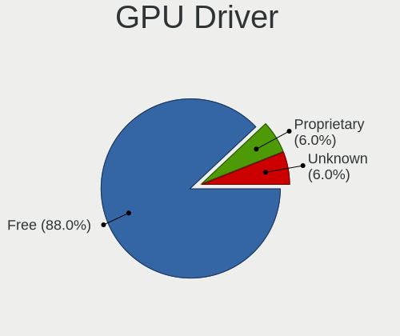

openSUSE Hardware Trends (Notebook)
-----------------------------------

A project to identify most popular hardware characteristics and track their change
over time based on data collected by openSUSE users at https://Linux-Hardware.org.

Anyone can contribute to the study by uploading probes of their computers by
the [hw-probe](https://github.com/linuxhw/hw-probe) tool:

    sudo hw-probe -all -upload

Full-feature report is available here: https://linux-hardware.org/?view=trends&formfactor=notebook

Period: Apr, 2020.

Contents
--------

- [ OS                       ](#os)
- [ OS Family                ](#os-family)
- [ Kernel                   ](#kernel)
- [ Kernel Family            ](#kernel-family)
- [ Kernel Major Ver.        ](#kernel-major-ver)
- [ Arch                     ](#arch)
- [ DE                       ](#de)
- [ Display Server           ](#display-server)
- [ Display Manager          ](#display-manager)
- [ OS Lang                  ](#os-lang)
- [ Boot Mode                ](#boot-mode)
- [ Filesystem               ](#filesystem)
- [ Dual Boot with Linux/BSD ](#dual-boot-with-linux/bsd)
- [ Dual Boot (Win)          ](#dual-boot-win)
- [ Country                  ](#country)
- [ City                     ](#city)
- [ Vendor                   ](#vendor)
- [ Model                    ](#model)
- [ Model Family             ](#model-family)
- [ MFG Year                 ](#mfg-year)
- [ Form Factor              ](#form-factor)
- [ Secure Boot              ](#secure-boot)
- [ Coreboot                 ](#coreboot)
- [ RAM Size                 ](#ram-size)
- [ RAM Used                 ](#ram-used)
- [ Drive Vendor             ](#drive-vendor)
- [ Drive Model              ](#drive-model)
- [ Drive Kind               ](#drive-kind)
- [ Drive Connector          ](#drive-connector)
- [ Drive Size               ](#drive-size)
- [ Space Total              ](#space-total)
- [ Space Used               ](#space-used)
- [ Malfunc. Drives          ](#malfunc-drives)
- [ Malfunc. Drive Vendor    ](#malfunc-drive-vendor)
- [ Malfunc. Drive Kind      ](#malfunc-drive-kind)
- [ Failed Drives            ](#failed-drives)
- [ Failed Drive Vendor      ](#failed-drive-vendor)
- [ Drive Status             ](#drive-status)
- [ Storage Vendor           ](#storage-vendor)
- [ Storage Model            ](#storage-model)
- [ Storage Kind             ](#storage-kind)
- [ CPU Vendor               ](#cpu-vendor)
- [ CPU Model                ](#cpu-model)
- [ CPU Model Family         ](#cpu-model-family)
- [ CPU Cores                ](#cpu-cores)
- [ CPU Sockets              ](#cpu-sockets)
- [ CPU Threads              ](#cpu-threads)
- [ CPU Op-Modes             ](#cpu-op-modes)
- [ CPU Microarch            ](#cpu-microarch)
- [ CPU Microcode            ](#cpu-microcode)
- [ GPU Vendor               ](#gpu-vendor)
- [ GPU Model                ](#gpu-model)
- [ GPU Combo                ](#gpu-combo)
- [ GPU Driver               ](#gpu-driver)
- [ GPU Memory               ](#gpu-memory)
- [ Monitor Vendor           ](#monitor-vendor)
- [ Monitor Model            ](#monitor-model)
- [ Monitor Resolution       ](#monitor-resolution)
- [ Monitor Diagonal         ](#monitor-diagonal)
- [ Monitor Width            ](#monitor-width)
- [ Aspect Ratio             ](#aspect-ratio)
- [ Monitor Area             ](#monitor-area)
- [ Pixel Density            ](#pixel-density)
- [ Multiple Monitors        ](#multiple-monitors)
- [ Net Controller Vendor    ](#net-controller-vendor)
- [ Net Controller Model     ](#net-controller-model)
- [ Net Controller Kind      ](#net-controller-kind)
- [ Used Controller          ](#used-controller)
- [ NICs                     ](#nics)
- [ Unsupported Devices      ](#unsupported-devices)
- [ Unsupported Device Types ](#unsupported-device-types)

OS
--

Installed operating systems

| Name                         | Computers | Percent |
|------------------------------|-----------|---------|
| openSUSE 15.1                | 24        | 39.34%  |
| openSUSE 20200405            | 12        | 19.67%  |
| openSUSE Leap-15.1           | 4         | 6.56%   |
| openSUSE 20200408            | 3         | 4.92%   |
| openSUSE 20200407            | 2         | 3.28%   |
| openSUSE Tumbleweed-20200422 | 1         | 1.64%   |
| openSUSE Tumbleweed-20200416 | 1         | 1.64%   |
| openSUSE Tumbleweed-20200410 | 1         | 1.64%   |
| openSUSE Tumbleweed-20200405 | 1         | 1.64%   |
| openSUSE Tumbleweed-20200331 | 1         | 1.64%   |
| openSUSE 20200425            | 1         | 1.64%   |
| openSUSE 20200416            | 1         | 1.64%   |
| openSUSE 20200410            | 1         | 1.64%   |
| openSUSE 20200402            | 1         | 1.64%   |
| openSUSE 20200326            | 1         | 1.64%   |
| openSUSE 20200325            | 1         | 1.64%   |
| openSUSE 20200320            | 1         | 1.64%   |
| openSUSE 20200307            | 1         | 1.64%   |
| openSUSE 20200211            | 1         | 1.64%   |
| openSUSE 15.2                | 1         | 1.64%   |
| openSUSE 15.0                | 1         | 1.64%   |

OS Family
---------

OS without a version

| Name     | Computers | Percent |
|----------|-----------|---------|
| openSUSE | 61        | 100%    |

Kernel
------

Version of the Linux kernel

| Version                     | Computers | Percent |
|-----------------------------|-----------|---------|
| 4.12.14-lp151.28.44-default | 24        | 39.34%  |
| 5.6.0-1-default             | 12        | 19.67%  |
| 5.6.2-1-default             | 6         | 9.84%   |
| 5.6.4-1-default             | 3         | 4.92%   |
| 5.5.13-1-default            | 3         | 4.92%   |
| 4.12.14-lp151.28.40-default | 3         | 4.92%   |
| 5.5.11-1-default            | 2         | 3.28%   |
| 5.6.6-1-default             | 1         | 1.64%   |
| 5.5.9-1-default             | 1         | 1.64%   |
| 5.5.4-1-default             | 1         | 1.64%   |
| 5.5.2-1-default             | 1         | 1.64%   |
| 5.4.13-1-default            | 1         | 1.64%   |
| 5.3.18-lp152.9-preempt      | 1         | 1.64%   |
| 4.18.12-2.ga880bd8-default  | 1         | 1.64%   |
| 4.12.14-lp150.12.79-default | 1         | 1.64%   |

Kernel Family
-------------

Linux kernel without a distro release

| Version | Computers | Percent |
|---------|-----------|---------|
| 4.12.14 | 28        | 45.9%   |
| 5.6.0   | 12        | 19.67%  |
| 5.6.2   | 6         | 9.84%   |
| 5.6.4   | 3         | 4.92%   |
| 5.5.13  | 3         | 4.92%   |
| 5.5.11  | 2         | 3.28%   |
| 5.6.6   | 1         | 1.64%   |
| 5.5.9   | 1         | 1.64%   |
| 5.5.4   | 1         | 1.64%   |
| 5.5.2   | 1         | 1.64%   |
| 5.4.13  | 1         | 1.64%   |
| 5.3.18  | 1         | 1.64%   |
| 4.18.12 | 1         | 1.64%   |

Kernel Major Ver.
-----------------

Linux kernel major version

| Version | Computers | Percent |
|---------|-----------|---------|
| 4.12    | 28        | 45.9%   |
| 5.6     | 22        | 36.07%  |
| 5.5     | 8         | 13.11%  |
| 5.4     | 1         | 1.64%   |
| 5.3     | 1         | 1.64%   |
| 4.18    | 1         | 1.64%   |

Arch
----

OS architecture (x86_64, i586, etc.)

| Name   | Computers | Percent |
|--------|-----------|---------|
| x86_64 | 61        | 100%    |

DE
--

Desktop Environment

| Name    | Computers | Percent |
|---------|-----------|---------|
| KDE5    | 37        | 60.66%  |
| KDE     | 10        | 16.39%  |
| MATE    | 6         | 9.84%   |
| GNOME   | 5         | 8.2%    |
| XFCE    | 2         | 3.28%   |
| Unknown | 1         | 1.64%   |

Display Server
--------------

X11 or Wayland

| Name        | Computers | Percent |
|-------------|-----------|---------|
| X11         | 53        | 86.89%  |
| Wayland     | 6         | 9.84%   |
| Unspecified | 1         | 1.64%   |
| Unknown     | 1         | 1.64%   |

Display Manager
---------------

SDDM, LightDM, etc.

| Name    | Computers | Percent |
|---------|-----------|---------|
| LightDM | 51        | 83.61%  |
| Unknown | 10        | 16.39%  |

OS Lang
-------

Language

| Lang       | Computers | Percent |
|------------|-----------|---------|
| de_DE      | 12        | 19.67%  |
| en_US      | 10        | 16.39%  |
| POSIX      | 6         | 9.84%   |
| fr_FR      | 6         | 9.84%   |
| en_GB      | 6         | 9.84%   |
| pt_PT      | 5         | 8.2%    |
| pt_BR      | 2         | 3.28%   |
| pl_PL      | 2         | 3.28%   |
| hu_HU      | 2         | 3.28%   |
| es_ES      | 2         | 3.28%   |
| sk_SK      | 1         | 1.64%   |
| ru_RU      | 1         | 1.64%   |
| nl_NL      | 1         | 1.64%   |
| nb_NO      | 1         | 1.64%   |
| it_IT      | 1         | 1.64%   |
| hr_HR      | 1         | 1.64%   |
| en_US.utf8 | 1         | 1.64%   |
| en_IE      | 1         | 1.64%   |

Boot Mode
---------

EFI or BIOS

| Mode | Computers | Percent |
|------|-----------|---------|
| EFI  | 41        | 67.21%  |
| BIOS | 20        | 32.79%  |

Filesystem
----------

Type of filesystem

| Type  | Computers | Percent |
|-------|-----------|---------|
| Btrfs | 35        | 57.38%  |
| Ext4  | 25        | 40.98%  |
| Xfs   | 1         | 1.64%   |

Dual Boot with Linux/BSD
------------------------

Hosting more than one Linux/BSD

| Dual boot | Computers | Percent |
|-----------|-----------|---------|
| No        | 55        | 90.16%  |
| Yes       | 6         | 9.84%   |

Dual Boot (Win)
---------------

Hosting Linux and Windows

| Dual boot | Computers | Percent |
|-----------|-----------|---------|
| No        | 39        | 63.93%  |
| Yes       | 22        | 36.07%  |

Country
-------

Geographic location (country)

| Country     | Computers | Percent |
|-------------|-----------|---------|
| USA         | 13        | 21.31%  |
| Germany     | 13        | 21.31%  |
| France      | 6         | 9.84%   |
| Switzerland | 4         | 6.56%   |
| Poland      | 2         | 3.28%   |
| Italy       | 2         | 3.28%   |
| Hungary     | 2         | 3.28%   |
| Brazil      | 2         | 3.28%   |
| Austria     | 2         | 3.28%   |
| Uruguay     | 1         | 1.64%   |
| Ukraine     | 1         | 1.64%   |
| UK          | 1         | 1.64%   |
| Slovakia    | 1         | 1.64%   |
| Serbia      | 1         | 1.64%   |
| Portugal    | 1         | 1.64%   |
| Norway      | 1         | 1.64%   |
| New Zealand | 1         | 1.64%   |
| Netherlands | 1         | 1.64%   |
| Luxembourg  | 1         | 1.64%   |
| Ireland     | 1         | 1.64%   |
| Croatia     | 1         | 1.64%   |
| Belgium     | 1         | 1.64%   |
| Belarus     | 1         | 1.64%   |
| Argentina   | 1         | 1.64%   |

City
----

Geographic location (city)

| City                | Computers | Percent |
|---------------------|-----------|---------|
| Joplin              | 5         | 8.2%    |
| Neuchatel           | 4         | 6.56%   |
| Schrobenhausen      | 3         | 4.92%   |
| Vienna              | 2         | 3.28%   |
| San Jose            | 2         | 3.28%   |
| João Pessoa        | 2         | 3.28%   |
| Berlin              | 2         | 3.28%   |
| Zagreb              | 1         | 1.64%   |
| Whitchurch          | 1         | 1.64%   |
| Weener              | 1         | 1.64%   |
| Villa Ballester     | 1         | 1.64%   |
| Vero Beach          | 1         | 1.64%   |
| Strasbourg          | 1         | 1.64%   |
| Rouen               | 1         | 1.64%   |
| Rochester           | 1         | 1.64%   |
| Porto               | 1         | 1.64%   |
| Paris               | 1         | 1.64%   |
| Oslo                | 1         | 1.64%   |
| Niederanven         | 1         | 1.64%   |
| Neuwied             | 1         | 1.64%   |
| Neupotz             | 1         | 1.64%   |
| Munich              | 1         | 1.64%   |
| Montevideo          | 1         | 1.64%   |
| Monte Porzio Catone | 1         | 1.64%   |
| Lviv                | 1         | 1.64%   |
| Louvigne-du-Desert  | 1         | 1.64%   |
| Lombard             | 1         | 1.64%   |
| Kessel              | 1         | 1.64%   |
| Kecskemét          | 1         | 1.64%   |
| Ilava               | 1         | 1.64%   |
| Huenfeld            | 1         | 1.64%   |
| Homer               | 1         | 1.64%   |
| Griesheim           | 1         | 1.64%   |
| Giżycko            | 1         | 1.64%   |
| Gdańsk             | 1         | 1.64%   |
| Fürth              | 1         | 1.64%   |
| Dublin              | 1         | 1.64%   |
| Denver              | 1         | 1.64%   |
| Coueron             | 1         | 1.64%   |
| Champagne-sur-Seine | 1         | 1.64%   |
| Catania             | 1         | 1.64%   |
| Burke               | 1         | 1.64%   |
| Budapest            | 1         | 1.64%   |
| Belgrade            | 1         | 1.64%   |
| Augsburg            | 1         | 1.64%   |
| Auckland            | 1         | 1.64%   |
| Asipovichy          | 1         | 1.64%   |
| Amsterdam           | 1         | 1.64%   |

Vendor
------

Motherboard manufacturer

| Name                | Computers | Percent |
|---------------------|-----------|---------|
| Lenovo              | 12        | 19.67%  |
| Dell                | 12        | 19.67%  |
| Hewlett-Packard     | 11        | 18.03%  |
| ASUSTek Computer    | 5         | 8.2%    |
| TUXEDO              | 3         | 4.92%   |
| Toshiba             | 3         | 4.92%   |
| Acer                | 3         | 4.92%   |
| Samsung Electronics | 2         | 3.28%   |
| MSI                 | 2         | 3.28%   |
| Alienware           | 2         | 3.28%   |
| Wortmann AG         | 1         | 1.64%   |
| INFORLANDIA         | 1         | 1.64%   |
| GPD                 | 1         | 1.64%   |
| Fujitsu Siemens     | 1         | 1.64%   |
| Fujitsu             | 1         | 1.64%   |
| Unknown             | 1         | 1.64%   |

Model
-----

Motherboard model

| Name                                   | Computers | Percent |
|----------------------------------------|-----------|---------|
| Dell Latitude 7490                     | 4         | 6.56%   |
| Unknown                                | 3         | 4.92%   |
| Dell Latitude E5470                    | 2         | 3.28%   |
| Dell G3 3579                           | 2         | 3.28%   |
| Wortmann AG TERRA_MOBILE_1541H         | 1         | 1.64%   |
| TUXEDO N550RC                          | 1         | 1.64%   |
| Toshiba Satellite PRO C50-A-1E2        | 1         | 1.64%   |
| Toshiba Satellite L770D-10M            | 1         | 1.64%   |
| Toshiba Satellite C855-112             | 1         | 1.64%   |
| Samsung Electronics RC530/RC730        | 1         | 1.64%   |
| Samsung Electronics 550P5C/550P7C      | 1         | 1.64%   |
| MSI GP63 Leopard 8RD                   | 1         | 1.64%   |
| MSI CX61 0OC/CX61 0OD/CX61 0OL         | 1         | 1.64%   |
| Lenovo Y520-15IKBN 80WK                | 1         | 1.64%   |
| Lenovo ThinkPad X230 2324BY9           | 1         | 1.64%   |
| Lenovo ThinkPad X220 4290Y11           | 1         | 1.64%   |
| Lenovo ThinkPad W530 2441CTO           | 1         | 1.64%   |
| Lenovo ThinkPad T480s 20L7S1KW00       | 1         | 1.64%   |
| Lenovo ThinkPad T480 20L6S42000        | 1         | 1.64%   |
| Lenovo ThinkPad T430 2349U2B           | 1         | 1.64%   |
| Lenovo ThinkPad T430 2347AY1           | 1         | 1.64%   |
| Lenovo IdeaPad 320-15AST 80XV          | 1         | 1.64%   |
| Lenovo G505s 20255                     | 1         | 1.64%   |
| Lenovo B590 627439G                    | 1         | 1.64%   |
| Lenovo B5400 80B6QB0                   | 1         | 1.64%   |
| INFORLANDIA W65_67SB                   | 1         | 1.64%   |
| HP ZBook 15 G2                         | 1         | 1.64%   |
| HP ProBook 4525s                       | 1         | 1.64%   |
| HP ProBook 450 G4                      | 1         | 1.64%   |
| HP ProBook 430 G5                      | 1         | 1.64%   |
| HP Pavilion g7                         | 1         | 1.64%   |
| HP Pavilion dv7                        | 1         | 1.64%   |
| HP Pavilion 14                         | 1         | 1.64%   |
| HP Mini 110-3100                       | 1         | 1.64%   |
| HP EliteBook 840 G6                    | 1         | 1.64%   |
| HP EliteBook 840 G2                    | 1         | 1.64%   |
| HP EliteBook 820 G3                    | 1         | 1.64%   |
| GPD P2 MAX                             | 1         | 1.64%   |
| Fujitsu STYLISTIC Q704                 | 1         | 1.64%   |
| Fujitsu Siemens LIFEBOOK S7210         | 1         | 1.64%   |
| Dell Latitude E7470                    | 1         | 1.64%   |
| Dell Latitude E6540                    | 1         | 1.64%   |
| Dell Latitude D830                     | 1         | 1.64%   |
| Dell Latitude 5591                     | 1         | 1.64%   |
| ASUS VivoBook_ASUSLaptop X530FN_S530FN | 1         | 1.64%   |
| ASUS VivoBook S15 X530UN               | 1         | 1.64%   |
| ASUS UX410UAK                          | 1         | 1.64%   |
| ASUS GL702ZC                           | 1         | 1.64%   |
| ASUS 1001PX                            | 1         | 1.64%   |
| Alienware M17xR4                       | 1         | 1.64%   |
| Alienware 15 R3                        | 1         | 1.64%   |
| Acer Nitro AN515-52                    | 1         | 1.64%   |
| Acer Aspire A315-42G                   | 1         | 1.64%   |
| Acer Aspire A315-21G                   | 1         | 1.64%   |

Model Family
------------

Motherboard model prefix

| Name                       | Computers | Percent |
|----------------------------|-----------|---------|
| Dell Latitude              | 10        | 16.39%  |
| Lenovo ThinkPad            | 7         | 11.48%  |
| Toshiba Satellite          | 3         | 4.92%   |
| HP ProBook                 | 3         | 4.92%   |
| HP Pavilion                | 3         | 4.92%   |
| HP EliteBook               | 3         | 4.92%   |
| Unknown                    | 3         | 4.92%   |
| Dell G3                    | 2         | 3.28%   |
| ASUS VivoBook              | 2         | 3.28%   |
| Acer Aspire                | 2         | 3.28%   |
| Wortmann AG TERRA          | 1         | 1.64%   |
| TUXEDO N550RC              | 1         | 1.64%   |
| Samsung Electronics RC530  | 1         | 1.64%   |
| Samsung Electronics 550P5C | 1         | 1.64%   |
| MSI GP63                   | 1         | 1.64%   |
| MSI CX61                   | 1         | 1.64%   |
| Lenovo Y520-15IKBN         | 1         | 1.64%   |
| Lenovo IdeaPad             | 1         | 1.64%   |
| Lenovo G505s               | 1         | 1.64%   |
| Lenovo B590                | 1         | 1.64%   |
| Lenovo B5400               | 1         | 1.64%   |
| INFORLANDIA W65            | 1         | 1.64%   |
| HP ZBook                   | 1         | 1.64%   |
| HP Mini                    | 1         | 1.64%   |
| GPD P2                     | 1         | 1.64%   |
| Fujitsu STYLISTIC          | 1         | 1.64%   |
| Fujitsu Siemens LIFEBOOK   | 1         | 1.64%   |
| ASUS UX410UAK              | 1         | 1.64%   |
| ASUS GL702ZC               | 1         | 1.64%   |
| ASUS 1001PX                | 1         | 1.64%   |
| Alienware M17xR4           | 1         | 1.64%   |
| Alienware 15               | 1         | 1.64%   |
| Acer Nitro                 | 1         | 1.64%   |

MFG Year
--------

Motherboard manufacture year

| Year | Computers | Percent |
|------|-----------|---------|
| 2019 | 23        | 37.7%   |
| 2013 | 7         | 11.48%  |
| 2018 | 6         | 9.84%   |
| 2015 | 4         | 6.56%   |
| 2012 | 4         | 6.56%   |
| 2017 | 3         | 4.92%   |
| 2016 | 3         | 4.92%   |
| 2014 | 3         | 4.92%   |
| 2011 | 3         | 4.92%   |
| 2020 | 2         | 3.28%   |
| 2010 | 2         | 3.28%   |
| 2008 | 1         | 1.64%   |

Form Factor
-----------

Physical design of the computer

| Name     | Computers | Percent |
|----------|-----------|---------|
| Notebook | 61        | 100%    |

Secure Boot
-----------

Enabled or disabled

| State    | Computers | Percent |
|----------|-----------|---------|
| Disabled | 48        | 78.69%  |
| Enabled  | 13        | 21.31%  |

Coreboot
--------

Have coreboot on board

| Used | Computers | Percent |
|------|-----------|---------|
| No   | 61        | 100%    |

RAM Size
--------

Total RAM memory

| Size in GB  | Computers | Percent |
|-------------|-----------|---------|
| 4.01-8.0    | 19        | 31.15%  |
| 16.01-24.0  | 19        | 31.15%  |
| 3.01-4.0    | 7         | 11.48%  |
| 32.01-64.0  | 6         | 9.84%   |
| 8.01-16.0   | 5         | 8.2%    |
| 1.01-2.0    | 2         | 3.28%   |
| 24.01-32.0  | 1         | 1.64%   |
| 2.01-3.0    | 1         | 1.64%   |
| 64.01-256.0 | 1         | 1.64%   |

RAM Used
--------

Used RAM memory

| Used GB   | Computers | Percent |
|-----------|-----------|---------|
| 2.01-3.0  | 19        | 31.15%  |
| 1.01-2.0  | 13        | 21.31%  |
| 8.01-16.0 | 10        | 16.39%  |
| 4.01-8.0  | 8         | 13.11%  |
| 3.01-4.0  | 8         | 13.11%  |
| 0.01-1.0  | 3         | 4.92%   |

Drive Vendor
------------

Hard drive vendors

| Vendor              | Computers | Drives | Percent |
|---------------------|-----------|--------|---------|
| Samsung Electronics | 22        | 23     | 30.14%  |
| WDC                 | 10        | 10     | 13.7%   |
| Seagate             | 10        | 11     | 13.7%   |
| SanDisk             | 8         | 8      | 10.96%  |
| Crucial             | 7         | 7      | 9.59%   |
| Toshiba             | 3         | 3      | 4.11%   |
| SK Hynix            | 2         | 2      | 2.74%   |
| Micron Technology   | 2         | 2      | 2.74%   |
| HGST                | 2         | 2      | 2.74%   |
| PLEXTOR             | 1         | 1      | 1.37%   |
| Phison Electronics  | 1         | 1      | 1.37%   |
| LITEON              | 1         | 1      | 1.37%   |
| Lenovo              | 1         | 1      | 1.37%   |
| Kingston            | 1         | 1      | 1.37%   |
| Intel               | 1         | 1      | 1.37%   |
| Hitachi             | 1         | 1      | 1.37%   |

Drive Model
-----------

Hard drive models

| Model                              | Computers | Percent |
|------------------------------------|-----------|---------|
| WDS480G2G0A-00JH30 480GB SSD       | 2         | 2.67%   |
| ST1000LM035-1RK172 1TB             | 2         | 2.67%   |
| ST1000LM024 HN-M101MBB 1TB         | 2         | 2.67%   |
| SSD 970 EVO Plus 1TB               | 2         | 2.67%   |
| SSD 970 EVO 500GB                  | 2         | 2.67%   |
| SSD 860 EVO 500GB                  | 2         | 2.67%   |
| SSD 850 EVO 250GB                  | 2         | 2.67%   |
| SSD 840 Series 120GB               | 2         | 2.67%   |
| SSD 840 EVO 250GB                  | 2         | 2.67%   |
| CT1000P1SSD8 1TB                   | 2         | 2.67%   |
| X600 M.2 2280 SATA 256GB SSD       | 1         | 1.33%   |
| WD6400BPVT-75HXZT1 640GB           | 1         | 1.33%   |
| WD20SPZX-22UA7T0 2TB               | 1         | 1.33%   |
| WD1600BEVT-22A23T0 160GB           | 1         | 1.33%   |
| WD10SPZX-21Z10T0 1TB               | 1         | 1.33%   |
| WD10SPZX-17Z10T0 1TB               | 1         | 1.33%   |
| WD10JPVX-08JC3T5 1TB               | 1         | 1.33%   |
| ST9500325AS 500GB                  | 1         | 1.33%   |
| ST500LM000-1EJ162 500GB            | 1         | 1.33%   |
| ST2000LM003 HN-M201RAD 2TB         | 1         | 1.33%   |
| ST1000LX015-1U7172 1TB             | 1         | 1.33%   |
| ST1000LM048-2E7172 1TB             | 1         | 1.33%   |
| ST1000LM044 HN-M101SAD 1TB         | 1         | 1.33%   |
| SSDPEKKF512G8 NVMe 512GB           | 1         | 1.33%   |
| SSD PLUS 120GB                     | 1         | 1.33%   |
| SSD 970 PRO 512GB                  | 1         | 1.33%   |
| SSD 970 EVO 1TB                    | 1         | 1.33%   |
| SSD 860 EVO mSATA 500GB            | 1         | 1.33%   |
| SSD 850 PRO 256GB                  | 1         | 1.33%   |
| SSD 840 Series 250GB               | 1         | 1.33%   |
| SSD 840 PRO Series 256GB           | 1         | 1.33%   |
| SSD 840 EVO 1TB                    | 1         | 1.33%   |
| SD9SN8W256G1102 256GB SSD          | 1         | 1.33%   |
| SD9SN8W256G 256GB SSD              | 1         | 1.33%   |
| SD8SNAT256G1002 256GB SSD          | 1         | 1.33%   |
| SD8SN8U-256G-1006 256GB SSD        | 1         | 1.33%   |
| SD7SB3Q-128G-1006 128GB SSD        | 1         | 1.33%   |
| SD6SB2M-512G-1006 512GB SSD        | 1         | 1.33%   |
| SA400S37480G 480GB SSD             | 1         | 1.33%   |
| PX-256M5S 256GB SSD                | 1         | 1.33%   |
| PCIe SSD 512GB                     | 1         | 1.33%   |
| PC401 NVMe 1TB                     | 1         | 1.33%   |
| PC401 HFS256GD9TNG-62A0A 256GB     | 1         | 1.33%   |
| PC SN520 SDAPNUW-512G-1006 512GB   | 1         | 1.33%   |
| PC SN520 SDAPNUW-128G-1014 128GB   | 1         | 1.33%   |
| MZVLW128HEGR-000L2 128GB           | 1         | 1.33%   |
| MZVLB256HAHQ-000H1 256GB           | 1         | 1.33%   |
| MZVKW1T0HMLH-00000 1TB             | 1         | 1.33%   |
| MZNLN256HMHQ-000H1 256GB SSD       | 1         | 1.33%   |
| MQ01ABF050 500GB                   | 1         | 1.33%   |
| MK5075GSX 500GB                    | 1         | 1.33%   |
| MK2556GSY 250GB                    | 1         | 1.33%   |
| LENSE30512GMSP34MEAT3TA 512GB      | 1         | 1.33%   |
| HTS725016A9A364 160GB              | 1         | 1.33%   |
| HTS721010A9E630 1TB                | 1         | 1.33%   |
| HTS545050A7E680 500GB              | 1         | 1.33%   |
| FireCuda 510 SSD ZP2000GM30001 2TB | 1         | 1.33%   |
| CV1-8B512-HP 512GB SSD             | 1         | 1.33%   |
| CT960BX500SSD1 960GB               | 1         | 1.33%   |
| CT500MX500SSD1 500GB               | 1         | 1.33%   |

Drive Kind
----------

HDD or SSD

| Kind | Computers | Drives | Percent |
|------|-----------|--------|---------|
| SSD  | 31        | 34     | 44.29%  |
| HDD  | 21        | 22     | 30%     |
| NVMe | 18        | 19     | 25.71%  |

Drive Connector
---------------

SATA, SAS, NVMe, etc.

| Type | Computers | Drives | Percent |
|------|-----------|--------|---------|
| SATA | 47        | 56     | 72.31%  |
| NVMe | 18        | 19     | 27.69%  |

Drive Size
----------

Size of hard drive

| Size in TB | Computers | Drives | Percent |
|------------|-----------|--------|---------|
| 0.01-0.5   | 38        | 42     | 55.88%  |
| 0.51-1.0   | 26        | 28     | 38.24%  |
| 1.01-2.0   | 4         | 5      | 5.88%   |

Space Total
-----------

Amount of disk space available on the file system

| Size in GB     | Computers | Percent |
|----------------|-----------|---------|
| 251-500        | 13        | 21.31%  |
| 501-1000       | 12        | 19.67%  |
| More than 3000 | 10        | 16.39%  |
| 101-250        | 9         | 14.75%  |
| 1001-2000      | 9         | 14.75%  |
| 2001-3000      | 8         | 13.11%  |

Space Used
----------

Amount of used disk space

| Used GB        | Computers | Percent |
|----------------|-----------|---------|
| 251-500        | 16        | 26.23%  |
| 101-250        | 10        | 16.39%  |
| 501-1000       | 9         | 14.75%  |
| 1001-2000      | 8         | 13.11%  |
| 51-100         | 7         | 11.48%  |
| 21-50          | 4         | 6.56%   |
| 1-20           | 4         | 6.56%   |
| More than 3000 | 2         | 3.28%   |
| 2001-3000      | 1         | 1.64%   |

Malfunc. Drives
---------------

Drive models with a malfunction

| Model                       | Computers | Drives | Percent |
|-----------------------------|-----------|--------|---------|
| ST9500325AS 500GB           | 1         | 1      | 14.29%  |
| ST1000LM044 HN-M101SAD 1TB  | 1         | 1      | 14.29%  |
| ST1000LM024 HN-M101MBB 1TB  | 1         | 1      | 14.29%  |
| SSD 840 EVO 250GB           | 1         | 1      | 14.29%  |
| SD8SN8U-256G-1006 256GB SSD | 1         | 1      | 14.29%  |
| MK5075GSX 500GB             | 1         | 1      | 14.29%  |
| CT1000P1SSD8 1TB            | 1         | 1      | 14.29%  |

Malfunc. Drive Vendor
---------------------

Vendors of faulty drives

| Vendor              | Computers | Drives | Percent |
|---------------------|-----------|--------|---------|
| Seagate             | 3         | 3      | 42.86%  |
| Toshiba             | 1         | 1      | 14.29%  |
| SanDisk             | 1         | 1      | 14.29%  |
| Samsung Electronics | 1         | 1      | 14.29%  |
| Crucial             | 1         | 1      | 14.29%  |

Malfunc. Drive Kind
-------------------

Kinds of faulty drives

| Kind | Computers | Drives | Percent |
|------|-----------|--------|---------|
| HDD  | 4         | 4      | 57.14%  |
| SSD  | 2         | 2      | 28.57%  |
| NVMe | 1         | 1      | 14.29%  |

Failed Drives
-------------

Failed drive models

Zero info for selected period =(

Failed Drive Vendor
-------------------

Failed drive vendors

Zero info for selected period =(

Drive Status
------------

Number of failed and malfunc. drives

| Status   | Computers | Drives | Percent |
|----------|-----------|--------|---------|
| Works    | 47        | 58     | 73.44%  |
| Detected | 10        | 10     | 15.63%  |
| Malfunc  | 7         | 7      | 10.94%  |

Storage Vendor
--------------

Storage controller vendors

| Vendor                    | Computers | Percent |
|---------------------------|-----------|---------|
| Intel                     | 46        | 63.89%  |
| Samsung Electronics       | 9         | 12.5%   |
| AMD                       | 8         | 11.11%  |
| SK Hynix                  | 2         | 2.78%   |
| Sandisk                   | 2         | 2.78%   |
| Micron/Crucial Technology | 2         | 2.78%   |
| Seagate Technology        | 1         | 1.39%   |
| Phison Electronics        | 1         | 1.39%   |
| Lenovo                    | 1         | 1.39%   |

Storage Model
-------------

Storage controller models

| Model                                                                    | Computers | Percent |
|--------------------------------------------------------------------------|-----------|---------|
| 7 Series Chipset Family 6-port SATA Controller [AHCI mode]               | 10        | 13.16%  |
| Sunrise Point-LP SATA Controller [AHCI mode]                             | 7         | 9.21%   |
| NVMe SSD Controller SM981/PM981/PM983                                    | 7         | 9.21%   |
| FCH SATA Controller [AHCI mode]                                          | 7         | 9.21%   |
| 82801 Mobile SATA Controller [RAID mode]                                 | 5         | 6.58%   |
| 8 Series/C220 Series Chipset Family 6-port SATA Controller 1 [AHCI mode] | 5         | 6.58%   |
| Non-Volatile memory controller                                           | 4         | 5.26%   |
| 6 Series/C200 Series Chipset Family 6 port Mobile SATA AHCI Controller   | 4         | 5.26%   |
| Cannon Lake Mobile PCH SATA AHCI Controller                              | 3         | 3.95%   |
| WD Black 2018/PC SN520 NVMe SSD                                          | 2         | 2.63%   |
| P1 NVMe PCIe SSD                                                         | 2         | 2.63%   |
| NVMe SSD Controller SM961/PM961                                          | 2         | 2.63%   |
| NM10/ICH7 Family SATA Controller [AHCI mode]                             | 2         | 2.63%   |
| HM170/QM170 Chipset SATA Controller [AHCI Mode]                          | 2         | 2.63%   |
| Cannon Point-LP SATA Controller [AHCI Mode]                              | 2         | 2.63%   |
| 82801HM/HEM (ICH8M/ICH8M-E) SATA Controller [AHCI mode]                  | 2         | 2.63%   |
| 82801HM/HEM (ICH8M/ICH8M-E) IDE Controller                               | 2         | 2.63%   |
| Wildcat Point-LP SATA Controller [AHCI Mode]                             | 1         | 1.32%   |
| SSD Pro 7600p/760p/E 6100p Series                                        | 1         | 1.32%   |
| SB7x0/SB8x0/SB9x0 SATA Controller [AHCI mode]                            | 1         | 1.32%   |
| Q170/Q150/B150/H170/H110/Z170/CM236 Chipset SATA Controller [AHCI Mode]  | 1         | 1.32%   |
| FCH IDE Controller                                                       | 1         | 1.32%   |
| E12 NVMe Controller                                                      | 1         | 1.32%   |
| 8 Series SATA Controller 1 [AHCI mode]                                   | 1         | 1.32%   |
| 300 Series Chipset SATA Controller                                       | 1         | 1.32%   |

Storage Kind
------------

Kind of storage controller (IDE, SATA, NVMe, SAS, ...)

| Kind | Computers | Percent |
|------|-----------|---------|
| SATA | 48        | 64.86%  |
| NVMe | 18        | 24.32%  |
| RAID | 5         | 6.76%   |
| IDE  | 3         | 4.05%   |

CPU Vendor
----------

Processor vendors

| Vendor | Computers | Percent |
|--------|-----------|---------|
| Intel  | 53        | 86.89%  |
| AMD    | 8         | 13.11%  |

CPU Model
---------

Processor models

| Model                                         | Computers | Percent |
|-----------------------------------------------|-----------|---------|
| Intel Core i7-8750H CPU @ 2.20GHz             | 4         | 6.56%   |
| Intel Core i7-8650U CPU @ 1.90GHz             | 3         | 4.92%   |
| Intel Core i5-8265U CPU @ 1.60GHz             | 3         | 4.92%   |
| Intel Core i5-6300U CPU @ 2.40GHz             | 3         | 4.92%   |
| Intel Core i3-3110M CPU @ 2.40GHz             | 3         | 4.92%   |
| Intel Core i7-8550U CPU @ 1.80GHz             | 2         | 3.28%   |
| Intel Core i7-2670QM CPU @ 2.20GHz            | 2         | 3.28%   |
| Intel Core i5-8350U CPU @ 1.70GHz             | 2         | 3.28%   |
| Intel Core i5-8250U CPU @ 1.60GHz             | 2         | 3.28%   |
| Intel Core i5-3320M CPU @ 2.60GHz             | 2         | 3.28%   |
| Intel Core m3-8100Y CPU @ 1.10GHz             | 1         | 1.64%   |
| Intel Core i7-8565U CPU @ 1.80GHz             | 1         | 1.64%   |
| Intel Core i7-7700HQ CPU @ 2.80GHz            | 1         | 1.64%   |
| Intel Core i7-7500U CPU @ 2.70GHz             | 1         | 1.64%   |
| Intel Core i7-6700HQ CPU @ 2.60GHz            | 1         | 1.64%   |
| Intel Core i7-6500U CPU @ 2.50GHz             | 1         | 1.64%   |
| Intel Core i7-4910MQ CPU @ 2.90GHz            | 1         | 1.64%   |
| Intel Core i7-4800MQ CPU @ 2.70GHz            | 1         | 1.64%   |
| Intel Core i7-4712MQ CPU @ 2.30GHz            | 1         | 1.64%   |
| Intel Core i7-3720QM CPU @ 2.60GHz            | 1         | 1.64%   |
| Intel Core i7-3630QM CPU @ 2.40GHz            | 1         | 1.64%   |
| Intel Core i5-8400H CPU @ 2.50GHz             | 1         | 1.64%   |
| Intel Core i5-7200U CPU @ 2.50GHz             | 1         | 1.64%   |
| Intel Core i5-6440HQ CPU @ 2.60GHz            | 1         | 1.64%   |
| Intel Core i5-5200U CPU @ 2.20GHz             | 1         | 1.64%   |
| Intel Core i5-4210M CPU @ 2.60GHz             | 1         | 1.64%   |
| Intel Core i5-4200U CPU @ 1.60GHz             | 1         | 1.64%   |
| Intel Core i5-4200M CPU @ 2.50GHz             | 1         | 1.64%   |
| Intel Core i5-3230M CPU @ 2.60GHz             | 1         | 1.64%   |
| Intel Core i5-3210M CPU @ 2.50GHz             | 1         | 1.64%   |
| Intel Core i5-2520M CPU @ 2.50GHz             | 1         | 1.64%   |
| Intel Core i5-2450M CPU @ 2.50GHz             | 1         | 1.64%   |
| Intel Core i5-2410M CPU @ 2.30GHz             | 1         | 1.64%   |
| Intel Core 2 Duo CPU T8300 @ 2.40GHz          | 1         | 1.64%   |
| Intel Core 2 Duo CPU T7700 @ 2.40GHz          | 1         | 1.64%   |
| Intel Atom CPU N455 @ 1.66GHz                 | 1         | 1.64%   |
| Intel Atom CPU N450 @ 1.66GHz                 | 1         | 1.64%   |
| AMD Ryzen 7 1700 Eight-Core Processor         | 1         | 1.64%   |
| AMD Athlon II P320 Dual-Core Processor        | 1         | 1.64%   |
| AMD Athlon 300U with Radeon Vega Mobile Gfx   | 1         | 1.64%   |
| AMD A9-9420e RADEON R5, 5 COMPUTE CORES 2C+3G | 1         | 1.64%   |
| AMD A8-4500M APU with Radeon HD Graphics      | 1         | 1.64%   |
| AMD A8-3520M APU with Radeon HD Graphics      | 1         | 1.64%   |
| AMD A6-9220 RADEON R4, 5 COMPUTE CORES 2C+3G  | 1         | 1.64%   |
| AMD A10-5750M APU with Radeon HD Graphics     | 1         | 1.64%   |

CPU Model Family
----------------

Processor model prefix

| Model            | Computers | Percent |
|------------------|-----------|---------|
| Intel Core i5    | 24        | 39.34%  |
| Intel Core i7    | 21        | 34.43%  |
| Intel Core i3    | 3         | 4.92%   |
| Intel Core 2 Duo | 2         | 3.28%   |
| Intel Atom       | 2         | 3.28%   |
| AMD A8           | 2         | 3.28%   |
| Other            | 1         | 1.64%   |
| Intel Core m3    | 1         | 1.64%   |
| AMD Ryzen 7      | 1         | 1.64%   |
| AMD Athlon II    | 1         | 1.64%   |
| AMD Athlon       | 1         | 1.64%   |
| AMD A6           | 1         | 1.64%   |
| AMD A10          | 1         | 1.64%   |

CPU Cores
---------

Number of processor cores

| Number | Computers | Percent |
|--------|-----------|---------|
| 2      | 29        | 47.54%  |
| 4      | 25        | 40.98%  |
| 6      | 4         | 6.56%   |
| 1      | 2         | 3.28%   |
| 8      | 1         | 1.64%   |

CPU Sockets
-----------

Number of sockets

| Number | Computers | Percent |
|--------|-----------|---------|
| 1      | 61        | 100%    |

CPU Threads
-----------

Threads per core (Hyper-Threading)

| Number | Computers | Percent |
|--------|-----------|---------|
| 2      | 53        | 86.89%  |
| 1      | 8         | 13.11%  |

CPU Op-Modes
------------

CPU Operation Modes (32-bit, 64-bit)

| Op mode        | Computers | Percent |
|----------------|-----------|---------|
| 32-bit, 64-bit | 61        | 100%    |

CPU Microarch
-------------

Microarchitecture

| Name        | Computers | Percent |
|-------------|-----------|---------|
| Skylake     | 28        | 45.9%   |
| IvyBridge   | 9         | 14.75%  |
| Haswell     | 6         | 9.84%   |
| SandyBridge | 5         | 8.2%    |
| Piledriver  | 2         | 3.28%   |
| Excavator   | 2         | 3.28%   |
| Core        | 2         | 3.28%   |
| Bonnell     | 2         | 3.28%   |
| Zen+        | 1         | 1.64%   |
| Zen         | 1         | 1.64%   |
| K10 Llano   | 1         | 1.64%   |
| K10         | 1         | 1.64%   |
| Broadwell   | 1         | 1.64%   |

CPU Microcode
-------------

Microcode number

| Number     | Computers | Percent |
|------------|-----------|---------|
| 0x806ea    | 9         | 14.75%  |
| 0x306a9    | 9         | 14.75%  |
| 0x906ea    | 5         | 8.2%    |
| 0x306c3    | 5         | 8.2%    |
| 0x206a7    | 5         | 8.2%    |
| 0x406e3    | 4         | 6.56%   |
| 0x806e9    | 3         | 4.92%   |
| 0x806ec    | 2         | 3.28%   |
| 0x806eb    | 2         | 3.28%   |
| 0x106ca    | 2         | 3.28%   |
| 0x06006705 | 2         | 3.28%   |
| 0x06001119 | 2         | 3.28%   |
| 0x906e9    | 1         | 1.64%   |
| 0x6fb      | 1         | 1.64%   |
| 0x506e3    | 1         | 1.64%   |
| 0x40651    | 1         | 1.64%   |
| 0x306d4    | 1         | 1.64%   |
| 0x10676    | 1         | 1.64%   |
| 0x08108102 | 1         | 1.64%   |
| 0x08001137 | 1         | 1.64%   |
| 0x03000027 | 1         | 1.64%   |
| 0x010000c8 | 1         | 1.64%   |
| Unknown    | 1         | 1.64%   |

GPU Vendor
----------

Vendors of graphics cards

| Vendor | Computers | Percent |
|--------|-----------|---------|
| Intel  | 52        | 65%     |
| Nvidia | 18        | 22.5%   |
| AMD    | 10        | 12.5%   |

GPU Model
---------

Graphics card models

| Model                                                               | Computers | Percent |
|---------------------------------------------------------------------|-----------|---------|
| UHD Graphics 620                                                    | 9         | 10.59%  |
| 3rd Gen Core processor Graphics Controller                          | 8         | 9.41%   |
| UHD Graphics 630 (Mobile)                                           | 5         | 5.88%   |
| 4th Gen Core Processor Integrated Graphics Controller               | 5         | 5.88%   |
| 2nd Generation Core Processor Family Integrated Graphics Controller | 5         | 5.88%   |
| UHD Graphics 620 (Whiskey Lake)                                     | 4         | 4.71%   |
| Skylake GT2 [HD Graphics 520]                                       | 4         | 4.71%   |
| GP108M [GeForce MX150]                                              | 3         | 3.53%   |
| GP107M [GeForce GTX 1050 Ti Mobile]                                 | 3         | 3.53%   |
| Stoney [Radeon R2/R3/R4/R5 Graphics]                                | 2         | 2.35%   |
| Mobile GM965/GL960 Integrated Graphics Controller (secondary)       | 2         | 2.35%   |
| Mobile GM965/GL960 Integrated Graphics Controller (primary)         | 2         | 2.35%   |
| HD Graphics 620                                                     | 2         | 2.35%   |
| HD Graphics 530                                                     | 2         | 2.35%   |
| GP107M [GeForce GTX 1050 Mobile]                                    | 2         | 2.35%   |
| Atom Processor D4xx/D5xx/N4xx/N5xx Integrated Graphics Controller   | 2         | 2.35%   |
| Whistler [Radeon HD 6730M/6770M/7690M XT]                           | 1         | 1.18%   |
| UHD Graphics 615                                                    | 1         | 1.18%   |
| Trinity [Radeon HD 7640G]                                           | 1         | 1.18%   |
| Sun PRO [Radeon HD 8570A/8570M]                                     | 1         | 1.18%   |
| Sumo [Radeon HD 6620G]                                              | 1         | 1.18%   |
| RV710/M92 [Mobility Radeon HD 4350/4550]                            | 1         | 1.18%   |
| Richland [Radeon HD 8650G]                                          | 1         | 1.18%   |
| Picasso                                                             | 1         | 1.18%   |
| Mars XTX [Radeon HD 8790M]                                          | 1         | 1.18%   |
| Lexa [Radeon 540X/550X/630 / RX 640 / E9171 MCM]                    | 1         | 1.18%   |
| Jet PRO [Radeon R5 M230 / R7 M260DX / Radeon 520 Mobile]            | 1         | 1.18%   |
| HD Graphics 630                                                     | 1         | 1.18%   |
| HD Graphics 5500                                                    | 1         | 1.18%   |
| Haswell-ULT Integrated Graphics Controller                          | 1         | 1.18%   |
| GP106M [GeForce GTX 1060 Mobile]                                    | 1         | 1.18%   |
| GM108M [GeForce MX130]                                              | 1         | 1.18%   |
| GM108M [GeForce 940M]                                               | 1         | 1.18%   |
| GM107M [GeForce GTX 950M]                                           | 1         | 1.18%   |
| GK208M [GeForce GT 730M]                                            | 1         | 1.18%   |
| GK107M [GeForce GTX 660M]                                           | 1         | 1.18%   |
| GK107GLM [Quadro K1000M]                                            | 1         | 1.18%   |
| GK106GLM [Quadro K2100M]                                            | 1         | 1.18%   |
| GF108M [GeForce GT 620M/630M/635M/640M LE]                          | 1         | 1.18%   |
| GF108M [GeForce GT 540M]                                            | 1         | 1.18%   |
| Ellesmere [Radeon RX 470/480/570/570X/580/580X/590]                 | 1         | 1.18%   |

GPU Combo
---------

Combinations of graphics cards

| Name           | Computers | Percent |
|----------------|-----------|---------|
| 1 x Intel      | 33        | 54.1%   |
| Intel + Nvidia | 17        | 27.87%  |
| 1 x AMD        | 5         | 8.2%    |
| 2 x AMD        | 3         | 4.92%   |
| Intel + AMD    | 2         | 3.28%   |
| 1 x Nvidia     | 1         | 1.64%   |

GPU Driver
----------

Free vs proprietary

| Driver      | Computers | Percent |
|-------------|-----------|---------|
| Free        | 53        | 86.89%  |
| Proprietary | 8         | 13.11%  |

GPU Memory
----------

Total video memory

| Size in GB | Computers | Percent |
|------------|-----------|---------|
| Unknown    | 40        | 65.57%  |
| 1.01-2.0   | 12        | 19.67%  |
| 0.01-0.5   | 5         | 8.2%    |
| 3.01-4.0   | 2         | 3.28%   |
| 0.51-1.0   | 2         | 3.28%   |

Monitor Vendor
--------------

Monitor vendors

| Vendor                  | Computers | Percent |
|-------------------------|-----------|---------|
| LG Display              | 17        | 23.94%  |
| Samsung Electronics     | 13        | 18.31%  |
| AU Optronics            | 12        | 16.9%   |
| Chimei Innolux          | 11        | 15.49%  |
| BOE                     | 7         | 9.86%   |
| Hewlett-Packard         | 3         | 4.23%   |
| Chi Mei Optoelectronics | 2         | 2.82%   |
| Lenovo                  | 1         | 1.41%   |
| InfoVision              | 1         | 1.41%   |
| Iiyama                  | 1         | 1.41%   |
| Goldstar                | 1         | 1.41%   |
| Dell                    | 1         | 1.41%   |
| Ancor Communications    | 1         | 1.41%   |

Monitor Model
-------------

Monitor models

| Model                                              | Computers | Percent |
|----------------------------------------------------|-----------|---------|
| Z27 HPN3537 3840x2160 597x336mm 27.0-inch          | 2         | 2.82%   |
| LCD Monitor SEC324C 1366x768 353x198mm 15.9-inch   | 2         | 2.82%   |
| LCD Monitor LGD05D0 1920x1080 344x194mm 15.5-inch  | 2         | 2.82%   |
| LCD Monitor LGD046F 1920x1080 344x194mm 15.5-inch  | 2         | 2.82%   |
| LCD Monitor CMN1490 1366x768 309x173mm 13.9-inch   | 2         | 2.82%   |
| LCD Monitor BOE06EE 1920x1080 309x173mm 13.9-inch  | 2         | 2.82%   |
| LCD Monitor AUO21ED 1920x1080 344x194mm 15.5-inch  | 2         | 2.82%   |
| LCD Monitor AUO139E 1600x900 382x214mm 17.2-inch   | 2         | 2.82%   |
| Z27 HPN3536 3840x2160 597x336mm 27.0-inch          | 1         | 1.41%   |
| SyncMaster SAM02D9 1680x1050 433x271mm 20.1-inch   | 1         | 1.41%   |
| SyncMaster SAM011E 1280x1024 338x270mm 17.0-inch   | 1         | 1.41%   |
| S24D590 SAM0B47 1920x1080 520x290mm 23.4-inch      | 1         | 1.41%   |
| S24B420 SAM097B 1920x1200 518x324mm 24.1-inch      | 1         | 1.41%   |
| PL2792Q IVM6630 2560x1440 597x336mm 27.0-inch      | 1         | 1.41%   |
| LP156WH2-TLRA LGD026B 1366x768 344x194mm 15.5-inch | 1         | 1.41%   |
| LG FULL HD GSM5ABB 1920x1080 480x270mm 21.7-inch   | 1         | 1.41%   |
| LCD Monitor SEC324A 1366x768 344x194mm 15.5-inch   | 1         | 1.41%   |
| LCD Monitor SEC3152 1366x768 344x194mm 15.5-inch   | 1         | 1.41%   |
| LCD Monitor SEC3150 1366x768 344x193mm 15.5-inch   | 1         | 1.41%   |
| LCD Monitor SEC3130 1024x600 223x125mm 10.1-inch   | 1         | 1.41%   |
| LCD Monitor SDC4652 1366x768 344x194mm 15.5-inch   | 1         | 1.41%   |
| LCD Monitor SDC4447 1366x768 340x190mm 15.3-inch   | 1         | 1.41%   |
| LCD Monitor SAM0B60 1920x1080 1060x590mm 47.8-inch | 1         | 1.41%   |
| LCD Monitor LGD0590 1920x1080 344x194mm 15.5-inch  | 1         | 1.41%   |
| LCD Monitor LGD0563 1920x1080 344x194mm 15.5-inch  | 1         | 1.41%   |
| LCD Monitor LGD0533 1920x1080 344x194mm 15.5-inch  | 1         | 1.41%   |
| LCD Monitor LGD052D 1920x1080 294x165mm 13.3-inch  | 1         | 1.41%   |
| LCD Monitor LGD0521 1920x1080 309x174mm 14.0-inch  | 1         | 1.41%   |
| LCD Monitor LGD04E8 1920x1080 382x215mm 17.3-inch  | 1         | 1.41%   |
| LCD Monitor LGD046D 1920x1080 309x174mm 14.0-inch  | 1         | 1.41%   |
| LCD Monitor LGD041C 1920x1080 276x156mm 12.5-inch  | 1         | 1.41%   |
| LCD Monitor LGD03A3 1366x768 277x156mm 12.5-inch   | 1         | 1.41%   |
| LCD Monitor LGD038E 1366x768 340x190mm 15.3-inch   | 1         | 1.41%   |
| LCD Monitor LGD0357 1600x900 382x215mm 17.3-inch   | 1         | 1.41%   |
| LCD Monitor LGD02D3 1366x768 277x156mm 12.5-inch   | 1         | 1.41%   |
| LCD Monitor LEN40B2 1920x1080 344x193mm 15.5-inch  | 1         | 1.41%   |
| LCD Monitor IVO03F4 1920x1200 263x164mm 12.2-inch  | 1         | 1.41%   |
| LCD Monitor CMO15A3 1366x768 344x193mm 15.5-inch   | 1         | 1.41%   |
| LCD Monitor CMO1592 1366x768 344x193mm 15.5-inch   | 1         | 1.41%   |
| LCD Monitor CMN1733 1600x900 382x215mm 17.3-inch   | 1         | 1.41%   |
| LCD Monitor CMN15F5 1920x1080 344x193mm 15.5-inch  | 1         | 1.41%   |
| LCD Monitor CMN15F4 1920x1080 344x193mm 15.5-inch  | 1         | 1.41%   |
| LCD Monitor CMN15E8 1920x1080 344x193mm 15.5-inch  | 1         | 1.41%   |
| LCD Monitor CMN15C5 1366x768 344x193mm 15.5-inch   | 1         | 1.41%   |
| LCD Monitor CMN15B1 1920x1080 344x194mm 15.5-inch  | 1         | 1.41%   |
| LCD Monitor CMN14D3 1920x1080 309x173mm 13.9-inch  | 1         | 1.41%   |
| LCD Monitor CMN14D2 1920x1080 309x173mm 13.9-inch  | 1         | 1.41%   |
| LCD Monitor CMN14A3 1600x900 309x174mm 14.0-inch   | 1         | 1.41%   |
| LCD Monitor BOE0868 1920x1080 309x174mm 14.0-inch  | 1         | 1.41%   |
| LCD Monitor BOE0747 1920x1080 344x194mm 15.5-inch  | 1         | 1.41%   |
| LCD Monitor BOE06CB 1920x1080 344x194mm 15.5-inch  | 1         | 1.41%   |
| LCD Monitor BOE0691 1920x1080 280x165mm 12.8-inch  | 1         | 1.41%   |
| LCD Monitor BOE0675 1366x768 344x194mm 15.5-inch   | 1         | 1.41%   |
| LCD Monitor AUO70EC 1366x768 340x190mm 15.3-inch   | 1         | 1.41%   |
| LCD Monitor AUO403D 1920x1080 309x173mm 13.9-inch  | 1         | 1.41%   |
| LCD Monitor AUO38ED 1920x1080 340x190mm 15.3-inch  | 1         | 1.41%   |
| LCD Monitor AUO333D 1920x1080 309x174mm 14.0-inch  | 1         | 1.41%   |
| LCD Monitor AUO243D 1920x1080 309x173mm 13.9-inch  | 1         | 1.41%   |
| LCD Monitor AUO22EC 1366x768 344x193mm 15.5-inch   | 1         | 1.41%   |
| LCD Monitor AUO2274 1280x800 331x207mm 15.4-inch   | 1         | 1.41%   |

Monitor Resolution
------------------

Monitor screen resolution

| Resolution         | Computers | Percent |
|--------------------|-----------|---------|
| 1920x1080 (FHD)    | 33        | 48.53%  |
| 1366x768 (WXGA)    | 18        | 26.47%  |
| 1600x900 (HD+)     | 7         | 10.29%  |
| 3840x2160 (4K)     | 3         | 4.41%   |
| 1680x1050 (WSXGA+) | 2         | 2.94%   |
| 2560x1440 (QHD)    | 1         | 1.47%   |
| 1920x1200 (WUXGA)  | 1         | 1.47%   |
| 1280x800 (WXGA)    | 1         | 1.47%   |
| 1280x1024 (SXGA)   | 1         | 1.47%   |
| 1024x600           | 1         | 1.47%   |

Monitor Diagonal
----------------

Diagonal size in inches

| Inches | Computers | Percent |
|--------|-----------|---------|
| 15     | 33        | 46.48%  |
| 14     | 8         | 11.27%  |
| 13     | 8         | 11.27%  |
| 17     | 6         | 8.45%   |
| 27     | 5         | 7.04%   |
| 12     | 4         | 5.63%   |
| 40     | 1         | 1.41%   |
| 24     | 1         | 1.41%   |
| 23     | 1         | 1.41%   |
| 22     | 1         | 1.41%   |
| 21     | 1         | 1.41%   |
| 20     | 1         | 1.41%   |
| 10     | 1         | 1.41%   |

Monitor Width
-------------

Physical width

| Width in mm | Computers | Percent |
|-------------|-----------|---------|
| 301-350     | 48        | 68.57%  |
| 501-600     | 7         | 10%     |
| 201-300     | 6         | 8.57%   |
| 351-400     | 5         | 7.14%   |
| 401-500     | 3         | 4.29%   |
| 801-900     | 1         | 1.43%   |

Aspect Ratio
------------

Proportional relationship between the width and the height

| Ratio | Computers | Percent |
|-------|-----------|---------|
| 16/9  | 58        | 92.06%  |
| 16/10 | 4         | 6.35%   |
| 5/4   | 1         | 1.59%   |

Monitor Area
------------

Area in inch²

| Area in inch² | Computers | Percent |
|----------------|-----------|---------|
| 101-110        | 33        | 46.48%  |
| 81-90          | 15        | 21.13%  |
| 301-350        | 5         | 7.04%   |
| 121-130        | 5         | 7.04%   |
| 61-70          | 3         | 4.23%   |
| 201-250        | 3         | 4.23%   |
| 71-80          | 2         | 2.82%   |
| 41-50          | 1         | 1.41%   |
| 251-300        | 1         | 1.41%   |
| 151-200        | 1         | 1.41%   |
| 141-150        | 1         | 1.41%   |
| 501-1000       | 1         | 1.41%   |

Pixel Density
-------------

Pixels per inch

| Density | Computers | Percent |
|---------|-----------|---------|
| 121-160 | 34        | 49.28%  |
| 101-120 | 22        | 31.88%  |
| 51-100  | 7         | 10.14%  |
| 161-240 | 6         | 8.7%    |

Multiple Monitors
-----------------

Total monitors connected

| Total | Computers | Percent |
|-------|-----------|---------|
| 1     | 51        | 83.61%  |
| 2     | 8         | 13.11%  |
| 3     | 2         | 3.28%   |

Net Controller Vendor
---------------------

Controller vendors

| Vendor                | Computers | Percent |
|-----------------------|-----------|---------|
| Intel                 | 10        | 76.92%  |
| Realtek Semiconductor | 1         | 7.69%   |
| MediaTek              | 1         | 7.69%   |
| Arduino SA            | 1         | 7.69%   |

Net Controller Model
--------------------

Controller models

| Model                                           | Computers | Percent |
|-------------------------------------------------|-----------|---------|
| 82579LM Gigabit Network Connection (Lewisville) | 5         | 27.78%  |
| Centrino Advanced-N 6205 [Taylor Peak]          | 4         | 22.22%  |
| Centrino Ultimate-N 6300                        | 2         | 11.11%  |
| Centrino Advanced-N 6235                        | 2         | 11.11%  |
| Wireless 8265 / 8275                            | 1         | 5.56%   |
| Wi-Fi 6 AX200                                   | 1         | 5.56%   |
| Uno R3 (CDC ACM)                                | 1         | 5.56%   |
| RTL8153 Gigabit Ethernet Adapter                | 1         | 5.56%   |
| Power Ice Evo                                   | 1         | 5.56%   |

Net Controller Kind
-------------------

Ethernet, WiFi or modem

| Kind     | Computers | Percent |
|----------|-----------|---------|
| WiFi     | 10        | 55.56%  |
| Ethernet | 7         | 38.89%  |
| Modem    | 1         | 5.56%   |

Used Controller
---------------

Currently used network controller

| Kind     | Computers | Percent |
|----------|-----------|---------|
| WiFi     | 8         | 72.73%  |
| Ethernet | 3         | 27.27%  |

NICs
----

Total network controllers on board

| Total | Computers | Percent |
|-------|-----------|---------|
| 2     | 55        | 90.16%  |
| 1     | 6         | 9.84%   |

Unsupported Devices
-------------------

Total unsupported devices on board

| Total | Computers | Percent |
|-------|-----------|---------|
| 0     | 41        | 67.21%  |
| 1     | 19        | 31.15%  |
| 2     | 1         | 1.64%   |

Unsupported Device Types
------------------------

Types of unsupported devices

| Type                     | Computers | Percent |
|--------------------------|-----------|---------|
| Chipcard                 | 8         | 38.1%   |
| Fingerprint reader       | 7         | 33.33%  |
| Graphics card            | 3         | 14.29%  |
| Storage                  | 1         | 4.76%   |
| Net/wireless             | 1         | 4.76%   |
| Communication controller | 1         | 4.76%   |

