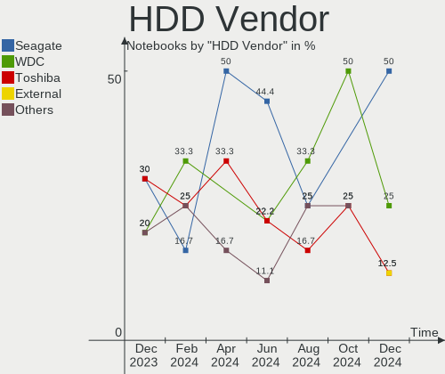
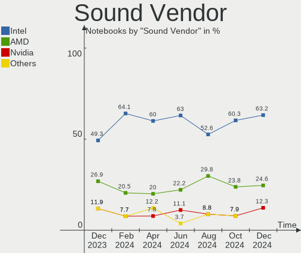
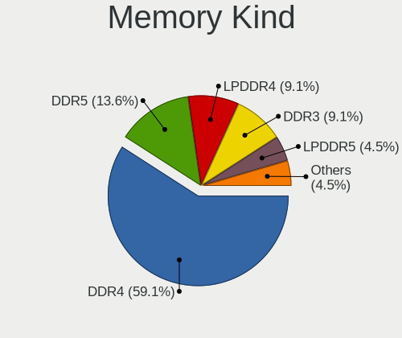

openSUSE - Hardware Trends (Notebooks)
--------------------------------------

A project to identify most popular hardware characteristics and track their change
over time based on data collected by Linux users at https://Linux-Hardware.org.

Anyone can contribute to this report by the [hw-probe](https://github.com/linuxhw/hw-probe) tool:

    sudo -E hw-probe -all -upload

This report is for one last month. Overall report since the beginning of time: [TestCoverage](https://github.com/linuxhw/TestCoverage)

Period: Nov, 2022.

Contents
--------

* [ System ](#system)
  - [ OS                       ](#os)
  - [ OS Family                ](#os-family)
  - [ Kernel                   ](#kernel)
  - [ Kernel Family            ](#kernel-family)
  - [ Kernel Major Ver.        ](#kernel-major-ver)
  - [ Arch                     ](#arch)
  - [ DE                       ](#de)
  - [ Display Server           ](#display-server)
  - [ Display Manager          ](#display-manager)
  - [ OS Lang                  ](#os-lang)
  - [ Boot Mode                ](#boot-mode)
  - [ Filesystem               ](#filesystem)
  - [ Part. scheme             ](#part-scheme)
  - [ Dual Boot with Linux/BSD ](#dual-boot-with-linuxbsd)
  - [ Dual Boot (Win)          ](#dual-boot-win)

* [ Board ](#board)
  - [ Vendor                   ](#vendor)
  - [ Model                    ](#model)
  - [ Model Family             ](#model-family)
  - [ MFG Year                 ](#mfg-year)
  - [ Form Factor              ](#form-factor)
  - [ Secure Boot              ](#secure-boot)
  - [ Coreboot                 ](#coreboot)
  - [ RAM Size                 ](#ram-size)
  - [ RAM Used                 ](#ram-used)
  - [ Total Drives             ](#total-drives)
  - [ Has CD-ROM               ](#has-cd-rom)
  - [ Has Ethernet             ](#has-ethernet)
  - [ Has WiFi                 ](#has-wifi)
  - [ Has Bluetooth            ](#has-bluetooth)

* [ Location ](#location)
  - [ Country                  ](#country)
  - [ City                     ](#city)

* [ Drives ](#drives)
  - [ Drive Vendor             ](#drive-vendor)
  - [ Drive Model              ](#drive-model)
  - [ HDD Vendor               ](#hdd-vendor)
  - [ SSD Vendor               ](#ssd-vendor)
  - [ Drive Kind               ](#drive-kind)
  - [ Drive Connector          ](#drive-connector)
  - [ Drive Size               ](#drive-size)
  - [ Space Total              ](#space-total)
  - [ Space Used               ](#space-used)
  - [ Malfunc. Drives          ](#malfunc-drives)
  - [ Malfunc. Drive Vendor    ](#malfunc-drive-vendor)
  - [ Malfunc. HDD Vendor      ](#malfunc-hdd-vendor)
  - [ Malfunc. Drive Kind      ](#malfunc-drive-kind)
  - [ Failed Drives            ](#failed-drives)
  - [ Failed Drive Vendor      ](#failed-drive-vendor)
  - [ Drive Status             ](#drive-status)

* [ Storage controller ](#storage-controller)
  - [ Storage Vendor           ](#storage-vendor)
  - [ Storage Model            ](#storage-model)
  - [ Storage Kind             ](#storage-kind)

* [ Processor ](#processor)
  - [ CPU Vendor               ](#cpu-vendor)
  - [ CPU Model                ](#cpu-model)
  - [ CPU Model Family         ](#cpu-model-family)
  - [ CPU Cores                ](#cpu-cores)
  - [ CPU Sockets              ](#cpu-sockets)
  - [ CPU Threads              ](#cpu-threads)
  - [ CPU Op-Modes             ](#cpu-op-modes)
  - [ CPU Microcode            ](#cpu-microcode)
  - [ CPU Microarch            ](#cpu-microarch)

* [ Graphics ](#graphics)
  - [ GPU Vendor               ](#gpu-vendor)
  - [ GPU Model                ](#gpu-model)
  - [ GPU Combo                ](#gpu-combo)
  - [ GPU Driver               ](#gpu-driver)
  - [ GPU Memory               ](#gpu-memory)

* [ Monitor ](#monitor)
  - [ Monitor Vendor           ](#monitor-vendor)
  - [ Monitor Model            ](#monitor-model)
  - [ Monitor Resolution       ](#monitor-resolution)
  - [ Monitor Diagonal         ](#monitor-diagonal)
  - [ Monitor Width            ](#monitor-width)
  - [ Aspect Ratio             ](#aspect-ratio)
  - [ Monitor Area             ](#monitor-area)
  - [ Pixel Density            ](#pixel-density)
  - [ Multiple Monitors        ](#multiple-monitors)

* [ Network ](#network)
  - [ Net Controller Vendor    ](#net-controller-vendor)
  - [ Net Controller Model     ](#net-controller-model)
  - [ Wireless Vendor          ](#wireless-vendor)
  - [ Wireless Model           ](#wireless-model)
  - [ Ethernet Vendor          ](#ethernet-vendor)
  - [ Ethernet Model           ](#ethernet-model)
  - [ Net Controller Kind      ](#net-controller-kind)
  - [ Used Controller          ](#used-controller)
  - [ NICs                     ](#nics)
  - [ IPv6                     ](#ipv6)

* [ Bluetooth ](#bluetooth)
  - [ Bluetooth Vendor         ](#bluetooth-vendor)
  - [ Bluetooth Model          ](#bluetooth-model)

* [ Sound ](#sound)
  - [ Sound Vendor             ](#sound-vendor)
  - [ Sound Model              ](#sound-model)

* [ Memory ](#memory)
  - [ Memory Vendor            ](#memory-vendor)
  - [ Memory Model             ](#memory-model)
  - [ Memory Kind              ](#memory-kind)
  - [ Memory Form Factor       ](#memory-form-factor)
  - [ Memory Size              ](#memory-size)
  - [ Memory Speed             ](#memory-speed)

* [ Printers & scanners ](#printers--scanners)
  - [ Printer Vendor           ](#printer-vendor)
  - [ Printer Model            ](#printer-model)
  - [ Scanner Vendor           ](#scanner-vendor)
  - [ Scanner Model            ](#scanner-model)

* [ Camera ](#camera)
  - [ Camera Vendor            ](#camera-vendor)
  - [ Camera Model             ](#camera-model)

* [ Security ](#security)
  - [ Fingerprint Vendor       ](#fingerprint-vendor)
  - [ Fingerprint Model        ](#fingerprint-model)
  - [ Chipcard Vendor          ](#chipcard-vendor)
  - [ Chipcard Model           ](#chipcard-model)

* [ Unsupported ](#unsupported)
  - [ Unsupported Devices      ](#unsupported-devices)
  - [ Unsupported Device Types ](#unsupported-device-types)

System
------

OS
--

Installed operating systems

| Name                         | Notebooks | Percent |
|------------------------------|-----------|---------|
| openSUSE Tumbleweed-XXXXXXXX | 34        | 85%     |
| openSUSE Leap-15.4           | 4         | 10%     |
| openSUSE Microos-XXXXXXXX    | 2         | 5%      |

OS Family
---------

OS without a version

| Name     | Notebooks | Percent |
|----------|-----------|---------|
| openSUSE | 40        | 100%    |

Kernel
------

Version of the Linux kernel

| Version                      | Notebooks | Percent |
|------------------------------|-----------|---------|
| 6.0.8-1-default              | 16        | 40%     |
| 6.0.6-1-default              | 8         | 20%     |
| 6.0.7-1-default              | 5         | 12.5%   |
| 6.0.5-1-default              | 4         | 10%     |
| 5.14.21-150400.24.33-default | 2         | 5%      |
| 5.14.21-150400.24.28-default | 2         | 5%      |
| 6.0.3-1-default              | 1         | 2.5%    |
| 6.0.2-1-default              | 1         | 2.5%    |
| 5.18.6-1-default             | 1         | 2.5%    |

Kernel Family
-------------

Linux kernel without a distro release

| Version | Notebooks | Percent |
|---------|-----------|---------|
| 6.0.8   | 16        | 40%     |
| 6.0.6   | 8         | 20%     |
| 6.0.7   | 5         | 12.5%   |
| 6.0.5   | 4         | 10%     |
| 5.14.21 | 4         | 10%     |
| 6.0.3   | 1         | 2.5%    |
| 6.0.2   | 1         | 2.5%    |
| 5.18.6  | 1         | 2.5%    |

Kernel Major Ver.
-----------------

Linux kernel major version

| Version | Notebooks | Percent |
|---------|-----------|---------|
| 6.0     | 35        | 87.5%   |
| 5.14    | 4         | 10%     |
| 5.18    | 1         | 2.5%    |

Arch
----

OS architecture (x86_64, i586, etc.)

| Name   | Notebooks | Percent |
|--------|-----------|---------|
| x86_64 | 40        | 100%    |

DE
--

Desktop Environment

| Name    | Notebooks | Percent |
|---------|-----------|---------|
| KDE5    | 25        | 62.5%   |
| GNOME   | 9         | 22.5%   |
| Unknown | 3         | 7.5%    |
| XFCE    | 2         | 5%      |
| sway    | 1         | 2.5%    |

Display Server
--------------

X11 or Wayland

| Name    | Notebooks | Percent |
|---------|-----------|---------|
| X11     | 29        | 72.5%   |
| Wayland | 10        | 25%     |
| Tty     | 1         | 2.5%    |

Display Manager
---------------

SDDM, LightDM, etc.

| Name    | Notebooks | Percent |
|---------|-----------|---------|
| SDDM    | 16        | 40%     |
| Unknown | 15        | 37.5%   |
| LightDM | 6         | 15%     |
| XDM     | 3         | 7.5%    |

OS Lang
-------

Language

| Lang  | Notebooks | Percent |
|-------|-----------|---------|
| en_US | 25        | 62.5%   |
| it_IT | 4         | 10%     |
| pt_BR | 3         | 7.5%    |
| POSIX | 3         | 7.5%    |
| ru_RU | 1         | 2.5%    |
| fr_FR | 1         | 2.5%    |
| es_ES | 1         | 2.5%    |
| en_GB | 1         | 2.5%    |
| de_DE | 1         | 2.5%    |

Boot Mode
---------

EFI or BIOS

| Mode | Notebooks | Percent |
|------|-----------|---------|
| EFI  | 33        | 82.5%   |
| BIOS | 7         | 17.5%   |

Filesystem
----------

Type of filesystem

| Type  | Notebooks | Percent |
|-------|-----------|---------|
| Btrfs | 28        | 70%     |
| Ext4  | 9         | 22.5%   |
| Xfs   | 3         | 7.5%    |

Part. scheme
------------

Scheme of partitioning

| Type    | Notebooks | Percent |
|---------|-----------|---------|
| GPT     | 26        | 65%     |
| Unknown | 12        | 30%     |
| MBR     | 2         | 5%      |

Dual Boot with Linux/BSD
------------------------

Hosting more than one Linux/BSD

| Dual boot | Notebooks | Percent |
|-----------|-----------|---------|
| No        | 37        | 92.5%   |
| Yes       | 3         | 7.5%    |

Dual Boot (Win)
---------------

Hosting Linux and Windows

| Dual boot | Notebooks | Percent |
|-----------|-----------|---------|
| No        | 32        | 80%     |
| Yes       | 8         | 20%     |

Board
-----

Vendor
------

Motherboard manufacturer

| Name             | Notebooks | Percent |
|------------------|-----------|---------|
| Hewlett-Packard  | 12        | 30%     |
| Dell             | 7         | 17.5%   |
| Lenovo           | 6         | 15%     |
| ASUSTek Computer | 4         | 10%     |
| SLIMBOOK         | 2         | 5%      |
| TUXEDO           | 1         | 2.5%    |
| Timi             | 1         | 2.5%    |
| Semp Toshiba     | 1         | 2.5%    |
| Schenker         | 1         | 2.5%    |
| MSI              | 1         | 2.5%    |
| Intel            | 1         | 2.5%    |
| HUAWEI           | 1         | 2.5%    |
| Apple            | 1         | 2.5%    |
| Acer             | 1         | 2.5%    |

Model
-----

Motherboard model

| Name                                                      | Notebooks | Percent |
|-----------------------------------------------------------|-----------|---------|
| HP Pavilion Laptop 15-cs2xxx                              | 2         | 5%      |
| HP Notebook                                               | 2         | 5%      |
| TUXEDO XMG FUSION 15 (XFU15L19)                           | 1         | 2.5%    |
| Timi TM1612                                               | 1         | 2.5%    |
| SLIMBOOK PROX14                                           | 1         | 2.5%    |
| SLIMBOOK PROX-AMD5                                        | 1         | 2.5%    |
| Semp Toshiba IS 1422+                                     | 1         | 2.5%    |
| Schenker XMG FUSION 15 (XFU15L19)                         | 1         | 2.5%    |
| MSI GE72VR 7RF                                            | 1         | 2.5%    |
| Lenovo ThinkPad X260 20F6005HUS                           | 1         | 2.5%    |
| Lenovo ThinkPad X1 Extreme Gen 3 20TK000AGE               | 1         | 2.5%    |
| Lenovo ThinkPad T530 2394D56                              | 1         | 2.5%    |
| Lenovo IdeaPad Gaming 3 15IHU6 82MG                       | 1         | 2.5%    |
| Lenovo G50-45 80E3                                        | 1         | 2.5%    |
| Lenovo B50-80 80LT                                        | 1         | 2.5%    |
| Intel (R) Education Tablet                                | 1         | 2.5%    |
| HUAWEI BOHK-WAX9X                                         | 1         | 2.5%    |
| HP ZBook Studio 15.6 inch G8 Mobile Workstation PC        | 1         | 2.5%    |
| HP ZBook 17                                               | 1         | 2.5%    |
| HP Pavilion 15                                            | 1         | 2.5%    |
| HP Laptop 15-ef2xxx                                       | 1         | 2.5%    |
| HP EliteBook 855 G7 Notebook PC                           | 1         | 2.5%    |
| HP EliteBook 8460p                                        | 1         | 2.5%    |
| HP EliteBook 845 G8 Notebook PC                           | 1         | 2.5%    |
| HP Compaq 6830s                                           | 1         | 2.5%    |
| Dell Latitude E5570                                       | 1         | 2.5%    |
| Dell Latitude 5414                                        | 1         | 2.5%    |
| Dell Latitude 5401                                        | 1         | 2.5%    |
| Dell Inspiron 7577                                        | 1         | 2.5%    |
| Dell Inspiron 5505                                        | 1         | 2.5%    |
| Dell Inspiron 3593                                        | 1         | 2.5%    |
| Dell Inspiron 14 Plus 7420                                | 1         | 2.5%    |
| ASUS Zenbook UM6702RA_RM6702RA_BM6702RA UM6702RA_UM6702RA | 1         | 2.5%    |
| ASUS Z450LA                                               | 1         | 2.5%    |
| ASUS VivoBook_ASUSLaptop X515MA_X515MA                    | 1         | 2.5%    |
| ASUS VivoBook_ASUSLaptop X513EA_F513EA                    | 1         | 2.5%    |
| Apple MacBook5,1                                          | 1         | 2.5%    |
| Acer Aspire A317-51                                       | 1         | 2.5%    |

Model Family
------------

Motherboard model prefix

| Name               | Notebooks | Percent |
|--------------------|-----------|---------|
| Dell Inspiron      | 4         | 10%     |
| Lenovo ThinkPad    | 3         | 7.5%    |
| HP Pavilion        | 3         | 7.5%    |
| HP EliteBook       | 3         | 7.5%    |
| Dell Latitude      | 3         | 7.5%    |
| HP ZBook           | 2         | 5%      |
| HP Notebook        | 2         | 5%      |
| ASUS VivoBook      | 2         | 5%      |
| TUXEDO XMG         | 1         | 2.5%    |
| Timi TM1612        | 1         | 2.5%    |
| SLIMBOOK PROX14    | 1         | 2.5%    |
| SLIMBOOK PROX-AMD5 | 1         | 2.5%    |
| Semp Toshiba IS    | 1         | 2.5%    |
| Schenker XMG       | 1         | 2.5%    |
| MSI GE72VR         | 1         | 2.5%    |
| Lenovo IdeaPad     | 1         | 2.5%    |
| Lenovo G50-45      | 1         | 2.5%    |
| Lenovo B50-80      | 1         | 2.5%    |
| Intel (R)          | 1         | 2.5%    |
| HUAWEI BOHK-WAX9X  | 1         | 2.5%    |
| HP Laptop          | 1         | 2.5%    |
| HP Compaq          | 1         | 2.5%    |
| ASUS Zenbook       | 1         | 2.5%    |
| ASUS Z450LA        | 1         | 2.5%    |
| Apple MacBook5     | 1         | 2.5%    |
| Acer Aspire        | 1         | 2.5%    |

MFG Year
--------

Motherboard manufacture year

| Year | Notebooks | Percent |
|------|-----------|---------|
| 2019 | 7         | 17.5%   |
| 2020 | 6         | 15%     |
| 2022 | 5         | 12.5%   |
| 2021 | 4         | 10%     |
| 2017 | 3         | 7.5%    |
| 2016 | 3         | 7.5%    |
| 2018 | 2         | 5%      |
| 2015 | 2         | 5%      |
| 2014 | 2         | 5%      |
| 2013 | 1         | 2.5%    |
| 2012 | 1         | 2.5%    |
| 2011 | 1         | 2.5%    |
| 2010 | 1         | 2.5%    |
| 2009 | 1         | 2.5%    |
| 2008 | 1         | 2.5%    |

Form Factor
-----------

Physical design of the computer

| Name     | Notebooks | Percent |
|----------|-----------|---------|
| Notebook | 40        | 100%    |

Secure Boot
-----------

Enabled or disabled

| State    | Notebooks | Percent |
|----------|-----------|---------|
| Disabled | 28        | 70%     |
| Enabled  | 12        | 30%     |

Coreboot
--------

Have coreboot on board

| Used | Notebooks | Percent |
|------|-----------|---------|
| No   | 40        | 100%    |

RAM Size
--------

Total RAM memory

| Size in GB | Notebooks | Percent |
|------------|-----------|---------|
| 4.01-8.0   | 11        | 27.5%   |
| 32.01-64.0 | 9         | 22.5%   |
| 16.01-24.0 | 7         | 17.5%   |
| 3.01-4.0   | 6         | 15%     |
| 8.01-16.0  | 6         | 15%     |
| 1.01-2.0   | 1         | 2.5%    |

RAM Used
--------

Used RAM memory

| Used GB   | Notebooks | Percent |
|-----------|-----------|---------|
| 4.01-8.0  | 13        | 32.5%   |
| 1.01-2.0  | 9         | 22.5%   |
| 3.01-4.0  | 7         | 17.5%   |
| 2.01-3.0  | 5         | 12.5%   |
| 8.01-16.0 | 4         | 10%     |
| 0.51-1.0  | 2         | 5%      |

Total Drives
------------

Number of drives on board

| Drives | Notebooks | Percent |
|--------|-----------|---------|
| 1      | 31        | 77.5%   |
| 2      | 9         | 22.5%   |

Has CD-ROM
----------

Has CD-ROM on board

| Presented | Notebooks | Percent |
|-----------|-----------|---------|
| No        | 30        | 75%     |
| Yes       | 10        | 25%     |

Has Ethernet
------------

Has Ethernet on board

| Presented | Notebooks | Percent |
|-----------|-----------|---------|
| Yes       | 31        | 77.5%   |
| No        | 9         | 22.5%   |

Has WiFi
--------

Has WiFi module

| Presented | Notebooks | Percent |
|-----------|-----------|---------|
| Yes       | 39        | 97.5%   |
| No        | 1         | 2.5%    |

Has Bluetooth
-------------

Has Bluetooth module

| Presented | Notebooks | Percent |
|-----------|-----------|---------|
| Yes       | 35        | 87.5%   |
| No        | 5         | 12.5%   |

Location
--------

Country
-------

Geographic location (country)

| Country      | Notebooks | Percent |
|--------------|-----------|---------|
| USA          | 8         | 20%     |
| Netherlands  | 4         | 10%     |
| Italy        | 4         | 10%     |
| Germany      | 4         | 10%     |
| Brazil       | 3         | 7.5%    |
| France       | 2         | 5%      |
| Finland      | 2         | 5%      |
| Australia    | 2         | 5%      |
| Turkey       | 1         | 2.5%    |
| Sweden       | 1         | 2.5%    |
| South Africa | 1         | 2.5%    |
| Slovenia     | 1         | 2.5%    |
| Serbia       | 1         | 2.5%    |
| Poland       | 1         | 2.5%    |
| Nepal        | 1         | 2.5%    |
| Guatemala    | 1         | 2.5%    |
| Canada       | 1         | 2.5%    |
| Bulgaria     | 1         | 2.5%    |
| Belarus      | 1         | 2.5%    |

City
----

Geographic location (city)

| City                     | Notebooks | Percent |
|--------------------------|-----------|---------|
| Painesville              | 2         | 5%      |
| Kotka                    | 2         | 5%      |
| Amsterdam                | 2         | 5%      |
| Zevenaar                 | 1         | 2.5%    |
| Warsaw                   | 1         | 2.5%    |
| Stockholm                | 1         | 2.5%    |
| Sofia                    | 1         | 2.5%    |
| Skokie                   | 1         | 2.5%    |
| Sao Paulo                | 1         | 2.5%    |
| San Benedetto del Tronto | 1         | 2.5%    |
| Rio de Janeiro           | 1         | 2.5%    |
| Rho                      | 1         | 2.5%    |
| Pedro Leopoldo           | 1         | 2.5%    |
| Minsk                    | 1         | 2.5%    |
| Milan                    | 1         | 2.5%    |
| Mandurah                 | 1         | 2.5%    |
| Loveland                 | 1         | 2.5%    |
| Louisville               | 1         | 2.5%    |
| Ljubljana                | 1         | 2.5%    |
| Lewisville               | 1         | 2.5%    |
| Konya                    | 1         | 2.5%    |
| Konstanz                 | 1         | 2.5%    |
| Klerksdorp               | 1         | 2.5%    |
| Kathmandu                | 1         | 2.5%    |
| Hanau                    | 1         | 2.5%    |
| Haarlem                  | 1         | 2.5%    |
| Guatemala City           | 1         | 2.5%    |
| Goose Creek              | 1         | 2.5%    |
| Dartmouth                | 1         | 2.5%    |
| Clamart                  | 1         | 2.5%    |
| Civitavecchia            | 1         | 2.5%    |
| Budenheim                | 1         | 2.5%    |
| Brisbane                 | 1         | 2.5%    |
| Berlin                   | 1         | 2.5%    |
| Belgrade                 | 1         | 2.5%    |
| Austin                   | 1         | 2.5%    |
| Auray                    | 1         | 2.5%    |

Drives
------

Drive Vendor
------------

Hard drive vendors

| Vendor                      | Notebooks | Drives | Percent |
|-----------------------------|-----------|--------|---------|
| Samsung Electronics         | 10        | 12     | 22.22%  |
| Sandisk                     | 5         | 5      | 11.11%  |
| WDC                         | 4         | 5      | 8.89%   |
| SK hynix                    | 4         | 4      | 8.89%   |
| Seagate                     | 4         | 4      | 8.89%   |
| Kingston Technology Company | 3         | 3      | 6.67%   |
| Toshiba                     | 2         | 2      | 4.44%   |
| KIOXIA                      | 2         | 2      | 4.44%   |
| Intel                       | 2         | 2      | 4.44%   |
| China                       | 2         | 2      | 4.44%   |
| Unknown                     | 1         | 1      | 2.22%   |
| PNY                         | 1         | 1      | 2.22%   |
| Pioneer                     | 1         | 1      | 2.22%   |
| Micron Technology           | 1         | 1      | 2.22%   |
| Hewlett-Packard             | 1         | 1      | 2.22%   |
| Fujitsu                     | 1         | 1      | 2.22%   |
| Crucial                     | 1         | 1      | 2.22%   |

Drive Model
-----------

Hard drive models

| Model                                                | Notebooks | Percent |
|------------------------------------------------------|-----------|---------|
| Samsung NVMe SSD Controller SM981/PM981/PM983 1TB    | 6         | 12.77%  |
| Sandisk WD Blue SN550 NVMe SSD 1TB                   | 2         | 4.26%   |
| WDC WDS120G2G0A-00JH30 120GB SSD                     | 1         | 2.13%   |
| WDC WD3200BEVT-75A23T0 320GB                         | 1         | 2.13%   |
| WDC WD3200BEKT-60V5T1 320GB                          | 1         | 2.13%   |
| WDC WD10SPZX-75Z10T0 1TB                             | 1         | 2.13%   |
| WDC WD10SPZX-21Z10T0 1TB                             | 1         | 2.13%   |
| Unknown MMC Card  32GB                               | 1         | 2.13%   |
| Toshiba MQ01ABD100 1TB                               | 1         | 2.13%   |
| Toshiba MQ01ABD075 752GB                             | 1         | 2.13%   |
| SK hynix SKHynix_HFS512GD9TNI-L2B0B 512GB            | 1         | 2.13%   |
| SK hynix SC311 SATA 128GB SSD                        | 1         | 2.13%   |
| SK hynix SC300 M.2 2280 256GB SSD                    | 1         | 2.13%   |
| SK hynix BC501 NVMe Solid State Drive 512GB          | 1         | 2.13%   |
| Seagate ST500LT012-1DG142 500GB                      | 1         | 2.13%   |
| Seagate ST320LT007-9ZV142 320GB                      | 1         | 2.13%   |
| Seagate ST1000LM048-2E7172 1TB                       | 1         | 2.13%   |
| Seagate ST1000LM024 HN-M101MBB 1TB                   | 1         | 2.13%   |
| Sandisk WD Blue SN500 / PC SN520 NVMe SSD 512GB      | 1         | 2.13%   |
| Sandisk WD Black SN850 256GB                         | 1         | 2.13%   |
| Sandisk PC SN520 NVMe SSD 256GB                      | 1         | 2.13%   |
| Samsung SSD 980 1TB                                  | 1         | 2.13%   |
| Samsung SSD 860 EVO M.2 500GB                        | 1         | 2.13%   |
| Samsung SSD 860 EVO 500GB                            | 1         | 2.13%   |
| Samsung SSD 840 PRO Series 256GB                     | 1         | 2.13%   |
| Samsung NVMe SSD Controller PM9A1/PM9A3/980PRO 250GB | 1         | 2.13%   |
| PNY CS1311 480GB SSD                                 | 1         | 2.13%   |
| Pioneer APS-SL3N-128 128GB                           | 1         | 2.13%   |
| Micron M600_MTFDDAK512MBF 512GB SSD                  | 1         | 2.13%   |
| KIOXIA KBG50ZNS512G NVMe 512GB                       | 1         | 2.13%   |
| KIOXIA KBG40ZNV256G 256GB                            | 1         | 2.13%   |
| Kingston Company SFYRD4000G 4TB                      | 1         | 2.13%   |
| Kingston Company OM3PDP3 NVMe SSD 256GB              | 1         | 2.13%   |
| Kingston Company A2000 NVMe SSD 500GB                | 1         | 2.13%   |
| Intel SSDPEKNW512GZL 512GB                           | 1         | 2.13%   |
| Intel SSD 660P Series 512GB                          | 1         | 2.13%   |
| HP SSD S700 500GB                                    | 1         | 2.13%   |
| Fujitsu MHZ2250BH G2 250GB                           | 1         | 2.13%   |
| Crucial CT250MX500SSD4 250GB                         | 1         | 2.13%   |
| China SATA SSD 240GB                                 | 1         | 2.13%   |

HDD Vendor
----------

Hard disk drive vendors

| Vendor  | Notebooks | Drives | Percent |
|---------|-----------|--------|---------|
| WDC     | 4         | 4      | 36.36%  |
| Seagate | 4         | 4      | 36.36%  |
| Toshiba | 2         | 2      | 18.18%  |
| Fujitsu | 1         | 1      | 9.09%   |

SSD Vendor
----------

Solid state drive vendors

| Vendor              | Notebooks | Drives | Percent |
|---------------------|-----------|--------|---------|
| Samsung Electronics | 3         | 3      | 23.08%  |
| SK hynix            | 2         | 2      | 15.38%  |
| China               | 2         | 2      | 15.38%  |
| WDC                 | 1         | 1      | 7.69%   |
| PNY                 | 1         | 1      | 7.69%   |
| Pioneer             | 1         | 1      | 7.69%   |
| Micron Technology   | 1         | 1      | 7.69%   |
| Hewlett-Packard     | 1         | 1      | 7.69%   |
| Crucial             | 1         | 1      | 7.69%   |

Drive Kind
----------

HDD or SSD

| Kind | Notebooks | Drives | Percent |
|------|-----------|--------|---------|
| NVMe | 22        | 23     | 47.83%  |
| SSD  | 12        | 13     | 26.09%  |
| HDD  | 11        | 11     | 23.91%  |
| MMC  | 1         | 1      | 2.17%   |

Drive Connector
---------------

SATA, SAS, NVMe, etc.

| Type | Notebooks | Drives | Percent |
|------|-----------|--------|---------|
| NVMe | 22        | 23     | 51.16%  |
| SATA | 20        | 24     | 46.51%  |
| MMC  | 1         | 1      | 2.33%   |

Drive Size
----------

Size of hard drive

| Size in TB | Notebooks | Drives | Percent |
|------------|-----------|--------|---------|
| 0.01-0.5   | 13        | 16     | 61.9%   |
| 0.51-1.0   | 7         | 7      | 33.33%  |
| 1.01-2.0   | 1         | 1      | 4.76%   |

Space Total
-----------

Amount of disk space available on the file system

| Size in GB     | Notebooks | Percent |
|----------------|-----------|---------|
| More than 3000 | 9         | 22.5%   |
| 501-1000       | 9         | 22.5%   |
| 2001-3000      | 8         | 20%     |
| 1001-2000      | 7         | 17.5%   |
| 251-500        | 3         | 7.5%    |
| 101-250        | 2         | 5%      |
| 51-100         | 2         | 5%      |

Space Used
----------

Amount of used disk space

| Used GB        | Notebooks | Percent |
|----------------|-----------|---------|
| 251-500        | 10        | 25%     |
| 51-100         | 9         | 22.5%   |
| 101-250        | 7         | 17.5%   |
| 1-20           | 4         | 10%     |
| 501-1000       | 4         | 10%     |
| 1001-2000      | 3         | 7.5%    |
| More than 3000 | 1         | 2.5%    |
| 21-50          | 1         | 2.5%    |
| 2001-3000      | 1         | 2.5%    |

Malfunc. Drives
---------------

Drive models with a malfunction

| Model                           | Notebooks | Drives | Percent |
|---------------------------------|-----------|--------|---------|
| WDC WD3200BEVT-75A23T0 320GB    | 1         | 1      | 20%     |
| Seagate ST500LT012-1DG142 500GB | 1         | 1      | 20%     |
| Seagate ST320LT007-9ZV142 320GB | 1         | 1      | 20%     |
| Intel SSD 660P Series 512GB     | 1         | 1      | 20%     |
| Fujitsu MHZ2250BH G2 250GB      | 1         | 1      | 20%     |

Malfunc. Drive Vendor
---------------------

Vendors of faulty drives

| Vendor  | Notebooks | Drives | Percent |
|---------|-----------|--------|---------|
| Seagate | 2         | 2      | 40%     |
| WDC     | 1         | 1      | 20%     |
| Intel   | 1         | 1      | 20%     |
| Fujitsu | 1         | 1      | 20%     |

Malfunc. HDD Vendor
-------------------

Vendors of faulty HDD drives

| Vendor  | Notebooks | Drives | Percent |
|---------|-----------|--------|---------|
| Seagate | 2         | 2      | 50%     |
| WDC     | 1         | 1      | 25%     |
| Fujitsu | 1         | 1      | 25%     |

Malfunc. Drive Kind
-------------------

Kinds of faulty drives

| Kind | Notebooks | Drives | Percent |
|------|-----------|--------|---------|
| HDD  | 4         | 4      | 80%     |
| NVMe | 1         | 1      | 20%     |

Failed Drives
-------------

Failed drive models

Zero info for selected period =(

Failed Drive Vendor
-------------------

Failed drive vendors

Zero info for selected period =(

Drive Status
------------

Number of failed and malfunc. drives

| Status   | Notebooks | Drives | Percent |
|----------|-----------|--------|---------|
| Works    | 21        | 24     | 51.22%  |
| Detected | 15        | 19     | 36.59%  |
| Malfunc  | 5         | 5      | 12.2%   |

Storage controller
------------------

Storage Vendor
--------------

Storage controller vendors

| Vendor                      | Notebooks | Percent |
|-----------------------------|-----------|---------|
| Intel                       | 25        | 49.02%  |
| Samsung Electronics         | 8         | 15.69%  |
| SanDisk                     | 5         | 9.8%    |
| AMD                         | 5         | 9.8%    |
| Kingston Technology Company | 3         | 5.88%   |
| SK hynix                    | 2         | 3.92%   |
| KIOXIA                      | 2         | 3.92%   |
| Nvidia                      | 1         | 1.96%   |

Storage Model
-------------

Storage controller models

| Model                                                                          | Notebooks | Percent |
|--------------------------------------------------------------------------------|-----------|---------|
| Samsung NVMe SSD Controller SM981/PM981/PM983                                  | 6         | 10.91%  |
| Intel 82801 Mobile SATA Controller [RAID mode]                                 | 5         | 9.09%   |
| AMD FCH SATA Controller [AHCI mode]                                            | 5         | 9.09%   |
| Intel Volume Management Device NVMe RAID Controller                            | 3         | 5.45%   |
| Intel Sunrise Point-LP SATA Controller [AHCI mode]                             | 3         | 5.45%   |
| Intel Cannon Lake Mobile PCH SATA AHCI Controller                              | 3         | 5.45%   |
| SanDisk WD Blue SN550 NVMe SSD                                                 | 2         | 3.64%   |
| Intel Tiger Lake-LP SATA Controller                                            | 2         | 3.64%   |
| Intel 8 Series SATA Controller 1 [AHCI mode]                                   | 2         | 3.64%   |
| SK hynix Non-Volatile memory controller                                        | 1         | 1.82%   |
| SK hynix BC501 NVMe Solid State Drive                                          | 1         | 1.82%   |
| SanDisk WD PC SN810 / Black SN850 NVMe SSD                                     | 1         | 1.82%   |
| SanDisk WD Blue SN500 / PC SN520 NVMe SSD                                      | 1         | 1.82%   |
| SanDisk PC SN520 NVMe SSD                                                      | 1         | 1.82%   |
| Samsung NVMe SSD Controller PM9A1/PM9A3/980PRO                                 | 1         | 1.82%   |
| Samsung NVMe SSD Controller 980                                                | 1         | 1.82%   |
| Nvidia MCP79 AHCI Controller                                                   | 1         | 1.82%   |
| KIOXIA NVMe SSD Controller BG4                                                 | 1         | 1.82%   |
| KIOXIA Non-Volatile memory controller                                          | 1         | 1.82%   |
| Kingston Company Company Non-Volatile memory controller                        | 1         | 1.82%   |
| Kingston Company OM3PDP3 NVMe SSD                                              | 1         | 1.82%   |
| Kingston Company A2000 NVMe SSD                                                | 1         | 1.82%   |
| Intel SSD 660P Series                                                          | 1         | 1.82%   |
| Intel Non-Volatile memory controller                                           | 1         | 1.82%   |
| Intel Ice Lake-LP SATA Controller [AHCI mode]                                  | 1         | 1.82%   |
| Intel HM170/QM170 Chipset SATA Controller [AHCI Mode]                          | 1         | 1.82%   |
| Intel Celeron/Pentium Silver Processor SATA Controller                         | 1         | 1.82%   |
| Intel Cannon Point-LP SATA Controller [AHCI Mode]                              | 1         | 1.82%   |
| Intel 82801IBM/IEM (ICH9M/ICH9M-E) 4 port SATA Controller [AHCI mode]          | 1         | 1.82%   |
| Intel 8 Series/C220 Series Chipset Family 6-port SATA Controller 1 [AHCI mode] | 1         | 1.82%   |
| Intel 7 Series Chipset Family 6-port SATA Controller [AHCI mode]               | 1         | 1.82%   |
| Intel 6 Series/C200 Series Chipset Family 6 port Mobile SATA AHCI Controller   | 1         | 1.82%   |
| Intel 5 Series/3400 Series Chipset 4 port SATA AHCI Controller                 | 1         | 1.82%   |

Storage Kind
------------

Kind of storage controller (IDE, SATA, NVMe, SAS, ...)

| Kind | Notebooks | Percent |
|------|-----------|---------|
| SATA | 25        | 45.45%  |
| NVMe | 22        | 40%     |
| RAID | 8         | 14.55%  |

Processor
---------

CPU Vendor
----------

Processor vendors

| Vendor | Notebooks | Percent |
|--------|-----------|---------|
| Intel  | 29        | 72.5%   |
| AMD    | 11        | 27.5%   |

CPU Model
---------

Processor models

| Model                                         | Notebooks | Percent |
|-----------------------------------------------|-----------|---------|
| Intel Core i7-8565U CPU @ 1.80GHz             | 3         | 7.5%    |
| Intel Core i7-9750H CPU @ 2.60GHz             | 2         | 5%      |
| Intel Core i7-7700HQ CPU @ 2.80GHz            | 2         | 5%      |
| Intel Core i3-4005U CPU @ 1.70GHz             | 2         | 5%      |
| AMD Ryzen 7 5700U with Radeon Graphics        | 2         | 5%      |
| AMD A4-5000 APU with Radeon HD Graphics       | 2         | 5%      |
| Intel Pentium CPU P6200 @ 2.13GHz             | 1         | 2.5%    |
| Intel Core m3-6Y30 CPU @ 0.90GHz              | 1         | 2.5%    |
| Intel Core i7-9850H CPU @ 2.60GHz             | 1         | 2.5%    |
| Intel Core i7-6600U CPU @ 2.60GHz             | 1         | 2.5%    |
| Intel Core i7-4700MQ CPU @ 2.40GHz            | 1         | 2.5%    |
| Intel Core i7-10750H CPU @ 2.60GHz            | 1         | 2.5%    |
| Intel Core i5-6300U CPU @ 2.40GHz             | 1         | 2.5%    |
| Intel Core i5-6200U CPU @ 2.30GHz             | 1         | 2.5%    |
| Intel Core i5-2540M CPU @ 2.60GHz             | 1         | 2.5%    |
| Intel Core i5-1035G1 CPU @ 1.00GHz            | 1         | 2.5%    |
| Intel Core i3-8145U CPU @ 2.10GHz             | 1         | 2.5%    |
| Intel Core i3-2370M CPU @ 2.40GHz             | 1         | 2.5%    |
| Intel Core 2 Duo CPU T9400 @ 2.53GHz          | 1         | 2.5%    |
| Intel Core 2 Duo CPU P7350 @ 2.00GHz          | 1         | 2.5%    |
| Intel Celeron N4020 CPU @ 1.10GHz             | 1         | 2.5%    |
| Intel Atom x5-Z8350 CPU @ 1.44GHz             | 1         | 2.5%    |
| Intel 12th Gen Core i7-12700H                 | 1         | 2.5%    |
| Intel 11th Gen Core i9-11950H @ 2.60GHz       | 1         | 2.5%    |
| Intel 11th Gen Core i5-1135G7 @ 2.40GHz       | 1         | 2.5%    |
| Intel 11th Gen Core i5-11300H @ 3.10GHz       | 1         | 2.5%    |
| AMD Ryzen 7 PRO 5850U with Radeon Graphics    | 1         | 2.5%    |
| AMD Ryzen 7 PRO 4750U with Radeon Graphics    | 1         | 2.5%    |
| AMD Ryzen 7 6800H with Radeon Graphics        | 1         | 2.5%    |
| AMD Ryzen 5 4500U with Radeon Graphics        | 1         | 2.5%    |
| AMD Ryzen 5 3500U with Radeon Vega Mobile Gfx | 1         | 2.5%    |
| AMD E2-7110 APU with AMD Radeon R2 Graphics   | 1         | 2.5%    |
| AMD A8-6410 APU with AMD Radeon R5 Graphics   | 1         | 2.5%    |

CPU Model Family
----------------

Processor model prefix

| Model            | Notebooks | Percent |
|------------------|-----------|---------|
| Intel Core i7    | 11        | 27.5%   |
| Other            | 4         | 10%     |
| Intel Core i5    | 4         | 10%     |
| Intel Core i3    | 4         | 10%     |
| AMD Ryzen 7      | 3         | 7.5%    |
| Intel Core 2 Duo | 2         | 5%      |
| AMD Ryzen 7 PRO  | 2         | 5%      |
| AMD Ryzen 5      | 2         | 5%      |
| AMD A4           | 2         | 5%      |
| Intel Pentium    | 1         | 2.5%    |
| Intel Core m3    | 1         | 2.5%    |
| Intel Celeron    | 1         | 2.5%    |
| Intel Atom       | 1         | 2.5%    |
| AMD E2           | 1         | 2.5%    |
| AMD A8           | 1         | 2.5%    |

CPU Cores
---------

Number of processor cores

| Number | Notebooks | Percent |
|--------|-----------|---------|
| 4      | 15        | 37.5%   |
| 2      | 13        | 32.5%   |
| 8      | 6         | 15%     |
| 6      | 5         | 12.5%   |
| 14     | 1         | 2.5%    |

CPU Sockets
-----------

Number of sockets

| Number | Notebooks | Percent |
|--------|-----------|---------|
| 1      | 40        | 100%    |

CPU Threads
-----------

Threads per core (Hyper-Threading)

| Number | Notebooks | Percent |
|--------|-----------|---------|
| 2      | 30        | 75%     |
| 1      | 10        | 25%     |

CPU Op-Modes
------------

CPU Operation Modes (32-bit, 64-bit)

| Op mode        | Notebooks | Percent |
|----------------|-----------|---------|
| 32-bit, 64-bit | 40        | 100%    |

CPU Microcode
-------------

Microcode number

| Number     | Notebooks | Percent |
|------------|-----------|---------|
| 0x406e3    | 4         | 10%     |
| 0x906ea    | 2         | 5%      |
| 0x906e9    | 2         | 5%      |
| 0x806ec    | 2         | 5%      |
| 0x806eb    | 2         | 5%      |
| 0x806c1    | 2         | 5%      |
| 0x206a7    | 2         | 5%      |
| 0x08608103 | 2         | 5%      |
| Unknown    | 2         | 5%      |
| 0xa0652    | 1         | 2.5%    |
| 0x906ed    | 1         | 2.5%    |
| 0x906a3    | 1         | 2.5%    |
| 0x806d1    | 1         | 2.5%    |
| 0x706e5    | 1         | 2.5%    |
| 0x706a8    | 1         | 2.5%    |
| 0x406c4    | 1         | 2.5%    |
| 0x40651    | 1         | 2.5%    |
| 0x20655    | 1         | 2.5%    |
| 0x1067a    | 1         | 2.5%    |
| 0x10676    | 1         | 2.5%    |
| 0x0a50000d | 1         | 2.5%    |
| 0x0a404102 | 1         | 2.5%    |
| 0x08600106 | 1         | 2.5%    |
| 0x08600104 | 1         | 2.5%    |
| 0x08108109 | 1         | 2.5%    |
| 0x07030106 | 1         | 2.5%    |
| 0x07030105 | 1         | 2.5%    |
| 0x07000110 | 1         | 2.5%    |
| 0x0700010f | 1         | 2.5%    |

CPU Microarch
-------------

Microarchitecture

| Name             | Notebooks | Percent |
|------------------|-----------|---------|
| KabyLake         | 9         | 22.5%   |
| Skylake          | 4         | 10%     |
| Haswell          | 3         | 7.5%    |
| Unknown          | 3         | 7.5%    |
| Zen 2            | 2         | 5%      |
| TigerLake        | 2         | 5%      |
| SandyBridge      | 2         | 5%      |
| Puma             | 2         | 5%      |
| Penryn           | 2         | 5%      |
| Jaguar           | 2         | 5%      |
| IceLake          | 2         | 5%      |
| Zen+             | 1         | 2.5%    |
| Zen 3            | 1         | 2.5%    |
| Westmere         | 1         | 2.5%    |
| Silvermont       | 1         | 2.5%    |
| Goldmont plus    | 1         | 2.5%    |
| CometLake        | 1         | 2.5%    |
| Alderlake Hybrid | 1         | 2.5%    |

Graphics
--------

GPU Vendor
----------

Vendors of graphics cards

| Vendor | Notebooks | Percent |
|--------|-----------|---------|
| Intel  | 26        | 50%     |
| Nvidia | 14        | 26.92%  |
| AMD    | 12        | 23.08%  |

GPU Model
---------

Graphics card models

| Model                                                                                    | Notebooks | Percent |
|------------------------------------------------------------------------------------------|-----------|---------|
| Intel WhiskeyLake-U GT2 [UHD Graphics 620]                                               | 4         | 7.55%   |
| Nvidia GP108M [GeForce MX250]                                                            | 3         | 5.66%   |
| Intel Skylake GT2 [HD Graphics 520]                                                      | 3         | 5.66%   |
| Intel CoffeeLake-H GT2 [UHD Graphics 630]                                                | 3         | 5.66%   |
| Nvidia TU106M [GeForce RTX 2070 Mobile]                                                  | 2         | 3.77%   |
| Nvidia GP106M [GeForce GTX 1060 Mobile]                                                  | 2         | 3.77%   |
| Intel TigerLake-LP GT2 [Iris Xe Graphics]                                                | 2         | 3.77%   |
| Intel HD Graphics 630                                                                    | 2         | 3.77%   |
| Intel Haswell-ULT Integrated Graphics Controller                                         | 2         | 3.77%   |
| Intel 2nd Generation Core Processor Family Integrated Graphics Controller                | 2         | 3.77%   |
| AMD Renoir                                                                               | 2         | 3.77%   |
| AMD Lucienne                                                                             | 2         | 3.77%   |
| AMD Kabini [Radeon HD 8330]                                                              | 2         | 3.77%   |
| Nvidia TU117M [GeForce GTX 1650 Ti Mobile]                                               | 1         | 1.89%   |
| Nvidia TU117M [GeForce GTX 1650 Mobile / Max-Q]                                          | 1         | 1.89%   |
| Nvidia GK208GLM [Quadro K610M]                                                           | 1         | 1.89%   |
| Nvidia GF108M [NVS 5400M]                                                                | 1         | 1.89%   |
| Nvidia GA107M [GeForce RTX 3050 Mobile]                                                  | 1         | 1.89%   |
| Nvidia GA107GLM [RTX A2000 Mobile]                                                       | 1         | 1.89%   |
| Nvidia C79 [GeForce 9400M]                                                               | 1         | 1.89%   |
| Intel TigerLake-H GT1 [UHD Graphics]                                                     | 1         | 1.89%   |
| Intel Iris Plus Graphics G1 (Ice Lake)                                                   | 1         | 1.89%   |
| Intel HD Graphics 515                                                                    | 1         | 1.89%   |
| Intel GeminiLake [UHD Graphics 600]                                                      | 1         | 1.89%   |
| Intel Core Processor Integrated Graphics Controller                                      | 1         | 1.89%   |
| Intel CometLake-H GT2 [UHD Graphics]                                                     | 1         | 1.89%   |
| Intel Atom/Celeron/Pentium Processor x5-E8000/J3xxx/N3xxx Integrated Graphics Controller | 1         | 1.89%   |
| Intel Alder Lake-P Integrated Graphics Controller                                        | 1         | 1.89%   |
| AMD Sun XT [Radeon HD 8670A/8670M/8690M / R5 M330 / M430 / Radeon 520 Mobile]            | 1         | 1.89%   |
| AMD RV620/M82 [Mobility Radeon HD 3410/3430]                                             | 1         | 1.89%   |
| AMD Rembrandt [Radeon 680M]                                                              | 1         | 1.89%   |
| AMD Picasso/Raven 2 [Radeon Vega Series / Radeon Vega Mobile Series]                     | 1         | 1.89%   |
| AMD Mullins [Radeon R4/R5 Graphics]                                                      | 1         | 1.89%   |
| AMD Mullins [Radeon R3 Graphics]                                                         | 1         | 1.89%   |
| AMD Cezanne [Radeon Vega Series / Radeon Vega Mobile Series]                             | 1         | 1.89%   |

GPU Combo
---------

Combinations of graphics cards

| Name           | Notebooks | Percent |
|----------------|-----------|---------|
| 1 x Intel      | 14        | 35%     |
| Intel + Nvidia | 12        | 30%     |
| 1 x AMD        | 11        | 27.5%   |
| 1 x Nvidia     | 2         | 5%      |
| 2 x AMD        | 1         | 2.5%    |

GPU Driver
----------

Free vs proprietary

| Driver      | Notebooks | Percent |
|-------------|-----------|---------|
| Free        | 34        | 85%     |
| Proprietary | 6         | 15%     |

GPU Memory
----------

Total video memory

| Size in GB | Notebooks | Percent |
|------------|-----------|---------|
| Unknown    | 17        | 42.5%   |
| 0.01-0.5   | 10        | 25%     |
| 3.01-4.0   | 5         | 12.5%   |
| 0.51-1.0   | 5         | 12.5%   |
| 7.01-8.0   | 1         | 2.5%    |
| 2.01-3.0   | 1         | 2.5%    |
| 1.01-2.0   | 1         | 2.5%    |

Monitor
-------

Monitor Vendor
--------------

Monitor vendors

| Vendor               | Notebooks | Percent |
|----------------------|-----------|---------|
| BOE                  | 12        | 25.53%  |
| AU Optronics         | 11        | 23.4%   |
| Chimei Innolux       | 6         | 12.77%  |
| Samsung Electronics  | 3         | 6.38%   |
| LG Display           | 3         | 6.38%   |
| InfoVision           | 2         | 4.26%   |
| Dell                 | 2         | 4.26%   |
| Lenovo               | 1         | 2.13%   |
| Iiyama               | 1         | 2.13%   |
| Hewlett-Packard      | 1         | 2.13%   |
| Goldstar             | 1         | 2.13%   |
| BenQ                 | 1         | 2.13%   |
| Apple                | 1         | 2.13%   |
| AOC                  | 1         | 2.13%   |
| Ancor Communications | 1         | 2.13%   |

Monitor Model
-------------

Monitor models

| Model                                                                 | Notebooks | Percent |
|-----------------------------------------------------------------------|-----------|---------|
| BOE LCD Monitor BOE084D 1920x1080 344x193mm 15.5-inch                 | 2         | 4.17%   |
| BOE LCD Monitor BOE080D 1920x1080 344x194mm 15.5-inch                 | 2         | 4.17%   |
| Samsung Electronics LCD Monitor SDC894F 1920x1080 344x194mm 15.5-inch | 1         | 2.08%   |
| Samsung Electronics LCD Monitor SDC3754 1600x900 382x215mm 17.3-inch  | 1         | 2.08%   |
| Samsung Electronics LC27G5xT SAM7079 2560x1440 597x336mm 27.0-inch    | 1         | 2.08%   |
| LG Display LCD Monitor LGD053F 1920x1080 344x194mm 15.5-inch          | 1         | 2.08%   |
| LG Display LCD Monitor LGD0465 1366x768 344x194mm 15.5-inch           | 1         | 2.08%   |
| LG Display LCD Monitor LGD039F 1366x768 345x194mm 15.6-inch           | 1         | 2.08%   |
| Lenovo LCD Monitor LEN40B1 1600x900 345x194mm 15.6-inch               | 1         | 2.08%   |
| InfoVision M140NWR2 R1 IVO057A 1366x768 309x174mm 14.0-inch           | 1         | 2.08%   |
| InfoVision LCD Monitor IVO8C78 1920x1080 309x174mm 14.0-inch          | 1         | 2.08%   |
| Iiyama PL2792QN IVM665A 2560x1440 597x336mm 27.0-inch                 | 1         | 2.08%   |
| Hewlett-Packard Z24f G3 HPN36C6 1920x1080 527x296mm 23.8-inch         | 1         | 2.08%   |
| Goldstar M198WDP GSM4B88 1440x900 408x229mm 18.4-inch                 | 1         | 2.08%   |
| Dell U2415 DELA0B8 1920x1200 518x324mm 24.1-inch                      | 1         | 2.08%   |
| Dell U2412M DELA07B 1920x1200 518x324mm 24.1-inch                     | 1         | 2.08%   |
| Dell P2415Q DELA0C0 3840x2160 527x296mm 23.8-inch                     | 1         | 2.08%   |
| Chimei Innolux LCD Monitor CMN1735 1920x1080 382x215mm 17.3-inch      | 1         | 2.08%   |
| Chimei Innolux LCD Monitor CMN15E7 1920x1080 344x193mm 15.5-inch      | 1         | 2.08%   |
| Chimei Innolux LCD Monitor CMN15D5 1920x1080 344x193mm 15.5-inch      | 1         | 2.08%   |
| Chimei Innolux LCD Monitor CMN15BF 1366x768 344x194mm 15.5-inch       | 1         | 2.08%   |
| Chimei Innolux LCD Monitor CMN15B7 1366x768 344x193mm 15.5-inch       | 1         | 2.08%   |
| Chimei Innolux LCD Monitor CMN153E 1920x1080 344x193mm 15.5-inch      | 1         | 2.08%   |
| BOE LCD Monitor BOE0A71 2560x1440 381x214mm 17.2-inch                 | 1         | 2.08%   |
| BOE LCD Monitor BOE097D 1920x1080 344x194mm 15.5-inch                 | 1         | 2.08%   |
| BOE LCD Monitor BOE08EE 1920x1080 309x174mm 14.0-inch                 | 1         | 2.08%   |
| BOE LCD Monitor BOE08EC 3840x2160 344x194mm 15.5-inch                 | 1         | 2.08%   |
| BOE LCD Monitor BOE084C 1920x1080 310x174mm 14.0-inch                 | 1         | 2.08%   |
| BOE LCD Monitor BOE07BB 1920x1080 309x173mm 13.9-inch                 | 1         | 2.08%   |
| BOE LCD Monitor BOE069B 1600x900 382x215mm 17.3-inch                  | 1         | 2.08%   |
| BOE LCD Monitor BOE0691 1920x1080 280x165mm 12.8-inch                 | 1         | 2.08%   |
| BenQ GL2250 BNQ789B 1920x1080 477x268mm 21.5-inch                     | 1         | 2.08%   |
| AU Optronics LCD Monitor AUOA08B 1920x1080 344x193mm 15.5-inch        | 1         | 2.08%   |
| AU Optronics LCD Monitor AUO61ED 1920x1080 344x193mm 15.5-inch        | 1         | 2.08%   |
| AU Optronics LCD Monitor AUO5191 1366x768 344x193mm 15.5-inch         | 1         | 2.08%   |
| AU Optronics LCD Monitor AUO323C 1366x768 309x173mm 13.9-inch         | 1         | 2.08%   |
| AU Optronics LCD Monitor AUO313C 1366x768 309x173mm 13.9-inch         | 1         | 2.08%   |
| AU Optronics LCD Monitor AUO2B9B 2240x1400 300x188mm 13.9-inch        | 1         | 2.08%   |
| AU Optronics LCD Monitor AUO28ED 1920x1080 344x193mm 15.5-inch        | 1         | 2.08%   |
| AU Optronics LCD Monitor AUO229E 1920x1080 309x174mm 14.0-inch        | 1         | 2.08%   |

Monitor Resolution
------------------

Monitor screen resolution

| Resolution        | Notebooks | Percent |
|-------------------|-----------|---------|
| 1920x1080 (FHD)   | 24        | 53.33%  |
| 1366x768 (WXGA)   | 9         | 20%     |
| 2560x1440 (QHD)   | 3         | 6.67%   |
| 1600x900 (HD+)    | 3         | 6.67%   |
| 3840x2160 (4K)    | 2         | 4.44%   |
| 2240x1400         | 1         | 2.22%   |
| 1920x1200 (WUXGA) | 1         | 2.22%   |
| 1440x900 (WXGA+)  | 1         | 2.22%   |
| 1280x800 (WXGA)   | 1         | 2.22%   |

Monitor Diagonal
----------------

Diagonal size in inches

| Inches | Notebooks | Percent |
|--------|-----------|---------|
| 15     | 21        | 44.68%  |
| 17     | 5         | 10.64%  |
| 14     | 5         | 10.64%  |
| 13     | 5         | 10.64%  |
| 23     | 3         | 6.38%   |
| 27     | 2         | 4.26%   |
| 12     | 2         | 4.26%   |
| 31     | 1         | 2.13%   |
| 24     | 1         | 2.13%   |
| 21     | 1         | 2.13%   |
| 18     | 1         | 2.13%   |

Monitor Width
-------------

Physical width

| Width in mm | Notebooks | Percent |
|-------------|-----------|---------|
| 301-350     | 29        | 63.04%  |
| 501-600     | 5         | 10.87%  |
| 351-400     | 5         | 10.87%  |
| 201-300     | 4         | 8.7%    |
| 401-500     | 2         | 4.35%   |
| 601-700     | 1         | 2.17%   |

Aspect Ratio
------------

Proportional relationship between the width and the height

| Ratio | Notebooks | Percent |
|-------|-----------|---------|
| 16/9  | 36        | 92.31%  |
| 16/10 | 3         | 7.69%   |

Monitor Area
------------

Area in inch

| Area in inch | Notebooks | Percent |
|----------------|-----------|---------|
| 101-110        | 21        | 44.68%  |
| 81-90          | 9         | 19.15%  |
| 121-130        | 5         | 10.64%  |
| 201-250        | 4         | 8.51%   |
| 71-80          | 2         | 4.26%   |
| 301-350        | 2         | 4.26%   |
| 61-70          | 1         | 2.13%   |
| 351-500        | 1         | 2.13%   |
| 251-300        | 1         | 2.13%   |
| 141-150        | 1         | 2.13%   |

Pixel Density
-------------

Pixels per inch

| Density       | Notebooks | Percent |
|---------------|-----------|---------|
| 121-160       | 21        | 44.68%  |
| 101-120       | 14        | 29.79%  |
| 51-100        | 7         | 14.89%  |
| 161-240       | 4         | 8.51%   |
| More than 240 | 1         | 2.13%   |

Multiple Monitors
-----------------

Total monitors connected

| Total | Notebooks | Percent |
|-------|-----------|---------|
| 1     | 32        | 80%     |
| 2     | 6         | 15%     |
| 3     | 2         | 5%      |

Network
-------

Net Controller Vendor
---------------------

Controller vendors

| Vendor                   | Notebooks | Percent |
|--------------------------|-----------|---------|
| Realtek Semiconductor    | 23        | 36.51%  |
| Intel                    | 22        | 34.92%  |
| Qualcomm Atheros         | 7         | 11.11%  |
| MediaTek                 | 2         | 3.17%   |
| Huawei Technologies      | 2         | 3.17%   |
| U-Blox                   | 1         | 1.59%   |
| Ralink Technology        | 1         | 1.59%   |
| Nvidia                   | 1         | 1.59%   |
| Marvell Technology Group | 1         | 1.59%   |
| Lenovo                   | 1         | 1.59%   |
| Dell                     | 1         | 1.59%   |
| Broadcom                 | 1         | 1.59%   |

Net Controller Model
--------------------

Controller models

| Model                                                             | Notebooks | Percent |
|-------------------------------------------------------------------|-----------|---------|
| Realtek RTL8111/8168/8411 PCI Express Gigabit Ethernet Controller | 12        | 15.58%  |
| Realtek RTL810xE PCI Express Fast Ethernet controller             | 5         | 6.49%   |
| Intel Wireless 8260                                               | 5         | 6.49%   |
| Intel Wi-Fi 6 AX200                                               | 4         | 5.19%   |
| Realtek RTL8153 Gigabit Ethernet Adapter                          | 3         | 3.9%    |
| Qualcomm Atheros QCA9377 802.11ac Wireless Network Adapter        | 3         | 3.9%    |
| Realtek RTL8822BE 802.11a/b/g/n/ac WiFi adapter                   | 2         | 2.6%    |
| Realtek RTL8723BE PCIe Wireless Network Adapter                   | 2         | 2.6%    |
| Intel Ethernet Connection I219-LM                                 | 2         | 2.6%    |
| Intel 82579LM Gigabit Network Connection (Lewisville)             | 2         | 2.6%    |
| U-Blox [u-blox 8]                                                 | 1         | 1.3%    |
| Realtek RTL8822CE 802.11ac PCIe Wireless Network Adapter          | 1         | 1.3%    |
| Realtek RTL8821CE 802.11ac PCIe Wireless Network Adapter          | 1         | 1.3%    |
| Realtek RTL8191SEvA Wireless LAN Controller                       | 1         | 1.3%    |
| Realtek RTL8152 Fast Ethernet Adapter                             | 1         | 1.3%    |
| Realtek Realtek Network controller                                | 1         | 1.3%    |
| Ralink MT7601U Wireless Adapter                                   | 1         | 1.3%    |
| Qualcomm Atheros QCA6174 802.11ac Wireless Network Adapter        | 1         | 1.3%    |
| Qualcomm Atheros QCA6164 802.11ac Wireless Network Adapter        | 1         | 1.3%    |
| Qualcomm Atheros Killer E2500 Gigabit Ethernet Controller         | 1         | 1.3%    |
| Qualcomm Atheros AR9485 Wireless Network Adapter                  | 1         | 1.3%    |
| Nvidia MCP79 Ethernet                                             | 1         | 1.3%    |
| MediaTek WLAN controller                                          | 1         | 1.3%    |
| MediaTek MT7921 802.11ax PCI Express Wireless Network Adapter     | 1         | 1.3%    |
| Marvell Group 88E8072 PCI-E Gigabit Ethernet Controller           | 1         | 1.3%    |
| Lenovo USB-C Dock Ethernet                                        | 1         | 1.3%    |
| Intel Wireless Gigabit 17265                                      | 1         | 1.3%    |
| Intel Wireless 8265 / 8275                                        | 1         | 1.3%    |
| Intel Wireless 3165                                               | 1         | 1.3%    |
| Intel Wireless 3160                                               | 1         | 1.3%    |
| Intel Wi-Fi 6 AX201                                               | 1         | 1.3%    |
| Intel Tiger Lake PCH CNVi WiFi                                    | 1         | 1.3%    |
| Intel PRO/Wireless 5100 AGN [Shiloh] Network Connection           | 1         | 1.3%    |
| Intel Ethernet Controller (2) I225-LMvP                           | 1         | 1.3%    |
| Intel Ethernet Connection I219-V                                  | 1         | 1.3%    |
| Intel Ethernet Connection I217-LM                                 | 1         | 1.3%    |
| Intel Ethernet Connection (7) I219-LM                             | 1         | 1.3%    |
| Intel Comet Lake PCH CNVi WiFi                                    | 1         | 1.3%    |
| Intel Centrino Advanced-N 6235                                    | 1         | 1.3%    |
| Intel Centrino Advanced-N 6205 [Taylor Peak]                      | 1         | 1.3%    |

Wireless Vendor
---------------

Wireless vendors

| Vendor                | Notebooks | Percent |
|-----------------------|-----------|---------|
| Intel                 | 21        | 52.5%   |
| Realtek Semiconductor | 8         | 20%     |
| Qualcomm Atheros      | 6         | 15%     |
| MediaTek              | 2         | 5%      |
| Ralink Technology     | 1         | 2.5%    |
| Dell                  | 1         | 2.5%    |
| Broadcom              | 1         | 2.5%    |

Wireless Model
--------------

Wireless models

| Model                                                         | Notebooks | Percent |
|---------------------------------------------------------------|-----------|---------|
| Intel Wireless 8260                                           | 5         | 12.2%   |
| Intel Wi-Fi 6 AX200                                           | 4         | 9.76%   |
| Qualcomm Atheros QCA9377 802.11ac Wireless Network Adapter    | 3         | 7.32%   |
| Realtek RTL8822BE 802.11a/b/g/n/ac WiFi adapter               | 2         | 4.88%   |
| Realtek RTL8723BE PCIe Wireless Network Adapter               | 2         | 4.88%   |
| Realtek RTL8822CE 802.11ac PCIe Wireless Network Adapter      | 1         | 2.44%   |
| Realtek RTL8821CE 802.11ac PCIe Wireless Network Adapter      | 1         | 2.44%   |
| Realtek RTL8191SEvA Wireless LAN Controller                   | 1         | 2.44%   |
| Realtek Realtek Network controller                            | 1         | 2.44%   |
| Ralink MT7601U Wireless Adapter                               | 1         | 2.44%   |
| Qualcomm Atheros QCA6174 802.11ac Wireless Network Adapter    | 1         | 2.44%   |
| Qualcomm Atheros QCA6164 802.11ac Wireless Network Adapter    | 1         | 2.44%   |
| Qualcomm Atheros AR9485 Wireless Network Adapter              | 1         | 2.44%   |
| MediaTek WLAN controller                                      | 1         | 2.44%   |
| MediaTek MT7921 802.11ax PCI Express Wireless Network Adapter | 1         | 2.44%   |
| Intel Wireless Gigabit 17265                                  | 1         | 2.44%   |
| Intel Wireless 8265 / 8275                                    | 1         | 2.44%   |
| Intel Wireless 3165                                           | 1         | 2.44%   |
| Intel Wireless 3160                                           | 1         | 2.44%   |
| Intel Wi-Fi 6 AX201                                           | 1         | 2.44%   |
| Intel Tiger Lake PCH CNVi WiFi                                | 1         | 2.44%   |
| Intel PRO/Wireless 5100 AGN [Shiloh] Network Connection       | 1         | 2.44%   |
| Intel Comet Lake PCH CNVi WiFi                                | 1         | 2.44%   |
| Intel Centrino Advanced-N 6235                                | 1         | 2.44%   |
| Intel Centrino Advanced-N 6205 [Taylor Peak]                  | 1         | 2.44%   |
| Intel Cannon Point-LP CNVi [Wireless-AC]                      | 1         | 2.44%   |
| Intel Cannon Lake PCH CNVi WiFi                               | 1         | 2.44%   |
| Intel Alder Lake-P PCH CNVi WiFi                              | 1         | 2.44%   |
| Dell Wireless 5809e Gobi 4G LTE Mobile Broadband Card   | 1         | 2.44%   |
| Broadcom BCM4322 802.11a/b/g/n Wireless LAN Controller        | 1         | 2.44%   |

Ethernet Vendor
---------------

Ethernet vendors

| Vendor                   | Notebooks | Percent |
|--------------------------|-----------|---------|
| Realtek Semiconductor    | 20        | 58.82%  |
| Intel                    | 8         | 23.53%  |
| Huawei Technologies      | 2         | 5.88%   |
| Qualcomm Atheros         | 1         | 2.94%   |
| Nvidia                   | 1         | 2.94%   |
| Marvell Technology Group | 1         | 2.94%   |
| Lenovo                   | 1         | 2.94%   |

Ethernet Model
--------------

Ethernet models

| Model                                                             | Notebooks | Percent |
|-------------------------------------------------------------------|-----------|---------|
| Realtek RTL8111/8168/8411 PCI Express Gigabit Ethernet Controller | 12        | 34.29%  |
| Realtek RTL810xE PCI Express Fast Ethernet controller             | 5         | 14.29%  |
| Realtek RTL8153 Gigabit Ethernet Adapter                          | 3         | 8.57%   |
| Intel Ethernet Connection I219-LM                                 | 2         | 5.71%   |
| Intel 82579LM Gigabit Network Connection (Lewisville)             | 2         | 5.71%   |
| Realtek RTL8152 Fast Ethernet Adapter                             | 1         | 2.86%   |
| Qualcomm Atheros Killer E2500 Gigabit Ethernet Controller         | 1         | 2.86%   |
| Nvidia MCP79 Ethernet                                             | 1         | 2.86%   |
| Marvell Group 88E8072 PCI-E Gigabit Ethernet Controller           | 1         | 2.86%   |
| Lenovo USB-C Dock Ethernet                                        | 1         | 2.86%   |
| Intel Ethernet Controller (2) I225-LMvP                           | 1         | 2.86%   |
| Intel Ethernet Connection I219-V                                  | 1         | 2.86%   |
| Intel Ethernet Connection I217-LM                                 | 1         | 2.86%   |
| Intel Ethernet Connection (7) I219-LM                             | 1         | 2.86%   |
| Huawei SNE-LX1                                                    | 1         | 2.86%   |
| Huawei E353/E3131                                                 | 1         | 2.86%   |

Net Controller Kind
-------------------

Ethernet, WiFi or modem

| Kind     | Notebooks | Percent |
|----------|-----------|---------|
| WiFi     | 38        | 54.29%  |
| Ethernet | 31        | 44.29%  |
| Modem    | 1         | 1.43%   |

Used Controller
---------------

Currently used network controller

| Kind     | Notebooks | Percent |
|----------|-----------|---------|
| WiFi     | 32        | 71.11%  |
| Ethernet | 13        | 28.89%  |

NICs
----

Total network controllers on board

| Total | Notebooks | Percent |
|-------|-----------|---------|
| 2     | 26        | 65%     |
| 1     | 12        | 30%     |
| 3     | 1         | 2.5%    |
| 0     | 1         | 2.5%    |

IPv6
----

IPv6 vs IPv4

| Used | Notebooks | Percent |
|------|-----------|---------|
| No   | 30        | 75%     |
| Yes  | 10        | 25%     |

Bluetooth
---------

Bluetooth Vendor
----------------

Controller vendors

| Vendor                          | Notebooks | Percent |
|---------------------------------|-----------|---------|
| Intel                           | 18        | 51.43%  |
| Realtek Semiconductor           | 5         | 14.29%  |
| IMC Networks                    | 4         | 11.43%  |
| Qualcomm Atheros Communications | 3         | 8.57%   |
| Realtek                         | 1         | 2.86%   |
| Lite-On Technology              | 1         | 2.86%   |
| Hewlett-Packard                 | 1         | 2.86%   |
| Edimax Technology               | 1         | 2.86%   |
| Apple                           | 1         | 2.86%   |

Bluetooth Model
---------------

Controller models

| Model                                                   | Notebooks | Percent |
|---------------------------------------------------------|-----------|---------|
| Intel Bluetooth wireless interface                      | 8         | 22.86%  |
| Intel AX200 Bluetooth                                   | 4         | 11.43%  |
| Realtek Bluetooth Radio                                 | 3         | 8.57%   |
| Intel AX201 Bluetooth                                   | 3         | 8.57%   |
| Realtek  Bluetooth 4.2 Adapter                          | 2         | 5.71%   |
| Qualcomm Atheros  Bluetooth Device                      | 2         | 5.71%   |
| Intel Bluetooth 9460/9560 Jefferson Peak (JfP)          | 2         | 5.71%   |
| IMC Networks Wireless_Device                            | 2         | 5.71%   |
| Realtek Bluetooth Radio                                 | 1         | 2.86%   |
| Qualcomm Atheros QCA61x4 Bluetooth 4.0                  | 1         | 2.86%   |
| Lite-On Qualcomm Atheros QCA9377 Bluetooth              | 1         | 2.86%   |
| Intel Centrino Bluetooth Wireless Transceiver           | 1         | 2.86%   |
| IMC Networks Bluetooth Radio                            | 1         | 2.86%   |
| IMC Networks Bluetooth Device                           | 1         | 2.86%   |
| HP Broadcom 2070 Bluetooth Combo                        | 1         | 2.86%   |
| Edimax EW-7611ULB 802.11b/g/n and Bluetooth 4.0 Adapter | 1         | 2.86%   |
| Apple Bluetooth Host Controller                         | 1         | 2.86%   |

Sound
-----

Sound Vendor
------------

Sound card vendors

| Vendor                | Notebooks | Percent |
|-----------------------|-----------|---------|
| Intel                 | 27        | 56.25%  |
| AMD                   | 11        | 22.92%  |
| Nvidia                | 5         | 10.42%  |
| Kingston Technology   | 2         | 4.17%   |
| Realtek Semiconductor | 1         | 2.08%   |
| Logitech              | 1         | 2.08%   |
| Lenovo                | 1         | 2.08%   |

Sound Model
-----------

Sound card models

| Model                                                                      | Notebooks | Percent |
|----------------------------------------------------------------------------|-----------|---------|
| AMD Family 17h/19h HD Audio Controller                                     | 7         | 11.48%  |
| AMD Renoir Radeon High Definition Audio Controller                         | 5         | 8.2%    |
| Intel Sunrise Point-LP HD Audio                                            | 4         | 6.56%   |
| Intel Cannon Point-LP High Definition Audio Controller                     | 4         | 6.56%   |
| AMD Kabini HDMI/DP Audio                                                   | 4         | 6.56%   |
| AMD FCH Azalia Controller                                                  | 4         | 6.56%   |
| Intel Cannon Lake PCH cAVS                                                 | 3         | 4.92%   |
| Intel Tiger Lake-LP Smart Sound Technology Audio Controller                | 2         | 3.28%   |
| Intel Haswell-ULT HD Audio Controller                                      | 2         | 3.28%   |
| Intel CM238 HD Audio Controller                                            | 2         | 3.28%   |
| Intel 8 Series HD Audio Controller                                         | 2         | 3.28%   |
| Realtek Semiconductor USB Audio                                            | 1         | 1.64%   |
| Nvidia TU106 High Definition Audio Controller                              | 1         | 1.64%   |
| Nvidia MCP79 High Definition Audio                                         | 1         | 1.64%   |
| Nvidia GK208 HDMI/DP Audio Controller                                      | 1         | 1.64%   |
| Nvidia GF108 High Definition Audio Controller                              | 1         | 1.64%   |
| Nvidia Audio device                                                        | 1         | 1.64%   |
| Logitech 960 Headset                                                       | 1         | 1.64%   |
| Lenovo ThinkPad USB-C Dock Gen2 USB Audio                                  | 1         | 1.64%   |
| Kingston Technology HyperX QuadCast                                        | 1         | 1.64%   |
| Kingston Technology HyperX 7.1 Audio                                       | 1         | 1.64%   |
| Intel Tiger Lake-H HD Audio Controller                                     | 1         | 1.64%   |
| Intel Ice Lake-LP Smart Sound Technology Audio Controller                  | 1         | 1.64%   |
| Intel Comet Lake PCH cAVS                                                  | 1         | 1.64%   |
| Intel Celeron/Pentium Silver Processor High Definition Audio               | 1         | 1.64%   |
| Intel Alder Lake PCH-P High Definition Audio Controller                    | 1         | 1.64%   |
| Intel 82801I (ICH9 Family) HD Audio Controller                             | 1         | 1.64%   |
| Intel 8 Series/C220 Series Chipset High Definition Audio Controller        | 1         | 1.64%   |
| Intel 7 Series/C216 Chipset Family High Definition Audio Controller        | 1         | 1.64%   |
| Intel 6 Series/C200 Series Chipset Family High Definition Audio Controller | 1         | 1.64%   |
| Intel 5 Series/3400 Series Chipset High Definition Audio                   | 1         | 1.64%   |
| AMD Rembrandt Radeon High Definition Audio Controller                      | 1         | 1.64%   |
| AMD Raven/Raven2/Fenghuang HDMI/DP Audio Controller                        | 1         | 1.64%   |

Memory
------

Memory Vendor
-------------

Memory module vendors

| Vendor              | Notebooks | Percent |
|---------------------|-----------|---------|
| Samsung Electronics | 11        | 35.48%  |
| SK hynix            | 6         | 19.35%  |
| Micron Technology   | 4         | 12.9%   |
| Kingston            | 2         | 6.45%   |
| Crucial             | 2         | 6.45%   |
| Unknown             | 2         | 6.45%   |
| Transcend           | 1         | 3.23%   |
| pqi                 | 1         | 3.23%   |
| GOODRAM             | 1         | 3.23%   |
| Elpida              | 1         | 3.23%   |

Memory Model
------------

Memory module models

| Model                                                       | Notebooks | Percent |
|-------------------------------------------------------------|-----------|---------|
| Samsung RAM Module 16GB SODIMM DDR4 3200MT/s                | 2         | 5.88%   |
| Samsung RAM M471B5173QH0-YK0 4GB SODIMM DDR3 1600MT/s       | 2         | 5.88%   |
| Unknown                                                     | 2         | 5.88%   |
| Transcend RAM JM3200HSE-16G 16GB SODIMM DDR4 3200MT/s       | 1         | 2.94%   |
| SK hynix RAM Module 2GB DIMM DDR3 1600MT/s                  | 1         | 2.94%   |
| SK hynix RAM Module 16GB SODIMM DDR4 3200MT/s               | 1         | 2.94%   |
| SK hynix RAM HMT451S6BFR8A-PB 4GB SODIMM DDR3 1600MT/s      | 1         | 2.94%   |
| SK hynix RAM HMT41GS6AFR8A-PB 8GB SODIMM DDR3 1600MT/s      | 1         | 2.94%   |
| SK hynix RAM HMA82GS6DJR8N-XN 16GB SODIMM DDR4 3200MT/s     | 1         | 2.94%   |
| SK hynix RAM HMA81GS6DJR8N-XN 8GB SODIMM DDR4 3200MT/s      | 1         | 2.94%   |
| SK hynix RAM HMA81GS6AFR8N-UH 8GB SODIMM DDR4 2667MT/s      | 1         | 2.94%   |
| Samsung RAM M471B5173DB0-YK0 4096MB SODIMM DDR3 1600MT/s    | 1         | 2.94%   |
| Samsung RAM M471A5244CB0-CTD 4GB SODIMM DDR4 3266MT/s       | 1         | 2.94%   |
| Samsung RAM M471A5244CB0-CTD 4GB Row Of Chips DDR4 2667MT/s | 1         | 2.94%   |
| Samsung RAM M471A2K43CB1-CTD 16GB SODIMM DDR4 8400MT/s      | 1         | 2.94%   |
| Samsung RAM M471A1K43DB1-CWE 8192MB SODIMM DDR4 3200MT/s    | 1         | 2.94%   |
| Samsung RAM M471A1K43DB1-CTD 8GB SODIMM DDR4 2667MT/s       | 1         | 2.94%   |
| Samsung RAM M471A1K43CB1-CTD 8GB SODIMM DDR4 2667MT/s       | 1         | 2.94%   |
| Samsung RAM M471A1G44AB0-CWE 8GB SODIMM DDR4 3200MT/s       | 1         | 2.94%   |
| Samsung RAM M471A1G43EB1-CPB 8GB SODIMM DDR4 2133MT/s       | 1         | 2.94%   |
| pqi RAM M0880008 2GB SODIMM DDR2 800MT/s                    | 1         | 2.94%   |
| Micron RAM MTC4C10163S1SC48BA1 8GB SODIMM 4800MT/s          | 1         | 2.94%   |
| Micron RAM H6456U64F9333G 2GB SODIMM DDR3 1334MT/s          | 1         | 2.94%   |
| Micron RAM 16KTF51264HZ-1G6M1 4GB SODIMM DDR3 1600MT/s      | 1         | 2.94%   |
| Micron RAM 16KTF1G64HZ-1G6E1 8GB SODIMM DDR3 1600MT/s       | 1         | 2.94%   |
| Kingston RAM KKRVFX-MIE 8GB SODIMM DDR4 3200MT/s            | 1         | 2.94%   |
| Kingston RAM KCRXJ6-HYJ 16GB SODIMM DDR4 2667MT/s           | 1         | 2.94%   |
| GOODRAM RAM GR3200S464L22S/16G 16GB SODIMM DDR4 3200MT/s    | 1         | 2.94%   |
| Elpida RAM EBE21UE8ACUA-8G-E 2GB SODIMM DDR2 975MT/s        | 1         | 2.94%   |
| Crucial RAM M471B5673FH0-CH9 2GB SODIMM DDR3 1066MT/s       | 1         | 2.94%   |
| Crucial RAM CT16G4SFD824A.M16FE 16GB SODIMM DDR4 2400MT/s   | 1         | 2.94%   |

Memory Kind
-----------

Memory module kinds

| Kind   | Notebooks | Percent |
|--------|-----------|---------|
| DDR4   | 17        | 62.96%  |
| DDR3   | 7         | 25.93%  |
| LPDDR5 | 1         | 3.7%    |
| DDR5   | 1         | 3.7%    |
| DDR2   | 1         | 3.7%    |

Memory Form Factor
------------------

Physical design of the memory module

| Name         | Notebooks | Percent |
|--------------|-----------|---------|
| SODIMM       | 25        | 92.59%  |
| Row Of Chips | 1         | 3.7%    |
| DIMM         | 1         | 3.7%    |

Memory Size
-----------

Memory module size

| Size  | Notebooks | Percent |
|-------|-----------|---------|
| 8192  | 10        | 35.71%  |
| 16384 | 8         | 28.57%  |
| 4096  | 7         | 25%     |
| 2048  | 3         | 10.71%  |

Memory Speed
------------

Memory module speed

| Speed | Notebooks | Percent |
|-------|-----------|---------|
| 3200  | 8         | 27.59%  |
| 1600  | 6         | 20.69%  |
| 2667  | 5         | 17.24%  |
| 8400  | 1         | 3.45%   |
| 6400  | 1         | 3.45%   |
| 4800  | 1         | 3.45%   |
| 3266  | 1         | 3.45%   |
| 2400  | 1         | 3.45%   |
| 2133  | 1         | 3.45%   |
| 1334  | 1         | 3.45%   |
| 1066  | 1         | 3.45%   |
| 975   | 1         | 3.45%   |
| 800   | 1         | 3.45%   |

Printers & scanners
-------------------

Printer Vendor
--------------

Printer device vendors

Zero info for selected period =(

Printer Model
-------------

Printer device models

Zero info for selected period =(

Scanner Vendor
--------------

Scanner device vendors

Zero info for selected period =(

Scanner Model
-------------

Scanner device models

Zero info for selected period =(

Camera
------

Camera Vendor
-------------

Camera device vendors

| Vendor                                 | Notebooks | Percent |
|----------------------------------------|-----------|---------|
| Chicony Electronics                    | 10        | 27.03%  |
| Quanta                                 | 7         | 18.92%  |
| Realtek Semiconductor                  | 3         | 8.11%   |
| Lite-On Technology                     | 3         | 8.11%   |
| IMC Networks                           | 3         | 8.11%   |
| Sunplus Innovation Technology          | 2         | 5.41%   |
| Microdia                               | 2         | 5.41%   |
| Cheng Uei Precision Industry (Foxlink) | 2         | 5.41%   |
| Acer                                   | 2         | 5.41%   |
| Suyin                                  | 1         | 2.7%    |
| SunplusIT                              | 1         | 2.7%    |
| Apple                                  | 1         | 2.7%    |

Camera Model
------------

Camera device models

| Model                                               | Notebooks | Percent |
|-----------------------------------------------------|-----------|---------|
| Realtek Integrated_Webcam_HD                        | 3         | 8.11%   |
| Quanta HP HD Camera                                 | 3         | 8.11%   |
| Chicony HD Webcam                                   | 3         | 8.11%   |
| Quanta USB2.0 HD UVC WebCam                         | 2         | 5.41%   |
| Lite-On HP Wide Vision FHD Camera                   | 2         | 5.41%   |
| Acer Lenovo EasyCamera                              | 2         | 5.41%   |
| Suyin HP Truevision HD                              | 1         | 2.7%    |
| SunplusIT AUKEY PCLM4                         | 1         | 2.7%    |
| Sunplus Laptop Integrated Webcam HD                 | 1         | 2.7%    |
| Sunplus Dell E5570 integrated webcam                | 1         | 2.7%    |
| Quanta VGA WebCam                                   | 1         | 2.7%    |
| Quanta HP TrueVision HD Camera                      | 1         | 2.7%    |
| Microdia Integrated_Webcam_HD                       | 1         | 2.7%    |
| Microdia Integrated_Webcam_FHD                      | 1         | 2.7%    |
| Lite-On Integrated Camera                           | 1         | 2.7%    |
| IMC Networks USB2.0 VGA UVC WebCam                  | 1         | 2.7%    |
| IMC Networks ov9734_azurewave_camera                | 1         | 2.7%    |
| IMC Networks Integrated Camera                      | 1         | 2.7%    |
| Chicony XiaoMi USB 2.0 Webcam                       | 1         | 2.7%    |
| Chicony USB2.0 VGA UVC WebCam                       | 1         | 2.7%    |
| Chicony USB 2.0 Webcam Device                       | 1         | 2.7%    |
| Chicony Integrated HP HD Webcam                     | 1         | 2.7%    |
| Chicony Integrated Camera                           | 1         | 2.7%    |
| Chicony HP Truevision HD                            | 1         | 2.7%    |
| Chicony CKF7063 Webcam (HP)                         | 1         | 2.7%    |
| Cheng Uei Precision Industry (Foxlink) HP Webcam    | 1         | 2.7%    |
| Cheng Uei Precision Industry (Foxlink) HP HD Webcam | 1         | 2.7%    |
| Apple Built-in iSight                               | 1         | 2.7%    |

Security
--------

Fingerprint Vendor
------------------

Fingerprint sensor vendors

| Vendor                     | Notebooks | Percent |
|----------------------------|-----------|---------|
| Synaptics                  | 4         | 57.14%  |
| Validity Sensors           | 2         | 28.57%  |
| Shenzhen Goodix Technology | 1         | 14.29%  |

Fingerprint Model
-----------------

Fingerprint sensor models

| Model                                                     | Notebooks | Percent |
|-----------------------------------------------------------|-----------|---------|
| Unknown                                                   | 2         | 28.57%  |
| Validity Sensors VFS471 Fingerprint Reader                | 1         | 14.29%  |
| Validity Sensors VFS 5011 fingerprint sensor              | 1         | 14.29%  |
| Synaptics  FS7604 Touch Fingerprint Sensor with PurePrint | 1         | 14.29%  |
| Synaptics Prometheus MIS Touch Fingerprint Reader         | 1         | 14.29%  |
| Shenzhen Goodix  Fingerprint Device                       | 1         | 14.29%  |

Chipcard Vendor
---------------

Chipcard module vendors

| Vendor   | Notebooks | Percent |
|----------|-----------|---------|
| Broadcom | 2         | 66.67%  |
| Lenovo   | 1         | 33.33%  |

Chipcard Model
--------------

Chipcard module models

| Model                               | Notebooks | Percent |
|-------------------------------------|-----------|---------|
| Lenovo Integrated Smart Card Reader | 1         | 33.33%  |
| Broadcom 5880                       | 1         | 33.33%  |
| Broadcom 58200                      | 1         | 33.33%  |

Unsupported
-----------

Unsupported Devices
-------------------

Total unsupported devices on board

| Total | Notebooks | Percent |
|-------|-----------|---------|
| 0     | 26        | 65%     |
| 1     | 12        | 30%     |
| 2     | 2         | 5%      |

Unsupported Device Types
------------------------

Types of unsupported devices

| Type               | Notebooks | Percent |
|--------------------|-----------|---------|
| Fingerprint reader | 7         | 43.75%  |
| Graphics card      | 5         | 31.25%  |
| Chipcard           | 3         | 18.75%  |
| Net/wireless       | 1         | 6.25%   |

