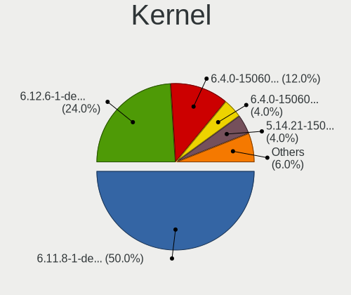
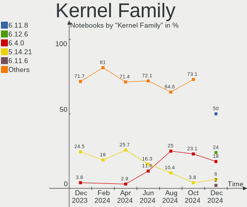
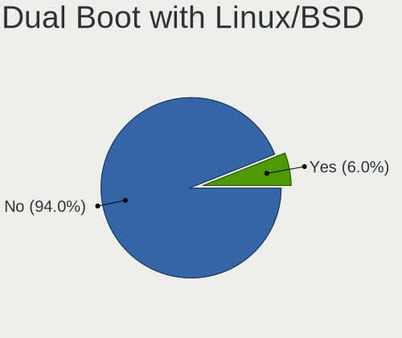
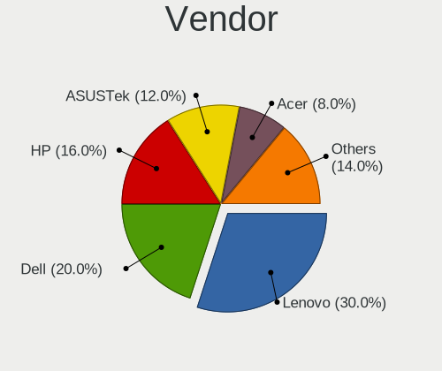
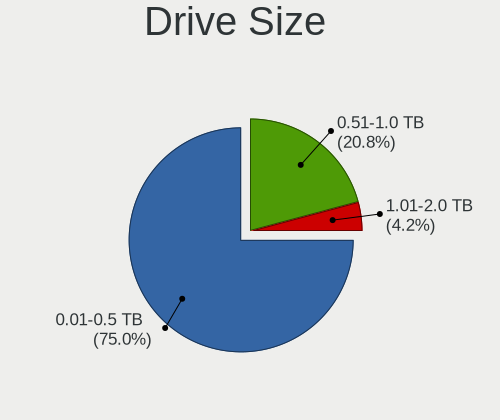
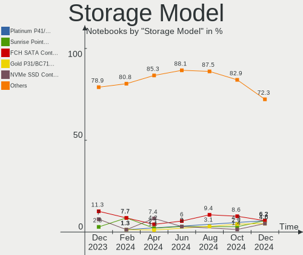
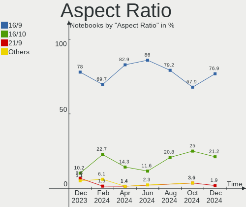
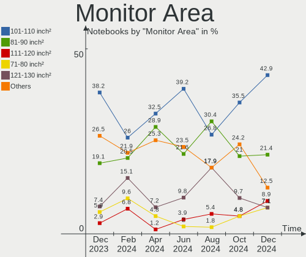

openSUSE - Hardware Trends (Notebooks)
--------------------------------------

A project to identify most popular hardware characteristics and track their change
over time based on data collected by Linux users at https://Linux-Hardware.org.

Anyone can contribute to this report by the [hw-probe](https://github.com/linuxhw/hw-probe) tool:

    sudo -E hw-probe -all -upload

This report is for one last month. Overall report since the beginning of time: [TestDays](https://github.com/linuxhw/TestDays)

Period: Nov, 2023.

Contents
--------

* [ System ](#system)
  - [ OS                       ](#os)
  - [ OS Family                ](#os-family)
  - [ Kernel                   ](#kernel)
  - [ Kernel Family            ](#kernel-family)
  - [ Kernel Major Ver.        ](#kernel-major-ver)
  - [ Arch                     ](#arch)
  - [ DE                       ](#de)
  - [ Display Server           ](#display-server)
  - [ Display Manager          ](#display-manager)
  - [ OS Lang                  ](#os-lang)
  - [ Boot Mode                ](#boot-mode)
  - [ Filesystem               ](#filesystem)
  - [ Part. scheme             ](#part-scheme)
  - [ Dual Boot with Linux/BSD ](#dual-boot-with-linuxbsd)
  - [ Dual Boot (Win)          ](#dual-boot-win)

* [ Board ](#board)
  - [ Vendor                   ](#vendor)
  - [ Model                    ](#model)
  - [ Model Family             ](#model-family)
  - [ MFG Year                 ](#mfg-year)
  - [ Form Factor              ](#form-factor)
  - [ Secure Boot              ](#secure-boot)
  - [ Coreboot                 ](#coreboot)
  - [ RAM Size                 ](#ram-size)
  - [ RAM Used                 ](#ram-used)
  - [ Total Drives             ](#total-drives)
  - [ Has CD-ROM               ](#has-cd-rom)
  - [ Has Ethernet             ](#has-ethernet)
  - [ Has WiFi                 ](#has-wifi)
  - [ Has Bluetooth            ](#has-bluetooth)

* [ Location ](#location)
  - [ Country                  ](#country)
  - [ City                     ](#city)

* [ Drives ](#drives)
  - [ Drive Vendor             ](#drive-vendor)
  - [ Drive Model              ](#drive-model)
  - [ HDD Vendor               ](#hdd-vendor)
  - [ SSD Vendor               ](#ssd-vendor)
  - [ Drive Kind               ](#drive-kind)
  - [ Drive Connector          ](#drive-connector)
  - [ Drive Size               ](#drive-size)
  - [ Space Total              ](#space-total)
  - [ Space Used               ](#space-used)
  - [ Malfunc. Drives          ](#malfunc-drives)
  - [ Malfunc. Drive Vendor    ](#malfunc-drive-vendor)
  - [ Malfunc. HDD Vendor      ](#malfunc-hdd-vendor)
  - [ Malfunc. Drive Kind      ](#malfunc-drive-kind)
  - [ Failed Drives            ](#failed-drives)
  - [ Failed Drive Vendor      ](#failed-drive-vendor)
  - [ Drive Status             ](#drive-status)

* [ Storage controller ](#storage-controller)
  - [ Storage Vendor           ](#storage-vendor)
  - [ Storage Model            ](#storage-model)
  - [ Storage Kind             ](#storage-kind)

* [ Processor ](#processor)
  - [ CPU Vendor               ](#cpu-vendor)
  - [ CPU Model                ](#cpu-model)
  - [ CPU Model Family         ](#cpu-model-family)
  - [ CPU Cores                ](#cpu-cores)
  - [ CPU Sockets              ](#cpu-sockets)
  - [ CPU Threads              ](#cpu-threads)
  - [ CPU Op-Modes             ](#cpu-op-modes)
  - [ CPU Microcode            ](#cpu-microcode)
  - [ CPU Microarch            ](#cpu-microarch)

* [ Graphics ](#graphics)
  - [ GPU Vendor               ](#gpu-vendor)
  - [ GPU Model                ](#gpu-model)
  - [ GPU Combo                ](#gpu-combo)
  - [ GPU Driver               ](#gpu-driver)
  - [ GPU Memory               ](#gpu-memory)

* [ Monitor ](#monitor)
  - [ Monitor Vendor           ](#monitor-vendor)
  - [ Monitor Model            ](#monitor-model)
  - [ Monitor Resolution       ](#monitor-resolution)
  - [ Monitor Diagonal         ](#monitor-diagonal)
  - [ Monitor Width            ](#monitor-width)
  - [ Aspect Ratio             ](#aspect-ratio)
  - [ Monitor Area             ](#monitor-area)
  - [ Pixel Density            ](#pixel-density)
  - [ Multiple Monitors        ](#multiple-monitors)

* [ Network ](#network)
  - [ Net Controller Vendor    ](#net-controller-vendor)
  - [ Net Controller Model     ](#net-controller-model)
  - [ Wireless Vendor          ](#wireless-vendor)
  - [ Wireless Model           ](#wireless-model)
  - [ Ethernet Vendor          ](#ethernet-vendor)
  - [ Ethernet Model           ](#ethernet-model)
  - [ Net Controller Kind      ](#net-controller-kind)
  - [ Used Controller          ](#used-controller)
  - [ NICs                     ](#nics)
  - [ IPv6                     ](#ipv6)

* [ Bluetooth ](#bluetooth)
  - [ Bluetooth Vendor         ](#bluetooth-vendor)
  - [ Bluetooth Model          ](#bluetooth-model)

* [ Sound ](#sound)
  - [ Sound Vendor             ](#sound-vendor)
  - [ Sound Model              ](#sound-model)

* [ Memory ](#memory)
  - [ Memory Vendor            ](#memory-vendor)
  - [ Memory Model             ](#memory-model)
  - [ Memory Kind              ](#memory-kind)
  - [ Memory Form Factor       ](#memory-form-factor)
  - [ Memory Size              ](#memory-size)
  - [ Memory Speed             ](#memory-speed)

* [ Printers & scanners ](#printers--scanners)
  - [ Printer Vendor           ](#printer-vendor)
  - [ Printer Model            ](#printer-model)
  - [ Scanner Vendor           ](#scanner-vendor)
  - [ Scanner Model            ](#scanner-model)

* [ Camera ](#camera)
  - [ Camera Vendor            ](#camera-vendor)
  - [ Camera Model             ](#camera-model)

* [ Security ](#security)
  - [ Fingerprint Vendor       ](#fingerprint-vendor)
  - [ Fingerprint Model        ](#fingerprint-model)
  - [ Chipcard Vendor          ](#chipcard-vendor)
  - [ Chipcard Model           ](#chipcard-model)

* [ Unsupported ](#unsupported)
  - [ Unsupported Devices      ](#unsupported-devices)
  - [ Unsupported Device Types ](#unsupported-device-types)

System
------

OS
--

Installed operating systems

| Name                         | Notebooks | Percent |
|------------------------------|-----------|---------|
| openSUSE Tumbleweed-XXXXXXXX | 43        | 66.15%  |
| openSUSE Leap-15.5           | 17        | 26.15%  |
| openSUSE Microos-XXXXXXXX    | 3         | 4.62%   |
| openSUSE Leap-15.6           | 1         | 1.54%   |
| openSUSE Leap-15.4           | 1         | 1.54%   |

OS Family
---------

OS without a version

| Name     | Notebooks | Percent |
|----------|-----------|---------|
| openSUSE | 65        | 100%    |

Kernel
------

Version of the Linux kernel

| Version                      | Notebooks | Percent |
|------------------------------|-----------|---------|
| 6.5.9-1-default              | 24        | 36.92%  |
| 6.6.2-1-default              | 13        | 20%     |
| 5.14.21-150500.55.36-default | 11        | 16.92%  |
| 6.6.1-1-default              | 8         | 12.31%  |
| 5.14.21-150500.55.31-default | 5         | 7.69%   |
| 6.6.1-55.g1fcc265-default    | 1         | 1.54%   |
| 6.4.0-150600.1-default       | 1         | 1.54%   |
| 5.14.21-150500.53-default    | 1         | 1.54%   |
| 5.14.21-150400.24.69-default | 1         | 1.54%   |

Kernel Family
-------------

Linux kernel without a distro release

| Version | Notebooks | Percent |
|---------|-----------|---------|
| 6.5.9   | 24        | 36.92%  |
| 5.14.21 | 18        | 27.69%  |
| 6.6.2   | 13        | 20%     |
| 6.6.1   | 9         | 13.85%  |
| 6.4.0   | 1         | 1.54%   |

Kernel Major Ver.
-----------------

Linux kernel major version

| Version | Notebooks | Percent |
|---------|-----------|---------|
| 6.5     | 24        | 36.92%  |
| 6.6     | 22        | 33.85%  |
| 5.14    | 18        | 27.69%  |
| 6.4     | 1         | 1.54%   |

Arch
----

OS architecture (x86_64, i586, etc.)

| Name   | Notebooks | Percent |
|--------|-----------|---------|
| x86_64 | 64        | 98.46%  |
| i686   | 1         | 1.54%   |

DE
--

Desktop Environment

| Name    | Notebooks | Percent |
|---------|-----------|---------|
| KDE5    | 38        | 58.46%  |
| GNOME   | 18        | 27.69%  |
| XFCE    | 4         | 6.15%   |
| Unknown | 4         | 6.15%   |
| Trinity | 1         | 1.54%   |

Display Server
--------------

X11 or Wayland

| Name    | Notebooks | Percent |
|---------|-----------|---------|
| X11     | 42        | 64.62%  |
| Wayland | 20        | 30.77%  |
| Tty     | 2         | 3.08%   |
| Unknown | 1         | 1.54%   |

Display Manager
---------------

SDDM, LightDM, etc.

| Name    | Notebooks | Percent |
|---------|-----------|---------|
| Unknown | 39        | 60%     |
| SDDM    | 13        | 20%     |
| GDM     | 7         | 10.77%  |
| LightDM | 6         | 9.23%   |

OS Lang
-------

Language

| Lang    | Notebooks | Percent |
|---------|-----------|---------|
| en_US   | 21        | 32.31%  |
| de_DE   | 20        | 30.77%  |
| pt_BR   | 5         | 7.69%   |
| en_GB   | 3         | 4.62%   |
| POSIX   | 2         | 3.08%   |
| it_IT   | 2         | 3.08%   |
| es_ES   | 2         | 3.08%   |
| Unknown | 2         | 3.08%   |
| vi_VN   | 1         | 1.54%   |
| ru_RU   | 1         | 1.54%   |
| nl_NL   | 1         | 1.54%   |
| ja_JP   | 1         | 1.54%   |
| hu_HU   | 1         | 1.54%   |
| fr_FR   | 1         | 1.54%   |
| en_DK   | 1         | 1.54%   |
| cs_CZ   | 1         | 1.54%   |

Boot Mode
---------

EFI or BIOS

| Mode | Notebooks | Percent |
|------|-----------|---------|
| EFI  | 50        | 76.92%  |
| BIOS | 15        | 23.08%  |

Filesystem
----------

Type of filesystem

| Type  | Notebooks | Percent |
|-------|-----------|---------|
| Btrfs | 50        | 76.92%  |
| Ext4  | 9         | 13.85%  |
| Xfs   | 3         | 4.62%   |
| Tmpfs | 2         | 3.08%   |
| Ext3  | 1         | 1.54%   |

Part. scheme
------------

Scheme of partitioning

| Type    | Notebooks | Percent |
|---------|-----------|---------|
| Unknown | 36        | 55.38%  |
| GPT     | 29        | 44.62%  |

Dual Boot with Linux/BSD
------------------------

Hosting more than one Linux/BSD

| Dual boot | Notebooks | Percent |
|-----------|-----------|---------|
| No        | 58        | 89.23%  |
| Yes       | 7         | 10.77%  |

Dual Boot (Win)
---------------

Hosting Linux and Windows

| Dual boot | Notebooks | Percent |
|-----------|-----------|---------|
| No        | 51        | 78.46%  |
| Yes       | 14        | 21.54%  |

Board
-----

Vendor
------

Motherboard manufacturer

| Name                | Notebooks | Percent |
|---------------------|-----------|---------|
| Lenovo              | 17        | 26.15%  |
| Hewlett-Packard     | 10        | 15.38%  |
| Dell                | 9         | 13.85%  |
| ASUSTek Computer    | 7         | 10.77%  |
| Acer                | 5         | 7.69%   |
| MSI                 | 3         | 4.62%   |
| Samsung Electronics | 2         | 3.08%   |
| TUXEDO              | 1         | 1.54%   |
| System76            | 1         | 1.54%   |
| Notebook            | 1         | 1.54%   |
| NEC Computers       | 1         | 1.54%   |
| IBM                 | 1         | 1.54%   |
| HUAWEI              | 1         | 1.54%   |
| Google              | 1         | 1.54%   |
| Fujitsu             | 1         | 1.54%   |
| Dynabook            | 1         | 1.54%   |
| Chuwi               | 1         | 1.54%   |
| Apple               | 1         | 1.54%   |
| Unknown             | 1         | 1.54%   |

Model
-----

Motherboard model

| Name                                  | Notebooks | Percent |
|---------------------------------------|-----------|---------|
| Samsung 550XDA                        | 2         | 3.08%   |
| HP Notebook                           | 2         | 3.08%   |
| TUXEDO Pulse 15 Gen1                  | 1         | 1.54%   |
| System76 Lemur Pro                    | 1         | 1.54%   |
| Notebook NL5xRU                       | 1         | 1.54%   |
| NEC Computers PC-NS100C1W-P2          | 1         | 1.54%   |
| MSI MS-7D46                           | 1         | 1.54%   |
| MSI Modern 14 C12M                    | 1         | 1.54%   |
| MSI Katana GF66 12UD                  | 1         | 1.54%   |
| Lenovo Yoga Pro 9 16IRP8 83BY         | 1         | 1.54%   |
| Lenovo Y520-15IKBN 80WK               | 1         | 1.54%   |
| Lenovo V15 G2 ALC 82KD                | 1         | 1.54%   |
| Lenovo ThinkPad X260 20F6CTO1WW       | 1         | 1.54%   |
| Lenovo ThinkPad W541 20EGS1LB00       | 1         | 1.54%   |
| Lenovo ThinkPad W510 4391W3V          | 1         | 1.54%   |
| Lenovo ThinkPad T490 20N2000LSP       | 1         | 1.54%   |
| Lenovo ThinkPad T470 W10DG 20JNS0JU01 | 1         | 1.54%   |
| Lenovo ThinkPad L570 W10DG 20JRS03U00 | 1         | 1.54%   |
| Lenovo ThinkPad L14 Gen 4 21H5CTO1WW  | 1         | 1.54%   |
| Lenovo ThinkPad E14 Gen 5 21JR0009CX  | 1         | 1.54%   |
| Lenovo ThinkPad E14 Gen 2 20TA004QUS  | 1         | 1.54%   |
| Lenovo Legion Pro 5 16ARX8 82WM       | 1         | 1.54%   |
| Lenovo Legion 5 Pro 16ITH6H 82JD      | 1         | 1.54%   |
| Lenovo IdeaPad S340-15IWL 81N8        | 1         | 1.54%   |
| Lenovo IdeaPad S145-15IIL 82DJ        | 1         | 1.54%   |
| Lenovo IdeaPad 5 Pro 16ARH7 82SN      | 1         | 1.54%   |
| IBM ThinkPad T42 2373CS8              | 1         | 1.54%   |
| HUAWEI BOHK-WAX9X                     | 1         | 1.54%   |
| HP Pavilion Laptop 15-cw1xxx          | 1         | 1.54%   |
| HP Pavilion Gaming Laptop 17-cd1xxx   | 1         | 1.54%   |
| HP Pavilion dv9500                    | 1         | 1.54%   |
| HP Pavilion 13 x360 PC                | 1         | 1.54%   |
| HP Laptop 15-bs0xx                    | 1         | 1.54%   |
| HP EliteBook 850 G6                   | 1         | 1.54%   |
| HP EliteBook 840 G6                   | 1         | 1.54%   |
| HP 650                                | 1         | 1.54%   |
| Google Phaser360                      | 1         | 1.54%   |
| Fujitsu LIFEBOOK E736                 | 1         | 1.54%   |
| Dynabook PORTEGE X30L-K               | 1         | 1.54%   |
| Dell XPS 15 9560                      | 1         | 1.54%   |

Model Family
------------

Motherboard model prefix

| Name                         | Notebooks | Percent |
|------------------------------|-----------|---------|
| Lenovo ThinkPad              | 9         | 13.85%  |
| Dell Latitude                | 5         | 7.69%   |
| HP Pavilion                  | 4         | 6.15%   |
| Acer Aspire                  | 4         | 6.15%   |
| Lenovo IdeaPad               | 3         | 4.62%   |
| Dell Inspiron                | 3         | 4.62%   |
| ASUS ROG                     | 3         | 4.62%   |
| Samsung 550XDA               | 2         | 3.08%   |
| Lenovo Legion                | 2         | 3.08%   |
| HP Notebook                  | 2         | 3.08%   |
| HP EliteBook                 | 2         | 3.08%   |
| ASUS VivoBook                | 2         | 3.08%   |
| TUXEDO Pulse                 | 1         | 1.54%   |
| System76 Lemur               | 1         | 1.54%   |
| Notebook NL5xRU              | 1         | 1.54%   |
| NEC Computers PC-NS100C1W-P2 | 1         | 1.54%   |
| MSI MS-7D46                  | 1         | 1.54%   |
| MSI Modern                   | 1         | 1.54%   |
| MSI Katana                   | 1         | 1.54%   |
| Lenovo Yoga                  | 1         | 1.54%   |
| Lenovo Y520-15IKBN           | 1         | 1.54%   |
| Lenovo V15                   | 1         | 1.54%   |
| IBM ThinkPad                 | 1         | 1.54%   |
| HUAWEI BOHK-WAX9X            | 1         | 1.54%   |
| HP Laptop                    | 1         | 1.54%   |
| HP 650                       | 1         | 1.54%   |
| Google Phaser360             | 1         | 1.54%   |
| Fujitsu LIFEBOOK             | 1         | 1.54%   |
| Dynabook PORTEGE             | 1         | 1.54%   |
| Dell XPS                     | 1         | 1.54%   |
| Chuwi GemiBook               | 1         | 1.54%   |
| ASUS Zenbook                 | 1         | 1.54%   |
| ASUS ASUS                    | 1         | 1.54%   |
| Apple MacBookPro8            | 1         | 1.54%   |
| Acer Predator                | 1         | 1.54%   |
| Unknown                      | 1         | 1.54%   |

MFG Year
--------

Motherboard manufacture year

| Year | Notebooks | Percent |
|------|-----------|---------|
| 2021 | 10        | 15.38%  |
| 2023 | 9         | 13.85%  |
| 2020 | 9         | 13.85%  |
| 2022 | 8         | 12.31%  |
| 2019 | 7         | 10.77%  |
| 2016 | 6         | 9.23%   |
| 2017 | 4         | 6.15%   |
| 2014 | 3         | 4.62%   |
| 2015 | 2         | 3.08%   |
| 2010 | 2         | 3.08%   |
| 2018 | 1         | 1.54%   |
| 2012 | 1         | 1.54%   |
| 2011 | 1         | 1.54%   |
| 2007 | 1         | 1.54%   |
| 2004 | 1         | 1.54%   |

Form Factor
-----------

Physical design of the computer

| Name     | Notebooks | Percent |
|----------|-----------|---------|
| Notebook | 65        | 100%    |

Secure Boot
-----------

Enabled or disabled

| State    | Notebooks | Percent |
|----------|-----------|---------|
| Disabled | 52        | 80%     |
| Enabled  | 13        | 20%     |

Coreboot
--------

Have coreboot on board

| Used | Notebooks | Percent |
|------|-----------|---------|
| No   | 63        | 96.92%  |
| Yes  | 2         | 3.08%   |

RAM Size
--------

Total RAM memory

| Size in GB  | Notebooks | Percent |
|-------------|-----------|---------|
| 16.01-24.0  | 20        | 30.77%  |
| 8.01-16.0   | 18        | 27.69%  |
| 4.01-8.0    | 11        | 16.92%  |
| 32.01-64.0  | 8         | 12.31%  |
| 3.01-4.0    | 4         | 6.15%   |
| 64.01-256.0 | 2         | 3.08%   |
| 24.01-32.0  | 1         | 1.54%   |
| 2.01-3.0    | 1         | 1.54%   |

RAM Used
--------

Used RAM memory

| Used GB   | Notebooks | Percent |
|-----------|-----------|---------|
| 2.01-3.0  | 18        | 27.69%  |
| 3.01-4.0  | 16        | 24.62%  |
| 1.01-2.0  | 15        | 23.08%  |
| 4.01-8.0  | 10        | 15.38%  |
| 8.01-16.0 | 5         | 7.69%   |
| 0.01-0.5  | 1         | 1.54%   |

Total Drives
------------

Number of drives on board

| Drives | Notebooks | Percent |
|--------|-----------|---------|
| 1      | 48        | 73.85%  |
| 2      | 12        | 18.46%  |
| 3      | 4         | 6.15%   |
| 5      | 1         | 1.54%   |

Has CD-ROM
----------

Has CD-ROM on board

| Presented | Notebooks | Percent |
|-----------|-----------|---------|
| No        | 55        | 84.62%  |
| Yes       | 10        | 15.38%  |

Has Ethernet
------------

Has Ethernet on board

| Presented | Notebooks | Percent |
|-----------|-----------|---------|
| Yes       | 52        | 80%     |
| No        | 13        | 20%     |

Has WiFi
--------

Has WiFi module

| Presented | Notebooks | Percent |
|-----------|-----------|---------|
| Yes       | 64        | 98.46%  |
| No        | 1         | 1.54%   |

Has Bluetooth
-------------

Has Bluetooth module

| Presented | Notebooks | Percent |
|-----------|-----------|---------|
| Yes       | 58        | 89.23%  |
| No        | 7         | 10.77%  |

Location
--------

Country
-------

Geographic location (country)

| Country     | Notebooks | Percent |
|-------------|-----------|---------|
| Germany     | 21        | 32.31%  |
| Brazil      | 7         | 10.77%  |
| USA         | 5         | 7.69%   |
| Italy       | 4         | 6.15%   |
| Turkey      | 2         | 3.08%   |
| Russia      | 2         | 3.08%   |
| Netherlands | 2         | 3.08%   |
| Belgium     | 2         | 3.08%   |
| Vietnam     | 1         | 1.54%   |
| Venezuela   | 1         | 1.54%   |
| Ukraine     | 1         | 1.54%   |
| UK          | 1         | 1.54%   |
| Switzerland | 1         | 1.54%   |
| Spain       | 1         | 1.54%   |
| Serbia      | 1         | 1.54%   |
| Puerto Rico | 1         | 1.54%   |
| Poland      | 1         | 1.54%   |
| Japan       | 1         | 1.54%   |
| Ireland     | 1         | 1.54%   |
| India       | 1         | 1.54%   |
| Hungary     | 1         | 1.54%   |
| Greece      | 1         | 1.54%   |
| Egypt       | 1         | 1.54%   |
| Ecuador     | 1         | 1.54%   |
| Czechia     | 1         | 1.54%   |
| Canada      | 1         | 1.54%   |
| Austria     | 1         | 1.54%   |
| Argentina   | 1         | 1.54%   |

City
----

Geographic location (city)

| City             | Notebooks | Percent |
|------------------|-----------|---------|
| Berlin           | 3         | 4.62%   |
| Griesheim        | 2         | 3.08%   |
| Wachtberg        | 1         | 1.54%   |
| Vienna           | 1         | 1.54%   |
| Vercelli         | 1         | 1.54%   |
| Vancouver        | 1         | 1.54%   |
| Ubatuba          | 1         | 1.54%   |
| Toronto          | 1         | 1.54%   |
| Szczecin         | 1         | 1.54%   |
| Sussen           | 1         | 1.54%   |
| St Petersburg    | 1         | 1.54%   |
| Sorocaba         | 1         | 1.54%   |
| Siegen           | 1         | 1.54%   |
| Sao Paulo        | 1         | 1.54%   |
| San Juan         | 1         | 1.54%   |
| Salisbury        | 1         | 1.54%   |
| Saga             | 1         | 1.54%   |
| Rhodes           | 1         | 1.54%   |
| Pune             | 1         | 1.54%   |
| Pedro Leopoldo   | 1         | 1.54%   |
| Novorossiysk     | 1         | 1.54%   |
| Niterói         | 1         | 1.54%   |
| Nembro           | 1         | 1.54%   |
| Neetze           | 1         | 1.54%   |
| Moosburg         | 1         | 1.54%   |
| Mönchengladbach | 1         | 1.54%   |
| Milano           | 1         | 1.54%   |
| Londrina         | 1         | 1.54%   |
| Loja             | 1         | 1.54%   |
| Leuven           | 1         | 1.54%   |
| Leonberg         | 1         | 1.54%   |
| Leipzig          | 1         | 1.54%   |
| Kyiv             | 1         | 1.54%   |
| Karlsruhe        | 1         | 1.54%   |
| Istanbul         | 1         | 1.54%   |
| Ho Chi Minh City | 1         | 1.54%   |
| Hiddenhausen     | 1         | 1.54%   |
| Halle            | 1         | 1.54%   |
| Haarlem          | 1         | 1.54%   |
| Geneva           | 1         | 1.54%   |

Drives
------

Drive Vendor
------------

Hard drive vendors

| Vendor                      | Notebooks | Drives | Percent |
|-----------------------------|-----------|--------|---------|
| Samsung Electronics         | 22        | 23     | 25.88%  |
| Sandisk                     | 8         | 10     | 9.41%   |
| WDC                         | 7         | 7      | 8.24%   |
| Micron Technology           | 7         | 7      | 8.24%   |
| Kingston                    | 6         | 6      | 7.06%   |
| Seagate                     | 5         | 6      | 5.88%   |
| Unknown                     | 3         | 3      | 3.53%   |
| SK hynix                    | 3         | 3      | 3.53%   |
| Intel                       | 3         | 3      | 3.53%   |
| Micron/Crucial Technology   | 2         | 2      | 2.35%   |
| Intenso                     | 2         | 2      | 2.35%   |
| Crucial                     | 2         | 2      | 2.35%   |
| Visiontek                   | 1         | 1      | 1.18%   |
| Transcend                   | 1         | 1      | 1.18%   |
| Toshiba                     | 1         | 1      | 1.18%   |
| SPCC                        | 1         | 2      | 1.18%   |
| Pioneer                     | 1         | 1      | 1.18%   |
| Leven                       | 1         | 1      | 1.18%   |
| KIOXIA                      | 1         | 1      | 1.18%   |
| Kingston Technology Company | 1         | 1      | 1.18%   |
| JMicron Technology          | 1         | 1      | 1.18%   |
| HS-SSD-C100                 | 1         | 1      | 1.18%   |
| Hitachi                     | 1         | 1      | 1.18%   |
| China                       | 1         | 1      | 1.18%   |
| BR                          | 1         | 1      | 1.18%   |
| AirDisk                     | 1         | 1      | 1.18%   |
| A-DATA Technology           | 1         | 1      | 1.18%   |

Drive Model
-----------

Hard drive models

| Model                                               | Notebooks | Percent |
|-----------------------------------------------------|-----------|---------|
| Samsung NVMe SSD Controller SM981/PM981/PM983 250GB | 4         | 4.49%   |
| Samsung NVMe SSD Controller PM9A1/PM9A3/980PRO 2TB  | 4         | 4.49%   |
| SK hynix SKHynix_HFS512GEJ9X115N 512GB              | 2         | 2.25%   |
| Sandisk WD Black SN750 / PC SN730 NVMe SSD 500GB    | 2         | 2.25%   |
| SanDisk SDSSDP128G 128GB                            | 2         | 2.25%   |
| Samsung SSD 870 EVO 1TB                             | 2         | 2.25%   |
| Micron/Crucial P2 NVMe PCIe SSD 1TB                 | 2         | 2.25%   |
| Intenso SSD SATAIII 512GB                           | 2         | 2.25%   |
| WDC WDS240G2G0C-00AJM0 240GB                        | 1         | 1.12%   |
| WDC WDS100T2G0A-00JH30 1TB SSD                      | 1         | 1.12%   |
| WDC WDS100T2B0A-00SM50 1TB SSD                      | 1         | 1.12%   |
| WDC WD7500BPKX-22HPJT0 752GB                        | 1         | 1.12%   |
| WDC WD10SPZX-24Z10 1TB                              | 1         | 1.12%   |
| WDC WD10SPSX-60A6WT0 1TB                            | 1         | 1.12%   |
| WDC WD10JPVX-60JC3T1 1TB                            | 1         | 1.12%   |
| Visiontek 1TB DLX4                                  | 1         | 1.12%   |
| Unknown MMC Card  64GB                              | 1         | 1.12%   |
| Unknown MMC Card  4GB                               | 1         | 1.12%   |
| Unknown MMC Card  32GB                              | 1         | 1.12%   |
| Transcend TS256GMTS430S 256GB SSD                   | 1         | 1.12%   |
| Toshiba THNSNJ256G8NU 256GB SSD                     | 1         | 1.12%   |
| SPCC M.2 SSD 1TB                                    | 1         | 1.12%   |
| SPCC M.2 SSD 1024GB                                 | 1         | 1.12%   |
| SK hynix HFM512GD3JX013N 512GB                      | 1         | 1.12%   |
| Seagate ST500VT000-1DK142 500GB                     | 1         | 1.12%   |
| Seagate ST500LT012-1DG142 500GB                     | 1         | 1.12%   |
| Seagate ST1000LM035-1RK172 1TB                      | 1         | 1.12%   |
| Seagate ST1000LM024 HN-M101MBB 1TB                  | 1         | 1.12%   |
| Seagate Expansion Desk 6TB                          | 1         | 1.12%   |
| Seagate Backup+ Hub BK 8TB                          | 1         | 1.12%   |
| Sandisk WD_BLACK SN770 1TB                          | 1         | 1.12%   |
| Sandisk WD Blue SN550 NVMe SSD 512GB                | 1         | 1.12%   |
| SanDisk SSD PLUS 1000GB                             | 1         | 1.12%   |
| SanDisk SD8TB8U256G1001 256GB SSD                   | 1         | 1.12%   |
| SanDisk Portable SSD 480GB                          | 1         | 1.12%   |
| Samsung SSD 870 EVO 2TB                             | 1         | 1.12%   |
| Samsung SSD 860 QVO 2TB                             | 1         | 1.12%   |
| Samsung SSD 860 PRO 512GB                           | 1         | 1.12%   |
| Samsung MZVLQ512HBLU-00B00 512GB                    | 1         | 1.12%   |
| Samsung MZVLQ512HALU-00000 512GB                    | 1         | 1.12%   |

HDD Vendor
----------

Hard disk drive vendors

| Vendor              | Notebooks | Drives | Percent |
|---------------------|-----------|--------|---------|
| Seagate             | 5         | 6      | 41.67%  |
| WDC                 | 4         | 4      | 33.33%  |
| Samsung Electronics | 1         | 2      | 8.33%   |
| Pioneer             | 1         | 1      | 8.33%   |
| Hitachi             | 1         | 1      | 8.33%   |

SSD Vendor
----------

Solid state drive vendors

| Vendor              | Notebooks | Drives | Percent |
|---------------------|-----------|--------|---------|
| Samsung Electronics | 6         | 6      | 21.43%  |
| SanDisk             | 5         | 6      | 17.86%  |
| WDC                 | 2         | 2      | 7.14%   |
| Kingston            | 2         | 2      | 7.14%   |
| Intenso             | 2         | 2      | 7.14%   |
| Crucial             | 2         | 2      | 7.14%   |
| Transcend           | 1         | 1      | 3.57%   |
| Toshiba             | 1         | 1      | 3.57%   |
| SPCC                | 1         | 2      | 3.57%   |
| Micron Technology   | 1         | 1      | 3.57%   |
| Leven               | 1         | 1      | 3.57%   |
| Intel               | 1         | 1      | 3.57%   |
| HS-SSD-C100         | 1         | 1      | 3.57%   |
| China               | 1         | 1      | 3.57%   |
| AirDisk             | 1         | 1      | 3.57%   |

Drive Kind
----------

HDD or SSD

| Kind    | Notebooks | Drives | Percent |
|---------|-----------|--------|---------|
| NVMe    | 38        | 41     | 48.72%  |
| SSD     | 23        | 30     | 29.49%  |
| HDD     | 12        | 14     | 15.38%  |
| MMC     | 3         | 3      | 3.85%   |
| Unknown | 2         | 2      | 2.56%   |

Drive Connector
---------------

SATA, SAS, NVMe, etc.

| Type | Notebooks | Drives | Percent |
|------|-----------|--------|---------|
| NVMe | 38        | 41     | 51.35%  |
| SATA | 30        | 41     | 40.54%  |
| SAS  | 3         | 5      | 4.05%   |
| MMC  | 3         | 3      | 4.05%   |

Drive Size
----------

Size of hard drive

| Size in TB | Notebooks | Drives | Percent |
|------------|-----------|--------|---------|
| 0.01-0.5   | 19        | 23     | 51.35%  |
| 0.51-1.0   | 14        | 16     | 37.84%  |
| 1.01-2.0   | 3         | 3      | 8.11%   |
| 4.01-10.0  | 1         | 2      | 2.7%    |

Space Total
-----------

Amount of disk space available on the file system

| Size in GB     | Notebooks | Percent |
|----------------|-----------|---------|
| More than 3000 | 22        | 33.85%  |
| 1001-2000      | 13        | 20%     |
| 2001-3000      | 8         | 12.31%  |
| 251-500        | 7         | 10.77%  |
| 101-250        | 7         | 10.77%  |
| 501-1000       | 6         | 9.23%   |
| Unknown        | 2         | 3.08%   |

Space Used
----------

Amount of used disk space

| Used GB        | Notebooks | Percent |
|----------------|-----------|---------|
| 101-250        | 14        | 21.54%  |
| 51-100         | 14        | 21.54%  |
| 501-1000       | 9         | 13.85%  |
| 251-500        | 8         | 12.31%  |
| 1001-2000      | 8         | 12.31%  |
| 1-20           | 4         | 6.15%   |
| More than 3000 | 3         | 4.62%   |
| 21-50          | 2         | 3.08%   |
| Unknown        | 2         | 3.08%   |
| 2001-3000      | 1         | 1.54%   |

Malfunc. Drives
---------------

Drive models with a malfunction

| Model                                        | Notebooks | Drives | Percent |
|----------------------------------------------|-----------|--------|---------|
| Samsung Electronics MZVLQ512HBLU-00B00 512GB | 1         | 1      | 33.33%  |
| Samsung Electronics HM160JC 160GB            | 1         | 1      | 33.33%  |
| Intel SSDSCKKF256H6 SATA 256GB               | 1         | 1      | 33.33%  |

Malfunc. Drive Vendor
---------------------

Vendors of faulty drives

| Vendor              | Notebooks | Drives | Percent |
|---------------------|-----------|--------|---------|
| Samsung Electronics | 2         | 2      | 66.67%  |
| Intel               | 1         | 1      | 33.33%  |

Malfunc. HDD Vendor
-------------------

Vendors of faulty HDD drives

| Vendor              | Notebooks | Drives | Percent |
|---------------------|-----------|--------|---------|
| Samsung Electronics | 1         | 1      | 100%    |

Malfunc. Drive Kind
-------------------

Kinds of faulty drives

| Kind | Notebooks | Drives | Percent |
|------|-----------|--------|---------|
| NVMe | 1         | 1      | 33.33%  |
| SSD  | 1         | 1      | 33.33%  |
| HDD  | 1         | 1      | 33.33%  |

Failed Drives
-------------

Failed drive models

Zero info for selected period =(

Failed Drive Vendor
-------------------

Failed drive vendors

Zero info for selected period =(

Drive Status
------------

Number of failed and malfunc. drives

| Status   | Notebooks | Drives | Percent |
|----------|-----------|--------|---------|
| Detected | 38        | 55     | 55.07%  |
| Works    | 28        | 32     | 40.58%  |
| Malfunc  | 3         | 3      | 4.35%   |

Storage controller
------------------

Storage Vendor
--------------

Storage controller vendors

| Vendor                      | Notebooks | Percent |
|-----------------------------|-----------|---------|
| Intel                       | 40        | 48.19%  |
| Samsung Electronics         | 15        | 18.07%  |
| Micron Technology           | 6         | 7.23%   |
| Kingston Technology Company | 5         | 6.02%   |
| AMD                         | 5         | 6.02%   |
| SanDisk                     | 4         | 4.82%   |
| SK hynix                    | 3         | 3.61%   |
| Micron/Crucial Technology   | 2         | 2.41%   |
| KIOXIA                      | 1         | 1.2%    |
| INNOGRIT                    | 1         | 1.2%    |
| ADATA Technology            | 1         | 1.2%    |

Storage Model
-------------

Storage controller models

| Model                                                                          | Notebooks | Percent |
|--------------------------------------------------------------------------------|-----------|---------|
| Intel Sunrise Point-LP SATA Controller [AHCI mode]                             | 9         | 10.47%  |
| Samsung NVMe SSD Controller 980 (DRAM-less)                                    | 7         | 8.14%   |
| AMD FCH SATA Controller [AHCI mode]                                            | 5         | 5.81%   |
| Samsung NVMe SSD Controller SM981/PM981/PM983                                  | 4         | 4.65%   |
| Samsung NVMe SSD Controller PM9A1/PM9A3/980PRO                                 | 4         | 4.65%   |
| Intel 82801 Mobile SATA Controller [RAID mode]                                 | 4         | 4.65%   |
| Micron 2450 NVMe SSD [HendrixV] (DRAM-less)                                    | 3         | 3.49%   |
| SK hynix Platinum P41/PC801 NVMe Solid State Drive                             | 2         | 2.33%   |
| SanDisk Extreme Pro / WD Black SN750 / PC SN730 / Red SN700 NVMe SSD           | 2         | 2.33%   |
| Micron/Crucial P2 [Nick P2] / P3 / P3 Plus NVMe PCIe SSD (DRAM-less)           | 2         | 2.33%   |
| Micron 2400 NVMe SSD (DRAM-less)                                               | 2         | 2.33%   |
| Intel Wildcat Point-LP SATA Controller [AHCI Mode]                             | 2         | 2.33%   |
| Intel Volume Management Device NVMe RAID Controller Intel Corporation          | 2         | 2.33%   |
| Intel Volume Management Device NVMe RAID Controller                            | 2         | 2.33%   |
| Intel Tiger Lake-LP SATA Controller                                            | 2         | 2.33%   |
| Intel Tiger Lake SATA AHCI Controller                                          | 2         | 2.33%   |
| Intel HM170/QM170 Chipset SATA Controller [AHCI Mode]                          | 2         | 2.33%   |
| Intel 8 Series/C220 Series Chipset Family 6-port SATA Controller 1 [AHCI mode] | 2         | 2.33%   |
| SK hynix Gold P31/BC711/PC711 NVMe Solid State Drive                           | 1         | 1.16%   |
| SanDisk WD Green SN350 240GB (DRAM-less) / SN560E NVMe SSD                     | 1         | 1.16%   |
| SanDisk WD Black SN770 / PC SN740 256GB / PC SN560 (DRAM-less) NVMe SSD        | 1         | 1.16%   |
| SanDisk Ultra 3D / WD Blue SN550 NVMe SSD                                      | 1         | 1.16%   |
| Micron 2210 NVMe SSD [Cobain]                                                  | 1         | 1.16%   |
| KIOXIA NVMe SSD Controller BG4 (DRAM-less)                                     | 1         | 1.16%   |
| Kingston Company OM8PCP Design-In PCIe 3 NVMe SSD (DRAM-less)                  | 1         | 1.16%   |
| Kingston Company NV2 NVMe SSD SM2267XT                                         | 1         | 1.16%   |
| Kingston Company NV1 NVMe SSD SM2263XT                                         | 1         | 1.16%   |
| Kingston Company NV1 NVMe SSD E13T                                             | 1         | 1.16%   |
| Kingston Company KC3000/FURY Renegade NVMe SSD E18                             | 1         | 1.16%   |
| Intel SSD DC P4101/Pro 7600p/760p/E 6100p Series                               | 1         | 1.16%   |
| Intel SSD 660P Series                                                          | 1         | 1.16%   |
| Intel SATA controller                                                          | 1         | 1.16%   |
| Intel Ice Lake-LP SATA Controller [AHCI mode]                                  | 1         | 1.16%   |
| Intel Celeron/Pentium Silver Processor SATA Controller                         | 1         | 1.16%   |
| Intel Alder Lake-S PCH SATA Controller [AHCI Mode]                             | 1         | 1.16%   |
| Intel Alder Lake-P SATA AHCI Controller                                        | 1         | 1.16%   |
| Intel 82801HM/HEM (ICH8M/ICH8M-E) SATA Controller [AHCI mode]                  | 1         | 1.16%   |
| Intel 82801HM/HEM (ICH8M/ICH8M-E) IDE Controller                               | 1         | 1.16%   |
| Intel 82801DBM (ICH4-M) IDE Controller                                         | 1         | 1.16%   |
| Intel 8 Series SATA Controller 1 [AHCI mode]                                   | 1         | 1.16%   |

Storage Kind
------------

Kind of storage controller (IDE, SATA, NVMe, SAS, ...)

| Kind | Notebooks | Percent |
|------|-----------|---------|
| NVMe | 38        | 45.78%  |
| SATA | 35        | 42.17%  |
| RAID | 8         | 9.64%   |
| IDE  | 2         | 2.41%   |

Processor
---------

CPU Vendor
----------

Processor vendors

| Vendor | Notebooks | Percent |
|--------|-----------|---------|
| Intel  | 49        | 75.38%  |
| AMD    | 16        | 24.62%  |

CPU Model
---------

Processor models

| Model                                    | Notebooks | Percent |
|------------------------------------------|-----------|---------|
| Intel 11th Gen Core i7-1165G7 @ 2.80GHz  | 4         | 6.15%   |
| AMD Ryzen 7 5700U with Radeon Graphics   | 4         | 6.15%   |
| Intel Core i5-6200U CPU @ 2.30GHz        | 3         | 4.62%   |
| Intel Core i7-8565U CPU @ 1.80GHz        | 2         | 3.08%   |
| Intel Core i5-6300U CPU @ 2.40GHz        | 2         | 3.08%   |
| Intel 11th Gen Core i7-11800H @ 2.30GHz  | 2         | 3.08%   |
| AMD Ryzen 7 4800H with Radeon Graphics   | 2         | 3.08%   |
| AMD Ryzen 5 7530U with Radeon Graphics   | 2         | 3.08%   |
| Intel Pentium Silver N5030 CPU @ 1.10GHz | 1         | 1.54%   |
| Intel Pentium M processor 1.70GHz        | 1         | 1.54%   |
| Intel Pentium CPU B970 @ 2.30GHz         | 1         | 1.54%   |
| Intel N100                               | 1         | 1.54%   |
| Intel Core i7-7700HQ CPU @ 2.80GHz       | 1         | 1.54%   |
| Intel Core i7-7500U CPU @ 2.70GHz        | 1         | 1.54%   |
| Intel Core i7-6600U CPU @ 2.60GHz        | 1         | 1.54%   |
| Intel Core i7-6500U CPU @ 2.50GHz        | 1         | 1.54%   |
| Intel Core i7-4940MX CPU @ 3.10GHz       | 1         | 1.54%   |
| Intel Core i7-4720HQ CPU @ 2.60GHz       | 1         | 1.54%   |
| Intel Core i7-4510U CPU @ 2.00GHz        | 1         | 1.54%   |
| Intel Core i7-10870H CPU @ 2.20GHz       | 1         | 1.54%   |
| Intel Core i7 CPU Q 720 @ 1.60GHz        | 1         | 1.54%   |
| Intel Core i7 CPU M 640 @ 2.80GHz        | 1         | 1.54%   |
| Intel Core i5-8365U CPU @ 1.60GHz        | 1         | 1.54%   |
| Intel Core i5-8350U CPU @ 1.70GHz        | 1         | 1.54%   |
| Intel Core i5-7300HQ CPU @ 2.50GHz       | 1         | 1.54%   |
| Intel Core i5-7200U CPU @ 2.50GHz        | 1         | 1.54%   |
| Intel Core i5-5200U CPU @ 2.20GHz        | 1         | 1.54%   |
| Intel Core i5-2415M CPU @ 2.30GHz        | 1         | 1.54%   |
| Intel Core i5-1035G1 CPU @ 1.00GHz       | 1         | 1.54%   |
| Intel Core i5-10300H CPU @ 2.50GHz       | 1         | 1.54%   |
| Intel Core i3-8145U CPU @ 2.10GHz        | 1         | 1.54%   |
| Intel Core i3-6006U CPU @ 2.00GHz        | 1         | 1.54%   |
| Intel Core 2 Duo CPU T9500 @ 2.60GHz     | 1         | 1.54%   |
| Intel Celeron N4020 CPU @ 1.10GHz        | 1         | 1.54%   |
| Intel Celeron CPU 3215U @ 1.70GHz        | 1         | 1.54%   |
| Intel 13th Gen Core i9-13900H            | 1         | 1.54%   |
| Intel 13th Gen Core i7-13705H            | 1         | 1.54%   |
| Intel 13th Gen Core i5-1335U             | 1         | 1.54%   |
| Intel 12th Gen Core i7-12700H            | 1         | 1.54%   |
| Intel 12th Gen Core i7-1260P             | 1         | 1.54%   |

CPU Model Family
----------------

Processor model prefix

| Model                | Notebooks | Percent |
|----------------------|-----------|---------|
| Other                | 16        | 24.62%  |
| Intel Core i5        | 13        | 20%     |
| Intel Core i7        | 12        | 18.46%  |
| AMD Ryzen 7          | 8         | 12.31%  |
| AMD Ryzen 5          | 5         | 7.69%   |
| Intel Core i3        | 2         | 3.08%   |
| Intel Celeron        | 2         | 3.08%   |
| Intel Pentium Silver | 1         | 1.54%   |
| Intel Pentium M      | 1         | 1.54%   |
| Intel Pentium        | 1         | 1.54%   |
| Intel Core 2 Duo     | 1         | 1.54%   |
| AMD Ryzen 9          | 1         | 1.54%   |
| AMD Ryzen 5 PRO      | 1         | 1.54%   |
| AMD Ryzen 3          | 1         | 1.54%   |

CPU Cores
---------

Number of processor cores

| Number | Notebooks | Percent |
|--------|-----------|---------|
| 4      | 20        | 30.77%  |
| 2      | 20        | 30.77%  |
| 8      | 12        | 18.46%  |
| 6      | 6         | 9.23%   |
| 14     | 3         | 4.62%   |
| 10     | 2         | 3.08%   |
| 12     | 1         | 1.54%   |
| 1      | 1         | 1.54%   |

CPU Sockets
-----------

Number of sockets

| Number | Notebooks | Percent |
|--------|-----------|---------|
| 1      | 65        | 100%    |

CPU Threads
-----------

Threads per core (Hyper-Threading)

| Number | Notebooks | Percent |
|--------|-----------|---------|
| 2      | 55        | 84.62%  |
| 1      | 10        | 15.38%  |

CPU Op-Modes
------------

CPU Operation Modes (32-bit, 64-bit)

| Op mode        | Notebooks | Percent |
|----------------|-----------|---------|
| 32-bit, 64-bit | 64        | 98.46%  |
| 32-bit         | 1         | 1.54%   |

CPU Microcode
-------------

Microcode number

| Number     | Notebooks | Percent |
|------------|-----------|---------|
| Unknown    | 44        | 67.69%  |
| 0x806c1    | 2         | 3.08%   |
| 0x0a50000d | 2         | 3.08%   |
| 0x0a50000c | 2         | 3.08%   |
| 0x08608103 | 2         | 3.08%   |
| 0x08600106 | 2         | 3.08%   |
| 0x08108109 | 2         | 3.08%   |
| 0x906a3    | 1         | 1.54%   |
| 0x806ec    | 1         | 1.54%   |
| 0x706a8    | 1         | 1.54%   |
| 0x406e3    | 1         | 1.54%   |
| 0x306c3    | 1         | 1.54%   |
| 0x0a601203 | 1         | 1.54%   |
| 0x0a404101 | 1         | 1.54%   |
| 0x08608102 | 1         | 1.54%   |
| 0x08600103 | 1         | 1.54%   |

CPU Microarch
-------------

Microarchitecture

| Name             | Notebooks | Percent |
|------------------|-----------|---------|
| KabyLake         | 9         | 13.85%  |
| Skylake          | 8         | 12.31%  |
| Unknown          | 8         | 12.31%  |
| TigerLake        | 6         | 9.23%   |
| Alderlake Hybrid | 6         | 9.23%   |
| Zen 3            | 5         | 7.69%   |
| Zen 2            | 3         | 4.62%   |
| Haswell          | 3         | 4.62%   |
| Zen+             | 2         | 3.08%   |
| SandyBridge      | 2         | 3.08%   |
| IceLake          | 2         | 3.08%   |
| Goldmont plus    | 2         | 3.08%   |
| CometLake        | 2         | 3.08%   |
| Broadwell        | 2         | 3.08%   |
| Westmere         | 1         | 1.54%   |
| Penryn           | 1         | 1.54%   |
| P6               | 1         | 1.54%   |
| Nehalem          | 1         | 1.54%   |
| Gracemont        | 1         | 1.54%   |

Graphics
--------

GPU Vendor
----------

Vendors of graphics cards

| Vendor | Notebooks | Percent |
|--------|-----------|---------|
| Intel  | 44        | 53.01%  |
| AMD    | 20        | 24.1%   |
| Nvidia | 19        | 22.89%  |

GPU Model
---------

Graphics card models

| Model                                                                                 | Notebooks | Percent |
|---------------------------------------------------------------------------------------|-----------|---------|
| Intel Skylake GT2 [HD Graphics 520]                                                   | 8         | 9.41%   |
| Intel TigerLake-LP GT2 [Iris Xe Graphics]                                             | 5         | 5.88%   |
| Intel WhiskeyLake-U GT2 [UHD Graphics 620]                                            | 4         | 4.71%   |
| AMD Lucienne                                                                          | 4         | 4.71%   |
| Intel Raptor Lake-P [Iris Xe Graphics]                                                | 3         | 3.53%   |
| AMD Topaz XT [Radeon R7 M260/M265 / M340/M360 / M440/M445 / 530/535 / 620/625 Mobile] | 3         | 3.53%   |
| AMD Renoir [Radeon RX Vega 6 (Ryzen 4000/5000 Mobile Series)]                         | 3         | 3.53%   |
| AMD Barcelo                                                                           | 3         | 3.53%   |
| Nvidia GP107M [GeForce GTX 1050 Mobile]                                               | 2         | 2.35%   |
| Nvidia GA107M [GeForce RTX 3050 Ti Mobile]                                            | 2         | 2.35%   |
| Intel TigerLake-H GT1 [UHD Graphics]                                                  | 2         | 2.35%   |
| Intel HD Graphics 630                                                                 | 2         | 2.35%   |
| Intel HD Graphics 620                                                                 | 2         | 2.35%   |
| Intel CometLake-H GT2 [UHD Graphics]                                                  | 2         | 2.35%   |
| Intel Alder Lake-P GT2 [Iris Xe Graphics]                                             | 2         | 2.35%   |
| Intel 4th Gen Core Processor Integrated Graphics Controller                           | 2         | 2.35%   |
| Intel 2nd Generation Core Processor Family Integrated Graphics Controller             | 2         | 2.35%   |
| AMD Picasso/Raven 2 [Radeon Vega Series / Radeon Vega Mobile Series]                  | 2         | 2.35%   |
| AMD Cezanne [Radeon Vega Series / Radeon Vega Mobile Series]                          | 2         | 2.35%   |
| Nvidia TU117M [GeForce GTX 1650 Ti Mobile]                                            | 1         | 1.18%   |
| Nvidia TU116M [GeForce GTX 1660 Ti Mobile]                                            | 1         | 1.18%   |
| Nvidia GT218M [NVS 3100M]                                                             | 1         | 1.18%   |
| Nvidia GT216GLM [Quadro FX 880M]                                                      | 1         | 1.18%   |
| Nvidia GP107M [GeForce MX350]                                                         | 1         | 1.18%   |
| Nvidia GM107M [GeForce GTX 960M]                                                      | 1         | 1.18%   |
| Nvidia GM107M [GeForce GTX 950M]                                                      | 1         | 1.18%   |
| Nvidia GK106GLM [Quadro K2100M]                                                       | 1         | 1.18%   |
| Nvidia GA107M [GeForce RTX 3050 Mobile]                                               | 1         | 1.18%   |
| Nvidia GA107BM [GeForce RTX 3050 Ti Mobile]                                           | 1         | 1.18%   |
| Nvidia GA106M [GeForce RTX 3060 Mobile / Max-Q]                                       | 1         | 1.18%   |
| Nvidia GA104 [GeForce RTX 3060 Ti Lite Hash Rate]                                     | 1         | 1.18%   |
| Nvidia G86M [GeForce 8600M GS]                                                        | 1         | 1.18%   |
| Nvidia AD107M [GeForce RTX 4060 Max-Q / Mobile]                                       | 1         | 1.18%   |
| Nvidia AD104M [GeForce RTX 4080 Max-Q / Mobile]                                       | 1         | 1.18%   |
| Intel UHD Graphics 620                                                                | 1         | 1.18%   |
| Intel Tiger Lake-LP GT2 [UHD Graphics G4]                                             | 1         | 1.18%   |
| Intel Iris Plus Graphics G1 (Ice Lake)                                                | 1         | 1.18%   |
| Intel HD Graphics 5500                                                                | 1         | 1.18%   |
| Intel HD Graphics                                                                     | 1         | 1.18%   |
| Intel Haswell-ULT Integrated Graphics Controller                                      | 1         | 1.18%   |

GPU Combo
---------

Combinations of graphics cards

| Name           | Notebooks | Percent |
|----------------|-----------|---------|
| 1 x Intel      | 27        | 41.54%  |
| Intel + Nvidia | 12        | 18.46%  |
| 1 x AMD        | 12        | 18.46%  |
| 1 x Nvidia     | 5         | 7.69%   |
| Intel + AMD    | 4         | 6.15%   |
| 2 x AMD        | 2         | 3.08%   |
| AMD + Nvidia   | 2         | 3.08%   |
| Other          | 1         | 1.54%   |

GPU Driver
----------

Free vs proprietary

| Driver      | Notebooks | Percent |
|-------------|-----------|---------|
| Free        | 56        | 86.15%  |
| Proprietary | 9         | 13.85%  |

GPU Memory
----------

Total video memory

| Size in GB | Notebooks | Percent |
|------------|-----------|---------|
| Unknown    | 41        | 63.08%  |
| 1.01-2.0   | 8         | 12.31%  |
| 0.01-0.5   | 8         | 12.31%  |
| 0.51-1.0   | 3         | 4.62%   |
| 7.01-8.0   | 2         | 3.08%   |
| 3.01-4.0   | 2         | 3.08%   |
| 8.01-16.0  | 1         | 1.54%   |

Monitor
-------

Monitor Vendor
--------------

Monitor vendors

| Vendor              | Notebooks | Percent |
|---------------------|-----------|---------|
| BOE                 | 17        | 22.67%  |
| Chimei Innolux      | 12        | 16%     |
| AU Optronics        | 11        | 14.67%  |
| LG Display          | 8         | 10.67%  |
| Samsung Electronics | 5         | 6.67%   |
| Sharp               | 4         | 5.33%   |
| Lenovo              | 3         | 4%      |
| Goldstar            | 3         | 4%      |
| CSO                 | 3         | 4%      |
| Sony                | 2         | 2.67%   |
| Dell                | 2         | 2.67%   |
| PANDA               | 1         | 1.33%   |
| HKC                 | 1         | 1.33%   |
| BenQ                | 1         | 1.33%   |
| Beko                | 1         | 1.33%   |
| Apple               | 1         | 1.33%   |

Monitor Model
-------------

Monitor models

| Model                                                                  | Notebooks | Percent |
|------------------------------------------------------------------------|-----------|---------|
| Chimei Innolux LCD Monitor CMN15E6 1366x768 344x193mm 15.5-inch        | 2         | 2.63%   |
| BOE LCD Monitor BOE0812 1920x1080 344x194mm 15.5-inch                  | 2         | 2.63%   |
| AU Optronics LCD Monitor AUOAF90 1920x1080 344x193mm 15.5-inch         | 2         | 2.63%   |
| Sony TV *00 SNY4904 3840x2160                                          | 1         | 1.32%   |
| Sony TV  *00 SNYF303 1920x1080 1220x680mm 55.0-inch                    | 1         | 1.32%   |
| Sharp LQ156M1JW25 SHP152C 1920x1080 344x194mm 15.5-inch                | 1         | 1.32%   |
| Sharp LQ156D1JW04 SHP1436 3840x2160 346x194mm 15.6-inch                | 1         | 1.32%   |
| Sharp LCD Monitor SHP14B8 1920x1080 294x165mm 13.3-inch                | 1         | 1.32%   |
| Sharp LCD Monitor SHP1476 3840x2160 346x194mm 15.6-inch                | 1         | 1.32%   |
| Samsung Electronics S27H85x SAM0E0E 2560x1440 597x336mm 27.0-inch      | 1         | 1.32%   |
| Samsung Electronics Odyssey G65B SAM7236 2560x1440 698x392mm 31.5-inch | 1         | 1.32%   |
| Samsung Electronics LCD Monitor SEC4447 1680x1050 365x228mm 16.9-inch  | 1         | 1.32%   |
| Samsung Electronics LCD Monitor SEC3859 1366x768 293x165mm 13.2-inch   | 1         | 1.32%   |
| Samsung Electronics LCD Monitor SEC325A 1366x768 344x194mm 15.5-inch   | 1         | 1.32%   |
| Samsung Electronics LC27G5xT SAM7079 2560x1440 597x336mm 27.0-inch     | 1         | 1.32%   |
| PANDA LCD Monitor NCP0061 2560x1600 302x189mm 14.0-inch                | 1         | 1.32%   |
| LG Display LCD Monitor LGD06F9 1920x1200 302x189mm 14.0-inch           | 1         | 1.32%   |
| LG Display LCD Monitor LGD05E5 1920x1080 344x194mm 15.5-inch           | 1         | 1.32%   |
| LG Display LCD Monitor LGD0533 1920x1080 344x194mm 15.5-inch           | 1         | 1.32%   |
| LG Display LCD Monitor LGD0521 1920x1080 309x174mm 14.0-inch           | 1         | 1.32%   |
| LG Display LCD Monitor LGD04BD 1366x768 344x194mm 15.5-inch            | 1         | 1.32%   |
| LG Display LCD Monitor LGD0493 1366x768 344x194mm 15.5-inch            | 1         | 1.32%   |
| LG Display LCD Monitor LGD0458 1366x768 310x174mm 14.0-inch            | 1         | 1.32%   |
| LG Display LCD Monitor LGD0257 1440x900 304x190mm 14.1-inch            | 1         | 1.32%   |
| Lenovo LEN S22e-19 LEN61C9 1920x1080 476x268mm 21.5-inch               | 1         | 1.32%   |
| Lenovo LCD Monitor LEN8BA1 3200x2000 344x215mm 16.0-inch               | 1         | 1.32%   |
| Lenovo LCD Monitor LEN40B2 1920x1080 344x193mm 15.5-inch               | 1         | 1.32%   |
| HKC LCD Monitor HKC023D 1920x1080 344x194mm 15.5-inch                  | 1         | 1.32%   |
| Goldstar LG ULTRAGEAR GSM5BB1 1920x1080 530x300mm 24.0-inch            | 1         | 1.32%   |
| Goldstar HDR WFHD GSM7714 2560x1080 798x334mm 34.1-inch                | 1         | 1.32%   |
| Goldstar 25UM58G GSM5B98 2560x1080 673x284mm 28.8-inch                 | 1         | 1.32%   |
| Dell U2415 DELA0B9 1920x1200 518x324mm 24.1-inch                       | 1         | 1.32%   |
| Dell P2421 DELA172 1920x1200 518x324mm 24.1-inch                       | 1         | 1.32%   |
| CSO LCD Monitor CSO161D 2560x1600 345x215mm 16.0-inch                  | 1         | 1.32%   |
| CSO LCD Monitor CSO1606 2560x1600 345x215mm 16.0-inch                  | 1         | 1.32%   |
| CSO LCD Monitor CSO1409 1920x1080 309x174mm 14.0-inch                  | 1         | 1.32%   |
| Chimei Innolux LCD Monitor CMN1738 1920x1080 381x214mm 17.2-inch       | 1         | 1.32%   |
| Chimei Innolux LCD Monitor CMN15F5 1920x1080 344x193mm 15.5-inch       | 1         | 1.32%   |
| Chimei Innolux LCD Monitor CMN15D3 1920x1080 344x193mm 15.5-inch       | 1         | 1.32%   |
| Chimei Innolux LCD Monitor CMN15C3 1920x1080 344x193mm 15.5-inch       | 1         | 1.32%   |

Monitor Resolution
------------------

Monitor screen resolution

| Resolution         | Notebooks | Percent |
|--------------------|-----------|---------|
| 1920x1080 (FHD)    | 43        | 58.11%  |
| 1366x768 (WXGA)    | 11        | 14.86%  |
| 2560x1600          | 5         | 6.76%   |
| 3840x2160 (4K)     | 4         | 5.41%   |
| 2560x1440 (QHD)    | 2         | 2.7%    |
| 2560x1080          | 2         | 2.7%    |
| 1920x1200 (WUXGA)  | 2         | 2.7%    |
| 1680x1050 (WSXGA+) | 2         | 2.7%    |
| 3200x2000          | 1         | 1.35%   |
| 1440x900 (WXGA+)   | 1         | 1.35%   |
| 1280x800 (WXGA)    | 1         | 1.35%   |

Monitor Diagonal
----------------

Diagonal size in inches

| Inches | Notebooks | Percent |
|--------|-----------|---------|
| 15     | 31        | 40.79%  |
| 13     | 10        | 13.16%  |
| 14     | 9         | 11.84%  |
| 17     | 5         | 6.58%   |
| 16     | 5         | 6.58%   |
| 24     | 3         | 3.95%   |
| 31     | 2         | 2.63%   |
| 21     | 2         | 2.63%   |
| 12     | 2         | 2.63%   |
| 75     | 1         | 1.32%   |
| 72     | 1         | 1.32%   |
| 34     | 1         | 1.32%   |
| 32     | 1         | 1.32%   |
| 28     | 1         | 1.32%   |
| 27     | 1         | 1.32%   |
| 11     | 1         | 1.32%   |

Monitor Width
-------------

Physical width

| Width in mm | Notebooks | Percent |
|-------------|-----------|---------|
| 301-350     | 51        | 67.11%  |
| 201-300     | 7         | 9.21%   |
| 351-400     | 5         | 6.58%   |
| 501-600     | 4         | 5.26%   |
| 601-700     | 3         | 3.95%   |
| 701-800     | 2         | 2.63%   |
| 401-500     | 2         | 2.63%   |
| 1501-2000   | 2         | 2.63%   |

Aspect Ratio
------------

Proportional relationship between the width and the height

| Ratio | Notebooks | Percent |
|-------|-----------|---------|
| 16/9  | 55        | 79.71%  |
| 16/10 | 12        | 17.39%  |
| 21/9  | 2         | 2.9%    |

Monitor Area
------------

Area in inch²

| Area in inch² | Notebooks | Percent |
|----------------|-----------|---------|
| 101-110        | 31        | 40.79%  |
| 81-90          | 16        | 21.05%  |
| 111-120        | 5         | 6.58%   |
| 351-500        | 4         | 5.26%   |
| 121-130        | 4         | 5.26%   |
| 71-80          | 3         | 3.95%   |
| 251-300        | 3         | 3.95%   |
| More than 1000 | 2         | 2.63%   |
| 61-70          | 2         | 2.63%   |
| 201-250        | 2         | 2.63%   |
| 51-60          | 1         | 1.32%   |
| 301-350        | 1         | 1.32%   |
| 151-200        | 1         | 1.32%   |
| 131-140        | 1         | 1.32%   |

Pixel Density
-------------

Pixels per inch

| Density       | Notebooks | Percent |
|---------------|-----------|---------|
| 121-160       | 39        | 52%     |
| 101-120       | 13        | 17.33%  |
| 161-240       | 10        | 13.33%  |
| 51-100        | 8         | 10.67%  |
| More than 240 | 3         | 4%      |
| 1-50          | 2         | 2.67%   |

Multiple Monitors
-----------------

Total monitors connected

| Total | Notebooks | Percent |
|-------|-----------|---------|
| 1     | 53        | 81.54%  |
| 2     | 11        | 16.92%  |
| 3     | 1         | 1.54%   |

Network
-------

Net Controller Vendor
---------------------

Controller vendors

| Vendor                | Notebooks | Percent |
|-----------------------|-----------|---------|
| Intel                 | 41        | 41.84%  |
| Realtek Semiconductor | 37        | 37.76%  |
| Qualcomm Atheros      | 8         | 8.16%   |
| MediaTek              | 6         | 6.12%   |
| Ralink                | 2         | 2.04%   |
| Broadcom              | 2         | 2.04%   |
| Xiaomi                | 1         | 1.02%   |
| AVM                   | 1         | 1.02%   |

Net Controller Model
--------------------

Controller models

| Model                                                                   | Notebooks | Percent |
|-------------------------------------------------------------------------|-----------|---------|
| Realtek RTL8111/8168/8411 PCI Express Gigabit Ethernet Controller       | 24        | 20%     |
| Realtek RTL810xE PCI Express Fast Ethernet controller                   | 6         | 5%      |
| Intel Wi-Fi 6 AX201                                                     | 6         | 5%      |
| Intel Wireless 8260                                                     | 5         | 4.17%   |
| Intel Wi-Fi 6 AX200                                                     | 5         | 4.17%   |
| Realtek RTL8153 Gigabit Ethernet Adapter                                | 4         | 3.33%   |
| Intel Ethernet Connection I219-LM                                       | 4         | 3.33%   |
| Qualcomm Atheros QCA9377 802.11ac Wireless Network Adapter              | 3         | 2.5%    |
| MediaTek MT7922 802.11ax PCI Express Wireless Network Adapter           | 3         | 2.5%    |
| MediaTek MT7921 802.11ax PCI Express Wireless Network Adapter           | 3         | 2.5%    |
| Intel Raptor Lake PCH CNVi WiFi                                         | 3         | 2.5%    |
| Intel Cannon Point-LP CNVi [Wireless-AC]                                | 3         | 2.5%    |
| Intel Alder Lake-P PCH CNVi WiFi                                        | 3         | 2.5%    |
| Realtek RTL8822CE 802.11ac PCIe Wireless Network Adapter                | 2         | 1.67%   |
| Realtek RTL8821CE 802.11ac PCIe Wireless Network Adapter                | 2         | 1.67%   |
| Qualcomm Atheros QCA9565 / AR9565 Wireless Network Adapter              | 2         | 1.67%   |
| Qualcomm Atheros QCA6174 802.11ac Wireless Network Adapter              | 2         | 1.67%   |
| Intel Tiger Lake PCH CNVi WiFi                                          | 2         | 1.67%   |
| Intel Ethernet Connection (6) I219-V                                    | 2         | 1.67%   |
| Intel Comet Lake PCH CNVi WiFi                                          | 2         | 1.67%   |
| Intel 82577LM Gigabit Network Connection                                | 2         | 1.67%   |
| Xiaomi Mi/Redmi series (RNDIS)                                          | 1         | 0.83%   |
| Realtek RTL8821AE 802.11ac PCIe Wireless Network Adapter                | 1         | 0.83%   |
| Realtek RTL8723BE PCIe Wireless Network Adapter                         | 1         | 0.83%   |
| Realtek RTL8192EU 802.11b/g/n WLAN Adapter                              | 1         | 0.83%   |
| Realtek RTL8152 Fast Ethernet Adapter                                   | 1         | 0.83%   |
| Realtek Killer E2600 Gigabit Ethernet Controller                        | 1         | 0.83%   |
| Realtek 802.11ac NIC                                                    | 1         | 0.83%   |
| Ralink RT5390R PCIe 802.11b/g/n Wireless Network Adapter                | 1         | 0.83%   |
| Ralink RT2790 Wireless 802.11n 1T/2R PCIe                               | 1         | 0.83%   |
| Qualcomm Atheros AR242x / AR542x Wireless Network Adapter (PCI-Express) | 1         | 0.83%   |
| Intel Wireless 8265 / 8275                                              | 1         | 0.83%   |
| Intel Wireless 7265                                                     | 1         | 0.83%   |
| Intel Wireless 3160                                                     | 1         | 0.83%   |
| Intel Wi-Fi 6 AX210/AX211/AX411 160MHz                                  | 1         | 0.83%   |
| Intel PRO/Wireless 2200BG [Calexico2] Network Connection                | 1         | 0.83%   |
| Intel Gemini Lake PCH CNVi WiFi                                         | 1         | 0.83%   |
| Intel Ethernet Connection I219-V                                        | 1         | 0.83%   |
| Intel Ethernet Connection I217-LM                                       | 1         | 0.83%   |
| Intel Ethernet Connection (6) I219-LM                                   | 1         | 0.83%   |

Wireless Vendor
---------------

Wireless vendors

| Vendor                | Notebooks | Percent |
|-----------------------|-----------|---------|
| Intel                 | 39        | 59.09%  |
| Realtek Semiconductor | 8         | 12.12%  |
| Qualcomm Atheros      | 8         | 12.12%  |
| MediaTek              | 6         | 9.09%   |
| Ralink                | 2         | 3.03%   |
| Broadcom              | 2         | 3.03%   |
| AVM                   | 1         | 1.52%   |

Wireless Model
--------------

Wireless models

| Model                                                                   | Notebooks | Percent |
|-------------------------------------------------------------------------|-----------|---------|
| Intel Wi-Fi 6 AX201                                                     | 6         | 9.09%   |
| Intel Wireless 8260                                                     | 5         | 7.58%   |
| Intel Wi-Fi 6 AX200                                                     | 5         | 7.58%   |
| Qualcomm Atheros QCA9377 802.11ac Wireless Network Adapter              | 3         | 4.55%   |
| MediaTek MT7922 802.11ax PCI Express Wireless Network Adapter           | 3         | 4.55%   |
| MediaTek MT7921 802.11ax PCI Express Wireless Network Adapter           | 3         | 4.55%   |
| Intel Raptor Lake PCH CNVi WiFi                                         | 3         | 4.55%   |
| Intel Cannon Point-LP CNVi [Wireless-AC]                                | 3         | 4.55%   |
| Intel Alder Lake-P PCH CNVi WiFi                                        | 3         | 4.55%   |
| Realtek RTL8822CE 802.11ac PCIe Wireless Network Adapter                | 2         | 3.03%   |
| Realtek RTL8821CE 802.11ac PCIe Wireless Network Adapter                | 2         | 3.03%   |
| Qualcomm Atheros QCA9565 / AR9565 Wireless Network Adapter              | 2         | 3.03%   |
| Qualcomm Atheros QCA6174 802.11ac Wireless Network Adapter              | 2         | 3.03%   |
| Intel Tiger Lake PCH CNVi WiFi                                          | 2         | 3.03%   |
| Intel Comet Lake PCH CNVi WiFi                                          | 2         | 3.03%   |
| Realtek RTL8821AE 802.11ac PCIe Wireless Network Adapter                | 1         | 1.52%   |
| Realtek RTL8723BE PCIe Wireless Network Adapter                         | 1         | 1.52%   |
| Realtek RTL8192EU 802.11b/g/n WLAN Adapter                              | 1         | 1.52%   |
| Realtek 802.11ac NIC                                                    | 1         | 1.52%   |
| Ralink RT5390R PCIe 802.11b/g/n Wireless Network Adapter                | 1         | 1.52%   |
| Ralink RT2790 Wireless 802.11n 1T/2R PCIe                               | 1         | 1.52%   |
| Qualcomm Atheros AR242x / AR542x Wireless Network Adapter (PCI-Express) | 1         | 1.52%   |
| Intel Wireless 8265 / 8275                                              | 1         | 1.52%   |
| Intel Wireless 7265                                                     | 1         | 1.52%   |
| Intel Wireless 3160                                                     | 1         | 1.52%   |
| Intel Wi-Fi 6 AX210/AX211/AX411 160MHz                                  | 1         | 1.52%   |
| Intel PRO/Wireless 2200BG [Calexico2] Network Connection                | 1         | 1.52%   |
| Intel Gemini Lake PCH CNVi WiFi                                         | 1         | 1.52%   |
| Intel Dual Band Wireless-AC 3168NGW [Stone Peak]                        | 1         | 1.52%   |
| Intel CNVi: Wi-Fi                                                       | 1         | 1.52%   |
| Intel Centrino Ultimate-N 6300                                          | 1         | 1.52%   |
| Intel Centrino Advanced-N 6200                                          | 1         | 1.52%   |
| Broadcom BCM4331 802.11a/b/g/n                                          | 1         | 1.52%   |
| Broadcom BCM43142 802.11b/g/n                                           | 1         | 1.52%   |
| AVM FRITZ!WLAN AC 860                                                   | 1         | 1.52%   |

Ethernet Vendor
---------------

Ethernet vendors

| Vendor                | Notebooks | Percent |
|-----------------------|-----------|---------|
| Realtek Semiconductor | 35        | 67.31%  |
| Intel                 | 15        | 28.85%  |
| Xiaomi                | 1         | 1.92%   |
| Broadcom              | 1         | 1.92%   |

Ethernet Model
--------------

Ethernet models

| Model                                                             | Notebooks | Percent |
|-------------------------------------------------------------------|-----------|---------|
| Realtek RTL8111/8168/8411 PCI Express Gigabit Ethernet Controller | 24        | 45.28%  |
| Realtek RTL810xE PCI Express Fast Ethernet controller             | 6         | 11.32%  |
| Realtek RTL8153 Gigabit Ethernet Adapter                          | 4         | 7.55%   |
| Intel Ethernet Connection I219-LM                                 | 4         | 7.55%   |
| Intel Ethernet Connection (6) I219-V                              | 2         | 3.77%   |
| Intel 82577LM Gigabit Network Connection                          | 2         | 3.77%   |
| Xiaomi Mi/Redmi series (RNDIS)                                    | 1         | 1.89%   |
| Realtek RTL8152 Fast Ethernet Adapter                             | 1         | 1.89%   |
| Realtek Killer E2600 Gigabit Ethernet Controller                  | 1         | 1.89%   |
| Intel Ethernet Connection I219-V                                  | 1         | 1.89%   |
| Intel Ethernet Connection I217-LM                                 | 1         | 1.89%   |
| Intel Ethernet Connection (6) I219-LM                             | 1         | 1.89%   |
| Intel Ethernet Connection (4) I219-LM                             | 1         | 1.89%   |
| Intel Ethernet Connection (17) I219-V                             | 1         | 1.89%   |
| Intel Ethernet Connection (16) I219-V                             | 1         | 1.89%   |
| Intel 82540EP Gigabit Ethernet Controller (Mobile)                | 1         | 1.89%   |
| Broadcom NetXtreme BCM57765 Gigabit Ethernet PCIe                 | 1         | 1.89%   |

Net Controller Kind
-------------------

Ethernet, WiFi or modem

| Kind     | Notebooks | Percent |
|----------|-----------|---------|
| WiFi     | 64        | 54.7%   |
| Ethernet | 52        | 44.44%  |
| Modem    | 1         | 0.85%   |

Used Controller
---------------

Currently used network controller

| Kind     | Notebooks | Percent |
|----------|-----------|---------|
| WiFi     | 54        | 79.41%  |
| Ethernet | 14        | 20.59%  |

NICs
----

Total network controllers on board

| Total | Notebooks | Percent |
|-------|-----------|---------|
| 2     | 45        | 69.23%  |
| 1     | 20        | 30.77%  |

IPv6
----

IPv6 vs IPv4

| Used | Notebooks | Percent |
|------|-----------|---------|
| No   | 33        | 50.77%  |
| Yes  | 32        | 49.23%  |

Bluetooth
---------

Bluetooth Vendor
----------------

Controller vendors

| Vendor                          | Notebooks | Percent |
|---------------------------------|-----------|---------|
| Intel                           | 34        | 58.62%  |
| Realtek Semiconductor           | 5         | 8.62%   |
| Qualcomm Atheros Communications | 4         | 6.9%    |
| Lite-On Technology              | 4         | 6.9%    |
| IMC Networks                    | 4         | 6.9%    |
| Foxconn / Hon Hai               | 3         | 5.17%   |
| Hewlett-Packard                 | 1         | 1.72%   |
| Dell                            | 1         | 1.72%   |
| Broadcom                        | 1         | 1.72%   |
| Apple                           | 1         | 1.72%   |

Bluetooth Model
---------------

Controller models

| Model                                          | Notebooks | Percent |
|------------------------------------------------|-----------|---------|
| Intel AX201 Bluetooth                          | 10        | 17.24%  |
| Intel Bluetooth wireless interface             | 7         | 12.07%  |
| Intel Bluetooth 9460/9560 Jefferson Peak (JfP) | 6         | 10.34%  |
| Intel AX200 Bluetooth                          | 5         | 8.62%   |
| Realtek Bluetooth Radio                        | 4         | 6.9%    |
| Intel Bluetooth Device                         | 4         | 6.9%    |
| Qualcomm Atheros  Bluetooth Device             | 3         | 5.17%   |
| IMC Networks Wireless_Device                   | 3         | 5.17%   |
| Lite-On Qualcomm Atheros QCA9377 Bluetooth     | 2         | 3.45%   |
| Foxconn / Hon Hai Bluetooth Adapter            | 2         | 3.45%   |
| Realtek  Bluetooth 4.2 Adapter                 | 1         | 1.72%   |
| Qualcomm Atheros QCA61x4 Bluetooth 4.0         | 1         | 1.72%   |
| Lite-On Wireless_Device                        | 1         | 1.72%   |
| Lite-On Bluetooth Device                       | 1         | 1.72%   |
| Intel Wireless-AC 3168 Bluetooth               | 1         | 1.72%   |
| Intel AX210 Bluetooth                          | 1         | 1.72%   |
| IMC Networks Bluetooth Radio                   | 1         | 1.72%   |
| HP Bluetooth 2.0 Interface [Broadcom BCM2045]  | 1         | 1.72%   |
| Foxconn / Hon Hai MediaTek Bluetooth Adapter   | 1         | 1.72%   |
| Dell DW375 Bluetooth Module                    | 1         | 1.72%   |
| Broadcom BCM2045B (BDC-2.1)                    | 1         | 1.72%   |
| Apple Bluetooth Host Controller                | 1         | 1.72%   |

Sound
-----

Sound Vendor
------------

Sound card vendors

| Vendor                 | Notebooks | Percent |
|------------------------|-----------|---------|
| Intel                  | 49        | 61.25%  |
| AMD                    | 16        | 20%     |
| Nvidia                 | 6         | 7.5%    |
| C-Media Electronics    | 2         | 2.5%    |
| Sony                   | 1         | 1.25%   |
| Logitech               | 1         | 1.25%   |
| Kingston Technology    | 1         | 1.25%   |
| Generalplus Technology | 1         | 1.25%   |
| Conexant Systems       | 1         | 1.25%   |
| BR25                   | 1         | 1.25%   |
| Arturia                | 1         | 1.25%   |

Sound Model
-----------

Sound card models

| Model                                                                      | Notebooks | Percent |
|----------------------------------------------------------------------------|-----------|---------|
| AMD Family 17h/19h HD Audio Controller                                     | 16        | 15.84%  |
| AMD Renoir Radeon High Definition Audio Controller                         | 12        | 11.88%  |
| Intel Sunrise Point-LP HD Audio                                            | 11        | 10.89%  |
| Intel Tiger Lake-LP Smart Sound Technology Audio Controller                | 6         | 5.94%   |
| Intel Cannon Point-LP High Definition Audio Controller                     | 4         | 3.96%   |
| Intel Alder Lake PCH-P High Definition Audio Controller                    | 3         | 2.97%   |
| Intel Xeon E3-1200 v3/4th Gen Core Processor HD Audio Controller           | 2         | 1.98%   |
| Intel Wildcat Point-LP High Definition Audio Controller                    | 2         | 1.98%   |
| Intel Tiger Lake-H HD Audio Controller                                     | 2         | 1.98%   |
| Intel Raptor Lake-P/U/H cAVS                                               | 2         | 1.98%   |
| Intel Comet Lake PCH cAVS                                                  | 2         | 1.98%   |
| Intel CM238 HD Audio Controller                                            | 2         | 1.98%   |
| Intel Celeron/Pentium Silver Processor High Definition Audio               | 2         | 1.98%   |
| Intel Broadwell-U Audio Controller                                         | 2         | 1.98%   |
| Intel 8 Series/C220 Series Chipset High Definition Audio Controller        | 2         | 1.98%   |
| Intel 5 Series/3400 Series Chipset High Definition Audio                   | 2         | 1.98%   |
| AMD Raven/Raven2/Fenghuang HDMI/DP Audio Controller                        | 2         | 1.98%   |
| Sony DualShock 4 [CUH-ZCT2x]                                               | 1         | 0.99%   |
| Nvidia High Definition Audio Controller                                    | 1         | 0.99%   |
| Nvidia GT216 HDMI Audio Controller                                         | 1         | 0.99%   |
| Nvidia GK106 HDMI Audio Controller                                         | 1         | 0.99%   |
| Nvidia GA106 High Definition Audio Controller                              | 1         | 0.99%   |
| Nvidia GA104 High Definition Audio Controller                              | 1         | 0.99%   |
| Nvidia Audio device                                                        | 1         | 0.99%   |
| Logitech H570e Stereo                                                      | 1         | 0.99%   |
| Kingston Technology HyperX QuadCast                                        | 1         | 0.99%   |
| Intel Ice Lake-LP Smart Sound Technology Audio Controller                  | 1         | 0.99%   |
| Intel Haswell-ULT HD Audio Controller                                      | 1         | 0.99%   |
| Intel Alder Lake-U cAVS (Audio, Voice, Speech)                             | 1         | 0.99%   |
| Intel Alder Lake-S HD Audio Controller                                     | 1         | 0.99%   |
| Intel Alder Lake-N HD Graphics SGPC                                        | 1         | 0.99%   |
| Intel 82801H (ICH8 Family) HD Audio Controller                             | 1         | 0.99%   |
| Intel 82801DB/DBL/DBM (ICH4/ICH4-L/ICH4-M) AC'97 Audio Controller          | 1         | 0.99%   |
| Intel 8 Series HD Audio Controller                                         | 1         | 0.99%   |
| Intel 7 Series/C216 Chipset Family High Definition Audio Controller        | 1         | 0.99%   |
| Intel 6 Series/C200 Series Chipset Family High Definition Audio Controller | 1         | 0.99%   |
| Generalplus Technology USB Audio Device                                    | 1         | 0.99%   |
| Conexant Systems Hi-Res Audio                                              | 1         | 0.99%   |
| C-Media Electronics Audio Adapter (Unitek Y-247A)                          | 1         | 0.99%   |
| C-Media Electronics Audio Adapter                                          | 1         | 0.99%   |

Memory
------

Memory Vendor
-------------

Memory module vendors

| Vendor              | Notebooks | Percent |
|---------------------|-----------|---------|
| Samsung Electronics | 12        | 32.43%  |
| Micron Technology   | 8         | 21.62%  |
| SK hynix            | 7         | 18.92%  |
| Crucial             | 4         | 10.81%  |
| Kingston            | 3         | 8.11%   |
| Unknown             | 2         | 5.41%   |
| Unknown             | 1         | 2.7%    |

Memory Model
------------

Memory module models

| Model                                                            | Notebooks | Percent |
|------------------------------------------------------------------|-----------|---------|
| Samsung RAM M471A1K43DB1-CTD 8GB SODIMM DDR4 2667MT/s            | 2         | 5.41%   |
| Unknown RAM Module 8GB SODIMM DDR4 3200MT/s                      | 1         | 2.7%    |
| Unknown RAM Module 1GB SODIMM DDR                                | 1         | 2.7%    |
| SK hynix RAM HMT425S6CFR6A-PB 2GB SODIMM DDR3 1600MT/s           | 1         | 2.7%    |
| SK hynix RAM HMT41GS6BFR8A-PB 8GB SODIMM DDR3 1600MT/s           | 1         | 2.7%    |
| SK hynix RAM HMAA1GS6CJR6N-XN 8GB SODIMM DDR4 3200MT/s           | 1         | 2.7%    |
| SK hynix RAM HMA851S6CJR6N-VK 4GB SODIMM DDR4 2667MT/s           | 1         | 2.7%    |
| SK hynix RAM HMA851S6CJR6N-VK 4GB Row Of Chips DDR4 2667MT/s     | 1         | 2.7%    |
| SK hynix RAM HMA82GS6AFR8N-UH 16GB SODIMM DDR4 2667MT/s          | 1         | 2.7%    |
| SK hynix RAM HCNNNCPMMLXR-NEE 2GB Row Of Chips LPDDR4 4267MT/s   | 1         | 2.7%    |
| Samsung RAM Module 8GB SODIMM DDR4 2667MT/s                      | 1         | 2.7%    |
| Samsung RAM Module 2GB Row Of Chips LPDDR5 6400MT/s              | 1         | 2.7%    |
| Samsung RAM M471B1G73DB0-YK0 8GB SODIMM DDR3 1600MT/s            | 1         | 2.7%    |
| Samsung RAM M471A5244CB0-CWE 4GB SODIMM DDR4 3200MT/s            | 1         | 2.7%    |
| Samsung RAM M471A2K43CB1-CRC 16GB SODIMM DDR4 2667MT/s           | 1         | 2.7%    |
| Samsung RAM M471A1K43EB1-CWE 8GB SODIMM DDR4 3200MT/s            | 1         | 2.7%    |
| Samsung RAM M471A1K43BB1-CRC 8192MB SODIMM DDR4 2667MT/s         | 1         | 2.7%    |
| Samsung RAM M471A1G44AB0-CWE 8GB SODIMM DDR4 3200MT/s            | 1         | 2.7%    |
| Samsung RAM M425R1GB4BB0-CWMOD 8GB SODIMM 5600MT/s               | 1         | 2.7%    |
| Samsung RAM K4UBE3D4AA-MGCR 8GB SODIMM LPDDR4 4266MT/s           | 1         | 2.7%    |
| Micron RAM MT62F1G32D4DR-031 WT 4GB Row Of Chips LPDDR5 6400MT/s | 1         | 2.7%    |
| Micron RAM MT62F1G32D2DS-026 WT 2GB Row Of Chips LPDDR5 6400MT/s | 1         | 2.7%    |
| Micron RAM MT40A512M16LY-075 4GB SODIMM DDR4 2400MT/s            | 1         | 2.7%    |
| Micron RAM Module 2GB Row Of Chips LPDDR5 6400MT/s               | 1         | 2.7%    |
| Micron RAM 8KTF51264HZ-1G9P1 4GB SODIMM DDR3 1867MT/s            | 1         | 2.7%    |
| Micron RAM 8ATF1G64HZ-2G3B1 8GB SODIMM DDR4 2400MT/s             | 1         | 2.7%    |
| Micron RAM 4ATS1G64HZ-2G6E1 8GB SODIMM DDR4 2667MT/s             | 1         | 2.7%    |
| Micron RAM 4ATF1G64HZ-3G2E1 8GB SODIMM DDR4 3200MT/s             | 1         | 2.7%    |
| Kingston RAM KHX1600C9S3L/8G 8GB SODIMM DDR3 1600MT/s            | 1         | 2.7%    |
| Kingston RAM KF3200C20S4/32GX 32GB SODIMM DDR4 3200MT/s          | 1         | 2.7%    |
| Kingston RAM 9905711-059.A00G 4GB SODIMM DDR4 2667MT/s           | 1         | 2.7%    |
| Crucial RAM CT8G4SFS824A.M8FR 8GB SODIMM DDR4 2400MT/s           | 1         | 2.7%    |
| Crucial RAM CT8G4SFRA266.M8FRS 8GB SODIMM DDR4 2667MT/s          | 1         | 2.7%    |
| Crucial RAM CT32G4SFD832A.M16FB 32GB SODIMM DDR4 3200MT/s        | 1         | 2.7%    |
| Crucial RAM CT16G4SFRA32A.C8FF 16GB SODIMM DDR4 3200MT/s         | 1         | 2.7%    |
| Unknown                                                          | 1         | 2.7%    |

Memory Kind
-----------

Memory module kinds

| Kind   | Notebooks | Percent |
|--------|-----------|---------|
| DDR4   | 18        | 60%     |
| LPDDR5 | 5         | 16.67%  |
| DDR3   | 3         | 10%     |
| LPDDR4 | 2         | 6.67%   |
| DDR5   | 1         | 3.33%   |
| DDR    | 1         | 3.33%   |

Memory Form Factor
------------------

Physical design of the memory module

| Name         | Notebooks | Percent |
|--------------|-----------|---------|
| SODIMM       | 23        | 76.67%  |
| Row Of Chips | 7         | 23.33%  |

Memory Size
-----------

Memory module size

| Size  | Notebooks | Percent |
|-------|-----------|---------|
| 8192  | 16        | 47.06%  |
| 4096  | 6         | 17.65%  |
| 16384 | 5         | 14.71%  |
| 2048  | 4         | 11.76%  |
| 32768 | 2         | 5.88%   |
| 1024  | 1         | 2.94%   |

Memory Speed
------------

Memory module speed

| Speed   | Notebooks | Percent |
|---------|-----------|---------|
| 2667    | 9         | 28.13%  |
| 3200    | 7         | 21.88%  |
| 6400    | 5         | 15.63%  |
| 2400    | 3         | 9.38%   |
| 1600    | 3         | 9.38%   |
| 5600    | 1         | 3.13%   |
| 4267    | 1         | 3.13%   |
| 4266    | 1         | 3.13%   |
| 1867    | 1         | 3.13%   |
| Unknown | 1         | 3.13%   |

Printers & scanners
-------------------

Printer Vendor
--------------

Printer device vendors

Zero info for selected period =(

Printer Model
-------------

Printer device models

Zero info for selected period =(

Scanner Vendor
--------------

Scanner device vendors

Zero info for selected period =(

Scanner Model
-------------

Scanner device models

Zero info for selected period =(

Camera
------

Camera Vendor
-------------

Camera device vendors

| Vendor                                 | Notebooks | Percent |
|----------------------------------------|-----------|---------|
| Chicony Electronics                    | 13        | 20.97%  |
| IMC Networks                           | 6         | 9.68%   |
| Realtek Semiconductor                  | 5         | 8.06%   |
| Bison Electronics                      | 5         | 8.06%   |
| Syntek                                 | 4         | 6.45%   |
| Quanta                                 | 4         | 6.45%   |
| Cheng Uei Precision Industry (Foxlink) | 4         | 6.45%   |
| Sonix Technology                       | 2         | 3.23%   |
| Microdia                               | 2         | 3.23%   |
| Luxvisions Innotech Limited            | 2         | 3.23%   |
| Lite-On Technology                     | 2         | 3.23%   |
| Trust                                  | 1         | 1.61%   |
| Tripath Technology                     | 1         | 1.61%   |
| Suyin                                  | 1         | 1.61%   |
| Sunplus Innovation Technology          | 1         | 1.61%   |
| Shine-optics                           | 1         | 1.61%   |
| Samsung Electronics                    | 1         | 1.61%   |
| Ricoh                                  | 1         | 1.61%   |
| Microsoft                              | 1         | 1.61%   |
| Lenovo                                 | 1         | 1.61%   |
| kingcome                               | 1         | 1.61%   |
| icSpring                               | 1         | 1.61%   |
| Apple                                  | 1         | 1.61%   |
| Acer                                   | 1         | 1.61%   |

Camera Model
------------

Camera device models

| Model                                             | Notebooks | Percent |
|---------------------------------------------------|-----------|---------|
| Syntek Integrated Camera                          | 4         | 6.35%   |
| Realtek Integrated_Webcam_HD                      | 3         | 4.76%   |
| IMC Networks Integrated Camera                    | 3         | 4.76%   |
| Chicony Integrated Camera                         | 3         | 4.76%   |
| Chicony HD Webcam                                 | 3         | 4.76%   |
| Sonix USB2.0 FHD UVC WebCam                       | 2         | 3.17%   |
| Quanta HP HD Camera                               | 2         | 3.17%   |
| Microdia Integrated_Webcam_HD                     | 2         | 3.17%   |
| IMC Networks USB2.0 HD UVC WebCam                 | 2         | 3.17%   |
| Bison Integrated Camera                           | 2         | 3.17%   |
| Bison HD Webcam                                   | 2         | 3.17%   |
| Trust USB Camera                                  | 1         | 1.59%   |
| Tripath USB Camera                                | 1         | 1.59%   |
| Suyin HP Webcam-50                                | 1         | 1.59%   |
| Sunplus Integrated_Webcam_HD                      | 1         | 1.59%   |
| Shine-optics USB2.0 HD UVC WebCam                 | 1         | 1.59%   |
| Samsung Galaxy series, misc. (MTP mode)           | 1         | 1.59%   |
| Ricoh HD Webcam                                   | 1         | 1.59%   |
| Realtek Integrated Webcam HD                      | 1         | 1.59%   |
| Realtek HP Truevision HD integrated webcam        | 1         | 1.59%   |
| Quanta VGA WebCam                                 | 1         | 1.59%   |
| Quanta HD User Facing                             | 1         | 1.59%   |
| Microsoft LifeCam HD-3000                         | 1         | 1.59%   |
| Luxvisions Innotech Limited Integrated RGB Camera | 1         | 1.59%   |
| Luxvisions Innotech Limited Integrated Camera     | 1         | 1.59%   |
| Lite-On Integrated Camera                         | 1         | 1.59%   |
| Lite-On HP Wide Vision HD Camera                  | 1         | 1.59%   |
| Lenovo Integrated Webcam [R5U877]                 | 1         | 1.59%   |
| kingcome 480p VGA Camera                          | 1         | 1.59%   |
| IMC Networks ov9734_azurewave_camera              | 1         | 1.59%   |
| icSpring camera                                   | 1         | 1.59%   |
| Chicony Web Camera - HD                           | 1         | 1.59%   |
| Chicony NEC HD WebCam                             | 1         | 1.59%   |
| Chicony HP Wide Vision HD Camera                  | 1         | 1.59%   |
| Chicony HD User Facing                            | 1         | 1.59%   |
| Chicony Gateway USB 2.0 Webcam                    | 1         | 1.59%   |
| Chicony EasyCamera 5M                             | 1         | 1.59%   |
| Chicony EasyCamera                                | 1         | 1.59%   |
| Chicony Chicony USB2.0 Camera                     | 1         | 1.59%   |
| Cheng Uei Precision Industry (Foxlink) VGA Camera | 1         | 1.59%   |

Security
--------

Fingerprint Vendor
------------------

Fingerprint sensor vendors

| Vendor                     | Notebooks | Percent |
|----------------------------|-----------|---------|
| Validity Sensors           | 2         | 28.57%  |
| Synaptics                  | 2         | 28.57%  |
| Upek                       | 1         | 14.29%  |
| Shenzhen Goodix Technology | 1         | 14.29%  |
| AuthenTec                  | 1         | 14.29%  |

Fingerprint Model
-----------------

Fingerprint sensor models

| Model                                                  | Notebooks | Percent |
|--------------------------------------------------------|-----------|---------|
| Validity Sensors VFS7552 Touch Fingerprint Sensor      | 1         | 14.29%  |
| Validity Sensors VFS 5011 fingerprint sensor           | 1         | 14.29%  |
| Upek Biometric Touchchip/Touchstrip Fingerprint Sensor | 1         | 14.29%  |
| Synaptics Prometheus MIS Touch Fingerprint Reader      | 1         | 14.29%  |
| Synaptics Fingerprint reader [HP G6]                   | 1         | 14.29%  |
| Shenzhen Goodix  Fingerprint Device                    | 1         | 14.29%  |
| AuthenTec AES2501 Fingerprint Sensor                   | 1         | 14.29%  |

Chipcard Vendor
---------------

Chipcard module vendors

| Vendor      | Notebooks | Percent |
|-------------|-----------|---------|
| Broadcom    | 5         | 62.5%   |
| Alcor Micro | 3         | 37.5%   |

Chipcard Model
--------------

Chipcard module models

| Model                                          | Notebooks | Percent |
|------------------------------------------------|-----------|---------|
| Alcor Micro AU9540 Smartcard Reader            | 3         | 37.5%   |
| Broadcom 5880                                  | 2         | 25%     |
| Broadcom 58200                                 | 2         | 25%     |
| Broadcom BCM5880 Secure Applications Processor | 1         | 12.5%   |

Unsupported
-----------

Unsupported Devices
-------------------

Total unsupported devices on board

| Total | Notebooks | Percent |
|-------|-----------|---------|
| 0     | 36        | 55.38%  |
| 1     | 25        | 38.46%  |
| 2     | 4         | 6.15%   |

Unsupported Device Types
------------------------

Types of unsupported devices

| Type                  | Notebooks | Percent |
|-----------------------|-----------|---------|
| Fingerprint reader    | 7         | 20.59%  |
| Chipcard              | 7         | 20.59%  |
| Multimedia controller | 6         | 17.65%  |
| Graphics card         | 6         | 17.65%  |
| Net/wireless          | 2         | 5.88%   |
| Net/ethernet          | 2         | 5.88%   |
| Sound                 | 1         | 2.94%   |
| Network               | 1         | 2.94%   |
| Card reader           | 1         | 2.94%   |
| Camera                | 1         | 2.94%   |

