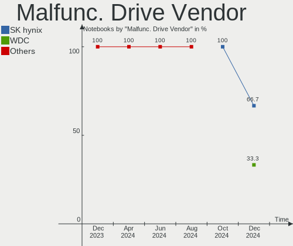
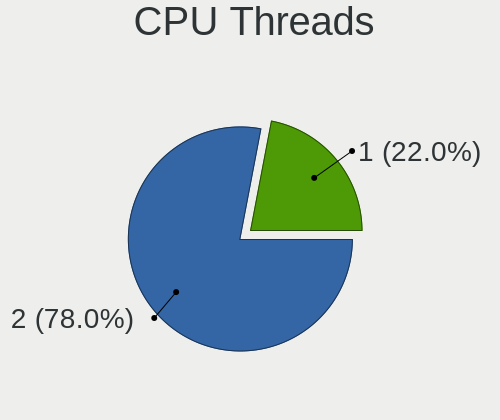
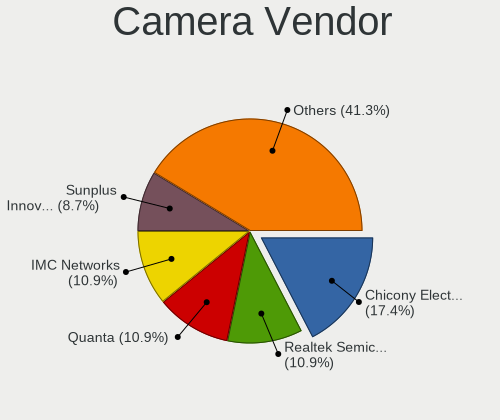
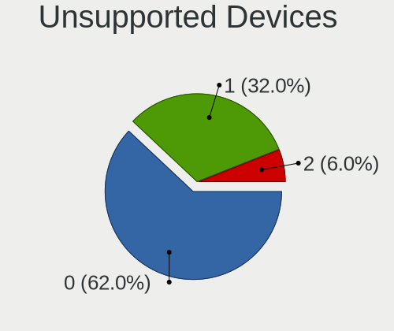

openSUSE - Hardware Trends (Notebooks)
--------------------------------------

A project to identify most popular hardware characteristics and track their change
over time based on data collected by Linux users at https://Linux-Hardware.org.

Anyone can contribute to this report by the [hw-probe](https://github.com/linuxhw/hw-probe) tool:

    sudo -E hw-probe -all -upload

This report is for one last month. Overall report since the beginning of time: [TestCoverage](https://github.com/linuxhw/TestCoverage)

Period: Jul, 2022.

Contents
--------

* [ System ](#system)
  - [ OS                       ](#os)
  - [ OS Family                ](#os-family)
  - [ Kernel                   ](#kernel)
  - [ Kernel Family            ](#kernel-family)
  - [ Kernel Major Ver.        ](#kernel-major-ver)
  - [ Arch                     ](#arch)
  - [ DE                       ](#de)
  - [ Display Server           ](#display-server)
  - [ Display Manager          ](#display-manager)
  - [ OS Lang                  ](#os-lang)
  - [ Boot Mode                ](#boot-mode)
  - [ Filesystem               ](#filesystem)
  - [ Part. scheme             ](#part-scheme)
  - [ Dual Boot with Linux/BSD ](#dual-boot-with-linuxbsd)
  - [ Dual Boot (Win)          ](#dual-boot-win)

* [ Board ](#board)
  - [ Vendor                   ](#vendor)
  - [ Model                    ](#model)
  - [ Model Family             ](#model-family)
  - [ MFG Year                 ](#mfg-year)
  - [ Form Factor              ](#form-factor)
  - [ Secure Boot              ](#secure-boot)
  - [ Coreboot                 ](#coreboot)
  - [ RAM Size                 ](#ram-size)
  - [ RAM Used                 ](#ram-used)
  - [ Total Drives             ](#total-drives)
  - [ Has CD-ROM               ](#has-cd-rom)
  - [ Has Ethernet             ](#has-ethernet)
  - [ Has WiFi                 ](#has-wifi)
  - [ Has Bluetooth            ](#has-bluetooth)

* [ Location ](#location)
  - [ Country                  ](#country)
  - [ City                     ](#city)

* [ Drives ](#drives)
  - [ Drive Vendor             ](#drive-vendor)
  - [ Drive Model              ](#drive-model)
  - [ HDD Vendor               ](#hdd-vendor)
  - [ SSD Vendor               ](#ssd-vendor)
  - [ Drive Kind               ](#drive-kind)
  - [ Drive Connector          ](#drive-connector)
  - [ Drive Size               ](#drive-size)
  - [ Space Total              ](#space-total)
  - [ Space Used               ](#space-used)
  - [ Malfunc. Drives          ](#malfunc-drives)
  - [ Malfunc. Drive Vendor    ](#malfunc-drive-vendor)
  - [ Malfunc. HDD Vendor      ](#malfunc-hdd-vendor)
  - [ Malfunc. Drive Kind      ](#malfunc-drive-kind)
  - [ Failed Drives            ](#failed-drives)
  - [ Failed Drive Vendor      ](#failed-drive-vendor)
  - [ Drive Status             ](#drive-status)

* [ Storage controller ](#storage-controller)
  - [ Storage Vendor           ](#storage-vendor)
  - [ Storage Model            ](#storage-model)
  - [ Storage Kind             ](#storage-kind)

* [ Processor ](#processor)
  - [ CPU Vendor               ](#cpu-vendor)
  - [ CPU Model                ](#cpu-model)
  - [ CPU Model Family         ](#cpu-model-family)
  - [ CPU Cores                ](#cpu-cores)
  - [ CPU Sockets              ](#cpu-sockets)
  - [ CPU Threads              ](#cpu-threads)
  - [ CPU Op-Modes             ](#cpu-op-modes)
  - [ CPU Microcode            ](#cpu-microcode)
  - [ CPU Microarch            ](#cpu-microarch)

* [ Graphics ](#graphics)
  - [ GPU Vendor               ](#gpu-vendor)
  - [ GPU Model                ](#gpu-model)
  - [ GPU Combo                ](#gpu-combo)
  - [ GPU Driver               ](#gpu-driver)
  - [ GPU Memory               ](#gpu-memory)

* [ Monitor ](#monitor)
  - [ Monitor Vendor           ](#monitor-vendor)
  - [ Monitor Model            ](#monitor-model)
  - [ Monitor Resolution       ](#monitor-resolution)
  - [ Monitor Diagonal         ](#monitor-diagonal)
  - [ Monitor Width            ](#monitor-width)
  - [ Aspect Ratio             ](#aspect-ratio)
  - [ Monitor Area             ](#monitor-area)
  - [ Pixel Density            ](#pixel-density)
  - [ Multiple Monitors        ](#multiple-monitors)

* [ Network ](#network)
  - [ Net Controller Vendor    ](#net-controller-vendor)
  - [ Net Controller Model     ](#net-controller-model)
  - [ Wireless Vendor          ](#wireless-vendor)
  - [ Wireless Model           ](#wireless-model)
  - [ Ethernet Vendor          ](#ethernet-vendor)
  - [ Ethernet Model           ](#ethernet-model)
  - [ Net Controller Kind      ](#net-controller-kind)
  - [ Used Controller          ](#used-controller)
  - [ NICs                     ](#nics)
  - [ IPv6                     ](#ipv6)

* [ Bluetooth ](#bluetooth)
  - [ Bluetooth Vendor         ](#bluetooth-vendor)
  - [ Bluetooth Model          ](#bluetooth-model)

* [ Sound ](#sound)
  - [ Sound Vendor             ](#sound-vendor)
  - [ Sound Model              ](#sound-model)

* [ Memory ](#memory)
  - [ Memory Vendor            ](#memory-vendor)
  - [ Memory Model             ](#memory-model)
  - [ Memory Kind              ](#memory-kind)
  - [ Memory Form Factor       ](#memory-form-factor)
  - [ Memory Size              ](#memory-size)
  - [ Memory Speed             ](#memory-speed)

* [ Printers & scanners ](#printers--scanners)
  - [ Printer Vendor           ](#printer-vendor)
  - [ Printer Model            ](#printer-model)
  - [ Scanner Vendor           ](#scanner-vendor)
  - [ Scanner Model            ](#scanner-model)

* [ Camera ](#camera)
  - [ Camera Vendor            ](#camera-vendor)
  - [ Camera Model             ](#camera-model)

* [ Security ](#security)
  - [ Fingerprint Vendor       ](#fingerprint-vendor)
  - [ Fingerprint Model        ](#fingerprint-model)
  - [ Chipcard Vendor          ](#chipcard-vendor)
  - [ Chipcard Model           ](#chipcard-model)

* [ Unsupported ](#unsupported)
  - [ Unsupported Devices      ](#unsupported-devices)
  - [ Unsupported Device Types ](#unsupported-device-types)

System
------

OS
--

Installed operating systems

| Name                         | Notebooks | Percent |
|------------------------------|-----------|---------|
| openSUSE Tumbleweed-XXXXXXXX | 14        | 63.64%  |
| openSUSE Leap-15.4           | 6         | 27.27%  |
| openSUSE Leap-15.3           | 2         | 9.09%   |

OS Family
---------

OS without a version

| Name     | Notebooks | Percent |
|----------|-----------|---------|
| openSUSE | 22        | 100%    |

Kernel
------

Version of the Linux kernel

| Version                      | Notebooks | Percent |
|------------------------------|-----------|---------|
| 5.18.6-1-default             | 7         | 31.82%  |
| 5.14.21-150400.22-default    | 4         | 18.18%  |
| 5.18.11-1-default            | 3         | 13.64%  |
| 5.3.18-150300.59.49-default  | 2         | 9.09%   |
| 5.18.9-2-default             | 2         | 9.09%   |
| 5.18.9-1-default             | 2         | 9.09%   |
| 5.14.21-150400.24.11-default | 2         | 9.09%   |

Kernel Family
-------------

Linux kernel without a distro release

| Version | Notebooks | Percent |
|---------|-----------|---------|
| 5.18.6  | 7         | 31.82%  |
| 5.14.21 | 6         | 27.27%  |
| 5.18.9  | 4         | 18.18%  |
| 5.18.11 | 3         | 13.64%  |
| 5.3.18  | 2         | 9.09%   |

Kernel Major Ver.
-----------------

Linux kernel major version

| Version | Notebooks | Percent |
|---------|-----------|---------|
| 5.18    | 14        | 63.64%  |
| 5.14    | 6         | 27.27%  |
| 5.3     | 2         | 9.09%   |

Arch
----

OS architecture (x86_64, i586, etc.)

| Name   | Notebooks | Percent |
|--------|-----------|---------|
| x86_64 | 22        | 100%    |

DE
--

Desktop Environment

| Name  | Notebooks | Percent |
|-------|-----------|---------|
| KDE5  | 17        | 77.27%  |
| GNOME | 2         | 9.09%   |
| XFCE  | 1         | 4.55%   |
| MATE  | 1         | 4.55%   |
| i3    | 1         | 4.55%   |

Display Server
--------------

X11 or Wayland

| Name    | Notebooks | Percent |
|---------|-----------|---------|
| X11     | 20        | 90.91%  |
| Wayland | 2         | 9.09%   |

Display Manager
---------------

SDDM, LightDM, etc.

| Name    | Notebooks | Percent |
|---------|-----------|---------|
| LightDM | 7         | 31.82%  |
| Unknown | 7         | 31.82%  |
| SDDM    | 6         | 27.27%  |
| XDM     | 2         | 9.09%   |

OS Lang
-------

Language

| Lang  | Notebooks | Percent |
|-------|-----------|---------|
| en_US | 5         | 22.73%  |
| POSIX | 4         | 18.18%  |
| de_DE | 3         | 13.64%  |
| nl_NL | 2         | 9.09%   |
| fr_FR | 2         | 9.09%   |
| es_ES | 2         | 9.09%   |
| pt_BR | 1         | 4.55%   |
| nn_NO | 1         | 4.55%   |
| it_IT | 1         | 4.55%   |
| en_GB | 1         | 4.55%   |

Boot Mode
---------

EFI or BIOS

| Mode | Notebooks | Percent |
|------|-----------|---------|
| EFI  | 13        | 59.09%  |
| BIOS | 9         | 40.91%  |

Filesystem
----------

Type of filesystem

| Type  | Notebooks | Percent |
|-------|-----------|---------|
| Btrfs | 16        | 72.73%  |
| Ext4  | 5         | 22.73%  |
| Xfs   | 1         | 4.55%   |

Part. scheme
------------

Scheme of partitioning

| Type    | Notebooks | Percent |
|---------|-----------|---------|
| GPT     | 14        | 63.64%  |
| Unknown | 6         | 27.27%  |
| MBR     | 2         | 9.09%   |

Dual Boot with Linux/BSD
------------------------

Hosting more than one Linux/BSD

| Dual boot | Notebooks | Percent |
|-----------|-----------|---------|
| No        | 19        | 86.36%  |
| Yes       | 3         | 13.64%  |

Dual Boot (Win)
---------------

Hosting Linux and Windows

| Dual boot | Notebooks | Percent |
|-----------|-----------|---------|
| No        | 14        | 63.64%  |
| Yes       | 8         | 36.36%  |

Board
-----

Vendor
------

Motherboard manufacturer

| Name             | Notebooks | Percent |
|------------------|-----------|---------|
| Lenovo           | 7         | 31.82%  |
| Dell             | 4         | 18.18%  |
| TUXEDO           | 2         | 9.09%   |
| Unknown          | 2         | 9.09%   |
| Toshiba          | 1         | 4.55%   |
| Purism           | 1         | 4.55%   |
| Notebook         | 1         | 4.55%   |
| Multilaser       | 1         | 4.55%   |
| Jumper           | 1         | 4.55%   |
| Hewlett-Packard  | 1         | 4.55%   |
| ASUSTek Computer | 1         | 4.55%   |

Model
-----

Motherboard model

| Name                                     | Notebooks | Percent |
|------------------------------------------|-----------|---------|
| TUXEDO Pulse 15 Gen1                     | 2         | 9.09%   |
| Unknown                                  | 2         | 9.09%   |
| Toshiba Satellite L500                   | 1         | 4.55%   |
| Purism Librem 15 v3                      | 1         | 4.55%   |
| Notebook NLx0MU                          | 1         | 4.55%   |
| Multilaser PC150                         | 1         | 4.55%   |
| Lenovo ThinkPad X1 Carbon 6th 20KG0022US | 1         | 4.55%   |
| Lenovo ThinkPad W510 431965U             | 1         | 4.55%   |
| Lenovo ThinkPad T14 Gen 1 20UD000GUS     | 1         | 4.55%   |
| Lenovo ThinkPad L15 Gen 2 20X3005BMX     | 1         | 4.55%   |
| Lenovo ThinkPad Edge 0328A11             | 1         | 4.55%   |
| Lenovo ThinkBook 15 G2 ITL 20VE          | 1         | 4.55%   |
| Lenovo K14 Gen 1 21CUS02600              | 1         | 4.55%   |
| Jumper EZbook                            | 1         | 4.55%   |
| HP Pavilion g6                           | 1         | 4.55%   |
| Dell XPS 15 9570                         | 1         | 4.55%   |
| Dell XPS 15 9510                         | 1         | 4.55%   |
| Dell Inspiron 5584                       | 1         | 4.55%   |
| Dell Inspiron 13-7359                    | 1         | 4.55%   |
| ASUS ROG Zephyrus G14 GA401QM_GA401QM    | 1         | 4.55%   |

Model Family
------------

Motherboard model prefix

| Name              | Notebooks | Percent |
|-------------------|-----------|---------|
| Lenovo ThinkPad   | 5         | 22.73%  |
| TUXEDO Pulse      | 2         | 9.09%   |
| Dell XPS          | 2         | 9.09%   |
| Dell Inspiron     | 2         | 9.09%   |
| Unknown           | 2         | 9.09%   |
| Toshiba Satellite | 1         | 4.55%   |
| Purism Librem     | 1         | 4.55%   |
| Notebook NLx0MU   | 1         | 4.55%   |
| Multilaser PC150  | 1         | 4.55%   |
| Lenovo ThinkBook  | 1         | 4.55%   |
| Lenovo K14        | 1         | 4.55%   |
| Jumper EZbook     | 1         | 4.55%   |
| HP Pavilion       | 1         | 4.55%   |
| ASUS ROG          | 1         | 4.55%   |

MFG Year
--------

Motherboard manufacture year

| Year | Notebooks | Percent |
|------|-----------|---------|
| 2021 | 8         | 36.36%  |
| 2020 | 4         | 18.18%  |
| 2019 | 2         | 9.09%   |
| 2018 | 2         | 9.09%   |
| 2010 | 2         | 9.09%   |
| 2017 | 1         | 4.55%   |
| 2015 | 1         | 4.55%   |
| 2011 | 1         | 4.55%   |
| 2009 | 1         | 4.55%   |

Form Factor
-----------

Physical design of the computer

| Name     | Notebooks | Percent |
|----------|-----------|---------|
| Notebook | 22        | 100%    |

Secure Boot
-----------

Enabled or disabled

| State    | Notebooks | Percent |
|----------|-----------|---------|
| Disabled | 20        | 90.91%  |
| Enabled  | 2         | 9.09%   |

Coreboot
--------

Have coreboot on board

| Used | Notebooks | Percent |
|------|-----------|---------|
| No   | 21        | 95.45%  |
| Yes  | 1         | 4.55%   |

RAM Size
--------

Total RAM memory

| Size in GB  | Notebooks | Percent |
|-------------|-----------|---------|
| 4.01-8.0    | 5         | 22.73%  |
| 8.01-16.0   | 5         | 22.73%  |
| 32.01-64.0  | 3         | 13.64%  |
| 24.01-32.0  | 3         | 13.64%  |
| 3.01-4.0    | 2         | 9.09%   |
| 16.01-24.0  | 2         | 9.09%   |
| 64.01-256.0 | 1         | 4.55%   |
| 1.01-2.0    | 1         | 4.55%   |

RAM Used
--------

Used RAM memory

| Used GB   | Notebooks | Percent |
|-----------|-----------|---------|
| 2.01-3.0  | 9         | 40.91%  |
| 4.01-8.0  | 4         | 18.18%  |
| 1.01-2.0  | 4         | 18.18%  |
| 3.01-4.0  | 3         | 13.64%  |
| 8.01-16.0 | 1         | 4.55%   |
| 0.51-1.0  | 1         | 4.55%   |

Total Drives
------------

Number of drives on board

| Drives | Notebooks | Percent |
|--------|-----------|---------|
| 1      | 16        | 72.73%  |
| 2      | 5         | 22.73%  |
| 3      | 1         | 4.55%   |

Has CD-ROM
----------

Has CD-ROM on board

| Presented | Notebooks | Percent |
|-----------|-----------|---------|
| No        | 19        | 86.36%  |
| Yes       | 3         | 13.64%  |

Has Ethernet
------------

Has Ethernet on board

| Presented | Notebooks | Percent |
|-----------|-----------|---------|
| Yes       | 14        | 63.64%  |
| No        | 8         | 36.36%  |

Has WiFi
--------

Has WiFi module

| Presented | Notebooks | Percent |
|-----------|-----------|---------|
| Yes       | 21        | 95.45%  |
| No        | 1         | 4.55%   |

Has Bluetooth
-------------

Has Bluetooth module

| Presented | Notebooks | Percent |
|-----------|-----------|---------|
| Yes       | 16        | 72.73%  |
| No        | 6         | 27.27%  |

Location
--------

Country
-------

Geographic location (country)

| Country     | Notebooks | Percent |
|-------------|-----------|---------|
| USA         | 4         | 18.18%  |
| Germany     | 3         | 13.64%  |
| Spain       | 2         | 9.09%   |
| Netherlands | 2         | 9.09%   |
| France      | 2         | 9.09%   |
| Sweden      | 1         | 4.55%   |
| Russia      | 1         | 4.55%   |
| Romania     | 1         | 4.55%   |
| Norway      | 1         | 4.55%   |
| Italy       | 1         | 4.55%   |
| Hungary     | 1         | 4.55%   |
| Czechia     | 1         | 4.55%   |
| Canada      | 1         | 4.55%   |
| Brazil      | 1         | 4.55%   |

City
----

Geographic location (city)

| City        | Notebooks | Percent |
|-------------|-----------|---------|
| Madrid      | 2         | 9.09%   |
| Halle       | 2         | 9.09%   |
| Willoughby  | 1         | 4.55%   |
| Vaksdal     | 1         | 4.55%   |
| Prague      | 1         | 4.55%   |
| Paris       | 1         | 4.55%   |
| Osorio      | 1         | 4.55%   |
| Mytishchi   | 1         | 4.55%   |
| Montevrain  | 1         | 4.55%   |
| Mesa        | 1         | 4.55%   |
| Merano      | 1         | 4.55%   |
| Harsefeld   | 1         | 4.55%   |
| Guelph      | 1         | 4.55%   |
| Gothenburg  | 1         | 4.55%   |
| Enschede    | 1         | 4.55%   |
| Cedar City  | 1         | 4.55%   |
| Budapest    | 1         | 4.55%   |
| Bucharest   | 1         | 4.55%   |
| Alpharetta  | 1         | 4.55%   |
| Almere Stad | 1         | 4.55%   |

Drives
------

Drive Vendor
------------

Hard drive vendors

| Vendor              | Notebooks | Drives | Percent |
|---------------------|-----------|--------|---------|
| Samsung Electronics | 5         | 5      | 18.52%  |
| Unknown             | 2         | 3      | 7.41%   |
| Toshiba             | 2         | 2      | 7.41%   |
| SK hynix            | 2         | 2      | 7.41%   |
| Seagate             | 2         | 2      | 7.41%   |
| Kingston            | 2         | 2      | 7.41%   |
| Crucial             | 2         | 2      | 7.41%   |
| Unknown             | 2         | 2      | 7.41%   |
| WDC                 | 1         | 1      | 3.7%    |
| Team                | 1         | 1      | 3.7%    |
| SanDisk             | 1         | 1      | 3.7%    |
| Realtek             | 1         | 1      | 3.7%    |
| Intenso             | 1         | 1      | 3.7%    |
| Intel               | 1         | 1      | 3.7%    |
| Hitachi             | 1         | 1      | 3.7%    |
| BIWIN               | 1         | 1      | 3.7%    |

Drive Model
-----------

Hard drive models

| Model                          | Notebooks | Percent |
|--------------------------------|-----------|---------|
| Unknown MMC Card  32GB         | 2         | 7.14%   |
| Kingston NVMe SSD Drive 500GB  | 2         | 7.14%   |
| Unknown                        | 2         | 7.14%   |
| WDC WDS100T2B0C-00PXH0 1TB     | 1         | 3.57%   |
| Unknown MMC Card  16GB         | 1         | 3.57%   |
| Toshiba NVMe SSD Drive 1024GB  | 1         | 3.57%   |
| Toshiba MK5055GSX 500GB        | 1         | 3.57%   |
| Team T253A3001T 1TB SSD        | 1         | 3.57%   |
| SK hynix PC711 NVMe 1TB        | 1         | 3.57%   |
| SK hynix BC711 NVMe 512GB      | 1         | 3.57%   |
| Seagate ST1000LM048-2E7172 1TB | 1         | 3.57%   |
| Seagate ST1000LM035-1RK172 1TB | 1         | 3.57%   |
| SanDisk NVMe SSD Drive 256GB   | 1         | 3.57%   |
| Samsung SSD 980 250GB          | 1         | 3.57%   |
| Samsung SSD 970 PRO 512GB      | 1         | 3.57%   |
| Samsung SSD 970 EVO 500GB      | 1         | 3.57%   |
| Samsung SSD 850 EVO 1TB        | 1         | 3.57%   |
| Samsung PM951 NVMe 512GB       | 1         | 3.57%   |
| Realtek RTL9210B-CG 500GB      | 1         | 3.57%   |
| Intenso SSD SATAIII 512GB      | 1         | 3.57%   |
| Intel SSDPEKNU010TZ 1TB        | 1         | 3.57%   |
| Hitachi HTS725032A9A364 320GB  | 1         | 3.57%   |
| Crucial CT500P5PSSD8 500GB     | 1         | 3.57%   |
| Crucial CT120BX500SSD1 120GB   | 1         | 3.57%   |
| BIWIN SSD 120GB                | 1         | 3.57%   |

HDD Vendor
----------

Hard disk drive vendors

| Vendor  | Notebooks | Drives | Percent |
|---------|-----------|--------|---------|
| Seagate | 2         | 2      | 50%     |
| Toshiba | 1         | 1      | 25%     |
| Hitachi | 1         | 1      | 25%     |

SSD Vendor
----------

Solid state drive vendors

| Vendor              | Notebooks | Drives | Percent |
|---------------------|-----------|--------|---------|
| Unknown             | 2         | 2      | 28.57%  |
| Team                | 1         | 1      | 14.29%  |
| Samsung Electronics | 1         | 1      | 14.29%  |
| Intenso             | 1         | 1      | 14.29%  |
| Crucial             | 1         | 1      | 14.29%  |
| BIWIN               | 1         | 1      | 14.29%  |

Drive Kind
----------

HDD or SSD

| Kind | Notebooks | Drives | Percent |
|------|-----------|--------|---------|
| NVMe | 13        | 14     | 50%     |
| SSD  | 7         | 7      | 26.92%  |
| HDD  | 4         | 4      | 15.38%  |
| MMC  | 2         | 3      | 7.69%   |

Drive Connector
---------------

SATA, SAS, NVMe, etc.

| Type | Notebooks | Drives | Percent |
|------|-----------|--------|---------|
| NVMe | 13        | 13     | 48.15%  |
| SATA | 11        | 11     | 40.74%  |
| MMC  | 2         | 3      | 7.41%   |
| SAS  | 1         | 1      | 3.7%    |

Drive Size
----------

Size of hard drive

| Size in TB | Notebooks | Drives | Percent |
|------------|-----------|--------|---------|
| 0.01-0.5   | 6         | 6      | 54.55%  |
| 0.51-1.0   | 5         | 5      | 45.45%  |

Space Total
-----------

Amount of disk space available on the file system

| Size in GB     | Notebooks | Percent |
|----------------|-----------|---------|
| More than 3000 | 7         | 31.82%  |
| 1001-2000      | 5         | 22.73%  |
| 101-250        | 3         | 13.64%  |
| 251-500        | 2         | 9.09%   |
| 2001-3000      | 2         | 9.09%   |
| 501-1000       | 2         | 9.09%   |
| 21-50          | 1         | 4.55%   |

Space Used
----------

Amount of used disk space

| Used GB        | Notebooks | Percent |
|----------------|-----------|---------|
| 251-500        | 5         | 22.73%  |
| 101-250        | 5         | 22.73%  |
| 51-100         | 4         | 18.18%  |
| 1-20           | 3         | 13.64%  |
| 21-50          | 2         | 9.09%   |
| More than 3000 | 1         | 4.55%   |
| 1001-2000      | 1         | 4.55%   |
| 501-1000       | 1         | 4.55%   |

Malfunc. Drives
---------------

Drive models with a malfunction

| Model                   | Notebooks | Drives | Percent |
|-------------------------|-----------|--------|---------|
| Toshiba MK5055GSX 500GB | 1         | 1      | 100%    |

Malfunc. Drive Vendor
---------------------

Vendors of faulty drives

| Vendor  | Notebooks | Drives | Percent |
|---------|-----------|--------|---------|
| Toshiba | 1         | 1      | 100%    |

Malfunc. HDD Vendor
-------------------

Vendors of faulty HDD drives

| Vendor  | Notebooks | Drives | Percent |
|---------|-----------|--------|---------|
| Toshiba | 1         | 1      | 100%    |

Malfunc. Drive Kind
-------------------

Kinds of faulty drives

| Kind | Notebooks | Drives | Percent |
|------|-----------|--------|---------|
| HDD  | 1         | 1      | 100%    |

Failed Drives
-------------

Failed drive models

Zero info for selected period =(

Failed Drive Vendor
-------------------

Failed drive vendors

Zero info for selected period =(

Drive Status
------------

Number of failed and malfunc. drives

| Status   | Notebooks | Drives | Percent |
|----------|-----------|--------|---------|
| Works    | 15        | 19     | 65.22%  |
| Detected | 7         | 8      | 30.43%  |
| Malfunc  | 1         | 1      | 4.35%   |

Storage controller
------------------

Storage Vendor
--------------

Storage controller vendors

| Vendor                       | Notebooks | Percent |
|------------------------------|-----------|---------|
| Intel                        | 15        | 50%     |
| Samsung Electronics          | 4         | 13.33%  |
| AMD                          | 3         | 10%     |
| SK hynix                     | 2         | 6.67%   |
| SanDisk                      | 2         | 6.67%   |
| Kingston Technology Company  | 2         | 6.67%   |
| Toshiba America Info Systems | 1         | 3.33%   |
| Micron/Crucial Technology    | 1         | 3.33%   |

Storage Model
-------------

Storage controller models

| Model                                                                        | Notebooks | Percent |
|------------------------------------------------------------------------------|-----------|---------|
| Intel Celeron/Pentium Silver Processor SATA Controller                       | 3         | 9.38%   |
| AMD FCH SATA Controller [AHCI mode]                                          | 3         | 9.38%   |
| SK hynix Gold P31 SSD                                                        | 2         | 6.25%   |
| Samsung NVMe SSD Controller SM981/PM981/PM983                                | 2         | 6.25%   |
| Kingston Company Company Non-Volatile memory controller                      | 2         | 6.25%   |
| Intel Volume Management Device NVMe RAID Controller                          | 2         | 6.25%   |
| Intel Tiger Lake-LP SATA Controller                                          | 2         | 6.25%   |
| Intel Sunrise Point-LP SATA Controller [AHCI mode]                           | 2         | 6.25%   |
| Toshiba America Info Systems XG6 NVMe SSD Controller                         | 1         | 3.13%   |
| SanDisk PC SN520 NVMe SSD                                                    | 1         | 3.13%   |
| SanDisk Non-Volatile memory controller                                       | 1         | 3.13%   |
| Samsung NVMe SSD Controller SM951/PM951                                      | 1         | 3.13%   |
| Samsung NVMe SSD Controller 980                                              | 1         | 3.13%   |
| Micron/Crucial Non-Volatile memory controller                                | 1         | 3.13%   |
| Intel Non-Volatile memory controller                                         | 1         | 3.13%   |
| Intel Cannon Point-LP SATA Controller [AHCI Mode]                            | 1         | 3.13%   |
| Intel Cannon Lake Mobile PCH SATA AHCI Controller                            | 1         | 3.13%   |
| Intel 82801IBM/IEM (ICH9M/ICH9M-E) 4 port SATA Controller [AHCI mode]        | 1         | 3.13%   |
| Intel 6 Series/C200 Series Chipset Family 6 port Mobile SATA AHCI Controller | 1         | 3.13%   |
| Intel 5 Series/3400 Series Chipset 4 port SATA IDE Controller                | 1         | 3.13%   |
| Intel 5 Series/3400 Series Chipset 4 port SATA AHCI Controller               | 1         | 3.13%   |
| Intel 5 Series/3400 Series Chipset 2 port SATA IDE Controller                | 1         | 3.13%   |

Storage Kind
------------

Kind of storage controller (IDE, SATA, NVMe, SAS, ...)

| Kind | Notebooks | Percent |
|------|-----------|---------|
| SATA | 15        | 48.39%  |
| NVMe | 13        | 41.94%  |
| RAID | 2         | 6.45%   |
| IDE  | 1         | 3.23%   |

Processor
---------

CPU Vendor
----------

Processor vendors

| Vendor | Notebooks | Percent |
|--------|-----------|---------|
| Intel  | 16        | 72.73%  |
| AMD    | 6         | 27.27%  |

CPU Model
---------

Processor models

| Model                                         | Notebooks | Percent |
|-----------------------------------------------|-----------|---------|
| Intel Celeron N4020 CPU @ 1.10GHz             | 3         | 13.64%  |
| Intel 11th Gen Core i5-1135G7 @ 2.40GHz       | 2         | 9.09%   |
| AMD Ryzen 7 4800H with Radeon Graphics        | 2         | 9.09%   |
| Intel Core i7-8750H CPU @ 2.20GHz             | 1         | 4.55%   |
| Intel Core i7-8550U CPU @ 1.80GHz             | 1         | 4.55%   |
| Intel Core i7-6500U CPU @ 2.50GHz             | 1         | 4.55%   |
| Intel Core i5-8265U CPU @ 1.60GHz             | 1         | 4.55%   |
| Intel Core i5-6200U CPU @ 2.30GHz             | 1         | 4.55%   |
| Intel Core i5 CPU M 560 @ 2.67GHz             | 1         | 4.55%   |
| Intel Core i3-2350M CPU @ 2.30GHz             | 1         | 4.55%   |
| Intel Core 2 Duo CPU T6500 @ 2.10GHz          | 1         | 4.55%   |
| Intel Celeron CPU U3400 @ 1.07GHz             | 1         | 4.55%   |
| Intel 11th Gen Core i9-11900H @ 2.50GHz       | 1         | 4.55%   |
| Intel 11th Gen Core i7-1165G7 @ 2.80GHz       | 1         | 4.55%   |
| AMD Ryzen 9 5900HS with Radeon Graphics       | 1         | 4.55%   |
| AMD Ryzen 7 PRO 4750U with Radeon Graphics    | 1         | 4.55%   |
| AMD Ryzen 5 PRO 5650U with Radeon Graphics    | 1         | 4.55%   |
| AMD A4-9120e RADEON R3, 4 COMPUTE CORES 2C+2G | 1         | 4.55%   |

CPU Model Family
----------------

Processor model prefix

| Model            | Notebooks | Percent |
|------------------|-----------|---------|
| Other            | 4         | 18.18%  |
| Intel Celeron    | 4         | 18.18%  |
| Intel Core i7    | 3         | 13.64%  |
| Intel Core i5    | 3         | 13.64%  |
| AMD Ryzen 7      | 2         | 9.09%   |
| Intel Core i3    | 1         | 4.55%   |
| Intel Core 2 Duo | 1         | 4.55%   |
| AMD Ryzen 9      | 1         | 4.55%   |
| AMD Ryzen 7 PRO  | 1         | 4.55%   |
| AMD Ryzen 5 PRO  | 1         | 4.55%   |
| AMD A4           | 1         | 4.55%   |

CPU Cores
---------

Number of processor cores

| Number | Notebooks | Percent |
|--------|-----------|---------|
| 2      | 10        | 45.45%  |
| 8      | 5         | 22.73%  |
| 4      | 5         | 22.73%  |
| 6      | 2         | 9.09%   |

CPU Sockets
-----------

Number of sockets

| Number | Notebooks | Percent |
|--------|-----------|---------|
| 1      | 22        | 100%    |

CPU Threads
-----------

Threads per core (Hyper-Threading)

| Number | Notebooks | Percent |
|--------|-----------|---------|
| 2      | 16        | 72.73%  |
| 1      | 6         | 27.27%  |

CPU Op-Modes
------------

CPU Operation Modes (32-bit, 64-bit)

| Op mode        | Notebooks | Percent |
|----------------|-----------|---------|
| 32-bit, 64-bit | 22        | 100%    |

CPU Microcode
-------------

Microcode number

| Number     | Notebooks | Percent |
|------------|-----------|---------|
| Unknown    | 5         | 22.73%  |
| 0x806c1    | 3         | 13.64%  |
| 0x706a8    | 3         | 13.64%  |
| 0x406e3    | 2         | 9.09%   |
| 0x20655    | 2         | 9.09%   |
| 0x0a50000c | 2         | 9.09%   |
| 0x906ea    | 1         | 4.55%   |
| 0x806d1    | 1         | 4.55%   |
| 0x206a7    | 1         | 4.55%   |
| 0x1067a    | 1         | 4.55%   |
| 0x08600106 | 1         | 4.55%   |

CPU Microarch
-------------

Microarchitecture

| Name          | Notebooks | Percent |
|---------------|-----------|---------|
| Zen 2         | 3         | 13.64%  |
| TigerLake     | 3         | 13.64%  |
| KabyLake      | 3         | 13.64%  |
| Goldmont plus | 3         | 13.64%  |
| Zen 3         | 2         | 9.09%   |
| Westmere      | 2         | 9.09%   |
| Skylake       | 2         | 9.09%   |
| SandyBridge   | 1         | 4.55%   |
| Penryn        | 1         | 4.55%   |
| Icelake       | 1         | 4.55%   |
| Excavator     | 1         | 4.55%   |

Graphics
--------

GPU Vendor
----------

Vendors of graphics cards

| Vendor | Notebooks | Percent |
|--------|-----------|---------|
| Intel  | 14        | 56%     |
| AMD    | 7         | 28%     |
| Nvidia | 4         | 16%     |

GPU Model
---------

Graphics card models

| Model                                                                     | Notebooks | Percent |
|---------------------------------------------------------------------------|-----------|---------|
| Intel TigerLake-LP GT2 [Iris Xe Graphics]                                 | 3         | 12%     |
| Intel GeminiLake [UHD Graphics 600]                                       | 3         | 12%     |
| AMD Renoir                                                                | 3         | 12%     |
| Intel Skylake GT2 [HD Graphics 520]                                       | 2         | 8%      |
| AMD Cezanne                                                               | 2         | 8%      |
| Nvidia GT216GLM [Quadro FX 880M]                                          | 1         | 4%      |
| Nvidia GP107M [GeForce GTX 1050 Ti Mobile]                                | 1         | 4%      |
| Nvidia GA107M [GeForce RTX 3050 Ti Mobile]                                | 1         | 4%      |
| Nvidia GA106M [GeForce RTX 3060 Mobile / Max-Q]                           | 1         | 4%      |
| Intel WhiskeyLake-U GT2 [UHD Graphics 620]                                | 1         | 4%      |
| Intel UHD Graphics 620                                                    | 1         | 4%      |
| Intel TigerLake-H GT1 [UHD Graphics]                                      | 1         | 4%      |
| Intel Core Processor Integrated Graphics Controller                       | 1         | 4%      |
| Intel CoffeeLake-H GT2 [UHD Graphics 630]                                 | 1         | 4%      |
| Intel 2nd Generation Core Processor Family Integrated Graphics Controller | 1         | 4%      |
| AMD Stoney [Radeon R2/R3/R4/R5 Graphics]                                  | 1         | 4%      |
| AMD RV710/M92 [Mobility Radeon HD 4530/4570/545v]                         | 1         | 4%      |

GPU Combo
---------

Combinations of graphics cards

| Name           | Notebooks | Percent |
|----------------|-----------|---------|
| 1 x Intel      | 12        | 54.55%  |
| 1 x AMD        | 6         | 27.27%  |
| Intel + Nvidia | 2         | 9.09%   |
| 1 x Nvidia     | 1         | 4.55%   |
| AMD + Nvidia   | 1         | 4.55%   |

GPU Driver
----------

Free vs proprietary

| Driver      | Notebooks | Percent |
|-------------|-----------|---------|
| Free        | 21        | 95.45%  |
| Proprietary | 1         | 4.55%   |

GPU Memory
----------

Total video memory

| Size in GB | Notebooks | Percent |
|------------|-----------|---------|
| Unknown    | 16        | 72.73%  |
| 0.51-1.0   | 2         | 9.09%   |
| 0.01-0.5   | 2         | 9.09%   |
| 3.01-4.0   | 1         | 4.55%   |
| 1.01-2.0   | 1         | 4.55%   |

Monitor
-------

Monitor Vendor
--------------

Monitor vendors

| Vendor              | Notebooks | Percent |
|---------------------|-----------|---------|
| BOE                 | 10        | 38.46%  |
| LG Display          | 3         | 11.54%  |
| Lenovo              | 2         | 7.69%   |
| AU Optronics        | 2         | 7.69%   |
| TMX                 | 1         | 3.85%   |
| Sharp               | 1         | 3.85%   |
| Samsung Electronics | 1         | 3.85%   |
| Pixio               | 1         | 3.85%   |
| InfoVision          | 1         | 3.85%   |
| Goldstar            | 1         | 3.85%   |
| Eizo                | 1         | 3.85%   |
| Chimei Innolux      | 1         | 3.85%   |
| Acer                | 1         | 3.85%   |

Monitor Model
-------------

Monitor models

| Model                                                                 | Notebooks | Percent |
|-----------------------------------------------------------------------|-----------|---------|
| BOE LCD Monitor BOE0900 1920x1080 344x194mm 15.5-inch                 | 2         | 7.69%   |
| BOE LCD Monitor BOE08CD 1366x768 344x194mm 15.5-inch                  | 2         | 7.69%   |
| TMX TL140BDXP01-0 TMX1400 2560x1440 310x174mm 14.0-inch               | 1         | 3.85%   |
| Sharp LCD Monitor SHP148D 3840x2160 344x194mm 15.5-inch               | 1         | 3.85%   |
| Samsung Electronics LCD Monitor SDC414D 3456x2160 336x210mm 15.6-inch | 1         | 3.85%   |
| Pixio U29I WAM2900 2560x1080 690x260mm 29.0-inch                      | 1         | 3.85%   |
| LG Display LCD Monitor LGDD801 1366x768 344x194mm 15.5-inch           | 1         | 3.85%   |
| LG Display LCD Monitor LGD04A1 1920x1080 294x165mm 13.3-inch          | 1         | 3.85%   |
| LG Display LCD Monitor LGD02F2 1366x768 344x194mm 15.5-inch           | 1         | 3.85%   |
| Lenovo LCD Monitor LEN40D1 1366x768 256x144mm 11.6-inch               | 1         | 3.85%   |
| Lenovo LCD Monitor LEN40B1 1600x900 344x193mm 15.5-inch               | 1         | 3.85%   |
| InfoVision LCD Monitor IVO057D 1920x1080 309x174mm 14.0-inch          | 1         | 3.85%   |
| Goldstar ULTRAWIDE GSM7770 2560x1080 798x334mm 34.1-inch              | 1         | 3.85%   |
| Eizo EV2760 ENC3121 2560x1440 597x336mm 27.0-inch                     | 1         | 3.85%   |
| Chimei Innolux LCD Monitor CMN14D6 1366x768 309x173mm 13.9-inch       | 1         | 3.85%   |
| BOE LCD Monitor BOE09AE 1920x1080 309x174mm 14.0-inch                 | 1         | 3.85%   |
| BOE LCD Monitor BOE094A 1920x1080 344x194mm 15.5-inch                 | 1         | 3.85%   |
| BOE LCD Monitor BOE08C6 1920x1080 344x194mm 15.5-inch                 | 1         | 3.85%   |
| BOE LCD Monitor BOE07F6 1920x1080 309x174mm 14.0-inch                 | 1         | 3.85%   |
| BOE LCD Monitor BOE06DF 1920x1080 309x173mm 13.9-inch                 | 1         | 3.85%   |
| BOE LCD Monitor BOE0641 1920x1080 344x193mm 15.5-inch                 | 1         | 3.85%   |
| AU Optronics LCD Monitor AUO2E8D 1920x1080 344x194mm 15.5-inch        | 1         | 3.85%   |
| AU Optronics LCD Monitor AUO25ED 1920x1080 344x193mm 15.5-inch        | 1         | 3.85%   |
| Acer S201HL ACR01A5 1600x900 443x249mm 20.0-inch                      | 1         | 3.85%   |

Monitor Resolution
------------------

Monitor screen resolution

| Resolution      | Notebooks | Percent |
|-----------------|-----------|---------|
| 1920x1080 (FHD) | 12        | 48%     |
| 1366x768 (WXGA) | 6         | 24%     |
| 2560x1440 (QHD) | 2         | 8%      |
| 2560x1080       | 2         | 8%      |
| 3840x2160 (4K)  | 1         | 4%      |
| 3456x2160       | 1         | 4%      |
| 1600x900 (HD+)  | 1         | 4%      |

Monitor Diagonal
----------------

Diagonal size in inches

| Inches | Notebooks | Percent |
|--------|-----------|---------|
| 15     | 14        | 53.85%  |
| 14     | 4         | 15.38%  |
| 13     | 3         | 11.54%  |
| 34     | 1         | 3.85%   |
| 29     | 1         | 3.85%   |
| 27     | 1         | 3.85%   |
| 20     | 1         | 3.85%   |
| 11     | 1         | 3.85%   |

Monitor Width
-------------

Physical width

| Width in mm | Notebooks | Percent |
|-------------|-----------|---------|
| 301-350     | 20        | 76.92%  |
| 201-300     | 2         | 7.69%   |
| 701-800     | 1         | 3.85%   |
| 601-700     | 1         | 3.85%   |
| 501-600     | 1         | 3.85%   |
| 401-500     | 1         | 3.85%   |

Aspect Ratio
------------

Proportional relationship between the width and the height

| Ratio | Notebooks | Percent |
|-------|-----------|---------|
| 16/9  | 21        | 87.5%   |
| 21/9  | 1         | 4.17%   |
| 2.65  | 1         | 4.17%   |
| 16/10 | 1         | 4.17%   |

Monitor Area
------------

Area in inch²

| Area in inch² | Notebooks | Percent |
|----------------|-----------|---------|
| 101-110        | 14        | 53.85%  |
| 81-90          | 6         | 23.08%  |
| 71-80          | 1         | 3.85%   |
| 51-60          | 1         | 3.85%   |
| 351-500        | 1         | 3.85%   |
| 301-350        | 1         | 3.85%   |
| 251-300        | 1         | 3.85%   |
| 151-200        | 1         | 3.85%   |

Pixel Density
-------------

Pixels per inch

| Density       | Notebooks | Percent |
|---------------|-----------|---------|
| 121-160       | 12        | 46.15%  |
| 101-120       | 7         | 26.92%  |
| 51-100        | 3         | 11.54%  |
| More than 240 | 2         | 7.69%   |
| 161-240       | 2         | 7.69%   |

Multiple Monitors
-----------------

Total monitors connected

| Total | Notebooks | Percent |
|-------|-----------|---------|
| 1     | 18        | 81.82%  |
| 2     | 4         | 18.18%  |

Network
-------

Net Controller Vendor
---------------------

Controller vendors

| Vendor                | Notebooks | Percent |
|-----------------------|-----------|---------|
| Realtek Semiconductor | 13        | 38.24%  |
| Intel                 | 13        | 38.24%  |
| Qualcomm Atheros      | 3         | 8.82%   |
| Broadcom              | 2         | 5.88%   |
| TP-Link               | 1         | 2.94%   |
| MediaTek              | 1         | 2.94%   |
| Cypress Semiconductor | 1         | 2.94%   |

Net Controller Model
--------------------

Controller models

| Model                                                             | Notebooks | Percent |
|-------------------------------------------------------------------|-----------|---------|
| Realtek RTL8111/8168/8411 PCI Express Gigabit Ethernet Controller | 6         | 16.22%  |
| Intel Wi-Fi 6 AX200                                               | 5         | 13.51%  |
| Realtek RTL810xE PCI Express Fast Ethernet controller             | 3         | 8.11%   |
| Realtek 802.11n WLAN Adapter                                      | 2         | 5.41%   |
| Intel Wireless 3165                                               | 2         | 5.41%   |
| Intel Ethernet Connection (13) I219-V                             | 2         | 5.41%   |
| TP-Link UE300 10/100/1000 LAN (ethernet mode) [Realtek RTL8153]   | 1         | 2.7%    |
| Realtek RTL8852AE 802.11ax PCIe Wireless Network Adapter          | 1         | 2.7%    |
| Realtek RTL8723BU 802.11b/g/n WLAN Adapter                        | 1         | 2.7%    |
| Realtek RTL8188EUS 802.11n Wireless Network Adapter               | 1         | 2.7%    |
| Qualcomm Atheros QCA9377 802.11ac Wireless Network Adapter        | 1         | 2.7%    |
| Qualcomm Atheros QCA6174 802.11ac Wireless Network Adapter        | 1         | 2.7%    |
| Qualcomm Atheros AR9462 Wireless Network Adapter                  | 1         | 2.7%    |
| MediaTek MT7921 802.11ax PCI Express Wireless Network Adapter     | 1         | 2.7%    |
| Intel Wireless 8265 / 8275                                        | 1         | 2.7%    |
| Intel WiFi Link 5100                                              | 1         | 2.7%    |
| Intel Wi-Fi 6 AX201                                               | 1         | 2.7%    |
| Intel Tiger Lake PCH CNVi WiFi                                    | 1         | 2.7%    |
| Intel Ethernet Connection (4) I219-V                              | 1         | 2.7%    |
| Intel 82577LM Gigabit Network Connection                          | 1         | 2.7%    |
| Cypress K38231_03                                                 | 1         | 2.7%    |
| Broadcom BCM43224 802.11a/b/g/n                                   | 1         | 2.7%    |
| Broadcom BCM4313 802.11bgn Wireless Network Adapter               | 1         | 2.7%    |

Wireless Vendor
---------------

Wireless vendors

| Vendor                | Notebooks | Percent |
|-----------------------|-----------|---------|
| Intel                 | 11        | 52.38%  |
| Realtek Semiconductor | 4         | 19.05%  |
| Qualcomm Atheros      | 3         | 14.29%  |
| Broadcom              | 2         | 9.52%   |
| MediaTek              | 1         | 4.76%   |

Wireless Model
--------------

Wireless models

| Model                                                         | Notebooks | Percent |
|---------------------------------------------------------------|-----------|---------|
| Intel Wi-Fi 6 AX200                                           | 5         | 22.73%  |
| Realtek 802.11n WLAN Adapter                                  | 2         | 9.09%   |
| Intel Wireless 3165                                           | 2         | 9.09%   |
| Realtek RTL8852AE 802.11ax PCIe Wireless Network Adapter      | 1         | 4.55%   |
| Realtek RTL8723BU 802.11b/g/n WLAN Adapter                    | 1         | 4.55%   |
| Realtek RTL8188EUS 802.11n Wireless Network Adapter           | 1         | 4.55%   |
| Qualcomm Atheros QCA9377 802.11ac Wireless Network Adapter    | 1         | 4.55%   |
| Qualcomm Atheros QCA6174 802.11ac Wireless Network Adapter    | 1         | 4.55%   |
| Qualcomm Atheros AR9462 Wireless Network Adapter              | 1         | 4.55%   |
| MediaTek MT7921 802.11ax PCI Express Wireless Network Adapter | 1         | 4.55%   |
| Intel Wireless 8265 / 8275                                    | 1         | 4.55%   |
| Intel WiFi Link 5100                                          | 1         | 4.55%   |
| Intel Wi-Fi 6 AX201                                           | 1         | 4.55%   |
| Intel Tiger Lake PCH CNVi WiFi                                | 1         | 4.55%   |
| Broadcom BCM43224 802.11a/b/g/n                               | 1         | 4.55%   |
| Broadcom BCM4313 802.11bgn Wireless Network Adapter           | 1         | 4.55%   |

Ethernet Vendor
---------------

Ethernet vendors

| Vendor                | Notebooks | Percent |
|-----------------------|-----------|---------|
| Realtek Semiconductor | 9         | 60%     |
| Intel                 | 4         | 26.67%  |
| TP-Link               | 1         | 6.67%   |
| Cypress Semiconductor | 1         | 6.67%   |

Ethernet Model
--------------

Ethernet models

| Model                                                             | Notebooks | Percent |
|-------------------------------------------------------------------|-----------|---------|
| Realtek RTL8111/8168/8411 PCI Express Gigabit Ethernet Controller | 6         | 40%     |
| Realtek RTL810xE PCI Express Fast Ethernet controller             | 3         | 20%     |
| Intel Ethernet Connection (13) I219-V                             | 2         | 13.33%  |
| TP-Link UE300 10/100/1000 LAN (ethernet mode) [Realtek RTL8153]   | 1         | 6.67%   |
| Intel Ethernet Connection (4) I219-V                              | 1         | 6.67%   |
| Intel 82577LM Gigabit Network Connection                          | 1         | 6.67%   |
| Cypress K38231_03                                                 | 1         | 6.67%   |

Net Controller Kind
-------------------

Ethernet, WiFi or modem

| Kind     | Notebooks | Percent |
|----------|-----------|---------|
| WiFi     | 21        | 60%     |
| Ethernet | 14        | 40%     |

Used Controller
---------------

Currently used network controller

| Kind     | Notebooks | Percent |
|----------|-----------|---------|
| WiFi     | 19        | 79.17%  |
| Ethernet | 5         | 20.83%  |

NICs
----

Total network controllers on board

| Total | Notebooks | Percent |
|-------|-----------|---------|
| 2     | 11        | 50%     |
| 1     | 7         | 31.82%  |
| 0     | 3         | 13.64%  |
| 3     | 1         | 4.55%   |

IPv6
----

IPv6 vs IPv4

| Used | Notebooks | Percent |
|------|-----------|---------|
| No   | 20        | 90.91%  |
| Yes  | 2         | 9.09%   |

Bluetooth
---------

Bluetooth Vendor
----------------

Controller vendors

| Vendor                          | Notebooks | Percent |
|---------------------------------|-----------|---------|
| Intel                           | 9         | 56.25%  |
| Broadcom                        | 3         | 18.75%  |
| Qualcomm Atheros Communications | 2         | 12.5%   |
| IMC Networks                    | 1         | 6.25%   |
| Foxconn / Hon Hai               | 1         | 6.25%   |

Bluetooth Model
---------------

Controller models

| Model                              | Notebooks | Percent |
|------------------------------------|-----------|---------|
| Intel AX200 Bluetooth              | 5         | 31.25%  |
| Intel Bluetooth wireless interface | 3         | 18.75%  |
| Qualcomm Atheros  Bluetooth Device | 2         | 12.5%   |
| Broadcom BCM2045B (BDC-2.1)        | 2         | 12.5%   |
| Intel AX201 Bluetooth              | 1         | 6.25%   |
| IMC Networks Wireless_Device       | 1         | 6.25%   |
| Foxconn / Hon Hai Bluetooth Device | 1         | 6.25%   |
| Broadcom HP Portable Valentine     | 1         | 6.25%   |

Sound
-----

Sound Vendor
------------

Sound card vendors

| Vendor              | Notebooks | Percent |
|---------------------|-----------|---------|
| Intel               | 16        | 59.26%  |
| AMD                 | 7         | 25.93%  |
| Nvidia              | 2         | 7.41%   |
| Texas Instruments   | 1         | 3.7%    |
| C-Media Electronics | 1         | 3.7%    |

Sound Model
-----------

Sound card models

| Model                                                                      | Notebooks | Percent |
|----------------------------------------------------------------------------|-----------|---------|
| AMD Renoir Radeon High Definition Audio Controller                         | 5         | 15.15%  |
| AMD Family 17h/19h HD Audio Controller                                     | 5         | 15.15%  |
| Intel Tiger Lake-LP Smart Sound Technology Audio Controller                | 3         | 9.09%   |
| Intel Sunrise Point-LP HD Audio                                            | 3         | 9.09%   |
| Intel Celeron/Pentium Silver Processor High Definition Audio               | 3         | 9.09%   |
| Intel 5 Series/3400 Series Chipset High Definition Audio                   | 2         | 6.06%   |
| Texas Instruments PCM2912A Audio Codec                                     | 1         | 3.03%   |
| Nvidia GT216 HDMI Audio Controller                                         | 1         | 3.03%   |
| Nvidia GA106 High Definition Audio Controller                              | 1         | 3.03%   |
| Intel Tiger Lake-H HD Audio Controller                                     | 1         | 3.03%   |
| Intel Cannon Point-LP High Definition Audio Controller                     | 1         | 3.03%   |
| Intel Cannon Lake PCH cAVS                                                 | 1         | 3.03%   |
| Intel 82801I (ICH9 Family) HD Audio Controller                             | 1         | 3.03%   |
| Intel 6 Series/C200 Series Chipset Family High Definition Audio Controller | 1         | 3.03%   |
| C-Media Electronics USB Advanced Audio Device                              | 1         | 3.03%   |
| AMD RV710/730 HDMI Audio [Radeon HD 4000 series]                           | 1         | 3.03%   |
| AMD High Definition Audio Controller                                       | 1         | 3.03%   |
| AMD Family 15h (Models 60h-6fh) Audio Controller                           | 1         | 3.03%   |

Memory
------

Memory Vendor
-------------

Memory module vendors

| Vendor              | Notebooks | Percent |
|---------------------|-----------|---------|
| Samsung Electronics | 5         | 33.33%  |
| Unknown (ABCD)      | 3         | 20%     |
| Kingston            | 3         | 20%     |
| Micron Technology   | 2         | 13.33%  |
| Toshiba             | 1         | 6.67%   |
| SK hynix            | 1         | 6.67%   |

Memory Model
------------

Memory module models

| Model                                                            | Notebooks | Percent |
|------------------------------------------------------------------|-----------|---------|
| Unknown (ABCD) RAM 123456789012345678 4GB SODIMM LPDDR4 2400MT/s | 3         | 15.79%  |
| Toshiba RAM 8HTF12864HDY-800G1 2GB SODIMM 1066MT/s               | 1         | 5.26%   |
| Toshiba RAM 64T128020EDL2.5C2 2GB SODIMM 1066MT/s                | 1         | 5.26%   |
| SK hynix RAM HMAA4GS6AJR8N-XN 32GB SODIMM DDR4 3200MT/s          | 1         | 5.26%   |
| Samsung RAM M471B5273CH0-CH9 4GB SODIMM DDR3 1334MT/s            | 1         | 5.26%   |
| Samsung RAM M471B1G73QH0-YK0 8GB SODIMM DDR3 1600MT/s            | 1         | 5.26%   |
| Samsung RAM M471A2K43EB1-CWE 16GB SODIMM DDR4 3200MT/s           | 1         | 5.26%   |
| Samsung RAM M471A2G44AM0-CWE 16GB SODIMM DDR4 3200MT/s           | 1         | 5.26%   |
| Samsung RAM M471A2G43AB2-CWE 16GB SODIMM DDR4 3200MT/s           | 1         | 5.26%   |
| Samsung RAM M471A1G44AB0-CWE 8GB Row Of Chips DDR4 3200MT/s      | 1         | 5.26%   |
| Samsung RAM K4EBE304EB-EGCG 8GB Row Of Chips LPDDR3 2133MT/s     | 1         | 5.26%   |
| Micron RAM 8ATF2G64HZ-3G2E2 16GB SODIMM DDR4 3200MT/s            | 1         | 5.26%   |
| Micron RAM 4ATS2G64HZ-3G2B1 16384MB SODIMM DDR4 3200MT/s         | 1         | 5.26%   |
| Kingston RAM KHX3200C20S4/16GX 16GB SODIMM DDR4 3200MT/s         | 1         | 5.26%   |
| Kingston RAM 9905744-086.A00G 16GB SODIMM DDR4 3200MT/s          | 1         | 5.26%   |
| Kingston RAM 9905744-035.A00G 16GB SODIMM DDR4 3200MT/s          | 1         | 5.26%   |
| Kingston RAM 9905700-086.A00G 8192MB SODIMM DDR4 3200MT/s        | 1         | 5.26%   |

Memory Kind
-----------

Memory module kinds

| Kind   | Notebooks | Percent |
|--------|-----------|---------|
| DDR4   | 7         | 50%     |
| LPDDR4 | 3         | 21.43%  |
| DDR3   | 2         | 14.29%  |
| LPDDR3 | 1         | 7.14%   |
| DDR2   | 1         | 7.14%   |

Memory Form Factor
------------------

Physical design of the memory module

| Name         | Notebooks | Percent |
|--------------|-----------|---------|
| SODIMM       | 13        | 86.67%  |
| Row Of Chips | 2         | 13.33%  |

Memory Size
-----------

Memory module size

| Size  | Notebooks | Percent |
|-------|-----------|---------|
| 16384 | 5         | 33.33%  |
| 4096  | 5         | 33.33%  |
| 8192  | 4         | 26.67%  |
| 32768 | 1         | 6.67%   |

Memory Speed
------------

Memory module speed

| Speed | Notebooks | Percent |
|-------|-----------|---------|
| 3200  | 7         | 50%     |
| 2400  | 3         | 21.43%  |
| 2667  | 1         | 7.14%   |
| 2133  | 1         | 7.14%   |
| 1334  | 1         | 7.14%   |
| 1066  | 1         | 7.14%   |

Printers & scanners
-------------------

Printer Vendor
--------------

Printer device vendors

Zero info for selected period =(

Printer Model
-------------

Printer device models

Zero info for selected period =(

Scanner Vendor
--------------

Scanner device vendors

Zero info for selected period =(

Scanner Model
-------------

Scanner device models

Zero info for selected period =(

Camera
------

Camera Vendor
-------------

Camera device vendors

| Vendor                        | Notebooks | Percent |
|-------------------------------|-----------|---------|
| Microdia                      | 4         | 21.05%  |
| Alcor Micro                   | 4         | 21.05%  |
| Acer                          | 3         | 15.79%  |
| IMC Networks                  | 2         | 10.53%  |
| Chicony Electronics           | 2         | 10.53%  |
| Y Media                       | 1         | 5.26%   |
| Syntek                        | 1         | 5.26%   |
| Suyin                         | 1         | 5.26%   |
| Sunplus Innovation Technology | 1         | 5.26%   |

Camera Model
------------

Camera device models

| Model                          | Notebooks | Percent |
|--------------------------------|-----------|---------|
| Microdia Integrated_Webcam_HD  | 3         | 15.79%  |
| Alcor Micro USB 2.0 PC cam     | 3         | 15.79%  |
| IMC Networks Integrated Camera | 2         | 10.53%  |
| Chicony HD Webcam              | 2         | 10.53%  |
| Y Media USB Camera             | 1         | 5.26%   |
| Syntek Integrated Camera       | 1         | 5.26%   |
| Suyin USB 2.0 Camera           | 1         | 5.26%   |
| Sunplus Integrated_Webcam_HD   | 1         | 5.26%   |
| Microdia HP Integrated Webcam  | 1         | 5.26%   |
| Alcor Micro HD WebCam          | 1         | 5.26%   |
| Acer Lenovo Integrated Webcam  | 1         | 5.26%   |
| Acer Integrated Camera         | 1         | 5.26%   |
| Acer BisonCam,NB Pro           | 1         | 5.26%   |

Security
--------

Fingerprint Vendor
------------------

Fingerprint sensor vendors

| Vendor    | Notebooks | Percent |
|-----------|-----------|---------|
| Synaptics | 3         | 100%    |

Fingerprint Model
-----------------

Fingerprint sensor models

| Model                                             | Notebooks | Percent |
|---------------------------------------------------|-----------|---------|
| Synaptics Prometheus MIS Touch Fingerprint Reader | 2         | 66.67%  |
| Synaptics Metallica MIS Touch Fingerprint Reader  | 1         | 33.33%  |

Chipcard Vendor
---------------

Chipcard module vendors

| Vendor      | Notebooks | Percent |
|-------------|-----------|---------|
| Alcor Micro | 1         | 100%    |

Chipcard Model
--------------

Chipcard module models

| Model                               | Notebooks | Percent |
|-------------------------------------|-----------|---------|
| Alcor Micro AU9540 Smartcard Reader | 1         | 100%    |

Unsupported
-----------

Unsupported Devices
-------------------

Total unsupported devices on board

| Total | Notebooks | Percent |
|-------|-----------|---------|
| 0     | 11        | 50%     |
| 1     | 9         | 40.91%  |
| 2     | 2         | 9.09%   |

Unsupported Device Types
------------------------

Types of unsupported devices

| Type                  | Notebooks | Percent |
|-----------------------|-----------|---------|
| Graphics card         | 3         | 23.08%  |
| Fingerprint reader    | 3         | 23.08%  |
| Network               | 2         | 15.38%  |
| Multimedia controller | 2         | 15.38%  |
| Net/ethernet          | 1         | 7.69%   |
| Modem                 | 1         | 7.69%   |
| Chipcard              | 1         | 7.69%   |

