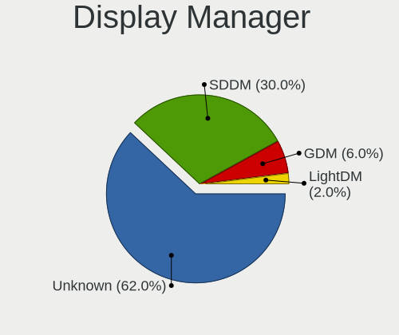
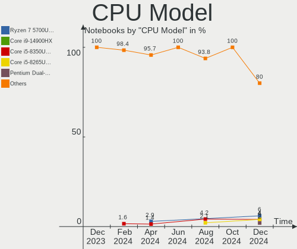
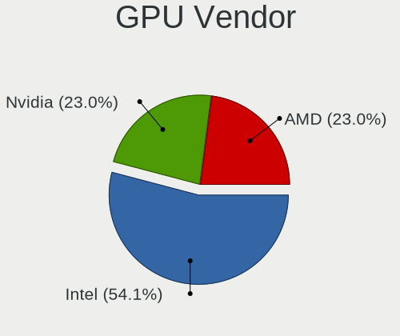
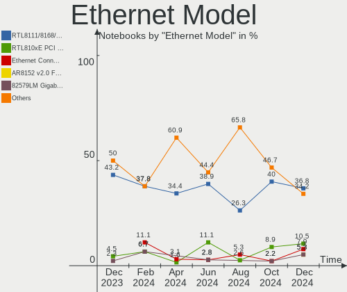

openSUSE - Hardware Trends (Notebooks)
--------------------------------------

A project to identify most popular hardware characteristics and track their change
over time based on data collected by Linux users at https://Linux-Hardware.org.

Anyone can contribute to this report by the [hw-probe](https://github.com/linuxhw/hw-probe) tool:

    sudo -E hw-probe -all -upload

This report is for one last month. Overall report since the beginning of time: [TestCoverage](https://github.com/linuxhw/TestCoverage)

Period: Jan, 2023.

Contents
--------

* [ System ](#system)
  - [ OS                       ](#os)
  - [ OS Family                ](#os-family)
  - [ Kernel                   ](#kernel)
  - [ Kernel Family            ](#kernel-family)
  - [ Kernel Major Ver.        ](#kernel-major-ver)
  - [ Arch                     ](#arch)
  - [ DE                       ](#de)
  - [ Display Server           ](#display-server)
  - [ Display Manager          ](#display-manager)
  - [ OS Lang                  ](#os-lang)
  - [ Boot Mode                ](#boot-mode)
  - [ Filesystem               ](#filesystem)
  - [ Part. scheme             ](#part-scheme)
  - [ Dual Boot with Linux/BSD ](#dual-boot-with-linuxbsd)
  - [ Dual Boot (Win)          ](#dual-boot-win)

* [ Board ](#board)
  - [ Vendor                   ](#vendor)
  - [ Model                    ](#model)
  - [ Model Family             ](#model-family)
  - [ MFG Year                 ](#mfg-year)
  - [ Form Factor              ](#form-factor)
  - [ Secure Boot              ](#secure-boot)
  - [ Coreboot                 ](#coreboot)
  - [ RAM Size                 ](#ram-size)
  - [ RAM Used                 ](#ram-used)
  - [ Total Drives             ](#total-drives)
  - [ Has CD-ROM               ](#has-cd-rom)
  - [ Has Ethernet             ](#has-ethernet)
  - [ Has WiFi                 ](#has-wifi)
  - [ Has Bluetooth            ](#has-bluetooth)

* [ Location ](#location)
  - [ Country                  ](#country)
  - [ City                     ](#city)

* [ Drives ](#drives)
  - [ Drive Vendor             ](#drive-vendor)
  - [ Drive Model              ](#drive-model)
  - [ HDD Vendor               ](#hdd-vendor)
  - [ SSD Vendor               ](#ssd-vendor)
  - [ Drive Kind               ](#drive-kind)
  - [ Drive Connector          ](#drive-connector)
  - [ Drive Size               ](#drive-size)
  - [ Space Total              ](#space-total)
  - [ Space Used               ](#space-used)
  - [ Malfunc. Drives          ](#malfunc-drives)
  - [ Malfunc. Drive Vendor    ](#malfunc-drive-vendor)
  - [ Malfunc. HDD Vendor      ](#malfunc-hdd-vendor)
  - [ Malfunc. Drive Kind      ](#malfunc-drive-kind)
  - [ Failed Drives            ](#failed-drives)
  - [ Failed Drive Vendor      ](#failed-drive-vendor)
  - [ Drive Status             ](#drive-status)

* [ Storage controller ](#storage-controller)
  - [ Storage Vendor           ](#storage-vendor)
  - [ Storage Model            ](#storage-model)
  - [ Storage Kind             ](#storage-kind)

* [ Processor ](#processor)
  - [ CPU Vendor               ](#cpu-vendor)
  - [ CPU Model                ](#cpu-model)
  - [ CPU Model Family         ](#cpu-model-family)
  - [ CPU Cores                ](#cpu-cores)
  - [ CPU Sockets              ](#cpu-sockets)
  - [ CPU Threads              ](#cpu-threads)
  - [ CPU Op-Modes             ](#cpu-op-modes)
  - [ CPU Microcode            ](#cpu-microcode)
  - [ CPU Microarch            ](#cpu-microarch)

* [ Graphics ](#graphics)
  - [ GPU Vendor               ](#gpu-vendor)
  - [ GPU Model                ](#gpu-model)
  - [ GPU Combo                ](#gpu-combo)
  - [ GPU Driver               ](#gpu-driver)
  - [ GPU Memory               ](#gpu-memory)

* [ Monitor ](#monitor)
  - [ Monitor Vendor           ](#monitor-vendor)
  - [ Monitor Model            ](#monitor-model)
  - [ Monitor Resolution       ](#monitor-resolution)
  - [ Monitor Diagonal         ](#monitor-diagonal)
  - [ Monitor Width            ](#monitor-width)
  - [ Aspect Ratio             ](#aspect-ratio)
  - [ Monitor Area             ](#monitor-area)
  - [ Pixel Density            ](#pixel-density)
  - [ Multiple Monitors        ](#multiple-monitors)

* [ Network ](#network)
  - [ Net Controller Vendor    ](#net-controller-vendor)
  - [ Net Controller Model     ](#net-controller-model)
  - [ Wireless Vendor          ](#wireless-vendor)
  - [ Wireless Model           ](#wireless-model)
  - [ Ethernet Vendor          ](#ethernet-vendor)
  - [ Ethernet Model           ](#ethernet-model)
  - [ Net Controller Kind      ](#net-controller-kind)
  - [ Used Controller          ](#used-controller)
  - [ NICs                     ](#nics)
  - [ IPv6                     ](#ipv6)

* [ Bluetooth ](#bluetooth)
  - [ Bluetooth Vendor         ](#bluetooth-vendor)
  - [ Bluetooth Model          ](#bluetooth-model)

* [ Sound ](#sound)
  - [ Sound Vendor             ](#sound-vendor)
  - [ Sound Model              ](#sound-model)

* [ Memory ](#memory)
  - [ Memory Vendor            ](#memory-vendor)
  - [ Memory Model             ](#memory-model)
  - [ Memory Kind              ](#memory-kind)
  - [ Memory Form Factor       ](#memory-form-factor)
  - [ Memory Size              ](#memory-size)
  - [ Memory Speed             ](#memory-speed)

* [ Printers & scanners ](#printers--scanners)
  - [ Printer Vendor           ](#printer-vendor)
  - [ Printer Model            ](#printer-model)
  - [ Scanner Vendor           ](#scanner-vendor)
  - [ Scanner Model            ](#scanner-model)

* [ Camera ](#camera)
  - [ Camera Vendor            ](#camera-vendor)
  - [ Camera Model             ](#camera-model)

* [ Security ](#security)
  - [ Fingerprint Vendor       ](#fingerprint-vendor)
  - [ Fingerprint Model        ](#fingerprint-model)
  - [ Chipcard Vendor          ](#chipcard-vendor)
  - [ Chipcard Model           ](#chipcard-model)

* [ Unsupported ](#unsupported)
  - [ Unsupported Devices      ](#unsupported-devices)
  - [ Unsupported Device Types ](#unsupported-device-types)

System
------

OS
--

Installed operating systems

| Name                         | Notebooks | Percent |
|------------------------------|-----------|---------|
| openSUSE Tumbleweed-XXXXXXXX | 35        | 81.4%   |
| openSUSE Leap-15.4           | 7         | 16.28%  |
| openSUSE Microos-XXXXXXXX    | 1         | 2.33%   |

OS Family
---------

OS without a version

| Name     | Notebooks | Percent |
|----------|-----------|---------|
| openSUSE | 43        | 100%    |

Kernel
------

Version of the Linux kernel

| Version                      | Notebooks | Percent |
|------------------------------|-----------|---------|
| 6.1.4-1-default              | 6         | 13.95%  |
| 6.1.2-1-default              | 6         | 13.95%  |
| 6.1.7-1-default              | 5         | 11.63%  |
| 5.14.21-150400.24.38-default | 5         | 11.63%  |
| 6.1.8-1-default              | 4         | 9.3%    |
| 6.1.6-1-default              | 4         | 9.3%    |
| 6.1.3-1-default              | 4         | 9.3%    |
| 6.1.1-1-default              | 4         | 9.3%    |
| 5.14.21-150400.24.41-default | 2         | 4.65%   |
| 6.2.0-rc2-2.geebb76b-default | 1         | 2.33%   |
| 6.0.6-1-default              | 1         | 2.33%   |
| 6.0.10-1-default             | 1         | 2.33%   |

Kernel Family
-------------

Linux kernel without a distro release

| Version | Notebooks | Percent |
|---------|-----------|---------|
| 5.14.21 | 7         | 16.28%  |
| 6.1.4   | 6         | 13.95%  |
| 6.1.2   | 6         | 13.95%  |
| 6.1.7   | 5         | 11.63%  |
| 6.1.8   | 4         | 9.3%    |
| 6.1.6   | 4         | 9.3%    |
| 6.1.3   | 4         | 9.3%    |
| 6.1.1   | 4         | 9.3%    |
| 6.2.0   | 1         | 2.33%   |
| 6.0.6   | 1         | 2.33%   |
| 6.0.10  | 1         | 2.33%   |

Kernel Major Ver.
-----------------

Linux kernel major version

| Version | Notebooks | Percent |
|---------|-----------|---------|
| 6.1     | 33        | 76.74%  |
| 5.14    | 7         | 16.28%  |
| 6.0     | 2         | 4.65%   |
| 6.2     | 1         | 2.33%   |

Arch
----

OS architecture (x86_64, i586, etc.)

| Name   | Notebooks | Percent |
|--------|-----------|---------|
| x86_64 | 43        | 100%    |

DE
--

Desktop Environment

| Name     | Notebooks | Percent |
|----------|-----------|---------|
| KDE5     | 26        | 60.47%  |
| GNOME    | 10        | 23.26%  |
| XFCE     | 4         | 9.3%    |
| MATE     | 1         | 2.33%   |
| Cinnamon | 1         | 2.33%   |
| Unknown  | 1         | 2.33%   |

Display Server
--------------

X11 or Wayland

| Name    | Notebooks | Percent |
|---------|-----------|---------|
| X11     | 34        | 79.07%  |
| Wayland | 9         | 20.93%  |

Display Manager
---------------

SDDM, LightDM, etc.

| Name    | Notebooks | Percent |
|---------|-----------|---------|
| Unknown | 20        | 46.51%  |
| SDDM    | 12        | 27.91%  |
| LightDM | 8         | 18.6%   |
| XDM     | 3         | 6.98%   |

OS Lang
-------

Language

| Lang    | Notebooks | Percent |
|---------|-----------|---------|
| en_US   | 18        | 41.86%  |
| ru_RU   | 4         | 9.3%    |
| pt_BR   | 4         | 9.3%    |
| de_DE   | 3         | 6.98%   |
| POSIX   | 2         | 4.65%   |
| it_IT   | 2         | 4.65%   |
| es_ES   | 2         | 4.65%   |
| zh_CN   | 1         | 2.33%   |
| pl_PL   | 1         | 2.33%   |
| nn_NO   | 1         | 2.33%   |
| fr_FR   | 1         | 2.33%   |
| en_GB   | 1         | 2.33%   |
| en_FI   | 1         | 2.33%   |
| cs_CZ   | 1         | 2.33%   |
| Unknown | 1         | 2.33%   |

Boot Mode
---------

EFI or BIOS

| Mode | Notebooks | Percent |
|------|-----------|---------|
| EFI  | 32        | 74.42%  |
| BIOS | 11        | 25.58%  |

Filesystem
----------

Type of filesystem

| Type    | Notebooks | Percent |
|---------|-----------|---------|
| Btrfs   | 33        | 76.74%  |
| Ext4    | 9         | 20.93%  |
| Overlay | 1         | 2.33%   |

Part. scheme
------------

Scheme of partitioning

| Type    | Notebooks | Percent |
|---------|-----------|---------|
| GPT     | 22        | 51.16%  |
| Unknown | 19        | 44.19%  |
| MBR     | 2         | 4.65%   |

Dual Boot with Linux/BSD
------------------------

Hosting more than one Linux/BSD

| Dual boot | Notebooks | Percent |
|-----------|-----------|---------|
| No        | 38        | 88.37%  |
| Yes       | 5         | 11.63%  |

Dual Boot (Win)
---------------

Hosting Linux and Windows

| Dual boot | Notebooks | Percent |
|-----------|-----------|---------|
| No        | 36        | 83.72%  |
| Yes       | 7         | 16.28%  |

Board
-----

Vendor
------

Motherboard manufacturer

| Name             | Notebooks | Percent |
|------------------|-----------|---------|
| Lenovo           | 11        | 25.58%  |
| Hewlett-Packard  | 9         | 20.93%  |
| Dell             | 7         | 16.28%  |
| ASUSTek Computer | 4         | 9.3%    |
| Acer             | 3         | 6.98%   |
| Fujitsu          | 2         | 4.65%   |
| TUXEDO           | 1         | 2.33%   |
| Toshiba          | 1         | 2.33%   |
| SLIMBOOK         | 1         | 2.33%   |
| Medion           | 1         | 2.33%   |
| Maibenben        | 1         | 2.33%   |
| HUAWEI           | 1         | 2.33%   |
| Apple            | 1         | 2.33%   |

Model
-----

Motherboard model

| Name                                     | Notebooks | Percent |
|------------------------------------------|-----------|---------|
| TUXEDO Pulse 15 Gen1                     | 1         | 2.33%   |
| Toshiba Satellite L500                   | 1         | 2.33%   |
| SLIMBOOK PROX-AMD5                       | 1         | 2.33%   |
| Medion P6624                             | 1         | 2.33%   |
| Maibenben MaiBook M                      | 1         | 2.33%   |
| Lenovo ThinkPad X1 Carbon 7th 20QDS3B600 | 1         | 2.33%   |
| Lenovo ThinkPad W510 4391W3V             | 1         | 2.33%   |
| Lenovo ThinkPad T14 Gen 3 21AJS1DB00     | 1         | 2.33%   |
| Lenovo ThinkPad R500 2718WA3             | 1         | 2.33%   |
| Lenovo ThinkPad Edge E431 62779XP        | 1         | 2.33%   |
| Lenovo ThinkPad E15 20RD0019RT           | 1         | 2.33%   |
| Lenovo ThinkBook 14 G4+ ARA 21D0         | 1         | 2.33%   |
| Lenovo IdeaPad Y700-15ISK 80NV           | 1         | 2.33%   |
| Lenovo IdeaPad S145-15IWL 81S9           | 1         | 2.33%   |
| Lenovo IdeaPad L340-15IRH Gaming 81LK    | 1         | 2.33%   |
| Lenovo IdeaPad 330-15IKB 81FD            | 1         | 2.33%   |
| HUAWEI KLVL-WXXW                         | 1         | 2.33%   |
| HP ProBook 650 G1                        | 1         | 2.33%   |
| HP ProBook 4540s                         | 1         | 2.33%   |
| HP Pavilion dv7                          | 1         | 2.33%   |
| HP Pavilion dv4                          | 1         | 2.33%   |
| HP Laptop 15s-fq5xxx                     | 1         | 2.33%   |
| HP Laptop 15-ef2xxx                      | 1         | 2.33%   |
| HP ENVY 15                               | 1         | 2.33%   |
| HP EliteBook 840 G8 Notebook PC          | 1         | 2.33%   |
| HP Dev One Notebook PC                   | 1         | 2.33%   |
| Fujitsu LIFEBOOK U7511                   | 1         | 2.33%   |
| Fujitsu LIFEBOOK P1630                   | 1         | 2.33%   |
| Dell Latitude 9420                       | 1         | 2.33%   |
| Dell Latitude 5430                       | 1         | 2.33%   |
| Dell Latitude 5414                       | 1         | 2.33%   |
| Dell Inspiron 7577                       | 1         | 2.33%   |
| Dell Inspiron 15 3525                    | 1         | 2.33%   |
| Dell G7 7790                             | 1         | 2.33%   |
| Dell G3 3579                             | 1         | 2.33%   |
| ASUS Zenbook UX3402ZA_UX3402ZA           | 1         | 2.33%   |
| ASUS X556UQK                             | 1         | 2.33%   |
| ASUS X555LF                              | 1         | 2.33%   |
| ASUS G56JR                               | 1         | 2.33%   |
| Apple MacBook5,1                         | 1         | 2.33%   |

Model Family
------------

Motherboard model prefix

| Name               | Notebooks | Percent |
|--------------------|-----------|---------|
| Lenovo ThinkPad    | 6         | 13.95%  |
| Lenovo IdeaPad     | 4         | 9.3%    |
| Dell Latitude      | 3         | 6.98%   |
| HP ProBook         | 2         | 4.65%   |
| HP Pavilion        | 2         | 4.65%   |
| HP Laptop          | 2         | 4.65%   |
| Fujitsu LIFEBOOK   | 2         | 4.65%   |
| Dell Inspiron      | 2         | 4.65%   |
| TUXEDO Pulse       | 1         | 2.33%   |
| Toshiba Satellite  | 1         | 2.33%   |
| SLIMBOOK PROX-AMD5 | 1         | 2.33%   |
| Medion P6624       | 1         | 2.33%   |
| Maibenben MaiBook  | 1         | 2.33%   |
| Lenovo ThinkBook   | 1         | 2.33%   |
| HUAWEI KLVL-WXXW   | 1         | 2.33%   |
| HP ENVY            | 1         | 2.33%   |
| HP EliteBook       | 1         | 2.33%   |
| HP Dev             | 1         | 2.33%   |
| Dell G7            | 1         | 2.33%   |
| Dell G3            | 1         | 2.33%   |
| ASUS Zenbook       | 1         | 2.33%   |
| ASUS X556UQK       | 1         | 2.33%   |
| ASUS X555LF        | 1         | 2.33%   |
| ASUS G56JR         | 1         | 2.33%   |
| Apple MacBook5     | 1         | 2.33%   |
| Acer Swift         | 1         | 2.33%   |
| Acer Predator      | 1         | 2.33%   |
| Acer Aspire        | 1         | 2.33%   |

MFG Year
--------

Motherboard manufacture year

| Year | Notebooks | Percent |
|------|-----------|---------|
| 2022 | 9         | 20.93%  |
| 2019 | 6         | 13.95%  |
| 2021 | 5         | 11.63%  |
| 2015 | 3         | 6.98%   |
| 2010 | 3         | 6.98%   |
| 2009 | 3         | 6.98%   |
| 2008 | 3         | 6.98%   |
| 2020 | 2         | 4.65%   |
| 2018 | 2         | 4.65%   |
| 2017 | 2         | 4.65%   |
| 2013 | 2         | 4.65%   |
| 2016 | 1         | 2.33%   |
| 2014 | 1         | 2.33%   |
| 2012 | 1         | 2.33%   |

Form Factor
-----------

Physical design of the computer

| Name     | Notebooks | Percent |
|----------|-----------|---------|
| Notebook | 43        | 100%    |

Secure Boot
-----------

Enabled or disabled

| State    | Notebooks | Percent |
|----------|-----------|---------|
| Disabled | 34        | 79.07%  |
| Enabled  | 9         | 20.93%  |

Coreboot
--------

Have coreboot on board

| Used | Notebooks | Percent |
|------|-----------|---------|
| No   | 43        | 100%    |

RAM Size
--------

Total RAM memory

| Size in GB | Notebooks | Percent |
|------------|-----------|---------|
| 16.01-24.0 | 14        | 32.56%  |
| 4.01-8.0   | 10        | 23.26%  |
| 8.01-16.0  | 10        | 23.26%  |
| 32.01-64.0 | 5         | 11.63%  |
| 3.01-4.0   | 2         | 4.65%   |
| 24.01-32.0 | 1         | 2.33%   |
| 1.01-2.0   | 1         | 2.33%   |

RAM Used
--------

Used RAM memory

| Used GB   | Notebooks | Percent |
|-----------|-----------|---------|
| 3.01-4.0  | 11        | 25.58%  |
| 2.01-3.0  | 10        | 23.26%  |
| 4.01-8.0  | 9         | 20.93%  |
| 1.01-2.0  | 9         | 20.93%  |
| 8.01-16.0 | 3         | 6.98%   |
| 0.51-1.0  | 1         | 2.33%   |

Total Drives
------------

Number of drives on board

| Drives | Notebooks | Percent |
|--------|-----------|---------|
| 1      | 30        | 69.77%  |
| 2      | 12        | 27.91%  |
| 3      | 1         | 2.33%   |

Has CD-ROM
----------

Has CD-ROM on board

| Presented | Notebooks | Percent |
|-----------|-----------|---------|
| No        | 31        | 72.09%  |
| Yes       | 12        | 27.91%  |

Has Ethernet
------------

Has Ethernet on board

| Presented | Notebooks | Percent |
|-----------|-----------|---------|
| Yes       | 35        | 81.4%   |
| No        | 8         | 18.6%   |

Has WiFi
--------

Has WiFi module

| Presented | Notebooks | Percent |
|-----------|-----------|---------|
| Yes       | 43        | 100%    |

Has Bluetooth
-------------

Has Bluetooth module

| Presented | Notebooks | Percent |
|-----------|-----------|---------|
| Yes       | 36        | 83.72%  |
| No        | 7         | 16.28%  |

Location
--------

Country
-------

Geographic location (country)

| Country     | Notebooks | Percent |
|-------------|-----------|---------|
| USA         | 8         | 18.6%   |
| Russia      | 4         | 9.3%    |
| Germany     | 4         | 9.3%    |
| Brazil      | 4         | 9.3%    |
| Italy       | 3         | 6.98%   |
| Poland      | 2         | 4.65%   |
| Turkey      | 1         | 2.33%   |
| Thailand    | 1         | 2.33%   |
| Sweden      | 1         | 2.33%   |
| Norway      | 1         | 2.33%   |
| Netherlands | 1         | 2.33%   |
| Lithuania   | 1         | 2.33%   |
| Japan       | 1         | 2.33%   |
| Hungary     | 1         | 2.33%   |
| Guatemala   | 1         | 2.33%   |
| France      | 1         | 2.33%   |
| Finland     | 1         | 2.33%   |
| Czechia     | 1         | 2.33%   |
| China       | 1         | 2.33%   |
| Bulgaria    | 1         | 2.33%   |
| Belgium     | 1         | 2.33%   |
| Belarus     | 1         | 2.33%   |
| Austria     | 1         | 2.33%   |
| Argentina   | 1         | 2.33%   |

City
----

Geographic location (city)

| City                | Notebooks | Percent |
|---------------------|-----------|---------|
| Sao Paulo           | 2         | 4.65%   |
| Zakroczym           | 1         | 2.33%   |
| Yekaterinburg       | 1         | 2.33%   |
| Umeda               | 1         | 2.33%   |
| Stockholm           | 1         | 2.33%   |
| St Petersburg       | 1         | 2.33%   |
| Rho                 | 1         | 2.33%   |
| Ravenna             | 1         | 2.33%   |
| Poznan              | 1         | 2.33%   |
| Plovdiv             | 1         | 2.33%   |
| Peize               | 1         | 2.33%   |
| Paris               | 1         | 2.33%   |
| Owasso              | 1         | 2.33%   |
| Mount Pleasant      | 1         | 2.33%   |
| Minsk               | 1         | 2.33%   |
| Milano              | 1         | 2.33%   |
| Mesa                | 1         | 2.33%   |
| Mainz               | 1         | 2.33%   |
| Loves Park          | 1         | 2.33%   |
| Kokkola             | 1         | 2.33%   |
| Koditz              | 1         | 2.33%   |
| Klaipėda           | 1         | 2.33%   |
| Kiskunhalas         | 1         | 2.33%   |
| Itaguai             | 1         | 2.33%   |
| Hastiere            | 1         | 2.33%   |
| Halle               | 1         | 2.33%   |
| Guatemala City      | 1         | 2.33%   |
| Flaktveit           | 1         | 2.33%   |
| Düsseldorf         | 1         | 2.33%   |
| Denver              | 1         | 2.33%   |
| Corrente            | 1         | 2.33%   |
| Chengdu             | 1         | 2.33%   |
| Chelyabinsk         | 1         | 2.33%   |
| Charlotte           | 1         | 2.33%   |
| České Budějovice | 1         | 2.33%   |
| Central Square      | 1         | 2.33%   |
| Buenos Aires        | 1         | 2.33%   |
| Bryansk             | 1         | 2.33%   |
| Bangkok             | 1         | 2.33%   |
| Antalya             | 1         | 2.33%   |

Drives
------

Drive Vendor
------------

Hard drive vendors

| Vendor                         | Notebooks | Drives | Percent |
|--------------------------------|-----------|--------|---------|
| Samsung Electronics            | 10        | 11     | 17.86%  |
| WDC                            | 6         | 6      | 10.71%  |
| SK hynix                       | 6         | 6      | 10.71%  |
| Kingston                       | 5         | 5      | 8.93%   |
| Crucial                        | 4         | 4      | 7.14%   |
| Sandisk                        | 3         | 3      | 5.36%   |
| Toshiba                        | 2         | 2      | 3.57%   |
| Solid State Storage            | 2         | 2      | 3.57%   |
| Seagate                        | 2         | 2      | 3.57%   |
| Micron Technology              | 2         | 2      | 3.57%   |
| KIOXIA                         | 2         | 2      | 3.57%   |
| Intel                          | 2         | 2      | 3.57%   |
| HGST                           | 2         | 2      | 3.57%   |
| Transcend                      | 1         | 1      | 1.79%   |
| Solid State Storage Technology | 1         | 1      | 1.79%   |
| Pioneer                        | 1         | 1      | 1.79%   |
| Phison Electronics             | 1         | 1      | 1.79%   |
| Patriot                        | 1         | 1      | 1.79%   |
| Lenovo                         | 1         | 1      | 1.79%   |
| China                          | 1         | 1      | 1.79%   |
| Unknown                        | 1         | 1      | 1.79%   |

Drive Model
-----------

Hard drive models

| Model                                                | Notebooks | Percent |
|------------------------------------------------------|-----------|---------|
| SK hynix BC501 NVMe Solid State Drive 512GB          | 3         | 5.26%   |
| Samsung NVMe SSD Controller PM9A1/PM9A3/980PRO 512GB | 3         | 5.26%   |
| Seagate ST1000LM035-1RK172 1TB                       | 2         | 3.51%   |
| Samsung NVMe SSD Controller SM981/PM981/PM983 500GB  | 2         | 3.51%   |
| WDC WDS500G2B0A-00SM50 500GB SSD                     | 1         | 1.75%   |
| WDC WD5000LPCX-21VHAT0 500GB                         | 1         | 1.75%   |
| WDC WD3200BPVT-22JJ5T0 320GB                         | 1         | 1.75%   |
| WDC WD10SPZX-75Z10T0 1TB                             | 1         | 1.75%   |
| WDC WD10SPZX-24Z10 1TB                               | 1         | 1.75%   |
| WDC WD Green 2.5 1000GB SSD                          | 1         | 1.75%   |
| Transcend TS480GMTS420S 480GB SSD                    | 1         | 1.75%   |
| Toshiba MQ04ABF100 1TB                               | 1         | 1.75%   |
| Toshiba MK5055GSX 500GB                              | 1         | 1.75%   |
| Solid State Storage CL4-3D512-Q11 NVMe SSSTC 512GB   | 1         | 1.75%   |
| Solid State Storage SSSTC CL1-4D256 256GB            | 1         | 1.75%   |
| Solid State Storage CL1-3D512-Q11 NVMe SSSTC 512GB   | 1         | 1.75%   |
| SK hynix SC311 SATA 128GB SSD                        | 1         | 1.75%   |
| SK hynix PC711 HFS001TDE9X073N 1TB                   | 1         | 1.75%   |
| SK hynix BC711 HFM512GD3JX013N 512GB                 | 1         | 1.75%   |
| SanDisk X600 M.2 2280 SATA 128GB SSD                 | 1         | 1.75%   |
| Sandisk WD Black SN850 2TB                           | 1         | 1.75%   |
| SanDisk Portable SSD 2TB                             | 1         | 1.75%   |
| Samsung SSD 840 EVO 250GB                            | 1         | 1.75%   |
| Samsung Portable SSD T1 250GB                        | 1         | 1.75%   |
| Samsung NVMe SSD Controller SM961/PM961/SM963 256GB  | 1         | 1.75%   |
| Samsung MZVLQ512HBLU-00B07 512GB                     | 1         | 1.75%   |
| Samsung MZNLN128HCGR-000L2 128GB SSD                 | 1         | 1.75%   |
| Samsung HM641JI 640GB                                | 1         | 1.75%   |
| Pioneer APS-SL3N-128 128GB                           | 1         | 1.75%   |
| Phison PS5013 E13 NVMe Controller 256GB              | 1         | 1.75%   |
| Patriot Burst Elite 480GB SSD                        | 1         | 1.75%   |
| Micron MTFDKBA512TFH 512GB                           | 1         | 1.75%   |
| Micron 3400_MTFDKBA512TFH 512GB                      | 1         | 1.75%   |
| Lenovo E660 SSD-2.5-1TB                              | 1         | 1.75%   |
| KIOXIA KBG50ZNV512G 512GB                            | 1         | 1.75%   |
| KIOXIA KBG40ZNV256G 256GB                            | 1         | 1.75%   |
| Kingston SNVS500G 500GB                              | 1         | 1.75%   |
| Kingston SKC380S3480G 480GB SSD                      | 1         | 1.75%   |
| Kingston SA400S37480G 480GB SSD                      | 1         | 1.75%   |
| Kingston SA400S37120G 120GB SSD                      | 1         | 1.75%   |

HDD Vendor
----------

Hard disk drive vendors

| Vendor              | Notebooks | Drives | Percent |
|---------------------|-----------|--------|---------|
| WDC                 | 4         | 4      | 36.36%  |
| Toshiba             | 2         | 2      | 18.18%  |
| Seagate             | 2         | 2      | 18.18%  |
| HGST                | 2         | 2      | 18.18%  |
| Samsung Electronics | 1         | 1      | 9.09%   |

SSD Vendor
----------

Solid state drive vendors

| Vendor              | Notebooks | Drives | Percent |
|---------------------|-----------|--------|---------|
| Crucial             | 4         | 4      | 20%     |
| Samsung Electronics | 3         | 3      | 15%     |
| Kingston            | 3         | 3      | 15%     |
| WDC                 | 2         | 2      | 10%     |
| SanDisk             | 2         | 2      | 10%     |
| Transcend           | 1         | 1      | 5%      |
| SK hynix            | 1         | 1      | 5%      |
| Pioneer             | 1         | 1      | 5%      |
| Patriot             | 1         | 1      | 5%      |
| Lenovo              | 1         | 1      | 5%      |
| China               | 1         | 1      | 5%      |

Drive Kind
----------

HDD or SSD

| Kind | Notebooks | Drives | Percent |
|------|-----------|--------|---------|
| NVMe | 22        | 25     | 42.31%  |
| SSD  | 18        | 20     | 34.62%  |
| HDD  | 11        | 11     | 21.15%  |
| MMC  | 1         | 1      | 1.92%   |

Drive Connector
---------------

SATA, SAS, NVMe, etc.

| Type | Notebooks | Drives | Percent |
|------|-----------|--------|---------|
| SATA | 26        | 29     | 50.98%  |
| NVMe | 22        | 25     | 43.14%  |
| SAS  | 2         | 2      | 3.92%   |
| MMC  | 1         | 1      | 1.96%   |

Drive Size
----------

Size of hard drive

| Size in TB | Notebooks | Drives | Percent |
|------------|-----------|--------|---------|
| 0.01-0.5   | 18        | 19     | 60%     |
| 0.51-1.0   | 9         | 9      | 30%     |
| 1.01-2.0   | 3         | 3      | 10%     |

Space Total
-----------

Amount of disk space available on the file system

| Size in GB     | Notebooks | Percent |
|----------------|-----------|---------|
| More than 3000 | 12        | 27.91%  |
| 1001-2000      | 8         | 18.6%   |
| 501-1000       | 7         | 16.28%  |
| 2001-3000      | 6         | 13.95%  |
| 251-500        | 5         | 11.63%  |
| 101-250        | 2         | 4.65%   |
| 21-50          | 1         | 2.33%   |
| 51-100         | 1         | 2.33%   |
| Unknown        | 1         | 2.33%   |

Space Used
----------

Amount of used disk space

| Used GB   | Notebooks | Percent |
|-----------|-----------|---------|
| 101-250   | 12        | 27.91%  |
| 501-1000  | 9         | 20.93%  |
| 51-100    | 7         | 16.28%  |
| 1-20      | 5         | 11.63%  |
| 251-500   | 4         | 9.3%    |
| 21-50     | 2         | 4.65%   |
| 2001-3000 | 2         | 4.65%   |
| 1001-2000 | 1         | 2.33%   |
| Unknown   | 1         | 2.33%   |

Malfunc. Drives
---------------

Drive models with a malfunction

| Model                         | Notebooks | Drives | Percent |
|-------------------------------|-----------|--------|---------|
| Toshiba MK5055GSX 500GB       | 1         | 1      | 50%     |
| Patriot Burst Elite 480GB SSD | 1         | 1      | 50%     |

Malfunc. Drive Vendor
---------------------

Vendors of faulty drives

| Vendor  | Notebooks | Drives | Percent |
|---------|-----------|--------|---------|
| Toshiba | 1         | 1      | 50%     |
| Patriot | 1         | 1      | 50%     |

Malfunc. HDD Vendor
-------------------

Vendors of faulty HDD drives

| Vendor  | Notebooks | Drives | Percent |
|---------|-----------|--------|---------|
| Toshiba | 1         | 1      | 100%    |

Malfunc. Drive Kind
-------------------

Kinds of faulty drives

| Kind | Notebooks | Drives | Percent |
|------|-----------|--------|---------|
| SSD  | 1         | 1      | 50%     |
| HDD  | 1         | 1      | 50%     |

Failed Drives
-------------

Failed drive models

Zero info for selected period =(

Failed Drive Vendor
-------------------

Failed drive vendors

Zero info for selected period =(

Drive Status
------------

Number of failed and malfunc. drives

| Status   | Notebooks | Drives | Percent |
|----------|-----------|--------|---------|
| Works    | 21        | 28     | 48.84%  |
| Detected | 20        | 27     | 46.51%  |
| Malfunc  | 2         | 2      | 4.65%   |

Storage controller
------------------

Storage Vendor
--------------

Storage controller vendors

| Vendor                         | Notebooks | Percent |
|--------------------------------|-----------|---------|
| Intel                          | 29        | 50.88%  |
| Samsung Electronics            | 7         | 12.28%  |
| SK hynix                       | 5         | 8.77%   |
| AMD                            | 4         | 7.02%   |
| Solid State Storage Technology | 3         | 5.26%   |
| Micron Technology              | 2         | 3.51%   |
| KIOXIA                         | 2         | 3.51%   |
| Kingston Technology Company    | 2         | 3.51%   |
| SanDisk                        | 1         | 1.75%   |
| Phison Electronics             | 1         | 1.75%   |
| Nvidia                         | 1         | 1.75%   |

Storage Model
-------------

Storage controller models

| Model                                                                          | Notebooks | Percent |
|--------------------------------------------------------------------------------|-----------|---------|
| Intel Volume Management Device NVMe RAID Controller                            | 4         | 6.9%    |
| Intel Cannon Lake Mobile PCH SATA AHCI Controller                              | 4         | 6.9%    |
| Solid State Storage Non-Volatile memory controller                             | 3         | 5.17%   |
| SK hynix BC501 NVMe Solid State Drive                                          | 3         | 5.17%   |
| Samsung NVMe SSD Controller PM9A1/PM9A3/980PRO                                 | 3         | 5.17%   |
| Intel 82801IBM/IEM (ICH9M/ICH9M-E) 4 port SATA Controller [AHCI mode]          | 3         | 5.17%   |
| AMD FCH SATA Controller [AHCI mode]                                            | 3         | 5.17%   |
| SK hynix Gold P31/PC711 NVMe Solid State Drive                                 | 2         | 3.45%   |
| Samsung NVMe SSD Controller SM981/PM981/PM983                                  | 2         | 3.45%   |
| Micron Non-Volatile memory controller                                          | 2         | 3.45%   |
| Intel Sunrise Point-LP SATA Controller [AHCI mode]                             | 2         | 3.45%   |
| Intel 82801 Mobile SATA Controller [RAID mode]                                 | 2         | 3.45%   |
| Intel 8 Series/C220 Series Chipset Family 6-port SATA Controller 1 [AHCI mode] | 2         | 3.45%   |
| SanDisk WD PC SN810 / Black SN850 NVMe SSD                                     | 1         | 1.72%   |
| Samsung NVMe SSD Controller SM961/PM961/SM963                                  | 1         | 1.72%   |
| Samsung NVMe SSD Controller 980                                                | 1         | 1.72%   |
| Phison PS5013 E13 NVMe Controller                                              | 1         | 1.72%   |
| Nvidia MCP79 AHCI Controller                                                   | 1         | 1.72%   |
| KIOXIA NVMe SSD Controller BG4                                                 | 1         | 1.72%   |
| KIOXIA Non-Volatile memory controller                                          | 1         | 1.72%   |
| Kingston Company U-SNS8154P3 NVMe SSD                                          | 1         | 1.72%   |
| Kingston Company Company Non-Volatile memory controller                        | 1         | 1.72%   |
| Intel Wildcat Point-LP SATA Controller [AHCI Mode]                             | 1         | 1.72%   |
| Intel SSD 660P Series                                                          | 1         | 1.72%   |
| Intel Non-Volatile memory controller                                           | 1         | 1.72%   |
| Intel HM170/QM170 Chipset SATA Controller [AHCI Mode]                          | 1         | 1.72%   |
| Intel Comet Lake SATA AHCI Controller                                          | 1         | 1.72%   |
| Intel Cannon Point-LP SATA Controller [AHCI Mode]                              | 1         | 1.72%   |
| Intel 8 Series SATA Controller 1 [AHCI mode]                                   | 1         | 1.72%   |
| Intel 7 Series Chipset Family 6-port SATA Controller [AHCI mode]               | 1         | 1.72%   |
| Intel 7 Series Chipset Family 4-port SATA Controller [IDE mode]                | 1         | 1.72%   |
| Intel 7 Series Chipset Family 2-port SATA Controller [IDE mode]                | 1         | 1.72%   |
| Intel 6 Series/C200 Series Chipset Family 6 port Mobile SATA AHCI Controller   | 1         | 1.72%   |
| Intel 5 Series/3400 Series Chipset 6 port SATA AHCI Controller                 | 1         | 1.72%   |
| Intel 5 Series/3400 Series Chipset 4 port SATA AHCI Controller                 | 1         | 1.72%   |
| AMD SB7x0/SB8x0/SB9x0 SATA Controller [AHCI mode]                              | 1         | 1.72%   |

Storage Kind
------------

Kind of storage controller (IDE, SATA, NVMe, SAS, ...)

| Kind | Notebooks | Percent |
|------|-----------|---------|
| SATA | 25        | 46.3%   |
| NVMe | 22        | 40.74%  |
| RAID | 6         | 11.11%  |
| IDE  | 1         | 1.85%   |

Processor
---------

CPU Vendor
----------

Processor vendors

| Vendor | Notebooks | Percent |
|--------|-----------|---------|
| Intel  | 33        | 76.74%  |
| AMD    | 10        | 23.26%  |

CPU Model
---------

Processor models

| Model                                      | Notebooks | Percent |
|--------------------------------------------|-----------|---------|
| Intel Core i7-9750H CPU @ 2.60GHz          | 2         | 4.65%   |
| Intel 12th Gen Core i5-1245U               | 2         | 4.65%   |
| Intel 12th Gen Core i5-1240P               | 2         | 4.65%   |
| Intel 11th Gen Core i7-1165G7 @ 2.80GHz    | 2         | 4.65%   |
| AMD Ryzen 7 5700U with Radeon Graphics     | 2         | 4.65%   |
| Intel Core i7-8750H CPU @ 2.20GHz          | 1         | 2.33%   |
| Intel Core i7-8665U CPU @ 1.90GHz          | 1         | 2.33%   |
| Intel Core i7-8565U CPU @ 1.80GHz          | 1         | 2.33%   |
| Intel Core i7-7700HQ CPU @ 2.80GHz         | 1         | 2.33%   |
| Intel Core i7-7500U CPU @ 2.70GHz          | 1         | 2.33%   |
| Intel Core i7-6600U CPU @ 2.60GHz          | 1         | 2.33%   |
| Intel Core i7-4700HQ CPU @ 2.40GHz         | 1         | 2.33%   |
| Intel Core i7-10510U CPU @ 1.80GHz         | 1         | 2.33%   |
| Intel Core i7 CPU Q 720 @ 1.60GHz          | 1         | 2.33%   |
| Intel Core i5-9300H CPU @ 2.40GHz          | 1         | 2.33%   |
| Intel Core i5-6300HQ CPU @ 2.30GHz         | 1         | 2.33%   |
| Intel Core i5-4210M CPU @ 2.60GHz          | 1         | 2.33%   |
| Intel Core i5-4200U CPU @ 1.60GHz          | 1         | 2.33%   |
| Intel Core i5-3230M CPU @ 2.60GHz          | 1         | 2.33%   |
| Intel Core i5-2450M CPU @ 2.50GHz          | 1         | 2.33%   |
| Intel Core i3-7020U CPU @ 2.30GHz          | 1         | 2.33%   |
| Intel Core i3-5010U CPU @ 2.10GHz          | 1         | 2.33%   |
| Intel Core i3-3110M CPU @ 2.40GHz          | 1         | 2.33%   |
| Intel Core i3 CPU M 370 @ 2.40GHz          | 1         | 2.33%   |
| Intel Core 2 Duo CPU U9300 @ 1.20GHz       | 1         | 2.33%   |
| Intel Core 2 Duo CPU T6500 @ 2.10GHz       | 1         | 2.33%   |
| Intel Core 2 Duo CPU P8400 @ 2.26GHz       | 1         | 2.33%   |
| Intel Core 2 Duo CPU P7350 @ 2.00GHz       | 1         | 2.33%   |
| Intel 12th Gen Core i7-1255U               | 1         | 2.33%   |
| Intel 11th Gen Core i7-1185G7 @ 3.00GHz    | 1         | 2.33%   |
| AMD Turion II Dual-Core Mobile M520        | 1         | 2.33%   |
| AMD Ryzen 7 PRO 5850U with Radeon Graphics | 1         | 2.33%   |
| AMD Ryzen 7 6800H with Radeon Graphics     | 1         | 2.33%   |
| AMD Ryzen 7 5825U with Radeon Graphics     | 1         | 2.33%   |
| AMD Ryzen 7 4800H with Radeon Graphics     | 1         | 2.33%   |
| AMD Ryzen 7 4700U with Radeon Graphics     | 1         | 2.33%   |
| AMD Ryzen 5 5500U with Radeon Graphics     | 1         | 2.33%   |
| AMD A8-5550M APU with Radeon HD Graphics   | 1         | 2.33%   |

CPU Model Family
----------------

Processor model prefix

| Model                   | Notebooks | Percent |
|-------------------------|-----------|---------|
| Intel Core i7           | 11        | 25.58%  |
| Other                   | 8         | 18.6%   |
| Intel Core i5           | 6         | 13.95%  |
| AMD Ryzen 7             | 6         | 13.95%  |
| Intel Core i3           | 4         | 9.3%    |
| Intel Core 2 Duo        | 4         | 9.3%    |
| AMD Turion II Dual-Core | 1         | 2.33%   |
| AMD Ryzen 7 PRO         | 1         | 2.33%   |
| AMD Ryzen 5             | 1         | 2.33%   |
| AMD A8                  | 1         | 2.33%   |

CPU Cores
---------

Number of processor cores

| Number | Notebooks | Percent |
|--------|-----------|---------|
| 2      | 16        | 37.21%  |
| 4      | 11        | 25.58%  |
| 8      | 7         | 16.28%  |
| 6      | 4         | 9.3%    |
| 10     | 3         | 6.98%   |
| 12     | 2         | 4.65%   |

CPU Sockets
-----------

Number of sockets

| Number | Notebooks | Percent |
|--------|-----------|---------|
| 1      | 43        | 100%    |

CPU Threads
-----------

Threads per core (Hyper-Threading)

| Number | Notebooks | Percent |
|--------|-----------|---------|
| 2      | 36        | 83.72%  |
| 1      | 7         | 16.28%  |

CPU Op-Modes
------------

CPU Operation Modes (32-bit, 64-bit)

| Op mode        | Notebooks | Percent |
|----------------|-----------|---------|
| 32-bit, 64-bit | 43        | 100%    |

CPU Microcode
-------------

Microcode number

| Number     | Notebooks | Percent |
|------------|-----------|---------|
| Unknown    | 7         | 16.28%  |
| 0x906ea    | 3         | 6.98%   |
| 0x906a4    | 3         | 6.98%   |
| 0x806ec    | 3         | 6.98%   |
| 0x806c1    | 3         | 6.98%   |
| 0x906a3    | 2         | 4.65%   |
| 0x306c3    | 2         | 4.65%   |
| 0x1067a    | 2         | 4.65%   |
| 0x0a50000c | 2         | 4.65%   |
| 0x08608103 | 2         | 4.65%   |
| 0x806e9    | 1         | 2.33%   |
| 0x506e3    | 1         | 2.33%   |
| 0x406e3    | 1         | 2.33%   |
| 0x40651    | 1         | 2.33%   |
| 0x306d4    | 1         | 2.33%   |
| 0x306a9    | 1         | 2.33%   |
| 0x206a7    | 1         | 2.33%   |
| 0x106e5    | 1         | 2.33%   |
| 0x10676    | 1         | 2.33%   |
| 0x0a404101 | 1         | 2.33%   |
| 0x08608102 | 1         | 2.33%   |
| 0x08600104 | 1         | 2.33%   |
| 0x08600103 | 1         | 2.33%   |
| 0x06001119 | 1         | 2.33%   |

CPU Microarch
-------------

Microarchitecture

| Name             | Notebooks | Percent |
|------------------|-----------|---------|
| KabyLake         | 10        | 23.26%  |
| Alderlake Hybrid | 5         | 11.63%  |
| Penryn           | 4         | 9.3%    |
| Unknown          | 4         | 9.3%    |
| TigerLake        | 3         | 6.98%   |
| Haswell          | 3         | 6.98%   |
| Zen 3            | 2         | 4.65%   |
| Zen 2            | 2         | 4.65%   |
| Skylake          | 2         | 4.65%   |
| IvyBridge        | 2         | 4.65%   |
| Westmere         | 1         | 2.33%   |
| SandyBridge      | 1         | 2.33%   |
| Piledriver       | 1         | 2.33%   |
| Nehalem          | 1         | 2.33%   |
| K10              | 1         | 2.33%   |
| Broadwell        | 1         | 2.33%   |

Graphics
--------

GPU Vendor
----------

Vendors of graphics cards

| Vendor | Notebooks | Percent |
|--------|-----------|---------|
| Intel  | 30        | 54.55%  |
| Nvidia | 14        | 25.45%  |
| AMD    | 11        | 20%     |

GPU Model
---------

Graphics card models

| Model                                                                     | Notebooks | Percent |
|---------------------------------------------------------------------------|-----------|---------|
| Intel CoffeeLake-H GT2 [UHD Graphics 630]                                 | 4         | 7.14%   |
| Intel TigerLake-LP GT2 [Iris Xe Graphics]                                 | 3         | 5.36%   |
| Intel Alder Lake-UP3 GT2 [Iris Xe Graphics]                               | 3         | 5.36%   |
| AMD Lucienne                                                              | 3         | 5.36%   |
| Nvidia TU116M [GeForce GTX 1660 Ti Mobile]                                | 2         | 3.57%   |
| Intel WhiskeyLake-U GT2 [UHD Graphics 620]                                | 2         | 3.57%   |
| Intel Mobile 4 Series Chipset Integrated Graphics Controller              | 2         | 3.57%   |
| Intel HD Graphics 620                                                     | 2         | 3.57%   |
| Intel Alder Lake-P Integrated Graphics Controller                         | 2         | 3.57%   |
| Intel 4th Gen Core Processor Integrated Graphics Controller               | 2         | 3.57%   |
| Intel 3rd Gen Core processor Graphics Controller                          | 2         | 3.57%   |
| AMD Renoir                                                                | 2         | 3.57%   |
| Nvidia TU117M [GeForce GTX 1650 Mobile / Max-Q]                           | 1         | 1.79%   |
| Nvidia GT216GLM [Quadro FX 880M]                                          | 1         | 1.79%   |
| Nvidia GP107M [GeForce GTX 1050 Ti Mobile]                                | 1         | 1.79%   |
| Nvidia GP106M [GeForce GTX 1060 Mobile]                                   | 1         | 1.79%   |
| Nvidia GM108M [GeForce MX110]                                             | 1         | 1.79%   |
| Nvidia GM108M [GeForce 940MX]                                             | 1         | 1.79%   |
| Nvidia GM108M [GeForce 930M]                                              | 1         | 1.79%   |
| Nvidia GM107M [GeForce GTX 960M]                                          | 1         | 1.79%   |
| Nvidia GK208BM [GeForce 920M]                                             | 1         | 1.79%   |
| Nvidia GK106M [GeForce GTX 760M]                                          | 1         | 1.79%   |
| Nvidia GF108M [GeForce GT 425M]                                           | 1         | 1.79%   |
| Nvidia C79 [GeForce 9400M]                                                | 1         | 1.79%   |
| Intel Skylake GT2 [HD Graphics 520]                                       | 1         | 1.79%   |
| Intel HD Graphics 630                                                     | 1         | 1.79%   |
| Intel HD Graphics 5500                                                    | 1         | 1.79%   |
| Intel HD Graphics 530                                                     | 1         | 1.79%   |
| Intel Haswell-ULT Integrated Graphics Controller                          | 1         | 1.79%   |
| Intel DG2 [Arc A370M]                                                     | 1         | 1.79%   |
| Intel Core Processor Integrated Graphics Controller                       | 1         | 1.79%   |
| Intel CometLake-U GT2 [UHD Graphics]                                      | 1         | 1.79%   |
| Intel 2nd Generation Core Processor Family Integrated Graphics Controller | 1         | 1.79%   |
| AMD RV710/M92 [Mobility Radeon HD 4530/4570/545v]                         | 1         | 1.79%   |
| AMD RS880M [Mobility Radeon HD 4225/4250]                                 | 1         | 1.79%   |
| AMD Richland [Radeon HD 8550G]                                            | 1         | 1.79%   |
| AMD Rembrandt [Radeon 680M]                                               | 1         | 1.79%   |
| AMD Cezanne [Radeon Vega Series / Radeon Vega Mobile Series]              | 1         | 1.79%   |
| AMD Barcelo                                                               | 1         | 1.79%   |

GPU Combo
---------

Combinations of graphics cards

| Name           | Notebooks | Percent |
|----------------|-----------|---------|
| 1 x Intel      | 17        | 39.53%  |
| Intel + Nvidia | 12        | 27.91%  |
| 1 x AMD        | 11        | 25.58%  |
| 1 x Nvidia     | 2         | 4.65%   |
| 2 x Intel      | 1         | 2.33%   |

GPU Driver
----------

Free vs proprietary

| Driver      | Notebooks | Percent |
|-------------|-----------|---------|
| Free        | 39        | 90.7%   |
| Proprietary | 4         | 9.3%    |

GPU Memory
----------

Total video memory

| Size in GB | Notebooks | Percent |
|------------|-----------|---------|
| Unknown    | 25        | 58.14%  |
| 0.01-0.5   | 10        | 23.26%  |
| 3.01-4.0   | 4         | 9.3%    |
| 1.01-2.0   | 2         | 4.65%   |
| 5.01-6.0   | 1         | 2.33%   |
| 0.51-1.0   | 1         | 2.33%   |

Monitor
-------

Monitor Vendor
--------------

Monitor vendors

| Vendor                  | Notebooks | Percent |
|-------------------------|-----------|---------|
| AU Optronics            | 12        | 23.08%  |
| BOE                     | 10        | 19.23%  |
| Chimei Innolux          | 6         | 11.54%  |
| LG Display              | 5         | 9.62%   |
| Samsung Electronics     | 3         | 5.77%   |
| Lenovo                  | 2         | 3.85%   |
| InfoVision              | 2         | 3.85%   |
| Goldstar                | 2         | 3.85%   |
| Chi Mei Optoelectronics | 2         | 3.85%   |
| ViewSonic               | 1         | 1.92%   |
| STA                     | 1         | 1.92%   |
| Pixio                   | 1         | 1.92%   |
| IBM                     | 1         | 1.92%   |
| BenQ                    | 1         | 1.92%   |
| Apple                   | 1         | 1.92%   |
| Ancor Communications    | 1         | 1.92%   |
| Acer                    | 1         | 1.92%   |

Monitor Model
-------------

Monitor models

| Model                                                                    | Notebooks | Percent |
|--------------------------------------------------------------------------|-----------|---------|
| LG Display LCD Monitor LGD053F 1920x1080 344x194mm 15.5-inch             | 2         | 3.85%   |
| BOE LCD Monitor BOE0700 1920x1080 344x194mm 15.5-inch                    | 2         | 3.85%   |
| ViewSonic VA2265 SERIES VSCB330 1920x1080 476x268mm 21.5-inch            | 1         | 1.92%   |
| STA SEMP LEDTV STA0030 1920x540 708x398mm 32.0-inch                      | 1         | 1.92%   |
| Samsung Electronics S23B350 SAM08F4 1920x1080 510x287mm 23.0-inch        | 1         | 1.92%   |
| Samsung Electronics LS27A600U SAM7172 2560x1440 597x337mm 27.0-inch      | 1         | 1.92%   |
| Samsung Electronics LCD Monitor SDC4171 2880x1800 302x189mm 14.0-inch    | 1         | 1.92%   |
| Pixio U29I WAM2900 2560x1080 690x260mm 29.0-inch                         | 1         | 1.92%   |
| LG Display LCD Monitor LGDD801 1366x768 344x194mm 15.5-inch              | 1         | 1.92%   |
| LG Display LCD Monitor LGD04A7 1920x1080 344x194mm 15.5-inch             | 1         | 1.92%   |
| LG Display LCD Monitor LGD039F 1366x768 345x194mm 15.6-inch              | 1         | 1.92%   |
| Lenovo LCD Monitor LEN40BA 1920x1080 344x194mm 15.5-inch                 | 1         | 1.92%   |
| Lenovo LCD Monitor LEN40B2 1920x1080 344x193mm 15.5-inch                 | 1         | 1.92%   |
| InfoVision LCD Monitor IVO8C78 1920x1080 309x174mm 14.0-inch             | 1         | 1.92%   |
| InfoVision LCD Monitor IVO057D 1920x1080 309x174mm 14.0-inch             | 1         | 1.92%   |
| IBM LCD Monitor IBM2887 1680x1050 331x207mm 15.4-inch                    | 1         | 1.92%   |
| Goldstar W2043 GSM4E9D 1600x900 443x249mm 20.0-inch                      | 1         | 1.92%   |
| Goldstar IPS235 GSM587D 1920x1080 510x290mm 23.1-inch                    | 1         | 1.92%   |
| Chimei Innolux P140ZKA-BZ1 CMN8C03 2160x1440 296x197mm 14.0-inch         | 1         | 1.92%   |
| Chimei Innolux LCD Monitor CMN15F5 1920x1080 344x193mm 15.5-inch         | 1         | 1.92%   |
| Chimei Innolux LCD Monitor CMN15D5 1920x1080 344x193mm 15.5-inch         | 1         | 1.92%   |
| Chimei Innolux LCD Monitor CMN15C9 1366x768 344x193mm 15.5-inch          | 1         | 1.92%   |
| Chimei Innolux LCD Monitor CMN15C3 1920x1080 344x193mm 15.5-inch         | 1         | 1.92%   |
| Chimei Innolux LCD Monitor CMN151B 1920x1080 344x193mm 15.5-inch         | 1         | 1.92%   |
| Chi Mei Optoelectronics LCD Monitor CMO1719 1600x900 382x215mm 17.3-inch | 1         | 1.92%   |
| Chi Mei Optoelectronics LCD Monitor CMO15A1 1366x768 344x193mm 15.5-inch | 1         | 1.92%   |
| BOE LCD Monitor BOE0A8A 1920x1080 344x194mm 15.5-inch                    | 1         | 1.92%   |
| BOE LCD Monitor BOE0A35 1920x1200 302x189mm 14.0-inch                    | 1         | 1.92%   |
| BOE LCD Monitor BOE091D 1920x1080 309x174mm 14.0-inch                    | 1         | 1.92%   |
| BOE LCD Monitor BOE0900 1920x1080 344x194mm 15.5-inch                    | 1         | 1.92%   |
| BOE LCD Monitor BOE08EE 1920x1080 309x174mm 14.0-inch                    | 1         | 1.92%   |
| BOE LCD Monitor BOE07DB 1920x1080 309x174mm 14.0-inch                    | 1         | 1.92%   |
| BOE LCD Monitor BOE07D2 1920x1080 382x215mm 17.3-inch                    | 1         | 1.92%   |
| BOE LCD Monitor BOE07B4 1366x768 344x194mm 15.5-inch                     | 1         | 1.92%   |
| BenQ ZOWIE XL LCD BNQ7F80 1920x1080 531x299mm 24.0-inch                  | 1         | 1.92%   |
| AU Optronics LCD Monitor AUOC391 2880x1800 301x188mm 14.0-inch           | 1         | 1.92%   |
| AU Optronics LCD Monitor AUOBD9E 2560x1600 344x215mm 16.0-inch           | 1         | 1.92%   |
| AU Optronics LCD Monitor AUO82ED 1920x1080 344x193mm 15.5-inch           | 1         | 1.92%   |
| AU Optronics LCD Monitor AUO71EC 1366x768 344x193mm 15.5-inch            | 1         | 1.92%   |
| AU Optronics LCD Monitor AUO6D9C 1920x1200 301x188mm 14.0-inch           | 1         | 1.92%   |

Monitor Resolution
------------------

Monitor screen resolution

| Resolution         | Notebooks | Percent |
|--------------------|-----------|---------|
| 1920x1080 (FHD)    | 24        | 51.06%  |
| 1366x768 (WXGA)    | 9         | 19.15%  |
| 2880x1800          | 2         | 4.26%   |
| 1920x1200 (WUXGA)  | 2         | 4.26%   |
| 1600x900 (HD+)     | 2         | 4.26%   |
| 1280x800 (WXGA)    | 2         | 4.26%   |
| 2560x1600          | 1         | 2.13%   |
| 2560x1440 (QHD)    | 1         | 2.13%   |
| 2560x1080          | 1         | 2.13%   |
| 2160x1440          | 1         | 2.13%   |
| 1920x540           | 1         | 2.13%   |
| 1680x1050 (WSXGA+) | 1         | 2.13%   |

Monitor Diagonal
----------------

Diagonal size in inches

| Inches | Notebooks | Percent |
|--------|-----------|---------|
| 15     | 25        | 48.08%  |
| 14     | 12        | 23.08%  |
| 24     | 2         | 3.85%   |
| 23     | 2         | 3.85%   |
| 21     | 2         | 3.85%   |
| 17     | 2         | 3.85%   |
| 13     | 2         | 3.85%   |
| 37     | 1         | 1.92%   |
| 29     | 1         | 1.92%   |
| 27     | 1         | 1.92%   |
| 20     | 1         | 1.92%   |
| 16     | 1         | 1.92%   |

Monitor Width
-------------

Physical width

| Width in mm | Notebooks | Percent |
|-------------|-----------|---------|
| 301-350     | 38        | 73.08%  |
| 501-600     | 5         | 9.62%   |
| 401-500     | 3         | 5.77%   |
| 351-400     | 2         | 3.85%   |
| 201-300     | 2         | 3.85%   |
| 801-900     | 1         | 1.92%   |
| 601-700     | 1         | 1.92%   |

Aspect Ratio
------------

Proportional relationship between the width and the height

| Ratio | Notebooks | Percent |
|-------|-----------|---------|
| 16/9  | 33        | 76.74%  |
| 16/10 | 8         | 18.6%   |
| 3/2   | 1         | 2.33%   |
| 2.65  | 1         | 2.33%   |

Monitor Area
------------

Area in inch²

| Area in inch² | Notebooks | Percent |
|----------------|-----------|---------|
| 101-110        | 25        | 49.02%  |
| 81-90          | 13        | 25.49%  |
| 201-250        | 5         | 9.8%    |
| 71-80          | 1         | 1.96%   |
| 301-350        | 1         | 1.96%   |
| 251-300        | 1         | 1.96%   |
| 151-200        | 1         | 1.96%   |
| 131-140        | 1         | 1.96%   |
| 121-130        | 1         | 1.96%   |
| 111-120        | 1         | 1.96%   |
| 501-1000       | 1         | 1.96%   |

Pixel Density
-------------

Pixels per inch

| Density       | Notebooks | Percent |
|---------------|-----------|---------|
| 121-160       | 24        | 47.06%  |
| 101-120       | 12        | 23.53%  |
| 51-100        | 9         | 17.65%  |
| 161-240       | 4         | 7.84%   |
| More than 240 | 2         | 3.92%   |

Multiple Monitors
-----------------

Total monitors connected

| Total | Notebooks | Percent |
|-------|-----------|---------|
| 1     | 34        | 79.07%  |
| 2     | 8         | 18.6%   |
| 3     | 1         | 2.33%   |

Network
-------

Net Controller Vendor
---------------------

Controller vendors

| Vendor                                 | Notebooks | Percent |
|----------------------------------------|-----------|---------|
| Realtek Semiconductor                  | 29        | 36.71%  |
| Intel                                  | 28        | 35.44%  |
| Qualcomm Atheros                       | 7         | 8.86%   |
| Broadcom                               | 4         | 5.06%   |
| Ralink Technology                      | 2         | 2.53%   |
| U-Blox                                 | 1         | 1.27%   |
| Sony Ericsson Mobile Communications AB | 1         | 1.27%   |
| Sierra Wireless                        | 1         | 1.27%   |
| Ralink                                 | 1         | 1.27%   |
| Nvidia                                 | 1         | 1.27%   |
| Marvell Technology Group               | 1         | 1.27%   |
| Lenovo                                 | 1         | 1.27%   |
| Dell                                   | 1         | 1.27%   |
| Cypress Semiconductor                  | 1         | 1.27%   |

Net Controller Model
--------------------

Controller models

| Model                                                             | Notebooks | Percent |
|-------------------------------------------------------------------|-----------|---------|
| Realtek RTL8111/8168/8411 PCI Express Gigabit Ethernet Controller | 18        | 20.45%  |
| Realtek RTL8153 Gigabit Ethernet Adapter                          | 4         | 4.55%   |
| Intel Alder Lake-P PCH CNVi WiFi                                  | 4         | 4.55%   |
| Realtek RTL8822CE 802.11ac PCIe Wireless Network Adapter          | 3         | 3.41%   |
| Intel Cannon Lake PCH CNVi WiFi                                   | 3         | 3.41%   |
| Realtek RTL810xE PCI Express Fast Ethernet controller             | 2         | 2.27%   |
| Qualcomm Atheros QCA9565 / AR9565 Wireless Network Adapter        | 2         | 2.27%   |
| Qualcomm Atheros QCA9377 802.11ac Wireless Network Adapter        | 2         | 2.27%   |
| Intel Wireless 8260                                               | 2         | 2.27%   |
| Intel Wi-Fi 6 AX210/AX211/AX411 160MHz                            | 2         | 2.27%   |
| Intel Wi-Fi 6 AX201                                               | 2         | 2.27%   |
| Intel Wi-Fi 6 AX200                                               | 2         | 2.27%   |
| Intel Ethernet Connection (16) I219-LM                            | 2         | 2.27%   |
| Intel Dual Band Wireless-AC 3165 Plus Bluetooth                   | 2         | 2.27%   |
| U-Blox [u-blox 8]                                                 | 1         | 1.14%   |
| Sony Ericsson Mobile AB SO-52B                                    | 1         | 1.14%   |
| Sierra Wireless EM7421                                            | 1         | 1.14%   |
| Realtek RTL8821CE 802.11ac PCIe Wireless Network Adapter          | 1         | 1.14%   |
| Realtek RTL8191SEvB Wireless LAN Controller                       | 1         | 1.14%   |
| Realtek RTL8188CE 802.11b/g/n WiFi Adapter                        | 1         | 1.14%   |
| Realtek Realtek Network controller                                | 1         | 1.14%   |
| Realtek Killer E2500 Gigabit Ethernet Controller                  | 1         | 1.14%   |
| Ralink RT5370 Wireless Adapter                                    | 1         | 1.14%   |
| Ralink MT7601U Wireless Adapter                                   | 1         | 1.14%   |
| Ralink RT3290 Wireless 802.11n 1T/1R PCIe                         | 1         | 1.14%   |
| Qualcomm Atheros Killer E2500 Gigabit Ethernet Controller         | 1         | 1.14%   |
| Qualcomm Atheros AR9285 Wireless Network Adapter (PCI-Express)    | 1         | 1.14%   |
| Qualcomm Atheros AR8131 Gigabit Ethernet                          | 1         | 1.14%   |
| Nvidia MCP79 Ethernet                                             | 1         | 1.14%   |
| Marvell Group 88E8057 PCI-E Gigabit Ethernet Controller           | 1         | 1.14%   |
| Lenovo ThinkPad TBT 3 Dock                                        | 1         | 1.14%   |
| Intel Wireless-AC 9260                                            | 1         | 1.14%   |
| Intel Wireless 8265 / 8275                                        | 1         | 1.14%   |
| Intel Wireless 7260                                               | 1         | 1.14%   |
| Intel WiFi Link 5100                                              | 1         | 1.14%   |
| Intel Ultimate N WiFi Link 5300                                   | 1         | 1.14%   |
| Intel PRO/Wireless 5100 AGN [Shiloh] Network Connection           | 1         | 1.14%   |
| Intel Ethernet Connection I219-LM                                 | 1         | 1.14%   |
| Intel Ethernet Connection I217-V                                  | 1         | 1.14%   |
| Intel Ethernet Connection (6) I219-LM                             | 1         | 1.14%   |

Wireless Vendor
---------------

Wireless vendors

| Vendor                | Notebooks | Percent |
|-----------------------|-----------|---------|
| Intel                 | 27        | 57.45%  |
| Realtek Semiconductor | 7         | 14.89%  |
| Qualcomm Atheros      | 5         | 10.64%  |
| Broadcom              | 3         | 6.38%   |
| Ralink Technology     | 2         | 4.26%   |
| Sierra Wireless       | 1         | 2.13%   |
| Ralink                | 1         | 2.13%   |
| Dell                  | 1         | 2.13%   |

Wireless Model
--------------

Wireless models

| Model                                                          | Notebooks | Percent |
|----------------------------------------------------------------|-----------|---------|
| Intel Alder Lake-P PCH CNVi WiFi                               | 4         | 8.51%   |
| Realtek RTL8822CE 802.11ac PCIe Wireless Network Adapter       | 3         | 6.38%   |
| Intel Cannon Lake PCH CNVi WiFi                                | 3         | 6.38%   |
| Qualcomm Atheros QCA9565 / AR9565 Wireless Network Adapter     | 2         | 4.26%   |
| Qualcomm Atheros QCA9377 802.11ac Wireless Network Adapter     | 2         | 4.26%   |
| Intel Wireless 8260                                            | 2         | 4.26%   |
| Intel Wi-Fi 6 AX210/AX211/AX411 160MHz                         | 2         | 4.26%   |
| Intel Wi-Fi 6 AX201                                            | 2         | 4.26%   |
| Intel Wi-Fi 6 AX200                                            | 2         | 4.26%   |
| Intel Dual Band Wireless-AC 3165 Plus Bluetooth                | 2         | 4.26%   |
| Sierra Wireless EM7421                                         | 1         | 2.13%   |
| Realtek RTL8821CE 802.11ac PCIe Wireless Network Adapter       | 1         | 2.13%   |
| Realtek RTL8191SEvB Wireless LAN Controller                    | 1         | 2.13%   |
| Realtek RTL8188CE 802.11b/g/n WiFi Adapter                     | 1         | 2.13%   |
| Realtek Realtek Network controller                             | 1         | 2.13%   |
| Ralink RT5370 Wireless Adapter                                 | 1         | 2.13%   |
| Ralink MT7601U Wireless Adapter                                | 1         | 2.13%   |
| Ralink RT3290 Wireless 802.11n 1T/1R PCIe                      | 1         | 2.13%   |
| Qualcomm Atheros AR9285 Wireless Network Adapter (PCI-Express) | 1         | 2.13%   |
| Intel Wireless-AC 9260                                         | 1         | 2.13%   |
| Intel Wireless 8265 / 8275                                     | 1         | 2.13%   |
| Intel Wireless 7260                                            | 1         | 2.13%   |
| Intel WiFi Link 5100                                           | 1         | 2.13%   |
| Intel Ultimate N WiFi Link 5300                                | 1         | 2.13%   |
| Intel PRO/Wireless 5100 AGN [Shiloh] Network Connection        | 1         | 2.13%   |
| Intel Dual Band Wireless-AC 3168NGW [Stone Peak]               | 1         | 2.13%   |
| Intel Comet Lake PCH-LP CNVi WiFi                              | 1         | 2.13%   |
| Intel Centrino Ultimate-N 6300                                 | 1         | 2.13%   |
| Intel Cannon Point-LP CNVi [Wireless-AC]                       | 1         | 2.13%   |
| Dell Wireless 5809e Gobi™ 4G LTE Mobile Broadband Card    | 1         | 2.13%   |
| Broadcom BCM43228 802.11a/b/g/n                                | 1         | 2.13%   |
| Broadcom BCM4322 802.11a/b/g/n Wireless LAN Controller         | 1         | 2.13%   |
| Broadcom BCM43142 802.11b/g/n                                  | 1         | 2.13%   |

Ethernet Vendor
---------------

Ethernet vendors

| Vendor                   | Notebooks | Percent |
|--------------------------|-----------|---------|
| Realtek Semiconductor    | 24        | 63.16%  |
| Intel                    | 7         | 18.42%  |
| Qualcomm Atheros         | 2         | 5.26%   |
| Nvidia                   | 1         | 2.63%   |
| Marvell Technology Group | 1         | 2.63%   |
| Lenovo                   | 1         | 2.63%   |
| Cypress Semiconductor    | 1         | 2.63%   |
| Broadcom                 | 1         | 2.63%   |

Ethernet Model
--------------

Ethernet models

| Model                                                             | Notebooks | Percent |
|-------------------------------------------------------------------|-----------|---------|
| Realtek RTL8111/8168/8411 PCI Express Gigabit Ethernet Controller | 18        | 46.15%  |
| Realtek RTL8153 Gigabit Ethernet Adapter                          | 4         | 10.26%  |
| Realtek RTL810xE PCI Express Fast Ethernet controller             | 2         | 5.13%   |
| Intel Ethernet Connection (16) I219-LM                            | 2         | 5.13%   |
| Realtek Killer E2500 Gigabit Ethernet Controller                  | 1         | 2.56%   |
| Qualcomm Atheros Killer E2500 Gigabit Ethernet Controller         | 1         | 2.56%   |
| Qualcomm Atheros AR8131 Gigabit Ethernet                          | 1         | 2.56%   |
| Nvidia MCP79 Ethernet                                             | 1         | 2.56%   |
| Marvell Group 88E8057 PCI-E Gigabit Ethernet Controller           | 1         | 2.56%   |
| Lenovo ThinkPad TBT 3 Dock                                        | 1         | 2.56%   |
| Intel Ethernet Connection I219-LM                                 | 1         | 2.56%   |
| Intel Ethernet Connection I217-V                                  | 1         | 2.56%   |
| Intel Ethernet Connection (6) I219-LM                             | 1         | 2.56%   |
| Intel Ethernet Connection (13) I219-LM                            | 1         | 2.56%   |
| Intel 82577LM Gigabit Network Connection                          | 1         | 2.56%   |
| Cypress K38231_03                                                 | 1         | 2.56%   |
| Broadcom NetLink BCM5787M Gigabit Ethernet PCI Express            | 1         | 2.56%   |

Net Controller Kind
-------------------

Ethernet, WiFi or modem

| Kind     | Notebooks | Percent |
|----------|-----------|---------|
| WiFi     | 43        | 53.75%  |
| Ethernet | 35        | 43.75%  |
| Modem    | 1         | 1.25%   |
| Unknown  | 1         | 1.25%   |

Used Controller
---------------

Currently used network controller

| Kind     | Notebooks | Percent |
|----------|-----------|---------|
| WiFi     | 37        | 80.43%  |
| Ethernet | 9         | 19.57%  |

NICs
----

Total network controllers on board

| Total | Notebooks | Percent |
|-------|-----------|---------|
| 2     | 33        | 76.74%  |
| 1     | 10        | 23.26%  |

IPv6
----

IPv6 vs IPv4

| Used | Notebooks | Percent |
|------|-----------|---------|
| No   | 33        | 76.74%  |
| Yes  | 10        | 23.26%  |

Bluetooth
---------

Bluetooth Vendor
----------------

Controller vendors

| Vendor                | Notebooks | Percent |
|-----------------------|-----------|---------|
| Intel                 | 23        | 63.89%  |
| Realtek Semiconductor | 4         | 11.11%  |
| Lite-On Technology    | 2         | 5.56%   |
| IMC Networks          | 2         | 5.56%   |
| Broadcom              | 2         | 5.56%   |
| Taiyo Yuden           | 1         | 2.78%   |
| Realtek               | 1         | 2.78%   |
| Ralink                | 1         | 2.78%   |

Bluetooth Model
---------------

Controller models

| Model                                          | Notebooks | Percent |
|------------------------------------------------|-----------|---------|
| Intel Bluetooth Device                         | 7         | 19.44%  |
| Intel Bluetooth wireless interface             | 6         | 16.67%  |
| Realtek Bluetooth Radio                        | 4         | 11.11%  |
| Intel Bluetooth 9460/9560 Jefferson Peak (JfP) | 4         | 11.11%  |
| Lite-On Bluetooth Device                       | 2         | 5.56%   |
| Intel AX210 Bluetooth                          | 2         | 5.56%   |
| Intel AX200 Bluetooth                          | 2         | 5.56%   |
| IMC Networks Bluetooth Device                  | 2         | 5.56%   |
| Taiyo Yuden Bluetooth Device (V2.1+EDR)        | 1         | 2.78%   |
| Realtek Bluetooth Radio                        | 1         | 2.78%   |
| Ralink RT3290 Bluetooth                        | 1         | 2.78%   |
| Intel Wireless-AC 9260 Bluetooth Adapter       | 1         | 2.78%   |
| Intel Wireless-AC 3168 Bluetooth               | 1         | 2.78%   |
| Broadcom HP Portable Bumble Bee                | 1         | 2.78%   |
| Broadcom BCM2045B (BDC-2.1)                    | 1         | 2.78%   |

Sound
-----

Sound Vendor
------------

Sound card vendors

| Vendor              | Notebooks | Percent |
|---------------------|-----------|---------|
| Intel               | 32        | 59.26%  |
| AMD                 | 11        | 20.37%  |
| Nvidia              | 6         | 11.11%  |
| Texas Instruments   | 1         | 1.85%   |
| M-Audio             | 1         | 1.85%   |
| Lenovo              | 1         | 1.85%   |
| Focusrite-Novation  | 1         | 1.85%   |
| C-Media Electronics | 1         | 1.85%   |

Sound Model
-----------

Sound card models

| Model                                                                      | Notebooks | Percent |
|----------------------------------------------------------------------------|-----------|---------|
| AMD Renoir Radeon High Definition Audio Controller                         | 7         | 10.45%  |
| AMD Family 17h/19h HD Audio Controller                                     | 7         | 10.45%  |
| Intel Alder Lake PCH-P High Definition Audio Controller                    | 5         | 7.46%   |
| Intel Cannon Lake PCH cAVS                                                 | 4         | 5.97%   |
| Intel Tiger Lake-LP Smart Sound Technology Audio Controller                | 3         | 4.48%   |
| Intel Sunrise Point-LP HD Audio                                            | 3         | 4.48%   |
| Intel 82801I (ICH9 Family) HD Audio Controller                             | 3         | 4.48%   |
| Intel Xeon E3-1200 v3/4th Gen Core Processor HD Audio Controller           | 2         | 2.99%   |
| Intel Cannon Point-LP High Definition Audio Controller                     | 2         | 2.99%   |
| Intel 8 Series/C220 Series Chipset High Definition Audio Controller        | 2         | 2.99%   |
| Intel 7 Series/C216 Chipset Family High Definition Audio Controller        | 2         | 2.99%   |
| Intel 5 Series/3400 Series Chipset High Definition Audio                   | 2         | 2.99%   |
| Texas Instruments PCM2912A Audio Codec                                     | 1         | 1.49%   |
| Nvidia TU116 High Definition Audio Controller                              | 1         | 1.49%   |
| Nvidia TU107 GeForce GTX 1650 High Definition Audio Controller             | 1         | 1.49%   |
| Nvidia MCP79 High Definition Audio                                         | 1         | 1.49%   |
| Nvidia GT216 HDMI Audio Controller                                         | 1         | 1.49%   |
| Nvidia GK208 HDMI/DP Audio Controller                                      | 1         | 1.49%   |
| Nvidia GF108 High Definition Audio Controller                              | 1         | 1.49%   |
| M-Audio M-Audio Fast Track Pro                                             | 1         | 1.49%   |
| Lenovo ThinkPad Thunderbolt 3 Dock USB Audio                               | 1         | 1.49%   |
| Intel Wildcat Point-LP High Definition Audio Controller                    | 1         | 1.49%   |
| Intel Haswell-ULT HD Audio Controller                                      | 1         | 1.49%   |
| Intel Comet Lake PCH-LP cAVS                                               | 1         | 1.49%   |
| Intel CM238 HD Audio Controller                                            | 1         | 1.49%   |
| Intel Broadwell-U Audio Controller                                         | 1         | 1.49%   |
| Intel 8 Series HD Audio Controller                                         | 1         | 1.49%   |
| Intel 6 Series/C200 Series Chipset Family High Definition Audio Controller | 1         | 1.49%   |
| Intel 100 Series/C230 Series Chipset Family HD Audio Controller            | 1         | 1.49%   |
| Focusrite-Novation Speedio                                                 | 1         | 1.49%   |
| C-Media Electronics Audio Adapter (Unitek Y-247A)                          | 1         | 1.49%   |
| AMD Trinity HDMI Audio Controller                                          | 1         | 1.49%   |
| AMD SBx00 Azalia (Intel HDA)                                               | 1         | 1.49%   |
| AMD RV710/730 HDMI Audio [Radeon HD 4000 series]                           | 1         | 1.49%   |
| AMD RS880 HDMI Audio [Radeon HD 4200 Series]                               | 1         | 1.49%   |
| AMD Rembrandt Radeon High Definition Audio Controller                      | 1         | 1.49%   |
| AMD FCH Azalia Controller                                                  | 1         | 1.49%   |

Memory
------

Memory Vendor
-------------

Memory module vendors

| Vendor              | Notebooks | Percent |
|---------------------|-----------|---------|
| SK hynix            | 7         | 26.92%  |
| Samsung Electronics | 6         | 23.08%  |
| Micron Technology   | 4         | 15.38%  |
| Kingston            | 2         | 7.69%   |
| Crucial             | 2         | 7.69%   |
| Toshiba             | 1         | 3.85%   |
| Team                | 1         | 3.85%   |
| Smart               | 1         | 3.85%   |
| GOODRAM             | 1         | 3.85%   |
| AMD                 | 1         | 3.85%   |

Memory Model
------------

Memory module models

| Model                                                            | Notebooks | Percent |
|------------------------------------------------------------------|-----------|---------|
| Samsung RAM M471B5173EB0-YK0 4GB SODIMM DDR3 1600MT/s            | 2         | 7.41%   |
| Toshiba RAM 8HTF12864HDY-800G1 2GB SODIMM 1066MT/s               | 1         | 3.7%    |
| Toshiba RAM 64T128020EDL2.5C2 2GB SODIMM 1066MT/s                | 1         | 3.7%    |
| Team RAM TEAMGROUP-SD4-3200 16GB SODIMM DDR4 3200MT/s            | 1         | 3.7%    |
| Smart RAM SG564568FG8NWKF-Z1 2GB SODIMM DDR2 800MT/s             | 1         | 3.7%    |
| SK hynix RAM Module 8GB Row Of Chips LPDDR3 2133MT/s             | 1         | 3.7%    |
| SK hynix RAM HMAA1GS6CJR6N-XN 8GB SODIMM DDR4 3200MT/s           | 1         | 3.7%    |
| SK hynix RAM HMAA1GS6CJR6N-XN 8GB Row Of Chips DDR4 3200MT/s     | 1         | 3.7%    |
| SK hynix RAM HMA82GS6DJR8N-XN 16GB SODIMM DDR4 3200MT/s          | 1         | 3.7%    |
| SK hynix RAM HMA81GS6AFR8N-UH 8192MB SODIMM DDR4 2667MT/s        | 1         | 3.7%    |
| SK hynix RAM HCNNNFAMMLXR-NEE 4GB Row Of Chips LPDDR4 4267MT/s   | 1         | 3.7%    |
| SK hynix RAM H9JCNNNCP3MLYR-N6E 2GB Row Of Chips LPDDR5 6400MT/s | 1         | 3.7%    |
| Samsung RAM Module 8GB SODIMM DDR4 3200MT/s                      | 1         | 3.7%    |
| Samsung RAM M471B1G73QH0-YK0 8GB SODIMM DDR3 1867MT/s            | 1         | 3.7%    |
| Samsung RAM M471A5244CB0-CWE 4GB SODIMM DDR4 3200MT/s            | 1         | 3.7%    |
| Samsung RAM M471A2K43CB1-CTD 16384MB SODIMM DDR4 8400MT/s        | 1         | 3.7%    |
| Micron RAM MT62F2G32D8DR-031 WT 8GB Row Of Chips LPDDR5 6400MT/s | 1         | 3.7%    |
| Micron RAM 8KTF51264HZ-1G6N1 4GB SODIMM DDR3 1600MT/s            | 1         | 3.7%    |
| Micron RAM 8KTF51264HZ-1G6E1 4GB SODIMM DDR3 1600MT/s            | 1         | 3.7%    |
| Micron RAM 4ATS2G64HZ-3G2B1 16GB SODIMM DDR4 3200MT/s            | 1         | 3.7%    |
| Kingston RAM KKRVFX-MIB 8GB SODIMM DDR4 3200MT/s                 | 1         | 3.7%    |
| Kingston RAM ACR26D4S9S8ME-8 8GB SODIMM DDR4 2667MT/s            | 1         | 3.7%    |
| GOODRAM RAM GR3200S464L22S/16G 16GB SODIMM DDR4 3200MT/s         | 1         | 3.7%    |
| Crucial RAM CT8G4SFRA32A.M8FJ 8GB SODIMM DDR4 3200MT/s           | 1         | 3.7%    |
| Crucial RAM CT16G4SFS832A.C8FF 16GB SODIMM DDR4 3200MT/s         | 1         | 3.7%    |
| AMD RAM R7416G2606S2S 16GB SODIMM DDR4 2667MT/s                  | 1         | 3.7%    |

Memory Kind
-----------

Memory module kinds

| Kind   | Notebooks | Percent |
|--------|-----------|---------|
| DDR4   | 13        | 59.09%  |
| DDR3   | 3         | 13.64%  |
| LPDDR5 | 2         | 9.09%   |
| DDR2   | 2         | 9.09%   |
| LPDDR4 | 1         | 4.55%   |
| LPDDR3 | 1         | 4.55%   |

Memory Form Factor
------------------

Physical design of the memory module

| Name         | Notebooks | Percent |
|--------------|-----------|---------|
| SODIMM       | 17        | 77.27%  |
| Row Of Chips | 5         | 22.73%  |

Memory Size
-----------

Memory module size

| Size  | Notebooks | Percent |
|-------|-----------|---------|
| 8192  | 10        | 41.67%  |
| 16384 | 6         | 25%     |
| 4096  | 5         | 20.83%  |
| 2048  | 2         | 8.33%   |
| 32768 | 1         | 4.17%   |

Memory Speed
------------

Memory module speed

| Speed | Notebooks | Percent |
|-------|-----------|---------|
| 3200  | 9         | 40.91%  |
| 2667  | 4         | 18.18%  |
| 6400  | 2         | 9.09%   |
| 1600  | 2         | 9.09%   |
| 8400  | 1         | 4.55%   |
| 4267  | 1         | 4.55%   |
| 2133  | 1         | 4.55%   |
| 1066  | 1         | 4.55%   |
| 800   | 1         | 4.55%   |

Printers & scanners
-------------------

Printer Vendor
--------------

Printer device vendors

| Vendor          | Notebooks | Percent |
|-----------------|-----------|---------|
| Hewlett-Packard | 1         | 100%    |

Printer Model
-------------

Printer device models

| Model                | Notebooks | Percent |
|----------------------|-----------|---------|
| HP LaserJet CM1415fn | 1         | 100%    |

Scanner Vendor
--------------

Scanner device vendors

Zero info for selected period =(

Scanner Model
-------------

Scanner device models

Zero info for selected period =(

Camera
------

Camera Vendor
-------------

Camera device vendors

| Vendor                                 | Notebooks | Percent |
|----------------------------------------|-----------|---------|
| Chicony Electronics                    | 9         | 21.43%  |
| Realtek Semiconductor                  | 4         | 9.52%   |
| Sunplus Innovation Technology          | 3         | 7.14%   |
| Quanta                                 | 3         | 7.14%   |
| Microdia                               | 3         | 7.14%   |
| IMC Networks                           | 3         | 7.14%   |
| Acer                                   | 3         | 7.14%   |
| Syntek                                 | 2         | 4.76%   |
| Suyin                                  | 2         | 4.76%   |
| Lite-On Technology                     | 2         | 4.76%   |
| Cheng Uei Precision Industry (Foxlink) | 2         | 4.76%   |
| Apple                                  | 2         | 4.76%   |
| Mitsumi                                | 1         | 2.38%   |
| Luxvisions Innotech Limited            | 1         | 2.38%   |
| Lenovo                                 | 1         | 2.38%   |
| 2M UVC CAMERA                          | 1         | 2.38%   |

Camera Model
------------

Camera device models

| Model                                                           | Notebooks | Percent |
|-----------------------------------------------------------------|-----------|---------|
| Chicony HD Webcam                                               | 3         | 7.14%   |
| Microdia USB 2.0 Camera                                         | 2         | 4.76%   |
| Chicony Integrated Camera                                       | 2         | 4.76%   |
| Acer Integrated Camera                                          | 2         | 4.76%   |
| Syntek Lenovo EasyCamera                                        | 1         | 2.38%   |
| Syntek EasyCamera                                               | 1         | 2.38%   |
| Suyin USB 2.0 Camera                                            | 1         | 2.38%   |
| Suyin HP TrueVision HD                                          | 1         | 2.38%   |
| Sunplus Laptop Integrated Webcam HD                             | 1         | 2.38%   |
| Sunplus Integrated_Webcam_FHD                                   | 1         | 2.38%   |
| Sunplus Asus Webcam                                             | 1         | 2.38%   |
| Realtek Integrated_Webcam_HD                                    | 1         | 2.38%   |
| Realtek Integrated Webcam                                       | 1         | 2.38%   |
| Realtek HP Truevision HD                                        | 1         | 2.38%   |
| Realtek HD WebCam                                               | 1         | 2.38%   |
| Quanta USB HD Webcam                                            | 1         | 2.38%   |
| Quanta HP TrueVision HD Camera                                  | 1         | 2.38%   |
| Quanta HP HD Camera                                             | 1         | 2.38%   |
| Mitsumi USB Camera                                              | 1         | 2.38%   |
| Microdia Integrated_Webcam_HD                                   | 1         | 2.38%   |
| Luxvisions Innotech Limited HP HD Camera                        | 1         | 2.38%   |
| Lite-On Integrated Camera                                       | 1         | 2.38%   |
| Lite-On HP HD Webcam                                            | 1         | 2.38%   |
| Lenovo Integrated Webcam [R5U877]                               | 1         | 2.38%   |
| IMC Networks USB2.0 VGA UVC WebCam                              | 1         | 2.38%   |
| IMC Networks USB2.0 HD UVC WebCam                               | 1         | 2.38%   |
| IMC Networks Integrated Camera                                  | 1         | 2.38%   |
| Chicony USB2.0 VGA UVC WebCam                                   | 1         | 2.38%   |
| Chicony HP Webcam                                               | 1         | 2.38%   |
| Chicony HP HD Webcam [Fixed]                                    | 1         | 2.38%   |
| Chicony FJ Camera                                               | 1         | 2.38%   |
| Cheng Uei Precision Industry (Foxlink) HP True Vision HD Camera | 1         | 2.38%   |
| Cheng Uei Precision Industry (Foxlink) HD Camera                | 1         | 2.38%   |
| Apple iPhone 5/5C/5S/6/SE                                       | 1         | 2.38%   |
| Apple Built-in iSight                                           | 1         | 2.38%   |
| Acer Integrated RGB Camera                                      | 1         | 2.38%   |
| 2M UVC CAMERA NexiGo N660 FHD Webcam                            | 1         | 2.38%   |

Security
--------

Fingerprint Vendor
------------------

Fingerprint sensor vendors

| Vendor                     | Notebooks | Percent |
|----------------------------|-----------|---------|
| Validity Sensors           | 6         | 42.86%  |
| Synaptics                  | 2         | 14.29%  |
| Shenzhen Goodix Technology | 2         | 14.29%  |
| AuthenTec                  | 2         | 14.29%  |
| Upek                       | 1         | 7.14%   |
| Elan Microelectronics      | 1         | 7.14%   |

Fingerprint Model
-----------------

Fingerprint sensor models

| Model                                                  | Notebooks | Percent |
|--------------------------------------------------------|-----------|---------|
| Validity Sensors VFS5011 Fingerprint Reader            | 1         | 7.14%   |
| Validity Sensors VFS495 Fingerprint Reader             | 1         | 7.14%   |
| Validity Sensors VFS491                                | 1         | 7.14%   |
| Validity Sensors VFS301 Fingerprint Reader             | 1         | 7.14%   |
| Validity Sensors Swipe Fingerprint Sensor              | 1         | 7.14%   |
| Validity Sensors Fingerprint scanner                   | 1         | 7.14%   |
| Upek Biometric Touchchip/Touchstrip Fingerprint Sensor | 1         | 7.14%   |
| Synaptics Prometheus MIS Touch Fingerprint Reader      | 1         | 7.14%   |
| Shenzhen Goodix  Fingerprint Device                    | 1         | 7.14%   |
| Shenzhen Goodix Fingerprint Reader                     | 1         | 7.14%   |
| Elan ELAN:ARM-M4                                       | 1         | 7.14%   |
| AuthenTec AES2810                                      | 1         | 7.14%   |
| AuthenTec AES2550 Fingerprint Sensor                   | 1         | 7.14%   |
| Unknown                                                | 1         | 7.14%   |

Chipcard Vendor
---------------

Chipcard module vendors

| Vendor      | Notebooks | Percent |
|-------------|-----------|---------|
| Broadcom    | 3         | 75%     |
| Alcor Micro | 1         | 25%     |

Chipcard Model
--------------

Chipcard module models

| Model                               | Notebooks | Percent |
|-------------------------------------|-----------|---------|
| Broadcom 58200                      | 2         | 50%     |
| Broadcom 5880                       | 1         | 25%     |
| Alcor Micro AU9540 Smartcard Reader | 1         | 25%     |

Unsupported
-----------

Unsupported Devices
-------------------

Total unsupported devices on board

| Total | Notebooks | Percent |
|-------|-----------|---------|
| 1     | 19        | 44.19%  |
| 0     | 18        | 41.86%  |
| 2     | 5         | 11.63%  |
| 4     | 1         | 2.33%   |

Unsupported Device Types
------------------------

Types of unsupported devices

| Type                  | Notebooks | Percent |
|-----------------------|-----------|---------|
| Fingerprint reader    | 14        | 45.16%  |
| Graphics card         | 5         | 16.13%  |
| Chipcard              | 4         | 12.9%   |
| Multimedia controller | 3         | 9.68%   |
| Net/wireless          | 2         | 6.45%   |
| Sound                 | 1         | 3.23%   |
| Camera                | 1         | 3.23%   |
| Bluetooth             | 1         | 3.23%   |

