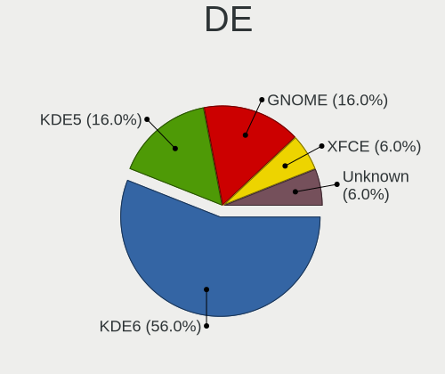
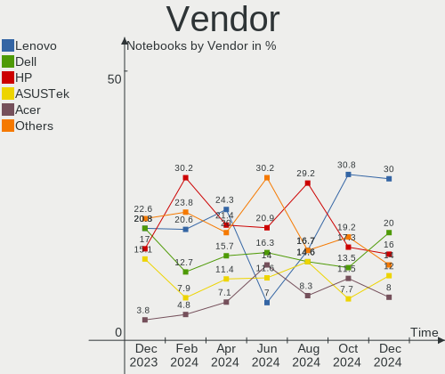
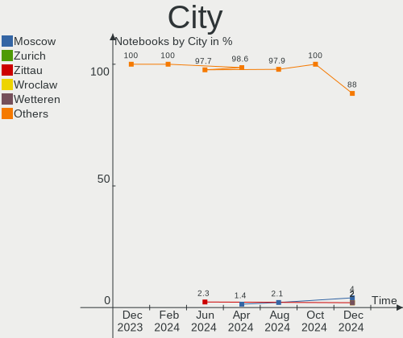
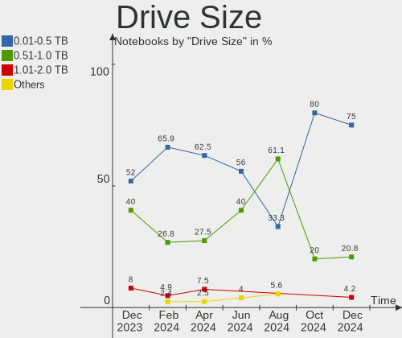
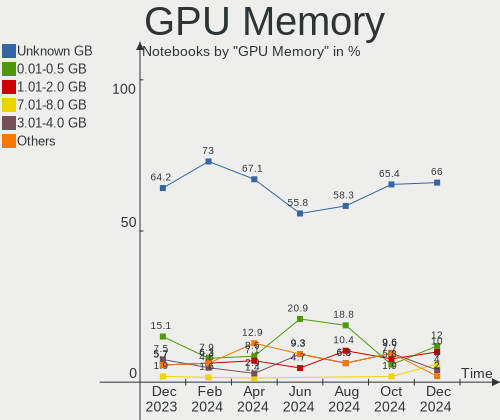
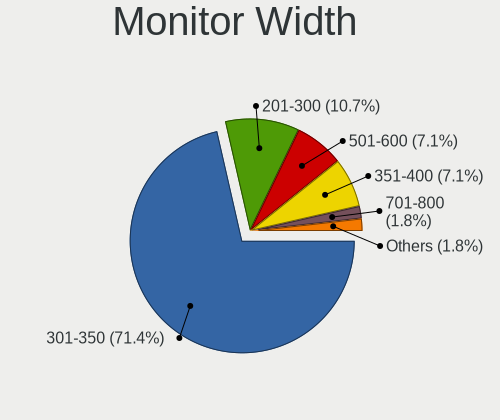
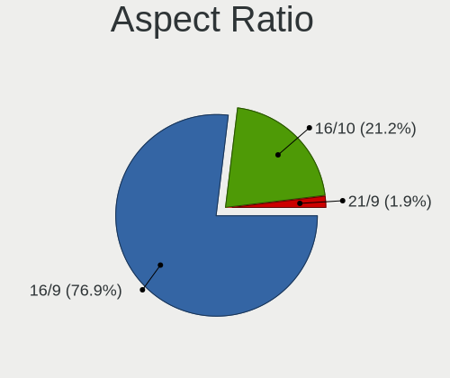

openSUSE Hardware Trends (Notebooks)
------------------------------------

A project to identify most popular hardware characteristics and track their change
over time based on data collected by openSUSE users at https://Linux-Hardware.org.

Anyone can contribute to this report by the [hw-probe](https://github.com/linuxhw/hw-probe) tool:

    sudo -E hw-probe -all -upload

Full-feature report is available here: https://linux-hardware.org/?view=trends

Period: Nov, 2021.

Contents
--------

* [ System ](#system)
  - [ OS                       ](#os)
  - [ OS Family                ](#os-family)
  - [ Kernel                   ](#kernel)
  - [ Kernel Family            ](#kernel-family)
  - [ Kernel Major Ver.        ](#kernel-major-ver)
  - [ Arch                     ](#arch)
  - [ DE                       ](#de)
  - [ Display Server           ](#display-server)
  - [ Display Manager          ](#display-manager)
  - [ OS Lang                  ](#os-lang)
  - [ Boot Mode                ](#boot-mode)
  - [ Filesystem               ](#filesystem)
  - [ Part. scheme             ](#part-scheme)
  - [ Dual Boot with Linux/BSD ](#dual-boot-with-linuxbsd)
  - [ Dual Boot (Win)          ](#dual-boot-win)

* [ Board ](#board)
  - [ Vendor                   ](#vendor)
  - [ Model                    ](#model)
  - [ Model Family             ](#model-family)
  - [ MFG Year                 ](#mfg-year)
  - [ Form Factor              ](#form-factor)
  - [ Secure Boot              ](#secure-boot)
  - [ Coreboot                 ](#coreboot)
  - [ RAM Size                 ](#ram-size)
  - [ RAM Used                 ](#ram-used)
  - [ Total Drives             ](#total-drives)
  - [ Has CD-ROM               ](#has-cd-rom)
  - [ Has Ethernet             ](#has-ethernet)
  - [ Has WiFi                 ](#has-wifi)
  - [ Has Bluetooth            ](#has-bluetooth)

* [ Location ](#location)
  - [ Country                  ](#country)
  - [ City                     ](#city)

* [ Drives ](#drives)
  - [ Drive Vendor             ](#drive-vendor)
  - [ Drive Model              ](#drive-model)
  - [ HDD Vendor               ](#hdd-vendor)
  - [ SSD Vendor               ](#ssd-vendor)
  - [ Drive Kind               ](#drive-kind)
  - [ Drive Connector          ](#drive-connector)
  - [ Drive Size               ](#drive-size)
  - [ Space Total              ](#space-total)
  - [ Space Used               ](#space-used)
  - [ Malfunc. Drives          ](#malfunc-drives)
  - [ Malfunc. Drive Vendor    ](#malfunc-drive-vendor)
  - [ Malfunc. HDD Vendor      ](#malfunc-hdd-vendor)
  - [ Malfunc. Drive Kind      ](#malfunc-drive-kind)
  - [ Failed Drives            ](#failed-drives)
  - [ Failed Drive Vendor      ](#failed-drive-vendor)
  - [ Drive Status             ](#drive-status)

* [ Storage controller ](#storage-controller)
  - [ Storage Vendor           ](#storage-vendor)
  - [ Storage Model            ](#storage-model)
  - [ Storage Kind             ](#storage-kind)

* [ Processor ](#processor)
  - [ CPU Vendor               ](#cpu-vendor)
  - [ CPU Model                ](#cpu-model)
  - [ CPU Model Family         ](#cpu-model-family)
  - [ CPU Cores                ](#cpu-cores)
  - [ CPU Sockets              ](#cpu-sockets)
  - [ CPU Threads              ](#cpu-threads)
  - [ CPU Op-Modes             ](#cpu-op-modes)
  - [ CPU Microcode            ](#cpu-microcode)
  - [ CPU Microarch            ](#cpu-microarch)

* [ Graphics ](#graphics)
  - [ GPU Vendor               ](#gpu-vendor)
  - [ GPU Model                ](#gpu-model)
  - [ GPU Combo                ](#gpu-combo)
  - [ GPU Driver               ](#gpu-driver)
  - [ GPU Memory               ](#gpu-memory)

* [ Monitor ](#monitor)
  - [ Monitor Vendor           ](#monitor-vendor)
  - [ Monitor Model            ](#monitor-model)
  - [ Monitor Resolution       ](#monitor-resolution)
  - [ Monitor Diagonal         ](#monitor-diagonal)
  - [ Monitor Width            ](#monitor-width)
  - [ Aspect Ratio             ](#aspect-ratio)
  - [ Monitor Area             ](#monitor-area)
  - [ Pixel Density            ](#pixel-density)
  - [ Multiple Monitors        ](#multiple-monitors)

* [ Network ](#network)
  - [ Net Controller Vendor    ](#net-controller-vendor)
  - [ Net Controller Model     ](#net-controller-model)
  - [ Wireless Vendor          ](#wireless-vendor)
  - [ Wireless Model           ](#wireless-model)
  - [ Ethernet Vendor          ](#ethernet-vendor)
  - [ Ethernet Model           ](#ethernet-model)
  - [ Net Controller Kind      ](#net-controller-kind)
  - [ Used Controller          ](#used-controller)
  - [ NICs                     ](#nics)
  - [ IPv6                     ](#ipv6)

* [ Bluetooth ](#bluetooth)
  - [ Bluetooth Vendor         ](#bluetooth-vendor)
  - [ Bluetooth Model          ](#bluetooth-model)

* [ Sound ](#sound)
  - [ Sound Vendor             ](#sound-vendor)
  - [ Sound Model              ](#sound-model)

* [ Memory ](#memory)
  - [ Memory Vendor            ](#memory-vendor)
  - [ Memory Model             ](#memory-model)
  - [ Memory Kind              ](#memory-kind)
  - [ Memory Form Factor       ](#memory-form-factor)
  - [ Memory Size              ](#memory-size)
  - [ Memory Speed             ](#memory-speed)

* [ Printers & scanners ](#printers--scanners)
  - [ Printer Vendor           ](#printer-vendor)
  - [ Printer Model            ](#printer-model)
  - [ Scanner Vendor           ](#scanner-vendor)
  - [ Scanner Model            ](#scanner-model)

* [ Camera ](#camera)
  - [ Camera Vendor            ](#camera-vendor)
  - [ Camera Model             ](#camera-model)

* [ Security ](#security)
  - [ Fingerprint Vendor       ](#fingerprint-vendor)
  - [ Fingerprint Model        ](#fingerprint-model)
  - [ Chipcard Vendor          ](#chipcard-vendor)
  - [ Chipcard Model           ](#chipcard-model)

* [ Unsupported ](#unsupported)
  - [ Unsupported Devices      ](#unsupported-devices)
  - [ Unsupported Device Types ](#unsupported-device-types)

System
------

OS
--

Installed operating systems

| Name                         | Notebooks | Percent |
|------------------------------|-----------|---------|
| openSUSE Leap-15.3           | 6         | 19.35%  |
| openSUSE 20211124            | 4         | 12.9%   |
| openSUSE Leap-15.2           | 3         | 9.68%   |
| openSUSE 20211107            | 3         | 9.68%   |
| openSUSE 20211110            | 2         | 6.45%   |
| openSUSE Tumbleweed-20211127 | 1         | 3.23%   |
| openSUSE Tumbleweed-20211118 | 1         | 3.23%   |
| openSUSE Tumbleweed-20211110 | 1         | 3.23%   |
| openSUSE Microos-20210321    | 1         | 3.23%   |
| openSUSE 20211128            | 1         | 3.23%   |
| openSUSE 20211126            | 1         | 3.23%   |
| openSUSE 20211123            | 1         | 3.23%   |
| openSUSE 20211122            | 1         | 3.23%   |
| openSUSE 20211106            | 1         | 3.23%   |
| openSUSE 20211104            | 1         | 3.23%   |
| openSUSE 20211102            | 1         | 3.23%   |
| openSUSE 20211101            | 1         | 3.23%   |
| openSUSE 20211012            | 1         | 3.23%   |

OS Family
---------

OS without a version

| Name     | Notebooks | Percent |
|----------|-----------|---------|
| openSUSE | 31        | 100%    |

Kernel
------

Version of the Linux kernel

| Version                             | Notebooks | Percent |
|-------------------------------------|-----------|---------|
| 5.15.3-1-default                    | 7         | 22.58%  |
| 5.14.14-1-default                   | 6         | 19.35%  |
| 5.3.18-59.27-default                | 3         | 9.68%   |
| 5.14.14-2-default                   | 3         | 9.68%   |
| 5.3.18-lp152.102-default            | 2         | 6.45%   |
| 5.14.9-1-default                    | 2         | 6.45%   |
| 5.8.12-1-default                    | 1         | 3.23%   |
| 5.3.18-lp152.102-preempt            | 1         | 3.23%   |
| 5.3.18-59.34-preempt                | 1         | 3.23%   |
| 5.3.18-59.34-default                | 1         | 3.23%   |
| 5.16.0-rc2-lp153.2.g696d453-default | 1         | 3.23%   |
| 5.16.0-rc2-1.g696d453-default       | 1         | 3.23%   |
| 5.15.2-1-default                    | 1         | 3.23%   |
| 5.11.6-1-default                    | 1         | 3.23%   |

Kernel Family
-------------

Linux kernel without a distro release

| Version | Notebooks | Percent |
|---------|-----------|---------|
| 5.14.14 | 9         | 29.03%  |
| 5.3.18  | 8         | 25.81%  |
| 5.15.3  | 7         | 22.58%  |
| 5.16.0  | 2         | 6.45%   |
| 5.14.9  | 2         | 6.45%   |
| 5.8.12  | 1         | 3.23%   |
| 5.15.2  | 1         | 3.23%   |
| 5.11.6  | 1         | 3.23%   |

Kernel Major Ver.
-----------------

Linux kernel major version

| Version | Notebooks | Percent |
|---------|-----------|---------|
| 5.14    | 11        | 35.48%  |
| 5.3     | 8         | 25.81%  |
| 5.15    | 8         | 25.81%  |
| 5.16    | 2         | 6.45%   |
| 5.8     | 1         | 3.23%   |
| 5.11    | 1         | 3.23%   |

Arch
----

OS architecture (x86_64, i586, etc.)

| Name   | Notebooks | Percent |
|--------|-----------|---------|
| x86_64 | 31        | 100%    |

DE
--

Desktop Environment

| Name       | Notebooks | Percent |
|------------|-----------|---------|
| KDE5       | 20        | 64.52%  |
| GNOME      | 6         | 19.35%  |
| X-Cinnamon | 2         | 6.45%   |
| XFCE       | 1         | 3.23%   |
| MATE       | 1         | 3.23%   |
| KDE        | 1         | 3.23%   |

Display Server
--------------

X11 or Wayland

| Name    | Notebooks | Percent |
|---------|-----------|---------|
| X11     | 22        | 70.97%  |
| Wayland | 9         | 29.03%  |

Display Manager
---------------

SDDM, LightDM, etc.

| Name    | Notebooks | Percent |
|---------|-----------|---------|
| SDDM    | 9         | 29.03%  |
| LightDM | 9         | 29.03%  |
| Unknown | 8         | 25.81%  |
| XDM     | 5         | 16.13%  |

OS Lang
-------

Language

| Lang  | Notebooks | Percent |
|-------|-----------|---------|
| de_DE | 9         | 29.03%  |
| en_US | 6         | 19.35%  |
| POSIX | 3         | 9.68%   |
| ru_RU | 2         | 6.45%   |
| pt_BR | 2         | 6.45%   |
| fr_FR | 2         | 6.45%   |
| es_ES | 2         | 6.45%   |
| zh_CN | 1         | 3.23%   |
| pl_PL | 1         | 3.23%   |
| it_IT | 1         | 3.23%   |
| en_GB | 1         | 3.23%   |
| cs_CZ | 1         | 3.23%   |

Boot Mode
---------

EFI or BIOS

| Mode | Notebooks | Percent |
|------|-----------|---------|
| EFI  | 21        | 67.74%  |
| BIOS | 10        | 32.26%  |

Filesystem
----------

Type of filesystem

| Type  | Notebooks | Percent |
|-------|-----------|---------|
| Btrfs | 25        | 80.65%  |
| Ext4  | 5         | 16.13%  |
| Xfs   | 1         | 3.23%   |

Part. scheme
------------

Scheme of partitioning

| Type    | Notebooks | Percent |
|---------|-----------|---------|
| GPT     | 19        | 61.29%  |
| Unknown | 8         | 25.81%  |
| MBR     | 4         | 12.9%   |

Dual Boot with Linux/BSD
------------------------

Hosting more than one Linux/BSD

| Dual boot | Notebooks | Percent |
|-----------|-----------|---------|
| No        | 28        | 90.32%  |
| Yes       | 3         | 9.68%   |

Dual Boot (Win)
---------------

Hosting Linux and Windows

| Dual boot | Notebooks | Percent |
|-----------|-----------|---------|
| No        | 21        | 67.74%  |
| Yes       | 10        | 32.26%  |

Board
-----

Vendor
------

Motherboard manufacturer

| Name                | Notebooks | Percent |
|---------------------|-----------|---------|
| Lenovo              | 11        | 35.48%  |
| Hewlett-Packard     | 5         | 16.13%  |
| Dell                | 5         | 16.13%  |
| Samsung Electronics | 2         | 6.45%   |
| HUAWEI              | 2         | 6.45%   |
| Acer                | 2         | 6.45%   |
| Toshiba             | 1         | 3.23%   |
| MSI                 | 1         | 3.23%   |
| Fujitsu             | 1         | 3.23%   |
| Apple               | 1         | 3.23%   |

Model
-----

Motherboard model

| Name                                     | Notebooks | Percent |
|------------------------------------------|-----------|---------|
| Toshiba Satellite C660                   | 1         | 3.23%   |
| Samsung 550XDA                           | 1         | 3.23%   |
| Samsung 355V4C/356V4C/3445VC/3545VC      | 1         | 3.23%   |
| MSI CX61 0OC/CX61 0OD/CX61 0OL           | 1         | 3.23%   |
| Lenovo Yoga 14sARH 2021 82LB             | 1         | 3.23%   |
| Lenovo ThinkPad X1 Carbon 4th 20FQ0041MS | 1         | 3.23%   |
| Lenovo ThinkPad T490s 20NYS1XK00         | 1         | 3.23%   |
| Lenovo ThinkPad Edge E430 3254TJY        | 1         | 3.23%   |
| Lenovo ThinkPad E495 20NES01600          | 1         | 3.23%   |
| Lenovo IdeaPad S340-15IML 81NA           | 1         | 3.23%   |
| Lenovo IdeaPad Gaming 3 15ARH05 82EY     | 1         | 3.23%   |
| Lenovo IdeaPad 330-15IKB 81DC            | 1         | 3.23%   |
| Lenovo IdeaPad 320-15IKB 80XL            | 1         | 3.23%   |
| Lenovo IdeaPad 3 17ADA05 81W2            | 1         | 3.23%   |
| Lenovo G50-45 80E3                       | 1         | 3.23%   |
| HUAWEI KPL-W0X                           | 1         | 3.23%   |
| HUAWEI KLVL-WXX9                         | 1         | 3.23%   |
| HP ZBook Fury 15 G7 Mobile Workstation   | 1         | 3.23%   |
| HP Pavilion dv6                          | 1         | 3.23%   |
| HP OMEN by Laptop                        | 1         | 3.23%   |
| HP EliteBook 8460p                       | 1         | 3.23%   |
| HP EliteBook 840 G7 Notebook PC          | 1         | 3.23%   |
| Fujitsu LIFEBOOK E782                    | 1         | 3.23%   |
| Dell Vostro 5471                         | 1         | 3.23%   |
| Dell Precision M4800                     | 1         | 3.23%   |
| Dell Precision 7530                      | 1         | 3.23%   |
| Dell Latitude E5440                      | 1         | 3.23%   |
| Dell G3 3590                             | 1         | 3.23%   |
| Apple MacBookPro9,2                      | 1         | 3.23%   |
| Acer Aspire E1-772G                      | 1         | 3.23%   |
| Acer Aspire 5820TG                       | 1         | 3.23%   |

Model Family
------------

Motherboard model prefix

| Name              | Notebooks | Percent |
|-------------------|-----------|---------|
| Lenovo IdeaPad    | 5         | 16.13%  |
| Lenovo ThinkPad   | 4         | 12.9%   |
| HP EliteBook      | 2         | 6.45%   |
| Dell Precision    | 2         | 6.45%   |
| Acer Aspire       | 2         | 6.45%   |
| Toshiba Satellite | 1         | 3.23%   |
| Samsung 550XDA    | 1         | 3.23%   |
| Samsung 355V4C    | 1         | 3.23%   |
| MSI CX61          | 1         | 3.23%   |
| Lenovo Yoga       | 1         | 3.23%   |
| Lenovo G50-45     | 1         | 3.23%   |
| HUAWEI KPL-W0X    | 1         | 3.23%   |
| HUAWEI KLVL-WXX9  | 1         | 3.23%   |
| HP ZBook          | 1         | 3.23%   |
| HP Pavilion       | 1         | 3.23%   |
| HP OMEN           | 1         | 3.23%   |
| Fujitsu LIFEBOOK  | 1         | 3.23%   |
| Dell Vostro       | 1         | 3.23%   |
| Dell Latitude     | 1         | 3.23%   |
| Dell G3           | 1         | 3.23%   |
| Apple MacBookPro9 | 1         | 3.23%   |

MFG Year
--------

Motherboard manufacture year

| Year | Notebooks | Percent |
|------|-----------|---------|
| 2021 | 8         | 25.81%  |
| 2020 | 5         | 16.13%  |
| 2019 | 5         | 16.13%  |
| 2013 | 4         | 12.9%   |
| 2017 | 2         | 6.45%   |
| 2016 | 2         | 6.45%   |
| 2018 | 1         | 3.23%   |
| 2015 | 1         | 3.23%   |
| 2011 | 1         | 3.23%   |
| 2010 | 1         | 3.23%   |
| 2009 | 1         | 3.23%   |

Form Factor
-----------

Physical design of the computer

| Name     | Notebooks | Percent |
|----------|-----------|---------|
| Notebook | 31        | 100%    |

Secure Boot
-----------

Enabled or disabled

| State    | Notebooks | Percent |
|----------|-----------|---------|
| Disabled | 22        | 70.97%  |
| Enabled  | 9         | 29.03%  |

Coreboot
--------

Have coreboot on board

| Used | Notebooks | Percent |
|------|-----------|---------|
| No   | 31        | 100%    |

RAM Size
--------

Total RAM memory

| Size in GB  | Notebooks | Percent |
|-------------|-----------|---------|
| 4.01-8.0    | 12        | 38.71%  |
| 3.01-4.0    | 6         | 19.35%  |
| 8.01-16.0   | 6         | 19.35%  |
| 32.01-64.0  | 3         | 9.68%   |
| 16.01-24.0  | 2         | 6.45%   |
| 64.01-256.0 | 1         | 3.23%   |
| 1.01-2.0    | 1         | 3.23%   |

RAM Used
--------

Used RAM memory

| Used GB    | Notebooks | Percent |
|------------|-----------|---------|
| 4.01-8.0   | 8         | 25.81%  |
| 3.01-4.0   | 7         | 22.58%  |
| 2.01-3.0   | 6         | 19.35%  |
| 1.01-2.0   | 5         | 16.13%  |
| 0.51-1.0   | 3         | 9.68%   |
| 16.01-24.0 | 1         | 3.23%   |
| 8.01-16.0  | 1         | 3.23%   |

Total Drives
------------

Number of drives on board

| Drives | Notebooks | Percent |
|--------|-----------|---------|
| 1      | 22        | 70.97%  |
| 2      | 9         | 29.03%  |

Has CD-ROM
----------

Has CD-ROM on board

| Presented | Notebooks | Percent |
|-----------|-----------|---------|
| No        | 19        | 61.29%  |
| Yes       | 12        | 38.71%  |

Has Ethernet
------------

Has Ethernet on board

| Presented | Notebooks | Percent |
|-----------|-----------|---------|
| Yes       | 24        | 77.42%  |
| No        | 7         | 22.58%  |

Has WiFi
--------

Has WiFi module

| Presented | Notebooks | Percent |
|-----------|-----------|---------|
| Yes       | 31        | 100%    |

Has Bluetooth
-------------

Has Bluetooth module

| Presented | Notebooks | Percent |
|-----------|-----------|---------|
| Yes       | 26        | 83.87%  |
| No        | 5         | 16.13%  |

Location
--------

Country
-------

Geographic location (country)

| Country   | Notebooks | Percent |
|-----------|-----------|---------|
| Germany   | 9         | 29.03%  |
| USA       | 3         | 9.68%   |
| Brazil    | 3         | 9.68%   |
| Russia    | 2         | 6.45%   |
| France    | 2         | 6.45%   |
| Sweden    | 1         | 3.23%   |
| Spain     | 1         | 3.23%   |
| Portugal  | 1         | 3.23%   |
| Peru      | 1         | 3.23%   |
| Mexico    | 1         | 3.23%   |
| India     | 1         | 3.23%   |
| Finland   | 1         | 3.23%   |
| Czechia   | 1         | 3.23%   |
| China     | 1         | 3.23%   |
| Belgium   | 1         | 3.23%   |
| Australia | 1         | 3.23%   |
| Argentina | 1         | 3.23%   |

City
----

Geographic location (city)

| City                 | Notebooks | Percent |
|----------------------|-----------|---------|
| Vila do Conde        | 1         | 3.23%   |
| Tlalnepantla         | 1         | 3.23%   |
| Staffanstorp         | 1         | 3.23%   |
| Somerville           | 1         | 3.23%   |
| Sehnde               | 1         | 3.23%   |
| Schaarbeek           | 1         | 3.23%   |
| Sao Joaquim da Barra | 1         | 3.23%   |
| Rockville            | 1         | 3.23%   |
| Rio de Janeiro       | 1         | 3.23%   |
| Rendsburg            | 1         | 3.23%   |
| Petrozavodsk         | 1         | 3.23%   |
| Muecke               | 1         | 3.23%   |
| Moscow               | 1         | 3.23%   |
| Moonee Ponds         | 1         | 3.23%   |
| Mari??nsk?© L??zn?›  | 1         | 3.23%   |
| Madrid               | 1         | 3.23%   |
| Las Vegas            | 1         | 3.23%   |
| Kehl                 | 1         | 3.23%   |
| Flensburg            | 1         | 3.23%   |
| Espoo                | 1         | 3.23%   |
| Eppertshausen        | 1         | 3.23%   |
| Dunkirk              | 1         | 3.23%   |
| Dresden              | 1         | 3.23%   |
| Cusco                | 1         | 3.23%   |
| Curitiba             | 1         | 3.23%   |
| Chaumont-en-Vexin    | 1         | 3.23%   |
| Buenos Aires         | 1         | 3.23%   |
| Bremen               | 1         | 3.23%   |
| Berlin               | 1         | 3.23%   |
| Bengaluru            | 1         | 3.23%   |
| Baiyun               | 1         | 3.23%   |

Drives
------

Drive Vendor
------------

Hard drive vendors

| Vendor                  | Notebooks | Drives | Percent |
|-------------------------|-----------|--------|---------|
| WDC                     | 8         | 8      | 20.51%  |
| Seagate                 | 6         | 6      | 15.38%  |
| Samsung Electronics     | 4         | 4      | 10.26%  |
| Crucial                 | 3         | 3      | 7.69%   |
| XPG                     | 2         | 2      | 5.13%   |
| SK Hynix                | 2         | 2      | 5.13%   |
| Kingston                | 2         | 2      | 5.13%   |
| HGST                    | 2         | 2      | 5.13%   |
| A-DATA Technology       | 2         | 2      | 5.13%   |
| Union Memory (Shenzhen) | 1         | 1      | 2.56%   |
| Transcend               | 1         | 1      | 2.56%   |
| Toshiba                 | 1         | 1      | 2.56%   |
| SanDisk                 | 1         | 1      | 2.56%   |
| Phison                  | 1         | 1      | 2.56%   |
| LITEON                  | 1         | 1      | 2.56%   |
| KIOXIA                  | 1         | 1      | 2.56%   |
| Intel                   | 1         | 1      | 2.56%   |

Drive Model
-----------

Hard drive models

| Model                                        | Notebooks | Percent |
|----------------------------------------------|-----------|---------|
| Seagate ST1000LM048-2E7172 1TB               | 2         | 5.13%   |
| XPG NVMe SSD Drive 512GB                     | 1         | 2.56%   |
| XPG GAMMIX S11 Pro 1TB                       | 1         | 2.56%   |
| WDC WDS500G2B0C-00PXH0 500GB                 | 1         | 2.56%   |
| WDC WDS500G2B0A-00SM50 500GB SSD             | 1         | 2.56%   |
| WDC WDS100T2B0A-00SM50 1TB SSD               | 1         | 2.56%   |
| WDC WD10SPZX-75Z10T1 1TB                     | 1         | 2.56%   |
| WDC WD10SPZX-35Z10T0 1TB                     | 1         | 2.56%   |
| WDC WD10SPZX-24Z10T0 1TB                     | 1         | 2.56%   |
| WDC WD10SPZX-24Z10 1TB                       | 1         | 2.56%   |
| WDC WD10SPSX-60A6WT0 1TB                     | 1         | 2.56%   |
| Union Memory (Shenzhen) NVMe SSD Drive 256GB | 1         | 2.56%   |
| Transcend TS128GSSD340 128GB                 | 1         | 2.56%   |
| Toshiba THNSN51T02DU7 NVMe 1024GB            | 1         | 2.56%   |
| SK Hynix SKHynix_HFS512GD9TNI-L2A0B 512GB    | 1         | 2.56%   |
| SK Hynix SKHynix_HFM256GDHTNI-87A0B 256GB    | 1         | 2.56%   |
| Seagate ST9320325AS 320GB                    | 1         | 2.56%   |
| Seagate ST500LM000-SSHD-8GB                  | 1         | 2.56%   |
| Seagate ST2000LX001-1RG174 2TB               | 1         | 2.56%   |
| Seagate ST1000LM035-1RK172 1TB               | 1         | 2.56%   |
| SanDisk Ultra II 480GB SSD                   | 1         | 2.56%   |
| Samsung SSD 860 EVO 1TB                      | 1         | 2.56%   |
| Samsung NVMe SSD Drive 1TB                   | 1         | 2.56%   |
| Samsung MZVLB256HBHQ-000L2 256GB             | 1         | 2.56%   |
| Samsung MZVLB1T0HBLR-000H1 1TB               | 1         | 2.56%   |
| Phison 311CD0512GB                           | 1         | 2.56%   |
| LITEON CV8-8E128-11 SATA 128GB SSD           | 1         | 2.56%   |
| KIOXIA KXG6AZNV512G 512GB                    | 1         | 2.56%   |
| Kingston SV300S37A480G 480GB SSD             | 1         | 2.56%   |
| Kingston SMS200S3240G 240GB SSD              | 1         | 2.56%   |
| Intel SSDSA2M080G2LE 80GB                    | 1         | 2.56%   |
| HGST HTS725050A7E630 500GB                   | 1         | 2.56%   |
| HGST HTS721010A9E630 1TB                     | 1         | 2.56%   |
| Crucial CT500MX500SSD4 500GB                 | 1         | 2.56%   |
| Crucial CT500MX500SSD1 500GB                 | 1         | 2.56%   |
| Crucial CT1000MX500SSD4 1TB                  | 1         | 2.56%   |
| A-DATA SX8200PNP 512GB                       | 1         | 2.56%   |
| A-DATA SU650 120GB SSD                       | 1         | 2.56%   |

HDD Vendor
----------

Hard disk drive vendors

| Vendor  | Notebooks | Drives | Percent |
|---------|-----------|--------|---------|
| Seagate | 6         | 6      | 46.15%  |
| WDC     | 5         | 5      | 38.46%  |
| HGST    | 2         | 2      | 15.38%  |

SSD Vendor
----------

Solid state drive vendors

| Vendor              | Notebooks | Drives | Percent |
|---------------------|-----------|--------|---------|
| Crucial             | 3         | 3      | 23.08%  |
| WDC                 | 2         | 2      | 15.38%  |
| Kingston            | 2         | 2      | 15.38%  |
| Transcend           | 1         | 1      | 7.69%   |
| SanDisk             | 1         | 1      | 7.69%   |
| Samsung Electronics | 1         | 1      | 7.69%   |
| LITEON              | 1         | 1      | 7.69%   |
| Intel               | 1         | 1      | 7.69%   |
| A-DATA Technology   | 1         | 1      | 7.69%   |

Drive Kind
----------

HDD or SSD

| Kind | Notebooks | Drives | Percent |
|------|-----------|--------|---------|
| SSD  | 13        | 13     | 35.14%  |
| HDD  | 13        | 13     | 35.14%  |
| NVMe | 11        | 13     | 29.73%  |

Drive Connector
---------------

SATA, SAS, NVMe, etc.

| Type | Notebooks | Drives | Percent |
|------|-----------|--------|---------|
| SATA | 23        | 26     | 67.65%  |
| NVMe | 11        | 13     | 32.35%  |

Drive Size
----------

Size of hard drive

| Size in TB | Notebooks | Drives | Percent |
|------------|-----------|--------|---------|
| 0.01-0.5   | 13        | 13     | 50%     |
| 0.51-1.0   | 12        | 12     | 46.15%  |
| 1.01-2.0   | 1         | 1      | 3.85%   |

Space Total
-----------

Amount of disk space available on the file system

| Size in GB     | Notebooks | Percent |
|----------------|-----------|---------|
| More than 3000 | 8         | 25.81%  |
| 1001-2000      | 8         | 25.81%  |
| 501-1000       | 7         | 22.58%  |
| 2001-3000      | 4         | 12.9%   |
| 251-500        | 3         | 9.68%   |
| 101-250        | 1         | 3.23%   |

Space Used
----------

Amount of used disk space

| Used GB   | Notebooks | Percent |
|-----------|-----------|---------|
| 251-500   | 9         | 29.03%  |
| 101-250   | 6         | 19.35%  |
| 501-1000  | 6         | 19.35%  |
| 1001-2000 | 5         | 16.13%  |
| 2001-3000 | 2         | 6.45%   |
| 51-100    | 2         | 6.45%   |
| 21-50     | 1         | 3.23%   |

Malfunc. Drives
---------------

Drive models with a malfunction

| Model                           | Notebooks | Drives | Percent |
|---------------------------------|-----------|--------|---------|
| Seagate ST500LM000-SSHD-8GB     | 1         | 1      | 20%     |
| Phison 311CD0512GB              | 1         | 1      | 20%     |
| Kingston SMS200S3240G 240GB SSD | 1         | 1      | 20%     |
| HGST HTS725050A7E630 500GB      | 1         | 1      | 20%     |
| HGST HTS721010A9E630 1TB        | 1         | 1      | 20%     |

Malfunc. Drive Vendor
---------------------

Vendors of faulty drives

| Vendor   | Notebooks | Drives | Percent |
|----------|-----------|--------|---------|
| HGST     | 2         | 2      | 40%     |
| Seagate  | 1         | 1      | 20%     |
| Phison   | 1         | 1      | 20%     |
| Kingston | 1         | 1      | 20%     |

Malfunc. HDD Vendor
-------------------

Vendors of faulty HDD drives

| Vendor  | Notebooks | Drives | Percent |
|---------|-----------|--------|---------|
| HGST    | 2         | 2      | 66.67%  |
| Seagate | 1         | 1      | 33.33%  |

Malfunc. Drive Kind
-------------------

Kinds of faulty drives

| Kind | Notebooks | Drives | Percent |
|------|-----------|--------|---------|
| HDD  | 3         | 3      | 60%     |
| NVMe | 1         | 1      | 20%     |
| SSD  | 1         | 1      | 20%     |

Failed Drives
-------------

Failed drive models

Zero info for selected period =(

Failed Drive Vendor
-------------------

Failed drive vendors

Zero info for selected period =(

Drive Status
------------

Number of failed and malfunc. drives

| Status   | Notebooks | Drives | Percent |
|----------|-----------|--------|---------|
| Works    | 20        | 25     | 58.82%  |
| Detected | 9         | 9      | 26.47%  |
| Malfunc  | 5         | 5      | 14.71%  |

Storage controller
------------------

Storage Vendor
--------------

Storage controller vendors

| Vendor                       | Notebooks | Percent |
|------------------------------|-----------|---------|
| Intel                        | 21        | 56.76%  |
| AMD                          | 4         | 10.81%  |
| Samsung Electronics          | 3         | 8.11%   |
| Toshiba America Info Systems | 2         | 5.41%   |
| SK Hynix                     | 2         | 5.41%   |
| ADATA Technology             | 2         | 5.41%   |
| Union Memory (Shenzhen)      | 1         | 2.7%    |
| Sandisk                      | 1         | 2.7%    |
| Phison Electronics           | 1         | 2.7%    |

Storage Model
-------------

Storage controller models

| Model                                                                          | Notebooks | Percent |
|--------------------------------------------------------------------------------|-----------|---------|
| Intel 7 Series Chipset Family 6-port SATA Controller [AHCI mode]               | 4         | 10.53%  |
| AMD FCH SATA Controller [AHCI mode]                                            | 4         | 10.53%  |
| Intel Sunrise Point-LP SATA Controller [AHCI mode]                             | 3         | 7.89%   |
| Samsung NVMe SSD Controller SM981/PM981/PM983                                  | 2         | 5.26%   |
| Intel 82801 Mobile SATA Controller [RAID mode]                                 | 2         | 5.26%   |
| Intel 8 Series/C220 Series Chipset Family 6-port SATA Controller 1 [AHCI mode] | 2         | 5.26%   |
| Intel 6 Series/C200 Series Chipset Family 6 port Mobile SATA AHCI Controller   | 2         | 5.26%   |
| ADATA XPG SX8200 Pro PCIe Gen3x4 M.2 2280 Solid State Drive                    | 2         | 5.26%   |
| Union Memory (Shenzhen) Non-Volatile memory controller                         | 1         | 2.63%   |
| Toshiba America Info Systems XG6 NVMe SSD Controller                           | 1         | 2.63%   |
| Toshiba America Info Systems NVMe Controller                                   | 1         | 2.63%   |
| SK Hynix Non-Volatile memory controller                                        | 1         | 2.63%   |
| SK Hynix BC511                                                                 | 1         | 2.63%   |
| Sandisk WD Blue SN550 NVMe SSD                                                 | 1         | 2.63%   |
| Samsung NVMe SSD Controller 980                                                | 1         | 2.63%   |
| Phison PS5013 E13 NVMe Controller                                              | 1         | 2.63%   |
| Intel Tiger Lake-LP SATA Controller [AHCI mode]                                | 1         | 2.63%   |
| Intel HM170/QM170 Chipset SATA Controller [AHCI Mode]                          | 1         | 2.63%   |
| Intel Comet Lake SATA AHCI Controller                                          | 1         | 2.63%   |
| Intel Cannon Lake Mobile PCH SATA AHCI Controller                              | 1         | 2.63%   |
| Intel 82801IBM/IEM (ICH9M/ICH9M-E) 4 port SATA Controller [AHCI mode]          | 1         | 2.63%   |
| Intel 8 Series SATA Controller 1 [AHCI mode]                                   | 1         | 2.63%   |
| Intel 7 Series/C210 Series Chipset Family IDE-r Controller                     | 1         | 2.63%   |
| Intel 5 Series/3400 Series Chipset 4 port SATA AHCI Controller                 | 1         | 2.63%   |
| Intel 400 Series Chipset Family SATA AHCI Controller                           | 1         | 2.63%   |

Storage Kind
------------

Kind of storage controller (IDE, SATA, NVMe, SAS, ...)

| Kind | Notebooks | Percent |
|------|-----------|---------|
| SATA | 23        | 62.16%  |
| NVMe | 11        | 29.73%  |
| RAID | 2         | 5.41%   |
| IDE  | 1         | 2.7%    |

Processor
---------

CPU Vendor
----------

Processor vendors

| Vendor | Notebooks | Percent |
|--------|-----------|---------|
| Intel  | 23        | 74.19%  |
| AMD    | 8         | 25.81%  |

CPU Model
---------

Processor models

| Model                                         | Notebooks | Percent |
|-----------------------------------------------|-----------|---------|
| Intel Core i5-7200U CPU @ 2.50GHz             | 2         | 6.45%   |
| Intel Core i5-3210M CPU @ 2.50GHz             | 2         | 6.45%   |
| AMD Ryzen 7 4800H with Radeon Graphics        | 2         | 6.45%   |
| Intel Xeon W-10885M CPU @ 2.40GHz             | 1         | 3.23%   |
| Intel Xeon E-2186M CPU @ 2.90GHz              | 1         | 3.23%   |
| Intel Core i7-6700HQ CPU @ 2.60GHz            | 1         | 3.23%   |
| Intel Core i7-6500U CPU @ 2.50GHz             | 1         | 3.23%   |
| Intel Core i7-4810MQ CPU @ 2.80GHz            | 1         | 3.23%   |
| Intel Core i7-3520M CPU @ 2.90GHz             | 1         | 3.23%   |
| Intel Core i7-10510U CPU @ 1.80GHz            | 1         | 3.23%   |
| Intel Core i5-9300H CPU @ 2.40GHz             | 1         | 3.23%   |
| Intel Core i5-8365U CPU @ 1.60GHz             | 1         | 3.23%   |
| Intel Core i5-8250U CPU @ 1.60GHz             | 1         | 3.23%   |
| Intel Core i5-4200M CPU @ 2.50GHz             | 1         | 3.23%   |
| Intel Core i5-3230M CPU @ 2.60GHz             | 1         | 3.23%   |
| Intel Core i5-2520M CPU @ 2.50GHz             | 1         | 3.23%   |
| Intel Core i5-2410M CPU @ 2.30GHz             | 1         | 3.23%   |
| Intel Core i5-10310U CPU @ 1.70GHz            | 1         | 3.23%   |
| Intel Core i5 CPU M 460 @ 2.53GHz             | 1         | 3.23%   |
| Intel Core i3-4030U CPU @ 1.90GHz             | 1         | 3.23%   |
| Intel Core 2 Duo CPU P7450 @ 2.13GHz          | 1         | 3.23%   |
| Intel 11th Gen Core i3-1115G4 @ 3.00GHz       | 1         | 3.23%   |
| AMD Ryzen 5 4600H with Radeon Graphics        | 1         | 3.23%   |
| AMD Ryzen 5 3500U with Radeon Vega Mobile Gfx | 1         | 3.23%   |
| AMD Ryzen 5 2500U with Radeon Vega Mobile Gfx | 1         | 3.23%   |
| AMD E2-1800 APU with Radeon HD Graphics       | 1         | 3.23%   |
| AMD Athlon Silver 3050U with Radeon Graphics  | 1         | 3.23%   |
| AMD A6-6310 APU with AMD Radeon R4 Graphics   | 1         | 3.23%   |

CPU Model Family
----------------

Processor model prefix

| Model            | Notebooks | Percent |
|------------------|-----------|---------|
| Intel Core i5    | 13        | 41.94%  |
| Intel Core i7    | 5         | 16.13%  |
| AMD Ryzen 5      | 3         | 9.68%   |
| Intel Xeon       | 2         | 6.45%   |
| AMD Ryzen 7      | 2         | 6.45%   |
| Other            | 1         | 3.23%   |
| Intel Core i3    | 1         | 3.23%   |
| Intel Core 2 Duo | 1         | 3.23%   |
| AMD E2           | 1         | 3.23%   |
| AMD Athlon       | 1         | 3.23%   |
| AMD A6           | 1         | 3.23%   |

CPU Cores
---------

Number of processor cores

| Number | Notebooks | Percent |
|--------|-----------|---------|
| 2      | 15        | 48.39%  |
| 4      | 10        | 32.26%  |
| 8      | 3         | 9.68%   |
| 6      | 2         | 6.45%   |
| 1      | 1         | 3.23%   |

CPU Sockets
-----------

Number of sockets

| Number | Notebooks | Percent |
|--------|-----------|---------|
| 1      | 31        | 100%    |

CPU Threads
-----------

Threads per core (Hyper-Threading)

| Number | Notebooks | Percent |
|--------|-----------|---------|
| 2      | 24        | 77.42%  |
| 1      | 6         | 19.35%  |
| 4      | 1         | 3.23%   |

CPU Op-Modes
------------

CPU Operation Modes (32-bit, 64-bit)

| Op mode        | Notebooks | Percent |
|----------------|-----------|---------|
| 32-bit, 64-bit | 31        | 100%    |

CPU Microcode
-------------

Microcode number

| Number     | Notebooks | Percent |
|------------|-----------|---------|
| 0x306a9    | 4         | 12.9%   |
| Unknown    | 3         | 9.68%   |
| 0x906ea    | 2         | 6.45%   |
| 0x806ec    | 2         | 6.45%   |
| 0x806e9    | 2         | 6.45%   |
| 0x306c3    | 2         | 6.45%   |
| 0x08600106 | 2         | 6.45%   |
| 0xa0652    | 1         | 3.23%   |
| 0x806ea    | 1         | 3.23%   |
| 0x806c1    | 1         | 3.23%   |
| 0x506e3    | 1         | 3.23%   |
| 0x406e3    | 1         | 3.23%   |
| 0x40651    | 1         | 3.23%   |
| 0x206a7    | 1         | 3.23%   |
| 0x10676    | 1         | 3.23%   |
| 0x08600104 | 1         | 3.23%   |
| 0x08108109 | 1         | 3.23%   |
| 0x08108102 | 1         | 3.23%   |
| 0x08101007 | 1         | 3.23%   |
| 0x07030105 | 1         | 3.23%   |
| 0x05000119 | 1         | 3.23%   |

CPU Microarch
-------------

Microarchitecture

| Name        | Notebooks | Percent |
|-------------|-----------|---------|
| KabyLake    | 8         | 25.81%  |
| IvyBridge   | 4         | 12.9%   |
| Zen 2       | 3         | 9.68%   |
| Haswell     | 3         | 9.68%   |
| Zen+        | 2         | 6.45%   |
| Skylake     | 2         | 6.45%   |
| SandyBridge | 2         | 6.45%   |
| Zen         | 1         | 3.23%   |
| Westmere    | 1         | 3.23%   |
| TigerLake   | 1         | 3.23%   |
| Puma        | 1         | 3.23%   |
| Penryn      | 1         | 3.23%   |
| CometLake   | 1         | 3.23%   |
| Bobcat      | 1         | 3.23%   |

Graphics
--------

GPU Vendor
----------

Vendors of graphics cards

| Vendor | Notebooks | Percent |
|--------|-----------|---------|
| Intel  | 20        | 46.51%  |
| AMD    | 12        | 27.91%  |
| Nvidia | 11        | 25.58%  |

GPU Model
---------

Graphics card models

| Model                                                                                 | Notebooks | Percent |
|---------------------------------------------------------------------------------------|-----------|---------|
| Intel 3rd Gen Core processor Graphics Controller                                      | 4         | 9.3%    |
| AMD Renoir                                                                            | 3         | 6.98%   |
| Intel HD Graphics 620                                                                 | 2         | 4.65%   |
| Intel CometLake-U GT2 [UHD Graphics]                                                  | 2         | 4.65%   |
| AMD Topaz XT [Radeon R7 M260/M265 / M340/M360 / M440/M445 / 530/535 / 620/625 Mobile] | 2         | 4.65%   |
| AMD Picasso/Raven 2 [Radeon Vega Series / Radeon Vega Mobile Series]                  | 2         | 4.65%   |
| Nvidia TU117M [GeForce GTX 1650 Mobile / Max-Q]                                       | 1         | 2.33%   |
| Nvidia TU117M                                                                         | 1         | 2.33%   |
| Nvidia TU104GLM [Quadro RTX 5000 Mobile / Max-Q]                                      | 1         | 2.33%   |
| Nvidia GT218M [GeForce 315M]                                                          | 1         | 2.33%   |
| Nvidia GP108M [GeForce MX230]                                                         | 1         | 2.33%   |
| Nvidia GP104GLM [Quadro P3200 Mobile]                                                 | 1         | 2.33%   |
| Nvidia GM206M [GeForce GTX 965M]                                                      | 1         | 2.33%   |
| Nvidia GM108M [GeForce 920MX]                                                         | 1         | 2.33%   |
| Nvidia GK208M [GeForce GT 730M]                                                       | 1         | 2.33%   |
| Nvidia GK106GLM [Quadro K2100M]                                                       | 1         | 2.33%   |
| Nvidia GF117M [GeForce 610M/710M/810M/820M / GT 620M/625M/630M/720M]                  | 1         | 2.33%   |
| Intel WhiskeyLake-U GT2 [UHD Graphics 620]                                            | 1         | 2.33%   |
| Intel UHD Graphics 620                                                                | 1         | 2.33%   |
| Intel Tiger Lake UHD Graphics                                                         | 1         | 2.33%   |
| Intel Skylake GT2 [HD Graphics 520]                                                   | 1         | 2.33%   |
| Intel HD Graphics 530                                                                 | 1         | 2.33%   |
| Intel Haswell-ULT Integrated Graphics Controller                                      | 1         | 2.33%   |
| Intel Core Processor Integrated Graphics Controller                                   | 1         | 2.33%   |
| Intel Comet Lake-H WS GT2 Integrated UHD Graphics Controller                          | 1         | 2.33%   |
| Intel CoffeeLake-H GT2 [UHD Graphics 630]                                             | 1         | 2.33%   |
| Intel Coffee Lake UHD Graphics P630                                                   | 1         | 2.33%   |
| Intel 4th Gen Core Processor Integrated Graphics Controller                           | 1         | 2.33%   |
| Intel 2nd Generation Core Processor Family Integrated Graphics Controller             | 1         | 2.33%   |
| AMD Seymour [Radeon HD 6400M/7400M Series]                                            | 1         | 2.33%   |
| AMD RV730/M96 [Mobility Radeon HD 4650/5165]                                          | 1         | 2.33%   |
| AMD Raven Ridge [Radeon Vega Series / Radeon Vega Mobile Series]                      | 1         | 2.33%   |
| AMD Mullins [Radeon R4/R5 Graphics]                                                   | 1         | 2.33%   |
| AMD Madison [Mobility Radeon HD 5650/5750 / 6530M/6550M]                              | 1         | 2.33%   |

GPU Combo
---------

Combinations of graphics cards

| Name           | Notebooks | Percent |
|----------------|-----------|---------|
| 1 x Intel      | 9         | 29.03%  |
| Intel + Nvidia | 8         | 25.81%  |
| 1 x AMD        | 8         | 25.81%  |
| Intel + AMD    | 3         | 9.68%   |
| 1 x Nvidia     | 2         | 6.45%   |
| AMD + Nvidia   | 1         | 3.23%   |

GPU Driver
----------

Free vs proprietary

| Driver      | Notebooks | Percent |
|-------------|-----------|---------|
| Free        | 26        | 83.87%  |
| Proprietary | 5         | 16.13%  |

GPU Memory
----------

Total video memory

| Size in GB | Notebooks | Percent |
|------------|-----------|---------|
| Unknown    | 15        | 48.39%  |
| 1.01-2.0   | 6         | 19.35%  |
| 0.51-1.0   | 4         | 12.9%   |
| 0.01-0.5   | 4         | 12.9%   |
| 3.01-4.0   | 2         | 6.45%   |

Monitor
-------

Monitor Vendor
--------------

Monitor vendors

| Vendor              | Notebooks | Percent |
|---------------------|-----------|---------|
| Chimei Innolux      | 7         | 18.92%  |
| BOE                 | 6         | 16.22%  |
| Samsung Electronics | 5         | 13.51%  |
| AU Optronics        | 4         | 10.81%  |
| LG Display          | 3         | 8.11%   |
| ___                 | 1         | 2.7%    |
| Unknown             | 1         | 2.7%    |
| Sharp               | 1         | 2.7%    |
| Philips             | 1         | 2.7%    |
| Panasonic           | 1         | 2.7%    |
| Lenovo              | 1         | 2.7%    |
| InfoVision          | 1         | 2.7%    |
| Iiyama              | 1         | 2.7%    |
| Hewlett-Packard     | 1         | 2.7%    |
| Dell                | 1         | 2.7%    |
| CSO                 | 1         | 2.7%    |
| Apple               | 1         | 2.7%    |

Monitor Model
-------------

Monitor models

| Model                                                                                 | Notebooks | Percent |
|---------------------------------------------------------------------------------------|-----------|---------|
| Chimei Innolux LCD Monitor CMN15D5 1920x1080 340x190mm 15.3-inch                      | 2         | 5.13%   |
| BOE LCD Monitor BOE0812 1920x1080 344x194mm 15.5-inch                                 | 2         | 5.13%   |
| ___ Monitor ranges (GTF): 48-62Hz V, 14-68kHz H, max dotclock 150MHz ___9000 1440x900 | 1         | 2.56%   |
| Unknown LCD TV 9000 1360x768 1600x900mm 72.3-inch                                     | 1         | 2.56%   |
| Sharp LCD Monitor SHP1430 3840x2160 350x190mm 15.7-inch                               | 1         | 2.56%   |
| Samsung Electronics U28E590 SAM0C4E 3840x2160 608x345mm 27.5-inch                     | 1         | 2.56%   |
| Samsung Electronics SyncMaster SAM0025 1152x864 267x200mm 13.1-inch                   | 1         | 2.56%   |
| Samsung Electronics LCD Monitor SEC5541 1366x768 344x193mm 15.5-inch                  | 1         | 2.56%   |
| Samsung Electronics LCD Monitor SEC364C 1366x768 309x174mm 14.0-inch                  | 1         | 2.56%   |
| Samsung Electronics LCD Monitor SEC3641 1366x768 353x198mm 15.9-inch                  | 1         | 2.56%   |
| Samsung Electronics LCD Monitor SAM7016 3840x2160 950x540mm 43.0-inch                 | 1         | 2.56%   |
| Philips PHL 243V5 PHLC0D1 1920x1080 521x293mm 23.5-inch                               | 1         | 2.56%   |
| Panasonic VVX13F009G00 MEI96A2 1920x1080 290x170mm 13.2-inch                          | 1         | 2.56%   |
| LG Display LCD Monitor LGD06B8 1920x1080 344x194mm 15.5-inch                          | 1         | 2.56%   |
| LG Display LCD Monitor LGD05F2 1920x1080 344x194mm 15.5-inch                          | 1         | 2.56%   |
| LG Display LCD Monitor LGD038E 1366x768 340x190mm 15.3-inch                           | 1         | 2.56%   |
| Lenovo LCD Monitor LEN40B1 1600x900 344x194mm 15.5-inch                               | 1         | 2.56%   |
| InfoVision LCD Monitor IVO3D40 1920x1080 344x194mm 15.5-inch                          | 1         | 2.56%   |
| Iiyama PL2492H IVM612F 1920x1080 530x300mm 24.0-inch                                  | 1         | 2.56%   |
| Hewlett-Packard E243i HPN3463 1920x1200 518x324mm 24.1-inch                           | 1         | 2.56%   |
| Hewlett-Packard E243i HPN3462 1920x1200 518x324mm 24.1-inch                           | 1         | 2.56%   |
| Dell P2715Q DEL40BD 3840x2160 597x336mm 27.0-inch                                     | 1         | 2.56%   |
| CSO LCD Monitor CSO1402 2880x1800 302x188mm 14.0-inch                                 | 1         | 2.56%   |
| Chimei Innolux LCD Monitor CMN1735 1920x1080 382x215mm 17.3-inch                      | 1         | 2.56%   |
| Chimei Innolux LCD Monitor CMN15B7 1366x768 340x190mm 15.3-inch                       | 1         | 2.56%   |
| Chimei Innolux LCD Monitor CMN14F5 1920x1080 309x173mm 13.9-inch                      | 1         | 2.56%   |
| Chimei Innolux LCD Monitor CMN14D4 1920x1080 309x173mm 13.9-inch                      | 1         | 2.56%   |
| Chimei Innolux LCD Monitor CMN14C3 1366x768 309x173mm 13.9-inch                       | 1         | 2.56%   |
| BOE LCD Monitor BOE08E4 1600x900 382x215mm 17.3-inch                                  | 1         | 2.56%   |
| BOE LCD Monitor BOE08BF 1920x1080 309x174mm 14.0-inch                                 | 1         | 2.56%   |
| BOE LCD Monitor BOE0893 2160x1440 296x197mm 14.0-inch                                 | 1         | 2.56%   |
| BOE LCD Monitor BOE05F6 1366x768 309x173mm 13.9-inch                                  | 1         | 2.56%   |
| AU Optronics LCD Monitor AUO423D 1920x1080 309x173mm 13.9-inch                        | 1         | 2.56%   |
| AU Optronics LCD Monitor AUO40EC 1366x768 340x190mm 15.3-inch                         | 1         | 2.56%   |
| AU Optronics LCD Monitor AUO313C 1366x768 310x170mm 13.9-inch                         | 1         | 2.56%   |
| AU Optronics LCD Monitor AUO109D 1920x1080 381x214mm 17.2-inch                        | 1         | 2.56%   |
| Apple LCD Monitor APP9CC5 1280x800 286x179mm 13.3-inch                                | 1         | 2.56%   |

Monitor Resolution
------------------

Monitor screen resolution

| Resolution       | Notebooks | Percent |
|------------------|-----------|---------|
| 1920x1080 (FHD)  | 13        | 39.39%  |
| 1366x768 (WXGA)  | 9         | 27.27%  |
| 3840x2160 (4K)   | 3         | 9.09%   |
| 1600x900 (HD+)   | 2         | 6.06%   |
| 2880x1800        | 1         | 3.03%   |
| 2160x1440        | 1         | 3.03%   |
| 1440x900 (WXGA+) | 1         | 3.03%   |
| 1360x768         | 1         | 3.03%   |
| 1280x800 (WXGA)  | 1         | 3.03%   |
| 1152x864         | 1         | 3.03%   |

Monitor Diagonal
----------------

Diagonal size in inches

| Inches  | Notebooks | Percent |
|---------|-----------|---------|
| 15      | 14        | 37.84%  |
| 13      | 7         | 18.92%  |
| 17      | 4         | 10.81%  |
| 14      | 4         | 10.81%  |
| 27      | 2         | 5.41%   |
| 24      | 2         | 5.41%   |
| 84      | 1         | 2.7%    |
| 72      | 1         | 2.7%    |
| 23      | 1         | 2.7%    |
| Unknown | 1         | 2.7%    |

Monitor Width
-------------

Physical width

| Width in mm | Notebooks | Percent |
|-------------|-----------|---------|
| 301-350     | 22        | 57.89%  |
| 351-400     | 5         | 13.16%  |
| 501-600     | 4         | 10.53%  |
| 201-300     | 3         | 7.89%   |
| 1501-2000   | 2         | 5.26%   |
| 601-700     | 1         | 2.63%   |
| Unknown     | 1         | 2.63%   |

Aspect Ratio
------------

Proportional relationship between the width and the height

| Ratio | Notebooks | Percent |
|-------|-----------|---------|
| 16/9  | 27        | 84.38%  |
| 16/10 | 3         | 9.38%   |
| 4/3   | 1         | 3.13%   |
| 3/2   | 1         | 3.13%   |

Monitor Area
------------

Area in inch²

| Area in inch² | Notebooks | Percent |
|----------------|-----------|---------|
| 101-110        | 14        | 36.84%  |
| 81-90          | 11        | 28.95%  |
| 121-130        | 4         | 10.53%  |
| More than 1000 | 2         | 5.26%   |
| 301-350        | 2         | 5.26%   |
| 201-250        | 2         | 5.26%   |
| 251-300        | 1         | 2.63%   |
| 91-100         | 1         | 2.63%   |
| Unknown        | 1         | 2.63%   |

Pixel Density
-------------

Pixels per inch

| Density       | Notebooks | Percent |
|---------------|-----------|---------|
| 121-160       | 13        | 36.11%  |
| 101-120       | 11        | 30.56%  |
| 51-100        | 5         | 13.89%  |
| More than 240 | 3         | 8.33%   |
| 161-240       | 2         | 5.56%   |
| 1-50          | 1         | 2.78%   |
| Unknown       | 1         | 2.78%   |

Multiple Monitors
-----------------

Total monitors connected

| Total | Notebooks | Percent |
|-------|-----------|---------|
| 1     | 24        | 77.42%  |
| 2     | 6         | 19.35%  |
| 3     | 1         | 3.23%   |

Network
-------

Net Controller Vendor
---------------------

Controller vendors

| Vendor                          | Notebooks | Percent |
|---------------------------------|-----------|---------|
| Intel                           | 16        | 33.33%  |
| Realtek Semiconductor           | 13        | 27.08%  |
| Qualcomm Atheros                | 9         | 18.75%  |
| Broadcom                        | 3         | 6.25%   |
| Broadcom Limited                | 2         | 4.17%   |
| Sierra Wireless                 | 1         | 2.08%   |
| Qualcomm Atheros Communications | 1         | 2.08%   |
| MediaTek                        | 1         | 2.08%   |
| Linksys                         | 1         | 2.08%   |
| Lenovo                          | 1         | 2.08%   |

Net Controller Model
--------------------

Controller models

| Model                                                             | Notebooks | Percent |
|-------------------------------------------------------------------|-----------|---------|
| Realtek RTL8111/8168/8411 PCI Express Gigabit Ethernet Controller | 12        | 20%     |
| Qualcomm Atheros QCA9377 802.11ac Wireless Network Adapter        | 4         | 6.67%   |
| Realtek RTL8822CE 802.11ac PCIe Wireless Network Adapter          | 2         | 3.33%   |
| Intel Wi-Fi 6 AX200                                               | 2         | 3.33%   |
| Intel Centrino Advanced-N 6205 [Taylor Peak]                      | 2         | 3.33%   |
| Intel 82579LM Gigabit Network Connection (Lewisville)             | 2         | 3.33%   |
| Sierra Wireless EM7455                                            | 1         | 1.67%   |
| Realtek RTL8822BE 802.11a/b/g/n/ac WiFi adapter                   | 1         | 1.67%   |
| Realtek RTL8723BE PCIe Wireless Network Adapter                   | 1         | 1.67%   |
| Realtek RTL8188FTV 802.11b/g/n 1T1R 2.4G WLAN Adapter             | 1         | 1.67%   |
| Qualcomm Atheros QCA9565 / AR9565 Wireless Network Adapter        | 1         | 1.67%   |
| Qualcomm Atheros QCA6174 802.11ac Wireless Network Adapter        | 1         | 1.67%   |
| Qualcomm Atheros AR9271 802.11n                                   | 1         | 1.67%   |
| Qualcomm Atheros AR9485 Wireless Network Adapter                  | 1         | 1.67%   |
| Qualcomm Atheros AR9285 Wireless Network Adapter (PCI-Express)    | 1         | 1.67%   |
| Qualcomm Atheros AR8151 v1.0 Gigabit Ethernet                     | 1         | 1.67%   |
| MediaTek REVVL V+ 5G                                              | 1         | 1.67%   |
| Linksys WUSB54GC v1 802.11g Adapter [Ralink RT73]                 | 1         | 1.67%   |
| Lenovo ThinkPad TBT 3 Dock                                        | 1         | 1.67%   |
| Intel Wireless-AC 9260                                            | 1         | 1.67%   |
| Intel Wireless 8265 / 8275                                        | 1         | 1.67%   |
| Intel Wireless 8260                                               | 1         | 1.67%   |
| Intel Wireless 7265                                               | 1         | 1.67%   |
| Intel Wireless 3160                                               | 1         | 1.67%   |
| Intel Wi-Fi 6 AX201                                               | 1         | 1.67%   |
| Intel PRO/Wireless 5100 AGN [Shiloh] Network Connection           | 1         | 1.67%   |
| Intel Ethernet Connection I219-V                                  | 1         | 1.67%   |
| Intel Ethernet Connection I218-LM                                 | 1         | 1.67%   |
| Intel Ethernet Connection I217-LM                                 | 1         | 1.67%   |
| Intel Ethernet Connection (7) I219-LM                             | 1         | 1.67%   |
| Intel Ethernet Connection (6) I219-LM                             | 1         | 1.67%   |
| Intel Ethernet Connection (10) I219-LM                            | 1         | 1.67%   |
| Intel Comet Lake PCH-LP CNVi WiFi                                 | 1         | 1.67%   |
| Intel Comet Lake PCH CNVi WiFi                                    | 1         | 1.67%   |
| Intel Centrino Wireless-N 135                                     | 1         | 1.67%   |
| Intel Cannon Point-LP CNVi [Wireless-AC]                          | 1         | 1.67%   |
| Broadcom NetXtreme BCM57765 Gigabit Ethernet PCIe                 | 1         | 1.67%   |
| Broadcom Limited NetLink BCM57780 Gigabit Ethernet PCIe           | 1         | 1.67%   |
| Broadcom Limited BCM4352 802.11ac Wireless Network Adapter        | 1         | 1.67%   |
| Broadcom BCM4331 802.11a/b/g/n                                    | 1         | 1.67%   |
| Broadcom BCM43225 802.11b/g/n                                     | 1         | 1.67%   |
| Broadcom BCM4313 802.11bgn Wireless Network Adapter               | 1         | 1.67%   |

Wireless Vendor
---------------

Wireless vendors

| Vendor                          | Notebooks | Percent |
|---------------------------------|-----------|---------|
| Intel                           | 15        | 42.86%  |
| Qualcomm Atheros                | 8         | 22.86%  |
| Realtek Semiconductor           | 5         | 14.29%  |
| Broadcom                        | 3         | 8.57%   |
| Sierra Wireless                 | 1         | 2.86%   |
| Qualcomm Atheros Communications | 1         | 2.86%   |
| Linksys                         | 1         | 2.86%   |
| Broadcom Limited                | 1         | 2.86%   |

Wireless Model
--------------

Wireless models

| Model                                                          | Notebooks | Percent |
|----------------------------------------------------------------|-----------|---------|
| Qualcomm Atheros QCA9377 802.11ac Wireless Network Adapter     | 4         | 11.43%  |
| Realtek RTL8822CE 802.11ac PCIe Wireless Network Adapter       | 2         | 5.71%   |
| Intel Wi-Fi 6 AX200                                            | 2         | 5.71%   |
| Intel Centrino Advanced-N 6205 [Taylor Peak]                   | 2         | 5.71%   |
| Sierra Wireless EM7455                                         | 1         | 2.86%   |
| Realtek RTL8822BE 802.11a/b/g/n/ac WiFi adapter                | 1         | 2.86%   |
| Realtek RTL8723BE PCIe Wireless Network Adapter                | 1         | 2.86%   |
| Realtek RTL8188FTV 802.11b/g/n 1T1R 2.4G WLAN Adapter          | 1         | 2.86%   |
| Qualcomm Atheros QCA9565 / AR9565 Wireless Network Adapter     | 1         | 2.86%   |
| Qualcomm Atheros QCA6174 802.11ac Wireless Network Adapter     | 1         | 2.86%   |
| Qualcomm Atheros AR9271 802.11n                                | 1         | 2.86%   |
| Qualcomm Atheros AR9485 Wireless Network Adapter               | 1         | 2.86%   |
| Qualcomm Atheros AR9285 Wireless Network Adapter (PCI-Express) | 1         | 2.86%   |
| Linksys WUSB54GC v1 802.11g Adapter [Ralink RT73]              | 1         | 2.86%   |
| Intel Wireless-AC 9260                                         | 1         | 2.86%   |
| Intel Wireless 8265 / 8275                                     | 1         | 2.86%   |
| Intel Wireless 8260                                            | 1         | 2.86%   |
| Intel Wireless 7265                                            | 1         | 2.86%   |
| Intel Wireless 3160                                            | 1         | 2.86%   |
| Intel Wi-Fi 6 AX201                                            | 1         | 2.86%   |
| Intel PRO/Wireless 5100 AGN [Shiloh] Network Connection        | 1         | 2.86%   |
| Intel Comet Lake PCH-LP CNVi WiFi                              | 1         | 2.86%   |
| Intel Comet Lake PCH CNVi WiFi                                 | 1         | 2.86%   |
| Intel Centrino Wireless-N 135                                  | 1         | 2.86%   |
| Intel Cannon Point-LP CNVi [Wireless-AC]                       | 1         | 2.86%   |
| Broadcom Limited BCM4352 802.11ac Wireless Network Adapter     | 1         | 2.86%   |
| Broadcom BCM4331 802.11a/b/g/n                                 | 1         | 2.86%   |
| Broadcom BCM43225 802.11b/g/n                                  | 1         | 2.86%   |
| Broadcom BCM4313 802.11bgn Wireless Network Adapter            | 1         | 2.86%   |

Ethernet Vendor
---------------

Ethernet vendors

| Vendor                | Notebooks | Percent |
|-----------------------|-----------|---------|
| Realtek Semiconductor | 12        | 48%     |
| Intel                 | 8         | 32%     |
| Qualcomm Atheros      | 1         | 4%      |
| MediaTek              | 1         | 4%      |
| Lenovo                | 1         | 4%      |
| Broadcom Limited      | 1         | 4%      |
| Broadcom              | 1         | 4%      |

Ethernet Model
--------------

Ethernet models

| Model                                                             | Notebooks | Percent |
|-------------------------------------------------------------------|-----------|---------|
| Realtek RTL8111/8168/8411 PCI Express Gigabit Ethernet Controller | 12        | 48%     |
| Intel 82579LM Gigabit Network Connection (Lewisville)             | 2         | 8%      |
| Qualcomm Atheros AR8151 v1.0 Gigabit Ethernet                     | 1         | 4%      |
| MediaTek REVVL V+ 5G                                              | 1         | 4%      |
| Lenovo ThinkPad TBT 3 Dock                                        | 1         | 4%      |
| Intel Ethernet Connection I219-V                                  | 1         | 4%      |
| Intel Ethernet Connection I218-LM                                 | 1         | 4%      |
| Intel Ethernet Connection I217-LM                                 | 1         | 4%      |
| Intel Ethernet Connection (7) I219-LM                             | 1         | 4%      |
| Intel Ethernet Connection (6) I219-LM                             | 1         | 4%      |
| Intel Ethernet Connection (10) I219-LM                            | 1         | 4%      |
| Broadcom NetXtreme BCM57765 Gigabit Ethernet PCIe                 | 1         | 4%      |
| Broadcom Limited NetLink BCM57780 Gigabit Ethernet PCIe           | 1         | 4%      |

Net Controller Kind
-------------------

Ethernet, WiFi or modem

| Kind     | Notebooks | Percent |
|----------|-----------|---------|
| WiFi     | 31        | 56.36%  |
| Ethernet | 24        | 43.64%  |

Used Controller
---------------

Currently used network controller

| Kind     | Notebooks | Percent |
|----------|-----------|---------|
| WiFi     | 29        | 59.18%  |
| Ethernet | 20        | 40.82%  |

NICs
----

Total network controllers on board

| Total | Notebooks | Percent |
|-------|-----------|---------|
| 2     | 23        | 74.19%  |
| 1     | 8         | 25.81%  |

IPv6
----

IPv6 vs IPv4

| Used | Notebooks | Percent |
|------|-----------|---------|
| No   | 22        | 70.97%  |
| Yes  | 9         | 29.03%  |

Bluetooth
---------

Bluetooth Vendor
----------------

Controller vendors

| Vendor                          | Notebooks | Percent |
|---------------------------------|-----------|---------|
| Intel                           | 10        | 38.46%  |
| Qualcomm Atheros Communications | 7         | 26.92%  |
| Realtek Semiconductor           | 3         | 11.54%  |
| Realtek                         | 1         | 3.85%   |
| Lite-On Technology              | 1         | 3.85%   |
| Hewlett-Packard                 | 1         | 3.85%   |
| Foxconn / Hon Hai               | 1         | 3.85%   |
| Broadcom                        | 1         | 3.85%   |
| Apple                           | 1         | 3.85%   |

Bluetooth Model
---------------

Controller models

| Model                                          | Notebooks | Percent |
|------------------------------------------------|-----------|---------|
| Qualcomm Atheros  Bluetooth Device             | 4         | 15.38%  |
| Intel Bluetooth wireless interface             | 4         | 15.38%  |
| Intel Bluetooth Device                         | 2         | 7.69%   |
| Intel AX200 Bluetooth                          | 2         | 7.69%   |
| Realtek RTL8822BE Bluetooth 4.2 Adapter        | 1         | 3.85%   |
| Realtek RTL8723B Bluetooth                     | 1         | 3.85%   |
| Realtek Bluetooth Radio                        | 1         | 3.85%   |
| Realtek Bluetooth Radio                        | 1         | 3.85%   |
| Qualcomm Atheros QCA61x4 Bluetooth 4.0         | 1         | 3.85%   |
| Qualcomm Atheros AR3012 Bluetooth 4.0          | 1         | 3.85%   |
| Qualcomm Atheros AR3011 Bluetooth              | 1         | 3.85%   |
| Lite-On Atheros AR3012 Bluetooth               | 1         | 3.85%   |
| Intel Wireless-AC 9260 Bluetooth Adapter       | 1         | 3.85%   |
| Intel Bluetooth 9460/9560 Jefferson Peak (JfP) | 1         | 3.85%   |
| HP Broadcom 2070 Bluetooth Combo               | 1         | 3.85%   |
| Foxconn / Hon Hai Acer Bluetooth module        | 1         | 3.85%   |
| Broadcom BCM20702A0                            | 1         | 3.85%   |
| Apple Bluetooth USB Host Controller            | 1         | 3.85%   |

Sound
-----

Sound Vendor
------------

Sound card vendors

| Vendor | Notebooks | Percent |
|--------|-----------|---------|
| Intel  | 23        | 62.16%  |
| AMD    | 10        | 27.03%  |
| Nvidia | 3         | 8.11%   |
| Lenovo | 1         | 2.7%    |

Sound Model
-----------

Sound card models

| Model                                                                             | Notebooks | Percent |
|-----------------------------------------------------------------------------------|-----------|---------|
| AMD Family 17h (Models 10h-1fh) HD Audio Controller                               | 5         | 11.11%  |
| Intel Sunrise Point-LP HD Audio                                                   | 4         | 8.89%   |
| Intel 7 Series/C216 Chipset Family High Definition Audio Controller               | 4         | 8.89%   |
| AMD Raven/Raven2/Fenghuang HDMI/DP Audio Controller                               | 3         | 6.67%   |
| Intel Comet Lake PCH-LP cAVS                                                      | 2         | 4.44%   |
| Intel Cannon Lake PCH cAVS                                                        | 2         | 4.44%   |
| Intel 8 Series/C220 Series Chipset High Definition Audio Controller               | 2         | 4.44%   |
| Intel 6 Series/C200 Series Chipset Family High Definition Audio Controller        | 2         | 4.44%   |
| AMD Renoir Radeon High Definition Audio Controller                                | 2         | 4.44%   |
| AMD FCH Azalia Controller                                                         | 2         | 4.44%   |
| Nvidia TU107 GeForce GTX 1650 High Definition Audio Controller                    | 1         | 2.22%   |
| Nvidia High Definition Audio Controller                                           | 1         | 2.22%   |
| Nvidia GK106 HDMI Audio Controller                                                | 1         | 2.22%   |
| Lenovo ThinkPad Thunderbolt 3 Dock USB Audio                                      | 1         | 2.22%   |
| Intel Xeon E3-1200 v3/4th Gen Core Processor HD Audio Controller                  | 1         | 2.22%   |
| Intel Tiger Lake-LP Smart Sound Technology Audio Controller                       | 1         | 2.22%   |
| Intel Haswell-ULT HD Audio Controller                                             | 1         | 2.22%   |
| Intel Comet Lake PCH cAVS                                                         | 1         | 2.22%   |
| Intel Cannon Point-LP High Definition Audio Controller                            | 1         | 2.22%   |
| Intel 82801I (ICH9 Family) HD Audio Controller                                    | 1         | 2.22%   |
| Intel 8 Series HD Audio Controller                                                | 1         | 2.22%   |
| Intel 5 Series/3400 Series Chipset High Definition Audio                          | 1         | 2.22%   |
| Intel 100 Series/C230 Series Chipset Family HD Audio Controller                   | 1         | 2.22%   |
| AMD RV710/730 HDMI Audio [Radeon HD 4000 series]                                  | 1         | 2.22%   |
| AMD Redwood HDMI Audio [Radeon HD 5000 Series]                                    | 1         | 2.22%   |
| AMD Kabini HDMI/DP Audio                                                          | 1         | 2.22%   |
| AMD Caicos HDMI Audio [Radeon HD 6450 / 7450/8450/8490 OEM / R5 230/235/235X OEM] | 1         | 2.22%   |

Memory
------

Memory Vendor
-------------

Memory module vendors

| Vendor              | Notebooks | Percent |
|---------------------|-----------|---------|
| Samsung Electronics | 9         | 30%     |
| Kingston            | 6         | 20%     |
| SK Hynix            | 4         | 13.33%  |
| Micron Technology   | 3         | 10%     |
| Ramaxel Technology  | 2         | 6.67%   |
| Unknown             | 1         | 3.33%   |
| Patriot             | 1         | 3.33%   |
| GOODRAM             | 1         | 3.33%   |
| G.Skill             | 1         | 3.33%   |
| Crucial             | 1         | 3.33%   |
| Corsair             | 1         | 3.33%   |

Memory Model
------------

Memory module models

| Model                                                          | Notebooks | Percent |
|----------------------------------------------------------------|-----------|---------|
| Samsung RAM M471A5244CB0-CTD 4GB SODIMM DDR4 3266MT/s          | 2         | 6.45%   |
| Unknown RAM Module 4GB SODIMM DDR4 2667MT/s                    | 1         | 3.23%   |
| SK Hynix RAM Module 4GB SODIMM DDR3 1600MT/s                   | 1         | 3.23%   |
| SK Hynix RAM HMT351S6CFR8C-PB 4GB SODIMM DDR3 1600MT/s         | 1         | 3.23%   |
| SK Hynix RAM HMAA1GS6CMR6N-XN 8GB Row Of Chips DDR4 3200MT/s   | 1         | 3.23%   |
| SK Hynix RAM HMA851S6AFR6N-UH 4096MB SODIMM DDR4 2667MT/s      | 1         | 3.23%   |
| Samsung RAM Module 16GB SODIMM DDR4 2667MT/s                   | 1         | 3.23%   |
| Samsung RAM M471A5244CB0-CRC 4GB SODIMM DDR4 2667MT/s          | 1         | 3.23%   |
| Samsung RAM M471A5143EB0-CPB 4GB SODIMM DDR4 2133MT/s          | 1         | 3.23%   |
| Samsung RAM M471A4G43MB1-CTD 32GB SODIMM DDR4 2667MT/s         | 1         | 3.23%   |
| Samsung RAM M471A1G44AB0-CWE 8192MB Row Of Chips DDR4 3200MT/s | 1         | 3.23%   |
| Samsung RAM M4 70T5663QZ3-CF7 2GB SODIMM DDR 2048MT/s          | 1         | 3.23%   |
| Samsung RAM K4E6E304EE-EGCF 4GB Chip LPDDR3 1867MT/s           | 1         | 3.23%   |
| Ramaxel RAM RMT3170ME68F9F1600 4GB SODIMM DDR3 1600MT/s        | 1         | 3.23%   |
| Ramaxel RAM RMSA3260ME78HAF-2666 8GB SODIMM DDR4 2667MT/s      | 1         | 3.23%   |
| Patriot RAM PSD34G1600L81S 4GB SODIMM DDR3 1600MT/s            | 1         | 3.23%   |
| Micron RAM MTA4ATF51264HZ-2G3B2 4GB Row Of Chips DDR4 2400MT/s | 1         | 3.23%   |
| Micron RAM 16KTF1G64HZ-1G6E1 8192MB SODIMM DDR3 1600MT/s       | 1         | 3.23%   |
| Micron RAM 16JSF51264HZ-1G4D1 4096MB SODIMM 1334MT/s           | 1         | 3.23%   |
| Kingston RAM Module 16GB SODIMM DDR4 2400MT/s                  | 1         | 3.23%   |
| Kingston RAM LV32D4S2S8HD-8 8192MB SODIMM DDR4 3200MT/s        | 1         | 3.23%   |
| Kingston RAM ACR16D3LS1KFG/8G 8192MB SODIMM DDR3 1600MT/s      | 1         | 3.23%   |
| Kingston RAM 99U5469-078.A00LF 4GB SODIMM DDR3 1600MT/s        | 1         | 3.23%   |
| Kingston RAM 9905711-035.A00G 8GB SODIMM DDR4 3200MT/s         | 1         | 3.23%   |
| Kingston RAM 9905428-123.A00LF 8192MB SODIMM DDR3 1600MT/s     | 1         | 3.23%   |
| Kingston RAM 9905428-086.A00LF 4GB SODIMM DDR3 1600MT/s        | 1         | 3.23%   |
| GOODRAM RAM IR2400S464L15S/8G 8192MB SODIMM DDR4 2133MT/s      | 1         | 3.23%   |
| G.Skill RAM F3-1600C9-4GSL 4GB SODIMM DDR3 1600MT/s            | 1         | 3.23%   |
| Crucial RAM CT51264BF160B.C16F 4GB SODIMM DDR3 1600MT/s        | 1         | 3.23%   |
| Corsair RAM CMSX8GX4M1A2666C18 8GB SODIMM DDR4 2667MT/s        | 1         | 3.23%   |

Memory Kind
-----------

Memory module kinds

| Kind   | Notebooks | Percent |
|--------|-----------|---------|
| DDR4   | 14        | 56%     |
| DDR3   | 8         | 32%     |
| SDRAM  | 1         | 4%      |
| LPDDR4 | 1         | 4%      |
| LPDDR3 | 1         | 4%      |

Memory Form Factor
------------------

Physical design of the memory module

| Name         | Notebooks | Percent |
|--------------|-----------|---------|
| SODIMM       | 20        | 83.33%  |
| Row Of Chips | 3         | 12.5%   |
| Chip         | 1         | 4.17%   |

Memory Size
-----------

Memory module size

| Size  | Notebooks | Percent |
|-------|-----------|---------|
| 4096  | 14        | 53.85%  |
| 8192  | 8         | 30.77%  |
| 16384 | 2         | 7.69%   |
| 32768 | 1         | 3.85%   |
| 2048  | 1         | 3.85%   |

Memory Speed
------------

Memory module speed

| Speed | Notebooks | Percent |
|-------|-----------|---------|
| 1600  | 8         | 29.63%  |
| 2667  | 7         | 25.93%  |
| 3200  | 3         | 11.11%  |
| 3266  | 2         | 7.41%   |
| 2400  | 2         | 7.41%   |
| 2133  | 2         | 7.41%   |
| 2048  | 1         | 3.7%    |
| 1867  | 1         | 3.7%    |
| 1334  | 1         | 3.7%    |

Printers & scanners
-------------------

Printer Vendor
--------------

Printer device vendors

Zero info for selected period =(

Printer Model
-------------

Printer device models

Zero info for selected period =(

Scanner Vendor
--------------

Scanner device vendors

Zero info for selected period =(

Scanner Model
-------------

Scanner device models

Zero info for selected period =(

Camera
------

Camera Vendor
-------------

Camera device vendors

| Vendor                                 | Notebooks | Percent |
|----------------------------------------|-----------|---------|
| Chicony Electronics                    | 6         | 21.43%  |
| IMC Networks                           | 4         | 14.29%  |
| Microdia                               | 3         | 10.71%  |
| Cheng Uei Precision Industry (Foxlink) | 3         | 10.71%  |
| Sunplus Innovation Technology          | 2         | 7.14%   |
| Realtek Semiconductor                  | 2         | 7.14%   |
| Acer                                   | 2         | 7.14%   |
| Syntek                                 | 1         | 3.57%   |
| Primax Electronics                     | 1         | 3.57%   |
| Luxvisions Innotech Limited            | 1         | 3.57%   |
| Logitech                               | 1         | 3.57%   |
| Apple                                  | 1         | 3.57%   |
| ALi                                    | 1         | 3.57%   |

Camera Model
------------

Camera device models

| Model                                                                      | Notebooks | Percent |
|----------------------------------------------------------------------------|-----------|---------|
| IMC Networks Integrated Camera                                             | 3         | 10.71%  |
| Chicony EasyCamera                                                         | 2         | 7.14%   |
| Syntek Integrated Camera                                                   | 1         | 3.57%   |
| Sunplus Integrated_Webcam_HD                                               | 1         | 3.57%   |
| Sunplus HD WebCam                                                          | 1         | 3.57%   |
| Realtek Lenovo EasyCamera                                                  | 1         | 3.57%   |
| Realtek Integrated_Webcam_HD                                               | 1         | 3.57%   |
| Primax HP HD Webcam [Fixed]                                                | 1         | 3.57%   |
| Microdia WebCam SC-13HDL12639P                                             | 1         | 3.57%   |
| Microdia Integrated_Webcam_HD                                              | 1         | 3.57%   |
| Microdia Integrated Webcam                                                 | 1         | 3.57%   |
| Luxvisions Innotech Limited HP HD Camera                                   | 1         | 3.57%   |
| Logitech Webcam C270                                                       | 1         | 3.57%   |
| IMC Networks imx188_azurewave(p)                                           | 1         | 3.57%   |
| Chicony ThinkPad T490 Webcam                                               | 1         | 3.57%   |
| Chicony Integrated Camera                                                  | 1         | 3.57%   |
| Chicony HP HD Camera                                                       | 1         | 3.57%   |
| Chicony CNF9055 Toshiba Webcam                                             | 1         | 3.57%   |
| Cheng Uei Precision Industry (Foxlink) VGA Camera                          | 1         | 3.57%   |
| Cheng Uei Precision Industry (Foxlink) HP Wide Vision HD integrated webcam | 1         | 3.57%   |
| Cheng Uei Precision Industry (Foxlink) HD Camera                           | 1         | 3.57%   |
| Apple FaceTime HD Camera                                                   | 1         | 3.57%   |
| ALi Gateway Webcam                                                         | 1         | 3.57%   |
| Acer Integrated Camera                                                     | 1         | 3.57%   |
| Acer HP Webcam                                                             | 1         | 3.57%   |

Security
--------

Fingerprint Vendor
------------------

Fingerprint sensor vendors

| Vendor                     | Notebooks | Percent |
|----------------------------|-----------|---------|
| Validity Sensors           | 3         | 37.5%   |
| Synaptics                  | 3         | 37.5%   |
| Upek                       | 1         | 12.5%   |
| Shenzhen Goodix Technology | 1         | 12.5%   |

Fingerprint Model
-----------------

Fingerprint sensor models

| Model                                                     | Notebooks | Percent |
|-----------------------------------------------------------|-----------|---------|
| Synaptics  FS7604 Touch Fingerprint Sensor with PurePrint | 2         | 25%     |
| Validity Sensors VFS7500 Touch Fingerprint Sensor         | 1         | 12.5%   |
| Validity Sensors VFS495 Fingerprint Reader                | 1         | 12.5%   |
| Validity Sensors VFS471 Fingerprint Reader                | 1         | 12.5%   |
| Upek Biometric Touchchip/Touchstrip Fingerprint Sensor    | 1         | 12.5%   |
| Synaptics Prometheus MIS Touch Fingerprint Reader         | 1         | 12.5%   |
| Shenzhen Goodix  Fingerprint Device                       | 1         | 12.5%   |

Chipcard Vendor
---------------

Chipcard module vendors

| Vendor      | Notebooks | Percent |
|-------------|-----------|---------|
| Broadcom    | 2         | 66.67%  |
| Alcor Micro | 1         | 33.33%  |

Chipcard Model
--------------

Chipcard module models

| Model                                          | Notebooks | Percent |
|------------------------------------------------|-----------|---------|
| Broadcom BCM5880 Secure Applications Processor | 1         | 33.33%  |
| Broadcom 5880                                  | 1         | 33.33%  |
| Alcor Micro AU9540 Smartcard Reader            | 1         | 33.33%  |

Unsupported
-----------

Unsupported Devices
-------------------

Total unsupported devices on board

| Total | Notebooks | Percent |
|-------|-----------|---------|
| 0     | 16        | 51.61%  |
| 1     | 13        | 41.94%  |
| 2     | 2         | 6.45%   |

Unsupported Device Types
------------------------

Types of unsupported devices

| Type                  | Notebooks | Percent |
|-----------------------|-----------|---------|
| Fingerprint reader    | 8         | 47.06%  |
| Graphics card         | 4         | 23.53%  |
| Chipcard              | 3         | 17.65%  |
| Net/wireless          | 1         | 5.88%   |
| Multimedia controller | 1         | 5.88%   |

