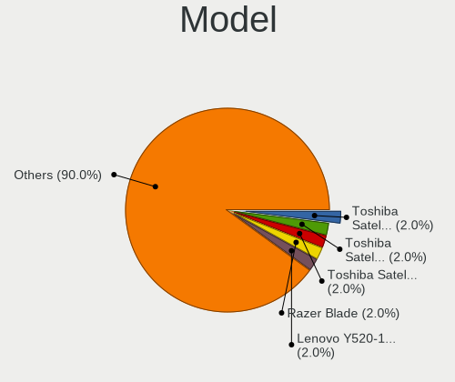
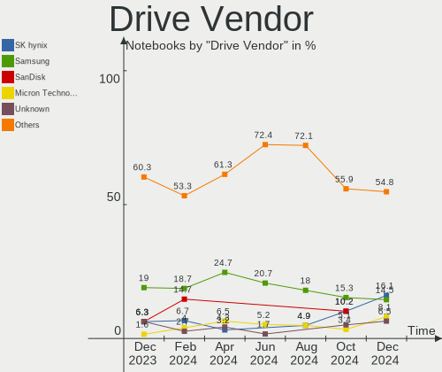
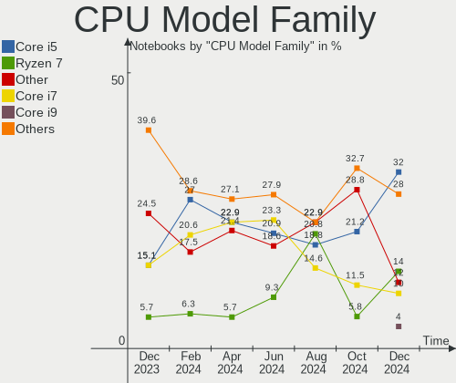
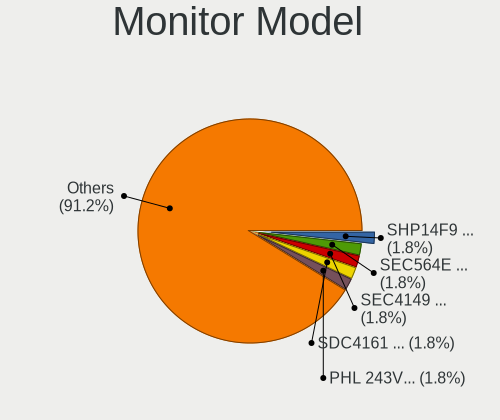
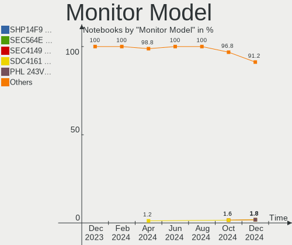
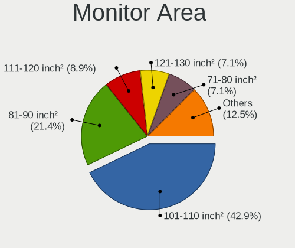
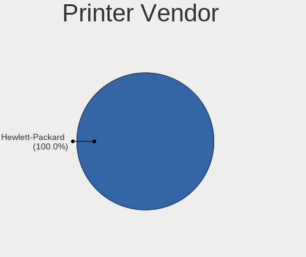

openSUSE - Hardware Trends (Notebooks)
--------------------------------------

A project to identify most popular hardware characteristics and track their change
over time based on data collected by Linux users at https://Linux-Hardware.org.

Anyone can contribute to this report by the [hw-probe](https://github.com/linuxhw/hw-probe) tool:

    sudo -E hw-probe -all -upload

This report is for one last month. Overall report since the beginning of time: [TestDays](https://github.com/linuxhw/TestDays)

Period: May, 2023.

Contents
--------

* [ System ](#system)
  - [ OS                       ](#os)
  - [ OS Family                ](#os-family)
  - [ Kernel                   ](#kernel)
  - [ Kernel Family            ](#kernel-family)
  - [ Kernel Major Ver.        ](#kernel-major-ver)
  - [ Arch                     ](#arch)
  - [ DE                       ](#de)
  - [ Display Server           ](#display-server)
  - [ Display Manager          ](#display-manager)
  - [ OS Lang                  ](#os-lang)
  - [ Boot Mode                ](#boot-mode)
  - [ Filesystem               ](#filesystem)
  - [ Part. scheme             ](#part-scheme)
  - [ Dual Boot with Linux/BSD ](#dual-boot-with-linuxbsd)
  - [ Dual Boot (Win)          ](#dual-boot-win)

* [ Board ](#board)
  - [ Vendor                   ](#vendor)
  - [ Model                    ](#model)
  - [ Model Family             ](#model-family)
  - [ MFG Year                 ](#mfg-year)
  - [ Form Factor              ](#form-factor)
  - [ Secure Boot              ](#secure-boot)
  - [ Coreboot                 ](#coreboot)
  - [ RAM Size                 ](#ram-size)
  - [ RAM Used                 ](#ram-used)
  - [ Total Drives             ](#total-drives)
  - [ Has CD-ROM               ](#has-cd-rom)
  - [ Has Ethernet             ](#has-ethernet)
  - [ Has WiFi                 ](#has-wifi)
  - [ Has Bluetooth            ](#has-bluetooth)

* [ Location ](#location)
  - [ Country                  ](#country)
  - [ City                     ](#city)

* [ Drives ](#drives)
  - [ Drive Vendor             ](#drive-vendor)
  - [ Drive Model              ](#drive-model)
  - [ HDD Vendor               ](#hdd-vendor)
  - [ SSD Vendor               ](#ssd-vendor)
  - [ Drive Kind               ](#drive-kind)
  - [ Drive Connector          ](#drive-connector)
  - [ Drive Size               ](#drive-size)
  - [ Space Total              ](#space-total)
  - [ Space Used               ](#space-used)
  - [ Malfunc. Drives          ](#malfunc-drives)
  - [ Malfunc. Drive Vendor    ](#malfunc-drive-vendor)
  - [ Malfunc. HDD Vendor      ](#malfunc-hdd-vendor)
  - [ Malfunc. Drive Kind      ](#malfunc-drive-kind)
  - [ Failed Drives            ](#failed-drives)
  - [ Failed Drive Vendor      ](#failed-drive-vendor)
  - [ Drive Status             ](#drive-status)

* [ Storage controller ](#storage-controller)
  - [ Storage Vendor           ](#storage-vendor)
  - [ Storage Model            ](#storage-model)
  - [ Storage Kind             ](#storage-kind)

* [ Processor ](#processor)
  - [ CPU Vendor               ](#cpu-vendor)
  - [ CPU Model                ](#cpu-model)
  - [ CPU Model Family         ](#cpu-model-family)
  - [ CPU Cores                ](#cpu-cores)
  - [ CPU Sockets              ](#cpu-sockets)
  - [ CPU Threads              ](#cpu-threads)
  - [ CPU Op-Modes             ](#cpu-op-modes)
  - [ CPU Microcode            ](#cpu-microcode)
  - [ CPU Microarch            ](#cpu-microarch)

* [ Graphics ](#graphics)
  - [ GPU Vendor               ](#gpu-vendor)
  - [ GPU Model                ](#gpu-model)
  - [ GPU Combo                ](#gpu-combo)
  - [ GPU Driver               ](#gpu-driver)
  - [ GPU Memory               ](#gpu-memory)

* [ Monitor ](#monitor)
  - [ Monitor Vendor           ](#monitor-vendor)
  - [ Monitor Model            ](#monitor-model)
  - [ Monitor Resolution       ](#monitor-resolution)
  - [ Monitor Diagonal         ](#monitor-diagonal)
  - [ Monitor Width            ](#monitor-width)
  - [ Aspect Ratio             ](#aspect-ratio)
  - [ Monitor Area             ](#monitor-area)
  - [ Pixel Density            ](#pixel-density)
  - [ Multiple Monitors        ](#multiple-monitors)

* [ Network ](#network)
  - [ Net Controller Vendor    ](#net-controller-vendor)
  - [ Net Controller Model     ](#net-controller-model)
  - [ Wireless Vendor          ](#wireless-vendor)
  - [ Wireless Model           ](#wireless-model)
  - [ Ethernet Vendor          ](#ethernet-vendor)
  - [ Ethernet Model           ](#ethernet-model)
  - [ Net Controller Kind      ](#net-controller-kind)
  - [ Used Controller          ](#used-controller)
  - [ NICs                     ](#nics)
  - [ IPv6                     ](#ipv6)

* [ Bluetooth ](#bluetooth)
  - [ Bluetooth Vendor         ](#bluetooth-vendor)
  - [ Bluetooth Model          ](#bluetooth-model)

* [ Sound ](#sound)
  - [ Sound Vendor             ](#sound-vendor)
  - [ Sound Model              ](#sound-model)

* [ Memory ](#memory)
  - [ Memory Vendor            ](#memory-vendor)
  - [ Memory Model             ](#memory-model)
  - [ Memory Kind              ](#memory-kind)
  - [ Memory Form Factor       ](#memory-form-factor)
  - [ Memory Size              ](#memory-size)
  - [ Memory Speed             ](#memory-speed)

* [ Printers & scanners ](#printers--scanners)
  - [ Printer Vendor           ](#printer-vendor)
  - [ Printer Model            ](#printer-model)
  - [ Scanner Vendor           ](#scanner-vendor)
  - [ Scanner Model            ](#scanner-model)

* [ Camera ](#camera)
  - [ Camera Vendor            ](#camera-vendor)
  - [ Camera Model             ](#camera-model)

* [ Security ](#security)
  - [ Fingerprint Vendor       ](#fingerprint-vendor)
  - [ Fingerprint Model        ](#fingerprint-model)
  - [ Chipcard Vendor          ](#chipcard-vendor)
  - [ Chipcard Model           ](#chipcard-model)

* [ Unsupported ](#unsupported)
  - [ Unsupported Devices      ](#unsupported-devices)
  - [ Unsupported Device Types ](#unsupported-device-types)

System
------

OS
--

Installed operating systems

| Name                         | Notebooks | Percent |
|------------------------------|-----------|---------|
| openSUSE Tumbleweed-XXXXXXXX | 37        | 82.22%  |
| openSUSE Leap-15.5           | 4         | 8.89%   |
| openSUSE Leap-15.4           | 3         | 6.67%   |
| openSUSE Microos-XXXXXXXX    | 1         | 2.22%   |

OS Family
---------

OS without a version

| Name     | Notebooks | Percent |
|----------|-----------|---------|
| openSUSE | 45        | 100%    |

Kernel
------

Version of the Linux kernel

| Version                      | Notebooks | Percent |
|------------------------------|-----------|---------|
| 6.3.2-1-default              | 14        | 31.11%  |
| 6.3.1-1-default              | 10        | 22.22%  |
| 6.2.12-1-default             | 7         | 15.56%  |
| 6.3.1-2-default              | 5         | 11.11%  |
| 5.14.21-150500.52-default    | 3         | 6.67%   |
| 5.14.21-150400.24.63-default | 3         | 6.67%   |
| 6.2.9-1-default              | 1         | 2.22%   |
| 6.0.0-1-default              | 1         | 2.22%   |
| 5.14.21-150500.50-default    | 1         | 2.22%   |

Kernel Family
-------------

Linux kernel without a distro release

| Version | Notebooks | Percent |
|---------|-----------|---------|
| 6.3.1   | 15        | 33.33%  |
| 6.3.2   | 14        | 31.11%  |
| 6.2.12  | 7         | 15.56%  |
| 5.14.21 | 7         | 15.56%  |
| 6.2.9   | 1         | 2.22%   |
| 6.0.0   | 1         | 2.22%   |

Kernel Major Ver.
-----------------

Linux kernel major version

| Version | Notebooks | Percent |
|---------|-----------|---------|
| 6.3     | 29        | 64.44%  |
| 6.2     | 8         | 17.78%  |
| 5.14    | 7         | 15.56%  |
| 6.0     | 1         | 2.22%   |

Arch
----

OS architecture (x86_64, i586, etc.)

| Name   | Notebooks | Percent |
|--------|-----------|---------|
| x86_64 | 45        | 100%    |

DE
--

Desktop Environment

| Name   | Notebooks | Percent |
|--------|-----------|---------|
| KDE5   | 36        | 80%     |
| GNOME  | 7         | 15.56%  |
| XFCE   | 1         | 2.22%   |
| Deepin | 1         | 2.22%   |

Display Server
--------------

X11 or Wayland

| Name    | Notebooks | Percent |
|---------|-----------|---------|
| X11     | 35        | 77.78%  |
| Wayland | 10        | 22.22%  |

Display Manager
---------------

SDDM, LightDM, etc.

| Name    | Notebooks | Percent |
|---------|-----------|---------|
| Unknown | 22        | 48.89%  |
| SDDM    | 20        | 44.44%  |
| GDM     | 2         | 4.44%   |
| XDM     | 1         | 2.22%   |

OS Lang
-------

Language

| Lang  | Notebooks | Percent |
|-------|-----------|---------|
| en_US | 24        | 53.33%  |
| en_GB | 4         | 8.89%   |
| it_IT | 3         | 6.67%   |
| de_DE | 3         | 6.67%   |
| zh_CN | 2         | 4.44%   |
| ru_RU | 2         | 4.44%   |
| fr_FR | 2         | 4.44%   |
| es_ES | 2         | 4.44%   |
| ro_RO | 1         | 2.22%   |
| POSIX | 1         | 2.22%   |
| pl_PL | 1         | 2.22%   |

Boot Mode
---------

EFI or BIOS

| Mode | Notebooks | Percent |
|------|-----------|---------|
| EFI  | 37        | 82.22%  |
| BIOS | 8         | 17.78%  |

Filesystem
----------

Type of filesystem

| Type  | Notebooks | Percent |
|-------|-----------|---------|
| Btrfs | 38        | 84.44%  |
| Ext4  | 5         | 11.11%  |
| Xfs   | 2         | 4.44%   |

Part. scheme
------------

Scheme of partitioning

| Type    | Notebooks | Percent |
|---------|-----------|---------|
| GPT     | 23        | 51.11%  |
| Unknown | 22        | 48.89%  |

Dual Boot with Linux/BSD
------------------------

Hosting more than one Linux/BSD

| Dual boot | Notebooks | Percent |
|-----------|-----------|---------|
| No        | 40        | 88.89%  |
| Yes       | 5         | 11.11%  |

Dual Boot (Win)
---------------

Hosting Linux and Windows

| Dual boot | Notebooks | Percent |
|-----------|-----------|---------|
| No        | 36        | 80%     |
| Yes       | 9         | 20%     |

Board
-----

Vendor
------

Motherboard manufacturer

| Name             | Notebooks | Percent |
|------------------|-----------|---------|
| Lenovo           | 13        | 28.89%  |
| Hewlett-Packard  | 11        | 24.44%  |
| Acer             | 7         | 15.56%  |
| Dell             | 5         | 11.11%  |
| Apple            | 4         | 8.89%   |
| ASUSTek Computer | 3         | 6.67%   |
| SLIMBOOK         | 1         | 2.22%   |
| Maibenben        | 1         | 2.22%   |

Model
-----

Motherboard model

| Name                                       | Notebooks | Percent |
|--------------------------------------------|-----------|---------|
| SLIMBOOK PROX-AMD5                         | 1         | 2.22%   |
| Maibenben MaiBook M                        | 1         | 2.22%   |
| Lenovo V15-ADA 82C7                        | 1         | 2.22%   |
| Lenovo ThinkPad X201 3680HTG               | 1         | 2.22%   |
| Lenovo ThinkPad X1 Carbon Gen 9 20XWCTO1WW | 1         | 2.22%   |
| Lenovo ThinkPad W541 20EF001UGE            | 1         | 2.22%   |
| Lenovo ThinkPad T570 20HAS0UU00            | 1         | 2.22%   |
| Lenovo ThinkPad T480s 20L8S8EG00           | 1         | 2.22%   |
| Lenovo ThinkPad T410 2522K3U               | 1         | 2.22%   |
| Lenovo ThinkPad P15 Gen 1 20ST006KUS       | 1         | 2.22%   |
| Lenovo ThinkPad L540 20AUS01H00            | 1         | 2.22%   |
| Lenovo ThinkPad E14 Gen 2 20TA000DGE       | 1         | 2.22%   |
| Lenovo Slim 7 16IAH7 82VB                  | 1         | 2.22%   |
| Lenovo IdeaPad Gaming 3 15ARH05 82EY       | 1         | 2.22%   |
| Lenovo IdeaPad 110-15ACL 80TJ              | 1         | 2.22%   |
| HP Victus by Gaming Laptop 15-fb0xxx       | 1         | 2.22%   |
| HP Pavilion Gaming Laptop 17-cd1xxx        | 1         | 2.22%   |
| HP OMEN Laptop 15-en0xxx                   | 1         | 2.22%   |
| HP OMEN Laptop 15-ek0xxx                   | 1         | 2.22%   |
| HP Laptop 17-cn0xxx                        | 1         | 2.22%   |
| HP Laptop 15s-fq2xxx                       | 1         | 2.22%   |
| HP Laptop 15-bs1xx                         | 1         | 2.22%   |
| HP Laptop 14s-cf0xxx                       | 1         | 2.22%   |
| HP ENVY m6 Notebook                        | 1         | 2.22%   |
| HP EliteBook 850 G8 Notebook PC            | 1         | 2.22%   |
| HP EliteBook 830 G5                        | 1         | 2.22%   |
| Dell XPS 15 9550                           | 1         | 2.22%   |
| Dell Latitude E5530 non-vPro               | 1         | 2.22%   |
| Dell Latitude 5320                         | 1         | 2.22%   |
| Dell Latitude 3440                         | 1         | 2.22%   |
| Dell Inspiron 3501                         | 1         | 2.22%   |
| ASUS VivoBook_ASUSLaptop X580GD_N580GD     | 1         | 2.22%   |
| ASUS VivoBook_ASUSLaptop X509DA_D509DA     | 1         | 2.22%   |
| ASUS ASUS TUF Gaming A15 FA506QE_FA506QE   | 1         | 2.22%   |
| Apple MacBookPro9,2                        | 1         | 2.22%   |
| Apple MacBookPro8,1                        | 1         | 2.22%   |
| Apple MacBookPro11,3                       | 1         | 2.22%   |
| Apple MacBook5,1                           | 1         | 2.22%   |
| Acer Nitro AN517-54                        | 1         | 2.22%   |
| Acer Aspire V3-571G                        | 1         | 2.22%   |

Model Family
------------

Motherboard model prefix

| Name               | Notebooks | Percent |
|--------------------|-----------|---------|
| Lenovo ThinkPad    | 9         | 20%     |
| Acer Aspire        | 6         | 13.33%  |
| HP Laptop          | 4         | 8.89%   |
| Dell Latitude      | 3         | 6.67%   |
| Lenovo IdeaPad     | 2         | 4.44%   |
| HP OMEN            | 2         | 4.44%   |
| HP EliteBook       | 2         | 4.44%   |
| ASUS VivoBook      | 2         | 4.44%   |
| SLIMBOOK PROX-AMD5 | 1         | 2.22%   |
| Maibenben MaiBook  | 1         | 2.22%   |
| Lenovo V15-ADA     | 1         | 2.22%   |
| Lenovo Slim        | 1         | 2.22%   |
| HP Victus          | 1         | 2.22%   |
| HP Pavilion        | 1         | 2.22%   |
| HP ENVY            | 1         | 2.22%   |
| Dell XPS           | 1         | 2.22%   |
| Dell Inspiron      | 1         | 2.22%   |
| ASUS ASUS          | 1         | 2.22%   |
| Apple MacBookPro9  | 1         | 2.22%   |
| Apple MacBookPro8  | 1         | 2.22%   |
| Apple MacBookPro11 | 1         | 2.22%   |
| Apple MacBook5     | 1         | 2.22%   |
| Acer Nitro         | 1         | 2.22%   |

MFG Year
--------

Motherboard manufacture year

| Year | Notebooks | Percent |
|------|-----------|---------|
| 2020 | 12        | 26.67%  |
| 2021 | 6         | 13.33%  |
| 2018 | 5         | 11.11%  |
| 2022 | 3         | 6.67%   |
| 2016 | 3         | 6.67%   |
| 2012 | 3         | 6.67%   |
| 2017 | 2         | 4.44%   |
| 2015 | 2         | 4.44%   |
| 2013 | 2         | 4.44%   |
| 2010 | 2         | 4.44%   |
| 2009 | 2         | 4.44%   |
| 2019 | 1         | 2.22%   |
| 2014 | 1         | 2.22%   |
| 2011 | 1         | 2.22%   |

Form Factor
-----------

Physical design of the computer

| Name     | Notebooks | Percent |
|----------|-----------|---------|
| Notebook | 45        | 100%    |

Secure Boot
-----------

Enabled or disabled

| State    | Notebooks | Percent |
|----------|-----------|---------|
| Disabled | 34        | 75.56%  |
| Enabled  | 11        | 24.44%  |

Coreboot
--------

Have coreboot on board

| Used | Notebooks | Percent |
|------|-----------|---------|
| No   | 45        | 100%    |

RAM Size
--------

Total RAM memory

| Size in GB | Notebooks | Percent |
|------------|-----------|---------|
| 4.01-8.0   | 16        | 35.56%  |
| 32.01-64.0 | 10        | 22.22%  |
| 16.01-24.0 | 9         | 20%     |
| 8.01-16.0  | 7         | 15.56%  |
| 3.01-4.0   | 2         | 4.44%   |
| 24.01-32.0 | 1         | 2.22%   |

RAM Used
--------

Used RAM memory

| Used GB    | Notebooks | Percent |
|------------|-----------|---------|
| 2.01-3.0   | 16        | 35.56%  |
| 4.01-8.0   | 13        | 28.89%  |
| 3.01-4.0   | 9         | 20%     |
| 1.01-2.0   | 5         | 11.11%  |
| 16.01-24.0 | 1         | 2.22%   |
| 8.01-16.0  | 1         | 2.22%   |

Total Drives
------------

Number of drives on board

| Drives | Notebooks | Percent |
|--------|-----------|---------|
| 1      | 33        | 73.33%  |
| 2      | 8         | 17.78%  |
| 3      | 3         | 6.67%   |
| 5      | 1         | 2.22%   |

Has CD-ROM
----------

Has CD-ROM on board

| Presented | Notebooks | Percent |
|-----------|-----------|---------|
| No        | 37        | 82.22%  |
| Yes       | 8         | 17.78%  |

Has Ethernet
------------

Has Ethernet on board

| Presented | Notebooks | Percent |
|-----------|-----------|---------|
| Yes       | 35        | 77.78%  |
| No        | 10        | 22.22%  |

Has WiFi
--------

Has WiFi module

| Presented | Notebooks | Percent |
|-----------|-----------|---------|
| Yes       | 45        | 100%    |

Has Bluetooth
-------------

Has Bluetooth module

| Presented | Notebooks | Percent |
|-----------|-----------|---------|
| Yes       | 42        | 93.33%  |
| No        | 3         | 6.67%   |

Location
--------

Country
-------

Geographic location (country)

| Country     | Notebooks | Percent |
|-------------|-----------|---------|
| USA         | 8         | 17.78%  |
| Germany     | 7         | 15.56%  |
| Romania     | 3         | 6.67%   |
| Italy       | 3         | 6.67%   |
| Turkey      | 2         | 4.44%   |
| Russia      | 2         | 4.44%   |
| New Zealand | 2         | 4.44%   |
| China       | 2         | 4.44%   |
| Australia   | 2         | 4.44%   |
| UK          | 1         | 2.22%   |
| Sweden      | 1         | 2.22%   |
| Spain       | 1         | 2.22%   |
| Serbia      | 1         | 2.22%   |
| Portugal    | 1         | 2.22%   |
| Poland      | 1         | 2.22%   |
| Netherlands | 1         | 2.22%   |
| Morocco     | 1         | 2.22%   |
| Indonesia   | 1         | 2.22%   |
| India       | 1         | 2.22%   |
| France      | 1         | 2.22%   |
| Colombia    | 1         | 2.22%   |
| Bulgaria    | 1         | 2.22%   |
| Brazil      | 1         | 2.22%   |

City
----

Geographic location (city)

| City                   | Notebooks | Percent |
|------------------------|-----------|---------|
| Craigsville            | 3         | 6.67%   |
| Woolloongabba          | 1         | 2.22%   |
| Victorville            | 1         | 2.22%   |
| Tianjin                | 1         | 2.22%   |
| Sylt-Ost               | 1         | 2.22%   |
| Stockholm              | 1         | 2.22%   |
| St Petersburg          | 1         | 2.22%   |
| St Louis               | 1         | 2.22%   |
| Salem                  | 1         | 2.22%   |
| Saint-Maur-des-Fossés | 1         | 2.22%   |
| Rio de Janeiro         | 1         | 2.22%   |
| Richardson             | 1         | 2.22%   |
| Reşiţa               | 1         | 2.22%   |
| Reggio Emilia          | 1         | 2.22%   |
| Recco                  | 1         | 2.22%   |
| Poznan                 | 1         | 2.22%   |
| Porto                  | 1         | 2.22%   |
| Plovdiv                | 1         | 2.22%   |
| Piteşti               | 1         | 2.22%   |
| Novi Sad               | 1         | 2.22%   |
| Moosburg               | 1         | 2.22%   |
| Melbourne              | 1         | 2.22%   |
| Marrakesh              | 1         | 2.22%   |
| Magdeburg              | 1         | 2.22%   |
| Lünen                 | 1         | 2.22%   |
| Kochi                  | 1         | 2.22%   |
| Jakarta                | 1         | 2.22%   |
| Izmir                  | 1         | 2.22%   |
| Ithaca                 | 1         | 2.22%   |
| Hanover                | 1         | 2.22%   |
| Gosport                | 1         | 2.22%   |
| Gaocheng               | 1         | 2.22%   |
| Forlì                 | 1         | 2.22%   |
| Dunedin                | 1         | 2.22%   |
| Chelyabinsk            | 1         | 2.22%   |
| Catarroja              | 1         | 2.22%   |
| Bucharest              | 1         | 2.22%   |
| Berlin                 | 1         | 2.22%   |
| Barranquilla           | 1         | 2.22%   |
| Auckland               | 1         | 2.22%   |

Drives
------

Drive Vendor
------------

Hard drive vendors

| Vendor                      | Notebooks | Drives | Percent |
|-----------------------------|-----------|--------|---------|
| Samsung Electronics         | 14        | 14     | 22.58%  |
| Seagate                     | 6         | 6      | 9.68%   |
| WDC                         | 5         | 5      | 8.06%   |
| Toshiba                     | 5         | 5      | 8.06%   |
| KIOXIA                      | 4         | 4      | 6.45%   |
| Kingston                    | 4         | 4      | 6.45%   |
| Intenso                     | 3         | 3      | 4.84%   |
| Intel                       | 3         | 3      | 4.84%   |
| SK hynix                    | 2         | 2      | 3.23%   |
| Crucial                     | 2         | 2      | 3.23%   |
| China                       | 2         | 2      | 3.23%   |
| Yangtze Memory Technologies | 1         | 2      | 1.61%   |
| SSK                         | 1         | 1      | 1.61%   |
| Smartbuy                    | 1         | 1      | 1.61%   |
| PNY                         | 1         | 1      | 1.61%   |
| Pioneer                     | 1         | 1      | 1.61%   |
| Micron/Crucial Technology   | 1         | 1      | 1.61%   |
| Micron Technology           | 1         | 1      | 1.61%   |
| MAXIO Technology (Hangzhou) | 1         | 1      | 1.61%   |
| JMicron Technology          | 1         | 1      | 1.61%   |
| Hitachi                     | 1         | 1      | 1.61%   |
| GOODRAM                     | 1         | 1      | 1.61%   |
| Apple                       | 1         | 1      | 1.61%   |

Drive Model
-----------

Hard drive models

| Model                                               | Notebooks | Percent |
|-----------------------------------------------------|-----------|---------|
| Samsung NVMe SSD Controller PM9A1/PM9A3/980PRO 1TB  | 4         | 6.35%   |
| Samsung NVMe SSD Controller SM981/PM981/PM983 256GB | 3         | 4.76%   |
| Seagate ST1000LM035-1RK172 1TB                      | 2         | 3.17%   |
| KIOXIA KBG40ZNV512G 512GB                           | 2         | 3.17%   |
| Kingston SA400S37480G 480GB SSD                     | 2         | 3.17%   |
| Intel SSD 660P Series 512GB                         | 2         | 3.17%   |
| Crucial CT1000MX500SSD1 1TB                         | 2         | 3.17%   |
| Yangtze Memory ZHITAI TiPlus5000 2TB                | 1         | 1.59%   |
| Yangtze Memory ZHITAI PC005 Active 512GB            | 1         | 1.59%   |
| WDC WDS240G2G0A-00JH30 240GB SSD                    | 1         | 1.59%   |
| WDC WDS100T2B0B-00YS70 1TB SSD                      | 1         | 1.59%   |
| WDC WD50 00BPVT-80HXZT3 500GB                       | 1         | 1.59%   |
| WDC WD3200BPVT-24JJ5T0 320GB                        | 1         | 1.59%   |
| WDC WD10SPZX-60Z10T0 1TB                            | 1         | 1.59%   |
| Toshiba XG6 NVMe SSD Controller 256GB               | 1         | 1.59%   |
| Toshiba NVMe Controller 256GB                       | 1         | 1.59%   |
| Toshiba MQ01ABF050 500GB                            | 1         | 1.59%   |
| Toshiba MQ01ABD100 1TB                              | 1         | 1.59%   |
| Toshiba MQ01ABD050 500GB                            | 1         | 1.59%   |
| SSK Disk 256GB                                      | 1         | 1.59%   |
| Smartbuy SSD 240GB                                  | 1         | 1.59%   |
| SK hynix BC711 HFM512GD3JX013N 512GB                | 1         | 1.59%   |
| SK hynix BC511 256GB                                | 1         | 1.59%   |
| Seagate ST9500325AS 500GB                           | 1         | 1.59%   |
| Seagate ST1000LM024 HN-M101MBB 1TB                  | 1         | 1.59%   |
| Seagate Portable 2TB                                | 1         | 1.59%   |
| Seagate Expansion 1TB                               | 1         | 1.59%   |
| Samsung SSD 980 1TB                                 | 1         | 1.59%   |
| Samsung SSD 850 EVO 250GB                           | 1         | 1.59%   |
| Samsung PM991a NVMe 256GB                           | 1         | 1.59%   |
| Samsung MZVLQ512HBLU-00BTW 512GB                    | 1         | 1.59%   |
| Samsung MZVLQ512HBLU-00BH1 512GB                    | 1         | 1.59%   |
| Samsung MZVLQ512HBLU-00B00 512GB                    | 1         | 1.59%   |
| Samsung MZALQ512HALU-000L1 512GB                    | 1         | 1.59%   |
| PNY CS900 500GB SSD                                 | 1         | 1.59%   |
| Pioneer APS-SL3N-128 128GB                          | 1         | 1.59%   |
| Micron/Crucial CT500P5PSSD8 500GB                   | 1         | 1.59%   |
| Micron CT1000P5SSD8 1TB                             | 1         | 1.59%   |
| MAXIO (Hangzhou) MiWhole CT300 512GB                | 1         | 1.59%   |
| KIOXIA KBG50ZNS256G NVMe 256GB                      | 1         | 1.59%   |

HDD Vendor
----------

Hard disk drive vendors

| Vendor  | Notebooks | Drives | Percent |
|---------|-----------|--------|---------|
| Seagate | 5         | 5      | 35.71%  |
| WDC     | 3         | 3      | 21.43%  |
| Toshiba | 3         | 3      | 21.43%  |
| SSK     | 1         | 1      | 7.14%   |
| Intenso | 1         | 1      | 7.14%   |
| Hitachi | 1         | 1      | 7.14%   |

SSD Vendor
----------

Solid state drive vendors

| Vendor              | Notebooks | Drives | Percent |
|---------------------|-----------|--------|---------|
| Kingston            | 4         | 4      | 21.05%  |
| WDC                 | 2         | 2      | 10.53%  |
| Intenso             | 2         | 2      | 10.53%  |
| Crucial             | 2         | 2      | 10.53%  |
| China               | 2         | 2      | 10.53%  |
| Smartbuy            | 1         | 1      | 5.26%   |
| Samsung Electronics | 1         | 1      | 5.26%   |
| PNY                 | 1         | 1      | 5.26%   |
| Pioneer             | 1         | 1      | 5.26%   |
| JMicron Technology  | 1         | 1      | 5.26%   |
| GOODRAM             | 1         | 1      | 5.26%   |
| Apple               | 1         | 1      | 5.26%   |

Drive Kind
----------

HDD or SSD

| Kind    | Notebooks | Drives | Percent |
|---------|-----------|--------|---------|
| NVMe    | 27        | 29     | 46.55%  |
| SSD     | 18        | 19     | 31.03%  |
| HDD     | 12        | 14     | 20.69%  |
| Unknown | 1         | 1      | 1.72%   |

Drive Connector
---------------

SATA, SAS, NVMe, etc.

| Type | Notebooks | Drives | Percent |
|------|-----------|--------|---------|
| NVMe | 27        | 29     | 49.09%  |
| SATA | 23        | 27     | 41.82%  |
| SAS  | 5         | 7      | 9.09%   |

Drive Size
----------

Size of hard drive

| Size in TB | Notebooks | Drives | Percent |
|------------|-----------|--------|---------|
| 0.01-0.5   | 18        | 21     | 64.29%  |
| 0.51-1.0   | 8         | 10     | 28.57%  |
| 1.01-2.0   | 2         | 2      | 7.14%   |

Space Total
-----------

Amount of disk space available on the file system

| Size in GB     | Notebooks | Percent |
|----------------|-----------|---------|
| More than 3000 | 17        | 37.78%  |
| 1001-2000      | 12        | 26.67%  |
| 501-1000       | 8         | 17.78%  |
| 251-500        | 4         | 8.89%   |
| 2001-3000      | 3         | 6.67%   |
| 101-250        | 1         | 2.22%   |

Space Used
----------

Amount of used disk space

| Used GB        | Notebooks | Percent |
|----------------|-----------|---------|
| 101-250        | 13        | 28.89%  |
| 51-100         | 7         | 15.56%  |
| 251-500        | 6         | 13.33%  |
| 501-1000       | 6         | 13.33%  |
| 1001-2000      | 4         | 8.89%   |
| More than 3000 | 3         | 6.67%   |
| 21-50          | 3         | 6.67%   |
| 2001-3000      | 2         | 4.44%   |
| 1-20           | 1         | 2.22%   |

Malfunc. Drives
---------------

Drive models with a malfunction

| Model                              | Notebooks | Drives | Percent |
|------------------------------------|-----------|--------|---------|
| Toshiba MQ01ABF050 500GB           | 1         | 1      | 33.33%  |
| Seagate ST1000LM024 HN-M101MBB 1TB | 1         | 1      | 33.33%  |
| Hitachi HTS54323 320GB             | 1         | 1      | 33.33%  |

Malfunc. Drive Vendor
---------------------

Vendors of faulty drives

| Vendor  | Notebooks | Drives | Percent |
|---------|-----------|--------|---------|
| Toshiba | 1         | 1      | 33.33%  |
| Seagate | 1         | 1      | 33.33%  |
| Hitachi | 1         | 1      | 33.33%  |

Malfunc. HDD Vendor
-------------------

Vendors of faulty HDD drives

| Vendor  | Notebooks | Drives | Percent |
|---------|-----------|--------|---------|
| Toshiba | 1         | 1      | 33.33%  |
| Seagate | 1         | 1      | 33.33%  |
| Hitachi | 1         | 1      | 33.33%  |

Malfunc. Drive Kind
-------------------

Kinds of faulty drives

| Kind | Notebooks | Drives | Percent |
|------|-----------|--------|---------|
| HDD  | 3         | 3      | 100%    |

Failed Drives
-------------

Failed drive models

Zero info for selected period =(

Failed Drive Vendor
-------------------

Failed drive vendors

Zero info for selected period =(

Drive Status
------------

Number of failed and malfunc. drives

| Status   | Notebooks | Drives | Percent |
|----------|-----------|--------|---------|
| Detected | 25        | 35     | 51.02%  |
| Works    | 21        | 25     | 42.86%  |
| Malfunc  | 3         | 3      | 6.12%   |

Storage controller
------------------

Storage Vendor
--------------

Storage controller vendors

| Vendor                       | Notebooks | Percent |
|------------------------------|-----------|---------|
| Intel                        | 25        | 40.98%  |
| Samsung Electronics          | 14        | 22.95%  |
| AMD                          | 9         | 14.75%  |
| KIOXIA                       | 4         | 6.56%   |
| Toshiba America Info Systems | 2         | 3.28%   |
| SK hynix                     | 2         | 3.28%   |
| Yangtze Memory Technologies  | 1         | 1.64%   |
| Nvidia                       | 1         | 1.64%   |
| Micron/Crucial Technology    | 1         | 1.64%   |
| Micron Technology            | 1         | 1.64%   |
| MAXIO Technology (Hangzhou)  | 1         | 1.64%   |

Storage Model
-------------

Storage controller models

| Model                                                                          | Notebooks | Percent |
|--------------------------------------------------------------------------------|-----------|---------|
| AMD FCH SATA Controller [AHCI mode]                                            | 9         | 14.06%  |
| Samsung NVMe SSD Controller 980                                                | 6         | 9.38%   |
| Intel Volume Management Device NVMe RAID Controller                            | 5         | 7.81%   |
| Samsung NVMe SSD Controller PM9A1/PM9A3/980PRO                                 | 4         | 6.25%   |
| Intel 82801 Mobile SATA Controller [RAID mode]                                 | 4         | 6.25%   |
| Samsung NVMe SSD Controller SM981/PM981/PM983                                  | 3         | 4.69%   |
| KIOXIA NVMe SSD Controller BG4                                                 | 3         | 4.69%   |
| Intel 7 Series Chipset Family 6-port SATA Controller [AHCI mode]               | 3         | 4.69%   |
| Intel Tiger Lake-LP SATA Controller                                            | 2         | 3.13%   |
| Intel Sunrise Point-LP SATA Controller [AHCI mode]                             | 2         | 3.13%   |
| Intel SSD 660P Series                                                          | 2         | 3.13%   |
| Intel 8 Series/C220 Series Chipset Family 6-port SATA Controller 1 [AHCI mode] | 2         | 3.13%   |
| Intel 5 Series/3400 Series Chipset 6 port SATA AHCI Controller                 | 2         | 3.13%   |
| Yangtze Memory ZHITAI TiPro5000 NVMe SSD                                       | 1         | 1.56%   |
| Yangtze Memory Non-Volatile memory controller                                  | 1         | 1.56%   |
| Toshiba America Info Systems XG6 NVMe SSD Controller                           | 1         | 1.56%   |
| Toshiba America Info Systems NVMe Controller                                   | 1         | 1.56%   |
| SK hynix Gold P31/PC711 NVMe Solid State Drive                                 | 1         | 1.56%   |
| SK hynix BC511                                                                 | 1         | 1.56%   |
| Samsung Apple PCIe SSD                                                         | 1         | 1.56%   |
| Nvidia MCP79 AHCI Controller                                                   | 1         | 1.56%   |
| Micron/Crucial P5 Plus NVMe PCIe SSD                                           | 1         | 1.56%   |
| Micron NVMe Storage Controller                                                 | 1         | 1.56%   |
| MAXIO (Hangzhou) Non-Volatile memory controller                                | 1         | 1.56%   |
| KIOXIA Non-Volatile memory controller                                          | 1         | 1.56%   |
| Intel SSD Pro 7600p/760p/E 6100p Series                                        | 1         | 1.56%   |
| Intel HM170/QM170 Chipset SATA Controller [AHCI Mode]                          | 1         | 1.56%   |
| Intel 6 Series/C200 Series Chipset Family 6 port Mobile SATA AHCI Controller   | 1         | 1.56%   |
| Intel 500 Series Chipset Family SATA AHCI Controller                           | 1         | 1.56%   |
| Intel 5 Series/3400 Series Chipset 4 port SATA AHCI Controller                 | 1         | 1.56%   |

Storage Kind
------------

Kind of storage controller (IDE, SATA, NVMe, SAS, ...)

| Kind | Notebooks | Percent |
|------|-----------|---------|
| NVMe | 27        | 43.55%  |
| SATA | 26        | 41.94%  |
| RAID | 9         | 14.52%  |

Processor
---------

CPU Vendor
----------

Processor vendors

| Vendor | Notebooks | Percent |
|--------|-----------|---------|
| Intel  | 32        | 71.11%  |
| AMD    | 13        | 28.89%  |

CPU Model
---------

Processor models

| Model                                           | Notebooks | Percent |
|-------------------------------------------------|-----------|---------|
| Intel 11th Gen Core i5-1135G7 @ 2.40GHz         | 4         | 8.89%   |
| Intel Core i5-8250U CPU @ 1.60GHz               | 2         | 4.44%   |
| Intel Core i5-10300H CPU @ 2.50GHz              | 2         | 4.44%   |
| AMD Ryzen 7 5700U with Radeon Graphics          | 2         | 4.44%   |
| AMD Ryzen 7 4800H with Radeon Graphics          | 2         | 4.44%   |
| Intel Pentium CPU 4417U @ 2.30GHz               | 1         | 2.22%   |
| Intel Core i9-10885H CPU @ 2.40GHz              | 1         | 2.22%   |
| Intel Core i7-8750H CPU @ 2.20GHz               | 1         | 2.22%   |
| Intel Core i7-8650U CPU @ 1.90GHz               | 1         | 2.22%   |
| Intel Core i7-7600U CPU @ 2.80GHz               | 1         | 2.22%   |
| Intel Core i7-6700HQ CPU @ 2.60GHz              | 1         | 2.22%   |
| Intel Core i7-4850HQ CPU @ 2.30GHz              | 1         | 2.22%   |
| Intel Core i7-4810MQ CPU @ 2.80GHz              | 1         | 2.22%   |
| Intel Core i7-3632QM CPU @ 2.20GHz              | 1         | 2.22%   |
| Intel Core i5-4200M CPU @ 2.50GHz               | 1         | 2.22%   |
| Intel Core i5-3230M CPU @ 2.60GHz               | 1         | 2.22%   |
| Intel Core i5-3210M CPU @ 2.50GHz               | 1         | 2.22%   |
| Intel Core i5-2415M CPU @ 2.30GHz               | 1         | 2.22%   |
| Intel Core i5 CPU M 540 @ 2.53GHz               | 1         | 2.22%   |
| Intel Core i5 CPU M 520 @ 2.40GHz               | 1         | 2.22%   |
| Intel Core i5 CPU M 480 @ 2.67GHz               | 1         | 2.22%   |
| Intel Core i3-7020U CPU @ 2.30GHz               | 1         | 2.22%   |
| Intel Core 2 Duo CPU P7350 @ 2.00GHz            | 1         | 2.22%   |
| Intel 13th Gen Core i7-1355U                    | 1         | 2.22%   |
| Intel 12th Gen Core i7-12700H                   | 1         | 2.22%   |
| Intel 11th Gen Core i7-1165G7 @ 2.80GHz         | 1         | 2.22%   |
| Intel 11th Gen Core i5-1145G7 @ 2.60GHz         | 1         | 2.22%   |
| Intel 11th Gen Core i5-11400H @ 2.70GHz         | 1         | 2.22%   |
| Intel 11th Gen Core i3-1115G4 @ 3.00GHz         | 1         | 2.22%   |
| AMD Ryzen 7 5800H with Radeon Graphics          | 1         | 2.22%   |
| AMD Ryzen 7 4700U with Radeon Graphics          | 1         | 2.22%   |
| AMD Ryzen 5 5600H with Radeon Graphics          | 1         | 2.22%   |
| AMD Ryzen 5 3500U with Radeon Vega Mobile Gfx   | 1         | 2.22%   |
| AMD Ryzen 3 3250U with Radeon Graphics          | 1         | 2.22%   |
| AMD Ryzen 3 3200U with Radeon Vega Mobile Gfx   | 1         | 2.22%   |
| AMD FX-8800P Radeon R7, 12 Compute Cores 4C+8G  | 1         | 2.22%   |
| AMD A6-7310 APU with AMD Radeon R4 Graphics     | 1         | 2.22%   |
| AMD A10-9600P RADEON R5, 10 COMPUTE CORES 4C+6G | 1         | 2.22%   |

CPU Model Family
----------------

Processor model prefix

| Model            | Notebooks | Percent |
|------------------|-----------|---------|
| Intel Core i5    | 11        | 24.44%  |
| Other            | 10        | 22.22%  |
| Intel Core i7    | 7         | 15.56%  |
| AMD Ryzen 7      | 6         | 13.33%  |
| AMD Ryzen 5      | 2         | 4.44%   |
| AMD Ryzen 3      | 2         | 4.44%   |
| Intel Pentium    | 1         | 2.22%   |
| Intel Core i9    | 1         | 2.22%   |
| Intel Core i3    | 1         | 2.22%   |
| Intel Core 2 Duo | 1         | 2.22%   |
| AMD FX           | 1         | 2.22%   |
| AMD A6           | 1         | 2.22%   |
| AMD A10          | 1         | 2.22%   |

CPU Cores
---------

Number of processor cores

| Number | Notebooks | Percent |
|--------|-----------|---------|
| 4      | 17        | 37.78%  |
| 2      | 16        | 35.56%  |
| 8      | 7         | 15.56%  |
| 6      | 3         | 6.67%   |
| 14     | 1         | 2.22%   |
| 10     | 1         | 2.22%   |

CPU Sockets
-----------

Number of sockets

| Number | Notebooks | Percent |
|--------|-----------|---------|
| 1      | 45        | 100%    |

CPU Threads
-----------

Threads per core (Hyper-Threading)

| Number | Notebooks | Percent |
|--------|-----------|---------|
| 2      | 42        | 93.33%  |
| 1      | 3         | 6.67%   |

CPU Op-Modes
------------

CPU Operation Modes (32-bit, 64-bit)

| Op mode        | Notebooks | Percent |
|----------------|-----------|---------|
| 32-bit, 64-bit | 45        | 100%    |

CPU Microcode
-------------

Microcode number

| Number     | Notebooks | Percent |
|------------|-----------|---------|
| Unknown    | 30        | 66.67%  |
| 0x08108109 | 3         | 6.67%   |
| 0x08600104 | 2         | 4.44%   |
| 0x806d1    | 1         | 2.22%   |
| 0x306c3    | 1         | 2.22%   |
| 0x306a9    | 1         | 2.22%   |
| 0x0a50000d | 1         | 2.22%   |
| 0x0a50000c | 1         | 2.22%   |
| 0x08608103 | 1         | 2.22%   |
| 0x08608102 | 1         | 2.22%   |
| 0x08600106 | 1         | 2.22%   |
| 0x07030105 | 1         | 2.22%   |
| 0x0600611a | 1         | 2.22%   |

CPU Microarch
-------------

Microarchitecture

| Name             | Notebooks | Percent |
|------------------|-----------|---------|
| TigerLake        | 7         | 15.56%  |
| KabyLake         | 7         | 15.56%  |
| Zen+             | 3         | 6.67%   |
| Zen 2            | 3         | 6.67%   |
| Westmere         | 3         | 6.67%   |
| IvyBridge        | 3         | 6.67%   |
| Haswell          | 3         | 6.67%   |
| CometLake        | 3         | 6.67%   |
| Zen 3            | 2         | 4.44%   |
| Excavator        | 2         | 4.44%   |
| Alderlake Hybrid | 2         | 4.44%   |
| Unknown          | 2         | 4.44%   |
| Skylake          | 1         | 2.22%   |
| SandyBridge      | 1         | 2.22%   |
| Puma             | 1         | 2.22%   |
| Penryn           | 1         | 2.22%   |
| Icelake          | 1         | 2.22%   |

Graphics
--------

GPU Vendor
----------

Vendors of graphics cards

| Vendor | Notebooks | Percent |
|--------|-----------|---------|
| Intel  | 28        | 48.28%  |
| Nvidia | 16        | 27.59%  |
| AMD    | 14        | 24.14%  |

GPU Model
---------

Graphics card models

| Model                                                                                 | Notebooks | Percent |
|---------------------------------------------------------------------------------------|-----------|---------|
| Intel TigerLake-LP GT2 [Iris Xe Graphics]                                             | 6         | 10%     |
| Intel UHD Graphics 620                                                                | 3         | 5%      |
| Intel 3rd Gen Core processor Graphics Controller                                      | 3         | 5%      |
| AMD Renoir                                                                            | 3         | 5%      |
| AMD Picasso/Raven 2 [Radeon Vega Series / Radeon Vega Mobile Series]                  | 3         | 5%      |
| Nvidia TU117M [GeForce GTX 1650 Mobile / Max-Q]                                       | 2         | 3.33%   |
| Nvidia TU106M [GeForce RTX 2060 Mobile]                                               | 2         | 3.33%   |
| Intel HD Graphics 620                                                                 | 2         | 3.33%   |
| Intel Core Processor Integrated Graphics Controller                                   | 2         | 3.33%   |
| Intel CometLake-H GT2 [UHD Graphics]                                                  | 2         | 3.33%   |
| Intel 4th Gen Core Processor Integrated Graphics Controller                           | 2         | 3.33%   |
| AMD Wani [Radeon R5/R6/R7 Graphics]                                                   | 2         | 3.33%   |
| AMD Lucienne                                                                          | 2         | 3.33%   |
| AMD Cezanne [Radeon Vega Series / Radeon Vega Mobile Series]                          | 2         | 3.33%   |
| Nvidia TU117M [GeForce GTX 1650 Ti Mobile]                                            | 1         | 1.67%   |
| Nvidia TU117M                                                                         | 1         | 1.67%   |
| Nvidia TU117GLM [Quadro T2000 Mobile / Max-Q]                                         | 1         | 1.67%   |
| Nvidia GT218M [NVS 3100M]                                                             | 1         | 1.67%   |
| Nvidia GP107M [GeForce GTX 1050 Mobile]                                               | 1         | 1.67%   |
| Nvidia GM107M [GeForce GTX 960M]                                                      | 1         | 1.67%   |
| Nvidia GK107M [GeForce GT 750M Mac Edition]                                           | 1         | 1.67%   |
| Nvidia GK106GLM [Quadro K2100M]                                                       | 1         | 1.67%   |
| Nvidia GF119M [GeForce GT 520M]                                                       | 1         | 1.67%   |
| Nvidia GF117M [GeForce 610M/710M/810M/820M / GT 620M/625M/630M/720M]                  | 1         | 1.67%   |
| Nvidia GA107M [GeForce RTX 3050 Ti Mobile]                                            | 1         | 1.67%   |
| Nvidia C79 [GeForce 9400M]                                                            | 1         | 1.67%   |
| Intel TigerLake-H GT1 [UHD Graphics]                                                  | 1         | 1.67%   |
| Intel Tiger Lake-LP GT2 [UHD Graphics G4]                                             | 1         | 1.67%   |
| Intel Raptor Lake-P [Iris Xe Graphics]                                                | 1         | 1.67%   |
| Intel HD Graphics 610                                                                 | 1         | 1.67%   |
| Intel HD Graphics 530                                                                 | 1         | 1.67%   |
| Intel DG2 [Arc A370M]                                                                 | 1         | 1.67%   |
| Intel CoffeeLake-H GT2 [UHD Graphics 630]                                             | 1         | 1.67%   |
| Intel Alder Lake-P Integrated Graphics Controller                                     | 1         | 1.67%   |
| Intel 2nd Generation Core Processor Family Integrated Graphics Controller             | 1         | 1.67%   |
| AMD Topaz XT [Radeon R7 M260/M265 / M340/M360 / M440/M445 / 530/535 / 620/625 Mobile] | 1         | 1.67%   |
| AMD Sun XT [Radeon HD 8670A/8670M/8690M / R5 M330 / M430 / Radeon 520 Mobile]         | 1         | 1.67%   |
| AMD Mullins [Radeon R4/R5 Graphics]                                                   | 1         | 1.67%   |

GPU Combo
---------

Combinations of graphics cards

| Name           | Notebooks | Percent |
|----------------|-----------|---------|
| 1 x Intel      | 19        | 42.22%  |
| Intel + Nvidia | 8         | 17.78%  |
| 1 x AMD        | 8         | 17.78%  |
| 1 x Nvidia     | 4         | 8.89%   |
| AMD + Nvidia   | 4         | 8.89%   |
| 2 x AMD        | 1         | 2.22%   |
| Intel + AMD    | 1         | 2.22%   |

GPU Driver
----------

Free vs proprietary

| Driver      | Notebooks | Percent |
|-------------|-----------|---------|
| Free        | 41        | 91.11%  |
| Proprietary | 4         | 8.89%   |

GPU Memory
----------

Total video memory

| Size in GB | Notebooks | Percent |
|------------|-----------|---------|
| Unknown    | 21        | 46.67%  |
| 0.01-0.5   | 10        | 22.22%  |
| 1.01-2.0   | 7         | 15.56%  |
| 3.01-4.0   | 4         | 8.89%   |
| 0.51-1.0   | 2         | 4.44%   |
| 5.01-6.0   | 1         | 2.22%   |

Monitor
-------

Monitor Vendor
--------------

Monitor vendors

| Vendor              | Notebooks | Percent |
|---------------------|-----------|---------|
| Chimei Innolux      | 11        | 20.75%  |
| AU Optronics        | 11        | 20.75%  |
| BOE                 | 7         | 13.21%  |
| LG Display          | 4         | 7.55%   |
| Apple               | 4         | 7.55%   |
| Samsung Electronics | 3         | 5.66%   |
| PANDA               | 3         | 5.66%   |
| Lenovo              | 2         | 3.77%   |
| Goldstar            | 2         | 3.77%   |
| Sharp               | 1         | 1.89%   |
| Insignia            | 1         | 1.89%   |
| HUAWEI              | 1         | 1.89%   |
| CTO                 | 1         | 1.89%   |
| CSO                 | 1         | 1.89%   |
| Acer                | 1         | 1.89%   |

Monitor Model
-------------

Monitor models

| Model                                                                 | Notebooks | Percent |
|-----------------------------------------------------------------------|-----------|---------|
| Chimei Innolux LCD Monitor CMN15F5 1920x1080 344x193mm 15.5-inch      | 2         | 3.77%   |
| Sharp LCD Monitor SHP1453 1920x1080 346x194mm 15.6-inch               | 1         | 1.89%   |
| Samsung Electronics SMB2330H SAM064A 1920x1080 509x286mm 23.0-inch    | 1         | 1.89%   |
| Samsung Electronics LCD Monitor SAM0C39 1920x1080 885x498mm 40.0-inch | 1         | 1.89%   |
| Samsung Electronics LCD Monitor SAM0B7C 1920x1080 890x500mm 40.2-inch | 1         | 1.89%   |
| PANDA LCD Monitor NCP0055 1920x1080 294x165mm 13.3-inch               | 1         | 1.89%   |
| PANDA LCD Monitor NCP004D 1920x1080 344x194mm 15.5-inch               | 1         | 1.89%   |
| PANDA LCD Monitor NCP0040 1920x1080 344x194mm 15.5-inch               | 1         | 1.89%   |
| LG Display LCD Monitor LGD05FE 1920x1080 344x194mm 15.5-inch          | 1         | 1.89%   |
| LG Display LCD Monitor LGD0541 1920x1080 344x194mm 15.5-inch          | 1         | 1.89%   |
| LG Display LCD Monitor LGD04FC 1366x768 344x194mm 15.5-inch           | 1         | 1.89%   |
| LG Display LCD Monitor LGD033B 1366x768 344x194mm 15.5-inch           | 1         | 1.89%   |
| Lenovo LCD Monitor LEN4036 1440x900 303x190mm 14.1-inch               | 1         | 1.89%   |
| Lenovo LCD Monitor LEN4011 1280x800 261x163mm 12.1-inch               | 1         | 1.89%   |
| Insignia NS39DR510NA17 BBY3963 1920x1080 853x480mm 38.5-inch          | 1         | 1.89%   |
| HUAWEI SSN-24 HWV6E4E 1920x1080 527x296mm 23.8-inch                   | 1         | 1.89%   |
| Goldstar ULTRAWIDE GSM59F1 2560x1080 673x284mm 28.8-inch              | 1         | 1.89%   |
| Goldstar 16MQ70 GSM7717 2560x1600 340x220mm 15.9-inch                 | 1         | 1.89%   |
| CTO LCD Monitor CTO1412 1920x1200 301x188mm 14.0-inch                 | 1         | 1.89%   |
| CSO LCD Monitor CSO160F 2560x1600 345x215mm 16.0-inch                 | 1         | 1.89%   |
| Chimei Innolux LCD Monitor CMN15E7 1920x1080 344x193mm 15.5-inch      | 1         | 1.89%   |
| Chimei Innolux LCD Monitor CMN15C3 1920x1080 344x193mm 15.5-inch      | 1         | 1.89%   |
| Chimei Innolux LCD Monitor CMN15BE 1366x768 344x193mm 15.5-inch       | 1         | 1.89%   |
| Chimei Innolux LCD Monitor CMN15B4 1366x768 344x193mm 15.5-inch       | 1         | 1.89%   |
| Chimei Innolux LCD Monitor CMN1526 1920x1080 344x193mm 15.5-inch      | 1         | 1.89%   |
| Chimei Innolux LCD Monitor CMN1512 1920x1080 344x193mm 15.5-inch      | 1         | 1.89%   |
| Chimei Innolux LCD Monitor CMN150C 1920x1080 344x193mm 15.5-inch      | 1         | 1.89%   |
| Chimei Innolux LCD Monitor CMN14E3 1366x768 309x173mm 13.9-inch       | 1         | 1.89%   |
| Chimei Innolux LCD Monitor CMN1375 1920x1080 293x165mm 13.2-inch      | 1         | 1.89%   |
| BOE LCD Monitor BOE0A95 1920x1080 309x174mm 14.0-inch                 | 1         | 1.89%   |
| BOE LCD Monitor BOE08EE 1920x1080 309x174mm 14.0-inch                 | 1         | 1.89%   |
| BOE LCD Monitor BOE08CD 1366x768 344x194mm 15.5-inch                  | 1         | 1.89%   |
| BOE LCD Monitor BOE07CB 1920x1080 344x193mm 15.5-inch                 | 1         | 1.89%   |
| BOE LCD Monitor BOE0700 1920x1080 344x194mm 15.5-inch                 | 1         | 1.89%   |
| BOE LCD Monitor BOE06A4 1366x768 344x194mm 15.5-inch                  | 1         | 1.89%   |
| BOE LCD Monitor BOE0675 1366x768 344x194mm 15.5-inch                  | 1         | 1.89%   |
| AU Optronics LCD Monitor AUOF992 1920x1080 382x215mm 17.3-inch        | 1         | 1.89%   |
| AU Optronics LCD Monitor AUOB39E 1920x1080 382x215mm 17.3-inch        | 1         | 1.89%   |
| AU Optronics LCD Monitor AUO723C 1366x768 309x173mm 13.9-inch         | 1         | 1.89%   |
| AU Optronics LCD Monitor AUO71EC 1366x768 344x193mm 15.5-inch         | 1         | 1.89%   |

Monitor Resolution
------------------

Monitor screen resolution

| Resolution        | Notebooks | Percent |
|-------------------|-----------|---------|
| 1920x1080 (FHD)   | 29        | 56.86%  |
| 1366x768 (WXGA)   | 12        | 23.53%  |
| 1280x800 (WXGA)   | 4         | 7.84%   |
| 3840x1600         | 1         | 1.96%   |
| 2880x1800         | 1         | 1.96%   |
| 2560x1600         | 1         | 1.96%   |
| 2560x1080         | 1         | 1.96%   |
| 1920x1200 (WUXGA) | 1         | 1.96%   |
| 1440x900 (WXGA+)  | 1         | 1.96%   |

Monitor Diagonal
----------------

Diagonal size in inches

| Inches | Notebooks | Percent |
|--------|-----------|---------|
| 15     | 27        | 50.94%  |
| 13     | 7         | 13.21%  |
| 14     | 6         | 11.32%  |
| 17     | 3         | 5.66%   |
| 58     | 1         | 1.89%   |
| 47     | 1         | 1.89%   |
| 38     | 1         | 1.89%   |
| 37     | 1         | 1.89%   |
| 34     | 1         | 1.89%   |
| 27     | 1         | 1.89%   |
| 24     | 1         | 1.89%   |
| 23     | 1         | 1.89%   |
| 16     | 1         | 1.89%   |
| 12     | 1         | 1.89%   |

Monitor Width
-------------

Physical width

| Width in mm | Notebooks | Percent |
|-------------|-----------|---------|
| 301-350     | 36        | 67.92%  |
| 201-300     | 6         | 11.32%  |
| 501-600     | 3         | 5.66%   |
| 351-400     | 3         | 5.66%   |
| 801-900     | 2         | 3.77%   |
| 1001-1500   | 2         | 3.77%   |
| 701-800     | 1         | 1.89%   |

Aspect Ratio
------------

Proportional relationship between the width and the height

| Ratio | Notebooks | Percent |
|-------|-----------|---------|
| 16/9  | 37        | 78.72%  |
| 16/10 | 7         | 14.89%  |
| 21/9  | 2         | 4.26%   |
| 3/2   | 1         | 2.13%   |

Monitor Area
------------

Area in inch²

| Area in inch² | Notebooks | Percent |
|----------------|-----------|---------|
| 101-110        | 27        | 50.94%  |
| 81-90          | 10        | 18.87%  |
| 71-80          | 3         | 5.66%   |
| 121-130        | 3         | 5.66%   |
| 501-1000       | 3         | 5.66%   |
| 201-250        | 2         | 3.77%   |
| More than 1000 | 1         | 1.89%   |
| 61-70          | 1         | 1.89%   |
| 351-500        | 1         | 1.89%   |
| 301-350        | 1         | 1.89%   |
| 111-120        | 1         | 1.89%   |

Pixel Density
-------------

Pixels per inch

| Density | Notebooks | Percent |
|---------|-----------|---------|
| 121-160 | 25        | 47.17%  |
| 101-120 | 15        | 28.3%   |
| 51-100  | 6         | 11.32%  |
| 161-240 | 5         | 9.43%   |
| 1-50    | 2         | 3.77%   |

Multiple Monitors
-----------------

Total monitors connected

| Total | Notebooks | Percent |
|-------|-----------|---------|
| 1     | 36        | 80%     |
| 2     | 9         | 20%     |

Network
-------

Net Controller Vendor
---------------------

Controller vendors

| Vendor                | Notebooks | Percent |
|-----------------------|-----------|---------|
| Realtek Semiconductor | 25        | 34.25%  |
| Intel                 | 24        | 32.88%  |
| Broadcom              | 8         | 10.96%  |
| Qualcomm Atheros      | 6         | 8.22%   |
| MediaTek              | 2         | 2.74%   |
| Edimax Technology     | 2         | 2.74%   |
| Sierra Wireless       | 1         | 1.37%   |
| Ralink Technology     | 1         | 1.37%   |
| Nvidia                | 1         | 1.37%   |
| Dell                  | 1         | 1.37%   |
| Broadcom Limited      | 1         | 1.37%   |
| Belkin Components     | 1         | 1.37%   |

Net Controller Model
--------------------

Controller models

| Model                                                             | Notebooks | Percent |
|-------------------------------------------------------------------|-----------|---------|
| Realtek RTL8111/8168/8411 PCI Express Gigabit Ethernet Controller | 19        | 21.59%  |
| Intel Wi-Fi 6 AX201                                               | 5         | 5.68%   |
| Intel Wireless 8265 / 8275                                        | 4         | 4.55%   |
| Realtek RTL8821CE 802.11ac PCIe Wireless Network Adapter          | 3         | 3.41%   |
| Qualcomm Atheros QCA9377 802.11ac Wireless Network Adapter        | 3         | 3.41%   |
| Intel Comet Lake PCH CNVi WiFi                                    | 3         | 3.41%   |
| Realtek RTL8153 Gigabit Ethernet Adapter                          | 2         | 2.27%   |
| Intel Wi-Fi 6 AX200                                               | 2         | 2.27%   |
| Intel Dual Band Wireless-AC 3168NGW [Stone Peak]                  | 2         | 2.27%   |
| Intel 82577LM Gigabit Network Connection                          | 2         | 2.27%   |
| Edimax EW-7811Un 802.11n Wireless Adapter [Realtek RTL8188CUS]    | 2         | 2.27%   |
| Broadcom NetXtreme BCM57765 Gigabit Ethernet PCIe                 | 2         | 2.27%   |
| Broadcom BCM4331 802.11a/b/g/n                                    | 2         | 2.27%   |
| Sierra Wireless EM7455                                            | 1         | 1.14%   |
| Realtek RTL8852BE PCIe 802.11ax Wireless Network Controller       | 1         | 1.14%   |
| Realtek RTL8822CE 802.11ac PCIe Wireless Network Adapter          | 1         | 1.14%   |
| Realtek RTL8821AE 802.11ac PCIe Wireless Network Adapter          | 1         | 1.14%   |
| Realtek RTL8723DE Wireless Network Adapter                        | 1         | 1.14%   |
| Realtek RTL810xE PCI Express Fast Ethernet controller             | 1         | 1.14%   |
| Realtek Killer E2600 Gigabit Ethernet Controller                  | 1         | 1.14%   |
| Ralink MT7601U Wireless Adapter                                   | 1         | 1.14%   |
| Qualcomm Atheros QCA6174 802.11ac Wireless Network Adapter        | 1         | 1.14%   |
| Qualcomm Atheros AR9462 Wireless Network Adapter                  | 1         | 1.14%   |
| Qualcomm Atheros AR9287 Wireless Network Adapter (PCI-Express)    | 1         | 1.14%   |
| Nvidia MCP79 Ethernet                                             | 1         | 1.14%   |
| MediaTek MT7922 802.11ax PCI Express Wireless Network Adapter     | 1         | 1.14%   |
| MediaTek 802.11AC MT7663 Wireless Network Adapter                 | 1         | 1.14%   |
| Intel Wireless 7260                                               | 1         | 1.14%   |
| Intel Wi-Fi 6 AX210/AX211/AX411 160MHz                            | 1         | 1.14%   |
| Intel Tiger Lake PCH CNVi WiFi                                    | 1         | 1.14%   |
| Intel Ethernet Connection I219-LM                                 | 1         | 1.14%   |
| Intel Ethernet Connection I217-V                                  | 1         | 1.14%   |
| Intel Ethernet Connection I217-LM                                 | 1         | 1.14%   |
| Intel Ethernet Connection (4) I219-V                              | 1         | 1.14%   |
| Intel Ethernet Connection (4) I219-LM                             | 1         | 1.14%   |
| Intel Ethernet Connection (11) I219-LM                            | 1         | 1.14%   |
| Intel Centrino Wireless-N 1000 [Condor Peak]                      | 1         | 1.14%   |
| Intel Centrino Advanced-N 6235                                    | 1         | 1.14%   |
| Intel Centrino Advanced-N 6205 [Taylor Peak]                      | 1         | 1.14%   |
| Intel Centrino Advanced-N 6200                                    | 1         | 1.14%   |

Wireless Vendor
---------------

Wireless vendors

| Vendor                | Notebooks | Percent |
|-----------------------|-----------|---------|
| Intel                 | 24        | 47.06%  |
| Realtek Semiconductor | 7         | 13.73%  |
| Qualcomm Atheros      | 6         | 11.76%  |
| Broadcom              | 6         | 11.76%  |
| MediaTek              | 2         | 3.92%   |
| Edimax Technology     | 2         | 3.92%   |
| Sierra Wireless       | 1         | 1.96%   |
| Ralink Technology     | 1         | 1.96%   |
| Dell                  | 1         | 1.96%   |
| Belkin Components     | 1         | 1.96%   |

Wireless Model
--------------

Wireless models

| Model                                                                   | Notebooks | Percent |
|-------------------------------------------------------------------------|-----------|---------|
| Intel Wi-Fi 6 AX201                                                     | 5         | 9.8%    |
| Intel Wireless 8265 / 8275                                              | 4         | 7.84%   |
| Realtek RTL8821CE 802.11ac PCIe Wireless Network Adapter                | 3         | 5.88%   |
| Qualcomm Atheros QCA9377 802.11ac Wireless Network Adapter              | 3         | 5.88%   |
| Intel Comet Lake PCH CNVi WiFi                                          | 3         | 5.88%   |
| Intel Wi-Fi 6 AX200                                                     | 2         | 3.92%   |
| Intel Dual Band Wireless-AC 3168NGW [Stone Peak]                        | 2         | 3.92%   |
| Edimax EW-7811Un 802.11n Wireless Adapter [Realtek RTL8188CUS]          | 2         | 3.92%   |
| Broadcom BCM4331 802.11a/b/g/n                                          | 2         | 3.92%   |
| Sierra Wireless EM7455                                                  | 1         | 1.96%   |
| Realtek RTL8852BE PCIe 802.11ax Wireless Network Controller             | 1         | 1.96%   |
| Realtek RTL8822CE 802.11ac PCIe Wireless Network Adapter                | 1         | 1.96%   |
| Realtek RTL8821AE 802.11ac PCIe Wireless Network Adapter                | 1         | 1.96%   |
| Realtek RTL8723DE Wireless Network Adapter                              | 1         | 1.96%   |
| Ralink MT7601U Wireless Adapter                                         | 1         | 1.96%   |
| Qualcomm Atheros QCA6174 802.11ac Wireless Network Adapter              | 1         | 1.96%   |
| Qualcomm Atheros AR9462 Wireless Network Adapter                        | 1         | 1.96%   |
| Qualcomm Atheros AR9287 Wireless Network Adapter (PCI-Express)          | 1         | 1.96%   |
| MediaTek MT7922 802.11ax PCI Express Wireless Network Adapter           | 1         | 1.96%   |
| MediaTek 802.11AC MT7663 Wireless Network Adapter                       | 1         | 1.96%   |
| Intel Wireless 7260                                                     | 1         | 1.96%   |
| Intel Wi-Fi 6 AX210/AX211/AX411 160MHz                                  | 1         | 1.96%   |
| Intel Tiger Lake PCH CNVi WiFi                                          | 1         | 1.96%   |
| Intel Centrino Wireless-N 1000 [Condor Peak]                            | 1         | 1.96%   |
| Intel Centrino Advanced-N 6235                                          | 1         | 1.96%   |
| Intel Centrino Advanced-N 6205 [Taylor Peak]                            | 1         | 1.96%   |
| Intel Centrino Advanced-N 6200                                          | 1         | 1.96%   |
| Intel Alder Lake-P PCH CNVi WiFi                                        | 1         | 1.96%   |
| Dell Hub of E-Port Replicator                                           | 1         | 1.96%   |
| Broadcom BCM43602 802.11ac Wireless LAN SoC                             | 1         | 1.96%   |
| Broadcom BCM4360 802.11ac Wireless Network Adapter                      | 1         | 1.96%   |
| Broadcom BCM4322 802.11a/b/g/n Wireless LAN Controller                  | 1         | 1.96%   |
| Broadcom BCM43142 802.11b/g/n                                           | 1         | 1.96%   |
| Belkin Components F7D1101 v1 Basic Wireless Adapter [Realtek RTL8188SU] | 1         | 1.96%   |

Ethernet Vendor
---------------

Ethernet vendors

| Vendor                | Notebooks | Percent |
|-----------------------|-----------|---------|
| Realtek Semiconductor | 22        | 61.11%  |
| Intel                 | 8         | 22.22%  |
| Broadcom              | 4         | 11.11%  |
| Nvidia                | 1         | 2.78%   |
| Broadcom Limited      | 1         | 2.78%   |

Ethernet Model
--------------

Ethernet models

| Model                                                             | Notebooks | Percent |
|-------------------------------------------------------------------|-----------|---------|
| Realtek RTL8111/8168/8411 PCI Express Gigabit Ethernet Controller | 19        | 51.35%  |
| Realtek RTL8153 Gigabit Ethernet Adapter                          | 2         | 5.41%   |
| Intel 82577LM Gigabit Network Connection                          | 2         | 5.41%   |
| Broadcom NetXtreme BCM57765 Gigabit Ethernet PCIe                 | 2         | 5.41%   |
| Realtek RTL810xE PCI Express Fast Ethernet controller             | 1         | 2.7%    |
| Realtek Killer E2600 Gigabit Ethernet Controller                  | 1         | 2.7%    |
| Nvidia MCP79 Ethernet                                             | 1         | 2.7%    |
| Intel Ethernet Connection I219-LM                                 | 1         | 2.7%    |
| Intel Ethernet Connection I217-V                                  | 1         | 2.7%    |
| Intel Ethernet Connection I217-LM                                 | 1         | 2.7%    |
| Intel Ethernet Connection (4) I219-V                              | 1         | 2.7%    |
| Intel Ethernet Connection (4) I219-LM                             | 1         | 2.7%    |
| Intel Ethernet Connection (11) I219-LM                            | 1         | 2.7%    |
| Broadcom NetXtreme BCM5761 Gigabit Ethernet PCIe                  | 1         | 2.7%    |
| Broadcom NetLink BCM57785 Gigabit Ethernet PCIe                   | 1         | 2.7%    |
| Broadcom Limited NetLink BCM57780 Gigabit Ethernet PCIe           | 1         | 2.7%    |

Net Controller Kind
-------------------

Ethernet, WiFi or modem

| Kind     | Notebooks | Percent |
|----------|-----------|---------|
| WiFi     | 45        | 56.25%  |
| Ethernet | 35        | 43.75%  |

Used Controller
---------------

Currently used network controller

| Kind     | Notebooks | Percent |
|----------|-----------|---------|
| WiFi     | 39        | 82.98%  |
| Ethernet | 8         | 17.02%  |

NICs
----

Total network controllers on board

| Total | Notebooks | Percent |
|-------|-----------|---------|
| 2     | 35        | 77.78%  |
| 1     | 10        | 22.22%  |

IPv6
----

IPv6 vs IPv4

| Used | Notebooks | Percent |
|------|-----------|---------|
| No   | 29        | 64.44%  |
| Yes  | 16        | 35.56%  |

Bluetooth
---------

Bluetooth Vendor
----------------

Controller vendors

| Vendor                          | Notebooks | Percent |
|---------------------------------|-----------|---------|
| Intel                           | 21        | 50%     |
| Realtek Semiconductor           | 5         | 11.9%   |
| Lite-On Technology              | 4         | 9.52%   |
| Apple                           | 4         | 9.52%   |
| Broadcom                        | 3         | 7.14%   |
| Foxconn / Hon Hai               | 2         | 4.76%   |
| Qualcomm Atheros Communications | 1         | 2.38%   |
| IMC Networks                    | 1         | 2.38%   |
| Dell                            | 1         | 2.38%   |

Bluetooth Model
---------------

Controller models

| Model                                          | Notebooks | Percent |
|------------------------------------------------|-----------|---------|
| Intel AX201 Bluetooth                          | 8         | 19.05%  |
| Intel Bluetooth wireless interface             | 5         | 11.9%   |
| Realtek Bluetooth Radio                        | 3         | 7.14%   |
| Lite-On Qualcomm Atheros QCA9377 Bluetooth     | 3         | 7.14%   |
| Apple Bluetooth Host Controller                | 3         | 7.14%   |
| Intel Wireless-AC 3168 Bluetooth               | 2         | 4.76%   |
| Intel AX200 Bluetooth                          | 2         | 4.76%   |
| Realtek RTL8821A Bluetooth                     | 1         | 2.38%   |
| Realtek  Bluetooth 4.2 Adapter                 | 1         | 2.38%   |
| Qualcomm Atheros QCA61x4 Bluetooth 4.0         | 1         | 2.38%   |
| Lite-On Wireless_Device                        | 1         | 2.38%   |
| Intel Centrino Bluetooth Wireless Transceiver  | 1         | 2.38%   |
| Intel Bluetooth Device                         | 1         | 2.38%   |
| Intel Bluetooth 9460/9560 Jefferson Peak (JfP) | 1         | 2.38%   |
| Intel AX210 Bluetooth                          | 1         | 2.38%   |
| IMC Networks Bluetooth Radio                   | 1         | 2.38%   |
| Foxconn / Hon Hai Wireless_Device              | 1         | 2.38%   |
| Foxconn / Hon Hai Bluetooth Device             | 1         | 2.38%   |
| Dell BCM20702A0 Bluetooth Module               | 1         | 2.38%   |
| Broadcom BCM43142A0 Bluetooth 4.0              | 1         | 2.38%   |
| Broadcom BCM20703A1 Bluetooth 4.1 + LE         | 1         | 2.38%   |
| Broadcom BCM2045B (BDC-2.1)                    | 1         | 2.38%   |
| Apple Bluetooth USB Host Controller            | 1         | 2.38%   |

Sound
-----

Sound Vendor
------------

Sound card vendors

| Vendor              | Notebooks | Percent |
|---------------------|-----------|---------|
| Intel               | 31        | 53.45%  |
| AMD                 | 13        | 22.41%  |
| Nvidia              | 10        | 17.24%  |
| C-Media Electronics | 2         | 3.45%   |
| Lenovo              | 1         | 1.72%   |
| Bose                | 1         | 1.72%   |

Sound Model
-----------

Sound card models

| Model                                                                      | Notebooks | Percent |
|----------------------------------------------------------------------------|-----------|---------|
| AMD Family 17h/19h HD Audio Controller                                     | 10        | 14.08%  |
| Intel Tiger Lake-LP Smart Sound Technology Audio Controller                | 7         | 9.86%   |
| Intel Sunrise Point-LP HD Audio                                            | 6         | 8.45%   |
| AMD Renoir Radeon High Definition Audio Controller                         | 5         | 7.04%   |
| Nvidia TU107 GeForce GTX 1650 High Definition Audio Controller             | 3         | 4.23%   |
| Intel Comet Lake PCH cAVS                                                  | 3         | 4.23%   |
| Intel 8 Series/C220 Series Chipset High Definition Audio Controller        | 3         | 4.23%   |
| Intel 7 Series/C216 Chipset Family High Definition Audio Controller        | 3         | 4.23%   |
| Intel 5 Series/3400 Series Chipset High Definition Audio                   | 3         | 4.23%   |
| AMD Raven/Raven2/Fenghuang HDMI/DP Audio Controller                        | 3         | 4.23%   |
| AMD Kabini HDMI/DP Audio                                                   | 3         | 4.23%   |
| Nvidia TU106 High Definition Audio Controller                              | 2         | 2.82%   |
| Intel Xeon E3-1200 v3/4th Gen Core Processor HD Audio Controller           | 2         | 2.82%   |
| AMD Family 15h (Models 60h-6fh) Audio Controller                           | 2         | 2.82%   |
| Nvidia MCP79 High Definition Audio                                         | 1         | 1.41%   |
| Nvidia High Definition Audio Controller                                    | 1         | 1.41%   |
| Nvidia GK107 HDMI Audio Controller                                         | 1         | 1.41%   |
| Nvidia GK106 HDMI Audio Controller                                         | 1         | 1.41%   |
| Nvidia Audio device                                                        | 1         | 1.41%   |
| Lenovo ThinkPad USB-C Dock Gen2 USB Audio                                  | 1         | 1.41%   |
| Intel Tiger Lake-H HD Audio Controller                                     | 1         | 1.41%   |
| Intel Cannon Lake PCH cAVS                                                 | 1         | 1.41%   |
| Intel Alder Lake-U cAVS (Audio, Voice, Speech)                             | 1         | 1.41%   |
| Intel Alder Lake PCH-P High Definition Audio Controller                    | 1         | 1.41%   |
| Intel 6 Series/C200 Series Chipset Family High Definition Audio Controller | 1         | 1.41%   |
| Intel 100 Series/C230 Series Chipset Family HD Audio Controller            | 1         | 1.41%   |
| C-Media Electronics USB Audio Device                                       | 1         | 1.41%   |
| C-Media Electronics CM108 Audio Controller                                 | 1         | 1.41%   |
| Bose PC Desktop Controller                                                 | 1         | 1.41%   |
| AMD FCH Azalia Controller                                                  | 1         | 1.41%   |

Memory
------

Memory Vendor
-------------

Memory module vendors

| Vendor              | Notebooks | Percent |
|---------------------|-----------|---------|
| SK hynix            | 7         | 25%     |
| Samsung Electronics | 5         | 17.86%  |
| Kingston            | 5         | 17.86%  |
| Crucial             | 4         | 14.29%  |
| Micron Technology   | 2         | 7.14%   |
| A-DATA Technology   | 2         | 7.14%   |
| Nanya Technology    | 1         | 3.57%   |
| GOODRAM             | 1         | 3.57%   |
| Corsair             | 1         | 3.57%   |

Memory Model
------------

Memory module models

| Model                                                         | Notebooks | Percent |
|---------------------------------------------------------------|-----------|---------|
| SK hynix RAM Module 8GB SODIMM DDR3 1600MT/s                  | 1         | 3.33%   |
| SK hynix RAM Module 16GB SODIMM DDR4 3200MT/s                 | 1         | 3.33%   |
| SK hynix RAM HMAA1GS6CJR6N-XN 8GB SODIMM DDR4 3200MT/s        | 1         | 3.33%   |
| SK hynix RAM HMAA1GS6CJR6N-XN 8192MB SODIMM DDR4 3200MT/s     | 1         | 3.33%   |
| SK hynix RAM HMA851S6JJR6N-VK 4GB SODIMM DDR4 2667MT/s        | 1         | 3.33%   |
| SK hynix RAM HMA851S6CJR6N-VK 4GB SODIMM DDR4 2667MT/s        | 1         | 3.33%   |
| SK hynix RAM HMA451S6AFR8N-TF 4GB SODIMM DDR4 2133MT/s        | 1         | 3.33%   |
| Samsung RAM M471B5173QH0-YK0 4GB SODIMM DDR3 1600MT/s         | 1         | 3.33%   |
| Samsung RAM M471B5173DB0-YK0 4GB SODIMM DDR3 1600MT/s         | 1         | 3.33%   |
| Samsung RAM M471A5244CB0-CWE 4GB SODIMM DDR4 3200MT/s         | 1         | 3.33%   |
| Samsung RAM M471A5244CB0-CTD 4GB SODIMM DDR4 3266MT/s         | 1         | 3.33%   |
| Samsung RAM M471A2K43DB1-CWE 16GB SODIMM DDR4 3200MT/s        | 1         | 3.33%   |
| Samsung RAM M471A1K43EB1-CWE 8GB SODIMM DDR4 3200MT/s         | 1         | 3.33%   |
| Nanya RAM NT8GA64D88AX3S-HR 8GB SODIMM DDR4 2667MT/s          | 1         | 3.33%   |
| Micron RAM 4ATF51264HZ-2G6E1 4GB SODIMM DDR4 2667MT/s         | 1         | 3.33%   |
| Micron RAM 4ATF51264HZ-2G3B1 4GB SODIMM DDR4 2400MT/s         | 1         | 3.33%   |
| Kingston RAM KHX1600C9S3L/8G 8GB SODIMM DDR3 1600MT/s         | 1         | 3.33%   |
| Kingston RAM HP32D4S2S8MR-8 8GB SODIMM DDR4 3200MT/s          | 1         | 3.33%   |
| Kingston RAM 99U5700-027.A00G 8GB SODIMM DDR4 2667MT/s        | 1         | 3.33%   |
| Kingston RAM 9905744-086.A00G 16GB SODIMM DDR4 3200MT/s       | 1         | 3.33%   |
| Kingston RAM 9905744-024.A00G 16GB SODIMM DDR4 2667MT/s       | 1         | 3.33%   |
| GOODRAM RAM GR3200S464L22S/16G 16GB SODIMM DDR4 3200MT/s      | 1         | 3.33%   |
| Crucial RAM CT8G4SFRA32A.M8FRS 8GB Row Of Chips DDR4 2400MT/s | 1         | 3.33%   |
| Crucial RAM CT16G4SFRA32A.C8FE 16GB SODIMM DDR4 3200MT/s      | 1         | 3.33%   |
| Crucial RAM CT16G4SFD832A.M16FE 16GB SODIMM DDR4 3200MT/s     | 1         | 3.33%   |
| Crucial RAM CT16G4SFD832 16GB SODIMM DDR4 3200MT/s            | 1         | 3.33%   |
| Crucial RAM CB8GS2666.C8RT 8GB SODIMM DDR4 2667MT/s           | 1         | 3.33%   |
| Corsair RAM CMSX8GX4M1A2400C16 8GB SODIMM DDR4 2400MT/s       | 1         | 3.33%   |
| A-DATA RAM Module 4GB SODIMM DDR4 2667MT/s                    | 1         | 3.33%   |
| A-DATA RAM AO1P32NCSV1-BEWS 16GB SODIMM DDR4 3200MT/s         | 1         | 3.33%   |

Memory Kind
-----------

Memory module kinds

| Kind | Notebooks | Percent |
|------|-----------|---------|
| DDR4 | 19        | 86.36%  |
| DDR3 | 3         | 13.64%  |

Memory Form Factor
------------------

Physical design of the memory module

| Name         | Notebooks | Percent |
|--------------|-----------|---------|
| SODIMM       | 22        | 95.65%  |
| Row Of Chips | 1         | 4.35%   |

Memory Size
-----------

Memory module size

| Size  | Notebooks | Percent |
|-------|-----------|---------|
| 16384 | 9         | 37.5%   |
| 8192  | 9         | 37.5%   |
| 4096  | 6         | 25%     |

Memory Speed
------------

Memory module speed

| Speed | Notebooks | Percent |
|-------|-----------|---------|
| 3200  | 11        | 42.31%  |
| 2667  | 7         | 26.92%  |
| 2400  | 3         | 11.54%  |
| 1600  | 3         | 11.54%  |
| 3266  | 1         | 3.85%   |
| 2133  | 1         | 3.85%   |

Printers & scanners
-------------------

Printer Vendor
--------------

Printer device vendors

| Vendor          | Notebooks | Percent |
|-----------------|-----------|---------|
| Hewlett-Packard | 2         | 100%    |

Printer Model
-------------

Printer device models

| Model                    | Notebooks | Percent |
|--------------------------|-----------|---------|
| HP Officejet 7110 series | 1         | 50%     |
| HP OfficeJet 3830 series | 1         | 50%     |

Scanner Vendor
--------------

Scanner device vendors

Zero info for selected period =(

Scanner Model
-------------

Scanner device models

Zero info for selected period =(

Camera
------

Camera Vendor
-------------

Camera device vendors

| Vendor                                 | Notebooks | Percent |
|----------------------------------------|-----------|---------|
| Chicony Electronics                    | 9         | 21.95%  |
| IMC Networks                           | 8         | 19.51%  |
| Quanta                                 | 5         | 12.2%   |
| Sunplus Innovation Technology          | 3         | 7.32%   |
| Microdia                               | 3         | 7.32%   |
| Luxvisions Innotech Limited            | 2         | 4.88%   |
| Logitech                               | 2         | 4.88%   |
| Cheng Uei Precision Industry (Foxlink) | 2         | 4.88%   |
| Bison Electronics                      | 2         | 4.88%   |
| Apple                                  | 2         | 4.88%   |
| Syntek                                 | 1         | 2.44%   |
| Realtek Semiconductor                  | 1         | 2.44%   |
| Lenovo                                 | 1         | 2.44%   |

Camera Model
------------

Camera device models

| Model                                                           | Notebooks | Percent |
|-----------------------------------------------------------------|-----------|---------|
| IMC Networks Integrated Camera                                  | 4         | 9.76%   |
| Quanta HD User Facing                                           | 2         | 4.88%   |
| Microdia Integrated_Webcam_HD                                   | 2         | 4.88%   |
| Luxvisions Innotech Limited HP Wide Vision HD Camera            | 2         | 4.88%   |
| IMC Networks HP TrueVision HD Camera                            | 2         | 4.88%   |
| Chicony Integrated Camera                                       | 2         | 4.88%   |
| Syntek Integrated Camera                                        | 1         | 2.44%   |
| Sunplus Integrated_Webcam_HD                                    | 1         | 2.44%   |
| Sunplus HP TrueVision HD Camera                                 | 1         | 2.44%   |
| Sunplus HD WebCam                                               | 1         | 2.44%   |
| Realtek HD WebCam                                               | 1         | 2.44%   |
| Quanta VGA WebCam                                               | 1         | 2.44%   |
| Quanta USB HD Webcam                                            | 1         | 2.44%   |
| Quanta HP HD Camera                                             | 1         | 2.44%   |
| Microdia Integrated_Webcam_FHD                                  | 1         | 2.44%   |
| Logitech Webcam C925e                                           | 1         | 2.44%   |
| Logitech Webcam C270                                            | 1         | 2.44%   |
| Lenovo Integrated Webcam [R5U877]                               | 1         | 2.44%   |
| IMC Networks USB2.0 VGA UVC WebCam                              | 1         | 2.44%   |
| IMC Networks USB2.0 HD UVC WebCam                               | 1         | 2.44%   |
| Chicony VGA WebCam                                              | 1         | 2.44%   |
| Chicony Integrated IR Camera                                    | 1         | 2.44%   |
| Chicony HP Wide Vision HD Camera                                | 1         | 2.44%   |
| Chicony HP TrueVision HD Camera                                 | 1         | 2.44%   |
| Chicony HP HD Camera                                            | 1         | 2.44%   |
| Chicony EasyCamera                                              | 1         | 2.44%   |
| Chicony 1.3M Webcam                                             | 1         | 2.44%   |
| Cheng Uei Precision Industry (Foxlink) HP Wide Vision HD Camera | 1         | 2.44%   |
| Cheng Uei Precision Industry (Foxlink) HP Truevision HD         | 1         | 2.44%   |
| Bison SunplusIT Integrated Camera                               | 1         | 2.44%   |
| Bison Integrated Camera                                         | 1         | 2.44%   |
| Apple FaceTime HD Camera                                        | 1         | 2.44%   |
| Apple Built-in iSight                                           | 1         | 2.44%   |

Security
--------

Fingerprint Vendor
------------------

Fingerprint sensor vendors

| Vendor           | Notebooks | Percent |
|------------------|-----------|---------|
| Validity Sensors | 3         | 75%     |
| Synaptics        | 1         | 25%     |

Fingerprint Model
-----------------

Fingerprint sensor models

| Model                                                                      | Notebooks | Percent |
|----------------------------------------------------------------------------|-----------|---------|
| Validity Sensors VFS 5011 fingerprint sensor                               | 1         | 25%     |
| Validity Sensors Synaptics WBDI                                            | 1         | 25%     |
| Validity Sensors Synaptics VFS7552 Touch Fingerprint Sensor with PurePrint | 1         | 25%     |
| Synaptics Prometheus MIS Touch Fingerprint Reader                          | 1         | 25%     |

Chipcard Vendor
---------------

Chipcard module vendors

| Vendor      | Notebooks | Percent |
|-------------|-----------|---------|
| Broadcom    | 1         | 50%     |
| Alcor Micro | 1         | 50%     |

Chipcard Model
--------------

Chipcard module models

| Model                               | Notebooks | Percent |
|-------------------------------------|-----------|---------|
| Broadcom 58200                      | 1         | 50%     |
| Alcor Micro AU9540 Smartcard Reader | 1         | 50%     |

Unsupported
-----------

Unsupported Devices
-------------------

Total unsupported devices on board

| Total | Notebooks | Percent |
|-------|-----------|---------|
| 0     | 33        | 73.33%  |
| 1     | 8         | 17.78%  |
| 2     | 4         | 8.89%   |

Unsupported Device Types
------------------------

Types of unsupported devices

| Type                  | Notebooks | Percent |
|-----------------------|-----------|---------|
| Graphics card         | 4         | 25%     |
| Fingerprint reader    | 4         | 25%     |
| Net/wireless          | 3         | 18.75%  |
| Chipcard              | 2         | 12.5%   |
| Card reader           | 2         | 12.5%   |
| Multimedia controller | 1         | 6.25%   |

