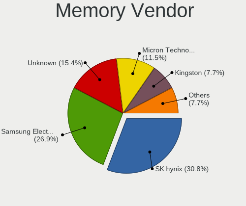
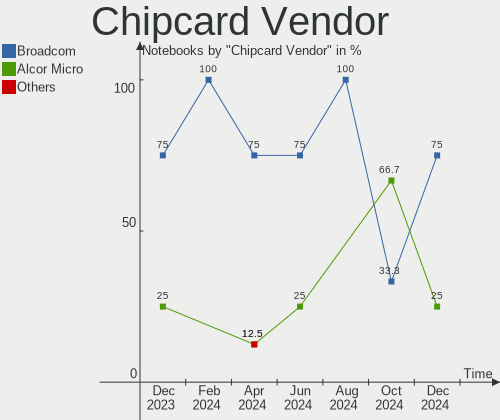
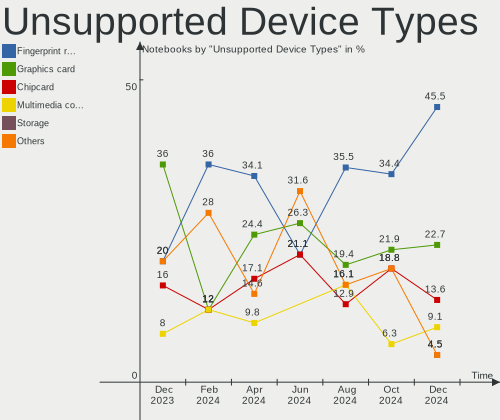

openSUSE - Hardware Trends (Notebooks)
--------------------------------------

A project to identify most popular hardware characteristics and track their change
over time based on data collected by Linux users at https://Linux-Hardware.org.

Anyone can contribute to this report by the [hw-probe](https://github.com/linuxhw/hw-probe) tool:

    sudo -E hw-probe -all -upload

This report is for one last month. Overall report since the beginning of time: [TestDays](https://github.com/linuxhw/TestDays)

Period: Dec, 2024.

Contents
--------

* [ System ](#system)
  - [ OS                       ](#os)
  - [ OS Family                ](#os-family)
  - [ Kernel                   ](#kernel)
  - [ Kernel Family            ](#kernel-family)
  - [ Kernel Major Ver.        ](#kernel-major-ver)
  - [ Arch                     ](#arch)
  - [ DE                       ](#de)
  - [ Display Server           ](#display-server)
  - [ Display Manager          ](#display-manager)
  - [ OS Lang                  ](#os-lang)
  - [ Boot Mode                ](#boot-mode)
  - [ Filesystem               ](#filesystem)
  - [ Part. scheme             ](#part-scheme)
  - [ Dual Boot with Linux/BSD ](#dual-boot-with-linuxbsd)
  - [ Dual Boot (Win)          ](#dual-boot-win)

* [ Board ](#board)
  - [ Vendor                   ](#vendor)
  - [ Model                    ](#model)
  - [ Model Family             ](#model-family)
  - [ MFG Year                 ](#mfg-year)
  - [ Form Factor              ](#form-factor)
  - [ Secure Boot              ](#secure-boot)
  - [ Coreboot                 ](#coreboot)
  - [ RAM Size                 ](#ram-size)
  - [ RAM Used                 ](#ram-used)
  - [ Total Drives             ](#total-drives)
  - [ Has CD-ROM               ](#has-cd-rom)
  - [ Has Ethernet             ](#has-ethernet)
  - [ Has WiFi                 ](#has-wifi)
  - [ Has Bluetooth            ](#has-bluetooth)

* [ Location ](#location)
  - [ Country                  ](#country)
  - [ City                     ](#city)

* [ Drives ](#drives)
  - [ Drive Vendor             ](#drive-vendor)
  - [ Drive Model              ](#drive-model)
  - [ HDD Vendor               ](#hdd-vendor)
  - [ SSD Vendor               ](#ssd-vendor)
  - [ Drive Kind               ](#drive-kind)
  - [ Drive Connector          ](#drive-connector)
  - [ Drive Size               ](#drive-size)
  - [ Space Total              ](#space-total)
  - [ Space Used               ](#space-used)
  - [ Malfunc. Drives          ](#malfunc-drives)
  - [ Malfunc. Drive Vendor    ](#malfunc-drive-vendor)
  - [ Malfunc. HDD Vendor      ](#malfunc-hdd-vendor)
  - [ Malfunc. Drive Kind      ](#malfunc-drive-kind)
  - [ Failed Drives            ](#failed-drives)
  - [ Failed Drive Vendor      ](#failed-drive-vendor)
  - [ Drive Status             ](#drive-status)

* [ Storage controller ](#storage-controller)
  - [ Storage Vendor           ](#storage-vendor)
  - [ Storage Model            ](#storage-model)
  - [ Storage Kind             ](#storage-kind)

* [ Processor ](#processor)
  - [ CPU Vendor               ](#cpu-vendor)
  - [ CPU Model                ](#cpu-model)
  - [ CPU Model Family         ](#cpu-model-family)
  - [ CPU Cores                ](#cpu-cores)
  - [ CPU Sockets              ](#cpu-sockets)
  - [ CPU Threads              ](#cpu-threads)
  - [ CPU Op-Modes             ](#cpu-op-modes)
  - [ CPU Microcode            ](#cpu-microcode)
  - [ CPU Microarch            ](#cpu-microarch)

* [ Graphics ](#graphics)
  - [ GPU Vendor               ](#gpu-vendor)
  - [ GPU Model                ](#gpu-model)
  - [ GPU Combo                ](#gpu-combo)
  - [ GPU Driver               ](#gpu-driver)
  - [ GPU Memory               ](#gpu-memory)

* [ Monitor ](#monitor)
  - [ Monitor Vendor           ](#monitor-vendor)
  - [ Monitor Model            ](#monitor-model)
  - [ Monitor Resolution       ](#monitor-resolution)
  - [ Monitor Diagonal         ](#monitor-diagonal)
  - [ Monitor Width            ](#monitor-width)
  - [ Aspect Ratio             ](#aspect-ratio)
  - [ Monitor Area             ](#monitor-area)
  - [ Pixel Density            ](#pixel-density)
  - [ Multiple Monitors        ](#multiple-monitors)

* [ Network ](#network)
  - [ Net Controller Vendor    ](#net-controller-vendor)
  - [ Net Controller Model     ](#net-controller-model)
  - [ Wireless Vendor          ](#wireless-vendor)
  - [ Wireless Model           ](#wireless-model)
  - [ Ethernet Vendor          ](#ethernet-vendor)
  - [ Ethernet Model           ](#ethernet-model)
  - [ Net Controller Kind      ](#net-controller-kind)
  - [ Used Controller          ](#used-controller)
  - [ NICs                     ](#nics)
  - [ IPv6                     ](#ipv6)

* [ Bluetooth ](#bluetooth)
  - [ Bluetooth Vendor         ](#bluetooth-vendor)
  - [ Bluetooth Model          ](#bluetooth-model)

* [ Sound ](#sound)
  - [ Sound Vendor             ](#sound-vendor)
  - [ Sound Model              ](#sound-model)

* [ Memory ](#memory)
  - [ Memory Vendor            ](#memory-vendor)
  - [ Memory Model             ](#memory-model)
  - [ Memory Kind              ](#memory-kind)
  - [ Memory Form Factor       ](#memory-form-factor)
  - [ Memory Size              ](#memory-size)
  - [ Memory Speed             ](#memory-speed)

* [ Printers & scanners ](#printers--scanners)
  - [ Printer Vendor           ](#printer-vendor)
  - [ Printer Model            ](#printer-model)
  - [ Scanner Vendor           ](#scanner-vendor)
  - [ Scanner Model            ](#scanner-model)

* [ Camera ](#camera)
  - [ Camera Vendor            ](#camera-vendor)
  - [ Camera Model             ](#camera-model)

* [ Security ](#security)
  - [ Fingerprint Vendor       ](#fingerprint-vendor)
  - [ Fingerprint Model        ](#fingerprint-model)
  - [ Chipcard Vendor          ](#chipcard-vendor)
  - [ Chipcard Model           ](#chipcard-model)

* [ Unsupported ](#unsupported)
  - [ Unsupported Devices      ](#unsupported-devices)
  - [ Unsupported Device Types ](#unsupported-device-types)

System
------

OS
--

Installed operating systems

| Name                         | Notebooks | Percent |
|------------------------------|-----------|---------|
| openSUSE Tumbleweed-XXXXXXXX | 36        | 72%     |
| openSUSE Leap-15.6           | 9         | 18%     |
| openSUSE Leap-15.5           | 3         | 6%      |
| openSUSE Microos-XXXXXXXX    | 2         | 4%      |

OS Family
---------

OS without a version

| Name     | Notebooks | Percent |
|----------|-----------|---------|
| openSUSE | 50        | 100%    |

Kernel
------

Version of the Linux kernel

| Version                      | Notebooks | Percent |
|------------------------------|-----------|---------|
| 6.11.8-1-default             | 25        | 50%     |
| 6.12.6-1-default             | 12        | 24%     |
| 6.4.0-150600.23.25-default   | 6         | 12%     |
| 6.4.0-150600.23.30-default   | 2         | 4%      |
| 5.14.21-150500.55.83-default | 2         | 4%      |
| 6.4.0-150600.21-default      | 1         | 2%      |
| 6.11.6-2-default             | 1         | 2%      |
| 5.14.21-150500.55.88-default | 1         | 2%      |

Kernel Family
-------------

Linux kernel without a distro release

| Version | Notebooks | Percent |
|---------|-----------|---------|
| 6.11.8  | 25        | 50%     |
| 6.12.6  | 12        | 24%     |
| 6.4.0   | 9         | 18%     |
| 5.14.21 | 3         | 6%      |
| 6.11.6  | 1         | 2%      |

Kernel Major Ver.
-----------------

Linux kernel major version

| Version | Notebooks | Percent |
|---------|-----------|---------|
| 6.11    | 26        | 52%     |
| 6.12    | 12        | 24%     |
| 6.4     | 9         | 18%     |
| 5.14    | 3         | 6%      |

Arch
----

OS architecture (x86_64, i586, etc.)

| Name   | Notebooks | Percent |
|--------|-----------|---------|
| x86_64 | 50        | 100%    |

DE
--

Desktop Environment

| Name    | Notebooks | Percent |
|---------|-----------|---------|
| KDE6    | 28        | 56%     |
| KDE5    | 8         | 16%     |
| GNOME   | 8         | 16%     |
| XFCE    | 3         | 6%      |
| Unknown | 3         | 6%      |

Display Server
--------------

X11 or Wayland

| Name    | Notebooks | Percent |
|---------|-----------|---------|
| X11     | 30        | 60%     |
| Wayland | 20        | 40%     |

Display Manager
---------------

SDDM, LightDM, etc.

| Name    | Notebooks | Percent |
|---------|-----------|---------|
| Unknown | 31        | 62%     |
| SDDM    | 15        | 30%     |
| GDM     | 3         | 6%      |
| LightDM | 1         | 2%      |

OS Lang
-------

Language

| Lang  | Notebooks | Percent |
|-------|-----------|---------|
| en_US | 19        | 38%     |
| de_DE | 11        | 22%     |
| en_GB | 5         | 10%     |
| pt_BR | 3         | 6%      |
| ru_RU | 2         | 4%      |
| POSIX | 2         | 4%      |
| it_IT | 2         | 4%      |
| tr_TR | 1         | 2%      |
| sk_SK | 1         | 2%      |
| pt_PT | 1         | 2%      |
| pl_PL | 1         | 2%      |
| hu_HU | 1         | 2%      |
| es_ES | 1         | 2%      |

Boot Mode
---------

EFI or BIOS

| Mode | Notebooks | Percent |
|------|-----------|---------|
| EFI  | 39        | 78%     |
| BIOS | 11        | 22%     |

Filesystem
----------

Type of filesystem

| Type  | Notebooks | Percent |
|-------|-----------|---------|
| Btrfs | 47        | 94%     |
| Ext4  | 2         | 4%      |
| Tmpfs | 1         | 2%      |

Part. scheme
------------

Scheme of partitioning

| Type    | Notebooks | Percent |
|---------|-----------|---------|
| Unknown | 31        | 62%     |
| GPT     | 19        | 38%     |

Dual Boot with Linux/BSD
------------------------

Hosting more than one Linux/BSD

| Dual boot | Notebooks | Percent |
|-----------|-----------|---------|
| No        | 47        | 94%     |
| Yes       | 3         | 6%      |

Dual Boot (Win)
---------------

Hosting Linux and Windows

| Dual boot | Notebooks | Percent |
|-----------|-----------|---------|
| No        | 43        | 86%     |
| Yes       | 7         | 14%     |

Board
-----

Vendor
------

Motherboard manufacturer

| Name             | Notebooks | Percent |
|------------------|-----------|---------|
| Lenovo           | 15        | 30%     |
| Dell             | 10        | 20%     |
| Hewlett-Packard  | 8         | 16%     |
| ASUSTek Computer | 6         | 12%     |
| Acer             | 4         | 8%      |
| Toshiba          | 3         | 6%      |
| Razer            | 1         | 2%      |
| Infinix          | 1         | 2%      |
| HONOR            | 1         | 2%      |
| Apple            | 1         | 2%      |

Model
-----

Motherboard model

| Name                                      | Notebooks | Percent |
|-------------------------------------------|-----------|---------|
| Toshiba Satellite U400                    | 1         | 2%      |
| Toshiba Satellite S55-C                   | 1         | 2%      |
| Toshiba Satellite Pro L70-A               | 1         | 2%      |
| Razer Blade                               | 1         | 2%      |
| Lenovo Y520-15IKBN 80WK                   | 1         | 2%      |
| Lenovo ThinkPad T480 20L6SA0X00           | 1         | 2%      |
| Lenovo ThinkPad T480 20L6S68A00           | 1         | 2%      |
| Lenovo ThinkPad T16 Gen 3 21MN005RUS      | 1         | 2%      |
| Lenovo ThinkPad T14s Gen 1 20UH000LUS     | 1         | 2%      |
| Lenovo ThinkPad SL 2746EHG                | 1         | 2%      |
| Lenovo ThinkPad P52 20MAS25B1F            | 1         | 2%      |
| Lenovo ThinkBook 15 G2 ARE 20VG           | 1         | 2%      |
| Lenovo ThinkBook 14 G6 IRL 21KG           | 1         | 2%      |
| Lenovo Legion 9 16IRX9 83G0               | 1         | 2%      |
| Lenovo Legion 7 16IRX9 83FD               | 1         | 2%      |
| Lenovo Legion 5 Pro 16ITH6H 82JD          | 1         | 2%      |
| Lenovo IdeaPad Slim 3 15ABR8 82XM         | 1         | 2%      |
| Lenovo IdeaPad 320-15AST 80XV             | 1         | 2%      |
| Lenovo G570 4334                          | 1         | 2%      |
| Infinix ZERO BOOK 13                      | 1         | 2%      |
| HONOR BRI-XX                              | 1         | 2%      |
| HP ZBook Fury 16 G9 Mobile Workstation PC | 1         | 2%      |
| HP ProBook 445R G6                        | 1         | 2%      |
| HP Laptop 17-cp0xxx                       | 1         | 2%      |
| HP Laptop 15-gw0xxx                       | 1         | 2%      |
| HP EliteBook 8470p                        | 1         | 2%      |
| HP EliteBook 845 G8 Notebook PC           | 1         | 2%      |
| HP EliteBook 840 G6                       | 1         | 2%      |
| HP EliteBook 2560p                        | 1         | 2%      |
| Dell XPS 13 9310                          | 1         | 2%      |
| Dell Latitude E5550                       | 1         | 2%      |
| Dell Latitude 7490                        | 1         | 2%      |
| Dell Latitude 7400                        | 1         | 2%      |
| Dell Latitude 7280                        | 1         | 2%      |
| Dell Latitude 5500                        | 1         | 2%      |
| Dell Inspiron 5748                        | 1         | 2%      |
| Dell Inspiron 3583                        | 1         | 2%      |
| Dell Inspiron 15-3567                     | 1         | 2%      |
| Dell Inspiron 15 3525                     | 1         | 2%      |
| ASUS X751SA                               | 1         | 2%      |

Model Family
------------

Motherboard model prefix

| Name               | Notebooks | Percent |
|--------------------|-----------|---------|
| Lenovo ThinkPad    | 6         | 12%     |
| Dell Latitude      | 5         | 10%     |
| HP EliteBook       | 4         | 8%      |
| Dell Inspiron      | 4         | 8%      |
| Toshiba Satellite  | 3         | 6%      |
| Lenovo Legion      | 3         | 6%      |
| Acer Aspire        | 3         | 6%      |
| Lenovo ThinkBook   | 2         | 4%      |
| Lenovo IdeaPad     | 2         | 4%      |
| HP Laptop          | 2         | 4%      |
| ASUS VivoBook      | 2         | 4%      |
| Razer Blade        | 1         | 2%      |
| Lenovo Y520-15IKBN | 1         | 2%      |
| Lenovo G570        | 1         | 2%      |
| Infinix ZERO       | 1         | 2%      |
| HONOR BRI-XX       | 1         | 2%      |
| HP ZBook           | 1         | 2%      |
| HP ProBook         | 1         | 2%      |
| Dell XPS           | 1         | 2%      |
| ASUS X751SA        | 1         | 2%      |
| ASUS X556UA        | 1         | 2%      |
| ASUS TUF           | 1         | 2%      |
| ASUS ASUS          | 1         | 2%      |
| Apple MacBookPro12 | 1         | 2%      |
| Acer Swift         | 1         | 2%      |

MFG Year
--------

Motherboard manufacture year

| Year | Notebooks | Percent |
|------|-----------|---------|
| 2019 | 9         | 18%     |
| 2024 | 5         | 10%     |
| 2021 | 5         | 10%     |
| 2020 | 5         | 10%     |
| 2023 | 4         | 8%      |
| 2018 | 4         | 8%      |
| 2017 | 3         | 6%      |
| 2015 | 3         | 6%      |
| 2014 | 3         | 6%      |
| 2011 | 3         | 6%      |
| 2016 | 2         | 4%      |
| 2008 | 2         | 4%      |
| 2022 | 1         | 2%      |
| 2010 | 1         | 2%      |

Form Factor
-----------

Physical design of the computer

| Name     | Notebooks | Percent |
|----------|-----------|---------|
| Notebook | 50        | 100%    |

Secure Boot
-----------

Enabled or disabled

| State    | Notebooks | Percent |
|----------|-----------|---------|
| Disabled | 39        | 78%     |
| Enabled  | 11        | 22%     |

Coreboot
--------

Have coreboot on board

| Used | Notebooks | Percent |
|------|-----------|---------|
| No   | 50        | 100%    |

RAM Size
--------

Total RAM memory

| Size in GB  | Notebooks | Percent |
|-------------|-----------|---------|
| 16.01-24.0  | 12        | 24%     |
| 8.01-16.0   | 10        | 20%     |
| 4.01-8.0    | 8         | 16%     |
| 32.01-64.0  | 8         | 16%     |
| 3.01-4.0    | 4         | 8%      |
| 24.01-32.0  | 4         | 8%      |
| 64.01-256.0 | 3         | 6%      |
| 2.01-3.0    | 1         | 2%      |

RAM Used
--------

Used RAM memory

| Used GB   | Notebooks | Percent |
|-----------|-----------|---------|
| 4.01-8.0  | 18        | 36%     |
| 2.01-3.0  | 14        | 28%     |
| 3.01-4.0  | 8         | 16%     |
| 1.01-2.0  | 5         | 10%     |
| 8.01-16.0 | 5         | 10%     |

Total Drives
------------

Number of drives on board

| Drives | Notebooks | Percent |
|--------|-----------|---------|
| 1      | 38        | 76%     |
| 2      | 12        | 24%     |

Has CD-ROM
----------

Has CD-ROM on board

| Presented | Notebooks | Percent |
|-----------|-----------|---------|
| No        | 41        | 82%     |
| Yes       | 9         | 18%     |

Has Ethernet
------------

Has Ethernet on board

| Presented | Notebooks | Percent |
|-----------|-----------|---------|
| Yes       | 37        | 74%     |
| No        | 13        | 26%     |

Has WiFi
--------

Has WiFi module

| Presented | Notebooks | Percent |
|-----------|-----------|---------|
| Yes       | 47        | 94%     |
| No        | 3         | 6%      |

Has Bluetooth
-------------

Has Bluetooth module

| Presented | Notebooks | Percent |
|-----------|-----------|---------|
| Yes       | 44        | 88%     |
| No        | 6         | 12%     |

Location
--------

Country
-------

Geographic location (country)

| Country     | Notebooks | Percent |
|-------------|-----------|---------|
| Germany     | 9         | 18%     |
| USA         | 6         | 12%     |
| Russia      | 4         | 8%      |
| Brazil      | 4         | 8%      |
| UK          | 3         | 6%      |
| Italy       | 3         | 6%      |
| Vietnam     | 2         | 4%      |
| Turkey      | 2         | 4%      |
| Poland      | 2         | 4%      |
| Netherlands | 2         | 4%      |
| Canada      | 2         | 4%      |
| Venezuela   | 1         | 2%      |
| Switzerland | 1         | 2%      |
| Slovakia    | 1         | 2%      |
| Portugal    | 1         | 2%      |
| Mexico      | 1         | 2%      |
| Israel      | 1         | 2%      |
| India       | 1         | 2%      |
| Hungary     | 1         | 2%      |
| France      | 1         | 2%      |
| Belgium     | 1         | 2%      |
| Austria     | 1         | 2%      |

City
----

Geographic location (city)

| City                       | Notebooks | Percent |
|----------------------------|-----------|---------|
| Moscow                     | 2         | 4%      |
| Zurich                     | 1         | 2%      |
| Zittau                     | 1         | 2%      |
| Wroclaw                    | 1         | 2%      |
| Wetteren                   | 1         | 2%      |
| Vught                      | 1         | 2%      |
| Vinh Yen                   | 1         | 2%      |
| Vero Beach                 | 1         | 2%      |
| Ternate                    | 1         | 2%      |
| Taufkirchen                | 1         | 2%      |
| Stuttgart                  | 1         | 2%      |
| Sleaford                   | 1         | 2%      |
| Sigmaringen                | 1         | 2%      |
| Selters                    | 1         | 2%      |
| Schkeuditz                 | 1         | 2%      |
| San Michele al Tagliamento | 1         | 2%      |
| Salzburg                   | 1         | 2%      |
| Rostock                    | 1         | 2%      |
| Richmond                   | 1         | 2%      |
| Rehovot                    | 1         | 2%      |
| Recife                     | 1         | 2%      |
| Platteville                | 1         | 2%      |
| Perm                       | 1         | 2%      |
| Paris                      | 1         | 2%      |
| Oklahoma City              | 1         | 2%      |
| Morecambe                  | 1         | 2%      |
| Miami                      | 1         | 2%      |
| Lomonosov                  | 1         | 2%      |
| Lisbon                     | 1         | 2%      |
| León                      | 1         | 2%      |
| Kummersbruck               | 1         | 2%      |
| Herzogenaurach             | 1         | 2%      |
| Harrow                     | 1         | 2%      |
| Ha Tinh                    | 1         | 2%      |
| Győr                      | 1         | 2%      |
| Grottaminarda              | 1         | 2%      |
| Georgetown                 | 1         | 2%      |
| Delhi                      | 1         | 2%      |
| Crown Point                | 1         | 2%      |
| Caracas                    | 1         | 2%      |

Drives
------

Drive Vendor
------------

Hard drive vendors

| Vendor                       | Notebooks | Drives | Percent |
|------------------------------|-----------|--------|---------|
| SK hynix                     | 10        | 10     | 16.13%  |
| Samsung Electronics          | 9         | 10     | 14.52%  |
| SanDisk                      | 5         | 5      | 8.06%   |
| Micron Technology            | 5         | 5      | 8.06%   |
| Unknown                      | 4         | 4      | 6.45%   |
| Seagate                      | 4         | 4      | 6.45%   |
| WDC                          | 3         | 4      | 4.84%   |
| Shenzhen Longsys Electronics | 2         | 2      | 3.23%   |
| Kingston Technology Company  | 2         | 2      | 3.23%   |
| Intel                        | 2         | 2      | 3.23%   |
| Verbatim                     | 1         | 1      | 1.61%   |
| Toshiba                      | 1         | 1      | 1.61%   |
| SPCC                         | 1         | 1      | 1.61%   |
| Silicon Motion               | 1         | 1      | 1.61%   |
| S100                         | 1         | 1      | 1.61%   |
| Phison Electronics           | 1         | 1      | 1.61%   |
| Micron/Crucial Technology    | 1         | 1      | 1.61%   |
| MAXIO Technology (Hangzhou)  | 1         | 1      | 1.61%   |
| LITEON                       | 1         | 1      | 1.61%   |
| KIOXIA                       | 1         | 1      | 1.61%   |
| Kingston                     | 1         | 1      | 1.61%   |
| KingSpec                     | 1         | 1      | 1.61%   |
| External                     | 1         | 1      | 1.61%   |
| China                        | 1         | 1      | 1.61%   |
| Apple                        | 1         | 1      | 1.61%   |
| A-DATA Technology            | 1         | 1      | 1.61%   |

Drive Model
-----------

Hard drive models

| Model                                                 | Notebooks | Percent |
|-------------------------------------------------------|-----------|---------|
| Samsung NVMe SSD Controller SM981/PM981/PM983 512GB   | 3         | 4.69%   |
| Samsung NVMe SSD Controller PM9A1/PM9A3/980PRO 512GB  | 2         | 3.13%   |
| WDC WDS500G2B0A 500GB SSD                             | 1         | 1.56%   |
| WDC WDS240G2G0B-00EPW0 240GB SSD                      | 1         | 1.56%   |
| WDC WD20SPZX-75UA7T0 2TB                              | 1         | 1.56%   |
| WDC WD10SPZX-21Z10T0 1TB                              | 1         | 1.56%   |
| Verbatim Vi550 S3 256GB                               | 1         | 1.56%   |
| Unknown xD/SD/M.S.                                    | 1         | 1.56%   |
| Unknown NVMe SSD Drive 1024GB                         | 1         | 1.56%   |
| Unknown MMC Card  7GB                                 | 1         | 1.56%   |
| Unknown MMC Card  512GB                               | 1         | 1.56%   |
| Toshiba MQ01ABD100 1TB                                | 1         | 1.56%   |
| SPCC Solid State Disk 512GB                           | 1         | 1.56%   |
| SK hynix SKHynix_HFS512GEJ9X162N 512GB                | 1         | 1.56%   |
| SK hynix SKHynix_HFS512GEJ4X112N 512GB                | 1         | 1.56%   |
| SK hynix SKHynix_HFS002TEJ9X115N 2TB                  | 1         | 1.56%   |
| SK hynix SKHynix_HFS001TEJ9X115N 1TB                  | 1         | 1.56%   |
| SK hynix SHGP31-1000GM-2 1TB                          | 1         | 1.56%   |
| SK hynix PC801 HFS512GEJ9X101N 512GB                  | 1         | 1.56%   |
| SK hynix HFS256G39TND-N210A 256GB SSD                 | 1         | 1.56%   |
| SK hynix BC711 NVMe 512GB                             | 1         | 1.56%   |
| SK hynix BC711 HFM512GD3JX013N 512GB                  | 1         | 1.56%   |
| SK hynix BC501 NVMe Solid State Drive 512GB           | 1         | 1.56%   |
| Silicon Motion SM2263EN/SM2263XT SSD Controller 256GB | 1         | 1.56%   |
| Shenzhen Longsys Lexar SSD NQ790 1TB                  | 1         | 1.56%   |
| Shenzhen Longsys FORESEE XP2100F512G 512GB            | 1         | 1.56%   |
| Seagate ST9120823AS 120GB                             | 1         | 1.56%   |
| Seagate ST500LM030-1RK17D 500GB                       | 1         | 1.56%   |
| Seagate ST1000LM035-1RK172 1TB                        | 1         | 1.56%   |
| Seagate ST1000LM014-1EJ164-SSHD 1TB                   | 1         | 1.56%   |
| Sandisk WD Blue SN580 500GB                           | 1         | 1.56%   |
| SanDisk SSD PLUS 240GB                                | 1         | 1.56%   |
| SanDisk SD9SN8W256G 250GB SSD                         | 1         | 1.56%   |
| SanDisk SD7SN6S-256G-1006 256GB SSD                   | 1         | 1.56%   |
| Sandisk PC SN740 NVMe WD 1TB                          | 1         | 1.56%   |
| Samsung SSD 980 1TB                                   | 1         | 1.56%   |
| Samsung SSD 870 EVO 500GB                             | 1         | 1.56%   |
| Samsung SSD 870 EVO 250GB                             | 1         | 1.56%   |
| Samsung SSD 860 EVO 250GB                             | 1         | 1.56%   |
| Samsung MZALQ256HAJD-000L2 256GB                      | 1         | 1.56%   |

HDD Vendor
----------

Hard disk drive vendors

| Vendor   | Notebooks | Drives | Percent |
|----------|-----------|--------|---------|
| Seagate  | 4         | 4      | 50%     |
| WDC      | 2         | 2      | 25%     |
| Toshiba  | 1         | 1      | 12.5%   |
| External | 1         | 1      | 12.5%   |

SSD Vendor
----------

Solid state drive vendors

| Vendor              | Notebooks | Drives | Percent |
|---------------------|-----------|--------|---------|
| SanDisk             | 3         | 3      | 16.67%  |
| Samsung Electronics | 3         | 3      | 16.67%  |
| WDC                 | 2         | 2      | 11.11%  |
| SPCC                | 1         | 1      | 5.56%   |
| SK hynix            | 1         | 1      | 5.56%   |
| S100                | 1         | 1      | 5.56%   |
| Micron Technology   | 1         | 1      | 5.56%   |
| LITEON              | 1         | 1      | 5.56%   |
| KingSpec            | 1         | 1      | 5.56%   |
| Intel               | 1         | 1      | 5.56%   |
| China               | 1         | 1      | 5.56%   |
| Apple               | 1         | 1      | 5.56%   |
| A-DATA Technology   | 1         | 1      | 5.56%   |

Drive Kind
----------

HDD or SSD

| Kind    | Notebooks | Drives | Percent |
|---------|-----------|--------|---------|
| NVMe    | 29        | 34     | 50%     |
| SSD     | 17        | 18     | 29.31%  |
| HDD     | 8         | 8      | 13.79%  |
| MMC     | 2         | 2      | 3.45%   |
| Unknown | 2         | 2      | 3.45%   |

Drive Connector
---------------

SATA, SAS, NVMe, etc.

| Type | Notebooks | Drives | Percent |
|------|-----------|--------|---------|
| NVMe | 29        | 34     | 50.88%  |
| SATA | 23        | 25     | 40.35%  |
| SAS  | 3         | 3      | 5.26%   |
| MMC  | 2         | 2      | 3.51%   |

Drive Size
----------

Size of hard drive

| Size in TB | Notebooks | Drives | Percent |
|------------|-----------|--------|---------|
| 0.01-0.5   | 18        | 20     | 75%     |
| 0.51-1.0   | 5         | 5      | 20.83%  |
| 1.01-2.0   | 1         | 1      | 4.17%   |

Space Total
-----------

Amount of disk space available on the file system

| Size in GB     | Notebooks | Percent |
|----------------|-----------|---------|
| More than 3000 | 22        | 44%     |
| 1001-2000      | 11        | 22%     |
| 501-1000       | 9         | 18%     |
| 2001-3000      | 5         | 10%     |
| 251-500        | 1         | 2%      |
| 101-250        | 1         | 2%      |
| 51-100         | 1         | 2%      |

Space Used
----------

Amount of used disk space

| Used GB        | Notebooks | Percent |
|----------------|-----------|---------|
| 101-250        | 13        | 26%     |
| 251-500        | 10        | 20%     |
| 51-100         | 9         | 18%     |
| 501-1000       | 8         | 16%     |
| 1001-2000      | 4         | 8%      |
| 2001-3000      | 3         | 6%      |
| More than 3000 | 2         | 4%      |
| 1-20           | 1         | 2%      |

Malfunc. Drives
---------------

Drive models with a malfunction

| Model                                 | Notebooks | Drives | Percent |
|---------------------------------------|-----------|--------|---------|
| WDC WD10SPZX-21Z10T0 1TB              | 1         | 1      | 33.33%  |
| SK hynix HFS256G39TND-N210A 256GB SSD | 1         | 1      | 33.33%  |
| SK hynix BC711 HFM512GD3JX013N 512GB  | 1         | 1      | 33.33%  |

Malfunc. Drive Vendor
---------------------

Vendors of faulty drives

| Vendor   | Notebooks | Drives | Percent |
|----------|-----------|--------|---------|
| SK hynix | 2         | 2      | 66.67%  |
| WDC      | 1         | 1      | 33.33%  |

Malfunc. HDD Vendor
-------------------

Vendors of faulty HDD drives

| Vendor | Notebooks | Drives | Percent |
|--------|-----------|--------|---------|
| WDC    | 1         | 1      | 100%    |

Malfunc. Drive Kind
-------------------

Kinds of faulty drives

| Kind | Notebooks | Drives | Percent |
|------|-----------|--------|---------|
| NVMe | 1         | 1      | 33.33%  |
| SSD  | 1         | 1      | 33.33%  |
| HDD  | 1         | 1      | 33.33%  |

Failed Drives
-------------

Failed drive models

Zero info for selected period =(

Failed Drive Vendor
-------------------

Failed drive vendors

Zero info for selected period =(

Drive Status
------------

Number of failed and malfunc. drives

| Status   | Notebooks | Drives | Percent |
|----------|-----------|--------|---------|
| Detected | 33        | 42     | 63.46%  |
| Works    | 16        | 19     | 30.77%  |
| Malfunc  | 3         | 3      | 5.77%   |

Storage controller
------------------

Storage Vendor
--------------

Storage controller vendors

| Vendor                       | Notebooks | Percent |
|------------------------------|-----------|---------|
| Intel                        | 23        | 37.7%   |
| SK hynix                     | 9         | 14.75%  |
| Samsung Electronics          | 7         | 11.48%  |
| AMD                          | 5         | 8.2%    |
| Micron Technology            | 4         | 6.56%   |
| Kingston Technology Company  | 3         | 4.92%   |
| Shenzhen Longsys Electronics | 2         | 3.28%   |
| Sandisk                      | 2         | 3.28%   |
| Solidigm                     | 1         | 1.64%   |
| Silicon Motion               | 1         | 1.64%   |
| Phison Electronics           | 1         | 1.64%   |
| Micron/Crucial Technology    | 1         | 1.64%   |
| MAXIO Technology (Hangzhou)  | 1         | 1.64%   |
| KIOXIA                       | 1         | 1.64%   |

Storage Model
-------------

Storage controller models

| Model                                                                            | Notebooks | Percent |
|----------------------------------------------------------------------------------|-----------|---------|
| SK hynix Platinum P41/PC801 NVMe Solid State Drive                               | 4         | 6.15%   |
| Intel Sunrise Point-LP SATA Controller [AHCI mode]                               | 4         | 6.15%   |
| AMD FCH SATA Controller [AHCI mode]                                              | 4         | 6.15%   |
| SK hynix Gold P31/BC711/PC711 NVMe Solid State Drive                             | 3         | 4.62%   |
| Samsung NVMe SSD Controller SM981/PM981/PM983                                    | 3         | 4.62%   |
| Samsung NVMe SSD Controller PM9A1/PM9A3/980PRO                                   | 2         | 3.08%   |
| Samsung NVMe SSD Controller 980 (DRAM-less)                                      | 2         | 3.08%   |
| Micron 2400 NVMe SSD (DRAM-less)                                                 | 2         | 3.08%   |
| Intel Cannon Point-LP SATA Controller [AHCI Mode]                                | 2         | 3.08%   |
| Intel 82801IBM/IEM (ICH9M/ICH9M-E) 4 port SATA Controller [AHCI mode]            | 2         | 3.08%   |
| Intel 82801 Mobile SATA Controller [RAID mode]                                   | 2         | 3.08%   |
| Solidigm P41 Plus NVMe SSD (DRAM-less) [Echo Harbor]                             | 1         | 1.54%   |
| SK hynix BC901 NVMe Solid State Drive (DRAM-less)                                | 1         | 1.54%   |
| SK hynix BC501 NVMe Solid State Drive                                            | 1         | 1.54%   |
| Silicon Motion SM2263EN/SM2263XT (DRAM-less) NVMe SSD Controllers                | 1         | 1.54%   |
| Shenzhen Longsys Lexar NM790 NVME SSD (DRAM-less)                                | 1         | 1.54%   |
| Shenzhen Longsys FORESEE XP2100 NVMe SSD (DRAM-less)                             | 1         | 1.54%   |
| Sandisk WD Blue SN580 NVMe SSD (DRAM-less)                                       | 1         | 1.54%   |
| Sandisk PC SN740 NVMe SSD (DRAM-less)                                            | 1         | 1.54%   |
| Samsung S4LN058A01[SSUBX] AHCI SSD Controller (Apple slot)                       | 1         | 1.54%   |
| Phison E12 NVMe Controller                                                       | 1         | 1.54%   |
| Micron/Crucial P2 [Nick P2] / P3 / P3 Plus NVMe PCIe SSD (DRAM-less)             | 1         | 1.54%   |
| Micron 2210 NVMe SSD [Cobain]                                                    | 1         | 1.54%   |
| Micron 2200S NVMe SSD [Cassandra]                                                | 1         | 1.54%   |
| MAXIO (Hangzhou) NVMe SSD Controller MAP1602 (DRAM-less)                         | 1         | 1.54%   |
| KIOXIA NVMe SSD Controller BG4 (DRAM-less)                                       | 1         | 1.54%   |
| Kingston Company OM8PGP4 NVMe PCIe SSD (DRAM-less)                               | 1         | 1.54%   |
| Kingston Company NV2 NVMe SSD [E21T] (DRAM-less)                                 | 1         | 1.54%   |
| Kingston Company KC3000/FURY Renegade NVMe SSD [E18]                             | 1         | 1.54%   |
| Intel Wildcat Point-LP SATA Controller [AHCI Mode]                               | 1         | 1.54%   |
| Intel Volume Management Device NVMe RAID Controller                              | 1         | 1.54%   |
| Intel Tiger Lake-LP SATA Controller                                              | 1         | 1.54%   |
| Intel Tiger Lake SATA AHCI Controller                                            | 1         | 1.54%   |
| Intel SSD 600P Series                                                            | 1         | 1.54%   |
| Intel HM170/QM170 Chipset SATA Controller [AHCI Mode]                            | 1         | 1.54%   |
| Intel Celeron/Pentium Silver Processor SATA Controller                           | 1         | 1.54%   |
| Intel Cannon Lake Mobile PCH SATA AHCI Controller                                | 1         | 1.54%   |
| Intel Atom/Celeron/Pentium Processor x5-E8000/J3xxx/N3xxx Series SATA Controller | 1         | 1.54%   |
| Intel Alder Lake-P SATA AHCI Controller                                          | 1         | 1.54%   |
| Intel 8 Series/C220 Series Chipset Family 6-port SATA Controller 1 [AHCI mode]   | 1         | 1.54%   |

Storage Kind
------------

Kind of storage controller (IDE, SATA, NVMe, SAS, ...)

| Kind | Notebooks | Percent |
|------|-----------|---------|
| NVMe | 29        | 49.15%  |
| SATA | 26        | 44.07%  |
| RAID | 3         | 5.08%   |
| IDE  | 1         | 1.69%   |

Processor
---------

CPU Vendor
----------

Processor vendors

| Vendor | Notebooks | Percent |
|--------|-----------|---------|
| Intel  | 36        | 72%     |
| AMD    | 14        | 28%     |

CPU Model
---------

Processor models

| Model                                         | Notebooks | Percent |
|-----------------------------------------------|-----------|---------|
| AMD Ryzen 7 5700U with Radeon Graphics        | 3         | 6%      |
| Intel Core i9-14900HX                         | 2         | 4%      |
| Intel Core i5-8350U CPU @ 1.70GHz             | 2         | 4%      |
| Intel Core i5-8265U CPU @ 1.60GHz             | 2         | 4%      |
| Intel Pentium Dual-Core CPU T4200 @ 2.00GHz   | 1         | 2%      |
| Intel Pentium CPU N3700 @ 1.60GHz             | 1         | 2%      |
| Intel Core Ultra 5 135U                       | 1         | 2%      |
| Intel Core i7-8850H CPU @ 2.60GHz             | 1         | 2%      |
| Intel Core i7-8750H CPU @ 2.20GHz             | 1         | 2%      |
| Intel Core i7-8665U CPU @ 1.90GHz             | 1         | 2%      |
| Intel Core i7-8550U CPU @ 1.80GHz             | 1         | 2%      |
| Intel Core i7-5500U CPU @ 2.40GHz             | 1         | 2%      |
| Intel Core i5-8365U CPU @ 1.60GHz             | 1         | 2%      |
| Intel Core i5-8250U CPU @ 1.60GHz             | 1         | 2%      |
| Intel Core i5-7300U CPU @ 2.60GHz             | 1         | 2%      |
| Intel Core i5-7300HQ CPU @ 2.50GHz            | 1         | 2%      |
| Intel Core i5-6300U CPU @ 2.40GHz             | 1         | 2%      |
| Intel Core i5-6200U CPU @ 2.30GHz             | 1         | 2%      |
| Intel Core i5-5257U CPU @ 2.70GHz             | 1         | 2%      |
| Intel Core i5-4210U CPU @ 1.70GHz             | 1         | 2%      |
| Intel Core i5-4200M CPU @ 2.50GHz             | 1         | 2%      |
| Intel Core i5-3320M CPU @ 2.60GHz             | 1         | 2%      |
| Intel Core i5-2520M CPU @ 2.50GHz             | 1         | 2%      |
| Intel Core i5-2430M CPU @ 2.40GHz             | 1         | 2%      |
| Intel Core i3-6006U CPU @ 2.00GHz             | 1         | 2%      |
| Intel Core i3-5010U CPU @ 2.10GHz             | 1         | 2%      |
| Intel Core 2 Duo CPU P7570 @ 2.26GHz          | 1         | 2%      |
| Intel Celeron N4020 CPU @ 1.10GHz             | 1         | 2%      |
| Intel 13th Gen Core i7-13700H                 | 1         | 2%      |
| Intel 13th Gen Core i5-13500H                 | 1         | 2%      |
| Intel 12th Gen Core i7-12850HX                | 1         | 2%      |
| Intel 11th Gen Core i7-11800H @ 2.30GHz       | 1         | 2%      |
| Intel 11th Gen Core i7-1165G7 @ 2.80GHz       | 1         | 2%      |
| Intel 11th Gen Core i5-1135G7 @ 2.40GHz       | 1         | 2%      |
| AMD Ryzen 7 PRO 5850U with Radeon Graphics    | 1         | 2%      |
| AMD Ryzen 7 PRO 4750U with Radeon Graphics    | 1         | 2%      |
| AMD Ryzen 7 8845HS w/ Radeon 780M Graphics    | 1         | 2%      |
| AMD Ryzen 7 7730U with Radeon Graphics        | 1         | 2%      |
| AMD Ryzen 7 7435HS                            | 1         | 2%      |
| AMD Ryzen 7 3750H with Radeon Vega Mobile Gfx | 1         | 2%      |

CPU Model Family
----------------

Processor model prefix

| Model                   | Notebooks | Percent |
|-------------------------|-----------|---------|
| Intel Core i5           | 16        | 32%     |
| AMD Ryzen 7             | 7         | 14%     |
| Other                   | 6         | 12%     |
| Intel Core i7           | 5         | 10%     |
| Intel Core i9           | 2         | 4%      |
| Intel Core i3           | 2         | 4%      |
| AMD Ryzen 7 PRO         | 2         | 4%      |
| AMD Ryzen 3             | 2         | 4%      |
| Intel Pentium Dual-Core | 1         | 2%      |
| Intel Pentium           | 1         | 2%      |
| Intel Core 2 Duo        | 1         | 2%      |
| Intel Core              | 1         | 2%      |
| Intel Celeron           | 1         | 2%      |
| AMD Ryzen 5             | 1         | 2%      |
| AMD C-50                | 1         | 2%      |
| AMD A6                  | 1         | 2%      |

CPU Cores
---------

Number of processor cores

| Number | Notebooks | Percent |
|--------|-----------|---------|
| 2      | 19        | 38%     |
| 4      | 13        | 26%     |
| 8      | 9         | 18%     |
| 6      | 3         | 6%      |
| 24     | 2         | 4%      |
| 12     | 2         | 4%      |
| 16     | 1         | 2%      |
| 14     | 1         | 2%      |

CPU Sockets
-----------

Number of sockets

| Number | Notebooks | Percent |
|--------|-----------|---------|
| 1      | 50        | 100%    |

CPU Threads
-----------

Threads per core (Hyper-Threading)

| Number | Notebooks | Percent |
|--------|-----------|---------|
| 2      | 39        | 78%     |
| 1      | 11        | 22%     |

CPU Op-Modes
------------

CPU Operation Modes (32-bit, 64-bit)

| Op mode        | Notebooks | Percent |
|----------------|-----------|---------|
| 32-bit, 64-bit | 50        | 100%    |

CPU Microcode
-------------

Microcode number

| Number     | Notebooks | Percent |
|------------|-----------|---------|
| Unknown    | 47        | 94%     |
| 0x806ec    | 1         | 2%      |
| 0x806c1    | 1         | 2%      |
| 0x08108109 | 1         | 2%      |

CPU Microarch
-------------

Microarchitecture

| Name              | Notebooks | Percent |
|-------------------|-----------|---------|
| KabyLake          | 12        | 24%     |
| Alderlake Hybrid  | 5         | 10%     |
| Unknown           | 5         | 10%     |
| Zen+              | 3         | 6%      |
| Skylake           | 3         | 6%      |
| Broadwell         | 3         | 6%      |
| Zen 3             | 2         | 4%      |
| Zen 2             | 2         | 4%      |
| TigerLake         | 2         | 4%      |
| SandyBridge       | 2         | 4%      |
| Penryn            | 2         | 4%      |
| Haswell           | 2         | 4%      |
| Silvermont        | 1         | 2%      |
| Meteorlake Hybrid | 1         | 2%      |
| IvyBridge         | 1         | 2%      |
| Icelake           | 1         | 2%      |
| Goldmont plus     | 1         | 2%      |
| Excavator         | 1         | 2%      |
| Bobcat            | 1         | 2%      |

Graphics
--------

GPU Vendor
----------

Vendors of graphics cards

| Vendor | Notebooks | Percent |
|--------|-----------|---------|
| Intel  | 33        | 54.1%   |
| Nvidia | 14        | 22.95%  |
| AMD    | 14        | 22.95%  |

GPU Model
---------

Graphics card models

| Model                                                                                    | Notebooks | Percent |
|------------------------------------------------------------------------------------------|-----------|---------|
| Intel WhiskeyLake-U GT2 [UHD Graphics 620]                                               | 4         | 6.45%   |
| Intel UHD Graphics 620                                                                   | 4         | 6.45%   |
| Intel Skylake GT2 [HD Graphics 520]                                                      | 3         | 4.84%   |
| AMD Picasso/Raven 2 [Radeon Vega Series / Radeon Vega Mobile Series]                     | 3         | 4.84%   |
| AMD Lucienne                                                                             | 3         | 4.84%   |
| Nvidia GP108M [GeForce MX150]                                                            | 2         | 3.23%   |
| Intel TigerLake-LP GT2 [Iris Xe Graphics]                                                | 2         | 3.23%   |
| Intel Raptor Lake-P [Iris Xe Graphics]                                                   | 2         | 3.23%   |
| Intel HD Graphics 5500                                                                   | 2         | 3.23%   |
| Intel CoffeeLake-H GT2 [UHD Graphics 630]                                                | 2         | 3.23%   |
| Intel 2nd Generation Core Processor Family Integrated Graphics Controller                | 2         | 3.23%   |
| AMD Renoir [Radeon Vega Series / Radeon Vega Mobile Series]                              | 2         | 3.23%   |
| Nvidia TU117M [GeForce GTX 1650 Mobile / Max-Q]                                          | 1         | 1.61%   |
| Nvidia GP107M [GeForce GTX 1050 Mobile]                                                  | 1         | 1.61%   |
| Nvidia GP107GLM [Quadro P1000 Mobile]                                                    | 1         | 1.61%   |
| Nvidia GP106M [GeForce GTX 1060 Mobile]                                                  | 1         | 1.61%   |
| Nvidia GM108M [GeForce 840M]                                                             | 1         | 1.61%   |
| Nvidia GK208M [GeForce GT 740M]                                                          | 1         | 1.61%   |
| Nvidia GA107GLM [RTX A1000 Laptop GPU]                                                   | 1         | 1.61%   |
| Nvidia GA104M [GeForce RTX 3070 Mobile / Max-Q]                                          | 1         | 1.61%   |
| Nvidia G98M [GeForce G 105M]                                                             | 1         | 1.61%   |
| Nvidia AD107M [GeForce RTX 4060 Max-Q / Mobile]                                          | 1         | 1.61%   |
| Nvidia AD106M [GeForce RTX 4070 Max-Q / Mobile]                                          | 1         | 1.61%   |
| Nvidia AD103M / GN21-X11 [GeForce RTX 4090 Laptop GPU]                                   | 1         | 1.61%   |
| Intel Raptor Lake-S UHD Graphics                                                         | 1         | 1.61%   |
| Intel Mobile 4 Series Chipset Integrated Graphics Controller                             | 1         | 1.61%   |
| Intel Meteor Lake-P [Intel Graphics]                                                     | 1         | 1.61%   |
| Intel Iris Graphics 6100                                                                 | 1         | 1.61%   |
| Intel HD Graphics 630                                                                    | 1         | 1.61%   |
| Intel HD Graphics 620                                                                    | 1         | 1.61%   |
| Intel Haswell-ULT Integrated Graphics Controller                                         | 1         | 1.61%   |
| Intel GeminiLake [UHD Graphics 600]                                                      | 1         | 1.61%   |
| Intel Atom/Celeron/Pentium Processor x5-E8000/J3xxx/N3xxx Integrated Graphics Controller | 1         | 1.61%   |
| Intel Alder Lake-HX GT1 [UHD Graphics 770]                                               | 1         | 1.61%   |
| Intel 4th Gen Core Processor Integrated Graphics Controller                              | 1         | 1.61%   |
| Intel 3rd Gen Core processor Graphics Controller                                         | 1         | 1.61%   |
| AMD Wrestler [Radeon HD 6250]                                                            | 1         | 1.61%   |
| AMD Topaz XT [Radeon R7 M260/M265 / M340/M360 / M440/M445 / 530/535 / 620/625 Mobile]    | 1         | 1.61%   |
| AMD Stoney [Radeon R2/R3/R4/R5 Graphics]                                                 | 1         | 1.61%   |
| AMD Phoenix3                                                                             | 1         | 1.61%   |

GPU Combo
---------

Combinations of graphics cards

| Name           | Notebooks | Percent |
|----------------|-----------|---------|
| 1 x Intel      | 23        | 46%     |
| 1 x AMD        | 11        | 22%     |
| Intel + Nvidia | 9         | 18%     |
| 1 x Nvidia     | 4         | 8%      |
| 2 x AMD        | 1         | 2%      |
| Intel + AMD    | 1         | 2%      |
| AMD + Nvidia   | 1         | 2%      |

GPU Driver
----------

Free vs proprietary

| Driver      | Notebooks | Percent |
|-------------|-----------|---------|
| Free        | 44        | 88%     |
| Proprietary | 3         | 6%      |
| Unknown     | 3         | 6%      |

GPU Memory
----------

Total video memory

| Size in GB | Notebooks | Percent |
|------------|-----------|---------|
| Unknown    | 33        | 66%     |
| 0.01-0.5   | 6         | 12%     |
| 1.01-2.0   | 5         | 10%     |
| 7.01-8.0   | 3         | 6%      |
| 3.01-4.0   | 2         | 4%      |
| 5.01-6.0   | 1         | 2%      |

Monitor
-------

Monitor Vendor
--------------

Monitor vendors

| Vendor              | Notebooks | Percent |
|---------------------|-----------|---------|
| BOE                 | 11        | 19.64%  |
| Chimei Innolux      | 10        | 17.86%  |
| LG Display          | 8         | 14.29%  |
| AU Optronics        | 8         | 14.29%  |
| Samsung Electronics | 3         | 5.36%   |
| Lenovo              | 3         | 5.36%   |
| PANDA               | 2         | 3.57%   |
| Goldstar            | 2         | 3.57%   |
| Sharp               | 1         | 1.79%   |
| Philips             | 1         | 1.79%   |
| LG Philips          | 1         | 1.79%   |
| KDB                 | 1         | 1.79%   |
| Dell                | 1         | 1.79%   |
| CSW                 | 1         | 1.79%   |
| CSO                 | 1         | 1.79%   |
| Apple               | 1         | 1.79%   |
| AOC                 | 1         | 1.79%   |

Monitor Model
-------------

Monitor models

| Model                                                                 | Notebooks | Percent |
|-----------------------------------------------------------------------|-----------|---------|
| Sharp LCD Monitor SHP14F9 1920x1200 288x180mm 13.4-inch               | 1         | 1.75%   |
| Samsung Electronics LCD Monitor SEC564E 1280x720 223x125mm 10.1-inch  | 1         | 1.75%   |
| Samsung Electronics LCD Monitor SEC4149 1366x768 292x174mm 13.4-inch  | 1         | 1.75%   |
| Samsung Electronics LCD Monitor SDC4161 1920x1080 344x194mm 15.5-inch | 1         | 1.75%   |
| Philips PHL 243V5 PHLC0D1 1920x1080 521x293mm 23.5-inch               | 1         | 1.75%   |
| PANDA LM156LF1L03 NCP001C 1920x1080 344x194mm 15.5-inch               | 1         | 1.75%   |
| PANDA LCD Monitor NCP002D 1920x1080 344x194mm 15.5-inch               | 1         | 1.75%   |
| LG Philips LCD Monitor LPL2601 1280x800 286x179mm 13.3-inch           | 1         | 1.75%   |
| LG Display LCD Monitor LGD0738 1920x1080 344x194mm 15.5-inch          | 1         | 1.75%   |
| LG Display LCD Monitor LGD060F 1920x1080 309x174mm 14.0-inch          | 1         | 1.75%   |
| LG Display LCD Monitor LGD05C0 1920x1080 344x194mm 15.5-inch          | 1         | 1.75%   |
| LG Display LCD Monitor LGD0590 1920x1080 344x194mm 15.5-inch          | 1         | 1.75%   |
| LG Display LCD Monitor LGD0521 1920x1080 309x174mm 14.0-inch          | 1         | 1.75%   |
| LG Display LCD Monitor LGD04E2 1366x768 344x194mm 15.5-inch           | 1         | 1.75%   |
| LG Display LCD Monitor LGD0456 1366x768 344x194mm 15.5-inch           | 1         | 1.75%   |
| LG Display LCD Monitor LGD0306 1600x900 310x174mm 14.0-inch           | 1         | 1.75%   |
| Lenovo LEN S22e-19 LEN61C9 1920x1080 476x268mm 21.5-inch              | 1         | 1.75%   |
| Lenovo LCD Monitor LEN40B0 1366x768 345x194mm 15.6-inch               | 1         | 1.75%   |
| Lenovo LCD Monitor LEN4053 1680x1050 331x207mm 15.4-inch              | 1         | 1.75%   |
| KDB LCD Monitor KDB0526 1920x1080 344x194mm 15.5-inch                 | 1         | 1.75%   |
| Goldstar ULTRAWIDE GSM77BE 1920x1080 800x334mm 34.1-inch              | 1         | 1.75%   |
| Goldstar LG ULTRAWIDE GSM77BF 1920x1080 400x330mm 20.4-inch           | 1         | 1.75%   |
| Goldstar FHD GSM5C66 1920x1080 527x296mm 23.8-inch                    | 1         | 1.75%   |
| Dell P2421D DELD0FF 2560x1440 527x296mm 23.8-inch                     | 1         | 1.75%   |
| CSW LCD Monitor CSW163E 3200x2000 344x215mm 16.0-inch                 | 1         | 1.75%   |
| CSO LCD Monitor CSO1423 1920x1200 302x189mm 14.0-inch                 | 1         | 1.75%   |
| Chimei Innolux LCD Monitor CMN1734 1600x900 382x214mm 17.2-inch       | 1         | 1.75%   |
| Chimei Innolux LCD Monitor CMN15E8 1920x1080 344x193mm 15.5-inch      | 1         | 1.75%   |
| Chimei Innolux LCD Monitor CMN15E7 1920x1080 344x193mm 15.5-inch      | 1         | 1.75%   |
| Chimei Innolux LCD Monitor CMN15DB 1366x768 344x193mm 15.5-inch       | 1         | 1.75%   |
| Chimei Innolux LCD Monitor CMN1552 1920x1080 344x193mm 15.5-inch      | 1         | 1.75%   |
| Chimei Innolux LCD Monitor CMN1512 1920x1080 344x193mm 15.5-inch      | 1         | 1.75%   |
| Chimei Innolux LCD Monitor CMN1500 1366x768 344x193mm 15.5-inch       | 1         | 1.75%   |
| Chimei Innolux LCD Monitor CMN14E8 1920x1080 309x173mm 13.9-inch      | 1         | 1.75%   |
| Chimei Innolux LCD Monitor CMN14D3 1920x1080 309x173mm 13.9-inch      | 1         | 1.75%   |
| Chimei Innolux LCD Monitor CMN141C 1920x1080 309x173mm 13.9-inch      | 1         | 1.75%   |
| BOE NE156FHM-NX6 BOE0B70 1920x1080 344x194mm 15.5-inch                | 1         | 1.75%   |
| BOE LCD Monitor BOE0C97 2560x1600 345x215mm 16.0-inch                 | 1         | 1.75%   |
| BOE LCD Monitor BOE0C1D 2560x1600 345x215mm 16.0-inch                 | 1         | 1.75%   |
| BOE LCD Monitor BOE0985 2560x1600 344x215mm 16.0-inch                 | 1         | 1.75%   |

Monitor Resolution
------------------

Monitor screen resolution

| Resolution         | Notebooks | Percent |
|--------------------|-----------|---------|
| 1920x1080 (FHD)    | 25        | 46.3%   |
| 1366x768 (WXGA)    | 11        | 20.37%  |
| 2560x1600          | 4         | 7.41%   |
| 1600x900 (HD+)     | 4         | 7.41%   |
| 1920x1200 (WUXGA)  | 3         | 5.56%   |
| 2560x1440 (QHD)    | 2         | 3.7%    |
| 3440x1440          | 1         | 1.85%   |
| 3200x2000          | 1         | 1.85%   |
| 1680x1050 (WSXGA+) | 1         | 1.85%   |
| 1280x800 (WXGA)    | 1         | 1.85%   |
| 1280x720 (HD)      | 1         | 1.85%   |

Monitor Diagonal
----------------

Diagonal size in inches

| Inches | Notebooks | Percent |
|--------|-----------|---------|
| 15     | 24        | 42.86%  |
| 13     | 8         | 14.29%  |
| 14     | 7         | 12.5%   |
| 16     | 5         | 8.93%   |
| 17     | 4         | 7.14%   |
| 24     | 3         | 5.36%   |
| 34     | 1         | 1.79%   |
| 23     | 1         | 1.79%   |
| 21     | 1         | 1.79%   |
| 12     | 1         | 1.79%   |
| 10     | 1         | 1.79%   |

Monitor Width
-------------

Physical width

| Width in mm | Notebooks | Percent |
|-------------|-----------|---------|
| 301-350     | 40        | 71.43%  |
| 201-300     | 6         | 10.71%  |
| 501-600     | 4         | 7.14%   |
| 351-400     | 4         | 7.14%   |
| 701-800     | 1         | 1.79%   |
| 401-500     | 1         | 1.79%   |

Aspect Ratio
------------

Proportional relationship between the width and the height

| Ratio | Notebooks | Percent |
|-------|-----------|---------|
| 16/9  | 40        | 76.92%  |
| 16/10 | 11        | 21.15%  |
| 21/9  | 1         | 1.92%   |

Monitor Area
------------

Area in inch²

| Area in inch² | Notebooks | Percent |
|----------------|-----------|---------|
| 101-110        | 24        | 42.86%  |
| 81-90          | 12        | 21.43%  |
| 111-120        | 5         | 8.93%   |
| 71-80          | 4         | 7.14%   |
| 121-130        | 4         | 7.14%   |
| 201-250        | 3         | 5.36%   |
| 351-500        | 1         | 1.79%   |
| 41-50          | 1         | 1.79%   |
| 251-300        | 1         | 1.79%   |
| 151-200        | 1         | 1.79%   |

Pixel Density
-------------

Pixels per inch

| Density | Notebooks | Percent |
|---------|-----------|---------|
| 121-160 | 26        | 49.06%  |
| 101-120 | 15        | 28.3%   |
| 161-240 | 8         | 15.09%  |
| 51-100  | 4         | 7.55%   |

Multiple Monitors
-----------------

Total monitors connected

| Total | Notebooks | Percent |
|-------|-----------|---------|
| 1     | 44        | 88%     |
| 2     | 5         | 10%     |
| 3     | 1         | 2%      |

Network
-------

Net Controller Vendor
---------------------

Controller vendors

| Vendor                   | Notebooks | Percent |
|--------------------------|-----------|---------|
| Intel                    | 26        | 36.62%  |
| Realtek Semiconductor    | 25        | 35.21%  |
| Qualcomm Atheros         | 9         | 12.68%  |
| Broadcom                 | 4         | 5.63%   |
| MediaTek                 | 3         | 4.23%   |
| TP-Link                  | 1         | 1.41%   |
| Qualcomm                 | 1         | 1.41%   |
| Marvell Technology Group | 1         | 1.41%   |
| Dell                     | 1         | 1.41%   |

Net Controller Model
--------------------

Controller models

| Model                                                                   | Notebooks | Percent |
|-------------------------------------------------------------------------|-----------|---------|
| Realtek RTL8111/8168/8211/8411 PCI Express Gigabit Ethernet Controller  | 14        | 15.73%  |
| Realtek RTL8821CE 802.11ac PCIe Wireless Network Adapter                | 5         | 5.62%   |
| Realtek RTL810xE PCI Express Fast Ethernet controller                   | 4         | 4.49%   |
| Qualcomm Atheros QCA9565 / AR9565 Wireless Network Adapter              | 4         | 4.49%   |
| Intel Wireless 8265 / 8275                                              | 4         | 4.49%   |
| Intel Cannon Point-LP CNVi [Wireless-AC]                                | 4         | 4.49%   |
| Intel Ethernet Connection (4) I219-LM                                   | 3         | 3.37%   |
| Qualcomm Atheros AR8152 v2.0 Fast Ethernet                              | 2         | 2.25%   |
| MediaTek MT7921 802.11ax PCI Express Wireless Network Adapter           | 2         | 2.25%   |
| Intel Wireless 7265                                                     | 2         | 2.25%   |
| Intel Wi-Fi 6 AX201                                                     | 2         | 2.25%   |
| Intel Raptor Lake PCH CNVi WiFi                                         | 2         | 2.25%   |
| Intel 82579LM Gigabit Network Connection (Lewisville)                   | 2         | 2.25%   |
| TP-Link 802.11ac WLAN Adapter                                           | 1         | 1.12%   |
| Realtek RTL8852CE PCIe 802.11ax Wireless Network Controller             | 1         | 1.12%   |
| Realtek RTL8852BE PCIe 802.11ax Wireless Network Controller             | 1         | 1.12%   |
| Realtek RTL8852AE 802.11ax PCIe Wireless Network Adapter                | 1         | 1.12%   |
| Realtek RTL8822CE 802.11ac PCIe Wireless Network Adapter                | 1         | 1.12%   |
| Realtek RTL8822BE 802.11a/b/g/n/ac WiFi adapter                         | 1         | 1.12%   |
| Realtek RTL8821AE 802.11ac PCIe Wireless Network Adapter                | 1         | 1.12%   |
| Realtek Killer E3000 2.5GbE Controller                                  | 1         | 1.12%   |
| Realtek 802.11ac NIC                                                    | 1         | 1.12%   |
| Qualcomm QCNFA765 Wireless Network Adapter                              | 1         | 1.12%   |
| Qualcomm Atheros QCA6174 802.11ac Wireless Network Adapter              | 1         | 1.12%   |
| Qualcomm Atheros AR9485 Wireless Network Adapter                        | 1         | 1.12%   |
| Qualcomm Atheros AR9285 Wireless Network Adapter (PCI-Express)          | 1         | 1.12%   |
| Qualcomm Atheros AR8161 Gigabit Ethernet                                | 1         | 1.12%   |
| Qualcomm Atheros AR242x / AR542x Wireless Network Adapter (PCI-Express) | 1         | 1.12%   |
| MediaTek WiFi                                                           | 1         | 1.12%   |
| Marvell Group 88E8040T PCI-E Fast Ethernet Controller                   | 1         | 1.12%   |
| Intel Wi-Fi 7(802.11be) AX1775*/AX1790*/BE20*/BE401/BE1750* 2x2         | 1         | 1.12%   |
| Intel Wi-Fi 6 AX200                                                     | 1         | 1.12%   |
| Intel Wi-Fi 5(802.11ac) Wireless-AC 9x6x [Thunder Peak]                 | 1         | 1.12%   |
| Intel Tiger Lake PCH CNVi WiFi                                          | 1         | 1.12%   |
| Intel PRO/Wireless 5100 AGN [Shiloh] Network Connection                 | 1         | 1.12%   |
| Intel Meteor Lake PCH CNVi WiFi                                         | 1         | 1.12%   |
| Intel Ethernet Controller I219-LM                                       | 1         | 1.12%   |
| Intel Ethernet Connection (7) I219-LM                                   | 1         | 1.12%   |
| Intel Ethernet Connection (6) I219-V                                    | 1         | 1.12%   |
| Intel Ethernet Connection (6) I219-LM                                   | 1         | 1.12%   |

Wireless Vendor
---------------

Wireless vendors

| Vendor                | Notebooks | Percent |
|-----------------------|-----------|---------|
| Intel                 | 23        | 45.1%   |
| Realtek Semiconductor | 10        | 19.61%  |
| Qualcomm Atheros      | 8         | 15.69%  |
| Broadcom              | 4         | 7.84%   |
| MediaTek              | 3         | 5.88%   |
| TP-Link               | 1         | 1.96%   |
| Qualcomm              | 1         | 1.96%   |
| Dell                  | 1         | 1.96%   |

Wireless Model
--------------

Wireless models

| Model                                                                   | Notebooks | Percent |
|-------------------------------------------------------------------------|-----------|---------|
| Realtek RTL8821CE 802.11ac PCIe Wireless Network Adapter                | 5         | 9.8%    |
| Qualcomm Atheros QCA9565 / AR9565 Wireless Network Adapter              | 4         | 7.84%   |
| Intel Wireless 8265 / 8275                                              | 4         | 7.84%   |
| Intel Cannon Point-LP CNVi [Wireless-AC]                                | 4         | 7.84%   |
| MediaTek MT7921 802.11ax PCI Express Wireless Network Adapter           | 2         | 3.92%   |
| Intel Wireless 7265                                                     | 2         | 3.92%   |
| Intel Wi-Fi 6 AX201                                                     | 2         | 3.92%   |
| Intel Raptor Lake PCH CNVi WiFi                                         | 2         | 3.92%   |
| TP-Link 802.11ac WLAN Adapter                                           | 1         | 1.96%   |
| Realtek RTL8852AE 802.11ax PCIe Wireless Network Adapter                | 1         | 1.96%   |
| Realtek RTL8822CE 802.11ac PCIe Wireless Network Adapter                | 1         | 1.96%   |
| Realtek RTL8822BE 802.11a/b/g/n/ac WiFi adapter                         | 1         | 1.96%   |
| Realtek RTL8821AE 802.11ac PCIe Wireless Network Adapter                | 1         | 1.96%   |
| Realtek 802.11ac NIC                                                    | 1         | 1.96%   |
| Qualcomm QCNFA765 Wireless Network Adapter                              | 1         | 1.96%   |
| Qualcomm Atheros QCA6174 802.11ac Wireless Network Adapter              | 1         | 1.96%   |
| Qualcomm Atheros AR9485 Wireless Network Adapter                        | 1         | 1.96%   |
| Qualcomm Atheros AR9285 Wireless Network Adapter (PCI-Express)          | 1         | 1.96%   |
| Qualcomm Atheros AR242x / AR542x Wireless Network Adapter (PCI-Express) | 1         | 1.96%   |
| MediaTek WiFi                                                           | 1         | 1.96%   |
| Intel Wi-Fi 6 AX200                                                     | 1         | 1.96%   |
| Intel Wi-Fi 5(802.11ac) Wireless-AC 9x6x [Thunder Peak]                 | 1         | 1.96%   |
| Intel Tiger Lake PCH CNVi WiFi                                          | 1         | 1.96%   |
| Intel PRO/Wireless 5100 AGN [Shiloh] Network Connection                 | 1         | 1.96%   |
| Intel Meteor Lake PCH CNVi WiFi                                         | 1         | 1.96%   |
| Intel Dual Band Wireless-AC 3168NGW [Stone Peak]                        | 1         | 1.96%   |
| Intel Centrino Advanced-N 6205 [Taylor Peak]                            | 1         | 1.96%   |
| Intel Cannon Lake PCH CNVi WiFi                                         | 1         | 1.96%   |
| Intel Alder Lake-S PCH CNVi WiFi                                        | 1         | 1.96%   |
| Dell DW5811e Snapdragon™ X7 LTE                                    | 1         | 1.96%   |
| Broadcom BCM43602 802.11ac Wireless LAN SoC                             | 1         | 1.96%   |
| Broadcom BCM43224 802.11a/b/g/n                                         | 1         | 1.96%   |
| Broadcom BCM43142 802.11b/g/n                                           | 1         | 1.96%   |
| Broadcom BCM4313 802.11bgn Wireless Network Adapter                     | 1         | 1.96%   |

Ethernet Vendor
---------------

Ethernet vendors

| Vendor                   | Notebooks | Percent |
|--------------------------|-----------|---------|
| Realtek Semiconductor    | 20        | 54.05%  |
| Intel                    | 13        | 35.14%  |
| Qualcomm Atheros         | 3         | 8.11%   |
| Marvell Technology Group | 1         | 2.7%    |

Ethernet Model
--------------

Ethernet models

| Model                                                                  | Notebooks | Percent |
|------------------------------------------------------------------------|-----------|---------|
| Realtek RTL8111/8168/8211/8411 PCI Express Gigabit Ethernet Controller | 14        | 36.84%  |
| Realtek RTL810xE PCI Express Fast Ethernet controller                  | 4         | 10.53%  |
| Intel Ethernet Connection (4) I219-LM                                  | 3         | 7.89%   |
| Qualcomm Atheros AR8152 v2.0 Fast Ethernet                             | 2         | 5.26%   |
| Intel 82579LM Gigabit Network Connection (Lewisville)                  | 2         | 5.26%   |
| Realtek RTL8852CE PCIe 802.11ax Wireless Network Controller            | 1         | 2.63%   |
| Realtek RTL8852BE PCIe 802.11ax Wireless Network Controller            | 1         | 2.63%   |
| Realtek Killer E3000 2.5GbE Controller                                 | 1         | 2.63%   |
| Qualcomm Atheros AR8161 Gigabit Ethernet                               | 1         | 2.63%   |
| Marvell Group 88E8040T PCI-E Fast Ethernet Controller                  | 1         | 2.63%   |
| Intel Wi-Fi 7(802.11be) AX1775*/AX1790*/BE20*/BE401/BE1750* 2x2        | 1         | 2.63%   |
| Intel Ethernet Controller I219-LM                                      | 1         | 2.63%   |
| Intel Ethernet Connection (7) I219-LM                                  | 1         | 2.63%   |
| Intel Ethernet Connection (6) I219-V                                   | 1         | 2.63%   |
| Intel Ethernet Connection (6) I219-LM                                  | 1         | 2.63%   |
| Intel Ethernet Connection (3) I218-LM                                  | 1         | 2.63%   |
| Intel Ethernet Connection (23) I219-V                                  | 1         | 2.63%   |
| Intel Ethernet Connection (17) I219-LM                                 | 1         | 2.63%   |

Net Controller Kind
-------------------

Ethernet, WiFi or modem

| Kind     | Notebooks | Percent |
|----------|-----------|---------|
| WiFi     | 47        | 56.63%  |
| Ethernet | 36        | 43.37%  |

Used Controller
---------------

Currently used network controller

| Kind     | Notebooks | Percent |
|----------|-----------|---------|
| WiFi     | 43        | 82.69%  |
| Ethernet | 9         | 17.31%  |

NICs
----

Total network controllers on board

| Total | Notebooks | Percent |
|-------|-----------|---------|
| 2     | 35        | 70%     |
| 1     | 15        | 30%     |

IPv6
----

IPv6 vs IPv4

| Used | Notebooks | Percent |
|------|-----------|---------|
| No   | 29        | 58%     |
| Yes  | 21        | 42%     |

Bluetooth
---------

Bluetooth Vendor
----------------

Controller vendors

| Vendor                          | Notebooks | Percent |
|---------------------------------|-----------|---------|
| Intel                           | 21        | 47.73%  |
| Realtek Semiconductor           | 7         | 15.91%  |
| Qualcomm Atheros Communications | 4         | 9.09%   |
| IMC Networks                    | 3         | 6.82%   |
| Broadcom                        | 3         | 6.82%   |
| Toshiba                         | 2         | 4.55%   |
| Foxconn / Hon Hai               | 2         | 4.55%   |
| Lite-On Technology              | 1         | 2.27%   |
| Apple                           | 1         | 2.27%   |

Bluetooth Model
---------------

Controller models

| Model                                              | Notebooks | Percent |
|----------------------------------------------------|-----------|---------|
| Intel Bluetooth wireless interface                 | 5         | 11.36%  |
| Intel Bluetooth 9460/9560 Jefferson Peak (JfP)     | 5         | 11.36%  |
| Realtek Bluetooth Radio                            | 4         | 9.09%   |
| Intel AX201 Bluetooth                              | 4         | 9.09%   |
| Intel AX211 Bluetooth                              | 3         | 6.82%   |
| IMC Networks Bluetooth Radio                       | 3         | 6.82%   |
| Realtek  Bluetooth 4.2 Adapter                     | 2         | 4.55%   |
| Qualcomm Atheros  Bluetooth Device                 | 2         | 4.55%   |
| Toshiba Integrated Bluetooth (Taiyo Yuden)         | 1         | 2.27%   |
| Toshiba Bluetooth Device                           | 1         | 2.27%   |
| Realtek RTL8821A Bluetooth                         | 1         | 2.27%   |
| Qualcomm Atheros QCA61x4 Bluetooth 4.0             | 1         | 2.27%   |
| Qualcomm Atheros AR3011 Bluetooth                  | 1         | 2.27%   |
| Lite-On Wireless_Device                            | 1         | 2.27%   |
| Intel Wireless-AC 9260 Bluetooth Adapter           | 1         | 2.27%   |
| Intel Wireless-AC 3168 Bluetooth                   | 1         | 2.27%   |
| Intel Bluetooth Device                             | 1         | 2.27%   |
| Intel AX200 Bluetooth                              | 1         | 2.27%   |
| Foxconn / Hon Hai MediaTek Bluetooth Adapter       | 1         | 2.27%   |
| Foxconn / Hon Hai Bluetooth Device                 | 1         | 2.27%   |
| Broadcom HP Portable SoftSailing                   | 1         | 2.27%   |
| Broadcom BCM43142 Bluetooth 4.0                    | 1         | 2.27%   |
| Broadcom BCM2045B (BDC-2.1) [Bluetooth Controller] | 1         | 2.27%   |
| Apple Bluetooth Host Controller                    | 1         | 2.27%   |

Sound
-----

Sound Vendor
------------

Sound card vendors

| Vendor | Notebooks | Percent |
|--------|-----------|---------|
| Intel  | 36        | 63.16%  |
| AMD    | 14        | 24.56%  |
| Nvidia | 7         | 12.28%  |

Sound Model
-----------

Sound card models

| Model                                                                                             | Notebooks | Percent |
|---------------------------------------------------------------------------------------------------|-----------|---------|
| AMD Family 17h/19h/1ah HD Audio Controller                                                        | 12        | 16.22%  |
| Intel Sunrise Point-LP HD Audio                                                                   | 8         | 10.81%  |
| AMD Renoir Radeon High Definition Audio Controller                                                | 7         | 9.46%   |
| Intel Cannon Point-LP High Definition Audio Controller                                            | 4         | 5.41%   |
| Intel Wildcat Point-LP High Definition Audio Controller                                           | 3         | 4.05%   |
| Intel Broadwell-U Audio Controller                                                                | 3         | 4.05%   |
| Intel Tiger Lake-LP Smart Sound Technology Audio Controller                                       | 2         | 2.7%    |
| Intel Raptor Lake-P/U/H cAVS                                                                      | 2         | 2.7%    |
| Intel Raptor Lake High Definition Audio Controller                                                | 2         | 2.7%    |
| Intel Cannon Lake PCH cAVS                                                                        | 2         | 2.7%    |
| Intel 82801I (ICH9 Family) HD Audio Controller                                                    | 2         | 2.7%    |
| Intel 6 Series/C200 Series Chipset Family High Definition Audio Controller                        | 2         | 2.7%    |
| AMD Raven/Raven2/Fenghuang HDMI/DP Audio Controller                                               | 2         | 2.7%    |
| Nvidia TU107 GeForce GTX 1650 High Definition Audio Controller                                    | 1         | 1.35%   |
| Nvidia GP106 High Definition Audio Controller                                                     | 1         | 1.35%   |
| Nvidia GA107 High Definition Audio Controller                                                     | 1         | 1.35%   |
| Nvidia GA104 High Definition Audio Controller                                                     | 1         | 1.35%   |
| Nvidia Audio device                                                                               | 1         | 1.35%   |
| Nvidia AD107 High Definition Audio Controller                                                     | 1         | 1.35%   |
| Nvidia AD106M High Definition Audio Controller                                                    | 1         | 1.35%   |
| Intel Xeon E3-1200 v3/4th Gen Core Processor HD Audio Controller                                  | 1         | 1.35%   |
| Intel Tiger Lake-H HD Audio Controller                                                            | 1         | 1.35%   |
| Intel Meteor Lake-P HD Audio Controller                                                           | 1         | 1.35%   |
| Intel Haswell-ULT HD Audio Controller                                                             | 1         | 1.35%   |
| Intel CM238 HD Audio Controller                                                                   | 1         | 1.35%   |
| Intel Celeron/Pentium Silver Processor High Definition Audio                                      | 1         | 1.35%   |
| Intel Atom/Celeron/Pentium Processor x5-E8000/J3xxx/N3xxx Series High Definition Audio Controller | 1         | 1.35%   |
| Intel Alder Lake-S HD Audio Controller                                                            | 1         | 1.35%   |
| Intel 8 Series/C220 Series Chipset High Definition Audio Controller                               | 1         | 1.35%   |
| Intel 8 Series HD Audio Controller                                                                | 1         | 1.35%   |
| Intel 7 Series/C216 Chipset Family High Definition Audio Controller                               | 1         | 1.35%   |
| AMD Wrestler HDMI Audio                                                                           | 1         | 1.35%   |
| AMD SBx00 Azalia (Intel HDA)                                                                      | 1         | 1.35%   |
| AMD Rembrandt Radeon High Definition Audio Controller                                             | 1         | 1.35%   |
| AMD High Definition Audio Controller                                                              | 1         | 1.35%   |
| AMD Family 15h (Models 60h-6fh) Audio Controller                                                  | 1         | 1.35%   |

Memory
------

Memory Vendor
-------------

Memory module vendors

| Vendor              | Notebooks | Percent |
|---------------------|-----------|---------|
| SK hynix            | 8         | 30.77%  |
| Samsung Electronics | 7         | 26.92%  |
| Unknown             | 4         | 15.38%  |
| Micron Technology   | 3         | 11.54%  |
| Kingston            | 2         | 7.69%   |
| Crucial             | 2         | 7.69%   |

Memory Model
------------

Memory module models

| Model                                                        | Notebooks | Percent |
|--------------------------------------------------------------|-----------|---------|
| Unknown RAM Module 8GB SODIMM DDR4 3200MT/s                  | 1         | 3.7%    |
| Unknown RAM Module 4GB SODIMM DDR3 1600MT/s                  | 1         | 3.7%    |
| Unknown RAM Module 2GB SODIMM 800MT/s                        | 1         | 3.7%    |
| Unknown RAM Module 2GB Row Of Chips LPDDR4 4267MT/s          | 1         | 3.7%    |
| Unknown RAM Module 1GB SODIMM 800MT/s                        | 1         | 3.7%    |
| SK hynix RAM HMCG88AGBSA095N 32GB SODIMM DDR5 5600MT/s       | 1         | 3.7%    |
| SK hynix RAM HMAA2GS6CJR8N-XN 16GB SODIMM DDR4 3200MT/s      | 1         | 3.7%    |
| SK hynix RAM HMA851S6AFR6N-UH 4GB SODIMM DDR4 2667MT/s       | 1         | 3.7%    |
| SK hynix RAM HMA82GS6JJR8N-VK 16GB SODIMM DDR4 2667MT/s      | 1         | 3.7%    |
| SK hynix RAM HMA82GS6DJR8N-XN 16GB SODIMM DDR4 3200MT/s      | 1         | 3.7%    |
| SK hynix RAM HMA81GS6DJR8N-XN 8GB SODIMM DDR4 3200MT/s       | 1         | 3.7%    |
| SK hynix RAM HMA81GS6AFR8N-UH 8GB SODIMM DDR4 2667MT/s       | 1         | 3.7%    |
| SK hynix RAM H58G76BK8HX095 8GB Row Of Chips LPDDR5 6400MT/s | 1         | 3.7%    |
| Samsung RAM Module 16GB SODIMM DDR5 4800MT/s                 | 1         | 3.7%    |
| Samsung RAM Module 16GB SODIMM DDR4 2667MT/s                 | 1         | 3.7%    |
| Samsung RAM M471A2K43DB1-CWE 16GB SODIMM DDR4 3200MT/s       | 1         | 3.7%    |
| Samsung RAM M471A2K43CB1-CRC 16GB SODIMM DDR4 2667MT/s       | 1         | 3.7%    |
| Samsung RAM M471A1K43EB1-CWE 8GB SODIMM DDR4 3200MT/s        | 1         | 3.7%    |
| Samsung RAM M471A1K43CB1-CTD 8GB SODIMM DDR4 2667MT/s        | 1         | 3.7%    |
| Samsung RAM M425R2GA3BB0-CQKOL 16GB SODIMM DDR5 4800MT/s     | 1         | 3.7%    |
| Micron RAM 4ATF51264HZ-2G6E1 4GB SODIMM DDR4 2667MT/s        | 1         | 3.7%    |
| Micron RAM 4ATF1G64HZ-3G2E1 8GB SODIMM DDR4 3200MT/s         | 1         | 3.7%    |
| Micron RAM 16ATF2G64HZ-2G6E1 16GB SODIMM DDR4 2667MT/s       | 1         | 3.7%    |
| Kingston RAM KF3200C20S4/16G 16GB SODIMM DDR4 3200MT/s       | 1         | 3.7%    |
| Kingston RAM ACR16D3LS1KBGR/8G 8GB SODIMM DDR3 1600MT/s      | 1         | 3.7%    |
| Crucial RAM CT16G4SFRA32A.M16FE 16GB SODIMM DDR4 3200MT/s    | 1         | 3.7%    |
| Crucial RAM CT16G4SFRA32A.C16FP 16GB SODIMM DDR4 3200MT/s    | 1         | 3.7%    |

Memory Kind
-----------

Memory module kinds

| Kind    | Notebooks | Percent |
|---------|-----------|---------|
| DDR4    | 13        | 59.09%  |
| DDR5    | 3         | 13.64%  |
| LPDDR4  | 2         | 9.09%   |
| DDR3    | 2         | 9.09%   |
| LPDDR5  | 1         | 4.55%   |
| Unknown | 1         | 4.55%   |

Memory Form Factor
------------------

Physical design of the memory module

| Name         | Notebooks | Percent |
|--------------|-----------|---------|
| SODIMM       | 19        | 90.48%  |
| Row Of Chips | 2         | 9.52%   |

Memory Size
-----------

Memory module size

| Size  | Notebooks | Percent |
|-------|-----------|---------|
| 16384 | 12        | 48%     |
| 8192  | 7         | 28%     |
| 4096  | 2         | 8%      |
| 2048  | 2         | 8%      |
| 32768 | 1         | 4%      |
| 1024  | 1         | 4%      |

Memory Speed
------------

Memory module speed

| Speed | Notebooks | Percent |
|-------|-----------|---------|
| 3200  | 8         | 34.78%  |
| 2667  | 7         | 30.43%  |
| 4800  | 2         | 8.7%    |
| 1600  | 2         | 8.7%    |
| 6400  | 1         | 4.35%   |
| 5600  | 1         | 4.35%   |
| 4267  | 1         | 4.35%   |
| 800   | 1         | 4.35%   |

Printers & scanners
-------------------

Printer Vendor
--------------

Printer device vendors

Zero info for selected period =(

Printer Model
-------------

Printer device models

Zero info for selected period =(

Scanner Vendor
--------------

Scanner device vendors

Zero info for selected period =(

Scanner Model
-------------

Scanner device models

Zero info for selected period =(

Camera
------

Camera Vendor
-------------

Camera device vendors

| Vendor                                 | Notebooks | Percent |
|----------------------------------------|-----------|---------|
| Chicony Electronics                    | 8         | 17.39%  |
| Realtek Semiconductor                  | 5         | 10.87%  |
| Quanta                                 | 5         | 10.87%  |
| IMC Networks                           | 5         | 10.87%  |
| Sunplus Innovation Technology          | 4         | 8.7%    |
| Microdia                               | 4         | 8.7%    |
| Bison Electronics                      | 3         | 6.52%   |
| Luxvisions Innotech Limited            | 2         | 4.35%   |
| Lite-On Technology                     | 2         | 4.35%   |
| Syntek                                 | 1         | 2.17%   |
| Suyin                                  | 1         | 2.17%   |
| Sonix Technology                       | 1         | 2.17%   |
| ShineOptics                            | 1         | 2.17%   |
| Microsoft                              | 1         | 2.17%   |
| Generalplus Technology                 | 1         | 2.17%   |
| Cheng Uei Precision Industry (Foxlink) | 1         | 2.17%   |
| Apple                                  | 1         | 2.17%   |

Camera Model
------------

Camera device models

| Model                                                           | Notebooks | Percent |
|-----------------------------------------------------------------|-----------|---------|
| Realtek Integrated_Webcam_HD                                    | 4         | 8.7%    |
| Microdia Integrated_Webcam_HD                                   | 4         | 8.7%    |
| Quanta HP HD Camera                                             | 2         | 4.35%   |
| IMC Networks Integrated Camera                                  | 2         | 4.35%   |
| Chicony Integrated Camera (1280x720@30)                         | 2         | 4.35%   |
| Chicony Integrated Camera                                       | 2         | 4.35%   |
| Syntek Integrated Camera                                        | 1         | 2.17%   |
| Suyin 1.3M WebCam (notebook emachines E730, Acer sub-brand)     | 1         | 2.17%   |
| Sunplus USB Camera                                              | 1         | 2.17%   |
| Sunplus Integrated_Webcam_HD                                    | 1         | 2.17%   |
| Sunplus HP Universal Camera                                     | 1         | 2.17%   |
| Sunplus HD User Facing                                          | 1         | 2.17%   |
| Sonix USB2.0 HD UVC WebCam                                      | 1         | 2.17%   |
| ShineOptics HD Camera                                           | 1         | 2.17%   |
| Realtek Bluetooth Radio                                         | 1         | 2.17%   |
| Quanta USB2.0 HD UVC WebCam                                     | 1         | 2.17%   |
| Quanta HP TrueVision HD Camera                                  | 1         | 2.17%   |
| Quanta ACER HD User Facing                                      | 1         | 2.17%   |
| Microsoft LifeCam HD-3000                                       | 1         | 2.17%   |
| Luxvisions Innotech Limited Integrated Camera                   | 1         | 2.17%   |
| Luxvisions Innotech Limited HP 5MP Camera                       | 1         | 2.17%   |
| Lite-On TOSHIBA Web Camera - HD                                 | 1         | 2.17%   |
| Lite-On HP HD Camera                                            | 1         | 2.17%   |
| IMC Networks USB2.0 VGA UVC WebCam                              | 1         | 2.17%   |
| IMC Networks USB2.0 HD UVC WebCam                               | 1         | 2.17%   |
| IMC Networks EasyCamera                                         | 1         | 2.17%   |
| Generalplus GENERAL WEBCAM                                      | 1         | 2.17%   |
| Chicony USB2.0 VGA UVC WebCam                                   | 1         | 2.17%   |
| Chicony USB 2.0 Camera                                          | 1         | 2.17%   |
| Chicony TOSHIBA Web Camera - HD                                 | 1         | 2.17%   |
| Chicony HD WebCam                                               | 1         | 2.17%   |
| Cheng Uei Precision Industry (Foxlink) HP True Vision HD Camera | 1         | 2.17%   |
| Bison SunplusIT Integrated Camera                               | 1         | 2.17%   |
| Bison Lenovo Integrated Webcam                                  | 1         | 2.17%   |
| Bison EasyCamera                                                | 1         | 2.17%   |
| Apple iPod Touch 5.Gen [A1421]                                  | 1         | 2.17%   |

Security
--------

Fingerprint Vendor
------------------

Fingerprint sensor vendors

| Vendor                     | Notebooks | Percent |
|----------------------------|-----------|---------|
| Synaptics                  | 5         | 45.45%  |
| Shenzhen Goodix Technology | 2         | 18.18%  |
| Validity Sensors           | 1         | 9.09%   |
| Upek                       | 1         | 9.09%   |
| LighTuning Technology      | 1         | 9.09%   |
| Elan Microelectronics      | 1         | 9.09%   |

Fingerprint Model
-----------------

Fingerprint sensor models

| Model                                                    | Notebooks | Percent |
|----------------------------------------------------------|-----------|---------|
| Synaptics Metallica MIS Touch Fingerprint Reader         | 2         | 18.18%  |
| Synaptics FS7604 Touch Fingerprint Sensor with PurePrint | 2         | 18.18%  |
| Validity Sensors VFS491                                  | 1         | 9.09%   |
| Upek Biometric Touchchip/Touchstrip Fingerprint Sensor   | 1         | 9.09%   |
| Synaptics UWP WBDI Device                                | 1         | 9.09%   |
| Shenzhen Goodix  Fingerprint Device                      | 1         | 9.09%   |
| Shenzhen Goodix FingerPrint                              | 1         | 9.09%   |
| LighTuning EgisTec Touch Fingerprint Sensor              | 1         | 9.09%   |
| Elan ELAN:ARM-M4                                         | 1         | 9.09%   |

Chipcard Vendor
---------------

Chipcard module vendors

| Vendor      | Notebooks | Percent |
|-------------|-----------|---------|
| Broadcom    | 3         | 75%     |
| Alcor Micro | 1         | 25%     |

Chipcard Model
--------------

Chipcard module models

| Model                               | Notebooks | Percent |
|-------------------------------------|-----------|---------|
| Broadcom 5880                       | 2         | 50%     |
| Broadcom 58200                      | 1         | 25%     |
| Alcor Micro AU9540 Smartcard Reader | 1         | 25%     |

Unsupported
-----------

Unsupported Devices
-------------------

Total unsupported devices on board

| Total | Notebooks | Percent |
|-------|-----------|---------|
| 0     | 31        | 62%     |
| 1     | 16        | 32%     |
| 2     | 3         | 6%      |

Unsupported Device Types
------------------------

Types of unsupported devices

| Type                  | Notebooks | Percent |
|-----------------------|-----------|---------|
| Fingerprint reader    | 10        | 45.45%  |
| Graphics card         | 5         | 22.73%  |
| Chipcard              | 3         | 13.64%  |
| Multimedia controller | 2         | 9.09%   |
| Storage               | 1         | 4.55%   |
| Net/wireless          | 1         | 4.55%   |

