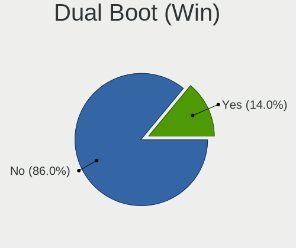
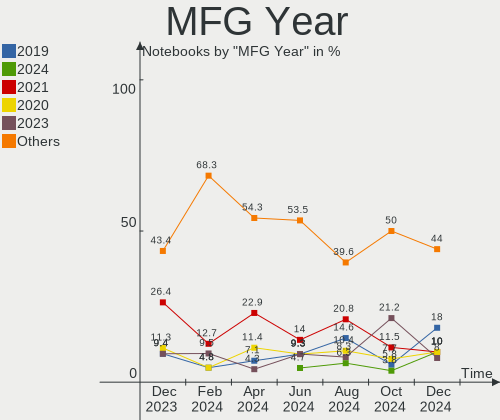
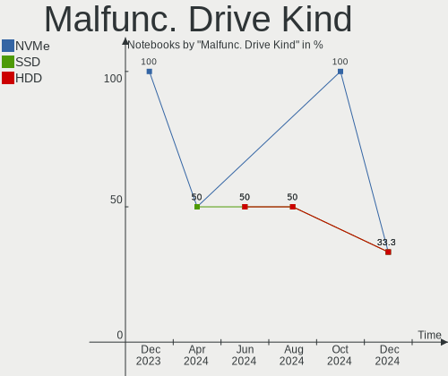
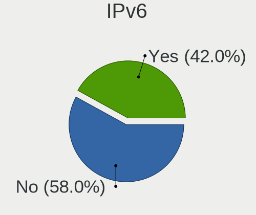

openSUSE - Hardware Trends (Notebooks)
--------------------------------------

A project to identify most popular hardware characteristics and track their change
over time based on data collected by Linux users at https://Linux-Hardware.org.

Anyone can contribute to this report by the [hw-probe](https://github.com/linuxhw/hw-probe) tool:

    sudo -E hw-probe -all -upload

This report is for one last month. Overall report since the beginning of time: [TestDays](https://github.com/linuxhw/TestDays)

Period: Apr, 2023.

Contents
--------

* [ System ](#system)
  - [ OS                       ](#os)
  - [ OS Family                ](#os-family)
  - [ Kernel                   ](#kernel)
  - [ Kernel Family            ](#kernel-family)
  - [ Kernel Major Ver.        ](#kernel-major-ver)
  - [ Arch                     ](#arch)
  - [ DE                       ](#de)
  - [ Display Server           ](#display-server)
  - [ Display Manager          ](#display-manager)
  - [ OS Lang                  ](#os-lang)
  - [ Boot Mode                ](#boot-mode)
  - [ Filesystem               ](#filesystem)
  - [ Part. scheme             ](#part-scheme)
  - [ Dual Boot with Linux/BSD ](#dual-boot-with-linuxbsd)
  - [ Dual Boot (Win)          ](#dual-boot-win)

* [ Board ](#board)
  - [ Vendor                   ](#vendor)
  - [ Model                    ](#model)
  - [ Model Family             ](#model-family)
  - [ MFG Year                 ](#mfg-year)
  - [ Form Factor              ](#form-factor)
  - [ Secure Boot              ](#secure-boot)
  - [ Coreboot                 ](#coreboot)
  - [ RAM Size                 ](#ram-size)
  - [ RAM Used                 ](#ram-used)
  - [ Total Drives             ](#total-drives)
  - [ Has CD-ROM               ](#has-cd-rom)
  - [ Has Ethernet             ](#has-ethernet)
  - [ Has WiFi                 ](#has-wifi)
  - [ Has Bluetooth            ](#has-bluetooth)

* [ Location ](#location)
  - [ Country                  ](#country)
  - [ City                     ](#city)

* [ Drives ](#drives)
  - [ Drive Vendor             ](#drive-vendor)
  - [ Drive Model              ](#drive-model)
  - [ HDD Vendor               ](#hdd-vendor)
  - [ SSD Vendor               ](#ssd-vendor)
  - [ Drive Kind               ](#drive-kind)
  - [ Drive Connector          ](#drive-connector)
  - [ Drive Size               ](#drive-size)
  - [ Space Total              ](#space-total)
  - [ Space Used               ](#space-used)
  - [ Malfunc. Drives          ](#malfunc-drives)
  - [ Malfunc. Drive Vendor    ](#malfunc-drive-vendor)
  - [ Malfunc. HDD Vendor      ](#malfunc-hdd-vendor)
  - [ Malfunc. Drive Kind      ](#malfunc-drive-kind)
  - [ Failed Drives            ](#failed-drives)
  - [ Failed Drive Vendor      ](#failed-drive-vendor)
  - [ Drive Status             ](#drive-status)

* [ Storage controller ](#storage-controller)
  - [ Storage Vendor           ](#storage-vendor)
  - [ Storage Model            ](#storage-model)
  - [ Storage Kind             ](#storage-kind)

* [ Processor ](#processor)
  - [ CPU Vendor               ](#cpu-vendor)
  - [ CPU Model                ](#cpu-model)
  - [ CPU Model Family         ](#cpu-model-family)
  - [ CPU Cores                ](#cpu-cores)
  - [ CPU Sockets              ](#cpu-sockets)
  - [ CPU Threads              ](#cpu-threads)
  - [ CPU Op-Modes             ](#cpu-op-modes)
  - [ CPU Microcode            ](#cpu-microcode)
  - [ CPU Microarch            ](#cpu-microarch)

* [ Graphics ](#graphics)
  - [ GPU Vendor               ](#gpu-vendor)
  - [ GPU Model                ](#gpu-model)
  - [ GPU Combo                ](#gpu-combo)
  - [ GPU Driver               ](#gpu-driver)
  - [ GPU Memory               ](#gpu-memory)

* [ Monitor ](#monitor)
  - [ Monitor Vendor           ](#monitor-vendor)
  - [ Monitor Model            ](#monitor-model)
  - [ Monitor Resolution       ](#monitor-resolution)
  - [ Monitor Diagonal         ](#monitor-diagonal)
  - [ Monitor Width            ](#monitor-width)
  - [ Aspect Ratio             ](#aspect-ratio)
  - [ Monitor Area             ](#monitor-area)
  - [ Pixel Density            ](#pixel-density)
  - [ Multiple Monitors        ](#multiple-monitors)

* [ Network ](#network)
  - [ Net Controller Vendor    ](#net-controller-vendor)
  - [ Net Controller Model     ](#net-controller-model)
  - [ Wireless Vendor          ](#wireless-vendor)
  - [ Wireless Model           ](#wireless-model)
  - [ Ethernet Vendor          ](#ethernet-vendor)
  - [ Ethernet Model           ](#ethernet-model)
  - [ Net Controller Kind      ](#net-controller-kind)
  - [ Used Controller          ](#used-controller)
  - [ NICs                     ](#nics)
  - [ IPv6                     ](#ipv6)

* [ Bluetooth ](#bluetooth)
  - [ Bluetooth Vendor         ](#bluetooth-vendor)
  - [ Bluetooth Model          ](#bluetooth-model)

* [ Sound ](#sound)
  - [ Sound Vendor             ](#sound-vendor)
  - [ Sound Model              ](#sound-model)

* [ Memory ](#memory)
  - [ Memory Vendor            ](#memory-vendor)
  - [ Memory Model             ](#memory-model)
  - [ Memory Kind              ](#memory-kind)
  - [ Memory Form Factor       ](#memory-form-factor)
  - [ Memory Size              ](#memory-size)
  - [ Memory Speed             ](#memory-speed)

* [ Printers & scanners ](#printers--scanners)
  - [ Printer Vendor           ](#printer-vendor)
  - [ Printer Model            ](#printer-model)
  - [ Scanner Vendor           ](#scanner-vendor)
  - [ Scanner Model            ](#scanner-model)

* [ Camera ](#camera)
  - [ Camera Vendor            ](#camera-vendor)
  - [ Camera Model             ](#camera-model)

* [ Security ](#security)
  - [ Fingerprint Vendor       ](#fingerprint-vendor)
  - [ Fingerprint Model        ](#fingerprint-model)
  - [ Chipcard Vendor          ](#chipcard-vendor)
  - [ Chipcard Model           ](#chipcard-model)

* [ Unsupported ](#unsupported)
  - [ Unsupported Devices      ](#unsupported-devices)
  - [ Unsupported Device Types ](#unsupported-device-types)

System
------

OS
--

Installed operating systems

| Name                         | Notebooks | Percent |
|------------------------------|-----------|---------|
| openSUSE Tumbleweed-XXXXXXXX | 39        | 82.98%  |
| openSUSE Leap-15.4           | 6         | 12.77%  |
| openSUSE Microos-XXXXXXXX    | 1         | 2.13%   |
| openSUSE Leap-15.5           | 1         | 2.13%   |

OS Family
---------

OS without a version

| Name     | Notebooks | Percent |
|----------|-----------|---------|
| openSUSE | 47        | 100%    |

Kernel
------

Version of the Linux kernel

| Version                      | Notebooks | Percent |
|------------------------------|-----------|---------|
| 6.2.9-1-default              | 14        | 29.79%  |
| 6.2.12-1-default             | 12        | 25.53%  |
| 6.2.10-1-default             | 11        | 23.4%   |
| 5.14.21-150400.24.60-default | 3         | 6.38%   |
| 5.14.21-150400.24.55-default | 3         | 6.38%   |
| 6.2.8-1-default              | 1         | 2.13%   |
| 6.2.6-1-default              | 1         | 2.13%   |
| 5.5.7-1-default              | 1         | 2.13%   |
| 5.14.21-150500.49-default    | 1         | 2.13%   |

Kernel Family
-------------

Linux kernel without a distro release

| Version | Notebooks | Percent |
|---------|-----------|---------|
| 6.2.9   | 14        | 29.79%  |
| 6.2.12  | 12        | 25.53%  |
| 6.2.10  | 11        | 23.4%   |
| 5.14.21 | 7         | 14.89%  |
| 6.2.8   | 1         | 2.13%   |
| 6.2.6   | 1         | 2.13%   |
| 5.5.7   | 1         | 2.13%   |

Kernel Major Ver.
-----------------

Linux kernel major version

| Version | Notebooks | Percent |
|---------|-----------|---------|
| 6.2     | 39        | 82.98%  |
| 5.14    | 7         | 14.89%  |
| 5.5     | 1         | 2.13%   |

Arch
----

OS architecture (x86_64, i586, etc.)

| Name   | Notebooks | Percent |
|--------|-----------|---------|
| x86_64 | 47        | 100%    |

DE
--

Desktop Environment

| Name          | Notebooks | Percent |
|---------------|-----------|---------|
| KDE5          | 30        | 63.83%  |
| GNOME         | 14        | 29.79%  |
| XFCE          | 1         | 2.13%   |
| LXDE          | 1         | 2.13%   |
| GNOME Classic | 1         | 2.13%   |

Display Server
--------------

X11 or Wayland

| Name    | Notebooks | Percent |
|---------|-----------|---------|
| X11     | 33        | 70.21%  |
| Wayland | 12        | 25.53%  |
| Tty     | 2         | 4.26%   |

Display Manager
---------------

SDDM, LightDM, etc.

| Name    | Notebooks | Percent |
|---------|-----------|---------|
| Unknown | 26        | 55.32%  |
| SDDM    | 10        | 21.28%  |
| XDM     | 5         | 10.64%  |
| LightDM | 5         | 10.64%  |
| GDM     | 1         | 2.13%   |

OS Lang
-------

Language

| Lang   | Notebooks | Percent |
|--------|-----------|---------|
| en_US  | 18        | 38.3%   |
| POSIX  | 5         | 10.64%  |
| de_DE  | 5         | 10.64%  |
| en_GB  | 3         | 6.38%   |
| ru_RU  | 2         | 4.26%   |
| pt_BR  | 2         | 4.26%   |
| pl_PL  | 2         | 4.26%   |
| fr_FR  | 2         | 4.26%   |
| es_ES  | 2         | 4.26%   |
| pt_PT  | 1         | 2.13%   |
| nn_NO  | 1         | 2.13%   |
| it_IT  | 1         | 2.13%   |
| es_PE  | 1         | 2.13%   |
| en_150 | 1         | 2.13%   |
| cs_CZ  | 1         | 2.13%   |

Boot Mode
---------

EFI or BIOS

| Mode | Notebooks | Percent |
|------|-----------|---------|
| EFI  | 37        | 78.72%  |
| BIOS | 10        | 21.28%  |

Filesystem
----------

Type of filesystem

| Type  | Notebooks | Percent |
|-------|-----------|---------|
| Btrfs | 40        | 85.11%  |
| Ext4  | 4         | 8.51%   |
| Xfs   | 3         | 6.38%   |

Part. scheme
------------

Scheme of partitioning

| Type    | Notebooks | Percent |
|---------|-----------|---------|
| Unknown | 26        | 55.32%  |
| GPT     | 20        | 42.55%  |
| MBR     | 1         | 2.13%   |

Dual Boot with Linux/BSD
------------------------

Hosting more than one Linux/BSD

| Dual boot | Notebooks | Percent |
|-----------|-----------|---------|
| No        | 46        | 97.87%  |
| Yes       | 1         | 2.13%   |

Dual Boot (Win)
---------------

Hosting Linux and Windows

| Dual boot | Notebooks | Percent |
|-----------|-----------|---------|
| No        | 39        | 82.98%  |
| Yes       | 8         | 17.02%  |

Board
-----

Vendor
------

Motherboard manufacturer

| Name                | Notebooks | Percent |
|---------------------|-----------|---------|
| Lenovo              | 11        | 23.4%   |
| Hewlett-Packard     | 8         | 17.02%  |
| ASUSTek Computer    | 7         | 14.89%  |
| Dell                | 5         | 10.64%  |
| MSI                 | 3         | 6.38%   |
| Apple               | 3         | 6.38%   |
| Acer                | 3         | 6.38%   |
| Toshiba             | 1         | 2.13%   |
| SLIMBOOK            | 1         | 2.13%   |
| Notebook            | 1         | 2.13%   |
| Google              | 1         | 2.13%   |
| Gigabyte Technology | 1         | 2.13%   |
| Gateway             | 1         | 2.13%   |
| Allview             | 1         | 2.13%   |

Model
-----

Motherboard model

| Name                                     | Notebooks | Percent |
|------------------------------------------|-----------|---------|
| Toshiba Satellite C45-A                  | 1         | 2.13%   |
| SLIMBOOK PROX-AMD5                       | 1         | 2.13%   |
| Notebook W54_55_94_95_97AU,AUQ           | 1         | 2.13%   |
| MSI Vector GP76 12UHSO                   | 1         | 2.13%   |
| MSI Stealth 15M B12UE                    | 1         | 2.13%   |
| MSI Stealth 14Studio A13VF               | 1         | 2.13%   |
| Lenovo ThinkPad X201 3680HTG             | 1         | 2.13%   |
| Lenovo ThinkPad T460s 20F9005CMN         | 1         | 2.13%   |
| Lenovo ThinkPad T440s 20AQ006HUS         | 1         | 2.13%   |
| Lenovo ThinkPad T16 Gen 1 21BVCTO1WW     | 1         | 2.13%   |
| Lenovo ThinkPad P50 20EQS5C701           | 1         | 2.13%   |
| Lenovo ThinkPad Edge E431 62779XP        | 1         | 2.13%   |
| Lenovo QIWY3                             | 1         | 2.13%   |
| Lenovo Legion Y540-15IRH-PG0 81SY        | 1         | 2.13%   |
| Lenovo IdeaPad 3 15ITL6 82H8             | 1         | 2.13%   |
| Lenovo G50-45 80E3                       | 1         | 2.13%   |
| HP ProBook 645 G4                        | 1         | 2.13%   |
| HP Pavilion Laptop 15-eh1xxx             | 1         | 2.13%   |
| HP Pavilion Gaming Laptop 17-cd1xxx      | 1         | 2.13%   |
| HP Pavilion Gaming Laptop 15-ec2xxx      | 1         | 2.13%   |
| HP Mini 210-1000                         | 1         | 2.13%   |
| HP Laptop 17-ca0xxx                      | 1         | 2.13%   |
| HP ENVY Laptop 16-h0xxx                  | 1         | 2.13%   |
| HP EliteBook 865 16 inch G9 Notebook PC  | 1         | 2.13%   |
| Google Kefka                             | 1         | 2.13%   |
| Gigabyte G5 KF                           | 1         | 2.13%   |
| Gateway NV55C                            | 1         | 2.13%   |
| Dell Precision 5530                      | 1         | 2.13%   |
| Dell Latitude 7410                       | 1         | 2.13%   |
| Dell Latitude 5431                       | 1         | 2.13%   |
| Dell Inspiron 3501                       | 1         | 2.13%   |
| Dell Inspiron 15-3567                    | 1         | 2.13%   |
| ASUS VivoBook_ASUSLaptop X515DA_X515DA   | 1         | 2.13%   |
| ASUS VivoBook_ASUSLaptop M3401QC_M3401QC | 1         | 2.13%   |
| ASUS TP500LAG                            | 1         | 2.13%   |
| ASUS ROG Strix G513QY_G513QY             | 1         | 2.13%   |
| ASUS N750JV                              | 1         | 2.13%   |
| ASUS GL703VM                             | 1         | 2.13%   |
| ASUS GL502VM                             | 1         | 2.13%   |
| Apple MacBookPro8,1                      | 1         | 2.13%   |

Model Family
------------

Motherboard model prefix

| Name               | Notebooks | Percent |
|--------------------|-----------|---------|
| Lenovo ThinkPad    | 6         | 12.77%  |
| HP Pavilion        | 3         | 6.38%   |
| MSI Stealth        | 2         | 4.26%   |
| Dell Latitude      | 2         | 4.26%   |
| Dell Inspiron      | 2         | 4.26%   |
| ASUS VivoBook      | 2         | 4.26%   |
| Acer Aspire        | 2         | 4.26%   |
| Toshiba Satellite  | 1         | 2.13%   |
| SLIMBOOK PROX-AMD5 | 1         | 2.13%   |
| Notebook W54       | 1         | 2.13%   |
| MSI Vector         | 1         | 2.13%   |
| Lenovo QIWY3       | 1         | 2.13%   |
| Lenovo Legion      | 1         | 2.13%   |
| Lenovo IdeaPad     | 1         | 2.13%   |
| Lenovo G50-45      | 1         | 2.13%   |
| HP ProBook         | 1         | 2.13%   |
| HP Mini            | 1         | 2.13%   |
| HP Laptop          | 1         | 2.13%   |
| HP ENVY            | 1         | 2.13%   |
| HP EliteBook       | 1         | 2.13%   |
| Google Kefka       | 1         | 2.13%   |
| Gigabyte G5        | 1         | 2.13%   |
| Gateway NV55C      | 1         | 2.13%   |
| Dell Precision     | 1         | 2.13%   |
| ASUS TP500LAG      | 1         | 2.13%   |
| ASUS ROG           | 1         | 2.13%   |
| ASUS N750JV        | 1         | 2.13%   |
| ASUS GL703VM       | 1         | 2.13%   |
| ASUS GL502VM       | 1         | 2.13%   |
| Apple MacBookPro8  | 1         | 2.13%   |
| Apple MacBookPro6  | 1         | 2.13%   |
| Apple MacBookAir7  | 1         | 2.13%   |
| Allview Allbook    | 1         | 2.13%   |
| Acer Nitro         | 1         | 2.13%   |
| Unknown            | 1         | 2.13%   |

MFG Year
--------

Motherboard manufacture year

| Year | Notebooks | Percent |
|------|-----------|---------|
| 2022 | 7         | 14.89%  |
| 2021 | 6         | 12.77%  |
| 2013 | 6         | 12.77%  |
| 2020 | 5         | 10.64%  |
| 2018 | 4         | 8.51%   |
| 2023 | 3         | 6.38%   |
| 2015 | 3         | 6.38%   |
| 2010 | 3         | 6.38%   |
| 2019 | 2         | 4.26%   |
| 2016 | 2         | 4.26%   |
| 2014 | 2         | 4.26%   |
| 2017 | 1         | 2.13%   |
| 2012 | 1         | 2.13%   |
| 2011 | 1         | 2.13%   |
| 2009 | 1         | 2.13%   |

Form Factor
-----------

Physical design of the computer

| Name     | Notebooks | Percent |
|----------|-----------|---------|
| Notebook | 47        | 100%    |

Secure Boot
-----------

Enabled or disabled

| State    | Notebooks | Percent |
|----------|-----------|---------|
| Disabled | 39        | 82.98%  |
| Enabled  | 8         | 17.02%  |

Coreboot
--------

Have coreboot on board

| Used | Notebooks | Percent |
|------|-----------|---------|
| No   | 46        | 97.87%  |
| Yes  | 1         | 2.13%   |

RAM Size
--------

Total RAM memory

| Size in GB  | Notebooks | Percent |
|-------------|-----------|---------|
| 4.01-8.0    | 15        | 31.91%  |
| 8.01-16.0   | 10        | 21.28%  |
| 32.01-64.0  | 9         | 19.15%  |
| 16.01-24.0  | 7         | 14.89%  |
| 3.01-4.0    | 4         | 8.51%   |
| 64.01-256.0 | 1         | 2.13%   |
| 0.51-1.0    | 1         | 2.13%   |

RAM Used
--------

Used RAM memory

| Used GB   | Notebooks | Percent |
|-----------|-----------|---------|
| 4.01-8.0  | 13        | 27.66%  |
| 2.01-3.0  | 11        | 23.4%   |
| 1.01-2.0  | 11        | 23.4%   |
| 3.01-4.0  | 7         | 14.89%  |
| 8.01-16.0 | 3         | 6.38%   |
| 0.51-1.0  | 1         | 2.13%   |
| 0.01-0.5  | 1         | 2.13%   |

Total Drives
------------

Number of drives on board

| Drives | Notebooks | Percent |
|--------|-----------|---------|
| 1      | 33        | 70.21%  |
| 2      | 12        | 25.53%  |
| 4      | 1         | 2.13%   |
| 3      | 1         | 2.13%   |

Has CD-ROM
----------

Has CD-ROM on board

| Presented | Notebooks | Percent |
|-----------|-----------|---------|
| No        | 36        | 76.6%   |
| Yes       | 11        | 23.4%   |

Has Ethernet
------------

Has Ethernet on board

| Presented | Notebooks | Percent |
|-----------|-----------|---------|
| Yes       | 36        | 76.6%   |
| No        | 11        | 23.4%   |

Has WiFi
--------

Has WiFi module

| Presented | Notebooks | Percent |
|-----------|-----------|---------|
| Yes       | 46        | 97.87%  |
| No        | 1         | 2.13%   |

Has Bluetooth
-------------

Has Bluetooth module

| Presented | Notebooks | Percent |
|-----------|-----------|---------|
| Yes       | 43        | 91.49%  |
| No        | 4         | 8.51%   |

Location
--------

Country
-------

Geographic location (country)

| Country     | Notebooks | Percent |
|-------------|-----------|---------|
| USA         | 6         | 12.77%  |
| Netherlands | 5         | 10.64%  |
| Germany     | 5         | 10.64%  |
| Brazil      | 4         | 8.51%   |
| India       | 3         | 6.38%   |
| Spain       | 2         | 4.26%   |
| Poland      | 2         | 4.26%   |
| Norway      | 2         | 4.26%   |
| Vietnam     | 1         | 2.13%   |
| UK          | 1         | 2.13%   |
| Turkey      | 1         | 2.13%   |
| Sweden      | 1         | 2.13%   |
| Russia      | 1         | 2.13%   |
| Romania     | 1         | 2.13%   |
| Peru        | 1         | 2.13%   |
| Morocco     | 1         | 2.13%   |
| Italy       | 1         | 2.13%   |
| Hungary     | 1         | 2.13%   |
| France      | 1         | 2.13%   |
| El Salvador | 1         | 2.13%   |
| Czechia     | 1         | 2.13%   |
| Croatia     | 1         | 2.13%   |
| Canada      | 1         | 2.13%   |
| Bulgaria    | 1         | 2.13%   |
| Belgium     | 1         | 2.13%   |
| Belarus     | 1         | 2.13%   |

City
----

Geographic location (city)

| City                | Notebooks | Percent |
|---------------------|-----------|---------|
| Rotterdam           | 3         | 6.38%   |
| Berlin              | 3         | 6.38%   |
| Birmingham          | 2         | 4.26%   |
| Zagreb              | 1         | 2.13%   |
| Zafra               | 1         | 2.13%   |
| Wroclaw             | 1         | 2.13%   |
| Vitebsk             | 1         | 2.13%   |
| Veresegyhaz         | 1         | 2.13%   |
| Umeå               | 1         | 2.13%   |
| Thrissur            | 1         | 2.13%   |
| Saint-Gilles        | 1         | 2.13%   |
| Rumburk             | 1         | 2.13%   |
| Rome                | 1         | 2.13%   |
| Richardson          | 1         | 2.13%   |
| Palma               | 1         | 2.13%   |
| Ottawa              | 1         | 2.13%   |
| Nannestad           | 1         | 2.13%   |
| Moscow              | 1         | 2.13%   |
| Moosburg            | 1         | 2.13%   |
| Marrakesh           | 1         | 2.13%   |
| Los Angeles         | 1         | 2.13%   |
| Lodz                | 1         | 2.13%   |
| Lisse               | 1         | 2.13%   |
| La Union            | 1         | 2.13%   |
| Kochi               | 1         | 2.13%   |
| Ithaca              | 1         | 2.13%   |
| Istanbul            | 1         | 2.13%   |
| Huancayo            | 1         | 2.13%   |
| Hortolândia        | 1         | 2.13%   |
| Grafing bei Munchen | 1         | 2.13%   |
| Fontenay-sous-Bois  | 1         | 2.13%   |
| Fayetteville        | 1         | 2.13%   |
| Dallas              | 1         | 2.13%   |
| Da Nang             | 1         | 2.13%   |
| Corrente            | 1         | 2.13%   |
| Burgas              | 1         | 2.13%   |
| Bucharest           | 1         | 2.13%   |
| Bladel              | 1         | 2.13%   |
| Bergen              | 1         | 2.13%   |
| Bengaluru           | 1         | 2.13%   |

Drives
------

Drive Vendor
------------

Hard drive vendors

| Vendor                         | Notebooks | Drives | Percent |
|--------------------------------|-----------|--------|---------|
| Samsung Electronics            | 13        | 16     | 22.03%  |
| Seagate                        | 6         | 6      | 10.17%  |
| WDC                            | 4         | 4      | 6.78%   |
| SK hynix                       | 4         | 4      | 6.78%   |
| Sandisk                        | 4         | 4      | 6.78%   |
| Micron Technology              | 3         | 3      | 5.08%   |
| Kingston                       | 3         | 4      | 5.08%   |
| Unknown                        | 2         | 2      | 3.39%   |
| Toshiba                        | 2         | 2      | 3.39%   |
| Phison Electronics             | 2         | 2      | 3.39%   |
| Intenso                        | 2         | 2      | 3.39%   |
| Intel                          | 2         | 2      | 3.39%   |
| Hitachi                        | 2         | 2      | 3.39%   |
| Crucial                        | 2         | 2      | 3.39%   |
| ADATA Technology               | 2         | 2      | 3.39%   |
| Wibtek                         | 1         | 1      | 1.69%   |
| Union Memory                   | 1         | 1      | 1.69%   |
| Solid State Storage Technology | 1         | 1      | 1.69%   |
| Micron/Crucial Technology      | 1         | 1      | 1.69%   |
| KIOXIA                         | 1         | 1      | 1.69%   |
| Apple                          | 1         | 1      | 1.69%   |

Drive Model
-----------

Hard drive models

| Model                                               | Notebooks | Percent |
|-----------------------------------------------------|-----------|---------|
| Samsung NVMe SSD Controller PM9A1/PM9A3/980PRO 2TB  | 5         | 8.06%   |
| Seagate ST2000LM015-2E8174 2TB                      | 2         | 3.23%   |
| Samsung NVMe SSD Controller SM961/PM961/SM963 500GB | 2         | 3.23%   |
| Kingston SA400S37480G 480GB SSD                     | 2         | 3.23%   |
| Wibtek W800S 256GB SSD                              | 1         | 1.61%   |
| WDC WD5000LPCX-24C6HT0 500GB                        | 1         | 1.61%   |
| WDC WD50 00BPVT-80HXZT3 500GB                       | 1         | 1.61%   |
| WDC WD3200BPVT-24JJ5T0 320GB                        | 1         | 1.61%   |
| WDC WD3200BPVT-22JJ5T0 320GB                        | 1         | 1.61%   |
| Unknown MMC Card  32GB                              | 1         | 1.61%   |
| Unknown MMC Card  16GB                              | 1         | 1.61%   |
| Union Memory UMIS RPJTJ256MEE1OWX 256GB             | 1         | 1.61%   |
| Toshiba THNSFJ256GCSU 256GB SSD                     | 1         | 1.61%   |
| Toshiba MQ01ABD075 752GB                            | 1         | 1.61%   |
| Solid State Storage SSSTC CA6-8D512 512GB           | 1         | 1.61%   |
| SK hynix PC801 NVMe 1TB                             | 1         | 1.61%   |
| SK hynix PC401 NVMe Solid State Drive 256GB         | 1         | 1.61%   |
| SK hynix HFS256G39TND-N210A 256GB SSD               | 1         | 1.61%   |
| SK hynix BC511 512GB                                | 1         | 1.61%   |
| Seagate ST9500325AS 500GB                           | 1         | 1.61%   |
| Seagate ST500LM012 HN-M500MBB 500GB                 | 1         | 1.61%   |
| Seagate ST1000LM049-2GH172 1TB                      | 1         | 1.61%   |
| Seagate ST1000LM035-1RK172 970GB                    | 1         | 1.61%   |
| Sandisk WD Blue SN550 NVMe SSD 1024GB               | 1         | 1.61%   |
| Sandisk WD Black SN850 1TB                          | 1         | 1.61%   |
| SanDisk SDSSDA120G 120GB                            | 1         | 1.61%   |
| Sandisk PC SN520 NVMe SSD 512GB                     | 1         | 1.61%   |
| Samsung SSD 870 QVO 1TB                             | 1         | 1.61%   |
| Samsung SSD 870 EVO 500GB                           | 1         | 1.61%   |
| Samsung SSD 860 EVO 500GB                           | 1         | 1.61%   |
| Samsung SSD 860 EVO 1TB                             | 1         | 1.61%   |
| Samsung SSD 850 PRO 1TB                             | 1         | 1.61%   |
| Samsung NVMe SSD Controller SM981/PM981/PM983 1TB   | 1         | 1.61%   |
| Samsung MZNTY256HDHP-000L7 256GB SSD                | 1         | 1.61%   |
| Samsung MZ7LN128HCHP-000H1 128GB SSD                | 1         | 1.61%   |
| Phison PS5013 E13 NVMe Controller 500GB             | 1         | 1.61%   |
| Phison E16 PCIe4 NVMe Controller 500GB              | 1         | 1.61%   |
| Micron/Crucial P2 NVMe PCIe SSD 1TB                 | 1         | 1.61%   |
| Micron MTFDKBA512TFH-1BC1AABHA 512GB                | 1         | 1.61%   |
| Micron MTFDHBA512TDV-1AZ1AABHA 512GB                | 1         | 1.61%   |

HDD Vendor
----------

Hard disk drive vendors

| Vendor  | Notebooks | Drives | Percent |
|---------|-----------|--------|---------|
| Seagate | 6         | 6      | 46.15%  |
| WDC     | 4         | 4      | 30.77%  |
| Hitachi | 2         | 2      | 15.38%  |
| Toshiba | 1         | 1      | 7.69%   |

SSD Vendor
----------

Solid state drive vendors

| Vendor              | Notebooks | Drives | Percent |
|---------------------|-----------|--------|---------|
| Samsung Electronics | 7         | 8      | 36.84%  |
| Kingston            | 3         | 4      | 15.79%  |
| Intenso             | 2         | 2      | 10.53%  |
| Crucial             | 2         | 2      | 10.53%  |
| Wibtek              | 1         | 1      | 5.26%   |
| Toshiba             | 1         | 1      | 5.26%   |
| SK hynix            | 1         | 1      | 5.26%   |
| SanDisk             | 1         | 1      | 5.26%   |
| Apple               | 1         | 1      | 5.26%   |

Drive Kind
----------

HDD or SSD

| Kind | Notebooks | Drives | Percent |
|------|-----------|--------|---------|
| NVMe | 23        | 27     | 41.07%  |
| SSD  | 18        | 21     | 32.14%  |
| HDD  | 13        | 13     | 23.21%  |
| MMC  | 2         | 2      | 3.57%   |

Drive Connector
---------------

SATA, SAS, NVMe, etc.

| Type | Notebooks | Drives | Percent |
|------|-----------|--------|---------|
| SATA | 28        | 33     | 51.85%  |
| NVMe | 23        | 27     | 42.59%  |
| MMC  | 2         | 2      | 3.7%    |
| SAS  | 1         | 1      | 1.85%   |

Drive Size
----------

Size of hard drive

| Size in TB | Notebooks | Drives | Percent |
|------------|-----------|--------|---------|
| 0.01-0.5   | 20        | 22     | 64.52%  |
| 0.51-1.0   | 9         | 10     | 29.03%  |
| 1.01-2.0   | 2         | 2      | 6.45%   |

Space Total
-----------

Amount of disk space available on the file system

| Size in GB     | Notebooks | Percent |
|----------------|-----------|---------|
| More than 3000 | 12        | 25.53%  |
| 1001-2000      | 12        | 25.53%  |
| 2001-3000      | 7         | 14.89%  |
| 501-1000       | 7         | 14.89%  |
| 251-500        | 5         | 10.64%  |
| 51-100         | 2         | 4.26%   |
| 101-250        | 1         | 2.13%   |
| 1-20           | 1         | 2.13%   |

Space Used
----------

Amount of used disk space

| Used GB        | Notebooks | Percent |
|----------------|-----------|---------|
| 101-250        | 12        | 25.53%  |
| 51-100         | 9         | 19.15%  |
| 1001-2000      | 7         | 14.89%  |
| 501-1000       | 6         | 12.77%  |
| 251-500        | 5         | 10.64%  |
| 1-20           | 3         | 6.38%   |
| 21-50          | 2         | 4.26%   |
| More than 3000 | 1         | 2.13%   |
| 2001-3000      | 1         | 2.13%   |
| 0              | 1         | 2.13%   |

Malfunc. Drives
---------------

Drive models with a malfunction

| Model                         | Notebooks | Drives | Percent |
|-------------------------------|-----------|--------|---------|
| Hitachi HTS725025A9A364 250GB | 1         | 1      | 100%    |

Malfunc. Drive Vendor
---------------------

Vendors of faulty drives

| Vendor  | Notebooks | Drives | Percent |
|---------|-----------|--------|---------|
| Hitachi | 1         | 1      | 100%    |

Malfunc. HDD Vendor
-------------------

Vendors of faulty HDD drives

| Vendor  | Notebooks | Drives | Percent |
|---------|-----------|--------|---------|
| Hitachi | 1         | 1      | 100%    |

Malfunc. Drive Kind
-------------------

Kinds of faulty drives

| Kind | Notebooks | Drives | Percent |
|------|-----------|--------|---------|
| HDD  | 1         | 1      | 100%    |

Failed Drives
-------------

Failed drive models

Zero info for selected period =(

Failed Drive Vendor
-------------------

Failed drive vendors

Zero info for selected period =(

Drive Status
------------

Number of failed and malfunc. drives

| Status   | Notebooks | Drives | Percent |
|----------|-----------|--------|---------|
| Detected | 26        | 34     | 55.32%  |
| Works    | 20        | 28     | 42.55%  |
| Malfunc  | 1         | 1      | 2.13%   |

Storage controller
------------------

Storage Vendor
--------------

Storage controller vendors

| Vendor                         | Notebooks | Percent |
|--------------------------------|-----------|---------|
| Intel                          | 31        | 49.21%  |
| Samsung Electronics            | 9         | 14.29%  |
| AMD                            | 6         | 9.52%   |
| SK hynix                       | 3         | 4.76%   |
| SanDisk                        | 3         | 4.76%   |
| Micron Technology              | 3         | 4.76%   |
| Phison Electronics             | 2         | 3.17%   |
| ADATA Technology               | 2         | 3.17%   |
| Union Memory (Shenzhen)        | 1         | 1.59%   |
| Solid State Storage Technology | 1         | 1.59%   |
| Micron/Crucial Technology      | 1         | 1.59%   |
| KIOXIA                         | 1         | 1.59%   |

Storage Model
-------------

Storage controller models

| Model                                                                          | Notebooks | Percent |
|--------------------------------------------------------------------------------|-----------|---------|
| AMD FCH SATA Controller [AHCI mode]                                            | 6         | 9.38%   |
| Samsung NVMe SSD Controller PM9A1/PM9A3/980PRO                                 | 5         | 7.81%   |
| Micron NVMe Storage Controller                                                 | 3         | 4.69%   |
| Intel Sunrise Point-LP SATA Controller [AHCI mode]                             | 3         | 4.69%   |
| Intel 8 Series SATA Controller 1 [AHCI mode]                                   | 3         | 4.69%   |
| Samsung NVMe SSD Controller SM961/PM961/SM963                                  | 2         | 3.13%   |
| Intel Tiger Lake-LP SATA Controller                                            | 2         | 3.13%   |
| Intel HM170/QM170 Chipset SATA Controller [AHCI Mode]                          | 2         | 3.13%   |
| Intel Cannon Lake Mobile PCH SATA AHCI Controller                              | 2         | 3.13%   |
| Intel 82801 Mobile SATA Controller [RAID mode]                                 | 2         | 3.13%   |
| Intel 8 Series/C220 Series Chipset Family 6-port SATA Controller 1 [AHCI mode] | 2         | 3.13%   |
| Intel 7 Series Chipset Family 6-port SATA Controller [AHCI mode]               | 2         | 3.13%   |
| Intel 5 Series/3400 Series Chipset 4 port SATA AHCI Controller                 | 2         | 3.13%   |
| Union Memory (Shenzhen) Non-Volatile memory controller                         | 1         | 1.56%   |
| Solid State Storage Non-Volatile memory controller                             | 1         | 1.56%   |
| SK hynix Platinum P41 NVMe Solid State Drive 2TB                               | 1         | 1.56%   |
| SK hynix PC401 NVMe Solid State Drive 256GB                                    | 1         | 1.56%   |
| SK hynix BC511                                                                 | 1         | 1.56%   |
| SanDisk WD PC SN810 / Black SN850 NVMe SSD                                     | 1         | 1.56%   |
| SanDisk WD Blue SN550 NVMe SSD                                                 | 1         | 1.56%   |
| SanDisk PC SN520 NVMe SSD                                                      | 1         | 1.56%   |
| Samsung NVMe SSD Controller SM981/PM981/PM983                                  | 1         | 1.56%   |
| Samsung Electronics SATA controller                                            | 1         | 1.56%   |
| Phison PS5013 E13 NVMe Controller                                              | 1         | 1.56%   |
| Phison E16 PCIe4 NVMe Controller                                               | 1         | 1.56%   |
| Micron/Crucial P2 NVMe PCIe SSD                                                | 1         | 1.56%   |
| KIOXIA NVMe SSD Controller BG4                                                 | 1         | 1.56%   |
| Intel Wildcat Point-LP SATA Controller [AHCI Mode]                             | 1         | 1.56%   |
| Intel Volume Management Device NVMe RAID Controller Intel Corporation          | 1         | 1.56%   |
| Intel Volume Management Device NVMe RAID Controller                            | 1         | 1.56%   |
| Intel SSD 660P Series                                                          | 1         | 1.56%   |
| Intel Q170/Q150/B150/H170/H110/Z170/CM236 Chipset SATA Controller [AHCI Mode]  | 1         | 1.56%   |
| Intel Non-Volatile memory controller                                           | 1         | 1.56%   |
| Intel NM10/ICH7 Family SATA Controller [AHCI mode]                             | 1         | 1.56%   |
| Intel Celeron/Pentium Silver Processor SATA Controller                         | 1         | 1.56%   |
| Intel 7 Series Chipset Family 4-port SATA Controller [IDE mode]                | 1         | 1.56%   |
| Intel 7 Series Chipset Family 2-port SATA Controller [IDE mode]                | 1         | 1.56%   |
| Intel 6 Series/C200 Series Chipset Family 6 port Mobile SATA AHCI Controller   | 1         | 1.56%   |
| Intel 5 Series/3400 Series Chipset 6 port SATA AHCI Controller                 | 1         | 1.56%   |
| ADATA XPG SX8200 Pro PCIe Gen3x4 M.2 2280 Solid State Drive                    | 1         | 1.56%   |

Storage Kind
------------

Kind of storage controller (IDE, SATA, NVMe, SAS, ...)

| Kind | Notebooks | Percent |
|------|-----------|---------|
| SATA | 31        | 52.54%  |
| NVMe | 23        | 38.98%  |
| RAID | 4         | 6.78%   |
| IDE  | 1         | 1.69%   |

Processor
---------

CPU Vendor
----------

Processor vendors

| Vendor | Notebooks | Percent |
|--------|-----------|---------|
| Intel  | 37        | 78.72%  |
| AMD    | 10        | 21.28%  |

CPU Model
---------

Processor models

| Model                                         | Notebooks | Percent |
|-----------------------------------------------|-----------|---------|
| Intel Core i5 CPU M 520 @ 2.40GHz             | 2         | 4.26%   |
| Intel 11th Gen Core i5-1135G7 @ 2.40GHz       | 2         | 4.26%   |
| AMD Ryzen 7 5800H with Radeon Graphics        | 2         | 4.26%   |
| Intel Pentium CPU P6200 @ 2.13GHz             | 1         | 2.13%   |
| Intel Core i7-9750H CPU @ 2.60GHz             | 1         | 2.13%   |
| Intel Core i7-8850H CPU @ 2.60GHz             | 1         | 2.13%   |
| Intel Core i7-7700HQ CPU @ 2.80GHz            | 1         | 2.13%   |
| Intel Core i7-6820HQ CPU @ 2.70GHz            | 1         | 2.13%   |
| Intel Core i7-6700HQ CPU @ 2.60GHz            | 1         | 2.13%   |
| Intel Core i7-4702MQ CPU @ 2.20GHz            | 1         | 2.13%   |
| Intel Core i7-4700HQ CPU @ 2.40GHz            | 1         | 2.13%   |
| Intel Core i7-4600U CPU @ 2.10GHz             | 1         | 2.13%   |
| Intel Core i7-10610U CPU @ 1.80GHz            | 1         | 2.13%   |
| Intel Core i5-8250U CPU @ 1.60GHz             | 1         | 2.13%   |
| Intel Core i5-7300HQ CPU @ 2.50GHz            | 1         | 2.13%   |
| Intel Core i5-6200U CPU @ 2.30GHz             | 1         | 2.13%   |
| Intel Core i5-5250U CPU @ 1.60GHz             | 1         | 2.13%   |
| Intel Core i5-4210U CPU @ 1.70GHz             | 1         | 2.13%   |
| Intel Core i5-4200U CPU @ 1.60GHz             | 1         | 2.13%   |
| Intel Core i5-3230M CPU @ 2.60GHz             | 1         | 2.13%   |
| Intel Core i5-3210M CPU @ 2.50GHz             | 1         | 2.13%   |
| Intel Core i5-2435M CPU @ 2.40GHz             | 1         | 2.13%   |
| Intel Core i5-10300H CPU @ 2.50GHz            | 1         | 2.13%   |
| Intel Core i3-6006U CPU @ 2.00GHz             | 1         | 2.13%   |
| Intel Core i3-5010U CPU @ 2.10GHz             | 1         | 2.13%   |
| Intel Core i3-3110M CPU @ 2.40GHz             | 1         | 2.13%   |
| Intel Celeron J4125 CPU @ 2.00GHz             | 1         | 2.13%   |
| Intel Celeron CPU N3060 @ 1.60GHz             | 1         | 2.13%   |
| Intel Atom CPU N450 @ 1.66GHz                 | 1         | 2.13%   |
| Intel 13th Gen Core i7-13620H                 | 1         | 2.13%   |
| Intel 12th Gen Core i9-12900H                 | 1         | 2.13%   |
| Intel 12th Gen Core i7-1280P                  | 1         | 2.13%   |
| Intel 12th Gen Core i7-1270P                  | 1         | 2.13%   |
| Intel 12th Gen Core i7-12700H                 | 1         | 2.13%   |
| Intel 12th Gen Core i5-12500H                 | 1         | 2.13%   |
| Intel 12th Gen Core i5-1235U                  | 1         | 2.13%   |
| AMD Ryzen 9 PRO 6950HS with Radeon Graphics   | 1         | 2.13%   |
| AMD Ryzen 9 5980HX with Radeon Graphics       | 1         | 2.13%   |
| AMD Ryzen 7 5700U with Radeon Graphics        | 1         | 2.13%   |
| AMD Ryzen 5 3500U with Radeon Vega Mobile Gfx | 1         | 2.13%   |

CPU Model Family
----------------

Processor model prefix

| Model           | Notebooks | Percent |
|-----------------|-----------|---------|
| Intel Core i5   | 12        | 25.53%  |
| Other           | 9         | 19.15%  |
| Intel Core i7   | 9         | 19.15%  |
| Intel Core i3   | 3         | 6.38%   |
| AMD Ryzen 7     | 3         | 6.38%   |
| Intel Celeron   | 2         | 4.26%   |
| AMD Ryzen 9     | 2         | 4.26%   |
| AMD Ryzen 3     | 2         | 4.26%   |
| Intel Pentium   | 1         | 2.13%   |
| Intel Atom      | 1         | 2.13%   |
| AMD Ryzen 5     | 1         | 2.13%   |
| AMD Ryzen 3 PRO | 1         | 2.13%   |
| AMD E1          | 1         | 2.13%   |

CPU Cores
---------

Number of processor cores

| Number | Notebooks | Percent |
|--------|-----------|---------|
| 2      | 17        | 36.17%  |
| 4      | 14        | 29.79%  |
| 8      | 5         | 10.64%  |
| 14     | 3         | 6.38%   |
| 12     | 2         | 4.26%   |
| 10     | 2         | 4.26%   |
| 6      | 2         | 4.26%   |
| 1      | 2         | 4.26%   |

CPU Sockets
-----------

Number of sockets

| Number | Notebooks | Percent |
|--------|-----------|---------|
| 1      | 47        | 100%    |

CPU Threads
-----------

Threads per core (Hyper-Threading)

| Number | Notebooks | Percent |
|--------|-----------|---------|
| 2      | 41        | 87.23%  |
| 1      | 6         | 12.77%  |

CPU Op-Modes
------------

CPU Operation Modes (32-bit, 64-bit)

| Op mode        | Notebooks | Percent |
|----------------|-----------|---------|
| 32-bit, 64-bit | 47        | 100%    |

CPU Microcode
-------------

Microcode number

| Number     | Notebooks | Percent |
|------------|-----------|---------|
| Unknown    | 34        | 72.34%  |
| 0x0a50000c | 2         | 4.26%   |
| 0x08101016 | 2         | 4.26%   |
| 0x906a4    | 1         | 2.13%   |
| 0x306c3    | 1         | 2.13%   |
| 0x106ca    | 1         | 2.13%   |
| 0x0a50000d | 1         | 2.13%   |
| 0x0a404102 | 1         | 2.13%   |
| 0x08608104 | 1         | 2.13%   |
| 0x08608103 | 1         | 2.13%   |
| 0x08108109 | 1         | 2.13%   |
| 0x07030105 | 1         | 2.13%   |

CPU Microarch
-------------

Microarchitecture

| Name             | Notebooks | Percent |
|------------------|-----------|---------|
| Alderlake Hybrid | 7         | 14.89%  |
| KabyLake         | 6         | 12.77%  |
| Haswell          | 5         | 10.64%  |
| Skylake          | 4         | 8.51%   |
| Zen 3            | 3         | 6.38%   |
| Westmere         | 3         | 6.38%   |
| IvyBridge        | 3         | 6.38%   |
| Unknown          | 3         | 6.38%   |
| Zen              | 2         | 4.26%   |
| TigerLake        | 2         | 4.26%   |
| Broadwell        | 2         | 4.26%   |
| Zen+             | 1         | 2.13%   |
| Silvermont       | 1         | 2.13%   |
| SandyBridge      | 1         | 2.13%   |
| Puma             | 1         | 2.13%   |
| Goldmont plus    | 1         | 2.13%   |
| CometLake        | 1         | 2.13%   |
| Bonnell          | 1         | 2.13%   |

Graphics
--------

GPU Vendor
----------

Vendors of graphics cards

| Vendor | Notebooks | Percent |
|--------|-----------|---------|
| Intel  | 34        | 54.84%  |
| Nvidia | 17        | 27.42%  |
| AMD    | 11        | 17.74%  |

GPU Model
---------

Graphics card models

| Model                                                                                    | Notebooks | Percent |
|------------------------------------------------------------------------------------------|-----------|---------|
| Intel Alder Lake-P Integrated Graphics Controller                                        | 5         | 7.81%   |
| Intel Haswell-ULT Integrated Graphics Controller                                         | 3         | 4.69%   |
| Intel Core Processor Integrated Graphics Controller                                      | 3         | 4.69%   |
| Intel 3rd Gen Core processor Graphics Controller                                         | 3         | 4.69%   |
| AMD Cezanne [Radeon Vega Series / Radeon Vega Mobile Series]                             | 3         | 4.69%   |
| Nvidia GK107M [GeForce GT 750M]                                                          | 2         | 3.13%   |
| Nvidia AD107M [GeForce RTX 4060 Max-Q / Mobile]                                          | 2         | 3.13%   |
| Intel TigerLake-LP GT2 [Iris Xe Graphics]                                                | 2         | 3.13%   |
| Intel Skylake GT2 [HD Graphics 520]                                                      | 2         | 3.13%   |
| Intel CoffeeLake-H GT2 [UHD Graphics 630]                                                | 2         | 3.13%   |
| Intel 4th Gen Core Processor Integrated Graphics Controller                              | 2         | 3.13%   |
| AMD Raven Ridge [Radeon Vega Series / Radeon Vega Mobile Series]                         | 2         | 3.13%   |
| AMD Lucienne                                                                             | 2         | 3.13%   |
| Nvidia TU117M [GeForce GTX 1650 Ti Mobile]                                               | 1         | 1.56%   |
| Nvidia TU117M [GeForce GTX 1650 Mobile / Max-Q]                                          | 1         | 1.56%   |
| Nvidia GT216M [GeForce GT 330M]                                                          | 1         | 1.56%   |
| Nvidia GP108M [GeForce MX150]                                                            | 1         | 1.56%   |
| Nvidia GP107M [GeForce GTX 1050 Mobile]                                                  | 1         | 1.56%   |
| Nvidia GP107GLM [Quadro P1000 Mobile]                                                    | 1         | 1.56%   |
| Nvidia GP106M [GeForce GTX 1060 Mobile]                                                  | 1         | 1.56%   |
| Nvidia GP106BM [GeForce GTX 1060 Mobile 6GB]                                             | 1         | 1.56%   |
| Nvidia GM107GLM [Quadro M2000M]                                                          | 1         | 1.56%   |
| Nvidia GA107M [GeForce RTX 3050 Ti Mobile]                                               | 1         | 1.56%   |
| Nvidia GA107M [GeForce RTX 3050 Mobile]                                                  | 1         | 1.56%   |
| Nvidia GA106M [GeForce RTX 3060 Mobile / Max-Q]                                          | 1         | 1.56%   |
| Nvidia GA103M [GeForce RTX 3080 Ti Mobile]                                               | 1         | 1.56%   |
| Intel UHD Graphics 620                                                                   | 1         | 1.56%   |
| Intel Raptor Lake-P [UHD Graphics]                                                       | 1         | 1.56%   |
| Intel HD Graphics 630                                                                    | 1         | 1.56%   |
| Intel HD Graphics 6000                                                                   | 1         | 1.56%   |
| Intel HD Graphics 5500                                                                   | 1         | 1.56%   |
| Intel GeminiLake [UHD Graphics 600]                                                      | 1         | 1.56%   |
| Intel DG2 [Arc A370M]                                                                    | 1         | 1.56%   |
| Intel CometLake-U GT2 [UHD Graphics]                                                     | 1         | 1.56%   |
| Intel CometLake-H GT2 [UHD Graphics]                                                     | 1         | 1.56%   |
| Intel Atom/Celeron/Pentium Processor x5-E8000/J3xxx/N3xxx Integrated Graphics Controller | 1         | 1.56%   |
| Intel Atom Processor D4xx/D5xx/N4xx/N5xx Integrated Graphics Controller                  | 1         | 1.56%   |
| Intel Alder Lake-UP3 GT2 [UHD Graphics]                                                  | 1         | 1.56%   |
| Intel 2nd Generation Core Processor Family Integrated Graphics Controller                | 1         | 1.56%   |
| AMD Rembrandt [Radeon 680M]                                                              | 1         | 1.56%   |

GPU Combo
---------

Combinations of graphics cards

| Name           | Notebooks | Percent |
|----------------|-----------|---------|
| 1 x Intel      | 20        | 42.55%  |
| Intel + Nvidia | 12        | 25.53%  |
| 1 x AMD        | 7         | 14.89%  |
| 1 x Nvidia     | 3         | 6.38%   |
| AMD + Nvidia   | 2         | 4.26%   |
| 2 x Intel      | 1         | 2.13%   |
| 2 x AMD        | 1         | 2.13%   |
| Intel + AMD    | 1         | 2.13%   |

GPU Driver
----------

Free vs proprietary

| Driver      | Notebooks | Percent |
|-------------|-----------|---------|
| Free        | 32        | 68.09%  |
| Proprietary | 13        | 27.66%  |
| Unknown     | 2         | 4.26%   |

GPU Memory
----------

Total video memory

| Size in GB | Notebooks | Percent |
|------------|-----------|---------|
| Unknown    | 28        | 59.57%  |
| 0.01-0.5   | 7         | 14.89%  |
| 3.01-4.0   | 5         | 10.64%  |
| 5.01-6.0   | 2         | 4.26%   |
| 1.01-2.0   | 2         | 4.26%   |
| 8.01-16.0  | 2         | 4.26%   |
| 0.51-1.0   | 1         | 2.13%   |

Monitor
-------

Monitor Vendor
--------------

Monitor vendors

| Vendor                  | Notebooks | Percent |
|-------------------------|-----------|---------|
| BOE                     | 9         | 16.98%  |
| Chimei Innolux          | 8         | 15.09%  |
| AU Optronics            | 8         | 15.09%  |
| LG Display              | 7         | 13.21%  |
| Samsung Electronics     | 3         | 5.66%   |
| Apple                   | 3         | 5.66%   |
| Sharp                   | 2         | 3.77%   |
| Lenovo                  | 2         | 3.77%   |
| InfoVision              | 2         | 3.77%   |
| TMX                     | 1         | 1.89%   |
| Insignia                | 1         | 1.89%   |
| Hewlett-Packard         | 1         | 1.89%   |
| HannStar                | 1         | 1.89%   |
| Grundig                 | 1         | 1.89%   |
| Dell                    | 1         | 1.89%   |
| Chi Mei Optoelectronics | 1         | 1.89%   |
| ASUSTek Computer        | 1         | 1.89%   |
| Acer                    | 1         | 1.89%   |

Monitor Model
-------------

Monitor models

| Model                                                                    | Notebooks | Percent |
|--------------------------------------------------------------------------|-----------|---------|
| TMX TL156MDMP11-0 TMX1560 3200x2000 336x210mm 15.6-inch                  | 1         | 1.82%   |
| Sharp LCD Monitor SHP149A 1920x1080 344x194mm 15.5-inch                  | 1         | 1.82%   |
| Sharp LCD Monitor SHP143B 3840x2160 346x194mm 15.6-inch                  | 1         | 1.82%   |
| Samsung Electronics S24C650 SAM09E9 1920x1080 521x293mm 23.5-inch        | 1         | 1.82%   |
| Samsung Electronics S24C650 SAM09E8 1920x1080 521x293mm 23.5-inch        | 1         | 1.82%   |
| Samsung Electronics LCD Monitor SDC4174 3840x2400 344x215mm 16.0-inch    | 1         | 1.82%   |
| Samsung Electronics LCD Monitor SDC4171 2880x1800 302x189mm 14.0-inch    | 1         | 1.82%   |
| LG Display LCD Monitor LGD06E8 1920x1080 344x194mm 15.5-inch             | 1         | 1.82%   |
| LG Display LCD Monitor LGD06D6 1920x1080 309x174mm 14.0-inch             | 1         | 1.82%   |
| LG Display LCD Monitor LGD046F 1920x1080 345x194mm 15.6-inch             | 1         | 1.82%   |
| LG Display LCD Monitor LGD0468 1366x768 344x194mm 15.5-inch              | 1         | 1.82%   |
| LG Display LCD Monitor LGD0430 1366x768 345x194mm 15.6-inch              | 1         | 1.82%   |
| LG Display LCD Monitor LGD033C 1366x768 309x174mm 14.0-inch              | 1         | 1.82%   |
| LG Display LCD Monitor LGD0250 1366x768 345x194mm 15.6-inch              | 1         | 1.82%   |
| Lenovo LEN P32p-20 LEN62A2 3840x2160 697x392mm 31.5-inch                 | 1         | 1.82%   |
| Lenovo LCD Monitor LEN4011 1280x800 261x163mm 12.1-inch                  | 1         | 1.82%   |
| Insignia NS39DR510NA17 BBY3963 1920x1080 853x480mm 38.5-inch             | 1         | 1.82%   |
| InfoVision LCD Monitor IVO3E94 1920x1200 345x215mm 16.0-inch             | 1         | 1.82%   |
| InfoVision LCD Monitor IVO03F4 1024x600 223x125mm 10.1-inch              | 1         | 1.82%   |
| Hewlett-Packard E242 HWP326F 1920x1080 518x324mm 24.1-inch               | 1         | 1.82%   |
| Hewlett-Packard E242 HWP326E 1920x1080 518x324mm 24.1-inch               | 1         | 1.82%   |
| HannStar LCD Monitor HSD03E9 1024x600 220x129mm 10.0-inch                | 1         | 1.82%   |
| Grundig WUXGA GRU4448 1920x540                                           | 1         | 1.82%   |
| Dell U2718Q DELA0EC 3840x2160 609x349mm 27.6-inch                        | 1         | 1.82%   |
| Chimei Innolux LCD Monitor CMNAE0D 1600x900 388x219mm 17.5-inch          | 1         | 1.82%   |
| Chimei Innolux LCD Monitor CMN1745 1600x900 382x214mm 17.2-inch          | 1         | 1.82%   |
| Chimei Innolux LCD Monitor CMN15AB 1366x768 344x193mm 15.5-inch          | 1         | 1.82%   |
| Chimei Innolux LCD Monitor CMN1540 2560x1440 344x193mm 15.5-inch         | 1         | 1.82%   |
| Chimei Innolux LCD Monitor CMN152D 1920x1080 344x193mm 15.5-inch         | 1         | 1.82%   |
| Chimei Innolux LCD Monitor CMN1521 1920x1080 344x193mm 15.5-inch         | 1         | 1.82%   |
| Chimei Innolux LCD Monitor CMN14B1 1920x1080 308x173mm 13.9-inch         | 1         | 1.82%   |
| Chimei Innolux LCD Monitor CMN1482 1600x900 309x174mm 14.0-inch          | 1         | 1.82%   |
| Chi Mei Optoelectronics LCD Monitor CMO1592 1366x768 344x193mm 15.5-inch | 1         | 1.82%   |
| BOE LCD Monitor BOE0ACC 1920x1080 344x194mm 15.5-inch                    | 1         | 1.82%   |
| BOE LCD Monitor BOE09F9 2560x1440 381x214mm 17.2-inch                    | 1         | 1.82%   |
| BOE LCD Monitor BOE09D3 1920x1080 344x194mm 15.5-inch                    | 1         | 1.82%   |
| BOE LCD Monitor BOE08CD 1366x768 344x194mm 15.5-inch                     | 1         | 1.82%   |
| BOE LCD Monitor BOE07AA 1366x768 344x194mm 15.5-inch                     | 1         | 1.82%   |
| BOE LCD Monitor BOE07A3 1920x1080 344x193mm 15.5-inch                    | 1         | 1.82%   |
| BOE LCD Monitor BOE0700 1920x1080 344x194mm 15.5-inch                    | 1         | 1.82%   |

Monitor Resolution
------------------

Monitor screen resolution

| Resolution        | Notebooks | Percent |
|-------------------|-----------|---------|
| 1920x1080 (FHD)   | 19        | 38%     |
| 1366x768 (WXGA)   | 11        | 22%     |
| 3840x2160 (4K)    | 4         | 8%      |
| 1920x1200 (WUXGA) | 3         | 6%      |
| 1600x900 (HD+)    | 3         | 6%      |
| 2560x1440 (QHD)   | 2         | 4%      |
| 1440x900 (WXGA+)  | 2         | 4%      |
| 1280x800 (WXGA)   | 2         | 4%      |
| 3840x2400         | 1         | 2%      |
| 3200x2000         | 1         | 2%      |
| 2880x1800         | 1         | 2%      |
| 1024x600          | 1         | 2%      |

Monitor Diagonal
----------------

Diagonal size in inches

| Inches | Notebooks | Percent |
|--------|-----------|---------|
| 15     | 23        | 43.4%   |
| 17     | 6         | 11.32%  |
| 14     | 6         | 11.32%  |
| 13     | 5         | 9.43%   |
| 24     | 2         | 3.77%   |
| 16     | 2         | 3.77%   |
| 54     | 1         | 1.89%   |
| 38     | 1         | 1.89%   |
| 31     | 1         | 1.89%   |
| 27     | 1         | 1.89%   |
| 23     | 1         | 1.89%   |
| 21     | 1         | 1.89%   |
| 12     | 1         | 1.89%   |
| 11     | 1         | 1.89%   |
| 10     | 1         | 1.89%   |

Monitor Width
-------------

Physical width

| Width in mm | Notebooks | Percent |
|-------------|-----------|---------|
| 301-350     | 34        | 64.15%  |
| 351-400     | 6         | 11.32%  |
| 201-300     | 5         | 9.43%   |
| 501-600     | 3         | 5.66%   |
| 601-700     | 2         | 3.77%   |
| 801-900     | 1         | 1.89%   |
| 401-500     | 1         | 1.89%   |
| 1001-1500   | 1         | 1.89%   |

Aspect Ratio
------------

Proportional relationship between the width and the height

| Ratio | Notebooks | Percent |
|-------|-----------|---------|
| 16/9  | 39        | 79.59%  |
| 16/10 | 9         | 18.37%  |
| 3/2   | 1         | 2.04%   |

Monitor Area
------------

Area in inch²

| Area in inch² | Notebooks | Percent |
|----------------|-----------|---------|
| 101-110        | 23        | 43.4%   |
| 81-90          | 11        | 20.75%  |
| 121-130        | 5         | 9.43%   |
| 201-250        | 2         | 3.77%   |
| 111-120        | 2         | 3.77%   |
| More than 1000 | 1         | 1.89%   |
| 61-70          | 1         | 1.89%   |
| 51-60          | 1         | 1.89%   |
| 351-500        | 1         | 1.89%   |
| 41-50          | 1         | 1.89%   |
| 301-350        | 1         | 1.89%   |
| 251-300        | 1         | 1.89%   |
| 151-200        | 1         | 1.89%   |
| 131-140        | 1         | 1.89%   |
| 501-1000       | 1         | 1.89%   |

Pixel Density
-------------

Pixels per inch

| Density       | Notebooks | Percent |
|---------------|-----------|---------|
| 121-160       | 23        | 45.1%   |
| 101-120       | 13        | 25.49%  |
| 51-100        | 8         | 15.69%  |
| More than 240 | 4         | 7.84%   |
| 161-240       | 3         | 5.88%   |

Multiple Monitors
-----------------

Total monitors connected

| Total | Notebooks | Percent |
|-------|-----------|---------|
| 1     | 38        | 80.85%  |
| 2     | 6         | 12.77%  |
| 3     | 2         | 4.26%   |
| 0     | 1         | 2.13%   |

Network
-------

Net Controller Vendor
---------------------

Controller vendors

| Vendor                | Notebooks | Percent |
|-----------------------|-----------|---------|
| Intel                 | 27        | 37.5%   |
| Realtek Semiconductor | 25        | 34.72%  |
| Qualcomm Atheros      | 8         | 11.11%  |
| Broadcom Limited      | 4         | 5.56%   |
| Broadcom              | 4         | 5.56%   |
| MediaTek              | 2         | 2.78%   |
| Qualcomm              | 1         | 1.39%   |
| Huawei Technologies   | 1         | 1.39%   |

Net Controller Model
--------------------

Controller models

| Model                                                             | Notebooks | Percent |
|-------------------------------------------------------------------|-----------|---------|
| Realtek RTL8111/8168/8411 PCI Express Gigabit Ethernet Controller | 19        | 22.89%  |
| Intel Alder Lake-P PCH CNVi WiFi                                  | 6         | 7.23%   |
| Realtek RTL8821CE 802.11ac PCIe Wireless Network Adapter          | 4         | 4.82%   |
| Qualcomm Atheros QCA9565 / AR9565 Wireless Network Adapter        | 3         | 3.61%   |
| Intel Wireless 8260                                               | 3         | 3.61%   |
| Intel Wi-Fi 6 AX200                                               | 3         | 3.61%   |
| Realtek RTL810xE PCI Express Fast Ethernet controller             | 2         | 2.41%   |
| Qualcomm Atheros QCA9377 802.11ac Wireless Network Adapter        | 2         | 2.41%   |
| Intel Wireless 8265 / 8275                                        | 2         | 2.41%   |
| Intel Wireless 7265                                               | 2         | 2.41%   |
| Intel Wireless 7260                                               | 2         | 2.41%   |
| Intel Wi-Fi 6 AX201                                               | 2         | 2.41%   |
| Broadcom Limited NetLink BCM57780 Gigabit Ethernet PCIe           | 2         | 2.41%   |
| Realtek RTL8153 Gigabit Ethernet Adapter                          | 1         | 1.2%    |
| Realtek RTL8125 2.5GbE Controller                                 | 1         | 1.2%    |
| Qualcomm QCNFA765 Wireless Network Adapter                        | 1         | 1.2%    |
| Qualcomm Atheros AR9462 Wireless Network Adapter                  | 1         | 1.2%    |
| Qualcomm Atheros AR9287 Wireless Network Adapter (PCI-Express)    | 1         | 1.2%    |
| Qualcomm Atheros AR8162 Fast Ethernet                             | 1         | 1.2%    |
| Qualcomm Atheros AR8161 Gigabit Ethernet                          | 1         | 1.2%    |
| MediaTek MT7921 802.11ax PCI Express Wireless Network Adapter     | 1         | 1.2%    |
| MediaTek MT7630e 802.11bgn Wireless Network Adapter               | 1         | 1.2%    |
| Intel Wireless-AC 9260                                            | 1         | 1.2%    |
| Intel Ethernet Connection I219-V                                  | 1         | 1.2%    |
| Intel Ethernet Connection I218-LM                                 | 1         | 1.2%    |
| Intel Ethernet Connection (2) I219-LM                             | 1         | 1.2%    |
| Intel Ethernet Connection (16) I219-V                             | 1         | 1.2%    |
| Intel Ethernet Connection (16) I219-LM                            | 1         | 1.2%    |
| Intel Comet Lake PCH-LP CNVi WiFi                                 | 1         | 1.2%    |
| Intel Comet Lake PCH CNVi WiFi                                    | 1         | 1.2%    |
| Intel Centrino Wireless-N 2200                                    | 1         | 1.2%    |
| Intel Centrino Wireless-N 1000 [Condor Peak]                      | 1         | 1.2%    |
| Intel Cannon Lake PCH CNVi WiFi                                   | 1         | 1.2%    |
| Intel Alder Lake-U CNVi: Wireless-AC                              | 1         | 1.2%    |
| Intel 82577LM Gigabit Network Connection                          | 1         | 1.2%    |
| Huawei E353/E3131                                                 | 1         | 1.2%    |
| Broadcom NetXtreme BCM57786 Gigabit Ethernet PCIe                 | 1         | 1.2%    |
| Broadcom NetXtreme BCM57765 Gigabit Ethernet PCIe                 | 1         | 1.2%    |
| Broadcom NetXtreme BCM5764M Gigabit Ethernet PCIe                 | 1         | 1.2%    |
| Broadcom Limited BCM4360 802.11ac Wireless Network Adapter        | 1         | 1.2%    |

Wireless Vendor
---------------

Wireless vendors

| Vendor                | Notebooks | Percent |
|-----------------------|-----------|---------|
| Intel                 | 27        | 58.7%   |
| Qualcomm Atheros      | 7         | 15.22%  |
| Realtek Semiconductor | 4         | 8.7%    |
| Broadcom              | 3         | 6.52%   |
| MediaTek              | 2         | 4.35%   |
| Broadcom Limited      | 2         | 4.35%   |
| Qualcomm              | 1         | 2.17%   |

Wireless Model
--------------

Wireless models

| Model                                                          | Notebooks | Percent |
|----------------------------------------------------------------|-----------|---------|
| Intel Alder Lake-P PCH CNVi WiFi                               | 6         | 13.04%  |
| Realtek RTL8821CE 802.11ac PCIe Wireless Network Adapter       | 4         | 8.7%    |
| Qualcomm Atheros QCA9565 / AR9565 Wireless Network Adapter     | 3         | 6.52%   |
| Intel Wireless 8260                                            | 3         | 6.52%   |
| Intel Wi-Fi 6 AX200                                            | 3         | 6.52%   |
| Qualcomm Atheros QCA9377 802.11ac Wireless Network Adapter     | 2         | 4.35%   |
| Intel Wireless 8265 / 8275                                     | 2         | 4.35%   |
| Intel Wireless 7265                                            | 2         | 4.35%   |
| Intel Wireless 7260                                            | 2         | 4.35%   |
| Intel Wi-Fi 6 AX201                                            | 2         | 4.35%   |
| Qualcomm QCNFA765 Wireless Network Adapter                     | 1         | 2.17%   |
| Qualcomm Atheros AR9462 Wireless Network Adapter               | 1         | 2.17%   |
| Qualcomm Atheros AR9287 Wireless Network Adapter (PCI-Express) | 1         | 2.17%   |
| MediaTek MT7921 802.11ax PCI Express Wireless Network Adapter  | 1         | 2.17%   |
| MediaTek MT7630e 802.11bgn Wireless Network Adapter            | 1         | 2.17%   |
| Intel Wireless-AC 9260                                         | 1         | 2.17%   |
| Intel Comet Lake PCH-LP CNVi WiFi                              | 1         | 2.17%   |
| Intel Comet Lake PCH CNVi WiFi                                 | 1         | 2.17%   |
| Intel Centrino Wireless-N 2200                                 | 1         | 2.17%   |
| Intel Centrino Wireless-N 1000 [Condor Peak]                   | 1         | 2.17%   |
| Intel Cannon Lake PCH CNVi WiFi                                | 1         | 2.17%   |
| Intel Alder Lake-U CNVi: Wireless-AC                           | 1         | 2.17%   |
| Broadcom Limited BCM4360 802.11ac Wireless Network Adapter     | 1         | 2.17%   |
| Broadcom Limited BCM4312 802.11b/g LP-PHY                      | 1         | 2.17%   |
| Broadcom BCM4331 802.11a/b/g/n                                 | 1         | 2.17%   |
| Broadcom BCM43224 802.11a/b/g/n                                | 1         | 2.17%   |
| Broadcom BCM43142 802.11b/g/n                                  | 1         | 2.17%   |

Ethernet Vendor
---------------

Ethernet vendors

| Vendor                | Notebooks | Percent |
|-----------------------|-----------|---------|
| Realtek Semiconductor | 23        | 62.16%  |
| Intel                 | 6         | 16.22%  |
| Broadcom              | 3         | 8.11%   |
| Qualcomm Atheros      | 2         | 5.41%   |
| Broadcom Limited      | 2         | 5.41%   |
| Huawei Technologies   | 1         | 2.7%    |

Ethernet Model
--------------

Ethernet models

| Model                                                             | Notebooks | Percent |
|-------------------------------------------------------------------|-----------|---------|
| Realtek RTL8111/8168/8411 PCI Express Gigabit Ethernet Controller | 19        | 51.35%  |
| Realtek RTL810xE PCI Express Fast Ethernet controller             | 2         | 5.41%   |
| Broadcom Limited NetLink BCM57780 Gigabit Ethernet PCIe           | 2         | 5.41%   |
| Realtek RTL8153 Gigabit Ethernet Adapter                          | 1         | 2.7%    |
| Realtek RTL8125 2.5GbE Controller                                 | 1         | 2.7%    |
| Qualcomm Atheros AR8162 Fast Ethernet                             | 1         | 2.7%    |
| Qualcomm Atheros AR8161 Gigabit Ethernet                          | 1         | 2.7%    |
| Intel Ethernet Connection I219-V                                  | 1         | 2.7%    |
| Intel Ethernet Connection I218-LM                                 | 1         | 2.7%    |
| Intel Ethernet Connection (2) I219-LM                             | 1         | 2.7%    |
| Intel Ethernet Connection (16) I219-V                             | 1         | 2.7%    |
| Intel Ethernet Connection (16) I219-LM                            | 1         | 2.7%    |
| Intel 82577LM Gigabit Network Connection                          | 1         | 2.7%    |
| Huawei E353/E3131                                                 | 1         | 2.7%    |
| Broadcom NetXtreme BCM57786 Gigabit Ethernet PCIe                 | 1         | 2.7%    |
| Broadcom NetXtreme BCM57765 Gigabit Ethernet PCIe                 | 1         | 2.7%    |
| Broadcom NetXtreme BCM5764M Gigabit Ethernet PCIe                 | 1         | 2.7%    |

Net Controller Kind
-------------------

Ethernet, WiFi or modem

| Kind     | Notebooks | Percent |
|----------|-----------|---------|
| WiFi     | 46        | 56.1%   |
| Ethernet | 36        | 43.9%   |

Used Controller
---------------

Currently used network controller

| Kind     | Notebooks | Percent |
|----------|-----------|---------|
| WiFi     | 35        | 72.92%  |
| Ethernet | 13        | 27.08%  |

NICs
----

Total network controllers on board

| Total | Notebooks | Percent |
|-------|-----------|---------|
| 2     | 34        | 72.34%  |
| 1     | 13        | 27.66%  |

IPv6
----

IPv6 vs IPv4

| Used | Notebooks | Percent |
|------|-----------|---------|
| No   | 32        | 68.09%  |
| Yes  | 15        | 31.91%  |

Bluetooth
---------

Bluetooth Vendor
----------------

Controller vendors

| Vendor                          | Notebooks | Percent |
|---------------------------------|-----------|---------|
| Intel                           | 25        | 58.14%  |
| Realtek Semiconductor           | 4         | 9.3%    |
| IMC Networks                    | 3         | 6.98%   |
| Apple                           | 3         | 6.98%   |
| Qualcomm Atheros Communications | 2         | 4.65%   |
| Foxconn / Hon Hai               | 2         | 4.65%   |
| Toshiba                         | 1         | 2.33%   |
| Lite-On Technology              | 1         | 2.33%   |
| Hewlett-Packard                 | 1         | 2.33%   |
| Cambridge Silicon Radio         | 1         | 2.33%   |

Bluetooth Model
---------------

Controller models

| Model                                                       | Notebooks | Percent |
|-------------------------------------------------------------|-----------|---------|
| Intel Bluetooth wireless interface                          | 9         | 20.93%  |
| Intel Bluetooth Device                                      | 6         | 13.95%  |
| Realtek Bluetooth Radio                                     | 3         | 6.98%   |
| Intel Bluetooth 9460/9560 Jefferson Peak (JfP)              | 3         | 6.98%   |
| Intel AX201 Bluetooth                                       | 3         | 6.98%   |
| Intel AX200 Bluetooth                                       | 3         | 6.98%   |
| Apple Bluetooth Host Controller                             | 2         | 4.65%   |
| Toshiba Bluetooth Device                                    | 1         | 2.33%   |
| Realtek  Bluetooth 4.2 Adapter                              | 1         | 2.33%   |
| Qualcomm Atheros  Bluetooth Device                          | 1         | 2.33%   |
| Qualcomm Atheros AR3012 Bluetooth 4.0                       | 1         | 2.33%   |
| Lite-On Atheros AR3012 Bluetooth                            | 1         | 2.33%   |
| Intel Wireless-AC 9260 Bluetooth Adapter                    | 1         | 2.33%   |
| IMC Networks Wireless_Device                                | 1         | 2.33%   |
| IMC Networks Bluetooth Radio                                | 1         | 2.33%   |
| IMC Networks Bluetooth Device                               | 1         | 2.33%   |
| HP Integrated Module with Bluetooth 2.1 Wireless technology | 1         | 2.33%   |
| Foxconn / Hon Hai BT                                        | 1         | 2.33%   |
| Foxconn / Hon Hai Bluetooth Device                          | 1         | 2.33%   |
| Cambridge Silicon Radio Bluetooth Dongle (HCI mode)         | 1         | 2.33%   |
| Apple Bluetooth USB Host Controller                         | 1         | 2.33%   |

Sound
-----

Sound Vendor
------------

Sound card vendors

| Vendor                  | Notebooks | Percent |
|-------------------------|-----------|---------|
| Intel                   | 37        | 59.68%  |
| AMD                     | 10        | 16.13%  |
| Nvidia                  | 7         | 11.29%  |
| C-Media Electronics     | 2         | 3.23%   |
| Texas Instruments       | 1         | 1.61%   |
| SteelSeries ApS         | 1         | 1.61%   |
| M-Audio                 | 1         | 1.61%   |
| Logitech                | 1         | 1.61%   |
| Lenovo                  | 1         | 1.61%   |
| BEHRINGER International | 1         | 1.61%   |

Sound Model
-----------

Sound card models

| Model                                                                                             | Notebooks | Percent |
|---------------------------------------------------------------------------------------------------|-----------|---------|
| AMD Family 17h/19h HD Audio Controller                                                            | 9         | 11.39%  |
| Intel Alder Lake PCH-P High Definition Audio Controller                                           | 6         | 7.59%   |
| AMD Renoir Radeon High Definition Audio Controller                                                | 4         | 5.06%   |
| Intel Sunrise Point-LP HD Audio                                                                   | 3         | 3.8%    |
| Intel Haswell-ULT HD Audio Controller                                                             | 3         | 3.8%    |
| Intel 8 Series HD Audio Controller                                                                | 3         | 3.8%    |
| Intel 7 Series/C216 Chipset Family High Definition Audio Controller                               | 3         | 3.8%    |
| Intel 5 Series/3400 Series Chipset High Definition Audio                                          | 3         | 3.8%    |
| AMD Raven/Raven2/Fenghuang HDMI/DP Audio Controller                                               | 3         | 3.8%    |
| Nvidia GP106 High Definition Audio Controller                                                     | 2         | 2.53%   |
| Nvidia Audio device                                                                               | 2         | 2.53%   |
| Intel Xeon E3-1200 v3/4th Gen Core Processor HD Audio Controller                                  | 2         | 2.53%   |
| Intel Wildcat Point-LP High Definition Audio Controller                                           | 2         | 2.53%   |
| Intel Tiger Lake-LP Smart Sound Technology Audio Controller                                       | 2         | 2.53%   |
| Intel CM238 HD Audio Controller                                                                   | 2         | 2.53%   |
| Intel Cannon Lake PCH cAVS                                                                        | 2         | 2.53%   |
| Intel Broadwell-U Audio Controller                                                                | 2         | 2.53%   |
| Intel 8 Series/C220 Series Chipset High Definition Audio Controller                               | 2         | 2.53%   |
| Intel 100 Series/C230 Series Chipset Family HD Audio Controller                                   | 2         | 2.53%   |
| Texas Instruments PCM2903B Audio CODEC                                                            | 1         | 1.27%   |
| SteelSeries ApS SteelSeries Arctis 1 Wireless                                                     | 1         | 1.27%   |
| Nvidia GT216 HDMI Audio Controller                                                                | 1         | 1.27%   |
| Nvidia GP107GL High Definition Audio Controller                                                   | 1         | 1.27%   |
| Nvidia GM107 High Definition Audio Controller [GeForce 940MX]                                     | 1         | 1.27%   |
| M-Audio M-Audio Fast Track                                                                        | 1         | 1.27%   |
| Logitech 960 Headset                                                                              | 1         | 1.27%   |
| Lenovo ThinkPad Dock Audio                                                                        | 1         | 1.27%   |
| Intel NM10/ICH7 Family High Definition Audio Controller                                           | 1         | 1.27%   |
| Intel Comet Lake PCH-LP cAVS                                                                      | 1         | 1.27%   |
| Intel Comet Lake PCH cAVS                                                                         | 1         | 1.27%   |
| Intel Celeron/Pentium Silver Processor High Definition Audio                                      | 1         | 1.27%   |
| Intel Atom/Celeron/Pentium Processor x5-E8000/J3xxx/N3xxx Series High Definition Audio Controller | 1         | 1.27%   |
| Intel Alder Lake-U cAVS (Audio, Voice, Speech)                                                    | 1         | 1.27%   |
| Intel 6 Series/C200 Series Chipset Family High Definition Audio Controller                        | 1         | 1.27%   |
| C-Media Electronics Q9-1                                                                          | 1         | 1.27%   |
| C-Media Electronics Audio Adapter (Unitek Y-247A)                                                 | 1         | 1.27%   |
| BEHRINGER International UMC404HD 192k                                                             | 1         | 1.27%   |
| AMD Rembrandt Radeon High Definition Audio Controller                                             | 1         | 1.27%   |
| AMD Navi 21/23 HDMI/DP Audio Controller                                                           | 1         | 1.27%   |
| AMD Kabini HDMI/DP Audio                                                                          | 1         | 1.27%   |

Memory
------

Memory Vendor
-------------

Memory module vendors

| Vendor              | Notebooks | Percent |
|---------------------|-----------|---------|
| Samsung Electronics | 8         | 29.63%  |
| Micron Technology   | 5         | 18.52%  |
| SK hynix            | 4         | 14.81%  |
| Crucial             | 3         | 11.11%  |
| GOODRAM             | 2         | 7.41%   |
| A-DATA Technology   | 2         | 7.41%   |
| Unknown (ABCD)      | 1         | 3.7%    |
| Unknown             | 1         | 3.7%    |
| Unknown             | 1         | 3.7%    |

Memory Model
------------

Memory module models

| Model                                                                   | Notebooks | Percent |
|-------------------------------------------------------------------------|-----------|---------|
| Samsung RAM M471A5244CB0-CRC 4GB SODIMM DDR4 2667MT/s                   | 2         | 7.14%   |
| Crucial RAM CT102464BF160B.C16 8GB SODIMM DDR3 1600MT/s                 | 2         | 7.14%   |
| Unknown RAM Module 4GB Chip DDR4 2133MT/s                               | 1         | 3.57%   |
| Unknown (ABCD) RAM 123456789012345678 3GB SODIMM LPDDR4 2400MT/s        | 1         | 3.57%   |
| SK hynix RAM Module 4GB SODIMM DDR3 1600MT/s                            | 1         | 3.57%   |
| SK hynix RAM HMT851S6AMR6A-PB 4GB Chip DDR3 1600MT/s                    | 1         | 3.57%   |
| SK hynix RAM HMCG78MEBSA092N 16GB SODIMM DDR5 4800MT/s                  | 1         | 3.57%   |
| SK hynix RAM HMCG66AGBSA092N 8GB SODIMM DDR5 5600MT/s                   | 1         | 3.57%   |
| Samsung RAM Module 8GB SODIMM DDR4 2400MT/s                             | 1         | 3.57%   |
| Samsung RAM Module 32GB SODIMM DDR5 4800MT/s                            | 1         | 3.57%   |
| Samsung RAM M471A2K43EB1-CWE 16GB SODIMM DDR4 3200MT/s                  | 1         | 3.57%   |
| Samsung RAM M471A1K43EB1-CWE 8GB SODIMM DDR4 3200MT/s                   | 1         | 3.57%   |
| Samsung RAM M471A1K43DB1-CTD 8GB SODIMM DDR4 2667MT/s                   | 1         | 3.57%   |
| Samsung RAM M425R4GA3BB0-CQKOL 32GB SODIMM DDR5 4800MT/s                | 1         | 3.57%   |
| Micron RAM Module 4GB SODIMM DDR3 1600MT/s                              | 1         | 3.57%   |
| Micron RAM 8KTF51264HZ-1G6E1 4GB SODIMM DDR3 1600MT/s                   | 1         | 3.57%   |
| Micron RAM 8ATF1G64HZ-2G3B1 8GB SODIMM DDR4 2400MT/s                    | 1         | 3.57%   |
| Micron RAM 4ATS2G64HZ-3G2B1 16GB SODIMM DDR4 3200MT/s                   | 1         | 3.57%   |
| Micron RAM 4ATF1G64HZ-3G2E2 8GB SODIMM DDR4 3200MT/s                    | 1         | 3.57%   |
| Micron RAM 16KTF1G64HZ-1G6E1 8192MB SODIMM DDR3 1600MT/s                | 1         | 3.57%   |
| GOODRAM RAM GR3200S464L22S/16G 16GB SODIMM DDR4 3200MT/s                | 1         | 3.57%   |
| GOODRAM RAM GR2666S464L19S/8G 8GB SODIMM DDR4 2667MT/s                  | 1         | 3.57%   |
| Crucial RAM CT16G48C40S5.M8A1 16GB SODIMM DDR5 4800MT/s                 | 1         | 3.57%   |
| A-DATA RAM Module 8GB SODIMM DDR4 2133MT/s                              | 1         | 3.57%   |
| A-DATA RAM 41444F564631413038334645202020202020 1GB SODIMM DDR2 667MT/s | 1         | 3.57%   |
| Unknown                                                                 | 1         | 3.57%   |

Memory Kind
-----------

Memory module kinds

| Kind   | Notebooks | Percent |
|--------|-----------|---------|
| DDR4   | 11        | 47.83%  |
| DDR5   | 5         | 21.74%  |
| DDR3   | 5         | 21.74%  |
| LPDDR4 | 1         | 4.35%   |
| DDR2   | 1         | 4.35%   |

Memory Form Factor
------------------

Physical design of the memory module

| Name   | Notebooks | Percent |
|--------|-----------|---------|
| SODIMM | 23        | 92%     |
| Chip   | 2         | 8%      |

Memory Size
-----------

Memory module size

| Size  | Notebooks | Percent |
|-------|-----------|---------|
| 8192  | 12        | 48%     |
| 16384 | 5         | 20%     |
| 4096  | 5         | 20%     |
| 32768 | 2         | 8%      |
| 1024  | 1         | 4%      |

Memory Speed
------------

Memory module speed

| Speed | Notebooks | Percent |
|-------|-----------|---------|
| 3200  | 5         | 19.23%  |
| 2667  | 5         | 19.23%  |
| 1600  | 5         | 19.23%  |
| 4800  | 4         | 15.38%  |
| 2400  | 3         | 11.54%  |
| 2133  | 2         | 7.69%   |
| 5600  | 1         | 3.85%   |
| 667   | 1         | 3.85%   |

Printers & scanners
-------------------

Printer Vendor
--------------

Printer device vendors

Zero info for selected period =(

Printer Model
-------------

Printer device models

Zero info for selected period =(

Scanner Vendor
--------------

Scanner device vendors

Zero info for selected period =(

Scanner Model
-------------

Scanner device models

Zero info for selected period =(

Camera
------

Camera Vendor
-------------

Camera device vendors

| Vendor                        | Notebooks | Percent |
|-------------------------------|-----------|---------|
| Chicony Electronics           | 11        | 23.4%   |
| IMC Networks                  | 5         | 10.64%  |
| Realtek Semiconductor         | 4         | 8.51%   |
| Microdia                      | 4         | 8.51%   |
| Sunplus Innovation Technology | 3         | 6.38%   |
| Quanta                        | 3         | 6.38%   |
| Apple                         | 3         | 6.38%   |
| Luxvisions Innotech Limited   | 2         | 4.26%   |
| Logitech                      | 2         | 4.26%   |
| Bison Electronics             | 2         | 4.26%   |
| Alcor Micro                   | 2         | 4.26%   |
| Acer                          | 2         | 4.26%   |
| vivo                          | 1         | 2.13%   |
| Syntek                        | 1         | 2.13%   |
| Sonix Technology              | 1         | 2.13%   |
| Lite-On Technology            | 1         | 2.13%   |

Camera Model
------------

Camera device models

| Model                                                | Notebooks | Percent |
|------------------------------------------------------|-----------|---------|
| IMC Networks USB2.0 HD UVC WebCam                    | 3         | 6.38%   |
| Chicony Integrated Camera                            | 3         | 6.38%   |
| Sunplus HD WebCam                                    | 2         | 4.26%   |
| Realtek Integrated_Webcam_HD                         | 2         | 4.26%   |
| Microdia Integrated_Webcam_HD                        | 2         | 4.26%   |
| Chicony HD Webcam                                    | 2         | 4.26%   |
| vivo V2023                                           | 1         | 2.13%   |
| Syntek Integrated Camera                             | 1         | 2.13%   |
| Sunplus Integrated_Webcam_HD                         | 1         | 2.13%   |
| Sonix USB2.0 HD UVC WebCam                           | 1         | 2.13%   |
| Realtek USB Camera                                   | 1         | 2.13%   |
| Realtek Integrated_Webcam_FHD                        | 1         | 2.13%   |
| Quanta HP Webcam                                     | 1         | 2.13%   |
| Quanta HP True Vision 5MP Camera                     | 1         | 2.13%   |
| Quanta HD Webcam                                     | 1         | 2.13%   |
| Microdia USB 2.0 Camera                              | 1         | 2.13%   |
| Microdia Lenovo EasyCamera                           | 1         | 2.13%   |
| Luxvisions Innotech Limited Integrated Camera        | 1         | 2.13%   |
| Luxvisions Innotech Limited HP Wide Vision HD Camera | 1         | 2.13%   |
| Logitech Webcam C930e                                | 1         | 2.13%   |
| Logitech Webcam C270                                 | 1         | 2.13%   |
| Lite-On HP HD Camera                                 | 1         | 2.13%   |
| IMC Networks USB2.0 UVC HD Webcam                    | 1         | 2.13%   |
| IMC Networks TOSHIBA Web Camera - HD                 | 1         | 2.13%   |
| Chicony USB 2.0 Camera                               | 1         | 2.13%   |
| Chicony Lenovo EasyCamera                            | 1         | 2.13%   |
| Chicony Integrated Camera (1280x720@30)              | 1         | 2.13%   |
| Chicony HP Wide Vision HD Camera                     | 1         | 2.13%   |
| Chicony HP TrueVision HD Camera                      | 1         | 2.13%   |
| Chicony HP 5MP Camera                                | 1         | 2.13%   |
| Bison HD Camera                                      | 1         | 2.13%   |
| Bison EasyCamera                                     | 1         | 2.13%   |
| Apple iPhone 5/5C/5S/6/SE/7/8/X                      | 1         | 2.13%   |
| Apple FaceTime HD Camera                             | 1         | 2.13%   |
| Apple Built-in iSight                                | 1         | 2.13%   |
| Alcor Micro SHUNCCM2MP                               | 1         | 2.13%   |
| Alcor Micro Acer Integrated Webcam                   | 1         | 2.13%   |
| Acer Integrated Camera                               | 1         | 2.13%   |
| Acer HP Webcam-50                                    | 1         | 2.13%   |

Security
--------

Fingerprint Vendor
------------------

Fingerprint sensor vendors

| Vendor                     | Notebooks | Percent |
|----------------------------|-----------|---------|
| Validity Sensors           | 4         | 66.67%  |
| Synaptics                  | 1         | 16.67%  |
| Shenzhen Goodix Technology | 1         | 16.67%  |

Fingerprint Model
-----------------

Fingerprint sensor models

| Model                                                    | Notebooks | Percent |
|----------------------------------------------------------|-----------|---------|
| Validity Sensors VFS7500 Touch Fingerprint Sensor        | 2         | 33.33%  |
| Validity Sensors VFS5011 Fingerprint Reader              | 1         | 16.67%  |
| Validity Sensors VFS 5011 fingerprint sensor             | 1         | 16.67%  |
| Synaptics FS7604 Touch Fingerprint Sensor with PurePrint | 1         | 16.67%  |
| Shenzhen Goodix  FingerPrint Device                      | 1         | 16.67%  |

Chipcard Vendor
---------------

Chipcard module vendors

| Vendor      | Notebooks | Percent |
|-------------|-----------|---------|
| Broadcom    | 2         | 66.67%  |
| Alcor Micro | 1         | 33.33%  |

Chipcard Model
--------------

Chipcard module models

| Model                               | Notebooks | Percent |
|-------------------------------------|-----------|---------|
| Broadcom 58200                      | 2         | 66.67%  |
| Alcor Micro AU9540 Smartcard Reader | 1         | 33.33%  |

Unsupported
-----------

Unsupported Devices
-------------------

Total unsupported devices on board

| Total | Notebooks | Percent |
|-------|-----------|---------|
| 0     | 30        | 63.83%  |
| 1     | 15        | 31.91%  |
| 2     | 2         | 4.26%   |

Unsupported Device Types
------------------------

Types of unsupported devices

| Type                  | Notebooks | Percent |
|-----------------------|-----------|---------|
| Fingerprint reader    | 6         | 35.29%  |
| Graphics card         | 4         | 23.53%  |
| Chipcard              | 3         | 17.65%  |
| Multimedia controller | 2         | 11.76%  |
| Net/wireless          | 1         | 5.88%   |
| Bluetooth             | 1         | 5.88%   |

