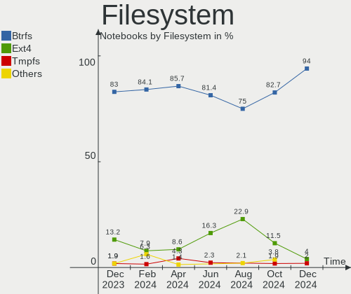
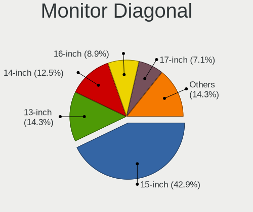
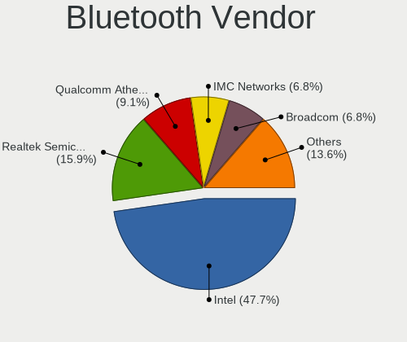
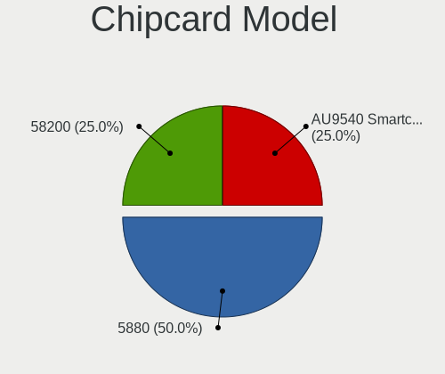

openSUSE - Hardware Trends (Notebooks)
--------------------------------------

A project to identify most popular hardware characteristics and track their change
over time based on data collected by Linux users at https://Linux-Hardware.org.

Anyone can contribute to this report by the [hw-probe](https://github.com/linuxhw/hw-probe) tool:

    sudo -E hw-probe -all -upload

This report is for one last month. Overall report since the beginning of time: [TestDays](https://github.com/linuxhw/TestDays)

Period: Aug, 2023.

Contents
--------

* [ System ](#system)
  - [ OS                       ](#os)
  - [ OS Family                ](#os-family)
  - [ Kernel                   ](#kernel)
  - [ Kernel Family            ](#kernel-family)
  - [ Kernel Major Ver.        ](#kernel-major-ver)
  - [ Arch                     ](#arch)
  - [ DE                       ](#de)
  - [ Display Server           ](#display-server)
  - [ Display Manager          ](#display-manager)
  - [ OS Lang                  ](#os-lang)
  - [ Boot Mode                ](#boot-mode)
  - [ Filesystem               ](#filesystem)
  - [ Part. scheme             ](#part-scheme)
  - [ Dual Boot with Linux/BSD ](#dual-boot-with-linuxbsd)
  - [ Dual Boot (Win)          ](#dual-boot-win)

* [ Board ](#board)
  - [ Vendor                   ](#vendor)
  - [ Model                    ](#model)
  - [ Model Family             ](#model-family)
  - [ MFG Year                 ](#mfg-year)
  - [ Form Factor              ](#form-factor)
  - [ Secure Boot              ](#secure-boot)
  - [ Coreboot                 ](#coreboot)
  - [ RAM Size                 ](#ram-size)
  - [ RAM Used                 ](#ram-used)
  - [ Total Drives             ](#total-drives)
  - [ Has CD-ROM               ](#has-cd-rom)
  - [ Has Ethernet             ](#has-ethernet)
  - [ Has WiFi                 ](#has-wifi)
  - [ Has Bluetooth            ](#has-bluetooth)

* [ Location ](#location)
  - [ Country                  ](#country)
  - [ City                     ](#city)

* [ Drives ](#drives)
  - [ Drive Vendor             ](#drive-vendor)
  - [ Drive Model              ](#drive-model)
  - [ HDD Vendor               ](#hdd-vendor)
  - [ SSD Vendor               ](#ssd-vendor)
  - [ Drive Kind               ](#drive-kind)
  - [ Drive Connector          ](#drive-connector)
  - [ Drive Size               ](#drive-size)
  - [ Space Total              ](#space-total)
  - [ Space Used               ](#space-used)
  - [ Malfunc. Drives          ](#malfunc-drives)
  - [ Malfunc. Drive Vendor    ](#malfunc-drive-vendor)
  - [ Malfunc. HDD Vendor      ](#malfunc-hdd-vendor)
  - [ Malfunc. Drive Kind      ](#malfunc-drive-kind)
  - [ Failed Drives            ](#failed-drives)
  - [ Failed Drive Vendor      ](#failed-drive-vendor)
  - [ Drive Status             ](#drive-status)

* [ Storage controller ](#storage-controller)
  - [ Storage Vendor           ](#storage-vendor)
  - [ Storage Model            ](#storage-model)
  - [ Storage Kind             ](#storage-kind)

* [ Processor ](#processor)
  - [ CPU Vendor               ](#cpu-vendor)
  - [ CPU Model                ](#cpu-model)
  - [ CPU Model Family         ](#cpu-model-family)
  - [ CPU Cores                ](#cpu-cores)
  - [ CPU Sockets              ](#cpu-sockets)
  - [ CPU Threads              ](#cpu-threads)
  - [ CPU Op-Modes             ](#cpu-op-modes)
  - [ CPU Microcode            ](#cpu-microcode)
  - [ CPU Microarch            ](#cpu-microarch)

* [ Graphics ](#graphics)
  - [ GPU Vendor               ](#gpu-vendor)
  - [ GPU Model                ](#gpu-model)
  - [ GPU Combo                ](#gpu-combo)
  - [ GPU Driver               ](#gpu-driver)
  - [ GPU Memory               ](#gpu-memory)

* [ Monitor ](#monitor)
  - [ Monitor Vendor           ](#monitor-vendor)
  - [ Monitor Model            ](#monitor-model)
  - [ Monitor Resolution       ](#monitor-resolution)
  - [ Monitor Diagonal         ](#monitor-diagonal)
  - [ Monitor Width            ](#monitor-width)
  - [ Aspect Ratio             ](#aspect-ratio)
  - [ Monitor Area             ](#monitor-area)
  - [ Pixel Density            ](#pixel-density)
  - [ Multiple Monitors        ](#multiple-monitors)

* [ Network ](#network)
  - [ Net Controller Vendor    ](#net-controller-vendor)
  - [ Net Controller Model     ](#net-controller-model)
  - [ Wireless Vendor          ](#wireless-vendor)
  - [ Wireless Model           ](#wireless-model)
  - [ Ethernet Vendor          ](#ethernet-vendor)
  - [ Ethernet Model           ](#ethernet-model)
  - [ Net Controller Kind      ](#net-controller-kind)
  - [ Used Controller          ](#used-controller)
  - [ NICs                     ](#nics)
  - [ IPv6                     ](#ipv6)

* [ Bluetooth ](#bluetooth)
  - [ Bluetooth Vendor         ](#bluetooth-vendor)
  - [ Bluetooth Model          ](#bluetooth-model)

* [ Sound ](#sound)
  - [ Sound Vendor             ](#sound-vendor)
  - [ Sound Model              ](#sound-model)

* [ Memory ](#memory)
  - [ Memory Vendor            ](#memory-vendor)
  - [ Memory Model             ](#memory-model)
  - [ Memory Kind              ](#memory-kind)
  - [ Memory Form Factor       ](#memory-form-factor)
  - [ Memory Size              ](#memory-size)
  - [ Memory Speed             ](#memory-speed)

* [ Printers & scanners ](#printers--scanners)
  - [ Printer Vendor           ](#printer-vendor)
  - [ Printer Model            ](#printer-model)
  - [ Scanner Vendor           ](#scanner-vendor)
  - [ Scanner Model            ](#scanner-model)

* [ Camera ](#camera)
  - [ Camera Vendor            ](#camera-vendor)
  - [ Camera Model             ](#camera-model)

* [ Security ](#security)
  - [ Fingerprint Vendor       ](#fingerprint-vendor)
  - [ Fingerprint Model        ](#fingerprint-model)
  - [ Chipcard Vendor          ](#chipcard-vendor)
  - [ Chipcard Model           ](#chipcard-model)

* [ Unsupported ](#unsupported)
  - [ Unsupported Devices      ](#unsupported-devices)
  - [ Unsupported Device Types ](#unsupported-device-types)

System
------

OS
--

Installed operating systems

| Name                         | Notebooks | Percent |
|------------------------------|-----------|---------|
| openSUSE Tumbleweed-XXXXXXXX | 36        | 60%     |
| openSUSE Leap-15.5           | 13        | 21.67%  |
| openSUSE Microos-XXXXXXXX    | 10        | 16.67%  |
| openSUSE 42.3                | 1         | 1.67%   |

OS Family
---------

OS without a version

| Name     | Notebooks | Percent |
|----------|-----------|---------|
| openSUSE | 60        | 100%    |

Kernel
------

Version of the Linux kernel

| Version                      | Notebooks | Percent |
|------------------------------|-----------|---------|
| 6.4.9-1-default              | 12        | 20%     |
| 6.4.11-1-default             | 11        | 18.33%  |
| 6.4.8-1-default              | 9         | 15%     |
| 6.4.6-1-default              | 8         | 13.33%  |
| 5.14.21-150500.55.12-default | 6         | 10%     |
| 5.14.21-150500.55.19-default | 5         | 8.33%   |
| 6.4.3-1-default              | 2         | 3.33%   |
| 5.14.21-150500.55.7-default  | 2         | 3.33%   |
| 6.4.4-1-default              | 1         | 1.67%   |
| 6.3.9-1-default              | 1         | 1.67%   |
| 6.2.9-1-default              | 1         | 1.67%   |
| 6.1.12-1-default             | 1         | 1.67%   |
| 5.3.18-lp152.72-default      | 1         | 1.67%   |

Kernel Family
-------------

Linux kernel without a distro release

| Version | Notebooks | Percent |
|---------|-----------|---------|
| 5.14.21 | 13        | 21.67%  |
| 6.4.9   | 12        | 20%     |
| 6.4.11  | 11        | 18.33%  |
| 6.4.8   | 9         | 15%     |
| 6.4.6   | 8         | 13.33%  |
| 6.4.3   | 2         | 3.33%   |
| 6.4.4   | 1         | 1.67%   |
| 6.3.9   | 1         | 1.67%   |
| 6.2.9   | 1         | 1.67%   |
| 6.1.12  | 1         | 1.67%   |
| 5.3.18  | 1         | 1.67%   |

Kernel Major Ver.
-----------------

Linux kernel major version

| Version | Notebooks | Percent |
|---------|-----------|---------|
| 6.4     | 43        | 71.67%  |
| 5.14    | 13        | 21.67%  |
| 6.3     | 1         | 1.67%   |
| 6.2     | 1         | 1.67%   |
| 6.1     | 1         | 1.67%   |
| 5.3     | 1         | 1.67%   |

Arch
----

OS architecture (x86_64, i586, etc.)

| Name   | Notebooks | Percent |
|--------|-----------|---------|
| x86_64 | 59        | 98.33%  |
| armv7l | 1         | 1.67%   |

DE
--

Desktop Environment

| Name     | Notebooks | Percent |
|----------|-----------|---------|
| KDE5     | 36        | 60%     |
| GNOME    | 18        | 30%     |
| Unknown  | 3         | 5%      |
| XFCE     | 1         | 1.67%   |
| sway     | 1         | 1.67%   |
| Hyprland | 1         | 1.67%   |

Display Server
--------------

X11 or Wayland

| Name    | Notebooks | Percent |
|---------|-----------|---------|
| X11     | 38        | 63.33%  |
| Wayland | 21        | 35%     |
| Tty     | 1         | 1.67%   |

Display Manager
---------------

SDDM, LightDM, etc.

| Name    | Notebooks | Percent |
|---------|-----------|---------|
| Unknown | 31        | 51.67%  |
| SDDM    | 20        | 33.33%  |
| LightDM | 4         | 6.67%   |
| XDM     | 2         | 3.33%   |
| GDM     | 2         | 3.33%   |
| GREETD  | 1         | 1.67%   |

OS Lang
-------

Language

| Lang            | Notebooks | Percent |
|-----------------|-----------|---------|
| en_US           | 25        | 41.67%  |
| de_DE           | 13        | 21.67%  |
| POSIX           | 4         | 6.67%   |
| ru_RU           | 3         | 5%      |
| es_ES           | 3         | 5%      |
| en_GB           | 3         | 5%      |
| pl_PL           | 2         | 3.33%   |
| zh_CN           | 1         | 1.67%   |
| it_IT           | 1         | 1.67%   |
| fr_FR           | 1         | 1.67%   |
| es_MX           | 1         | 1.67%   |
| es_DO           | 1         | 1.67%   |
| en_ZA           | 1         | 1.67%   |
| en_US.ISO8859-1 | 1         | 1.67%   |

Boot Mode
---------

EFI or BIOS

| Mode | Notebooks | Percent |
|------|-----------|---------|
| EFI  | 50        | 83.33%  |
| BIOS | 10        | 16.67%  |

Filesystem
----------

Type of filesystem

| Type  | Notebooks | Percent |
|-------|-----------|---------|
| Btrfs | 48        | 80%     |
| Ext4  | 10        | 16.67%  |
| Xfs   | 2         | 3.33%   |

Part. scheme
------------

Scheme of partitioning

| Type    | Notebooks | Percent |
|---------|-----------|---------|
| GPT     | 29        | 48.33%  |
| Unknown | 29        | 48.33%  |
| MBR     | 2         | 3.33%   |

Dual Boot with Linux/BSD
------------------------

Hosting more than one Linux/BSD

| Dual boot | Notebooks | Percent |
|-----------|-----------|---------|
| No        | 54        | 90%     |
| Yes       | 6         | 10%     |

Dual Boot (Win)
---------------

Hosting Linux and Windows

| Dual boot | Notebooks | Percent |
|-----------|-----------|---------|
| No        | 47        | 78.33%  |
| Yes       | 13        | 21.67%  |

Board
-----

Vendor
------

Motherboard manufacturer

| Name                | Notebooks | Percent |
|---------------------|-----------|---------|
| Dell                | 12        | 20%     |
| Lenovo              | 11        | 18.33%  |
| Hewlett-Packard     | 11        | 18.33%  |
| ASUSTek Computer    | 6         | 10%     |
| Acer                | 5         | 8.33%   |
| Toshiba             | 2         | 3.33%   |
| Samsung Electronics | 2         | 3.33%   |
| Apple               | 2         | 3.33%   |
| SLIMBOOK            | 1         | 1.67%   |
| Schenker            | 1         | 1.67%   |
| Notebook            | 1         | 1.67%   |
| MSI                 | 1         | 1.67%   |
| HUAWEI              | 1         | 1.67%   |
| GPU Company         | 1         | 1.67%   |
| Fujitsu             | 1         | 1.67%   |
| Framework           | 1         | 1.67%   |
| Unknown             | 1         | 1.67%   |

Model
-----

Motherboard model

| Name                                                                                     | Notebooks | Percent |
|------------------------------------------------------------------------------------------|-----------|---------|
| Dell Latitude 5414                                                                       | 2         | 3.33%   |
| Toshiba Satellite Pro C70-A                                                              | 1         | 1.67%   |
| Toshiba QOSMIO X775                                                                      | 1         | 1.67%   |
| SLIMBOOK PROX-AMD5                                                                       | 1         | 1.67%   |
| Schenker XMG FOCUS (Mid 2021)                                                            | 1         | 1.67%   |
| Samsung 355V4C/355V4X/355V5C/355V5X/356V4C/356V4X/356V5C/356V5X/3445VC/3445VX/3545VC/354 | 1         | 1.67%   |
| Samsung 300E5M/300E5L                                                                    | 1         | 1.67%   |
| Notebook NLx0MU                                                                          | 1         | 1.67%   |
| MSI Sword 17 A11UD                                                                       | 1         | 1.67%   |
| Lenovo ThinkPad X270 20HMS12K00                                                          | 1         | 1.67%   |
| Lenovo ThinkPad X1 Carbon 7th 20QD001VUS                                                 | 1         | 1.67%   |
| Lenovo ThinkPad T480s 20L8S4GU00                                                         | 1         | 1.67%   |
| Lenovo ThinkPad T470p 20J60014PB                                                         | 1         | 1.67%   |
| Lenovo ThinkPad T440s 20AQ005TUS                                                         | 1         | 1.67%   |
| Lenovo ThinkPad T420 42364A1                                                             | 1         | 1.67%   |
| Lenovo ThinkPad P50 20EQS5C701                                                           | 1         | 1.67%   |
| Lenovo ThinkPad P15s Gen 1 20T40008UK                                                    | 1         | 1.67%   |
| Lenovo ThinkBook 16p Gen 2 20YM                                                          | 1         | 1.67%   |
| Lenovo K14 Gen 1 21CUS02600                                                              | 1         | 1.67%   |
| Lenovo IdeaPad 330-15IKB 81DE                                                            | 1         | 1.67%   |
| HUAWEI CREF-XX                                                                           | 1         | 1.67%   |
| HP ProBook 455 15.6 inch G9 Notebook PC                                                  | 1         | 1.67%   |
| HP OMEN by Laptop                                                                        | 1         | 1.67%   |
| HP OMEN by Gaming Laptop 16-n0xxx                                                        | 1         | 1.67%   |
| HP Laptop 17-cp0xxx                                                                      | 1         | 1.67%   |
| HP Laptop 17-ca0xxx                                                                      | 1         | 1.67%   |
| HP Laptop 15-da1xxx                                                                      | 1         | 1.67%   |
| HP Laptop 14-dq1xxx                                                                      | 1         | 1.67%   |
| HP EliteBook 845 G9                                                                      | 1         | 1.67%   |
| HP EliteBook 845 G8 Notebook PC                                                          | 1         | 1.67%   |
| HP EliteBook 840 G3                                                                      | 1         | 1.67%   |
| HP 470 G7 Notebook PC                                                                    | 1         | 1.67%   |
| GPU Company GWNR71517                                                                    | 1         | 1.67%   |
| Fujitsu LIFEBOOK E736                                                                    | 1         | 1.67%   |
| Framework Laptop (13th Gen Intel Core)                                                   | 1         | 1.67%   |
| Dell XPS 13 9360                                                                         | 1         | 1.67%   |
| Dell Vostro 5471                                                                         | 1         | 1.67%   |
| Dell Vostro 1450                                                                         | 1         | 1.67%   |
| Dell Precision 7740                                                                      | 1         | 1.67%   |
| Dell Latitude E6440                                                                      | 1         | 1.67%   |

Model Family
------------

Motherboard model prefix

| Name                  | Notebooks | Percent |
|-----------------------|-----------|---------|
| Lenovo ThinkPad       | 8         | 13.33%  |
| Dell Latitude         | 5         | 8.33%   |
| HP Laptop             | 4         | 6.67%   |
| Acer Aspire           | 4         | 6.67%   |
| HP EliteBook          | 3         | 5%      |
| HP OMEN               | 2         | 3.33%   |
| Dell Vostro           | 2         | 3.33%   |
| Dell Inspiron         | 2         | 3.33%   |
| ASUS ROG              | 2         | 3.33%   |
| ASUS ASUS             | 2         | 3.33%   |
| Toshiba Satellite     | 1         | 1.67%   |
| Toshiba QOSMIO        | 1         | 1.67%   |
| SLIMBOOK PROX-AMD5    | 1         | 1.67%   |
| Schenker XMG          | 1         | 1.67%   |
| Samsung 355V4C        | 1         | 1.67%   |
| Samsung 300E5M        | 1         | 1.67%   |
| Notebook NLx0MU       | 1         | 1.67%   |
| MSI Sword             | 1         | 1.67%   |
| Lenovo ThinkBook      | 1         | 1.67%   |
| Lenovo K14            | 1         | 1.67%   |
| Lenovo IdeaPad        | 1         | 1.67%   |
| HUAWEI CREF-XX        | 1         | 1.67%   |
| HP ProBook            | 1         | 1.67%   |
| HP 470                | 1         | 1.67%   |
| GPU Company GWNR71517 | 1         | 1.67%   |
| Fujitsu LIFEBOOK      | 1         | 1.67%   |
| Framework Laptop      | 1         | 1.67%   |
| Dell XPS              | 1         | 1.67%   |
| Dell Precision        | 1         | 1.67%   |
| Dell G7               | 1         | 1.67%   |
| ASUS UX303LN          | 1         | 1.67%   |
| ASUS K75VJ            | 1         | 1.67%   |
| Apple MacBookPro9     | 1         | 1.67%   |
| Apple MacBookPro8     | 1         | 1.67%   |
| Acer Predator         | 1         | 1.67%   |
| Unknown               | 1         | 1.67%   |

MFG Year
--------

Motherboard manufacture year

| Year | Notebooks | Percent |
|------|-----------|---------|
| 2022 | 9         | 15%     |
| 2021 | 8         | 13.33%  |
| 2019 | 6         | 10%     |
| 2017 | 6         | 10%     |
| 2012 | 6         | 10%     |
| 2018 | 5         | 8.33%   |
| 2020 | 4         | 6.67%   |
| 2013 | 4         | 6.67%   |
| 2023 | 3         | 5%      |
| 2016 | 3         | 5%      |
| 2014 | 3         | 5%      |
| 2015 | 2         | 3.33%   |
| 2011 | 1         | 1.67%   |

Form Factor
-----------

Physical design of the computer

| Name     | Notebooks | Percent |
|----------|-----------|---------|
| Notebook | 60        | 100%    |

Secure Boot
-----------

Enabled or disabled

| State    | Notebooks | Percent |
|----------|-----------|---------|
| Disabled | 42        | 70%     |
| Enabled  | 18        | 30%     |

Coreboot
--------

Have coreboot on board

| Used | Notebooks | Percent |
|------|-----------|---------|
| No   | 60        | 100%    |

RAM Size
--------

Total RAM memory

| Size in GB  | Notebooks | Percent |
|-------------|-----------|---------|
| 16.01-24.0  | 15        | 25%     |
| 4.01-8.0    | 13        | 21.67%  |
| 32.01-64.0  | 13        | 21.67%  |
| 8.01-16.0   | 13        | 21.67%  |
| 3.01-4.0    | 2         | 3.33%   |
| 64.01-256.0 | 2         | 3.33%   |
| 24.01-32.0  | 1         | 1.67%   |
| 0.01-0.5    | 1         | 1.67%   |

RAM Used
--------

Used RAM memory

| Used GB   | Notebooks | Percent |
|-----------|-----------|---------|
| 2.01-3.0  | 17        | 28.33%  |
| 4.01-8.0  | 15        | 25%     |
| 3.01-4.0  | 11        | 18.33%  |
| 1.01-2.0  | 11        | 18.33%  |
| 8.01-16.0 | 5         | 8.33%   |
| 0.01-0.5  | 1         | 1.67%   |

Total Drives
------------

Number of drives on board

| Drives | Notebooks | Percent |
|--------|-----------|---------|
| 1      | 37        | 61.67%  |
| 2      | 16        | 26.67%  |
| 3      | 7         | 11.67%  |

Has CD-ROM
----------

Has CD-ROM on board

| Presented | Notebooks | Percent |
|-----------|-----------|---------|
| No        | 45        | 75%     |
| Yes       | 15        | 25%     |

Has Ethernet
------------

Has Ethernet on board

| Presented | Notebooks | Percent |
|-----------|-----------|---------|
| Yes       | 49        | 81.67%  |
| No        | 11        | 18.33%  |

Has WiFi
--------

Has WiFi module

| Presented | Notebooks | Percent |
|-----------|-----------|---------|
| Yes       | 60        | 100%    |

Has Bluetooth
-------------

Has Bluetooth module

| Presented | Notebooks | Percent |
|-----------|-----------|---------|
| Yes       | 52        | 86.67%  |
| No        | 8         | 13.33%  |

Location
--------

Country
-------

Geographic location (country)

| Country      | Notebooks | Percent |
|--------------|-----------|---------|
| Germany      | 13        | 21.67%  |
| USA          | 12        | 20%     |
| UK           | 3         | 5%      |
| Poland       | 3         | 5%      |
| Brazil       | 3         | 5%      |
| Serbia       | 2         | 3.33%   |
| Russia       | 2         | 3.33%   |
| Netherlands  | 2         | 3.33%   |
| Mexico       | 2         | 3.33%   |
| Vietnam      | 1         | 1.67%   |
| Switzerland  | 1         | 1.67%   |
| Sweden       | 1         | 1.67%   |
| South Africa | 1         | 1.67%   |
| Puerto Rico  | 1         | 1.67%   |
| Portugal     | 1         | 1.67%   |
| Italy        | 1         | 1.67%   |
| Greece       | 1         | 1.67%   |
| France       | 1         | 1.67%   |
| Finland      | 1         | 1.67%   |
| Egypt        | 1         | 1.67%   |
| Czechia      | 1         | 1.67%   |
| Colombia     | 1         | 1.67%   |
| China        | 1         | 1.67%   |
| Chile        | 1         | 1.67%   |
| Austria      | 1         | 1.67%   |
| Australia    | 1         | 1.67%   |
| Argentina    | 1         | 1.67%   |

City
----

Geographic location (city)

| City                  | Notebooks | Percent |
|-----------------------|-----------|---------|
| Hamburg               | 3         | 5%      |
| Belgrade              | 2         | 3.33%   |
| West Jordan           | 1         | 1.67%   |
| Welch                 | 1         | 1.67%   |
| Waidhofen an der Ybbs | 1         | 1.67%   |
| Vestal                | 1         | 1.67%   |
| Tucson                | 1         | 1.67%   |
| Trikala               | 1         | 1.67%   |
| Tolyatti              | 1         | 1.67%   |
| Teaneck               | 1         | 1.67%   |
| Tay Ninh              | 1         | 1.67%   |
| Tampico               | 1         | 1.67%   |
| Sydney                | 1         | 1.67%   |
| Stockholm             | 1         | 1.67%   |
| Shijiazhuang          | 1         | 1.67%   |
| San Juan              | 1         | 1.67%   |
| Salvador              | 1         | 1.67%   |
| Rotterdam             | 1         | 1.67%   |
| Rochdale              | 1         | 1.67%   |
| Rio de Janeiro        | 1         | 1.67%   |
| Rancho Cordova        | 1         | 1.67%   |
| Querétaro City       | 1         | 1.67%   |
| Prague                | 1         | 1.67%   |
| Portimao              | 1         | 1.67%   |
| Painesville           | 1         | 1.67%   |
| Novosibirsk           | 1         | 1.67%   |
| National City         | 1         | 1.67%   |
| Mesa                  | 1         | 1.67%   |
| Lucerne               | 1         | 1.67%   |
| Leonberg              | 1         | 1.67%   |
| Krakow                | 1         | 1.67%   |
| Kirchheim unter Teck  | 1         | 1.67%   |
| Kielczow              | 1         | 1.67%   |
| Jyväskylä           | 1         | 1.67%   |
| Johannesburg          | 1         | 1.67%   |
| Jastrowie             | 1         | 1.67%   |
| Hualpen               | 1         | 1.67%   |
| Hilter                | 1         | 1.67%   |
| Hildesheim            | 1         | 1.67%   |
| Hanover               | 1         | 1.67%   |

Drives
------

Drive Vendor
------------

Hard drive vendors

| Vendor                    | Notebooks | Drives | Percent |
|---------------------------|-----------|--------|---------|
| Samsung Electronics       | 17        | 20     | 20.99%  |
| Sandisk                   | 8         | 9      | 9.88%   |
| Crucial                   | 6         | 6      | 7.41%   |
| WDC                       | 5         | 5      | 6.17%   |
| Unknown                   | 5         | 6      | 6.17%   |
| Seagate                   | 5         | 5      | 6.17%   |
| Micron Technology         | 4         | 4      | 4.94%   |
| SPCC                      | 3         | 3      | 3.7%    |
| Intel                     | 3         | 4      | 3.7%    |
| Toshiba                   | 2         | 3      | 2.47%   |
| SK hynix                  | 2         | 2      | 2.47%   |
| Silicon Motion            | 2         | 2      | 2.47%   |
| Micron/Crucial Technology | 2         | 2      | 2.47%   |
| KIOXIA                    | 2         | 2      | 2.47%   |
| ADATA Technology          | 2         | 2      | 2.47%   |
| XrayDisk                  | 1         | 1      | 1.23%   |
| Wibtek                    | 1         | 1      | 1.23%   |
| VSP-128G                  | 1         | 1      | 1.23%   |
| Phison Electronics        | 1         | 1      | 1.23%   |
| Phison                    | 1         | 1      | 1.23%   |
| Patriot                   | 1         | 1      | 1.23%   |
| LITEON                    | 1         | 1      | 1.23%   |
| Kingston                  | 1         | 1      | 1.23%   |
| JMicron Technology        | 1         | 1      | 1.23%   |
| Gigabyte Technology       | 1         | 1      | 1.23%   |
| Fujitsu                   | 1         | 1      | 1.23%   |
| China                     | 1         | 1      | 1.23%   |
| A-DATA Technology         | 1         | 1      | 1.23%   |

Drive Model
-----------

Hard drive models

| Model                                                           | Notebooks | Percent |
|-----------------------------------------------------------------|-----------|---------|
| Samsung NVMe SSD Controller SM981/PM981/PM983 500GB             | 3         | 3.45%   |
| Samsung NVMe SSD Controller SM961/PM961/SM963 1024GB            | 3         | 3.45%   |
| Unknown USB DISK 3.2 250GB                                      | 2         | 2.3%    |
| Sandisk WD Black SN850 256GB                                    | 2         | 2.3%    |
| Samsung NVMe SSD Controller PM9A1/PM9A3/980PRO 1024GB           | 2         | 2.3%    |
| Samsung MZVLQ512HBLU-00BH1 512GB                                | 2         | 2.3%    |
| Intel SSD 660P Series 512GB                                     | 2         | 2.3%    |
| ADATA XPG SX8200 Pro PCIe Gen3x4 M.2 2280 Solid State Drive 2TB | 2         | 2.3%    |
| XrayDisk 512GB SSD                                              | 1         | 1.15%   |
| Wibtek W800S 512GB SSD                                          | 1         | 1.15%   |
| WDC WD7500BPVX-75JC3T0 752GB                                    | 1         | 1.15%   |
| WDC WD5000LPVX-60V0TT0 500GB                                    | 1         | 1.15%   |
| WDC WD20SPZX-21UA7T0 2TB                                        | 1         | 1.15%   |
| WDC WD10SPZX-60Z10T0 1TB                                        | 1         | 1.15%   |
| WDC WD10SPSX-22A6WT0 1TB                                        | 1         | 1.15%   |
| VSP-128G MSD 128GB SSD                                          | 1         | 1.15%   |
| Unknown SSD_2.5"_TLC_256 256GB                                  | 1         | 1.15%   |
| Unknown MMC Card  8GB                                           | 1         | 1.15%   |
| Unknown MMC Card  32GB                                          | 1         | 1.15%   |
| Unknown MMC Card  2GB                                           | 1         | 1.15%   |
| Toshiba MK5061GSYN 500GB                                        | 1         | 1.15%   |
| Toshiba KXG50ZNV256G NVMe 256GB                                 | 1         | 1.15%   |
| SPCC Solid State Disk 256GB                                     | 1         | 1.15%   |
| SPCC M.2 SSD 512GB                                              | 1         | 1.15%   |
| SPCC M.2 SSD 1TB                                                | 1         | 1.15%   |
| SK hynix SKHynix_HFS512GDE9X084N 512GB                          | 1         | 1.15%   |
| SK hynix BC711 NVMe 1TB                                         | 1         | 1.15%   |
| Silicon Motion SM2262/SM2262EN SSD Controller 1024GB            | 1         | 1.15%   |
| Silicon Motion PCIe-8 SSD 1TB                                   | 1         | 1.15%   |
| Seagate ST2000LM015-2E8174 2TB                                  | 1         | 1.15%   |
| Seagate ST1000LM048-2E7172 1TB                                  | 1         | 1.15%   |
| Seagate ST1000LM014-1EJ164 1TB                                  | 1         | 1.15%   |
| Seagate ST1000LM 035-1RK172 1TB                                 | 1         | 1.15%   |
| Seagate BUP Slim 2TB                                            | 1         | 1.15%   |
| Sandisk WD_BLACK SN850X 2000GB                                  | 1         | 1.15%   |
| Sandisk WD_BLACK SN850X 1000GB                                  | 1         | 1.15%   |
| Sandisk WD_BLACK SN770 1TB                                      | 1         | 1.15%   |
| Sandisk WD Blue SN550 NVMe SSD 250GB                            | 1         | 1.15%   |
| Sandisk WD Black SN750 / PC SN730 NVMe SSD 1024GB               | 1         | 1.15%   |
| SanDisk SDSSDH3 512G                                            | 1         | 1.15%   |

HDD Vendor
----------

Hard disk drive vendors

| Vendor  | Notebooks | Drives | Percent |
|---------|-----------|--------|---------|
| WDC     | 5         | 5      | 41.67%  |
| Seagate | 5         | 5      | 41.67%  |
| Toshiba | 1         | 2      | 8.33%   |
| Fujitsu | 1         | 1      | 8.33%   |

SSD Vendor
----------

Solid state drive vendors

| Vendor              | Notebooks | Drives | Percent |
|---------------------|-----------|--------|---------|
| Crucial             | 6         | 6      | 22.22%  |
| Samsung Electronics | 5         | 6      | 18.52%  |
| SPCC                | 3         | 3      | 11.11%  |
| SanDisk             | 2         | 2      | 7.41%   |
| XrayDisk            | 1         | 1      | 3.7%    |
| Wibtek              | 1         | 1      | 3.7%    |
| VSP-128G            | 1         | 1      | 3.7%    |
| Unknown             | 1         | 1      | 3.7%    |
| Phison              | 1         | 1      | 3.7%    |
| Patriot             | 1         | 1      | 3.7%    |
| Micron Technology   | 1         | 1      | 3.7%    |
| LITEON              | 1         | 1      | 3.7%    |
| JMicron Technology  | 1         | 1      | 3.7%    |
| Gigabyte Technology | 1         | 1      | 3.7%    |
| China               | 1         | 1      | 3.7%    |

Drive Kind
----------

HDD or SSD

| Kind    | Notebooks | Drives | Percent |
|---------|-----------|--------|---------|
| NVMe    | 35        | 42     | 45.45%  |
| SSD     | 26        | 28     | 33.77%  |
| HDD     | 12        | 13     | 15.58%  |
| MMC     | 2         | 3      | 2.6%    |
| Unknown | 2         | 2      | 2.6%    |

Drive Connector
---------------

SATA, SAS, NVMe, etc.

| Type | Notebooks | Drives | Percent |
|------|-----------|--------|---------|
| NVMe | 35        | 42     | 46.05%  |
| SATA | 33        | 37     | 43.42%  |
| SAS  | 6         | 6      | 7.89%   |
| MMC  | 2         | 3      | 2.63%   |

Drive Size
----------

Size of hard drive

| Size in TB | Notebooks | Drives | Percent |
|------------|-----------|--------|---------|
| 0.51-1.0   | 16        | 18     | 43.24%  |
| 0.01-0.5   | 16        | 18     | 43.24%  |
| 1.01-2.0   | 5         | 5      | 13.51%  |

Space Total
-----------

Amount of disk space available on the file system

| Size in GB     | Notebooks | Percent |
|----------------|-----------|---------|
| More than 3000 | 21        | 35%     |
| 1001-2000      | 16        | 26.67%  |
| 501-1000       | 8         | 13.33%  |
| 2001-3000      | 6         | 10%     |
| 251-500        | 5         | 8.33%   |
| 101-250        | 3         | 5%      |
| 1-20           | 1         | 1.67%   |

Space Used
----------

Amount of used disk space

| Used GB        | Notebooks | Percent |
|----------------|-----------|---------|
| 101-250        | 12        | 20%     |
| 51-100         | 12        | 20%     |
| 251-500        | 11        | 18.33%  |
| 501-1000       | 9         | 15%     |
| 1001-2000      | 6         | 10%     |
| 2001-3000      | 4         | 6.67%   |
| 21-50          | 3         | 5%      |
| More than 3000 | 2         | 3.33%   |
| 1-20           | 1         | 1.67%   |

Malfunc. Drives
---------------

Drive models with a malfunction

| Model                                               | Notebooks | Drives | Percent |
|-----------------------------------------------------|-----------|--------|---------|
| WDC WD10SPZX-60Z10T0 1TB                            | 1         | 1      | 50%     |
| Micron Technology MTFDDAV512TBN-1AR15ABHA 512GB SSD | 1         | 1      | 50%     |

Malfunc. Drive Vendor
---------------------

Vendors of faulty drives

| Vendor            | Notebooks | Drives | Percent |
|-------------------|-----------|--------|---------|
| WDC               | 1         | 1      | 50%     |
| Micron Technology | 1         | 1      | 50%     |

Malfunc. HDD Vendor
-------------------

Vendors of faulty HDD drives

| Vendor | Notebooks | Drives | Percent |
|--------|-----------|--------|---------|
| WDC    | 1         | 1      | 100%    |

Malfunc. Drive Kind
-------------------

Kinds of faulty drives

| Kind | Notebooks | Drives | Percent |
|------|-----------|--------|---------|
| SSD  | 1         | 1      | 50%     |
| HDD  | 1         | 1      | 50%     |

Failed Drives
-------------

Failed drive models

| Model                           | Notebooks | Drives | Percent |
|---------------------------------|-----------|--------|---------|
| Samsung Electronics SSD 980 1TB | 1         | 1      | 100%    |

Failed Drive Vendor
-------------------

Failed drive vendors

| Vendor              | Notebooks | Drives | Percent |
|---------------------|-----------|--------|---------|
| Samsung Electronics | 1         | 1      | 100%    |

Drive Status
------------

Number of failed and malfunc. drives

| Status   | Notebooks | Drives | Percent |
|----------|-----------|--------|---------|
| Detected | 32        | 48     | 50.79%  |
| Works    | 29        | 37     | 46.03%  |
| Malfunc  | 1         | 2      | 1.59%   |
| Failed   | 1         | 1      | 1.59%   |

Storage controller
------------------

Storage Vendor
--------------

Storage controller vendors

| Vendor                       | Notebooks | Percent |
|------------------------------|-----------|---------|
| Intel                        | 36        | 46.15%  |
| Samsung Electronics          | 14        | 17.95%  |
| SanDisk                      | 6         | 7.69%   |
| AMD                          | 5         | 6.41%   |
| Micron Technology            | 3         | 3.85%   |
| ADATA Technology             | 3         | 3.85%   |
| SK hynix                     | 2         | 2.56%   |
| Silicon Motion               | 2         | 2.56%   |
| Micron/Crucial Technology    | 2         | 2.56%   |
| KIOXIA                       | 2         | 2.56%   |
| Toshiba America Info Systems | 1         | 1.28%   |
| Phison Electronics           | 1         | 1.28%   |
| Kingston Technology Company  | 1         | 1.28%   |

Storage Model
-------------

Storage controller models

| Model                                                                         | Notebooks | Percent |
|-------------------------------------------------------------------------------|-----------|---------|
| Intel Sunrise Point-LP SATA Controller [AHCI mode]                            | 8         | 9.52%   |
| Samsung NVMe SSD Controller 980                                               | 6         | 7.14%   |
| Intel 82801 Mobile SATA Controller [RAID mode]                                | 5         | 5.95%   |
| AMD FCH SATA Controller [AHCI mode]                                           | 5         | 5.95%   |
| Intel Volume Management Device NVMe RAID Controller                           | 4         | 4.76%   |
| Intel 7 Series Chipset Family 6-port SATA Controller [AHCI mode]              | 4         | 4.76%   |
| Intel 6 Series/C200 Series Chipset Family 6 port Mobile SATA AHCI Controller  | 4         | 4.76%   |
| Samsung NVMe SSD Controller SM981/PM981/PM983                                 | 3         | 3.57%   |
| Samsung NVMe SSD Controller SM961/PM961/SM963                                 | 3         | 3.57%   |
| Intel Tiger Lake-LP SATA Controller                                           | 3         | 3.57%   |
| Intel 8 Series SATA Controller 1 [AHCI mode]                                  | 3         | 3.57%   |
| SK hynix Gold P31/BC711/PC711 NVMe Solid State Drive                          | 2         | 2.38%   |
| Sandisk Western Digital WD Black SN850X NVMe SSD                              | 2         | 2.38%   |
| SanDisk WD PC SN810 / Black SN850 NVMe SSD                                    | 2         | 2.38%   |
| Samsung NVMe SSD Controller PM9A1/PM9A3/980PRO                                | 2         | 2.38%   |
| KIOXIA NVMe SSD Controller BG5 (DRAM-less)                                    | 2         | 2.38%   |
| Intel Tiger Lake SATA AHCI Controller                                         | 2         | 2.38%   |
| Intel SSD 660P Series                                                         | 2         | 2.38%   |
| Intel Cannon Lake Mobile PCH SATA AHCI Controller                             | 2         | 2.38%   |
| ADATA XPG SX8200 Pro PCIe Gen3x4 M.2 2280 Solid State Drive                   | 2         | 2.38%   |
| Toshiba America Info Systems XG5 NVMe SSD Controller                          | 1         | 1.19%   |
| Silicon Motion SM2262/SM2262EN SSD Controller                                 | 1         | 1.19%   |
| Silicon Motion Non-Volatile memory controller                                 | 1         | 1.19%   |
| SanDisk WD Blue SN550 NVMe SSD                                                | 1         | 1.19%   |
| SanDisk WD Black SN770 / PC SN740 256GB / PC SN560 (DRAM-less) NVMe SSD       | 1         | 1.19%   |
| SanDisk WD Black SN750 / PC SN730 NVMe SSD                                    | 1         | 1.19%   |
| Phison E16 PCIe4 NVMe Controller                                              | 1         | 1.19%   |
| Micron/Crucial P5 Plus NVMe PCIe SSD                                          | 1         | 1.19%   |
| Micron/Crucial P2 [Nick P2] / P3 / P3 Plus NVMe PCIe SSD (DRAM-less)          | 1         | 1.19%   |
| Micron 2450 NVMe SSD [HendrixV] (DRAM-less)                                   | 1         | 1.19%   |
| Micron 2400 NVMe SSD (DRAM-less)                                              | 1         | 1.19%   |
| Micron 2200S NVMe SSD [Cassandra]                                             | 1         | 1.19%   |
| Kingston Company NVMe Controller                                              | 1         | 1.19%   |
| Intel Q170/Q150/B150/H170/H110/Z170/CM236 Chipset SATA Controller [AHCI Mode] | 1         | 1.19%   |
| Intel Optane NVME SSD H10 with Solid State Storage [Teton Glacier]            | 1         | 1.19%   |
| Intel HM170/QM170 Chipset SATA Controller [AHCI Mode]                         | 1         | 1.19%   |
| Intel Alder Lake-P SATA AHCI Controller                                       | 1         | 1.19%   |
| ADATA IM2P33F3 NVMe SSD (DRAM-less)                                           | 1         | 1.19%   |

Storage Kind
------------

Kind of storage controller (IDE, SATA, NVMe, SAS, ...)

| Kind | Notebooks | Percent |
|------|-----------|---------|
| NVMe | 35        | 44.87%  |
| SATA | 34        | 43.59%  |
| RAID | 9         | 11.54%  |

Processor
---------

CPU Vendor
----------

Processor vendors

| Vendor | Notebooks | Percent |
|--------|-----------|---------|
| Intel  | 45        | 75%     |
| AMD    | 14        | 23.33%  |
| ARM    | 1         | 1.67%   |

CPU Model
---------

Processor models

| Model                                                  | Notebooks | Percent |
|--------------------------------------------------------|-----------|---------|
| Intel Core i7-9750H CPU @ 2.60GHz                      | 3         | 5%      |
| Intel Core i7-7700HQ CPU @ 2.80GHz                     | 2         | 3.33%   |
| Intel Core i7-6600U CPU @ 2.60GHz                      | 2         | 3.33%   |
| Intel Core i5-8350U CPU @ 1.70GHz                      | 2         | 3.33%   |
| Intel Core i5-4210U CPU @ 1.70GHz                      | 2         | 3.33%   |
| Intel 11th Gen Core i7-11800H @ 2.30GHz                | 2         | 3.33%   |
| Intel 11th Gen Core i7-1165G7 @ 2.80GHz                | 2         | 3.33%   |
| AMD Ryzen 7 3700U with Radeon Vega Mobile Gfx          | 2         | 3.33%   |
| Intel Pentium CPU 2020M @ 2.40GHz                      | 1         | 1.67%   |
| Intel Core i7-8565U CPU @ 1.80GHz                      | 1         | 1.67%   |
| Intel Core i7-8550U CPU @ 1.80GHz                      | 1         | 1.67%   |
| Intel Core i7-6820HQ CPU @ 2.70GHz                     | 1         | 1.67%   |
| Intel Core i7-6500U CPU @ 2.50GHz                      | 1         | 1.67%   |
| Intel Core i7-3630QM CPU @ 2.40GHz                     | 1         | 1.67%   |
| Intel Core i7-2720QM CPU @ 2.20GHz                     | 1         | 1.67%   |
| Intel Core i7-2670QM CPU @ 2.20GHz                     | 1         | 1.67%   |
| Intel Core i7-2640M CPU @ 2.80GHz                      | 1         | 1.67%   |
| Intel Core i7-10750H CPU @ 2.60GHz                     | 1         | 1.67%   |
| Intel Core i7-10610U CPU @ 1.80GHz                     | 1         | 1.67%   |
| Intel Core i5-8265U CPU @ 1.60GHz                      | 1         | 1.67%   |
| Intel Core i5-8250U CPU @ 1.60GHz                      | 1         | 1.67%   |
| Intel Core i5-7300U CPU @ 2.60GHz                      | 1         | 1.67%   |
| Intel Core i5-7200U CPU @ 2.50GHz                      | 1         | 1.67%   |
| Intel Core i5-6300U CPU @ 2.40GHz                      | 1         | 1.67%   |
| Intel Core i5-4310M CPU @ 2.70GHz                      | 1         | 1.67%   |
| Intel Core i5-4300U CPU @ 1.90GHz                      | 1         | 1.67%   |
| Intel Core i5-3210M CPU @ 2.50GHz                      | 1         | 1.67%   |
| Intel Core i5-2540M CPU @ 2.60GHz                      | 1         | 1.67%   |
| Intel Core i5-10210U CPU @ 1.60GHz                     | 1         | 1.67%   |
| Intel Core i3-7020U CPU @ 2.30GHz                      | 1         | 1.67%   |
| Intel Core i3-2375M CPU @ 1.50GHz                      | 1         | 1.67%   |
| Intel Core i3-1005G1 CPU @ 1.20GHz                     | 1         | 1.67%   |
| Intel 13th Gen Core i7-1360P                           | 1         | 1.67%   |
| Intel 13th Gen Core i7-1355U                           | 1         | 1.67%   |
| Intel 12th Gen Core i7-12700H                          | 1         | 1.67%   |
| Intel 12th Gen Core i7-1260P                           | 1         | 1.67%   |
| Intel 11th Gen Core i5-1135G7 @ 2.40GHz                | 1         | 1.67%   |
| Intel 11th Gen Core i5-11300H @ 3.10GHz                | 1         | 1.67%   |
| ARM NVIDIA Tegra SoC (Flattened Device Tree) Processor | 1         | 1.67%   |
| AMD Ryzen 9 6900HX with Radeon Graphics                | 1         | 1.67%   |

CPU Model Family
----------------

Processor model prefix

| Model           | Notebooks | Percent |
|-----------------|-----------|---------|
| Intel Core i7   | 17        | 28.33%  |
| Intel Core i5   | 14        | 23.33%  |
| Other           | 11        | 18.33%  |
| AMD Ryzen 7     | 5         | 8.33%   |
| Intel Core i3   | 3         | 5%      |
| AMD Ryzen 5 PRO | 2         | 3.33%   |
| AMD Ryzen 5     | 2         | 3.33%   |
| Intel Pentium   | 1         | 1.67%   |
| AMD Ryzen 9     | 1         | 1.67%   |
| AMD Ryzen 7 PRO | 1         | 1.67%   |
| AMD Ryzen 3     | 1         | 1.67%   |
| AMD A6          | 1         | 1.67%   |
| AMD A4          | 1         | 1.67%   |

CPU Cores
---------

Number of processor cores

| Number | Notebooks | Percent |
|--------|-----------|---------|
| 4      | 21        | 35%     |
| 2      | 19        | 31.67%  |
| 6      | 8         | 13.33%  |
| 8      | 7         | 11.67%  |
| 12     | 2         | 3.33%   |
| 14     | 1         | 1.67%   |
| 10     | 1         | 1.67%   |
| 1      | 1         | 1.67%   |

CPU Sockets
-----------

Number of sockets

| Number | Notebooks | Percent |
|--------|-----------|---------|
| 1      | 60        | 100%    |

CPU Threads
-----------

Threads per core (Hyper-Threading)

| Number | Notebooks | Percent |
|--------|-----------|---------|
| 2      | 56        | 93.33%  |
| 1      | 4         | 6.67%   |

CPU Op-Modes
------------

CPU Operation Modes (32-bit, 64-bit)

| Op mode        | Notebooks | Percent |
|----------------|-----------|---------|
| 32-bit, 64-bit | 59        | 98.33%  |
| Unknown        | 1         | 1.67%   |

CPU Microcode
-------------

Microcode number

| Number     | Notebooks | Percent |
|------------|-----------|---------|
| Unknown    | 36        | 60%     |
| 0x0a50000d | 3         | 5%      |
| 0x0a404102 | 3         | 5%      |
| 0x906ea    | 2         | 3.33%   |
| 0x806ec    | 2         | 3.33%   |
| 0x08608103 | 2         | 3.33%   |
| 0x08108109 | 2         | 3.33%   |
| 0x906e9    | 1         | 1.67%   |
| 0x906a3    | 1         | 1.67%   |
| 0x806ea    | 1         | 1.67%   |
| 0x806c1    | 1         | 1.67%   |
| 0x406e3    | 1         | 1.67%   |
| 0x40651    | 1         | 1.67%   |
| 0x306c3    | 1         | 1.67%   |
| 0x0a50000c | 1         | 1.67%   |
| 0x08101016 | 1         | 1.67%   |
| 0x07000106 | 1         | 1.67%   |

CPU Microarch
-------------

Microarchitecture

| Name             | Notebooks | Percent |
|------------------|-----------|---------|
| KabyLake         | 16        | 26.67%  |
| Unknown          | 7         | 11.67%  |
| Skylake          | 5         | 8.33%   |
| SandyBridge      | 5         | 8.33%   |
| Zen 3            | 4         | 6.67%   |
| TigerLake        | 4         | 6.67%   |
| Haswell          | 4         | 6.67%   |
| IvyBridge        | 3         | 5%      |
| IceLake          | 3         | 5%      |
| Alderlake Hybrid | 3         | 5%      |
| Zen+             | 2         | 3.33%   |
| Zen              | 1         | 1.67%   |
| Piledriver       | 1         | 1.67%   |
| Jaguar           | 1         | 1.67%   |
| CometLake        | 1         | 1.67%   |

Graphics
--------

GPU Vendor
----------

Vendors of graphics cards

| Vendor | Notebooks | Percent |
|--------|-----------|---------|
| Intel  | 45        | 55.56%  |
| Nvidia | 19        | 23.46%  |
| AMD    | 17        | 20.99%  |

GPU Model
---------

Graphics card models

| Model                                                                                 | Notebooks | Percent |
|---------------------------------------------------------------------------------------|-----------|---------|
| Intel 2nd Generation Core Processor Family Integrated Graphics Controller             | 5         | 6.1%    |
| Intel UHD Graphics 620                                                                | 4         | 4.88%   |
| Intel TigerLake-LP GT2 [Iris Xe Graphics]                                             | 4         | 4.88%   |
| Intel Skylake GT2 [HD Graphics 520]                                                   | 4         | 4.88%   |
| Nvidia TU106M [GeForce RTX 2060 Mobile]                                               | 3         | 3.66%   |
| Nvidia GA107M [GeForce RTX 3050 Ti Mobile]                                            | 3         | 3.66%   |
| Intel HD Graphics 620                                                                 | 3         | 3.66%   |
| Intel Haswell-ULT Integrated Graphics Controller                                      | 3         | 3.66%   |
| Intel CoffeeLake-H GT2 [UHD Graphics 630]                                             | 3         | 3.66%   |
| Intel 3rd Gen Core processor Graphics Controller                                      | 3         | 3.66%   |
| AMD Rembrandt [Radeon 680M]                                                           | 3         | 3.66%   |
| AMD Cezanne [Radeon Vega Series / Radeon Vega Mobile Series]                          | 3         | 3.66%   |
| Nvidia GM108M [GeForce 840M]                                                          | 2         | 2.44%   |
| Intel WhiskeyLake-U GT2 [UHD Graphics 620]                                            | 2         | 2.44%   |
| Intel TigerLake-H GT1 [UHD Graphics]                                                  | 2         | 2.44%   |
| Intel Raptor Lake-P [Iris Xe Graphics]                                                | 2         | 2.44%   |
| Intel HD Graphics 630                                                                 | 2         | 2.44%   |
| Intel CometLake-U GT2 [UHD Graphics]                                                  | 2         | 2.44%   |
| Intel Alder Lake-P Integrated Graphics Controller                                     | 2         | 2.44%   |
| AMD Picasso/Raven 2 [Radeon Vega Series / Radeon Vega Mobile Series]                  | 2         | 2.44%   |
| AMD Lucienne                                                                          | 2         | 2.44%   |
| Nvidia GP108GLM [Quadro P520]                                                         | 1         | 1.22%   |
| Nvidia GP107M [GeForce MX350]                                                         | 1         | 1.22%   |
| Nvidia GP107M [GeForce GTX 1050 Ti Mobile]                                            | 1         | 1.22%   |
| Nvidia GM108M [GeForce MX130]                                                         | 1         | 1.22%   |
| Nvidia GM108M [GeForce 940MX]                                                         | 1         | 1.22%   |
| Nvidia GM107GLM [Quadro M2000M]                                                       | 1         | 1.22%   |
| Nvidia GF116M [GeForce GT 560M]                                                       | 1         | 1.22%   |
| Nvidia GF108M [GeForce GT 635M]                                                       | 1         | 1.22%   |
| Nvidia GA107M [GeForce RTX 2050]                                                      | 1         | 1.22%   |
| Nvidia GA106M [GeForce RTX 3060 Mobile / Max-Q]                                       | 1         | 1.22%   |
| Nvidia GA103M [GeForce RTX 3080 Ti Mobile]                                            | 1         | 1.22%   |
| Intel Iris Plus Graphics G1 (Ice Lake)                                                | 1         | 1.22%   |
| Intel HD Graphics 530                                                                 | 1         | 1.22%   |
| Intel CometLake-H GT2 [UHD Graphics]                                                  | 1         | 1.22%   |
| Intel 4th Gen Core Processor Integrated Graphics Controller                           | 1         | 1.22%   |
| AMD Trinity 2 [Radeon HD 7520G]                                                       | 1         | 1.22%   |
| AMD Topaz XT [Radeon R7 M260/M265 / M340/M360 / M440/M445 / 530/535 / 620/625 Mobile] | 1         | 1.22%   |
| AMD Sun XT [Radeon HD 8670A/8670M/8690M / R5 M330 / M430 / Radeon 520 Mobile]         | 1         | 1.22%   |
| AMD Raven Ridge [Radeon Vega Series / Radeon Vega Mobile Series]                      | 1         | 1.22%   |

GPU Combo
---------

Combinations of graphics cards

| Name           | Notebooks | Percent |
|----------------|-----------|---------|
| 1 x Intel      | 25        | 41.67%  |
| Intel + Nvidia | 17        | 28.33%  |
| 1 x AMD        | 11        | 18.33%  |
| Intel + AMD    | 3         | 5%      |
| AMD + Nvidia   | 2         | 3.33%   |
| Other          | 1         | 1.67%   |
| 2 x AMD        | 1         | 1.67%   |

GPU Driver
----------

Free vs proprietary

| Driver      | Notebooks | Percent |
|-------------|-----------|---------|
| Free        | 54        | 90%     |
| Proprietary | 5         | 8.33%   |
| Unknown     | 1         | 1.67%   |

GPU Memory
----------

Total video memory

| Size in GB | Notebooks | Percent |
|------------|-----------|---------|
| Unknown    | 34        | 56.67%  |
| 1.01-2.0   | 8         | 13.33%  |
| 0.01-0.5   | 7         | 11.67%  |
| 3.01-4.0   | 3         | 5%      |
| 0.51-1.0   | 3         | 5%      |
| 7.01-8.0   | 2         | 3.33%   |
| 5.01-6.0   | 2         | 3.33%   |
| 8.01-16.0  | 1         | 1.67%   |

Monitor
-------

Monitor Vendor
--------------

Monitor vendors

| Vendor                  | Notebooks | Percent |
|-------------------------|-----------|---------|
| AU Optronics            | 17        | 22.37%  |
| BOE                     | 15        | 19.74%  |
| Chimei Innolux          | 11        | 14.47%  |
| Samsung Electronics     | 8         | 10.53%  |
| LG Display              | 5         | 6.58%   |
| Dell                    | 4         | 5.26%   |
| Sharp                   | 3         | 3.95%   |
| Goldstar                | 2         | 2.63%   |
| Apple                   | 2         | 2.63%   |
| Videoseven              | 1         | 1.32%   |
| Sceptre Tech            | 1         | 1.32%   |
| Pixio                   | 1         | 1.32%   |
| PANDA                   | 1         | 1.32%   |
| InfoVision              | 1         | 1.32%   |
| HKC                     | 1         | 1.32%   |
| CSO                     | 1         | 1.32%   |
| Chi Mei Optoelectronics | 1         | 1.32%   |
| BenQ                    | 1         | 1.32%   |

Monitor Model
-------------

Monitor models

| Model                                                                | Notebooks | Percent |
|----------------------------------------------------------------------|-----------|---------|
| LG Display LCD Monitor LGD065B 1920x1080 382x215mm 17.3-inch         | 2         | 2.63%   |
| AU Optronics LCD Monitor AUO213D 1920x1080 309x173mm 13.9-inch       | 2         | 2.63%   |
| Videoseven L236VA IGM2380 1920x1080 521x293mm 23.5-inch              | 1         | 1.32%   |
| Sharp LCD Monitor SHP1449 1920x1080 294x165mm 13.3-inch              | 1         | 1.32%   |
| Sharp LCD Monitor SHP1446 3840x2160 382x215mm 17.3-inch              | 1         | 1.32%   |
| Sharp LCD Monitor SHP143B 3840x2160 346x194mm 15.6-inch              | 1         | 1.32%   |
| Sceptre Tech Sceptre M25 SPT0A05 1920x1080 698x393mm 31.5-inch       | 1         | 1.32%   |
| Samsung Electronics T27C350 SAM0AC5 1920x1080 598x336mm 27.0-inch    | 1         | 1.32%   |
| Samsung Electronics SyncMaster SAM05CD 1920x1080                     | 1         | 1.32%   |
| Samsung Electronics SyncMaster SAM0526 1920x1080 510x287mm 23.0-inch | 1         | 1.32%   |
| Samsung Electronics S24E650 SAM0CB8 1920x1080 521x293mm 23.5-inch    | 1         | 1.32%   |
| Samsung Electronics S24C36x SAM7314 1920x1080 521x293mm 23.5-inch    | 1         | 1.32%   |
| Samsung Electronics S22E450 SAM0C91 1920x1080 477x268mm 21.5-inch    | 1         | 1.32%   |
| Samsung Electronics LCD Monitor SEC354E 1024x600 220x130mm 10.1-inch | 1         | 1.32%   |
| Samsung Electronics LCD Monitor SEC314F 1600x900 382x215mm 17.3-inch | 1         | 1.32%   |
| Pixio U29I WAM2900 2560x1080 690x260mm 29.0-inch                     | 1         | 1.32%   |
| PANDA LCD Monitor NCP006E 1920x1080 344x194mm 15.5-inch              | 1         | 1.32%   |
| LG Display LCD Monitor LGD071E 1920x1080 344x194mm 15.5-inch         | 1         | 1.32%   |
| LG Display LCD Monitor LGD06FA 1920x1200 302x189mm 14.0-inch         | 1         | 1.32%   |
| LG Display LCD Monitor LGD04B1 1366x768 310x174mm 14.0-inch          | 1         | 1.32%   |
| InfoVision LCD Monitor IVO8C78 1920x1080 309x174mm 14.0-inch         | 1         | 1.32%   |
| HKC LCD Monitor HKC3CFB 1920x1080 344x194mm 15.5-inch                | 1         | 1.32%   |
| Goldstar ULTRAWIDE GSM76F9 2560x1080 798x334mm 34.1-inch             | 1         | 1.32%   |
| Goldstar HDR WFHD GSM7714 2560x1080 798x334mm 34.1-inch              | 1         | 1.32%   |
| Dell U2412M DELA07B 1920x1200 518x324mm 24.1-inch                    | 1         | 1.32%   |
| Dell P3418HW DELF106 2560x1080 800x335mm 34.1-inch                   | 1         | 1.32%   |
| Dell P2419H DELD0DA 1920x1080 527x296mm 23.8-inch                    | 1         | 1.32%   |
| Dell E1911 DELF036 1440x900 408x255mm 18.9-inch                      | 1         | 1.32%   |
| CSO LCD Monitor CSO1603 2560x1600 344x215mm 16.0-inch                | 1         | 1.32%   |
| Chimei Innolux LCD Monitor CMN175E 1920x1080 381x214mm 17.2-inch     | 1         | 1.32%   |
| Chimei Innolux LCD Monitor CMN1745 1600x900 382x214mm 17.2-inch      | 1         | 1.32%   |
| Chimei Innolux LCD Monitor CMN1728 1600x900 382x215mm 17.3-inch      | 1         | 1.32%   |
| Chimei Innolux LCD Monitor CMN1619 1920x1080 355x199mm 16.0-inch     | 1         | 1.32%   |
| Chimei Innolux LCD Monitor CMN15E7 1920x1080 344x193mm 15.5-inch     | 1         | 1.32%   |
| Chimei Innolux LCD Monitor CMN15CA 1366x768 344x193mm 15.5-inch      | 1         | 1.32%   |
| Chimei Innolux LCD Monitor CMN14F2 1920x1080 309x173mm 13.9-inch     | 1         | 1.32%   |
| Chimei Innolux LCD Monitor CMN14E5 1920x1080 309x173mm 13.9-inch     | 1         | 1.32%   |
| Chimei Innolux LCD Monitor CMN14E3 1366x768 309x173mm 13.9-inch      | 1         | 1.32%   |
| Chimei Innolux LCD Monitor CMN14C0 1920x1080 308x173mm 13.9-inch     | 1         | 1.32%   |
| Chimei Innolux LCD Monitor CMN1361 1920x1080 293x165mm 13.2-inch     | 1         | 1.32%   |

Monitor Resolution
------------------

Monitor screen resolution

| Resolution        | Notebooks | Percent |
|-------------------|-----------|---------|
| 1920x1080 (FHD)   | 36        | 50.7%   |
| 1366x768 (WXGA)   | 13        | 18.31%  |
| 1600x900 (HD+)    | 6         | 8.45%   |
| 2560x1080         | 4         | 5.63%   |
| 3840x2160 (4K)    | 2         | 2.82%   |
| 2560x1600         | 2         | 2.82%   |
| 1920x1200 (WUXGA) | 2         | 2.82%   |
| 1440x900 (WXGA+)  | 2         | 2.82%   |
| 2560x1440 (QHD)   | 1         | 1.41%   |
| 2520x1680         | 1         | 1.41%   |
| 2256x1504         | 1         | 1.41%   |
| 1280x800 (WXGA)   | 1         | 1.41%   |

Monitor Diagonal
----------------

Diagonal size in inches

| Inches  | Notebooks | Percent |
|---------|-----------|---------|
| 15      | 18        | 23.68%  |
| 17      | 12        | 15.79%  |
| 14      | 12        | 15.79%  |
| 13      | 12        | 15.79%  |
| 23      | 4         | 5.26%   |
| 16      | 4         | 5.26%   |
| 34      | 3         | 3.95%   |
| 27      | 2         | 2.63%   |
| 24      | 2         | 2.63%   |
| 12      | 2         | 2.63%   |
| 31      | 1         | 1.32%   |
| 29      | 1         | 1.32%   |
| 21      | 1         | 1.32%   |
| 19      | 1         | 1.32%   |
| Unknown | 1         | 1.32%   |

Monitor Width
-------------

Physical width

| Width in mm | Notebooks | Percent |
|-------------|-----------|---------|
| 301-350     | 40        | 53.33%  |
| 351-400     | 13        | 17.33%  |
| 501-600     | 7         | 9.33%   |
| 201-300     | 7         | 9.33%   |
| 701-800     | 3         | 4%      |
| 601-700     | 2         | 2.67%   |
| 401-500     | 2         | 2.67%   |
| Unknown     | 1         | 1.33%   |

Aspect Ratio
------------

Proportional relationship between the width and the height

| Ratio | Notebooks | Percent |
|-------|-----------|---------|
| 16/9  | 55        | 80.88%  |
| 16/10 | 7         | 10.29%  |
| 21/9  | 3         | 4.41%   |
| 3/2   | 2         | 2.94%   |
| 2.65  | 1         | 1.47%   |

Monitor Area
------------

Area in inch²

| Area in inch² | Notebooks | Percent |
|----------------|-----------|---------|
| 81-90          | 21        | 28%     |
| 101-110        | 19        | 25.33%  |
| 121-130        | 11        | 14.67%  |
| 201-250        | 5         | 6.67%   |
| 71-80          | 3         | 4%      |
| 351-500        | 3         | 4%      |
| 111-120        | 3         | 4%      |
| 61-70          | 2         | 2.67%   |
| 301-350        | 2         | 2.67%   |
| 251-300        | 2         | 2.67%   |
| 151-200        | 2         | 2.67%   |
| 131-140        | 1         | 1.33%   |
| Unknown        | 1         | 1.33%   |

Pixel Density
-------------

Pixels per inch

| Density       | Notebooks | Percent |
|---------------|-----------|---------|
| 121-160       | 31        | 43.06%  |
| 101-120       | 18        | 25%     |
| 51-100        | 11        | 15.28%  |
| 161-240       | 9         | 12.5%   |
| More than 240 | 2         | 2.78%   |
| Unknown       | 1         | 1.39%   |

Multiple Monitors
-----------------

Total monitors connected

| Total | Notebooks | Percent |
|-------|-----------|---------|
| 1     | 47        | 78.33%  |
| 2     | 10        | 16.67%  |
| 3     | 3         | 5%      |

Network
-------

Net Controller Vendor
---------------------

Controller vendors

| Vendor                            | Notebooks | Percent |
|-----------------------------------|-----------|---------|
| Intel                             | 34        | 36.56%  |
| Realtek Semiconductor             | 33        | 35.48%  |
| Qualcomm Atheros                  | 8         | 8.6%    |
| MediaTek                          | 4         | 4.3%    |
| Broadcom                          | 3         | 3.23%   |
| Dell                              | 2         | 2.15%   |
| U-Blox                            | 1         | 1.08%   |
| Sierra Wireless                   | 1         | 1.08%   |
| Qualcomm                          | 1         | 1.08%   |
| Micro Star International          | 1         | 1.08%   |
| Lenovo                            | 1         | 1.08%   |
| Fibocom                           | 1         | 1.08%   |
| Ericsson Business Mobile Networks | 1         | 1.08%   |
| Cypress Semiconductor             | 1         | 1.08%   |
| Broadcom Limited                  | 1         | 1.08%   |

Net Controller Model
--------------------

Controller models

| Model                                                                      | Notebooks | Percent |
|----------------------------------------------------------------------------|-----------|---------|
| Realtek RTL8111/8168/8411 PCI Express Gigabit Ethernet Controller          | 23        | 19.33%  |
| Intel Wi-Fi 6 AX200                                                        | 7         | 5.88%   |
| Intel Wireless 8265 / 8275                                                 | 5         | 4.2%    |
| Intel Wireless 8260                                                        | 4         | 3.36%   |
| Realtek RTL8821CE 802.11ac PCIe Wireless Network Adapter                   | 3         | 2.52%   |
| Intel Wi-Fi 6 AX201                                                        | 3         | 2.52%   |
| Intel Ethernet Connection I219-LM                                          | 3         | 2.52%   |
| Intel Ethernet Connection (4) I219-LM                                      | 3         | 2.52%   |
| Realtek RTL8852BE PCIe 802.11ax Wireless Network Controller                | 2         | 1.68%   |
| Realtek RTL8153 Gigabit Ethernet Adapter                                   | 2         | 1.68%   |
| Realtek RTL810xE PCI Express Fast Ethernet controller                      | 2         | 1.68%   |
| Realtek 802.11ac NIC                                                       | 2         | 1.68%   |
| Qualcomm Atheros QCA9565 / AR9565 Wireless Network Adapter                 | 2         | 1.68%   |
| Qualcomm Atheros QCA9377 802.11ac Wireless Network Adapter                 | 2         | 1.68%   |
| Qualcomm Atheros AR9485 Wireless Network Adapter                           | 2         | 1.68%   |
| MediaTek MT7922 802.11ax PCI Express Wireless Network Adapter              | 2         | 1.68%   |
| MediaTek MT7921 802.11ax PCI Express Wireless Network Adapter              | 2         | 1.68%   |
| Intel Wireless 7260                                                        | 2         | 1.68%   |
| Intel Ethernet Connection (13) I219-V                                      | 2         | 1.68%   |
| Intel Comet Lake PCH-LP CNVi WiFi                                          | 2         | 1.68%   |
| Broadcom NetXtreme BCM57765 Gigabit Ethernet PCIe                          | 2         | 1.68%   |
| Broadcom BCM4331 802.11a/b/g/n                                             | 2         | 1.68%   |
| U-Blox [u-blox 8]                                                          | 1         | 0.84%   |
| Sierra Wireless EM7455                                                     | 1         | 0.84%   |
| Realtek RTL8852AE 802.11ax PCIe Wireless Network Adapter                   | 1         | 0.84%   |
| Realtek RTL8822CE 802.11ac PCIe Wireless Network Adapter                   | 1         | 0.84%   |
| Realtek RTL8822BE 802.11a/b/g/n/ac WiFi adapter                            | 1         | 0.84%   |
| Realtek RTL8125 2.5GbE Controller                                          | 1         | 0.84%   |
| Realtek Killer E2500 Gigabit Ethernet Controller                           | 1         | 0.84%   |
| Qualcomm Redmi Note 8                                                      | 1         | 0.84%   |
| Qualcomm Atheros Killer E2500 Gigabit Ethernet Controller                  | 1         | 0.84%   |
| Qualcomm Atheros AR9285 Wireless Network Adapter (PCI-Express)             | 1         | 0.84%   |
| Qualcomm Atheros AR8162 Fast Ethernet                                      | 1         | 0.84%   |
| Micro Star International MS-3871 802.11bgn Wireless Module [Ralink RT8070] | 1         | 0.84%   |
| Lenovo USB-C Dock Ethernet                                                 | 1         | 0.84%   |
| Intel Wireless-AC 9260                                                     | 1         | 0.84%   |
| Intel Wireless 7265                                                        | 1         | 0.84%   |
| Intel Wireless 3165                                                        | 1         | 0.84%   |
| Intel Wi-Fi 6 AX210/AX211/AX411 160MHz                                     | 1         | 0.84%   |
| Intel Tiger Lake PCH CNVi WiFi                                             | 1         | 0.84%   |

Wireless Vendor
---------------

Wireless vendors

| Vendor                   | Notebooks | Percent |
|--------------------------|-----------|---------|
| Intel                    | 34        | 53.13%  |
| Realtek Semiconductor    | 10        | 15.63%  |
| Qualcomm Atheros         | 7         | 10.94%  |
| MediaTek                 | 4         | 6.25%   |
| Broadcom                 | 3         | 4.69%   |
| Dell                     | 2         | 3.13%   |
| Sierra Wireless          | 1         | 1.56%   |
| Micro Star International | 1         | 1.56%   |
| Fibocom                  | 1         | 1.56%   |
| Broadcom Limited         | 1         | 1.56%   |

Wireless Model
--------------

Wireless models

| Model                                                                      | Notebooks | Percent |
|----------------------------------------------------------------------------|-----------|---------|
| Intel Wi-Fi 6 AX200                                                        | 7         | 10.94%  |
| Intel Wireless 8265 / 8275                                                 | 5         | 7.81%   |
| Intel Wireless 8260                                                        | 4         | 6.25%   |
| Realtek RTL8821CE 802.11ac PCIe Wireless Network Adapter                   | 3         | 4.69%   |
| Intel Wi-Fi 6 AX201                                                        | 3         | 4.69%   |
| Realtek RTL8852BE PCIe 802.11ax Wireless Network Controller                | 2         | 3.13%   |
| Realtek 802.11ac NIC                                                       | 2         | 3.13%   |
| Qualcomm Atheros QCA9565 / AR9565 Wireless Network Adapter                 | 2         | 3.13%   |
| Qualcomm Atheros QCA9377 802.11ac Wireless Network Adapter                 | 2         | 3.13%   |
| Qualcomm Atheros AR9485 Wireless Network Adapter                           | 2         | 3.13%   |
| MediaTek MT7922 802.11ax PCI Express Wireless Network Adapter              | 2         | 3.13%   |
| MediaTek MT7921 802.11ax PCI Express Wireless Network Adapter              | 2         | 3.13%   |
| Intel Wireless 7260                                                        | 2         | 3.13%   |
| Intel Comet Lake PCH-LP CNVi WiFi                                          | 2         | 3.13%   |
| Broadcom BCM4331 802.11a/b/g/n                                             | 2         | 3.13%   |
| Sierra Wireless EM7455                                                     | 1         | 1.56%   |
| Realtek RTL8852AE 802.11ax PCIe Wireless Network Adapter                   | 1         | 1.56%   |
| Realtek RTL8822CE 802.11ac PCIe Wireless Network Adapter                   | 1         | 1.56%   |
| Realtek RTL8822BE 802.11a/b/g/n/ac WiFi adapter                            | 1         | 1.56%   |
| Qualcomm Atheros AR9285 Wireless Network Adapter (PCI-Express)             | 1         | 1.56%   |
| Micro Star International MS-3871 802.11bgn Wireless Module [Ralink RT8070] | 1         | 1.56%   |
| Intel Wireless-AC 9260                                                     | 1         | 1.56%   |
| Intel Wireless 7265                                                        | 1         | 1.56%   |
| Intel Wireless 3165                                                        | 1         | 1.56%   |
| Intel Wi-Fi 6 AX210/AX211/AX411 160MHz                                     | 1         | 1.56%   |
| Intel Tiger Lake PCH CNVi WiFi                                             | 1         | 1.56%   |
| Intel Comet Lake PCH CNVi WiFi                                             | 1         | 1.56%   |
| Intel Centrino Ultimate-N 6300                                             | 1         | 1.56%   |
| Intel Centrino Advanced-N 6205 [Taylor Peak]                               | 1         | 1.56%   |
| Intel Cannon Point-LP CNVi [Wireless-AC]                                   | 1         | 1.56%   |
| Intel Cannon Lake PCH CNVi WiFi                                            | 1         | 1.56%   |
| Intel Alder Lake-P PCH CNVi WiFi                                           | 1         | 1.56%   |
| Fibocom L831-EAU                                                           | 1         | 1.56%   |
| Dell Wireless 5809e Gobi™ 4G LTE Mobile Broadband Card                | 1         | 1.56%   |
| Dell DW5811e Snapdragon™ X7 LTE                                       | 1         | 1.56%   |
| Broadcom Limited BCM4313 802.11bgn Wireless Network Adapter                | 1         | 1.56%   |
| Broadcom BCM43228 802.11a/b/g/n                                            | 1         | 1.56%   |

Ethernet Vendor
---------------

Ethernet vendors

| Vendor                | Notebooks | Percent |
|-----------------------|-----------|---------|
| Realtek Semiconductor | 29        | 54.72%  |
| Intel                 | 17        | 32.08%  |
| Qualcomm Atheros      | 2         | 3.77%   |
| Broadcom              | 2         | 3.77%   |
| Qualcomm              | 1         | 1.89%   |
| Lenovo                | 1         | 1.89%   |
| Cypress Semiconductor | 1         | 1.89%   |

Ethernet Model
--------------

Ethernet models

| Model                                                             | Notebooks | Percent |
|-------------------------------------------------------------------|-----------|---------|
| Realtek RTL8111/8168/8411 PCI Express Gigabit Ethernet Controller | 23        | 43.4%   |
| Intel Ethernet Connection I219-LM                                 | 3         | 5.66%   |
| Intel Ethernet Connection (4) I219-LM                             | 3         | 5.66%   |
| Realtek RTL8153 Gigabit Ethernet Adapter                          | 2         | 3.77%   |
| Realtek RTL810xE PCI Express Fast Ethernet controller             | 2         | 3.77%   |
| Intel Ethernet Connection (13) I219-V                             | 2         | 3.77%   |
| Broadcom NetXtreme BCM57765 Gigabit Ethernet PCIe                 | 2         | 3.77%   |
| Realtek RTL8125 2.5GbE Controller                                 | 1         | 1.89%   |
| Realtek Killer E2500 Gigabit Ethernet Controller                  | 1         | 1.89%   |
| Qualcomm Redmi Note 8                                             | 1         | 1.89%   |
| Qualcomm Atheros Killer E2500 Gigabit Ethernet Controller         | 1         | 1.89%   |
| Qualcomm Atheros AR8162 Fast Ethernet                             | 1         | 1.89%   |
| Lenovo USB-C Dock Ethernet                                        | 1         | 1.89%   |
| Intel Ethernet Connection I219-V                                  | 1         | 1.89%   |
| Intel Ethernet Connection I218-LM                                 | 1         | 1.89%   |
| Intel Ethernet Connection I217-LM                                 | 1         | 1.89%   |
| Intel Ethernet Connection (7) I219-LM                             | 1         | 1.89%   |
| Intel Ethernet Connection (6) I219-V                              | 1         | 1.89%   |
| Intel Ethernet Connection (5) I219-V                              | 1         | 1.89%   |
| Intel Ethernet Connection (2) I219-LM                             | 1         | 1.89%   |
| Intel Ethernet Connection (10) I219-LM                            | 1         | 1.89%   |
| Intel 82579LM Gigabit Network Connection (Lewisville)             | 1         | 1.89%   |
| Cypress K38231_03                                                 | 1         | 1.89%   |

Net Controller Kind
-------------------

Ethernet, WiFi or modem

| Kind     | Notebooks | Percent |
|----------|-----------|---------|
| WiFi     | 60        | 54.05%  |
| Ethernet | 49        | 44.14%  |
| Modem    | 2         | 1.8%    |

Used Controller
---------------

Currently used network controller

| Kind     | Notebooks | Percent |
|----------|-----------|---------|
| WiFi     | 48        | 80%     |
| Ethernet | 12        | 20%     |

NICs
----

Total network controllers on board

| Total | Notebooks | Percent |
|-------|-----------|---------|
| 2     | 47        | 78.33%  |
| 1     | 11        | 18.33%  |
| 0     | 2         | 3.33%   |

IPv6
----

IPv6 vs IPv4

| Used | Notebooks | Percent |
|------|-----------|---------|
| No   | 40        | 66.67%  |
| Yes  | 20        | 33.33%  |

Bluetooth
---------

Bluetooth Vendor
----------------

Controller vendors

| Vendor                          | Notebooks | Percent |
|---------------------------------|-----------|---------|
| Intel                           | 31        | 59.62%  |
| Realtek Semiconductor           | 6         | 11.54%  |
| Qualcomm Atheros Communications | 4         | 7.69%   |
| Lite-On Technology              | 3         | 5.77%   |
| Foxconn / Hon Hai               | 2         | 3.85%   |
| Broadcom                        | 2         | 3.85%   |
| Apple                           | 2         | 3.85%   |
| Micro Star International        | 1         | 1.92%   |
| IMC Networks                    | 1         | 1.92%   |

Bluetooth Model
---------------

Controller models

| Model                                          | Notebooks | Percent |
|------------------------------------------------|-----------|---------|
| Intel Bluetooth wireless interface             | 13        | 25%     |
| Intel AX200 Bluetooth                          | 7         | 13.46%  |
| Intel AX201 Bluetooth                          | 6         | 11.54%  |
| Realtek Bluetooth Radio                        | 4         | 7.69%   |
| Realtek  Bluetooth 4.2 Adapter                 | 2         | 3.85%   |
| Qualcomm Atheros  Bluetooth Device             | 2         | 3.85%   |
| Intel Bluetooth 9460/9560 Jefferson Peak (JfP) | 2         | 3.85%   |
| Foxconn / Hon Hai Wireless_Device              | 2         | 3.85%   |
| Qualcomm Atheros AR3012 Bluetooth 4.0          | 1         | 1.92%   |
| Qualcomm Atheros AR3011 Bluetooth              | 1         | 1.92%   |
| Micro Star International Bluetooth Device      | 1         | 1.92%   |
| Lite-On Wireless_Device                        | 1         | 1.92%   |
| Lite-On Bluetooth 4.0 [Broadcom BCM20702A0]    | 1         | 1.92%   |
| Lite-On Atheros AR3012 Bluetooth               | 1         | 1.92%   |
| Intel Wireless-AC 9260 Bluetooth Adapter       | 1         | 1.92%   |
| Intel Bluetooth Device                         | 1         | 1.92%   |
| Intel AX210 Bluetooth                          | 1         | 1.92%   |
| IMC Networks Wireless_Device                   | 1         | 1.92%   |
| Broadcom BCM2070 Bluetooth 2.1 + EDR           | 1         | 1.92%   |
| Broadcom BCM2045B (BDC-2.1)                    | 1         | 1.92%   |
| Apple Bluetooth USB Host Controller            | 1         | 1.92%   |
| Apple Bluetooth Host Controller                | 1         | 1.92%   |

Sound
-----

Sound Vendor
------------

Sound card vendors

| Vendor                | Notebooks | Percent |
|-----------------------|-----------|---------|
| Intel                 | 45        | 63.38%  |
| AMD                   | 15        | 21.13%  |
| Nvidia                | 7         | 9.86%   |
| Texas Instruments     | 1         | 1.41%   |
| Realtek Semiconductor | 1         | 1.41%   |
| Lenovo                | 1         | 1.41%   |
| C-Media Electronics   | 1         | 1.41%   |

Sound Model
-----------

Sound card models

| Model                                                                      | Notebooks | Percent |
|----------------------------------------------------------------------------|-----------|---------|
| AMD Family 17h/19h HD Audio Controller                                     | 12        | 13.48%  |
| Intel Sunrise Point-LP HD Audio                                            | 11        | 12.36%  |
| AMD Renoir Radeon High Definition Audio Controller                         | 5         | 5.62%   |
| Intel Tiger Lake-LP Smart Sound Technology Audio Controller                | 4         | 4.49%   |
| Intel 7 Series/C216 Chipset Family High Definition Audio Controller        | 4         | 4.49%   |
| Intel 6 Series/C200 Series Chipset Family High Definition Audio Controller | 4         | 4.49%   |
| Intel Haswell-ULT HD Audio Controller                                      | 3         | 3.37%   |
| Intel Cannon Lake PCH cAVS                                                 | 3         | 3.37%   |
| Intel 8 Series HD Audio Controller                                         | 3         | 3.37%   |
| AMD Rembrandt Radeon High Definition Audio Controller                      | 3         | 3.37%   |
| AMD Raven/Raven2/Fenghuang HDMI/DP Audio Controller                        | 3         | 3.37%   |
| Nvidia TU106 High Definition Audio Controller                              | 2         | 2.25%   |
| Intel Tiger Lake-H HD Audio Controller                                     | 2         | 2.25%   |
| Intel Raptor Lake-P/U/H cAVS                                               | 2         | 2.25%   |
| Intel Comet Lake PCH-LP cAVS                                               | 2         | 2.25%   |
| Intel CM238 HD Audio Controller                                            | 2         | 2.25%   |
| Intel Cannon Point-LP High Definition Audio Controller                     | 2         | 2.25%   |
| Intel Alder Lake PCH-P High Definition Audio Controller                    | 2         | 2.25%   |
| AMD FCH Azalia Controller                                                  | 2         | 2.25%   |
| Texas Instruments PCM2912A Audio Codec                                     | 1         | 1.12%   |
| Realtek Semiconductor USB Audio                                            | 1         | 1.12%   |
| Nvidia GP107GL High Definition Audio Controller                            | 1         | 1.12%   |
| Nvidia GF116 High Definition Audio Controller                              | 1         | 1.12%   |
| Nvidia GF108 High Definition Audio Controller                              | 1         | 1.12%   |
| Nvidia GA106 High Definition Audio Controller                              | 1         | 1.12%   |
| Nvidia Audio device                                                        | 1         | 1.12%   |
| Lenovo ThinkPad USB-C Dock Gen2 USB Audio                                  | 1         | 1.12%   |
| Intel Xeon E3-1200 v3/4th Gen Core Processor HD Audio Controller           | 1         | 1.12%   |
| Intel Ice Lake-LP Smart Sound Technology Audio Controller                  | 1         | 1.12%   |
| Intel Comet Lake PCH cAVS                                                  | 1         | 1.12%   |
| Intel 8 Series/C220 Series Chipset High Definition Audio Controller        | 1         | 1.12%   |
| Intel 100 Series/C230 Series Chipset Family HD Audio Controller            | 1         | 1.12%   |
| C-Media Electronics USB Advanced Audio Device                              | 1         | 1.12%   |
| AMD Trinity HDMI Audio Controller                                          | 1         | 1.12%   |
| AMD Navi 21/23 HDMI/DP Audio Controller                                    | 1         | 1.12%   |
| AMD Kabini HDMI/DP Audio                                                   | 1         | 1.12%   |
| AMD Ellesmere HDMI Audio [Radeon RX 470/480 / 570/580/590]                 | 1         | 1.12%   |

Memory
------

Memory Vendor
-------------

Memory module vendors

| Vendor              | Notebooks | Percent |
|---------------------|-----------|---------|
| Samsung Electronics | 8         | 23.53%  |
| Kingston            | 7         | 20.59%  |
| SK hynix            | 6         | 17.65%  |
| Micron Technology   | 4         | 11.76%  |
| Smart               | 2         | 5.88%   |
| PUSKILL             | 1         | 2.94%   |
| GOODRAM             | 1         | 2.94%   |
| Elpida              | 1         | 2.94%   |
| Crucial             | 1         | 2.94%   |
| Corsair             | 1         | 2.94%   |
| A-DATA Technology   | 1         | 2.94%   |
| Unknown             | 1         | 2.94%   |

Memory Model
------------

Memory module models

| Model                                                       | Notebooks | Percent |
|-------------------------------------------------------------|-----------|---------|
| SK hynix RAM HMA81GS6DJR8N-XN 8GB SODIMM DDR4 3200MT/s      | 2         | 5.41%   |
| Samsung RAM Module 16GB SODIMM DDR4 3200MT/s                | 2         | 5.41%   |
| Smart RAM SF4642G8CK8IEHLSBG 16GB SODIMM DDR4 2667MT/s      | 1         | 2.7%    |
| Smart RAM SF4641G8CKHIWDFSEG 8GB SODIMM DDR4 2133MT/s       | 1         | 2.7%    |
| SK hynix RAM HMAA1GS6CJR6N-XN 8GB SODIMM DDR4 3200MT/s      | 1         | 2.7%    |
| SK hynix RAM HMA82GS6AFR8N-UH 16GB SODIMM DDR4 2667MT/s     | 1         | 2.7%    |
| SK hynix RAM HMA81GS6JJR8N-VK 8GB SODIMM DDR4 2667MT/s      | 1         | 2.7%    |
| SK hynix RAM HMA41GS6AFR8N-TF 8GB SODIMM DDR4 2667MT/s      | 1         | 2.7%    |
| Samsung RAM Module 8GB SODIMM DDR4 2133MT/s                 | 1         | 2.7%    |
| Samsung RAM M471B5173QH0-YK0 4GB SODIMM DDR3 1600MT/s       | 1         | 2.7%    |
| Samsung RAM M471B5173DB0-YK0 4GB SODIMM DDR3 1600MT/s       | 1         | 2.7%    |
| Samsung RAM M471A2K43CB1-CRC 16GB SODIMM DDR4 2667MT/s      | 1         | 2.7%    |
| Samsung RAM M471A1K43EB1-CWE 8GB SODIMM DDR4 3200MT/s       | 1         | 2.7%    |
| Samsung RAM M471A1G44AB0-CWE 8GB SODIMM DDR4 3200MT/s       | 1         | 2.7%    |
| Samsung RAM M471A1G44AB0-CWE 8GB Row Of Chips DDR4 3200MT/s | 1         | 2.7%    |
| PUSKILL RAM PJ8TFK512M8 4GB SODIMM DDR4 2400MT/s            | 1         | 2.7%    |
| Micron RAM 8KTF51264HZ-1G6P1 4GB SODIMM DDR3 1600MT/s       | 1         | 2.7%    |
| Micron RAM 8KTF25664HZ-1G4M1 2GB SODIMM DDR3 1334MT/s       | 1         | 2.7%    |
| Micron RAM 8ATF2G64HZ-3G2E2 16GB SODIMM DDR4 3200MT/s       | 1         | 2.7%    |
| Micron RAM 8ATF1G64HZ-3G2J1 8GB SODIMM DDR4 3200MT/s        | 1         | 2.7%    |
| Micron RAM 8ATF1G64HZ-2G6E1 8GB SODIMM DDR4 2667MT/s        | 1         | 2.7%    |
| Kingston RAM KKRVFX-MIE 8GB SODIMM DDR4 3200MT/s            | 1         | 2.7%    |
| Kingston RAM KHX2400C14S4/8G 8GB SODIMM DDR4 2400MT/s       | 1         | 2.7%    |
| Kingston RAM 9905744-006.A00G 16GB SODIMM DDR4 2667MT/s     | 1         | 2.7%    |
| Kingston RAM 9905700-122.A00G 16GB SODIMM DDR4 3200MT/s     | 1         | 2.7%    |
| Kingston RAM 9905700-086.A00G 8GB SODIMM DDR4 3200MT/s      | 1         | 2.7%    |
| Kingston RAM 9905663-031.A00G 16GB SODIMM DDR4 2400MT/s     | 1         | 2.7%    |
| Kingston RAM 9905630-063.A00G 16GB SODIMM DDR4 2667MT/s     | 1         | 2.7%    |
| Kingston RAM 9905428-155.A00LF 8GB SODIMM DDR3 1600MT/s     | 1         | 2.7%    |
| GOODRAM RAM GR3200S464L22S/16G 16GB SODIMM DDR4 3200MT/s    | 1         | 2.7%    |
| Elpida RAM EDJ8416E6MB-GN-F 4GB Chip DDR3 1600MT/s          | 1         | 2.7%    |
| Crucial RAM CT32G48C40S5.M16A1 32GB SODIMM DDR5 4800MT/s    | 1         | 2.7%    |
| Corsair RAM CMSX32GX4M2A2666C18 16GB SODIMM DDR4 2667MT/s   | 1         | 2.7%    |
| A-DATA RAM AO1P32NCSV1-BEWS 16GB SODIMM DDR4 3200MT/s       | 1         | 2.7%    |
| Unknown                                                     | 1         | 2.7%    |

Memory Kind
-----------

Memory module kinds

| Kind   | Notebooks | Percent |
|--------|-----------|---------|
| DDR4   | 24        | 80%     |
| DDR3   | 4         | 13.33%  |
| LPDDR5 | 1         | 3.33%   |
| DDR5   | 1         | 3.33%   |

Memory Form Factor
------------------

Physical design of the memory module

| Name         | Notebooks | Percent |
|--------------|-----------|---------|
| SODIMM       | 29        | 90.63%  |
| Row Of Chips | 2         | 6.25%   |
| Chip         | 1         | 3.13%   |

Memory Size
-----------

Memory module size

| Size  | Notebooks | Percent |
|-------|-----------|---------|
| 8192  | 14        | 41.18%  |
| 16384 | 12        | 35.29%  |
| 4096  | 5         | 14.71%  |
| 2048  | 2         | 5.88%   |
| 32768 | 1         | 2.94%   |

Memory Speed
------------

Memory module speed

| Speed | Notebooks | Percent |
|-------|-----------|---------|
| 3200  | 13        | 39.39%  |
| 2667  | 8         | 24.24%  |
| 1600  | 4         | 12.12%  |
| 2400  | 3         | 9.09%   |
| 2133  | 2         | 6.06%   |
| 6400  | 1         | 3.03%   |
| 4800  | 1         | 3.03%   |
| 1334  | 1         | 3.03%   |

Printers & scanners
-------------------

Printer Vendor
--------------

Printer device vendors

Zero info for selected period =(

Printer Model
-------------

Printer device models

Zero info for selected period =(

Scanner Vendor
--------------

Scanner device vendors

Zero info for selected period =(

Scanner Model
-------------

Scanner device models

Zero info for selected period =(

Camera
------

Camera Vendor
-------------

Camera device vendors

| Vendor                        | Notebooks | Percent |
|-------------------------------|-----------|---------|
| Chicony Electronics           | 15        | 28.3%   |
| Realtek Semiconductor         | 6         | 11.32%  |
| Quanta                        | 5         | 9.43%   |
| Microdia                      | 4         | 7.55%   |
| Luxvisions Innotech Limited   | 4         | 7.55%   |
| Sunplus Innovation Technology | 3         | 5.66%   |
| IMC Networks                  | 3         | 5.66%   |
| Syntek                        | 2         | 3.77%   |
| Suyin                         | 2         | 3.77%   |
| Apple                         | 2         | 3.77%   |
| Z-Star Microelectronics       | 1         | 1.89%   |
| Sonix Technology              | 1         | 1.89%   |
| Silicon Motion                | 1         | 1.89%   |
| Lite-On Technology            | 1         | 1.89%   |
| HRY                           | 1         | 1.89%   |
| Bison Electronics             | 1         | 1.89%   |
| Alcor Micro                   | 1         | 1.89%   |

Camera Model
------------

Camera device models

| Model                                                | Notebooks | Percent |
|------------------------------------------------------|-----------|---------|
| Chicony integrated camera                            | 6         | 11.32%  |
| Sunplus Laptop Integrated Webcam HD                  | 2         | 3.77%   |
| Realtek Integrated_Webcam_HD                         | 2         | 3.77%   |
| Microdia Integrated_Webcam_HD                        | 2         | 3.77%   |
| IMC Networks USB2.0 HD UVC WebCam                    | 2         | 3.77%   |
| Chicony HP HD Camera                                 | 2         | 3.77%   |
| Chicony HD WebCam                                    | 2         | 3.77%   |
| Apple FaceTime HD Camera                             | 2         | 3.77%   |
| Z-Star WebCam SC-03FFL11739P                         | 1         | 1.89%   |
| Syntek Integrated Camera                             | 1         | 1.89%   |
| Syntek EasyCamera                                    | 1         | 1.89%   |
| Suyin UVC HD Webcam                                  | 1         | 1.89%   |
| Suyin Asus Integrated Webcam                         | 1         | 1.89%   |
| Sunplus Integrated_Webcam_HD                         | 1         | 1.89%   |
| Sonix Integrated Webcam_FHD                          | 1         | 1.89%   |
| Silicon Motion Web Camera                            | 1         | 1.89%   |
| Realtek USB Camera                                   | 1         | 1.89%   |
| Realtek Integrated Webcam HD                         | 1         | 1.89%   |
| Realtek Integrated Webcam                            | 1         | 1.89%   |
| Realtek Integrated Camera                            | 1         | 1.89%   |
| Quanta HP Webcam                                     | 1         | 1.89%   |
| Quanta HP TrueVision HD Camera                       | 1         | 1.89%   |
| Quanta HP HD Camera                                  | 1         | 1.89%   |
| Quanta HD User Facing                                | 1         | 1.89%   |
| Quanta ACER HD User Facing                           | 1         | 1.89%   |
| Microdia Integrated_Webcam_FHD                       | 1         | 1.89%   |
| Microdia Integrated Webcam                           | 1         | 1.89%   |
| Luxvisions Innotech Limited Integrated Camera        | 1         | 1.89%   |
| Luxvisions Innotech Limited HP Wide Vision HD Camera | 1         | 1.89%   |
| Luxvisions Innotech Limited HP TrueVision HD Camera  | 1         | 1.89%   |
| Luxvisions Innotech Limited HP 5MP Camera            | 1         | 1.89%   |
| Lite-On HP Webcam                                    | 1         | 1.89%   |
| IMC Networks Integrated Camera                       | 1         | 1.89%   |
| HRY USB Camera                                       | 1         | 1.89%   |
| Chicony VGA Webcam                                   | 1         | 1.89%   |
| Chicony USB2.0 Camera                                | 1         | 1.89%   |
| Chicony Integrated Camera (1280x720@30)              | 1         | 1.89%   |
| Chicony HP Wide Vision HD                            | 1         | 1.89%   |
| Chicony HP TrueVision HD Camera                      | 1         | 1.89%   |
| Bison BisonCam,NB Pro                                | 1         | 1.89%   |

Security
--------

Fingerprint Vendor
------------------

Fingerprint sensor vendors

| Vendor                     | Notebooks | Percent |
|----------------------------|-----------|---------|
| Validity Sensors           | 4         | 36.36%  |
| Synaptics                  | 3         | 27.27%  |
| Elan Microelectronics      | 2         | 18.18%  |
| Shenzhen Goodix Technology | 1         | 9.09%   |
| Focal-systems.Corp         | 1         | 9.09%   |

Fingerprint Model
-----------------

Fingerprint sensor models

| Model                                                    | Notebooks | Percent |
|----------------------------------------------------------|-----------|---------|
| Synaptics Prometheus MIS Touch Fingerprint Reader        | 2         | 18.18%  |
| Elan ELAN:ARM-M4                                         | 2         | 18.18%  |
| Validity Sensors VFS7500 Touch Fingerprint Sensor        | 1         | 9.09%   |
| Validity Sensors VFS495 Fingerprint Reader               | 1         | 9.09%   |
| Validity Sensors VFS 5011 fingerprint sensor             | 1         | 9.09%   |
| Validity Sensors Synaptics WBDI                          | 1         | 9.09%   |
| Synaptics FS7604 Touch Fingerprint Sensor with PurePrint | 1         | 9.09%   |
| Shenzhen Goodix Fingerprint Reader                       | 1         | 9.09%   |
| Focal-systems.Corp FT9201Fingerprint.                    | 1         | 9.09%   |

Chipcard Vendor
---------------

Chipcard module vendors

| Vendor      | Notebooks | Percent |
|-------------|-----------|---------|
| Broadcom    | 5         | 62.5%   |
| Alcor Micro | 3         | 37.5%   |

Chipcard Model
--------------

Chipcard module models

| Model                                                                        | Notebooks | Percent |
|------------------------------------------------------------------------------|-----------|---------|
| Broadcom 5880                                                                | 3         | 37.5%   |
| Alcor Micro AU9540 Smartcard Reader                                          | 3         | 37.5%   |
| Broadcom BCM5880 Secure Applications Processor with fingerprint swipe sensor | 1         | 12.5%   |
| Broadcom 58200                                                               | 1         | 12.5%   |

Unsupported
-----------

Unsupported Devices
-------------------

Total unsupported devices on board

| Total | Notebooks | Percent |
|-------|-----------|---------|
| 0     | 34        | 56.67%  |
| 1     | 23        | 38.33%  |
| 2     | 2         | 3.33%   |
| 3     | 1         | 1.67%   |

Unsupported Device Types
------------------------

Types of unsupported devices

| Type               | Notebooks | Percent |
|--------------------|-----------|---------|
| Fingerprint reader | 11        | 36.67%  |
| Graphics card      | 8         | 26.67%  |
| Chipcard           | 8         | 26.67%  |
| Sound              | 1         | 3.33%   |
| Net/wireless       | 1         | 3.33%   |
| Bluetooth          | 1         | 3.33%   |

