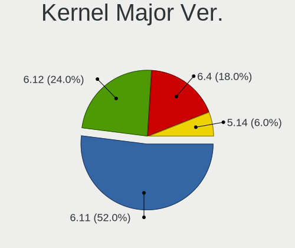
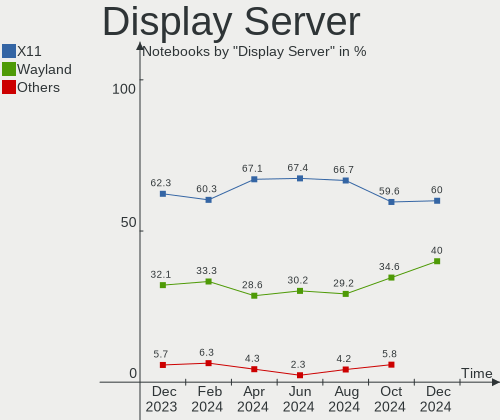
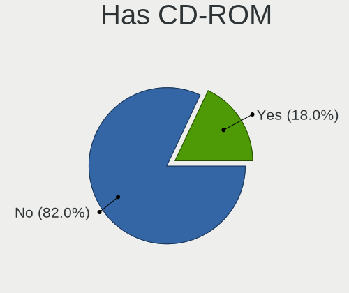
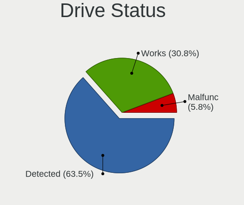

openSUSE - Hardware Trends (Notebooks)
--------------------------------------

A project to identify most popular hardware characteristics and track their change
over time based on data collected by Linux users at https://Linux-Hardware.org.

Anyone can contribute to this report by the [hw-probe](https://github.com/linuxhw/hw-probe) tool:

    sudo -E hw-probe -all -upload

This report is for one last month. Overall report since the beginning of time: [TestDays](https://github.com/linuxhw/TestDays)

Period: Apr, 2024.

Contents
--------

* [ System ](#system)
  - [ OS                       ](#os)
  - [ OS Family                ](#os-family)
  - [ Kernel                   ](#kernel)
  - [ Kernel Family            ](#kernel-family)
  - [ Kernel Major Ver.        ](#kernel-major-ver)
  - [ Arch                     ](#arch)
  - [ DE                       ](#de)
  - [ Display Server           ](#display-server)
  - [ Display Manager          ](#display-manager)
  - [ OS Lang                  ](#os-lang)
  - [ Boot Mode                ](#boot-mode)
  - [ Filesystem               ](#filesystem)
  - [ Part. scheme             ](#part-scheme)
  - [ Dual Boot with Linux/BSD ](#dual-boot-with-linuxbsd)
  - [ Dual Boot (Win)          ](#dual-boot-win)

* [ Board ](#board)
  - [ Vendor                   ](#vendor)
  - [ Model                    ](#model)
  - [ Model Family             ](#model-family)
  - [ MFG Year                 ](#mfg-year)
  - [ Form Factor              ](#form-factor)
  - [ Secure Boot              ](#secure-boot)
  - [ Coreboot                 ](#coreboot)
  - [ RAM Size                 ](#ram-size)
  - [ RAM Used                 ](#ram-used)
  - [ Total Drives             ](#total-drives)
  - [ Has CD-ROM               ](#has-cd-rom)
  - [ Has Ethernet             ](#has-ethernet)
  - [ Has WiFi                 ](#has-wifi)
  - [ Has Bluetooth            ](#has-bluetooth)

* [ Location ](#location)
  - [ Country                  ](#country)
  - [ City                     ](#city)

* [ Drives ](#drives)
  - [ Drive Vendor             ](#drive-vendor)
  - [ Drive Model              ](#drive-model)
  - [ HDD Vendor               ](#hdd-vendor)
  - [ SSD Vendor               ](#ssd-vendor)
  - [ Drive Kind               ](#drive-kind)
  - [ Drive Connector          ](#drive-connector)
  - [ Drive Size               ](#drive-size)
  - [ Space Total              ](#space-total)
  - [ Space Used               ](#space-used)
  - [ Malfunc. Drives          ](#malfunc-drives)
  - [ Malfunc. Drive Vendor    ](#malfunc-drive-vendor)
  - [ Malfunc. HDD Vendor      ](#malfunc-hdd-vendor)
  - [ Malfunc. Drive Kind      ](#malfunc-drive-kind)
  - [ Failed Drives            ](#failed-drives)
  - [ Failed Drive Vendor      ](#failed-drive-vendor)
  - [ Drive Status             ](#drive-status)

* [ Storage controller ](#storage-controller)
  - [ Storage Vendor           ](#storage-vendor)
  - [ Storage Model            ](#storage-model)
  - [ Storage Kind             ](#storage-kind)

* [ Processor ](#processor)
  - [ CPU Vendor               ](#cpu-vendor)
  - [ CPU Model                ](#cpu-model)
  - [ CPU Model Family         ](#cpu-model-family)
  - [ CPU Cores                ](#cpu-cores)
  - [ CPU Sockets              ](#cpu-sockets)
  - [ CPU Threads              ](#cpu-threads)
  - [ CPU Op-Modes             ](#cpu-op-modes)
  - [ CPU Microcode            ](#cpu-microcode)
  - [ CPU Microarch            ](#cpu-microarch)

* [ Graphics ](#graphics)
  - [ GPU Vendor               ](#gpu-vendor)
  - [ GPU Model                ](#gpu-model)
  - [ GPU Combo                ](#gpu-combo)
  - [ GPU Driver               ](#gpu-driver)
  - [ GPU Memory               ](#gpu-memory)

* [ Monitor ](#monitor)
  - [ Monitor Vendor           ](#monitor-vendor)
  - [ Monitor Model            ](#monitor-model)
  - [ Monitor Resolution       ](#monitor-resolution)
  - [ Monitor Diagonal         ](#monitor-diagonal)
  - [ Monitor Width            ](#monitor-width)
  - [ Aspect Ratio             ](#aspect-ratio)
  - [ Monitor Area             ](#monitor-area)
  - [ Pixel Density            ](#pixel-density)
  - [ Multiple Monitors        ](#multiple-monitors)

* [ Network ](#network)
  - [ Net Controller Vendor    ](#net-controller-vendor)
  - [ Net Controller Model     ](#net-controller-model)
  - [ Wireless Vendor          ](#wireless-vendor)
  - [ Wireless Model           ](#wireless-model)
  - [ Ethernet Vendor          ](#ethernet-vendor)
  - [ Ethernet Model           ](#ethernet-model)
  - [ Net Controller Kind      ](#net-controller-kind)
  - [ Used Controller          ](#used-controller)
  - [ NICs                     ](#nics)
  - [ IPv6                     ](#ipv6)

* [ Bluetooth ](#bluetooth)
  - [ Bluetooth Vendor         ](#bluetooth-vendor)
  - [ Bluetooth Model          ](#bluetooth-model)

* [ Sound ](#sound)
  - [ Sound Vendor             ](#sound-vendor)
  - [ Sound Model              ](#sound-model)

* [ Memory ](#memory)
  - [ Memory Vendor            ](#memory-vendor)
  - [ Memory Model             ](#memory-model)
  - [ Memory Kind              ](#memory-kind)
  - [ Memory Form Factor       ](#memory-form-factor)
  - [ Memory Size              ](#memory-size)
  - [ Memory Speed             ](#memory-speed)

* [ Printers & scanners ](#printers--scanners)
  - [ Printer Vendor           ](#printer-vendor)
  - [ Printer Model            ](#printer-model)
  - [ Scanner Vendor           ](#scanner-vendor)
  - [ Scanner Model            ](#scanner-model)

* [ Camera ](#camera)
  - [ Camera Vendor            ](#camera-vendor)
  - [ Camera Model             ](#camera-model)

* [ Security ](#security)
  - [ Fingerprint Vendor       ](#fingerprint-vendor)
  - [ Fingerprint Model        ](#fingerprint-model)
  - [ Chipcard Vendor          ](#chipcard-vendor)
  - [ Chipcard Model           ](#chipcard-model)

* [ Unsupported ](#unsupported)
  - [ Unsupported Devices      ](#unsupported-devices)
  - [ Unsupported Device Types ](#unsupported-device-types)

System
------

OS
--

Installed operating systems

| Name                         | Notebooks | Percent |
|------------------------------|-----------|---------|
| openSUSE Tumbleweed-XXXXXXXX | 45        | 64.29%  |
| openSUSE Leap-15.5           | 18        | 25.71%  |
| openSUSE Microos-XXXXXXXX    | 5         | 7.14%   |
| openSUSE Leap-15.6           | 2         | 2.86%   |

OS Family
---------

OS without a version

| Name     | Notebooks | Percent |
|----------|-----------|---------|
| openSUSE | 70        | 100%    |

Kernel
------

Version of the Linux kernel

| Version                      | Notebooks | Percent |
|------------------------------|-----------|---------|
| 5.14.21-150500.55.52-default | 16        | 22.86%  |
| 6.8.7-1-default              | 11        | 15.71%  |
| 6.8.1-1-default              | 10        | 14.29%  |
| 6.8.4-rc1-1-default          | 8         | 11.43%  |
| 6.8.2-1-default              | 7         | 10%     |
| 6.8.5-1-default              | 6         | 8.57%   |
| 6.8.6-1-default              | 5         | 7.14%   |
| 6.4.0-150600.12-default      | 2         | 2.86%   |
| 6.7.9-1-default              | 1         | 1.43%   |
| 6.7.7-1-default              | 1         | 1.43%   |
| 6.7.6-1-default              | 1         | 1.43%   |
| 5.14.21-150500.55.49-default | 1         | 1.43%   |
| 5.14.21-150500.53-default    | 1         | 1.43%   |

Kernel Family
-------------

Linux kernel without a distro release

| Version | Notebooks | Percent |
|---------|-----------|---------|
| 5.14.21 | 18        | 25.71%  |
| 6.8.7   | 11        | 15.71%  |
| 6.8.1   | 10        | 14.29%  |
| 6.8.4   | 8         | 11.43%  |
| 6.8.2   | 7         | 10%     |
| 6.8.5   | 6         | 8.57%   |
| 6.8.6   | 5         | 7.14%   |
| 6.4.0   | 2         | 2.86%   |
| 6.7.9   | 1         | 1.43%   |
| 6.7.7   | 1         | 1.43%   |
| 6.7.6   | 1         | 1.43%   |

Kernel Major Ver.
-----------------

Linux kernel major version

| Version | Notebooks | Percent |
|---------|-----------|---------|
| 6.8     | 47        | 67.14%  |
| 5.14    | 18        | 25.71%  |
| 6.7     | 3         | 4.29%   |
| 6.4     | 2         | 2.86%   |

Arch
----

OS architecture (x86_64, i586, etc.)

| Name    | Notebooks | Percent |
|---------|-----------|---------|
| x86_64  | 69        | 98.57%  |
| aarch64 | 1         | 1.43%   |

DE
--

Desktop Environment

| Name    | Notebooks | Percent |
|---------|-----------|---------|
| KDE6    | 23        | 32.86%  |
| KDE5    | 16        | 22.86%  |
| GNOME   | 15        | 21.43%  |
| Unknown | 9         | 12.86%  |
| XFCE    | 5         | 7.14%   |
| sway    | 1         | 1.43%   |
| AsterDE | 1         | 1.43%   |

Display Server
--------------

X11 or Wayland

| Name    | Notebooks | Percent |
|---------|-----------|---------|
| X11     | 47        | 67.14%  |
| Wayland | 20        | 28.57%  |
| Unknown | 2         | 2.86%   |
| Tty     | 1         | 1.43%   |

Display Manager
---------------

SDDM, LightDM, etc.

| Name    | Notebooks | Percent |
|---------|-----------|---------|
| Unknown | 33        | 47.14%  |
| SDDM    | 28        | 40%     |
| GDM     | 5         | 7.14%   |
| LightDM | 4         | 5.71%   |

OS Lang
-------

Language

| Lang    | Notebooks | Percent |
|---------|-----------|---------|
| en_US   | 30        | 42.86%  |
| de_DE   | 8         | 11.43%  |
| POSIX   | 7         | 10%     |
| en_GB   | 7         | 10%     |
| pl_PL   | 4         | 5.71%   |
| es_ES   | 4         | 5.71%   |
| it_IT   | 3         | 4.29%   |
| pt_BR   | 2         | 2.86%   |
| id_ID   | 1         | 1.43%   |
| fr_FR   | 1         | 1.43%   |
| en_DK   | 1         | 1.43%   |
| cs_CZ   | 1         | 1.43%   |
| Unknown | 1         | 1.43%   |

Boot Mode
---------

EFI or BIOS

| Mode | Notebooks | Percent |
|------|-----------|---------|
| EFI  | 49        | 70%     |
| BIOS | 21        | 30%     |

Filesystem
----------

Type of filesystem

| Type    | Notebooks | Percent |
|---------|-----------|---------|
| Btrfs   | 60        | 85.71%  |
| Ext4    | 6         | 8.57%   |
| Tmpfs   | 3         | 4.29%   |
| Overlay | 1         | 1.43%   |

Part. scheme
------------

Scheme of partitioning

| Type    | Notebooks | Percent |
|---------|-----------|---------|
| GPT     | 35        | 50%     |
| Unknown | 32        | 45.71%  |
| MBR     | 3         | 4.29%   |

Dual Boot with Linux/BSD
------------------------

Hosting more than one Linux/BSD

| Dual boot | Notebooks | Percent |
|-----------|-----------|---------|
| No        | 64        | 91.43%  |
| Yes       | 6         | 8.57%   |

Dual Boot (Win)
---------------

Hosting Linux and Windows

| Dual boot | Notebooks | Percent |
|-----------|-----------|---------|
| No        | 55        | 78.57%  |
| Yes       | 15        | 21.43%  |

Board
-----

Vendor
------

Motherboard manufacturer

| Name             | Notebooks | Percent |
|------------------|-----------|---------|
| Lenovo           | 17        | 24.29%  |
| Hewlett-Packard  | 15        | 21.43%  |
| Dell             | 11        | 15.71%  |
| ASUSTek Computer | 8         | 11.43%  |
| Acer             | 5         | 7.14%   |
| Sony             | 2         | 2.86%   |
| MSI              | 2         | 2.86%   |
| Apple            | 2         | 2.86%   |
| Timi             | 1         | 1.43%   |
| PC Specialist    | 1         | 1.43%   |
| LG Electronics   | 1         | 1.43%   |
| Fujitsu          | 1         | 1.43%   |
| Framework        | 1         | 1.43%   |
| Clevo            | 1         | 1.43%   |
| Chuwi            | 1         | 1.43%   |
| AXIOO            | 1         | 1.43%   |

Model
-----

Motherboard model

| Name                                       | Notebooks | Percent |
|--------------------------------------------|-----------|---------|
| Dell Precision 3561                        | 2         | 2.86%   |
| Dell Latitude 3420                         | 2         | 2.86%   |
| Timi RedmiBook Pro 14S                     | 1         | 1.43%   |
| Sony VPCCB4Q1E                             | 1         | 1.43%   |
| Sony SVE14A16FBW                           | 1         | 1.43%   |
| PC Specialist Standard                     | 1         | 1.43%   |
| MSI Summit E13FlipEvo A11MT                | 1         | 1.43%   |
| MSI GE75 Raider 10SF                       | 1         | 1.43%   |
| LG 16Z90P-G.AA75A                          | 1         | 1.43%   |
| Lenovo U31-70 80M5                         | 1         | 1.43%   |
| Lenovo ThinkPad X13s Gen 1 21BYS00000      | 1         | 1.43%   |
| Lenovo ThinkPad X1 Carbon Gen 8 20U9001PUS | 1         | 1.43%   |
| Lenovo ThinkPad X1 Carbon 2nd 20A8S00804   | 1         | 1.43%   |
| Lenovo ThinkPad W510 4391W3V               | 1         | 1.43%   |
| Lenovo ThinkPad T490 20N3SBU219            | 1         | 1.43%   |
| Lenovo ThinkPad T480 20L6S68A00            | 1         | 1.43%   |
| Lenovo ThinkPad T14s Gen 4 21F8CTO1WW      | 1         | 1.43%   |
| Lenovo ThinkPad T14 Gen 3 21AJS0Q204       | 1         | 1.43%   |
| Lenovo ThinkPad P15 Gen 1 20SU000000       | 1         | 1.43%   |
| Lenovo ThinkPad L520 786035U               | 1         | 1.43%   |
| Lenovo ThinkPad L15 Gen 3 21C3CTO1WW       | 1         | 1.43%   |
| Lenovo ThinkPad L13 Gen 2 20VJS22W00       | 1         | 1.43%   |
| Lenovo ThinkPad E15 Gen 3 20YG003VCK       | 1         | 1.43%   |
| Lenovo Legion 5 Pro 16ACH6 82JS            | 1         | 1.43%   |
| Lenovo IdeaPad Gaming 3 15ACH6 82K2        | 1         | 1.43%   |
| Lenovo B5400 80B6QB0                       | 1         | 1.43%   |
| HP ZBook 15 G3                             | 1         | 1.43%   |
| HP ZBook 14u G6                            | 1         | 1.43%   |
| HP Victus by Gaming Laptop 15-fb0xxx       | 1         | 1.43%   |
| HP ProBook 650 G1                          | 1         | 1.43%   |
| HP ProBook 4530s                           | 1         | 1.43%   |
| HP Pavilion Laptop 15-cw1xxx               | 1         | 1.43%   |
| HP Pavilion Laptop 15-cs0xxx               | 1         | 1.43%   |
| HP Pavilion Laptop 14-ec1xxx               | 1         | 1.43%   |
| HP Pavilion Gaming Laptop 15-dk1xxx        | 1         | 1.43%   |
| HP Laptop 17-cp0xxx                        | 1         | 1.43%   |
| HP Laptop 17-ca0xxx                        | 1         | 1.43%   |
| HP Laptop 15-dw3xxx                        | 1         | 1.43%   |
| HP EliteBook 840 G6                        | 1         | 1.43%   |
| HP EliteBook 830 G5                        | 1         | 1.43%   |

Model Family
------------

Motherboard model prefix

| Name                   | Notebooks | Percent |
|------------------------|-----------|---------|
| Lenovo ThinkPad        | 13        | 18.57%  |
| Dell Latitude          | 6         | 8.57%   |
| HP Pavilion            | 4         | 5.71%   |
| HP Laptop              | 3         | 4.29%   |
| HP EliteBook           | 3         | 4.29%   |
| Dell Precision         | 3         | 4.29%   |
| Acer Aspire            | 3         | 4.29%   |
| HP ZBook               | 2         | 2.86%   |
| HP ProBook             | 2         | 2.86%   |
| Dell Inspiron          | 2         | 2.86%   |
| ASUS VivoBook          | 2         | 2.86%   |
| ASUS ROG               | 2         | 2.86%   |
| Acer Swift             | 2         | 2.86%   |
| Timi RedmiBook         | 1         | 1.43%   |
| Sony VPCCB4Q1E         | 1         | 1.43%   |
| Sony SVE14A16FBW       | 1         | 1.43%   |
| PC Specialist Standard | 1         | 1.43%   |
| MSI Summit             | 1         | 1.43%   |
| MSI GE75               | 1         | 1.43%   |
| LG 16Z90P-G.AA75A      | 1         | 1.43%   |
| Lenovo U31-70          | 1         | 1.43%   |
| Lenovo Legion          | 1         | 1.43%   |
| Lenovo IdeaPad         | 1         | 1.43%   |
| Lenovo B5400           | 1         | 1.43%   |
| HP Victus              | 1         | 1.43%   |
| Fujitsu CELSIUS        | 1         | 1.43%   |
| Framework Laptop       | 1         | 1.43%   |
| Clevo W240HU           | 1         | 1.43%   |
| Chuwi MiniBook         | 1         | 1.43%   |
| AXIOO NEON             | 1         | 1.43%   |
| ASUS X55A              | 1         | 1.43%   |
| ASUS N751JK            | 1         | 1.43%   |
| ASUS K55VD             | 1         | 1.43%   |
| ASUS F9E               | 1         | 1.43%   |
| Apple MacBookPro8      | 1         | 1.43%   |
| Apple MacBookPro10     | 1         | 1.43%   |

MFG Year
--------

Motherboard manufacture year

| Year | Notebooks | Percent |
|------|-----------|---------|
| 2021 | 16        | 22.86%  |
| 2020 | 8         | 11.43%  |
| 2022 | 7         | 10%     |
| 2011 | 6         | 8.57%   |
| 2019 | 5         | 7.14%   |
| 2018 | 5         | 7.14%   |
| 2014 | 5         | 7.14%   |
| 2013 | 5         | 7.14%   |
| 2012 | 4         | 5.71%   |
| 2023 | 3         | 4.29%   |
| 2010 | 2         | 2.86%   |
| 2016 | 1         | 1.43%   |
| 2015 | 1         | 1.43%   |
| 2009 | 1         | 1.43%   |
| 2008 | 1         | 1.43%   |

Form Factor
-----------

Physical design of the computer

| Name     | Notebooks | Percent |
|----------|-----------|---------|
| Notebook | 70        | 100%    |

Secure Boot
-----------

Enabled or disabled

| State    | Notebooks | Percent |
|----------|-----------|---------|
| Disabled | 53        | 75.71%  |
| Enabled  | 17        | 24.29%  |

Coreboot
--------

Have coreboot on board

| Used | Notebooks | Percent |
|------|-----------|---------|
| No   | 70        | 100%    |

RAM Size
--------

Total RAM memory

| Size in GB  | Notebooks | Percent |
|-------------|-----------|---------|
| 4.01-8.0    | 20        | 28.57%  |
| 16.01-24.0  | 19        | 27.14%  |
| 8.01-16.0   | 13        | 18.57%  |
| 32.01-64.0  | 9         | 12.86%  |
| 3.01-4.0    | 4         | 5.71%   |
| 64.01-256.0 | 3         | 4.29%   |
| 24.01-32.0  | 2         | 2.86%   |

RAM Used
--------

Used RAM memory

| Used GB    | Notebooks | Percent |
|------------|-----------|---------|
| 4.01-8.0   | 20        | 28.57%  |
| 2.01-3.0   | 20        | 28.57%  |
| 1.01-2.0   | 14        | 20%     |
| 3.01-4.0   | 12        | 17.14%  |
| 8.01-16.0  | 2         | 2.86%   |
| 16.01-24.0 | 1         | 1.43%   |
| 0.51-1.0   | 1         | 1.43%   |

Total Drives
------------

Number of drives on board

| Drives | Notebooks | Percent |
|--------|-----------|---------|
| 1      | 47        | 67.14%  |
| 2      | 21        | 30%     |
| 3      | 2         | 2.86%   |

Has CD-ROM
----------

Has CD-ROM on board

| Presented | Notebooks | Percent |
|-----------|-----------|---------|
| No        | 51        | 72.86%  |
| Yes       | 19        | 27.14%  |

Has Ethernet
------------

Has Ethernet on board

| Presented | Notebooks | Percent |
|-----------|-----------|---------|
| Yes       | 55        | 78.57%  |
| No        | 15        | 21.43%  |

Has WiFi
--------

Has WiFi module

| Presented | Notebooks | Percent |
|-----------|-----------|---------|
| Yes       | 70        | 100%    |

Has Bluetooth
-------------

Has Bluetooth module

| Presented | Notebooks | Percent |
|-----------|-----------|---------|
| Yes       | 61        | 87.14%  |
| No        | 9         | 12.86%  |

Location
--------

Country
-------

Geographic location (country)

| Country     | Notebooks | Percent |
|-------------|-----------|---------|
| USA         | 13        | 18.57%  |
| Germany     | 11        | 15.71%  |
| Poland      | 6         | 8.57%   |
| UK          | 5         | 7.14%   |
| Italy       | 4         | 5.71%   |
| Spain       | 3         | 4.29%   |
| France      | 3         | 4.29%   |
| Czechia     | 3         | 4.29%   |
| Brazil      | 3         | 4.29%   |
| Russia      | 2         | 2.86%   |
| Indonesia   | 2         | 2.86%   |
| Australia   | 2         | 2.86%   |
| Turkey      | 1         | 1.43%   |
| Switzerland | 1         | 1.43%   |
| Sweden      | 1         | 1.43%   |
| Serbia      | 1         | 1.43%   |
| Portugal    | 1         | 1.43%   |
| New Zealand | 1         | 1.43%   |
| Mexico      | 1         | 1.43%   |
| Malaysia    | 1         | 1.43%   |
| Denmark     | 1         | 1.43%   |
| Colombia    | 1         | 1.43%   |
| Bulgaria    | 1         | 1.43%   |
| Austria     | 1         | 1.43%   |
| Argentina   | 1         | 1.43%   |

City
----

Geographic location (city)

| City                     | Notebooks | Percent |
|--------------------------|-----------|---------|
| Warsaw                   | 3         | 4.29%   |
| Oleszyce                 | 2         | 2.86%   |
| Ballwin                  | 2         | 2.86%   |
| Yekaterinburg            | 1         | 1.43%   |
| Wandsworth               | 1         | 1.43%   |
| Villach                  | 1         | 1.43%   |
| Verdun                   | 1         | 1.43%   |
| Trieste                  | 1         | 1.43%   |
| Sydney                   | 1         | 1.43%   |
| Succivo                  | 1         | 1.43%   |
| Stockholm                | 1         | 1.43%   |
| Sofia                    | 1         | 1.43%   |
| Semarang                 | 1         | 1.43%   |
| Sao Jose do Rio Preto    | 1         | 1.43%   |
| Santa Marta              | 1         | 1.43%   |
| San Diego                | 1         | 1.43%   |
| Rochester                | 1         | 1.43%   |
| Rheine                   | 1         | 1.43%   |
| Recife                   | 1         | 1.43%   |
| Płock                   | 1         | 1.43%   |
| Prague                   | 1         | 1.43%   |
| Porto Mantovano          | 1         | 1.43%   |
| Phoenix                  | 1         | 1.43%   |
| Pfaeffikon               | 1         | 1.43%   |
| Oberhausen               | 1         | 1.43%   |
| New York                 | 1         | 1.43%   |
| Natal                    | 1         | 1.43%   |
| Moscow                   | 1         | 1.43%   |
| Morgantown               | 1         | 1.43%   |
| Montpellier              | 1         | 1.43%   |
| Milano                   | 1         | 1.43%   |
| Metepec                  | 1         | 1.43%   |
| Melbourne                | 1         | 1.43%   |
| Magdeburg                | 1         | 1.43%   |
| Luebbecke                | 1         | 1.43%   |
| Lormont                  | 1         | 1.43%   |
| Lisbon                   | 1         | 1.43%   |
| Kuala Lumpur             | 1         | 1.43%   |
| Hrusovany nad Jevisovkou | 1         | 1.43%   |
| Holzkirchen              | 1         | 1.43%   |

Drives
------

Drive Vendor
------------

Hard drive vendors

| Vendor                       | Notebooks | Drives | Percent |
|------------------------------|-----------|--------|---------|
| Samsung Electronics          | 23        | 24     | 24.73%  |
| SanDisk                      | 6         | 6      | 6.45%   |
| Micron Technology            | 6         | 6      | 6.45%   |
| Crucial                      | 5         | 6      | 5.38%   |
| Unknown                      | 4         | 4      | 4.3%    |
| Toshiba                      | 4         | 4      | 4.3%    |
| Seagate                      | 4         | 4      | 4.3%    |
| Kingston                     | 4         | 4      | 4.3%    |
| WDC                          | 3         | 3      | 3.23%   |
| SK hynix                     | 3         | 3      | 3.23%   |
| Kingston Technology Company  | 3         | 3      | 3.23%   |
| Intel                        | 3         | 3      | 3.23%   |
| Transcend                    | 2         | 2      | 2.15%   |
| Phison Electronics           | 2         | 2      | 2.15%   |
| KIOXIA                       | 2         | 2      | 2.15%   |
| China                        | 2         | 2      | 2.15%   |
| USB3.0                       | 1         | 1      | 1.08%   |
| USB                          | 1         | 1      | 1.08%   |
| SSK                          | 1         | 1      | 1.08%   |
| Silicon Motion               | 1         | 1      | 1.08%   |
| Shenzhen Longsys Electronics | 1         | 1      | 1.08%   |
| MidasForce                   | 1         | 1      | 1.08%   |
| Micron/Crucial Technology    | 1         | 1      | 1.08%   |
| LITEONIT                     | 1         | 1      | 1.08%   |
| LITEON                       | 1         | 1      | 1.08%   |
| JMicron Technology           | 1         | 1      | 1.08%   |
| HGST                         | 1         | 1      | 1.08%   |
| Emtec                        | 1         | 1      | 1.08%   |
| Dogfish                      | 1         | 1      | 1.08%   |
| Apacer                       | 1         | 1      | 1.08%   |
| ADATA Technology             | 1         | 1      | 1.08%   |
| A-DATA Technology            | 1         | 1      | 1.08%   |
| Unknown                      | 1         | 1      | 1.08%   |

Drive Model
-----------

Hard drive models

| Model                                                  | Notebooks | Percent |
|--------------------------------------------------------|-----------|---------|
| Samsung NVMe SSD Controller SM981/PM981/PM983 1TB      | 7         | 7.37%   |
| Samsung NVMe SSD Controller PM9A1/PM9A3/980PRO 1TB     | 3         | 3.16%   |
| Unknown MMC Card  32GB                                 | 2         | 2.11%   |
| Toshiba XG6 NVMe SSD Controller 1024GB                 | 2         | 2.11%   |
| Samsung SSD PM871 mSATA 256GB                          | 2         | 2.11%   |
| Samsung SSD 870 EVO 1TB                                | 2         | 2.11%   |
| Crucial CT500MX500SSD1 500GB                           | 2         | 2.11%   |
| Crucial CT240BX500SSD1 240GB                           | 2         | 2.11%   |
| WDC WDS250G1B0A-00H9H0 250GB SSD                       | 1         | 1.05%   |
| WDC WD Green M.2 2280 240GB                            | 1         | 1.05%   |
| WDC PC SN530 NVMe 512GB                                | 1         | 1.05%   |
| USB3.0 Super Speed 240GB                               | 1         | 1.05%   |
| USB SanDisk 3.2Gen1 128GB                              | 1         | 1.05%   |
| Unknown USB DISK 3.2 1TB                               | 1         | 1.05%   |
| Unknown NVMe SSD Drive 512GB                           | 1         | 1.05%   |
| Transcend TS480GJDM725 480GB SSD                       | 1         | 1.05%   |
| Transcend TS256GMTS430S 256GB SSD                      | 1         | 1.05%   |
| Toshiba MQ04ABF100 1TB                                 | 1         | 1.05%   |
| Toshiba MK5059GSXP 500GB                               | 1         | 1.05%   |
| SSK Storage 1TB                                        | 1         | 1.05%   |
| SK hynix HFS512GD9TNG-L2A0A 512GB                      | 1         | 1.05%   |
| SK hynix HFM512GD3JX016N 512GB                         | 1         | 1.05%   |
| SK hynix BC511 256GB                                   | 1         | 1.05%   |
| Silicon Motion SM2263EN/SM2263XT SSD Controller 256GB  | 1         | 1.05%   |
| Shenzhen Longsys SM2263EN/SM2263XT-based OEM SSD 256GB | 1         | 1.05%   |
| Seagate ST500LM034-2GH17A 500GB                        | 1         | 1.05%   |
| Seagate ST1000LX015-1U7172 1TB                         | 1         | 1.05%   |
| Seagate ST1000LM035-1RK172 1TB                         | 1         | 1.05%   |
| Seagate FireCuda 530 ZP4000GM30013 4TB                 | 1         | 1.05%   |
| SanDisk Z400s 2.5 7MM 256GB SSD                        | 1         | 1.05%   |
| Sandisk WD_BLACK SN850X 1000GB                         | 1         | 1.05%   |
| Sandisk WDC PC SN530 SDBPMPZ-512G-1001 512GB           | 1         | 1.05%   |
| Sandisk WD PC SN740 SDDQMQD-512G-1001 512GB            | 1         | 1.05%   |
| Sandisk WD Black SN750 / PC SN730 NVMe SSD 512GB       | 1         | 1.05%   |
| SanDisk SD9SN8W128G1001 128GB SSD                      | 1         | 1.05%   |
| Samsung SSD PM851 mSATA 256GB                          | 1         | 1.05%   |
| Samsung SSD 990 PRO 1TB                                | 1         | 1.05%   |
| Samsung SSD 870 QVO 4TB                                | 1         | 1.05%   |
| Samsung SSD 870 QVO 2TB                                | 1         | 1.05%   |
| Samsung SSD 870 QVO 1TB                                | 1         | 1.05%   |

HDD Vendor
----------

Hard disk drive vendors

| Vendor  | Notebooks | Drives | Percent |
|---------|-----------|--------|---------|
| Seagate | 3         | 3      | 42.86%  |
| Toshiba | 2         | 2      | 28.57%  |
| WDC     | 1         | 1      | 14.29%  |
| HGST    | 1         | 1      | 14.29%  |

SSD Vendor
----------

Solid state drive vendors

| Vendor              | Notebooks | Drives | Percent |
|---------------------|-----------|--------|---------|
| Samsung Electronics | 9         | 10     | 26.47%  |
| Crucial             | 5         | 6      | 14.71%  |
| Micron Technology   | 3         | 3      | 8.82%   |
| Kingston            | 3         | 3      | 8.82%   |
| Transcend           | 2         | 2      | 5.88%   |
| SanDisk             | 2         | 2      | 5.88%   |
| China               | 2         | 2      | 5.88%   |
| WDC                 | 1         | 1      | 2.94%   |
| USB3.0              | 1         | 1      | 2.94%   |
| MidasForce          | 1         | 1      | 2.94%   |
| LITEONIT            | 1         | 1      | 2.94%   |
| LITEON              | 1         | 1      | 2.94%   |
| Emtec               | 1         | 1      | 2.94%   |
| Dogfish             | 1         | 1      | 2.94%   |
| Apacer              | 1         | 1      | 2.94%   |

Drive Kind
----------

HDD or SSD

| Kind    | Notebooks | Drives | Percent |
|---------|-----------|--------|---------|
| NVMe    | 41        | 46     | 48.24%  |
| SSD     | 31        | 36     | 36.47%  |
| HDD     | 7         | 7      | 8.24%   |
| MMC     | 3         | 3      | 3.53%   |
| Unknown | 3         | 3      | 3.53%   |

Drive Connector
---------------

SATA, SAS, NVMe, etc.

| Type | Notebooks | Drives | Percent |
|------|-----------|--------|---------|
| NVMe | 40        | 45     | 48.19%  |
| SATA | 35        | 42     | 42.17%  |
| SAS  | 5         | 5      | 6.02%   |
| MMC  | 3         | 3      | 3.61%   |

Drive Size
----------

Size of hard drive

| Size in TB | Notebooks | Drives | Percent |
|------------|-----------|--------|---------|
| 0.01-0.5   | 25        | 28     | 62.5%   |
| 0.51-1.0   | 11        | 11     | 27.5%   |
| 1.01-2.0   | 3         | 3      | 7.5%    |
| 3.01-4.0   | 1         | 1      | 2.5%    |

Space Total
-----------

Amount of disk space available on the file system

| Size in GB     | Notebooks | Percent |
|----------------|-----------|---------|
| More than 3000 | 24        | 34.29%  |
| 1001-2000      | 14        | 20%     |
| 2001-3000      | 12        | 17.14%  |
| 251-500        | 6         | 8.57%   |
| 501-1000       | 6         | 8.57%   |
| 101-250        | 3         | 4.29%   |
| Unknown        | 2         | 2.86%   |
| 21-50          | 1         | 1.43%   |
| 1-20           | 1         | 1.43%   |
| 51-100         | 1         | 1.43%   |

Space Used
----------

Amount of used disk space

| Used GB        | Notebooks | Percent |
|----------------|-----------|---------|
| 51-100         | 18        | 25.71%  |
| 101-250        | 16        | 22.86%  |
| 251-500        | 8         | 11.43%  |
| 501-1000       | 8         | 11.43%  |
| More than 3000 | 7         | 10%     |
| 2001-3000      | 4         | 5.71%   |
| 1001-2000      | 3         | 4.29%   |
| 1-20           | 3         | 4.29%   |
| Unknown        | 2         | 2.86%   |
| 21-50          | 1         | 1.43%   |

Malfunc. Drives
---------------

Drive models with a malfunction

| Model                       | Notebooks | Drives | Percent |
|-----------------------------|-----------|--------|---------|
| Intel SSD 600P Series 256GB | 1         | 1      | 50%     |
| Apacer AS340 480GB SSD      | 1         | 1      | 50%     |

Malfunc. Drive Vendor
---------------------

Vendors of faulty drives

| Vendor | Notebooks | Drives | Percent |
|--------|-----------|--------|---------|
| Intel  | 1         | 1      | 50%     |
| Apacer | 1         | 1      | 50%     |

Malfunc. HDD Vendor
-------------------

Vendors of faulty HDD drives

Zero info for selected period =(

Malfunc. Drive Kind
-------------------

Kinds of faulty drives

| Kind | Notebooks | Drives | Percent |
|------|-----------|--------|---------|
| NVMe | 1         | 1      | 50%     |
| SSD  | 1         | 1      | 50%     |

Failed Drives
-------------

Failed drive models

Zero info for selected period =(

Failed Drive Vendor
-------------------

Failed drive vendors

Zero info for selected period =(

Drive Status
------------

Number of failed and malfunc. drives

| Status   | Notebooks | Drives | Percent |
|----------|-----------|--------|---------|
| Detected | 38        | 52     | 50.67%  |
| Works    | 35        | 41     | 46.67%  |
| Malfunc  | 2         | 2      | 2.67%   |

Storage controller
------------------

Storage Vendor
--------------

Storage controller vendors

| Vendor                       | Notebooks | Percent |
|------------------------------|-----------|---------|
| Intel                        | 43        | 48.31%  |
| Samsung Electronics          | 14        | 15.73%  |
| Sandisk                      | 5         | 5.62%   |
| Kingston Technology Company  | 4         | 4.49%   |
| AMD                          | 4         | 4.49%   |
| SK hynix                     | 3         | 3.37%   |
| Micron Technology            | 3         | 3.37%   |
| Toshiba America Info Systems | 2         | 2.25%   |
| Phison Electronics           | 2         | 2.25%   |
| KIOXIA                       | 2         | 2.25%   |
| ADATA Technology             | 2         | 2.25%   |
| Solidigm                     | 1         | 1.12%   |
| Silicon Motion               | 1         | 1.12%   |
| Shenzhen Longsys Electronics | 1         | 1.12%   |
| Seagate Technology           | 1         | 1.12%   |
| Micron/Crucial Technology    | 1         | 1.12%   |

Storage Model
-------------

Storage controller models

| Model                                                                          | Notebooks | Percent |
|--------------------------------------------------------------------------------|-----------|---------|
| Samsung NVMe SSD Controller SM981/PM981/PM983                                  | 7         | 7.37%   |
| Intel 6 Series/C200 Series Chipset Family 6 port Mobile SATA AHCI Controller   | 6         | 6.32%   |
| Intel 7 Series Chipset Family 6-port SATA Controller [AHCI mode]               | 5         | 5.26%   |
| Intel Tiger Lake-LP SATA Controller                                            | 4         | 4.21%   |
| Intel 8 Series/C220 Series Chipset Family 6-port SATA Controller 1 [AHCI mode] | 4         | 4.21%   |
| Intel 8 Series SATA Controller 1 [AHCI mode]                                   | 4         | 4.21%   |
| AMD FCH SATA Controller [AHCI mode]                                            | 4         | 4.21%   |
| Samsung NVMe SSD Controller PM9A1/PM9A3/980PRO                                 | 3         | 3.16%   |
| Samsung NVMe SSD Controller 980 (DRAM-less)                                    | 3         | 3.16%   |
| Intel Volume Management Device NVMe RAID Controller                            | 3         | 3.16%   |
| Toshiba America Info Systems XG6 NVMe SSD Controller                           | 2         | 2.11%   |
| Intel Wildcat Point-LP SATA Controller [AHCI Mode]                             | 2         | 2.11%   |
| Intel Tiger Lake SATA AHCI Controller                                          | 2         | 2.11%   |
| Intel Sunrise Point-LP SATA Controller [AHCI mode]                             | 2         | 2.11%   |
| Intel Cannon Point-LP SATA Controller [AHCI Mode]                              | 2         | 2.11%   |
| Intel Cannon Lake Mobile PCH SATA AHCI Controller                              | 2         | 2.11%   |
| Intel 400 Series Chipset Family SATA AHCI Controller                           | 2         | 2.11%   |
| Solidigm P41 Plus NVMe SSD (DRAM-less) [Echo Harbor]                           | 1         | 1.05%   |
| SK hynix PC601 NVMe Solid State Drive                                          | 1         | 1.05%   |
| SK hynix Gold P31/BC711/PC711 NVMe Solid State Drive                           | 1         | 1.05%   |
| SK hynix BC511 NVMe SSD                                                        | 1         | 1.05%   |
| Silicon Motion SM2263EN/SM2263XT (DRAM-less) NVMe SSD Controllers              | 1         | 1.05%   |
| Shenzhen Longsys SM2263EN/SM2263XT-based OEM NVME SSD (DRAM-less)              | 1         | 1.05%   |
| Seagate FireCuda 530 SSD                                                       | 1         | 1.05%   |
| Sandisk WD PC SN740 NVMe SSD 512GB (DRAM-less)                                 | 1         | 1.05%   |
| Sandisk WD Black SN850X NVMe SSD                                               | 1         | 1.05%   |
| SanDisk PC SN530 NVMe SSD (DRAM-less)                                          | 1         | 1.05%   |
| SanDisk IX SN530 NVMe SSD (DRAM-less)                                          | 1         | 1.05%   |
| SanDisk Extreme Pro / WD Black SN750 / PC SN730 / Red SN700 NVMe SSD           | 1         | 1.05%   |
| Samsung NVMe SSD Controller S4LV008[Pascal]                                    | 1         | 1.05%   |
| Phison E16 PCIe4 NVMe Controller                                               | 1         | 1.05%   |
| Phison E12 NVMe Controller                                                     | 1         | 1.05%   |
| Micron/Crucial P5 Plus NVMe PCIe SSD                                           | 1         | 1.05%   |
| Micron 2450 NVMe SSD [HendrixV] (DRAM-less)                                    | 1         | 1.05%   |
| Micron 2400 NVMe SSD (DRAM-less)                                               | 1         | 1.05%   |
| Micron 2200S NVMe SSD [Cassandra]                                              | 1         | 1.05%   |
| KIOXIA NVMe SSD Controller BG5 (DRAM-less)                                     | 1         | 1.05%   |
| KIOXIA NVMe SSD Controller BG4 (DRAM-less)                                     | 1         | 1.05%   |
| Kingston Company OM3PDP3 NVMe SSD                                              | 1         | 1.05%   |
| Kingston Company NV2 NVMe SSD SM2267XT (DRAM-less)                             | 1         | 1.05%   |

Storage Kind
------------

Kind of storage controller (IDE, SATA, NVMe, SAS, ...)

| Kind | Notebooks | Percent |
|------|-----------|---------|
| SATA | 44        | 48.89%  |
| NVMe | 40        | 44.44%  |
| RAID | 4         | 4.44%   |
| IDE  | 2         | 2.22%   |

Processor
---------

CPU Vendor
----------

Processor vendors

| Vendor | Notebooks | Percent |
|--------|-----------|---------|
| Intel  | 54        | 77.14%  |
| AMD    | 15        | 21.43%  |
| ARM    | 1         | 1.43%   |

CPU Model
---------

Processor models

| Model                                   | Notebooks | Percent |
|-----------------------------------------|-----------|---------|
| Intel Core i7-4600U CPU @ 2.10GHz       | 2         | 2.86%   |
| Intel Core i5-8365U CPU @ 1.60GHz       | 2         | 2.86%   |
| Intel Core i5-2450M CPU @ 2.50GHz       | 2         | 2.86%   |
| Intel 11th Gen Core i7-1165G7 @ 2.80GHz | 2         | 2.86%   |
| Intel 11th Gen Core i5-1135G7 @ 2.40GHz | 2         | 2.86%   |
| AMD Ryzen 9 5900HX with Radeon Graphics | 2         | 2.86%   |
| AMD Ryzen 7 5700U with Radeon Graphics  | 2         | 2.86%   |
| AMD Ryzen 5 5600H with Radeon Graphics  | 2         | 2.86%   |
| Intel Pentium CPU B980 @ 2.40GHz        | 1         | 1.43%   |
| Intel N100                              | 1         | 1.43%   |
| Intel Core i7-9750H CPU @ 2.60GHz       | 1         | 1.43%   |
| Intel Core i7-8850H CPU @ 2.60GHz       | 1         | 1.43%   |
| Intel Core i7-8650U CPU @ 1.90GHz       | 1         | 1.43%   |
| Intel Core i7-8565U CPU @ 1.80GHz       | 1         | 1.43%   |
| Intel Core i7-8550U CPU @ 1.80GHz       | 1         | 1.43%   |
| Intel Core i7-6820HQ CPU @ 2.70GHz      | 1         | 1.43%   |
| Intel Core i7-4800MQ CPU @ 2.70GHz      | 1         | 1.43%   |
| Intel Core i7-4710HQ CPU @ 2.50GHz      | 1         | 1.43%   |
| Intel Core i7-3615QM CPU @ 2.30GHz      | 1         | 1.43%   |
| Intel Core i7-2670QM CPU @ 2.20GHz      | 1         | 1.43%   |
| Intel Core i7-2620M CPU @ 2.70GHz       | 1         | 1.43%   |
| Intel Core i7-10850H CPU @ 2.70GHz      | 1         | 1.43%   |
| Intel Core i7-10750H CPU @ 2.60GHz      | 1         | 1.43%   |
| Intel Core i7 CPU Q 720 @ 1.60GHz       | 1         | 1.43%   |
| Intel Core i5-8350U CPU @ 1.70GHz       | 1         | 1.43%   |
| Intel Core i5-7300U CPU @ 2.60GHz       | 1         | 1.43%   |
| Intel Core i5-5300U CPU @ 2.30GHz       | 1         | 1.43%   |
| Intel Core i5-4300M CPU @ 2.60GHz       | 1         | 1.43%   |
| Intel Core i5-4210U CPU @ 1.70GHz       | 1         | 1.43%   |
| Intel Core i5-4200M CPU @ 2.50GHz       | 1         | 1.43%   |
| Intel Core i5-3210M CPU @ 2.50GHz       | 1         | 1.43%   |
| Intel Core i5-2520M CPU @ 2.50GHz       | 1         | 1.43%   |
| Intel Core i5-2430M CPU @ 2.40GHz       | 1         | 1.43%   |
| Intel Core i5-10400H CPU @ 2.60GHz      | 1         | 1.43%   |
| Intel Core i5-10300H CPU @ 2.50GHz      | 1         | 1.43%   |
| Intel Core i5-10210U CPU @ 1.60GHz      | 1         | 1.43%   |
| Intel Core i3-5010U CPU @ 2.10GHz       | 1         | 1.43%   |
| Intel Core i3-4030U CPU @ 1.90GHz       | 1         | 1.43%   |
| Intel Core i3-2350M CPU @ 2.30GHz       | 1         | 1.43%   |
| Intel Core i3-2310M CPU @ 2.10GHz       | 1         | 1.43%   |

CPU Model Family
----------------

Processor model prefix

| Model            | Notebooks | Percent |
|------------------|-----------|---------|
| Intel Core i7    | 16        | 22.86%  |
| Intel Core i5    | 16        | 22.86%  |
| Other            | 15        | 21.43%  |
| Intel Core i3    | 5         | 7.14%   |
| AMD Ryzen 5      | 5         | 7.14%   |
| AMD Ryzen 7      | 4         | 5.71%   |
| Intel Core 2 Duo | 2         | 2.86%   |
| AMD Ryzen 9      | 2         | 2.86%   |
| AMD Ryzen 3      | 2         | 2.86%   |
| Intel Pentium    | 1         | 1.43%   |
| AMD Ryzen 7 PRO  | 1         | 1.43%   |
| AMD A6           | 1         | 1.43%   |

CPU Cores
---------

Number of processor cores

| Number | Notebooks | Percent |
|--------|-----------|---------|
| 4      | 27        | 38.57%  |
| 2      | 23        | 32.86%  |
| 6      | 9         | 12.86%  |
| 8      | 7         | 10%     |
| 10     | 2         | 2.86%   |
| 16     | 1         | 1.43%   |
| 12     | 1         | 1.43%   |

CPU Sockets
-----------

Number of sockets

| Number | Notebooks | Percent |
|--------|-----------|---------|
| 1      | 70        | 100%    |

CPU Threads
-----------

Threads per core (Hyper-Threading)

| Number | Notebooks | Percent |
|--------|-----------|---------|
| 2      | 60        | 85.71%  |
| 1      | 10        | 14.29%  |

CPU Op-Modes
------------

CPU Operation Modes (32-bit, 64-bit)

| Op mode        | Notebooks | Percent |
|----------------|-----------|---------|
| 32-bit, 64-bit | 70        | 100%    |

CPU Microcode
-------------

Microcode number

| Number     | Notebooks | Percent |
|------------|-----------|---------|
| Unknown    | 62        | 88.57%  |
| 0x806c1    | 2         | 2.86%   |
| 0x906ea    | 1         | 1.43%   |
| 0x806d1    | 1         | 1.43%   |
| 0x306d4    | 1         | 1.43%   |
| 0x1067a    | 1         | 1.43%   |
| 0x0a704103 | 1         | 1.43%   |
| 0x0a50000f | 1         | 1.43%   |

CPU Microarch
-------------

Microarchitecture

| Name             | Notebooks | Percent |
|------------------|-----------|---------|
| KabyLake         | 10        | 14.29%  |
| SandyBridge      | 9         | 12.86%  |
| TigerLake        | 8         | 11.43%  |
| Haswell          | 8         | 11.43%  |
| Zen 3            | 7         | 10%     |
| Unknown          | 7         | 10%     |
| CometLake        | 4         | 5.71%   |
| Alderlake Hybrid | 3         | 4.29%   |
| IvyBridge        | 2         | 2.86%   |
| Icelake          | 2         | 2.86%   |
| Broadwell        | 2         | 2.86%   |
| Zen+             | 1         | 1.43%   |
| Westmere         | 1         | 1.43%   |
| Skylake          | 1         | 1.43%   |
| Penryn           | 1         | 1.43%   |
| Nehalem          | 1         | 1.43%   |
| Gracemont        | 1         | 1.43%   |
| Excavator        | 1         | 1.43%   |
| Core             | 1         | 1.43%   |

Graphics
--------

GPU Vendor
----------

Vendors of graphics cards

| Vendor | Notebooks | Percent |
|--------|-----------|---------|
| Intel  | 52        | 57.14%  |
| Nvidia | 20        | 21.98%  |
| AMD    | 19        | 20.88%  |

GPU Model
---------

Graphics card models

| Model                                                                     | Notebooks | Percent |
|---------------------------------------------------------------------------|-----------|---------|
| Intel 2nd Generation Core Processor Family Integrated Graphics Controller | 9         | 9.68%   |
| Intel TigerLake-LP GT2 [Iris Xe Graphics]                                 | 7         | 7.53%   |
| Intel Haswell-ULT Integrated Graphics Controller                          | 4         | 4.3%    |
| Intel CometLake-H GT2 [UHD Graphics]                                      | 4         | 4.3%    |
| Intel 4th Gen Core Processor Integrated Graphics Controller               | 4         | 4.3%    |
| AMD Lucienne                                                              | 4         | 4.3%    |
| Intel WhiskeyLake-U GT2 [UHD Graphics 620]                                | 3         | 3.23%   |
| Intel UHD Graphics 620                                                    | 3         | 3.23%   |
| AMD Cezanne [Radeon Vega Series / Radeon Vega Mobile Series]              | 3         | 3.23%   |
| Nvidia GF117M [GeForce 610M/710M/810M/820M / GT 620M/625M/630M/720M]      | 2         | 2.15%   |
| Intel TigerLake-H GT1 [UHD Graphics]                                      | 2         | 2.15%   |
| Intel HD Graphics 5500                                                    | 2         | 2.15%   |
| Intel CoffeeLake-H GT2 [UHD Graphics 630]                                 | 2         | 2.15%   |
| Intel Alder Lake-UP3 GT2 [Iris Xe Graphics]                               | 2         | 2.15%   |
| Intel 3rd Gen Core processor Graphics Controller                          | 2         | 2.15%   |
| AMD Phoenix1                                                              | 2         | 2.15%   |
| AMD Barcelo                                                               | 2         | 2.15%   |
| Nvidia TU117M [GeForce GTX 1650 Ti Mobile]                                | 1         | 1.08%   |
| Nvidia TU117GLM [T600 Mobile]                                             | 1         | 1.08%   |
| Nvidia TU117GLM [T1200 Laptop GPU]                                        | 1         | 1.08%   |
| Nvidia TU117GLM [Quadro T1000 Mobile]                                     | 1         | 1.08%   |
| Nvidia TU116M [GeForce GTX 1660 Ti Mobile]                                | 1         | 1.08%   |
| Nvidia TU106M [GeForce RTX 2070 Mobile / Max-Q Refresh]                   | 1         | 1.08%   |
| Nvidia GT216GLM [Quadro FX 880M]                                          | 1         | 1.08%   |
| Nvidia GP108M [GeForce MX150]                                             | 1         | 1.08%   |
| Nvidia GP104GLM [Quadro P3200 Mobile]                                     | 1         | 1.08%   |
| Nvidia GM107M [GeForce GTX 850M]                                          | 1         | 1.08%   |
| Nvidia GM107GLM [Quadro M2000M]                                           | 1         | 1.08%   |
| Nvidia GK107M [GeForce GT 650M Mac Edition]                               | 1         | 1.08%   |
| Nvidia GF119M [GeForce 610M]                                              | 1         | 1.08%   |
| Nvidia GF108M [GeForce GT 540M]                                           | 1         | 1.08%   |
| Nvidia GA107M [GeForce RTX 3050 Mobile]                                   | 1         | 1.08%   |
| Nvidia GA107BM [GeForce RTX 3050 Ti Mobile]                               | 1         | 1.08%   |
| Nvidia GA107 [GeForce RTX 2050]                                           | 1         | 1.08%   |
| Nvidia GA104M [GeForce RTX 3070 Mobile / Max-Q]                           | 1         | 1.08%   |
| Intel Tiger Lake-LP GT2 [UHD Graphics G4]                                 | 1         | 1.08%   |
| Intel Mobile GM965/GL960 Integrated Graphics Controller (secondary)       | 1         | 1.08%   |
| Intel Mobile GM965/GL960 Integrated Graphics Controller (primary)         | 1         | 1.08%   |
| Intel Mobile 4 Series Chipset Integrated Graphics Controller              | 1         | 1.08%   |
| Intel HD Graphics 620                                                     | 1         | 1.08%   |

GPU Combo
---------

Combinations of graphics cards

| Name           | Notebooks | Percent |
|----------------|-----------|---------|
| 1 x Intel      | 32        | 45.71%  |
| Intel + Nvidia | 15        | 21.43%  |
| 1 x AMD        | 11        | 15.71%  |
| Intel + AMD    | 5         | 7.14%   |
| 1 x Nvidia     | 3         | 4.29%   |
| AMD + Nvidia   | 2         | 2.86%   |
| Other          | 1         | 1.43%   |
| 2 x AMD        | 1         | 1.43%   |

GPU Driver
----------

Free vs proprietary

| Driver      | Notebooks | Percent |
|-------------|-----------|---------|
| Free        | 58        | 82.86%  |
| Unknown     | 8         | 11.43%  |
| Proprietary | 4         | 5.71%   |

GPU Memory
----------

Total video memory

| Size in GB | Notebooks | Percent |
|------------|-----------|---------|
| Unknown    | 47        | 67.14%  |
| 0.51-1.0   | 7         | 10%     |
| 0.01-0.5   | 6         | 8.57%   |
| 1.01-2.0   | 5         | 7.14%   |
| 3.01-4.0   | 2         | 2.86%   |
| 7.01-8.0   | 1         | 1.43%   |
| 5.01-6.0   | 1         | 1.43%   |
| 8.01-16.0  | 1         | 1.43%   |

Monitor
-------

Monitor Vendor
--------------

Monitor vendors

| Vendor                  | Notebooks | Percent |
|-------------------------|-----------|---------|
| LG Display              | 16        | 18.82%  |
| AU Optronics            | 16        | 18.82%  |
| BOE                     | 12        | 14.12%  |
| Chimei Innolux          | 9         | 10.59%  |
| Samsung Electronics     | 5         | 5.88%   |
| Sharp                   | 3         | 3.53%   |
| Goldstar                | 3         | 3.53%   |
| Chi Mei Optoelectronics | 3         | 3.53%   |
| Lenovo                  | 2         | 2.35%   |
| Hewlett-Packard         | 2         | 2.35%   |
| Apple                   | 2         | 2.35%   |
| ViewSonic               | 1         | 1.18%   |
| Philips                 | 1         | 1.18%   |
| PANDA                   | 1         | 1.18%   |
| NEC Computers           | 1         | 1.18%   |
| MSI                     | 1         | 1.18%   |
| InnoLux Display         | 1         | 1.18%   |
| InfoVision              | 1         | 1.18%   |
| Eizo                    | 1         | 1.18%   |
| Dell                    | 1         | 1.18%   |
| BenQ                    | 1         | 1.18%   |
| ASUSTek Computer        | 1         | 1.18%   |
| Acer                    | 1         | 1.18%   |

Monitor Model
-------------

Monitor models

| Model                                                                 | Notebooks | Percent |
|-----------------------------------------------------------------------|-----------|---------|
| AU Optronics LCD Monitor AUO4599 1920x1080 344x194mm 15.5-inch        | 2         | 2.35%   |
| ViewSonic VA2452 SERIES VSC7931 1920x1080 521x293mm 23.5-inch         | 1         | 1.18%   |
| Sharp LQ156M1JW25 SHP152C 1920x1080 344x194mm 15.5-inch               | 1         | 1.18%   |
| Sharp LQ134N1JW53 SHP1521 1920x1200 288x180mm 13.4-inch               | 1         | 1.18%   |
| Sharp LCD Monitor SHP1542 1920x1080 309x174mm 14.0-inch               | 1         | 1.18%   |
| Samsung Electronics SMT22A300 SAM087B 1920x1080 477x268mm 21.5-inch   | 1         | 1.18%   |
| Samsung Electronics LS32AG32x SAM71DE 1920x1080 698x393mm 31.5-inch   | 1         | 1.18%   |
| Samsung Electronics LCD Monitor SDC5344 1920x1080 344x194mm 15.5-inch | 1         | 1.18%   |
| Samsung Electronics LCD Monitor SDC4161 1920x1080 344x194mm 15.5-inch | 1         | 1.18%   |
| Samsung Electronics LCD Monitor SAM7016 3840x2160 950x540mm 43.0-inch | 1         | 1.18%   |
| Philips PHL 323E7 PHLC121 1920x1080 698x393mm 31.5-inch               | 1         | 1.18%   |
| PANDA LCD Monitor NCP006A 2560x1600 302x189mm 14.0-inch               | 1         | 1.18%   |
| NEC Computers EX231Wp NEC684E 1920x1080 510x287mm 23.0-inch           | 1         | 1.18%   |
| MSI G271 MSI3CB5 1920x1080 598x336mm 27.0-inch                        | 1         | 1.18%   |
| LG Display LCD Monitor LGD06F7 1920x1200 302x189mm 14.0-inch          | 1         | 1.18%   |
| LG Display LCD Monitor LGD06F0 1920x1080 309x174mm 14.0-inch          | 1         | 1.18%   |
| LG Display LCD Monitor LGD0694 2560x1600 344x215mm 16.0-inch          | 1         | 1.18%   |
| LG Display LCD Monitor LGD0683 1920x1080 344x194mm 15.5-inch          | 1         | 1.18%   |
| LG Display LCD Monitor LGD060F 1920x1080 309x174mm 14.0-inch          | 1         | 1.18%   |
| LG Display LCD Monitor LGD05F6 1920x1080 309x174mm 14.0-inch          | 1         | 1.18%   |
| LG Display LCD Monitor LGD048C 1920x1080 294x165mm 13.3-inch          | 1         | 1.18%   |
| LG Display LCD Monitor LGD046F 1920x1080 340x190mm 15.3-inch          | 1         | 1.18%   |
| LG Display LCD Monitor LGD046D 1920x1080 309x174mm 14.0-inch          | 1         | 1.18%   |
| LG Display LCD Monitor LGD0418 2560x1440 310x174mm 14.0-inch          | 1         | 1.18%   |
| LG Display LCD Monitor LGD03DC 1366x768 277x156mm 12.5-inch           | 1         | 1.18%   |
| LG Display LCD Monitor LGD0395 1366x768 344x194mm 15.5-inch           | 1         | 1.18%   |
| LG Display LCD Monitor LGD038E 1366x768 344x194mm 15.5-inch           | 1         | 1.18%   |
| LG Display LCD Monitor LGD032C 1920x1080 344x194mm 15.5-inch          | 1         | 1.18%   |
| LG Display LCD Monitor LGD0250 1366x768 345x194mm 15.6-inch           | 1         | 1.18%   |
| LG Display LCD Monitor LGD01E9 1920x1080 345x194mm 15.6-inch          | 1         | 1.18%   |
| Lenovo LEN S22e-19 LEN61C9 1920x1080 476x268mm 21.5-inch              | 1         | 1.18%   |
| Lenovo LCD Monitor LEN40B2 1920x1080 344x193mm 15.5-inch              | 1         | 1.18%   |
| InnoLux Display LCD Monitor CMI001B 1366x768 309x174mm 14.0-inch      | 1         | 1.18%   |
| InfoVision LCD Monitor IVO854B 1920x1200 290x180mm 13.4-inch          | 1         | 1.18%   |
| Hewlett-Packard LA2206 HWP2946 1920x1080 476x268mm 21.5-inch          | 1         | 1.18%   |
| Hewlett-Packard 27mq HPN3671 2560x1440 597x336mm 27.0-inch            | 1         | 1.18%   |
| Goldstar HDR WFHD GSM7714 2560x1080 798x334mm 34.1-inch               | 1         | 1.18%   |
| Goldstar FULL HD GSM5B55 1920x1080 480x270mm 21.7-inch                | 1         | 1.18%   |
| Goldstar 24MB65 GSM5A4C 1920x1200 520x330mm 24.2-inch                 | 1         | 1.18%   |
| Eizo EV2455 ENC2533 1920x1080 519x324mm 24.1-inch                     | 1         | 1.18%   |

Monitor Resolution
------------------

Monitor screen resolution

| Resolution        | Notebooks | Percent |
|-------------------|-----------|---------|
| 1920x1080 (FHD)   | 40        | 55.56%  |
| 1366x768 (WXGA)   | 12        | 16.67%  |
| 2560x1440 (QHD)   | 4         | 5.56%   |
| 1920x1200 (WUXGA) | 4         | 5.56%   |
| 1600x900 (HD+)    | 3         | 4.17%   |
| 3840x2160 (4K)    | 2         | 2.78%   |
| 2560x1600         | 2         | 2.78%   |
| 1280x800 (WXGA)   | 2         | 2.78%   |
| 2880x1800         | 1         | 1.39%   |
| 2560x1080         | 1         | 1.39%   |
| 2256x1504         | 1         | 1.39%   |

Monitor Diagonal
----------------

Diagonal size in inches

| Inches | Notebooks | Percent |
|--------|-----------|---------|
| 15     | 29        | 34.52%  |
| 14     | 14        | 16.67%  |
| 13     | 14        | 16.67%  |
| 17     | 6         | 7.14%   |
| 21     | 5         | 5.95%   |
| 24     | 4         | 4.76%   |
| 27     | 3         | 3.57%   |
| 23     | 3         | 3.57%   |
| 12     | 2         | 2.38%   |
| 84     | 1         | 1.19%   |
| 34     | 1         | 1.19%   |
| 31     | 1         | 1.19%   |
| 16     | 1         | 1.19%   |

Monitor Width
-------------

Physical width

| Width in mm | Notebooks | Percent |
|-------------|-----------|---------|
| 301-350     | 51        | 61.45%  |
| 501-600     | 9         | 10.84%  |
| 201-300     | 9         | 10.84%  |
| 351-400     | 6         | 7.23%   |
| 401-500     | 5         | 6.02%   |
| 701-800     | 1         | 1.2%    |
| 601-700     | 1         | 1.2%    |
| 1501-2000   | 1         | 1.2%    |

Aspect Ratio
------------

Proportional relationship between the width and the height

| Ratio | Notebooks | Percent |
|-------|-----------|---------|
| 16/9  | 58        | 82.86%  |
| 16/10 | 10        | 14.29%  |
| 3/2   | 1         | 1.43%   |
| 21/9  | 1         | 1.43%   |

Monitor Area
------------

Area in inch²

| Area in inch² | Notebooks | Percent |
|----------------|-----------|---------|
| 101-110        | 28        | 33.73%  |
| 81-90          | 24        | 28.92%  |
| 201-250        | 7         | 8.43%   |
| 121-130        | 6         | 7.23%   |
| 71-80          | 4         | 4.82%   |
| 301-350        | 3         | 3.61%   |
| 251-300        | 3         | 3.61%   |
| 61-70          | 2         | 2.41%   |
| 351-500        | 2         | 2.41%   |
| More than 1000 | 1         | 1.2%    |
| 151-200        | 1         | 1.2%    |
| 111-120        | 1         | 1.2%    |
| 91-100         | 1         | 1.2%    |

Pixel Density
-------------

Pixels per inch

| Density | Notebooks | Percent |
|---------|-----------|---------|
| 121-160 | 37        | 46.25%  |
| 101-120 | 18        | 22.5%   |
| 161-240 | 13        | 16.25%  |
| 51-100  | 12        | 15%     |

Multiple Monitors
-----------------

Total monitors connected

| Total | Notebooks | Percent |
|-------|-----------|---------|
| 1     | 54        | 77.14%  |
| 2     | 13        | 18.57%  |
| 4     | 1         | 1.43%   |
| 3     | 1         | 1.43%   |
| 0     | 1         | 1.43%   |

Network
-------

Net Controller Vendor
---------------------

Controller vendors

| Vendor                | Notebooks | Percent |
|-----------------------|-----------|---------|
| Intel                 | 38        | 38%     |
| Realtek Semiconductor | 33        | 33%     |
| Qualcomm Atheros      | 8         | 8%      |
| MediaTek              | 6         | 6%      |
| Broadcom              | 5         | 5%      |
| Qualcomm              | 2         | 2%      |
| Broadcom Limited      | 2         | 2%      |
| Xiaomi                | 1         | 1%      |
| TP-Link               | 1         | 1%      |
| Lenovo                | 1         | 1%      |
| JMicron Technology    | 1         | 1%      |
| DisplayLink           | 1         | 1%      |
| Dell                  | 1         | 1%      |

Net Controller Model
--------------------

Controller models

| Model                                                                  | Notebooks | Percent |
|------------------------------------------------------------------------|-----------|---------|
| Realtek RTL8111/8168/8211/8411 PCI Express Gigabit Ethernet Controller | 22        | 16.3%   |
| Intel Wi-Fi 6 AX201                                                    | 6         | 4.44%   |
| Qualcomm Atheros AR9485 Wireless Network Adapter                       | 4         | 2.96%   |
| MediaTek MT7921 802.11ax PCI Express Wireless Network Adapter          | 4         | 2.96%   |
| Intel Wireless 8265 / 8275                                             | 4         | 2.96%   |
| Realtek RTL8188CE 802.11b/g/n WiFi Adapter                             | 3         | 2.22%   |
| Realtek RTL8153 Gigabit Ethernet Adapter                               | 3         | 2.22%   |
| Intel Wireless 7260                                                    | 3         | 2.22%   |
| Intel Comet Lake PCH CNVi WiFi                                         | 3         | 2.22%   |
| Intel Alder Lake-P PCH CNVi WiFi                                       | 3         | 2.22%   |
| Realtek RTL8822CE 802.11ac PCIe Wireless Network Adapter               | 2         | 1.48%   |
| Realtek RTL8821CE 802.11ac PCIe Wireless Network Adapter               | 2         | 1.48%   |
| Realtek RTL8125 2.5GbE Controller                                      | 2         | 1.48%   |
| Qualcomm QCNFA765 Wireless Network Adapter                             | 2         | 1.48%   |
| MediaTek MT7922 802.11ax PCI Express Wireless Network Adapter          | 2         | 1.48%   |
| Intel Wireless 7265                                                    | 2         | 1.48%   |
| Intel Wi-Fi 6E(802.11ax) AX210/AX1675* 2x2 [Typhoon Peak]              | 2         | 1.48%   |
| Intel Wi-Fi 6 AX200                                                    | 2         | 1.48%   |
| Intel Tiger Lake PCH CNVi WiFi                                         | 2         | 1.48%   |
| Intel Ethernet Connection I218-LM                                      | 2         | 1.48%   |
| Intel Ethernet Connection I217-LM                                      | 2         | 1.48%   |
| Intel Ethernet Connection (6) I219-LM                                  | 2         | 1.48%   |
| Intel Ethernet Connection (4) I219-LM                                  | 2         | 1.48%   |
| Intel Ethernet Connection (11) I219-LM                                 | 2         | 1.48%   |
| Intel Cannon Lake PCH CNVi WiFi                                        | 2         | 1.48%   |
| Xiaomi Mi/Redmi series (RNDIS + ADB)                                   | 1         | 0.74%   |
| TP-Link AC600 wireless Realtek RTL8811AU [Archer T2U Nano]             | 1         | 0.74%   |
| Realtek RTL8852BE PCIe 802.11ax Wireless Network Controller            | 1         | 0.74%   |
| Realtek RTL8852AE 802.11ax PCIe Wireless Network Adapter               | 1         | 0.74%   |
| Realtek RTL8822BE 802.11a/b/g/n/ac WiFi adapter                        | 1         | 0.74%   |
| Realtek RTL8723DE Wireless Network Adapter                             | 1         | 0.74%   |
| Realtek RTL8723BE PCIe Wireless Network Adapter                        | 1         | 0.74%   |
| Realtek RTL8723AE PCIe Wireless Network Adapter                        | 1         | 0.74%   |
| Realtek RTL810xE PCI Express Fast Ethernet controller                  | 1         | 0.74%   |
| Realtek 802.11ac NIC                                                   | 1         | 0.74%   |
| Qualcomm Atheros QCA6164 802.11ac Wireless Network Adapter             | 1         | 0.74%   |
| Qualcomm Atheros Killer E2500 Gigabit Ethernet Controller              | 1         | 0.74%   |
| Qualcomm Atheros AR9462 Wireless Network Adapter                       | 1         | 0.74%   |
| Qualcomm Atheros AR9287 Wireless Network Adapter (PCI-Express)         | 1         | 0.74%   |
| Qualcomm Atheros AR8161 Gigabit Ethernet                               | 1         | 0.74%   |

Wireless Vendor
---------------

Wireless vendors

| Vendor                | Notebooks | Percent |
|-----------------------|-----------|---------|
| Intel                 | 37        | 50.68%  |
| Realtek Semiconductor | 14        | 19.18%  |
| Qualcomm Atheros      | 7         | 9.59%   |
| MediaTek              | 6         | 8.22%   |
| Broadcom              | 3         | 4.11%   |
| Qualcomm              | 2         | 2.74%   |
| Broadcom Limited      | 2         | 2.74%   |
| TP-Link               | 1         | 1.37%   |
| Dell                  | 1         | 1.37%   |

Wireless Model
--------------

Wireless models

| Model                                                                | Notebooks | Percent |
|----------------------------------------------------------------------|-----------|---------|
| Intel Wi-Fi 6 AX201                                                  | 6         | 8.22%   |
| Qualcomm Atheros AR9485 Wireless Network Adapter                     | 4         | 5.48%   |
| MediaTek MT7921 802.11ax PCI Express Wireless Network Adapter        | 4         | 5.48%   |
| Intel Wireless 8265 / 8275                                           | 4         | 5.48%   |
| Realtek RTL8188CE 802.11b/g/n WiFi Adapter                           | 3         | 4.11%   |
| Intel Wireless 7260                                                  | 3         | 4.11%   |
| Intel Comet Lake PCH CNVi WiFi                                       | 3         | 4.11%   |
| Intel Alder Lake-P PCH CNVi WiFi                                     | 3         | 4.11%   |
| Realtek RTL8822CE 802.11ac PCIe Wireless Network Adapter             | 2         | 2.74%   |
| Realtek RTL8821CE 802.11ac PCIe Wireless Network Adapter             | 2         | 2.74%   |
| Qualcomm QCNFA765 Wireless Network Adapter                           | 2         | 2.74%   |
| MediaTek MT7922 802.11ax PCI Express Wireless Network Adapter        | 2         | 2.74%   |
| Intel Wireless 7265                                                  | 2         | 2.74%   |
| Intel Wi-Fi 6E(802.11ax) AX210/AX1675* 2x2 [Typhoon Peak]            | 2         | 2.74%   |
| Intel Wi-Fi 6 AX200                                                  | 2         | 2.74%   |
| Intel Tiger Lake PCH CNVi WiFi                                       | 2         | 2.74%   |
| Intel Cannon Lake PCH CNVi WiFi                                      | 2         | 2.74%   |
| TP-Link AC600 wireless Realtek RTL8811AU [Archer T2U Nano]           | 1         | 1.37%   |
| Realtek RTL8852BE PCIe 802.11ax Wireless Network Controller          | 1         | 1.37%   |
| Realtek RTL8852AE 802.11ax PCIe Wireless Network Adapter             | 1         | 1.37%   |
| Realtek RTL8822BE 802.11a/b/g/n/ac WiFi adapter                      | 1         | 1.37%   |
| Realtek RTL8723DE Wireless Network Adapter                           | 1         | 1.37%   |
| Realtek RTL8723BE PCIe Wireless Network Adapter                      | 1         | 1.37%   |
| Realtek RTL8723AE PCIe Wireless Network Adapter                      | 1         | 1.37%   |
| Realtek 802.11ac NIC                                                 | 1         | 1.37%   |
| Qualcomm Atheros QCA6164 802.11ac Wireless Network Adapter           | 1         | 1.37%   |
| Qualcomm Atheros AR9462 Wireless Network Adapter                     | 1         | 1.37%   |
| Qualcomm Atheros AR9287 Wireless Network Adapter (PCI-Express)       | 1         | 1.37%   |
| Intel Wireless 8260                                                  | 1         | 1.37%   |
| Intel PRO/Wireless 5100 AGN [Shiloh] Network Connection              | 1         | 1.37%   |
| Intel PRO/Wireless 3945ABG [Golan] Network Connection                | 1         | 1.37%   |
| Intel Comet Lake PCH-LP CNVi WiFi                                    | 1         | 1.37%   |
| Intel CNVi: Wi-Fi                                                    | 1         | 1.37%   |
| Intel Centrino Ultimate-N 6300                                       | 1         | 1.37%   |
| Intel Centrino Advanced-N 6235                                       | 1         | 1.37%   |
| Intel Cannon Point-LP CNVi [Wireless-AC]                             | 1         | 1.37%   |
| Dell Hub of E-Port Replicator                                        | 1         | 1.37%   |
| Broadcom Limited BCM4360 802.11ac Dual Band Wireless Network Adapter | 1         | 1.37%   |
| Broadcom Limited BCM4352 802.11ac Dual Band Wireless Network Adapter | 1         | 1.37%   |
| Broadcom BCM4331 802.11a/b/g/n                                       | 1         | 1.37%   |

Ethernet Vendor
---------------

Ethernet vendors

| Vendor                | Notebooks | Percent |
|-----------------------|-----------|---------|
| Realtek Semiconductor | 28        | 45.9%   |
| Intel                 | 22        | 36.07%  |
| Broadcom              | 4         | 6.56%   |
| Qualcomm Atheros      | 3         | 4.92%   |
| Xiaomi                | 1         | 1.64%   |
| Lenovo                | 1         | 1.64%   |
| JMicron Technology    | 1         | 1.64%   |
| DisplayLink           | 1         | 1.64%   |

Ethernet Model
--------------

Ethernet models

| Model                                                                  | Notebooks | Percent |
|------------------------------------------------------------------------|-----------|---------|
| Realtek RTL8111/8168/8211/8411 PCI Express Gigabit Ethernet Controller | 22        | 35.48%  |
| Realtek RTL8153 Gigabit Ethernet Adapter                               | 3         | 4.84%   |
| Realtek RTL8125 2.5GbE Controller                                      | 2         | 3.23%   |
| Intel Ethernet Connection I218-LM                                      | 2         | 3.23%   |
| Intel Ethernet Connection I217-LM                                      | 2         | 3.23%   |
| Intel Ethernet Connection (6) I219-LM                                  | 2         | 3.23%   |
| Intel Ethernet Connection (4) I219-LM                                  | 2         | 3.23%   |
| Intel Ethernet Connection (11) I219-LM                                 | 2         | 3.23%   |
| Xiaomi Mi/Redmi series (RNDIS + ADB)                                   | 1         | 1.61%   |
| Realtek RTL810xE PCI Express Fast Ethernet controller                  | 1         | 1.61%   |
| Qualcomm Atheros Killer E2500 Gigabit Ethernet Controller              | 1         | 1.61%   |
| Qualcomm Atheros AR8161 Gigabit Ethernet                               | 1         | 1.61%   |
| Qualcomm Atheros AR8151 v2.0 Gigabit Ethernet                          | 1         | 1.61%   |
| Lenovo RTL8153 Gigabit Ethernet [ThinkPad OneLink Pro Dock]            | 1         | 1.61%   |
| JMicron JMC250 PCI Express Gigabit Ethernet Controller                 | 1         | 1.61%   |
| Intel Ethernet Connection (7) I219-LM                                  | 1         | 1.61%   |
| Intel Ethernet Connection (6) I219-V                                   | 1         | 1.61%   |
| Intel Ethernet Connection (3) I218-LM                                  | 1         | 1.61%   |
| Intel Ethernet Connection (2) I219-LM                                  | 1         | 1.61%   |
| Intel Ethernet Connection (16) I219-LM                                 | 1         | 1.61%   |
| Intel Ethernet Connection (14) I219-V                                  | 1         | 1.61%   |
| Intel Ethernet Connection (14) I219-LM                                 | 1         | 1.61%   |
| Intel Ethernet Connection (13) I219-V                                  | 1         | 1.61%   |
| Intel Ethernet Connection (13) I219-LM                                 | 1         | 1.61%   |
| Intel Ethernet Connection (10) I219-V                                  | 1         | 1.61%   |
| Intel 82577LM Gigabit Network Connection                               | 1         | 1.61%   |
| Intel 82567LM Gigabit Network Connection                               | 1         | 1.61%   |
| DisplayLink Dell D3100 Docking Station                                 | 1         | 1.61%   |
| Broadcom NetXtreme BCM57786 Gigabit Ethernet PCIe                      | 1         | 1.61%   |
| Broadcom NetXtreme BCM57765 Gigabit Ethernet PCIe                      | 1         | 1.61%   |
| Broadcom NetXtreme BCM57762 Gigabit Ethernet PCIe                      | 1         | 1.61%   |
| Broadcom NetLink BCM57785 Gigabit Ethernet PCIe                        | 1         | 1.61%   |
| Broadcom NetLink BCM57780 Gigabit Ethernet PCIe                        | 1         | 1.61%   |

Net Controller Kind
-------------------

Ethernet, WiFi or modem

| Kind     | Notebooks | Percent |
|----------|-----------|---------|
| WiFi     | 70        | 55.56%  |
| Ethernet | 56        | 44.44%  |

Used Controller
---------------

Currently used network controller

| Kind     | Notebooks | Percent |
|----------|-----------|---------|
| WiFi     | 64        | 88.89%  |
| Ethernet | 8         | 11.11%  |

NICs
----

Total network controllers on board

| Total | Notebooks | Percent |
|-------|-----------|---------|
| 2     | 54        | 77.14%  |
| 1     | 15        | 21.43%  |
| 3     | 1         | 1.43%   |

IPv6
----

IPv6 vs IPv4

| Used | Notebooks | Percent |
|------|-----------|---------|
| No   | 49        | 70%     |
| Yes  | 21        | 30%     |

Bluetooth
---------

Bluetooth Vendor
----------------

Controller vendors

| Vendor                          | Notebooks | Percent |
|---------------------------------|-----------|---------|
| Intel                           | 30        | 49.18%  |
| Realtek Semiconductor           | 9         | 14.75%  |
| Foxconn / Hon Hai               | 7         | 11.48%  |
| Broadcom                        | 3         | 4.92%   |
| Lite-On Technology              | 2         | 3.28%   |
| Apple                           | 2         | 3.28%   |
| USI                             | 1         | 1.64%   |
| Qualcomm Atheros Communications | 1         | 1.64%   |
| Opticis                         | 1         | 1.64%   |
| MediaTek                        | 1         | 1.64%   |
| IMC Networks                    | 1         | 1.64%   |
| Hewlett-Packard                 | 1         | 1.64%   |
| Dell                            | 1         | 1.64%   |
| ASUSTek Computer                | 1         | 1.64%   |

Bluetooth Model
---------------

Controller models

| Model                                           | Notebooks | Percent |
|-------------------------------------------------|-----------|---------|
| Intel AX201 Bluetooth                           | 10        | 16.39%  |
| Intel Bluetooth wireless interface              | 5         | 8.2%    |
| Realtek Bluetooth Radio                         | 4         | 6.56%   |
| Intel Bluetooth Device                          | 4         | 6.56%   |
| Intel Bluetooth 9460/9560 Jefferson Peak (JfP)  | 4         | 6.56%   |
| Realtek 802.11ac WLAN Adapter                   | 2         | 3.28%   |
| Intel AX211 Bluetooth                           | 2         | 3.28%   |
| Intel AX210 Bluetooth                           | 2         | 3.28%   |
| Intel AX200 Bluetooth                           | 2         | 3.28%   |
| Foxconn / Hon Hai MediaTek Bluetooth Adapter    | 2         | 3.28%   |
| Foxconn / Hon Hai Bluetooth USB Host Controller | 2         | 3.28%   |
| Broadcom BCM2045B (BDC-2.1)                     | 2         | 3.28%   |
| Apple Bluetooth Host Controller                 | 2         | 3.28%   |
| USI Bluetooth Device                            | 1         | 1.64%   |
| Realtek RTL8723B Bluetooth                      | 1         | 1.64%   |
| Realtek RTL8723A Bluetooth                      | 1         | 1.64%   |
| Realtek  Bluetooth 4.2 Adapter                  | 1         | 1.64%   |
| Qualcomm Atheros QCA61x4 Bluetooth 4.0          | 1         | 1.64%   |
| Opticis Bluetooth Radio                         | 1         | 1.64%   |
| MediaTek Wireless_Device                        | 1         | 1.64%   |
| Lite-On Wireless_Device                         | 1         | 1.64%   |
| Lite-On Atheros Bluetooth                       | 1         | 1.64%   |
| Intel Centrino Bluetooth Wireless Transceiver   | 1         | 1.64%   |
| IMC Networks Wireless_Device                    | 1         | 1.64%   |
| HP Bluetooth 2.0 Interface [Broadcom BCM2045]   | 1         | 1.64%   |
| Foxconn / Hon Hai Wireless_Device               | 1         | 1.64%   |
| Foxconn / Hon Hai Bluetooth Device              | 1         | 1.64%   |
| Foxconn / Hon Hai Acer Module                   | 1         | 1.64%   |
| Dell Broadcom BCM20702A0 Bluetooth              | 1         | 1.64%   |
| Broadcom BCM43142 Bluetooth 4.0                 | 1         | 1.64%   |
| ASUS BT-183 Bluetooth 2.0+EDR adapter           | 1         | 1.64%   |

Sound
-----

Sound Vendor
------------

Sound card vendors

| Vendor                | Notebooks | Percent |
|-----------------------|-----------|---------|
| Intel                 | 54        | 60%     |
| AMD                   | 18        | 20%     |
| Nvidia                | 7         | 7.78%   |
| TX                    | 1         | 1.11%   |
| Samson Technologies   | 1         | 1.11%   |
| Realtek Semiconductor | 1         | 1.11%   |
| Lenovo                | 1         | 1.11%   |
| Kingston Technology   | 1         | 1.11%   |
| Huawei Technologies   | 1         | 1.11%   |
| Hewlett-Packard       | 1         | 1.11%   |
| GN Netcom             | 1         | 1.11%   |
| Corsair               | 1         | 1.11%   |
| C-Media Electronics   | 1         | 1.11%   |
| Audio-Technica        | 1         | 1.11%   |

Sound Model
-----------

Sound card models

| Model                                                                      | Notebooks | Percent |
|----------------------------------------------------------------------------|-----------|---------|
| AMD Family 17h/19h HD Audio Controller                                     | 14        | 12.28%  |
| AMD Renoir Radeon High Definition Audio Controller                         | 9         | 7.89%   |
| Intel Tiger Lake-LP Smart Sound Technology Audio Controller                | 8         | 7.02%   |
| Intel 6 Series/C200 Series Chipset Family High Definition Audio Controller | 6         | 5.26%   |
| Intel 7 Series/C216 Chipset Family High Definition Audio Controller        | 5         | 4.39%   |
| Intel Xeon E3-1200 v3/4th Gen Core Processor HD Audio Controller           | 4         | 3.51%   |
| Intel Sunrise Point-LP HD Audio                                            | 4         | 3.51%   |
| Intel Haswell-ULT HD Audio Controller                                      | 4         | 3.51%   |
| Intel Comet Lake PCH cAVS                                                  | 4         | 3.51%   |
| Intel 8 Series/C220 Series Chipset High Definition Audio Controller        | 4         | 3.51%   |
| Intel 8 Series HD Audio Controller                                         | 4         | 3.51%   |
| Intel Cannon Point-LP High Definition Audio Controller                     | 3         | 2.63%   |
| Intel Alder Lake PCH-P High Definition Audio Controller                    | 3         | 2.63%   |
| Nvidia Audio device                                                        | 2         | 1.75%   |
| Intel Wildcat Point-LP High Definition Audio Controller                    | 2         | 1.75%   |
| Intel Tiger Lake-H HD Audio Controller                                     | 2         | 1.75%   |
| Intel Cannon Lake PCH cAVS                                                 | 2         | 1.75%   |
| Intel Broadwell-U Audio Controller                                         | 2         | 1.75%   |
| Intel 5 Series/3400 Series Chipset High Definition Audio                   | 2         | 1.75%   |
| AMD Rembrandt Radeon High Definition Audio Controller                      | 2         | 1.75%   |
| AMD Oland/Hainan/Cape Verde/Pitcairn HDMI Audio [Radeon HD 7000 Series]    | 2         | 1.75%   |
| TX USB Audio                                                               | 1         | 0.88%   |
| Samson Technologies Satellite condenser microphone                         | 1         | 0.88%   |
| Realtek Semiconductor USB Audio                                            | 1         | 0.88%   |
| Nvidia TU116 High Definition Audio Controller                              | 1         | 0.88%   |
| Nvidia GT216 HDMI Audio Controller                                         | 1         | 0.88%   |
| Nvidia GK107 HDMI Audio Controller                                         | 1         | 0.88%   |
| Nvidia GF108 High Definition Audio Controller                              | 1         | 0.88%   |
| Nvidia GA104 High Definition Audio Controller                              | 1         | 0.88%   |
| Lenovo ThinkPad OneLink Pro Dock Audio                                     | 1         | 0.88%   |
| Kingston Technology HyperX QuadCast                                        | 1         | 0.88%   |
| Intel Comet Lake PCH-LP cAVS                                               | 1         | 0.88%   |
| Intel Alder Lake-N PCH High Definition Audio Controller                    | 1         | 0.88%   |
| Intel 82801I (ICH9 Family) HD Audio Controller                             | 1         | 0.88%   |
| Intel 82801H (ICH8 Family) HD Audio Controller                             | 1         | 0.88%   |
| Intel 100 Series/C230 Series Chipset Family HD Audio Controller            | 1         | 0.88%   |
| Huawei Technologies KT USB Audio                                           | 1         | 0.88%   |
| Hewlett-Packard USB Audio                                                  | 1         | 0.88%   |
| GN Netcom Jabra Link 380                                                   | 1         | 0.88%   |
| Corsair Corsair VOID ELITE USB Gaming Headset                              | 1         | 0.88%   |

Memory
------

Memory Vendor
-------------

Memory module vendors

| Vendor              | Notebooks | Percent |
|---------------------|-----------|---------|
| Samsung Electronics | 15        | 33.33%  |
| Micron Technology   | 10        | 22.22%  |
| Kingston            | 5         | 11.11%  |
| SK hynix            | 4         | 8.89%   |
| Crucial             | 2         | 4.44%   |
| A-DATA Technology   | 2         | 4.44%   |
| Unknown             | 1         | 2.22%   |
| Transcend           | 1         | 2.22%   |
| Team                | 1         | 2.22%   |
| Silicon Power       | 1         | 2.22%   |
| Ramaxel Technology  | 1         | 2.22%   |
| Elpida              | 1         | 2.22%   |
| Corsair             | 1         | 2.22%   |

Memory Model
------------

Memory module models

| Model                                                          | Notebooks | Percent |
|----------------------------------------------------------------|-----------|---------|
| Samsung RAM M471A1K43CB1-CRC 8GB SODIMM DDR4 2667MT/s          | 2         | 4.35%   |
| Samsung RAM M471A1G44AB0-CWE 8192MB SODIMM DDR4 3200MT/s       | 2         | 4.35%   |
| Micron RAM 8ATF1G64HZ-3G2R1 8GB SODIMM DDR4 3200MT/s           | 2         | 4.35%   |
| Unknown RAM Module 2GB SODIMM DDR2 667MT/s                     | 1         | 2.17%   |
| Transcend RAM JM3200HSE-16G 16GB SODIMM DDR4 3200MT/s          | 1         | 2.17%   |
| Team RAM TEAMGROUP-SD3-1600 8GB SODIMM DDR3 1600MT/s           | 1         | 2.17%   |
| SK hynix RAM Module 4GB SODIMM DDR3 1600MT/s                   | 1         | 2.17%   |
| SK hynix RAM HMA81GS6AFR8N-UH 8GB SODIMM DDR4 2667MT/s         | 1         | 2.17%   |
| SK hynix RAM HCNNNFAMMLXR-NEE 4GB Row Of Chips LPDDR4 4267MT/s | 1         | 2.17%   |
| SK hynix RAM HCNNNCPMMLXR-NEE 2GB Row Of Chips LPDDR4 4267MT/s | 1         | 2.17%   |
| Silicon Power RAM SP008GLSTU160N02 8GB SODIMM DDR3 1600MT/s    | 1         | 2.17%   |
| Samsung RAM Module 8GB Row Of Chips LPDDR3 2133MT/s            | 1         | 2.17%   |
| Samsung RAM M471B5674-H0-YK0--- 4GB Chip DDR3 1600MT/s         | 1         | 2.17%   |
| Samsung RAM M471B1G73BH0-YF8 8GB SODIMM DDR3 1067MT/s          | 1         | 2.17%   |
| Samsung RAM M471A5244CB0-CWE 4GB SODIMM DDR4 3200MT/s          | 1         | 2.17%   |
| Samsung RAM M471A2G43BB2-CWE 16GB SODIMM DDR4 3200MT/s         | 1         | 2.17%   |
| Samsung RAM M471A2G43AB2-CWE 16GB SODIMM DDR4 3200MT/s         | 1         | 2.17%   |
| Samsung RAM M471A1K43DB1-CWE 8GB SODIMM DDR4 3200MT/s          | 1         | 2.17%   |
| Samsung RAM M471A1K43DB1-CTD 8GB SODIMM DDR4 2667MT/s          | 1         | 2.17%   |
| Samsung RAM M471A1G44BB0-CWE 8GB SODIMM DDR4 3200MT/s          | 1         | 2.17%   |
| Samsung RAM M471A1G44AB0-CWE 8GB Row Of Chips DDR4 3200MT/s    | 1         | 2.17%   |
| Samsung RAM K4UBE3D4AA-MGCR 2GB Row Of Chips LPDDR4 4267MT/s   | 1         | 2.17%   |
| Ramaxel RAM RMT3170EF68F9W1600 4GB SODIMM DDR3 1600MT/s        | 1         | 2.17%   |
| Micron RAM MT62F2G32D4DS-026 WT 8GB SODIMM LPDDR5 7500MT/s     | 1         | 2.17%   |
| Micron RAM MT53E512M32D2NP-046 4GB SODIMM LPDDR4 4266MT/s      | 1         | 2.17%   |
| Micron RAM 8ATF1G64HZ-2G3E1 8GB SODIMM DDR4 2400MT/s           | 1         | 2.17%   |
| Micron RAM 4ATS2G64HZ-3G2B1 16GB SODIMM DDR4 3200MT/s          | 1         | 2.17%   |
| Micron RAM 4ATS1G64HZ-2G6E1 8192MB SODIMM DDR4 2667MT/s        | 1         | 2.17%   |
| Micron RAM 4ATF1G64HZ-3G2F1 8GB SODIMM DDR4 3200MT/s           | 1         | 2.17%   |
| Micron RAM 4ATF1G64HZ-3G2E1 8GB SODIMM DDR4 3200MT/s           | 1         | 2.17%   |
| Micron RAM 16HTF25664HY-800J1 2GB SODIMM DDR2 800MT/s          | 1         | 2.17%   |
| Kingston RAM KKRVFX-MIE 8GB SODIMM DDR4 3200MT/s               | 1         | 2.17%   |
| Kingston RAM KF3200C20S4/32GX 32GB SODIMM DDR4 3200MT/s        | 1         | 2.17%   |
| Kingston RAM 99U5428-063.A00LF 8GB SODIMM DDR3 2667MT/s        | 1         | 2.17%   |
| Kingston RAM 9905744-062.A00G 32GB SODIMM DDR4 3200MT/s        | 1         | 2.17%   |
| Kingston RAM 9905744-024.A00G 16GB SODIMM DDR4 2667MT/s        | 1         | 2.17%   |
| Kingston RAM 9905700-012.A00G 8GB SODIMM DDR4 2667MT/s         | 1         | 2.17%   |
| Elpida RAM EBE21UE8ACUA-8G-E 2GB SODIMM DDR2 975MT/s           | 1         | 2.17%   |
| Crucial RAM CT8G4SFS824A.M8FE 8GB SODIMM DDR4 2667MT/s         | 1         | 2.17%   |
| Crucial RAM CT16G4SFRA32A.M16FE 16GB SODIMM DDR4 3200MT/s      | 1         | 2.17%   |

Memory Kind
-----------

Memory module kinds

| Kind   | Notebooks | Percent |
|--------|-----------|---------|
| DDR4   | 23        | 60.53%  |
| DDR3   | 6         | 15.79%  |
| LPDDR4 | 4         | 10.53%  |
| DDR2   | 2         | 5.26%   |
| SDRAM  | 1         | 2.63%   |
| LPDDR5 | 1         | 2.63%   |
| LPDDR3 | 1         | 2.63%   |

Memory Form Factor
------------------

Physical design of the memory module

| Name         | Notebooks | Percent |
|--------------|-----------|---------|
| SODIMM       | 31        | 83.78%  |
| Row Of Chips | 5         | 13.51%  |
| Chip         | 1         | 2.7%    |

Memory Size
-----------

Memory module size

| Size  | Notebooks | Percent |
|-------|-----------|---------|
| 8192  | 22        | 55%     |
| 16384 | 7         | 17.5%   |
| 4096  | 5         | 12.5%   |
| 32768 | 4         | 10%     |
| 2048  | 2         | 5%      |

Memory Speed
------------

Memory module speed

| Speed | Notebooks | Percent |
|-------|-----------|---------|
| 3200  | 14        | 35.9%   |
| 2667  | 9         | 23.08%  |
| 1600  | 5         | 12.82%  |
| 4267  | 3         | 7.69%   |
| 7500  | 1         | 2.56%   |
| 4266  | 1         | 2.56%   |
| 2400  | 1         | 2.56%   |
| 2133  | 1         | 2.56%   |
| 2048  | 1         | 2.56%   |
| 1067  | 1         | 2.56%   |
| 975   | 1         | 2.56%   |
| 667   | 1         | 2.56%   |

Printers & scanners
-------------------

Printer Vendor
--------------

Printer device vendors

| Vendor          | Notebooks | Percent |
|-----------------|-----------|---------|
| Hewlett-Packard | 1         | 100%    |

Printer Model
-------------

Printer device models

| Model             | Notebooks | Percent |
|-------------------|-----------|---------|
| HP OfficeJet 6950 | 1         | 100%    |

Scanner Vendor
--------------

Scanner device vendors

Zero info for selected period =(

Scanner Model
-------------

Scanner device models

Zero info for selected period =(

Camera
------

Camera Vendor
-------------

Camera device vendors

| Vendor                                 | Notebooks | Percent |
|----------------------------------------|-----------|---------|
| Chicony Electronics                    | 12        | 20.34%  |
| Sunplus Innovation Technology          | 9         | 15.25%  |
| IMC Networks                           | 8         | 13.56%  |
| Quanta                                 | 4         | 6.78%   |
| Lite-On Technology                     | 4         | 6.78%   |
| Bison Electronics                      | 4         | 6.78%   |
| Syntek                                 | 2         | 3.39%   |
| Realtek Semiconductor                  | 2         | 3.39%   |
| Microdia                               | 2         | 3.39%   |
| Cheng Uei Precision Industry (Foxlink) | 2         | 3.39%   |
| Apple                                  | 2         | 3.39%   |
| ValueHD                                | 1         | 1.69%   |
| Sunplus Technology                     | 1         | 1.69%   |
| ShineTech                              | 1         | 1.69%   |
| Ricoh                                  | 1         | 1.69%   |
| Primax Electronics                     | 1         | 1.69%   |
| Lenovo                                 | 1         | 1.69%   |
| HYGD-220831-A                          | 1         | 1.69%   |
| Acer                                   | 1         | 1.69%   |

Camera Model
------------

Camera device models

| Model                                                                      | Notebooks | Percent |
|----------------------------------------------------------------------------|-----------|---------|
| IMC Networks Integrated Camera                                             | 5         | 8.47%   |
| Sunplus Integrated_Webcam_HD                                               | 3         | 5.08%   |
| Sunplus Laptop Integrated Webcam HD                                        | 2         | 3.39%   |
| Quanta HP Wide Vision HD Camera                                            | 2         | 3.39%   |
| Microdia Integrated_Webcam_HD                                              | 2         | 3.39%   |
| Lite-On HP HD Webcam                                                       | 2         | 3.39%   |
| Chicony Integrated Camera                                                  | 2         | 3.39%   |
| Chicony HP HD Camera                                                       | 2         | 3.39%   |
| Bison BisonCam, NB Pro                                                     | 2         | 3.39%   |
| ValueHD Konftel Cam10                                                      | 1         | 1.69%   |
| Syntek USB2.0 UVC PC Camera                                                | 1         | 1.69%   |
| Syntek Lenovo EasyCamera                                                   | 1         | 1.69%   |
| Sunplus 1.3M HD WebCam                                                     | 1         | 1.69%   |
| Sunplus XiaoMi USB 2.0 Webcam                                              | 1         | 1.69%   |
| Sunplus USB2.0 Camera                                                      | 1         | 1.69%   |
| Sunplus Laptop_Integrated_Webcam_HD                                        | 1         | 1.69%   |
| Sunplus Asus Webcam                                                        | 1         | 1.69%   |
| ShineTech USB2.0 HD UVC WebCam                                             | 1         | 1.69%   |
| Ricoh USB2.0 Camera                                                        | 1         | 1.69%   |
| Realtek LG Camera                                                          | 1         | 1.69%   |
| Realtek Integrated_Webcam_HD                                               | 1         | 1.69%   |
| Quanta HP TrueVision HD Camera                                             | 1         | 1.69%   |
| Quanta HP HD Camera                                                        | 1         | 1.69%   |
| Primax HP HD Webcam [Fixed]                                                | 1         | 1.69%   |
| Lite-On Integrated Camera                                                  | 1         | 1.69%   |
| Lite-On HP Wide Vision HD Camera                                           | 1         | 1.69%   |
| Lenovo Integrated Webcam [R5U877]                                          | 1         | 1.69%   |
| IMC Networks XHC Camera                                                    | 1         | 1.69%   |
| IMC Networks USB2.0 HD UVC WebCam                                          | 1         | 1.69%   |
| IMC Networks HP TrueVision HD Camera                                       | 1         | 1.69%   |
| HYGD-220831-A Hy-Usb2.0-1*MIC                                              | 1         | 1.69%   |
| Chicony UVC 1.00 device HD UVC WebCam                                      | 1         | 1.69%   |
| Chicony Integrated IR Camera                                               | 1         | 1.69%   |
| Chicony HP Wide Vision HD Camera                                           | 1         | 1.69%   |
| Chicony HD WebCam (Asus N-series)                                          | 1         | 1.69%   |
| Chicony HD WebCam                                                          | 1         | 1.69%   |
| Chicony HD User Facing                                                     | 1         | 1.69%   |
| Chicony FJ Camera                                                          | 1         | 1.69%   |
| Chicony 1.3M Webcam                                                        | 1         | 1.69%   |
| Cheng Uei Precision Industry (Foxlink) HP Wide Vision HD Integrated Webcam | 1         | 1.69%   |

Security
--------

Fingerprint Vendor
------------------

Fingerprint sensor vendors

| Vendor                     | Notebooks | Percent |
|----------------------------|-----------|---------|
| Synaptics                  | 5         | 35.71%  |
| Validity Sensors           | 2         | 14.29%  |
| Upek                       | 2         | 14.29%  |
| AuthenTec                  | 2         | 14.29%  |
| Shenzhen Goodix Technology | 1         | 7.14%   |
| Next Biometrics            | 1         | 7.14%   |
| Elan Microelectronics      | 1         | 7.14%   |

Fingerprint Model
-----------------

Fingerprint sensor models

| Model                                                                      | Notebooks | Percent |
|----------------------------------------------------------------------------|-----------|---------|
| Synaptics Prometheus MIS Touch Fingerprint Reader                          | 4         | 28.57%  |
| Upek Biometric Touchchip/Touchstrip Fingerprint Sensor                     | 2         | 14.29%  |
| Validity Sensors VFS 5011 fingerprint sensor                               | 1         | 7.14%   |
| Validity Sensors Synaptics VFS7552 Touch Fingerprint Sensor with PurePrint | 1         | 7.14%   |
| Synaptics Fingerprint reader [HP G6]                                       | 1         | 7.14%   |
| Shenzhen Goodix  FingerPrint Device                                        | 1         | 7.14%   |
| Next Biometrics NB-2020-U Fingerprint Reader                               | 1         | 7.14%   |
| Elan ELAN:ARM-M4                                                           | 1         | 7.14%   |
| AuthenTec AES2810                                                          | 1         | 7.14%   |
| AuthenTec AES1600                                                          | 1         | 7.14%   |

Chipcard Vendor
---------------

Chipcard module vendors

| Vendor      | Notebooks | Percent |
|-------------|-----------|---------|
| Broadcom    | 6         | 75%     |
| O2 Micro    | 1         | 12.5%   |
| Alcor Micro | 1         | 12.5%   |

Chipcard Model
--------------

Chipcard module models

| Model                                                                        | Notebooks | Percent |
|------------------------------------------------------------------------------|-----------|---------|
| Broadcom 58200                                                               | 3         | 37.5%   |
| O2 Micro OZ776 CCID Smartcard Reader                                         | 1         | 12.5%   |
| Broadcom BCM5880 Secure Applications Processor with fingerprint swipe sensor | 1         | 12.5%   |
| Broadcom BCM5880 Secure Applications Processor                               | 1         | 12.5%   |
| Broadcom 5880                                                                | 1         | 12.5%   |
| Alcor Micro AU9540 Smartcard Reader                                          | 1         | 12.5%   |

Unsupported
-----------

Unsupported Devices
-------------------

Total unsupported devices on board

| Total | Notebooks | Percent |
|-------|-----------|---------|
| 0     | 38        | 54.29%  |
| 1     | 25        | 35.71%  |
| 2     | 6         | 8.57%   |
| 3     | 1         | 1.43%   |

Unsupported Device Types
------------------------

Types of unsupported devices

| Type                  | Notebooks | Percent |
|-----------------------|-----------|---------|
| Fingerprint reader    | 14        | 35%     |
| Graphics card         | 9         | 22.5%   |
| Chipcard              | 7         | 17.5%   |
| Multimedia controller | 4         | 10%     |
| Net/wireless          | 2         | 5%      |
| Net/ethernet          | 1         | 2.5%    |
| Card reader           | 1         | 2.5%    |
| Camera                | 1         | 2.5%    |
| Bluetooth             | 1         | 2.5%    |

