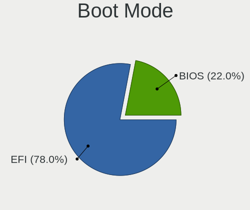
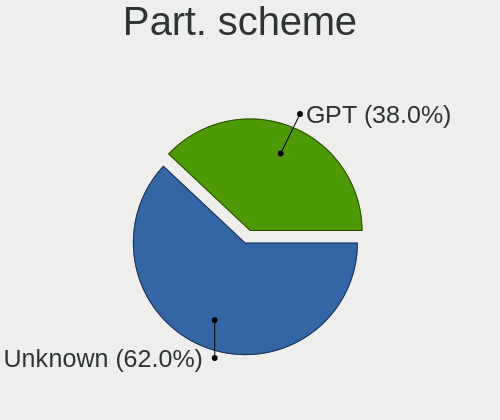
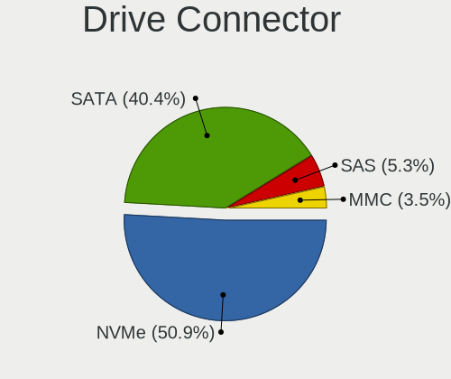
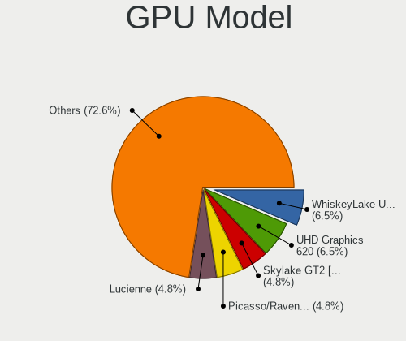

openSUSE Hardware Trends (Notebooks)
------------------------------------

A project to identify most popular hardware characteristics and track their change
over time based on data collected by openSUSE users at https://Linux-Hardware.org.

Anyone can contribute to this report by the [hw-probe](https://github.com/linuxhw/hw-probe) tool:

    sudo -E hw-probe -all -upload

Full-feature report is available here: https://linux-hardware.org/?view=trends&formfactor=notebook

Period: Sep, 2021.

Contents
--------

* [ System ](#system)
  - [ OS                       ](#os)
  - [ OS Family                ](#os-family)
  - [ Kernel                   ](#kernel)
  - [ Kernel Family            ](#kernel-family)
  - [ Kernel Major Ver.        ](#kernel-major-ver)
  - [ Arch                     ](#arch)
  - [ DE                       ](#de)
  - [ Display Server           ](#display-server)
  - [ Display Manager          ](#display-manager)
  - [ OS Lang                  ](#os-lang)
  - [ Boot Mode                ](#boot-mode)
  - [ Filesystem               ](#filesystem)
  - [ Part. scheme             ](#part-scheme)
  - [ Dual Boot with Linux/BSD ](#dual-boot-with-linuxbsd)
  - [ Dual Boot (Win)          ](#dual-boot-win)

* [ Board ](#board)
  - [ Vendor                   ](#vendor)
  - [ Model                    ](#model)
  - [ Model Family             ](#model-family)
  - [ MFG Year                 ](#mfg-year)
  - [ Form Factor              ](#form-factor)
  - [ Secure Boot              ](#secure-boot)
  - [ Coreboot                 ](#coreboot)
  - [ RAM Size                 ](#ram-size)
  - [ RAM Used                 ](#ram-used)
  - [ Total Drives             ](#total-drives)
  - [ Has CD-ROM               ](#has-cd-rom)
  - [ Has Ethernet             ](#has-ethernet)
  - [ Has WiFi                 ](#has-wifi)
  - [ Has Bluetooth            ](#has-bluetooth)

* [ Location ](#location)
  - [ Country                  ](#country)
  - [ City                     ](#city)

* [ Drives ](#drives)
  - [ Drive Vendor             ](#drive-vendor)
  - [ Drive Model              ](#drive-model)
  - [ HDD Vendor               ](#hdd-vendor)
  - [ SSD Vendor               ](#ssd-vendor)
  - [ Drive Kind               ](#drive-kind)
  - [ Drive Connector          ](#drive-connector)
  - [ Drive Size               ](#drive-size)
  - [ Space Total              ](#space-total)
  - [ Space Used               ](#space-used)
  - [ Malfunc. Drives          ](#malfunc-drives)
  - [ Malfunc. Drive Vendor    ](#malfunc-drive-vendor)
  - [ Malfunc. HDD Vendor      ](#malfunc-hdd-vendor)
  - [ Malfunc. Drive Kind      ](#malfunc-drive-kind)
  - [ Failed Drives            ](#failed-drives)
  - [ Failed Drive Vendor      ](#failed-drive-vendor)
  - [ Drive Status             ](#drive-status)

* [ Storage controller ](#storage-controller)
  - [ Storage Vendor           ](#storage-vendor)
  - [ Storage Model            ](#storage-model)
  - [ Storage Kind             ](#storage-kind)

* [ Processor ](#processor)
  - [ CPU Vendor               ](#cpu-vendor)
  - [ CPU Model                ](#cpu-model)
  - [ CPU Model Family         ](#cpu-model-family)
  - [ CPU Cores                ](#cpu-cores)
  - [ CPU Sockets              ](#cpu-sockets)
  - [ CPU Threads              ](#cpu-threads)
  - [ CPU Op-Modes             ](#cpu-op-modes)
  - [ CPU Microcode            ](#cpu-microcode)
  - [ CPU Microarch            ](#cpu-microarch)

* [ Graphics ](#graphics)
  - [ GPU Vendor               ](#gpu-vendor)
  - [ GPU Model                ](#gpu-model)
  - [ GPU Combo                ](#gpu-combo)
  - [ GPU Driver               ](#gpu-driver)
  - [ GPU Memory               ](#gpu-memory)

* [ Monitor ](#monitor)
  - [ Monitor Vendor           ](#monitor-vendor)
  - [ Monitor Model            ](#monitor-model)
  - [ Monitor Resolution       ](#monitor-resolution)
  - [ Monitor Diagonal         ](#monitor-diagonal)
  - [ Monitor Width            ](#monitor-width)
  - [ Aspect Ratio             ](#aspect-ratio)
  - [ Monitor Area             ](#monitor-area)
  - [ Pixel Density            ](#pixel-density)
  - [ Multiple Monitors        ](#multiple-monitors)

* [ Network ](#network)
  - [ Net Controller Vendor    ](#net-controller-vendor)
  - [ Net Controller Model     ](#net-controller-model)
  - [ Wireless Vendor          ](#wireless-vendor)
  - [ Wireless Model           ](#wireless-model)
  - [ Ethernet Vendor          ](#ethernet-vendor)
  - [ Ethernet Model           ](#ethernet-model)
  - [ Net Controller Kind      ](#net-controller-kind)
  - [ Used Controller          ](#used-controller)
  - [ NICs                     ](#nics)
  - [ IPv6                     ](#ipv6)

* [ Bluetooth ](#bluetooth)
  - [ Bluetooth Vendor         ](#bluetooth-vendor)
  - [ Bluetooth Model          ](#bluetooth-model)

* [ Sound ](#sound)
  - [ Sound Vendor             ](#sound-vendor)
  - [ Sound Model              ](#sound-model)

* [ Memory ](#memory)
  - [ Memory Vendor            ](#memory-vendor)
  - [ Memory Model             ](#memory-model)
  - [ Memory Kind              ](#memory-kind)
  - [ Memory Form Factor       ](#memory-form-factor)
  - [ Memory Size              ](#memory-size)
  - [ Memory Speed             ](#memory-speed)

* [ Printers & scanners ](#printers--scanners)
  - [ Printer Vendor           ](#printer-vendor)
  - [ Printer Model            ](#printer-model)
  - [ Scanner Vendor           ](#scanner-vendor)
  - [ Scanner Model            ](#scanner-model)

* [ Camera ](#camera)
  - [ Camera Vendor            ](#camera-vendor)
  - [ Camera Model             ](#camera-model)

* [ Security ](#security)
  - [ Fingerprint Vendor       ](#fingerprint-vendor)
  - [ Fingerprint Model        ](#fingerprint-model)
  - [ Chipcard Vendor          ](#chipcard-vendor)
  - [ Chipcard Model           ](#chipcard-model)

* [ Unsupported ](#unsupported)
  - [ Unsupported Devices      ](#unsupported-devices)
  - [ Unsupported Device Types ](#unsupported-device-types)

System
------

OS
--

Installed operating systems

| Name                         | Notebooks | Percent |
|------------------------------|-----------|---------|
| openSUSE Leap-15.2           | 3         | 13.64%  |
| openSUSE 20210916            | 3         | 13.64%  |
| openSUSE 20210910            | 2         | 9.09%   |
| openSUSE Tumbleweed-20210924 | 1         | 4.55%   |
| openSUSE Tumbleweed-20210914 | 1         | 4.55%   |
| openSUSE Tumbleweed-20210913 | 1         | 4.55%   |
| openSUSE Tumbleweed-20210910 | 1         | 4.55%   |
| openSUSE Tumbleweed-20210904 | 1         | 4.55%   |
| openSUSE Microos-20210321    | 1         | 4.55%   |
| openSUSE Leap-15.3           | 1         | 4.55%   |
| openSUSE 20210923            | 1         | 4.55%   |
| openSUSE 20210922            | 1         | 4.55%   |
| openSUSE 20210921            | 1         | 4.55%   |
| openSUSE 20210913            | 1         | 4.55%   |
| openSUSE 20210901            | 1         | 4.55%   |
| openSUSE 20210831            | 1         | 4.55%   |
| openSUSE 20210810            | 1         | 4.55%   |

OS Family
---------

OS without a version

| Name     | Notebooks | Percent |
|----------|-----------|---------|
| openSUSE | 22        | 100%    |

Kernel
------

Version of the Linux kernel

| Version                 | Notebooks | Percent |
|-------------------------|-----------|---------|
| 5.14.1-1-default        | 5         | 22.73%  |
| 5.14.2-1-default        | 4         | 18.18%  |
| 5.14.5-1-default        | 3         | 13.64%  |
| 5.3.18-lp152.87-default | 2         | 9.09%   |
| 5.13.13-1-default       | 2         | 9.09%   |
| 5.3.18-lp152.92-default | 1         | 4.55%   |
| 5.3.18-59.19-default    | 1         | 4.55%   |
| 5.14.6-1-default        | 1         | 4.55%   |
| 5.14.0-1-default        | 1         | 4.55%   |
| 5.13.8-1-default        | 1         | 4.55%   |
| 5.11.6-1-default        | 1         | 4.55%   |

Kernel Family
-------------

Linux kernel without a distro release

| Version | Notebooks | Percent |
|---------|-----------|---------|
| 5.14.1  | 5         | 22.73%  |
| 5.3.18  | 4         | 18.18%  |
| 5.14.2  | 4         | 18.18%  |
| 5.14.5  | 3         | 13.64%  |
| 5.13.13 | 2         | 9.09%   |
| 5.14.6  | 1         | 4.55%   |
| 5.14.0  | 1         | 4.55%   |
| 5.13.8  | 1         | 4.55%   |
| 5.11.6  | 1         | 4.55%   |

Kernel Major Ver.
-----------------

Linux kernel major version

| Version | Notebooks | Percent |
|---------|-----------|---------|
| 5.14    | 14        | 63.64%  |
| 5.3     | 4         | 18.18%  |
| 5.13    | 3         | 13.64%  |
| 5.11    | 1         | 4.55%   |

Arch
----

OS architecture (x86_64, i586, etc.)

| Name   | Notebooks | Percent |
|--------|-----------|---------|
| x86_64 | 22        | 100%    |

DE
--

Desktop Environment

| Name  | Notebooks | Percent |
|-------|-----------|---------|
| KDE5  | 11        | 50%     |
| GNOME | 6         | 27.27%  |
| KDE   | 3         | 13.64%  |
| XFCE  | 2         | 9.09%   |

Display Server
--------------

X11 or Wayland

| Name    | Notebooks | Percent |
|---------|-----------|---------|
| X11     | 20        | 90.91%  |
| Wayland | 2         | 9.09%   |

Display Manager
---------------

SDDM, LightDM, etc.

| Name    | Notebooks | Percent |
|---------|-----------|---------|
| Unknown | 9         | 40.91%  |
| SDDM    | 7         | 31.82%  |
| LightDM | 5         | 22.73%  |
| XDM     | 1         | 4.55%   |

OS Lang
-------

Language

| Lang   | Notebooks | Percent |
|--------|-----------|---------|
| en_US  | 10        | 45.45%  |
| en_GB  | 3         | 13.64%  |
| de_DE  | 3         | 13.64%  |
| POSIX  | 2         | 9.09%   |
| fr_FR  | 2         | 9.09%   |
| szl_PL | 1         | 4.55%   |
| de_AT  | 1         | 4.55%   |

Boot Mode
---------

EFI or BIOS

| Mode | Notebooks | Percent |
|------|-----------|---------|
| EFI  | 16        | 72.73%  |
| BIOS | 6         | 27.27%  |

Filesystem
----------

Type of filesystem

| Type  | Notebooks | Percent |
|-------|-----------|---------|
| Btrfs | 18        | 81.82%  |
| Xfs   | 2         | 9.09%   |
| Ext4  | 2         | 9.09%   |

Part. scheme
------------

Scheme of partitioning

| Type    | Notebooks | Percent |
|---------|-----------|---------|
| GPT     | 12        | 54.55%  |
| Unknown | 8         | 36.36%  |
| MBR     | 2         | 9.09%   |

Dual Boot with Linux/BSD
------------------------

Hosting more than one Linux/BSD

| Dual boot | Notebooks | Percent |
|-----------|-----------|---------|
| No        | 20        | 90.91%  |
| Yes       | 2         | 9.09%   |

Dual Boot (Win)
---------------

Hosting Linux and Windows

| Dual boot | Notebooks | Percent |
|-----------|-----------|---------|
| No        | 20        | 90.91%  |
| Yes       | 2         | 9.09%   |

Board
-----

Vendor
------

Motherboard manufacturer

| Name                | Notebooks | Percent |
|---------------------|-----------|---------|
| Dell                | 5         | 22.73%  |
| Lenovo              | 4         | 18.18%  |
| MSI                 | 3         | 13.64%  |
| Hewlett-Packard     | 3         | 13.64%  |
| Timi                | 1         | 4.55%   |
| Samsung Electronics | 1         | 4.55%   |
| Medion              | 1         | 4.55%   |
| HUAWEI              | 1         | 4.55%   |
| Google              | 1         | 4.55%   |
| ASUSTek Computer    | 1         | 4.55%   |
| Acer                | 1         | 4.55%   |

Model
-----

Motherboard model

| Name                                  | Notebooks | Percent |
|---------------------------------------|-----------|---------|
| Timi A35S                             | 1         | 4.55%   |
| Samsung 355V4C/356V4C/3445VC/3545VC   | 1         | 4.55%   |
| MSI Modern 15 A4M                     | 1         | 4.55%   |
| MSI GE72 7RD                          | 1         | 4.55%   |
| MSI CX61 0OC/CX61 0OD/CX61 0OL        | 1         | 4.55%   |
| Medion S15449                         | 1         | 4.55%   |
| Lenovo Yoga 710-11IKB 80V6            | 1         | 4.55%   |
| Lenovo ThinkPad X270 20HN0016GE       | 1         | 4.55%   |
| Lenovo ThinkPad T14s Gen 1 20UJS00K00 | 1         | 4.55%   |
| Lenovo ThinkPad L420 7827AW9          | 1         | 4.55%   |
| HUAWEI KPL-W0X                        | 1         | 4.55%   |
| HP ZBook 17                           | 1         | 4.55%   |
| HP OMEN Laptop 15-en1014AX            | 1         | 4.55%   |
| HP EliteBook 840 G7 Notebook PC       | 1         | 4.55%   |
| Google Pantheon                       | 1         | 4.55%   |
| Dell XPS 13 9310                      | 1         | 4.55%   |
| Dell Precision M6700                  | 1         | 4.55%   |
| Dell Precision M3800                  | 1         | 4.55%   |
| Dell Inspiron N4010                   | 1         | 4.55%   |
| Dell Inspiron 3521                    | 1         | 4.55%   |
| ASUS TUF Gaming FA706IU_FA706IU       | 1         | 4.55%   |
| Acer Aspire A517-52G                  | 1         | 4.55%   |

Model Family
------------

Motherboard model prefix

| Name            | Notebooks | Percent |
|-----------------|-----------|---------|
| Lenovo ThinkPad | 3         | 13.64%  |
| Dell Precision  | 2         | 9.09%   |
| Dell Inspiron   | 2         | 9.09%   |
| Timi A35S       | 1         | 4.55%   |
| Samsung 355V4C  | 1         | 4.55%   |
| MSI Modern      | 1         | 4.55%   |
| MSI GE72        | 1         | 4.55%   |
| MSI CX61        | 1         | 4.55%   |
| Medion S15449   | 1         | 4.55%   |
| Lenovo Yoga     | 1         | 4.55%   |
| HUAWEI KPL-W0X  | 1         | 4.55%   |
| HP ZBook        | 1         | 4.55%   |
| HP OMEN         | 1         | 4.55%   |
| HP EliteBook    | 1         | 4.55%   |
| Google Pantheon | 1         | 4.55%   |
| Dell XPS        | 1         | 4.55%   |
| ASUS TUF        | 1         | 4.55%   |
| Acer Aspire     | 1         | 4.55%   |

MFG Year
--------

Motherboard manufacture year

| Year | Notebooks | Percent |
|------|-----------|---------|
| 2021 | 6         | 27.27%  |
| 2020 | 5         | 22.73%  |
| 2018 | 4         | 18.18%  |
| 2013 | 3         | 13.64%  |
| 2019 | 1         | 4.55%   |
| 2017 | 1         | 4.55%   |
| 2016 | 1         | 4.55%   |
| 2011 | 1         | 4.55%   |

Form Factor
-----------

Physical design of the computer

| Name     | Notebooks | Percent |
|----------|-----------|---------|
| Notebook | 22        | 100%    |

Secure Boot
-----------

Enabled or disabled

| State    | Notebooks | Percent |
|----------|-----------|---------|
| Disabled | 17        | 77.27%  |
| Enabled  | 5         | 22.73%  |

Coreboot
--------

Have coreboot on board

| Used | Notebooks | Percent |
|------|-----------|---------|
| No   | 21        | 95.45%  |
| Yes  | 1         | 4.55%   |

RAM Size
--------

Total RAM memory

| Size in GB | Notebooks | Percent |
|------------|-----------|---------|
| 16.01-24.0 | 9         | 40.91%  |
| 4.01-8.0   | 6         | 27.27%  |
| 8.01-16.0  | 5         | 22.73%  |
| 32.01-64.0 | 1         | 4.55%   |
| 3.01-4.0   | 1         | 4.55%   |

RAM Used
--------

Used RAM memory

| Used GB   | Notebooks | Percent |
|-----------|-----------|---------|
| 4.01-8.0  | 9         | 40.91%  |
| 1.01-2.0  | 7         | 31.82%  |
| 2.01-3.0  | 2         | 9.09%   |
| 8.01-16.0 | 2         | 9.09%   |
| 0.51-1.0  | 2         | 9.09%   |

Total Drives
------------

Number of drives on board

| Drives | Notebooks | Percent |
|--------|-----------|---------|
| 1      | 15        | 68.18%  |
| 2      | 6         | 27.27%  |
| 3      | 1         | 4.55%   |

Has CD-ROM
----------

Has CD-ROM on board

| Presented | Notebooks | Percent |
|-----------|-----------|---------|
| No        | 15        | 68.18%  |
| Yes       | 7         | 31.82%  |

Has Ethernet
------------

Has Ethernet on board

| Presented | Notebooks | Percent |
|-----------|-----------|---------|
| Yes       | 14        | 63.64%  |
| No        | 8         | 36.36%  |

Has WiFi
--------

Has WiFi module

| Presented | Notebooks | Percent |
|-----------|-----------|---------|
| Yes       | 22        | 100%    |

Has Bluetooth
-------------

Has Bluetooth module

| Presented | Notebooks | Percent |
|-----------|-----------|---------|
| Yes       | 19        | 86.36%  |
| No        | 3         | 13.64%  |

Location
--------

Country
-------

Geographic location (country)

| Country    | Notebooks | Percent |
|------------|-----------|---------|
| Germany    | 4         | 18.18%  |
| USA        | 3         | 13.64%  |
| France     | 3         | 13.64%  |
| Austria    | 3         | 13.64%  |
| Turkey     | 1         | 4.55%   |
| Poland     | 1         | 4.55%   |
| Luxembourg | 1         | 4.55%   |
| Italy      | 1         | 4.55%   |
| Indonesia  | 1         | 4.55%   |
| India      | 1         | 4.55%   |
| Hungary    | 1         | 4.55%   |
| Bulgaria   | 1         | 4.55%   |
| Belgium    | 1         | 4.55%   |

City
----

Geographic location (city)

| City               | Notebooks | Percent |
|--------------------|-----------|---------|
| Vienna             | 2         | 9.09%   |
| Wilhelmsburg       | 1         | 4.55%   |
| Warsaw             | 1         | 4.55%   |
| Trumansburg        | 1         | 4.55%   |
| Sofia              | 1         | 4.55%   |
| Schlangenbad       | 1         | 4.55%   |
| Rendsburg          | 1         | 4.55%   |
| Portland           | 1         | 4.55%   |
| Paderborn          | 1         | 4.55%   |
| Nevez              | 1         | 4.55%   |
| Milan              | 1         | 4.55%   |
| Jakarta            | 1         | 4.55%   |
| Henderson          | 1         | 4.55%   |
| Fontenay-sous-Bois | 1         | 4.55%   |
| Essen              | 1         | 4.55%   |
| Differdange        | 1         | 4.55%   |
| Clermont-Ferrand   | 1         | 4.55%   |
| Budapest           | 1         | 4.55%   |
| Bengaluru          | 1         | 4.55%   |
| Augsburg           | 1         | 4.55%   |
| Ankara             | 1         | 4.55%   |

Drives
------

Drive Vendor
------------

Hard drive vendors

| Vendor              | Notebooks | Drives | Percent |
|---------------------|-----------|--------|---------|
| Kingston            | 5         | 5      | 17.24%  |
| SanDisk             | 3         | 3      | 10.34%  |
| Unknown             | 2         | 2      | 6.9%    |
| Toshiba             | 2         | 2      | 6.9%    |
| Seagate             | 2         | 2      | 6.9%    |
| Samsung Electronics | 2         | 2      | 6.9%    |
| Phison              | 2         | 2      | 6.9%    |
| XPG                 | 1         | 1      | 3.45%   |
| WDC                 | 1         | 1      | 3.45%   |
| SK Hynix            | 1         | 1      | 3.45%   |
| PNY                 | 1         | 1      | 3.45%   |
| Micron Technology   | 1         | 1      | 3.45%   |
| LITEONIT            | 1         | 1      | 3.45%   |
| JMicron             | 1         | 1      | 3.45%   |
| Hitachi             | 1         | 1      | 3.45%   |
| HGST                | 1         | 1      | 3.45%   |
| Crucial             | 1         | 1      | 3.45%   |
| A-DATA Technology   | 1         | 1      | 3.45%   |

Drive Model
-----------

Hard drive models

| Model                                  | Notebooks | Percent |
|----------------------------------------|-----------|---------|
| Phison NVMe SSD Drive 1024GB           | 2         | 6.9%    |
| XPG NVMe SSD Drive 512GB               | 1         | 3.45%   |
| WDC PC SN530 SDBPNPZ-512G-1006 512GB   | 1         | 3.45%   |
| Unknown MMC Card  1TB                  | 1         | 3.45%   |
| Unknown DA4128  128GB                  | 1         | 3.45%   |
| Toshiba MQ01ABD075 752GB               | 1         | 3.45%   |
| Toshiba KXG60ZNV512G NVMe KIOXIA 512GB | 1         | 3.45%   |
| SK Hynix HFS128G39MND-3310A 128GB SSD  | 1         | 3.45%   |
| Seagate ST500LM012 HN-M500MBB 500GB    | 1         | 3.45%   |
| Seagate ST1000LM048-2E7172 1TB         | 1         | 3.45%   |
| SanDisk Ultra II 480GB SSD             | 1         | 3.45%   |
| SanDisk SD7TB3Q-256G-1006 256GB SSD    | 1         | 3.45%   |
| Sandisk NVMe SSD Drive 1024GB          | 1         | 3.45%   |
| Samsung SSD 860 QVO 1TB                | 1         | 3.45%   |
| Samsung NVMe SSD Drive 512GB           | 1         | 3.45%   |
| PNY CS3030 2TB SSD                     | 1         | 3.45%   |
| Micron 2210_MTFDHBA1T0QFD 1TB          | 1         | 3.45%   |
| LITEONIT LMT-256L9M-11 MSATA 256GB SSD | 1         | 3.45%   |
| Kingston SA400S37120G 120GB SSD        | 1         | 3.45%   |
| Kingston SA2000M8500G 500GB            | 1         | 3.45%   |
| Kingston RBU-SNS8152S3128GG6 128GB SSD | 1         | 3.45%   |
| Kingston OM8PCP3512F-AB 512GB          | 1         | 3.45%   |
| Kingston NVMe SSD Drive 512GB          | 1         | 3.45%   |
| JMicron Generic 500GB                  | 1         | 3.45%   |
| Hitachi HTS727550A9E365 500GB          | 1         | 3.45%   |
| HGST HTS721010A9E630 1TB               | 1         | 3.45%   |
| Crucial CT1000MX500SSD1 1TB            | 1         | 3.45%   |
| A-DATA SX8200PNP 512GB                 | 1         | 3.45%   |

HDD Vendor
----------

Hard disk drive vendors

| Vendor  | Notebooks | Drives | Percent |
|---------|-----------|--------|---------|
| Seagate | 2         | 2      | 40%     |
| Toshiba | 1         | 1      | 20%     |
| Hitachi | 1         | 1      | 20%     |
| HGST    | 1         | 1      | 20%     |

SSD Vendor
----------

Solid state drive vendors

| Vendor              | Notebooks | Drives | Percent |
|---------------------|-----------|--------|---------|
| SanDisk             | 2         | 2      | 25%     |
| Kingston            | 2         | 2      | 25%     |
| SK Hynix            | 1         | 1      | 12.5%   |
| Samsung Electronics | 1         | 1      | 12.5%   |
| LITEONIT            | 1         | 1      | 12.5%   |
| Crucial             | 1         | 1      | 12.5%   |

Drive Kind
----------

HDD or SSD

| Kind | Notebooks | Drives | Percent |
|------|-----------|--------|---------|
| NVMe | 11        | 14     | 45.83%  |
| SSD  | 7         | 8      | 29.17%  |
| HDD  | 4         | 5      | 16.67%  |
| MMC  | 2         | 2      | 8.33%   |

Drive Connector
---------------

SATA, SAS, NVMe, etc.

| Type | Notebooks | Drives | Percent |
|------|-----------|--------|---------|
| NVMe | 11        | 13     | 45.83%  |
| SATA | 10        | 13     | 41.67%  |
| MMC  | 2         | 2      | 8.33%   |
| SAS  | 1         | 1      | 4.17%   |

Drive Size
----------

Size of hard drive

| Size in TB | Notebooks | Drives | Percent |
|------------|-----------|--------|---------|
| 0.01-0.5   | 8         | 8      | 61.54%  |
| 0.51-1.0   | 5         | 5      | 38.46%  |

Space Total
-----------

Amount of disk space available on the file system

| Size in GB     | Notebooks | Percent |
|----------------|-----------|---------|
| More than 3000 | 10        | 45.45%  |
| 1001-2000      | 3         | 13.64%  |
| 501-1000       | 3         | 13.64%  |
| 251-500        | 2         | 9.09%   |
| 101-250        | 2         | 9.09%   |
| 21-50          | 1         | 4.55%   |
| 2001-3000      | 1         | 4.55%   |

Space Used
----------

Amount of used disk space

| Used GB        | Notebooks | Percent |
|----------------|-----------|---------|
| 2001-3000      | 4         | 18.18%  |
| 101-250        | 4         | 18.18%  |
| 501-1000       | 4         | 18.18%  |
| 51-100         | 4         | 18.18%  |
| 1001-2000      | 2         | 9.09%   |
| More than 3000 | 1         | 4.55%   |
| 251-500        | 1         | 4.55%   |
| 21-50          | 1         | 4.55%   |
| 1-20           | 1         | 4.55%   |

Malfunc. Drives
---------------

Drive models with a malfunction

| Model                    | Notebooks | Drives | Percent |
|--------------------------|-----------|--------|---------|
| HGST HTS721010A9E630 1TB | 1         | 1      | 100%    |

Malfunc. Drive Vendor
---------------------

Vendors of faulty drives

| Vendor | Notebooks | Drives | Percent |
|--------|-----------|--------|---------|
| HGST   | 1         | 1      | 100%    |

Malfunc. HDD Vendor
-------------------

Vendors of faulty HDD drives

| Vendor | Notebooks | Drives | Percent |
|--------|-----------|--------|---------|
| HGST   | 1         | 1      | 100%    |

Malfunc. Drive Kind
-------------------

Kinds of faulty drives

| Kind | Notebooks | Drives | Percent |
|------|-----------|--------|---------|
| HDD  | 1         | 1      | 100%    |

Failed Drives
-------------

Failed drive models

Zero info for selected period =(

Failed Drive Vendor
-------------------

Failed drive vendors

Zero info for selected period =(

Drive Status
------------

Number of failed and malfunc. drives

| Status   | Notebooks | Drives | Percent |
|----------|-----------|--------|---------|
| Works    | 14        | 14     | 58.33%  |
| Detected | 9         | 14     | 37.5%   |
| Malfunc  | 1         | 1      | 4.17%   |

Storage controller
------------------

Storage Vendor
--------------

Storage controller vendors

| Vendor                       | Notebooks | Percent |
|------------------------------|-----------|---------|
| Intel                        | 10        | 37.04%  |
| AMD                          | 5         | 18.52%  |
| Phison Electronics           | 3         | 11.11%  |
| Kingston Technology Company  | 3         | 11.11%  |
| Sandisk                      | 2         | 7.41%   |
| Toshiba America Info Systems | 1         | 3.7%    |
| Samsung Electronics          | 1         | 3.7%    |
| Micron Technology            | 1         | 3.7%    |
| ADATA Technology             | 1         | 3.7%    |

Storage Model
-------------

Storage controller models

| Model                                                                          | Notebooks | Percent |
|--------------------------------------------------------------------------------|-----------|---------|
| AMD FCH SATA Controller [AHCI mode]                                            | 5         | 17.86%  |
| Phison E12 NVMe Controller                                                     | 3         | 10.71%  |
| Kingston Company Company Non-Volatile memory controller                        | 2         | 7.14%   |
| Intel 8 Series/C220 Series Chipset Family 6-port SATA Controller 1 [AHCI mode] | 2         | 7.14%   |
| Intel 7 Series Chipset Family 6-port SATA Controller [AHCI mode]               | 2         | 7.14%   |
| Toshiba America Info Systems XG6 NVMe SSD Controller                           | 1         | 3.57%   |
| Sandisk WD Blue SN550 NVMe SSD                                                 | 1         | 3.57%   |
| Sandisk WD Black SN750 / PC SN730 NVMe SSD                                     | 1         | 3.57%   |
| Samsung NVMe SSD Controller SM981/PM981/PM983                                  | 1         | 3.57%   |
| Micron Non-Volatile memory controller                                          | 1         | 3.57%   |
| Kingston Company A2000 NVMe SSD                                                | 1         | 3.57%   |
| Intel Volume Management Device NVMe RAID Controller                            | 1         | 3.57%   |
| Intel Tiger Lake-LP SATA Controller [AHCI mode]                                | 1         | 3.57%   |
| Intel Sunrise Point-LP SATA Controller [AHCI mode]                             | 1         | 3.57%   |
| Intel HM170/QM170 Chipset SATA Controller [AHCI Mode]                          | 1         | 3.57%   |
| Intel 82801 Mobile SATA Controller [RAID mode]                                 | 1         | 3.57%   |
| Intel 6 Series/C200 Series Chipset Family 6 port Mobile SATA AHCI Controller   | 1         | 3.57%   |
| Intel 5 Series/3400 Series Chipset 6 port SATA AHCI Controller                 | 1         | 3.57%   |
| ADATA XPG SX8200 Pro PCIe Gen3x4 M.2 2280 Solid State Drive                    | 1         | 3.57%   |

Storage Kind
------------

Kind of storage controller (IDE, SATA, NVMe, SAS, ...)

| Kind | Notebooks | Percent |
|------|-----------|---------|
| SATA | 14        | 51.85%  |
| NVMe | 11        | 40.74%  |
| RAID | 2         | 7.41%   |

Processor
---------

CPU Vendor
----------

Processor vendors

| Vendor | Notebooks | Percent |
|--------|-----------|---------|
| Intel  | 15        | 68.18%  |
| AMD    | 7         | 31.82%  |

CPU Model
---------

Processor models

| Model                                         | Notebooks | Percent |
|-----------------------------------------------|-----------|---------|
| Intel 11th Gen Core i7-1165G7 @ 2.80GHz       | 3         | 13.64%  |
| Intel Core i7-8550U CPU @ 1.80GHz             | 1         | 4.55%   |
| Intel Core i7-7700HQ CPU @ 2.80GHz            | 1         | 4.55%   |
| Intel Core i7-4702HQ CPU @ 2.20GHz            | 1         | 4.55%   |
| Intel Core i7-4600M CPU @ 2.90GHz             | 1         | 4.55%   |
| Intel Core i7-3740QM CPU @ 2.70GHz            | 1         | 4.55%   |
| Intel Core i5-7Y54 CPU @ 1.20GHz              | 1         | 4.55%   |
| Intel Core i5-7200U CPU @ 2.50GHz             | 1         | 4.55%   |
| Intel Core i5-3317U CPU @ 1.70GHz             | 1         | 4.55%   |
| Intel Core i5-3230M CPU @ 2.60GHz             | 1         | 4.55%   |
| Intel Core i5-2520M CPU @ 2.50GHz             | 1         | 4.55%   |
| Intel Core i5-10310U CPU @ 1.70GHz            | 1         | 4.55%   |
| Intel Core i3 CPU M 380 @ 2.53GHz             | 1         | 4.55%   |
| AMD Ryzen 9 4900H with Radeon Graphics        | 1         | 4.55%   |
| AMD Ryzen 7 PRO 4750U with Radeon Graphics    | 1         | 4.55%   |
| AMD Ryzen 7 5800H with Radeon Graphics        | 1         | 4.55%   |
| AMD Ryzen 5 5600H with Radeon Graphics        | 1         | 4.55%   |
| AMD Ryzen 5 4500U with Radeon Graphics        | 1         | 4.55%   |
| AMD Ryzen 5 2500U with Radeon Vega Mobile Gfx | 1         | 4.55%   |
| AMD E2-1800 APU with Radeon HD Graphics       | 1         | 4.55%   |

CPU Model Family
----------------

Processor model prefix

| Model           | Notebooks | Percent |
|-----------------|-----------|---------|
| Intel Core i5   | 6         | 27.27%  |
| Intel Core i7   | 5         | 22.73%  |
| Other           | 3         | 13.64%  |
| AMD Ryzen 5     | 3         | 13.64%  |
| Intel Core i3   | 1         | 4.55%   |
| AMD Ryzen 9     | 1         | 4.55%   |
| AMD Ryzen 7 PRO | 1         | 4.55%   |
| AMD Ryzen 7     | 1         | 4.55%   |
| AMD E2          | 1         | 4.55%   |

CPU Cores
---------

Number of processor cores

| Number | Notebooks | Percent |
|--------|-----------|---------|
| 4      | 9         | 40.91%  |
| 2      | 8         | 36.36%  |
| 8      | 3         | 13.64%  |
| 6      | 2         | 9.09%   |

CPU Sockets
-----------

Number of sockets

| Number | Notebooks | Percent |
|--------|-----------|---------|
| 1      | 22        | 100%    |

CPU Threads
-----------

Threads per core (Hyper-Threading)

| Number | Notebooks | Percent |
|--------|-----------|---------|
| 2      | 20        | 90.91%  |
| 1      | 2         | 9.09%   |

CPU Op-Modes
------------

CPU Operation Modes (32-bit, 64-bit)

| Op mode        | Notebooks | Percent |
|----------------|-----------|---------|
| 32-bit, 64-bit | 22        | 100%    |

CPU Microcode
-------------

Microcode number

| Number     | Notebooks | Percent |
|------------|-----------|---------|
| 0x806c1    | 3         | 13.64%  |
| 0x806e9    | 2         | 9.09%   |
| 0x306c3    | 2         | 9.09%   |
| 0x306a9    | 2         | 9.09%   |
| 0x0a50000c | 2         | 9.09%   |
| 0x08600104 | 2         | 9.09%   |
| 0x906e9    | 1         | 4.55%   |
| 0x806ec    | 1         | 4.55%   |
| 0x806ea    | 1         | 4.55%   |
| 0x206a7    | 1         | 4.55%   |
| 0x20655    | 1         | 4.55%   |
| 0x08600106 | 1         | 4.55%   |
| 0x08101007 | 1         | 4.55%   |
| 0x05000119 | 1         | 4.55%   |
| Unknown    | 1         | 4.55%   |

CPU Microarch
-------------

Microarchitecture

| Name        | Notebooks | Percent |
|-------------|-----------|---------|
| KabyLake    | 5         | 22.73%  |
| Zen 2       | 3         | 13.64%  |
| TigerLake   | 3         | 13.64%  |
| IvyBridge   | 3         | 13.64%  |
| Zen 3       | 2         | 9.09%   |
| Haswell     | 2         | 9.09%   |
| Zen         | 1         | 4.55%   |
| Westmere    | 1         | 4.55%   |
| SandyBridge | 1         | 4.55%   |
| Bobcat      | 1         | 4.55%   |

Graphics
--------

GPU Vendor
----------

Vendors of graphics cards

| Vendor | Notebooks | Percent |
|--------|-----------|---------|
| Intel  | 14        | 46.67%  |
| Nvidia | 8         | 26.67%  |
| AMD    | 8         | 26.67%  |

GPU Model
---------

Graphics card models

| Model                                                                     | Notebooks | Percent |
|---------------------------------------------------------------------------|-----------|---------|
| Intel TigerLake-LP GT2 [Iris Xe Graphics]                                 | 3         | 10%     |
| Intel 3rd Gen Core processor Graphics Controller                          | 3         | 10%     |
| AMD Renoir                                                                | 3         | 10%     |
| AMD Cezanne                                                               | 2         | 6.67%   |
| Nvidia TU116M [GeForce GTX 1660 Ti Mobile]                                | 1         | 3.33%   |
| Nvidia GP107M [GeForce MX350]                                             | 1         | 3.33%   |
| Nvidia GP107M [GeForce GTX 1050 Mobile]                                   | 1         | 3.33%   |
| Nvidia GK208M [GeForce GT 730M]                                           | 1         | 3.33%   |
| Nvidia GK208GLM [Quadro K610M]                                            | 1         | 3.33%   |
| Nvidia GK107GLM [Quadro K1100M]                                           | 1         | 3.33%   |
| Nvidia GK104GLM [Quadro K3000M]                                           | 1         | 3.33%   |
| Nvidia GA106M [GeForce RTX 3060 Mobile / Max-Q]                           | 1         | 3.33%   |
| Intel UHD Graphics 620                                                    | 1         | 3.33%   |
| Intel HD Graphics 630                                                     | 1         | 3.33%   |
| Intel HD Graphics 620                                                     | 1         | 3.33%   |
| Intel HD Graphics 615                                                     | 1         | 3.33%   |
| Intel Core Processor Integrated Graphics Controller                       | 1         | 3.33%   |
| Intel CometLake-U GT2 [UHD Graphics]                                      | 1         | 3.33%   |
| Intel 4th Gen Core Processor Integrated Graphics Controller               | 1         | 3.33%   |
| Intel 2nd Generation Core Processor Family Integrated Graphics Controller | 1         | 3.33%   |
| AMD Thames [Radeon HD 7500M/7600M Series]                                 | 1         | 3.33%   |
| AMD Seymour [Radeon HD 6400M/7400M Series]                                | 1         | 3.33%   |
| AMD Raven Ridge [Radeon Vega Series / Radeon Vega Mobile Series]          | 1         | 3.33%   |

GPU Combo
---------

Combinations of graphics cards

| Name           | Notebooks | Percent |
|----------------|-----------|---------|
| 1 x Intel      | 8         | 36.36%  |
| Intel + Nvidia | 5         | 22.73%  |
| 1 x AMD        | 5         | 22.73%  |
| AMD + Nvidia   | 2         | 9.09%   |
| 1 x Nvidia     | 1         | 4.55%   |
| Intel + AMD    | 1         | 4.55%   |

GPU Driver
----------

Free vs proprietary

| Driver      | Notebooks | Percent |
|-------------|-----------|---------|
| Free        | 19        | 86.36%  |
| Proprietary | 2         | 9.09%   |
| Unknown     | 1         | 4.55%   |

GPU Memory
----------

Total video memory

| Size in GB | Notebooks | Percent |
|------------|-----------|---------|
| Unknown    | 10        | 45.45%  |
| 0.51-1.0   | 4         | 18.18%  |
| 1.01-2.0   | 3         | 13.64%  |
| 5.01-6.0   | 2         | 9.09%   |
| 0.01-0.5   | 2         | 9.09%   |
| 3.01-4.0   | 1         | 4.55%   |

Monitor
-------

Monitor Vendor
--------------

Monitor vendors

| Vendor               | Notebooks | Percent |
|----------------------|-----------|---------|
| Chimei Innolux       | 5         | 17.86%  |
| BOE                  | 4         | 14.29%  |
| AU Optronics         | 3         | 10.71%  |
| Sharp                | 2         | 7.14%   |
| Samsung Electronics  | 2         | 7.14%   |
| LG Display           | 2         | 7.14%   |
| Goldstar             | 2         | 7.14%   |
| Philips              | 1         | 3.57%   |
| Lenovo               | 1         | 3.57%   |
| InnoLux Display      | 1         | 3.57%   |
| InfoVision           | 1         | 3.57%   |
| Iiyama               | 1         | 3.57%   |
| Dell                 | 1         | 3.57%   |
| AOC                  | 1         | 3.57%   |
| Ancor Communications | 1         | 3.57%   |

Monitor Model
-------------

Monitor models

| Model                                                                 | Notebooks | Percent |
|-----------------------------------------------------------------------|-----------|---------|
| Sharp LCD Monitor SHP14F9 1920x1200 288x180mm 13.4-inch               | 1         | 3.33%   |
| Sharp LCD Monitor SHP13F8 3200x1800 346x194mm 15.6-inch               | 1         | 3.33%   |
| Samsung Electronics LCD Monitor SDC4150 3456x2160 336x210mm 15.6-inch | 1         | 3.33%   |
| Samsung Electronics LCD Monitor SDC3754 1600x900 382x215mm 17.3-inch  | 1         | 3.33%   |
| Philips PHL 243V5 PHLC0D3 1920x1080 520x290mm 23.4-inch               | 1         | 3.33%   |
| LG Display LCD Monitor LGD038E 1366x768 340x190mm 15.3-inch           | 1         | 3.33%   |
| LG Display LCD Monitor LGD02DA 1920x1080 380x220mm 17.3-inch          | 1         | 3.33%   |
| Lenovo P24h-10 LEN61AE 2560x1440 527x296mm 23.8-inch                  | 1         | 3.33%   |
| Lenovo LEN P24h-20 LEN61F4 2560x1440 527x296mm 23.8-inch              | 1         | 3.33%   |
| InnoLux Display LCD Monitor INL0014 1366x768 309x174mm 14.0-inch      | 1         | 3.33%   |
| InfoVision LCD Monitor IVO03F4 1920x1200 263x164mm 12.2-inch          | 1         | 3.33%   |
| Iiyama PL2201W IVM5602 1680x1050 490x320mm 23.0-inch                  | 1         | 3.33%   |
| Goldstar HDR WFHD GSM7714 2560x1080 798x334mm 34.1-inch               | 1         | 3.33%   |
| Goldstar E2251 GSM586F 1920x1080 480x270mm 21.7-inch                  | 1         | 3.33%   |
| Dell E2218HN DELF09D 1920x1080 476x268mm 21.5-inch                    | 1         | 3.33%   |
| Dell 1908FP DEL4026 1280x1024 376x301mm 19.0-inch                     | 1         | 3.33%   |
| Chimei Innolux LCD Monitor CMN1747 1920x1080 381x214mm 17.2-inch      | 1         | 3.33%   |
| Chimei Innolux LCD Monitor CMN14F2 1920x1080 309x173mm 13.9-inch      | 1         | 3.33%   |
| Chimei Innolux LCD Monitor CMN14D4 1920x1080 309x173mm 13.9-inch      | 1         | 3.33%   |
| Chimei Innolux LCD Monitor CMN1239 1920x1080 276x155mm 12.5-inch      | 1         | 3.33%   |
| Chimei Innolux LCD Monitor CMN1137 1920x1080 256x144mm 11.6-inch      | 1         | 3.33%   |
| BOE LCD Monitor BOE08E8 1920x1080 344x194mm 15.5-inch                 | 1         | 3.33%   |
| BOE LCD Monitor BOE08DA 1920x1080 309x174mm 14.0-inch                 | 1         | 3.33%   |
| BOE LCD Monitor BOE084E 1920x1080 382x215mm 17.3-inch                 | 1         | 3.33%   |
| BOE LCD Monitor BOE06F4 3840x2160 345x194mm 15.6-inch                 | 1         | 3.33%   |
| AU Optronics LCD Monitor AUO82ED 1920x1080 344x194mm 15.5-inch        | 1         | 3.33%   |
| AU Optronics LCD Monitor AUO479D 1920x1080 382x215mm 17.3-inch        | 1         | 3.33%   |
| AU Optronics LCD Monitor AUO193C 1366x768 309x173mm 13.9-inch         | 1         | 3.33%   |
| AOC 2250W AOC2250 1920x1080 477x268mm 21.5-inch                       | 1         | 3.33%   |
| Ancor Communications ASUS VE278 ACI27F6 1920x1080 598x336mm 27.0-inch | 1         | 3.33%   |

Monitor Resolution
------------------

Monitor screen resolution

| Resolution         | Notebooks | Percent |
|--------------------|-----------|---------|
| 1920x1080 (FHD)    | 14        | 51.85%  |
| 1366x768 (WXGA)    | 3         | 11.11%  |
| 1920x1200 (WUXGA)  | 2         | 7.41%   |
| 3840x2160 (4K)     | 1         | 3.7%    |
| 3456x2160          | 1         | 3.7%    |
| 3200x1800 (QHD+)   | 1         | 3.7%    |
| 2560x1440 (QHD)    | 1         | 3.7%    |
| 2560x1080          | 1         | 3.7%    |
| 1680x1050 (WSXGA+) | 1         | 3.7%    |
| 1600x900 (HD+)     | 1         | 3.7%    |
| 1280x1024 (SXGA)   | 1         | 3.7%    |

Monitor Diagonal
----------------

Diagonal size in inches

| Inches | Notebooks | Percent |
|--------|-----------|---------|
| 15     | 7         | 24.14%  |
| 17     | 5         | 17.24%  |
| 13     | 4         | 13.79%  |
| 23     | 3         | 10.34%  |
| 21     | 3         | 10.34%  |
| 14     | 2         | 6.9%    |
| 34     | 1         | 3.45%   |
| 27     | 1         | 3.45%   |
| 19     | 1         | 3.45%   |
| 12     | 1         | 3.45%   |
| 11     | 1         | 3.45%   |

Monitor Width
-------------

Physical width

| Width in mm | Notebooks | Percent |
|-------------|-----------|---------|
| 301-350     | 12        | 41.38%  |
| 351-400     | 6         | 20.69%  |
| 401-500     | 4         | 13.79%  |
| 501-600     | 3         | 10.34%  |
| 201-300     | 3         | 10.34%  |
| 701-800     | 1         | 3.45%   |

Aspect Ratio
------------

Proportional relationship between the width and the height

| Ratio | Notebooks | Percent |
|-------|-----------|---------|
| 16/9  | 20        | 80%     |
| 16/10 | 2         | 8%      |
| 5/4   | 1         | 4%      |
| 3/2   | 1         | 4%      |
| 21/9  | 1         | 4%      |

Monitor Area
------------

Area in inch²

| Area in inch² | Notebooks | Percent |
|----------------|-----------|---------|
| 101-110        | 7         | 25%     |
| 81-90          | 5         | 17.86%  |
| 121-130        | 5         | 17.86%  |
| 201-250        | 4         | 14.29%  |
| 151-200        | 2         | 7.14%   |
| 71-80          | 1         | 3.57%   |
| 61-70          | 1         | 3.57%   |
| 51-60          | 1         | 3.57%   |
| 351-500        | 1         | 3.57%   |
| 301-350        | 1         | 3.57%   |

Pixel Density
-------------

Pixels per inch

| Density       | Notebooks | Percent |
|---------------|-----------|---------|
| 121-160       | 9         | 33.33%  |
| 101-120       | 8         | 29.63%  |
| 161-240       | 4         | 14.81%  |
| 51-100        | 4         | 14.81%  |
| More than 240 | 2         | 7.41%   |

Multiple Monitors
-----------------

Total monitors connected

| Total | Notebooks | Percent |
|-------|-----------|---------|
| 1     | 14        | 63.64%  |
| 2     | 5         | 22.73%  |
| 4     | 1         | 4.55%   |
| 3     | 1         | 4.55%   |
| 0     | 1         | 4.55%   |

Network
-------

Net Controller Vendor
---------------------

Controller vendors

| Vendor                            | Notebooks | Percent |
|-----------------------------------|-----------|---------|
| Intel                             | 17        | 50%     |
| Realtek Semiconductor             | 10        | 29.41%  |
| Qualcomm Atheros                  | 4         | 11.76%  |
| Ericsson Business Mobile Networks | 1         | 2.94%   |
| DisplayLink                       | 1         | 2.94%   |
| Broadcom                          | 1         | 2.94%   |

Net Controller Model
--------------------

Controller models

| Model                                                             | Notebooks | Percent |
|-------------------------------------------------------------------|-----------|---------|
| Realtek RTL8111/8168/8411 PCI Express Gigabit Ethernet Controller | 6         | 16.22%  |
| Intel Wi-Fi 6 AX201                                               | 3         | 8.11%   |
| Intel Wi-Fi 6 AX200                                               | 3         | 8.11%   |
| Realtek RTL8822CE 802.11ac PCIe Wireless Network Adapter          | 2         | 5.41%   |
| Realtek RTL8153 Gigabit Ethernet Adapter                          | 2         | 5.41%   |
| Qualcomm Atheros AR9485 Wireless Network Adapter                  | 2         | 5.41%   |
| Intel Wireless 8265 / 8275                                        | 2         | 5.41%   |
| Intel Wireless 7260                                               | 2         | 5.41%   |
| Realtek RTL810xE PCI Express Fast Ethernet controller             | 1         | 2.7%    |
| Qualcomm Atheros QCA6174 802.11ac Wireless Network Adapter        | 1         | 2.7%    |
| Qualcomm Atheros Killer E2500 Gigabit Ethernet Controller         | 1         | 2.7%    |
| Intel Wireless 7265                                               | 1         | 2.7%    |
| Intel Ethernet Connection I217-LM                                 | 1         | 2.7%    |
| Intel Ethernet Connection (4) I219-V                              | 1         | 2.7%    |
| Intel Dual Band Wireless-AC 3168NGW [Stone Peak]                  | 1         | 2.7%    |
| Intel Comet Lake PCH-LP CNVi WiFi                                 | 1         | 2.7%    |
| Intel Centrino Wireless-N 135                                     | 1         | 2.7%    |
| Intel Centrino Wireless-N 1000 [Condor Peak]                      | 1         | 2.7%    |
| Intel Centrino Advanced-N 6205 [Taylor Peak]                      | 1         | 2.7%    |
| Intel 82579LM Gigabit Network Connection (Lewisville)             | 1         | 2.7%    |
| Ericsson Business Mobile Networks F5521gw                         | 1         | 2.7%    |
| DisplayLink Dell D3100 Docking Station                            | 1         | 2.7%    |
| Broadcom BCM43228 802.11a/b/g/n                                   | 1         | 2.7%    |

Wireless Vendor
---------------

Wireless vendors

| Vendor                | Notebooks | Percent |
|-----------------------|-----------|---------|
| Intel                 | 16        | 72.73%  |
| Qualcomm Atheros      | 3         | 13.64%  |
| Realtek Semiconductor | 2         | 9.09%   |
| Broadcom              | 1         | 4.55%   |

Wireless Model
--------------

Wireless models

| Model                                                      | Notebooks | Percent |
|------------------------------------------------------------|-----------|---------|
| Intel Wi-Fi 6 AX201                                        | 3         | 13.64%  |
| Intel Wi-Fi 6 AX200                                        | 3         | 13.64%  |
| Realtek RTL8822CE 802.11ac PCIe Wireless Network Adapter   | 2         | 9.09%   |
| Qualcomm Atheros AR9485 Wireless Network Adapter           | 2         | 9.09%   |
| Intel Wireless 8265 / 8275                                 | 2         | 9.09%   |
| Intel Wireless 7260                                        | 2         | 9.09%   |
| Qualcomm Atheros QCA6174 802.11ac Wireless Network Adapter | 1         | 4.55%   |
| Intel Wireless 7265                                        | 1         | 4.55%   |
| Intel Dual Band Wireless-AC 3168NGW [Stone Peak]           | 1         | 4.55%   |
| Intel Comet Lake PCH-LP CNVi WiFi                          | 1         | 4.55%   |
| Intel Centrino Wireless-N 135                              | 1         | 4.55%   |
| Intel Centrino Wireless-N 1000 [Condor Peak]               | 1         | 4.55%   |
| Intel Centrino Advanced-N 6205 [Taylor Peak]               | 1         | 4.55%   |
| Broadcom BCM43228 802.11a/b/g/n                            | 1         | 4.55%   |

Ethernet Vendor
---------------

Ethernet vendors

| Vendor                | Notebooks | Percent |
|-----------------------|-----------|---------|
| Realtek Semiconductor | 9         | 64.29%  |
| Intel                 | 3         | 21.43%  |
| Qualcomm Atheros      | 1         | 7.14%   |
| DisplayLink           | 1         | 7.14%   |

Ethernet Model
--------------

Ethernet models

| Model                                                             | Notebooks | Percent |
|-------------------------------------------------------------------|-----------|---------|
| Realtek RTL8111/8168/8411 PCI Express Gigabit Ethernet Controller | 6         | 42.86%  |
| Realtek RTL8153 Gigabit Ethernet Adapter                          | 2         | 14.29%  |
| Realtek RTL810xE PCI Express Fast Ethernet controller             | 1         | 7.14%   |
| Qualcomm Atheros Killer E2500 Gigabit Ethernet Controller         | 1         | 7.14%   |
| Intel Ethernet Connection I217-LM                                 | 1         | 7.14%   |
| Intel Ethernet Connection (4) I219-V                              | 1         | 7.14%   |
| Intel 82579LM Gigabit Network Connection (Lewisville)             | 1         | 7.14%   |
| DisplayLink Dell D3100 Docking Station                            | 1         | 7.14%   |

Net Controller Kind
-------------------

Ethernet, WiFi or modem

| Kind     | Notebooks | Percent |
|----------|-----------|---------|
| WiFi     | 22        | 59.46%  |
| Ethernet | 14        | 37.84%  |
| Modem    | 1         | 2.7%    |

Used Controller
---------------

Currently used network controller

| Kind     | Notebooks | Percent |
|----------|-----------|---------|
| WiFi     | 22        | 62.86%  |
| Ethernet | 13        | 37.14%  |

NICs
----

Total network controllers on board

| Total | Notebooks | Percent |
|-------|-----------|---------|
| 2     | 11        | 50%     |
| 1     | 11        | 50%     |

IPv6
----

IPv6 vs IPv4

| Used | Notebooks | Percent |
|------|-----------|---------|
| No   | 18        | 81.82%  |
| Yes  | 4         | 18.18%  |

Bluetooth
---------

Bluetooth Vendor
----------------

Controller vendors

| Vendor                          | Notebooks | Percent |
|---------------------------------|-----------|---------|
| Intel                           | 13        | 72.22%  |
| Qualcomm Atheros Communications | 3         | 16.67%  |
| IMC Networks                    | 1         | 5.56%   |
| Dell                            | 1         | 5.56%   |

Bluetooth Model
---------------

Controller models

| Model                                          | Notebooks | Percent |
|------------------------------------------------|-----------|---------|
| Intel AX201 Bluetooth                          | 4         | 22.22%  |
| Intel Bluetooth wireless interface             | 3         | 16.67%  |
| Intel AX200 Bluetooth                          | 3         | 16.67%  |
| Intel Bluetooth Device                         | 2         | 11.11%  |
| Qualcomm Atheros QCA61x4 Bluetooth 4.0         | 1         | 5.56%   |
| Qualcomm Atheros Bluetooth USB Host Controller | 1         | 5.56%   |
| Qualcomm Atheros AR3012 Bluetooth 4.0          | 1         | 5.56%   |
| Intel Centrino Bluetooth Wireless Transceiver  | 1         | 5.56%   |
| IMC Networks Bluetooth Radio                   | 1         | 5.56%   |
| Dell Wireless 365 Bluetooth                    | 1         | 5.56%   |

Sound
-----

Sound Vendor
------------

Sound card vendors

| Vendor                | Notebooks | Percent |
|-----------------------|-----------|---------|
| Intel                 | 14        | 53.85%  |
| AMD                   | 7         | 26.92%  |
| ZOOM                  | 1         | 3.85%   |
| Realtek Semiconductor | 1         | 3.85%   |
| Nvidia                | 1         | 3.85%   |
| JMTek                 | 1         | 3.85%   |
| Hewlett-Packard       | 1         | 3.85%   |

Sound Model
-----------

Sound card models

| Model                                                                             | Notebooks | Percent |
|-----------------------------------------------------------------------------------|-----------|---------|
| AMD Family 17h (Models 10h-1fh) HD Audio Controller                               | 6         | 18.18%  |
| AMD Renoir Radeon High Definition Audio Controller                                | 4         | 12.12%  |
| Intel Tiger Lake-LP Smart Sound Technology Audio Controller                       | 3         | 9.09%   |
| Intel Sunrise Point-LP HD Audio                                                   | 3         | 9.09%   |
| Intel 7 Series/C216 Chipset Family High Definition Audio Controller               | 3         | 9.09%   |
| ZOOM Handy Recorder stereo mix                                                    | 1         | 3.03%   |
| Realtek Semiconductor USB Audio                                                   | 1         | 3.03%   |
| Nvidia GK104 HDMI Audio Controller                                                | 1         | 3.03%   |
| JMTek USB PnP Audio Device(EEPROM)                                                | 1         | 3.03%   |
| Intel Xeon E3-1200 v3/4th Gen Core Processor HD Audio Controller                  | 1         | 3.03%   |
| Intel Comet Lake PCH-LP cAVS                                                      | 1         | 3.03%   |
| Intel CM238 HD Audio Controller                                                   | 1         | 3.03%   |
| Intel 8 Series/C220 Series Chipset High Definition Audio Controller               | 1         | 3.03%   |
| Intel 6 Series/C200 Series Chipset Family High Definition Audio Controller        | 1         | 3.03%   |
| Intel 5 Series/3400 Series Chipset High Definition Audio                          | 1         | 3.03%   |
| Hewlett-Packard USB Audio                                                         | 1         | 3.03%   |
| AMD Raven/Raven2/Fenghuang HDMI/DP Audio Controller                               | 1         | 3.03%   |
| AMD FCH Azalia Controller                                                         | 1         | 3.03%   |
| AMD Caicos HDMI Audio [Radeon HD 6450 / 7450/8450/8490 OEM / R5 230/235/235X OEM] | 1         | 3.03%   |

Memory
------

Memory Vendor
-------------

Memory module vendors

| Vendor              | Notebooks | Percent |
|---------------------|-----------|---------|
| SK Hynix            | 5         | 26.32%  |
| Samsung Electronics | 4         | 21.05%  |
| Micron Technology   | 3         | 15.79%  |
| Unknown             | 2         | 10.53%  |
| Ramaxel Technology  | 1         | 5.26%   |
| Nanya Technology    | 1         | 5.26%   |
| Kingston            | 1         | 5.26%   |
| G.Skill             | 1         | 5.26%   |
| Corsair             | 1         | 5.26%   |

Memory Model
------------

Memory module models

| Model                                                           | Notebooks | Percent |
|-----------------------------------------------------------------|-----------|---------|
| Micron RAM 4ATF1G64HZ-3G2E1 8GB SODIMM DDR4 3200MT/s            | 2         | 10%     |
| Unknown RAM Module 4GB SODIMM DDR3 1600MT/s                     | 1         | 5%      |
| Unknown RAM Module 2GB Row Of Chips LPDDR4 4267MT/s             | 1         | 5%      |
| SK Hynix RAM Module 8GB SODIMM DDR4 2667MT/s                    | 1         | 5%      |
| SK Hynix RAM HMT451S6MFR8C-H9 4GB SODIMM DDR3 1334MT/s          | 1         | 5%      |
| SK Hynix RAM HMT451S6BFR8A-PB 4GB SODIMM DDR3 1600MT/s          | 1         | 5%      |
| SK Hynix RAM HMT351S6CFR8C-PB 4096MB SODIMM DDR3 1600MT/s       | 1         | 5%      |
| SK Hynix RAM HMT351S6CFR8A-PB 4096MB SODIMM DDR3 1600MT/s       | 1         | 5%      |
| SK Hynix RAM H5ANAG6NCMR-VKC 8GB SODIMM DDR4 2400MT/s           | 1         | 5%      |
| Samsung RAM M471B5673EH1-CH9 2048MB SODIMM DDR3 1334MT/s        | 1         | 5%      |
| Samsung RAM M471A1K43DB1-CWE 8192MB SODIMM DDR4 3200MT/s        | 1         | 5%      |
| Samsung RAM M471A1G44AB0-CWE 8GB Row Of Chips DDR4 3200MT/s     | 1         | 5%      |
| Samsung RAM K4E6E304EB-EGCF 4096MB Row Of Chips LPDDR3 1867MT/s | 1         | 5%      |
| Ramaxel RAM Module 8GB SODIMM DDR4 2667MT/s                     | 1         | 5%      |
| Nanya RAM NT2GC64B88B0NS-CG 2048MB SODIMM DDR3 1334MT/s         | 1         | 5%      |
| Micron RAM MTA4ATF51264HZ-2G3B2 4GB Row Of Chips DDR4 2400MT/s  | 1         | 5%      |
| Kingston RAM MSI24D4S7S8MB-8 8GB SODIMM DDR4 2400MT/s           | 1         | 5%      |
| G.Skill RAM F3-1600C9-4GSL 4GB SODIMM DDR3 1600MT/s             | 1         | 5%      |
| Corsair RAM CMSO16GX4M1A2133C15 16GB SODIMM DDR4 2133MT/s       | 1         | 5%      |

Memory Kind
-----------

Memory module kinds

| Kind   | Notebooks | Percent |
|--------|-----------|---------|
| DDR4   | 8         | 53.33%  |
| DDR3   | 5         | 33.33%  |
| LPDDR4 | 1         | 6.67%   |
| LPDDR3 | 1         | 6.67%   |

Memory Form Factor
------------------

Physical design of the memory module

| Name         | Notebooks | Percent |
|--------------|-----------|---------|
| SODIMM       | 11        | 73.33%  |
| Row Of Chips | 4         | 26.67%  |

Memory Size
-----------

Memory module size

| Size  | Notebooks | Percent |
|-------|-----------|---------|
| 8192  | 6         | 37.5%   |
| 4096  | 6         | 37.5%   |
| 2048  | 3         | 18.75%  |
| 16384 | 1         | 6.25%   |

Memory Speed
------------

Memory module speed

| Speed | Notebooks | Percent |
|-------|-----------|---------|
| 1600  | 4         | 23.53%  |
| 3200  | 3         | 17.65%  |
| 2400  | 3         | 17.65%  |
| 1334  | 3         | 17.65%  |
| 4267  | 1         | 5.88%   |
| 2667  | 1         | 5.88%   |
| 2133  | 1         | 5.88%   |
| 1867  | 1         | 5.88%   |

Printers & scanners
-------------------

Printer Vendor
--------------

Printer device vendors

Zero info for selected period =(

Printer Model
-------------

Printer device models

Zero info for selected period =(

Scanner Vendor
--------------

Scanner device vendors

Zero info for selected period =(

Scanner Model
-------------

Scanner device models

Zero info for selected period =(

Camera
------

Camera Vendor
-------------

Camera device vendors

| Vendor                                 | Notebooks | Percent |
|----------------------------------------|-----------|---------|
| IMC Networks                           | 6         | 28.57%  |
| Microdia                               | 3         | 14.29%  |
| Acer                                   | 3         | 14.29%  |
| Realtek Semiconductor                  | 2         | 9.52%   |
| Quanta                                 | 2         | 9.52%   |
| Cheng Uei Precision Industry (Foxlink) | 2         | 9.52%   |
| Logitech                               | 1         | 4.76%   |
| Lite-On Technology                     | 1         | 4.76%   |
| Chicony Electronics                    | 1         | 4.76%   |

Camera Model
------------

Camera device models

| Model                                                           | Notebooks | Percent |
|-----------------------------------------------------------------|-----------|---------|
| IMC Networks USB2.0 HD UVC WebCam                               | 2         | 9.52%   |
| Realtek Integrated_Webcam_HD                                    | 1         | 4.76%   |
| Realtek Integrated Webcam HD                                    | 1         | 4.76%   |
| Quanta HP HD Camera                                             | 1         | 4.76%   |
| Quanta HD User Facing                                           | 1         | 4.76%   |
| Microdia WebCam SC-13HDL12639P                                  | 1         | 4.76%   |
| Microdia Integrated_Webcam_HD                                   | 1         | 4.76%   |
| Microdia 1.3 MPixel Integrated Webcam                           | 1         | 4.76%   |
| Logitech C505e HD Webcam                                        | 1         | 4.76%   |
| Lite-On Integrated Camera                                       | 1         | 4.76%   |
| IMC Networks XiaoMi Webcam                                      | 1         | 4.76%   |
| IMC Networks Integrated Camera                                  | 1         | 4.76%   |
| IMC Networks imx188_azurewave(p)                                | 1         | 4.76%   |
| IMC Networks EasyCamera                                         | 1         | 4.76%   |
| Chicony Integrated Camera                                       | 1         | 4.76%   |
| Cheng Uei Precision Industry (Foxlink) HP Wide Vision HD Camera | 1         | 4.76%   |
| Cheng Uei Precision Industry (Foxlink) HP HD Webcam             | 1         | 4.76%   |
| Acer Integrated Camera                                          | 1         | 4.76%   |
| Acer HD Webcam                                                  | 1         | 4.76%   |
| Acer BisonCam, NB Pro                                           | 1         | 4.76%   |

Security
--------

Fingerprint Vendor
------------------

Fingerprint sensor vendors

| Vendor           | Notebooks | Percent |
|------------------|-----------|---------|
| Validity Sensors | 1         | 50%     |
| Synaptics        | 1         | 50%     |

Fingerprint Model
-----------------

Fingerprint sensor models

| Model                                             | Notebooks | Percent |
|---------------------------------------------------|-----------|---------|
| Validity Sensors Synaptics WBDI                   | 1         | 50%     |
| Synaptics Prometheus MIS Touch Fingerprint Reader | 1         | 50%     |

Chipcard Vendor
---------------

Chipcard module vendors

| Vendor                | Notebooks | Percent |
|-----------------------|-----------|---------|
| Alcor Micro           | 2         | 50%     |
| Gemalto (was Gemplus) | 1         | 25%     |
| Broadcom              | 1         | 25%     |

Chipcard Model
--------------

Chipcard module models

| Model                                            | Notebooks | Percent |
|--------------------------------------------------|-----------|---------|
| Alcor Micro AU9540 Smartcard Reader              | 2         | 50%     |
| Gemalto (was Gemplus) Prox SU USB PC Link Reader | 1         | 25%     |
| Broadcom BCM5880 Secure Applications Processor   | 1         | 25%     |

Unsupported
-----------

Unsupported Devices
-------------------

Total unsupported devices on board

| Total | Notebooks | Percent |
|-------|-----------|---------|
| 0     | 16        | 72.73%  |
| 2     | 4         | 18.18%  |
| 1     | 2         | 9.09%   |

Unsupported Device Types
------------------------

Types of unsupported devices

| Type                  | Notebooks | Percent |
|-----------------------|-----------|---------|
| Chipcard              | 3         | 37.5%   |
| Graphics card         | 2         | 25%     |
| Fingerprint reader    | 2         | 25%     |
| Multimedia controller | 1         | 12.5%   |

