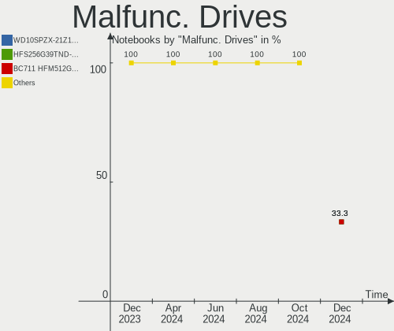
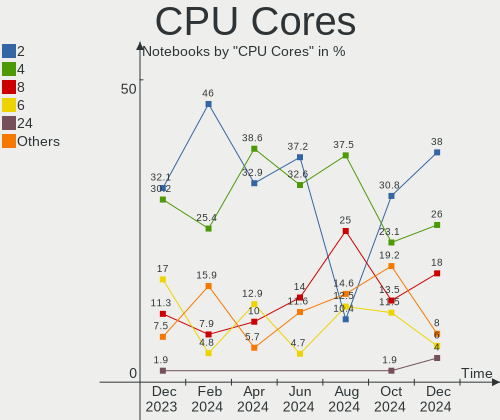
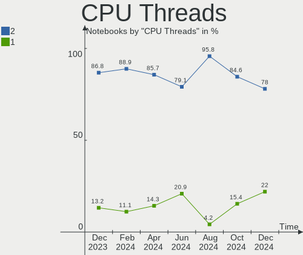
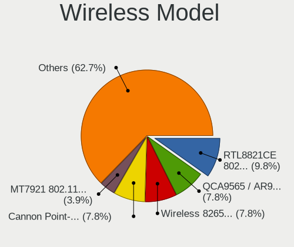
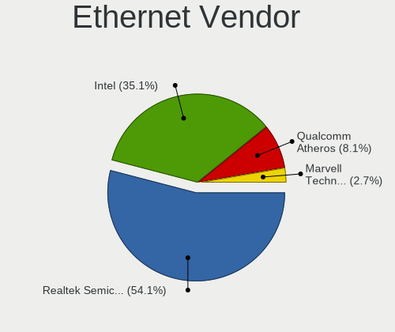
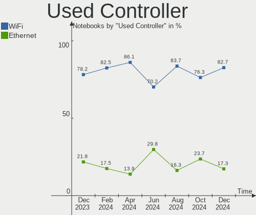
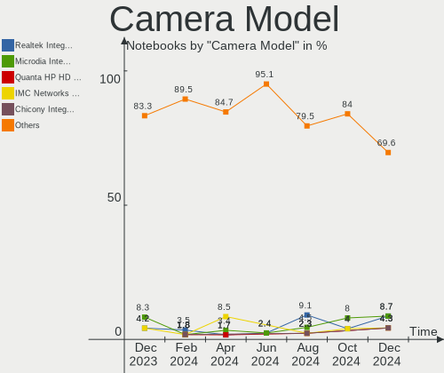
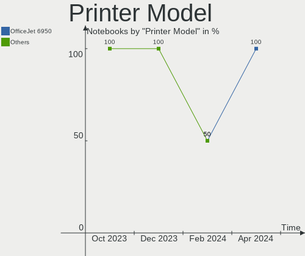

openSUSE Hardware Trends (Notebook)
-----------------------------------

A project to identify most popular hardware characteristics and track their change
over time based on data collected by openSUSE users at https://Linux-Hardware.org.

Anyone can contribute to the study by uploading probes of their computers by
the [hw-probe](https://github.com/linuxhw/hw-probe) tool:

    sudo -E hw-probe -all -upload

Full-feature report is available here: https://linux-hardware.org/?view=trends&formfactor=notebook

Period: May, 2021.

Contents
--------

- [ OS                       ](#os)
- [ OS Family                ](#os-family)
- [ Kernel                   ](#kernel)
- [ Kernel Family            ](#kernel-family)
- [ Kernel Major Ver.        ](#kernel-major-ver)
- [ Arch                     ](#arch)
- [ DE                       ](#de)
- [ Display Server           ](#display-server)
- [ Display Manager          ](#display-manager)
- [ OS Lang                  ](#os-lang)
- [ Boot Mode                ](#boot-mode)
- [ Filesystem               ](#filesystem)
- [ Part. scheme             ](#part-scheme)
- [ Dual Boot with Linux/BSD ](#dual-boot-with-linux/bsd)
- [ Dual Boot (Win)          ](#dual-boot-win)
- [ Country                  ](#country)
- [ City                     ](#city)
- [ Vendor                   ](#vendor)
- [ Model                    ](#model)
- [ Model Family             ](#model-family)
- [ MFG Year                 ](#mfg-year)
- [ Form Factor              ](#form-factor)
- [ Secure Boot              ](#secure-boot)
- [ Coreboot                 ](#coreboot)
- [ RAM Size                 ](#ram-size)
- [ RAM Used                 ](#ram-used)
- [ Has CD-ROM               ](#has-cd-rom)
- [ Total Drives             ](#total-drives)
- [ Has Ethernet             ](#has-ethernet)
- [ Has WiFi                 ](#has-wifi)
- [ Has Bluetooth            ](#has-bluetooth)
- [ Drive Vendor             ](#drive-vendor)
- [ Drive Model              ](#drive-model)
- [ HDD Vendor               ](#hdd-vendor)
- [ SSD Vendor               ](#ssd-vendor)
- [ Drive Kind               ](#drive-kind)
- [ Drive Connector          ](#drive-connector)
- [ Drive Size               ](#drive-size)
- [ Space Total              ](#space-total)
- [ Space Used               ](#space-used)
- [ Malfunc. Drives          ](#malfunc-drives)
- [ Malfunc. Drive Vendor    ](#malfunc-drive-vendor)
- [ Malfunc. HDD Vendor      ](#malfunc-hdd-vendor)
- [ Malfunc. Drive Kind      ](#malfunc-drive-kind)
- [ Failed Drives            ](#failed-drives)
- [ Failed Drive Vendor      ](#failed-drive-vendor)
- [ Drive Status             ](#drive-status)
- [ Storage Vendor           ](#storage-vendor)
- [ Storage Model            ](#storage-model)
- [ Storage Kind             ](#storage-kind)
- [ CPU Vendor               ](#cpu-vendor)
- [ CPU Model                ](#cpu-model)
- [ CPU Model Family         ](#cpu-model-family)
- [ CPU Cores                ](#cpu-cores)
- [ CPU Sockets              ](#cpu-sockets)
- [ CPU Threads              ](#cpu-threads)
- [ CPU Op-Modes             ](#cpu-op-modes)
- [ CPU Microcode            ](#cpu-microcode)
- [ CPU Microarch            ](#cpu-microarch)
- [ GPU Vendor               ](#gpu-vendor)
- [ GPU Model                ](#gpu-model)
- [ GPU Combo                ](#gpu-combo)
- [ GPU Driver               ](#gpu-driver)
- [ GPU Memory               ](#gpu-memory)
- [ Monitor Vendor           ](#monitor-vendor)
- [ Monitor Model            ](#monitor-model)
- [ Monitor Resolution       ](#monitor-resolution)
- [ Monitor Diagonal         ](#monitor-diagonal)
- [ Monitor Width            ](#monitor-width)
- [ Aspect Ratio             ](#aspect-ratio)
- [ Monitor Area             ](#monitor-area)
- [ Pixel Density            ](#pixel-density)
- [ Multiple Monitors        ](#multiple-monitors)
- [ Net Controller Vendor    ](#net-controller-vendor)
- [ Net Controller Model     ](#net-controller-model)
- [ Wireless Vendor          ](#wireless-vendor)
- [ Wireless Model           ](#wireless-model)
- [ Ethernet Vendor          ](#ethernet-vendor)
- [ Ethernet Model           ](#ethernet-model)
- [ Net Controller Kind      ](#net-controller-kind)
- [ Used Controller          ](#used-controller)
- [ NICs                     ](#nics)
- [ IPv6                     ](#ipv6)
- [ Memory Vendor            ](#memory-vendor)
- [ Memory Model             ](#memory-model)
- [ Memory Kind              ](#memory-kind)
- [ Memory Form Factor       ](#memory-form-factor)
- [ Memory Size              ](#memory-size)
- [ Memory Speed             ](#memory-speed)
- [ Sound Vendor             ](#sound-vendor)
- [ Sound Model              ](#sound-model)
- [ Camera Vendor            ](#camera-vendor)
- [ Camera Model             ](#camera-model)
- [ Fingerprint Vendor       ](#fingerprint-vendor)
- [ Fingerprint Model        ](#fingerprint-model)
- [ Chipcard Vendor          ](#chipcard-vendor)
- [ Chipcard Model           ](#chipcard-model)
- [ Printer Vendor           ](#printer-vendor)
- [ Printer Model            ](#printer-model)
- [ Scanner Vendor           ](#scanner-vendor)
- [ Scanner Model            ](#scanner-model)
- [ Bluetooth Vendor         ](#bluetooth-vendor)
- [ Bluetooth Model          ](#bluetooth-model)
- [ Unsupported Devices      ](#unsupported-devices)
- [ Unsupported Device Types ](#unsupported-device-types)

OS
--

Installed operating systems

| Name                         | Notebooks | Percent |
|------------------------------|-----------|---------|
| openSUSE Leap-15.2           | 7         | 29.17%  |
| openSUSE Leap-15.3           | 3         | 12.5%   |
| openSUSE 20210524            | 3         | 12.5%   |
| openSUSE Tumbleweed-20210522 | 2         | 8.33%   |
| openSUSE Tumbleweed-20210510 | 1         | 4.17%   |
| openSUSE Tumbleweed-20210506 | 1         | 4.17%   |
| openSUSE Tumbleweed-20210504 | 1         | 4.17%   |
| openSUSE Microos-20210414    | 1         | 4.17%   |
| openSUSE Microos-20210321    | 1         | 4.17%   |
| openSUSE Leap-15.1           | 1         | 4.17%   |
| openSUSE 20210517            | 1         | 4.17%   |
| openSUSE 20210511            | 1         | 4.17%   |
| openSUSE 20210429            | 1         | 4.17%   |

OS Family
---------

OS without a version

| Name     | Notebooks | Percent |
|----------|-----------|---------|
| openSUSE | 24        | 100%    |

Kernel
------

Version of the Linux kernel

| Version                  | Notebooks | Percent |
|--------------------------|-----------|---------|
| 5.12.4-1-default         | 5         | 20.83%  |
| 5.3.18-lp152.75-default  | 4         | 16.67%  |
| 5.3.18-lp152.72-default  | 2         | 8.33%   |
| 5.12.0-2-default         | 2         | 8.33%   |
| 5.5.7-1.g1004bce-default | 1         | 4.17%   |
| 5.3.18-57-preempt        | 1         | 4.17%   |
| 5.3.18-57-default        | 1         | 4.17%   |
| 5.3.18-56-default        | 1         | 4.17%   |
| 5.12.3-1-default         | 1         | 4.17%   |
| 5.12.2-1-default         | 1         | 4.17%   |
| 5.12.1-uefi              | 1         | 4.17%   |
| 5.12.0-1-default         | 1         | 4.17%   |
| 5.11.6-1-default         | 1         | 4.17%   |
| 5.11.15-1-default        | 1         | 4.17%   |
| 5.11.12-1-default        | 1         | 4.17%   |

Kernel Family
-------------

Linux kernel without a distro release

| Version | Notebooks | Percent |
|---------|-----------|---------|
| 5.3.18  | 9         | 37.5%   |
| 5.12.4  | 5         | 20.83%  |
| 5.12.0  | 3         | 12.5%   |
| 5.5.7   | 1         | 4.17%   |
| 5.12.3  | 1         | 4.17%   |
| 5.12.2  | 1         | 4.17%   |
| 5.12.1  | 1         | 4.17%   |
| 5.11.6  | 1         | 4.17%   |
| 5.11.15 | 1         | 4.17%   |
| 5.11.12 | 1         | 4.17%   |

Kernel Major Ver.
-----------------

Linux kernel major version

| Version | Notebooks | Percent |
|---------|-----------|---------|
| 5.12    | 11        | 45.83%  |
| 5.3     | 9         | 37.5%   |
| 5.11    | 3         | 12.5%   |
| 5.5     | 1         | 4.17%   |

Arch
----

OS architecture (x86_64, i586, etc.)

| Name   | Notebooks | Percent |
|--------|-----------|---------|
| x86_64 | 24        | 100%    |

DE
--

Desktop Environment

| Name     | Notebooks | Percent |
|----------|-----------|---------|
| KDE5     | 6         | 25%     |
| KDE      | 6         | 25%     |
| XFCE     | 5         | 20.83%  |
| GNOME    | 5         | 20.83%  |
| LXDE     | 1         | 4.17%   |
| Cinnamon | 1         | 4.17%   |

Display Server
--------------

X11 or Wayland

| Name    | Notebooks | Percent |
|---------|-----------|---------|
| X11     | 18        | 75%     |
| Wayland | 6         | 25%     |

Display Manager
---------------

SDDM, LightDM, etc.

| Name    | Notebooks | Percent |
|---------|-----------|---------|
| Unknown | 12        | 50%     |
| LightDM | 7         | 29.17%  |
| SDDM    | 4         | 16.67%  |
| XDM     | 1         | 4.17%   |

OS Lang
-------

Language

| Lang    | Notebooks | Percent |
|---------|-----------|---------|
| en_US   | 11        | 45.83%  |
| POSIX   | 2         | 8.33%   |
| de_DE   | 2         | 8.33%   |
| zh_CN   | 1         | 4.17%   |
| ru_RU   | 1         | 4.17%   |
| pt_PT   | 1         | 4.17%   |
| pt_BR   | 1         | 4.17%   |
| it_IT   | 1         | 4.17%   |
| fi_FI   | 1         | 4.17%   |
| en_GB   | 1         | 4.17%   |
| de_AT   | 1         | 4.17%   |
| Unknown | 1         | 4.17%   |

Boot Mode
---------

EFI or BIOS

| Mode | Notebooks | Percent |
|------|-----------|---------|
| EFI  | 19        | 79.17%  |
| BIOS | 5         | 20.83%  |

Filesystem
----------

Type of filesystem

| Type  | Notebooks | Percent |
|-------|-----------|---------|
| Btrfs | 16        | 66.67%  |
| Ext4  | 6         | 25%     |
| Xfs   | 1         | 4.17%   |
| F2fs  | 1         | 4.17%   |

Part. scheme
------------

Scheme of partitioning

| Type    | Notebooks | Percent |
|---------|-----------|---------|
| GPT     | 11        | 45.83%  |
| Unknown | 11        | 45.83%  |
| MBR     | 2         | 8.33%   |

Dual Boot with Linux/BSD
------------------------

Hosting more than one Linux/BSD

| Dual boot | Notebooks | Percent |
|-----------|-----------|---------|
| No        | 22        | 91.67%  |
| Yes       | 2         | 8.33%   |

Dual Boot (Win)
---------------

Hosting Linux and Windows

| Dual boot | Notebooks | Percent |
|-----------|-----------|---------|
| No        | 18        | 75%     |
| Yes       | 6         | 25%     |

Country
-------

Geographic location (country)

| Country    | Notebooks | Percent |
|------------|-----------|---------|
| Germany    | 5         | 20.83%  |
| USA        | 2         | 8.33%   |
| Brazil     | 2         | 8.33%   |
| UK         | 1         | 4.17%   |
| Sweden     | 1         | 4.17%   |
| Serbia     | 1         | 4.17%   |
| Russia     | 1         | 4.17%   |
| Portugal   | 1         | 4.17%   |
| Poland     | 1         | 4.17%   |
| Peru       | 1         | 4.17%   |
| Italy      | 1         | 4.17%   |
| Finland    | 1         | 4.17%   |
| Czechia    | 1         | 4.17%   |
| Costa Rica | 1         | 4.17%   |
| China      | 1         | 4.17%   |
| Canada     | 1         | 4.17%   |
| Austria    | 1         | 4.17%   |
| Australia  | 1         | 4.17%   |

City
----

Geographic location (city)

| City                   | Notebooks | Percent |
|------------------------|-----------|---------|
| Zhuhai                 | 1         | 4.17%   |
| Yekaterinburg          | 1         | 4.17%   |
| Wolgast                | 1         | 4.17%   |
| Wickede                | 1         | 4.17%   |
| Umeå                  | 1         | 4.17%   |
| Twedt                  | 1         | 4.17%   |
| São Paulo             | 1         | 4.17%   |
| Sullana                | 1         | 4.17%   |
| Schlegel               | 1         | 4.17%   |
| Rio de Janeiro         | 1         | 4.17%   |
| Rendsburg              | 1         | 4.17%   |
| Prague                 | 1         | 4.17%   |
| Naranjo                | 1         | 4.17%   |
| Montreal               | 1         | 4.17%   |
| Milan                  | 1         | 4.17%   |
| Melbourne              | 1         | 4.17%   |
| Lisbon                 | 1         | 4.17%   |
| Letchworth Garden City | 1         | 4.17%   |
| Lansing                | 1         | 4.17%   |
| Järvenpää           | 1         | 4.17%   |
| Daly City              | 1         | 4.17%   |
| Bolszewo               | 1         | 4.17%   |
| Belgrade               | 1         | 4.17%   |
| Bad Zell               | 1         | 4.17%   |

Vendor
------

Motherboard manufacturer

| Name                | Notebooks | Percent |
|---------------------|-----------|---------|
| Lenovo              | 6         | 25%     |
| Hewlett-Packard     | 6         | 25%     |
| MSI                 | 2         | 8.33%   |
| ASUSTek Computer    | 2         | 8.33%   |
| TongFang            | 1         | 4.17%   |
| Sony                | 1         | 4.17%   |
| Samsung Electronics | 1         | 4.17%   |
| HUAWEI              | 1         | 4.17%   |
| Dell                | 1         | 4.17%   |
| Apple               | 1         | 4.17%   |
| Acer                | 1         | 4.17%   |
| Unknown             | 1         | 4.17%   |

Model
-----

Motherboard model

| Name                                        | Notebooks | Percent |
|---------------------------------------------|-----------|---------|
| TongFang GK7CP6S                            | 1         | 4.17%   |
| Sony VGN-Z570AN                             | 1         | 4.17%   |
| Samsung 355V4C/356V4C/3445VC/3545VC         | 1         | 4.17%   |
| MSI GS60 6QE                                | 1         | 4.17%   |
| MSI CR500                                   | 1         | 4.17%   |
| Lenovo V145-15AST 81MT                      | 1         | 4.17%   |
| Lenovo ThinkPad T480 20L5CTO1WW             | 1         | 4.17%   |
| Lenovo ThinkPad E15 20RD0015UK              | 1         | 4.17%   |
| Lenovo IdeaPad S340-15IML 81NA              | 1         | 4.17%   |
| Lenovo IdeaPad S145-15API 81V7              | 1         | 4.17%   |
| Lenovo IdeaPad 3 15IIL05 81WE               | 1         | 4.17%   |
| HUAWEI BOHK-WAX9X                           | 1         | 4.17%   |
| HP ZBook 17 G2                              | 1         | 4.17%   |
| HP ProBook 430 G2                           | 1         | 4.17%   |
| HP Pavilion Laptop 15-eg0xxx                | 1         | 4.17%   |
| HP Laptop 17-ca3xxx                         | 1         | 4.17%   |
| HP EliteBook 8570p                          | 1         | 4.17%   |
| HP EliteBook 850 G1                         | 1         | 4.17%   |
| Dell Inspiron 5584                          | 1         | 4.17%   |
| ASUS X55CR                                  | 1         | 4.17%   |
| ASUS VivoBook 12_ASUS Laptop E203MAS_E203MA | 1         | 4.17%   |
| Apple MacBookPro10,2                        | 1         | 4.17%   |
| Acer Aspire A315-53                         | 1         | 4.17%   |
| Unknown                                     | 1         | 4.17%   |

Model Family
------------

Motherboard model prefix

| Name               | Notebooks | Percent |
|--------------------|-----------|---------|
| Lenovo IdeaPad     | 3         | 12.5%   |
| Lenovo ThinkPad    | 2         | 8.33%   |
| HP EliteBook       | 2         | 8.33%   |
| TongFang GK7CP6S   | 1         | 4.17%   |
| Sony VGN-Z570AN    | 1         | 4.17%   |
| Samsung 355V4C     | 1         | 4.17%   |
| MSI GS60           | 1         | 4.17%   |
| MSI CR500          | 1         | 4.17%   |
| Lenovo V145-15AST  | 1         | 4.17%   |
| HUAWEI BOHK-WAX9X  | 1         | 4.17%   |
| HP ZBook           | 1         | 4.17%   |
| HP ProBook         | 1         | 4.17%   |
| HP Pavilion        | 1         | 4.17%   |
| HP Laptop          | 1         | 4.17%   |
| Dell Inspiron      | 1         | 4.17%   |
| ASUS X55CR         | 1         | 4.17%   |
| ASUS VivoBook      | 1         | 4.17%   |
| Apple MacBookPro10 | 1         | 4.17%   |
| Acer Aspire        | 1         | 4.17%   |
| Unknown            | 1         | 4.17%   |

MFG Year
--------

Motherboard manufacture year

| Year | Notebooks | Percent |
|------|-----------|---------|
| 2020 | 8         | 33.33%  |
| 2019 | 6         | 25%     |
| 2021 | 3         | 12.5%   |
| 2018 | 3         | 12.5%   |
| 2013 | 2         | 8.33%   |
| 2009 | 2         | 8.33%   |

Form Factor
-----------

Physical design of the computer

| Name     | Notebooks | Percent |
|----------|-----------|---------|
| Notebook | 24        | 100%    |

Secure Boot
-----------

Enabled or disabled

| State    | Notebooks | Percent |
|----------|-----------|---------|
| Disabled | 23        | 95.83%  |
| Enabled  | 1         | 4.17%   |

Coreboot
--------

Have coreboot on board

| Used | Notebooks | Percent |
|------|-----------|---------|
| No   | 24        | 100%    |

RAM Size
--------

Total RAM memory

| Size in GB | Notebooks | Percent |
|------------|-----------|---------|
| 4.01-8.0   | 8         | 33.33%  |
| 3.01-4.0   | 6         | 25%     |
| 32.01-64.0 | 4         | 16.67%  |
| 8.01-16.0  | 3         | 12.5%   |
| 16.01-24.0 | 2         | 8.33%   |
| 2.01-3.0   | 1         | 4.17%   |

RAM Used
--------

Used RAM memory

| Used GB   | Notebooks | Percent |
|-----------|-----------|---------|
| 1.01-2.0  | 9         | 37.5%   |
| 4.01-8.0  | 5         | 20.83%  |
| 3.01-4.0  | 4         | 16.67%  |
| 2.01-3.0  | 4         | 16.67%  |
| 8.01-16.0 | 1         | 4.17%   |
| 0.51-1.0  | 1         | 4.17%   |

Has CD-ROM
----------

Has CD-ROM on board

| Presented | Notebooks | Percent |
|-----------|-----------|---------|
| No        | 16        | 66.67%  |
| Yes       | 8         | 33.33%  |

Total Drives
------------

Number of drives on board

| Drives | Notebooks | Percent |
|--------|-----------|---------|
| 2      | 12        | 50%     |
| 1      | 11        | 45.83%  |
| 3      | 1         | 4.17%   |

Has Ethernet
------------

Has Ethernet on board

| Presented | Notebooks | Percent |
|-----------|-----------|---------|
| Yes       | 17        | 70.83%  |
| No        | 7         | 29.17%  |

Has WiFi
--------

Has WiFi module

| Presented | Notebooks | Percent |
|-----------|-----------|---------|
| Yes       | 24        | 100%    |

Has Bluetooth
-------------

Has Bluetooth module

| Presented | Notebooks | Percent |
|-----------|-----------|---------|
| Yes       | 22        | 91.67%  |
| No        | 2         | 8.33%   |

Drive Vendor
------------

Hard drive vendors

| Vendor              | Notebooks | Drives | Percent |
|---------------------|-----------|--------|---------|
| Samsung Electronics | 8         | 8      | 21.62%  |
| Seagate             | 5         | 5      | 13.51%  |
| WDC                 | 3         | 3      | 8.11%   |
| Unknown             | 3         | 3      | 8.11%   |
| Toshiba             | 3         | 3      | 8.11%   |
| LITEON              | 2         | 2      | 5.41%   |
| HGST                | 2         | 2      | 5.41%   |
| ShanDianZhe         | 1         | 1      | 2.7%    |
| SanDisk             | 1         | 1      | 2.7%    |
| OYEN                | 1         | 1      | 2.7%    |
| Micron Technology   | 1         | 1      | 2.7%    |
| Maxtor              | 1         | 1      | 2.7%    |
| KIOXIA              | 1         | 1      | 2.7%    |
| Intel               | 1         | 1      | 2.7%    |
| Hitachi             | 1         | 1      | 2.7%    |
| GOODRAM             | 1         | 1      | 2.7%    |
| Crucial             | 1         | 1      | 2.7%    |
| A-DATA Technology   | 1         | 2      | 2.7%    |

Drive Model
-----------

Hard drive models

| Model                                | Notebooks | Percent |
|--------------------------------------|-----------|---------|
| WDC WDS500G2B0A-00SM50 500GB SSD     | 1         | 2.7%    |
| WDC WD5000LPLX-66ZNTT1 500GB         | 1         | 2.7%    |
| WDC PC SN730 SDBPNTY-256G-1027 256GB | 1         | 2.7%    |
| Unknown SD01G  1GB                   | 1         | 2.7%    |
| Unknown SD/MMC/MS PRO 8GB            | 1         | 2.7%    |
| Unknown DA4064  64GB                 | 1         | 2.7%    |
| Toshiba THNSNJ256G8NU 256GB SSD      | 1         | 2.7%    |
| Toshiba NVMe SSD Drive 256GB         | 1         | 2.7%    |
| Toshiba MQ04ABF100 1TB               | 1         | 2.7%    |
| ShanDianZhe SSD 256GB                | 1         | 2.7%    |
| Seagate ST500LM021-1KJ152 500GB      | 1         | 2.7%    |
| Seagate ST2000LM015-2E8174 2TB       | 1         | 2.7%    |
| Seagate ST1000LX015-1U7172 1TB       | 1         | 2.7%    |
| Seagate ST1000LM035-1RK172 1TB       | 1         | 2.7%    |
| Seagate ST1000LM024 HN-M101MBB 1TB   | 1         | 2.7%    |
| SanDisk Ultra II 480GB SSD           | 1         | 2.7%    |
| Samsung SSD 970 EVO Plus 500GB       | 1         | 2.7%    |
| Samsung SSD 850 EVO 1TB              | 1         | 2.7%    |
| Samsung NVMe SSD Drive 512GB         | 1         | 2.7%    |
| Samsung NVMe SSD Drive 256GB         | 1         | 2.7%    |
| Samsung MZVLQ256HAJD-000H1 256GB     | 1         | 2.7%    |
| Samsung MZALQ256HAJD-000L1 256GB     | 1         | 2.7%    |
| Samsung MZ7LN256HAJQ-000L2 256GB SSD | 1         | 2.7%    |
| Samsung HM120JI 120GB                | 1         | 2.7%    |
| OYEN MINIPRO 3.1 250GB               | 1         | 2.7%    |
| Micron 1100_MTFDDAV256TBN 256GB SSD  | 1         | 2.7%    |
| Maxtor Z1 SSD 240GB                  | 1         | 2.7%    |
| LITEON LCH-128V2S-HP 128GB SSD       | 1         | 2.7%    |
| LITEON CX1-JB256-HP 256GB SSD        | 1         | 2.7%    |
| KIOXIA NVMe SSD Drive 256GB          | 1         | 2.7%    |
| Intel NVMe SSD Drive 512GB           | 1         | 2.7%    |
| Hitachi HTS542525K9SA00 250GB        | 1         | 2.7%    |
| HGST HTS725050A7E630 500GB           | 1         | 2.7%    |
| HGST HTS721010A9E630 1TB             | 1         | 2.7%    |
| GOODRAM SSD 120GB                    | 1         | 2.7%    |
| Crucial CT2000BX500SSD1 2TB          | 1         | 2.7%    |
| A-DATA SX6000PNP 512GB               | 1         | 2.7%    |

HDD Vendor
----------

Hard disk drive vendors

| Vendor              | Notebooks | Drives | Percent |
|---------------------|-----------|--------|---------|
| Seagate             | 5         | 5      | 45.45%  |
| HGST                | 2         | 2      | 18.18%  |
| WDC                 | 1         | 1      | 9.09%   |
| Toshiba             | 1         | 1      | 9.09%   |
| Samsung Electronics | 1         | 1      | 9.09%   |
| Hitachi             | 1         | 1      | 9.09%   |

SSD Vendor
----------

Solid state drive vendors

| Vendor              | Notebooks | Drives | Percent |
|---------------------|-----------|--------|---------|
| Samsung Electronics | 2         | 2      | 16.67%  |
| LITEON              | 2         | 2      | 16.67%  |
| WDC                 | 1         | 1      | 8.33%   |
| Toshiba             | 1         | 1      | 8.33%   |
| ShanDianZhe         | 1         | 1      | 8.33%   |
| SanDisk             | 1         | 1      | 8.33%   |
| Micron Technology   | 1         | 1      | 8.33%   |
| Maxtor              | 1         | 1      | 8.33%   |
| GOODRAM             | 1         | 1      | 8.33%   |
| Crucial             | 1         | 1      | 8.33%   |

Drive Kind
----------

HDD or SSD

| Kind    | Notebooks | Drives | Percent |
|---------|-----------|--------|---------|
| SSD     | 11        | 12     | 30.56%  |
| HDD     | 11        | 11     | 30.56%  |
| NVMe    | 10        | 11     | 27.78%  |
| MMC     | 2         | 2      | 5.56%   |
| Unknown | 2         | 2      | 5.56%   |

Drive Connector
---------------

SATA, SAS, NVMe, etc.

| Type | Notebooks | Drives | Percent |
|------|-----------|--------|---------|
| SATA | 18        | 23     | 56.25%  |
| NVMe | 10        | 11     | 31.25%  |
| SAS  | 2         | 2      | 6.25%   |
| MMC  | 2         | 2      | 6.25%   |

Drive Size
----------

Size of hard drive

| Size in TB | Notebooks | Drives | Percent |
|------------|-----------|--------|---------|
| 0.01-0.5   | 12        | 15     | 60%     |
| 0.51-1.0   | 6         | 6      | 30%     |
| 1.01-2.0   | 2         | 2      | 10%     |

Space Total
-----------

Amount of disk space available on the file system

| Size in GB     | Notebooks | Percent |
|----------------|-----------|---------|
| 501-1000       | 6         | 25%     |
| 2001-3000      | 5         | 20.83%  |
| 1001-2000      | 5         | 20.83%  |
| More than 3000 | 3         | 12.5%   |
| 251-500        | 3         | 12.5%   |
| 101-250        | 1         | 4.17%   |
| 51-100         | 1         | 4.17%   |

Space Used
----------

Amount of used disk space

| Used GB        | Notebooks | Percent |
|----------------|-----------|---------|
| 251-500        | 5         | 20.83%  |
| 501-1000       | 5         | 20.83%  |
| 51-100         | 5         | 20.83%  |
| 101-250        | 4         | 16.67%  |
| 1-20           | 3         | 12.5%   |
| More than 3000 | 1         | 4.17%   |
| 21-50          | 1         | 4.17%   |

Malfunc. Drives
---------------

Drive models with a malfunction

| Model                               | Notebooks | Drives | Percent |
|-------------------------------------|-----------|--------|---------|
| Seagate ST500LM021-1KJ152 500GB     | 1         | 1      | 25%     |
| Samsung Electronics SSD 850 EVO 1TB | 1         | 1      | 25%     |
| Samsung Electronics HM120JI 120GB   | 1         | 1      | 25%     |
| HGST HTS725050A7E630 500GB          | 1         | 1      | 25%     |

Malfunc. Drive Vendor
---------------------

Vendors of faulty drives

| Vendor              | Notebooks | Drives | Percent |
|---------------------|-----------|--------|---------|
| Samsung Electronics | 2         | 2      | 50%     |
| Seagate             | 1         | 1      | 25%     |
| HGST                | 1         | 1      | 25%     |

Malfunc. HDD Vendor
-------------------

Vendors of faulty HDD drives

| Vendor              | Notebooks | Drives | Percent |
|---------------------|-----------|--------|---------|
| Seagate             | 1         | 1      | 33.33%  |
| Samsung Electronics | 1         | 1      | 33.33%  |
| HGST                | 1         | 1      | 33.33%  |

Malfunc. Drive Kind
-------------------

Kinds of faulty drives

| Kind | Notebooks | Drives | Percent |
|------|-----------|--------|---------|
| HDD  | 3         | 3      | 75%     |
| SSD  | 1         | 1      | 25%     |

Failed Drives
-------------

Failed drive models

Zero info for selected period =(

Failed Drive Vendor
-------------------

Failed drive vendors

Zero info for selected period =(

Drive Status
------------

Number of failed and malfunc. drives

| Status   | Notebooks | Drives | Percent |
|----------|-----------|--------|---------|
| Detected | 13        | 19     | 50%     |
| Works    | 9         | 15     | 34.62%  |
| Malfunc  | 4         | 4      | 15.38%  |

Storage Vendor
--------------

Storage controller vendors

| Vendor                       | Notebooks | Percent |
|------------------------------|-----------|---------|
| Intel                        | 17        | 51.52%  |
| Samsung Electronics          | 5         | 15.15%  |
| AMD                          | 5         | 15.15%  |
| Toshiba America Info Systems | 1         | 3.03%   |
| Sandisk                      | 1         | 3.03%   |
| Realtek Semiconductor        | 1         | 3.03%   |
| Nvidia                       | 1         | 3.03%   |
| Lite-On Technology           | 1         | 3.03%   |
| KIOXIA                       | 1         | 3.03%   |

Storage Model
-------------

Storage controller models

| Model                                                                          | Notebooks | Percent |
|--------------------------------------------------------------------------------|-----------|---------|
| AMD FCH SATA Controller [AHCI mode]                                            | 5         | 15.15%  |
| Samsung NVMe Controller                                                        | 3         | 9.09%   |
| Intel 7 Series Chipset Family 6-port SATA Controller [AHCI mode]               | 3         | 9.09%   |
| Samsung NVMe SSD Controller SM981/PM981/PM983                                  | 2         | 6.06%   |
| Intel Comet Lake SATA AHCI Controller                                          | 2         | 6.06%   |
| Toshiba America Info Systems BG3 NVMe SSD Controller                           | 1         | 3.03%   |
| Sandisk WD Black SN750 / PC SN730 NVMe SSD                                     | 1         | 3.03%   |
| Realtek Realtek Non-Volatile memory controller                                 | 1         | 3.03%   |
| Nvidia MCP79 AHCI Controller                                                   | 1         | 3.03%   |
| Lite-On SATA controller                                                        | 1         | 3.03%   |
| KIOXIA Non-Volatile memory controller                                          | 1         | 3.03%   |
| Intel Wildcat Point-LP SATA Controller [AHCI Mode]                             | 1         | 3.03%   |
| Intel Volume Management Device NVMe RAID Controller                            | 1         | 3.03%   |
| Intel Sunrise Point-LP SATA Controller [AHCI mode]                             | 1         | 3.03%   |
| Intel SSD 660P Series                                                          | 1         | 3.03%   |
| Intel Ice Lake-LP SATA Controller [AHCI mode]                                  | 1         | 3.03%   |
| Intel HM170/QM170 Chipset SATA Controller [AHCI Mode]                          | 1         | 3.03%   |
| Intel Celeron N3350/Pentium N4200/Atom E3900 Series SATA AHCI Controller       | 1         | 3.03%   |
| Intel Cannon Point-LP SATA Controller [AHCI Mode]                              | 1         | 3.03%   |
| Intel Cannon Lake Mobile PCH SATA AHCI Controller                              | 1         | 3.03%   |
| Intel 82801IBM/IEM (ICH9M/ICH9M-E) 4 port SATA Controller [AHCI mode]          | 1         | 3.03%   |
| Intel 8 Series/C220 Series Chipset Family 6-port SATA Controller 1 [AHCI mode] | 1         | 3.03%   |
| Intel 8 Series SATA Controller 1 [AHCI mode]                                   | 1         | 3.03%   |

Storage Kind
------------

Kind of storage controller (IDE, SATA, NVMe, SAS, ...)

| Kind | Notebooks | Percent |
|------|-----------|---------|
| SATA | 21        | 65.63%  |
| NVMe | 10        | 31.25%  |
| RAID | 1         | 3.13%   |

CPU Vendor
----------

Processor vendors

| Vendor | Notebooks | Percent |
|--------|-----------|---------|
| Intel  | 19        | 79.17%  |
| AMD    | 5         | 20.83%  |

CPU Model
---------

Processor models

| Model                                         | Notebooks | Percent |
|-----------------------------------------------|-----------|---------|
| Intel Core i7-10510U CPU @ 1.80GHz            | 2         | 8.33%   |
| Intel Core i7-9750H CPU @ 2.60GHz             | 1         | 4.17%   |
| Intel Core i7-8565U CPU @ 1.80GHz             | 1         | 4.17%   |
| Intel Core i7-6700HQ CPU @ 2.60GHz            | 1         | 4.17%   |
| Intel Core i7-4810MQ CPU @ 2.80GHz            | 1         | 4.17%   |
| Intel Core i7-3520M CPU @ 2.90GHz             | 1         | 4.17%   |
| Intel Core i5-8250U CPU @ 1.60GHz             | 1         | 4.17%   |
| Intel Core i5-4200U CPU @ 1.60GHz             | 1         | 4.17%   |
| Intel Core i5-3230M CPU @ 2.60GHz             | 1         | 4.17%   |
| Intel Core i3-7020U CPU @ 2.30GHz             | 1         | 4.17%   |
| Intel Core i3-2370M CPU @ 2.40GHz             | 1         | 4.17%   |
| Intel Core i3-1005G1 CPU @ 1.20GHz            | 1         | 4.17%   |
| Intel Core 2 Duo CPU T5750 @ 2.00GHz          | 1         | 4.17%   |
| Intel Core 2 Duo CPU P8600 @ 2.40GHz          | 1         | 4.17%   |
| Intel Celeron N4000 CPU @ 1.10GHz             | 1         | 4.17%   |
| Intel Celeron CPU N3450 @ 1.10GHz             | 1         | 4.17%   |
| Intel Celeron 3205U @ 1.50GHz                 | 1         | 4.17%   |
| Intel 11th Gen Core i5-1135G7 @ 2.40GHz       | 1         | 4.17%   |
| AMD Ryzen 7 4700U with Radeon Graphics        | 1         | 4.17%   |
| AMD Ryzen 7 3700U with Radeon Vega Mobile Gfx | 1         | 4.17%   |
| AMD Ryzen 5 3500U with Radeon Vega Mobile Gfx | 1         | 4.17%   |
| AMD E2-1800 APU with Radeon HD Graphics       | 1         | 4.17%   |
| AMD A4-9125 RADEON R3, 4 COMPUTE CORES 2C+2G  | 1         | 4.17%   |

CPU Model Family
----------------

Processor model prefix

| Model            | Notebooks | Percent |
|------------------|-----------|---------|
| Intel Core i7    | 7         | 29.17%  |
| Intel Core i5    | 3         | 12.5%   |
| Intel Core i3    | 3         | 12.5%   |
| Intel Celeron    | 3         | 12.5%   |
| Intel Core 2 Duo | 2         | 8.33%   |
| AMD Ryzen 7      | 2         | 8.33%   |
| Other            | 1         | 4.17%   |
| AMD Ryzen 5      | 1         | 4.17%   |
| AMD E2           | 1         | 4.17%   |
| AMD A4           | 1         | 4.17%   |

CPU Cores
---------

Number of processor cores

| Number | Notebooks | Percent |
|--------|-----------|---------|
| 2      | 12        | 50%     |
| 4      | 10        | 41.67%  |
| 8      | 1         | 4.17%   |
| 6      | 1         | 4.17%   |

CPU Sockets
-----------

Number of sockets

| Number | Notebooks | Percent |
|--------|-----------|---------|
| 1      | 24        | 100%    |

CPU Threads
-----------

Threads per core (Hyper-Threading)

| Number | Notebooks | Percent |
|--------|-----------|---------|
| 2      | 16        | 66.67%  |
| 1      | 8         | 33.33%  |

CPU Op-Modes
------------

CPU Operation Modes (32-bit, 64-bit)

| Op mode        | Notebooks | Percent |
|----------------|-----------|---------|
| 32-bit, 64-bit | 24        | 100%    |

CPU Microcode
-------------

Microcode number

| Number     | Notebooks | Percent |
|------------|-----------|---------|
| 0x806ec    | 2         | 8.33%   |
| 0x806ea    | 2         | 8.33%   |
| 0x906ea    | 1         | 4.17%   |
| 0x806eb    | 1         | 4.17%   |
| 0x806c1    | 1         | 4.17%   |
| 0x706e5    | 1         | 4.17%   |
| 0x706a1    | 1         | 4.17%   |
| 0x6fd      | 1         | 4.17%   |
| 0x506e3    | 1         | 4.17%   |
| 0x506c9    | 1         | 4.17%   |
| 0x40651    | 1         | 4.17%   |
| 0x306d4    | 1         | 4.17%   |
| 0x306c3    | 1         | 4.17%   |
| 0x306a9    | 1         | 4.17%   |
| 0x206a7    | 1         | 4.17%   |
| 0x10676    | 1         | 4.17%   |
| 0x08600106 | 1         | 4.17%   |
| 0x08108109 | 1         | 4.17%   |
| 0x08108102 | 1         | 4.17%   |
| 0x06006705 | 1         | 4.17%   |
| 0x05000119 | 1         | 4.17%   |
| Unknown    | 1         | 4.17%   |

CPU Microarch
-------------

Microarchitecture

| Name          | Notebooks | Percent |
|---------------|-----------|---------|
| KabyLake      | 6         | 25%     |
| Zen+          | 2         | 8.33%   |
| IvyBridge     | 2         | 8.33%   |
| Haswell       | 2         | 8.33%   |
| Zen 2         | 1         | 4.17%   |
| TigerLake     | 1         | 4.17%   |
| Skylake       | 1         | 4.17%   |
| SandyBridge   | 1         | 4.17%   |
| Penryn        | 1         | 4.17%   |
| IceLake       | 1         | 4.17%   |
| Goldmont plus | 1         | 4.17%   |
| Goldmont      | 1         | 4.17%   |
| Excavator     | 1         | 4.17%   |
| Core          | 1         | 4.17%   |
| Broadwell     | 1         | 4.17%   |
| Bobcat        | 1         | 4.17%   |

GPU Vendor
----------

Vendors of graphics cards

| Vendor | Notebooks | Percent |
|--------|-----------|---------|
| Intel  | 17        | 58.62%  |
| Nvidia | 6         | 20.69%  |
| AMD    | 6         | 20.69%  |

GPU Model
---------

Graphics card models

| Model                                                                     | Notebooks | Percent |
|---------------------------------------------------------------------------|-----------|---------|
| Intel CometLake-U GT2 [UHD Graphics]                                      | 2         | 6.9%    |
| AMD Picasso                                                               | 2         | 6.9%    |
| Nvidia TU116M [GeForce GTX 1660 Ti Mobile]                                | 1         | 3.45%   |
| Nvidia MCP79 [GeForce 8200M G]                                            | 1         | 3.45%   |
| Nvidia GP108M [GeForce MX230]                                             | 1         | 3.45%   |
| Nvidia GM204M [GeForce GTX 980M]                                          | 1         | 3.45%   |
| Nvidia GM204M [GeForce GTX 970M]                                          | 1         | 3.45%   |
| Nvidia G98M [GeForce 9300M GS]                                            | 1         | 3.45%   |
| Intel WhiskeyLake-U GT2 [UHD Graphics 620]                                | 1         | 3.45%   |
| Intel UHD Graphics 620                                                    | 1         | 3.45%   |
| Intel TigerLake-LP GT2 [Iris Xe Graphics]                                 | 1         | 3.45%   |
| Intel Mobile 4 Series Chipset Integrated Graphics Controller              | 1         | 3.45%   |
| Intel Iris Plus Graphics G1 (Ice Lake)                                    | 1         | 3.45%   |
| Intel HD Graphics 620                                                     | 1         | 3.45%   |
| Intel HD Graphics 530                                                     | 1         | 3.45%   |
| Intel HD Graphics 500                                                     | 1         | 3.45%   |
| Intel HD Graphics                                                         | 1         | 3.45%   |
| Intel Haswell-ULT Integrated Graphics Controller                          | 1         | 3.45%   |
| Intel GeminiLake [UHD Graphics 600]                                       | 1         | 3.45%   |
| Intel CoffeeLake-H GT2 [UHD Graphics 630]                                 | 1         | 3.45%   |
| Intel 4th Gen Core Processor Integrated Graphics Controller               | 1         | 3.45%   |
| Intel 3rd Gen Core processor Graphics Controller                          | 1         | 3.45%   |
| Intel 2nd Generation Core Processor Family Integrated Graphics Controller | 1         | 3.45%   |
| AMD Thames [Radeon HD 7550M/7570M/7650M]                                  | 1         | 3.45%   |
| AMD Stoney [Radeon R2/R3/R4/R5 Graphics]                                  | 1         | 3.45%   |
| AMD Seymour [Radeon HD 6400M/7400M Series]                                | 1         | 3.45%   |
| AMD Renoir                                                                | 1         | 3.45%   |

GPU Combo
---------

Combinations of graphics cards

| Name           | Notebooks | Percent |
|----------------|-----------|---------|
| 1 x Intel      | 13        | 54.17%  |
| 1 x AMD        | 6         | 25%     |
| Intel + Nvidia | 4         | 16.67%  |
| 1 x Nvidia     | 1         | 4.17%   |

GPU Driver
----------

Free vs proprietary

| Driver      | Notebooks | Percent |
|-------------|-----------|---------|
| Free        | 21        | 87.5%   |
| Proprietary | 3         | 12.5%   |

GPU Memory
----------

Total video memory

| Size in GB | Notebooks | Percent |
|------------|-----------|---------|
| Unknown    | 16        | 66.67%  |
| 0.01-0.5   | 3         | 12.5%   |
| 0.51-1.0   | 2         | 8.33%   |
| 7.01-8.0   | 1         | 4.17%   |
| 5.01-6.0   | 1         | 4.17%   |
| 1.01-2.0   | 1         | 4.17%   |

Monitor Vendor
--------------

Monitor vendors

| Vendor              | Notebooks | Percent |
|---------------------|-----------|---------|
| AU Optronics        | 6         | 23.08%  |
| BOE                 | 5         | 19.23%  |
| LG Display          | 4         | 15.38%  |
| Chimei Innolux      | 4         | 15.38%  |
| Sony                | 1         | 3.85%   |
| Samsung Electronics | 1         | 3.85%   |
| Goldstar            | 1         | 3.85%   |
| Dell                | 1         | 3.85%   |
| CPT                 | 1         | 3.85%   |
| Apple               | 1         | 3.85%   |
| AOC                 | 1         | 3.85%   |

Monitor Model
-------------

Monitor models

| Model                                                                 | Notebooks | Percent |
|-----------------------------------------------------------------------|-----------|---------|
| BOE LCD Monitor BOE0812 1920x1080 344x194mm 15.5-inch                 | 2         | 7.69%   |
| Sony Nvidia Defaul t Flat Panel SNY06FA 1600x900 360x200mm 16.2-inch  | 1         | 3.85%   |
| Samsung Electronics LCD Monitor SDC424B 3840x2160 344x194mm 15.5-inch | 1         | 3.85%   |
| LG Display LCD Monitor LGD0615 1920x1080 382x215mm 17.3-inch          | 1         | 3.85%   |
| LG Display LCD Monitor LGD0521 1920x1080 309x174mm 14.0-inch          | 1         | 3.85%   |
| LG Display LCD Monitor LGD0354 1366x768 293x165mm 13.2-inch           | 1         | 3.85%   |
| LG Display LCD Monitor LGD0259 1920x1080 350x190mm 15.7-inch          | 1         | 3.85%   |
| Goldstar FULL HD GSM5B55 1920x1080 480x270mm 21.7-inch                | 1         | 3.85%   |
| Dell U3011 DEL4065 2560x1600 640x400mm 29.7-inch                      | 1         | 3.85%   |
| CPT LCD Monitor CPT14BF 1366x768 344x193mm 15.5-inch                  | 1         | 3.85%   |
| Chimei Innolux LCD Monitor CMN175E 1920x1080 381x214mm 17.2-inch      | 1         | 3.85%   |
| Chimei Innolux LCD Monitor CMN15F5 1920x1080 344x193mm 15.5-inch      | 1         | 3.85%   |
| Chimei Innolux LCD Monitor CMN15D5 1920x1080 340x190mm 15.3-inch      | 1         | 3.85%   |
| Chimei Innolux LCD Monitor CMN1523 1920x1080 344x193mm 15.5-inch      | 1         | 3.85%   |
| BOE LCD Monitor BOE08F2 1920x1080 310x174mm 14.0-inch                 | 1         | 3.85%   |
| BOE LCD Monitor BOE0872 1920x1080 344x194mm 15.5-inch                 | 1         | 3.85%   |
| BOE LCD Monitor BOE085E 1920x1080 344x194mm 15.5-inch                 | 1         | 3.85%   |
| AU Optronics LCD Monitor AUO71EC 1366x768 340x190mm 15.3-inch         | 1         | 3.85%   |
| AU Optronics LCD Monitor AUO34ED 1920x1080 340x190mm 15.3-inch        | 1         | 3.85%   |
| AU Optronics LCD Monitor AUO25ED 1920x1080 344x193mm 15.5-inch        | 1         | 3.85%   |
| AU Optronics LCD Monitor AUO22EC 1366x768 344x193mm 15.5-inch         | 1         | 3.85%   |
| AU Optronics LCD Monitor AUO225C 1366x768 256x144mm 11.6-inch         | 1         | 3.85%   |
| AU Optronics LCD Monitor AUO219D 1920x1080 381x214mm 17.2-inch        | 1         | 3.85%   |
| Apple Color LCD APPA014 2560x1600 286x179mm 13.3-inch                 | 1         | 3.85%   |
| AOC U3277 AOC3277 3840x2160 710x400mm 32.1-inch                       | 1         | 3.85%   |

Monitor Resolution
------------------

Monitor screen resolution

| Resolution      | Notebooks | Percent |
|-----------------|-----------|---------|
| 1920x1080 (FHD) | 15        | 57.69%  |
| 1366x768 (WXGA) | 5         | 19.23%  |
| 3840x2160 (4K)  | 3         | 11.54%  |
| 2560x1600       | 2         | 7.69%   |
| 1600x900 (HD+)  | 1         | 3.85%   |

Monitor Diagonal
----------------

Diagonal size in inches

| Inches | Notebooks | Percent |
|--------|-----------|---------|
| 15     | 14        | 53.85%  |
| 17     | 4         | 15.38%  |
| 14     | 2         | 7.69%   |
| 13     | 2         | 7.69%   |
| 32     | 1         | 3.85%   |
| 29     | 1         | 3.85%   |
| 21     | 1         | 3.85%   |
| 11     | 1         | 3.85%   |

Monitor Width
-------------

Physical width

| Width in mm | Notebooks | Percent |
|-------------|-----------|---------|
| 301-350     | 16        | 61.54%  |
| 351-400     | 4         | 15.38%  |
| 201-300     | 3         | 11.54%  |
| 701-800     | 1         | 3.85%   |
| 601-700     | 1         | 3.85%   |
| 401-500     | 1         | 3.85%   |

Aspect Ratio
------------

Proportional relationship between the width and the height

| Ratio | Notebooks | Percent |
|-------|-----------|---------|
| 16/9  | 22        | 91.67%  |
| 16/10 | 2         | 8.33%   |

Monitor Area
------------

Area in inch²

| Area in inch² | Notebooks | Percent |
|----------------|-----------|---------|
| 101-110        | 14        | 53.85%  |
| 121-130        | 4         | 15.38%  |
| 81-90          | 2         | 7.69%   |
| 71-80          | 2         | 7.69%   |
| 351-500        | 2         | 7.69%   |
| 51-60          | 1         | 3.85%   |
| 201-250        | 1         | 3.85%   |

Pixel Density
-------------

Pixels per inch

| Density       | Notebooks | Percent |
|---------------|-----------|---------|
| 121-160       | 16        | 64%     |
| 101-120       | 7         | 28%     |
| More than 240 | 1         | 4%      |
| 161-240       | 1         | 4%      |

Multiple Monitors
-----------------

Total monitors connected

| Total | Notebooks | Percent |
|-------|-----------|---------|
| 1     | 22        | 91.67%  |
| 2     | 2         | 8.33%   |

Net Controller Vendor
---------------------

Controller vendors

| Vendor                | Notebooks | Percent |
|-----------------------|-----------|---------|
| Intel                 | 12        | 35.29%  |
| Realtek Semiconductor | 10        | 29.41%  |
| Qualcomm Atheros      | 7         | 20.59%  |
| Broadcom              | 2         | 5.88%   |
| Ralink                | 1         | 2.94%   |
| Nvidia                | 1         | 2.94%   |
| D-Link                | 1         | 2.94%   |

Net Controller Model
--------------------

Controller models

| Model                                                             | Notebooks | Percent |
|-------------------------------------------------------------------|-----------|---------|
| Realtek RTL8111/8168/8411 PCI Express Gigabit Ethernet Controller | 6         | 13.95%  |
| Qualcomm Atheros QCA9377 802.11ac Wireless Network Adapter        | 4         | 9.3%    |
| Realtek RTL8821CE 802.11ac PCIe Wireless Network Adapter          | 2         | 4.65%   |
| Qualcomm Atheros AR9485 Wireless Network Adapter                  | 2         | 4.65%   |
| Intel Wi-Fi 6 AX200                                               | 2         | 4.65%   |
| Realtek RTL8822CE 802.11ac PCIe Wireless Network Adapter          | 1         | 2.33%   |
| Realtek RTL8723BE PCIe Wireless Network Adapter                   | 1         | 2.33%   |
| Realtek RTL8153 Gigabit Ethernet Adapter                          | 1         | 2.33%   |
| Realtek RTL8152 Fast Ethernet Adapter                             | 1         | 2.33%   |
| Realtek RTL810xE PCI Express Fast Ethernet controller             | 1         | 2.33%   |
| Ralink RT3090 Wireless 802.11n 1T/1R PCIe                         | 1         | 2.33%   |
| Qualcomm Atheros Killer E2400 Gigabit Ethernet Controller         | 1         | 2.33%   |
| Qualcomm Atheros AR8161 Gigabit Ethernet                          | 1         | 2.33%   |
| Nvidia MCP79 Ethernet                                             | 1         | 2.33%   |
| Intel Wireless 8265 / 8275                                        | 1         | 2.33%   |
| Intel Wireless 7260                                               | 1         | 2.33%   |
| Intel Wireless 3165                                               | 1         | 2.33%   |
| Intel WiFi Link 5100                                              | 1         | 2.33%   |
| Intel Wi-Fi 6 AX201                                               | 1         | 2.33%   |
| Intel Ice Lake-LP PCH CNVi WiFi                                   | 1         | 2.33%   |
| Intel Gemini Lake PCH CNVi WiFi                                   | 1         | 2.33%   |
| Intel Ethernet Connection I218-LM                                 | 1         | 2.33%   |
| Intel Ethernet Connection I217-LM                                 | 1         | 2.33%   |
| Intel Ethernet Connection (4) I219-V                              | 1         | 2.33%   |
| Intel Comet Lake PCH-LP CNVi WiFi                                 | 1         | 2.33%   |
| Intel Centrino Ultimate-N 6300                                    | 1         | 2.33%   |
| Intel 82579LM Gigabit Network Connection (Lewisville)             | 1         | 2.33%   |
| Intel 82567LM Gigabit Network Connection                          | 1         | 2.33%   |
| D-Link DWA-140 RangeBooster N Adapter(rev.B3) [Ralink RT5372]     | 1         | 2.33%   |
| Broadcom NetXtreme BCM57786 Gigabit Ethernet PCIe                 | 1         | 2.33%   |
| Broadcom BCM4331 802.11a/b/g/n                                    | 1         | 2.33%   |
| Broadcom BCM43228 802.11a/b/g/n                                   | 1         | 2.33%   |

Wireless Vendor
---------------

Wireless vendors

| Vendor                | Notebooks | Percent |
|-----------------------|-----------|---------|
| Intel                 | 11        | 44%     |
| Qualcomm Atheros      | 6         | 24%     |
| Realtek Semiconductor | 4         | 16%     |
| Broadcom              | 2         | 8%      |
| Ralink                | 1         | 4%      |
| D-Link                | 1         | 4%      |

Wireless Model
--------------

Wireless models

| Model                                                         | Notebooks | Percent |
|---------------------------------------------------------------|-----------|---------|
| Qualcomm Atheros QCA9377 802.11ac Wireless Network Adapter    | 4         | 16%     |
| Realtek RTL8821CE 802.11ac PCIe Wireless Network Adapter      | 2         | 8%      |
| Qualcomm Atheros AR9485 Wireless Network Adapter              | 2         | 8%      |
| Intel Wi-Fi 6 AX200                                           | 2         | 8%      |
| Realtek RTL8822CE 802.11ac PCIe Wireless Network Adapter      | 1         | 4%      |
| Realtek RTL8723BE PCIe Wireless Network Adapter               | 1         | 4%      |
| Ralink RT3090 Wireless 802.11n 1T/1R PCIe                     | 1         | 4%      |
| Intel Wireless 8265 / 8275                                    | 1         | 4%      |
| Intel Wireless 7260                                           | 1         | 4%      |
| Intel Wireless 3165                                           | 1         | 4%      |
| Intel WiFi Link 5100                                          | 1         | 4%      |
| Intel Wi-Fi 6 AX201                                           | 1         | 4%      |
| Intel Ice Lake-LP PCH CNVi WiFi                               | 1         | 4%      |
| Intel Gemini Lake PCH CNVi WiFi                               | 1         | 4%      |
| Intel Comet Lake PCH-LP CNVi WiFi                             | 1         | 4%      |
| Intel Centrino Ultimate-N 6300                                | 1         | 4%      |
| D-Link DWA-140 RangeBooster N Adapter(rev.B3) [Ralink RT5372] | 1         | 4%      |
| Broadcom BCM4331 802.11a/b/g/n                                | 1         | 4%      |
| Broadcom BCM43228 802.11a/b/g/n                               | 1         | 4%      |

Ethernet Vendor
---------------

Ethernet vendors

| Vendor                | Notebooks | Percent |
|-----------------------|-----------|---------|
| Realtek Semiconductor | 9         | 50%     |
| Intel                 | 5         | 27.78%  |
| Qualcomm Atheros      | 2         | 11.11%  |
| Nvidia                | 1         | 5.56%   |
| Broadcom              | 1         | 5.56%   |

Ethernet Model
--------------

Ethernet models

| Model                                                             | Notebooks | Percent |
|-------------------------------------------------------------------|-----------|---------|
| Realtek RTL8111/8168/8411 PCI Express Gigabit Ethernet Controller | 6         | 33.33%  |
| Realtek RTL8153 Gigabit Ethernet Adapter                          | 1         | 5.56%   |
| Realtek RTL8152 Fast Ethernet Adapter                             | 1         | 5.56%   |
| Realtek RTL810xE PCI Express Fast Ethernet controller             | 1         | 5.56%   |
| Qualcomm Atheros Killer E2400 Gigabit Ethernet Controller         | 1         | 5.56%   |
| Qualcomm Atheros AR8161 Gigabit Ethernet                          | 1         | 5.56%   |
| Nvidia MCP79 Ethernet                                             | 1         | 5.56%   |
| Intel Ethernet Connection I218-LM                                 | 1         | 5.56%   |
| Intel Ethernet Connection I217-LM                                 | 1         | 5.56%   |
| Intel Ethernet Connection (4) I219-V                              | 1         | 5.56%   |
| Intel 82579LM Gigabit Network Connection (Lewisville)             | 1         | 5.56%   |
| Intel 82567LM Gigabit Network Connection                          | 1         | 5.56%   |
| Broadcom NetXtreme BCM57786 Gigabit Ethernet PCIe                 | 1         | 5.56%   |

Net Controller Kind
-------------------

Ethernet, WiFi or modem

| Kind     | Notebooks | Percent |
|----------|-----------|---------|
| WiFi     | 24        | 58.54%  |
| Ethernet | 17        | 41.46%  |

Used Controller
---------------

Currently used network controller

| Kind     | Notebooks | Percent |
|----------|-----------|---------|
| WiFi     | 24        | 60%     |
| Ethernet | 16        | 40%     |

NICs
----

Total network controllers on board

| Total | Notebooks | Percent |
|-------|-----------|---------|
| 2     | 16        | 66.67%  |
| 1     | 8         | 33.33%  |

IPv6
----

IPv6 vs IPv4

| Used | Notebooks | Percent |
|------|-----------|---------|
| No   | 16        | 66.67%  |
| Yes  | 8         | 33.33%  |

Memory Vendor
-------------

Memory module vendors

| Vendor              | Notebooks | Percent |
|---------------------|-----------|---------|
| Samsung Electronics | 5         | 35.71%  |
| SK Hynix            | 3         | 21.43%  |
| Unknown (ABCD)      | 1         | 7.14%   |
| Unknown             | 1         | 7.14%   |
| Micron Technology   | 1         | 7.14%   |
| Kingston            | 1         | 7.14%   |
| Crucial             | 1         | 7.14%   |
| A-DATA Technology   | 1         | 7.14%   |

Memory Model
------------

Memory module models

| Model                                                          | Notebooks | Percent |
|----------------------------------------------------------------|-----------|---------|
| Unknown RAM Module 2048MB SODIMM 1067MT/s                      | 1         | 6.67%   |
| Unknown RAM Module 1024MB SODIMM 1067MT/s                      | 1         | 6.67%   |
| Unknown (ABCD) RAM 123456789012345678 3GB DIMM LPDDR3 2400MT/s | 1         | 6.67%   |
| SK Hynix RAM HYMP125S64CP8-S6 2GB SODIMM SDRAM 2048MT/s        | 1         | 6.67%   |
| SK Hynix RAM HMA851S6CJR6N-VK 4GB Row Of Chips DDR4 2667MT/s   | 1         | 6.67%   |
| SK Hynix RAM HMA41GS6AFR8N-TF 8GB SODIMM DDR4 2133MT/s         | 1         | 6.67%   |
| Samsung RAM M471B5173QH0-YK0 4GB SODIMM DDR3 1600MT/s          | 1         | 6.67%   |
| Samsung RAM M471B5173DB0-YK0 4096MB SODIMM DDR3 1600MT/s       | 1         | 6.67%   |
| Samsung RAM M471B1G73DB0-YK0 8192MB SODIMM DDR3 1600MT/s       | 1         | 6.67%   |
| Samsung RAM M471A1K43DB1-CTD 8192MB SODIMM DDR4 2667MT/s       | 1         | 6.67%   |
| Samsung RAM K4F6E3S4HM-MGCJ 4096MB SODIMM LPDDR4 3733MT/s      | 1         | 6.67%   |
| Micron RAM 4ATF51264HZ-2G3B1 4096MB SODIMM DDR4 2400MT/s       | 1         | 6.67%   |
| Kingston RAM KHX2666C15S4/16G 16384MB SODIMM DDR4 2667MT/s     | 1         | 6.67%   |
| Crucial RAM CT16G4SFD8266.M16FJ 16GB SODIMM DDR4 2667MT/s      | 1         | 6.67%   |
| A-DATA RAM AO1P26KC8T1-BXPS 8192MB SODIMM DDR4 2667MT/s        | 1         | 6.67%   |

Memory Kind
-----------

Memory module kinds

| Kind    | Notebooks | Percent |
|---------|-----------|---------|
| DDR4    | 7         | 50%     |
| DDR3    | 3         | 21.43%  |
| LPDDR4  | 2         | 14.29%  |
| SDRAM   | 1         | 7.14%   |
| Unknown | 1         | 7.14%   |

Memory Form Factor
------------------

Physical design of the memory module

| Name         | Notebooks | Percent |
|--------------|-----------|---------|
| SODIMM       | 12        | 85.71%  |
| Row Of Chips | 1         | 7.14%   |
| DIMM         | 1         | 7.14%   |

Memory Size
-----------

Memory module size

| Size  | Notebooks | Percent |
|-------|-----------|---------|
| 4096  | 5         | 33.33%  |
| 8192  | 4         | 26.67%  |
| 16384 | 3         | 20%     |
| 2048  | 2         | 13.33%  |
| 1024  | 1         | 6.67%   |

Memory Speed
------------

Memory module speed

| Speed | Notebooks | Percent |
|-------|-----------|---------|
| 2667  | 5         | 35.71%  |
| 1600  | 3         | 21.43%  |
| 2400  | 2         | 14.29%  |
| 3733  | 1         | 7.14%   |
| 2133  | 1         | 7.14%   |
| 2048  | 1         | 7.14%   |
| 1067  | 1         | 7.14%   |

Sound Vendor
------------

Sound card vendors

| Vendor                                          | Notebooks | Percent |
|-------------------------------------------------|-----------|---------|
| Intel                                           | 18        | 56.25%  |
| AMD                                             | 6         | 18.75%  |
| Nvidia                                          | 2         | 6.25%   |
| SAVITECH                                        | 1         | 3.13%   |
| Licensed by Sony Computer Entertainment America | 1         | 3.13%   |
| JMTek                                           | 1         | 3.13%   |
| Generalplus Technology                          | 1         | 3.13%   |
| FiiO Electronics Technology                     | 1         | 3.13%   |
| C-Media Electronics                             | 1         | 3.13%   |

Sound Model
-----------

Sound card models

| Model                                                                             | Notebooks | Percent |
|-----------------------------------------------------------------------------------|-----------|---------|
| Intel 7 Series/C216 Chipset Family High Definition Audio Controller               | 3         | 7.69%   |
| AMD Family 17h (Models 10h-1fh) HD Audio Controller                               | 3         | 7.69%   |
| Intel Sunrise Point-LP HD Audio                                                   | 2         | 5.13%   |
| Intel Comet Lake PCH-LP cAVS                                                      | 2         | 5.13%   |
| AMD Raven/Raven2/Fenghuang HDMI/DP Audio Controller                               | 2         | 5.13%   |
| SAVITECH ODAC-revB                                                                | 1         | 2.56%   |
| Nvidia TU116 High Definition Audio Controller                                     | 1         | 2.56%   |
| Nvidia MCP79 High Definition Audio                                                | 1         | 2.56%   |
| Licensed by Sony Computer Entertainment America Wireless Stereo Headset           | 1         | 2.56%   |
| JMTek audio controller                                                            | 1         | 2.56%   |
| Intel Wildcat Point-LP High Definition Audio Controller                           | 1         | 2.56%   |
| Intel Tiger Lake-LP Smart Sound Technology Audio Controller                       | 1         | 2.56%   |
| Intel Ice Lake-LP Smart Sound Technology Audio Controller                         | 1         | 2.56%   |
| Intel Haswell-ULT HD Audio Controller                                             | 1         | 2.56%   |
| Intel Celeron/Pentium Silver Processor High Definition Audio                      | 1         | 2.56%   |
| Intel Celeron N3350/Pentium N4200/Atom E3900 Series Audio Cluster                 | 1         | 2.56%   |
| Intel Cannon Point-LP High Definition Audio Controller                            | 1         | 2.56%   |
| Intel Cannon Lake PCH cAVS                                                        | 1         | 2.56%   |
| Intel Broadwell-U Audio Controller                                                | 1         | 2.56%   |
| Intel 82801I (ICH9 Family) HD Audio Controller                                    | 1         | 2.56%   |
| Intel 8 Series/C220 Series Chipset High Definition Audio Controller               | 1         | 2.56%   |
| Intel 8 Series HD Audio Controller                                                | 1         | 2.56%   |
| Intel 100 Series/C230 Series Chipset Family HD Audio Controller                   | 1         | 2.56%   |
| Generalplus Technology USB Audio Device                                           | 1         | 2.56%   |
| FiiO Electronics Technology FiiO Q1                                               | 1         | 2.56%   |
| C-Media Electronics Blue Snowball                                                 | 1         | 2.56%   |
| AMD Turks HDMI Audio [Radeon HD 6500/6600 / 6700M Series]                         | 1         | 2.56%   |
| AMD Renoir Radeon High Definition Audio Controller                                | 1         | 2.56%   |
| AMD High Definition Audio Controller                                              | 1         | 2.56%   |
| AMD FCH Azalia Controller                                                         | 1         | 2.56%   |
| AMD Family 15h (Models 60h-6fh) Audio Controller                                  | 1         | 2.56%   |
| AMD Caicos HDMI Audio [Radeon HD 6450 / 7450/8450/8490 OEM / R5 230/235/235X OEM] | 1         | 2.56%   |

Camera Vendor
-------------

Camera device vendors

| Vendor                                 | Notebooks | Percent |
|----------------------------------------|-----------|---------|
| Chicony Electronics                    | 7         | 29.17%  |
| IMC Networks                           | 4         | 16.67%  |
| Cheng Uei Precision Industry (Foxlink) | 3         | 12.5%   |
| Syntek                                 | 2         | 8.33%   |
| Microdia                               | 2         | 8.33%   |
| Acer                                   | 2         | 8.33%   |
| Ricoh                                  | 1         | 4.17%   |
| Quanta                                 | 1         | 4.17%   |
| Apple                                  | 1         | 4.17%   |
| Alcor Micro                            | 1         | 4.17%   |

Camera Model
------------

Camera device models

| Model                                                                    | Notebooks | Percent |
|--------------------------------------------------------------------------|-----------|---------|
| Syntek Integrated Camera                                                 | 2         | 8%      |
| Chicony HP HD Webcam                                                     | 2         | 8%      |
| Acer BisonCam, NB Pro                                                    | 2         | 8%      |
| Ricoh Sony Vaio Integrated Webcam                                        | 1         | 4%      |
| Quanta VGA WebCam                                                        | 1         | 4%      |
| Microdia WebCam SC-13HDL12639P                                           | 1         | 4%      |
| Microdia Integrated_Webcam_HD                                            | 1         | 4%      |
| Microdia Integrated Camera                                               | 1         | 4%      |
| IMC Networks USB2.0 VGA UVC WebCam                                       | 1         | 4%      |
| IMC Networks ov9734_azurewave_camera                                     | 1         | 4%      |
| IMC Networks Integrated Camera                                           | 1         | 4%      |
| IMC Networks EasyCamera                                                  | 1         | 4%      |
| Chicony UVC 1.00 device HD UVC WebCam                                    | 1         | 4%      |
| Chicony Integrated HP HD Webcam                                          | 1         | 4%      |
| Chicony Integrated Camera (1280x720@30)                                  | 1         | 4%      |
| Chicony Integrated Camera                                                | 1         | 4%      |
| Chicony HD Webcam                                                        | 1         | 4%      |
| Cheng Uei Precision Industry (Foxlink) HP Wide Vision HD Camera          | 1         | 4%      |
| Cheng Uei Precision Industry (Foxlink) HP TrueVision HD Camera           | 1         | 4%      |
| Cheng Uei Precision Industry (Foxlink) HP EliteBook integrated HD Webcam | 1         | 4%      |
| Apple FaceTime HD Camera (Built-in)                                      | 1         | 4%      |
| Alcor Micro USB 2.0 WebCamera                                            | 1         | 4%      |

Fingerprint Vendor
------------------

Fingerprint sensor vendors

| Vendor                     | Notebooks | Percent |
|----------------------------|-----------|---------|
| Validity Sensors           | 3         | 50%     |
| Shenzhen Goodix Technology | 2         | 33.33%  |
| Upek                       | 1         | 16.67%  |

Fingerprint Model
-----------------

Fingerprint sensor models

| Model                                                  | Notebooks | Percent |
|--------------------------------------------------------|-----------|---------|
| Validity Sensors VFS495 Fingerprint Reader             | 2         | 33.33%  |
| Shenzhen Goodix  Fingerprint Device                    | 2         | 33.33%  |
| Validity Sensors VFS491                                | 1         | 16.67%  |
| Upek Biometric Touchchip/Touchstrip Fingerprint Sensor | 1         | 16.67%  |

Chipcard Vendor
---------------

Chipcard module vendors

Zero info for selected period =(

Chipcard Model
--------------

Chipcard module models

Zero info for selected period =(

Printer Vendor
--------------

Printer device vendors

| Vendor      | Notebooks | Percent |
|-------------|-----------|---------|
| Seiko Epson | 1         | 100%    |

Printer Model
-------------

Printer device models

| Model                    | Notebooks | Percent |
|--------------------------|-----------|---------|
| Seiko Epson L3150 Series | 1         | 100%    |

Scanner Vendor
--------------

Scanner device vendors

Zero info for selected period =(

Scanner Model
-------------

Scanner device models

Zero info for selected period =(

Bluetooth Vendor
----------------

Controller vendors

| Vendor                          | Notebooks | Percent |
|---------------------------------|-----------|---------|
| Intel                           | 9         | 40.91%  |
| Qualcomm Atheros Communications | 4         | 18.18%  |
| Realtek Semiconductor           | 3         | 13.64%  |
| Broadcom                        | 2         | 9.09%   |
| Realtek                         | 1         | 4.55%   |
| Lite-On Technology              | 1         | 4.55%   |
| Apple                           | 1         | 4.55%   |
| Alps Electric                   | 1         | 4.55%   |

Bluetooth Model
---------------

Controller models

| Model                                          | Notebooks | Percent |
|------------------------------------------------|-----------|---------|
| Intel Bluetooth Device                         | 4         | 18.18%  |
| Realtek Bluetooth Radio                        | 3         | 13.64%  |
| Qualcomm Atheros  Bluetooth Device             | 3         | 13.64%  |
| Intel Bluetooth wireless interface             | 2         | 9.09%   |
| Intel AX200 Bluetooth                          | 2         | 9.09%   |
| Realtek Bluetooth Radio                        | 1         | 4.55%   |
| Qualcomm Atheros AR3012 Bluetooth 4.0          | 1         | 4.55%   |
| Lite-On Qualcomm Atheros QCA9377 Bluetooth     | 1         | 4.55%   |
| Intel Bluetooth 9460/9560 Jefferson Peak (JfP) | 1         | 4.55%   |
| Broadcom HP Portable SoftSailing               | 1         | 4.55%   |
| Broadcom HP Portable Bumble Bee                | 1         | 4.55%   |
| Apple Bluetooth Host Controller                | 1         | 4.55%   |
| Alps Electric BCM2046 Bluetooth Device         | 1         | 4.55%   |

Unsupported Devices
-------------------

Total unsupported devices on board

| Total | Notebooks | Percent |
|-------|-----------|---------|
| 0     | 17        | 70.83%  |
| 1     | 6         | 25%     |
| 2     | 1         | 4.17%   |

Unsupported Device Types
------------------------

Types of unsupported devices

| Type               | Notebooks | Percent |
|--------------------|-----------|---------|
| Fingerprint reader | 6         | 75%     |
| Net/ethernet       | 1         | 12.5%   |
| Graphics card      | 1         | 12.5%   |

