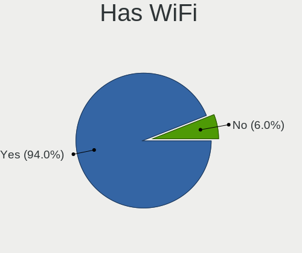
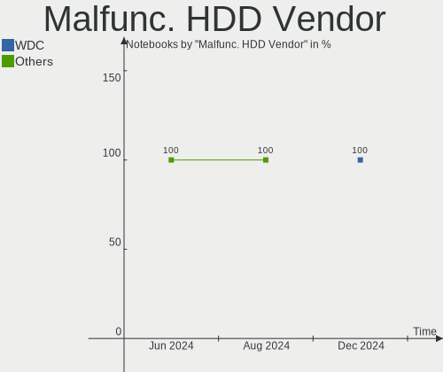
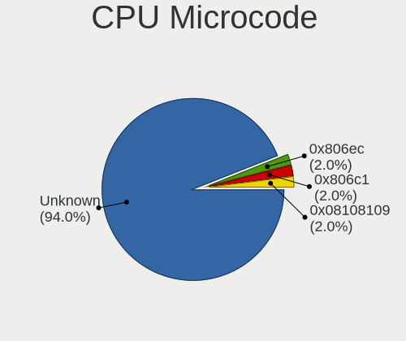
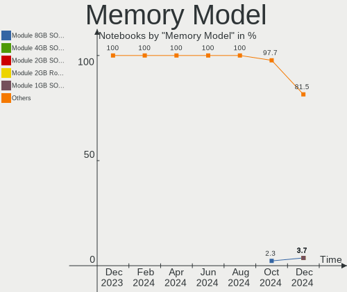
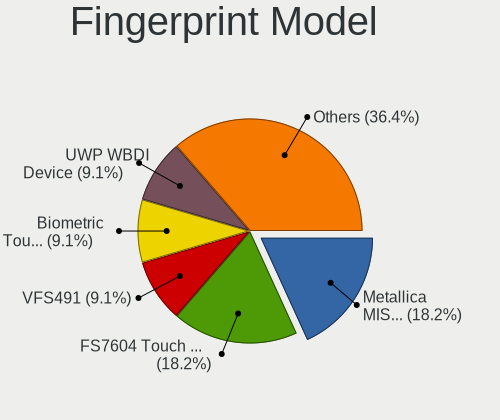

openSUSE - Hardware Trends (Notebooks)
--------------------------------------

A project to identify most popular hardware characteristics and track their change
over time based on data collected by Linux users at https://Linux-Hardware.org.

Anyone can contribute to this report by the [hw-probe](https://github.com/linuxhw/hw-probe) tool:

    sudo -E hw-probe -all -upload

This report is for one last month. Overall report since the beginning of time: [TestDays](https://github.com/linuxhw/TestDays)

Period: Jul, 2023.

Contents
--------

* [ System ](#system)
  - [ OS                       ](#os)
  - [ OS Family                ](#os-family)
  - [ Kernel                   ](#kernel)
  - [ Kernel Family            ](#kernel-family)
  - [ Kernel Major Ver.        ](#kernel-major-ver)
  - [ Arch                     ](#arch)
  - [ DE                       ](#de)
  - [ Display Server           ](#display-server)
  - [ Display Manager          ](#display-manager)
  - [ OS Lang                  ](#os-lang)
  - [ Boot Mode                ](#boot-mode)
  - [ Filesystem               ](#filesystem)
  - [ Part. scheme             ](#part-scheme)
  - [ Dual Boot with Linux/BSD ](#dual-boot-with-linuxbsd)
  - [ Dual Boot (Win)          ](#dual-boot-win)

* [ Board ](#board)
  - [ Vendor                   ](#vendor)
  - [ Model                    ](#model)
  - [ Model Family             ](#model-family)
  - [ MFG Year                 ](#mfg-year)
  - [ Form Factor              ](#form-factor)
  - [ Secure Boot              ](#secure-boot)
  - [ Coreboot                 ](#coreboot)
  - [ RAM Size                 ](#ram-size)
  - [ RAM Used                 ](#ram-used)
  - [ Total Drives             ](#total-drives)
  - [ Has CD-ROM               ](#has-cd-rom)
  - [ Has Ethernet             ](#has-ethernet)
  - [ Has WiFi                 ](#has-wifi)
  - [ Has Bluetooth            ](#has-bluetooth)

* [ Location ](#location)
  - [ Country                  ](#country)
  - [ City                     ](#city)

* [ Drives ](#drives)
  - [ Drive Vendor             ](#drive-vendor)
  - [ Drive Model              ](#drive-model)
  - [ HDD Vendor               ](#hdd-vendor)
  - [ SSD Vendor               ](#ssd-vendor)
  - [ Drive Kind               ](#drive-kind)
  - [ Drive Connector          ](#drive-connector)
  - [ Drive Size               ](#drive-size)
  - [ Space Total              ](#space-total)
  - [ Space Used               ](#space-used)
  - [ Malfunc. Drives          ](#malfunc-drives)
  - [ Malfunc. Drive Vendor    ](#malfunc-drive-vendor)
  - [ Malfunc. HDD Vendor      ](#malfunc-hdd-vendor)
  - [ Malfunc. Drive Kind      ](#malfunc-drive-kind)
  - [ Failed Drives            ](#failed-drives)
  - [ Failed Drive Vendor      ](#failed-drive-vendor)
  - [ Drive Status             ](#drive-status)

* [ Storage controller ](#storage-controller)
  - [ Storage Vendor           ](#storage-vendor)
  - [ Storage Model            ](#storage-model)
  - [ Storage Kind             ](#storage-kind)

* [ Processor ](#processor)
  - [ CPU Vendor               ](#cpu-vendor)
  - [ CPU Model                ](#cpu-model)
  - [ CPU Model Family         ](#cpu-model-family)
  - [ CPU Cores                ](#cpu-cores)
  - [ CPU Sockets              ](#cpu-sockets)
  - [ CPU Threads              ](#cpu-threads)
  - [ CPU Op-Modes             ](#cpu-op-modes)
  - [ CPU Microcode            ](#cpu-microcode)
  - [ CPU Microarch            ](#cpu-microarch)

* [ Graphics ](#graphics)
  - [ GPU Vendor               ](#gpu-vendor)
  - [ GPU Model                ](#gpu-model)
  - [ GPU Combo                ](#gpu-combo)
  - [ GPU Driver               ](#gpu-driver)
  - [ GPU Memory               ](#gpu-memory)

* [ Monitor ](#monitor)
  - [ Monitor Vendor           ](#monitor-vendor)
  - [ Monitor Model            ](#monitor-model)
  - [ Monitor Resolution       ](#monitor-resolution)
  - [ Monitor Diagonal         ](#monitor-diagonal)
  - [ Monitor Width            ](#monitor-width)
  - [ Aspect Ratio             ](#aspect-ratio)
  - [ Monitor Area             ](#monitor-area)
  - [ Pixel Density            ](#pixel-density)
  - [ Multiple Monitors        ](#multiple-monitors)

* [ Network ](#network)
  - [ Net Controller Vendor    ](#net-controller-vendor)
  - [ Net Controller Model     ](#net-controller-model)
  - [ Wireless Vendor          ](#wireless-vendor)
  - [ Wireless Model           ](#wireless-model)
  - [ Ethernet Vendor          ](#ethernet-vendor)
  - [ Ethernet Model           ](#ethernet-model)
  - [ Net Controller Kind      ](#net-controller-kind)
  - [ Used Controller          ](#used-controller)
  - [ NICs                     ](#nics)
  - [ IPv6                     ](#ipv6)

* [ Bluetooth ](#bluetooth)
  - [ Bluetooth Vendor         ](#bluetooth-vendor)
  - [ Bluetooth Model          ](#bluetooth-model)

* [ Sound ](#sound)
  - [ Sound Vendor             ](#sound-vendor)
  - [ Sound Model              ](#sound-model)

* [ Memory ](#memory)
  - [ Memory Vendor            ](#memory-vendor)
  - [ Memory Model             ](#memory-model)
  - [ Memory Kind              ](#memory-kind)
  - [ Memory Form Factor       ](#memory-form-factor)
  - [ Memory Size              ](#memory-size)
  - [ Memory Speed             ](#memory-speed)

* [ Printers & scanners ](#printers--scanners)
  - [ Printer Vendor           ](#printer-vendor)
  - [ Printer Model            ](#printer-model)
  - [ Scanner Vendor           ](#scanner-vendor)
  - [ Scanner Model            ](#scanner-model)

* [ Camera ](#camera)
  - [ Camera Vendor            ](#camera-vendor)
  - [ Camera Model             ](#camera-model)

* [ Security ](#security)
  - [ Fingerprint Vendor       ](#fingerprint-vendor)
  - [ Fingerprint Model        ](#fingerprint-model)
  - [ Chipcard Vendor          ](#chipcard-vendor)
  - [ Chipcard Model           ](#chipcard-model)

* [ Unsupported ](#unsupported)
  - [ Unsupported Devices      ](#unsupported-devices)
  - [ Unsupported Device Types ](#unsupported-device-types)

System
------

OS
--

Installed operating systems

| Name                         | Notebooks | Percent |
|------------------------------|-----------|---------|
| openSUSE Tumbleweed-XXXXXXXX | 42        | 63.64%  |
| openSUSE Leap-15.5           | 20        | 30.3%   |
| openSUSE Microos-XXXXXXXX    | 3         | 4.55%   |
| openSUSE Leap-15.4           | 1         | 1.52%   |

OS Family
---------

OS without a version

| Name     | Notebooks | Percent |
|----------|-----------|---------|
| openSUSE | 66        | 100%    |

Kernel
------

Version of the Linux kernel

| Version                      | Notebooks | Percent |
|------------------------------|-----------|---------|
| 6.3.9-1-default              | 19        | 28.79%  |
| 5.14.21-150500.53-default    | 16        | 24.24%  |
| 6.4.3-1-default              | 9         | 13.64%  |
| 6.4.4-1-default              | 5         | 7.58%   |
| 6.4.2-1-default              | 5         | 7.58%   |
| 6.4.6-1-default              | 4         | 6.06%   |
| 5.14.21-150500.55.7-default  | 4         | 6.06%   |
| 6.3.4-1-default              | 2         | 3.03%   |
| 6.2.8-1-default              | 1         | 1.52%   |
| 5.14.21-150400.24.60-default | 1         | 1.52%   |

Kernel Family
-------------

Linux kernel without a distro release

| Version | Notebooks | Percent |
|---------|-----------|---------|
| 5.14.21 | 21        | 31.82%  |
| 6.3.9   | 19        | 28.79%  |
| 6.4.3   | 9         | 13.64%  |
| 6.4.4   | 5         | 7.58%   |
| 6.4.2   | 5         | 7.58%   |
| 6.4.6   | 4         | 6.06%   |
| 6.3.4   | 2         | 3.03%   |
| 6.2.8   | 1         | 1.52%   |

Kernel Major Ver.
-----------------

Linux kernel major version

| Version | Notebooks | Percent |
|---------|-----------|---------|
| 6.4     | 23        | 34.85%  |
| 6.3     | 21        | 31.82%  |
| 5.14    | 21        | 31.82%  |
| 6.2     | 1         | 1.52%   |

Arch
----

OS architecture (x86_64, i586, etc.)

| Name   | Notebooks | Percent |
|--------|-----------|---------|
| x86_64 | 66        | 100%    |

DE
--

Desktop Environment

| Name       | Notebooks | Percent |
|------------|-----------|---------|
| KDE5       | 36        | 54.55%  |
| GNOME      | 21        | 31.82%  |
| XFCE       | 3         | 4.55%   |
| Cinnamon   | 2         | 3.03%   |
| X-Cinnamon | 1         | 1.52%   |
| sway       | 1         | 1.52%   |
| i3         | 1         | 1.52%   |
| Unknown    | 1         | 1.52%   |

Display Server
--------------

X11 or Wayland

| Name    | Notebooks | Percent |
|---------|-----------|---------|
| X11     | 39        | 59.09%  |
| Wayland | 27        | 40.91%  |

Display Manager
---------------

SDDM, LightDM, etc.

| Name    | Notebooks | Percent |
|---------|-----------|---------|
| Unknown | 43        | 65.15%  |
| SDDM    | 10        | 15.15%  |
| LightDM | 8         | 12.12%  |
| GDM     | 4         | 6.06%   |
| GREETD  | 1         | 1.52%   |

OS Lang
-------

Language

| Lang  | Notebooks | Percent |
|-------|-----------|---------|
| en_US | 29        | 43.94%  |
| de_DE | 10        | 15.15%  |
| es_ES | 9         | 13.64%  |
| POSIX | 4         | 6.06%   |
| cs_CZ | 3         | 4.55%   |
| pt_BR | 2         | 3.03%   |
| fr_FR | 2         | 3.03%   |
| zh_CN | 1         | 1.52%   |
| ru_RU | 1         | 1.52%   |
| nb_NO | 1         | 1.52%   |
| ja_JP | 1         | 1.52%   |
| it_IT | 1         | 1.52%   |
| hu_HU | 1         | 1.52%   |
| en_GB | 1         | 1.52%   |

Boot Mode
---------

EFI or BIOS

| Mode | Notebooks | Percent |
|------|-----------|---------|
| EFI  | 47        | 71.21%  |
| BIOS | 19        | 28.79%  |

Filesystem
----------

Type of filesystem

| Type    | Notebooks | Percent |
|---------|-----------|---------|
| Btrfs   | 52        | 78.79%  |
| Ext4    | 12        | 18.18%  |
| Xfs     | 1         | 1.52%   |
| Overlay | 1         | 1.52%   |

Part. scheme
------------

Scheme of partitioning

| Type    | Notebooks | Percent |
|---------|-----------|---------|
| Unknown | 42        | 63.64%  |
| GPT     | 23        | 34.85%  |
| MBR     | 1         | 1.52%   |

Dual Boot with Linux/BSD
------------------------

Hosting more than one Linux/BSD

| Dual boot | Notebooks | Percent |
|-----------|-----------|---------|
| No        | 64        | 96.97%  |
| Yes       | 2         | 3.03%   |

Dual Boot (Win)
---------------

Hosting Linux and Windows

| Dual boot | Notebooks | Percent |
|-----------|-----------|---------|
| No        | 54        | 81.82%  |
| Yes       | 12        | 18.18%  |

Board
-----

Vendor
------

Motherboard manufacturer

| Name                  | Notebooks | Percent |
|-----------------------|-----------|---------|
| Lenovo                | 18        | 27.27%  |
| Hewlett-Packard       | 8         | 12.12%  |
| Acer                  | 7         | 10.61%  |
| Dell                  | 6         | 9.09%   |
| ASUSTek Computer      | 5         | 7.58%   |
| Apple                 | 4         | 6.06%   |
| MSI                   | 2         | 3.03%   |
| Medion                | 2         | 3.03%   |
| Alienware             | 2         | 3.03%   |
| win element           | 1         | 1.52%   |
| VALE                  | 1         | 1.52%   |
| Toshiba               | 1         | 1.52%   |
| Timi                  | 1         | 1.52%   |
| Sony                  | 1         | 1.52%   |
| SLIMBOOK              | 1         | 1.52%   |
| Samsung Electronics   | 1         | 1.52%   |
| Razer                 | 1         | 1.52%   |
| Positivo Bahia - VAIO | 1         | 1.52%   |
| Notebook              | 1         | 1.52%   |
| HUAWEI                | 1         | 1.52%   |
| HONOR                 | 1         | 1.52%   |

Model
-----

Motherboard model

| Name                                                                                     | Notebooks | Percent |
|------------------------------------------------------------------------------------------|-----------|---------|
| Apple MacBookPro9,2                                                                      | 2         | 3.03%   |
| win element MoreFine S500+                                                               | 1         | 1.52%   |
| VALE Notebook Classic C140                                                               | 1         | 1.52%   |
| Toshiba dynabook Satellite B552/H                                                        | 1         | 1.52%   |
| Timi RedmiBook Pro 14S                                                                   | 1         | 1.52%   |
| SLIMBOOK PROX-AMD5                                                                       | 1         | 1.52%   |
| Samsung 355V4C/355V4X/355V5C/355V5X/356V4C/356V4X/356V5C/356V5X/3445VC/3445VX/3545VC/354 | 1         | 1.52%   |
| Razer Blade 15 Base Model (Mid 2021) - RZ09-0410                                         | 1         | 1.52%   |
| Positivo Bahia - VAIO VJFE59F11X-B0411H                                                  | 1         | 1.52%   |
| Notebook NLx0MU                                                                          | 1         | 1.52%   |
| MSI GL72 6QF                                                                             | 1         | 1.52%   |
| MSI Cyborg 15 A13VE                                                                      | 1         | 1.52%   |
| Medion E6224                                                                             | 1         | 1.52%   |
| Medion Akoya P2214T                                                                      | 1         | 1.52%   |
| Lenovo V15-IGL 82C3                                                                      | 1         | 1.52%   |
| Lenovo ThinkPad X1 Carbon 7th 20QD001VUS                                                 | 1         | 1.52%   |
| Lenovo ThinkPad W541 20EF000NUS                                                          | 1         | 1.52%   |
| Lenovo ThinkPad W510 4391W3V                                                             | 1         | 1.52%   |
| Lenovo ThinkPad T560 20FH001TUS                                                          | 1         | 1.52%   |
| Lenovo ThinkPad T530 2394W19                                                             | 1         | 1.52%   |
| Lenovo ThinkPad T480 20L5CTO1WW                                                          | 1         | 1.52%   |
| Lenovo ThinkPad T440p 20AN009FGE                                                         | 1         | 1.52%   |
| Lenovo ThinkPad T14 Gen 2i 20W00153US                                                    | 1         | 1.52%   |
| Lenovo ThinkPad P1 20MD001VUS                                                            | 1         | 1.52%   |
| Lenovo ThinkPad L15 Gen 1 20U8S0AH00                                                     | 1         | 1.52%   |
| Lenovo ThinkPad E480 20KN005CRT                                                          | 1         | 1.52%   |
| Lenovo ThinkPad E15 Gen 2 20T8002CUS                                                     | 1         | 1.52%   |
| Lenovo IdeaPad S145-15IKB 81XM                                                           | 1         | 1.52%   |
| Lenovo IdeaPad 330-15IKB 81DE                                                            | 1         | 1.52%   |
| Lenovo IdeaPad 3 15ITL6 82H8                                                             | 1         | 1.52%   |
| Lenovo B5400 80B6QB0                                                                     | 1         | 1.52%   |
| Lenovo 20RD001FHV                                                                        | 1         | 1.52%   |
| HUAWEI KLVL-WXXW                                                                         | 1         | 1.52%   |
| HONOR BMH-WCX9                                                                           | 1         | 1.52%   |
| HP ProBook 455 G6                                                                        | 1         | 1.52%   |
| HP OMEN by Laptop                                                                        | 1         | 1.52%   |
| HP OMEN by Gaming Laptop 16-wf0xxx                                                       | 1         | 1.52%   |
| HP Notebook                                                                              | 1         | 1.52%   |
| HP Laptop 14s-dq1xxx                                                                     | 1         | 1.52%   |
| HP EliteBook 845 G8 Notebook PC                                                          | 1         | 1.52%   |

Model Family
------------

Motherboard model prefix

| Name                                    | Notebooks | Percent |
|-----------------------------------------|-----------|---------|
| Lenovo ThinkPad                         | 12        | 18.18%  |
| Lenovo IdeaPad                          | 3         | 4.55%   |
| Acer Aspire                             | 3         | 4.55%   |
| HP OMEN                                 | 2         | 3.03%   |
| Dell XPS                                | 2         | 3.03%   |
| Dell Latitude                           | 2         | 3.03%   |
| ASUS Zenbook                            | 2         | 3.03%   |
| Apple MacBookPro9                       | 2         | 3.03%   |
| Apple MacBookPro8                       | 2         | 3.03%   |
| Acer Swift                              | 2         | 3.03%   |
| win element MoreFine                    | 1         | 1.52%   |
| VALE Notebook                           | 1         | 1.52%   |
| Toshiba dynabook                        | 1         | 1.52%   |
| Timi RedmiBook                          | 1         | 1.52%   |
| SLIMBOOK PROX-AMD5                      | 1         | 1.52%   |
| Samsung 355V4C                          | 1         | 1.52%   |
| Razer Blade                             | 1         | 1.52%   |
| Positivo Bahia - VAIO VJFE59F11X-B0411H | 1         | 1.52%   |
| Notebook NLx0MU                         | 1         | 1.52%   |
| MSI GL72                                | 1         | 1.52%   |
| MSI Cyborg                              | 1         | 1.52%   |
| Medion E6224                            | 1         | 1.52%   |
| Medion Akoya                            | 1         | 1.52%   |
| Lenovo V15-IGL                          | 1         | 1.52%   |
| Lenovo B5400                            | 1         | 1.52%   |
| Lenovo 20RD001FHV                       | 1         | 1.52%   |
| HUAWEI KLVL-WXXW                        | 1         | 1.52%   |
| HONOR BMH-WCX9                          | 1         | 1.52%   |
| HP ProBook                              | 1         | 1.52%   |
| HP Notebook                             | 1         | 1.52%   |
| HP Laptop                               | 1         | 1.52%   |
| HP EliteBook                            | 1         | 1.52%   |
| HP 255                                  | 1         | 1.52%   |
| HP 250                                  | 1         | 1.52%   |
| Dell Vostro                             | 1         | 1.52%   |
| Dell Inspiron                           | 1         | 1.52%   |
| ASUS X550LD                             | 1         | 1.52%   |
| ASUS VivoBook                           | 1         | 1.52%   |
| ASUS K53SM                              | 1         | 1.52%   |
| Alienware m17                           | 1         | 1.52%   |

MFG Year
--------

Motherboard manufacture year

| Year | Notebooks | Percent |
|------|-----------|---------|
| 2021 | 15        | 22.73%  |
| 2012 | 7         | 10.61%  |
| 2019 | 6         | 9.09%   |
| 2023 | 5         | 7.58%   |
| 2022 | 5         | 7.58%   |
| 2010 | 5         | 7.58%   |
| 2018 | 4         | 6.06%   |
| 2013 | 4         | 6.06%   |
| 2020 | 3         | 4.55%   |
| 2016 | 3         | 4.55%   |
| 2011 | 3         | 4.55%   |
| 2017 | 2         | 3.03%   |
| 2015 | 2         | 3.03%   |
| 2014 | 2         | 3.03%   |

Form Factor
-----------

Physical design of the computer

| Name     | Notebooks | Percent |
|----------|-----------|---------|
| Notebook | 66        | 100%    |

Secure Boot
-----------

Enabled or disabled

| State    | Notebooks | Percent |
|----------|-----------|---------|
| Disabled | 53        | 80.3%   |
| Enabled  | 13        | 19.7%   |

Coreboot
--------

Have coreboot on board

| Used | Notebooks | Percent |
|------|-----------|---------|
| No   | 66        | 100%    |

RAM Size
--------

Total RAM memory

| Size in GB  | Notebooks | Percent |
|-------------|-----------|---------|
| 4.01-8.0    | 18        | 27.27%  |
| 8.01-16.0   | 14        | 21.21%  |
| 32.01-64.0  | 13        | 19.7%   |
| 16.01-24.0  | 10        | 15.15%  |
| 3.01-4.0    | 9         | 13.64%  |
| 64.01-256.0 | 1         | 1.52%   |
| 1.01-2.0    | 1         | 1.52%   |

RAM Used
--------

Used RAM memory

| Used GB    | Notebooks | Percent |
|------------|-----------|---------|
| 3.01-4.0   | 22        | 33.33%  |
| 1.01-2.0   | 18        | 27.27%  |
| 4.01-8.0   | 12        | 18.18%  |
| 2.01-3.0   | 12        | 18.18%  |
| 16.01-24.0 | 1         | 1.52%   |
| 8.01-16.0  | 1         | 1.52%   |

Total Drives
------------

Number of drives on board

| Drives | Notebooks | Percent |
|--------|-----------|---------|
| 1      | 48        | 72.73%  |
| 2      | 16        | 24.24%  |
| 3      | 2         | 3.03%   |

Has CD-ROM
----------

Has CD-ROM on board

| Presented | Notebooks | Percent |
|-----------|-----------|---------|
| No        | 47        | 71.21%  |
| Yes       | 19        | 28.79%  |

Has Ethernet
------------

Has Ethernet on board

| Presented | Notebooks | Percent |
|-----------|-----------|---------|
| Yes       | 53        | 80.3%   |
| No        | 13        | 19.7%   |

Has WiFi
--------

Has WiFi module

| Presented | Notebooks | Percent |
|-----------|-----------|---------|
| Yes       | 65        | 98.48%  |
| No        | 1         | 1.52%   |

Has Bluetooth
-------------

Has Bluetooth module

| Presented | Notebooks | Percent |
|-----------|-----------|---------|
| Yes       | 60        | 90.91%  |
| No        | 6         | 9.09%   |

Location
--------

Country
-------

Geographic location (country)

| Country      | Notebooks | Percent |
|--------------|-----------|---------|
| USA          | 14        | 21.21%  |
| Germany      | 9         | 13.64%  |
| Brazil       | 5         | 7.58%   |
| Mexico       | 3         | 4.55%   |
| Italy        | 3         | 4.55%   |
| Czechia      | 3         | 4.55%   |
| Sweden       | 2         | 3.03%   |
| Russia       | 2         | 3.03%   |
| Norway       | 2         | 3.03%   |
| France       | 2         | 3.03%   |
| Austria      | 2         | 3.03%   |
| Argentina    | 2         | 3.03%   |
| Turkey       | 1         | 1.52%   |
| Spain        | 1         | 1.52%   |
| South Africa | 1         | 1.52%   |
| Serbia       | 1         | 1.52%   |
| Portugal     | 1         | 1.52%   |
| Poland       | 1         | 1.52%   |
| Peru         | 1         | 1.52%   |
| Luxembourg   | 1         | 1.52%   |
| Japan        | 1         | 1.52%   |
| India        | 1         | 1.52%   |
| Hungary      | 1         | 1.52%   |
| Hong Kong    | 1         | 1.52%   |
| Georgia      | 1         | 1.52%   |
| El Salvador  | 1         | 1.52%   |
| Colombia     | 1         | 1.52%   |
| Bolivia      | 1         | 1.52%   |
| Australia    | 1         | 1.52%   |

City
----

Geographic location (city)

| City                        | Notebooks | Percent |
|-----------------------------|-----------|---------|
| Prague                      | 2         | 3.03%   |
| Zetel                       | 1         | 1.52%   |
| Yokohama                    | 1         | 1.52%   |
| Wyk auf Foehr               | 1         | 1.52%   |
| Waidhofen an der Ybbs       | 1         | 1.52%   |
| Veracruz                    | 1         | 1.52%   |
| Trivandrum                  | 1         | 1.52%   |
| Trieste                     | 1         | 1.52%   |
| Tonopah                     | 1         | 1.52%   |
| Sydney                      | 1         | 1.52%   |
| Stord                       | 1         | 1.52%   |
| Stockholm                   | 1         | 1.52%   |
| Steinfurt                   | 1         | 1.52%   |
| Spavinaw                    | 1         | 1.52%   |
| Soderala                    | 1         | 1.52%   |
| Santa Maria                 | 1         | 1.52%   |
| San Cristóbal de La Laguna | 1         | 1.52%   |
| Roanoke                     | 1         | 1.52%   |
| Rio de Janeiro              | 1         | 1.52%   |
| Portland                    | 1         | 1.52%   |
| Phoenix                     | 1         | 1.52%   |
| Paris                       | 1         | 1.52%   |
| Painesville                 | 1         | 1.52%   |
| Oslo                        | 1         | 1.52%   |
| Natal                       | 1         | 1.52%   |
| Munich                      | 1         | 1.52%   |
| Moscow                      | 1         | 1.52%   |
| Montes Claros               | 1         | 1.52%   |
| Mobile                      | 1         | 1.52%   |
| Milan                       | 1         | 1.52%   |
| Mexico City                 | 1         | 1.52%   |
| Luxembourg                  | 1         | 1.52%   |
| Lurin                       | 1         | 1.52%   |
| Lisbon                      | 1         | 1.52%   |
| La Union                    | 1         | 1.52%   |
| Johannesburg                | 1         | 1.52%   |
| Istanbul                    | 1         | 1.52%   |
| Imbituba                    | 1         | 1.52%   |
| Holly                       | 1         | 1.52%   |
| Hildesheim                  | 1         | 1.52%   |

Drives
------

Drive Vendor
------------

Hard drive vendors

| Vendor                       | Notebooks | Drives | Percent |
|------------------------------|-----------|--------|---------|
| Samsung Electronics          | 14        | 15     | 16.67%  |
| Sandisk                      | 9         | 10     | 10.71%  |
| Toshiba                      | 7         | 7      | 8.33%   |
| Seagate                      | 7         | 8      | 8.33%   |
| WDC                          | 6         | 6      | 7.14%   |
| Crucial                      | 5         | 5      | 5.95%   |
| SK hynix                     | 4         | 5      | 4.76%   |
| Micron Technology            | 4         | 4      | 4.76%   |
| Unknown                      | 3         | 3      | 3.57%   |
| SPCC                         | 2         | 2      | 2.38%   |
| Micron/Crucial Technology    | 2         | 2      | 2.38%   |
| Intel                        | 2         | 2      | 2.38%   |
| Apple                        | 2         | 2      | 2.38%   |
| Union Memory                 | 1         | 1      | 1.19%   |
| SSD 60GB                     | 1         | 1      | 1.19%   |
| Shenzhen Longsys Electronics | 1         | 1      | 1.19%   |
| Seagate Technology           | 1         | 1      | 1.19%   |
| Realtek Semiconductor        | 1         | 1      | 1.19%   |
| PUSKILL                      | 1         | 1      | 1.19%   |
| PNY                          | 1         | 1      | 1.19%   |
| Phison Electronics           | 1         | 1      | 1.19%   |
| Patriot                      | 1         | 1      | 1.19%   |
| KXG60ZNV                     | 1         | 1      | 1.19%   |
| Kingston Technology Company  | 1         | 1      | 1.19%   |
| Kingston                     | 1         | 1      | 1.19%   |
| Hitachi                      | 1         | 1      | 1.19%   |
| HGST                         | 1         | 1      | 1.19%   |
| GLOWAY                       | 1         | 1      | 1.19%   |
| Gigabyte Technology          | 1         | 1      | 1.19%   |
| China                        | 1         | 1      | 1.19%   |

Drive Model
-----------

Hard drive models

| Model                                                  | Notebooks | Percent |
|--------------------------------------------------------|-----------|---------|
| Samsung NVMe SSD Controller SM981/PM981/PM983 500GB    | 5         | 5.75%   |
| Sandisk WD Blue SN550 NVMe SSD 250GB                   | 3         | 3.45%   |
| Samsung NVMe SSD Controller PM9A1/PM9A3/980PRO 1TB     | 3         | 3.45%   |
| Crucial CT500MX500SSD1 500GB                           | 3         | 3.45%   |
| Toshiba MQ01ABD100 1TB                                 | 2         | 2.3%    |
| Toshiba BG3 NVMe SSD Controller 256GB                  | 2         | 2.3%    |
| SK hynix BC511 512GB                                   | 2         | 2.3%    |
| Seagate ST1000LM024 HN-M101MBB 1TB                     | 2         | 2.3%    |
| Sandisk WD Black SN850 1TB                             | 2         | 2.3%    |
| Micron/Crucial P2 NVMe PCIe SSD 1TB                    | 2         | 2.3%    |
| WDC WD5000LPCX-24VHAT0 500GB                           | 1         | 1.15%   |
| WDC WD3200BPVT-24ZEST0 320GB                           | 1         | 1.15%   |
| WDC WD3200BEKT-75PVMT0 320GB                           | 1         | 1.15%   |
| WDC WD10SPZX-24Z10 1TB                                 | 1         | 1.15%   |
| WDC WD10SPZX-08Z10 1TB                                 | 1         | 1.15%   |
| WDC WD10JPVX-00JC3T0 1TB                               | 1         | 1.15%   |
| Unknown MMC Card  8GB                                  | 1         | 1.15%   |
| Unknown MMC Card  64GB                                 | 1         | 1.15%   |
| Unknown MMC Card  2GB                                  | 1         | 1.15%   |
| Union Memory UMIS RPJTJ256MEE1OWX 256GB                | 1         | 1.15%   |
| Toshiba XG6 NVMe SSD Controller 512GB                  | 1         | 1.15%   |
| Toshiba THNSNJ128G8NY 128GB SSD                        | 1         | 1.15%   |
| Toshiba MK5065GSXF 500GB                               | 1         | 1.15%   |
| SSD 60GB Disk 64GB                                     | 1         | 1.15%   |
| SPCC Solid State Disk 256GB                            | 1         | 1.15%   |
| SPCC Solid State Disk 128GB                            | 1         | 1.15%   |
| SK hynix SKHynix_HFS001TDE9X081N 1TB                   | 1         | 1.15%   |
| SK hynix PC801 NVMe 1TB                                | 1         | 1.15%   |
| SK hynix HFM512GD3JX013N 512GB                         | 1         | 1.15%   |
| Shenzhen Longsys SM2263EN/SM2263XT-based OEM SSD 512GB | 1         | 1.15%   |
| Seagate FireCuda 510 SSD 1TB                           | 1         | 1.15%   |
| Seagate ST750LM022 HN-M750MBB 752GB                    | 1         | 1.15%   |
| Seagate ST500LT012-9WS142 500GB                        | 1         | 1.15%   |
| Seagate ST1000LM048-2E7172 1TB                         | 1         | 1.15%   |
| Seagate Portable 1TB                                   | 1         | 1.15%   |
| Seagate Expansion HDD 4TB                              | 1         | 1.15%   |
| Sandisk WDC PC SN530 SDBPMPZ-512G-1001 512GB           | 1         | 1.15%   |
| Sandisk WD Blue SN570 500GB                            | 1         | 1.15%   |
| Sandisk WD Blue SN570 1TB                              | 1         | 1.15%   |
| Sandisk WD Black SN750 / PC SN730 NVMe SSD 1024GB      | 1         | 1.15%   |

HDD Vendor
----------

Hard disk drive vendors

| Vendor  | Notebooks | Drives | Percent |
|---------|-----------|--------|---------|
| WDC     | 6         | 6      | 31.58%  |
| Seagate | 6         | 6      | 31.58%  |
| Toshiba | 3         | 3      | 15.79%  |
| Apple   | 2         | 2      | 10.53%  |
| Hitachi | 1         | 1      | 5.26%   |
| HGST    | 1         | 1      | 5.26%   |

SSD Vendor
----------

Solid state drive vendors

| Vendor              | Notebooks | Drives | Percent |
|---------------------|-----------|--------|---------|
| Crucial             | 5         | 5      | 25%     |
| Samsung Electronics | 3         | 3      | 15%     |
| SPCC                | 2         | 2      | 10%     |
| Toshiba             | 1         | 1      | 5%      |
| SanDisk             | 1         | 1      | 5%      |
| PUSKILL             | 1         | 1      | 5%      |
| PNY                 | 1         | 1      | 5%      |
| Patriot             | 1         | 1      | 5%      |
| Kingston            | 1         | 1      | 5%      |
| Intel               | 1         | 1      | 5%      |
| GLOWAY              | 1         | 1      | 5%      |
| Gigabyte Technology | 1         | 1      | 5%      |
| China               | 1         | 1      | 5%      |

Drive Kind
----------

HDD or SSD

| Kind    | Notebooks | Drives | Percent |
|---------|-----------|--------|---------|
| NVMe    | 38        | 43     | 46.91%  |
| SSD     | 19        | 20     | 23.46%  |
| HDD     | 19        | 19     | 23.46%  |
| MMC     | 3         | 3      | 3.7%    |
| Unknown | 2         | 3      | 2.47%   |

Drive Connector
---------------

SATA, SAS, NVMe, etc.

| Type | Notebooks | Drives | Percent |
|------|-----------|--------|---------|
| NVMe | 38        | 42     | 48.1%   |
| SATA | 34        | 38     | 43.04%  |
| SAS  | 4         | 5      | 5.06%   |
| MMC  | 3         | 3      | 3.8%    |

Drive Size
----------

Size of hard drive

| Size in TB | Notebooks | Drives | Percent |
|------------|-----------|--------|---------|
| 0.01-0.5   | 22        | 23     | 59.46%  |
| 0.51-1.0   | 14        | 15     | 37.84%  |
| 3.01-4.0   | 1         | 1      | 2.7%    |

Space Total
-----------

Amount of disk space available on the file system

| Size in GB     | Notebooks | Percent |
|----------------|-----------|---------|
| More than 3000 | 24        | 36.36%  |
| 1001-2000      | 14        | 21.21%  |
| 501-1000       | 11        | 16.67%  |
| 251-500        | 7         | 10.61%  |
| 2001-3000      | 5         | 7.58%   |
| 101-250        | 2         | 3.03%   |
| 51-100         | 2         | 3.03%   |
| 21-50          | 1         | 1.52%   |

Space Used
----------

Amount of used disk space

| Used GB        | Notebooks | Percent |
|----------------|-----------|---------|
| 101-250        | 15        | 22.73%  |
| 51-100         | 15        | 22.73%  |
| 251-500        | 11        | 16.67%  |
| 21-50          | 8         | 12.12%  |
| 501-1000       | 7         | 10.61%  |
| 1-20           | 4         | 6.06%   |
| 1001-2000      | 3         | 4.55%   |
| 2001-3000      | 2         | 3.03%   |
| More than 3000 | 1         | 1.52%   |

Malfunc. Drives
---------------

Drive models with a malfunction

| Model                  | Notebooks | Drives | Percent |
|------------------------|-----------|--------|---------|
| Toshiba MQ01ABD100 1TB | 1         | 1      | 100%    |

Malfunc. Drive Vendor
---------------------

Vendors of faulty drives

| Vendor  | Notebooks | Drives | Percent |
|---------|-----------|--------|---------|
| Toshiba | 1         | 1      | 100%    |

Malfunc. HDD Vendor
-------------------

Vendors of faulty HDD drives

| Vendor  | Notebooks | Drives | Percent |
|---------|-----------|--------|---------|
| Toshiba | 1         | 1      | 100%    |

Malfunc. Drive Kind
-------------------

Kinds of faulty drives

| Kind | Notebooks | Drives | Percent |
|------|-----------|--------|---------|
| HDD  | 1         | 1      | 100%    |

Failed Drives
-------------

Failed drive models

Zero info for selected period =(

Failed Drive Vendor
-------------------

Failed drive vendors

Zero info for selected period =(

Drive Status
------------

Number of failed and malfunc. drives

| Status   | Notebooks | Drives | Percent |
|----------|-----------|--------|---------|
| Detected | 45        | 53     | 63.38%  |
| Works    | 25        | 34     | 35.21%  |
| Malfunc  | 1         | 1      | 1.41%   |

Storage controller
------------------

Storage Vendor
--------------

Storage controller vendors

| Vendor                       | Notebooks | Percent |
|------------------------------|-----------|---------|
| Intel                        | 46        | 51.69%  |
| Samsung Electronics          | 11        | 12.36%  |
| SanDisk                      | 8         | 8.99%   |
| AMD                          | 5         | 5.62%   |
| SK hynix                     | 4         | 4.49%   |
| Micron Technology            | 4         | 4.49%   |
| Toshiba America Info Systems | 3         | 3.37%   |
| Micron/Crucial Technology    | 2         | 2.25%   |
| Union Memory (Shenzhen)      | 1         | 1.12%   |
| Shenzhen Longsys Electronics | 1         | 1.12%   |
| Seagate Technology           | 1         | 1.12%   |
| Realtek Semiconductor        | 1         | 1.12%   |
| Phison Electronics           | 1         | 1.12%   |
| Kingston Technology Company  | 1         | 1.12%   |

Storage Model
-------------

Storage controller models

| Model                                                                          | Notebooks | Percent |
|--------------------------------------------------------------------------------|-----------|---------|
| Intel Sunrise Point-LP SATA Controller [AHCI mode]                             | 8         | 8.33%   |
| Intel 7 Series Chipset Family 6-port SATA Controller [AHCI mode]               | 6         | 6.25%   |
| Samsung NVMe SSD Controller SM981/PM981/PM983                                  | 5         | 5.21%   |
| Intel Volume Management Device NVMe RAID Controller                            | 5         | 5.21%   |
| AMD FCH SATA Controller [AHCI mode]                                            | 5         | 5.21%   |
| Intel Celeron/Pentium Silver Processor SATA Controller                         | 4         | 4.17%   |
| Intel 6 Series/C200 Series Chipset Family 6 port Mobile SATA AHCI Controller   | 4         | 4.17%   |
| Intel 5 Series/3400 Series Chipset 6 port SATA AHCI Controller                 | 4         | 4.17%   |
| SanDisk WD Blue SN550 NVMe SSD                                                 | 3         | 3.13%   |
| Samsung NVMe SSD Controller PM9A1/PM9A3/980PRO                                 | 3         | 3.13%   |
| Intel Tiger Lake-LP SATA Controller                                            | 3         | 3.13%   |
| Intel 82801 Mobile SATA Controller [RAID mode]                                 | 3         | 3.13%   |
| Intel 8 Series/C220 Series Chipset Family 6-port SATA Controller 1 [AHCI mode] | 3         | 3.13%   |
| Toshiba America Info Systems BG3 NVMe SSD Controller                           | 2         | 2.08%   |
| SK hynix Gold P31/BC711/PC711 NVMe Solid State Drive                           | 2         | 2.08%   |
| SK hynix BC511 NVMe SSD                                                        | 2         | 2.08%   |
| SanDisk WD PC SN810 / Black SN850 NVMe SSD                                     | 2         | 2.08%   |
| SanDisk WD Blue SN570 NVMe SSD 1TB                                             | 2         | 2.08%   |
| Samsung NVMe SSD Controller 980                                                | 2         | 2.08%   |
| Micron/Crucial P2 [Nick P2] / P3 / P3 Plus NVMe PCIe SSD (DRAM-less)           | 2         | 2.08%   |
| Micron 3400 NVMe SSD [Hendrix]                                                 | 2         | 2.08%   |
| Micron 2450 NVMe SSD [HendrixV] (DRAM-less)                                    | 2         | 2.08%   |
| Intel 8 Series SATA Controller 1 [AHCI mode]                                   | 2         | 2.08%   |
| Union Memory (Shenzhen) AM620 PCIe 3.0 NVMe SSD 256GB                          | 1         | 1.04%   |
| Toshiba America Info Systems XG6 NVMe SSD Controller                           | 1         | 1.04%   |
| SK hynix Platinum P41/PC801 NVMe Solid State Drive                             | 1         | 1.04%   |
| Shenzhen Longsys SM2263EN/SM2263XT-based OEM SSD                               | 1         | 1.04%   |
| Seagate FireCuda/IronWolf 510 SSD                                              | 1         | 1.04%   |
| SanDisk WD Black SN750 / PC SN730 NVMe SSD                                     | 1         | 1.04%   |
| SanDisk PC SN530 NVMe SSD (DRAM-less)                                          | 1         | 1.04%   |
| Samsung NVMe SSD Controller S4LV008[Pascal]                                    | 1         | 1.04%   |
| Samsung NVMe SSD Controller PM9B1                                              | 1         | 1.04%   |
| Realtek RTS5763DL NVMe SSD Controller (DRAM-less)                              | 1         | 1.04%   |
| Phison PS5013 E13 NVMe Controller                                              | 1         | 1.04%   |
| Kingston Company Company Non-Volatile memory controller                        | 1         | 1.04%   |
| Intel Wildcat Point-LP SATA Controller [AHCI Mode]                             | 1         | 1.04%   |
| Intel Volume Management Device NVMe RAID Controller Intel Corporation          | 1         | 1.04%   |
| Intel SSD 660P Series                                                          | 1         | 1.04%   |
| Intel Comet Lake SATA AHCI Controller                                          | 1         | 1.04%   |
| Intel Alder Lake-P SATA AHCI Controller                                        | 1         | 1.04%   |

Storage Kind
------------

Kind of storage controller (IDE, SATA, NVMe, SAS, ...)

| Kind | Notebooks | Percent |
|------|-----------|---------|
| SATA | 43        | 47.25%  |
| NVMe | 38        | 41.76%  |
| RAID | 9         | 9.89%   |
| IDE  | 1         | 1.1%    |

Processor
---------

CPU Vendor
----------

Processor vendors

| Vendor | Notebooks | Percent |
|--------|-----------|---------|
| Intel  | 50        | 75.76%  |
| AMD    | 16        | 24.24%  |

CPU Model
---------

Processor models

| Model                                    | Notebooks | Percent |
|------------------------------------------|-----------|---------|
| Intel 11th Gen Core i7-1165G7 @ 2.80GHz  | 4         | 6.06%   |
| AMD Ryzen 5 5500U with Radeon Graphics   | 3         | 4.55%   |
| Intel Pentium Silver N5030 CPU @ 1.10GHz | 2         | 3.03%   |
| Intel Core i7-8750H CPU @ 2.20GHz        | 2         | 3.03%   |
| Intel Core i7 CPU Q 720 @ 1.60GHz        | 2         | 3.03%   |
| Intel Core i5-3230M CPU @ 2.60GHz        | 2         | 3.03%   |
| Intel Core i5-3210M CPU @ 2.50GHz        | 2         | 3.03%   |
| Intel Celeron N4020 CPU @ 1.10GHz        | 2         | 3.03%   |
| Intel 11th Gen Core i5-1135G7 @ 2.40GHz  | 2         | 3.03%   |
| AMD Ryzen 7 5700U with Radeon Graphics   | 2         | 3.03%   |
| Intel Core i7-8650U CPU @ 1.90GHz        | 1         | 1.52%   |
| Intel Core i7-8565U CPU @ 1.80GHz        | 1         | 1.52%   |
| Intel Core i7-7500U CPU @ 2.70GHz        | 1         | 1.52%   |
| Intel Core i7-6700HQ CPU @ 2.60GHz       | 1         | 1.52%   |
| Intel Core i7-6600U CPU @ 2.60GHz        | 1         | 1.52%   |
| Intel Core i7-4810MQ CPU @ 2.80GHz       | 1         | 1.52%   |
| Intel Core i7-4700MQ CPU @ 2.40GHz       | 1         | 1.52%   |
| Intel Core i7-4500U CPU @ 1.80GHz        | 1         | 1.52%   |
| Intel Core i7-3630QM CPU @ 2.40GHz       | 1         | 1.52%   |
| Intel Core i7-2720QM CPU @ 2.20GHz       | 1         | 1.52%   |
| Intel Core i7-2670QM CPU @ 2.20GHz       | 1         | 1.52%   |
| Intel Core i5-8250U CPU @ 1.60GHz        | 1         | 1.52%   |
| Intel Core i5-7200U CPU @ 2.50GHz        | 1         | 1.52%   |
| Intel Core i5-6200U CPU @ 2.30GHz        | 1         | 1.52%   |
| Intel Core i5-4200M CPU @ 2.50GHz        | 1         | 1.52%   |
| Intel Core i5-3320M CPU @ 2.60GHz        | 1         | 1.52%   |
| Intel Core i5-2435M CPU @ 2.40GHz        | 1         | 1.52%   |
| Intel Core i5-10210U CPU @ 1.60GHz       | 1         | 1.52%   |
| Intel Core i5 CPU M 560 @ 2.67GHz        | 1         | 1.52%   |
| Intel Core i3-8130U CPU @ 2.20GHz        | 1         | 1.52%   |
| Intel Core i3-7020U CPU @ 2.30GHz        | 1         | 1.52%   |
| Intel Core i3-5005U CPU @ 2.00GHz        | 1         | 1.52%   |
| Intel Core i3-4005U CPU @ 1.70GHz        | 1         | 1.52%   |
| Intel Core i3-2310M CPU @ 2.10GHz        | 1         | 1.52%   |
| Intel Core i3-1005G1 CPU @ 1.20GHz       | 1         | 1.52%   |
| Intel Core i3 CPU M 380 @ 2.53GHz        | 1         | 1.52%   |
| Intel Celeron CPU N2940 @ 1.83GHz        | 1         | 1.52%   |
| Intel 13th Gen Core i9-13900HX           | 1         | 1.52%   |
| Intel 13th Gen Core i7-13700HX           | 1         | 1.52%   |
| Intel 13th Gen Core i7-13620H            | 1         | 1.52%   |

CPU Model Family
----------------

Processor model prefix

| Model                | Notebooks | Percent |
|----------------------|-----------|---------|
| Intel Core i7        | 15        | 22.73%  |
| Other                | 12        | 18.18%  |
| Intel Core i5        | 12        | 18.18%  |
| Intel Core i3        | 7         | 10.61%  |
| AMD Ryzen 7          | 4         | 6.06%   |
| AMD Ryzen 5          | 4         | 6.06%   |
| Intel Celeron        | 3         | 4.55%   |
| AMD Ryzen 9          | 3         | 4.55%   |
| Intel Pentium Silver | 2         | 3.03%   |
| AMD Ryzen 7 PRO      | 2         | 3.03%   |
| AMD Ryzen 3          | 1         | 1.52%   |
| AMD A6               | 1         | 1.52%   |

CPU Cores
---------

Number of processor cores

| Number | Notebooks | Percent |
|--------|-----------|---------|
| 2      | 23        | 34.85%  |
| 4      | 22        | 33.33%  |
| 8      | 9         | 13.64%  |
| 6      | 5         | 7.58%   |
| 12     | 2         | 3.03%   |
| 1      | 2         | 3.03%   |
| 24     | 1         | 1.52%   |
| 16     | 1         | 1.52%   |
| 10     | 1         | 1.52%   |

CPU Sockets
-----------

Number of sockets

| Number | Notebooks | Percent |
|--------|-----------|---------|
| 1      | 66        | 100%    |

CPU Threads
-----------

Threads per core (Hyper-Threading)

| Number | Notebooks | Percent |
|--------|-----------|---------|
| 2      | 58        | 87.88%  |
| 1      | 7         | 10.61%  |
| 8      | 1         | 1.52%   |

CPU Op-Modes
------------

CPU Operation Modes (32-bit, 64-bit)

| Op mode        | Notebooks | Percent |
|----------------|-----------|---------|
| 32-bit, 64-bit | 66        | 100%    |

CPU Microcode
-------------

Microcode number

| Number     | Notebooks | Percent |
|------------|-----------|---------|
| Unknown    | 45        | 68.18%  |
| 0x806c1    | 3         | 4.55%   |
| 0x08608103 | 3         | 4.55%   |
| 0x0a50000d | 2         | 3.03%   |
| 0xb0671    | 1         | 1.52%   |
| 0x806e9    | 1         | 1.52%   |
| 0x306a9    | 1         | 1.52%   |
| 0x20655    | 1         | 1.52%   |
| 0x0a601203 | 1         | 1.52%   |
| 0x0a50000c | 1         | 1.52%   |
| 0x0a404102 | 1         | 1.52%   |
| 0x08a00006 | 1         | 1.52%   |
| 0x08608104 | 1         | 1.52%   |
| 0x08608102 | 1         | 1.52%   |
| 0x08600106 | 1         | 1.52%   |
| 0x08200103 | 1         | 1.52%   |
| 0x08101016 | 1         | 1.52%   |

CPU Microarch
-------------

Microarchitecture

| Name             | Notebooks | Percent |
|------------------|-----------|---------|
| Unknown          | 11        | 16.67%  |
| KabyLake         | 10        | 15.15%  |
| TigerLake        | 6         | 9.09%   |
| IvyBridge        | 6         | 9.09%   |
| Haswell          | 5         | 7.58%   |
| SandyBridge      | 4         | 6.06%   |
| Goldmont plus    | 4         | 6.06%   |
| Zen 3            | 3         | 4.55%   |
| Skylake          | 3         | 4.55%   |
| Zen 2            | 2         | 3.03%   |
| Zen              | 2         | 3.03%   |
| Westmere         | 2         | 3.03%   |
| Nehalem          | 2         | 3.03%   |
| IceLake          | 2         | 3.03%   |
| Silvermont       | 1         | 1.52%   |
| Piledriver       | 1         | 1.52%   |
| Broadwell        | 1         | 1.52%   |
| Alderlake Hybrid | 1         | 1.52%   |

Graphics
--------

GPU Vendor
----------

Vendors of graphics cards

| Vendor | Notebooks | Percent |
|--------|-----------|---------|
| Intel  | 46        | 56.1%   |
| Nvidia | 20        | 24.39%  |
| AMD    | 16        | 19.51%  |

GPU Model
---------

Graphics card models

| Model                                                                     | Notebooks | Percent |
|---------------------------------------------------------------------------|-----------|---------|
| Intel TigerLake-LP GT2 [Iris Xe Graphics]                                 | 6         | 7.14%   |
| Intel 3rd Gen Core processor Graphics Controller                          | 6         | 7.14%   |
| AMD Lucienne                                                              | 5         | 5.95%   |
| Intel 2nd Generation Core Processor Family Integrated Graphics Controller | 4         | 4.76%   |
| Nvidia GF117M [GeForce 610M/710M/810M/820M / GT 620M/625M/630M/720M]      | 3         | 3.57%   |
| Intel UHD Graphics 620                                                    | 3         | 3.57%   |
| Intel HD Graphics 620                                                     | 3         | 3.57%   |
| Intel 4th Gen Core Processor Integrated Graphics Controller               | 3         | 3.57%   |
| Intel Skylake GT2 [HD Graphics 520]                                       | 2         | 2.38%   |
| Intel Haswell-ULT Integrated Graphics Controller                          | 2         | 2.38%   |
| Intel GeminiLake [UHD Graphics 605]                                       | 2         | 2.38%   |
| Intel GeminiLake [UHD Graphics 600]                                       | 2         | 2.38%   |
| Intel Core Processor Integrated Graphics Controller                       | 2         | 2.38%   |
| AMD Renoir                                                                | 2         | 2.38%   |
| AMD Cezanne [Radeon Vega Series / Radeon Vega Mobile Series]              | 2         | 2.38%   |
| Nvidia GT216M [GeForce GT 330M]                                           | 1         | 1.19%   |
| Nvidia GT216GLM [Quadro FX 880M]                                          | 1         | 1.19%   |
| Nvidia GP108M [GeForce MX150]                                             | 1         | 1.19%   |
| Nvidia GP107GLM [Quadro P1000 Mobile]                                     | 1         | 1.19%   |
| Nvidia GP104BM [GeForce GTX 1070 Mobile]                                  | 1         | 1.19%   |
| Nvidia GM108M [GeForce 940MX]                                             | 1         | 1.19%   |
| Nvidia GM107M [GeForce GTX 960M]                                          | 1         | 1.19%   |
| Nvidia GM107M [GeForce GTX 950M]                                          | 1         | 1.19%   |
| Nvidia GK208M [GeForce GT 730M]                                           | 1         | 1.19%   |
| Nvidia GK107GLM [Quadro K1100M]                                           | 1         | 1.19%   |
| Nvidia GF108M [GeForce GT 620M/630M/635M/640M LE]                         | 1         | 1.19%   |
| Nvidia GF108M [GeForce GT 420M]                                           | 1         | 1.19%   |
| Nvidia GA106M [GeForce RTX 3060 Mobile / Max-Q]                           | 1         | 1.19%   |
| Nvidia GA104M [GeForce RTX 3070 Mobile / Max-Q]                           | 1         | 1.19%   |
| Nvidia AD107M [GeForce RTX 4060 Max-Q / Mobile]                           | 1         | 1.19%   |
| Nvidia AD107M [GeForce RTX 4050 Max-Q / Mobile]                           | 1         | 1.19%   |
| Nvidia AD106M [GeForce RTX 4070 Max-Q / Mobile]                           | 1         | 1.19%   |
| Intel WhiskeyLake-U GT2 [UHD Graphics 620]                                | 1         | 1.19%   |
| Intel TigerLake-H GT1 [UHD Graphics]                                      | 1         | 1.19%   |
| Intel Raptor Lake-S UHD Graphics                                          | 1         | 1.19%   |
| Intel Raptor Lake-P [UHD Graphics]                                        | 1         | 1.19%   |
| Intel Iris Plus Graphics G1 (Ice Lake)                                    | 1         | 1.19%   |
| Intel HD Graphics 5500                                                    | 1         | 1.19%   |
| Intel HD Graphics 530                                                     | 1         | 1.19%   |
| Intel CometLake-U GT2 [UHD Graphics]                                      | 1         | 1.19%   |

GPU Combo
---------

Combinations of graphics cards

| Name           | Notebooks | Percent |
|----------------|-----------|---------|
| 1 x Intel      | 30        | 45.45%  |
| Intel + Nvidia | 16        | 24.24%  |
| 1 x AMD        | 14        | 21.21%  |
| 1 x Nvidia     | 4         | 6.06%   |
| 2 x AMD        | 2         | 3.03%   |

GPU Driver
----------

Free vs proprietary

| Driver      | Notebooks | Percent |
|-------------|-----------|---------|
| Free        | 61        | 92.42%  |
| Proprietary | 5         | 7.58%   |

GPU Memory
----------

Total video memory

| Size in GB | Notebooks | Percent |
|------------|-----------|---------|
| Unknown    | 41        | 62.12%  |
| 0.01-0.5   | 9         | 13.64%  |
| 7.01-8.0   | 5         | 7.58%   |
| 0.51-1.0   | 5         | 7.58%   |
| 1.01-2.0   | 4         | 6.06%   |
| 3.01-4.0   | 1         | 1.52%   |
| 8.01-16.0  | 1         | 1.52%   |

Monitor
-------

Monitor Vendor
--------------

Monitor vendors

| Vendor                  | Notebooks | Percent |
|-------------------------|-----------|---------|
| AU Optronics            | 18        | 22.5%   |
| BOE                     | 17        | 21.25%  |
| Chimei Innolux          | 12        | 15%     |
| Samsung Electronics     | 5         | 6.25%   |
| Apple                   | 4         | 5%      |
| LG Display              | 3         | 3.75%   |
| Goldstar                | 3         | 3.75%   |
| Dell                    | 3         | 3.75%   |
| PANDA                   | 2         | 2.5%    |
| Videoseven              | 1         | 1.25%   |
| Sony                    | 1         | 1.25%   |
| Sharp                   | 1         | 1.25%   |
| Sceptre Tech            | 1         | 1.25%   |
| Philips                 | 1         | 1.25%   |
| MSI                     | 1         | 1.25%   |
| Lenovo                  | 1         | 1.25%   |
| InfoVision              | 1         | 1.25%   |
| HKC                     | 1         | 1.25%   |
| Hewlett-Packard         | 1         | 1.25%   |
| Gigabyte Technology     | 1         | 1.25%   |
| Chi Mei Optoelectronics | 1         | 1.25%   |
| Ancor Communications    | 1         | 1.25%   |

Monitor Model
-------------

Monitor models

| Model                                                                    | Notebooks | Percent |
|--------------------------------------------------------------------------|-----------|---------|
| Chimei Innolux LCD Monitor CMN1521 1920x1080 344x193mm 15.5-inch         | 3         | 3.75%   |
| AU Optronics LCD Monitor AUO21EC 1366x768 344x193mm 15.5-inch            | 2         | 2.5%    |
| Apple LCD Monitor APP9CCB 1280x800 286x179mm 13.3-inch                   | 2         | 2.5%    |
| Videoseven L236VA IGM2380 1920x1080 521x293mm 23.5-inch                  | 1         | 1.25%   |
| Sony Nvidia Defaul t Flat Panel MS_0025 1920x1080 360x200mm 16.2-inch    | 1         | 1.25%   |
| Sharp LCD Monitor SHP1420 1920x1080 294x165mm 13.3-inch                  | 1         | 1.25%   |
| Sceptre Tech Sceptre M25 SPT0A05 1920x1080 698x393mm 31.5-inch           | 1         | 1.25%   |
| Samsung Electronics SyncMaster SAM05CD 1920x1080                         | 1         | 1.25%   |
| Samsung Electronics LCD Monitor SEC5441 1366x768 344x194mm 15.5-inch     | 1         | 1.25%   |
| Samsung Electronics LCD Monitor SEC3152 1366x768 344x194mm 15.5-inch     | 1         | 1.25%   |
| Samsung Electronics LCD Monitor SDC4171 2880x1800 302x189mm 14.0-inch    | 1         | 1.25%   |
| Samsung Electronics LC32G7xT SAM705A 2560x1440 698x393mm 31.5-inch       | 1         | 1.25%   |
| Philips PHL 276E8V PHLC18F 3840x2160 597x336mm 27.0-inch                 | 1         | 1.25%   |
| PANDA LCD Monitor NCP006A 2560x1600 302x189mm 14.0-inch                  | 1         | 1.25%   |
| PANDA LCD Monitor NCP004A 1920x1080 309x174mm 14.0-inch                  | 1         | 1.25%   |
| MSI MAG270VC2 MSI3CB3 1920x1080 598x336mm 27.0-inch                      | 1         | 1.25%   |
| LG Display LCD Monitor LGD0521 1920x1080 309x174mm 14.0-inch             | 1         | 1.25%   |
| LG Display LCD Monitor LGD03D9 1366x768 345x194mm 15.6-inch              | 1         | 1.25%   |
| LG Display LCD Monitor LGD039F 1366x768 345x194mm 15.6-inch              | 1         | 1.25%   |
| Lenovo LCD Monitor LEN40B2 1920x1080 344x193mm 15.5-inch                 | 1         | 1.25%   |
| InfoVision LCD Monitor IVO8C78 1920x1080 309x174mm 14.0-inch             | 1         | 1.25%   |
| HKC LCD Monitor HKC36B1 1366x768 309x174mm 14.0-inch                     | 1         | 1.25%   |
| Hewlett-Packard V28 4K HPN3681 3840x2160 621x341mm 27.9-inch             | 1         | 1.25%   |
| Goldstar ULTRAWIDE GSM76F9 2560x1080 531x298mm 24.0-inch                 | 1         | 1.25%   |
| Goldstar Ultra HD GSM5B09 3840x2160 600x340mm 27.2-inch                  | 1         | 1.25%   |
| Goldstar HDR 4K GSM7706 3840x2160 600x340mm 27.2-inch                    | 1         | 1.25%   |
| Gigabyte Technology G27QC GBT270B 2560x1440 597x336mm 27.0-inch          | 1         | 1.25%   |
| Dell UP2715K DEL40B6 2560x1440 597x336mm 27.0-inch                       | 1         | 1.25%   |
| Dell U2412M DELA07B 1920x1200 518x324mm 24.1-inch                        | 1         | 1.25%   |
| Dell S2240T DELA095 1920x1080 477x268mm 21.5-inch                        | 1         | 1.25%   |
| Chimei Innolux LCD Monitor CMN1749 1920x1080 381x214mm 17.2-inch         | 1         | 1.25%   |
| Chimei Innolux LCD Monitor CMN1735 1920x1080 382x215mm 17.3-inch         | 1         | 1.25%   |
| Chimei Innolux LCD Monitor CMN1720 1920x1080 382x215mm 17.3-inch         | 1         | 1.25%   |
| Chimei Innolux LCD Monitor CMN161E 2560x1600 344x215mm 16.0-inch         | 1         | 1.25%   |
| Chimei Innolux LCD Monitor CMN15E7 1920x1080 344x193mm 15.5-inch         | 1         | 1.25%   |
| Chimei Innolux LCD Monitor CMN15E6 1366x768 344x193mm 15.5-inch          | 1         | 1.25%   |
| Chimei Innolux LCD Monitor CMN15DB 1366x768 344x193mm 15.5-inch          | 1         | 1.25%   |
| Chimei Innolux LCD Monitor CMN152A 2560x1440 344x193mm 15.5-inch         | 1         | 1.25%   |
| Chimei Innolux LCD Monitor CMN14D4 1920x1080 309x173mm 13.9-inch         | 1         | 1.25%   |
| Chi Mei Optoelectronics LCD Monitor CMO15A3 1366x768 344x193mm 15.5-inch | 1         | 1.25%   |

Monitor Resolution
------------------

Monitor screen resolution

| Resolution        | Notebooks | Percent |
|-------------------|-----------|---------|
| 1920x1080 (FHD)   | 37        | 48.05%  |
| 1366x768 (WXGA)   | 16        | 20.78%  |
| 3840x2160 (4K)    | 5         | 6.49%   |
| 2560x1440 (QHD)   | 5         | 6.49%   |
| 2560x1600         | 3         | 3.9%    |
| 1280x800 (WXGA)   | 3         | 3.9%    |
| 2560x1080         | 2         | 2.6%    |
| 2880x1800         | 1         | 1.3%    |
| 2160x1440         | 1         | 1.3%    |
| 1920x515          | 1         | 1.3%    |
| 1920x1200 (WUXGA) | 1         | 1.3%    |
| 1600x900 (HD+)    | 1         | 1.3%    |
| 1440x900 (WXGA+)  | 1         | 1.3%    |

Monitor Diagonal
----------------

Diagonal size in inches

| Inches  | Notebooks | Percent |
|---------|-----------|---------|
| 15      | 35        | 43.75%  |
| 14      | 13        | 16.25%  |
| 27      | 7         | 8.75%   |
| 13      | 6         | 7.5%    |
| 17      | 5         | 6.25%   |
| 16      | 3         | 3.75%   |
| 31      | 2         | 2.5%    |
| 24      | 2         | 2.5%    |
| Unknown | 2         | 2.5%    |
| 34      | 1         | 1.25%   |
| 28      | 1         | 1.25%   |
| 23      | 1         | 1.25%   |
| 21      | 1         | 1.25%   |
| 11      | 1         | 1.25%   |

Monitor Width
-------------

Physical width

| Width in mm | Notebooks | Percent |
|-------------|-----------|---------|
| 301-350     | 50        | 63.29%  |
| 501-600     | 8         | 10.13%  |
| 351-400     | 7         | 8.86%   |
| 201-300     | 6         | 7.59%   |
| 601-700     | 4         | 5.06%   |
| Unknown     | 2         | 2.53%   |
| 701-800     | 1         | 1.27%   |
| 401-500     | 1         | 1.27%   |

Aspect Ratio
------------

Proportional relationship between the width and the height

| Ratio | Notebooks | Percent |
|-------|-----------|---------|
| 16/9  | 59        | 80.82%  |
| 16/10 | 10        | 13.7%   |
| 21/9  | 2         | 2.74%   |
| 3/2   | 1         | 1.37%   |
| 3.73  | 1         | 1.37%   |

Monitor Area
------------

Area in inch²

| Area in inch² | Notebooks | Percent |
|----------------|-----------|---------|
| 101-110        | 36        | 45.57%  |
| 81-90          | 16        | 20.25%  |
| 301-350        | 7         | 8.86%   |
| 121-130        | 5         | 6.33%   |
| 71-80          | 3         | 3.8%    |
| 351-500        | 2         | 2.53%   |
| 251-300        | 2         | 2.53%   |
| 201-250        | 2         | 2.53%   |
| 111-120        | 2         | 2.53%   |
| Unknown        | 2         | 2.53%   |
| 51-60          | 1         | 1.27%   |
| 151-200        | 1         | 1.27%   |

Pixel Density
-------------

Pixels per inch

| Density       | Notebooks | Percent |
|---------------|-----------|---------|
| 121-160       | 32        | 42.11%  |
| 101-120       | 19        | 25%     |
| 51-100        | 11        | 14.47%  |
| 161-240       | 9         | 11.84%  |
| More than 240 | 2         | 2.63%   |
| Unknown       | 2         | 2.63%   |
| 1-50          | 1         | 1.32%   |

Multiple Monitors
-----------------

Total monitors connected

| Total | Notebooks | Percent |
|-------|-----------|---------|
| 1     | 55        | 83.33%  |
| 2     | 9         | 13.64%  |
| 3     | 2         | 3.03%   |

Network
-------

Net Controller Vendor
---------------------

Controller vendors

| Vendor                   | Notebooks | Percent |
|--------------------------|-----------|---------|
| Intel                    | 37        | 35.58%  |
| Realtek Semiconductor    | 33        | 31.73%  |
| Broadcom                 | 9         | 8.65%   |
| Qualcomm Atheros         | 8         | 7.69%   |
| MediaTek                 | 4         | 3.85%   |
| ASIX Electronics         | 3         | 2.88%   |
| Lenovo                   | 2         | 1.92%   |
| TP-Link                  | 1         | 0.96%   |
| Sierra Wireless          | 1         | 0.96%   |
| Samsung Electronics      | 1         | 0.96%   |
| Ralink                   | 1         | 0.96%   |
| Qualcomm Technologies    | 1         | 0.96%   |
| Qualcomm                 | 1         | 0.96%   |
| Marvell Technology Group | 1         | 0.96%   |
| D-Link                   | 1         | 0.96%   |

Net Controller Model
--------------------

Controller models

| Model                                                             | Notebooks | Percent |
|-------------------------------------------------------------------|-----------|---------|
| Realtek RTL8111/8168/8411 PCI Express Gigabit Ethernet Controller | 22        | 17.46%  |
| Intel Wi-Fi 6 AX200                                               | 5         | 3.97%   |
| Intel Wi-Fi 6 AX201                                               | 4         | 3.17%   |
| Broadcom NetXtreme BCM57765 Gigabit Ethernet PCIe                 | 4         | 3.17%   |
| Broadcom BCM4331 802.11a/b/g/n                                    | 4         | 3.17%   |
| Realtek RTL8125 2.5GbE Controller                                 | 3         | 2.38%   |
| Realtek RTL810xE PCI Express Fast Ethernet controller             | 3         | 2.38%   |
| Qualcomm Atheros QCA9377 802.11ac Wireless Network Adapter        | 3         | 2.38%   |
| MediaTek MT7921 802.11ax PCI Express Wireless Network Adapter     | 3         | 2.38%   |
| Intel Gemini Lake PCH CNVi WiFi                                   | 3         | 2.38%   |
| ASIX AX88179 Gigabit Ethernet                                     | 3         | 2.38%   |
| Realtek RTL8821CE 802.11ac PCIe Wireless Network Adapter          | 2         | 1.59%   |
| Realtek Killer E2600 Gigabit Ethernet Controller                  | 2         | 1.59%   |
| Intel Wireless 7260                                               | 2         | 1.59%   |
| Intel Wireless 3165                                               | 2         | 1.59%   |
| Intel Ethernet Connection I217-LM                                 | 2         | 1.59%   |
| Intel Ethernet Connection (13) I219-V                             | 2         | 1.59%   |
| Intel Dual Band Wireless-AC 3165 Plus Bluetooth                   | 2         | 1.59%   |
| Intel Cannon Lake PCH CNVi WiFi                                   | 2         | 1.59%   |
| Intel 700 Series Chipset Family Wi-Fi                             | 2         | 1.59%   |
| Broadcom BCM43142 802.11b/g/n                                     | 2         | 1.59%   |
| Broadcom BCM4313 802.11bgn Wireless Network Adapter               | 2         | 1.59%   |
| TP-Link UE300 10/100/1000 LAN (ethernet mode) [Realtek RTL8153]   | 1         | 0.79%   |
| Sierra Wireless EM7345 4G LTE                                     | 1         | 0.79%   |
| Samsung Galaxy series, misc. (tethering mode)                     | 1         | 0.79%   |
| Realtek RTL8852BE PCIe 802.11ax Wireless Network Controller       | 1         | 0.79%   |
| Realtek RTL8852AE 802.11ax PCIe Wireless Network Adapter          | 1         | 0.79%   |
| Realtek RTL8822CE 802.11ac PCIe Wireless Network Adapter          | 1         | 0.79%   |
| Realtek RTL8822BE 802.11a/b/g/n/ac WiFi adapter                   | 1         | 0.79%   |
| Realtek RTL8723BE PCIe Wireless Network Adapter                   | 1         | 0.79%   |
| Realtek RTL8153 Gigabit Ethernet Adapter                          | 1         | 0.79%   |
| Ralink RT3290 Wireless 802.11n 1T/1R PCIe                         | 1         | 0.79%   |
| Qualcomm QCNFA765 Wireless Network Adapter                        | 1         | 0.79%   |
| Qualcomm QCNFA765 Wireless Network Adapter                        | 1         | 0.79%   |
| Qualcomm Atheros QCA8171 Gigabit Ethernet                         | 1         | 0.79%   |
| Qualcomm Atheros AR9485 Wireless Network Adapter                  | 1         | 0.79%   |
| Qualcomm Atheros AR9287 Wireless Network Adapter (PCI-Express)    | 1         | 0.79%   |
| Qualcomm Atheros AR9285 Wireless Network Adapter (PCI-Express)    | 1         | 0.79%   |
| Qualcomm Atheros AR8151 v2.0 Gigabit Ethernet                     | 1         | 0.79%   |
| MediaTek MT7922 802.11ax PCI Express Wireless Network Adapter     | 1         | 0.79%   |

Wireless Vendor
---------------

Wireless vendors

| Vendor                | Notebooks | Percent |
|-----------------------|-----------|---------|
| Intel                 | 36        | 53.73%  |
| Broadcom              | 9         | 13.43%  |
| Realtek Semiconductor | 7         | 10.45%  |
| Qualcomm Atheros      | 6         | 8.96%   |
| MediaTek              | 4         | 5.97%   |
| Sierra Wireless       | 1         | 1.49%   |
| Ralink                | 1         | 1.49%   |
| Qualcomm Technologies | 1         | 1.49%   |
| Qualcomm              | 1         | 1.49%   |
| D-Link                | 1         | 1.49%   |

Wireless Model
--------------

Wireless models

| Model                                                          | Notebooks | Percent |
|----------------------------------------------------------------|-----------|---------|
| Intel Wi-Fi 6 AX200                                            | 5         | 7.46%   |
| Intel Wi-Fi 6 AX201                                            | 4         | 5.97%   |
| Broadcom BCM4331 802.11a/b/g/n                                 | 4         | 5.97%   |
| Qualcomm Atheros QCA9377 802.11ac Wireless Network Adapter     | 3         | 4.48%   |
| MediaTek MT7921 802.11ax PCI Express Wireless Network Adapter  | 3         | 4.48%   |
| Intel Gemini Lake PCH CNVi WiFi                                | 3         | 4.48%   |
| Realtek RTL8821CE 802.11ac PCIe Wireless Network Adapter       | 2         | 2.99%   |
| Intel Wireless 7260                                            | 2         | 2.99%   |
| Intel Wireless 3165                                            | 2         | 2.99%   |
| Intel Dual Band Wireless-AC 3165 Plus Bluetooth                | 2         | 2.99%   |
| Intel Cannon Lake PCH CNVi WiFi                                | 2         | 2.99%   |
| Intel 700 Series Chipset Family Wi-Fi                          | 2         | 2.99%   |
| Broadcom BCM43142 802.11b/g/n                                  | 2         | 2.99%   |
| Broadcom BCM4313 802.11bgn Wireless Network Adapter            | 2         | 2.99%   |
| Sierra Wireless EM7345 4G LTE                                  | 1         | 1.49%   |
| Realtek RTL8852BE PCIe 802.11ax Wireless Network Controller    | 1         | 1.49%   |
| Realtek RTL8852AE 802.11ax PCIe Wireless Network Adapter       | 1         | 1.49%   |
| Realtek RTL8822CE 802.11ac PCIe Wireless Network Adapter       | 1         | 1.49%   |
| Realtek RTL8822BE 802.11a/b/g/n/ac WiFi adapter                | 1         | 1.49%   |
| Realtek RTL8723BE PCIe Wireless Network Adapter                | 1         | 1.49%   |
| Ralink RT3290 Wireless 802.11n 1T/1R PCIe                      | 1         | 1.49%   |
| Qualcomm QCNFA765 Wireless Network Adapter                     | 1         | 1.49%   |
| Qualcomm QCNFA765 Wireless Network Adapter                     | 1         | 1.49%   |
| Qualcomm Atheros AR9485 Wireless Network Adapter               | 1         | 1.49%   |
| Qualcomm Atheros AR9287 Wireless Network Adapter (PCI-Express) | 1         | 1.49%   |
| Qualcomm Atheros AR9285 Wireless Network Adapter (PCI-Express) | 1         | 1.49%   |
| MediaTek MT7922 802.11ax PCI Express Wireless Network Adapter  | 1         | 1.49%   |
| Intel Wireless 8265 / 8275                                     | 1         | 1.49%   |
| Intel Wireless 8260                                            | 1         | 1.49%   |
| Intel Wireless 3160                                            | 1         | 1.49%   |
| Intel Wi-Fi 6 AX210/AX211/AX411 160MHz                         | 1         | 1.49%   |
| Intel Tiger Lake PCH CNVi WiFi                                 | 1         | 1.49%   |
| Intel Raptor Lake PCH CNVi WiFi                                | 1         | 1.49%   |
| Intel Comet Lake PCH-LP CNVi WiFi                              | 1         | 1.49%   |
| Intel Centrino Wireless-N 2230                                 | 1         | 1.49%   |
| Intel Centrino Wireless-N 1030 [Rainbow Peak]                  | 1         | 1.49%   |
| Intel Centrino Ultimate-N 6300                                 | 1         | 1.49%   |
| Intel Centrino Advanced-N 6205 [Taylor Peak]                   | 1         | 1.49%   |
| Intel Centrino Advanced-N 6200                                 | 1         | 1.49%   |
| Intel Cannon Point-LP CNVi [Wireless-AC]                       | 1         | 1.49%   |

Ethernet Vendor
---------------

Ethernet vendors

| Vendor                   | Notebooks | Percent |
|--------------------------|-----------|---------|
| Realtek Semiconductor    | 30        | 51.72%  |
| Intel                    | 12        | 20.69%  |
| Broadcom                 | 6         | 10.34%  |
| ASIX Electronics         | 3         | 5.17%   |
| Qualcomm Atheros         | 2         | 3.45%   |
| Lenovo                   | 2         | 3.45%   |
| TP-Link                  | 1         | 1.72%   |
| Samsung Electronics      | 1         | 1.72%   |
| Marvell Technology Group | 1         | 1.72%   |

Ethernet Model
--------------

Ethernet models

| Model                                                             | Notebooks | Percent |
|-------------------------------------------------------------------|-----------|---------|
| Realtek RTL8111/8168/8411 PCI Express Gigabit Ethernet Controller | 22        | 37.29%  |
| Broadcom NetXtreme BCM57765 Gigabit Ethernet PCIe                 | 4         | 6.78%   |
| Realtek RTL8125 2.5GbE Controller                                 | 3         | 5.08%   |
| Realtek RTL810xE PCI Express Fast Ethernet controller             | 3         | 5.08%   |
| ASIX AX88179 Gigabit Ethernet                                     | 3         | 5.08%   |
| Realtek Killer E2600 Gigabit Ethernet Controller                  | 2         | 3.39%   |
| Intel Ethernet Connection I217-LM                                 | 2         | 3.39%   |
| Intel Ethernet Connection (13) I219-V                             | 2         | 3.39%   |
| TP-Link UE300 10/100/1000 LAN (ethernet mode) [Realtek RTL8153]   | 1         | 1.69%   |
| Samsung Galaxy series, misc. (tethering mode)                     | 1         | 1.69%   |
| Realtek RTL8153 Gigabit Ethernet Adapter                          | 1         | 1.69%   |
| Qualcomm Atheros QCA8171 Gigabit Ethernet                         | 1         | 1.69%   |
| Qualcomm Atheros AR8151 v2.0 Gigabit Ethernet                     | 1         | 1.69%   |
| Marvell Group 88E8057 PCI-E Gigabit Ethernet Controller           | 1         | 1.69%   |
| Lenovo USB-C Dock Ethernet                                        | 1         | 1.69%   |
| Lenovo RTL8153 Gigabit Ethernet [ThinkPad OneLink Pro Dock]       | 1         | 1.69%   |
| Intel Ethernet Controller I225-V                                  | 1         | 1.69%   |
| Intel Ethernet Connection I219-LM                                 | 1         | 1.69%   |
| Intel Ethernet Connection (7) I219-V                              | 1         | 1.69%   |
| Intel Ethernet Connection (6) I219-V                              | 1         | 1.69%   |
| Intel Ethernet Connection (4) I219-LM                             | 1         | 1.69%   |
| Intel 82579V Gigabit Network Connection                           | 1         | 1.69%   |
| Intel 82579LM Gigabit Network Connection (Lewisville)             | 1         | 1.69%   |
| Intel 82577LM Gigabit Network Connection                          | 1         | 1.69%   |
| Broadcom NetXtreme BCM5761e Gigabit Ethernet PCIe                 | 1         | 1.69%   |
| Broadcom NetXtreme BCM5761 Gigabit Ethernet PCIe                  | 1         | 1.69%   |

Net Controller Kind
-------------------

Ethernet, WiFi or modem

| Kind     | Notebooks | Percent |
|----------|-----------|---------|
| WiFi     | 65        | 55.08%  |
| Ethernet | 53        | 44.92%  |

Used Controller
---------------

Currently used network controller

| Kind     | Notebooks | Percent |
|----------|-----------|---------|
| WiFi     | 52        | 74.29%  |
| Ethernet | 18        | 25.71%  |

NICs
----

Total network controllers on board

| Total | Notebooks | Percent |
|-------|-----------|---------|
| 2     | 48        | 72.73%  |
| 1     | 17        | 25.76%  |
| 3     | 1         | 1.52%   |

IPv6
----

IPv6 vs IPv4

| Used | Notebooks | Percent |
|------|-----------|---------|
| No   | 48        | 72.73%  |
| Yes  | 18        | 27.27%  |

Bluetooth
---------

Bluetooth Vendor
----------------

Controller vendors

| Vendor                          | Notebooks | Percent |
|---------------------------------|-----------|---------|
| Intel                           | 30        | 49.18%  |
| Realtek Semiconductor           | 5         | 8.2%    |
| Lite-On Technology              | 4         | 6.56%   |
| Foxconn / Hon Hai               | 4         | 6.56%   |
| Broadcom                        | 4         | 6.56%   |
| Apple                           | 4         | 6.56%   |
| Qualcomm Atheros Communications | 3         | 4.92%   |
| IMC Networks                    | 2         | 3.28%   |
| TP-Link                         | 1         | 1.64%   |
| Realtek                         | 1         | 1.64%   |
| Ralink                          | 1         | 1.64%   |
| Opticis                         | 1         | 1.64%   |
| Dell                            | 1         | 1.64%   |

Bluetooth Model
---------------

Controller models

| Model                                                                               | Notebooks | Percent |
|-------------------------------------------------------------------------------------|-----------|---------|
| Intel Bluetooth wireless interface                                                  | 8         | 13.11%  |
| Intel Bluetooth 9460/9560 Jefferson Peak (JfP)                                      | 8         | 13.11%  |
| Intel AX201 Bluetooth                                                               | 5         | 8.2%    |
| Intel AX200 Bluetooth                                                               | 5         | 8.2%    |
| Realtek  Bluetooth 4.2 Adapter                                                      | 3         | 4.92%   |
| Lite-On Qualcomm Atheros QCA9377 Bluetooth                                          | 2         | 3.28%   |
| Intel Bluetooth Device                                                              | 2         | 3.28%   |
| IMC Networks Wireless_Device                                                        | 2         | 3.28%   |
| Foxconn / Hon Hai Bluetooth Device                                                  | 2         | 3.28%   |
| Apple Bluetooth USB Host Controller                                                 | 2         | 3.28%   |
| Apple Bluetooth Host Controller                                                     | 2         | 3.28%   |
| TP-Link UB500 Adapter                                                               | 1         | 1.64%   |
| Realtek RTL8723B Bluetooth                                                          | 1         | 1.64%   |
| Realtek Bluetooth Radio                                                             | 1         | 1.64%   |
| Realtek 802.11ac WLAN Adapter                                                       | 1         | 1.64%   |
| Ralink RT3290 Bluetooth                                                             | 1         | 1.64%   |
| Qualcomm Atheros  Bluetooth Device                                                  | 1         | 1.64%   |
| Qualcomm Atheros AR3012 Bluetooth 4.0                                               | 1         | 1.64%   |
| Qualcomm Atheros AR3011 Bluetooth                                                   | 1         | 1.64%   |
| Opticis Bluetooth Radio                                                             | 1         | 1.64%   |
| Lite-On Wireless_Device                                                             | 1         | 1.64%   |
| Lite-On Broadcom BCM43142A0 Bluetooth Device                                        | 1         | 1.64%   |
| Intel Centrino Bluetooth Wireless Transceiver                                       | 1         | 1.64%   |
| Intel AX210 Bluetooth                                                               | 1         | 1.64%   |
| Foxconn / Hon Hai MediaTek MT7921 Bluetooth                                         | 1         | 1.64%   |
| Foxconn / Hon Hai Foxconn T77H114 BCM2070 [Single-Chip Bluetooth 2.1 + EDR Adapter] | 1         | 1.64%   |
| Dell BCM20702A0 Bluetooth Module                                                    | 1         | 1.64%   |
| Broadcom BRCM2070 BT 2.1 + HS USB Module                                            | 1         | 1.64%   |
| Broadcom BCM43142A0 Bluetooth 4.0                                                   | 1         | 1.64%   |
| Broadcom BCM2045B (BDC-2.1)                                                         | 1         | 1.64%   |
| Broadcom BCM2045A0                                                                  | 1         | 1.64%   |

Sound
-----

Sound Vendor
------------

Sound card vendors

| Vendor                | Notebooks | Percent |
|-----------------------|-----------|---------|
| Intel                 | 50        | 60.24%  |
| AMD                   | 16        | 19.28%  |
| Nvidia                | 8         | 9.64%   |
| Lenovo                | 2         | 2.41%   |
| C-Media Electronics   | 2         | 2.41%   |
| Yamaha                | 1         | 1.2%    |
| Texas Instruments     | 1         | 1.2%    |
| SteelSeries ApS       | 1         | 1.2%    |
| Realtek Semiconductor | 1         | 1.2%    |
| ASUSTek Computer      | 1         | 1.2%    |

Sound Model
-----------

Sound card models

| Model                                                                      | Notebooks | Percent |
|----------------------------------------------------------------------------|-----------|---------|
| AMD Family 17h/19h HD Audio Controller                                     | 14        | 13.33%  |
| AMD Renoir Radeon High Definition Audio Controller                         | 10        | 9.52%   |
| Intel Sunrise Point-LP HD Audio                                            | 8         | 7.62%   |
| Intel Tiger Lake-LP Smart Sound Technology Audio Controller                | 6         | 5.71%   |
| Intel 7 Series/C216 Chipset Family High Definition Audio Controller        | 6         | 5.71%   |
| Intel Celeron/Pentium Silver Processor High Definition Audio               | 4         | 3.81%   |
| Intel 6 Series/C200 Series Chipset Family High Definition Audio Controller | 4         | 3.81%   |
| Intel 5 Series/3400 Series Chipset High Definition Audio                   | 4         | 3.81%   |
| Intel Xeon E3-1200 v3/4th Gen Core Processor HD Audio Controller           | 3         | 2.86%   |
| Intel 8 Series/C220 Series Chipset High Definition Audio Controller        | 3         | 2.86%   |
| Nvidia GT216 HDMI Audio Controller                                         | 2         | 1.9%    |
| Nvidia GF108 High Definition Audio Controller                              | 2         | 1.9%    |
| Nvidia Audio device                                                        | 2         | 1.9%    |
| Intel Haswell-ULT HD Audio Controller                                      | 2         | 1.9%    |
| Intel Cannon Lake PCH cAVS                                                 | 2         | 1.9%    |
| Intel 8 Series HD Audio Controller                                         | 2         | 1.9%    |
| Intel 700 Series Chipset Family Precise Touch and Stylus Port #1           | 2         | 1.9%    |
| AMD Rembrandt Radeon High Definition Audio Controller                      | 2         | 1.9%    |
| AMD Raven/Raven2/Fenghuang HDMI/DP Audio Controller                        | 2         | 1.9%    |
| Yamaha NX-U02                                                              | 1         | 0.95%   |
| Texas Instruments PCM2902 Audio Codec                                      | 1         | 0.95%   |
| SteelSeries ApS SteelSeries Arctis 5                                       | 1         | 0.95%   |
| Realtek Semiconductor USB Audio                                            | 1         | 0.95%   |
| Nvidia GP107GL High Definition Audio Controller                            | 1         | 0.95%   |
| Nvidia GA104 High Definition Audio Controller                              | 1         | 0.95%   |
| Lenovo ThinkPad USB-C Dock Gen2 USB Audio                                  | 1         | 0.95%   |
| Lenovo ThinkPad OneLink Pro Dock Audio                                     | 1         | 0.95%   |
| Intel Wildcat Point-LP High Definition Audio Controller                    | 1         | 0.95%   |
| Intel Tiger Lake-H HD Audio Controller                                     | 1         | 0.95%   |
| Intel Raptor Lake-P/U/H cAVS                                               | 1         | 0.95%   |
| Intel Ice Lake-LP Smart Sound Technology Audio Controller                  | 1         | 0.95%   |
| Intel Comet Lake PCH-LP cAVS                                               | 1         | 0.95%   |
| Intel Cannon Point-LP High Definition Audio Controller                     | 1         | 0.95%   |
| Intel Broadwell-U Audio Controller                                         | 1         | 0.95%   |
| Intel Atom Processor Z36xxx/Z37xxx Series High Definition Audio Controller | 1         | 0.95%   |
| Intel Alder Lake PCH-P High Definition Audio Controller                    | 1         | 0.95%   |
| Intel 100 Series/C230 Series Chipset Family HD Audio Controller            | 1         | 0.95%   |
| C-Media Electronics USB Advanced Audio Device                              | 1         | 0.95%   |
| C-Media Electronics Audio Adapter (Unitek Y-247A)                          | 1         | 0.95%   |
| ASUSTek Computer C-Media Audio                                             | 1         | 0.95%   |

Memory
------

Memory Vendor
-------------

Memory module vendors

| Vendor              | Notebooks | Percent |
|---------------------|-----------|---------|
| Samsung Electronics | 7         | 24.14%  |
| SK hynix            | 6         | 20.69%  |
| Micron Technology   | 3         | 10.34%  |
| Kingston            | 2         | 6.9%    |
| Crucial             | 2         | 6.9%    |
| Timetec             | 1         | 3.45%   |
| Smart               | 1         | 3.45%   |
| Ramaxel Technology  | 1         | 3.45%   |
| PNY                 | 1         | 3.45%   |
| GOODRAM             | 1         | 3.45%   |
| G.Skill             | 1         | 3.45%   |
| Corsair             | 1         | 3.45%   |
| Avant               | 1         | 3.45%   |
| A-DATA Technology   | 1         | 3.45%   |

Memory Model
------------

Memory module models

| Model                                                       | Notebooks | Percent |
|-------------------------------------------------------------|-----------|---------|
| Timetec RAM S8G-1600 8GB SODIMM DDR3 1600MT/s               | 1         | 3.13%   |
| Smart RAM SH564568FH8NWPHSFG 2GB SODIMM DDR3 1333MT/s       | 1         | 3.13%   |
| SK hynix RAM Module 4GB SODIMM DDR3 1600MT/s                | 1         | 3.13%   |
| SK hynix RAM HMT425S6AFR6A-PB 2GB SODIMM DDR3 3200MT/s      | 1         | 3.13%   |
| SK hynix RAM HMT41GS6AFR8A-PB 8192MB SODIMM DDR3 1600MT/s   | 1         | 3.13%   |
| SK hynix RAM HMT351S6EFR8A-PB 4GB SODIMM DDR3 1600MT/s      | 1         | 3.13%   |
| SK hynix RAM HMCG78AGBSA092N 16GB SODIMM DDR5 5600MT/s      | 1         | 3.13%   |
| SK hynix RAM HMCG66MEBSA095N 8GB SODIMM 4800MT/s            | 1         | 3.13%   |
| SK hynix RAM HMA82GS6MFR8N-TF 16GB SODIMM DDR4 2133MT/s     | 1         | 3.13%   |
| Samsung RAM Module 16GB SODIMM DDR4 3200MT/s                | 1         | 3.13%   |
| Samsung RAM M471B5173DB0-YK0 4GB SODIMM DDR3 1600MT/s       | 1         | 3.13%   |
| Samsung RAM M471A2K43CB1-CRC 16GB SODIMM DDR4 2667MT/s      | 1         | 3.13%   |
| Samsung RAM M471A2G44AM0-CWE 16GB SODIMM DDR4 3200MT/s      | 1         | 3.13%   |
| Samsung RAM M471A2G43BB2-CWE 16GB SODIMM DDR4 3200MT/s      | 1         | 3.13%   |
| Samsung RAM M471A1K43DB1-CWE 8192MB SODIMM DDR4 3200MT/s    | 1         | 3.13%   |
| Samsung RAM M471A1G44AB0-CWE 8GB SODIMM DDR4 3200MT/s       | 1         | 3.13%   |
| Samsung RAM M471A1G44AB0-CWE 8GB Row Of Chips DDR4 3200MT/s | 1         | 3.13%   |
| Samsung RAM K4UBE3D4AA-MGCR 8GB SODIMM LPDDR4 4266MT/s      | 1         | 3.13%   |
| Ramaxel RAM RMSA3260ME78HAF-2666 8GB SODIMM DDR4 2667MT/s   | 1         | 3.13%   |
| PNY RAM M4S16S682LJJJ43-12 16GB SODIMM DDR4 2667MT/s        | 1         | 3.13%   |
| Micron RAM 53E1G32D2NP-046 2GB Row Of Chips LPDDR4 4267MT/s | 1         | 3.13%   |
| Micron RAM 4ATF51264HZ-2G3B1 4GB SODIMM DDR4 2400MT/s       | 1         | 3.13%   |
| Micron RAM 4ATF1G64HZ-3G2E1 8GB SODIMM DDR4 3200MT/s        | 1         | 3.13%   |
| Kingston RAM KHX2400C14S4/16G 16GB SODIMM DDR4 2667MT/s     | 1         | 3.13%   |
| Kingston RAM 9905700-086.A00G 8GB SODIMM DDR4 3200MT/s      | 1         | 3.13%   |
| GOODRAM RAM GR3200S464L22S/16G 16GB SODIMM DDR4 3200MT/s    | 1         | 3.13%   |
| G.Skill RAM F4-2400C16-8GRS 8GB SODIMM DDR4 2400MT/s        | 1         | 3.13%   |
| Crucial RAM CT16G4SFS832A.C8FB 16GB SODIMM DDR4 3200MT/s    | 1         | 3.13%   |
| Crucial RAM CT16G48C40S5.M8A1 16GB SODIMM DDR5 4800MT/s     | 1         | 3.13%   |
| Corsair RAM CMSX16GX4M1A2400C16 16GB SODIMM DDR4 2400MT/s   | 1         | 3.13%   |
| Avant RAM J644GU44J1293NF 32GB SODIMM DDR4 2933MT/s         | 1         | 3.13%   |
| A-DATA RAM AM1P24HC4U1-BBGS 4GB SODIMM DDR4 2400MT/s        | 1         | 3.13%   |

Memory Kind
-----------

Memory module kinds

| Kind   | Notebooks | Percent |
|--------|-----------|---------|
| DDR4   | 15        | 60%     |
| DDR3   | 5         | 20%     |
| DDR5   | 3         | 12%     |
| LPDDR4 | 2         | 8%      |

Memory Form Factor
------------------

Physical design of the memory module

| Name         | Notebooks | Percent |
|--------------|-----------|---------|
| SODIMM       | 23        | 92%     |
| Row Of Chips | 2         | 8%      |

Memory Size
-----------

Memory module size

| Size  | Notebooks | Percent |
|-------|-----------|---------|
| 8192  | 11        | 42.31%  |
| 16384 | 9         | 34.62%  |
| 4096  | 3         | 11.54%  |
| 2048  | 2         | 7.69%   |
| 32768 | 1         | 3.85%   |

Memory Speed
------------

Memory module speed

| Speed | Notebooks | Percent |
|-------|-----------|---------|
| 3200  | 9         | 33.33%  |
| 1600  | 4         | 14.81%  |
| 2667  | 3         | 11.11%  |
| 2400  | 3         | 11.11%  |
| 4800  | 2         | 7.41%   |
| 5600  | 1         | 3.7%    |
| 4267  | 1         | 3.7%    |
| 4266  | 1         | 3.7%    |
| 2933  | 1         | 3.7%    |
| 2133  | 1         | 3.7%    |
| 1333  | 1         | 3.7%    |

Printers & scanners
-------------------

Printer Vendor
--------------

Printer device vendors

| Vendor          | Notebooks | Percent |
|-----------------|-----------|---------|
| Hewlett-Packard | 1         | 100%    |

Printer Model
-------------

Printer device models

| Model                  | Notebooks | Percent |
|------------------------|-----------|---------|
| HP DeskJet 4100 series | 1         | 100%    |

Scanner Vendor
--------------

Scanner device vendors

Zero info for selected period =(

Scanner Model
-------------

Scanner device models

Zero info for selected period =(

Camera
------

Camera Vendor
-------------

Camera device vendors

| Vendor                                 | Notebooks | Percent |
|----------------------------------------|-----------|---------|
| Chicony Electronics                    | 9         | 15%     |
| IMC Networks                           | 8         | 13.33%  |
| Quanta                                 | 7         | 11.67%  |
| Syntek                                 | 4         | 6.67%   |
| Microdia                               | 4         | 6.67%   |
| Acer                                   | 4         | 6.67%   |
| Realtek Semiconductor                  | 3         | 5%      |
| Bison Electronics                      | 3         | 5%      |
| Apple                                  | 3         | 5%      |
| Suyin                                  | 2         | 3.33%   |
| Sunplus Innovation Technology          | 2         | 3.33%   |
| Luxvisions Innotech Limited            | 2         | 3.33%   |
| Cheng Uei Precision Industry (Foxlink) | 2         | 3.33%   |
| Z-Star Microelectronics                | 1         | 1.67%   |
| Sonix Technology                       | 1         | 1.67%   |
| Lite-On Technology                     | 1         | 1.67%   |
| Lenovo                                 | 1         | 1.67%   |
| Jieli Technology                       | 1         | 1.67%   |
| BKX-FAY-220407                         | 1         | 1.67%   |
| Unknown                                | 1         | 1.67%   |

Camera Model
------------

Camera device models

| Model                                                           | Notebooks | Percent |
|-----------------------------------------------------------------|-----------|---------|
| IMC Networks Integrated Camera                                  | 4         | 6.67%   |
| Syntek Integrated Camera                                        | 3         | 5%      |
| Chicony Integrated Camera                                       | 3         | 5%      |
| Apple FaceTime HD Camera                                        | 3         | 5%      |
| IMC Networks USB2.0 HD UVC WebCam                               | 2         | 3.33%   |
| Chicony USB2.0 HD UVC WebCam                                    | 2         | 3.33%   |
| Z-Star WebCam SC-03FFL11739P                                    | 1         | 1.67%   |
| Syntek EasyCamera                                               | 1         | 1.67%   |
| Suyin Sony Visual Communication Camera                          | 1         | 1.67%   |
| Suyin HP Truevision HD                                          | 1         | 1.67%   |
| Sunplus XiaoMi USB 2.0 Webcam                                   | 1         | 1.67%   |
| Sunplus Integrated_Webcam_HD                                    | 1         | 1.67%   |
| Sonix USB2.0 FHD UVC WebCam                                     | 1         | 1.67%   |
| Realtek Integrated_Webcam_HD                                    | 1         | 1.67%   |
| Realtek Integrated_Webcam_FHD                                   | 1         | 1.67%   |
| Realtek HD WebCam                                               | 1         | 1.67%   |
| Quanta ov9734_techfront_camera                                  | 1         | 1.67%   |
| Quanta Laptop_Integrated_Webcam_2HDM                            | 1         | 1.67%   |
| Quanta HP TrueVision HD Camera                                  | 1         | 1.67%   |
| Quanta HP HD Camera                                             | 1         | 1.67%   |
| Quanta HD User Facing                                           | 1         | 1.67%   |
| Quanta ACER HD User Facing                                      | 1         | 1.67%   |
| Quanta Acer FHD User Facing                                     | 1         | 1.67%   |
| Microdia Laptop_Integrated_Webcam_HD                            | 1         | 1.67%   |
| Microdia Integrated_Webcam_HD                                   | 1         | 1.67%   |
| Microdia Integrated Webcam                                      | 1         | 1.67%   |
| Microdia Dell Integrated HD Webcam                              | 1         | 1.67%   |
| Luxvisions Innotech Limited HP TrueVision HD Camera             | 1         | 1.67%   |
| Luxvisions Innotech Limited HP True Vision FHD Camera           | 1         | 1.67%   |
| Lite-On HP HD Camera                                            | 1         | 1.67%   |
| Lenovo Integrated Webcam [R5U877]                               | 1         | 1.67%   |
| Jieli USB PHY 2.0                                               | 1         | 1.67%   |
| IMC Networks UVC VGA Webcam                                     | 1         | 1.67%   |
| IMC Networks USB Camera                                         | 1         | 1.67%   |
| Chicony HP Webcam                                               | 1         | 1.67%   |
| Chicony HD WebCam                                               | 1         | 1.67%   |
| Chicony HD User Facing                                          | 1         | 1.67%   |
| Chicony ACER HD User Facing                                     | 1         | 1.67%   |
| Cheng Uei Precision Industry (Foxlink) HP Wide Vision HD Camera | 1         | 1.67%   |
| Cheng Uei Precision Industry (Foxlink) HD Camera                | 1         | 1.67%   |

Security
--------

Fingerprint Vendor
------------------

Fingerprint sensor vendors

| Vendor                     | Notebooks | Percent |
|----------------------------|-----------|---------|
| Synaptics                  | 6         | 46.15%  |
| Shenzhen Goodix Technology | 5         | 38.46%  |
| Validity Sensors           | 1         | 7.69%   |
| Upek                       | 1         | 7.69%   |

Fingerprint Model
-----------------

Fingerprint sensor models

| Model                                                    | Notebooks | Percent |
|----------------------------------------------------------|-----------|---------|
| Shenzhen Goodix  Fingerprint Device                      | 4         | 30.77%  |
| Synaptics Prometheus MIS Touch Fingerprint Reader        | 2         | 15.38%  |
| Synaptics Metallica MIS Touch Fingerprint Reader         | 2         | 15.38%  |
| Validity Sensors VFS 5011 fingerprint sensor             | 1         | 7.69%   |
| Upek Biometric Touchchip/Touchstrip Fingerprint Sensor   | 1         | 7.69%   |
| Synaptics FS7604 Touch Fingerprint Sensor with PurePrint | 1         | 7.69%   |
| Synaptics Fingerprint reader [HP G6]                     | 1         | 7.69%   |
| Shenzhen Goodix Fingerprint Reader                       | 1         | 7.69%   |

Chipcard Vendor
---------------

Chipcard module vendors

| Vendor      | Notebooks | Percent |
|-------------|-----------|---------|
| Alcor Micro | 2         | 66.67%  |
| Upek        | 1         | 33.33%  |

Chipcard Model
--------------

Chipcard module models

| Model                                                      | Notebooks | Percent |
|------------------------------------------------------------|-----------|---------|
| Alcor Micro AU9540 Smartcard Reader                        | 2         | 66.67%  |
| Upek TouchChip Fingerprint Coprocessor (WBF advanced mode) | 1         | 33.33%  |

Unsupported
-----------

Unsupported Devices
-------------------

Total unsupported devices on board

| Total | Notebooks | Percent |
|-------|-----------|---------|
| 0     | 38        | 57.58%  |
| 1     | 21        | 31.82%  |
| 2     | 6         | 9.09%   |
| 3     | 1         | 1.52%   |

Unsupported Device Types
------------------------

Types of unsupported devices

| Type                  | Notebooks | Percent |
|-----------------------|-----------|---------|
| Fingerprint reader    | 13        | 36.11%  |
| Graphics card         | 8         | 22.22%  |
| Bluetooth             | 4         | 11.11%  |
| Multimedia controller | 3         | 8.33%   |
| Chipcard              | 3         | 8.33%   |
| Camera                | 3         | 8.33%   |
| Net/wireless          | 1         | 2.78%   |
| Card reader           | 1         | 2.78%   |

